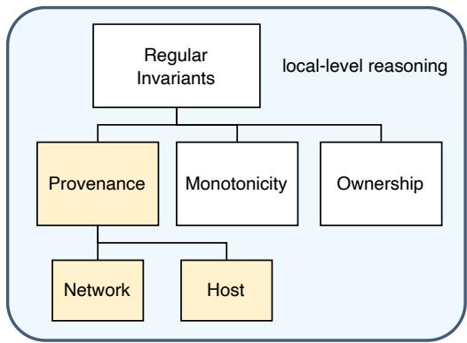
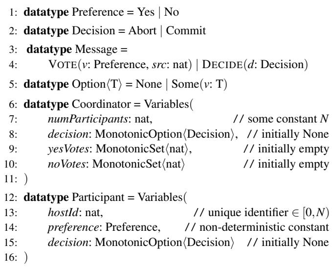
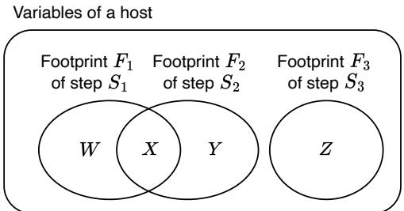
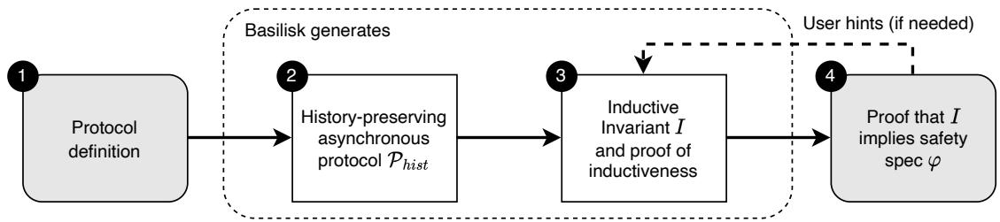

①

USENIX

THE ADVANCED COMPUTING SYSTEMS ASSOCIATION

# Basilisk: Using Provenance Invariants to Automate Proofs of Undecidable Protocols

Tony Nuda Zhang and Keshav Singh, University of Michigan; Tej Chajed, University of Wisconsin-Madison; Manos Kapritsos, University of Michigan; Bryan Parno, Carnegie Mellon University

https://www.usenix.org/conference/osdi25/presentation/zhang-tony

# This paper is included in the Proceedings of the 19th USENIX Symposium on Operating Systems Design and Implementation.

July 7–9, 2025 • Boston, MA, USA

ISBN 978-1-939133-47-2

Open access to the Proceedings of the 19th USENIX Symposium on Operating Systems Design and Implementation is sponsored by

# Basilisk: Using Provenance Invariants to Automate Proofs of Undecidable Protocols

Tony Nuda Zhang University of Michigan

Keshav Singh University of Michigan

Manos Kapritsos University of Michigan

Tej Chajed University of Wisconsin–Madison

Bryan Parno Carnegie Mellon University

## Abstract

Distributed protocols are challenging to design correctly. One promising approach to improve their reliability is to use formal verification to prove that a protocol satisfies a desired safety property. These proofs require finding an inductive invariant that holds in the initial states of the system, implies safety, and is inductive over state transitions. Devising an inductive invariant is a difficult task that prior work has either required the developer to find manually by a painful search process, or automated by constraining the protocol to a decidable but restrictive fragment of logic.

In this work, we aim to automatically find inductive invariants without restricting the logic. We achieve this with two key insights. First, many of the complex inter-host properties that prior work required the developer to provide can instead be expressed using Provenance Invariants, a class of invariants that relate a local variable in a host to its provenance, i.e., the protocol step that caused it to take on its current value. By tracing the provenance of one host variable back to another host’s actions, we can derive an invariant relating the two hosts’ states. Second, we develop an algorithm called atomic sharding to derive Provenance Invariants automatically by statically analyzing the protocol’s steps.

We implement these ideas in a tool called Basilisk and apply it to 16 distributed protocols, including complex ones like Multi-Paxos. Basilisk automatically finds inductive invariants and proves their inductiveness, with little or no developer assistance. In all cases, these generated inductive invariants are sufficient for us to prove safety without needing to identify any new invariants.

## 1 Introduction

Distributed protocols are notoriously difficult to design and implement correctly. After decades of relying on testing to develop robust protocols, in the last ten years many researchers and developers have turned to formal verification as an attractive alternative [2, 16, 24, 30, 31, 33, 36]. In this approach, the developer typically proves that some desirable safety property (e.g., no two nodes hold a lock at the same time) is maintained throughout all executions of the protocol.

Unfortunately, a safety property is, on its own, often too weak to support an inductive argument. Instead, one typically proves safety by finding a stronger property, called an inductive invariant, that satisfies the following three conditions: (1) it implies the safety property, (2) it holds in the initial states of the system, and (3) it is maintained by all steps. The developer must find such an inductive invariant and prove it meets these conditions in order to complete their proof.

In recent years, researchers have proposed a series of algorithms and tools that derive and prove these invariants automatically, with little to no input from the developer [7, 9, 13–15, 21, 28, 37, 38]. However, such approaches share a major obstacle to their practicality: they require the target protocols to be written within a decidable logic, such as effectively propositional reasoning (EPR [29]). Expressing a protocol in EPR is itself a challenging endeavor [26]. As an example of its restrictiveness, EPR prohibits common programming patterns such as the use of arithmetic (e.g., i := i + 1).

Rejecting the restrictions of EPR allows the developer to write their protocols naturally, but such freedom comes at a cost. Working in an undecidable logic means that the developer must manually derive and prove an inductive invariant for each protocol. As many have observed [9, 21, 37, 38], this requires significant effort. A key difficulty stems from the iterative and creative nature of finding a correct inductive invariant. It is hard to know a priori what the clauses in an inductive invariant should be. Rather, the developer starts with their best guess, then repeatedly attempts to prove the inductiveness of their current guess, gradually narrowing in on a correct inductive invariant. Developing an invariant this way is labor intensive. For instance, the authors of IronFleet [10, 11] report spending months to identify and prove an inductive invariant for the Multi-Paxos protocol [18, 19].

Recently, Kondo [40] showed how to automatically find small portions of the inductive invariant. Unfortunately, much of the remaining portions, particularly the conceptually difficult ones—those expressing inter-host properties that span multiple hosts and protocol steps—were left to the developer’s intuition. For example, Kondo’s proof of Paxos [19] required 20 such properties, which anecdotally took experts two person-weeks to derive.

In this work, we set our sights on a more ambitious goal of automatically finding inductive invariants in an undecidable setting. Of course, by the very nature of undecidability, this is an impossible task to achieve for all protocols. And yet, with the right insights, we believe this problem can be solved for many practical, complex protocols, much like how modern SAT solvers can solve large practical instances in reasonable time, despite SAT being an NP-hard problem.

We achieve this ambition based on two insights, which together drastically increase the amount of automation that we can achieve in finding inductive invariants.

Our first insight is that inter-host properties, which prior work delegated to the developer’s intuition [11, 40], can be proven as a consequence of multiple simpler invariants that relate host states to network messages. For example, if host R’s current state is x = 5, that can be traced back to the protocol step that most recently updated x based on some received message M, usually based on some field of M. Message M can in turn be traced back to the state of the message’s sender, S, creating a causal chain between the hosts R and S that is invariant. We introduce Provenance Invariants as a way to keep track of this lineage. Provenance Invariants are always derived by statically inspecting the steps of single hosts in isolation, which makes them much more intuitive and frees the developer from deriving complex, inter-host properties.

The use of Provenance Invariants, however, creates a new challenge, as we now have a much larger number of simple invariants to generate. Recent prior work [40] automatically generates only one of the three categories of such invariants: those related to steps that send network messages. The other two categories, namely, invariants related to receiving messages and local steps, were either only partially automated or not supported at all.

Our second insight allows us to significantly automate the tracking of provenance through the system’s execution. We observe that if a part of a host’s state, which we call a shard, is always updated atomically—no steps modify only some variables in the shard but not others—then we can automatically track the provenance of this shard to one of the steps that modify it. Concretely, if a shard is in a non-initial state, it means that one of the steps that modify it must have occurred. We propose an atomic sharding algorithm to determine such shards and generate Provenance Invariants from them.

Using these insights, we developed Basilisk, a tool that uses Provenance Invariants and atomic sharding to automatically derive inductive invariants and prove their inductiveness for a wide variety of distributed protocols, with the help of minor hints from the developer. In doing so, Basilisk relieves developers from manually formulating an invariant and proving its inductiveness. This allows the developer to focus their efforts on the final task, using the Basilisk-generated inductive invariant to prove the desired safety property. This remaining proof is conceptually significantly easier, as it does not involve identifying an inductive invariant.

We evaluate Basilisk’s utility by applying it to 16 protocols, including notoriously complex ones like Multi-Paxos [19]. Our evaluation shows that in all cases, the inductive invariants of these protocols can be expressed using simple Provenance Invariants that can be derived from a single host’s steps. We further show that Basilisk can find all the inductive invariants for all 16 protocols almost fully automatically.

In summary, this paper makes the following contributions.

• It advances the state-of-the-art in automatic invariant inference by structuring inductive invariants as a collection of simple invariants that can be derived from the protocol steps of individual hosts.

• It introduces atomic sharding, a technique that allows us to automatically track the provenance of host states through the protocol’s execution.

• It introduces Basilisk, a tool that uses the above techniques to automatically derive the inductive invariants of a wide range of distributed protocols, with only occasional minor hints from the developer.

## 2 The Burden of Inductive Invariants

Proving that a distributed protocol is safe entails defining a desirable safety property ϕ (e.g., that all nodes reaching a decision agree on the outcome) and then showing that ϕ is an invariant ( i.e., that ϕ holds in all reachable states of the protocol’s execution).

In all but the most trivial protocols, however, ϕ is not an inductive property, even if it is indeed an invariant. This means that there exist (unreachable) states satisfying ϕ that can transition to an unsafe state. Because it is not possible to decide whether a given state is reachable, proving ϕ’s invariance requires identifying a stronger property representing an overapproximation of the set of reachable states—an inductive invariant I—that (1) implies ϕ, (2) holds in the initial state, and (3) is inductive, meaning that if I holds in some state, it holds after the protocol takes one step from that state. Typically, I is expressed as the conjunction of a series of smaller invariants, $I = I _ { 1 } \wedge \cdots \wedge I _ { m }$

According to conventional wisdom, if we reject the onerous restrictions of decidable logics (§1), then finding an inductive invariant is a creative and laborious endeavor. Even after designing the protocol, the developer typically does not know all of the clauses needed to construct an inductive invariant. Instead, the developer begins with an educated guess of a candidate invariant, and then follows an iterative invariant-proof loop: they attempt to prove that the candidate invariant is inductive, fail to complete the proof, and then refine the candidate based on feedback gained from the proof attempt. Each iteration involves writing proof code and creatively devising changes to the candidate invariant. Unfortunately, it might take many iterations before the developer arrives at a correct inductive invariant and proof. Indeed, in frameworks such as IronFleet [10] that require the developer to manually devise and prove inductive invariants, such a process reportedly took months for complex protocols like Multi-Paxos.

  
Figure 1: Our invariant taxonomy. We introduce the concept of Provenance Invariants, while Monotonicity Invariants and Ownership Invariants are originally introduced in Kondo [40].

Recently, Kondo [40] took a first step towards automating this burdensome invariant-proof loop. It proposes an invariant taxonomy that carves out a category of invariants that can be systematically derived, so that only the remainder need to be hand-written by the user. Kondo observes that these manually written invariants often talk only about host state and not the network, but this simplification does not spare the user from going through the invariant-proof loop. Coming up with the required properties often requires a deep understanding of why the protocol works, since the properties span multiple hosts and steps, and cannot be easily derived from the protocol description. This understanding can be difficult to translate to an invariant even for the protocol’s designer, let alone a verification engineer working with an existing protocol.

## 3 Expressing Inductive Invariants with Only Regular Invariants

We present how we use only simple, mechanically derivable invariants—called Regular Invariants—to craft inductive invariants that prove the safety of distributed protocols.

Regular Invariants (Figure 1) are a class of invariants introduced in Kondo’s invariant taxonomy [40]. The defining feature of Regular Invariants is that they capture localized properties, which can be easily derived by examining steps of individual hosts in the protocol, without concern for how hosts interact. As a result, they are both easy for developers to derive manually and well-suited to automation. As a subclass of Regular Invariants, Monotonicity Invariants capture the “add-only” nature of data types such as monotonic counters, grow-only sets, and append-only lists, by asserting how their values may evolve during an execution. Another subclass is Ownership Invariants, which describe the ownership of unique resources in the system. We use these subclasses unchanged from Kondo’s invariant taxonomy.

  
Figure 2: Hosts and message states of the Two-Phase Commit protocol. Since there is only one coordinator, the coordinator’s identifier is implicit. Moreover, since VOTE messages are destined for the coordinator, and DECIDE is broadcast to every participant, we omit their destination fields. MonotonicSets are add-only, while MonotonicOptions are write-once.

Our key insight is that a new class of Regular Invariants, which we call Provenance Invariants (§3.2), can be used to express both inter-host (§3.3) and intra-host (§3.4) properties in distributed protocols. These properties were previously beyond the scope of Regular Invariants and automation tools [40], leaving developers to manually derive and prove them. With the introduction of Provenance Invariants, we can express these properties, and in turn entire inductive invariants of distributed protocols, using only Regular Invariants. We present our algorithm to automatically derive Provenance Invariants in §4.

To ground our discussion, we use the classic Two-Phase Commit protocol as a running example in the rest of the paper.

## 3.1 Running Example: Two-Phase Commit

In this protocol, a group of participants work with a single coordinator to decide whether to abort or commit a transaction. Figure 2 specifies the states of hosts in the system.

The protocol runs as follows, with Figure 3 formally defining some of these steps:

1: // Local computation that doesn’t receive or send messages   
2: step CoordinatorMakeDecision(   
3: v: Coordinator, $\nu ^ { \prime } ;$ Coordinator)   
4: ∧ v.decision = None   
5: ∧ if |v.yesVotes| = v.numParticipants then   
6: $\dot { \nu } ^ { \prime } = \nu .$ (decision := Some(Commit))   
7: else if |v.noVotes| > 0 then   
8: $\nu ^ { \prime } = \nu . \left( d e c i s i o n \mathrel { \mathop : } = \mathrm { S o m e } ( \mathrm { A b o r t } ) \right)$   
9: else   
10: $\nu ^ { \prime } = \nu$   
11:   
12: step CoordinatorSendDecide(   
13: v: Coordinator, $\nu ^ { \prime } ;$ Coordinator, send: Message)   
14: ∧ v.decision.Some?   
15: ∧ send = DECIDE(v.decision.value)   
16:   
17: step ParticipantReceiveDecision(   
18: v: Participant, $\nu ^ { \prime } ;$ Participant, recv: Message)   
19: ∧ recv.DECIDE?   
20: ∧ v.decision = None   
21: ∧ $\nu ^ { \prime } = \nu .$ (decision := Some(recv.d))   
22:

Figure 3: Some examples of the hosts’ steps in the Two-Phase Commit protocol. Each step defines a relation between a host’s current state v and its new state $\nu ^ { \prime }$ after taking the step. Expressions of the form $\nu ^ { \prime } = \nu . ( X : = Z )$ indicates that $\nu ^ { \prime }$ is identical to v except for the field $\nu ^ { \prime } . X .$ , which has the value Z. Note that we use the conjunction operator ∧ to denote a bulleted list of conjuncts, and the $\mathbf { \epsilon } ^ { 6 } \mathbf { \cdot } \mathbf { \mathrm { ? } } ^ { \flat }$ syntax is used to assert if a value is of a particular type or variant.

a1. A single coordinator and N participants are initialized.

a2. Participants send their preferences to the coordinator through VOTE messages.

a3. Upon receiving a VOTE message, the coordinator updates its yesVotes or noVotes appropriately.

a4. If the coordinator has obtained Yes votes from every participant, it decides Commit. Otherwise, if it received a No vote, it decides Abort (CoordinatorMakeDecision step in Figure 3).

a5. Once the coordinator makes a decision, it broadcasts it as a DECIDE message (CoordinatorSendDecide).

a6. A participant, on receiving a DECIDE message, sets its local decision to match (ParticipantReceiveDecision).

The safety property we want to prove is that if any participant decides Commit, then every participant’s local preference must be Yes.

## 3.2 Provenance Invariants and Execution Histories

Provenance Invariants are expressed using the notion of history-preservation [40]. A history-preserving protocol model augments a host’s current state with an append-only log of previous states, referred to as its history. This history captures a snapshot of every state a host transitions through, from its initial state to its current state.

Formally, a Provenance Invariant connects a property of the current state of the system to how an adjacent pair of states in a host’s history must be related by the host taking some step, where this step is one that made the property true. We define two categories of Provenance Invariants.

First, a Network-Provenance Invariant relates a message m in the network to the execution of one of a few host steps $T _ { 1 } , \ldots , T _ { j }$ that must have sent it. Formally:

$$
\begin{array} { l } { m \in n e t w o r k \implies \exists i : T _ { 1 } ( h i s t [ i ] , h i s t [ i + 1 ] , m ) } \\ { \qquad \lor \ \dots } \\ { \qquad \lor T _ { j } ( h i s t [ i ] , h i s t [ i + 1 ] , m ) } \end{array}
$$

where hist is the history sequence of m’s sender. This disjunction of steps is necessary because it is not always possible to attribute the provenance of a message to a unique step, such as when multiple steps send the same message.

In our Two-Phase Commit example, the following statement is a Network-Provenance Invariant:

“For every DECIDE message m in the network, there must be adjacent states v, v′ in the coordinator’s history such that CoordinatorSendDecide(v, v′, m).” (Decide-Msg-Provenance)

Second, a Host-Provenance Invariant relates a local property q of a host’s current state $h _ { c u r }$ —which we call a provenance witness—to one of a few steps the host must have taken in order for the local property to be satisfied. This witness q must be a property that is not true in any initial states of the host. Formally, with hist as the history sequence of the host in question:

$$
\begin{array} { r l } & { q ( h _ { c u r } ) \wedge \big ( \forall \ : h : \neg ( H o s t I n i t ( h ) \wedge q ( h ) ) \big ) \Longrightarrow \exists i : } \\ & { \qquad \neg q ( h i s t [ i ] ) \wedge q ( h i s t [ i + 1 ] ) } \\ & { \qquad \wedge \ : ( T _ { 1 } ( h i s t [ i ] , h i s t [ i + 1 ] ) } \\ & { \qquad \vee \ \dots } \\ & { \qquad \vee \ T _ { j } ( h i s t [ i ] , h i s t [ i + 1 ] ) ) } \end{array}
$$

Again, we have a disjunction of steps because it is possible that there is more than one step that makes q true.

For example, the following is a Host-Provenance Invariant in Two-Phase Commit, with its antecedent serving as the

provenance witness:

“If a participant’s decision is Commit, there must be adjacent states v, v′ in its history, together with a received message m, such that ParticipantReceiveDecision $( \nu , \nu ^ { \prime } , m ) . ^ { \prime \prime }$

Crucially, every individual Provenance Invariant is inductive, due to the immutable nature of execution histories. For instance, consider the property Decide-Msg-Provenance above. It is trivially inductive because for any message in the network, the fact that the sender performed a step that sent it is forever recorded into the history, so there is no subsequent transition that ever can make this invariant false. We leverage this feature to automatically generate inductive invariants of distributed protocols (§5.3).

## 3.3 Expressing Inter-Host Relationships Using Provenance Invariants

We demonstrate that global relationships between remote hosts—which prior work [10, 40] asked the developer to creatively supply and manually prove—can actually be expressed as conjunctions of well-chosen Host-Provenance Invariants and Network-Provenance Invariants.

To illustrate, consider the inter-host property:

“If some participant decided Commit, then the coordinator also decided Commit.” (Participant-Agreement)

This property is a clause in the inductive invariant of Two-Phase Commit that Kondo [40] required developers to craft manually.

Using Provenance Invariants, we can imply Participant-Agreement by the conjunction of Participant-Decision-Provenance and Decide-Msg-Provenance. In particular, suppose that a participant host h decided Commit. Then by Participant-Decision-Provenance, h must have executed step ParticipantReceiveDecision. By the body of this step (Figure 3), we know that h received a message m = DECIDE(Commit) from the network. Next, we infer from Decide-Msg-Provenance that m’s sender (namely, the coordinator), must have sent m via step CoordinatorSendDecide. This step itself says the coordinator’s decision agrees with the message at the time of sending. Given that the coordinator does not equivocate on its decision, we arrive at our conclusion that the coordinator’s current decision is also Commit.

More formally, when a host r updates its state upon receiving a message m, we can trace this update to the execution of some step Tr via a Host-Provenance Invariant. This induces a relationship $\beta ( r , m )$ between the updated host state and m, given directly by $T _ { r } \mathrm { { ' s } }$ specification. In addition, the receipt of m implies, via a Network-Provenance Invariant, that m’s sender s executed a step $T _ { s }$ that sent m. This creates another relationship $\alpha ( s , m )$ relating the host s and the message m, given by $T _ { s } { ' } s$ specification. When taken together, α and β imply some inter-host relationship between s and r, namely, ∃ m : $\mathbf { \alpha } \propto ( s , m ) \wedge \mathbf { \beta } \beta ( m , r )$ . By transitively chaining such arguments, we can derive relationships between the head and tail hosts of a causal chain of messages.

The above argument establishes how inter-host properties, which logically connect the state of recipient hosts to the state of sender hosts, may be implied using Provenance Invariants. With this technique, inductive invariants do not need to explicitly describe inter-host properties, which prior work like IronFleet and Kondo required users to creatively and laboriously produce. Instead, they are replaced with simpler, localized Provenance Invariants.

## 3.4 Expressing Local Properties Using Provenance Invariants

Beyond inter-host properties, an inductive invariant may also describe local properties of individual hosts. One example is:

“If the coordinator decided Commit, then its yesVotes set is of size numParticipants.” (Coordinator-Decision-Provenance)

Prior work [10, 40] required the user to manually derive such properties. We capture them with ease using Host-Provenance Invariants, which lend themselves to automation (§4).

Our observation is that local properties such as Coordinator-Decision-Provenance can be attributed to local computation steps, i.e., steps that do not receive a message. Examples of such steps include those that are triggered by a timeout or local conditions.

Just as a Host-Provenance Invariant may trace the provenance of a state update at a host to a step that receives a message, it may likewise trace it to a local computation step. For instance, to derive Coordinator-Decision-Provenance, the Host-Provenance Invariant:

“If the coordinator decided Commit, then it must have executed step CoordinatorMakeDecision.”

attributes the coordinator’s Commit decision to step CoordinatorMakeDecision. This step itself says that for the coordinator to decide Commit, it must have satisfied in a previous state the enabling condition that it has gathered Yes votes from every participant. Then, given the monotonic add-only nature of the yesVotes set, we conclude that yesVotes set is of the threshold size.

The next section presents our technique for automatically deriving the Provenance Invariants that underpin our proofs.

## 4 Automating Provenance Invariants With Atomic Sharding

To get the most out of expressing inductive invariants using only Regular Invariants, we aim to derive the required Provenance Invariants automatically given a distributed protocol. We first explain a new atomic shard principle to describe a category of mechanically derivable Host-Provenance Invariants (§4.1). We then present an atomic sharding algorithm to automatically derive invariants based on this principle (§4.2). Finally, we explain how we derive Network-Provenance Invariants (§4.3).

## 4.1 Automating Host-Provenance with the Atomic Shard Principle

To automatically derive Host-Provenance Invariants, we first identify a set of useful provenance witnesses. For each witness $q ,$ we then determine the set of candidate steps that could affect its provenance. Whenever q holds, we know that at least one of these steps must have been executed.

We propose the atomic shard principle to meet this goal. First, we define a shard to be a subset of a host’s local variables. A shard σ is atomic if all variables in the shard are always updated “atomically”—there are no protocol steps that only modify some variables within σ but not others. Each atomic shard σ is then associated with the set of steps $A _ { \sigma }$ that modify its variables.

The atomic shard principle states that when the current value of some variable in an atomic shard σ differs from its initial value, then every variable in this shard must have attained their current values through an atomic step in $A _ { \sigma }$

From this principle, we obtain one Host-Provenance Invariant per atomic shard. Formally, let $\mathfrak { O } : = \{ x _ { 1 } , \ldots , x _ { k } \}$ be an atomic shard of a host, and suppose $A _ { \mathfrak { O } } : = \{ T _ { 1 } , \dots , T _ { j } \}$ are the protocol steps that modify this shard. Then, given that $h _ { c u r }$ is the host’s current state, we first define a provenance witness as the predicate:

$$
q ( h ) : = ( h . x _ { 1 } = h _ { \mathrm { c u r } } . x _ { 1 } ) \wedge . . . \wedge ( h . x _ { k } = h _ { \mathrm { c u r } } . x _ { k } )
$$

The atomic shard principle tells us that if the host’s current state satisfies $q ,$ and if $q$ is not true in any initial states of the host, then variables $x _ { 1 }$ through $x _ { k }$ must have attained their current values when the host executed one of the steps in $A _ { \sigma }$ at some point in its history. This is the Host-Provenance Invariant:

$$
\begin{array} { r l } & { q ( h _ { c u r } ) \wedge ( \forall \ : h : \neg ( H o s t I n i t ( h ) \wedge q ( h ) ) ) \Longrightarrow \exists i : } \\ & { \qquad \neg q ( h i s t [ i ] ) \wedge q ( h i s t [ i + 1 ] ) } \\ & { \qquad \wedge \ : ( T _ { 1 } ( h i s t [ i ] , h i s t [ i + 1 ] ) } \\ & { \qquad \vee \ \dots } \\ & { \qquad \vee \ T _ { j } ( h i s t [ i ] , h i s t [ i + 1 ] ) ) } \end{array}
$$

where hist is the history sequence of the host.

As a concrete example, consider the Host-Provenance Invariant Participant-Decision-Provenance from §3.2. We observe that {decision} is an atomic shard at the participant host, and ParticipantReceiveDecision is the only step that modifies this shard. From this, we infer Participant-Decision-Provenance:

$$
h _ { c u r } . \mathrm { d e c i s i o n } = \mathrm { S o m e } ( \mathrm { C o m m i t } ) \implies \exists i :
$$

hist[i].decision ̸= Some(Commit)

$$
\land h i s t [ i + 1 ] . \mathrm { d e c i s i o n } = \mathrm { S o m e } ( \mathrm { C o m m i t } )
$$

∧ ParticipantReceiveDecision(hist[i], hist[i + 1])

## 4.2 Atomic Sharding Algorithm

We present an atomic sharding algorithm to automatically identify atomic shards σ and their associated steps $A _ { \sigma }$ . This occurs in three phases. First, we estimate the footprint of each host step. Second, we analyze how footprints intersect to identify atomic shards. Finally, we further refine each shard to more effectively handle collection-type variables such as sets and maps.

Estimating footprints. We define a host step’s footprint to be a set of local variables that the step may modify. For each step, we estimate its footprint via a static analysis of the host’s description. §5.3 describes how we implement this analysis in practice.

Importantly, it is safe to overestimate a step’s footprint, which our syntax-based approach inevitably does—a footprint may contain variables that the step never modifies, or variables that may only be conditionally updated. Too much overestimation, however, leads to weaker and less useful invariants. On the other hand, our algorithm never underestimates footprints, which would result in incorrect invariants.

Our algorithm (and hence the Basilisk tool—§5) currently rejects a protocol if it contains a footprint with two variables that are conditionally updated via different conditions. For example, it prohibits a step that either updates x or y with the expression “if c then $x : = 5$ else $y : = 6 ^ { \ ' }$ . This restriction does not sacrifice generality, as any such step may be equivalently written as two steps, with the enabling condition c for a step that updates x and ¬ c for another that updates y, respectively. We currently rely on the developer to perform such transformations wherever they are needed.

Computing maximal atomic shards. Next, we identify atomic shards by analyzing footprint intersections to find subsets of host variables that are always updated atomically.

This extraction process is best visualized using a Venn diagram. Let steps $S _ { 1 } , S _ { 2 }$ and $S _ { 3 }$ be the three steps that a hypothetical host takes. The ovals $F _ { 1 } , F _ { 2 }$ and $F _ { 3 }$ in Figure 4 represent the respective footprints of these steps. By definition, each partition in the Venn diagram is an atomic shard:

  
Figure 4: The footprints of three steps of a hypothetical host. Regions W through Z represent maximal atomic shards.

• region $W : = F _ { 1 } \setminus F _ { 2 }$ , with associated steps $A _ { W } : = \{ S _ { 1 } \}$

• region $X : = F _ { 1 } \cap F _ { 2 }$ , with $A _ { X } : = \left\{ S _ { 1 } , S _ { 2 } \right\}$ ，

• region $Y : = F _ { 2 } \setminus F _ { 1 }$ , with $A _ { Y } : = \{ S _ { 2 } \}$ , and

• region $Z { : = } F _ { 3 }$ , with $A _ { Z } : = \{ S _ { 3 } \}$

This process extracts maximal atomic shards, which are ones where adding an additional variable to it would violate its atomicity. In most cases, maximal atomic shards provide greater utility over ones that are non-maximal. To illustrate, consider a host with two local variables x and y, and {x, y} is a maximal atomic shard modified by a single step T . Suppose T receives a message m and sets x := m.x and y := m.y. The atomic shard principle yields the Host-Provenance Invariant:

“If x or y do not hold their initial values, then they must have obtained their current values through a message m, where m.x = x and $m . y = y . ^ { \prime \prime }$

However, if we split {x, y} into non-maximal atomic shards {x} and {y}, we obtain two invariants:

• If x does not hold its initial value, it must have obtained its current value through a message m1, where m1.x = x; and,

• if y does not hold its initial value, it must have obtained its current value through a message m2, where m2.y = y.

This is strictly weaker than the single invariant we draw from the maximal shard. For instance, we can no longer prove the existence of a singular message m that satisfies both m.x = x and $m . y = y$

Additional refined atomic shards. In the special case when shards contain collection-type variables (e.g., sets and maps), however, maximal atomic shards yield limited benefit. This is because these collection types “collapse” provenance, making it difficult to relate them to other fields.

To demonstrate, consider a host with two local variables x: int and s: set⟨int⟩, where the latter is initially empty, and suppose {x, s} is a maximal atomic shard that is modified by a single step T . Further suppose that T receives a message m and sets x := m.x and adds m.y to s. Using the $\{ x , s \}$ shard, we infer the Host-Provenance Invariant:

“If x or s do not hold their initial values, then they must have obtained their current values through T .”

However, this is not strong enough for us to trace the provenance of the host’s current state to the message that led to that state, which is the primary benefit of a Host-Provenance Invariant. In particular, we cannot say:

“For all items e in s, if e is not initially in s or x does not hold its initial value, then there must be a message m with m.x = x and m. $y = e _ { \cdot } ^ { \cdot } $

This property is false because e may have arrived in a message mˆ with mˆ . $x = { \hat { x } } \neq x .$ , and x was subsequently updated to its current value by a completely different message.

Hence, to trace the provenance of specific items in collections such as s, we further identify refined atomic shards that package every collection-type variable in its dedicated (non-maximal) shard.

With refined shard {s}, we can reason about the step that introduced each individual item in s:

“For all items e in s, if e is not initially in s, then e must have been added to s through T .”

which establishes the additional fact that the host received a message m where m.y = e for every e in s.

Finally, note that while atomic sharding always generates correct invariants, it does not cover the space of all Host-Provenance Invariants. There are instances where it may fail to capture necessary properties, and hence the developer must supply an additional hint. We describe these hints in §5.4 and characterize the scenarios requiring them in §6.4. However, our evaluation shows that such cases are rare in practice.

## 4.3 Automating Network-Provenance

The procedure for generating Network-Provenance Invariants is much simpler. For each message variant M defined in the protocol, we identify a set of steps $\{ T _ { 1 } , \ldots , T _ { j } \}$ that send messages of variant M. We then infer the following Network-Provenance Invariant:

$$
\begin{array} { r l } & { \forall m : \mathrm { ~ v a r i a n t } ( m ) = M \wedge m \in S . \mathrm { n e t w o r k } } \\ & { \qquad \implies \exists i : \big ( T _ { 1 } ( h i s t [ i ] , h i s t [ i + 1 ] , m ) } \\ & { \qquad \lor \ \dots } \\ & { \qquad \lor T _ { j } ( h i s t [ i ] , h i s t [ i + 1 ] , m ) \big ) } \end{array}
$$

where hist is the history sequence of m’s sender.

  
Figure 5: Basilisk workflow. Shaded bubbles represent artifacts that the user writes, while white boxes represent artifacts that Basilisk generates. In a few cases, the user may discover while writing the proof in step ➍ that the inductive invariant I generated in ➌ is too weak. In such cases, the user provides hints (the dashed arrow) that enable Basilisk to generate a stronger invariant.

## 5 Proving Protocols With Basilisk

Armed with the power and simplicity of Provenance Invariants, we design and implement Basilisk, a tool that finds the inductive invariants of distributed protocols with minimal guidance from the user.

Basilisk is designed for protocol models written in general verification frameworks such as Dafny [20], where determining the inductiveness of an invariant is an undecidable problem. It targets asynchronous message passing systems in which hosts communicate over an unreliable network that may arbitrarily delay, drop, duplicate, or re-order messages. We choose this network model for its generality and prevalence in real systems. While we do not explore stronger models in this work, we expect that their stronger guarantees would enable us to generate stronger invariants.

We implement the Basilisk prototype by modifying the Kondo codebase [39], which itself extends the Dafny version 4.2 verifier [1]. Overall, Basilisk’s implementation adds about 2,000 lines of C# code to the Dafny verifier.

Figure 5 illustrates the Basilisk developer workflow. Step ➊: The developer starts by defining the hosts in the protocol, including their initialization conditions and local state transitions. Step ➋: Basilisk automatically generates a history-preserving asynchronous protocol Ph. It models an asynchronous network and maintains the execution history of hosts. Step ➌: Basilisk generates an inductive invariant of Ph, along with a proof of its inductiveness. Step ➍: The user proves that this inductive invariant implies the protocol’s safety property. In rare instances, to complete this proof, the user may need to provide hints so that Basilisk will produce a stronger inductive invariant.

## 5.1 Step ➊: Protocol Definition

The user defines the state and protocol steps of each type of host in the system (e.g., Figures 2 and 3). Each step may send a message (including broadcast), receive a message, perform both send and receive, or do neither. This is a more permissive model than Kondo, which prohibits steps that both send and receive. Basilisk extends easily to steps that send or broadcast more than one message; we did not implement that as none of the protocols in our evaluation required such a feature.

The user then defines a Hosts record representing the state of all hosts in the system. Each field in the record is a list of hosts of a particular type. For example, in Two-Phase Commit:

The user then describes the initial states of Hosts using a HostsInit predicate. Typically, this specifies that each host satisfies its own local initial conditions, together with some global state constraints. For instance, in Two-Phase Commit:

predicate HostsInit(s: Hosts)   
∧ | s.coordinators | = 1   
∧ CoordinatorInit(s.coordinators[0], | s.participants|)   
∧ ∀ id : 0 ≤ id < | s.participants| =⇒   
ParticipantInit(s.participants[id], id)

where CoordinatorInit and ParticipantInit circumscribe the initial states of the coordinator and participant hosts.

Finally, the user defines a state transition relation for each host in the system. This is a disjunction of the possible steps that the host can take. For example, the coordinator in Two-Phase Commit has the transition relation:

predicate CoordinatorNext(h: Coordinator, h′: Coordinator, send: Message, recv: Message)

∨ . . .

∨ CoordinatorSendDecide(h, h′, send)

∨ CoordinatorMakeDecision(h, h′)

where CoordinatorSendDecide and CoordinatorMakeDecision are defined in Figure 3.

Monotonicity hints. Like in Kondo [40, §3.1], the user labels monotonic variables, such as grow-only sets, when specifying hosts. These types implement a less-than-or-equal-to (lteq) partial order relation that captures their monotonic properties, which Basilisk uses to express Monotonicity Invariants in step ➌.

## 5.2 Step ➋: Asynchronous Protocol Model

With the above inputs, Basilisk generates a history-preserving asynchronous protocol $\mathcal { P } _ { h }$ . This model includes a sequence history where each entry is a snapshot of all hosts in the system, with the latest entry representing their current state. The global state of the protocol contains this history, together with an asynchronous network that is modeled as a monotonically increasing set of sent messages:

$$
\begin{array} { r } { \mathbf { d a t a t y p e ~ G l o b a l S t a t e } = \mathbf { G S } ( h i s t o r y ; \mathbf { \sigma } \mathrm { s e q } \langle \mathrm { H o s t s } \rangle , \quad } \\ { n e t w o r k ; \mathbf { \sigma } \mathrm { s e t } \langle \mathbf { M e s s a g e } \rangle ) } \end{array}
$$

Similar to prior work [10, 40], the protocol’s behavior is expressed using the temporal logic of actions (TLA [17]) as a state machine that can perform a non-deterministic series of atomic steps. At first, history holds only the initial state of the system, and the network has no messages:

predicate Init(S: GlobalState)   
∧ | S.history | = 1   
∧ HostsInit(S.history[0])   
∧ S.network = 0/

In each transition of the system, a non-deterministically chosen host performs a non-deterministically chosen local step. If this step involves the host receiving a message, then the message must be from the network set and addressed to the receiver host. If the step involves sending a message, the message is added to the network set, with the sender host marked as its source. Moreover, the new Hosts snapshot is appended to the history sequence:

step Next(S: GlobalState, S′: GlobalState)   
∧ | S.history | ≥ 1   
∧ S.history = trunc(S′.history)   
∧ SystemNext(last(S.history), S.network,   
last(S′.history), S′.network)

Here, given a sequence s, trunc(s) yields s with the last item removed, while last(s) returns the last item. SystemNext describes how the current state of hosts and the network changes as the result of the step, calling upon the host transition relations the user defined in step ➊.

## 5.3 Step ➌: Generating Regular Invariants

From $\mathcal { P } _ { h } .$ Basilisk automatically generates an inductive invariant I. This I is expressed as the conjunction of a series of Regular Invariants. This includes Provenance Invariants and Monotonicity Invariants. There is a final category, Ownership Invariants, which we inherit from Kondo [40, §3.1], but omit from this discussion as it is not the focus of this work.

Basilisk automatically generates Provenance Invariants using the atomicity principle described in §4. To compute footprints, Basilisk relies on parsing Dafny’s state update syntax.

There are two formats with which a host step may modify local state. The first uses Dafny’s state update syntax $\nu ^ { \prime } = \nu . ( Z _ { 1 } : = X _ { 1 } , \ldots , Z _ { k } : = X _ { k } )$ . This expression means that host state $\nu ^ { \prime }$ is identical to current state v except for the fields $Z _ { 1 }$ through $Z _ { k } ,$ which are assigned the values $X _ { 1 }$ through $X _ { k } ,$ respectively. The second format expresses some relation $r ( \nu ^ { \prime } . Z , \nu , m )$ between an updated field $\nu ^ { \prime } . Z ,$ the current host state v, and any incoming message m. For simplicity, the Basilisk prototype permits only the former update syntax.

Meanwhile, Basilisk inherits Kondo’s technique for generating Monotonicity Invariants. For each monotonic variable specified in step ➊, Basilisk generates an invariant stating that the variable satisfies its lteq relation as its value evolves over history. Such invariants assert the monotonic nature of their data types (e.g., the coordinator host’s non-equivocation of its decision when proving Participant-Agreement in §3.3), and are crucial in stating how some properties that are true of a host’s past state are also true in its present state.

Finally, Basilisk also produces a mechanically checked proof of I’s correctness. Namely, given a pair of global states S and S′, the proof shows that Init(S) implies I(S) and that $\mathrm { N e x t } ( S , S ^ { \prime } ) \wedge I ( S )$ implies $I ( S ^ { \prime } )$ . Given the mechanical and local nature of Regular Invariants, and the fact that each individual Provenance Invariant is inductive (§3.2), these proofs follow a systematic structure and are easy to formulate.

## 5.4 Step ➍: Proving Safety

Finally, let ϕ(h: Hosts) be the protocol’s safety property. The user employs the inductive invariant I generated in the previous step to prove that $\displaystyle \Phi _ { h } ( S ) : = \varphi ( l a s t ( S . \mathrm { h i s t o r y } ) )$ is an invariant in $\mathcal { P } _ { h }$ . This involves two proof obligations proven as lemmas in Dafny, to show that $I ( S ) \wedge \Phi _ { h } ( S )$ is an inductive invariant. They are:

Ob1. Init(S) implies $I ( S ) \wedge \Phi _ { h } ( S ) ;$ ; and,

$$
O b 2 . \ I ( S ) \wedge \oplus _ { h } ( S ) \wedge \mathrm { N e x t } ( S , S ^ { \prime } ) \operatorname * { i m p l i e s } \ I ( S ^ { \prime } ) \wedge \oplus _ { h } ( S ^ { \prime } ) .
$$

This procedure requires some creativity from the user, to show how a collection of simple Regular Invariants imply that, say, all hosts agree on the decision value in a consensus protocol. It is, however, a much more straightforward and welldefined task compared to IronFleet or Kondo. Here, the user concentrates only on proving safety using I, which is already inductive, and avoids going through the invariant-proof loop (§2) to discover an inductive invariant.

Possible failure modes. When trying to prove the above obligations, the user may fail in two ways. First, although Basilisk only generates correct inductive invariants, they may not be strong enough to establish safety. Our evaluation (§6.4) shows that this is usually because the atomic sharding algorithm cannot generate every correct Host-Provenance Invariant. As a remedy, the user manually supplies the provenance witness for a desired Provenance Invariant as a hint to Basilisk, explaining how some particular host transitions affect local state (represented by the dashed arrow in Figure 5). Such hints are usually quite straightforward to provide, requiring far less effort than global, inter-host invariants.

Second, the protocol definition written in step ➊ may be incorrect, meaning it contains a step that violates safety.

Basilisk handles both failure modes gracefully. With Basilisk, the user proves safety in a modular fashion by showing that it holds across each protocol transition. As a result, when verification fails, the verifier advises the user on the exact host step where the proof breaks down. This helps the user identify which invariants may need to be strengthened or where a potential protocol bug might reside.

## 6 Evaluation

To assess the Basilisk methodology, we apply it to a diverse set of distributed protocols, listed in Table 1. This list is informed by our experience in designing and implementing distributed protocols, and seeks to cover the space of common protocols. We used the protocols in the first block in Table 1, namely Echo Server, Ring Leader Election, Simple Leader Election, Paxos, Paxos-Combined and Paxos-Dynamic, to develop and refine the concepts of Provenance Invariants and atomic sharding, before applying it to the remaining protocols in the second block. Notably, every protocol and its inductive invariant is outside of the EPR decidable fragment of logic [29].

We specify each protocol as a state machine in Dafny following the IronFleet style [10], together with a safety property (Appendix A contains a description of each protocol and its safety property). Using this state machine definition, Basilisk generates a provably correct inductive invariant I, expressed as a conjunction of Regular Invariants. Using I, we prove that the safety property is an invariant in the protocol, by manually proving the obligations Ob1 and Ob2 defined in §5.4.

We also compare Basilisk’s results to the previous stateof-the-art, Kondo [40]. Note that because Kondo prohibits protocol steps that both receive and send messages, the protocol descriptions used by Kondo are modified from the Basilisk versions to accommodate this restriction. Because of the effort required to accommodate this restriction and prove these protocols using Kondo, we did not apply Kondo to every protocol.

Our evaluation determines whether Basilisk is effective in helping developers prove the safety of their distributed protocols. To do so, we address the following questions.

1. How effective is Basilisk in finding the inductive invariants of various distributed protocols? (§6.1)

2. How burdensome is expressing and proving protocols using Basilisk? (§6.2)

3. How efficiently can a verifier like Dafny verify the invariants and proofs produced using Basilisk? (§6.3)

4. What are the cases where the Basilisk methodology requires developer assistance? (§6.4)

## 6.1 Effectiveness of Basilisk in Finding Inductive Invariants

The ‘User invs’ columns in Table 1 show the number of manually derived invariant clauses the user supplies to prove the safety of each protocol using Basilisk and Kondo, respectively. Basilisk succeeds in finding inductive invariants for all 16 distributed protocols on which it was evaluated. This is a significant improvement over Kondo, which required usersupplied invariants for most protocols.

Note that three ownership-based protocols (Distributed Lock, ShardedKV, and ShardedKV-Batched), each of which has a safety property that asserts the exclusive ownership of resources, can already be proven completely automatically using Kondo. Unsurprisingly, Basilisk achieves the same on these protocols, as Basilisk inherits the ownership reasoning of Kondo.

These results highlights the effectiveness of Basilisk along two fronts. First, it supports our hypothesis that many deep protocol properties can be implied by only simple Regular Invariants in our generalized invariant taxonomy. This includes properties of protocols that are widely regarded as very challenging for human developers, such as Multi-Paxos.

Second, it demonstrates the feasibility of finding the inductive invariants of distributed protocols automatically, even in general verification frameworks such as Dafny.

Altogether, Basilisk simplifies the developer’s workflow, as manually finding inductive invariants demands a large amount of creativity and expertise. With Basilisk, users avoid the invariant-proof loop process of IronFleet and Kondo, where a developer must meticulously craft a candidate inductive invariant, only to realize that it is wrong after spending time to prove it correct.

## 6.2 Ease of Expressing and Proving Protocols

While Basilisk reduces the user’s burden in finding inductive invariants, one might worry that it simply shifts this effort elsewhere rather than eliminates it, requiring the user to compensate with more labor in other aspects, such as writing more proof annotations. However, our evaluation demonstrates that Basilisk avoids this pitfall and materially improves the user’s proof experience.

Protocol expressiveness. Given a conceptual protocol, expressing it in Basilisk is significantly easier than in Kondo, as evidenced by the fewer lines of code required to define the protocol (‘Size’ in Table 1). This is due to two reasons.

<table><tr><td rowspan="2"></td><td colspan="7">Basilisk</td><td colspan="7">Kondo</td></tr><tr><td>Size</td><td>User invs</td><td>Mono annots</td><td>Prov hints</td><td>Lines of proof</td><td></td><td>Time</td><td>Size</td><td>User</td><td>Mono</td><td>Recv</td><td>Lines of proof</td><td></td><td>Time</td></tr><tr><td></td><td>157</td><td>0</td><td>1</td><td>0</td><td>Safety 8</td><td>Total</td><td>(sec) 5.1</td><td>260</td><td>invs 1</td><td>annots 1</td><td>hints 0</td><td>Safety 0</td><td>Total 40</td><td>(sec) 7.9</td></tr><tr><td>Echo Server [40]</td><td>99</td><td>0</td><td>0</td><td>0</td><td>80</td><td>49 115</td><td>5.3</td><td>179</td><td>1</td><td>0</td><td>0</td><td>30</td><td>63</td><td>8.0</td></tr><tr><td>Ring Leader Election [3] Simple Leader Election [34]</td><td>149</td><td>0</td><td>1</td><td>0</td><td>45</td><td>87</td><td>7.3</td><td>255</td><td>3</td><td>1</td><td>0</td><td>33</td><td>94</td><td>13.6</td></tr><tr><td>Paxos [19]</td><td>418</td><td>0</td><td>5</td><td>0</td><td>444</td><td>486</td><td>24.6</td><td>631</td><td>20</td><td>5</td><td>2</td><td>558</td><td>777</td><td>42.9</td></tr><tr><td>Paxos-Combined</td><td>319</td><td>0</td><td>5</td><td>0</td><td>445</td><td>497</td><td>57.5</td><td>-</td><td>-</td><td></td><td></td><td>=</td><td></td><td></td></tr><tr><td>Paxos-Dynamic</td><td>414</td><td>0</td><td>4</td><td>2</td><td>479</td><td>522</td><td>42.4</td><td></td><td></td><td>=</td><td>1</td><td></td><td>-</td><td></td></tr><tr><td>Flexible Paxos [12]</td><td>418</td><td>0</td><td>5</td><td>0</td><td>441</td><td>483</td><td>22.8</td><td>633</td><td></td><td>-</td><td></td><td></td><td>780 49.4</td><td></td></tr><tr><td>Distributed Lock [10]</td><td>134</td><td>0</td><td>0</td><td>0</td><td>0</td><td>39</td><td>5.0</td><td>194</td><td>20 0</td><td>5</td><td>2</td><td>559 0</td><td></td><td></td></tr><tr><td>ShardedKV</td><td>152</td><td>0</td><td>0</td><td></td><td>0</td><td>39</td><td>5.9</td><td>213</td><td>0</td><td>0</td><td>0</td><td></td><td>31</td><td>4.7</td></tr><tr><td>ShardedKV-Batched</td><td>164</td><td>0</td><td>0</td><td>0 0</td><td>0</td><td>38</td><td>5.6</td><td>225</td><td>0</td><td>0 0</td><td>0 0</td><td>35</td><td>68</td><td>5.0</td></tr><tr><td></td><td>212</td><td>0</td><td>0</td><td>0</td><td>0</td><td>38</td><td>7.3</td><td>287</td><td>1</td><td>0</td><td></td><td>0 20</td><td>31 59</td><td>5.1</td></tr><tr><td>Lock Server [21] Two-Phase Commit</td><td>278</td><td>0</td><td>3</td><td>0</td><td>95</td><td>139</td><td>7.4</td><td>385</td><td>4</td><td></td><td>0 0</td><td>119</td><td>186</td><td>6.3</td></tr><tr><td>Three-Phase Commit [32]</td><td>323</td><td>0</td><td>5</td><td>0</td><td>108</td><td>152</td><td>8.3</td><td></td><td></td><td>3</td><td></td><td></td><td></td><td>8.9</td></tr><tr><td>Reduce</td><td>135</td><td>0</td><td>0</td><td>0</td><td>30</td><td>69</td><td>24.4</td><td>- -</td><td></td><td>1 -</td><td>1 -</td><td>= =</td><td></td><td></td></tr><tr><td>Raft Leader Election [25]</td><td>172</td><td>0</td><td>1</td><td>2</td><td>52</td><td>93</td><td>6.3</td><td>-</td><td>=</td><td>1</td><td>=</td><td></td><td>=</td><td></td></tr><tr><td></td><td>447</td><td>0</td><td>4</td><td>2</td><td>522</td><td>565</td><td>61.5</td><td>-</td><td>=</td><td>-</td><td>=</td><td></td><td></td><td></td></tr><tr><td>Multi-Paxos [19]</td><td></td><td></td><td></td><td></td><td></td><td></td><td></td><td></td><td></td><td></td><td></td><td></td><td></td><td></td></tr></table>

Table 1: User experience metrics of Basilisk compared to Kondo. A lower number is better for every column, and the shaded cells under Kondo highlight areas where it is outperformed by Basilisk. ‘Size’ counts the lines of code the user writes to express the protocol. ‘User invs’ is the number of invariant clauses that the user manually supplies. ‘Mono annots’ is the number of monotonic type annotations the user writes—these numbers are identical between Basilisk and Kondo. ‘Lines of proof’ is the amount of proof code the user writes to complete the safety proof. In both Basilisk and Kondo, ‘Safety’ is the size of the Dafny lemmas used to prove safety, while ‘Total’ includes additional definitions of proof obligations. In Kondo, ‘Total’ also includes the definitions of manually-written invariants, which Basilisk does not require. Finally, ‘Time’ is the time Dafny takes to verify the final proof of the history-preserving asynchronous protocol.

First, in event-driven message passing systems, a common mode of operation for hosts is to receive a message, perform some computation based on the content of the message, and then send out messages in response. In Basilisk, such behavior is more naturally modeled as a single, atomic state machine step that receives the message, performs the computations, and sends the response (as is also the case in IronFleet [10]).

In contrast, because Kondo does not permit host steps that both receive and send messages, such host behavior must be modeled as two distinct steps—one that receives the message and performs the computation, and another that sends the responses. This leads to awkward protocol descriptions, as steps must be broken down into multiple smaller steps. For example, in Echo Server, the server host forwards a copy of every request it receives. In Kondo, this extremely simple step must be modeled as separate steps that a) receive and store the request locally, and b) send a response based on the locally stored request. Basilisk does not suffer from this restriction, and hence lets users specify their protocols more naturally.

Second, defining a protocol in Basilisk only requires the user to specify the initialization condition and state transition relation for hosts (§5.1). In contrast, Kondo additionally needs the user to define a synchronous version of the protocol [40,

## §4.2], resulting in more code and effort.

Proof annotation effort. To prove the correctness of a distributed protocol, both Basilisk and Kondo require the user to write additional proof code to prove that the desired safety property is indeed an invariant. We quantify this effort using the lines of code in the final proof (‘Lines of proof’ in Table 1).

For Basilisk, this effort involves writing a lemma to convince the Dafny verifier that Basilisk’s generated inductive invariant implies the protocol’s safety specification. Proving this lemma is the only step that demands user creativity when using Basilisk, and the size of this lemma is listed under the ‘Safety’ sub-heading. Meanwhile, the ‘Total’ sub-heading shows the total number of lines in the proof file, which includes the aforementioned lemma, and “standard lines” such as the definitions of the proof obligations Ob1 and Ob2, and import statements for other Dafny modules.

For Kondo, the ‘Safety’ sub-heading counts lines of code in lemmas proving that the user-derived invariants, in conjunction with the safety property, is an inductive invariant in a synchronous version of the protocol [40, §4.2]. It also includes modifications that the user must then make to these lemmas in order to prove the final asynchronous protocol. The ‘Total’ count for Kondo includes the aforementioned lemmas and modifications, “standard lines” as described above, and also the definition of the user-supplied inductive invariant.

We observe that Basilisk is competitive with Kondo in terms of proof effort. For simple protocols such as Echo Server and Ring Leader Election, Kondo requires fewer proof annotations than Basilisk. However, Basilisk requires significantly less effort when handling complex protocols. In the case of Flexible Paxos, for example, Basilisk’s safety lemma is 21% smaller than Kondo’s (441 lines vs. 559 lines). Also, the user avoids defining their own inductive invariant, which comprises over 200 lines in Flexible Paxos. Importantly, this metric also hides the additional effort of the invariant-proof loop process demanded by Kondo, as it only shows the size of the final artifact, not the amount of proofs and invariants written and deleted while deriving the final product.

User guidance. Both Basilisk and Kondo rely on user guidance to automatically derive and prove invariants. Basilisk uses three types of hints: provenance witnesses, monotonicity labels and ownership labels.

Of these categories, the most interesting is Basilisk’s use of provenance witnesses (listed under ‘Prov hints’ in Table 1), which is a generalization of Kondo’s receive witness conditions [40, §5.1] (listed under the ‘Recv hints’). Kondo required the user to provide one receive witness for every generated Receive Invariant, and it used Receive Invariants sparingly— two each for Paxos and Flexible Paxos (§7 explains the relationship between Host-Provenance Invariants and Kondo’s Receive Invariants).

In comparison, Basilisk relies heavily on Host-Provenance Invariants, yet can generate most of them fully automatically through atomic sharding (§4). A hint is only required when the generated provenance invariants are not strong enough. For instance, only 6 out of 64 Host-Provenance Invariants used by the protocols in our evaluation required the user to provide provenance witnesses as hints. We characterize the conditions under which the user may need to manually provide provenance witnesses in §6.4.

Meanwhile, Basilisk requires the user to annotate monotonic data types and resource ownership semantics [40]. In these respects, Basilisk inherits the behavior of Kondo, resulting in an identical user experience. The ‘Mono annots’ columns in Table 1 list the number of annotations used to prove each protocol; protocols that are available in Kondo share the same numbers as Basilisk. As for ownership labels, only Distributed Lock, ShardedKV, ShardedKV-Batched and Lock Server use them. We omit ownership from Table 1 because the user experience is identical to Kondo.

## 6.3 Verification Latency of Basilisk Invariants and Proofs

Verifier latency plays a crucial role in ensuring a positive developer experience, as it enables a fast feedback loop that helps users quickly complete or correct incomplete or erroneous proofs. The ‘Time’ columns in Table 1 report the time taken by the Dafny verifier to check the final proof of each history-preserving asynchronous protocol. These times include checking the invariants and lemmas generated by the Basilisk and Kondo tools, as well as any user-supplied ones. Notably, they exclude the verification time of the synchronous protocol required by Kondo. The time required for both Basilisk and Kondo to produce their auto-generated invariants and lemmas is less than 2 seconds in all cases, and does not contribute significantly to overall verification latency.

Our results show that Basilisk achieves good verification performance that scales reasonably with protocol complexity. Even for challenging protocols like Multi-Paxos, verification completes in a minute, providing an efficient turnaround that supports interactive development.

Interestingly, although not a design goal, we observe that Basilisk outperforms Kondo in verification speed, particularly on complex protocols. For example, the Flexible Paxos proof verifies in less than half the time with Basilisk compared to Kondo. We hypothesize that this improvement stems from two reasons.

First, as explained in §6.2, the improved expressivity of Basilisk allows a protocol to be expressed with fewer host steps compared to Kondo. This reduces the complexity of the host state machines, resulting in a smaller burden on the verifier.

Second, Basilisk and Kondo differ in how proofs are authored and optimized. Dafny’s verification time is sensitive to proof structure, and Basilisk users write the final asynchronous proof directly, allowing them to iteratively optimize it for fast verification. In contrast, Kondo users focus on writing a synchronous proof, and the asynchronous proof is generated from it without optimization for verifier performance.

## 6.4 Limitations

Atomic sharding algorithm. First, our atomic sharding algorithm does not identify every Provenance Invariant of a given protocol. In particular, it cannot derive relationships between variables when their relationships are only implicitly established across multiple steps.

As an example, consider a host that keeps track of all events occurring during the current calendar year. This set of events is emptied when the year changes. The host keeps the local variables currentYear: int and events: set⟨string⟩ that is initially empty. The host has two steps: $T _ { 1 }$ receives a message m and adds m.event to events only if m.year = currentYear; $T _ { 2 }$ increments currentYear and resets events := 0/ . In this case,

Basilisk generates the following invariant from observing T1:

“For all e in h.events, there is a message m and an $h _ { h i s t }$ in the host’s history such that m.event = e, and m.year = hhist.currentYear.”

where h is the current state of the host. This invariant fails to imply the stronger property that for any such m, m.year = h.currentYear $= h _ { h i s t } .$ .currentYear, which is only established because another step $T _ { 2 }$ empties events whenever year is incremented, thereby establishing an implicit relation between entries in events and the current value of currentYear. If this stronger property is required for the proof, then the user must provide a provenance witness to inform Basilisk of this stronger relationship between events and currentYear.

While it is certainly possible to design protocols that pathologically attack this weakness, we did not observe many implicit relationships in our real-world examples. In particular, the only implicit relationship that we observed in real protocols is when hosts reset certain collections (e.g., a set of votes) when they enter a new epoch, as is the case with all three protocols that required Provenance hints in Table 1.

Second, the strength of Provenance Invariants generated by the atomic sharding algorithm corresponds to the accuracy of the estimated footprints. Overestimation of footprints may lead to steps being spuriously associated to atomic shards. These steps are then added to the disjunction expression in the generated Provenance Invariants, weakening these invariants. The user may then manually strengthen the generated invariants using provenance witnesses. In our experience, however, we did not face this issue with any of the protocols to which we applied Basilisk.

General limitations. Basilisk is not guaranteed to be complete. There may be instances of protocols and safety properties for which Basilisk cannot generate an inductive invariant strong enough to complete the proof, even with the help of user-supplied provenance witnesses. We did not come across such cases. If they arise, however, the user may augment Basilisk’s generated invariant with manually-written clauses.

In addition, the protocol’s safety specification is trusted, i.e., assumed to be correct. Also, while the protocol description is verified, a developer must trust that the description accurately models their actual system, or employ prior techniques [10,36] to provably connect it to their implementation.

We also assume the correctness of Dafny and all its underlying dependencies and hardware. A successful proof is only as trustworthy as these components.

Finally, Basilisk is designed to prove the safety of crash fault tolerant distributed protocols. Liveness proofs and weaker fault models are beyond its scope.

## 7 Related Work

Many techniques to verify distributed systems have been proposed in recent years. Historically, these techniques either allow arbitrary protocol descriptions at the cost of developer effort to manually find and prove inductive invariants, or provide significant automation by forcing the developer to fit their protocol description into a decidable logic.

## 7.1 Using Undecidable Logic

Early frameworks for verifying protocols written in undecidable logics entirely relied on the developer to devise and prove inductive invariants [10, 36]. Similarly, recent frameworks like Aneris [16] and Grove [31] support verification of distributed systems using separation logic. They combine reasoning about implementations and protocols, but require the developer to write and prove all of the invariants by hand.

Some approaches partially automate the proof process, but they do so by restricting the allowed protocols. Examples include Pretend Synchrony [35], PSync [6], the CL logic [5] Model [4], and ConsL [22].

The Message Chains work [23] proposes a structure for invariants that focuses on messages, and they use specification mining over randomly generated executions to infer some of these invariants in their benchmarks. Our Provenance Invariants connect host state to protocol steps, and can be derived statically from the protocol description instead of using specification mining. Our static analysis approach works for all of our benchmarks. Message chains are potentially complementary if a protocol cannot be verified with Basilisk’s automatically generated invariants and a message chain invariant would help.

The most recent and related work to Basilisk is Kondo [40]. Both Basilisk and Kondo help the developer identify invariants when verifying distributed protocols in a Dafny-based setting. Kondo’s invariant taxonomy introduces two top-level classes of invariants: Protocol Invariants and Regular Invariants. Protocol Invariants are inter-host or intra-host properties that do not talk about the network. Crucially, Kondo requires the developer to manually derive and prove Protocol Invariants, which remains a creative and laborious task. In contrast, Basilisk automatically proves such properties via Regular Invariants (§3). We leave the theoretical exploration of the logical relationship between Protocol Invariants and Basilisk’s generated Regular Invariants to future work.

Basilisk also inherits Kondo’s automation for two subclasses of Regular Invariants, Monotonicity Invariants and Ownership Invariants. However, this paper proposes Provenance Invariants, which replace and generalize Message Invariants in Kondo’s taxonomy. Network-Provenance Invariant correspond to Kondo Send Invariants. Host-Provenance Invariants subsume Kondo’s Receive Invariants, and we also generalize them to properties whose provenance is a local transition rather than a message receive. Finally, Kondo does not fully automate deriving Receive Invariants, whereas Basilisk does via the atomic sharding algorithm (§4).

## 7.2 Using Decidable Logic

Many frameworks and algorithms rely on protocols and invariants expressed in EPR, a decidable fragment of first-order logic [8, 14, 15, 21, 27, 28, 33, 37, 38]. These all share a critical limitation, in that they require the developer to write their protocol within a restrictive language, which disallows quantification of the form ∀∃, as well as theories like arithmetic. Translating protocols into EPR requires expertise and is not always possible [26].

## 8 Conclusion

This paper presents a general class of Provenance Invariants that can be systematically derived from a distributed protocol and can be used to prove interesting inter-host properties by, for example, chaining a Host-Provenance Invariant that shows a message was received, with a Network-Provenance Invariant that connects the message to the sender’s state. We develop an atomic sharding algorithm to find Provenance Invariants given only a protocol description. We implemented atomic sharding in a tool called Basilisk, which is able to generate inductive invariants sufficient to prove the safety of 16 distributed protocols without any user-defined invariants.

## Acknowledgment

We thank our shepherd, Sudarsun Kannan, and the anonymous OSDI reviewers for their great feedback. This work was supported by the National Science Foundation grants CCF-2318953 and CCF-2318954.

## References

[1] Dafny version 4.2. Available online at: https://github.com/dafny-lang/dafny/ releases/tag/v4.2.0.

[2] James Bornholt, Rajeev Joshi, Vytautas Astrauskas, Brendan Cully, Bernhard Kragl, Seth Markle, Kyle Sauri, Drew Schleit, Grant Slatton, Serdar Tasiran, Jacob Van Geffen, and Andrew Warfield. Using lightweight formal methods to validate a key-value storage node in Amazon S3. In Proceedings of the 28th ACM SIGOPS Symposium on Operating Systems Principles, SOSP 2021, page 836–850, New York, NY, USA, 2021. Association for Computing Machinery.

[3] Ernest Chang and Rosemary Roberts. An improved algorithm for decentralized extrema-finding in circular configurations of processes. Commun. ACM, 22(5):281–283, May 1979.

[4] Bernadette Charron-Bost and André Schiper. The Heard-Of model: computing in distributed systems with benign faults. Distributed Computing, 22, Apr 2009.

[5] Cezara Dragoi, Thomas A. Henzinger, Helmut Veith, ˘ Josef Widder, and Damien Zufferey. A logic-based framework for verifying consensus algorithms. In Proceedings of Computer Aided Verification (CAV), 2014.

[6] Cezara Dragoi, Thomas A. Henzinger, and Damien Zuf- ˘ ferey. PSync: A partially synchronous language for fault-tolerant distributed algorithms. In ACM Symposium on Principles of Programming Languages (POPL), 2016.

[7] Yotam M. Y. Feldman, James R. Wilcox, Sharon Shoham, and Mooly Sagiv. Inferring inductive invariants from phase structures. In Isil Dillig and Serdar Tasiran, editors, Computer Aided Verification, pages 405–425, Cham, 2019. Springer International Publishing.

[8] Aman Goel and Karem Sakallah. On symmetry and quantification: A new approach to verify distributed protocols. In NASA Formal Methods: 13th International Symposium, NFM 2021, Virtual Event, May 24–28, 2021, Proceedings, page 131–150, Berlin, Heidelberg, 2021. Springer-Verlag.

[9] Travis Hance, Marijn Heule, Ruben Martins, and Bryan Parno. Finding invariants of distributed systems: It’s a small (enough) world after all. In 18th USENIX Symposium on Networked Systems Design and Implementation (NSDI 21), pages 115–131. USENIX Association, Apr 2021.

[10] Chris Hawblitzel, Jon Howell, Manos Kapritsos, Jacob R. Lorch, Bryan Parno, Michael L. Roberts, Srinath Setty, and Brian Zill. IronFleet: Proving practical distributed systems correct. In Proceedings of the 25th ACM SIGOPS Symposium on Operating Systems Principles, SOSP 2015, page 1–17, New York, NY, USA, 2015. Association for Computing Machinery.

[11] Chris Hawblitzel, Jon Howell, Manos Kapritsos, Jacob R. Lorch, Bryan Parno, Michael L. Roberts, Srinath Setty, and Brian Zill. IronFleet: Proving safety and liveness of practical distributed systems. Commun. ACM, 60(7):83–92, Jun 2017.

[12] Heidi Howard, Dahlia Malkhi, and Alexander Spiegelman. Flexible paxos: Quorum intersection revisited. CoRR, abs/1608.06696, 2016.

[13] Aleksandr Karbyshev, Nikolaj Bjørner, Shachar Itzhaky, Noam Rinetzky, and Sharon Shoham. Property-directed inference of universal invariants or proving their absence. J. ACM, 64(1), Mar 2017.

[14] Jason R. Koenig, Oded Padon, Neil Immerman, and Alex Aiken. First-order quantified separators. In Proceedings of the 41st ACM SIGPLAN Conference on Programming Language Design and Implementation, PLDI 2020, page 703–717, New York, NY, USA, 2020. Association for Computing Machinery.

[15] Jason R. Koenig, Oded Padon, Sharon Shoham, and Alex Aiken. Inferring invariants with quantifier alternations: Taming the search space explosion. In Dana Fisman and Grigore Rosu, editors, Tools and Algorithms for the Construction and Analysis of Systems, pages 338–356, Cham, 2022. Springer International Publishing.

[16] Morten Krogh-Jespersen, Amin Timany, Marit Edna Ohlenbusch, Simon Oddershede Gregersen, and Lars Birkedal. Aneris: A mechanised logic for modular reasoning about distributed systems. In Peter Müller, editor, Programming Languages and Systems, pages 336–365, Cham, 2020. Springer International Publishing.

[17] Leslie Lamport. The temporal logic of actions. ACM Trans. Program. Lang. Syst., 16(3):872–923, May 1994.

[18] Leslie Lamport. The part-time parliament. ACM Trans. Comput. Syst., 16(2):133–169, May 1998.

[19] Leslie Lamport. Paxos made simple. ACM SIGACT News (Distributed Computing Column) 32, 4 (Whole Number 121, December 2001), pages 51–58, Dec 2001.

[20] K. Rustan M. Leino. Dafny: An automatic program verifier for functional correctness. In Proceedings of the 16th International Conference on Logic for Programming, Artificial Intelligence, and Reasoning, LPAR’10, pages 348–370, Berlin, Heidelberg, 2010. Springer-Verlag.

[21] Haojun Ma, Aman Goel, Jean-Baptiste Jeannin, Manos Kapritsos, Baris Kasikci, and Karem A. Sakallah. I4: Incremental inference of inductive invariants for verification of distributed protocols. In Proceedings of the 27th ACM SIGOPS Symposium on Operating Systems Principles, SOSP 2019, page 370–384, New York, NY, USA, 2019. Association for Computing Machinery.

[22] Ognjen Maric, Christoph Sprenger, and David A. Basin. Cutoff bounds for consensus algorithms. In Proceedings of Computer Aided Verification (CAV), 2017.

[23] Federico Mora, Ankush Desai, Elizabeth Polgreen, and Sanjit A. Seshia. Message chains for distributed system verification. Proc. ACM Program. Lang., 7(OOPSLA2), Oct 2023.

[24] Chris Newcombe, Tim Rath, Fan Zhang, Bogdan Munteanu, Marc Brooker, and Michael Deardeuff. How Amazon Web Services uses formal methods. Communications of the ACM, 2015.

[25] Diego Ongaro and John Ousterhout. In search of an understandable consensus algorithm. In 2014 USENIX Annual Technical Conference (USENIX ATC 14), pages 305–319, Philadelphia, PA, Jun 2014. USENIX Association.

[26] Oded Padon, Giuliano Losa, Mooly Sagiv, and Sharon Shoham. Paxos made EPR: decidable reasoning about distributed protocols. Proc. ACM Program. Lang., 1(OOPSLA), Oct 2017.

[27] Oded Padon, Kenneth L. McMillan, Aurojit Panda, Mooly Sagiv, and Sharon Shoham. Ivy: Safety verification by interactive generalization. In Proceedings of the 37th ACM SIGPLAN Conference on Programming Language Design and Implementation, PLDI 2016, page 614–630, New York, NY, USA, 2016. Association for Computing Machinery.

[28] Oded Padon, James R. Wilcox, Jason R. Koenig, Kenneth L. McMillan, and Alex Aiken. Induction duality: Primal-dual search for invariants. Proc. ACM Program. Lang., 6(POPL), Jan 2022.

[29] Ruzica Piskac, Leonardo de Moura, and Nikolaj Bjørner. Deciding effectively propositional logic using DPLL and substitution sets. Journal of Automated Reasoning, 44(4):401–424, Apr 2010.

[30] Ilya Sergey, James R. Wilcox, and Zachary Tatlock. Programming and proving with distributed protocols. Proc. ACM Program. Lang., 2(POPL), Dec 2017.

[31] Upamanyu Sharma, Ralf Jung, Joseph Tassarotti, Frans Kaashoek, and Nickolai Zeldovich. Grove: A separationlogic library for verifying distributed systems. In Proceedings of the 29th ACM SIGOPS Symposium on Operating Systems Principles, SOSP 2023, page 113–129, New York, NY, USA, 2023. Association for Computing Machinery.

[32] D. Skeen and M. Stonebraker. A formal model of crash recovery in a distributed system. IEEE Trans. Softw. Eng., 9(3):219–228, May 1983.

[33] Xudong Sun, Wenjie Ma, Jiawei Tyler Gu, Zicheng Ma, Tej Chajed, Jon Howell, Andrea Lattuada, Oded Padon, Lalith Suresh, Adriana Szekeres, and Tianyin Xu. Anvil: Verifying liveness of cluster management controllers. In 18th USENIX Symposium on Operating Systems Design and Implementation (OSDI 24), pages 649–666, Santa Clara, CA, Jul 2024. USENIX Association.

[34] Marcelo Taube, Giuliano Losa, Kenneth L. McMillan, Oded Padon, Mooly Sagiv, Sharon Shoham, James R. Wilcox, and Doug Woos. Modularity for decidability of deductive verification with applications to distributed systems. In Proceedings of the 39th ACM SIGPLAN Conference on Programming Language Design and Implementation, PLDI 2018, page 662–677, New York, NY, USA, 2018. Association for Computing Machinery.

[35] Klaus v. Gleissenthall, Rami Gökhan Kıcı, Alexander Bakst, Deian Stefan, and Ranjit Jhala. Pretend synchrony: Synchronous verification of asynchronous distributed programs. In ACM Symposium on Principles of Programming Languages (POPL), 2019.

[36] James R. Wilcox, Doug Woos, Pavel Panchekha, Zachary Tatlock, Xi Wang, Michael D. Ernst, and Thomas Anderson. Verdi: A framework for implementing and formally verifying distributed systems. In Proceedings of the 36th ACM SIGPLAN Conference on Programming Language Design and Implementation, PLDI 2015, page 357–368, New York, NY, USA, 2015. Association for Computing Machinery.

[37] Jianan Yao, Runzhou Tao, Ronghui Gu, and Jason Nieh. DuoAI: Fast, automated inference of inductive invariants for verifying distributed protocols. In 16th USENIX Symposium on Operating Systems Design and Implementation (OSDI 22), pages 485–501, Carlsbad, CA, Jul 2022. USENIX Association.

[38] Jianan Yao, Runzhou Tao, Ronghui Gu, Jason Nieh, Suman Jana, and Gabriel Ryan. DistAI: Data-Driven automated invariant learning for distributed protocols. In 15th USENIX Symposium on Operating Systems Design and Implementation (OSDI 21), pages 405–421. USENIX Association, Jul 2021.

[39] Tony Nuda Zhang, Travis Hance, Manos Kapritsos, Tej Chajed, and Bryan Parno. The Kondo tool. Available online at: https://github.com/GLaDOS-Michigan/ Kondo.

[40] Tony Nuda Zhang, Travis Hance, Manos Kapritsos, Tej Chajed, and Bryan Parno. Inductive invariants that spark joy: Using invariant taxonomies to streamline distributed protocol proofs. In 18th USENIX Symposium on Operating Systems Design and Implementation (OSDI 24), pages 837–853, Santa Clara, CA, Jul 2024. USENIX Association.

## A Artifact Appendix

## Abstract

The artifact represents the source code of the Basilisk prototype. It also contains the descriptions of the protocols used in

the evaluation (§6) of Basilisk, together with the scripts and proof annotations required to verify each protocol.

## Scope

The artifact lets readers validate how Basilisk relieves developer effort in verifying distributed systems. This is measured by the following criteria:

1. The user only needs to provide a few simple hints for Basilisk to automatically generate an inductive invariant for each protocol.

2. The user should be responsible for writing fewer lines of proof code, compared to Basilisk’s predecessor Kondo.

## Contents

This artifact has two main directories.

local-dafny. The directory local-dafny/ contains the source code and executable for the Basilisk tool. It is developed on top of the Kondo artifact [39], which itself is a fork of Dafny 4.2.0 [1]. The core Basilisk functionality is implemented in the local-dafny/Source/DafnyCore/Basilisk/ sub-directory.

basilisk. The directory basilisk/ contains the descriptions of protocols on which Basilisk is evaluated (§6). Each protocol is also associated with an example user-written safety proof (step ➍ of Figure 5) and a script to run the verification commands.

## Hosting

The artifact is hosted on GitHub: https://github.com/GLaDOS-Michigan/Basilisk (commit version fd0bc04). A copy of the repository is also hosted on Zenodo: https://zenodo.org/records/15392830.

## Requirements

The artifact was developed and tested on an M3 MacBook Pro running MacOS Sequoia.

## List of Protocols Evaluated

In this section, we describe each protocol listed in Table 1, and their associated safety property.

Echo Server. A server host receives messages from clients and responds to each message with an identical message.

Safety property: The set of responses a client has received from the server is always a subset of the messages it has sent.

Ring Leader Election. The classic Ring Leader Election protocol [3].

Safety property: At most one host is elected as the leader.

Simple Leader Election. Hosts request votes from peers and votes for a single peer [34]. A host declares themselves leader if they receive a majority of votes.

Safety property: At most one host is elected as the leader.

Paxos. The classic Paxos protocol [19]. Safety property: No two hosts can learn different values.

Paxos-Combined. Variation of Paxos where each host process assumes all three of leader, acceptor, and learner roles. Safety property: No two hosts can learn different values.

Paxos-Dynamic. Variation of Paxos-Combined where leaders can dynamically increase their ballot number to retry their proposal.

Safety property: No two hosts can learn different values.

Flexible Paxos. The standard Flexible Paxos protocol [12]. Safety property: No two hosts can learn different values.

Distributed Lock. Hosts pass around a single lock in a ring configuration [10].

Safety property: At most one host holds the lock at any instant.

ShardedKV. A sharded key-value store where a shard may transfer a key to another shard.

Safety property: Every key is owned by at most one host.

ShardedKV-Batched. Same as the ShardedKV, except keys may be transferred in arbitrary-sized batches.

Safety property: Every key is owned by at most one host.

Lock Server. A single server host may grant a lock to one of many client hosts, and clients may return a lock it holds back to the server [21].

Safety property: At most one client holds the lock at any instant.

Two-Phase Commit. The classic Two-Phase Commit protocol.

Safety property: The conjunction of

1. All processes that reach a decision reach the same decision as the coordinator,

2. The Commit decision can only be reached if all processes prefer Yes, and

3. if all processes prefer Yes, then the decision must be Commit.

Three-Phase Commit. The classic Three-Phase Commit protocol [32].

Safety property: Same as Two-Phase Commit.

Reduce. A distributed protocol for a sum computation. Each host starts with a partial array segment, then computes the sum of the elements in their respective segment before sending it to a distinguished host. The distinguished host adds up all the values it receives from other hosts and returns the value.

Safety property: The value returned by the distinguished host is the sum of elements in the array formed by the concatenating all the hosts’ array segments.

Raft Leader Election. The leader election phase of the Raft protocol [25].

Safety property: Each term has at most one leader.

Multi-Paxos. The classic Multi-Paxos protocol [19] where hosts reach consensus for a log of values rather than a singular value. Like Paxos-Dynamic, each host assumes leader, acceptor, and learner roles, and may increase its ballot number to retry proposals.

Safety property: For all entries in the log, no two hosts can learn different values.