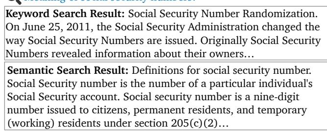
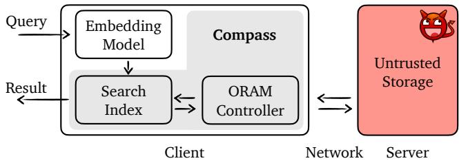
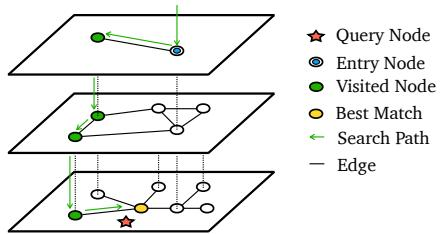
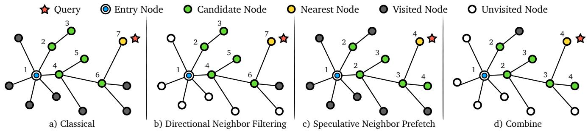
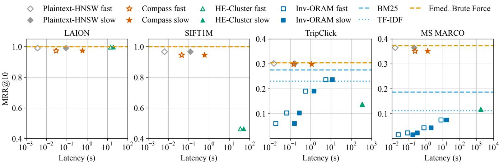
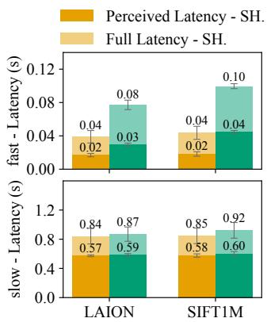
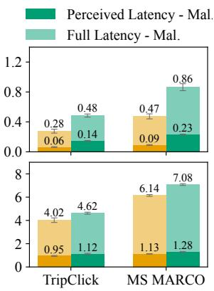
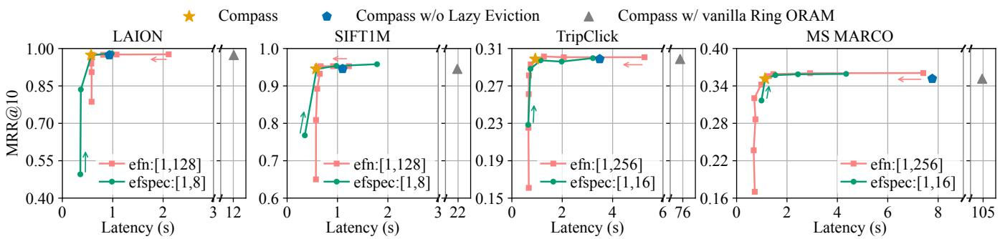

USENIX

THE ADVANCED COMPUTING SYSTEMS ASSOCIATION

# Compass: Encrypted Semantic Search with High Accuracy

Jinhao Zhu, UC Berkeley; Liana Patel, Stanford University; Matei Zaharia and Raluca Ada Popa, UC Berkeley

https://www.usenix.org/conference/osdi25/presentation/zhu-jinhao

# This paper is included in the Proceedings of the 19th USENIX Symposium on Operating Systems Design and Implementation.

July 7–9, 2025 • Boston, MA, USA

ISBN 978-1-939133-47-2

Open access to the Proceedings of the 19th USENIX Symposium on Operating Systems Design and Implementation is sponsored by

# Compass: Encrypted Semantic Search with High Accuracy

Jinhao Zhu UC Berkeley

Liana Patel Stanford University

Matei Zaharia UC Berkeley

Raluca Ada Popa UC Berkeley

## Abstract

We present Compass, a semantic search system for encrypted data that achieves high accuracy, matching state-ofthe-art plaintext search quality, while ensuring the privacy of data, queries, and results, even if the server is compromised. Compass contributes a novel way to traverse a state-of-the-art graph-based semantic search index and a white-box co-design with Oblivious RAM, a cryptographic primitive that hides access patterns, to enable efficient search over encrypted embeddings. With our techniques, Directional Neighbor Filtering, Speculative Neighbor Prefetch, and Graph-Traversal Tailored ORAM, Compass achieves user-perceived latencies within or around a second and is orders of magnitude faster than baselines under various network conditions.

## 1 Introduction

An increasing number of user data systems, including WhatsApp [30], iCloud Backups [10], Telegram [121], Signal [110], and PreVeil [97], have adopted end-to-end encryption because of its strong security properties. In this setting, there has been a rich, decades-long line of work on encrypted search [24, 27, 31–33, 40, 44, 61, 62, 83, 88, 104, 109, 114, 116, 126], which enables the server to search over the encrypted data without learning the data or the query. Despite much progress, two challenges remain: reduced security and low search accuracy.

Security: The goal is to protect data, queries, results, and access patterns, against a fully compromised server. i) Leaky practical search. A long line of work allows the server to learn some information about the query or data [18,19,24,50,62,67, 88,116], such as search access patterns, to enable fast searches. However, leakage-abuse attacks [17, 55, 64, 74, 94, 96, 129] can reconstruct a significant amount of data or the query from this leakage. ii) Search with partial server trust. A line of work assumes trusted hardware enclaves at the server [5, 83, 118, 130], but hardware enclaves suffer from a wide range of side-channel attacks [16, 65, 128], including some that can entirely subvert remote attestation and their security [124]. Another line of work [27, 28, 109] assumes that the logical server consists of two or more trust domains, where at least one of them is trusted. However, it has been shown to be very difficult to deploy such different trust domains [26, 73], and attackers can still compromise both servers.

  
Figure 1: Example of top-1 search results with the keyword search using a popular tool TF-IDF versus semantic search on the MS MARCO dataset. The keyword search result is skewed by the frequency of the phrase ‘social security numbers,’ and misses the question’s focus on meaning, while the semantic search provides a more accurate answer.

Accuracy: Most of the works mentioned above have lower accuracy compared to state-of-the-art plaintext search systems. This is because they only implement the lexical search, which is less accurate than the semantic search used in modern systems. For example, some works above [3,24,27,61,62, 83,114,123,126] implement an inverted index that maps each keyword to a list of documents containing that keyword. Such equality matching does not capture the meaning and intent of user queries (e.g., questions). State-of-the-art search systems such as Google products [47], Mac Spotlight [9], Dropbox Dash [120], Bing [81], and Elasticsearch [35] implement semantic search. Semantic search converts both the query and the content into embeddings in a high-dimensional space, which allows the search algorithm to compare the meanings of texts based on their proximity in this space, rather than just matching keywords. As shown in Fig. 1, semantic search is more accurate because it understands the intent and contextual meaning of the query. It also extends search capabilities to unstructured data such as audio, images, and videos.

In this work, through our system Compass, we show that one can achieve the best of both worlds — namely, an efficient and accurate semantic search system without the serverside leakage or trust assumptions mentioned above. Compass achieves search quality on par with state-of-the-art plaintext search systems. Moreover, search in Compass does not leak access patterns and does not rely on trusted hardware, while still protecting against a malicious server-side attacker (§4.8). Compass is designed for scenarios where a user wishes to privately search over their own confidential data, stored in encrypted form at a logical server. In this setting, Compass also enables secure retrieval over an encrypted RAG (Retrieval-Augmented Generation) [69] database.

The few prior proposals on secure embedding search are either inefficient or have weak security guarantees. For example, HERS [36] performs a linear scan using FHE over the entire data, while SANNS [20] combines heavy cryptographic tools like FHE, distributed ORAM, and Garbled Circuits. Other proposals suffer from weaker security assumptions, such as leaky search [11, 132], or relying on non-colluding servers [109]. Tiptoe [51] targets public databases and is thus unsuitable for private data scenarios. Specifically, its core homomorphic techniques depend on data being public to achieve efficiency. We elaborate further in §7.

To realize our goal of high accuracy, Compass aims to execute a powerful state-of-the-art semantic search index over encrypted embeddings. Graph-based algorithms currently have state-of-the-art accuracy on diverse workloads [12, 112], and Hierarchical Navigable Small World (HNSW) [79] is a topperforming and commonly-used index of this type [93, 98]. HNSW structures data as a multi-layer graph, with fewer nodes and edges at higher layers. The nodes at each layer are a subset of the layer below, with the bottom layer containing the entire dataset. Search starts from the top layer, traversing the graph using a greedy walk to find the local nearest neighbor, and then continues to the layer below.

Such complex graph traversal in the embedding space would be inefficient to perform with fully homomorphic encryption (FHE) [42] or GarbledRAM [77]. Instead, we build Compass on Oblivious RAM [90], specifically Ring ORAM [101]. Beyond access pattern protection, ORAM offers additional attractive properties for our system. With ORAM, Compass separates the computation from the storage: the embeddings and index are stored on the server in encrypted form, while the search algorithm runs locally on the client. The client interacts with the server only to retrieve the data needed during the search. Fig. 2 shows Compass’s architecture. Unlike FHE, this allows us to support any distance metric, enabling a wealth of state-of-the-art embeddings. On the practical side, the efficiency of ORAM has improved significantly since it was first proposed. Additionally, supporting integrity checks on Ring ORAM is straightforward.

While the idea of combining a graph-based index with ORAM is alluring, the main challenge lies in efficiency. HNSW, like other graph-based ANN search algorithms, is optimized for efficient multi-hop traversal of a locally stored graph. A strawman solution that makes a remote ORAM request for every node visited during a search is highly inefficient due to high bandwidth usage and excessive round trips. Evaluating each candidate node requires fetching embeddings for all of its neighbors and computing their distances to the query. In HNSW, each node typically has tens to hundreds of neighbors. To achieve good accuracy, HNSW usually evaluates tens to hundreds of candidate nodes. As a result, data for thousands of nodes must be fetched remotely, and even with batching ORAM requests, it still requires tens to hundreds of round trips for a single query.

  
Figure 2: Compass Architecture

To address this challenge, we develop a new encrypted search index that co-designs a graph walk through embedding space and an ORAM backend for efficient graph search. Specifically, we introduce three techniques. We introduce Directional Neighbor Filtering to reduce bandwidth consumption. The key idea is, at every node in the graph walk, to only fetch the embeddings of a subset of neighbors that are in the same “direction” in the embedding space as the query. Compass determines this subset based on a small chunk of data, which is orders of magnitude smaller than the original dataset, cached locally on the client. Second, we introduce Speculative Neighbor Prefetch, which speculatively prefetches additional nodes that are likely to be visited in the future to reduce the total number of round trips required. Finally, we introduce Graph-Traversal Tailored ORAM that integrates the search index walk into a white-box “rearrangement” of the ORAM protocol, further improving the communication overhead and significantly reducing user-perceived latency.

Evaluation summary: We implemented and evaluated Compass on 4 popular datasets of different sizes and dimensions. Our results show that Compass’s encrypted search matches the accuracy of the state-of-the-art plaintext semantic search algorithm across all datasets. Compass delivers up to 920× speedup over HSNW running on top of ORAM without our techniques and is orders of magnitude faster than two other evaluated baselines. Compass achieves user-perceived latencies of 0.57-1.28 seconds on a slow cross-region network across these datasets. In terms of memory consumption, client-side memory remains small (e.g., 5.5 MB, see Tab. 4) for personal data search scenarios. However, Compass is not yet scalable for global-scale web searches, as client-side memory usage increases to 0.5 GB (Tab. 4), a limitation we leave for future work. Overall, Compass makes encrypted search with high semantic accuracy practical for the first time without compromising security.

  
Figure 3: HNSW Graph

## 2 Background

## 2.1 Graph-based ANN Search

Similarity search is a core component of large-scale retrieval tasks. Commonly, entities, such as images, user profiles, audio, text, or products, are embedded into high-dimensional spaces with a chosen distance metric (e.g., Euclidean distance). The similarity search task then reduces to the nearest neighbor (NN) search problem: given a dataset D of points in a metric space, a query point q and a target result size K, we must efficiently retrieve the K closest points to q from D.

Since exact NN search is intractable on large, highdimensional datasets [21, 106] and many applications can tolerate some accuracy loss, practical systems use Approximate-Nearest-Neighbor (ANN) search. These methods build indices over the dataset to support high search accuracy and efficiency. Proposed ANN algorithms include tree-based methods [13–15, 25, 53, 76, 85, 111], hashing-based methods [6–8, 43, 46, 54, 56, 71, 75, 92, 119], quantization-based methods [41, 48, 58, 59, 68], and graph-based methods [4, 38, 57, 79, 80, 86]. While each class of algorithms presents trade-offs between accuracy, efficiency, indexing time, and space footprint, graph-based algorithms have emerged as a popular choice due to their state-of-the-art accuracy on diverse workloads [12, 112]. ANN algorithms that do not use data-dependent traversal in the embedding space, like LSH [43,54,109], typically achieve lower accuracy with highdimensional embeddings [12, 112].

HNSW [79] is a widely-used, top-performing graph-based index [12, 112]. It builds a hierarchical, multi-layer graph that has bounded node degrees. The HNSW search algorithm follows a simple iterative greedy search procedure. As shown in Fig. 3, the search begins from a pre-defined entry point. This entry point is chosen during the index construction and is a node on the uppermost layer. The search iterates over each layer, performing a greedy search, before dropping down to the layer below to continue its search. On each upper layer, the greedy search uses a dynamic candidate list of size one and greedily chooses a single node, which then becomes the entry point to the next layer below. Finally, upon reaching the bottom layer, the algorithm performs a greedy search using a dynamic candidate list of size ef and selects K nodes instead of just one. The parameter ef is typically larger than K and controls the trade-off between quality and efficiency, with higher values of ef corresponding to higher quality at the cost of higher search latency. In practice, one can choose ef by empirically generating the accuracy-efficiency trade-off curve over a benchmark dataset and choosing the ef value that meets the application’s target accuracy at minimal search latency.

## 2.2 Ring ORAM

Oblivious RAM (ORAM) [45, 90, 116] allows a client to access data on remote storage without leaking access patterns. Path ORAM [116] is a practical, tree-based ORAM scheme that organizes server-side storage as a binary tree of roughly logN levels, where each node (bucket) contains Z blocks. Each block contains either real data or a dummy. A path is defined as the sequence of buckets from the root of the tree to one of the leaf nodes. Each block is randomly mapped to a path and resides either on that path or in the stash, a client-side buffer. The client also maintains a mapping of each block to its assigned path, which is called the position map.

We chose Ring ORAM [101], a follow-up to Path ORAM, for Compass because Ring ORAM has low bandwidth consumption (i.e., constant online bandwidth through the XOR trick). Even in a large client storage setting, as noted in [101], Ring ORAM remains competitive with other hierarchical ORAM schemes [29, 117]. Each bucket in Ring ORAM contains Z + S blocks, where S is the number of slots reserved for dummies. Blocks in a bucket are randomly permuted before being written to the server, and the permutation is stored as metadata on the server. Ring ORAM’s operations are:

• ReadPath(l,a): Unlike Path ORAM, Ring ORAM reads only one block, the target block a or an unused dummy, from each bucket on the path l. A block becomes invalid once it is read, which is reflected in the metadata.

• EvictPath: Eviction occurs every A ReadPath operations. The evicted path is selected in a reverse lexicographic order.

• EarlyReshuffle: A bucket must be reshuffled after S accesses because it contains only S slots for dummies. This operation reads the bucket from the server, shuffles it, and writes it back to the server.

To access a block a in Ring ORAM, the client first checks the position map to find the path l. Next, it reads the metadata of all buckets on l and uses this information to invoke the ReadPath operation. Thus, Ring ORAM requires two round trips per access. The online bandwidth is O(logN) and can be reduced to O(1) via XOR operations by the server.

## 3 System Overview

Our system setup consists of a logical server and multiple clients. Each client owns a unique set of documents and an individual index, both stored on the server. Compass focuses on the case of a personal user searching their confidential data in the cloud, such as on Dropbox [120] or iCloud [9]. Data sharing could be implemented by adding shared data to each relevant user’s index. We do not focus on data sharing and leave optimizations to future work.

Compass’s APIs are as follows:

• INIT(D): Given a set of documents D, initialize the index.

• SEARCH(Q , K) → LIST(ID, SCORE): Given Q , the query embedding, return the top K relevant documents as a list of document IDs and their relevance scores.

• INSERT(F ): Given a document F , generate the embedding set E and store both the encrypted document and its embeddings on the server. The size of E depends on the document length and the model’s context window.

• DELETE(F ): Remove the document F and its embeddings. Search, insert, and delete in HSNW are (poly)logarithmic in the number of documents, assuming the HNSW graph approximates a Delaunay graph [79]. Compass preserves the complexity of these operations. File updates are handled by deleting the old file and inserting the updated version. Large files are split into equal-sized chunks based on the embedding model’s context length. Each chunk is treated as a separate file with its own embedding. For efficient ORAM initialization, one can use the bulk loading protocol from BULKOR [72].

## 3.1 Threat Model & Security Guarantees

Our system is based on a two-party model: a client and a (logical) server. The logical server may consist of multiple physical machines. The server is untrusted and can be maliciously compromised. Unlike some prior works that weaken the threat model by assuming multiple logical servers with at least one being honest [27, 103, 109, 125], we assume the entire server is untrusted. We also do not rely on uncompromised hardware modules or hardware trust assumptions at the server, like TEE-based systems [39, 83]. This means that the server in Compass can deviate from the protocol arbitrarily. Compass ensures that the server cannot learn any information about the user query, such as the query embedding, the IDs and lengths of the returned documents, or whether the query matches a previous one ("query access patterns"). Moreover, the server cannot learn the data contents from the search index or modify the search results without detection by the client.

Compass does not hide the type of operation, whether a user is performing a search, insert, or delete, on remote data. We do not protect against timing side-channel attacks based on the client’s execution duration or the server’s observation of timing patterns in user requests. We consider the system configuration parameters listed in §3.1.1 as public information. The server can roughly tell how large the data of each user is (e.g., how many GBs each user has), but Compass does not reveal to the server the size of query results. (Of course, these can be protected through padding [63] in time and space at a performance cost.) This strong model means that Compass protects against a plethora of attacks [17,55,64,74,94,96,129] on encrypted search that leverage access patterns or volume

1. The challenger C chooses a uniformly random bit b.

2. The adversary A chooses two equally large datasets $D _ { 0 }$ and $D _ { 1 } .$ , as well as one set of public parameters param. The challenger initializes the system with $D _ { b }$ and param.

3. The adversary iterates as follows. At step i:

(a) The adaptive adversary A chooses a pair of requests qi,0 and $q _ { i , 1 } ,$ , which can be search, insert, or delete.

(b) When the challenger receives a pair of requests, it first checks whether the type matches. If they are of different types, the challenger aborts. Otherwise, the challenger interacts with the adversary in the role of the server according to the Compass’s protocol for request $q _ { i , b }$ . As part of this execution, the client protocol verifies the integrity of the data from the server. If any verification fails, the challenger aborts.

(c) The challenger gets the request result $r _ { i } .$

4. The adversary A outputs a guess b′.

Figure 4: Security game for Compass

of results. Like much prior work [51, 83, 126], Compass does not protect against DoS attacks from the server. The server may drop the requests from clients at any time or even delete the client’s data. We assume it is the server’s business interest to maintain a good availability to attract more customers.

The client, who owns the outsourced data, is trusted with its own documents. That is, the client may search and read the contents of these documents. However, the client cannot access or perform a search on the documents of other clients, even if the client colludes with the server.

## 3.1.1 Security Definition

Like prior work [107,115], we provide an indistinguishabilitybased security definition. In our security game, there is a challenger C and an adversary A who acts as the client and the server of Compass, respectively. According to the threat model, the challenger is honest and the adversary is malicious, which means A can deviate from the protocol arbitrarily. The attacker wins the security game if it can either learn partial information about the query or data, or modify the search results without detection by the challenger (client).

Let param denote the set of public parameters in our system, including HNSW parameters M and ef , the number of cached layers, the size of the directional filter efn (§4.5), the size of the speculating set efspec (§4.6) used in our modified HNSW search. We define the security game in Fig. 4. The adversary A wins the game if the challenger C does not abort and one of the following two conditions is met: 1) $b ^ { \prime } = b ;$ 2) the sequence of queries $( q _ { i , b } , r _ { i } )$ is an incorrect execution of plaintext Compass’s search algorithm with param on $D _ { b }$

Theorem 1. Assuming a collision-resistant hash function and an IND-CCA2 secure encryption scheme, for any probabilistic polynomial time stateful adversary A, A’s chance of winning in the security game in Fig. 4 instantiated with Compass’s protocol is: less than half plus negligible for winning condition (1) and negligible for winning condition (2).

Due to space constraints, we show a proof sketch in §4.10, leaving the full proof in the supplementary material §C.

## 4 Compass’s Search Index

We now describe Compass’s index. While we build Compass on top of HNSW, our techniques are generally applicable to other graph-based ANN indices. We primarily focus on the search since the insert algorithm in HNSW closely resembles that of the search, and the techniques described in this section apply to both. A summary of notation is shown in Tab. 1.

## 4.1 Data Layout

Before we dive into the details of each technique, we present Compass’s data layout. The client holds:

• ORAM-related data: a stash for overflow blocks, a position map that maps each block to a path, metadata for each bucket, and a cached treetop for the ORAM tree (§4.7).

• HNSW-related data: metadata for HNSW search, including the dimension of the embeddings, the number of layers, and the degree bound M. If client-side caching (§5) is enabled, the client also stores the graph for the upper layers and the embeddings of nodes within these layers.

• Quantized hints that are a part of our Directional Neighbor Filtering technique, which we explain later in §4.5.

The server holds the ORAM tree in the Ring ORAM construction. Each node (bucket) of the tree contains Z +S blocks. In our search index, each ORAM block corresponds to one node in the HNSW graph. The block corresponding to node x stores the embedding of x and its neighbor list, which consists of identifiers for the neighbors of x. Each bucket has a tree of hashes for the integrity check (§4.8).

## 4.2 Workflow overview

Fig. 2 shows the architecture and workflow of our system. Similar to a plaintext search on embeddings, the user’s query is first transformed into a dense, fixed-dimensional vector using a pretrained embedding model. This query vector is then used to search within the embedded document corpus. Our search framework builds on HNSW and provides security guarantees by storing vector embeddings and the graph index encrypted on a remote server, accessed by the ORAM controller. During the search process, the client interacts with the server to retrieve the index and embeddings.

<table><tr><td>Symbol</td><td>Description</td></tr><tr><td>M ef</td><td>degree bound of traversed nodes in HNsW search size of dynamic candidate list in HNSW search</td></tr><tr><td>efn</td><td>size of directional filter</td></tr><tr><td>efspec</td><td>size of speculation set</td></tr><tr><td>Z</td><td>maximum number of slots for real blocks per bucket</td></tr><tr><td>S</td><td>number of slots reserved for dummies per bucket</td></tr><tr><td>A</td><td></td></tr><tr><td></td><td>eviction rate</td></tr></table>

Table 1: Summary of Notation

## 4.3 An initial attempt

We now present a natural way of traversing HNSW using ORAM: the client follows HNSW’s search algorithm, making an ORAM request for each node visited. This solution is inefficient as it requires substantial bandwidth and numerous round trips. This inefficiency arises because HNSW is designed for local, multi-hop searches, while ORAM turns each node access into a non-trivial client-server request. It nevertheless establishes the foundation and terminology for our subsequent improvements in the rest of this section.

This HNSW greedy traversal is illustrated in Fig. 5a, which we now explain. Starting from the entry node (1), the algorithm fetches all its neighbors and adds them to the candidate list, namely, it visits them. We say that the algorithm visits a node if it retrieves the ORAM block of this node. In the subsequent iteration, the node in the candidate list closest to the query is selected as the next candidate node. The unvisited neighbors of this candidate are then visited and added to the candidate list. In Fig. 5a, it takes 7 search iterations to find the nearest node, with every node in the graph being visited. This algorithm works well when computation and storage are colocated. However, in our setting, the client has to retrieve neighbors’ embeddings and neighbor lists from the remote server through ORAM requests, making it inefficient because of multiple costly network round trips and significant data transfer. In HNSW, the number of required round trips depends on ef , and each node’s degree is bounded by M. Therefore, a search requires ef · M rounds of communication to retrieve the embeddings and neighbor lists of ef · M nodes. Empirically, in the final layer of HNSW, both M and ef range from tens to hundreds for sufficient accuracy, causing high search latency and bandwidth usage.

## 4.4 Towards Compass’s search index

To understand our approach, it helps to first consider an attempt to reduce the number of sequential ORAM requests in the strawman above. The idea is to include the embeddings and neighbor lists of the neighbors in the neighbor list of a node within the ORAM block of that node. This will halve the number of ORAM requests and round trips as compared to the strawman. However, this strategy causes M× storage overhead on the server side because each node’s embedding would be stored both in its own ORAM block and in the blocks of its neighbors. Moreover, the increase in storage does not result in substantial bandwidth savings due to the larger ORAM block size.

  
Figure 5: HNSW graph traversal followed by our ORAM-friendly traversal techniques. The search aims to identify the Nearest Node to the Query. The distance here is Euclidean distance. The numbers indicate iterations in the traversal, and which nodes are processed at each iteration. We say that a node is processed, if its neighbors are visited.

Instead, we propose a novel way to traverse the HNSW graph designed for running on top of ORAM. Our traversal approach significantly reduces round trips and bandwidth usage via three techniques. The first two techniques make black-box usage of ORAM; Directional Neighbor Filtering (§4.5) reduces the network bandwidth overhead and Speculative Neighbor Prefetch (§4.6) reduces the number of network round trips required. Our third technique, Graph-Traversal Tailored ORAM (§4.7), makes white-box use of Ring ORAM to leverage the memory access characteristic in graph search to further reduce bandwidth and computation overhead.

## 4.5 Directional Neighbor Filtering

The key idea behind our Directional Neighbor Filtering technique is to consider only a subset of a node’s neighbors during traversal because those closer to the query point are more likely to contribute to the final result; namely, to embed a sense of “direction”.

One possible way to implement this idea is to store with every node, not only its own embedding but also the list of compressed embeddings of its neighbors. The intuition is to determine which compressed neighbors are closer to the query, and only fetch those from the ORAM, reducing bandwidth consumption. One can use compression techniques like PCA [60]. However, since a node does not have a large number of neighbors, we found that the compression is not effective in reducing the size of each ORAM block because there are not enough neighbors to amortize the space taken by the compression state (e.g., the transformation matrix).

Instead, we compress together all the nodes into a data structure we call Quantized Hints. The client stores the Quantized Hints, mapping each node ID to its quantized embedding. We find Product Quantization (PQ) [58] fits well here: it is a widely-used quantization method that is highly effective at compressing a large number of high-dimensional vectors. For example, we achieve 98% compression on various datasets (see §6.3.3) with a codebook size equivalent to 128 full coordinates, thus requiring a minimal amount of client storage. However, if we use PQ directly (namely, construct the index directly on quantized embeddings), there is a big accuracy drop because the closest quantized neighbor to the query is often not the closest full-coordinates neighbor.

Instead, our idea is to use the quantized nodes merely as “directional hints”: for each node, we identify the top efn closest neighbors to the query based on the hint, and then fetch their full coordinates (the ground-truth) from the server to identify the next node to process. The intuition is that the closest efn quantized neighbors are very likely to contain the closest (full-coordinates) neighbor. By fetching only efn out of M neighbors, this technique reduces bandwidth usage by a factor of M efn . We demonstrate in §6.4 that, with an appropriately chosen efn, the impact on search accuracy is negligible.

For clarity, we include an example of using directional neighbor filtering during the search in Fig. 5b. Assume we fetch only the top 2 closest neighbors in each iteration. At the beginning of a query, the Compass client computes its quantized embedding. Then, during each iteration in the traversal, let node A be the currently closest node to the query in the candidate list. The client iterates through A’s neighbor ids, looking up their quantized embedding in Quantized Hints, and computing each neighbor’s distance from the query in the quantized space. The client then only fetches the top efn = 2 closest neighbors from the server in a batched ORAM request (§4.7), and adds them to the candidate list. Compared to Fig. 5a, we can see in Fig. 5b that some of the neighbors of the nodes processed at (1), (4), and (6), which are not among the top 2 closest nodes to the query, are not visited. We thus avoid visiting 6 nodes in the graph, which approximately halves the bandwidth consumption.

## 4.6 Speculative Neighbor Prefetch

In speculative execution [66], the processor makes guesses of potentially useful instructions and executes them in advance to improve performance. Our Speculative Neighbor

Prefetch shares the same intuition. Each time the Compass client performs a round trip to the ORAM server to retrieve nodes that will be visited next by HNSW’s search, the client also speculatively fetches additional nodes. This implicitly requires batching the access of multiple ORAM blocks into one request, which is introduced in §4.7. These additional nodes are not yet needed by the HNSW search algorithm, but are likely to be visited later. By retrieving these likely-needed nodes alongside the currently-needed node, we can reduce the number of future network round trips to ORAM during search. But how do we identify these nodes? Fortunately, the candidate list used in the greedy search algorithm is a good basis for speculation. The candidate list is sorted by the distance to the query. In our algorithm, we fetch the first efspec nodes’ neighbors within one request. Once the response is received from the remote server, the candidate list is updated by evaluating the neighborhood of each node in the speculative set. With this technique, Compass reduces the number of round trips by a factor of efspec.

In Fig. 5c, we show an example of Speculative Neighbor Prefetch. In each iteration, the client extracts two candidates from the candidate list and visits their neighbors simultaneously. In this toy example, Compass reduces the number of iterations from 7 to 4. We show in §6 that implementing this technique on real datasets significantly reduces the search steps required while maintaining the same accuracy.

DiskANN [57] uses a similar speculative approach in the different setting of optimizing the interaction between memory and SSD. In DiskANN, they fetch a small number of extra nodes to balance the cost of computing and SSD bandwidth. However, in Compass, the cost model of fetching data from the disk and fetching data from ORAM over the network is different. In our setting, a key observation is that optimizing the number of round trips is much more important than optimizing bandwidth because the round trips directly affect user-perceived search latency and the bandwidth consumption is already in a reasonable ballpark. Therefore, depending on the dataset, for Compass, the size of the speculation set efspec can grow as large as 16 to achieve good overall performance.

Fig. 5d shows the final example of the search process when we compose both Directional Neighbor Filtering and Speculative Neighbor Prefetch. Compared to Fig. 5a, the algorithm in Fig. 5d achieves the same search results with three fewer network round trips and six fewer node retrievals.

## 4.7 Graph-Traversal Tailored ORAM

To reduce the cost of an HNSW traversal, or more generally a graph traversal, Compass optimizes how a graph is stored in ORAM and rearranges how ORAM requests are performed.

As mentioned in §4.1, each block in our ORAM stores both a node’s embedding and its neighbor list. We now motivate this choice. Recall that graph storage consists of two parts: coordinates and neighbor lists. In each step of a greedy search, we first fetch the current candidate’s neighbor list and then fetch the coordinates based on the neighbor list. A simple approach is to use two ORAMs, one for coordinates and another for neighbor lists. However, this requires two network round trips per search step, assuming that we batch the request for coordinates. Our design is based on the observation that the neighbor list belongs to a node whose coordinates we have already obtained in previous steps. By storing a node’s coordinates and neighbor list in the same block, we fetch the neighbor list early to avoid an extra network trip. Let D be the dimension of the embedding and M be the degree bound. The bandwidth increases from M ∗ (D + 1) to M ∗ (D + M). Typically, the degree bound is much smaller than the embedding dimension, so the increase is roughly 1.2 to 2×.

We build our system based on Ring ORAM and we make several white-box modifications to make it more efficient under graph traversal workload. The reader should recall the Ring ORAM background in §2.2. Each bucket’s metadata is cached on the client to avoid extra round trips. As mentioned earlier, we use batching, a technique already shown to be effective [107, 126, 133], to reduce the number of round trips for parallel requests in the same search step. In Ring ORAM, evictions are scheduled after every A path access to keep the stash within a reasonable size. With batching, evictions are delayed if the batch size is larger than A.

Compass introduces multi-hop lazy eviction: as the Compass client walks from hop to hop through the ANN graph to answer a query, the client performs a sequence of ORAM request batches without performing their associated eviction, responds to the user, and finally performs eviction. The advantages of multi-hop lazy eviction are substantial. In ORAM schemes, online bandwidth refers to the cost of reading data from the server, which affects response time, while offline bandwidth covers other costs like evictions. By delaying eviction until the end of a query, users experience lower search latency. This method works especially well in Ring ORAM, where offline costs are higher than online costs. For example, as mentioned in [101], for a set of properly selected parameters, the offline bandwidth is roughly 2 − 2.5× smaller than the online bandwidth, and the online bandwidth is further improved by a factor of log N with the XOR trick. The downside of lazy eviction is that the buckets near the root run out of dummy budget quickly, leading to more frequent early reshuffles. We mitigate this with classic tree-top caching [101]: by caching the top t levels of the ORAM tree, we can delay 2t evictions and keep the reshuffle rate reasonable.

With batching and multi-hop lazy eviction, the number of requests per batch and the number of batches per query introduce additional leakage. In a graph, the number of neighbors for each node can vary, which affects batch sizes, and the speed at which the greedy search converges can also be different, which affects the number of batches. We address this issue through a co-design with the graph algorithm. The main idea is to keep the number of search steps the same at each layer of the HNSW graph and pad each node to have the same number of neighbors. We explain the details in §4.9.

Stash analysis: Another concern with delayed eviction is its impact on stash size, which can indirectly affect security. During a query, the client keeps all fetched blocks in the stash until the final eviction. As part of the eviction process, blocks from multiple delayed paths are fetched from the server. With a larger stash, eviction becomes inefficient if we perform a linear scan to find the candidate block for a specific bucket. To address this, we sort the blocks in the stash by their assigned path ID. This allows us to recompute the range of path indices for a target bucket and quickly locate candidate blocks in the stash. Insertion complexity increases to O(log N), where N is the size of the stash. However, it reduces the search cost for a bucket of size Z from O(ZN) to O(log N), as the potential blocks are already grouped by path ID during sorting. We prove a stash bound for Compass’s adaptation of Ring ORAM. In §B, we show that after the eviction is complete after the query, the size of the stash is upper bounded by the size of the stash in the original Ring ORAM.

## 4.8 Malicious server protection

A malicious server can alter ciphertexts, rearrange the layout of ORAM buckets, perform replay attacks, or provide incorrect query responses. To protect integrity and freshness, we follow the idea from the Path ORAM literature [102,115] and construct a Merkle tree on top of the ORAM tree. If we label the buckets linearly, the hash of a non-leaf bucket is defined as:

$$
\mathsf { H } _ { i } = \mathcal { H } ( \mathsf { B } _ { i } | | \mathsf { H } _ { 2 i } | | \mathsf { H } _ { 2 i + 1 } ) ,\tag{1}
$$

where $\mathsf { B } _ { i }$ is the "snapshot" of the i-th bucket, and $\mathsf { H } _ { 2 i }$ and $\mathsf { H } _ { 2 i + 1 }$ are hashes of the child buckets. For leaf buckets, the hashes of child buckets are omitted. In Path ORAM, Bi is simply the concatenation of all blocks in the bucket:

$$
\mathsf { B } _ { i } = b _ { 1 } \vert \vert b _ { 2 } \vert \vert . . . \vert \vert b _ { Z } ,\tag{2}
$$

In Ring ORAM, however, each access retrieves only one block per bucket along the path. To avoid fetching the remaining blocks, we construct a secondary Merkle tree within each bucket, where the j-th leaf node is the hash of the j-th block in the bucket. Now, Bi is the root hash of the secondary Merkle tree of the i-th bucket. During the ReadPath operation, for each bucket, we retrieve ⌈log(Z + S)⌉ hashes from the secondary tree to reconstruct Bi, plus an additional hash for its sibling bucket. For EarlyReshuffle and EvictPath, since we already read Z blocks from each bucket, we only fetch S hashes of the remaining blocks. Note that for EarlyReshuffle, since we reshuffle individual buckets instead of entire paths, we must also retrieve the hashes of the target bucket’s child buckets and the hashes of sibling buckets of its ancestors.

Algorithm 1: SEARCH(q, ep, ef , efspec, efn)   
Input: query q, entry point ep,   
size of speculation set efspec,   
size of directional filter efn,   
number of nearest to q elements to return ef   
Output: ef closest neighbors to q   
1 V ← ep // set of visited nodes   
2 C ← ep // set of candidates   
3 W ← ep // set of found nearest neighbors   
4 n ← ⌈ef /efspec⌉   
5 for step ← 0...n do   
6 E1 ← extract top efspec nearest nodes from C to q   
7 $E _ { 2 }  \emptyset$   
8 foreach $e _ { 1 } \in E _ { 1 }$ do   
9 foreach $e _ { 2 } \in$ neighbors(e1) do   
10 if $e _ { 2 }$ ̸∈ V then   
11 $E _ { 2 }  E _ { 2 }$ ∪ e2   
12 t ← efspec ∗ efn   
// Based on quantized hints   
13 E3 ← extract top t nearest nodes from $E _ { 2 }$   
14 oram.batch\_access $\left( E _ { 3 } , t \right)$   
15 foreach $e \in E _ { 3 }$ do   
16 V ← V ∪ e   
17 C ← C ∪ e   
18 W ←W ∪e   
19 if $| W | > e f$ then   
20 remove furthest element from W to q   
21 return W

## 4.9 Putting it All Together

With the techniques above, we present our search algorithm for each layer in Alg. 1. In HNSW, the insertion is the same as the search, but it uses a different ef . To delete a node, the standard way is to search for the node and mark it as deleted.

Compared to vanilla HNSW, the main difference lies between line 4 and line 14. The number of search iterations, n, is determined by $\lceil e f / e f s p e c \rceil$ , as we extract the top efspec nodes from the candidate list as the speculative set, $E _ { 1 }$ , in each iteration. In the first iteration, there is only one candidate, the entry point, so only one node is extracted from the candidate set. We then traverse the unvisited neighbors of the nodes in $E _ { 1 }$ (referred to as $E _ { 2 } )$ , ranking them based on their distance to the query, estimated using quantized local hints. The top t nodes from $E _ { 2 }$ are selected as $E _ { 3 } ,$ , and a batch ORAM request is issued to retrieve their full coordinates and neighbor lists. The value of t is set to efspec · efn, as we want efn neighbors per candidate. If the total number of nodes in $E _ { 3 }$ is less than t, the batch ORAM request is padded to t for security. Once the full coordinates are retrieved, we insert each node in $E _ { 3 }$ into the set of visited nodes V , the set of found nearest neighbors W , and the candidate set C. The set W is dynamic, as the furthest element will be removed when its size exceeds e f . After completing n iterations, W is returned, and the first K nodes in W are the final search result of q. For search in upper layers, the ef is set to 1, and therefore we only apply directional neighbor filtering.

## 4.10 Security proof sketch

We provide a proof sketch covering the salient points, leaving the full proof in the supplementary material §C.

The integrity guarantee of our protocol comes directly from the Merkle tree on top of ORAM, which has already been proposed and proved [37, 102, 115]. Therefore, the attacker must respond correctly to all requests, with their only capability being to learn which items are accessed on the server during these requests. Prior works have already shown that batching of ORAM requests doesn’t reduce security [126, 133].

Compass differs from these works in that our ORAM requests follow a multi-hop pattern. Each query in Compass triggers multiple batches of ORAM accesses, followed by lazy eviction at the end. For each type of query, the number of batches and the number of paths accessed per batch are determined by the public search parameters (see Alg. 1). During lazy eviction, the number of eviction paths depends only on the total number of earlier accesses, so it is also query-independent. Because the paths are chosen randomly, Compass does not leak the access pattern under the threat model described in §3.1. Different query types (e.g., search and insert) use different ef , so an adversary can still distinguish the operation type. As noted in §3.1, Compass does not try to hide which type of operation is being performed.

## 4.11 Fault Tolerance Considerations

In case of failure, Compass handles recovery similarly to prior work on ORAM fault tolerance [23]. At a high level, the client (1) persists its local state to disk and (2) periodically uploads this encrypted state to the server as checkpoints. At each checkpoint, the server stores a complete copy of the ORAM tree. Between checkpoints, the client prepares each ORAM operation (including access, reshuffle, and eviction) by persisting the associated information to the local disk. Specifically, it records the type of operation and the offsets of buckets and blocks that will be accessed on the server. Similarly, the server logs each ORAM operation before execution. If the client crashes, it first restores its local states from the latest checkpoint and then re-executes all ORAM operations performed after that checkpoint. This step is necessary to prevent the leakage of access patterns. Otherwise, if the same query is executed before and after the crash, the server could infer information because the accessed paths would be identical. Note that Compass fully protects against a malicious server only if the client-side disk remains intact, allowing recovery of local states and operation logs from disk. If the client’s disk also fails, recovery relies solely on the server-provided state and logs. In this scenario, a malicious server might provide stale client states or an outdated ORAM tree, neither of which the client could detect.

## 5 Implementation

We implemented Compass in approximately 5k lines of C++ code. 1 We use the Faiss [34] library for HNSW construction and Product Quantization. We use AES-256-CBC to encrypt ORAM blocks and SHA-256 for hashing, via OpenSSL’s EVP [2]. To save the cost of frequently visited nodes in upper layers, we cache all but the last two layers of the HNSW graph locally on the client. We set the number of search steps in the second-to-last layer to 1. Due to space constraints, we explain the reason behind the choice of cached layers and search steps in §A. We show the client-side overhead associated with layerwise caching in §6.3.3. We follow the instructions from Ring ORAM [101] and choose Z = 32, S = 64, and A = 36 for our ORAM configuration. We use a slightly larger value for S and a smaller value for A compared to the bandwidth-optimal parameters recommended in [101] to reduce early reshuffles and the number of round trips.

## 6 Evaluation

In this section, we aim to answer the following questions:

• What is the search quality of Compass, and how does it compare to state-of-the-art plaintext search systems?

• What is the overhead introduced by Compass, and how does it compare to prior encrypted search schemes?

• How does Compass compare to an approach where the client downloads and stores the entire index locally?

## 6.1 Experimental Setup

We perform our experiments on the Google Cloud Platform with one n2-standard-8 instance (8 vCPUs and 32 GB memory) as the client and one n2-highmem-64 instance (64 vCPUs and 512 GB memory) as the server. We use Linux Traffic Control (tc) [1] to simulate network conditions. Following prior work [20, 109], we evaluate on two sets of network configurations to simulate same-region (fast) and cross-region (slow) networks. Specifically, the fast network has 3 Gbps bandwidth and 1 ms round-trip latency, and the slow network has 400 Mbps bandwidth and 80 ms latency.

We evaluate our system on four popular datasets widely used for ANN search: MS MARCO [22], TripClick [100], SIFT1M [58], and LAION [108]. The specifications for each dataset are presented in the upper half of Tab. 2. We build the HNSW graph with M = 64 for LAION and SIFT1M, and

  
Figure 6: Comparison of Compass’s search quality versus latency with Baselines. For TripClick, the results of the HE-Cluster under two networks are overlapped as the main bottleneck is the computation on the server. The search latency for HE-Cluster on MS MARCO is extrapolated due to memory limitation. (See estimated memory consumption in §6.3.3)

<table><tr><td colspan="4">MS MARCO TripClick S SIFT1M LAION</td></tr><tr><td>dim</td><td>768</td><td>768</td><td>128 512</td></tr><tr><td>#docs</td><td>8,841,823</td><td>1,523,871</td><td>1000,000 100,000</td></tr><tr><td># queries</td><td>6,980</td><td>1,175</td><td>10,000 1000</td></tr><tr><td>ef</td><td>48</td><td>36</td><td>20 10</td></tr><tr><td>efspec</td><td>8</td><td>6</td><td>4 2</td></tr><tr><td>efn</td><td>24</td><td>24</td><td>12 12</td></tr></table>

Table 2: Specifications and parameters for each dataset.

M = 128 for TripClick and MS MARCO. For SIFT1M, each embedding is divided into 8 sub-vectors for PQ. For the other higher-dimensional datasets, we split the embeddings into 32 sub-vectors. The search parameters, shown in Tab. 2, are set to achieve a Recall@10 of at least 0.9.

## 6.2 Baselines

We compare our system with three baselines:

Inv-ORAM is a secure lexical search: an inverted index stored within ORAM [83, 126]. The inverted index maps each keyword to the documents that contain it. Relevance scores are computed using TF-IDF [99], a widely used algorithm in lexical search systems. Each (keyword, document, score) pair is stored inside an ORAM block. To avoid leakage of query length and keyword frequency, queries are padded to the longest query length (12 for TripClick and 16 for MS MARCO). Ideally, to hide keyword frequency, we would fetch the maximum number of documents a keyword maps to. However, as pointed out by [87], this can be worse than streaming the entire database. Therefore, following [83], we truncate each keyword’s document list to a fixed size. The list is sorted by relevance score before truncation. To simulate OBI [126], we implement this baseline with batch ORAM access and our improved stash eviction algorithm. We evaluate this baseline on text-based datasets: TripClick and MS MARCO.

HE-Cluster is a secure semantic search based on homomorphic encryption and clustering. Tiptoe [51] demonstrates an efficient way to search for a private query on a public database by leveraging clustering to avoid linear communication overhead. This baseline is a natural extension of Tiptoe with the database also encrypted under homomorphic encryption. The clustering technique from Tiptoe directly applies here. However, other optimization methods from Tiptoe do not apply, as they were specifically tailored for a public-data scenario. Following Tiptoe, each dataset of size N is clustered into roughly N clusters using k-means, and boundary conditions are handled similarly. To prevent leakage of cluster size, each cluster is padded to the same size. The server-side computation for this baseline is parallelized across 64 threads.

Plaintext-HNSW is an insecure semantic search baseline in which the client sends a query to the server, the server executes a vanilla HNSW search on the plaintext data, and then returns the results.

## 6.3 Performance

We measure performance in two dimensions: search quality and latency. For search quality, we use the mean reciprocal rank at 10 (MRR @ 10), where the reciprocal rank is the inverse of the rank of the first relevant item in the results. For Compass, we report the user-perceived latency under the semihonest setting. The end-to-end latency results, including those under malicious settings, are provided in §6.3.1. For the Inv-ORAM baseline, we set the truncated document list size to 10, 100, 1000, and 10,000, and report the results separately. The tradeoff is that a larger size results in better search quality but worse latency. In Fig. 6, we present the search performance of Compass along with that of the baselines. We also include the plaintext search accuracy using TF-IDF and BM25 [105], two widely used search algorithms, alongside the accuracy of the brute-force embedding search, which represents the highest achievable accuracy with the current embedding model.

  
Figure 7: Breakdown of Compass’s search latency. SH represents semi-honest and Mal represents malicious.

Overall, Compass outperforms both secure baselines in search quality, matching the accuracy of the brute-force embedding search in all four datasets. Compared to Plaintext-HNSW, the insecure baseline, Compass incurs a latency overhead of approximately 6–10×. For Inv-ORAM, the accuracy is affected by the size of the truncated list. Although a smaller truncated list allows Inv-ORAM to achieve lower latency than Compass, its search quality is significantly worse. To match the accuracy of plaintext TF-IDF, Inv-ORAM requires a larger truncated list, which significantly increases latency. The search quality of the HE-Cluster baseline varies across datasets. In the LAION dataset, the HE-Cluster achieves an accuracy comparable to Compass. However, in other datasets, its accuracy drops significantly and falls below that of plaintext TF-IDF on the TripClick dataset. This discrepancy is likely due to the health-related content of TripClick, where text sequence matching is particularly effective in identifying health-related terms. Compared to HE-Cluster, Compass is orders of magnitude faster in latency. While clustering reduces communication costs to sublinear, the server’s computation cost remains linear. Although latency can be further improved with parallelization using more CPUs and instances, this is expensive and difficult to scale for multiple users.

## 6.3.1 Latency breakdown

In Fig. 7, we present the latency breakdown of Compass under various network and security assumptions. We report both user-perceived and full latency. The main contributor to user-perceived latency is ORAM operations. The overhead of distance computation and graph traversal is minimal, requiring less than 0.02 seconds even on MS MARCO. The full latency includes additional time spent on ORAM eviction.

With our lazy eviction technique and the XOR trick from Ring ORAM, the user-perceived latency is reduced by 1.5–5.6× compared to the full latency. For smaller datasets like LAION and SIFT1M on the slow network, the savings are less significant because the bottleneck shifts from bandwidth to round trips, as the graph traversal involves multiple rounds, whereas the eviction only takes two. The cost of integrity verification for malicious security is relatively low compared to the search, especially on larger datasets and slower networks.

<table><tr><td rowspan="2"></td><td colspan="3">Compass</td><td rowspan="2"></td><td colspan="2">|HE-Cluster|Inv-ORAM</td></tr><tr><td>Per. Int.Full</td><td>RT</td><td>Full</td><td>RT</td><td>Full RT</td></tr><tr><td>LAION</td><td>0.7 0.4</td><td>13.5</td><td>8</td><td>225.5</td><td>1 1</td><td>1</td></tr><tr><td>SIFT1M</td><td>1.1 1.0</td><td>12.2</td><td>8</td><td>737.2</td><td>1 1</td><td>1</td></tr><tr><td>TripClick</td><td>6.0 3.1</td><td>132.8</td><td>9</td><td>929.2</td><td>1 234.5</td><td>1</td></tr><tr><td>MS MARCO</td><td>8.9 5.1 226.4</td><td></td><td>9</td><td>2262.5*</td><td>300.1</td><td>1</td></tr></table>

Table 3: Comparison of communication cost (MB) and round trips per query. Per. represents non-eviction cost and Int. represents cost for interity verification. \* indicates the result is extrapolated.

Compass focuses on search over private data. For personal use cases, dataset sizes are typically comparable to smaller ones such as LAION and SIFT1M. The full latency for these datasets is under 1 second, even on slow networks. For a largescale dataset like MS MARCO, the perceived latency is only 1.3 seconds. While eviction takes 5.8 seconds, this process can run in the background, overlapping with other application tasks, such as the subsequent generation step in the RAG pipeline. Overall, Compass achieves practical user-perceived latency across all four datasets and two network settings.

Under a more restrictive network such as 4G (50Mbps bandwidth, 100ms latency), the perceived latency remains acceptable as the primary communication overhead is from eviction. For example, the perceived latency is 0.94 seconds for SIFT1M and 2.03 seconds for MS MARCO in this case.

## 6.3.2 Communication

Tab. 3 presents the per-query communication costs and network round trips. For Compass, we additionally report the communication cost before lazy eviction and the cost for integrity verification. For Inv-ORAM, we use a truncated document list size of 10,000 for reasonable search quality. In Compass, the additional communication cost of the integrity check is minimal. Communication costs for LAION and SIFT1M in Compass are similar, even though SIFT1M has 10× more vectors. This occurs because LAION’s embedding dimension is 4× larger than SIFT1M’s. Compass achieves lower communication costs compared to the HE-Cluster baseline because communication complexity is (poly)logarithmic in Compass but O( N) in HE-Cluster. Additionally, the FHE scheme used by HE-Cluster produces larger ciphertexts. Compared to Inv-ORAM, Compass requires similar communication bandwidth. Note that here we’re comparing the total communication cost for a query. As we mentioned in §6.3.1, the main communication overhead in Compass comes from lazy eviction. For the non-eviction communication cost, which affects user-perceived latency, Compass requires less than 10 MB, even for the largest dataset, MS MARCO.

<table><tr><td rowspan="3"></td><td rowspan="3">Embed. Size</td><td rowspan="3">Graph Size</td><td colspan="2">Compass Server</td><td colspan="4">Compass Client</td><td colspan="2">HE-Cluster</td><td colspan="2">Inv-ORAM</td></tr><tr><td>SH.</td><td>Mal.</td><td>Hints</td><td>ORAM</td><td>Graph</td><td>Total</td><td>Server</td><td>Client</td><td>Server</td><td>Client</td></tr><tr><td>LAION</td><td>GB 0.19</td><td>GB 0.12</td><td>GB 0.95</td><td>GB 0.98</td><td>MB 3.55</td><td>MB 1.89</td><td>MB 0.05</td><td>MB 5.49</td><td>GB 8.75</td><td>MB 0.8</td><td>GB</td><td>MB</td></tr><tr><td>SIFT1M</td><td>0.48</td><td>0.51</td><td>6.19</td><td>6.69</td><td>7.75</td><td>27.87</td><td>0.21</td><td>35.84</td><td>15.6</td><td>0.71</td><td>- 1</td><td>1 1</td></tr><tr><td>TripClick</td><td>4.37</td><td>1.49</td><td>24.19</td><td>24.69</td><td>47.25</td><td>29.86</td><td>0.37</td><td>77.48</td><td>245.09</td><td>4.48</td><td>12</td><td>605.64</td></tr><tr><td>MS MARCO</td><td>25.33</td><td>8.55</td><td>193.50</td><td>197.50</td><td>270.58</td><td>225.99</td><td>2.07</td><td>498.65</td><td>1345*</td><td>11.14*</td><td>12</td><td>809.16</td></tr></table>

Table 4: Comparison of memory consumption. \* indicates the result is extrapolated.

While both baselines are single-round protocols, Compass requires multiple rounds per query. We justify this for two reasons: First, Compass aims to match the quality of plain text search, and the additional round-trip overhead adds less than one second, even in slower network settings. In high-latency networks, the number of round trips can be further reduced by tuning the search parameters at the cost of a minor accuracy loss. Second, our Speculative Neighbor Prefetch limits the increase in round trips as dataset size grows. For example, MS MARCO and TripClick require the same number of round trips, despite MS MARCO having 6× more entries.

Compass’s server is network-bound, primarily used for storage and lightweight XOR operations. In our experiments on the LAION dataset, the server achieves 436 queries per second with 26% CPU utilization under a 32 Gbps bandwidth and 25 concurrent client threads continuously issuing requests.

## 6.3.3 Memory Consumption

We report the breakdown of memory consumption in Tab. 4. The second and third columns show the sizes of plaintext embeddings and the HNSW graph for reference. We report the server-side memory consumption under both malicious and semi-honest settings. On the server side, Compass requires 3.2–6.8× more memory compared to storing the embeddings and the graph in plaintext. The main overhead here comes from ORAM, as a certain amount of dummy blocks is necessary for a smaller stash and fewer reshuffles. On the client side, the memory overhead consists of three parts: quantized hints, ORAM-related states (including the position map, metadata, and cached tree-top), and the cached layers of the HNSW graph. The main contributors to client-side memory usage are the quantized hints and ORAM-related states. Since the graph size in HNSW decreases exponentially as we move up the layers, the memory overhead for caching these layers is minimal. The size of the quantized hints is approximately 1% of the size of the original embeddings. Among the ORAM-related structures, metadata accounts for 60–80% of the overhead. We think this is a reasonable trade-off as we save 2× round trips by caching it. For a large-scale dataset like MS MARCO, Compass requires approximately 500 MB of client memory. For smaller, user-scale datasets, memory consumption is below 100 MB. When client-side memory is limited, Compass can further reduce memory usage by caching fewer layers of the graph and ORAM tree or by using less accurate hints, at the cost of additional round trips and bandwidth to maintain search quality. Compared to Compass, HE-Cluster requires significantly more server-side storage due to the size of HE ciphertexts. For MS MARCO, it needs over 1 TB of memory, which exceeds the capacity of our server instance. As a result, we extrapolated its memory and communication cost. Inv-ORAM requires a lot less server-side memory. This is because instead of storing an embedding vector per document, it only needs to store the IDs of keywords per document. Since passage lengths in MS MARCO and TripClick are usually under 100 words, the storage overhead is smaller.

## 6.3.4 Insert & Delete

We now briefly discuss how Compass compares to two secure baselines on insert and delete. For HE-Cluster, inserting or deleting a document securely is difficult without streaming the entire dataset; otherwise it could reveal which cluster the document belongs to. In Inv-ORAM, the truncation used for search can also be applied to insertion, and therefore the latency is similar to the search shown in Fig. 6. Deleting a document requires fetching the full list of documents for each keyword, which is expensive. In the HNSW graph, deleting a document is typically done by finding the node and marking it as deleted, which takes a similar time as a search. Insertion works like a search but uses a different candidate list size. For example, with a candidate list size of 160, Compass can insert a document in 19.2 seconds over the slow network and 2.6 seconds over the fast network on the MS MARCO dataset. There is a trade-off between insertion time and search speed. Faster searches usually require more time during insertion to build a better graph by carefully connecting to the best neighbors.

## 6.4 Ablation Study

We perform an ablation study to evaluate our techniques across all datasets under the slow network. The results are summarized in Fig. 8. Our study consists of three sets of experiments, each focused on evaluating one of our techniques. For Directional Neighbor Filtering, we fix the size of speculation set (efspec) to the value in Tab. 2 and vary the size of directional filter (efn), incrementally doubling it from 1 up to 2M. Setting efn = 2M disables this technique. Similarly, for Speculative Neighbor Prefetch, we fix the size of directional filter and vary the size of speculation set from 1 to twice its default value. When efspec = 1, Speculative Neighbor Prefetch is disabled. Finally, to evaluate Graph-Traversal Tailored ORAM, we first disable lazy eviction and then further disable batching. For each experiment, we compare the search quality and perceived latency against the default configuration specified in Tab. 2.

  
Figure 8: Ablation study on Compass’s techniques. Each arrow denotes the direction of decreasing parameter values.

In Fig. 8, we observe that initially, a smaller efn reduces bandwidth usage by filtering irrelevant neighbors without compromising search quality. However, below a certain threshold, accuracy starts to drop significantly, and latency stops improving. This happens because relevant neighbors start being pruned, and bandwidth is no longer the bottleneck. A similar trend is observed for efspec. A very high efspec requires guessing more nodes prematurely during the search, leading to a greater impact on accuracy. In practice, the optimal efn and efspec can be determined by testing a small sample of queries after index construction, jointly with e f .

For Graph-Traversal Tailored ORAM, batching ORAM requests effectively reduces latency by 12–20×, due to far fewer round trips per query. Lazy eviction particularly benefits datasets like TripClick and MS MARCO, which have larger graph degrees and larger speculative sizes. These two datasets require accessing more paths per query, resulting in more frequent evictions if lazy eviction is disabled.

## 6.5 Comparison with Client-side Index

A strawman alternative to enable search over encrypted data is storing the entire index, including both the graph and embeddings, on the client device. In this setting, the server keeps a copy of the encrypted index, and the client initializes by downloading the entire encrypted index from the server. When the index is updated (e.g., through insertions or modifications), the client uploads these changes in encrypted form to the server. This allows other devices owned by the user, or the same device after disconnection (such as in a web setting), to retrieve the latest index. Uploading the entire new index for every update is expensive, so the client uploads only incremental changes and periodically merges these into a new (re-)encrypted index.

Compared to Compass, this approach allows faster queries after the client’s initialization since all data is available locally. However, it requires large storage and memory on the client device, and it incurs a significant cold-start overhead to download the index. Such requirements affect its practicality, especially for users accessing the system via web or mobile devices. We empirically compare Compass with this alternative in terms of client storage and memory, as well as the communication costs associated with the first query.

Storage-wise, this approach requires the client to store the entire index. As shown in Tab. 4, this results in a 27–75× increase in client storage overhead compared to Compass. Moreover, efficient querying requires loading the entire index into memory. Such a large client storage requirement is problematic for mobile devices. According to recent surveys [122], mobile phones typically have around 384 GB of storage with 4 – 16 GB of RAM. Hosting a client-side index significantly restricts available storage and memory, limiting the number of applications users can run simultaneously during queries. Large datasets like MS MARCO, which requires 34GB of memory, cannot even fit directly into the RAM of typical mobile devices. While a separate line of research optimizes graph search between memory and storage [57, 113], it works best with at least several GB of memory.

In the web setting, the overhead of downloading the full index recurs whenever a user starts a new web session. To compare first-query costs, we initialize both systems without any client-side state, requiring each client to first download the state before executing a query. We report bandwidth and latency under the slow network in Tab. 5. For client-side indexing, the main overhead is downloading the index, and the latency increases to 12 minutes for MS MARCO. This initial connection delay is a significant disruption for users every time they have a new web session. In contrast, Compass achieves a consistently low latency of several seconds across all evaluated datasets. Moreover, client-side indexing incurs higher operational costs. For example, downloading the full MS MARCO index has an egress cost of \$4.06, whereas Compass incurs only \$0.058 for client states. The estimated cost in Compass (including compute and egress) is \$0.01 per query. Each index download in the client-side approach is equivalent to roughly 375 queries in Compass.

<table><tr><td rowspan="2"></td><td colspan="2">Bandwidth</td><td colspan="2">Latency</td></tr><tr><td colspan="2">Client-Index Compass GB</td><td colspan="2">Client-Index Compass</td></tr><tr><td>LAION</td><td>0.24</td><td>MB 6.23</td><td>(s） 5.2</td><td>(s） 0.73</td></tr><tr><td>SIFT1M</td><td>0.97</td><td>36.95</td><td>22.4</td><td>1.45</td></tr><tr><td>TripClick</td><td>5.84</td><td>83.49</td><td>121.7</td><td>2.84</td></tr><tr><td>MS MARCO</td><td>33.86</td><td>507.52</td><td>698.2</td><td>12.32</td></tr></table>

Table 5: Comparison of cold-start query communication cost and latency between Compass and client-side indexing.

Beyond these practical constraints, there are additional conceptual advantages for server-side indexing. First, as personal data volumes grow and embedding dimensions increase, the index will inevitably become too large for storage on any client device. With multimodal embedding models becoming increasingly powerful [127], users will likely include a broader variety of file formats beyond text and images. Furthermore, embedding dimensions are increasing to achieve better semantic understanding. For example, OpenAI’s latest text-embedding-3-large model generates embeddings up to 3072 dimensions [89]. Second, according to a survey [27] of end-to-end encryption companies (for file storage, email, and chat), these companies preferred a server-side solution due to concerns about local resource consumption, limited web and mobile compatibility, and the difficulty of indexing large enterprise data volumes locally. In fact, Compass can be applied in the enterprise setting using the proxy model [23, 95, 107], where the company hosts an on-premise Compass client that enforces access control, while a remote server maintains the encrypted index and data.

## 7 Related Work

Lexical encrypted search: Searching over encrypted data has been a rich and fruitful line of work. Most existing work focused on lexical search, which generally delivers lower search quality compared to Compass. Furthermore, to achieve efficiency, many approaches reduce security in the following ways, whereas Compass does not make these compromises: i) Leaking access patterns [18,19,24,50,62,67,88,114,116], which can be exploited by leakage-abuse attacks [17, 55, 64, 74,94,96,129]. ii) Assuming trusted hardware [5,83,118] that can be exploited by a wide range of side-channel attacks [16, 65, 124, 128]. iii) Assuming non-colluding servers or at least one trusted server [27, 28, 109].

Encrypted semantic search systems: Encrypted search over embeddings is a nascent line of work. HERS [36] uses FHE to perform a linear scan over embeddings, which results in a high overhead. Designed for the public database setting, Tiptoe [51] performs a more efficient linear scan over embeddings by crucially relying on the data at the server being public, so Tiptoe does not provide a solution for searching over encrypted data (nor for malicious security, integrity protection, and sublinear search) in contrast to Compass. Furthermore, Tiptoe’s clustering technique reduces search quality, as discussed in §6. Pacmann [131] is a concurrent work, also de-√ signed for the public setting. Pacmann requires O(log N N) bandwidth and the client has to stream the entire database for preprocessing.

Other works attempt to build sublinear indices over embeddings, but sacrifice security. For example, the index traversal in [11, 132] is not privacy-preserving and leaks query information if the server has some knowledge about the plaintext. Preco [109], Riazi et al. [103], and Wu et al. [125] weaken security by relying on two non-colluding servers. Preco mentions the possibility of removing the non-colluding assumption by adopting a single-server PIR scheme but estimates that the resulting performance would become orders of magnitude slower.

Targeting at a different setting, SANNS [20] and Panther [70] combine several heavy-weight cryptographic tools, such as lattice-based homomorphic encryption, distributed oblivious RAM, and garbled circuits, for database privacy and therefore have higher performance overhead.

The line of work on secure inference [49,52,78,82,84,91] is complementary to Compass; together, they can enable private Retrieval Augmented Generation (RAG) [69] on encrypted RAG data. RAG typically consists of nearestneighbor retrieval in embedding space followed by model inference. Compass can be used for the retrieval part of RAG, and this line of work for the model inference part of RAG.

## 8 Conclusion

Compass is a search system over encrypted embedding data that achieves 1) comparable accuracy to the state-of-the-art search algorithm in plaintext, 2) strong security guarantees against malicious attackers, and 3) practical user-perceived latency at low server operation costs. Compass achieves these properties through a novel search index that co-designs the traversal of a graph-based ANN algorithm on top of Oblivious RAM via three techniques.

## Acknowledgments

We would like to thank our shepherd, Sebastian Angel, and the anonymous reviewers for their insightful feedback and comments. We also thank Mayank Rathee for his helpful discussions. This work is supported by gifts from Accenture, AMD, Anyscale, Cisco, Google, IBM, Intel, Intesa Sanpaolo, Lambda, Lightspeed, Mibura, Microsoft, NVIDIA, Samsung SDS, and SAP as well as NSF CAREER 1943347.

## References

[1] Linux Traffic Control. https://tldp.org/HOWTO/T raffic-Control-HOWTO/intro.html.

[2] OpenSSL EVP. https://wiki.openssl.org/ind ex.php/EVP.

[3] Ishtiyaque Ahmad, Laboni Sarker, Divyakant Agrawal, Amr El Abbadi, and Trinabh Gupta. Coeus: A system for oblivious document ranking and retrieval. In Proceedings of the ACM SIGOPS 28th Symposium on Operating Systems Principles, 2021.

[4] Ann Arbor Algorithms. KGraph: A Library for Approximate Nearest Neighbor Search, 2023.

[5] Ghous Amjad, Seny Kamara, and Tarik Moataz. Forward and backward private searchable encryption with sgx. In Proceedings of the 12th European Workshop on Systems Security, 2019.

[6] Alexandr Andoni and Piotr Indyk. Near-optimal hashing algorithms for approximate nearest neighbor in high dimensions. Communications of the ACM, 2008.

[7] Alexandr Andoni, Piotr Indyk, Thijs Laarhoven, Ilya Razenshteyn, and Ludwig Schmidt. Practical and optimal LSH for angular distance. In Proceedings of the 28th International Conference on Neural Information Processing Systems - Volume 1, NIPS’15, 2015.

[8] Alexandr Andoni and Ilya Razenshteyn. Optimal Data-Dependent Hashing for Approximate Near Neighbors. In Proceedings of the forty-seventh annual ACM symposium on Theory of Computing, STOC ’15, 2015.

[9] Apple. Building a search interface for your app. https: //developer.apple.com/documentation/coresp otlight/building-a-search-interface-for-y our-app.

[10] Apple. iCloud keychain security overview. https: //support.apple.com/guide/security/iclou d-keychain-security-overview-sec1c89c6f3b, 2021.

[11] Daisuke Aritomo, Chiemi Watanabe, Masaki Matsubara, and Atsuyuki Morishima. A privacy-preserving similarity search scheme over encrypted word embeddings. In Proceedings of the 21st International Conference on Information Integration and Web-based Applications & Services, 2019.

[12] Martin Aumüller, Erik Bernhardsson, and Alexander Faithfull. ANN-Benchmarks: A benchmarking tool for approximate nearest neighbor algorithms. Information Systems, 2020.

[13] Jon Louis Bentley. Multidimensional binary search trees used for associative searching. Communications of the ACM, 1975.

[14] Erik Bernhardsson. annoy: Approximate Nearest Neighbors in C++/Python optimized for memory usage and loading/saving to disk.

[15] Alina Beygelzimer, Sham Kakade, and John Langford. Cover trees for nearest neighbor. In Proceedings of the 23rd international conference on Machine learning, ICML ’06, 2006.

[16] Ferdinand Brasser, Urs Müller, Alexandra Dmitrienko, Kari Kostiainen, Srdjan Capkun, and Ahmad-Reza Sadeghi. Software grand exposure:SGX cache attacks are practical. In 11th USENIX workshop on offensive technologies (WOOT 17), 2017.

[17] David Cash, Paul Grubbs, Jason Perry, and Thomas Ristenpart. Leakage-abuse attacks against searchable encryption. In Proceedings of the 22nd ACM SIGSAC conference on computer and communications security, 2015.

[18] David Cash, Joseph Jaeger, Stanislaw Jarecki, Charanjit Jutla, Hugo Krawczyk, Marcel-Cat˘ alin Ro¸su, and ˘ Michael Steiner. Dynamic searchable encryption in very-large databases: Data structures and implementation. Cryptology ePrint Archive, 2014.

[19] David Cash, Stanislaw Jarecki, Charanjit Jutla, Hugo Krawczyk, Marcel-Cat˘ alin Ro¸su, and Michael Steiner. ˘ Highly-scalable searchable symmetric encryption with support for boolean queries. In Advances in Cryptology–CRYPTO 2013. Springer, 2013.

[20] Hao Chen, Ilaria Chillotti, Yihe Dong, Oxana Poburinnaya, Ilya Razenshteyn, and M Sadegh Riazi. SANNS: Scaling up secure approximate k-Nearest neighbors search. In 29th USENIX Security Symposium (USENIX Security 20), 2020.

[21] Kenneth L. Clarkson. An algorithm for approximate closest-point queries. In Proceedings of the tenth annual symposium on Computational geometry - SCG ’94, 1994.

[22] Nick Craswell, Bhaskar Mitra, Emine Yilmaz, Daniel Campos, and Jimmy Lin. Ms marco: Benchmarking ranking models in the large-data regime. In Proceedings of the 44th International ACM SIGIR Conference on Research and Development in Information Retrieval, 2021.

[23] Natacha Crooks, Matthew Burke, Ethan Cecchetti, Sitar Harel, Rachit Agarwal, and Lorenzo Alvisi. Obladi: Oblivious serializable transactions in the cloud.

In 13th USENIX Symposium on Operating Systems Design and Implementation (OSDI 18), 2018.

[24] Reza Curtmola, Juan Garay, Seny Kamara, and Rafail Ostrovsky. Searchable symmetric encryption: improved definitions and efficient constructions. In Proceedings of the 13th ACM conference on Computer and communications security, 2006.

[25] Sanjoy Dasgupta and Yoav Freund. Random projection trees and low dimensional manifolds. In Proceedings of the fortieth annual ACM symposium on Theory of computing, 2008.

[26] Emma Dauterman, Vivian Fang, Natacha Crooks, and Raluca Ada Popa. Reflections on trusting distributed trust. In Proceedings of the 21st ACM Workshop on Hot Topics in Networks, 2022.

[27] Emma Dauterman, Eric Feng, Ellen Luo, Raluca Ada Popa, and Ion Stoica. DORY: An encrypted search system with distributed trust. In 14th USENIX Symposium on Operating Systems Design and Implementation (OSDI 20), 2020.

[28] Emma Dauterman, Mayank Rathee, Raluca Ada Popa, and Ion Stoica. Waldo: A private time-series database from function secret sharing. In 2022 IEEE Symposium on Security and Privacy (SP), 2022.

[29] Jonathan Dautrich, Emil Stefanov, and Elaine Shi. Burst ORAM: Minimizing ORAM response times for bursty access patterns. In 23rd USENIX Security Symposium (USENIX Security 14), 2014.

[30] Gareth T Davies, Sebastian Faller, Kai Gellert, Tobias Handirk, Julia Hesse, Máté Horvárth, and Tibor Jager. Security analysis of the whatsapp end-to-end encrypted backup protocol. Cryptology ePrint Archive, 2023.

[31] Ioannis Demertzis, Javad Ghareh Chamani, Dimitrios Papadopoulos, and Charalampos Papamanthou. Dynamic searchable encryption with small client storage. Cryptology ePrint Archive, 2019.

[32] Ioannis Demertzis, Dimitrios Papadopoulos, and Charalampos Papamanthou. Searchable encryption with optimal locality: Achieving sublogarithmic read efficiency. In Advances in Cryptology–CRYPTO 2018, 2018.

[33] Ioannis Demertzis and Charalampos Papamanthou. Fast searchable encryption with tunable locality. In Proceedings of the 2017 ACM International Conference on Management of Data, 2017.

[34] Matthijs Douze, Alexandr Guzhva, Chengqi Deng, Jeff Johnson, Gergely Szilvasy, Pierre-Emmanuel Mazaré,

Maria Lomeli, Lucas Hosseini, and Hervé Jégou. The faiss library. 2024.

[35] Elastic. Semantic search. https://www.elastic.co /guide/en/elasticsearch/reference/current/ semantic-search.html.

[36] Joshua J Engelsma, Anil K Jain, and Vishnu Naresh Boddeti. Hers: Homomorphically encrypted representation search. IEEE Transactions on Biometrics, Behavior, and Identity Science, 2022.

[37] Christopher W Fletcher, Ling Ren, Albert Kwon, Marten Van Dijk, and Srinivas Devadas. Freecursive oram: Nearly free recursion and integrity verification for position-based oblivious ram. In Proceedings of the Twentieth International Conference on Architectural Support for Programming Languages and Operating Systems, 2015.

[38] Cong Fu, Chao Xiang, Changxu Wang, and Deng Cai. Fast approximate nearest neighbor search with the navigating spreading-out graph. Proceedings of the VLDB Endowment, 2019.

[39] Benny Fuhry, HA Jayanth Jain, and Florian Kerschbaum. Encdbdb: Searchable encrypted, fast, compressed, in-memory database using enclaves. In 2021 51st Annual IEEE/IFIP International Conference on Dependable Systems and Networks (DSN), 2021.

[40] Sanjam Garg, Payman Mohassel, and Charalampos Papamanthou. Tworam: Efficient oblivious ram in two rounds with applications to searchable encryption. In Annual International Cryptology Conference, 2016.

[41] Tiezheng Ge, Kaiming He, Qifa Ke, and Jian Sun. Optimized Product Quantization. IEEE Transactions on Pattern Analysis and Machine Intelligence, 2014. Conference Name: IEEE Transactions on Pattern Analysis and Machine Intelligence.

[42] Craig Gentry. A fully homomorphic encryption scheme. PhD thesis, 2009.

[43] Aristides Gionis, Piotr Indyk, and Rajeev Motwani. Similarity Search in High Dimensions via Hashing. In Proceedings of the 25th International Conference on Very Large Data Bases, VLDB ’99, 1999.

[44] Eu-Jin Goh. Secure indexes. Cryptology ePrint Archive, 2003.

[45] Oded Goldreich and Rafail Ostrovsky. Software protection and simulation on oblivious rams. Journal of the ACM (JACM), 1996.

[46] Long Gong, Huayi Wang, Mitsunori Ogihara, and Jun Xu. iDEC: indexable distance estimating codes for approximate nearest neighbor search. Proceedings of the VLDB Endowment, 2020.

[47] Google. What is semantic search? https://cloud. google.com/discover/what-is-semantic-sea rch.

[48] Ruiqi Guo, Philip Sun, Erik Lindgren, Quan Geng, David Simcha, Felix Chern, and Sanjiv Kumar. Accelerating large-scale inference with anisotropic vector quantization. In Proceedings of the 37th International Conference on Machine Learning, 2020.

[49] Meng Hao, Hongwei Li, Hanxiao Chen, Pengzhi Xing, Guowen Xu, and Tianwei Zhang. Iron: Private inference on transformers. Advances in neural information processing systems, 2022.

[50] Warren He, Devdatta Akhawe, Sumeet Jain, Elaine Shi, and Dawn Song. Shadowcrypt: Encrypted web applications for everyone. In Proceedings of the 2014 ACM SIGSAC Conference on Computer and Communications Security, 2014.

[51] Alexandra Henzinger, Emma Dauterman, Henry Corrigan-Gibbs, and Nickolai Zeldovich. Private web search with tiptoe. In Proceedings of the 29th Symposium on Operating Systems Principles, pages 396–416, 2023.

[52] Xiaoyang Hou, Jian Liu, Jingyu Li, Yuhan Li, Wenjie Lu, Cheng Hong, and Kui Ren. Ciphergpt: Secure two-party gpt inference. Cryptology ePrint Archive, 2023.

[53] Michael E. Houle and Michael Nett. Rank-Based Similarity Search: Reducing the Dimensional Dependence. IEEE Transactions on Pattern Analysis and Machine Intelligence, 2015.

[54] Piotr Indyk and Rajeev Motwani. Approximate nearest neighbors: towards removing the curse of dimensionality. In Proceedings of the thirtieth annual ACM symposium on Theory of computing, STOC ’98, 1998.

[55] Mohammad Saiful Islam, Mehmet Kuzu, and Murat Kantarcioglu. Access pattern disclosure on searchable encryption: Ramification, attack and mitigation. In 19th Annual Network and Distributed System Security Symposium, NDSS, 2012.

[56] Omid Jafari, Parth Nagarkar, and Jonathan Montaño. mmLSH: A Practical and Efficient Technique for Processing Approximate Nearest Neighbor Queries on Multimedia Data. In Shin’ichi Satoh, Lucia Vadicamo, Arthur Zimek, Fabio Carrara, Ilaria Bartolini, Martin

Aumüller, Björn Þór Jónsson, and Rasmus Pagh, editors, Similarity Search and Applications, Lecture Notes in Computer Science, 2020.

[57] Suhas Jayaram Subramanya, Fnu Devvrit, Harsha Vardhan Simhadri, Ravishankar Krishnawamy, and Rohan Kadekodi. DiskANN: Fast Accurate Billion-point Nearest Neighbor Search on a Single Node. In Advances in Neural Information Processing Systems, 2019.

[58] Herve Jegou, Matthijs Douze, and Cordelia Schmid. Product quantization for nearest neighbor search. IEEE transactions on pattern analysis and machine intelligence, 2010.

[59] Jeff Johnson, Matthijs Douze, and Hervé Jégou. Billion-scale similarity search with gpus, 2017.

[60] Ian T Jolliffe and Jorge Cadima. Principal component analysis: a review and recent developments. Philosophical transactions of the royal society A: Mathematical, Physical and Engineering Sciences, 2016.

[61] Seny Kamara and Charalampos Papamanthou. Parallel and dynamic searchable symmetric encryption. In Financial Cryptography and Data Security, 2013.

[62] Seny Kamara, Charalampos Papamanthou, and Tom Roeder. Dynamic searchable symmetric encryption. In Proceedings of the 2012 ACM conference on Computer and communications security, 2012.

[63] Darya Kaviani, Deevashwer Rathee, Bharghv Annem, and Raluca Ada Popa. Myco: Unlocking polylogarithmic accesses in metadata-private messaging. In 2025 IEEE Symposium on Security and Privacy (SP), 2025.

[64] Georgios Kellaris, George Kollios, Kobbi Nissim, and Adam O’neill. Generic attacks on secure outsourced databases. In Proceedings of the 2016 ACM SIGSAC Conference on Computer and Communications Security, 2016.

[65] Paul Kocher, Jann Horn, Anders Fogh, Daniel Genkin, Daniel Gruss, Werner Haas, Mike Hamburg, Moritz Lipp, Stefan Mangard, Thomas Prescher, et al. Spectre attacks: Exploiting speculative execution. Communications of the ACM, 2020.

[66] Butler W Lampson. Lazy and speculative execution in computer systems. In Proceedings of the 13th ACM SIGPLAN international conference on Functional programming, 2008.

[67] Billy Lau, Simon Chung, Chengyu Song, Yeongjin Jang, Wenke Lee, and Alexandra Boldyreva. Mimesis aegis: A mimicry privacy Shield–A System’s approach

to data privacy on public cloud. In 23rd usenix security symposium (USENIX Security 14), 2014.

[68] V. Lempitsky and A. Babenko. The inverted multiindex. IEEE Computer Society, 2012.

[69] Patrick Lewis, Ethan Perez, Aleksandra Piktus, Fabio Petroni, Vladimir Karpukhin, Naman Goyal, Heinrich Küttler, Mike Lewis, Wen-tau Yih, Tim Rocktäschel, et al. Retrieval-augmented generation for knowledgeintensive nlp tasks. Advances in Neural Information Processing Systems, 2020.

[70] Jingyu Li, Zhicong Huang, Min Zhang, Jian Liu, Cheng Hong, Tao Wei, and Wenguang Chen. Panther: Private approximate nearest neighbor search in the single server setting. Cryptology ePrint Archive, 2024.

[71] Mingjie Li, Ying Zhang, Yifang Sun, Wei Wang, Ivor W. Tsang, and Xuemin Lin. I/O Efficient Approximate Nearest Neighbour Search based on Learned Functions. 2020 IEEE 36th International Conference on Data Engineering (ICDE), 2020.

[72] Xiang Li, Yunqian Luo, and Mingyu Gao. Bulkor: Enabling bulk loading for path oram. In 2024 IEEE Symposium on Security and Privacy (SP), 2024.

[73] Yehuda Lindell, David Cook, Tim Geoghegan, Sarah Gran, Rolfe Schmidt, Ehren Kret, Darya Kaviani, and Raluca Popa. The deployment dilemma: Merits & challenges of deploying mpc, 2023.

[74] Chang Liu, Liehuang Zhu, Mingzhong Wang, and Yuan Tan. Search pattern leakage in searchable encryption: Attacks and new construction. Information Sciences, 2014.

[75] Kejing Lu and Mineichi Kudo. R2LSH: A Nearest Neighbor Search Scheme Based on Two-dimensional Projected Spaces. In 2020 IEEE 36th International Conference on Data Engineering (ICDE), 2020.

[76] Kejing Lu, Hongya Wang, Wei Wang, and Mineichi Kudo. VHP: approximate nearest neighbor search via virtual hypersphere partitioning. Proceedings of the VLDB Endowment, 2020.

[77] Steve Lu and Rafail Ostrovsky. How to garble ram programs? In Advances in Cryptology–EUROCRYPT 2013, 2013.

[78] Wen-jie Lu, Zhicong Huang, Zhen Gu, Jingyu Li, Jian Liu, Cheng Hong, Kui Ren, Tao Wei, and WenGuang Chen. Bumblebee: Secure two-party inference framework for large transformers. Cryptology ePrint Archive, 2023.

[79] Yu A Malkov and Dmitry A Yashunin. Efficient and robust approximate nearest neighbor search using hierarchical navigable small world graphs. IEEE transactions on pattern analysis and machine intelligence, 2018.

[80] Yury Malkov, Alexander Ponomarenko, Andrey Logvinov, and Vladimir Krylov. Approximate nearest neighbor algorithm based on navigable small world graphs. Information Systems, 2014.

[81] Microsoft. Semantic ranking in azure ai search. https: //learn.microsoft.com/en-us/azure/search/s emantic-search-overview, 2021.

[82] Pratyush Mishra, Ryan Lehmkuhl, Akshayaram Srinivasan, Wenting Zheng, and Raluca Ada Popa. Delphi: A cryptographic inference service for neural networks. In 29th USENIX Security Symposium (USENIX Security 20), 2020.

[83] Pratyush Mishra, Rishabh Poddar, Jerry Chen, Alessandro Chiesa, and Raluca Ada Popa. Oblix: An efficient oblivious search index. In 2018 IEEE Symposium on Security and Privacy (SP), 2018.

[84] Payman Mohassel and Yupeng Zhang. Secureml: A system for scalable privacy-preserving machine learning. In 2017 IEEE Symposium on Security and Privacy (SP), 2017.

[85] Marius Muja and David G. Lowe. Scalable Nearest Neighbor Algorithms for High Dimensional Data. IEEE Transactions on Pattern Analysis and Machine Intelligence, 2014.

[86] Gonzalo Navarro. Searching in metric spaces by spatial approximation. The VLDB Journal, 2002.

[87] Muhammad Naveed. The fallacy of composition of oblivious ram and searchable encryption. Cryptology ePrint Archive, 2015.

[88] Muhammad Naveed, Manoj Prabhakaran, and Carl A Gunter. Dynamic searchable encryption via blind storage. In 2014 IEEE Symposium on Security and Privacy (SP). IEEE, 2014.

[89] OpenAI. New embedding models and API updates. https://openai.com/index/new-embedding-m odels-and-api-updates/, 2024.

[90] Rafail Ostrovsky. Efficient computation on oblivious rams. In Proceedings of the twenty-second annual ACM symposium on Theory of computing, 1990.

[91] Qi Pang, Jinhao Zhu, Helen Möllering, Wenting Zheng, and Thomas Schneider. Bolt: Privacy-preserving, accurate and efficient inference for transformers. In 2024 IEEE Symposium on Security and Privacy (SP), 2024.

[92] Yongjoo Park, Michael Cafarella, and Barzan Mozafari. Neighbor-sensitive hashing. Proceedings of the VLDB Endowment, 2015.

[93] Pinecone. Vector search: Hierarchical navigable small worlds. https://www.pinecone.io/learn/seri es/faiss/hnsw/.

[94] Rishabh Poddar, Stephanie Wang, Jianan Lu, and Raluca Ada Popa. Practical volume-based attacks on encrypted databases. In 2020 IEEE European Symposium on Security and Privacy (EuroS&P), 2020.

[95] Raluca Ada Popa, Catherine MS Redfield, Nickolai Zeldovich, and Hari Balakrishnan. Cryptdb: Protecting confidentiality with encrypted query processing. In Proceedings of the twenty-third ACM symposium on operating systems principles, 2011.

[96] David Pouliot and Charles V Wright. The shadow nemesis: Inference attacks on efficiently deployable, efficiently searchable encryption. In Proceedings of the 2016 ACM SIGSAC conference on computer and communications security, 2016.

[97] Preveil. Encrypted email and file sharing. https: //www.preveil.com/.

[98] Qdrant. An introduction to vector databases. https: //qdrant.tech/articles/what-is-a-vector-d atabase/.

[99] Juan Ramos et al. Using tf-idf to determine word relevance in document queries. In Proceedings of the first instructional conference on machine learning, 2003.

[100] Navid Rekabsaz, Oleg Lesota, Markus Schedl, Jon Brassey, and Carsten Eickhoff. Tripclick: the log files of a large health web search engine. In Proceedings of the 44th International ACM SIGIR Conference on Research and Development in Information Retrieval, 2021.

[101] Ling Ren, Christopher Fletcher, Albert Kwon, Emil Stefanov, Elaine Shi, Marten Van Dijk, and Srinivas Devadas. Constants count: Practical improvements to oblivious RAM. In 24th USENIX Security Symposium (USENIX Security 15), 2015.

[102] Ling Ren, Christopher W Fletcher, Xiangyao Yu, Marten Van Dijk, and Srinivas Devadas. Integrity verification for path oblivious-ram. In 2013 IEEE High Performance Extreme Computing Conference (HPEC), 2013.

[103] M. Sadegh Riazi, Beidi Chen, Anshumali Shrivastava, Dan Wallach, and Farinaz Koushanfar. Sub-linear privacy-preserving near-neighbor search. Cryptology ePrint Archive, 2019.

[104] Panagiotis Rizomiliotis and Stefanos Gritzalis. Oram based forward privacy preserving dynamic searchable symmetric encryption schemes. In Proceedings of the 2015 ACM Workshop on Cloud Computing Security Workshop, 2015.

[105] Stephen E Robertson and Steve Walker. Some simple effective approximations to the 2-poisson model for probabilistic weighted retrieval. In SIGIR’94: Proceedings of the Seventeenth Annual International ACM-SIGIR Conference on Research and Development in Information Retrieval, 1994.

[106] Aviad Rubinstein. Hardness of approximate nearest neighbor search. In Proceedings of the 50th Annual ACM SIGACT Symposium on Theory of Computing, 2018.

[107] Cetin Sahin, Victor Zakhary, Amr El Abbadi, Huijia Lin, and Stefano Tessaro. Taostore: Overcoming asynchronicity in oblivious data storage. In 2016 IEEE Symposium on Security and Privacy (SP), 2016.

[108] Christoph Schuhmann, Richard Vencu, Romain Beaumont, Robert Kaczmarczyk, Clayton Mullis, Aarush Katta, Theo Coombes, Jenia Jitsev, and Aran Komatsuzaki. Laion-400m: Open dataset of clip-filtered 400 million image-text pairs, 2021.

[109] Sacha Servan-Schreiber, Simon Langowski, and Srinivas Devadas. Private approximate nearest neighbor search with sublinear communication. In 2022 IEEE Symposium on Security and Privacy (SP), 2022.

[110] Signal Messenger. https://signal.org/.

[111] Chanop Silpa-Anan and Richard Hartley. Optimised kd-trees for fast image descriptor matching. In 2008 IEEE conference on computer vision and pattern recognition, 2008.

[112] Harsha Vardhan Simhadri, George Williams, Martin Aumüller, Matthijs Douze, Artem Babenko, Dmitry Baranchuk, Qi Chen, Lucas Hosseini, Ravishankar Krishnaswamny, Gopal Srinivasa, et al. Results of the neurips’21 challenge on billion-scale approximate nearest neighbor search. In NeurIPS 2021 Competitions and Demonstrations Track, 2022.

[113] Aditi Singh, Suhas Jayaram Subramanya, Ravishankar Krishnaswamy, and Harsha Vardhan Simhadri. Freshdiskann: A fast and accurate graph-based ann index for streaming similarity search. arXiv preprint arXiv:2105.09613, 2021.

[114] Dawn Xiaoding Song, David Wagner, and Adrian Perrig. Practical techniques for searches on encrypted data. In 2000 IEEE Symposium on Security and Privacy (SP), 2000.

[115] Emil Stefanov, Marten van Dijk, Elaine Shi, T-H Hubert Chan, Christopher Fletcher, Ling Ren, Xiangyao Yu, and Srinivas Devadas. Path oram: an extremely simple oblivious ram protocol. Journal of the ACM (JACM), 2018.

[116] Emil Stefanov, Charalampos Papamanthou, and Elaine Shi. Practical dynamic searchable encryption with small leakage. Cryptology ePrint Archive, 2013.

[117] Emil Stefanov, Elaine Shi, and Dawn Song. Towards practical oblivious ram. arXiv preprint arXiv:1106.3652, 2011.

[118] Yuanyuan Sun, Sheng Wang, Huorong Li, and Feifei Li. Building enclave-native storage engines for practical encrypted databases. Proceedings of the VLDB Endowment, 2021.

[119] Narayanan Sundaram, Aizana Turmukhametova, Nadathur Satish, Todd Mostak, Piotr Indyk, Samuel Madden, and Pradeep Dubey. Streaming similarity search over one billion tweets using parallel locality-sensitive hashing. Proceedings of the VLDB Endowment, 2013.

[120] Dropbox team. Introducing new tools for the next generation of knowledge work. https://blog.dro pbox.com/topics/company/updated-tools-new -plans-and-web-redesign, 2023.

[121] Telegram Messenger. https://telegram.org/.

[122] Efosa Udinmwen. Here’s why your smartphone storage is disappearing so fast. https://www.techrada r.com/pro/Heres-why-your-smartphone-stora ge-is-disappearing-so-fast, 2024.

[123] Peter Van Liesdonk, Saeed Sedghi, Jeroen Doumen, Pieter Hartel, and Willem Jonker. Computationally efficient searchable symmetric encryption. In Secure Data Management: 7th VLDB Workshop, 2010.

[124] Stephan Van Schaik, Andrew Kwong, Daniel Genkin, and Yuval Yarom. Sgaxe: How sgx fails in practice, 2020.

[125] W. Wu, U. Parampalli, J. Liu, and M. Xian. Privacy preserving k-nearest neighbor classification over encrypted database in outsourced cloud environments. In World Wide Web, 2019.

[126] Zhiqiang Wu and Rui Li. OBI: a multi-path oblivious RAM for forward-and-backward-secure searchable encryption. In 30th Annual Network and Distributed System Security Symposium, NDSS, 2023.

[127] Mengwei Xu, Wangsong Yin, Dongqi Cai, Rongjie Yi, Daliang Xu, Qipeng Wang, Bingyang Wu, Yihao Zhao,

Chen Yang, Shihe Wang, et al. A survey of resourceefficient llm and multimodal foundation models. arXiv preprint arXiv:2401.08092, 2024.

[128] Yuanzhong Xu, Weidong Cui, and Marcus Peinado. Controlled-channel attacks: Deterministic side channels for untrusted operating systems. In 2015 IEEE Symposium on Security and Privacy (SP), 2015.

[129] Yupeng Zhang, Jonathan Katz, and Charalampos Papamanthou. All your queries are belong to us: the power of File-Injection attacks on searchable encryption. In 25th USENIX Security Symposium (USENIX Security 16), 2016.

[130] Wenting Zheng, Ankur Dave, Jethro Beekman, Raluca Ada Popa, Joseph Gonzalez, and Ion Stoica. Opaque: An Oblivious and Encrypted Distributed Analytics Platform. In NSDI (USENIX Symposium of Networked Systems Design and Implementation), 2017.

[131] Mingxun Zhou, Elaine Shi, and Giulia Fanti. Pacmann: Efficient private approximate nearest neighbor search. Cryptology ePrint Archive, 2024.

[132] Qian Zhou, Hua Dai, Yuanlong Liu, Geng Yang, Xun Yi, and Zheng Hu. A novel semantic-aware search scheme based on bci-tree index over encrypted cloud data. World Wide Web, 2023.

[133] Jingchen Zhu, Guangyu Sun, Xian Zhang, Chao Zhang, Weiqi Zhang, Yun Liang, Tao Wang, Yiran Chen, and Jia Di. Fork path: Batching oram requests to remove redundant memory accesses. IEEE Transactions on Computer-Aided Design of Integrated Circuits and Systems, 2019.

## A Layer-wise Caching

<table><tr><td rowspan=1 colspan=1>Layer</td><td rowspan=1 colspan=1>3</td><td rowspan=1 colspan=1>2</td><td rowspan=1 colspan=1>1</td></tr><tr><td rowspan=1 colspan=1>LAION</td><td rowspan=1 colspan=1>1</td><td rowspan=1 colspan=1>1.8</td><td rowspan=1 colspan=1>3.19</td></tr><tr><td rowspan=4 colspan=1>SIFT1MTripClickMS MARCO</td><td rowspan=1 colspan=1>1.86</td><td rowspan=1 colspan=1>2.84</td><td rowspan=1 colspan=1>2.98</td></tr><tr><td rowspan=2 colspan=1>1</td><td rowspan=2 colspan=1>1.99</td><td rowspan=2 colspan=1>2.78</td></tr><tr><td rowspan=2 colspan=1>1.79</td></tr><tr><td rowspan=1 colspan=1>2.89</td><td rowspan=1 colspan=1>3.05</td></tr></table>

Table 6: Average number of search steps in each upper layer.

In HNSW, the upper-layer search uses a dynamic candidate list of size one, making it nontrivial to apply the Speculative Neighbor Prefetch directly. From the server’s perspective, the memory footprint for upper-layer searches differs from that of the bottom layer. For security, it is necessary to set a separate bound for search steps in the upper layers when not all upper layers are cached locally.

To determine how many search steps in each layer are sufficient, we perform plaintext HNSW searches on the entire query set and collect the average number of search steps in each upper layer, as reported in Tab. 6. Layer 1 is the secondto-last layer. According to Tab. 6, the upper layers’ search patterns are similar across all datasets, with an average of 1 to 3 steps per layer. Based on this observation and in order to reduce round trips, we empirically found that a single search step in the second-to-last layer is sufficient to maintain search quality when we cache all but the last two layers.

## B ORAM Stash Size Analysis

In this section, we analyze how Compass’s ORAM modification impacts stash size. Specifically, we are interested in two aspects of stash usage: the usage between queries and the peak usage during a query. The former helps us estimate memory usage when the Compass client is idle, and the latter indicates the maximum memory demand when processing a query. In the following analysis, we begin by proving the upper bound of Compass’s ORAM stash usage between two queries and then analyzing the maximum stash growth during a query.

Now, we show that the stash usage of Compass after eviction can be bounded by the stash usage of the vanilla Ring ORAM. Assume that Compass’s ORAM performs a lazy eviction every $A ^ { \prime }$ accesses. Let $\mathbf { s } : = ( \mathbf { a } , \mathbf { x } , \mathbf { y } )$ be a sequence of ORAM accesses of size $N _ { \ast }$ , where $\mathbf { a } = ( a _ { i } ) _ { i = 1 } ^ { N }$ is the sequence of block addresses, $\mathbf { x } = ( x _ { i } ) _ { i = 1 } ^ { N }$ is the sequence of paths assigned to each address before the access, and $\mathbf { y } = ( y _ { i } ) _ { i = 1 } ^ { N }$ is the sequence of paths assigned to each address after the access. Without loss of generality, we assume that each $a _ { i }$ is unique, $A ^ { \prime }$ is a multiple of A, and N is a multiple of $A ^ { \prime }$

Theorem 2. Let $\mathsf { O R A M } _ { \mathsf { C o m p a s s } }$ and ${ \mathsf { O R A M } } _ { \mathsf { R i n g } }$ be two ORAM instances with the same set of parameters (Z, S, A, and L). $\mathsf { O R A M } _ { \mathsf { C o m p a s s } }$ is instantiated using Compass’s ORAM protocol with a lazy eviction every $A ^ { \prime }$ accesses. ${ \mathsf { O R A M } } _ { \mathsf { R i n g } }$ is instantiated with the vanilla Ring ORAM protocol. Let st(ORAM, s) represent the stash usage. For a given s,

$$
\mathsf { s t } ( { \mathsf { O R A M } } _ { \mathsf { C o m p a s s } } , \mathsf { s } ) \leq \mathsf { s t } ( { \mathsf { O R A M } } _ { \mathsf { R i n g } } , \mathsf { s } )\tag{3}
$$

Following the definition of ∞-ORAM in Ring ORAM, we define $\mathsf { O R A M } _ { \mathsf { C o m p a s s } } ^ { \infty }$ as an ORAM that has the same structure as $\mathsf { O R A M } _ { \mathsf { C o m p a s s } }$ , but with infinite bucket size. Similarly, we define ${ \mathsf { O R A M } } _ { \mathsf { R i n g } } ^ { \infty } .$ We reuse the algorithm G from Ring ORAM as the post-processing algorithm for both ${ 0 } \mathsf { R A M } _ { \mathsf { C o m p a s s } } ^ { \infty }$ and ${ \mathsf { O R A M } } _ { \mathsf { R i n g } } ^ { \infty } .$

Lemma 1. The stash usage of ${ 0 } \mathsf { R A M } _ { \mathsf { C o m p a s s } } ^ { \infty }$ after postprocessing shares the same randomness as $\mathsf { O R A M } _ { \mathsf { C o m p a s s } }$ after the same access sequence s.

Proof. We notice that delayed eviction can alternatively be viewed as a vanilla Ring ORAM with an increased eviction rate (larger means less frequent) and multiple paths selected per eviction. Ring ORAM’s proof of Lemma 1 can be applied directly here to show that such equivalence also holds between $\mathsf { O R A M } _ { \mathsf { C o m p a s s } }$ and $\mathsf { O R A M } _ { \mathsf { C o m p a s s } } ^ { \infty }$ after post-processing.

Let $\mathsf { h } ( \mathsf { O R A M } ^ { \infty } , a _ { i } )$ be the height of the bucket at which block $a _ { i }$ is stored in ${ \mathsf { O R A M } } ^ { \infty }$ after the execution of s.

Lemma 2. For any $a _ { i } \in { \mathbf { a } } ,$ , we have

$$
\mathsf { h } ( \mathsf { O R A M } _ { \mathsf { C o m p a s s } } ^ { \infty } , a _ { i } ) \leq \mathsf { h } ( \mathsf { O R A M } _ { \mathsf { R i n g } } ^ { \infty } , a _ { i } )\tag{4}
$$

Proof. We know that in Ring ORAM:

$$
\mathsf { h } ( { \mathsf { O R A M } } _ { \mathsf { R i n g } } ^ { \infty } , a _ { i } ) = \mathsf { L C B } ( \{ p _ { i } \} , \{ y _ { i } \} )\tag{5}
$$

, where $p _ { i }$ is path selected in the later eviction operation covering the access of $a _ { i }$ and $\mathsf { L C B } ( \cdot , \cdot )$ represents the height of the lowest common bucket of two input path sets. Similarly, in Compass, we have:

$$
\mathsf { h } ( { \mathsf { O R A M } } _ { \mathsf { C o m p a s s } } ^ { \infty } , a _ { i } ) = \mathsf { L C B } ( P _ { i } , \{ y _ { i } \} )\tag{6}
$$

, where $P _ { i }$ is the set of paths selected during the lazy eviction covering access of ai. Since $p _ { i } \in P _ { i }$ , the height of the lowest common bucket between $P _ { i }$ and yi is at most $\mathsf { L C B } ( \{ p _ { i } \} , \{ y _ { i } \} )$ Therefore, Lemma 2 holds.

Similar to Ring ORAM, we define T as a rooted subtree of ${ \mathsf { O R A M } } ^ { \infty }$ . A rooted subtree includes the root of the ORAM tree, and if a node belongs to T , all its ancestors must also be in T . We define $X _ { C o m p a s s } ( T )$ as the number of real blocks stored in T in Compass ORAM and $X _ { R i n g } ( T )$ as the number of real blocks stored in T in Ring ORAM.

Lemma 3. If Lemma 2 holds, we have

$$
\forall T , X _ { C o m p a s s } ( T ) \le X _ { R i n g } ( T )\tag{7}
$$

Proof. For a block $a _ { i } .$ , let $\hat { \mathsf { b } } _ { \mathrm { i } }$ be the bucket in ORAM∞Compass that contains $a _ { i }$ and $\mathsf { b } _ { \mathsf { i } }$ be the bucket in ${ \mathsf { O R A M } } _ { \mathsf { R i n g } } ^ { \infty }$ that contains $a _ { i } .$ . From Lemma 2 we know that either $\hat { \mathsf { b } } _ { \mathrm { i } }$ and $\mathsf { b } _ { \mathrm { i } }$ are in the same position or $\mathsf { b } _ { \mathsf { i } }$ is an ancestor of $\hat { \mathsf { b } } _ { \mathrm { i } } .$ By the definition of $T ,$ , we know that for any node in $T ,$ its ancestors must be in T . However, descendant nodes are not necessarily included. If a block is in $T$ in ${ \mathsf { O R A M } } _ { \mathsf { R i n g } } ^ { \infty } ,$ it might not be in $T$ in ${ \mathsf { O R A M } } _ { { \mathsf { C o m p a s s } } } ^ { \infty } .$ Therefore, the number of real blocks in $T$ in $0 \mathsf { R A M } _ { \mathsf { C o m p a s s } } ^ { \infty }$ is less than or equal to the number of real blocks in T in ${ \dot { \mathsf { O R A M } } } _ { \mathsf { R i n g } } ^ { \infty } .$ □

Proof. Finally, it has been shown in Ring ORAM that the stash size exceeds R if and only if there exists a T where the number of real blocks in T is larger than $c ( T ) + R ,$ , with $c ( T )$ defined as the maximum number of blocks T can hold in a non-∞ ORAM. With Lemma 3, we can conclude that the stash usage in Compass ORAM is bounded by that of Ring ORAM. Therefore, Theorem 2 holds. □

After showing the stash usage bounds between queries, we now estimate the extra stash usage during a query. Each Compass query includes a sequence of batched ReadPath operations, followed by a single EvictPath operation. In each ReadPath operation, at most one real block is read from the server into the stash. After the batched ReadPath operations, the stash contains at most $e f$ · efn new blocks. Unlike Ring ORAM, Compass evicts multiple paths simultaneously instead of one. The number of eviction paths is calculated by dividing the paths accessed during ReadPath operations by the eviction rate A, giving $\lceil \frac { e f \cdot e f h } { A } \rceil$ paths. During eviction, the client reads Z blocks for each bucket on the selected paths. After reading selected paths, the stash grows by at most $\textstyle { \left\lceil { \frac { e f \cdot e f n } { A } } \right\rceil } \cdot Z \cdot L + e f \cdot e f n$ , where L is the number of levels in the ORAM tree. Following this analysis, the extra stash overhead is approximately 80MB on MS MARCO with the evaluation configuration. The actual overhead is smaller because paths share buckets, and not all buckets are full.

## C Security Proof

In this section, we provide a formal treatment of the security of Compass. Our proof strategy is to consider two security games that are the original security game with only one of the adversary winning conditions and prove that an adversary cannot fulfill each condition separately more than the threshold allowed. Proving these two statements suffices to prove our theorem in our setting.

In this proof, as we demonstrated in §B, we assume that the main memory is sufficient for the stash during the execution of the protocol. For simplicity, our proof focuses on Compass’s protocol within a single layer.

## C.1 Condition 1

We begin by proving that the probability of the adversary winning under condition 1 is less than half plus negligible. Our strategy is to show that what the adversary observes when $b = 0$ is computationally indistinguishable from what they observe when $b = 1$ . In the following proof, we omit the execution trace caused by the EarlyReshuffle operations. This is because the adversary knows exactly how many times a bucket has been accessed and therefore when and where EarlyReshuffle happens is public information.

First, we define what the adversary can observe during the game. During the security game, the challenger executes a sequence of queries:

$$
\boldsymbol { Q _ { b } } = ( q _ { 1 , b } , q _ { 2 , b } , . . . , q _ { i , b } , . . . )\tag{8}
$$

Let $O _ { i , b }$ be the sequence of ORAM operations for the query $q _ { i , b }$ . According to Compass’s protocol, each query consists of a sequence of batched access operations and an eviction operation at the end. Let m be the number of batches in a query, and we have:

$$
O _ { i , b } = \mathsf { o p } _ { \mathsf { a c c e s s } } ( B _ { 1 } ^ { i , b } , s _ { 1 } ^ { i , b } ) , . . . , \mathsf { o p } _ { \mathsf { a c c e s s } } ( B _ { m } ^ { i , b } , s _ { m } ^ { i , b } ) , \mathsf { o p } _ { \mathsf { e v i c t } } ,\tag{9}
$$

where $\mathsf { o p } _ { \mathsf { a c c e s s } } ( B _ { j } ^ { i , b } , s _ { j } ^ { i , b } )$ represents the jth batch access operation of a set of blocks $B _ { j } ^ { i , b }$ with padding requirement to size $s _ { j } ^ { i , b }$ , and ${ \mathsf { o p } } _ { \mathsf { e v i c t } }$ represents the eviction operation. Note that $\boldsymbol { B } _ { j } ^ { i , b }$ is the set of blocks requested by the search algorithm from the ORAM controller, not the set of blocks read by the controller from the remote server. For each block in $\bar { B _ { j } ^ { i , b } }$ , the controller first checks the position map to find the path assigned to the block. It then looks at the metadata of the buckets along this path to find the block’s offset in each bucket. A total of $\lceil \frac { \sum _ { j = 1 } ^ { m } s _ { j } ^ { i , b } } { A } \rceil$ paths are selected for eviction in reverse-lexicographic order. From each bucket on these paths, exactly Z blocks are read, and the non-dummy blocks are stored in the stash. Next, all buckets on these paths are updated with newly evicted blocks from the stash, padded with dummies, shuffled, and written back to the server.

Let $P _ { j } ^ { i , b }$ be the list of paths for each block in ${ B } _ { j } ^ { i , b }$ . This is a list because path assignments between blocks may collide. If $| B _ { j } ^ { i , b } | < s _ { j } ^ { i , b } , P _ { j } ^ { i , b }$ includes additional randomly selected paths for padding so that $| P _ { j } ^ { i , b } | = s _ { j } ^ { i , b }$ . Let $P _ { e \nu i c } ^ { i , b }$ be the set of paths selected as eviction targets during ${ \mathsf { o p } } _ { \mathsf { e v i c t } } ,$ and $\mathcal { T } _ { i , b }$ be the trace (or memory footprint) observed by the adversary for query $q _ { i , b }$ . We have

$$
\begin{array} { r l } & { \mathcal { T } _ { i , b } = \mathfrak { t } _ { \mathsf { r e a d } } ( P _ { 1 } ^ { i , b } ) , \ldots , \mathfrak { t } _ { \mathsf { r e a d } } ( P _ { m } ^ { i , b } ) , } \\ & { \qquad \mathfrak { t } _ { \mathsf { e v i c t \_ r e a d } } ( P _ { e \nu i c t } ^ { i , b } ) , \mathfrak { t } _ { \mathsf { e v i c t \_ w r i t e } } ( P _ { e \nu i c t } ^ { i , b } ) } \end{array}\tag{10}
$$

Here $\mathsf { t } _ { \mathsf { r e a d } } ( P _ { j } ^ { i , b } )$ means that for each path in $P _ { j } ^ { i , b }$ , one valid block is read from each bucket on the path. The subtlety here is that if a bucket is part of multiple paths in $P _ { j } ^ { i , b }$ , it is read multiple times. For example, all paths share the root bucket. The Ring ORAM protocol ensures that different blocks are read from the bucket each time. $\mathsf { t } _ { \mathsf { e v i c t \_ r e a d } } ( P _ { e v i c t } ^ { i , b } )$ means that for each bucket on paths in $P _ { e v i c t } ^ { i , b } .$ , exactly Z blocks are read, no matter how many paths this bucket belongs to. Similarly, $\mathsf { t } _ { \mathsf { e v i c t \_ w r i t e } } ( P _ { e v i c t } ^ { i , b } )$ writes $Z + S$ blocks (a new full bucket) to each bucket on the paths in $P _ { e v i c t } ^ { i , b }$

Having defined what the adversary can observe during the game, we now prove that the following lemma holds for Compass.

Lemma 4. For any pair of $q _ { i , 0 }$ and $q _ { i , 1 }$ , if they are of the same type, Compass ensures the corresponding traces $\mathcal { T } _ { i , 0 }$ and $\mathcal { T } _ { i , 1 }$ are of the same structure.

Before we prove this lemma, we first introduce the definition of the same structure.

Definition 1. Two traces are structurally the same if they have

• the same number of operations

• the same type of operation at the same positions

• the same number of paths operated by the operation at the same positions

• the same number of blocks read from each bucket

For example, consider a binary tree with 8 paths, which is labeled from 0 to 7, and the following 5 example traces:

T1 : tread([1, 2]), tevict\_read({3, 4}), tevict\_write({3, 4})

T2 : tread([1, 2]), tevict\_read({3, 4})

$$
\mathcal { T } _ { 3 } : \mathfrak { t } _ { \mathsf { r e a d } } ( [ 1 , 2 ] ) , \mathfrak { t } _ { \mathsf { e v i c t \_ w r i t e } } ( \{ 3 , 4 \} ) , \mathfrak { t } _ { \mathsf { e v i c t \_ w r i t e } } ( \{ 3 , 4 \} )\tag{11}
$$

$$
\mathcal { T } _ { 4 } : \mathfrak { t } _ { \mathsf { r e a d } } ( [ 1 , 2 , 3 ] ) , \mathfrak { t } _ { \mathsf { e v i c t \_ r e a d } } ( \{ 3 , 4 \} ) , \mathfrak { t } _ { \mathsf { e v i c t \_ w r i t e } } ( \{ 3 , 4 \} )
$$

$$
\mathcal { T } _ { 5 } : \mathfrak { t } _ { r \in \mathfrak { a d } } ( [ 3 , 4 ] ) , \mathfrak { t } _ { \mathrm { e v i c t \_ r e a d } } ( \{ 5 , 6 \} ) , \mathfrak { t } _ { \mathrm { e v i c t \_ w r i t e } } ( \{ 5 , 6 \} )
$$

If we take $\mathcal { T } _ { 1 }$ as a reference, among $\mathcal { T } _ { 2 }$ to $\mathcal { T } _ { 5 }$ , only $\mathcal { T } _ { 5 }$ is considered to have the same structure as $\mathcal { T } _ { 1 } , \mathcal { T } _ { 2 }$ has a different length compared to $\mathcal { T } _ { 1 }$ . The second operation in $\mathcal { T } _ { 3 }$ is a $\sf t _ { e v i c t \_ w r i t e }$ while the second operation in $\mathcal { T } _ { 1 }$ is a $\mathrm { t } _ { \mathsf { e v i c t \_ r e a d } } . \ T _ { 4 }$ has the same length and operation sequence as $\mathcal { T } _ { 1 }$ . However, the first operation in $\mathcal { T } _ { 4 }$ operates on 3 paths while the first operation in T1 operates on 2 paths.

Proof. Now we start the proof for Lemma 4. Take a search query as an example. As shown in Algorithm 1, a search consists of n iterations (line 5) and each iteration contains one batch access (line 14). Therefore, for each search request, the number of operations in the trace is $n + 2$ , with the extra 2 coming from the eviction. Since n is initialized with $\lceil e f / e f s p e c \rceil$ , the number of operations in the trace is fixed for a given set of parameters param. The trace always starts with $n \mathrm { t } _ { \mathrm { r e a d } }$ at the beginning and ends with one $\mathrm { \sf t _ { e v i c t \_ r e a d } }$ and one $\mathsf { t } _ { \mathsf { e v i c t \_ w r i t e } }$ . Next, we need to show that the number of paths accessed is the same for the same position. For each batch access, the number of requested blocks is padded to a fixed size of t (line 12 - 14), defined as $e f s p e c \cdot e f h$ . Similarly, the final eviction always operates on $\textstyle \left\lceil { \frac { n \cdot t } { A } } \right\rceil$ paths. Finally, we show that the same number of blocks is read from each bucket, which follows directly from the Ring ORAM’s construction. Therefore, Lemma 4 holds. □

After knowing that $\mathcal { T } _ { i , 0 }$ and $\mathcal { T } _ { i , 1 }$ are structurally the same, we need to show the paths involved during a query, and the blocks we read from each bucket do not reveal any information. This comes directly from the original Ring ORAM construction. The path selected for $\tt t _ { r e a d }$ appears random to the adversary because the path assignments are chosen uniformly at random. Eviction paths follow a fixed, reverse-lexicographic order, which is both public and static. Each bucket is randomly shuffled before being written back to the server, and any block that has been read becomes invalid until the next reshuffle. Therefore the adversary learns nothing from the position of blocks we read from each bucket.

The final step in our proof here is to invoke the security guarantees of the IND-CCA2 encryption scheme. For each pair of requests $q _ { i , 0 }$ and $q _ { i , 1 }$ , the corresponding traces, $\mathcal { T } _ { i , 0 }$ and $\mathcal { T } _ { i , 1 }$ , are computationally indistinguishable to the adversary. By the definition of our security games, if the challenger does not abort, $Q _ { 0 }$ and $Q _ { \mathrm { l } }$ must have the same length and identical query types at corresponding positions. As a result, the execution trace of $Q _ { 0 }$ is computationally indistinguishable from the execution trace of $Q _ { \mathrm { l } }$ . Therefore, the adversary’s probability of winning condition 1 is no better than random guessing, namely less than half plus a negligible.

## C.2 Condition 2

We then show that the probability of the adversary winning in condition 2 is negligible.

Lemma 5. Assuming that the underlying hash function H is collision-resistant, then the probability of the adversary winning through condition 2 is negligible.

Proof. In Compass’s protocol, the server operates as remote storage, either sending the client blocks at requested locations or updating its local storage based on the client’s messages. Excluding the scenario where the server becomes unresponsive, the only way the server can deviate from the protocol is by sending the client an altered bucket’s content. To ensure the integrity and freshness of the buckets that the client reads from the server, Compass uses a Merkle Tree built from collision-resistant hash functions. By the definition of collision-resistance hash functions, the probability of finding two different inputs that produce the same hash output is negligible. It is already well-proven by prior works that a Merkle Tree built with such hash functions ensures data integrity and the probability for an adversary to change the data in a way that the root hash remains the same is negligible.

Although Compass uses an HNSW graph as the underlying data structure rather than a tree, Compass ensures that each node’s data, including the coordinates and neighbor list, is stored inside one of the buckets that form a binary tree on the server side. Therefore, the properties of the Merkle hash tree apply directly, which means that the probability of the server successfully forging a response that passes the client’s integrity check is negligible. □