USENIX

THE ADVANCED COMPUTING SYSTEMS ASSOCIATION

# NanoFlow: Towards Optimal Large Language Model Serving Throughput

Kan Zhu, University of Washington; Yufei Gao, Tsinghua University and University   
of Washington; Yilong Zhao, University of Washington and University of California,   
Berkeley; Liangyu Zhao, University of Washington; Gefei Zuo, University of Michigan; Yile Gu and Dedong Xie, University of Washington; Tian Tang and Qinyu Xu, Tsinghua University and University of Washington; Zihao Ye, Keisuke Kamahori,   
and Chien-Yu Lin, University of Washington; Ziren Wang, Tsinghua University and University of Washington; Stephanie Wang, Arvind Krishnamurthy, and Baris Kasikci, University of Washington https://www.usenix.org/conference/osdi25/presentation/zhu-kan

# This paper is included in the Proceedings of the 19th USENIX Symposium on Operating Systems Design and Implementation.

July 7–9, 2025 • Boston, MA, USA

ISBN 978-1-939133-47-2

Open access to the Proceedings of the 19th USENIX Symposium on Operating Systems Design and Implementation is sponsored by

# NanoFlow: Towards Optimal Large Language Model Serving Throughput

Kan Zhu University of Washington

Liangyu Zhao University of Washington

Dedong Xie University of Washington

Zihao Ye University of Washington

Ziren Wang University of Washington Tsinghua University

Yufei Gao University of Washington Tsinghua University

Gefei Zuo University of Michigan

Tian Tang University of Washington Tsinghua University

Keisuke Kamahori University of Washington

Stephanie Wang University of Washington

Baris Kasikci University of Washington

Yilong Zhao University of Washington UC Berkeley

Yile Gu University of Washington

Qinyu Xu University of Washington Tsinghua University

Chien-Yu Lin University of Washington

Arvind Krishnamurthy University of Washington

## Abstract

Large Language Models (LLMs) have resulted in a surging demand for planet-scale serving systems, where tens of thousands of GPUs continuously serve hundreds of millions of users. Consequently, throughput has emerged as a key metric that determines serving systems’ performance. Due to large model sizes and memory-intensive self-attention, LLM serving has been commonly assumed to be memory-bound. Through a detailed analysis, we show that despite having memory-intensive components, end-to-end LLM serving is compute bound for most common workloads and LLMs. Alas, most existing serving engines fall short from optimal compute utilization, because the heterogeneous operations that comprise LLM serving—compute, memory, networking—are executed sequentially within a device.

We propose NanoFlow, a novel serving framework that exploits intra-device parallelism, which overlaps the usage of heterogeneous resources within a single device. NanoFlow splits inputs into smaller nano-batches and duplicates operations to operate on each portion independently, enabling overlapping. NanoFlow automatically identifies the number, size, ordering, and GPU resource allocation of nano-batches to minimize the execution time, while considering the interference of concurrent operations. We evaluate NanoFlow’s end-to-end serving throughput on several popular models such as LLaMA-2-70B, Mixtral 8×7B, LLaMA-3-8B, etc. With practical workloads, NanoFlow provides 1.91× throughput

boost compared to state-of-the-art serving systems, achieving between 50% to 72% of optimal throughput across popular models.

## 1 Introduction

Large language models (LLMs) based on transformers power applications like chatbots, search engines, and office software but are highly resource-intensive [21, 28, 41]. Reports indicate over 200 million weekly ChatGPT users, with API usage doubling after GPT-4o Mini’s release [31, 35, 40]. Given the massive demand and limited GPU availability [11, 47], maximizing hardware utilization is critical. In particular, throughput, measured as tokens per device per second, has become a key factor in reducing serving costs [13, 17, 26].

LLMs are more resource-intensive than earlier DNNs due to unique characteristics. Their model sizes are vastly larger, for example, GPT-3 with 175B parameters requires five A100 80 GB GPUs to store weights in 16-bit precision, with some closed-source models even larger [7]. Moreover, LLMs’ self-attention mechanism [51] scales total memory loading quadratically with the context length—the aggregate length of input and output sequences—during token generation. LLM serving systems often cache per-request state in a key-value cache (KV-cache), whose size can surpass the size of model weights [44], driving up memory demands. Moreover, each LLM iteration loads the entire model weights plus the KV-cache, while only producing one output token for each decoding sequence, further increasing memory pressure. Due to these characteristics, LLM serving is commonly assumed to be overall memory bandwidth bound.

In this paper, we show that while the self-attention operation is indeed memory-bound, LLM serving is often computebound when considered as a whole. We provide a detailed analysis (which we also validate empirically) of the common operations used in current LLMs and find that: (1) Batching prefill and decode requests amortizes weight loading, making general matrix multiplications (GEMMs) compute-bound. (2) Although batched decode requests still need to load a unique KV-cache per sequence, novel optimizations such as grouped query attention [5] (GQA) can reduce the memory loads. (3) As model sizes grow, the compute operations from GEMMs tend to dominate compared to self-attention. Consequently, for many common workloads and LLMs, total compute operations dominate network and memory I/O.

However, in practice, we find that LLM serving engines are far from optimal in terms of compute utilization when measured end-to-end and compared to the hardware FLOPs. This is because LLMs use heterogeneous operations. For example, the self-attention is memory-bound during the decode phase. Also, when models are larger than a single GPU’s memory capacity, GEMM is often split across multiple GPUs when using tensor parallelism, and thus requires network communication in addition to compute. We find that in current LLM serving engines, individual operations have high utilization of their bottlenecked resource (∼ 80%). However, because each operation is executed one at a time, and different operations have different resource bottlenecks, the total compute utilization is only 40%, as shown in Section 6.2.

To address this gap, we present NanoFlow, a serving framework that aims to maximize utilization of the workload’s resource bottleneck, when considered as a whole. The key insight is to leverage intra-device parallelism for heterogeneous operations. In particular, NanoFlow splits each input batch into nano-batches and duplicates operations across nano-operations, with each nano-operation processing a single nano-batch. Since nano-operations operate on separate nanobatches without dependencies, heterogeneous operations— such as memory-bound and compute-bound operations—can execute simultaneously rather than sequentially. This approach facilitates fine-grained pipelining across compute, memory, and network resources within a single device. As nano-operations duplicate each operation, this method increases memory I/O for weight loading. However, when the workload is compute-bound as a whole, the additional memory I/O can be hidden via pipelining.

To achieve efficient pipelining, NanoFlow executes nanooperations with a fraction of the GPU’s resources. For instance, while most of the GPU resources can be assigned to a compute-heavy operation for high compute utilization, a memory-bound operation can still achieve considerable memory bandwidth usage using the remaining GPU resources.

Designing NanoFlow presents several major challenges. First, given the multitude and diversity of LLMs, determining the appropriate number of nano-batches, the input batch size for each nano-operation, and the execution order of nanooperations involves navigating a large search space. Second, when memory- or network-bound kernels run alongside compute-bound kernels, competition for GPU resources (e.g., execution units, caches) causes unpredictable performance interference, slowing down kernels running in parallel [43]. Balancing these trade-offs is critical. Allocating more resources to compute-bound kernels may excessively delay memory- or network-bound kernels, while prioritizing memory- or network-bound kernels could hinder overall throughput by slowing down compute-bound operations.

To tackle these challenges and efficiently explore the large search space, NanoFlow proposes auto-search to automatically construct an intra-device pipeline. The auto-search process reduces the search space by executing in two stages, which approximates the optimal solution balancing efficiency and accuracy. In the first stage, NanoFlow determines the initial pipeline schedule, including the number, size, and ordering of nano-operations, assuming no interference between kernels. In the second stage, NanoFlow refines the pipeline by profiling actual kernel interference and re-planning accordingly. NanoFlow also provides a runtime system to execute the optimized pipeline by efficiently forming nano-batches, allocating GPU resources, and managing the KV-cache.

We provide a detailed evaluation of NanoFlow on the LLaMA-2-70B model [49] using one NVIDIA 8×A100 DGX node [24]. For practical workloads including ShareGPT [1], LMSys [56] and Splitwise [32], NanoFlow achieves on average 1.91× greater throughput than state-of-the-art serving frameworks including vLLM [17], DeepSpeed-FastGen [13] and TensorRT-LLM [26], which is 68.5% of the theoretically optimal throughput we derive in §3. NanoFlow achieves similar latency compared with the best baseline TensorRT-LLM at a low request rate, while handling up to 1.64× higher request rates within SLO constraints. We also demonstrate NanoFlow’s ability to automatically generate efficient pipelines for other models and architectures such as Mixtureof-Experts (MoE), by evaluating popular LLMs (LLaMA-3- 70B, LLaMA-3-8B, QWen2-72B, Deepseek-67B, and Mixtral 8×7B). NanoFlow-generated serving pipelines achieve 50%- 72% of optimal throughput, which on average reaches 2.66× throughput gain compared with vLLM.

In summary, we contribute the following:

• A detailed analysis and empirical validation of the workload characteristics and theoretically optimal throughput of LLM serving systems that shows modern LLMs operate in a compute-bound regime.

• NanoFlow, that comprises (1) an auto-search engine that automatically computes a pipeline for nano-batches to improve LLM serving throughput, (2) an end-to-end LLM serving runtime.

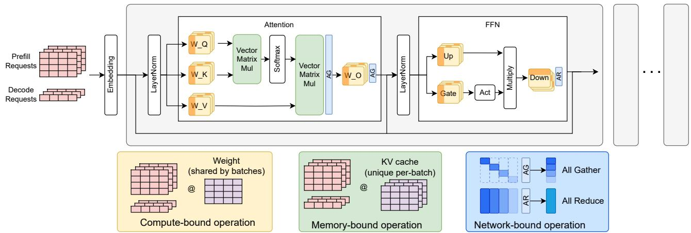  
Figure 1: Transformer architecture. The operations in the yellow boxes have large batch sizes and share model weight parameters across requests; hence, they are compute-bound. Operations in green boxes require loading a unique KV cache for each request; hence, they are memory-bound. The blue box represents network operations that perform synchronization between operations.

• A comprehensive evaluation of NanoFlow that achieves 1.91× throughput gain compared to baselines and 68.5% of theoretical maximum throughput.

## 2 Background

## 2.1 LLM Inference Workflow

Recent LLMs like GPT-4, LLaMA, and Mistral [16, 29, 49] are based on the decoder-only transformer [51]. The inference process of these LLMs has two phases [53]: (1) prefill, which processes the input prompt all at once, and (2) decode, which generates output tokens one at a time autoregressively. The prefill phase initializes the KV-cache [34], which keeps the per-request state to speed up the decode phase.

Both the prefill and decode phases utilize the same inference workflow in Figure 1. Upon receiving an inference request, the input traverses identical transformer layers to produce the subsequent tokens. In each transformer layer, during the attention stage, the input is multiplied by weight matrices $W _ { Q } , W _ { K }$ , and $W _ { V }$ to form Query, Key, and Value, with Key and Value concatenated into the existing KV-cache. The Query is then multiplied with the existing Keys and normalized to assess the similarity between the current token and all previous tokens. This similarity is employed to compute the weighted average of the Value, aggregating the context information. The outcome undergoes O-projection through a linear transformation using $W _ { O }$ followed by a layer normalization operation [6]. Subsequently, during the feed-forward network stage, the activation is multiplied by $W _ { u p }$ and $W _ { g a t e }$ separately to generate $o _ { u }$ and $o _ { g } .$ . Next, $o _ { g }$ passes through an activation function (e.g., SiLU [10]), followed by an elementwise multiplication with $o _ { u } .$ . Finally, $W _ { d o w n }$ is applied as the Down-projection to generate the output, which serves as the input to the next layer.

## 2.2 Operation Characteristics

According to the characteristics of the operations during inference, we can classify them into four categories.

Dense operations. The KQV generation, O projection, Up, Gate, and Down projection compute the multiplication of activations and model weights, which we define as dense operations. In the prefill phase, all tokens of new requests form a large batch for these dense operations. In the decode phase, batched decoding aggregates the activations from all the decode requests for dense operations [53]. Moreover, as the prefill phase and decode phase share weight matrices, the activations from both phases can be combined to further exploit the batching effect by amortizing the weight loading cost [3]. As a result, dense operations are compute-bound.

Attention operations. Transformers capture token relations through attention [51]. The prefill phase processes all input tokens simultaneously, making it compute-bound, while the decode phase generates one token per iteration, loading cached K and V vectors from the KV-cache, making it memory-bound.

Network operations. Collective communication operations including AllGather (AG) and AllReduce (AR) are network-bound and call for high bandwidth interconnection between nodes like NVLink [25].

Other operations. We classify the rest of the operations in transformer architecture, e.g., layer norms, positional embeddings, etc., as other operations, due to their short runtime compared to dense, attention or network operations.

## 2.3 Serving LLMs at Scale

With large models, multiple GPUs are required to provide enough resources, including both memory and compute, for efficient LLM serving [18]. Existing works [12, 38, 57] have comprehensive evaluations of different inter-device paral-

lelism paradigms:

Tensor Parallelism [38, 57] splits each weight matrix onto different GPUs and executes each operation collectively, avoiding weight duplication, thereby scaling compute capacity. However, frequent collective communications after operations are required to synchronize each operation’s results, as shown in Figure 1.

Pipeline Parallelism [14] splits the model into stages by layers so that each GPU only needs to hold part of the weights. While all devices with tensor parallelism execute on the same batch of data, devices with pipeline parallelism operate on different micro-batches of data split by stages.

In practice, these parallelism paradigms are typically used in combination. Tensor parallelism is commonly applied across GPUs within a single node, where high-bandwidth interconnects are available, to support larger batch sizes. Pipeline parallelism, on the other hand, is employed across nodes to further scale the system.

## 3 Analysis

We now introduce the factors determining the throughput of LLM serving (§3.1) and model the cost of LLM serving (§3.2). We then classify modern LLM serving workloads according to our model (§3.3) and empirically validate this classification (§3.4), showing that popular workloads are compute-bound. Then, for the compute-bound scenarios, we determine optimal serving throughput (§3.5), explain why existing systems fall short of the optimal (§3.6), and how this motivates our proposed approach, intra-device parallelism (§3.7).

## 3.1 Key Factors of Serving Throughput

We define throughput as the total throughput of serving, which is the number of tokens processed per second by both prefill and decode phases. Throughput is affected by hardware properties, model configuration, user queries, and batch size.

Hardware specification. The following factors determine the available GPU hardware resources:

$N _ { G P U } .$ number of GPUs

• MemBW (GB/s): aggregate GPU memory bandwidth

• MemSize (GB): aggregate GPU memory capacity

• Compute (GFLOP/s): aggregate GPU compute capacity

• NetBW (GB/s): aggregate GPU interconnect bandwidth Model configuration. The following factors regarding the model architecture determine the computation, memory, and network demand when serving LLMs:

$D _ { m o d e l } { : }$ hidden dimension size

$L \mathrm { : }$ number of layers

$P _ { M o d e l } \mathrm { : }$ number of parameters

$R _ { G O A } { \mathrm { : } }$ group size of GQA 1

$S _ { t y p e }$ (Bytes): number of bytes (size) of the data type for model parameters (e.g., 2 for FP16)

User query statistics. The following user input statistics also affect the system throughput:

• p: average number of tokens in prompts to be prefilled

• d: average number of tokens in output to be decoded

Therefore, a serving request from a user corresponds to p prefill tokens and d decode tokens on average, for a total of p+d tokens that we use when calculating the total throughput. Using user query statistics, total throughput (tokens generated per second) can be easily converted to other throughput metrics, for example, decoding throughput (decode output per second) is $\begin{array} { r } { \frac { d } { p + d } \times \mathbf { \bar { T h r o u g h p u i t } } _ { \mathrm { t o t a l } } } \end{array}$ , and request per second is ${ \frac { 1 } { p { + } d } } ~ ;$ × Throughputtotal.

Batch size. An optimal throughput-oriented serving system needs to process large batches. For compute-bound dense operations, e.g., GEMMs, a larger batch amortizes the weight loading overhead and increases execution unit occupancy, which provides higher compute utilization. For memoryand network-bound operations, all requests share the same warmup cost (e.g., kernel launching overhead, pipeline setup overhead, network synchronization overhead, etc.), so a larger batch size leads to higher throughput. Therefore, when considering the optimal system throughput, we assume that the system always operates at the largest batch size at which the total available memory can hold the model weights and all the KV caches for the requests. 2

## 3.2 Cost Model of LLM Serving

Under the assumption of maximum batch size, we derive the latency of an LLM serving iteration (where a batch of user requests are being processed by all the transformer layers) from the perspectives of required memory, compute, and network resources.

Memory. From the memory perspective, latency is:

$$
T _ { m e m } = \frac { M e m S i z e } { M e m B W }\tag{1}
$$

This is because the entire device memory content needs to be loaded into the GPU caches and registers once for each iteration (typical in modern serving systems [17]) when using the largest batch size. Although the model weights are shared between iterations, due to the long reuse distance, it is infeasible to cache the model weights and avoid loading from the device memory.

Compute. In LLM serving, all operations contribute to the total compute, while Dense operations produce the vast majority of computations for typical workloads (as we validate in §3.4). Therefore, we model the compute latency of dense operations below.

For every GEMM in dense operations, $2 B _ { D e n s e } N _ { w } K _ { w }$ computations need to be performed on weights and activations, where $N _ { w }$ and $K _ { w }$ are dimensions of the weight matrices, and $B _ { D e n s e }$ is the batch size for dense operations, which includes decode tokens from hundreds of requests and the prefill tokens from one or a few requests. Thus, the total compute for dense operations is $2 B _ { D e n s e } \sum N _ { w } K _ { w }$ . Note that the $\Sigma N _ { w } K _ { w }$ term is the number of weight elements in all layers, which can be approximated using $P _ { M o d e l }$ (the parameters in the model), thus, we simplify the expression as $2 B _ { D e n s e } P _ { M o d e l }$ . Therefore, latency from the compute perspective is:

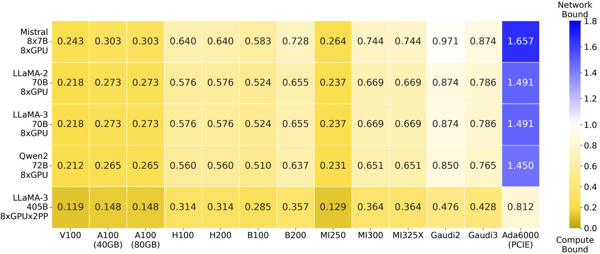  
Figure 2: Comparison of network time and compute time. The closer to yellow, the more compute-bound the workload is, whereas the closer to blue indicates the workload is more network-bound.

<table><tr><td colspan="7"></td><td colspan="2">Memory Bound</td></tr><tr><td>LLaMA-3 8B 1xGPU</td><td>0.23</td><td>0.31</td><td>0.37</td><td>0.61</td><td>0.68</td><td>1.09</td><td></td><td>1.4</td></tr><tr><td>Mistral 8x7B 8xGPU</td><td>0.12</td><td>0.17</td><td>0.20</td><td>0.32</td><td>0.36</td><td>0.58</td><td></td><td>-1.2</td></tr><tr><td>LLaMA-2 70B 8xGPU LLaMA-3</td><td>0.07</td><td>0.09</td><td>0.11</td><td>0.18</td><td>0.20</td><td>0.32</td><td></td><td>-1.0 -0.8</td></tr><tr><td>70B 8xGPU</td><td>0.07</td><td>0.09</td><td>0.11</td><td>0.18</td><td>0.20</td><td>0.32</td><td></td><td>-0.6 -0.4</td></tr><tr><td>Qwen2 72B 8xGPU</td><td>0.07</td><td>0.09</td><td>0.11</td><td>0.18</td><td>0.20</td><td>0.31</td><td></td><td>-0.2 0.0</td></tr><tr><td></td><td>LMSYS-Chat Splitwise ShareGPT 512-512</td><td></td><td></td><td></td><td></td><td>1024-512 512-1024</td><td>Compute Bound</td><td></td></tr></table>

Figure 3: Comparison of compute time and memory time. The closer to yellow, the more compute-bound the workload is, whereas the closer to green the more memory-bound it becomes.

$$
T _ { C o m p u t e } \approx \frac { 2 { \cal B } _ { D e n s e } \cdot P _ { M o d e l } } { C o m p u t e }\tag{2}
$$

Network. Finally, for tensor parallelism, collective network communication primitives are needed to synchronize the results after performing operations in multiple GPUs over different shards of data. The size of the data transmitted with collective communication equals the size of inputs for dense operations, which have dimensions $[ B _ { d e n s e } , D _ { m o d e l } ]$ . To support tensor parallelism, two AGs and one AR (or 2 ARs) are required [39]. An AR requires gathering outputs from other GPUs, performing local summation, and broadcasting results, thus it needs to transfer the activations twice, while an AG transfers activations once. Therefore, in both cases, we can estimate the total data movement for one GPU in bytes as $4 \cdot B _ { D e n s e } D _ { m o d e l } S _ { t y p e } \cdot L$ . Thus, the latency from the network perspective is:

$$
T _ { n e t } \approx 4 \cdot \frac { ( N _ { G P U } - 1 ) B _ { D e n s e } D _ { m o d e l } S _ { t y p e } L } { N e t B W }\tag{3}
$$

## 3.3 Classification of LLM Serving Workloads

We classify LLM serving workloads by comparing the latency of an iteration derived based on memory, compute, and network requirements.

First, we compare Equation 3 (network time) with Equation 2 (compute time). Their ratio can be calculated as

$$
\frac { T _ { N e t } } { T _ { C o m p u t e } } = \frac { 2 D _ { m o d e l } L } { P _ { m o d e l } } \frac { ( N _ { G P U } - 1 ) C o m p u t e } { N e t B W / S _ { t y p e } }
$$

Note that $P _ { m o d e l } \ \approx \ 1 2 D _ { m o d e l } ^ { 2 } L ^ { 3 } .$ , thus $\frac { 2 D _ { m o d e l } L } { P _ { m o d e l } }$ ≈ $1 / ( 6 D _ { m o d e l } )$ For models that need multiple GPUs (where $T _ { N e t }$ is relevant), $D _ { m o d e l }$ is typically larger than 4096 [9, 16, 22, 48], making the term $\frac { \check { 2 } \check { D } _ { m o d e l } \check { L } } { P _ { m o d e l } }$ smaller than $1 \times 1 0 ^ { - 5 }$ . Due to the high bandwidth interconnect between data center GPUs (e.g., NVLink [25], Infinity Fabric [54]),

$^ 3 P _ { m o d e l } = \left( \left( W _ { K } + W _ { Q } + W _ { V } \right) + W _ { O } + W _ { U } + W _ { G } + W _ { D } \right) L \approx \left( \left( 1 / R _ { G Q A } + 1 + 1 / R _ { U } \right) + 1 / R _ { G Q A } \right) L$ $1 / R _ { G Q A } ) D _ { m o d e l } ^ { 2 } + D _ { m o d e l } ^ { 2 } + D _ { m o d e l } I _ { m o d e l } + D _ { m o d e l } I _ { m o d e l } + I _ { m o d e l } D _ { m o d e l } ) L ) z$ ≈ $( 1 + \bar { 1 } + 3 . \bar { 5 } + 3 . 5 + 3 . \bar { 5 } ) D _ { m o d e l } ^ { 2 } L \approx 1 2 D _ { m o d e l } ^ { 2 } L ,$ , where Imodel is intermediate dimension, which is typically 3.5x of Dmodel [16, 22].

Table 1: Characteristics of accelerator models across various vendors and release years.
<table><tr><td rowspan="2">Vendor</td><td rowspan="2">Model</td><td rowspan="2">Release Year</td><td rowspan="2">MemSize (GB)</td><td rowspan="2">MemBW (GB/s)</td><td rowspan="2">NetBW (GB/s)</td><td rowspan="2">Compute (FP16 GFLOP/s)</td><td rowspan="2">MemSize MemBW</td><td rowspan="2">Compute MemBW</td><td rowspan="2">NetBW MemBW</td></tr><tr><td></td></tr><tr><td>NVIDIA</td><td>V100</td><td>2017</td><td>16</td><td>900</td><td>300</td><td>125,000</td><td>0.018</td><td>139</td><td>0.33</td></tr><tr><td>NVIDIA</td><td>A100</td><td>2020</td><td>40</td><td>1,555</td><td>600</td><td>312.000</td><td>0.026</td><td>200</td><td>0.39</td></tr><tr><td>NVIDIA</td><td>A100</td><td>2021</td><td>80</td><td>2.000</td><td>600</td><td>312.000</td><td>0.040</td><td>156</td><td>0.30</td></tr><tr><td>NVIDIA</td><td>H100</td><td>2023</td><td>80</td><td>3,352</td><td>900</td><td>989.000</td><td>0.024</td><td>295</td><td>0.268</td></tr><tr><td>NVIDIA</td><td>H200</td><td>2024</td><td>141</td><td>4,800</td><td>900</td><td>989,000</td><td>0.020</td><td>206</td><td>0.19</td></tr><tr><td>NVIDIA</td><td>B100</td><td>2024</td><td>192</td><td>8.000</td><td>1,800</td><td>1,800.000</td><td>0.015</td><td>225</td><td>0.23</td></tr><tr><td>NVIDIA</td><td>B200</td><td>2024</td><td>192</td><td>8.000</td><td>1,800</td><td>2,250,000</td><td>0.015</td><td>281</td><td>0.23</td></tr><tr><td>AMD</td><td>MI250</td><td>2021</td><td>128</td><td>3,352</td><td>800</td><td>362.000</td><td>0.038</td><td>107</td><td>0.24</td></tr><tr><td>AMD</td><td>MI300</td><td>2023</td><td>192</td><td>5,300</td><td>1,024</td><td>1,307,000</td><td>0.036</td><td>246</td><td>0.19</td></tr><tr><td>AMD</td><td>MI325X</td><td>2024</td><td>256</td><td>6.000</td><td>1,024</td><td>1,307,000</td><td>0.043</td><td>218</td><td>0.17</td></tr><tr><td>Intel</td><td>Gaudi 2</td><td>2022</td><td>96</td><td>2,400</td><td>600</td><td>1,000,000</td><td>0.040</td><td>417</td><td>0.25</td></tr><tr><td>Intel</td><td>Gaudi 3</td><td>2024</td><td>128</td><td>3,700</td><td>1,200</td><td>1,800.000</td><td>0.035</td><td>486</td><td>0.32</td></tr><tr><td>NVIDIA</td><td>Ada 6000</td><td>2022</td><td>48</td><td>960</td><td>64</td><td>182.000</td><td>0.050</td><td>190</td><td>0.067</td></tr></table>

$\frac { N _ { G P U } C o m p u t e } { N e t B W / S _ { t y p e } }$ ranges from $1 \times 1 0 ^ { 4 } \mathrm { t o } 1 \times 1 0 ^ { 5 }$ . Therefore, this ratio is typically less than 1, indicating that the network is not the bottleneck. We illustrate this ratio in Figure 2. For large models and data center GPUs, the compute takes more time than network.

We then compare Equation 1 (memory time) and Equation 2 (compute time) to finally determine the characteristics of the workload, namely, the following value

$$
T _ { R } = \frac { T _ { M e m } } { T _ { C o m p u t e } } \approx \frac { C o m p u t e } { M e m B W } \frac { M e m S i z e } { P _ { m o d e l } } \frac { 1 } { 2 B _ { d e n s e } }\tag{4}
$$

Modern models widely adopt Grouped Query Attention (GQA) as seen in LLaMA-3 [48], NeMo [4], and Qwen2 [9]. In GQA, multiple attention heads share a KV-cache, which effectively means that given the same memory capacity, batches can contain more requests. Consequently, $B _ { d e n s e }$ tends to be larger. For example, when serving LLaMA-2 70B on $8 \times A 1 0 0$ GPUs, the maximum batch size of decode requests is on the order of 1024. Combined with the prefill tokens in the batch, $B _ { d e n s e }$ can reach 2048 while a non-GQA model with the same size can only have $B _ { d e n s e } = 2 5 6$ . Thus, the ratio $T _ { R }$ is less than 1, and compute becomes the main bottleneck. Additionally, modern models tend to have increasingly large model sizes $P _ { m o d e l }$ (whereas the rest of the terms in $T _ { R }$ are constants given a hardware specification), further causing $T _ { R }$ to drop below 1.

Figure 3 shows the values of $T _ { R }$ with five representative models: LLaMA-3 8B [22] with 1×A100, Mistral 8×7B [16] with 8×A100, LLaMA-2 70B [49] with 8×A100s, LLaMA-3 70B with 8×A100s, Qwen-2 72B [9] with 8×A100s. As the heatmap figure shows, many of the workloads (Splitwise [32], LMSYS-Chat-1M [56], ShareGPT [1] as well as constant length inputs and outputs), are uniformly compute-bound, except in the case of the long decode (512-1024) workload on LLaMA-3 8B model, where the ratio $T _ { R }$ is around 1.

While the analysis is mainly conducted on an NVIDIA A100, the result remains similar for other accelerators. As shown in Table 1, compute/memory ratio and compute/network ratio are stable across vendors and generations, meaning the workload characteristics also remain largely unchanged.

To summarize, our cost model suggests that modern LLM serving workloads operate in a compute-bound regime, which we validate empirically in the next section.

## 3.4 Validation of the Cost Model

We validated our cost model on LLaMA-2 70B serving with 8 NVIDIA A100 GPUs and a dense batch size of 2048 requests. We computed the GFLOPs, memory movement, and network traffic for each operation (Table 2) and used these with our model to calculate $T _ { c o m p u t e } , T _ { m e m } .$ , and $T _ { n e t }$ based on hardware specifications4. The longest estimated time $T _ { o p } = \operatorname* { m a x } \left( T _ { c o m p u t e } , T _ { m e m } , T _ { n e t } \right)$ indicates the most constrained resource. To validate these results, we measure the running time of different operations. For most operations, $T _ { o p }$ aligns with profiling results. An exception is prefill attention, where the real measured time is larger due to the launching overhead of the associated kernels dominating the total time. The sums of all operations’ $T _ { c o m p u t e } , T _ { m e m } .$ , and $T _ { n e t }$ values show that compute is the most constrained resource, which aligns with our model’s finding.

## 3.5 Optimal Serving Throughput

Optimal throughput (measured in token/s/GPU) is achieved when the most limited resource, i.e. compute, is fully utilized. By applying Equation 2, the system’s optimal throughput is:

$$
\mathrm { T h r o u g h p u t _ { o p t i m a l } } = \frac { B _ { D e n s e } } { T _ { C o m p u t e } } = \frac { C o m p u t e } { 2 P _ { M o d e l } }\tag{5}
$$

In the compute-bound regime, the optimal throughput depends solely on the aggregate computational capacity of the GPUs for the specific data type and the number of parameters in the model. Notably, other factors, including the GPU memory size, bandwidth, model data type, or the length of prefill and decode phases, do not have a significant impact on the theoretical optimal throughput, as long as the workload is overall compute-bound. We measure the GPU compute capacity by profiling the state-of-the-art GEMM vendor library, CUTLASS [46]. For example, when serving LLaMA-2 70B on 8×A100 GPUs, the profiled peak Compute is 280 TFLOPS for FP16, and the $P _ { M o d e l }$ is 70B. Substituting these into Equation 5, yields an optimal throughput of 1857 tokens/s/GPU.

Table 2: Comparison of operation runtimes between cost model estimation and real-world measurements.
<table><tr><td>Operation</td><td>Compute (GFLOP)</td><td>Mem Load (GB)</td><td>Net Usage (GB)</td><td>Est.  $T _ { c o m p }$  (ms)</td><td>Est.  $T _ { m e m }$  (ms)</td><td>Est.  $T _ { n e t }$  (ms)</td><td>Real Time (ms)</td></tr><tr><td>KQV</td><td>27487.8</td><td>19.5</td><td>0</td><td>11.01</td><td>1.22</td><td>0</td><td>16.08</td></tr><tr><td>0</td><td>21990.2</td><td>16.1</td><td>0</td><td>8.81</td><td>1.01</td><td>0</td><td>16.01</td></tr><tr><td>UG</td><td>153931.6</td><td>96.6</td><td>0</td><td>61.67</td><td>6.04</td><td>0</td><td>69.92</td></tr><tr><td>D</td><td>76965.8</td><td>49.7</td><td>0</td><td>30.84</td><td>3.11</td><td>0</td><td>34.96</td></tr><tr><td>DecAttn</td><td>3665.9</td><td>462.2</td><td>0</td><td>1.47</td><td>28.89</td><td>0</td><td>35.60</td></tr><tr><td>PfAttn</td><td>916.3</td><td>2.1</td><td>0</td><td>0.37</td><td>0.13</td><td>0</td><td>4.56</td></tr><tr><td>Net</td><td>18.8</td><td>75.2</td><td>75.2</td><td>0.01</td><td>4.70</td><td>31.33</td><td>47.92</td></tr><tr><td>Total</td><td></td><td></td><td></td><td>114.17</td><td>45.09</td><td>31.33</td><td></td></tr></table>

## 3.6 Gap to Optimal Throughput

As shown in Figure 7, existing serving systems fall far short of achieving optimal throughput. When serving offline requests, vLLM, DeepSpeed-FastGen, and TensorRT-LLM achieve only 22.0%, 22.9%, and 37.8% of the optimal throughput, respectively.

The main reason why existing serving systems fall significantly short of achieving optimal throughput is poor utilization of GPU resources. Figure 4 shows the execution flow of transformer operations within a GPU, using existing serving frameworks like SGLang [58], vLLM [17], DeepSpeed-FastGen [13]. These frameworks execute compute-, memory-, and network-bound operations sequentially on a single large batch in a device. This sequential execution flow forms multiple pipeline bubbles (denoted as "WASTED" in Figure 4), which cause the most constrained resource, compute, to be underutilized.

## 3.7 Intra-device Parallelism

Ostensibly, the advantage of existing serving frameworks when using a single large batch in a GPU is that they need to load model weights fewer times than if there were multiple smaller batches and corresponding operations.

However, the cost model and its validation that we outlined earlier in this section provides a valuable insight: Since modern models are largely compute-bound (by a factor of more than 2 as shown in Figure 3 and Table 2), creating and processing smaller batches may be justified, especially if compute utilization can be increased.

These observations motivate intra-device parallelism through nano-batching, which underlies the design of NanoFlow. NanoFlow creates multiple nano-operations, which are the same operations as the original operations, but operate on finer-grained batches that we call nano-batches. For example, for the original Up projection operating on a batch size of 2048, NanoFlow could create two nanooperations UP1 and UP2, operating on batches in ranges 0-768 and 768-2048, respectively, while performing the exact same projection. Different nano-batches do not have data dependencies. Therefore, nano-operations that use different resources—compute, memory, network—can operate on different nano-batches in parallel within a device to maximize the utilization of the most constrained resource, compute. Despite requiring repeated loading of model weights, we demonstrate that NanoFlow provides significantly more throughput than existing frameworks (1.91× on average), further closing the gap to optimal serving throughput (§6).

## 4 Design

We introduce NanoFlow’s key components: the auto-search engine for automatic nano-batch pipeline computation (§4.1) and the LLM serving runtime for pipeline execution (§4.2).

## 4.1 Automated Pipeline Search

Deciding number of nano-operations, kernels, scheduling with intra-device parallelism, and resource allocation is challenging due to model and hardware diversity. To address this, NanoFlow proposes auto-search, which uses Mixed Integer Linear Programming (MILP) to obtain the nano-batch overlapping strategy, with a two-stage approximation for reducing the search space. We first outline auto-search prerequisites including kernel profiling and interference modeling (§4.1.1), then detail its two stages: pipeline structure search (§4.1.2) and GPU resource allocation (§4.1.3). Finally, we provide example pipelines for popular models (§4.1.4).

## 4.1.1 Kernel Profiling and Interference Modeling

Understanding the performance characteristics of different operations is key to automated pipeline search. For this, NanoFlow profiles GEMM kernels (used for compute-bound operations such as KQV generation), GEMV kernels (used in memory-bound operations as in decode-attention), and network kernels (used in network-bound operations such as AR and AG).

Determining the maximum dense batch size Given a specific model architecture and user input statistics (as described in §3.1), NanoFlow calculates the maximum dense batch size that can fit into the GPU memory (e.g., around 2048 for 8 × A100 serving LLaMA-2 70B). This dense batch size serves as an input to auto-search, which sets an upper bound of shapes in profiling.

Profiling interference-free kernels NanoFlow then determines the interference-free execution time of kernels, where each operation exclusively uses the GPU. NanoFlow profiles kernels with discrete input batch sizes from 128 to the dense batch size in multiples of 128, as 128 is a hardware-friendly shape for GEMM tiling. NanoFlow explores all possible kernel implementations varying the number of thread blocks, the number of warps, and tile size for GEMM, GEMV, and network kernels to identify the implementation that provides the shortest execution time. The profiling outputs a mapping from (kernel, batch size) to its best implementation and execution time.

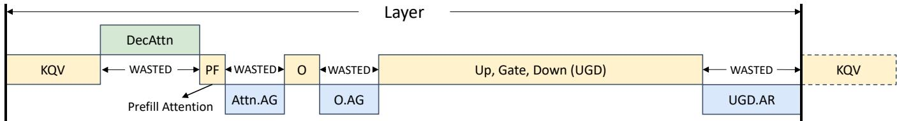  
Figure 4: Execution pipeline of existing systems. The green, yellow, and blue operations correspond to memory-, compute-, and network-bound operations. Operations in the previous and next layer are denoted by dotted borders. "WASTED" shows the stages in the pipeline where the most constrained resource, compute, is underutilized. Small operations (i.e. layernorm, activation, etc.) are omitted for simplicity.

Profiling kernels with interference However, when two or more kernels execute in parallel on a device, they slow down compared to running separately. We refer to this as kernel interference, which is attributed to kernels competing for GPU hardware resources such as execution units, caches, power, and memory controllers [43]. Ideally, we would like to independently assign each nano-operation a fractional allocation of a single GPU’s compute, memory, and network bandwidth. We call this fraction $R _ { p h y s i c a l }$ . Unfortunately, kernel interference is unpredictable, as NVIDIA GPUs do not give explicit control over compute, memory, and network bandwidth. Thus, we cannot directly control $R _ { p h y s i c a l }$

Instead, we use GEMM performance as a proxy R for $R _ { p h y s i c a l }$ and model pairwise kernel interference. We define R in a GEMM-centric way since the compute-bound operations dominate and optimizing compute is the goal of NanoFlow.

In particular, we profile pairwise kernel interference patterns by measuring actual performance when overlapping between a compute kernel A and another kernel B. For example, if when overlapped, GEMM kernel A achieves 40% performance compared to its best performance when run individually, then we say that $R _ { A } { = } 0 . 4$ . We then assume that the overlapped kernel is given the remaining resources, so we set $R _ { B } = 1 - R _ { A } = 0 . 6$

Then, we model the interference by measuring the performance loss in the non-compute kernel B when $R _ { A }$ resources are allocated to kernel A. When overlapping A and B, we normalize A and B’s performance to their peak performance when run individually. We call this value P. For the compute kernel A, $P _ { A }$ is equivalent to $R _ { A }$ by definition, while $P _ { B }$ captures the memory or network utilization when $R _ { A }$ resources are assigned to the compute kernel.

Intuitively, this process establishes an exchange rate between compute utilization R and memory or network performance P . The overall kernel interference model can then be captured in a table such as Table 3, which maps R to P for each kernel type.

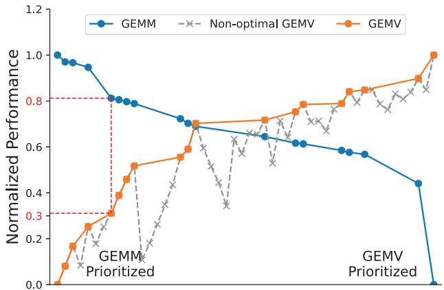  
Figure 5: Interference characteristics between GEMM and GEMV kernels. The points on the x-axis correspond unique GEMM-GEMV implementation pairs. The y-axis denotes the GEMM and GEMV kernels’ normalized performance P.

Nonetheless, profiling the mapping between R and P remains challenging due to the vast number of possible kernel combinations. While each operation may have only a few hundred kernel implementations, the combinations between different implementations of overlapping kernels exponentially expand the profiling space, resulting in millions of possible configurations. This immense complexity makes exhaustive exploration infeasible.

NanoFlow reduces the profiling space by limiting the thread block numbers for GEMV and network kernels to values between 8 and 128 (in steps of 8), as 128 blocks are sufficient to saturate their performance. It also excludes less efficient GEMM kernels, which have longer execution times while using more thread blocks. NanoFlow focuses on pairwise interference analysis—compute-memory and compute-network— rather than examining three kernel types simultaneously and assumes that the R to P mapping profiled with pairwise interference holds when overlapping three kernels.

Figure 5 shows NanoFlow’s profiling results of GEMM-GEMV kernel pairs (∼ 100 pairs, after the aforementioned simplifications) on an A100 GPU with GEMM shape $( M , N , K ) = ( 3 8 4 , 4 0 9 6 , 4 0 9 6 )$ , GEMV batch size 384, and sequence length 1024. These pairs are then sorted by descending GEMM performance, as shown in Figure 5. For instance, a normalized performance of 0.8 means the kernel’s execution time is 1/0.8 times longer than the fastest implementation. Pairs with higher interference on GEMM but worse GEMV performance (grayed-out in Figure 5) are discarded. This process identifies the best-performing kernel combinations at various GEMM-GEMV performance trade-off points.

Table 3: Performance P of GEMV and network kernels with different resource utilization R.
<table><tr><td rowspan="2">Operations</td><td colspan="6">Resource Utilization (R)</td></tr><tr><td>0</td><td>0.1</td><td>0.2</td><td>0.8 ：</td><td>0.9</td><td>1</td></tr><tr><td>GEMM (by definition)</td><td>0</td><td>0.1</td><td>0.2</td><td>：</td><td>0.8 0.9</td><td>1</td></tr><tr><td>GEMV</td><td>0</td><td>0.2</td><td>0.3</td><td>：</td><td>0.85 0.95</td><td>1</td></tr><tr><td>Network</td><td>0</td><td>0.3</td><td>0.5</td><td>：</td><td>0.9 1</td><td>1</td></tr></table>

Using interference profiles, auto-search generates a resource mapping table (Table 3). This table quantifies GEMV and network kernel performance (P) as functions of resource utilization (R). For example, as depicted by the dotted red line in Figure 5, achieving 0.3 GEMV performance requires sacrificing 0.2 GEMM performance (from 1 to 0.8). This implies a non-linear trade-off: 0.2 GEMM performance is exchanged for 0.3 GEMV performance, indicating that $R _ { \mathrm { G E M V } } = 0 . 2$ corresponds to $P _ { \mathrm { G E M V } } = 0 . 3$

A sensitivity analysis of all GEMM shapes in the evaluated LLM models and 64 batch size combinations reveals that the R to P mapping is consistent, with a standard deviation within 5% of the mean. Consequently, Table 3 can be used to map R to P for all GEMV and network kernel implementations in subsequent auto-search analysis.

## 4.1.2 Auto-search Stage I: Pipeline Structure Search

In the first stage, auto-search takes as input the dense batch size, the operation dependencies (defined in the PyTorch implementation of a given model architecture), and the profiling of interference-free kernels, and then produces as output, the number, batch size, and order of each nano-operation using mixed integer linear programming (MILP). Stage I does not factor in the interference between nano-operations to simplify the problem, which is covered by Stage II. The MILP problem is subject to the constraints described below.

Optimization objective. The main objective of MILP is to remove pipeline bubbles (denoted by wasted in Figure 4) for compute operations to minimize execution time.

Constraints on the number of nano-operations. To overlap resources, each operation needs to be split into at least two nano-operations, each operating on an independent nanobatch. As splitting into nano-operations reduces the batching effect, the number of nano-operations should be minimized. Thus, auto-search begins its search by dividing all operations into two nano-operations and formulating the MILP problem to identify the batch size, execution time, and ordering of the nano-operations. If the temporary best solution has bubbles for compute, auto-search increases the number of nano-operations for operations near the bubble to improve resource utilization until MILP cannot produce better solutions.

Constraints on batch sizes and execution times. Autosearch forces the batch sizes to be chosen from 128 to dense batch size and uses the interference-free execution time of a nano-operation for a given batch size, as computed in §4.1.1.

Constraints on dependencies. The dependencies of nanooperations are determined by their parent operations (present in baseline implementations, e.g., in pytorch) and their input batches. Two nano-operations are dependent if and only if their parent operations are dependent (e.g., an O-projection depends on an attention operation) and their input batches intersect (e.g., ranges 0–255 and 128–383).

Constraints on overlapping. Overlapping kernels constrained by the same resource (e.g., compute) are unhelpful for utilization, so auto-search restricts the pipeline to overlap only operations constrained by different resources.

Constraints on operation transformations. Some network collectives have equivalent transformations with different performance characteristics and dependencies. For example, an AG can be converted into an AR with different weight partitioning approaches [39, 57]. NanoFlow explores all of these alternative transformations for network nano-operations and searches for the shortest pipeline design.

Due to the large search space, searching for an optimal pipeline would take hours or even days. However, a practical pipeline can be found in approximately 10 minutes by prioritizing searching a feasible solution instead of finding a provably-optimal solution.

## 4.1.3 Auto-search Stage II: Refining the Pipeline

The pipeline derived in the first stage does not factor in kernel interference, which is impractical for real deployment. In the second stage, auto-search refines this pipeline by considering kernel slowdown due to interference. This stage formulates a separate MILP problem, where the numbers, batch sizes, and ordering constraints of nano-operations remain the same (i.e., outputs of the first stage). Auto-search explores various resource utilization (R) allocations to individual nano-operations, and maps R to P using Table 3 derived in interference profiling. A specific resource utilization value R directly corresponds to kernel implementations as determined in §4.1.1. The goal of the second stage is again to minimize pipeline execution time.

Constraints on GPU resource utilization. As discussed in §4.1.1, concurrent kernels should compete for a total of 1.0 of GPU resource utilization R. Thus, auto-search forces the sum of R at any given time to be less than or equal to 1.0.

Constraints on execution times. Given the resource utilization R for a nano-operation, auto-search computes the execution time of the operation using $D _ { \mathrm { b e s t } } / P _ { \mathrm { : } }$ , where $D _ { \mathrm { b e s t } }$ represents the best execution time without interference and P is derived using Table 3.

The auto-search is performed only when the model architecture or workload (input length, output length) undergoes significant changes. Compared to the long-running deployment times, the search time is negligible.

## 4.1.4 Example Pipelines

70B pipeline We apply auto-search to 70B-scale models, including LLaMA-2 70B, LLaMA-3 70B, Qwen2.5-72B, and Deepseek-67B. Compared to LLaMA-2 70B, LLaMA-3 70B features a larger vocabulary size of 128K, which increases the sampling time; Deepseek-67B has a slightly different number of layers and hidden dimension $( D _ { m o d e l } )$ , Qwen2.5-72B introduces bias in KQV generation. However, none of these adjustments significantly change the performance characteristics, leading to similar schedules. We provide the NanoFlowgenerated pipeline for LLaMA-2 70B as an example in Figure 6. Since three resources (compute, memory, and network) overlap at the beginning of a decoding layer (i.e., KQV generations), auto-search ends up using 4 nano-operations for this part, to reduce pipeline bubbles. Here, the decode attention operation has resource utilization 0.4 (i.e. reduces 40% GEMM performance) and reaches 80% of maximum decode attention performance. For the remainder of the pipeline, GEMM operations are prioritized, and only two nano-operations are used.

8B pipeline 8B models (e.g. Llama3-8B) do not require network operations as they fit in a single GPU. Thus auto-search splits all operations into two nano-operations, with decode attention overlapping with the Up Gate Down projection.

MoE pipeline Compared to 70B models, MoE models have different hidden dimensions and number of layers. Due to the imbalance between experts [16], NanoFlow uses tensor parallelism for MoEs, in which FFN is implemented using grouped-GEMM. FFN also involves an additional gate routing operation. Auto-search works similarly for an MoE model and automatically produces an efficient pipeline (§6).

## 4.2 NanoFlow Runtime

We now explain how NanoFlow executes the auto-generated pipeline by asynchronous scheduling (§4.2.1), and KV-cache SSD offloading for multi-round conversations (§4.2.2).

## 4.2.1 Request Scheduling

Batch formation NanoFlow assumes that auto-scaling, workload balancing, and priority-aware routing are managed by the control plane externally [15,33,45]. A NanoFlow instance assumes an abundance of requests and treats each request with equal priority. When requests are not abundant, the control plane should reduce the number of NanoFlow instances to maintain a sufficiently large per-instance batch size. Note that while the $B _ { d e n s e } ,$ i.e. the token batch size for GEMMs, is on the order of thousands (e.g., 1 prefill request of 2048 tokens and 256 decode tokens), this represents the combination of prefill and decode tokens. Therefore, the request batch size (e.g., 1 prefill and 256 decode requests) is on the order of hundreds, which is easy to attain in real-world large-scale serving.

When forming a batch, NanoFlow prioritizes unfinished decode requests and chunks prefill requests at a token granularity following SarathiServe [3] to exactly fill the remaining capacity of a pre-selected best-performing dense batch. This effectively reduces the tail latency as dense operations are performed over consistent batch sizes across iterations. Initially, the global batch contains only prefill requests (requests in prefill stages). As these requests complete the prefill stage, they transition to decode requests within the batch, and new prefill requests are introduced to maintain the fixed token batch size. As decode requests increase, the prefill token budget decreases, causing prefill requests to slow down. When decode requests begin completing, this frees space for more prefill tokens again, speeding up prefill. Thus, the number of decode requests and prefill requests will be stabilized.

To optimize GPU memory usage and avoid running out of memory, NanoFlow predicts peak future memory usage based on the status of user requests. NanoFlow tracks decoded tokens per request, estimates completion time using average decode length, and prefills new requests only if predicted memory usage stays within GPU limits. If the GPU runs out of memory, NanoFlow move a request to the CPU and reloads it once memory is available without recomputation.

Asynchronous scheduling Batch formation, including estimating memory usage, scheduling new requests, retiring finished requests, and adjusting the page table for PagedAttention [17], consumes a non-negligible amount of time on the CPU side [42]. In most serving frameworks [17,58], only after the GPU executes one iteration, the scheduler on the CPU is able to detect EOS tokens, remove the finished request from the batch, and refill the batch with new requests. However, GPU is under-utilized during this time. To avoid this waste, NanoFlow asynchronously schedules batch formation in parallel to the GPU executions. At any iteration i, NanoFlow forms the batch for the next iteration before the end of the current iteration. This means that NanoFlow cannot detect the EOS tokens generated at iteration i. After launching iteration i + 1, NanoFlow forms the batch for cycle i + 2, detects the EOS token from iteration i, and removes finished requests. Fortunately, since the average decode length surpasses 100 for typical workloads (See Table 4), the overhead of one extra decode token is negligible (< 1%), given the benefit of hiding the batch formation overhead.

## 4.2.2 KV-cache Management

To efficiently serve multi-round applications, NanoFlow offloads the KV-cache of running requests to a hierarchical cache consisting of host CPU memory and SSDs, and loads a prior round’s KV-cache when a new round arrives.

Simultaneous offloading. Instead of waiting for requests’ completion, NanoFlow offloads the KV-cache of tokens directly after the KQV generation in each transformer layer before appending them to the KV-cache. The KV vectors output by KQV generation are naturally contiguous and the data size of the offload is balanced across iterations by design as NanoFlow’s dense batches remain stable. As a result, the host and the GPU hold the same copy of on-the-fly requests’ KV-cache. To minimize the offloading overhead, NanoFlow performs the device-host copy— an operation that uses minor GPU resources—during compute-bound operations in FFN. Moreover, NanoFlow reduces offloading time via NUMAaware thread-binding.

<table><tr><td rowspan="3"></td><td colspan="6"></td><td rowspan="3">Layer</td><td colspan="4"></td><td rowspan="2">DecAttn2</td><td colspan="2"></td></tr><tr><td rowspan="2">DecAttn1</td><td rowspan="2">DecAttn2</td><td rowspan="2">DecAttn3</td><td colspan="3"></td><td rowspan="2" colspan="2"></td></tr><tr><td rowspan="2">DecAttn4 R=0.4</td><td rowspan="2"></td><td rowspan="2"></td><td colspan="2"></td><td rowspan="2">IDecAttn1</td></tr><tr><td>R=0.4</td><td>R=0.4 KQV3</td><td></td><td>R=0.4</td><td></td><td></td><td>R=0.4</td></tr><tr><td>KQV1 R=0.4</td><td colspan="2" rowspan="2">KQV2 R=0.4</td><td rowspan="2"> R=0.4</td><td rowspan="2">KQV4 R=0.4</td><td rowspan="2">PF1 R=0.6R=0.6</td><td rowspan="2">01</td><td rowspan="2" colspan="2">02 Up,Gate,Down (UGD) 1 R=0.8</td><td rowspan="2">R=0.9 R=0.9</td><td rowspan="2"> Up,Gate,Down (UGD) 2</td><td>KQV1i KQV2 R=0.4</td><td>KQV3</td></tr><tr><td>R=0.4l</td><td>R=0.4</td></tr><tr><td colspan="4">UGD.AR2 R=0.2</td><td>IAttn.AG1 R=0.2</td><td>Att</td><td>AG2</td><td>O.AG1 R=0.2</td><td>O.AR2 R=0.1</td><td>UGD.AR1 R=0.1</td><td></td><td>UGD.AR2 R=0.2</td><td>UGD.AR3</td></tr><tr><td colspan="3" rowspan="2"></td><td>UGD.AR3</td><td></td><td rowspan="2">Prefill Attention</td><td rowspan="2"></td><td rowspan="2">AG to AR Transform</td><td rowspan="2">A</td><td rowspan="2"></td><td rowspan="2"></td><td rowspan="2"></td><td rowspan="2">R=0.2</td></tr><tr><td colspan="2" rowspan="2"></td></tr><tr><td colspan="8">R=0.2</td><td colspan="3"></td><td colspan="3"></td></tr></table>

Figure 6: Execution pipeline of LLaMA-2 70B, automatically generated by NanoFlow. The solid background and shaded background represents input batch 0-768 and 768-2048, respectively. R stands for resource utilization. By overlapping the compute-, memory-, and network-intensive operations, NanoFlow increases compute utilization and improves the serving throughput.

Host KV-cache management. NanoFlow uses the LRU policy to manage the hierarchical cache of CPU memory and SSDs. For e.g., KV-cache are evicted to SSDs when the CPU reaches its memory limit and retrieved from either CPU or SSD to initiate the loading process when the next round conversation of a request comes in.

KV-cache loading and scattering. NanoFlow uses PagedAttention [17], therefore, the pages of the KV-cache reside in the GPU memory in a fragmented manner. In order to avoid copying to fragmented GPU page destinations, NanoFlow first copies the data to a contiguous space on GPU and then scatters the pages to their destinations. This achieves 7-10× higher bandwidth for host-to-device copy.

## 5 Implementation

We implemented NanoFlow for NVIDIA GPUs. NanoFlow consists of ∼10K lines of CUDA and ∼6K lines of Python.

Given the GPU resource requirements determined by autosearch, NanoFlow knows which kernels to launch for each nano-batch to achieve a given utilization level, based on its profiling results. NanoFlow launches nano-operations, respecting the ordering constraints from auto-search, on multiple CUDA streams and enforces ordering dependencies using CUDA events.

## 6 Evaluation

We now mainly answer the following questions:

<table><tr><td>Dataset</td><td>Avg. Input (Std)</td><td>Avg. Output (Std)</td></tr><tr><td>Splitwise [32]</td><td>1155 (1109)</td><td>211 (163)</td></tr><tr><td>LMSYS-Chat [56]</td><td>102 (169)</td><td>222 (210)</td></tr><tr><td>ShareGPT[1]</td><td>246 (547)</td><td>322 (244)</td></tr></table>

Table 4: The average and standard deviation of input and output lengths in the sampled datasets.

• How much NanoFlow improves serving throughput compared to existing systems, and how does its throughput compare to the optimal serving throughput? (§6.2)

• What is the average serving latency under NanoFlow for different request rates, and how is it distributed? (§6.3)

• How do the various techniques proposed in NanoFlow contribute to the end-to-end throughput? (§6.4)

• What is the compute, memory and network resource usage pattern of NanoFlow? (§6.5)

• How does NanoFlow improve performance when applied to different popular LLMs? (§6.6)

## 6.1 Experiment Setup

Hardware. We run our experiments on 8× A100 80GB SXM GPUs interconnected via NVLink.

Models. We provide a detailed evaluation of NanoFlow using the LLaMA-2-70B model, one of the most widely-used open-source LLMs. We also demonstrate the applicability of NanoFlow by evaluating it on 5 other representative LLMs. We use FP16 weights and activations for all models, as this is standard for data center-scale inference.

Baselines. We consider three widely-used serving frameworks as baselines.

vLLM5 [17, 52] is a state-of-the-art serving system delivering high throughput. vLLM implements pagedAttention for increasing GPU memory utilization, as well as the chunked prefill for higher GPU compute utilization.

DeepSpeed-FastGen6 [13, 23] is a serving framework developed by Microsoft. It dynamically composes prefill with decode requests to ensure that the engine is operating in a high throughput regime. We vary the max-ragged-batch-size to tune the batch size for highest throughput.

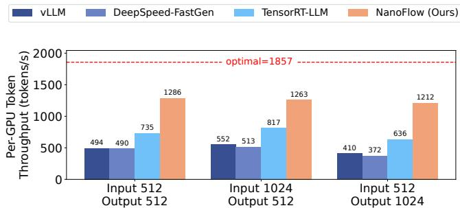  
(a) LLaMA-2-70B, 8 GPU, TP=8, Constant Input & Output Length

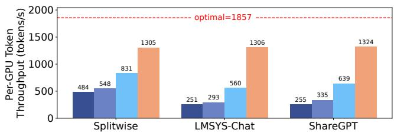  
(b) LLaMA-2-70B, 8 GPU, TP=8, Input & Output Length from Dataset  
Figure 7: Offline throughput comparison. NanoFlow outperforms all baselines for all the workload settings. TP stands for the number of GPUs used with tensor parallelism.

TensorRT-LLM7 [26, 27] is a high-performance LLM inference engine built upon NVIDIA’s TensorRT SDK. We set max-num-tokens by calculating the maximum capacity for the KV-cache in the GPU memory. We also enable paged KVcache and dynamic batching optimizations when compiling.

Datasets. Splitwise [32] is a conversation trace collected from a real production environment at Microsoft, with a total of around 20000 requests. LMSYS-Chat-1M [56] is a largescale dataset with 1 million real-world conversations from 25 different LLMs. ShareGPT [1] is a dataset with conversations collected from the ShareGPT API. We use the full trace from Splitwise and randomly sample 50,000 requests from ShareGPT and LMSYS-Chat-1M for our evaluation. Table 4 shows the average input length and output length in tokens for the sampled datasets we use.

## 6.2 Throughput

We first evaluate throughput to simulate use cases such as benchmarking, information extraction, data wrangling, and form processing [36]. We sample actual input (prompt tokens) and output (generated tokens) lengths from the datasets and add additional experiments with constant length. We then deploy a NanoFlow instance (with a dense batch size of 2048 in the case of Llama-2-70B, where NanoFlow delivers best performance) to measure the total throughput defined as the total number of input and output tokens divided by the execution time. We compare the performance of the NanoFlow instance with optimal throughput derived using Equation 5, where we measure the peak compute capacity using the state-of-the-art GEMM vendor library CUTLASS with a token batch size of 2048. Since the optimal throughput is independent of user query statistics, for all the experiments, the optimal throughput is 1857 tokens/s/GPU as computed in §3.5.

Figure 7 shows the throughput of the NanoFlow instance compared to the baselines. NanoFlow has the highest throughput in all settings and is able to achieve 68.5% of the theoretical optimal throughput in the best case. For constant lengths, NanoFlow has on average 2.62× higher offline throughput than vLLM, 2.78× higher than DeepSpeed-FastGen and 1.73× higher than TensorRT-LLM. When input and output lengths are drawn from the datasets, NanoFlow has on average 4.18× higher throughput than vLLM, 3.45× higher than DeepSpeed-FastGen and 1.91× higher than TensorRT-LLM.

## 6.3 Latency

We evaluate the latency of the NanoFlow instance, for which we model the request arrival interval via an exponential distribution, following prior work [17]. We generate 5 minutes of request traces from the datasets in Table 4 for various request rates. We then measure normalized latency by first calculating the end-to-end request latency divided by output length in tokens, then taking the average for all requests. For each framework, we gradually increase the request rate and measure the normalized latency. We select the SLO for average normalized latency as 200ms following prior works [59], which is also the typical human reading speed [8].

Figure 8 demonstrates the normalized latency of the NanoFlow instance compared to baselines at various request rates. At lower rates, the NanoFlow instance has comparable but slightly higher latency, because NanoFlow targets throughput-oriented scenarios and therefore employs a large dense batch size.

The NanoFlow instance is able to sustain a higher request rate within 200ms latency SLO compared to all other baselines across all the datasets. For example, for LMSys-Chat-1M dataset, the NanoFlow instance can achieve 1.64× higher request rate compared to TensorRT-LLM within 200ms normalized latency constraint.

Moreover, the NanoFlow instance’s 99th-percentile latency is only 1.07× of the average latency at near-maximum throughput, as NanoFlow uses a constant dense batch size, helping it perform well even under tail latency SLOs.

## 6.4 Ablation Study

To showcase the overhead and benefit of the techniques that NanoFlow uses, including nano-batching, nano-operation overlapping, and KV-cache offloading, we compare the NanoFlow instance with baselines that share the same asynchronous request scheduling and kernel libraries.

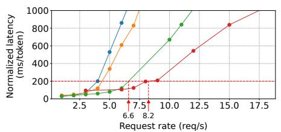  
(a) Splitwise

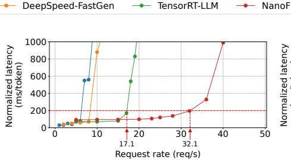  
(b) LMSYS-Chat-1M

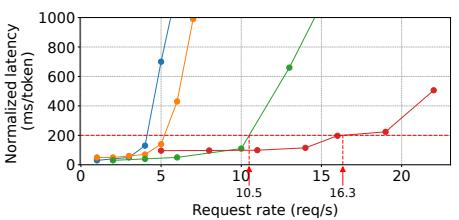  
(c) ShareGPT

Figure 8: Latency comparison. The x-axis shows the number of incoming requests per second, and the y-axis shows the normalized latency. NanoFlow handles higher request rates within 200ms SLO constraints.  
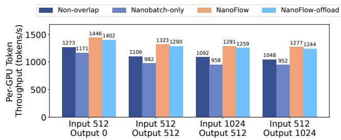  
Figure 9: Ablation study results for NanoFlow. Nano-batching and overlapping improves NanoFlow’s performance.

We created two baselines: a non-overlapping baseline processing inputs sequentially without nano-batches, and a nanobatch-only baseline that splits requests into nano-batches as in NanoFlow but executes them sequentially to assess nanobatching overhead. As shown in Figure 9, splitting into nanobatches alone reduces performance by 13.2%.

To estimate the benefit of overlapping network- and memory-bound kernels, we compare NanoFlow and baselines under various prefill-decode ratios, as shown in Figure 9. We use prefill-only workloads (Input 512, Output 0) to demonstrate the benefit of overlapping network-bound and computebound kernels. Additionally, we use decode heavy workloads (Input 512, Output 1024) to evaluate the benefit of overlapping both network- and memory-bound kernels. NanoFlow achieves 1.07× speedup by overlapping network-bound kernels and 1.17× speedup by overlapping both network- and memory-bound kernels compared with the non-overlapped baseline.

Moreover, we quantify the performance degradation due to offloading in Figure 9. Enabling offloading would slow down the pipeline by 3.0% due to kernel interference caused by KVcache movement. However, offloading can reduce compute by 3.02× for multi-round LMSYS-Chat workloads.

## 6.5 Resource Usage

We demonstrate NanoFlow’s effectiveness in terms of resource utilization in Figure 10. While the non-overlapping baseline sequentially executes operations, which mostly uses only one resource at a given time, the NanoFlow instance can concurrently utilize multiple resources and achieves 68.5% average compute utilization. Due to kernel interference, NanoFlow provides lower than optimal compute usage.

## 6.6 Performance on Other LLMs

We evaluate the throughput of NanoFlow instances for other LLMs with a constant length of input 1024 and output 512. All evaluations are done on 8×A100 80GB SXM GPUs, except for LLaMA-3-8B, which runs on a single A100 80GB SXM. The results are summarized in Figure 11. We find that NanoFlow improves throughput to between 50% and 72% of optimal throughput for these models, surpassing vLLM.

## 7 Related Work

LLM serving optimizations. Prior works have investigated optimizations for improving the serving throughput at different granularities. Orca [53] proposes request-level continuous batching, which refills the on-the-fly batch to maximize batch size at the granularity of an iteration. DistServe [59] and Splitwise [32] explore phase-level scheduling, which disaggregates the prefill and decode phases into different clusters. DeepSpeed-FastGen [13] and Sarathi-Serve [2] propose a chunked prefill policy, which splits a prefill request into multiple smaller chunks and batches decode and prefill requests together to improve overall utilization. However, these works do not perform scheduling at the granularity of operations. NanoFlow exploits intra-device parallelism, which features fine-grained resource management. Other works tackle the inference inefficiency by optimizing specific operations, including PageAttention [17], quantization approaches [19, 44, 55], etc. NanoFlow can easily adopt new operation implementations by profiling their performances and interference characteristics and integrating them into auto-search.

Operation-level parallelism. Some works focus on improving the efficiency of DNN workloads with operationlevel optimizations. For example, Rammer [20] explores intraoperation parallelism by remapping the operations into different functional units. Unity [50] investigates the combination of parallelism and equivalent algebraic transformation of operations. However, these works do not consider the different resource demands of operations. ASPEN [30] and Welder [37] break the boundary between operations by constructing and compiling a tile-level data graph. Since tiles follow sequential dependencies, parallelism is still limited. Moreover, prior works require recompilation from scratch, which requires significant manual work. Compared with them, NanoFlow creates more overlapping opportunities through nano-batching.

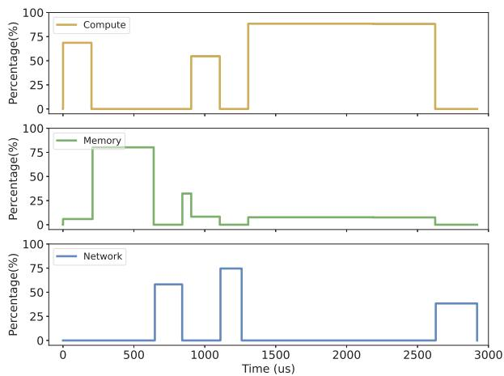  
(a) Non-overlap pipeline resource usage

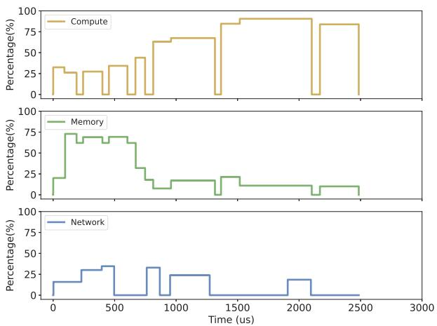  
(b) NanoFlow resource usage

Figure 10: The non-overlapping pipeline and NanoFlow’s resource usage during inference of a single layer. NanoFlow achieves high compute usage across the whole pipeline by simultaneously utilizing memory and network bandwidth.  
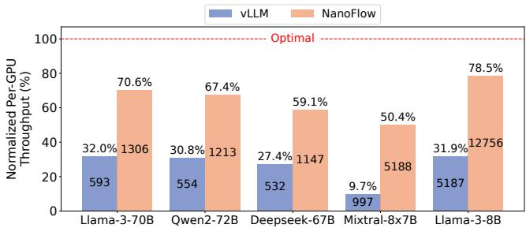  
Figure 11: Performance of NanoFlow instances in terms of tokens per second per GPU for other models. Compared with vLLM, NanoFlow significantly increases throughput. NanoFlow achieves up to 78.5% of optimal throughput.

## 8 Conclusion

In this work, we analyzed the characteristics of different operations in LLM serving and revealed the compute-bound nature of modern LLM serving workloads. We identified that compute is underutilized within a single GPU due to the sequential execution of compute-bound, memory-bound, and network-bound operations, leading to sub-optimal throughput. To address this, we proposed NanoFlow, a novel end-toend LLM serving system that overlaps operations with heterogeneous resource usage through intra-device parallelism. NanoFlow automatically constructs a pipeline that overlaps nano-operations, with an auto-search that adapts to various LLM models. Our experiments show that NanoFlow achieves 1.91× throughput improvement over the state-of-the-art systems.

## References

[1] Sharegpt. https://huggingface.co/datasets/ anon8231489123/ShareGPT\_Vicuna\_unfiltered, 2023.

[2] Amey Agrawal, Nitin Kedia, Ashish Panwar, Jayashree Mohan, Nipun Kwatra, Bhargav S Gulavani, Alexey Tumanov, and Ramachandran Ramjee. Taming throughputlatency tradeoff in llm inference with sarathi-serve. arXiv preprint arXiv:2403.02310, 2024.

[3] Amey Agrawal, Ashish Panwar, Jayashree Mohan, Nipun Kwatra, Bhargav S Gulavani, and Ramachandran Ramjee. Sarathi: Efficient llm inference by piggybacking decodes with chunked prefills. arXiv preprint arXiv:2308.16369, 2023.

[4] Mistral AI. Mistral nemo. https://mistral.ai/ news/mistral-nemo/, 2024.

[5] Joshua Ainslie, James Lee-Thorp, Michiel de Jong, Yury Zemlyanskiy, Federico Lebron, and Sumit Sanghai. GQA: Training generalized multi-query transformer models from multi-head checkpoints. In Houda Bouamor, Juan Pino, and Kalika Bali, editors, Proceedings of the 2023 Conference on Empirical Methods in Natural Language Processing, pages 4895–

4901, Singapore, December 2023. Association for Computational Linguistics.

[6] Jimmy Lei Ba, Jamie Ryan Kiros, and Geoffrey E. Hinton. Layer normalization, 2016.

[7] Tom Brown, Benjamin Mann, Nick Ryder, Melanie Subbiah, Jared D Kaplan, Prafulla Dhariwal, Arvind Neelakantan, Pranav Shyam, Girish Sastry, Amanda Askell, et al. Language models are few-shot learners. Advances in neural information processing systems, 33:1877–1901, 2020.

[8] Marc Brysbaert. How many words do we read per minute? a review and meta-analysis of reading rate. Journal of Memory and Language, 109:104047, 2019.

[9] Alibaba Cloud. Alibaba cloud’s qwen2 with enhanced capabilities tops llm leaderboard. https://www.alibabacloud.com/blog/alibabacloud’s-qwen2-with-enhanced-capabilitiestops-llm-leaderboard\_601268/, 2024.

[10] Stefan Elfwing, Eiji Uchibe, and Kenji Doya. Sigmoidweighted linear units for neural network function approximation in reinforcement learning, 2017.

[11] Erin Griffith. The desperate hunt for the a.i. boom’s most indispensable prize. Technical report, The New York Times, 2023.

[12] Jiaao He, Jidong Zhai, Tiago Antunes, Haojie Wang, Fuwen Luo, Shangfeng Shi, and Qin Li. Fastermoe: Modeling and optimizing training of large-scale dynamic pre-trained models. In Proceedings of the 27th ACM SIGPLAN Symposium on Principles and Practice of Parallel Programming, PPoPP ’22, page 120–134, New York, NY, USA, 2022. Association for Computing Machinery.

[13] Connor Holmes, Masahiro Tanaka, Michael Wyatt, Ammar Ahmad Awan, Jeff Rasley, Samyam Rajbhandari, Reza Yazdani Aminabadi, Heyang Qin, Arash Bakhtiari, Lev Kurilenko, et al. Deepspeed-fastgen: High-throughput text generation for llms via mii and deepspeed-inference. arXiv preprint arXiv:2401.08671, 2024.

[14] Yanping Huang, Youlong Cheng, Ankur Bapna, Orhan Firat, Mia Xu Chen, Dehao Chen, HyoukJoong Lee, Jiquan Ngiam, Quoc V. Le, Yonghui Wu, and Zhifeng Chen. Gpipe: Efficient training of giant neural networks using pipeline parallelism, 2019.

[15] Kunal Jain, Anjaly Parayil, Ankur Mallick, Esha Choukse, Xiaoting Qin, Jue Zhang, Íñigo Goiri, Rujia Wang, Chetan Bansal, Victor Rühle, Anoop Kulkarni, Steve Kofsky, and Saravan Rajmohan. Intelligent router

for llm workloads: Improving performance through workload-aware load balancing, 2025.

[16] Albert Q. Jiang, Alexandre Sablayrolles, Arthur Mensch, Chris Bamford, Devendra Singh Chaplot, Diego de las Casas, Florian Bressand, Gianna Lengyel, Guillaume Lample, Lucile Saulnier, Lélio Renard Lavaud, Marie-Anne Lachaux, Pierre Stock, Teven Le Scao, Thibaut Lavril, Thomas Wang, Timothée Lacroix, and William El Sayed. Mistral 7b, 2023.

[17] Woosuk Kwon, Zhuohan Li, Siyuan Zhuang, Ying Sheng, Lianmin Zheng, Cody Hao Yu, Joseph Gonzalez, Hao Zhang, and Ion Stoica. Efficient memory management for large language model serving with pagedattention. In Proceedings of the 29th Symposium on Operating Systems Principles, pages 611–626, 2023.

[18] Zhuohan Li, Lianmin Zheng, Yinmin Zhong, Vincent Liu, Ying Sheng, Xin Jin, Yanping Huang, Zhifeng Chen, Hao Zhang, Joseph E Gonzalez, et al. Alpaserve: Statistical multiplexing with model parallelism for deep learning serving. In 17th USENIX Symposium on Operating Systems Design and Implementation (OSDI 23), pages 663–679, 2023.

[19] Yujun Lin, Haotian Tang, Shang Yang, Zhekai Zhang, Guangxuan Xiao, Chuang Gan, and Song Han. Qserve: W4a8kv4 quantization and system co-design for efficient llm serving, 2024.

[20] Lingxiao Ma, Zhiqiang Xie, Zhi Yang, Jilong Xue, Youshan Miao, Wei Cui, Wenxiang Hu, Fan Yang, Lintao Zhang, and Lidong Zhou. Rammer: Enabling holistic deep learning compiler optimizations with rTasks. In 14th USENIX Symposium on Operating Systems Design and Implementation (OSDI 20), pages 881–897. USENIX Association, November 2020.

[21] Yusuf Mehdi. Reinventing search with a new ai-powered microsoft bing and edge, your copilot for the web, May 2023.

[22] Meta. Build the future of ai with meta llama 3. https: //llama.meta.com/llama3/, 2024.

[23] Microsoft. Deepspeed: Fastgen. https: //github.com/microsoft/DeepSpeed/tree/ 429bc5c/blogs/deepspeed-fastgen, 2024. Commit ID: 429bc5c, Accessed: 2024-12-09.

[24] NVIDIA. Nvidia dgx platform. https: //www.nvidia.com/en-us/data-center/dgxplatform/, 2024.

[25] NVIDIA. Nvlink and nvlink switch. https: //www.nvidia.com/en-us/data-center/nvlink/, 2024.

[26] NVIDIA. Tensorrt-llm. https://github.com/ NVIDIA/TensorRT-LLM, 2024.

[27] NVIDIA. Tensorrt-llm. https://github.com/ NVIDIA/TensorRT-LLM/tree/5955b8a, 2024. Commit ID: 5955b8a, Accessed: 2024-12-09.

[28] OpenAI. Introducing chatgpt, 2023.

[29] OpenAI. Gpt-4 technical report, 2024.

[30] Jongseok Park, Kyungmin Bin, Gibum Park, Sangtae Ha, and Kyunghan Lee. Aspen: Breaking operator barriers for efficient parallelization of deep neural networks. In A. Oh, T. Naumann, A. Globerson, K. Saenko, M. Hardt, and S. Levine, editors, Advances in Neural Information Processing Systems, volume 36, pages 68625–68638. Curran Associates, Inc., 2023.

[31] Dylan Patel and Afzal Ahmad. The inference cost of search disruption – large language model cost analysis, February 2023.

[32] Pratyush Patel, Esha Choukse, Chaojie Zhang, Íñigo Goiri, Aashaka Shah, Saeed Maleki, and Ricardo Bianchini. Splitwise: Efficient generative llm inference using phase splitting, 2023.

[33] Archit Patke, Dhemath Reddy, Saurabh Jha, Chandra Narayanaswami, Zbigniew Kalbarczyk, and Ravishankar Iyer. Hierarchical autoscaling for large language model serving with chiron, 2025.

[34] Reiner Pope, Sholto Douglas, Aakanksha Chowdhery, Jacob Devlin, James Bradbury, Jonathan Heek, Kefan Xiao, Shivani Agrawal, and Jeff Dean. Efficiently scaling transformer inference. Proceedings of Machine Learning and Systems, 5, 2023.

[35] Emma Roth. Chatgpt’s weekly users have doubled in less than a year, 2024. Accessed: 2024-12-03.

[36] Ying Sheng, Lianmin Zheng, Binhang Yuan, Zhuohan Li, Max Ryabinin, Beidi Chen, Percy Liang, Christopher Ré, Ion Stoica, and Ce Zhang. Flexgen: High-throughput generative inference of large language models with a single gpu. In International Conference on Machine Learning, pages 31094–31116. PMLR, 2023.

[37] Yining Shi, Zhi Yang, Jilong Xue, Lingxiao Ma, Yuqing Xia, Ziming Miao, Yuxiao Guo, Fan Yang, and Lidong Zhou. Welder: Scheduling deep learning memory access via tile-graph. In 17th USENIX Symposium on Operating Systems Design and Implementation (OSDI 23), pages 701–718, Boston, MA, July 2023. USENIX Association.

[38] Mohammad Shoeybi, Mostofa Patwary, Raul Puri, Patrick LeGresley, Jared Casper, and Bryan Catanzaro. Megatron-lm: Training multi-billion parameter language models using model parallelism, 2020.

[39] Mohammad Shoeybi, Mostofa Patwary, Raul Puri, Patrick LeGresley, Jared Casper, and Bryan Catanzaro. Megatron-lm: Training multi-billion parameter language models using model parallelism, 2020.

[40] Shubham Singh. ChatGPT Statistics (AUG 2024) - Users Growth Data — demandsage.com. https: //www.demandsage.com/chatgpt-statistics/, 2024. [Accessed 14-08-2024].

[41] Jared Spataro. Introducing microsoft 365 copilot – your copilot for work, May 2023.

[42] Vikranth Srivatsa, Dongming Li, Yiying Zhang, and Reyna Abhyankar. MLSys @ WukLab - Can Scheduling Overhead Dominate LLM Inference Performance? A Study of CPU Scheduling Overhead on Two Popular LLM Inference Systems — mlsys.wuklab.io. https://mlsys.wuklab.io/posts/ scheduling\_overhead/, 2024. [Accessed 25-10- 2024].

[43] Foteini Strati, Xianzhe Ma, and Ana Klimovic. Orion: Interference-aware, fine-grained gpu sharing for ml applications. In Proceedings of the Nineteenth European Conference on Computer Systems, EuroSys ’24, page 1075–1092, New York, NY, USA, 2024. Association for Computing Machinery.

[44] Jiaming Tang, Yilong Zhao, Kan Zhu, Guangxuan Xiao, Baris Kasikci, and Song Han. Quest: Query-aware sparsity for efficient long-context llm inference, 2024.

[45] The AIBrix Team, Jiaxin Shan, Varun Gupta, Le Xu, Haiyang Shi, Jingyuan Zhang, Ning Wang, Linhui Xu, Rong Kang, Tongping Liu, Yifei Zhang, Yiqing Zhu, Shuowei Jin, Gangmuk Lim, Binbin Chen, Zuzhi Chen, Xiao Liu, Xin Chen, Kante Yin, Chak-Pong Chung, Chenyu Jiang, Yicheng Lu, Jianjun Chen, Caixue Lin, Wu Xiang, Rui Shi, and Liguang Xie. Aibrix: Towards scalable, cost-effective large language model inference infrastructure, 2025.

[46] Vijay Thakkar, Pradeep Ramani, Cris Cecka, Aniket Shivam, Honghao Lu, Ethan Yan, Jack Kosaian, Mark Hoemmen, Haicheng Wu, Andrew Kerr, Matt Nicely, Duane Merrill, Dustyn Blasig, Fengqi Qiao, Piotr Majcher, Paul Springer, Markus Hohnerbach, Jin Wang, and Manish Gupta. CUTLASS, January 2023.

[47] CHENG TING-FANG. Tsmc sees ai chip output constraints lasting 1.5 years. Technical report, Nikkei Asia, 2023.

[48] Hugo Touvron, Thibaut Lavril, Gautier Izacard, Xavier Martinet, Marie-Anne Lachaux, Timothée Lacroix, Baptiste Rozière, Naman Goyal, Eric Hambro, Faisal Azhar, Aurelien Rodriguez, Armand Joulin, Edouard Grave, and Guillaume Lample. Llama: Open and efficient foundation language models, 2023.

[49] Hugo Touvron, Louis Martin, Kevin Stone, Peter Albert, Amjad Almahairi, Yasmine Babaei, Nikolay Bashlykov, Soumya Batra, Prajjwal Bhargava, Shruti Bhosale, et al. Llama 2: Open foundation and fine-tuned chat models. arXiv preprint arXiv:2307.09288, 2023.

[50] Colin Unger, Zhihao Jia, Wei Wu, Sina Lin, Mandeep Baines, Carlos Efrain Quintero Narvaez, Vinay Ramakrishnaiah, Nirmal Prajapati, Pat McCormick, Jamaludin Mohd-Yusof, Xi Luo, Dheevatsa Mudigere, Jongsoo Park, Misha Smelyanskiy, and Alex Aiken. Unity: Accelerating DNN training through joint optimization of algebraic transformations and parallelization. In 16th USENIX Symposium on Operating Systems Design and Implementation (OSDI 22), pages 267–284, Carlsbad, CA, July 2022. USENIX Association.

[51] Ashish Vaswani, Noam Shazeer, Niki Parmar, Jakob Uszkoreit, Llion Jones, Aidan N. Gomez, Łukasz Kaiser, and Illia Polosukhin. Attention is all you need. In Proceedings of the 31st International Conference on Neural Information Processing Systems, NIPS’17, page 6000–6010, Red Hook, NY, USA, 2017. Curran Associates Inc.

[52] vllm project. vllm. https://github.com/vllmproject/vllm/tree/38c4b7e, 2024. Commit ID: 38c4b7e, Accessed: 2024-12-09.

[53] Gyeong-In Yu, Joo Seong Jeong, Geon-Woo Kim, Soojeong Kim, and Byung-Gon Chun. Orca: A distributed serving system for {Transformer-Based} generative models. In 16th USENIX Symposium on Operating Systems Design and Implementation (OSDI 22), pages 521–538, 2022.

[54] Liangyu Zhao, Saeed Maleki, Aashaka Shah, Ziyue Yang, Hossein Pourreza, and Arvind Krishnamurthy. Forestcoll: Efficient collective communications on heterogeneous network fabrics, 2024.

[55] Yilong Zhao, Chien-Yu Lin, Kan Zhu, Zihao Ye, Lequn Chen, Size Zheng, Luis Ceze, Arvind Krishnamurthy, Tianqi Chen, and Baris Kasikci. Atom: Low-bit quantization for efficient and accurate llm serving. arXiv preprint arXiv:2310.19102, 2023.

[56] Lianmin Zheng, Wei-Lin Chiang, Ying Sheng, Tianle Li, Siyuan Zhuang, Zhanghao Wu, Yonghao Zhuang, Zhuohan Li, Zi Lin, Eric. P Xing, Joseph E. Gonzalez,

Ion Stoica, and Hao Zhang. Lmsys-chat-1m: A largescale real-world llm conversation dataset, 2023.

[57] Lianmin Zheng, Zhuohan Li, Hao Zhang, Yonghao Zhuang, Zhifeng Chen, Yanping Huang, Yida Wang, Yuanzhong Xu, Danyang Zhuo, Eric P Xing, et al. Alpa: Automating inter-and {Intra-Operator} parallelism for distributed deep learning. In 16th USENIX Symposium on Operating Systems Design and Implementation (OSDI 22), pages 559–578, 2022.

[58] Lianmin Zheng, Liangsheng Yin, Zhiqiang Xie, Chuyue Sun, Jeff Huang, Cody Hao Yu, Shiyi Cao, Christos Kozyrakis, Ion Stoica, Joseph E. Gonzalez, Clark Barrett, and Ying Sheng. Sglang: Efficient execution of structured language model programs, 2024.

[59] Yinmin Zhong, Shengyu Liu, Junda Chen, Jianbo Hu, Yibo Zhu, Xuanzhe Liu, Xin Jin, and Hao Zhang. Distserve: Disaggregating prefill and decoding for goodputoptimized large language model serving. arXiv preprint arXiv:2401.09670, 2024.