USENIX

THE ADVANCED COMPUTING SYSTEMS ASSOCIATION

# DeLFS: A Decentralized Log-Structured File System for Manycores

Taehwan Ahn, Chanhyeong Yu, Sangjin Lee, and Yongseok Son, Chung-Ang University https://www.usenix.org/conference/osdi26/presentation/ahn

# This paper is included in the Proceedings of the 20th USENIX Symposium on Operating Systems Design and Implementation.

July 13–15, 2026 • Seattle, WA, USA

ISBN 978-1-939133-55-7

Open access to the Proceedings of the 20th USENIX Symposium on Operating Systems Design and Implementation is sponsored by

# DeLFS: A Decentralized Log-Structured File System for Manycores

Taehwan Ahn†, Chanhyeong Yu†, Sangjin Lee, and Yongseok Son∗

Systems and Storage Laboratory, Chung-Ang University

## Abstract

This paper introduces DeLFS, a novel decentralized logstructured file system (LFS) designed for manycore scalability. DeLFS decentralizes metadata/data organization and management with an LFS-aware decentralized locking scheme that distributes lock ownership to eliminate global contention. In addition, DeLFS disentangles the critical path from the deferrable path to further increase concurrency. We implement DeLFS with three techniques in the Linux kernel and evaluate it on a 128-core machine. The experimental results show that DeLFS outperforms F2FS, MAX, and F2FSJ by up to 4.34×, 4.29×, and 4.50×, respectively, and delivers up to 2.00× higher sustained performance than ScaleLFS.

## 1 Introduction

Log-structured file systems (LFSs) [9, 11, 12, 15, 16, 18, 20, 21, 24, 27, 30, 34] are attractive for modern storage systems because their append-only, log-structured design transforms small, random updates into large, sequential write streams, achieving high write efficiency on flash-based storage devices [18, 24, 26]. Despite these advantages, existing LFSs face scalability challenges because they rely on centralized architecture and coordination for metadata and data management, where multiple global locks serialize file operations across many cores [17, 23]. This architecture limits concurrency and parallelism, thereby degrading I/O performance.

Challenges: Figure 1 shows the application throughput in various modern LFSs (i.e., F2FS [18], MAX [21], ScaleLFS [11], F2FSJ [9]) under a random write workload generated by a micro-benchmark (i.e., FIO [4]). As shown in the figure, the raw performance of the NVMe SSD [2] scales well with the number of cores, reaching up to 5.24 GB/s. However, the performance of existing LFSs remains limited to around 1.06 GB/s even as the number of cores increases. In particular, even when we combine ScaleCache [29], a scalable page cache, with F2FS and other LFSs (as detailed in Section 3.1), the performance unexpectedly remains almost unchanged or even degrades. We observe that this limitation mainly stems from severe lock contention caused by multiple global locks on metadata and data management, serializing I/O operations and restricting concurrency across cores.

Prior studies: Previous studies have explored LFSs to im prove scalability and reduce garbage collection (GC) overhead. F2FSJ [9] introduces a decentralized, epoch-based journaling technique for F2FS with an ordered journal mode to reduce checkpointing time. MAX [21] is a multicore-friendly LFS that scales access to in-memory index and cache while maintaining multiple independent logs, but it still suffers from lock contention. ScaleLFS [11] presents a scalable GC that parallelizes the GC procedure and concurrent victim management. Our study is inspired by and in line with these studies in terms of investigating LFS scalability and performance. In contrast, our study focuses on establishing a holistic decentralized LFS architecture with LFS-aware locking.

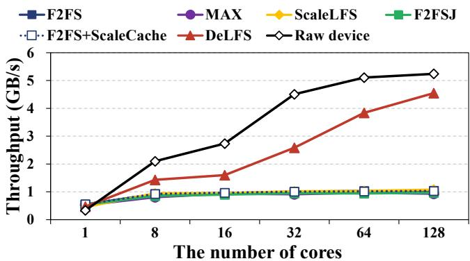  
Figure 1: Scalability comparison of log-structured file systems.

Contributions: In this paper, we propose DeLFS, a decentralized log-structured file system designed to improve scalability on manycore systems. Our key idea is to leverage the potential of distributing lock ownership across cores safely, enabling a holistic, decentralized LFS architecture. Specifically, DeLFS first proposes decentralized organization and management of LFS resources by decomposing metadata and data layouts into per-core domains. This design enables a one(core)- to-one(resource) model and serves as the foundation of our decentralized architecture, where each core primarily operates on its own local metadata and data while minimizing cross-core interference.

Second, DeLFS adopts an LFS-aware decentralized and de coupled locking scheme that distributes lock ownership across cores while enabling deadlock-free acquisition. In addition, this scheme decouples certain updates into independently executable operations while still preserving atomic updates to decentralized resources. Thus, this locking mechanism eliminates global lock contention without compromising crash consistency. Finally, DeLFS presents lazy lock coordination, which disentangles critical and deferrable operations to further mitigate contention from inter-core decentralized lock sharing. To do this, DeLFS employs a lazy lock coordinator that handles deferred operations while preserving crash consistency. As a result, DeLFS accelerates both application I/O and GC I/O processing by mitigating lock contention and improving core scalability.

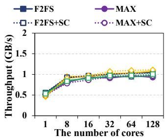  
(a) Throughput.

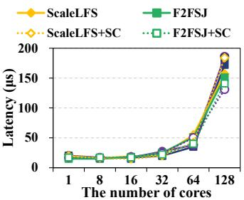  
(b) Tail latency (99th).  
Figure 2: Throughput and tail latency with various LFSs.

We implement DeLFS with three techniques based on F2FS [18] and ScaleCache [29] in Linux kernel 6.6.8. We evaluate it on a 128-core machine with the NVMe SSD [2] using the micro [4] and macro [31] benchmarks and real-world application [10]. The experimental results show DeLFS outperforms F2FS, MAX [21], ScaleLFS [11], and F2FSJ [9] by up to 4.34×, 4.29×, 4.10×, and 4.50×. Note that, even with ScaleCache, the results show DeLFS outperforms F2FS, MAX, ScaleLFS, and F2FSJ by up to 4.55×, 6.32×, 3.99×, and 4.38×. Furthermore, DeLFS delivers up to 2.00× higher sustained performance than ScaleLFS. To the best of our knowledge, DeLFS is the first holistic, decentralized log structured file system with an LFS-aware locking scheme across cores in modern many-core systems. Finally, we open the source code of DeLFS and baselines used in our evaluation at https://github.com/syslab-CAU/DeLFS to aid future studies in LFSs.

## 2 Background and Motivation

A log-structured file system (LFS) follows an append-only design, transforming small random writes into large sequential write streams. F2FS manages storage in segments (e.g., 2 MB) and divides the space into a random-write area for on-disk metadata (e.g., SIT (segment information table), NAT (node address table), and SSA (segment summary area)) and a sequential main area for node and data blocks, further separating node/data into hot, warm, and cold temperatures to exploit device parallelism. However, the organization and management of these metadata structures and related data structures are centralized and protected by coarse-grained global locks shared across all cores. As a result, the locks serialize metadata and data updates, preventing full exploitation of parallelism and limiting scalability on many-core systems.

## 3 Scalability Analysis

## 3.1 Scalability Analysis on Modern LFSs

To understand the scalability performance of modern LFSs (F2FS, MAX, ScaleLFS, and F2FSJ), both with and without ScaleCache [29], we run FIO with random write on our testbed under the evaluation scenario as described in Section 5.1 and 5.2. Figure 2 shows the throughput and tail latency of LFSs on varying numbers of cores. The LFSs do not scale well and exhibit almost the same throughput even as the number of cores increases. In addition, latency spikes significantly at 128 cores compared with 64 cores. Furthermore, even when combined with ScaleCache [29], the performance of LFSs still does not improve and can even degrade (see details in Section 3.2). Consequently, these results indicate that the design of existing LFSs has limitations.

## 3.2 Identifying Root Causes

## 3.2.1 Limitation of Page Cache Flushing

The first root cause of low I/O performance in modern LFSs is the serialized page-flushing path in the page cache. Under data-intensive write workloads, a single flusher thread flushes dirty pages for one inode at a time while throttling application threads, a mechanism originally designed for HDD-based systems [29]. On modern many-core servers with high-performance SSDs, this design cannot provide sufficient I/O parallelism, and the throttling intervals (e.g., io\_schedule\_timeout()) become the first bottleneck (Table 1). ScaleCache [29] addresses this blocking bottleneck with direct page flush (dflush), allowing application threads to flush pages in parallel. Accordingly, we evaluate modern LFSs with ScaleCache. However, as shown in Table 1, the throughput improvement is negligible or even negative, indicating that LFSs suffer from additional bottlenecks.

## 3.2.2 Scalability Obstacles in LFSs

We analyze the design of modern LFSs to identify the main obstacles that hinder the scalability on manycores.

Serialized I/O process: After the blocking bottleneck by the throttling mechanism is eliminated, modern LFSs encounter the next bottleneck caused by lock contention on the serialization mutex (writepages) in the writeback path, as shown in Table 1. This lock serializes writeback on a per-inode basis, forcing flushers to wait until the current holder completes sub mitting pages for its inode. This design aligns file and segment lifetimes by keeping pages of a file within a segment, thereby avoiding inter-file interleaving. Thus, this design enforces per-file writeback, which significantly limits I/O parallelism. To enable more parallel I/O, we can simply eliminate this serialization lock without compromising correctness or consistency, as it only relaxes the alignment between file and segment lifetimes. However, pages from multiple inodes may become interleaved within a segment, potentially degrading GC efficiency; we report that its impact on write amplification is minor (Section 5.2). Despite this increased parallelism, LFSs still suffer from the scalability bottleneck in multi-head logging management.

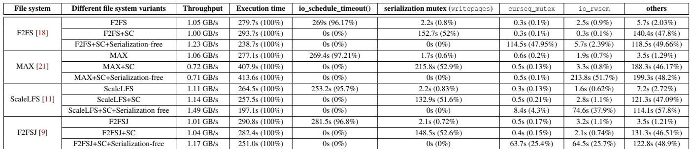  
Table 1: Performance breakdown of modern LFSs on 128 cores (SC: ScaleCache [29]).

Multi-head logging management: When enabling parallel I/O without the serialized design and lock (i.e., serializationfree), the bottleneck shifts to lock contention (curseg\_mutex) from the space allocation in multi-head logging management as shown in Table 1. F2FS adopts a multi-head logging scheme with six active logs, where each log head corresponds to a current segment (curseg\_info). Each current segment sequentially allocates new blocks, thereby preserving the append-only write pattern. However, the number of current segments is fixed at six even on many-core systems. Moreover, most data-intensive writes are allocated from the warm-data log, and a mutex, the current segment lock (curseg\_mutex) must be acquired whenever a block is allocated. As a result, this centralized lock becomes a severe bottleneck, as cores contend for it during block allocation. Note that MAX [21] targets this lock contention and solves it by the mlog scheme, which allocates the space in a round-robin manner. However, the bottleneck shifts to the I/O submit management.

Submit management: LFSs maintain six bio structures (block I/O descriptors [7]), each corresponding to one of the six log streams, so that I/O requests can be batched and managed on a per-stream basis. During a flush, dirty pages are classified by type and temperature and appended to the corresponding bio. Each appended page is checked for merge opportunities with existing pages; if mergeable, the LFS performs the merge while holding the I/O submit lock (io\_rwsem) to ensure consistency of the bio’s internal state. However, this design, which maintains only a fixed set of six bios and protects their operations with the lock per bio, limits parallel I/O on many-core systems. We observe severe contention on this lock in MAX, ScaleLFS, and F2FSJ as shown in Table 1. In particular, when the lock contention on curseg\_mutex is mitigated, the lock contention on io\_rwsem becomes the next dominant bottleneck.

Segment management: Even if the bottleneck in submit management is mitigated, additional bottlenecks can still arise in the I/O path, as shown in Table 4. For example, segmentlevel metadata management also introduces synchronization overhead. The SIT tracks the state of all segments in the main data area. It contains multiple SIT entries, each of which corresponds to a segment and maintains both the number of valid blocks within the segment and a bitmap representing the validity of each block. When a block is allocated for a data page, the associated SIT entry is updated to mark it as valid. However, to ensure correct updates, the SIT entries are protected by a single read-write semaphore, the SIT entry lock (sentry\_lock). Thus, even if only one SIT entry needs to be updated, this coarse-grained lock must be acquired, thereby preventing concurrent access to the entire SIT.

Segment list management: Furthermore, segments are tracked using multiple bitmaps according to their validity state: segments with a mix of valid and invalid blocks are recorded in the dirty-segment bitmap, while segments whose blocks are all invalid are recorded in the pre-segment bitmap and are later reclaimed as free. However, both the dirty and pre-segment bitmaps are protected by a single mutex (seglist\_lock). As a result, as the state of segments changes, moving segments across the segment bitmaps requires acquiring this lock, which limits concurrency.

Node management: Beyond segment management, LFSs also face a scalability bottleneck in managing the NAT. Inodes and internal nodes are tracked via NAT entries, which are cached in memory in a global tree protected by a read-write semaphore (nat\_tree\_lock) and managed by an LRU-style NAT list protected by a spinlock (nat\_list\_lock). While this NAT cache reduces storage I/Os for node lookups, its centralized locking becomes a scalability bottleneck (Table 4). MAX [21] mitigates NAT contention using file cells, but its overall scalability remains limited because other bottlenecks are not addressed.

Discard management: Finally, modern LFSs also suffer from scalability bottlenecks in discard management. A global discard command controller maintains a list of discard entries protected by a single mutex (cmd\_lock). During write I/O, each newly allocated block must acquire cmd\_lock to check and remove any matching discard entry before reuse. Because cmd\_lock is a global lock shared by all discard operations, it becomes a major source of lock contention once other bottlenecks are alleviated (see Table 4).

## 4 Design and Implementation

Our key idea is to leverage the potential that lock ownership can be distributed across cores safely, enabling a robust and decentralized LFS architecture. The rationale behind this design choice is that there are a lot of LFS resources and their locks, each of which protects a large critical section. Thus, it is hard to remove these locks, which may be less robust; instead, we split large resources and their locks and distribute the lock ownership of each resource across cores.

## 4.1 Design Goals of DeLFS

We design DeLFS to satisfy the following three goals.

Decentralizing LFS resources: To design a scalable LFS, DeLFS should holistically decentralize LFS resources to minimize interference from shared and global resources and maximize core and I/O parallelism.

Minimizing lock contention with safe synchronization: To minimize global lock contention, DeLFS should provide a lightweight locking mechanism to maximize concurrency while preserving correctness via safe synchronization.

Coordinating inter-core sharing: To support inter-core sharing when necessary, DeLFS should provide a coordination technique to avoid waiting on operations from other cores without sacrificing consistency.

## 4.2 Overall Architecture of DeLFS

Overall, DeLFS redesigns the centralized organization and management of LFS resources into a fully decentralized metadata/data organization and its management, where each decentralized LFS resource is efficiently protected by decentralized locking and orchestrated by decentralized lazy lock coordination across cores. DeLFS consists of the following three techniques and strategies to meet the goals.

Strategy 1: Decentralized organization and management. To minimize interference from shared and global resources among cores, DeLFS decentralizes LFS metadata and data management into per-core domains. Each core owns and manages its own subset of decentralized metadata (e.g., SIT, NAT, multi-head logging, SSA as M0-0. . . Mk-0 for core0) and its local segments (e.g., seg0-0. . . segk-0 for core0). This onecore–one-resource design reduces cross-core interference and forms the foundation of DeLFS’s decentralized architecture.

Strategy 2: Decentralized and decoupled locking. On top of this organization, DeLFS decentralizes locks so that each core primarily acquires locks on its own decentralized resources, rather than contending for global locks. However, when intercore access is required, naive decentralized locking can still cause cross-domain deadlocks and skewed contention. To address this, DeLFS introduces decentralized and decoupled locking (DDL), which decouples certain updates into individually executable operations while preserving atomicity and enforces a lock-update-unlock discipline on one resource at a time. This single-lock-hold property breaks potential deadlock cycles, reduces lock hold time, and allows lock ownership to be safely distributed across cores while preserving correctness through the existing LFS checkpoint mechanism.

Strategy 3: Lazy lock coordination. To further reduce blocking from inter-core decentralized lock sharing, DeLFS introduces lazy lock coordination. We observe that many operations can be split into a critical path and a lazily deferrable path without affecting correctness. DeLFS therefore employs per-core lock coordinators and delegates remote, deferrable lock-acquisition tasks to the coordinator of the core that owns the target resource, so that the critical path is no longer blocked by remote lock acquisition. These delegated operations are processed lazily but are guaranteed to complete before checkpointing, where DeLFS’s checkpoint procedure waits for and cooperatively processes pending tasks at each coordinator. As a result, lazy lock coordination accelerates critical operations while preserving LFS crash consistency.

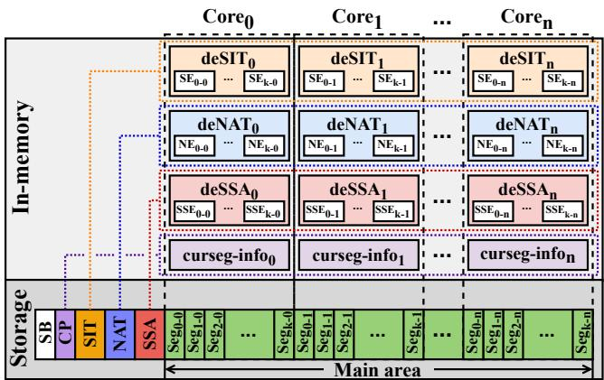  
Figure 3: Decentralized organization of DeLFS (de: decentralized, SE: SIT entry, NE: NAT entry, SSE: SSA entry, Seg: Segment).

## 4.3 Decentralized Architecture

Decentralized organization: DeLFS decentralizes in-memory metadata and on-disk data and node segments into percore domains, allowing each core to manage its own domain independently and thereby improving I/O scalability. For example, as shown in Figure 3, metadata structures such as deSIT –deSIT , deNAT –deNAT , deSSA – deSSA , and curseg-info –curseg-info are decentralized across cores. Thus, each core primarily accesses its own metadata, avoiding contention on shared metadata structures. Specifically, per-core current segment information (curseginfo, curseg\_info) allows each core to allocate space from its own multi-head log, naturally decentralizing node and data segment allocation. During page flushing, each core exclusively flushes all dirty data pages of a fetched inode to its own space. This isolates the inode’s I/O path from other cores and prevents data pages from being interleaved across cores, further improving scalability and performance. Note that when a core does not have enough free segments in its own space, DeLFS allows it to allocate segments from the next core’s domain in a round-robin manner, preserving space efficiency while maintaining decentralized organization. As a result, this architecture establishes a one(core)-to-one(resource) model that eliminates global metadata hot spots and enables highly parallel, low-contention I/O execution across cores.

Decentralized management: Figure 4 and 5 illustrate decentralized management and how the I/O operation is performed in DeLFS. In these figures, a core begins by selecting an inode (inode ) to flush dirty data pages belonging to that inode ( 1 ). To flush dirty page0 ( 2 ), the core first locates the corresponding NAT entry (NE ) in deNAT ( 3 ) and obtains the next writable block address from its own current segment (curseginfo0), which provides the target segment (segno0-0) and the target block offset ( 4 ). The core then increments the block offset in curseg-info0 to prepare for the next allocation. After obtaining the target block, the core checks whether the block is associated with a discard entry ( 5 ). Then, the core updates the SIT entry for segno by increasing its valid-block count and setting its bit in the valid-block bitmap ( 6 ). If there is an old block to invalidate, the core decreases the validblock count and clears its bit in the valid-block bitmap ( 7 ). If the valid-block count becomes 0, the core sets its bit in the pre-segment bitmap and clears its bit in the dirty-segment bitmap ( 8 ). Finally, the core records the page and its destination block in bio-vec0 and links it into bio-info0 ( 9 ). This processing for dirty pages of the inode is repeated until all its dirty pages are processed. After this process is completed, the core flushes current bio-vec entries in its bio-info to storage ( 10 ). Consequently, since each core uses its own decentralized current segment, the entire I/O path for an inode remains isolated to that core, so that its data pages are written using only segments owned by that core, without being interleaved with blocks from other cores.

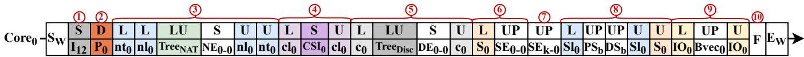  
Figure 4: Decentralized management of DeLFS timeline (S : start write, S: select, D: Dirty, L: lock, U: unlock, LU: lookup, UP: update, F: flush, E : end write, Ix: inodex, P0: page0, nt0: nat\_tree\_lock0, nl0: nat\_list\_lock0, TreeNAT: NAT tree, NE0-n: 0th NAT entry in coren, cl0: curseg\_mutex0, CSI0: current segment information of core0, c0: cmd\_lock0, TreeDisc: discard tree, DE0-n: 0th discard entry in coren, S0: sentry\_lock in core0, SE0-n: 0th SIT entry in coren, Sl0: seglist\_lock0, PSb: pre-segment bitmap, DSb: dirty-segment bitmap, IO0: io\_rwsem0, Bvec0: bio vector0).

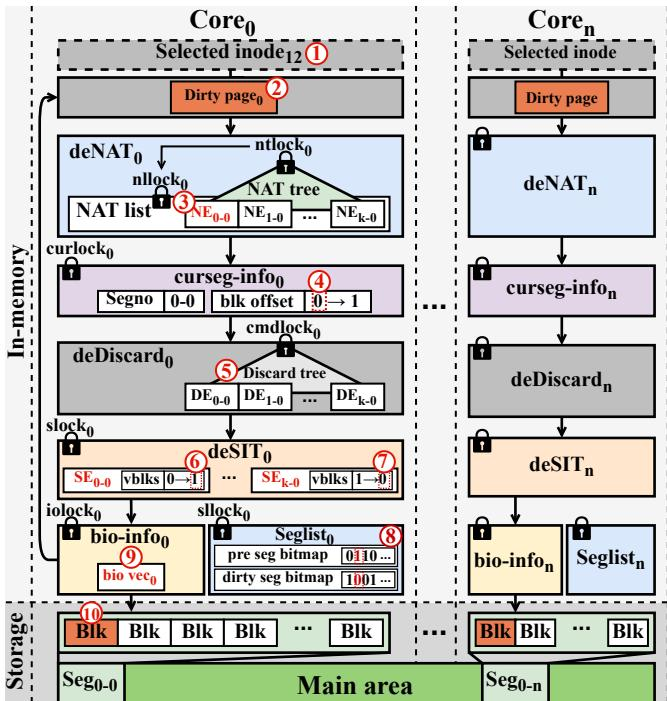  
Figure 5: Decentralized management of DeLFS (NE: NAT entry, DE: Discard entry, SE: SIT entry, Seg: Segment).

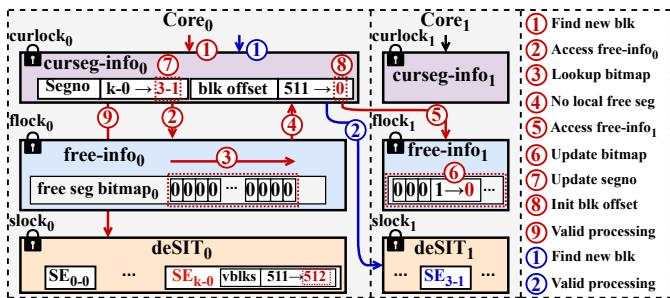  
Figure 6: Cross-core space allocation.

Cross-core space allocation: Figure 6 illustrates how core0 allocates free space from another core’s area when its current segment is exhausted and no local free segments remain. In the I/O process, the core first obtains the block at offset 511 of SEk-0 from curseg-info0 ( 1 ); after this allocation, all 512 blocks of SE are consumed. To prepare subsequent allocations, the core removes SEk-0 from curseg-info0, acquires the free-info lock (flock0), and scans the free segments in freeinfo0 for a replacement segment ( 2 , 3 ). Because all bits in free-info0 are clear, indicating that no space assigned to core0 is free, it releases flock0 ( 4 ) and, following a round-robin policy, accesses the free-space domain of core1 by acquiring flock1 and checking free-info1 ( 5 ). Then, it finds SE3-1 marked as free and marks it as occupied ( 6 ), stores SE3-1 into the segno of curseg-info0 ( 7 ), and resets the block offset to 0 ( 8 ). After completing this replacement, the core proceeds to the next step ( 9 ). When a subsequent request for a block occurs ( 1 ), it checks curseg-info0 to select block 0 in SE3-1, updates the valid-block count of SE , and completes the allocation ( 2 ).

## 4.4 Decentralized and Decoupled Locking

Structure of decentralized locks: If a decentralized LFS resource is not shared across cores, no lock is required. However, even under a decentralized design, some resources must still be shared among application threads, GC threads, and the checkpoint thread. Thus, as shown in Figure 5, DeLFS devises per-core decentralized locking for each LFS resource and allows each core to acquire the corresponding lock whenever it accesses its decentralized resource. To do this, as shown in the figure, DeLFS provides decentralized locks. For example, in core0, the decentralized NAT tree is protected by nat\_tree\_lock0 (ntlock0), and the decentralized NAT list is protected by nat\_list\_lock0 (nllock0). Subsequently, the decentralized current segment, SIT, I/O submission, segment list, and discard management are protected by curseg\_mutex0 (curlock0), sentry\_lock0 (slock0), io\_rwsem0 (iolock0), seglist\_lock0 (sllock0), cmd\_lock0 (cmdlock0), respectively.

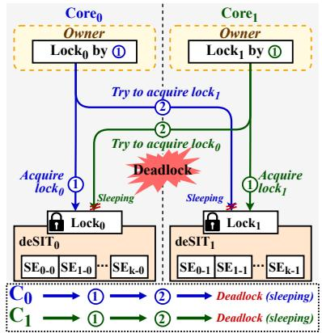  
(a) Deadlock in decentralized locking.

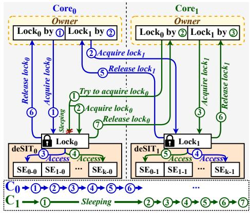  
(b) Deadlock-free locking with strict ordering.

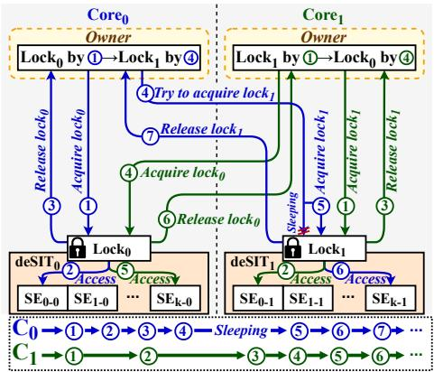  
(c) Decentralized and decoupled locking of DeLFS.

Figure 7: Comparison of decentralized locking and ordering (deSIT0: decentralized SIT in core0, SEk-0: kth decentralized SIT entry in core0, Lock0: decentralized SIT lock0 in core0 (sentry\_lock0), Cn: Coren).  
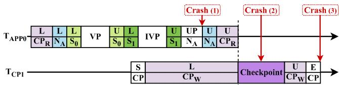  
Figure 8: Crash consistency with DDL (TAPP : application thread in core0, TCP : checkpoint thread in core1, CPR/W: checkpoint reader/writer lock, L: lock, VP: valid processing, IVP: invalid pro cessing, U: unlock, UP: update, NA: node A, Sn: sentry\_lockn, S: start, E: end, CP: checkpoint).

Lock ordering and consistency: Furthermore, DeLFS preserves the original inner lock ordering of F2FS within each core as depicted in Figure 4 and 5. Specifically, when a core updates NAT, it first acquires the NAT-tree lock and, while holding it, acquires the NAT-list lock ( 3 in Figure 4); similarly, it acquires the SIT lock and, while holding it, acquires the segment-list lock ( 6 , 7 , 8 in Figure 4). Thus, the lock ordering within a core is preserved without consistency issues.

Lock ownership and potential issue: Each core has ownership of its decentralized lock associated with its own local resource instance and primarily acquires the decentralized lock, thereby reducing lock contention by localizing access. However, since decentralized resources can be shared among threads as mentioned, the lock ownership of a resource instance can be shifted across cores. In such cases, this shift in lock ownership can lead to a critical deadlock issue. For example, when a core naively attempts to acquire more than one lock across decentralized resources, the system can fall into a deadlock, which is described in more detail as follows.

## 4.4.1 Deadlock issue in decentralized locking

Deadlock issue: When accessing a resource in another core’s domain, the core must acquire the decentralized lock for the target resource owned by another core. In this case, naive decentralized locking can incur a deadlock. For example, when updating the SIT for an overwrite page, there are two operations: (1) marking the newly allocated page as valid and (2) invalidating the old page. Thus, during write operations, each core allocates a new block for a dirty page in its own space but may also need to invalidate the corresponding old block if that block resides in another core’s space. In this process, each core first acquires its own decentralized lock to update its own SIT entry to mark the new block as valid and, while holding this lock, then attempts to acquire the decentralized lock of the core that owns the old block in order to update that core’s SIT entry and mark the old block as invalid. When mul tiple cores behave in this way concurrently, they can end up holding their own locks while waiting for each other’s locks, which can create a circular wait and result in a deadlock.

Deadlock scenario: Figure 7a illustrates the deadlock scenario under decentralized locking. Core and core first acquire their own decentralized locks (lock0 and lock1) ( 1 , 1 ) to update their own SIT entries (deSIT0 and deSIT1) to mark the new blocks as valid. While holding these locks, core0 then tries to acquire lock1 ( 2 ), whereas core1 tries to acquire lock0 ( 2 ) simultaneously to perform the invalidation of the old blocks. Consequently, the two cores require more than one lock at the same time, thereby leading to a deadlock.

## 4.4.2 Deadlock-free locking with strict ordering

As a baseline for deadlock prevention, we consider a deadlockfree locking scheme with strict ordering called DFL. In this scheme, each core always acquires locks in ascending corenumber order and releases them in descending core-number order. This strict lock-ordering discipline guarantees deadlock freedom by eliminating cyclic lock dependencies, similar to conservative two-phase locking [5, 32].

Execution example: Figure 7b illustrates an example of how DFL avoids deadlock by enforcing a predetermined global lock order. As shown in the figure, we assume that core0 needs to update both its own decentralized (de) SIT entry (SE0-0) for valid processing and another core’s deSIT entry (SEk-1) for invalid processing. Core1, in turn, performs the opposite: it updates its own deSIT entry (SE0-1) for valid processing and core0’s deSIT entry (SEk-0) for invalid processing.

Strict lock ordering: However, note that even if core1 is supposed to update its own deSIT entry for valid processing, it must first acquire core0’s lock to keep the lock-ordering rule of DFL, which enforces that locks must always be acquired in ascending core-number order. Accordingly, under this rule, both cores first attempt to acquire the lock for deSIT0 ( 1 , 1 ) in the ascending order. In this case, core wins the contention and acquires the lock, while core sleeps waiting for its release. After acquiring the lock for deSIT0, core0 acquires the lock for deSIT1 ( 2 ) and performs the updates to SE0-0 and SEk-1 ( 3 , 4 ). Once both locks are released in the descending order ( 5 , 6 ), the sleeping core1 wakes up, acquires the lock for deSIT0 ( 2 ) and then the lock for deSIT1 ( 3 ), and performs the updates to SE0-1 and SEk-0 ( 4 , 5 ). Finally, core1 releases both locks in the descending order ( 6 , 7 ).

Scalability limitation: By doing so, DFL successfully prevents deadlock while preserving strong consistency, similar to F2FS, since it performs updates only after acquiring all required locks. However, this design forces cores to block while waiting on each other’s locks. As a result, it can incur blocking overhead and degrade scalability on manycores, particularly when there is a large number of invalid pages and capacity is not enough (see Section 5.5).

## 4.4.3 Decentralized and decoupled locking in DeLFS

To mitigate blocking overhead while preventing deadlocks, DeLFS adopts a decentralized and decoupled locking scheme, called DDL, as its fundamental concurrency control mechanism. In this mechanism, note that the key principle of DDL is that each core never attempts to hold more than one lock of the same type at a time, which provides a loose lock ordering and prevents deadlocks. This principle is enabled by the fact that certain metadata updates can be decoupled while preserving both in-memory and crash consistency. For example, as mentioned in Section 4.4.1 and 4.4.2, overwriting a page requires updating two SIT entries. In this case, we observe that these two updates on disjoint SIT entries can be performed by decoupling valid processing on the new SIT entry from invalid processing on the old SIT entry. This is enabled by two properties: (1) The node is always updated to point to the new valid block only after both SIT entries have been updated under the node lock, ensuring that it always points to a valid block and maintains in-memory consistency (Figure 8); and (2) the checkpoint always recovers a consistent SIT state, guaranteeing crash consistency (Figure 8). With these properties, DDL performs two separate lock-update-unlock sequences: it first acquires the lock for one SIT entry, updates the entry, and releases the lock; it then acquires the lock for the other SIT entry, updates it, and releases the lock.

Procedure: Figure 7c depicts how DDL prevents deadlocks without forcing cores to block on each other’s locks. We assume that core0 needs to update SE0-0 and SEk-1, while core needs to update SE and SE . Both cores first acquire their own locks on deSIT0 and deSIT1, respectively ( 1 , 1 ). Core then updates SE ( 2 ) and releases its lock ( 3 ), and then tries to acquire the lock for deSIT1. In this case, core0 must wait for the lock on deSIT ( 4 ) since core still holds that lock. After core completes the update and releases the lock ( 2 , 3 ), core0 acquires the lock for deSIT1 ( 5 ), updates SEk-1 ( 6 ), and releases it ( 7 ). Meanwhile, core1 acquires the lock for deSIT0 ( 4 ), updates SEk-0 ( 5 ), and releases it ( 6 ). By doing so, DDL reduces cross-core blocking on decentralized locks while guaranteeing deadlock-free execution.

Crash consistency: DDL updates only one SIT entry at a time and can therefore introduce transient inconsistencies between entries. However, DDL preserves correctness and eventually converges to a consistent state by leveraging the existing node lock, LFS checkpoint mechanism, and its reader-writer lock (i.e., cp\_rwsem) which ensures eventual consistency. Specifically, as shown in Figure 8, when flushing a dirty page to the device, the application thread (TAPP0) first acquires the checkpoint reader lock (CP ), the node (N ) lock associated with the page, and the decentralized SIT entry lock in core0 (S0). Then, the thread performs valid processing for the associated SIT entry in core0 and releases S0. Subsequently, the thread acquires the decentralized SIT entry lock in core1 (S1), performs invalid processing for the associated SIT entry, and releases S1. Meanwhile, during invalid processing, the checkpoint is triggered, at which point the checkpoint thread (TCP1) acquires the checkpoint writer lock (CP ). After this point, upcoming application threads cannot acquire CP and must wait until CPW is released. Also, the checkpoint thread waits until the prior readers release all CP locks before starting the checkpoint. After invalidating the SIT entry, the application thread updates the location of the new page to the node and releases the node lock and CPR; by doing so, the in-memory consistency is preserved. The checkpoint thread then performs the checkpoint, finalizes it with a commit record, and finally releases CPW.

As shown in the figure, even if crash (1) or (2) occurs, since the checkpoint is not completed, the recovery restores the previous state. When crash (3) occurs, since the checkpoint includes the commit record, the recovery restores the newly updated node and SIT entries. As a result, the system eventually converges to the same SIT state as an atomic update, and DDL does not incur any crash consistency issues. Note that we observe that the checkpoint occurs infrequently due to the roll-forward recovery [19, 20, 27, 33], resulting in minimal checkpoint overhead and lock contention.

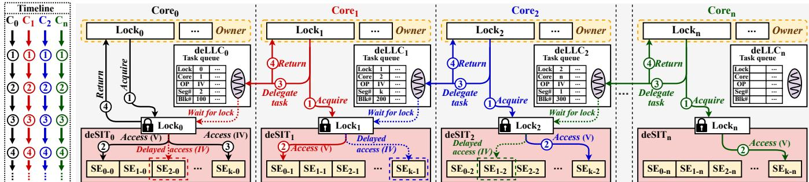  
Figure 9: Decentralized lazy lock coordinator in DeLFS (SE: SIT entry, deLLC: decentralized lazy lock coordinator, OP: operation to execute, V/IV: valid/invalid processing, Cn: coren).

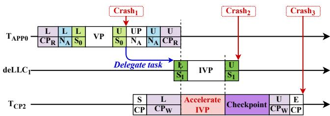  
Figure 10: Crash consistency with lazy lock coordination (TAPP0: application thread in core0, deLLC1: decentralized lazy lock coordinator in core1, TCP2: checkpoint thread in core2, CPR/W: checkpoint reader/writer lock, L: lock, U: unlock, UP: update, S: start, E: end, NA: node A, S0: sentry\_lock0, VP: valid processing, IVP: invalid processing, CP: checkpoint).

## 4.5 Lazy Lock Coordination

Even though DDL reduces the blocking overhead caused by the strict lock ordering of DFL, it can still incur substantial blocking because threads must wait on locks held by other cores. In particular, cross-core locking becomes frequent in two situations: (1) when a core has exhausted its local space and is forced to allocate from spaces owned by other cores, and (2) when a core needs to process an invalid page that resides in another core’s space. In both cases, the core must acquire a decentralized lock for a resource owned by another core, and this cross-core waiting time can become large, especially under space exhaustion and heavy invalidation (see Section 5.5). For example, as shown in Figure 7c, core0 must wait for lock1, which is already held by core1, even after it finishes valid processing for the new data page, which is a performance critical path.

To this end, DeLFS introduces a decentralized lazy lock coordinator (deLLC) that further mitigates cross-core blocking on decentralized locks while maintaining the DDL rule. In our design, the coordinator performs invalid processing for pages in remote spaces on behalf of the application thread. This decouples invalid processing from the critical I/O path of the application thread, avoiding blocking caused by remote lock acquisition. Specifically, application threads perform the local valid update under their own local locks, release those locks, and then delegate the invalid update to the corresponding coordinators for lazy processing. Thus, this design accelerates the I/O path of application threads. Note that deferring invalidation in this way may transiently leave two valid blocks, but it does not compromise either in-memory or crash consistency for the following reasons: (1) The valid update is always completed first under the node lock, ensuring that the node never points to an invalid block. Once the valid update and the node update are completed, the old block is no longer referenced, and (2) all deferred invalid processing is completed before the checkpoint is committed. As a result, deLLC guarantees consistency and is effective under both space exhaustion and heavy invalidation, since in both situations a core must frequently access decentralized locks owned by other cores.

Procedure: Figure 9 illustrates how deLLC operates. In this example, when a dirty page is flushed, the new page is allocated and marked valid, while the old page is marked invalid. The cores (core , core , core , and core ) first acquire their local locks ( 1 , 1 , 1 , 1 ) to perform valid processing for their new pages ( 2 , 2 , 2 , 2 ). In the case of core0, since both the new and old pages reside in its own decentralized SIT, the application thread can directly update both the valid and invalid bits for the corresponding SIT entries (e.g., SE0-0 and SEk-0) ( 2 , 3 ) and then immediately return ( 4 ) without involving deLLC. For other cores, after completing the valid update (i.e., SE0-1, SE , SE ) ( 2 , 2 , 2 ), each thread delegates its invalidation task to the corresponding deLLC instance that owns the target SIT entries (i.e., SE2-0, SEk-1, SE1-2) ( 3 , 3 , 3 ). After delegation, each thread immediately returns ( 4 , 4 , 4 ), leaving the invalid processing to the coordinators. By doing so, since the invalidation task is processed asynchronously by deLLC, this can accelerate the critical path of valid processing.

Crash consistency: DeLFS devises a checkpoint mechanism to support the asynchronous operation of deLLC. The checkpoint waits for and cooperatively processes all pending delegated tasks. Specifically, Figure 10 illustrates how DeLFS maintains crash consistency with the devised checkpoint mechanism. The initial procedure is similar to that of DDL until the application thread performs valid processing on the associated SIT entry in core . After that, in contrast to DDL, the thread delegates the task of invalidation to deLLC1. Subsequently, the thread updates the node with the new page location and releases the nodeA (NA) lock and CPR. Meanwhile, after releasing CP , under CP , the checkpoint thread starts cooperatively processing the pending tasks in deLLC1, which accelerates the invalid processing. Note that this procedure ensures completion of all pending delegated tasks in all deLLCs. After this procedure, the checkpoint thread performs the checkpoint and writes the commit record. Similar to the case of DDL, when a crash occurs before or after writing the commit record, the recovery restores the previous or the updated state. By doing so, DeLFS safely disentangles the critical path from deferred invalidation work and thereby accelerates the critical path.

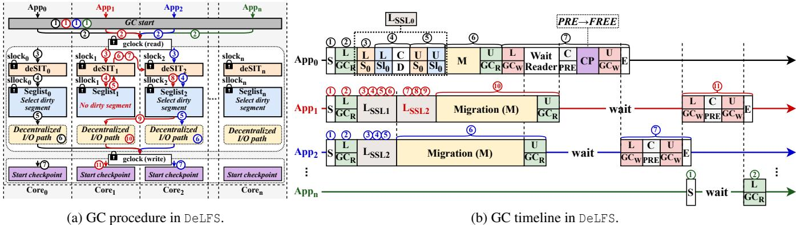  
Figure 11: Garbage collection of DeLFS (slock : sentry\_lock of core , sllock : seglist\_lock of core , gclock: gc\_lock, App : application thread in core0, S: start GC, L: lock, U: unlock, C: check, M: migration, GCR: GC reader lock, GCW: GC writer lock, S0: slock0, Sl0: sllock0, D: dirty segment, LSSL0: handle segment and segment list lock/check dirty segment of core , PRE: pre-segments, FREE: free segments, E: end GC).

## 4.6 Decentralized Garbage Collection

As an LFS ages, free segments decrease, and once they fall below a threshold, the system triggers garbage collection (GC). In existing LFSs (F2FS, MAX, F2FSJ), GC is serialized: application threads are blocked and a single GC thread performs all GC work until enough free segments are reclaimed [11]. ScaleLFS improves this by using per-core GC daemon threads and per-core cold-data write streams to parallelize GC. However, it still (1) uses a global segment list, so each core must scan all segments to find a victim, and (2) does not optimize normal I/O, so GC can increase the total execution time, including both GC and foreground I/O (see Section 5.2). Meanwhile, DeLFS provides a holistic, decentralized GC procedure as described in Figure 11a and 11b as well as a decentralized normal I/O path. The key idea is to enable each core to perform GC procedure based on its own decentralized resources similar to the normal I/O path, effectively localizing GC. To do this, DeLFS leverages the GC reader lock during GC execution and the GC writer lock at checkpoint time.

Specifically, when the number of free segments falls below the predefined threshold, DeLFS triggers GC, and application threads begin GC ( 1 , 1 , 1 ). Unlike serialized GC and ScaleLFS, these threads acquire the shared GC lock ( 2 , 2 , 2 ), enabling concurrent and cooperative GC. Each thread then acquires its own deSIT lock (slock) and segmentlist lock (sllock) ( 3 , 3 , 3 ) and selects a victim segment from its local segment list ( 4 , 4 , 4 ). If a core (core1) has no dirty segment, the thread (app ) releases its local locks ( 5 , 6 ) and, in round-robin order, moves to another core’s domain ( 7 , 8 ) to help perform GC for that core. Each thread then performs migration independently through the decentralized I/O path ( 5 , 9 , 5 ) and releases GCR when its migration is done ( 6 , 10 , 6 ). The earliest thread to finish (app0) releases GC and then acquires GC to block new GC starters, and waits until all remaining threads holding GC release it. After app2 and app1 finish migration and release GCR, no thread holds GCR anymore, so app0, still holding GCW, checks whether any pre-segments consisting only of invalid pages exist as a result of migration. Then, app0 converts the presegments into free segments via the checkpoint process under the checkpoint writer lock and releases GCW ( 7 ).

Subsequently, app2, which is waiting for GCW, acquires GC , finds no remaining pre-segments because app has already processed them, and immediately releases GCW ( 7 ). Likewise, app1 finds no remaining pre-segments and completes GC ( 11 ). If appn attempts to start GC ( 1 ) while GCW is held, it cannot acquire GCR and must wait; once GCW is released, it starts a new GC cycle ( 2 ). Although localized GC may select a higher-cost victim segment than a globally optimal scheme, the impact on the total write amplification is minor in our evaluation (Section 5.2). Even when dirty segments are skewed across cores, GC gradually expands from local to other cores’ segments, ensuring global reclamation progress. Finally, decentralized GC remains crash-consistent because all GC activities and checkpoints are safely synchronized by the GC locks.

## 5 Evaluation

## 5.1 Experimental Setup

Testbed: We use a 128-core machine equipped with two 64- core AMD EPYC 7713 processors and 96 GB of DRAM. For storage, the machine is equipped with a FireCuda 530 NVMe SSD [2]. The SSD has a capacity of 2 TB and provides raw random write, read, and mixed random read/write throughput of 5.3 GB/s, 3.2 GB/s, and 3.5 GB/s, respectively.

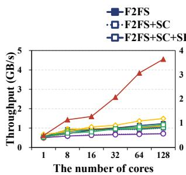  
(a) Random write.

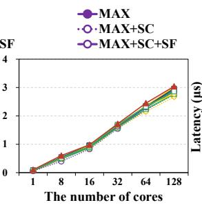  
(b) Random read.

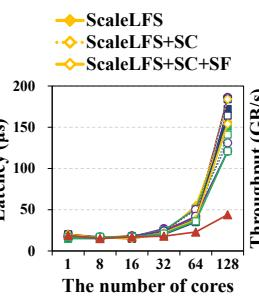  
(c) Tail latency (99th).

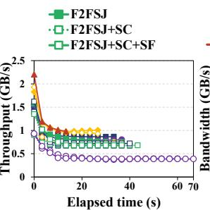  
(d) Application TP.

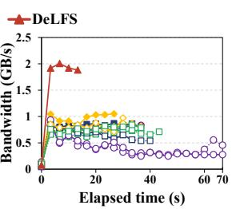  
(e) Device-level BW.

Figure 12: Throughput, tail latency, and GC performance of LFSs (SC: ScaleCache, SF: serialization-free, BW: bandwidth, TP: throughput).  
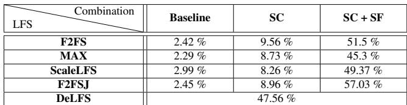  
Table 2: CPU utilization (SC: ScaleCache, SF: serialization-free).

Comparison: We compare DeLFS with modern LFSs, including F2FS [18], MAX [21], ScaleLFS [11], and F2FSJ [9], as well as their variants combined with ScaleCache (SC) [29] and the serialization-free (SF) scheme (mentioned in Section 3.2). We run all LFSs and their variants on Ubuntu 22.04 LTS with the Linux 6.6.8 kernel. For evaluation, we use FIO [4] as a micro-benchmark, filebench [31] as a macro-benchmark, and RocksDB [10] as a real-world application with YCSB [1]. We run each test ten times and report the average result.

## 5.2 Micro-benchmark

We present the performance results of DeLFS and modern LFSs using the FIO benchmark. We vary the number of threads from 1 to 128, and use a 2.2 GB file size per thread and a 4 KB request size. In the case of 128 threads, the total dataset size is 281.6 GB. We use this configuration as the default in all micro-benchmark tests unless stated otherwise. Core scalability: Figure 12a shows the core scalability in the case of random write. The existing LFSs show almost the same performance, or even degrade even if the number of cores increases. Meanwhile, DeLFS scales performance well on various number of cores. Specifically, DeLFS achieves 4.34×, 4.29×, 4.10×, and 4.50× compared with F2FS, MAX, ScaleLFS, and F2FSJ at 128 cores, respectively. This is because the existing LFSs suffer from the first bottleneck (i.e., blocking overhead) by I/O throttling in dirty-page management as described in Section 3.2.1. To eliminate the blocking overhead, even when combining LFSs with SC, the existing LFSs still suffer from the serialization lock as the second bottleneck. Furthermore, even if the serialization lock is eliminated (i.e., serialization-free (SF)), contention on subsequent locks becomes the next bottleneck, as shown in Table 1. Thus, with the decentralized design, DeLFS can achieve 3.70×, 6.41×, 3.05×, and 3.89× higher throughput compared with F2FS+SC+SF, MAX+SC+SF, ScaleLFS+SC+SF, and F2FSJ+SC+SF at 128 cores, respectively. Consequently, these results demonstrate that DeLFS effectively scales performance as the number of cores increases by leveraging decentralized architecture and locking schemes.

Read-only performance: We evaluate the read-only performance of DeLFS while increasing the number of cores as shown in Figure 12b. Overall, the read performance of DeLFS is similar to that of the other LFSs. This is because all LFSs already achieve throughput close to the raw read performance since the read path allows multiple threads to issue read operations concurrently under read locks. Consequently, the design of DeLFS does not affect read performance.

Tail latency: Figure 12c shows tail latency in all the LFS configurations while varying the number of cores. As shown in the figure, at 128 cores, when comparing the bestperforming configurations among the LFS variants, DeLFS achieves 3.73×, 2.75×, 3.5×, and 2.75× lower tail latency than F2FS+SC+SF, MAX+SC+SF, ScaleLFS+SC+SF, and F2FSJ+SC+SF, respectively. In particular, while existing LFSs exhibit sharp latency spikes between 64 and 128 cores, DeLFS suppresses these spikes and keeps the latency much more stable. As a result, DeLFS outperforms the existing LFSs in terms of tail latency as well as throughput.

CPU utilization: Table 2 shows CPU utilization across all LFS configurations. As expected, the variant LFSs exhibit higher CPU utilization than the existing LFSs, since they can proceed without I/O throttling and the serialization lock. DeLFS shows the highest CPU utilization among the existing LFSs because it accelerates I/O processing with greater concurrency and parallelism. As a result, DeLFS achieves higher multi-core scalability at the cost of increased CPU utilization. Garbage collection: Figure 12d and 12e present the application throughput and device-level bandwidth during GC. To fairly evaluate GC performance against ScaleLFS [11], we follow the experimental setup described in the study. Specifically, we use a 30 GB partition and run the experiment with 128 threads, each issuing 228 MB of random writes, resulting in approximately 28.5 GB of total writes. We then rerun the same workload as overwrites. As shown in the figures, DeLFS achieves up to 2.77× lower application-level execution time and delivers up to 2.32× higher device-level bandwidth than the compared systems. This is because DeLFS performs a decentralized GC procedure that localizes GC and reduces lock contention. Moreover, by improving both the write I/O path and the GC I/O path, DeLFS further reduces total application execution time compared with ScaleLFS. These results show that DeLFS improves both normal I/O and GC performance.

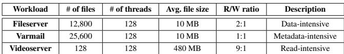  
Table 3: Workload configurations for macro-benchmark.

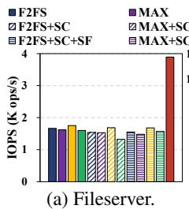

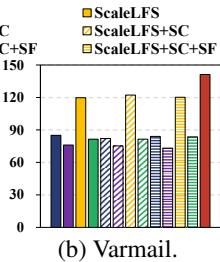  
Figure 13: Throughput on macro-benchmark.

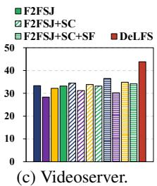

Write amplification factor: We quantify the effect of suboptimal GC victim selection by comparing the WAF of F2FS and DeLFS. In the above GC evaluation, the total WAF increases slightly by 1.2%, from 1.088 in F2FS to 1.101 in DeLFS. The resulting WAF of 1.101 is broadly consistent with the 13.7% average gap between application-level throughput (1.31 GB/s on average) in Figure 12d and device-level bandwidth (1.49 GB/s on average) in Figure 12e. Specifically, in the non-GC phase, both file systems exhibit a similar WAF of approximately 1.065, mainly due to metadata overhead. Meanwhile, the GC-induced WAF overhead is 0.036 in DeLFS and 0.023 in F2FS. However, this additional overhead contributes only 0.013 to the total WAF increase. Consequently, these results show that although DeLFS may make less-than-optimal victim selection decisions, the impact on total WAF is minor.

## 5.3 Macro-benchmark

We use three filebench workloads as listed in Table 3.

Fileserver: Figure 13a shows the performance of the fileserver workload. DeLFS delivers 2.34×, 2.40×, 2.22×, and 2.43× higher performance than F2FS, MAX, ScaleLFS, and F2FSJ, respectively. Meanwhile, the existing and variant LFSs show similar performance, as in the micro-benchmark case. Since fileserver is a write and data-intensive workload, the LFSs are still constrained by bottlenecks in the write path. Consequently, this result demonstrates that DeLFS yields high performance gains under more realistic workload.

Varmail: Figure 13b shows the results for the varmail workload, where DeLFS achieves 1.66×, 1.86×, 1.18×, and 1.73× higher throughput than F2FS, MAX, ScaleLFS, and F2FSJ, respectively. In all systems except ScaleLFS and DeLFS, delete operations contend heavily on the SIT entry lock (sentry\_lock). ScaleLFS alleviates this with atomic operations, while DeLFS removes this bottleneck via its decentralized architecture and locking. Thus, DeLFS is effective for both data-intensive and metadata-intensive workloads.

Videoserver: Figure 13c shows the results for the videoserver workload. In the figure, DeLFS delivers 1.31×, 1.55×, 1.36×, and 1.32× higher throughput than F2FS, MAX, ScaleLFS, and F2FSJ, respectively. Although videoserver is readintensive, DeLFS still accelerates its execution because improvements in the write path can reduce interference between read and write operations. Consequently, DeLFS provides higher performance even for read-intensive workloads.

## 5.4 Real-world Application

To evaluate DeLFS with a real-world application, we run RocksDB with YCSB workloads A, B, F, and update-only [3]. Workload A uses a 1:1 read-to-update ratio, B uses a 9.5:0.5 read-to-update ratio, F uses a 1:1 read-to-read-modify-write ratio, and update-only issues 100% update operations. We use 1–128 client threads, 10 million records with 10 fields of 4 KB each, and 1.28 million operations per workload.

Workload A: Figure 14a shows that DeLFS achieves 1.78×, 1.60×, 1.81×, and 1.62× higher throughput than F2FS, MAX, ScaleLFS, and F2FSJ, respectively, at 128 cores. We observe that ScaleCache improves throughput by eliminating blocking overhead but the serialization-free scheme is ineffective because the next lock becomes the bottleneck. These results indicate that DeLFS is also effective for the real-world application.

Workload B: As shown in Figure 14b, interestingly, even under the read-intensive workload, DeLFS improves performance by 1.19×, 1.26×, 1.77×, and 1.22× over F2FS, MAX, ScaleLFS, and F2FSJ, respectively, at 128 cores. These results indicate that an inefficient write path can significantly impact read performance even under small write workloads.

Workload F: Figure 14c indicates that DeLFS achieves up to 1.98×, 1.95×, 1.71×, and 1.96× over F2FS, MAX, ScaleLFS, and F2FSJ, respectively. Overall, DeLFS shows larger gains in workload F than in A because the read-modify-write requests in workload F stress both the write and read paths.

Update-only workload: Figure 14d shows DeLFS achieves up to 2.24×, 2.14×, 2.54×, and 2.20× higher throughput than F2FS, MAX, ScaleLFS, and F2FSJ, respectively. These results indicate that DeLFS is particularly effective for writeintensive workloads, the primary target of our design.

## 5.5 Performance Breakdown

Decentralized architecture: To illustrate the performance impact of DeLFS in more detail, we report the performance breakdown as shown in Table 4. As shown in the table, the bottleneck shifts from one lock to another as each decentralized scheme is applied. Finally, DeLFS minimizes the contention of target locks holistically. These results demonstrate that each technique successfully resolves its corresponding scalability bottleneck in the LFS operation.

(a) Workload A.  
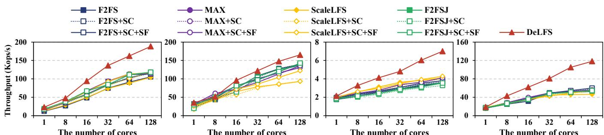  
(b) Workload B.  
(c) Workload F.  
(d) Update-only.

Figure 14: Throughput of various LFSs with YCSB workloads.  
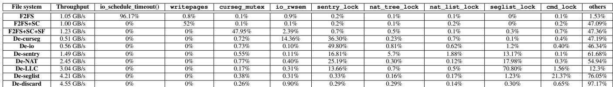  
Table 4: Breakdown of DeLFS (De: decentralized, SC: ScaleCache, SF: serialization-free, LLC: lazy lock coordinator).

Decentralized locking schemes: We compare the performance of DFL, DDL, and deLLC in Table 5. For this experiment, we first fill the SSD to 1.8 TB using FIO. We then overwrite the data using the default FIO workload (281.6 GB) and measure performance. During this process, approximately 73 million invalid pages are processed. deLLC outperforms DFL and DDL by 89.63% and 43.83%, respectively. Moreover, the total delegation time is only 1.32s, which is a minor overhead.

## 5.6 Overhead of DeLFS

Performance under aged state: To measure the overheads of DeLFS under an aged state, we age the file system following the methodology of prior work [8], as shown in Table 6. Specifically, we perform 300 pulls from the Linux git repository and a recursive grep test, and then run the fileserver workload under the aged state. As expected, aging decreases grep performance in both file systems. Interestingly, DeLFS achieves higher grep performance than F2FS in both the unaged and aged states as the number of threads increases, because it localizes blocks into core-local segments and improves read coalescing. In the fileserver evaluation, similar to the grep results, aging affects both file systems. Nevertheless, even in the aged state, DeLFS still outperforms F2FS by up to 1.96×. Overall, aging degrades performance compared with the unaged state, but DeLFS maintains its performance advantage even in the aged state.

Skewed space allocation: We evaluate the impact of crosscore space allocation as local space is gradually exhausted, focusing on the performance overhead caused by lock contention on remote cores. To generate sustained low-free-space pressure, we pre-fill the device at different capacity levels and run the fileserver workload, which continuously performs file creation and deletion while generating substantial writes as shown in Table 7. For the 75%, 50%, 25%, and 10% available space cases, DeLFS outperforms F2FS by 2.37×, 1.93×, 1.63×, and 1.17×, respectively. DeLFS performance gradually decreases as the available space decreases because local freepool depletion incurs cross-core overheads. Especially in the 1% available space case, both file systems show almost the same performance because the available capacity is severely limited. Nevertheless, these results show that even under severe free-space pressure with continuous file creation/deletion and large writes, DeLFS remains effective and maintains a performance advantage over F2FS in most capacity settings.

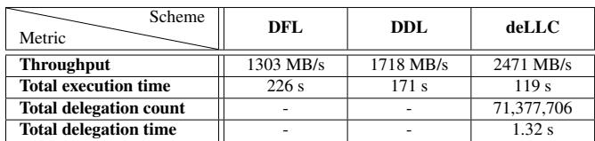  
Table 5: Performance under heavy invalid page processing.

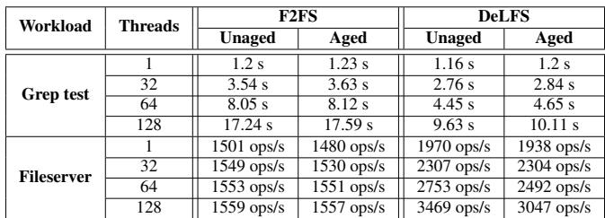  
Table 6: Performance comparison between unaged and aged states.

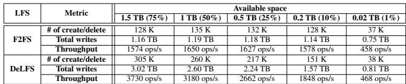  
Table 7: LFS performance under various available space conditions.

Memory consumption: DeLFS requires additional memory to support decentralized organization and management, but the overhead is small. Across multi-head logging metadata, checkpoint bookkeeping (per-log segno/blkoff), decentralized locks and their protected data structures (e.g., XArrays), and lock-coordinator/invalidation structures, DeLFS uses up to about 1.1 MB (1121.67 KB) of extra memory under our experimental setup. Given modern memory capacities, this additional overhead is negligible in practice.

Storage overhead: As the number of multi-head logging instances increases with the number of cores, the checkpointing process requires an additional 11.9 KB of space to store the segment number and block offset information maintained for each multi-head logging instance.

## 5.7 Crash Consistency

To validate crash consistency of DeLFS, we use Crash-Monkey [25]. Specifically, we test DeLFS with checkpoint (checkpoint\_example) and create/delete (create\_delete) workloads. The results confirm that DeLFS successfully handles all test cases and maintains crash consistency.

## 6 Related Work

Scaling file and storage systems: SpanFS [13] scales file systems by composing a set of micro file-system services. ScaleFS [6] decouples in-memory and on-disk file systems to reduce lock contention. CJFS [28] and Z-Journal [14] improve the scalability of journaling file systems using concurrent and per-core schemes. uFS [22] is a semi-microkernel file system that scales through partitioned data structures and inode migration. ScaleCache [29] is a scalable page cache that provides concurrent XArray and direct page flushing. Our work aligns with these studies on scaling file and storage systems [6, 13, 14, 22, 28, 29]. However, unlike these studies, DeLFS targets LFSs and introduces a decentralized management and locking approach that eliminates centralized bottlenecks while accelerating both normal I/O and GC I/O paths. Scalable LFSs: MAX [21] scales in-memory data-structure access and provides a concurrency-friendly on-disk format, but still limits parallelism. During flushing, MAX selects an mlog cell in a round-robin manner, searches a shared free bitmap, and sends data to the corresponding mlog. This oneto-all allocation model and shared metadata still incur high lock contention. F2FSJ [9] introduces an ordered-journal mode for F2FS to reduce checkpointing time by journaling metadata. Unlike F2FSJ, DeLFS targets data-intensive work loads where checkpoint overhead is relatively small; integrating F2FSJ-like journaling into DeLFS for metadata-intensive workloads remains future work. ScaleLFS [11] scales garbage collection with parallel GC and concurrent victim selection. In contrast, DeLFS decentralizes and localizes GC while reducing lock contention on the normal I/O path. As a result, DeLFS further improves sustained performance. In summary, our work is inspired by these designs and shares the goal of improving scalability, but DeLFS holistically decentralizes metadata and data management and employs decentralized, decoupled locking to scale on many-core systems.

## 7 Conclusion

We present DeLFS, a decentralized log-structured file system that overcomes the scalability limitations of existing LFSs and scales I/O performance on manycores. DeLFS holistically decentralizes metadata/data organization and management into per-core domains with a novel decentralized locking scheme. Furthermore, DeLFS disentangles the critical path from the deferrable path to further increase concurrency. Our evaluations show that DeLFS achieves up to 4.34×, 4.29×, 4.10×, and 4.50× higher throughput compared with F2FS, MAX, ScaleLFS, and F2FSJ, respectively.

## Acknowledgments

We sincerely thank our shepherd, Emmett Witchel, and the anonymous reviewers for their invaluable feedback. This work was supported by the National Research Foundation of Korea (NRF) (No. RS-2025-00554650) (Corresponding Author: Yongseok Son).

## References

[1] Yahoo! cloud serving benchmark, 2019. Accessed on May 17, 2025. URL: https://github.com/brianfr ankcooper/YCSB.

[2] Seagate FireCuda 530, 2022. Accessed on Aug. 8, 2025. URL: https://www.amazon.com/Seagate-FireCud a-Internal-Solid-State/dp/B0977K2C74.

[3] Raja Appuswamy, Angelos C. Anadiotis, Danica Porobic, Mustafa K. Iman, and Anastasia Ailamaki. Analyzing the impact of system architecture on the scalability of oltp engines for high-contention workloads. Proc. VLDB Endow., 11(2):121–134, oct 2017. doi: 10.14778/3149193.3149194.

[4] Jens Axboe. Flexible I/O Tester, 2024. Accessed on Jan. 02, 2024. URL: https://github.com/axboe/fio.

[5] Philip A. Bernstein, Vassos Hadzilacos, and Nathan Goodman. Concurrency Control and Recovery in Database Systems. Addison-Wesley, 1987.

[6] Srivatsa S. Bhat, Rasha Eqbal, Austin T. Clements, M. Frans Kaashoek, and Nickolai Zeldovich. Scaling a file system to many cores using an operation log. In Proceedings of the 26th Symposium on Operating

Systems Principles, SOSP ’17, page 69–86, New York, NY, USA, 2017. Association for Computing Machinery. doi:10.1145/3132747.3132779.

[7] Matias Bjørling, Jens Axboe, David Nellans, and Philippe Bonnet. Linux block io: introducing multi-queue ssd access on multi-core systems. In Proceedings of the 6th International Systems and Storage Conference, SYSTOR ’13, New York, NY, USA, 2013. Association for Computing Machinery. doi:10.1145/2485732.2485740.

[8] Alex Conway, Ainesh Bakshi, Yizheng Jiao, William Jannen, Yang Zhan, Jun Yuan, Michael A. Bender, Rob Johnson, Bradley C. Kuszmaul, Donald E. Porter, and Martin Farach-Colton. File systems fated for senescence? nonsense, says science! In 15th USENIX Conference on File and Storage Technologies (FAST 17), pages 45–58, Santa Clara, CA, February 2017. USENIX Association. URL: https://www.usenix.o rg/conference/fast17/technical-sessions/pr esentation/conway.

[9] Yaotian Cui, Zhiqi Wang, Renhai Chen, and Zili Shao. Decentralized, epoch-based F2FS journaling with finegrained crash recovery. In Proceedings of the 19th USENIX Conference on Operating Systems Design and Implementation, OSDI ’25, USA, 2025. USENIX Association.

[10] Facebook. RocksDB: A Persistent Key-Value Store for Fast Storage Environments, 2012. Accessed on Dec. 20, 2024. URL: https://rocksdb.org/.

[11] Jin Yong Ha, Sangjin Lee, Hyeonsang Eom, and Yongseok Son. ScaleLFS: A Log-Structured File System with Scalable Garbage Collection for Commodity SSDs. In 23rd USENIX Conference on File and Storage Technologies (FAST 25), pages 53–67, Santa Clara, CA, February 2025. USENIX Association. URL: https://www.usenix.org/conference/fast25/p resentation/ha.

[12] Inhwi Hwang, Sangjin Lee, Sunggon Kim, Hyeonsang Eom, and Yongseok Son. Z-LFS: A Zoned Namespacetailored Log-structured File System for Commodity Small-zone ZNS SSDs. In 2025 USENIX Annual Technical Conference (USENIX ATC 25), pages 547– 562, 2025.

[13] Junbin Kang, Benlong Zhang, Tianyu Wo, Weiren Yu, Lian Du, Shuai Ma, and Jinpeng Huai. SpanFS: A Scalable File System on Fast Storage Devices. In 2015 USENIX Annual Technical Conference (USENIX ATC 15), pages 249–261, Santa Clara, CA, July 2015. USENIX Association. URL: https://www.usenix.o

rg/conference/atc15/technical-session/pre sentation/kang.

[14] Jongseok Kim, Cassiano Campes, Joo-Young Hwang, Jinkyu Jeong, and Euiseong Seo. Z-Journal: Scalable Per-Core journaling. In 2021 USENIX Annual Technical Conference (USENIX ATC 21), pages 893– 906. USENIX Association, July 2021. URL: https: //www.usenix.org/conference/atc21/presenta tion/kim-jongseok.

[15] Juwon Kim, Minsu Kim, Muhammad Danish Tehseen, Joontaek Oh, and Youjip Won. IPLFS: Log-Structured file system without garbage collection. In 2022 USENIX Annual Technical Conference (USENIX ATC 22), pages 739–754, Carlsbad, CA, July 2022. USENIX Association. URL: https://www.usenix.org/confe rence/atc22/presentation/kim-juwon.

[16] Ryusuke Konishi, Yoshiji Amagai, Koji Sato, Hisashi Hifumi, Seiji Kihara, and Satoshi Moriai. The Linux implementation of a log-structured file system. SIGOPS Oper. Syst. Rev., 40(3):102–107, jul 2006. doi:10.1 145/1151374.1151375.

[17] Chang-Gyu Lee, Hyunki Byun, Sunghyun Noh, Hyeongu Kang, and Youngjae Kim. Write optimization of log-structured flash file system for parallel i/o on manycore servers. In Proceedings of the 12th ACM International Conference on Systems and Storage, SYS TOR ’19, page 21–32, New York, NY, USA, 2019. Association for Computing Machinery. doi:10.1145/33 19647.3325828.

[18] Changman Lee, Dongho Sim, Jooyoung Hwang, and Sangyeun Cho. F2FS: A New File System for Flash Storage. In 13th USENIX Conference on File and Storage Technologies (FAST 15), pages 273–286, Santa Clara, CA, February 2015. USENIX Association. URL: https://www.usenix.org/conference/fast15/t echnical-sessions/presentation/lee.

[19] Euidong Lee, Ikjoon Son, and Jin-Soo Kim. An Efficient Order-Preserving Recovery for F2FS with ZNS SSD. In Proceedings of the 15th ACM Workshop on Hot Topics in Storage and File Systems, HotStorage ’23, page 116–122, New York, NY, USA, 2023. Association for Computing Machinery. doi:10.1145/3599691. 3603416.

[20] Yongmyung Lee, Jong-Hyeok Park, Jonggyu Park, Hyunho Gwak, Dongkun Shin, Young Ik Eom, and Sang-Won Lee. When F2FS meets address remapping. In Proceedings of the 14th ACM Workshop on Hot Topics in Storage and File Systems, HotStorage ’22, page 31–36, New York, NY, USA, 2022. Association for Computing Machinery. doi:10.1145/3538643.3539755.

[21] Xiaojian Liao, Youyou Lu, Erci Xu, and Jiwu Shu. Max: A Multicore-Accelerated File System for Flash Storage. In 2021 USENIX Annual Technical Conference (USENIX ATC 21), pages 877–891. USENIX Association, July 2021. URL: https://www.usenix.org/c onference/atc21/presentation/liao.

[22] Jing Liu, Anthony Rebello, Yifan Dai, Chenhao Ye, Sudarsun Kannan, Andrea C. Arpaci-Dusseau, and Remzi H. Arpaci-Dusseau. Scale and performance in a filesystem semi-microkernel. In Proceedings of the ACM SIGOPS 28th Symposium on Operating Systems Principles, SOSP ’21, page 819–835, New York, NY, USA, 2021. Association for Computing Machinery. doi:10.1145/3477132.3483581.

[23] Changwoo Min, Sanidhya Kashyap, Steffen Maass, and Taesoo Kim. Understanding manycore scalability of file systems. In 2016 USENIX Annual Technical Conference (USENIX ATC 16), pages 71–85, Denver, CO, June 2016. USENIX Association. URL: https: //www.usenix.org/conference/atc16/technica l-sessions/presentation/min.

[24] Changwoo Min, Kangnyeon Kim, Hyunjin Cho, Sang-Won Lee, and Young Ik Eom. SFS: random write considered harmful in solid state drives. In Proceedings of the 10th USENIX Conference on File and Storage Technologies, FAST’12, page 12, USA, 2012. USENIX Association. URL: https://dl.acm.org/doi/abs/1 0.5555/2208461.2208473.

[25] Jayashree Mohan, Ashlie Martinez, Soujanya Ponnapalli, Pandian Raju, and Vijay Chidambaram. Finding Crash-Consistency bugs with bounded Black-Box crash testing. In 13th USENIX Symposium on Operating Systems Design and Implementation (OSDI 18), pages 33–50, Carlsbad, CA, October 2018. USENIX Association. URL: https://www.usenix.org/conference/ osdi18/presentation/mohan.

[26] Dushyanth Narayanan, Eno Thereska, Austin Donnelly, Sameh Elnikety, and Antony Rowstron. Migrating server storage to ssds: analysis of tradeoffs. In Proceedings of the 4th ACM European conference on Computer systems, pages 145–158, 2009.

[27] Joontaek Oh, Sion Ji, Yongjin Kim, and Youjip Won. exF2FS: Transaction Support in Log-Structured Filesystem. In 20th USENIX Conference on File and Storage Technologies (FAST 22), pages 345–362, Santa Clara, CA, February 2022. USENIX Association. URL: https://www.usenix.org/conference/fast22 /presentation/oh.

[28] Joontaek Oh, Seung Won Yoo, Hojin Nam, Changwoo Min, and Youjip Won. CJFS: Concurrent Journaling for

Better Scalability. In 21st USENIX Conference on File and Storage Technologies (FAST 23), pages 167–182, Santa Clara, CA, February 2023. USENIX Association. URL: https://www.usenix.org/conference/fast 23/presentation/oh.

[29] Kiet Tuan Pham, Seokjoo Cho, Sangjin Lee, Lan Anh Nguyen, Hyeongi Yeo, Ipoom Jeong, Sungjin Lee, Nam Sung Kim, and Yongseok Son. ScaleCache: A Scalable Page Cache for Multiple Solid-State Drives. In Proceedings of the Nineteenth European Conference on Computer Systems, EuroSys’24, page 641–656, New York, NY, USA, 2024. Association for Computing Machinery. doi:10.1145/3627703.3629588.

[30] Mendel Rosenblum and John K. Ousterhout. The design and implementation of a log-structured file system. ACM Trans. Comput. Syst., 10(1):26–52, feb 1992. doi:10.1145/146941.146943.

[31] Vasily Tarasov, Erez Zadok, and Spencer Shepler. Filebench: A flexible framework for file system benchmarking. USENIX; login, 41(1):6–12, 2016. URL: https://www.usenix.org/system/files/login/ articles/login\_spring16\_02\_tarasov.pdf.

[32] Gerhard Weikum and Gottfried Vossen. Transactional information systems: theory, algorithms, and the practice of concurrency control and recovery. Elsevier, 2001.

[33] Lihua Yang, Fang Wang, Zhipeng Tan, Dan Feng, Jiaxing Qian, and Shiyun Tu. ARS: Reducing F2FS Fragmentation for Smartphones using Decision Trees. In 2020 Design, Automation & Test in Europe Conference & Exhibition (DATE), pages 1061–1066, 2020. doi: 10.23919/DATE48585.2020.9116318.

[34] Jiacheng Zhang, Jiwu Shu, and Youyou Lu. ParaFS: a log-structured file system to exploit the internal parallelism of flash devices. In Proceedings of the 2016 USENIX Conference on Usenix Annual Technical Conference, USENIX ATC ’16, page 87–100, USA, 2016. USENIX Association. URL: https://dl.a cm.org/doi/abs/10.5555/3026959.3026968.