USENIX

THE ADVANCED COMPUTING SYSTEMS ASSOCIATION

# SMARTTalk: Teaching SMART Logs to Talk to LLMs

Mayur Akewar and Dongsheng Luo, Florida International University; Sandeep Madireddy, Argonne National Laboratory; Janki Bhimani, Florida International University

https://www.usenix.org/conference/osdi26/presentation/akewar

# This paper is included in the Proceedings of the 20th USENIX Symposium on Operating Systems Design and Implementation.

July 13–15, 2026 • Seattle, WA, USA

ISBN 978-1-939133-55-7

Open access to the Proceedings of the 20th USENIX Symposium on Operating Systems Design and Implementation is sponsored by

# SMARTTalk: Teaching SMART Logs to Talk to LLMs

Mayur Akewar+ Dongsheng Luo+ Sandeep Madireddy∗ Janki Bhimani+

+Florida International University ∗Argonne National Laboratory

## Abstract

SMART attributes are the main telemetry for monitoring Solid State Drives (SSDs) and predicting failures in large fleets, but existing methods rely on heavy feature engineering and large supervised pipelines that must be retrained as hardware or workloads change and that compress rich temporal behavior into opaque numeric scores. Large Language Models (LLMs) offer structured reasoning and explanations, yet perform poorly on raw SMART logs because the histories are long and multivariate, their temporal inductive bias is weak, and they hallucinate on numeric inputs. We present SMARTTalk, a new systems architecture that introduces a representation layer for device telemetry. SMARTTalk converts each n day SMART window into a sequence of symbolic trend tokens that an LLM can reliably reason over. The system separates numerical trend extraction from language based reasoning through three stages. (1) It slices n-day SMART windows into short temporal patches and encodes them with lightweight Convolutional Neural Network (CNN), then it clusters the resulting embeddings to form compact libraries of attribute-level and cross-attribute temporal patterns; (2) It converts each pattern into concise, human-readable text tokens that are stable across drives and over time; and (3) It feeds these pattern summaries to an LLM with chain-of-thought prompting, augmented with an online pattern memory that detects and incorporates previously unseen behaviors without retraining. By reasoning in natural language, SMARTTalk gives transparent explanations and interactive workflows.

Evaluations on production datacenter SSD traces, across both open-source and proprietary LLMs, show that SMARTTalk delivers roughly 50× higher F0.5 than Raw-LLM, about 4× higher than the Heuristic-LLM, and approximately 25% more accurate health classification than existing SMART-based methods, while achieving time-to-failure estimates with bucketed MAE near 10 days. SMARTTalk’s natural-language outputs are rated highly by LLM-as-judge, with explanation and recommendation scores around 4.5 out of 5 and perturbation robustness above 80%, making the system operator friendly and ready for the deployment.

## 1 Introduction

SMART (Self Monitoring, Analysis and Reporting Technology) attributes [2] are the primary telemetry for monitoring the health of Solid State Drives (SSDs) in production datacenters [5, 7, 8, 17, 22–25, 30, 36, 38]. Each drive reports daily counters such as reallocated sectors, pending sectors, and media errors that evolve over time. These long multivariate histories allow operators to identify at-risk drives before failure, enabling proactive replacement and minimizing downtime.

A large body of work converts SMART logs into predictive models. Classical approaches use summary statistics and hand crafted temporal features fed into supervised learners such as random forests and gradient boosted trees [7, 8, 10, 22, 37]. Subsequent work introduces sequence models including autoencoders, LSTMs, and temporal convolutional networks to capture richer temporal behavior [12,19,38]. Recent industrial systems such as MVTRF [40] and MSFRD [41] incorporate more elaborate feature engineering, multi view statistics, and mutation based temporal encodings to improve both failure prediction and diagnosis. We discuss the existing body of work in detail in Section 2.4 and 2.5.

Despite these advances, existing methods face three key limitations. First, they rely on heavy feature engineering and large labeled datasets, particularly for rare failures and emerging drive models. Second, models must be retrained to handle firmware, workload, or hardware changes. Third, most methods reduce complex temporal behavior to numeric scores or class labels, providing limited interpretability and actionable guidance for operators.

Large Language Models (LLMs) offer an opportunity to unify prediction, explanation, and interaction. They excel at pattern abstraction, multi step reasoning, and natural language explanation [16, 21, 27–29, 31, 33, 35, 42]. However, directly prompting LLMs with long numeric SMART traces is ineffective. Raw tables obscure temporal structure, overwhelm token budgets, and cause models to hallucinate trends that are not present [18]. This is one of the unavoidable barrier of using LLM that motivates our architecture. As discussed in

Section 2, key signals are local temporal patterns, slow drifts, spikes, bursts, and cross-attribute correlations that standard LLMs do not readily interpret.

Rare failures, evolving patterns, and long multi-attribute histories push classical models toward brittle feature engineering, sequence models toward failure under class imbalance and continual retraining, and LLMs toward hallucinations on raw telemetry, so prior architectures cannot solve this problem. What is needed is a new representation layer rather than another model tweak. These observations motivate our architecture that combines reliable temporal pattern extraction with LLM-based reasoning. Our core insight is to translate an n-day SMART window into a compact, human-readable event language that: (1) Preserves essential temporal structure (local patterns, slow drifts, spikes, bursts). (2) Captures attribute-wise and cross-attribute correlations. (3) Expands naturally over time as new failure modes emerge. (4) Exposes the right “interaction surface” for LLM reasoning, expressive enough for diagnosis, concise enough for token budgets, and structured enough to avoid hallucinated trends.

SMARTTalk is a system that enables LLMs to infer drive health, time to failure, likely causes, and recommended operator actions without heavy feature engineering or large labeled datasets. The design centers on three mechanisms. First, SMARTTalk introduces a temporal patch to pattern to phrase representation: each SMART history is sliced into short patches, embedded, mapped to a learned vocabulary of temporal patterns, and then rendered as concise natural language trend descriptions that LLMs can reliably interpret. Second, SMARTTalk maintains an online pattern memory for novelty tracking, allowing the system to detect patches whose embeddings exceed a learned novelty threshold, accumulate these previously unseen behaviors, recluster them into new temporal patterns, and expand the pattern library as new failure modes appear. This helps SMARTTalk handle rare or evolving failure modes. Third, SMARTTalk per forms LLM reasoning over a structured sequence of semantic events; the LLM consumes this event sequence using a small in-context prompt and a Chain of Thought scaffold [34], enabling accurate status inference, time to failure prediction, cause identification, and actionable recommendations.

The design of SMARTTalk is guided by the following research questions (RQ): (RQ1:) How can LLMs analyze SMART logs to predict drive health and time-to-failure accurately without heavy feature engineering or large labeled datasets? (RQ2:) Does the patch→pattern→phrase representation reliably prevent trend hallucination and capture temporal structure? (RQ3:) How does an online pattern-memory improve robustness to rare and emerging failures compared to static encoders? (RQ4:) Are SMARTTalk’s explanations (“why the drive is at risk”) and recommendations (“what to do next”) align with operator needs?

We evaluate SMARTTalk on production traces from Alibaba (MB1 and MB2 SSD models). Across five LLM backbones, SMARTTalk raises the average F . score for failure status prediction roughly 50× times higher than Raw-LLM, about 4× times higher than the Heuristic-LLM baseline, and approximately 25% improvement over the average of existing SMART-based methods and recent time-series SOTA models (Table 5). For drives that are correctly flagged at risk, the same backbones achieve TTF bucket macro-F1 around 0.6 with bucketed MAE near 10 days and more than half of failures landing within ±5 days of the predicted bucket (Table 6). SMARTTalk’s natural-language outputs are also rated highly by an independent LLM-as-judge, with explanation and recommendation scores around 4.4–4.6 out of 5 and perturbation robustness metrics above 80% (Table 7). Together, these results suggest that SMARTTalk is operator friendly and can substantially reduce the extra work spent deciphering raw SMART logs and triaging spurious alerts, while still providing timely, precise warnings and concrete actions.

## 2 Understanding SMART Logs

Our goal is not just to predict failures, but to make raw SMART logs talk to LLMs in a way that preserves the underlying behavior of the device to support qualitative decision making. Before designing SMARTTalk, we first inspect the data to understand what kinds of temporal patterns appear in SMART attributes and how a human operator would naturally describe them. These observations directly motivate our patching, pattern, and text-generation design.

## 2.1 SMART Attributes and Their Semantics

SMART exposes dozens of device–specific counters and indicators [17]. In this work we focus on a subset of 19 raw attributes that are both widely used in prior studies and relatively interpretable across models [17]. Table 1 summarizes these fields and the direction in which they are considered “healthy” (e.g., error counts ideally remain low, spare capacity ideally remains high). For a human operator, these attributes naturally suggest qualitative descriptions such as: “this error counter stayed flat for months and then spiked,” “this wear indicator is slowly drifting down,” or “this attribute is noisy but bounded.” SMARTTalk aims to recover exactly such phrases automatically and feed them to an LLM.

The semantic structure of SMART attributes motivates three design choices in SMARTTalk. First, because different attributes reflect health through distinct patterns (e.g., slow wear trends versus sudden error spikes), we require attributespecific patch encoders rather than a single global model. Second, since operators naturally describe these behaviors linguistically, SMARTTalk must convert temporal shapes into short phrases that mirror operator vocabulary. Third, because attributes interact during many failures, these phrase-level descriptions must later be composed to express cross-attribute events.

Table 1: Selected raw SMART attributes grouped by trend.  
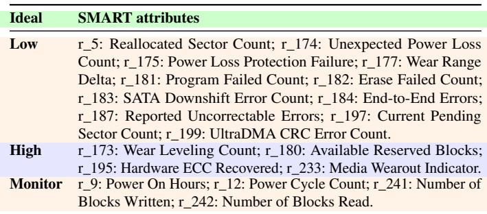

## 2.2 Dataset and High-Level Behavior

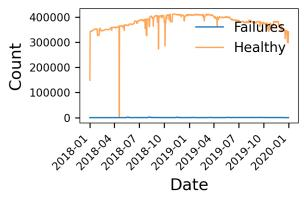

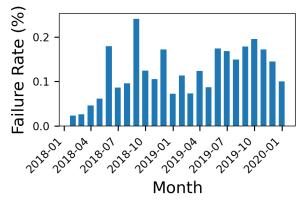  
(a) Healthy vs. failed counts.  
(b) Monthly failure rate.  
Figure 1: Behavior of the Alibaba SMART dataset.

We use a publicly released dataset of SSD SMART logs from Alibaba Cloud [1, 37]. The dataset spans two years (2018–2019) and covers six SSD models (MA1, MA2, MB1, MB2, MC1, and MC2), each monitored daily with up to 105 SMART attributes. We keep the 19 raw attributes from Table 1 and treat each drive’s history as a multivariate daily time series. We focus on the MB1 and MB2 models in our experiments because they have very few missing values for each of the 19 attributes and are also used by prior work for evaluation making it straightforward to compare.

Figure 1 summarize several aggregate trends. Figure 1a shows the total number of healthy and failed drives over time, highlighting the extreme imbalance between the two classes. Figure 1b plots the monthly failure rate, which exhibits a slowly changing baseline with occasional spikes. The long histories and extreme class imbalance observed in the dataset suggest that global features across months or years are ineffective. This motivates our use of short, localized temporal patches that isolate informative behavior. The heterogeneous behavior across SSD models further argues for a learned pattern vocabulary rather than fixed, hand-engineered features. Finally, because failures evolve slowly with occasional bursts, the system must track patterns over time and allow new patterns to emerge, motivating use of online pattern memory.

## 2.3 Attribute-Level Patterns and “How a Human Would Say It”

To understand what kinds of temporal shapes an LLM should see, we zoom in on individual attributes. Figure 2 shows representative trajectories for two important SMART attributes: Reallocated Sector Count (r\_5) and Reported Uncorrectable Errors (r\_187). For each attribute we plot typical traces from days labeled healthy and from days that belong to drives that eventually fail. Two observations are important for designing SMARTTalk:

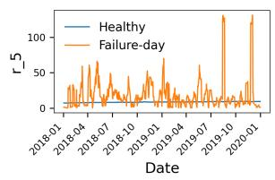

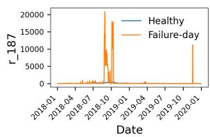  
(a) Reallocated Sector Count.  
(b) Uncorrectable Errors.  
Figure 2: Temporal patterns for two SMART attributes.

Attributes express risk in different ways. r\_5 shows noisy, slowly increasing behaviour with repeated medium-sized spikes, while r\_187 stays flat for long periods and then exhibits sudden, extreme jumps. A human would describe these as “gradual degradation with bursts” versus “quiet then a sharp spike”. We want the LLM to see precisely such phrases, not just raw numbers.

Informative structure is local. In both plots, the informative changes happen over tens of days, not over the entire multi-year history. Global features such as a single slope over n days cannot capture whether the last week was stable, noisy, or spiky.

From an LLM’s perspective, feeding a long list of daily numbers (e.g., “0, 0, 1, 3, 4, 0, . . . ”) is a poor interface: the model must implicitly rediscover all the relevant temporal shapes. Instead, we want to convert each local segment of the time series into a short description that already encodes how an operator would talk about it. These attribute-level observations lead directly to SMARTTalk’s patch–pattern–phrase pipeline. The fact that informative structure is local motivates our 5–10 day patch granularity. The diversity of shapes (flat, bursty, drifting) motivates learning a pattern library rather than relying on canned statistical features. The operator-like descriptions motivate generating compact natural language summaries for each patch so that the LLM receives structured, semantically meaningful events instead of raw numbers.

## 2.4 Challenges for Making SMART “Talk” and How SMARTTalk Responds

These observations reveal three challenges in turning SMART logs into LLM-friendly input:

Multivariate, long histories. Each drive exposes many attributes over years of daily logs, so listing all values overwhelms the LLM and hides the critical behavior.

Attribute and model-specific patterns. As seen in Figures 1 and 2, different attributes and SSD models exhibit distinct temporal shapes (flat, slowly drifting, bursty, oscillatory). It is challenging to accurately capture the relevance and pattern (as discussed in Section 2.3) of these shapes without requiring in-depth feature engineering for each attribute.

Need for human-like diagnostic thinking. Operators naturally think in terms of phrases like “stable low”, “gradual increase”, “noisy high”, or “repeated spikes in the last 10 days” to clearly understand the cumulative issue to make informed decision. To make the LLM’s to be able to clearly understand the issue and reason transparently, we want SMART logs to be expressed in the same style. SMARTTalk is designed to address above challenges.

In the next subsection, we place SMARTTalk in the context of existing SMART-based modeling approaches and how they handle the temporal trends.

Table 2: Qualitative comparison of SMART modeling approaches. ✓ = provided; △ = partially or indirectly provided; “–” = not a primary goal. Abbreviations: TS = time series aware, FE = heavy feature engineering, LD = labeled data need, EP = evolving patterns, OF = operator friendly, EX = explanations, TXT = text level representation and interaction.  
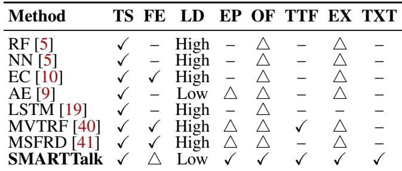

## 2.5 Existing SMART Models and Why SMARTTalk

Table 2 summarizes the major classes of SMART-based pre diction methods. Prior work largely falls into three categories.

Classical supervised models (RF, NN). Early systems treat each SMART snapshot as a feature vector and train models such as Random Forests and feed-forward NNs [5]. These methods need to be trained on large amount of data to predict accurately, operate solely on numerical features, and provide little operator-oriented insight beyond feature importance or binary risk flags.

Unsupervised and sequence models (AE, LSTM). Autoencoders [9] learn low-dimensional representations of SMART sequences and detect anomalies via reconstruction error, reducing labeled data demand but still yielding only numeric anomaly scores and need heavy feature engineering. LSTM-based models [19] capture temporal dynamics more faithfully, yet typically focus on binary failure prediction rather than structured time-to-failure (TTF) reasoning or interpretable explanations. After elaborate training, these models may show good statistical accuracies, hence we use these models as baselines in our evaluation 4.

Feature-engineered temporal systems (MVTRF, MS-FRD, EC). Recent state-of-the-art (SOTA) works combine SMART with extensive temporal feature engineering. MVTRF [40] integrates short-term values, long-term histograms, and trend features to jointly predict failure status, type, and TTF, and exposes rule-like decision paths for diagnosis. MSFRD [41] leverages fine-grained telemetry and computes mutation similarity between current and historical attribute changes to assign fine-grained failure levels. Alibaba’s production ensemble model for SMART logs [10] likewise uses rich temporal features and tree-based ensembles tuned for very low false positives, but, like MVTRF and MS-FRD, ultimately exposes only scores and binary labels rather than operator-facing narratives or structured TTF reasoning. These approaches achieve strong accuracy but rely on complex, hand-crafted features and communicate results mainly through scores, labels, and rating levels.

Prior SMART based prediction models across classical supervised methods, unsupervised sequence models, and heavily engineered temporal pipelines share limitations that tuning cannot fix. They depend on fixed feature schemas that miss new failure modes, unstable and costly supervision on rare failures, rigid numeric features that ignore cross attribute correlations and causal structure, and they provide little human interpretable reasoning from SMART trends to failures and operator actions. SMARTTalk differs from these approaches along three main axes: (1) Representation. Rather than handcrafted histograms or mutation features, SMARTTalk learns CNN-based patterns over local SMART patches and translates each pattern into a short, human-readable phrase (e.g., “r\_187 stable low”, “joint spike in r\_5 and r\_197”). (2) Reasoning. Instead of using a numeric classifier, SMARTTalk feeds these textual trend summaries to an LLM, which, via chain-of thought prompting, produces joint predictions of device status, TTF buckets, likely causes, and operator actions. (3) Adaptivity. SMARTTalk maintains an online pattern memory that detects, clusters, and promotes novel temporal patterns, enabling the system to capture emerging failure modes without retraining and expose them to the LLM in natural language.

In summary, SMARTTalk shifts from designing new numeric predictors to building a representation-and-reasoning pipeline that makes SMART logs readable and explainable to LLMs, improving operator-facing interpretability while retaining strong predictive performance.

## 3 SMARTTalk Design

SMARTTalk is a new systems architecture that translates numeric, multivariate telemetry into a stable symbolic trend language that LLMs can reason over. Its novelty is not in using CNNs, clustering, or LLMs, each component is standard, but in how the system composes them into a hybrid symbolic–numeric pipeline that creates a new abstraction layer for telemetry: patch → pattern → phrase. This layer acts as a symbolic intermediate representation that is (i) humaninterpretable, (ii) stable across drives and workloads, and (iii) locally adaptive through an online, continual Pattern Memory that recognizes novel failure modes without retraining.

SMARTTalk separates numerical trend extraction from language based reasoning. Offline, it processes historical SMART logs to learn patch encoders and a compact vocabulary of temporal trend patterns, calibrates pattern distance cutoffs, and stores the resulting patterns, cutoffs, and text phrases in a pattern memory. Online, a current n day window is sliced into patches, encoded with the frozen encoders, matched against the pattern memory, translated into short textual summaries, and then passed to an LLM that outputs drive status, time to failure, explanations, and recommended actions. This patch → pattern → phrase translation is the core abstraction: it elevates SMART telemetry from dense numeric sequences to interpretable, compositional symbols that support robust LLM reasoning and continual adaptation.

Instead of giving an LLM raw time series, we structure the input to balance detail, abstraction, and explainability. Specifically, SMARTTalk: (1) Segments windows into patches: Each A × n SMART window is split into short per-attribute and cross-attribute patches, capturing both local temporal trends and inter-attribute interactions. (2) Learns a trend vocabulary: We build a compact set of trend patterns from historical data, e.g., “stable low”, “sharp spike”, or “joint spike in r\_5 and r\_187”. (3) Converts windows into textual summaries: Each window is mapped to a sequence of pattern IDs, rendered as concise, human-like sentences.

The LLM then operates on these summaries using chainof-thought reasoning, producing health predictions, time-tofailure estimates, explanations, and recommendations.

SMARTTalk consists of two phases: (i) an offline phase that learns patch encoders, patterns, and textual labels, and (ii) an online phase that maps incoming SMART windows to patterns, constructs textual summaries, and queries the LLM.

In this section, we formalize the problem and explain how SMART logs interface with LLMs through our three-stage pipeline across these two phases.

## 3.1 Problem Formulation

We consider a fleet of SSDs deployed in a production datacenter. Each drive u ∈ U exposes a set of A SMART attributes, which are logged at regular discrete time steps (e.g., daily). Let, xu,a,t ∈ R denote the value of attribute a ∈ {1, . . . , A} for drive u at time t. We assume that for a subset of drives we also observe failure events and their timestamps.

SMART windows. For each drive u and reference time t, we define an n-day SMART window as the A × n matrix

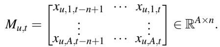

which contains n consecutive time steps of all SMART attributes ending at time t. In our experiments we use A = 15 attributes and n = 30 days, but the formulation is general.

Status and time-to-failure (TTF) labels. For windows with ground truth, we assign two labels:

1. A health status label ystatusu,t ∈ Y status, which can represent, for example, {healthy, failed}.

2. A time-to-failure (TTF) label yttf ∈ [0, +∞], defined as the time (e.g., in days) from the end of the window t until the first observed failure of drive u. If the drive does not fail within a fixed horizon H, the label can be treated as censored or clipped at H.

Target outputs. Given a new SMART window Mu,t, SMARTTalk aims to produce:

1. A predicted health status ˆystatus ∈ Y status. u,t

2. A predicted time-to-failure yˆttfu,t , either as a bucket (e.g., < 7 days, 7–30 days, > 30 days).

3. A natural-language explanation eu,t that describes which SMART trends and patterns led to the decision.

4. A natural-language recommendation ru,t (e.g., continue monitoring, migrate workload, replace drive) that is actionable for operators.

We therefore seek a mapping f : RA×n −→ Y status × R≥0 × E × R , where E and R denote the spaces of explanations and recommendations, respectively. Each of these outputs is evaluated and discussed in Sections 4.2, 4.3, and 4.4.

LLM-based reasoning with summaries. SMARTTalk decomposes f into two stages:

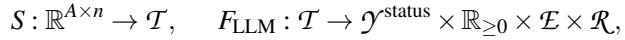

where, S is a learned summarization function that converts Mu,t into a compact textual representation Tu,t ∈ T describing per-attribute and cross-attribute trend patterns (e.g., “SMART-5 stable, then repeated spikes in the last 10 days”). FLLM is an LLM-based reasoning module that, given Tu,t and a chainof-thought style prompt, infers status, TTF, explanations, and recommendations.

## 3.2 Offline Pattern Learning

The offline phase of SMARTTalk learns a compact library of patch-level patterns and their associated distance cutoffs from historical SMART logs, as shown in Figure 3, which summarizes the pipeline. Given long sequences of raw SMART attributes, we first form fixed-length windows and slice them into short temporal patches. Small self supervised [6, 11, 15, 20] CNN encoders then map these patches into low dimensional embeddings. We train these encoders with self supervised objectives defined directly on unlabeled SMART windows, such as predicting masked days within a patch from the remaining days or distinguishing a real patch from a time shuffled or attribute permuted version, so that the learned representations capture reliability relevant trends without using failure labels. We cluster these embeddings with k-means to obtain a finite set of attribute and cross-attribute patterns, and finally use failure labels only to calibrate distance cutoffs that separate typical patches from out-of-library behavior. The resulting pattern centers, distance cutoffs, and textual phrases initialise the PatternMemory used at inference time.

## 3.2.1 Patch-Based Representation of SMART Windows

Recall from Section 3.1 that an n-day SMART window for drive u ending at time t is represented as Mu,t ∈ RA×n, where A is the number of SMART attributes. SMARTTalk first converts each window into a set of short views that capture local behaviour while preserving temporal order.

Per-attribute 1D patches. For each attribute a ∈ {1, . . . , A} we consider its length-n time series within the window and split it into T = n/L contiguous blocks of length L (we use n = 30 days and L = 5 days in our experiments):

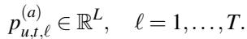

Each pu,t,ℓ (a) captures a short-term local trend for attribute a over L days and can be mapped back to a concrete time range (e.g., days 0–4, 5–9, . . . , 25–29).

Cross-attribute 2D patches. We also form 2D patches that include all attributes over the same L-day blocks:

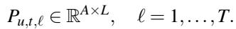

Each Pu,t,ℓ summaries how attributes evolve jointly over the same time segment.

For an A × n window we therefore obtain A · T 1D patches and T 2D patches. The choice of L trades off temporal resolution and noise averaging: shorter patches isolate rapid changes, whereas longer patches smooth noise but may blur short bursts.

## 3.2.2 Self-Supervised Patch Encoders

SMARTTalk represents each patch with a low-dimensional embedding using small self-supervised CNNs; failure labels are not required for this stage.

1D attribute encoder. For a 1D patch p(a) we learn an encoder fattr : RL → Rda implemented as a lightweight 1D CNN:

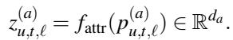

A decoder g reconstructs the original patch; the encoder and   
decoder are trained jointly via reconstruction loss to ensure (a)   
that

2D cross-attribute encoder. Similarly, for each crossattribute patch Pu,t,ℓ ∈ RA×L we train a 2D CNN encoder f : RA×L → Rdc :

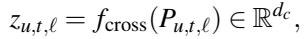

with a small decoder gcross trained to reconstruct Pu,t,ℓ.

Self-supervised objective. The encoders are jointly trained on unlabeled historical SMART windows using a combined λ ∑u,t,ℓ Pu,t,ℓ − gcross( fcross(Pu,t,ℓ)) 2, where λ balances the two branches. Once converged, we discard the decoders and freeze fattr and fcross.

## 3.2.3 Pattern Learning and Memory Initialization

A three stage symbolic representation pipeline. SMARTTalk introduces a structured, three stage pipeline that converts raw telemetry into symbolic trends that an LLM can reason about. First, patch extraction slices each window into short one dimensional and two dimensional views that capture local temporal behaviour and cross attribute interactions as discussed in Section 3.2.1. Second, pattern discovery runs self supervised encoders and clustering on these patches to build a vocabulary of reusable temporal and cross attribute trends as discussed in 3.2.2. Third, phrase generation, which we discuss in this section, renders each learned pattern as a concise natural language phrase so that every window is represented as a sequence of symbolic tokens rather than raw numeric traces. This abstraction layer decouples how trends are extracted (numeric and learned) from how they are understood (symbolic and interpreted), which makes the representation modular and robust and allows it to be reused across drives, time periods, and LLM backends.

Pattern learning via k-means. We run k-means on the frozen embeddings to obtain base trend patterns. For attributelevel patterns, we cluster all {z(a) into Kattr clusters with centres {cattrk }Kattrk=1 . Similarly, we cluster k=1 spond to recurring temporal trends such as “stable near zero”, “gradual increase”, “late sharp spike”, or “joint spike in r\_5 and r\_187”.

Calibrating pattern distance cutoffs with labels. After obtaining the pattern centres, we leverage failure labels to determine distance thresholds that separate typical behaviour from patches that fall outside the learned pattern library. Specifically, for each training patch, we compute its distance d to the nearest pattern centre and record whether it originates from a healthy or failing window. For a candidate cutoff τ, we classify patches with d > τ as outside the library and compute the corresponding patch-level metrics: the false positive rate FPR(τ) on healthy windows and the true positive rate TPR(τ) on failing windows. We then sweep τ across a grid of quantiles and select the optimal cutoffs τattr and τcross such that FPR(τ) ≤ α (we use α = 0.05) while maximising the F1-score over all patches. These calibrated cutoffs ensure that only a small fraction of patches from healthy drives are mistakenly flagged as anomalous, while a large fraction of patches from failing windows with unusual behaviour are correctly identified.

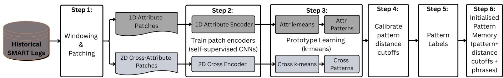  
Figure 3: Offline phase of SMARTTalk: from historical SMART logs to self-supervised patch encoders, base patterns, calibrated distance cutoffs, and an initial PatternMemory.

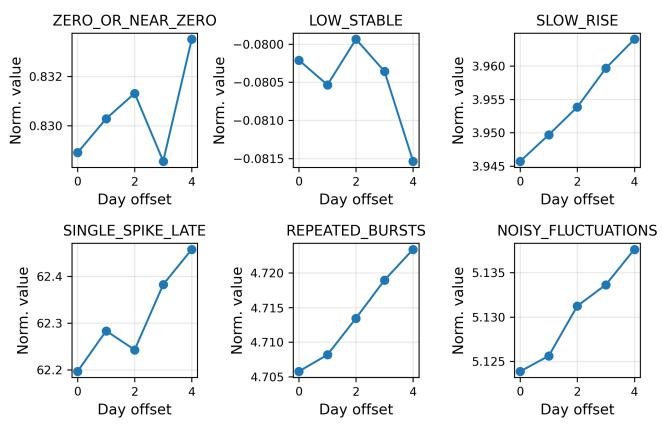

Figure 4: Example attribute-level patterns and their phrases.  
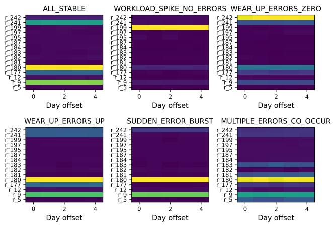  
Figure 5: Example cross-attribute patterns and their phrases.

Learning pattern phrases and initial memory. The final offline step converts numeric patterns into a compact vocabulary of text tokens that the LLM can interpret. Given the attribute and cross-attribute pattern centres along with their calibrated distance cutoffs, phrase learning is formulated as an offline summarisation task over patches that are well rep-

resented by each pattern.

Figure 4 illustrates six representative attribute-level patterns and their traces. For each attribute pattern k, we and whose distance falls below the cutoff τattr. We then compute simple temporal statistics from these patches, including mean level, variance, start–end difference, maximum change, number of large excursions, and the position of the largest excursion within the L-day patch. Using rule-based heuristics, we map these statistics to a coarse trend label (e.g., ZERO\_OR\_NEAR\_ZERO, LOW\_STABLE, SLOW\_RISE, SINGLE\_SPIKE\_LATE, REPEATED\_BURSTS, NOISY\_FLUCTUATIONS) and to a short natural-language phrase describing the trend (e.g., “flat near zero”, “slowly increasing”, “single late spike”).

Figure 5 shows examples of these cross-attribute patches. We apply a similar procedure to cross-attribute patterns. For each cross pattern k, we collect patches whose closest centre is k ccross and whose distance is below τcross, compute per-attribute statistics over the A × L patch, and identify which attributes exhibit stable behaviour, gradual wear-out signals, or error bursts. Heuristics then group these patterns into categories such as ALL\_STABLE, WORK-LOAD\_SPIKE\_NO\_ERRORS, WEAR\_UP\_ERRORS\_ZERO, and assign phrases like “all attributes stable”, “workload spike without new errors”, or “multiple error counters rise together”.

The resulting phrase dictionaries Vattr and Vcross associate each pattern index with a discrete trend label and a canonical phrase. These tokens are stable across drives and over time, and they form the vocabulary that will later be presented to the LLM in the online phase. We store all base patterns, calibrated distance cutoffs, and phrase dictionaries in a PatternMemory structure that is initialised at the end of the offline phase.

Phrase dictionary selection and generalization. The phrase dictionary is not manually written for individual test examples. It is selected offline from the training split by clustering patch embeddings and then describing each cluster using aggregate temporal statistics such as level, variance, start–end change, spike magnitude, and spike position. This produces coarse phrases such as “flat near zero”, “slow rise”, “single late spike”, or “multiple error counters rise together”. The dictionary is expected to generalize when the same SMART attributes preserve similar device semantics, because phrases describe normalized temporal shapes rather than drive identifiers or absolute timestamps. When a new workload or device family produces a patch that does not match the current dictionary, SMARTTalk marks it as out-of-library and logs it for later insertion into PatternMemory. The main limitation is that a device with different SMART semantics, new attributes, or failure modes that do not appear as local trends or crossattribute co-occurrences may require recalibrating the pattern library and phrase dictionary.

## 3.3 Online Inference

The online phase applies the frozen patch encoders and the PatternMemory to each new SMART window and queries an LLM as shown in Figure 6. Given a current n-day window, SMARTTalk maps short patches to pattern phrases using the stored centers and distance cutoffs, builds a natural language summary, and asks the LLM to produce exploratory analysis.

## 3.3.1 Window Encoding and Pattern Lookup

Given a fresh window Mu,t ∈ RA×n for drive u, SMARTTalk first standardizes attributes using the offline mean and variance and performs the same windowing and patching as in Section 3.2.1 to obtain 1D patches p(a)u,t,ℓ and 2D patches Pu,t,ℓ of length L days. Each patch is embedded with the frozen encoders fattr and fcross and compared against the patterns stored in PatternMemory.

For each patch we compute its distance to every pattern center and select the closest one. If the distance is below the corresponding distance cutoff τattr or τcross, the patch is treated as an instance of that pattern. Otherwise it is marked as an out-of-library pattern and its embedding, attribute index, and time range are logged for possible future extension of the pattern library. This yields, for each attribute and for the cross-attribute view, a short sequence of pattern IDs together with flags indicating which patches are out-of-library.

Online pattern-memory growth. Out-of-library patches identified during pattern lookup are appended to a small buffer rather than discarded. At regular intervals, SMARTTalk clusters the buffered embeddings to propose candidate new patterns and reuses the offline calibration procedure to assign each accepted pattern a center, distance cutoff, and phrase before inserting it into PatternMemory. This lightweight online update mechanism allows SMARTTalk to absorb emerging workload regimes and failure signatures without retraining the encoders or rerunning the offline pipeline, so the pattern library gradually becomes more representative of the field deployment over time.

## 3.3.2 Summary Construction and LLM Query

SMARTTalk next converts the pattern assignments for window Mu,t into a structured textual summary. Pattern IDs are mapped to phrases using the attribute and cross-attribute phrase dictionaries V and V in PatternMemory. Phrases that repeat over multiple neighboring patches are merged into longer descriptions (e.g., “stable near zero for three segments” or “repeated bursts over the last 10 days”), and out-of-library patches are described explicitly as “unusual” behavior.

The resulting summary Tu,t is inserted into a chain-ofthought prompt that instructs the LLM to reason about (i) whether the drive is currently healthy or at risk, (ii) the likely TTF bucket, and (iii) why the recent behavior is benign or concerning, followed by recommended operator actions. The LLM’s answer is parsed into a status label, TTF bucket, explanation text, and recommendations, which are logged together with the summary for later analysis.

Role of the LLM. The CNN encoders and pattern memory extract local temporal evidence, but they do not by themselves decide how multiple pieces of evidence should be combined into an operator-facing decision. The LLM bridges this critical gap by composing attribute-level and cross-attribute patterns over the full window, distinguishing workload-driven changes from reliability signals, and mapping evidence to a status and TTF bucket. It also generates concise explanations and recommended actions. In this design, earlier stages provide a structured symbolic interface, while the LLM performs the higher-level reasoning needed for diagnosis, urgency assessment, and operator guidance that raw CNN patterns cannot provide alone.

## 3.4 Example and Usage Scenarios

Example setup. We select a 30-day window for a single drive and focus on two error-related attributes, r\_5 and r\_187. Using a patch length of L = 5 days, each series is split into six contiguous patches P1–P6. The top panel of Figure 7 shows the raw series; the bottom panel shows the pattern phrases assigned to each 5-day patch.

Pattern assignments. In P1 and P2 (days 0–10), both attributes stay near zero, so r\_5 maps to “stable” and r\_187 to “flat zero”. In P3 (days 10–15), r\_5 shifts to “noisy increase” while r\_187 remains “flat zero”, indicating the first deviation in r\_5. In P4 (days 15–20), r\_5 becomes “spike” and r\_187 is still “flat zero”, capturing an isolated burst in r\_5. In P5 and P6 (days 20–30), both attributes are labeled with “spike” patterns, reflecting sustained large spikes in r\_187 together with continued spikes in r\_5. The cross-attribute patches for P5– P6 map to a pattern such as MULTIPLE\_ERRORS\_CO\_OCCUR, which PatternMemory records as frequently appearing shortly before failures on this model family.

Example summary sent to the LLM. For this window, SMARTTalk aggregates the per-patch phrases into a naturallanguage summary Tu,t such as:

Over days 0-10, error counters r\_5 and r\_187 stay near zero   
and stable. Between days 10-15, r\_5 shows a noisy upward drift   
while r\_187 remains flat at zero. From days 15-20, r\_5 exhibits a   
short spike but r\_187 is still flat zero. Over days 20-30, both r\_5   
and r\_187 show repeated spikes, and the joint pattern in the last

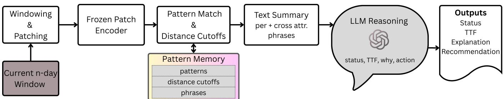  
Figure 6: Online phase of SMARTTalk: a current n-day SMART window is mapped to pattern phrases via PatternMemory (patterns + distance cutoffs + phrases) and fed to an LLM that returns status, TTF, explanation, and recommended actions.

## 4 Evaluation

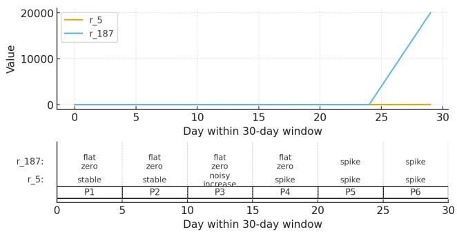  
Figure 7: Example of SMARTTalk processing a 30-day window for attributes r\_5 and r\_187. Top: raw trajectories. Bottom: six 5-day patches (P1–P6) and their attribute-level pattern phrases (e.g., “stable”, “noisy increase”, “spike”).

two 5-day segments matches the “MULTIPLE\_ERRORS\_CO\_OCCUR” pattern,   
which has historically preceded failures within about one week on   
this model family.

This summary is inserted into the CoT prompt described in Section 3.3.2. Given this input, the LLM typically reasons that error-related attributes exhibit recent sustained spikes and that the cross-attribute pattern matches one that often occurs shortly before failures; it therefore assigns the drive to a high-risk status with predicted TTF in the “< 7 days” bucket and recommends migrating critical workloads and scheduling replacement. When all patches instead map to “stable” or “noisy but bounded” patterns, the same mechanism produces benign assessments.

This example illustrates SMARTTalk in practice. In routine monitoring, error counters and bounded workload changes lead to low concern and continued monitoring. In early warning cases, spikes in reliability-related attributes such as r\_5, r\_187, or r\_197 lead to migration, diagnostics, or scheduled replacement depending on urgency. In false alarm triage, a workload spike without error, spare, or wear degradation can be reported as unusual but not immediately dangerous, so the recommendation remains monitoring rather than automatic replacement. In novel pattern handling, out-of-library patches are logged into PatternMemory, allowing operators to inspect emerging behaviors and update the pattern library without retraining the pipeline.

In this section, we evaluate SMARTTalk on real Alibaba SMART logs and study three questions. First, how well does it predict drive status compared with conventional SMARTbased baselines and recent state-of-the-art (SOTA) methods? Second, how accurately can it predict time-to-failure (TTF) buckets? Third, how good are the generated explanations and recommendations, both in terms of automatic metrics and their alignment with desired actions?

## 4.1 Experimental Setup

Dataset and temporal splits. We use the Alibaba SSD dataset as introduced in Section 2.2. For each drive, we construct sliding 30-day windows; labels in the dataset provide the status (failed or healthy) and the time to failure in days. To avoid temporal leakage, windows are partitioned by calendar month: the earliest months are used for training, the subsequent month for validation, and a later month for testing. Table 3 summarises the partitions for three experimental rounds; month indices will be adjusted to match the final datasets.

Table 3: Data partitions for SMARTTalk experiments.  
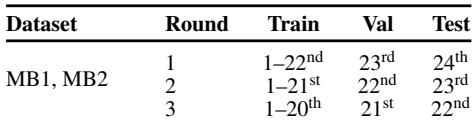

SMART windows, patches, and patterns. Unless otherwise stated, we use windows of n = 30 days and patch length L = 5 days, which yields T = n/L patches per attribute. The 1D and 2D patch encoders described in Section 3 are trained offline using only the training split and then frozen. The number of attribute and cross-attribute patterns is set to Kattr = 16 and Kcross = 8, and distance cutoffs (τattr, τcross) are learned as discussed in Section 3.2.3. Pattern phrases are curated once per dataset and reused across experiments.

Existing solutions. We compare SMARTTalk against wide range of the classical SMART-based methods, recent SOTA, and LLM-based variants. Random forests (RF) and feedforward neural networks (NN) follow the feature engineering in [5]. Ensemble Classifier (EC): After choosing the most important features, the data are given to several different classifiers. Their individual predictions are then combined into one final decision about whether the drive is healthy or failing [10]. An autoencoder (AE) reconstructs healthy windows and uses reconstruction error as a failure score [9]. An LSTM sequence model (LSTM) is trained directly on the SMART time series [19]. The multi-view temporal random forest (MVTRF) [40] and the fine-grained telemetry based method (MSFRD) [41] are recent SOTA for SMART-based reliability modelling; we treat them as strong reference points. Since there is no published LLM-based solution for this task, we define two LLM baselines. Raw-LLM directly verbalises raw SMART values over the window and prompts the LLM without using any patterns. Heuristic-LLM converts simple threshold-based rules into textual prompts for the LLM. In contrast, SMARTTalk employs the full pipeline: it encodes patches, leverages the pattern memory, generates textual summaries, and applies LLM reasoning to provide diagnostics and predictions.

LLM backbones. We evaluate SMARTTalk with four open-weight, instruction-tuned LLMs and one proprietary LLM as summarized in Table 4. All five LLMs use the same chain-of-thought style prompt and decoding configuration; we vary only the backbone model so that differences in accuracy and explanation quality can be attributed to the underlying LLM rather than prompt design. For the proprietary model, we treat the system as a black box and use only public APIs, without any fine-tuning or access to internals.

Table 4: LLMs used as SMARTTalk backbones.  
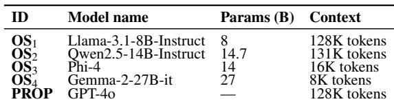

Evaluation Metrics. For status prediction, we focus on the failure (high-risk) class and treat each window as positive if the drive is truly at risk and negative otherwise. A true positive (T P) is a window where the drive is actually at risk and the model predicts RISK; a false positive (FP) is a healthy window that is incorrectly flagged as RISK, i.e., a false alarm; a true negative (T N) is a healthy window correctly predicted as healthy; and a false negative (FN) is an at-risk window that is incorrectly predicted as healthy, i.e., a missed failure. Because the processed window-level dataset is highly imbalanced, all methods are evaluated on the same fixed imbalanced sampled test set so that confusion-matrix metrics are comparable across methods while keeping LLM inference tractable.

We compute precision as Prec = T P/(T P + FP) and recall as Rec = T P/(T P + FN) by aggregating counts over the test (1+0.52)PrecRec windows. We then report the F0.5-score, F0.5 = 0.52 Prec+Rec This is the harmonic mean of precision and recall, where precision is weighted more heavily. In operational settings, SSD failure prediction must limit spurious alarms, so practitioners prioritize precision [37]. Consequently, we adopt the F0.5- score, which emphasizes precision, as our main metric for comparing schemes in production-like environments.

To quantify false alarms and missed failures, we report the false positive rate (FPR) and false negative rate (FNR): FPR = FP FNR = FN . FPR measures healthy win-FP+T N T P+FN dows incorrectly flagged as at risk, while FNR measures missed at-risk windows. Thus, FPR reflects operator burden and FNR reflects failure risk.The results of status prediction are discussed in Section 4.2.

For TTF prediction we discretize the time-to-failure (TTF) into coarse urgency buckets (e.g., < 7 days, 7–30 days, > 30 days) and ask the LLM to choose one bucket per at-risk window. Let t denote the true TTF (in days) for window i and bˆi the bucket predicted by the LLM; each bucket bˆi is associated with a midpoint mˆ (e.g., 3.5 days for < 7 days). We compute a macro-averaged TTF F by treating each bucket as a class, computing its per-bucket F1, and then averaging these scores uniformly across buckets so that short-horizon and long-horizon failures are weighted equally. To quantify how far the predicted urgency is from the true TTF, we report where smaller values indicate that predicted buckets are, on average, closer in days to the true failure times. Finally, we measure the fraction of failure windows where the predicted bucket is time-consistent with the true TTF via Cov±5 = dows whose true TTF lies within ±5 days of the bucket midpoint; higher macro-F , lower bMAE, and higher Cov all correspond to better guidance about how urgently a drive needs attention. The results of TTF prediction are discussed in Section 4.3.

For explanations and recommendations, operators care about why a drive is at risk and what to do next, but evaluating such explanations is challenging because it is expensive to obtain ground-truth natural language annotations for each window; instead, we use two label-free strategies. First, we evaluate output quality using an external LLM-as-judge [43] (GPT-5.1 Thinking [26]) that scores each explanation and action for correctness and operator usefulness. Second, we run perturbation-based tests that check whether explanations and actions react consistently when we synthetically increase or decrease specific SMART risk signals [14]. The full protocol and results, including the LLM-as-judge prompts and perturbation design, is described in Section 4.4.

## 4.2 Status Prediction

Table 5 reports status prediction performance of existing solutions (RF, NN, AE, and LSTM), recent SOTA methods (MVTRF and MSFRD), and LLM-based variants on MB1 and MB2. SMARTTalk is evaluated with both open-source and proprietary backbones. In addition to precision, recall, and F . , We report FPR and FNR to distinguish false alarms on healthy drives from missed warnings on at-risk drives. This is crucial under highly imbalanced data, where a model may appear conservative by predicting few failures yet still miss most true failures.

Table 5: Status prediction performance on the fixed imbalanced sampled test set. Precision (P), Recall (R), F0.5, false positive rate (FPR), and false negative rate (FNR) are reported.  
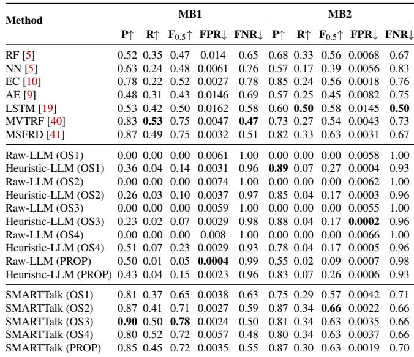

The results show that simply prompting an LLM on raw SMART values is not enough for reliable status prediction. Raw-LLM variants almost never predict a drive as failed and label nearly every window as healthy. This behavior produces near-zero precision and recall and leads to an FNR close to one, showing that Raw-LLM misses almost all at-risk windows despite producing few useful warnings. Heuristic-LLM variants perform slightly better by using hand-crafted thresh old summaries, and on MB2 they sometimes achieve high precision and low FPR. However, they fire only on the most extreme cases and still miss most true failures, which leads to low recall, high FNR, and poor F scores. These results show that raw numeric prompting or simple hand-written summaries are insufficient because the LLM needs structured temporal abstractions that expose degradation patterns without overwhelming it with noisy variability.

Existing solutions such as RF, NN, AE, LSTM, MVTRF, and MSFRD provide a broad set of numerical baselines because they learn directly from SMART trends and expose different precision, recall, FPR, and FNR tradeoffs. MVTRF and MSFRD achieve strong precision and competitive recall on MB1, but SMARTTalk matches or exceeds their precision-biased F0.5 across both SSD models while maintaining low FPR and non-trivial recall. In particular, SMARTTalk achieves the best F . on MB1 and the best or comparable F . on MB2, while keeping false alarm rates low. This indicates that the patch–pattern–phrase representation gives the LLM discriminative temporal signals similar to carefully engineered numerical features, but in a form that also supports natural-language reasoning, time-to-failure estimation, explanations, and operator actions.

Handling false positives and false negatives. In SMARTTalk, false positives are treated as early warnings, not automatic replacements. The output includes patterns, explanations, concern levels, and recommendations, enabling operators to decide between immediate action and monitoring. False negatives are more critical as they reflect missed risks; SMARTTalk mitigates this through sliding-window evaluation, multi-attribute evidence, and updates to PatternMemory, though weak or delayed signals remain a limitation. Unlike numerical predictors that provide only scores, SMARTTalk improves auditability by exposing decision-driving patterns. While Raw-LLM and Heuristic-LLM achieve low FPR by predicting fewer failures, this results in high FNR. SMARTTalk maintains a more practical balance between false alarms and missed failures.

The key takeaway is that converting raw SMART logs into abstract trend patterns turns LLMs from ineffective status predictors into detectors that are competitive with or better than state-of-the-art SMART baselines. SMARTTalk achieves about 50× higher F than Raw-LLM, about 4× higher F than Heuristic-LLM, and roughly 25% better health classification than existing SMART-based methods, while also reporting low false alarm rates and reducing missed failures compared with naive LLM baselines. It further provides richer outputs such as time-to-failure guidance, explanations, and operator recommendations.

## 4.3 Time-to-Failure Prediction

We now examine how accurately SMARTTalk predicts timeto-failure (TTF) buckets. Although MVTRF can estimate remaining lifetime, its published setups produce continuous risk or lifetime scores under different horizons and evaluation protocols, which are not directly comparable to our discrete urgency buckets (< 7, 7–30, > 30 days), we therefore focus our TTF evaluation on LLM-based methods, comparing SMARTTalk across multiple LLMs under the same patternbased summaries and TTF instruction.

Table 6 reports macro-F across TTF buckets and bucketed mean absolute error (bMAE) for five open-source LLM backbones. Each backbone appears twice: once with Raw-LLM and once with SMARTTalk. For each method the LLM is instructed to choose among the predefined TTF buckets (for example < 7 days, 7–30 days, and > 30 days); bMAE is computed from the bucket midpoints.

Across backbones, SMARTTalk’s TTF performance follows a consistent pattern: weaker open-source models lag behind, while stronger open-source and the proprietary model deliver substantially better bucket accuracy, lower timing error, and higher coverage. The best-performing backbone differs slightly between MB1 and MB2, but the gap between the top several models is small, suggesting that once the LLM is reasonably capable, the pattern-based summaries dominate the quality of TTF guidance.

Table 6: TTF prediction: We report macro-F1 over TTF buckets (< 7, 7–30, > 30 days), bucketed MAE (bMAE), and coverage Cov±5, computed only on windows whose status is correctly predicted as RISK.  
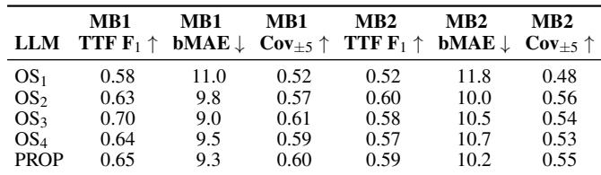

The key takeaway is that SMARTTalk can provide reliable urgency estimates with multiple LLM backbones, achieving TTF bucket macro-F1 around 0.6 with bucketed MAE near 10 days and more than half of failures landing within ±5 days of the predicted bucket, allowing operators to choose an open or proprietary model based on deployment constraints without sacrificing TTF quality.

## 4.4 Explanations and Recommendations

LLM-as-judge. We first sampled windows from MB1 and MB2 for failing drives (True Positives predicted by SMARTTalk) and across time-to-failure buckets. For each method, we run the full pipeline and record its predicted status, time-to-failure bucket, free-form explanation, and recommended action for each window. We then use GPT-5.1 Thinking as an external LLM-as-judge. The judge is given (i) a short textual summary of the SMART window, (ii) the method’s predicted status and time-to-failure, and (iii) the explanation and recommended action, but not the method name. It is prompted to rate, on a 1–5 Likert scale, (a) how correct and faithful the explanation is to the status/TTF pre diction and the SMART trends, and (b) how useful and safe the recommended action would be for an operator. We report the average explanation score (ExpScore) and action score (RecScore) across windows.

Perturbation-based robustness. Second, we probe how sensitive each method is to controlled changes in the SMART attributes. For a subset of windows, we construct synthetic perturbations by modifying one or two reliability-related attributes (e.g., r\_5, r\_187, r\_197) while keeping the others fixed. We consider “risk-up” perturbations (e.g., injecting a monotone increase or spike in an error counter) and “risk-down” perturbations (e.g., clamping an attribute to a healthy baseline). For each original/perturbed pair, we rerun the method and measure:

AttrSens: the fraction of risk-up perturbations for which the explanation explicitly mentions the perturbed attribute (via a fixed attribute-name lexicon), indicating that the method notices the changed signal.

ActDirAcc: the fraction of perturbations for which the recommended action moves in the intuitively correct direction: it becomes more conservative (e.g., from “monitor” to “backup and replace”) when risk is increased, and does not become more conservative when risk is decreased.

These metrics do not require human reference explanations: we control the perturbations and only check whether each method’s explanations and recommendations react in a consistent and sensible way.

Table 7: Quality of explanations and recommendations on MB1+MB2 for SMARTTalk. ExpScore and RecScore are 1–5 ratings (LLM-as-judge). AttrSens and ActDirAcc are perturbation-based robustness metrics (higher is better).  
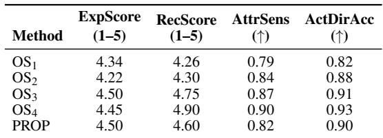

Table 7 summarises explanation and recommendation quality for SMARTTalk variants. “ExpScore” and “RecScore” are 1–5 scores from GPT-5.1 Thinking (higher is better), while “AttrSens” and “ActDirAcc” are proportions in [0,1]. Across the open-source variants, SMARTTalk consistently produces explanations that the judge rates as both accurate and useful, with later-generation backends yielding slightly stronger and more stable judgements than earlier ones. The proprietary con figuration delivers explanation and recommendation quality that is broadly comparable to the best open-source variant, indicating that our design does not rely on a single LLM family. The perturbation-based metrics show that the judge is sensitive to attribute-level degradations and usually prefers the original, higher-quality text over perturbed variants, suggesting robust alignment between scores and explanation quality.

The key takeaway is that SMARTTalk can provide highquality, perturbation-resilient explanations and operator guidance across multiple LLMs, with explanation and recommendation scores around 4.4–4.6 out of 5 from LLM-as-judge and perturbation robustness metrics above 80%.

## 4.5 Ablation on Observation Window and Patch Length

We study sensitivity to observation window N and patch length L around the default setting. We fix L = 5 and vary N ∈ 10,20,30,40,50, and fix N = 30 and vary L ∈ 2,4,5,10,15. For each setting, we retrain patch encoders and PATTERN-MEMORY on training data and evaluate on a fixed test set.

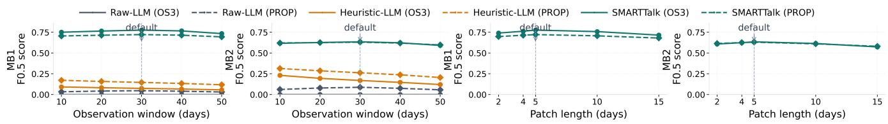  
Figure 8: Sensitivity of F0.5 to observation window N and patch length L on MB1 and MB2. Top: vary N with L = 5; bottom: vary L with N = 30. Solid lines show OS3 and dashed lines PROP; the vertical line marks the default setting. SMARTTalk consistently outperforms Raw-LLM and Heuristic-LLM. Performance is non-monotonic in both N and L, with the default near the best F0.5 region across both models.

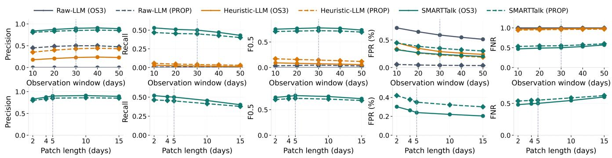  
Figure 9: Detailed sensitivity metrics for MB1. Top row varies N with L = 5; bottom row varies L with N = 30. We report precision, recall, F . , FPR, and FNR, with the default marked by a dashed line. Increasing N generally improves precision and FPR but may reduce recall due to smoothing of recent failures. Increasing L lowers FPR but raises FNR by smoothing short bursts. The default (N = 30,L = 5) achieves the best precision–recall tradeoff.

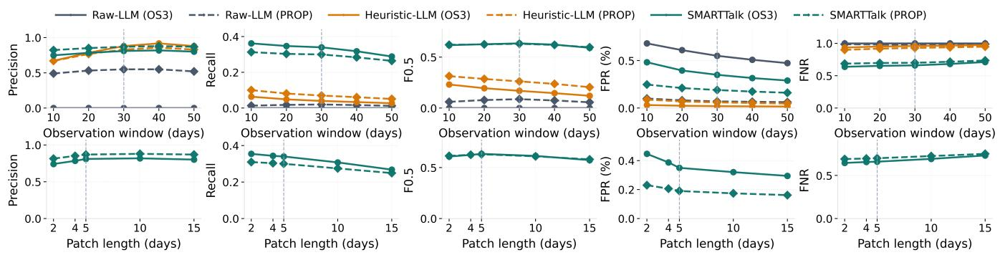  
Figure 10: Detailed sensitivity metrics for MB2. Top row varies N with L = 5; bottom row varies L with N = 30 for SMARTTalk. MB2 exhibits the same pattern as MB1: performance is non-monotonic in N, and larger L reduces FPR but increases FNR. The default (30, 5) remains in a stable high-performing region.

The default (N = 30,L = 5) is highlighted by the vertical dashed line in the figures 8, 9 and 10.

Figure 8 shows that SMARTTalk is stable across a broad range of observation windows. On both MB1 and MB2, very short windows provide less historical context and can miss slow degradation patterns. Performance improves from N = 10 to 30 due to better temporal context, but saturates or degrades beyond 30 as older behavior dilutes recent failure signals. Thus, gains saturate around 30 days.

The patch-length study shows a similar tradeoff (Figures 9 and 10). Shorter patches improve temporal resolution and capture rapid spikes but increase noise, while longer patches smooth noise but can obscure failure bursts and reduce recall. The default L = 5 balances these tradeoffs, preserving local patterns while limiting noise, and achieves near-optimal F0.5 on MB1 and MB2.

Encoding assumptions and information loss. SMARTTalk intentionally uses coarse temporal patches and phrase-level tokens rather than preserving every daily value. This design assumes that many useful SMART failure signals appear as local trends, spikes, bursts, or cross-attribute co-occurrences in reliability-related fields, while small day-to-day fluctuations are often less useful for operator decisions. The compression can lose some fine-grained numeric detail, but our sensitivity results show this does not dominate performance. Our approach is therefore expected to generalize best when failures manifest through similar SMART trend shapes, but it may require recalibration for devices or telemetry streams where the meaningful signal is not concentrated in local extreme values, trends, or cross-attribute events.

The key takeaway is that SMARTTalk is not dependent on a fragile choice of N or L. Accuracy does not simply improve by increasing the observation window or patch length. Instead, there is a tradeoff: shorter windows and patches can miss longer degradation trends or become noisy, whereas longer windows and patches can smooth away recent failure bursts.

## 5 Related Work: LLMs for System Logs

Recent work explores how LLMs can assist system operations across many settings. For anomaly detection in scientific and workflow systems, LLMs have been used as supervised models and in-context learners over traces and configuration metadata [21], and more broadly as enablers for autonomic computing and self-managing services [42]. In storage and I/O optimization, ION uses LLMs to guide HPC I/O tuning and configuration [13], while LogLLM applies LLMs directly to system logs to highlight suspicious events and patterns [16]. LLMs have also been explored for root-cause analysis, incident management, and control in cloud environments, where single- and multi-agent designs couple LLM reasoning with log search, dashboards, and code inspection [29, 33]. For scheduling, control, and tuning, LLM-based methods guide policy learning, task coordination, key–value store tuning, and HPC I/O optimization [13, 31, 32, 39].

Within storage management, prior work uses LLMs to manage hybrid SSD tiers by selecting parameters and policies that balance performance and endurance [35]. SSD-specific LLM work has also modeled environmental effects and knowledgegraph-guided operational reasoning for SSDs [3, 4]. These efforts focus on high-level control, environmental what-if analysis, or graph-grounded operational reasoning rather than fine-grained SMART log analysis. In parallel, LogLLM and related systems operate on textual or semi-structured logs for anomaly detection and incident reasoning [16], but they do not target fine-grained SMART attributes or explicit time-tofailure prediction for individual drives.

SMARTTalk differs from prior LLM-for-system-logs work in three ways. First, it targets SSD SMART telemetry with a single pipeline for both health classification and bucketed time-to-failure prediction. Second, it introduces an attributeaware patch → pattern → phrase layer that turns raw SMART windows into short, composable trend descriptions. Third, it maintains an adaptive pattern memory so LLM reasoning operates over an evolving library of interpretable SMART behaviors instead of raw logs.

## 6 Broader Impact

Although SMARTTalk focuses on SSD SMART telemetry, the same patch–pattern–LLM pipeline can be applied to a wide range of time-series system logs (e.g., HDD, GPU, CPU, memory, network, and power telemetry), helping operators surface emerging anomalies and interpret them in natural language. On top of SMARTTalk, one can build operator-facing applications such as what-if analysis tools, interactive dashboards, and exploratory diagnostics interfaces that let engineers probe alternative scenarios, inspect pattern-level histories, and compare failure modes across devices and clusters. Deployed as a decision-support layer alongside existing monitors and operator expertise, SMARTTalk encourages transparent, auditable use of LLMs in operations and opens the door to safer, more data-driven maintenance and capacity-planning practices.

## 7 Conclusion

This work asked whether LLMs can serve as effective reasoning engines for SSD SMART telemetry while preserving temporal structure. For RQ1, our results show that SMARTTalk can predict drive health and time-to-failure, without heavy feature engineering or large labeled datasets. For RQ2, we find that converting each n-day SMART window into perattribute and cross-attribute patches, learning trend patterns, and verbalizing them as short natural-language summaries enables LLMs to correctly track temporal behavior while reducing trend hallucinations. For RQ3, the online pattern memory improves robustness to rare failures and emerging failure modes compared to a static offline model by detecting, clustering, and promoting novel patterns into new patterns. Finally, for RQ4, operator-facing evaluations indicate that SMARTTalk’s explanations and its recommendations are aligned with operational needs. Together, these results suggest that pattern-based verbalization plus lightweight LLM reasoning is a promising path for interpretable, adaptive analysis of datacenter SMART logs. The implementation and artifact for SMARTTalk are publicly available at https://github.com/Damrl-lab/SMARTTalk.

## Acknowledgments

We thank the reviewers for their constructive feedback and valuable suggestions. This research used resources of the National Energy Research Scientific Computing Center (NERSC), a DOE Office of Science User Facility supported by the Office of Science of the U.S. Department of Energy under Contract No. DE-AC02-05CH11231, through NERSC award DDR-ERCAP0035598.

## References

[1] Alibaba dataset: Ssd smart logs, 2020. [Online]. Available: https://github.com/alibaba-edu/ dcbrain/blob/master/ssd\_smart\_logs/readme. md.

[2] Self-monitoring, analysis and reporting technology (smart), 2023. [Online]. Available: https: //en.wikipedia.org/wiki/Self-Monitoring, \_Analysis\_and\_Reporting\_Technology.

[3] Mayur Akewar, Sandeep Madireddy, Dongsheng Luo, and Janki Bhimani. KORAL: Knowledge graph guided LLM reasoning for SSD operational analysis. In Proceedings of the IEEE International Parallel and Distributed Processing Symposium (IPDPS), 2026. [Online]. Available: https://arxiv.org/abs/2602. 10246.

[4] Mayur Akewar, Gang Quan, Sandeep Madireddy, and Janki Bhimani. Can LLMs model the environmental impact on SSD? In Proceedings of the 17th ACM Workshop on Hot Topics in Storage and File Systems (HotStorage ’25), pages 100–106. ACM, 2025. [Online]. Available: https://doi.org/10.1145/3736548.3737835.

[5] Jacob Alter, Ji Xue, Alma Dimnaku, and Evgenia Smirni. Ssd failures in the field: Symptoms, causes, and prediction models. In SC ’19: Proceedings of the International Conference for High Performance Computing, Networking, Storage and Analysis, pages 1– 14, 2019. [Online]. Available: https://doi.org/10. 1145/3295500.3356172.

[6] Randall Balestriero, Mark Ibrahim, Vlad Sobal, Ari Morcos, Shashank Shekhar, Tom Goldstein, Florian Bordes, Adrien Bardes, Gregoire Mialon, Yuandong Tian, Avi Schwarzschild, Andrew Gordon Wilson, Jonas Geiping, Quentin Garrido, Pierre Fernandez, Amir Bar, Hamed Pirsiavash, Yann LeCun, and Micah Goldblum. A cookbook of self-supervised learning. In arXiv preprint arXiv:2304.12210, 2023. [Online]. Available: https: //arxiv.org/abs/2304.12210.

[7] Ajinkya S. Bankar, Shi Sha, Janki Bhimani, Vivek Chaturvedi, and Gang Quan. Thermal aware systemwide reliability optimization for automotive distributed computing applications. IEEE Transactions on Vehicular Technology, 71(10), 2022. [Online]. Available: https://doi.org/10.1109/TVT.2022.3185978.

[8] Janki Bhimani, Adnan Maruf, Ningfang Mi, Rajinikanth Pandurangan, and Vijay Balakrishnan. Auto-tuning parameters for emerging multi-stream flash-based storage drives through new i/o pattern generations. IEEE Transactions on Computers, 71(2):260–271, 2022.

[Online]. Available: https://doi.org/10.1109/TC. 2020.3048303.

[9] Chandranil Chakraborttii and Heiner Litz. Improving the accuracy, adaptability, and interpretability of ssd failure prediction models. In SoCC ’20: Proceedings of the 11th ACM Symposium on Cloud Computing, pages 120–133, 2020. [Online]. Available: https: //doi.org/10.1145/3419111.3421300.

[10] Lei Chen, Zongpeng Zhu, Anyu Li, Najmeh Mashhadi, Robert Frickey, Jinhe Ye, and Xin Guo. Ssd drive failure prediction on alibaba data center using machine learning. IEEE International Memory Workshop (IMW), pages 1– 4, 2022. [Online]. Available: https://doi.org/10. 1109/IMW52921.2022.9779284.

[11] Ting Chen, Simon Kornblith, Mohammad Norouzi, and Geoffrey Hinton. A simple framework for contrastive learning of visual representations. In Proceedings of the 37th International Conference on Machine Learning, pages 1597–1607, 2020. [Online]. Available: https: //proceedings.mlr.press/v119/chen20j.html.

[12] Florin Cuconasu, Giovanni Trappolini, Federico Siciliano, Simone Filice, Cesare Campagnano, Yoelle Maarek, Nicola Tonellotto, and Fabrizio Silvestri. The power of noise: Redefining retrieval for rag systems. In SIGIR ’24: Proceedings of the 47th International ACM SIGIR Conference on Research and Development in Information Retriev, 2024. [Online]. Available: https://doi.org/10.1145/3626772.3657834.

[13] Chris Egersdoerfer, Arnav Sareen, Jean Luca Bez, Suren Byna, and Dong Dai. Ion: Navigating the hpc i/o optimization journey using large language models. In HotStorage ’24: Proceedings of the 16th ACM Workshop on Hot Topics in Storage and File Systems, pages 86–92, 2024. [Online]. Available: https://doi.org/ 10.1145/3655038.3665950.

[14] Nazanin Fouladgar, Marjan Alirezaie, and Kary Främling. Metrics and evaluations of time series explanations: An application in affect computing. IEEE Access, 10:23995–24009, 2022. [Online]. Available: https: //doi.org/10.1109/ACCESS.2022.3155115.

[15] Jean-Bastien Grill, Florian Strub, Florent Altché, Corentin Tallec, Pierre H. Richemond, Elena Buchatskaya, Carl Doersch, Bernardo Avila Pires, Zhaohan Daniel Guo, Mohammad Gheshlaghi Azar, Bilal Piot, Koray Kavukcuoglu, Rémi Munos, and Michal Valko. Bootstrap your own latent: A new approach to self-supervised learning. In Advances in Neural Information Processing Systems 33, pages 21271–21284, 2020. [Online]. Available: https: //proceedings.neurips.cc/paper/2020/hash/

f3ada80d5c4ee70142b17b8192b2958e-Abstract. html.

[16] Wei Guan, Jian Cao, Shiyou Qian, Jianqi Gao, and Chun Ouyang. Logllm: Log-based anomaly detection using large language models. In arXiv, 2024. [Online]. Avail able: https://arxiv.org/abs/2411.08561.

[17] Shujie Han, Patrick P. C. Lee, Fan Xu, Yi Liu, Cheng He, and Jiongzhou Liu. An in-depth study of correlated failures in production ssd-based data centers. In 19th USENIX Conference on File and Storage Technologies (FAST ’21), 2021. [Online]. Available: https://www.usenix.org/conference/ fast21/presentation/han.

[18] Guozhi Hao, Jun Wu, Qianqian Pan, and Rosario Morello. Quantifying the uncertainty of llm hallucination spreading in complex adaptive social networks. In Nature, Scientific Reports, 2024. [Online]. Available: https://www.nature. com/articles/s41598-024-66708-4.

[19] Wenwen Hao, Ben Niu, Yin Luo, Kangkang Liu, and Na Liu. Improving accuracy and adaptability of ssd failure prediction in hyper-scale data centers. SIG-METRICS Performance Evaluation Review, 49(4):99– 104, 2022. [Online]. Available: https://doi.org/10. 1145/3543146.3543169.

[20] Kaiming He, Haoqi Fan, Yuxin Wu, Saining Xie, and Ross Girshick. Momentum contrast for unsupervised visual representation learning. In Proceedings of the IEEE/CVF Conference on Computer Vision and Pattern Recognition, pages 9729–9738, 2020. [Online]. Available: https://openaccess.thecvf.com/content\_ CVPR\_2020/html/He\_Momentum\_Contrast\_ for\_Unsupervised\_Visual\_Representation\_ Learning\_CVPR\_2020\_paper.html.

[21] Hongwei Jin, George Papadimitriou†, Krishnan Raghavan, Pawel Zuk, Prasanna Balaprakash, Cong Wang, Anirban Mandal, and Ewa Deelman. Large language models for anomaly detection in computational workflows: From supervised fine-tuning to in-context learning. In SC ’24: Proceedings of the International Conference for High Performance Computing, Networking, Storage, and Analys, 2024. [Online]. Available: https://doi.org/10.1109/SC41406.2024.00098.

[22] Qiang Li, Hui Li, and Kai Zhang. A survey of ssd lifecycle prediction. In 2019 IEEE 10th International Conference on Software Engineering and Service Sci ence (ICSESS), 2019. [Online]. Available: https: //doi.org/10.1109/ICSESS47205.2019.9040759.

[23] Stathis Maneas, Kaveh Mahdaviani, Tim Emami, and Bianca Schroeder. A study of ssd reliability in large scale enterprise storage deployments. In Proceedings of the 18th USENIX Conference on File and Storage Technologies (FAST ’20), 2020. [Online]. Available: https://www.usenix.org/conference/ fast20/presentation/maneas.

[24] Stathis Maneas, Kaveh Mahdaviani, Tim Emami, and Bianca Schroeder. Operational characteristics of ssds in enterprise storage systems: A large-scale field study. In Proceedings of the 20th USENIX Conference on File and Storage Technologies (FAST ’22), 2022. [Online]. Available: https://www.usenix.org/conference/ fast22/presentation/maneas.

[25] Justin Meza, Qiang Wu, Sanjeev Kumar, and Onur Mutlu. A large-scale study of flash memory failures in the field. ACM SIGMETRICS Performance Evaluation Review, 43(1):177–190, 2015. [Online]. Available: https://doi.org/10.1145/2796314.2745848.

[26] OpenAI. Gpt-5.1 instant and gpt-5.1 thinking system card addendum. 2025. [Online]. Available: https://cdn.openai.com/pdf/ 4173ec8d-1229-47db-96de-06d87147e07e/5\_ 1\_system\_card.pdf.

[27] Ravi Ranjan, Utkarsh Grover, Mayur Akewar, Xiaomin Lin, and Agoritsa Polyzou. Catrag: Functor-guided structural debiasing with retrieval augmentation for fair llms. arXiv, 2026. [Online]. Available: https: //arxiv.org/abs/2603.21524.

[28] Ravi Ranjan, Utkarsh Grover, Xiaomin Lin, and Agoritsa Polyzou. Persa: Reinforcement learning for professor-style personalized feedback with llms. arXiv, 2026. [Online]. Available: https://arxiv.org/abs/ 2605.01123.

[29] Devjeet Roy, Xuchao Zhang, Rashi Bhave, Chetan Bansal, Pedro Las-Casas, Rodrigo Fonseca, and Saravan Rajmohan. Exploring llm-based agents for root cause analysis. In FSE 2024: Companion Proceedings of the 32nd ACM International Conference on the Foundations of Software Engineering, 2024. [Online]. Available: https://doi.org/10.1145/3663529.3663841.

[30] Bianca Schroeder, Raghav Lagisetty, and Arif Merchant. Flash reliability in production: The expected and the unexpected. In Proceedings of the 14th Usenix Conference on File and Storage Technologies (FAST ’16), pages 67–80, 2016. [Online]. Available: https://www.usenix.org/conference/fast16/ technical-sessions/presentation/schroeder.

[31] Xuhao Tang, Fagui Liu, Dishi Xu, Jun Jiang, Quan Tang, and Bin Wang. Llm-assisted reinforcement learning: Leveraging lightweight large language model capabil ities for efficient task scheduling in multi-cloud envi ronment. In IEEE Transactions on Consumer Electronics, 2025. [Online]. Available: https://doi.org/10. 1109/TCE.2024.3524612.

[32] Viraj Thakkar, Madhumitha Sukumar, Jiaxin Dai, Kaushiki Singh, and Zhichao Cai. Can modern llms tune and configure lsm-based key-value stores? In Hot-Storage ’24: Proceedings of the 16th ACM Workshop on Hot Topics in Storage and File Systems, pages 116– 123, 2024. [Online]. Available: https://doi.org/10. 1145/3655038.3665954.

[33] Zefan Wang, Zichuan Liu, Yingying Zhang, Aoxiao Zhong, Jihong Wang, Fengbin Yin, Lunting Fan, Lingfei Wu, and Qingsong Wen. Rcagent: Cloud root cause anal ysis by autonomous agents with tool-augmented large language models. In arXiv, 2023. [Online]. Available: https://doi.org/10.1145/3627673.3680016.

[34] Jason Wei, Xuezhi Wang, Dale Schuurmans, Maarten Bosma, Brian Ichter, Fei Xia, Ed H. Chi, Quoc V. Le, and Denny Zhou. Chain-of-thought prompting elicits reasoning in large language models. In Proceedings of the 36th Conference on Neural Information Processing Systems (NeurIPS), 2022. [Online]. Available: https: //arxiv.org/pdf/2201.11903.

[35] Qian Wei, Yi Li, Zehao Chen, Zhaoyan Shen, Dongxiao Yu, and Bingzhe Li. Managing hybrid solid-state drives using large language models. In arXiv, 2025. [Online]. Available: https://arxiv.org/abs/2503.13105.

[36] Erci Xu, Mai Zheng, Feng Qin, Yikang Xu, and Jiesheng Wu. Lessons and actions: What we learned from 10k ssd-related storage system failures. In Proceedings of the 2019 USENIX Conference on Usenix Annual Technical Conference (USENIX ATC ’19), pages 961– 975, 2019. [Online]. Available: https://www.usenix. org/conference/atc19/presentation/xu.

[37] Fan Xu, Shujie Han, Patrick P. C. Lee, Yi Liu, Cheng He, and Jiongzhou Liu. General feature selection for failure prediction in large-scale ssd deployment. In 2021 51st Annual IEEE/IFIP International Conference on Dependable Systems and Networks (DSN), 2021. [Online]. Available: https://doi.org/10. 1109/DSN48987.2021.00039.

[38] Gala Yadgar, Moshe Gabel, Shehbaz Jaffer, and Bianca Schroeder. Ssd-based workload characteristics and their performance implications. ACM Transactions on Storage (TOS), 17(1):1–26, 2021. [Online]. Available: https://doi.org/10.1145/3423137.

[39] Tingting Yang, Ping Feng, Qixin Guo, Jindi Zhang, Xiufeng Zhang, and Jiahong Ning. Autohma-llm: Efficient task coordination and execution in heterogeneous multi-agent systems using hybrid large language models. In IEEE Transactions on Cognitive Communications and Networking, 2025. [Online]. Available: https://doi.org/10.1109/TCCN.2025.3528892.

[40] Yuqi Zhang, Wenwen Hao, Ben Niu, Kangkang Liu, Shuyang Wang, Na Liu, Xing He, Yongwong Gwon, and Chankyu Koh. Multi-view feature-based ssd failure prediction: What, when, and why. In Proceedings of the 21st USENIX Conference on File and Storage Technologies (FAST ’23), 2023. [Online]. Available: https://www.usenix.org/conference/ atc24/presentation/zhang-yuqi.

[41] Yuqi Zhang, Tianyi Zhang, Wenwen Hao, Shuyang Wang, Na Liu, Xing He, Yang Zhang, Weixin Wang, Yongguang Cheng, Huan Wang, Jie Xu, Feng Wang, Bo Jiang, Yongwong Gwon, Jongsung Na, Zoe Kim, and Geunrok Oh. Msfrd: Mutation similarity based ssd failure rating and diagnosis for complex and volatile production environments. In Proceedings of the 2024 USENIX Annual Technical Conference, 2024. [Online]. Available: https://www.usenix.org/system/ files/fast23-zhang-yuqi.pdf.

[42] Zhiyang Zhang, Fangkai Yang, Xiaoting Qin, Jue Zhang, Qingwei Lin, Gong Cheng, Dongmei Zhang, Saravan Rajmohan, and Qi Zhang. The vision of autonomic computing: Can llms make it a reality? In arXiv, 2024. [Online]. Available: https://doi.org/10.48550/arXiv. 2407.14402.

[43] Lianmin Zheng, Wei-Lin Chiang, Ying Sheng, Siyuan Zhuang, Zhanghao Wu, Yonghao Zhuang, Zi Lin, Zhuohan Li, Dacheng Li, Eric P. Xing, Hao Zhang, Joseph E. Gonzalez, and Ion Stoica. Judging LLM-as-a-judge with MT-bench and chatbot arena. NIPS ’23: Proceedings of the 37th International Conference on Neural Information Processing System, 2023. [Online]. Available: https://dl.acm.org/doi/10.5555/3666122. 3668142.

## A Additional Paper Details

## A.1 Explanations and Recommendations

## A.1.1 Perturbation Method

Algorithm 1 summarizes our perturbation-based sanity check for the LLM-as-judge scores. In Step (P-A) we start from a set of windows for which we already have the method’s original prediction, explanation, and recommendations, and we obtain baseline ExpScore and RecScore by querying the judge prompt once per window. Step (P-B) then applies a library of perturbation operators (e.g., deleting mentions of key error attributes, flipping the trend description, or replacing the explanation with generic boilerplate) to produce systematically degraded or altered variants of the original explanation and recommendations. In Step (P-C) we feed these perturbed vari ants to the same judge prompt, keeping the SMART summary and predicted status/TTF fixed, and record the new scores. Step (P-D) compares perturbed scores against the baseline for each operator to measure sensitivity, for example how often a quality-degrading perturbation lowers the score. Finally, Step (P-E) aggregates these differences across windows and operators to report summary robustness metrics used in our evaluation.

Algorithm 1 Perturbation-based evaluation of explanations   
and recommendations   
Require: Set of evaluated windows W , each with SMART   
summary Sw, method prediction (yw,TTFw), original ex  
planation Ew, original recommendations Rw; perturbation   
operators O; judge prompt template Pjudge   
Ensure: For each operator o ∈ O: perturbation metrics over   
W   
1: (P-A) Collect baseline judge scores: For each   
window w ∈ W , query the LLM-as-judge with   
(Sw,yw,TTFw,Ew,Rw) using Pjudge and record baseline   
2: (P-B) Generate perturbed variants: For each window   
w and each operator o ∈ O, apply o to (Ew, Rw) to obtain   
a perturbed pair (Eow,Row). Examples include dropping   
mentions of key SMART attributes, flipping risk language   
(e.g., “low concern” → “serious concern”), or replacing   
the text with generic boilerplate.   
3: (P-C) Score perturbed variants with the judge:   
For every (w,o) pair, query the same judge prompt   
with (Sw,yw,TTFw,Eow,Row) and record ExpScoreow and   
RecScoreow.   
4: (P-D) Compute sensitivity metrics: For each operator   
o ∈ O, compute score differences ∆Expo = ExpScoreo   
base   
w   
across all w ∈ W , and summarise them via statistics such   
as mean drop, median drop, and the fraction of windows   
5: (P-E) Summarise robustness across operators: Aggre  
gate the per-operator statistics into a table of perturbation   
metrics, highlighting whether the judge is (i) sensitive   
to quality-degrading edits and (ii) stable under neutral   
or minor edits. Use these metrics in our evaluation to   
validate the reliability of the LLM-as-judge scores.

Algorithm 2 HeuristicSMART-LLM baseline   
Require: Raw SMART logs D; window length n; attribute   
set F ; heuristic prompt template Pheur   
Ensure: For each window: status label, TTF bucket, expla  
nation, recommendations   
1: (H-A) Windowing: Slice each drive history in D into   
n-day windows M ∈ RA×n.   
2: (H-B) Per-attribute statistics: For every window Mu,t   
and attribute a ∈ F , extract the 30-day vector vu,t,a and   
compute basic statistics (min, max, mean, first, last, delta,   
and late/early means).   
3: (H-C) Heuristic trend labelling: Apply a hand-crafted   
rule set CLASSIFYTREND(vu,t,a) to assign a coarse   
phrase hu,t,a (e.g., “mostly zero across 30 days”, “sharp   
late spike”) for each attribute.   
4: (H-D) Summary and prompt construction: Concate  
nate the phrases {hu,t,a}a∈F into a textual summary Tu,t   
and substitute Tu,t into the heuristic LLM prompt tem  
plate Pheur to form the final query Qu,t .   
5: (H-E) LLM inference and parsing: Send Qu,t to the   
LLM, parse the JSON response into status, TTF bucket,   
explanation, and recommendations, and store these out  
puts for later metric computation.

## A.2 Heuristic LLM

Algorithm 2 summarizes our heuristic LLM pipeline. In Step (H-A) we first slice the raw SMART logs into 30-day windows so that each example contains the recent history of one drive. Step (H-B) computes simple statistics for every attribute in a window (minimum, maximum, mean, first and last value, delta, and late-versus-early means), which provide the inputs to the hand-crafted trend rules. In Step (H-C) a rule set CLASSIFYTREND maps these statistics to one coarse phrase per attribute (for example “mostly zero across 30 days” or “steady increase with strong late growth”), without any learned prototypes. Step (H-D) concatenates the attribute phrases into a short textual summary and injects it into the Heuristic LLM prompt, producing the final query for the LLM. Finally, Step (H-E) sends this query to the LLM, parses the returned JSON into status, time-to-failure bucket, explanation, and recommendations, and logs these outputs for evaluation.

## B Artifact Appendix

## B.1 Artifact Overview

We provide the SMARTTalk artifact to support independent inspection and reproduction of the main results in this paper. The artifact contains the implementation of the SMARTTalk pipeline, including SMART log preprocessing, N day window construction, patch extraction, offline pattern learning, phrase dictionary construction, PATTERNMEMORY, LLM based inference, and evaluation scripts. The artifact is publicly available at:

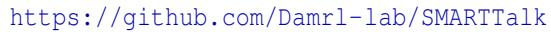

The repository README gives the most up to date execution commands, data placement instructions, and troubleshooting notes. The appendix summarizes the artifact at a high level so that readers can understand what is included and how it connects to the paper.

## B.2 Artifact Contents

The artifact is organized around the main stages of SMARTTalk. It includes: (i) preprocessing and split generation scripts for the Alibaba SMART dataset; (ii) configuration files for MB1 and MB2 experiments; (iii) offline training code for the patch encoders and pattern discovery; (iv) saved PATTERNMEMORY, phrase dictionaries, and cached model outputs; (v) prompt templates for SMARTTalk and the LLM baselines; and (vi) scripts for regenerating paper tables, figures, ablations, and artifact sanity checks.

The repository also includes sample processed data and cached outputs so that reviewers can run a lightweight check without downloading the full raw dataset or invoking live LLM APIs. Full end to end reproduction is also supported when the public Alibaba SMART logs and the required compute resources are available.

## B.3 Hardware and Software Requirements

The quick artifact check can be run on a standard CPU machine with a recent Python environment. Rebuilding the full SMARTTalk pipeline from raw SMART logs is more expensive because it requires preprocessing large time series files, training CNN based patch encoders, rebuilding PAT-TERNMEMORY, and optionally running LLM inference. GPU acceleration is recommended for full offline training and local open model inference, although cached outputs allow the main paper tables to be regenerated without repeating all expensive steps.

The artifact provides environment specifications through the repository documentation, including Python package requirements, a Conda environment file, and Docker support. Live LLM inference requires either local model endpoints or API credentials, but the cached reproduction path does not require private API keys.

## B.4 Getting Started

The fastest way to check the artifact is to run the quick reproduction script from the repository root:

bash scripts/07\_reproduce/reproduce\_quick.sh

This quick check validates the package structure, loads sample SMART windows, checks cached SMARTTalk artifacts, and regenerates representative evaluation outputs from cached state. It is intended as a smoke test rather than a full rerun of all experiments.

## B.5 Reproducing the Main Results

The artifact supports three reproduction modes. First, the quick check uses bundled sample data and cached outputs for a lightweight validation. Second, the cached reproduction path regenerates the main paper tables and figures from saved predictions, pattern memory outputs, phrase dictionaries, and sampled test results:

bash scripts/07\_reproduce/reproduce\_from\_cache.sh

Third, the full reproduction path reruns preprocessing, offline pattern learning, inference, evaluation, and ablation scripts from the public Alibaba SMART logs:

bash scripts/07\_reproduce/reproduce\_full.sh

The full path assumes that the raw Alibaba SMART logs have been downloaded and placed according to the repository documentation. It also assumes sufficient compute resources for CNN training and, when live inference is desired, access to either local LLM serving or external model APIs.

## B.6 Expected Outputs

The artifact reproduces the main evaluation components reported in the paper: status prediction results with precision, recall, F0.5, FPR, and FNR; time to failure bucket metrics; explanation and recommendation evaluation; sensitivity studies for observation window length N and patch length L; phrase dictionary and PATTERNMEMORY inspection; and selected ablation results. The default paper setting is N = 30 days and L = 5 days, while the sensitivity scripts evaluate multiple values around this default.