USENIX

THE ADVANCED COMPUTING SYSTEMS ASSOCIATION

# Scaling the IO wall with Declarative IO

Sanjith Athlur, Carnegie Mellon University; Sara McAllister, Carnegie Mellon University, University of Wisconsin, Madison, and Google; Theo Gregersen,   
Timothy Kim, Yiwei Chen, Sarvesh Tandon, and Lucy Wang, Carnegie Mellon University; Daniel S. Berger, Carnegie Mellon University, Microsoft Azure, and University of Washington; Saurabh Kadekodi and Arif Merchant, Google;   
Benjamin Berg, University of North Carolina at Chapel Hill; Nathan Beckmann, Rashmi Vinayak, George Amvrosiadis, and Gregory R. Ganger, Carnegie Mellon University

https://www.usenix.org/conference/osdi26/presentation/athlur

# This paper is included in the Proceedings of the 20th USENIX Symposium on Operating Systems Design and Implementation.

July 13–15, 2026 • Seattle, WA, USA

ISBN 978-1-939133-55-7

Open access to the Proceedings of the 20th USENIX Symposium on Operating Systems Design and Implementation is sponsored by

Sanjith Athlur#→ Sara McAllister#†‡→ Theo Gregersen# Timothy Kim#

Yiwei Chen# Sarvesh Tandon# Lucy Wang#

Daniel S. Berger#§ Saurabh Kadekodi‡ Arif Merchant‡ Benjamin Berg¶ Nathan Beckmann# Rashmi Vinayak# George Amvrosiadis# Gregory R. Ganger#

#Carnegie Mellon University †University of Wisconsin, Madison ‡Google §Microsoft Azure and University of Washington ¶UNC Chapel Hill→

## Abstract

HDD capacities will greatly increase over the next ten years, lowering cost-per-TB in large-scale storage systems. Unfortunately, device bandwidth will not grow proportionally to device capacity. Hence, storage systems will face an IO wall where the demand for HDD IO will outstrip supply.

We find that, surprisingly, between 45% and 70% of aftercache HDD IO demand for 6 hyperscalers comes from crucial maintenance tasks that ensure data reliability and efficiency (e.g. scrubbing, garbage collection). Unfortunately, caching maintenance tasks is ineffective — individual tasks have little reuse and inter-task reuse is too far apart in time. Fortunately, maintenance tasks are flexible in the timing, ordering of data accesses, and even which data they access. However, the current imperative storage interface (e.g., read/write) hides maintenance tasks’ flexible nature. We propose Declarative IO, a new interface for distributed storage systems that allows developers to expose tasks’ flexibility to the storage system. This interface allows tasks to send a declaration to our distributed storage system, DINGO, specifying sets of data and their associated deadlines, such as “process all blocks of this device within 7 days”. In processing declarations, DINGO coordinates IO across different tasks to create timely data reuse. DINGO achieves a 26–51% IO savings for maintenance task mixes corresponding to real hyperscalers, enabling the deployment of 1.7 larger HDDs than in imperative systems.

## 1 Introduction

Large distributed storage systems store exabytes of data over hundreds of thousands of disks [22, 33, 55, 61, 70]. Mechanical disks (HDDs) remain more cost-effective for most high-capacity workloads than flash (SSDs) due to new technologies that increase HDD density, such as heat-assisted magnetic recording (HAMR) [6,59]. Thus, HDDs continue to be an integral piece of datacenter storage systems. Most vendors expect 40TB drives in the near-term and 100TB drives as soon as 2030, with the cost-per-TB decreasing 6 [60]. These high-capacity HDDs will allow hyperscalers to accommodate data growth while minimizing the power usage and physical footprint of their storage systems.

Storage IO wall. Unfortunately, HDD accesses are not scal ing proportionally to their capacities. In particular, the IO supply — i.e., IOPS and bandwidth per device — has remained

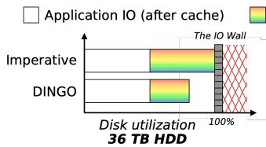

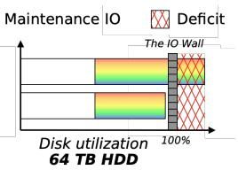

(a) The IO wall limits HDD density in imperative storage systems.  
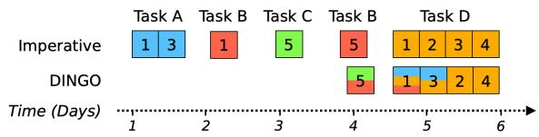  
(b) DINGO finds data reuse between different maintenance tasks, reducing disk IO.

Fig. 1: (a) Storage clusters are running into an IO wall. If maintenance tasks cumulatively use 50% of disk IO (commonly observed in hyperscalers), imperative IO uses all of a 36 TB disks’ time (or has 100% IO utilization). Since DINGO reduces maintenance IO by 40%, it enables the deployment of 64 TB disks under the same IO requirements. (b) DINGO leverages Declarative IO and each maintenance task’s flexibility to enable IO reuse between tasks that imperative storage systems would schedule independently over time.

roughly constant as capacity has sharply increased over time (Sec. 2.2). Put differently, the IO supply per TB of HDD storage is trending precipitously downward. Hence, as HDDs grow denser, we are approaching a point where the total IO demand of datacenter workloads on HDDs exceeds IO supply — a phenomenon we refer to as the IO wall. Beyond this wall, storage systems will be unable to use higher-capacity HDDs, forgoing their power, footprint, and cost advantages.

To deploy higher-capacity HDDs, storage systems need to reduce IO demand. Systems have thus far adapted to decreasing IO supply by deploying flash caches that absorb application requests before they reach HDDs [16, 26, 30, 38, 49, 71]. While these caches absorb a large fraction of IO, the remaining disk IO is increasingly hard to cache. Hence, there are diminishing marginal returns to adding caching capacity.

Maintenance tasks dominate IO demand. Analysis of storage cluster workloads across six hyperscalers1 surprisingly indicates that, on average across a cluster, 45–70% of HDD IO comes from various data maintenance tasks (Sec. 3).

Maintenance tasks pervade datacenters, from integrity checking [39, 53, 58], to reliability maintenance [25, 34], to capacity compaction [2,3], to adaptive efficiency enhancement [40–42]. Maintenance tasks are crucial to the durability and availability of stored data, but — importantly — are not latency-sensitive. They also generally access large amounts of data with little reuse, rendering caches ineffective and demanding HDD IO.

Opportunity: Maintenance IO is flexible. While maintenance tasks are individually hard to cache, we observe that there is significant data overlap between different maintenance tasks. For instance, while scrubbing exhibits no reuse as it scans over all blocks in the cluster, these scans will overlap with every other maintenance task. However, because maintenance tasks are not generally synchronized, most intertask reuse is also too far apart in time to result in cache hits. Fortunately, maintenance tasks are generally flexible in access order, access time, and even which data they access. A single maintenance task (e.g., “scrub a given disk to check data integrity”) is composed of several lower-level requests (e.g. “scrub a given block”). A maintenance task must complete all of its requests within a certain timeframe, but the timing of individual requests is flexible. Our goal is to leverage maintenance task flexibility to cause overlapping requests from different maintenance tasks to execute at similar times. For instance, we can change the order and timing for scrubbing accesses to mirror those from a capacity-balancing task.

Unfortunately, the current imperative distributed storage interfaces (e.g., GET/PUT, read/write) do not expose flexibility — each request is for a specific data unit to be accessed now. While it is possible in principle to coordinate imperative IO, in practice maintenance tasks are generated by disparate teams working on different applications or different layers of the system (e.g., block-level scrubbing vs. garbage collection from a database application). Explicit coordination of imperative IO across teams, software layers, and even organizational boundaries is impractical.

Our solution: Declarative IO. We introduce Declarative IO, a new distributed storage interface that allows tasks to declare upcoming IO reads along with a deadline for those requests. Our system, DINGO2, processes declarations to find overlapping IO across maintenance tasks, leveraging data reuse to reduce aggregate IO demand (Fig. 1b).

DINGO uses its IO Planner to track IO declarations, plan which IO to schedule, and then dispatch callbacks to maintenance tasks so that they know to access their data. The IO Planner enables DINGO to reduce disk IO without changes to maintenance tasks’ requested work. The IO Planner respects task deadlines, and is feasible to deploy for large, singledatacenter storage clusters. We accomplish this by developing a rate-based scheduler for the IO Planner (Sec. 5.1) and an efficient dispatcher (Sec. 5.2) that quickly finds and exploits overlap between outstanding maintenance tasks.

In small-scale experiments on a HDD cluster, we find that Declarative IO decreases disk reads by 26%. To evaluate DINGO at scale on a broader set of maintenance tasks, we simulate 100 PB clusters. While imperative IO is limited to 36 TB HDDs, DINGO enables the deployment of 1.7 higher capacity devices, or 64 TB, on maintenance task mixes based on real hyperscalers. Finally, we show that adding additional work to DINGO comes with only a small IO penalty. This lowers the barrier to increasing maintenance activities and improving the performance of storage clusters (e.g. more garbage collection to reduce fragmentation and save capacity).

Contributions. This paper contributes the following:

• We characterize the IO wall for HDDs and demonstrate why caching alone will not avoid this wall (Sec. 2.2).

• We identify that data maintenance tasks account for 45- 70% of HDD time in storage clusters at six hyperscalers and present per-task IO breakdowns for three of these hyperscalers (Sec. 3).

• We introduce the Declarative IO storage interface, allowing tasks to declare their order, time, and data flexibility to the storage system (Sec. 4).

• We present DINGO, a storage system implementing Declarative IO. DINGO’s IO Planner finds IO overlap while meeting declarations’ deadlines, scales to large clusters and minimizes caching overheads (Sec. 5).

• We show that DINGO achieves 26–51% maintenance IO savings, enabling deployment of 1.7x larger HDDs (Sec. 6).

## 2 The impending IO wall

Distributed storage systems are the backbone of modern datacenters, containing exabytes of data across 100Ks of disks and supporting applications from ML training [21] to the internet [33]. This section describes how data flows in these storage systems (Sec. 2.1) and how HDDs’ increasing capacity is leading to the IO wall (Sec. 2.2).

## 2.1 IO in distributed storage systems

Datacenters store and process data through a complex, interconnected collection of data storage, caching, management, and serving systems. Fig. 2 illustrates this architecture.

Datacenter architecture. The bulk storage tier combines 100Ks of HDDs into a single distributed storage system [22, 32, 44, 55, 62, 70]. The caching tier absorbs IO on DRAM or SSDs to reduce latency and handle IO that would otherwise burden HDDs [16, 26, 49, 50]. The data management tier consists of services such as object stores or databases that organize, index and process content in the lower storage tiers. The application tier consists of applications on compute clusters that read/write data from the storage tier directly or via the data management tier.

IO at the caching or bulk storage tier is requested via imperative interfaces, interfaces that only allow read/write or get/put requests for data now. These interfaces are typical for everything from key-value stores [3] to caches [16] to distributed file systems and their distributed block-level interfaces [22, 33, 55].

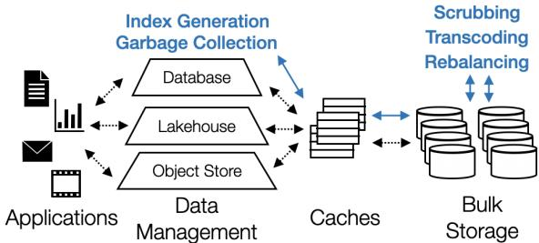  
Fig. 2: Datacenter architecture has four tiers: application, data management, caching, and bulk storage. IO requests come from both applications and maintenance tasks, but maintenance tasks IO is less cache-friendly so more of results in disk IO. In some hyperscalers, the caching tier and bulk storage tier may be combined into one distributed storage system.

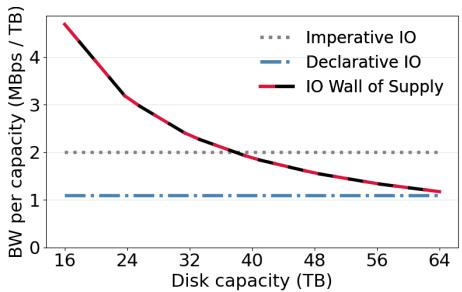  
Fig. 3: As disks become larger, their IO supply decreases. Therefore, storage clusters are running into an IO wall where they will no longer have enough IO supply to fulfill their IO demand. Assuming maintenance tasks are allowed to use only 50% of disk bandwidth, imperative IO can only use 36 TB disks.

Quantifying disk IO. Each tier ultimately fetches all noncached data from disk. We measure disk IO with two metrics: (1) bandwidth and (2) disk-head time [15, 26, 57], the sum of the disk’s seek latency and transfer time for the requested data. Since disk-head time measures active time of the disk, we can divide it by wall-clock time to get disk utilization3.

## 2.2 HDDs are IO bound

While HDDs have seen significant increases in capacity, their seek latencies and transfer rates have not improved proportionately [28, 59]. Thus, the disk-head time of a given request has remained roughly constant as HDD capacities have grown. For a given unit of time, a smaller percentage of the disk’s data is accessible as its capacity increases. This trend will accelerate over the next ten years as HAMR devices, which have recently come to market, lead to continued increases in HDD capacity [1, 4, 5, 42].

We describe both the IO supplied by the storage system and the IO demanded by maintenance reads in terms of

Bandwidth-per-TB. Fig. 3 shows the projected IO supply (in MB/s-per-TB) for maintenance reads (Sec. 3) as HDD capac ity increases. Given a constant IO demand, storage systems will not have enough IO to deploy HDDs larger than 36 TB.

We term this IO-induced capacity limit the IO wall. Unless system designers find a way to decrease IO demand, distributed storage systems will hit an IO wall, where IO demand will significantly outstrip IO supply, and prevent larger HDDs’ cost, power, and footprint advantages.

Caches cannot climb the IO wall. The main tool to address decreasing IO supply on HDDs has been caching. In particular, datacenters deploy increasingly large SSD caching tiers to absorb an outsized fraction of IO demand [16, 19, 26, 71] for reasonable cost. So far, scaling the caching tier to offset decreases in HDD IO supply has been feasible.

Unfortunately, we are now reaching the end of this scaling regime. The caching tier already absorbs the easily cacheable parts of the IO workload. The IO that currently passes through the caching tier to the bulk storage tier tends to be composed of scanning access patterns with little data reuse (Sec. 3). Hence, adding additional capacity to the caching tier will not significantly reduce this HDD IO demand, closing the gap between the decreasing IO supply and static IO demand.

Key insight. Latency-sensitive application IO dominates the pre-cache IO workload, and is largely absorbed by the caching tier. On the contrary, flexible maintenance IO tasks access large amounts of data with little reuse and are hard to cache. After years of scaling the caching tier to absorb more application IO, maintenance IO now accounts for a significant portion of disk IO. As adding additional cache capacity does little to absorb maintenance IO, storage systems need a new approach to scale the IO wall.

## 3 Maintenance tasks

To overcome the IO wall, we need to reduce maintenance IO. This section discusses why maintenance tasks are necessary (Sec. 3.1), analyzes the IO demand of maintenance tasks (Sec. 3.2), describes the challenges in reducing maintenance IO (Sec. 3.3), and discusses how flexibility provides an opportunity to reduce maintenance IO (Sec. 3.4).

## 3.1 Maintenance tasks are essential

Distributed storage systems need to ensure data durability and efficient accesses. Thus, storage systems are designed to provide fault tolerance and reliability while minimizing request latency, maximizing throughput, and limiting the total cost of the system. To meet these goals, storage systems run essential maintenance tasks, such as integrity checking (reads data and metadata to check fidelity, e.g., scrubbing [39,53,58], fsck [29, 47, 51]), reconstruction (rebuilds data from erasure coding after detecting data loss), and rebalancing (copies data to enable fault tolerance, load balancing, capacity distribution, etc.). Some maintenance tasks may be even more obscure, like moving data for “short stroking” (places hotter data on the outer HDD tracks for faster transfer times and moves colder data to inner tracks).

While the distributed storage system generates some maintenance tasks itself, much originates from other tiers (Fig. 2). Shingled disks internally garbage collect to reclaim overwritten tracks [28]. Log-structured stores and LSM-treebased databases perform garbage collection or compaction to minimize space overhead and reduce read amplification [2, 3, 23, 45, 54]. Data lakehouses transcode data as it ages to save space while storing newer data in narrower encodings to lower tail latency [42] and geo-replicate data to ensure redundancy to datacenter-scale failures [67, 69]. Databases create indexes [14, 43, 48], materialized views [18, 35], and summary statistics [20] for better performance4.

## 3.2 Maintenance tasks use most HDD IO

Although data maintenance activities play a critical role throughout the datacenter, prior literature does not address their cumulative impact on HDD utilization. Based on communication with six hyperscalers and analysis of their storage workloads, we find that maintenance tasks account for at least 45-70% of disk IO. This number is a lower bound for each hyperscaler — the remaining IO is from both applications and unaccounted maintenance (e.g., database-tier maintenance tasks running on top of cloud storage). For simplicity, we refer to the remaining IO as application IO.

Breakdown of maintenance IO. To understand the breakdown of maintenance IO between tasks, we examine data from three hyperscalers: Meta, Microsoft, and Google (listed here in a random order for anonymity). For these hyperscalers, we present each maintenance tasks’ disk IO normalized to that hyperscaler’s total known maintenance disk IO.

Hyperscaler A. We present measured bandwidth, IOPS, and estimated disk-head time from a storage cluster over 3 months in 2025. These results highlight why we favor disk-head time as a metric for IO: IOPS understates the impact of large requests and bandwidth understates the impact of per-request overheads.

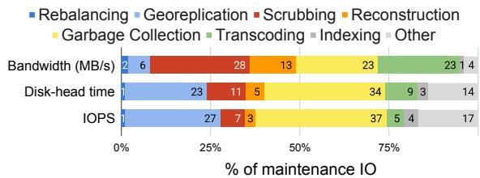  
Fig. 4: The average IO from different maintenance tasks over 3 months at hyperscaler A, broken down by bandwidth, estimated diskhead time, and IOPS.

Hyperscaler B. We present data on disk-head time for reads from maintenance tasks over 2024 from three general-purpose clusters at hyperscaler B (Fig. 5). Rebalancing comes from 3 independent maintenance tasks since 3 different tiers in the distributed architecture control different data placement decisions. Other tasks include metadata operations, fsck, and short stroking. We note that measuring maintenance IO throughout the datacenter architecture is important. For example, maintenance IO generated by the bulk storage tier comprises only 43.9% of the total maintenance IO of Cluster 1.

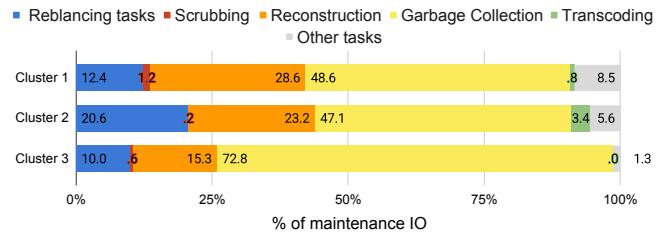  
Fig. 5: For hyperscaler B, we show the maintenance task split of 2024 disk-head read time from three different clusters.

Hyperscaler C. We finally present data on disk-head time from the perspective of hyperscaler C’s an object store over the course of a week in 2024. Migration reads data to move it to a separate cold storage system. Other includes objectlevel scrubbing and other tasks. Hyperscaler C’s final task is a programmatically-combined compaction and transcoding task. This combination is possible because both tasks are generated by the same system, but trying to replicate this coordination across different tiers is prohibitively complicated. This IO breakdown also does not include the copious amounts of maintenance IO generated by the bulk storage system itself upon which the object store depends, highlighting the importance of considering maintenance IO across tiers.

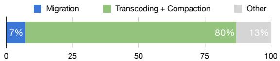  
Fig. 6: Disk-head time spent for each maintenance task in hyperscaler C’s object store. Hyperscaler C combines transcoding and compaction into one operation to reduce IO.

Observations: Based on this data, we make three main observations that will shape how we reduce maintenance IO. (1) Maintenance tasks account for the majority of after-cache disk IO across many hyperscalers and their different storage architectures. (2) Both hyperscaler A and hyperscaler B’s maintenance IO comes from many different tasks. (3) Maintenance tasks occur across layers of the datacenter stack — such as rebalancing in hyperscaler B occurring at 3 separate tiers and object-level scrubbing in hyperscaler C’s object store. Sec. 3.3 discusses how these observations complicate reducing maintenance IO.

## 3.3 Challenges in reducing maintenance IO

We identify two crucial challenges to reducing maintenance IO: (1) maintenance tasks are hard to synchronize at scale and (2) maintenance tasks’ IO requirements scale with capacity.

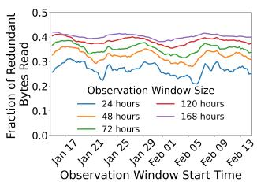

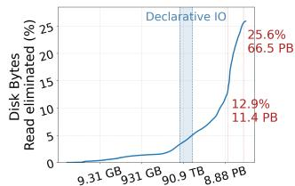  
Required Cache Size for 1 EB cluster  
Fig. 7: Fraction of redundant reads in a cluster at Google over varying windows of time flexibility over a month in 2024 (left), and cache size required to eliminate redundant reads in 1 EB cluster with imperative IO in one 24 hour window (right).

Reuse between maintenance tasks is hard to cache. Even though maintenance tasks are not cache friendly (Sec. 2.2), there is data overlap between maintenance tasks. For instance, scrubbing touches all data, overlapping with every maintenance task. Hyperscaler B has 3 different rebalancing tasks that independently choose data to prevent adding unnecessary complexity, but should have overlap in which data to move.

More concretely, our analysis of publicly released Google I/O traces from 2025 [56] reveal substantial data reuse across applications, but with reuse distances too long to be effectively captured by conventional caches. Fig. 7 shows the fraction of redundant disk reads in a Google cluster over one week in different periods of observational windows. We find that approximately 24% of after-cache disk read traffic is redundant when requests may be delayed or reordered within a 24-hour window. This redundancy increases to approximately 42% when reads are observed over 7 days 5.

Using a Miss Ratio Curve (MRC) computed from the LRU stack distance of 4 KB blocks, we find that for capturing all of the reuse over a 24-hour window using caching alone would require increasing the cache tier by at least 6% of cluster capacity (66.5 PB in a 1 EB cluster). This is an order-ofmagnitude more caching than hyperscalers typically have [26, 55]. Thus, we need to find a different way to capture reuse other than just caching. With Declarative IO, we show that we eliminate significant redundancy in bytes read with two orders-of-magnitude less cache space (Sec. 5.2).

Maintenance tasks are hard to synchronize at scale. If only a few maintenance tasks dominated maintenance IO, hyperscalers could effectively reduce IO demand by manually synchronizing overlapping maintenance tasks. However, across both hyperscalers, we observed a large number of maintenance tasks account for the aggregate maintenance IO (Sec. 3.2). Hence, many possible groups of tasks could be synchronized, with no single maintenance task representing a clear target for optimization. Additionally, the manual synchronization approach does not scale well to combining a large number of tasks. This development effort is made even more difficult by the need to combine tasks from different tiers of the datacenter architecture that different teams or even different organizations manage. To reduce maintenance IO, we need a solution that allows us to use maintenance task overlap at scale, and across many tasks.

Many maintenance tasks grow with capacity. One might hope that, as the overall capacity of the storage system grows, data would become on average colder and the disk IO-per-TB demand would decrease. Then, the reduced IO demand would allow device capacity to grow despite its lower IO supply.

Unfortunately, we find that this is not the case because maintenance tasks’ IO grows with capacity. For example, assuming a constant disk failure rate, the total IO of reconstruction over time scales with the cluster’s capacity. Our analysis of hyperscaler B’s data suggests that maintenance tasks will use an additional 0.9% of a disk’s time for each additional TB of HDD capacity. Hence, counterintuitively, we cannot amortize the impact of data maintenance across larger storage capacities and we need to address maintenance tasks IO.

## 3.4 Opportunity: Maintenance IO is flexible

While data reuse across maintenance tasks typically occurs too far apart in time to be captured by traditional caches, maintenance tasks exhibit significant flexibility. Maintenance tasks often have order- and time-flexibility: target data must be read by a deadline, but these reads can occur in any order and at any time within said deadline. For instance, scrubbing aims to validate every data block within a specified period, but it does not care about the order of blocks read. We could leverage this flexibility to schedule different tasks’ overlapping accesses close together, increasing cache hits and decreasing disk IO. Some maintenance tasks also exhibit data-flexibility: they are flexible about which exact data they need. For instance, rebalancing typically has many data blocks to choose from when moving data. We could carefully select blocks that other maintenance tasks were already planning to read, reducing IO through rebalancing’s data flexibility.

Imperative IO impedes flexibility. Unfortunately, there is no way to express flexibility in today’s imperative storage interface (e.g., read/write). The imperative interface only allows a task to specify that it needs a specific piece of data now, imposing order, time, and data constraints. Thus, data reuse can only be found through explicitly combining task implementations and manually aligning IO patterns.

Distributed storage needs a new interface. To exploit maintenance task time-, order-, and data-flexibility in a scalable manner, we need a new interface for distributed storage systems. We propose Declarative IO, a declarative interface that allows maintenance tasks to specify sets of data blocks that must be read before a deadline. With this information, the storage system can delay or reorder IO to increase temporal locality. While declarative interfaces are found across many areas of computing [9, 24, 52, 72], we believe we are the first to introduce the concept to distributed storage’s IO interface. The Declarative IO interface gives us a tool to confront the IO wall by reducing maintenance tasks’ growing share of IO.

## 4 Declarative IO

In this section, we define the Declarative IO interface (Sec. 4.1, Sec. 4.2), discuss how maintenance tasks can adopt a declarative paradigm (Sec. 4.3), and explore the correctness guarantees that Declarative IO provides (Sec. 4.4).

## 4.1 Interface Overview

The Declarative IO interface centers on a declare function, which sends a declaration to the storage system describing a set of flexible read requests. The caller (e.g., maintenance task) passes a description of the data it wants to read, a deadline by which the data is needed, and a callback to notify when parts of the declared data should be read. Upon callback invocation, the caller reads the specified data through the standard imperative interface. The storage system will invoke the callback, potentially multiple times, such that all declared data can be read before the deadline.

Unlike imperative IO, Declarative IO does not guarantee when or in what order data is read, only that the appropriate callbacks will be called before the deadline. This requires: (1) targeting append-only storage systems where sealed blocks are immutable, (2) tasks handling the possibility that declared blocks may be deleted before callback, and (3) tasks using the block IDs specified in each callback to issue imperative reads for the data they need.

Declarative IO allows tasks to express flexibility. Expressing a declaration’s maximum flexibility is vital to reducing IO. declare allows tasks to express order-, time-, and dataflexibility. A single call to declare specifies groups of data that the task wants to read. These groups can be read in any order (order-flexibility) as long as they are completed by the deadline (time-flexibility). While the system’s default behavior is to make all declared data available, the caller can specify that only a subset of data is necessary (data-flexibility).

Asynchronous callbacks in declare provide a mechanism for the storage system to shift, reorder, and select declarations data based on this flexibility. By shifting and reordering these callbacks, the system turns data reuse that originally spanned weeks (ineffective to cache) into overlapping reads that occur within minutes (easy to cache). Furthermore, data-flexibility creates reuse that is difficult to express imperatively by giving the storage system choice over data selection.

By changing the storage system interface, we can aggregate flexible declarations from throughout the system architecture. Any task that calls declare exposes its flexibility to the storage system. This allows us to find, create, and exploit data reuse between tasks ranging from a node-local scrubbing task to a file-system transcoding task to an object-store garbagecollection task (Sec. 6).

class BlockSet { set < BlockId > block\_ids };   
2 void declare (list < BlockSet > read\_sets ,   
3 size\_t sets\_needed , time\_t deadline ,   
4 void callback (list < BlockSet > sets\_selected ,   
bool overloaded ));

Fig. 8: Maintenance tasks use the declare call to explicitly communicate their flexibility to the storage system. Maintenance tasks specify three main components: what data they need (via BlockSets and sets\_needed, when they need that data by (via the deadline), and how to notify the task to read the data (via the callback).

## 4.2 Interface Details

We formalize the interface for declare in Fig. 8. A declaration must identify the data to be read, how much of that data must be read, a deadline, and a callback.

Declaring data. Maintenance tasks need to specify which data they want to read. Importantly, many tasks need to read data in specific groups (e.g. stripes, files, objects), but have order and flexibility between these groups. Therefore, declare takes the read\_sets argument, which represents a list of BlockSets, the group of data that a maintenance task needs at the same time. Specifically, each BlockSet in read\_sets is a set of BlockIds, each representing a unique block of data in the distributed storage system6.

To support data-flexibility, declare optionally takes a sets\_needed argument, allowing maintenance tasks to specify how many BlockSets must be read from the declaration. If sets\_needed is specified, the system will schedule some subset of exactly sets\_needed elements of read\_sets. Otherwise, all elements of read\_sets will be scheduled.

Deadline. Although maintenance tasks are not latencycritical, they still have performance requirements. Maintenance tasks use the deadline argument to specify the time by which a declaration must be completed. In practice, deadlines can range from hours (e.g., for high-priority reconstruction) to multiple weeks (e.g., for scrubbing). Specifying the longest feasible deadlines improves time flexibility and thus enables more IO savings. If deadlines cannot be met due to overload, the callback is invoked with overloaded=true and tasks may fall back to imperative reads.

Callback. Maintenance tasks need to know when to read data that they declared. Therefore, they pass in the callback argument to declare. When a maintenance task should read one or more of its declared BlockSets, the storage system will invoke the callback and pass back a list of BlockSets to read. The storage system can invoke the callback multiple times depending on how the storage system schedules IO for the declaration. Thus, the callback’s list of BlockSets may be a subset of sets\_needed.

The callback does not include BlockSet’s data. Rather, the callback serves as a prompt from the storage system to a task that reading the specified data now will result in IO savings. Leaving the task in charge of reading the data simplifies consistency, failure handling, and access control by leveraging existing storage system consistency mechanisms (e.g., leases) when reading (Sec. 4.4). Additionally, Declarative IO may perform callback elision and not callback maintenance tasks about BlockSets that are completely deleted.

Extending declare to files. Some maintenance tasks may express their data needs in higher-level abstractions such as objects, database tables, or files. To support these tasks, we extend Declarative IO to file declarations. Specifically, maintenance tasks can declare sets of file segments (tuples of file path, offset, and length)7. These calls are translated into declare calls at declaration time using the metadata service. This means that declarations are snapshots at declaration time; new blocks appended to files after declaration are not included (Sec. 4.4). A similar translation strategy would allow tasks to declare other data abstractions.

## 4.3 Converting tasks to Declarative IO

While many developers are well-versed in writing IOefficient code using an imperative interface, there are different design considerations when using Declarative IO. Declarations should remain simple, while exposing as much flexibility as possible. We show two examples of building effective declarations that (1) express all time- and order-flexibility and (2) hunt for data-flexibility8.

Express all time- and order-flexibility. Consider scrubbing, a task that periodically checks that each block in the system is still valid over a long time horizon (e.g., monthly). Imperative scrubbing iterates over all blocks at a fixed rate and in a fixed order. A naïve declarative scrubbing might instead generate declarations when imperative scrubbing would have issued a read, with a deadline before the next declaration. This naïve approach exposes limited time-flexibility (Fig. 9) and no order-flexibility. A better approach would use a single declaration to read all blocks with a one-month deadline, giving the storage system freedom to decide the order and timing of scrubbing’s reads and creating massive overlap with other tasks. While scrubbing is a simple example, it illustrates how a small change in declaration pattern can drastically change the flexibility afforded to the storage system.

Hunt for data-flexibility. Now, consider capacity balancing, which moves data to ensure that all disks have about the same amount of data. Capacity balancing needs to move some amount of data, not any specific data, making it well-suited to using Declarative IO to express data-flexibility. Even though it suffices to move a small set of blocks, capacity balancing should declare all blocks that could be moved (potentially all blocks on a disk) and specify how many need to be moved (Fig. 10). The storage system can then create data reuse by selecting blocks also needed by other declarations. Notably, larger HDDs tend to have more candidate blocks for capacity balancing, resulting in more data-flexibility.

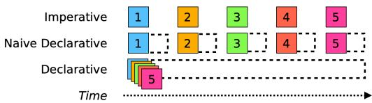  
Fig. 9: Comparison of how scrubbing changes with Declarative IO. Declarative scrubbing expresses both order- and time-flexibility by declaring all blocks at once with a long deadline.

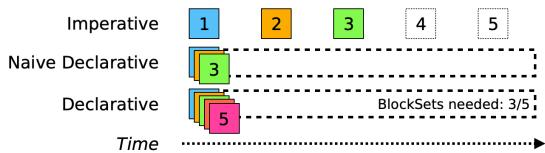  
Fig. 10: Comparison of how capacity balancing requests blocks over time. Leveraging the balancing task’s data-flexibility maximizes the chance for overlap with other maintenance tasks.

## 4.4 Consistency with Declarative IO

Declarative IO changes what data a task reads when. The following section describes our assumptions about distributed storage system behavior, how Declarative IO provides consistency based on these assumptions, and what happens if a declarative storage system cannot meet deadlines.

Storage system assumptions. We target append-only distributed storage systems. Append-only storage is the standard approach in hyperscalers [31, 33, 36, 44, 55, 70] due to its relative simplicity enabled from its block-level immutability guarantees. Append-only file systems enforce block-level immutability by sealing fully-written blocks. The only way to change a sealed block is to delete it.

Declarative IO only operates on sealed blocks. Given that these blocks are immutable, we only need to reason about the correctness properties of certain file operations: deletions, creations, appends, and metadata operations.

Deletions. A declaration can refer to a block that will be deleted before the declaration’s deadline (e.g. Block 4 in Fig. 11). We have to assume that Declarative IO callbacks may include deleted blocks, since blocks can be deleted during callback invocation. Fortunately, maintenance tasks’ use imperative reads and thus inherit their guarantees. Existing distributed storage systems already handle similar problems (e.g. cached block metadata can become stale by the time of the actual request). Thus, Declarative IO relies on the preexisting storage system’s consistency to ensure it operates correctly when declared blocks are deleted.

Declarative IO may also perform callback elision for BlockSets composed entirely of deleted blocks. That is, to prevent the storage system from processing repeated requests for deleted blocks, the system may forgo callbacks for any deleted BlockSets. Since these reads would have failed, callback elision does not change the data a maintenance task sees, but may require updating some error-handling in the task.

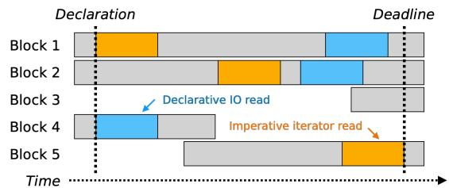  
Fig. 11: An imperative vs a declarative rebalancing implementation read different blocks even if rebalacing is implemented in a naive manner (Sec. 4.2). Declarative rebalancing would not read blocks 3 or 5 because they were written after the declaration.

Metadata and data consistency. Declarative IO guarantees that file declarations will be a snapshot of blocks that exist at declaration time. It does not know about subsequent file appends, creations, or metadata changes (e.g., renaming, changes to access permissions). For instance, after a maintenance task makes a file declaration, new data can be appended to the file that would have been in the declared segment. The resulting new blocks will not be part of that declaration. Thus, tasks must create additional declarations if they need to read these newly appended blocks or any newly created files. This is not a new problem — most maintenance tasks already have to handle new files and blocks in their imperative iterators.

Any metadata changes, like access permissions changes, must be handled by the maintenance tasks themselves. After receiving a callback, a task will reobtain metadata needed for its imperative reads, both to check read permissions and file mappings. Hence, while metadata changes can reduce IO savings, they do not affect correctness.

Corner cases with Declarative IO vs imperative interfaces. When introducing a new interface to distributed storage systems like Declarative IO, it can introduce risk of failures. We find that many of these issues in Declarative IO are simply new instances of typical failures in imperative distributed storage or they are easily remedied with a slight reduction in IO reuse. To show this, we discuss three scenarios: coordinated disk failures causing large amount of reconstruction, compute unavailability, and IO load spikes.

Correlated disk failures. When many disks fail at once, reconstruction becomes urgent for all stripes that have lost multiple blocks due to a low mean-time-to-data-loss (MTTDL). Since this reconstruction is high priority due to the risk of data loss, it should use imperative requests instead of declarations. In most systems that can lose multiple blocks without data loss, this is both a rare event (thus not expected to significantly affect Declarative IO’s overall IO reduction) and a potentially catastrophic event (thus already requiring extra attention to avoid data loss). Thus, these disk failures do not introduce new challenges in declarative vs imperative systems.

Compute unavailability. While imperative requests come from a scheduled compute job, Declarative IO may send its callback to tasks that do not have enough compute resources at the time of the callback, a new type of failure. While maintenance tasks generally require little compute and we expect compute to usually be available, compute unavailability, at worst, means the task cannot use the data upon callback9, resulting in additional IO when the task is able to respond to the callback. This is still correct behavior, even if it will decrease IO reuse if its a frequent occurrence.

IO load spikes. Both of the other failures hint at a different type of failure, a spiking IO load that overwhelms the disks’ ability to respond to IO. This is not a new problem and can be caused by higher than average user loads, cache failures, or unsustainable maintenance loads. In many of these cases, Declarative IO gives system owners new tools to reduce (Sec. 6.2) and handle IO spikes due to centralizing maintenance IO. Declarative IO allows owners to monitor whether maintenance IO will likely complete before the deadlines appear and to lower the maintenance IO rate in the event of too much IO from other sources (Sec. 5.1).

However, if Declarative IO ends up in a state where it is failing to meet most deadlines resulting in imperative IO from maintenance tasks and the system’s IO is provisioned expecting a certain level IO reuse, the system can enter a metastable failure [37] analogous to caching. While this is an important edge case to be aware of in a declarative system, we do not believe Declarative IO adds additional risk when compared to the main alternative — much larger caches with their own metastable failure patterns.

## 5 DINGO Design

We introduce DINGO, a distributed storage system that implements Declarative IO. DINGO consists of an appendonly file system with a metadata service and storage nodes (Fig. 12). Like other distributed storage systems, DINGO supports an imperative interface for both maintenance tasks and foreground applications. DINGO’s main contribution is its IO Planner, which enables the Declarative IO interface. We first give an overview of how imperative requests, metadata requests, and declarations work in DINGO, and then discuss the design and optimizations in the IO Planner.

Imperative and metadata requests. Imperative and metadata requests (read, write, file creation, etc.) operate the same as in other distributed storage systems. Imperative requests first go to the metadata service to translate file requests into node-specific block requests and to get a lease on the requested data. The imperative task then queries this data from the appropriate data nodes, traversing the cache.

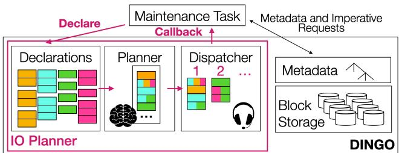  
Fig. 12: DINGO is a storage system that implements Declarative IO in addition to an imperative interface. Declarations go to the IO Planner, which keeps track of outstanding declarations, schedules them each quantum, and then dispatches them based on reuse.

Declarations. Unlike imperative requests, declarations go to and are stored by the IO Planner. Each scheduling quantum, the IO Planner decides which BlockSets (a set of blocks needed by a declaration, Sec. 4.1) to fulfill, aiming to meet all declaration deadlines while adhering to a per-quantum IO limit. For each scheduled BlockSet, the IO Planner dispatches callbacks, prompting the maintenance tasks to read the associated data. A good scheduling algorithm aims to maximize overlap in BlockIds between scheduled BlockSets as this translates to data reuse over a short time horizon, making the maintenance workload more cacheable. DINGO uses a rate-based scheduler to optimize IO while making progress towards deadlines (Sec. 5.1). We also optimize DINGO with a dispatcher that reduces the required cache space, minimize memory overheads in the IO Planner, and explicitly manage the cache for DINGO to ensure reuse is captured (Sec. 5.2).

## 5.1 Scheduling in DINGO’s IO Planner

The IO Planner seeks to minimize disk IO needed to fulfill all declarations by their deadlines. For each scheduling quantum, it must decide which of the outstanding BlockSets to schedule given that it can only schedule a limited amount of total disk IO. To minimize disk IO, an optimal schedule will maximize block reuse, but finding the optimal schedule is NP-hard10 and we need a scheduling solution that can run periodically as tasks create new declarations. Thus, we develop a rate-based scheduling heuristic.

Rate-based scheduling. For DINGO’s scheduling heuristic, we prioritize meeting deadlines over finding data reuse because (1) scheduling for reuse is NP-hard, (2) we find that this approach still produces significant data overlap in practice, and (3) missing deadlines leads to more imperative reads. To bias the scheduler towards meeting deadlines, we implement a rate-based scheduling heuristic.

For each declaration, the IO Planner calculates the IO rate needed to complete the request by its deadline. Until the quantum’s total disk IO limit is reached, the IO Planner sched ules declarations from highest to lowest IO rate. Any blocks already scheduled are considered “saved” and do not count towards the total disk IO limit (i.e., BlockSet 1 in Fig. 13 only causes one disk IO, leading to 2 saved reads). Declarations that consist of entirely saved blocks will also be scheduled. Within each declaration, we choose BlockSets that have the most free blocks in the quantum. Thus, the IO Planner finds more free blocks for declarations with more data-flexibility.

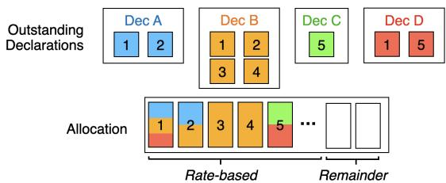  
Fig. 13: DINGO’s IO Planner must decide which blocks to schedule each quantum within its disk IO allocation. It uses a rate-based scheduler which biases toward completing all declarations. When multiple declarations access the same block (e.g., declarations A, B, and D read block 1), only one disk read is needed for that block because these reads are now close together in time.

Dispatching decouples cache space and scheduling quanta. While the rate-based scheduling heuristic accomplishes its goal of prioritizing deadlines while finding reuse, we cannot naïvely deploy it in the IO Planner. To maintain the assumption that each unique block in a scheduling quantum only incurs one disk IO, the cache needs enough space for all saved blocks in that period. Therefore, to reduce cache resources, the ideal scheduling quantum is short. However, this is not practical as the scheduler’s runtime is O(BlockSets).

Instead, the IO Planner uses dispatching logic to divide scheduled IO into smaller dispatching groups of overlapping BlockSets. By invoking each group’s callbacks at even intervals during the quantum, we break the dependency between cache overhead and scheduling period: the cache now only needs enough space for saved blocks in a single dispatching group. Furthermore, since dispatching only considers scheduled BlockSets rather than all declared BlockSets, it can be optimized for frequent execution (Sec. 5.2).

Handling leftover IO allocation. The IO Planner may meet all the declarations’ rates and still have remaining disk IO (white boxes in Fig. 13). One option is to schedule more BlockSets and fully use the allocation. However, this is not always ideal as it can lower future overlap. The default policy in DINGO is to leave this remaining IO unscheduled and available for other higher-priority IO. We find that in practice we do not violate deadlines due to this policy even when the per-quantum disk IO limit changes over time (Sec. 6.4).

## 5.2 Optimizing the IO Planner

We now discuss optimizations in DINGO’s IO Planner: (1) a dispatcher leverage erasure coding for efficient overlap identification and (2) how DINGO uses explicit cache management to ensure IO savings.

EC-group based dispatcher to minimize runtime Optimally finding dispatching groups has a naive runtime complexity of O( scheduled BlockSet 2). In a cluster processing millions of outstanding declarations, executing this search within a scheduling quantum becomes intractable — defeating the goal of dispatching to minimize cache space. To make dispatching tractable, we introduce an erasure-coding (EC) group based dispatcher which bounds the search space to a handful of BlockSets accessing a given set of EC groups. For every EC group in the system, we maintain a list of outstanding BlockSets accessing any subset of its blocks. In order to find the dispatching group for a scheduled BlockSet, DINGO identifies its EC-groups and searches for overlapping BlockSets exclusively within this metadata, lowering the complexity to O( scheduled BlockSet ).

Explicit cache management to ensure overlap. DINGO saves disk IO by assuming the cache will absorb multiple reads for the same block. However, we found that in practice this approach results in less saved IO than the IO Planner predicts since blocks can be evicted between reads or not placed in the cache at all. Additionally, DINGO causes multiple reads to the same data in a short period of time, potentially causing the cache to think the blocks are popular and useful to store.

To help ensure that scheduled free IO is actually saved and to avoid cache pollution, the IO Planner issues cache directives for scheduled blocks each dispatching round. We dedicate a small amount of cache space for DINGO. The cache places blocks contained in the cache directive in this reserved space upon a read of the block. To account for delays in maintenance task read requests, blocks are kept in this dedicated cache space for the entire dispatch round. In the rare event that the cache runs out of dedicated space, the cache applies its eviction policy to the reserved space.

We find that the cache space required by DINGO is minimal. The required capacity is primarily a function of (i) the effective IO rate after eliminating redundant reads and (ii) the time window over which blocks must remain pinned until application IO requests are actually issued following dispatch. For a maintenance IO rate of 2 MB/s per TB, even in the extreme scenario where no overlap is found, and conservatively assuming it takes one minute for applications to issue the corresponding IO after dispatch, the required cache allocation would be only 120 MB per TB of disk. If data blocks need to remain pinned to the cache for two minutes, we would still only need 240 MB of cache per TB of disk. This translates to a pessimistic upper bound of 240 TB of cache spread across many servers for a 1 EB storage cluster (Fig. 7).

## 6 Evaluation

We evaluate Declarative IO through both a small-scale prototype and a simulation of a datacenter-scale storage system. We find that for a standard set of HDFS maintenance tasks, DINGO reduces disk reads by 26%. With datacenter-scale workloads, these savings increase: DINGO decreases disk reads by 28-51%, enabling devices that are 1.7 larger. This section discusses experimental setup (Sec. 6.1), DINGO’s IO savings (Sec. 6.2), an attribution of these IO savings (Sec. 6.3), and DINGO’s sensitivity to both workload characteristics and IO availability (Sec. 6.4).

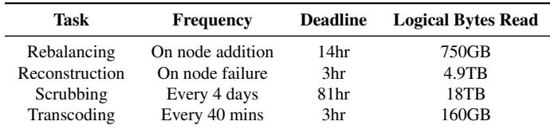  
Table 1: Maintenance task parameters for HDFS experiments. We run a 3/24 scaled down version in both time and capacity.

## 6.1 Experimental Setup

DINGO Prototype. We build a DINGO prototype on top of HDFS [61] due to HDFS being an open-source appendonly distributed storage system like most deployed systems (Sec. 4.4). The IO Planner supports both block-level and file-level declarations. We evaluate DINGO against a version of HDFS with no modifications other than the addition of transcoding support (baseline). Both storage systems run on 10 SuperMicro 4042G-6RF nodes, each with 64 cores, 128 GB RAM and a 3TB HDD connected with 40 GbE InfiniBand. We limit both systems to 10 GB of memory per disk to better emulate the ratio of cache to disk in larger capacity systems with large SSD caches. We would limit the memory usage further to replicate smaller caches, but the HDFS Datanode process requires sufficient memory. Thus, our prototype uses 2 GB per TB of disk. The cluster starts with 80% capacity used (18TB of data with 25% in 3-way replication and 75% in RS-3-2-1024k). We measure disk IO with iostat [7].

The maintenance workload follows the distribution from hyperscaler A (Sec. 3.2), but isolated to four maintenance tasks pertinent to HDFS: rebalancing, reconstruction, scrubbing, and transcoding. We scale down both capacity and time by an eighth to reflect our cluster’s 3TB HDDs compared to a 24TB datacenter HDD and to run for the full length of our longest declaration. The parameters of the scaled maintenance tasks are described in Table 1. We configure DINGO with a scheduling quota of 120 MB/s and run the experiment for 81 hours (i.e., a month at our experiment scale).

Datacenter Simulator. To evaluate IO savings at scale, we build a time-driven cluster storage simulator. It models IO activity from real-world datacenter maintenance workloads in discrete 3-hour steps over a 30-day period on a 100 PB cluster. The simulated cluster stores data in 7.5 GB files, distributed in 256 MB blocks [22, 61] and maintains 80% storage capacity utilization. Blocks are either 3-way replicated or part of 6-of-9 or 30-of-33 erasure-coded stripes [41, 42]. We assume an IO demand of 2.0 MBps/TB for maintenance reads and show how results vary with different demands in Sec. 6.4.

We simulate two cluster workloads, one based on each of the two hyperscalers described in Sec. 3.2 (exact workload breakdowns are in Fig. 17). We simulate eight workloads: reconstruction, scrubbing, garbage collection, transcoding,

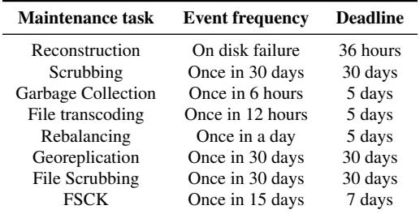  
Table 2: Maintenance task parameters for simulator experiments.

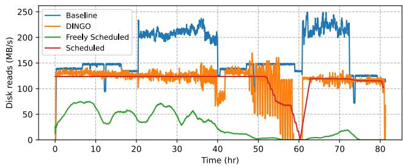  
Fig. 14: Maintenance task disk reads for DINGO (orange) and unmodified HDFS (blue). The red and green lines represent the logical IO scheduled by the IO Planner for DINGO, with the red line being IO that counts toward the disk IO limit and the green line being IO that is free due to overlap. For the baseline, periods of increased IO occur around hours 20 and 60 due to reconstruction events.

FSCK, georeplication, and rebalancing.11 Maintenance task frequency and deadlines are listed in Table 2. We validated our simulator, finding that its IO savings are within 5% of those measured in the analogous HDFS experiment.

We open-source both the HDFS prototype and the simulator at www.github.com/Thesys-lab/declarativeIO-osdi26- artifact.

## 6.2 DINGO enables higher capacity HDDs

We first explore DINGO’s IO savings in our prototype and in our datacenter simulator.

Takeaway 1: Our prototype shows DINGO works in a storage cluster, reducing bytes read by 26% for the four maintenance tasks.

We evaluate the IO reduction benefits of DINGO in our storage cluster. Fig. 14 compares the maintenance disk reads in DINGO to that of unmodified HDFS (baseline). The baseline has to read a byte from disk per every logical byte needed by each maintenance task. By comparison, DINGO completes the maintenance workload while only reading 0.74 bytes from disk per logical byte, a 26% reduction in total bytes read.

Additionally, DINGO enables a steadier maximum rate of maintenance IO. While DINGO sometimes has more IO than scheduled due to cache misses, metadata operations, and other noise (scheduled IO savings are 28% compared to DINGO’s observed 26%), DINGO is aware of all outstanding maintenance tasks and schedules their combined IO rate. In fact, DINGO’s largest deviations from a constant rate only occur when it finishes most of its outstanding work ahead of schedule, such as around hour 50. At such points, disk reads oscillate based on when new declarations arrive.

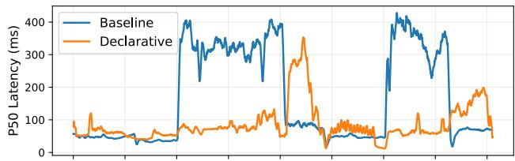

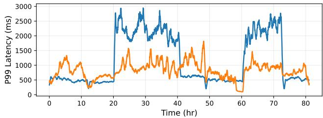  
Fig. 15: Max of clients’ P50 and P99 read latencies per minute over time. Ongoing maintenance IO impacts latency. For instance, reconstruction events around hours 20 and 60 increase latency in the baseline due to lack of a central rate limiter for maintenance read IO, and dense scheduling of transcoding events around hour 40 in DINGO increases P50 latency due to elevated write IO.

With the imperative paradigm, even when each maintenance task rate limits itself independently, the combined IO shifts significantly depending on which tasks are running. For example, the baseline in Fig. 14 has periods of higher disk IO starting around hours 20 and 60 due to reconstruction.

Takeaway 2: DINGO has similar or better client P50 and P99 read latencies than the baseline.

To determine whether DINGO affects client performance, we repeat the experiment with a read workload based on analysis of Alibaba block storage traces [73]. We configure this foreground workload to contribute around 30% of total disk read IO (Sec. 3.2). The average client throughput is 6.36 MB/s for the baseline and 6.82 MB/s for DINGO. As seen in Fig. 15, we find that the median client read latencies are better than the baseline both on average (86 vs 167 ms) and at worst (423 vs 587 ms). The 99th percentile has an even larger difference, 832 vs 1181 ms on average and 4969 vs 6877 ms at worst, due to its more stable read IO from maintenance tasks.

However, as seen in Fig. 15, for certain time intervals, the client latency differs significantly (up to about 6 lower or higher) due to increases in maintenance IO. The baseline’s latency spikes when it is reconstructing data. Similarly, although DINGO respects the read bandwidth limit, bursts of write activity from clustered transcoding can cause temporary P50 read latency increases. Future work can improve robustness by integrating other metrics into scheduling (e.g. write IO, CPU and network utilization, etc.).

Takeaway 3: DINGO enables 1.7 larger drive adoption on petabyte-scale clusters in our DINGO simulator.

For a representative maintenance read demand of 2 MBps/TB, Fig. 16a shows the percentage of disk head utilization required in a cluster with 48 TB drives. With this IO demand, the imperative approach consumes 64% of disk time to fulfill all reads for the maintenance workload. Declarative IO allows DINGO to identify up to 45% of bytes read as redundant and reduce disk utilization to as low as 34.8% in Cluster A.

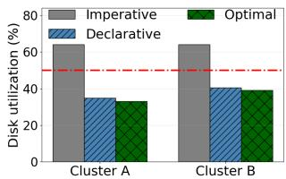

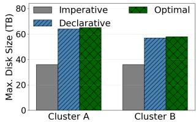  
(a) Disk-head utilization.  
(b) Max. Drive Sizes supported  
Fig. 16: (a) DINGO’s IO savings in terms of disk-head utilization across two clusters with a cumulative maintenance IO demand of 2 MBps/TB and 48 TB drives. The red line represents the maximum disk utilization maintenance tasks can use and still allow deployment of 48 TB drives in a cluster where half of disk IO is from applications. (b) Maximum drive sizes that can be supported in the two clusters for a total demand of 4 MBps/TB, half of which is maintenance.

DINGO’s significant reductions to disk head utilization allow the adoption of higher capacity drives in storage clusters. Fig. 16b shows how Declarative IO enables 64TB drives in Cluster A (assuming maintenance reads can only use 50% of disk bandwidth), a 1.7 increase in the maximum supported drive size compared to an imperative system. Cluster B sees similar benefits with a 1.5 drive capacity increase to 58TB.

Takeaway 4: DINGO achieves near-optimal IO reduction.

We also compare DINGO’s savings against Optimal, an infeasible theoretical lower bound. Optimal knows all future declarations, does not consider per-quanta disk IO limitations, and does not consider deadlines. Optimal reads a block only when it is not in any future declarations to avoid missing IO reuse. Even under many more constraints, DINGO only incurs slightly more IO than Optimal. DINGO stays within 5% of this lower bound for both Cluster A and Cluster B.

Takeaway 5: Even for exabyte storage clusters, the IO Planner can run on a single server.

We assess the scalability of DINGO by measuring the time and memory overheads of the IO Planner in our simulator on a Dell PowerEdge R640 server with 240 GB of RAM. For a 1 EB storage cluster performing 2 MBps/TB of maintenance reads, our IO Planner was able to find all dispatching groups for a one-hour scheduling quanta in under 15 minutes with a peak memory usage of 205 GB. With more powerful and memory-rich compute nodes typically available in hyperscale environments, DINGO can be directly adopted for multi-exabyte storage clusters.

## 6.3 Where are DINGO’s IO savings from?

Fig. 17 shows the breakdown of IO savings for the two simulated clusters. For each workload in each cluster, we report the amount of data read directly from disk, and the amount of IO saved, either because of cache hits (the data was recently read by another task) or because the corresponding data was deleted, eliminating the need for IO. When tasks are scheduled with overlapping IO, we attribute disk reads to the tasks with the nearest deadlines as those are the first to decide which data to read in our scheduling heuristic (Sec. 5.1).

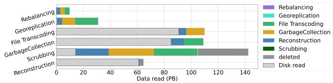

(a) Cluster A  
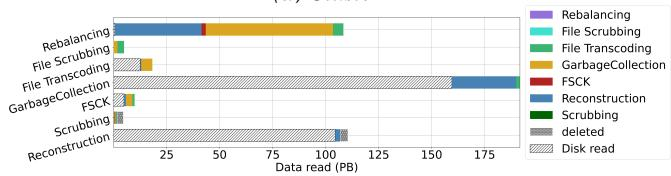  
(b) Cluster B  
Fig. 17: Volume of data read by different workloads across two clusters. White hatched bars represent data that had to be read directly from disk. The solid colored bars represent data that was read for free due to cache hits. The colors represent the workload with which these free bytes overlapped. The dotted gray bars represent data that was deleted (so the IO was avoided altogether).

Takeaway 6: DINGO allows more flexible tasks to piggyback on IO from more urgent and less-flexible tasks.

Since reconstruction tasks have the shortest deadlines, reconstruction often drives the IO Planner to choose data in a scheduling quantum, though this changes when other declarations are close to their deadlines. Other tasks are then able to exploit these reads when overlapped by the IO Planner.

Another interesting example is rebalancing, which becomes completely free. While rebalancing has equal or worse timeflexibility than file transcoding, garbage collection, or index checking, it has much better data-flexibility. Rebalancing declares more blocks than it needs and only requires a single block at a time. This pattern greatly increases the odds of finding overlap with other tasks and shows why finding dataflexibility is important to saving IO in a declarative paradigm.

Takeaway 7: Imperative storage systems often do unnecessary maintenance IO.

In a traditional storage system with no additional information about the remaining lifetime of data blocks, scrubbing indiscriminately reads and verifies all data in the system. But DINGO’s results reveal that a large portion of this work is unnecessary. Maintenance tasks such as garbage collection and file transcoding write new file contents and then delete the original file. By simply allowing a flexible time window to accomplish scrubbing, we find that 26% of reads declared for scrubbing were unnecessary because the data was subsequently deleted.

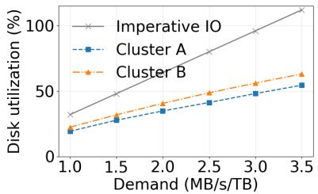  
Fig. 18: Disk utilization by maintenance tasks with different demands. Utilization with imperative IO increases proportionally with demand. DINGO is able to reduce the utilization by effectively scheduling tasks requesting common bytes together.

## 6.4 Sensitivity studies

We now explore how DINGO responds to a variety of different situations — particularly when IO demand, task deadlines, and IO supply change.

Takeaway 8: DINGO is effective across different maintenance IO demands.

Depending on the nature of data stored and the users being serviced, the IO demand for maintenance reads can vary across clusters, even within a hyperscaler. Fig. 18 shows savings with a demand of maintenance reads ranging from 1 MBps/TB to 3.5 MBps/TB for two cluster workloads using 48 TB drives. To scale the IO demand, we increase the frequency of each maintenance task. For scrubbing, we also shorten the deadline since otherwise it would overlap with itself. Disk utilization grows proportionally with the requested rate of maintenance reads as expected.

Disks spend 22% of their time on maintenance reads at 1 MBps/TB, but exceed 90% utilization at 3 MBps/TB with imperative IO (we set imperative’s IO demand to be the same for both clusters). If the demand exceeds 3 MBps/TB, it would be physically impossible for the disk to service even just the maintenance reads, leaving no room for foreground IO. Declarative IO reduces the disk-head time from disk by 39- 51% in Cluster A and 28-46% in Cluster B, saving more at higher IO demands.

Takeaway 9: DINGO enables each maintenance task to perform more work with less additional IO than imperative IO.

Due to the lack of IO supply, different hyperscalers prioritize some maintenance workloads and throttle others based on their trade-offs. For example, many clusters dynamically adjust the rate of garbage collection based on when available capacity or IO is needed more. Fig. 19 illustrates the IO overheads incurred when the rate or the IO demand of maintenance tasks increases.

By leveraging data reuse, DINGO can perform additional maintenance work for substantially less IO than an imperative system. For example, Cluster B is able to scrub 4 more data with virtually no extra IO, whereas an imperative-only cluster performs proportionately more reads. DINGO can also perform more garbage collection and rebalancing by consuming less read bandwidth. Note that DINGO only reduces the bandwidth needed for reading data; maintenance tasks still need to write their data to disk. Despite this, in Cluster A, DINGO can perform 4 more rebalancing and still consume 45% less IO than the imperative baseline. Similarly, for both clusters, DINGO is able to perform 2 more garbage collection for the same IO as the imperative IO baseline. That is, if these clusters adopted declarative IO today, they could garbage collect twice as aggressively without any additional disk IO.

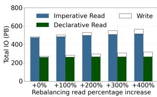  
(a) Cluster A- Rebalancing

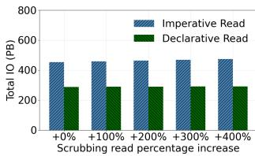  
(b) Cluster B- Scrubbing

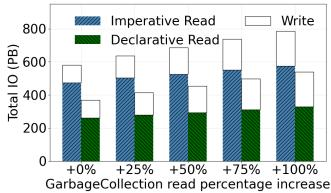

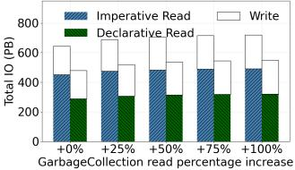  
(c) Cluster A- GC  
(d) Cluster B- GC

Fig. 19: Declarative IO allows for increasing maintenance tasks’ work while incurring the same, or less, disk IO than the imperative baseline, reducing the need to throttle maintenance tasks. Total IO is from all maintenance IO in the cluster, not just that of the task being adjusted.  
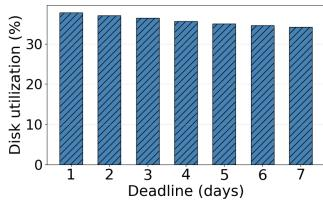  
(a) Garbage Collection

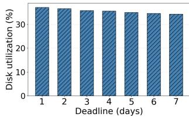  
(b) File transcoding  
Fig. 20: In cluster A, DINGO’s disk utilization decreases as garbage collection and file transcoding increase their time-flexibility through extending their deadlines.

## Takeaway 10: Exposing more time-flexibility with longer deadlines saves IO.

We investigate how the time-flexibility of a workload, as defined by its completion deadline, impacts achievable savings with the IO Planner. Fig. 20a and Fig. 20b show IO savings in Cluster A as deadlines vary from 1 to 7 days for garbage collection and file transcoding. Longer deadlines allow DINGO to find more overlap for the declared tasks. For instance, moving from a 1-day deadline to a 7-day deadline for file transcoding resulted in 7% lower disk utilization in the cluster. Note that a realistic deadline will depend on the SLOs that the workload is required to meet. Depending on IO traffic, garbage collection tasks may mandate shorter deadlines to limit the accumulation of garbage, reduce storage overheads and improve IO performance.

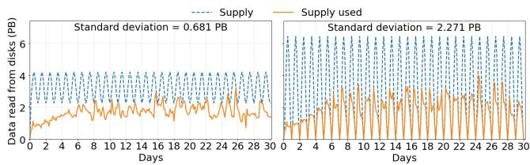  
Fig. 21: Bytes read over a month by maintenance tasks with declarative IO following a diurnal IO supply. DINGO rate-limits the IO schedule based on the quota allocated during both low and high supply variance.

Takeaway 11: DINGO adapts to changes in IO supply, such as those driven by foreground workload variations.

Maintenance tasks are often throttled in order to prioritize user-facing application IO. One approach to throttling is to allocate a dynamic IO quota to each maintenance task. This IO supply typically follows a diurnal pattern, reflecting user demand throughout a day. DINGO is able to dynamically rate limit the amount of scheduled maintenance work in order to stay within the allocated IO quota. Fig. 21 shows that the IO used by declarative IO is always below the allocated threshold, even with a high variance in IO supply.

## 7 Related Work

This section discusses additional related work with similar techniques and goals to Declarative IO.

Duet and Quartet. Duet [10] uses page events to inform local maintenance tasks about new in-cache data. Quartet [27] builds on Duet to schedule subtasks of map-reduce jobs with overlapping IO requests close in time to each other. DINGO instead introduces an interface that allows a large variety of different maintenance tasks to declare multiple types of IO flexibility across large distributed storage systems.

Disk optimizations. Disk-level optimizations can re-order IO. For instance, freeblock scheduling [46] re-orders lowpriority IO to exploit disk-head time spent rotating to the right disk location. This can be extended to local maintenance reads [68]. These optimizations are orthogonal to Declarative IO since the maintenance reads will still go through these disk-level optimizations.

Semantically-smart disks [11, 64, 65] intuit the structure of the file system or database to make better data placement decisions or secure deletion of data, increasing disk functionality without changing the disk interface. Declarative IO both addresses a different problem — the impending IO-wall in distributed storage system on HDDs — and also takes a different approach — embracing interface change as necessary.

Database optimizations. The database community has tried to combine data requests, such as through shared scans [8, 12, 66]. These optimizations rely on having database queries — a higher-level abstract than many maintenance tasks operate at. Declarative IO instead targets the file and block level since all maintenance tasks that perform disk IO must eventually go through the bulk storage tier. Thus, we need an interface specifically at that tier and we find that we do not need one as verbose for databases.

Reducing IO from individual maintenance tasks. There has been work trying to reduce IO from individual maintenance tasks such as transcoding [13, 42]. This work is orthogonal. Any improvements in reducing this IO will just contribute to the end goal of overcoming the IO wall and deploying higher-capacity hard-disk drives.

## 8 Conclusion and Discussion

We show that HDDs are running into an IO wall. Because application IO is cacheable and maintenance IO is not, we find that maintenance IO now dominates disk IO demand. We introduce Declarative IO to allow maintenance tasks to express their IO flexibility to the storage system. DINGO uses this flexibility to find reuse between maintenance tasks, enabling deployment of 1.7x larger HDDs.

Declarative IO has broader implications than just reducing disk IO to save cost, emissions, and footprint from using larger-capacity devices. Datacenters subject to bursty application workloads or dynamic power constraints (e.g., power grid limits) [17] now have a powerful tool to throttle cluster-wide maintenance IO. Using less IO supply for maintenance tasks also allows more low-priority opportunistic workloads to run, since there is more likely a surplus in available IO even with larger-capacity devices. Finally, while we target maintenance tasks, there are many higher-level applications, such as batch analytics or machine learning training, where Declarative IO could help further reduce disk IO.

## 9 Acknowledgements

We thank our shepherd Erci Xu and the anonymous reviewers for their invaluable feedback. We extend special thanks to Larry Greenfield, Kim Keeton, and Richard McDougall at Google; Rohit Bhat, Dario Marasco, Cornel Rat, and Venkatraghavan Srinivasan at Meta; and Ricardo Bianchini at Microsoft for helpful discussions and insights into maintenance IO in hyperscalers. This research is generously supported in part by NSF grants CNS-2402838, CNS1956271, CNS1901410, CAREER 1943409, CCF-2403195, IIS-2322974, as well as a Google Junior Faculty Award, Sloan Foundation Fellowship, VMware Systems Research Award, and a NDSEG Fellowship. We also thank the members and companies of the PDL consortium (Amazon, Bloomberg, Datadog, Google, Honda, Intel, Jane Street, LayerZero Research, Meta, Microsoft, Oracle, Oracle Cloud Infrastructure, Everpure, Salesforce, Samsung, Western Digital) for their interests, insights, feedback, and support.

## References

[1] How Lasers Could Unlock Hard Drives With 10 Times More Data Storage. https: //www.popularmechanics.com/technology/a20078/ heating-magnets-lasers-could-be-the-keymagnetic-recording/.

[2] Leveldb. https://github.com/google/leveldb.

[3] Rocksdb. http://rocksdb.org.

[4] Seagate: HAMR is nailing it – no looming 20TB to 30TB capacity problem. https: //blocksandfiles.com/2021/09/24/seagatehamr-on-course-no-looming-20-to-30tbcapacity-problem/.

[5] Seagate Reveals HAMR HDD Roadmap: 32TB First, 40TB Follows. https://www.tomshardware.com/ news/seagate-reveals-hamr-roadmap-32-tbcomes-first.

[6] Heat assisted marnetic recording HAMR. https:// www.seagate.com/innovation/hamr/, 2024.

[7] iostat(1) linux manual page. https://man7.org/linux/man-pages/man1/iostat.1.html, 2025.

[8] Parag Agrawal, Daniel Kifer, and Christopher Olston. Scheduling shared scans of large data files. Proc. VLDB Endow., 1(1):958–969, August 2008.

[9] Tyler Akidau, Robert Bradshaw, Craig Chambers, Slava Chernyak, Rafael J Fernández-Moctezuma, Reuven Lax, Sam McVeety, Daniel Mills, Frances Perry, Eric Schmidt, et al. The dataflow model: a practical approach to balancing correctness, latency, and cost in massivescale, unbounded, out-of-order data processing. Proceedings of the VLDB Endowment, 8(12):1792–1803, 2015.

[10] George Amvrosiadis, Angela Demke Brown, and Ashvin Goel. Opportunistic storage maintenance. In Proceedings of the 25th Symposium on Operating Systems Principles, SOSP ’15, page 457–473, New York, NY, USA, 2015. Association for Computing Machinery.

[11] Andrea C. Arpaci-Dusseau, Remzi H. Arpaci-Dusseau, Lakshmi N. Bairavasundaram, Timothy E. Denehy, Florentina I. Popovici, Vijayan Prabhakaran, and Muthian Sivathanu. Semantically-smart disk systems: past, present, and future. SIGMETRICS Perform. Eval. Rev., 33(4):29–35, March 2006.

[12] Subi Arumugam, Alin Dobra, Christopher M. Jermaine, Niketan Pansare, and Luis Perez. The datapath system: a data-centric analytic processing engine for large data

warehouses. In Proceedings of the 2010 ACM SIGMOD International Conference on Management of Data, SIG-MOD ’10, page 519–530, New York, NY, USA, 2010. Association for Computing Machinery.

[13] Sanjith Athlur, Timothy Kim, Saurabh Kadekodi, Francisco Maturana, Xavier Ramos, Arif Merchant, KV Rashmi, and Gregory R Ganger. Okapi: Decoupling data striping and redundancy grouping in cluster file systems. In 19th USENIX Symposium on Operating Systems Design and Implementation (OSDI 25), pages 897–914, 2025.

[14] David F. Bacon, Nathan Bales, Nico Bruno, Brian F. Cooper, Adam Dickinson, Andrew Fikes, Campbell Fraser, Andrey Gubarev, Milind Joshi, Eugene Kogan, Alexander Lloyd, Sergey Melnik, Rajesh Rao, David Shue, Christopher Taylor, Marcel van der Holst, and Dale Woodford. Spanner: Becoming a sql system. In Proceedings of the 2017 ACM International Conference on Management of Data, SIGMOD ’17, page 331–343, New York, NY, USA, 2017. Association for Computing Machinery.

[15] Michael A Bender, Alex Conway, Martín Farach-Colton, William Jannen, Yizheng Jiao, Rob Johnson, Eric Knorr, Sara McAllister, Nirjhar Mukherjee, Prashant Pandey, et al. Small refinements to the dam can have big consequences for data-structure design. In The 31st ACM Symposium on Parallelism in Algorithms and Architectures, pages 265–274, 2019.

[16] Benjamin Berg, Daniel S. Berger, Sara McAllister, Isaac Grosof, Sathya Gunasekar, Jimmy Lu, Michael Uhlar, Jim Carrig, Nathan Beckmann, Mor Harchol-Balter, and Gregory G. Ganger. The CacheLib caching engine: Design and experiences at scale. In USENIX OSDI, 2020.

[17] Ricardo Bianchini, Christian Belady, and Anand Sivasubramaniam. Data center power and energy management: Past, present, and future. IEEE Micro, 44(5):30– 36, 2024.

[18] Jose A. Blakeley, Per-Ake Larson, and Frank Wm Tompa. Efficiently updating materialized views. In Proceedings of the 1986 ACM SIGMOD International Conference on Management of Data, SIGMOD ’86, page 61–71, New York, NY, USA, 1986. Association for Computing Machinery.

[19] Netflix Technology Blog. Application data caching using ssds. https://netflixtechblog.com/ application-data-caching-using-ssds-5bf25df851ef, 2016.

[20] Nicolas Bruno and Surajit Chaudhuri. Exploiting statistics on query expressions for optimization. In Proceedings of the 2002 ACM SIGMOD International Conference on Management of Data, SIGMOD ’02, page 263–274, New York, NY, USA, 2002. Association for Computing Machinery.

[21] Maximilian Böther, Xiaozhe Yao, Tolga Kerimoglu, Dan Graur, Viktor Gsteiger, and Ana Klimovic. Mixtera: A data plane for foundation model training, 2025.

[22] Brad Calder, Ju Wang, Aaron Ogus, Niranjan Nilakantan, Arild Skjolsvold, Sam McKelvie, Yikang Xu, Shashwat Srivastav, Jiesheng Wu, Huseyin Simitci, et al. Windows azure storage: a highly available cloud storage service with strong consistency. In Proceedings of the Twenty-Third ACM Symposium on Operating Systems Principles, pages 143–157, 2011.

[23] Badrish Chandramouli, Guna Prasaad, Donald Kossmann, Justin Levandoski, James Hunter, and Mike Barnett. Faster: an embedded concurrent key-value store for state management. VLDB, 2018.

[24] Gohar Irfan Chaudhry, Esha Choukse, Íñigo Goiri, Rodrigo Fonseca, Adam Belay, and Ricardo Bianchini. To wards resource-efficient compound ai systems. In Pro ceedings of the 2025 Workshop on Hot Topics in Operating Systems, HotOS ’25, page 218–224, New York, NY, USA, 2025. Association for Computing Machinery.

[25] Peter M Chen, Edward K Lee, Garth A Gibson, Randy H Katz, and David A Patterson. Raid: High-performance, reliable secondary storage. ACM Computing Surveys (CSUR), 26(2):145–185, 1994.

[26] Carson Molder Sathya Gunasekar Jimmy Lu Snehal Khandkar Abhinav Sharma Daniel S. Berger Nathan Beckmann Greg Ganger Daniel Lin-Kit Wong, Hao Wu. Baleen: Ml admission and prefetching for flash caches. In FAST, 2024.

[27] Francis Deslauriers, Peter McCormick, George Amvrosiadis, Ashvin Goel, and Angela Demke Brown. Quartet: harmonizing task scheduling and caching for cluster computing. In Proceedings of the 8th USENIX Conference on Hot Topics in Storage and File Systems, HotStorage’16, page 1–5, USA, 2016. USENIX Association.

[28] Western Digital. Shingled magnetic recording (smr) hdd technology, October 2022. White Paper.

[29] David Domingo and Sudarsun Kannan. pFSCK: Ac celerating file system checking and repair for modern storage. In 19th USENIX Conference on File and Storage Technologies (FAST 21), pages 113–126. USENIX Association, February 2021.

[30] Gil Einziger, Roy Friedman, and Ben Manes. Tinylfu: A highly efficient cache admission policy. volume 13, New York, NY, USA, November 2017. Association for Computing Machinery.

[31] Apache Software Foundation. HDFS Erasure Coding. https://hadoop.apache.org/docs/ r3.0.0/hadoop-project-dist/hadoop-hdfs/ HDFSErasureCoding.html, 2017.

[32] S. Ghemawat, H. Gobioff, and S.T. Leung. The Google File System. In ACM SIGOPS Operating Systems Review, volume 37, pages 29–43. ACM, 2003.

[33] Sanjay Ghemawat, Howard Gobioff, and Shun-Tak Leung. The google file system. In Proceedings of the 19th ACM Symposium on Operating Systems Principles, 2003.

[34] Garth A. Gibson. Redundant Disk Arrays: Reliable, Parallel Secondary Storage. PhD thesis, EECS Department, University of California, Berkeley, 12 1990.

[35] Ashish Gupta, Inderpal Singh Mumick, et al. Maintenance of materialized views: Problems, techniques, and applications. IEEE Data Eng. Bull., 18(2):3–18, 1995.

[36] Cheng Huang, Huseyin Simitci, Yikang Xu, Aaron Ogus, Brad Calder, Parikshit Gopalan, Jin Li, Sergey Yekhanin, et al. Erasure Coding in Windows Azure Storage. In ACM Trans. Storage, 2012.

[37] Lexiang Huang, Matthew Magnusson, Abishek Bangalore Muralikrishna, Salman Estyak, Rebecca Isaacs, Abutalib Aghayev, Timothy Zhu, and Aleksey Charapko. Metastable failures in the wild. In 16th USENIX Symposium on Operating Systems Design and Implementation (OSDI 22), pages 73–90, Carlsbad, CA, July 2022. USENIX Association.

[38] Sai Huang, Qingsong Wei, Dan Feng, Jianxi Chen, and Cheng Chen. Improving flash-based disk cache with lazy adaptive replacement. volume 12, New York, NY, USA, February 2016. Association for Computing Machinery.

[39] Ilias Iliadis, Robert Haas, Xiao-Yu Hu, and Evangelos Eleftheriou. Disk scrubbing versus intra-disk redundancy for high-reliability raid storage systems. ACM SIGMETRICS Performance Evaluation Review, 36(1):241–252, 2008.

[40] Saurabh Kadekodi, Francisco Maturana, Suhas Jayaram Subramanya, Juncheng Yang, KV Rashmi, and Gregory Ganger. Pacemaker: Avoiding heart attacks in storage clusters with disk-adaptive redundancy. In Proceedings of the 14th USENIX Symposium on Operating Systems Design and Implementation, 2020.

[41] Saurabh Kadekodi, K V Rashmi, and Gregory R Ganger. Cluster storage systems gotta have HeART: improving storage efficiency by exploiting disk-reliability heterogeneity. 2019.

[42] Timothy Kim, Sanjith Athlur, Saurabh Kadekodi, Francisco Maturana, Dax Delvira, Arif Merchant, Gregory R. Ganger, and K. V. Rashmi. Morph: Efficient file-lifetime redundancy management for cluster file systems. In Proceedings of the ACM SIGOPS 30th Symposium on Operating Systems Principles, SOSP ’24, page 330–346, New York, NY, USA, 2024. Association for Computing Machinery.

[43] Philip L Lehman and S Bing Yao. Efficient locking for concurrent operations on b-trees. ACM Transactions on Database Systems (TODS), 6(4):650–670, 1981.

[44] Qiang Li, Qiao Xiang, Yuxin Wang, Haohao Song, Ridi Wen, Wenhui Yao, Yuanyuan Dong, Shuqi Zhao, Shuo Huang, Zhaosheng Zhu, Huayong Wang, Shanyang Liu, Lulu Chen, Zhiwu Wu, Haonan Qiu, Derui Liu, Gexiao Tian, Chao Han, Shaozong Liu, Yaohui Wu, Zicheng Luo, Yuchao Shao, Junping Wu, Zheng Cao, Zhongjie Wu, Jiaji Zhu, Jinbo Wu, Jiwu Shu, and Jiesheng Wu. More than capacity: Performance-oriented evolution of pangu in alibaba. In 21st USENIX Conference on File and Storage Technologies (FAST 23), pages 331–346, Santa Clara, CA, February 2023. USENIX Association.

[45] Lanyue Lu, Thanumalayan Sankaranarayana Pillai, Andrea C. Arpaci-Dusseau, and Remzi H. Arpaci-Dusseau. Wisckey: Separating keys from values in ssd-conscious storage. In USENIX FAST, 2016.

[46] Christopher R. Lumb, Jiri Schindler, Gregory R. Ganger, and David F. Nagle. Towards hiugher disk head utilization: Extracting free bandwidth from busy disk drives. In Proceedings of the 4th Symposium on Operating Systems Design and Implementation, OSDI ’00, USA, 2000. USENIX Association.

[47] Ao Ma, Charlotte Dragga, Andrea C. Arpaci-Dusseau, and Remzi H. Arpaci-Dusseau. ffsck: The fast file system checker. In 11th USENIX Conference on File and Storage Technologies (FAST 13), pages 1–15, San Jose, CA, February 2013. USENIX Association.

[48] Yannis Manolopoulos, Yannis Theodoridis, and Vassilis Tsotras. Advanced database indexing, volume 17. Springer Science & Business Media, 2012.

[49] Sara McAllister, Benjamin Berg, Julian Tutuncu-Macias, Juncheng Yang, Sathya Gunasekar, Jimmy Lu, Daniel S. Berger, Nathan Beckmann, and Gregory R. Ganger. Kangaroo: Caching billions of tiny objects on flash. In ACM SOSP, 2021.

[50] Sara McAllister, Yucong "Sherry" Wang, Benjamin Berg, Daniel S. Berger, George Amvrosiadis, Nathan Beckmann, and Gregory R. Ganger. FairyWREN: A sustainable cache for emerging Write-Read-Erase flash interfaces. In 18th USENIX Symposium on Operating Systems Design and Implementation (OSDI 24), pages 745–764, Santa Clara, CA, July 2024. USENIX Association.

[51] Marshall Kirk McKusick, Willian N Joy, Samuel J Leffler, and Robert S Fabry. ‘fsck-the unix file system check program. Unix System Manager’s Manual-4.3 BSD Virtual VAX-11 Version, 1986.

[52] Rishiyur S Nikhil et al. Executing a program on the mit tagged-token dataflow architecture. IEEE Transactions on computers, 39(3):300–318, 2002.

[53] Alina Oprea and Ari Juels. A Clean-Slate Look at Disk Scrubbing. 2010.

[54] James O’Toole and Liuba Shrira. Opportunistic log: Efficient installation reads in a reliable storage server. In USENIX OSDI, 1994.

[55] Satadru Pan, Theano Stavrinos, Yunqiao Zhang, Atul Sikaria, Pavel Zakharov, Abhinav Sharma, Mike Shuey, Richard Wareing, Monika Gangapuram, Guanglei Cao, et al. Facebook’s tectonic filesystem: Efficiency from exascale. In 19th USENIX Conference on File and Storage Technologies (FAST 21), pages 217–231, 2021.

[56] Phitchaya Mangpo Phothilimthana, Saurabh Kadekodi, Soroush Ghodrati, Selene Moon, and Martin Maas. Thesios: Synthesizing accurate counterfactual i/o traces from i/o samples. In Proceedings of the 29th ACM International Conference on Architectural Support for Programming Languages and Operating Systems, Volume 3, ASPLOS ’24, page 1016–1032, New York, NY, USA, 2024. Association for Computing Machinery.

[57] Chris Ruemmler and John Wilkes. An introduction to disk drive modeling. Computer, 27(3):17–28, 1994.

[58] Thomas JE Schwarz, Qin Xin, Ethan L Miller, Darrell DE Long, Andy Hospodor, and Spencer Ng. Disk scrubbing in large archival storage systems. In The IEEE Computer Society’s 12th Annual International Symposium on Modeling, Analysis, and Simulation of Computer and Telecommunications Systems, 2004.(MAS-COTS 2004). Proceedings., pages 409–418. IEEE, 2004.

[59] Anton Shilov. Seagate’s HAMR Update: 32 TB in Early 2024, 40+ TB Two Years Later. https://www.anandtech.com/show/21125/ seagates-hamr-update-32-tb-in-early-2024- 40-tb-two-years-later, 2023.

[60] Anton Shilov. 60tb hard drives arriving in 2028 according to industry roadmap — hdd capacity forecast to double in four years. https://www.tomshardware.com/pc-components/ storage/60tb-hard-drives-arriving-in-2028- according-to-industry-roadmap-hdd-capacityforecast-to-double-in-four-years, 2024.

[61] Konstantin Shvachko, Hairong Kuang, Sanjay Radia, and Robert Chansler. The hadoop distributed file system. In 2010 IEEE 26th Symposium on Mass Storage Systems and Technologies (MSST), pages 1–10, 2010.

[62] Konstantin Shvachko, Hairong Kuang, Sanjay Radia, Robert Chansler, et al. The Hadoop distributed file system. 2010.

[63] Michael Sindelar, Ramesh K. Sitaraman, and Prashant Shenoy. Sharing-aware algorithms for virtual machine colocation. In Proceedings of the Twenty-Third Annual ACM Symposium on Parallelism in Algorithms and Ar chitectures, SPAA ’11, page 367–378, New York, NY, USA, 2011. Association for Computing Machinery.

[64] Muthian Sivathanu, Lakshmi N. Bairavasundaram, Andrea C. Arpaci-Dusseau, and Remzi H. Arpaci-Dusseau. Database-aware semantically-smart storage. In Proceedings of the 4th Conference on USENIX Conference on File and Storage Technologies - Volume 4, FAST’05, page 18, USA, 2005. USENIX Association.

[65] Muthian Sivathanu, Vijayan Prabhakaran, Florentina I. Popovici, Timothy E. Denehy, Andrea C. Arpaci-Dusseau, and Remzi H. Arpaci-Dusseau. Semanticallysmart disk systems. In Proceedings of the 2nd USENIX Conference on File and Storage Technologies, FAST ’03, page 73–88, USA, 2003. USENIX Association.

[66] Craig A.N. Soules, Kimberly Keeton, and Charles B. Morrey. Scan-lite: enterprise-wide analysis on the cheap. In Proceedings of the 4th ACM European Conference on Computer Systems, EuroSys ’09, page 117–130, New York, NY, USA, 2009. Association for Computing Machinery.

[67] Yair Sovran, Russell Power, Marcos K. Aguilera, and Jinyang Li. Transactional storage for geo-replicated systems. In Proceedings of the Twenty-Third ACM Symposium on Operating Systems Principles, SOSP ’11, page 385–400, New York, NY, USA, 2011. Association for Computing Machinery.

[68] Eno Thereska, Jiri Schindler, John Bucy, Brandon Salmon, Christopher R. Lumb, and Gregory R. Ganger. A framework for building unobtrusive disk maintenance applications. In Proceedings of the 3rd USENIX Conference on File and Storage Technologies, FAST ’04, page 213–226, USA, 2004. USENIX Association.

[69] Kaushik Veeraraghavan, Justin Meza, Scott Michelson, Sankaralingam Panneerselvam, Alex Gyori, David Chou, Sonia Margulis, Daniel Obenshain, Shruti Padmanabha, Ashish Shah, Yee Jiun Song, and Tianyin Xu. Maelstrom: Mitigating datacenter-level disasters by draining interdependent traffic safely and efficiently. In 13th USENIX Symposium on Operating Systems Design and Implementation (OSDI 18), pages 373–389, Carlsbad, CA, October 2018. USENIX Association.

[70] Sage A. Weil, Scott A. Brandt, Ethan L. Miller, Darrell D. E. Long, and Carlos Maltzahn. Ceph: A scalable, High-Performance distributed file system. In 7th USENIX Symposium on Operating Systems Design and Implementation (OSDI 06). USENIX Association, 2006.

[71] Tzu-Wei Yang, Seth Pollen, Mustafa Uysal, Arif Merchant, and Homer Wolfmeister. CacheSack: Admission Optimization for Google Datacenter Flash Caches. page 17.

[72] Yunzhao Yang, Runhui Wang, Xuanqing Liu, Adit Krish nan, Yefan Tao, Yuqian Deng, Kuangyou Yao, Peiyuan Sun, Henrik Johnson, Davor Golac, et al. Declarative data pipeline for large scale ml services. arXiv preprint arXiv:2508.15105, 2025.

[73] Ying Zhang, Zhenyuan Ruan, Yiying Zhang, Yu Hua, Ming Zhao, Youtao Zhang, and Mengjia Yan. Characterizing, modeling, and benchmarking i/o workload of a production cloud scale block storage system. In Proceedings of the 27th ACM Symposium on Operating Systems Principles (SOSP), pages 763–778. ACM, 2021.