USENIX

THE ADVANCED COMPUTING SYSTEMS ASSOCIATION

# WiseCode: Breaking the Scalability Barriers of Wide-Stripe Vector Codes

Sijie Cai, Guangyan Zhang, and Xiao Niu, Tsinghua University https://www.usenix.org/conference/osdi26/presentation/cai

# This paper is included in the Proceedings of the 20th USENIX Symposium on Operating Systems Design and Implementation.

July 13–15, 2026 • Seattle, WA, USA

ISBN 978-1-939133-55-7

Open access to the Proceedings of the 20th USENIX Symposium on Operating Systems Design and Implementation is sponsored by

# WiseCode: Breaking the Scalability Barriers of Wide-Stripe Vector Codes

Sijie Cai, Guangyan Zhang∗, Xiao Niu Tsinghua University

## Abstract

Wide-stripe erasure codes, with tens to over a hundred data chunks per stripe, offer high reliability at low storage overhead. Existing wide-stripe designs that are based on scalar codes (e.g., LRCs in Google and Azure) reduce repair traffic but increase storage overhead. Although vector codes are theoretically optimal in both metrics, they face severe scalability barriers in wide-stripe deployments.

We present WiseCode, the first practical and scalable widestripe vector-coding approach that achieves both efficient repair and ultra-low storage overhead. WiseCode overcomes three key scalability barriers through innovations in coding structure, coefficient selection, and coding algorithms. It introduces a template-unfold structure design that avoids subpacketization blowup, a repetition-minimized search strategy that reduces coefficient search cost, and a two-stage coding algorithm that enables efficient encoding and decoding.

Evaluations on Ceph with 100-wide stripes and 1.04– 1.06 storage overhead show that WiseCode increases repair throughput by 1.41 –2.18 compared to Google’s UCLRCs at equal storage overhead, and also delivers higher throughput even at 2% lower storage overhead. WiseCode retains this advantage when combined with advanced repair-scheduling methods, consistently outperforming UCLRCs.

## 1 Introduction

Storage systems rely on redundancy mechanisms to tolerate routine device failures [1–4]. As data volumes grow exponentially [5], reducing storage overhead while preserving data reliability becomes increasingly important. In large-scale clusters managing exabytes of data, even a 1% storage overhead reduction saves millions of dollars in capital, operational, and energy costs [6]. This demand has driven the shift from replication to erasure codes [7–16] and now motivates widestripe erasure codes, or “wide codes” [6, 17, 18]. An (n,k) erasure code divides data into k data chunks and encodes them into m = n k parity chunks, forming a stripe with storage overhead of n/k (typically  1.5). Wide codes further reduce overhead by keeping m small while enlarging k. For example, moving from (11,8) to (106,100) reduces storage overhead from 1.375 to 1.06, without sacrificing reliability (§2.1).

Since data recovery is performed online, wide codes should quickly restore lost data [19–21] and minimize interference with foreground workloads [22–24]. Network and I/O resources are often the primary bottlenecks during recovery [24, 25], so reducing repair traffic—the amount of data accessed and transferred during recovery—is essential.

Achieving both low repair traffic and ultra-low storage overhead remains challenging in wide-code designs. Erasure codes fall into two categories: scalar and vector. Scalar codes, such as RS codes [18, 26] and Locally Recoverable Codes (LRCs) [6, 17, 27–30], operate at chunk granularity. RS codes satisfy the Maximum Distance Separable (MDS) property, achieving the optimal storage efficiency for a given reliability, but require reading k chunks to repair one; LRCs reduce repair traffic using local parity but increase storage overhead. Thus, scalar codes cannot simultaneously optimize repair traffic and storage overhead.

Vector codes [31–38], including Clay [34] and RS-ET [36], divide each chunk into α sub-chunks and organize them into α sub-stripes, where α is referred to as the sub-packetization level. Each sub-stripe defines a coding equation that specifies the relationship among its sub-chunks, allowing it to decode multiple sub-chunks independently. This enables repairing a lost chunk by decoding a small subset of sub-stripes, substantially reducing repair traffic while preserving the MDS property. As shown in Figure 1, implementing a vector code involves three key steps: (1) designing the coding structure that specifies sub-chunk variables in each sub-stripe’s equation (with unknown coefficients), (2) selecting coefficients that ensure decodability under any 1 to m-chunk failures, and (3) developing efficient encoding/decoding algorithms.

In wide-stripe deployments (e.g., n 100), vector codes face three scalability barriers:

1. Sub-packetization blowup. (104,100,α) Clay codes require α = 426 to achieve low repair traffic, making them impractical for deployments. RS-ET codes use smaller α but incur over 50% higher repair traffic than Clay codes.

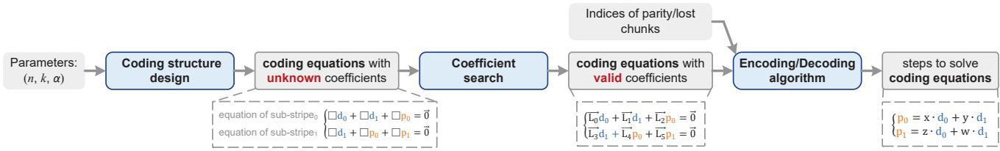  
Figure 1: Three steps to realize vector codes—from coding structure design to coefficient search and coding algorithm.

2. Prohibitive coefficient search. For (106,100,216) RS-ET codes, verifying one coefficient combination takes over 1,000 hours to check 1.7B failure cases. Moreover, many combinations must be tested before finding a valid one.

3. High computational overhead. Standard generator-matrixbased encoding achieves only 97 MB/s throughput for (106, 100, 216) vector codes on our testbed, versus several GB/s for (106, 100) scalar codes.

We propose WiseCode, the first practical and scalable wide-stripe vector-coding approach that achieves both low repair traffic and ultra-low storage overhead. WiseCode breaks the three scalability barriers via innovations in coding structure design, coefficient selection, and coding algorithms.

Template-unfold structure design. WiseCode takes a narrow MSR (Minimum Storage Regenerating [39]) stripe as a template and repeatedly instantiates it to form a wide-stripe structure while preserving the template’s α and m. This allows each lost chunk to be recovered by reading sub-chunks from only a subset of sub-stripes. WiseCode selects the widest MSR template under a device-dependent α limit (higher on SSDs than HDDs for the same chunk size) to simultaneously avoid excessive data fragmentation and minimize instantiations that inflate repair traffic. This design achieves near-optimal repair traffic and minimum storage overhead without incurring sub-packetization blowup.

Repetition-minimized coefficient search. WiseCode reduces redundant work in coefficient search using two complementary techniques. Divide-and-conquer verification partitions chunks into disjoint groups and verifies decodabil ity only for intra-group failure cases (i.e., all lost chunks lie within the same group), greatly reducing the verification scope while guaranteeing decodability for all failure cases. Neighborhood-prioritized retry generates a new candidate for retry by modifying only a small subset of coefficients in a rejected combination, preserving the decodability of most previously-verified failure cases. This significantly reduces per-candidate verification cost and accelerates retries, enabling n up to several hundred with 4 m 8 over GF(216), whereas existing vector codes typically limit n to a few tens.

Two-stage encoding. Motivated by the observation that the generator matrix is much denser (up to 21 ) than the sparse coefficients in the coding equations, WiseCode employs a two-stage encoding design. The data aggregation stage multiplies data by the sparse coefficient matrix to produce an intermediate vector; the parity solving stage then computes parity from the intermediate vector by solving the coding equations. WiseCode further optimizes both stages by extracting common operations during data aggregation and decomposing parity solving into computation-efficient steps using a divide-and-conquer strategy. This reduces multiplications from O(kmα2) to kmα + O(m3α), cutting up to 94.6% of multiplications and improving throughput by 5.5 –22.4 in our experiments.

We integrated WiseCode into Ceph [8] as an erasure-code plugin. Evaluations on Ceph with stripe widths near 100 and storage overheads of 1.04–1.06 show that WiseCode delivers a strictly better tradeoff between repair performance and storage overhead than Google’s UCLRCs [6], the state-ofthe-art wide codes. At equal storage overhead, WiseCode increases repair throughput by 1.41 –2.18 compared to UCLRC; even with 2% lower storage overhead, it reduces repair traffic by 14.4% and improves repair throughput by 6.8%. When combined with the RepairBoost [21] repair-scheduling framework, WiseCode also increases repair throughput by 1.56 –2.38 compared to UCLRC, demonstrating consistent advantages under advanced scheduling.

## 2 Background and Challenges

## 2.1 Background

In an (n,k) erasure code, user data are divided into k equalsized data chunks and encoded into m = n k parity chunks, forming an n-chunk stripe with storage overhead n/k. These n chunks are placed across independent failure domains (e.g., disks, hosts, racks) to tolerate multiple failures. A stripe with m parity chunks satisfies the MDS property [40] if any m lost chunks can be recovered. MDS codes have the minimum storage overhead for a given fault tolerance requirement.

Wide codes. Wide codes increase n while keeping m small (e.g., n  80 and m  8 [6]) to reduce storage overhead without sacrificing reliability. For example, expanding RS codes from (11,8) to (106,100) reduces storage overhead from 1.375 to 1.06, while increasing MTTDL (mean time to data loss, analyzed via a Markov model; see Appendix A.1) from 3.0 1011 to 5.4 1016 years. In large-scale storage clusters, degraded stripes are reported to be dominated by single-chunk failures (99.2% at Google [6], 98.08% at Facebook [22]). Moreover, modeling with a Binomial distribution [41, 42]— assuming an independent failure rate of 1/(4 years) and a repair rate of 1/(30 minutes) [17, 27, 28]—demonstrates that a stripe with n = 100 resides in a single-chunk failure state for over 99% of its total degraded duration. Therefore, existing wide-code designs (e.g., LRCs) primarily optimize singlechunk repair [6, 17].

Scalar and vector codes. Scalar codes treat each of the k data chunks as one variable and generate m coded variables, each corresponding to a parity chunk. Vector codes divide each chunk into α equal-sized sub-chunks and treat them as independent variables, increasing the number of variables in the encoding operation by a factor of α.

Limitations of wide-stripe scalar codes. Wide-stripe scalar codes (e.g., LRCs) reduce repair traffic by adding local parities on top of global parities, but this increases storage overhead. Consequently, they cannot achieve efficient repair and ultra-low storage overhead simultaneously.

## 2.2 Scalability Barriers of Vector Codes

In wide-stripe deployments, vector codes face three scalability barriers.

Sub-packetization blowup for minimal repair traffic. Minimizing repair traffic in vector codes comes at the cost of rapidly increasing α. MSR codes achieve optimal repair traffic [39] with α m m  [43], causing severe and often impractical data fragmentation in wide stripes. For example, (104,100,α) Clay codes [34] require α = 426. In practice, storage systems must cap α to limit I/O overhead from data fragmentation, which inevitably increases repair traffic. For example, when α = 64, which corresponds to 64 MB chunks and 1 MB sub-chunks, RS-ET [36] and Hashtag+ [37] codes incur over 50% more repair traffic than the optimal bound. It is therefore challenging to design a coding structure that reduces repair traffic without incurring sub-packetization blowup.

Prohibitive search cost for valid coefficients. Two factors make coefficient search intractable: (1) Expensive percandidate verification. A valid coefficient combination must ensure that every mα mα coefficient matrix corresponding to any m-chunk failure case is invertible. In a (106, 100, 216) RS-ET stripe, this requires checking 1.7 billion 1296 1296 matrices, each taking 2.4 ms on our testbed, totaling 1,130 hours. (2) Frequent rejects. Any failed invertibility check discards a candidate, and wide stripes have many indepen dent failure cases, causing extremely high reject rates. With coefficients randomly selected from GF(216), (76,72,α) or wider RS-ET stripes fail to find any valid combination within

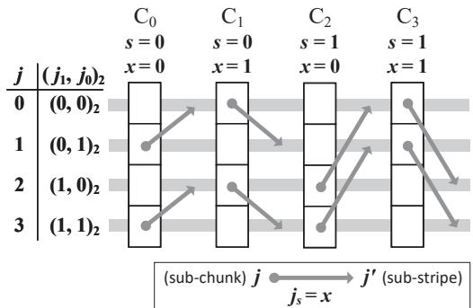  
Figure 2: Coding structure of a (4,2) MSR code with α = 4. Columns correspond to chunks, each containing 4 sub-chunks. Rows correspond to sub-stripes, each annotated by index j. Rows depict Rule #1 and arrows depict Rule #2.

10 million trials in our experiments. The candidate space grows exponentially with the number of coefficients, making exhaustive enumeration infeasible.

Excessive encoding cost using the standard method. Standard encoding, multiplying data by a generator matrix, works well for scalar codes [44,45] but is too costly for vector codes. In the (106, 100, 216) vector code (§5.1), each column of the generator matrix has up to 126 nonzero entries (vs. 6 in a (106, 100) scalar code), dramatically increasing the number of multiplications and lowering encoding throughput to 97 MB/s on our testbed (vs. several GB/s for the scalar code). This motivates developing encoding algorithms that restore computational efficiency.

## 2.3 MSR Coding Structure and Repair

We introduce the state-of-the-art MSR codes with the lowest sub-packetization levels α = m nm  [34, 43, 46], which form the basis of WiseCode.

Coding structure. Each chunk (data or parity, determined by storage systems) is divided into α sub-chunks, and the stripe is organized into α sub-stripes. The sub-chunk to substripe assignment follows two coding rules:

Rule #1. Sub-Chunkj of each chunk belongs to Sub-Stripej (0 ≤ j < α).

Rule #2. Sub-Chunk j of Chunki also belongs to Sub-Stripej	 when j	 = j. To compute j	, express j in the base-m representation as j = (. . . , j2, j1, j0)m. Let s =  i , and x = i mod m. Then replace js with x to obtain j	 = (. . . , js+1, x, js 1, . . . )m.

In Figure 2 for a (4,2) MSR code, rows depict Rule #1 and arrows depict Rule #2. Take Sub-Chunk1 of Chunk0 as an example. Rule #1 assigns this sub-chunk to Sub-Stripe1. Rule #2 sets i = 0, j = (0, 1)2, s = 0, and x = 0. This gives j	 = ( j1, x)2 = (0, 0)2 = j, so the sub-chunk also belongs to Sub-Stripe0.

Coding equations and coefficients. Each sub-stripe defines a linear relation among its sub-chunks, expressed as a coding equation: L-0c0 + L-1c1 + =-0, where ci represents a sub-chunk, and -Li is an m-element coefficient vector over a finite field (e.g., GF(28) [34]).

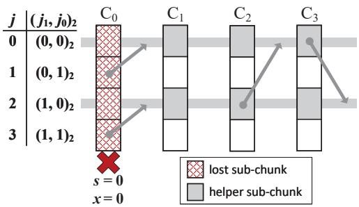  
Figure 3: Repair pattern of Chunk0 in a (4,2) MSR code. Only Sub-Stripe0 and Sub-Stripe2 are decoded during repair.

Single-failure repair pattern. Each sub-stripe can recover up to m lost sub-chunks. A lost chunk i is recovered by decoding α/m sub-stripes whose indices j satisfy js = x, where s and x are defined in Rule #2. Each such sub-stripe contains m lost sub-chunks. Each of the n 1 healthy chunks contributes one helper sub-chunk to each selected sub-stripe, incurring the total repair traffic (normalized by α) of (n 1) α 1 = n 1 m α m which is optimal [39].

Figure 3 shows the repair pattern for Chunk0 in the (4, 2) MSR code. With s = 0, and x = 0, Sub-Stripe0 and Sub-Stripe2 are the two sub-stripes whose indices satisfy js = x. Sub-Stripe0 recovers Sub-Chunk0 and Sub-Chunk1 of Chunk0, while Sub-Stripe2 recovers the remaining two lost sub-chunks. In total, 6 healthy sub-chunks across these two sub-stripes are accessed as helper sub-chunks.

## 3 Template-Unfold Structure Design

This section presents the template-unfold structure design (§3.1), explains how it achieves near-optimal repair traffic for single-chunk failures (§3.2), shows how it reduces multichunk repair traffic (§3.3), and presents the dedicated chunk placement strategy (§3.4).

## 3.1 Code Construction via Template Unfolding

An (n, k, α) WiseCode constructs the coding structure in two steps: (1) It first selects a (nmsr, kmsr) MSR code (nmsr < n) as a template, which has the same parity count m and subpacketization level α with the target coding structure; (2) It then unfolds the template by repeatedly instantiating it into multiple instances and concatenating sub-stripes with the same index across instances to scale the stripe width, while preserving m and α of the template.

Figure 4 illustrates the coding structure of an (8, 6, 4) WiseCode where m = 2 and α = 4, using a (4,2) MSR code as the template. The template is instantiated twice, once for

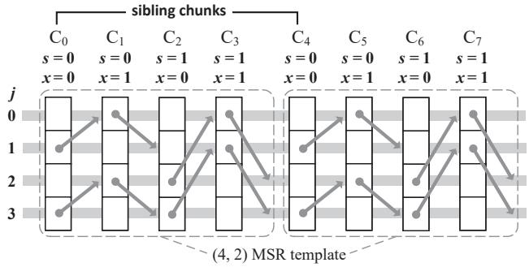  
Figure 4: Constructing an (8,6,4) WiseCode stripe using a (4, 2) MSR code as the template.

Chunk and once for Chunk , with identical sub-chunk to sub-stripe assignments. We refer to chunks from different instances that occupy the same position in the template as sibling chunks (e.g., Chunk0 and Chunk4). Each chunks inherits the parameters s and x specified by Rule #2 (§2.3) from the template, and sibling chunks share identical s and x.

To generate the n chunks, the (n ,k ) template is instantiated n times—so each chunk has nmsr nmsr n 1 sibling chunks—producing a total of n nmsr chunks. WiseCode nmsr supports flexible n by retaining only the first n chunks and treating any remaining chunks as logical zero chunks, which are omitted from physical storage.

While n and k can take arbitrary integer values, α is discrete because the underlying (nmsr, kmsr) MSR code only supports an upper bound on α by dividing the chunk size (e.g., 64 MB 1 GB [9, 11]) by an appropriate sub-chunk size (e.g., 1 4 MB on HDDs and 128 KB on SSDs [47]). WiseCode then selects the MSR template with the largest nmsr among those whose α remains within the bound, and sets kmsr = nmsr m. This design mitigates the I/O overhead from data fragmentation and minimizes instantiations that inflate repair traffic (§3.2).

At this stage, (n,k,α) WiseCode has specified the subchunks in each of the α sub-stripes. Each sub-stripe defines a coding equation, where sub-chunks in this sub-stripe appear as variables and the coefficients are specified in Section 4.

## 3.2 Single-Chunk Failure Repair

An (n,k,α) WiseCode repairs a lost chunk by decoding α/m sub-stripes, each recovering m lost sub-chunks. Their indices j satisfy js = x, where s and x are the parameters of the lost chunk, inherited from the template (§3.1).

Figure 5 illustrates the repair pattern of Chunk0 in the (8, 6, 4) WiseCode. Both Sub-Stripe0 and Sub-Stripe2 contain two lost sub-chunks, and decoding them suffices to reconstruct all lost sub-chunks. Each healthy chunk, except Chunk4, contributes only two helper sub-chunks, while Chunk must contribute all 4 sub-chunks as helper sub-chunks. This is because Chunk4 is a sibling chunk of Chunk0, which means substripes used to recover Chunk0 also span the entire Chunk4.

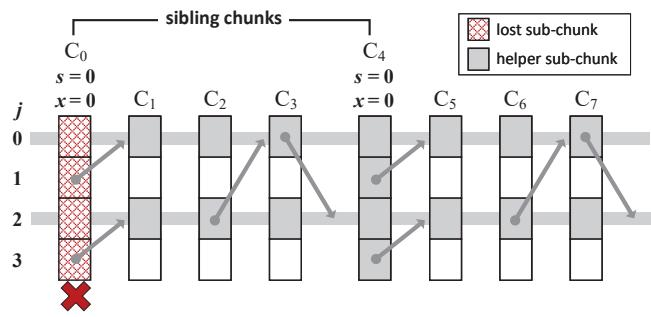  
Figure 5: Repair pattern of Chunk0 in the (8, 6, 4) WiseCode. Only Sub-Stripe0 and Sub-Stripe2 are decoded during repair.

Generally, the repair pattern of Chunki in (n,k,α) WiseCode consists of two parts (proof in Appendix A.4):

❶ Non-sibling part: each healthy chunk that is not a sibling chunk of Chunk contributes 1 helper sub-chunk per substripe, totally α/m helper sub-chunks whose indices i satisfy is = x, where s and x are the parameters of Chunki.

❷ Sibling part: each healthy chunk that is a sibling chunk of Chunki contributes m helper sub-chunks per sub-stripe. In total, all α sub-chunks serve as helper sub-chunks. □

Traffic analysis. Assuming Chunki has z sibling chunks, the repair traffic (normalized by α) is calculated as:

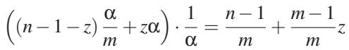

where the first term n 1 m matches the optimal repair traffic [39],   
while the second term m−1 z reflects the overhead introduced m   
by template unfolding.

Since each chunk has z = n 1 sibling chunks (§3.1), nmsr increasing n decreases z and thus reduces repair traffic. nmsr However, a larger nmsr also increases α = m m , exacerbating data fragmentation. To balance this trade-off, WiseCode maximizes nmsr under a given upper bound of α (§3.1), thereby achieving near-optimal repair traffic while mitigating data fragmentation.

Figure 6 illustrates the trade-off between sub-packetization level (α) and repair traffic in (104,100,α) WiseCode under varied α. With a 64 MB chunk size and 1 MB sub-chunk size, (104, 100, 64) WiseCode incurs only 22.3% higher repair traffic than the optimal, while with a 512 MB chunk size and 128 KB sub-chunk size, (104,100,46) WiseCode incurs only 9.9% higher repair traffic.

Compared with two representative vector codes, Hash-Tag+ [37] and RS-ET [36] codes, WiseCode converges to the optimal repair traffic more rapidly as α increases, achieving 19.3-25.3% lower repair traffic when 42 α 47 (noting that HashTag+ codes do not support α = m or α = m2). This advantage stems from coding design differences: HashTag+ requires decoding more sub-stripes, while RS-ET accesses more helper sub-chunks per sub-stripe, both of which increase repair traffic.

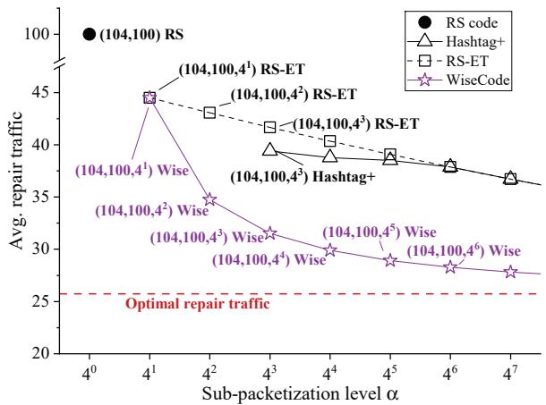  
Figure 6: Trade-off between α and repair traffic for (104,100,α) WiseCode, HashTag+, and RS-ET codes.

## 3.3 Multi-Chunk Failure Repair

Although multiple-chunk failures are rare, there is a growing concern that their likelihood increases in wide stripes in a certain degree [6]. When multiple-chunk failure occurs, WiseCode selects the minimum subset of sub-stripes to recover all lost sub-chunks. It uses a greedy strategy, iteratively selecting sub-stripes that maximize recovery capability—the number of lost sub-chunks they can recover—until all lost sub-chunks are recoverable.

In each iteration, WiseCode first calculates the recovery capability of the currently selected sub-stripes using a flow model. In this model, each sub-stripe sends up to m flows to the its lost sub-chunks, and any lost sub-chunks that receives at least one flow is considered recoverable. Thus, computing the recovery capability reduces to a max-flow problem. After obtaining the current recovery capability, WiseCode enumerate unselected sub-stripes and adds the sub-stripe that yields the largest increase in recovery capability.

In this way, only a subset of sub-stripes are selected for recovery, thereby significantly reducing the number of helper sub-chunks. For example, in the case of double-chunk failures, (104,100,64) WiseCode incurs an average repair traffic of 66.68, compared to 100 in (104,100) RS codes.

## 3.4 Fault-Tolerance and Placement Strategy

WiseCode designs its chunk placement policy in two steps: first, it enforces a hard durability constraint to guarantee data persistence against correlated failures; subject to this constraint, it then optimizes chunk co-location to minimize crossrack network traffic.

Uniform fault-tolerance guarantee. Unlike LRCs— where local parities provide less protection than global ones and certain failure patterns involving no more than m chunks remain unrecoverable—WiseCode is designed to achieve the maximum fault-tolerance level, i.e., the MDS property. This property ensures WiseCode can recover from the loss of any m chunks (see §4), thereby provides a uniform faulttolerance guarantee. This uniformity significantly simplifies chunk placement against correlated failures. For instance, to protect against rack-level correlated failures, a placement policy only needs to ensure that no more than m chunks of the same stripe are placed within a single rack, regardless of their specific chunk indices.

Rack-aware placement. Subject to the constraint that no more than m chunks reside within a single rack, WiseCode leverages its template-unfold design to minimize cross-rack traffic in hierarchical network topologies, where cross-rack bandwidth is typically much more constrained than intra-rack bandwidth [48]. Specifically, when repairing a lost chunk, sibling chunks contribute their entire data, while non-sibling chunks contribute only partial data. WiseCode exploits this asymmetry by grouping sibling chunks within the same rack whenever possible, thereby maximizing intra-rack data exchange and minimizing cross-rack transfers. For example, compared to random placement, rack-aware placement can save 18.9% cross-rack repair traffic for (106,100,216) WiseCode.

## 4 Repetition-Minimized Coefficient Search

This section presents the repetition-minimized coefficient search, which combines two techniques: divide-and-conquer verification to reduce per-candidate verification cost (§4.1), and neighborhood-prioritized retry to minimize both the overhead of each retry and the number of retries (§4.2).

## 4.1 Divide-and-Conquer Verification

Given a candidate coefficient combination, WiseCode verifies the decodability of all failure cases in a divide-and-conquer manner. It first partitions chunks into disjoint groups and classifies all failure cases into two categories: intra-group failure cases where missing chunks lie within the same group, and inter-group failure cases where missing chunks span multiple groups. It then verifies decodability only for the intra-group ones, while safely skipping verification for the inter-group ones. This strategy is enabled by the coefficient design and the chunk-partitioning rule, as detailed below.

Coefficient design. In an (n,k,α) WiseCode, coefficients are generated from mn distinct parameters, denoted λ0 to λmn 1. Each Chunki is associated with m parameters, specifically λim to λ(i+1)m 1. For Sub-Chunk j of Chunki, WiseCode selects the parameter λ = λim+j , where s and js are defined in Rule #2 (§2.3). The coefficient vector is then constructed as-λ = [λ0, λ1, , λm−1]T and applied to all variables corresponding to this sub-chunk in the coding equations.

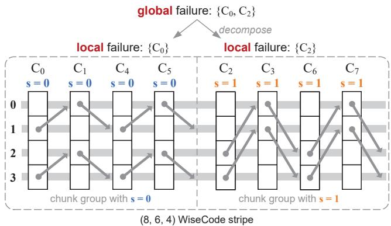  
Figure 7: The chunk-partitioning rule groups chunks by s, decomposing a global failure into multiple local failures.

Chunk-partitioning rule. WiseCode partitions chunks by their parameters s, forming groups where all chunks share the same s value. Since s = i/m for 0  i < nmsr (§2.3) takes nmsr/m distinct values, the chunks are thus partitioned into g = nmsr/m groups. As shown in Figure 7, in an (8, 6, 4) WiseCode where nmsr = 4 and m = 2, chunks are partitioned into g = 2 groups corresponding to s = 0 and s = 1.

Below, we explain the correctness of divide-and-conquer verification. An inter-group failure case, referred to as a global failure case, can be decomposed into multiple local failure cases, each confined to a single group. As shown in Figure 7, in an (8, 6, 4) WiseCode stripe, a global failure case {Chunk , Chunk } is decomposed into two local failure cases, {Chunk } and {Chunk }. We prove that global failure cases can be safely omitted from verification through Theorem 4.1 and Theorem 4.2.

Theorem 4.1. A global failure case is decodable if and only if all corresponding local failure cases are decodable.

Proof sketch. The proof follows a similar approach to prior theoretical work on MSR codes [49]. The key idea is to decompose the coefficient matrix of a global failure case into multiple sub-matrices, each corresponding to a local failure case, such that the overall matrix is invertible if and only if all sub-matrices are invertible (Appendix A.6). □

Theorem 4.2. Every local failure is a subset of some m-chunk intra-group failure. If this m-chunk failure case is decodable, the local failure case is also decodable.

Proof. Every local failure involves fewer than m lost chunks, and by adding chunk(s) from the same group we obtain the corresponding m-chunk intra-group failure. If that m-chunk failure is decodable, then any subset of its lost chunks— including the current local failure—is also decodable. □

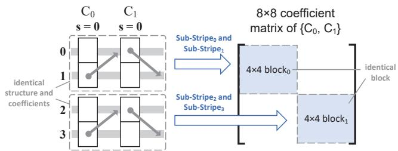  
Figure 8: Coefficient matrices for chunks within a group exhibit a matrix-block-repetition pattern.

Consequently, WiseCode only needs to verify all m-chunk   
intra-group failure cases, totaling g  n/g cases—a small m   
fraction of all nm possible failure cases. For example, in   
a (106,100,216) WiseCode where g = 3, only 5.2 million   
failure cases ( 0.3% of all failure cases) require verification.

Matrix size reduction. WiseCode also reduces the size of matrices to be verified according to a useful structural property under chunk partitioning: the coefficient matrix associated with chunks within a single group exhibits a matrixblock-repetition pattern. Specifically, it contains α/m identical diagonal matrix blocks, each corresponding to a set of m sub-stripes, with all sub-stripe sets sharing identical coding structures and coefficient assignments (Appendix A.5). As shown in Figure 8, the coefficient matrix of {Chunk0, Chunk1} in the s = 0 group consists of two identical matrix blocks, one for Sub-Stripe0 and Sub-Stripe1, and another for the remaining sub-stripes. Therefore, WiseCode verifies invertibility by checking only a single matrix block rather than the entire matrix, reducing the computation cost to m/α of the original.

Overall, WiseCode significantly accelerates verification by reducing both the number of failure cases and the size of matrices to be verified. For example, in a (106,100,216) stripe, WiseCode requires verifying only 5.2 million matrices of size 36 36, which can be completed within 3 minutes, achieving a speed-up of over 20,000 compared to 1130 hours required by RS-ET code.

## 4.2 Neighborhood-Prioritized Retry

If a candidate coefficient combination fails verification, the search continues exploring new candidates until a valid one is found. To reduce retry overhead and accelerate convergence to valid solutions, WiseCode employs a neighborhoodprioritized retry strategy. Instead of resampling all coefficients, it updates only a small subset of coefficients while retaining the verified ones, generating a neighborhood of the rejected candidate. This localized adjustment preserves the decodability of most previously-verified failure cases, thereby avoiding redundant verification work.

To track which coefficients are retained, WiseCode treats each chunk’s coefficients as a chunk-level entry, managed through a verified set and an unverified queue. A chunk is considered (un)verified if its coefficients are (un)verified. The unverified queue, initially containing all entries ordered by chunk index, is manipulated through advance and rollback operations described later. In each step, WiseCode updates only the coefficients of the entry at the front of the unverified queue, marking its corresponding chunk as the current one.

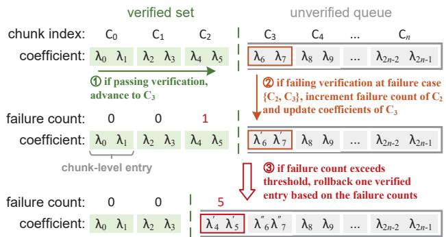  
Figure 9: Three actions in each neighborhood-prioritized retry step: (1) advance, (2) update, and (3) rollback.

To determine which failure cases require verification, WiseCode groups chunks using the chunk-partitioning rule (§4.1) and identifies the group containing the current chunk. It then verifies only failure cases that involve the current chunk and any m − 1 verified chunks within the same group. Failure cases involving only m verified chunks require no repeated verification since their coefficients remain unchanged. WiseCode also maintains a failure count for each verified entry, reflecting its contribution to failed verifications and guiding rollback decisions.

As shown in Figure 9, each search step operates on entries parameterized by λ (§4.1) and performs one of three actions:

1. Advance. If all required failure cases pass verification, WiseCode moves the current entry to the verified set and proceeds to the next unverified entry (or terminates if none remain);

2. Update. If verification fails, WiseCode increments the failure counts of involved verified entries and randomly re-samples the λ values of the current entry for retry;

3. Rollback. If any failure count exceeds a threshold, WiseCode randomly selects a verified entry (weighted by its failure count), updates its coefficients, moves it to the front of the unverified queue, and resets all failure counts.

Search overhead. WiseCode reduces both per-candidate verification cost and retry count, since failure cases composed entirely of verified chunks require no verification and never trigger retry. We conduct repeated experiments to compare the search overhead of the neighborhood-prioritized strategy with a naive baseline, exhaustive enumeration, which re-samples λ values for all entries and retry the verification of all failure cases whenever a candidate is rejected.

Table 1: Comparison of exhaustive enumeration (Baseline) and neighborhood-prioritized retry (Ours) in pre-candidate verification time, retry count, and total search time.  
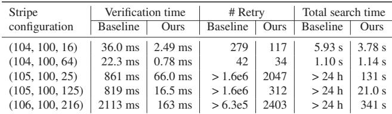

Table 2: Maximum stripe width achievable from coefficient search over GF(216), for given m and α.  
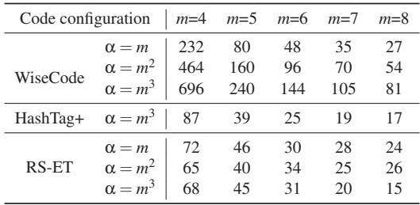

Both strategies use 20 threads that verify different candidates in parallel. The neighborhood-prioritized retry synchronizes the candidate across threads whenever any thread advances or the failure count (aggregated across threads) of any verified entry exceeds the rollback threshold, which is set to 1000. All coefficients and λ parameters are defined over the finite field GF(216)1. We measure the per-candidate verification time, retry count, and the total search time, averaged over 10 independent runs (Table 1). For (104,100,16) and (104,100,64) stripes, our method accelerates per-candidate verification by up to 28.6 and reduces retry count by up to 58%, while the total search time remains comparable due to additional synchronization overhead. For stripes with larger m—(105,100,25), (105,100,125), and (106,100,216)—our method finishes the search within 6 minutes, whereas the baseline fails to find valid solutions within 24 hours due to excessive retries.

Scalability in stripe width. We evaluate WiseCode’s scalability by targeting a large stripe width of 1000 and measuring the maximum number of verified chunks—denoted as n∗— achieved with 20 threads within a 24-hour search period. At this point, the first n∗ chunks have been verified, enabling any stripe of width n	 (n	  n∗) to be constructed by the first n chunks. For comparison, HashTag+ and RS-ET codes adopts a similar neighborhood-prioritized retry strategy, but without divide-and-conquer verification.

As shown in Table 2, WiseCode enables stripe widths up to several hundred with 4 m 8. The achievable stripe width increases with α, because a higher α enlarges both nmsr and the group count g = nmsr/m , reducing intra-group failures and thereby accelerating the search. In contrast, HashTag+ and RS-ET are restricted to stripe widths of only a few tens, since the absence of divide-and-conquer verification forces them to check too many failure cases, significantly impeding the search process.

Existence of valid coefficients. Prior studies [35, 36] address the finite field size required to guarantee the existence of valid coefficients. For example, to ensure a valid coefficient assignment, a (70,66,4) RS-ET code requires a field size ≥ 2(n−1 − n/α−1 shown in Table 2, (70, 66, 4) RS-ET code is successfully supported by GF(216) with a field size of 65536, suggesting that existing theoretical bounds are overly conservative. While determining the maximum stripe width supported by a given finite field remains an open problem, the results in Table 2 strongly suggest that the theoretical ceiling for WiseCode’s scalability is substantially higher; we provide further empirical analysis in the Appendix A.2 to validate this inference.

## 5 Two-Stage Encoding Framework

This section presents the two-stage encoding framework that requires much fewer multiplications than standard generator matrix encoding (§5.1) and explains how it extracts common operations during data aggregation (§5.2) and decomposes parity solving into computation-efficient steps, followed by extending these optimizations to the decoding process (§5.3).

## 5.1 Design Overview

Once the parity chunks are designated, the coding equations can be expressed in matrix form as C D + C P =-0, where D and P denote the kα data sub-chunks and mα parity sub-chunks, and CD and CP are the corresponding mα kα and mα  mα coefficient matrices, with CP guaranteed invertible (§4). The standard encoding approach [45, 50] constructs the generator matrix G = CP−1 CD and computes P = G D.

However, the standard encoding approach is costly for WiseCode. In a (106,100,216) WiseCode stripe, encoding with G requires 17–126 multiplications per data sub-chunk (depending on which chunks are designated as parity), while each coefficient vector in the coding equations contains only m = 6 elements. We make the following observation.

Observation 5.1. The number of multiplications incurred by the nonzero entries in G far exceeds the number of coefficients in the coding equations.

Motivated by this observation, WiseCode reduces multiplications—the dominant cost relative to additions—by multiplying each data sub-chunk only by its own coefficient vector and introducing a two-stage encoding framework:

(b) Parity solving.  
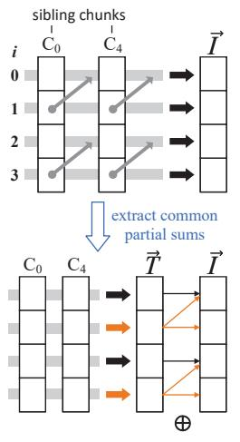

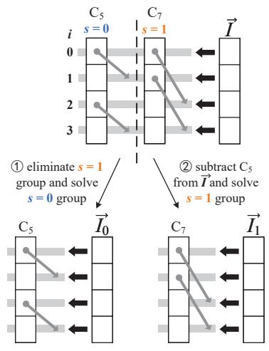  
(a) Data aggregation.  
Figure 10: Encoding scheduling: (a) extracting common data sums to eliminate redundant aggregation operations; (b) solving parity chunks using a divide-and-conquer strategy.

1. Data aggregation. Within each sub-stripe, data subchunks are multiplied by their m-element coefficient vectors and summed position-wise, producing an m-element aggregated-result vector. Concatenating the aggregatedresult vectors from all α sub-stripes yields an mα-element intermediate vector -I that satisfies -I = C D.

2. Parity solving. After replacing CD D by -I, the parity sub-chunks P are then solved from the resulting coding equations C P = -I.

This framework enables WiseCode to extract common operations across sub-stripes during data aggregation and follow a divide-and-conquer manner to process parity solving.

## 5.2 Extraction of Common Data Operations

During data aggregation, when a data sub-chunk contributes to multiple sub-stripes, it is multiplied by the same coefficient vector across those sub-stripes, as dictated by the coefficient selection (§4.1), yielding identical multiplication-result vectors. Moreover, sibling chunks follow the same coding structure, so sub-chunks with the same index across sibling chunks map to the same set of sub-stripes. Leveraging these properties, WiseCode extracts common partial sums from the multiplication-result vectors of sibling chunks, enabling their reuse across sub-stripes.

We illustrate the process of data aggregation using an (8,6,4) WiseCode stripe (Figure 10a), where Chunk0 and Chunk4 are data chunks and form a pair of sibling chunks. Sub-chunks in each row are multiplied by their respective m-element coefficient vectors and summed to obtain an melement common partial sum -T for this row. The resulting -T is then accumulated into the corresponding positions of -I according to the sub-chunk to sub-stripe mapping. To minimize memory traffic, each element of -T is added to -I immediately after it is computed, avoiding temporary storage of -T in memory. The remaining chunks are processed together with their sibling chunks (if any) in the same manner to complete the computation of-I.

Cost analysis. By extracting common partial sums, each of the kα data sub-chunks is multiplied by its m-element coefficient vector only once, leading to a total of kmα multiplications. From the coding rules (§2.3), we observe that a fraction (m  1)/m of all sub-chunks participate in two sub-stripes instead of one. Consequently, this method reduces the number of multiplications during data aggregation by (m 1)/(2m 1).

## 5.3 Divide-and-Conquer Parity Solving

During parity solving, directly computing P = C−1 -I is prohibitively expensive because C−1 can be up to 10× denser than C . Instead, WiseCode uses a divide-and-conquer strategy that operates on sub-matrices with sparse inverses. Parity chunks are partitioned into groups using the same chunk-partitioning rule as §4.1, which correspondingly partitions C into sub-matrices. As discussed in Section 4.1, each sub-matrix exhibits a matrix-block-repetition structure with nonzero entries confined to the matrix blocks, and its inverse preserves this sparsity2. WiseCode therefore performs matrix elimination and inversion at the sub-matrix granularity, using each sparse inverse to independently and efficiently solve the corresponding parity group.

Figure 10b illustrates this process for an (8, 6, 4) WiseCode stripe. Chunk5 and Chunk7 are parity chunks and belong to groups with s = 0 and s = 1, respectively. To solve the s = 0 group, WiseCode first eliminates the s = 1 group via linear transformations (Appendix A.6), leaving only the s = 0 submatrix and a transformed vector -I (from -I). It then inverts this sub-matrix and multiplies it with -I0 to obtain the s = 0 group {Chunk5}. After subtracting the contribution of Chunk5 from-I to produce-I1, only the s = 1 group remains unknowns. WiseCode applies the same procedure to solve the s = 1 group {Chunk7}.

In general, when parity chunks span multiple groups, WiseCode recursively eliminates groups until one remains, solves that group, and continues solving the remaining groups sequentially as the recursion unwinds.

Cost analysis. The divide-and-conquer parity solving incurs O(m3α) multiplications (Appendix A.7), compared to O(m2α2) for directly computing P = C−1 -I. Overall, the two-stage encoding process performs kmα + O(m3α) multiplications, whereas the standard approach that directly computes P = G × D requires O(kmα2). WiseCode processes sub-chunks at a default 4 KB granularity (e.g., an 8 KB subchunk is processed as two 4 KB units), and therefore requires an additional mα 4KB of memory (within 5 MB in our experiments) to store the mα-element intermediate vector -I and other temporary results.

Extending to Decoding. During decoding, healthy chunks are treated as data chunks and aggregated using the same data-aggregation stage. Lost chunks are then partitioned into groups and recovered using the same divide-and-conquer parity-solving strategy.

## 6 Implementation

To demonstrate WiseCode’s portability, we integrate it into Ceph [8, 51], a widely used open-source distributed storage system (§6.1). Because Ceph’s native workflow is not adaptable to advanced repair scheduling, we also combine WiseCode with several representative scheduling methods to illustrate its compatibility with prior techniques (§6.2).

## 6.1 Ceph Erasure-Code Plugin

Although WiseCode introduces several coding-level designs, deploying it in an existing storage system requires only two essential operations: (1) identifying helper sub-chunks during repair, and (2) performing encoding or decoding using its dedicated algorithms. The coefficients obtained (§4) are stored in the system configuration, avoiding any runtime search.

To simplify integration with existing storage systems, we package WiseCode as an erasure-code plugin with two core functions: one identifies the required helper sub-chunks for given lost chunks, and the other performs encoding or decoding over available chunks. The finite field arithmetic for encoding and decoding is implemented with AVX-512 instructions [52], following GF-Complete [50]. We integrate this plugin into Ceph v17.2.5 with only 400 lines of C++ glue code, enabling Ceph’s OSDs (Object Storage Daemons) to invoke the wrapped functions.

## 6.2 Integration with Repair Scheduling

Degraded read. We accelerate degraded reads using partialparallel repair [19] and repair pipelining [20], two intra-stripe scheduling methods that select relay nodes to perform partial repairs3 in parallel. With WiseCode, a node storing a non-sibling chunk of the lost chunk cannot serve as a relay because it would need to transmit a full-chunk partial result rather than a subset of sub-chunks (§3.2), increasing repair traffic. We therefore restrict relay selection to nodes storing sibling chunks, while keeping each method’s original scheduling logic between the relays and the target node unchanged. Non-relay nodes simply distribute their helper data evenly across the relays and the target node.

Full-node repair. We accelerate full-node repair using RepairBoost [21], an inter-stripe scheduling method that reorders transmissions across stripes to improve network utilization and runs atop any intra-stripe scheduling method— partial-parallel repair, repair pipelining, or conventional repair (without relays). With WiseCode, RepairBoost only needs to account for the lower traffic contribution of non-sibling chunks than sibling chunks of the lost chunk, estimating network utilization using weighted rather than uniform traffic.

All methods are implemented in a 6.9K-line C++ prototype comprising a coordinator that issues repair tasks and multiple agents that execute repair operations, with gRPC [53] for inter-node communication.

## 7 Evaluation

## 7.1 Methodology

We evaluate WiseCode against UCLRC (Uniform Cauchy LRC [6]), the state-of-the-art wide codes. We first use Ceph as the development platform, implementing both codes as erasure-code plugins for fairness, and examine offline and online repairs triggered by manually disabling one storage node. We measure repair throughput (repaired-data size divided by repair time), foreground I/O latency during online repair, and normal-write and degraded-read latencies without background repair. We then evaluate both codes with representative repair-scheduling techniques: RepairBoost [21] for full-node repair, and three strategies for single-chunk degraded reads—conventional repair (CR), partial-parallel repair (PPR) [19], and repair pipelining (RP) [20].

Code configurations. We configure UCLRC with (n,k,r, p), where r and p denote the numbers of global and local parities, to control storage overhead, repair traffic, and reliability (measured via MTTDL; see Appendix A.1). Both WiseCode and UCLRC use k = 100, with remaining parameters varied to explore design trade-offs. Table 3 summarizes all configurations. UCr+p denotes a (100 + r + p, 100, r, p) UCLRC, and WC denotes a (100 + m,100,mb) WiseCode.

Testbed. Experiments run on a cluster of 161 ecs.hfg6.large instances [54] on Alibaba Cloud. Each instance has 2 vCPUs and 8 GB RAM. Among them, 120 serve as storage nodes, each with a 100 GB elastic SSD ( 170 MB/s bandwidth), one is the monitor, and 40 act as clients. All instances connect via a 1 Gbps network.

System and workload settings. On Ceph, we use 512 placement groups [55] for balanced chunk distribution. Storage is prefilled using YCSB [56] with 4000 records (1.46 TB). During online repair, each client issues YCSB requests with read:write ratios of 50:50 (YCSB-a), 100:0 (YCSB-c), and 0:100 (YCSB-w), as summarized in Table 4. We emulate light and heavy loads using 10 and 40 clients. For evaluations with repair scheduling, 1000 stripes are randomly placed across the cluster before repair. RP is configured with a 32 KB slice size following prior work [20].

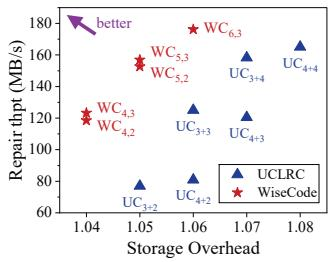  
(a) Offline repair throughput.

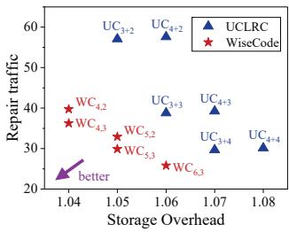  
(b) Measured repair traffic.  
Figure 11: Repair throughput and measured repair traffic during offline repair on Ceph.

Chunk-size settings are listed in Table 5. In Ceph experiments, UCLRC uses a 4 MB chunk size; we avoid larger chunks (e.g., 8 MB) because Ceph performs client I/O at full-stripe granularity, which becomes very large under wide stripes and can trigger Out-Of-Memory failures on Ceph’s OSDs in our testbed, particularly when multiple requests target the same OSD concurrently. For repair-scheduling experiments, UCLRC follows prior work [20, 21] and uses 64 MB chunks. WiseCode derives its chunk size from the corresponding UCLRC configuration, rounding up to the nearest multiple of α  4 KB to satisfy 4 KB sub-chunk alignment, and this adjustment does not bring any unfair performance advantage.

## 7.2 Overall Performance with Ceph

Offline repair. Figures 11a and 11b show offline repair throughput and repair traffic (total network traffic divided by size of repaired chunks) versus storage overhead, averaged over 5 independent runs. The results show that WiseCode achieves a strictly better throughput-overhead tradeoff than UCLRC. With storage overhead 1.06, WC6,3 achieves 2.18× and 1.41× the repair throughput of UC4+2 and UC3+3, respectively. With storage overhead 1.05, WC5,3 outperforms UC3+2 by 2.04 in the repair throughput. These throughput gains stem from WiseCode’s reduced repair traffic, which enables faster recovery under the same network bandwidth.

Multi-dimensional Pareto Improvement. Figure 12 illustrates the joint improvements in storage overhead, reliability, and repair throughput. Unlike MTTDL analysis in Table 3, which assumes full network bandwidth utilization during repair, the repair rate used in the reliability model for this figure is derived from the observed repair throughput and node capacity in our testbed. Results show that, with a consistent overhead of 1.05, WC5,2 offers two orders of magnitude higher MTTDL and 1.98 higher repair throughput compared to UC3+2. WC6,3 outperforms UC4+4 by offering 2% lower overhead, 1.81 higher MTTDL, 14.4% lower re pair traffic, and 6.8% higher repair throughput against UC4+4. We further conduct an iso-MTTDL comparison by interpolating UCLRC results along log-linear curve (mapping log MTTDL to linear throughput) within the same overhead configurations. Our analysis shows that with the same MTTDL, WC5,2 offers 1.53 higher repair throughput with 1% lower overhead, or 1.11 higher repair throughput with 2% lower overhead compared to UCLRC.

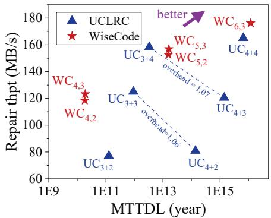  
Figure 12: Joint comparison of storage overhead, MTTDL and repair throughput between WiseCode and UCLRC.

Online repair. Figure 13 plots average foreground I/O latency versus background repair throughput. At equal storage overhead, WiseCode improves both metrics: WC6,3 delivers 36%–102% higher repair throughput and 11%–27% lower I/O latency than UC4+2. Even against UC4+4, which has 2% higher storage overhead than WC6,3, WC6,3 attains 27.7%– 45.6% higher repair throughput with comparable I/O latency (within 5%), except under YCSB-c with 40 clients, where it yields 38% higher throughput with 10% higher latency.

Normal-write and degraded-read latencies. Figure 14 shows normal-write (YCSB-w) and degraded-read (YCSBc) latencies, each averaged over a 3-minute run. All codes exhibit similar performance (within 5%), indicating that WiseCode introduces negligible read/write overhead, except a 6% latency increase for WC5,3 (YCSB-c, 40 clients) and 7% for WC6,3 (YCSB-c, 10 clients). These deviations stem from WiseCode’s chunk-size rounding (Table 5), which causes Ceph to pad zeros and inflate I/O. In practice, this effect can be eliminated via precise chunking techniques [9, 27].

## 7.3 Performance with Repair Scheduling

Full-node repair. Figure 15 shows full-node repair throughput versus storage overhead, averaged over 5 independent runs. We present results using CR as the intra-stripe scheduling strategy for RepairBoost, as it consistently outperforms PPR and RP for both WiseCode and UCLRC in our experiments. The results show that WiseCode achieves a strictly better throughput-storage tradeoff than UCLRC, exhibiting the same performance advantages observed in the Ceph experiments. For example, with storage overhead 1.06, WC6,3 achieves 2.38× and 1.56× the repair throughput of UC4+2 and UC3+3, respectively. Even against UC4+4, WC6,3 achieves 13.6% higher repair throughput, despite 2% lower storage overhead.

Table 3: Evaluated codes with their storage overhead, theoretical repair traffic for a single-chunk failure, and MTTDL. UCr+p denotes a (100 + r + p,100,r, p) UCLRC, and WC denotes a (100 + m,100,mb) WiseCode.  
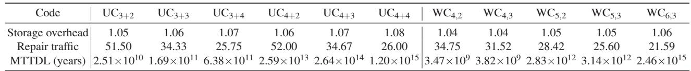

Table 4: Workloads used in the Ceph experiments.  
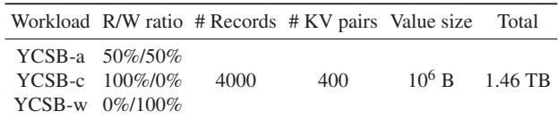

Table 5: Chunk sizes used in the two sets of experiments.  
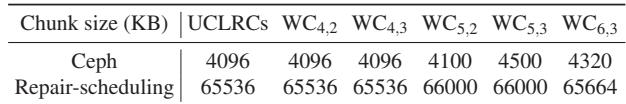

Single-chunk degraded read. Figure 17 shows singlechunk degraded-read latency, averaged over 10 independent runs. The results show that WiseCode’s improvements vary across the three methods. For example, at equal storage overhead, WiseCode reduces degraded-read latency by 32%–55% compared to UCLRC under CR, due to its 37%–58% lower repair traffic. Under PPR, WiseCode and UCLRC achieve comparable latencies. In contrast, under RP, WiseCode incurs 117%–200% higher latency than UCLRC because the relay-selection constraints limit scheduling flexibility (§6.2).

The potential increase in pipelining latency represents an acceptable tradeoff for two primary reasons. First, this overhead only impacts foreground degraded reads, while WiseCode significantly enhances background repair throughput, which shortens the degraded window and directly improves MTTDL. Second, the performance impact is minimal given the rarity of failure states. Modeling with either Binomial distribution or Markov chain indicates that a stripe resides in degraded states for less than 1% of its total lifetime. This translates to a negligible impact on aggregate read performance, especially for warm and cold storage where accesses are infrequent and latency-insensitive [57].

## 7.4 Ablation Study of Two-Stage Coding

We measure WiseCode’s computational overhead by encoding and decoding a stripe from k in-memory chunks using a single thread. Coding throughput is defined as the stripe size divided by the coding time, averaged over 10 independent runs, with chunk sizes matching the Ceph experiments.

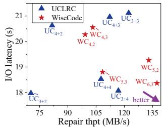

We evaluate four variants to isolate each optimization: (1) baseline: generator-matrix encoding; (2) +framework: twostage encoding framework only; (3) +stage-1 opt: framework plus data-aggregation optimization; (4) +full opts: all optimizations enabled (parity-solving optimization added).

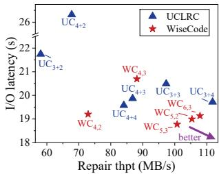  
(b) YCSB-a with 40 clients.

(a) YCSB-a with 10 clients.  
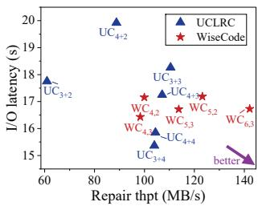

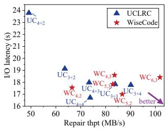  
(d) YCSB-c with 40 clients.

(c) YCSB-c with 10 clients.  
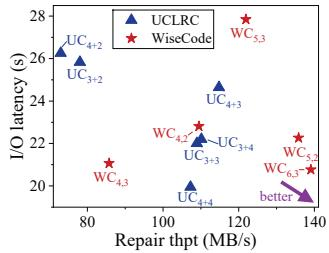

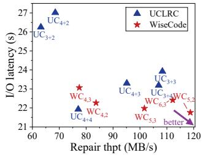  
(e) YCSB-w with 10 clients.  
(f) YCSB-w with 40 clients.  
Figure 13: Foreground I/O latency and background repair throughput during online repair on Ceph.

As shown in Figure 16, the two-stage framework and the data-aggregation optimization increase throughput by 2.6 – 3.0 and 2.0 –5.0 , respectively. The parity-solving optimization provides an additional 1.5 –1.8 speedups for WC5,3 and WC6,3. Overall, the two-stage encoding approach achieves 5.5 –22.4 throughput over the baseline.

## 7.5 Applicability to Diverse Hardware

Applicability to HDDs. While our cloud testbed uses SSDs, as in production wide-stripe deployments such as Vast-Data [58], we also evaluate WiseCode’s applicability to HDDs, which remain prevalent for their lower cost per byte [59]. We examine HDD read bandwidth during repair, where read operations dominate (95%–97%) but may be slowed by data fragmentation incurred by sub-packetization.

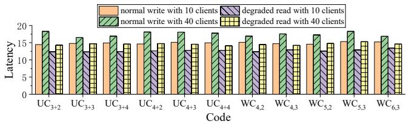  
Figure 14: Normal-write and degraded-read latencies on Ceph.

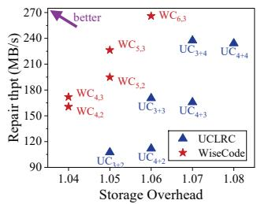

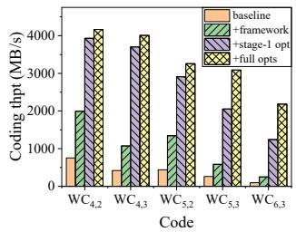  
Figure 15: Full-node repair Figure 16: Coding throughthroughput with RepairBoost. put.

For example, during the repair process of WC4,2, each helper chunk exhibits one of three read patterns with different percentages: repeatedly reading 1 sub-chunk and skipping 3 (44.2%), reading 4 consecutive sub-chunks (44.2%), or reading all 16 sub-chunks (11.6%).

We emulate these read patterns on a 7200 RPM HDD using fio [60] (iodepth = 8), measure per-pattern read bandwidth, and compute the percentage-weighted average, as shown in Figure 18. The results show that fragmentation reduces read bandwidth, but WiseCode still match raw network bandwidth with practical chunk sizes (e.g., 12 MB or 64 MB), ensuring that HDDs are not the bottleneck in the read-transfer pipeline [21]. Under the 1 Gbps (∼125 MB/s) network in our testbed, WC4,2 requires 12 MB or larger chunks, and WC6,3— despite its higher sub-packetization level—requires 64 MB or larger, both easily satisfied by the 64 MB–1 GB chunk sizes used in production [9, 11].

Applicability to faster network. Production nodes typically pair high-bandwidth network (e.g. 10+ Gbps) with highdensity disk arrays (e.g., 36–216 HDDs [61]) to maximize network utilization. For instance, the Amazon D3.8xlarge instance [62] pairs 25 Gbps network with 24 HDDs, while the Tencent Cloud DA4m.32XLARGE512 instance [63] pairs 100 Gbps (50 Gbps full-duplex) network with 48 HDDs. For these big-data-oriented instances, WiseCode’s repair improvement remains highly applicable because the aggregate storage bandwidth typically exceeds the network capacity. Specifically, as WiseCode achieves over 130 MB/s per disk (with 64 MB chunks), a disk array with 24 HDDs can provide over 25 Gbps of aggregate I/O, which matches the 25 Gbps network and does not become a bottleneck. Furthermore, given its high coding throughput (> 2000 MB/s), WiseCode can process 10+ Gbps network traffic using only a single dedicated

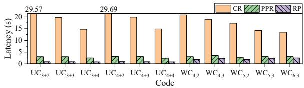  
Figure 17: Single-chunk degraded-read latency with repair scheduling.

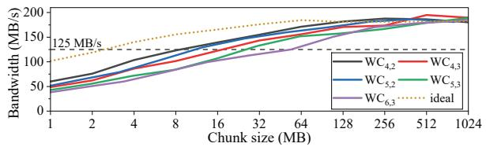  
Figure 18: Average HDD read bandwidth during repair.

CPU thread without incurring computational bottleneck.

## 8 Related Work

Wide codes. Most wide-stripe solutions are based on LRCs [6, 17, 27, 29, 30], which reduce repair traffic but sacrifice the MDS property. WiseCode is the first wide-stripe vector code that achieves near-optimal repair traffic while preserving the MDS property. VAST [58] designs a wide-stripe locally decodable code, but its design details remain undisclosed.

Vector codes. Clay codes [34], Butterfly codes [32], and other MSR codes suffer from sub-packetization blowup in wide stripes. Zigzag codes [64] alleviate this only for m = 2, offering insufficient reliability in wide stripes. HashTag+ [37] and RS-ET [36] codes avoid sub-packetization blowup but incur higher repair traffic than WiseCode and face the scalability barrier in coefficient search. WiseCode cannot yet support the flexible sub-packetization levels of RS-ET codes due to limitations of current MSR templates; future work will explore new template designs to enable this.

Repair scheduling. Prior work [19–21,24] optimizes repair transmission schedules to better utilize network resources and accelerate repair. WiseCode is complementary: it reduces repair traffic itself and can be combined with these scheduling techniques through appropriate adaptions, as discussed in Section 6.

## 9 Conclusion

By breaking three scalability barriers, we present WiseCode, the first practical and scalable wide-stripe vector-coding approach that achieves near-optimal repair traffic and ultra-low storage overhead (e.g., 1.04–1.06) in large-scale storage clusters. Experimental results show that WiseCode delivers a strictly better tradeoff between repair performance and storage overhead than Google’s UCLRCs.

## Acknowledgments

We sincerely thank our shepherd for helping us improve the paper. We are also grateful to all reviewers of this paper for their helpful comments and feedback. This work was supported by the National Natural Science Foundation of China under Grant 62025203.

## References

[1] Iyswarya Narayanan, Di Wang, Myeongjae Jeon, Bikash Sharma, Laura Caulfield, Anand Sivasubramaniam, Ben Cutler, Jie Liu, Badriddine Khessib, and Kushagra Vaid. SSD failures in datacenters: What? when? and why? In Proceedings of the 9th ACM International on Systems and Storage Conference, pages 1–11, 2016.

[2] Bianca Schroeder and Garth A Gibson. Understanding disk failure rates: What does an MTTF of 1,000,000 hours mean to you? ACM Transactions on Storage (TOS), 3(3):8–es, 2007.

[3] Eduardo Pinheiro, Wolf-Dietrich Weber, and Luiz André Barroso. Failure trends in a large disk drive population. In 5th USENIX Conference on File and Storage Technologies (FAST 07), pages 17–29, 2007.

[4] Stathis Maneas, Kaveh Mahdaviani, Tim Emami, and Bianca Schroeder. A study of SSD reliability in large scale enterprise storage deployments. In 18th USENIX Conference on File and Storage Technologies (FAST 20), pages 137–149, 2020.

[5] David Reinsel-John Gantz-John Rydning, J Reinsel, and J Gantz. The digitization of the world from edge to core. Framingham: International Data Corporation, 16, 2018.

[6] Saurabh Kadekodi, Shashwat Silas, David Clausen, and Arif Merchant. Practical Design Considerations for Wide Locally Recoverable Codes (LRCs). In 21st USENIX Conference on File and Storage Technologies (FAST 23), pages 1–16, 2023.

[7] Apache Software Foundation. HDFS Erasure Coding. https://hadoop.apache.org/docs/ current/hadoop-project-dist/hadoop-hdfs/ HDFSErasureCoding.html, 2025.

[8] Ceph Community. Ceph Git Repository. https:// github.com/ceph/ceph, 2025.

[9] Weidong Zhang, Erci Xu, Qiuping Wang, Xiaolu Zhang, Yuesheng Gu, Zhenwei Lu, Tao Ouyang, Guanqun Dai, Wenwen Peng, Zhe Xu, et al. What’s the Story in EBS Glory: Evolutions and Lessons in Building Cloud Block

Store. In 22nd USENIX Conference on File and Storage Technologies (FAST 24), pages 277–291, 2024.

[10] Qiang Li, Qiao Xiang, Yuxin Wang, Haohao Song, Ridi Wen, Wenhui Yao, Yuanyuan Dong, Shuqi Zhao, Shuo Huang, Zhaosheng Zhu, et al. More than capacity: performance-oriented evolution of Pangu in Alibaba. In 21st USENIX Conference on File and Storage Technologies (FAST 23), pages 331–346, 2023.

[11] Subramanian Muralidhar, Wyatt Lloyd, Sabyasachi Roy, Cory Hill, Ernest Lin, Weiwen Liu, Satadru Pan, Shiva Shankar, Viswanath Sivakumar, Linpeng Tang, et al. f4: Facebook’s warm BLOB storage system. In 11th USENIX Symposium on Operating Systems Design and Implementation (OSDI 14), pages 383–398, 2014.

[12] Su Zhou, Erci Xu, Hao Wu, Yu Du, Jiacheng Cui, Wanyu Fu, Chang Liu, Yingni Wang, Wenbo Wang, Shouqu Sun, et al. SMRSTORE: A storage engine for cloud object storage on HM-SMR drives. In 21st USENIX Conference on File and Storage Technologies (FAST 23), pages 395–408, 2023.

[13] Michael Ovsiannikov, Silvius Rus, Damian Reeves, Paul Sutter, Sriram Rao, and Jim Kelly. The quantcast file system. Proceedings of the VLDB Endowment, 6(11):1092– 1101, 2013.

[14] Youngmoon Lee, Hasan Al Maruf, Mosharaf Chowdhury, Asaf Cidon, and Kang G Shin. Hydra: Resilient and highly available remote memory. In 20th USENIX Conference on File and Storage Technologies (FAST 22), pages 181–198, 2022.

[15] Qiang Li, Lulu Chen, Xiaoliang Wang, Shuo Huang, Qiao Xiang, Yuanyuan Dong, Wenhui Yao, Minfei Huang, Puyuan Yang, Shanyang Liu, et al. Fisc: a largescale cloud-native-oriented file system. In 21st USENIX Conference on File and Storage Technologies (FAST 23), pages 231–246, 2023.

[16] Yanjing Ren, Yuanming Ren, Xiaolu Li, Yuchong Hu, Jingwei Li, and Patrick PC Lee. ELECT: Enabling erasure coding tiering for {LSM-tree-based} storage. In 22nd USENIX Conference on File and Storage Technologies (FAST 24), pages 293–310, 2024.

[17] Yuchong Hu, Liangfeng Cheng, Qiaori Yao, Patrick PC Lee, Weichun Wang, and Wei Chen. Exploiting Combined Locality for Wide-Stripe Erasure Coding in Distributed Storage. In FAST, pages 233–248, 2021.

[18] Meng Wang, Jiajun Mao, Rajdeep Rana, John Bent, Serkay Olmez, Anjus George, Garrett Wilson Ransom, Jun Li, and Haryadi S Gunawi. Design considerations and analysis of multi-level erasure coding in large-scale

data centers. In Proceedings of the International Conference for High Performance Computing, Networking, Storage and Analysis, pages 1–13, 2023.

[19] Subrata Mitra, Rajesh Panta, Moo-Ryong Ra, and Saurabh Bagchi. Partial-parallel-repair (PPR): a distributed technique for repairing erasure coded storage. In Proceedings of the eleventh European conference on computer systems, pages 1–16, 2016.

[20] Runhui Li, Xiaolu Li, Patrick PC Lee, and Qun Huang. Repair pipelining for Erasure-Coded storage. In 2017 USENIX Annual Technical Conference (USENIX ATC 17), pages 567–579, 2017.

[21] Shiyao Lin, Guowen Gong, Zhirong Shen, Patrick PC Lee, and Jiwu Shu. Boosting Full-Node Repair in Erasure-Coded Storage. In 2021 USENIX Annual Technical Conference (USENIX ATC 21), pages 641–655, 2021.

[22] Korlakai Vinayak Rashmi, Nihar B Shah, Dikang Gu, Hairong Kuang, Dhruba Borthakur, and Kannan Ramchandran. A solution to the network challenges of data recovery in erasure-coded distributed storage systems: A study on the facebook warehouse cluster. In Presented as part of the 5th USENIX Workshop on Hot Topics in Storage and File Systems, 2013.

[23] Zhufan Wang, Guangyan Zhang, Yang Wang, Qinglin Yang, and Jiaji Zhu. Dayu: Fast and low-interference data recovery in very-large storage systems. In 2019 USENIX Annual Technical Conference (USENIX ATC 19), pages 993–1008, 2019.

[24] Yuhui Cai, Shiyao Lin, Zhirong Shen, Jiahui Yang, and Jiwu Shu. Chameleonec: Exploiting tunability of erasure coding for low-interference repair. In 2025 IEEE International Symposium on High Performance Computer Architecture (HPCA), pages 15–28. IEEE, 2025.

[25] Zhirong Shen, Yuhui Cai, Keyun Cheng, Patrick PC Lee, Xiaolu Li, Yuchong Hu, and Jiwu Shu. A survey of the past, present, and future of erasure coding for storage systems. ACM Transactions on Storage, 21(1):1–39, 2025.

[26] Irving S Reed and Gustave Solomon. Polynomial codes over certain finite fields. Journal of the society for industrial and applied mathematics, 8(2):300–304, 1960.

[27] Cheng Huang, Huseyin Simitci, Yikang Xu, Aaron Ogus, Brad Calder, Parikshit Gopalan, Jin Li, and Sergey Yekhanin. Erasure coding in windows azure storage. In Presented as part of the 2012 USENIX Annual Technical Conference (USENIX ATC 12), pages 15–26, 2012.

[28] Maheswaran Sathiamoorthy, Megasthenis Asteris, Dimitris Papailiopoulos, Alexandros G Dimakis, Ramkumar Vadali, Scott Chen, and Dhruba Borthakur. XORing elephants: novel erasure codes for big data. Proceedings of the VLDB Endowment, 6(5):325–336, 2013.

[29] Itzhak Tamo and Alexander Barg. A family of optimal locally recoverable codes. IEEE Transactions on Information Theory, 60(8):4661–4676, 2014.

[30] Oleg Kolosov, Gala Yadgar, Matan Liram, Itzhak Tamo, and Alexander Barg. On fault tolerance, locality, and optimality in locally repairable codes. ACM Transactions on Storage (TOS), 16(2):1–32, 2020.

[31] KV Rashmi, Preetum Nakkiran, Jingyan Wang, Nihar B Shah, and Kannan Ramchandran. Having your cake and eating it too: Jointly optimal erasure codes for I/O, storage, and network-bandwidth. In 13th USENIX Conference on File and Storage Technologies (FAST 15), pages 81–94, 2015.

[32] Lluis Pamies-Juarez, Filip Blagojevic, Robert Mateescu, Cyril Gyuot, Eyal En Gad, and Zvonimir Bandic. Opening the chrysalis: On the real repair performance of MSR codes. In 14th USENIX conference on file and storage technologies (FAST 16), pages 81–94, 2016.

[33] Yuchong Hu, Henry CH Chen, Patrick PC Lee, and Yang Tang. NCCloud: applying network coding for the storage repair in a cloud-of-clouds. In FAST, volume 21, 2012.

[34] Myna Vajha, Vinayak Ramkumar, Bhagyashree Puranik, Ganesh Kini, Elita Lobo, Birenjith Sasidharan, P Vijay Kumar, Alexandar Barg, Min Ye, Srinivasan Narayanamurthy, et al. Clay codes: Moulding MDS codes to yield an MSR code. In 16th USENIX Conference on File and Storage Technologies (FAST 18), pages 139–154, 2018.

[35] Katina Kralevska, Danilo Gligoroski, Rune E Jensen, and Harald Øverby. Hashtag erasure codes: From theory to practice. IEEE Transactions on Big Data (TBD), 4(4):516–529, 2017.

[36] Kaicheng Tang, Keyun Cheng, Helen H. W. Chan, Xiaolu Li, Patrick P. C. Lee, Yuchong Hu, Jie Li, and Ting-Yi Wu. Balancing repair bandwidth and subpacketization in erasure-coded storage via elastic transformation. In IEEE INFOCOM 2023 - IEEE Conference on Computer Communications, pages 1–10, 2023.

[37] Katina Kralevska and Danilo Gligoroski. An explicit construction of systematic mds codes with small subpacketization for all-node repair. In 2018 IEEE 16th Intl Conf on Dependable, Autonomic and Secure Computing,

16th Intl Conf on Pervasive Intelligence and Computing, 4th Intl Conf on Big Data Intelligence and Computing and Cyber Science and Technology Congress (DASC/PiCom/DataCom/CyberSciTech), pages 1080– 1084. IEEE, 2018.

[38] Chuang Gan, Yuchong Hu, Leyan Zhao, Xin Zhao, Pengyu Gong, and Dan Feng. Revisiting network coding for warm blob storage. In 23rd USENIX Conference on File and Storage Technologies (FAST 25), pages 139– 154, 2025.

[39] Alexandros G Dimakis, P Brighten Godfrey, Yunnan Wu, Martin J Wainwright, and Kannan Ramchandran. Network coding for distributed storage systems. IEEE transactions on information theory, 56(9):4539–4551, 2010.

[40] R. Singleton. Maximum distanceq-nary codes. IEEE Transactions on Information Theory, 10(2):116–118, 1964.

[41] John E Angus. On computing mtbf for a k-out-of-n: G repairable system. IEEE Transactions on Reliability, 37(3):312–313, 2002.

[42] Saurabh Kadekodi, Francisco Maturana, Sanjith Athlur, Arif Merchant, KV Rashmi, and Gregory R Ganger. Tiger: Disk-Adaptive redundancy without placement restrictions. In 16th USENIX Symposium on Operating Systems Design and Implementation (OSDI 22), pages 413–429, 2022.

[43] SB Balaji, Myna Vajha, and P Vijay Kumar. Lower bounds on the sub-packetization level of MSR codes and characterizing optimal-access MSR codes achieving the bound. IEEE Transactions on Information Theory, 68(10):6452–6471, 2022.

[44] James S Plank, Scott Simmerman, and Catherine D Schuman. Jerasure: A library in C/C++ facilitating erasure coding for storage applications-Version 1.2. University of Tennessee, Tech. Rep. CS-08-627, 23, 2008.

[45] Intel, Inc. Intelligent Storage Acceleration Library. https://github.com/intel/isa-l, 2025.

[46] Min Ye and Alexander Barg. Explicit constructions of optimal-access mds codes with nearly optimal subpacketization. IEEE Transactions on Information Theory, 63(10):6307–6317, 2017.

[47] Jonggyu Park and Young Ik Eom. FragPicker: A new defragmentation tool for modern storage devices. In Proceedings of the ACM SIGOPS 28th Symposium on Operating Systems Principles (SOSP 21), pages 280– 294, 2021.

[48] Theophilus Benson, Aditya Akella, and David A Maltz. Network traffic characteristics of data centers in the wild. In Proceedings of the 10th ACM SIGCOMM conference on Internet measurement, pages 267–280, 2010.

[49] Guodong Li, Ningning Wang, Sihuang Hu, and Min Ye. MSR codes with linear field size and smallest subpacketization for any number of helper nodes. IEEE Transactions on Information Theory, 2024.

[50] James S Plank, Ethan L Miller, Kevin M Greenan, Benjamin A Arnold, John A Burnum, Adam W Disney, and Allen C McBride. GF-Complete: A Comprehensive Open Source Library for Galois Field Arithmetic Version 1.02, 2014.

[51] Sage A Weil, Scott A Brandt, Ethan L Miller, Darrell DE Long, and Carlos Maltzahn. Ceph: A scalable, highperformance distributed file system. In Proceedings of the 7th symposium on Operating systems design and implementation, pages 307–320, 2006.

[52] Intel, Inc. AVX-512 Overview. https: //www.intel.com/content/www/us/en/ architecture-and-technology/avx-512- overview.html. 2025.

[53] gRPC Authors. gRPC, A high performance, open source universal RPC framework. https://grpc.io/, 2025.

[54] Alibaba Cloud Company. User guide of Instance families with high clock speeds (hf series). https:// www.alibabacloud.com/help/en/ecs/user-guide instance-families-with-high-clock-speeds, 2025.

[55] Ceph authors and contributors. Placement Groups in Ceph. https://docs.ceph.com/en/quincy/rados/ operations/placement-groups/, 2025.

[56] YCSB Community. Yahoo! Cloud Serving Benchmark (YCSB) Git Repository. https://github.com/ brianfrankcooper/YCSB, 2025.

[57] Timothy Kim, Sanjith Athlur, Saurabh Kadekodi, Francisco Maturana, Dax Delvira, Arif Merchant, Gregory R Ganger, and KV Rashmi. Morph: Efficient file-lifetime redundancy management for cluster file systems. In Proceedings of the ACM SIGOPS 30th Symposium on Operating Systems Principles, pages 330–346, 2024.

[58] VastData, Inc. Breaking Resiliency Trade-offs With Locally Decodable Erasure Codes. https: //vastdata.com/blog/breaking-resiliencytrade-offs-with-locally-decodable-erasurecodes, 2019.

[59] Sanjith Athlur, Timothy Kim, Saurabh Kadekodi, Francisco Maturana, Xavier Ramos, Arif Merchant, KV Rashmi, and Gregory R Ganger. Okapi: Decoupling data striping and redundancy grouping in cluster file systems. In 19th USENIX Symposium on Operating Systems Design and Implementation (OSDI 25), pages 897–914, 2025.

[60] Jens Axboe. FIO - Flexible I/O Tester. https: //github.com/axboe/fio, 2025.

[61] Chunqiang Tang. Meta’s hyperscale infrastructure: Overview and insights. Communications of the ACM, 68(2):52–63, 2025.

[62] Amazon Web Service. Amazon EC2 D3 and D3en Instances. https://aws.amazon.com/cn/ec2/ instance-types/d3/, 2026.

[63] Tencent Cloud. Big data DA4m instance specifica tions. https://www.tencentcloud.com/document/ product/213/59879, 2026.

[64] Itzhak Tamo, Zhiying Wang, and Jehoshua Bruck. Zigzag codes: MDS array codes with optimal rebuilding. IEEE Transactions on Information Theory, 59(3):1597– 1616, 2012.

[65] Kashi Venkatesh Vishwanath and Nachiappan Nagappan. Characterizing cloud computing hardware reliability. In Proceedings of the 1st ACM symposium on Cloud computing, pages 193–204, 2010.

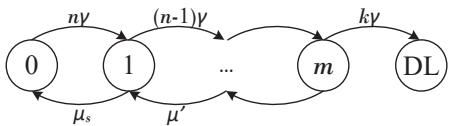  
Figure 19: Markov model used for reliability analysis.

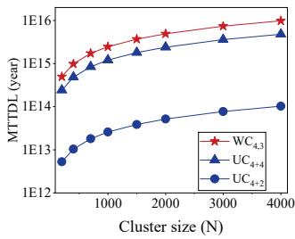  
(a) Varying cluster size N.

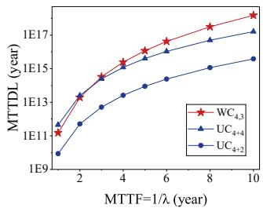  
(b) Varying MTTF 1/λ.  
Figure 20: Sensitivity analysis on MTTDL.

## A Appendix

## A.1 MTTDL and Markov Model

We evaluate data reliability using the mean-time-to-dataloss (MTTDL) metric, modeled via continuous-time Markov chains following prior works [6, 27]. As shown in Figure 19, each circles corresponds to a health states of a stripe: state i indicates that i chunk(s) are lost, while the Data Loss (DL) state represents unrecoverable data loss. A stripe transitions between adjacent states at specified rates, and MTTDL is defined as the expected time for the stripe to transition from state 0 to the DL state.

The state transition rate from state i to state i + 1 is (n i)γ, where γ is the failure rate of each node and n is the stripe width. A stripe enters the DL state once fewer than k healthy chunks remain. For UCLRC, local parity does not fully protect the stripe: when i r, an additional failure may directly cause data loss with probability pi, which is empirically measured via simulation [6]. The transition rate μs from state 1 back CSε(N 1)B is the mean time to repair a single-failure stripe. Here, S is the node capacity, C is the repair traffic normalized by chunk size, CS is the total network traffic during repair, N is the cluster size, B is the per-node network bandwidth, and ε is the fraction of network bandwidth allocated to repair. The term ε(N 1)B represents the total available bandwidth assuming the repair traffic is evenly distributed across nodes. Since multi-chunk failures are rare and prioritized, the repair rate μ	, i.e. the transition rate from state i(> 1) to state i 1, is basically dominated by μ	 = 1 , where T 	 denotes the time to detect multi-failure stripes and trigger repair [6, 27].

We configure the parameters as follows: the mean-timeto-failure (MTTF) 1/γ = 4 years, N = 1000 nodes, S = 16 TB, B = 10 Gbps, T 	 = 30 minutes, ε = 0.1. The MTTDL results of evaluated codes in our experiments are shown in

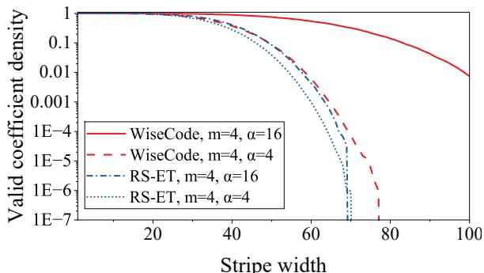  
Figure 21: Density of valid coefficient combinations.

Table 3. Figure 20 further illustrates the sensitivity of MTTDL to variations in N and 1 for WC6,3, UC4+2, and UC4+4. The results indicate that while the MTTDL of both WiseCode and UCLRC scales at a similar rate with N, WiseCode exhibits a faster growth rate as 1/γ increases. Although WC4,3 underperforms UC4+4 under an extremely low MTTF (≤2 years), WiseCode demonstrates superior reliability in more realistic MTTF ranges (3–5 years) [17, 28, 65].

## A.2 Existence of Valid Coefficients

As Table 2 summarizes the maximum stripe width achieved in our experiments, we believe that these results suggest that the theoretical ceiling for WiseCode’s scalability is substantially higher. To validate this, we randomly choose up to 1,000,000 coefficient combination from GF(216) for RS-ET codes and WiseCode, calculating the density of valid assignments for each. And we observe that WiseCode has a higher probability to find valid coefficient under stripe-width configurations. As shown in Figure 21, the density of valid combinations for RS-ET codes with m = 4 decreases precipitously when the stripe width approaches 70. While WiseCode with m = 4 and α = 4 exhibits a slightly better density curve, the density improves significantly as α increases. This improvement is driven by divide-and-conquer verification, which effectively reduces the number of coefficient constraints (§4.1) and thus render less coefficient combinations invalid.

## A.3 Revisiting the Construction of WiseCode

Section 3 illustrates the template-based construction of WiseCode. Here we offer a straightforward matrix-based construction to simplify the discussions and proofs. We focus on how to directly obtain the parity-check matrix P, i.e., the entire coefficient matrix of coding equations, such that the coding equations can be collectively defined as P C =-0, where C represents all chunks.

In an (n, k, α) WiseCode built atop the (nmsr, kmsr) MSR template, we have m = n k = nmsr kmsr. Define b = nmsr/m, then α = mb. If the m 1 coefficient vector of each sub-chunk is considered as a element, the parity-check matrix (i.e., coeffi cient matrix) P corresponding to all n chunks can be regarded as a α nα matrix, where each of the n chunks corresponds to a α α sub-parity-check-matrix (SPCM), i.e., Chunk corresponds to SPCMi. Basically, each row of SPCMi corresponds to a sub-stripe, and each column corresponds to a sub-chunk. The elements of SPCMi are given as follows.

As discussed in Section 3.1, Chunki’s parameters x and s are inherited from the template and are originally defined in Rule #2 (§2.3). The position of each element in the SPCM is denoted by the coordinate (r, c) starting from the top left corner, r for row and c for column. Given the basem representation of c as c = (cb 1, cb 2, . . . , c0)m, we define c(x, s) = (cb 1, . . . , cs+1, x, cs 1, . . . , c0)m. We also define -λ = [1, λ, λ2, . . . , λm−1]T . With m parameters λim to λ(i+1)m 1 as specified in Section 4, the elements in the SPCMi of chunki are:

• −−−→ λim+c , if c = r or c(x, s) = r,

• -0, otherwise.

We note that the conditions “c = r” and “c(x, s) = r” match the Rule #1 and Rule #2 in Section 2.3, respectively.

Lemma A.1. Row of SPCM contains 1 or m non-zero elements: If rs = x, Rowr contains m non-zero elements at columns with indices r(t, s)  0  t < m , with the element values specified as λim+t 0 t < m . If rs = x, Rowr contains one non-zero element only at Columnr, with the element value specified as λim+rs.

## A.4 WiseCode Repair Pattern

We prove the correctness of WiseCode repair pattern shown in Section 3.2. The key is to answer two questions: (1) For the lost chunk i, which sub-stripes are selected for decoding; (2) In a helper chunk i	, which sub-chunks belong to the selected sub-stripes.

Answer for question (1). With the parameters x and s of chunk i, the α/m sub-stripes whose indices j satisfy js = x are selected for decoding. According to Lemma A.1, each Row j in the SPCMi contains m non-zero elements at columns with the indices { j(t, s) | 0 ≤ t < m}, therefore the Sub-Stripe j can recover the m corresponding sub-chunks by solving the equation on Row j. It is obvious that for any two different selected sub-stripes, their j vary at some digit jp (p = s), therefore the two sets of j(t, s) 0 t < m have no intersection, and traversing all selected α/m sub-stripes can recover all α lost sub-chunks.

Answer for question (2). If Chunk is a sibling chunk of Chunk , it is obvious that it needs to contribute all α subchunks as helper sub-chunks, because SPCM is identical to SPCM regarding the positions of non-zero elements, and these positions span all columns (sub-chunks).

If Chunki is not a sibling chunk of Chunki, we prove that in SPCMi	 , any non-zero element of Row j only occurs within columns whose indices c satisfy c = x, i.e., having the same value range as the indices of the selected α/m rows (substripes). Let the parameters of Chunk to be s	 and x	, then we discuss the position of non-zero elements in each Rowj based on Lemma A.1. If js	 = x	, then the Columnc having a non-zero elements satisfies c ∈ { j(t, s	) | 0 ≤ t < m}. In this case we have s	 = s, otherwise s	 = s and x	 = j = j = x, which contradicts the assumption that Chunk is not a sibling chunk of Chunki. Therefore, any c j(t,s	) 0 t < m satisfies cs = js = x because the sth digit of j(t, s	) is identical to j. If j = x	, then the Columnc having a non-zero elements satisfies c = j, which also means cs = x because js = x. In conclusion, any non-zero element of Row j only occurs within columns whose indices c satisfy c = x, which means that the indices c of helper sub-chunks also satisfy cs = x since each column corresponds to a sub-chunk with the same index.

## A.5 Matrix-block-repetition pattern

Recall that each element of SPCMi corresponds to a coefficient vector of a sub-chunk, and there are at most m nonzero elements in each row of SPCM (Lemman A.1). The mb sub-chunks of chunki can be partitioned into mb−1 mutually disjoint subsets, each containing m sub-chunks, such that any sub-stripe only contains sub-chunks within a single subset. Using the sub-chunk index to describe each subset, sub-chunkc belongs to the subset c(t,s) 0 t < m , and these m sub-chunks sequentially corresponds to coefficients −−−→λim+t 0  t < m . The indices j of sub-stripes related to this subset of sub-chunks satisfy j  c(t, s)  0  t < m , i.e., having the same value range of the sub-chunk indices. Therefore, SPCM of size mb mb can be partitioned into mb−1 small matrices of size m m, each corresponding to one sub-chunk subset and its sub-stripe subset.

These small matrices have identical elements and cover all non-zero elements of SPCMi. We denote each of these small matrices as elementary-parity-check-matrix (EPCM), and therefore SPCM consists of mb−1 EPCM . An EPCM in the case of m = 4 is as follows:

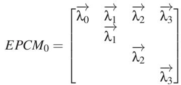

(1)

Corresponding to chunk partitioning rule in Section 4.1, concatenating SPCMs of chunks within groups produces grouped-SPCMs (GSPCMs). For each SPCM within groups, there is an EPCM with the rows and columns indexed within the same value range c(t, s)  0  t < m , and these EPCMs can be also concatenated together to produce grouped-EPCMs (GEPCMs). Therefore, assuming groups include ms chunks, GSPCMs can be partitioned into mb−1 identical GEPCMs, exhibiting the matrix-block-repetition pattern.

## A.6 The Parity Solving and Matrix Elimination

Here are the mathematical details of Section 5.3, and we also prove Theorem 4.1 along this process. The objective of matrix elimination is to eliminate GSPCM of other groups, such that computing each sub-chunks within groups only needs to invert GSPCMs. As GSPCMs exhibits the matrix-block-repetition pattern, the inversion of GSPCMs is further reduced to the inversion of GEPCMs.

Details of matrix elimination. Define-λ[h,t) = [λh,λh+1, ...,λt−1]T , i.e., performing head and tail truncation on the original-λ. Then we define that substituting each element-λ by-λ[h,t) in GSPCMs and GEPCMs produces GSPCM[h,t) s and GEPCM[h,t) s , respectively. Now we start to separate GSPCM0 from the other GSPCMs and eliminate GSPCM . Note that we may logically permute matrix rows between steps to facilitate the demonstration, which has no actual impacts on computations. Without loss of generality, we assume that the m chunks to be computed are parity chunks with indices p1,..., pm , while any m other chunks follow the same procedure to perform divide-and-conquer solving. We start with the entire coefficient matrix [Pp , . . . , Ppm ], corresponding to parity chunks Cp , . . . ,Cp . The matrix elimination consists of two key operations: row transformation and sub-chunk transformation. Equation 2 demonstrates the row transformation process, with the row transformation matrix RT described later:

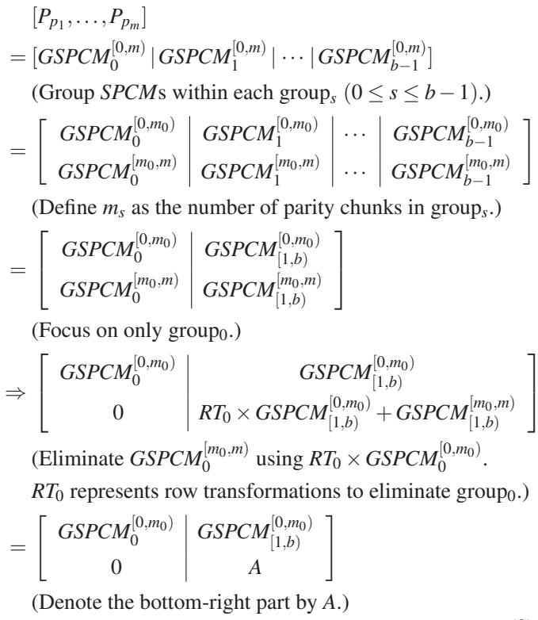

(2)

Note 1 for proof of Theorem 4.1. Now we have decom-

posed the coefficient matrix [P ,..., P ] into GSPCM[0,m0) and A, such that the coefficient matrix is invertible if and only if GSPCM[0,m0) and A are invertible. The remaining of the [0,m m0) proof lies in proving that A is equivalent to GSPCM   
[1,b) regarding the invertibility (See Note 2). If we can establish this equivalence, then we can continuously decompose GSPCM[0,ms) s from GSPCM[0,m−m0)[1,b) , such that [Pp1 , . . . , Ppm ] is invertible if and only if all GSPCM[0,m) are invertible, matching Theorem 4.1.

Row transformation matrix. Since GSPCM0 can be partitioned into mb−1 identical GEPCMs, RT0 can also be partitioned into mb−1 identical elementary-RT0 (ERT0), each eliminating GEPCM[m0,m) using ERT0 × GEPCM[0,m0), i.e., ERT0 × GEPCM[0,m0)0 = GEPCM[m0,m)0 . According to linear algebra, ERT0 = GEPCM[m0,m)0 × (GEPCM[0 0,m0))−1. Each ERT is of size (m m )m mm and one can verify that it has at most (mm0 + m m0)m0(m m0) non-zero coefficients.

Given the original parity-check matrix equation:

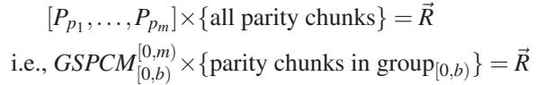

RT also transforms the intermediate results -R (see §5.3) of size ml to R- 	 of size (m m0)l. That is,

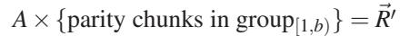

(3)

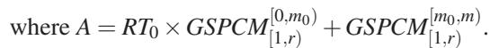

Sub-chunk transformations. To maintain the original cod  
ing coefficients of the remaining parity sub-chunks (i.e., to   
transform A back to GSPCM [0,m−m0)), we adopt sub-chunk [1,b)   
transformations (ST ) such that

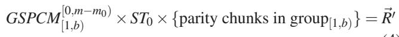

Comparing Equation (3) and (4), we have

(4)

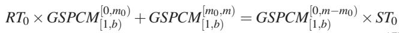

(5)

To determine the required ST0, we analyze the left side of Equation 5 at the granularity of ERT0. As each ERT0 performs the row transformation on a GEPCM , it also transform coefficients of parity sub-chunks within other groups. We take group1 for an example. In GSPCM1, we select the m rows corresponding to ERT and select the m sub-chunks with the same indices as these rows. One can verify that the coefficient matrix of the m selected sub-chunks within the m selected rows is a m m diagonal matrix, whose elements are identical coefficient vectors. The coefficient vector can be determined as in Appendix A.3, and here we assume its value to be-λ, such that coefficient matrix, denoted by Diagλ, can be written as follows:

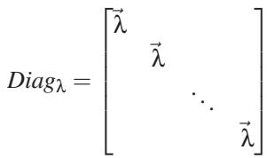

Therefore, for the m selected sub-chunks and m selected rows, Equation 5 turns into

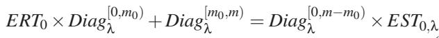

(6)

where EST ,λ denotes an elementary-ST0 corresponding to Diagλ. Recall that ERT0 × GEPCM[0,m0) = GEPCM[m0,m), we define ERTt (0 t < m m ) to be the sub-matrix of ERT0 that satisfies

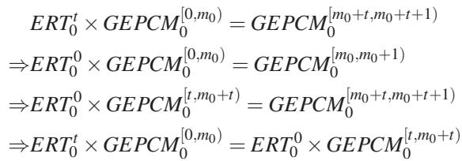

That is to say, performing ERT t on-λ[0,m0) is equivalent to performing ERT 0 on-λ[t,m0+t). Therefore, we have

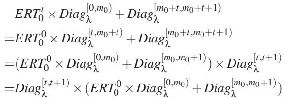

traversing t from 0 to m m , we have

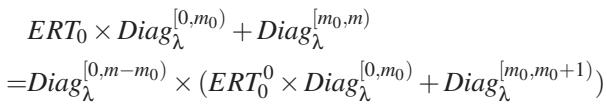

(7)

comparing Equation 6 and Equation 7 we have EST0,λ = ERT00 × Diag [0,m0) + Diagλ [m0,m0+1). And sub-chunk transformation ST0 is determined by traversing all ERT0 and getting all EST0,λ. Now we successfully eliminate group0 and maintain the original coefficient matrix (with necessary truncation) of sub-chunks in other groups. Each EST0,λ is of size m m, and one can verify that (EST0,λ)−1 has at most mm0 + m m0 non-zero elements.

Note 2 for proof of Theorem 4.1. Now we have given the form of EST . Recall that A = GSPCM[0,m−m0) ST , then [1,b)

A is equavilent to GSPCM[0,m−m0) regarding invertibility as [1,b) long as each EST0,λ is invertible. One can refer to [49] for the proof of a similar problem in the MSR-code version.

## A.7 The Computational Overhead of Parity Solving and Matrix Elimination

We count the number of multiplications imposed by eliminating groups. Denote the number of remaining chunks after eliminating groups as rs. Firstly, each of mb−1 ERTs imposes at most (mms + m  ms)msrs multiplications on -R, totaling (mms + m ms)msrsmb−1. Secondly, eliminating groups introduces sub-chunk transformations EST s that need to be inverted, imposing at most mms + m ms multiplications for each of rsmb−1 EST s (mb−1 EST s for each of r0 remaining chunks), totaling (mms + m ms)rsmb−1. Thirdly, when the remaining rsmb chunks are solved, substituting them into the equation of groups takes ms multiplications for each subchunk, totaling m r mb. Finally, we need to solve the following equation for groups:

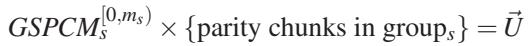

where U- is the remaining intermediate results after substituting solved sub-chunks. One can verify that each (GEPCM[0,ms) s )−1 has at most (mms + m  ms)(ms)2 nonzero coefficients, totaling (mms + m ms)(ms)2mb−1 for (GSPCM[0,ms) s )−1, and the number of multiplications for solving this equation does not exceed this number. Note that ∑ ms = m, rs + ms m, and mms + m  ms m2. It can be easily verified that the total multiplication number is O(mb+3) = O(m3α).