USENIX

THE ADVANCED COMPUTING SYSTEMS ASSOCIATION

# kSTEP: Characterization and Deterministic Testing of Linux CPU Scheduler Bugs

Tingjia Cao, Shawn (Wanxiang) Zhong, and Caeden Whitaker, University of Wisconsin–Madison; Ke Han, Purdue University; Andrea C. Arpaci-Dusseau and Remzi H. Arpaci-Dusseau, University of Wisconsin–Madison

https://www.usenix.org/conference/osdi26/presentation/cao

# This paper is included in the Proceedings of the 20th USENIX Symposium on Operating Systems Design and Implementation.

July 13–15, 2026 • Seattle, WA, USA

ISBN 978-1-939133-55-7

Open access to the Proceedings of the 20th USENIX Symposium on Operating Systems Design and Implementation is sponsored by

# kSTEP: Characterization and Deterministic Testing of Linux CPU Scheduler Bugs

Tingjia Cao<sup>†</sup> Shawn (Wanxiang) Zhong<sup>†∗</sup> Caeden Whitaker<sup>†</sup> Ke Han<sup>§</sup>

Andrea C. Arpaci-Dusseau<sup>†</sup> Remzi H. Arpaci-Dusseau<sup>†</sup>

† University of Wisconsin-Madison § Purdue University

## Abstract

We present an in-depth study of CPU scheduler bugs, covering both functional violations and misalignments between implementation and policy. Our study shows that these bugs are hard to observe and even harder to trigger. To close this gap, we introduce kSTEP. kSTEP gives testers fine-grained control over scheduler-invoking events and runs them deterministically on isolated CPUs. kSTEP produces noise-free, repeatable traces that expose subtle behavior. We then build a coverage-guided fuzzer on top of kSTEP for automated CPU scheduler testing. We demonstrate kSTEP's effectiveness by reproducing seven real-world scheduler bugs and uncovering four new ones. kSTEP is publicly available at https://github.com/kstep-dev/kstep.

## 1 Introduction

Linux CPU scheduling is critical to application performance and service quality [2,24,49,55,77,82,85,93–97]. Real-world services inevitably experience severe performance drops due to scheduler bugs. CoreOS (a container-optimized OS [84]) reported that a scheduler bug caused a 50% performance loss in web applications [12]; another bug caused system hangs on 30% of nodes in a production Hadoop cluster every week [87].

CPU schedulers have complex correctness expectations. Prior work focuses on functionality bugs [8, 43–45, 67, 107], but schedulers must also keep their implementation aligned with intended policies (e.g., policies specify when and where a task runs while balancing desirable properties like fairness, efficiency, and migration costs). We call violations of this alignment policy bugs. When they occur, schedulers still make functional choices, but compromise service quality. Policy bugs have especially low observability; to external users, there is no clear signal confirming a bug has occurred (e.g., a fairness drop may be a bug or an intentional trade-off).

Despite its importance and complexity, the scheduler remains poorly tested and poorly understood. First, existing scheduler tests are surprisingly inadequate. Developers mostly rely on long-running workloads to catch performance regressions [10, 34, 36, 40, 69, 74, 88], rather than using systematic tests targeting specific code paths and corner cases. Furthermore, we lack a quantitative understanding of the real scheduler bugs that have accumulated over the years. This raises the question: What types of bugs exist in modern schedulers? Why are they so difficult to test? How can testing be improved? Characterization study (§3). To answer these questions, we conduct an in-depth characterization study of modern Linux scheduler bugs. We examined 232 bug-fix commits since 2020, uncovering how these bugs are triggered, what causes them, and what they break. Our study reveals twelve key findings, organized into three main categories.

First, scheduler bugs are important. Their consequences are non-negligible: 15% lead to fatal failures; many others break strict guarantees, directly undermining functional correctness; and even when functionality holds, policy bugs compromise important properties (e.g., balance, fairness, locality, energy efficiency) that services depend on. The community’s response confirms this importance: fixes are carefully backported, showing a sustained commitment to reliability.

Second, scheduler bugs are hard to find. The first issue is that they suffer from poor observability: only 27% manifest as clear panics or warnings, while the vast majority (73%) are silent functional faults or policy misalignments that leave no warnings or sufficient triggering traces. Most root causes (75%) are subtle semantic faults, such as state or logic errors. These arise from extensive functionality requirements and accumulated heuristics, and uncovering them necessitates deep domain knowledge. Moreover, triggering conditions are complex: many bugs require exploration of a large space of scheduler attributes, and some (28%) further depend on kernel events or specific CPU attributes.

Third, current practice does little to compensate. Many bugs (45%) stay hidden for years, sometimes for over a decade. Most policy bugs are still caught by manual review. These bugs are rarely reproduced: most have no clear trigger sequence, and only 22% of user-submitted fixes include developer validation. Preventive actions are uncommon as well: patches rarely add tests, warnings, or tracepoints, leaving the subsystem prone to regressions. It is surprising that such a fragile, review-driven process remains the state of the art.

Together, these findings show that scheduler bugs are important, deeply hidden, and systematically underserved by today’s testing practices, highlighting the need for a systematic approach to scheduler testing.

Controlled and deterministic testing with kSTEP (§§4-5). We then propose kSTEP<sup>1</sup> for controlled and deterministic CPU-scheduler testing. kSTEP offers two key capabilities.

First, controlling the timing of scheduler-invoking events (i.e., external events that invoke the scheduler to make decisions or change its state) is crucial for triggering scheduler bugs. Almost all scheduler bugs are time-sensitive, as scheduler state evolves continuously with frequent timer ticks. Tiny shifts in event timing can alter subsequent state transitions and scheduling decisions. Yet, traditional userspace tests lack such precise control. To achieve controlled testing, kSTEP provides a rich set of events for userspace tasks, kernel activities, CPU attributes, and explicit scheduler ticks. Testers specify the sequence of events in a driver program, and a kSTEP kernel module dispatches them in the specified order. Thus, testers can precisely drive scheduler state changes through kSTEP events (e.g., testers can reach a target scheduler state with controlled ticks and insert an event at that moment). Scheduler testing is similar but orthogonal to controlled concurrency testing that focuses on discovering concurrency bugs by manipulating thread interleavings [29, 33, 37, 38, 59, 72, 78, 79]. These frameworks use their own schedulers instead of exercising the existing Linux scheduler code.

Second, kSTEP ensures repeatable, noise-free scheduler execution. Many scheduler bugs, especially policy bugs, can only be diagnosed by inspecting the internal state. Without determinism and isolation, it is difficult to tell if trace differences are due to bugs or normal variability. To achieve deterministic scheduler execution, kSTEP: mocks clock sources; isolates test CPUs from noisy activities; and resets the initial scheduler state before the driver program runs. Existing record-and-replay techniques for userspace programs [14, 15, 25–27, 66, 75, 80, 81, 91] and virtual machines [4, 31, 90, 106] also ensure determinism on the same input. However, these methods are not applicable to scheduler testing as they record noise (i.e., not stable [104]), making it hard to compare across similar inputs or different kernels.

These properties provide a foundation for advanced scheduler testing tools. We build the kSTEP tracer, which records stable execution paths for CPU scheduler, helping developers infer event sequences to reproduce bugs. We further build the kSTEP fuzzer to explore scheduler behaviors automatically: it uses clean coverage as feedback, deterministically replays prefixes of interesting tests, and mutates subsequent events.

Evaluation with a case study (§6). Finally, we evaluate kSTEP through a detailed case study of seven sampled scheduler bugs. Despite the difficulty of triggering and observing these bugs in practice, kSTEP enables simple, effective testing. kSTEP makes it feasible to trigger every sampled bug with at most 20 events instead of hours-long benchmarks; kSTEP makes observation deterministic, producing stable, noise-free traces that expose buggy behaviors with measurable impact. We also uncovered four previously unknown bugs (i.e., two by manually written tests and two by the automated kSTEP fuzzer). These results show that kSTEP enables concise, deterministic tests for scheduler bugs that would otherwise be especially challenging to trigger or inspect in practice.

## 2 Background and Motivation

## 2.1 Linux CPU Scheduler

The scheduler decides which runnable thread each CPU executes next. Linux implements multiple scheduling policies through scheduling classes, each encapsulating its own policy. CPU scheduling is critical for quality of service. For example, cloud platforms rely on the Linux scheduler to determine who runs where and when; containers and microVMs depend on its policies for proportional CPU time sharing and quota enforcement [1, 2, 52, 89]. Over decades, the kernel has accumulated complicated scheduling policies [16, 24, 69], including early designs like Round Robin in 2000, the Completely Fair Scheduler (CFS) in 2007 [77], Deadline (DL) scheduling in 2014 [94], and later NUMA-aware [93], capacityaware [96], and energy-aware [97] refinements. Recent years have brought even faster evolution, including Earliest Eligible Virtual Deadline First (EEVDF) [108] and the extensible userspace scheduling framework sched\_ext [95].

## 2.2 Scheduler Bugs Are Not Well Understood

CPU schedulers have two tiers of correctness expectations: they must preserve functional correctness and keep the implementation aligned with policy. Accordingly, we classify scheduler bugs into functionality bugs and policy bugs.

Functionality bugs. The first tier of correctness expectations for the scheduler is functional correctness. Functionality specifies what must hold for the system to be valid: services remain available and all strict guarantees are respected. For example, the scheduler must always run tasks only on allowed CPUs, prevent starvation of runnable tasks, and avoid crashes.

Prior work has extensively examined functionality bugs. Fail-stop, fail-slow [8, 43, 71, 92], and gray failures [45] all expose strong external signals (i.e., crashes, timeouts, or unacceptable performance drops). Prior work on silent semantic bugs [67, 68, 70] studies non-fatal functionality bugs. They are quieter, but still surface through unambiguously incorrect results or inconsistent states (e.g., missing replicas, stale reads, or lost data). Thus, people can confidently identify bug occurrences by validating outputs or persisted states.

Policy bugs. The second tier of correctness for schedulers is to keep their implementation aligned with their policies. Policy guides how to choose among many functional actions to deliver “good” service (e.g., the scheduler aims to deliver fairness, cache locality, and efficiency).

We refer to a policy bug as an implementation defect where the scheduler is functional, but its implementation misaligns with the intended policy. When policy bugs occur, service quality can degrade unpredictably: workloads may experience unfairness, performance drops, short-term work conservation violations, or high scheduling cost. Policy bugs matter as service quality is central to modern systems [9, 18, 28, 102, 103]. We cannot assume these service quality drops are less harmful than rare crashes: at scale, small but persistent inefficiencies translate into continuous waste in capacity and energy.

```c
int wake_affine_idle(int this_cpu, ..., int sync) {
struct rq *rq = cpu_rq(this_cpu); // curr runqueue
if (sync && // sync wakeup
(rq->nr_running == 1)) // single runnable
+ (rq->nr_running - cfs_h_nr_delayed(rq) == 1))
return this_cpu; // stay on core
}
```

Figure 1: Excerpt of a policy bug in waker CPU selection: aa3ee4f (sched/fair: Fixup wake\_up\_sync() vs delayed dequeue).

Unlike well-studied functionality bugs [8,43,67,68], policy bugs cannot be confidently identified by external operators. System calls succeed, tasks complete, and the system appears “healthy.” Their symptoms are performance anomalies, but these are not sufficient evidence of a bug, since intentional policy trade-offs may also degrade performance for certain workloads. As a result, it is difficult to construct principled oracles for policy bugs without internal state inspection.

Prior work on performance bugs [48, 60] focuses on implementation inefficiencies that slow the system without affecting its outputs. Policy bugs can impact performance in two ways. Some, similar to traditional performance bugs, slow down the scheduler itself without changing its output. Most of them, however, alter scheduling decisions, thereby impacting application performance.

Bug #1: A real-world policy bug. Figure 1 shows a policy bug in CFS (aa3ee4f). During a synchronous wakeup, the waker is about to sleep. In this case, the wakee should run on the waker’s CPU if the waker is the only runnable task. This ensures the local CPU retains its warm cache and boosted frequency. The code checks for this condition by testing whether nr\_running == 1. However, EEVDF’s delayeddequeue feature [108,109] breaks this rule. Sleepers that overshoot their slice stay enqueued to burn off debt, still counting to nr\_running. These “ghost” sleepers make the runqueue look busy, so the wakee is pushed to another CPU, needlessly sacrificing a warm cache and boosted frequency.

Figure 2 shows the performance impact. In Figure 2.1 (CPU-bound), the waker wakes the child, which then runs 10 identical busy-loop iterations. Selecting the waker’s core keeps latency low as it is already frequency-boosted; a remote core makes the first iteration 3× slower and requires \~40ms to recover. In Figure 2.2 (cache-bound), accessing parenttouched data takes 3× longer on a remote socket than the local CPU. Such slowdowns matter: prior work shows it costs 1% of revenue per additional 100 ms tail latency [3, 28].

When a user sees a wakee run on a remote CPU, they cannot assume this bug occurred. The scheduler may legitimately prefer a remote CPU (e.g., with higher capacity to fit the wakee). Thus, an external observer cannot tell whether the behavior reflects a bug or an intended policy design. Exposing it requires inspecting internal scheduler state and decisions. In §6.1, we show how kSTEP exposes this buggy behavior.

Our contribution. Despite their impact on service quality and complexity, scheduler bugs (both functionality violations and misalignment between implementation and policy) remain understudied. To narrow this gap, we conduct a comprehensive characterization study (§3) and detailed case studies (§6).

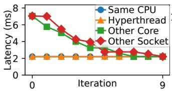  
(1) CPU-bound child latency.

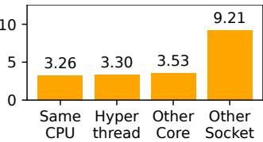  
(2) Cache-bound child latency.  
Figure 2: Impact of sync-wake misplacement.

## 2.3 Scheduler Bugs Are Difficult to Test

In this section, we examine current approaches to scheduler correctness, their limitations, and challenges in testing.

Current efforts toward scheduler correctness. We review existing approaches and demonstrate why they are inadequate.

• Testing. Existing scheduler tests leave most behavior untouched. In the Linux Test Project [53], the CFS category consists of only three tests for bandwidth throttling, starvation, and hackbench [88], despite 30k lines of code (LoC) in CFS. In practice, existing tests focus primarily on basic operations such as thread creation and CPU affinity, along with a handful of stress tests using synthetic workloads.

• Benchmark. Performance benchmarks are often used to evaluate schedulers [10, 34, 36, 40, 69, 74, 88]. However, this approach is neither reliable nor complete. First, benchmarks may show performance drops but cannot expose incorrect behaviors without a reference result. Second, their results are often noisy, making bugs hard to diagnose. Third, benchmarks lack the control needed to reliably reproduce bugs.

• Simulation. LinSched [19] is a Linux scheduler simulator, allowing developers to write and execute tests outside the kernel. Its development highlights the need for scheduler testing tools. However, it lacks fidelity as a simulator: it omits many kernel interactions and does not support symmetric multiprocessing (SMP). Furthermore, due to high maintenance costs, it has not been maintained since Linux v3.3.

• Verification. Existing work has produced verified schedulers [51, 58] and proofs for specific Linux scheduling functions [56, 57]. These efforts either rely on overly simplified scheduling policies or cover only small code sections, and thus cannot capture the full range of Linux’s scheduler policies.

Challenges for scheduler testing. Tests consist of event sequences designed to trigger failures; people inspect test outputs to determine whether a bug occurred [105]. In a scheduler context, event sequences (fork, wakeup, quota updates, etc.) invoke scheduling operators (enqueue, dequeue, reschedule, etc.) and generate diverse behaviors. However, schedulers are not tested extensively in practice using the standard approach. • Challenge 1: Scheduler behavior is highly time sensitive. Testing the scheduler demands more than simply replaying a sequence of events: precise control over the timing of every event is essential. The scheduler’s internal state evolves with every tick, so even small differences in when events occur can result in significantly different scheduling outcomes. For instance, Bug #1 is triggered only if a kthread’s synchronous wakeup happens during a narrow, transient window when the waker’s runqueue contains more queued than runnable tasks. • Challenge 2: Userspace events are insufficient. Current tests focus on specifying userspace events to trigger the scheduler, overlooking many crucial events that originate from the kernel or hardware. Other kernel subsystems call scheduler-exported methods or create kernel threads; the hardware timer triggers ticks, invoking load balancing and task switches. Controlling these events is challenging from userspace. In addition, scheduler decisions depend on CPU attributes (e.g., topology, capability, frequency). Hardware diversity is growing: from asymmetric cores to multi-level topologies (e.g., chiplet [7], sub-NUMA clustering [46]). Testing across this diversity is impractical. Physical hardware is costly, and virtualization platforms do not emulate all variations. Thus, many hardwarespecific bugs are surfaced only in production (e.g., ee6e44d). • Challenge 3: Identify bugs from noisy traces. When a bug is triggered, it is also difficult to observe. The scheduler is highly nondeterministic, so traces differ across runs, making it difficult to tell whether differences come from bugs or from normal variability. Modern kernels add noise with interrupts, RCU callbacks, workqueue activity, and clock behavior. Longrunning benchmarks worsen the problem: a bug may surface occasionally, buried among unrelated event traces.

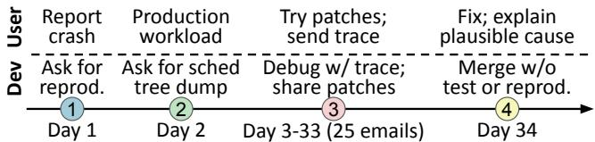  
Figure 3: Timeline of a production scheduler bug (bbce3de): weeks of remote debugging without a confirmed reproducer. No test was added to prevent future regressions.

Bug #2: Month-long debugging without a reproducer. Figure 3 shows a recent case [23]. 1 A user reported a nullpointer dereference, and the developer asked whether it was reproducible. 2 The user could only describe the symptoms (pick\_task\_fair crashes more often) and could not reproduce it outside production. 3 Tedious rounds of remote debugging followed: the user dumped scheduler trees, the developer studied them and suggested patches, and the cycle repeated (25 emails in total). Both sides mentioned trying to reproduce the bug “to crank up the iteration speed,” but without success. 4 Eventually, the user assembled a complex failure path and proposed a patch, which was merged later (bbce3de). The bug was not reproduced; the fix was never validated against a test. The patch was approved as developers thought it made sense. In contrast, a 20-event reproducer with kSTEP can reproduce it deterministically (§6.1).

Our contribution. To address these challenges, we introduce kSTEP (§4) and the testing tools built on top of kSTEP (§5). Users write driver programs to specify an event sequence; kSTEP executes them deterministically in an isolated environment with unmodified Linux kernels.

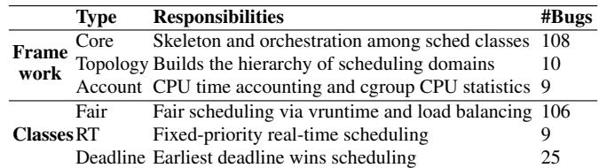  
Table 1: Logical components. The per-component bug counts exceed the total because one commit can affect multiple components.

## 3 Characterization Study

In this section, we present key findings from our scheduler bug analysis. Do some components contain more bugs (§3.2)? How long do bugs exist in the kernel (§3.2)? How hard are they to observe (§3.3)? What consequences do they cause (§3.4)? How are they found and handled (§3.5)? Why do they occur (§3.6)? What triggers them (§3.7)? Overall, our findings show that the CPU scheduler is hard to test and that current practice falls short. Many bugs are hard to observe and even harder to trigger, pushing developers towards code inspection and long-running benchmarks instead. These results also highlight opportunities for more effective scheduler testing.

## 3.1 Methodology and Limitations

In this section, we give a brief description of how we collect bugs and discuss the limitations of our methodology.

Methodology. We collected all bug-fix commits in the Linux CPU scheduler from mainline [61] and stable branches [42] since 2020. We scanned all commits modifying files in kernel/sched/, excluding sched\_ext, and classified a commit as a bug fix if it contained a Fixes:<SHA> trailer or indicated a defect (e.g., using terms such as fix, regression, inversion, stall/hang, violate, revert). We excluded commits that added features, optimized design, maintained code, or modified comments. After filtering, we obtained a study set of 232 scheduler bugs, each investigated and classified by one of the authors.

Limitations. As with all characterization studies, there is an inherent risk that our findings may not be representative.

• Representativeness of the selected bugs. First, our study covers bug-fix commits, and it may miss real-world scheduler bugs that were encountered by users but never reported or fixed. Second, our study should be interpreted as characterizing bugs in the Linux scheduler rather than scheduler implementations in general. Third, our bug-filtering criteria rely on signals such as Fixes:<SHA> trailers and bug-indicating keywords. We use conservative criteria to reduce false positives, but this may miss bug-fix commits without these signals.

• Possible observer error. Although we manually examined each collected patch, some classification decisions require judgment and may be subject to researcher bias.

## 3.2 Overview of Scheduler Bugs

The Linux CPU scheduler has grown from 15k LoC to 50k LoC in 15 years, turning a once-small subsystem into one of the largest subsystems in Linux. Where does the code live, and how do scheduler bugs and fixes move through releases?

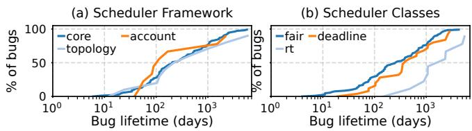

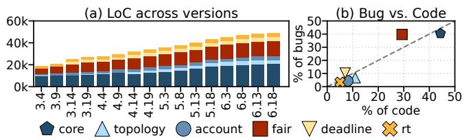  
Figure 4: Code size and bug counts of different components.  
Figure 5: Distribution of bug lifetimes across different components.

Logical components in the CPU scheduler. We divide the CPU scheduler into 2 components with 6 logical subcomponents (Table 1). The scheduler does two things: the scheduler framework provides the core mechanisms and scheduler classes implement specific policies. The framework has three parts. Core defines the policy-agnostic skeleton: it runs schedule() for task switching, manages task states, and exposes exported functions used by syscalls and other subsystems (cgroups, power, etc.). Topology maps hardware layout into scheduling domains for load balancing and CPU selection. Accounting tracks and reports runtime statistics to users, forming the observability layer. The scheduler classes then plug into this framework. Fair implements the default CFS policy, RT implements fixed-priority real-time scheduling, and Dead line implements earliest-deadline-first scheduling, ensuring tasks receive X runtime every Y period, as configured.

Bug distribution across components. Table 1 lists the bug counts by component. Figure 4a shows how each component grows across kernel versions, and Figure 4b compares each component’s share of code to its share of bugs.

• Scheduler framework. The Core component accounts for nearly half of all bugs and about 40% of the scheduler’s code. Although Core is mostly policy-agnostic, it orchestrates the entire scheduling pipeline and interacts with user workloads, other kernel subsystems, and hardware signals. This infrastructure is complex and thus a major source of failures.

• Scheduler classes. Among the classes, Fair grows fastest and contains more bugs relative to its size. CFS accumulates a large number of heuristics over the years (e.g., NUMA balancing, EEVDF, energy-aware hooks) with little structural cleanup. For example, select\_idle\_sibling() is the final step in CPU selection, deciding whether to use the candidate CPU or its nearby idle sibling. Despite its simple task, it spans 72 LoC and 33 predicates with heuristics accumulated over years.

Finding 1: The scheduler framework accounts for nearly half of bugs, due to extensive functionality requirements; the Fair scheduler has accumulated heuristics and is bug-prone.

Lifetime. Figure 5 shows how long bugs stay in mainline Linux before being fixed. Roughly 45% remain for over a year, and 5% survive for more than a decade. These bugs often stay hidden because they require specific hardware topologies or unusual workloads that standard benchmarks never hit. Many also compromise scheduler properties like fairness or work conservation, which are soft targets with no ground-truth curves to compare against. The presence of multi-year bugs stresses how hard it is to trigger and expose scheduler bugs.

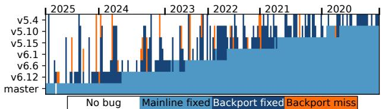  
Figure 6: Backported versions for 232 bugs. Columns represent bugs, rows represent versions, and cells represent backport status.

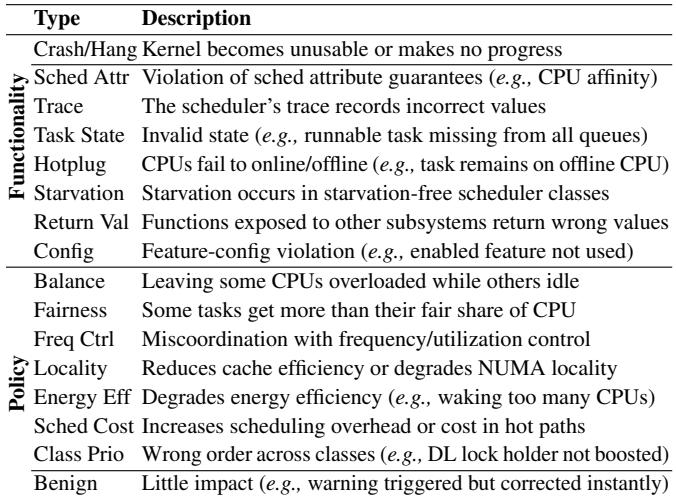  
Table 2: Categories of bug observability and consequences.

Finding 2: 45% of bugs hidden for years, 5% over a decade. Backport. Figure 6 shows how scheduler bug fixes propagate from mainline Linux to Long-Term Support (LTS) branches. Each cell shows how a version handles a fix: (1) the bug is absent, (2) the fix is present before release, (3) the fix is correctly backported, or (4) the fix should have been backported but is missing. We find that once a scheduler fix lands in mainline, it is propagated to all affected versions in most cases, even when those branches differ significantly in age and code.

Finding 3: The community shows a sustained commitment to scheduler reliability: most bugs are backported properly.

## 3.3 Bug Observability

As discussed in §2.2, violations of functionality and policy have different observability. In this section, we aim to examine the observability of scheduler bugs.

Categories. We first classify each bug by observability; each category exhibits distinct symptoms, as listed in Table 2.

• Functionality: Crash/Hang. Bugs can fail-stop the kernel with a panic, oops, hard lockup, or an unrecoverable hang. Users notice them immediately as the service is unavailable.

• Functionality: Non-fatal. These bugs violate strict functional guarantees (e.g., affinity not honored, tasks failing to wake). While these bugs are less immediately visible, they can still be detected through explicit checks by users.

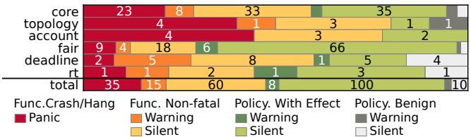  
Figure 7: Observability and diagnostic logs of bugs. Bugs can span components, so component-wise counts can exceed the total.

• Policy: With Effect. These bugs preserve functional semantics, but the implementation does not align with the intended design. They can compromise soft properties the scheduler wants to achieve, as shown in Table 2. External symptoms alone are insufficient to distinguish a policy bug from an in tentional design trade-off. Determining whether a bug occurs requires examining the internal scheduler state.

• Policy: Benign. Policy bugs whose effects are minimal or quickly self-correcting. They have no obvious impact and are usually observable only through code review or log warnings.

Bug observability. Figure 7 shows the observability of each bug. 15% of scheduler bugs cause highly visible failures such as crashes or hangs. Silent functional violations (26%) and misalignment between policy and implementation (47%) dominate, a higher share of silent bugs than prior work [67].

Policy bugs are especially common in Fair: 70% of its bugs fall into this category. The reason is that CFS offers proportional sharing in a best-effort manner while balancing different goals (fairness, locality, energy, etc.). Policy bugs occur when these heuristics drift from the intended design. Other components also contribute to policy bugs. The Core layer maintains policy-critical state (runqueue statistics, task attributes, etc.); Topology defines scheduling domains to guide balancing; RT and Deadline, despite their originally functional semantics, have accumulated heuristics (e.g., energyaware scheduling) and contain a number of policy bugs.

How much do logs reveal? Figure 7 also marks whether a bug triggers any kernel panics or warnings. Scheduler warnings have narrow coverage: they guard only coarse invariants (e.g., avoiding double enqueues) rather than checking whether each scheduling decision is valid or policy-consistent. As a result, 73% of bugs leave no warnings in the logs. In addition, for nearly all bugs in our study, the critical scheduler events are not recorded by default tracepoints. While powerful tracing tools exist [17, 54, 62, 69, 99, 101], fully tracing scheduler activity is expensive and disturbs time-sensitive decisions, making it impractical for production workloads. Thus, the bug-triggering event sequences are often absent in traces.

Finding 4: Silent functionality and policy bugs dominate (73%) the scheduler bugs. Logs and traces are insufficient to reveal them or record their triggering events.

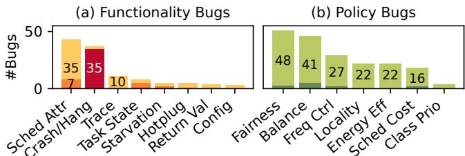  
Figure 8: Bug consequences. Consequence definitions in Table 2. Colors follow Figure 7. Counts exceed 232 via consequence overlap.

## 3.4 Bug Consequences

In this section, we examine how scheduler bugs affect the system and applications using the categories in Table 2.

Functionality violations. Figure 8a shows that while crashes and hangs are common (35 cases), most functional bugs are silent violations. Breaking strict interface semantics is the most common scheduler failure (42 cases). The scheduler exposes many interfaces for configuring task-, cgroup-, and system-level attributes. Some have strict specifications (e.g., allowed CPU sets, the CPU time a Deadline task must receive within its window). Violating them constitutes a functionality bug. Others express non-strict goals (e.g., proportional share for CFS tasks, short-term work conservation) that the scheduler attempts but does not guarantee at all times; falling short of these goals does not indicate a functionality bug. The remaining cases come from breaking other strict guarantees in the scheduler skeleton. Table 2 shows a detailed breakdown.

## Finding 5: Most functionality bugs result from violating strict requirements of the scheduler-attribute interface.

Service quality compromises. Policy bugs do not violate functional guarantees. Their symptoms are compromises of soft expectations (Table 2). For example, CFS shares express a soft expectation about the proportion of CPU time a task should receive relative to its peers. Such a share is often traded off against other goals, such as migration costs. We examine bugs by the soft expectations they compromise (Figure 8b).

Balance and fairness dominate because they sit at the center of many trade-offs. Balance can conflict with locality, energy efficiency, and scheduling cost. Fairness competes with frequency control, energy efficiency, and scheduling cost. To balance these trade-offs, the scheduler relies on numerous heuristics, making it particularly fragile. Hardware-related policies (locality, freq control, and energy-aware decisions) are frequently violated (73 cases). Modern hardware diversity forces the scheduler to grow many architecture-specific rules, making these paths especially bug-prone. Moreover, some bugs make the scheduler inefficient by slowing decision-making, increasing migration rates, or causing redundant calculations.

Finding 6: Balance and fairness are the most fragile properties; hardware-aware policies are also hard to get right.

## 3.5 Bug Discovery and Mitigation in Practice

Despite the scheduler’s critical role, bug handling remains largely ad hoc. This section examines how scheduler bugs are discovered, reproduced, and prevented in practice.

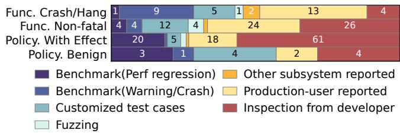

Figure 9: Discovery methods for scheduler bugs.  
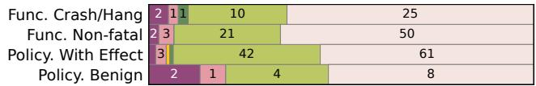  
Warning Tracepoint Unit test Document Comment Nothing  
Figure 10: Prevention actions taken after fixing scheduler bugs. Prevention actions can overlap, so the total can exceed 232 bugs.

How are bugs discovered? Figure 9 shows how bugs in each observability level first surface: via tests (benchmark regressions, customized test cases, fuzzing tools), user reports (from either other kernel subsystems or users), or code review. Fatal errors are easiest to see, so tests and users catch 89% of them. Non-fatal functionality bugs keep the system running, but users and tests still find many of them (65%) because they can observe clear semantic violations. In contrast, users and tests only find 47% of policy bugs due to low observability. The system remains functional while service quality quietly drifts, and users cannot tell whether a performance dip is a policy bug or an intended trade-off. The remaining policy bugs are found through code review; a fragile process makes policy violations easy to miss.

## Finding 7: Policy bugs rely heavily on code review to uncover; far fewer are reported by users or exposed by tests.

Lack of details to reproduce bugs. Bugs are rarely reproduced during the scheduler bug-fixing process. Figure 9 shows that 61% of runtime-exposed bugs are observed by regressions or alerts from long-running workloads, with no precise triggering sequence mentioned from report to fix. More surprisingly, developers reproduce the bug and validate the patch for only 22% of user-submitted patches. Instead, patch approval relies on code inspection and the fact that “the symptom went away”. The scarcity of reproducers reflects the scheduler’s poor testability. §2.3 discusses the challenges that make it difficult to construct stable, repeatable bug-triggering sequences. Without reliable reproducers, validation is difficult; there are no tests to prevent reintroduction of the bug.

Finding 8: Bugs are rarely reproduced: 61% of runtimeexposed bugs lack a trigger sequence; only 22% of userreported patches are explicitly reproduced and validated.

Lack of preventive action. Mature systems typically require bug fixes to include regression tests [5, 83], which CI runs to ensure the same bug does not recur. Figure 10 shows a very different pattern: most fixes are “one-shot” patches with no preventive action. The dominant outcome is Nothing. The most common follow-up is a code comment, which is helpful for clarity but provides no enforcement. Unit tests and selftests are almost never added; runtime checks are rare. Once a scheduler bug is patched, little is done to prevent similar bugs from recurring (e.g., db6cc3f). It depends on the vigilance of developers rather than regression tests.

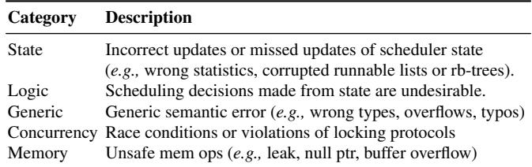

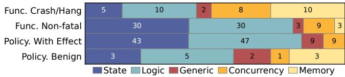  
Figure 11: Categories and distribution of bug root causes.

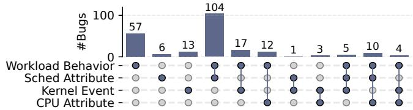  
Figure 12: Triggering conditions for scheduler bugs. Each column shows a group; dots mark the combination of trigger types required.

Finding 9: Common practices rarely prevent bug recurrence, as fixes rarely add unit tests, warnings, or tracepoints.

## 3.6 Root Cause

Understanding why bugs arise is essential. Different root causes call for different ways to detect, expose, and fix them, so a clear taxonomy helps both developers and tool builders. We classify bugs into five categories listed in Figure 11. Overall, state and logic faults make up the vast majority (75%) of bugs. These semantic errors often demand scheduler-domain knowledge to understand, detect, and fix. General root causes common to all systems, including concurrency and memory bugs, account for 12% and 7% of cases, respectively; they are more likely to lead to crashes or hangs and are therefore easier to observe. Generic coding mistakes, such as integer overflows or typos, are relatively rare. These bugs can also lead to different levels of observability and can sometimes be difficult to expose.

Finding 10: 75% of scheduler bugs stem from incorrect state updates or wrong logic, and likely require domain expertise to detect and resolve. These bugs often remain silent.

## 3.7 Triggering Conditions

There are opportunities to improve testing by examining the types of input events required to trigger bugs. We analyze each bug’s triggering events, with results shown in Figure 12. Workload behavior. Almost all bugs (90%) require specific kSTEP Input kSTEP Module kSTEP Userspace Unmodified Linux userspace workload behaviors like task count, arrival patterns, CPU-usage patterns, synchronization, or sleep/wake timing. Scheduler attributes. For 54% of the bugs, the trigger depends on how scheduler attributes are configured. Linux exposes rich interfaces for expressing performance requirements at the task, cgroup, and system levels. Among the studied bugs, 24%, 16%, and 4% rely on per-task, cgroup-level, and system-wide attributes, respectively; 8% appear only when multiple classes of tasks interact. From a testing perspective, these attributes form a rich input space, and effective testing must systematically explore these attribute combinations.

## Finding 11: Exploring the search space for different scheduler attributes is important for 54% of bugs.

Kernel events. Some triggers are events raised by other Linux subsystems: workqueue kthread pools, filesystem kthread activities, CPU hotplug, freezer operations, and so forth. These account for about 19% of bugs (10% hotplug, 4% kthread behavior, 5% other). These events invoke the scheduler through a large set of exported functions, and are difficult to orchestrate from userspace (i.e., one cannot control the timing of filesystem kthread wakeups by issuing file operations).

Special CPU attributes. Most bugs (88%) can be triggered on a multicore machine with SMT. The rest require special ized attributes: 5% on NUMA systems, 5% on asymmetric cores, and 2% on others (e.g., 4-way SMT, CPU-less NUMA nodes, or some private IBM hardware). These cases show that some failures only occur on CPUs with specific attributes that typical test environments rarely cover.

Finding 12: 28% of bugs cannot be triggered by specific userspace behavior alone; tests must explore kernel events and varied hardware topologies at the same time.

## 4 kSTEP: Kernel Scheduler Test Platform

To address the challenges of scheduler testability (§2.3), we present kSTEP<sup>2</sup>, a framework for controlled and deterministic execution of the Linux CPU scheduler in an isolated environment. In this section, we describe the design and implementation of kSTEP. In §5, we demonstrate how kSTEP enables the development of testing tools for the Linux scheduler, such as an execution-path tracer and a coverage-guided fuzzer. We design kSTEP around the following principles:

Precise timing. Scheduler bugs are often highly sensitive to timing, posing a significant challenge for testing and repro duction (Challenge 1). kSTEP provides fine-grained control over event timing, enabling precise triggering of bugs.

Rich control. Another challenge is insufficient control over the scheduler state from userspace (Challenge 2). kSTEP exposes events for userspace tasks, kernel activities, CPU attributes, and ticks, enabling control over scheduler behaviors. Noise-free determinism. Noisy and nondeterministic scheduler behaviors make it difficult to detect and diagnose bugs (Challenge 3). kSTEP guarantees that the same input always produces the same clean scheduler trace, enabling reliable bug reproduction and precise comparisons of scheduler behaviors. Fidelity. To ensure that the insights gained through kSTEP are directly applicable to real systems, kSTEP guarantees that its traces reflect real-world scheduler behavior.

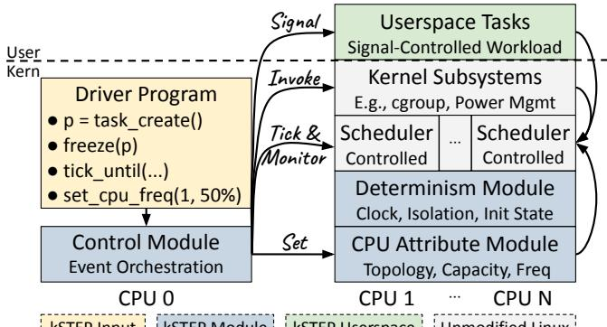  
Figure 13: Architecture of kSTEP.

Portability. To enable reliable reproduction and analysis of scheduling behaviors across different kernel versions, kSTEP does not require modification to the kernel source and is compatible with a broad range of kernel versions.

## 4.1 kSTEP Overview

Figure 13 illustrates the architecture of kSTEP. The input to kSTEP is a driver program that specifies a sequence of events to execute. The left side of the figure shows a dedicated CPU responsible for running both the driver program and the control module; the right side shows a controlled environment with the remaining CPUs deterministically executing the events as specified by the control module.

Controlled execution (§4.2). The driver program runs in kernel space and uses the control module to dispatch the events to the controlled environment. The events include not only actions to control processes but also kernel events (e.g., kthread) and CPU attributes (e.g., topology), which are otherwise impossible to control from userspace. One special event is the explicit scheduler tick. By issuing ticks manually, kSTEP advances logical time and triggers the scheduler exactly when desired. Explicit tick control enables kSTEP to order events relative to scheduler execution, allowing precise control. To preserve fidelity, the driver program cannot directly modify scheduler state; it reaches desired states only through events to exercise normal kernel code paths.

Deterministic execution (§4.3). On the remaining CPUs, userspace runs only the processes explicitly created by the control module, with nothing else permitted. These processes do not encode any workload-specific logic of their own; instead, their execution is orchestrated by the control module via signals, eliminating variability due to unpredictable execution speeds and making program behavior deterministic.

On the kernel side, the scheduler runs unmodified, but with an additional determinism module to eliminate all sources of nondeterminism affecting scheduler execution. It controls the clock values observed by the scheduler, suppresses unintended kernel activities (e.g., interrupts), and resets the initial scheduler state that may otherwise vary with the boot sequence.

```javascript
// Setup tasks: t1 runnable, t2: paused, t3 runnable
t1, t2, t3 = task_create()×3; task_wakeup({t1, t3});
// Setup cgroup hierarchy: g0: {g1: {t1}, g2: {t2, t3}}
cgroup_create({"/g0", "g0/g1", "g0/g2"});
cgroup_move_task("/g0/g1", {t1});
cgroup_move_task("/g0/g2", {t2, t3});
cgroup_set_weight({"/g0/g1", "/g0/g2"}, 15);
// Prepare scheduler state
tick_until(/* t1 eligible, but g0 and g1 ineligible */);
cgroup_move_task("/", {t1, t3});
// Trigger bug
cgroup_destroy("/g0/g1"); // Bug: overflow g0's vlag
cgroup_set_weight("/g0", 106); // Bug: overflow vruntime
// Observe task starvation
task_wakeup(t2); tick_repeat(200);
```

Figure 14: Driver pseudocode to reproduce Bug #2 in Figure 3. We discuss the driver program in more detail in Table 4.  
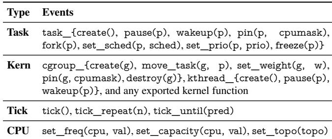  
Table 3: Selected events provided by kSTEP. In the parameters, p is a task, g is a cgroup name, and pred is a predicate function.

Limitation. While kSTEP supports concurrent and parallel execution of tasks on multiple CPUs, the sequence of events generated by the driver program is serialized. As a result, kSTEP cannot directly expose concurrency bugs within the scheduler. As noted in §3.6, these bugs are uncommon (12%).

## 4.2 Controlled Execution

kSTEP operates based on a driver program that defines a sequence of events to be executed. Controlled execution means the scheduler advances exclusively through driverissued events. The driver is a C function compiled into a kSTEP control module; it calls kSTEP's event API to orches trate tasks, inject ticks, and configure CPU attributes on the controlled CPUs (CPUs 1–N) in the desired order. Figure 14 shows an example driver that builds a cgroup hierarchy, advances ticks until a target scheduler state is reached, then restructures the cgroups to trigger a vruntime overflow bug. Table 3 lists selected events in kSTEP.

Userspace tasks. kSTEP provides a set of events to create and control userspace tasks. For example, a driver can create tasks, pause and wake them at chosen points, pin them to CPUs, and adjust their scheduler class or priority. Most task events send signals to the userspace program, exercising the usual userspace-to-kernel code paths. When no signal is pending, the userspace program simply runs a busy loop to stay runnable. A few events, such as freezing a task, are handled by kernel-side helpers.

Kernel subsystems. kSTEP includes a set of functions that interact with other kernel subsystems, for example, to create cgroups or kthreads. Since drivers run inside a kernel module, they can also call any exported kernel function. This direct access allows fine-grained control over kernel events.

Scheduler ticks. Scheduler state evolves with every timer tick, so time-sensitive bugs require controlling when ticks occur relative to other events. kSTEP therefore provides explicit tick events to trigger scheduler execution at chosen points. It also provides a “tick until” primitive: the driver supplies a predicate, and kSTEP injects ticks until the predicate is satisfied, enabling precise waits for transient scheduler states before issuing the next event.

CPU attributes. Scheduler decisions depend on hardware properties such as topology, CPU capacity, and frequency, but these configurations are hard to control on real machines or in virtualized environments [13]. kSTEP exposes these CPU attributes as events, allowing a driver to emulate diverse hardware setups and observe how they affect scheduler decisions.

## 4.3 Deterministic Execution

kSTEP incorporates a determinism module to make driver execution reproducible across runs on the same kernel. Unlike traditional record-and-replay approaches that attempt to control all sources of nondeterminism [4, 14, 15, 25–27, 31, 66, 75, 80, 81, 90, 91, 106], we identify three key factors that contribute to scheduler nondeterminism: clock sources, noisy activities, and initial scheduler state.

Mock clock sources. kSTEP mocks two clock sources to ensure deterministic execution: sched\_clock, which governs general scheduling operations (e.g., time slice), and jifies, which tracks timing for the next load balancing event. After each scheduler tick finishes on all controlled CPUs, both clocks are advanced, guaranteeing that time-related behaviors are fully reproducible.

Isolate noisy activities. To eliminate the noise introduced by system activities, we isolate the controlled CPUs. First, we implement a custom, minimal userspace init program (PID 1) to ensure that there is no other unintended process running on the controlled CPUs. We also address sources of kernel-level nondeterminism by explicitly redirecting all interrupts, RCU callbacks, and workqueue workers to CPU 0. This isolation is essential to achieving noise-free scheduler execution by ensuring the only events affecting the scheduler are those deliberately controlled by kSTEP.

Reset scheduler state. Because the kernel boot sequence is inherently nondeterministic, before driver execution we reset scheduler state to a known initial state, including zeroing runqueue load estimates, resetting per-task vruntime values, and clearing load-balancing cost counters on each scheduler domain. This ensures each driver run starts from the same scheduler state, independent of boot-time noise.

## 4.4 Implementation

The kSTEP source code is available at https://github.com/ kstep-dev/kstep. The kernel module is about 1.5k LoC, complemented by a lightweight userspace program for init and controlled userspace tasks in about 150 LoC.

Portability. We continuously test kSTEP against long-term support kernels from the past five years (v5.15, v6.1, v6.6, v6.12, and v6.18), as well as the latest release (v7.0, at the time of writing). kSTEP is fully compatible with both x86\_64 and arm64, and we confirm that it produces consistent results across both architectures. As the kernel evolves, maintaining kSTEP requires little effort.

Workflow. We provide scripts to download and build a specified kernel version, then run kSTEP on the unmodified kernel in QEMU [13]. Once the kernel boots, our custom init loads the kernel module and executes a specified driver program. The driver emits structured JSON output to a QEMU serial console, which is used in our analysis and visualization scripts, as well as high-level tools such as the tracer and fuzzer in §5. Driver execution. A driver defines a name, a setup() function for initialization (e.g., construct test objects), a run() function to issue the event sequence, and optional callbacks on scheduler events (e.g., on tick or load-balance). After setup(), kSTEP cancels the tick timer on controlled CPUs, mocks sched\_clock and jifies, and resets scheduler state. kSTEP then executes run() to control tasks, invoke kernel events, inject ticks, and configure CPU attributes. To implement a tick event, kSTEP advances the mocked clocks, sends IPIs [65] to invoke the tick function on each controlled CPU, and waits until all controlled CPUs finish the tick and drain pending scheduler softirqs [64]. This ensures that all CPUs reach a consistent state before the next event.

Kernel integration. kSTEP uses ftrace [98] to trace selected scheduler functions, such as load-balancing and task-group allocation paths, allowing kSTEP to observe scheduler-internal events without modifying kernel source. To call private kernel functions, kSTEP locates their address with kallsyms [63].

## 5 Scheduler Testing with kSTEP

kSTEP's determinism and control over scheduling events unlock a wide range of testing and analysis capabilities for kernel developers and researchers. In this section, we implement an execution-path tracer (§5.1) and a coverage-guided fuzzer (§5.2) on top of kSTEP. We then discuss additional opportunities made possible by kSTEP (§5.3).

## 5.1 Deterministic Scheduler Execution Tracer

Based on kSTEP, we implement a deterministic executionpath tracer that records scheduler code paths each driver event triggers. These noise-free traces help developers reproduce bugs and inspect the scheduler paths that lead to a behavior. Event-aware tracing. For each kSTEP event, the tracer reports program counters (PCs) separately for each participating task’s execution path. For example, when task A wakes task B, the tracer records the waker path executed by A and the wakee path executed by B separately. This lets users inspect each individual scheduler execution path separately and understand how each path affects scheduler state. Because kSTEP replay is deterministic, the same test generates the same trace across runs. Developers can therefore refine event sequences against stable evidence, making elusive bugs easier to reproduce than in the original nondeterministic environment.

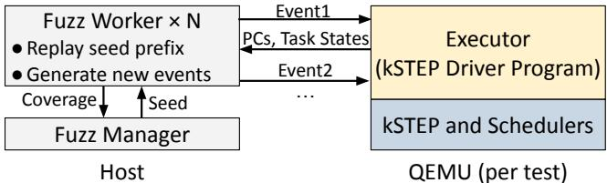  
Figure 15: Overview of kSTEP fuzzer.

Implementation. We instrument the Linux kernel using LLVM SanitizerCoverage [100], which inserts PC-tracing callbacks on scheduler control-flow edges. We then symbolize PCs into source-code locations using addr2line [41]. To avoid noise, kSTEP records PCs mainly on the isolated test CPUs (CPUs 1–N). On CPU 0, tracing is active only while executing kSTEP events (e.g., waking up a testing thread). This targeted approach ensures traces reflect test-induced scheduler behavior rather than unrelated kernel activity.

## 5.2 Coverage-Guided Scheduler Fuzzer

kSTEP enables noise-free coverage collection and exact event replay, making it a strong foundation for scheduler fuzzing [76]. We build a coverage-guided fuzzer on top of kSTEP to automatically explore scheduler states.

Overview. Figure 15 illustrates the kSTEP fuzzer. A host-side manager coordinates multiple workers, each running tests in a fresh QEMU instance. Each worker sends generated events to an in-guest executor (i.e., a kSTEP driver program), which applies them to the Linux scheduler in deterministic order.

Interactive input generation. The fuzzer tracks task states (i.e., running, runnable, blocked, frozen) to generate valid next events. For example, it only generates a fork event from a running task. After each event, the worker waits for completion and observes the updated task states. This interactive approach substantially reduces invalid inputs.

Coverage collection. The executor uses LLVM Sanitizer-Coverage [100] to log the program counters reached by each event. The worker converts these PCs into control-flow edge coverage and sends the result to the manager for corpus management [35]. As in §5.1, kSTEP filters PCs to avoid unrelated kernel activity. Recording coverage per event allows the fuzzer manager to pinpoint exactly which event triggers new scheduler behavior. Without kSTEP, unrelated kernel activity would pollute coverage, making fuzzing feedback unreliable. Replay and mutation. Our mutation strategy builds on kSTEP's determinism to resume from interesting intermediate scheduler states and explore nearby behaviors. The manager marks events that yielded new coverage as split points; to mutate a prior test, a worker replays the test up to a split point, then generates a short fresh event sequence from that point. Without deterministic replay, the same prefix could reach different states, making mutation-based fuzzing unreliable.

## 5.3 Potential Use Cases

In this section, we discuss additional use cases we believe can be supported by kSTEP's capabilities in the future.

Scheduler testing agents. kSTEP is well-suited for LLMdriven agents to automate scheduler testing. Such an agent can generate kSTEP driver programs to reproduce existing bugs or systematically explore scheduler behavior for new issues, testing each candidate sequence against a target kernel in seconds and iteratively improving based on results. This process depends on kSTEP's determinism: the deterministic execution trace gives the agent repeatable evidence, guiding targeted refinement of the event sequence.

Anomaly detection. kSTEP's deterministic scheduler execution produces repeatable traces that can be reliably analyzed. This provides a foundation for the development of advanced oracles to detect abnormal scheduler behavior automatically. Policy evaluation. kSTEP ’s ability to replay identical workloads deterministically enables precise comparisons across kernel versions or policy configurations. A tool built on this capability can quantify how a patch shifts scheduling decisions, expose subtle regressions, or validate that a new policy respects intended invariants.

## 6 kSTEP Evaluation with Case Study

Our study shows that scheduler bugs are hard to trigger and expose in practice. Thus, we propose kSTEP to execute a sequence of events deterministically, making the scheduler testable and analyzable. In this section, we evaluate kSTEP and ask the following research questions:

• §6.1: How hard is it to find kSTEP tests to trigger bugs?

• §6.2: How well can kSTEP's deterministic and noise-free trace help observe the buggy behavior and bug impacts?

• §6.3: How can kSTEP help uncover new scheduler bugs? Case-study bug set. We sampled 7 bugs that span different components, observability, and triggers. Table 4 lists their descriptions and types (policy or functionality bug). Most bug reports lack details on how to reproduce them. These cases provide a diverse evaluation set for kSTEP.

Experiment setup. We conduct experiments on a machine with 2 Intel Xeon Silver CPUs (10 cores each) running Ubuntu 24.04. For each bug, we check out the repository immediately preceding the fix commit. We then run kSTEP on QEMU to execute our custom driver program that triggers the bug. Next, we check out the fix commit and re-run the program. Each run launches a new QEMU and shuts it down upon completion.

## 6.1 Trigger Bugs with kSTEP

In Table 4, we report the number of kSTEP events and LoC for each reproducer to evaluate how complex real scheduler bugs look under kSTEP ’s event model. Long sequences would make kSTEP impractical. Reproducers for our studied bugs are compact: at most 20 steps and 47 LoC. Also, most studied bugs require at most five tasks to trigger, except for one case that stresses the scheduler with 20k tasks. Notably, most studied bugs were never reproduced by developers (e.g., Bug #2 took a month to fix without a confirmed reproduction); kSTEP reduces them to short event sequences that run in seconds.

We also list the event types used in each reproducer. The set is diverse: task events that create, wake, pause, or freeze tasks; kernel events that control cgroups or kthreads; and CPUfrequency changes. In addition, three bugs require ticking until a specific state to hit a narrow transient window. This diversity matches our findings in §3.

Bug #1: Trigger a kernel event in a time window. This is the same bug in §2.2 (Figures 1 and 2): it only occurs when a kthread calls a sync wakeup when it is the only runnable one and the runqueue has nr\_queued > nr\_running.

The reproducer creates a kthread as the waker (i.e., sync wakeup is an operation for kthreads only) and a userspace task that later becomes a “ghost” sleeper. Then, we tick until the userspace task becomes ineligible (i.e., its runtime exceeds its share). We block it here so it remains delayed-dequeued under EEVDF policy and causes nr\_queued > nr\_running. With the paused task as a ghost sleeper and no other runnable tasks, both triggering conditions are satisfied. At this moment, we ask the waker to call sync wakeup. The same reproducer later showed that the upstream fix for Bug #1 was incomplete; we report the remaining bug separately as Bug #8 in §6.3.

This example shows how kSTEP lets testers reliably execute an event at a transient state. The tester advances the scheduler with “tick until,” stops at the precise state, and then issues the target event at the same logical timestamp. Thus, the event is guaranteed to observe the expected transient condition, making hard-to-trigger bugs reliably reproducible.

Bug #2: cgroup hierarchy. This is the same bug in Figure 3, which remained unreproduced after a month of attempts. It requires a cgroup hierarchy and issuing an event at a transient state. Figure 14 shows the kSTEP reproducer in pseudocode.

To reproduce this bug, the driver program builds a cgroup hierarchy and places Task 1 (runnable) in cgroup 1, and Task 2 (paused) and Task 3 (runnable) in cgroup 2. The first precondition requires that cgroup 0’s and cgroup 1’s scheduling entities be delayed-dequeued. To reach this state, we tick the scheduler into a transient state where Task 1 is eligible but cgroup 1 and cgroup 0 are not. We then move Task 1 and Task 3 back to the root cgroup; since both tasks are currently eligible, the scheduler immediately dequeues their entities, while cgroup 0’s and cgroup 1’s entities remain delayed-dequeued to burn off their lag. This satisfies the first precondition.

Next, we destroy cgroup 1 so that cgroup 1’s and cgroup 0’s entities fully dequeue. We then reweight cgroup 0 so that the bug overflows its vruntime to a huge positive value. Finally, we wake up Task 2 and observe that Task 2 is starved because CFS avoids running cgroup 0 due to its inflated vruntime.

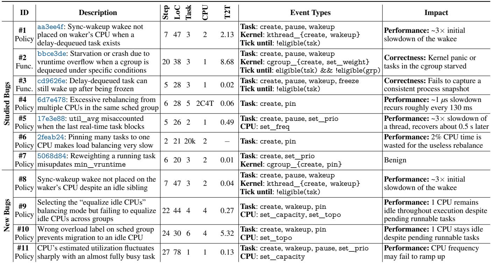  
Table 4: Studied and newly found bugs. Bugs #1–#7 are studied bugs. Bugs #8 and #9 are new bugs we found using manually written kSTEP drivers. Bugs #10 and #11 are new bugs found by the kSTEP fuzzer. 2C4T: 2 cores and 4 threads. T2T: time to trigger by fuzzer in hours.

This bug has intricate triggering conditions, yet our reproducer needs only 20 events because kSTEP is able to stop the scheduler at the desired but transient state (i.e., the task is eligible but its cgroup is not) with only one event, enabling reliable reproduction of bugs involving deep hierarchies.

Automated bug triggering. We use the kSTEP fuzzer (§5.2) to search for triggering event sequences. For each studied bug, we encode an invariant capturing the expected behavior; for instance, bug #4 is captured by: within a scheduling group, at most one designated core invokes the load-balancing algorithm [69]. We run the fuzzer for 24 hours, then manually inspect each violation to determine whether it reproduces the bug, is a false positive, or exposes a new anomaly.

Table 4 reports triggering times in hours. Most bugs are triggered within one hour, showing that kSTEP's deterministic, isolated execution lets the fuzzer reach buggy scheduler states effectively. Bug #2 is the hardest: it took developers 30 days to fix without a reproducer, while the fuzzer needs over 8 hours because the bug requires a condition (i.e., a task must be eligible while the scheduling entities of its ancestors are not), which is reached only after exhaustive exploration. Bug #6 remains out of reach: it requires 20k threads, beyond our fuzzing scale. The fuzzer also uncovers two new bugs, Bug #10 and Bug #11, described in §6.3.

Summary. These cases demonstrate that, despite the complex triggering conditions of scheduler bugs, kSTEP enables testers to reproduce them with simple, concise test cases. kSTEP also enables effective automated fuzz testing of the scheduler, both to trigger the studied bugs and to uncover new anomalies.

## 6.2 Observe Bugs with kSTEP

The output of kSTEP is a trace of the scheduler’s internal states. Compared with uncontrolled systems, kSTEP traces are noise-free and deterministic. In this section, we visualize the trace generated by the reproducers of our studied bugs in Figure 16 and summarize their impact in Table 4. We first show how these traces help observe buggy behavior and support impact analysis through detailed case studies. We also evaluate the determinism of kSTEP by verifying that traces generated prior to the bug trigger are identical across runs.

Bug #1. Figure 16.1 shows a kthread calling sync\_wakeup on CPU 1. In the buggy version, the wakee is placed on CPU 2, though CPU 1 (where the waker runs) is immediately idle; in the official fixed version (aa3ee4f), it still selects CPU 2, as the fix is incomplete. We provide a more detailed explanation in §6.3. With our patch, the wakee selects CPU 1, preserving locality. Figure 2.1 quantifies the potential impact: CPU 2 can have a low frequency as it is idle; the wakee can be 3× slower and recover after tens of milliseconds.

Bug #2. In Figure 16.2, once the bug is triggered, the vruntime of Task 2’s cgroup entity overflows to a huge 64-bit value, making it effectively ineligible to run until peers catch up, so it is starved almost indefinitely. In the fixed trace, Task 2 runs normally, sharing CPU time with others.

Bug #3. In Figure 16.3, kSTEP sends a freeze to Task 1 when it is sleeping but remains on the runqueue (because of the delayed dequeue feature). In the buggy version, the task is not frozen successfully and later wakes up to run on its CPU again; in the fixed version, it remains frozen and cannot be woken again. This harms correctness; applications relying on the freezer to snapshot a process can be affected.

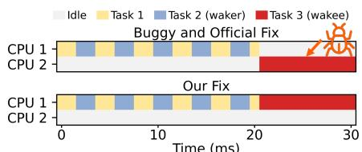  
(1) Task 3 (wakee) placed on a remote CPU.

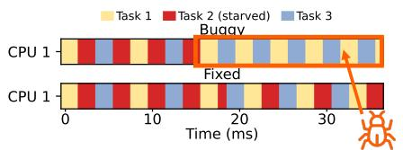  
(2) Vruntime overflow causing starvation of Task 2.

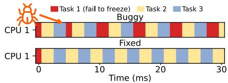

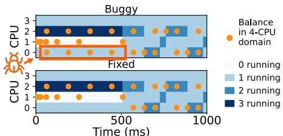  
(4) Extra rebalance on CPU 4.

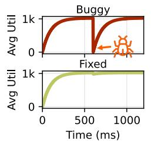  
(5) Inaccurate average util.

(3) Task 1 still runs after being frozen.  
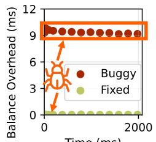  
Time (ms)  
(6) High rebalance cost.

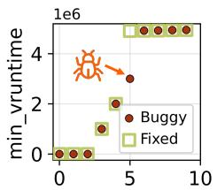  
(7) Missing min\_vruntime update.  
Time (ms)  
Figure 16: Visualization of the buggy behavior for each bug reproduced by kSTEP. In all figures, the x-axis shows logical time. The y-axis shows the CPU ID for (1)-(4); average utilization for (5); wall-time rebalance latency for (6); and minimum vruntime for (7). The colored segments show the running task on each CPU in (1)-(3), and the number of runnable tasks on each CPU in (4).

Bug #4. In Figure 16.4, we create and pin 1, 0, 3, and 1 tasks on CPUs 4–7, respectively, and examine which CPUs invoke rebalance across the 4-CPU sched domain. Ideally, only one CPU per sched group should do so; CPUs 4–5 and CPUs 6–7 form two groups. In the buggy version, both CPUs 4 and 5 attempt balancing, causing redundant calculations. In the fixed version, only one CPU per group invokes domain balancing. The impact is small (under 1 microsecond CPU time wasted per 130 ms) but can still matter for latency-critical applications. Once we remove CPU affinity for the tasks and allow migrations, the bug no longer triggers, and both versions revert to one balancing CPU per group.

Bug #5. Figure 16.5 shows that when the RT task sleeps and a CFS task takes over, the buggy scheduler drops the CPU’s util\_avg sharply and recovers after \~500 ms. A util\_avgdriven frequency governor may lower CPU frequency and affect the task’s latency (Figure 2.1). Also, the busy CPU may appear lightly loaded and attempt to pull tasks.

Bug #6. Figure 16.6 shows that pinning 20k tasks to one CPU makes load balancing on other CPUs expensive: these rebalance attempts take around 2.5 ms to finish. The fix adds a hard cap on the number of tasks to inspect, restoring normal cost (1 µs). In our setup, this bug wastes \~4 ms of CPU time every \~200 ms (the interval between affected rebalances).

Bug #7. This bug did not update the min\_vruntime of a runqueue when reweighting a cgroup. In Figure 16.7, when triggered, the buggy version’s min\_vruntime is higher. However, this one-tick error has almost no impact on applications.

Determinism. In Figures 16.1-16.3, we see identical task switches before the trigger and clear divergence after it. In Figure 16.4, every balance attempt and task migration occurs at identical timestamps except for CPU 4. In Figures 16.5 and 16.7, buggy and fixed curves evolve identically up to the trigger. These results demonstrate kSTEP's determinism.

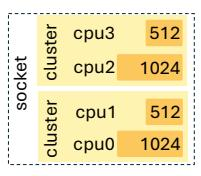  
(1) Topology.

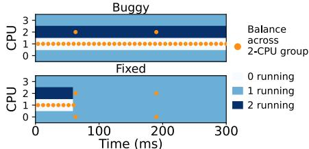  
(2) Buggy behavior.  
Figure 17: In Bug #9, CPU 1 is idle under the specified topology.

Summary. kSTEP enables deterministic and noise-free observation of scheduler bugs. It enables precise side-by-side comparison of buggy and fixed runs. The observation shows that most scheduler bugs cause noticeable disruptions across different aspects of system behavior.

## 6.3 New Bugs Discovered and Fixed

We also use kSTEP to uncover four new bugs in the latest Linux kernel, which we have reported to the developers. Bugs #8 and #9 are found using manually written kSTEP drivers. Bugs #10 and #11 are found by the kSTEP fuzzer.

Bug #8: Bug #1 patch does not completely fix it. Bug #8 is the remaining bug we exposed when validating Bug #1’s upstream fix with our triggering program: the child still selects a remote CPU as shown in Figure 16.1. The root cause is CFS’s two-phase wakeup. Phase 1 chooses a candidate CPU via heuristics such as wake\_afine\_idle; after the original fix, this phase correctly returns the local CPU. Phase 2 then decides whether to use the candidate CPU or a nearby idle CPU via select\_idle\_sibling, which still uses nr\_running instead of the effective runnable count that excludes delayed-dequeue tasks. Thus, the patch fixed the misuse in wake\_afine\_idle but left the same issue in select\_idle\_sibling. After correcting both sites, the child selects the about-to-idle local CPU (Figure 16.1).

Bug #9: Work-conserving violation on a specific topology. Bug #9 occurs on a 2-cluster topology of varying CPU capacities (Figure 17.1). We pin 1, 0, 2, and 1 tasks on CPUs 0–3, respectively, then relax the affinity of tasks on CPU 2 to CPUs 1– 2. The idle CPU 1 should quickly pull a task, but instead remains idle while CPU 2 stays overloaded (Figure 17.2).

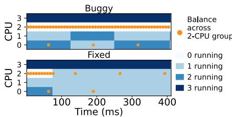  
(1) Bug #10.

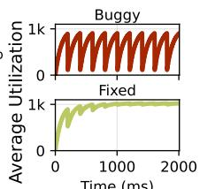  
(2) Bug #11.  
Figure 18: Buggy behavior of Bug #10 and Bug #11.

The root cause is a wrong calculation. To equalize idle CPUs across the local and busiest groups, the scheduler computes the imbalance as: (local.idle\_cpus - busiest.idle\_cpus) / 2. In our workload, the local group has one idle CPU, and the busiest group has no idle CPU. The formula computes an imbalance of 0, so the scheduler performs no migration. This contradicts the intended policy to balance idle CPUs. To fix this bug, when the local group has one more idle CPU than the busiest group and the busiest group is overloaded, we set the imbalance to 1 instead of 0. Figure 17.2 shows that, with our fix, idle CPU 1 quickly pulls a task from busy CPU 2.

Bug #10: Work-conserving violation due to a wrong group label. We found Bug #10 on a 2-cluster topology of 4 CPUs. We pin 3 tasks to CPU 3 and 3 tasks to CPUs 0–1, then relax the affinity of the latter to CPUs 0–3. CPU 2 is idle and should quickly pull a task because there are 3 tasks eligible to run on it. However, Figure 18.1 shows CPU 2 stays idle indefinitely.

The root cause is a mislabeling: CPUs 2–3 form a cluster where CPU 3 is overloaded and CPU 2 is idle, so the cluster should be labeled imbalanced. Instead, the scheduler labels it overloaded, causing the load-balancing logic to conclude no migration is needed. With the fix, CPU 2 promptly pulls a task from CPU 1 (Figure 18.1).

Bug #11: utilization avg plunges immediately after sleep. We place a real-time task on a low-capacity CPU that runs for 200 ticks and sleeps for 1 tick, keeping the CPU nearly fully utilized. Its estimated utilization should thus stay high and stable, but Figure 18.2 shows it drops sharply when the task sleeps. The cause is that the scheduler’s idle-time accounting mishandles low-capacity CPUs, overestimating how long the CPU was idle. The fix scales the idle-time estimate by the CPU capacity, keeping the estimate high for the busy task.

Summary. These results show that kSTEP uncovers new scheduler bugs with simple tests and provides a foundation for future regression and automated testing.

## 7 Related Work

CPU scheduler correctness. Many benchmarks have been built to evaluate schedulers: Hackbench [88] stresses message passing; Schbench [74] simulates web servers; Adrestia [34] exercises load balancing; Rt-app [10] emulates mobile tasks; and Cyclictest [40] measures wakeup latency. Another line of work focuses on verification. Ipanema [58] reimplements schedulers in a domain-specific language; Lawall et al. verify individual policies [56, 57]. Others simulate schedulers in userspace: LinSched and Apple’s XNU scheduler test [6].

Controlled testing. Controlled testing has long been used to expose concurrency bugs [29, 33, 37, 38, 59, 72, 78, 79]. Fray [59] is a platform for performing push-button concurrency testing of JVM programs. Prior tools, such as Chess [79] and delay-bounding [33], search for bugs by bounding and exploring user-level interleavings. Controlled concurrency testing is orthogonal to kSTEP because these systems use their own schedulers to enforce interleaving rather than exercising Linux scheduler code paths.

Record and replay. Application-level record-and-replay systems record all nondeterministic inputs and internal sources of nondeterminism, such as concurrency [14, 15, 21, 25–27, 66, 75, 80, 81, 91]. Whole-machine record-and-replay techniques record every nondeterministic event along the VM boundary, allowing its entire execution to be replayed exactly [4, 22, 30–32, 86, 90, 106]. These techniques can replay previously recorded bugs but offer little help in triggering time-sensitive ones. kSTEP further lets users control scheduler state with its events, making such bugs significantly easier to expose. Also, kSTEP does not control whole-machine nondeterminism; it targets deterministic scheduler execution.

CPU scheduling policies. Many scheduling policies target different objectives [11,20,39,47,50,55,73,82,85]. We do not evaluate how these policies perform for particular workloads; instead, we check whether the implementation aligns with the intended design of the CPU scheduler.

## 8 Conclusion

In this paper, we characterize CPU scheduler bugs and find that they are important, yet hard to observe and trigger. We introduce kSTEP to precisely control scheduler behavior through deterministic tests, producing noise-free, repeatable traces. With kSTEP, we are able to reproduce existing bugs and uncover new ones, showing its promise as a foundation for systematic scheduler testing.

## Acknowledgments

We thank our shepherd, the reviewers of OSDI ’26, and students in ADSL for their valuable feedback. We are grateful to Suyan Qu and Junxuan Liao from ADSL for their careful proofreading before the submission deadline. This work was supported by NSF grant CNS-2402859 and the taxpayers of Wisconsin and the USA. Caeden Whitaker was supported by the NSF Graduate Research Fellowship Program under Grant No. 2137424, and the Graduate School and the Office of the Vice Chancellor for Research at UW-Madison through the Wisconsin Alumni Research Foundation. Any opinions, findings, conclusions, and recommendations expressed do not necessarily reflect the views of NSF or any other institutions.

## References

[1] Docker Project. https://www.docker.io/, 2015.

[2] cgroups - Linux Control Groups. https://man7. org/linux/man-pages/man7/cgroups.7.html, May 2023.

[3] Akamai Technologies, Inc. Akamai online retail performance report: Milliseconds are critical — web performance analytics show even 100-millisecond delays can impact customer engagement and online revenue. Press Release, Akamai Technologies, Inc., 2017. April 18, 2017. Cambridge, MA, USA. Available online: https://www.akamai.com/newsroom/pressrelease/akamai-releases-spring-2017-state-of-onlineretail-performance-report.

[4] Antithesis Operations LLC. Antithesis: autonomous software testing. https://antithesis.com/.

[5] Apache Cassandra Project. Testing — apache cassandra development. https://cassandra.apache.org/ \_/development/testing.html, 2025. Accessed: 2025-09-16.

[6] Apple Inc. Apple xnu kernel scheduler test harness. https://github.com/apple-oss-distributions/ xnu/tree/main/tests/sched/sched\_test\_ harness, 2025.

[7] ARM. Multi-chip modules or modular design chiplets for custom silicon. https://www.arm.com/ markets/chiplets, 2025.

[8] Remzi. Arpaci-Dusseau and Andrea Arpaci-Dusseau. Fail-stutter fault tolerance. In Proceedings Eighth Workshop on Hot Topics in Operating Systems, pages 33–38, 2001.

[9] Remzi Arpaci-Dusseau and Andrea Arpaci-Dusseau. Operating Systems: Three Easy Pieces. 2018.

[10] Giacomo Bagnoli and Vincent Guittot. Rt-app - real-time application suite. https://github.com/ scheduler-tools/rt-app, 2010.

[11] Adam Belay, George Prekas, Ana Klimovic, Samuel Grossman, Christos Kozyrakis, and Edouard Bugnion. IX: a protected dataplane operating system for high throughput and low latency. In 11th USENIX Symposium on Operating Systems Design and Implementa tion (OSDI 14), pages 49–65, 2014.

[12] Dharma Bellamkonda. Issue 2623: CFS scheduler bug throttles highly threaded i/o blocked applications in kubernetes. https://github.com/coreos/bugs/ issues/2623, 2019.

[13] Fabrice Bellard. QEMU, a fast and portable dynamic translator. In USENIX Annual Technical Conference (ATC), 2005.

[14] Tom Bergan, Owen Anderson, Joseph Devietti, Luis Ceze, and Dan Grossman. Coredet: A compiler and runtime system for deterministic multithreaded execution. In Proceedings of the fifteenth International Conference on Architectural support for programming languages and operating systems, pages 53–64, 2010.

[15] Emery D Berger, Ting Yang, Tongping Liu, and Gene Novark. Grace: Safe multithreaded programming for C/C++. In Proceedings of the 24th ACM SIGPLAN conference on Object oriented programming systems languages and applications, pages 81–96, 2009.

[16] Justinien Bouron, Sebastien Chevalley, Baptiste Lepers, Willy Zwaenepoel, Redha Gouicem, Julia Lawall, Gilles Muller, and Julien Sopena. The battle of the schedulers: FreeBSD ULE vs. Linux CFS. In 2018 USENIX Annual Technical Conference (USENIX ATC 18), pages 85–96, Boston, MA, July 2018. USENIX Association.

[17] bpftrace contributors. bpftrace. https://github. com/bpftrace/bpftrace, 2025. Accessed: 2025-12- 08.

[18] Nathan Bronson, Zach Amsden, George Cabrera, Prasad Chakka, Peter Dimov, Hui Ding, Jack Ferris, Anthony Giardullo, Sachin Kulkarni, Harry Li, Mark Marchukov, Dmitri Petrov, Lovro Puzar, Yee Jiun Song, and Venkat Venkataramani. Tao: Facebook’s distributed data store for the social graph. In Proceedings of the 2013 USENIX Conference on Annual Technical Conference, USENIX ATC’13, page 49–60, USA, 2013. USENIX Association.

[19] John M Calandrino, Dan P Baumberger, Tong Li, Jessica C Young, and Scott Hahn. Linsched: The Linux scheduler simulator. In PDCCS, pages 171–176, 2008.

[20] Tingjia Cao, Andrea C. Arpaci-Dusseau, Remzi H. Arpaci-Dusseau, and Tyler Caraza-Harter. Making serverless Pay-For-Use a reality with leopard. In 22nd USENIX Symposium on Networked Systems Design and Implementation (NSDI 25), pages 189–204, Philadelphia, PA, April 2025. USENIX Association.

[21] Yufei Chen and Haibo Chen. Scalable deterministic replay in a parallel full-system emulator. SIGPLAN Not., 48(8):207–218, February 2013.

[22] Yufei Chen and Haibo Chen. Scalable deterministic replay in a parallel full-system emulator. In Proceedings of the 18th ACM SIGPLAN Symposium on Principles and Practice of Parallel Programming, PPoPP ’13,

page 207–218, New York, NY, USA, 2013. Association for Computing Machinery.

[23] Pat Cody. [patch] sched/fair: Add null pointer check to pick\_next\_entity(). https: //lore.kernel.org/all/20250320205310. 779888-1-pat@patcody.io/T/#u, 2025.

[24] Jonathan Corbet. The long road to lazy preemption. LWN.net, oct 2024. Accessed: 2025-09-14.

[25] Heming Cui. Stable deterministic multithreading through schedule memoization. In 9th USENIX Symposium on Operating Systems Design and Implementation (OSDI 10), 2010.

[26] Heming Cui, Jiri Simsa, Yi-Hong Lin, Hao Li, Ben Blum, Xinan Xu, Junfeng Yang, Garth A Gibson, and Randal E Bryant. Parrot: A practical runtime for deterministic, stable, and reliable threads. In Proceedings of the Twenty-Fourth ACM Symposium on Operating Systems Principles, pages 388–405, 2013.

[27] Heming Cui, Jingyue Wu, John Gallagher, Huayang Guo, and Junfeng Yang. Efficient deterministic multithreading through schedule relaxation. In Proceedings of the Twenty-Third ACM Symposium on Operating Systems Principles, pages 337–351, 2011.

[28] Jeffrey Dean and Luiz André Barroso. The tail at scale. Commun. ACM, 56(2):74–80, February 2013.

[29] Ankush Desai, Shaz Qadeer, and Sanjit A. Seshia. Sys tematic testing of asynchronous reactive systems. In Proceedings of the 2015 10th Joint Meeting on Founda tions of Software Engineering, ESEC/FSE 2015, page 73–83, New York, NY, USA, 2015. Association for Computing Machinery.

[30] Brendan Dolan-Gavitt, Josh Hodosh, Patrick Hulin, Tim Leek, and Ryan Whelan. Repeatable reverse engineering with panda. In Proceedings of the 5th Program Protection and Reverse Engineering Workshop, PPREW-5, New York, NY, USA, 2015. Association for Computing Machinery.

[31] George W. Dunlap, Samuel T. King, Sukru Cinar, Murtaza A. Basrai, and Peter M. Chen. Revirt: enabling intrusion analysis through virtual-machine logging and replay. SIGOPS Oper. Syst. Rev., 36(SI):211–224, December 2003.

[32] George W. Dunlap, Dominic G. Lucchetti, Michael A. Fetterman, and Peter M. Chen. Execution replay of multiprocessor virtual machines. In Proceedings of the Fourth ACM SIGPLAN/SIGOPS International Conference on Virtual Execution Environments, VEE ’08, page 121–130, New York, NY, USA, 2008. Association for Computing Machinery.

[33] Michael Emmi, Shaz Qadeer, and Zvonimir Rakamaric.´ Delay-bounded scheduling. In Proceedings of the 38th Annual ACM SIGPLAN-SIGACT Symposium on Principles of Programming Languages, POPL ’11, page 411–422, New York, NY, USA, 2011. Association for Computing Machinery.

[34] Matt Fleming. Adrestia - scheduler load balancer microbenchmark suite. https://github.com/ mfleming/adrestia, 2016.

[35] Matt Fleming. syzkaller - kernel fuzzer. https:// github.com/google/syzkaller, 2016.

[36] Matt Fleming. A survey of scheduler benchmarks. https://lwn.net/Articles/725238/, 2017.

[37] Pedro Fonseca, Cheng Li, and Rodrigo Rodrigues. Finding complex concurrency bugs in large multithreaded applications. In Proceedings of the Sixth Conference on Computer Systems, EuroSys ’11, page 215–228, New York, NY, USA, 2011. Association for Computing Machinery.

[38] Pedro Fonseca, Rodrigo Rodrigues, and Björn B. Bran denburg. SKI: Exposing kernel concurrency bugs through systematic schedule exploration. In 11th USENIX Symposium on Operating Systems Design and Implementation (OSDI 14), pages 415–431, Broomfield, CO, October 2014. USENIX Association.

[39] Joshua Fried, Zhenyuan Ruan, Amy Ousterhout, and Adam Belay. Caladan: Mitigating interference at microsecond timescales. In 14th USENIX Symposium on Operating Systems Design and Implementation (OSDI 20), pages 281–297, 2020.

[40] Thomas Gleixner, Clark Williams, and John Kacur. cyclictest - clock\_nanosleep latency detection. https://wiki.linuxfoundation.org/realtime/ documentation/howto/tools/cyclictest, 2016.

[41] GNU Binutils. addr2line – convert addresses into file names and line numbers. https://sourceware.org/ binutils/docs/binutils/addr2line.html. Accessed: 2026-06-07.

[42] Greg Kroah-Hartman and contributors. Linux kernel stable tree. https://github.com/gregkh/linux, 2025. Accessed: 2025-12-08.

[43] Haryadi S. Gunawi, Riza O. Suminto, Russell Sears, Casey Golliher, Swaminathan Sundararaman, Xing Lin, Tim Emami, Weiguang Sheng, Nematollah Bidokhti, Caitie McCaffrey, Deepthi Srinivasan, Biswaranjan Panda, Andrew Baptist, Gary Grider, Parks M. Fields, Kevin Harms, Robert B. Ross, Andree Jacobson,

Robert Ricci, Kirk Webb, Peter Alvaro, H. Birali Runesha, Mingzhe Hao, and Huaicheng Li. Fail-slow at scale: Evidence of hardware performance faults in large production systems. ACM Trans. Storage, 14(3), October 2018.

[44] Ke Han, Sruthi P C, Yayu Wang, Yaoxu Song, Bishal Basak Papan, Junwen Yang, Pedro Fonseca, and Yongle Zhang. UpFuzz: Detecting data format incompatibility bugs during distributed storage system upgrade. In 23rd USENIX Symposium on Networked Systems Design and Implementation (NSDI 26), pages 1225–1242, Renton, WA, May 2026. USENIX Association.

[45] Peng Huang, Chuanxiong Guo, Lidong Zhou, Jacob R. Lorch, Yingnong Dang, Murali Chintalapati, and Ran dolph Yao. Gray failure: The Achilles’ heel of cloudscale systems. In Proceedings of the 16th Workshop on Hot Topics in Operating Systems, HotOS ’17, pages 150–155, New York, NY, USA, May 2017. ACM.

[46] Intel. Intel xeon processor scalable family technical overview. https://www.intel.com/content/ www/us/en/developer/articles/technical/ xeon-processor-scalable-family-technical-overview. html, 2025.

[47] Calin Iorgulescu, Reza Azimi, Youngjin Kwon, Sameh˘ Elnikety, Manoj Syamala, Vivek Narasayya, Herodotos Herodotou, Paulo Tomita, Alex Chen, Jack Zhang, et al. PerfIso: Performance isolation for commercial Latency-Sensitive services. In 2018 USENIX Annual Technical Conference (USENIX ATC 18), pages 519– 532, 2018.

[48] Guoliang Jin, Linhai Song, Xiaoming Shi, Joel Scherpelz, and Shan Lu. Understanding and detecting realworld performance bugs. In Proceedings of the 33rd ACM SIGPLAN Conference on Programming Language Design and Implementation, PLDI ’12, page 77–88, New York, NY, USA, 2012. Association for Computing Machinery.

[49] Kostis Kaffes, Jack Tigar Humphries, David Mazières, and Christos Kozyrakis. Syrup: User-defined scheduling across the stack. In Proceedings of the ACM SIGOPS 28th Symposium on Operating Systems Principles, SOSP ’21, page 605–620, New York, NY, USA, 2021. Association for Computing Machinery.

[50] Antoine Kaufmann, Tim Stamler, Simon Peter, Naveen Kr Sharma, Arvind Krishnamurthy, and Thomas Anderson. Tas: Tcp acceleration as an os service. In Proceedings of the Fourteenth EuroSys Conference 2019, pages 1–16, 2019.

[51] Gerwin Klein, Kevin Elphinstone, Gernot Heiser, June Andronick, David Cock, Philip Derrin, Dhammika Elkaduwe, Kai Engelhardt, Rafal Kolanski, Michael Norrish, Thomas Sewell, Harvey Tuch, and Simon Winwood. sel4: formal verification of an os kernel. In Proceedings of the ACM SIGOPS 22nd Symposium on Op erating Systems Principles, SOSP ’09, page 207–220, New York, NY, USA, 2009. Association for Computing Machinery.

[52] Kubernetes. Pod Resource Management. https://kubernetes.io/docs/concepts/ configuration/manage-resources-containers/, August 2014.

[53] Paul Larson. Testing Linux with the Linux test project. In Ottawa Linux Symposium, volume 108, 2002.

[54] Julia Lawall, Harsh Chhaya-Shailesh, Jean-Pierre Lozi, and Gilles Muller. Graphing tools for scheduler tracing. https://inria.hal.science/hal-04001993, 2023. Accessed: 2025-12-08.

[55] Julia Lawall, Himadri Chhaya-Shailesh, Jean-Pierre Lozi, Baptiste Lepers, Willy Zwaenepoel, and Gilles Muller. Os scheduling with nest: Keeping tasks close together on warm cores. In Proceedings of the Seventeenth European Conference on Computer Systems, pages 368–383, 2022.

[56] Julia Lawall, Keisuke Nishimura, and Jean-Pierre Lozi. Should we balance? towards formal verification of the Linux kernel scheduler. In Static Analysis: 31st International Symposium, SAS 2024, Pasadena, CA, USA, October 20–22, 2024, Proceedings, page 194–215, Berlin, Heidelberg, 2024. Springer-Verlag.

[57] Julia Lawall, Keisuke Nishimura, and Jean-Pierre Lozi. Understanding Linux kernel code through formal verification: A case study of the task-scheduler function select\_idle\_core. In Proceedings of the Workshop Ded icated to Olivier Danvy on the Occasion of His 64th Birthday, pages 94–105, 2025.

[58] Baptiste Lepers, Redha Gouicem, Damien Carver, Jean-Pierre Lozi, Nicolas Palix, Maria-Virginia Aponte, Willy Zwaenepoel, Julien Sopena, Julia Lawall, and Gilles Muller. Provable multicore schedulers with ipanema: application to work conservation. EuroSys ’20, 2020.

[59] Ao Li, Byeongjee Kang, Vasudev Vikram, Isabella Laybourn, Samvid Dharanikota, Shrey Tiwari, and Rohan Padhye. Fray: An efficient general-purpose concurrency testing platform for the jvm. Proceedings of the ACM on Programming Languages, 9(OOPSLA2):4035–4063, 2025.

[60] Jiaxin Li, Yiming Zhang, Shan Lu, Haryadi S. Gunawi, Xiaohui Gu, Feng Huang, and Dongsheng Li. Performance bug analysis and detection for distributed storage and computing systems. ACM Trans. Storage, 19(3), June 2023.

[61] Linus Torvalds and contributors. Linux kernel source tree. https://github.com/torvalds/linux, 2025. Accessed: 2025-12-08.

[62] Linux Kernel contributors. include/trace/events/sched.h Linux kernel v6.17.8 source. https://elixir.bootlin.com/linux/v6.17. 8/source/include/trace/events/sched.h, 2025. Accessed: 2025-12-08.

[63] Linux Kernel developers. Module kallsyms support kernel/module/kallsyms.c. https://elixir.bootlin.com/linux/v7.0.11/ source/kernel/module/kallsyms.c. Accessed: 2026-06-08.

[64] Linux Kernel developers. SCHED\_SOFTIRQ – Linux kernel softirq. https://elixir.bootlin.com/linux/ latest/source/include/linux/interrupt.h. Accessed: 2025-12-08.

[65] Linux Kernel developers. smp\_call\_function\_single – Linux kernel SMP API. https://elixir.bootlin. com/linux/latest/source/kernel/smp.c. Accessed: 2025-12-08.

[66] Tongping Liu, Charlie Curtsinger, and Emery D Berger. Dthreads: efficient deterministic multithreading. In Proceedings of the Twenty-Third ACM Symposium on Operating Systems Principles, pages 327–336, 2011.

[67] Chang Lou, Yuzhuo Jing, and Peng Huang. Demystifying and checking silent semantic violations in large distributed systems. In Proceedings of the 16th USENIX Symposium on Operating Systems Design and Implementation, OSDI ’22, pages 91–107, Carlsbad, CA, USA, July 2022. USENIX Association.

[68] Chang Lou, Dimas Shidqi Parikesit, Yujin Huang, Zhewen Yang, Senapati Diwangkara, Yuzhuo Jing, Achmad Imam Kistijantoro, Ding Yuan, Suman Nath, and Peng Huang. Deriving semantic checkers from tests to detect silent failures in production distributed systems. In Proceedings of the 19th USENIX Sympo sium on Operating Systems Design and Implementation, OSDI ’25, Boston, MA, USA, July 2025. USENIX Association.

[69] Jean-Pierre Lozi, Baptiste Lepers, Justin Funston, Fabien Gaud, Vivien Quéma, and Alexandra Fedorova. The Linux scheduler: a decade of wasted cores. In

Proceedings of the Eleventh European Conference on Computer Systems, pages 1–16, 2016.

[70] Lanyue Lu, Andrea C. Arpaci-Dusseau, Remzi H. Arpaci-Dusseau, and Shan Lu. A study of Linux file system evolution. In 11th USENIX Conference on File and Storage Technologies (FAST 13), pages 31–44, San Jose, CA, February 2013. USENIX Association.

[71] Ruiming Lu, Yunchi Lu, Yuxuan Jiang, Guangtao Xue, and Peng Huang. One-size-fits-none: Understanding and enhancing slow-fault tolerance in modern distributed systems. In Proceedings of the 22nd USENIX Symposium on Networked Systems Design and Implementation, NSDI ’25, pages 359–378. USENIX Association, April 2025.

[72] Shan Lu, Soyeon Park, Eunsoo Seo, and Yuanyuan Zhou. Learning from mistakes: a comprehensive study on real world concurrency bug characteristics. In Proceedings of the 13th International Conference on Architectural Support for Programming Languages and Operating Systems, ASPLOS XIII, page 329–339, New York, NY, USA, 2008. Association for Computing Machinery.

[73] Michael Marty, Marc de Kruijf, Jacob Adriaens, Christopher Alfeld, Sean Bauer, Carlo Contavalli, Michael Dalton, Nandita Dukkipati, William C Evans, Steve Gribble, et al. Snap: A microkernel approach to host networking. In Proceedings of the 27th ACM Symposium on Operating Systems Principles, pages 399–413, 2019.

[74] Chris Mason. schbench - scheduler benchmark. https://git.kernel.org/pub/scm/linux/ kernel/git/mason/schbench.git/, 2016.

[75] Timothy Merrifield, Sepideh Roghanchi, Joseph Devietti, and Jakob Eriksson. Lazy determinism for faster deterministic multithreading. In Proceedings of the Twenty-Fourth International Conference on Architectural Support for Programming Languages and Operating Systems, pages 879–891, 2019.

[76] Barton P. Miller, Lars Fredriksen, and Bryan So. An empirical study of the reliability of unix utilities. Communications of the ACM, 33(12):32–44, December 1990.

[77] Ingo Molnar. CFS scheduler. https://docs.kernel. org/scheduler/sched-design-CFS.html, 2007.

[78] Suvam Mukherjee, Pantazis Deligiannis, Arpita Biswas, and Akash Lal. Learning-based controlled concurrency testing. Proc. ACM Program. Lang., 4(OOPSLA), November 2020.

[79] Madanlal Musuvathi, Shaz Qadeer, Thomas Ball, Gerard Basler, Piramanayagam Arumuga Nainar, and Iulian Neamtiu. Finding and reproducing heisenbugs in concurrent programs. In Proceedings of the 8th USENIX Conference on Operating Systems Design and Implementation, OSDI’08, page 267–280, USA, 2008. USENIX Association.

[80] Robert O’Callahan, Chris Jones, Nathan Froyd, Kyle Huey, Albert Noll, and Nimrod Partush. Engineering record and replay for deployability. In 2017 USENIX Annual Technical Conference (USENIX ATC 17), pages 377–389, Santa Clara, CA, July 2017. USENIX Association.

[81] Marek Olszewski, Jason Ansel, and Saman Amarasinghe. Kendo: efficient deterministic multithreading in software. In Proceedings of the 14th international conference on Architectural support for programming languages and operating systems, pages 97–108, 2009.

[82] Amy Ousterhout, Joshua Fried, Jonathan Behrens, Adam Belay, and Hari Balakrishnan. Shenango: Achieving high CPU efficiency for latency-sensitive datacenter workloads. In 16th USENIX Symposium on Networked Systems Design and Implementation (NSDI 19), pages 361–378, 2019.

[83] PostgreSQL Global Development Group. Committing checklist. https://wiki.postgresql.org/wiki/ Committing\_checklist, 2025. Accessed: 2025-09- 16.

[84] The Fedora Project. Container optimized os. https: //www.fedoraproject.org/coreos, 2025.

[85] Henry Qin, Qian Li, Jacqueline Speiser, Peter Kraft, and John Ousterhout. Arachne:Core-Aware thread management. In 13th USENIX Symposium on Operating Systems Design and Implementation (OSDI 18), pages 145–160, 2018.

[86] Shiru Ren, Le Tan, Chunqi Li, Zhen Xiao, and Weijia Song. Samsara: Efficient deterministic replay in multiprocessor environments with hardware virtualization extensions. In 2016 USENIX Annual Technical Conference (USENIX ATC 16), pages 551–564, Denver, CO, June 2016. USENIX Association.

[87] Matthew Ruffell. sched: Prevent CPU lockups when task groups take longer than the period. https://bugs. launchpad.net/bugs/1836971, 2019.

[88] Rusty Russell, Yanmin Zhang, Ingo Molnar, and David Sommerseth. hackbench - scheduler benchmark/stress test. https://wiki.linuxfoundation.org/realtime/ documentation/howto/tools/hackbench, 2010.

[89] Prateek Sharma, Lucas Chaufournier, Prashant Shenoy, and Y. C. Tay. Containers and virtual machines at scale: A comparative study. In Proceedings of the 17th International Middleware Conference, Middleware ’16, New York, NY, USA, 2016. Association for Computing Machinery.

[90] MXVMJ Sheldon and Ganesh Venkitachalam Boris Weissman. Retrace: Collecting execution trace with virtual machine deterministic replay. In Proceedings of the Third Annual Workshop on Modeling, Benchmarking and Simulation (MoBS 2007), 2007.

[91] Sudarshan M Srinivasan, Srikanth Kandula, Christopher R Andrews, Yuanyuan Zhou, et al. Flashback: A lightweight extension for rollback and deterministic replay for software debugging. In USENIX annual technical conference, general track, pages 29–44. Boston, MA, USA, 2004.

[92] Xudong Sun, Runxiang Cheng, Jianyan Chen, Elaine Ang, Owolabi Legunsen, and Tianyin Xu. Testing configuration changes in context to prevent production failures. In 14th USENIX Symposium on Operating Systems Design and Implementation (OSDI 20), pages 735–751. USENIX Association, November 2020.

[93] The kernel development community. Numa. The Linux Kernel documentation (v5.6). https://www.kernel. org/doc/html/v5.6/vm/numa.html, 2020. Accessed: 2025-09-14.

[94] The kernel development community. Deadline scheduling (sched\_deadline). The Linux Kernel documentation. https://docs.kernel.org/scheduler/ sched-deadline.html, 2025. Accessed: 2025-09-14.

[95] The kernel development community. Extensible scheduler class. The Linux Kernel documentation. https:// docs.kernel.org/scheduler/sched-ext.html, 2025. Accessed: 2025-09-14.

[96] The kernel development community. Scheduler capacity. The Linux Kernel documentation. https://docs. kernel.org/scheduler/sched-capacity.html, 2025. Accessed: 2025-09-14.

[97] The kernel development community. Scheduler energy awareness. The Linux Kernel documentation. https://docs.kernel.org/scheduler sched-energy.html, 2025. Accessed: 2025-09-14.

[98] The Linux Kernel documentation contributors. ftrace - Function Tracer — Linux Kernel documentation. https://docs.kernel.org/trace/ftrace.html. Accessed: 2026-06-08.

[99] The Linux Kernel documentation contributors. Tracepoints — Linux Kernel documentation. https://www.kernel.org/doc/html/v5.4/trace/ tracepoints.html, 2020. Accessed: 2025-12-08.

[100] The LLVM Project. Sanitizercoverage. https: //clang.llvm.org/docs/SanitizerCoverage.html, 2025.

[101] Traceshark contributors. Traceshark. https://github. com/cunctator/traceshark, 2025. Accessed: 2025- 12-08.

[102] Alexandre Verbitski, Anurag Gupta, Debanjan Saha, Murali Brahmadesam, Kamal Gupta, Raman Mittal, Sailesh Krishnamurthy, Sandor Maurice, Tengiz Kharatishvili, and Xiaofeng Bao. Amazon aurora: Design considerations for high throughput cloud-native relational databases. In Proceedings of the 2017 ACM International Conference on Management of Data, SIGMOD ’17, page 1041–1052, New York, NY, USA, 2017. Association for Computing Machinery.

[103] Abhishek Verma, Luis Pedrosa, Madhukar Korupolu, David Oppenheimer, Eric Tune, and John Wilkes. Large-scale cluster management at google with borg. In Proceedings of the Tenth European Conference on Computer Systems, EuroSys ’15, New York, NY, USA, 2015. Association for Computing Machinery.

[104] Junfeng Yang, Heming Cui, Jingyue Wu, Yang Tang, and Gang Hu. Making parallel programs reliable with stable multithreading. Communications of the ACM, 57(3):58–69, 2014.

[105] Ding Yuan, Yu Luo, Xin Zhuang, Guilherme Renna Rodrigues, Xu Zhao, Yongle Zhang, Pranay U. Jain, and Michael Stumm. Simple testing can prevent most critical failures: An analysis of production failures in distributed Data-Intensive systems. In 11th USENIX Symposium on Operating Systems Design and Implementation (OSDI 14), pages 249–265, Broomfield, CO, October 2014. USENIX Association.

[106] Tianren Zhang, Sishuai Gong, and Pedro Fonseca. Krr: efficient and scalable kernel record replay. In Proceedings of the 19th USENIX Conference on Operating Systems Design and Implementation, OSDI ’25, USA, 2025. USENIX Association.

[107] Shawn Wanxiang Zhong, Jing Liu, Andrea Arpaci-Dusseau, and Remzi Arpaci-Dusseau. Revealing the unstable foundations of ebpf-based kernel extensions. In Proceedings of the Twentieth European Conference on Computer Systems, EuroSys ’25, page 21–41, New York, NY, USA, 2025. Association for Computing Machinery.

[108] Peter Zijlstra. Eevdf scheduler. https://docs.kernel. org/scheduler/sched-eevdf.html, 2024.

[109] Peter Zijlstra. [patch 17/24] sched/fair: Implement delayed dequeue. https://lore.kernel.org/all/ 20240727105030.226163742@infradead.org/, 2024.