USENIX

THE ADVANCED COMPUTING SYSTEMS ASSOCIATION

# PeeR: First-Class Scheduling for Latency-Critical eBPF Applications

Jeremy Carin, Ben Holmes, and Weiyang Wang, MIT CSAIL; Ankit Bhardwaj, Tufts University; Manya Ghobadi, MIT CSAIL and Systalyze https://www.usenix.org/conference/osdi26/presentation/carin

# This paper is included in the Proceedings of the 20th USENIX Symposium on Operating Systems Design and Implementation.

July 13–15, 2026 • Seattle, WA, USA

ISBN 978-1-939133-55-7

Open access to the Proceedings of the 20th USENIX Symposium on Operating Systems Design and Implementation is sponsored by

# PeeR: First-Class Scheduling for Latency-Critical eBPF Applications

Jeremy Carin Ben Holmes Weiyang Wang MIT CSAIL MIT CSAIL MIT CSAIL

Ankit Bhardwaj Tufts University

Manya Ghobadi MIT CSAIL & Systalyze

## Abstract

We present PeeR, a novel eBPF runtime that makes latencycritical eBPF programs preemptable and schedulable while maintaining low overhead. As eBPF programs grow more complex, they expose a fundamental gap: performance-critical hooks execute in a non-preemptable softirq context, which is invisible to the scheduler. These programs bypass resource controls, break isolation, and cause head-of-line blocking, degrading tail latency. PeeR exploits two key properties of eBPF: the verifier enforces clean program state at helper function boundaries, making these sites natural preemption points, and non-trivial programs frequently call helpers, ensuring finegrained preemption opportunities. Building on these properties, PeeR brings cooperative preemption to eBPF: lightweight budget checks, inserted at each helper call, force programs exceeding their budget to yield and resume later on per-CPU kernelthreads. To handle a wide variety ofworkloads,PeeR uses a two-level scheduling model that integrates with sched\_ext, where the outer level controls aggregate CPU time for eBPF workloads, while an inner micro-scheduler orders individual tasks according to an operator-defined policy. Ourevaluation on Redis, Memcached, echo-server, and TPC-C workloads shows that PeeR reduces p99 latency for latency-sensitive requests by 3× to 19<sup>.</sup>8× over the current eBPF runtime, without starving competing long-running requests.

## 1 Introduction

eBPF (extended Berkeley Packet Filter) [26] is becoming the de facto standard for building latency-critical networking and storage applications inside the Linux kernel. By allowing appli cations to execute custom logic inside the kernel, eBPF avoids costly context switches and redundant data copies from the criti cal path,enabling microsecond-scale processing fornetworking and storage workloads. While kernel-bypass frameworks (e.g., DPDK [47], SPDK [48]) achieve similar performance, they sacrifice kernel services such as isolation, scheduling, and multi-tenancy. eBPF instead delivers high performance while preserving the kernel’s safety and resource-sharing model, driving its widespread adoption across industry and academia.

With growing adoption, eBPF programs are becoming increasingly complex. Developers are now ofloading complicated application logic into the kernel, including key-value stores [9, 28], distributed transactional systems [58], load balancers [33], DDoS protection [23], transport protocols [6], and storage engines [56]. These programs often run for tens of thousands to millions of instructions, resulting in execution times of hundreds of microseconds.

While eBPF programs have grown dramatically in complexity, their execution model, which was originally designed for tiny packet filters, has remained largely unchanged. On latencycritical I/O paths, each eBPF invocation runs to completion in arrival order and cannot be preempted, so later latency-sensitive invocations wait behind long-running ones. Another important aspect of eBPF’s execution model, for latency-critical applications, is that it runs in software interrupt context (softirq) [45], allowing quick and low-overhead execution upon I/O events.

The current eBPF execution model creates two fundamental problems for modern workloads. First, because these latencycritical eBPF programs run in softirq context, their execution time is accounted to the interrupted userspace process, rather than the eBPF program itself. To make matters worse, eBPF execution begins immediately after an I/O interrupt handler, abruptly preempting any colocated userspace process. This misaccounted and interrupt-driven execution leads to unfair CPU allocations that starve colocated workloads and introduce unpredictable interference. Second, the lack of preemption means that long-running eBPF programs block later invocations, increasing latency for small and latency-critical invocations, defeating the very purpose of in-kernel execution.

We find that this mismatch has severe practical consequences. For a colocated scenario, Redis-KFlex, a Redis-compatible store built on KFlex [9], running under a fair-share scheduler consumes up to 90% of CPU despite receiving only a 50% allocation, starving colocated workloads. This problem is especially concerning in modern datacenter environments, where colocation is the norm due to CPU oversubscription and utilization-driven scheduling policies, leading to unpredictable performance interference. Beyond unfairness, the inability to preempt long-running programs inflates tail latency. For a mixed point-scan workload, Redis-KFlex experiences 7.4× higher p99 latency when short requests are blocked behind long eBPF handlers as compared to a preemptable execution model (§3). Taken together, these efects show that the kernel’s existing execution model no longer provides the control over the eBPF fast path that applications and developers expect.

To address these issues,this paper introduces PeeR,a runtime that makes eBPF programs schedulable while preserving their low-overheadexecution model. PeeRachievesthis bytransforming each eBPF invocation into a schedulable eBPF task, subject to CPU accounting, preemption, and scheduling policy enforcement. First, PeeR attributes and accounts eBPF execution time, making eBPF visible and accountable to the scheduler. Second, PeeRextendsthetraditionalsoftirqexecution modelwitha hybrid softirq-workerthread model. eBPF tasks run in softirq context as long as they remain within their execution budget;

once the budget is exceeded, PeeR safely preempts the task using a lightweight preemption mechanism and resumes it on a worker thread. Finally, instead of enforcing a fixed scheduling policy, PeeR integrates with Linux’s extensible scheduler interface (sched\_ext) [49], allowing flexible scheduling policies to control CPU allocations within eBPF and across applications.

Designing PeeR requires addressing three key challenges. The first challenge is enabling low-overhead preemption of eBPF tasks without violating their safety and correctness guarantees. A naive approach is to use existing timer-based interrupts to preempt long-running eBPF tasks. However, timer interrupts incur high overheads, negating the performance benefits of eBPF. More importantly, arbitrary interruption risks leaving the eBPF task execution state inconsistent, violating eBPF’s safety guarantees. Our key insight is that eBPF’s design inherently provides natural preemption points. Because eBPF restricts interaction with kernel state to helper functions, helper-call boundaries are safe and well-defined preemption points that PeeR leverages to enable preemption.

To address this, PeeR instruments the JIT compiler to inject budget checks at each helper call site, transforming helpers into lightweight, verifier-safe preemption points (§5.1). When a task exceeds its budget, PeeR forces it to yield execution at the next helper call, avoiding arbitrary mid-execution preemption that breaks eBPF’s correctness guarantees. We bring this technique, known as cooperative preemption, to the eBPF runtime.

The second challenge is correct context recovery at resumption. When a long-running eBPF task exceeds its budget, PeeR must preempt it in softirq context and later resume it on a worker thread. Resuming execution in a diferent context, however, introduces subtle correctness issues. The pointers stored on the eBPF task’s stack during softirq execution are invalid when the task resumes on a worker thread, as they point to kernel stack memory that is no longer valid in this new context. Such invalid pointers lead to memory-safety violations and incorrect program behavior.

To address this, PeeR leverages the strong type information maintained by the eBPF verifier to automatically patch pointers in the saved context during resumption, ensuring correctness without any changes to the eBPF programs (§5.2). PeeR does this by exporting the verifier’s compile-time type information for use at runtime. These two mechanisms guarantee safe preemption and resumption of eBPF tasks.

The third challenge is eficient integration with the scheduler. To handle this, PeeR integrates with Linux’s extensible scheduler interface, sched\_ext. PeeR exposes eBPF execution time to sched\_ext so the kernel correctly tracks CPU consumption and enforces allocation policies. Further,PeeR enables a unified and configurable scheduling framework for both eBPF tasks and userspace processes. PeeR provides two layers of configurability: (1) inter-application CPU allocation, which governs how PeeR schedulesitsworkerthreadsandothercolocatedprocesses, and (2) intra-eBPF task scheduling, which determines the order in which eBPF tasks are executed on each worker thread (§7).

We implement PeeR atop the Linux kernel 6.16, extending the eBPF runtime and scheduler with ≈ 5000 lines of code. We evaluate PeeR with several popular workloads (Redis, Memcached, echo-server, TPC-C [51]). Our evaluation shows that PeeR reduces p99 latency for latency-sensitive requests by 3× to 19<sup>.</sup>8× over the current eBPF runtime, without starving competing long-running requests within the same application (§8.1). We implement multiple scheduling policies (FIFO, shortest-remaining-processing-time, weighted round-robin) using PeeR’s scheduler interface and show that PeeR enforces operator-defined resource-sharing goals across colocated eBPF and userspace applications (§8.2). We quantify PeeR’s overhead for a preemption-resumption cycle to be 247 ns, making PeeR suitable for fine-grained scheduling even for microsecond-scale workloads (§8.3). PeeR is, to our knowledge, the first system to make eBPF programs preemptable and schedulable in softirq context. We envision PeeR as a foundation for future latency-critical eBPF applications, enabling scheduling models beyond the reach of today’s kernel.

PeeR is open source and available at github.com/ hipersys-team/PeeR.

## 2 Background

eBPF [26] allows users to execute verified programs at predefined kernel hook points. eBPF use cases fall into two categories: kernel extensibility (e.g., tracepoints and LSM hooks) and latency-critical I/O processing (e.g., XDP and tc hooks). This paper focuses on the latter, where eBPF programs run on performance-critical paths.

Users implement eBPF programs in a restricted subset of C; the programs are then compiled into eBPF bytecode and loaded into the kernel. Before execution, the eBPF verifier performs static analysis to ensure memory safety, bounded control flow, and non-blocking behavior. Once verified, a just-in-time (JIT) compiler translates the bytecode into native machine instructions, enabling near-native execution speed.

eBPF enforces a restricted execution model. The bytecode targets a simple abstract machine with no direct access to kernel memory or functions [12]. Programs interact with the kernel only through predefined helper functions and kfuncs [11, 39] (referred to as helper functions hereafter), ensuring safe, mediated access to kernel services. Together,these mechanisms enable eBPF to extend the kernel, even on performance-critical paths, without compromising system integrity.

Execution model of eBPF on the fast path. For latencycritical eBPF hooks on the I/O-path, the kernel invokes an eBPF program each time an I/O event occurs (e.g., packet ingress or egress). These programs execute inside softirq context because their hook points lie on the kernel’s interrupt-driven I/O paths. In softirq, preemption is disabled: CPU time spent there remains invisible to the scheduler and is efectively charged to the process that was preempted by the interrupt. This avoids context-switch overhead.

This design reflects what we call the fast-path assumption:

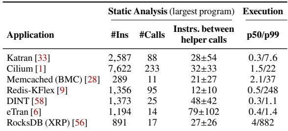  
Table 1: Characterization of common eBPF applications. We report static properties of each application’s largest single eBPF program (one tail-call target plus the bpf-to-bpf subprograms it calls), not the sum over its tail-called suite. #Ins is the instruction count, #Calls the helper and kfunc call sites, and the last static column is the mean±stddev number of instructions between consecutive helper or kfunc calls. Because PeeR yields only at these calls, this gap bounds its preemption granularity. All programs contain loops, and p50/p99 (<sup>??</sup>s), measured under representative workloads, difer by up to 500×.

work inside softirq completes quickly and uniformly, so the impact on the preempted process is negligible. Under this assumption, request processing proceeds in strict first-come, first-served (FCFS) order and continues as long as the CPU has available budget for softirq execution. If processing in softirq exceeds a threshold,the kernel defers later requests to a special kernel thread called ksoftirqd. ksoftirqd operates at request granularity: it defers entire batches of pending requests, but does not pause a long-running eBPF task mid-execution. This execution model works well for small tasks.

Growing eBPF complexity. eBPF was initially designed for small, predictable programs suitable for fast-path packet filter ing. Over time, its capabilities have expanded significantly [19]. The verifier now admits much larger programs with complex control flow, including bounded loops, BPF-to-BPF function calls, and tail calls, permitting long executions whenever a static bound exists [18, 26]. As a result, the verifier’s onemillion-instruction limit no longer guarantees short or uniform runtimes. Modern features further decouple static limits from execution time. Programs iterate over large data structures stored in maps or auxiliary memory regions [9], and runtime behavior often depends on workload-specific states, raising questions about whether the fast-path assumption still holds.

## 3 Measurement Study

We study real-world eBPF applications using static analysis and runtime profiling. Our measurements show that modern programs are complex enough to break the fast-path assumption, causing latency inflation and unfair CPU allocation.

## 3.1 Quantifying eBPF Application Complexity

We characterize seven recent eBPF applications spanning load balancing, networking, key-value storage, and storage. For each application we statically analyze its compiled BPF objects to extract, per program, the instruction count, the number of helper and kfunc call sites, the presence of loops, and the distribution of instruction intervals between consecutive helper or kfunc calls. We measure one eBPF program at a time, defined as a single tail-call target together with the bpf-to-bpf subprograms it invokes, rather than summing across the tail-called suite; all counts and intervals are derived from the disassembled bytecode. We then deploy each application under representative workloads and measure execution-time distributions using BPF-based tracing. Table 1 summarizes our findings.

A single eBPF program is already large and helper-dense. The largest Cilium program alone spans 7,622 instructions and 233 helper calls, and Katran’s balancer runs 2,587 instructions with 88 helper calls, even though each suite compiles into many tail-called programs (33 for Cilium). Programs with loops also exhibit large variance between median and tail latency due to data-dependent execution paths. Redis-KFlex implements a skiplist where point queries complete quickly, but range scans traverse nodes linearly, a 500× diference between p50 and p99. RocksDB (XRP) linearly scans up to 2,000 entries per data block, inflating tail latency. Finally, because PeeR can preempt only at helper and kfunc calls, the gap between consecutive calls bounds its preemption granularity. These gaps can be large,with maximum gaps of 484 instructions for Katran and 286 for eTran, and the longest occur in compute loops with no intervening call: XRP’s data-block scan executes a roughly 100-instruction loop body with no helper call up to 2,000 times. Iterator-based loops are an exception, as Redis-KFlex emits a kfunc on each iteration and keeps its maximum gap to 44 instructions.

Our analysis confirms that while the verifier preserves eBPF’s safety guarantees, the assumption that programs complete quickly and uniformly no longer holds.

## 3.2 Breaking Fast-Path Assumptions

To understand the consequences of this mismatched assumption, we construct experiments that illustrate two problems: latency inflation within an application and unfair CPU allocation across applications.

Intra-application latency inflation. Due to non-preemptive and FCFS execution, long-running eBPF tasks block shorter ones, increasing latency for latency-critical operations.

To illustrate this problem, we run eBPF-based key-value stores, a typical use case for eBPF with XDP hooks [9, 28, 58]. For simplicity, we focus on XDP, but these issues generalize to other fast-path hooks. In the first experiment, we run a bimodal point-and-scan workload with 99.5% short (0.2 <sup>??</sup>s) and 0.5% long requests (200 <sup>??</sup>s), a mix common in key-value stores. Redis-KFlex handles requests on eight CPU cores generated by an open-loop load generator. More details are in Section 8.

Figure 1 shows the p99-latency of point queries with increasing load. We compare this with a hypothetical eBPF system that supports preemption with a 5 <sup>??</sup>s time slice (not achievable in current kernels). Even at low load, the current eBPF implementation exhibits high p99 latency due to head-of-line blocking from long scan requests. As load increases, this efect worsens, resulting in up to 7.4× higher p99 latency compared to the preemptable-eBPF implementation.

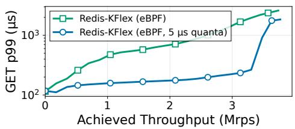  
Figure 1: Latency inflation within an application. In eBPF, long-running SCAN operations (200 <sup>??</sup>s each) block GET queries, increasing GET (0.2 <sup>??</sup>s each) p99 latency. With 5 <sup>??</sup>s preemption quanta, point queries p99 latency improves by up to 7.4×.

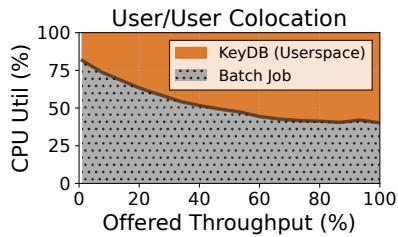

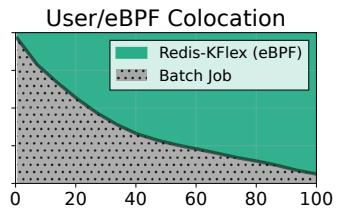  
Offered Throughput (%)  
Figure 2: Unfair CPU allocation for colocating eBPF and userspace jobs. CPU utilization breakdown when a colocated job (allocated 50% CPU) shares cores with KeyDB (multithreaded userspace, left) and Redis-KFlex (eBPF, right). The scheduler correctly throttles KeyDB, but Redis-KFlex starves the colocated job because it executes in a context invisible to the scheduler.

Ofloading to ksoftirqd does not resolve the blocking. ksoftirqd ofers no way to prioritize short tasks. Thus, an eBPF task runs to completion regardless of whether it executes in softirq or ksoftirqd context, and shorter tasks always wait behind longer ones.

Inter-application unfairness. Across applications, long eBPF execution allows a single workload to monopolize CPU time because the eBPF execution time remains invisible to the scheduler. Moreover, most I/O-intensive eBPF hooks run in interrupt context, so the kernel must execute them immediately upon I/O events. These eBPF workloads monopolize CPU and starve colocated tasks, violating fairness and performance isolation.

We demonstrate this by extending the previous setup to colocate a CPU-bound job on the same eight CPU cores with the key-value store, configuring Linux’s scheduler to allocate up to 50% of CPU resources to each job. We compare userspace KeyDB [37] against Redis-KFlex to highlight the diferences in scheduling behavior. Figure 2 (left) shows CPU utilization breakdown as we vary the load on KeyDB. At low load, the CPU-bound job uses most of the CPU, as expected. However, as KeyDB load increases, the scheduler allocates CPU time fairly between KeyDB and the CPU-bound job, throttling KeyDB as needed. Figure 2 (right) shows the same experiment but with Redis-KFlex. At low load, the colocated job again gets its fair share of CPU time. However, Redis-KFlex starves the colocated job as load increases, using 90% of the CPU because XDP executes in an interrupt context invisible to the scheduler. Prior systems, such as DINT [58] and eTran [6], have observed similar unfairness, corroborating our findings.

Deferring to ksoftirqd does not restore fairness: the kernel charges CPU time to ksoftirqd itself rather than the application that installed the hook, leaving the scheduler unable to distinguish between tenants or enforce per-application limits.

## 3.3 Challenges in Making eBPF Schedulable

The current eBPF runtime lacks mechanisms for schedulability and execution-time attribution. Our goal is to bridge this gap by making eBPF programs schedulable without sacrificing safety or performance. However, making eBPF schedulable is challenging because its execution model difers fundamentally from that of other kernel work. We identify three key challenges:

• Enabling fine-grained preemption with low overhead. Performance-critical eBPF programs are invoked at high frequency. Any scheduling mechanism must preserve fast-path performance when preemption is unnecessary, and impose minimal overhead when preemption occurs.

• Preserving eBPF correctness under preemption. The eBPF verifier reasons about programs as single, uninterrupted executions and assumes atomic completion. Introducing preemption risks violating assumptions about register state, stack contents, and helper function behavior. A schedulable eBPF must preserve these correctness guarantees without requiring uninterrupted execution.

• Providing expressive scheduling abstractions. eBPF currently has no interface to interact with schedulers. A schedulable eBPF requires new abstractions that are expressive enough to support per-task priorities, budgets, and policies.

Addressing these challenges requires rethinking the execution model of eBPF programs on the I/O path. In the next section, we present PeeR, a system that achieves schedulability while preserving eBPF’s safety and performance guarantees.

## 4 PeeR: Preemptable eBPF Execution Runtime

PeeR is a new eBPF runtime that makes latency-critical eBPF programs preemptable and schedulable in softirq context, where preemption is otherwise disabled. We implement PeeR for native XDP and describe extending it to other hooks in §6. We build PeeR on a simple but important observation: non-trivial eBPF programs must interact with the kernel through eBPF helper functions and kfuncs, as shown in Table 1. To safely call into kernel code, the verifier already tracks strict invariants at helper boundaries: held locks, borrowed references, and incomplete map operations. PeeR exploits this structure for cooperative preemption. Helper boundaries are candidate preemption points where the verifier has precise register and stack types. PeeR enables yielding at a site only when the verifier reports no unsafe resource is live and the enclosing hook has passed the audit in §6.

Figure 3 summarizes PeeR’s key components. PeeR adopts a hybrid execution model: short tasks run in softirq as a fast path, while long-running tasks are deferred to per-CPU PeeR worker kernel threads (PeeR-kthreads) as a slow path. On the surface, this model resembles ksoftirqd’s threaded model, but PeeR operates at eBPF task level with distinct mechanisms for budget checks, control-flow transfers, and scheduling. In this work, tasks remain on their originating CPU and are not migrated.

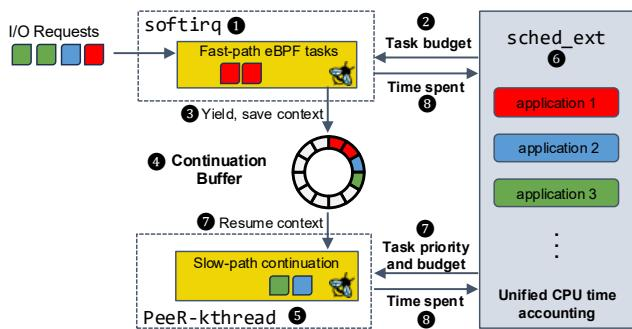  
Figure 3: PeeR’s design overview. eBPF tasks execute in softirq under sched\_ext-provided budgets. Tasks exceeding budget yield to a continuation bufer and resume on PeeR-kthreads. Both paths report CPU time to sched\_ext for unified accounting.

Fast path. Each eBPF task enters softirq 1 with a configurable budget 2 , a global preemption quantum set by sched\_ext (§7.2). Budget checks occur at helper call sites: PeeR augments eBPF’s JIT compiler to wrap each helper with a prologue that checks remaining budget (§5.1). This turns helpers into precise, low-overhead preemption points compatible with the verifier. Tasks within budget enter the helper with minimal overhead and run to completion in FCFS order. Tasks that exceed their budget yield 3 : PeeR saves their execution state, consisting of a 512-byte stack, 11 registers, and program context, to a per-CPU array. It then returns control to softirq immediately, allowing subsequent I/O to proceed. Upon exiting softirq, PeeR flushes yielded tasks into a continuation bufer 4 and wakes the local PeeR-kthread.

Slow path. Yielded tasks resume on PeeR-kthreads 5 (§5.2). PeeR instantiates one PeeR-kthread per CPU at boot time. Scheduling occurs at two levels: at the outer level, sched\_ext schedules PeeR-kthreads as ordinary kernel threads, controlling the aggregate CPU time all eBPF tasks on the slow path receive 6 . At the inner level, a micro-scheduler running within each PeeR-kthread orders eBPF tasks 7 . The micro-scheduler pulls continuations from the bufer, restores their state, and resumes them in policy-determined order. Resumed tasks follow the same budget enforcement; if a task yields again, control returns to the micro-scheduler, which requeues it and selects the next task. This two-level model enables operators to implement policies such as priority scheduling or shortest-remaining-processing-time (§7). Both paths report CPU time to sched\_ext 8 , closing the feedback loop for system-wide scheduling.

## 5 Cooperative Preemption

Preemption sits at the core of making eBPF schedulable. For eBPF programs on I/O paths that execute millions of times per second, the preemption mechanism must be lightweight while preserving eBPF’s correctness guarantees. PeeR therefore avoids traditional interrupt-based preemption, whose timer signals and context switches would be too costly on the fast path, and instead adopts a cooperative preemption model.

In classical cooperative scheduling, threads run until they explicitly call yield(), giving up the CPU at well-defined points. This avoids frequent interrupts and reduces context-switch overhead, but relies on applications to correctly insert yield points. PeeR retains these benefits while automating the process: rather than requiring programs to callyield(),PeeR enforces budgets and checks for preemption at eBPF helper sites, i.e., invocations of helper functions that eBPF programs use to interact with the kernel. These sites are natural points for preemption: helpers are fundamental to any non-trivial eBPF program, and the verifier already enforces strict pre- and post-conditions at these call sites (e.g., no held locks, valid pointers, and constrained stack usage).

Figure 4 illustrates a state machine of this model. Each helper site triggers a preemption check. If the program remains within budget, execution continues into the helper. If the budget has expired, however, the program starts yielding: PeeR invokes a yield handler that saves the current execution state, including preemption site identifier, eBPF stack, and registers (§5.1). The handler then transfers control back to the kernel. The program enters a preempted state until sched\_ext reschedules it (§7), when the program starts resuming. PeeR restores the saved state, performs necessary pointer patching, and resumes at the original preemption site (§5.2).

Cooperative preemption via compiler-inserted yield points is well established. Wasmtime [4] inserts epoch checks at function entries and loop headers, and low-latency schedulers approximate preemption for userspace RPC handlers through compiler instrumentation: Concord [34] polls a dispatcherwritten cache line, while Compiler Interrupts [2] and TinyQuanta [40] trigger yields from instruction-count-driven probes. Go [7] instead preempts asynchronously with signals, using compiler-emitted metadata to avoid unsafe points. Like these systems, PeeR may yield only where program state is safe; Concord, for example, avoids yielding inside locks or external libraries. PeeR faces analogous but distinct constraints. Rather than choosing yield points heuristically, it reuses the eBPF verifier’s helper-boundary invariants (no locks held, valid pointers) and adds eBPF-specific rules that forbid yielding while RCU-protected pointers or other BPF-held resources are live. PeeR adds two mechanisms that userspace runtimes do not require. It rebases PTR\_TO\_CTX and PTR\_TO\_STACK values across a context switch using verifier-derived type information (§5.2), and it resumes through CFI-safe trampolines.

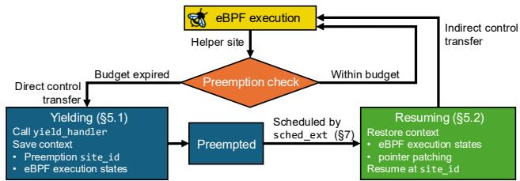  
Figure 4: PeeR’s state diagram. At each helper site, PeeR checks the task’s budget. Tasks within budget continue; tasks over budget yield, saving their context until sched\_ext reschedules them.

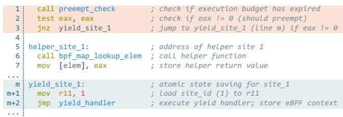  
Figure 5: JIT-augmented assembly for a bpf\_map\_lookup\_elem() helper site. The preemption check (orange) tests a global flag and conditionally jumps to the yield stub (blue), which records the site identifier before invoking the yield handler.

## 5.1 Preemption Path

PeeR augments helper functions to implement preemption at helper sites. Since eBPF is JIT-compiled, PeeR modifies the JIT compiler to emit the necessary code snippets for preemption budget checks and state saving.

Preemption check and yield handler in assembly. Figure 5 shows how PeeR’s JIT compiler augments an eBPF helper site, bpf\_map\_lookup\_elem(), in pseudo x86 assembly. PeeR assigns a unique site\_id (line 5 shows site 1), enabling it to identify where a program was preempted for later resumption. During JIT compilation, PeeR inserts a short preemption check prologue (orange highlight, lines 1 to 3) immediately before eachhelpersite. Because helpersarecalledfrequently,thischeck must be lightweight. Furthermore, it needs to preserve register values to save the execution state to the continuation bufer.

The preempt\_check() call on line 1 evaluates a per-CPU preemption flag; the scheduler sets this flag at the end of each budget period (details in §7.2). We measure that the prologue costs one to two cycles when the flag is not set (§8.3), adding negligible overhead to fast-path execution. This flag is retrieved into register eax (line 2). Since eax would be overwritten by the helper call regardless, reusing it is safe; the function also uses the no\_caller\_saved\_registers GCC attribute to avoid clobbering BPF argument registers. If the flag indicates the budget has expired (line 3), PeeR jumps to a per-site stub (blue highlight) that stores the site\_id into x86 register r11 (line m+1), a register not used by eBPF programs. Control then transfers to a shared yield handler (line m+2) that saves execution state and returns control to softirq or the worker thread.

Execution state capture. When the budget check triggers a yield, PeeR captures all execution state without clobbering live registers or stack contents. The shared handler at line m+2 immediately saves state into a continuation bufer of type struct peer\_cont before any other operations. An eBPF program’s execution state consists of 11 registers (88 bytes), a 512-byte stack, and a program-specific context. The context type varies by hook; for instance, XDP programs receive struct xdp\_md, and socket programs receive struct \_\_sk\_buff. Since the hooktype is known at compile time,PeeR can generate type-specific context-saving routines for each program. The handler also stores the site\_id and a reference to the current task. Because registers and stack are laid out contiguously, the handler copies all 600 bytes with a single memcpy(), then saves the context and returns control to the kernel.

Context saving for XDP. In this paper, we implement context saving for XDP, one of the most performance-critical hooks. In Linux’s networking stack, the NIC driver polls incoming packets in batches via NAPI polling; XDP programs execute immediately upon arrival, before socket processing or routing. The XDP context, struct xdp\_md, contains pointers to the packet’s start and end. Saving this struct alone is insuficient: packets are allocated from the driver’s bufer pool and remain valid only within the current NAPI poll cycle.

To extend packet lifetime without copying, PeeR rebinds the packet to an independently owned frame managed via reference counting. This preserves packet data in place and stores minimal metadata in the bufer’s headroom. PeeR then returns a new verdict, XDP\_YIELD, in place of the program’s. The driver treats XDP\_YIELD as a consumed packet and continues its NAPI poll, so the fast path never blocks waiting for the deferred result. The continuation records a pointer to this frame; upon resumption, the worker reconstructs a consistent packet view from the same underlying bufer. After the program completes, PeeR decrements the reference count and returns the buferto the pool.

## 5.2 Continuation Path

PeeR wakes the local PeeR-kthread when fast-path execution finishes, or sched\_ext does so when it schedules the kthread. The micro-scheduler (§7.3) selects the next eBPF program from the continuation bufer; the PeeR-kthread then restores its state and resumes execution from the preempted helper site on the slow path.

Pointer patching. Resuming a preempted eBPF program requires restoring execution state to registers andmemory. However, pointer values saved at yield time become invalid when execution resumes on a worker thread: the stack resides at a diferent address, and the execution context has been remapped. Naively restoring stale pointers causes memory corruption. PeeR has access to the old and new base addresses, but patching is not straightforward: a 64-bit value could be a pointer or an integer, and the kernel retains no type information at runtime.

PeeR extracts type information from the eBPF verifier. In eBPF’s calling convention, r10 serves as the frame pointer (stack base) and r1 holds the context pointer ctx at program entry. The verifier tracks the type of each register and stack slot at every instruction; two types are relevant for PeeR: PTR\_TO\_STACK for frame-pointer-derived values and PTR\_TO\_CTX for context-derived values. PeeR intercepts this information before JIT compilation, recording which locations hold PTR\_TO\_STACK or PTR\_TO\_CTX values at each helper site in a patch descriptor. At resume, PeeR consults the descriptor and rebases each pointer to its new base address.

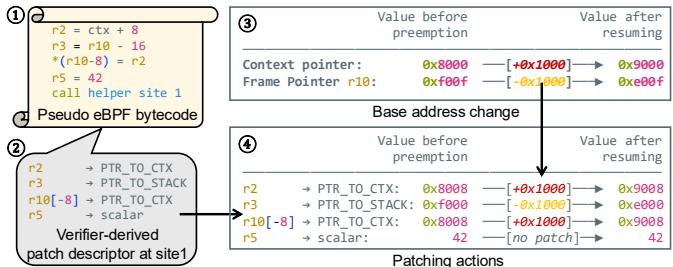  
Figure 6: Pointer patching at resumption. O1 Pseudo-eBPF bytecode calling helper at site 1. O2 Patch descriptor with verifier-derived types at this site. O3 Base address changes between preemption and resumption. O4 PeeR applies pointer rebases according to the patch.

Figure 6 illustrates this mechanism. O1 shows pseudo-eBPF bytecode where r2 derives from the context pointer, r3 derives from r10, stack slot r10[-8] stores r2’s value, and r5 holds a scalar. PeeR leverages the verifier to generate a patch descriptor at this site (shown at O2 ), which stores the type information of variables in registers and on the stack. O3 illustrates that when the program yields and resumes, the context moves from 0x8000 to 0x9000 (+0x1000) andthe frame pointer from 0xf00f to 0xe00f (-0x1000). Using the patch descriptor, PeeR rebases pointers according to their types, as shown in O4 . It shifts PTR\_TO\_CTX values r2, r10[-8] by +0x1000 (0x8008 → 0x9008), adjusts PTR\_TO\_STACK value r3 by -0x1000 (0xf000 → 0xe000), and leaves scalar r5 unchanged.

One complication arises when multiple control-flow paths converge at a yield site with diferent types for the same pointer. PeeR uses intersection semantics: a location appears in the patch descriptor only if all paths agree on its type. This is safe because the verifier enforces type consistency for any dereferenced value, hence conflicting pointers are always demoted to scalars and require no patching.

Control-flow transfer under CFI. Finally, the worker must transfer control back to the helper call where the program yielded. This requires an indirect jump, but modern CPUs enforce Control-Flow Integrity (CFI) through Indirect Branch Tracking: indirect jumps must land only on valid entry points marked with special instructions (e.g., endbr64 on x86), or the CPU triggers a hardware exception. PeeR satisfies CFI by emitting a trampoline for each yield site during JIT compilation. Each trampoline begins with an endbr64 instruction, marking it as a valid indirect branch target, followed by a relative jump to the corresponding helper call. Trampolines are stored consecutively in the JIT code section, with addresses recorded in an array indexed by site\_id. At resume, the worker looks up the trampoline for the saved site\_id and jumps to it. The endbr64 satisfies CFI, and the relative jump transfers control to the correct program location. Because PeeR places the yield check immediately before the helper executes, resuming at the helper call runs it exactly once, so a yield never skips or duplicates a helper’s side efects.

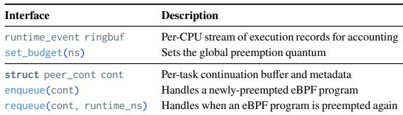  
Table 2: PeeR’s interfaces to schedulers. The top part interacts with the macro-scheduler across threads, while the bottom part implements the micro-scheduler that decides task order within a PeeR-kthread.

## 5.3 Handling RCU Pointer Safety

Many eBPF hooks in softirq, such as XDP, execute under an implicit RCU read-side critical section. Under Read-Copy-Update (RCU), readers proceed without locks and writers defer freeing data until all pre-existing readers finish. This allows programs to safely dereference pointers returned by helpers like bpf\_map\_lookup\_elem() without explicit locking. When softirq completes, the critical section ends. This behavior poses a risk for PeeR: if PeeR yields a program holding such pointers, the kernel exits the protected section, risking other programs updating these pointers or even freeing them to cause use-after-free after the task is rescheduled on PeeR-kthreads.

PeeR prevents this by restricting preemption to helper sites where no RCU-protected pointers are live. We again rely on the verifier: its type tracking identifies RCU-protected values, such as map-value pointers (PTR\_TO\_MAP\_VALUE) and RCU-tagged kernel pointers (MEM\_RCU), and its liveness analysis marks a value dead after its last dereference, even if it remains on the stack. PeeR queries this information at each helper site and injects preemption checks only where no RCU values are live. At first glance, this restriction reduces PeeR’s preemption opportunities, but in practice it rarely does. The common pattern is to look up an RCU-protected value and dereference it within the same stretch of code, before the next helper call. The pointer is then dead under liveness analysis at the following helper boundary, so that site can still yield. A yield point is forgone only when a program holds an RCU-protected pointer live across a helper or kfunc call, which is uncommon. When a program does guard shared state with a BPF spin lock, that region cannot yield: the verifier forbids helper calls while a lock is held, and PeeR, consulting the verifier’s lock state (active\_locks), emits no check at the few data-structure kfuncs still permitted there. Sleepable RCU [41] could lift the restriction entirely by allowing a critical section to span a preemption point; we leave this to future work.

## 6 Correctness and Hook Safety

PeeR preempts and resumes an eBPF invocation while preserving the safety guarantees of the verifier. Two conditions are required to guarantee safety: eBPF-level safety (§6.1) requires that, at any point where an eBPF program can yield, the program’s own state is clean and reconstructable. Hook-level safety (§6.2) requires that the kernel path invoking the program can tolerate it being preempted and resumed later. The eBPF verifier guarantees the first requirement. To evaluate the second, we characterize eBPF’s common hooks individually and determine whether each is compatible with PeeR.

What PeeR guarantees. PeeR makes a fast-path eBPF invocation reentrant: it can yield at a helper boundary, let other work run on the core, and resume from the same site under the same invariants as the fast path, however long it was suspended. Across that yield, PeeR preserves memory safety for the three kinds of state an invocation depends on:

1. Its eBPF state, the registers and stack, is saved and restored with each pointer rebased to its new address (§5.2).

2. Its kernel state, any RCU-protected object or acquired reference, stays valid because PeeR never yields while one is live (§5.3).

3. Its hook context, the program’s input, stays valid past the original call. For XDP, PeeR retains the packet as an xdp\_frame (§5.1).

What PeeR does not guarantee. Similar to prior work on preemptive scheduling [34, 35, 40], PeeR allows for interleaving of eBPF program invocations. Normally on the softirq fast path, an eBPF invocation runs uninterrupted, so an eBPF application may be written with the assumption that accessing shared state is atomic. Under PeeR, a later invocation can run while a program is preempted and modify that state, so the program might read a map entry, yield, and resume to find a diferent value. Logic written on the assumption that the entry is stable across the invocation can then incur a race condition. As a result, the program must synchronize explicitly, for example by guarding the access with a spin lock. This is already the case for existing eBPF programs that run in preemptable context, and PeeR extends this requirement to eBPF programs running in a previously non-preemptable context. This interleaving can also change per-core completion order. If a program yields and a later invocation runs on the same core, the later one can complete before the first resumes, so a program that requires per-core completion order must serialize explicitly.

## 6.1 eBPF-level safety

PeeR establishes eBPF-level safety with two conditions, both derived from the eBPF verifier. First, it yields only at a helper function boundary where the verifier has already proved the call safe and reports no eBPF lock held, so the program’s registers, stack, and pointers all carry assigned types. This leaves a clean snapshot that PeeR can later reconstruct. Second, it yields only where the verifier reports no outstanding eBPF resource, such as a live RCU-protected pointer or an acquired reference, since yielding while one is live could let the kernel reclaim it under the suspended program (§5.3). The verifier guarantees both conditions; a site that cannot satisfy them emits no yield point.

## 6.2 Hook-level safety

The verifier exists only within eBPF context and does not have visibility into the surrounding kernel context. A hook must meet three conditions for compatibility with PeeR:

1. The program’s input stays valid after it yields. For XDP, PeeR holds the packet past the original call.

2. The caller does not require the result immediately, so it can continue while PeeR applies the result later.

3. The calling kernel code holds no lock while the program runs.

Resumption runs in process context on an ordinary PeeRkthread, not inside softirq. Deferring eBPF work to a kernel thread has the same properties that already exist when the kernel hands softirq processing to ksoftirqd. The diference is in granularity; PeeR defers a single eBPF invocation rather than a batch. Before resuming, the PeeR-kthread re-creates the environment the hook runs in, so the continuation executes under the same invariants as the fast path. Below we describe how XDP meets each condition.

Input lifetime. The program’s input must stay valid until PeeR applies the result. For XDP, the packet bufer is owned by the driver’s page pool and is valid only for the duration of the NAPI poll. The driver can recycle it locklessly only because the program runs to completion within that poll. PeeR must therefore extend the bufer’s lifetime past the original call. It retains the packet as an independently owned xdp\_frame (§5.1), so the driver does not recycle it before the continuation finishes.

Deferred result. The caller must accept the program’s verdict after the original call returns rather than during it. PeeR returns XDP\_YIELD in place of the program’s verdict (§5.1); the driver treats it as a consumed packet and continues its NAPI poll, so the fast path does not wait. On resume, PeeR applies the program’s real verdict, covering all native single-bufer actions: XDP\_DROP and XDP\_ABORTED free the frame, XDP\_PASS builds an skb and injects it, XDP\_TX transmits via ndo\_xdp\_xmit, and XDP\_REDIRECT completes through the standard redirect path.

Caller-sideinvariants. The verifierreasons onlyabouteBPFvisible state and cannot prove that surrounding kernel code holds no lock across the call,so we check this per hook. ForXDP, the NAPI receive path invokes the program without holding a driver or stack lock that must be released by the time the verdict is produced,so deferring the verdict leaves no caller-side critical section open. The one piece of caller state a yield could disturb is the XDP redirect bookkeeping, kept in a per-task networking context (bpf\_net\_context). PeeR handles this by completing redirects from the PeeR-kthread’s own networking context and flush list rather than the original poll’s, similar to cpumap.

PeeR does not check a hook at runtime. It is built only for hooks that meet these conditions, and every other hook runs unchanged. Table 3 applies this audit to common hooks, as a design-time classification rather than a runtime test. As §2 explains, PeeR targets latency-critical I/O processing, not eBPF as a whole. These are the packet and storage fast paths such as

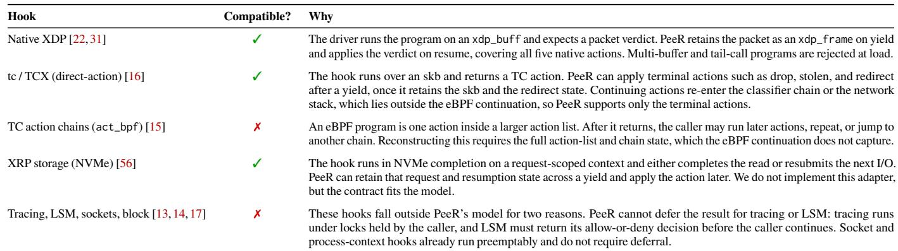  
Table 3: Hook compatibility with PeeR’s correctness model. A hook is compatible only if the eBPF continuation and the retained hook object sufice to apply the final action without resuming caller-side kernel control flow. PeeR currently implements native XDP.

XDP, tc, and XRP. The hooks PeeR does not support, including tracing and LSM, are also not its target: their programs are short and event-driven, not the long request processing that causes head-of-line blocking, so they have little need for preemption. softirq packet hooks such as LWT and netfilter share the same skb-verdict structure,and applying PeeR to them is future work.

## 7 Scheduling eBPF Tasks

The mechanisms in §5 make eBPF programs preemptable, but preemptability alone does not determine when to preempt or which continuation to resume next. This section describes how PeeR integrates with sched\_ext [49] to provide schedulability through operator-defined policies.

sched\_ext is a Linux scheduler interface that allows users to implement arbitrary scheduling policies via a set of callbacks. The core abstraction is the dispatch queue (DSQ), into which tasks are enqueuedand fromwhichCPUs pullwork. sched\_ext determines scheduling order by controlling how tasks flow through DSQs, enabling policies such as priority scheduling or weighted fair sharing.

## 7.1 Two-Level Hierarchical Scheduling

Scheduling preempted eBPF programs presents a challenge: on the fast path, programs execute first-come-first-served with bounded budgets, matching existing eBPF semantics to minimize overhead. On the slow path, however, multiple preempted programs accumulate within a single PeeR-kthread, requiring a policy to determine resumption order. sched\_ext cannot distinguish among them because they share the same PeeR-kthread, which is treated the same as all other kernel threads.

We address this with a two-level hierarchy. At the outer level, sched\_ext acts as a macro-scheduler, making task-level decisions at millisecond granularity: which applications to run, how long they execute, and how CPU time is divided among workloads. Once sched\_ext schedules a PeeR-kthread onto a CPU, the micro-scheduler takes over. The micro-scheduler runs within the PeeR-kthread context at microsecond granularity. It distinguishes among accumulated eBPF tasks and selects the subsequent continuation to resume. This division of responsibility allows sched\_ext to control how much CPU time eBPF programs receive in aggregate, while the micro-scheduler determines which programs benefit from that time.

## 7.2 Accounting and Budget Enforcement

Table 2 shows the interface between PeeR and sched\_ext. The macro-scheduler uses the top two entries to account for eBPF program execution time and enforce the execution budget:

Accounting execution time. PeeR exports a per-CPU runtime\_event ring bufer. Each record contains the logical owner (e.g., a process or cgroup identifier), the CPU, the execution duration, and whether the task completed or yielded. Each eBPF task execution updates the runtime\_event bufer. A userspace daemon consumes these events asynchronously and aggregates them into per-application CPU usage. This closes the feedback loop: sched\_ext observes how much CPU time each eBPF application consumes and adjusts when and how often it schedules PeeR-kthreads accordingly. For example, if an application’s eBPF programs have exceeded their fair share, sched\_ext can deprioritize the PeeR-kthread or delay its next scheduling opportunity. This makes eBPF execution visible to system-wide scheduling policy.

Enforcing execution budgets. The macro-scheduler controls when eBPF programs yield through quantized budget enforcement. set\_budget() configures the preemption quantum, a time interval that defaults to 5 <sup>??</sup>s in our evaluation. The scheduler advances a per-CPU epoch counter once per quantum. When an eBPF program begins execution, PeeR records the current epoch. At each helper call site, the JIT-inserted preemption check compares the current epoch against the recorded value, and if the epoch has advanced, the program yields.

## 7.3 Ordering Continuation Tasks

The micro-scheduler controls which eBPF task resumes next on a given PeeR-kthread. It uses a simplified version of sched\_ext’s DSQ abstraction, with priority-based ordering to determine the next continuation task. Operators implement scheduling policies via the bottom three rows of Table 2 by setting extra fields inside the continuation structure cont and two DSQ management callbacks.

```c
1 /* enqueuing new task: set the remaining time to an
2 * application-provided runtime estimation.
3 */
4 u64 enqueue(struct peer_cont *cont) {
5 return cont->peer_metadata.estimated_work;
6 }
7 /* requeueing a task: remove the executed time from
8 * the task remaining time.
9 */
10 u64 requeue(struct peer_cont *cont, u64 runtime_ns) {
11 /* underflow check omitted in this example */
12 return cont->prio - runtime_ns;
13 }
```  
Figure 7: Sample SRPT implementation. The scheduler prioritizes continuations closest to finishing by tracking remaining work.

The enqueue() and requeue() callbacks order tasks on the per-kthread DSQ. The first time an eBPF task is preempted, PeeR calls enqueue() to put this task on the DSQ to be scheduled. Each subsequent time the same task is preempted within the PeeR-kthread, requeue() is called with the time spent executing. These functions return a priority number that determines scheduling order: continuations with a lower priority number are resumed first. When priorities are equal, a sequence number provides FIFO ordering. Without application modification or a custom queueing policy, the micro-scheduler processes task continuations in FIFO order. Beyond that, the cont structure allows eBPF programs to provide scheduling hints (such as flow identifiers, weights, or deadlines) that the scheduler uses in its priority calculations.

Sample SRPT policy implementation. The priority-based interface supports a variety of scheduling policies. We demonstrate the Shortest Remaining Processing Time (SRPT) implementation as an example in Figure 7. SRPT prioritizes tasks with the least remaining work, minimizing average completion time. When a task is first preempted, enqueue() initializes its priority to an application-provided estimate of remaining work, stored in cont. When the same task is preempted again, requeue() subtracts the elapsed execution time from the current priority, reflecting progress toward completion. Since tasks with lower priority numbers are scheduled first, tasks closer to completion naturally rise to the front of the queue. Such an estimate is available in many of the workloads PeeR targets, since the program already parses each request to dispatch it and can derive a work hint from the request type, for example a scan’s range or a transaction class.

## 8 Evaluation

This section evaluates PeeR’s performance and expressiveness; we implement PeeR in Linux kernel 6.16 with ≈ 5000 lines of C code. We first show how PeeR’s preemption mechanism eliminates head-of-line blocking within an application, using a mixed GET/SCAN workload and a TPC-C workload, and use TPC-C to demonstrate expressiveness across multiple scheduling policies (§8.1). We then evaluate inter-application allocation by colocating batch and latency-sensitive jobs under

CPU-sharing policies (§8.2), and finally present microbenchmarks of preemption and resumption overhead (§8.3).

System setup. We evaluate PeeR on two servers (application and client), each with a 28-core Intel Xeon Gold 5420+ and 256 GB RAM, connected via Mellanox ConnectX-7 400 Gbps NICs through an Intel Tofino 2 switch. Both run Ubuntu 24.04 with Linux 6.16 modified for PeeR, with hyperthreading, adaptive interrupt coalescing, and IOMMU disabled for low latency.

Our scheduler extends scx\_layered [30], Meta’s production sched\_ext scheduler, with PeeR’s accounting and budget enforcement. We generate requests using loadgen, an open-loop generator with Poisson arrivals over UDP and TCP. We use NIC flow steering to evenly distribute load across cores. For Redis-KFlex, we use a lightweight in-eBPF TCP stack that executes in the XDP hook. We set PeeR’s preemption budget to 5 <sup>??</sup>s by default unless otherwise noted.

## 8.1 Intra-Application Scheduling

PeeR enables preemption within an application and supports operator-defined policies. We first evaluate the preemption mechanism on a bimodal workload, then assess expressiveness across policies on TPC-C [51].

## 8.1.1 Preemption for Latency-Critical Tasks

We evaluate bimodal Redis and Memcached workloads mixing latency-sensitive GET requests with long-running SCAN queries, similar to the setup in Figure 1. For this workload, we use simple FIFO ordering with preemption enabled; no additional scheduling policy is required to demonstrate the benefits. For Redis, we compare two multi-core key-value stores: the userspace baseline KeyDB [37], a multithreaded fork of Redis (we use it rather than single-threaded stock Redis), and Redis-KFlex, a Redis-compatible store in KFlex [9] that runs entirely in the XDP hook. We also add a cpumap-deferral baseline that tests whether the application can address head-of-line blocking itself, without kernel changes. The workload is 99.5% GET (0.2 <sup>??</sup>s) and0.5%SCAN (200 <sup>??</sup>s). ForMemcached,we compare the standard userspace server, BMC [28] (a common pattern where the fast path runs in-kernel but cache misses fall back to userspace), and KFlex (entirely in eBPF), under a 50/50 GET (0.2 <sup>??</sup>s)/SCAN (30 <sup>??</sup>s) mix. For both, we measure in-kernel per formance with and without PeeR to isolate preemption’s impact.

Figure 8 plots achieved throughput against tail latency, with Redis (left) and Memcached (right) columns; top plots show GET p99 latency versus throughput (krps) and bottom plots show the same for SCAN.

For Redis-KFlex (left column), SCAN queries block GETs and inflate tail latency under default eBPF. Enabling PeeR reduces GET p99 latency by 19.8× over default eBPF while achieving 3.77× higher throughput than userspace KeyDB. The bottom plots confirm SCANs are not starved: below 1000 krps, PeeR even improves SCAN latency by reducing blocking among SCANs themselves. PeeR also achieves 10.3% higher throughput than default eBPF, because preempting long

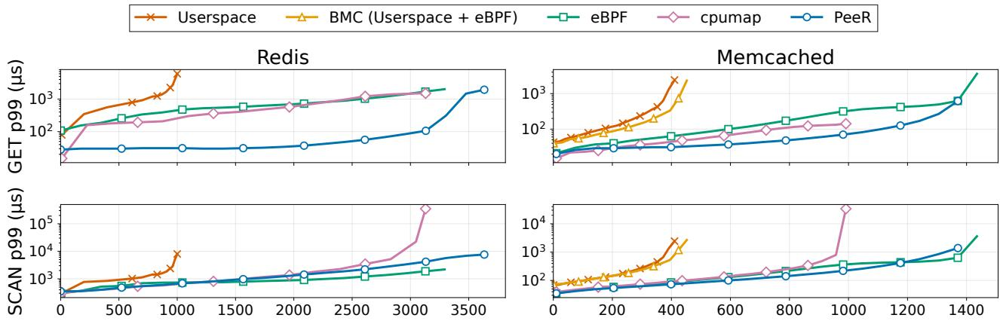  
Achieved Throughput (krps)  
Figure 8: Point/scan workloads for Redis (99.5% GET, 0.5% SCAN) and Memcached (50% GET, 50% SCAN). PeeR retains the performance benefit of in-kernel execution over userspace, while reducing GET p99 latency by preventing long-running scan operations from blocking point queries compared to the default eBPF runtime. Userspace baselines: KeyDB and stock Memcached. The x-axis is total achieved throughput across both query types; curves end at saturation.

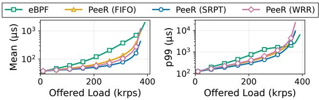  
Figure 9: Aggregate TPC-C latency under diferent scheduling policies. FIFO with preemption outperforms baseline eBPF; SRPT achieves 3× lower mean latency by prioritizing short requests.

SCANs keeps the receive queue drained, whereas under default eBPF the queue fills behind blocked GETs and drops requests.

The application can also chunk long requests itself. The cpumap baseline bounds the work per XDP invocation and defers the rest of a long SCAN to a per-CPU kernel thread without kernel changes, but this only relocates the blocking: a packet batch drains fully before the next, deferred work reaches the thread only at batch boundaries, and the thread runs those SCANs with softirqs disabled, so later GETs wait behind them. At 1.5 Mrps cpumap brings GET p99 to 403 <sup>??</sup>s (against 581 <sup>??</sup>s for default eBPF and 31 <sup>??</sup>s for PeeR), is the first to saturate, at 3.1 Mrps, and near saturation its SCAN p99 climbs to 350 ms against 4 ms for PeeR.

For Memcached (right column), both KFlex configurations (with and without PeeR) achieve 3.46× higher throughput than userspace; BMC matches userspace because cache misses fall back to it. PeeR reduces GET p99 latency by 4.5× over default eBPF. Unlike Redis-KFlex,PeeR’s overallthroughputis slightly lower than default eBPF: with a 50/50 mix and shorter queries, queue buildup is milder, so preemption overhead is not ofset by reduced drops. Still, PeeR isolates GET latency regardless of SCAN load, while the cpumap baseline tracks default eBPF and saturates earlier. At peak, Redis’s 3.6 Mrps is 9 Mpps and 12 Gbps, and Memcached’s 1.5 Mrps is 3.0 Mpps and 3.1 Gbps.

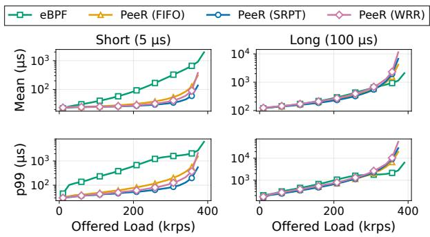  
Figure 10: TPC-C latency by request type. Short queries (Payment) benefit from preemption across all loads; long queries (StockLevel) are not impacted until load exceeds 300 krps.

## 8.1.2 Expressing Scheduling Policies

To demonstrate expressiveness, we run a TPC-C workload and implement multiple scheduling policies in PeeR. We use a synthetic XDP echo serverto emulate the compute workload,where each UDP request specifies a spin duration drawn from TPC-C transaction profiles: Payment (5.7 <sup>??</sup>s, 44%), OrderStatus (6 <sup>??</sup>s, 4%), NewOrder (20 <sup>??</sup>s, 44%), Delivery (88 <sup>??</sup>s, 4%), and StockLevel (100 <sup>??</sup>s, 4%), taken from prior in-memory database measurements [8]. We implement three policies in PeeR’s sched\_ext component: FIFO, SRPT (shortest-remainingprocessing-time), and WRR (weighted round-robin).

Figure 9 compares baseline eBPF (no preemption) against PeeR under each policy, with load (krps) on the x-axis and mean (left) and p99 (right) latency on the y-axis. Even the simplest FIFO scheduler with PeeR outperforms baseline eBPF, but PeeR’s expressiveness enables more efective policies: SRPT achieves the best mean and tail latency by prioritizing short requests, cutting mean latency 3× over baseline at 300 krps, while WRR is a practical alternative when execution time is unknown a priori.

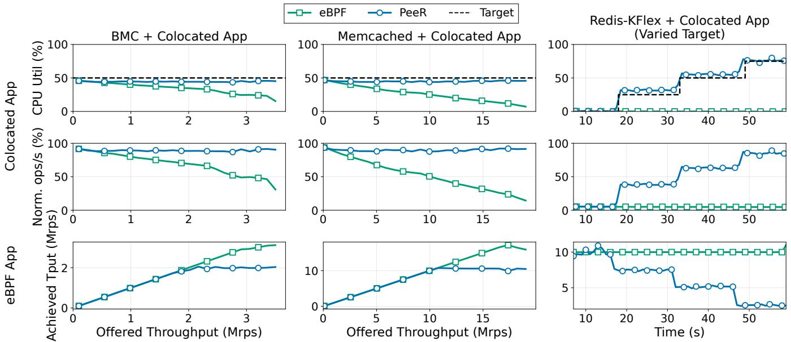  
Figure 11: Colocation experiments showing latency-sensitive applications (Memcached, Redis) colocated with batch jobs. PeeR enforces operator-defined CPU allocation among workloads.

Figure 10 breaks down latency by request type. Short queries (Payment) benefit from preemption across the entire load range under all three policies, while long queries (StockLevel) match baseline until load exceeds 300 krps, so PeeR improves shortrequest latency without starving long ones. These gains come at a deep-tail cost for long requests, which are delayed when preempted and resumed on a worker. For the Redis point/scan workload, SCAN p99.9 is comparable to the non-preemptive baseline at low load (946 <sup>??</sup>s vs. 924 <sup>??</sup>s at 1 Mrps) and rises to 2.3× near saturation (5952 <sup>??</sup>s vs. 2562 <sup>??</sup>s at 3.1 Mrps); in TPC-C,StockLevel has 1.5–1.7× higher p99.9 underPeeR,and SRPT concentrates this cost on the single longest class while improving the next-longest (Delivery p99.9 of 1145 <sup>??</sup>s under SRPT vs. 2042 <sup>??</sup>s for the non-preemptive baseline). An operator who must protect long requests can raise the budget or give them highermicro-schedulerpriority; PeeR’s flexibilityto matchpolicies to workloads is itself expressiveness beyond today’s eBPF.

## 8.2 Inter-Application Scheduling

We evaluate PeeR’s ability to enforce scheduling policies when eBPF applications compete with other userspace workloads for CPU time. We colocate a latency-sensitive eBPF application (BMC, Memcached, and Redis-KFlex serving GET queries) alongside a compute-bound batch job, similar to the setup in Figure 2. A successful scheduler must enforce the configured CPU allocation while preserving throughput and latency for both workloads.

Figure 11 shows the results; each column is an eBPF application, with ofered load (left, middle) or time (right) on the x-axis. Rows show the batch job’s CPU utilization vs. its target, its normalized throughput, and the eBPF application’s achieved throughput. With vanilla eBPF, the batch job starves as load rises: for BMC under a 50/50 fair-share policy, BMC exceeds its allocation and the batch job’s throughput drops to 30.9% of its fair share, because eBPF execution is invisible to the scheduler. PeeR fixes this by making eBPF execution time visible and accountable, capping BMC’s utilization at its share so the batch job keeps its throughput; the middle column shows the same for Memcached, where the batch job’s CPU collapses to 7% without PeeR but holds its fair share with it.

Beyond equal sharing, PeeR enforces weighted allocations. The right column varies Redis-KFlex’s batch-job target from 0% to 75% over time: PeeR tracks it within 6% across all configurations, whereas without PeeR the batch job’s utilization bears no relation to its target, receiving only what Redis-KFlex leaves behind. PeeR thus makes eBPF workloads first-class scheduling citizens, subject to the same policies as userspace processes.

## 8.3 Microbenchmarks

PeeR’s performance depends on the low overhead enabled by the cooperative preemption mechanism, while the preemption granularity depends on the budget we set. This section studies PeeR’s instrumentation overhead, its preemption and resumption cost, and the impact of diferent preemption budgets.

## 8.3.1 Overhead Breakdown

We measure preemption and resumption overhead by running an XDP echo server under high load, preempting once per packet. Figure 12 shows the time spent in each phase, averaged over more than one million measurements.

Preemption costs 77 ns: reading the sched\_ext-set flag incurs an L1 miss (17 ns), and checking it, transferring to the yield handler, and saving state adds 60 ns. Resumption costs

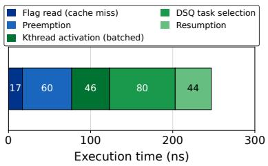  
Figure 12: PeeR overhead breakdown for a preemption-resumption cycle. The total 247 ns cost enables fine-grained scheduling while remaining practical for microsecond-scale workloads.

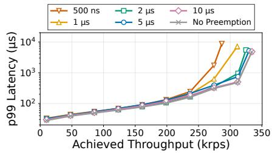  
Figure 13: Throughput vs. p99 latency for an XDP echo server under varying preemption budgets. Smaller budgets reduce peak throughput; a budget of 10 <sup>??</sup>s matches the no-preemption baseline.

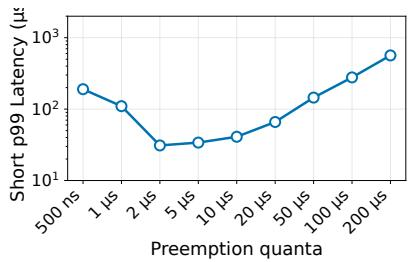  
Figure 14: Preemption budget tradeof for a bimodal workload. Small budgets incur context-switch overhead for the latency-critical short task, while large budgets lead to head-of-line blocking.

170 ns: activating a PeeR-kthread takes 46 ns (amortized across batched wakeups), selecting the next task from the dispatch queue 80 ns, and restoring context 44 ns. A full preemptionresumption cycle thus costs 247 ns, making fine-grained scheduling practical even for microsecond-scale eBPF tasks.

## 8.3.2 Instrumentation Overhead

The budget check the JIT inserts before each helper call is PeeR’s only always-on cost, paid even by a program that never preempts. We measure it with an XDP program that calls bpf\_get\_prandom\_u32 in a loop, comparing the stock JIT against PeeR’s JIT with a budget set so the check executes on every call but never fires. The check adds one cycle per helper call, and two when the scheduler is actively writing the per-CPU budget flag.

## 8.3.3 Impact of Preemption Budget

While the overhead per preemption-resumption cycle is constant, the overall overhead depends on the preemption frequency, which is controlled by the budget. We evaluate the application-level overhead of PeeR.

Throughput impact. Figure 13 shows how the budget afects throughput for an XDP echo server processing 5 <sup>??</sup>s requests underuniform load. Smallerbudgets checkmore often,consuming cycles that would process requests: at 500 ns the server saturates at 275 krps, while at 10 <sup>??</sup>s requests complete without preemption,matching the no-preemption baseline at 330 krps. A 2–5 <sup>??</sup>s budget sacrifices some throughput for scheduling responsiveness under more complex workloads, which we quantify next.

Latency impact. Figure 14 isolates the budget’s efect on tail latency using a bimodal workload: 95% short requests (0.5 <sup>??</sup>s) and 5% long requests (100 <sup>??</sup>s) at fixed 20 krps. We sweep budgets from 500 ns to 200 <sup>??</sup>s and measure p99 latency for short requests. The results show a U-shaped curve. At small budgets (500 ns–1 <sup>??</sup>s), frequent preemption dominates, inflating latency to 110–190 <sup>??</sup>s. As the budget increases, overhead drops and latency reaches a minimum of 31 <sup>??</sup>s at a 2 <sup>??</sup>s budget. Beyond this, head-of-line blocking takes efect: long requests yield more slowly, thereby delaying short ones. At a 200 <sup>??</sup>s preemption budget, p99 of the short requests rises to 565 <sup>??</sup>s.

The U-shape captures a fundamental tradeof: smaller budgets provide finer scheduling granularity but increase contextswitch overhead; larger budgets reduce overhead but allow longer blocking. The optimal budget is workload dependent.

## 9 Discussion

Existing mechanisms for deferred eBPF execution. Linux provides several mechanisms to defer eBPF work of the fast path, such as eBPF timers [20], workqueues [21], and XDP’s cpumap redirect [50]. eBPF timers schedule callbacks for later, but they still run in softirq, steal time from interrupted applications, and lack hook context or I/O capabilities. Workqueues defer to a sleepable kernel worker, but each callback executes as a single eBPF invocation; the scheduler sees only the worker thread, not individual eBPF tasks. cpumap queues packets to a per-CPU kernel thread, but the XDP program still runs to completion per packet and can head-of-line block.

PeeR generalizes this pattern of executing minimal work in an interrupt context, deferring the rest, but with finer-grained control. No existing mechanism combines per-invocation preemption, scheduler visibility, and policy control. None exposes fast-path eBPF execution time to schedulers or supports policy-driven decisions over when and how long each invocation runs. PeeR addresses this gap by treating preemption as a first-class primitive, rather than requiring developers to split programs or accept run-to-completion semantics.

Kernel bypass. Kernel-bypass systems achieve high throughput and low tail latency by removing the kernel from the critical path, but require monopolizing cores and hardware. eBPF ofers similar performance while retaining OS-provided isolation, safety, and unified resource management.

Kernel-bypass systems usually assume that scheduling flexibility requires moving to userspace. Systems such as Shinjuku [35] and Shenango [42] implement preemption and core reallocation in userspace because the kernel provides no equivalent. Our work challenges this assumption: eBPF combined with sched\_ext supports similar policies without sacrificing kernel interposition or dedicating cores to userspace runtimes. Kernel-bypass retains advantages in hardware-specific optimizations, custom allocators, and direct device queue access, but expanding eBPF capabilities may narrow this gap. Enabling new eBPF applications. Beyond improving existing workloads, PeeR opens possibilities for applications previously unsuitable for eBPF. File-serving, for example, requires sleepable contexts: programs must yield while waiting for disk I/O rather than blocking the CPU. eBPF’s current run-to-completion model cannot express this. PeeR’s yield mechanism allows programs to suspend mid-execution during I/O and resume once data is ready, bringing I/O-bound workloads within reach of in-kernel execution.

## 10 Related Work

PeeR builds on a large body of prior work.

eBPF for extensibility and latency-critical applications. eBPF has been widely adopted for extending kernel functionality safely and eficiently, with applications spanning memory management [55], file systems [5], page caches [60, 61], and networking [6]. Beyond traditional extensibility, eBPF has also been adopted for low-latency, high-performance applications. XDP [31] and BMC [28] leverage eBPF for high-performance packet processing and caching. KFlex [9], DINT [58], and eTran [6] implement full application logic in XDP to bypass the kernel network stack entirely. XRP [56] and Electrode [57] use eBPF for storage and for accelerating distributed systems. However, these systems inherit the non-preemptable execution model of fast-path eBPF hooks, which increases tail latency when operations vary in duration, an issue that DINT and eTran have explicitly noted. PeeR addresses this by enabling cooperative preemption, allowing eBPF programs to handle longer operations without blocking other tasks.

Preemptive scheduling for low latency. A complementary line of work reduces preemption overhead itself to achieve low latency for applications. Shinjuku [35] achieves 5 <sup>??</sup>s preemption quanta using hardware virtualization, but requires a specialized OS and dedicated dispatcher cores. ZygOS [43] adds work stealing to IX [3]’s run-to-completion dataplane, and Arachne [44] manages user-level threads to rebalance load at microsecond granularity. Shenango [42] achieves similar responsiveness through fast core allocation rather than finegrained preemption. Compiler-assisted preemption is used more broadly: Wasmtime [4] inserts epoch checks, Go [7] preempts via signals at compiler-identified safe points, and Concord [34], Compiler Interrupts [2], and TinyQuanta [40] approximate preemption with compiler instrumentation that polls a shared cache line or counts instructions. PeeR brings this technique to the eBPF runtime. While Concord is similar in spirit,the eBPF setting imposes diferent constraints,since yield sites must align with verifier state, hook-object lifetimes, and kernel CFI requirements. User interrupts [29, 38] provide lowoverhead userspace preemption but do not extend to kernel code. Recent work also proposes hybrid cooperative-preemptive designs that fall back to timer-based preemption when cooperative yields are too sparse [52]. PeeR instead stays purely cooperative: on the eBPF fast path a timer could fire between helper calls, where the verifier leaves no clean state to checkpoint, so PeeR confines yields to helper boundaries and relies on the bounded inter-helper gap (Table 1) to keep them frequent. These systems target userspace applications; PeeR brings similar benefits to unmodified kernel extensions without specialized hardware.

Inter-application performance isolation. Performance isolation is critical in multi-tenant environments. Junction [24] and Caladan [25] isolate application performance through smart resource multiplexing. Static analysis techniques [27] verify safety and performance properties of kernel extensions. These approaches do not address long-running eBPF operations that escape scheduler visibility. PeeR enhances isolation by making eBPF execution time visible to the scheduler and allowing programs to yield, preventing resource monopolization.

User-defined scheduling. Frameworks such as ghOSt [32] and Syrup [36] allow defining custom scheduling policies for threads and network packets in userspace. FlexNet [10] proposes coroutine-based structural extensibility for the network stack, with yield points at protocol-layer boundaries. However, these systems schedule userspace threads and packets, not in-kernel eBPF execution. The sched\_ext framework [49] enables implementing custom CPU schedulers in eBPF, but it does not schedule eBPF programs themselves. PeeR complements these frameworks by treating existing eBPF programs as schedulable entities that can be preempted and rescheduled without modification.

Extending eBPF to enable new capabilities. Recent work extends eBPF’s capabilities. eNetSTL [53] provides STL-like data structures for in-kernel network functions; eGPU [54] executes eBPF on GPUs; and Zussman et al. [59] implement new eBPF hooks to enable custom page-fault handling. These extensions increase both the complexity and execution time of eBPF programs. PeeR complements this trend by providing the scheduling and preemption infrastructure needed as eBPF workloads grow beyond the fast-path assumption. SchedBPF [46] also explores preemptable and schedulable eBPF, with a focus on periodically executed programs and continuous workloads. In contrast, PeeR targets event-driven eBPF hooks in softirq context on the critical path. We characterize problems quantitatively in these settings and provide a concrete implementation of preemption and scheduling mechanisms.

## 11 Conclusion

We presented PeeR, a runtime that makes latency-critical eBPF programs preemptable and schedulable in softirq context, where preemption is otherwise disabled, by bringing cooperative preemption to eBPF and integrating with sched\_ext. Our evaluation shows that PeeR reduces p99 latency by 3× to 19<sup>.</sup>8× for latency-critical requests in mixed workloads, and enforces resource-sharing policies across colocated eBPF and userspace applications.

## Acknowledgments

We would like to thank our anonymous shepherd and OSDI reviewers for their thoughtful feedback. We are grateful to Kumar Kartikeya Dwivedi for his help with the KFlex experiments and his feedback on the paper. We also thank Anton Zabreyko, Gohar Irfan Chaudhry, Om Chabra, Benny Rubin, and the members of the NMS and PDOS groups at MIT for many helpful discussions. The MIT-afiliated authors are supported by NSF grants CAREER-2144766, PPoSS-2217099, CNS-2211382, and CNS-2212099.

## References

[1] The Cilium Authors. Cilium: ebpf-based networking, security, and observability. https://cilium.io/.

[2] Nilanjana Basu, Claudio Montanari, and Jakob Eriksson. Frequent background polling on a shared thread, using light-weight compiler interrupts. In ACM SIGPLAN Conference on Programming Language Design and Implementation, page 1249–1263, New York, NY, USA, 2021. Association for Computing Machinery.

[3] AdamBelay,GeorgePrekas,MiaPrimorac,AnaKlimovic, Samuel Grossman, Christos Kozyrakis, and Edouard Bugnion. The ix operating system: Combining low latency, high throughput, and eficiency in a protected dataplane. ACM Trans. Comput. Syst.,34(4),December 2016.

[4] Bytecode Alliance. Wasmtime: Epoch-based interruption. https://docs.wasmtime.dev/api/wasmtime/s truct.Config.html#method.epoch\_interruption.

[5] Xuechun Cao, Shaurya Patel, Soo Yee Lim, Xueyuan Han, and Thomas Pasquier. FetchBPF: Customizable prefetching policies in linux with eBPF. In 2024 USENIX Annual Technical Conference (USENIX ATC 24), pages 369–378, Santa Clara, CA, July 2024. USENIX Association.

[6] Zhongjie Chen, Qingkai Meng, ChonLam Lao, Yifan Liu, Fengyuan Ren, Minlan Yu, and Yang Zhou. eTran: Extensible kernel transport with eBPF. In 22nd USENIX Symposium on Networked Systems Design and Implementation (NSDI 25), pages 407–425, Philadelphia, PA, April 2025. USENIX Association.

[7] Austin Clements. Proposal: Non-cooperative goroutine preemption. https://go.googlesource.com/propos al/+/master/design/24543-non-cooperative-p reemption.md,2019. Go design document; signal-based asynchronous preemption shipped in Go 1.14.

[8] Henri Maxime Demoulin, Joshua Fried, Isaac Pedisich, Marios Kogias, Boon Thau Loo, Linh Thi Xuan Phan, and Irene Zhang. When idling is ideal: Optimizing tail-latency for heavy-tailed datacenter workloads with perséphone. In Proceedings of the ACM SIGOPS 28th

Symposium on Operating Systems Principles, SOSP ’21, page 621–637, New York, NY, USA, 2021. Association for Computing Machinery.

[9] Kumar Kartikeya Dwivedi, Rishabh Iyer, and Sanidhya Kashyap. Fast, flexible, and practical kernel extensions. In Proceedings of the ACM SIGOPS 30th Symposium on Operating Systems Principles, SOSP ’24, pages 249–264, New York, NY, USA, 2024. Association for Computing Machinery.

[10] Kumar Kartikeya Dwivedi, Rishabh Iyer, and Sanidhya Kashyap. Towards structurally extensible host network stacks. In Proceedings of the 24th ACM Workshop on Hot TopicsinNetworks,HotNets ’25,page 263–270,NewYork, NY, USA, 2025. Association for Computing Machinery.

[11] Helper functions. https://docs.ebpf.io/linux/h elper-function/.

[12] BPF Instruction Set Architecture (ISA). https://www.kernel.org/doc/html/v6.16/ bpf/standardization/instruction-set.html.

[13] eBPF program type BPF\_PROG\_TYPE\_KPROBE. https://docs.ebpf.io/linux/program-type/BP F\_PROG\_TYPE\_KPROBE/.

[14] eBPF program type BPF\_PROG\_TYPE\_LSM. https://docs.ebpf.io/linux/program-type/BP F\_PROG\_TYPE\_LSM/.

[15] eBPF program type BPF\_PROG\_TYPE\_SCHED\_ACT. https://docs.ebpf.io/linux/program-type/BP F\_PROG\_TYPE\_SCHED\_ACT/.

[16] eBPF program type BPF\_PROG\_TYPE\_SCHED\_CLS (tc/TCX). https://docs.ebpf.io/linux/program -type/BPF\_PROG\_TYPE\_SCHED\_CLS/.

[17] eBPF program type BPF\_PROG\_TYPE\_SK\_SKB. https://docs.ebpf.io/linux/program-type/BP F\_PROG\_TYPE\_SK\_SKB/.

[18] ebpf tail calls. https://docs.ebpf.io/linux/bpf-t ail-calls/.

[19] eBPF Timeline. https://docs.ebpf.io/linux/tim eline/.

[20] eBPF Timers. https://docs.ebpf.io/linux/conce pts/timers/, 2023.

[21] KFunc ‘bpf\_wq\_init’. https://docs.ebpf.io/lin ux/kfuncs/bpf\_wq\_init/, 2024.

[22] eBPF program type BPF\_PROG\_TYPE\_XDP. https://docs.ebpf.io/linux/program-type/BP F\_PROG\_TYPE\_XDP/.

[23] Arthur Fabre. L4drop: Xdp ddos mitigations, November 2018.

[24] Joshua Fried, Gohar Irfan Chaudhry, Enrique Saurez, Esha Choukse, Inigo Goiri, Sameh Elnikety, Rodrigo Fonseca, and Adam Belay. Making kernel bypass practical for the cloud with junction. In 21st USENIX Symposium on Networked Systems Design and Imple mentation (NSDI 24), pages 55–73, Santa Clara, CA, April 2024. USENIX Association.

[25] Joshua Fried, Zhenyuan Ruan, Amy Ousterhout, and Adam Belay. Caladan: Mitigating interference at microsecondtimescales. In 14thUSENIX Symposium on Operating Systems Design and Implementation (OSDI 20), pages 281–297. USENIX Association, November 2020.

[26] Bolaji Gbadamosi, Luigi Leonardi, Tobias Pulls, Toke Høiland-Jørgensen, Simone Ferlin-Reiter, Simo Sorce, and Anna Brunström. The eBPF Runtime in the Linux Kernel, 2024.

[27] Elazar Gershuni, Nadav Amit, Arie Gurfinkel, Nina Narodytska, Jorge A. Navas, Noam Rinetzky, Leonid Ryzhyk, and Mooly Sagiv. Simple and precise static analysis of untrusted linux kernel extensions. In Proceedings of the 40th ACM SIGPLAN Conference on Programming Language Design and Implementation, PLDI 2019, page 1069–1084, New York, NY, USA, 2019. Association for Computing Machinery.

[28] Yoann Ghigof, Julien Sopena, Kahina Lazri, Antoine Blin, and Gilles Muller. BMC: Accelerating memcached using safe in-kernel caching and pre-stack processing. In 18th USENIX Symposium on Networked Systems Design and Implementation (NSDI 21), pages 487–501. USENIX Association, April 2021.

[29] Linsong Guo, Danial Zuberi, Tal Garfinkel, and Amy Ousterhout. The benefits and limitations of user interrupts for preemptive userspace scheduling. In Proceedings of the 22nd USENIX Symposium on Networked Systems Design and Implementation, NSDI ’25, USA, 2025. USENIX Association.

[30] Tejun Heo. scx\_layered: A case study of using sched\_ext for latency sensitive workloads at Meta, November 2023.

[31] Toke Høiland-Jørgensen, Jesper Dangaard Brouer, Daniel Borkmann, John Fastabend, Tom Herbert, David Ahern, and David Miller. The express data path: fast programmable packet processing in the operating system kernel. In Proceedings of the 14th International Conference on Emerging Networking EXperiments and Technologies, CoNEXT ’18, pages 54–66, New York, NY, USA, 2018. Association for Computing Machinery.

[32] Jack Tigar Humphries, Neel Natu, Ashwin Chaugule, Ofir Weisse, Barret Rhoden, Josh Don, Luigi Rizzo, Oleg Rombakh, Paul Turner, and Christos Kozyrakis. ghost: Fast & flexible user-space delegation of linux scheduling. In Proceedings of the ACM SIGOPS 28th Symposium on Operating Systems Principles, SOSP ’21, page 588–604, New York, NY, USA, 2021. Association for Computing Machinery.

[33] Facebook Incubator. Katran: A high performance layer 4 load balancer. h t t p s : //github.com/facebookincubator/katran.

[34] Rishabh Iyer, Musa Unal, Marios Kogias, and George Candea. Achieving microsecond-scale tail latency eficiently with approximate optimal scheduling. In Proceedings of the 29th Symposium on Operating Systems Principles, SOSP ’23, page 466–481, New York, NY, USA, 2023. Association for Computing Machinery.

[35] Kostis Kafes, Timothy Chong, Jack Tigar Humphries, Adam Belay, David Mazières, and Christos Kozyrakis. Shinjuku: Preemptive scheduling for <sup>??</sup>second-scaletaillatency. In 16th USENIX Symposium on Networked Systems Design and Implementation (NSDI 19), pages 345–360, Boston, MA, February 2019. USENIX Association.

[36] Kostis Kafes, Jack Tigar Humphries, David Mazières, and Christos Kozyrakis. Syrup: User-defined scheduling across the stack. In Proceedings of the ACM SIGOPS 28th Symposium on Operating Systems Principles, SOSP ’21, page 605–620, New York, NY, USA, 2021. Association for Computing Machinery.

[37] Keydb: A multithreaded fork of redis. h t t p s : //github.com/Snapchat/KeyDB.

[38] Yueying Li, Nikita Lazarev, David Koufaty, Tenny Yin, Andy Anderson, Zhiru Zhang, G Edward Suh, Kostis Kafes, and Christina Delimitrou. Libpreemptible: Enabling fast, adaptive, and hardware-assisted user-space scheduling. In 2024 IEEE International Symposium on High-Performance Computer Architecture (HPCA), pages 922–936. IEEE, 2024.

[39] Chang Liu, Byungchul Tak, and Long Wang. Understanding performance of ebpf maps. In Proceedings of the ACM SIGCOMM 2024 Workshop on EBPF and Kernel Extensions, eBPF ’24, pages 9–15, New York, NY, USA, 2024. Association for Computing Machinery.

[40] ZhihongLuo,Sam Son,DevBali,EmmanuelAmaro,Amy Ousterhout, Sylvia Ratnasamy, and Scott Shenker. Eficientmicrosecond-scale blindschedulingwithtiny quanta. In Proceedings of the 29th ACM International Conference on Architectural Support for Programming Languages and Operating Systems, Volume 2, pages 305–319, 2024.

[41] Paul E. McKenney. Sleepable RCU. LWN.net, October 2006. Accessed: 2025-12-11.

[42] Amy Ousterhout, Joshua Fried, Jonathan Behrens, Adam Belay, and Hari Balakrishnan. Shenango: Achieving high CPU eficiency for latency-sensitive datacenter workloads. In 16th USENIX Symposium on Networked Systems Design and Implementation (NSDI 19), pages 361–378, Boston, MA, February 2019. USENIX Association.

[43] George Prekas, Marios Kogias, and Edouard Bugnion. Zygos: Achieving low tail latency for microsecond-scale networked tasks. In Proceedings of the 26th Symposium on Operating Systems Principles, SOSP ’17, pages 325–341, New York, NY, USA, 2017. Association for Computing Machinery.

[44] Henry Qin, Qian Li, Jacqueline Speiser, Peter Kraft, and John Ousterhout. Arachne: Core-Aware Thread Management. In 13th USENIX Symposium on Operating Systems Design and Implementation (OSDI 18), pages 145–160, Carlsbad, CA, October 2018. USENIX Association.

[45] Valentin Rothberg. Interrupthandling in Linux. Friedrich-Alexander-Universität Erlangen-Nürnberg (FAU), 2015.

[46] Kavya Shekar and Dan Williams. Schedbpf - scheduling bpf programs. In Proceedings of the 3rd Workshop on EBPF and Kernel Extensions, eBPF ’25, page 45–47, New York, NY, USA, 2025. Association for Computing Machinery.

[47] The Linux Foundation. DPDK: Data Plane Development Kit. https://www.dpdk.org, 2025. Version 25.03 released March 24, 2025.

[48] The Linux Foundation. SPDK: Storage Performance Development Kit. https://www.spdk.io, 2025.

[49] Extensible Scheduler Class. https://docs.kernel. org/scheduler/sched-ext.html.

[50] The Linux Kernel Documentation Project. BPF\_MAP\_TYPE\_CPUMAP. docs.kernel.org, 2025. Accessed on June 10, 2026.

[51] Transaction Processing Performance Council (TPC). TPC Benchmark C (TPC-C) Standard Specification, Revision 5.11.0. http://www.tpc.org/tpc\_docume nts\_current\_versions/pdf/tpc-c\_v5.11.0.pdf, 2010. [Accessed 2025-12-11].

[52] Yizheng Xie, Di Jin, and Nikos Vasilakis. Towards hybrid cooperative-preemptive scheduling. In Proceedings of the 13th Workshop on Programming Languages and Operating Systems, PLOS ’25, New York, NY, USA, 2025. Association for Computing Machinery.

[53] Bin Yang, Dian Shen, Junxue Zhang, Hanlin Yang, Lunqi Zhao, Beilun Wang, Guyue Liu, and Kai Chen. enetstl: Towards an in-kernel library for high-performance ebpf-based network functions. In Proceedings of the Twentieth European Conference on Computer Systems, EuroSys ’25, page 42–58, New York, NY, USA, 2025. Association for Computing Machinery.

[54] Bin Yang, Dian Shen, Junxue Zhang, Hanlin Yang, Lunqi Zhao, Beilun Wang, Guyue Liu, and Kai Chen. enetstl: Towards an in-kernel library for high-performance ebpf-based network functions. In Proceedings of the Twentieth European Conference on Computer Systems, EuroSys ’25, page 42–58, New York, NY, USA, 2025. Association for Computing Machinery.

[55] Anil Yelam, Kan Wu, Zhiyuan Guo, Suli Yang, Rajath Shashidhara, Wei Xu, Stanko Novaković, Alex C Snoeren, and Kimberly Keeton. {PageFlex}: Flexible and eficient user-space delegation of linux paging policies with {eBPF}. In 2025 USENIX Annual Technical Conference (USENIX ATC 25), pages 291–306, 2025.

[56] Yuhong Zhong, Haoyu Li, Yu Jian Wu, Ioannis Zarkadas, Jefrey Tao, Evan Mesterhazy, Michael Makris, Junfeng Yang, Amy Tai, Ryan Stutsman, and Asaf Cidon. XRP: In-Kernel storage functions with eBPF. In Symposium on Operating Systems Design and Implementation (OSDI), pages 375–393, Carlsbad, CA, July 2022. USENIX Association.

[57] Yang Zhou, Zezhou Wang, Sowmya Dharanipragada, and Minlan Yu. Electrode: Accelerating distributed protocols witheBPF. In20thUSENIX Symposium onNetworkedSystems Design and Implementation (NSDI 23), pages 1391– 1407, Boston, MA, April 2023. USENIX Association.

[58] Yang Zhou, Xingyu Xiang, Matthew Kiley, Sowmya Dharanipragada, and Minlan Yu. DINT: Fast In-Kernel distributed transactions with eBPF. In 21st USENIX Symposium on Networked Systems Design and Implementation (NSDI 24), pages 401–417, Santa Clara, CA, April 2024. USENIX Association.

[59] Tal Zussman, Teng Jiang, and Asaf Cidon. Custom page fault handling with ebpf. In Proceedings of the ACM SIGCOMM 2024 Workshop on EBPF and Kernel Extensions, eBPF ’24, page 71–73, New York, NY, USA, 2024. Association for Computing Machinery.

[60] Tal Zussman, Ioannis Zarkadas, Jeremy Carin, Andrew Cheng, Hubertus Franke, Jonas Pfeferle, and Asaf Cidon. Cache is King: Smart Page Eviction with eBPF, 2025.

[61] Tal Zussman, Ioannis Zarkadas, Jeremy Carin, Andrew Cheng, Hubertus Franke, Jonas Pfeferle, and Asaf Cidon. cache\_ext: Customizing the Page Cache with eBPF. In

Proceedings of the ACM SIGOPS 31st Symposium on Operating Systems Principles, SOSP ’25, pages 462–478, New York, NY, USA, 2025. Association for Computing Machinery.