USENIX

THE ADVANCED COMPUTING SYSTEMS ASSOCIATION

# Stop Pretending to be Busy: A Case for Serverless Paradigms in Co-located Batch Workloads (Operational Systems)

Xiaohu Chai, Tsinghua University and Ant Group; Jianfeng Tan, Congsi Yuan, Bowen Yang, Hao Dai, Tongkai Yang, and Chao Huang, Ant Group; Dong Du, Shanghai Jiao Tong University; Yu Chen, Quan Cheng Laboratory and Tsinghua University

https://www.usenix.org/conference/osdi26/presentation/chai

# This paper is included in the Proceedings of the 20th USENIX Symposium on Operating Systems Design and Implementation.

July 13–15, 2026 • Seattle, WA, USA

ISBN 978-1-939133-55-7

Open access to the Proceedings of the 20th USENIX Symposium on Operating Systems Design and Implementation is sponsored by

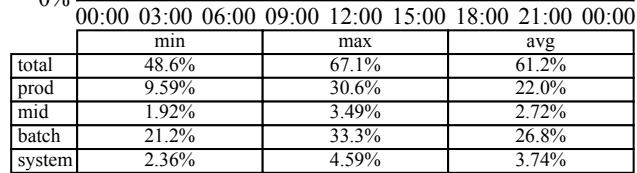

# Stop Pretending to be Busy: A Case for Serverless Paradigms in Co-located Batch Workloads (Operational Systems)

Xiaohu Chai1,2, Jianfeng Tan2, Congsi Yuan2, Bowen Yang2, Hao Dai2, Tongkai Yang2, Chao Huang2, Dong Du3, and Yu Chen4,1

1Tsinghua University, 2Ant Group, 3Shanghai Jiao Tong University, 4Quan Cheng Laboratory

## Abstract

High resource utilization is significant for cloud vendors. To achieve this, a common practice is to co-locate low-priority batch workloads (typically Spark-based analytics) with highpriority online services, while strictly maintaining Service Level Objectives (SLOs). This paper presents an empirical study of co-location and overcommitment in a productionscale datacenter. Specifically, within Ant Group, online services utilize only 22.0% of available CPU resources. By carefully overcommitting resources to deploy batch workloads, the system harvests an additional 26.8% of CPU capacity.

Despite this increased density, we observe that batch workloads remain inefficient, with a useful computation ratio of only 67%. We identify the root causes of this low “effective utilization” as four types of idleness: (1) slot idle, arising from coarse-grained resource management in Spark; (2) gap idle, caused by hardware heterogeneity and interference; and (3/4) start/stop idles, resulting from the high latency of launching and destroying analytic instances. To address these inefficiencies, we propose Quark, a novel framework that integrates serverless paradigms into batch analytics. Quark eliminates these idles through fine-grained resource allocation, hetero geneity and skew-aware scheduling, and rapid instance provisioning. Experimental results show that Quark increases cluster utilization by about 37.37% and reduces the proportion of long-tail jobs from 15% to 2%. Quark has been deployed at scale within Ant Group, processing 350,000 offline query jobs daily across a deployment footprint of 600,000 CPU cores, processing between 7,500 TB and 10,000 TB of data daily, and saving more than 100,000 CPU cores.

## 1 Introduction

Cloud providers strive to maximize resource utilization while strictly adhering to users’ SLOs [56]. In modern cloud infrastructure, two primary strategies drive resource efficiency: overcommitment and co-location. Overcommitment enables providers to allocate aggregate resources exceeding a machine’s physical capacity, leveraging the statistical probability that tenants will not reach peak usage simultaneously [13, 94, 100]. Complementing this, co-location schedules diverse workloads, combining latency-sensitive online services with resource-intensive offline analytics, onto the same physical nodes. This exploits complementary usage patterns to maximize utilization without a proportional increase in hardware, a common practice among major providers like Google [35, 78, 92], Alibaba [19, 40], and ByteDance [98].

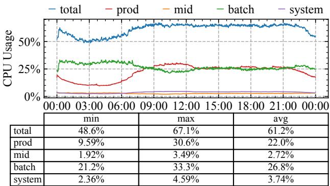  
Figure 1: Co-location CPU Utilization in a Ant Group’s Cloud Cluster. Maintaining roughly 60% resource utilization achieves a practical trade-off between meeting online service SLOs and maximizing efficiency in clusters.

Ant Group also adopts these strategies to optimize its utilization. Our cloud overcommits resources such that total allocations exceed physical capacity, managing diverse workloads within a unified resource pool. As shown in Figure 1, a single node hosts a hierarchy of four distinct workload tiers. At the highest priority are System processes (cluster management daemonsets like etcd) and Prod services (latency-sensitive microservices or serverless functions [17,39,85]), which receive guaranteed resource allocations. Co-located alongside these are Mid-tier real-time tasks (not latency-critical but require stable and reserved resources, e.g., Flink [5]) and Batch workloads (opportunistic Spark jobs [12, 104]). Mid and Batch workloads run exclusively on overcommitted resources and are treated as best-effort; during contention, they are liable to be throttled or evicted. Despite their lower priority, these workloads exhibit pronounced diurnal patterns, allowing effective co-location to significantly boost overall cluster utilization. However, based on large-scale production deployments and an in-depth analysis of existing solutions, we demonstrate that the current coarse-grained job model [6, 8] for batch processing is structurally inefficient for co-location.

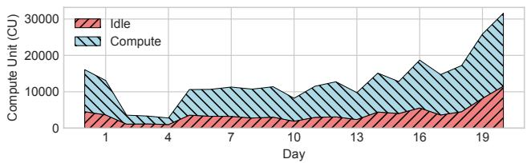  
Figure 2: Gap Between Allocated and Actual Compute Resources in Batch Workloads. Light blue region represents utilization for actual compute tasks. Light coral region indicates idle time or non-effective computation. 1 CU indicates 1 CPU core and 4GB memory for a 1-hour period.

Inefficiency in Batch Workloads. In Ant Group, the vast majority of batch workloads are processed using Apache Spark [104]. We execute over 350,000 Spark jobs daily, processing between 7,500 TB and 10,000 TB of data. This scale reflects a broader industry trend, where 80% of the Fortune 500 rely on Spark for large-scale data processing [11,26,29,97,102]. As shown in Figure 2, we analyze one month of resource usage in a production cluster, contrasting the resources requested by batch tasks against those effectively consumed (i.e., for computation). Our analysis reveals that 33% of allocated resources were wasted on non-effective states (e.g., waiting, initialization). Given the hyperscale of Ant Group, minimizing this hardware waste is critical.

We deconstruct this resource wastage into four types of idleness intrinsic to the current architecture. First, Slot Idle arises from Spark’s coarse-grained allocation strategy, where an executor’s resources remain fixed throughout its lifetime. This rigidity fails to adapt to the varying resource demands of different stages, leading to significant over-provisioning. Second, Gap Idle occurs when interference from high-priority workloads or hardware heterogeneity induces straggler tasks. Due to the bulk-synchronous nature of batch jobs, these stragglers delay the commit of entire stages, leaving other resources idle while waiting. Finally, Start & Stop Idles stem from the heavy initialization costs, such as JVM bootstrapping and SparkEnv [10] setup. To mitigate frequent startup overheads, the system retains executors for a timeout period before exiting, which inherently results in idle resource holding. Consequently, while overcommitment and co-location have improved cluster utilization in Ant Group, Figure 3 shows that a substantial portion of these resources is wasted.

Our Solution: Serverless Paradigm for Batch Workloads. We identify the root cause of the inefficiencies as a fundamental mismatch: traditional data analytics engines (like Spark) operate with long-running, pre-occupied, coarsegrained resource allocations, while co-located environments are dynamic, favoring fine-grained, on-demand provisioning. To bridge this gap, we advocate for applying serverless paradigms to batch workloads. By transitioning from long-lived executors to task-level resource management, we align resource consumption with actual computational demand. While prior efforts have explored ephemeral executors [41, 43, 44, 95, 105], they often overlook the practical impediments to deploying such models at hyperscale, particularly regarding startup latency and scheduling overhead.

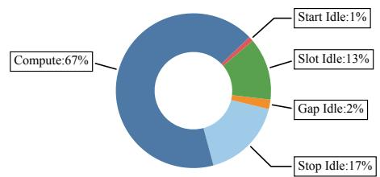  
Figure 3: Breakdown of Batch Workloads’ Utilization.

Realizing this vision in a production cluster presents three technical challenges. First, minimizing slot idle through tasklevel scheduling dramatically increases the pressure on the control plane; replacing thousands of coarse-grained executors with hundreds of thousands of individual tasks exacerbates scheduling complexity by orders of magnitude. Second, to address gap idle, the scheduler must account for the noise inherent in co-location. Online service interference and hardware heterogeneity create uneven computational power, causing stragglers that block stage completion. Finally, while ondemand provisioning resolves stop idle, it threatens to worsen start idle; without optimization, the cumulative latency of launching a fresh Java-based Spark instance for every task negates the efficiency gains.

We propose Quark, a novel analytics framework that fundamentally restructures batch processing by adopting a serverless paradigm where resources are provisioned and released at the granularity of individual tasks. Quark resolves the chal lenges through three key techniques. First, to ensure control plane scalability, we design a scalable resource control mechanism that regulates task parallelism via a Slots Ring and enforces global overcommitment limits through a Quota Manager, all orchestrated asynchronously to maximize throughput. Second, to mitigate hardware heterogeneity and interference, we introduce an interference-aware scheduler that converts raw node metrics into uniform capacity scores, enabling a variance-optimal placement algorithm that synchronizes task completion times. Finally, to resolve high cold start overheads, Quark employs fast task provisioning, which combines state reuse via fork() with state pre-prepare and lazy-load strategies, bypassing JVM initialization and removing non-critical dependencies (of Spark) from the critical path.

Deployment and Results. To the best of our knowledge,

Quark is the first reported commercial system to achieve nearzero resource waste for batch workloads in overcommitment and co-location scenarios. In the TPC-H benchmark, Quark reduced average resource consumption by 56.01%. In microbenchmark tests, the average task execution time decreased by 18% to 33%, the ratio of long-tail tasks dropped by 2.75×, and task startup overhead was reduced by 89.7%. In production environment tests, resource consumption decreased by 37.37%, the proportion of long-tail tasks fell from 15% to 2%, and the longest-to-shortest task time ratio dropped from 20× to 8×. The system has been deployed in a 600,000-core cluster, processing between 7,500 TB and 10,000 TB of data daily, and saving more than 100,000 CPU cores.

Research Contributions. First, it characterizes resource inefficiency in co-located batch workloads by identifying and quantifying distinct forms of idleness that prior work has not fully explored. Second, it proposes a serverless-based analytic framework that resolves critical challenges in scalability, heterogeneity, and latency through novel resource control and scheduling designs. Finally, it validates the system through a large-scale production deployment, offering practical opti mizations and operational experiences that demonstrate its reliability and efficiency.

## 2 Demystifying the Reality of Cloud Utilization

We begin by profiling the overcommitment behavior and colocation workload characteristics in actual clusters. We then conduct an in-depth performance analysis of Spark, identifying critical bottlenecks that inform Quark’s design.

## 2.1 Clusters and Resource Strategies

Clusters Characteristics. In Ant Group, millions of servers are deployed to host tens of thousands of services (different types), serving billions of users. To ensure data locality and stability, servers are distributed across 6 data center regions in different cities. As illustrated in Figure 4, the hardware within these clusters is highly heterogeneous, comprising multiple generations of servers from various hardware vendors. This diversity stems from staggered data center construction dates, the standard 4-year hardware warranty cycle, and the strategic need to ensure supply chain security. This practice of multi-generation server deployment is consistent with patterns reported in prior work [23, 25, 67].

Workload Placement. Ant Group supports a diverse ecosystem across finance, payments, and digital services. The ap plications of Ant Group include backend applications (microservices and serverless at 48.45%, AI agent at 3.95% and packages at 2.3%), web applications at 40.38%, big data at 4.43% (one platform supports all Spark SQL queries) and terminal applications. These applications are co-located in Ant Group and operate in accordance with a set of placement policies and specific allocate strategies.

(1) Placement Policy. As shown in Table 1, the placement policy follows a hierarchical overcommitment resource policy and throttling and eviction scheduling policies. Surplus capacity is allocated to lower-priority workloads when utilization of high-priority ones is low. Should their demand increase, lower-priority workloads may be throttled or evicted to guarantee Quality of Service (QoS) for higher-priority workloads.

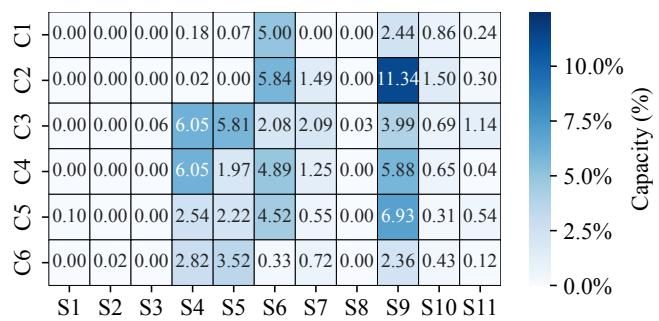  
Figure 4: Servers Distribution in Ant Group. C1-C6 represents different clusters, and S1-S11 different types of servers.

Table 1: Three-Layer Co-location of Workloads.  
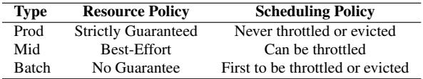

(2) Allocation Strategies. When allocating resources, the scheduler determines the number and specifications of containers that can be deployed on each node based on the Placement Policy and a set of rules. Table 2 summarizes the allocation strategies for each workload. Intuitively, the ratio of prod and mid workloads is determined by pre-defined parameters, while batch is mainly determined by the remaining resources.

Table 2: Allocation Strategies.  
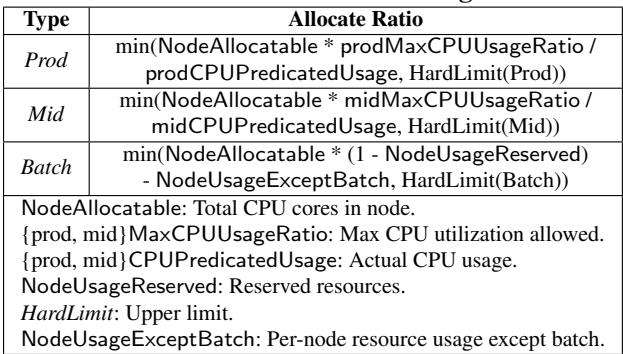

In Ant Group, the prodMaxCPUUsageRatio is 30%. Exceeding this threshold will incur two limitations: First, latency will increase and compromise the SLOs of online services. Second, it is essential to have capacity availability when needed during critical events such as cluster disaster recovery or unexpected workload spikes. There are few mid-type businesses, so the midMaxCPUUsageRatio is set to 10%.

According to these strategies, Figure 5 illustrates the CPU allocation ratios across different clusters. The ratios of Prod workload range from 94.6% to 121.3% and Mid workload range from 7% to 23.1%. Batch are not assigned a fixed allocation ratio; however, it is required that the aggregate CPU utilization of all workloads on a node remain below 60% to avoid interference with prod. Figure 1 shows each type workload in Ant Group. In a co-located context with limited resource quotas, heterogeneity, and low priority, we need to consider how to efficiently run batch workloads.

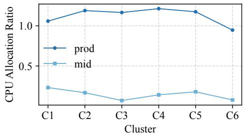  
Figure 5: CPU Allocation Ratios in Different Cluster. Allocation ratio is defined as Allocated Cores/NodeAllocatable.

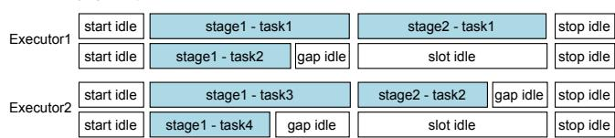  
Figure 6: A Spark Job’s Execution Flow. An example with two stages whose tasks are distributed across two executors.

## 2.2 Inefficient Co-location Job Model

We operate batch workloads on Spark [11], the de facto standard for big data processing. In Spark, each job is represented as a directed acyclic graph (DAG), and each DAG consists of multiple stages. A stage contains parallel tasks that perform the same work, and those tasks are scheduled to run on executors. In this paper, we will follow the same convention [8] to use the terms including job, stage, and task. Figure 6 illustrates an execution flow example across multiple nodes in the cluster. Through real-world deployments, we identify four types of idle or non-productive costs (uniformly referred to as idle) that significantly impact resource efficiency.

(1) Start Idle. Starting an executor is a complex, resourceintensive process in Spark. The startup procedure begins when the driver [8] requests executors from the cluster manager (e.g., Kubernetes), which launches pods on worker nodes. A pod is a basic scheduling unit in the cloud. After a pod is allocated, the JVM executor starts, initializes the RPC environment, and registers with the driver. It then creates SparkEnv [10], starts services such as the BlockManager and BlockTransferService, initializes memory and shuffle subsystems, and localizes driver-distributed jars and broadcast variables. Once BlockManager has registered, the driver marks the executor ready and begins sending LaunchTask RPCs.

(2) Slot Idle. An executor operates with fixed resource limits during its lifetime. When tasks at different stages require different resources, the executor must be provisioned to meet the peak demand for the entire job. This over-provisioning leads to resource wastage during less demanding stages. Adjusting resource allocation by replacing or restarting executors incurs significant performance penalties, primarily due to task rescheduling overhead and the potential loss of intermediate data. Previous work focuses mainly on predicting optimal resource configurations [18, 83] and reducing the granularity of resource allocation [97]. These approaches are hard to handle real-time resource requirement variation of different stages.

(3) Gap Idle. Spark adheres to the Bulk-Synchronous Parallel (BSP) model [46], requiring all tasks within a stage to complete before the next stage can commence. Consequently, slow tasks (stragglers) cause resource waste, with a few executors doing left work while others idle, delaying the entire job. Many studies have reported various straggler factors [2, 32, 53, 70]. In Ant Group, we focus on two clusterrelated impacts. First is the co-location: batch workloads utilize overcommitted resources, and will be evicted when higher-priority workloads (e.g., system, production, mid-tier) contend for resources. Second, hardware heterogeneity within the cluster presents challenges. Servers in Ant Group follow 4-year replacement cycles and are sourced from multiple OEMs for supply-chain reasons. This heterogeneity results in uneven computing power across the cluster (Figure 4), causing unaligned tasks finish time within the same stage.

(4) Stop Idle. In Spark, an executor is a long-lived Java process, while a task runs as a thread within it. Executors do not terminate upon task completion. They persist until the driver requests their release from the cluster manager at application termination. When dynamic allocation feature is enabled, idle executors exceeding the configured executorIdleTimeout are decommissioned. Executor startup is slow (start idle), setting the executorIdleTimeout too low will increase latency and resource churn. The default executorIdleTimeout is 60 seconds, but it is often extended to several (or tens of) minutes in production environments.

## 2.3 Existing Approaches

Researchers have proposed a wide range of techniques, such as workload co-location and data analytics, to address performance and resource utilization issues in cloud infrastructures [3,19,23,25,29–31,40,41,43,44,49,66,74,75,78,84,92, 97,98,105], as shown in Table 3. Some of these works are applicable and have inspired parts of Quark’s design, which has been adopted in large-scale production environments. However, others neglect the critical issues discussed in §2.2 or rely on simplified assumptions that overlook the complexities of large-scale systems and cannot address the identified idles.

(1) Spark Optimizations. Apache Spark is the most widely used system for large-scale data processing and involves the coordinated work of many components. There are many efforts to improve its performance, including shuffle mechanisms [26, 59, 81], native compilation [29, 102], resource optimization [79], configuration tuning [50, 61, 99, 110] and so on [22, 65, 72]. Some of the research efforts are orthogonal to, yet complementary with, the issues discussed in §2.2. Furthermore, prior work has also discovered that there is an urgent need to handle resource requirements variation of different stages (e.g., Wu et al. [97] and ResourceProfile [7]). However, these methods merely adjust resource configurations to align executors more closely with the average resource utilization. Although this yields certain improvements, the underlying two-layer executor–tasks job model remains unchanged, and the fundamental problem therefore persists.

Table 3: Comparison of Existing Approaches and Quark. ( is beneficial, is partly beneficial, and is limited.)  
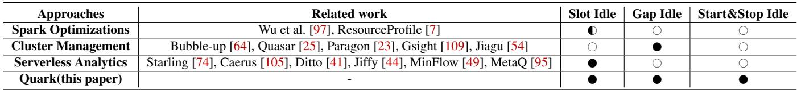

(2) Cluster Management. Overcommitment and co-location may lead to performance degradation and QoS violation, it is a common practice to predict performance before scheduling an instance to avoid QoS violation. For example, previous works use modeling (e.g., Graph [33], Linear [60], RL [63], Random Forest Regression [54]) to determine optimal placement strategy [64,73,86,101,109]. Although this work offered valuable insights and inspirations that informed the design of Quark, there are still some issues that need to be addressed to optimize gap idle. First, existing works [54, 101, 109] focus on a single node, aiming to maximize instance deployment density without violating instances’ QoS. However, batch workloads following the BSP model require that all tasks within the same stage have as uniform execution times as possible. Second, it fails to differentiate features among prod, mid, and batch workloads and the impact of heterogeneous hardware, prediction accuracy is limited [24, 25].

(3) Serverless Analytics. The elasticity, free-of management, and on-demand scalability of serverless have motivated the effort in deploying distributed data analytics applications to serverless platforms. We evaluate the potential of the existing work [41,43–45,49,66,74,75,84,105] to provide fine-grained resource control and reduce slot idleness. Our analysis reveals two fundamental limitations in existing solutions: (1) Coarsegrained resource allocation. Some prior serverless analytic systems deploy function at executor scale [43, 45, 95], which cannot adapt to stage-level variations and leaves slot idle issues unresolved. (2) Overlook the complexities of largescale systems. Ditto [41] allows each task to be assigned to a serverless function, but it neglects the task startup cost in real systems. MetaQ [95] reports that it takes 17.78s ∼ 47.02s to start a Spark engine. When the granularity of serverless functions shifts from executor to task, the cumulative cold start penalty will increase enormously. Some systems [74, 105] remain in the prototype phase and are difficult to deploy at scale in practical scenarios, mainly due to challenges related to control plane scalability, heterogeneity, and cold starts.

## 3 Quark Overview

To address the inefficiencies of co-location (i.e., four idles), we propose Quark, a framework that re-architects batch workloads using a serverless paradigm. The core insight of Quark is to transition from a coarse-grained and pre-allocated resource model to a fine-grained and on-demand model. Specifically, a task could request one core (or sub-core) when it starts and release it immediately after completion. By utilizing the individual task, rather than the heavy-weight executor, as the basic unit of resource allocation, Quark allows the cluster to effectively harvest transient overcommitment resources.

## 3.1 Challenges

However, adapting a heavy-weight analytics engine like Spark to this fine-grained model introduces three challenges.

Challenge-1: Scheduling Scalability and Efficiency. The transition from coarse-grained executors to fine-grained tasks creates a massive surge in scheduling events, imposing severe pressure on the control plane. Figure 7 shows the CDF of task counts per stage; we observe that over 10% of stages exhibit parallelism exceeding 184, with peak parallelism reaching 52,383 tasks in a single stage. This explosion in scheduling introduces three specific issues. First, handling hundreds of thousands of individual task scheduling requests, as opposed to a few thousand executor requests, can saturate the cluster scheduler (e.g., Kubernetes), potentially disrupting the stability of co-located online services. Second, because native Spark lacks a global view of real-time overcommitted resources, it may aggressively issue scheduling requests that exceed available capacity, leading to a high volume of failed and wasteful invocations. Finally, the overhead of managing the lifecycle of short-lived tasks creates a throughput bottleneck in the control plane, increasing end-to-end latency.

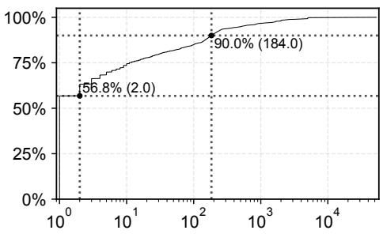  
Figure 7: Distribution of Tasks per Stage.

Challenge-2: Hardware Heterogeneity and Interference. To effectively mitigate gap idle, the scheduler must ensure that tasks within the same stage finish simultaneously. However, achieving this is difficult due to the significant variance in effective computing power across the cluster. As shown in Figure 4, servers in Ant Group follow a four-year replacement cycle and are sourced from multiple vendors, resulting in inherent hardware heterogeneity. Meanwhile, batch workloads run at low priority and are subject to being throttled or evicted by online service. Standard schedulers typically view resources nominally (e.g., CPU core counts) and overlook these performance variations. Without accounting for this heterogeneity and interference, tasks assigned to slower or noisier nodes become stragglers, delaying the completion of the entire stage and reducing cluster efficiency.

Challenge-3: Cold Start Overhead. The ephemeral nature of serverless tasks fundamentally clashes with the high cold start costs of the Spark runtime. While general-purpose serverless platforms utilize techniques like forking or checkpointing to optimize startup, Spark’s initialization is uniquely complex, involving the setup of heavyweight components such as the JVM, RpcEnv, and RemoteDataManager. Currently, the startup latency for a standard Spark instance exceeds 6 seconds. In a coarse-grained model, this cost is amortized over the lifetime of a long-running executor. However, in a fine-grained model where instances are created and destroyed for specific tasks, this multi-second overhead becomes a dominant factor, potentially negating the benefits of on-demand allocation. Reducing this startup latency to a level compatible with short-lived tasks remains a critical open challenge.

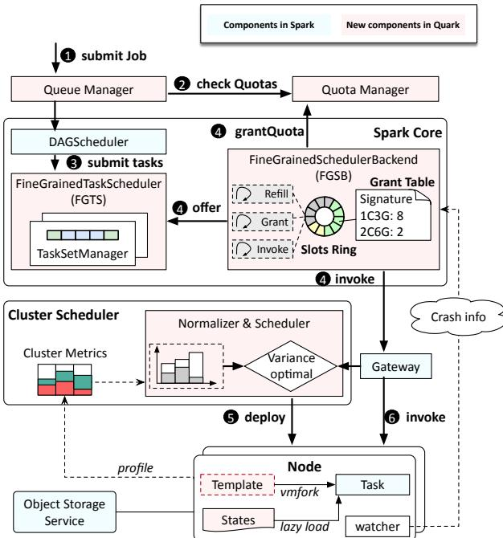  
Figure 8: Quark Overview.

## 3.2 Design Overview

System Architecture. Figure 8 shows the overall architecture of Quark. Built atop the full Spark stack, Quark preserves complete compatibility with Spark-SQL while establishing a fine-grained resource model. The system operates across three logical layers. First, the Spark Core serves as the primary control plane; it receives analytic jobs and generates tasks via the TaskScheduler, which then coordinates with the SchedulerBackend to interact with the underlying infrastructure. Second, these components interface with the Cluster Scheduler within Ant Group’s serverless platform, which handles the placement of individual tasks onto physical nodes. Finally, at the Node Layer, Quark utilizes lightweight, VM-based containers to execute these serverless instances, launching a fresh runtime for every scheduled task. These instances are stateless [74], driver/executor metadata objects that are traditionally pulled from executor memory (e.g., broadcastrelated metadata) are stored in remote cloud object storage services and fetched on demand. Intermediate shuffle data are managed by vanilla Spark’s ShuffleManager. This eliminates the need for rack-aware data locality during instance scheduling. Quark introduces three key techniques to address the challenges in §3.1.

Scalable Resource Control. To overcome the Challenge-1, we firstly design a Slots Ring-based mechanism within the Spark Core to regulate task parallelism and coordinate Spark scheduler components. Besides, we introduce a quota-based resource management to explicitly manage global overcommitment capacity, thereby reducing wasteful scheduling attempts. Finally, we adopt fully asynchronous principles in the control plane to decouple interdependent operations and maximize throughput.

Interference-aware Scheduler. To mitigate heterogeneity and interference (Challenge-2), Quark introduces a Interference-aware Scheduler situated within the serverless platform. Its primary goal is to normalize the effective computing power provided to tasks within the same stage. By monitoring real-time system metrics, the scheduler converts raw node resources into a uniform capacity score using a normalizer model. It then applies a variance-optimal placement algorithm to distribute tasks, significantly reducing the occurrence of stragglers and minimizing tail latency.When online services burst, a local agent detects contention signals (e.g., SLA degradation, LLC misses) and enforces an online-first policy by throttling batch resource entitlements and adjusting the node’s reported available capacity.

Fast Task Provision. To resolve the high cold start overhead (Challenge-3), Quark optimizes the task initialization through three mechanisms. First, we employ State Reuse, where the system maintains pre-warmed template instances and creates new tasks via a fast vmfork operation, bypassing the initialization of JVM and parts Spark modules (e.g., executor-level state). Second, we use State Pre-Prepare to compute taskspecific states (such as Codegen bytecode) in the driver and transfer them to the executor, avoiding redundant compilation. Last, we implement State Lazy-Load to remove non-critical components from the startup path, initializing them in parallel

only when needed.

## 4 Detailed Design

## 4.1 Scalable Resource Control

We first explain the techniques for scalable resource control. Slots Ring-Based Task Management. In the traditional Spark architecture, a TaskScheduler decides which tasks should run, and a SchedulerBackend communicates with the underlying cluster manager (e.g., Kubernetes) to acquire and launch execution instances, as shown in Figure 8. To prevent the fine-grained model from leading to uncontrolled parallelism, Quark introduces the Slots Ring as a key data structure within the Spark Core. This ring buffer maintains the tasks currently allowed to be scheduled, helping to coordinate the Fine-GrainedTaskScheduler (FGTS) and the FineGrainedSchedulerBackend (FGSB). The FGTS supplies new tasks (refill) to the ring only when idle slots are available, and the FGSB then attempts to acquire quotas and launch instances for these slotted tasks (grant and invoke). By configuring the size of this ring, Quark precisely controls the global parallelism of batch workloads, preventing scheduling pressure from overwhelming the cluster. Analogous to Spark’s driver [9], FGSB/FGTS are centralized. They support HA via failover (restart/leader election depending on the deployment), but at any time only one instance is responsible for making scheduling decisions. Although centralized, the scheduler offer scalability because the slots-ring changes the critical path from O(M\*N) tasks/executors match to O(1) enqueue/dequeue per scheduling event and avoids global contention.

Quota-Based Resource Control. Instead of relying on the cluster scheduler to reject scheduling requests due to lack of resources, which can lead to contention and wasted API calls, Quark introduces the QuotaManager (QM) to explicitly manage the global overcommitment capacity. QM is a distributed resource management service where a single leader instance is responsible for all allocation decisions, with follower nodes providing fault tolerance.When the leader fails, Quark enters a short failure-recovery window (<1 min) for failure detection and leader election. During this period, jobs that have already received a quota grant are not affected, and new submissions that require fresh quota decisions will be temporarily stalled until a new leader is ready. The leader maintains the current resource usage and schedulable tasks in an in-memory cache, which is periodically synchronized with a backend database. This design minimizes database load and accelerates scheduling decisions. Quota allocation is based on in-memory operations, so the leader will not suffer from scalability issues or performance bottlenecks.

As shown in Figure 9, operators define a total available quota for each project (representing a tenant or team). A submitted job registers its priority, and submission time within its project. Subsequently, the FGSB summarizes the resource needs of the tasks in the Slots Ring and requests a resource grant from the QM. Only upon receiving a successful grant does the FGSB proceed to invoke the underlying serverless platform. This explicit resource negotiation significantly reduces the number of failed and wasteful invocations.

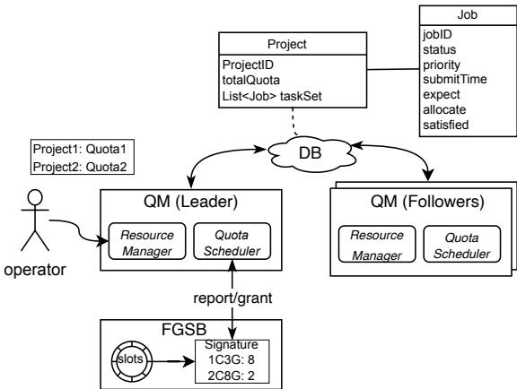  
Figure 9: Quota Manager.

Quota Allocation. The quota allocation procedure focuses on reclaiming under-utilized quota and prioritizing high-demand jobs. First, the QM reclaims resources by returning allocated quotas from completed jobs and adjusting the allocation of running jobs downward to their expected demand, recovering any surplus. Second, the reclaimed quota is re-distributed to jobs whose current allocation is below their expected level. Unfinished jobs are prioritized based on their explicit priority and submission time. The allocator first guarantees the required resource allocation for running jobs to minimize churn. If surplus resources remain, it allocates additional resources toward the job’s expected demand on a best-effort basis, terminating the allocation cycle if the quota is exhausted. For jobs that receive a partial allocation, resources are preferentially assigned to smaller containers to maximize throughput.

Asynchronous Scheduling Framework. A key design to achieving control plane scalability is the full adoption of asyn chronous principles. In a synchronous model, the three core operations of the SchedulerBackend: refill, grant, and invoke, are tightly coupled; a block in the grant operation, for instance, would stall the invoke of tasks that already possess granted quotas. To prevent this single point of blocking, Quark meticulously decouples these three operations into independent threads that communicate via the Slot Ring.

The Refill Thread generates available slots and presents them to the FGTS. It operates in a batched, asynchronous manner (e.g., every 500 ms), filling empty slots in the ring. The FGTS selects tasks based purely on priority, as the Slot Ring already controls parallelism (O(N) scheduling). The Grant Thread periodically (e.g., every 3 seconds) computes the aggregated resource demands of tasks in the Slot Ring and consults the QM for quota allocation. To reduce the load on the QM, it encodes the expected resource demand into a signature; if this signature remains unchanged from the previous cycle, the expensive full allocation schedule is bypassed. Finally, the Invoke Thread handles the actual submission to the cluster gateway. It scans the Slot Ring every 500ms, identifies tasks that have received a valid quota grant, and dispatches the launch requests for parallel execution. This asynchronous design ensures that latency in one operation does not halt the entire task scheduling pipeline.

## 4.2 Interference-aware Scheduler

Quark introduces an interference-aware scheduler to overcome the heterogeneity and dynamic interference challenge, including two core techniques: the Resource Normalizer and the Variance-Optimal Scheduler.

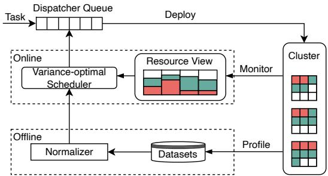  
Figure 10: Quark’s Interference-aware Scheduler.

Resource Normalizer. Since batch workloads have the lowest priority, they are susceptible to interference from both prod and mid workloads. The Resource Normalizer is designed to quantify the effective resource capacity available for batch on any given node. As shown in Figure 10, an agent continuously collects essential system metrics from kernel interfaces, including the CPU utilization of co-located workloads, NUMA topology, and the machine type. This data is fed into a linear model to calculate the effective capacity. Equation (1) quantifies the schedulable resource capacity on a node:

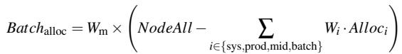

(1)

Here, NodeAll represents the total CPU cores of the node. Wm is a weight characterizing the intrinsic performance impact of the machine type (hardware heterogeneity). Wi is a weight representing the quantified impact of interference from workload type i (i.e., sys, prod, mid, and batch) on the batch execution, and Alloc is the resources allocated to that workload. The weight-related parameters are determined offline through Bayesian optimization process, using a dataset built from comprehensive performance metrics collected across the cluster. The output, Batch provides the scheduler with a unified metric of effective capacity. Cache contention is handled at the node via hardware QoS enforcement (e.g., Intel RDT, AMD QoS) with dynamically adjusted LLC quotas, which is orthogonal to scheduler-level interference model.

Variance-optimal Scheduler. After normalization, Quark then employs a variance optimization algorithm to make precise task placement decisions, ensuring optimal resource distribution across the cluster. Assume a cluster consists of N nodes, denoted as node1, node2,..., noden. The total resources of these nodes are total1,total2, . . . , totaln, and at a given moment, their allocated resources are alloc1, alloc2, . . . , allocn. The optimization goal is to minimize the variance of the nodes’ allocation ratios after scheduling, The objective function is defined as:

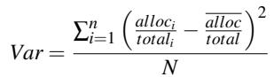

(2)

By minimizing this variance, the scheduler actively avoids creating load imbalances, ensuring that the workload is spread evenly relative to the effective capacity of each node.

## 4.3 Fast Task Provision

When a task is scheduled, the underlying execution platform must launch an instance to execute it, involving the startup of the JVM, the initialization of components within SparkEnv, and the preparation of the ExecutorBackend. In Spark’s tradi tional model, the executor is a long-lived process, amortizing this multi-second startup cost across thousands of tasks. In contrast, when the execution granularity shifts to the task level, this startup delay must be incurred for every task, leading to a dramatic increase in cumulative cold-start overhead. To make the fine-grained model viable, Quark implements three mechanisms to achieve near-instantaneous task provisioning. State Reuse via Forking. For states that are common across all tasks and independent of specific job logic, Quark employs a technique inspired by container optimization: it maintain a pre-initialized, paused template instance. This template instance completes the most expensive initializations in advance, including the JVM startup and the setup of core Spark components like RpcEnv and RemoteDataManager. When a new task instance is required, the system creates a live instance by forking from this template. Quark does not directly call fork() from an arbitrary multi-threaded JVM state. Instead, it leverages sfork (sandbox fork) design in previous work [17, 28], which introduces a transient single-thread mechanism: before forking, the template VM is brought into a controlled state where only one thread remains runnable and all other threads are quiesced. This avoids the well-known POSIX fork hazards in multi-threaded processes. After a new secure-container instance is forked, Quark will re-initialize the task-/application-specific Spark settings e.g., re-binding/reinitializing components such as RpcEnv endpoints and ShuffleManager connections. When new Spark versions are released, Quark periodically regenerates templates from the updated image. This mechanism allows the new instance to instantly inherit a initialized execution environment, eliminat ing seconds of overhead from the critical path, as detailed for the JVM and RemoteDataManager in Table 4.

State Pre-Prepare. The second mechanism addresses components that are task-specific but can be prepared outside the critical launch path. A key target is Spark’s Whole-Stage Code Generation (Codegen), which dynamically compiles optimized JVM bytecode at runtime to boost query performance. We leverage the insight that the code blocks generated by the driver for compilation are identical to those needed by the executor. The FGSB capitalizes on this by sending the compiled code from the driver directly to the executor instance via the serverless invocation payload. The task can then skip the costly process of code generation and compilation, directly loading the required classes, thereby reducing latency by an amount equivalent to the codegen time.

Table 4: Cold Start Costs and Our Optimizations.  
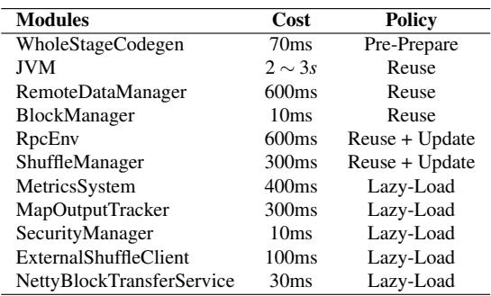

State Lazy-Load. Finally, Quark utilizes asynchronous loading and dependency removal for non-critical components. For states that can be initialized in parallel or are not immediately required for task execution, e.g., the security manager, Quark removes their initialization from the critical task startup path. As summarized in Table 4, this policy covers several heavyweight components like MetricsSystem, where initialization can be safely delayed, ensuring that task execution begins with minimal latency.

## 5 Implementation

Quark is implemented on top of Apache Spark. It remains fully compatible with Spark and requires no modifications to user code. To achieve Quark, there are approximately 10K lines of Java and Scala code for FGTS and FGSB, 5K lines for QM, 3K lines of Java for QueueManager, and 1500 lines of Go for cluster scheduler.

QueueManager. Beyond the design components, Quark introduces a QueueManager (QMgr) to control the maximum number of jobs that can be submitted. When a user submits a SparkSQL job, the system consults the QM to check whether the project’s quota is sufficient. If the remaining quota is insufficient, the job is enqueued in the QMgr. Once enough quota becomes available, the QMgr dequeues and resubmits the job according to its priority and submission time.

Fault Tolerance. In Spark, when a task fails due to insufficient resources (e.g., out-of-memory), the Spark scheduler will retry it and reschedule it on another executor. However, because each executor has the same fixed resource configuration (e.g., CPU and memory), the retried task is likely to fail again. Quark’s fine-grained job model can overcome the issues and enable precise fault-tolerance control: individual task failures do not affect other tasks, and the system can dynamically adjust resources and retry failed tasks as needed. As shown in Figure 11, Quark employs a three-level faulttolerance mechanism tailored to the different stages at which failures may occur: (1) Startup Monitor. The FGSB monitors each task during startup. If a task fails to start within a predefined timeout, the FGSB marks the task as failed. (2) Process Heartbeat. While a task is running, it periodically sends heartbeat messages to the FGSB. If the FGSB does not receive a heartbeat within the expected interval, it treats the task as failed. (3) Crash Callback. If a task crashes, a node watcher detects the failure and reports the crash information to the FGSB, which then marks the task as failed.

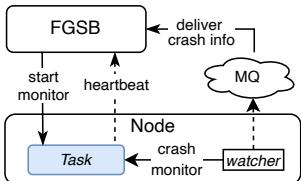  
Figure 11: Three Level Fault Tolerance.

The FGSB then analyzes the failure context. If the failure is caused by insufficient resources (e.g., an out-of-memory error), it will apply an increased quota from the QM, and retries only the affected task, avoiding a full stage-wide retry.

## 6 Evaluation

## 6.1 End-to-end Performance

Testbeds. The evaluation is conducted on a 30-node cluster, with each node equipped with an Intel(R) Xeon(R) Platinum 8163 CPU (96 cores, 2.7 GHz). The operating system is Linux kernel 5.10. Each task instance gets 1 CPU core, 3 GB of memory, and 300 GB of storage. The evaluation takes the following systems as baselines.

1. Spark runs on Kubernetes (K8s) with a coarse-grained job model (version 3.2.0).

2. Spark-F represents an upgraded version of Spark; it adds a fine-grained resource model and runs in a serverless paradigm (include design in §4.1).

3. Spark-S adds the design of the interference-aware scheduler (§4.2) on the basis of Spark-F.

4. Quark is our final production platform that further optimizes task startup performance (§4.3) based on Spark-S.

Resource Efficiency. We first assess the resource utilization using the TPC-H benchmark [88], which includes 22 complex SQL queries covering a wide range of operations. Specifically, we measure the CU consumption of each SQL query over a 1 TB dataset (SF=1000) in four systems (1CU: 1CPU and 3GB memory for 1min in this context). As shown in Figure 12, Quark reduces resource consumption by 26.70%– 87.86% compared to Spark across the 22 TPC-H queries, with an average reduction of 56.01% (20 trials, mean reported). This demonstrates the effectiveness of our approach. The smallest gain occurs in Q3, which involves joins and sorting on large tables (orders, lineitem) with heavy shuffle and memory use. Here, I/O is the main bottleneck, reducing the relative advantages of Quark’s design. In contrast, Q16 shows the largest improvement, featuring filtering and group aggregation on small, highly parallelizable tables. For such workloads, Quark’s scalable resource control, interferenceaware scheduler, and fast task provisioning design are fully utilized, delivering significant gains.

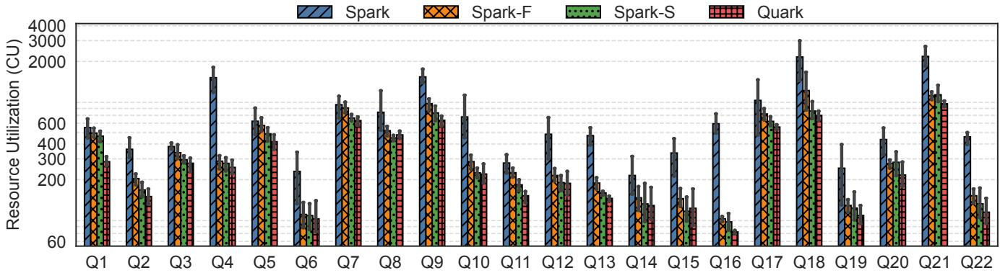  
Figure 12: Comparison of Resource Utilization in the TPC-H Benchmark. Q1-Q22 are distinct TPC-H queries covering a broad range of SQL operations [89].

Compared with Spark, Spark-F achieves a reduction in resource consumption ranging from 6.26% to 84.31%, with an average decrease of 42.68%. This improvement is attributed to fine-grained task scheduling, which minimizes resource waste caused by Slot Idle and Stop Idle. Similarly, Spark-S lowers resource consumption by 15.63% to 85.22%, averaging 50.26%, mainly through the adoption of an interferenceaware scheduler that mitigates the Gap Idle.

Completion Time. To evaluate the job completion time, we design a compute-intensive job with no I/O operations. It consists of 800 tasks, each computing the Fibonacci sequence (N = 50) five times independently. Figure 13 compares the four systems in three aspects: resource utilization, job completion time, and task duration standard deviation.

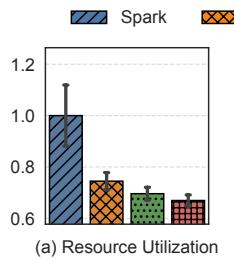

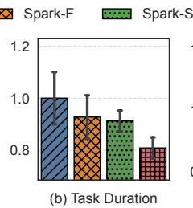

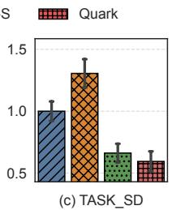  
Figure 13: Execution Time of Computation-Intensive Jobs.

As shown in Figure 13(a), Spark-F, Spark-S, and Quark re duce resource consumption by 25.53%, 30.41%, and 33.06% compared to Spark. In terms of completion time, Figure 13(b) shows speedups of 7.24%, 8.78%, and 19.11%, respectively.

Notably, Figure 13(c) presents the standard deviation of task completion times for each system: native Spark exhibits an average standard deviation of 79.20s, while Spark-F, Spark-S, and Quark take 103.40s, 52.40s, and 47.07s, respectively. The slightly higher standard deviation of Spark-F compared to native Spark stems from its finer-grained scheduling, which operates at the task level rather than the executor level. In native Spark, each node allocates resources once at job startup. In contrast, Spark-F performs independent resource allocation for every task, increasing variability in startup overheads and thus leading to greater variation in task completion times. Spark-S and Quark substantially improve the consistency of task execution.

## 6.2 Micro-benchmarks

Interference-aware Scheduler. We construct a 21-node heterogeneous cluster, with machine models and counts listed in Table 5. To simulate realistic multi-service co-location, each node runs several online services: Prod services use 20%–30% of node resources, while Mid and System services each consume 5%–10%. To evaluate the effectiveness of interference-aware scheduler, a batch of computationally intensive tasks is submitted and their execution performance is assessed using two metrics: (1) Average Task Time and (2) Tail Latency Ratio, defined as the ratio of the longest to the shortest task run time within the same stage.

Table 5: Cluster for Micro-benchmark.  
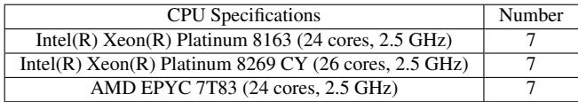

Figure 14(a) presents the average task execution time within the cluster under varying load. After adopting an interference-aware scheduler, the average task execution time decreased from 250s to 191s (AR=70%) and from 306s to 286s (AR=100%), achieving a performance improvement of 18%–33%. Figure 14(b) illustrates the tail latency for the same stage of tasks. The tail duration ratio was reduced from 1.76× to 1.64× (AR=70%) and from 2.75× to 2.22× (AR=100%). This experiment demonstrates that interferenceaware scheduler can significantly reduce both the average execution time and tail latency within a batch of tasks.

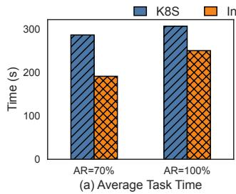

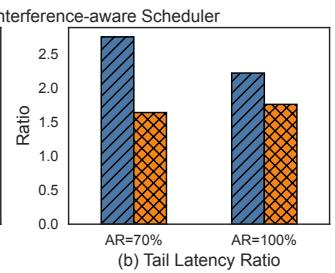  
Figure 14: Comparison of Task Execution Time and Tail Latency under Different Loads. “AR” stands for allocation ratio. For example, a 100C cluster running 70 concurrent tasks (1C) has a 70% allocation ratio.

Fast Task Provision. Figure 15 compares the time to start an executor in Spark versus launching a task in Quark. Spark takes 6078ms to start an executor, while the corresponding task startup in Quark is only 626.53ms (100 trials, mean reported), attributed to the three startup optimization mechanisms in §4.3. Compared to SOTA results [17, 36, 37, 103], the remaining costs of Quark come from two aspects: first, the instance is launched under co-location with low-priority resources. In fact, Quark only takes around 100ms on a dedicated machine. Second, unlike typical simple serverless functions, Quark is monolithic and must initialize a lot of unique states, including driver/shuffle connection establishment, tasklevel code and plugin loading, and complicated structure initialization, which cannot be fully mitigated.

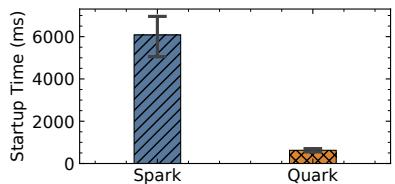  
Figure 15: Task Startup Performance.

## 6.3 Production Workload Replay

To validate the effectiveness of Quark under real production workloads, we conduct a trace-driven replay experiment using 24-hour production traces captured from a project at Ant Group1. As shown in Figure 16, the traces comprise 22,532 Spark jobs exhibiting a typical diurnal pattern, with submissions peaking at 1,641 jobs/hour at 08:00 and declining to 630 jobs/hour at 21:00. The total I/O volume reaches 4,610 TB, dominated by warehouse reads (Tunnel I/O, 94.7%) with a 13.5:1 read-to-write ratio, while Shuffle I/O accounts for 5.3% with near-symmetric read/write.

To fairly compare Quark with unmodified Spark, we replay the same workloads on two equivalent-scale clusters, each consisting of 320 nodes equipped with Intel(R) Xeon(R) Platinum 8163 CPUs (96 cores, 2.7GHz), 512GB DRAM, and 3.52TB SSD. Figure 17(a) shows the CU distribution of each job, and Quark reduces the total CU consumption by 26.5% compared to Spark. Figure 17(b) further breaks down the total CU by cost tier. For jobs consuming 1K CU or above, Quark consistently achieves 22–29% savings across all tiers. A small fraction of jobs (3.4%) experience CU regression, primarily in the lightweight tier (≤1K CU) due to the fixed overhead of function cold starts, which dominate the resource footprint for lightweight workloads. However, this tier accounts for only 1.0% of total CU, so its impact is negligible.

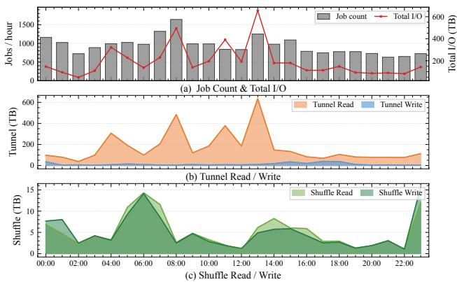  
Figure 16: 24-hour Production Trace of Spark Workloads. (a) Job count and total I/O volume. (b) Tunnel read/write throughput. (c) Shuffle read/write throughput.

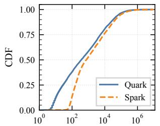  
(a) CU per Job Distribution

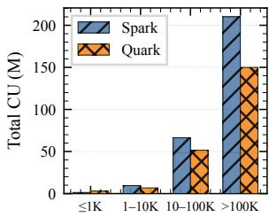  
(b) Total CU by Job Size  
Figure 17: Resource Consumption Comparison Between Spark and Quark. (a) CDF of CU per job (log scale). (b) Total CU breakdown by job size.

Figure 18 shows that Quark reduces total execution time by 22.4% (3,501h vs. 4,501h). The time distribution mirrors CU consumption, except that the ≤1K tier has shorter execution time. This improvement stems from Quark’s ondemand scheduling model. Unlike Spark, which stages jobs through a centralized scheduler and incurs queuing delays before resource allocation, Quark dispatches function invocations directly to available nodes, reducing scheduling cost.

## 6.4 In-Production Migration

Following the successful replay experiment in §6.3, we proceed to migrate all production workloads from Spark to Quark.

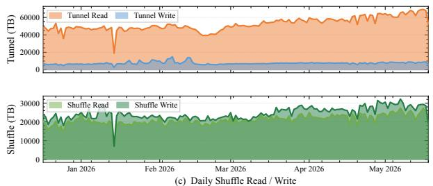

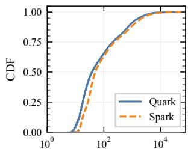  
(a) Execution Time per Job (s)

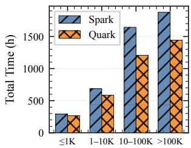  
(b) Total Time by Job Size  
Figure 18: Execution Time Comparison Between Spark and Quark. (a) CDF of execution time per job (log scale). (b) Total execution time breakdown by job size.

This migration spans 57,000 tables and 350,000 jobs across 219 projects. This longitudinal deployment study captures real-world performance under actual user workloads, demonstrating Quark’s operational effectiveness beyond controlled replay conditions.

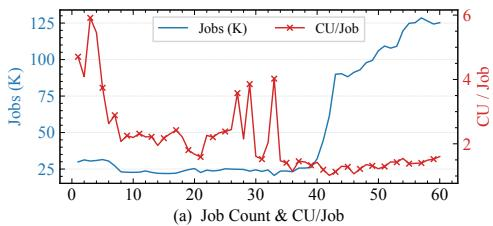

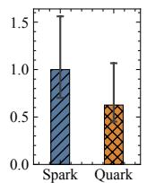  
(b) Normalized CU  
Figure 19: Per-job Resource Consumption Trends During the Spark-to-Quark Migration.

Per-job Resource Consumption. Figure 19(a) shows per-job resource consumption trends during this migration: Spark served production requests during days 0–40, followed by a complete cutover to Quark after day 40. The number of jobs increases (blue line) after migrating to Quark, while the average resource consumption per job (red line) declines throughout the migration. The normalized resource consumption in Figure 19(b) shows that Quark reduces resource idling during task execution, achieving 37.37% resource savings compared to Spark.

Job Tail Latency. We further evaluate the optimization effects in the production environment using two tail-performance metrics: (1) Tail Latency Ratio: within a stage, the ratio of the longest task runtime to the shortest; and (2) Unbalanced Stage Proportion: the fraction of stages where the longest task runtime exceeds 5× the average within that stage. As shown in Figure 20, compared to Spark, the average tail latency ratio was reduced from approximately 20× to 8× and the average unbalanced stage proportion decreased from approximately 15% to 2%. The interference-aware scheduler mitigates interference from co-located workloads and hardware heterogeneity, reducing latency variance and stage skew.

## 6.5 Operational Overview

Quark now operates as the batch workload processing engine at Ant Group. This section reports its operational metrics and production status over the past 6 months.

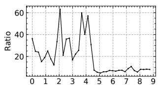  
(a) Tail Latency Ratio

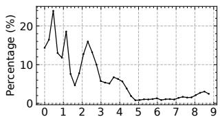  
(b) Proportion of Unbalance Stage  
Figure 20: Tail Latency Ratio and Unbalanced Stage Proportion Trends During the Spark-to-Quark Migration.

Scale and Reliability. As shown in Figure 21, Quark processes an average of 902K jobs per day (peaking at 1.27M) and achieves an overall success rate of 99.11%, meeting the strict SLA requirements of production batch workloads. The daily I/O volume averages 105.4 PB, dominated by tunnel reads (warehouse I/O) at 49.7% of total traffic (56.8 PB/day) and a 7.0:1 read-to-write ratio; shuffle I/O accounts for the remaining 43.2% (20.0% read, 23.2% write). These results demonstrate that Quark reliably meets production requirements at scale, sustaining high throughput and consistency over the entire 6-month period.

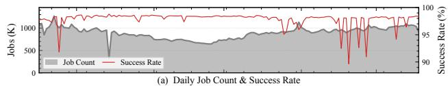  
Figure 21: Operational Overview of the Production Workload Over 6 Months. (a) Daily job count and success rate. (b) Tunnel I/O. (c) Shuffle I/O.

Cluster Status. Quark is deployed on a production cluster comprising over 6,000 servers with approximately 600K CPU cores. The cluster employs resource overcommit with a ratio ranging from 1.592× to 1.803×, and achieves an overall utilization between 41.7% and 61.4%. Figure 22 shows the invocation rate over a representative 24-hour period. The system processes an average of 534 requests per second with a peak of 2,130 requests per second. The overall success rate (HTTP 200) is 98.55%. Error responses are dominated by rate limiting (HTTP 429), which spikes with traffic bursts.

We measure the overcommitted resource allocation ratio in the cluster to assess how evenly tasks are distributed across nodes. For example, if 100 cores are overcommitted in the cluster and 70 cores are in use, the allocation ratio is 70%. The black line in Figure 23(a) shows the mean overcommitted resource allocation ratio over one day, with an average allocation ratio of 80.4%, red line shows the variance of allocation ratios across all nodes in the cluster, which remains stably low (the P95 is 22%), indicating good load balance. Figure 23(b) plots the CDF of the allocation ratio across all nodes at 00:00, showing that over 90% of nodes are higher than 69.2%.

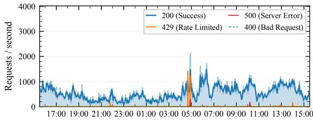  
Figure 22: Request Rate Over a 24-hour Period.

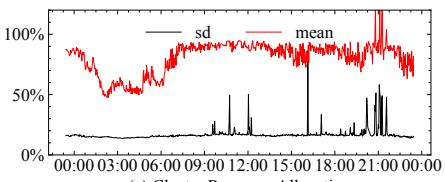  
(a) Cluster Resource Allocation

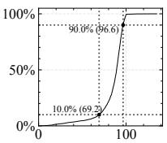  
(b) CPU Utilization(%)  
Figure 23: Overcommitted Resource Allocation.

## 7 Failure Analysis

In order to understand the operational situation and identify opportunities for improvement, we record 1.31 million failures over the past six months and classify these failures based on their root cause.

## 7.1 Failure Distribution

Table 6 summarizes the distribution of these failures. The most apparent is that the majority of recorded failures are user code, or permission issues rather than system-level problems.

Table 6: Production Failures Distribution.  
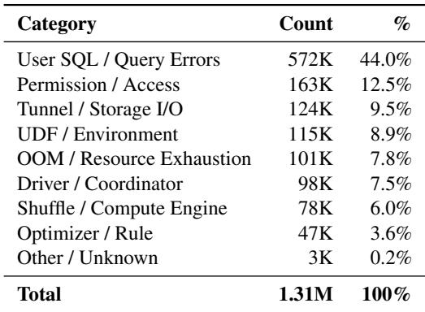

User-attributable Failures Dominate. User errors— including SQL mistakes, permission issues, UDF bugs, runtime environment mismatches, and Python worker failures—collectively account for 65.3% of all failures. SQL errors alone constitute 44.0%, making them the single largest category. Common sub-categories include: (1) references to non-existent tables or columns (the most frequent single error, with 296K occurrences); (2) user-initiated job cancellations (40K); (3) type mismatch and cast errors (25K); and (4) unsupported SQL syntax and features (e.g., UNPIVOT, ALTER MATERIALIZED VIEW ... REBUILD). Permission errors (12.5%) form the second-largest category, dominated by cross-project access restrictions (65K) and insufficient table-level permissions. UDF and environment errors (8.9%) encompass user-defined function loading and execution failures (23K), runtime environment incompatibilities (68K), and Python worker crashes (17K).

OOM Is the Leading System-Level Failure. Out-of-memory errors collectively account for 7.8% of failures. Table 7 breaks down OOM failures by type. Executor-level OOM (container crash or heartbeat timeout due to memory exhaustion) is the dominant sub-category at 47.9%. Sort and shuffle-write OOM (16.9%) and aggregate OOM (9.2%) follow. One benefit of Quark’s fine-grained mode is that when a task fails with OOM error, it can be retried in-place with a larger resource footprint, rather than destabilizing a long-lived executor that may host many concurrent tasks. 94.7% of failed tasks succeed upon retry after Quark automatically increases the resource allocation. The remaining 5.3% are dominated by tasks with heavily skewed data partitions, which are inherently difficult to handle via online resource prediction alone. These failed retries also waste CUs, accounting for 35.2% of the total CUs consumed by retried tasks, but are negligible relative to the overall CU consumption of all tasks.

Table 7: OOM Failure Sub-categories (101K total).  
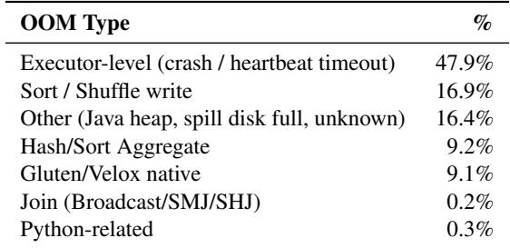

I/O and Data Transfer Failures Are Transient but Frequent. Tunnel and storage-api errors account for 9.5% of failures. The most common sub-categories are quota/capacity limits (29.5% of tunnel errors, dominated by slot quota exceeded with 34K occurrences), schema and partition errors (18.1%), storage API timeouts (19.6%), and data read/write failures from the underlying distributed file system (10.4% and 9.9%). These failures are typically transient—caused by momentary network congestion, service restarts, or load spikes—and are well-served by Quark’s built-in retry mechanism. However, the sheer volume highlights the importance of robust I/O error handling in production batch systems operating at scale.

Shuffle Reliability Remains a Concern. Shuffle-related failures (6.0%) include data-loss exceptions when shuffle services experience failures, Celeborn-related errors (connection timeouts, registration failures), and Velox native execution errors. Unlike I/O timeouts, shuffle data loss can cascade: a single lost shuffle partition may cause an entire stage to fail, requiring re-execution of all upstream tasks. Quark’s task-level fault isolation limits the blast radius compared to Spark’s executor-level model, but shuffle service reliability remains a critical dependency.

## 7.2 Operational Lessons

Use Secure Containers for Fault and Performance Isolation. Without proper isolation, these failures above (e.g., OOM crashes, transient I/O errors) can cascade across tasks. Morever, batch workloads are both CPU- and I/O-intensive, and their heavy use of kernel resources (e.g., scheduling and mutexes) can interfere with prod. Using secure containers to isolate both fault impact and performance impact is a good practice. We use SKernel [16] as the backbone of Quark, it provides comparable performance to runc (without virtualizationbased isolation) [69].

Explore User-Provided Hints for Long-Tail OOM Reduction. Quark employs a history-based query optimizer that predicts memory requirements at submission time, resolving 94.7% of OOM-induced failures upon retry with increased resources. However, the remaining 5.3%—dominated by long-tail tasks with highly skewed data or non stationary demands—remain difficult to predict purely from history. Prior work [50] on feedback-driven resource estimation shows that achieving stable prediction for such tasks may require many iterations (≈20) of adjustment. User-provided hints (e.g., expected data skew, memory-heavy operators) may help short-circuit this feedback loop where historical signal is insufficient.

Design for Transient I/O Failures at Scale. At the scale of 30K+ daily jobs processing petabytes of data, transient I/O errors are inevitable rather than exceptional. Systems must treat retries as a first-class mechanism: Quark’s task-level model, where a failed task is independently retried without affecting other tasks, is well-suited to this environment. By contrast, in Spark’s executor-level model, a transient I/O error may invalidate an entire executor’s in-memory state.

## 8 Related Work

Cluster Resource Optimization. Cluster resource optimization focuses on maximizing resource utilization efficiency in clusters, including cluster management [21, 25, 35, 60, 63, 67, 78,86,91,92,98] and schedulers [14,23,33,42,47,93,107,108]. Cluster platforms such as Azure [21, 80], Google [76, 87], Alibaba [20, 34, 55, 58] have published traces of their cluster management systems, workload characteristics and optimization strategies. Co-locate low-priority batch workloads with high-priority online services is a common practice to improve overall resource utilization [38, 52, 57, 64, 77, 106]. However, existing work mainly focuses on improving cluster resource utilization without violating SLOs and pays little attention to the effectiveness of resource usage because batch workloads are typically treated as “best-effort”, and resources from overcommitment are often viewed as a free lunch. In this paper, we identify four types of idle or non-productive costs that significantly undermine effective utilization and propose a lift serverless paradigm for efficient co-location.

Serverless Analytics. In addition to the systems discussed in §2.3, many other works (e.g., PyWren [43], Flint [45],Locus [75], Lambada [66], Cloudburst [84]) also leverage serverless platforms for batch analytics. Existing work mainly focuses on demonstrating the feasibility of serverless for offline analytics, and on improving shuffle operation efficiency on serverless platforms. Notably, Ditto [41] can adjust the degree of parallelism of each stage to optimize job completion time. However, Quark differs from these efforts by introducing a fine-grained job model and targeting production colocation with practical, deployment-oriented optimizations to overcome challenges in §3.1. Quark has been validated for effectiveness in industrial deployments.

Optimizations for Cold Start. We observe encouraging advances in serverless cold-start optimization techniques [1, 4, 15, 27, 28, 37, 48, 51, 62, 68, 71, 82, 90]. E.g., recent research efforts [17,28,37,51,96,103] have reduced function cold-start latency to within a 10-milliseconds. These works inspired the fast task provision design in Quark. However, compared with existing serverless platform, Spark is more complex and involves many operations whose state cannot be reused, such as additional plugin loading and establishing connections (e.g., with the Driver and ShuffleManager). The startup latency of a single task in Quark has not yet been optimized to within 10 ms, but it is sufficient for our needs.

## 9 Conclusion

This paper addresses the inefficiencies of co-location in modern cloud infrastructures, focusing on industrial-scale deployment. Through real-world deployments and in-depth analysis, we identify four types of idle or non-productive costs that significantly undermine effective utilization and leave clusters in a pretending to be busy state. This paper presents Quark, applying serverless paradigms to batch workloads for efficient co-location. Results show that Quark increases cluster resource utilization by 37.37%, and has been deployed in large-scale clusters, saving more than 100,000 CPU cores. We sincerely thank our shepherd and the anonymous reviewers, whose reviews and suggestions greatly strengthened our work. This work was supported by Smart Gird-National Science and Technology Major Project (No.2024ZD0803000) and National Natural Science Foundation of China (No.62302300). Correspondence to: Dong Du (Dd\_nirvana@sjtu.edu.cn), Yu Chen (yuchen@tsinghua.edu.cn).

## References

[1] Alexandru Agache, Marc Brooker, Alexandra Iordache, Anthony Liguori, Rolf Neugebauer, Phil Piwonka, and Diana-Maria Popa. Firecracker: Lightweight Virtualization for Serverless Applications. In 17th USENIX Symposium on Networked Systems Design and Implementation (NSDI 20), pages 419– 434, Santa Clara, CA, February 2020. USENIX Association. URL: https://www.usenix.org/ conference/nsdi20/presentation/agache.

[2] Ganesh Ananthanarayanan, Srikanth Kandula, Albert Greenberg, Ion Stoica, Yi Lu, Bikas Saha, and Edward Harris. Reining in the outliers in map-reduce clusters using Mantri. In Proceedings of the 9th USENIX Conference on Operating Systems Design and Implementation, OSDI’10, page 265–278, USA, 2010. USENIX Association. URL: https://dl.acm.org/doi/10. 5555/1924943.1924962.

[3] Lixiang Ao, Liz Izhikevich, Geoffrey M. Voelker, and George Porter. Sprocket: A Serverless Video Processing Framework. In Proceedings of the ACM Symposium on Cloud Computing, SoCC ’18, page 263–274, New York, NY, USA, 2018. Association for Computing Machinery. doi:10.1145/3267809.3267815.

[4] Lixiang Ao, George Porter, and Geoffrey M. Voelker. FaaSnap: FaaS made fast using snapshot-based VMs. In Proceedings of the Seventeenth European Conference on Computer Systems, EuroSys ’22, page 730–746, New York, NY, USA, 2022. Association for Computing Machinery. doi:10.1145/3492321. 3524270.

[5] Apache Software Foundation. Apache Flink: Open Source Stream Processing Framework. https:// flink.apache.org/. Accessed: 2025-11-07.

[6] Apache Spark Team. CoarseGrainedSchedulerBackend in Spark. https://downloads. apache.org/spark/docs/1.2.0/api/java/ org/apache/spark/scheduler/cluster/ CoarseGrainedSchedulerBackend.html, 2014. Accessed: 2025-12-11.

[7] Apache Spark Team. SPARK-27495: SPIP: Support stage level resource configuration and scheduling. https://issues.apache.org/jira/browse/ SPARK-27495, 2022. Accessed: 2025-11-19.

[8] Apache Spark Team. Cluster Mode Overview. https://spark.apache.org/docs/latest/ cluster-overview.html, 2024. Accessed: 2025-12- 11.

[9] Apache Spark Team. Running Spark on Kubernetes. https://spark.apache.org/docs/latest/ running-on-kubernetes.html, 2024. Accessed: 2025-12-11.

[10] Apache Spark Team. SparkEnv in Spark. https://spark.apache.org/docs/latest/ api/java/org/apache/spark/SparkEnv.html, 2024. Accessed: 2025-12-06.

[11] Apache Spark Team. Apache Spark. http://spark. apache.org, 2025. A unified engine for large-scale data analytics. Accessed: 2025-12-11.

[12] Michael Armbrust, Reynold S. Xin, Cheng Lian, Yin Huai, Davies Liu, Joseph K. Bradley, Xiangrui Meng, Tomer Kaftan, Michael J. Franklin, Ali Ghodsi, and Matei Zaharia. Spark SQL: Relational Data Processing in Spark. In Proceedings of the 2015 ACM SIG-MOD International Conference on Management of Data, SIGMOD ’15, page 1383–1394, New York, NY, USA, 2015. Association for Computing Machinery. doi:10.1145/2723372.2742797.

[13] Noman Bashir, Nan Deng, Krzysztof Rzadca, David Irwin, Sree Kodak, and Rohit Jnagal. Take it to the limit: peak prediction-driven resource overcommitment in datacenters. In Proceedings of the Sixteenth European Conference on Computer Systems, EuroSys ’21, page 556–573, New York, NY, USA, 2021. Association for Computing Machinery. doi:10.1145/3447786. 3456259.

[14] Eric Boutin, Jaliya Ekanayake, Wei Lin, Bing Shi, Jingren Zhou, Zhengping Qian, Ming Wu, and Lidong Zhou. Apollo: Scalable and Coordinated Scheduling for Cloud-Scale Computing. In 11th USENIX Symposium on Operating Systems Design and Implementation (OSDI 14), pages 285–300, Broomfield, CO, October 2014. USENIX Association. URL: https://www.usenix.org/conference/osdi14/ technical-sessions/presentation/boutin.

[15] James Cadden, Thomas Unger, Yara Awad, Han Dong, Orran Krieger, and Jonathan Appavoo. SEUSS: skip redundant paths to make serverless fast. In Proceedings of the Fifteenth European Conference on Computer Systems, EuroSys ’20, New York, NY, USA, 2020. Association for Computing Machinery. doi: 10.1145/3342195.3392698.

[16] Xiaohu Chai, Keyang Hu, Jianfeng Tan, Tiwei Bie, Guotao Tan, Tianyu Zhou, Anqi Shen, Dawei Shen, Xinyao Yang, Xin Chen, Xu Wang, Feng Yu, Zhengyu He, Dong Du, Yubin Xia, Kang Chen, and Yu Chen. SKernel: An Elastic and Efficient Secure Container System at Scale with a Split-Kernel Architecture. In

Proceedings of the 21st European Conference on Computer Systems, EUROSYS ’26, page 605–623, New York, NY, USA, 2026. Association for Computing Machinery. doi:10.1145/3767295.3769332.

[17] Xiaohu Chai, Tianyu Zhou, Keyang Hu, Jianfeng Tan, Tiwei Bie, Anqi Shen, Dawei Shen, Qi Xing, Shun Song, Tongkai Yang, Le Gao, Feng Yu, Zhengyu He, Dong Du, Yubin Xia, Kang Chen, and Yu Chen. Fork in the Road: Reflections and Optimizations for Cold Start Latency in Production Serverless Systems. In 19th USENIX Symposium on Operating Systems Design and Implementation (OSDI 25), pages 199–218, Boston, MA, July 2025. USENIX Association. URL: https://www.usenix.org/conference/osdi25/ presentation/chai-xiaohu.

[18] Guoli Cheng, Shi Ying, and Bingming Wang. Tuning configuration of apache spark on public clouds by combining multi-objective optimization and performance prediction model. J. Syst. Softw., 180:111028, 2021. URL: https://doi.org/10.1016/j.jss. 2021.111028, doi:10.1016/J.JSS.2021.111028.

[19] Yue Cheng, Ali Anwar, and Xuejing Duan. Analyzing Alibaba’s Co-located Datacenter Workloads. In 2018 IEEE International Conference on Big Data (Big Data), pages 292–297, 2018. doi:10.1109/BigData. 2018.8622518.

[20] Yue Cheng, Zheng Chai, and Ali Anwar. Characterizing Co-located Datacenter Workloads: An Alibaba Case Study. In Proceedings of the 9th Asia-Pacific Workshop on Systems, APSys ’18, New York, NY, USA, 2018. Association for Computing Machinery. doi:10.1145/3265723.3265742.

[21] Eli Cortez, Anand Bonde, Alexandre Muzio, Mark Russinovich, Marcus Fontoura, and Ricardo Bianchini. Resource Central: Understanding and Predicting Workloads for Improved Resource Management in Large Cloud Platforms. In Proceedings of the 26th Symposium on Operating Systems Principles, SOSP ’17, page 153–167, New York, NY, USA, 2017. Association for Computing Machinery. doi:10.1145/3132747. 3132772.

[22] Binyang Dai, Qichen Wang, and Ke Yi. SparkSQL+: Next-generation Query Planning over Spark. In Companion of the 2023 International Conference on Management of Data, SIGMOD ’23, page 115–118, New York, NY, USA, 2023. Association for Computing Machinery. doi:10.1145/3555041.3589715.

[23] Christina Delimitrou and Christos Kozyrakis. Paragon: QoS-aware scheduling for heterogeneous datacenters.

SIGPLAN Not., 48(4):77–88, March 2013. doi:10.1145/2499368.2451125.

[24] Christina Delimitrou and Christos Kozyrakis. Paragon: QoS-aware scheduling for heterogeneous datacenters. In Proceedings of the Eighteenth International Conference on Architectural Support for Programming Languages and Operating Systems, ASPLOS ’13, page 77–88, New York, NY, USA, 2013. Association for Computing Machinery. doi:10.1145/2451116. 2451125.

[25] Christina Delimitrou and Christos Kozyrakis. Quasar: resource-efficient and QoS-aware cluster management. SIGPLAN Not., 49(4):127–144, February 2014. doi: 10.1145/2644865.2541941.

[26] Chen Ding, Sicen Li, Kai Lu, Ting Yao, Daohui Wang, Huatao Wu, Jiguang Wan, Zhihu Tan, and Changsheng Xie. DShuffle: DPU-Optimized shuffle framework for large-scale data processing. In 2025 USENIX Annual Technical Conference (USENIX ATC 25), pages 1371–1386, Boston, MA, July 2025. USENIX Association. URL: https://www.usenix. org/conference/atc25/presentation/ding.

[27] Dong Du, Qingyuan Liu, Xueqiang Jiang, Yubin Xia, Binyu Zang, and Haibo Chen. Serverless computing on heterogeneous computers. In Proceedings of the 27th ACM International Conference on Architectural Support for Programming Languages and Operating Systems, ASPLOS ’22, page 797–813, New York, NY, USA, 2022. Association for Computing Machinery. doi:10.1145/3503222.3507732.

[28] Dong Du, Tianyi Yu, Yubin Xia, Binyu Zang, Guanglu Yan, Chenggang Qin, Qixuan Wu, and Haibo Chen. Catalyzer: Sub-millisecond Startup for Serverless Computing with Initialization-less Booting. In Proceedings of the Twenty-Fifth International Conference on Architectural Support for Programming Languages and Operating Systems, ASPLOS ’20, page 467–481, New York, NY, USA, 2020. Association for Computing Machinery. doi:10.1145/3373376.3378512.

[29] Gregory Essertel, Ruby Tahboub, James Decker, Kevin Brown, Kunle Olukotun, and Tiark Rompf. Flare: Optimizing Apache Spark with Native Compilation for Scale-Up Architectures and Medium-Size Data. In 13th USENIX Symposium on Operating Systems Design and Implementation (OSDI 18), pages 799–815, Carlsbad, CA, October 2018. USENIX Association. URL: https://www.usenix.org/ conference/osdi18/presentation/essertel.

[30] Sadjad Fouladi, Francisco Romero, Dan Iter, Qian Li, Shuvo Chatterjee, Christos Kozyrakis, Matei Za-

haria, and Keith Winstein. From Laptop to Lambda: Outsourcing Everyday Jobs to Thousands of Transient Functional Containers. In 2019 USENIX Annual Technical Conference (USENIX ATC 19), pages 475–488, Renton, WA, July 2019. USENIX Association. URL: http://www.usenix.org/conference/ atc19/presentation/fouladi.

[31] Sadjad Fouladi, Riad S. Wahby, Brennan Shacklett, Karthikeyan Vasuki Balasubramaniam, William Zeng, Rahul Bhalerao, Anirudh Sivaraman, George Porter, and Keith Winstein. Encoding, Fast and Slow: Low-Latency Video Processing Using Thousands of Tiny Threads. In 14th USENIX Symposium on Networked Systems Design and Implementation (NSDI 17), pages 363–376, Boston, MA, March 2017. USENIX Association. URL: https://www.usenix.org/conference/nsdi17/ technical-sessions/presentation/fouladi.

[32] Sukhpal Singh Gill, Xue Ouyang, and Peter Garraghan. Tails in the cloud: a survey and taxonomy of straggler management within large-scale cloud data centres. J. Supercomput., 76(12):10050–10089, December 2020. doi:10.1007/s11227-020-03241-x.

[33] Ionel Gog, Malte Schwarzkopf, Adam Gleave, Robert N. M. Watson, and Steven Hand. Firmament: Fast, Centralized Cluster Scheduling at Scale. In 12th USENIX Symposium on Operating Systems Design and Implementation (OSDI 16), pages 99–115, Savannah, GA, November 2016. USENIX Association. URL: https://www.usenix.org/conference/osdi16/ technical-sessions/presentation/gog.

[34] Jing Guo, Zihao Chang, Sa Wang, Haiyang Ding, Yihui Feng, Liang Mao, and Yungang Bao. Who Limits the Resource Efficiency of My Datacenter: An Analysis of Alibaba Datacenter Traces. In 2019 IEEE/ACM 27th International Symposium on Quality of Service (IWQoS), pages 1–10, 2019. doi:10.1145/3326285. 3329074.

[35] Benjamin Hindman, Andy Konwinski, Matei Zaharia, Ali Ghodsi, Anthony D. Joseph, Randy Katz, Scott Shenker, and Ion Stoica. Mesos: A Platform for Fine-Grained Resource Sharing in the Data Center. In 8th USENIX Symposium on Networked Systems Design and Implementation (NSDI 11), Boston, MA, March 2011. USENIX Association. URL: https://dl.acm. org/doi/10.5555/1972457.1972488.

[36] Ben Holmes, Baltasar Dinis, Lana Honcharuk, Joshua Fried, and Adam Belay. Taming Serverless Cold Starts Through OS Co-Design, 2025. URL: https://arxiv. org/abs/2509.14292, arXiv:2509.14292.

[37] Jialiang Huang, MingXing Zhang, Teng Ma, Zheng Liu, Sixing Lin, Kang Chen, Jinlei Jiang, Xia Liao, Yingdi Shan, Ning Zhang, Mengting Lu, Tao Ma, Haifeng Gong, and YongWei Wu. TrEnv: Transparently Share Serverless Execution Environments Across Different Functions and Nodes. In Proceedings of the 30th ACM Symposium on Operating Systems Principles (SOSP), 2024. doi:10.1145/3694715. 3695967.

[38] Pawel Janus and Krzysztof Rzadca. SLO-aware colocation of data center tasks based on instantaneous processor requirements. In Proceedings of the 2017 Symposium on Cloud Computing, SoCC ’17, page 256–268, New York, NY, USA, 2017. Association for Computing Machinery. doi:10.1145/3127479.3132244.

[39] Zhipeng Jia and Emmett Witchel. Nightcore: efficient and scalable serverless computing for latency-sensitive, interactive microservices. In Proceedings of the 26th ACM International Conference on Architectural Support for Programming Languages and Operating Systems, ASPLOS ’21, page 152–166, New York, NY, USA, 2021. Association for Computing Machinery. doi:10.1145/3445814.3446701.

[40] Congfeng Jiang, Yitao Qiu, Weisong Shi, Zhefeng Ge, Jiwei Wang, Shenglei Chen, Christophe Cérin, Zujie Ren, Guoyao Xu, and Jiangbin Lin. Characterizing Co-Located Workloads in Alibaba Cloud Datacenters. IEEE Transactions on Cloud Computing, 10(4):2381– 2397, 2022. doi:10.1109/TCC.2020.3034500.

[41] Chao Jin, Zili Zhang, Xingyu Xiang, Songyun Zou, Gang Huang, Xuanzhe Liu, and Xin Jin. Ditto: Efficient Serverless Analytics with Elastic Parallelism. In Proceedings of the ACM SIGCOMM 2023 Conference, ACM SIGCOMM ’23, page 406–419, New York, NY, USA, 2023. Association for Computing Machinery. doi:10.1145/3603269.3604816.

[42] Tatiana Jin, Zhenkun Cai, Boyang Li, Chengguang Zheng, Guanxian Jiang, and James Cheng. Improving resource utilization by timely fine-grained scheduling. In Proceedings of the Fifteenth European Conference on Computer Systems, EuroSys ’20, New York, NY, USA, 2020. Association for Computing Machinery. doi:10.1145/3342195.3387551.

[43] Eric Jonas, Qifan Pu, Shivaram Venkataraman, Ion Stoica, and Benjamin Recht. Occupy the cloud: distributed computing for the 99%. In Proceedings of the 2017 Symposium on Cloud Computing, SoCC ’17, page 445–451, New York, NY, USA, 2017. Association for Computing Machinery. doi:10.1145/3127479. 3128601.

[44] Anurag Khandelwal, Yupeng Tang, Rachit Agarwal, Aditya Akella, and Ion Stoica. Jiffy: elastic far-memory for stateful serverless analytics. In Proceedings of the Seventeenth European Conference on Computer Systems, EuroSys ’22, page 697–713, New York, NY, USA, 2022. Association for Computing Machinery. doi:10.1145/3492321.3527539.

[45] Youngbin Kim and Jimmy Lin. Serverless Data Analytics with Flint, 2018. URL: https://arxiv.org/ abs/1803.06354, arXiv:1803.06354.

[46] Danny Krizanc and Anton Saarimaki. Bulk Synchronous Parallel: Practical Experience with a Model for Parallel Computing. In Proceedings of the 1996 Conference on Parallel Architectures and Compilation Techniques, PACT ’96, page 208, USA, 1996. IEEE Computer Society. URL: https://ieeexplore. ieee.org/document/552669.

[47] Neeraj Kumar, Pol Mauri Ruiz, Vijay Menon, Igor Kabiljo, Mayank Pundir, Andrew Newell, Daniel Lee, Liyuan Wang, and Chunqiang Tang. Optimizing resource allocation in hyperscale datacenters: scalability, usability, and experiences. In Proceedings of the 18th USENIX Conference on Operating Systems Design and Implementation, OSDI’24, USA, 2024. USENIX Association. URL: https://www.usenix. org/conference/osdi24/presentation/kumar.

[48] Nikita Lazarev, Varun Gohil, James Tsai, Andy Anderson, Bhushan Chitlur, Zhiru Zhang, and Christina Delimitrou. Sabre: Hardware-Accelerated Snapshot Compression for Serverless MicroVMs. In 18th USENIX Symposium on Operating Systems Design and Implementation (OSDI 24), pages 1– 18, Santa Clara, CA, July 2024. USENIX Association. URL: https://www.usenix.org/ conference/osdi24/presentation/lazarev.

[49] Tao Li, Yongkun Li, Wenzhe Zhu, Yinlong Xu, and John C. S. Lui. MinFlow: high-performance and cost-efficient data passing for I/O-intensive stateful serverless analytics. In Proceedings of the 22nd USENIX Conference on File and Stor age Technologies, FAST ’24, USA, 2024. USENIX Association. URL: https://www.usenix.org/ conference/fast24/presentation/li.

[50] Yang Li, Huaijun Jiang, Yu Shen, Yide Fang, Xiaofeng Yang, Danqing Huang, Xinyi Zhang, Wentao Zhang, Ce Zhang, Peng Chen, and Bin Cui. Towards General and Efficient Online Tuning for Spark. Proc. VLDB Endow., 16(12):3570–3583, August 2023. doi:10. 14778/3611540.3611548.

[51] Zijun Li, Jiagan Cheng, Quan Chen, Eryu Guan, Zizheng Bian, Yi Tao, Bin Zha, Qiang Wang, Weidong Han, and Minyi Guo. RunD: A Lightweight Secure Container Runtime for High-density Deployment and High-concurrency Startup in Serverless Computing. In 2022 USENIX Annual Technical Conference (USENIX ATC 22), pages 53–68, Carlsbad, CA, July 2022. USENIX Association. URL: https://www.usenix.org/conference/atc22/ presentation/li-zijun-rund.

[52] Yi Liang, Shaokang Zeng, and Lei Wang. Quantifying Resource Contention of Co-located Workloads with the System-level Entropy. ACM Trans. Archit. Code Optim., 20(1), February 2023. doi:10.1145/3563696.

[53] Jinkun Lin, Ziheng Jiang, Zuquan Song, Sida Zhao, Menghan Yu, Zhanghan Wang, Chenyuan Wang, Zuocheng Shi, Xiang Shi, Wei Jia, Zherui Liu, Shuguang Wang, Haibin Lin, Xin Liu, Aurojit Panda, and Jinyang Li. Understanding stragglers in large model training using what-if analysis. In Proceedings of the 19th USENIX Conference on Operating Systems Design and Implementation, OSDI ’25, USA, 2025. USENIX Association. URL: https://www.usenix.org/ conference/osdi25/presentation/lin-jinkun.

[54] Qingyuan Liu, Yanning Yang, Dong Du, Yubin Xia, Ping Zhang, Jia Feng, James R. Larus, and Haibo Chen. Harmonizing Efficiency and Practicability: Optimizing Resource Utilization in Serverless Computing with Jiagu. In 2024 USENIX Annual Technical Conference (USENIX ATC 24), pages 1–17, Santa Clara, CA, July 2024. USENIX Association. URL: https://www.usenix.org/conference/atc24/ presentation/liu-qingyuan.

[55] Qixiao Liu and Zhibin Yu. The Elasticity and Plasticity in Semi-Containerized Co-locating Cloud Workload: a View from Alibaba Trace. In Proceedings of the ACM Symposium on Cloud Computing, SoCC ’18, page 347–360, New York, NY, USA, 2018. Association for Computing Machinery. doi:10.1145/3267809. 3267830.

[56] Google LLC. Site Reliability Engineering: Service Level Objectives. https://sre.google/sre-book/ service-level-objectives/, 2024. Accessed: 2024-01-17.

[57] David Lo, Liqun Cheng, Rama Govindaraju, Parthasarathy Ranganathan, and Christos Kozyrakis. Heracles: improving resource efficiency at scale. In Proceedings of the 42nd Annual International Symposium on Computer Architecture,

ISCA ’15, page 450–462, New York, NY, USA, 2015. Association for Computing Machinery. doi:10.1145/2749469.2749475.

[58] Chengzhi Lu, Kejiang Ye, Guoyao Xu, Cheng-Zhong Xu, and Tongxin Bai. Imbalance in the cloud: An analysis on Alibaba cluster trace. In 2017 IEEE International Conference on Big Data (Big Data), pages 2884– 2892, 2017. doi:10.1109/BigData.2017.8258257.

[59] Frank Sifei Luan, Stephanie Wang, Samyukta Yagati, Sean Kim, Kenneth Lien, Isaac Ong, Tony Hong, Sangbin Cho, Eric Liang, and Ion Stoica. Exoshuffle: An Extensible Shuffle Architecture. In Proceedings of the ACM SIGCOMM 2023 Conference, ACM SIG-COMM ’23, page 564–577, New York, NY, USA, 2023. Association for Computing Machinery. doi: 10.1145/3603269.3604848.

[60] Shutian Luo, Huanle Xu, Kejiang Ye, Guoyao Xu, Liping Zhang, Jian He, Guodong Yang, and Chengzhong Xu. Erms: Efficient Resource Management for Shared Microservices with SLA Guarantees. In Proceedings of the 28th ACM International Conference on Architectural Support for Programming Languages and Operating Systems, Volume 1, ASPLOS 2023, page 62–77, New York, NY, USA, 2022. Association for Computing Machinery. doi:10.1145/3567955.3567964.

[61] Chenghao Lyu, Qi Fan, Philippe Guyard, and Yanlei Diao. A Spark Optimizer for Adaptive, Fine-Grained Parameter Tuning. Proc. VLDB Endow., 17(11):3565–3579, July 2024. doi:10.14778/ 3681954.3682021.

[62] Filipe Manco, Costin Lupu, Florian Schmidt, Jose Mendes, Simon Kuenzer, Sumit Sati, Kenichi Yasukata, Costin Raiciu, and Felipe Huici. My VM is Lighter (and Safer) than Your Container. In Proceedings of the 26th Symposium on Operating Systems Principles, SOSP ’17, page 218–233, New York, NY, USA, 2017. Association for Computing Machinery. doi: 10.1145/3132747.3132763.

[63] Hongzi Mao, Mohammad Alizadeh, Ishai Menache, and Srikanth Kandula. Resource Management with Deep Reinforcement Learning. In Proceedings of the 15th ACM Workshop on Hot Topics in Networks, Hot-Nets ’16, page 50–56, New York, NY, USA, 2016. Association for Computing Machinery. doi:10.1145/ 3005745.3005750.

[64] Jason Mars, Lingjia Tang, Robert Hundt, Kevin Skadron, and Mary Lou Soffa. Bubble-Up: increas ing utilization in modern warehouse scale computers via sensible co-locations. In Proceedings of the 44th

Annual IEEE/ACM International Symposium on Microarchitecture, MICRO-44, page 248–259, New York, NY, USA, 2011. Association for Computing Machinery. doi:10.1145/2155620.2155650.

[65] Abhishek Modi, Kaushik Rajan, Srinivas Thimmaiah, Prakhar Jain, Swinky Mann, Ayushi Agarwal, Ajith Shetty, Shahid K I, Ashit Gosalia, and Partho Sarthi. New query optimization techniques in the Spark engine of Azure synapse. Proc. VLDB Endow., 15(4):936–948, December 2021. doi:10.14778/3503585.3503601.

[66] Ingo Müller, Renato Marroquín, and Gustavo Alonso. Lambada: Interactive Data Analytics on Cold Data Using Serverless Cloud Infrastructure. In Proceedings of the 2020 ACM SIGMOD International Conference on Management of Data, SIGMOD ’20, page 115–130, New York, NY, USA, 2020. Association for Computing Machinery. doi:10.1145/3318464.3389758.

[67] Andrew Newell, Dimitrios Skarlatos, Jingyuan Fan, Pavan Kumar, Maxim Khutornenko, Mayank Pundir, Yirui Zhang, Mingjun Zhang, Yuanlai Liu, Linh Le, Brendon Daugherty, Apurva Samudra, Prashasti Baid, James Kneeland, Igor Kabiljo, Dmitry Shchukin, Andre Rodrigues, Scott Michelson, Ben Christensen, Kaushik Veeraraghavan, and Chunqiang Tang. RAS: Continuously Optimized Region-Wide Datacenter Resource Allocation. In Proceedings of the ACM SIGOPS 28th Symposium on Operating Systems Principles, SOSP ’21, page 505–520, New York, NY, USA, 2021. Association for Computing Machinery. doi:10.1145/ 3477132.3483578.

[68] Edward Oakes, Leon Yang, Dennis Zhou, Kevin Houck, Tyler Harter, Andrea Arpaci-Dusseau, and Remzi Arpaci-Dusseau. SOCK: Rapid Task Provisioning with Serverless-Optimized Containers. In 2018 USENIX Annual Technical Conference (USENIX ATC 18), pages 57–70, Boston, MA, July 2018. USENIX Association. URL: https://www.usenix.org/ conference/atc18/presentation/oakes.

[69] Opencontainers Initiative. runc: A CLI tool for spawning and running containers. https://github.com/ opencontainers/runc. Accessed: 2026-01-17.

[70] Kay Ousterhout, Ryan Rasti, Sylvia Ratnasamy, Scott Shenker, and Byung-Gon Chun. Making Sense of Performance in Data Analytics Frameworks. In 12th USENIX Symposium on Networked Systems Design and Implementation (NSDI 15), pages 293–307, Oakland, CA, May 2015. USENIX Association. URL: https://www.usenix.org/conference/ nsdi15/technical-sessions/presentation/ ousterhout.

[71] Xingguo Pang, Yanze Zhang, Liu Liu, Dazhao Cheng, Chengzhong Xu, and Xiaobo Zhou. Expeditious High-Concurrency MicroVM SnapStart in Persistent Memory with an Augmented Hypervisor. In 2024 USENIX Annual Technical Conference (USENIX ATC 24), pages 985–998, Santa Clara, CA, July 2024. USENIX Association. URL: https://www.usenix. org/conference/atc24/presentation/pang.

[72] Yeonsu Park, Byungchul Tak, and Wook-Shin Han. QaaD (Query-as-a-Data): Scalable Execution of Massive Number of Small Queries in Spark. Proc. ACM Manag. Data, 1(2), June 2023. doi:10.1145/ 3589279.

[73] Tirthak Patel and Devesh Tiwari. CLITE: Efficient and QoS-Aware Co-Location of Multiple Latency-Critical Jobs for Warehouse Scale Computers. In 2020 IEEE International Symposium on High Performance Computer Architecture (HPCA), pages 193–206, 2020. doi:10.1109/HPCA47549.2020.00025.

[74] Matthew Perron, Raul Castro Fernandez, David De-Witt, and Samuel Madden. Starling: A Scalable Query Engine on Cloud Functions. In Proceedings of the 2020 ACM SIGMOD International Conference on Management of Data, SIGMOD ’20, page 131–141, New York, NY, USA, 2020. Association for Computing Machin ery. doi:10.1145/3318464.3380609.

[75] Qifan Pu, Shivaram Venkataraman, and Ion Stoica. Shuffling, Fast and Slow: Scalable Analytics on Serverless Infrastructure. In 16th USENIX Symposium on Networked Systems Design and Implementation (NSDI 19), pages 193–206, Boston, MA, February 2019. USENIX Association. URL: https://www.usenix. org/conference/nsdi19/presentation/pu.

[76] Charles Reiss, John Wilkes, and Joseph Hellerstein. More Google cluster data. http://googleresearch.blogspot.com/2011/ 11/more-google-cluster-data.html, 2011. Accessed: 2025-12-10.

[77] Krzysztof Rzadca, Pawel Findeisen, Jacek Swiderski, Przemyslaw Zych, Przemyslaw Broniek, Jarek Kusmierek, Pawel Nowak, Beata Strack, Piotr Witusowski, Steven Hand, and John Wilkes. Autopilot: workload autoscaling at Google. In Proceedings of the Fifteenth European Conference on Computer Systems, EuroSys ’20, New York, NY, USA, 2020. Association for Computing Machinery. doi:10.1145/3342195.3387524.

[78] Malte Schwarzkopf, Andy Konwinski, Michael Abd-El-Malek, and John Wilkes. Omega: flexible, scalable schedulers for large compute clusters. In Proceedings of the 8th ACM European Conference on Computer

Systems, EuroSys ’13, page 351–364, New York, NY,USA, 2013. Association for Computing Machinery.doi:10.1145/2465351.2465386.

[79] Rathijit Sen, Abhishek Roy, Alekh Jindal, Rui Fang, Jeff Zheng, Xiaolei Liu, and Ruiping Li. AutoExecutor: predictive parallelism for spark SQL queries. Proc. VLDB Endow., 14(12):2855–2858, July 2021. doi: 10.14778/3476311.3476362.

[80] Mohammad Shahrad, Rodrigo Fonseca, Inigo Goiri, Gohar Chaudhry, Paul Batum, Jason Cooke, Eduardo Laureano, Colby Tresness, Mark Russinovich, and Ricardo Bianchini. Serverless in the Wild: Characterizing and Optimizing the Serverless Workload at a Large Cloud Provider. In 2020 USENIX Annual Technical Conference (USENIX ATC 20), pages 205–218. USENIX Association, July 2020. URL: https://www.usenix.org/ conference/atc20/presentation/shahrad.

[81] Min Shen, Ye Zhou, and Chandni Singh. Magnet: pushbased shuffle service for large-scale data processing. Proc. VLDB Endow., 13(12):3382–3395, August 2020. doi:10.14778/3415478.3415558.

[82] Simon Shillaker and Peter Pietzuch. Faasm: Lightweight Isolation for Efficient Stateful Serverless Computing. In 2020 USENIX Annual Technical Conference (USENIX ATC 20), pages 419– 433. USENIX Association, July 2020. URL: https://www.usenix.org/conference/atc20/ presentation/shillaker.

[83] Fei Song, Khaled Zaouk, Chenghao Lyu, Arnab Sinha, Qi Fan, Yanlei Diao, and Prashant Shenoy. Spark-based Cloud Data Analytics using Multi-Objective Optimization. In 2021 IEEE 37th International Conference on Data Engineering (ICDE), pages 396–407, 2021. doi:10.1109/ICDE51399.2021.00041.

[84] Vikram Sreekanti, Chenggang Wu, Xiayue Charles Lin, Johann Schleier-Smith, Joseph E. Gonzalez, Joseph M. Hellerstein, and Alexey Tumanov. Cloudburst: stateful functions-as-a-service. Proc. VLDB Endow., 13(12):2438–2452, July 2020. doi:10.14778/ 3407790.3407836.

[85] Ariel Szekely, Adam Belay, Robert Morris, and M. Frans Kaashoek. Unifying serverless and microservice workloads with SigmaOS. In Proceedings of the ACM SIGOPS 30th Symposium on Operating Systems Principles, SOSP ’24, page 385–402, New York, NY, USA, 2024. Association for Computing Machinery. doi:10.1145/3694715.3695947.

[86] Chunqiang Tang, Kenny Yu, Kaushik Veeraraghavan, Jonathan Kaldor, Scott Michelson, Thawan Kooburat, Aravind Anbudurai, Matthew Clark, Kabir Gogia, Long Cheng, Ben Christensen, Alex Gartrell, Maxim Khutornenko, Sachin Kulkarni, Marcin Pawlowski, Tuomas Pelkonen, Andre Rodrigues, Rounak Tibrewal, Vaishnavi Venkatesan, and Peter Zhang. Twine: a unified cluster management system for shared infrastructure. In Proceedings of the 14th USENIX Conference on Operating Systems Design and Implementation, OSDI’20, USA, 2020. USENIX Association. URL: https://www.usenix.org/ conference/osdi20/presentation/tang.

[87] Muhammad Tirmazi, Adam Barker, Nan Deng, Md E. Haque, Zhijing Gene Qin, Steven Hand, Mor Harchol-Balter, and John Wilkes. Borg: the next generation. In Proceedings of the Fifteenth European Conference on Computer Systems, EuroSys ’20, New York, NY, USA, 2020. Association for Computing Machinery. doi:10.1145/3342195.3387517.

[88] Transaction Processing Performance Council (TPC). TPC-H Benchmark. https://www.tpc.org/tpch/, 2025. Accessed: 2025-12-05.

[89] Transaction Processing Performance Council. TPC Benchmark DS (TPC-DS) Standard Specification. https://www.tpc.org/tpc\_documents\_current\_ versions/current\_specifications5.asp, 2023. Accessed: 2025-12-11.

[90] Dmitrii Ustiugov, Plamen Petrov, Marios Kogias, Edouard Bugnion, and Boris Grot. Benchmarking, analysis, and optimization of serverless function snapshots. In Proceedings of the 26th ACM International Conference on Architectural Support for Programming Languages and Operating Systems, ASPLOS ’21, page 559–572, New York, NY, USA, 2021. Association for Computing Machinery. doi:10.1145/3445814. 3446714.

[91] Vinod Kumar Vavilapalli, Arun C. Murthy, Chris Douglas, Sharad Agarwal, Mahadev Konar, Robert Evans, Thomas Graves, Jason Lowe, Hitesh Shah, Siddharth Seth, Bikas Saha, Carlo Curino, Owen O’Malley, Sanjay Radia, Benjamin Reed, and Eric Baldeschwieler. Apache Hadoop YARN: yet another resource negotiator. In Proceedings of the 4th Annual Symposium on Cloud Computing, SOCC ’13, New York, NY, USA, 2013. Association for Computing Machinery. doi:10.1145/2523616.2523633.

[92] Abhishek Verma, Luis Pedrosa, Madhukar Korupolu, David Oppenheimer, Eric Tune, and John Wilkes. Large-scale cluster management at Google with Borg.

In Proceedings of the Tenth European Conference on Computer Systems, EuroSys ’15, New York, NY, USA, 2015. Association for Computing Machinery. doi:10.1145/2741948.2741964.

[93] Smita Vijayakumar, Anil Madhavapeddy, and Evangelia Kalyvianaki. Scheduling for Reduced Tail Task Latencies in Highly Utilized Datacenters. In Proceedings of the 2024 ACM Symposium on Cloud Computing, SoCC ’24, page 302–321, New York, NY, USA, 2024. Association for Computing Machinery. doi: 10.1145/3698038.3698522.

[94] Yaohui Wang, Ben Luo, and Yibin Shen. Efficient Memory Overcommitment for I/O Passthrough Enabled VMs via Fine-grained Page Meta-data Management. In 2023 USENIX Annual Technical Conference (USENIX ATC 23), pages 769–783, Boston, MA, July 2023. USENIX Association. URL: https://www.usenix.org/conference/atc23/ presentation/wang-yaohui.

[95] Michael Wawrzoniak, Rodrigo Bruno, Ana Klimovic, and Gustavo Alonso. Ephemeral Per-query Engines for Serverless Analytics. In Joint Proceedings of Workshops at the 49th International Conference on Very Large Data Bases (VLDB 2023), volume 3462 of CEUR Workshop Proceedings, Vancouver, Canada, August 2023. August 28–September 1, 2023. URL: https://ceur-ws.org/Vol-3462/SDA3.pdf.

[96] Xingda Wei, Fangming Lu, Tianxia Wang, Jinyu Gu, Yuhan Yang, Rong Chen, and Haibo Chen. No Provisioned Concurrency: Fast RDMA-codesigned Remote Fork for Serverless Computing. In 17th USENIX Symposium on Operating Systems Design and Implementation (OSDI 23), pages 497–517, Boston, MA, July 2023. USENIX Association. URL: https://www.usenix.org/ conference/osdi23/presentation/wei-rdma.

[97] Yixin Wu, Xiuqi Huang, Zhongjia Wei, Hang Cheng, Chaohui Xin, Zuzhi Chen, Binbin Chen, Yufei Wu, Hao Wang, Tieying Zhang, Rui Shi, Xiaofeng Gao, Yuming Liang, Pengwei Zhao, and Guihai Chen. Towards Resource Efficiency: Practical Insights into Large-Scale Spark Workloads at ByteDance. Proc. VLDB Endow., 17(12):3759–3771, August 2024. doi: 10.14778/3685800.3685804.

[98] Wu Xiang, Yakun Li, Yuquan Ren, Fan Jiang, Chaohui Xin, Varun Gupta, Chao Xiang, Xinyi Song, Meng Liu, Bing Li, Kaiyang Shao, Chen Xu, Wei Shao, Yuqi Fu, Wilson Wang, Cong Xu, Wei Xu, Caixue Lin, Rui Shi, and Yuming Liang. Gödel: Unified Large-Scale Resource Management and Scheduling at ByteDance.

In Proceedings of the 2023 ACM Symposium on Cloud Computing, SoCC ’23, page 308–323, New York, NY, USA, 2023. Association for Computing Machinery. doi:10.1145/3620678.3624663.

[99] Jinhan Xin, Kai Hwang, and Zhibin Yu. LOCAT: Low-Overhead Online Configuration Auto-Tuning of Spark SQL Applications. In Proceedings of the 2022 International Conference on Management of Data, SIGMOD ’22, page 674–684, New York, NY, USA, 2022. Association for Computing Machinery. doi: 10.1145/3514221.3526157.

[100] Tong Xing, Cong Xiong, Chuan Ye, Qi Wei, Javier Picorel, and Antonio Barbalace. Maximizing VMs’ IO Performance on Overcommitted CPUs with Fairness. In Proceedings of the 2023 ACM Symposium on Cloud Computing, SoCC ’23, page 93–108, New York, NY, USA, 2023. Association for Computing Machinery. doi:10.1145/3620678.3624649.

[101] Ran Xu, Subrata Mitra, Jason Rahman, Peter Bai, Bowen Zhou, Greg Bronevetsky, and Saurabh Bagchi. Pythia: Improving Datacenter Utilization via Precise Contention Prediction for Multiple Co-located Work loads. In Proceedings of the 19th International Middleware Conference, Middleware ’18, page 146–160, New York, NY, USA, 2018. Association for Computing Machinery. doi:10.1145/3274808.3274820.

[102] Bowen Yu, Guanyu Feng, Huanqi Cao, Xiaohan Li, Zhenbo Sun, Haojie Wang, Xiaowei Zhu, Weimin Zheng, and Wenguang Chen. Chukonu: a fullyfeatured high-performance big data framework that integrates a native compute engine into Spark. Proc. VLDB Endow., 15(4):872–885, December 2021. doi: 10.14778/3503585.3503596.

[103] Hanfei Yu, Rohan Basu Roy, Christian Fontenot, Devesh Tiwari, Jian Li, Hong Zhang, Hao Wang, and Seung-Jong Park. RainbowCake: Mitigating Coldstarts in Serverless with Layer-wise Container Caching and Sharing. In Proceedings of the 29th ACM In ternational Conference on Architectural Support for Programming Languages and Operating Systems, Volume 1, ASPLOS ’24, page 335–350, New York, NY, USA, 2024. Association for Computing Machinery. doi:10.1145/3617232.3624871.

[104] Matei Zaharia, Mosharaf Chowdhury, Tathagata Das, Ankur Dave, Justin Ma, Murphy McCauly, Michael J. Franklin, Scott Shenker, and Ion Stoica. Resilient distributed datasets: A Fault-Tolerant abstraction for In-Memory cluster computing. In 9th USENIX Symposium on Networked Systems Design and Implementation (NSDI 12), pages 15–28, San

Jose, CA, April 2012. USENIX Association. URL: https://www.usenix.org/conference/nsdi12/ technical-sessions/presentation/zaharia.

[105] Hong Zhang, Yupeng Tang, Anurag Khandelwal, Jingrong Chen, and Ion Stoica. Caerus: NIMBLE Task Scheduling for Serverless Analytics. In 18th USENIX Symposium on Networked Systems Design and Implementation (NSDI 21), pages 653–669. USENIX Association, April 2021. URL: https://www.usenix.org/ conference/nsdi21/presentation/zhang-hong.

[106] Xiao Zhang, Eric Tune, Robert Hagmann, Rohit Jnagal, Vrigo Gokhale, and John Wilkes. CPI2: CPU performance isolation for shared compute clusters. In Proceedings of the 8th ACM European Conference on Computer Systems, EuroSys ’13, page 379–391, New York, NY, USA, 2013. Association for Computing Machinery. doi:10.1145/2465351.2465388.

[107] Xinchun Zhang, Aqsa Kashaf, Yihan Zou, Wei Zhang, Weibo Liao, Haoxiang Song, Jintao Ye, Yakun Li, Rui Shi, Yong Tian, Wei Feng, Binbin Chen, Zuzhi Chen, Tieying Zhang, and Yongping Tang. ResLake: Towards Minimum Job Latency and Balanced Resource Utilization in Geo-Distributed Job Scheduling. Proc. VLDB Endow., 17(12):3934–3946, August 2024. doi:10.14778/3685800.3685817.

[108] Zhuo Zhang, Chao Li, Yangyu Tao, Renyu Yang, Hong Tang, and Jie Xu. Fuxi: a fault-tolerant resource management and job scheduling system at internet scale. Proc. VLDB Endow., 7(13):1393–1404, August 2014. doi:10.14778/2733004.2733012.

[109] Laiping Zhao, Yanan Yang, Yiming Li, Xian Zhou, and Keqiu Li. Understanding, predicting and scheduling serverless workloads under partial interference. In Proceedings of the International Conference for High Performance Computing, Networking, Storage and Analy sis, SC ’21, New York, NY, USA, 2021. Association for Computing Machinery. doi:10.1145/3458817. 3476215.

[110] Yiwen Zhu, Rathijit Sen, Brian Kroth, Sergiy Matusevych, Andreas Mueller, Tengfei Huang, Rahul Challapalli, Weihan Tang, Xin He, Mo Liu, Estera Kot, Sule Kahraman, Arshdeep Sekhon, Dario Bernal, Aditya Lakra, Shaily Fozdar, Dhruv Relwani, Rui Fang, Long Tian, Karuna Sagar Krishna, Ashit Gosalia, Carlo Curino, and Subru Krishnan. Rockhopper: A Robust Optimizer for Spark Configuration Tuning in Production Environment. In Companion of the 2025 International Conference on Management of Data, SIGMOD/PODS ’25, page 743–756, New York, NY, USA, 2025. Association for Computing Machinery. doi:10.1145/3722212.3724451.