USENIX

THE ADVANCED COMPUTING SYSTEMS ASSOCIATION

# Murakkab: Resource-Efficient Agentic Workflow Orchestration in Cloud Platforms

Gohar Irfan Chaudhry, MIT CSAIL; Esha Choukse, Haoran Qiu, Íñigo Goiri, and Rodrigo Fonseca, Microsoft Azure Research; Adam Belay, MIT CSAIL; Ricardo Bianchini, Microsoft Azure

https://www.usenix.org/conference/osdi26/presentation/chaudhry

# This paper is included in the Proceedings of the 20th USENIX Symposium on Operating Systems Design and Implementation.

July 13–15, 2026 • Seattle, WA, USA

ISBN 978-1-939133-55-7

Open access to the Proceedings of the 20th USENIX Symposium on Operating Systems Design and Implementation is sponsored by

# Murakkab: Resource-Efficient Agentic Workflow Orchestration in Cloud Platforms

Gohar Irfan Chaudhry Esha Choukse<sup>†</sup> Haoran Qiu<sup>†</sup> Íñigo Goiri<sup>†</sup>

Rodrigo Fonseca<sup>†</sup> Adam Belay Ricardo Bianchini<sup>‡</sup>

MIT CSAIL <sup>†</sup>Microsoft Azure Research <sup>‡</sup>Microsoft Azure

## Abstract

Agentic workflows commonly coordinate multiple models and tools with complex control logic. They are quickly becoming the dominant paradigm for AI applications. However, serving them remains inefficient with today’s frameworks. The key problem is that they expose workflows as opaque sequences of model and tool calls that tightly couple agent logic with model and hardware choices. This prevents systems from holistically reasoning about trade-offs across accuracy, latency, energy, and cost. This leads to resource waste and degraded service-level objectives (SLOs).

We present Murakkab, a resource-efficient serving system for agentic workflows. Murakkab introduces a declarative abstraction that decouples workflow specification from execution configuration. A profile-guided optimizer and adaptive runtime jointly manage the full stack: orchestrating workflow components, mapping them to models and hardware, and dynamically reconfiguring execution to satisfy user-defined SLOs. By exposing the internal structure of agentic work flows, Murakkab enables cross-layer optimization that existing frameworks and cloud schedulers cannot achieve.

Our evaluation on diverse workflows shows that, compared to state-of-the-art systems, Murakkab reduces GPU usage by up to 2.8×, energy consumption by 3.7×, and cost by 4.3× while maintaining SLOs.

## 1 Introduction

The rise of complex, multi-step tasks in domains like scientific discovery, education, and health analytics has driven the emergence of agentic workflows [16, 22, 35, 41]. These workflows integrate large language models (LLMs) and multimodal variants with external, specialized tools such as search engines, code interpreters, and databases, allowing them to reason and act dynamically [71, 82, 88]. Modern cloud platforms [7, 8, 19] (e.g., Azure AI Foundry) are rapidly evolving to support these agentic workflows, providing a unified platform to develop, orchestrate, and run them on managed model deployments and compute infrastructure.

Motivation. Despite this foundational infrastructure, deploying and operating complex agentic workflows at scale is fundamentally challenging. Today’s systems follow an imperative, siloed paradigm where developers manually configure and compose a sequence of agents and tools (e.g., using frameworks like LangGraph [46] or LlamaIndex [53]), while the cloud providers handle model deployments (with autoscaling) that treat LLM inference requests from the agents no different from standard LLM API calls (e.g., ChatGPT). This approach suffers from a critical architectural limitation where optimization is performed in strict silos:

• Workflow-level: What specific agents to include and how to structure the workflow topology.

• Agent-level: Tuning specific parameters (e.g., what model to use per-agent, or what frame sampling frequency to set for video analysis etc.).

• Hardware-level: Resource provisioning (e.g., accelerator type and quantity, parallelism configuration etc.).

Since these layers are optimized independently, the system cannot reason about global, end-to-end objectives such as minimizing cost while meeting a per-query accuracy SLO or maximizing throughput under a latency constraint. Consequently, deployed workflows are rigid, often suffer from poor resource utilization, and require laborious manual reconfiguration across all layers to handle any necessary adaptation (e.g., a sudden increase in traffic or a model update).

This inefficiency gap points to a missing architectural principle in current cloud platforms: unified, end-to-end orchestration that spans the agentic logic, the model serving layer, and the underlying infrastructure. We propose a paradigm shift, moving from the current siloed deployment to a declarative, holistic optimization approach, closing the gap for running agentic workflows in cloud platforms like Azure AI Foundry [8] or Google Vertex AI [19]. The core idea is to introduce a control plane that treats the entire agentic workflow: the sequence of LLM calls, tool executions, and data dependencies, as a single, optimizable computational graph running on a cloud platform’s model deployments.

Our Work. We present Murakkab<sup>1</sup> [12], a resource-efficient system for serving multi-tenant agentic workflows, built on two principles: (1) declarative workflow specification and, (2) adaptive, SLO-aware runtime system design.

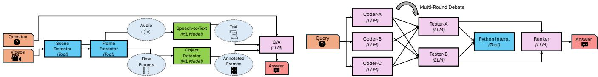  
(a) Video Q/A workflow [87]: multi-modal with tools handling differ- (b) Code generation workflow [25, 55]: text-only with an LLM Debate ent modalities before feeding into an LLM for answering the query. structure to write, test and execute code.  
Figure 1: Two agentic workflows with different characteristics and components.

Murakkab lets developers focus on application logic– similar to serverless–while the runtime manages workflow orchestration, model selection, and resource provisioning to meet SLOs efficiently. This is critical in emerging environments where a single entity manages both models/agents and infrastructure. By unifying workflow configuration, model selection, and resource management, Murakkab achieves higher efficiency than today’s fragmented systems, where layers operate in isolation.

Developers describe workflows with a declarative specification as logical tasks and dependencies, decoupled from model, tool, or hardware choices. This separation enables Murakkab to integrate workflow orchestration with resource management, dynamically reconfiguring workflow parameters (e.g., models or tools) and hardware configurations as needed, based on offline profiles and online monitoring to optimize quality, latency, energy, and cost objectives.

This design enables Murakkab to efficiently explore the configuration space of workflow-, agent- and hardware-level knobs while meeting user-defined SLOs. Unlike existing deployments that treat agentic workflows as opaque, Murakkab leverages end-to-end visibility to coordinate scheduling, colocation, and multiplexing across multi-tenant workflows.

We evaluate Murakkab on representative workflows (video question answering, code generation and math problem solving) using production-scale traces. Murakkab achieves up to 2.8× lower GPU usage, 3.7× less energy, and 4.3× lower cost than LangGraph, a state-of-the-art agentic workflow orchestration, while preserving quality and latency SLOs.

Summary. This paper makes the following contributions:

• A declarative programming model and adaptive runtime unifying orchestration with resource management.

• Profile-guided optimization and workflow-aware scheduling for multi-tenant workloads.

• Evaluation showing significant efficiency gains without workflow quality or execution latency SLO violations.

## 2 Background and Motivation

## 2.1 Agentic Workflows

We define an agent as a composable unit that autonomously makes decisions, invokes tools, and participates in workflows, either independently or in collaboration with other agents [11, 20]. Each agent is typically powered by: (1) a model (e.g., an LLM) for reasoning and language understanding, (2) a set of instructions specifying its goals, behavior, and constraints, and (3) tools for retrieving knowledge or taking actions. When multiple agents (each with specialized roles) interact and collaborate to achieve complex goals, we call the resulting process an agentic workflow.

Serving agentic workflows differs fundamentally from single-model inference. Such workflows require coordinated interaction and data exchange among multiple agents to produce a final response. These agents often span diverse use cases, modalities (e.g., text, audio, images etc.), execution times, and software/hardware requirements. Composing effective workflows, thus, demands a nuanced understanding of the trade-offs between task accuracy, request-serving latency, energy consumption, and hardware cost [43].

## 2.2 Example Workflows

We consider three widely used, representative workflows [66]: Video Q/A, Code Generation, and Math Q/A which exhibit distinct characteristics. For the rest of the paper, we focus on the first two, as shown in Figure 1, and include evaluation of the third one in Section A.1. A wide range of other workflows can be orchestrated using a similar approach.

Video Q/A. Video Q/A workflows are deployed for interactive query processing [74], security footage analysis [69], and many other use-cases [75, 80]. We construct a comprehensive agentic workflow to capture these diverse use-cases [2, 87]. This multi-modal workflow answers textual queries about input videos (Figure 1a). Several agents in this workflow collaborate to produce the final result:

1. Scene Detector to separate the input videos into distinct scenes that ensure better capture of key-frames and extract the audio clip corresponding to each scene.

2. Frame Extractor to sample frames from each scene.

3. Speech-to-Text for audio transcription.

4. Object Detector to annotate frames with objects of interest that are related to the query.

5. Multi-modal LLM (or LMM) to answer the user query given the processed frames and audio transcript.

The resulting agentic workflow can be modeled as a directed acyclic graph (DAG), where nodes represent individual agents (e.g., Speech-to-Text transcription) and edges capture data flow and execution dependencies among agents (e.g., passing frames from Frame Extractor to Object Detector).

Code Generation. An important use case for agentic workflows is coding and software engineering [4, 28, 33, 58] or generating code on-the-fly for accomplishing tasks in a workflow [83]. We present a representative text-only workflow that translates natural language descriptions into executable Python code (Figure 1b). It adopts the LLM Debate framework [25, 55], where coder agents propose candidate solutions and tester agents generate tests and execute them using a Python interpreter. Each agent plays a unique role (e.g., algorithm developer, unit tester) and may employ the same or different LLMs. The agents engage in iterative rounds of debate, aiming to reach consensus or terminating after a predefined number of rounds. The final output is selected as the highest-voted solution, determined by an LLM based on both the proposed candidates and the original query.

Dynamic Coding Pipeline. A complementary class of coding workflows [4, 28] constructs the execution workflow dynamically for each request, rather than relying on a fixed multiagent structure. We build a representative pipeline inspired by production code assistants (e.g., Claude Code [4]) that translates natural-language tasks into executable Python programs while adapting its execution structure to each request (problem prompt). The pipeline comprises three LLM roles: (1) a writer that generates candidate solutions, (2) an optional reviewer that critiques candidates using test outcomes, and (3) an optional orchestrator that selects the writer specialization and compute budget per problem. Writers can adopt specialized roles such as algorithmic or I/O-oriented, with reasoning efforts of detailed or concise, each emphasizing a different solution strategy tailed to the given problem prompt.

Each outer iteration launches a configurable number of parallel writer calls whose outputs are ranked against the problem’s public tests, after which the top-performing candidate is selected. If all public tests pass and the reviewer is disabled, execution terminates early. Otherwise, failing test traces (and optionally reviewer feedback) are fed back as structured guidance for the next iteration. The reviewer may run on every iteration or only as a fallback when tests fail, while still preserving early termination.

Unlike the static code-generation workflow, the execution structure of this pipeline is determined on a per-request basis. In addition, each sub-workflow exposes configurable knobs such as number of review rounds, writer candidates, iteration budget, reviewer usage, and model assignment. Together, these decisions jointly define a large space of possible execution strategies, making the workflow a challenging testbed to navigate across heterogeneous operating points with diverse performance-cost tradeoffs.

```python
1 # == Workflow nodes (coupled app logic + configs) ==
2 scene_detection = Tool(
3 fn=SceneDetector(), # Implemented earlier by the
developer.
4 key=AWS_KEY, resources={"CPUs": 32}
5 )
6 frame_extractor = Tool(
7 fn=FrameExtractor(), # Implemented earlier by the
developer.
8 key=AWS_KEY, params={"num_frames": 15}, resources={"CPUs": 32}
9 )
10 speech_to_text = MLModel(
11 name="Whisper", key=OPENAI_API_KEY, resources={"PTUs": 50}
12 )
13 object_detection = MLModel(
14 name="CLIP", key=AZURE_KEY, resources={"CPUs": 128}
15 )
16 question_answer = LLM(
17 name="Llama-3.2", key=DATABRICKS_API_KEY,
18 params={"batch": 256}, resources={"GPUs": 8, "Type": "H100"},
19 system_prompt="You are an agent that can understand videos.",
20 user_prompt="Answer the given question about the video."
21 )
22 # == Query and data ==
23 ques = "What is the name of the person wearing the red dress?"
24 videos = ["road_trip.mp4"]
25 # == Workflow (ordering of nodes and data flow)
26 scenes, audio = scene_detection(videos)
27 frames = frame_extractor(scenes)
28 transcript = speech_to_text(audio)
29 obj_frames = object_detection(frames)
30 answer = question_answer(ques, transcript, obj_frames)
```  
Listing 1: Simplified video Q/A workflow definition. It shows tightly coupled application logic and execution details typical of existing frameworks.

## 2.3 Rigid and Imperative Definitions

Current state-of-the-practice for agentic workflow development are frameworks such as LangGraph [46], LangChain [45], LlamaIndex [53], AutoGen [6] and CrewAI [21]. They follow an imperative paradigm: developers define workflow components (i.e., agents), their execution logic, interactions, and numerous configuration parameters.

For example, in a video Q/A workflow (Listing 1), the developer specifies parameters for FrameExtractor (number of frames per scene), enables options like speech-to-text or object detection, and defines the execution mechanism, or model, for each component (e.g., SceneDetector in OpenCV, Whisper [65] for transcription, Llama-3.2 [36] for reasoning).

Developers must also make resource allocation decisions, such as assigning CPUs/GPUs for self-hosted or rented VMs, or choosing service tiers (e.g., provisioned throughput units or PTU [10]) for managed services.

This tightly couples configuration choices with the workflow DAG, making deployed workflows rigid. Any change requires manual updates and redeployment across the stack.

## 2.4 Fragmented Stack and Goals

Agent developers create and deploy workflows that expose endpoints callable by end users. Entities involved in develop ing, using, and executing agentic workflow (i.e., developers, end users, and providers) prioritize different goals. Developers value response quality, latency, or both. End-users additionally care about execution cost. Providers prioritize resource efficiency and cost. However, the decision-making burden for workflow configuration today largely falls on developers, who must navigate an overwhelming design space and deployment knobs without holistic system visibility. Ultimately, these decisions impact all involved entities in the agentic workflow life-cycle. These configurations include:

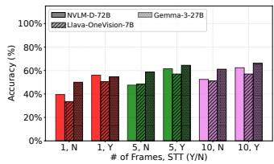  
(a) Video Q/A accuracy. Varying frames, enable STT, and LMM.

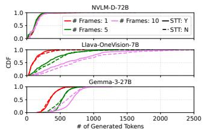  
(b) Video Q/A tokens generated by varying the knobs.

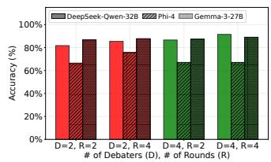  
(c) Code Gen. accuracy. Varying debaters, rounds, and LLM.

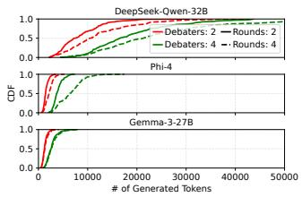  
(d) Code Gen. tokens generated by varying the knobs.

Figure 2: Workflow accuracy under different configurations and the token generation load on the respective models.  
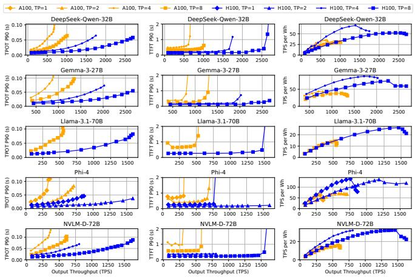  
Figure 3: Model performance under different hardware and parallelism configurations.

• Workflow-level configurations: e.g., whether to include a Speech-to-Text Transcript agent.

• Agent-level configurations: e.g., how many frames to extract in Frame Extractor, which LLM to use for Q/A.

• Hardware-level configurations: e.g., CPU vs. GPU and parallelism degree for each model.

## 2.5 Characterization and Motivation

Poor Resource Efficiency. Frameworks for agentic workflows (e.g., LangGraph [46] and LlamaIndex [53]) place the burden of workflow configuration on developers. Most developers are neither systems nor ML experts, and cannot reason about accelerator choice, model parallelism, or model selection. Configurations are therefore often arbitrary and inefficient, leading to poor performance and high cost. Even experienced developers, lacking insight into user priorities, default to maximizing accuracy at the expense of efficiency.

From the cloud provider’s perspective, these workflows are opaque. The cloud platform has little visibility into workflow components (e.g., models) or interactions (e.g., task sequences and data flow). Tightly coupled application logic and execution details prevent the platform from reconfiguring workflows to improve resource efficiency while meeting SLOs on accuracy or latency. The result is resource underutilization, increased costs, and a larger energy footprint (often passed on to users through higher prices).

Insight 1: Cloud platforms lack visibility into workflow internals (e.g., tasks, requirements), preventing end-to-end optimization. Meanwhile, developers lack control or insight into system-level resource behavior.

Multi-level Trade-offs. Configurations spanning across workflow level, agent level, and hardware layer introduce complex trade-offs over accuracy, latency, energy, and cost.

Workflow- and Agent-level knobs. Figure 2 shows a subset of configurations for the video Q/A and code generation workflows and their response accuracy. For video Q/A, Figure 2a shows that both workflow-level knobs (e.g., whether to enable speech-to-text) and agent-level knobs (e.g., number of frames extracted) significantly affect accuracy. Figure 2b shows the tokens generated for each configuration. Higher token generation is associated with higher latency, cost, and GPU load. For example, using Gemma-3-27B [81] with 10 frames and STT enabled achieves the highest video Q/A accuracy (66.2%) but also generates the most tokens compared to other configurations of the same model. Token counts vary widely across requests, from 250 to nearly 1000, often with a heavy tail.

For the code generation workflow, accuracy is sensitive to the number of debaters and rounds in LLM Debate (Figure 2c). Some configurations, such as DeepSeek-Qwen-32B [24] (a reasoning model), achieve the highest accuracy but at a much higher token generation cost (Figure 2d). At the median, it generates ≈20,000 tokens versus ≈2,500 for Gemma-3-27B under the same workflow configuration. Yet token counts alone do not capture the full end-to-end workflow characteristics, such as latency, cost, or energy.

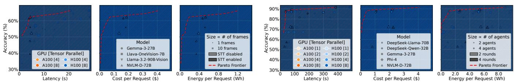

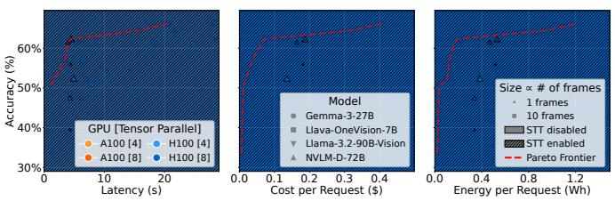  
(a) Video Q/A workflow.

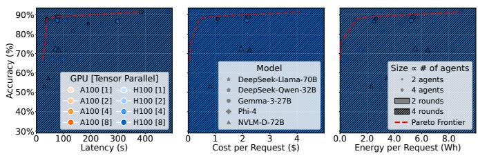  
(b) Code generation workflow.  
Figure 4: Large space of workflow configurations along a subset of knobs and metrics.

Hardware-level knobs. Different models in a workflow have varying compute/memory requirements. Their interaction with the hardware determines whether a workflow can meet user SLOs while satisfying cloud platform constraints, like the number of GPUs allocated. Figure 3 shows models running on different hardware configurations (e.g., GPU types and parallelism). We evaluate time to first token (TTFT) and time per output token (TPOT) under varying load, and measure energy efficiency as throughput (in tokens per second or TPS) per Wh. The results reveal a rich trade-off space, where configurations offer different balances of throughput, latency, and energy efficiency.

High-Dimensional Configuration Space. The configuration space for the end-to-end agentic workflow can grow exponentially with the configuration choices of the individual agents that make up the workflow. Figures 4a and 4b show that even modest agentic workflows like video Q/A or code generation, with only a small set of knobs, produce explosive configuration spaces to choose from. Each point in these Pareto frontiers represents a valid end-to-end configuration derived from varying model selection, hardware accelerator assignments, and resource scaling (with model parallelism) strategies. Navigating this configuration space manually is infeasible given that: (1) objectives vary across users (e.g., low-latency vs. low-cost vs. high accuracy), (2) the optimal configuration depends on dynamic runtime context (e.g., user traffic, model availability, cloud resource availability), and (3) model and hardware choices are rapidly evolving.

Insight 3: Configuration complexity of each workflow grows combinatorially with the number of agents and their parameters at each level: (O(#Work f lowKnobs × #AgentKnobs × #HardwareKnobs)).

## 3 Murakkab Design

In light of this characterization, we propose Murakkab [12], a system that: (1) has visibility into workflow requirements, (2) holistically controls the entire workflow development and execution stack, and (3) enables automated configuration.

Instead of rigid, imperative workflows hand-tuned by developers, Murakkab supports declarative specifications that decouple high-level intent from low-level configuration. Developers focus on application logic, while the system dynamically configures workflows to adapt to evolving runtime conditions. Developers define workflow structure and task dependencies, end-users specify SLOs (e.g., quality, latency, cost), and the platform dynamically optimizes execution for resource efficiency (e.g., energy, cost) in a multi-tenant environment. Thus, workflows can automatically adapt to new models, varying load, or changing resources (without code rewrites or redeployments).

## 3.1 Workflow Life-Cycle

Murakkab cohesively manages the end-to-end life-cycle, unlike existing systems that fragment these among different entities. There are three main phases in an agentic workflow’s life-cycle, as shown in Figure 5: (1) Workflow Development (Figure 5a), (2) Workflow Optimization (Figure 5b), and (3) Workflow Execution (Figure 5c). We summarize these in Table 1 and cover each of them in more detail below.

## 3.2 Development

Murakkab adopts a declarative paradigm for workflow specification that decouples application logic from low-level execution details. Workflow developers may specify high-level tasks, and optionally, the data flow between them, without the need to provide any workflow configurations (e.g., resource allocation or model selection details).

Executor Library. Murakkab is designed to interoperate with existing model and tool ecosystems. It supports LLMs and traditional machine learning (ML) models from repositories such as Hugging Face [26], as well as tools from open-source libraries and platforms, including OpenAI Agents SDK [67], Google Vertex AI Agent Garden [34], NVIDIA NeMo Agent Toolkits [61], and Microsoft Azure AI Foundry Tools [9]. In Murakkab, an executor is a functional unit within a workflow that can take one of three forms:

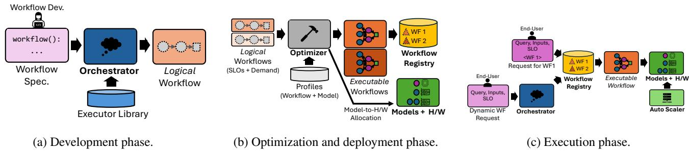  
Figure 5: Murakkab manages end-to-end workflow life-cycle: from development to optimized deployment and execution.

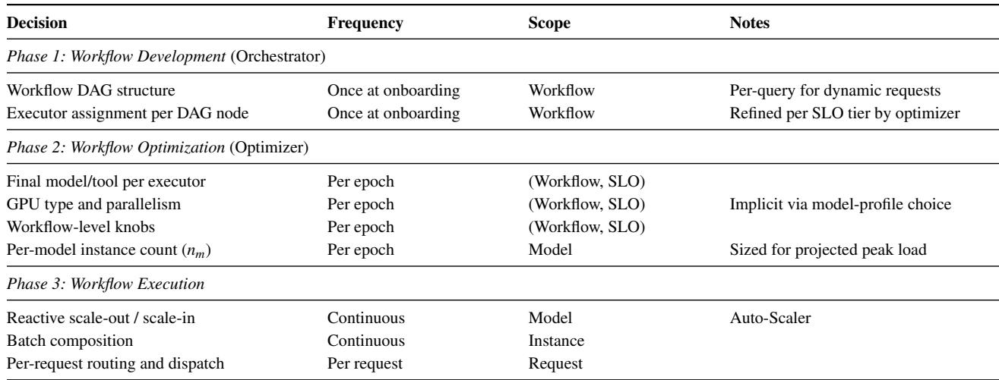  
Table 1: Decisions made by Murakkab across the workflow life-cycle.

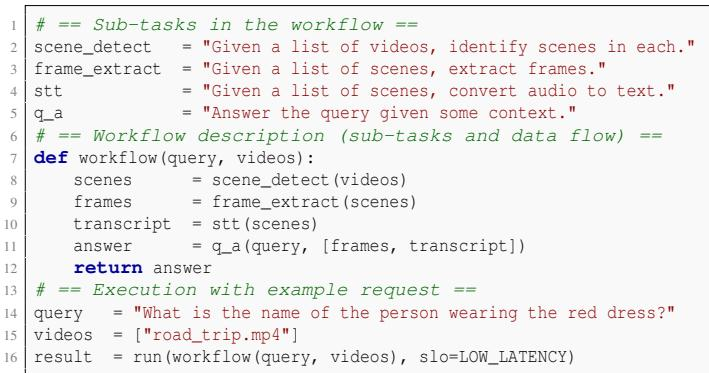  
Listing 2: Murakkab’s declarative workflow specification of the video Q/A abstracts away configuration details, letting developers focus on application logic.

1. LLM: specialized LLM configurations (fine-tuning, fewshot learning, or even just domain-specific prompting);

2. Structured compositions: aggregations of models, e.g., a self-reflection [73] or an LLM-Debate pattern [55] built from multiple LLMs;

3. Tool: utility modules for AI workflows to take actions with (e.g., OpenCV frame extractor for video processing, websearch, file-search, computer-use, or any third-party tools that follow the MCP specification [70]). Traditional ML models are also included as tools (e.g., CNN-based image classifiers or Word2Vec sentiment analyzers).

Attributes. Each model or tool in the library exposes three attributes: (1) a textual description, (2) an interface specification, and (3) a key-value list of configurable parameters. For example, the frame extraction tool exposes the knobs: F (num ber of frames to extract) and cores (number of CPU cores to run on). The LLM Debate composition exposes the knobs: D (number of debaters), R (number of rounds), and model (which LLM to use). The orchestrator uses these descriptions and interfaces to rank and assign executors (models or tools) for workflow tasks, deferring parameter configuration to a later optimization phase (Section 3.3).

A key design choice in Murakkab is mapping a broad range of unknown tasks to executors that are built from a finite, known set of models and tools in the library. If none is found, Murakkab prompts the developer to onboard a suitable one.

Workflow Specification. We allow tasks to be expressed in natural language with varying levels of control over how the task may be executed, in contrast to imperative paradigms discussed earlier. Recent agentic-workflow development frameworks (e.g., DSPy [77]) are moving in this direction. Murakkab takes this a step further and completely decouples configuration details from the workflow specification.

Declarative Specification. Developers can manually decompose tasks into sub-tasks and define data flow between them, providing precise control over workflow steps. Listing 2 shows the developer specifies sub-tasks (e.g., scene detection, speech-to-text transcription, frame extraction) and their dependencies, ensuring sequential execution to achieve the desired outcome, such as answering a question about a video. Configuration details (e.g., which LLM to use, number of frames to extract, resource allocation) are omitted from the specification. However, Murakkab does not restrict developers from specifying any execution preferences (e.g., particular LLM choice or hardware constraint), which are then incorporated into the optimization process as constraints.

Interface. Once deployed, workflows are exposed to end users via dedicated REST endpoints. Each request may include an SLO, such as accuracy, latency, or cost tier. Murakkab uses these SLOs to configure workflows per request and optimize resource efficiency across tasks.

Workflow Orchestrator. The workflow orchestrator transforms a declarative workflow specification into a logical workflow. It interprets the specification, parses tasks and sub-tasks, and maps each to an appropriate executor from Murakkab’s library. At the core is an LLM with tool-calling capabilities [71], which receives a list of available executors and their interfaces, along with task descriptions, and selects the best executor for each sub-task. Recent work [48, 59, 86] has focused on automating the discovery and refinement of effective agentic workflows to maximize task performance and minimize human intervention, which Murakkab can benefit from. A feedback loop allows developers to inspect and refine the generated specification, supporting hybrid workflows with both manual and system-generated tasks.

Logical Workflow. This abstract execution plan captures the functional intent of each task without binding to specific models, resources, or hardware. It is represented as a directed acyclic graph (DAG), where nodes are executors and edges denote data flow. This representation remains request-agnostic, containing no per-request details such as query text, input payloads, or SLOs. Execution specifics (e.g., model selection or hardware allocation) are deferred to later stages.

The orchestrator performs type-checking on the DAG to ensure output types from source nodes match input types of destination nodes. In case of mismatches, the workflow is regenerated with error feedback to the LLM. Persistent errors prompt the developer to revise the specification.

## 3.3 Optimization and Deployment

Profiles. Accurate, fine-grained performance characterization is essential for optimizing multi-tenant agentic workflows with dynamic execution patterns. Inspired by Profile-Guided Optimization (PGO) [60, 84], Murakkab builds offline profiles across diverse configurations to inform runtime decisions. Each profile captures three key metrics per workflow configuration: response quality, end-to-end latency, and resource usage. To support this, Murakkab maintains two profiling layers: workflow profiles and model profiles.

Workflow Profiles. Murakkab profiles representative agentic workflows (e.g., video Q/A) under different workflow-level knobs (e.g., enabling/disabling STT) and executor-level knobs (e.g., varying the number of frames extracted by the extractor tool). Quality is assessed using open-source benchmarks and datasets (e.g., VideoMME [30], HumanEval [15], and Math [39]) with ground-truth results. When public datasets fall short, Murakkab can onboard curated evaluation datasets from developers or collect request-response pairs and user feedback (e.g., rating, approvals), similar to deployed systems like ChatGPT [64]. These inputs are periodically incorporated into profile updates to refine configuration choices for active workflows. Recent studies of production agents show that many deployed workflows are largely static [68], making targeted profiling practical and amortizing the profiling cost across many subsequent invocations for the same workflow.

Configuration choices also affect per-request resource demands. Workflow profiles quantify executor-level load, including prompt and completion tokens for LLM-based executors, serving as a proxy for resource usage. These profiles capture metrics similar to those in our earlier characterization (e.g., Figures 2a and 2b).

Model Profiles. To assess workflow resource demands, executor-level load must be mapped to model and hardware metrics. Murakkab maintains profiles for each model, capturing performance across software configurations (e.g., tensor parallelism, prefill/decode separation) and hardware setups (e.g., GPU type, clock frequency). Each profile reports: (1) latency (TTFT and TPOT for LLMs), (2) energy consumption across hardware, and (3) cost per configuration. Profiles span load levels to expose trade-offs and guide the optimizer in allocating load and instances.

Profiling is lightweight; performed once per configuration and reused across workflows. New models and accelerators are profiled upon integration. Decoupling workflow and model profiles enables workflows to benefit immediately from model updates, with selective re-profiling as needed.

This separation enables independent evolution, profile reuse, rapid model onboarding, and efficient hardware adaptation. The optimizer uses profiles as structured priors to evaluate cost–accuracy–latency trade-offs and drive reconfiguration under dynamic conditions.

Workflow Optimizer. The optimizer transforms the logical workflow from the orchestrator into an executable workflow by jointly selecting workflow knobs, models and tools per executor, and hardware and parallelism strategies. It combines workflow profiles (task accuracy and executor-level load) with model profiles (latency, energy, and cost under varying load) to evaluate candidate configurations, and chooses those that meet per-request SLOs while maximizing efficiency. Beyond individual workflows, the optimizer uses global visibility across all active (workflow, SLO)-pairs to colocate and multiplex executors during each optimization epoch, balancing peak and average load. Figure 6 summarizes the inputs, process, and outputs.

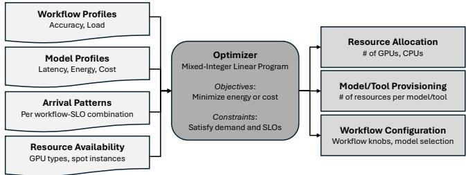  
Figure 6: Summary of Murakkab’s optimization process.

## 3.3.1 MILP Formulation

We formulate the optimizer as a Mixed-Integer Linear Program (MILP). The complete formulation is presented in Section A.5; here we highlight the key components.

## Inputs. The MILP takes four classes of inputs:

1. Workflow profiles for each registered logical workflow, capturing per-configuration accuracy and the distribution of executor-level load (e.g., prompt and completion token counts per LLM call) under each setting of the workflow-level knobs.

2. Model profiles for each candidate (model, hardware, parallelism) tuple, reporting throughput, TTFT and TPOT under varying load, energy per token, and dollar cost per GPU-hour.

3. Arrival patterns giving projected request rates for each (workflow, SLO)-pair over the next epoch, derived from recent trends (Section 3.4).

4. Resource constraints specifying the budget of available GPUs by type (including spot capacity), and any per-tenant cost ceilings.

Decisions. For each optimization epoch, the MILP jointly decides the following, which together form the deployment plan written to the workflow registry:

1. Workflow configuration: the workflow-level knob settings (e.g., number of frames, STT on/off, debaters and rounds) for each (workflow, SLO)-pair, considering only those feasible under the accuracy and latency SLO.

2. Model/tool provisioning: the chosen model or tool for each executor in each selected workflow configuration.

3. Resource allocation: the number of instances n to launch for each selected model profile m. A profile encodes a specific model, GPU type, and parallelism strategy, so choosing m implicitly fixes the hardware and parallelism degree.

4. Routing map: the fraction of load from each (workflow, SLO)-pair routed to each provisioned instance, encoding cross-workflow multiplexing.

## Constraints. The constraints enforce:

1. SLO feasibility: only configurations whose profiled accuracy and latency meet the SLO tier are eligible.

2. Demand satisfaction: the aggregate routed load to each instance must serve the projected peak demand of the workflows assigned to it, leaving headroom for short-term variance that the auto-scaler absorbs (Section 3.4).

3. Capacity: per-instance load stays within the throughput envelope at which the profile satisfies the latency SLO.

4. Resource budget: total GPU usage across all provisioned instances respects the available pool per GPU type.

Objective. The optimizer supports three interchangeable objectives: (a) minimize total energy, (b) minimize total dollar cost, or (c) maximize aggregate accuracy subject to a cost budget. A key design choice is to decouple peak provisioning from average utilization: instance counts n<sub>m</sub> are sized for projected peak demand (ensuring SLO compliance), while routing fractions are optimized against average demand (driving cost and energy efficiency through colocation).

External and proprietary models. Workflows that call proprietary hosted models (e.g., GPT-4o, Claude) fit the same formulation: such models appear as additional profiles with fixed per-token cost and latency, no GPU requirement, and provider-imposed rate limits encoded as capacity constraints. The MILP then naturally trades off self-hosted versus external execution under the same objective.

The deployment plan does not prescribe per-request dispatch, which remains a runtime responsibility (Section 3.4). Once an executable workflow is generated for all valid SLO tiers of an onboarded workflow, it is added to the Murakkab workflow registry and is ready to serve requests.

## 3.4 Execution

At runtime, Murakkab receives incoming requests from endusers with a payload that contains the identifier of the agentic workflow being invoked, any input query/data, and the SLOs. Murakkab looks up the registry to obtain the corresponding executable workflow and submits it for execution.

Dynamic Workflow Requests. End-users can either invoke a particular agentic workflow or send a request with a natural language query (Figure 5c), any input data to operate on, and SLOs, without specifying an agentic workflow to use. The workflow orchestrator parses the query into one or more subtasks, mapping each to an appropriate executor or an existing workflow. Thus, Murakkab dynamically composes workflows from existing building blocks available to it.

SLOs. Each request has the option to specify a quality, latency and cost SLOs. We assign four SLO tiers for quality and end-to-end latency: best, good, fair, and basic. The SLO tiers correspond to the best, 95<sup>th</sup>, 80<sup>th</sup>, and 50<sup>th</sup> percentile values of accuracy and latency available among the set of all workflow, model, and hardware configurations.

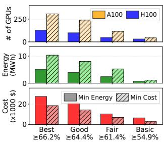  
(a) Accuracy SLOs.

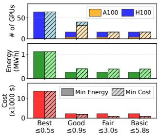  
(b) Latency SLOs.  
Figure 7: Video Q/A workflow configured for different SLOs and optimization objectives.

Runtime Optimization. While request dispatch is deterministic given the selected workflow, achieving efficient execution under dynamic, multi-tenant conditions requires continuous adaptation. The optimizer runs in the background after every optimization epoch, in our case every 60 minutes, to adapt to the most up-to-date load and resource availability in the system. The state of the previous epochs is used to project the load for each workflow in the next epoch. Using this information, the optimizer reconfigures the workflows and updates their executable workflows in the registry.

Auto-Scaler. Predicting end-to-end resource usage in agentic workflows is difficult, as input-dependent control flow and intermediate outputs propagating along data flows determine actual demand (e.g., Figures 2b and 2d). For example, a video Q/A workflow with 10 frames and STT on Llava-OneVision-7B [47] produces 600 and 1200 tokens in the 50<sup>th</sup> and 99<sup>th</sup> percentile, respectively, highlighting high variance.

To handle such variability, Murakkab includes an autoscaler that monitors per-model instance load over short windows (seconds to minutes) and rapidly scales out when needed. The optimizer can be configured to be conservative (i.e., consider the tail percentile and provision more resources) or optimistic (i.e., consider a more common case and let the auto-scaler handle variations in the short-term).

We set thresholds for auto-scaling based on the performance-throughput characteristic in executor profiles. This mechanism prioritizes avoiding SLO violations over short-term allocation optimality. Murakkab also maintains spare resources to absorb demand spikes and, when it detects significant deviations in workload or resource usage, triggers early re-optimization to adapt quickly.

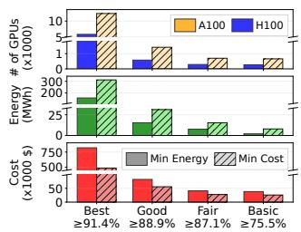  
(a) Accuracy SLOs.

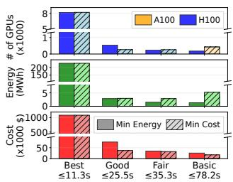  
(b) Latency SLOs.  
Figure 8: Code generation workflow configured for different SLOs and optimization objectives.

## 4 Evaluation

## 4.1 Experimental Setup

Hardware. We run our experiments on A100 and H100 VMs from Microsoft Azure. Each A100 VM has 8×NVIDIA A100 (80GB) GPUs and an AMD EPYC 7V12 64-Core processor, while each H100 VM has 8×NVIDIA H100 (80GB) GPUs with an Intel Xeon (Sapphire Rapids) processor. We use vLLM (v0.9) [44] as the LLM inference engine, speachesai (v0.7) [76] as the speech-to-text model serving engine, and OmDet [89] for object detection model serving.

Production Traces. Since no publicly available traces exist for production agentic workflow serving, we approximate workload arrivals using LLM serving traces collected over a 24-hour period in May 2024 from Azure’s LLM inference service for chat and coding applications [78] (Section A.4).

Agentic Workflows. Our evaluation focuses on the video Q/A and code generation workflows. We map the chat requests from the trace to the video Q/A workflow and coding requests to the code generation workflow.

## Policies. We consider multiple scheduling policies:

1. LangGraph [46] (LG) is a hand-crafted baseline that balances cost and accuracy for both workflows, using Gemma-3-27B and A100 GPUs. However, it lacks visibility into the workflows and has a disconnect between orchestration and resource management, resulting in lack of adaptability to shifting demand.

2. LangGraph Auto-Scaling (LG + Auto) is a custom resource auto-scaling policy for LangGraph (since it does not support a default auto-scaling mechanism). This is the same auto-scaling policy used by Murakkab for a fair comparison.

3. Murakkab Optimized (Mkb Opt) optimizes each workflow– SLO combination for a specific objective (either minimizing energy or cost).

4. Murakkab Optimized + Multiplexing (Mkb Opt+Mult) jointly optimizes requests across all workflow–SLO combinations to maximize colocation and sharing of model instances for even better efficiency.

We assume the 90<sup>th</sup> percentile token generation load from our profiles when making resource allocation decisions for all policies for a fair comparison. When evaluating Murakkab over the production traces, we set the optimization epoch to 60 minutes, and also conduct a sensitivity analysis for this choice in Section 4.7.

## 4.2 Single-Workflow Optimization

To understand how Murakkab optimizes a single workflow under varying request SLOs and optimization objectives, we run Murakkab with two optimization objectives: minimize energy consumption and minimize execution cost. We use the workload traces [78] for each workflow and assume that all requests have the same SLO for each experiment. We report the type and number of GPUs allocated, energy consumption in MWh, and the cost in \$.

Accuracy SLOs. Figure 7a shows the requests across SLO accuracies. When minimizing energy, Murakkab lowers energy consumption from 5.1 MWh at 66.2% accuracy (best) to 3.9 MWh at 64.4% accuracy (good) – an energy reduction of 23.5% with negligible accuracy impact. Tolerating a drop to 61.4% (fair) yields substantial savings of 2.6 MWh from the peak consumption. On the other hand, when optimizing for cost, Murakkab reduces from \$18.5k to \$14.3k while marginally dropping accuracy between best to good. Allowing accuracy to drop further to 61.4% reduces expenses to \$6.9k, a ≈ 4× decrease compared to the most expensive configuration. Murakkab prefers using H100 GPUs when minimizing energy, trading off cost for energy savings.

Figure 8a shows results for the code generation workflow. Energy use ranges from 312 MWh to 2 MWh, and cost from \$820k to \$25k, across varying accuracy levels. Relaxing the accuracy SLO from best to good yields a sharp drop in energy (≈ 10.5×) and cost (≈ 8.7×), mainly due to Murakkab switching from DeepSeek-Qwen-32B to Gemma-3-27B, which has lower token and operation costs.

Latency SLOs. Murakkab serves latency-sensitive requests with varying SLO tiers, while minimizing energy or cost. A similar pattern in resource and cost savings emerges for both workflows as shown in Figures 7b and 8b. We guarantee a basic accuracy tier even for latency SLO requests (e.g., 50% for video Q/A). For example, Murakkab can reduce energy consumption from 1.1 MWh to 266 kWh at a slight increase in end-to-end latency, from 0.5 s to 0.9 s for the video Q/A workflow. On the other hand, it can reduce energy consumption from 227 MWh to 2.8 MWh (as a result of changing to a different model with different tensor parallelism).

We detail the most common workflow configurations chosen by Murakkab’s optimizer for each of the experiments over the entire arrival trace in Sections A.2 and A.3 (Tables 5 and 6). We observe similar trends for the Math Q/A workflow and report the results in Section A.1 (Figures 17a and 17b).

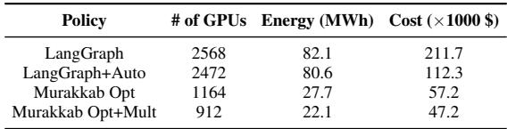  
Table 2: Comparison of resource usage, energy, and cost. Murakkab substantially reduces GPUs, energy, and cost compared to LangGraph, with further gains from multiplexing across all video Q/A and code generation workflow requests.

## 4.3 Multi-Workflow Optimization

We measure the improvements in efficiency as a result of joint optimization and multiplexing across different workflow– SLO combinations. For this experiment, we run video Q/A and code generation requests together and assign 70% requests to be high-accuracy and 30% requests to low-latency, both with good tier (Section 3.4).

Figure 9a shows LangGraph has a fixed allocation with a fixed cost. Its energy consumption varies depending on resource usage, but is significantly higher than the other configurations due to higher idle-power consumption of its GPUs. Table 2 summarizes the results for the 24 hour trace. This configuration uses ≈2,568 A100 GPUs, leading to a flat hourly cost. With auto-scaling, LangGraph reduces idle power consumption and achieves approximately 1.8× cost savings compared to vanilla LangGraph. A non-hand-crafted baseline could be significantly more inefficient than our current baseline from requiring bigger models and more resources or result in more SLO violations if under-provisioned.

Mkb Opt. This policy optimizes each workflow–SLO combination to minimize cost, although without considering the demand across other combinations running in the system. It can adapt to changing load (leveraging the difference between peak and average utilization) to change model and resource allocation over time. It requires 1,164 A100 GPUs, 27.7 MWh energy, and \$57,224 cost.

Mkb Opt+Mult. This policy additionally leverages its holistic view of all workflows and their demand to maximize multiplexing opportunities. It requires 912 A100 GPUs (21.6% reduction), 22.1 MWh energy (20.2% reduction), and \$47,238 cost (17.4% reduction) respectively.

Accuracy and Latency. LangGraph cannot distinguish between per-request SLO variations to configure workflows appropriately. Therefore, high-accuracy and low-latency SLO requests have the same accuracy and latency, resulting in latency SLO violations, as shown in Figure 9b. Murakkab leverages per-request SLO information to provision enough resources for each request, as can be seen in the difference in accuracy and latency of the two categories of requests, allowing for higher resource-efficiency.

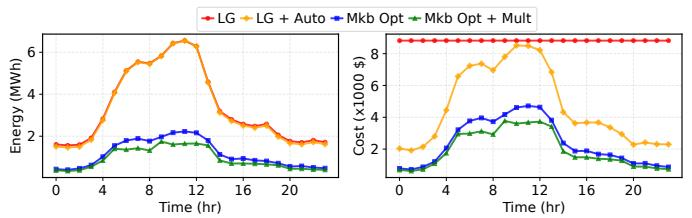  
(a) Energy and cost over time. LangGraph is agnostic to load shifts, LangGraph with auto-scaling simply scales the same models and resources, while Murakkab completely reconfigures workflows to maximize resource-efficiency.

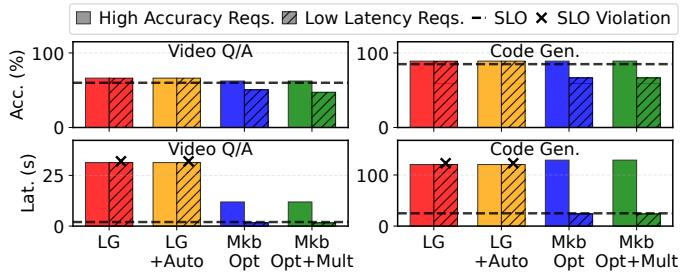  
(b) Accuracy and latency for all requests. LangGraph does not distinguish between request SLO categories.

Figure 9: Comparing: (1) a hand-crafted LangGraph configuration (LG), (2) LangGraph with auto-scaling (LG+Auto), (3) Murakkab optimizing individual workflows (Mkb Opt), and (4) Murakkab jointly-optimizing across workflows + multiplexing resources (Mkb Opt+Mult).  
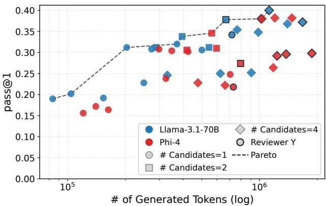  
Figure 10: Cost–accuracy frontier of the dynamic coding pipeline on LiveCodeBench. Each point is a workflow configuration; color denotes the code-writer model, marker shape the number of parallel candidates, and a bold edge indicates that a review phase is included. The dashed line is the Pareto frontier across all configurations.

## 4.4 Dynamic Coding Pipeline

Dynamic coding agents (e.g., Claude Code [4]) provide a challenging setting because execution paths are highly adaptive and cannot be captured by a static workflow graph. To under stand how dynamic coding pipelines benefit from Murakkab, we focus on the workflow-optimization phase as the evaluation of the other dimensions like hardware allocation and autoscaling have already been studied extensively in Sections 4.2 and 4.3. We evaluate the workflow on LiveCodeBench-v5 [40] and report pass@1 on hidden test cases that Murakkab has never observed.

The workflow exposes a rich configuration space spanning multiple dimensions: the model used for code writing and reviewing, the number of candidate solutions to generate in parallel, whether to include a code-review phase, and how the review interacts with the iteration loop. For each request, an orchestrator LLM selects an appropriate writer specialization based on the task being solved (e.g., algorithmic or I/O processing etc.) and determines the level of effort to allocate (e.g., detailed reasoning vs. concise). Execution is dynamic at runtime: requests may terminate after a single attempt if public tests pass, or continue through additional refinement iterations driven by reviewer feedback and test failures. Moreover, several workflow components are themselves hierarchical workflows with independent configuration choices, such as reviewer model selection and review iteration budgets.

Results. Figure 10 shows the resulting Pareto frontier across a representative subset of configurations. The frontier spans an order of magnitude in completion tokens and roughly 2× in pass@1, with neither writer model uniformly best: the smaller model anchors the cost-efficient regime while the larger model contributes the highest-accuracy points when paired with a specialized prompt or reviewer. The review phase itself is not universally helpful – it improves accuracy for some (model, task) combinations and degrades it for others – reinforcing that the right configuration is workload- and request-specific. Across all runs, a substantial fraction of requests terminate early on a public-test pass, while a smaller fraction exhaust the iteration cap, confirming that iteration budget is consumed adaptively rather than uniformly.

Implication. These results illustrate the challenge of deploying coding agents with a static configuration. A static deployment of the coding pipeline must commit to one configuration per workload class – and thereby either over-spend on easy problems or under-perform on hard ones. In contrast, Murakkab leverages the heterogeneous operating points exposed by the workflow frontier to select the most appropriate configuration for each request based on predicted difficulty and current system conditions. The hardware-allocation and autoscaling benefits demonstrated in Sections 4.2 and 4.3 compose naturally with these workflow-level optimizations, enabling end-to-end efficiency improvements across both algorithmic and infrastructure dimensions.

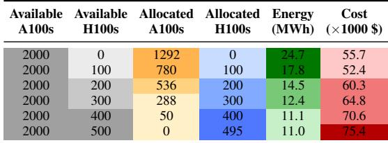  
Table 3: Murakkab serving multiple workflows varying resource constraints minimizing energy. As more H100 GPUs are available, Murakkab trades off cost for energy (same SLO).

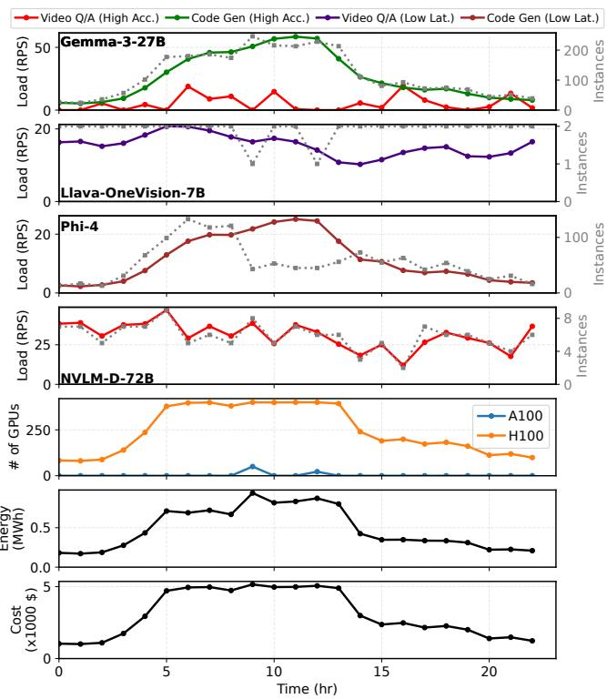  
Figure 11: Murakkab adjusts resource allocation and model instances across all workflow-SLO combinations with changing load (under a constraint of 400×H100 GPUs.)

## 4.5 Adapting to Dynamic Resource Availability

To evaluate how Murakkab adapts to changes in resources (e.g., spot-instances, cloud provider prioritizing resources for other services), we run the same arrival pattern and workflow-SLO distribution from Section 4.3. However, we constrain the type and amount of resources available to Murakkab. We then constrain the resources available to Murakkab: the cluster always provides 2,000 A100 GPUs, while the number of H100 GPUs varies from 0 to 500 in increments of 100. We configure Murakkab to minimize energy consumption while serving incoming workflow requests.

Table 3 shows that Murakkab leverages the H100 GPUs as they become available, while reducing the number of A100

GPUs. Starting with an allocation of 1292 A100 GPUs and no H100 GPUs, which consumes 24.7 MWh energy, Murakkab adapts to the changing H100 availability and leverage most of them (up to 495 H100s) to bring down the energy consumption to 11 MWh. This shows that Murakkab adjusts its resource allocation under resource-constrained settings to satisfy the SLOs while striving for higher resource efficiency.

Execution Analysis. Figure 11 shows Murakkab adapting to changes in load. We consider the 400×H100 GPUs configuration (without loss of generality) and observe that:

1. Murakkab scales model instances up/down after every optimization epoch to adapt to the shift in load dynamics.

2. Murakkab changes GPU allocation with system load. It prefers H100 GPUs due to their energy efficiency and uses A100 GPUs for the rest, depending on load fluctuations (e.g., at T=9 hours).

3. Murakkab reconfigures workflows to maximize colocation. For example, Gemma serves code generation requests with high-accuracy SLOs and multiplexes load from video Q/A requests with high-accuracy SLOs when there is surplus capacity (e.g., from T=5–9 hours and T=15–19).

## 4.6 Workflow/DAG-Aware Scheduling

Consider the request: verify the student’s coding solution from a video, with a 30-second latency SLO. The orchestrator constructs a DAG with a fan-out for the two sub-tasks that can execute in parallel: (1) video Q/A (Figure 1a) to extract the student’s solution, and (2) code generation (Figure 1b) to produce a reference solution for comparison.

Scheduling. Leveraging workflow and model profiles, Murakkab identifies viable scheduling options based on cluster resource availability (Figure 12). All configurations use Gemma-3-27B on 4×A100 GPUs. We highlight setups that leverage both GPUs and CPUs for improved efficiency.

OmDet and Whisper on GPUs. Figure 12a shows OmDet and Whisper running on dedicated A100 GPUs, with a total of 6×A100 GPUs. The two sub-tasks run in near-perfect parallel, with full overlap in execution. However, despite meeting the latency goal, dedicated GPUs are underutilized, and CPUs are mostly idle.

OmDet and Whisper on CPUs. Figure 12b shows Whisper and OmDet running on CPUs, reducing GPU usage to 4×A100 and utilizing idle CPU resources. Whisper runs efficiently without saturating CPUs, making it a good candidate for offloading. In contrast, OmDet fully loads all cores and significantly increases latency, resulting in an SLO violation.

OmDet on GPU, Whisper on CPU. Figure 12c shows OmDet running on 1×A100 GPU and Whisper on CPUs, with a total of 5×A100 GPUs provisioned. Both sub-tasks complete nearly simultaneously, and Whisper’s added CPU latency has minimal impact on end-to-end time. This configuration meets the latency SLO while reducing GPU usage compared to the all-GPU setup.

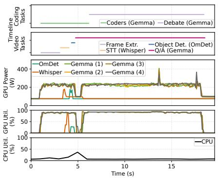  
(a) OmDet on 1×A100, Whisper on 1×A100, Gemma on 4×A100s. End-to-end execution completes within latency SLO (6 GPUs).

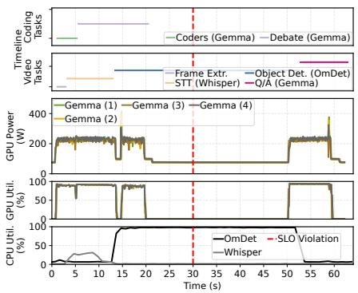  
(b) OmDet on CPUs, Whisper on CPUs, Gemma on 4×A100s. End-to-end execution violates latency SLO (4 GPUs).

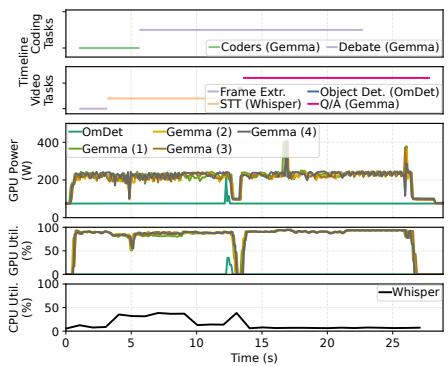  
(c) OmDet on 1×A100, Whisper on CPUs, Gemma on 4×A100s. End-to-end execution completes within latency SLO (5 GPUs).

Figure 12: Executing a user request involving parallel video Q/A and code generation. Murakkab selects the configuration in Figure 12c to minimize energy use while meeting the 30-second latency SLO and maintaining response quality.  
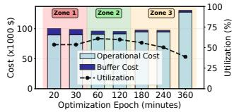  
(a) Cost vs. resource utilization.

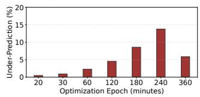  
(b) Demand under-prediction.  
Figure 13: Murakkab sensitivity to optimization epoch.

Murakkab in Action. Leveraging workflow stage visibility and pre-generated execution profiles, Murakkab selects the configuration with OmDet on GPU and Whisper on CPU (Figure 12c) as the most resource-efficient option (balancing overall utilization and latency). In contrast, traditional systems treat agentic workflows as opaque, lacking coordination between orchestration and scheduling. This leads to inefficient execution, higher costs, and SLO violations.

## 4.7 Optimization Frequency Sensitivity Analysis

The choice of optimization epoch presents a fundamental trade-off between resource efficiency, cost, and system responsiveness. We evaluate intervals from 20 minutes to 6 hours, measuring cost, utilization, and worst-case dropped requests. Provisioning new instances (i.e., VM allocation, software setup, and model transfer to GPUs) is assumed to take 20 minutes [31, 38, 62]. We use an exponentially weighted moving average (EWMA) [18], with α = 0.5, to predict workload demand at every epoch.

Three-Zone Cost Structure. Figure 13a shows three distinct zones that guide optimal selection.

Zone 1 (10–60 minutes): Buffer-dominated. Frequent reoptimization induces high transition overhead. Excessive GPU provisioning during transitions leads to lower utilization, despite responsive demand adaptation. Frequent model and tool changes can also reduce KV cache efficiency for LLMs.

Zone 2 (60–180 minutes): Balanced. Transition costs and prediction uncertainty offset, yielding peak cost efficiency. Utilization peaks at an epoch of around 60 minutes, reflecting the best balance between adaptation frequency and stability.

Zone 3 (180+ minutes): Uncertainty-dominated. At long intervals, buffer cost from transition overhead is minimal, but coarse-grained provisioning increasingly diverges from finegrained, dynamic demand. This reduces prediction accuracy and drives over-provisioning, lowering efficiency.

Worst-case System Responsiveness. We measure responsiveness by demand under-prediction (requests that would be dropped without auto-scaling). This reflects the worst-case, as auto-scalers can mitigate mismatches post-provisioning. Figure 13b shows under-prediction is minimal at short intervals but rises steadily, peaking at ∼15% around 240 minutes. Beyond that, longer intervals lead to over-provisioning, lowering under-prediction but hurting utilization.

Operational Implications. This analysis reveals a key tradeoff: short intervals improve responsiveness but increase transition costs, while long intervals reduce overhead but hurt prediction accuracy and utilization. Providers can tune this balance based on priorities (e.g., cost, utilization, responsiveness). In our setup, a 60-minute interval offers a middle ground (high utilization, low cost, and manageable shortage risk). While we use EWMA for forecasting, the trade-off holds with more advanced predictors as well.

## 4.8 Workflow-Profiling Generality Analysis

A core component of Murakkab is its profile-guided optimization, which uses profiles of accuracy, token load, and other performance metrics to guide workflow configuration. To operate reliably across diverse agentic workflows, these profiles must generalize to inputs that were unseen during profiling.

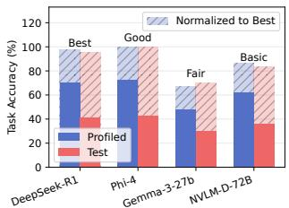  
(a) Accuracy and assigned SLOs.

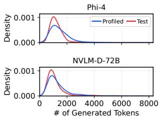  
(b) PDF of generated tokens.  
Figure 14: Murakkab’s workflow-profiling generality on an unseen test benchmark.

To evaluate generality, we consider a multi-round mathematical problem solving workflow. Murakkab generates profiles from the Math-500 benchmark [27] (Profiled) and tests them on a different MathEval benchmark [32] (Test) which was not used during profiling. Figure 14a shows that the same trend in accuracy holds between the profiled and test benchmarks across different models. Therefore, Murakkab can reliably select model configurations based on a request’s accuracy SLO requirements without having prior knowledge of the inputs. Figure 14b shows the probability density functions (PDF) of tokens generated by the workflow between the two benchmarks. The distributions closely match with a similar shape, spread and peak indicating that the profiled distribution generalizes well to the test set. Murakkab’s op timizer can reliably predict the load demand for incoming requests and provision enough resources to meet the SLOs.

These results demonstrate that Murakkab’s profiling captures transferable performance characteristics, enabling the optimizer to make informed decisions on previously unseen workloads (from a similar domain)—a key property for robust, cross-workflow optimization.

## 5 Related Work

Agentic Workflow Development. Frameworks like Lang-Graph [46], LangChain [45], and AutoGen [6] build agentic workflows imperatively, composing model and tool calls. DSPy [77] and Palimpzest [51, 52] take a declarative approach, focusing on prompt and query optimization. However, these frameworks still blur configuration and logic, burden developers with resource management, and struggle to scale efficiently across large configuration spaces.

Automated Workflow Generation and Planning. There has been extensive work from the ML community on automating workflow generation to improve response quality [48, 52, 54, 59, 85, 86]. This line of work is complementary to Murakkab, which can integrate these workflow generation techniques into the Murakkab workflow orchestrator (Section 3.2). Circinus [50] and Aragog [23] perform input-based workflow planning but do not consider resource heterogeneity, dynamism in resource availability and energy/power efficiency. Furthermore, they do not handle dynamism in per-query input/output sizes that may result in load-fluctuations, a common characteristic in LLM-based agentic workflows.

Systems Optimization. Prior systems have focused on accelerating workflow execution with improved data flow management [72, 79], device-aware workflow compilation [5] and scheduling of LLM inference calls in the context of agentic applications [49, 56]. Others target response quality by exploring model selection [14, 29] and scaling properties [13, 63] of test-time compute. Systems like SpotServe [57] and Loki [3] address resource and load dynamism, but remain confined to single-model serving. Some recent works [17, 42, 43] have examined the energy costs of test-time compute and their impact on response quality for individual models. In contrast, Murakkab introduces a fully automated system to navigate these complex tradeoffs for agentic workflows, considering load and resource dynamism in multi-tenant cloud settings.

## 6 Conclusion

Murakkab brings a declarative programming model and adaptive runtime to the serving of multi-tenant agentic workflows. By decoupling workflow logic from execution configurations and tightly integrating orchestration with cluster management, Murakkab enables dynamic reconfiguration and resourceaware scheduling while honoring diverse SLOs. Our evaluation shows that Murakkab substantially improves efficiency (reducing GPU usage, energy consumption, and cost) without compromising workflow quality or latency. We see opportunities in extending adaptive co-optimization across larger clusters, supporting more heterogeneous accelerators, and exploring workload specialization for emerging classes of agentic applications.

## Acknowledgments

We thank our shepherd, Yiying Zhang, anonymous reviewers, and the MIT Parallel and Distributed Systems (PDOS) group for their valuable feedback. This research was supported in part by ACE, one of seven centers in JUMP 2.0, a Semiconductor Research Corporation (SRC) program sponsored by DARPA.

## References

[1] Marah Abdin, Jyoti Aneja, Harkirat Behl, Sébastien Bubeck, Ronen Eldan, Suriya Gunasekar, Michael Harrison, Russell J. Hewett, Mojan Javaheripi, Piero Kauffmann, James R. Lee, Yin Tat Lee, Yuanzhi Li, Weishung Liu, Caio C. T. Mendes, Anh Nguyen, Eric Price, Gustavo de Rosa, Olli Saarikivi, Adil Salim, Shital Shah, Xin Wang, Rachel Ward, Yue Wu, Dingli Yu, Cyril Zhang, and Yi Zhang. Phi-4 Technical Report. 2024. arXiv: 2412.08905 [cs.CL].

[2] Shubham Agrawal, Adeola Adesoba, Dhruv Nandakumar, Katherine Huang, and Vignesh Srinivasakumar. Build an Agentic Video Workflow with Video Search and Summarization. NVIDIA Developer Blog. Available at: https : / / developer . nvidia . com / blog / build - an -

agentic- video- workflow- with- video- search- andsummarization/. Dec. 2024.

[3] Sohaib Ahmad, Hui Guan, and Ramesh K. Sitaraman. “Loki: A System for Serving ML Inference Pipelines with Hardware and Accuracy Scaling”. In: Proceedings of the 33rd International Symposium on High-Performance Parallel and Distributed Computing. HPDC ’24. Pisa, Italy: Association for Computing Machinery, 2024, pages 267–280.

[4] Anthropic. Claude Code: Deep coding at terminal velocity. https://www.anthropic.com/claude-code. Accessed: 19 August 2025. 2025.

[5] Zain Asgar, Michelle Nguyen, and Sachin Katti. Efficient and Scalable Agentic AI with Heterogeneous Systems. 2025. arXiv: 2507.19635 [cs.LG].

[6] AutoGen. AutoGen. https : / / microsoft . github . io / autogen/stable//index.html. 2024.

[7] AWS. Amazon Bedrock Agents. https : / / aws . amazon . com/bedrock/agents/. 2025.

[8] Microsoft Azure. Azure AI Foundry. https : / / azure . microsoft.com/en-us/products/ai-foundry. 2025.

[9] Microsoft Azure. Azure AI Foundry Tool Library. https : //learn.microsoft.com/en- us/azure/ai- foundry/ agents/how-to/tools/overview. 2025.

[10] Microsoft Azure. Understanding costs associated with provisioned throughput units (PTU). https : / / learn . microsoft . com / en - us / azure / ai - foundry / openai / how-to/provisioned-throughput-onboarding. 2025.

[11] Microsoft Azure. What is an AI Agent? https://learn. microsoft . com / en - us / azure / ai - foundry / agents / overview. 2025.

[12] Gohar Irfan Chaudhry, Esha Choukse, Íñigo Goiri, Rodrigo Fonseca, Adam Belay, and Ricardo Bianchini. “Towards Resource-Efficient Compound AI Systems”. In: Proceedings of the 2025 Workshop on Hot Topics in Operating Systems. HotOS ’25. Association for Computing Machinery, 2025.

[13] Lingjiao Chen, Jared Quincy Davis, Boris Hanin, Peter Bailis, Ion Stoica, Matei Zaharia, and James Zou. Are More LLM Calls All You Need? Towards Scaling Laws of Compound Inference Systems. 2024. arXiv: 2403.02419 [cs.LG].

[14] Lingjiao Chen, Jared Quincy Davis, Boris Hanin, Peter Bailis, Matei Zaharia, James Zou, and Ion Stoica. Optimizing Model Selection for Compound AI Systems. 2025. arXiv: 2502 . 14815 [cs.AI].

[15] Mark Chen, Jerry Tworek, Heewoo Jun, Qiming Yuan, Henrique Ponde de Oliveira Pinto, Jared Kaplan, Harri Edwards, Yuri Burda, Nicholas Joseph, Greg Brockman, Alex Ray, Raul Puri, Gretchen Krueger, Michael Petrov, Heidy Khlaaf, Girish Sastry, Pamela Mishkin, Brooke Chan, Scott Gray, Nick Ryder, Mikhail Pavlov, Alethea Power, Lukasz Kaiser, Mohammad Bavarian, Clemens Winter, Philippe Tillet, Felipe Petroski Such, Dave Cummings, Matthias Plappert, Fotios Chantzis, Elizabeth Barnes, Ariel Herbert-Voss, William Hebgen Guss, Alex Nichol, Alex Paino, Nikolas Tezak, Jie Tang, Igor Babuschkin, Suchir Balaji, Shantanu Jain, William

Saunders, Christopher Hesse, Andrew N. Carr, Jan Leike, Josh Achiam, Vedant Misra, Evan Morikawa, Alec Radford, Matthew Knight, Miles Brundage, Mira Murati, Katie Mayer, Peter Welinder, Bob McGrew, Dario Amodei, Sam McCandlish, Ilya Sutskever, and Wojciech Zaremba. Evaluating Large Language Models Trained on Code. 2021. arXiv: 2107. 03374 [cs.LG].

[16] Zhendong Chu, Shen Wang, Jian Xie, Tinghui Zhu, Yibo Yan, Jinheng Ye, Aoxiao Zhong, Xuming Hu, Jing Liang, Philip S Yu, et al. “LLM agents for education: Advances and applications”. In: arXiv preprint arXiv:2503.11733 (2025).

[17] Jae-Won Chung, Jiachen Liu, Jeff J. Ma, Ruofan Wu, Oh Jun Kweon, Yuxuan Xia, Zhiyu Wu, and Mosharaf Chowdhury. The ML.ENERGY Benchmark: Toward Automated Inference Energy Measurement and Optimization. 2025. arXiv: 2505. 06371 [cs.LG].

[18] Petar Cisar, Saša Bošnjak, and Sanja Maravic Cisar. “EWMA algorithm in network practice”. In: International Journal of Computers Communications & Control 5.2 (2010), pages 160–170.

[19] Google Cloud. Google Cloud Vertex AI. https://cloud. google.com/vertex-ai. 2025.

[20] Google Cloud. What are AI Agents? https : / / cloud . google.com/discover/what-are-ai-agents. 2025.

[21] CrewAI — The Leading Multi-Agent Platform. https:// www.crewai.com/. Accessed: 19 August 2025. 2025.

[22] Ling Dai, Yuan-Hao Jiang, Yuanyuan Chen, Zinuo Guo, Tian-Yi Liu, and Xiaobao Shao. “Agent4EDU: Advancing AI for Education with Agentic Workflows”. In: Proceedings of the 2024 3rd International Conference on Artificial Intelligence and Education. 2024, pages 180–185.

[23] Yinwei Dai, Zhuofu Chen, Anand Iyer, and Ravi Netravali. Aragog: Just-in-Time Model Routing for Scalable Serving of Agentic Workflows. 2025. arXiv: 2511.20975 [cs.DC].

[24] DeepSeek-AI, Daya Guo, Dejian Yang, et al. DeepSeek-R1: Incentivizing Reasoning Capability in LLMs via Reinforcement Learning. 2025. arXiv: 2501.12948 [cs.CL].

[25] Yilun Du, Shuang Li, Antonio Torralba, Joshua B. Tenenbaum, and Igor Mordatch. Improving Factuality and Reasoning in Language Models through Multiagent Debate. 2023. arXiv: 2305.14325 [cs.CL].

[26] Hugging Face. Hugging Face Models. https : / / huggingface.co/. 2025.

[27] Hugging Face. MATH-500. https://huggingface.co/ datasets/HuggingFaceH4/MATH-500. 2025.

[28] Features | Cursor – The AI Code Editor. https://cursor. com/features. Accessed: 19 August 2025. 2025.

[29] Tao Feng, Yanzhen Shen, and Jiaxuan You. GraphRouter: A Graph-based Router for LLM Selections. 2025. arXiv: 2410. 03834 [cs.AI].

[30] Chaoyou Fu, Yuhan Dai, Yongdong Luo, Lei Li, Shuhuai Ren, Renrui Zhang, Zihan Wang, Chenyu Zhou, Yunhang Shen, Mengdan Zhang, Peixian Chen, Yanwei Li, Shaohui Lin, Sirui Zhao, Ke Li, Tong Xu, Xiawu Zheng, Enhong Chen, Caifeng Shan, Ran He, and Xing Sun. Video-MME: The First-Ever Comprehensive Evaluation Benchmark of Multi-modal LLMs in Video Analysis. 2025. arXiv: 2405.21075 [cs.CV].

[31] Yao Fu, Leyang Xue, Yeqi Huang, Andrei-Octavian Brabete, Dmitrii Ustiugov, Yuvraj Patel, and Luo Mai. “Serverless-LLM: Low-Latency serverless inference for large language models”. In: 18th USENIX Symposium on Operating Systems Design and Implementation (OSDI 24). 2024, pages 135–153.

[32] GitHub. MathEval. https://github.com/math- eval/ MathEval/tree/main. 2025.

[33] GitHub Copilot · Your AI pair programmer. https : / / github . com / features / copilot. Accessed: 19 August 2025. 2025.

[34] Google. Google Vertex AI Agent Garden. https://console. cloud.google.com/vertex-ai/agents/agent-garden. 2025.

[35] Sagar Goyal, Eti Rastogi, Sree Prasanna Rajagopal, Dong Yuan, Fen Zhao, Jai Chintagunta, Gautam Naik, and Jeff Ward. “HealAI: A healthcare LLM for effective medical documentation”. In: Proceedings of the 17th ACM International Conference on Web Search and Data Mining. 2024, pages 1167– 1168.

[36] Aaron Grattafiori, Abhimanyu Dubey, Abhinav Jauhri, Abhinav Pandey, Abhishek Kadian, Ahmad Al-Dahle, Aiesha Letman, Akhil Mathur, et al. The Llama 3 Herd of Models. 2024. arXiv: 2407.21783 [cs.CL].

[37] Gurobi Optimization, LLC. Gurobi Optimizer Reference Manual. 2024.

[38] Jianwei Hao, Ting Jiang, Wei Wang, and In Kee Kim. “An empirical analysis of VM startup times in public IaaS clouds”. In: 2021 IEEE 14th International Conference on Cloud Computing (CLOUD). IEEE. 2021, pages 398–403.

[39] Dan Hendrycks, Collin Burns, Saurav Kadavath, Akul Arora, Steven Basart, Eric Tang, Dawn Song, and Jacob Steinhardt. “Measuring Mathematical Problem Solving With the MATH Dataset”. In: NeurIPS (2021).

[40] Naman Jain, King Han, Alex Gu, Wen-Ding Li, Fanjia Yan, Tianjun Zhang, Sida Wang, Armando Solar-Lezama, Koushik Sen, and Ion Stoica. LiveCodeBench: Holistic and Contamination Free Evaluation of Large Language Models for Code. 2024. arXiv: 2403.07974 [cs.SE].

[41] Haolin Jin, Linghan Huang, Haipeng Cai, Jun Yan, Bo Li, and Huaming Chen. “From LLMs to LLM-based agents for software engineering: A survey of current, challenges and future”. In: arXiv preprint arXiv:2408.02479 (2024).

[42] Yunho Jin, Gu-Yeon Wei, and David Brooks. The Energy Cost of Reasoning: Analyzing Energy Usage in LLMs with Test-time Compute. 2025. arXiv: 2505.14733 [cs.LG].

[43] Jiin Kim, Byeongjun Shin, Jinha Chung, and Minsoo Rhu. The Cost of Dynamic Reasoning: Demystifying AI Agents and Test-Time Scaling from an AI Infrastructure Perspective. 2025. arXiv: 2506.04301 [cs.LG].

[44] Woosuk Kwon, Zhuohan Li, Siyuan Zhuang, Ying Sheng, Lianmin Zheng, Cody Hao Yu, Joseph E. Gonzalez, Hao Zhang, and Ion Stoica. “Efficient Memory Management for Large Language Model Serving with PagedAttention”. In: Proceedings of the ACM SIGOPS 29th Symposium on Operating Systems Principles. 2023.

[45] LangChain. LangChain. https : / / github . com / langchain-ai/langchain. 2024.

[46] LangGraph. LangGraph. https://www.langchain.com/ langgraph. 2024.

[47] Bo Li, Yuanhan Zhang, Dong Guo, Renrui Zhang, Feng Li, Hao Zhang, Kaichen Zhang, Peiyuan Zhang, Yanwei Li, Ziwei Liu, and Chunyuan Li. LLaVA-OneVision: Easy Visual Task Transfer. 2024. arXiv: 2408.03326 [cs.CV].

[48] Zelong Li, Shuyuan Xu, Kai Mei, Wenyue Hua, Balaji Rama, Om Raheja, Hao Wang, He Zhu, and Yongfeng Zhang. “Autoflow: Automated workflow generation for large language model agents”. In: arXiv preprint arXiv:2407.12821 (2024).

[49] Chaofan Lin, Zhenhua Han, Chengruidong Zhang, Yuqing Yang, Fan Yang, Chen Chen, and Lili Qiu. “Parrot: efficient serving of LLM-based applications with semantic variable”. In: Proceedings of the 18th USENIX Conference on Operating Systems Design and Implementation. OSDI’24. Santa Clara, CA, USA: USENIX Association, 2024.

[50] Banruo Liu, Wei-Yu Lin, Minghao Fang, Yihan Jiang, and Fan Lai. Circinus: Efficient Query Planner for Compound ML Serving. 2025. arXiv: 2504.16397 [cs.DB].

[51] Chunwei Liu, Matthew Russo, Michael Cafarella, Lei Cao, Peter Baile Chen, Zui Chen, Michael Franklin, Tim Kraska, Samuel Madden, Rana Shahout, and Gerardo Vitagliano. “Palimpzest: Optimizing AI-Powered Analytics with Declarative Query Processing”. In: Proceedings of the Conference on Innovative Database Research (CIDR). 2025.

[52] Chunwei Liu, Matthew Russo, Michael Cafarella, Lei Cao, Peter Baille Chen, Zui Chen, Michael Franklin, Tim Kraska, Samuel Madden, and Gerardo Vitagliano. A Declarative System for Optimizing AI Workloads. 2024. arXiv: 2405.14696 [cs.CL].

[53] Jerry Liu. LlamaIndex. https://github.com/jerryjliu/ llama\_index. 2022.

[54] Jiale Liu, Yifan Zeng, Shaokun Zhang, Chi Zhang, Malte Højmark-Bertelsen, Marie Normann Gadeberg, Huazheng Wang, and Qingyun Wu. Divide, Optimize, Merge: Fine-Grained LLM Agent Optimization at Scale. 2025. arXiv: 2505.03973 [cs.CL].

[55] Zijun Liu, Yanzhe Zhang, Peng Li, Yang Liu, and Diyi Yang. “A dynamic LLM-powered agent network for task-oriented agent collaboration”. In: First Conference on Language Mod eling. 2024.

[56] Michael Luo, Xiaoxiang Shi, Colin Cai, Tianjun Zhang, Justin Wong, Yichuan Wang, Chi Wang, Yanping Huang, Zhifeng Chen, Joseph E. Gonzalez, and Ion Stoica. Autellix: An Effi cient Serving Engine for LLM Agents as General Programs. 2025. arXiv: 2502.13965 [cs.LG].

[57] Xupeng Miao, Chunan Shi, Jiangfei Duan, Xiaoli Xi, Dahua Lin, Bin Cui, and Zhihao Jia. SpotServe: Serving Generative Large Language Models on Preemptible Instances. 2023. arXiv: 2311.15566 [cs.DC].

[58] Daye Nam, Andrew Macvean, Vincent Hellendoorn, Bogdan Vasilescu, and Brad Myers. “Using an LLM to Help With Code Understanding”. In: Proceedings of the IEEE/ACM 46th International Conference on Software Engineering. ICSE ’24. Lisbon, Portugal: Association for Computing Machinery, 2024.

[59] Boye Niu, Yiliao Song, Kai Lian, Yifan Shen, Yu Yao, Kun Zhang, and Tongliang Liu. “Flow: Modularized agentic workflow automation”. In: arXiv preprint arXiv:2501.07834 (2025).

[60] Diego Novillo. “SamplePGO - The Power of Profile Guided Optimizations without the Usability Burden”. In: 2014 LLVM Compiler Infrastructure in HPC. 2014, pages 22–28.

[61] NVIDIA. NeMo Agent Toolkit. https : / / developer . nvidia.com/nemo-agent-toolkit. 2025.

[62] NVIDIA. NVIDIA DOCA Overview. https : / / docs . nvidia . com / doca / archive / 2 - 9 - 0 / nvidia + doca + overview/index.html. 2025.

[63] Isaac Ong, Amjad Almahairi, Vincent Wu, Wei-Lin Chiang, Tianhao Wu, Joseph E. Gonzalez, M Waleed Kadous, and Ion Stoica. RouteLLM: Learning to Route LLMs with Preference Data. 2025. arXiv: 2406.18665 [cs.LG].

[64] OpenAI. ChatGPT (Mar 14 version) [Large language model]. https://chat.openai.com/chat. 2023.

[65] OpenAI. Whisper Large V3 Model. https://huggingface. co/openai/whisper-large-v3. 2024.

[66] OpenAI. Introducing OpenAI o3 and o4-mini. 2025.

[67] OpenAI. OpenAI Agents SDK. https://openai.github. io/openai-agents-python/tools/. 2025.

[68] Melissa Z Pan, Negar Arabzadeh, Riccardo Cogo, Yuxuan Zhu, Alexander Xiong, Lakshya A Agrawal, Huanzhi Mao, Emma Shen, Sid Pallerla, Liana Patel, et al. “Measuring Agents in Production”. In: arXiv preprint arXiv:2512.04123 (2025).

[69] Plix AI. https://plix.ai/. Accessed: 19 August 2025. 2025.

[70] Model Context Protocol. Model Context Protocol (MCP). https : / / modelcontextprotocol . io / docs / getting - started/intro. 2025.

[71] Yujia Qin, Shihao Liang, Yining Ye, Kunlun Zhu, Lan Yan, Yaxi Lu, Yankai Lin, Xin Cong, Xiangru Tang, Bill Qian, et al. “ToolLLM: Facilitating large language models to master 16000+ real-world APIs”. In: arXiv preprint arXiv:2307.16789 (2023).

[72] Deepti Raghavan, Keshav Santhanam, Muhammad Shahir Rahman, Nayani Modugula, Luis Gaspar Schroeder, Maximilien Cura, Houjun Liu, Pratiksha Thaker, Philip Levis, and Matei Zaharia. Alto: Orchestrating Distributed Compound AI Systems with Nested Ancestry. 2025. arXiv: 2403.04311 [cs.AI].

[73] Matthew Renze and Erhan Guven. “Self-reflection in llm agents: Effects on problem-solving performance”. In: arXiv preprint arXiv:2405.06682 (2024).

[74] Francisco Romero, Johann Hauswald, Aditi Partap, Daniel Kang, Matei Zaharia, and Christos Kozyrakis. “Optimizing Video Analytics with Declarative Model Relationships”. In: Proc. VLDB Endow. 16.3 (Nov. 2022), pages 447–460.

[75] Francisco Romero, Mark Zhao, Neeraja J. Yadwadkar, and Christos Kozyrakis. Llama: A Heterogeneous & Serverless Framework for Auto-Tuning Video Analytics Pipelines. 2021. arXiv: 2102.01887 [cs.DC].

[76] Speaches – OpenAI-API compatible server for speech-to-text, speech-to-speech, and translation. https://speaches.ai/. Accessed: 20 August 2025. 2025.

[77] Stanford NLP Group. DSPy: The Framework for Programming—Not Prompting—Language Models. https:// github.com/stanfordnlp/dspy. 2023.

[78] Jovan Stojkovic, Chaojie Zhang, Íñigo Goiri, Josep Torrellas, and Esha Choukse. “DynamoLLM: Designing LLM inference clusters for performance and energy efficiency”. In: 2025 IEEE International Symposium on High Performance Computer Architecture (HPCA). IEEE. 2025, pages 1348– 1362.

[79] Xin Tan, Yimin Jiang, Yitao Yang, and Hong Xu. Teola: Towards End-to-End Optimization of LLM-based Applications. 2025. arXiv: 2407.00326 [cs.DC].

[80] Yunlong Tang, Jing Bi, Siting Xu, Luchuan Song, Susan Liang, Teng Wang, Daoan Zhang, Jie An, Jingyang Lin, Rongyi Zhu, Ali Vosoughi, Chao Huang, Zeliang Zhang, Pinxin Liu, Mingqian Feng, Feng Zheng, Jianguo Zhang, Ping Luo, Jiebo Luo, and Chenliang Xu. Video Understanding with Large Language Models: A Survey. 2025. arXiv: 2312.17432 [cs.CV].

[81] Gemma Team, Aishwarya Kamath, Johan Ferret, et al. Gemma 3 Technical Report. 2025. arXiv: 2503 . 19786 [cs.CL].

[82] Jize Wang, Ma Zerun, Yining Li, Songyang Zhang, Cailian Chen, Kai Chen, and Xinyi Le. “GTA: a benchmark for general tool agents”. In: Advances in Neural Information Processing Systems 37 (2024), pages 75749–75790.

[83] Xingyao Wang, Yangyi Chen, Lifan Yuan, Yizhe Zhang, Yunzhu Li, Hao Peng, and Heng Ji. “Executable Code Actions Elicit Better LLM Agents”. In: Forty-first International Conference on Machine Learning. 2024.

[84] Patrick Wintermeyer, Maria Apostolaki, Alexander Dietmüller, and Laurent Vanbever. “P2GO: P4 profile-guided optimizations”. In: Proceedings of the 19th ACM Workshop on Hot Topics in Networks. 2020, pages 146–152.

[85] Shirley Wu, Parth Sarthi, Shiyu Zhao, Aaron Lee, Herumb Shandilya, Adrian Mladenic Grobelnik, Nurendra Choudhary, Eddie Huang, Karthik Subbian, Linjun Zhang, et al. “Optimas: Optimizing Compound AI Systems with Globally Aligned Local Rewards”. In: arXiv preprint arXiv:2507.03041 (2025).

[86] Jiayi Zhang, Jinyu Xiang, Zhaoyang Yu, Fengwei Teng, Xionghui Chen, Jiaqi Chen, Mingchen Zhuge, Xin Cheng, Sirui Hong, Jinlin Wang, et al. “Aflow: Automating agentic workflow generation”. In: arXiv preprint arXiv:2410.10762 (2024).

[87] Lu Zhang, Tiancheng Zhao, Heting Ying, Yibo Ma, and Kyusong Lee. OmAgent: A Multi-modal Agent Framework for Complex Video Understanding with Task Divide-and-Conquer. 2024. arXiv: 2406.16620 [cs.CL].

[88] Yaolun Zhang, Yinxu Pan, Yudong Wang, and Jie Cai. “Py-Bench: Evaluating LLM agent on various real-world coding tasks”. In: arXiv preprint arXiv:2407.16732 (2024).

[89] Tiancheng Zhao, Peng Liu, and Kyusong Lee. “OmDet: Large-scale vision-language multi-dataset pre-training with multimodal detection network”. In: IET Computer Vision 18.5 (Jan. 2024), pages 626–639.

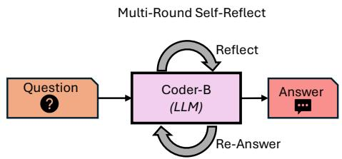  
Figure 15: Math Q/A workflow with self-reflect [73] structure.

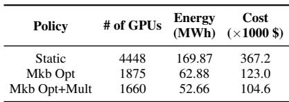

Table 4: Comparison of resource usage, energy, and cost. Mu rakkab substantially reduces GPUs, energy, and cost compared to static allocation, with further gains from multiplexing across all math Q/A and code generation workflow requests.

## A Appendix

## A.1 Math Q/A

Math Q/A, as shown in Figure 15, is a workflow to answer mathematical problems. It uses a self-reflect [73] structure where a mathematician agent generates a response to the question, self-reflects on the response, and iteratively continues this until it is confident in the answer or a limit on the maximum number of rounds is reached.

## A.1.1 Characterization

We present the results (Figure 16) for different models and different number of self-refine rounds (R) (Figure 16a) and the token generation load in terms of prompt (Figure 16c) and completion tokens (Figure 16b) for different configurations.

## A.1.2 Single-Workflow Optimization

Similar to Section 4.2, we optimize the math Q/A workflow using Murakkab for different accuracy and latency SLO tiers and optimization objectives. The results are presented in Figure 17.

## A.1.3 Multi-Workflow Optimization

Similar to Section 4.3, we evaluate end-to-end execution of running 24 hours of Azure traces [78]. This time, the two categories of requests from the traces map to two agentic work flows: chat requests maps to math Q/A workflow requests and coding requests map to the code generation workflow (Figure 1b). The results are shown in Figure 18. The hand crafted static baseline policy (similar to LangGraph [46]) has a fixed allocation of DeepSeek-Qwen-32B for the math Q/A workflow and Gemma-3-27B for code generation workflow – balancing quality and resource usage. As explained in Section 4, the static baseline has no visibility into the workflow, load or resource availability and suffers from underutilization. Murakkab on the other hand is adaptive to load for each workflow–SLO combination and appropriately configures workflows at each optimization epoch, resulting in massive resource savings. When allowed to multiplex across resources, it yields further savings by colocating the requests from all workflows onto shared model instances whenever appropriate. Table 4 summarizes the results for the 24 hour duration. We observe a reduction of ≈ 2.7× in GPUs, ≈ 3.2× in energy, and ≈ 3.5× in cost from the static baseline to Murakkab’s best optimization policy.

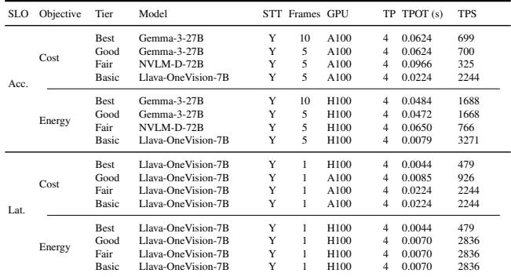  
Table 5: Video Configurations with GPU Details

## A.2 Video

We present the most commonly chosen configuration by Murakkab for each workflow–SLO combination of the video Q/A workflow under different optimization objectives in Table 5 (corresponding to the experiment presented in Section 4.2). It shows various knobs (e.g., model, number of frames, GPU type etc.) and the offered load per model instance in tokens-per-second (TPS) with the observed latency in time-per-output-token (TPOT) For example, we can observe the changing model and number of frames processed as the accuracy SLO is relaxed. For the latency SLO requests, Murakkab keeps the same workflow- and model-level knobs but changes GPU type and increases the allowed load per model instance to increase batching as the SLO is relaxed.

## A.3 Code Generation

We present the most commonly chosen configuration by Murakkab for each workflow–SLO combination of the code generation workflow under different optimization objectives in Table 6 (corresponding to the experiment presented in Section 4.2). It shows various knobs (e.g., model, number of debaters, number of debate rounds etc.) and the offered load per model instance in tokens-per-second (TPS) with the observed latency in time-per-output-token (TPOT) For example, we can observe the changing model and number of debaters as the accuracy SLO is relaxed. For the latency SLO requests, Murakkab mostly keeps the same workflow- and model-level knobs but changes GPU type and increases the allowed load per model instance to increase batching as the SLO is relaxed. Notably, it also changes the tensor parallelism for the same model (Phi-4 [1]) between optimizing for cost and energy.

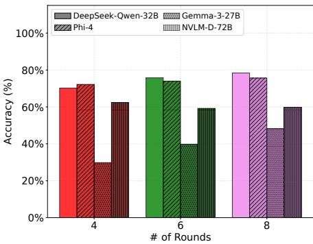  
(a) Math Q/A accuracy.

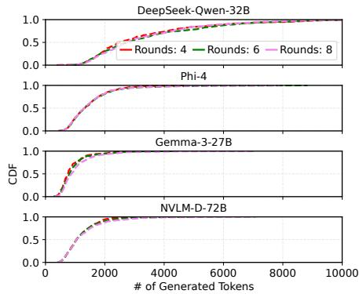  
(b) Math Q/A model load (generated tokens).

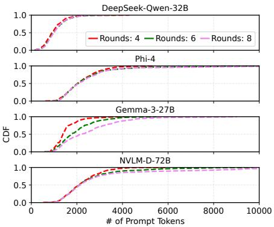  
(c) Math Q/A model load (prompt tokens).

Figure 16: Workflow accuracy under different configurations and the token processing load on the respective models.  
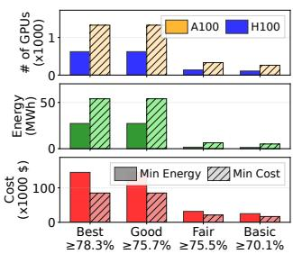  
(a) Accuracy SLOs.

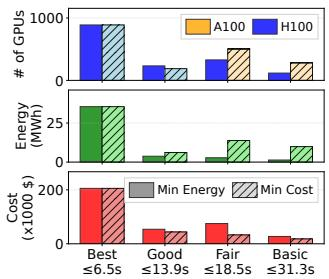  
(b) Latency SLOs.  
Figure 17: Math Q/A workflow configured for different SLO and optimization objectives.

## A.4 Azure Traces

We use a subset of LLM serving traces released by Azure [78] from 08:00 05/15/2024 to 08:00 05/16/2024 shown in Figure 19.

## A.5 Optimization Formulation

We formulate our optimization problem (Section 3.3) as a temporal resource allocation task for serving multiple workflows with heterogeneous SLOs across diverse hardware and model profiles.

## Sets and Indices.

• W : workflows

• S : SLO types

• M : model profiles

• C<sub>w</sub>: workflow configurations for w

• G : resource types

## Parameters.

• λ<sup>avg</sup><sub>w,s</sub> : Average request rate for workflow w with SLO s

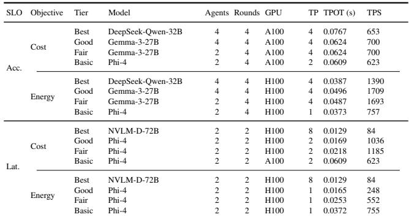  
Table 6: Code Generation Configurations with GPU Details

• α: Unified buffer factor (default 1.15)

• τ<sub>w,s</sub>: SLO threshold for workflow w and SLO type s

• a<sub>c</sub>: Accuracy of workflow configuration c ∈ C<sub>w</sub>

• t<sub>c</sub>: Tokens per request for workflow configuration c

• θ<sub>m</sub>: Token throughput (tokens/sec) for model profile m

ℓ<sup>TTFT</sup>: Time to first token for model profile m m

ℓ<sup>TPOT</sup><sub>m</sub> : Time per output token for model profile m cm

• g<sub>m</sub>: Parallelism for model m

• e<sub>m</sub>: Energy consumption (kWh) for model profile m

• c<sub>g</sub>: Cost per instance per second for resource type g ∈ G

• B<sub>g</sub>: Maximum available resource instances of type g

## Decision Variables.

• n<sub>m</sub> ∈ <sup>Z+</sup>: Number of instances of model profile m

• x<sup>peak</sup><sub>w,s,c,m</sub> ∈ <sup>R+</sup>: Peak load allocation from (w, s, c) to model m

x<sup>avg</sup><sub>w,s,c,m</sub> ∈ <sup>R+</sup>: Average load allocation from (w, s, c) to model m

## Constraints. Demand Satisfaction (Peak):

Ensure peak demand is met with buffer:

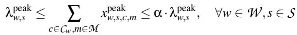

(1)

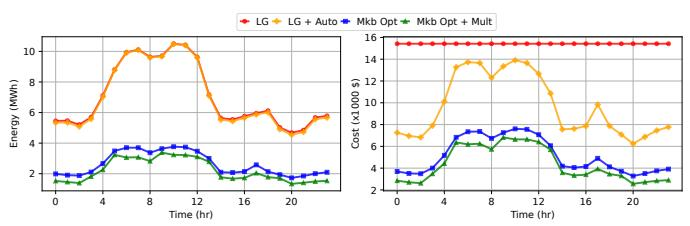  
(a) Energy and cost over time. Static policy is agnostic to load shifts while Murakkab reconfigures workflows for higher resource-efficiency.

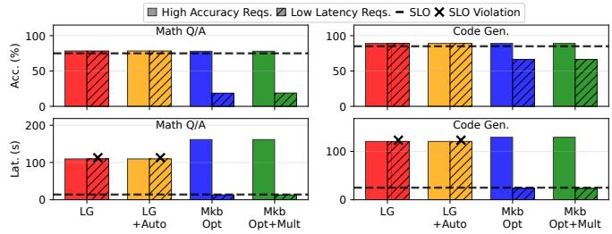  
(b) Accuracy and latency for all requests. Static policy does not distinguish between request SLO categories.

Figure 18: Comparing a hand-crafted static configuration (only A100s) to: (1) Murakkab optimizing individual workflows, and (2) Murakkab jointly-optimizing across workflows + multiplexing resources (Math Q/A + Code Gen).

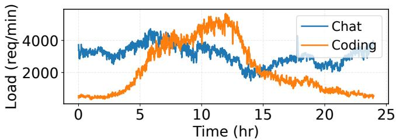  
Figure 19: Azure LLM serving traces.

## Demand Satisfaction (Average):

Similar bounds for average demand:

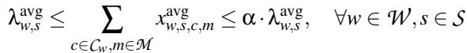

(2)

Capacity Constraint with Multiplexing:

Account for statistical multiplexing:

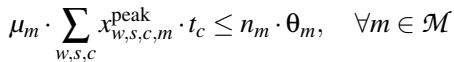

(3)

where µ<sub>m</sub> is the model-specific multiplexing factor.

SLO Filtering:

For accuracy SLO (s = max\_accuracy):

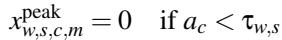

(4)

For latency SLO (s = min\_latency):

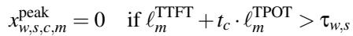

(5)

## Cost Budget Constraint:

If cost SLO is specified:


(6)

where Cost<sub>budget</sub> = ∑<sub>w∈W</sub> τ<sub>w,cost</sub> · ∑<sub>s</sub> λ<sup>avg</sup><sub>w,s</sub> .

Resource Budget Constraint:

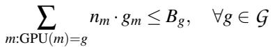

(7)

SLO Filtering Constraints:

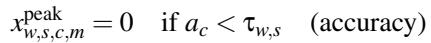

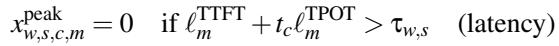

(8)

(9)

Cost Budget Constraint:


(10)

Objective Functions. Minimize Energy:


(11)

Minimize Cost:


(12)

Maximize Accuracy Under a Cost Budget:


(13)

where ε = 0.001.

Solution Method. The formulated Mixed Integer Linear Program (MILP) is solved using Gurobi [37] with a time limit of 300 seconds. The solution yields an allocation of model instance counts n<sup>∗</sup><sub>m</sub> and load distributions across model instances for all workflows.