USENIX

THE ADVANCED COMPUTING SYSTEMS ASSOCIATION

# CoPilotIO: CPU as a Co-pilot for GPU I/O to Free GPU Compute

Guanyi Chen and Qi Chen, The Hong Kong University of Science and Technology (Guangzhou); Shu Yin, ShanghaiTech University; Jian Zhang, The Hong Kong University of Science and Technology (Guangzhou)

https://www.usenix.org/conference/osdi26/presentation/chen-guanyi

# This paper is included in the Proceedings of the 20th USENIX Symposium on Operating Systems Design and Implementation.

July 13–15, 2026 • Seattle, WA, USA

ISBN 978-1-939133-55-7

Open access to the Proceedings of the 20th USENIX Symposium on Operating Systems Design and Implementation is sponsored by

# CoPilotIO: CPU as a Co-pilot for GPU I/O to Free GPU Compute

Guanyi Chen† Qi Chen† Shu Yin‡ Jian Zhang†

‡ShanghaiTech University †The Hong Kong University of Science and Technology (Guangzhou)

## Abstract

Limited GPU memory increasingly forces modern AI and data analytics workloads to access terabyte-scale datasets and model states from storage, making efficient GPU I/O critical. Existing GPU I/O engines are either CPU-centric or GPU-centric. CPU-centric approaches avoid consuming GPU resources but often fail to provide high-throughput, ondemand GPU access due to kernel overheads and limited parallelism. GPU-centric approaches enable fine-grained ondemand I/O but require intensive I/O polling that consumes valuable GPU resources and introduces intra-warp, inter-warp, and inter-SM I/O stalls. We present CoPilotIO1, a novel GPU I/O engine that delivers high-throughput, on-demand storage access without sacrificing GPU compute resources. CoPilo tIO adopts an asynchronous GPU I/O architecture in which GPUs initiate I/O while CPU cores act as I/O co-pilots responsible for completion polling. To enable efficient coordination, CoPilotIO introduces a split SQ/CQ architecture, hardware barrier-based synchronization, a lock-free barrier-table, and adaptive CPU–GPU co-polling. Across microbenchmarks and real applications, including GoFS, LLM Mixture-of-Experts (MoE) inference, and Deep Learning Recommendation Models (DLRM), CoPilotIO reduces I/O-induced stalls by up to 55.5%, requires 50% fewer SMs to saturate the GPU PCIe bandwidth, accelerates GoFS by up to 17.4%, and improves application performance by up to 85%.

## 1 Introduction

Graphics Processing Units (GPUs) have become the primary compute device powering today’s most demanding applications, including large-scale graph analytics [20, 36], scientific simulations [4, 13], high-performance computing (HPC) [8,16], and the rapid emergence of generative AI, such as large language models (LLMs) [6, 9, 32]. These workloads routinely operate on multi-terabyte datasets, trillion-token corpora, and model checkpoints exceeding hundreds of gigabytes [6, 34, 38]. However, despite substantial advances in compute capability, GPU memory capacity remains fundamentally restricted: modern high-bandwidth memory (HBM) typically offers only 40–192 GB [1, 2, 24] per accelerator. This mismatch between massive data footprints and limited on-device memory means GPUs must continuously fetch data at extremely high throughput to keep their compute units fully utilized. As a result, the design of an efficient, scalable GPU I/O stack becomes critical.

Existing GPU I/O engines exhibit a fundamental tradeoff among I/O performance, support for on-demand access, and GPU compute efficiency. Broadly, prior designs fall into two categories: CPU-centric I/O and GPU-centric I/O.

CPU-centric I/O engines, exemplified by NVIDIA GPUDirect Storage (GDS) [23], enable peer-to-peer (P2P) data transfer between storage and GPU memory, but the entire control path remains on the CPU and relies heavily on the mature kernel I/O stack. This design offers high GPU compute efficiency because no GPU cores are consumed in the I/O path. However, limited CPU parallelism and substantial kernel storage stack overhead prevent GDS from saturating the available GPU PCIe bandwidth (e.g., PCIe 4.0 ×16 at \~25 GB/s) [28, 39]. Moreover, GDS lacks true on-demand access for GPU kernels: GPU threads cannot directly initiate I/O, so applications typically rely on CPU-side preloading, which introduces significant data amplification and unnecessary data movement [28].

To overcome these limitations, recent work [28] introduces GPU-centric I/O engines that empower the GPU to directly initiate I/O and manage the entire I/O path, including NVMe command submission, completion-queue polling, and request processing. This design achieves high throughput and allows GPU kernels to fetch data just-in-time, providing true ondemand access. However, shifting the full I/O stack onto the GPU introduces a critical drawback: valuable GPU compute resources are consumed by the I/O stack, particularly by intensive I/O polling on NVMe completion queues. This polling interferes with normal GPU execution and leads to substantial I/O-induced stalls, preventing compute kernels from making forward progress and ultimately degrading overall application performance. Our analysis (Section 3) shows that three types of stalls manifest at multiple levels, including intra-warp, interwarp, and inter-SM stalls. For example, an intra-warp stall occurs when a GPU warp issues an on-demand I/O request to prefetch data; subsequent independent computation stalls because the warp must continuously poll the completion queue to detect I/O completion. This busy-waiting prevents the warp from making forward progress and reduces available GPU compute throughput by up to 87%. In effect, GPU-centric I/O can inadvertently convert highly parallel GPU SMs into inefficient I/O controllers.

Therefore, existing designs face a fundamental limitation: CPU-centric approaches offer high GPU compute efficiency but suffer from low I/O performance and inefficient CPUmediated I/O control or data movement [19, 23, 30], whereas GPU-centric approaches provide high I/O performance and on-demand capability but consume substantial GPU compute cycles [18, 27, 28, 39]. This tension raises a central design question: Can we achieve high-performance, on-demand GPU I/O without sacrificing valuable GPU compute resources?

In this paper, we answer this question affirmatively. We argue that GPU compute resources are extremely valuable and should be prioritized for application computation rather than I/O servicing. Therefore, we advocate for a new GPU I/O architectural direction in which the CPU and GPU cooperate as peers rather than one replacing the other, delivering highthroughput I/O while preserving GPU compute availability.

We present CoPilotIO, a GPU I/O engine that treats the CPU as an I/O co-pilot for GPU applications. CoPilotIO introduces a new asynchronous I/O architecture across CPU and GPU in which the GPU initiates fine-grained on-demand I/O, while the CPU handles I/O queue polling. By offloading polling to the CPU, CoPilotIO fully eliminates GPU-side I/O stalls while preserving true on-demand access for GPU kernels. Designing such an architecture raises several key challenges. First, how can we achieve both high I/O throughput and low latency when the I/O stack resides across two devices (CPU and GPU), especially given that traditional CPU-side I/O stacks suffer from substantial OS kernel overheads? Second, how do we design an efficient synchronization and notification mechanism when the I/O submission and completion paths span both the CPU and GPU? Third, given the limited parallelism available on CPUs, how can we saturate the high PCIe bandwidth of modern GPUs while avoiding I/O-induced GPU stalls?

CoPilotIO addresses the above challenges with the following contributions: (1) A split SQ/CQ architecture across CPU–GPU memory, combined with a user-level SPDK-like I/O library on the CPU side [15], enabling fast GPU-initiated I/O submission and efficient CPU polling without OS kernel software overheads. (2) A hardware barrier–based synchronization mechanism [22] and a lock-free barrier-table, providing efficient, contention-free coordination and notification between the CPU and GPU. (3) A CQ-based adaptive CPU–GPU co-polling mechanism that dynamically migrates the polling role between CPU and GPU based on runtime I/O load, ensuring high throughput under high I/O load, while still avoiding GPU-side polling stalls.

We implement CoPilotIO in approximately 5K lines of code. We evaluate CoPilotIO using a comprehensive suite of microbenchmarks that measure reductions in I/O-induced stalls, pure I/O performance, the effectiveness of CQ-based adaptive polling, and the scalability and GPU compute efficiency of CoPilotIO. Our results show that CoPilotIO reduces I/O stalls by up to 55.5% compared to the state-of-the-art GPU-centric I/O engine, BaM. Enabled by CQ-based adaptive polling, CoPilotIO consistently sustains high I/O throughput even under dynamically changing I/O loads. In addition, CoPilotIO requires 50% fewer SMs to saturate four SSDs (i.e., the GPU’s PCIe bandwidth) than BaM. We further demonstrate the practicality of CoPilotIO by integrating it into the state-of-the-art GPU filesystem GoFS [18], where CoPilotIO delivers up to 17.4% performance improvement. Finally, we evaluate CoPilotIO on real-world applications, including LLM Mixture-of-Experts (MoE) inference [12, 29] and Deep Learning Recommendation Models (DLRM) [21], both of which show up to 85% performance gains.

## 2 Background

## 2.1 GPU Architecture

Modern GPUs consist of many streaming multiprocessors (SMs), each acting as an independent parallel compute unit equipped with hundreds of CUDA cores. When a CUDA kernel launches, its threads are grouped into thread blocks, which are assigned to SMs. Within each SM, threads are further partitioned into warps of 32 threads, which execute instructions in lock-step. All SMs share a global L2 cache and the off-chip DRAM memory. A warp is the fundamental execution and scheduling unit in the SIMT model: all active threads in a warp issue the same instruction but operate on different data. Each SM has four warp schedulers, allowing up to four warps to issue instructions (active) simultaneously. Each scheduler selects the next ready warp to issue to the CUDA cores when ever the currently executing warp goes to sleep or completes, ensuring high concurrency. If a warp continuously occupies the cores without making progress, it limits scheduling opportunities and reduces overall GPU parallelism. For instance, an NVIDIA A100 GPU [22] contains 108 SMs with a total of 40-80 GB of memory, and each SM can track up to 64 resident warps (2,048 threads). Across the whole device, the A100 can therefore have over 200,000 in-flight threads, providing massive hardware-managed multi-threading.

In addition, GPUs also support directly reading from and writing to CPU memory over PCIe using zero-copy access [25]. In this mode, GPU threads can access host memory without an explicit DMA transfer, allowing the GPU to operate on data resident in CPU memory with low latency. Conversely, GDRCopy [10] enables CPU threads to directly read and write GPU VRAM by creating user-space mappings of GPU memory through GPUDirect RDMA, providing a low-latency path for CPU-initiated accesses to GPU-resident data structures.

## 2.2 GPU I/O Engines

We categorize the state-of-the-art GPU I/O engines into two approaches: CPU-centric I/O and GPU-centric I/O.

CPU-centric I/O: GPUs rely on the host CPU to initiate I/O. As discussed above, CPU-centric approaches offer high GPU compute efficiency but suffer from low I/O performance and lack true on-demand GPU access. The standard solution is NVIDIA GPUDirect Storage (GDS) [23], which enables peerto-peer PCIe DMA transfers between NVMe SSDs and GPU memory, allowing data to be written directly into GPU buffers without staging through host memory. However, its control plane remains CPU-orchestrated, which prevents true GPU on-demand access [28]. Data must be pre-loaded from storage into memory before GPU computation can proceed, leading to unnecessary data movement and read amplification. In addition, GDS suffers from limited I/O performance because its control plane resides in the OS kernel, incurring substantial kernel software overheads [28] that make it difficult to fully saturate the GPU’s PCIe bandwidth (e.g., \~25 GB/s). Although GDS enables direct SSD-to-GPU DMA transfers, each I/O request still requires CPU-side I/O submission, completion handling, and synchronization through the kernel I/O stack, introducing significant control-path overheads such as system calls, kernel traps, buffer registration, DMA mapping, and NVMe queue management [23]. While asynchronous I/O interfaces (e.g., cuFileReadAsync) can overlap the datatransfer latency of individual requests, they cannot eliminate the per-request control-path overhead that CPU cores must process. As a result, the aggregate control-path overhead can exceed what the available CPU cores can sustain, even when using asynchronous I/O.

Additionally, several CPU-centric GPU I/O designs have been proposed to provide on-demand access for GPU applications. GPUfs [33] introduces a wrapper library that exposes familiar filesystem APIs directly to GPU code. However, all I/O operations are ultimately executed by the CPU through the host kernel’s filesystem stack, resulting in limited I/O performance due to kernel overheads and CPU mediation. Moreover, GPUfs incurs substantial GPU compute overhead: the GPU issues I/O requests via an RPC mechanism to the CPU, causing excessive GPU-side communication and synchronization costs during I/O operations. ActivePointers [30] introduces a memory-mapped file abstraction for GPUs by moving the control path of page-fault handling onto the GPU. However, the data movement path remains entirely CPU-centric: for every major page fault, the OS still reads the page from the SSD into CPU memory and then copies it to the GPU. As a result, substantial GPU compute resources are wasted on complex page-fault handling logic, leading to significant overhead during I/O-intensive workloads.

GPU-centric I/O: To provide GPU on-demand I/O, BaM [28] allocates submission/completion queues and I/O buffers directly in GPU memory, maps NVMe doorbells into the GPU address space, and allows GPU threads to prepare commands, ring doorbells, and poll completions without invoking CPU-side I/O stacks. BaM provides high I/O performance and on-demand capability, but wastes substantial GPU compute cycles as the entire control and data paths of each I/O operation are initiated and completed on the GPU. This design forces GPU threads to actively poll for I/O completion, introducing substantial I/O-induced stalls into GPU applications, as detailed in Section 3. AGILE [39] builds on top of BaM to provide asynchronous I/O by dedicating additional SMs for polling, but its control and data planes remain entirely GPU-driven, which cannot avoid inter-warp and inter-SM stalls mentioned in Section 3. CAM [35] offloads SSD management to the CPU, but adopts a two-level submission path where GPU threads write request metadata into CPU memory and CPU-side threads issue the actual NVMe commands, adding a CPU-mediated indirection on the submission path.

Additionally, several GPU-centric filesystems have been proposed [18, 27], all of which build on BaM as their underlying GPU I/O engine. GeminiFS [27] adopts a companion filesystem design that embeds essential metadata into files, retrieves this metadata into GPU memory, and, together with a GPU-friendly page cache and NVMe queues, exposes simplified file-based direct storage access to the GPU. GoFS [18] further pushes the entire filesystem into the GPU to fully bypass the CPU. However, offloading the full filesystem and I/O management to the GPU introduces substantial interference and I/O stalls for regular GPU compute workloads. All filesystem tasks, including metadata lookup, caching, traversal, and I/O queue management, now compete with AI kernels for SM cycles. In modern AI workloads where GPU compute resources are extremely precious and increasingly scarce, dedicating GPU threads to non-compute tasks directly undermines utilization. Every GPU cycle spent on the filesystem I/O stack is a cycle not spent on model training or inference, leading to degraded performance, reduced parallelism, and poor cost efficiency at cluster scale.

## 3 Motivation

Tradeoff between I/O performance and GPU compute efficiency: For CPU-centric I/O systems such as GDS, GPU compute resources are not consumed for I/O operations. However, GDS suffers from limited I/O throughput due to substantial OS kernel software overheads and restricted CPU parallelism. As shown in Figure 3a, with 16 CPU threads, GDS fails to saturate a single SSD’s bandwidth across a range of I/O sizes. Achieving full GPU PCIe link bandwidth (approximately 25

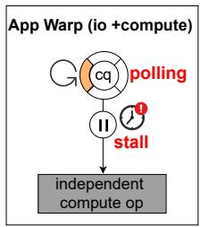  
(a)

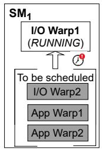  
(b)

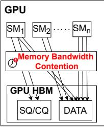  
(c)  
Figure 1: (a) Intra-warp stall: independent compute operation is stalled by I/O polling; (b) Inter-warp stall: compute warp is delayed from being scheduled as I/O polling warps keep occupying the GPU cores; (c) Inter-SM stall: I/O polling warps and regular application memory accesses contend for the global GPU memory.

GB/s for PCIe 4.0 ×16) requires saturating four SSDs concurrently, which is difficult for GDS because its kernel-level overhead and limited core parallelism prevent it from issuing and completing I/Os at a sufficiently high rate. On the other hand, BaM can saturate the bandwidth of four SSDs because it moves the entire I/O path onto the GPU, eliminating CPUside software overheads and exploiting the GPU’s massive parallelism. However, achieving this level of throughput requires more than 80 SMs (Figure 10a) on an NVIDIA A100 for I/O, which results in extremely poor compute efficiency. Moreover, when I/O and compute tasks are co-located on the GPU, they introduce multiple levels of stalls, including intra-warp, inter-warp, and inter-SM stalls as discussed next. Lesson 1: Modern GPU I/O designs face a fundamental tradeoff: CPU-centric approaches preserve GPU compute capacity but deliver low I/O throughput, while GPU-centric approaches achieve high throughput but severely degrade GPU compute efficiency.

Co-locating I/O and compute tasks on the GPU causes severe I/O stalls: Although GPU-centric I/O provides high throughput and supports on-demand access while fully bypassing the CPU, we observe that designs such as BaM incur substantial I/O polling stalls when I/O tasks are co-located with compute tasks on the GPU. Because BaM must continuously poll the NVMe completion queue to detect I/O completions, polling warps interfere with compute warps, leading to significant stalls and reduced overall GPU efficiency. As shown in Figure 1, we identify three polling-induced stalls.

(1) Intra-warp stall: A stall inside a warp. When an application warp polls for data (e.g., waiting for the completion queue), it cannot execute subsequent instructions until that data arrives. Even if later instructions are independent of the polling data, the GPU’s in-order warp execution model prevents them from being issued, causing the entire warp to stall.

(2) Inter-warp stall: A stall between warps but within an SM. When an I/O warp aggressively polls the completion queue, the GPU hardware warp scheduler is unaware that this warp makes no forward progress, as it remains marked as “ready”. Consequently, it reduces the opportunities for other ready compute warps to execute and wastes valuable SM execution cycles while the requested data has not yet arrived. Since each SM can issue only one warp instruction per cycle, these unproductive polling instructions suppress useful compute work, reducing parallelism and overall SM efficiency.

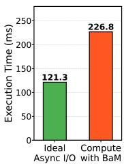  
(a) Intra-warp

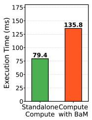  
(b) Inter-warp

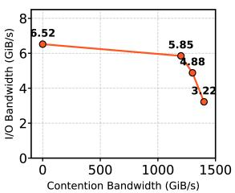  
(c) Inter-SM  
Figure 2: I/O Stall Analysis of the GPU-Centric Design.

(3) Inter-SM stall: A stall across SMs. In GPU-centric I/O de signs, both application data and the NVMe SQ/CQ structures reside in global GPU memory. Unlike the previous two types of stalls, here the I/O performance itself is directly affected by application memory traffic (Figure 2c). Because application kernels concurrently access global memory, they introduce contention on memory channels and bandwidth, which interferes with BaM’s frequent CQ polling. This contention delays CQ detection, slows down I/O completion handling, and ultimately degrades overall I/O performance.

Recent work, AGILE [39], proposes an asynchronous GPUcentric I/O model by dedicating specific SMs to poll the completion queue and overlap I/O with computation. However, this design requires allocating additional SMs exclusively for polling, consuming GPU execution resources that would otherwise be available for computation. For example, to saturate the bandwidth of 4 SSDs (limited by GPU PCIe bandwidth), AGILE must reserve 32 SMs purely for polling on an A100, which has only 108 SMs in total. Furthermore, AGILE continues to suffer from the inter-warp and inter-SM stalls discussed above. The application warp (i.e., the warp that initiates the I/O) must repeatedly poll a software lock flag to detect completion, which directly contributes to inter-warp stalls. In addition, the dedicated SMs used for CQ polling generate substantial memory traffic, further exacerbating inter-SM contention.

Analysis: We conduct a set of experiments to analyze the three types of stalls in detail. For intra-warp stalls, we launch multiple application warps, with each warp running computation alongside I/O operations that the computation does not depend on. We compare BaM against our CoPilotIO I/O engine. As shown in Figure 2a, using BaM increases intra-warp stall time by up to 1.87× due to synchronous polling. For inter-warp stalls, we co-run multiple compute warps with I/O warps. As illustrated in Figure 2b, compared to running the compute warp alone, co-running with BaM’s polling warp increases the total execution time by up to 1.71×, showing that a spinning I/O warp competes aggressively with ready compute warps for SM scheduling slots. Finally, for inter-SM memory contention, we evaluate how regular GPU memory traffic interferes with GPU-driven I/O. As shown in Figure 2c, increasing the memory bandwidth consumed by the application significantly degrades BaM’s I/O bandwidth, demonstrating that GPU-side queue polling contends with application memory accesses across SMs.

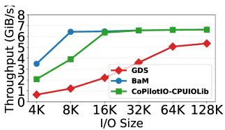

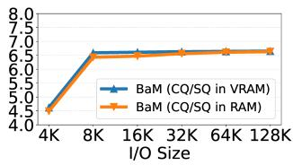  
(a) User-space I/O Polling  
(b) SQ/CQ on CPU vs GPU  
Figure 3: (a) User-space CPU I/O polling performance comparing GDS and BaM; (b) Impact of placing Completion Queue (CQ) and Submission Queue (SQ) in CPU DRAM versus GPU VRAM.

Lesson 2: There is a fundamental flaw in current GPU-centric I/O: as long as the GPU is responsible for polling NVMe queues, the architecture inevitably imposes intra-warp, interwarp, and inter-SM stalls. This motivates the adoption of a fundamentally new asynchronous I/O engine that removes GPU-side polling and decouples I/O progress from GPU execution, eliminating the root cause of all three stall types.

CPU can be used as a copilot for GPU I/O: Prior works [7, 18, 27, 28] often assume that CPU-centric I/O (e.g., GDS) suffers prohibitive OS kernel overhead, leading to the conclusion that its performance is substantially slower than GPU-centric designs such as BaM. This assumption motivates a series of GPU filesystems [18, 27] that rely on BaM to fully bypass the CPU. However, such bypassing overlooks CPU-side capabilities and may leave significant performance opportunities unexploited.

First, user-level CPU I/O polling can achieve performance comparable to GPU-centric I/O by removing the kernel software overheads. We implement a user-level SPDK-like system (CoPilot-CPUIOLib) by moving the NVMe queue pair into user space and using the CPU to handle SQ/CQ polling and directly moving data from storage to the GPU. As shown in Figure 3a, CoPilot-CPUIOLib can saturate SSD bandwidth with 16 CPU threads once the I/O size exceeds 16 KB.

However, naive user-level CPU I/O polling alone cannot meet our goals. First, it cannot provide fine-grained ondemand I/O initiation from the GPU, as all requests must originate on the CPU side. Second, the limited CPU paral lelism is insufficient to sustain the high polling rate required for small I/O sizes (e.g., <16 KB), causing throughput to fall short of device capabilities. Moreover, saturating a GPU PCIe link would require more than 64 CPU cores dedicated solely to I/O polling, which is an unrealistic requirement in real server environments where CPU resources are shared with other applications. Therefore, an efficient adaptive polling design is required between CPU and GPU (Section 4.5).

In addition, placing the SQ/CQ in CPU memory achieves I/O throughput comparable to GPU-resident queues. This is because GPU accesses to pinned CPU memory through

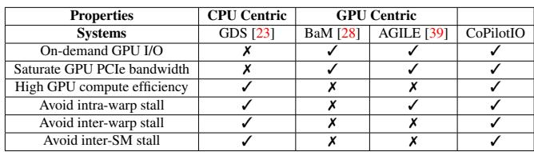  
Table 1: Capabilities and limitations of state-of-the-art GPU I/O approaches. The last column shows our proposed CoPilotIO.

PCIe provide sufficiently high bandwidth for the small, cacheline-sized SQ/CQ entry performed during I/O. The GPU’s polling only reads or writes a few bytes (4B) per command (e.g., command ID, status fields), so the controlpath traffic is negligible relative to the large datapath DMA transfers. As a result, the overhead of using the GPU to poll the CQ in CPU memory is minimal and does not limit end-toend NVMe throughput. As shown in Figure 3b, our evaluation of both configurations, SQ/CQ placed in CPU memory versus GPU memory and both using the GPU for polling, reveals that GPU-polling of CPU-resident queues can sustain throughput close to the optimal GPU-VRAM polling case while offering significantly lower interference with GPU compute workloads.

Lesson 3: CPU cores and CPU memory are essential copilots for GPU I/O. However, naive user-level CPU polling cannot sustain high throughput under limited CPU parallelism. Meanwhile, GPU polling of SQ/CQ placed in CPU memory still delivers sufficiently high bandwidth. These observations motivate the need for an efficient adaptive polling design that dynamically coordinates between CPU and GPU.

## 4 CoPilotIO Design

## 4.1 Design Goals and Principles

Goal 1: Eliminate I/O-induced stalls. CoPilotIO introduces a split SQ/CQ design across CPU-GPU memory and utilizes an asynchronous I/O architecture that leverages CPU cores as I/O co-pilots for CQ polling and uses GPU hardware barriers (cuda::barrier) to coordinate cross-device data synchronization. This design avoids GPU-side I/O polling stalls, including intra-warp, inter-warp, and inter-SM stalls.

Goal 2: Support high-performance on-demand I/O access from the GPU side. First, CoPilotIO provides a scalable, lock-free barrier table that allows the GPU to efficiently communicate with the CPU. Second, CoPilotIO implements a user-level SPDK-like design (CoPilot-CPUIOLib) that enables high-performance I/O polling on the CPU side.

Goal 3: Sustain high I/O bandwidth when CPU cores are insufficient under high I/O loads. CoPilotIO introduces the CQ-based adaptive polling. At runtime, CoPilotIO dynamically selects the most suitable polling agent based on I/O load. This adaptive design maintains high I/O bandwidth while simultaneously avoiding GPU I/O polling stalls.

Goal 4: Free more GPU cores for computation rather than I/O. CoPilotIO enables CPU–GPU co-polling, allowing the system to saturate the full GPU PCIe bandwidth while using significantly fewer GPU cores for I/O.

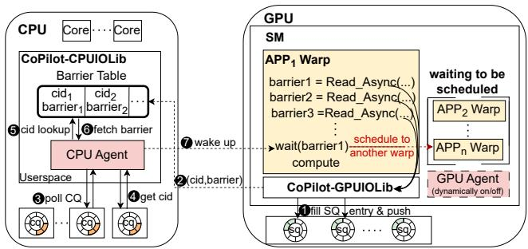  
Figure 4: Design Overview of CoPilotIO. Application warps initiate I/O through CoPilot-GPUIOLib, after creating cuda::barrier and cid, 1 CoPilot-CPUIOLib submits the I/O requests to SQs and immediately returns control to the application. 2 CoPilot-GPUIOLib writes the cid and the cuda::barrier to barrier-table that resides on the CPU memory. 3 and 4 CPUAgent polls the CQ until it receives a CQ entry and extracts the cid. 5 and 6 CoPilot-CPUIOLib looks up the cuda::barrier using the cid. At the end, CoPilot-CPUIOLib uses 7 to notify the application warp on the GPU.

## 4.2 CoPilotIO Design Overview

CoPilotIO is a new asynchronous GPU I/O engine that leverages the CPU as a co-pilot to deliver high on-demand I/O throughput while minimizing I/O-induced stalls and maximizing GPU compute efficiency. CoPilotIO consists of two libraries. On the GPU side, CoPilot-GPUIOLib enables GPU applications to initiate I/O requests and handles I/O submission operations. On the CPU side, CoPilot-CPUIOLib provides a high-performance, SPDK-like user-level library responsible for polling I/O completions. Both CPU and GPU have their own polling agents. CPUAgent is enabled by default, as one of the design goals is to free GPU cores for computation. GPUAgent is disabled initially but can be dynamically activated when needed. Its activation is governed by our CQ-based adaptive polling mechanism, which determines when GPU-side polling is necessary to sustain high I/O throughput under increasing load.

## 4.3 Split SQ/CQ Across CPU–GPU Memory

Traditional GPU-centric I/O designs co-locate both the NVMe submission queue (SQ) and completion queue (CQ) in GPU memory. While this enables GPU-initiated commands, it also introduces I/O polling stalls when co-located with GPU compute applications. To overcome this limitation, CoPilotIO adopts a split-queue architecture that places the SQ in GPU memory and the CQ in CPU memory. This split design preserves the key benefit of GPU-centric I/O that the GPU can directly fill the SQ with low latency, while shifting I/O com pletion detection (polling) to a CPU memory region that can be efficiently polled by both the CPU and GPU (Figure 3b).

First, placing the CQ in CPU memory naturally eliminates inter-SM polling stalls. In our design, the GPU accesses CPU memory directly over PCIe using zero-copy loads/stores without invoking explicit cudaMemcpy(). This approach ensures that I/O polling bypasses GPU memory, preventing interference with other compute kernel memory accesses and preserving SM parallelism.

However, naively splitting the SQ/CQ across CPU and GPU memory is not sufficient. Although this design removes inter-SM stalls and improves I/O performance, it cannot eliminate intra-warp and inter-warp stalls. Regardless of where the SQ resides, a GPU warp must still continuously poll the CQ to determine whether an I/O request has completed. As a result, any independent computation within the same warp is forced to wait for the I/O to finish. Similarly, other ready warps on the same SM cannot make forward progress because the polling warp remains “ready” and repeatedly preempts the scheduler, preventing efficient warp-level parallelism. Fortunately, placing the CQ in CPU memory enables the CPU to take over CQ polling. This observation motivates us to design a novel asynchronous I/O architecture built upon the split SQ/CQ design, which we discuss in the next section.

## 4.4 CoPilotIO Asynchronous I/O Architecture

At the core of CoPilotIO is a fully asynchronous I/O architecture that spans both the CPU and GPU. The key idea is to offload I/O polling to the CPU while using NVIDIA’s hardware barrier to notify the GPU when data becomes ready. By eliminating GPU-side polling entirely, CoPilotIO effectively removes both intra-warp and inter-warp stalls. Next, we first describe the end-to-end asynchronous I/O flow by going through the main components of CoPilotIO.

Issuing I/O from the GPU: As mentioned, CoPilotIO provides a lightweight GPU-side library, CoPilot-GPUIOLib, which enables GPU applications to initiate I/O requests on demand. Applications interact with CoPilot-GPUIOLib through familiar POSIX-like interfaces (e.g. async\_read and async\_write) as mentioned above. For each I/O request, CoPilotIO creates a corresponding cuda::barrier instance, implemented using NVIDIA’s hardware barrier support in the CUDA runtime. Once the application receives a cuda::barrier handle, it can simply place the barrier before dependent compute operations to ensure data availability. Crucially, unlike conventional polling, a cuda::barrier allows the GPU to suspend the waiting warp and let the hardware scheduler issue other ready warps, effectively eliminating inter-warp stalls during I/O wait periods while maintaining correctness. Before returning the cuda::barrier to the user, CoPilot-GPUIOLib allocates an NVMe Command ID (cid) [37] for the I/O request and saves the cid to cuda::barrier mapping in a barrier-table (described shortly). Each cid is uniquely associated with a cuda::barrier. After that, CoPilot-GPUIOLib immediately submits the I/O request to the SQ and returns control to the application.

I/O completion detection on the CPU: On the CPU side, CoPilot-CPUIOLib is the CPU-side user-level I/O engine of CoPilotIO and plays the role of an I/O "co-pilot" for the GPU. CoPilot-CPUIOLib uses an SPDK-like architecture, which moves NVMe queue management into user space and dedi cates CPU cores to handle SQ/CQ submission, completion polling, and DMA coordination without kernel involvement. This design enables CoPilotIO to deliver high I/O throughput while serving as the control plane that drives GPU-initiated I/O. CoPilot-CPUIOLib continuously polls the CQ using dedicated CPU cores. Once the SSD updates a CQ entry to indicate completion, the CPU detects it, looks up the corresponding cuda::barrier in the shared barrier-table using the I/O request identifier (cid), and signals the GPU by triggering the associated cuda::barrier. When the barrier is signaled, the waiting GPU warp wakes up and the dependent computation resumes. On platforms that do not support the hardware barrier, the CPU can alternatively use GDRCopy [10] to write a completion flag directly into GPU memory.

Synchronization between CPU and GPU: To enable efficient CPU–GPU coordination, CoPilot-CPUIOLib preallocates a lock-free barrier-table in CPU memory, which is directly accessible by both processors. The table maintains a one-to-one mapping between each NVMe command ID (cid) and its corresponding cuda::barrier. First, on the GPU side, upon receiving an I/O request, CoPilot-GPUIOLib performs a GPU zero-copy write to insert the (cid, cuda::barrier) pair into the barrier-table. Each barriertable is assigned to a private warp instance, eliminating lock contention between warps. During insertion, CoPilot-GPUIOLib uses the cid as the index. Since each entry is only 8 bytes, the GPU-to-CPU-memory write latency remains low. On the CPU side, once CoPilot-CPUIOLib observes a completion queue (CQ) entry, it retrieves the associated cid and directly indexes into the same barrier-table to fetch the stored cuda::barrier. The CPU then signals this cuda::barrier to notify the GPU that the requested data has arrived. In this way, the barrier-table provides a lightweight, lock-free communication channel that efficiently connects CQ polling on the CPU with barrier-based synchronization on the GPU.

CID reclamation: When the CPU observes a CQ completion entry, it extracts the cid, signals the corresponding cuda::barrier, and immediately marks the cid as available for reuse. Because each cid is uniquely bound to a single inflight I/O request and the barrier-table is indexed by cid, reclamation is a simple index reset with no synchronization required. If an NVMe-level I/O error occurs (indicated by the status field in the CQ entry), the CPU still reclaims the cid and signals the cuda::barrier, but sets an error flag in the barrier table. Upon waking up, the GPU warp checks this flag and handles the failure (e.g., retries or propagates the error to the application). This design ensures that cid resources are never leaked, even under I/O failures.

Memory overhead of barrier-table: In the NVMe protocol, the cid is a 16-bit field, allowing up to 65,536 outstanding commands per SQ/CQ pair. Each table entry (cid + cuda::barrier object) is 8B. To saturate a modern NVMe SSD typically requires 128 SQ/CQ pairs, each configured with a queue depth of 1024. To fully utilize the GPU’s PCIe bandwidth, four SSDs are enough to saturate it. Thus, the total memory footprint is 8 B × 1024 × 128 CQs × 4 SSDs = 4 MB. As a result, the barrier-table imposes negligible memory overhead while supporting the full bandwidth required to saturate the GPU PCIe link.

This asynchronous handshake between CPU, GPU, and NVMe SSD eliminates GPU-side I/O stalls and saves more GPU compute for application execution. First, there is no GPU I/O polling, thereby eliminating intra-warp stalls. Once an I/O request is issued, the application kernel can continue executing independent work without waiting for data. Second, even with dependent operations, cuda::barrier suspends the waiting warps, allowing the scheduler to issue other ready warps, effectively avoiding inter-warp stalls. In addition, by separating the SQ and CQ across devices, CoPilotIO eliminates contention on GPU memory accesses during I/O polling, thereby further reducing inter-SM stalls.

Challenges: GPU I/O polling can only be fully avoided when the system has sufficient CPU cores to sustain high CQ polling throughput. As shown in Figure 3a, our evaluation uses 16 CPU cores for I/O polling; however, in a real server environment where other applications compete for CPU resources, fewer cores may be available, making it difficult for CPU-side polling to saturate the full GPU PCIe bandwidth (25 GB/s). Moreover, for small I/O sizes, even 16 polling cores are insufficient: small requests require high I/O depth and many active SQ/CQ pairs to reach the device’s peak band width, but limited CPU parallelism cannot provide enough polling throughput. In contrast, the GPU offers thousands of hardware threads capable of providing ample parallelism to saturate storage bandwidth. Yet shifting polling back to the GPU would reintroduce the very GPU-side stalls we aim to eliminate. Thus, the central challenge is achieving high I/O bandwidth when CPU cores are insufficient, while simultaneously avoiding GPU I/O polling stalls. Therefore, we propose CQ-based adaptive CPU-GPU co-polling.

## 4.5 CQ-based Adaptive CPU-GPU Co-Polling

We propose CQ-based Adaptive CPU-GPU Co-Polling, which addresses two questions: (1) When should GPUAgent be turned on or off? (2) How to minimize I/O stalls when I/O polling is on the GPU?

As shown in Figure 5, GPUAgent is disabled by default. Initially, only CPUAgent is responsible for polling. We decide when to turn on the GPUAgent based on the number of pend ing entries in the CQ. The number of outstanding CQ entries reflects the CPU’s ability to keep up with I/O processing: if many entries remain unconsumed, it indicates that the CPU does not have enough cores to poll and process CQ entries in time.

Algorithm 1: CQ-based adaptive polling algorithm   
Input: For each queue CQ : current number of   
pending entries pi;   
Upper migration threshold T highi and lower migration   
threshold T low (T low < T high);   
Decision batch size Ri (trigger a migration decision   
every Ri I/O requests);   
Current polling mode mode ∈ {CPU,GPU};   
Current I/O submission binding   
bindi ∈ {CPU\_CQ,GPU\_CQ}   
State: For each CQ , a request counter req since the   
last decision, initialized to 0   
Output: For each CQi, an adaptive choice of polling   
location and I/O binding   
1 Function OnIORequest(CQi)   
2 reqi ← reqi + 1;   
3 if reqi ≥ Ri then   
4 reqi ← 0;   
5 DecideMigration(CQi);   
6 end   
7 end   
8 Function DecideMigration(CQi)   
9 pi ← READPENDINGCOUNT(CQi);   
10 if mode = CPU and p > T high then   
11 mode ← GPU;   
12 WAKEPOLLINGWARPONSAMESM(CQi);   
13 bind ← GPU\_CQ;   
14 UPDATEQUEUEBINDINGTOGPU(CQi);   
15 else if modei = GPU and pi < T low then   
16 mode ← CPU;   
17 bindi ← CPU\_CQ;   
18 UPDATEQUEUEBINDINGTOCPU(CQi);   
19 OPTIONALLYSLEEPPOLLINGWARP(CQi);   
20 end   
21 else   
22 Keep current mode unchanged; return;   
23 end   
24 end

In our design, each CQ is associated with a threshold. As Algorithm 1 shows, when CoPilot-CPUIOLib observes that the number of pending CQ entries exceeds this threshold, CoPilotIO stops inserting new CQ entries into the CPU-polled queue and immediately activates the GPUAgent. Newly generated CQ entries are then redirected to the queue polled by the GPU. Conversely, when the pending count falls below the threshold, CoPilotIO stops inserting new CQ entries into the GPU-polled queue, and the GPUAgent is disabled after draining all remaining pending CQ entries. At that point, polling responsibility shifts back to the CPU as new CQ entries are inserted into the CPU-polled queue.

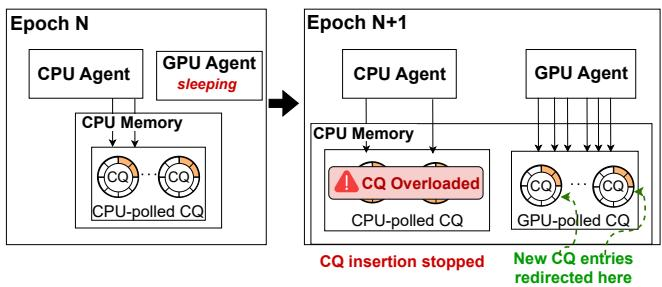  
Figure 5: CQ-based Adaptive Polling. At epoch N, CPUAgent is enabled by default to poll the CQ, while GPUAgent remains disabled. At epoch N + 1, CoPilotIO detects that the CQ is becoming overloaded and the CPU can no longer sustain high throughput, GPUAgent is activated to assist with polling.

Importantly, first, the CQ itself always resides in CPU memory to avoid inter-SM stalls. When the GPUAgent is active, the GPU directly polls the CPU-resident CQ using zerocopy reads. As shown in Figure 3b, GPU polling achieves similar throughput regardless of where the CQ is placed, making CPU-resident CQs preferable for reducing GPUside contention. Second, CoPilotIO does not migrate polling threads between CPU and GPU; instead, it simply controls which CQ receives newly inserted entries, thereby steering the polling load to the appropriate device. This design avoids costly thread migration or context switching while enabling fast, lightweight transitions between CPU-side and GPU-side polling. Third, the CPUAgent is not disabled when the GPUAgent is enabled. Instead, CoPilotIO allows true CPU–GPU co-polling, where each agent polls its own dedicated CQ without interfering with the other. Because the CPU and GPU poll separate queues, there is no contention or shared-state synchronization overhead between them, enabling smooth load balancing and higher sustained I/O throughput under bursty or high-concurrency workloads.

Moreover, when I/O polling is moved back to the GPU, we need to minimize the I/O stalls reintroduced by GPU-side polling. BaM requires each warp that issues I/O to poll for completion itself, leading to severe inter-warp stalls as multiple polling warps contend for the warp scheduler. AGILE improves upon this by assigning one agent warp to each NVMe queue and consolidating all agent warps onto a few dedicated SMs that do not run any application computation. However, this design has two drawbacks: first, it wastes GPU compute resources since those dedicated SMs cannot be used for application workloads; second, because multiple polling warps are consolidated onto the same SM, inter-warp interference among them still exists. Furthermore, AGILE’s polling warps cannot be disabled once launched and continue to occupy GPU resources even when the I/O load is low.

In contrast, GPUAgent takes a different approach. For each SM, GPUAgent is initialized at kernel launch time and activates a single dedicated warp to perform I/O polling only when polling responsibility is transferred from the CPU to the GPU. Unlike BaM, GPUAgent uses only one warp per SM for polling rather than having each I/O warp poll individ ually, thereby significantly reducing inter-warp stalls. Unlike AGILE, GPUAgent runs alongside the application kernel on the same SM rather than consolidating polling warps onto dedicated SMs, thus avoiding inter-warp interference among multiple polling warps. Since only a single warp serves as the GPUAgent per SM, the impact on application performance is minimal. Moreover, GPU application kernels can seamlessly switch to having GPUAgent handle polling without any code changes. Furthermore, the polling warp of GPUAgent can enter a sleep state when not polling and be woken up on demand, and can be completely disabled when all I/O polling is moved back to the CPU, allowing all warps on each SM to be fully available for computation.

GPUAgent operates similarly to CoPilot-CPUIOLib: it shares the barrier-table located in shared memory with the application kernel, polls the CPU-resident CQ via zero-copy reads, and upon detecting a completed CQ entry, uses the corresponding cid to locate the associated cuda::barrier in the table and signals it to wake up the waiting application warp.

## 5 Evaluation

We evaluate CoPilotIO to answer the following questions:

• How effective is the asynchronous I/O of CoPilotIO in avoiding I/O-induced stalls when I/O and compute tasks are co-located on the GPU?

• What I/O throughput and latency does CoPilotIO achieve when running I/O tasks alone?

• How effective is the CQ-based adaptive CPU-GPU copolling mechanism?

• Can CoPilotIO saturate the GPU’s PCIe bandwidth?

• What is the overall impact of CoPilotIO on real-world applications?

## 5.1 Experimental Setup and Methodology

Testbed: Our testbed consists of a dual-socket Intel Xeon Gold 6530 system, with 32 cores per socket, 256 GB of DDR5 DRAM (4 × 64 GB), and we evaluate on both an NVIDIA A100 GPU with 40 GB of memory and an NVIDIA H800 GPU with 80 GB of memory. The system runs Ubuntu 22.04.4 with Linux kernel 5.15.0, CUDA 12.4, and NVIDIA driver version 550.54.14. We use four 1 TB Samsung 990 Pro NVMe SSDs (PCIe 4.0 x4) for storage.

Methodology: We compare CoPilotIO against state-of-theart GPU-centric I/O systems, including BaM (synchronous I/O) and AGILE (asynchronous I/O). We evaluate GDS in Figure 8, but exclude it from the other experiments as it does not support on-demand GPU-initiated I/O, and prior work has already demonstrated its limited I/O performance (Section 3).

## 5.2 Microbenchmarks

## 5.2.1 Reduction of I/O Stalls

First, in Figure 6, we design three microbenchmarks by colocating I/O and compute tasks on the GPU to evaluate the effectiveness of CoPilotIO in reducing I/O-induced stalls.

Intra-warp stalls: We launch 32 warps, where each warp performs computation (Fused Multiply-Add) interleaved with random read operations. The computation is independent of the data returned by the reads. For the x-axis, we vary the compute-to-I/O ratio by fixing the number of I/O operations while progressively increasing the amount of computation. For the y-axis, we report the speedup relative to synchronous I/O (BaM), which cannot overlap I/O with computation. As shown in Figure 6a, before the compute-to-I/O ratio reaches 1.0, both AGILE and CoPilotIO continue to improve performance. In this region, the workload is I/O-dominated, so avoiding intra-warp stalls directly increases throughput. Once the ratio exceeds 1.0, the amount of computation becomes larger than the amount of I/O, causing the workload to become compute-dominated, and the relative speedup naturally decreases. Overall, both AGILE and CoPilotIO effectively reduce intra-warp stalls, but CoPilotIO achieves better performance. The key reason is that AGILE dedicates an entire SM to I/O polling, yet the application’s I/O warp must still repeatedly poll a software lock flag to detect I/O completion, leaving residual intra-warp stall overhead. In contrast, CoPilotIO completely eliminates intra-warp stalls by offloading all I/O polling to the CPU and leveraging a hardware barrier to provide fully asynchronous I/O–compute overlap.

Inter-warp stalls: We co-run I/O warps that issue purely random reads alongside compute warps that perform pure computation (Fused Multiply-Add). We fix four compute warps and progressively increase the number of I/O warps. The x-axis represents the total number of active warps. The y-axis reports the compute warp’s stall ratio. As shown in Figure 6b, as the number of I/O warps increases, the compute warp under using BaM experiences stall rates of up to 20%. This is because BaM performs I/O polling on the GPU, causing I/O warps to repeatedly occupy GPU execution resources and delay compute warps. As mentioned, AGILE still relies on polling a software lock flag to detect I/O completion, which introduces substantial overhead. This overhead is particularly severe for inter-warp stalls because the application’s I/O warp cannot sleep and therefore continues occupying the GPU cores, preventing compute warps from being scheduled to run. Moreover, the dedicated SM wastes GPU compute capacity. In contrast, CoPilotIO offloads I/O polling entirely to the CPU and relies on hardware barriers to notify the GPU. This allows I/O warps to sleep and enables the hardware GPU scheduler to issue ready compute warps without interference. Consequently, compared with BaM, CoPilotIO reduces interwarp stalls by up to 18.6%.

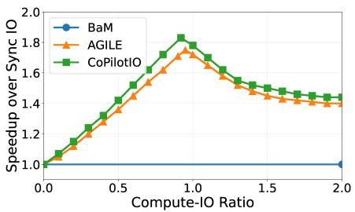  
(a) Intra-warp stalls

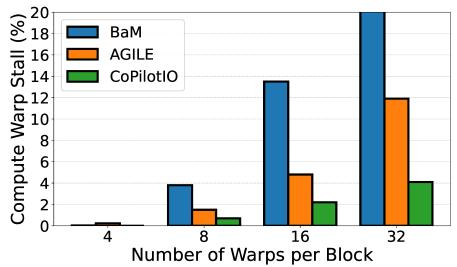  
(b) Inter-warp stalls

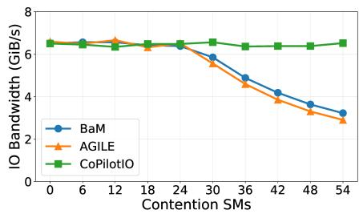  
(c) Inter-SM contention

Figure 6: Stall-elimination microbenchmarks across three dimensions.  
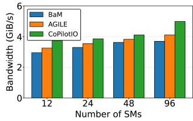  
(a) Random read

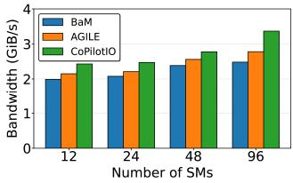  
(b) Random write  
Figure 7: Pure-I/O performance.

Inter-SM stalls: We co-run I/O warps with compute warps, where the compute warps frequently access global GPU memory, generating substantial memory traffic. For the x-axis, we vary the number of contending SMs (i.e., SMs running com pute warps), and for the y-axis, we report the achieved I/O bandwidth. As shown in Figure 6c, for both BaM and AG-ILE, I/O bandwidth begins to drop once memory contention exceeds 24 SMs and continues to decline as additional SMs generate memory traffic. Under heavy contention, the I/O bandwidth can drop by up to 50.6%. This degradation occurs because both designs use the GPU to poll the CQ located in GPU memory, which exacerbates on-chip memory contention. For AGILE, the need to poll additional software lock flags further increases memory contention, resulting in even worse performance than BaM. In contrast, CoPilotIO maintains high I/O bandwidth regardless of the number of contending SMs. This is due to its split SQ/CQ design, which places the CQ in CPU memory and therefore naturally avoids inter-SM stalls caused by GPU global-memory contention.

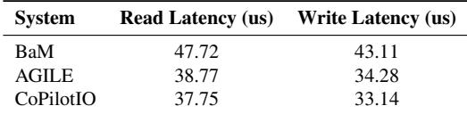

Table 2: Average latency comparison with 96 SMs, each utilizing 32 warps for 4 KB I/O operations.

## 5.2.2 Pure-I/O Performance

Next, we evaluate CoPilotIO with pure-I/O workloads. We run random reads and random writes with a 4 KB I/O size and vary the number of SMs. Figure 7 reports the I/O throughput, and Table 2 shows the corresponding latency. CoPilotIO outperforms both BaM and AGILE across workloads in terms of both throughput and latency. First, these results demonstrate that the split SQ/CQ design does not compromise I/O performance: GPU-resident SQs enable fast submission, while CPU-resident CQs maintain high throughput through efficient user-level CPU polling. Second, compared to BaM and AGILE, the performance gains of CoPilotIO arise because inter-warp stalls and inter-SM stalls also occur even in pure-I/O workloads. For instance, under inter-warp interference, a pending I/O warp cannot be scheduled if a previously issued I/O warp continues polling, leading to reduced parallelism.

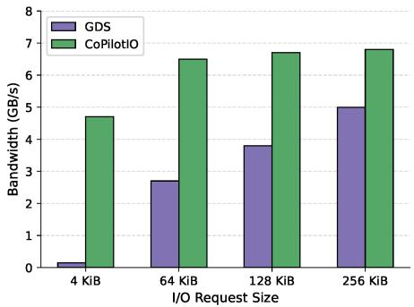  
Figure 8: Random read bandwidth: GDS vs. CoPilotIO.

## 5.2.3 Comparison with GDS

We compare CoPilotIO against NVIDIA GDS with 16 CPU threads, performing random reads on an SSD. Figure 8 shows the achieved bandwidth across different I/O request sizes.

CoPilotIO consistently outperforms GDS across all I/O sizes. The performance advantage comes from avoiding the high kernel software overheads in GDS, including system calls, buffer registration, and DMA address mapping in the kernel I/O path. As the I/O size increases, these overheads become less dominant because the data transfer time increasingly amortizes the per-request kernel software cost. In contrast, with the benefit of CoPilot-CPUIOLib, CoPilotIO bypasses the kernel entirely: the GPU submits NVMe commands directly through user-space queues, while the CPU performs only lightweight CQ polling without kernel involvement. This design enables CoPilotIO to sustain near-peak I/O bandwidth even for small 4 KB I/O requests.

## 5.3 Effectiveness of Adaptive Polling

Next, we validate the effectiveness of GPUAgent-based adaptive CPU-GPU co-polling. We design a microbenchmark that emulates an AI application whose IOPS fluctuate over time.

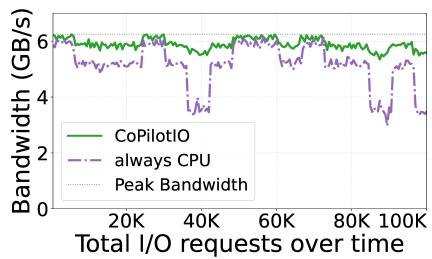  
(a) Bandwidth

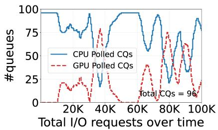  
(b) CQ Distribution

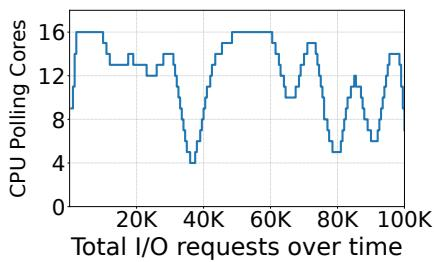  
(c) CPU Resource Analysis  
Figure 9: Analysis of CPU and GPU polling: (a) Bandwidth curves, (b) CQ polling distribution, and (c) CPU resource analysis.

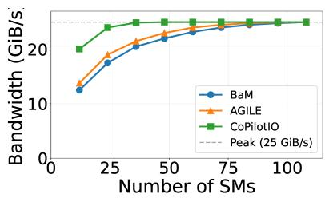  
(a)

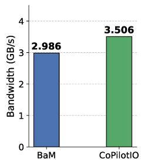  
(b)  
Figure 10: (a) The scalability of CoPilotIO; (b) GoFS random read performance over different I/O engines: BaM vs. CoPilotIO.

We use CoPilotIO-cpu-only to denote a configuration where CoPilotIO always uses the CPU for polling, and CoPilotIOadaptive-polling to denote CoPilotIO with our CQ-driven adaptive polling mechanism enabled.

Figure 9a shows how I/O throughput evolves over time. CoPilotIO-adaptive-polling consistently sustains high throughput, while CoPilotIO-cpu-only exhibits significant variation as the IOPS load changes. This occurs because, under very high IOPS, CPU-only polling cannot keep up due to limited CPU-side parallelism, causing delays in processing CQ entries. In contrast, with adaptive polling, CoPilotIO detects CQ overload and gradually activates GPUAgent to offload polling to the GPU, allowing the system to maintain stable high throughput. Figure 9b shows the corresponding breakdown of CQ entries processed by the CPU and GPU over time. Initially, most CQs are handled by the CPU, but as the IOPS increase, the number of CQs processed by the CPU gradually decreases while the number handled by the GPU increases. This trend directly validates the behavior of our adaptive polling algorithm, demonstrating that CoPilotIO automatically shifts polling responsibility to the GPU when CPU-side polling becomes a bottleneck.

CPU Resource Analysis: Figure 9c shows the number of active CPU polling cores over time under adaptive polling. When I/O load is low and the GPU is not polling, CoPilotIO uses up to 16 CPU cores for CQ processing. As I/O pressure increases and the adaptive mechanism activates GPU co-polling, the CPU polling load decreases, and the number of active CPU cores drops to as few as 3 or 4 cores. This demonstrates that the adaptive mechanism dynamically reduces CPU core usage when GPU co-polling is engaged, freeing CPU resources for other system tasks. In steady state with moderate I/O load, CoPilotIO typically requires only 4 to 8 dedicated CPU cores.

## 5.4 The Scalability of CoPilotIO

Next, we evaluate the scalability of CoPilotIO with multiple SSDs. Figure 10a shows the aggregate bandwidth achieved by BaM, AGILE, and CoPilotIO when performing 8 KB random reads across four SSDs. Each SM runs 16 warps, and we configure 108 NVMe queue pairs with a queue depth of 1024.

The results demonstrate two key advantages of CoPilotIO. First, CoPilotIO exhibits excellent scalability as the number of SMs increases, with bandwidth growing smoothly until saturating the PCIe 4.0 x16 limit of 25 GB/s. Second, and more importantly, CoPilotIO saturates the PCIe bandwidth with only 24 SMs, whereas BaM and AGILE require more than 72 SMs to achieve the same throughput. This 3× reduction in SM usage stems from CoPilotIO CPU-GPU co-polling design: by offloading CQ polling to the CPU, CoPilotIO eliminates GPUside polling overhead and allows each SM to sustain higher effective I/O throughput. Furthermore, when the I/O load is high, the CPU and GPU can poll CQs simultaneously, further improving completion queue processing capacity. In contrast, BaM and AGILE rely solely on the GPU for polling and must dedicate significant GPU resources to this task, requiring substantially more SMs to reach peak bandwidth. This efficiency gain is particularly valuable for mixed compute–I/O workloads, where the saved SMs can be allocated to application computation rather than I/O management.

## 5.5 Performance with GPU Filesystem

We further evaluate CoPilotIO using the state-of-the-art GPU filesystem GoFS [18], which is built on the BaM GPU-centric I/O engine and fully offloads filesystem management to the GPU, bypassing the CPU entirely. GoFS is a mixed compute–I/O workload: its filesystem operations involve multiple compute tasks such as data indexing, block management, and metadata manipulation. We integrated CoPilotIO into GoFS with fewer than 20 lines of code changes. Although AGILE does not natively support GoFS, we attempted to extend AGILE for this experiment, but it encountered unknown runtime errors; therefore, AGILE is excluded from this evaluation. Figure 10b presents the random-read (4 KB I/O size)

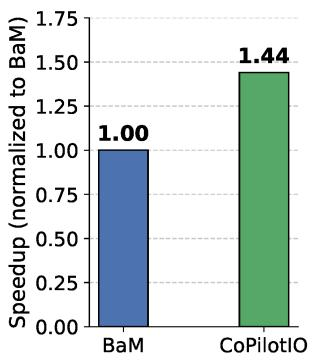  
(a) MoE SSD offloading.

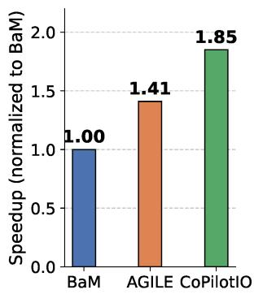  
(b) DLRM inference.  
Figure 11: Real-world application performance.

performance of GoFS when using BaM versus CoPilotIO. CoPilotIO achieves up to 17.4% performance improvement over BaM due to our efficient asynchronous I/O architecture, which removes all I/O stalls.

## 5.6 Performance on Real-world Applications

LLM Mixture-of-Experts (MoE) inference: We retrofitted the FlashMoE [3] megakernel MoE operator to support SSD offloading of expert weights, enabling an evaluation of CoPilotIO in MoE inference scenarios. FlashMoE was originally a fully GPU-resident distributed MoE operator that fuses gate computation, expert FFNs, and token dispatch/combine communication into a single persistent GPU kernel. It uses an actor model (Processor, Scheduler, Subscriber) to implement tile-level pipelined scheduling, eliminating multi-kernel launch overhead and hiding communication latency. We preserved this in-kernel scheduling framework while moving expert-weight storage from GPU memory to NVMe SSDs: when a Processor needs to execute a given expert’s GEMM, it first issues an NVMe read request directly from the GPU to load the corresponding up-projection and down-projection weight matrices from the SSD into the GPU page cache, then executes the fused GEMM-activation-GEMM computation.

Experiments use a synthetic workload with 2,048 experts, hidden and intermediate dimensions of 2,048, Top-2 routing, sequence length 8,192, and capacity factor 1.0. Each expert’s weights occupy 32 MB (16 MB each for up- and down-projections, TFloat32 format), totaling 64 GB for all experts. All experts are stored contiguously on the SSD. At the I/O layer, we configure 108 NVMe queue pairs, queue depth 128, and a 64 KB page size. Every expert corresponds to 512 pages, which are read cooperatively by 32 threads within a warp. After 32 warm-up iterations, we measure the average latency of 32 forward passes, comparing end-to-end inference performance between CoPilotIO and BaM. Similar to the GoFS case, AGILE does not natively support MoE workloads with unknown runtime access patterns.

Figure 11a shows the performance speedup of CoPilotIO over BaM. CoPilotIO achieves up to a 1.44× speedup.

The improvement arises because MoE inference is a mixed compute–I/O workload: while some warps execute expert GEMMs, others must fetch the next expert’s weights from the SSD. Under BaM’s synchronous model, I/O warps stall and occupy GPU resources during NVMe polling, delaying compute warps and reducing overall SM utilization. CoPilotIO eliminates these stalls by offloading CQ polling to the CPU, enabling I/O warps to yield immediately after issuing requests. This allows the GPU scheduler to overlap expert computation with weight prefetching, thereby reducing end-to-end latency. DLRM: We evaluate CoPilotIO on DLRM inference using the Criteo 1TB Click Logs dataset [11], following the experimental setup used in AGILE [39]. We construct the categorical feature vocabulary from the first three days of data and use cuBLAS for all dense matrix multiplications. Embedding vectors are fetched from the SSD through CoPilotIO, BaM, or AGILE, and integrated into the same CUDA stream pipeline as in AGILE for fair comparison. We adopt the stan dard DLRM architecture from [21], where the bottom MLP consists of three fully connected layers of size 512, while the top MLP consists of three fully connected layers of size 1,024 (referred to as Config-1 in AGILE). We use a batch size of 2,048 and measure the end-to-end inference time over 10,000 iterations. Unless otherwise specified, we use a 2 GB software cache with the clock replacement policy, 128 NVMe queue pairs, and a queue depth of 256 per queue, consistent with AGILE’s configuration.

Figure 11b reports the end-to-end inference speedup normalized to BaM. CoPilotIO achieves a 1.85× speedup over BaM, outperforming AGILE’s 1.41× speedup. The performance gain of CoPilotIO over AGILE stems from two factors. First, AGILE dedicates 4 SMs exclusively to I/O polling, which wastes GPU compute resources that could otherwise be used for MLP computation. Second, AGILE’s I/O warps must still poll software lock flags to detect completion, introducing residual intra-warp stalls during embedding lookups. In contrast, CoPilotIO offloads all polling to the CPU and uses hardware barriers for completion notification, allowing I/O warps to fully overlap with cuBLAS kernels without occupying GPU execution resources.

## 6 Discussion

This section discusses the workload regimes where CoPilotIO provides the greatest benefit, as well as scenarios where its advantages are limited.

## 6.1 Beneficial Regimes

Compute-to-I/O ratio: The speedup from CoPilotIO scales with the fraction of execution time spent on GPU-side polling. In MoE, GEMM computation and GPU polling overhead account for approximately 32% of the total execution time. The remaining time is spent on storage I/O. CoPilotIO achieves a 1.44× speedup by eliminating the polling overhead. In contrast, DLRM exhibits a more balanced compute-to-I/O ratio:

embedding lookups are interleaved with MLP computation of comparable duration, allowing CoPilotIO to pipeline I/O with useful GPU computation. The freed GPU cycles are immediately consumed by MLP layers that would otherwise wait behind polling warps, yielding a higher 1.85× speedup.

GPU Resource Contention: GPU applications operate under high SM occupancy and massive warp concurrency, leading to intense contention for shared GPU resources, including warp slots, registers, shared memory, and memory bandwidth. In BaM, polling warps remain active on the SM while waiting for I/O completions, continuously occupying these shared resources and reducing the resources available for application kernels. For example, the additional GPU memory traffic generated by polling further contends with application memory accesses. In contrast, CoPilotIO significantly reduces GPUside polling overhead due to our async I/O and split SQ/CQ design, leaving more SM resources and memory bandwidth available for concurrent application computation.

I/O concurrency and SSD utilization: CoPilotIO asynchronous completion model allows GPU warps to have multiple I/O requests in flight simultaneously, since warps do not block on CQ polling between submissions. This increases the effective NVMe queue depth seen by the SSD, enabling its internal NAND dies to operate in parallel. The benefit is most pronounced for workloads issuing many fine-grained requests (4 to 64 KB): in our microbenchmarks (Figure 7a), CoPilotIO sustains higher IOPS than BaM precisely because it maintains deeper queues without dedicating GPU threads to polling.

Application Domains: Beyond the applications evaluated in this paper, the architecture of CoPilotIO benefits a range of emerging GPU applications that combine I/O with computation. GPU-accelerated database engines (e.g., HeavyDB [14] and BlazingSQL [5]) perform table scans from SSD while executing filter, join, and aggregation operators on the GPU, a pattern where I/O and compute naturally overlap. Graph analytics frameworks (e.g., Emogi [20] and GIDS [26]) traverse out-of-core graphs by fetching neighbor lists from storage while processing vertices on the GPU. Retrieval-augmented generation (RAG) [17] systems fetch embedding vectors from SSD-resident indices during LLM inference, interleaving I/O with attention computation. KV cache offloading frameworks (e.g., FlexGen [31]) swap KV cache tensors between GPU memory and SSDs to serve long-context or large-batch LLM inference under limited GPU memory, generating bursty finegrained I/O that competes with ongoing attention computation on the GPU. In each case, the application workload exhibits the characteristics identified above: mixed I/O and compute, high SM pressure from I/O management, and fine-grained access patterns requiring high queue depth.

## 6.2 Limited-Benefit Regimes

In contrast, CoPilotIO provides limited benefit in the following scenarios. First, purely compute-bound workloads spend little time waiting for storage operations. Since GPU resources are already dominated by application kernels rather than polling threads, removing polling contributes little to end-to-end performance. Second, workloads dominated by large sequential transfers typically require only modest queue depths to saturate SSD bandwidth. In these cases, storage efficiency is already high, and GPU polling overhead constitutes only a small fraction of execution time. As a result, the advantages of CoPilotIO asynchronous completion model and split SQ/CQ design are less pronounced. Finally, CoPilotIO relies on CPU threads for completion polling. When CPU resources are scarce or heavily utilized by other applications, CPU-side polling may become a bottleneck under high IOPS workloads. While adaptive co-polling can partially mitigate this issue by shifting polling work to the GPU, the resulting behavior increasingly resembles GPU-centric polling, thereby reducing the relative advantage of CoPilotIO.

## 7 Conclusion

In conclusion, CoPilotIO demonstrates that high-performance, on-demand GPU I/O does not require sacrificing GPU compute resources. By treating the CPU as an I/O co-pilot and introducing a fully asynchronous cross-device architecture, CoPilotIO eliminates GPU-side polling stalls while sustaining high throughput. Our evaluation shows that CoPilotIO significantly improves GPU compute efficiency, storage utilization, and end-to-end application performance.

## Acknowledgments

We thank the OSDI ’26 shepherd and reviewers for their insightful feedback, which helped improve the quality of this paper. We also thank the members of the HKUST(GZ) Systems Lab for their valuable comments and discussions. This research was supported by HKUST(GZ) startup funding. Jian Zhang is the corresponding author.

## References

[1] Nvidia a100 tensor core gpu product brief (40gb hbm2). https://www.nvidia.com/en-us/data-center/ a100/, 2020. 40 GB HBM2 memory configuration, accessed 2025-12-11.

[2] Nvidia h100 tensor core gpu product specifications. https://www.nvidia.com/en-us/data-center/ h100/, 2022. 80 GB HBM3 memory, accessed 2025-12-11.

[3] Osayamen Jonathan Aimuyo, Byungsoo Oh, and Rachee Singh. FlashMoE: Fast distributed MoE in a single kernel. arXiv preprint arXiv:2506.04667, 2025.

[4] Joshua A Anderson, Chris D Lorenz, and Alex Travesset. General purpose molecular dynamics simulations fully implemented on graphics processing units. Journal of Computational Physics, 227(10):5342–5359, 2008.

[5] BlazingDB. BlazingSQL: A lightweight, GPU accelerated, SQL engine for python. https://github.com/ BlazingDB/blazingsql, 2021. Accessed 2026-05-15.

[6] Tom B. Brown, Benjamin Mann, Nick Ryder, Melanie Subbiah, Jared Kaplan, Prafulla Dhariwal, Arvind Neelakantan, Pranav Shyam, Girish Sastry, Amanda Askell, Sandhini Agarwal, Ariel Herbert-Voss, Gretchen Krueger, Tom Henighan, Rewon Child, Aditya Ramesh, Daniel M. Ziegler, Jeffrey Wu, Clemens Winter, Christopher Hesse, Mark Chen, Eric Sigler, Mateusz Litwin, Scott Gray, Benjamin Chess, Jack Clark, Christopher Berner, Sam McCandlish, Alec Radford, Ilya Sutskever, and Dario Amodei. Language models are few-shot learners. In Advances in Neural Information Processing Systems (NeurIPS), 2020.

[7] Chia-Hao Chang, Vikram Sharma Mailthody, Jihoon Han, Zaid Qureshi, Anand Sivasubramaniam, and Wenmei Hwu. GMT: GPU orchestrated memory tiering for the big data era. In Proceedings of the 29th ACM International Conference on Architectural Support for Programming Languages and Operating Systems, Volume 3, pages 464–478, 2024.

[8] Shuai Che, Michael Boyer, Jiayuan Meng, et al. Rodinia: A benchmark suite for heterogeneous computing. In Proceedings of the IEEE International Symposium on Workload Characterization (IISWC), 2009.

[9] Aakanksha Chowdhery, Sharan Narang, Jacob Devlin, Maarten Bosma, Gaurav Mishra, Adam Roberts, Paul Barham, Hyung Won Chung, Charles Sutton, Sebastian Gehrmann, et al. Palm: Scaling language modeling with pathways. Journal of Machine Learning Research, 24(240):1–113, 2023.

[10] NVIDIA Corporation. Gdrcopy: A low-latency gpu memory copy library based on nvidia gpudirect rdma technology. 2023.

[11] Criteo AI Lab. Criteo 1tb click logs dataset. https://ailab.criteo.com/ download-criteo-1tb-click-logs-dataset/, 2015. Accessed 2026-05-15.

[12] William Fedus, Barret Zoph, and Noam Shazeer. Switch transformers: Scaling to trillion parameter models with simple and efficient sparsity. Journal of Machine Learning Research, 23(120):1–39, 2022.

[13] Salman Habib, Joe Insley, David Daniel, Patricia Fasel, Zarija Lukic, Vitali Morozov, Nicholas Frontiere, Hal Finkel, Adrian Pope, Katrin Heitmann, Kalyan Kumaran, Venkatram Vishwanath, and Tom Peterka. HACC: Extreme scaling and performance across diverse architectures. Communications of the ACM, 60(1):97–104, 2017.

[14] HEAVY.AI. HeavyDB: Open source sql-based analytical database. https://github.com/heavyai/ heavydb, 2026. Accessed 2026-05-15.

[15] Intel. Storage Performance Development Kit. http: //www.spdk.io/.

[16] Thorsten Kurth, Sean Treichler, Joshua Romero, Mayur Mudigonda, Nathan Luehr, Everett Phillips, Ankur Mahesh, Michael Matheson, Jack Deslippe, Massimiliano Fatica, and Prabhat. Exascale deep learning for climate analytics. In SC18: International Conference for High Performance Computing, Networking, Storage and Analysis, pages 649–660, 2018.

[17] Patrick Lewis, Ethan Perez, Aleksandra Piktus, Fabio Petroni, Vladimir Karpukhin, Naman Goyal, Heinrich Küttler, Mike Lewis, Wen-tau Yih, Tim Rocktäschel, et al. Retrieval-augmented generation for knowledgeintensive NLP tasks. In Advances in Neural Information Processing Systems, volume 33, pages 9459–9474, 2020.

[18] Shaobo Li, Yirui Eric Zhou, Yuqi Xue, Yuan Xu, and Jian Huang. Managing scalable direct storage accesses for GPUs with GoFS. In Proceedings of the 31st ACM Symposium on Operating Systems Principles (SOSP ’25), pages 979–995, Seoul, Republic of Korea, 2025.

[19] Pak Markthub, Mehmet E. Belviranli, Seyong Lee, Jeffrey S. Vetter, and Satoshi Matsuoka. DRAGON: Breaking GPU memory capacity limits with direct NVM access. In SC18: International Conference for High Performance Computing, Networking, Storage and Analysis, pages 414–426, 2018.

[20] Seung Won Min, Vikram Sharma Mailthody, Zaid Qureshi, Jinjun Xiong, Eiman Ebrahimi, and Wen-mei Hwu. Emogi: Efficient memory-access for out-ofmemory graph-traversal in gpus. Proceedings of the VLDB Endowment, 14(2):114–127, 2021.

[21] Maxim Naumov, Dheevatsa Mudigere, Hao-Jun Michael Shi, Jianyu Huang, Narayanan Sundaraman, Jongsoo Park, Xiaodong Wang, Udit Gupta, Carole-Jean Wu, Alisson G. Azzolini, et al. Deep learning recommendation model for personalization and recommendation systems. arXiv preprint arXiv:1906.00091, 2019.

[22] NVIDIA Corporation. Nvidia a100 tensor core gpu architecture. https:// resources.nvidia.com/en-us-tensor-core/ nvidia-ampere-architecture-whitepaper, 2020. Whitepaper, accessed 2025-12-11.

[23] NVIDIA Corporation. Gpudirect storage: A direct path between storage and gpu memory. https://developer.nvidia.com/blog/ gpudirect-storage/, 2022. Accessed 2026-05-15.

[24] NVIDIA Corporation. Nvidia blackwell architecture. https://resources.nvidia.com/ en-us-blackwell-architecture, 2024. Accessed 2025-12-11.

[25] NVIDIA Corporation. Cuda runtime api documentation: Mapped host memory and zero-copy access. https:// docs.nvidia.com/cuda/cuda-runtime-api/, 2025. Mapped Host Memory (cudaHostAllocMapped), accessed 2025-12-11.

[26] Jeongmin Brian Park, Vikram Sharma Mailthody, Zaid Qureshi, and Wen-mei Hwu. Accelerating sampling and aggregation operations in gnn frameworks with gpu initiated direct storage accesses. Proceedings of the VLDB Endowment, 17(6):1227–1240, 2024.

[27] Shi Qiu, Weinan Liu, Yifan Hu, Jianqin Yan, Zhirong Shen, Xin Yao, Renhai Chen, Gong Zhang, and Yiming Zhang. GeminiFS: A companion file system for GPUs. In 23rd USENIX Conference on File and Storage Technologies (FAST ’25), pages 221–236, Santa Clara, CA, USA, February 2025.

[28] Zaid Qureshi, Vikram Sharma Mailthody, Isaac Gelado, Seung Won Min, Amna Masood, Jeongmin Park, Jinjun Xiong, C. J. Newburn, Dmitri Vainbrand, I-Hsin Chung, Michael Garland, William Dally, and Wen mei Hwu. GPU-initiated on-demand high-throughput storage access in the BaM system architecture. In ASPLOS 2023 - Proceedings of the 28th ACM International Conference on Architectural Support for Programming Languages and Operating Systems, Volume 2, pages 325–339, 2023.

[29] Samyam Rajbhandari, Conglong Li, Zhewei Yao, Minjia Zhang, Reza Yazdani Aminabadi, Ammar Ahmad Awan, Jeff Rasley, and Yuxiong He. DeepSpeed-MoE: Advancing mixture-of-experts inference and training to power next-generation AI scale. In Proceedings of the 39th International Conference on Machine Learning, volume 162 of Proceedings of Machine Learning Research, pages 18332–18346. PMLR, 2022.

[30] Sagi Shahar, Shai Bergman, and Mark Silberstein. ActivePointers: A case for software address translation on GPUs. In Proceedings of the 43rd International Symposium on Computer Architecture (ISCA), pages 596–608, 2016.

[31] Ying Sheng, Lianmin Zheng, Binhang Yuan, Zhuohan Li, Max Ryabinin, Beidi Chen, Percy Liang, Christopher Ré, Ion Stoica, and Ce Zhang. FlexGen: High

throughput generative inference of large language models with a single GPU. In Proceedings of the 40th International Conference on Machine Learning, 2023.

[32] Mohammad Shoeybi, Mostofa Patwary, Raul Puri, Patrick LeGresley, Jared Casper, and Bryan Catanzaro. Megatron-lm: Training multi-billion parameter language models using model parallelism. arXiv preprint arXiv:1909.08053, 2019.

[33] Mark Silberstein, Bryan Ford, Idit Keidar, and Emmett Witchel. GPUfs: Integrating a file system with GPUs. In Proceedings of the 18th International Conference on Architectural Support for Programming Languages and Operating Systems (ASPLOS), pages 485–498, 2013.

[34] Luca Soldaini, Rodney Kinney, Akshita Bhagia, Dustin Schwenk, David Atkinson, Russell Authur, Ben Bogin, Khyathi Chandu, Jennifer Dumas, Yanai Elazar, Valentin Hofmann, Ananya Harsh Jha, Sachin Kumar, Li Lucy, Xinxi Lyu, Nathan Lambert, Ian Magnusson, Jacob Mor rison, Niklas Muennighoff, Aakanksha Naik, Crystal Nam, Matthew E. Peters, Abhilasha Ravichander, Kyle Richardson, Zejiang Shen, Emma Strubell, Nishant Subramani, Oyvind Tafjord, Evan Walsh, Luke Zettlemoyer, Noah A. Smith, Hannaneh Hajishirzi, Iz Beltagy, Dirk Groeneveld, Jesse Dodge, and Kyle Lo. Dolma: an open corpus of three trillion tokens for language model pretraining research. In Proceedings of the 62nd Annual Meeting of the Association for Computational Linguistics (ACL), 2024.

[35] Ziyu Song, Jie Zhang, Jie Sun, Mo Sun, Zihan Yang, Zheng Zhang, Xuzheng Chen, Fei Wu, Huajin Tang, and Zeke Wang. CAM: Asynchronous GPU-initiated, CPUmanaged SSD management for batching storage access. In 2025 IEEE 41st International Conference on Data Engineering (ICDE), pages 2309–2322, 2025.

[36] Yangzihao Wang, Andrew A. Davidson, Yuechao Pan, Yuduo Wu, Andy Riffel, and John D. Owens. Gunrock: A high-performance graph processing library on the GPU. In Proceedings of the 21st ACM SIGPLAN Symposium on Principles and Practice of Parallel Programming, pages 11:1–11:12, 2016.

[37] NVM Express Workgroup. NVMExpress Specification. https://nvmexpress.org/resources/ specifications/.

[38] Lingyun Yang, Yongchen Wang, Yinghao Yu, Qizhen Weng, Jianbo Dong, Kan Liu, Chi Zhang, Yanyi Zi, Hao Li, Zechao Zhang, Nan Wang, Yu Dong, Menglei Zheng, Lanlan Xi, Xiaowei Lu, Liang Ye, Guodong Yang, Binzhang Fu, Tao Lan, Liping Zhang, Lin Qu, and Wei Wang. GPU-Disaggregated serving for deep learning recommendation models at scale. In 22nd USENIX

Symposium on Networked Systems Design and Implementation (NSDI 25), pages 847–863, Philadelphia, PA, April 2025. USENIX Association.

[39] Zhuoping Yang, Jinming Zhuang, Xingzhen Chen, Alex K. Jones, and Peipei Zhou. AGILE: Lightweight

and efficient asynchronous GPU-SSD integration. In The International Conference for High Performance Computing, Networking, Storage and Analysis (SC ’25), pages 1028–1042, St. Louis, MO, USA, November 2025.