の

USENIX

THE ADVANCED COMPUTING SYSTEMS ASSOCIATION

# μShell: A Microkernel-based FPGA Shell Architecture

Jiyang Chen, Anubhav Panda, and Harshavardhan Unnibhavi, Technical University of Munich; Atsushi Koshiba, Tokyo University of Science; Pramod Bhatotia, Technical University of Munich

https://www.usenix.org/conference/osdi26/presentation/chen-jiyang

# This paper is included in the Proceedings of the 20th USENIX Symposium on Operating Systems Design and Implementation.

July 13–15, 2026 • Seattle, WA, USA

ISBN 978-1-939133-55-7

Open access to the Proceedings of the 20th USENIX Symposium on Operating Systems Design and Implementation is sponsored by

# ??Shell: A Microkernel-based FPGA Shell Architecture

Jiyang Chen Technical University of Munich

Anubhav Panda Technical University of Munich

Harshavardhan Unnibhavi Technical University of Munich

Atsushi Koshiba Tokyo University of Science

## Abstract

FPGAs are widely adopted in cloud environments to meet the growing demand for high-performance, energy-eficient computing, thanks to their unique reconfigurability and programmability. However, the state-of-the-art design of FPGA shells is built formonolithic applications,creating a fundamental architectural mismatch with real-world applications that are highly modular and composable. Modern applications consist of diverse, independent tasks that are often instantiated as standalone hardware modules on FPGAs. The current FPGA shell design statically connects these modules to compose an application-specific, monolithic accelerator on a single virtual FPGA (vFPGA), leading to fundamental challenges such as limited flexibility, poor scalability, resource ineficiency, high scheduling overheads, and programmability issues.

To bridge this research gap, we introduce ??Shell, a new hardware-OS co-design that addresses these challenges by applying microkernel principles to FPGA acceleration. ??Shell treats accelerators as a collection of shareable, composable hardware modules, deploying them into distinct vFPGAs and dynamically linking them with a novel inter-process communication (IPC) mechanism. This approach is further supported by capability-enforced isolation and a component-aware task scheduler. Our implementation of a ??Shell prototype and its evaluation against a state-of-the-art monolithic shell demonstrate that it efectively deploys real-world applications with improved performance, flexibility, and resource eficiency.

## 1 Introduction

In cloud environments, hardware accelerators such as GPUs [32,34],ASICs [23],and FPGAs [8,31,90] are now widely used for high-performance computing. In particular, FPGAs have emerged as a promising computing platform because of their unique characteristics, e.g., programmability and energy eficiency, allowing us to reconfigure custom hardware logic specialized for compute-intensive tasks. Their versatility has driven FPGA-based acceleration in domains including video and image processing [58, 63], data compression [26, 48], databases [22, 82], security [42, 52], and AI/ML [6, 114, 134].

Modern FPGA systems typically pair a static shell, managing I/O and common services, with a dynamic, reconfigurable region for custom user logic [2, 7, 55]. While state-of-the-art shells [27, 64, 71, 76, 103] leverage partial reconfiguration (PR)

Pramod Bhatotia Technical University of Munich

to divide this dynamic region into multiple virtual FPGAs (vF-PGAs),they are primarily designed for monolithic applications— single, independent accelerators that occupy an entire vFPGA.

This paradigm clashes with the modular, composable nature of modern applications (§ 2.2). More specifically, real-world applications are modular and composable. They are composed of diverse, independent tasks, and exhibit a high degree of correlation (up to 93%) due to the use of shared functions. To maximize throughput, they use direct data paths between hardware modules, avoiding CPU-driven synchronization and improving performance by up to 2.63×. Existing shells enable such communication only by statically wiring all modules into a single monolithic accelerator on a single vFPGA, at the cost of their modularity and composability.

This architectural mismatch imposes significant challenges on modern FPGA platforms. First, the monolithic approach leads to limited flexibility, as any change to a single module requires a costly redevelopment of the entire accelerator. Second, it severely restricts scalability by limiting the logic size to the capacity of a single vFPGA. Third, it results in resource ineficiency because the monolithic design instantiates all hardware modules for every application, even if they are shareable. Fourth, monolithic accelerators incur substantial scheduling overheads due to the need to fully reconfigure the entire logic when switching between applications. Lastly, existing FPGA APIs ofer limited support for dynamic I/O configurations needed to compose modular applications efectively.

To address these research gaps, we aim to answer the following question: Can we design a new FPGA platform that enables deploying and executing modern applications on FPGAs in a modular and composable manner?

To build this on modern FPGA architectures, we need a new FPGA management principle that (i) enables partial updates and reuses of user logic designs, (ii) fully utilizes PR regions (vFPGAs), (iii) allows applications to share overlapped modules, (iv) avoids unnecessary reconfigurations, and (v) facilitates FPGA application development and deployment with high-level APIs. As an end-to-end solution, microkernels [4,68, 72,81,89] inspire us to adapt theirprinciples to the FPGA world. Similar to microkernels that manage applications as a group of processes connected through inter-process communication (IPC), we propose to manage FPGA accelerators as a combination of composable and shareable hardware modules and connect them with hardware-level IPC, while enforcing isolation.

To this end, this paper introduces ??Shell, a hardware-OS co-design for modular accelerator deployment and execution. Inspired by the microkernel principle, ??Shell enables dynamic accelerator composition, deploying individual hardware modules into distinct vFPGAs and dynamically chaining them together to compose the entire accelerator. To achieve this, ??Shell adapts microkernel features: capability-enforced isolation for secure resource sharing, component-aware task scheduling for minimizing reconfiguration overheads, and IPC for peer-to-peer data transfers between vFPGAs. ??Shell provides these features through a high-level API, enabling FPGA accelerator composition and deployment in a flexible and dynamic manner. The ??Shell ecosystem is constructed with three key system components:

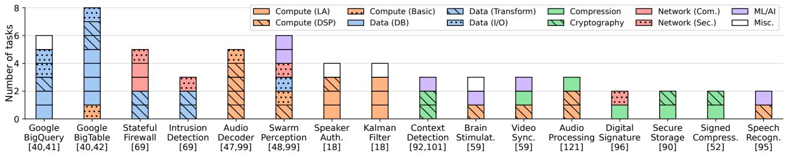  
Figure 1: Modularity analysis for real-world applications: big data analysis [43–45], networking [79], extended reality [53,115], autonomous vehicles [54,115], wearable devices [20,108,117], cross-domain workloads [67], security [59,105,112], and audio intelligence [111, 138]. Classification of their tasks is detailed in Table 1.

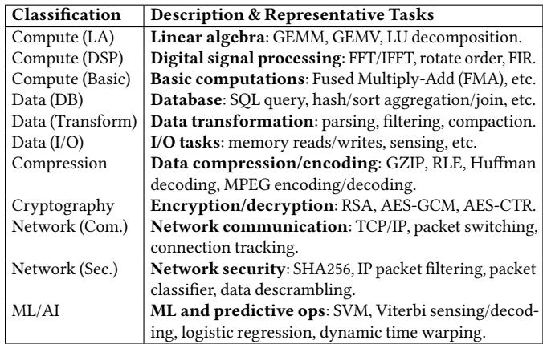  
Table 1: Task classifications in Figure 1.

(1) ??Shellhardware (§4.1). We design ??Shell,a microkernelbased shell architecture for dynamic accelerator composition. ??Shell provides Capability Enforcement Units (CEUs) for each vFPGA, which bridges distinct vFPGAs through the IPC mechanism while enforcing capability-based isolation, enabling secure, dynamic accelerator composition.

(2) ??Shell OS (§4.2). We design the ??Shell OS, privileged software responsible for managing the ??Shell hardware upon user requests. It provides microkernel features essential for FPGA accelerator composition: capability, address space management, task scheduling, and IPC.

(3) ??Shell programming API (§4.3). We design a high-level API that allows guest applications to compose and deploy FPGA accelerators in a hardware-agnostic manner. The user-space API library transparently communicates with the ??Shell OS and abstracts complex capability details and hardware architectures from developers.

We implement a ??Shell prototype on AMD Alveo U280 cards [126]. We build the entire ??Shell hardware by extending Coyote v2 [103], the state-of-the-art FPGA shell for monolithic accelerators. We also port five real-world applications [59, 105, 111, 112, 138] with our ??Shell prototype. To compose these applications, we leverage pre-built IP cores from FPGA vendors [129] and open-source projects [27, 71].

We comprehensively evaluate ??Shell’s performance, scheduling efectiveness, programmability, and FPGA resource overheads using five real-world applications. We highlight that ??Shell’s modular accelerator deployment incurs only 3.3% throughput degradation compared to Coyote v2, the monolithic approach’s baseline that achieves optimal performance. In addition, ??Shell’s task scheduler reduces vFPGA reconfigurations by up to 79% compared to Coyote v2, by sharing hardware components across applications.

## 2 Background and Motivation

## 2.1 FPGA Shell Architectures

Commercial FPGA products adopted in the cloud [8, 31, 90] serve as PCIe-connected devices [18, 19, 126–128], which consist of an FPGA chip and of-chip peripherals for external I/Os such as memory and network ports. The FPGA chip is split into two regions: a static region or shell, which is statically configured at system boot and contains I/O modules (e.g., DMA and memory controllers) and common features (e.g., interrupts), and a dynamic region, where custom user logic can be dynamically reconfigured. While vendor-provided shells [2,7,55] often provide a single dynamic region, the stateof-the-art shells in academic studies [27, 64, 71, 76, 87, 103] use partial reconfiguration (PR) to split it into multiple, isolated virtual FPGAs (vFPGAs), enabling spatial sharing of the FPGA.

Although these state-of-the-art shells promise an eficient use of limited FPGA resources, they assume that applications are monolithic, where user logic is designed as an independent, single accelerator dedicated to its target application and instantiated on a single vFPGA. While this design choice simplifies an isolation mechanism across vFPGAs, in reality, applications are modular (§2.2); deploying them on these existing shells poses several challenges (§2.3).

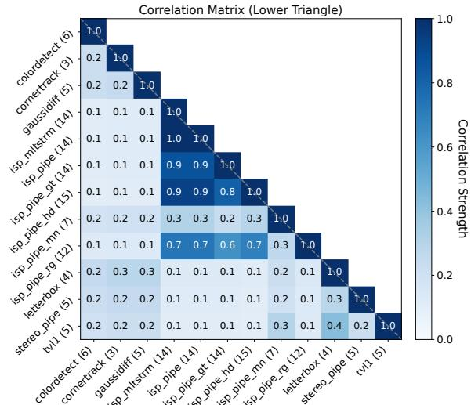  
Figure 2: Composability analysis of Vitis Vision Library applications [130] based on overlap in library function usage (parentheses indicate call counts).

## 2.2 FPGA Application Requirements

In contrast to the state-of-the-art shells designed for monolithic applications, real-world applications are modular and composable, highlighted by our two empirical studies. First, Figure 1 illustrates the modularity of real-world applications from prior studies spanning across multiple domains. Each section of bars represents an independent task deployed and executed on any compute device, such as a CPU core, ASIC accelerator, or custom logic on the FPGA. As seen here, modern workloads are not monolithic but composed of diverse, modular tasks. Second, Figure 2 shows the composability study of HLS applications developed with the Vitis Vision library [130], where we analyze the library functions called by each application code and visualize matches of the same function calls between two applications as the correlation strength. We observe that up to 93% of application pairs have shared functions and more than 20% of them have high correlation (more than 0.5), indicating that applications are deployed as a combination of sharable and composable functions.

These applications are typically designed and built on FPGAs as a combination of multiple hardware modules, each dedicated to a specific task. To maximize acceleration efectiveness, establishing data paths between modules is essential for enabling direct communication, thereby significantly increasing throughput [43,67,115,121]. Figure 3 demonstrates the efectiveness of direct communications, compared to a CPU-driven synchronization, where a host CPU sequentially invokes FPGA accelerators that comprise each application. The results highlight that direct communication achieves up to 3.7× by avoiding unnecessary CPU-FPGA communications.

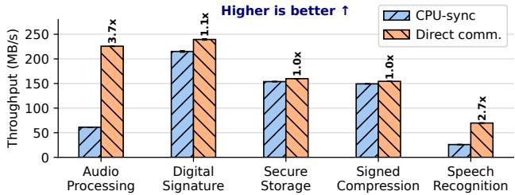  
Figure 3: Direct communication efectiveness for our target applications [59, 105, 111, 112, 138] (§6).

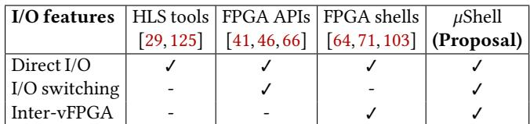  
Table 2: I/O features ofered by FPGA systems/APIs.

## 2.3 State-of-the-art FPGA Shells

Due to the fundamental mismatch between state-of-the-art shells and real-world applications, existing FPGA platforms deploy applications as monolithic accelerators that combine all submodules into a single static accelerator on a single vFPGA, imposing five fundamental challenges. We have a detailed comparison with the state-of-the-art FPGA shells and platforms in §7.

(1) Limited flexibility. First, the monolithic design loses the flexibility of FPGA applications. Real-world applications are composed of multiple tasks, as shown in Figure 1, while they are developed as a single-purpose, static accelerator on the FPGA. Although this design fully optimizes performance, it increases the logic’s size and complexity, making it error-prone and hard to debug. Hardware bugs are mostly caused at certain execution stages and intersections between submodules [75]. Moreover, minor changes to a specific submodule (e.g., applying diferent ML algorithms for speech recognition [111]) afect the entire accelerator design, forcing users to recompile and resynthesize the entire design. It substantially increases development eforts.

(2) Limited scalability. Second, existing shells leveraging partial reconfiguration (PR) limit the scalability of FPGA accelerators. Although multiple vFPGAs can increase the concurrency of FPGA applications, more vFPGAs reduce the available resources. Existing shells, which allow user logic to be deployed to a single vFPGA, limit the deployable logic size to the capacity of that vFPGA. Figure 4 analyzes available FPGA resources per vFPGA on Coyote v2 [103] deployed on the U280 FPGA with diferent numbers of vFPGAs, highlighting that available resources are severely restricted, i.e., only 10.8% to 12.5% of the U280 capacity when we have 8 vFPGAs.

(3) Resource ineficiency. Third, the monolithic accelerator deployment leads to resource ineficiency. As demonstrated in Figure 2, FPGA applications likely contain the same modules, which can be shared. In a monolithic design, these shareable components are unnecessarily duplicated because each application is deployed as an independent module, leading to wasted FPGA resources. Figure 5 visualizes FPGA resource usage of non-shared and shared modules of four representative applications from the Vitis Vision Library [130] (share-X indicates modules shared by X applications from the library). It highlights that shared components can account for up to 80% of the application’s total resource usage.

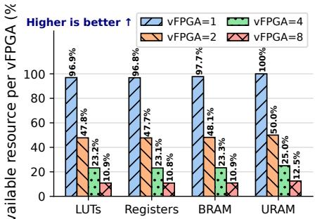  
<sup>A</sup>Figure 4: Available FPGA resources per vFPGA.

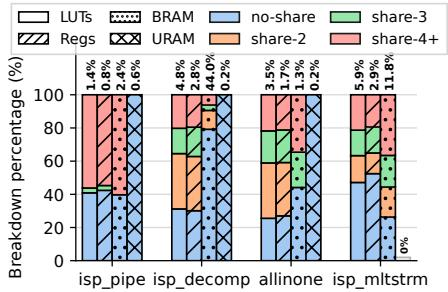  
Figure 5: Resource usage analysis. Bar labels show relatives to U280 capacity.

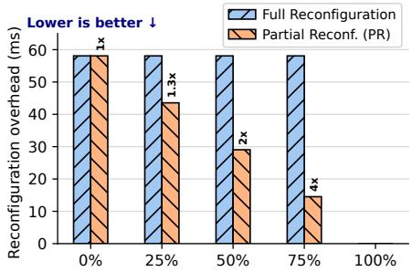  
Figure 6: Reconfiguration overhead. The x-axis shows the shared logic ratio.

(4) Scheduling overheads. Fourth, monolithic accelerators induce significant scheduling overheads when switching tasks deployed on the same vFPGA (temporal sharing). This process invokes reconfiguration of the entire accelerator logic, leading to substantial (ms-order) performance penalties [71]. While some shells support accelerator reuse to avoid reconfiguration [71], this feature is only available when the accelerators used by two applications are identical. Figure 6 demonstrates expected task switching (reconfiguration) overheads, comparing two cases: the baseline that reconfigures the entire vFPGA, and the ideal case that only reconfigures non-shared components. The result indicates that we can potentially mitigate the switching overheads if the FPGA platform allows us to reconfigure only an independent portion of the logic.

(5) Limited programmability. Fifth, existing shells and programming APIs are primarily designed for monolithic accelerators and ofer limited programmability for dynamic I/O configurations between hardware modules. Table 2 compares existing FPGA systems in terms of I/O functions and their programmability. HLS compiler-based approaches [29, 125] ease the description of inter-module communication, but are limited to a single accelerator design. FPGA APIs [41, 46] support dynamic I/O switching between modules but not direct communication across vFPGAs. Some shells, such as Coyote [71], enable inter-vFPGA communication, while they are statically configured as a function of the shell.

## 2.4 Our Proposal and Design Goals

To overcome these challenges, we propose ??Shell, a microkernel-based FPGA shell architecture. Inspired by the microkernel concept [4, 68, 81, 89], ??Shell enables the modular deployment and execution of FPGA accelerators. Unlike the monolithic approach, ??Shell deploys an application across separate vFPGAs as hardware modules and dynamically chains them to compose the entire application. ??Shell realizes this by ofering microkernels’ core system properties: capability management, address space isolation, task management/scheduling, and IPC. We design our ??Shell architecture to meet the following design goals:

(1) Capability-enforced isolation. ??Shell leverages capabilities [16, 37, 74, 78] to ensure robust isolation across shared and non-shared accelerator modules and memory bufers in a multi-tenant environment.

(2) Inter-process communication (IPC). ??Shell allows applications to establish peer-to-peer communication channels between accelerators deployed on vFPGAs, enabling fast I/O communications while improving flexibility.

(3) Component-aware task scheduling. ??Shell schedules tasks deployed on FPGAs while accounting for hardware modules shared across multiple applications and minimizing the number of reconfigurations.

(4) API for dynamic accelerator composition. ??Shell provides a high-level API that allows developers to describe application dataflow across components and dynamically deploy them in a modular and flexible manner.

The ??Shell design comprehensively addresses the challenges outlined above. First, it ensures flexibility, because applications can be updated without involving unchanged components. Second, it ensures scalability because ??Shell can chain any number of vFPGAs to construct applications, thereby fully utilizing all available FPGA resources. Third, it improves resource eficiency by allowing multiple applications to share components deployed on the same FPGA. Fourth, ??Shell induces less task switching overhead because only non-shared components need to be reconfigured. Fifth, ??Shell provides an easy-to-use API that enables developers to design and deploy their modular, composable applications within the ??Shell ecosystem.

## 3 Overview

## 3.1 System Overview

Figure 7 shows the overview of ??Shell, comprised of guest applications using the ??Shell API, privileged ??Shell OS, and the ??Shell substrate ofering multiple vFPGAs. At the core of each vFPGA is a Capability Enforcement Unit (CEU), which acts as a hardware gatekeeper, regulating data transfers, connection setup, access control, and memory allocation for the associated accelerator module.

Hardware components. ??Shell (§4.1) is deployed as a privileged component at system boot and provides multiple vFP-GAs. Besides common shell components such as a PCIe bridge IP,it ofers dedicated CEUs that connect each vFPGA to streaming data paths via the data interconnect. Each CEU enforces capabilities, allowing only authorized data transfers between vFPGAs, while the ??Shell OS restricts guest application access to prevent tampering with shell components and capabilities. Software components. ??Shell OS (§4.2) and ??Shell API library (§4.3) are two key software components. The privileged ??Shell OS ofers four microkernel-based features for secure accelerator composition: (1) capabilities [50, 123] to restrict access to accelerator components like user logic on vFPGAs and memory bufers; (2) address space management to ensure that a group of accelerator components sees the same virtual address space; (3) task scheduling to enable temporal and spatial sharing of vFPGAs between applications; (4) IPC to enable communication between the components. The ??Shell API library provides a hardware-agnostic interface for applications to interact with the OS and to deploy and execute accelerators. Since many real-world FPGA applications [51, 57, 93, 97, 107] are composed of modular hardware components and designed as pipelined streaming dataflows, the ??Shell API aligns with this programming model and does not limit the generality of applications.

System workflow. During initialization, guest applications use ??Shell APIs to construct dataflow graphs (DFGs) by defining computational tasks, memory bufers, and their data dependencies. These are sent to the ??Shell OS, which verifies DFG correctness and consistency with capability constraints. Based on programmed logic on vFPGAs and other running tasks, the ??Shell OS performs task scheduling, task mapping to vFPGA, reconfiguration, memory allocation, and capability initialization. At runtime, the ??Shell OS enforces capabilitybased access control and orchestrates data transfers. The system ensures secure resource cleanup through automatic capability reclamation, eliminating manual resource management overhead while maintaining strict security boundaries.

## 3.2 Technical Challenges and Key Ideas

While the microkernelconceptis the key to deploy andexecute modular, composable FPGA applications (§2.4), the nature of FPGAs and their toolchains pose several challenges to adapting microkernel principles [37,68,81]. We tackle this challenge with a hardware-OS co-design approach. Specifically,we build the ??Shell ecosystem to address four key design challenges: #1: Isolation and sharing for accelerator components. In contrast to existing shells for monolithic applications [64, 71, 76, 103], which dedicate each vFPGA to a single application and ensure per-vFPGA isolation, ??Shell deploys applications as a set of accelerator components (hardware tasks) distributed across vFPGAs, similar to microkernel applications comprising multiple services [25]. This design introduces two unique challenges. First, existing shells, including Coyote [71, 104], enforce isolation at the vFPGA granularity, assuming that each vFPGA runs a single monolithic application (detailed in Table 7). As a result, they lack mechanisms to safely compose or share independently deployed hardware components across vFPGAs, since there is no fine-grained control overinter-component communication or memory access. Second, the non-preemptive nature of FP-GAs [69] complicates the management of internal state when hardware components are reused across applications, making secure sharing dificult without explicit isolation support.

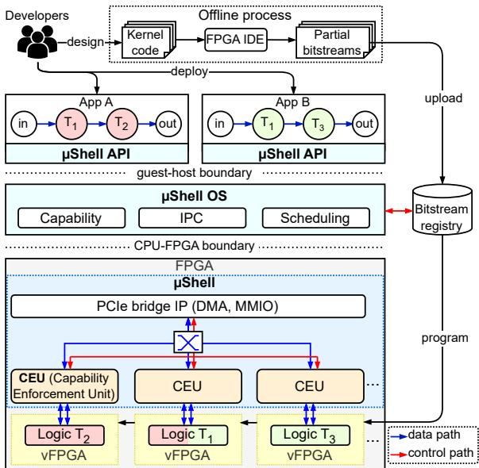  
Figure 7: Overview of the ??Shell system.

Key idea. We design a unique capability-based, hardwareenforced isolation mechanism that restricts IPC channel establishment and memory accesses, achieved by ??Shell CEUs (§4.1) and OS (§4.2). ??Shell ensures that internal states of shared hardware components are clearly flushed before switching applications.

#2: Secure IPC establishment across vFPGAs. Constructing secure chains of user logic and memory bufers requires robust resource isolation. ??Shell adapts the microkernel’s IPC mechanism to dynamically establish data paths between accelerator components. To achieve this, we require a reconfigurable I/O switching mechanism that establishes streaming channels between vFPGAs and memory bufers on demand, while maintaining isolation. Such cross-vFPGA communications are restricted in existing shells; they either do not provide any interconnects and rely on static data paths in monolithic designs [5, 64, 80, 113, 119, 135] or require recompiling the entire shell to bridge vFPGAs [71,79,104]. As a result, they cannot dynamically establish communication channels between independently deployed components. Other designs [65, 91] support flexible data movement but lack fine-grained access control, making it dificult to securely connect components across application boundaries.

Key idea. We introduce a fast, flexible IPC mechanism using CEUs and a centralized interconnect (§4.1). ??Shell OS’s IPC module (§4.2) dynamically and securely configures IPC channels by enforcing capabilities with minimal overhead. ??Shell is the first FPGA shell that functions IPC between components with secure isolation properties.

#3: Hardware task scheduling and deployment. Scheduling and deploying a set of hardware tasks across a limited number of vFPGAs is challenging. While this approach enables component sharing across applications, current PR technologies on FPGAs [12, 56] limit deployment flexibility because PR regions (vFPGAs) are not interchangeable; each vFPGA requires a dedicated bitstream. Moreover, although component sharing potentially improves utilization and reduces reconfiguration overhead (§2.3), it may lower throughput compared to the exclusive use of the entire FPGA, especially when reconfiguration occurs frequently. Prior hardware schedulers either overlook this trade-of [71, 91] or disable PR at the cost of flexibility [64].

Key idea. ??Shell OS’s component-aware task scheduler (§4.2) allows applications to share accelerator components while retaining isolation and throughput. ??Shell OS also enables flexible hardware task deployment on any system-provided vFPGAs by managing multiple bitstreams.

#4: Programming APIs for dynamic accelerator composition. The lack of FPGA shells that support dynamic accelerator chaining limits software libraries from providing easy ways to pipeline multiple applications. As a result, existing frameworks [41, 46, 76, 131] do not natively support connecting and orchestrating multiple pipelined applications. Key idea. We present a user-space API library (§4.3) that enables composing dataflows and deploying them without manual communication or resource management.

## 4 Design

We introduce design details of the core system components: ??Shell, ??Shell OS, and ??Shell API library.

## 4.1 ??Shell Hardware

We first introduce the ??Shell hardware architecture, illustrated in Figure 8. ??Shell comprises components for common shell functionalities, i.e., a PCIe bridge IP, a PR controller, and a DMA request scheduler, and ??Shell-specific components for capability enforcement and IPC, i.e., a data interconnect and per-vFPGA CEUs. The PCIe bridge IP provides two host-FPGA communication interfaces: a memory-mapped interface for control paths (e.g., AXI4-Lite [13]) and a streaming interface for data paths (e.g., AXI4-Stream [14]). The PR controller reconfigures a selected vFPGA through the ICAP interface [1] without interrupting other hardware components. The data interconnect provides a configurable peer-to-peer link between vFPGAs and host memory. Through the interconnect, the CEUs establish capabilityenforced channels by configuring endpoints depending on I/O types (send, receive, or memory). For memory accesses from vFPGAs, the CEUs issue DMA requests, which are handled by the DMA scheduler in a round-robin fashion. For vFPGAs, ??Shell provides an I/O wrapper module that abstracts multiple input and output ports of user logic.

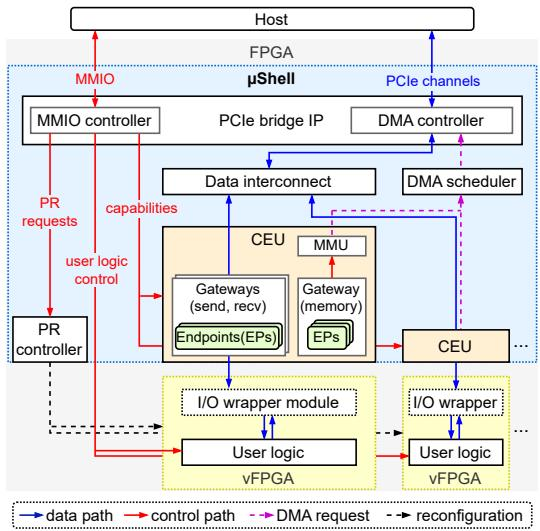  
Figure 8: ??Shell hardware architecture.

Capabilities. The ??Shell framework employs capabilitybased isolation as its fundamental access control mechanism for accelerator composition on the FPGA. Capabilities are unforgeable tokens that grant specific permissions to access system resources, providing both authentication and authorization in a single primitive [16,49,68,123]. This approach ensures that user logic can only access resources for which they hold valid capabilities, enabling fine-grained access control.

??Shell uses capability-based isolation to protect IPC between vFPGAs and memory access. Object capabilities authorize access to specific user logic instances and communication endpoints, and memory capabilities constrain accesses to approved address ranges and include permissions (read/write). Capabilities are created and managed per application by the ??Shell OS and enforced at runtime by the CEUs, preventing cross-application interference.

Capability Enforcement Unit (CEU). The CEU enables IPC and capability enforcement and is designed to ofer three key functions: handling multiple connections for user logic, safely invalidating unauthorized accesses, and enabling time-sharing of user logic. To achieve this, the CEU includes configurable gateways for each communication channel, which act as verification checkpoints for IPC. There are three gateways for diferent I/O types: send gateway to manage data transfers from the hosted vFPGA, a receive gateway to validate incoming data streams, and a memory gateway to validate memory accesses and issue DMA requests.

Figure 9 illustrates the CEU architecture. Each gateway consists of endpoints and validators. Endpoints are registers that store capabilities granted to the associated user logic. Send/receive, and memory endpoints are created from object and memory capabilities, respectively. Creating memory endpoints also involves the MMU registering a page table entry. The gateway establishes communication channels only with authorized vFPGAs or memory spaces whose capabilities are configured as endpoints, and rejects unauthorized requests. Endpoints of these gateways are initialized or updated only once per application execution at the deployment phase. During execution, incoming/outgoing data is seamlessly validated by its gateways without capability updates.

Given that user logic can have multiple input/output ports, a single gateway can configure multiple endpoints to establish multiple channels. The send and receive endpoints use port IDs to identify specific ports of user logic. The port IDs are transferred as part of execution requests from applications via the ??Shell API (§4.3) and enable gateways to internally manage port mappings across diferent channels. Validation. The validators detect unauthorized requests and stop them. When sending requests, the send gateway’s validator receives a port ID from the user logic and checks whether the associated send endpoint has been created. The gateway then generates a route ID containing the port ID, the sender’s, and receiver’s vFPGA IDs. The route ID is propagated to the data interconnect and the receiver, along with data streams, to guide routing and enable the receiver’s capability checks. When receiving requests, the receiver’s validator uses the route ID to identify the sender’s vFPGA and verify whether the receiver has the associated capability. It then extracts a port ID from the route ID and transfers the data to the associated userlogic port. For memory requests, the validator checks whether the memory capability covers the specified address range.

On failure, the validator drops the request and interrupts ??Shell OS. It safely suspends the execution without afecting other components: incoming streams are drained to avoid hangs or data leakage, and invalid memory requests are rejected without issuing DMA, ensuring no transaction occurs. Component sharing. The CEU enables temporal sharing of user logic between applications. While custom IPs can deliver higher performance, standardized reusable modules (e.g., AFI [9]) reduce development cost and improve composability. ??Shell currently supports sharing of stateless accelerators across applications, as reliably resetting internal hardware state is challenging. For non-shared stateful applications, on-chip memories (e.g., LUTRAMs and BRAMs) can be used to maintain their internal states. ??Shell also supports of-chip memory such as HBM and DRAM, which are treated similarly to the host memory. These of-chip memory regions are used as data bufers for communication between the host and accelerators, e.g., input/output bufers for data transfer, rather than as persistent, application-private state tied to a specific accelerator instance across invocations. The shell maintains only two types of application-specific contexts: CEU endpoints and MMU page tables, which are cleared upon application switches. Since FPGAs are non-preemptive, ??Shell waits for the current execution to finish before updating capability mappings of the associated CEUs. It then applies new routing capabilities before switching applications, without saving or restoring the accelerator state. ??Shell additionally resets the residual state in the accelerators to mitigate potential data leakage. While a full hardware reset of all components is non-trivial, as states can be distributed across many elements (BRAMs, flip-flops, etc.), ??Shell relies on the fact that HLS provides easy-to-use reset mechanisms to clear internal states (e.g., reset pragma, dedicated reset port [11]).

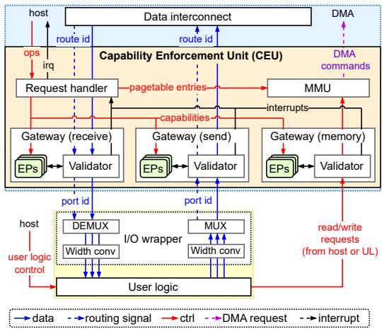  
Figure 9: Capability Enforcement Unit (CEU).

Data interconnect. The data interconnect acts as a central switch, routing data streams between vFPGAs and host memory. It maintains static connections to all sources and destinations, while actual routing is dynamically configured via route IDs attached to incoming data streams. The interconnect uses the route ID to identify the correct destination and forwards data and accompanying signals that mark the start and the end of data streams. It provides independent data paths between source and destination pairs and supports multiple concurrent streams without interference. The interconnect uses a round-robin scheduling algorithm for streams that go to or come from the same vFPGA.

I/O wrapper module. The I/O wrapper module abstracts ??Shell’s unified data stream interfaces from user logic. It contains a multiplexer (MUX) and a demultiplexer (DEMUX) to route I/O streams from and to a single shell-side data channel. It includes a width converter to reconcile mismatches between the data widths of the user logic ports and the ??Shell interface. As a result, user logic can be deployed on ??Shell without requiring any modification.

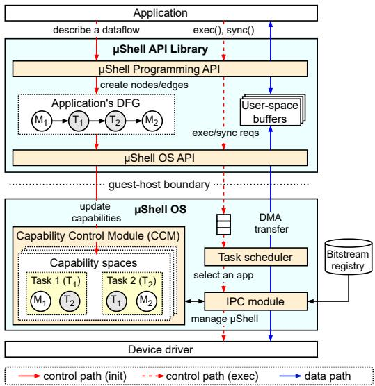  
Figure 10: ??Shell API library and OS architecture.

## 4.2 ??Shell OS

We propose ??Shell OS, a privileged software designed to adapt the microkernel principle to resource management for modular, composable FPGA applications. Unlike traditional microkernels for CPU programs [4, 39, 68, 81], ??Shell repurposes microkernel features for FPGA applications, accounting for the fundamental limitations of modern FPGA architectures and toolchains.

Figure 10 shows the architecture of the software components. ??Shell OS consists of three key components: the capability control module (CCM) for managing capabilities, the dataflow task scheduler for scheduling hardware tasks, and the IPC module for deploying and invoking tasks on vFPGAs and enabling IPC. ??Shell OS provides the microkernel’s fundamental features: capability management, address space management, task (thread) management, and IPC.

Capability management. The CCM is responsible for maintaining a lifecycle of application capabilities with fine-grained control. Similar to seL4 [68] and M<sup>3</sup> [16], the ??Shell OS manages all application objects (tasks and memory) using capabilities for robust isolation, while it is tuned for building and executing accelerator chains on the FPGA.

The CCM creates capability spaces for individual applications to guarantee multi-tenant isolation. The CCM ensures that capabilities remain unforgeable, as guest applications can only access their own capability spaces via ??Shell APIs. Unlike existing microkernels that manage capabilities for CPU processes [4, 37, 68], the CCM adapts capabilities to define strict data flows between hardware tasks and memory bufers for secure accelerator composition. The CCM treats a guest CPU application as a parent and allows it to manage capabilities for these accelerator components as children or dataflow nodes through three primary operations: create, delegate, and revoke.

An application begins by creating object/memory capabilities fordataflow nodes,whichallows the application to possess a parent capability with delegation rights and request a new, subordinate capability for nodes through the delegation. Created/delegated capabilities are securely maintained through a tree structure: child capabilities never have more privileges than their parent, preventing privilege escalation. The revocation process verifies every access to capabilities and safely retires capabilities with zero usage count. Once an application is complete, its capabilities are immediately removed.

Delegated capabilities enable nodes to communicate via IPC or memory accesses. For example, as shown in Figure 10, when a task (??<sub>1</sub>) sends data to another (??<sub>2</sub>), ??<sub>1</sub> must have ??<sub>2</sub>’s capability with a write permission, while ??<sub>2</sub> owns ??<sub>1</sub>’s capability with a read permission.

Address spaces. ??Shell OS maintains and exposes virtual memory address spaces not for CPU programs but hardware tasks running on the FPGA. It allows applications to allocate FPGA-accessible memory bufers while enforcing isolation. In ??Shell, applications do not share page tables; each application maintains its own address space within a dedicated MMU with its TLB, managed by the CCM. The CCM is responsible for memory allocation and mapping, ensuring that all access permissions are maintained per-application and that isolation is enforced across vFPGAs. Since ??Shell guarantees that each application has exclusive access to its assigned vFPGAs during execution, TLB operations (e.g., flushing) remain localized and do not impact other applications.

Tasks and threads. Instead of CPU tasks and threads, ??Shell manages hardware tasks that execute on specific user logic. Unlike task execution on CPUs, hardware task deployment and execution require FPGA reconfiguration by loading a bitstream into a PR region (vFPGA) to initialize user logic, posing two challenges. First, vFPGAs are not interchangeable and their capacity cannot be changed dynamically due to limitations of existing FPGA toolchains. Current PR technologies [12, 56] require bitstreams dedicated to each vFPGA, which complicates the deployment and switching of user logic across vFPGAs. Second, FPGA reconfiguration is known to be a time-consuming process, which induces performance overheads of hundreds of milliseconds [71].

We address these limitations with two approaches. First, the ??Shell ecosystem requires developers to provide multiple bitstreams for each pair of user logic and vFPGA, so that the ??Shell OS can seamlessly select the bitstream associated with the target vFPGA. This constraint follows state-of-the-art PR-enabled FPGA shells [64,71,103] (§8). ??Shell OS maintains multiple bitstreams per user logic in the bitstream registry. Specifically, it classifies bitstreams by assigning unique IDs to user logic and vFPGAs. These IDs are attached to each bitstream depending on its associated logic and vFPGA.

Second, we propose the dataflow task scheduler, which mitigates the reconfiguration overhead by promoting component reuse, i.e., deploying tasks using user logic that has already been programmed on vFPGAs. Algorithm 1 details our scheduling algorithm. The scheduler employs a nonpreemptive policy to avoid expensive context switches on FP-GAs [17]. It continuously monitors all vFPGAs, tracking programmed user logic and execution status. Any system event (e.g., a request arrival or completion) triggers the scheduling of a new task. The scheduler first considers applications with the highest priority (L3-8). For those with the same priority, it selects an application with the greatest overlap between the requested user logic and the logic programmed on vFPGAs (L9-11). To prevent starvation, an application that has waited longer than a threshold has its priority promoted (L19-22). Once the application is selected, the scheduler forwards the execution request to the IPC module, which is responsible for the ??Shell configuration and execution invocation. When components have imbalancedexecution times thatmay lead to pipeline stalls, this reflects a common challenge in streaming and pipeline-based accelerator design. It is the developer’s responsibility to partition the application such that the processing latency of each stage is balanced to maximize throughput.

Algorithm 1: The component-aware scheduler.   
1 schedule\_app(????????????????\_??????????, ???? ????????)   
2 begin   
/\* Select apps with highest priority \*/   
3 foreach priority in priority\_array do   
4 if priority\_array[priority] != ???????? then   
5 candidate\_array ← priority\_array[priority];   
6 break;   
7 priority ← priority - 1;   
8 end   
/\* Select app with the highest overlap with free vFPGAs \*/   
9 foreach app in candidate\_array do   
10 app.overlap ← overlap\_with\_free\_vFPGAs(app, vFPGAs);   
11 end   
12 candidate\_app ← max\_overlap(candidate\_array);   
/\* Check if there are enough vFPGAs to schedule the app \*/   
13 if candidate\_app.size > free\_vFPGAs.size() then   
14 return null;   
15 foreach priority in priority\_array do   
16 foreach app in priority\_array[priority] do   
17 app.time ← app.time + 1;   
18 end   
/\* Promote long-waited app priority \*/   
19 if app.time > threshhold then   
20 app.priority ← app.priority + 1;   
21 app.time ← 0;   
22 priority ← priority - 1;   
23 end   
24 return candidate\_app   
25 end

Inter-Process Communication (IPC). IPC in a hardware context difers fundamentally from that for CPU processes [68, 81]. CPU-based IPC relies on blocking remote procedure calls (RPC), which require context switches to the OS kernel. In contrast, IPC between hardware tasks is implemented as non-blocking, direct data transfers via streaming protocols (e.g., AXI4-Stream [14]) across multiple hardware modules, i.e., sender/receiver logic and ??Shell. This hardwarelevel IPC is faster and more eficient than CPU-based IPC because allcomponents run in parallelandall operations occur without interruption. However, due to the lack of contextswitch mechanisms in FPGAs [86, 109, 120], IPC initialization on FPGAs is less flexible than on CPUs. Before launching the

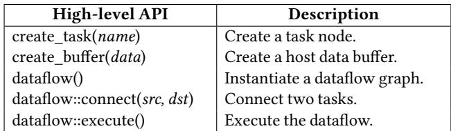  
Table 3: ??Shell API for building host-side control logic.

```cpp
1 // Create tasks and data buffers as DFG nodes
2 sha = ushell::create_task("sha");
3 rsa = ushell::create_task("rsa");
4 in = ushell::create_buffer(host_in);
5 out = ushell::create_buffer(host_out);
6 // Describe a dataflow
7 df = ushell::dataflow();
8 df.connect(in, sha.in);
9 df.connect(sha.out, rsa.in);
10 df.connect(rsa.out, out);
11 // Validate and execute the dataflow
12 df.execute();
```

## Listing 1: An example written by ??Shell API.

entire execution, all hardware components must be instantiated on vFPGAs and IPC channels established between them.

The IPC module of ??Shell OS is responsible for IPC management and for invoking hardware tasks. The module handles low-level hardware management to trigger the entire dataflow execution on the FPGA, such as vFPGA reconfiguration, CEU and MMU configuration, and DMA invocation. It receives execution requests from the scheduler and reconfigures vFPGAs if necessary. It then refers to the corresponding capability space maintained by the CCM and configures endpoints on the associated CEUs and MMU page tables to establish IPC channels, ensuring all communication between hardware tasks occurs without involving the ??Shell OS.

## 4.3 ??Shell API and Programming Model

The ??Shell programming API and library are designed to improve programmability, illustrated in Figure 10. The API lets developers describe only an accelerator’s DFG, and the library transparently handles ??Shell’s low-level management, e.g., capability enforcement, via the primitive OS API.

Programming API. Table 3 shows ??Shell APIs. Applications initialize a dataflow graph (DFG) via the dataflow() function. The DFG consists of three components: tasks, representing computational nodes on vFPGAs and created with create\_task(); bufers, representing input/output memory and created with create\_bufer(); and edges, representing data dependencies between tasks and bufers and created with connect(). Once the complete DFG is constructed, it can be validated and executed using execute(). These APIs abstract low-level FPGA management from developers, while the underlying ??Shell OS transparently orchestrates end-to-end execution. Example code. Listing 1 presents a code example of a digital signature accelerator composed of two logics: SHA and RSA.

First, the application creates tasks and bufers as dataflow nodes (L2-5). Upon creating these nodes, the ??Shell library transparently communicates with the CCM and creates their capabilities. Next, the application instantiates a DFG and describes edges between the nodes (L8-11). These edge creations invoke capability delegation, e.g., the input bufer in connects to the SHA logic sha, delegating the in’s memory capability to SHA with a read permission, granting read access. Lastly, it submits the DFG as an execution request (L14). The ??Shell library then validates the completeness and correctness of the DFG and forwards it to the task scheduler.

## 5 Implementation

We implement ??Shell by redesigning and extending Coyote v2 [35] in both hardware and software. We choose Coyote v2 as the base for our implementation because it provides a mature, open-source FPGA shell with a well-defined hardware-software stack on the Xilinx Alveo U280. This allows us to focus on designing and evaluating our proposed mechanisms without requiring significant engineering efort. Our extensions include the AXI4-Stream Switch as the data interconnect (supporting up to 15 vFPGAs), per-vFPGA CEUs, the ??Shell OS, and the ??Shell API library.

## 5.1 ??Shell Hardware Shell

To support IPC and capability-based isolation, we extend Coyote’s hardware shell with two components.

Data interconnect. We use Xilinx’s AXI Stream Switch IP [10] to route data between vFPGAs and the host. Since the AXI Stream Switch supports up to 16 master-slave interface pairs, ??Shell can support up to 15 vFPGAs, with one pair reserved for communication with host memory. The interconnect supports custom-length destination (TDEST) signals for flexible routing configurations and is configured to accommodate varying numbers of vFPGAs in the shell.

Capability Enforcement Unit. We implement one CEU per vFPGA in the static shell region. Each CEU augments Coyote’s per-vFPGA MMU with: (1) a memory gateway that stores capabilities as registers (base/bound addresses, access permissions, validity flags) and performs bounds checks on all DMA requests, and (2) send/receive gateways that manage object capabilities using vFPGA IDs for destination lookup and verification. Placing these components in the static region prevents tampering via partial reconfiguration. The CEU also generates signals to notify the host OS of capability violations.

## 5.2 ??Shell OS

To support communication between the host application and FPGA driver, we extend Coyote’s userspace system software service with ??Shell OS features for capability management. We implement the dataflow scheduler within this service.

Capability Control Manager (CCM). The CCM manages capabilities through three core operations: allocation, delegation, and revocation. In software, the CCM is implemented as a kernel module that maintains a capability table indexed by capability IDs. When allocating a new capability, it creates an entry with memory bounds and permissions, then programs the corresponding CEU registers via MMIO. For delegation, it creates a new derived capability with restricted permissions and updates both its internal table and the CEU hardware state. Revocation traverses the capability tree to invalidate all derived capabilities before clearing the hardware registers. The CCM tracks process ownership to automatically revoke capabilities when processes terminate, preventing resource leaks. Task scheduler. We implement ??Shell’s component-aware policy in its dataflow scheduler. The scheduler receives execution requests from host applications and deploys the application logic through the FPGA driver. This design overcomes a limitation in Coyote’s server-client model, where per-vFPGA reconfiguration servers have their own local run queues, preventing global visibility into waiting applications.

## 5.3 ??Shell API Library

We implement a two-tier C++ library that provides both high-level APIs for FPGA-accelerator composition and low-level APIs for ??Shell OS control. The high-level API allows users to construct dataflow graphs through node creation and edge connection calls. When users invoke these APIs, the library builds an internal graph representation and automatically determines the required capabilities for each connection. Upon graph execution, the runtime evaluates the dataflow topology and issues corresponding requests to the kernel driver: node creation triggers vFPGA allocation and configuration, while edge creation establishes data paths between components with appropriate capabilities. The primitive OS API provides direct access to these kernel operations for advanced users who need fine-grained control. The library ensures each component receives only the minimum required capabilities based on its connections in the dataflow graph.

## 6 Evaluation

We evaluate ??Shell from the following dimensions: performance (§6.1), scheduling (§6.2), deployment overheads (§6.3), programmability (§6.4), and resource overheads (§6.5).

Experimental setup. We perform the experiments on a server equipped with an AMD U280 FPGA [126]. The server has an AMD EPYC 7413 processor operating at 2.65 GHz and running NixOS 23.0 with Linux kernel 6.9. We configure ??Shell with up to eight vFPGAs, which is equivalent to stateof-the-art shells [64, 103]. We do not support inter-vFPGA communication through HBM [91], but applications can use it as a scratchpad memory to store data for execution. Since other open-source FPGA systems [64, 76] do not support our target hardware platform, and porting them would require substantial engineering efort beyond the scope of this work, we use Coyote v2 as the primary baseline for comparison. We note that ??Shell is not tied to this platform and can be ported to smaller FPGAs that support partial reconfiguration. Application benchmarks. Our evaluation uses five applications (Table 4) that comprise realistic kernel-level workloads from open-source libraries [129]. While we do not include full end-to-end applications, these benchmarks consist of representative dataflow components commonly found in real-world FPGA workloads (e.g., streaming pipelines and multi-stage processing). This design allows us to efectively demonstrate ??Shell’s capabilities in real-world scenarios.

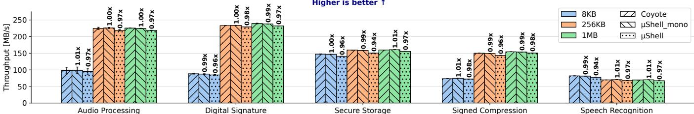  
Figure 11: ??Shell’s end-to-end performance against Coyote v2 (Coyote) and the monolithic implementation (??Shell\_mono).

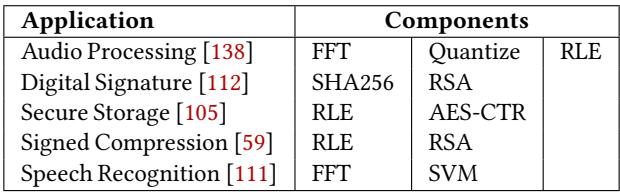  
Table 4: Applications and their components used in the evaluation: signal processing (FFT, quantization), cryptography (AES-CTR, SHA256, RSA), compression (RLE).

## 6.1 Performance

First, we evaluate the end-to-end performance of applications to show the overheads introduced by ??Shell. We measure the I/O throughput of the five applications listed in Table 4 and run them on Coyote v2 and ??Shell by varying data sizes (8 KiB, 256 KiB, and 1 MiB), reporting the average across 10 runs.

For ??Shell, we evaluate two variants: ??Shell, which allocates vFPGAs per component and composes accelerators from multiple vFPGAs, and ??Shell\_mono, which deploys monolithic accelerators on a single vFPGA, as Coyote v2 does. For all setups, we use host DRAM as data storage and transfer data directly between the memory and the FPGA.

Results. Figure 11 shows the I/O throughput across diferent data sizes. ??Shell delivers performance comparable to Coyote v2 for all applications, averaging 3.3% lower throughput. Audio processing and speech recognition applications incur 2.9% and 3.9% overhead,respectively,while digital signature,secure storage, and signed compression incur 2.9%, 4.2%, and 2.8% overhead, respectively. We observe standard deviations below 10.2 MB/s across all experiments, and most measurements exhibit standard deviations under 3.4 MB/s. Results from ??Shell\_mono indicate that monolithic applications perform almost identically to the baseline (within ±1.4%), confirming that the memory gateway adds negligible overhead. The ??Shell’s throughput overheads occur due to additional latency introduced by the CEU’s endpoint validation and dynamic routing between vFPGAs. In summary, ??Shell achieves nearidentical throughput to Coyote v2 with minimal overhead.

## 6.2 Scheduling Improvements

Next, we evaluate ??Shell’s component-aware scheduling policy with Coyote v2’s FIFO policy. We measure five metrics: end-to-end latency, reconfiguration count, average response time, tail (95%) response time, and deadline miss rate, using three component-shared applications: digital signature (SHA256, RSA), signed compression (RLE, RSA), and audio processing (FFT, RLE). These metrics are chosen to capture system throughput, reconfiguration overhead, and quality of service for the two scheduling algorithms.

In each experiment, we periodically deploy 8, 12, or 16 application instances every 20ms, which is shorter than the execution time, forcing applications to induce queuing in the scheduler. Each instance is randomly assigned one of three priority levels. Both policies enable component sharing, i.e., if an idle vFPGA has a matching component for a new application, ??Shell reuses it to avoid reconfiguration.

While Coyote advertises PR support, we encountered technical issues that prevent its activation across multiple vFPGAs, stemming from the complexity of interrupt handling. Instead, we emulate the PR behavior by provisioning all application components in advance. Specifically, we emulate four PR-enabled vFPGAs to ensure that at least two applications can run simultaneously. To do this, we configure two copies of each application component (SHA256, RSA, RLE, and FFT) on the FPGA and use only four of them as ‘active’ components, while the others remain ‘idle’. When an idle component is selected to deploy a new instance, we inject the pre-measured reconfiguration delay, preserving PR’s functional behavior.

End-to-end latency. This metric captures the total time to complete all applications, from the arrival of the first instance to the completion of the last. As shown in Figure 12 (a), ??Shell reduces end-to-end latency by approximately 24-35% across all scenarios, consistently outperforming Coyote v2’s FIFO policy. These results highlight ??Shell’s component-aware scheduling’s ability to improve overall efficiency.

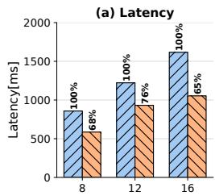

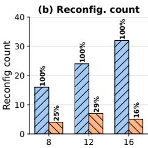

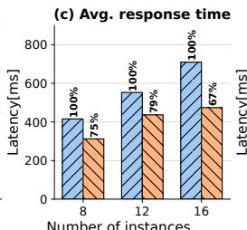  
Number of instances

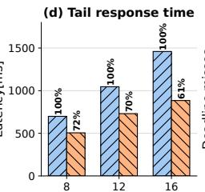

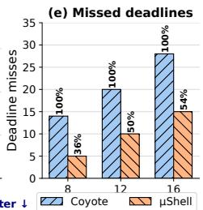  
Figure 12: ??Shell’s component-aware scheduling comparing against Coyote’s FIFO scheduling algorithm using five metrics: (a) end-to-end latency; (b) reconfiguration count; (c) average response time; (d) tail response time (95%); (e) deadline misses.

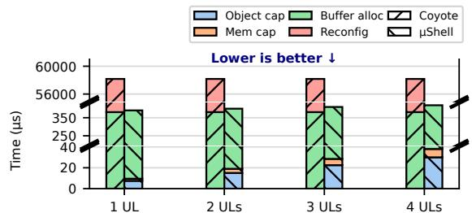  
Figure 13: ??Shell’s application deployment overheads.

Reconfiguration count. To explain ??Shell’s performance gains, we analyze the number of partial reconfiguration operations for both schedulers. Figure 12(b) shows ??Shell keeps reconfiguration counts stable (5-7), even as application instances grow. In contrast, Coyote v2 requires approximately 3-5× more reconfigurations for the same workload. To conclude, ??Shell’s component-aware scheduling effectively eliminates unnecessary reconfigurations and improves the throughput, especially under heavy queueing.

Average response time. We measure response time, the interval from application instance deployment to completion. Figure 12(c) shows its geometric mean across all instances. As shown here, ??Shell reduces the response time by 21–33% compared to Coyote, led by fewer vFPGA reconfigurations. Tail response time. We measure the 95th percentile tail response time to assess the impact on the slowest applications. In Figure 12(d), ??Shell improves tail response time by 28–39% over Coyote. This gain stems from priority promotion in ??Shell’s component-aware scheduling, which favors long-waiting instances. Thus, ??Shell improves response time without sacrificing tail latencies.

Deadline miss rate. We measure deadline misses that occur when a component’s response time exceeds its deadline under both scheduling policies. Deadlines are assigned per component rather than per application, so a two-component application incurs two deadline misses if both components exceed their individual deadlines due to queuing delays. To ensure that higher-priority applications have shorter deadlines compared to lower-priority applications that can tolerate longer wait times, deadlines are assigned using the formula: (100% + ??) ∗ (1 + ????????????????) of its average response time, where ?? is a random number between 40 and 80. Figure 12(e) shows the results, highlighting that ??Shell reduces deadline misses by 46–64% against Coyote v2. The number of missed deadlines increases with more applications because some misses are inevitable when applications arrive at a rate exceeding the vFPGA’s execution capability. In summary, ??Shell’s component sharing and priority promotion are effective to mitigate deadline misses.

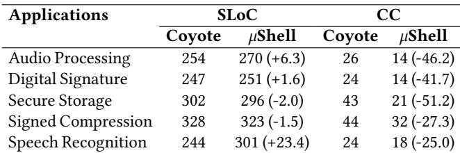  
Table 5: ??Shell’s programmability, showing Source Lines of Code (SLoC) and Cyclomatic Complexity (CC) of CPU application code. Parentheses show changes from Coyote v2.

## 6.3 Application Deployment Overheads

We next compare the overheads for deploying multicomponent applications on ??Shell and Coyote v2. For ??Shell, we measure the latency of host-initiated capability updates and memory bufer allocation, assuming an ideal case where all application components are already deployed on the vFPGAs, thus avoiding PR. For Coyote, all user logic (UL) is packaged into a single bitstream, and a monolithic accelerator containing all components is deployed within a single vFPGA, requiring PR and memory bufer allocation. We evaluate four accelerator configurations, each consisting of 1, 2, 3, and 4 ULs, respectively, along with a pair of input/output bufers. Results. Figure 13 compares deployment overhead between ??Shell and Coyote v2. For Coyote, the PR time (Reconfig) dominates the overhead, at around 58 ms. Since Coyote v2 does not support component sharing, application deployment always involves a single PR regardless of the number of modules. Consequently, the overhead remains constant for applications with 1–4 ULs. In contrast, ??Shell avoids PR in this scenario, where all required components already exist on vFPGAs; PR is performed only for missing components. To reuse the shared components, ??Shell only needs to update memory bufer allocation and capability configuration, with the latter scaling with the number of components. These capability updates (2-3 us per object/memory update) are orders of magnitude faster than PR. Consequently, ??Shell achieves significantly lower deployment overhead when application components are shareable.

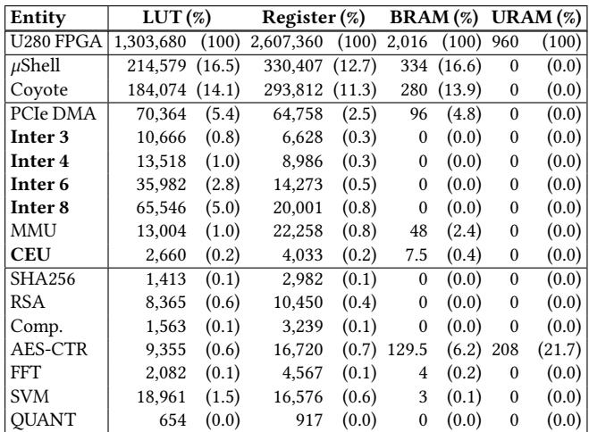  
Table 6: ??Shell’s resource usage on U280 FPGA. The components in bold are unique to ??Shell.

## 6.4 Programmability

Next,we assess the programmability benefits of ??Shell for host (CPU) code managing FPGA user logic. We compare equivalent host applications using Coyote v2’s custom API for monolithic designs versus ??Shell’s programming API. To quantify development efort and complexity, we measure source lines of code (SLOC) and cyclomatic complexity (CC) with scc [110]. Results. Table 5 compares SLOC and CC metrics for both approaches. ??Shell consistently reduces CC by 25.0-51.2% while SLOC changes modestly (-2.0% to +23.4%). The slight SLOC changes result from ??Shell’s API, which adds calls for dynamic accelerator composition, unlike Coyote’s static model that manages a single vFPGA with a monolithic accelerator. The CC reduction results from eliminating complex control flow, improving maintainability. In summary, ??Shell’s modular, declarative API enables dynamic composition of FPGA accelerators at a small cost in code size.

## 6.5 Resource Overheads

Lastly, we measure the resource overhead of ??Shell using the Vivado IDE, recording the required LUTs, registers, BRAM, and URAM. We configure ??Shell and Coyote v2 with three vFPGAs and report both total and per-component resource usage. Since the number of vFPGAs afects resource usage, we also measure the resource usage of the data interconnect with 3, 4, 6, and 8 vFPGAs, respectively (Inter 3, 4, 6, 8 in Table 6). Results. Table 6 shows the resource usage of two shells (??Shell and Coyote v2) along with their key components and each accelerator logic for applications. The MMU and CEU rows show resource usage of a single module for one vFPGA, which scales linearly with the number of vFPGAs. We high light that ??Shell components (the CEUs and interconnect) consume only 1.4% of LUTs and 0.9% of registers for three vFPGAs.

For scalability, each additional vFPGA requires dedicated CEU and MMU instances, as well as expanded interconnect. While the CEU and MMU’s usage scales linearly with the number of vFPGAs, the interconnect’s usage scales approximately quadratically, since ??Shell requires a mesh connection to all vFPGAs so that any vFPGA can establish IPC with any other. Nevertheless, even with eight vFPGAs, the CEUs and interconnect account for 6.6% of the total FPGA resources.

## 7 Related Work

We first compare ??Shell with the state-of-the-art shells and FPGA frameworks (Table 7), highlighting our unique contributions across four key dimensions: (1) modularity, (2) composability, (3) communication, and (4) isolation.

FPGA platforms and comparison with ??Shell. For (1) modularity, ReconOS [83] and Hthreads [98] treat hardware logic as OS threads, yet they target monolithic applications. FOS [119], DrawerPipe [79], Harmonia [80], and Coyote [71, 104] apply modularity to their shells with reusable building blocks. However, application designs remain monolithic, limiting fine-grained reuse and independent updates of hardware modules for FPGA applications.

For (2) composability, most systems support PR to enable spatial or temporal multiplexing, but they do not allow user logic to be flexibly shared or composed across applications. DrawerPipe [79] enables component sharing but is constrained by its static pipeline architecture, which requires the entire shell to be reconfigured. As a result, general-purpose, dynamic composition remains unsupported.

For (3) communication, cross-component communication is constrained by static interconnects (e.g., Coyote’s FIFOs and DrawerPipe’s linked-list connections) or indirect of-chip paths (e.g., Nyx’s [91] memory FIFOs). Rosebud [65] provides dynamically configurable direct I/Os but is specialized for network-processing pipelines.

Lastly, for (4) isolation, existing systems provide either coarse-grained per-application isolation [79], memory isolation via MMUs [113], orboth [64,71,91,104,119,135]. However, there are no systems that enforce fine-grained control over inter-component communication distributed across vFPGAs.

In summary, ??Shell is the first framework to provide the full system properties required for modular FPGA application deployment. By integrating cross-vFPGA IPC control, capability-based isolation, and component sharing support, it enables secure, controlled interaction between independently deployed and shared components on FPGAs. FPGA OSes. FPGA OSes adopt OS abstractions for custom logic, spanning spatial/temporal sharing, memory management, and scheduling [40, 62, 76, 83, 84, 98, 100, 113, 135]. ??Shell is the first work to adapt microkernel principles to enable modular, composable FPGA application deployment. Accelerator chaining and data movement. Prior work has optimized data movement between heterogeneous accelerators [61, 92, 94, 99, 101, 136, 137], often through costly host-mediated point-to-point transfers. Recent eforts enable host-free, composable chains of single-purpose accelerators (e.g., ASIC) via data restructuring and interconnect-based isolation [15, 16, 43, 121]. ??Shell’s CEUs provide functionality similar to M<sup>3</sup>’s DTUs [16], but difer fundamentally: CEUs are designed for FPGA streaming architectures, whereas M<sup>3</sup> targets NoC-based many-core processors.

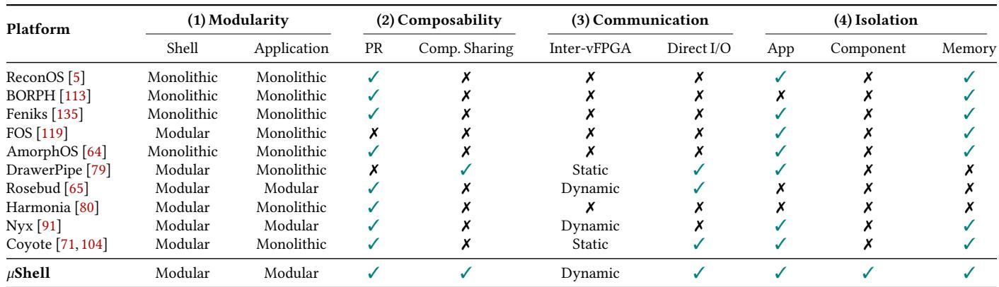  
Table 7: Comprehensive analysis of PR–based and component-based FPGA shells.

FPGA virtualization and isolation. FPGA virtualization supports spatial sharing [21, 24, 95], temporal sharing [73, 106, 122], memory virtualization [30, 47, 83, 124], and context switching [60, 77]. Cloud virtualization systems such as Optimus [84], AvA [132], and others [85,118] extend guest OSes or hypervisors to isolate FPGA resources across VMs. However, they expose vFPGAs as individual resources, limiting accelerator composition. In contrast, ??Shell presents all vFPGAs as a unified workspace while preserving multi-tenant isolation. FPGA programming model. Dataflow programming models describe inter-/intra-accelerator communications [28,29,70,116,125]. Compiler-based approaches such as HeteroFlow [125],TAPA [29],and SODA [28] are actively studied, while they build static, monolithic accelerators. Runtime libraries support kernel chaining via OpenCL pipes [46] and XRT native API [66], but are also limited to monolithic designs. In contrast, the ??Shell API enables dynamically chaining accelerators across vFPGAs without compromising isolation. FPGA task scheduling. FPGA task scheduling balances resource utilization,performance,and isolation [33,36,38,88,91]. Nimblock [88] provides fine-grained sharing through overlay virtualization, while Nyx [91] virtualizes dataflow execution using virtual FIFOs. However, existing schedulers lack awareness of cross-application component reuse, leading to frequent reconfiguration overhead. ??Shell’s component-aware scheduling prioritizes applications based on user logic overlap, maximizing reuse while minimizing reconfiguration costs.

## 8 Conclusion and Discussion

We present ??Shell, a hardware-OS co-design for modular accelerator deployment on FPGAs, delivering three key contributions: (1) a shell architecture for building secure, direct communications between distinct vFPGAs, (2) an OS providing microkernel features to manage FPGA tasks, and (3) a highlevel dataflow API for dynamic accelerator composition. We implement and evaluate the ??Shell prototype on Alveo U280 FPGA, highlighting ??Shell’s performance, flexibility, schedul ing efectiveness, programmability, and resource eficiency. Interchangeability among PR regions. Consistent with modern FPGA shells (e.g., Coyote [71, 103], AmorphOS [64]), ??Shell generates a separate partial bitstream for each logic-vFPGA pair. For instance, deploying two distinct logic kernels across two vFPGAs requires four unique bitstreams. This limitation arises from current toolchains, which require each kernel to be synthesized for every target vFPGA. Recent studies [96, 133] mitigate these constraints by decoupling compilation from physical placement and flexibly sizing PR regions. ??Shell can leverage these advances to further enhance deployment flexibility and interchangeability.

vFPGA resource usage. ??Shell supports variable-size vFPGA partitions through PR. However, due to limitations in current PR toolchains, vFPGA sizes must be manually defined, and bitstreams must be generated for predefined vFPGAs. In the current prototype, we adopt uniform vFPGA partitioning to simplify bitstream management and deployment.

Multi-FPGA deployments. Exploring multi-FPGA deployments (e.g., Catapult [102]) is beyond our current scope and planned as future work. This paper demonstrates the benefits of intra-FPGA chaining for realistic, kernel-level workloads, showing how ??Shell components eficiently share and compose resources within a single FPGA. For these use cases, eficient chaining of user logic is crucial, as it improves resource utilization and reduces deployment costs, making cloud FPGAs more accessible and economically viable.

## Artifact. We release ??Shell as an open-source project [3].

Acknowledgments. This work was partially supported by an ERC Starting Grant (ID: 101077577) and the Chips Joint Undertaking (JU), European Union (EU) HORIZON-JU-IA, under grant agreement No. 101140087 (SMARTY), the Intel Trustworthy Data Center of the Future (TDCoF), Google Research Grants, and DFG Priority Program SPP-2378 "Resilient Worlds". This work was also supported by JSPS KAKENHI Grant Numbers JP19K24360 and JP20K19776.

## References

[1] Amd: Icap interface. https://docs.xilinx.com/ r/en-US/pg036\_sem/ICAP-Interface. Last accessed: June 23, 2026.

[2] Xrt and vitis™platform overview. https://xilinx. github.io/XRT/master/html/platforms.html. Last accessed: June 23, 2026.

[3] µShell code. https://github.com/TUM-DSE/ microShell.

[4] Michael J. Accetta, Robert V. Baron, William J. Bolosky, David B. Golub, Richard F. Rashid, Avadis Tevanian, and Michael Young. Mach: A new kernel foundation for unix development. In USENIX Summer, 1986.

[5] Andreas Agne, Markus Happe, Ariane Keller, Enno Lübbers, Bernhard Plattner, Marco Platzner, and Christian Plessl. Reconos: An operating system approach for reconfigurable computing. IEEE Micro, 34(1):60–71, 2013.

[6] Morteza Babaee Altman, Wenbin Wan, Amineh Sadat Hosseini, Saber Arabi Nowdeh, and Masoumeh Alizadeh. Machine learning algorithms for fpga implementation in biomedical engineering applications: A review. Heliyon, 10(4), Feb 2024.

[7] Amazon. Aws shell interface specification. https://awsdocs-fpga-f2. readthedocs-hosted.com/latest/hdk/docs/ AWS-Shell-Interface-Specification.html. Last accessed: June 23, 2026.

[8] Amazon. Amazon ec2 f2 instances. https:// aws.amazon.com/ec2/instance-types/f2, 2025. Last accessed: June 23, 2026.

[9] Amazon. Amazon ec2 fpgaimage. https: //docs.aws.amazon.com/AWSEC2/latest/ APIReference/API\_FpgaImage.html, 2025. Last accessed: June 23, 2026.

[10] AMD. Axi4-stream switch – axi4-stream infrastructure ip suite logicore ip product guide (pg085). https://docs.amd.com/r/ en-US/pg085-axi4stream-infrastructure/ AXI4-Stream-Switch, 2025. Last accessed: June 23, 2026.

[11] AMD. Vitis high-level synthesis user guide (ug1399). https://docs.amd.com/r/en-US/ ug1399-vitis-hls/pragma-HLS-reset, 2025. Last accessed: June 23, 2026.

[12] AMD. Vivado design suite user guide: Dynamic function exchange (ug909).

https://docs.amd.com/r/en-US/ ug909-vivado-partial-reconfiguration/, 2025. Last accessed: June 23, 2026.

[13] Arm. Axi4 and axi4-lite interfaces. https: //developer.arm.com/documentation/ dui0534/b/Parameter-Descriptions/ Interface/AXI4-and-AXI4-Lite-interfaces, 2025. Last accessed: June 23, 2026.

[14] Arm. Axi4 stream interface. https://developer. arm.com/documentation/102482/0000/ DMAC-interfaces/AXI4-stream-interface, 2025. Last accessed: June 23, 2026.

[15] Nils Asmussen, Michael Roitzsch, and Hermann Härtig. M3x: Autonomous accelerators via Context-Enabled Fast-Path communication. In 2019 USENIX Annual Technical Conference (USENIX ATC 19), pages 617–632, Renton, WA, July 2019. USENIX Association.

[16] Nils Asmussen, Marcus Völp, Benedikt Nöthen, Hermann Härtig, and Gerhard Fettweis. M3: A hardware/operating-system co-design to tame heterogeneous manycores. In Proceedings of the Twenty-First International Conference on Architectural Support for Programming Languages and Operating Systems, ASPLOS ’16, page 189–203, New York, NY, USA, 2016. Association for Computing Machinery.

[17] Sameh Attia and Vaughn Betz. Statereveal: Enabling checkpointing of fpga designs with buried state. In 2020 International Conference on Field-Programmable Technology (ICFPT), pages 206–214, 2020.

[18] Bittware. Ia-420f pcie accelerator with intel agilex fpga. https://www.bittware.com/products/ ia-420f/, 2025. Last accessed: June 23, 2026.

[19] Bittware. Ia-840f pcie fpga card featuring intel agilex fpga. https://www.bittware.com/products/ ia-840f/, 2025. Last accessed: June 23, 2026.

[20] Nathaniel Bleier, Muhammad Husnain Mubarik, Srijan Chakraborty, Shreyas Kishore, and Rakesh Kumar. Rethinking programmable earable processors. In Proceedings of the 49th Annual International Symposium on Computer Architecture, ISCA ’22, page 454–467, New York, NY, USA, 2022. Association for Computing Machinery.

[21] Stuart Byma, J. Gregory Stefan, Hadi Bannazadeh, Alberto Leon Garcia, and Paul Chow. Fpgas in the cloud: Booting virtualized hardware accelerators with openstack. In Proceedings of the 2014 IEEE 22Nd International Symposium on Field-Programmable Custom Computing Machines (FCCM ’14), pages 109–116. IEEE Computer Society, 2014.

[22] Jared Casper and Kunle Olukotun. Hardware acceleration of database operations. In Proceedings of the 2014 ACM/SIGDA International Symposium on Field-Programmable Gate Arrays, FPGA ’14, page 151–160, New York, NY, USA, 2014. Association for Computing Machinery.

[23] Stephen Cass. Taking ai to the edge: Google’s tpu now comes in a maker-friendly package. IEEE Spectrum, 56(5):16–17, 2019.

[24] Fei Chen, Yi Shan, Yu Zhang, Yu Wang, Hubertus Franke, Xiaotao Chang, and Kun Wang. Enabling fpgas in the cloud. In Proceedings of the 11th ACM Conference on Computing Frontiers, CF ’14, New York, NY, USA, 2014. Association for Computing Machinery.

[25] Haibo Chen, Xie Miao, Ning Jia, Nan Wang, Yu Li, Nian Liu, Yutao Liu, Fei Wang, Qiang Huang, Kun Li, Hongyang Yang, Hui Wang, Jie Yin, Yu Peng, and Feng wei Xu. Microkernel goes general: Performance and compatibility in the HongMeng production microkernel. In 18th USENIX Symposium on Operating Systems Design and Implementation (OSDI 24), pages 465–485, Santa Clara, CA, July 2024. USENIX Association.

[26] Jianyu Chen, Maurice Daverveldt, and Zaid Al-Ars. Fpga acceleration of zstd compression algorithm. In 2021 IEEE International Parallel and Distributed Processing Symposium Workshops (IPDPSW), pages 188–191, 2021.

[27] Jiyang Chen, Harshavardhan Unnibhavi, Atsushi Koshiba, and Pramod Bhatotia. vFPIO: A virtual I/O abstraction for FPGA-accelerated I/O devices. In 2024 USENIX Annual Technical Conference (USENIX ATC 24), pages 1167–1184, Santa Clara, CA, July 2024. USENIX Association.

[28] Yuze Chi, Jason Cong, Peng Wei, and Peipei Zhou. Soda: Stencil with optimized dataflow architecture. In 2018 IEEE/ACM International Conference on Computer-Aided Design (ICCAD), pages 1–8, 2018.

[29] Yuze Chi, Licheng Guo, Young-kyu Choi, Jie Wang, and Jason Cong. Extending high-level synthesis for task-parallel programs. In The 2021 ACM/SIGDA International Symposium on Field-Programmable Gate Arrays, FPGA ’21, page 225, New York, NY, USA, 2021. Association for Computing Machinery.

[30] Eric S. Chung, James C. Hoe, and Ken Mai. Coram: An in-fabric memory architecture for fpga-based computing. In Proceedings of the 19th ACM/SIGDA International Symposium on Field Programmable Gate Arrays (FPGA ’11), pages 97–106. ACM, 2011.

[31] Alibaba Cloud. Alibaba cloud fpga instances. https://www.alibabacloud.com/help/en/doc-detail 108504.html, 2025. Last accessed: June 23, 2026.

[32] Google Cloud. Gpu platforms. https://cloud.google.com/compute/docs/gpus. Last accessed: June 23, 2026.

[33] Roberto Cordone, Francesco Redaelli, Massimo Antonio Redaelli, Marco Domenico Santambrogio, and Donatella Sciuto. Partitioning and scheduling of task graphs on partially dynamically reconfigurable fpgas. IEEE Transactions on Computer-Aided Design of Integrated Circuits and Systems, 28(5):662–675, 2009.

[34] NVIDIA Corporation. Nvidia multi-instance gpu. https://www.nvidia.com/en-us/ technologies/multi-instance-gpu/. Last accessed: June 23, 2026.

[35] An operating system for fpgas. https: //github.com/fpgasystems/Coyote. Last accessed: June 23, 2026.

[36] Enrico A Deiana, Marco Rabozzi, Riccardo Cattaneo, and Marco D Santambrogio. A multiobjective reconfiguration-aware scheduler for fpga-based heterogeneous architectures. In 2015 International Conference on ReConFigurable Computing and FPGAs (ReConFig), pages 1–6. IEEE, 2015.

[37] Jack B Dennis and Earl C Van Horn. Programming semantics for multiprogrammed computations. Communications of the ACM, 9(3):143–155, 1966.

[38] Ashutosh Dhar, Edward Richter, Mang Yu, Wei Zuo, Xiaohao Wang, Nam Sung Kim, and Deming Chen. Dml: Dynamic partial reconfiguration with scalable task scheduling for multi-applications on fpgas. IEEE Transactions on Computers, 71(10):2577–2591, 2022.

[39] D. R. Engler, M. F. Kaashoek, and J. O’Toole. Exokernel: an operating system architecture for application-level resource management. In Proceedings of the Fifteenth ACM Symposium on Operating Systems Principles, SOSP ’95, page 251–266, New York, NY, USA, 1995. Association for Computing Machinery.

[40] Kermin Fleming, Hsin-Jung Yang, Michael Adler, and Joel Emer. The leap fpga operating system. In 2014 24th International Conference on Field Programmable Logic and Applications (FPL), pages 1–8, 2014.

[41] Intel FPGA. Intel fpga add-on for oneapi base toolkit. https://www.intel.com/content/www/us/en/ developer/tools/oneapi/fpga.html, 2025. Last accessed: June 23, 2026.

[42] Dimitra Giantsidi, Julian Pritzi, Felix Gust, Antonios Katsarakis, Atsushi Koshiba, and Pramod Bhatotia. Tnic: A trusted nic architecture: A hardware-network substrate for building high-performance trustworthy distributed systems. In Proceedings of the 30th ACM International Conference on Architectural Support for Programming Languages and Operating Systems, Volume 2, pages 1282–1301, 2025.

[43] Abraham Gonzalez, Aasheesh Kolli, Samira Khan, Sihang Liu, Vidushi Dadu, Sagar Karandikar, Jichuan Chang, Krste Asanovic, and Parthasarathy Ranganathan. Profiling hyperscale big data processing. In Proceedings of the 50th Annual International Symposium on Computer Architecture, ISCA ’23, New York, NY, USA, 2023. Association for Computing Machinery.

[44] Google. Bigquery | ai data platform. https: //cloud.google.com/bigquery?hl=en, 2025. Last accessed: June 23, 2026.

[45] Google. Bigtable: Fast, flexible nosql. https: //cloud.google.com/bigtable?hl=en, 2025. Last accessed: June 23, 2026.

[46] Khronos Group. The opencl specification. https://registry.khronos.org/OpenCL/ specs/3.0-unified/html/OpenCL\_API.html, 2025. Last accessed: June 23, 2026.

[47] Felix Gust, Shu Anzai, Charalampos Mainas, Atsushi Koshiba, and Pramod Bhatotia. Proteus: Heterogeneous fpga virtualization. In Proceedings of the 21st European Conference on Computer Systems, pages 328–349, 2026.

[48] Mahmoud Habboush, Aiman H. El-Maleh, Muhammad E.S. Elrabaa, and Saleh AlSaleh. De-zfp: An fpga implementation of a modified zfp compression/decompression algorithm. Microprocessors and Microsystems, 90:104453, 2022.

[49] Matthias Hille, Nils Asmussen, Pramod Bhatotia, and Hermann Härtig. SemperOS: A distributed capability system. In 2019 USENIX Annual Technical Conference (USENIX ATC 19), pages 709–722, Renton, WA, July 2019. USENIX Association.

[50] Matthias Hille, Nils Asmussen, Hermann Härtig, and Pramod Bhatotia. A heterogeneous microkernel os for rack-scale systems. In Proceedings of the 11th ACM SIGOPS Asia-Pacific Workshop on Systems, APSys ’20, page 50–58, New York, NY, USA, 2020. Association for Computing Machinery.

[51] Hanaa M Hussain, Khaled Benkrid, and Huseyin Seker. Dynamic partial reconfiguration implementation of

the svm/knn multi-classifier on fpga for bioinformatics application. In 2015 37th Annual International Conference of the IEEE Engineering in Medicine and Biology Society (EMBC), pages 7667–7670. IEEE, 2015.

[52] Siam U. Hussain and Farinaz Koushanfar. Fase: Fpga acceleration of secure function evaluation. In 2019 IEEE 27th Annual International Symposium on Field-Programmable Custom Computing Machines (FCCM), pages 280–288, 2019.

[53] Muhammad Huzaifa, Rishi Desai, Samuel Grayson, Xutao Jiang, Ying Jing, Jae Lee, Fang Lu, Yihan Pang, Joseph Ravichandran, Finn Sinclair, Boyuan Tian, Hengzhi Yuan, Jefrey Zhang, and Sarita V. Adve. Illixr: Enabling end-to-end extended reality research. In 2021 IEEE International Symposium on Workload Characterization (IISWC), pages 24–38, 2021.

[54] IBM. Mini-era: Simplified version of the main era workload. https://github.com/IBM/mini-era, 2025. Last accessed: June 23, 2026.

[55] Intel. Open fpga stack overview. https: //ofs.github.io/ofs-2024.3-1/, 2025. Last accessed: June 23, 2026.

[56] Intel. Quartus® prime pro edition user guide: Partial reconfiguration. https://www.intel.com/content/ www/us/en/docs/programmable/683834/25-1/ faq.html, 2025. Last accessed: June 23, 2026.

[57] Hasan Irmak, Daniel Ziener, and Nikolaos Alachiotis. Increasing flexibility of fpga-based cnn accelerators with dynamic partial reconfiguration. In 2021 31st International Conference on Field-Programmable Logic and Applications (FPL), pages 306–311. IEEE, 2021.

[58] Chuanmin Jia, Xinyu Hang, Shanshe Wang, Yaqiang Wu, Siwei Ma, and Wen Gao. Fpx-nic: An fpgaaccelerated 4k ultra-high-definition neural video coding system. IEEE Transactions on Circuits and Systems for Video Technology, 32(9):6385–6399, 2022.

[59] M. Johnson, P. Ishwar, V. Prabhakaran, D. Schonberg, and K. Ramchandran. On compressing encrypted data. IEEE Transactions on Signal Processing, 52(10):2992–3006, 2004.

[60] Heiko Kalte and Mario Porrmann. Context saving and restoring for multitasking in reconfigurable systems. pages 223–228, 2005.

[61] Sagar Karandikar, Chris Leary, Chris Kennelly, Jerry Zhao, Dinesh Parimi, Borivoje Nikolic, Krste Asanovic, and Parthasarathy Ranganathan. A hardware accelerator for protocol bufers. In MICRO-54: 54th Annual IEEE/ACM International Symposium on

Microarchitecture, MICRO ’21, page 462–478, New York, NY, USA, 2021. Association for Computing Machinery.

[62] John H. Kelm and Steven S. Lumetta. Hybridos: runtime support for reconfigurable accelerators. In Proceedings of the 16th International ACM/SIGDA Symposium on Field Programmable Gate Arrays, FPGA ’08, page 212–221, New York, NY, USA, 2008. Association for Computing Machinery.

[63] Alireza Khataei, Gaurav Singh, and Kia Bazargan. Approximate hybrid binary-unary computing with applications in bert language model and image processing. In Proceedings of the 2023 ACM/SIGDA International Symposium on Field Programmable Gate Arrays, FPGA ’23, page 165–175, New York, NY, USA, 2023. Association for Computing Machinery.

[64] Ahmed Khawaja, Joshua Landgraf, Rohith Prakash, Michael Wei, Eric Schkufza, and Christopher J. Rossbach. Sharing, protection, and compatibility for reconfigurable fabric with AmorphOS. In 13th USENIX Symposium on Operating Systems Design and Implementation (OSDI 18), pages 107–127, Carlsbad, CA, October 2018. USENIX Association.

[65] Moein Khazraee, Alex Forencich, George C Papen, Alex C Snoeren, and Aaron Schulman. Rosebud: Making fpga-accelerated middlebox development more pleasant. In Proceedings of the 28th ACM International Conference on Architectural Support for Programming Languages and Operating Systems, Volume 3, pages 586–605, 2023.

[66] Khronos Group. Pcie peer-to-peer (p2p) – xrt master documentation. https://xilinx.github.io/ XRT/master/html/p2p.html. Accessed: June 23, 2026.

[67] Joon Kyung Kim, Byung Hoon Ahn, Sean Kinzer, Soroush Ghodrati, Rohan Mahapatra, Brahmendra Yatham, Shu-Ting Wang, Dohee Kim, Parisa Sarikhani, Babak Mahmoudi, Divya Mahajan, Jongse Park, and Hadi Esmaeilzadeh. Yin-yang: Programming abstractions for cross-domain multi-acceleration. IEEE Micro, 42(5):89–98, 2022.

[68] Gerwin Klein, Kevin Elphinstone, Gernot Heiser, June Andronick, David Cock, Philip Derrin, Dhammika Elkaduwe, Kai Engelhardt, Rafal Kolanski, Michael Norrish, Thomas Sewell, Harvey Tuch, and Simon Winwood. sel4: formal verification of an os kernel. In Proceedings of the ACM SIGOPS 22nd Symposium on Operating Systems Principles, SOSP ’09, page 207–220, New York, NY, USA, 2009. Association for Computing Machinery.

[69] Oliver Knodel, Paul R. Genssler, and Rainer G. Spallek. Migration of long-running tasks between reconfigurable resources using virtualization. SIGARCH Comput. Archit. News, 44(4):56–61, January 2017.

[70] David Koeplinger,Matthew Feldman,Raghu Prabhakar, Yaqi Zhang, Stefan Hadjis, Ruben Fiszel, Tian Zhao, Luigi Nardi, Ardavan Pedram, Christos Kozyrakis, and Kunle Olukotun. Spatial: A language and compiler for application accelerators. In ACM SIGPLAN Conference on Programming Language Design and Implementation (PLDI). ACM, 2018.

[71] Dario Korolija, Timothy Roscoe, and Gustavo Alonso. Do OS abstractions make sense on FPGAs? In 14th USENIX Symposium on Operating Systems Design and Implementation (OSDI 20), pages 991–1010. USENIX Association, November 2020.

[72] Atsushi Koshiba, Felix Gust, Julian Pritzi, Anjo Vahldiek-Oberwagner, Nuno Santos, and Pramod Bhatotia. Trusted heterogeneous disaggregated architectures. In Proceedings of the 14th ACM SIGOPS Asia-Pacific Workshop on Systems, pages 72–79, 2023.

[73] Atsushi Koshiba, Charalampos Mainas, and Pramod Bhatotia. Funky: Cloud-native fpga virtualization and orchestration. In Proceedings of the 2025 ACM Symposium on Cloud Computing, pages 209–224, 2025.

[74] Adam Lackorzynski and Alexander Warg. Taming subsystems: capabilities as universal resource access control in l4. In Proceedings of the Second Workshop on Isolation and Integration in Embedded Systems, IIES ’09, page 25–30, New York, NY, USA, 2009. Association for Computing Machinery.

[75] Yi-Hsiang Lai, Ecenur Ustun, Shaojie Xiang, Zhenman Fang, Hongbo Rong, and Zhiru Zhang. Programming and synthesis for software-defined fpga acceleration: Status and future prospects. ACM Trans. Reconfigurable Technol. Syst., 14(4), September 2021.

[76] Joshua Landgraf, Matthew Giordano, Esther Yoon, and Christopher J. Rossbach. Reconfigurable virtual memory for fpga-driven i/o. In Proceedings of the 28th ACM International Conference on Architectural Support for Programming Languages and Operating Systems, Volume 3, ASPLOS 2023, page 556–571, New York, NY, USA, 2023. Association for Computing Machinery.

[77] Trong-Yen Lee, Che-Cheng Hu, Li-Wen Lai, and Chia-Chun Tsai. Hardware context-switch methodology for dynamically partially reconfigurable systems. J. Inf. Sci. Eng., 26:1289–1305, 2010.

[78] Henry M Levy. Capability-based computer systems. Digital Press, 2014.

[79] Junnan Li, Zhigang Sun, Jinli Yan, Xiangrui Yang, Yue Jiang, and Wei Quan. Drawerpipe: A reconfigurable pipeline for network processing on fpga-based smartnic. Electronics, 9(1):59, 2019.

[80] Luyang Li, Heng Pan, Xinchen Wan, Kai Lv, Zilong Wang, Qian Zhao, Feng Ning, Qingsong Ning, Shideng Zhang, Zhenyu Li, et al. Harmonia: A unified framework for heterogeneous fpga acceleration in the cloud. In Proceedings of the 30th ACM International Conference on Architectural Support for Programming Languages and Operating Systems, Volume 2, pages 498–514, 2025.

[81] Jochen Liedtke. On micro-kernel construction. ACM SIGOPS Operating Systems Review, 29(5):237–250, 1995.

[82] Alec Lu and Zhenman Fang. Sql2fpga: Automatic acceleration of sql query processing on modern cpufpga platforms. In 2023 IEEE 31st Annual International Symposium on Field-Programmable Custom Computing Machines (FCCM), pages 184–194, 2023.

[83] Enno Lübbers and Marco Platzner. Reconos: Multithreaded programming for reconfigurable computers. ACM Trans. Embed. Comput. Syst., 9(1), October 2009.

[84] Jiacheng Ma, Gefei Zuo, Kevin Loughlin, Xiaohe Cheng, Yanqiang Liu, Abel Mulugeta Eneyew, Zhengwei Qi, and Baris Kasikci. A hypervisor for shared-memory fpga platforms. In Proceedings of the Twenty-Fifth International Conference on Architectural Support for Programming Languages and Operating Systems, ASPLOS ’20, page 827–844, New York, NY, USA, 2020. Association for Computing Machinery.

[85] Jiacheng Ma, Gefei Zuo, Kevin Loughlin, Xiaohe Cheng, Yanqiang Liu, Abel Mulugeta Eneyew, Zhengwei Qi, and Baris Kasikci. A hypervisor for shared-memory fpga platforms. In Proceedings of the Twenty-Fifth International Conference on Architectural Support for Programming Languages and Operating Systems, ASPLOS ’20, page 827–844, New York, NY, USA, 2020. Association for Computing Machinery.

[86] R. Maestre, F.J. Kurdahi, M. Fernandez, R. Hermida, N. Bagherzadeh, and H. Singh. A framework for reconfigurable computing: task scheduling and context management. IEEE Transactions on Very Large Scale Integration (VLSI) Systems, 9(6):858–873, 2001.

[87] Charalampos Mainas, Martin Lambeck, Bruno Scheufler, Laurent Bindschaedler, Atsushi Koshiba, and Pramod Bhatotia. F3: An fpga-accelerated faas framework. In Proceedings of the 34th International Symposium on High-Performance Parallel and Distributed Computing, pages 1–16, 2025.

[88] Meghna Mandava, Paul Reckamp, and Deming Chen. Nimblock: Scheduling for fine-grained fpga sharing through virtualization. In Proceedings of the 50th Annual International Symposium on Computer Architecture, ISCA ’23, New York, NY, USA, 2023. Association for Computing Machinery.

[89] Michael Marty, Marc de Kruijf, Jacob Adriaens, Christopher Alfeld, Sean Bauer, Carlo Contavalli, Michael Dalton, Nandita Dukkipati, William C. Evans, Steve Gribble, Nicholas Kidd, Roman Kononov, Gautam Kumar, Carl Mauer, Emily Musick, Lena Olson, Erik Rubow, Michael Ryan, Kevin Springborn, Paul Turner, Valas Valancius, Xi Wang, and Amin Vahdat. Snap: a microkernel approach to host networking. In Proceedings of the 27th ACM Symposium on Operating Systems Principles, SOSP ’19, page 399–413, New York, NY, USA, 2019. Association for Computing Machinery.

[90] Microsoft. Np size series - azure virtual machines. https://learn.microsoft.com/en-us/azure/ virtual-machines/sizes/fpga-accelerated/ np-series, 2025. Last accessed: June 23, 2026.

[91] Panagiotis Miliadis, Dimitris Theodoropoulos, Nectarios Koziris, and Dionisios Pnevmatikatos. Nyx: Virtualizing dataflow execution on shared fpga platforms. In Proceedings of the 52nd Annual International Symposium on Computer Architecture, ISCA ’25, page 1327–1341, New York, NY, USA, 2025. Association for Computing Machinery.

[92] Derek G. Murray, Jiří Šimša, Ana Klimovic, and Ihor Indyk. tf.data: a machine learning data processing framework. Proc. VLDB Endow., 14(12):2945–2958, jul 2021.

[93] Hau T Ngo, Ryan N Rakvic, Randy P Broussard, and Robert W Ives. An fpga-based design of a modular approach for integral images in a real-time face detection system. In Mobile Multimedia/Image Processing, Security, and Applications 2009, volume 7351, pages 83–92. SPIE, 2009.

[94] NVIDIA. Dali, 2024. accessed: 2024-08-01.

[95] Michele Paolino, Sébastien Pinneterre, and Daniel Raho. Fpga virtualization with accelerators overcommitment for network function virtualization. In 2017 International Conference on ReConFigurable Computing and FPGAs (ReConFig), pages 1–6. IEEE, 2017.

[96] Dongjoon Park, Yuanlong Xiao, and André DeHon. Fast and flexible fpga development using hierarchical partial reconfiguration. In 2022 International Conference on Field-Programmable Technology (ICFPT), pages 1–10. IEEE, 2022.

[97] Aaron Parsons, Donald Backer, Andrew Siemion, Henry Chen, Dan Werthimer, Pierre Droz, Terry Filiba, Jason Manley, Peter McMahon, Arash Parsa, et al. A scalable correlator architecture based on modular fpga hardware, reuseable gateware, and data packetization. Publications of the Astronomical Society of the Pacific, 120(873):1207–1221, 2008.

[98] Wesley Peck, Erik Anderson, Jason Agron, Jim Stevens, Fabrice Baijot, and David Andrews. Hthreads: A computational model for reconfigurable devices. In 2006 International Conference on Field Programmable Logic and Applications, pages 1–4, 2006.

[99] Johan Peltenburg, Jeroen van Straten, Lars Wijtemans, Lars van Leeuwen, Zaid Al-Ars, and Peter Hofstee. Fletcher: A framework to eficiently integrate fpga accelerators with apache arrow. In 2019 29th International Conference on Field Programmable Logic and Applications (FPL), pages 270–277, 2019.

[100] Khoa Dang Pham, Kyriakos Paraskevas, Anuj Vaishnav, Andrew Attwood, Malte Vesper, and Dirk Koch. Zucl 2.0: Virtualised memory and communication for zynq ultrascale+ fpgas. In FSP Workshop 2019; Sixth International Workshop on FPGAs for Software Programmers, pages 1–9. VDE, 2019.

[101] Arash Pourhabibi, Siddharth Gupta, Hussein Kassir, Mark Sutherland, Zilu Tian, Mario Paulo Drumond, Babak Falsafi, and Christoph Koch. Optimus prime: Accelerating data transformation in servers. In Proceedings of the Twenty-Fifth International Conference on Architectural Support for Programming Languages and Operating Systems, ASPLOS ’20, page 1203–1216, New York, NY, USA, 2020. Association for Computing Machinery.

[102] Andrew Putnam, Adrian M. Caulfield, Eric S. Chung, Derek Chiou, Kypros Constantinides, John Demme, Hadi Esmaeilzadeh, Jeremy Fowers, Gopi Prashanth Gopal, Jan Gray, Michael Haselman, Scott Hauck, Stephen Heil, Amir Hormati, Joo-Young Kim, Sitaram Lanka, James Larus, Eric Peterson, Simon Pope, Aaron Smith, Jason Thong, Phillip Yi Xiao, and Doug Burger. A reconfigurable fabric for accelerating large-scale datacenter services. IEEE Micro, 35(3):10–22, 2015.

[103] Benjamin Ramhorst, Dario Korolija, Maximilian Jakob Heer, Jonas Dann, Luhao Liu, and Gustavo Alonso. Coyote v2: Raising the level of abstraction for data center fpgas. In Proceedings of the ACM SIGOPS 31st Symposium on Operating Systems Principles, SOSP ’25, page 639–654, New York, NY, USA, 2025. Association for Computing Machinery.

[104] Benjamin Ramhorst, Dario Korolija, Maximilian Jakob Heer, Jonas Dann, Luhao Liu, and Gustavo Alonso. Coyote v2: Raising the level of abstraction for data center fpgas, 2025.

[105] Swarnalata Bollavarapu Ruchita Sharma. Data security using compression and cryptography techniques. International Journal of Computer Applications, 117(14):15–18, May 2015.

[106] Kyle Rupnow, Wenyin Fu, and Katherine Compton. Block, drop or roll(back): Alternative preemption methods for rh multi-tasking. In FCCM 2009, 17th IEEE Symposium on Field Programmable Custom Computing Machines, pages 63–70. IEEE, 2009.

[107] Ahmad Sadek, Hassan Mostafa, Amin Nassar, and Yehea Ismail. Towards the implementation of multi-band multi-standard software-defined radio using dynamic partial reconfiguration. International Journal of Communication Systems, 30(17):e3342, 2017.

[108] Kartik Sankaran, Minhui Zhu, Xiang Fa Guo, Akkihebbal L. Ananda, Mun Choon Chan, and Li-Shiuan Peh. Using mobile phone barometer for low-power transportation context detection. In Proceedings of the 12th ACM Conference on Embedded Network Sensor Systems, SenSys ’14, page 191–205, New York, NY, USA, 2014. Association for Computing Machinery.

[109] S.M. Scalera and J.R. Vazquez. The design and implementation of a context switching fpga. In Proceedings. IEEE Symposium on FPGAs for Custom Computing Machines (Cat. No.98TB100251), pages 78–85, 1998.

[110] Sloc cloc and code (scc). https://github.com/ boyter/scc. Last accessed: June 23, 2026.

[111] Thapanee Seehapoch and Sartra Wongthanavasu. Speech emotion recognition using support vector machines. In 2013 5th International Conference on Knowledge and Smart Technology (KST), pages 86–91, 2013.

[112] Piyush Kumar Shukla, Amer Aljaedi, Piyush Kumar Pareek, Adel R. Alharbi, and Sajjad Shaukat Jamal. Aes based white box cryptography in digital signature verification. Sensors, 22(23), 2022.

[113] Hayden Kwok-Hay So and Robert Brodersen. A unified hardware/software runtime environment for fpga-based reconfigurable computers using borph. ACM Transactions on Embedded Computing Systems (TECS), 7(2):1–28, 2008.

[114] Naveen Suda, Vikas Chandra, Ganesh Dasika, Abinash Mohanty, Yufei Ma, Sarma Vrudhula, Jae-sun Seo, and Yu Cao. Throughput-optimized opencl-based fpga accelerator for large-scale convolutional neural

networks. In Proceedings of the 2016 ACM/SIGDA International Symposium on Field-Programmable Gate Arrays, FPGA ’16, page 16–25, New York, NY, USA, 2016. Association for Computing Machinery.

[115] Vignesh Suresh, Bakshree Mishra, Ying Jing, Zeran Zhu, Naiyin Jin, Charles Block, Paolo Mantovani, Davide Giri, Joseph Zuckerman, Luca P. Carloni, and Sarita V. Adve. Mozart: Taming taxes and composing accelerators with shared-memory. In Proceedings of the 2024 International Conference on Parallel Architectures and Compilation Techniques, PACT ’24, page 183–200, New York, NY, USA, 2024. Association for Computing Machinery.

[116] J. Sérot and F. Berry. High-level dataflow programming for reconfigurable computing. In 2014 International Symposium on Computer Architecture and High Performance Computing Workshop, pages 72–77, 2014.

[117] Cheng Tan, Manupa Karunaratne, Tulika Mitra, and Li-Shiuan Peh. Stitch: Fusible heterogeneous accelerators enmeshed with many-core architecture for wearables. In 2018 ACM/IEEE 45thAnnualInternationalSymposium on Computer Architecture (ISCA), pages 575–587, 2018.

[118] Naif Tarafdar, Thomas Lin, Eric Fukuda, Hadi Bannazadeh, Alberto Leon-Garcia, and Paul Chow. Enabling flexible network fpga clusters in a heterogeneous cloud data center. In Proceedings of the 2017 ACM/SIGDA International Symposium on Field-Programmable Gate Arrays, pages 237–246. ACM, 2017.

[119] Anuj Vaishnav, Khoa Dang Pham, Joseph Powell, and Dirk Koch. Fos: A modular fpga operating system for dynamic workloads. ACM Transactions on Reconfigurable Technology and Systems (TRETS), 13(4):1–28, 2020.

[120] Kizheppatt Vipin and Suhaib A. Fahmy. Fpga dynamic and partial reconfiguration: A survey of architectures, methods, and applications. ACM Comput. Surv., 51(4), July 2018.

[121] Shu-Ting Wang, Hanyang Xu, Amin Mamandipoor, Rohan Mahapatra, Byung Hoon Ahn, Soroush Ghodrati, Krishnan Kailas, Mohammad Alian, and Hadi Esmaeilzadeh. Data motion acceleration: Chaining cross-domain multi accelerators. In 2024 IEEE International Symposium on High-Performance Computer Architecture (HPCA), pages 1043–1062, 2024.

[122] Wei Wang, Miodrag Bolic, and Jonathan Parri. pvfpga: accessing an fpga-based hardware accelerator in a paravirtualized environment. In Hardware/Software Codesign and System Synthesis (CODES+ISSS), 2013 International Conference on, pages 1–9. IEEE, 2013.

[123] Robert N. M. Watson, Jonathan Anderson, Ben Laurie, and Kris Kennaway. A taste of capsicum: Practical capabilities for unix. Commun. ACM,55(3):97–104,mar 2012.

[124] Gabriel Weisz and James C Hoe. Coram++: Supporting data-structure-specific memory interfaces for fpga computing. In 2015 25th International Conference on Field Programmable Logic and Applications (FPL), pages 1–8. IEEE, 2015.

[125] Shaojie Xiang, Yi-Hsiang Lai, Yuan Zhou, Hongzheng Chen, Niansong Zhang, Debjit Pal, and Zhiru Zhang. Heteroflow: An accelerator programming model with decoupled data placement for software-defined fpgas. In Proceedings of the 2022 ACM/SIGDA International Symposium on Field-Programmable Gate Arrays, FPGA ’22, page 78–88, New York, NY, USA, 2022. Association for Computing Machinery.

[126] AMD Xilinx. Alveo u280 data center accelerator card data sheet. https://docs.amd.com/r/en-US/ ds963-u280/Summary, 2025. Last accessed: June 23, 2026.

[127] AMD Xilinx. Alveo v80 compute accelerator. https: //www.amd.com/en/products/accelerators/ alveo/v80.html, 2025. Last accessed: June 23, 2026.

[128] AMD Xilinx. Amd alveo u50 data center accelerator card. https://www.xilinx.com/products/boards-andkits/alveo/u50.html, 2025. Last accessed: June 23, 2026.

[129] AMD Xilinx. Vitis accelerated libraries. https: //github.com/Xilinx/Vitis\_Libraries, 2025. Last accessed: June 23, 2026.

[130] AMD Xilinx. Vitis vision library. https://docs. amd.com/r/en-US/Vitis\_Libraries/vision/ index.html, 2025. Last accessed: June 23, 2026.

[131] AMD Xilinx. Xrt native apis. https://xilinx.github.io/ XRT/master/html/xrt\_native\_apis.html, 2025. Last accessed: June 23, 2026.

[132] Hangchen Yu, Arthur Michener Peters, Amogh Akshintala, and Christopher J. Rossbach. Ava: Accelerated virtualization of accelerators. In Proceedings of the Twenty-Fifth International Conference on Architectural Support for Programming Languages and Operating Systems, ASPLOS ’20, page 807–825, New York, NY, USA, 2020. Association for Computing Machinery.

[133] Yue Zha and Jing Li. Virtualizing fpgas in the cloud. In Proceedings of the Twenty-Fifth International Conference on Architectural Support for Programming Languages and Operating Systems, pages 845–858, 2020.

[134] Chen Zhang, Peng Li, Guangyu Sun, Yijin Guan, Bingjun Xiao, and Jason Cong. Optimizing fpga-based accelerator design for deep convolutional neural networks. In Proceedings of the 2015 ACM/SIGDA International Symposium on Field-Programmable Gate Arrays, FPGA ’15, page 161–170, New York, NY, USA, 2015. Association for Computing Machinery.

[135] Jiansong Zhang, Yongqiang Xiong, Ningyi Xu, Ran Shu, Bojie Li, Peng Cheng, Guo Chen, and Thomas Moscibroda. The feniks fpga operating system for cloud computing. In Proceedings of the 8th Asia-Pacific Workshop on Systems, pages 1–7, 2017.

[136] Sizhuo Zhang, Hari Angepat, and Derek Chiou. Hgum: Messaging framework for hardware accelerators. In 2017 International Conference on ReConFigurable Computing and FPGAs (ReConFig), pages 1–8, 2017.

[137] Mark Zhao, Niket Agarwal, Aarti Basant, Buğra Gedik, Satadru Pan, Mustafa Ozdal, Rakesh Komuravelli, Jerry Pan, Tianshu Bao, Haowei Lu, Sundaram Narayanan, Jack Langman, Kevin Wilfong, Harsha Rastogi, Carole-Jean Wu, Christos Kozyrakis, and Parik Pol. Understanding data storage and ingestion for large-scale deep recommendation model training: industrial product. In Proceedings of the 49th Annual International Symposium on Computer Architecture, ISCA ’22, page 1042–1057, New York, NY, USA, 2022. Association for Computing Machinery.

[138] Udo Zoelzer. Digital Audio Signal Processing. John Wiley & Sons Software, 2008.

## A Artifact Appendix

## A.1 Abstract

This artifact contains the implementation and evaluation framework used in the USENIX OSDI 2026 paper, "??Shell: A Microkernel-based FPGA Shell Architecture" by J. Chen, A. Panda, H. Unnibhavi, A. Koshiba, and P. Bhatotia. ??Shell is a hardware-OS co-design for modular accelerator deployment and execution. It provides capability-enforced isolation for secure resource sharing, component-aware task scheduling to reduce FPGA reconfiguration overheads, and inter-process communication (IPC) for peer-to-peer data transfers between vFPGAs.

## A.2 Scope

The artifact reproduces all experimental results presented in the paper. It includes the hardware and software source code required to build the FPGA shell and host applications, as well as scripts for running the evaluation. To simplify deployment and reduce build times, we also provide precompiled FPGA bitstreams for both the shell and benchmark applications.

## A.3 Contents

The artifact is published in our GitHub repository and contains the following items:

• bitstreams/: Precompiled FPGA bitstreams.

• driver/: Source code for the Linux kernel driver.

• hw/: Source code for the ??Shell shell.

• examples\_hw/: Source code for benchmark application accelerators.

• sw/: Source code for the host-side runtime and infrastructure.

• examples\_sw/: Source code for benchmark host applications.

• evaluation/: Scripts and supporting files for reproducing the evaluation results.

The repository root also contains scripts and configuration files required for FPGA programming and system setup.

## A.4 Hosting

All the project source code, including the instructions for evaluating and building the software, is available in the following git repository: https://github.com/TUM-DSE/microShell. Please follow the instructions on the master branch to reproduce the results.

## A.5 Requirements

We require the following software and hardware configurations to reproduce our experimental results.

```powershell
$ cd ~/microShell
$ nix-shell shell.nix # this can be
↪ skipped if you are already in the nix-shell
$ mkdir build_sched_sw && cd build_sched_sw
$ cmake
↪ ../examples_sw/ -DEXAMPLE=scheduler_client
$ make
```

## A.5.1 Hardware Dependencies

• Machine with AMD EPYC 7413 CPU connected to public network.

• Xilinx (AMD) Alveo U280 FPGA cards.

## A.5.2 Software Dependencies

• Operating system: NixOS 25.11 with Linux kernel 6.9.0-rc7.

• Nix: we use the Nix package manager to download all build dependencies for reproducibility. We use nix-shell to provide a consistent runtime environment.

• Python 3.10 or newer for the script that reproduces the evaluation.

• Vivado v2022.1 to compile the FPGA bitstreams and program the FPGA.

## A.6 Methodology

• Figure 11 (§ 6.1): Throughput comparison across three deployment setups and varying data sizes, demonstrating the performance overhead of ??Shell.

• Figure 12 (§ 6.2): Comparison of scheduling metrics between ??Shell and Coyote, highlighting the benefits of the proposed scheduling algorithm.

• Figure 13 (§ 6.3): Reconfiguration latency comparison between ??Shell and Coyote for deploying multi-component applications.

• Table 5 (§ 6.4): Comparison of Source Lines of Code (SLoC) and Cyclomatic Complexity (CC) for host applications and user logic, illustrating the programmability improvements of ??Shell over Coyote.

• Table 6 (§ 6.5): FPGA resource utilization of ??Shell.

## A.6.1 End-to-end performance (§ 6.1)

First, run the following commands to measure the benchmark throughput for diferent setups:

```shell
$ cd evaluation/scripts/
$ bash e2e_6.1/run_e2e.sh
↪ ~/microShell_base ~/microShell
```

To generate Figure 11, run the following command:

\$ python3 e2e\_6.1/plot\_e2e.py

## A.6.2 Scheduling improvements (§ 6.2)

First program the FPGA with the provided bitstream:

\$ bash ./program\_fpga.sh 6\_2\_sched

Build the software application:

Copy some bash scripts that help to run the application from evaluation/scripts, then run the following commands to perform the experiments:

```shell
$ cp ../evaluation/scripts/scheduling_6.2/*.sh
↪
$ bash ./init_csv.sh
$ bash ./run_coyote.sh
$ bash ./run_ushell.sh
```

Copy the generated data back to the evaluation folder and create the plots:

```shell
$ cp *.csv ../evaluation/data/scheduling_6.2/
$ cd ~/microShell/evaluation/scripts
$ python3 scheduling_6.2/plot_sched.py
```

## A.6.3 Application-deployment overheads (§ 6.3)

Open two terminals connected to our machine, in one for the server terminal:

\$ cd \~\microShell   
\$ bash ./program\_fpga.sh 6\_3\_pr   
\$ mkdir build\_perf\_server\_sw/   
↪ && cd build\_perf\_server\_sw/   
\$   
cp   
../bitstreams/cyt\_top\_pr\_time\_3\_0807/config\_\*/\*   
\$ cmake ../examples\_sw/ -DEXAMPLE=perf\_server   
\$ make   
\$ sudo ./bin/test

In the second terminal for the client:

```shell
$ cd ~\microShell
$ nix-shell shell.nix # this can be
↪ skipped if you are already in the nix-shell
$ mkdir build_perf_client_sw/
↪ && cd build_perf_client_sw/
$ cmake ../examples_sw/ -DEXAMPLE=perf_client
$ make
$ sudo ./bin/test -1 true
```

Save the log into a file and copy it into the data folder, kill the server thread, and generate the plots:

\$ journalctl -n 200 > reconfig\_pr.log   
\$ cp reconfig\_pr.log   
../evaluation/data/deployment\_6.3/   
\$ ps -aux | grep test   
\$ sudo kill -9 pid\_of\_test   
\$ cd ../evaluation/scripts   
\$ python3 deployment\_6.3/extract\_reconfig.py   
\$ python3   
↪ deployment\_6.3/plot\_reconfig\_overhead.py

## A.6.4 Programmability (§ 6.4)

First, install the tools and run the measurements:

```shell
$ cd ~/microShell
$ nix-shell -p scc jq
$ cd evaluation/scripts/
$
↪ bash
↪ complexity_6.4/measure_complexity_baseline.sh
↪ ~/microShell_base
$
bash
complexity_6.4/measure_complexity_ushell.sh
~/microShell
```

The two CSV files are located at the path ????????????????????/????????/????????????????????\_6.4. To generate the data for the table, run the following commands:

```shell
complexity_6.4/extract_complexity.py \
--baseline-csv↪
path_to/complexity_baseline_results.csv↪
↪ \
--ushell-csv
↪ path_to/complexity_ushell_results.csv
```

## A.6.5 Resource Overheads (§ 6.5)

Run the following commands to extract the resource utilization of each component:

```shell
$ cd ~/microShell
$ nix-shell shell.nix # this can be
skipped if you are already in the nix-shell
$ cd evaluation/scripts
$ python3 resource_usage_6.5/extract_util.py
$ python3
↪ resource_usage_6.5/extract_modules.py
$ python3
resource_usage_6.5/plot_resource_usage.py
$ python3 scalability_2/plot_scalability.py
↪ --baseline ~/microShell_base
```