USENIX

THE ADVANCED COMPUTING SYSTEMS ASSOCIATION

# Teaching The Old Dog New Tricks: Building Efficient Data Pipelines for Large-Scale LLM Pre-training (Operational Systems)

Luofan Chen and Chenhan Wang, University of Science and Technology of China and ByteDance Seed; Weidong Zhang, Jinxin Chi, Hequan Zhang, Zanbo Wang, Chenyuan Wang, Lishu Luo, Sijin Wu, Junqi Hu, Jun Wang, and Cheng Chen,   
ByteDance Seed; Lixin Huang, Liyang Zhao, Yong Tian, and Jun Guo, ByteDance; Youhui Bai, University of Science and Technology of China; Wencong Xiao, ByteDance Seed; Kang Chen, Tsinghua University; Cheng Li, University of Science   
and Technology of China and Institute of Artificial Intelligence, Hefei Comprehensive National Science Center

https://www.usenix.org/conference/osdi26/presentation/chen-luofan

This paper is included in the Proceedings of the 20th USENIX Symposium on Operating Systems Design and Implementation.

July 13–15, 2026 • Seattle, WA, USA

ISBN 978-1-939133-55-7

Open access to the Proceedings of the 20th USENIX Symposium on Operating Systems Design and Implementation is sponsored by

# Teaching The Old Dog New Tricks: Building Efficient Data Pipelines for Large-Scale LLM Pre-training (Operational Systems)

Luofan Chen1,2∗† Chenhan Wang1,2∗† Weidong Zhang2‡ Jinxin Chi2 Hequan Zhang2 Zanbo Wang2 Chenyuan Wang2 Lishu Luo2 Sijin Wu2 Junqi Hu2 Jun Wang2 Cheng Chen2 Lixin Huang3 Liyang Zhao3 Yong Tian3 Jun Guo3 Youhui Bai1‡ Wencong Xiao2 Kang Chen4 Cheng Li1,5

1University of Science and Technology of China 2ByteDance Seed 3ByteDance 4Tsinghua University

5Institute of Artificial Intelligence, Hefei Comprehensive National Science Center

## Abstract

Data pipelines play a critical role in the performance of largescale pre-training jobs running on thousands of GPUs. In this work, we present a comprehensive quantitative analysis of data access patterns from production workloads and reveal three previously underreported bottlenecks. First, crossdatacenter (cross-DC) traffic emerges as a major source of la tency when evaluating in-training models using remote checkpoints. Second, checkpoint loading during startup phases frequently suffers from I/O contention that delays job initialization. Third, data transformation during loading becomes a significant and CPU-intensive bottleneck for multimodal models. Guided by these findings, we introduce three optimizations: global-namespace-based predictive checkpoint replication, proactive hot-file replication, and offloading data transformation to storage-tier CPU resources. Crucially, we demonstrate that these optimizations are not system-specific but address fundamental architectural mismatches in the LLM era. They are broadly applicable to both legacy and modern storage systems, offering a high-return path to upgrade infrastructure with minimal engineering intrusion. Together, these techniques reduce wasted GPU hours per evaluation from 16,800 to 4,000, shorten checkpoint loading time at each training start by 40.8%, and reduce training stalls caused by data loading by 63.2%.

## 1 Introduction

The training of foundation models has shifted the center of gravity in systems infrastructure [1, 7, 13, 18, 25, 56]. Training models with over 100 billion parameters now requires the coordination of thousands of GPUs across massive clusters for extended periods. The systems community has aggressively optimized compute scheduling [15, 16, 24, 34, 40, 46, 59, 60] and network collectives [10, 20, 41, 55] to maximize Model

FLOPs Utilization (MFU) [6]. However, the data pipelines responsible for loading, transforming, and delivering exabytes of training data have received significantly less scrutiny.

This oversight is critical because the data pipeline is no longer a passive utility. It is a primary performance determinant. In this paper, we present a comprehensive analysis of data access patterns from production pre-training workloads. Our environment manages tasks ranging from billion-parameter text models to trillion-parameter multimodal models. We rely on the Hadoop Distributed File System (HDFS) [47] as our storage backbone due to its costeffectiveness and capacity to hold exabytes of data.

We analyze 30 thousand training job traces collected over a 90-day period to characterize the interaction between modern pre-training jobs and traditional storage architectures. Our analysis reveals three distinct bottlenecks that arise when general-purpose storage systems confront the extreme scale of large model training.

First, we identify a Cross-DC Latency Trap. To ensure model quality, production training runs rely on companion evaluation, an out-of-band validation pipeline that periodically loads recent checkpoints and runs benchmark suites in parallel with training. Because evaluation jobs have different scheduling and hardware requirements from training, they often run in remote datacenters. We find that fetching checkpoint shards across the Wide Area Network is bound by the Round-Trip Time of thousands of small tensor reads rather than available bandwidth. This latency dominance results in severe delays and wastes millions of GPU hours.

Second, we observe an Initialization I/O Storm. Large-scale training involves frequent restarts due to debugging or failures [4, 51, 57]. Job initialization triggers a synchronous surge of read operations where thousands of workers contend for a small set of hot files, such as global metadata and shared embedding parameters. This contention saturates storage nodes and creates tail latencies that block the entire cluster.

Third, we encounter a Transformation Wall in multimodal training. Unlike text-only models, multimodal training involves CPU-intensive transformations like video and image decoding. We show that host CPUs on training nodes cannot keep pace with GPU consumption. This shifts the bottleneck from storage I/O to local compute and causes significant pipeline stalls.

We argue that these bottlenecks persist because storage systems operate reactively while training workloads are inherently deterministic. To address this, we introduce three software-defined optimizations that expose application-level patterns to the storage layer.

• Predictive Checkpoint Replication. We leverage the regular schedule of evaluation jobs to replicate checkpoints and prioritize urgent feedback signals. This reduces companion evaluation I/O time by 76.1%.

• Proactive Hotspot Prediction. We implement a cooperative mechanism where the training framework signals hot files to the storage system before execution. The storage layer proactively replicates these files to diffuse the I/O storm. This reduces checkpoint loading time by 40.8%.

• Storage-Side Transformation Offloading. We utilize underutilized CPUs on storage nodes to perform data processing. This Just-in-Time mechanism pipelines transformation with training and reduces data loading stalls by 63.2%.

Our work demonstrates that legacy Big Data systems like HDFS can meet the rigorous demands of exabyte-scale large model training without requiring a complete architectural replacement. Our contributions are as follows:

1. We characterize pre-training data access patterns using production traces and identify three key bottlenecks that have long been overlooked: cross-DC latency traps for companion evaluation, synchronous initialization I/O storms, and the multimodal transformation wall.

2. We propose software-defined optimizations leveraging workload determinism, including predictive checkpoint replication to mask latency, proactive hot-file replication to diffuse contention, and storage-side offloading for CPUintensive transformations. These optimizations substantially reduce wasted training time and improve overall efficiency.

3. We demonstrate that these optimizations serve as a generalizable framework for addressing architectural mismatches in the LLM era. By bridging the gap between infrastructure and training, we provide a practical blueprint for evolving general storage to meet LLM demands. We validate these findings in a production environment and plan to release the anonymized traces to support future research.

## 2 Background and Motivation

## 2.1 Pre-training Data Pipeline

We present the data pipeline architecture that supports pretraining jobs on thousands to tens of thousands of GPUs in our production environment. We choose HDFS [47] as our storage infrastructure, because it was the existing, costeffective infrastructure capable of holding exabytes of data. As shown in Figure 1, the pipeline consists of two primary components: a storage tier and a dataloader.

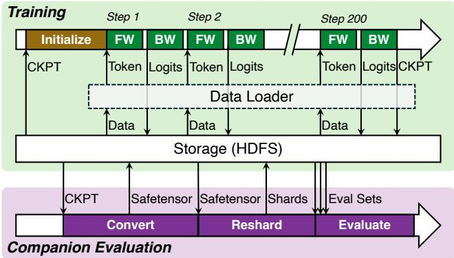  
Figure 1: Data Pipeline in Pre-training

The storage tier persists all artifacts required during pretraining, including training datasets, model checkpoints, and logits. Training datasets encompass heterogeneous modalities such as text, images, and videos. Checkpoints contain metadata together with sharded tensors for model parameters and optimizer states [21] and serve as the authoritative record of training progress. Logits capture the raw, unnormalized prediction vectors emitted after each forward pass, which are typically not used during training but are essential for debugging and monitoring model behavior.

The dataloader sits between storage and the training framework. It transforms raw data into the formats expected by the model and coordinates data movement through CPU memory onto GPUs. The transformation operations include computationally intensive steps such as video and image decoding, spatial resizing for vision inputs, tokenization and sequence packing for text data [30, 33]. The dataloader thus acts as both a transformation engine and a staging mechanism that prepares and pipelines data efficiently to the accelerator stack.

Pre-training jobs interact with the data pipeline through two I/O paths. They issue direct reads and writes to the storage tier when initializing from checkpoints, persisting checkpoints, and emitting logits. In parallel, they obtain training data through the dataloader, which performs storage reads and executes sample transformation. Together, these interactions define the steady state and bursty I/O patterns imposed on the storage subsystem.

We characterize pre-training execution as consisting of three phases: initialization, iterative training, and companion evaluation, each with different data access behaviors.

During the initialization phase, the training framework issues blocking operations on the critical path. Specifically, it loads the full model checkpoint, including parameters and optimizer states, from the storage tier. These tensors are distributed or replicated across thousands of ranks, i.e., the worker processes participating in distributed training that typically own one GPU each, according to the adopted parallelization strategy [40, 46, 59].

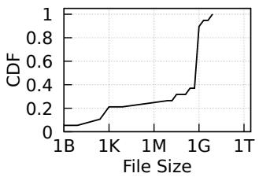  
(a) T-L Dataset

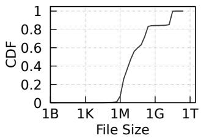  
(b) MM-L Dataset  
Figure 2: The file size distribution in datasets used in T-L and MM-L traces.

After initialization, the job enters the iterative training phase, which executes a sequence of training steps. We define a step as the processing of a full batch of data, culminating in a single model parameter update after the necessary forward and backward passes. During this phase, storage access proceeds largely asynchronously with GPU computation. The dataloader continuously prefetches and transforms data for future steps, while the training framework writes logits after every forward pass and periodically persists checkpoints to storage. These activities generate sustained read and write traffic throughout the training run.

The companion evaluation phase runs periodically in parallel with iterative training on separate evaluation clusters, as evaluation usually imposes different scheduling and resource needs compared to training. Since training metrics such as loss are often insufficient to detect issues such as quality degradation or model collapse, companion evaluation provides an external measurement of progress by assessing the model on a recent checkpoint and on data that is distinct from the training set (i.e., real-world benchmarks [14, 26, 27]). Each evaluation cycle loads the latest checkpoint from storage, merges the sharded tensors into unified formats, and then loads both the merged checkpoint and benchmark suites, before executing inference and writing the results back to storage. Although logically separate from training, the results of companion evaluation can feed back to the training control plane and trigger a rollback.

## 2.2 Data in Pre-training

## 2.2.1 Traces

To investigate I/O access patterns, we select a set of five representative training tasks from a pool of 30 thousand traces collected over a 90-day period. As detailed in Table 1, these tasks exemplify state-of-the-art production workloads, accounting for 70% of total GPU hours while capturing diversity in:

• Modality: We cover mainstream training domains spanning

text-only and multimodal workloads.

• Scale: The tasks range from small (billions-parameter) to large (trillion-parameter) models, utilizing training cluster sizes between approximately 4K and 20K GPUs.

• Training strategy: We incorporate diverse distributed strategies, including FSDP [59], FSDP2 [37], and Megatron [46], which constitute the dominant paradigms in our training environment.

To characterize these workloads, we employ a multilayered tracing approach that spans both the training framework and the storage layer. At the storage layer, we collect per-operation records from HDFS client and server endpoints, including the access path, operation type (e.g., open, read, pread, write, and close), request size, start and end timestamps, and observed latency. At the training layer, we use Py-Torch Profiler [38] and manual instrumentation to record the start and end times of major phases, including checkpoint loading and saving, dataloader fetch and transformation, forward and backward computation, logits saving, and companionevaluation merge and resharding. We then join these records using timestamps to distinguish raw storage service time from framework-visible end-to-end latency, which is necessary for interpreting the data loading measurements in Table 2. We will release the traces once anonymized.

## 2.2.2 Data Types

Based on our sampled traces, we classify the data flowing through the pipeline into three primary types: datasets, checkpoints, and logits. Table 2 quantifies the distinct I/O patterns, including average I/O sizes per training host, average I/O latency, and I/O frequency, exhibited by each type across our production workloads.

Dataset: During each training step, the dataloader retrieves part of the dataset from storage, transforms each sample into model-ready tensors through operations like decoding, cropping and tokenization, and feeds the result to the GPU for computation. The modality of the model significantly influences the characteristics of the dataset. For instance, in the text-based T-L training task, the dataset occupies approximately 20 TB across 20K files. In contrast, the multimodal MM-L task employs a vastly larger dataset containing diverse file types, with a total size of about 6 PB and a file count exceeding 3 million. Figure 2 illustrates the file size distribution for these datasets. Table 2 reports the end-to-end data loading latency, which includes both the retrieval and the transformation steps; we further break this down in Section 5. Checkpoint data: A training checkpoint consists of model parameters, optimizer states, dataloader states, and miscellaneous metadata. At regular intervals (e.g., every 100 or 500 steps), this checkpoint data is persisted to the underlying storage system to ensure fault tolerance [29, 50]. We detail the checkpoint sizes for the sampled traces in Table 1. The tracelevel view in Table 2 further shows per-host checkpoint read and save sizes, which differ substantially due to deduplicated writes; Section 4 explains the source of this asymmetry in detail.

Table 1: Model training strategies, types, and checkpoint sizes of the representative trials sampled for this study. Each trial runs on a production cluster with thousands of GPUs.  
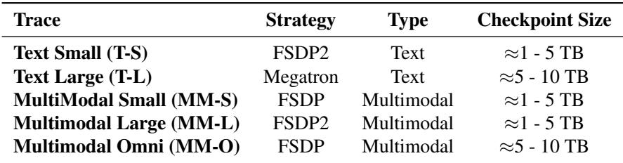

Table 2: Average I/O size, latency, and interval statistics. Values represent the average size per training host. Each metric reports the end-to-end data pipeline latency observed by the training framework. The symbol ’–’ indicates data is unavailable because the feature was disabled during model training.  
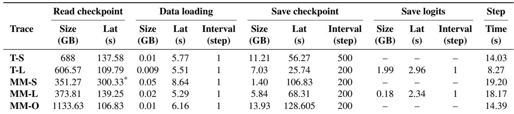  
Denotes that this data is obtained before predictive hotspot prediction (Section 4)

Logits data: Logits represent the raw, unnormalized prediction vectors output by the final layer on each rank. Depending on the model configuration, this results in approximately 30 MB to 300 MB of data. Unlike checkpoints, which are required for fault tolerance, logits are mainly persisted for debugging and monitoring. Developers optionally enable logits saving during phases such as early training, configuration up dates, or divergence diagnosis, while stable steady-state runs often disable it to conserve I/O bandwidth. When enabled, logits are generated after every forward pass and persisted at every step.

## 2.3 Emerging Storage Challenges

During pre-training, distinct data types are accessed at specific phases of the lifecycle, often generating I/O operations that consume a significant portion of the total timeline. In this paper, we characterize the unique I/O bottlenecks inherent to each distinct phase and present our production mechanisms to address them.

1. Cross-DC I/O in companion evaluation (§3). Companion evaluation is critical for validating pre-training models, but is bottlenecked by the need to fetch checkpoints from remote (cross-DC) training clusters due to scheduling and hardware constraints. This creates significant I/O challenges: a “small-

IO latency trap” where fetching thousands of small tensors is bound by WAN RTT rather than bandwidth, and severe bandwidth contention from concurrent background tasks. To mitigate these issues, we introduce Predictive Checkpoint Replication, which leverages the regular evaluation interval to pipeline and batch checkpoint replication in advance, and Signal-Driven Prioritization, which allocates bandwidth to urgent evaluations triggered by training anomalies.

2. The initialization I/O storm (§4). The initialization phase is bottlenecked by an “I/O storm” where synchronous checkpoint loading triggers massive data contention on a small set of hot files (e.g., global metadata and replicated parameters). This contention saturates storage nodes, creating straggler reads that block the entire cluster and waste significant GPU cycles. To resolve this, we introduce Proactive Hotspot Prediction, a cooperative mechanism where the training framework explicitly signals deterministic access patterns to the storage layer. This allows the system to pre-replicate hot files before the job starts, diffusing contention and converting unpredictable tail latency into constant-time access.

3. The transformation wall (§5). For multimodal (e.g., MM-L) pre-training, data loading shifts from being I/O-bound to compute-bound due to the high cost of transforming video and image data (e.g., decoding, cropping). This “transformation wall” creates severe straggler issues where slow host-side processing forces GPUs to idle, wasting significant compute resources during the iterative training phase. Offline transformation is infeasible due to extreme storage amplification (50× ∼ 100×) and inflexibility to hyperparameter changes. To resolve this, we introduce Storage-Side Transformation Offloading. By leveraging the predictable ordering provided by our deterministic dataloader and underutilized CPUs on storage nodes, we push compute-intensive transformations down to the storage tier. This “Just-in-Time” processing pipeline overlaps transformation with training and reduces both latency and stall time.

## 3 Cross-DC Companion Evaluation

Training large-scale foundation models with hundreds of billions of parameters is a costly and extended process that involves thousands of GPUs running for weeks or months. In this environment, detecting training issues early is essential. Although monitoring training loss is common practice [48, 56], our production experience shows that in-loop signals such as loss and gradient norms are not reliable indicators of model health. A model may show stable training loss while already exhibiting forgetting or collapse on downstream tasks. This gap motivates the use of companion evaluation, a continuous, out-of-band validation pipeline that assesses model performance in parallel with training. In our deployment, companion evaluation serves as a critical safeguard that helps prevent the training system from progressing on an already diverging model state.

In our production environment, companion evaluations execute on separate clusters that are often located in different datacenters. This design is driven by two primary constraints. First, pre-training jobs demand strict synchronous execution across thousands of GPUs, relying on gang scheduling [12] to maintain lockstep progress; consequently, inserting evaluation tasks into the same cluster would fragment scheduling and degrade training throughput. On the other hand, while pre-training necessitates the latest accelerator generation with high-speed interconnects to minimize the step time, evaluation workloads are throughput-oriented and can run effectively on older, more cost-efficient hardware. These evaluation clusters are typically deployed wherever power and space are available, often resulting in physical separation from training resources.

## 3.1 Companion Evaluation Workflow

The bottom part of Figure 1 illustrates the end-to-end workflow of companion evaluation. Each evaluation run transforms a distributed training checkpoint [8] into an inference-ready model and then executes benchmark workloads. The workflow proceeds in three stages.

First, checkpoint merging converts distributed checkpoint shards into inference-ready modality submodels. During training, the training framework writes checkpoints as many distributed shards optimized for parallel writes on large training clusters [50]. For evaluation, however, these shards must be converted into a standard inference format such as safetensors [42]. The evaluation cluster therefore retrieves the relevant parameter shards from remote storage and performs merging separately for each modality: it reconstructs the complete parameter tensors, discards optimizer states and other tensors that are unnecessary for inference, and writes each merged modality submodel to local storage as safetensors files.

Table 3: Data read/write sizes and time consumption for the MM-L model. The checkpoint merging phase dominates I/O time due to cross-DC traffic.  
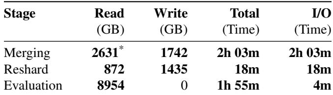  
Denotes Cross-DC Traffic

Next, model resharding reorganizes the merged checkpoint to match the device topology and parallelism configuration of the evaluation cluster. This reshaping ensures that inference can be executed efficiently across the available devices.

Finally, the model evaluation stage uses a client-server architecture. The server component loads the resharded model and initializes the HTTP serving endpoint, while the client simultaneously executes inference across benchmark datasets to quantitatively assess model quality. The system writes the resulting metrics to storage, and the training control system subsequently ingests them.

This workflow requires substantial data movement and local processing, and its efficiency is directly shaped by the network and storage behavior observed during checkpoint merging. Table 3 shows the data sizes and time distribution of these stages.

## 3.2 Checkpoint Merging Bottlenecks

Our study spans a 30-day observation window covering 19 pre-training tasks across models ranging from small to large parameter counts. During this period, the system executed 3,589 companion evaluations, which contributed to operational efficiency by identifying 156 critical model regressions.

The value of this mechanism depends on timely feedback. When evaluation results are delayed, training continues to advance on a divergent model state, which both wastes training GPU time and makes recovery harder.

The root of this delay lies in data I/O. For a representative multimodal large model (MM-L), Table 3 shows that a single evaluation cycle can exceed four hours, with data I/O accounting for approximately 56.6% of the end-to-end time. The cost of this I/O bottleneck is substantial: across the 156 regressions in our dataset, I/O-induced delays wasted approximately 2.6 million GPU hours, offsetting nearly half of the 5.5 million training GPU hours that the evaluation system would otherwise have saved.

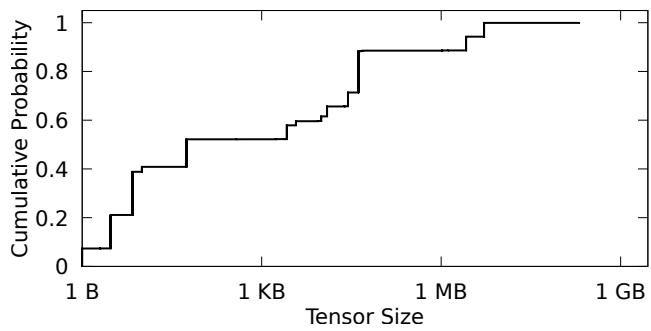  
Figure 3: CDF of tensor sizes in a typical checkpoint. The prevalence of small tensors exacerbates the latency penalty of cross-DC reads.

Of this long data I/O time, we further find that 84.8% is consumed by the checkpoint merging phase, which must read approximately 2.6 TB of data over the Wide Area Network. Unlike later stages that operate entirely on local storage, checkpoint merging requires retrieving tensors across dat acenters, which makes it the principal source of evaluation delay. Specifically, we identify two primary causes of the delay:

Small-I/O latency trap. Transformer-based models consist of thousands of disjoint tensors, particularly small LayerNorm parameters and Biases. As illustrated in Figure 3, over 60% of the tensors in the MM-L checkpoint are smaller than 16 KB. Because the per-modality merge described in Section 3.1 retrieves only the parameter tensors needed for each submodel, the resulting reads are issued at tensor granularity rather than as bulk transfers. Even when the merge server fetches tensors concurrently, each request still requires several cross-DC WAN round trips. This fragmentation interacts poorly with the underlying distributed file system, which is optimized for coarse-grained 128-MB blocks. This mismatch produces two effects:

• Read amplification. Fetching a 4 KB tensor often requires reading a significantly larger block on HDFS data nodes, incurring about 1.5× read amplification.

• RTT-bound throughput. On a high-latency WAN link (typical 100 ms RTT), the throughput for these thousands of small tensor reads becomes bound by latency rather than bandwidth. This manifests as the “sawtooth” throughput pattern in Figure 4, where effective utilization drops to a fraction of the available link capacity (i.e., 60 Gbps).

Bandwidth contention. Even for large tensors, cross-DC bandwidth remains a scarce resource contended for by hundreds of concurrent tasks (208 on average), including data migration, log aggregation, and parallel evaluations. Figure 5 illustrates this contention; the average available bandwidth per task fluctuates significantly and often degrades to less than 1 GB/s. A naive “First-Come, First-Served” policy fails in this context because it treats latency-critical evaluations indistinguishably from background archival jobs.

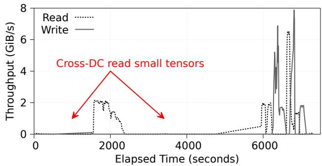  
Figure 4: Throughput during Checkpoint Read. The performance is limited by the high RTT of cross-DC links when fetching small tensors.

## 3.3 Training-Aware I/O Optimization

To address the cross-DC I/O bottlenecks identified earlier, we apply two training-aware optimizations that require no dedicated network hardware.

Predictive checkpoint replication. Companion evaluations follow a predictable interval, typically every one thousand training steps. This regularity allows us to initiate pipelined checkpoint replication as soon as the training system begins saving a checkpoint at the scheduled interval. Rather than letting the merge script issue thousands of tensor-granularity WAN reads, the storage system batches the required checkpoint shards into large contiguous transfers and caches them in the evaluation cluster’s storage tier. A lightweight serverside namespace service, NNProxy, then directs evaluation jobs to read from these local cached shards when they are available. This converts many Wide Area Network reads into local reads and removes both cross-DC RTT and small-read fragmentation from most scheduled evaluations.

Signal-driven prioritization. Not all evaluations have equal urgency. While periodic evaluations follow a fixed schedule, others are triggered by training anomalies such as loss spikes or abnormal gradient behavior. These events require faster feedback. We introduce a simple priority signal that combines model scale, task importance, and anomaly severity. The storage scheduler uses this signal to preempt background traffic and allocate network bandwidth to urgent evaluations, reducing delay when fast diagnosis is needed.

## 3.4 Evaluation

By applying the above optimizations, we convert previously unmanaged I/O contention into predictable resource allocation. These training-aware mechanisms reduce average checkpoint merging latency by 76.1%, with improvements reaching 89.3% for the T-S model and 70.8% for the MM-L model. They also cut I/O-induced compute waste per regression from 16,800 GPU hours to 4,000 GPU hours. In total, these optimizations recover nearly 2 million GPU hours across our observation window.

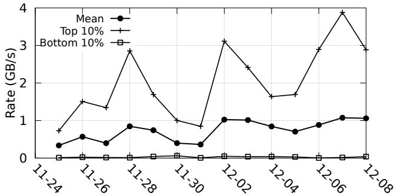  
Figure 5: The average cross-DC data transmission rate in our production environment. The bandwidth is highly contended and bursty.

## 3.5 Future Directions

To further improve performance across geographically distributed clusters, we plan to implement vertical co-design between training frameworks and storage layers. Two directions are especially promising.

Training informed storage control. Training frameworks should expose signals such as evaluation interval and convergence indicators to the storage control plane. These signals would allow the storage system to anticipate latency-sensitive operations, allocate resources accordingly, and avoid interference from background traffic.

I/O-Aware checkpoint formats. Standard distributed checkpoint layouts are optimized almost exclusively for highthroughput, parallel writes during training, which inherently introduces the structural fragmentation that plagues selective cross-DC reads. A promising direction is the design of layout-agnostic or multi-layout checkpoint formats. By restructuring how tensors are grouped, such as packing fragmented parameters (e.g., LayerNorm layers and biases) into contiguous, storage-block-aligned extents while segregating volatile optimizer states, the framework could natively support zero-overhead, selective WAN streaming without requiring extensive server-side merging.

## 4 Initialization I/O Storm

Large-scale model training is characterized not by continuous execution, but by frequent interruptions and restarts; these arise from hardware failures, automated system maintenance, and, most notably, intensive debugging cycles during model development [18, 51]. Initialization is a fully synchronous barrier because training cannot resume until every rank has reloaded its share of the latest checkpoint from storage. When thousands of ranks restart in lockstep, they issue concurrent reads against a small set of hot files at the same instant, turning the storage tier into the bottleneck of the start phase.

Table 4: Breakdown of training startup latency.  
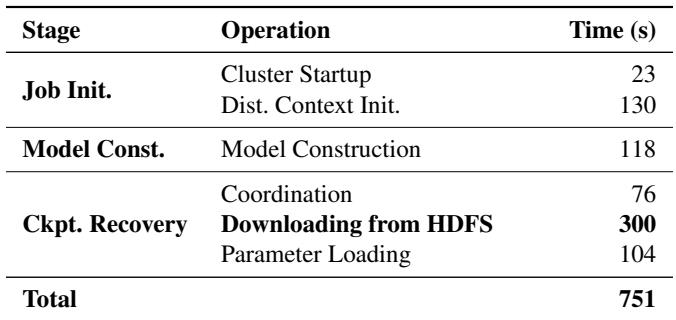

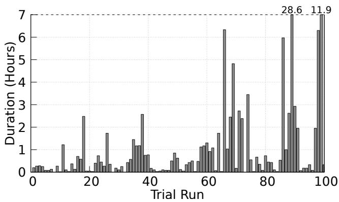  
Figure 6: Duration of continuous training sessions between restarts in the MM-S trace. Short bars indicate frequent restarts, while long bars indicate longer uninterrupted training periods.

## 4.1 Synchronized Loading Bottleneck

In our production environment, we observe that job initialization is a significant overhead. The breakdown of training startup latency in the MM-S trace, as shown in Table 4, reveals that blocking I/O operations during file download are the primary bottleneck, consuming 39.95% of the total startup duration.

The operational impact of this latency is magnified by the bursty nature of job restarts. Figure 6 depicts the restart distribution from our MM-S trace. Each bar corresponds to one restart interval, with the y-axis showing the elapsed training time before the next restart. We observe distinct clusters of activity where developers repeatedly restart jobs for code updates or hyperparameter tuning. For instance, within a single

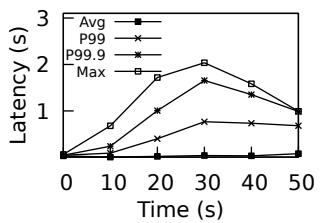  
(a) Read Latency

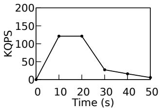  
(b) Read QPS

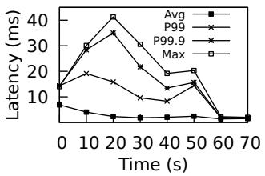  
(c) OpenFile Latency

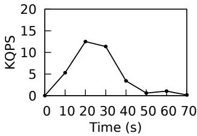  
(d) OpenFile QPS

Figure 7: Latency and throughput (QPS) for Read and Open-File operations under the default 3-replica policy.  
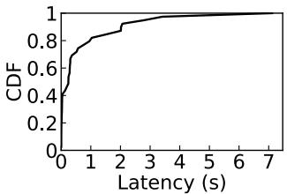  
(a) Access latency CDF.

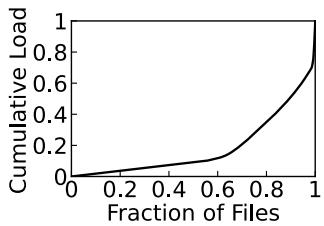  
(b) Cumulative load distribution.  
Figure 8: Characterization of I/O contention. (a) Latency distribution for file downloads. (b) Load distribution relative to the fraction of files.

111-minute debugging window, a job underwent 4 consecutive restarts. With an average downloading cost of 5 minutes per run, this I/O overhead accounts for 18.02% of the total wall-clock time, severely throttling developer velocity and wasting costly GPU cycles. Extrapolating to our cluster-wide operation, the startup delay would result in a loss of more than one million GPU hours annually.

## 4.2 The Anatomy of an I/O Storm

To pinpoint the root cause of slow checkpoint loading, we conduct a controlled experiment scaling to 2,048 GPUs. We instrument the storage client to decompose the latency of every I/O request.

Contrary to common assumptions that metadata operations (e.g., open, getattr) are the bottleneck in distributed file systems [23], our analysis reveals that data contention is the primary culprit. As illustrated in Figure 7, open latencies remain low and stable. However, read operations exhibit extreme tail latencies that correlate perfectly with QPS spikes.

Figure 8a plots the CDF of download latency. The distribution exhibits a pronounced long tail, indicating that while the majority of downloads complete quickly, a small fraction of tasks suffer from significantly high latency. Our breakdown shows that these few straggler reads dominate the completion time, accounting for 67.97% of the total wait.

By calculating the peak QPS for each file within 0.5-second windows, we observe a heavy-tailed distribution in Figure 8b. The cumulative load represents the contribution to the aggregate peak QPS (i.e., the sum of all individual file peaks). Specifically, the top 5% of files account for 38.8% of this total pressure. These hotspots are typically caused by two sources: global metadata files (e.g., .metadata or common\_states) accessed by all ranks, and more significantly, access skew resulting from redundancy elimination.

This skew is a byproduct of current checkpointing systems [8, 35, 50, 52], which prioritize write throughput and storage efficiency by employing parallel saving coupled with redundancy elimination. While effective for writing, this approach causes loading asymmetry. We illustrate this issue using the Embeddings and MoE layers. For Embeddings (which are replicated parameters), the system persists only a single copy to minimize overhead; consequently, restoring this layer triggers a one-to-many access storm where hundreds of ranks concurrently contend for a solitary file. Under the standard 3-replica policy, the limited replicas are overwhelmed by such concurrent requests, causing latencies to increase sharply. In contrast, MoE experts (which are sharded parameters) are saved as distinct files corresponding to their parallel groups. This allows subsets of ranks to access different files concurrently, effectively distributing the load and avoiding the single-point bottlenecks observed in the embedding layer.

## 4.3 Proactive Hotspot Prediction

Facing this challenge, traditional storage systems employ reactive replication [3, 54]: they detect heat via runtime monitoring and trigger replication when thresholds are breached. In the context of training startup, this approach is fundamentally flawed for two reasons. First, the contention window is transient (often lasting only tens of seconds). By the time the system detects the hotspot and creates new replicas, the loading phase is already over. Second, initiating replication traffic during the I/O storm competes for the already saturated network bandwidth, exacerbating the bottleneck rather than relieving it. To address these limitations, mitigation must be proactive, leveraging the training framework’s information to prepare the storage layer before the storm begins.

We propose a cooperative mechanism in which the training framework explicitly informs the storage system about upcoming access patterns via a SetReplicationHints interface. Since training configurations (parallelism strategy, world size) are known at job submission, the set of hot files is deterministic. The framework identifies two categories of data: global metadata, where the target replication factor is set proportional to the job’s world size N, and replicated tensors, where access demands are aggregated based on tensor-to-rank mappings to determine the expected concurrency degree ωf for each file f . Upon receiving these hints, typically immediately after a checkpoint is written or before a job is scheduled, the storage system proactively replicates the identified hot files using a heuristic policy:

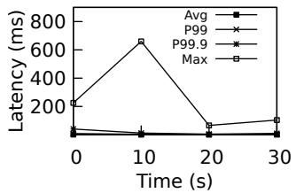  
(a) Read Latency

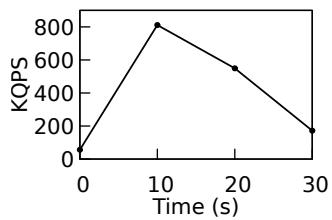

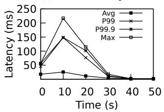  
(c) OpenFile Latency

(b) Read QPS  
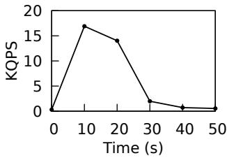  
(d) OpenFile QPS  
Figure 9: Latency and throughput (QPS) for Read and Open-File operations under the default 128-replica policy.

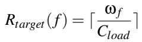

(1)

where Cload represents the safe concurrent load capacity of a single replica. To prevent storage bloat, these ephemeral replicas are tagged with a Time-To-Live (TTL) and automatically reclaimed after the startup phase concludes.

## 4.4 Evaluation and Discussion

We evaluate proactive replica expansion on the 2,048-GPU training job. Based on the job scale and the predicted checkpoint access pattern, the policy increases the replication factor of hot metadata and replicated-parameter files to 128 before checkpoint recovery begins.

As shown in Figure 9, replica expansion improves checkpoint loading in two ways. First, the peak aggregate Read QPS increases, indicating that compute nodes spend less time blocked on storage and can issue requests more aggressively. Second, and more importantly, the average read latency decreases because the hottest files are no longer served by only a small number of replicas. By eliminating straggler reads, the total checkpoint loading time decreases from 38.48 s to 22.78 s, a 40.8% improvement.

While the absolute saving in this controlled 2,048-GPU experiment is on the order of seconds, the operational impact grows with training scale. Without intervention, synchronized checkpoint recovery creates increasingly severe contention as more ranks restart together. By preparing replicas before the recovery phase, proactive replica expansion turns an unpredictable, scale-dependent storage bottleneck into a more stable loading process. Based on these results, we have codified replication guidelines for our production environment: 64 replicas for 10k-GPU clusters and 128 replicas for 20k-GPU clusters.

The benefit of replica expansion depends on how the training parallelism strategy materializes model state during checkpointing. In the most favorable case, fully sharded data parallelism already spreads parameter shards across ranks and files. The remaining imbalance usually comes from a small set of shared structures, such as checkpoint metadata, common states, or other non-sharded tensors. Expanding only these structures is often enough to make the recovery load well balanced across storage replicas, with little storage overhead. The common production case is less ideal but still highly targeted: each rank typically saves a small number of tensors, often a single tensor, so most files have clear ownership while replicated tensors and global states still create a few hot files. Replica expansion is effective here because the system only needs to expand this small hot subset instead of increasing the replication factor of the entire checkpoint. A less favorable case arises when a replicated tensor is packed together with much larger sharded parameter shards in the same checkpoint file. Since the replication decision is made at file granularity, expanding the file for the shared tensor also replicates the unrelated sharded data.

## 4.5 Future Directions

To further improve checkpoint recovery at larger training scales, future systems could better align checkpoint file layout and recovery-time fanout with replica expansion.

Deduplication-aware checkpoint packing. A natural extension is to consider recovery-time replication when partitioning tensor saving tasks. Tensors that are aggressively deduplicated, and therefore likely to be read by many ranks during recovery, should be placed in dedicated files or co-packed with tensors that require similar replica expansion. This layout keeps file-level replica decisions aligned with tensor-level demand: expanding a hot file increases capacity for shared reads without also copying large unrelated shards.

Communication-assisted checkpoint loading. The loading plan of checkpoint recovery already indicates which ranks share the same checkpoint shards, providing the information needed to organize communication-assisted fanout. Depending on deployment scale, rank locality, and frameworkintegration constraints, future systems could serve a hot shard through additional storage replicas, a scoped broadcast path, or a hybrid of both.

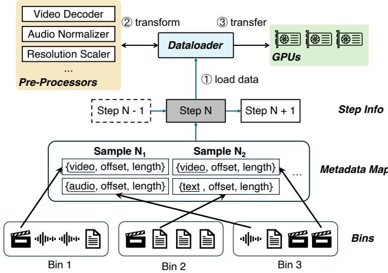  
Figure 10: Structure of the on-disk format and the data loading pipeline for the deterministic dataloader.

## 5 MM-L Transformation Wall

In conventional text-only model training, the data loading process is effectively hidden behind GPU computation. Data reads and lightweight tokenization finish well before each step starts, leaving the training loop compute-bound. However, as training moves from text-only models to multimodal models, the dataloader must serve not only text but also heterogeneous data such as audio, video, and images. As a result, data loading for multimodal training can no longer be fully overlapped with GPU execution, causing the input pipeline to exceed the compute time by a wide margin and become the dominant source of training stalls.

## 5.1 Deterministic Dataloader

Multimodal training in our environment uses a deterministic dataloader architecture. Unlike standard loaders such as the PyTorch DataLoader [39] or streaming dataloaders [32] that incur runtime overhead from dynamic shuffle computation and complex state management, our approach utilizes an offline-generated global execution plan. This guarantees strict deterministic ordering across thousands of workers and achieves global random shuffling.

Figure 10 illustrates the three data formats used to organize and serve raw training data. Under the hood, the system relies on consolidated binary bins where raw multimodal data including audio, video, and concatenated image and text is stored as large contiguous binary files in the global storage system. We choose a bin size of 20 GB to balance file management overhead against the cost of merging bins, providing precise byte range access without the read amplification common in columnar formats like Parquet [49]. To enable fast lookup, we employ metadata maps that serve as a logical-tophysical translation layer, converting sample identifiers into byte offsets and lengths within the binary bins. Our production datasets contain roughly ten thousand map files totaling about 0.7 TB. Finally, we utilize per-step info files to manage ordering. Since each training epoch consumes all samples in a shuffled order, we generate a file listing the exact sequence of sample identifiers to be read. This allows shuffling to be performed entirely by permuting index entries offline, achieving a new global order without touching or rewriting the underlying physical data.

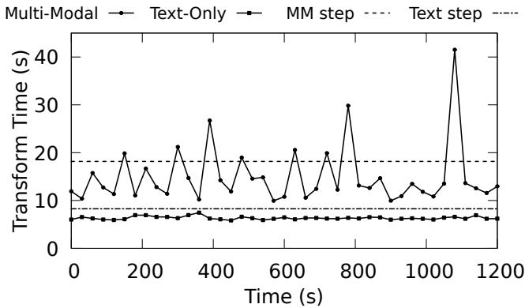  
Figure 11: Maximum dataloader latency: Text (T-L) vs. Multi modal (MM-L). MM-L suffers from extreme tail latency due to heterogeneous transformation costs.

During training, the dataloader performs the following sequence to prepare data for the next training step:

• Metadata resolution. The dataloader begins by reading the per-step info file to get the sample identifiers required for the upcoming batch. It then consults the metadata maps to translate these identifiers into byte offsets and lengths within the consolidated binary bins.

• Data retrieval. Using the resolved offsets, the dataloader issues read or pread system calls to fetch the corresponding byte ranges from the binary bins. This stage performs random access into the underlying files to retrieve only the specific samples needed for the current batch.

• Sample transformation. Once the raw bytes are retrieved, the dataloader applies modality-specific transformations. For instance, video samples will go through a series of operations such as video decoding, frame extraction, and cropping, followed by conversion to tensors, while image samples will be decoded, resized, and transformed into tensors. These operations are executed on the host CPU to avoid the large memory overhead of GPU-based transformation and to keep GPU resources focused on model computation. The resulting tensors are staged for transfer to the GPU at the start of the next step.

Table 5: Breakdown of Data Loading Latency in MM-L. Transformation dominates the pipeline, and high variance (Max vs. Avg) indicates severe straggler issues.  
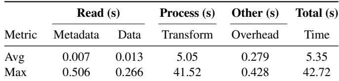

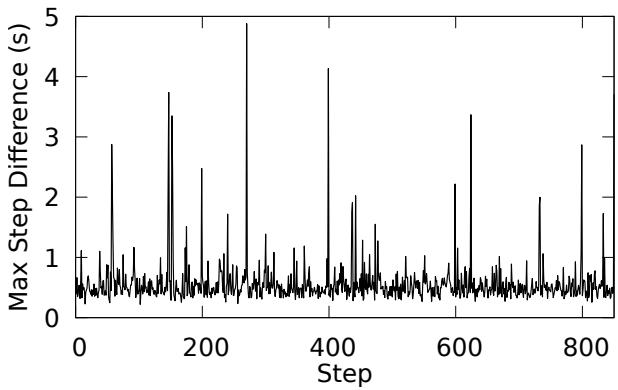  
Figure 12: The time difference in training step time across different machines.

## 5.2 Transformation Stalls

Table 5 decomposes the data loading latency into four phases in the MM-L training trace: metadata resolution, data retrieval, transformation, and runtime overheads such as timing and threading. Transformation overwhelmingly dominates the critical path, accounting for 94.4% of the total data loading time (5.05 s of 5.35 s). I/O retrieval itself is negligible, averaging only 13.6 ms. This shows that MM-L workloads are compute-bound: limited CPU capacity, rather than storage bandwidth, drives up the time required for transformation.

The heterogeneous nature of multimodal data, mixing short text with high-resolution images and long video clips, introduces substantial variability in transformation cost. Figure 11 compares the maximum data loading latency across hosts for T-L and MM-L traces. While T-L workloads show tightly clustered latencies, MM-L workloads exhibit a pronounced long tail. For instance, the slowest host can take 42.72 s in our sampled period, where the average data loading time for that step is 5.35 s. This produces a 37.4 s gap in that single step.

This variability is driven by sample-length variance in multimodal datasets rather than by a transient storage issue. To preserve training coverage, MM-L batches include both lightweight samples and long video clips whose transformation cost scales with duration, codec complexity, and the number of sampled frames. As GPU step time continues to shrink, this host-side long tail becomes increasingly difficult to hide behind model computation. In our sampled phase, a host processing a 161.9 MB sample requires 41.5 seconds to finish the transformation, causing the time variation. In contrast, other hosts process an average of only 20 MB and complete the transformation in 5.05 seconds. In extreme cases, a machine assigned a 500 MB H.264 video of about 10 minutes requires over 2.18 minutes for decoding and frame extraction, even with decord using hardware-accelerated decoding and four concurrent decoding threads. Such stragglers force thousands of GPUs to idle, waiting for them to complete. Figure 12 illustrates the variance in training step duration. We find that for a single step, the execution time difference across hosts can reach up to 5 seconds, forcing other nodes to wait for the straggler. This temporal skew directly translates to a waste of over 10,000 GPU hours per day.

## 5.3 Storage-Side Transformation Offload

Addressing this bottleneck requires reducing the cost of the transformation phase. While performing offline transformation (i.e., decoding and transforming raw samples into readyto-train tensors before training) seems like a straightforward solution, it is not viable at the production scale for two fundamental reasons. First, storage amplification makes storing decoded data prohibitive. High-resolution images and videos are typically archived in space-efficient formats such as JPEG [19] and H.265 [17]. Decoding them into float tensors causes extreme storage expansion: video footprints increase by more than 40×, while images exhibit a smaller but still substantial expansion of several tens of times. At the petabyte scale, the decoded representation would demand storage in the exabyte range, merely shifting the bottleneck from online CPU transformation to raw storage capacity. Second, offline transformation suffers from inherent inflexibility. The required transformations depend heavily on model hyperparameters such as crop size, frame count, and resolution, all of which vary across pre-training runs. Any alteration to the model architecture or data augmentation policy necessitates a complete regeneration of the pre-transformed dataset. This process consumes millions of GPU hours and significantly hampers model development velocity.

Instead, we exploit a resource that is already paid for: storage nodes in high-throughput clusters often have underutilized CPU capacity. While training hosts are saturated by model computation and media processing, storage nodes are typically bottlenecked by network or disk bandwidth, leaving significant compute capacity idle.

This opportunity arises from a fundamental I/O-compute mismatch in our cluster. We observe that while training nodes are Compute/Memory saturated, storage nodes are typically bounded by HDD seek latency or Network Interface Card (NIC) limits. Our telemetry indicates that storage node CPUs often sit at 20–30% utilization waiting for I/O interrupts, a resource gap we exploit to hide the format conversion cost.

We redesign the storage layer to act not just as a data repository, but as a Disaggregated Pre-processing Engine. This design is fundamentally enabled by the strict determinism of our deterministic dataloader (Section 5.1). Since the data consumption sequence is fixed in the global index, the storage system can accurately predict future data access patterns, allowing it to perform transformation using its idle cores. We implement a Pushdown Transformation Engine with three core mechanisms:

Schedule synchronization. Upon training initialization, the training framework shares the dataset identifier and step progress with the storage system. Storage nodes, having access to the per-step info files, autonomously resolve the sequence of upcoming data blocks. This eliminates the need for the training client to issue millions of data and metadata operation RPCs during the critical path.

Just-in-Time (JIT) transformation. Storage nodes maintain a Consumer Queue for the training job. They speculatively read raw binary data and execute the registered transformation graph such as decoding, random cropping, and normalization in the background. This pipelining ensures that while the GPU computes Step N, the storage layer is already preparing tensors for Step N + 1. For video samples, the storage-side engine also applies frame sampling before data is sent back to the training cluster. This keeps the network payload bounded despite the temporary expansion caused by decoding and prevents format inflation from becoming a new tail-latency source.

Load-aware fallback. To prevent saturating the storage node, we implement dynamic backpressure to guarantee storage stability, which is a hard constraint in our shared production environment. If a storage node’s CPU usage exceeds a safety threshold (e.g., 80%), it aborts the transformation and returns raw bytes to the training dataloader. The training client detects the data format (Tensor vs. Binary) and falls back to local processing. This hybrid approach allows us to absorb transformation spikes using the aggregate compute power of the storage fleet while protecting the storage control plane from overload.

## 5.4 Evaluation

This architecture yields significant improvements in our production environment, validating the effectiveness of moving compute to the storage tier. Specifically, by offloading heavy lifting to the storage pool, the P99 data loading latency drops by 85.7%, effectively mitigating the straggler effect. In terms of training efficiency, stall time due to transformation stragglers is reduced by 63.2%, translating to a relative 10.8% improvement in MFU. Finally, for resource utilization, we observe a 94% reduction in data loading CPU usage on training hosts, practically eliminating the host-side bottleneck.

## 5.5 Future Directions

Storage-side transformation offload depends on co-located compute headroom in the storage tier. This assumption holds in our environment because the same storage clusters support large-scale data processing and often have idle CPU cycles while waiting on disks or network. It may not hold for cloud object stores or lean storage appliances that expose little programmable compute near the data [2, 28]. In such cases, other techniques are also possible to improve the transformation performance and reduce the training slowdown:

Processed-sample caching: Caching preprocessed samples [22, 30, 58], as previous work suggests, can complement storage-side offload when training repeatedly revisits data. In large-scale pre-training, which is the focus of this paper, globally shuffled samples are rarely revisited within the useful lifetime of a cache, so processed-data caching provides little hit-rate benefit while adding consistency and capacity pressure. In regimes with repeated sample access, such as reinforcement learning or repeated fine-tuning over a smaller corpus, caching becomes effective and can store the transformed outputs produced by the storage-side engine.

Predictive transform-aware batching: Since the deterministic dataloader knows the exact sample sequence offline, a lightweight cost model can be used to predict each sample’s transformation cost in advance, based on metadata such as raw sample size, codec, resolution, and clip duration. With these estimates, batches can then be composed to balance transformation cost across hosts, mixing heavy and light samples so that no single host is assigned a disproportionate share of expensive clips.

## 6 What If?

Building an efficient data pipeline for exabyte-scale pretraining necessitates navigating trade-offs between storage cost, compute efficiency, and engineering complexity. Along our operational journey, we critically evaluated several alternatives that we eventually discarded as impractical at scale. We structure this discussion as a series of “What If” questions. Q1: What if we used Peer-to-Peer (P2P) distribution for model loading?

In Section 4, we address the initialization storm by proactively replicating data on storage nodes. While P2P distribution (e.g., NCCL [10] and UCX [45]) theoretically scales linearly with cluster size, we strictly prioritize a hierarchical client-server model to mitigate multi-tenancy interference and tail latency sensitivity.

First, large GPU clusters concurrently execute multiple training tasks. P2P’s unstructured, all-to-all traffic pattern induces network congestion, saturating buffers and disrupting the latency-sensitive NCCL collectives of concurrent jobs. Second, training initialization functions as a synchronous barrier constrained by the slowest node. P2P performance remains inherently probabilistic; a single slow peer—suffering from throttling or local congestion—delays the startup of the entire gang. In contrast, our hierarchical replication guaran tees a deterministic SLA with confined north-south traffic, effectively isolating the cluster from cross-tenant interference and probabilistic tail latencies.

## Q2: What if we deploy a dedicated transformation cluster as an alternative to storage-side processing?

In Section 5, we address multimodal transformation overhead by offloading compute to storage nodes. An alternative is a dedicated sample transformation cluster, a fleet of CPU-rich machines that decode and transform data before forwarding tensors to training hosts. This architecture, exemplified by tf.data service [33] and Ray Data [31], decouples data preparation from training. We reject this design due to significant network amplification and operational overhead.

First, decoded tensors dwarf their compressed sources. Video decompression inflates data volume by 50–100×; transferring these tensors over the datacenter network shifts the bottleneck from CPU to bandwidth and saturates the shared fabric. Second, a standalone cluster introduces provisioning complexity: capacity must be sized for peak multimodal demand yet remains idle during text-only workloads. In contrast, our storage-side offloading exploits spare CPU cycles already provisioned on storage nodes, avoiding network amplification and eliminating the need for a dedicated resource pool.

## Q3: What if we migrate to a specialized AI-native storage system as a modern alternative to HDFS?

Recent works propose specialized AI storage systems (e.g., 3FS, AIStore) offering superior small-file performance and kernel-bypass networking. We retain and optimize a legacy Big Data system over a greenfield solution primarily due to data gravity and operational continuity.

HDFS serves as our unified data lake, hosting exabytes of data across diverse business lines beyond AI training. Migrating this volume to a new system is operationally infeasible and cost-prohibitive. Moreover, AI-native systems often require specific hardware configurations (e.g., all-NVMe) or custom clients that break compatibility with the broader ecosystem (e.g., Spark-based cleaning pipelines). Our work demonstrates that by exposing application-level patterns, legacy systems like HDFS can meet strict LLM training requirements without wholesale replacement. This software-defined approach enables iterative infrastructure evolution while maintaining service stability.

## 7 Related Work

Storage infrastructure for model training. Traditional Parallel File Systems (PFS) such as Lustre [44] and GPFS [43] provide high checkpointing bandwidth but degrade under the massive metadata pressure of multimodal datasets. Conversely, disaggregated object stores like S3 [2] and Azure

Blob [28] offer scalability but incur high latency and limited random access throughput. While emerging AI-native systems (e.g., 3FS [11], AIStore [9]) address these limitations via kernel-bypass networking and specialized caching, they often require greenfield deployments. As detailed in Section 6, migrating exabytes of legacy data to specialized stacks is operationally infeasible. Our work demonstrates that by exposing application-level determinism, general-purpose Big Data systems (HDFS [47]) can meet strict training SLAs without fundamental architectural replacement.

Data loading and global coordination. Prior research optimizes data loading through domain-specific caching (e.g., Quiver [22] and SiloD [58]) or coordinated fetching (e.g., CoorDL [30]). These systems are primarily reactive, depending on runtime hit rates. In contrast, our deterministic dataloader (Section 5.1) exploits the determinism of LLM training to convert random access into sequential streams. Regarding data formats, solutions like TFRecord [33], Web-Dataset [53], and Lance [36] mitigate random seeks by aggregating samples but complicate global shuffling. Our indexbased approach ensures global randomness without physical data movement. Finally, while works like CrossPipe [5] optimize pipeline schedules, we address the storage logistics of companion evaluation (Section 3) by leveraging namespacelevel predictive checkpoint replication to mask cross-DC latency.

## 8 Conclusion

We identify critical storage bottlenecks in large-scale pretraining, including cross-DC latency during companion evaluation, initialization storms, and multimodal transformation overhead. By leveraging workload determinism, we implement software-defined optimizations such as predictive checkpoint replication, proactive replication, and storage-side offloading to convert the storage tier into a proactive partner. These mechanisms significantly reduce companion evaluation latency, startup time, and data loading stalls. Our work demonstrates that legacy systems like HDFS can effectively support exabyte-scale training through vertical co-design.

## Acknowledgments

We are grateful to the anonymous reviewers and shepherd for their constructive feedback. We also thank our colleagues from the storage, training infrastructure, and pre-training teams for their support in deploying and evaluating the techniques described in this paper. This work is supported in part by the National Natural Science Foundation of China under Grant No.: U25B2020 and 62572454. Weidong Zhang and Youhui Bai are the corresponding authors.

## References

[1] Josh Achiam, Steven Adler, Sandhini Agarwal, Lama Ahmad, Ilge Akkaya, Florencia Leoni Aleman, Diogo Almeida, Janko Altenschmidt, Sam Altman, Shyamal Anadkat, et al. GPT-4 technical report. arXiv preprint arXiv:2303.08774, 2023.

[2] Amazon. Amazon S3 - cloud object storage - AWS. https://aws.amazon.com/s3/, June 2026.

[3] Ganesh Ananthanarayanan, Sameer Agarwal, Srikanth Kandula, Albert Greenberg, Ion Stoica, Duke Harlan, and Ed Harris. Scarlett: Coping with skewed content popularity in mapreduce clusters. In Proceedings of the Sixth Conference on Computer Systems, EuroSys ’11, pages 287–300, New York, NY, USA, April 2011. Association for Computing Machinery.

[4] BigScience Workshop. BigScience/train/tr11- 176b-ml/chronicles.md. https://github.com/ bigscience-workshop/bigscience/blob/master/ train/tr11-176B-ml/chronicles.md, June 2026.

[5] Tiancheng Chen, Ales Kubicek, Langwen Huang, and Torsten Hoefler. CrossPipe: Towards optimal pipeline schedules for cross-datacenter training. In Proceedings of the 2025 USENIX Conference on Usenix Annual Technical Conference, USENIX ATC ’25, pages 1089–1108, USA, July 2025. USENIX Association.

[6] Aakanksha Chowdhery, Sharan Narang, Jacob De vlin, Maarten Bosma, Gaurav Mishra, Adam Roberts, Paul Barham, Hyung Won Chung, Charles Sutton, Se bastian Gehrmann, Parker Schuh, Kensen Shi, Sasha Tsvyashchenko, Joshua Maynez, Abhishek Rao, Parker Barnes, Yi Tay, Noam Shazeer, Vinodkumar Prabhakaran, Emily Reif, Nan Du, Ben Hutchinson, Reiner Pope, James Bradbury, Jacob Austin, Michael Isard, Guy Gur-Ari, et al. PaLM: Scaling language modeling with pathways. Journal of Machine Learning Research, 24(240):1–113, 2023.

[7] Gheorghe Comanici, Eric Bieber, Mike Schaekermann, Ice Pasupat, Noveen Sachdeva, Inderjit Dhillon, Marcel Blistein, Ori Ram, Dan Zhang, Evan Rosen, et al. Gem ini 2.5: Pushing the frontier with advanced reasoning, multimodality, long context, and next generation agentic capabilities. arXiv preprint arXiv:2507.06261, 2025.

[8] PyTorch Contributors. Getting started with distributed checkpoint (DCP). https://docs.pytorch.org/ tutorials/recipes/distributed\_checkpoint\_ recipe.html, June 2026.

[9] NVIDIA Corporation. NVIDIA/AIStore. https:// github.com/NVIDIA/aistore, June 2026.

[10] NVIDIA Corporation. NVIDIA/NCCL. https:// github.com/NVIDIA/nccl, June 2026.

[11] DeepSeek-AI. DeepSeek-AI/3FS: A high-performance distributed file system designed to address the challenges of AI training and inference workloads. https: //github.com/deepseek-ai/3FS, June 2026.

[12] Dror G. Feitelson and Larry Rudolph. Gang scheduling performance benefits for fine-grain synchronization. Journal of Parallel and Distributed Computing, 16(4):306–318, December 1992.

[13] Aaron Grattafiori, Abhimanyu Dubey, Abhinav Jauhri, Abhinav Pandey, Abhishek Kadian, Ahmad Al-Dahle, Aiesha Letman, Akhil Mathur, Alan Schelten, Alex Vaughan, et al. The Llama 3 herd of models. arXiv preprint arXiv:2407.21783, 2024.

[14] Wenyi Hong, Yean Cheng, Zhuoyi Yang, Weihan Wang, Lefan Wang, Xiaotao Gu, Shiyu Huang, Yuxiao Dong, and Jie Tang. MotionBench: Benchmarking and improving fine-grained video motion understanding for vision language models, 2025.

[15] Yanping Huang, Youlong Cheng, Ankur Bapna, Orhan Firat, Dehao Chen, Mia Chen, HyoukJoong Lee, Jiquan Ngiam, Quoc V Le, Yonghui Wu, et al. GPipe: Efficient training of giant neural networks using pipeline parallelism. Advances in neural information processing systems, 32, 2019.

[16] Changho Hwang, Wei Cui, Yifan Xiong, Ziyue Yang, Ze Liu, Han Hu, Zilong Wang, Rafael Salas, Jithin Jose, Prabhat Ram, HoYuen Chau, Peng Cheng, Fan Yang, Mao Yang, and Yongqiang Xiong. Tutel: Adaptive mixture-of-experts at scale. In D. Song, M. Carbin, and T. Chen, editors, Proceedings of Machine Learning and Systems, volume 5, pages 269–287. Curan, 2023.

[17] ITU-T. H.265: High efficiency video coding. https: //www.itu.int/rec/T-REC-H.265, June 2026.

[18] Ziheng Jiang, Haibin Lin, Yinmin Zhong, Qi Huang, Yangrui Chen, Zhi Zhang, Yanghua Peng, Xiang Li, Cong Xie, Shibiao Nong, et al. MegaScale: Scaling large language model training to more than 10,000 GPUs. In 21st USENIX Symposium on Networked Systems Design and Implementation (NSDI 24), pages 745–760, 2024.

[19] Joint Photographic Experts Group. JPEG. https:// jpeg.org/index.html, June 2026.

[20] Heehoon Kim, Junyeol Ryu, and Jaejin Lee. TCCL: Discovering better communication paths for PCIe GPU clusters. In Proceedings of the 29th ACM International Conference on Architectural Support for Programming Languages and Operating Systems, Volume 3, volume 3

of ASPLOS ’24, pages 999–1015, New York, NY, USA, April 2024. Association for Computing Machinery.

[21] Diederik P Kingma. Adam: A method for stochastic optimization. arXiv preprint arXiv:1412.6980, 2014.

[22] Abhishek Vijaya Kumar and Muthian Sivathanu. Quiver: An informed storage cache for deep learning. In 18th USENIX Conference on File and Storage Technologies (FAST 20), pages 283–296. USENIX Association, February 2020.

[23] Jiahao Li, Biao Cao, Jielong Jian, Cheng Li, Sen Han, Yiduo Wang, Yufei Wu, Kang Chen, Zhihui Yin, Qiushi Chen, et al. Mantle: Efficient hierarchical metadata management for cloud object storage services. In Proceedings of the ACM SIGOPS 31st Symposium on Operating Systems Principles, pages 928–943, 2025.

[24] Zhiqi Lin, Youshan Miao, Quanlu Zhang, Fan Yang, Yi Zhu, Cheng Li, Saeed Maleki, Xu Cao, Ning Shang, Yilei Yang, et al. nnScaler: Constraint-guided parallelization plan generation for deep learning training. In 18th USENIX Symposium on Operating Systems Design and Implementation (OSDI 24), pages 347–363, 2024.

[25] Aixin Liu, Bei Feng, Bing Xue, Bingxuan Wang, Bochao Wu, Chengda Lu, Chenggang Zhao, Chengqi Deng, Chenyu Zhang, Chong Ruan, et al. DeepSeek-V3 technical report. arXiv preprint arXiv:2412.19437, 2024.

[26] Quanfeng Lu, Wenqi Shao, Zitao Liu, Fanqing Meng, Boxuan Li, Botong Chen, Siyuan Huang, Kaipeng Zhang, Yu Qiao, and Ping Luo. Gui odyssey: A comprehensive dataset for cross-app gui navigation on mobile devices. arXiv preprint arXiv:2406.08451, 2024.

[27] Kaijing Ma, Xinrun Du, Yunran Wang, Haoran Zhang, Zhoufutu Wen, Xingwei Qu, Jian Yang, Jiaheng Liu, Minghao Liu, Xiang Yue, Wenhao Huang, and Ge Zhang. KOR-Bench: Benchmarking language models on knowledge-orthogonal reasoning tasks, 2025.

[28] Microsoft. Azure Blob Storage | Microsoft Azure. https://azure.microsoft.com/en-us/ products/storage/blobs, June 2026.

[29] Jayashree Mohan, Amar Phanishayee, and Vijay Chi dambaram. CheckFreq: Frequent, fine-grained DNN checkpointing. In 19th USENIX Conference on File and Storage Technologies (FAST 21), pages 203–216, 2021.

[30] Jayashree Mohan, Amar Phanishayee, Ashish Raniwala, and Vijay Chidambaram. Analyzing and mitigating data stalls in dnn training. Proc. VLDB Endow., 14(5):771– 784, January 2021.

[31] Philipp Moritz, Robert Nishihara, Stephanie Wang, Alexey Tumanov, Richard Liaw, Eric Liang, Melih Elibol, Zongheng Yang, William Paul, Michael I Jordan, et al. Ray: A distributed framework for emerging AI applications. In 13th USENIX symposium on operating systems design and implementation (OSDI 18), pages 561–577, 2018.

[32] MosaicML. MosaicML/streaming: A data streaming library for efficient neural network training. https: //github.com/mosaicml/streaming, June 2026.

[33] Derek G. Murray, Jiˇrí Šimša, Ana Klimovic, and Ihor Indyk. tf.data: A machine learning data processing framework. Proceedings of the VLDB Endowment, 14(12):2945–2958, July 2021.

[34] Deepak Narayanan, Aaron Harlap, Amar Phanishayee, Vivek Seshadri, Nikhil R Devanur, Gregory R Ganger, Phillip B Gibbons, and Matei Zaharia. Pipedream: Generalized pipeline parallelism for dnn training. In Proceedings of the 27th ACM symposium on operating systems principles, pages 1–15, 2019.

[35] NVIDIA. Dist\_checkpointing package — Megatron Core. https://docs.nvidia.com/megatron-core/ developer-guide/latest/api-guide/core/ dist\_checkpointing.html, June 2026.

[36] Weston Pace, Chang She, Lei Xu, Will Jones, Albert Lockett, Jun Wang, and Raunak Shah. Lance: Efficient random access in columnar storage through adaptive structural encodings, April 2025.

[37] PyTorch. Getting started with fully sharded data parallel (FSDP2) — PyTorch tutorials 2.9.0+cu128 documentation. https://docs.pytorch.org/tutorials/ intermediate/FSDP\_tutorial.html, June 2026.

[38] PyTorch. PyTorch profiler — PyTorch tutorials 2.9.0+cu128 documentation. https: //docs.pytorch.org/tutorials/recipes/ recipes/profiler\_recipe.html, June 2026.

[39] PyTorch. torch.utils.data — PyTorch 2.9 documentation. https://docs.pytorch.org/docs/stable/ data.html, June 2026.

[40] Samyam Rajbhandari, Jeff Rasley, Olatunji Ruwase, and Yuxiong He. ZeRO: Memory optimizations toward training trillion parameter models. In SC20: International Conference for High Performance Computing, Networking, Storage and Analysis, pages 1–16. IEEE, 2020.

[41] Zhenghang Ren, Yuxuan Li, Zilong Wang, Xinyang Huang, Wenxue Li, Kaiqiang Xu, Xudong Liao, Yijun Sun, Bowen Liu, Han Tian, Junxue Zhang, Mingfei Wang, Zhizhen Zhong, Guyue Liu, Ying Zhang, and

Kai Chen. Enabling efficient GPU communication over multiple NICs with FuseLink. In 19th USENIX Symposium on Operating Systems Design and Implementation (OSDI 25), pages 91–108, 2025.

[42] Safetensors Contributors. safetensors: Simple, safe way to store and distribute tensors. https://github.com/ safetensors/safetensors, June 2026.

[43] Frank Schmuck and Roger Haskin. GPFS: A shared-disk file system for large computing clusters. In Proceedings of the 1st USENIX Conference on File and Storage Technologies, FAST’02, page 16, USA, January 2002. USENIX Association.

[44] Philip Schwan et al. Lustre: Building a file system for 1000-node clusters. In Proceedings of the 2003 Linux symposium, volume 2003, pages 380–386, 2003.

[45] Pavel Shamis, Manjunath Gorentla Venkata, M Graham Lopez, Matthew B Baker, Oscar Hernandez, Yossi Itigin, Mike Dubman, Gilad Shainer, Richard L Graham, Liran Liss, et al. UCX: an open source framework for HPC network APIs and beyond. In 2015 IEEE 23rd Annual Symposium on High-Performance Interconnects, pages 40–43. IEEE, 2015.

[46] Mohammad Shoeybi, Mostofa Patwary, Raul Puri, Patrick LeGresley, Jared Casper, and Bryan Catanzaro. Megatron-LM: Training multi-billion parameter language models using model parallelism, March 2020.

[47] Konstantin Shvachko, Hairong Kuang, Sanjay Radia, and Robert Chansler. The Hadoop distributed file system. In 2010 IEEE 26th Symposium on Mass Storage Systems and Technologies (MSST), pages 1–10, May 2010.

[48] Kimi Team, Yifan Bai, Yiping Bao, Guanduo Chen, Jiahao Chen, Ningxin Chen, Ruijue Chen, Yanru Chen, Yuankun Chen, Yutian Chen, et al. Kimi K2: Open agentic intelligence. arXiv preprint arXiv:2507.20534, 2025.

[49] Deepak Vohra. Apache parquet. In Deepak Vohra, editor, Practical Hadoop Ecosystem: A Definitive Guide to Hadoop-Related Frameworks and Tools, pages 325– 335. Apress, Berkeley, CA, 2016.

[50] Borui Wan, Mingji Han, Yiyao Sheng, Yanghua Peng, Haibin Lin, Mofan Zhang, Zhichao Lai, Menghan Yu, Junda Zhang, Zuquan Song, Xin Liu, and Chuan Wu. ByteCheckpoint: A unified checkpointing system for large foundation model development. In 22nd USENIX Symposium on Networked Systems Design and Implementation (NSDI 25), pages 559–578, 2025.

[51] Borui Wan, Gaohong Liu, Zuquan Song, Jun Wang, Yun Zhang, Guangming Sheng, Shuguang Wang, Houmin Wei, Chenyuan Wang, Weiqiang Lou, et al. Robust LLM training infrastructure at ByteDance. In Proceedings of the ACM SIGOPS 31st Symposium on Operating Systems Principles, pages 186–203, 2025.

[52] Guanhua Wang, Olatunji Ruwase, Bing Xie, and Yuxiong He. FastPersist: Accelerating model checkpointing in deep learning. arXiv preprint arXiv:2406.13768, 2024.

[53] webdataset. WebDataset/WebDataset. https:// github.com/webdataset/webdataset, June 2026.

[54] Ouri Wolfson, Sushil Jajodia, and Yixiu Huang. An adaptive data replication algorithm. ACM Trans. Database Syst., 22(2):255–314, June 1997.

[55] Guanbin Xu, Zhihao Le, Yinhe Chen, Zhiqi Lin, Zewen Jin, Youshan Miao, and Cheng Li. AutoCCL: Automated collective communication tuning for accelerating distributed and parallel DNN training. In 22nd USENIX Symposium on Networked Systems Design and Implementation (NSDI 25), pages 667–683, 2025.

[56] An Yang, Anfeng Li, Baosong Yang, Beichen Zhang, Binyuan Hui, Bo Zheng, Bowen Yu, Chang Gao, Chengen Huang, Chenxu Lv, et al. Qwen3 technical report. arXiv preprint arXiv:2505.09388, 2025.

[57] Susan Zhang, Stephen Roller, Naman Goyal, Mikel Artetxe, Moya Chen, Shuohui Chen, Christopher Dewan, Mona Diab, Xian Li, Xi Victoria Lin, Todor Mihaylov, Myle Ott, Sam Shleifer, Kurt Shuster, Daniel Simig, Punit Singh Koura, Anjali Sridhar, Tianlu Wang, and Luke Zettlemoyer. OPT: Open pre-trained transformer language models, 2022.

[58] Hanyu Zhao, Zhenhua Han, Zhi Yang, Quanlu Zhang, Mingxia Li, Fan Yang, Qianxi Zhang, Binyang Li, Yuqing Yang, Lili Qiu, et al. SiloD: A co-design of caching and scheduling for deep learning clusters. In Proceedings of the Eighteenth European Conference on Computer Systems, pages 883–898, 2023.

[59] Yanli Zhao, Andrew Gu, Rohan Varma, Liang Luo, Chien-Chin Huang, Min Xu, Less Wright, Hamid Shojanazeri, Myle Ott, Sam Shleifer, Alban Desmaison, Can Balioglu, Pritam Damania, Bernard Nguyen, Geeta Chauhan, Yuchen Hao, Ajit Mathews, and Shen Li. Py Torch FSDP: Experiences on scaling fully sharded data parallel, September 2023.

[60] Lianmin Zheng, Zhuohan Li, Hao Zhang, Yonghao Zhuang, Zhifeng Chen, Yanping Huang, Yida Wang, Yuanzhong Xu, Danyang Zhuo, Eric P Xing, et al. Alpa:

Automating inter-and intra-operator parallelism for distributed deep learning. In 16th USENIX Symposium on Operating Systems Design and Implementation (OSDI 22), pages 559–578, 2022.