USENIX

THE ADVANCED COMPUTING SYSTEMS ASSOCIATION

# Xkernel: Principled Performance Tunability of Operating System Kernels

Zhongjie Chen, Tsinghua University and Microsoft Research; Wentao Zhang, University of Illinois Urbana–Champaign; Yulong Tang and Ran Shu, Microsoft Research; Fengyuan Ren, Tsinghua University; Tianyin Xu, University of Illinois Urbana–Champaign; Jing Liu, Microsoft Research

https://www.usenix.org/conference/osdi26/presentation/chen-zhongjie

# This paper is included in the Proceedings of the 20th USENIX Symposium on Operating Systems Design and Implementation.

July 13–15, 2026 • Seattle, WA, USA

ISBN 978-1-939133-55-7

Open access to the Proceedings of the 20th USENIX Symposium on Operating Systems Design and Implementation is sponsored by

# Xkernel: Principled Performance Tunability of Operating System Kernels

Zhongjie Chen<sup>†§</sup>, Wentao Zhang<sup>‡</sup>, Yulong Tang<sup>§</sup>, Ran Shu<sup>§</sup>, Fengyuan Ren<sup>†</sup>, Tianyin Xu<sup>‡</sup>, Jing Liu<sup>§</sup>

<sup>§</sup>Microsoft Research, <sup>‡</sup>University of Illinois Urbana-Champaign, <sup>†</sup>Tsinghua University

## Abstract

The Linux kernel is permeated with constant values that are critical to system performance. Many of these constants, referred to as perf-consts, are magic numbers with brittle assumptions on hardware and workloads. Unfortunately, there is no capability of in-situ tuning of perf-const values on deployed kernels. This paper rethinks OS performance tunability. We present Xkernel, a system that offers a safe, efficient, and programmable interface for in-situ tuning of any perfconsts directly on a running kernel. Xkernel transforms any perf-const into a tunable knob on demand using a novel approach called Scoped Indirect Execution (SIE). SIE captures precise binary boundaries where a perf-const enters system state and redirects control to synthesized instructions that update the state as if new values were used. Xkernel goes beyond version atomicity when updating perf-consts to guarantee side-effect safety, a property notably absent in existing kernel update mechanisms. Case studies on various OS subsystems demonstrate significant performance benefits of tuning perf-consts which is made possible by Xkernel.

## 1 Introduction

Modern operating systems like Linux are permeated with constant values that shape system performance. These constants, referred to as performance-critical constants or perfconsts, appear in various source-code forms (e.g., macros, literals, and static integers); they govern thresholds, time intervals, batch sizes, scaling factors, etc. Whether to balance latency and throughput or to match batching behavior to device parallelism, perf-consts embed design trade-offs and workload/hardware semantics directly into kernel behavior, forming the kernel’s implicit performance policy.

Perf-consts are not tunable in deployed systems without recompiling and rebooting the OS kernels. Unfortunately, their values are often “arbitrarily chosen [40]” by developers based on brittle heuristics, limited testing, or assumptions on dated hardware, which “just happen(ed) to work well [38].” However, static magic numbers can hardly serve dynamic workloads or diverse hardware configurations, especially emerging ones that significantly deviate from the time those values were chosen (see [14,16,20,39,56,75,76]).

Ideally, perf-consts should be decided at runtime, dynamically adapting to workload patterns, hardware characteristics, and service-level objectives. In practice, the benefits of tuning perf-consts are substantial. In one of our case studies (§2.1), tuning a perf-const yields 50× throughput improvement. Yet such benefits are completely missed as modern OSes provide no mechanism for tuning perf-consts.

Today, tuning a perf-const typically involves converting it into a runtime knob via interfaces such as sysctl [77] and sysfs [54], or changing its value in kernel source and updating the deployed kernel through live patching [1,7,10,22,23]. However, neither satisfies the needs of performance tuning. The former (sysctl/sysfs) is limited to a small subset of predefined constants with fixed granularity, often systemwide, and provides no safety guarantees—the correctness of an update depends on manual reasoning. The latter needs to recompile kernel code and apply binary diffs, incurring minutes-level delays, which is fundamentally incompatible with fast policy adaptation and online tuning.

In this paper, we advocate for principled OS performance tunability—a general machinery that enables safe, fast value updates for in-situ performance tuning of any perf-consts in deployed OS kernels, without kernel recompilation or rebooting. Such tunability must support expressive, programmable policies, ensure correctness and safety, as well as allow millisecond-scale value updates.

Achieving this goal is challenging. First, the system must precisely identify all instructions that consume the original constant, in the presence of sophisticated compiler transformations such as constant folding and strength reduction. Any missed or incorrectly replaced instructions may leave unsafe remnants in the running kernel. Second, the system must generate the instructions based on the new value, as well as the tuning policies, without recompilation. Finally, the kernel execution may have already produced side effects on runtime state, and any update must not cause conflicts on them.

We introduce Scoped Indirect Execution (SIE), a novel mechanism that addresses the aforementioned challenges. Our key insight is that a constant—unlike arbitrary code— has structural semantics: its influence enters the machine state (registers or memory) at a specific point and manifests through a small instruction sequence, enabling safe, in-situ tuning of the perf-const without recompilation or rebooting. For a perf-const, the point where its value enters registers or memory, is well-scoped: it can be identified by static analysis and be represented by a symbolic state expression agnostic to compiler optimizations; moreover, it is small enough (typically several instructions) to analyze for side effects.

SIE leverages this structure to identify the precise binary region where the perf-const affects runtime machine state termed a critical span, by deriving the symbolic relationship between the perf-const and the affected registers or memory. Within this span, SIE inserts a set of indirections: small code snippets tied to specific kernel address locations. When execution reaches these locations, the indirections update the machine state to reflect the new value as per policy. Once execution leaves the critical span, the resulting state matches what would have occurred had the perf-const been changed directly in the binary. The kernel binary remains untouched; all modification occurs indirectly and locally.

To ensure safety, SIE analyzes how effects from the critical span propagate to derive a second region, the safety span, which encapsulates all consumption of constant-dependent state. At runtime, indirections are enabled only when the execution is outside the safety span, ensuring that updates never occur while the original effects are still in flight.

We build Xkernel atop Linux as the first system to realize principled performance tunability for OS kernels. Xkernel implements SIE, reducing update latency from minutes to milliseconds and supporting programmable tuning policies written in eBPF. Xkernel does not change the kernel source or require reboots. It seamlessly integrates with deployed kernels as its implementation depends on stable kernel features like Kprobe, kernel modules, and eBPF.

We evaluate Xkernel across core Linux subsystems, including CPU scheduling, memory management, storage, and network. Xkernel unlocks previously inaccessible tuning opportunities, achieving up to 50× microbenchmark improvement and boosting real-world application performance, e.g., 1.2× throughput in RocksDB and 81% latency reduction in NGINX. Xkernel enables new capabilities: online exploration of design trade-offs, adaptation to hardware and workload patterns, control of OS-internal maintenance behavior, and coordinated tuning across multiple perf-consts.

We extensively evaluate Xkernel on 140 perf-consts (comparable in scale to the 145 performance knobs exposed by sysctl). We show that SIE applies broadly, introduces negligible runtime overhead (a few hundred cycles per perf-const update), and achieves millisecond-scale policy updates.

In summary, this paper makes the following contributions:

• Principled OS performance tunability that exposes the unexplored performance benefits of pervasive perf-consts;

• Scoped Indirect Execution (SIE), a new approach that enables safe, fast performance tuning of any perf-consts with programmable policies;

• Xkernel, a practical implementation on Linux, which can directly benefit deployed kernels;

• Case studies and extensive evaluation demonstrating new opportunities and inspiring new tuning techniques;

• Xkernel is open-sourced at https://github.com/ xkernel-org/Xkernel/.

Table 1: Performance regimes of perf-consts.  
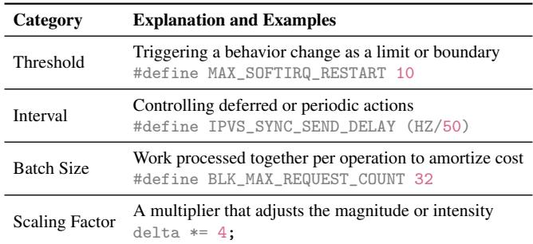

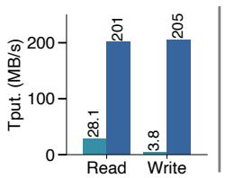  
(a) FIO on HDD

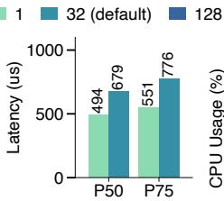  
(b) RocksDB on NVMe SSD  
Figure 1: Performance benefits of changing the value of a perf-const BLK\_MAX\_REQUEST\_COUNT based on hardware devices and workloads. The default value is 32.

## 2 Background and Motivation

## 2.1 Perf-Consts in Linux

A perf-const is a fixed numeric value used by kernel code to control the magnitude of OS behavior, without altering correctness or existence of that behavior. Table 1 shows four common types. Perf-consts are pervasive in Linux, appearing in every kernel subsystem. Typical perf-const representations include macros, literal immediates, and static const variables. Perf-consts govern core trade-offs (e.g., latency vs. throughput, responsiveness vs. utilization); they also shape how workloads interact with hardware. There are strong needs to customize their values based on application SLOs, workload behavior, and device characteristics.

A motivating example. We take BLK\_MAX\_REQUEST\_COUNT, a perf-const in Linux’s storage subsystem, as an example. Introduced in 2011 [40], this perf-const controls block I/O’s plug behavior [4] by delaying request submission to merge adjacent requests and reduce device contention. Once buffered requests reach the threshold specified by this perfconst, they are flushed to the device. The original commit shows the value was arbitrary: “16 works efficiently to reduce lock contention... 32 also works in my tests.” The choice im plicitly reflects then-current hardware—CPU speed, storage performance, and lock overhead. A decade later, in 2021, the value was raised to 32 [6], justified by observed benefits on NVMe devices. However, with the wide variety of hardware (HDD, SSD, and NVMe devices) and workload access patterns, a single magic number is inevitably suboptimal.

Figure 1(a) shows the performance benefits of tuning the perf-const. Running a sequential FIO workload [5] with intra-segment shuffling (4 KB requests randomly shuffled within each 128 KB segment) on a 7200-RPM SAS HDD, the default value (32) causes the plug to flush too frequently, missing many opportunities to merge adjacent requests. Increasing the value to 128 allows most requests to be merged, maximizing sequential disk access. This improves read and write performance by 7× and 54×, respectively.

By contrast, a large value of BLK\_MAX\_REQUEST\_COUNT may not always benefit NVMe SSDs—sometimes request merging has little benefit but adds overhead. We deploy RocksDB on a 256GB Toshiba XG3 NVMe SSD, and run the multiread-random workload from DBbench [21] with 32GB dataset (16B keys; 2048B values). We use RocksDB’s io\_uring-backed MultiGet API for asynchronous parallelism and use Direct I/O for data transfer between the storage device and user memory. As shown in Figure 1(b), reducing BLK\_MAX\_REQUEST\_COUNT from 32 to 1 reduces CPU time spent on I/O wait by 12%, yielding an end-to-end 1.2× throughput improvement, while reducing P50 and P75 latency by 1.37× and 1.41×, respectively.

## 2.2 Limitations of Existing Mechanisms

Despite the strong benefits of tuning perf-consts, modern OSes like Linux provide little support or interface—perfconsts are hardwired into kernel binary once compiled and cannot be changed at runtime once deployed in production.

Existing mechanisms are inflexible and unsafe. One way to tune a perf-const is to convert a perf-const into a runtime variable and expose it through kernel interfaces like sysctl [77], sysfs [54] or system calls. However, this is not a general mechanism—it requires modifying source code on a per perf-const basis and results in rigid, narrow interfaces.

One fundamental difficulty is to predefine a complete set of perf-consts a priori before deployment; only a very small subset of perf-consts are currently exposed. Linux interfaces like sysctl and sysfs are treated as kernel ABIs and therefore prioritize stability over flexibility [44]. For example, our analysis shows that sysctl knobs change slowly—among 145 sysctl knobs, 96 of them have remained unchanged since 2005. Moreover, decisions to expose perf-consts as sysctl knobs have been largely ad hoc, driven by developers’ preference and experience (Appendix A).

Besides the difficulty of upstreaming, source-code conversion is fundamentally inflexible: changing the granularity of a tuning policy from global (the sysctl default) to perprocess or per-cgroup requires modifying source code again, which in turn requires recompilation and rebooting.

In addition, sysctl and sysfs conversions are known to risk safety [12, 72]. In our study, 20 of 145 conversions led to bugs, largely due to concurrency: for example, the sysctl setter writes to a shared global variable from a separate context while core kernel logic reads it concurrently, easily causing races in practice. Our inspection shows that 43 sysctl knobs are potentially buggy and lead to races or inconsistent states (see Appendix A).

Kernel live patching offers no rescue. A relevant mechanism is Kernel Live Patching (KLP) [1, 50, 60, 67, 74] which enables patching deployed kernels without rebooting. KLP modifies kernel source, recompiles it, and applies the resulting binary diff to replace selected regions of the kernel image. However, KLP is not suited for perf-consts tuning.

First, KLP is too slow. It takes minutes per patch. Updating a perf-const value would require recompiling the kernel (with the new value) and patching the binary diff. By the time a patch is applied, the workload may have changed.

Second, KLP uses functions as the patching unit. When tuning spans multiple functions (e.g., due to compiler inlining or multiple affected perf-consts), finding safe quiescent points becomes difficult and fragile [13]. KLP offers no sideeffect safety and struggles to support consistent states under multi-threading [60, 67].

## 2.3 Our Goal: Principled OS Tunability

Our goal is to address the limitations of existing mechanisms and enable safe and fast tuning of any perf-consts in a running OS kernel with principled OS tunability:

Transparent in-situ tuning on deployed systems. Tuning a perf-const should not require the slow process of recompilation, redeployment, or rebooting the OS kernel.

Programmability and flexible granularity. Effective tuning requires programmable policies that can encode sophisticated algorithms and heuristics through fine-grained control (e.g., TCP flow awareness [80]). Policies should apply at flexible granularities (e.g., selected cgroups, selected devices, or their combinations) instead of fixed ones.

Out-of-box tuning for all perf-consts. A general tuning mechanism must support any perf-consts in the kernel and be fully compatible with standard OS kernel distributions.

Millisecond-scale policy updates with low overhead. Performance tuning must be fast and not cause interference on the target OS. We aim at millisecond-scale policy updates.

System safety during tuning. Tuning must be safe at runtime and must not result in inconsistent system states. Arbitrarily changing a perf-const value at runtime can be unsafe.

## 2.4 Challenges

Principled tunability introduces new challenges, stemming from the requirement to avoid recompilation and rebooting.

Precisely locating instructions for the perf-const. The compiler materializes each perf-const into instructions in the kernel binary. However, compiler optimizations can fold constants, merge lines, or reorder nearby instructions. A missed instruction leaves part of the original value in the system state; a misidentified one may overwrite unrelated computation and corrupt the system state.

Generating instructions for new values and policies. When users express new values and policies in a high-level language, we must generate the required instructions directly. KLP systems achieve this by recompiling the kernel, which introduces minutes of delay. This is challenging because the generated code must interact correctly with existing kernel instructions and avoid conflicts such as register clobbering near the original sites.

Side-effects of the original value. The original value may have already propagated, producing side effects that kernel execution still depends on. A reboot clears these effects but is incompatible with our goal. We therefore must identify and detect when these side effects have dissipated so the new perf-const value can be applied safely at runtime.

## 3 Xkernel

Xkernel is the first system to provide a safe, fast, and expressive interface for in-situ tuning of any perf-const on a deployed Linux kernel. We present the design of Xkernel, beginning with Scoped Indirect Execution (SIE), a novel mechanism for principled tunability that addresses the challenges outlined above (§2.4). We then describe the design principles and the key techniques that realize SIE and provide programmability in Xkernel.

## 3.1 Scoped Indirect Execution (SIE)

The insight is that perf-consts exhibit intrinsic instructionlevel semantics. For a perf-const, the point where its value enters the machine state (registers/memory) forms a wellscoped region. This region—a critical span—has three properties: (1) it can be localized by static analysis, (2) it corresponds to a symbolic state expression that captures the relation between the machine state and the perf-const, (3) the region is small, involving only a few instructions, which keeps correctness reasoning narrow and makes safe runtime updates tractable.

SIE identifies the critical span based on the symbolic state expression and safely redirects execution, at runtime, to a short JIT-compiled instruction sequence. These instructions execute next to the original code and, when combined, produce the same effects as if the perf-const were changed directly. The original binary remains intact; all modifications occur indirectly, within scoped regions.

SIE ensures side-effect safety by defining a second scope, safe span, within which the effects of the perf-const are encapsulated. Transitioning occurs only when execution is outside this span, converting a temporal coordination problem into a spatial one that can be analyzed statically.

SIE in Xkernel. Xkernel implements SIE on Linux. Figure 2 gives an overview of Xkernel and its user-facing workflow. Xkernel performs offline static analysis on kernel code to understand the symbolic state expression, critical span (CS), and safe span (SS) of each perf-const, and maintains them in a global scope table. The offline analysis is a onetime effort. The scope table only needs to be updated when the deployed kernel is updated.

To tune a perf-const, users (or agents) specify the perfconst in source code (by source file, line number, and token index) and implement tuning policies in eBPF, called Xktune. An Xk-tune can be loaded at any time in the OS. A lightweight Xk-runtime handles attachment and transitions.

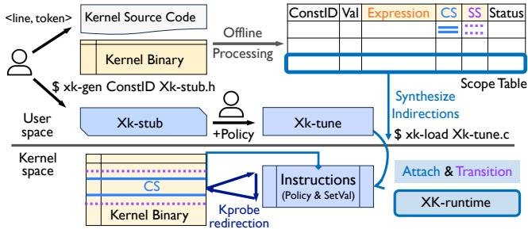  
Figure 2: Overview of Xkernel.

## 3.2 Design Principles

Separating value updates from tuning policies. Xkernel separates mechanism from policy: SIE provides a general mechanism for safe in-situ value updates, while programmability is delegated to safe kernel extensions (e.g., eBPF).

Synthesizing state update code, not patch instructions. Directly creating replacement instructions without recompilation is untenable. Instead, Xkernel synthesizes code that updates the system state described by symbolic state expressions of the perf-const, turning instruction replacement into a general state-update function.

Reusable static processing for fast policy update. Xkernel incurs a one-time offline cost per perf-const for kernel build, symbolic execution, and analysis. The resulting artifact (scope table) enables millisecond-scale in-situ updates and is reusable across all future values and policies. In contrast, live patching or source-code modification requires kernel rebuilding and rebooting for every change.

Decoupling version atomicity and side-effect safety. Xkernel ensures version atomicity with correctness guaranteed by symbolic state expressions, when transitioning from the original value to a new one. Xkernel also offers side-effect safety based on safe spans that encapsulate all effects of the original value. The safety of transition is supported for both per-thread and multi-threading.

Encapsulated kernel writes; free reads. To allow userwritten policy programs (Xk-tunes) to update perf-const values, Xkernel provides a simple, safe API. Writes to kernel state are protected and only done by Xk-runtime.

## 3.3 Capturing Instruction-level Effect of Perf-Consts

Conceptually, Xkernel must replace the effect of instructions tied to the original perf-const value with the updated effect based on the new value, while preserving other runtime state. A key challenge is to precisely capture the effect, as reversing kernel binaries to original source code is difficult and costly. Our insight is that the state affected by perf-consts is tractable to capture. A perf-const manifests as a numeric value chosen by the compiler and becomes part of runtime state by instructions that produce a local numeric effect. Despite compiler optimizations that obscure its representation, we find that symbolic state expression provides a clean, precise way to express how a perf-const affects runtime state.

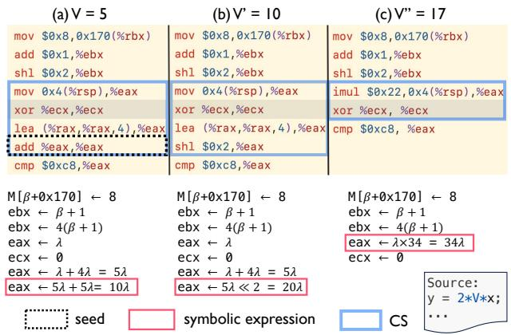  
Figure 3: Symbolic expression derived from a perf-const (V )’s seed instructions and its critical span. (a) and (b) show instructions from binaries rebuilt with V <sup>′</sup> = 10 and V <sup>′′</sup> = 17. The seed is obtained by diffing (a) and (b). The IV values in the symbolic expression are 10, 20, and 34.

## 3.3.1 How Does a Perf-Const Affect Runtime State?

If a value is a constant and ultimately affects system state, there must be a well-defined point where it enters machine state. This boundary reflects the compiler’s decision to materialize the constant and is determined statically. Since a constant carries no state before its introduction (unlike a variable), this entry point is identifiable in principle and is the semantic boundary we must capture.

A key challenge is to handle complications due to compiler optimizations. A perf-const may be folded, propagated, or merged with other expressions. Backend optimizations may further rewrite it for strength reduction or interleave unrelated instructions. As shown in Figure 3(a), the instruction sequence for a source-level perf-const of value 5 contains no immediate value 5 in the binary. Recompiling the same source with values 10 and 17 produces distinct instruction sequences (e.g., transforming add into shl, and reducing three instructions to one). Thus, the perf-const often appears in transformed form, denoted as IV , not its source value V .

Despite these transformations, IV can only influence machine state by becoming part of register or memory states, denoted as R/M. All effects must arise through instructions expressible in arithmetic and bitwise operations. Even source-level logical expressions reduce to comparisons such as “cmp eax, edx”, which update condition flags as the arithmetic result of “eax - edx”. Thus, regardless of source syntax, the effect of a perf-const in the binary always reduces to a mathematical relation in the form: R/M ← f (R/M, IV ).

Once expressed symbolically, this relation becomes explicit. As shown in Figure 3, the same source code with IV equal to 10, 20, and 34 produces drastically different binary code, yet their symbolic state expressions all reduce to eax ← IV × eax. Intuitively, compiler transformations preserve the numeric semantics of the constant, and those semantics are directly reflected in this symbolic form.

We use symbolic execution to derive a symbolic state expression that precisely captures how a perf-const affects runtime state. Symbolic execution naturally isolates relevant instructions from noise introduced by optimizations and yields the mathematical relationship between IV and architectural state R/M. Resolving IV back to V yields the final expression relating V to runtime machine state.

## 3.3.2 Deriving Symbolic State Expressions

The first issue is locating the instructions that consume a perf-const. Debug information (e.g., line number) is too coarse-grained—one source line can be compiled into hundreds of instructions, only a small subset of which uses the perf-const. Xkernel therefore begins by identifying seed instructions through binary differencing: we modify the perfconst at the source level and rebuild the kernel, then use the diff to drive symbolic execution. We run symbolic execution on both binaries and derive the transformed value (IV ).

Finding seeds. Seed instructions are those that differ when the perf-const value changes in source code. Xkernel finds seeds by assigning the perf-const a magic value that differs from the original value and rebuilding the kernel binary. For example, when V <sup>′</sup> = 10, the seed instruction is add eax eax. In principle, instructions in the binary diff are the seeds.

From seeds to symbolic state expressions. Symbolic execution expands from the seeds to derive a converged symbolic state expression that reflects their effect. We exhaustively explore instructions backward and forward until the symbolic state reaches a fixed point while still incorporating the seed effect. The two symbolic executions must converge to the same symbolic form. In theory, extracting IV from a multivariate symbolic expression may require multivariate coefficient matching when multiple symbolic variables (registers or memory locations) appear. However, perf-consts act as simple knobs, and we did not observe such cases in our experience and our extensive evaluation.

A remaining complication is solver canonicalization: symbolic engines rewrite expressions in simplified mathematical forms (e.g., shl 2 becomes ×4). This matters when the source uses shift operations like 〈〈 or 〉〉. Xkernel explores multiple symbolic execution branches and discards those that cannot preserve a linear relationship with V .

Mapping transformed value IV to the original value V . To recover the relation between IV and V , Xkernel attempts to fit a linear mapping of the form IV = a·V +b. We compile additional binaries using another modified value V <sup>′′</sup>, extract the resulting (V, IV ) pairs, and solve for a and b via interpolation. When the recovered mapping is non-linear (e.g., V ×V ), Xkernel reports the case, allowing users to tune the derived V ×V rather than V . However, we never encountered such a case in our evaluation.

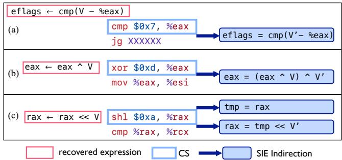  
Figure 4: Synthesized SIE indirections for various CSes. An SIE indirection contains pairs of {location, update}. Locations are shown by the blue arrows.

## 3.4 Synthesizing Indirections

The recovered expression precisely captures how the original value affects runtime state; the next step is to generate instructions using new value. Xkernel turns the instruction replacement problem into a state-update problem. It synthesizes code that overwrites machine state affected by the original execution. The synthesized indirection is in the form of {location, update} pairs; when the specified kernel location is reached, the update code ensures that the effects of the system states is equivalent to that as if the new value V <sup>′</sup> of the perf-const were used in the kernel source. We introduce a binary representation for each symbolic state expression termed critical span and present our synthesis algorithm.

## 3.4.1 Critical Span

A critical span represents one occurrence of a perf-const at the binary level. Concretely, a CS is a single-entry, singleexit instruction sequence that begins at the first instruction contributing to the perf-const’s symbolic state expression and ends either when the resulting state is first consumed or when the basic block ends.

Invariant. Let σ<sub>in</sub> denote any machine state, CS<sub>v</sub> denote the critical span executed with value v, and I denote the synthesized instructions that update v. A value update from v to v<sup>′</sup> is correct when executing the critical span is observationally equivalent to executing the span with the new value:

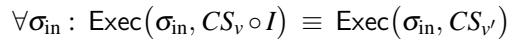

Here, “≡” denotes equivalence of externally visible state at the exit of the CS.

Construction. CSes can be automatically constructed for a given perf-const from the recovered symbolic state expression. Xkernel conducts forward and backward slicing to find the start instruction that first consumes the value to the last instruction that can recover the symbolic state expression. A CS is specified as a pair of [start, end] binary addresses.

## 3.4.2 Synthesis Algorithm

The indirection is synthesized based on the symbolic expression, as exemplified by Figure 4. If R/M affected by the perf-const are not overwritten within the CS, the indirection consists of a single code insertion located after the last instruction in the CS, computing the result using the new value V <sup>′</sup> and overwriting R/M (Figure 4a).

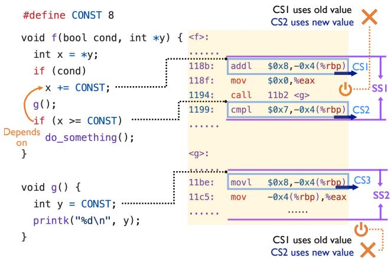  
Figure 5: An example of a perf-const’s CSes and SSes. Binary representation: SS1[118b, 1199], SS2[11be, 11c8].

If R/M are overwritten within the CS, the update depends on whether the overwriting instructions are reversible. For reversible arithmetic or logical operations (Figure 4b), Xkernel synthesizes inverse logic as part of the update.

If the modification cannot be reversed (e.g., due to irreversible arithmetic, bit masking, or information loss), Xkernel generates dual-location: the original value is captured before modification and restored after the CS (Figure 4c).

Note that SIE does not skip the original CS; all instructions in the CS still execute to preserve state equivalence, including instructions that are in the CS but do not depend on the perf-const, e.g., xor instructions in Figure 3(a). By construction of the symbolic state expression, SIE updates only the states related to the perf-consts.

SIE relies on the Kprobe mechanism [48] to redirect execution to JITed update code. Because each trigger incurs overhead and different probe locations have different costs, Xkernel adjusts the placement within a CS, using the symbolic state expression to ensure correctness (details in §4).

## 3.5 Safe Transition

A symbolic state expression and critical span (CS) of a perfconst enables runtime updates of its value. However, it does not guarantee a safe transition of system states from the orig inal value to the new. Figure 5 gives examples where unsafe transition of CONST could introduce inconsistent system states. If SIE is enabled when the execution is between CS1 and CS2, the system may execute CS1 with the old value and CS2 with the new. The program point right before g()’s return is also unsafe. Although CS3 has no dependency on CS1 or CS2, its call stack lies between them.

The core of safe transition is a well-defined transition scope that reflects the required safety guarantees; transitions are allowed only when execution is outside that scope. We formalize this scope as a safety span (SS), which captures the required safety guarantees and their binary representation (e.g., SS1 and SS2 in Figure 5). Safety span provides a concrete foundation for safe transition in Xkernel.

Xkernel enforces an update on a perf-const to happen after all the instructions that consume its value finish their execution, i.e., the lifetimes of all data objects derived from the perf-consts have expired upon exiting its safe spans. We call this property side-effect safety.

## 3.5.1 Safe Span

A safe span (SS) represents the execution unit in which transitive dependencies of a perf-const’s critical span (CS) are encapsulated (see Figure 5). An SS includes not only instructions in the CS, but also all subsequent instructions that consume values derived from the perf-const. Concretely, an SS is a single-entry, multi-exit program slice constructed to satisfy a confinement property—any instruction that consumes objects that have dependencies with the perf-const’s specific version must execute within the SS. So, once execution leaves the SS, no thread retains a dependency on the old value, and switching to a new value is considered safe.

Safety Invariant. Let T denote the set of concerned threads. A transition is safe only when the system is in a state where no thread is active in the SS as per program counters (PCs):

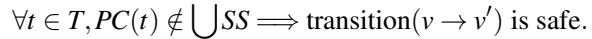

Xkernel primarily focuses on data dependencies and the SSes are in the form of thin slices [66]. Our empirical analysis shows that data dependencies are sufficient in capturing the required safety of updating most perf-consts. The SS analysis is designed to be pluggable for future extensions, e.g., to incorporate control-flow analysis if needed.

Construction. A safe span of a perf-const can be automatically constructed from its critical span (CS) using forward thin slicing [66]. Any instruction that is transitively flow dependent on the perf-const would be included in the SS. Note that the dependency analysis is inter-procedural, because the perf-const’s value can be propagated across function boundaries. If two SSes (constructed from different CSes) overlap, they are merged. An SS is specified as a pair of [start, end1/end2/...] binary address intervals in the top-level frame once the analysis terminates.

Safety properties. As SSes of a perf-const encapsulate the side effects of its value, Xkernel enables side-effect safety when updating perf-consts.

Existing Kernel live patching (KLP) mechanisms [1, 60, 67] offer per-thread version atomicity—a thread must execute either the old or new code, not their mixture [50]. KLP does so in the unit of functions, assuming every function having a well-defined semantic and being self-contained. In Xkernel, version atomicity is guaranteed through CSes. No existing KLP mechanism provides side-effect safety, as side effects of arbitrary function code are difficult to define.

Xkernel also guarantees multi-threading safety beyond per-thread safety by enforcing global consistency—all participating threads must be outside the SSes. In effect, the per-thread property must hold for all threads.

## 3.5.2 Transition Mechanisms

Xkernel ensures per-thread and multi-threading safety by monitoring the execution at the transition points. The monitors are implemented as kprobes [48], inserted at the entry and exit of each SS. These kprobes are used only during the transition. Once the transition is done, they are removed. The same transitioning mechanism is used for rollback and for updating the value of a perf-const.

Per-thread safety. Unlike KLP that implements timerbased polling, Xkernel detects safe transition points proactively by monitoring execution at the SS boundary. When execution reaches an entry kprobe, Xkernel checks if this SS is deep in the call stack of other SSes (e.g., SS2 in Figure 5) by stack inspection. If so, execution continues and the check is retried upon entering another SS.

Global consistency. Xkernel also supports global consistency for multi-threading safety. Unlike Kpatch [60] that uses a dedicated thread to repeatedly invoke stop\_machine to opportunistically check if all threads happen to be safe for transition. Xkernel introduces a new mechanism termed self-convergent transition. The idea is to use efficient global reference counts maintained by entry and exit kprobes of each SS to track safety. Xkernel invokes stop\_machine only once to initialize the reference count by scanning all running threads and counting the active SS entry boundaries in their stacks. Afterward, participating threads naturally selfconverge when crossing SS boundaries and update the reference count. When the global reference count is zero, no thread resides in any SS, and the transition is safe.

Liveness and timeout. Xkernel may fail to find a safe transition point for a perf-const, causing liveness issues. This can happen when the instrumented path is not executed after the update request, or when one or more threads remain inside an SS and prevent convergence. In either case, Xkernel reports the transition as failed after a configurable timeout.

## 3.6 Programmable Policy Plane

Xkernel provides simple APIs to support expressive tuning policies for each perf-const. To ensure safety, Xkernel disallows users from directly updating kernel states. Any user policy code (Xk-tune) must follow the stubs auto-generated by an Xkernel tool (xk-gen) and passed to an in-kernel Xkruntime. Xk-tune is written in eBPF style and has eBPF observability. Xk-runtime then compiles Xk-tune into an eBPF kprobe which includes SIE-based kernel-state updates.

Usage model and APIs. To tune a perf-const, the user first uses a command-line tool xk-gen to generate an Xk-tune stub which includes the unique ID of the perf-const and a header file that declares Xkernel APIs. The user is expected to implement the policy in the stub using the APIs. An Xk-tune follows the eBPF event-driven model; it is invoked when the perf-const is used at runtime. One perf-const may have mul-

```c
/* handler of xkernel context (xk_ctx) */
typedef const struct xk_ctx * xk_handle_t;
/* User probe definition */
#define XK_TUNE(unique_name, perfconst_id, args...)
/* The set and transition API */
long xk_set(xk_handle_t xk_ctx, u64 val);
bool xk_transition_done(xk_handle_t xk_ctx);
Figure 6: Xkernel API.
XK_TUNE(tcp_hystart, "net/ipv4/tcp_cubic.c:L349:3:0") {
// 1. Safety guard (mandatory)
if (!xk_transition_done(xk_ctx)) return 0;
// 2. User policy logic
// - Obtain the current network flow's RTT
struct sock *sk = (struct sock *)PT_REGS_PARM1(ctx);
struct bictcp *ca = inet_csk_ca(sk);
u32 cur_rtt = BPF_CORE_READ(ca, curr_rtt);
// - Set the value to 1 only when RTT > 80ms
if (cur_rtt >= 80000) xk_set(xk_ctx, 1);
return 0;
} /* my_policy.bpf.c */
```

Figure 7: An example of Xk-tune. User-written policy code is highlighted; the rest is from the auto-generated stub.

tiple Xk-tunes according to the number of CS.

Figure 6 shows Xkernel APIs. Two core APIs are xk\_set to update a perf-const value and xk\_transition\_done to check if the transition is completed. An Xk-tune can read kernel state and invoke xk\_set to update the perf-const. Figure 7 shows an example of Xk-tune which is used for the case study on a perf-const of TCP CUBIC presented in §5.

Supporting kernel-state updates. eBPF programs are restricted to read-only access to kernel memory to prevent arbitrary writes. To support controlled updates, Xkernel exposes one single kernel-state update API as a BPF kfunc [45]. Kfuncs enable extended functionality through kernel modules. The Xkernel kfunc, sie\_write\_kernel, can be invoked only by Xk-tune (see §4). The kfunc calls the SIE indirections generated for the target perf-const to modify registers in pt\_regs or kernel memory. The pt\_regs holds the CPU register state at the moment the probe is triggered and provides a direct reference to the kernel context. Linux already exposes this state to tracing infrastructures (e.g., Kprobe and ftrace), and it is part of a stable tracing ABI [49]. Our kfunc extends this from read access to write access.

Transpiling Xk-tune into eBPF. Each Xk-tune is transpiled into an eBPF kprobe (BPF\_KPROBE), corresponding to a CS for the perf-const. Figure 8 shows the source-code form of the eBPF code of the Xk-tune in Figure 7. Xkruntime uses the scope table to locate the SIE indirections for the perf-const and wraps the update logic into generated functions, e.g., impl\_sie\_logic\_cs1 in Figure 8. A pointer to this function is stored in the xk\_ctx, effectively implementing xk\_set for that perf-const. In each generated Kprobe handler, the user-written policy function (e.g., \_\_user\_policy\_tcp\_hystart) is invoked. Hence, the policy code has the kernel context (via ctx) and the implementation of SIE indirections is provided as embedded function pointers. The safety of Xk-tune is checked by the eBPF verifier.

```c
// 1. Helper: SIE Indirection
static __always_inline void impl_sie_logic_cs1(
struct pt_regs *regs, u64 val) {
// Recovered symbolic state expression:
// ebx = (regs->bx) >> 3 (original value: 3)
u64 new_bx = ((regs->bx) << 3) >> val;
// Writing back to pt_regs using the kfunc
sie_write_kernel(&regs->bx, sizeof(regs->bx), &new_bx);
}
// 2. Kprobe attachment: CS address (function+offset)
SEC("kprobe/tcp_cubic_hystart_check+0x4F")
int BPF_KPROBE(impl_cs_1) {
// Wrap raw context into safe xk_ctx
struct xk_ctx xk_ctx = {
.regs = ctx,
.set_fn = &impl_sie_logic_cs1,
};
// Call user policy (inlined)
return __user_policy_tcp_hystart(&xk_ctx, ctx);
} /* my_policy.internal.bpf.c */
```

Figure 8: eBPF kprobe (in a source form) transpiled from the Xk-tune shown in Figure 7.

Transaction semantics. Xkernel supports tuning multiple perf-consts by bundling Xk-tunes in a single file. All Xk-tunes in the file form an atomic transaction—their tuning logic is loaded or unloaded together. Each perf-const may belong to at most one active transaction. The scope table tracks each perf-const status. If any perf-const is in an active transaction, it cannot be tuned in a new transaction.

## 4 Implementation

We implement Xkernel with ∼1.7K lines of kernel C code for Xk-runtime. Xkernel’s toolchain is implemented in about 11K lines of Python, with ∼5K lines for CS and SS analysis via symbolic execution.

CS and SS analysis. We implement a symbolic execution engine specific to CS analysis. Upon capturing the CS, it synthesizes all potential SIE indirections ({location, update}). We implement the SS analysis on kernel bitcode using an LLVM pass. By correlating CS and SS with the .section metadata in the binary diff, we resolve the precise target function and offset for Kprobe attachment.

Minimizing Kprobe overhead. Linux Kprobe may have high overhead if breakpoint or single-stepping traps are used [32]. Linux saves the overhead through boosting (skipping single-step traps when post-handlers are absent) and jumpoptimization (replacing breakpoints with direct jumps). Xkernel exploits these optimizations to minimize runtime overhead. To enable boosting, Xkernel replaces post-handlers with pre-handlers on the next instruction (pc+1). This assumes the next instruction is not a jump destination; this is almost always the case because Xkernel targets the pre cise point where V enters runtime states. Xkernel maximizes jump-optimizations by strategically attaching kprobes. We implement a new optimization that handles the case when immediate values of perf-consts are directly used in conditional jumps, which Linux Kprobe does not handle. We describe the optimization in Appendix B.

Table 2: Summary of case studies that demonstrate Xkernel’s features and capabilities.  
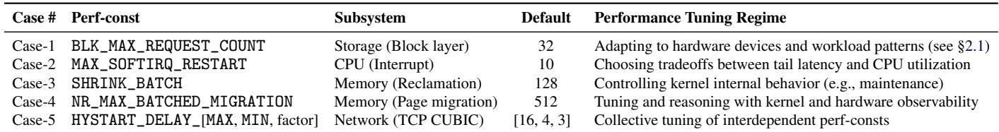

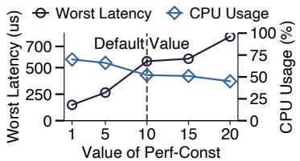

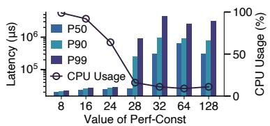

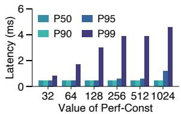

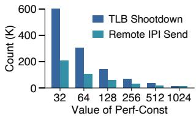  
Figure 9: Cost-benefit tradeoff Figure 10: Tuning SHRINK\_BATCH Figure 11: Tuning NR\_MAX\_BATCHED\_MIGRATION to rethat can be tuned by changing can significantly reduce write la- duce tail latency, which requires understanding TLB values of MAX\_SOFTIRQ\_RESTART. tency of the workload. shootdown behavior.

Xk-runtime. The runtime is implemented as a kernel module (xk-sie.ko). In addition to transpiling Xk-tunes to eBPF kprobes and loading them, it registers BPF Kfuncs and manages transitions. sie\_write\_kernel is registered for SIE internal use, and xk\_transition\_done is exposed to users to check transition status. It tracks completion via global refcounts maintained in Xk-runtime (multi-threading) or BPF\_MAP\_TYPE\_TASK\_STORAGE (per-thread). The kernel module attaches monitoring kprobes at SSes and detaches them with the help of a background monitor kthread. For multi-threading safety, it employs stop\_machine to initialize refcounts via stack traversal before activating kprobes.

Xkernel tools. We implement a series of userspace tools. xk-build generates the scope table from the source patch. xk-gen specifies the ConstID in the scope table and outputs the Xk-stub. xk-load invokes Xk-runtime to transpile the xk-tune code with standard BPF tool-chains, install resulting BPF kprobes and ensure safe transition. Finally, xk-unload performs a symmetric, ordered teardown.

## 5 Case Studies

We present case studies that tune perf-consts across kernel subsystems, provide a glimpse at the broader policy space enabled by Xkernel, and discuss the resulting implications for tunability and complexity.

## 5.1 Performance Benefits and Tuning Rationales

Table 2 summarizes the case studies; we then discuss their performance benefits and tuning rationales.

Case-1: Adapting to hardware and workload patterns. Xkernel enables users to tailor perf-const values according to specific hardware properties and workload patterns. We revisit the perf-const BLK\_MAX\_REQUEST\_COUNT presented in §2.1. Users can use a single Xk-tune program to simultaneously set the value to 128 for the sequential FIO workload on the HDD and to 1 for the RocksDB random workload on the NVMe SSD, obtaining the performance benefits shown in Figure 1. Meanwhile, other workloads can continue using the default value.

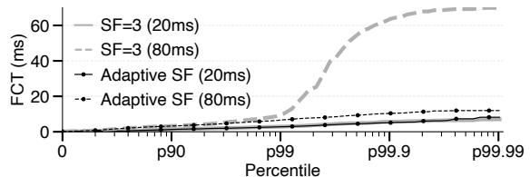  
Figure 12: Flow completion time (FCT) of different scaling factors (perf-consts) under different RTTs running NGINX.

Case-2: Choosing performance tradeoffs. Xkernel enables users to choose points along performance tradeoff curves to better satisfy SLOs; such tradeoffs are widespread in OS kernels, with examples such as latency vs. throughput and resource utilization vs. latency.

We show how Xkernel enables balancing the tradeoff between CPU efficiency and tail latency in the CPU (interrupt) subsystem. The perf-const, MAX\_SOFTIRQ\_RESTART limits how many times the software interrupt (softirq) handler can be rerun in one iteration before yielding, preventing indefinite softirq processing. Increasing its value improves CPU efficiency but may increase tail latency of running tasks. Therefore, it has major impacts on latency-critical workloads, especially when they are colocated with throughputoriented workloads [57].

We run a latency-critical workload W<sub>l</sub> using cyclictest [63] and a throughput-oriented workload W<sub>t</sub> on a 4-node cluster with 25 Gbps networking, varying the perf-const values.

Figure 9 shows a clear tradeoff between tail latency of W<sub>l</sub> and CPU utilization. The original value (10) provides a reasonable balance with 52% CPU utilization and a worst-case latency of 560 us; achieving the optimal tail latency of 149 us requires paying a penalty of 22% CPU utilization.

Case-3: Controlling kernel internal behavior. Oftentimes, application performance is affected by the kernel’s internal behavior such as memory reclamation, which is hard to control externally. With Xkernel, kernel internal behavior can be aligned with the application’s access patterns.

We demonstrate this capability using SHRINK\_BATCH, a perf-const for Linux shrinkers, i.e., kernel callbacks that reclaim slab objects under memory pressure. It controls how many entries a shrinker checks when it scans a slab’s LRU list for memory reclamation. SHRINK\_BATCH was introduced before 2005 [73] and its value (128) has remained unchanged since then [46]. Linux implements 43 shrinkers for different slab objects (zswap entries, inode, dentry, etc). We focus on the zswap-shrinker for the zswap subsystem [52] that is widely used in datacenters [30, 37].

We run a workload that writes data blocks sequentially into a large anonymous mmaped region and periodically overwrites written blocks, which resembles data analytics with a memory budget (constantly triggering zswap). The periodic reuse exposes a classic working-set effect. When the batch size is small, fewer pages are reclaimed and swapped, increasing the chance to reuse data in memory. In contrast, an aggressive batch size may trigger thrashing.

As shown in Figure 10, the original value of 128, despite the relatively low CPU utilization (11%), incurs a large latency penalty. In fact, any values above 24 cause thrashing with unnecessary disk I/O, slowing the user workload. In contrast, smaller values (<sup>⩽</sup>24) provide much lower latency. Case-4: Tuning and reasoning with observability. Written in eBPF, policy code in Xkernel has observability on kernel and hardware metrics and behavior. These internal metrics are valuable for reasoning about performance, confirming tuning effectiveness, and being incorporated directly into tuning policies to decide values.

We use NR\_MAX\_BATCHED\_MIGRATION, a perf-const that specifies the batch size of pages migrated across NUMA nodes [58], to demonstrate this feature. The default value (512) was introduced in 2023 [79] and has never been updated. This perf-const controls the amortized costs of TLB shootdowns and page migration. Larger batches amortize per-page migration cost but defer TLB shootdowns, which could increase stall time for concurrent threads accessing pages under migration. Online experiments with Xkernel help us understand the relationship between local memory access and TLB shootdowns.

We run a workload with one group of threads repeatedly touching hot data on a NUMA node, while another group continuously migrates hot pages to that node to shift the hot region over time. This workload mimics memory-intensive applications with moving working sets.

We vary NR\_MAX\_BATCHED\_MIGRATION values and measure the tradeoff between latency of memory access to hot pages during migration and TLB shootdowns, as shown in Figure 11. A small value can effectively reduce tail latency by prioritizing memory access over migration, with a penalty of increased TLB shootdowns. Tuning this perf-const values requires observability of TLB behavior.

Case-5: Collective tuning of interdependent perf-consts. With Xkernel, users can jointly tune multiple perf-consts that collectively decide fine-grained behavior with transaction semantics (§3.6).

We demonstrate this capability by tuning the behavior of TCP CUBIC’s HyStart delay-based congestion window. When a connection is in slow start, TCP CUBIC checks whether the current RTT exceeds a delay threshold computed from three perf-consts (two defined as macros and one used as an operand in a shift operation). If the measured delay exceeds this threshold, CUBIC assumes congestion and exits slow start. The optimal threshold is highly dependent on RTT. With high RTTs, the current perf-consts are overly sensitive and trigger premature slow-start exit; with low RTTs, they are too conservative and delay exiting slow start. These perf-consts were introduced in 2008 [26] and changed three times [17,18,25]. Prior work reported the importance of tuning them [27], but they remain constants.

We first ran a microbenchmark to understand scaling factors (SFs) under different RTTs. To provide sufficient room for the scaling factor to take effect under high RTT, we change HYSTART\_DELAY\_MAX from 16ms to 32ms. We find that SF=1 significantly reduces tail latency for slow flows, but increases tail latency for fast flows compared to SF=3 (default). Based on this observation, we implement a selective tuning policy that dynamically adjusts the SF of TCP Cubic for flows with long RTT (Figure 7).

We show performance gains of tuning these perf-consts collectively on NGINX, deployed as a web server for photo and video content [55]. We run a mixed workload of concurrent 20ms and 80ms flows, representing fast and slow connections. As shown in Figure 12, Xkernel achieves a significant FCT reduction (81% at P99.99) for long-RTT flows while maintaining performance parity for short-RTT flows.

## 5.2 A Glimpse into Xkernel-Enabled Policies

Xkernel enables powerful tuning policies and creates opportunities for policy innovation. We briefly discuss three directions that hint at a broader unexplored policy space.

Flexible granularity. One major benefit of Xkernel is its flexible granularity in applying tuning policies. Unlike hardcoded granularities, such as processes, cgroups, or devices, Xkernel allows users to define tuning granularity using conditions unforeseen before binary deployment.

As demonstrated by the cases in Table 2, Xkernel allows values to be set at the granularity of a given application (potentially spanning multiple processes or threads), a specific device type, or a set of network flows. Users can update these granularities by changing the condition under which xk\_set is applied in a new Xk-tune. The zswap shrinker (Case-3) is an interesting example: 43 shrinkers across subsystems share the same perf-const as their batch size, yet Xkernel allows customizing batch sizes for different shrinkers at runtime by checking the caller’s name (see Appendix D).

```c
XK_TUNE(...) {
// Get the pid upon invocating this kernel code path
u64 pid = bpf_get_current_pid_tgid() & 0xFFFFFFFF;
// Leverage hints from the application process
int *hint = bpf_map_lookup_elem(&hint_map, &pid);
if (hint) { xk_set(xk_ctx, 1); }
}
```

Figure 13: An example of an application-informed policy. The application communicates the hint through an eBPF map (hint\_map), and the Xk-tune uses this hint to apply the tuning value to selected threads.

```c
/* Track consecutive failed attempts to merge adjacent
blocks and store the count in fail_cnt for use as a
tuning heuristic */
SEC("kretprobe/blk_attempt_plug_merge")
int BPF_KRETPROBE(blk_attempt_plug_merge_ret, long ret) {
int *fail_cnt = bpf_task_storage_get(&fail_cnt_map,
bpf_get_current_task_btf(), ...);
if (ret == 0 && fail_cnt) (*fail_cnt)++;
else *fail_cnt = 0;
}
/* Retrieve the heuristic and tune accordingly */
XK_TUNE(blk_add_rq_to_plug, "block/blk.h:L312:32:0") {
int *fail_cnt = bpf_task_storage_get(&fail_cnt_map,
bpf_get_current_task_btf(), ...);
// Heuristic: treat the workload as random when many
// (16, an ad-hoc threshold) consecutive merges fail
if (fail_cnt && *fail_cnt >= 16) xk_set(xk_ctx, 1);
}
```

Figure 14: An Xk-tune program using ad-hoc workload heuristics. It instruments blk\_attempt\_plug\_merge with a kretprobe to track historical merge failures.

Application-informed policies. Xkernel enables a class of application-informed tuning policies that better coordinate with application-level semantics and knowledge of workload patterns. This feature relies on eBPF’s mature user-kernel communication. Figure 13 illustrates one such collaboration, where a workload-pattern hint is passed via an eBPF map. For example, a RocksDB application can use such hints to distinguish foreground threads from compaction threads.

Ad-hoc tuning heuristics. Xkernel enables ad-hoc tuning heuristics that are easier to identify once workloads and deployment scenarios are known, without requiring such heuristics to be baked into the source code. Figure 14 illustrates one such heuristic for Case-1, where kernel-internal observability metrics are used to infer whether the workload is sequential or random. Moreover, because an Xk-tune runs on each execution, Xkernel supports adaptive policies, such as linear or exponential changes to the tuning value.

## 5.3 Tunability and Complexity

Choosing values for perf-consts faces inherent complexity: the best value depends on the workload, hardware, and policy objective in a given deployment. Existing practice hides this complexity behind fixed compile-time choices, but this can leave significant performance opportunities fundamentally unattainable. In contrast, Xkernel makes perf-consts tunable and programmable in a unified framework, exposing the broad and powerful policy space discussed above.

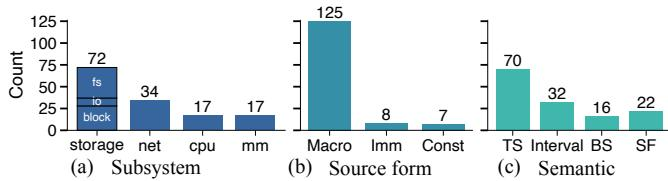  
Figure 15: Characteristics of the evaluated perf-consts. The categories are specified in Table 1.

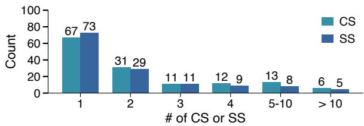  
Figure 16: Number of CS and SS per perf-const.

Such exposure does not create new complexity; rather, it allows users, for the first time, to tackle this complexity in a principled manner. Exposing only a subset of perf-consts is insufficient when multiple constants jointly affect system behavior; one untunable perf-const can limit the effectiveness of others. We believe managing the full perf-consts set with Xkernel opens a promising research direction.

## 6 Evaluation

To evaluate the generality, safety, and efficiency of Xkernel, we collected 140 perf-consts from four Linux subsystems. These perf-consts cover common semantics and source-code forms, as shown in Figure 15. Note that the evaluated perfconsts are a small subset of all perf-consts in Linux, though the number is comparable to that of sysctl performancerelated knobs. Evaluations run on a machine with 128 GB RAM, a 28-core Intel Xeon Gold 5512U CPU (2.1 GHz), and two 800 GB NVMe-Gen4 SSDs on CloudLab [19].

Xkernel supports all but one (99.3%) perf-consts. The one Xkernel fails to support is due to limitations of Kprobe (see Appendix C for more details).

We show that: (1) SIE incurs negligible runtime overhead; (2) Xkernel supports millisecond-scale policy updates and safe transitions; and (3) the cost of offline, one-time static analysis is about 18 minutes per perf-const.

## 6.1 Characteristics of Critical and Safe Spans

We first present the characteristics of critical spans (CSes) and safe spans (SSes) of the evaluated perf-consts. The information helps interpret our experiment results. As shown in Figure 16, the 140 perf-consts have 367 CSes in total. Most constants are highly localized: 48% map to a single CS, and 86% map to fewer than five. A long tail also exists: in 4% of cases, a constant maps to more than ten CSes; DEF\_PRIORITY and NFS4\_POLL\_RETRY\_MAX have the highest counts (16 and 17) due to aggressive inlining of their enclosing callers.

Out of the 367 CSes, 82 have symbolic values IV that differ from the perf-const value V in the source representation (§3.3.2). Xkernel correctly recovers the symbolic relations for all cases. Only three CSes require dual-location indirections to handle irreversible updates (§3.4.2).

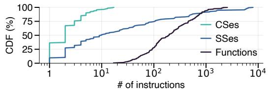  
Figure 17: Size of CSes, SSes, and Functions. CS size is measured precisely. SS size is approximated by summing the instructions in the span, including the callees. For functions, we count only the instructions in the function body (excluding callees), so the value is an underestimate.

We obtained 300 SSes in total from the 367 CSes. As shown in Figure 16, 26 of the perf-consts exhibit CSes that have data dependencies, resulting in a smaller number of SSes compared to their number of CSes.

Figure 17 compares the sizes of CSes, SSes, and kernel functions. CSes are small, mostly containing a single instruction; only 12 contain two, and one each at lengths 3, 4, 5, and 7. This confirms that the point where a perf-const first affects runtime state is simple and compact. The median SS contains only 10 instructions, showing that safe transitions are usually confined to a small scope. SS size, however, has a long tail significantly larger than CS size, reflecting the inherent complexity of kernel data dependencies. The largest SS in our dataset is about 8K instructions. SSes make these dependencies explicit. Functions expand the scope unnecessarily and are much larger than SS except in extreme cases, but with weaker safety guarantee than SSes.

## 6.2 SIE Overhead

We evaluate SIE overhead along three dimensions: the pertrigger CPU cost, the frequency at which SIE kprobes fire, and the number of SIE kprobes enabled at the same time.

Per-trigger cost (CPU cycles). An SIE invocation includes the underlying kprobe cost plus SIE-specific work: checking transition state (O1), executing indirection (O2), and, when needed, reading kernel state (O3) or accessing BPF maps (O4) for user-space policy interaction. We attach SIE kprobes at different offsets inside a kernel function (vfs\_write) to compare jump-optimized and INT3-based probes. We use a single-byte write workload with an intentionally short kernel path bottlenecked at vfs\_write. Table 3 shows that the kprobe mechanism dominates: an empty jump-optimized kprobe adds 168 cycles (for 84.2% of evaluated CSes), whereas an empty INT3-based kprobe adds 1765 cycles. O1–O4 add little additional cost.

Trigger frequency. We evaluate the impact of trigger frequency using a controlled benchmark. We implement a multithreaded workload that uses io\_uring and performs asynchronous one-byte writes to /dev/null with an SIE kprobe attached to io\_issue\_sqe. We vary both the offered IOPS (to control the trigger rate of SIE) and the amount of peroperation computation. Figure 18 shows the slowdown at different trigger rates; we also annotate the data points from case studies (§5) by triangles.

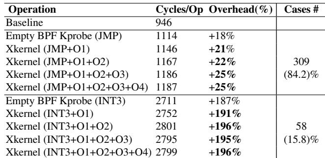  
Table 3: CPU cycles breakdown of one SIE invocation. O1: Transition state check; O2: Indirection’s execution; O3: Kernel Memory Read; O4: BPF MAP Access

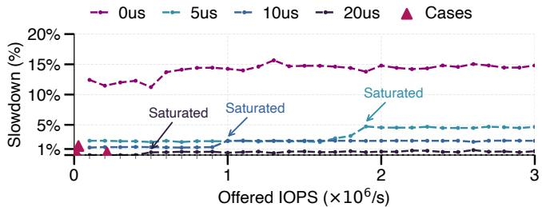  
Figure 18: Slowdown of median latency. The trigger rate of SIE kprobes is equal to the offered IOPS before saturation and remains unchanged afterwards.

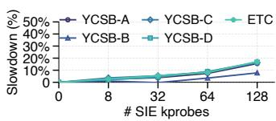  
(a) Throughput slowdown

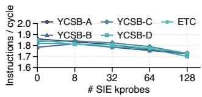  
(b) Instructions per cycle (IPC)  
Figure 19: Redis slowdown with multiple SIE kprobes.

When the workload performs essentially no work (0µs) in each operation, the slowdown caused by SIE is 15%; the slowdown drops to 5% and 2% when each operation includes 5µs and 10µs of computation, respectively. Once per-operation processing reaches 20µs, the overhead falls below 1%. The slowdown curve remains relatively flat as trigger rate increases, indicating that the overhead scales predictably even under high execution frequency of SIE. These results show that Xkernel introduces negligible overhead, even when triggered millions of times per second. In practice, applications tend to execute their own logic for more than 20µs, making the overhead even more negligible.

Multiple SIE kprobes. We evaluate how the per-trigger cost accumulates when many tunable constants are active under a real application. We run Redis [61] with YCSB [9] and Facebook ETC workloads [3], and vary the number of enabled SIE kprobes; each SIE kprobe is placed on the critical path. Figure 19 reports throughput and instructions per cycle (IPC). With 32 SIE kprobes, throughput drops by at most 4%. Even with 128 SIE kprobes, throughput slowdown is 7–14% across workloads, while IPC drops by about 6%. These results show that Xkernel is practical to tune many perf-consts with modest overhead.

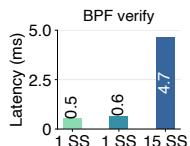

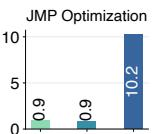  
Best Worst Worst  
Best Worst Worst

  
1 SS 1 SS 15 SS Best Worst Worst

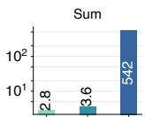  
1 SS 1 SS 15 SS Best Worst Worst

Figure 20: Policy-update time. Best case: only one kprobe is required per CS. Worst case: two additional kprobes are needed to ensure global consistency.  
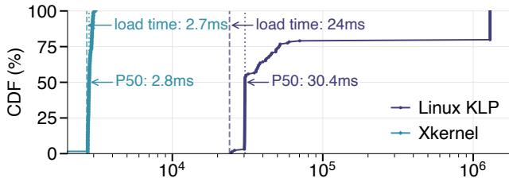  
Transition Delay (μs)  
Figure 21: Transition time of Xkernel using CS versus Linux KLP. The target function has 898 instructions.

Finally, a tuning should be enabled when its benefit outweighs the pure cost of SIE invocations; in our case studies, the benefits usually far outweigh this overhead.

## 6.3 Policy-update and Transition Time

We measure the time to load a policy program (Xk-tune) and the time to transit from the original value to a new one.

Policy-update time. Figure 20 shows the breakdown of loading an Xk-tune program, including BPF verification, jump-optimization, and Kprobe registration. The main cost is Kprobe registration, and thus the number of kprobes has a major impact on policy load time. Even in the case where the perf-const has 15 SSes, Xkernel bounds the policy-update time to 542 milliseconds, meeting our design goal.

Transition time. Xkernel provides the near-optimal transition time for per-thread version atomicity and side-effect safety, and is scalable with many concurrent threads.

Per-thread version atomicity. We compare Xkernel with Linux KLP [50] on version atomicity; both support version atomicity. We tune a perf-const which controls TCP backlog size [51] and measure transition time with an iperf3 [71] workload of 128 flows (threads). Figure 21 shows the CDF of the end-to-end latency, including the policy-update time (2.7 ms for Xkernel and 24 ms for KLP modulo 7-minute patch-generation time). The median latency for KLP and Xkernel is 2.8ms and 30.4ms, respectively. This shows that CS is a much more efficient transition unit than function.

Per-thread side-effect safety. Figure 22a shows transition time of four representative cases with different triggering rates of Xk-tunes and the number of threads that load Xktunes. We do not compare with KLP which does not support side-effect safety. In all cases, the transition time is less than 10 milliseconds. A per-thread transition completes as soon as the first kprobe fires upon entering the first SS. We see no clear correlation of the triggering rate and the number of the SSes with the transition time—all configurations trigger at least once per millisecond and complete the transition immediately once the entry kprobe fires.

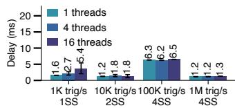  
(a) Per-thread

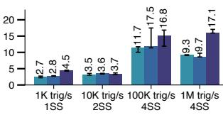  
(b) Global consistency

Figure 22: Transition time of side-effect safety.  
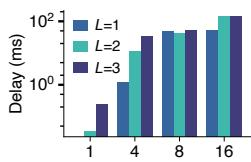  
# of Threads

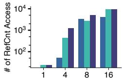  
# of Threads  
Figure 23: The impact of SS size with global consistency. L is the length of function calls to reach the CS of a perf-const; it is used to control the SS size.

Global consistency. Figure 22b shows transition time with global consistency on side-effect safety with multiple threads. The time increases compared to per-thread safety. We do not compare with Kpatch [60] because its globalconsistency mode was later deprecated [59] and it does not support side-effect safety.

To understand the time in more depth, we run a controlled experiment using the microbenchmark in §6.2, varying the SS size (controlled by L levels of call stacks) and the number of threads. Figure 23 shows that transition time increases with higher concurrency (fewer safe points) and larger SS sizes. The number of reference-count updates shows the same pattern: a larger number of updates indicates a lower likelihood of leaving the SS. Overall, the transition time is low (144ms) even under high concurrency (16 threads).

## 6.4 Offline Static Analysis Time

Xkernel incurs a one-time cost per perf-const for static analysis; after that, the perf-const can be tuned online anytime. This offline process consists of two kernel compilations, symbolic execution to recover symbolic state expressions and CSes, and analysis to construct SSes. On average, the process takes 18 minutes per perf-const. The analysis of different perf-consts can be done in parallel using spot instances. Compilation takes about seven minutes (two compilation runs executed in parallel across 56 threads). The remaining time is dominated by SS construction, which varies significantly based on the dependency structure. On average 11 ± 20 minutes and up to 124 for the most complex case.

Overall, Xkernel’s offline cost is linear in the number of perf-consts in the kernel source code. For N constants, constructing the scope table requires 2N recompilations. In contrast, KLP or source-level recompilation requires one binary per target value; with M possible values per constant, all combinations can require up to M<sup>N</sup> builds. The scope table is reusable across machines running the same kernel binary, allowing cost amortization across a deployment.

## 7 Discussion

Applicable constants of Xkernel. Xkernel prefers safety over completeness, while still supporting a broad range of perf-consts. Xkernel does not target constants which can directly change kernel memory layout (e.g., array sizes or struct padding), as such changes can introduce dangerous pointer arithmetic and are challenging to make safe. Xkernel rejects the constants it cannot handle upon detection. The layout changes can be reliably detected by reading debug information such as DWARF (e.g., pahole). Xkernel can also detect and reject dead-code elimination cases where the offline analysis finds the constant absent from one binary.

Concurrency safety. A CS is a very short instruction sequence (Figure 17) that materializes a constant into runtime state; it typically contains no lock operations, blocking primitives, or memory barriers. An XK-tune only changes this materialization, so it preserves the original concurrency semantics and does not introduce the risk of races from breaking locks. The kprobe mechanism also provides a solid foundation, as probe insertion is atomic.

Choosing a good value. To maximize flexibility, Xkernel does not impose any built-in bounds on new values (except for architectural constraints such as register width limits). Such bounds belong to the performance semantics of each perf-const, not the SIE mechanism. Users can encode range checks, device-specific constraints, specifications defined by RFCs, and any other value checks in XK-tune. Xkernel treats them as policy, keeping mechanism and policy separate.

The focus of this work is the mechanism and interface to realize principled OS tunability (§2.3), not the policies on deciding the optimal values of each perf-const. We expect the new opportunities and flexibility enabled by Xkernel to inspire many new tuning techniques (e.g., with AI [41]).

Maintenance of offline results. The scope table is tied to the exact kernel source, compiler version, and build configurations to match the running binary. Xkernel assumes that the compiler version and build configurations of the running kernel are available. This holds because (1) they are inherently known for customized kernels, and (2) for out-of-thebox kernels, they can be retrieved from official sources.

Out-of-tree modules and drivers. Xkernel is not limited to in-tree kernel code. SIE also supports loadable kernel modules and vendor drivers with available source code. Each scope table entry is tied to a specific module or driver version and must be regenerated after it is rebuilt or updated.

## 8 Related Work

OS and system performance tuning. Tuning has long been essential for OS performance [2, 24, 64]. Existing practice, however, relies on the limited set of knobs exposed through sysctl and sysfs, leaving substantial performance potential unexplored. Kernel configuration systems (e.g., Kconfig [47]) customize the OS but are designed for feature selection [36, 65, 68, 69], not performance tuning, since they operate purely at compile time. Recent techniques using AI agents show promise in improving search strategies [41, 42], but they are limited to a fundamentally constrained tuning space. We view Xkernel as a new foundation to expand this space and advance tuning techniques. Our techniques and principled tunability can potentially benefit many other systems that actively explore tuning policies [34, 35, 43, 70].

Programmable kernel extensions. Kernel extensibility has long been a central topic in OS research [15]. This area has seen renewed momentum with the rise of eBPF, which has been used to customize kernel behavior across many subsystems [11, 29, 31, 33, 78, 81, 83]. These efforts share our motivation of adapting kernel behavior to diverse workloads and hardware. Our work focuses on perf-consts and principled tunability. While Xkernel uses eBPF as its policy interface, its core contribution is SIE, which enables principled in-situ tuning. TCP-BPF [8] provides a similar capability by allowing TCP parameters to be tuned through an eBPF program. However, it is limited to the TCP subsystem and requires substantial engineering effort to restructure kernel code paths. In contrast, Xkernel is general to any perf-consts.

OS and program live update. SIE shares attributes with live-update systems, but is designed specifically for perfconsts—users (or agents) specify a value and Xkernel synthesizes the update instructions. OS live update has been widely studied [7, 10, 22, 23] and has led to products such as Ksplice [1], Kpatch [60], and KLP [50]. As discussed, these systems treat functions as the unit of version atomicity, making them a poor match for perf-consts. User-space liveupdate systems also operate at function-level unit [28,62]. A recent effort, PlugSched [53] provides live updates for CPU scheduling but depends on policy-specific understanding of kernel scheduler data structures to reconstruct state. In contrast, Xkernel provides a general and principled mechanism without relying on specific kernel data structures.

## 9 Conclusion

We presented Xkernel which uses Scoped Indirect Execution (SIE), the first mechanism to achieve principled OS tunability and enable safe, fast in-situ tuning of any perf-consts in OS kernels. Xkernel offers a new path for OS performance and opens untapped performance opportunities.

## Acknowledgement

We thank our shepherd and the anonymous reviewers for their insightful comments, and Shawn Zhong for his help at an early stage. This work is supported by National Natural Science Foundation of China (NSFC) under Grant No. 62132007 and No. 62221003, and by NSF CNS-2145295.

## References

[1] ARNOLD, J., AND KAASHOEK, M. F. Ksplice: Automatic Rebootless Kernel Updates. In Proceedings of the EuroSys Conference (EuroSys ’09) (April 2009).

[2] ARPACI-DUSSEAU, A. C., ARPACI-DUSSEAU, R. H., BUR-NETT, N. C., DENEHY, T. E., ENGLE, T. J., GUNAWI, H. S., NUGENT, J. A., AND POPOVICI, F. I. Transforming policies into mechanisms with infokernel. In Proceedings of the 19th ACM Symposium on Operating Systems Principles (SOSP ’03) (October 2003).

[3] ATIKOGLU, B., XU, Y., FRACHTENBERG, E., JIANG, S., AND PALECZNY, M. Workload analysis of a large-scale key-value store. In Proceedings of the 2012 ACM SIGMET-RICS International Conference on Measurement and Modeling of Computer Systems (SIGMETRICS ’12) (London, United Kingdom, June 2012).

[4] AXBOE, J. Explicit block device plugging. https://lwn. net/Articles/438256/.

[5] AXBOE, J. Fio – flexible I/O tester. https://github.com/ axboe/fio.

[6] AXBOE, J. Linux kernel commit – block: bump max plugged deferred size from 16 to 32. https://github.com/torvalds/linux/commit/ ba0ffdd8ce48ad7f7e85191cd29f9674caca3745.

[7] BAUMANN, A., HEISER, G., APPAVOO, J., DA SILVA, D., KRIEGER, O., WISNIEWSKI, R. W., AND KERR, J. Providing dynamic update in an operating system. In Proceedings of the USENIX Annual Technical Conference (USENIX ’05) (April 2005).

[8] BRAKMO, L. TCP-BPF: Programmatically tuning TCP behavior through BPF. In The Technical Conference on Linux Networking (NetDev 2.2) (November 2017).

[9] BRIAN FRANK COOPER. Yahoo! Cloud Serving Benchmark. https://github.com/brianfrankcooper/YCSB, 2010.

[10] CHEN, H., CHEN, R., ZHANG, F., ZANG, B., AND YEW, P.- C. Live updating operating systems using virtualization. In Proceedings of the 2nd International Conference on Virtual Execution Environments (VEE ’06) (June 2006).

[11] CHEN, Z., MENG, Q., LAO, C., LIU, Y., REN, F., YU, M., AND ZHOU, Y. eTran: Extensible kernel transport with eBPF. In Proceedings of the 22nd USENIX Symposium on Networked Systems Design and Implementation (NSDI ’25) (April 2025).

[12] CORBET, J. 5.19 fixes tags and the commits they fix. https: //lwn.net/Articles/902938/.

[13] CORBET, J. A rough patch for live patching. https://lwn. net/Articles/634649/.

[14] DALTON, A., YU, C., AND KIM, J. Linux kernel commit – f2fs: increase the limit for reserve\_root. https://github.com/torvalds/linux/commit/ da35fe96d12d15779f3cb74929b7ed03941cf983.

[15] DRUSCHEL, P., PAI, V. S., AND ZWAENEPOEL, W. Extensible kernels are leading OS research astray. In The Sixth Workshop on Hot Topics in Operating Systems (HotOS VI) (May 1997).

[16] DUKKIPATI, N., REFICE, T., CHENG, Y., CHU, J., HER-BERT, T., AGARWAL, A., JAIN, A., AND SUTIN, N. An argument for increasing TCP’s initial congestion window. ACM SIGCOMM Computer Communication Review 40, 3 (June 2010), 26–33.

[17] DUMAZET, E., AND MILLER, D. S. Linux kernel commit – tcp\_cubic: refine Hystart delay threshold. https://github.com/torvalds/linux/commit/ 42eef7a0bb0989cd50d74e673422ff98a0ce4d7b.

[18] DUMAZET, E., AND MILLER, D. S. Linux kernel commit – tcp\_cubic: switch bictcp\_clock() to usec resolution. https://github.com/torvalds/linux/commit/ cff04e2da308c522f654237b45dd64248fe8d1fa.

[19] DUPLYAKIN, D., RICCI, R., MARICQ, A., WONG, G., DUERIG, J., EIDE, E., STOLLER, L., HIBLER, M., JOHN-SON, D., WEBB, K., AKELLA, A., WANG, K., RICART, G., LANDWEBER, L., ELLIOTT, C., ZINK, M., CECCHET, E., KAR, S., AND MISHRA, P. The design and operation of CloudLab. In Proceedings of the USENIX Annual Technical Conference (USENIX ’19) (Renton, WA, July 2019).

[20] DUYCK, A., DUMAZET, E., AND MILLER, D. S. Linux kernel commit – net: allow gso\_max\_size to exceed 65536. https://github.com/torvalds/linux/commit/ 7c4e983c4f3cf94fcd879730c6caa877e0768a4d.

[21] FACEBOOK. RocksDB. http://rocksdb.org/.

[22] GIUFFRIDA, C., KUIJSTEN, A., AND TANENBAUM, A. S. Safe and automatic live update for operating systems. In Proceedings of the 18th International Conference on Architectural Support for Programming Languages and Operating Systems (ASPLOS ’13) (March 2013).

[23] GOULLON, H., ISLE, R., AND LÖHR, K.-P. Dynamic restructuring in an experimental operating system. IEEE Transactions on Software Engineering SE-4, 4 (July 1978), 298– 307.

[24] GREGG, B. Systems performance: enterprise and the cloud. Pearson Education, 2014.

[25] HA, S. Linux kernel commit – tcp\_cubic: make the delay threshold of HyStart less sensitive. https://github.com/torvalds/linux/commit/ 2b4636a5f8ca547000f6aba24ec1c58f31f4a91d.

[26] HA, S., AND MILLER, D. S. Linux kernel commit – [TCP] CUBIC v2.3. https: //github.com/torvalds/linux/commit/ ae27e98a51526595837ab7498b23d6478a198960.

[27] HA, S., AND RHEE, I. Hybrid slow start for high-bandwidth and long-distance networks. In Proceedings of the Sixth International Workshop on Protocols for FAST Long-Distance Networks (PFLDnet ’08) (March 2008).

[28] HAYDEN, C. M., SMITH, E. K., DENCHEV, M., HICKS, M., AND FOSTER, J. S. Kitsune: efficient, general-purpose

dynamic software updating for C. In ACM SIGPLAN International Conference on Object-Oriented Programming, Systems, Languages, and Applications (OOPSLA ’12) (October 2012).

[29] HEO, T. sched\_ext schedulers and tools. https://github. com/sched-ext/scx.

[30] HEO, T., SCHATZBERG, D., NEWELL, A., LIU, S., DHAK-SHINAMURTHY, S., NARAYANAN, I., BACIK, J., MASON, C., TANG, C., AND SKARLATOS, D. IOCost: Block IO Control for Containers in Datacenters. In Proceedings of the 27th International Conference on Architectural Support for Programming Languages and Operating Systems (ASPLOS ’22) (February 2022).

[31] HØILAND-JØRGENSEN, T., BROUER, J. D., BORKMANN, D., FASTABEND, J., HERBERT, T., AHERN, D., AND MILLER, D. The eXpress data path: fast programmable packet processing in the operating system kernel. In Proceedings of the 14th International Conference on Emerging Networking EXperiments and Technologies (CoNEXT ’18) (December 2018).

[32] JIA, J., LE, M., AHMED, S., WILLIAMS, D., JAMJOOM, H., AND XU, T. Fast (Trapless) Kernel Probes Everywhere. In Proceedings of the USENIX Annual Technical Conference (USENIX ’24) (Santa Clara, CA, July 2024).

[33] KAFFES, K., HUMPHRIES, J. T., MAZIÈRES, D., AND KOZYRAKIS, C. Syrup: User-defined scheduling across the stack. In Proceedings of the 27th ACM Symposium on Operating Systems Principles (SOSP ’21) (October 2021).

[34] KANELLIS, K., DING, C., KROTH, B., MÜLLER, A., CURINO, C., AND VENKATARAMAN, S. LlamaTune: sample-efficient DBMS configuration tuning. arXiv preprint arXiv:2203.05128 (2022).

[35] KANELLIS, K., YADALAM, S., VENKATARAMAN, S., AND SWIFT, M. Striking the right chord: Parameter tuning in memory tiering systems. In Proceedings of the 3rd Workshop on Disruptive Memory Systems (DIMES ’25) (October 2025).

[36] KUO, H.-C., CHEN, J., MOHAN, S., AND XU, T. Set the configuration for the heart of the OS: On the practicality of operating system kernel debloating. In Abstracts of the 2020 SIGMETRICS/Performance Joint International Conference on Measurement and Modeling of Computer Systems (SIGMETRICS ’20) (June 2020).

[37] LAGAR-CAVILLA, A., AHN, J., SOUHLAL, S., AGARWAL, N., BURNY, R., BUTT, S., CHANG, J., CHAUGULE, A., DENG, N., SHAHID, J., THELEN, G., YURTSEVER, K. A., ZHAO, Y., AND RANGANATHAN, P. Software-Defined Far Memory in Warehouse-Scale Computers. In Proceedings of the 24th International Conference on Architectural Support for Programming Languages and Operating Systems (ASP-LOS ’19) (April 2019).

[38] LI, S. Linux kernel source comment: “it just happens to work well, that’s all.”. https://elixir.bootlin.com/linux/ v6.14/source/mm/swap\_state.c#L587.

[39] LI, S., AND AXBOE, J. Linux kernel commit – blk-throttle: choose a small throtl\_slice for SSD.

https://github.com/torvalds/linux/commit/ d61fcfa4bb18992dc8e171996808e1034dc643bb.

[40] LI, S., AND AXBOE, J. Linux kernel commit – block: avoid building too big plug list. https://github.com/torvalds/linux/commit/ 55c022bbddb2c056b5dff1bd1b1758d31b6d64c9.

[41] LIARGKOVAS, G., JABRAYILOV, V., FRANKE, H., AND KAFFES, K. An Expert in Residence: LLM Agents for Always-On Operating System Tuning. In Workshop on ML for Systems at NeurIPS (December 2025).

[42] LIARGKOVAS, G., SODHI, P. S., AND KAFFES, K. Set it and forget it: Zero-mod ML magic for Linux tuning. In Proceedings of the 4th Workshop on Practical Adoption Challenges of ML for Systems (PACMI ’25) (October 2025).

[43] LIN, Q., ZHANG, Z., THAKKAR, V., SUN, Z., ZHENG, M., AND CAO, Z. StorageXTuner: An LLM agent-driven automatic tuning framework for heterogeneous storage systems. arXiv preprint arXiv:2510.25017 (2025).

[44] LINUX DEVELOPERS. ABI stable symbols. https://www.kernel.org/doc/html/v6.14/adminguide/abi-stable.html.

[45] LINUX DEVELOPERS. BPF kernel functions (kfuncs). https://www.kernel.org/doc/html/v6.14/bpf/ kfuncs.html.

[46] LINUX DEVELOPERS. Git blame of SHRINK\_BATCH: fixed value since 2005. https://github.com/torvalds/linux/blame/ e538a582097878c536c68002c79722e4a037c080/mm/ vmscan.c#L832.

[47] LINUX DEVELOPERS. Kconfig language. https:// www.kernel.org/doc/html/v6.14/kbuild/kconfiglanguage.html.

[48] LINUX DEVELOPERS. Kernel Probes (Kprobes). https://www.kernel.org/doc/html/v6.14/trace/ kprobes.html.

[49] LINUX DEVELOPERS. Kprobes preserve kernel-state context. https://elixir.bootlin.com/linux/v6.14/ source/tools/lib/bpf/bpf\_tracing.h#L813.

[50] LINUX DEVELOPERS. Livepatch. https://www.kernel. org/doc/html/v6.14/livepatch/livepatch.html.

[51] LINUX DEVELOPERS. Perf-const in tcp\_sendmsg\_locked. https://elixir.bootlin.com/linux/v6.14/source/ net/ipv4/tcp.c#L1162.

[52] LINUX DEVELOPERS. zswap. https://www.kernel.org/ doc/html/v6.14/admin-guide/mm/zswap.html.

[53] MA, T., CHEN, S., WU, Y., DENG, E., SONG, Z., CHEN, Q., AND GUO, M. Efficient scheduler live update for linux kernel with modularization. In Proceedings of the 28th International Conference on Architectural Support for Programming Languages and Operating Systems (ASPLOS ’23) (Vancouver, Canada, March 2023).

[54] MOCHEL, P., AND MURPHY, M. The filesystem for exporting kernel objects. https://www.kernel.org/doc/html/ v6.14/filesystems/sysfs.html, 2003.

[55] MURALIDHAR, S., LLOYD, W., ROY, S., HILL, C., LIN, E., LIU, W., PAN, S., SHANKAR, S., SIVAKUMAR, V., TANG, L., AND KUMAR, S. f4: Facebook’s warm BLOB storage system. In Proceedings of the 11th Symposium on Operating Systems Design and Implementation (OSDI ’14) (October 2014).

[56] PEDRONI, P., VALENTE, P., AND AXBOE, J. Linux kernel commit – block, bfq: boost throughput by extending queue-merging times. https://github.com/torvalds/linux/commit/ 7812472f973047a886e4ed9a91d98d6627dd746f.

[57] PREKAS, G., KOGIAS, M., AND BUGNION, E. ZygOS: Achieving low tail latency for microsecond-scale networked tasks. In Proceedings of the 26th ACM Symposium on Operating Systems Principles (SOSP ’17) (October 2017).

[58] RAYHAN, Y., AND AREF, W. G. Revisiting page migration for main-memory database systems. arXiv preprint arXiv:2503.17685 (2025).

[59] RED HAT. Discussions on kpatch bugs and limitations. https://github.com/dynup/kpatch/pull/1355.

[60] RED HAT. kpatch: dynamic kernel patching. https:// github.com/dynup/kpatch.

[61] REDIS. Redis. http://redis.io/.

[62] ROMMEL, F., DIETRICH, C., FRIESEL, D., KÖPPEN, M., BORCHERT, C., MÜLLER, M., SPINCZYK, O., AND LOHMANN, D. From Global to Local Quiescence: Wait-Free Code Patching of Multi-Threaded Processes. In Proceedings of the 14th USENIX Conference on Operating Systems Design and Implementation (OSDI ’20) (November 2020).

[63] RT-TESTS DEVELOPER TEAM. Cyclictest. https://wiki. linuxfoundation.org/realtime/documentation/ howto/tools/cyclictest/start.

[64] SALTZER, J., AND KAASHOEK, M. F. Principles of Computer System Design: an Introduction. Morgan Kaufmann, 2009.

[65] SHE, S., LOTUFO, R., BERGER, T., W ˛ASOWSKI, A., AND CZARNECKI, K. Reverse engineering feature models. In Proceedings of the 33rd International Conference on Software Engineering (ICSE ’11) (May 2011).

[66] SRIDHARAN, M., FINK, S. J., AND BODÍK, R. Thin Slicing. In Proceedings of the ACM SIGPLAN 2007 Conference on Programming Language Design and Implementation (PLDI’07) (June 2007).

[67] SUSE. kgraft: Live patching of the Linux kernel. https://events.static.linuxfound.org/sites/ events/files/slides/kGraft.pdf.

[68] TARTLER, R., DIETRICH, C., SINCERO, J., SCHRÖDER-PREIKSCHAT, W., AND LOHMANN, D. Static analysis of variability in system software: The 90,000 #ifdefs issue. In Proceedings of the USENIX Annual Technical Conference (USENIX ’14) (June 2014).

[69] TARTLER, R., LOHMANN, D., SINCERO, J., AND SCHRÖDER-PREIKSCHAT, W. Feature consistency in compile-time–configurable system software: Facing the Linux 10,000 feature problem. In Proceedings of the EuroSys Conference (EuroSys ’11) (April 2011).

[70] THAKKAR, V., SUKUMAR, M., DAI, J., SINGH, K., AND CAO, Z. Can modern LLMs tune and configure LSM-based key-value stores? In 16th ACM Workshop on Hot Topics in Storage and File Systems (HotStorage ’24) (July 2024).

[71] THE IPERF3 AUTHORS. iperf3: A TCP, UDP, and SCTP network bandwidth measurement tool. https://github.com/ esnet/iperf.

[72] THE VULERT TEAM. Data race vulnerability in Linux kernel: sysctl access issue. https://vulert.com/vuln-db/ debian-11-linux-289447.

[73] TORVALDS, L. Linux-2.6.12-rc2: Let it rip. https://github.com/torvalds/linux/commit/ 1da177e4c3f41524e886b7f1b8a0c1fc7321cac2, 2005.

[74] TUXCARE. KernelCare: Rebootless security patching with zero downtime. https://tuxcare.com/enterpriselive-patching-services/kernelcare-enterprise/.

[75] VALENTE, P., AND AXBOE, J. Linux kernel commit – block, bfq: reduce threshold for detecting command queueing. https://github.com/torvalds/linux/commit/ a3c92560324bd616deaecb6842b2a0337a80ad8b.

[76] VALENTE, P., AND AXBOE, J. Linux kernel commit – block, bfq: reduce write overcharge. https://github.com/torvalds/linux/commit/ d5801088a7bd210dd8fd7add04745e35f0f6ea72.

[77] VAN RIEL, R. Documentation for /proc/sys. https://www.kernel.org/doc/html/v6.14/adminguide/sysctl/index.html, 1999.

[78] YELAM, A., WU, K., GUO, Z., YANG, S., SHASHIDHARA, R., XU, W., NOVAKOVIC, S., SNOEREN, A. C., AND KEE-TON, K. PageFlex: flexible and efficient user-space delegation of Linux paging policies with eBPF. In Proceedings of the USENIX Annual Technical Conference (USENIX ’24) (Santa Clara, CA, July 2024).

[79] YING, H. Linux kernel commit – migrate\_pages: restrict number of pages to migrate in batch. https://github.com/torvalds/linux/commit/ 42012e0436d44aeb2e68f11a28ddd0ad3f38b61f.

[80] ZHANG, H. tcp: Set pingpong threshold via sysctl. https://github.com/torvalds/linux/commit/ 562b1fdf061bff9394ccd884456ed1173c224fdc.

[81] ZHONG, Y., LI, H., WU, Y. J., ZARKADAS, I., TAO, J., MESTERHAZY, E., MAKRIS, M., YANG, J., TAI, A., STUTSMAN, R., AND CIDON, A. XRP: In-Kernel storage functions with eBPF. In Proceedings of the 16th USENIX Conference on Operating Systems Design and Implementation (OSDI ’22) (July 2022).

[82] ZIJLSTRA, P., DICKINS, H., MORTON, A., AND TORVALDS, L. Linux kernel commit mm: per device dirty threshold. https: //github.com/torvalds/linux/commit/ 04fbfdc14e5f48463820d6b9807daa5e9c92c51f.

[83] ZUSSMAN, T., ZARKADAS, I., CARIN, J., CHENG, A., FRANKE, H., PFEFFERLE, J., AND CIDON, A. cache\_ext: Customizing the page cache with eBPF. In Proceedings of the 30th ACM Symposium on Operating Systems Principles (SOSP ’25) (October 2025).

constant  sysctlper domainbuggypotential bug

## A Sysctl Performance Knobs

We did a pilot study of sysctl knobs on Ubuntu 24.04 LTS which uses Linux v6.14. The number of sysctl knobs may vary slightly across distributions. We found 702 sysctl knobs in total (deduplicated due to NIC name prefix) and inspected all of them. Among them, 145 sysctl knobs are related to performance tuning. The others are for debugging, observability, and feature toggles.

We study the evolution of these 145 sysctl knobs, and summarize the results in Figure 24. We observe that the sysctl knobs evolve slowly. Among the 145 sysctl knobs, 96 have not changed since 2005 (earlier commit history is unavailable). Only 49 knobs were indeed evolved from constants—perf-consts studied in this paper. Among them, 19 (columns 1–19 in Figure 24) were historically converted from a perf-const. The other 30 were extended from systemwide values to per-namespace (cgroup) values. Reading the commit messages and the related discussions, it is clear that converting a perf-const into a sysctl knob is very slow due to the conservative upstream practice in Linux. For example, the TCP ping-pong threshold was set to 1 originally, raised to 3 in 2019, reverted to 1 in 2022, and only recently exposed as a sysctl in response to application demands (e.g., SQL workloads) in 2023 [80]. Therefore, waiting for a perf-const to be converted to a sysctl knob may be unwise.

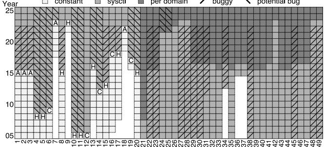  
Figure 24: Evolution of sysctl knobs. Each box shows the status of a knob. constant: a fixed perf-const in the source code; sysctl: exposed as a sysctl knob. per-domain: the sysctl knob is made per namespace. buggy: time between the introduction of a bug and the commit that fixes it. potential bug: a likely bug identified by our inspection. A/H/C: reason for the change (A: application-driven, H: hardwaredriven, C: exposing control of an inherent trade-off).

Note that converting a perf-const into a sysctl knob is non-trivial and error-prone. As shown in Figure 24, 20 knobs required bug fixes after their conversion, taking an average of 12 years to resolve. Most issues stem from race conditions introduced by the new global variable. We check the bug pattern of all the 149 sysctl knobs, and identify 43 additional knobs with likely unresolved bugs. Basically, converting a perf-const into a writable interface adds complexity: external writers (i.e., callers of the interface) can update the value while kernel threads may still read the old one. Fine-grained control adds further complexity. For example, changing the dirty-ratio knob to operate per device introduced a deadlock because the sysctl configuration path was not aware of the new semantics [82]. Xkernel addresses these problems by safely updating perf-const values through SIE (see §7).

## B Optimization for Conditional Branches

When the immediate value of a perf-const is used in a conditional branch (e.g., Figure 4(a)), the location target of SIE is the corresponding jmp instruction. However, a conditional jump cannot be jump-optimized by Kprobe [32].

For such cases, we implement a new optimization that allows jump-optimized kprobes. The key idea is to modify R/M in the cmp in advance (at a position that jumpoptimization is possible), and restore it along the control flow via extra jump-optimized kprobes, synchronized by a tasklocal flag, as shown in Figure 25. In this way, the same effect as synthesizing an SIE indirection to modify eflags can be achieved by proactively adjusting R/M used in the conditional jump. For example, in Figure 4(a), changing the immediate value from 7 to 4 is functionally equivalent to adding 3 to eax before the comparison. More generally, if we want to replace V with V <sup>′</sup>, we can adjust the R/M operand by ∆V = V −V <sup>′</sup> in advance, and later restore its original value along all relevant control-flow paths. This optimization increases the fraction of jump-optimized kprobes from 66.6% to 88.3% in our evaluation.

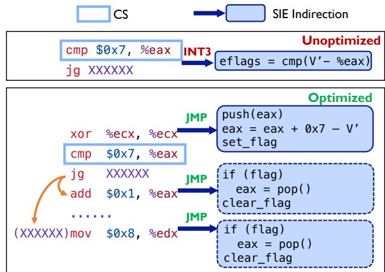  
Figure 25: Optimization for conditional branches. The cmp instruction is undesired because its length is less than 5 bytes, which prevents Kprobe jump-optimization. Xkernel attempts to attach the probe to a preceding instruction to enable Kprobe jump-optimization.

To implement this optimization, Xkernel inserts two extra kprobes at the jump target and the subsequent instruction. These kprobes query the task-local storage and restore the operand. To ensure restoration occurs only when control flow originates from the CS, and not from unrelated execution paths, we employ a task-local flag. This flag is set upon entry to the first kprobe and cleared when the two extra kprobes trigger. If the first kprobe and either of these two kprobes fail to enable jump-optimization, we fall back to the

```c
XK_TUNE(do_shrink_slab, "mm/shrinker.c:L381:128:0") {
// 1. Safety Guard (Mandatory)
if (!xk_transition_done(xk_ctx)) return 0;
struct shrinker *s = (struct shrinker *)
PT_REGS_PARM2(ctx);
char name[32];
if (bpf_probe_read_kernel(name, sizeof(name),
&s->name) < 0) return 0;
// 2. Tune SHRINK_BATCH only for zswap
if (bpf_strncmp(name, 12, "zswap-shrink") == 0)
xk_set(xk_ctx, 64);
return 0;
} /* SHRINK_BATCH.bpf.c */
```

Figure 26: An Xk-tune for zswap shrinker; it identifies zswap shrinkers by checking the name. #define MAX\_ROCKSDB\_THREADS 16

```c
struct { // Filled by RocksDB threads
__uint(type, BPF_MAP_TYPE_HASH);
__uint(max_entries, MAX_ROCKSDB_THREADS);
__type(key, u32);
__type(value, int);
} hint_map SEC(".maps");
XK_TUNE(blk_add_rq_to_plug, "block/blk.h:L312:32:0") {
// 1. Safety Guard (Mandatory)
if (!xk_transition_done(xk_ctx)) return 0;
// Get the pid upon invocating this kernel code path
u64 pid = bpf_get_current_pid_tgid() & 0xFFFFFFFF;
// 2. Leverage hints from the application
int *hint = bpf_map_lookup_elem(&hint_map, &pid);
if (hint) xk_set(xk_ctx, 1);
return 0;
} /* BLK_MAX_REQUEST_COUNT.bpf.c */
```

Figure 27: An application-informed policy for RocksDB. RocksDB characterizes threads with random-read patterns and exposes their IDs through a BPF map. Xk-tune leverages this hint to enable per-thread tuning.

original SIE location. When successful, this optimization replaces one INT3-based kprobe with two jump-optimized kprobes. Despite introducing extra kprobes, this approach is beneficial: a jump-optimized kprobe is an order of magnitude cheaper than an INT3-based kprobe.

## C Kprobe Limitation

In our evaluation (§6), Xkernel failed to handle one perfconst, where the target kernel functions could not be attached. The perf-const, SEND\_MAX\_EXTENT\_REFS, is located in fs/btrfs/send.c within the check\_extent\_items() function. In Linux v6.14, the symbol check\_extent\_item() has multiple definitions (e.g., appearing simultaneously in the kernel core and a loadable module). When registering a kprobe using the syntax [MOD:]SYM[+offs], the kernel’s trace\_kprobe mechanism resolves the symbol name. However, to prevent ambiguity, the kernel rejects the registration if multiple matches are found, causing the kprobe creation to fail with EINVAL or -EADDRNOTAVAIL.

## D Policy Code with Xkernel

We present three Xk-tune programs that illustrate the policies enabled by Xkernel (§5.2): object-level tuning granularity, application-informed policy, and ad-hoc heuristics. These examples show how users express such policies in Xkernel.

Figure 26 shows an Xk-tune program that customizes perf-consts for different objects. Written in eBPF, Xk-tunes can incorporate many features to customize tuning granularity. The perf-const is SHRINK\_BATCH (Case-3 in §5.1). Figure 27 shows an Xk-tune program for an applicationinformed policy for a RocksDB application. The perfconst is BLK\_MAX\_REQUEST\_COUNT (Case-1 in §5.1). Figure 28 shows an Xk-tune program that coordinates with other kprobes and uses ad-hoc workload heuristics. The perf-const is BLK\_MAX\_REQUEST\_COUNT (Case-1 in §5.1).

```c
#define MERGE_FAIL_THRESHOLD 16
struct { // Filled by blk_attempt_plug_merge()
__uint(type, BPF_MAP_TYPE_TASK_STORAGE);
__uint(map_flags, BPF_F_NO_PREALLOC);
__type(key, int);
__type(value, int);
} hint_map SEC(".maps");
/* Track consecutive failed attempts to merge adjacent
blocks and store the count in fail_cnt for use as a
tuning heuristic */
SEC("kretprobe/blk_attempt_plug_merge")
int BPF_KRETPROBE(blk_attempt_plug_merge_ret, long ret) {
struct task_struct *task = bpf_get_current_task_btf();
int *fail_cnt = bpf_task_storage_get(&hint_map,
task, NULL, BPF_LOCAL_STORAGE_GET_F_CREATE);
if (!fail_cnt) return 0;
if (ret == 0) (*fail_cnt)++;
else *fail_cnt = 0;
return 0;
}
XK_TUNE(blk_add_rq_to_plug, "block/blk.h:L312:32:0") {
// 1. Safety guard (mandatory)
if (!xk_transition_done(xk_ctx)) return 0;
struct task_struct *task = bpf_get_current_task_btf();
// 2. Leverage hints from blk_attempt_plug_merge()
// Heuristic: treat the workload as random when many
// (16, an ad-hoc threshold) consecutive merges fail
int *fail_cnt = bpf_task_storage_get(&hint_map,
task, NULL, 0);
if (fail_cnt && *fail_cnt >= MERGE_FAIL_THRESHOLD)
xk_set(xk_ctx, 1);
return 0;
} /* BLK_MAX_REQUEST_COUNT.bpf.c */
```

Figure 28: An Xk-tune program using ad-hoc workload heuristics for RocksDB. The Xk-tune instruments blk\_attempt\_plug\_merge with a kretprobe to track historical merge failures. Upon detecting a high failure rate, the Xk-tune adjusts the threshold to a smaller value (1).

## E Xkernel Tool Commands

We show a few commands that use Xkernel tools (§4).

xk-build /usr/src/linux tune.patch # > ConstID   
xk-gen ConstID xk-stub.h   
xk-load [global/task/imm] xk-tune.c   
xk-unload ConstID/all