USENIX

THE ADVANCED COMPUTING SYSTEMS ASSOCIATION

# MPK: A Compiler and Runtime for Mega-Kernelizing Tensor Programs

Xinhao Cheng, Zhihao Zhang, Yu Zhou, and Jianan Ji, Carnegie Mellon University;   
Jinchen Jiang, Tsinghua University; Zepeng Zhao and Ziruo Xiao, Carnegie Mellon University; Zihao Ye and Yingyi Huang, NVIDIA; Ruihang Lai, Hongyi Jin,   
Bohan Hou, Mengdi Wu, Yixin Dong, and Anthony Yip, Carnegie Mellon University; Zihao Ye, University of Michigan; Songting Wang, Carnegie Mellon University; Wenqin Yang, Independent Researcher; Xupeng Miao, Peking University; Tianqi Chen, Carnegie Mellon University and NVIDIA; Zhihao Jia, Carnegie Mellon University https://www.usenix.org/conference/osdi26/presentation/cheng

This paper is included in the Proceedings of the 20th USENIX Symposium on Operating Systems Design and Implementation.

July 13–15, 2026 • Seattle, WA, USA

ISBN 978-1-939133-55-7

Open access to the Proceedings of the 20th USENIX Symposium on Operating Systems Design and Implementation is sponsored by

# MPK: A Compiler and Runtime for Mega-Kernelizing Tensor Programs

Xinhao Cheng1,∗ Zhihao Zhang1,∗ Yu Zhou1,∗ Jianan Ji1,∗ Jinchen Jiang2 Zepeng Zhao1 Ziruo Xiao1 Zihao Ye3 Yingyi Huang3 Ruihang Lai1 Hongyi Jin1 Bohan Hou1 Mengdi Wu1 Yixin Dong1 Anthony Yip1 Zihao Ye4 Songting Wang1 Wenqin Yang5 Xupeng Miao6 Tianqi Chen1,3 Zhihao Jia1

Carnegie Mellon University1 Tsinghua University2 NVIDIA3 University of Michigan4 Independent Researcher5 Peking University6

## Abstract

We introduce Mirage Persistent Kernel (MPK), the first compiler and runtime system that automatically transforms multi-GPU model inference into a single high-performance megakernel. MPK introduces an SM-level graph representation that captures data dependencies at the granularity of individual streaming multiprocessors (SMs), enabling cross-operator software pipelining, fine-grained overlap of computation and communication, and other optimizations that are infeasible under the conventional kernel-per-operator execution model. The MPK compiler lowers tensor programs into optimized SM-level task graphs and generates fast CUDA implementations for each task, while the MPK in-kernel parallel runtime executes these tasks within a single persistent mega-kernel using decentralized scheduling across SMs. Together, these components provide end-to-end kernel fusion with minimal developer effort, while preserving the flexibility of existing programming models. Our evaluation shows that MPK significantly outperforms existing kernel-per-operator LLM serving systems, achieving up to 1.7× lower end-to-end inference latency and pushing LLM inference performance close to the limits of the underlying hardware. MPK is publicly available at https : //github.com/mirage-project/mirage.

## 1 Introduction

Enabling high-performance inference of ML models on GPUs is critical for modern AI applications, since inference latency directly affects both user experience and serving cost. Today’s ML systems generally express model computation as a tensor program structured as a directed acyclic graph, whose nodes denote tensor algebra operators (e.g., matrix multiplication) and whose edges represent tensors, i.e., the n-dimensional arrays produced and consumed by these operators.

Most existing systems execute each operator using a dedicated GPU kernel, either hand-optimized by domain experts [18, 43] or generated automatically by ML compilers [15, 36, 41]. However, this kernel-per-operator execution model limits several key cross-operator GPU optimizations.

First, modern GPUs impose an implicit kernel barrier between consecutive launches on the same stream to ensure that all threads from the previous kernel complete before any thread from the next kernel begins. While this mechanism correctly enforces data dependencies, it prevents crossoperator software pipelining and forces dependent operators to execute strictly sequentially. NVIDIA recently introduced programmatic dependent launch (PDL) [11], which allows partial overlap between kernels on the same stream. However, adopting PDL requires significant engineering effort, as it fundamentally alters kernel structure and control flow.

Second, the kernel-per-operator execution model prevents fine-grained compute-communication overlap. Since dependencies are represented only at the coarse granularity of operators, the runtime must enforce full-operator completion before launching dependent communication or computation. For example, when a matrix multiplication is followed by an all-reduce in separate kernels, the all-reduce must wait for the entire matrix multiplication to complete, even though each fragment of the all-reduce depends only on a subset of the multiplication output. Exploiting such opportunities requires representing and enforcing dependencies at a granularity finer than individual kernels.

Finally, kernel-per-operator execution may require launching hundreds to thousands of kernels for each inference iteration. To reduce launch overhead, current systems rely heavily on CUDA Graphs, which capture a sequence of GPU operations and replay them with low overhead. However, CUDA Graphs are largely static: any changes to control flow, tensor shapes, or data dependencies require re-instantiating or modifying the captured graph, limiting their flexibility for the dynamic workloads commonly seen in model inference.

A promising approach to overcoming these limitations is to fuse all computation and communication of model inference into a single mega-kernel, also known as a persistent kernel. In this design, the system launches one GPU kernel to execute the entire model, including layer computations and inter-GPU communication, without interruption.

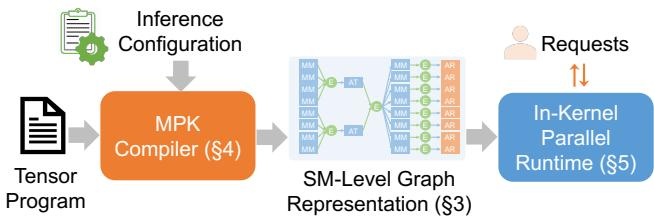  
Figure 1: An overview of MPK.

Mega-kernels address the limitations of kernel-per-operator execution in several ways. First, they eliminate repeated kernel launch overhead by replacing many operator-level launches with a single kernel invocation. Second, by fusing all operators into one kernel, they enable cross-operator software pipelining, allowing data for the next operator to be prefetched while computation for the current operator is still in progress. Third, they support fine-grained overlap of computation and inter-GPU communication, enabling concurrent execution that more effectively hides communication latency.

Despite these benefits, automatically transforming an ML model into a high-performance mega-kernel remains challenging. Existing ML systems—such as PyTorch [29], Triton [36], and TVM [15]—do not support end-to-end mega-kernel generation. Moreover, these systems rely on a fragmented ecosystem of specialized libraries: NCCL [4] or NVSHMEM [10] for communication, FlashInfer [43] or FlashAttention [18] for attention, and CUDA or Triton for custom computation. This fragmentation makes it difficult to unify the entire inference pipeline within a single kernel.

We present Mirage Persistent Kernel (MPK), the first compiler and runtime system that automatically transforms multi-GPU model inference into a high-performance mega-kernel. MPK enables end-to-end kernel fusion with minimal developer effort: users can mega-kernelize a PyTorch model with only a few lines of code while achieving significant performance improvements compared to running the model in vanilla PyTorch with CUDA Graphs and torch.compile. MPK combines the performance benefits of mega-kernels with the usability of existing ML frameworks.

A key idea in MPK is to represent computation and inter-GPU communication at the granularity of individual streaming multiprocessors (SMs), rather than at the granularity of an entire GPU. MPK introduces an SM-level graph representation, called tGraph, whose nodes denote tasks running on individual SMs and whose edges encode fine-grained dependencies between tasks. This representation exposes additional parallelism and enables optimizations such as cross-operator software pipelining and fine-grained kernel overlap, which are difficult to realize in conventional kernel-per-operator execution models. MPK realizes this idea using two key components shown in Figure 1.

The MPK compiler. The MPK compiler takes a tensor program and an inference configuration as input and automatically transforms the program’s computation graph into an optimized SM-level tGraph tailored to the given inference configuration and GPU architecture. The compiler applies a range of optimizations, including event fusion, graph normalization, and graph linearization, to reduce synchronization overhead and improve the performance of generated tGraphs. In addition, MPK automatically generates fast CUDA implementations for individual tasks using existing superoptimization techniques [41], ensuring efficient SM-level execution.

In-kernel parallel runtime. MPK executes the SM-level tGraph using an in-kernel parallel runtime embedded entirely within a mega-kernel, enabling fine-grained control over task execution and scheduling without additional kernel launches during model execution. To achieve this goal, the runtime partitions a GPU’s SMs into workers and schedulers. Each worker maintains a dedicated task queue and executes assigned tasks in a first-in-first-out order, while schedulers track dependencies across tasks and dispatch tasks once their prerequisites are satisfied. The MPK runtime uses an eventdriven, fully asynchronous execution model to keep GPUs highly utilized. Finally, the runtime uses a hybrid task-launch strategy that combines just-in-time and ahead-of-time dispatch to minimize runtime overhead while preserving dynamic load balance across SMs.

Evaluation results. We implement MPK as a PyTorch compiler backend: a PyTorch program can be compiled into an MPK mega-kernel with only a few lines of code changes. We evaluate MPK on five widely used models across three generations of NVIDIA GPUs: A100, H100, and B200. Even for workloads widely deployed and heavily optimized by existing kernel-per-operator systems, such as SGLang and vLLM for LLM serving, MPK outperforms current systems by 1.0–1.7× on both single- and multi-GPU deployments, pushing LLM inference performance close to hardware limits.

## 2 Background

This section first reviews the kernel-oriented GPU programming model and its limitations (§ 2.1), and then presents kernel fusion and mega-kernel techniques (§ 2.2), which motivate the design of MPK.

## 2.1 GPU Programming Model

On GPUs, computations are organized as kernels, each repre senting a function executed concurrently across many cores in a single-program, multiple-data (SPMD) fashion. A kernel consists of a grid of thread blocks, where each block is scheduled on a streaming multiprocessor (SM) and contains multiple threads that operate on individual data elements. Each thread has a private register file, while threads within the same block can cooperate through low-latency shared memory for data exchange and collective operations. All kernel inputs and outputs are stored in GPU device memory.

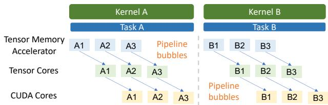  
(a) Kernel barriers prevent cross-task pipelining.

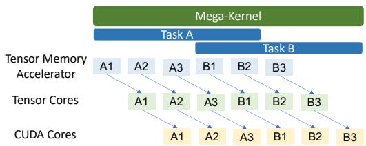  
(b) MPK enables both intra- and cross-task pipelining.  
Figure 2: Comparing how MPK and existing approaches support intra- and cross-task pipelining.

The conventional GPU programming model does not support direct synchronization across thread blocks within a kernel, because thread blocks are scheduled independently across SMs and may not all be resident simultaneously. As a result, cross-operator dependencies are enforced through kernel bar riers, which are automatically inserted by the GPU runtime between consecutive kernels launched on the same stream.

While kernel barriers simplify dependency management, they also prevent key GPU optimizations such as cross-kernel software pipelining and fine-grained operator overlap.

Software pipelining. GPU architectures are increasingly heterogeneous, integrating specialized accelerators such as tensor cores and tensor memory accelerators (TMAs). Since TMA load and store instructions execute asynchronously, data movement can proceed while tensor cores and CUDA cores perform computation. Fully exploiting these accelerators requires software pipelining—a technique that interleaves independent stages of computation and data movement across multiple iterations of tasks to maximize hardware utilization.

Existing systems implement intra-task pipelining, as shown in Figure 2a, where a single task is decomposed into multiple iterations. In this model, TMAs, tensor cores, and CUDA cores can simultaneously perform data transfer, matrix computation, and auxiliary operations for different iterations in a pipeline. However, kernel barriers restrict pipelining to within a single task, preventing cross-task pipelining and introducing pipeline bubbles that leave hardware resources underutilized.

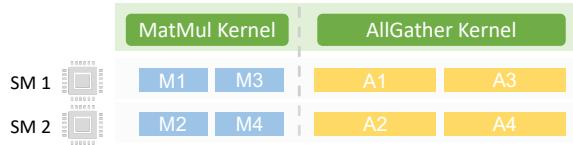  
(a) Kernel barriers prevent overlapping MatMul and AllGather.

  
(b) MPK enables fine-grained overlap of MatMul and AllGather.  
Figure 3: Comparing how MPK and existing approaches support fine-grained kernel overlap between tasks. Data dependencies (black arrows in Figure 3b) ensure correctness.

Fine-grained kernel overlap. Kernel barriers also preclude opportunities to overlap kernels that utilize different hardware resources (e.g., compute and communication), as they enforce dependencies at the granularity of entire kernels rather than individual data units. Figure 3a illustrates a common pattern in large language models (LLMs), where a MatMul operator is followed by an AllGather operator. Existing systems generally launch these as two separate kernels, requiring all thread blocks of the AllGather kernel to wait until all thread blocks of the preceding MatMul kernel complete.

In practice, the data dependency between MatMul and AllGather is much finer-grained: since AllGather performs element-wise operations, each of its thread blocks only depends on the output of a single MatMul thread block. This dependency structure enables fine-grained kernel overlap, where different SMs can execute MatMul and AllGather in parallel, as long as fine-grained data dependencies are preserved. Such overlap allows the system to simultaneously utilize compute resources and communication bandwidth on modern GPUs, as identified in prior work [50]. Achieving this overlap, however, requires proper synchronization between SMs at sub-kernel granularity, as shown in Figure 3b, which is not supported by conventional kernel barriers.

## 2.2 Kernel Fusion

Kernel fusion eliminates kernel barriers by combining multiple GPU kernels that execute sequentially on the same data into a single, semantically equivalent kernel. Kernel fusion improves performance by avoiding materialization of intermediate results, reducing device memory accesses, and eliminating kernel launch overheads.

Kernel fusion has been widely adopted in tensor program compilers. Frameworks such as PyTorch, JAX, and TVM employ rule-based heuristics to fuse adjacent kernels [14, 15, 29], while systems such as Mirage and TASO automatically discover fusion rules through compiler superoptimization [26, 41]. However, existing compilers can only fuse small groups of local operators, as generating a single kernel that faithfully implements an entire complex tensor program is computationally difficult and often infeasible.

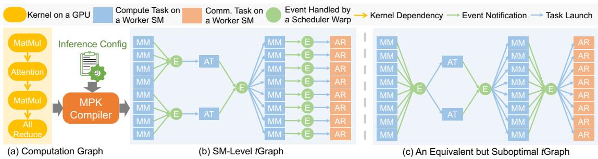  
Figure 4: The MPK compiler transforms a kernel-level computation graph into an optimized SM-level tGraph. MM, AT, and AR denote MatMul, Attention, and AllReduce tasks, respectively.

The mega-kernel paradigm pushes kernel fusion to the extreme by fusing all computation and communication of a tensor program into one persistent kernel, using devicememory synchronization primitives to coordinate execution across SMs. Despite its performance benefits, current ML compilers such as PyTorch, Triton, JAX, and TVM do not support mega-kernel compilation. Existing mega-kernels are instead handcrafted by GPU experts for specific models. For example, FlashDMoE fuses mixture-of-experts computation and inter-GPU communication into a single kernel [13], while Spector et al. manually designed and implemented a lowlatency mega-kernel for LLAMA-1B [9, 37].

These manual approaches require substantial engineering effort and deep GPU expertise to mega-kernelize a tensor program. In contrast, MPK adopts a compiler-based approach that automatically transforms a tensor program into an optimized mega-kernel, eliminating the need for manual effort.

## 3 SM-Level Graph Representation

This section introduces tGraph, a representation that expresses the computation of a tensor program at the granularity of individual streaming multiprocessors (SMs). Unlike con ventional computation graphs, which expose dependencies only between tensor operators, tGraph captures dependencies between SM-level units of work. This fine-grained representation exposes additional parallelism and enables optimizations such as cross-operator software pipelining and fine-grained kernel overlap, both of which are not supported by the existing kernel-per-operator execution model.

Figure 4 illustrates an example tGraph, where each node represents either a task or an event. Each task—shown as a blue (or orange) rectangle—denotes a unit of computation (or communication) executed on a single SM. Each event— shown as a green circle—represents synchronization across tasks. Tasks and events alternate in the graph: every task only has outgoing edges to triggering events and incoming edges from dependent events. A task is ready for execution when its dependent events are all activated and notifies its triggering event upon completion. An event is activated once it has received notifications from all tasks associated with it.

This structure captures dependencies at a much finer granularity than traditional computation graphs. For example, multi-GPU LLM serving often involves a MatMul operator followed by an AllReduce operator (Figure 4a). Existing systems generally execute these operators sequentially because coarse-grained kernel barriers synchronize entire kernels. In contrast, SM-level task graphs can represent precise task-level dependencies: since AllReduce performs elementwise communication and reduction, each of its tasks depends only on one corresponding MatMul task that produces its input tile. By inserting fine-grained events between dependent task pairs, MPK can overlap compute-intensive MatMul tasks with communication-intensive AllReduce tasks, improving overall GPU utilization.

Multiple tGraphs may represent the same computation graph. Figure 4c shows an alternative but suboptimal tGraph where events capture only operator-level dependencies, analogous to traditional kernel barriers. § 4 describes how MPK generates high-performance task graphs by inferring precise data dependencies to maximize concurrency and minimize synchronization overheads.

Comparison with CUDA Graphs. tGraphs can be viewed as a lower-level extension of CUDA Graphs, sharing several structural similarities. Like CUDA Graphs, tGraphs are statically instantiated and encode explicit dependencies among operations. However, while CUDA Graphs capture dependencies only at the kernel level, tGraphs operate at the granularity of individual SM tasks and sub-kernel events. CUDA Graphs primarily describe kernel launch order and rely on stream semantics for synchronization, which confines overlap and fusion to kernel boundaries. In contrast, tGraphs explicitly model both intra- and cross-operator dependencies, enabling fine-grained synchronization across SMs and overlap of computation and communication within a single kernel. This design allows MPK to exploit parallelism that is inaccessible to CUDA Graphs and other kernel-level execution models.

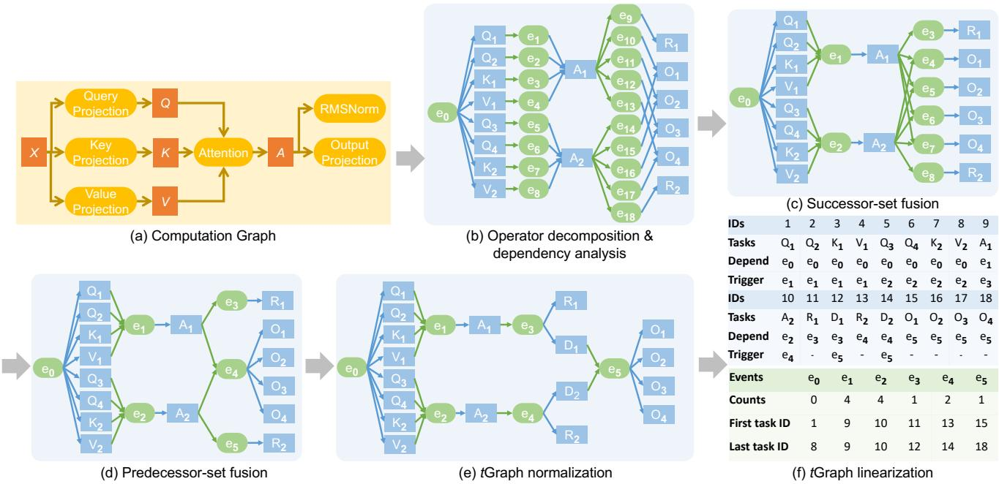  
Figure 5: The MPK compiler workflow. In (b), Q, K, V , A, O, and R denote the sets of tasks produced by decomposing the query projection, key projection, value projection, attention, output projection, and RMSNorm, respectively. D1 and D2 in (e) are dummy tasks inserted during tGraph normalization to ensure that each task has a single triggering event. Finally, (f) shows how MPK linearizes the tGraph and stores the resulting structure, where tasks and events use a uniform, canonical representation.

## 4 The MPK Compiler

This section presents the MPK compiler, which takes a computation graph and an associated inference configuration as input and generates an optimized tGraph specialized for the target configuration and underlying GPU architecture. Fig ure 5 illustrates the end-to-end compilation workflow.

## 4.1 tGraph Generation

Operator decomposition. The MPK compiler decomposes each operator in the input computation graph into a set of tasks by partitioning the operator’s output tensors. Each task computes a disjoint subset of the output, allowing tasks from the same operator to execute in parallel across SMs. Most tensor algebra operators can be partitioned along multiple output dimensions; for example, the output tensor of a matrix multiplication can be tiled along both the row and column dimensions to expose parallelism.

The performance of a partitioning strategy depends on both the problem shape and the target GPU architecture. To discover an effective strategy, MPK selects a partitioning strategy that minimizes data loading from device memory to shared memory, since device memory accesses are significantly more expensive than shared-memory accesses or computation on CUDA cores and tensor cores. By default, MPK generates a number of tasks proportional to the number of SMs to promote load balance across SMs during execution. MPK also provides an interface for users to specify custom partitioning strategies by setting the desired parallelization degree along each output dimension.

Dependency analysis. MPK uses events to capture dependencies between tasks. For any two operators sharing a tensor, MPK enumerates all pairs of tasks from the two operators and introduces an event e for a task pair (t1,t2) if and only if the output region produced by t1 overlaps with the input region consumed by t2. The event serves as a synchronization point indicating that t2 cannot begin execution until t1 has produced the required data. Accordingly, MPK inserts two edges, (t1, e) and (e,t2), into the resulting tGraph. This fine-grained dependency analysis preserves all producer-consumer dependencies while exposing parallelism across independent tasks.

Event fusion. MPK applies two complementary forms of event fusion—successor-set fusion and predecessor-set fusion—to eliminate redundant synchronization points and simplify the constructed tGraph. For an event e, we define two functions: InTasks(e), the set of tasks that trigger e, and OutTasks(e), the set of tasks that depend on e. These functions characterize when multiple events have identical dependency structure and can therefore be fused.

First, successor-set fusion merges events that serve as prerequisites for the same set of consumer tasks. Since these consumer tasks cannot begin execution until all such events are activated, representing the events separately provides no additional scheduling flexibility.

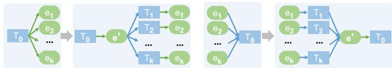  
(a) A transformation reducing fan-out of a task to one.  
(b) A transformation reducing fan-in of a task to one.  
Figure 6: MPK performs graph transformations to normalize an arbitrary tGraph, ensuring that every task has at most one dependent event and at most one triggering event.

Definition 4.1 (Successor-set fusion). For any two events e1 and e in a tGraph, successor-set fusion applies if and only if OutTasks(e )= OutTasks(e ). MPK removes e and e from the tGraph and introduces a fused event e′ with InTasks(e′)= InTasks(e1) ∪ InTasks(e2) and OutTasks(e′)= OutTasks(e1).

For example, successor-set fusion merges events e10 and e14 in Figure 5(b) into a new event, e4 in Figure 5(c), because both events are prerequisites for task O1.

Second, predecessor-set fusion merges events that depend on the same set of producer tasks. Since such events are triggered simultaneously, maintaining them as separate synchronization nodes introduces unnecessary graph complexity.

Definition 4.2 (Predecessor-set fusion). For any two events e1 and e2 in a tGraph, predecessor-set fusion applies if and only if InTasks(e1)= InTasks(e2). MPK removes e1 and e2 from the tGraph and introduces a fused event e′ with InTasks(e′)=InTasks(e1) and OutTasks(e′)=OutTasks(e1)∪ OutTasks(e2).

For example, predecessor-set fusion merges events e4, e5, e6, and e7 in Figure 5(c) into a single event, e4 in the new tGraph, because all four events depend on tasks A1 and A2.

A core challenge MPK must address is representing dependencies between tasks and events efficiently. Because MPK executes tasks and updates events in parallel across SMs, the runtime requires a uniform and cheap representation that avoids costly indirect indexing. Two challenges arise. First, a task may depend on and trigger an arbitrary number of events. A straightforward approach to representing tasks is reserving space for the maximum number of dependent and triggering events per task. However, this approach leads to significant memory overhead. Second, after event fusion, an event may trigger an arbitrary number of tasks. Representing these outgoing edges by allocating space for the maximum fan-out per event is also expensive. MPK addresses these challenges using two techniques: tGraph normalization and tGraph linearization.

tGraph normalization. Normalization bounds the dependency metadata stored for each task. When every task depends on and triggers at most one event, each task descriptor needs to store only one dependent-event identifier and one triggering-event identifier, rather than variable-length lists. MPK achieves this property through the two rewrites shown in Figure 6, which transform an input tGraph into a functionally equivalent form in which each task has at most one dependent event and at most one triggering event.

First, when a task T0 triggers multiple events e1, . . . , ek, MPK introduces a new event e′ and k empty tasks T1,..., Tk, each of which performs no computation and depends on e′. After this transformation, T0 triggers only e′, and each newly introduced task Ti triggers exactly one of the original events ei, as shown in Figure 6a. This transformation ensures that every task has at most one triggering event. Figure 5(e) shows how MPK applies this transformation to reduce the number of triggering events for A1 and A2 to one.

Second, when a task T0 depends on multiple events e1,..., ek, MPK introduces a new event e and k empty tasks T ,..., T , each of which performs no computation and triggers e′. After this transformation, T0 depends only on e′, and each newly introduced task T depends on exactly one of the original events e , as shown in Figure 6b. This transformation ensures that every task has at most one dependent event.

tGraph normalization introduces additional tasks and events only when a tGraph contains tasks with multiple fan-in or fan-out events. This situation typically arises when the original computation graph contains operators that can execute in parallel. For example, tasks A1 and A2 in Figure 5(d) have two fan-out events because both the RMSNorm and output projection operators depend on attention and can therefore run in parallel. In practice, we observe negligible normalization overhead—always less than 1% in our evaluation—because real-world models are usually “deep” (with many sequential operators), rather than “wide” (with many parallel operators).

Algorithm 1 MPK’s tGraph linearization algorithm. It is   
guaranteed that each task is enqueued into T once and that   
each event is enqueued into E once. Lines 5-7 ensure that all   
tasks depending on an event are consecutive in T .   
Input: A normalized tGraph G   
Output: A list of tasks T such that for each event e ∈ G, the tasks launched   
by e are consecutive in T .   
1: T ←∅   
2: E ← {e∈G|e.counts=0} ▷ Enqueue all events with no dependent tasks   
3: while E is not empty do   
4: e ← E.dequeue()   
5: for all task t ∈ G do   
6: if t.dependent\_event = e then   
7: T.enqueue(t)   
8: e′ ←t.trigger\_event   
9: if all tasks triggering e′ are in T then   
10: E.enqueue(e′)   
11:   
12: return T

tGraph linearization. Linearization complements normalization: while normalization bounds the number of events associated with each task, linearization bounds the storage required to record the tasks associated with each event. tGraph normalization alone does not address the second representation challenge: after event fusion, an event may still need to trigger many tasks. For example, event e5 in Figure 5(e) triggers four tasks, which would otherwise require explicit storage for all outgoing task indices.

MPK addresses this challenge using a breadth-first-searchbased algorithm, shown in Algorithm 1, to linearize a tGraph. The algorithm assigns contiguous indices to all tasks triggered by the same event in the final task ordering. As a result, the fanout of an event can be encoded compactly using only the first and last task indices, eliminating the need to store an explicit list of dependent tasks while preserving all dependencies.

Figure 5(f) illustrates how MPK stores the linearized tGraph in GPU device memory. For each task, MPK records only the indices of its dependent and triggering events. For each event, MPK stores the number of triggers required for activation; once activated, the runtime launches all tasks whose indices fall within the event’s first and last task indices.

## 4.2 Task Implementation Generation

In addition to constructing a tGraph, MPK must generate a device function for each task to execute on a GPU SM. MPK leverages prior work and uses a compiler superoptimization approach to automatically generate a high-performance implementation for each task.

Specifically, MPK performs superoptimization at the thread block level instead of the kernel level. Each compute task is associated with a reference PyTorch implementation, and MPK uses the Mirage superoptimizer [41] to search for an optimized thread-block graph, which is sent to the Mirage compiler to generate a CUDA implementation. The CUDA implementation includes intra-SM optimizations such as software pipelining, register reuse, and layout optimizations to reduce shared-memory bank conflicts.

## 5 In-Kernel Parallel Runtime

MPK employs an in-kernel parallel runtime that executes the tGraph across all SMs within a single mega-kernel. This design eliminates repeated kernel launches and exposes finegrained control over scheduling, synchronization, and execution order. Once launched, the mega-kernel continuously manages both computation and communication until the inference workload completes.

To support this execution model, MPK partitions a GPU’s SMs into workers and schedulers. Each worker runs on one physical SM and maintains an independent task queue. Workers execute a lightweight loop that repeatedly dequeues tasks, performs the associated computation or communication, and signals task completion by notifying the task’s triggering event. This design ensures that workers are fully utilized while enabling asynchronous execution across operators.

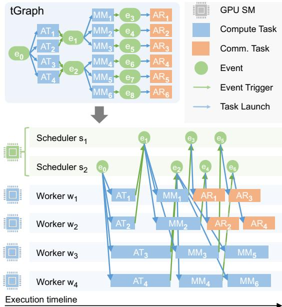  
Figure 7: The MPK event-driven execution model. Circles denote events, and blue (or orange) rectangles denote compute (or communication) tasks, respectively. Edges from an event to a task correspond to task launches, while edges from a task to an event indicate that the task triggers the associated event upon completion. AT, MM, and AR refer to attention, matrix multiplication, and AllReduce, respectively.

Schedulers are organized at warp granularity, with each SM hosting four scheduler warps. Each scheduler maintains an event queue and repeatedly polls for newly activated events, dispatching the corresponding tasks to workers. The allocation of workers and schedulers is fixed at kernel-launch time and matches the GPU’s physical SM count, avoiding any dynamic role-switching overhead inside the kernel.

The remainder of this section details the in-kernel runtime architecture. § 5.1 describes MPK’s event-driven execution model. § 5.2 introduces two complementary task-launch mechanisms, analyzes their trade-offs, and explains how MPK combines them to achieve low-latency and load-balanced execution. § 5.3 describes additional runtime optimizations that further reduce overhead and improve throughput.

## 5.1 Event-Driven Execution

MPK executes a tGraph using an event-driven model. Each tGraph begins with a designated start event (e.g., e0 in Figure 7), which has no prerequisites. This event is initially enqueued into a scheduler’s event queue. Upon dequeuing the event, the scheduler (e.g., s ) launches all tasks that depend on it (e.g., AT1, . . . , AT4). Each launched task is dispatched to a worker, which executes the task and, upon completion, notifies the triggering event associated with that task.

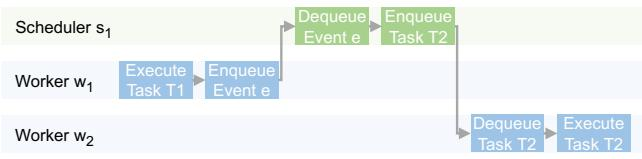  
(a) Just-in-time task launch.

  
(b) Ahead-of-time task launch.  
Figure 8: Comparing JIT and AOT task launches.

An event becomes activated once all of its prerequisites have completed and thus have collectively triggered the event the required number of times. When an event is activated, it is enqueued into a scheduler’s event queue, allowing the runtime to continue propagating execution through the tGraph. In this way, events serve as the mechanism for driving task execution, enabling fine-grained, asynchronous scheduling.

This event-driven model also allows MPK to adapt to the underlying interconnect without requiring an explicit topology profile. Communication and computation are represented uniformly as tasks in the same tGraph and dispatched by the same scheduler. A dependent compute task launches as soon as the communication tasks producing its inputs trigger the relevant event, regardless of the latency of the links they traverse. A faster link triggers its event sooner and releases dependent work earlier, while a slower link delays only the tasks that depend on it. The scheduler therefore does not require explicit knowledge of link bandwidths or topology distances. The same tGraph and scheduler can thus handle heterogeneous interconnects, such as intra-node NVLink and inter-node networks, by reacting to data availability rather than relying on a static topology model.

## 5.2 Hybrid Task Launch

A task can be enqueued into a worker’s task queue either just-in-time (JIT) or ahead-of-time (AOT). In JIT mode, a scheduler assigns a task to a worker only after its dependent event has been fully activated; the task can therefore begin execution immediately after assignment. In AOT mode, the runtime pre-enqueues the task into a worker’s task queue before its predecessor event is activated. The worker cannot execute the task until the dependent event is fully activated, and thus waits locally for the dependency to be satisfied.

JIT and AOT approaches provide complementary advantages. On the one hand, JIT launch allows MPK to adapt to workload imbalance. For example, attention in LLMs involves highly variable execution times due to data-dependent sequence lengths—requests with long sequence lengths take longer to finish than those with short ones. This variance makes static assignment ineffective. Under JIT launch, MPK launches downstream tasks (e.g., MatMul or AllReduce) only after the attention tasks that trigger them have completed. Workers that finish their attention tasks earlier can execute more downstream tasks, improving end-to-end latency and balancing load across SMs, as illustrated in Figure 7.

On the other hand, JIT launch involves higher latency due to additional worker–scheduler communication. Figure 8 illustrates the difference when launching task T2 after event e is triggered by task T . Under JIT launch (Figure 8a), the worker executing T1 notifies a scheduler, which then dequeues event e, launches T2, and enqueues it into a worker’s task queue. The receiving worker must then dequeue T before execution. This chain requires two synchronization steps (worker→scheduler and scheduler→worker). By contrast, under AOT launch (Figure 8b), T2 has already been enqueued on a pre-assigned worker, which only needs to wait for event e to be activated. Thus, AOT launch requires only one synchronization step through the event trigger, reducing per-task launch latency.

MPK uses hybrid task launch to combine the advantages of both approaches. During tGraph construction, the compiler classifies each operator as JIT or AOT based on whether its execution time is data-dependent and likely to induce runtime imbalance. Operators with data-dependent durations (e.g., attention) are marked as JIT, and their downstream operators remain JIT until execution reaches a global barrier (i.e., an event that must be triggered by all upstream tasks). Such barriers eliminate accumulated imbalance, making subsequent operators suitable for AOT launch. All remaining operators are labeled AOT to minimize dispatch overhead. Labels apply at operator granularity: all tasks generated by the same operator share the same launch mode.

Workers maintain two queues, one for JIT tasks and one for AOT tasks. Workers always prioritize JIT tasks, as they are ready to execute immediately. When a worker exhausts its JIT queue, it checks whether the first AOT task’s dependent event has been fully activated; if so, the worker executes that AOT task. This design ensures that a worker blocks only when no ready work is available.

Schedulers handle only events that launch JIT tasks. All AOT tasks are pre-enqueued before execution begins. Because operators typically produce a number of tasks proportional to the number of workers (§ 4), MPK distributes AOT tasks across workers in a round-robin fashion to maintain balanced load. Pre-enqueuing AOT tasks reduces scheduler load and amortizes dispatch overhead, while JIT launch dynamically balances work across SMs.

## 5.3 Runtime Optimizations

This subsection introduces runtime optimizations that minimize MPK’s execution overhead.

Paged shared-memory abstraction. In conventional GPU programming models, shared memory is a fast on-chip memory private to each thread block. Shared memory exists only for the lifetime of a kernel: once the kernel finishes, its shared memory is automatically released. In the kernel-per-operator execution model, each kernel typically assumes exclusive access to the shared memory allocated to its thread block. However, this assumption prevents cross-task software pipelining (§ 2), which overlaps data loading for a subsequent task with computation in the current task, since both tasks may need shared memory at the same time.

To enable such pipelining, MPK introduces a paged sharedmemory abstraction. Shared memory is partitioned into fixedsize pages, and task implementations are modified to operate on pages instead of assuming a monolithic allocation. A task may acquire one or more pages based on its shared-memory footprint and must release the pages when they are no longer needed. Once a task releases any page, it is no longer permitted to acquire additional shared-memory pages, enforcing a monotonic usage pattern that simplifies scheduling. When the current task releases pages, MPK can immediately allocate available pages for the next task and begin data prefetching. This design enables fine-grained, on-demand allocation of shared memory within the mega-kernel execution model.

Cross-task software pipelining. To enable software pipelining across tasks executed on the same worker (§ 2.1), MPK decomposes each task into a pre-loading phase and a compute phase. The pre-loading phase issues data transfer instructions to fetch a chunk of the required tensor from device memory into shared memory, initializing the intra-task software pipeline without performing computation.

MPK opportunistically overlaps the compute phase of the current task T1 with the pre-loading phase of the subsequent task T when two conditions hold: (1) T has already issued all of its own data-transfer instructions, and (2) sufficient shared memory pages are available for T ’s pre-loading phase. This pipeline does not interfere with T1’s execution because MPK inserts the necessary intra-SM synchronization barriers to ensure that T2’s memory transfers do not conflict with ongoing data transfers for T1.

Pre-fetching task descriptions. Each worker maintains both JIT and AOT task queues in device memory. Every task is associated with a task description that encodes its input tensors, output tensors, and configuration parameters; in our current implementation, each description occupies 352 bytes (§ 6.1). To reduce enqueue/dequeue latency and hide devicememory access costs, MPK employs a lightweight prefetching mechanism that retrieves upcoming task descriptions into shared memory before they are needed.

## 6 Evaluation

This section evaluates MPK by answering four questions. First, § 6.3 compares MPK’s mega-kernel execution model with state-of-the-art kernel-per-operator systems. Second, § 6.4 studies how MPK supports dynamic workloads. Third, § 6.5 evaluates the scalability and efficiency of MPK for multi-GPU execution. Finally, § 6.6 isolates the performance contributions of the main runtime optimizations in MPK.

We focus our evaluation on LLM serving for two reasons. First, LLM serving has several heavily optimized kernel-peroperator baselines, including SGLang and vLLM [27, 46]; comparing against them provides a stringent benchmark that highlights the benefits of MPK’s mega-kernel approach. Second, LLM serving naturally exhibits dynamic execution behavior, as different serving iterations may vary in batch size, sequence length, and the mixture of prefill and decode work. This variability creates heterogeneous workloads that stress both the compiler and the runtime. Although our evaluation focuses on LLM serving, the MPK compiler and runtime are model-agnostic and can support general DNN architectures.

## 6.1 Implementation Details

We implement MPK as a PyTorch compiler backend. A Py-Torch program can be compiled into an MPK mega-kernel via PyTorch’s compilation interface by specifying MPK as the backend, i.e., torch.compile(backend=MPK). This call invokes the MPK compiler, which generates a mega-kernel and returns it as a callable PyTorch function. Invoking this function issues a single launch of the generated mega-kernel.

The current MPK implementation consists of approximately 44K lines of C++, 42K lines of CUDA, and 10K lines of Python. The in-kernel parallel runtime is written in CUDA and uses semaphores in device memory to coordinate workers and schedulers. The MPK compiler, implemented in C++ and Python, automatically transforms an input tensor program into an optimized tGraph tailored to specific GPU types. For compute tasks, the compiler integrates the Mirage superoptimizer [41] to automatically generate optimized CUDA implementations and uses NVSHMEM [10] to support in-kernel inter-GPU communication.

Our implementation includes several optimizations to minimize runtime overhead and support dynamic workloads.

Task-launch overhead. Because MPK decomposes computation into tasks that are substantially finer-grained than traditional GPU kernels, minimizing per-task launch overhead is essential for performance. MPK uses several techniques to keep task-launch costs low. First, the runtime uses lightweight workers and schedulers: event queues and task queues are implemented as circular buffers in GPU device memory, and enqueue and dequeue operations rely only on low-cost atomicAdd instructions. Second, MPK uses decentralized scheduling, in which each scheduler assigns tasks using local state. This design avoids global coordination and eliminates the communication and synchronization overheads inherent to globally coordinated scheduling.

Table 1: MPK configuration in our evaluation.  
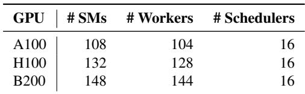

Although the current implementation uses decentralized scheduling, the runtime is designed to support alternative policies, including globally coordinated scheduling, with minor code changes. Exploring these policies and their performance trade-offs is an interesting direction for future work.

Supporting runtime dynamism. To demonstrate MPK’s ability to support highly dynamic workloads, we extend the system with mechanisms required for LLM serving, including continuous batching [44] and paged attention [27]. When processing the start event of a tGraph, the scheduler prepares a new decoding iteration by (1) removing completed requests from the previous iteration, (2) admitting newly arrived requests, and (3) updating per-request KV-cache metadata. This logic executes as a single task, and the KV-cache metadata is stored in device memory for direct access by attention tasks.

To handle the dynamic batch sizes intrinsic to LLM serving, MPK generates multiple tGraphs specialized for representative batch sizes, using powers of two up to the maximum batch size. At runtime, the scheduler selects the appropriate tGraph based on the current batch size. This approach allows the compiler to generate tGraphs optimized for specific batch sizes while preserving flexibility for dynamic serving workloads.

## 6.2 Experimental Setup

We evaluate MPK on five widely deployed LLMs that span different parameter scales and architectural families, and on three generations of NVIDIA GPUs: A100, H100, and B200. Table 1 summarizes the MPK configuration for each GPU. In all experiments, MPK reserves four SMs for schedulers, allocating 16 scheduler warps in total because each SM can host up to four active scheduler warps. The remaining SMs are used as workers. We set the shared-memory page size to 32 KB on all GPUs, which yields 5, 7, and 7 shared-memory pages per SM on A100, H100, and B200, respectively. Fig ure 9 shows the evaluated LLMs, which include both dense and mixture-of-experts models across multiple model sizes.

To control for variability in request-arrival patterns, all experiments are conducted in an offline batched-inference setting while varying the maximum batch size. Each request uses a prompt length of 64 tokens and generates 1024 output tokens. This methodology eliminates server-side stalls caused by insufficient request concurrency and enables a controlled comparison of system-level performance.

## 6.3 End-to-end Results

We first compare the end-to-end serving performance of MPK with SGLang and vLLM, two state-of-the-art LLM serving systems. Both SGLang and vLLM use the kernel-per-operator approach and rely on specialized kernel libraries, including FlashInfer [43] and FlashAttention [7] for attention, cuBLAS and cuTLASS [2] for matrix multiplication, and CUDA or Triton [36] for other operators. All systems load model architectures from HuggingFace Transformers [6], use bfloat16 precision, and enable paged attention [27] and continuous batching [44]. The key architectural difference is that MPK integrates page allocation and request scheduling directly into the mega-kernel. In contrast, SGLang and vLLM perform these operations on the CPU, incurring additional host–device synchronization and dispatch overheads.

For each model, we evaluate all three systems on B200, H100, and A100 GPUs with maximum batch sizes from 1 to 16, and report serving throughput.

Figure 9 shows the end-to-end throughput results. For single-batch inference, MPK improves serving performance by 1.0–1.7× across models and hardware. The improvements are most significant for smaller models and newer GPU generations. This trend is expected because three overheads become more significant as the amount of computation per token decreases and GPU hardware becomes faster: (1) kernelper-operator approaches incur kernel-switch overheads, even when using CUDA Graphs; (2) kernel boundaries introduce pipeline bubbles and prevent cross-task pipelining (Figure 2); and (3) SGLang and vLLM perform page allocation and request scheduling on the CPU, adding CPU–GPU synchronization delays. § 6.6 quantifies the impact of these optimizations.

These results show that MPK is well-suited for latencysensitive serving scenarios, such as single-batch decoding, where reducing per-token latency is critical. For example, on Qwen3-8B running on an A100 GPU, MPK reduces pertoken decoding latency from 14.5 ms, achieved by highly optimized systems such as vLLM and SGLang, to 12.5 ms. This approaches the approximate hardware lower bound of 10 ms, estimated by loading 16 GB of model parameters at 1.6 TB/s memory bandwidth.

Beyond performance, MPK also improves programmability. vLLM and SGLang require substantial engineering effort to optimize new models and integrate specialized kernels. In contrast, MPK takes a compiler-based approach that automatically mega-kernelizes a PyTorch model with only a few lines of code changes. As a result, MPK combines high performance with a familiar PyTorch development workflow, achieving more than 10× speedup over native PyTorch.

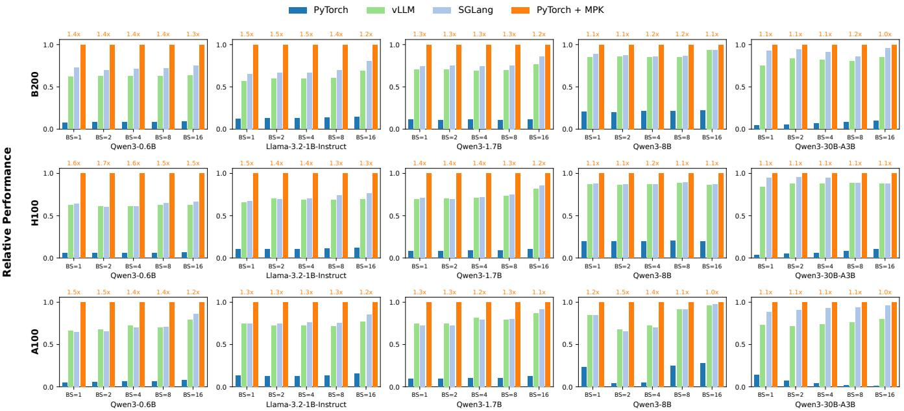  
Figure 9: End-to-end comparison of MPK with existing systems across five models on A100, H100, and B200 GPUs. All results are normalized to MPK; higher is better. The value above each MPK bar reports its speedup over the best-performing baseline.

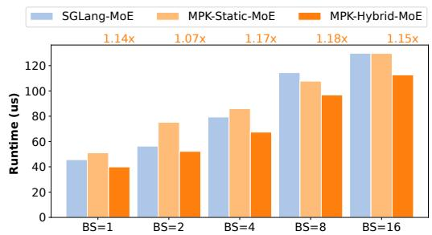  
Figure 10: Comparing MPK with existing systems for Qwen3- 30B-A3B on B200. Each value represents the actual MoE runtime in microseconds for each approach (lower is better), and the numbers above the bars indicate the speedup achieved by MPK-Hybrid-MoE over SGLang-MoE.

## 6.4 Case Study: Mixture-of-Experts

To efficiently serve dynamic workloads such as mixture-of experts (MoE) models, MPK implements two MoE-specific optimizations: a hybrid workload balancer and a fused gather–GEMM implementation.

Representing expert parallelism. MPK represents expert parallelism using the same task abstraction used for other operators. An MoE block is lowered into a chain of SM-level tasks in the tGraph (§ 4), including routing, dispatch, expert computation, and combine. The dispatch and combine stages capture the all-to-all communication required by expert parallelism, and MPK lowers them into inter-GPU data-transfer tasks in the same way it lowers other collective operations (§ 6.5).

Because communication tasks and expert-computation tasks reside in the same tGraph and are dispatched by the same event-driven scheduler, the runtime overlaps all-to-all communication with computation as soon as the relevant events are triggered, without relying on CUDA streams or host-side synchronization. The two MoE-specific optimizations described below operate within this task representation.

Hybrid workload balancer. Because the number of tokens routed to each expert is known only at runtime, choosing an effective workload partition statically is challenging. A naive static strategy assigns a fixed group of SMs to preassigned experts. However, under skewed routing distributions, this strategy can lead to severe load imbalance: some SM groups become oversubscribed while others remain underutilized. At the other extreme, a fully dynamic strategy based on persistent Grouped-GEMM [8] can balance work across SMs, but introduces fine-grained synchronization overheads.

MPK therefore uses a hybrid strategy that combines static structure with runtime adaptivity. At compile time, the compiler partitions the MoE computation into expert-specific tasks. At runtime, each task receives a meta-tensor produced by topk-softmax containing global MoE information, including the number of activated experts and tokens assigned to each expert. Using this metadata, tasks refine their workload allocation dynamically and split work more evenly while avoiding the overheads of fully dynamic scheduling. As shown in Figure 10, this hybrid strategy consistently outperforms purely static partitioning across all batch sizes.

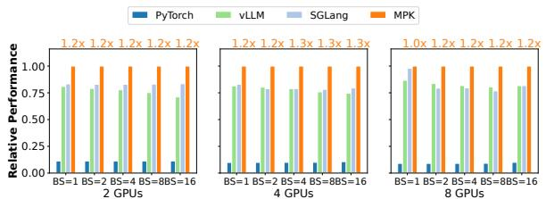  
Figure 11: Multi-GPU comparison of MPK with existing systems for Qwen3-1.7B on H100 GPUs using tensor parallelism. All results are normalized to MPK; higher is better.

Fused gather-GEMM. To use tensor memory accelerators (TMAs) on Hopper and Blackwell GPUs, conventional MoE implementations first gather tokens routed to the same expert into a contiguous memory layout. For Qwen3-30B-A3B at batch size one on SGLang, this preprocessing step accounts for up to 11% of total MoE execution time. In MPK, implementing this step as a separate preprocessing task would also introduce additional scheduling overhead.

MPK addresses this issue by replacing the TMA-based gather with an asynchronous token-level copy integrated directly into the data-loading phase of the GEMM tasks. This fusion eliminates the standalone gather kernel and avoids additional scheduling points while preserving efficient memory movement. As a result, MPK with fused gather-GEMM achieves consistent speedups over SGLang’s implementation.

## 6.5 Multi-GPU Results

We evaluate the scalability of MPK across multiple GPUs on an NVIDIA H100 DGX instance. As in the baseline systems, we use tensor model parallelism, following Megatron-LM [31]. Users specify tensor-parallel execution by inserting AllReduce after attention and gated MLP blocks. MPK then automatically compiles these collective operators into two types of tasks: inter-GPU data-transfer tasks, implemented using NVSHMEM’s nvshmem\_signal\_wait\_until, and local reduction tasks. This decomposition converts synchronous collective communication into asynchronous tasks that can be integrated into MPK’s task-based, event-driven runtime.

Figure 11 shows the multi-GPU results. Compared with Py-Torch, which uses a combination of hand-optimized kernels, CUDA Graphs, and torch.compile, MPK’s mega-kernel execution improves throughput by up to 10×. Compared with highly optimized serving systems such as SGLang and vLLM, MPK achieves 1.1–1.4× speedups when scaling to 8 H100 GPUs. These gains come from three optimizations missing in kernel-per-operator baselines: (1) MPK integrates page allocation and request scheduling directly into the mega-kernel, eliminating CPU-side dispatch overheads; (2) MPK’s asynchronous execution model overlaps compute tasks with collective communication; and (3) MPK eliminates kernel barriers and enables cross-task software pipelining. § 6.6 analyzes the latter two optimizations in detail.

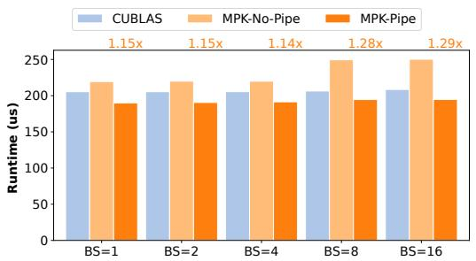  
Figure 12: Ablation study of cross-task pipelining. We measure the runtime of the final linear layer in Qwen3-8B on an NVIDIA B200 GPU and report execution time in microseconds; lower is better. The value above each bar reports the speedup of MPK-Pipe over MPK-No-Pipe.

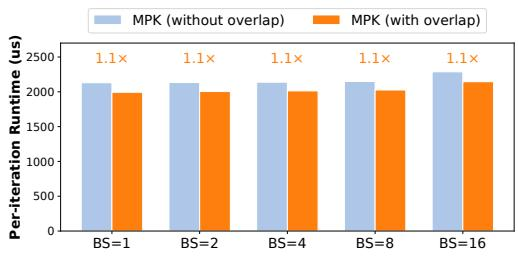  
Figure 13: Ablation study on compute–communication overlap. We measure the runtime of Qwen3-1.7B on four H100 GPUs using tensor parallelism; lower is better. We compare MPK with compute–communication overlap enabled and disabled to quantify the benefit of fine-grained overlap.

## 6.6 Ablation Study

This section evaluates the impact of three runtime optimizations enabled by MPK: cross-task pipelining, compute– communication overlap, and kernel-launch reduction.

Cross-task pipelining. As described in § 5.3, MPK enables cross-task pipelining by preloading chunks of input tensors for the next task while the current task is executing. Figure 12 evaluates the impact of this optimization on the final linear layer in Qwen3-8B. Cross-task pipelining reduces task runtime by 1.2–1.3× and even outperforms cuBLAS-based compiled kernels.

Compute-communication overlap. MPK captures finegrained dependencies between tasks (Figure 5), allowing the runtime to opportunistically overlap compute and communication. Figure 13 evaluates the impact of this optimization. To disable overlap, we restrict the tGraph to capture only coarse-grained dependencies between each collective operator, such as AllReduce, and its preceding computation using a single event, as illustrated in Figure 5c. Enabling fine-grained compute–communication overlap reduces periteration latency by 1.1×.

Kernel-launch reduction. MPK executes the entire model with a single kernel launch, whereas a kernel-per-operator execution of Qwen3-8B issues 293 kernel launches per token. On B200, each launch costs 3.8 µs in eager execution, totaling 1.1 ms per token, and 0.8 µs with CUDA Graphs, totaling 0.2 ms per token. MPK avoids this overhead; its in-kernel scheduler accounts for only 0.28% of total runtime (§ 6.1).

## 6.7 Compiler-Stage Ablation

The preceding ablations isolate two runtime mechanisms. We now isolate the contribution of each compiler stage described in § 4. Because these stages serve different purposes, we report the most appropriate metric for each stage rather than using a single common metric. Table 2 summarizes the results on three representative models.

Operator decomposition. Operator decomposition partitions each operator into independent SM-level tasks. As shown in Table 2, decomposition exposes substantial parallelism in real models: each operator is split into 32–47 tasks on average. For example, in Qwen3-8B, 293 operators are decomposed into 13,867 tasks. Compute-intensive operators, including linear layers, attention, and MoE experts, each expose tens of parallel tasks, while only a small number of pointwise operators, such as normalization at batch size one, map to a single task. This decomposition provides the runtime with sufficient independent work to keep all SMs busy.

Event fusion. Without fusion, dependency analysis emits a separate event for every overlapping producer–consumer task pair. Successor-set and predecessor-set fusion collapse events that share the same consumer set or producer set into a single synchronization point. This optimization is highly effective: across the evaluated models, the final tGraphs contain only 1,142–2,366 events, yet these events encode 69,000–162,000 producer–consumer task-pair dependencies. This corresponds to a 37–118× reduction in synchronization events (Table 2). The reduction is largest for the MoE model because expert routing creates many-to-many dependencies that are especially amenable to fusion.

tGraph normalization. tGraph normalization inserts auxiliary tasks and events only when a task triggers or depends on more than one event, namely at forks and joins. The compiled LLM forward tGraphs in our evaluation are almost entirely sequential: we observe no fork/join groups in all three compiled tGraphs because operators that would otherwise fan out, such as the query/key/value projections, are emitted as fused operators. Normalization therefore leaves these tGraphs essentially unchanged, confirming the “deep, not wide” structure discussed in § 4. Nevertheless, normalization remains necessary for correctness when parallel branches do occur, such as in the unfused Q/K/V example in Figure 5. In those cases, normalization bounds each task’s event fan-in and fan-out to one, preserving the fixed-size, indirection-free encoding.

Table 2: Per-compiler-stage statistics on B200. Ops: number of operators; Tasks/op: average number of tasks per operator after decomposition; Events: number of events in the final tGraph; Fusion: event-count reduction from event fusion; Lin.: device-memory footprint reduction from linearization.  
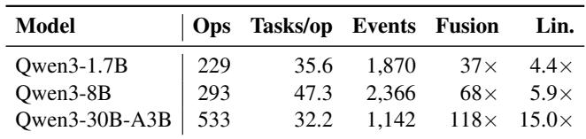

tGraph linearization. tGraph linearization encodes each event’s successor tasks as a contiguous index range rather than an explicit task list. We measure the resulting on-device footprint as the size of the successor encoding with and with out linearization. The contiguous-range encoding reduces this footprint by 4.4–5.9× on dense models, such as from 110,932 bytes to 18,928 bytes for Qwen3-8B, and by 15.0× on the MoE model. The MoE model benefits most because high-fan-out expert-routing events are particularly compact under the range-based encoding. Linearization achieves these reductions without losing dependency information.

## 7 Discussion

Resource footprint. A common concern with mega-kernels is that a single kernel must reserve, on every SM, the combined resources required by all fused operators. MPK avoids this issue: tasks are time-multiplexed across SMs rather than statically partitioned, so each SM uses only the resources required by the task it is currently executing (§ 5). Shared memory follows the same pattern: the paged abstraction (§ 5.3) acquires and releases pages at task granularity. The main exception is per-thread register usage, which is fixed for the mega-kernel at the maximum required across task types.

Integrating hand-tuned kernels and porting to new hardware. Each MPK task is a CUDA device function with a uniform calling convention defined by the tGraph. This interface gives MPK two forms of flexibility. First, a hand-tuned kernel can be incorporated into MPK by wrapping it as the device function for a task; the task then executes under the same event-driven schedule as compiler-generated tasks, without requiring changes to the runtime or the tGraph. MPK can thus reuse hand-optimized implementations when available while automatically generating the remaining tasks. Second, porting MPK to a new GPU architecture only requires updating the per-task code generators that emit these device functions; the tGraph representation, the compiler’s graphlevel transformations, the runtime, and the scheduler remain unchanged. Therefore, per-task code generation is the only hardware-specific component of MPK (§ 4), while the rest of the system is shared across GPU architectures.

## 8 Related Work

Manually designed kernels. Existing ML frameworks such as TensorFlow XLA [1,12], PyTorch [29], and TensorRT [34] adopt a kernel-per-operator approach and rely on GPU experts to manually design and implement kernels for individual operators. For attention alone, various specialized kernels have been developed, including FlashAttention [5, 18, 23], Faster Transformer [3], and FlashInfer [43], each targeting specific architectural features or deployment scenarios. Current systems rely on many specialized kernel libraries, making it hard to unify the entire inference pipeline into one mega-kernel.

ML compilers. A large body of work has explored compiler-based generation of high-performance kernels for tensor programs. Systems such as TVM [15, 16], Ansor [45], and Triton [36], alongside others [20, 22, 25, 49], build on the algorithm–schedule separation introduced by Halide [28, 30]. Another line of work employs superoptimization techniques to automatically search for efficient kernel implementations from high-level specifications [26, 38, 39, 42, 47]. However, these compilers are largely designed around operator- or graph-level optimization and do not support generating a unified mega-kernel or coordinating cross-operator execution.

Mega-kernels. Prior efforts on mega-kernels largely rely on manual design. For example, FlashDMoE fuses mixtureof-experts computation with inter-GPU communication into a single handcrafted mega-kernel [13]. Spector et al. manually developed a low-latency mega-kernel for LLaMA-1B [9, 37]. These approaches require extensive engineering effort and deep GPU expertise, and they do not generalize across models or GPUs. In contrast, MPK provides a compiler-based solution that automatically transforms a tensor program into a highly optimized mega-kernel, eliminating the need for man ual fusion or hand-written mega-kernel implementations.

A related line of work simplifies the development of manually fused kernels. ThunderKittens [32] provides tile-based abstractions for high-performance kernels, and PipeThreader [17] exposes software-pipelined kernel execu tion to the programmer. These tools still require the developer to decide which operators to fuse, how to pipeline them, and how to coordinate their execution. MPK instead compiles an entire tensor program into SM-level tasks and executes them as one mega-kernel. These abstractions are therefore complementary to MPK: they could be used to implement individual task kernels within the MPK runtime.

TileRT [35] similarly decomposes operators into finegrained tile-level tasks executed as a single persistent kernel, validating our core idea that persistent mega-kernel execution is key to low-latency inference.

Compute–communication overlap. A large body of work overlaps collective communication with computation to hide inter-GPU communication latency. DeepEP [19] provides expert-parallel all-to-all communication kernels for MoE models, and Triton-Distributed [48] extends the Triton compiler to express overlapping distributed kernels. Token-Weave [21], FlashOverlap [24], and ParallelKittens [33] fuse or co-schedule communication with dependent computation to reduce exposed communication latency. Earlier work from Google decomposes collective operators so that they overlap with dependent computation [40]. These systems realize overlap at the granularity of individual kernels or collective operators. In contrast, MPK represents communication and computation uniformly as tasks in one tGraph and schedules them using the same in-kernel runtime (§ 6.5). Compute– communication overlap therefore emerges from the global task schedule and applies uniformly to both tensor-parallel collectives and expert-parallel all-to-all communication.

## 9 Conclusion

This paper presents MPK, the first compiler and runtime system that automatically transforms multi-GPU model inference into a fully fused mega-kernel. By introducing SM-level task graphs and an in-kernel parallel runtime, MPK overcomes key limitations of the kernel-per-operator execution model, enabling inter-operator software pipelining, fine-grained overlap of computation and communication, and the elimination of kernel-launch and CPU-side scheduling overheads. Our evaluation shows that MPK brings LLM serving latency close to hardware limits and significantly improves throughput across models and GPU generations. By unifying execution within a single mega-kernel while preserving compatibility with existing ML frameworks, MPK opens a new path toward high-performance, compiler-driven inference systems.

## Acknowledgment

We thank the anonymous OSDI reviewers and our shepherd for their valuable comments and suggestions. This work was partially supported by NSF awards CNS-2211882 and CNS-2239351, a Sloan Research Fellowship, and research awards from Amazon, Cisco, Google, Jane Street, Meta, NVIDIA, Oracle, Qualcomm, and Samsung. We also gratefully acknowledge NVIDIA for providing access to a DGX B200 system.

## References

[1] Xla: Optimizing compiler for tensorflow. https:// www.tensorflow.org/xla, 2017. 14

[2] Nvidia/cutlass: Cuda templates for linear algebra subroutines. https://github.com/NVIDIA/cutlass, 2019. 10

[3] Transformer related optimizations. https : //github. com/NVIDIA/FasterTransformer, 2020. 14

[4] Nvidia nccl. https://developer.nvidia.com/ nccl, 2021. 2

[5] Flash-decoding for long-context inference. https : //crfm.stanford.edu/2023/10/12/ flashdecoding.html, 2023. 14

[6] Huggingface Models. https://huggingface.co/ models, 2023. 10

[7] A Triton implementation of the FlashAttention2 algorithm. https://triton-lang. org/main/getting-started/tutorials/ 06-fused-attention.html, 2023. 10

[8] Accelerating MoE’s with a Triton Persistent Cache-Aware Grouped GEMM Kernel. Link, 2025. 11

[9] Designing a Low-Latency Megakernel for Llama-1B. https://hazyresearch.stanford.edu/blog/ 2025-05-27-no-bubbles, 2025. 4, 14

[10] NVIDIA OpenSHMEM Library (NVSHMEM) Documentation. https://docs.nvidia.com/nvshmem/ api/index.html, 2025. 2, 9

[11] Programmatic Dependent Launch. https://docs. nvidia.com/cuda/cuda-c-programming-guide/ index.html, 2025. 1

[12] Martín Abadi, Paul Barham, Jianmin Chen, Zhifeng Chen, Andy Davis, Jeffrey Dean, Matthieu Devin, San jay Ghemawat, Geoffrey Irving, Michael Isard, Manjunath Kudlur, Josh Levenberg, Rajat Monga, Sherry Moore, Derek G. Murray, Benoit Steiner, Paul Tucker, Vijay Vasudevan, Pete Warden, Martin Wicke, Yuan Yu, and Xiaoqiang Zheng. Tensorflow: A system for largescale machine learning. In Proceedings of the 12th USENIX Conference on Operating Systems Design and Implementation, OSDI, 2016. 14

[13] Osayamen Jonathan Aimuyo, Byungsoo Oh, and Rachee Singh. Flashdmoe: Fast distributed moe in a single kernel, 2025. 4, 14

[14] James Bradbury, Roy Frostig, Peter Hawkins, Matthew James Johnson, Chris Leary, Dougal Maclaurin, George Necula, Adam Paszke, Jake VanderPlas, Skye Wanderman-Milne, and Qiao Zhang. JAX: composable transformations of Python+NumPy programs, 2018. 3

[15] Tianqi Chen, Thierry Moreau, Ziheng Jiang, Haichen Shen, Eddie Q. Yan, Leyuan Wang, Yuwei Hu, Luis Ceze, Carlos Guestrin, and Arvind Krishnamurthy. TVM: end-to-end optimization stack for deep learning. CoRR, abs/1802.04799, 2018. 1, 2, 3, 14

[16] Tianqi Chen, Lianmin Zheng, Eddie Yan, Ziheng Jiang, Thierry Moreau, Luis Ceze, Carlos Guestrin, and Arvind Krishnamurthy. Learning to optimize tensor programs. In Advances in Neural Information Processing Systems 31, NeurIPS’18. 2018. 14

[17] Yu Cheng, Lei Wang, Yining Shi, Yuqing Xia, Lingxiao Ma, Jilong Xue, Yang Wang, Zhiwen Mo, Feiyang Chen, Fan Yang, Mao Yang, and Zhi Yang. Pipethreader: Software-defined pipelining for efficient dnn execution. In 19th USENIX Symposium on Operating Systems Design and Implementation (OSDI), 2025. 14

[18] Tri Dao, Daniel Haziza, Francisco Massa, and Grigory Sizov. Flash-decoding for long-context inference, 2023. 1, 2, 14

[19] DeepSeek-AI. DeepEP: An efficient expert-parallel communication library. https://github.com/ deepseek-ai/DeepEP, 2025. 14

[20] Siyuan Feng, Bohan Hou, Hongyi Jin, Wuwei Lin, Junru Shao, Ruihang Lai, Zihao Ye, Lianmin Zheng, Cody Hao Yu, Yong Yu, and Tianqi Chen. Tensorir: An abstraction for automatic tensorized program optimization, 2022. 14

[21] Raja Gond, Nipun Kwatra, and Ramachandran Ramjee. TokenWeave: Efficient compute-communication overlap for distributed llm inference. In Proceedings of Machine Learning and Systems (MLSys), 2026. 14

[22] Bastian Hagedorn, Bin Fan, Hanfeng Chen, Cris Cecka, Michael Garland, and Vinod Grover. Graphene: An ir for optimized tensor computations on gpus. In Proceedings of the 28th ACM International Conference on Architectural Support for Programming Languages and Operating Systems, Volume 3, ASPLOS 2023, page 302–313, New York, NY, USA, 2023. Association for Computing Machinery. 14

[23] Ke Hong, Guohao Dai, Jiaming Xu, Qiuli Mao, Xiuhong Li, Jun Liu, Kangdi Chen, Yuhan Dong, and Yu Wang. Flashdecoding++: Faster large language model inference on gpus, 2024. 14

[24] Ke Hong, Xiuhong Li, Minxu Liu, Qiuli Mao, Tianqi Wu, Zixiao Huang, Lufang Chen, Zhong Wang, Yichong Zhang, Zhenhua Zhu, Guohao Dai, and Yu Wang. FlashOverlap: A lightweight design for efficiently overlapping communication and computation. In Proceedings of the European Conference on Computer Systems (EuroSys), 2026. 14

[25] Muyan Hu, Ashwin Venkatram, Shreyashri Biswas, Balamurugan Marimuthu, Bohan Hou, Gabriele Oliaro, Haojie Wang, Liyan Zheng, Xupeng Miao, Jidong Zhai, and Zhihao Jia. Optimal kernel orchestration for tensor programs with korch. In Proceedings of the 29th ACM International Conference on Architectural Support for Programming Languages and Operating Systems, Volume 3, ASPLOS ’24, page 755–769, New York, NY, USA, 2024. Association for Computing Machinery. 14

[26] Zhihao Jia, Oded Padon, James Thomas, Todd Warszawski, Matei Zaharia, and Alex Aiken. Taso: Optimizing deep learning computation with automatic generation of graph substitutions. In Proceedings of the 27th ACM Symposium on Operating Systems Principles, SOSP ’19, page 47–62, New York, NY, USA, 2019. Association for Computing Machinery. 4, 14

[27] Woosuk Kwon, Zhuohan Li, Siyuan Liu, Xin Wu, Michael Zeng, Xiangru Zhang, Yuhao Zou, and Scott Moritz. Efficient memory management for large language models. In Proceedings of the ACM Symposium on Operating Systems Principles (SOSP), 2023. 9, 10

[28] Ravi Teja Mullapudi, Andrew Adams, Dillon Sharlet, Jonathan Ragan-Kelley, and Kayvon Fatahalian. Automatically scheduling halide image processing pipelines. ACM Trans. Graph., 35(4), 2016. 14

[29] Tensors and Dynamic neural networks in Python with strong GPU acceleration. https://pytorch.org, 2017. 2, 3, 14

[30] Jonathan Ragan-Kelley, Connelly Barnes, Andrew Adams, Sylvain Paris, Frédo Durand, and Saman Amarasinghe. Halide: A language and compiler for optimizing parallelism, locality, and recomputation in image processing pipelines. In Proceedings of the 34th ACM SIGPLAN Conference on Programming Language Design and Implementation, PLDI ’13, 2013. 14

[31] Mohammad Shoeybi, Mostofa Patwary, Raul Puri, Patrick LeGresley, Jared Casper, and Bryan Catanzaro. Megatron-lm: Training multi-billion parameter language models using model parallelism. CoRR, abs/1909.08053, 2019. 12

[32] Benjamin F. Spector, Simran Arora, Aaryan Singhal, Arjun Parthasarathy, Daniel Y. Fu, and Christopher Ré.

Thunderkittens: Simple, fast, and adorable ai kernels. In International Conference on Learning Representations (ICLR), 2025. 14

[33] Stuart H. Sul, Simran Arora, Benjamin F. Spector, and Christopher Ré. ParallelKittens: Systematic and practical simplification of multi-gpu ai kernels. In Proceedings of Machine Learning and Systems (MLSys), 2026. 14

[34] NVIDIA TensorRT: Programmable inference accelerator. https://developer.nvidia.com/tensorrt, 2017. 14

[35] Tile-AI. TileRT: Tile-based runtime for ultralow-latency llm inference. https://github.com/ tile-ai/TileRT, 2026. 14

[36] Philippe Tillet, H. T. Kung, and David Cox. Triton: an intermediate language and compiler for tiled neural network computations. In Proceedings of the 3rd ACM SIGPLAN International Workshop on Machine Learning and Programming Languages, MAPL 2019, page 10–19, New York, NY, USA, 2019. Association for Computing Machinery. 1, 2, 10, 14

[37] Hugo Touvron, Thibaut Lavril, Gautier Izacard, Xavier Martinet, Marie-Anne Lachaux, Timothée Lacroix, Baptiste Rozière, Naman Goyal, Eric Hambro, Faisal Azhar, et al. Llama: Open and efficient foundation language models. arXiv preprint arXiv:2302.13971, 2023. 4, 14

[38] Colin Unger, Zhihao Jia, Wei Wu, Sina Lin, Mandeep Baines, Carlos Efrain Quintero Narvaez, Vinay Ramakrishnaiah, Nirmal Prajapati, Patrick S. McCormick, Jamaludin Mohd-Yusof, Xi Luo, Dheevatsa Mudigere, Jongsoo Park, Misha Smelyanskiy, and Alex Aiken. Unity: Accelerating DNN training through joint optimization of algebraic transformations and parallelization. In 16th USENIX Symposium on Operating Systems Design and Implementation, OSDI 2022, Carlsbad, CA, USA, July 11-13, 2022, pages 267–284. USENIX Association, 2022. 14

[39] Haojie Wang, Jidong Zhai, Mingyu Gao, Zixuan Ma, Shizhi Tang, Liyan Zheng, Yuanzhi Li, Kaiyuan Rong, Yuanyong Chen, and Zhihao Jia. PET: Optimizing tensor programs with partially equivalent transformations and automated corrections. In 15th USENIX Symposium on Operating Systems Design and Implementation (OSDI 21), pages 37–54. USENIX Association, July 2021. 14

[40] Shibo Wang, Jinliang Wei, Amit Sabne, Andy Davis, Berkin Ilbeyi, Blake Hechtman, Dehao Chen, Karthik Srinivasa Murthy, Marcello Maggioni, Qiao Zhang, Sameer Kumar, Tongfei Guo, Yuanzhong Xu,

and Zongwei Zhou. Overlap communication with dependent computation via decomposition in large deep learning models. In Proceedings of the 28th ACM International Conference on Architectural Support for Programming Languages and Operating Systems, Volume 1 (ASPLOS), pages 93–106, 2023. 14

[41] Mengdi Wu, Xinhao Cheng, Shengyu Liu, Chunan Shi, Jianan Ji, Man Kit Ao, Praveen Velliengiri, Xupeng Miao, Oded Padon, and Zhihao Jia. Mirage: A {Multi-Level} superoptimizer for tensor programs. In 19th USENIX Symposium on Operating Systems Design and Implementation (OSDI 25), pages 21–38, 2025. 1, 2, 4, 7, 9

[42] Yichen Yang, Phitchaya Phothilimthana, Yisu Wang, Max Willsey, Sudip Roy, and Jacques Pienaar. Equality Saturation for Tensor Graph Superoptimization. Proceedings of Machine Learning and Systems, 3:255–268, March 2021. 14

[43] Zihao Ye, Lequn Chen, Ruihang Lai, Wuwei Lin, Yineng Zhang, Stephanie Wang, Tianqi Chen, Baris Kasikci, Vinod Grover, Arvind Krishnamurthy, and Luis Ceze. Flashinfer: Efficient and customizable attention engine for llm inference serving, 2025. 1, 2, 10, 14

[44] Gyeong-In Yu, Joo Seong Jeong, Geon-Woo Kim, Soojeong Kim, and Byung-Gon Chun. Orca: A distributed serving system for {Transformer-Based} generative models. In 16th USENIX Symposium on Operating Systems Design and Implementation (OSDI 22), pages 521–538, 2022. 10

[45] Lianmin Zheng, Chengfan Jia, Minmin Sun, Zhao Wu, Cody Hao Yu, Ameer Haj-Ali, Yida Wang, Jun Yang, Danyang Zhuo, Koushik Sen, Joseph E. Gonzalez, and Ion Stoica. Ansor : Generating high-performance tensor programs for deep learning. CoRR, abs/2006.06762, 2020. 14

[46] Lianmin Zheng, Liangsheng Yin, Zhiqiang Xie, Chuyue Sun, Jeff Huang, Cody Hao Yu, Shiyi Cao, Christos Kozyrakis, Ion Stoica, Joseph E. Gonzalez, Clark Barrett, and Ying Sheng. Sglang: efficient execution of structured language model programs. In Proceedings of the 38th International Conference on Neural Infor mation Processing Systems, NIPS ’24, Red Hook, NY, USA, 2024. Curran Associates Inc. 9

[47] Liyan Zheng, Haojie Wang, Jidong Zhai, Muyan Hu, Zixuan Ma, Tuowei Wang, Shuhong Huang, Xupeng Miao, Shizhi Tang, Kezhao Huang, and Zhihao Jia. EINNET: Optimizing tensor programs with Derivation-Based transformations. In 17th USENIX Symposium on Operating Systems Design and Implementation (OSDI

23), pages 739–755, Boston, MA, July 2023. USENIX Association. 14

[48] Size Zheng, Wenlei Bao, Qi Hou, Xuegui Zheng, Jin Fang, Chenhui Huang, Tianqi Li, Haojie Duanmu, Renze Chen, Ruifan Xu, Yifan Guo, Ningxin Zheng, Ziheng Jiang, Xinyi Di, Dongyang Wang, Jianxi Ye, Haibin Lin, Li-Wen Chang, Liqiang Lu, Yun Liang, Jidong Zhai, and Xin Liu. Triton-distributed: Programming overlapping kernels on distributed ai systems with the triton compiler. arXiv preprint arXiv:2504.19442, 2025. 14

[49] Size Zheng, Yun Liang, Shuo Wang, Renze Chen, and Kaiwen Sheng. Flextensor: An automatic schedule exploration and optimization framework for tensor computation on heterogeneous system. In Proceedings of the Twenty-Fifth International Conference on Architectural Support for Programming Languages and Operating Systems, ASPLOS ’20, page 859–873, New York, NY, USA, 2020. Association for Computing Machinery. 14

[50] Kan Zhu, Yufei Gao, Yilong Zhao, Liangyu Zhao, Gefei Zuo, Yile Gu, Dedong Xie, Zihao Ye, Keisuke Kamahori, Chien-Yu Lin, et al. {NanoFlow}: Towards optimal large language model serving throughput. In 19th USENIX Symposium on Operating Systems Design and Implementation (OSDI 25), pages 749–765, 2025. 3

## A Artifact Appendix

## Abstract

The artifact is the MPK compiler and runtime together with scripts that reproduce the paper’s end-to-end latency results. MPK transforms a PyTorch model into a single mega-kernel; the scripts measure per-token decoding latency for MPK, PyTorch, vLLM, and SGLang across five LLMs, five batch sizes, and three GPU generations.

## Scope

The artifact validates the paper’s main performance claims: (i) on single-batch serving, MPK reduces per-token latency by 1.0–1.7× over vLLM and SGLang, with the largest gains on smaller models and newer GPUs (Figure 9); (ii) under tensor parallelism, MPK improves throughput by up to 10× over PyTorch and 1.1–1.4× over vLLM/SGLang on 8 H100s (Figure 11); and (iii) cross-task pipelining and compute– communication overlap each contribute measurable speedups (Figures 12 and 13).

## Contents

The repository holds the MPK compiler and in-kernel runtime, a runnable demo for each model under demo/, and one evaluation driver per GPU under artifact\_evaluation/. A driver sweeps the five models over batch sizes 1 to 16 for all four systems and writes one result file per run, recording the system, GPU, model, batch size, and measured per-token latency. Collecting these files reproduces Figure 9 and the ablation figures. A setup.sh script installs the dependencies and builds MPK.

## Hosting

The artifact is on the frozen branch tgx-osdi26-ae of https://github.com/mirage-project/mirage (commit 8b981a4), archived on Zenodo at https://doi.org/10. 5281/zenodo.20563064 (DOI: 10.5281/zenodo.20563064).

## Requirements

Hardware. One NVIDIA A100, H100 (SXM), or B200 for the single-GPU sweeps, and a multi-GPU node (4–8 H100s) for the tensor-parallel experiments. The four smaller models fit on a 40 GB A100; Qwen3-30B-A3B needs at least 80 GB and runs on an 80 GB A100, an H100, or a B200.

Software. Linux with CUDA (12.8 in the paper), PyTorch 2.7, NVSHMEM and OpenMPI for the multi-GPU runs, and transformers 4.57.1. setup.sh installs these and builds MPK; vLLM and SGLang each run in a separate virtual environment.

Benchmarks. Qwen3-0.6B, Llama-3.2-1B-Instruct, Qwen3- 1.7B, Qwen3-8B (dense), and Qwen3-30B-A3B (MoE), downloaded from HuggingFace (Llama-3.2 is gated; set HF\_TOKEN).

## Reproducing the results

git clone --recursive -b tgx-osdi26-ae \ https://github.com/mirage-project/mirage cd mirage && bash artifact\_evaluation/setup.sh bash artifact\_evaluation/<gpu>/run\_tgx.sh bash artifact\_evaluation/<gpu>/run\_pytorch.sh bash artifact\_evaluation/<gpu>/run\_vllm.sh bash artifact\_evaluation/<gpu>/run\_sglang.sh

All runs use offline batched inference with a fixed prompt length of 64, 1024 decoded tokens, and greedy decoding; each reported number is the median of five runs after a fouriteration warmup. On a 40 GB A100 the sweep covers the four smaller models; reproducing the Qwen3-30B-A3B point additionally requires an 80 GB A100 (or an H100/B200).