USENIX

THE ADVANCED COMPUTING SYSTEMS ASSOCIATION

# Acumen: A Platform for Encrypted and Accountable Collaborative Editing

Ryan Cottone, Stanford University; Darya Kaviani, Conor Power, Will Giorza, Evelyn Koo, Natacha Crooks, and Raluca Popa, University of California, Berkeley https://www.usenix.org/conference/osdi26/presentation/cottone

# This paper is included in the Proceedings of the 20th USENIX Symposium on Operating Systems Design and Implementation.

July 13–15, 2026 • Seattle, WA, USA

ISBN 978-1-939133-55-7

Open access to the Proceedings of the 20th USENIX Symposium on Operating Systems Design and Implementation is sponsored by

# Acumen: A Platform for Encrypted and Accountable Collaborative Editing

Ryan Cottone1, Darya Kaviani2, Conor Power2, Will Giorza2, Evelyn Koo2,

Natacha Crooks2, Raluca Ada Popa2

1Stanford University, 2University of California, Berkeley

## Abstract

Modern-day collaborative editing tools must reconcile a prominent tension between user privacy and collaboration: encrypting user data prevents an application server from processing user edits. We present Acumen, a cryptographic system for real-time collaborative applications based on conflict-free replicated data types (CRDTs). Acumen is the first system to provide strong snapshot consistency, enabling untrusted users to create verifiable document snapshots used to invite new collaborators. Acumen also provides confidentiality, integrity, fork-causal consistency, and ensures that invited users do not learn the previous edit history of the document.

We achieve these properties through the use of cryptographic accumulators and a novel secure garbage collection mechanism. Our evaluation shows that Acumen can support 25 users each simultaneously typing 60 WPM with negligible degradation in latency and availability.

## 1 Introduction

There has been a recent shift towards real-time, cloud-based collaborative applications such as Notion, Google Docs, and Microsoft Office. These collaborative editors generally follow one of two separate approaches: operational transforms (OTs) [11, 13] or conflict-free replicated data types (CRDTs) [22, 30, 32, 36]. While convenient for users, this shift to the cloud naturally raises privacy concerns.

Although there has been considerable work on end-to-end encrypted file storage systems (e.g. SUNDR [26] and Depot [28]), these solutions are unsuitable to collaborative editing applications where users simultaneously edit the same files and must resolve concurrent user edits. Indeed, it is not immediately obvious how an application provider who cannot observe the contents of its users’ behavior can consolidate, manage, and edit their data.

A recent line of secure collaborative editors [13, 21, 24, 25] aims to resolve this tension. In this paper, we focus on decentralized secure collaborative editors in which users maintain local document state and directly broadcast encrypted edits to each other. This model provides confidentiality against eavesdropping servers, but introduces another attack vector:

user adversaries may attempt to disrupt the consistency of other users, such that users disagree on the correct edit history. This can be especially problematic if malicious users collude with a malicious network adversary, who can arbitrarily block or reorder network messages to and from users.

Our goal is to construct a secure collaborative editor that ensures confidentiality against unauthorized eavesdroppers and integrity against malicious users. We identify four key requirements that secure decentralized collaborative editors should provide:

1. Confidentiality. Passive eavesdroppers should learn nothing about the document beyond what can be inferred from network traffic. This includes document access patterns (e.g. that User A executed an insert at position k followed by a deletion).

2. Integrity. Honest users should maintain a consistent local document history comprised of authentic edits (e.g. no forking writes). In our decentralized setting, this corresponds to the notion of fork-causal consistency [28].

3. Performance. Performance should remain comparable to plaintext editors: users should process operations in real-time, encrypted edits should remain relatively small in size, and user storage should scale linearly with the current document size (rather than the overall edit history length).

4. Secure Dynamic Membership. Users should be able to add new collaborators into existing documents. The new user should not receive data beyond what currently exists in the document (edit-history privacy) and should maintain the same integrity guarantees as existing users (snapshot consistency).

Secure dynamic membership is particularly difficult to provide in decentralized editors due to the tension between snapshot consistency and edit-history privacy: how can a new user verify their given snapshot is consistent without access to the corresponding history?

Existing secure decentralized editors fail to provide all of these guarantees. For instance, the state-of-the-art system Snapdoc [24] leaks user access patterns (violating confidentiality), provides a weak notion of snapshot consistency (violating secure dynamic membership), and has performance scaling with the overall edit history length.

Acumen is the first secure collaborative editor to provide confidentiality, integrity, and secure dynamic membership against malicious users and network adversaries. We also provide real-time performance: Acumen is able to sustain 25 users each typing at 60 WPM, orders of magnitude greater than the state-of-the-art. Acumen’s performance and guarantees hinge on two key ideas:

1. Cryptographic accumulators for snapshot consistency & hiding access patterns. At the core of our verifiable snapshot functionality are cryptographic accumulators [4, 6, 7]. To verify snapshot consistency, newly-invited users asynchronously compare their untrusted snapshot state against the signed, constant-space accumulators representing existing user states. Our key insight is to expand the use of accumulators to capture both the CRDT’s internal structure and overall set of document edits. This approach eliminates the variable-length edit data in the state-of-the-art, preventing edit pattern leakage and bandwidth blow-up.

2. Secure garbage collection. We aim for our system to scale with the current document size rather than edit history length. To this end, we utilize garbage collection techniques to prune outdated components of the document data structure without compromising any of Acumen’s guarantees. Garbage collection, however, is made more complicated by our snapshot consistency guarantee: each snapshot must have data sufficient to reconstruct every other user’s state, such that data can only be deleted once every user has deleted it. We introduce a novel second-order asynchronous garbage collection protocol that eliminates this circular dependency.

In summary, this paper makes three contributions:

• We introduce a novel protocol to provide strong snapshot consistency with real-time performance.

• We identify and resolve access-pattern leakage in prior work, simultaneously reducing bandwidth costs by orders of magnitude.

• We introduce a secure garbage collection mechanism, eliminating runaway storage costs and providing competitive performance against standard CRDTs.

## 2 Background

We first provide the necessary background on collaborative text editors and CRDTs.

## 2.1 Collaborative Editing Data Structures

Conflict-free Replicated Data Types (CRDTs) [36] are a recent approach to asynchronous, distributed data structures. Acumen employs operation-based CRDTs in which users broadcast document edits that other users process locally. Under the guarantee that operations are reliably delivered in causal order, op-based CRDTs satisfy strong eventual consistency (users processing concurrent operations in different orders still arrive at the same state).

Treedoc Treedoc [33] is a popular list CRDT, often used to implement shared documents represented as character arrays. Treedoc models characters as individual nodes within a tree structure, with the document string derived as the tree’s inorder traversal. Each node has an associated disambiguator, composed of the User ID and a user-specific counter (precisely the user’s version vector counter). The disambiguator forms a unique tuple, which is used for node addressing and as a sorting key for deterministic ordering between sibling nodes. Finally, each Treedoc node contains a data field (comprised of a single character) and associated metadata.

Tombstone Nodes In Treedoc, deletion operations mark a corresponding insertion as a tombstone. This removes the corresponding node’s data field, but does not remove the node it self. Tombstone nodes remain within the structure of the overall Treedoc but do not contribute to the final document string. These nodes are generally required to maintain the structure of the tree and are retained until safely garbage collected by our scheme (§5.3). Preserving security with garbage collection is one of the key challenges that Acumen must address.

We choose Treedoc for its useful causal guarantees, potential for fixed-length identifiers, concrete efficiency, and general simplicity. Our protocol could likely be generalized to use any op-based CRDT with tombstoning.

## 2.2 Fork-Causal Consistency (FCC)

While op-based CRDTs ensure that client states eventually converge given the same operations, they do not provide protection against malicious parties. In Acumen, we enhance CRDTs with fork-causal consistency (FCC) [28]. At a high level, FCC guarantees that honest users agree on the document state at all points in their shared (partially-ordered) edit history.

More precisely, each Acumen document instance implicitly maintains an execution E comprised of directed edges between operations and their causal dependencies. Each user u has an associated local execution Eu ⊆ E comprised of operations created or processed by u. For our purposes, an execution E (informally) satisfies FCC if three conditions hold:

1. Operations by honest users are totally ordered in E.

2. Honest user executions only see totally-ordered operations from individual users (i.e. do not process forking operations from the same user).

3. All pairs of honest users a,b agree on the document state at each point in their shared history Ea ∩Eb.

We formally define FCC in Appendix B. Another key implication of FCC is that users are prohibited from processing operations belonging to conflicting forks in the causal graph. This occurs precisely when an adversarial user equivocates two operations o,o′ to two distinct subsets of users, effectively branching the edit history. Users who process o will reject operations from those who processed o′, and vice versa, forming a permanent fork in the execution graph.

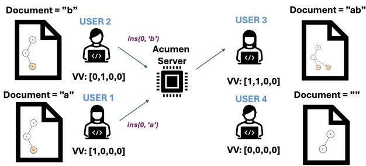  
Figure 1: An Acumen setup with four users editing a shared document. User 1 inserts an "a" concurrently with User 2 inserting a "b". User 3 hears about both before User 4.

## 2.3 Merkle-Tree Accumulator

Cryptographic accumulators [4, 6, 7] enable the efficient representation of unordered sets in constant space. We adopt the Merkle-tree accumulator [7] which uses a cryptographic hash function to provide three key properties: constant-space representation, set collision resistance, and update efficiency.

• Constant-space representation: The size of acc is independent of the set cardinality |S|.

• Set-collision resistance: accA = accB ⇐⇒ A = B with overwhelming probability.

• Update efficiency: There exists a function update that can add or remove k elements from acc in time independent of the current set cardinality |S|.

Note that the accumulator can store local data to support efficient updates, as long as the final representation is constant size.

We briefly describe the Merkle-tree accumulator construction here. The accumulator state consists of a sparse binary Merkle tree of fixed height h, typically chosen to be the output length of the underlying cryptographic hash. Nodes are stored dynamically in a hash map, with non-existent nodes given a default value. Set elements are accumulated by inserting them into the leaf node determined via cryptographic hash. The root hash of the Merkle tree serves as our constant-space representation.

Following the standard Merkle tree construction, recomputing the root hash after modifying a leaf node takes O(h) time. We can batch k edits in O(h + k) time by using one recomputation pass after editing all k leaves.

## 3 System Overview

An Acumen deployment consists of n clients and a relay server, which is responsible for relaying all communication between clients as seen in Figure 1. Clients send their updates to the relay, which broadcasts them to the document’s collaborators. We note that Acumen can function over peer-to-peer networks—a central server is useful for message availability but has no impact on our protocol guarantees.

## 3.1 Threat Model

Acumen assumes a threat model in which the relay server is actively malicious (functioning as the “network adversary”). Up to n−1 clients are compromised and deviate arbitrarily from the protocol. For example, malicious clients may engage in standard editing activities, such as inserting or deleting characters, but could also attempt more sophisticated attacks, such as sending inconsistent edits for the same document position to different clients.

We assume the presence of a trusted public-key infrastructure and a secure group messaging protocol [8, 9, 37]. Our protocol can be viewed as an additional layer over a secure group messaging platform, focused on enforcing document-level consistency.

Non-goals. Acumen does not offer protection against denial of service (DoS) attacks. That is, the server or ISP may prevent users from receiving or sending updates. Acumen does not defend against timing attacks that leverage knowledge of when a user makes an edit.

## 3.2 Security Guarantees

We now describe Acumen’s security guarantees, which we bucket into three overarching categories: Confidentiality, Integrity, and Secure Dynamic Membership. Formal proofs can be found in our supplemental material. At a high level, confidentiality safeguards document contents, access patterns, and edit history from unauthorized access. Integrity guarantees a coherent document state across clients, preventing conflicts and maintaining a valid execution history even under adversarial conditions. Secure Dynamic Membership ensures that new users can be added to existing documents while maintaining the aforementioned integrity guarantees (snapshot consistency) and without revealing more than the current document state (edit-history privacy).

Confidentiality. Operations do not reveal information about document contents or access patterns to unauthorized parties.

Integrity. Acumen provides fork-causal consistency (FCC) [28]. Informally, FCC ensures that honest clients follow a causally consistent subgraph of a global execution graph. Forks can arise when malicious clients issue equivocating updates to different honest users. FCC ensures that honest users with divergent histories detect inconsistencies upon communicating. We give an informal definition of FCC in §2.2, and a formal definition in §B.

Secure Dynamic Membership. Acumen guarantees strong snapshot consistency (hereafter just snapshot consistency). Snapshot consistency ensures that new users can verify their document state is the product of a fork-causal consistent execution without requiring any communication with other honest users (formally stated in Definition 1). This definition is notably stronger than the one considered by prior work [24] (hence strong snapshot consistency). Informally, prior work allows adversaries to create snapshots that encode any subset of the correct document state, rather than precise equality as in strong snapshot consistency. We provide a formal comparison in §D.

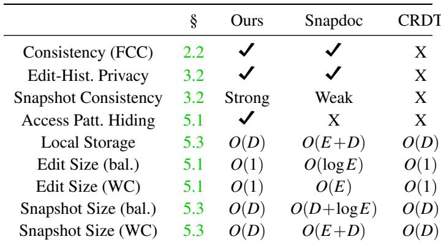  
Table 1: System Feature Comparison. E = edit history length, D = document size, bal./WC = balanced / worst case edit pattern. We consider the number of users to be O(1).

Acumen also provides edit-history privacy: newly invited clients cannot access characters deleted prior to the snapshot creation, unless they collude with another client who had document access before their invitation. For instance, consider adding a collaborator to an existing research paper document — one might prefer that the collaborator not see previous draft versions. Edit-history privacy does not hide the access patterns of the document before snapshot creation, as this is inevitably leaked by the structure of the Treedoc object (§2.1) used to represent the shared document. Leaking the Treedoc structure reveals information about the causal order of prior operations, but not their contents.

Edit-history privacy and snapshot consistency are challenging to provide simultaneously. The core challenge in the design of Acumen is verifying a given document snapshot is the product of a fork-causal consistent history without access to the history itself.

## 4 Strawman Protocol

We now present a starting point for the Acumen protocol, providing only fork-causal consistency and snapshot consistency. In §5, we introduce several novel techniques to enhance the privacy and efficiency of this protocol such that access patterns are hidden, new collaborators cannot access the past edit-history, and user states can be securely garbage-collected.

In our basic rendition of Acumen, after a user creates a document, it can add collaborators. Changes to a document or its membership are processed as operations. More precisely, we define three types of operations: Insertion, Deletion, AddUser. The former two behave as outlined in §2.1, and we detail the latter in §4.3. Each operation is encrypted and broadcast using the abstracted secure group messaging scheme (§3.1). Users maintain a set called operations containing the set of all operations sent or received by a user.

We leverage version vectors [10, 14, 29] to track causal history. Each document collaborator maintains a local version vector as a unique document timestamp. A version vector VV is a mapping of IDs to integers, where VV [u] represents the total number of operations processed from ID u. An operation’s version vector is a copy of its sender’s, with the sender’s index incremented by one to account for the operation’s creation.

## 4.1 History Hash Chains

As outlined in §3.2, we aim to achieve fork-causal consistency (FCC). Following prior work [13, 21, 28] we enforce FCC using hash chains over edit histories, referred to here as history hashes. Unlike SPORC [13] which utilizes a central server to provide a total order over operations, our environment implies a partially ordered execution graph (e.g. a DAG rather than a single chain).

Acumen defines one hash chain per user, representing the overall DAG as a collection of individual user hash chains. For simplicity, we define an Acumen operation’s causal dependencies as the most recent operation from each document user, as seen by the operation creator.

Let HHu,n denote the history hash for user u after n operations, ou,n denote user u’s n-th operation, and H(o) be the cryptographic hash of an operation (elaborated on in §4.1.1). We define HHu,n = H(H(ou,n), HHu,n−1) with HHu,0 = 0. We refer to HHu as user u’s local history hashes.

## 4.1.1 Operation Hash Construction

Hashing an operation as a raw bytestring will pose issues for edit-history privacy in our full protocol, due to the resulting hash leaking information about the encoded character data (we elaborate upon this in §5.2). To avoid this, we define the Operation struct to include a random nonce (Table 3). Formally, let rand be a λ-bit random value generated by the operation sender (λ is our security parameter), op.metadata refer to non-data fields concatenated into one bytestring, and PRF : {0,1}λ ×{0,1}∗ → {0,1}∗ be a secure pseudorandom function [18]. Define H(op) as follows:

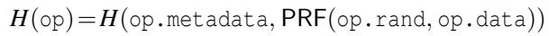

Denote the value of PRF(op.rand,op.data) as the intermediate data hash. Each operation/node now includes a new hdata field consisting of this intermediate hash. This construction is later motivated in our snapshot consistency protocol (§5.2)—looking ahead, we will want to reconstruct H(op) using only op.metadata and PRF(op.rand,op.data) such that op.data remains hidden given only these values.

Tombstones Recall that processing a deletion operation marks the targeted operation/node as a tombstone (§2.1). More precisely, marking an operation/node as a tombstone sets data, rand = null in the associated object. For Treedoc nodes, we also set tombstone = True. This has the effect of permanently hiding the original character data of the operation/node, which will become relevant for edit-history privacy in our full protocol (§5.2).

Operation Verification   
Input: Operation o = (VVupdate,HHupdate,...) from v.   
Let u be the receiver with version vector VV and   
history hash map HH (recall this is a map over (id,ctr)   
unlike the map over id like HHupdate).   
1. Verify that we have processed all the causal   
dependencies of o.   
(VVu[ j] ≥VVupdate[ j] j ̸= v   
∀ j ∈VVupdate,   
VVu[ j] =VVupdate[ j]−1 j = v   
2. Let k =VVupdate[v] be the operation sender’s latest   
counter. Compute v’s next history hash value:   
HHv,k = H(H(o), HHv,k−1)   
3. Verify that HHupdate is equal to our local history   
hashes at each point:   
∀ j ∈ HHupdate, HH j,VVupdate[ j] = HHupdate[ j]  
Figure 2: Operation Verification

## 4.2 Verifying Operations

Our operation verification subroutine is straightforward and will be used in both the starting-point protocol and full protocol. At a high level, a user accepts an incoming operation o only if the following conditions hold:

• The user has processed o’s causal dependencies.

• o’s history hash chains are consistent with the user’s.

Satisfying these conditions implies the receiver and operation sender agree on the execution graph up to the operation’s version vector, i.e. are pairwise fork-causally consistent. A full description of the protocol is given in Figure 2. Once verified, an operation is applied according to its type and associated Treedoc semantics.

## 4.3 Adding a Collaborator

To add another user as a document collaborator in our basic scheme, an existing user (“snapshot sender”) simply sends a copy of the (signed) operation log to the new user and broadcasts an AddUser operation specifying the new user ID.

Since the snapshot sender’s set of operations encodes a full causal execution graph, the new user can simply replay the entire causal history and apply the operation verification subroutine (Figure 2) at each step to verify fork-causal consistency. In §5, we will update this scheme to only send data proportional to the current document size rather than the edit history size.

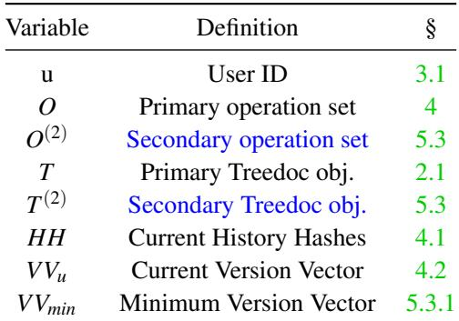  
Table 2: An Acumen user state with relevant fields. Fields in blue are introduced by our garbage collection changes in §5.3.

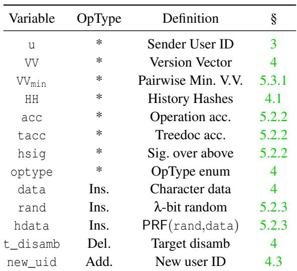  
Table 3: An Operation object, with operation type-specific fields marked in the OpType column. An Acumen state descriptor is comprised of the first seven fields.

## 5 The Acumen Protocol

We now present the full Acumen protocol. In this section, we update our protocol to hide user access patterns and efficiently offer edit-history privacy while retaining our confidentiality and consistency guarantees. We then introduce secure garbage collection.

## 5.1 Hiding Access Patterns

In the Treedoc CRDT (§2.1, [33]), a node’s full path to the root node is serialized as part of its representation. Treedoc paths are influenced by the document’s access patterns—for instance, an edit trace of N insertions each inserting at the end of the current list results in a linear tree structure, such that the last insertion has a path length of N nodes. On the other hand, a “balanced” edit trace would have path lengths on the order of log N. The sizes of encrypted edits leak information about the document access pattern to network adversaries.

Fixed-Length Paths. To mitigate this issue, we replace the full serialized path with a fixed-length path consisting only of the parent node’s disambiguator. This is essentially the “tree representation” of the original Treedoc paper [33], with the tweak that individual atoms (edits) are also sent in their reduced form. One can view this as the op-based version of the Treedoc CRDT.

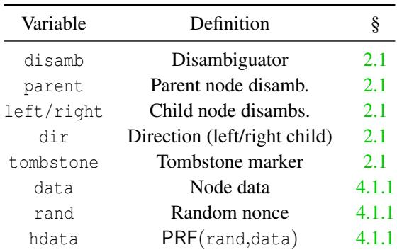  
Table 4: Updated Treedoc Node

This approach has the downside of requiring reliable causal broadcast (RCB)—informally, edits must be processed only after their causal dependencies are processed. Acumen already requires RCB for history-hash verification (§4.2), so this downside is of no extra consequence. A full description of our new Treedoc node struct can be found in Table 4.

Crucially, this approach removes the path-length side channel; timing leakage remains outside our threat model as discussed in Section 3.1. This contrasts with the state-of-theart system Snapdoc [24], which includes the variable-length paths. While nominally straightforward, this change introduces significant complications when adding secure snapshots and garbage collection. We outline our contributions towards resolving these complications in Sections 5.2 and 5.3.

We note that Snapdoc’s construction is incompatible with this change as their snapshot verification explicitly relies on each operation encoding a full Treedoc path from root to leaf.

## 5.2 Snapshot Consistency

Recall that Acumen provides fork-causal consistency (§2.2, §3.2), which informally guarantees that honest users always see a consistent subset of a global execution. Snapshot consistency is the extension of fork-causal consistency (which considers a static, existing group of users) to the setting in which new users are invited to existing documents. For instance, a malicious user may invite a new user and send a malformed copy of the current document. Informally, snapshot consistency states that new user states should be the product of a fork-causal consistent execution, as if an honest user processed the full edit history up to the same point.

We now formalize the notion of (strong) snapshot consistency. Define a function exec(S,E) that returns the resulting Acumen state (as defined in Table 2) from applying the given (partial) 1 execution E to state S according to the Acumen protocol. Further let 0/ m define the “empty state” of user m with no operations applied.

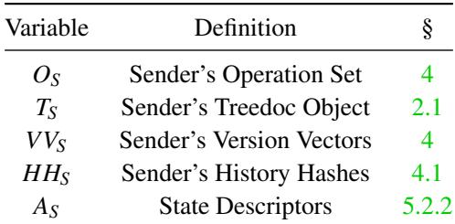  
Table 5: Acumen Snapshot Fields

Definition 1 (Strong Snapshot Consistency). A snapshot S from user s deriving state Ssnapshot satisfies (strong) snapshot consistency if there exists a fork-causal consistent execution E such that Ssnapshot = exec(0/ s,E).

Intuitively, a user u instantiating from a snapshot sent by user s should realize the same state as an honest user who processed the “full” history up to the same point. The term exec(0/ s,E) can be thought of as the result of simulating E as if s was honest (thus deriving the correct snapshot state).

Corollary 1. A snapshot S is consistent if the following two conditions hold:

• There exists some partial execution Emissing such that exec(Shonest , Emissing) = Ssnapshot for some honest user state Shonest .

• Ehonest ∪Emissing is a fork-causally consistent execution.

Proof Sketch: Intuitively, we show that an honest user derives Ssnapshot given the operations between their current state and Ssnapshot . Since honest users agree on the state at shared execution nodes, the simulated honest snapshot sender would also derive Ssnapshot under the same execution. We conclude that the snapshot satisfies Definition 1. □

## 5.2.1 High-Level Construction

We now outline a high-level construction for the creation and verification of snapshots. Creation is straightforward: a snapshot is simply the copy of the snapshot creator’s state with additional metadata (Table 5).

Upon receiving a snapshot, new users will run a snapshot verification protocol that outputs an Acumen state if and only if the given snapshot S satisfies Definition 1. Following Corol lary 1, our key idea to verify a snapshot will be to reconstruct an honest user state Su and show that exec(Su,ES,u) = Ssnapshot where ES,u is the partial execution corresponding to Emissing for user u. We will then verify that Eu ∪ ES,u is fork-causal consistent (where exec(0/ ,E ) = S ). Since at least one user included in the snapshot is honest 2, it suffices to verify this condition over all users included in the snapshot.

## High-Level Snapshot Verification

Execute the following for each user u contained in S:

1. Verifiably reconstruct the user state Su using S.

2. Verify that the history hashes of each Su are consistent with (i.e. prefixes of) the snapshot history hashes.

3. Identify operations in S that were not processed in Su. Verify that the partial execution ES,u defined by these operations is well-formed (i.e. satisfies FCC constraints).

4. Apply these missing operations to Su and verify the result equals Ssnapshot .

We briefly argue that these steps satisfy Corollary 1, and by extension Definition 1. Step 4 ensures that Ssnapshot = exec(Su,ES,u) for each user u (and therefore for at least one honest user h). Steps 2-3 ensure that ES,h ∪Eh is a fork-causal consistent execution (if all user history hashes are prefixes of the same history hashes, they must be pairwise consistent).

Achieving Step 1 of the high-level construction while maintaining edit-history privacy is the primary obstacle to efficient snapshot consistency. Our main technical contributions relate to this step, which we now detail in full. Section 5.2.2 will describe the notion of state descriptors for verifiably reconstructing user states from untrusted snapshot data. Section 5.2.3 then reconciles our approach with edit-history privacy by introducing placeholder nodes and related changes.

## 5.2.2 State Verification From State Descriptors

Recall that cryptographic accumulators [4, 6, 7] (§2.3) represent a set of items in a constant-space value. Given accS = accumulate(S), one can cryptographically verify S′ = S for a local set S′ by comparing accumulate(S′) ?= accS.

We use accumulators to represent an Acumen state as a constant-space hash value. Define the operation set accumulator (denoted acc) as the accumulator over (the hashes of) a user’s set of operations. Likewise, define the Treedoc accumulator (denoted tacc) to be the accumulator over a user’s set of Treedoc nodes.

Following prior work [24], we now define the notion of a state descriptor. User u’s state descriptor AS,u is comprised of the first 7 fields from their latest operation (Table 3), including the version vector, history hashes, and operation set and Treedoc accumulators.

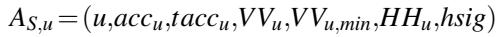

These fields combine to form a signed description of the user’s state at the included version vector, and are included in each Acumen snapshot (Table 5). Using AS,u, the snapshot verifier can verify that their reconstruction of Su using untrusted snapshot data equals user u’s true state by comparing the respective accumulators and other metadata.

## 5.2.3 Edit-History Privacy From Placeholders

Acumen also satisfies edit-history privacy, which informally requires the snapshot to not reveal previously-deleted document characters. It is not immediately clear how to reconcile this requirement with state descriptors—how can the verifier reconstruct a user state containing a now-deleted character if the snapshot is not allowed to include said character?

Edit-History Private Operations. This situation occurs when the snapshot creator has processed a deletion, but at least one other user has not. Let u be a user included in some snapshot S. For a given snapshot S = (OS,TS,...), define the set of edit-history private operations with respect to u as the set of insertions witnessed by u that have an associated deletion not yet witnessed by u (equivalently, the set of operations deleted in S but not yet deleted in Su). Likewise define the set of edithistory private nodes with respect to u as the set of Treedoc tombstones with an associated edit-history private insertion.

Key Insight. Our key idea is that the original data of edit-history private operations/nodes is irrelevant to the outcome of exec. Intuitively, the original character data is moot if the operation/node will be deleted in the end state.

Consider an example where the snapshot S contains multiple edit-history private insertions (o1, ... , ok) with respect to user u. Following the high-level construction, let S′ be the state reconstructed in Step (1), such that S′ equals Su except that (o1, ... , ok) and their associated nodes are tombstones. Assuming that the execution ES,u from Step (3) contains deletion operations targeting (o1, ... , ok) (as is the case in correct snapshots), we still have exec(S′u,ES,u) = Ssnapshot .

We introduce placeholder nodes in lieu of the edit-history private nodes. These nodes will represent a generic character while revealing nothing about their original contents. More precisely, define a placeholder node as a Treedoc node with data, rand = null and tombstone = False (effectively, a standard Treedoc character node with data, rand set to null).

Placeholder nodes function identically under Treedoc operations while hiding the original character data. Through this observation, we can relax Step (1) of the high-level construction—instead of verifying full state equality, we need only reconstruct Su “up to placeholders”.

Definition 2. Two states S′u = (O′u,T ′u,...) and Su = (Ou,Tu,...) are equal up to placeholders (denoted S′ ≤T Su) if their metadata fields are equal and (O′ ,T ′) = (Ou,Tu) except for a subset of edit-history private operations and associated placeholder nodes in S′u.

We specify that S′u ≤T Su only if the set of placeholder Treedoc nodes is exactly the set of nodes corresponding to the edit-history private insertions with respect to u. Otherwise, the snapshot creator can violate snapshot consistency by marking nodes as tombstones without a corresponding deletion operation in the execution.

Theorem 1. Let Su be an honest user state and S′ ≤T Su with edit-history private insertions OT = (o1,...,ok). For all wellformed partial executions E such that there exists a deletion in E targeting each o ∈ OT , the following equality holds:

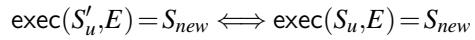

Input: S = (O ,T ,VV ,HH ,A ) (see Table 5)   
1. Compute VVS,min as the pairwise minimum over user state descriptor version vectors.   
2. Verify that O is a well-formed partial execution (e.g. all version vectors are unique, operations from individual   
users are totally ordered, and operations are within their user state descriptor).   
3. If garbage collection enabled, set (O f inal,Tf inal) = GarbageCollect(OS,TS,VVS,min) (where GarbageCollect is   
the protocol specified in §5.3.2), else (O f inal,Tf inal) = (OS,TS).   
4. Verify Tf inal contains no placeholder nodes (i.e. nodes with tombstone = False and empty data,rand   
fields).   
5. Execute the following for each u ∈VVS:   
(a) Let AS,u = (u,accu,taccu,VVu,VVu,min,HHu,hsig) be the state descriptor for u in AS. Verify hsig with PKu.   
(b) Compute the user operation set Ou and Treedoc object Tu:   
Ou ={o∈OS |VVo ≤VVu} and Tu ={n∈TS | for n’s insert op. o∈OS,VVo ≤VVu}   
(c) Define OT,u to be the set of edit-history private operations with respect to u:   
OT,u = {o ∈ OS | o is an insertion ∧ VVo ≤VVu ∧ ∃ od targeting o s.t. VVo ̸≤VVu}   
(d) For each o∈O , set tombstone = False in the corresponding node in T .   
(e) Set (Ou,Tu) ← GarbageCollect(Ou,Tu,VVu,min) with input VVu,min.   
(f) Verify that accumulate(Ou)= accu and accumulate(Tu)=taccu.   
(g) Let S′ = (Ou,Tu,VVu,VVu,min) be the reconstructed user state. Verify that applying the operations in   
Omissing = OS \Ou (as defined in Step 5b) to S′u results in a state S(F) = (O(F)S ,T (FS (F) ,HH (F) ,\_) such   
that (O(F),T (F),HH(F)) = (O f inal ,Tf inal ,HHS).   
6. Define primary/secondary objects: (O,T ) = (O f inal,Tf inal) and (O(2),T (2)) = (OS,TS)  
Figure 3: Snapshot Verification Protocol. A full description of the fields contained in a snapshot can be found in Table 5. Text in blue indicates steps added by the garbage collection protocol outlined in §5.3.

Proof Sketch: Deleting a placeholder has the same effect as deleting a live node, and all placeholders are deleted in E. Since the existence of these placeholders are the only difference between S′u and Su, the end result of applying E must be equal. □

We conclude that executing the high-level steps using a reconstructed user state equal up to placeholders to the “true” user state still satisfies Definition 1.

Adapting State Descriptors. Recall that our earlier approach exactly reconstructed Su from untrusted data and compared the resulting accumulators to u’s state descriptor. Our new approach derives a state S′u ≤T Su, but the accumulators of S′ will not necessarily equal those of Su due to the presence of placeholder nodes.

We will resolve this by re-defining the hash of an operation/node such that the hash of a placeholder node equals the hash of its original node. It follows that accumulate(O′ ) = accumulate(Ou) and accumulate(T ′) = accumulate(Tu) if S′ ≤T Su. Recall that in §4.1.1 we defined H(op) to use an intermediate data hash op.hdata. When computing the hash of a tombstone or placeholder operation, we use this intermediate field directly: H(op)=H(op.metadata, op.hdata).

We define the hash of a Treedoc node likewise—note that the tombstone field will be included in metadata such that placeholder nodes and real tombstones have differing hash values. The resulting placeholder hash value is equal to the original, non-tombstone hash. Likewise, the hash of a tombstone operation is equal to its original hash. We briefly note that this definition does not violate our FCC guarantees from history hashes, as the value of H(op) is originally calculated as a function of the character data.

## 5.3 Secure Garbage Collection

Without explicit garbage collection, the size of each user state (and of snapshots) will be linear in the edit history length. In practical terms, this results in a blowup in user storage and operation processing time. In this section, we introduce a garbage collection protocol that drastically improves the performance of Acumen, while maintaining our cryptographic and consistency guarantees (§3.2).

Garbage collection is often at odds with CRDT-based collaborative editors because collection is a non-commutative operation. As a result, such operations must often be preceded by a distributed consensus protocol. In this section, we construct asynchronous garbage collection for Treedoc by exploiting causal stability and existing reliable causal broadcast (RCB). While previous work [5, 17, 33] provides for mild forms of asynchronous garbage collection (such as pruning obsolete metadata or leaf nodes), our approach provides full garbage collection for Treedoc (i.e. including inner nodes).

We first define the notion of causal stability (§5.3.1), then outline our GC protocol (§5.3.2), show said protocol satisfies strong eventual consistency (§5.3.3), and finally adapt it to snapshot verification (§5.3.4).

## 5.3.1 Causal Stability

Garbage collection in op-based CRDTs generally relies on causal stability [1, 2, 35], the notion that certain operations can be pruned once all users have executed them. An operation is said to be causally stable if it has been processed by every user. In the language of version vectors, an operation o is causally stable if VVo ≤VVu for each user u. Equivalently, o is causally stable if VVo ≤ VVmin where VVmin is the component-wise minimum over all user version vectors:

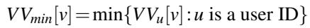

As part of our garbage collection protocol, users will identify causally stable operations in their local state. However, our asynchronous environment implies no user knows the global VVmin, as they may not be fully up-to-date with other user operations. Fortunately, the definition of VVmin extends naturally to the local case.

Let VV (u)v be v’s latest version vector from u’s perspective (e.g. the version vector of v’s latest operation in u’s state). Define VVu,min as the component-wise minimum over all VV (u)v for each user v in user u’s state. An operation o is said to be locally causally stable if VVo ≤ VVu,min. Local causal stability implies (global) causal stability, but the converse is not necessarily true.

Causally Stable Tombstones. As defined in §2.1, deleted Treedoc nodes are marked as tombstones. In base Treedoc, tombstone nodes cannot be permanently deleted, as future insertion operations can create nodes referencing a tombstone node as a parent. This occurs precisely when the operation creator has not yet processed the associated deletion operation, such that the tombstone node appears as a live node from their point of view. Thus, a deletion operation being causally stable implies the associated node will never serve as a parent to a new insertion. This property motivates the definition of causally stable tombstones (CSTs): tombstone nodes whose associated deletion operation is causally stable. 3

## 5.3.2 Garbage Collection Protocol

We now describe our asynchronous garbage collection protocol for Treedoc. The primary challenge to such a protocol is dealing with inner nodes (i.e. non-leaf nodes). While leaf CSTs can be pruned immediately, it is not immediately clear how to prune a CST inner node that has live child nodes without disrupting required consistency guarantees.

The original Treedoc paper [33] approaches this problem by transforming (“flattening”) a subtree into a single list of sibling leaf nodes. Their protocol requires running a distributed consensus algorithm to ensure no conflicting insertion can occur. Our key idea is to define an asynchronous flatten operation that compresses a single edge of the tree, replacing a CST node with its child node(s). By identifying a key invariant relating to causal stability, we ensure that flatten cannot conflict with concurrent insertions and therefore does not require a distributed commitment scheme.

Conditions For Garbage Collection. Recall that Treedoc orders sibling nodes according to their disambiguator (as outlined in §2.1). Flattening a node can violate this total order, since its child node(s) have different disambiguators. More concretely, consider two concurrent operations: one flattens a node with parent P and the other inserts a new node under P. Since nodes are inserted into their new child list in sorted order, the flatten replacing a list item with child nodes containing a different (possibly out-of-order) disambiguator may change the insertion location of the new node.

In summary, we must not flatten a node N whose parent node P may be the target of a future insertion. We identify a simple sufficient condition to satisfy such a requirement: a Treedoc CST N can be flattened only if its parent P is also a CST. Intuitively, if P is a CST all users see it as a tombstone, and will therefore not reference it as a parent to any insertion.

Parametrized Causal Stability. We now define our garbage collection protocol GarbageCollect, which takes as input a version vector VVgc to define causal stability (i.e. all operations ≤ VVgc are considered causally stable). We will elaborate on this parameter in §5.3.3. For technical reasons, GarbageCollect will use VVgc − 1, i.e. VVgc with each value decremented by one 4.

For Treedoc nodes, GarbageCollect executes as follows: prune all leaf CSTs, and flatten inner node CSTs whose corresponding parent node is also a CST. Figure 5 provides an example showcasing both flatten and leaf-pruning. Garbage collecting operations is straightforward: prune causally stable deletions and insertions whose associated deletion is causally stable.

## 5.3.3 Maintaining Strong Eventual Consistency

Recall the definition of strong eventual consistency (SEC) from §2.1: informally, users applying the same execution (up to concurrent ordering) end up with the same state. This property implicitly underlies fork-causal consistency in CRDT-based distributed editors, as it ensures (honest) users agree on the document state at every point in their shared execution regardless of how they locally applied concurrent edits.

However, garbage collection based on causal stability may break SEC—namely, the local causal stability of an operation can differ between two users under the same execution. For example, suppose there exists a two-party document of users

Input: Operation set O, Treedoc object T , causal stability barrier version vector VVgc   
Output: Operation set O′, Treedoc object T ′   
Let VVgc−1 denote VVgc with each entry decremented by one.   
1. Filter the operation set O to generate a new set O′ by removing the following items:   
• Insertion operations o such that ∃od ∈ O, od targets o for deletion, and VVo ≤ (VVgc−1).   
• Deletion operations od such that VVo ≤(VVgc−1).   
2. Compute the set of CSTs: C = {n ∈ T | n is a tombstone ∧ ∃od ∈ O s.t. od deleted n ∧ VVo ≤ (VVgc−1)}   
3. Prune all leaf nodes in C. Repeat this step as needed if this generates new leaf CSTs.   
4. For each n∈C such that n.parent∈C, run the flatten subprocedure:   
• Let p be n’s parent node, and let LC = n.left∥n.right be the concatenated child lists of n.   
• Replace n in p’s left or right child list with the elements of LC.   
5. Let T ′ be the Treedoc object created as a result of Steps 3-4. Output (O′,T ′).  
Figure 4: Garbage Collection Protocol.

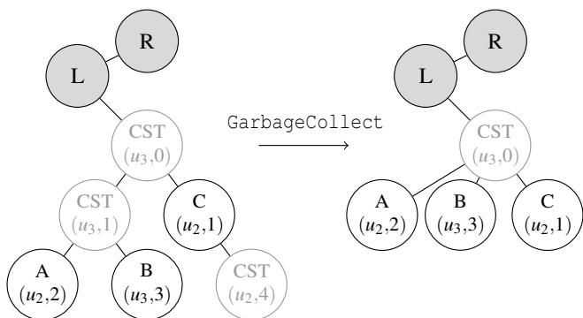  
Figure 5: An example instance of garbage collection, with one call to flatten and one leaf node pruned.

A, B such that A inserted and deleted a single character (oi,od respectively), with B processing these operations. User A does not see o as causally stable and does not prune the associated Treedoc node. However, User B does recognize o as causally stable and prunes the associated node.

To ensure strong eventual consistency, we specify GarbageCollect such that the set of CSTs is defined according to the sender’s notion of (local) causal stability. More precisely, when processing an operation o with field VVmin,op (the pairwise minimum version vector from Table 3) users run GarbageCollect with VVgc =VVmin,op. When creating a new operation users run GarbageCollect with their local VVmin.

## 5.3.4 Adapting Garbage Collection For Snapshots

Recall that the high-level idea for snapshot verification (§5.2.1) is to reconstruct each user state from untrusted snapshot data and check equality via the user’s signed state descriptor. This approach is at odds with the idea of permanent garbage collection—in order to retain the ability to create snapshots, a user can only remove operations/nodes that have already been removed by every other user. At face value, this is a circular requirement that prevents all garbage collection.

Key Insight. Our insight to avoid this issue is to perform second-order garbage collection by duplicating the operation set and Treedoc objects, maintaining a “primary” object (O,T ) and secondary object (O(2),T (2)). Incoming operations will be applied to both primary and secondary objects. The primary object will be garbage collected as previously outlined, and user state descriptors (§5.2.2) will be computed over the primary object. The secondary object will be garbage collected as far as possible while still being able to reconstruct each user state descriptor. More precisely, for each user v with must satisfy (Ov, Tv) = GarbageCollect(O(2)u , T (2)u , VVv,min) where VVv,min is defined as in §5.3.1.

Latest Garbage Collection Version Vector Recall that Acumen users run GarbageCollect(O, T, VVmin) after processing or creating an operation o (where VVmin is taken from o). Let VV (u) v,min denote this field from a user v’s latest operation as seen by u. We now define the (local) pairwise minimum garbage collection version vector:

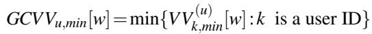

We define GCVVu,min as user u’s local GCVV , computed from the latest state descriptors in their operation set. This definition is essentially a second-order pairwise minimum version vector (§5.3.1), in that GCVVmin represents the v,min for all users v, as seen from u’s state.

Adapting Garbage Collection. As before, the primary operation set/Treedoc is garbage collected with VVgc =VVmin where VV is taken from the processed/created operation o. The secondary object will be garbage collected up to VVgc = GCVVmin. To reconcile snapshot consistency with garbage collection, we make minor changes to the snapshot verification algorithm (highlighted blue in Figure 3).

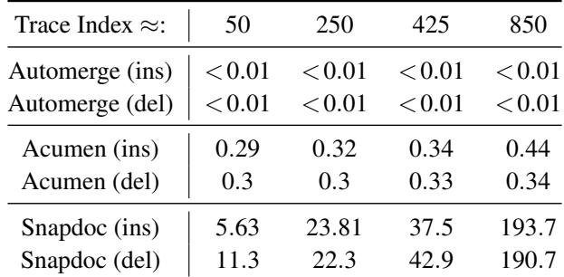  
Table 6: Local operation creation timings (ms) taken from the N = 5 user Automerge trace (§6.1).

## 6 Evaluation

We aim to answer three key questions with our evaluation:

1. How does each component of our protocol affect its ultimate performance?

2. How do user count, edit-history length, and current document size affect snapshot size and verification timing?

3. How does performance scale in real-world concurrent editing scenarios?

## 6.1 Local Performance

We first evaluate performance over a realistic document workload: the sequential edit trace [15, 16] of the original Automerge research paper [22], containing 182,315 singlecharacter insertion operations and 77,463 single-character deletion operations. We compare against two baselines: Snapdoc [24], the closest prior work in terms of security guarantees, and Automerge [22], a popular open-source CRDT library without security guarantees.

Setup We evaluated the Automerge trace over N =5 users in alternating steps. More precisely, the k-th edit is executed by user k mod N and the resulting update is immediately processed by each other user. This trace is evaluated on a c2-standard-16 GCP server (16 vCPU, 64GB memory).

Local Operations Table 6 displays local operation processing times taken at different indices in the Automerge trace (corresponding to well-spaced deletions). Both Acumen and Automerge maintain real-time 5 processing times less than 1ms, whereas Snapdoc insertions and deletions take time proportional to the edit-history length (approaching 200ms after only 850 edits).

Remote Processing We quantify which aspects of Acumen contribute towards processing remote updates in Figure 6. The bulk of Acumen’s overhead comes from updating our accumulators (§5.2.2), requiring ≈ 2 · λ hash function evaluations and hashmap insertions per operation. Aside from periodic memory re-allocation as the hashmap grows in size, this component remains largely constant. Likewise, garbage collection (“G.C.”) remains a small fraction of overall processing time, which is to be expected in documents with all users reasonably up-to-date. The bulk of the increase in processing time seen in Figure 6 comes from inserting a new character into the Treedoc and associated list (primarily the latter).

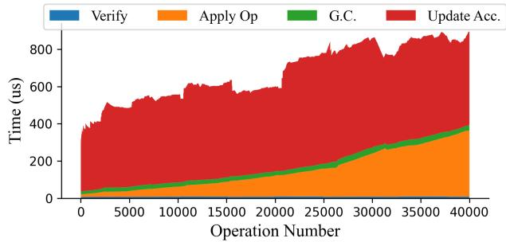  
Figure 6: Acumen timings for processing remote operations. Averaged over N = 5 users alternating to type the first 40,000 edits of the Automerge trace as outlined in §6.1.

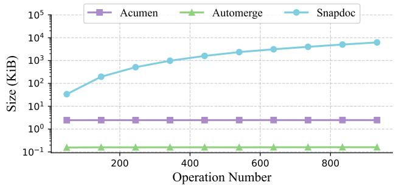  
Figure 7: Log-scale insertion update sizes averaged over N = 5 users typing the first 1,000 edits of the Automerge trace (§6.1).

Update Size We plot update sizes under the same trace in Figure 7. As expected, both Acumen and Automerge update sizes remain constant over time. The same cannot be said about Snapdoc, whose update sizes grow linear in the edit-history length. This growth is enough to significantly degrade performance for non-trivial document sizes: after typing ≈ 1000 edits (≈ 200 words), a Snapdoc update is already 7 MB in size.

## 6.2 Snapshot Performance

We next evaluate the impact of three key scaling factors on the load time and size of document snapshots: 6 the number of users in the current document, the size of the current document, and the size of the overall edit history.

Setup We instantiate a document with |users| ∈ [1,10] and apply the aforementioned Automerge document trace up to |ops| ∈ {0,10,50,100,200,400,1000}. We then delete 0% or 90% of the remaining characters starting from document end.

We plot the snapshot size and load times for all combinations of (|users|,|ops|) in Figure 8. To handle Snapdoc’s extreme demand for memory, evaluations are run in the n2-highmem-48 virtual machine (48 vCPUs, 384 GB memory).

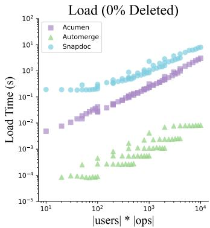

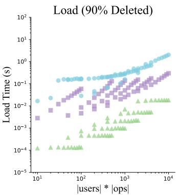

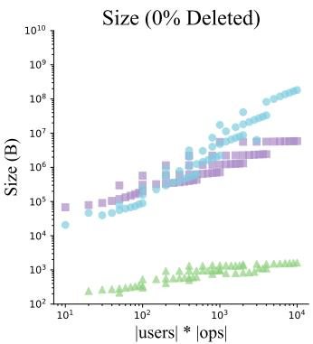

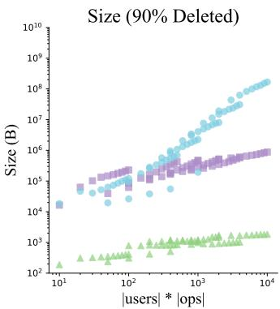  
Figure 8: Snapshot Evaluations. The x-axis is composed from the product of combinations over user counts in [1,10] and operation lengths up to 1000. The first row consists of snapshots created after executing the first k operations of the Automerge trace (§6). The second row applies the same trace but deletes 90% of the document prior to creating the snapshot.

User Scaling The snapshot load performance of Acumen and Snapdoc scale approximately proportional to the number of users (all else constant). This is in contrast to a basic CRDT like Automerge which has negligible scaling on |users|. The impact of extra users is also visible in the snapshot size due to the inclusion of an extra state descriptor (§5.2.2), though the effect is additive and much less pronounced.

Edit-History Scaling As expected, Acumen has better performance than Snapdoc in documents with a large ratio between the edit-history length and current size (captured in the 90% deletion parameter). This is due to our garbage collection protocol: unlike Acumen, the path lengths of Treedoc nodes in Snapdoc snapshots grow proportional to edit-history length (also seen in Figure 7). Even though Snapdoc is able to exclude (most of) the deleted Treedoc nodes from its snapshot, the leftover nodes remain exceptionally large. 7

Concretely, we see an order of magnitude improvement in load times in 0% deletion environments. In 90% deletion documents with low user count, this increases to nearly two orders of magnitude. Size difference is particularly pronounced in the 90% case: with just 1000 edits in the trace, Acumen already provides three orders of magnitude improvement in snapshot size.

## 6.3 Throughput/Latency Benchmarks

We next evaluate Acumen in full, including network overheads. Each benchmark consists of N users editing a single document, with edits broadcast over a network to individual client machines (c2-standard-8) through a central relay server (c2-standard-30). Each user repeatedly types and deletes the abstract of this paper (≈ 800 characters). We compare Acumen to a baseline system using the Acumen network framework that sends and receives 200-byte edits, but does not process them locally. 8

7Almost all of Snapdoc’s performance degradation is caused by the variable size inherent to their Treedoc atom representation.

8We opt to not use Automerge as a baseline due to its performance degrading with edit history length, which prevented the measurement of steady-state ping/throughput numbers.

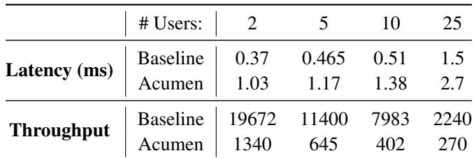  
Table 7: Round-trip latency (5 ops/sec) and maximum throughput (measured as ops/sec processed by a single user).

Results Table 7 contains the results of the aforementioned benchmark. Latency is calculated as the local time difference between sending an update and receiving an acknowledgment packet (sent after the receiver processes the update in question). Direct client-to-server round-trip latency (measured via the ping Unix command) is approximately 0.125 ms.

We see that Acumen latency remains in the single-digit millisecond range even for large documents. Adjusted for baseline latency, our protocol adds < 1ms of overhead on average. We also see that Acumen throughput scales inverse with the number of active users, since each user waits for N −1 updates before sending their own. Despite this, Acumen maintains throughput into the hundreds of operations per second even with large user counts.

## 7 Related Work

Untrusted Cloud Storage. SUNDR [26] and Depot [28] are notable secure filesystems that use signed version vectors to securely enforce causal guarantees. SPORC [13] is a centralserver based secure collaborative editor utilizing operational transforms, but does not consider user adversaries.

(Secure) CRDTs. Many CRDT-based text editors and frameworks have been developed, an incomplete subset of which is as follows: Treedoc [33], Logoot [38], Peritext [27], Automerge [22], YJS [30], and ARDTs [25]. Barbosa et al. [3] developed a model for secure CRDTs for honest-butcurious adversaries. Kuessner et al.’s Algebraic Replicated Data Types (ARDTs) [25] utilize symmetric encryption at the clients with an untrusted server that forwards the edits, but likewise only consider an honest-but-curious threat model.

Malicious-secure CRDTs have generally used hashgraphs [8, 20, 21, 31] and our work is no exception. Snapdoc [24] is the first to implement the CRDT-based snapshot consistency notion (§3). Snapdoc provides only a subset of our guarantees: their solution leaks edit patterns and does not offer the performance and scalability of the Acumen system. Also of note is work by Elvinger et al. [12] outlining a theoretical notion of authenticated snapshots. Though they did not provide an implementation, their approach shares many of our (and Snapdoc’s) high-level ideas of state fingerprinting and authenticated logs from collision-resistant hashing.

CRDT Garbage Collection Efficient CRDT garbage collection has been explored in a variety of contexts. The causal stability approach is explored in [5, 17, 34] and particularly for tree-based CRDTs in [23, 33]. Zawirski et al. [39] propose a two-tiered solution involving a "core" set of highly available servers that execute the commitment protocol, then share their result with the remaining nodes.

## 8 Conclusion

This work introduces Acumen, a secure platform for collaborative editing with real-time performance. Our system is the first to provide confidentiality, integrity, fork-causal consistency, strong snapshot consistency and edit-history privacy in the presence of untrusted clients and servers.

## Acknowledgments

We thank our anonymous reviewers and shepherd for their helpful feedback. This work is supported by gifts from Accenture, Algorithmic SuperIntelligence Labs, Amazon, AMD, Anyscale, Broadcom, cmpnd, Google, IBM, Intel, Intesa Sanpaolo, Lambda, Lightspeed, Mirendil, NVIDIA, Samsung SDS, and VESSL.

## References

[1] Carlos Baquero, Paulo Sérgio Almeida, and Ali Shoker. Making operation-based crdts operation-based. In Proceedings of the First Workshop on Principles and Practice of Eventual Consistency, pages 1–2, 2014.

[2] Carlos Baquero, Paulo Sérgio Almeida, and Ali Shoker. Pure operation-based replicated data types. arXiv preprint arXiv:1710.04469, 2017.

[3] Manuel Barbosa, Bernardo Ferreira, João Marques, Bernardo Portela, and Nuno Preguiça. Secure conflictfree replicated data types. In Proceedings of the 22nd International Conference on Distributed Computing and Networking, pages 6–15, 2021.

[4] Niko Baric and Birgit Pfitzmann. Collision-free´ accumulators and fail-stop signature schemes without trees. In International conference on the theory

and applications of cryptographic techniques, pages 480–494. Springer, 1997.

[5] Jim Bauwens and Elisa Gonzalez Boix. From causality to stability: Understanding and reducing meta-data in crdts. In Proceedings of the 17th International Conference on Managed Programming Languages and Runtimes, pages 3–14, 2020.

[6] Josh Benaloh and Michael De Mare. One-way accumulators: A decentralized alternative to digital signatures. In Workshop on the Theory and Application of Cryptographic Techniques, pages 274–285. Springer, 1993.

[7] Philippe Camacho, Alejandro Hevia, Marcos Kiwi, and Roberto Opazo. Strong accumulators from collision-resistant hashing. In Information Security: 11th International Conference, ISC 2008, Taipei, Taiwan, September 15-18, 2008. Proceedings 11, pages 471–486. Springer, 2008.

[8] The Matrix.org Foundation C.I.C.:. Matrix specification v1.1. technical report. h t t p s : //spec.matrix.org/v1.1/.

[9] Katriel Cohn-Gordon, Cas Cremers, Benjamin Dowling, Luke Garratt, and Douglas Stebila. A formal security analysis of the signal messaging protocol. Journal of Cryptology, 33(4):1914–1983, 2020.

[10] Giuseppe DeCandia, Deniz Hastorun, Madan Jampani, Gunavardhan Kakulapati, Avinash Lakshman, Alex Pilchin, Swaminathan Sivasubramanian, Peter Vosshall, and Werner Vogels. Dynamo: Amazon’s highly available key-value store. ACM SIGOPS operating systems review, 41(6):205–220, 2007.

[11] Clarence A Ellis and Simon J Gibbs. Concurrency control in groupware systems. In Proceedings of the 1989 ACM SIGMOD international conference on Management of data, pages 399–407, 1989.

[12] Victorien Elvinger, Gérald Oster, and François Charoy. Prunable authenticated log and authenticable snapshot in distributed collaborative systems. In 2018 IEEE 4th International Conference on Collaboration and Internet Computing (CIC), pages 156–165. IEEE, 2018.

[13] Ariel J Feldman, William P Zeller, Michael J Freedman, and Edward W Felten. {SPORC}: Group collaboration using untrusted cloud resources. In 9th USENIX Symposium on Operating Systems Design and Implementation (OSDI 10), 2010.

[14] Colin J Fidge. Timestamps in message-passing systems that preserve the partial ordering. 1987.

[15] Joseph Gentle. Editing traces (github repository). http s://github.com/josephg/editing-traces, 2023.

[16] Joseph Gentle and Martin Kleppmann. Collaborative text editing with eg-walker: Better, faster, smaller. In Proceedings of the Twentieth European Conference on Computer Systems, pages 311–328, 2025.

[17] Richard Andrew Golding. Weak-consistency group communication and membership. University of California, Santa Cruz, 1992.

[18] Oded Goldreich. Foundations of cryptography: volume 2, basic applications, volume 2. Cambridge university press, 2001.

[19] Victor B. F. Gomes, Martin Kleppmann, Dominic P. Mulligan, and Alastair R. Beresford. Verifying strong eventual consistency in distributed systems. Proc. ACM Program. Lang., 1(OOPSLA):109:1–109:28, 2017.

[20] Kristof Jannes, Bert Lagaisse, and Wouter Joosen. Secure replication for client-centric data stores. In Kaiwen Zhang, Abdelouahed Gherbi, and Paolo Bellavista, editors, Proceedings of the 3rd International Workshop on Distributed Infrastructure for the Common Good, DICG 2022, Quebec, Quebec City, Canada, 7 November 2022, pages 31–36. ACM, 2022.

[21] Martin Kleppmann. Making crdts byzantine fault tolerant. In Proceedings of the 9th Workshop on Principles and Practice of Consistency for Distributed Data, pages 8–15, 2022.

[22] Martin Kleppmann and Alastair R Beresford. Automerge: Real-time data sync between edge devices. In 1st UK Mobile, Wearable and Ubiquitous Systems Research Symposium (MobiUK 2018). https://mobiuk. org/abstract/S4-P5-Kleppmann-Automerge. pdf, pages 101–105, 2018.

[23] Martin Kleppmann, Dominic P Mulligan, Victor BF Gomes, and Alastair R Beresford. A highly-available move operation for replicated trees. IEEE Transactions on Parallel and Distributed Systems, 33(7):1711–1724, 2021.

[24] Stephan A Kollmann, Martin Kleppmann, and Alastair R Beresford. Snapdoc: Authenticated snapshots with history privacy in peer-to-peer collaborative editing. Proc. Priv. Enhancing Technol., 2019(3):210–232, 2019.

[25] Christian Kuessner, Ragnar Mogk, Anna-Katharina Wickert, and Mira Mezini. Algebraic replicated data types: Programming secure local-first software. In 37th European Conference on Object-Oriented Programming (ECOOP 2023). Schloss Dagstuhl-Leibniz-Zentrum für Informatik, 2023.

[26] Jinyuan Li, Maxwell Krohn, David Mazières, and Dennis Shasha. Secure untrusted data repository (SUNDR). In OSDI. USENIX, 2004.

[27] Geoffrey Litt, Sarah Lim, Martin Kleppmann, and Peter Van Hardenberg. Peritext: A crdt for collaborative rich text editing. Proceedings of the ACM on Human-Computer Interaction, 6(CSCW2):1–36, 2022.

[28] Prince Mahajan, Srinath Setty, Sangmin Lee, Allen Clement, Lorenzo Alvisi, Mike Dahlin, and Michael Walfish. Depot: Cloud storage with minimal trust. In OSDI. USENIX, 2010.

[29] Friedemann Mattern et al. Virtual time and global states of distributed systems. Univ., Department of Computer Science, 1988.

[30] Petru Nicolaescu, Kevin Jahns, Michael Derntl, and Ralf Klamma. Yjs: A framework for near real-time p2p shared editing on arbitrary data types. In Engineering the Web in the Big Data Era: 15th International Conference, ICWE 2015, Rotterdam, The Netherlands, June 23-26, 2015, Proceedings 15, pages 675–678. Springer, 2015.

[31] Bernardo Portela, Hugo Pacheco, Pedro Jorge, and Rogério Pontes. General-purpose secure conflict-free replicated data types. In 36th IEEE Computer Security Foundations Symposium, CSF 2023, Dubrovnik, Croatia, July 10-14, 2023, pages 521–536. IEEE, 2023.

[32] Nuno Preguiça. Conflict-free replicated data types: An overview. arXiv preprint arXiv:1806.10254, 2018.

[33] Nuno Preguiça, Joan Manuel Marquès, Marc Shapiro, and Mihai Letia. A commutative replicated data type for cooperative editing. In 2009 29th IEEE International Conference on Distributed Computing Systems, pages 395–403. IEEE, 2009.

[34] Hyun-Gul Roh, Myeongjae Jeon, Jin-Soo Kim, and Joonwon Lee. Replicated abstract data types: Building blocks for collaborative applications. Journal of Parallel and Distributed Computing, 71(3):354–368, 2011.

[35] Marc Shapiro, Nuno Preguiça, Carlos Baquero, and Marek Zawirski. A comprehensive study of convergent and commutative replicated data types. 2011.

[36] Marc Shapiro, Nuno Preguiça, Carlos Baquero, and Marek Zawirski. Conflict-free replicated data types. In Stabilization, Safety, and Security of Distributed Systems: 13th International Symposium, SSS 2011, Grenoble, France, October 10-12, 2011. Proceedings 13, pages 386–400. Springer, 2011.

[37] Matthew Weidner, Martin Kleppmann, Daniel Hugenroth, and Alastair R. Beresford. Key agreement for decentralized secure group messaging with strong security guarantees. In Yongdae Kim, Jong Kim, Giovanni Vigna, and Elaine Shi, editors, CCS ’21: 2021 ACM SIGSAC Conference on Computer and Communications Security, Virtual Event, Republic of Korea, November 15 - 19, 2021, pages 2024–2045. ACM, 2021.

[38] Stéphane Weiss, Pascal Urso, and Pascal Molli. Logoot: A scalable optimistic replication algorithm for collaborative editing on p2p networks. In 2009 29th IEEE International Conference on Distributed Computing Systems, pages 404–412. IEEE, 2009.

[39] Marek Zawirski, Marc Shapiro, and Nuno Preguiça. Asynchronous rebalancing of a replicated tree. In Conférence Française en Systèmes d’Exploitation (CFSE), page 12, 2011.

## A Strong Eventual Consistency

Recall the definition of strong eventual consistency [36]:

Definition A.1. (Strong Eventual Consistency, Informal) A CRDT satisfies strong eventual consistency if for all users A,B receiving the same set of updates (possibly in a different order), A’s state equals B’s state.

It is known that a CRDT satisfies SEC if concurrent operations commute [19]. We now sketch a proof that Acumen with garbage collection satisfies SEC over all well-formed executions.

At a high level, our proof will proceed as follows:

• We first show that garbage collection is commutative with itself: GC at VV before VV results in identical outcomes to GC at VV2 before VV1.

• Next, we show that GC is unaffected by insertions and deletions.

• Finally, we conclude that GC satisfies SEC.

Lemma A.1. Let Su = (Ou, Tu) be an arbitrary Acumen state, and GarbageCollect be as defined in Figure 4. The following identity holds:

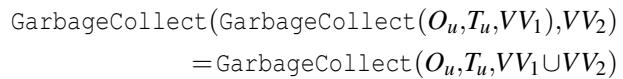

where VV1∪VV2 denotes the component-wise maximum of VV1 and VV2.

Proof Sketch: We first briefly argue that flatten is commutative within the same call to GC — that is, we can flatten parent/child nodes in any order. It is easy to see that pruning leaf nodes and operation tombstones commute. The primary case to consider is thus a chain of CSTs A→B→C, and whether flattening (A, B) preceding (B,C) affects the outcome. It is straightforward to see that this is not the case: both executions collapse into the single node C. We note that this holds even for different-direction children (e.g. A → B, A → C for left-child B, right-child C), since flattening A moves both children into its current position (e.g. inserts them into the same list in their respective order).

We now argue that this individual commutativity applies to GC operations themselves. Intuitively, the GC protocol identifies a set of eligible operations/nodes as those ≤ VVgc − 1. The set identified at VV1 ∪VV2 is equal to the union of the sets at VV1,VV2. Since flattening elements in the set can occur in any order, it follows that the GC two sets sequentially is equal to the GC of the union. (Note flatten does not impact the CST status of other nodes)

Lemma A.2. (Informal) Insertion and deletion operations commute with garbage collection.

Proof Sketch: Intuitively, an insertion can only target non-CST parent nodes. It follows that insertions do not affect the resulting state of any call to GC, as they modify node state untouched by GC. Deletions follow likewise.

Theorem A.1. Acumen with garbage collection satisfies strong eventual consistency.

Proof Sketch: Immediate from the previous lemmas: garbage collection is commutative and unaffected by concurrent operations, so overall Acumen operations are commutative (=⇒ SEC).

## B Fork-Causal Consistency

We now provide a formal definition and proof sketch of fork-causal consistency, assuming strong snapshot consistency (to be proved in §C). To do so, we construct a happens-before global execution graph G that represents the causal relationships between operations. This graph represents a “global view” of the causal execution (restricted to honest users). We then construct individual client execution graphs Gn to represent their “local view” of the causal execution. By comparing G and Gn at every shared node, we prove that our system is fork-causal consistent.

Definition B.1. Let G be a directed acyclic graph. The partial order ≺G holds if there is a directed edge a → b or a transitive path from a to b in G.

Definition B.2. For any vertex v in the graph G, define read(G,v) to be the tuple (O,T ) of operation set / Treedoc nodes from the state exec(0/,E) where E = {n ∈ G | n ⪯ v} (the subgraph leading into v).

Likewise, define read(Gn,v) to be the operation set/Treedoc of exec(0/ u,E), where E = {n ∈ Gn | n ⪯ v}.

Definition B.3. A global execution E is fork-causal consistent if there exists a directed acyclic graph G that satisfies the following properties:

FCC0. G contains a vertex for every operation in E sent by an honest user, and also a vertex for every operation that is sent by a malicious user and processed by at least one honest user.

FCC1. The operations of honest users are totally ordered in G, consistent with the actual execution order of the operations at that device.

FCC2. For each honest user n there exists a directed acyclic graph Gn in which there is a vertex for every operation message sent or processed by n. By FCC0, for each vertex v in G there is a corresponding vertex m in G. We then require that for each vertex v in Gn, the document state is the same as the document state at the corresponding vertex in G: read(Gn,v) = read(G,v).

FCC3. The operations of all users appear totally ordered to honest clients. Formally, if v ∈ G is a node created by an honest client and v ,v ≺ v are vertices from a user u, then v1 ≺ v2 or v2 ≺ v1.

Definition B.4. We construct Gn (the local execution graph for an honest user n) as follows:

1. Add a vertex for every operation witnessed or sent by n.

2. Add a directed edge a → b for locally witnessed/sent operations a, b where a is a causal dependency of b. That is, draw an edge from each operation as defined in the version vector, excepting the sender’s which draws an edge from the operation with counter VV [u]−1. 9.

3. For users joining from snapshots, add the partial execution as given by OS (i.e. Esnapshot ). Add edges into an AddUser node from its causal dependencies present in partial execution.

Definition B.5. We construct G (the global execution graph) as follows:

1. Add a vertex for every operation witnessed or sent by an honest client.

2. Add a directed edge a → b for locally witnessed/sent operations a,b where a is a causal dependency of b.

This includes edges from a new user’s first message upon joining, which has an edge to the associated AddUser node and edges to the same dependencies as the AddUser node.

Lemma B.1. G is a DAG.

Proof Sketch: By construction, an edge a → b exists only if VVb >VVa (since operations have edges from their causal dependencies, and the version vector of a given operation dominates the version vectors of its dependencies). This prevents any cycles from appearing on the graph, as the version vector counter is monotonically increasing.

Lemma B.2. G satisfies FCC0, FCC1, and FCC3.

Proof Sketch: FCC0 is by definition. FCC1 follows immediately from our definition involving version vectors, as mentioned in Lemma B.1. An edge always exists between a user’s k-th node and their k+1-th as required.

FCC3 follows much the same as FCC1. An honest user accepts an operation from user u only if its counter is precisely +1 from that user’s most recent operation counter. Therefore forking operations with identical counters will be ignored, and honest users always see a total order for the operations from any given individual user.

The above reasoning holds for nodes added from a snapshot, as snapshot verification will ensure the well-formedness of the partial execution.

Lemma B.3. Assume that each snapshot node in G satisfies snapshot consistency as in Definition 1 (§5.2). Then G satisfies FCC2.

Proof Sketch: Suppose not, i.e. suppose there exists some global execution E that leads to a FCC2 violation. By snapshot consistency, the state of a snapshot user is precisely equal to that of an honest user processing the same execution up to and including the relevant AddUser.

Consider then the same execution over our basic protocol (§4), i.e. where snapshots are created by including the entire edit history. This protocol is clearly fork-causal consistent (for a proof, see Snapdoc [24] “basic protocol”).

We claim that the counterexample execution E would also break FCC over the basic protocol. Consider an arbitrary FCC2 violation in E such that read(Gn,v) ̸= read(G,v) for some v and honest snapshot user n. By strong snapshot consistency, the respective user n in the basic version would have an equal value at v in their Gn,basic. This would imply read(G,v) ̸= read(Gbasic,vbasic), but this is a contradiction as G is solely determined by E.

## C Snapshot Consistency Proof Sketch

We prove that our snapshot verification algorithm given in Figure 3 satisfies Definition 1, assuming that the underlying Acumen system is fork-causal consistent (§B) and that every existing user snapshot satisfied snapshot consistency (effectively inducting over snapshots). Namely, we prove that an arbitrary snapshot S satisfying the verification protocol must satisfy Definition 1.

Our proof will proceed according to the following outline:

1. We first prove that the protocol correctly reconstructs each user state S′ up to placeholders (§5.2.3).

2. We then prove Theorem 1, which informally states that the outcome of applying the operations between the reconstructed state S′ and the snapshot S has equal outcome to applying the same execution to the real state Su (intuitively, that placeholders do not affect the result of exec under snapshot conditions).

3. Next, we prove that the result of applying ES,u (the missing operations between Su and Ssnapshot ) to the real user state Su results in Ssnapshot . This will follow directly from the previous step and the fact that verification ensures exec(S′u,ES,u) = Ssnapshot .

4. We then show that Eu ∪ES,u forms a fork-causal consistent execution.

5. Finally, we apply the previous two steps to show S satisfies Corollary 1, and conclude it satisfies Definition 1.

The following statements implicitly assume the snapshot S passed snapshot verification as in Figure 3.

Lemma C.1. Let S′ = (O′ ,T ′) be the state derived in Step 5 of the snapshot verification protocol (Fig. 3) for some user u ∈ VVS. We have S′ ≤T Su (where ≤T denotes equality up to placeholders as defined in Def. 2).

Proof Sketch: Intuitively, this lemma proves that the reconstruction of the user state during snapshot verification is correct. More precisely, we show that O′u = Ou and T ′u = Tu except for a subset of placeholders.

Recall that the hash of a placeholder is equivalent to that of the standard operation/node, and that our accumulator construction (§2.3) functions over the hash values of its inputs rather than their direct values. It follows that the accumulator over the placeholder-free set O equals that of the placeholder set O′ .

Any other difference between two sets will violate the set-collision resistance of accumulate, since the difference will appear in the individual hashes. We conclude that accumulate(Ou) = accumulate(O′u) if and only if O′u ≤T Ou. The same for Treedoc accumulators follows immediately.

Since these accumulators are signed as part of the state descriptor (e.g. Step 5a), we conclude that the overall state S′u ≤T Su. □

We now prove Theorem 1. Restated:

Theorem C.1. Let Su be an honest user state and S′ ≤T Su with edit-history private insertions OT = (o1,...,ok). For all well-formed partial executions E such that there exists a deletion in E targeting each o ∈ O , the following equality holds:

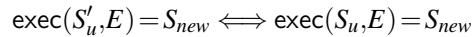

Proof Sketch: This follows directly from the idempotency of deletion operations (intuitively, deletions are permanent — once marked as a tombstone, an operation/node remains so). Moreover, deleting a placeholder op/node has the same effect as deleting a live op/node.

It follows that in both executions, each edit-history private insertion o and node no are marked as (normal) tombstones by the end of E. Since the placeholders in O are the only difference in S′ ,Su, the resulting end states are exactly equal. □

Lemma C.2. Define ES,u as the partial execution derived from Omissing,u = OS \Ou (step 5g). Let Eu be the real execution corresponding to Su. The following expression holds:

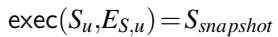

Proof Sketch: Immediate from Lemma C.1, Theorem C.1, and Step 5g.

Lemma C.1 implies that S′u ≤T Su (where S′u is the reconstructed state from 5g, and Su is the real user state). Step 5g of the verification protocol ensures that exec(S′u,ES,u) = Ssnapshot . Finally, Theorem C.1 states that exec(S′u, E) = Snew =⇒ exec(Su,E)= Snew. We conclude the statement. □

Lemma C.3. The execution Eu ∪ ES,u is fork-causal consistent.

Proof Sketch: Immediate from Step 2 (verifies the execution from OS is FCC, implying the subset of OS induced by u is FCC). □

Finally, recall Corollary 1:

Corollary 1. A snapshot S is consistent if the following two conditions hold:

• There exists some partial execution Emissing such that exec(Shonest , Emissing) = Ssnapshot for some honest user state Shonest .

• Ehonest ∪Emissing is a fork-causally consistent execution.

Theorem C.2. Snapshots verified by the Acumen snapshot verification algorithm (Figure 3) satisfy Corollary 1 and therefore Definition 1.

Proof Sketch: Lemma C.2 proves the first condition. Lemma C.3 proves the second. □

## D Snapdoc’s Snapshot Consistency

The full Snapdoc snapshot comprises an operation set OS and set of state attestations AS, one per user with at least one operation in OS. The snapshot verification protocol executes the following high-level steps per user u listed in the snapshot:

1. Using the snapshot operation set O and u’s version vector VV from their state attestation, derive

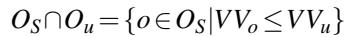

2. Verify that the derived value for OS ∩Ou is a subset of Ou using u’s state attestation.

3. Verify that the history hashes HHu are a prefix of the snapshot history hashes (derived from OS), and conclude that no forks exist between users up to VVS.

We note that this protocol differs from our high-level approach in that the set of snapshot operations at time VVu is checked to be a subset of Ou, rather than full equality. This is due to the aforementioned edit-history privacy (§5.2) requirement that the sensitive data in operations in OS \ Ou remain hidden. Snapdoc opts to directly withhold these operations from the snapshot.

This difference results in Snapdoc satisfying a weaker form of snapshot consistency, where an attacker can produce a valid snapshot comprised of any subset of the “true” state. For instance, an attacker can issue a snapshot for a document reading “AC” when it should be “ABC”. More formally, if SA is the set of operations in a valid snapshot, then it is possible to create a valid snapshot for any X ⊂ SA.

Careful readers will notice that any user can locally transform the document with an arbitrary set of operations before creating a snapshot, such that the resulting document is edited to the sender’s liking. The resulting snapshot is technically valid, but the key difference to above attack is that the sender edits are codified as operations and are visible to the snapshot receiver. This satisfies Definition 1, since these operations are part of a fork-causal consistent execution. This contrasts with the Snapdoc attack, since the deletion of operations is not caused by any operation in the execution. For instance, suppose an honest user issued insertions to create the word “TRAIN”. A malicious user could create a snapshot consisting only of the honest user operations deriving “RAN”, even though this state never appeared in the global causal execution.

Snapdoc requires new users to broadcast a noop operation including their own state attestation. The new user will then only accept messages that include the noop as a causal dependency. If the user’s snapshot is malformed (in a non-trivial way as to pass local verification), they will never process honest user edits, nor will honest users process their updates, as if they were on different causal forks.

This satisfies the overall definition of fork-causal consistency, but is still undesirable since the new user cannot tell that their state is malformed without out-of-band communication from an honest party.