USENIX

THE ADVANCED COMPUTING SYSTEMS ASSOCIATION

# Spain: Succinct proofs for numerical computations

Zachary DeStefano, Noah Golub, Zile Huang, Julius Zhang, Sam Frank, and Michael Walfish, NYU

https://www.usenix.org/conference/osdi26/presentation/destefano

# This paper is included in the Proceedings of the 20th USENIX Symposium on Operating Systems Design and Implementation.

July 13–15, 2026 • Seattle, WA, USA

ISBN 978-1-939133-55-7

Open access to the Proceedings of the 20th USENIX Symposium on Operating Systems Design and Implementation is sponsored by

# Spain: Succinct proofs for numerical computations

Zachary DeStefano, Noah Golub, Zile Huang, Julius Zhang, Sam Frank, Michael Walfish

Courant Institute, NYU

Abstract. In a succinct proof protocol, a verifier gets assurance that an untrusted prover executed an agreed computation, without requiring the verifier to re-execute the computation itself. In little more than a decade, this area has undergone a remarkable transformation from theory to implemented systems. This activity is extremely exciting. But there is a catch. To apply succinct proofs, one needs to translate one’s computation to a set of equations, or constraints. The required translation has so far completely blocked systematic support for numerical computations, namely those for which the bulk of the computation uses approximations of real numbers. This paper fills that void with the design, implementation, and evaluation of a system called Spain. The starting insight of Spain is that since numerical computations inherently have approximation error, the constraint formalism should likewise allow for approximate satisfiability. Based on this insight, Spain introduces a new proof protocol and new ways to translate computations to constraints. Spain’s implementation improves over natural baselines by multiple orders of magnitude.

## 1 Introduction

A succinct proof protocol provides execution integrity: one party (the verifier) gets assurance that another party (the prover) executed an agreed computation, without requiring the verifier to redo the computation or trust the prover. A variant of this setup is zero-knowledge, which additionally hides sensitive inputs from the verifier. Note that execution integrity is orthogonal to program verification. Program verification is about ensuring that a given program meets a specification; here, the question is whether the alleged outputs of a program, verified or otherwise, truly came from running that program.

Succinct proofs have undergone a remarkable transformation. These constructs were known to theorists, based on foundational results in interactive proofs, zero-knowledge proofs, arguments, and probabilistically checkable proofs (PCPs) in the 1980s and 1990s [13, 14, 16, 17, 34, 65, 80, 89, 91, 120]. At the time, they were considered to be wildly impractical. However, over the past 15 years, these constructs have been refined and implemented (see [130, 140] for surveys). They have even been deployed [69, 126], mostly in cryptocurrency [54, 55, 72, 73, 84, 88, 103]. For example, in a traditional blockchain, every node re-executes all transactions to check the validity of state transitions; with succinct proofs, by contrast, a prover generates a proof once and records it on the blockchain, and other nodes need only verify the proof [133].

Despite all of the progress, there is an inescapable awk wardness in applying succinct proofs. One must arithmetize one’s computation, which means translating it to equations, or constraints; roughly speaking, a solution to the constraints corresponds to a valid program trace. Unfortunately, this process does not match how software developers write programs. Control flow, for example, is unnatural to represent as constraints. Making matters worse, the constraints are expressed over a finite field (such as the integers mod a given prime ??), yet finite fields have no notion of negative numbers or even order relationships. Consequently, a simple program operation like conditionally branching based on a comparison between two numbers has a very verbose expression in constraints (§2).

Still, researchers and practitioners manage to get around the semantic gap for certain small-scale computations (like validating blockchain transactions). The verifier is truly fast, and the prover’s overhead is “only” 106× relative to executing the computation natively (§7, §8).

However, the semantic gap becomes a yawning chasm for numerical computations: those for which the bulk of the computation uses fixed-point or floating-point approximations of real numbers. The core issue is that numerical computations don’t map naturally to equations over finite fields, not even with the kinds of gymnastics used for non-numerical computations. Not to mention, researchers have no hope of competing with the decades of investment in optimizing FPUs and GPUs.

Yet, numerical computations were one of the primary motivations for the invention of computers, and continue to be of intense interest. In the modern era, LLM training and inference, physics simulations, cyberphysical systems, and far more all compute over approximations of real numbers. Succinct proofs applied to numerical computations would thus allow such computations to run on untrusted infrastructure. For example, a user of an LLM could get a proof that the produced tokens truly came from running inference on a given model. Or someone could run a fluid simulation and then prove to others that the simulation ran as specified, without anyone having to redo the computation.

The purpose of this paper is to produce a system that applies succinct proofs to numerical computations, with three goals:

1. The system should be general-purpose. This means that the core proving machinery should not be specialized to the computation itself; in particular, if the computation changes, the core protocol should not have to change, nor should the pencil-and-paper mathematics that undergird the correctness of the succinct proof protocol.

2. The verifier should be less expensive computationally than native execution. Otherwise, the verifier could simply run the computation itself. Note that in zero-knowledge setups, this requirement does not arise, as the verifier

is not expected to be able to run the computation itself.   
However, zero-knowledge is a non-goal for us.

3. The prover’s overhead is no more than three orders of magnitude versus natively executing the computation. While in ordinary computing contexts, overhead of 1000× would be preposterous, in this research area, the state of the art, including in deployed systems, is 105× or 106×.

Prior works encoding numerical computations in proof systems do one of two things (§8). Some works give standalone encodings of specific numerical operations, embedded in general-purpose proof systems; these arguably meet goal 1 but at the cost of goal 3 [9, 50, 51, 59, 82, 115, 124]. Other works build end-to-end special-purpose protocols for specific numerical computations, sacrificing goal 1 – and in most cases goal 3, too [19, 63, 77, 78, 86, 127, 128, 151]. In fact, only one work that we are aware of has achieved goal 3 [105], but at severe compromise of goals 1 and 2.

This paper describes a system, Spain, that achieves all three goals in certain regimes. Spain makes several contributions:

A succinct proof framework for approximate rational arithmetic (§3). Spain’s idea here is to reflect existing numerical notions of accuracy by using constraints but having the proving machinery establish that each constraint holds approximately.

A new proving protocol (§4). To actually prove that the constraints hold approximately, Spain introduces a new proof protocol. It is built on and inspired by prior work, specifically Spartan [116], Zaratan [42], and DARK [40].

Highly compact arithmetizations (§5). Rather than paying a number of constraints proportional to the number of bits in numerical operations, Spain translates individual numerical operations to single constraints; for example, division and square root become one constraint each. This in turn enables highly eficient comparisons, range checks, and piecewise functions. Spain also uses division to create eficient translations of transcendental operations, such as ?? . These encodings could be of independent interest.

Rigorous proof (Apps. B, E, F). We prove correctness of Spain’s proof protocol and its arithmetizations.

Implementation of Spain (§6, Appx. G). We have implemented Spain. It includes several front-ends that translate numerical computations to constraints and a common backend that implements the Spain prover and verifier.

Experimental evaluation (§7). We evaluate Spain and baseline systems on various applications, including linear programming problems; machine learning primitives and an end-to-end application (GPT-2); fluid simulations; and geospatial calculations. We find that Spain has the fastest (general-purpose) numerical prover in the literature. Additionally, Spain’s verifier is the first that we are aware of to beat native execution for reasonably-sized numerical computations.

Like all succinct proof systems, Spain must pay high overheads. However, in exhibiting a new kind of arithmetization, Spain has substantially expanded what is possible.

## 2 Background

## 2.1 Numerical computations

People want to perform computations that involve realnumbered arithmetic. However, doing so exactly is often intractable. Instead, numerical programs are implemented with approximate arithmetic, which comes in two flavors: fixed-point and floating-point. Both have some rounding, or error. Numerical analysis studies how to ensure that the final result is meaningful.

Fixed-point arithmetic encodes a subset of the rational numbers (denoted Q), specifically those expressible as an integer divided by a fixed denominator (normally a power of two). Real numbers outside of fixed-point are mapped to nearby fixed-point numbers via rounding, prior to entering fixed-point operations. Operations obey absolute error bounds. For any two fixed-point numbers ?? and ?? and primitive operation op (for example, +, −, ×, or ÷), the fixed-point operation op?? is defined (ignoring overflow) as:

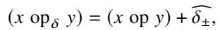

where |??±| ≤ ?? for some fixed ?? that depends on the operation and the fixed-point format.

With floating-point representations and arithmetic, operations obey relative error bounds. Then with op as above, ??, ?? as floating-point numbers, and op?? now denoting the floating-point operation:

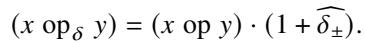

Where |??±| ≤ ??. Even simple operations introduce errors. For example, when using single-precision IEEE 754 [2] floating point, (2 ÷?? 5) ≈ 0.400000006 rather than exactly 0.4.

## 2.2 Succinct and probabilistic proofs

A succinct proof (or probabilistic proof ) is a cryptographic protocol between a prover and a verifier (typically thought of as probabilistic algorithms) about a statement that the prover wants to persuade the verifier of [64, 130]. We will in this work consider statements of the form: “(in, out) is a valid input-output pair for some procedure ??.” That is, the succinct proof is aimed at establishing that the alleged out is truly the output when ?? is run on in.

Astonishingly, the data flowing from prover to verifier, and the work required by the verifier, is (at least in principle) much smaller than the work to execute ??. Yet, a verifier is unlikely to be fooled by a false claim from the prover.

Succinct proof implementations typically have a frontend and a back-end. The front-end compiles ?? into a set of constraints. The back-end is the proving and verifying algorithms. We elaborate on both below.

Front-end: Arithmetization and R1CS. Various proof backends require statements to be compiled, by the front-end, to a rank-one constraint system (R1CS), which we often refer to as constraints. An R1CS structure is a system of ?? equations and ?? variables over a finite field (typically F??, the integers mod a prime ??) with a subset of the variables designated as in and a subset designated as out [118]. These equations are represented by three matrices ??, ??, ??, each of dimension ?? × ??. An R1CS instance for a given structure is ( ??, ??, ??, in, out); we say that an instance is satisfiable if there exists some witness ?? such that, for ?? := (in, out, 1, ??), we have: ( ?? · ??) ◦ (?? · ??) − (?? · ??) = 0®, with ◦ denoting entrywise multiplication. Unpacking the algebra, each constraint ?? ∈ {1, . . . , ??} restricts any assignment, that is any valuation of the variables ?? = (??1, . . . , ????), as follows: ( ????,1??1 + · · · + ????,??????) · (????,1??1 + · · · + ????,??????) − (????,1??1 + · · · + ????,??????) = 0.

As a simple example, take the computation

function ??(??1, ??2, ??3)

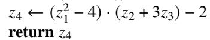

Here in is (??1, ??2, ??3) and out is ??4. The first step in translation to R1CS is to unroll the computation so that each line of code is written as a product of linear combinations of variables, minus another linear combination of variables:

function ??(??1, ??2, ??3)

??6 ← ??1 · ??1 − 4 // ??6 is a new var, part of the witness ??4 ← ??6 · (??2 + 3??3) − 2

return ??4

Next, these lines are translated to constraints, each of which becomes a row in the ??, ??, ?? matrices. These constraints are:

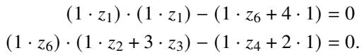

In matrix form, the constraints are:

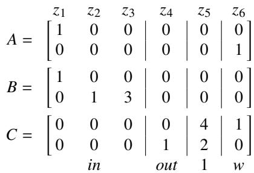

Now, consider this valuation of the in variables: ??1=3, ??2=2, ??3=−1 (these quantities are in F??, so −1 is shorthand for ?? − 1), and the corresponding out valuation: ??4 = −7 (shorthand for ?? − 7). In this case, the full assignment is ?? = [3, 2, −1, −7, 1, 5] . When subsequently giving example constraints, we drop the explicit “1·”, add the “?? piece” to both sides, and use semantically appropriate variables to refer to elements of ??.

One can translate an entire unrolled computation to a set of constraints, in the sense that some ?? satisfies the constraints only if ?? respects the original semantics of the computation. This translation is called arithmetization [7, 17, 18, 24, 35,

36, 49, 75, 81, 96, 97, 115, 118, 138, 146, 147]. It is typically accompanied by a witness generator, which either executes the computation and thereby obtains the assignment to ?? [15, 24, 26,76,81,102], or else solves the constraints using annotations provided by the translation process [35, 75, 96, 100, 114, 115].

Modern proof systems also translate computations into lookup tables [31, 33, 41, 57, 71, 119, 119], often in combination with constraints. However, lookup tables outperform constraints only when the table is small (for example, 28 elements) or has algebraic structure [119]. Numerical operations do not generally fit into either of these categories.

Back-end: Proving R1CS satisfiability. The job of the backend is, given an R1CS structure and instance ( ??, ??, ??, in, out), to prove that a satisfying assignment exists. The back-end provides the following properties, which we state informally.

• Back-end soundness: If there does not exist a ?? such that ?? := (in, out, 1, ??) makes ( ?? · ??) ◦ (?? · ??) − (?? · ??) = 0, then the probability (over the verifier’s random choices) that the verifier accepts is negligible.

• Back-end completeness: If a prover has access to ?? such that ?? := (in, out, 1, ??) makes ( ?? · ??) ◦ (?? · ??) − (?? · ??) = 0, then the prover can make the verifier accept with probability 1, over the prover’s and verifier’s random choices.

For our work, the relevant strand of back-end protocols is based on the sum-check primitive [89]. We defer justifying this choice until we have established the necessary context (§4.1, §4.2.2). The sum-check primitive is an interactive proof [16, 65] by which the prover persuades the verifier that the sum of a given multi-variate polynomial’s evaluations over all Boolean combinations that its variables can take is a given value. (Appendix A reviews this primitive.) Succinct proofs that use the sum-check primitive typically do so multiple times within the same protocol; for example, GKR [66, 67] invokes the sum-check primitive once per layer in a layered circuit while Spartan [116] invokes the primitive twice (loosely speaking, one invocation is over the rows of the R1CS instance and one is over the columns). We call proofs built on the sum-check primitive sum-check protocols [30, 42, 44–46, 48, 60, 66–68, 116, 117, 119, 123, 129, 135–137, 139, 143, 147, 148].

Modern works in this strand [131] rely on polynomial commitment. The idea is that ?? is encoded as a polynomial by the prover; a small commitment (far smaller than ??) is sent to the verifier; this commitment binds the prover to that polynomial; and one or more invocations of the sum-check primitive prove that an additional polynomial (formed from the prover’s committed polynomial, from in and out, and from the R1CS structure itself) has a certain property that is equivalent to ?? = (????, ??????, 1, ??) satisfying the instance.

The costs of the back-end are driven by the number of constraints, ?? and the number of witness elements, |??|. Specifically, the prover’s costs are roughly ??(?? + |??|). The verifier’s costs vary based on the protocol. Our work follows Spartan [92, 116] (without its SPARK module), where the verifier has an ??(??) fixed cost that is specific to the structure (the constraints); this cost amortizes over synchronized instances, with each instance adding cost that is ??(log(|??|)). There is also an ?? (log(|??|)) setup cost, reusable across all future invocations, including diferent R1CS structures. See elsewhere [38, 116, 117, 119] for techniques that asymptotically lower the verifier’s work at the prover’s expense.

To quantify, running the prover on a single machine is generally considered unreasonable when ?? and |??| are above 229 (unless one possesses terabytes of RAM and hundreds of cores) [108], owing to memory bottlenecks. There are techniques for scaling across a fleet [87, 108, 142, 144], and reducing memory requirements at the cost of increased prover time [20, 93, 99], but neither approach mitigates the sheer amount of work required to prove large computations.

Arithmetization poses a semantic challenge. A salient cost is translating from ordinary computations to R1CS; this appears in the values of ?? and |??|. Indeed, there is a massive semantic gap in this research area: ordinary computations do not map to equations over finite fields in a natural way. To highlight the challenge, consider the division of two positive ??-bit integers. Checking this computation, ?? ← ??/??, in R1CS involves two steps. First, the prover supplies the purported quotient ?? and remainder ?? and the following constraint is added: ?? · ?? = ?? − ??, where ?? is a witness variable. Second, constraints are required to assert that ?? ≥ (??+1) and ?? ≥ (??+1).

But finite fields have no native notion of order, so a typical arithmetization of assert(?? ≥ (?? + 1)), where ?? and ?? are ??-bit numbers, introduces witness variables ??0, . . . , ????−1 representing the bits of ?? − (?? + 1). Then, for all ??, constraints are added to enforce that each variable ???? is a bit: ???? · (1−????) = 0. Finally, a constraint is added to enforce the relationship among ??, ??, satisfiable only if ?? − ?? − 1 is itself a ??-bit number. This assert alone requires ?? additional variables and ?? + 1 constraints.

This blowup is not isolated to division. Researchers in succinct proofs often perform contortions to represent computations. While there are, for example, more succinct encodings of certain kinds of conditional operations [115], arbitrary low-level operations of the kind that would ordinarily be accelerated in hardware are not well-handled. In particular, representing a single numerical operation in R1CS typically involves explicitly expressing the digital logic of the operation. This results in a number of auxiliary variables and constraints that is a multiple of the number of bits of the numbers being represented in each operation [9, 50, 51, 82, 124] (§7, §8), rather than the number of machine instructions that would be required in an ordinary computing context.

## 3 Problem statement and overview of Spain

Problem statement. A prover and a verifier agree on a single numerical computation, ??. The verifier sends input in, the prover executes ?? on that input, and claims that the output is out. The prover then wants to persuade the verifier that out indeed could have been produced by ?? (in), given the kinds of approximation that are inherent in fixed- or floating-point numerical computation. The verifier should spend fewer computational resources than if it ran ?? (in) itself; otherwise, the verifier could disregard out, and simply use the result of executing ?? on in. We will sometimes work in an amortized setting where multiple instances of ?? are outsourced on in1, . . . , in?? diferent inputs, getting diferent outputs out1, . . . , out?? .

The core conflict. On the one hand, existing proof machinery ensures that an execution proceeded exactly as it was supposed to. On the other hand, in the numerical context “supposed to” means “certain error”. To resolve this conflict between exactness and error, any protocol must reject truly wrong executions, namely those that include any operations with more than ?? error (§2.1). At the same time, the protocol must not be too much of a scold: if all operations do obey the ?? error bound, then the given execution should be accepted.

As noted in Section 2.2, some works handle this tension by representing the digital logic of the approximate computation in the arithmetization (the R1CS instance). A related approach is for the prover to embed in the R1CS instance variables that capture each operation’s error, thereby making the error incurred by each operation part of the statement to be validated [59]. Both approaches bring expense.

Overview of Spain. In contrast to existing work, Spain’s arithmetizations are agnostic to the error in each operation, yet the prover is forced to adhere to the bounds. Spain combines several new techniques, in the front-end and back-end. Figure 1 depicts Spain, contrasting it with the most natural baseline.

Front-end (§5): Spain introduces a new kind of arithmetization; it translates ?? to a set of constraints over the rational numbers Q (rather than a finite field F??) in way that satisfying all constraints up to some ?? corresponds to error up to ?? in each operation. Each constraint ?? ∈ {1, . . . , ??} enforces: ????,1??1 + · · · + ????,?????? · ????,1??1 + · · · + ????,?????? − ????,1??1 + · · · + ????,?????? ≤ ?? . We call such constraints approximate constraints; compare to the constraints in §2.2 that enforce equality, which we call traditional constraints.

Approximate constraints are dramatically more concise than the alternative; in fact, each low-level operation in ?? generally corresponds to one or a small number of constraints. The intuition is that constraints in Spain are freed from operating on the bits of operands, being expressed over Q, and are freed from explicitly encoding approximation error, as “≤ ??” encodes slackness directly. The trade-of is that a user of Spain must perform certain analyses not needed when working with traditional constraints. This requirement is a manifestation of the conflict stated earlier: the user must show that satisfying the constraints means the prover adhered to “≤ ??” error, and also show that if the prover does execute the operation with bounded error, then it can satisfy the approximate constraints.

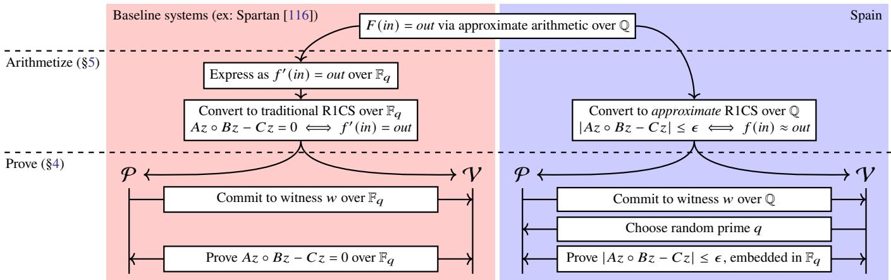  
Figure 1: High-level comparison between existing proof systems (left) and Spain (right). Given an initial claim, the protocol is divided into two phases: arithmetization and proving. Similar steps are vertically aligned to facilitate comparison.

Back-end (§4): Spain’s back-end enables a prover to establish that a given assignment (to a given set of constraints) meets the ?? bounds. We call such an assignment ??-accurate.

Compared to prior work, Spain’s back-end has three interlocked aspects. First, Spain maps the constraints over Q to a finite field, which is the kind of domain typically used in sum-check protocols (§2.2). However, preserving the semantics of the constraints in the finite field requires care; a key mechanism is that the verifier chooses the finite field (via prime ??) only after the prover commits to the assignment.

Second, Spain establishes a statement that implies ??-accuracy. Specifically, Spain modifies Spartan [116] to prove a statement about the sum of each constraint’s squared error, for a given assignment; this sum will be notated as ∥??X,?? ∥2. As we argue later, by proving that ∥??X,?? ∥2 is small, the protocol guarantees that the assignment obeyed the required ?? bounds. Third, Spain uses a polynomial commitment protocol (§2.2) that is geared to integers, but makes several technical adjustments, as naive use of this primitive in our context would be prohibitive.

## 4 Spain’s approximation-friendly back-end

This section presents the core statement that Spain’s back-end proves (§4.1) and the techniques that it uses to do so (§4.2– §4.3). First, though, we must define what it means for a backend to be correct in Spain’s context. We do so by modifying the existing back-end notions of soundness and complete ness (§2.2). The modified properties are as follows, with respect to an R1CS instance X = ( ??, ??, ??, in, out):

• Back-end ??-soundness. If there does not exist a ?? such that ?? := (in, out, 1, ??) is ?? -accurate for X, then the probability ?? (over the verifier’s random choices) that the verifier accepts is negligible. ?? is known as soundness error.

• Back-end ????-completeness. A prover with access to ?? such that ?? := (in, out, 1, ??) is ????-accurate for X can make the verifier accept with probability 1, over the prover’s and verifier’s random choices in the protocol.

These definitions embed two diferent levels of ??-accuracy; at the end of Section 4.1 below, we will see that ???? < ??. To preview the practical consequence, an honest prover will have to execute with greater precision (for completeness) than what the protocol guarantees to the verifier (via soundness).

## 4.1 What claim about error should be proved?

Spain’s back-end must establish the ??-accuracy of an assignment ??. Before highlighting the challenges, we give a compact notation for ??-accuracy. Define the error vector ??X,?? for an R1CS instance X = ( ??, ??, ??, in, out) and an assignment ?? = (in, out, 1, ??) as:

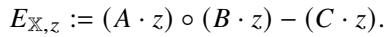

This error vector has ?? components. Its ??th component is ( ???? · ??) · (???? · ??) − (???? · ??) , where ????, ????, and ???? are the ??th rows of ??, ??, and ??. Notice that if the component with maximum absolute value is upper-bounded by ??, that is equivalent to saying that the assignment ?? for the instance X is ??-accurate (§3). Meanwhile, the maximum absolute value over all components of ??X,?? is, by definition, the ℓ∞ norm of ??X,??, denoted ∥??X,?? ∥∞. Thus, ??-accuracy can be written:

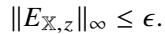

One challenge is that we don’t know how to apply proving machinery to this inequality directly. Sum-check protocols (§2.2), for example, work over polynomial expressions. Although Spartan [116] shows how to cast R1CS satisfiability as suitable polynomial expressions, the ℓ norm cannot be turned into polynomial expressions, because of the absolute value and maximum operations.

Instead, our insight here is that the square of the ℓ2 norm is compatible with sum-check protocols, and this quantity upperbounds the square of the ℓ∞ norm. Specifically, for a vector ??, the square of the ℓ2 norm, ∥??∥2, is Í????=1 ??2?? . Also, the definitions of the norms imply that for any vector ??, ∥??∥2∞ ≤ ∥??∥2. So, if the prover could persuade the verifier that

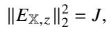

(1)

for some ??, and if the verifier then checked that ?? ≤ ??2, that would sufice to establish that ∥??X,?? ∥∞ ≤ ??.

However, there is another dificulty. While ∥??X,?? ∥2 ≤ ??2 implies ∥??X,?? ∥∞ ≤ ??, the converse is not true. Consequently, an assignment ?? could well satisfy ∥??X,?? ∥∞ ≤ ??, but Equation (1) would not hold for any ?? ≤ ??2. In a full protocol, an honest prover would then have no way to convince the verifier.

To address this, the execution by the prover has to be more accurate than ??. Specifically, while Spain must meet Backend ??-soundness, it must meet Back-end ????-completeness, where ???? = ??/ ??. (The gap between ?? and ???? can be narrowed; §D.3.) Under these conditions, there does exist ?? ≤ ??2 with ∥??X,?? ∥2 = ??. To see this, notice that the definitions of the norms imply that for any vector ??, ∥??∥2 ≤ ?? · ∥??∥2∞. Consequently, requiring that the prover produces an ????-accurate ?? yields ∥??X,?? ∥∞ ≤ ???? = ??/ ?? and thus:

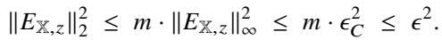

## 4.2 Main protocol

Spain’s back-end aims to establish Equation (1). Spain adapts three existing tools, specifically Spartan [116], which is a sum-check protocol (§2.2) that targets R1CS instances, and forms the core of Spain’s back-end; DARK [40], which is a polynomial commitment protocol (§2.2) with the ability to bind the prover to a polynomial over Q; and Zaratan [42], which is a framework for proving traditional R1CS satisfiability over the integers, as opposed to over a finite field.

One of the configurations explicitly considered by Zaratan is combining Spartan and DARK, and we will do likewise. Specifically, whereas Spartan assumes that an R1CS structure is defined over a finite field (typically F??; §2.2), Zaratan observes that ?? can be chosen at run-time by the verifier, after the prover commits to an encoded version of ?? via DARK.

Spain’s full protocol is given in Appendix B. Figure 2 provides an overview. This protocol embeds three major changes compared to prior work, as outlined below.

## 4.2.1 Proving statements over Q

Constraints in Spain are expressed over the rational numbers, Q. However, the sum-check primitive is typically applied over a finite field (§1, §2.2). Accordingly, Spain maps Equation (1) into a corresponding claim over a finite field, namely F??. But, this mapping is fraught; to highlight the challenge, we introduce some mathematical language.

Define Q(??) as {(??, ??) ∈ Q | ?? ∤ ??}. This set is the rational numbers without multiples of ?? in the denominator.1 Spain

1. The prover runs an agreed-upon computation ??, thereby producing ??.

2. Using DARK, the prover encodes ?? as a polynomial, ??; commits (§2.2) to that polynomial; and sends this commitment to the verifier, efectively binding itself to the value of ??X,??.

3. The prover computes and sends ?? to the verifier; ?? is purportedly ∥??X,?? ∥2.

4. The verifier checks that ?? is less than ??2.

5. The verifier sends a prime ?? to the prover randomly chosen from a set of large primes.

6. The prover and verifier map all rationals to elements of F?? and apply the sum-check protocol to the claim ???? (∥??X,?? ∥2) = ???? (??), reducing it to a claim about ??.

7. The verifier checks consistency between the claim in Step 6 and the commitment to ?? in Step 2.

## Figure 2: Spain’s back-end protocol (simplified).

maps these numbers into a finite field, via:

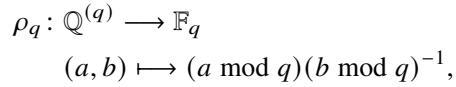

and the Spain prover and verifier apply a sum-check protocol to the claim:

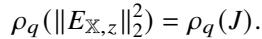

(2)

However, for this approach to make sense, there are two requirements. First, arithmetic must stay in Q( ) , otherwise ???? is undefined. Second, unequal quantities in Q( ) should stay unequal after the mapping. That is, if ∥??X,?? ∥2 ≠ ??, then ???? (∥??X,?? ∥2) = ???? (??) should not occur, except with negligible probability (over the verifier’s choice of ??).

Spain achieves both requirements through a combination of convention, DARK, and the verifier’s checks. The starting convention is that all rational numbers in the ??, ??, ?? matrices that define an R1CS instance X are presumed to have a denominator ?? that is a power of two; thus ?? does not divide ??. Furthermore, the assignment ?? is supposed to follow this convention as well. DARK partially preserves the convention, by ensuring that all committed rationals (Step 2) have the same denominator but not necessarily that it is exactly ??. Surprisingly, this partial preservation does not give the prover room to cheat without detection (§B). For simplicity, our description below assumes that DARK preserves the convention fully.

One consequence is that arithmetic begins in Q(??), and stays there. Thus, ???? is defined on all intermediate values and the result. To see this, notice that the convention ensures that the entries of ?? · ??, ?? · ??, and ?? · ?? have denominator ??2; the entries of ( ?? · ??) ◦ (?? · ??) have denominator ??4, and the values of ( ( ???? · ??) · (???? · ??) − (???? · ??))2, and hence ∥??X,?? ∥2, have denominator ??8. The verifier completes the enforcement by requiring ?? to have denominator ??8.

Another consequence is that this approach avoids collisions. If ∥??X,?? ∥2 and ?? are not equal, then given that they have the same denominator, ???? (∥??X,?? ∥2) = ???? (??) only if the numerator ?? of ∥??X,?? ∥22 − ?? is a multiple of ??. Analysis shows that by limiting the numerators of the entries of ??, ??, ??, and ??, ?? can be kept small enough that the probability of a randomly chosen large prime, like ??, dividing ?? is low (Appx. B.5).

Both Spain and Zaratan [42] map a claim from a larger domain (in their case Z, in Spain’s case Q) to some F??. However, the introduction of a denominator in Spain significantly complicates the analysis of collisions.

The bottom line is that Spain ensures that if the prover sends a ?? ≠ ∥??X,?? ∥2 (Step 3, Figure 2), then with overwhelming probability over the choice of ?? in Step 5, ???? (∥??X,?? ∥2) ≠ ???? (??). Consequently, if the prover did lie in Step 3, it would be stuck trying to prove a false statement in Step 6.

## 4.2.2 Proving a new type of claim

To prove that ???? (∥??X,?? ∥2) = ???? (??), Spain observes that an adaptation of Spartan can directly prove statements about the squared ℓ2 norm of the errors in an R1CS instance.

To explain how Spain both borrows and diverges from Spartan, we must present some further mathematical detail. One can view ??, ??, ?? ∈ F??×???? , and ?? ∈ F???? as functions. Specifically, letting ?? = ⌈log ??⌉ and ?? = ⌈log ??⌉, we view the matrices as functions {0, 1} × {0, 1} → F??. For example, ??(??, ??) is the entry of ?? at the row given by the binary representation of ?? and the column given by the binary representation of ??. We do the same for ??, viewing it as a function {0, 1} → F??.

An important concept is a polynomial extension of a discrete function. The polynomial extension of a function agrees with that function everywhere the function is defined, but the polynomial is defined over a larger domain. A polynomial extension can be thought of as an encoding of that function. As a simple example, imagine defining a function ?? at points 0 and 1, and drawing a line (a first-degree polynomial) through ?? (0) and ?? (1). The entire line – its description, or any two points on it – encodes the values of ?? (0) and ?? (1). We denote multilinear extensions with tildes. For example, for a function ?? (·) defined over ?? ∈ {0, 1} , the multilinear extension of ?? is ˜?? : F???? → F??, which is a polynomial that equals ?? on {0, 1}??, with degree no more than 1 in each variable.

Now, let ?? stand in for ??, ??, or ??, and let ???? (??) := Í?? , ?? ?? (??, ??) · ??(??), where ?? and ?? are the multilinear extensions of ?? and ??, respectively (when mapped to F??). Also, let Eq(·, ·) return 1 if its two arguments, viewed as ??-bit strings, are the same and 0 otherwise; denote the multilinear extension of Eq as Eq.

In Spartan (and Zaratan), the prover aims to persuade the verifier of the following, where ?? is chosen randomly [116, §4]:

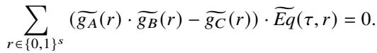

(3)

In Spain, by contrast, the prover aims to persuade the verifier (in Step 6) that the following holds:

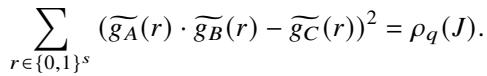

(4)

Notice from the definition of extension that the left-hand side above sums the squared error for each constraint, given assignment ??, when the constraints and ?? are mapped to F??. That sum is ???? (∥??X,?? ∥2). Thus, the protocol is indeed establishing Equation (2). After this step, Spain follows Spartan.

## 4.2.3 Accelerating and adapting DARK

Spain makes two sets of modifications to DARK. First, whereas DARK normally works over a group of order unknown to both prover and verifier, Spain exploits interactivity to have the verifier generate a group for which it alone knows the order. Appendix C details this technique.

Second, DARK as originally proposed had an error: it provided only a weak binding property, namely it ensured only that the committed-to polynomial had rational coeficients [29]. This was problematic for Zaratan and other uses of DARK (for example, in combination with Spartan), as those uses require a polynomial with integer coeficients. Thus, Zaratan (and other protocols) layer techniques [29, 42] atop DARK, which have extra costs. However, in our context, the original (weaker) form of DARK sufices. Appendix B gives details.

## 4.3 Support for batching and “just in time” R1CS

Spain supports two variants of R1CS. The first is a SIMD-R1CS instance [134], which is a combination of ?? R1CS instances with the same structure (that is, multiple executions of the same program on diferent inputs). The second is an I-R1CS instance [97], where the prover and verifier interact to construct the full instance. Given a partial R1CS instance (one with some variables missing), the prover and verifier take turns filling it in. In round ??, the prover commits to ????, and the verifier sends additional in??. The final R1CS instance has assignment ?? := (in1, . . . , in?? , out, 1, ??1, . . . , ?? ?? ).

Spain extends I-R1CS in a natural way: in Spain, the verifier may also supply constraints. Thus, the prover and verifier start with a partial structure, and as the prover commits to ???? in round ??, the verifier submits in?? or new constraints. Further details of Spain’s support for R1CS variants are in Appendix D.

## 5 Encoding numerical operations in R1CS

This section describes how, by taking advantage of the backend claim of ??-accuracy (§4), Spain produces dramatically more concise arithmetizations versus the traditional approach.

Using approximate constraints (§3) requires a new kind of correspondence between a numerical function ?? and an

R1CS structure that allegedly arithmetizes ??. Roughly speaking, (a) any assignment that is ??-accurate (§3) for the constraints should correspond to an execution of ?? with operations bounded by ?? (§2.1), and (b) for every execution of ?? with operations bounded by ??wg (where ??wg is a constant smaller than ??) there should be an ????-accurate assignment. The need for separate ?? and ??wg reflects the same asymmetry that leads to ???? < ?? (§4). Appendix E formalizes (a) and (b) as transla tion fidelity, and proves that the constraints described in this section meet these properties.

Note that translation fidelity concerns the error in each operation, not the accumulated error in the output of a computation. This is analogous to how the IEEE floating-point specification [2] bounds the error in each operation and relies on numerical analysis to derive bounds on the accumulated error.

Below we present arithmetizations using approximate constraints, notating them with ≈?? . For example, ??1 · ??2 ≈?? ??3 enforces |??1 · ??2 − ??3| ≤ ??.

Division and square root. Recall that checking ?? ← ??/?? traditionally requires dozens of constraints (§2.2). Spain uses one constraint: ?? · ?? ≈?? ??.

In traditional constraints, the square root operation (?? ← ??) is encoded as ?? · ?? = ?? − ?? plus dozens of constraints to bound ?? in terms of ?? and ??. Spain again requires only one constraint: ?? · ?? ≈?? ??. This takes advantage of the fact that all real square roots have arbitrarily close rational approximations. If one wants a specifically positive or negative root, one applies the square root operation again! For example, suppose we want ?? to be the negative square root of ??. Then we use an additional constraint: ?? · ?? ≈?? −??, exploiting the fact that −?? must be non-negative to have a real square root.

Note that this encoding of the square root operation can be satisfied when ?? is a small negative number, in contrast to usual numerical computations, where Not a Number (NaN) would arise. If this is problematic, the constraints and/or numerical analysis should ensure that the function’s input is strictly non-negative.

The power of approximate square roots. In traditional arithmetization, bottlenecks include range checks, branching, max, and min. As we show next, Spain arithmetizes approximate versions of these operations orders of magnitude more eficiently, using square roots.

assert (x ≥ y). Recall from Section 2.2 that this operation required ?? additional variables and ?? + 1 constraints. Spain requires only 1 constraint and 1 additional variable, regardless of bit width: ?? · ?? ≈?? ?? − ??, for some witness variable ??. This is not a strict translation of assert but instead an approximate version that allows ?? to be ?? smaller than ?? but no smaller.

b ← (x ≥ y). Spain requires only 3 constraints and 2 auxiliary variables: ?? · (1 − ??) ≈?? 0, (2?? − 1) · (?? − ??) ≈?? ??, and ?? · ?? ≈?? ??. The first constraint ensures that ?? is Boolean. The second ensures that ?? is non-negative only when ?? correctly reflects the comparison. The third ensures that ?? is indeed non negative. As with square root and assert, this comparison is an approximate version; Appendix E.2 delves into the semantics.

max. Consider ?? ← max(??) for an array ?? = [??1, . . . , ????]. Spain’s approach here is inspired by Distiller [76], which encodes a checker for min, rather than embedding logic to identify the minimum. However, Distiller requires ?? · (?? +3) +1 constraints and ?? · (?? + 2) witness variables, where ?? is the bit-widths of the elements in the array. Spain’s are far more concise because it pays so little for comparison operations:

• for all ?? ∈ {1, . . . , ?? }: ???? · ???? ≈?? ?? − ????

• for all ?? ∈ {1, . . . , ?? }: ???? · (1 − ???? ) ≈?? 0

• for all ?? ∈ {1, . . . , ?? }: ???? · (?? − ???? ) ≈?? 0

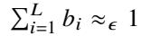

The first set ensures that ?? is greater than or equal to all elements in the array. The next two sets ensure that ???? is Boolean and that ???? can be 1 only if ???? = ?? (to support multiple equal maxima, ???? is allowed to be 0 even when ???? = ??). The last ensures that exactly one of the ???? is 1. This requires 3 · ?? + 1 constraints and 2 · ?? auxiliary variables.

Piecewise functions, sorting, and beyond. The encoding of comparisons naturally leads to eficient translations of piecewise functions; ReLU will demonstrate this below. Similarly, the previous best solutions for sorting or for string manipulation paid relative to the number of bits in their inputs due to comparisons, while Spain’s approach more closely matches the number of instructions in a typical CPU execution.

ReLU is a primitive in machine learning contexts. The operation is ?? ← max(0, ??). This function can be represented in constraints as ?? · ?? ≈?? ?? − ??, ?? · ?? ≈?? ??, and (?? − ??) · ?? ≈?? 0. The first two ensure that ?? ≥ max(0, ??). The last one ensures that ?? = 0 or ?? = ??.

Transcendental functions. Arithmetizing transcendental functions, such as ???? or tanh(??), over some interval traditionally uses polynomial approximation [50, 51, 78, 82, 105, 124, 128,151]. Specifically, for a function ?? (??) to be approximated, one identifies a polynomial ??(??) such that |??(??) − ?? (??)| ≤ ?? for ?? in the given interval. The motivation is that add and multiply, which are the operations that polynomials require, are the easiest to represent in traditional constraints.

However, there is an additional issue (besides the overhead from traditional enforcement of numerical operations in constraints): polynomials require many terms to converge. Drawing on its support for division, Spain uses rational approximations: a ratio of polynomials ??(??)/??(??) such that |??(??)/?? (??) − ?? (??) | ≤ ?? for ?? in the interval. In Spain, rational approximations cost nearly nothing extra over polynomial approximations, but rational approximations converge faster. To illustrate, compare the degree-4 Taylor series for ?? :

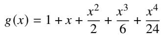

to the degree-[4/4] Padé approximant [98]:

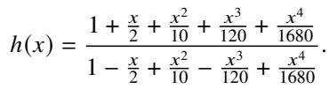

Note that the number of constraints for the two approaches is the same (for translating ℎ(??), Spain memoizes the powers of ??). One can compare accuracy (using a computer algebra system or a large piece of paper), and consider the size of the intervals for which |??(??) − ?? | ≤ ?? and |ℎ(??) − ?? | ≤ ?? respectively. In this example, take ?? = 0.01. The Taylor Series (??) has error at most 0.01 over the interval [−1.07, 1.00] and larger errors outside this interval. The Padé approximant (ℎ) has error at most 0.01 over [−8.11, 2.84]. In fact, the degree [2/2] Padé approximant has error at most 0.01 over [−2.18, 1.16]: better than the degree-4 Taylor series.

Better approximations (more accuracy, wider interval) for the same number of terms also translates to fewer variables and hence fewer constraints to achieve the same accuracy. Going beyond exponentials, the technique of rational approximation works for a large class of functions.

Concurrent work [124] makes a similar observation; they find that for highly precise approximations, arithmetizations (of high-degree polynomials) can be even more expensive than traditional arithmetizations of division. These authors then incorporate Padé approximations to existing proof pipelines, obtaining a small speedup. Their paper contains many intriguing examples of approximation using this technique. All of these examples can be used in Spain directly, only with lower cost, because division is so inexpensive in Spain.

## 6 Implementation of Spain

## 6.1 Back-end implementation

Spain’s back-end implements the protocol described in Section 4.2. It also supports SIMD-R1CS and I-R1CS (§4.3).

Spain implements fixed-size large integer arithmetic with inline limb storage; this avoids the performance cost of existing large integer libraries’ [3–5] heap allocation of limb arrays. This functionality is used to compute and check ?? (Steps 3 and 4 in Fig. 2). Spain also implements 64- and 128-bit finite field arithmetic, with support for fast type conversion from large integers (Step 6); Spain does not use existing finite field libraries [11] because they optimize at compile time for a specific field, whereas in Spain, the finite field is determined only at run time. Finally, Spain implements fixed-size RSA group arithmetic, to do fast modular arithmetic for moduli not known at compile time (Steps 2 and 7).

Spain’s back-end is implemented in 12,135 lines of Rust, including the new libraries.

## 6.2 Front-end implementation

We implemented three front-ends for Spain.

Gadget front-end. This front-end provides a library of gadgets [113,150] (pairs of functions where the first generates constraints and the second generates witness values satisfying them), including the primitives in Section 5. The framework is modular and extensible.

ONNX front-end. ONNX [95, 132] is a specification for machine learning models. In ordinary use, one describes a model in ONNX’s format (a collection of nodes), and then a highly optimized run-time executes the model on the available hardware. Spain’s ONNX front-end translates from the ONNX format to approximate constraints. For the accompanying witness generator (§2.2), we had hoped to reuse ONNXcompatible run-times and tools; however, existing run-times neither produce satisfying assignments to auxiliary variables of the kind that arise in arithmetization (§5) nor run with the high-precision floating-point types that Spain uses (§6.3).

Spain solves this challenge with two sub-components. The first is a model translator that converts an ONNX model to a verbose version of the model, whose nodes produce output that includes the auxiliary information. In the process, the model translator rewrites transcendental functions to use rational approximations (§5), using the textbook implementation of the Remez algorithm [104]. The translator also modifies the operations in the model to specify higher-precision data types (for example, double- or quadruple-precision floating point instead of single-precision floating point). The second subcomponent is a from-scratch ONNX executor that supports these high-precision data types. This executor implements each ONNX operator that appears in Spain’s benchmarks (§7).

Linear programming front-end. This front-end is specialized to linear programming problems for comparison with prior work (§7), specifically Otti [9].

Spain’s front-ends are implemented in, respectively, 2898 lines of Rust; 4747 lines of Python and 2025 lines of Rust; and 1524 lines of Rust.

## 6.3 Numerical considerations

A user of Spain begins with a particular computation ?? and desired error ??. Note that the choice of ?? is exogenous to Spain, and should be driven by numerical considerations (§2.1). The user must then determine: (a) ??, to inform the verifier’s check of ?? (§4), (b) ??wg, the precision at which the prover must run ?? (§5, Appx. E), and (c) ??, the denominator used in the arithmetization of ?? (§4.2.1, Appx. B). The general recipe for doing so is as follows. First, translate ?? to R1CS. Next, perform numerical analysis on each operation in the translation and compose the analyses to obtain an upper bound on ?? in terms of ?? (Appx. E.2). This ??, along with the number of constraints, ??, upper-bounds ???? (§4). Finally, returning to the numerical analysis, ???? enforces an upper bound on ??wg and on 1/??, and thus a lower bound on ?? (Appx. E.2).

One could perform this last step analytically; essentially one would determine the maximum magnitude of values in the computation over all possible inputs, and then choose smallenough ?? and 1/?? to ensure each constraint has error upperbounded by ????. For convenience, we instead guess (by running the witness generator at an estimated high precision) and check (by observing that it produces a witness for which ∥??X,?? ∥2 ≤ ??). This approach is not dangerous: choosing ??wg and 1/?? too large – meaning underestimating the required precision – cannot afect soundness (which holds regardless of the prover’s behavior). Furthermore, if there were such an underestimate, the prover could recalibrate and run witness generation at higher precision for all subsequent proof generations; witness generation is not the primary bottleneck for the prover (§7.2). For the same reason, accidentally overestimating precision does not unduly increase costs.

In Section 7, we provide values of ??, ??, ????, and ?? for the benchmarks in our experiments. Here, we work through their derivation for one example, a fluid simulation with ?? = 2−32.

By analyzing the translation to R1CS (Appx. E), we get that ?? = ??/4 sufices: an ??-accurate assignment to the constraints ensures absolute error of ?? = 2−32. Supposing that ?? ≤ 226, the prover needs a witness with error ???? ≤ ??/ 226 = 2−47 (§4.1). For witness generation, this example uses doubleprecision floating-point arithmetic, which has relative error about 2−53. In this application, the magnitude of intermediate values is suficiently small that this relative error keeps the absolute error of each operation (??wg) below 2−47. Note that the next choice up, quadruple-precision floating-point arithmetic, has relative error 2−112, and would sufice if the intermediate values were larger.

Furthermore, most constraints are satisfied with error far smaller than ????, so the “closeness” of ??wg and the floatingpoint relative error is not a concern in practice, and one can even run witness generation in a way where some constraints violate ???? provided their totality satisfies ∥??X,?? ∥2 ≤ ??. To counterbalance ??wg being close to ????, this example chooses 1/?? to be significantly smaller than ????: 2−70.

Spain’s back-end scales these floating-point values and converts them to large fixed-width integers to commit via DARK and to compute ?? exactly (Steps 2 and 3, Figure 2). For these steps, Spain combines 256-, 512-, and 786-bit integer arithmetic. Spain then maps these integers to field elements to execute the sum-check protocol steps (Step 6, Figure 2).

## 7 Experimental evaluation

We aim to answer the following questions experimentally:

1. How does Spain perform compared to the best proof systems for numerical computations?

2. What are the contributions to Spain’s costs?

3. In what regimes does Spain meet the performance goals stated in Section 1?

Baselines. We compare Spain to five baselines, listed below. Two are end-to-end general-purpose systems, two are synthetic general-purpose systems with back-ends very similar to

Spain’s (for isolating the efect of Spain’s front-end), and one is a special-purpose system.

Otti [9]: This is a general-purpose proof system in which fixed-point numerical computations are translated to finite field operations (§2.2). Otti aims at linear programming and semidefinite programming. Otti’s back-end is a non-interactive and zero-knowledge variant of Spartan [116] so Otti ofers qualitative properties that Spain does not (§7.4). Our experiments run Otti’s released code [10].

ZKLP [51]: This general-purpose proof system encodes IEEE 754 floating-point logic in I-R1CS (§4.3, §D.2). ZKLP’s back-end is the gnark [32] implementation of Groth16 [70], which (like Otti’s back-end) is non-interactive and zeroknowledge. Our experiments run ZKLP’s released code [52].

Otti-FE: This baseline uses Otti’s front-end, meaning the same constraints as in Otti, and couples it with Spain’s backend implementation (including DARK), adjusted to prove a statement in the form of Equation (3) (§4.2.2). This setup results in a small fraction of Otti’s constraints not being satisfied, because they rely on inverses over Otti’s original finite field, rather than the one that Spain uses for sum-check, which is smaller. To be pessimistic to Spain, we filter out these constraints in our measurements.

ZKLP-FE: This baseline uses the same back-end as Otti-FE. For the front-end, we adopt a synthetic approach because ZKLP’s front-end is not compatible with Spain’s back-end, and making it so would have been a significant engineering efort. To apply this baseline to a benchmark, we count the operation types in the benchmark; for each operation type, we borrow constraint counts from ZKLP, and use the total number of constraints to construct an R1CS structure. Although this structure is semantically meaningless, its size (which is what drives performance) reflects the expected number of constraints that would be produced by using ZKLP’s arithmetization of single-precision floating-point computations.

zkGPT [105]: This baseline is a special-purpose proof system for GPT-2 inference (described below). We choose it because it is, to our knowledge, the fastest applicationspecific prover for any numerical computation in the literature; however, the proof system itself mirrors the structure of GPT-2 inference, so it cannot be adapted to other computations.

Benchmarks. Our benchmarks are in four families:

Linear Programming. This family includes several linear programming instances from the Netlib library [61] that are used by Otti [9] (specifically, adlittle, afiro, sc105, scagr7, and scsd8).

Machine Learning. This family includes common machine learning primitives (Softmax, LayerNorm, and GELU) as well as the inference phase of GPT-2 [106].

Softmax maps ?? = [??1, . . . , ???? ] to ?? = [??1, . . . , ????] as follows: ???? ← ?????? /(Í????=1 ?????? ), for ?? ∈ {1, . . . , ??}. Spain arithmetizes this computation with Remez approximations of ????1 , . . . , ?????? (§5). This microbenchmark runs on each row of a 32 × 32 tensor.

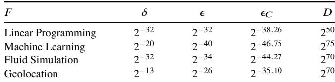  
Figure 3: Numerical parameters for benchmark families. ???? varies within a family as it depends on the number of constraints ?? (§4.1) and batch size ?? (§4.3, §D.1) for the particular instance(s). We report the minimum ???? across the family. ??wg is omitted because all witness generation is performed using double- or quadruple precision floating point, which has relative rather than absolute error guarantees (§6.3). Specifically, the Linear Programming, Fluid Simulation, and Geolocation families use double-precision, and the Machine Learning family uses quadruple-precision.

LayerNorm involves computing the mean and variance of a vector and then normalizing the vector. Specifically, ?? = [??1, . . . , ????] is transformed to ?? = [??1, . . . , ???? ] via ???? ← ??−√??+?? , where ?? and ?? are the mean and variance of the inputs ??, and ?? provides numerical stability. Spain arithmetizes this benchmark with square root, division, and multiplication operations. We run this microbenchmark on a 32 × 768 tensor.

GELU is a popular activation function used in GPTs, defined as ?? · Φ(??), where Φ(??) is the Gaussian CDF. Spain arithmetizes this with a piecewise linear approximation (§5). We run this microbenchmark on a 32 × 3072 tensor.

GPT-2 [106] is an open source LLM that uses several machine learning primitives, including Softmax, LayerNorm, GELU, and matrix multiplication (MatMul). For MatMul, Spain includes an optimization not described earlier: Spain translates to a checker that uses the Freivalds algorithm [56]. This requires an approximate version of Freivalds [74] together with Spain’s extension to I-R1CS (§4.3, Appx. D.2). This benchmark runs the inference phase of GPT-2, and is parameterized by a length of input tokens (seq), and a number of iterations, passes.

Fluid Simulation. This family is a Stable-Fluids-style [125] incompressible fluid simulation that approximately solves the 2D Navier-Stokes equations over square grids. Spain arithmetizes this benchmark with multiplication, max, and min operations. We benchmark 8 × 8 and 16 × 16 grids, each simulated for 10 timesteps, denoted small and large respectively. Even at such small sizes, these benchmarks are computationally intensive; simulations of this form often run on GPUs in practice.

Geolocation. This family includes the geospatial computation in ZKLP [51], which checks consistency between spherical coordinates (latitude, longitude) and coordinates in a hierarchical Discrete Global Grid System [110] called Uber H3 [37]. This benchmark required simulating modular arithmetic, by arithmetizing the ⌊·⌋ operation.

Figure 3 gives the numerical parameters for each family.

Metrics, measurement, and method. We report the proving time, verification time, constraint counts (??, from §2.2), and proof size of Spain and baseline systems on the benchmarks above. We also report the cost of native execution. In addition, we measure the memory usage of Spain’s prover, and fixed and setup costs for the Spain verifier.

We run all experiments in single-threaded configurations, on CPUs. We measure time based on the wall clock, with a harness that runs and times all phases of Spain. The exception is witness generation. That is timed diferently depending on the benchmark. For the Linear Programming benchmarks, we time a custom Rust program that solves the linear program and uses the solution to generate the witness values. For ONNX benchmarks, we time the execution of the transformed ONNX model on Spain’s high-precision ONNX executor (§6.2). For Fluid Simulation, similar to the Linear Programming benchmarks, we time a custom Rust program that generates witness values.

We report the average of at least 5 runs for each experiment. The standard deviations are within 11% of the means.

Testbed. For all experiments, we run the verifier on a 2.1 GHz 64-Core AMD Opteron 6272 with 256 GB RAM, running Red Hat Enterprise Linux 9.8. To reflect the motivation for succinct proofs, we run the prover on a more powerful machine: a 64- Core Intel Xeon Platnium 8592+ with 3 TB RAM, running Red Hat Enterprise Linux 9.6. When running Otti and ZKLP on our hardware, we use the artifacts provided by the authors.

## 7.1 Spain versus baselines

To compare Spain to the baselines, we run the aforementioned benchmarks. For ZKLP-FE run on GPT-2, the constraint counts are too large to run the back-end. Instead, we estimate prover and verifier time, as well as proof size, by executing ZKLP-FE on synthetic instances of various sizes and extrapolating times linearly (??2 > 0.99 for both).

Figure 4 depicts the results. Spain shows dramatic improvement in number of constraints (??). This owes to the techniques in Section 5; for example, with the Linear Programming bench marks, the baseline needs verbose constraints to represent comparisons (≥, ≤, and so on) whereas Spain does not.

The lowered ?? for Spain yields prover speedups of 8–2700×, bringing the prover’s overhead down in some cases to our goal of 3 orders of magnitude (§1). In fact, notice that Spain’s back-end is worse than the baselines on a per-constraint basis; for example, Otti outperforms Otti-FE (which has a Spain-like backend) when running with substantially the same constraints. Yet, the reduction in ?? is more than enough to compensate. Indeed, the only baseline that Spain’s prover does not exceed is zkGPT. But zkGPT does not apply beyond that one benchmark, and it has qualitative disadvantages, described later (§7.3).

Similarly, Spain’s verifier improves on all baselines except zkGPT (see above) and ZKLP. ZKLP’s back-end is specifically aimed at verifier performance, but it has high setup cost (§7.3, §7.4). Spain’s improvement over all other baselines stems from substantial reduction in the number of auxiliary variables in the arithmetizations, making the witness ?? correspondingly smaller. Meanwhile, recall that one contribution to the verifier’s costs is a component logarithmic in |??| (§2.2).

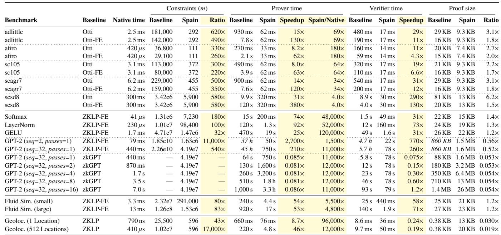  
Figure 4: Constraint counts, native execution time, prover time, verifier time, proof sizes, and overhead of proving (ratio of prover:native) for baselines and benchmarks. “Native time” refers to the verifier’s hardware while the Spain/native ratio is measured on the prover’s hardware. Times, proof sizes, and ratios are displayed with two significant figures. Constraints are displayed with three significant figures. The italicized numbers for ZKLP-FE mean that the times and proof sizes are extrapolated (see text); the back-end could not run at that scale. zkGPT does not support a batched configuration, so we scale zkGPT’s measurements by passes where appropriate. Spain improves over baselines in constraint counts (from 32× to 4 orders of magnitude). With two exceptions, Spain improves over baselines in prover and verifier time, by at least an order of magnitude. The first exception is zkGPT, which outperforms Spain on all metrics, except for verifier time when passes = 16, where Spain’ verifier is slightly better. The second exception is ZKLP, whose verifier outperforms Spain’s verifier by 4–5×.

## 7.2 Costs of Spain

We examine the relative costs of the protocol phases, for the prover and verifier. Figures 5 and 6 depict the results. For most benchmarks, DARK is the dominant cost. For GPT-2, witness generation (compute ??) has a larger share of prover time, due almost entirely to the diference in complexity between executing matrix multiplication (which must happen to generate the witness) and checking matrix multiplication with the Freivalds algorithm (which is what the constraints enforce, as described in the GPT-2 benchmark earlier).

The prover’s primary resource bottleneck is memory. For example, with GPT-2, our largest benchmark, the prover requires ≈41 GB for seq=32, passes=1, and ≈267 GB for seq=32, passes=16. The verifier’s bottleneck for small computations (small ??) is DARK evaluation. The bottleneck for larger computations is evaluating ??, ??, and ?? at a random point.

## 7.3 Breaking even and batching

Recall that to justify outsourcing on performance grounds, the verifier must be cheaper than native execution (§1). For the largest linear program, scsd8, Figure 4 shows that Spain’s verifier does meet this condition. However, for most of the other benchmarks, this condition is not met.

In these cases, Spain must amortize fixed costs (§2.2) via batching. This is the SIMD-R1CS model (§4.3, Appx. D.1): the same computation repeated on diferent input/output pairs. This structure is natural for many numerical computations. For example, when running an LLM, people don’t just want one token; they want a whole paragraph (or more...).

Spain’s verifier indeed benefits from batching; notice that for the rows in Figure 4 featuring GPT-2 with various passes, the verifier’s work grows less than linearly in batch size. Indeed, Figure 6 shows that the fixed costs – namely fixed work in DARK (§4.2.3, Appx. C) and evaluating ??, ??, ?? at a random point (Step 6, Figure 2) – are the dominant contribution when verifying single instances, and thus amortization is beneficial. These results agree with the theory. Specifically, Spain’s fixedcost is ?? (??) for the entire batch (§2.2). Meanwhile, Spain’s variable costs comprise a component logarithmic in the total witness size across all instances in the batch and a component linear in the number of variables in in and out across all instances. Given this cost profile, there is usually a batch size for which, in principle, Spain’s verifier breaks even once the batch size crosses a threshold. We say usually because, for very small computations with very large in and/or out, the variable costs alone may exceed the cost of native execution.

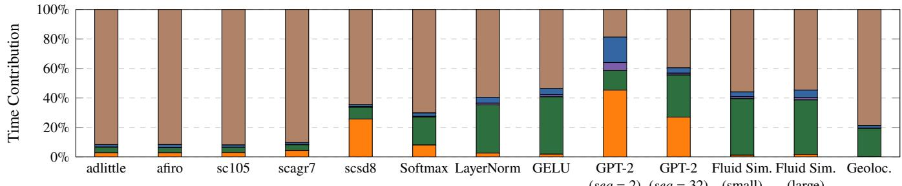  
Step 1 (Compute ??) Step 2 (Commit to ?? via DARK) Step 3 (Compute ??) Step 6 (Sum-check) Step 7 (Open commitment to ??)

Figure 5: Prover phase breakdown for Spain. Steps refer to those in Figure 2. Steps 4 and 5 are omitted as they incur no cost for the prover.  
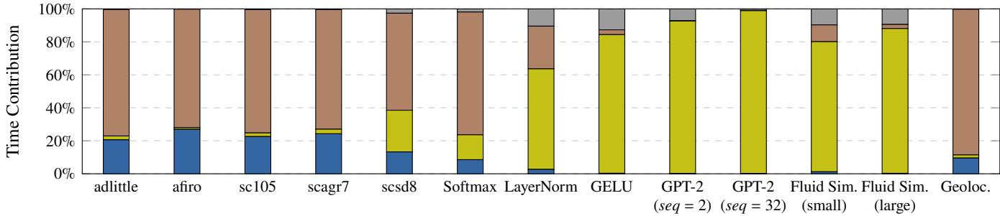  
Steps 4-6 Step 7 (Evaluate ??, ??, and ??) Step 7 (Open commitment to ??) Step 7 (Test ?? consistency with Step 6’s claim)  
Figure 6: Verifier phase breakdown for Spain. Steps refer to those in Figure 2. Steps 1-3 are omitted as they incur no cost for the verifier. The majority of the verifier’s time is spent in Step 7, which decomposes into three sub-steps: evaluating ??, ??, ??; opening the commitment to ??; and checking consistency between the claim in Step 6 about ?? and the opening of ??, using in and out.

In contrast to Spain, zkGPT does not amortize with passes; as shown in Figure 4 (the GPT-2 rows), zkGPT’s verifier is more expensive than Spain’s verifier at seq=32, passes=16. For ZKLP, the comparison is equivocal. On the one hand, ZKLP’s fixed costs (which are not included in Figure 4) amortize over all future uses of an R1CS structure, not merely a synchronized batch as in Spain; on the other hand, ZKLP’s fixed costs are dramatically higher (over 50 thousand times larger than the verifier’s work on a single instance [112]).

A loose end is setup costs, as distinct from fixed costs (§2.2); these are not depicted. However, on our benchmarks, Spain’s setup costs range from negligible to 5× the verifier’s work to check a single instance, so this cost quickly amortizes.

## 7.4 Summary and discussion

We believe that Spain meets the goal of being generalpurpose (§1): it easily handled an array of natural benchmarks, and we did not have to discard any benchmarks because Spain lacked suficient expressiveness.

At its core, Spain bakes approximation into the constraints themselves, eliminating the need to enforce numerical semantics explicitly, which in turn improves on the number of constraints (??) in an arithmetization, by 32× to 17,000× (§7.1).

This reduction lowers the prover overhead versus natural baselines by 1–3 orders of magnitude, down to 3–5 orders of magnitude versus native execution (§7.1). Spain’s prover isn’t the fastest in the literature; that honor belongs to zkGPT [105], but as we have noted, zkGPT is specialized to a specific machine learning model architecture, and its verifier neither breaks even nor benefits from amortization (§7.3).

Spain’s verifier beats native execution for some reasonablysized numerical problems (§7.3), and is the only system we experimented with to do so. Given their cost profiles (§7.2), Spain’s verifier and prover would directly benefit from improvements in integer polynomial commitment protocols or rational ones [6, 121]. There are additional avenues for improving the verifier’s costs. Most saliently, the verifier could shift some work to the prover using SPARK [116] or one of its descendants [38, 117, 119].

A structural disadvantage of Spain is that, for the time being, its new arithmetizations require its back-end. Traditional constraints are more portable; they can be combined with back-ends that provide diferent properties. Otti’s back-end, for example, provides zero-knowledge and non-interactivity. ZKLP’s back-end does too, and it inherits from Groth16 [70] an extremely fast verifier (albeit with high fixed costs; §7.3). If Spain’s arithmetizations could be ported to alternative back-ends (§9), Spain could derive end-to-end speedups and enhanced properties.

## 8 Other related work

We have described Spain’s intellectual antecedents throughout. Here we focus on the intersection of proof systems and numerical computations; we divide the work into two strands.

General-purpose (§1) proof systems. The first attempt to represent numerical operations in succinct proofs was Ginger [115], which supported fixed-point and primitive floatingpoint operations, by mapping them to operations in a finite field F??. Ginger used static analysis, bit-wise decompositions of values, and a large field (large ??) to ensure a unique representation of each rational encountered during execution.

Subsequent works applied variations on this encoding to specific numerical problems, for example Otti [9] to linear programs, zkQMC [50] to Monte Carlo simulations, and KL24 [82] to transcendental functions. All of these works target general-purpose back-ends [8, 21–24, 46, 47, 49, 58, 62, 70, 85, 90, 100, 116, 117] and express computations as traditional constraints over a finite field.

A few recent works have explored alternative approaches, focusing on arithmetizing floating-point arithmetic. The works in this vein range between strict IEEE 754 compliance with support for all rounding modes and exceptions [51] (see §7) and more relaxed semantics [59]. All such works translate numerical operations using more constraints than Spain; however, they ofer relative error guarantees that Spain does not.

Recently, interest has renewed in a class of proof systems known as zkVMs [15, 25, 26, 53, 83, 145]. These proof systems allow for proving the correct execution of any programs written in a given instruction set, typically RISC-V [107]. Although RISC-V includes numerical operations via floatingpoint instructions in an extension, we do not know of any zkVMs that currently support this extension.

Like Spain, some works have back-ends that work over domains other than finite fields. Chen et al. [45] arithmetize numerical computations as arithmetic circuits (addition and multiplication gates) over Galois rings, by encoding a rounding operation as a sequence of additions and multiplications within the ring. They then run GKR [66, 67] (§2.2) over the Galois ring. Bitan et al. [27] observe that some sum-check protocols can be modified so that the protocol messages themselves become approximate. Although we have yet to do a detailed analysis, we estimate that the costs of these approaches would be in between Spain’s and the approaches derived from Ginger.

Finally, concurrent with this work, others have refined Zaratan [42] (discussed in §4.2), which is geared to integer computations. These works design polynomial commitment protocols over rational numbers that are significantly faster than DARK [6, 121].2 While these works apply their faster polynomial commitments to general-purpose proof systems for exact integer and rational arithmetic, rather than approximate computations, we observe that the polynomial commitments themselves are compatible with Spain. We anticipate that replacing DARK with the fastest of them will improve the most expensive components of Spain by at least an order of magnitude (§7.2).

Special-purpose proof systems. Here we consider systems designed around specific applications. These systems rely on the observation that checkers for some numerical computations can be directly represented as sum-check protocols (§2.2).

The first in this line of work is Thaler’s protocol for proving matrix multiplication [129]. Some works use Thaler’s protocol as a primitive in proof systems for machine learning [19, 63, 77, 78, 86, 105, 127, 128, 151] (see the survey of Peng et. al [101] for a taxonomy). These protocols typically quantize numerical values, and alternate between checking exact operations (such as matrix multiplications, convolutions, and activation functions) and rounding to return to a quantized domain. From our testing, the most eficient of these systems is zkGPT [105], which was discussed and evaluated (§7).

## 9 Conclusion

Spain meets the goal of proving numerical computations in a general-purpose way, while in some regimes meeting the goals (§1) of a prover with 3 orders of magnitude overhead and a verifier less expensive than native (§7.4).

Spain also introduces a new form of arithmetization, approximate constraints (§5). We believe this is of independent interest, as eficient arithmetizations are an object of intense study among those interested in succinct proofs. In principle, approximate constraints are usable in conjunction with the two dominant forms of arithmetization: traditional constraints and lookup tables (§E.4, §2.2).

A natural area for future work is adapting other proof backends (both those based on sum-check protocols and those not based on sum-check protocols) to handle approximate constraints. Other future work includes reducing the cost of polynomial commitment in Spain, slashing the cost of Spain’s verifier by shifting work to the prover (§7.4), making Spain zero-knowledge and non-interactive, supporting relative error in constraints, and adding numerical support to zkVMs (§8) [15, 53, 83, 145]. Many of these are separate research eforts, which we hope our work here has motivated.

## Acknowledgments

We are grateful to our shepherd, Andi Quinn, who went above and beyond with close readings that fundamentally improved the presentation of this work. In a similar vein, this paper was substantially improved by the thoughtful suggestions of the anonymous OSDI reviewers. Andrew Blumberg gave useful comments. All errors and problems are the fault of the authors. This project used computing resources at the Courant Institute and NYU’s HPC organization, and was partially supported by gifts from Google and Stellar.

## References

[1] Carmichael function. https://en.wikipedia.org/ wiki/Carmichael\_function. Wikipedia, Wikimedia foundation.

[2] IEEE standard for floating-point arithmetic. IEEE Std 754-2019 (Revision of IEEE 754-2008), pages 1–84, 2019.

[3] FLINT: Fast Library for Number Theory. http:// flintlib.org, 2025.

[4] GNU MP: The GNU Multiple Precision Arithmetic Library. https://gmplib.org, 2025.

[5] MPFR: The GNU Multiple Precision Floating-Point Reliably Library. https://www.mpfr.org, 2025.

[6] Alexander Abdugafarov, Albert Garreta, Amit Kumar, Michał Osadnik, Psi Vesely, Ilia Vlasov, and Kai Zhe Zheng. Zinc+: SNARKs for polynomial rings. Cryptology ePrint Archive, Paper 2026/855, 2026.

[7] Miguel Ambrona, Anne-Laure Schmitt, Raphael R. Toledo, and Danny Willems. New optimization techniques for PlonK’s arithmetization. Cryptology ePrint Archive, Paper 2022/462, 2022.

[8] Scott Ames, Carmit Hazay, Yuval Ishai, and Muthuramakrishnan Venkitasubramaniam. Ligero: Lightweight sublinear arguments without a trusted setup. In ACM Conference on Computer and Communications Security (CCS), 2017.

[9] Sebastian Angel, Andrew J. Blumberg, Eleftherios Ioannidis, and Jess Woods. Eficient representation of numerical optimization problems for SNARKs. In SECURITY, 2022.

[10] Sebastian Angel, Andrew J. Blumberg, Eleftherios Ioannidis, and Jess Woods. Otti: A zkSNARK compiler, solver, prover and verifier for optimization problems. https://github.com/eniac/otti, 2022.

[11] arkworks contributors. arkworks zkSNARK ecosystem. https://arkworks.rs, 2022.

[12] Sanjeev Arora and Boaz Barak. Computational Complexity: A modern approach. Cambridge University Press, 2009.

[13] Sanjeev Arora, Carsten Lund, Rajeev Motwani, Madhu Sudan, and Mario Szegedy. Proof verification and the hardness of approximation problems. Journal of the ACM, 45(3):501–555, May 1998.

[14] Sanjeev Arora and Shmuel Safra. Probabilistic checking of proofs: a new characterization of NP. Journal of the ACM, 45(1):70–122, January 1998.

[15] Arasu Arun, Srinath Setty, and Justin Thaler. Jolt: SNARKs for virtual machines via lookups. In Annual International Conference on the Theory and Applications of Cryptographic Techniques (EUROCRYPT), 2024.

[16] László Babai. Trading group theory for randomness. In ACM Symposium on the Theory of Computing (STOC),

May 1985.

[17] László Babai, Lance Fortnow, Leonid A Levin, and Mario Szegedy. Checking Computations in Polylogarithmic Time. In ACM STOC, 1991.

[18] László Babai, Lance Fortnow, and Carsten Lund. Nondeterministic exponential time has two-prover interactive protocols. computational complexity, 1(1):3–40, Mar 1991.

[19] David Balbás, Dario Fiore, Maria Vasco, Damien Robissout, and Claudio Soriente. Modular sumcheck proofs with applications to machine learning and image processing. In ACM Conference on Computer and Communications Security (CCS), 2023.

[20] Anubhav Baweja, Pratyush Mishra, Tushar Mopuri, Karan Newatia, and Steve Wang. Scribe: Low-memory SNARKs via read-write streaming. Cryptology ePrint Archive, Paper 2024/1970, 2024.

[21] E. Ben-Sasson, A. Chiesa, E. Tromer, and M. Virza. Scalable zero knowledge via cycles of elliptic curves. In IACR International Cryptology Conference (CRYPTO), August 2014.

[22] Eli Ben-Sasson, Iddo Bentov, Yinon Horesh, and Michael Riabzev. Fast Reed-Solomon Interactive Oracle Proofs of Proximity. In ICALP, 2018.

[23] Eli Ben-Sasson, Iddo Bentov, Yinon Horesh, and Michael Riabzev. Scalable, transparent, and postquantum secure computational integrity. Cryptology ePrint Archive, Report 2018/046, 2018.

[24] Eli Ben-Sasson, Alessandro Chiesa, Daniel Genkin, Eran Tromer, and Madars Virza. SNARKs for C: Verifying program executions succinctly and in zero knowledge. In IACR International Cryptology Conference (CRYPTO), August 2013.

[25] Eli Ben-Sasson, Alessandro Chiesa, Daniel Genkin, Eran Tromer, and Madars Virza. TinyRAM architecture specification, v0.991, 2013.

[26] Eli Ben-Sasson, Alessandro Chiesa, Eran Tromer, and Madars Virza. Succinct non-interactive zero knowledge for a von Neumann architecture. In USENIX Security, 2014.

[27] Dor Bitan, Zachary DeStefano, Shafi Goldwasser, Yuval Ishai, Yael Tauman Kalai, and Justin Thaler. Sum-check protocol for approximate computations. In Annual International Conference on the Theory and Applications of Cryptographic Techniques (EUROCRYPT), 2026.

[28] Alexander R. Block, Zhiyong Fang, Jonathan Katz, Justin Thaler, Hendrik Waldner, and Yupeng Zhang. Field-Agnostic SNARKs from Expand-Accumulate Codes. In IACR International Cryptology Conference (CRYPTO), 2024.

[29] Alexander R. Block, Justin Holmgren, Alon Rosen, Ron D. Rothblum, and Pratik Soni. Time- and Space-Eficient Arguments from Groups of Unknown Order. In IACR International Cryptology Conference

(CRYPTO), 2021.

[30] Andrew J. Blumberg, Justin Thaler, Victor Vu, and Michael Walfish. Verifiable computation using multiple provers. Cryptology ePrint Archive, Paper 2014/846, 2014.

[31] Jonathan Bootle, Andrea Cerulli, Jens Groth, Sune Jakobsen, and Mary Maller. Arya: Nearly Linear-Time Zero-Knowledge Proofs for Correct Program Execution. In ASIACRYPT, 2018.

[32] Gautam Botrel, Thomas Piellard, Youssef El Housni, Ivo Kubjas, and Arya Tabaie. Consensys/gnark: v0.11.0, September 2024.

[33] Sean Bowe, Jack Grigg, and Daira Hopwood. Recursive proof composition without a trusted setup. Cryptology ePrint Archive, Paper 2019/1021, 2019.

[34] G. Brassard, D. Chaum, and C. Crépeau. Minimum disclosure proofs of knowledge. Journal of Computer and System Sciences, 37(2):156–189, October 1988.

[35] B. Braun, A. J. Feldman, Z. Ren, S. Setty, A. J. Blumberg, and M. Walfish. Verifying computations with state. In ACM Symposium on Operating Systems Principles (SOSP), November 2013.

[36] Benjamin Braun. Compiling computations to constraints for verified computation. UT Austin Honors thesis HR-12-10, December 2012.

[37] Isaac Brodsky. H3: Uber’s hexagonal hierarchical spatial index. Uber Blog, June 2018.

[38] Benedikt Bünz, Jessica Chen, Zachary DeStefano, and Binyi Chen. Almost linear-time permutation check. Cryptology ePrint Archive, Paper 2025/1850, 2025.

[39] Benedikt Bünz and Ben Fisch. Multilinear Schwartz-Zippel mod N and lattice-based succinct arguments. In Theory of Cryptography Conference (TCC), 2023.

[40] Benedikt Bünz, Ben Fisch, and Alan Szepieniec. Transparent SNARKs from DARK compilers. In Annual International Conference on the Theory and Applications of Cryptographic Techniques (EUROCRYPT), 2020.

[41] Matteo Campanelli, Dario Fiore, and Rosario Gennaro. Natively compatible super-eficient lookup arguments and how to apply them: Natively compatible super eficient lookup arguments. J. Cryptol., 38(1), January 2025.

[42] Matteo Campanelli and Mathias Hall-Andersen. Fully succinct arguments over the integers from first principles. Cryptology ePrint Archive, Paper 2024/1548, 2024.

[43] R. D. Carmichael. Note on a new number theory function. Bulletin of the American Mathematical Society, 16(5):232–238, 1910.

[44] Binyi Chen, Benedikt Bünz, Dan Boneh, and Zhenfei Zhang. HyperPlonk: Plonk with Linear-Time Prover and High-Degree Custom Gates. In Annual International Conference on the Theory and Applications of

Cryptographic Techniques (EUROCRYPT), 2023.

[45] Shuo Chen, Jung Hee Cheon, Dongwoo Kim, and Daejun Park. Interactive proofs for rounding arithmetic. IEEE Access, 10, 2022.

[46] Alessandro Chiesa,Yuncong Hu,Mary Maller,Pratyush Mishra, Noah Vesely, and Nicholas Ward. Marlin: Preprocessing zkSNARKs with universal and updatable SRS. In IACR International Cryptology Conference (CRYPTO), 2020.

[47] Alessandro Chiesa, Dev Ojha, and Nicholas Spooner. Fractal: Post-quantum and transparent recursive proofs from holography. In IACR International Cryptology Conference (CRYPTO), 2020.

[48] Graham Cormode, Michael Mitzenmacher, and Justin Thaler. Practical verified computation with streaming interactive proofs. In Innovations in Theoretical Computer Science (ITCS), pages 90–112, January 2012.

[49] Craig Costello, Cédric Fournet, Jon Howell, Markulf Kohlweiss, Benjamin Kreuter, Michael Naehrig, Bryan Parno, and Samee Zahur. Geppetto: Versatile verifiable computation. In IEEE Symposium on Security and Privacy, May 2015.

[50] Zachary DeStefano, Dani Barrack, and Michael Dixon. zkQMC: Zero-knowledge proofs for (some) probabilistic computations using quasi-randomness. Cryptology ePrint Archive, Paper 2022/1007, 2022.

[51] Jens Ernstberger, Chengru Zhang, Luca Ciprian, Philipp Jovanovic, and Sebastian Steinhorst. Zero-knowledge location privacy via accurate floating-point SNARKs. In IEEE Symposium on Security and Privacy, 2025.

[52] Jens Ernstberger, Chengru Zhang, Luca Ciprian, Philipp Jovanovic, and Sebastian Steinhorst. Zeroknowledge location privacy via accurate floating-point SNARKs. https://github.com/tumberger/zk-Location, 2025.

[53] Ethereum Foundation. Ethereum foundation zkVM list. https://ethproofs.org/zkvms, 2025.

[54] Filecoin Foundation. Filecoin: A decentralized, eficient, and robust foundation for humanity’s information. https://filecoin.io.

[55] Mina Foundation. Mina protocol. https:// minaprotocol.com, 2026.

[56] R. Freivalds. Probabilistic machines can use less running time. In Proceedings of the IFIP Congress, pages 839–842, 1977.

[57] Ariel Gabizon and Zachary J. Williamson. plookup: A simplified polynomial protocol for lookup tables. Cryptology ePrint Archive, Report 2020/315, 2020.

[58] Ariel Gabizon, Zachary J. Williamson, and Oana Ciobotaru. PLONK: Permutations over Lagrange-bases for Oecumenical Noninteractive arguments of Knowledge. Cryptology ePrint Archive, Report 2019/953, 2019.

[59] Sanjam Garg, Abhishek Jain, Zhengzhong Jin, and Yinuo Zhang. Succinct zero knowledge for floating

point computations. In ACM Conference on Computer and Communications Security (CCS), 2022.

[60] Albert Garreta, Hendrik Waldner, Katerina Hristova, and Luca Dall’Ava. Zinc: Succinct arguments with small arithmetization overheads from IOPs of proximity to the integers. Cryptology ePrint Archive, Paper 2025/316, 2025.

[61] David Gay. netlib. https://portal.ampl.com/ \~dmg/netlib/lp/data/, 2013.

[62] Rosario Gennaro, Craig Gentry, Bryan Parno, and Mariana Raykova. Quadratic span programs and succinct NIZKs without PCPs. In Annual International Conference on the Theory and Applications of Cryptographic Techniques (EUROCRYPT), May 2013.

[63] Zahra Ghodsi, Tianyu Gu, and Siddharth Garg. SafetyNets: verifiable execution of deep neural networks on an untrusted cloud. International Conference on Neural Information Processing Systems (NIPS), 2017.

[64] Oded Goldreich. Probabilistic proof systems – a primer. Foundations and Trends in Theoretical Computer Science, 3(1), 2008.

[65] S. Goldwasser, S. Micali, and C. Rackof. The knowledge complexity of interactive proof systems. SIAM Journal on Computing, 18(1):186–208, 1989.

[66] Shafi Goldwasser, Yael Tauman Kalai, and Guy N. Rothblum. Delegating computation: Interactive proofs for muggles. In ACM Symposium on the Theory of Computing (STOC), May 2008.

[67] Shafi Goldwasser, Yael Tauman Kalai, and Guy N Rothblum. Delegating computation: interactive proofs for muggles. J. ACM, 62(4), 2015.

[68] Alexander Golovnev, Jonathan Lee, Srinath Setty, Justin Thaler, and Riad S. Wahby. Brakedown: Linear-time and field-agnostic SNARKs for R1CS. In CRYPTO, 2023.

[69] Google. Longfellow ZK. https://github.com/ google/longfellow-zk.

[70] Jens Groth. On the size of pairing-based non-interactive arguments. In Annual International Conference on the Theory and Applications of Cryptographic Techniques (EUROCRYPT), 2016.

[71] Ulrich Habock. Multivariate lookups based on logarithmic derivatives. Cryptology ePrint Archive, Paper 2022/1530, 2022.

[72] Daira-Emma Hopwood, Sean Bowe, Taylor Hornby, and Nathan Wilcox. Zcash protocol specification. https: //zips.z.cash/protocol/protocol.pdf, 2025.

[73] StarkWare Industries. Starkware. https:// starkware.co.

[74] Hao Ji, Michael Mascagni, and Yaohang Li. Gaussian variant of freivalds’ algorithm for eficient and reliable matrix product verification. CoRR, abs/1705.10449, 2017.

[75] Kunming Jiang, Fraser Brown, and Riad S. Wahby.

CoBBL: Dynamic Constraint Generation for SNARKs. In IEEE Symposium on Security and Privacy, 2025.

[76] Kunming Jiang, Devora Chait-Roth, Zachary DeStefano, Michael Walfish, and Thomas Wies. Less is more: refinement proofs for probabilistic proofs. In IEEE Symposium on Security and Privacy, 2023.

[77] Chanyang Ju, Hyeonbum Lee, Heewon Chung, Jae Hong Seo, and Sungwook Kim. Eficient sumcheck protocol for convolution. IEEE Access, 9:164047– 164059, 2021.

[78] Daniel Kang, Tri Dao, and Matei Zaharia. ZKML: An optimizing system for ML inference in zero-knowledge proofs. Proceedings of the ACM SIGMOD Conference, 2024.

[79] Aniket Kate, Gregory M. Zaverucha, and Ian Goldberg. Constant-size commitments to polynomials and their applications. In ASIACRYPT, 2010.

[80] J. Kilian. A note on eficient zero-knowledge proofs and arguments (extended abstract). In ACM Symposium on the Theory of Computing (STOC), pages 723–732, May 1992.

[81] Ahmed Kosba, Charalampos Papamanthou, and Elaine Shi. xJsnark: a framework for eficient verifiable computation. In IEEE Symposium on Security and Privacy, 2018.

[82] Kaarel August Kurik and Peeter Laud. Novel approximations of elementary functions in zero-knowledge proofs. Cryptology ePrint Archive, Paper 2024/859, 2024.

[83] Succinct Labs. SP1 zkVM. https://github.com/ succinctlabs/sp1, 2025.

[84] Ryan Lavin, Xuekai Liu, Hardhik Mohanty, Logan Norman, Giovanni Zaarour, and Bhaskar Krishnamachari. A survey on the applications of zero-knowledge proofs, 2026.

[85] Jonathan Lee. Dory: Eficient, transparent arguments for generalised inner products and polynomial commitments. In IACR Theory of Cryptography Conference (TCC), 2021.

[86] Seunghwa Lee, Hankyung Ko, Jihye Kim, and Hyunok Oh. vCNN: Verifiable convolutional neural network based on zk-SNARKs. IEEE Transactions on Depend able and Secure Computing, 21(4):4254–4270, 2024.

[87] Tianyi Liu, Tiancheng Xie, Jiaheng Zhang, Dawn Song, and Yupeng Zhang. Pianist: Scalable zkRollups via fully distributed zero-knowledge proofs. In IEEE Symposium on Security and Privacy, pages 1777–1793, Los Alamitos, CA, USA, May 2024. IEEE Computer Society.

[88] Loopring Foundation. Loopring: Ethereum’s First zkRollup Layer 2. https://loopring.org.

[89] Carsten Lund, Lance Fortnow, Howard J. Karlof, and Noam Nisan. Algebraic methods for interactive proof systems. Journal of the ACM, 39(4):859–868, 1992.

[90] Mary Maller,Sean Bowe,Markulf Kohlweiss, and Sarah Meiklejohn. Sonic: Zero-knowledge SNARKs from linear-size universal and updatable structured reference strings. In ACM Conference on Computer and Communications Security (CCS), 2019.

[91] Silvio Micali. Computationally sound proofs. SIAM Journal on Computing, 30(4):1253–1298, 2000.

[92] Microsoft. Spartan: High-speed zero-knowledge SNARKs without trusted setup. https:// github.com/microsoft/Spartan, 2025.

[93] Vineet Nair, Justin Thaler, and Michael Zhu. Proving CPU executions in small space. Cryptology ePrint Archive, Paper 2025/611, 2025.

[94] Ihyun Nam. A survey of multivariate polynomial commitment schemes. arXiv:2306.11383, 2023.

[95] ONNX Contributors. Open Neural Network Exchange Intermediate Representation (ONNX IR) Specification. https://github.com/onnx/onnx/blob/ main/docs/IR.md, 2026.

[96] Alex Ozdemir, Fraser Brown, and Riad Wahby. CirC: Compiler infrastructure for proof systems, software verification, and more. In IEEE Symposium on Security and Privacy, 2022.

[97] Alex Ozdemir, Evan Laufer, and Dan Boneh. Volatile and persistent memory for zksnarks via algebraic interactive proofs. In IEEE Symposium on Security and Privacy, 2025.

[98] H. Padé. Sur la représentation approchée d’une fonction par des fractions rationnelles. Annales scientifiques de l’École Normale Supérieure, 3e série, 9:3–93, 1892.

[99] Christodoulos Pappas and Dimitrios Papadopoulos. HOBBIT: space-eficient zkSNARK with optimal prover time. In USENIX Security, 2025.

[100] Bryan Parno, Craig Gentry, Jon Howell, and Mariana Raykova. Pinocchio: Nearly practical verifiable computation. In IEEE Symposium on Security and Privacy, May 2013.

[101] Zhizhi Peng, Chonghe Zhao, Taotao Wang, Guofu Liao, Zibin Lin, Yifeng Liu, Bin Cao, Long Shi, Qing Yang, and Shengli Zhang. A survey of zero-knowledge proof based verifiable machine learning. Artificial Intelligence Review, Apr 2026.

[102] Pepper Project. Pequin: An end-to-end toolchain for verifiable computation, SNARKs, and probabilistic proofs. https://github.com/pepper-project/ pequin, 2018.

[103] Polygon Labs UI. Polygon. https:// polygon.technology.

[104] William H. Press, Brian P. Flannery, Saul A. Teukolsky, and William T. Vetterling. Numerical Recipes in C: The Art of Scientific Computing. Cambridge University Press, 2 edition, October 1992.

[105] Wenjie Qu, Yijun Sun, Xuanming Liu, Tao Lu, Yanpei Guo, Kai Chen, and Jiaheng Zhang. zkGPT: an eficient

non-interactive zero-knowledge proof framework for LLM inference. In USENIX Security, 2025.

[106] Alec Radford, Jef Wu, Rewon Child, David Luan, Dario Amodei, and Ilya Sutskever. Language models are unsupervised multitask learners. https://cdn.openai.com/better-languagemodels/language\_models\_are\_unsupervised\_ multitask\_learners.pdf, 2019.

[107] RISC-V International. RISC-V: Ratified Specification. https://riscv.org/specifications/ ratified/, 2025.

[108] Michael Rosenberg, Tushar Mopuri, Hossein Hafezi, Ian Miers, and Pratyush Mishra. Hekaton: Horizontallyscalable zkSNARKs via proof aggregation. In ACM Conference on Computer and Communications Security (CCS), 2024.

[109] J. Barkley Rosser and Lowell Schoenfeld. Approximate formulas for some functions of prime numbers. Illinois Journal of Mathematics, 6:64–94, 1962.

[110] Kevin Sahr, Denis White, and Jon A. Kimerling. Geodesic discrete global grid systems. Cartography and Geographic Information Science, 30:121–134, 2003.

[111] J. T. Schwartz. Fast probabilistic algorithms for verification of polynomial identities. J. ACM, 27(4):701–717, October 1980.

[112] SCIPR Lab. libsnark ppzkSNARK empirical performance README. https://github.com/ scipr-lab/libsnark/blob/master/libsnark/ zk\_proof\_systems/ppzksnark/README.md, 2017. GitHub repository documentation.

[113] SCIPR Lab and contributors. libsnark: a C++ library for zksnark proofs. https://github.com/scipr-lab/ libsnark, 2026.

[114] S. Setty, B. Braun, V. Vu, A. J. Blumberg, B. Parno, and M. Walfish. Resolving the conflict between generality and plausibility in verified computation. In European Conference on Computer Systems (EuroSys), pages 71–84, April 2013.

[115] S. Setty, V. Vu, N. Panpalia, B. Braun, A. J. Blumberg, and M. Walfish. Taking proof-based verified computation a few steps closer to practicality. In USENIX Security, August 2012.

[116] Srinath Setty. Spartan: Eficient and general-purpose zkSNARKs without trusted setup. In CRYPTO, 2020.

[117] Srinath Setty and Jonathan Lee. Quarks: Quadrupleeficient transparent zkSNARKs. Cryptology ePrint Archive, Paper 2020/1275, 2020.

[118] Srinath Setty, Justin Thaler, and Riad Wahby. Customizable constraint systems for succinct arguments. Cryptology ePrint Archive, Paper 2023/552, 2023.

[119] Srinath Setty, Justin Thaler, and Riad Wahby. Unlocking the Lookup Singularity with Lasso. In Annual Interna tional Conference on the Theory and Applications of

Cryptographic Techniques (EUROCRYPT), 2024.

[120] Adi Shamir. IP = PSPACE. Journal of the ACM, 39(4):869–877, October 1992.

[121] Alireza Shirzad, Sriram Sridhar, Dimitrios Papadopoulos, and Charalampos Papamanthou. Relaxed modular PCS from arbitrary PCS and applications to SNARKs for integers. Cryptology ePrint Archive, Paper 2026/347, 2026.

[122] Michael Sipser. Introduction to the Theory of Computation. Cengage Learning, 3 edition, 2013.

[123] Eduardo Soria-Vazquez. Doubly eficient interactive proofs over infinite and non-commutative rings. In IACR Theory of Cryptography Conference (TCC), 2022.

[124] Sriram Sridhar, Shravan Srinivasan, Dimitrios Papadopoulos, and Charalampos Papamanthou. Eficiently provable approximations for non-polynomial functions. In USENIX Security, 2026.

[125] Jos Stam. Stable fluids. In SIGGRAPH, 1999.

[126] Alan Stapelberg. Opening up ‘Zero-Knowledge Proof technology to promote privacy in age assurance. https://blog.google/technology/safetysecurity/opening-up-zero-knowledgeproof-technology-to-promote-privacyin-age-assurance/, July 2025.

[127] Haochen Sun, Tonghe Bai, Jason Li, and Hongyang Zhang. zkDL: Eficient zero-knowledge proofs of deep learning training. IEEE Transactions on Information Forensics and Security, 2024.

[128] Haochen Sun, Jason Li, and Hongyang Zhang. zkLLM: Zero knowledge proofs for large language models. In ACM Conference on Computer and Communications Security (CCS), 2024.

[129] Justin Thaler. Time-optimal interactive proofs for circuit evaluation. In IACR International Cryptology Conference (CRYPTO), August 2013.

[130] Justin Thaler. Proofs, Arguments, and Zero-Knowledge. http://people.cs.georgetown.edu/ jthaler/ProofsArgsAndZK.html, 2023.

[131] Justin Thaler. Sum-check is all you need: An opinionated survey on fast provers in SNARK design. Cryptology ePrint Archive, Paper 2025/2041, 2025.

[132] The Linux Foundation. ONNX: Open Neural Network Exchange. https://onnx.ai, 2019.

[133] Louis Tremblay Thibault, Tom Sarry, and Abdelhakim Senhaji Hafid. Blockchain scaling using rollups: A comprehensive survey. IEEE Access, 10:93039– 93054, 2022.

[134] Ioanna Tzialla, Abhiram Kothapalli, Bryan Parno, and Srinath Setty. Transparency dictionaries with succinct proofs of correct operation. In Network and Distributed System Security Symposium (NDSS), 2022. https: //eprint.iacr.org/2021/1263.

[135] V. Vu, S. Setty, A. J. Blumberg, and M. Walfish. A hybrid architecture for interactive verifiable computa-

tion. In IEEE Symposium on Security and Privacy, May 2013.

[136] Riad S. Wahby, Max Howald, Siddharth Garg, abhi shelat, and Michael Walfish. Verifiable ASICs. In IEEE Symposium on Security and Privacy, 2016.

[137] Riad S. Wahby, Ye Ji, Andrew J. Blumberg, abhi shelat, Justin Thaler, Michael Walfish, and Thomas Wies. Full accounting for verifiable outsourcing. In ACM Conference on Computer and Communications Security (CCS), 2017.

[138] Riad S. Wahby, Srinath Setty, Max Howald, Zuocheng Ren, Andrew J. Blumberg, and Michael Walfish. Eficient RAM and control flow in verifiable outsourced computation. In Network and Distributed System Security Symposium (NDSS), 2015.

[139] Riad S. Wahby, Ioanna Tzialla,abhi shelat, Justin Thaler, and Michael Walfish. Doubly-eficient zkSNARKs without trusted setup. In IEEE Symposium on Security and Privacy, 2018.

[140] Michael Walfish and Andrew J. Blumberg. Verifying computations without reexecuting them: from theoretical possibility to near practicality. Communications of the ACM (CACM), 58(2), 2015.

[141] Wikimedia Foundation Wikipedia. Localization (commutative algebra). https://en.wikipedia.org/ wiki/Localization\_(commutative\_algebra).

[142] Howard Wu, Wenting Zheng, Alessandro Chiesa, Raluca Ada Popa, and Ion Stoica. DIZK: a distributed zero knowledge proof system. In USENIX Security, 2018.

[143] Tiacheng Xie, Jiaheng Zhang, Yupeng Zhang, Charalampos Papamanthou, and Dawn Song. Libra: Succinct Zero-Knowledge Proofs with Optimal Prover Computation. In IACR International Cryptology Conference (CRYPTO), 2019.

[144] Tiancheng Xie, Jiaheng Zhang,Zerui Cheng,Fan Zhang, Yupeng Zhang, Yongzheng Jia, Dan Boneh, and Dawn Song. zkBridge: Trustless cross-chain bridges made practical. In ACM Conference on Computer and Communications Security (CCS), 2022.

[145] RISC Zero. RISC0 zkVM. https://github.com/ risc0/risc0, 2025.

[146] Collin Zhang, Zachary DeStefano, Arasu Arun, Joseph Bonneau, Paul Grubbs, and Michael Walfish. Zombie: Middleboxes that don’t snoop. In Symposium on Networked Systems Design and Implementation (NSDI), 2024.

[147] Yupeng Zhang, Daniel Genkin, Jonathan Katz, Dimitrios Papadopoulos, and Charalampos Papamanthou. vSQL: Verifying arbitrary SQL queries over dynamic outsourced databases. In IEEE Symposium on Security and Privacy, 2017.

[148] Yupeng Zhang, Daniel Genkin, Jonathan Katz, Dimitrios Papadopoulos, and Charalampos Papamanthou.

A zero-knowledge version of vSQL. Cryptology ePrint Archive, Paper 2017/1146, 2017.

[149] Richard Zippel. Probabilistic algorithms for sparse polynomials. In Edward W. Ng, editor, Symbolic and Algebraic Computation, pages 216–226. Springer Berlin Heidelberg, 1979.

[150] zkcrypto. bellman: zk-SNARK library, 2026.

[151] Zkonduit. Easy Zero-Knowledge Inference. https: //github.com/zkonduit/ezkl, 2024.

## A Sum-check primitive

Given a prover, P, and a verifier, V, the sum-check primitive of Lund et al. [89] is an interactive protocol for proving that a claimed value ?? is equal to the sum of evaluations of a ??-variate polynomial ?? over the Boolean hypercube: {0, 1} . This primitive is depicted in Figure 7.

Spain relies on the following lemma concerning the soundness and completeness of this primitive [122, Chapter 10.4] [12, Chapter 8.5] [130, Chapter 4.1].

Lemma 1. The primitive in Figure 7 is an interactive proof (the term is defined in the references above) for the claim that ?? = Í??∈ {0,1}?? ?? (??). If the initial claim is false, V rejects with probability at least 1 − ????/??. If the initial claim is true, P can make V accept with probability 1.

## B Spain’s full back-end protocol and analysis

Here we provide background on polynomial commitment schemes and define the properties required by Spain (§B.1); provide Spain’s full back-end protocol (§B.2) and its correctness proofs (§B.3); quantify the guarantees based on the specific parameters in our implementation and evaluation (§B.4); and finally prove some supporting lemmas (§B.5).

For clarity in exposition, when we mention a polynomial commitment scheme, we are referring to a polynomial commitment scheme for multilinear polynomials. Additionally, when we use the term “coeficients” for a ??-variate multilinear polynomial, these refer to the coeficients in the multilinear Lagrange basis [130, §3.5] with the interpolating set being the ??-variate Boolean hypercube: {0, 1} . These are exactly the evaluations of the polynomial over the Boolean hypercube.

B.1 Spain-compatible polynomial commitment schemes A multilinear polynomial commitment scheme [79, 94] PC is a tuple of protocols (Setup, Commit, Open, Verify), defined as follows.

• Setup: Given security parameter ?? and a bound on the number of variables in polynomials to be committed to, produce public parameters pp.

• Commit: Given public parameters pp and a multilinear polynomial ˜?? , produce a commitment com ˜?? .

Setup: P and V agree on a field F?? and a degree ?? multi-variate   
polynomial ?? over F?? with ?? variables.   
Online phase: If at any point V’s check fails, it rejects.   
1. P sends V a value ??, claimed to equal   
∑︁ ??(??)   
??∈ {0,1}??   
and a univariate polynomial ??1(??), claimed to equal   
∑︁ ?? (??, ?? , . . . , ???? ) .   
(??2,...,???? ) ∈ {0,1}??−1   
2. V checks that ?? = ??1(0) + ??1(1).   
3. V sends P a random ??1 ∈ F??.   
4. For ?? = 2, . . . , ??:   
(a) P sends V a univariate polynomial ???? (??), claimed to   
equal   
∑︁ ?? (??1, . . . , ?? ?? −1, ??, ?? ??+1, . . . , ???? ).   
(????+1,...,???? ) ∈ {0,1}??−??   
(b) V checks that ????−1 (????−1) = ???? (0) + ???? (1).   
(c) V sends P a random ???? ∈ F??.   
5. Finally, V checks that ???? (????) = ?? (??1, . . . , ????).   
If all checks pass, V accepts.

Figure 7: The sum-check primitive of Lund et al. [89].

• Open: Given public parameters pp, a multilinear polynomial ˜?? , and a point ??, produce a result ?? and a proof ???? that ?? = ˜?? (??). Together, the result and proof are called an opening of com ˜?? at ??.

• Verify: Given public parameters pp, a commitment com ˜?? , a point ??, and an alleged opening (??, ????), output “accept” if ???? is a valid proof that ?? = ˜?? (??) and “reject” otherwise.

A polynomial commitment scheme is binding if it is intractable for a prover to produce two distinct openings (??, ????) and (??′, ????′ ) for the same commitment com ˜?? such that the verifier accepts both openings. For Spain, intractable means that a polynomial-time adversary cannot succeed with probability greater than ??PC.

Spain requires, as a building block, a binding polynomial commitment scheme, PC, that satisfies an additional property, which we call Weak Integer Binding. Weak Integer Binding is parameterized by 2 constants, ??max and ??max. Weak Integer Binding has two sub-properties, given below. To state the subproperties we define Integer-limited: a ??-variate multilinear polynomial ˜?? is called Integer-limited if all of its coeficients are integers with magnitude at most ??max.

• Weak Integer Binding, sub-property 1. It is impossible for a prover to produce a commitment com ˜?? unless for some positive integer ??′ and multilinear polynomial ??˜, ˜?? = ??˜/??′, where ??′ ≤ ??max and ??˜ is Integer-limited. (Here ??˜/??′ means a polynomial with the same coeficients as ??˜ but with an extra ??′ factor in each coeficient’s denominator.)

• Weak Integer Binding, sub-property 2. Given an honest (polynomial-time) prover, for any Integer-limited polynomial ˜?? , invoking Commit causes the prover to produce a valid commitment, and for any point ??, invoking Open causes the prover to produce a corresponding opening that causes Verify to accept

Weak Integer Binding is similar to, but weaker than, the notion of a Relaxed Mod-PCS introduced by Zinc [60]. A Relaxed Mod-PCS imposes an additional requirement, extractability (essentially, that the prover must “know” ˜?? of the right form in order to produce com ˜?? ).

Also, note that Weak Integer Binding is an idealized property in that sub-property 1 states that it is impossible, rather than computationally intractable, for a prover to produce a commitment com ˜?? that does not satisfy the stated condition. When instantiating a multilinear commitment primitive (§B.4), we will handle probabilistic deviation from the ideal.

## B.2 Spain’s back-end protocol

Spain’s full protocol is in Figure 8. This protocol is parameterized by a constant ??; an R1CS instance, X, containing rationals with unreduced denominator ?? and unreduced numerators with magnitude at most ??max; a polynomial commitment scheme PC satisfying Weak Integer Binding with parameters ??max and ??max (§B.1); and a large set of primes, ??. The R1CS structure underlying X has ?? constraints and ?? variables. Recall from Section 4.2.2 that ?? and ?? are defined to be ⌈log ??⌉ and ⌈log ??⌉ respectively.

Note that Weak Integer Binding means an honest prover commits to a polynomial ˜?? with integer coeficients, yet Spain has been described (Fig. 2, §4) as committing to a polynomial ?? with rational coeficients. In fact, in Step 1 (Fig. 8), Spain’s prover obtains ˜?? by multiplying ?? by ??. Meanwhile the elements of ?? are expected to have unreduced denominator ?? (§4.2.1) and hence the same holds for the coeficients of ??. Thus, ˜?? indeed has integer coeficients.

## B.3 Correctness of Spain’s back-end protocol

In this section, we prove the correctness, meaning completeness and soundness (§4), of Spain’s back-end, specifically the protocol in Figure 8. The figure depicts, and the proof is about, an idealized version of Spain in which the polynomial commitment scheme meets the properties in Appendix B.1. In addition to quantifying parameters, Appendix B.4 instantiates the polynomial commitment scheme with a concrete protocol, namely DARK [40], and handles the deviation from the ideal.

En route to the proof, we define ????,??,??max,??,??max (written as ?? for brevity) to be

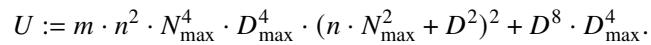

Additionally, we use min ?? to denote the smallest prime in ??, and |??| to denote the number of primes in ??.

The definitions of completeness and soundness (§4) reference ??-accuracy, which was described informally in Section 3. Below, we state ??-accuracy more formally. Let ???? denote row ?? of matrix ??.

Definition (??-accuracy). An assignment ?? for an R1CS structure S = ( ??, ??, ??) is ??-accurate if

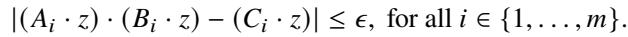

We are now ready to state the central correctness theorem for Spain.

Theorem 1. The protocol in Figure 8 satisfies Back-end (??/ ??)-completeness. The protocol also satisfies Back-end ??-soundness, with soundness error ?? upper-bounded by

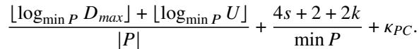

Proof. We use two facts about ????, both proved in Appendix B.5.

Lemma 2 (???? ill-defined). Let X, ??, and ?? be as in Figure 8, and let ?? be sampled uniformly from ??. Then

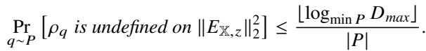

Lemma 3 (???? collision). Let X, ??, ??, and ?? be as in Figure 8 with ?? ≠ ∥??X,?? ∥2, and let ?? be sampled uniformly from ??. Conditioned on ???? being defined for ∥??X,?? ∥2, we have

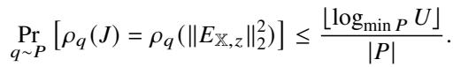

Back-end (??/ ??)-completeness. If P has an assignment ?? that is (??/ ??)-accurate for the instance X, by the argument of Section 4.1, ∥??X,?? ∥2 ≤ ??2. Thus if P sends messages prescribed by the protocol, every check by V passes, and V accepts with probability 1.

Back-end ??-soundness. Suppose that there does not exist an ??-accurate assignment for X. We bound the probability that V accepts.

First, an adversarial prover need not use Commit in Step 1 to produce com ˜?? nor use Open in Step 8 to produce an alleged opening (??, ????) of com ˜?? at ??ˆ. To handle all adversarial prover behavior involving the polynomial commitment, we define Ebind to capture the event that V accepts the opening in Step 8 but this opening is inconsistent with the commitment provided in Step 1. By inconsistent, we mean that ?? ≠ ˜?? (??ˆ). By the binding property of the polynomial commitment scheme,

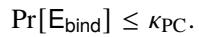

We now consider the case where Ebind does not occur, so the binding property of the polynomial commitment scheme fixes a unique ˜?? and thus a unique ?? (and unique ??).

Setup: Prover P and Verifier V agree on the parameters of the protocol, which are as follows:   
• a small constant ?? ≪ 1   
• an instance, X = ( ??, ??, ??, in, out), consisting of rationals with unreduced denominator ?? (a power of 2).   
• a polynomial commitment scheme PC satisfying Weak Integer Binding with parameters ??max and ??max.   
• a large set of primes, ??, from which V will sample in the protocol.   
Preprocessing: P and V performs the setup required by PC.   
Online phase: If at any point V’s check fails, it rejects.   
1. Using PC, P commits to a multilinear polynomial ˜?? whose coeficients are purportedly integers. P sends this commitment to V.   
• Define ?? := ˜?? /??. Define ?? as the coeficients of ??, and define ?? := (in, out, 1, ??). If P is honest, then ?? is chosen to make ?? an   
??-accurate assignment to X.   
2. P computes ∥??X,?? ∥2 (over Q), and sends ?? := ∥??X,?? ∥2 · ??8 to V.   
3. V checks that ?? is an integer, computes ?? := ??/??8, and checks that 0 ≤ ?? ≤ ??2.   
4. V samples a random prime ?? ∼ ??, sends it to P, and P and V map all quantities in Q into F?? via ????.   
5. V and P run a degree-4 sum-check primitive on   
???? (??) = ∑︁ (????(??) · ????(??) − ???? (??))2,   
?? ∈ {0,1}??   
where ????, ????, and ???? are defined as in Section 4.2.2.   
The result of this primitive is three purported claims over F??:   
???? = ????(??), ???? = ????(??), and ???? = ???? (??)   
for a random ?? ∈ F??.   
6. V samples a random ?? ∈ F??, sends ?? to P, and computes   
?? ← ???? + ???? · ?? + ???? · ??2.   
7. P and V run a degree-2 sum-check primitive on   
?? = ∑︁ ( ??(??, ??) + ??(??, ??) · ?? + ?? (??, ??) · ??2) · ??(??).   
??∈ {0,1}??   
This results in the following four purported claims over F??:   
???? = ??(??, ??), ???? = ??(??, ??), ???? = ??(??, ??), and ???? = ??(??)   
for a random ?? ∈ F????. q   
8. P maps the point ?? into Z as ??ˆ, opens the commitment to ˜?? at ??ˆ, and sends the result ?? (and accompanying proof ????) to V.   
9. V uses ???? to check that the result ?? is a valid opening; if it is, ?? = ˜?? (??ˆ) over the rationals. V computes in(??) and out  (??) (over F??),   
and combines them with ??/?? = ˜?? (??ˆ)/?? = ??(??ˆ) (mapped to F?? via ????) to produce ??˜(??). V then checks the purported claims from   
the end of Step 7.   
If all checks pass, V accepts.

## Figure 8: Spain’s back-end protocol for proving that an R1CS instance has an ??-accurate assignment.

Because X has no ??-accurate assignment, ∥??X,?? ∥∞ > ?? and thus ∥??X,?? ∥2 > ??2. However, in Step 3, V accepts only if ?? ≤ ??2. Consequently, ?? ≠ ∥??X,?? ∥2.

is undefined on ∥??X,?? ∥2 or ???? (??) = ???? (∥??X,?? ∥2).

For V to accept the final check in Step 9, it must be the case that, in some step of the protocol, a false claim is transformed into a true claim. We define one bad event per step that captures this transformation.

• Esc1: the event that, in Step 5, ???? (??) ≠ ???? (∥??X,?? ∥2), but after the first sum-check primitive, the claims ???? = ????(??), ???? = ????(??), and ???? = ???? (??) are all true.

• E???? : the event that, in Step 4, ?? ≠ ∥??X,?? ∥22, but either ???? • Eagg: the event that, in Step 6, ???? ≠ ????(??), ???? ≠ ???? (??), or ???? ≠ ???? (??), but the aggregated claim ?? = ???? + ???? · ?? + ???? · ??2 is true.

• Esc2: the event that, in Step 7,

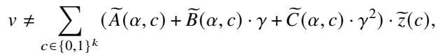

but after the second sum-check primitive, the claims ???? = ??(??, ??), ???? = ??(??, ??), ???? = ?? (??, ??), and ???? = ??(??) are all true.

If none of these occur, then ???? is defined on ∥??X,?? ∥2, ???? (??) ≠ ???? (∥??X,?? ∥2), and each step of the protocol transforms a false claim into a false claim. As a result, in the final step, at least one of the following must be false:

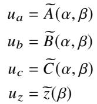

Either the verifier’s explicit evaluation of ??, ??, or ?? at (??, ??) will expose a false claim, or the opening of the commitment to ?? will expose a false claim about ??(??). Hence V rejects if none of the bad events occur.

By a union bound, the probability that V accepts is at most the sum of the probabilities of these bad events, plus Pr[Ebind]. We now bound the probability of each bad event.

For E??q, by Lemma 2, the probability that ???? is undefined on ∥??X,?? ∥22 is at most

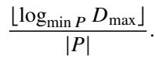

By Lemma 3, the probability that ???? (??) = ???? (∥??X,?? ∥2), conditioned on ?? ≠ ∥??X,?? ∥2 and ???? being defined on ∥??X,?? ∥2, is at most

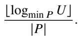

Thus, by a union bound,

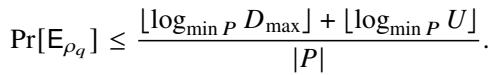

For Esc1, this event involves an invocation of the sum-check primitive on a degree-4 polynomial with ?? variables where the claimed sum is false but the final polynomial evaluation claims are all true. By Lemma 1 and min ?? ≤ ??,

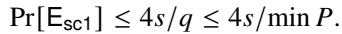

For Eagg, this event treats three claims as a degree 2 polynomial and evaluates this polynomial at a random point ??. If at least one constituent claim is false, the resulting polynomial is non-zero, and thus, by the Factor Theorem (a univariate case of the Schwartz-Zippel lemma [111, 149]) and min ?? ≤ ??,

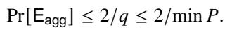

For E , this event involves an invocation of the sum-check primitive on a degree-2 polynomial with ?? variables where the claimed sum is false but the final polynomial evaluation claims are all true. By Lemma 1 and min ?? ≤ ??,

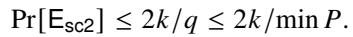

By a union bound over all bad events, we get Back-end ??-soundness holds with error at most

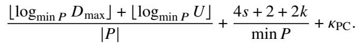

□

## B.4 Quantifying the guarantees of Spain’s back-end

The implementation described in Sections 6 and 7 uses specific parameters. The following corollary characterizes the soundness and completeness guarantees of Spain’s back-end when instantiated with DARK as the polynomial commitment scheme, and in a regime that covers the aforementioned parameters.

Corollary 1. When Figure 8 is instantiated with the following parameters:

• ?? ≤ 232, ?? ≤ 232;

• ?? ≤ 296;

• PC is the DARK multilinear polynomial commitment scheme [40] with ??max ≤ 296; and

• ?? is the set of 128-bit primes,

the resulting protocol has Back-end (??/ ??)-completeness and Back-end ??-soundness, with soundness error ?? ≤ 2−40.

Proof. Back-end (??/ ??)-completeness. DARK satisfies subproperty 2 of Weak Integer Binding, so the completeness result of Theorem 1 applies directly to this corollary.

Back-end ??-soundness. For soundness, DARK only satisfies sub-property 1 of Weak Integer Binding with high probability (explicitly bounded further below), so we have to modify the soundness analysis of Theorem 1.

Suppose that there does not exist an ??-accurate assignment for X. We bound the probability that V accepts. Define the event Eweak to be the event that, over randomness internal to DARK’s Verify function, V accepts an alleged opening of a commitment com ˜?? at ??ˆ where ˜?? does not satisfy the conditions detailed in sub-property 1 of Weak Integer Binding.

Conditioned on Eweak not occurring, the verifier’s acceptance probability is upper-bounded by the soundness error stated in Theorem 1. Thus, the overall probability that V accepts is at most

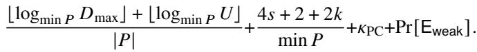

It remains to fill in the parameters and bound Pr[Eweak].

First, we quantify DARK-related parameters. We explicitly set ??max ≤ 296 and derive ??PC, ??max, and Pr[Eweak] using a combination of the analysis in the corrected DARK paper [40] and a subsequent work [39]. In the corrected DARK paper [40], it is proved that ??PC for the DARK polynomial commitment scheme is at most (3 log |??|)/2 , where ?? is a parameter internal to DARK that introduces a tradeof between ??PC and ??max. By choosing ?? = 50, we get that ??PC ≤ (3 log |??|)/2 = 3 · 32/250 < 2−43. From the analysis and scripts provided in the subsequent work [39], we get that for ??max ≤ 21422, Pr[Eweak] ≤ ??PC. Note that the analysis below is not very sensitive to the magnitude of ??max or ??max; however, it is very sensitive to ?? , and ?? is chosen with that in mind.

Next, we need to determine the size of ??, the set of 128-bit primes. The number of 128-bit primes is exactly ??(2128) − ??(2127), where ??(??) is the prime counting function. By the following standard bound [109]:

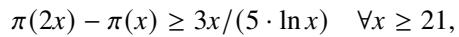

we have that

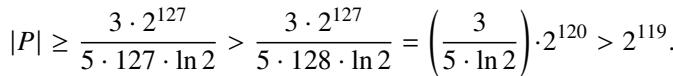

Additionally, min ?? > 2127 by definition.

The remainder of the proof proceeds by computing

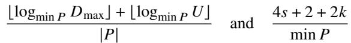

using the parameters above. This calculation is tedious but mechanical. By definition:

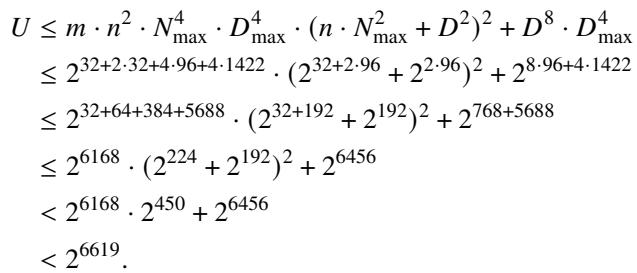

It follows that

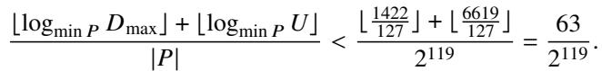

Additionally, we have the following bound on the second term:

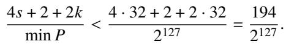

By summing these two terms, ??PC < 2−43, and Pr[Eweak] ≤ ??PC, we get that the probability that the verifier accepts a non-??-accurate assignment is less than 2−40, as claimed. □

## B.5 Deferred proofs

Here we prove Lemma 2 and Lemma 3. We start with two counting lemmas that they use.

Lemma 4. Given an integer ?? of magnitude at most ?? and a set ?? of primes,

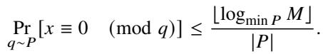

Proof. For ?? to be divisible by a prime ??, ?? must be one of the prime factors of ??. Suppose by contradiction that ?? had more than ⌊log ?? ??⌋ prime factors from ?? (counting multiplicity). Then ?? would have magnitude at least (min ??)⌊logmin ?? ??⌋+1 > ??, a contradiction. Thus, ?? has at most ⌊logmin ?? ??⌋ prime factors from ??, and the probability that a random prime from ?? divides ?? is at most ⌊log ?? ??⌋/|??|. □

Lemma 5. Consider instance X, multilinear polynomial ˜?? , and vector ??, as defined in the protocol in Figure 8. Let ??′ be the unreduced denominator shared by the coeficients of ˜?? . Then, the denominator of ∥??X,?? ∥2 is exactly ??8 · ??′4. The numerator of ?? − ∥??X,?? ∥2 is at most ??, where ?? is as defined in Section B.3, and the denominator of this diference has the same denominator as ∥??X,?? ∥2.

Proof. The proof proceeds by bookkeeping: tracking exact denominators and an upper bound on the magnitude of intermediate numerators. The accounting pessimistically assumes that no reduction occurs when performing arithmetic operations. For example, when adding two rationals (??1, ??1) and (??2, ??2) where gcd(??1, ??2) = 1, the numerator of the result is at most |??1| · ??2 + |??2| · ??1 in magnitude and the denominator is exactly ??1 · ??2.

By definition (§4.1),

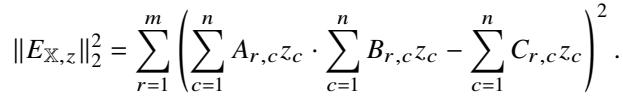

Note that these summations are over ?? and ?? summands respectively as opposed to 2?? and 2?? summands as described in Section 4.2.2. This is because we are working with ??, ??, ?? as matrices, rather than their multilinear extensions.

Now, recall that the entries of ??, ??, ??, in, and out all have unreduced denominator ??; recall also that the numerators of the entries of ??, ??, ??, in, and out have magnitude at most ??max (§B.2).

?? is a concatenation of in, out, and ?? (the definition of ?? is in Figure 8). To bound the components of ??, Weak Integer Binding’s sub-property 1 (§B.1) implies that, for the coeficients of ˜?? , their unreduced denominator, ??′, satisfies ??′ ≤ ??max and their numerators have magnitude at most ??max. By definition of ??, its coeficients – that is, the components of ?? – share an unreduced denominator of ?? · ??′, and each has an unreduced numerator of magnitude at most ??max. From this, it follows that ??, when written with a common unreduced denominator of ?? · ??′, has numerators of magnitude at most ??max · ??′.

For any matrix ??, ????,?????? is a rational with an unreduced numerator of magnitude at most ??2max · ??′ and an unreduced denominator exactly ??2 · ??′.

Thus, Í????=1 ????,?? ???? is a rational with a numerator of magexactly ??2 · ??′.

It follows that Í????=1 ????,?? ???? · Í????=1 ????,?? ???? is a rational with a denominator of magnitude exactly (??2 · ??′)2 = ??4 · ??′2.

When subtracting Í????= ????,?? ????, a rational of the form (??1, ??2 · ??′), from Í????=1 ????,?? ???? ·Í????=1 ????,?? ????, a rational of the form (??2, ??4 · ??′2), one needs to multiply the numerator and denominator of the first rational by ??2 · ??′ to get a common denominator (in the worst case). Thus, after performing the scaling and subtraction, the resulting rational has a numerator of magnitude at most

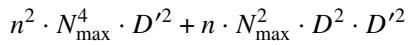

and an unreduced denominator of magnitude exactly ??4 · ??′2.

Squaring this rational to get the contribution of row ?? to ∥??X,?? ∥2 results in a rational with a numerator of magnitude at most

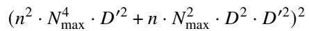

and an unreduced denominator of magnitude exactly ??8 · ??′4.

Summing over ?? rows to get ∥??X,?? ∥2 does not change the denominator so results in a rational with denominator ??8 · ??′4 (as claimed) and a numerator of magnitude at most

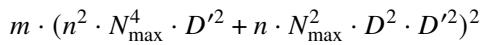

which simplifies to

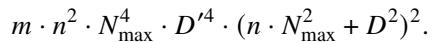

To bound the numerator and denominator of ?? − ∥??X,?? ∥2, we first need to characterize the numerator and denominator of ??. To do this, we consider V’s checks in Step 3. To pass these checks, ?? must be a rational of the form (??, ??8) where ?? is a positive integer bounded above by ??8 (since 0 ≤ ?? ≤ ??2 ≤ 1). To perform the subtraction ?? − ∥??X,?? ∥2, one needs to multiply the numerator and denominator of ?? by ??′4 to get a common denominator (in the worst case). The resulting rational ?? − ∥??X,?? ∥2 has a numerator of magnitude at most

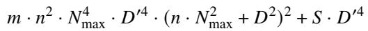

and an unreduced denominator of magnitude exactly ??8 · ??′4, as claimed.

Given that ??′ ≤ ??max and ?? ≤ ??8, the numerator is upper-bounded by

This is exactly ??, as claimed.

With the prime-divisibility bound (Lemma 4) and the numerator bound (Lemma 5) in hand, the two ???? facts quickly follow.

Proof of Lemma 2 (???? ill-defined). ???? is undefined on ∥??X,?? ∥22 exactly when ?? divides the denominator of ∥??X,?? ∥22. By Lemma 5, the denominator is a product of powers of ?? and ??′ (where ??′ ≤ ??max). By construction, ?? does not divide ??; thus ?? divides the denominator of ∥??X,?? ∥2 if and only if ?? divides ??′. Applying Lemma 4 with ?? = ??max gives the bound. □

Proof of Lemma 3 (???? collision). ???? (??) = ???? (∥????,?? ∥2) if and only if ?? divides the numerator of ?? − ∥????,?? ∥2, which, by Lemma 5, has magnitude at most ??. Applying Lemma 4 with ?? = ?? gives the desired bound. □

## C DARK with verifier-known group order

This appendix details the technique mentioned in Section 4.2.3. We consider an RSA group G with generator ?? and modulus ?? = ??1 · ??2. The verifier knows ??1 and ??2, while the prover only knows ?? and ?? but not its factorization.

DARK requires, as a primitive, a way for the prover to convince the verifier that ?? = ?? · ?? · given ?? , ?? , and ?? and a constant ?? known to both parties. The problem is computing (?? ) ; the verifier cannot eficiently compute an exponentiation this large, because it requires ⌈log ??⌉ multiplications, which is potentially on the order of a million or a billion (the combined bit-length of all witness elements). DARK solves this with a proof of exponentiation protocol that is burdensome for the prover. In Spain, the verifier borrows an optimization from RSA signing algorithms when the signer knows the factorization of ??.

The key observation is that knowledge of the factorization of ?? allows the verifier to compute ??(??), where ?? is Carmichael’s function [1, 43]. Then the verifier can compute ??′ = ?? mod ??(??), a value on the order of ?? rather than ?? itself, and compute (????)?? instead of (????)??.

The correctness of this substitution is as follows. ?? is a group element and thus is relatively prime to ??, so by the definition of Carmichael’s function, we have (?? ) ( ) ≡ 1 (mod ??), and thus (????)?? ≡ (????)?? (mod ??).

This substitution is eficient because log ??′ ≈ log ??, which is at worst a few thousand rather than a few billion.

At a high level, replacing the proof of exponentiation in DARK with an explicit exponentiation, independent of how the verifier computes, does not change the security of DARK.

Block et al. [29, Lemma 6.4] formally prove this in the context of a verifier that does not know the factorization of ?? and opts to compute (?? ) directly. Their proof applies to our setting as well, as the verifier’s computation of (????)?? is functionally equivalent to computing (?? ) directly.

## D Protocol extensions

Spain can be adapted and extended in various ways.

## D.1 SIMD-R1CS

Per Section 4.3, Spain can be adapted to support common variations on R1CS, namely SIMD-R1CS and I-R1CS.

In SIMD-R1CS (§4.3), the prover has ?? instances, each with its own public input and witness, but sharing the same R1CS structure ( ??, ??, ??). That is, there are vectors ??0, . . . , ????−1, corresponding to instances X0, . . . , X??−1, where all instances are the same R1CS structure. To support SIMD-R1CS, define ??(??, ??) similarly to ??(??). Here ?? selects the particular instance and ?? selects the variable within that instance (similar to how ?? functioned earlier). Given the multilinear extension ??(??1, ??2), define

Then there are two options for proving correctness across all ?? instances.

The first option is for the prover to make a single claim ?? about the sum of squared errors across all ?? instances. Then, the verifier can confirm that ?? ≤ ??2 and the two parties can apply the sum-check protocol to prove that

where ℓ = ⌈log ??⌉. This provides Back-end ??-soundness and Back-end (??/ ?? · ??)-completeness. Notice that completeness degrades with ?? here.

The second option is to have the prover make ?? − 1 separate claims, where for ?? = {0, . . . , ?? − 1}, each claim ?? ?? is about ∥??X?? ,???? ∥2 for the respective instance X ?? . The verifier then checks that each ?? ?? is at most ??2. Then, the prover and verifier interpret ???? (??) = [???? (??0), . . . , ???? (????−1)] as a function (from index bits to value) to get its multilinear extension: ?? (??). Finally, and uses polynomial identity testing (similar to Spartan [116]) to prove that ?? (??) is equal to

This provides Back-end ??-soundness and Back-end (??/ ??)- completeness. Compared to the first option, completeness does

not degrade with ?? here; however, the expression is degree 5 in ?? rather than degree 4, which mildly increases prover and verifier time.

## D.2 I-R1CS

For I-R1CS (§4.3), the modification to Spain is simply: at the end of the protocol, rather than opening a single commitment, the prover opens all commitments ??1, . . . , ????.

Recall that Spain introduces an additional optimization: Spain allows for the prover and verifier to collaboratively introduce not only new values for the assignment but also new constraints on the witness in each round. This allows the verifier to encode random challenges in constraints, or to partially specify constraints that are “filled-in” by the prover. These techniques reduce the cost of performing dot products between the witness and random vectors, which is the core operation in checkers for matrix multiplication [56, 74]

## D.3 Diferent norms for error measurement

Spain can be generalized to have a smaller gap between soundness and completeness versus the one presented in the paper, namely ???? = ??/ ??. Doing so lowers the precision required of the prover’s witness generation (see §6.3 for the interplay between “precision of witness generation” and ????) but makes the underlying back-end protocol more costly.

Specifically, by using the ℓ2?? norm rather than the ℓ2 norm of ??X,??, for integer ?? > 1, Spain will continue to have Backend ??-soundness but now it will have Back-end (??/??1/(2??) )- completeness. That is because the following chain of inequalities holds:

for any integer ?? > 1. To adapt Spain to use the ℓ2 norm, the prover and verifier start with the following equation in place of Equation (4) in Section 4.2.2 (Step 5 in Figure 8):

This is a degree-(4??) polynomial in ??, so as ?? increases, so does prover time, verifier time, and communication.

## E Translation fidelity

This appendix defines translation fidelity and covers some technical details of this concept. The bulk of the appendix analyzes the translation fidelity of the arithmetizations presented in Section 5.

## E.1 Preliminaries

Definitions. Given an R1CS structure S = ( ??, ??, ??), recall that all entries in ??, ??, ?? are presumed to have a given denominator ??, and likewise with the assignment ?? (§4.2.1, Appx. B). We call such numbers ??-multiples, where ?? = 1/??.

Let ???? (??) denote the possible outputs of function ?? on input ?? when its individual operations have error bounded by ??.

Recall the distinction between ?? and ??wg (§3). ?? is part of the underlying protocol’s soundness guarantee: if any operation in an execution has error greater than ??, the verifier is supposed to reject with high probability. On the other hand, ??wg connects to the protocol’s completeness guarantee: we want to arrange the design and implementation so that if the prover limits the per-operation error to ??wg, then it can satisfy all constraints with suitable error, and thereby cause the verifier to accept.

The reason for the asymmetry is technical. It relates to the definitions of soundness and completeness in the front-end (given in the next paragraph), and to the fact that ?? and ???? are diferent, which itself stems from the fact that ∥??X,?? ∥∞ ≤ ?? does not imply ∥??X,?? ∥2 ≤ ??2 (§4.1).

Now, consider a purported translation of ?? to an R1CS structure S = ( ??, ??, ??). Translation fidelity is two properties:

• The translation is ??-tf-sound if: for all ??-accurate assignments (in, out, 1, ??) to S, out ∈ ???? (in).

• The translation is ???? -tf-complete if: for all (in, out) such that out ∈ ????wg (in) and (in, out) contains only ??-multiples, there exists an accompanying ?? such that (in, out, 1, ??) is an ????-accurate assignment to S.

It is helpful to keep the following ordering in mind:

?? ≥ ?? (will be established in the examples below)

≥ ??wg (will be established in the examples below)

Per-operation vs per-function translation fidelity. The definitions of tf-soundness and tf-completeness cover translation of an entire function. However, the arithmetizations that we present in the next section will be at the level of individual operations. For these lower-level translations to be relevant, Spain needs a way to combine the translations of individual operations. The needed concept is composition (of operations or functions), and specifically how translations combine under composition. The description below delves into detail; the high-level point is that focusing on the translations of individual operations is justified.

Given two functions ?? and ??, with corresponding R1CS instances X?? = (????, ????, ????, in??, out??) and X?? = ( ????, ????, ????, in??, out??), the corresponding instance for ?? ◦ ??, X??◦?? , is ( ??, ??, ??, in, out) where in = in?? , out = out??, and ??, ??, ?? contain the constraints of ????, ????, ???? and ????, ????, ????, relabeled so that the output variables of X?? and the input variables of X?? refer to the same set of variables, which we call med; the variables in med are not part of either in or out. The lemma below states that translation fidelity is preserved by the composition of functions.

Lemma 6. If ?? and X?? satisfy ??-tf-soundness and ???? -tfcompleteness, and if ?? and X?? satisfy ??′-tf-soundness and ??′?? -tf-completeness, then ?? ◦ ?? and X??◦?? satisfy min{??, ??′}- tf-soundness and max{????, ??′ }-tf-completeness.

Proof. We first establish min{??, ??′}-tf-soundness, where ??∗ := min{??, ?? }. The constraints of X??◦?? are those of X?? together with those of X??, sharing only the variables med. An ??∗- accurate assignment to the composite therefore restricts to an ??∗-accurate assignment to each part; as ??∗ ≤ ?? and ??∗ ≤ ??′, these are in particular ??- and ??′-accurate. Then ??-tf-soundness of ?? gives med ∈ ???? (in), and ??′-tf-soundness of ?? gives out ∈ ?? ?? (med), so out ∈ (?? ◦ ??)?? (in).

For tf-completeness, set ??∗ := max{???? , ??′?? }. Consider (in, out) where in and out contain ??-multiples and out ∈ (?? ◦ ??) ?? (in). By definition of the composite, there must be med, consisting of ??-multiples, with med ∈ ???? (in) and out ∈ ?? ?? (med). Applying ????-tf-completeness of ??, there exists ????, where (in, med, 1, ????) is an ????-accurate assignment to ( ????, ????, ????). Likewise, there exists ????, where (med, out, 1, ????) is an ??′ -accurate assignment to (????, ????, ????). Combining ????, ????, and med into ??, the assignment (in, out, 1, ??) satisfies each constraint of X??◦?? with error upper-bounded by ???? or ????, hence upper-bounded by ??∗. □

## E.2 Analysis of arithmetizations

The ?? and ???? described for the translations below depend on the magnitudes of the inputs to these subfunctions. This is not problematic because Spain enforces a strict bound on the magnitude of rationals in the proof protocol (§B). By considering this maximum magnitude, one derives absolute bounds on ?? and ????.

z ← x/y. Division is a special case where the error bound is inversely proportional to the magnitude of ??, and thus one must place restrictions on the domain of ?? or perform static analysis to ensure ?? is not too close to 0 when using this operation. Here we will assume that |??| ≥ ?? for some known ?? > 0.

First, we establish ??-tf-soundness. Suppose we have an ??-accurate assignment to ?? · ?? ≈?? ??. That means |?? · ?? − ??| ≤ ??. Rearranging, we have that |?? − (??/??)| ≤ ??/|??|. This implies that ?? is within ??/|??| of ??/??, and thus |?? − (??/??)| ≤ ??/?? (using the assumed lower bound on |??|). Letting ?? = ??/?? completes the proof of ??-tf-soundness.

Second, for ???? -tf-completeness, consider all (??, ??, ??), restricted to ??-multiples, such that ?? = (??/??) + ??± where |??±| ≤ ??wg. The constraint has error at most

This establishes ????-tf-completeness provided that ???? ≥ ??wg|??| for all inputs ??.

y ← x. First, we establish ??-tf-soundness. Suppose we have an ??-accurate assignment to ??·?? ≈?? ??. That means |??2−??| ≤ ??. This can be rewritten as |?? − ??| · |?? + ??| ≤ ??, where ?? is a true square root of ??, and assume WLOG that ?? is the positive root. This implies that either |?? − ?? | or |?? + ?? | is less than or equal to ??. This, in turn, implies that ?? is within ?? of a true square root of ??. Letting ?? = ?? finishes the proof for ??-tf-soundness.

Second, for ???? -tf-completeness, consider all (??, ??), restricted to ??-multiples, such that ?? = ?? + ??± where ??± is a real number with |??±| ≤ ??wg. The constraint ?? · ?? ≈?? ?? is satisfied with error at most

This establishes ???? -tf-completeness provided that ???? ≥ 2??wg| ??| + ??2wg for all inputs ??.

assert (x ≥ y). Recall that this is an assert of the form “greaterthan-or-approximately equal” where ?? and ?? are allowed (but not required) to be “approximately-equal” when they are within ?? of each other.

First, we establish ??-tf-soundness. Suppose we have an ??- accurate assignment to ?? ·?? ≈?? ??−??. That means |??2− (??−??)| ≤ ??. By definition, ??2 ≥ 0. This implies that ?? − ?? ≥ −??. Letting ?? = ?? finishes the proof for ??-tf-soundness.

Second, for ???? -tf-completeness, consider all ??, ??, restricted to ??-multiples, such that ?? ≥ ??. Let ?? be the nearest ??-multiple to ?? − ??. Thus, ?? = ?? − ?? + ??± where |??±| ≤ ??/2. Then the constraint ?? · ?? ≈?? ?? − ?? is satisfied with error at most

This establishes ???? -tf-completeness provided that ???? ≥ ?? ?? − ?? + ??2/4.

b ← (x ≥ y). First, we establish ??-tf-soundness for ?? < 1/8. Suppose we have an ??-accurate assignment to the constraints: ?? · (1 − ??) ≈?? 0, (2?? − 1) · (?? − ??) ≈?? ??, and ?? · ?? ≈?? ??. Using the same reasoning as in proving ??-tf-soundness for the assert statement, the third constraint implies ?? ≥ −??.

The first constraint implies |?? · (1 − ??)| ≤ ??. By our bound on ?? and the quadratic formula applied to −?? ≤ ?? · (1 − ??) ≤ ??, we have

or

Given that 1 − 4?? ≥ 1−4?? for ?? < 1/4, and 1 + 4?? ≤ 1+4?? for ?? < 1/4, this implies that ?? ∈ [−2??, 2??] ∪ [1 − 2??, 1 + 2??], namely that ?? is within 2?? of either 0 or 1.

The second constraint requires the most involved analysis. An ??-accurate assignment implies | (2?? − 1) · (?? − ??) − ??| ≤ ??.

Given that ?? ≥ −??, this implies (2?? − 1) · (?? − ??) ≥ −2??. Let ??′ := 2?? − 1. From the bounds on ?? from before

We also have ??′ · (?? − ??) ≥ −2??. We consider two cases, depending on which interval ??′ falls into.

Case 1: ??′ ∈ [−1 − 4??, −1 + 4??]. In this case, we have

Given that ?? ≤ 1/8, we have

Case 2: ??′ ∈ [1 − 4??, 1 + 4??]. In this case, we have

Given that ?? ≤ 1/8, we have

Summarizing the two cases: ?? ∈ [−2??, 2??] (which is case 1) implies ?? − ?? ≤ 4??, while ?? ∈ [1 − 2??, 1 + 2??] (which is case 2) implies ?? − ?? ≥ −4??, or ?? − ?? ≤ 4??.

Taking the contrapositive of both

Finally, if |?? − ??| ≤ 4??, no further conclusion can be drawn about ??, except that it must remain in the intervals derived above. This means it must be within 2?? of either 0 or 1.

By taking ?? = 4??, the relationships among ??, ??, and ?? obey the intended semantics of the operation, and thus ??-tfsoundness holds.

Second, we establish ????-tf-completeness, provided that ??wg ≤ 1/2. Consider all (??, ??, ??), restricted to ??-multiples, such that ?? = 1 + ??± if ?? ≥ ?? and ?? = ??± otherwise, where ??± is a real number with |??±| ≤ ??wg.

For the first constraint there are two cases to consider.

Case 1: suppose ?? ≥ ?? and thus ?? = 1 + ??±. The constraint is satisfied with error at most

Case 2: suppose ?? < ?? and thus ?? = ??±. The upper bound on error is the same:

For the second constraint, take ?? = (2?? − 1) · (?? − ??). The constraint is then satisfied with zero error.

For the third constraint, take ?? to be the nearest ??-multiple to ??. Thus, ?? = ?? + ??± where |??±| ≤ ??/2. Such a square root exists because ?? ≥ 0. This follows because (2?? − 1) and (?? − ??) have the same sign, as long as ??wg ≤ 1/2. Now, we show ?? ≤ 2 · |?? − ??|, as follows. If ?? ≥ ??, then ?? = 1 + ??± and thus

If ?? < ??, then ?? = ??± and thus

Given this, the third constraint is satisfied with error at most

This establishes ???? -tf-completeness provided that ???? ≥ max{??wg + ??2wg, ??√︁2 · |?? − ??| + ??2/4}.

z ← max{v , . . . , v }. Recall the constraints from Section 5:

• for all ?? ∈ {1, . . . , ?? }: ???? · ???? ≈?? ?? − ????

• for all ?? ∈ {1, . . . , ?? }: ???? · (1 − ???? ) ≈?? 0

• for all ?? ∈ {1, . . . , ?? }: ???? · (?? − ???? ) ≈?? 0

• Í????=1 ???? ≈?? 1

First, we establish ??-tf-soundness, for all ?? ≤ 1/4 when ?? · (2?? + 1) < 1. Suppose we have an ??-accurate assignment to the constraints. For the first set of constraints, we can reuse the results from the assert operation to establish that ?? ≥ ???? − ?? for all ??. From the second set of constraints, we can use the same reasoning as in ?? ← (?? ≥ ??) to establish that each ???? is within 2?? of either 0 or 1. Given that ?? · (2?? + 1) < 1, the last constraint and the second set together imply that there exists some index ?? such that ?? ?? is within 2?? of 1. This follows by contradiction, suppose this was not the case, then each ???? would be within 2?? of 0, and thus Í???? ???? ≤ 2?? · ?? < 1 − ??, leaving the final constraint unsatisfied by more than ??.

This leaves the third set of constraints to analyze. Let ?? be the index for which ?? ?? ≥ 1 − 2??. Since the assignment is ??-accurate, |?? ?? · (?? − ?? ?? )| ≤ ??. Thus:

In particular:

We already have ?? ≥ ???? − ?? for all ??, which implies

and since ?? < 1−2?? € also

Thus, |?? − max?? ???? | ≤ ??1−2?? . Given that ?? ≤ 1/4, ??1−2?? ≤ ??1/2 = 2??. Setting ?? = 2?? completes the proof of ??-tf-soundness.

Second, we establish ????-tf-completeness. Consider all (??1, . . . , ????, ??), restricted to ??-multiples, such that ?? = max?? ???? + ??± for some ??± where |??±| ≤ ??wg.

Take ?? ?? = 1 for the index ?? corresponding to the maximum value, and set all other ???? to 0.

For the first set of constraints, we use that ?? − ???? ≥ −??wg. This follows from the fact that ?? = max?? ???? + ??± and thus ?? − ???? = max?? (????) + ??± − ???? ≥ ??± ≥ −??wg. Now there are two cases to consider.

Case 1: suppose ?? − ???? ≥ 0. In this case, set ???? to be the nearest ??-multiple to ?? − ????. Thus, ???? = ?? − ???? + ??±??, where |??±?? | ≤ ??/2. These constraints are satisfied with error at most

Case 2: suppose ?? − ???? < 0. In this case, take ???? = 0. These constraints are satisfied with error at most

The second and fourth set of constraints are satisfied with zero error, by the choice of ???? above.

The third set of constraints breaks into two cases. When ???? = 0, the ??th constraint in the set is satisfied with zero error. When ???? = 1 (that is, when ?? = ?? ), constraint ?? in the set is satisfied with error at most ??wg, as ?? ?? · (?? − ?? ?? ) = ?? − ?? ?? = ??± ≤ ??wg.

This establishes ???? -tf-completeness provided that

ReLU. First, we establish ??-tf-soundness for ?? ≤ 1. Suppose we have an ??-accurate assignment to the constraints: ?? · ?? ≈?? ?? − ??, ?? · ?? ≈?? ??, and (?? − ??) · ?? ≈?? 0 From the first and second constraints, we have that ?? ≥ −?? + max(0, ??). The third constraint is where things diverge from prior analyses. An ??-accurate assignment implies | (?? − ??) · ??| ≤ ??. This can be decomposed as |?? − ??| · |??| ≤ ??. For the product on the left to be at most ??, then at least one of the two factors must be at most ??. Thus ?? is within ?? of either 0 or ??.

Now there are two cases to consider.

Case 1: suppose ?? ≥ 0. Here ?? is at least ?? − ?? by the first two constraints, and at most ?? + ?? by the third constraint. thus, as required, ?? is within ?? of ??.

Case 2: suppose ?? < 0. Here ?? is at least −?? by the first two constraints, and at most ?? by the third constraint. Thus, as required, ?? is within ?? of 0.

By combining these cases, we get that ?? is within ?? of max(0, ??). Setting ?? = ?? completes the proof.

Second, we establish ????-tf-completeness. Consider all (??, ??), restricted to ??-multiples, such that ?? = max(0, ??) + ??± where ??± is a real number with |??±| ≤ ??wg. We consider each constraint individually and take the maximum error across all constraints.

Constraint 1: ?? · ?? ≈?? ?? − ??. This constraint has error at most

where ??′ := min(??, 0) − ??±. ??′ is an ??-multiple ≤ ??wg. There are two cases to consider.

Case 1: suppose ??′ > 0. In this case, setting ?? = 0 satisfies this constraint with error at most ??wg.

Case 2: suppose ??′ ≤ 0. In this case, set ?? to the closest ??-multiple to −??′. Thus, ?? = −??′ + ??±, for some ??± where |??±| ≤ ??/2. Then this constraint has error at most

Thus the first constraint is satisfied with error at most

Constraint 2: ?? · ?? ≈?? ??. This constraint has error at most

The analysis is similar to the one for the first constraint. The cases here are ?? ≤ 0 (in which case let ?? = 0) and ?? > 0 (in which case let ?? be the closest ??-multiple to ??). These settings satisfy this constraint with error at most

Constraint 3: (?? − ??) · ?? ≈?? 0. This constraint is satisfied with error at most

Combining the above, we have that all constraints are satisfied with error at most

This establishes ???? -tf-completeness provided that

## E.3 On choosing between alternative arithmetizations

When using traditional constraints, the fewer constraints in an arithmetization the better. However, with approximate constraints, this is not always the case. Take ReLU as an example. The ReLU arithmetization in Section E.2 is 3 constraints and satisfies ??-tf-soundness with ?? = ??. By contrast, if the following 5 constraints are used (derived from the max primitive):

then ??-tf-soundness is satisfied with ?? = 2??.

Despite using almost twice as many constraints, the second arithmetization produces a significantly tighter relationship between ?? and ??. This in turn enables a larger ???? and ??wg (which means lower precision is needed in witness generation). In settings where high-precision witness generation is a bottleneck, the second arithmetization may be preferable, in spite of using a larger number of constraints.

## E.4 Hybrid arithmetizations

Spain exclusively handles approximate constraints. Here we sketch a short exploration of a hybrid setting where there are two structures, S?? and Sexact, that enforce approximate and traditional constraints respectively on the same assignment ??.

By appending to the definition of ??-accuracy the requirement that the traditional constraints (those in Sexact) are satisfied with zero error, the notion of translation fidelity can be extended to this hybrid setting. To demonstrate, we step through the analysis of a simple operation, ?? ←exact (?? ≥ ??), where ?? is exactly 0 or 1 and the comparison is approximate. Consider a hybrid arithmetization of this primitive that has two traditional constraints: ?? · (1− ??) = 0 and (2?? −1) · (?? − ??) = ??, and one approximate constraint: ?? · ?? ≈?? ??.

b ←exact (x ≥ y). First, we establish ??-tf-soundness. Suppose we have an ??-accurate assignment to the constraints.

From the second constraint, we have that

Using the same reasoning as in proving ??-tf-soundness for the assert statement, the third constraint (the approximate one) implies ?? ≥ −??.

By combining the above, we have that

In the case where |?? − ??| ≤ ??, ?? can be either 0 or 1, which is consistent with the semantics of the approximate comparison.

By taking ?? = ??, we have that ?? is consistent with the semantics of the approximate comparison, and thus ??-tf-soundness is established.

Second, we establish ????-tf-completeness. Consider all (??, ??, ??) restricted to ??-multiples such that ?? = 1 if ?? ≥ ?? and ?? = 0 otherwise. Take ?? to be exactly (2?? − 1) · (?? − ??) and ?? to be the nearest ??-multiple to ??. Thus ?? = ?? + ??ˆ for some ??ˆ where |??ˆ| ≤ ??/2.

The traditional constraints are satisfied with zero error by the choice of ?? and the definition of ??.

Because ?? is either 0 or 1, ?? = (2?? − 1) · (?? − ??) = |?? − ??|. Given this, the third constraint is satisfied with error at most

This establishes ????-tf-completeness provided that ???? ≥ ??√︁|?? − ??| + ??2/4.

Note that both the tf-soundness and tf-completeness results here are stronger than those presented in the prior analysis of ?? ← (?? ≥ ??) where ?? is approximately Boolean and no traditional constraints are used.

Also, when exclusively using approximate constraints, it is extremely complex to confine ?? to be strictly Boolean, while with traditional constraints, doing so is straightforward. This example indicates the potential benefits of hybrid arith metization, the full exploration of which we leave to future work.

## F End-to-end correctness

We derive end-to-end soundness and completeness for Spain in the general case and for the parameters in our implementation. We do so by combining back-end correctness (Theorem 1, §B.3) and translation fidelity (§E.1). The statements below rely on ?? and ??wg, which are discussed in Appendix E.1.

Corollary 2. Let ?? be a computation and (??, ??, ??) be an R1CS structure with ?? constraints and ?? variables. If ( ??, ??, ??) is an ??-tf-sound and (??/ ??)-tf-complete translation of ??, then the protocol in Figure 8 satisfies the following two guarantees:

1. If out ∉ ???? (in), then the verifier accepts with probability at most

2. If out ∈ ????′ (in), then the prover can always make an honest verifier accept.

This corollary follows by straightforward combination of Theorem 1 with the definitions of tf-soundness and tfcompleteness in Appendix E.1.

Corollary 3. Let ?? be a computation from the list of benchmarks in Section 7, and ( ??, ??, ??) be an R1CS structure with ?? ≤ 232 constraints and ?? ≤ 232 variables. If ( ??, ??, ??) is an ??-tf-sound and (??/ ??)-tf-complete translation of ??, then the protocol in Figure 8 with the parameters in Corollary 1 satisfies the following two guarantees:

1. If out ∉ ???? (in), then the verifier accepts with probability at most 2−40.

2. If out ∈ ????′ (in), then the prover can always make an honest verifier accept.

The proof of this corollary follows mechanically from Corollaries 1 and 2.

## G Artifact Appendix

## Abstract

The purpose of this artifact is to disseminate our implementation of Spain, let others to prove execution of numerical computations using Spain, and enable reproduction of the paper’s experimental results.

## Scope

The artifact comprises the implementation of Spain described in Section 6 as well as the experimental results and figures in Section 7.

## Contents

The artifact includes implementations of Spain’s front-ends and back-end (§6), implementations of the ZKLP-FE and Otti-FE baselines, scripts for reproducing experimental results, and ONNX files used for arithmetization.

The artifact is documented with a README that includes further detail and instructions for running numerical computations through Spain.

## Hosting

The artifact is publicly available at https://doi.org/ 10.5281/zenodo.20090527.

## Requirements

Docker is required to run this artifact. Memory requirements to reproduce results for benchmarks on the prover are as follows:

• For GPT-2, seq=2: at least 10 GB RAM

• For GPT-2, seq=32: at least 40 GB RAM

• For GPT-2, the largest passes with which we experiment, namely passes= 16: at least 270 GB RAM

• For ZKLP-FE: at least 92 GB RAM

• For all other benchmarks: experimental results can be reproduced with under 5 GB of RAM for the prover.