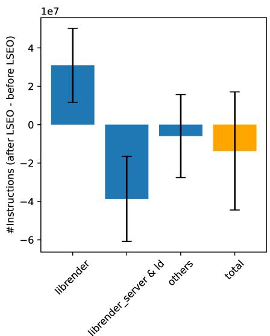
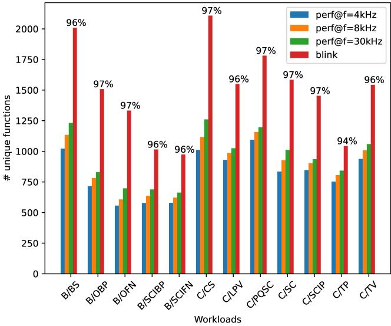
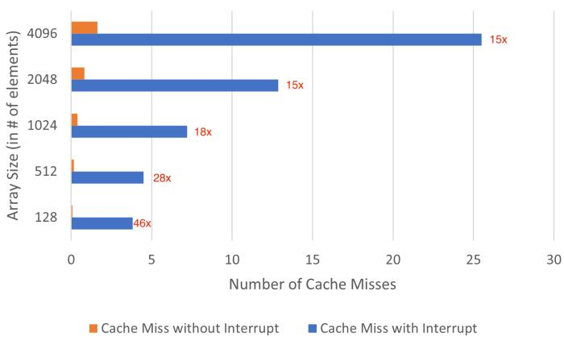
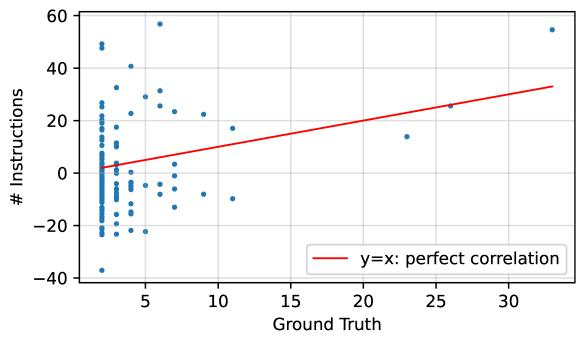
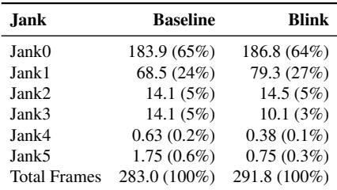
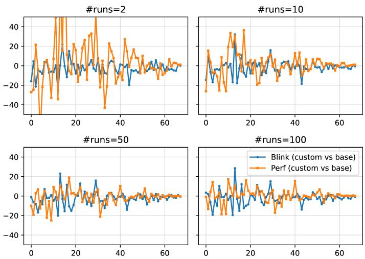
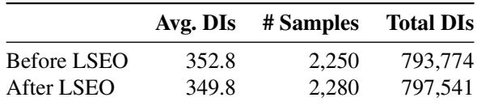
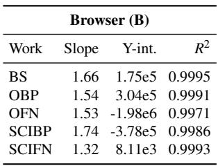
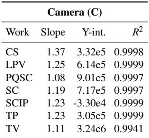
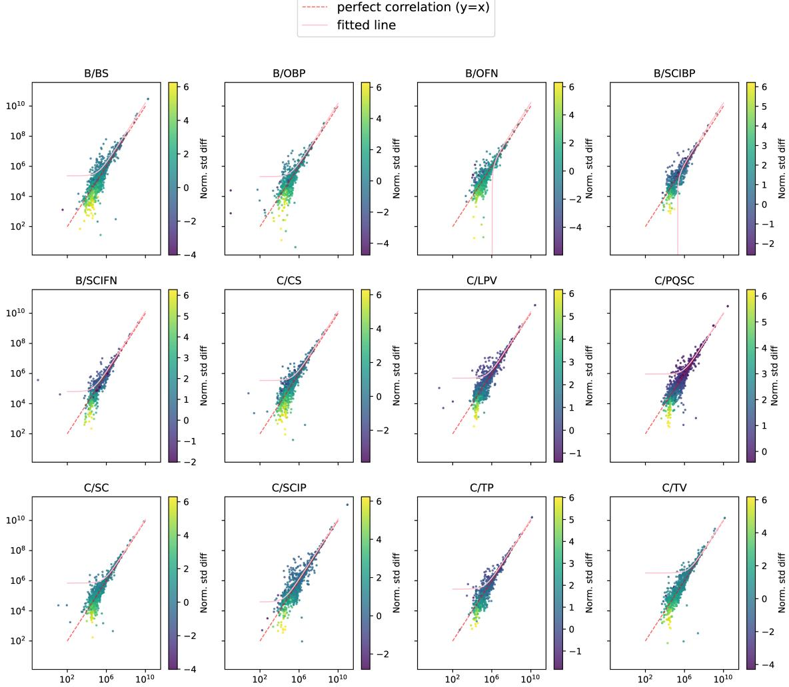

USENIX

THE ADVANCED COMPUTING SYSTEMS ASSOCIATION

# When Sampling Lies: Trustworthy Performance Profiling for Flat Workloads with Blink (Operational Systems)

Rishikesh Devsot, YScope; ChenXing Yang and Yi Fan Yu, YScope and University of Toronto; Prabhdeep Singh Soni, Afshin Arefi, Bryan Chan, and Reza Azimi, Huawei Technologies Canada; Ding Yuan, YScope and University of Toronto https://www.usenix.org/conference/osdi26/presentation/devsot

# This paper is included in the Proceedings of the 20th USENIX Symposium on Operating Systems Design and Implementation.

July 13–15, 2026 • Seattle, WA, USA

ISBN 978-1-939133-55-7

Open access to the Proceedings of the 20th USENIX Symposium on Operating Systems Design and Implementation is sponsored by

# When Sampling Lies: Trustworthy Performance Profiling for Flat Workloads with Blink (Operational Systems)

Rishikesh Devsot<sup>†</sup> ChenXing Yang<sup>†‡</sup> Afshin Arefi<sup>§</sup> Bryan Chan<sup>§</sup>

YScope<sup>†</sup> University of Toronto<sup>‡</sup>

Yi Fan Yu<sup>†‡</sup> Prabhdeep Singh Soni<sup>§</sup> Reza Azimi<sup>§</sup> Ding Yuan<sup>†‡</sup>

Huawei Technologies Canada<sup>§</sup>

## Abstract

Performance optimization of mobile systems is critical for achieving responsive user experiences. However, accurately measuring the effects of such optimizations is challenging. We found that real-world mobile workloads exhibit a flat profile, invoking thousands of short-lived routines that contribute evenly to overall performance with no dominant bottlenecks. Sampling-based profilers such as perf struggle in this setting: skid, shadow effects, and incomplete function coverage can yield systematically incorrect results, not just high variance.

We present Blink, a lightweight instrumentation framework that provides robust coverage for short-lived routines while maintaining low overhead. Blink inserts instrumentation into functions, enabling precise measurements. We show that Blink achieves 99.999% accuracy while incurring 1% overhead. Deployed in a variety of use cases at Huawei, Blink offers a practical and reliable alternative for mobile compiler performance analysis.

## 1 Introduction

Effective performance optimization starts with trustworthy profiling. Compiler engineers routinely rely on profilers to attribute performance changes to specific functions, libraries, or code regions, particularly when evaluating the impact of fine grained optimizations. Accuracy is therefore non-negotiable: a profiler with high error rates or limited coverage (e.g., failing to cover the optimization target) is quickly dismissed; worse, a profiler that systematically misattributes performance effects can waste substantial time chasing non-issues.

Within Huawei’s HarmonyOS [10] systems compiler team, we design compiler optimizations that reduce CPU cycles, dynamic instructions, and cache misses across diverse workloads. Improvements of even 1% are regarded as meaningful, because they can accumulate into a noticeable increase in responsiveness or battery life.

In the past, we have relied on perf [2], the de facto standard on Linux-based systems, as our profiling tool. Its samplingbased design, which leverages hardware Performance Monitoring Units (PMUs), is widely used to attribute performance changes to specific code regions.

While perf is effective in analyzing performance bottlenecks (e.g., a long-running function), this paper demonstrates that, for an important class of real-world workloads—namely flat profiles with thousands of short-lived functions, the primary workload pattern we face—perf’s sampling results can be not merely noisy, but systematically misleading.

We report extensive real experiences that reveal a number of issues with perf on flat profiles. First, when we developed an optimization that leveraged ARMv8.1’s Large System Extension (LSE), which should reduce the number of instructions executed, perf instead consistently reported an increase in instruction count. This led engineers to spend weeks investigating before discovering perf’s measurements were simply wrong. The root cause is the interplay of skid and the shadow effect. Skid occurs because modern processors cannot deliver PMU interrupts precisely at the instruction that triggered the counter overflow; instead, samples are attributed to downstream instructions. While skid alone introduces random noise, the problem becomes severe when combined with shadow effects: long-latency instructions can block the reorder buffer, effectively shrinking the skid window and biasing samples toward them. In the LSE optimization, we replaced multiple short-latency instructions with a single long-latency atomic instruction, triggering a combined skid-shadow effect in perf. As a result, perf reported consistent yet completely false measurements. While skid and shadow effects have been studied by prior works [5, 8, 9, 13, 20, 22, 29, 31, 34, 37–39], we provide real-world experiences highlighting their impact.

We also experienced two other fundamental limitations of sampling-based profilers. First, sampling provides poor coverage for short-lived functions: even at the highest sampling rates, perf only captures 62% of the functions. Second, high-frequency sampling introduces significant perturbation, including cache pollution (increasing L1 data cache misses by up to 46x) and scheduler distortion.

Motivated by these observations, we present Blink, a lightweight tracing-based profiling framework designed to be trustworthy for flat-profile workloads and short-duration code regions. Rather than relying on interrupts, Blink instruments code to read PMU counters directly at user-defined program points (e.g., function entry and exit). This design eliminates skid and shadow effects by construction and provides near-complete coverage of executed functions.

A key challenge in tracing systems is overhead. Blink addresses this with several techniques. It uses self-patching binary rewriting to dynamically enable and disable instrumentation, ensuring that disabled tracing only incurs the cost of a single jump instruction. It minimizes register pressure and cache coherence traffic by using per-thread data structures and hand-written assembly.

Blink is used regularly by the compiler team during development, and has been integrated into the performance testing framework. Our evaluation shows that Blink achieves over 99.999% accuracy when measuring instruction counts against known ground truth, and introduces negligible user-visible overhead: Blink increases frame drops—the most critical performance metric on smartphones—by less than 1%.

We present several case studies that highlight Blink’s practical impact. Even for workloads where perf can produce accurate flat-profile measurements, it often requires a large number of repeated runs (e.g., more than 50) to obtain stable results. In contrast, Blink delivers reliable measurements in just one or two runs. This fast turnaround is crucial for enabling MLbased autotuning of compiler flags, where the training process depends on high-frequency trials and therefore demands a profiling tool to provide rapid feedback. Engineers have also used Blink to diagnose long-standing frame rendering anomalies that were previously impossible to analyze with perf due to their short-lived nature.

## 2 Experience with Perf

Huawei compiler engineers heavily relied on perf to assess the impact of their optimizations, specifically using it in sampling mode (record option). <sup>1</sup> This allows them to attribute low-level performance shifts to specific code regions (modules, libraries, and functions), as optimizations often affect only these localized areas. All our observations and results concerning perf are from its use in sampling mode.

Unfortunately, through painful lessons the compiler engineers have learned that perf’s output cannot be trusted due to its inaccuracy in our workload. This is a terrifying real ity because we have spent months chasing non-issues–trying to understand why an optimization appeared to fail, only to discover that perf’s results were misleading. Worse, a poorly designed optimization that actually degrades performance could mistakenly be deployed to production. Next, we will describe several cases showing how perf’s unreliable results have complicated engineers’ development process.

## 2.1 Experimental Setup

Our experiments were conducted on a Huawei Mate 60 Pro smartphone running OpenHarmony OS version 0324. It uses Huawei HiSilicon KIRIN 9000S SoC, which has a total of 8 CPU cores: four “big” (more powerful) cores: one 2.62 GHz Cortex-A710 and three 2.15 GHz Cortex-A710, and four “little” (less powerful) 1.53 GHz Cortex-A510 cores. The phone has 12 GB 3200 MHz RAM. To measure the performance change of compiler optimizations, the compiler team uses a test suite that mimics real-life user interaction through automated clicks and swipes in representative applications.

The Large Picture View in the Camera app (C/LPV) test is prioritized by developers within this suite. This test involves a series of swipes to browse pictures, and its results are more consistent run-to-run because it does not rely on an internet connection. Some of our experiments were run only on the C/LPV test, while others were run on the entire test suite.

The primary optimization target is the system’s frame rendering process, render\_service. Rendering performance is one of the most critical concerns for smartphones because (1) it is one of the most resource-demanding tasks, and (2) it directly influences user experience, as the rendering frame rate reflects the visual smoothness [36]. Unless otherwise specified, all results in this paper are from profiling render\_service, and we report the average of 10 runs.

## 2.2 Skid and Shadow Effect on LSEO

We describe a case where misleading output from perf led to weeks of wasted engineering effort pursuing a nonissue. The problem arose after compiler engineers implemented Large System Extension Optimization (LSEO), an optimization designed to reduce instructions for atomic increment/decrement operations, as explained in Listing 1. <sup>2</sup>

To confirm LSEO’s effectiveness, the engineers enabled it for a single library, librender, and used perf to profile its dynamic instruction counts. However, this supposedly quick sanity check turned into a lengthy investigation: perf consistently reports a 6%, or 90 million, increase in instruction count for librender post-LSEO. Despite the percentage fluctuating, the trend—an instruction increase—was always reported across different runs.

Trusting this contradictory result, the engineers engaged in an extensive “bug hunt”, including (1) manually examining librender’s binary instruction sequences to verify correct optimizations were applied (we wrote static binary analysis

Listing 1 Two versions of ARM instruction sequences for atomically decrementing a value. Lines 1-6 are before LSEO: ldaxr (Load-Acquire Exclusive) loads the value stored at memory address in x8 into x9, and sets up an exclusive monitor on that address. sub decrements the value in x9 by 1, storing the result in x10. stlxr (Store-Release Exclusive) attempts to conditionally store x10 back to [x8]. The store succeeds only if the exclusive monitor is still valid (i.e., no one else has written to [x8] since the ldaxr). w11 indicates whether the store was successful or not. cbnz then checks the value of w11, and branches back to retry if it is non-zero (i.e., store failed). This sequence repeats until the store is successful. Lines 8-10 are after LSEO. ARM’s Large System Extensions (LSE), introduced in ARMv8.1-A, added an atomic add instruction ldaddal. Now we can implement the same atomic decrement logic by using only two instructions, without the need for a retry loop.

```asm
// before lse optimization
2 retry:
3 ldaxr x9, [x8]
4 sub x10, x9, #1
5 stlxr w11, x10, [x8]
6 cbnz w11, goto retry // retry if failed
7
8 // after lse optimization
9 mov x9, #-1
10 ldaddal x9, x8, [x8] // atomic add
```

and found a total of 4,006 static instances of atomic decrement); (2) verifying that the change only affected the atomic decrement; (3) confirming that LSEO was only applied to librender and no other libraries (by only swapping the library binary file and flashing the phone to the same state beforehand); and (4) brainstorming extensively on any possible side effects that could increase the instruction count. Only after these steps, combined with the observation that perf’s non-sampling mode <sup>3</sup> indeed reported a 13M (.4%) decrease in total instruction count for the entire process, we concluded that perf’s sampling result was inaccurate.

The root cause is the combined effect of skid and shadow effect. Perf implements sampling by configuring the Performance Monitoring Unit (PMU) counter to overflow at a userspecified frequency (default 4kHz). A PMU counter overflow triggers an interrupt, allowing perf to collect profiling information within the interrupt handler.

Skid refers to the imprecision between the instruction that actually causes the PMU counter to overflow and the Instruction Pointer (IP) recorded when the interrupt is handled. ARMcompatible processors cannot deliver the interrupt precisely at the triggering instruction [8]. Instead, the interrupt is delivered a few instructions later, so the recorded IP often corresponds to a nearby downstream instruction.

If skid were the only factor, it would introduce only random noise. For a consistent skid window (e.g., 100 instructions), the sampled IP would be, on average, 100 instructions after the event’s source. With a large sample size, this noise should not lead to an incorrect statistical conclusion. However, when skid is compounded with shadow effect, the result could be consistently wrong.

The shadow effect occurs because long-latency instructions remain in the processor’s in-flight instruction buffer (e.g., the reorder buffer) for extended periods [8]. Perf samples the instruction at the head of this buffer (the next one to retire). Since instructions retire in program order, a long-latency instruction at the head blocks all subsequent instructions from retiring, effectively shortening the skid window and significantly biasing the sampled IP toward long-latency instructions.

This is the case for the LSEO. The atomic add instruction ldaddal in the LSEO code is a long-latency instruction because it must gain exclusive ownership of the cache line during the entirety of the operation, often implementing the same retry mechanism as underlying micro-operations.

Figure 1 shows this result. It plots the instruction count measured by perf for the top 8 libraries in the render\_service process. Here we run perf at its default 4kHz sampling rate. <sup>4</sup> Notably, while librender reported 30.9M increase in instruction count post-LSEO, two unchanged libraries– librender\_server and ld-musl–reported a combined decrease of 38.7M. Analysis of the sample call stacks confirms that functions in librender\_server and ld-musl call functions in librender. The observed change is attributed to a shadow effect from ldaddal: prior to LSEO, instructions frequently “skidded” from librender into librender\_server and ld-musl at function return. After LSEO, samples that previously skidded past librender are now captured at ldaddal.

Skid effect can be almost entirely eliminated by CPUs that support precise event delivery [8]. Examples include Intel Precise Event-Based Sampling (PEBS) [21] and AMD Instruction-Based Sampling (IBS) [14]. They record the exact IP that caused a PMU counter to overflow.

ARM introduced an optional Statistical Profiling Extension (SPE) [28] starting with v8.2 to mitigate skid. Unlike interruptdriven sampling, SPE periodically samples and records microarchitectural states. However, the HiSilicon Kirin 9000S cores currently lack support for SPE.

Crucially, even with SPE, our specific issue remains unresolved. This is because SPE does not support sampling based on instruction count (i.e., one sample every N retired instructions) [1]. Implementing instruction count sampling would be costly, as it requires complex and potentially disruptive deep hooks into the pipeline. Instead, SPE sampling is based on micro-operations [1]. Consequently, a single, long-running instruction that involves many micro-operations will be sampled more frequently, resulting in a similar issue. In contrast, Intel PEBS and AMD IBS would resolve our issue because they support instruction count sampling.

  
Figure 1: Difference in mean dynamic instruction count (yaxis) after and before LSEO for librender, the combination of librender\_server and ld-musl, other libraries, and total for the entire process. Total for the entire process is computed with perf stat, whereas the others are computed using perf record (sampling). Shown in error bars is the geometric sum of the 2 standard deviations.

Precise instruction count can also be obtained with Intel’s Last Branch Record (LBR), which records all taken branch addresses. Unfortunately, our phones do not have this hardware support. In addition, this approach is limited to a buffer size. More importantly, LBR can only provide instruction counts, but engineers are often interested in other PMU events.

## 2.3 Low Coverage and Disturbance

Perf’s sampling inherently limits the coverage. Figure 2 illustrates the coverage of unique functions across our 12-test suite. We tested various sampling rates for perf, ranging from 4kHz up to 30kHz.

At 4kHz, perf can only capture 54% of the functions on average. Even at 30kHz, coverage is still limited to 62%. While this is acceptable when profiling for performance bottlenecks, it poses a major obstacle when analyzing a flat profile or profiling functions with very short execution times, which is the case for the rendering workload where the execution time is often equally split across thousands of different short-lived functions. In contrast, Blink achieves a coverage of 96%.

Sampling at a higher frequency is often impractical. We ran an experiment where we increased the sampling rate from 4 kHz to 40 kHz. While we expected a 10x increase in the number of samples, we only observed about a 7x increase. This is because perf monitors its CPU usage and dynamically adjusts the actual sampling frequency to remain below a certain threshold (25% by default).

  
Figure 2: Unique functions covered by perf record at different sampling frequencies and Blink. Blink’s coverage is reported on top of each workload.

  
Figure 3: Cache misses of one read\_random() invocation with and without timer interrupts.

Furthermore, a high sampling rate can also significantly perturb performance. This can cause some frame rendering to take longer, missing deadlines and causing UI jank. We also observed that the increased CPU demand from the higher sampling frequency can cause threads typically scheduled on a little core to compete for a time slice on a big core. This shift completely alters the scheduling dynamics and, consequently, the entire system’s performance characteristics.

## 2.4 Cache Pollution

Perf’s sampling mechanism—interrupts—could introduce perturbation by polluting processor caches. We designed an experiment using a function read\_random() that reads from an array randomly. Each element is cache line aligned (64 bytes). We ensured the array elements were resident in the L1 data cache before the function invocation. We read randomly because, for sequential reads, the hardware prefetcher would eliminate the cache misses.

Directly using perf sampling was not feasible as it utilizes the same registers needed to measure L1-Dcache misses. To simulate the effect of a sampling interrupt, we register a 4 kHz timer, which triggers hardware interrupts that invoke a signal handler. When the signal is received, the handler invokes read\_random() to read the array one time, and we record the number of cache misses. read\_random() is invoked a total of X times where X is the number of timer interrupts. In comparison, for the baseline (without interrupt), we invoke read\_random() X times and compute the average cache misses for each invocation.

Figure 3 shows that, across different array sizes, the interrupts led to a dramatic increase in L1 D-cache misses, ranging from 15x to 46x. Such cache misses can alter the timing of loads and stores, potentially perturbing sensitive workloads. For instance, in the pre-optimized LSE snippet in Listing 1, sampling interrupts can increase load/store latency on the sampled CPU. Consequently, a CPU not sampled by perf is more likely to win the contention, thereby increasing the number of retry attempts on the sampled CPU.

## 3 Blink: A Trustworthy Tracing Tool

We design and implement Blink, an efficient and trustworthy performance profiler. Blink is a tracing-based profiler: it injects code snippets that read PMU counters before and after the code block being profiled, and records the counter values in a memory buffer that is later flushed to a trace file. By relying on tracing instead of interrupt-based sampling, it avoids the skid and shadow effects, and achieves full function coverage as users can trace any code region.

By default, Blink traces every function by inserting paired trace points at their entry and exit. It is also general: it can be used to trace any arbitrary code blocks. Developers may provide a list of functions to exclude from tracing.

Using Blink involves three steps: (1) Compile-time instrumentation: Target binary is compiled with appropriate flags to enable instrumentation at function entry and exit. (2) Execution and data collection: Each time an instrumented function is executed, Blink records a pair of tuples—<tpID, PMU value>—one at entry and one at exit, where tpID is a unique tracepoint ID. (3) Post-processing: The trace files are analyzed to compute the difference between the entry and exit PMU readings and to produce per-function summaries. Blink also generates flamegraphs [19], a feature used by engineers.

Blink can operate in two modes: sampling or always-on. In sampling mode, after N samples are collected within a thread for a particular function, the instrumented tracing code will self-disable its tracing via a carefully designed binary rewriting mechanism. A control thread will then periodically re-enable the tracing.

Next, we explain the design and implementation details.

## 3.1 Lightweight Tracing

We carefully designed our tracing logic to ensure its high efficiency. Crucially, because users expect zero overhead when tracing is disabled, we design a self-binary-rewriting mechanism to enable and disable tracing. We further optimize the tracing overhead by minimizing the use of shared variables and synchronization, and by using hand-written assembly to tightly control register usage.

An important concept in Blink is a trace point–a static code location to be instrumented. For each traced function, the trace points include its entry block and all its exit blocks (a function may have multiple exit blocks). Blink assigns a unique ID to each function and to each of its trace points.

Listing 2 shows the instruction sequence embedded at each trace point. It saves the required registers to the stack before calling the tracing function that performs the actual PMU reads. Specifically, lines 3-5 save registers x0, x1, x8, x16, x29 and x30. This is much less than the full caller-saved set (x0-x15, x29, x30) specified by the AArch64 ABI. This is safe because these are the only registers used by tracing.

Lines 7-10 store the two arguments to be passed into tracing, namely fn and tpID, into x0 and x1. Lines 12-14 store the address of tracing to x16 before branching to it, effectively calling tracing with fn and tpID as arguments. Lines 16-18 restore the registers after tracing returns.

The first nop instruction is the target for binary rewriting. To disable tracing, we overwrite this instruction to a jump (i.e., an unconditional branch) to skip the following 13 instructions (b +13). As a result, when tracing is disabled, the only added overhead is a single jump instruction—there is no need to check for a flag and execute a conditional branch.

Listing 3 shows tracing logic (shown in C but implemented in assembly). It takes two arguments: a pointer to a structure FData and tpID, the trace point ID. Each function has a FData structure that stores its function ID fID.

We first obtain a pointer tls to the thread-local storage (TLS). The TLS region stores an array of counters (tls->counters), one for each function, and the buffer to store the profiling information (tls->buf).

Lines 5-11 in Listing 3 disable the tracing at the current trace point if its counter exceeds 2N. Specifically, we obtain the IP of the nop instruction shown in Listing 2 in the caller, which is located at 11 instructions above the return address,

```asm
Listing 2 Instructions inlined at each trace point.
nop // if disabled, rewritten to b +13
2
3 stp x0, x1, [sp,-16]! // save args
4 stp x8, x16 [sp,-16]! // save scratch/x16
5 stp x29,x30,[sp,-16]! // save FP/LR
6
7 adrp x0, fn:HI
8 add x0, x0, fn:LO // fn arg0
9 mov w1, tpID:LO
10 movk w1, tpID:HI LSL 16 // tpID arg1
11
12 adrp x16, tracing:HI
13 add x16, x16, tracing:LO
14 blr x16 // call tracing
15
16 ldp x29,x30,[sp],#16 // restore FP/LR
17 ldp x8, x16,[sp],#16
18 ldp x0, x1, [sp],#16 // restore args
```

Listing 3 The function body of tracing that is invoked to collect PMU counters.

```lisp
void tracing(FData* fn, int tpID){
2 int fID = fn->fID;
3 TLS* tls = emuTLS(); // thread-local storage
4 // Disabling logic
5 if (tls->counters[fID] >= 2*N || fn->disabled == true) {
6 asm("mov %0, lr" : "=r"(ret)); // return addr
7 *(ret - 11*4) = BRANCH_13; // rewrite with "b +13"
8 tls->counter[fID] = 0 // reset
9 fn->disabled=true;
10 return;
11 }
12
13 asm("mrs %0," PMU_REGISTER :"=r"(pmu));
14 record(tls->buf, tpID, pmu); // write to buf
15 tls->counters[fID]++; // increment counter
16 if(isfull(tls->buf))
17 flush(tls->buf); // flush
18 }
```

and rewrite it to an unconditional branch b +13, effectively skipping the compiler-injected snippet in Listing 2.

Lines 13-18 read the PMU counter value, store a tuple <tpID, pmu> into the per-thread buffer, and increment tls->counters[fID]. If the buffer is full, it will flush it to persistent storage.

The reason we compare the counter value to 2N instead of N is that trace points for a function are executed in pairs (i.e., the entry and exit of a function). Both share the same FData, hence the counter of this function tls->counters[fID] gets incremented twice per invocation. Consequently, each function invocation contributes two entries into the buffer. During post-processing, we pair these records and compute their difference to determine the performance of the function.

The reason that we are differentiating fID and tpID is that they represent two (subtle) distinct identities in the instrumentation. fID, stored in FData, uniquely identifies a function, whereas tpID uniquely identifies a trace point. A single func tion may have multiple trace points (i.e., multiple exit blocks), yet all of them correspond to the same fID. fID allows us to properly count the total number of function invocations, while tpID enables us to distinguish between entry and exit events during post-processing. This distinction becomes essential in cases such as recursion, where multiple nested invocations of the same function are active simultaneously; having tpID ensures we pair the correct entry and exit points.

This design minimizes variable sharing across threads, avoiding the need for synchronization and reducing cachecoherence traffic on shared variable read/write, which can be as costly as synchronization itself [12]. Both the buffer and the counters are stored per-thread. The only variable shared across threads in Listing 3 is fn->disabled, which indicates whether tracing is disabled for that function. Because multiple threads could be running this function, the FData is shared. However, this disabled flag is updated rarely, so the resulting cross-thread coherence overhead is negligible.

## Enabling Tracing

Tracing is re-enabled periodically by a control thread waking up every T ms. It goes through every function’s FData and examines the disabled flag. If a function’s flag is set, the control thread enables tracing by rewriting the first instruction in Listing 2 from b +13 back to nop. The address of this instruction is stored in the FData for each tracing function. If a function has n trace points, its FData contains n corresponding addresses. The control thread iterates over all these addresses and restores the initial instruction at each trace point, thereby re-enabling tracing for the entire function.

As a result of this design, for every thread Blink will collect at most N samples for every function for every T ms interval. This ensures high coverage on those rarely executed functions, yet the cap N keeps the tracing overhead bounded within each interval, regardless of how frequently a function executes. This design achieves a practical balance between limiting overhead and maintaining broad sampling coverage.

Blink has a feature to enable or disable tracing signals. Initially, all traces are disabled, and the control thread is only created when a signal is delivered. This feature is useful in practice because it allows developers to skip tracing the process startup phase.

## 3.2 Addressing Skid

Because modern superscalar CPUs execute instructions out of order, the PMU counter read instruction can be reordered. This can cause a similar skid effect. Blink supports an optional feature that adds an instruction fence (ISB) before every PMU read to enforce correct order. In practice, engineers only use this feature when measuring dynamic instruction count.

In addition, the injected instrumentation itself introduces a systematic measurement offset: instrumentation adds additional instructions that are inevitably captured in the measurement itself. This affects instruction count measurement. By manually counting the included instructions, we know this offset is 44 instructions, and we correct it in our post-processing.

## 3.3 Tree versus Self

The difference of the PMU counters between the entry and exit of a function would include the performance of all its callees (and their entire call chains). We refer to such measurements as the “tree” measurement. In contrast, a “self” measurement refers to only the function without any callees.

Blink supports both measurements. In theory, supporting “self” is straightforward because post-processing reconstructs callee relationships. By tracking entry and exit events, we can determine which functions are active at any point in time and subtract the PMU contributions of each callee from its caller, thereby isolating the caller’s own (“self”) cost.

In practice, however, not every function is instrumented. For any uninstrumented function, we would need to instrument immediately before and after its call instruction (bl) to subtract its contribution. For this feature Blink also allows developers to specify a list of call sites to exclude from instrumentation. This is used to skip a small number of very short helper functions that are invoked frequently and would otherwise cause a substantial slowdown if every call site were instrumented. (These short helper functions are not part of the system libraries we aim to trace and therefore are not included in our tree-based measurement.)

## 3.4 Other Implementation Details

Handling context switches and interrupts. The PMU counter on a CPU core increases monotonically, independent of context switches or interrupts. Therefore, when a thread is switched out, Blink must save its current PMU value and later restore it when the thread is switched back in. This save/restore logic is already handled by the kernel’s perf subsystem in the same code path where the kernel saves and restores general-purpose registers. To leverage this capability, Blink makes a one-time perf\_event system call at the first trace point executed by each thread.

Compiler integration. We cannot implement Blink’s instrumentation as a compiler pass, because later optimization passes can modify the instrumented instructions. For example, instrumentation code might be reordered past the target; instrumentation might also cause functions that would otherwise be inlined to be no longer inlined because of the added instructions, hence the instrumented version may exhibit different performance behavior compared to the uninstrumented version.

To make sure the binaries are still comparable after instrumentation, we inject a placeholder at the Machine Intermediate Representation (MIR) stage, the last stage before IR becomes assembly. Naturally, MIR compilation passes execute after most major optimization passes. When MIR is lowered into assembly in the later stages, we replace the placeholder with actual assembly instructions.

Flush control. The per-thread buffer size is configurable. The default size is 10,000 records (i.e., <tpID, PMU value> tuples), which is determined experimentally such that we don’t flush excessively, around once every 100ms. Each tuple is 16 bytes long, hence the buffer size is 160KB per thread.

Emulated TLS. For systems with native TLS support, a pointer to the Thread Control Block (TCB) is accessible using a system register (TPIDR\_EL0 in ARMv8). Supporting this feature requires support from the linker, threading system libraries, and the architecture (providing a thread-specific system register).

Huawei’s OpenHarmony currently does not support native Thread Local Storage (TLS). So we have to use emulated TLS (emuTLS) to obtain a pointer to a thread-local buffer. Emulated TLS is much slower than reading a register because it relies on POSIX thread API calls, specifically pthread\_get\_specific and pthread\_set\_specific, to emulate thread-local storage by using thread-specific keys to locate thread-specific data. In tracing, we made sure that emuTLS is only called once by reserving a register to save its return value.

Determining the PMU register. Unlike perf, Blink is designed to read the PMU counter values in the user space. However, perf\_event does not specify which PMU counter it will use to record the event for user space programs, because in perf reading the PMU counter is done by the kernel module. On Huawei Mate phones, which provide eight PMU counters, we empirically found that the first five are reserved for kernel profiling. Blink therefore defaults to use PMU counter index 5 (PMU\_REGISTER at line 11 of Listing 3 is a macro defined as PMEVCNTR5). For configurations where this counter is also reserved, we provide a script to detect the available PMU counters; users can then pass the appropriate index to Blink.

## 4 Evaluation

We aim to answer the following questions in our evaluation:

• Correctness: Can Blink profiles be trusted? How accurate are the PMU reads at function entry and exit?

• Performance: What is the performance overhead of Blink? Does Blink’s overhead affect user-perceived metrics such as frame drops?

• Utility: How do developers use Blink? Does Blink’s profiling data lead to more insights compared to perf?

Our experimental methodology follows the setup described in Section 2.1. Unless otherwise specified, we run Blink in sampling mode with N = 30 and T = 400ms, meaning that for every 400ms, each function running in each thread will collect at most 30 samples. We enable ISB and apply offset correction only when using Blink to measure dynamic instruction count; for all other PMU events we remove ISB and do not apply any post-processing correction.

  
Figure 4: Per-function DIs: Blink without ISB vs. ground truth. Each point represents a unique function. Only 157 of the 1,112 static functions were invoked, so the figure contains 157 points.

## 4.1 Correctness Evaluation

To assess Blink’s correctness, we compare Blink’s reports against ground truth. Among the various PMU events, we use the dynamic instructions (DIs) event for comparison.

We selected 1,112 functions in librender that contain neither branches nor function calls. For such straight-line functions, DIs executed are known exactly. We use Blink to measure the DIs only for these functions via an includelist. We then ran the Camera large-picture-view workload C/LPV 100 times, and collected a combined total of approximately 177 million function invocations for the functions we selected. Among them, only 568 (less than .001%) mea surements showed any deviation from the ground truth. In all remaining records, Blink reported the exact instruction count as the ground truth, achieving an accuracy of > 99.999%. These rare mismatches are likely due to infrequent counter glitches that occur when threads are interrupted.

Accuracy without ISB. Although engineers typically insert ISBs when measuring DIs, they often use Blink without ISBs when collecting other PMU events. Therefore, we evaluate Blink’s accuracy in the absence of ISBs.

Figure 4 shows Blink’s DI measurement without ISBs. The x-axis shows the ground truth instruction count of each function, while the y-axis shows the DI reported by Blink. Perfect accuracy corresponds to points lying on the red diagonal.

Across all functions, the mean error is -3.12 instructions, with a 95% confidence interval of [−5.38,−0.86]. This indicates that Blink’s DI measurements without ISBs under-report the instruction counts by only a few instructions on average.

  
Table 1: Average jank breakdown for the gallery swipe workload. Jank0 indicates the frame was rendered on time (higher is better); JankN (N > 0) represents N consecutive frames were delayed (lower is better). Higher Jank levels correspond to worse user experience.

## 4.2 Overhead and Perturbation

A profiling tool should not introduce overhead that causes user-perceived slowdown or perturbs application behavior. To evaluate this, we measure frame delays, also known as “jank”. Table 1 reports the distribution of jank levels over 10 runs of C/LPV. We compare two configurations: the Baseline, which runs the workload without any instrumentation, and Blink configured with ISB enabled.

The jank distributions are similar in both configurations. Blink introduces only a 1% decrease in Jank 0 events (i.e., timely rendering), which is well within the acceptable margin (typically < 2%). Interestingly, we also observe that some higher-level janks (e.g., multi-frame delays) shift to lower levels (e.g., single-frame delays) when running with Blink. This effect is likely due to workload fluctuations rather than a real performance improvement.

Micro-benchmark. We designed a simple micro-benchmark where we call a function 10 million times, and use Blink to trace it (without ISB). Each trace point executes an average of 140.9 instructions, and takes 38.7 cycles.

Memory overhead. We measure memory overhead using the peak resident-set high-watermark of render\_service. We compared the Blink-instrumented runs against the uninstrumented baseline using the default buffer size (100k elements). When evaluated over 12 test workloads, the mean, median, and maximum overhead are 417.9 KB, 1,339.6 KB, and 5,666 KB, respectively. This overhead is dominated by the per-thread buffer allocation.

## 4.3 Use Cases and Experiences

Blink is available for all Huawei developers, but primarily used by the compiler engineers, who use it on flat-profile workloads to analyze short-lived functions. Blink has also been integrated into the performance testing framework so engineers can easily use Blink to debug any performance regressions. Next, we present four use cases where engineers find Blink particularly helpful.

  
Figure 5: Comparison between perf and Blink. The x-axis lists functions (sorted by total cycle count), and the y-axis shows the percentage change in cycles when tuning from the base to custom compiler settings.

## 4.3.1 Auto-tuning

One of the benefits of Blink is that it can collect trustworthy measurements with a small number of runs. Auto-tuning is such a use case, where we programmatically tune compiler flags, such as function inline threshold, in order to optimize the performance of a workload. These compiler adjustments can cause subtle and sometimes unpredictable performance shifts, so the tuning process must be guided and validated by reliable per-function profiles. The compiler team aims to train a machine learning model to automate these tuning decisions, which requires stable, fine-grained per-function data. Unfortunately, perf record is not suitable for this purpose due to its high variance across runs.

Figure 5 compares perf with Blink on 80 performancecritical functions in librender affected by a set of flags. The ‘base’ configuration uses the default compilation flags, whereas the ‘custom’ configuration modifies their values. <sup>5</sup> We measure per-function % cycle difference using both tools and repeat the workload between 2 and 100 times.

Perf exhibits substantial variance when only a few runs are available, stabilizing only after 50 or more repetitions. In contrast, Blink’s results are stable after two runs.

This stability is critical for ML-based auto-tuning. The search space for compiler flags is large, and ML training requires evaluating many flag configurations. If each evaluation required 50+ repetitions (as with perf), the total cost would be prohibitive. With Blink, a workload generally needs to be run at most twice per trial, dramatically reducing training time and enabling exploration of a much larger configuration space.

## 4.3.2 Frame Jank Investigation

Here we describe how engineers successfully triaged a longstanding performance bug using Blink. The C/LPV workload occasionally exhibited a frame that took significantly longer to render at the beginning of a swipe gesture.

We first provide some background on how frame rendering works on modern smartphones. A smartphone display refreshes at a fixed rate. On the Mate 60 Pro, the highest refresh rate is 120 Hz, meaning the screen renders a new frame every 8.33 ms. The display subsystem exposes this refresh rate via hardware VSync events. These events drive the system’s software VSync callbacks, which are delivered to the foreground app to trigger frame rendering for the next display cycle. The app sends this frame to the system’s rendering service to render it on the display. If the entire procedure takes longer than 8.33ms, the rendering is delayed; in severe cases several frames will be dropped, causing visible stutter.

Debugging with perf. Before Blink was available, engineers tried to debug this issue with perf. However, perf’s sampling granularity is insufficient when rendering a frame only takes about 8.33ms. The highest sampling rate we can practically get from perf is between 30kHz and 40kHz—even if we set it to 100kHz, the maximum allowed sampling rate, it internally throttles due to overhead control. Even at 40kHz, we can only collect a few hundred samples per rendering window. When we compared the samples of a delayed frame with a healthy frame, the profiles looked completely different, with each function only sampled once or twice. We are essentially comparing two flat profiles that look very different. We concluded that profiling with perf is not suitable for short-duration tasks such as frame rendering.

Debugging with Blink. For this case, we used Blink to instrument functions in the rendering path and measure their cycle count. Tracing was enabled and disabled directly within the software VSync handler, giving us a clean trace for each frame-rendering interval. We further produced a differential flame graph [18] by comparing the healthy and delayed renderings. This analysis revealed a 10% increase in the execution time of the execute function in libArk. libArk is Huawei’s managed-code runtime (supporting JavaScript, Java, and ArkTS), and execute is its main entry point. This clearly indicates that the slowdown lies in the application or in the libArk runtime, rather than in the system’s rendering pipeline.

Unfortunately, Blink cannot trace the callees of execute, because they are JIT-generated code fragments produced by a library with a specialized compilation pipeline and nonstandard ABI. Such code cannot be linked against static libraries, while Blink’s tracing function must be statically linked for instrumentation. As a result, callees such as stub.an (JIT-compiled JavaScript fragments) cannot be instrumented.

  
Table 2: Averaged DIs (dynamic instructions) per invocation of update before and after LSEO.

Nevertheless, Blink’s findings were sufficient to triage the issue, and the bug was assigned to the Camera/Gallery app team and the libArk runtime team.

## 4.3.3 LSEO

Once Blink became available, one of the first cases engineers used it for was to confirm that LSEO indeed reduced instruction count. Specifically, we focus on the update function, which statically contains 26 LSEO opportunities, the most among all functions in the librender library. Interestingly, perf also reports the largest change for this function, claiming a 20% increase in DI after applying LSEO. This makes update an ideal case for evaluating LSEO’s real effect and for contrasting perf’s misleading measurement.

Table 2 presents the averaged DI for update, measured by Blink with ISB enabled. According to Blink, LSEO yields an average reduction of 3 instructions per invocation.

## 4.3.4 Test Suite Integration

We integrated Blink into Huawei’s phone performance testing framework. Next we report results from the 12 tests in 2 applications (Camera and Browser).

As shown in Figure 2, a major advantage of Blink is its high function coverage: Blink is able to cover 96% of unique functions, whereas perf covers at most 62%. This is particularly valuable for compiler engineers, as optimization targets often lie in short-lived functions that appear flat or sparsely sampled under perf. Blink cannot cover all functions because some helper routines and stubs are generated by the compiler at link time, which occurs after the MIR stage where Blink inserts instrumentation.

Next we compare total cycle measurements from Blink and perf for all functions covered by both tools. For this experiment, Blink’s tracing was configured to be always on.

Figure 6 shows the comparison of Blink and perf. Each data point represents a unique function covered by both tools. Its x- and y-axis coordinates are the measurements from perf and Blink, respectively. If the two measurements were iden tical, the point would lie on the red y = x line. Data points above the perfect correlation are when Blink reports higher cycle count than perf, whereas those below are when Blink’s measurements are lower.



  
Table 3: Details of linear regression results

Table 3 provides detailed linear regression statistics. Slopes closer to 1 indicate greater similarity between perf and Blink.

Because the true cycle counts are unknown, we cannot determine which tool is strictly accurate. However, several observations are notable.

First, for functions with higher total cycle counts, the two tools tend to converge. The deviations from the y = x line primarily occur for functions with small cycle counts. Given that perf’s sampling design indicates that its accuracy is higher for long functions but lower for short functions, whereas Blink’s tracing design should not be affected by function length, this result likely indicates that Blink’s result is correct.

Second, the normalized standard deviation (NSD) results also show that Blink’s result is more reliable than perf’s. A positive NSD difference (i.e., yellow color) indicates perf has higher noise than Blink, whereas a negative value (i.e., blue) indicates the opposite. In 8 out of the 12 tests, perf demonstrated a higher standard deviation than Blink (as indicated by the NSD spectrum going to a higher positive value than the negative). There is only one test, B/OFN (Browser/Open First-News), <sup>6</sup> where Blink showed higher noise than perf.

Finally, as shown in 9 of the 12 tests in Table 3, the yintercept is positive, meaning that the regression line lies above the perfect-correlation line, indicating that Blink reports higher cycle counts than perf, which is expected because Blink’s instrumentation introduces a fixed overhead of 38.7 cycles per collected tracing point, and we do not subtract this overhead during post-processing. Across all workloads, the R<sup>2</sup> values are high, indicating excellent fit quality.

## 5 Related Work

The problems associated with Event-Based Sampling (EBS)– including sampling skid and shadowing effect–have been extensively discussed in prior works [5, 8, 9, 13, 20, 22, 29, 31, 34, 37–39]. While these works provided valuable theoretical analysis, we describe experiences from real-world workloads to show the significance of these issues.

  
Figure 6: Log-log plot comparing total cycle count for perf (X-axis) and Blink (Y-axis). Linear regression in pink; perfect correlation line y = x shown in red (dotted). Coloring represents the Normalized Standard Deviation difference based on 10 runs, (std<sub>perf</sub> − std<sub>Blink</sub>)/(0.5(avg + avg )). More yellow indicates that perf has higher standard deviation.

Some [5, 23, 26, 35, 37] enhance the accuracy of EBS by mathematically modeling the error due to skid and shadowing effects. For example, Xu et al. [37] quantify the value of skid in number of cycles and then use that to fix the sampled instruction distribution. These are orthogonal to Blink as both tackle the problem of EBS inaccuracy.

Many tracing profilers leverage compiler instrumentation. Compared to Blink, these approaches are often much simpler as they only support measuring execution time (rather than PMU events) and lack fine-grained sampling control. XRay [7] uses Clang/LLVM to insert instrumentation. While it also uses binary rewriting to disable or enable tracing, the mechanism is simpler than Blink’s: it patches a no-op to a call to the tracing function, which takes no arguments because its tracing logic is minimal. Blink needs to pass in call-site-specific information as arguments to tracing, which requires a more sophisticated binary rewriting strategy. Moreover, XRay incurs 20%-40% overhead.

Hubble [24] is a function tracing tool for Android applications written in managed languages (Java and Kotlin). It records a time stamp and a function pointer at the entry and exit of every function. Compared to Blink, Hubble is much simpler—it is always-on and does not support PMU events, self-patching, or tracing native functions. However, Hubble is more efficient and lightweight than Blink and it is used on users’ phones in production.

BOLT [30] is a binary optimizer to relocate functions after PGO (Profile-Guided Optimization) and LTO (link-time optimization) are performed. The authors argued that a samplingbased approach has low overhead and doesn’t require recompilation, hence it should be preferred over tracing. However, we show a number of issues with sampling-based approach

in flat-profile workloads.

There are a number of other function call profilers. gprof [17] collects timing information through sampling and call graph information through tracing. GProfNG [27] extends gprof to work with PMU counters. However, GProfNG uses sampling instead of instrumentation. strace [3] and ftrace [33] allow users to profile system calls and kernel behavior.

There are a number of tracing tools designed to profile a large distributed cluster, including Project5 [4], MagPie [6], X-Trace [16], Dapper [32], Fay [15], ÜberTrace [11], and Pivot Tracing [25]. In comparison, Blink focuses on low-level profiling for smartphone workloads.

## 6 Limitations

Blink has several limitations. First, it is currently only used in testing and development environments, not on end-users devices. A production-grade profiler would require far more comprehensive overhead evaluation to demonstrate that its worst-case overhead remains within 1–2% [24]. Further, Blink’s self-patching mechanism requires access to a rooted and unlocked smartphone, which end-users do not have access to. Second, although Blink achieves 96% coverage across all functions—substantially higher than perf—a small subset of functions cannot be instrumented because they follow different ABIs. Third, Blink currently targets ARM64. Porting Blink to other architectures requires rewriting its hand-written ARM64 tracing instructions (Listing 2 and Listing 3) for other ISAs, which takes non-trivial effort. Finally, Blink’s design is closely tied to instrumenting compiled binaries. As such, it cannot be used on interpreted and JIT-compiled languages. However, there exist other tools, like Hubble [24], that modify the runtime to trace managed languages.

## 7 Concluding Remarks

This paper first demonstrates that sampling-based profilers such as perf can produce systematically misleading results for flat-profile workloads with short-lived functions. Through real-world smartphone rendering workloads, we show how skid, shadow effects, limited coverage, and measurement perturbation can invalidate profiling results, leading engineers to chase non-issues or misjudge optimizations.

We present Blink, a lightweight tracing-based profiler that provides accurate and high-coverage PMU measurements with minimal overhead. Overall, we find that Blink is well suited for profiling functions with low total hardware event counts, which constitute a large portion of Huawei’s system libraries. These same functions are precisely the ones that sampling-based profilers struggle to capture reliably. Blink offers a practical solution for reliably evaluating compiler optimizations in environments where even small performance gains matter. Blink is available at https://github.com/ Huawei-CPLLab/Blink.

## 8 Acknowledgements

We thank our reviewers and the shepherd for their insightful reviews and feedback. We also thank Henry Kao, Steven Huang, and all the other members of Huawei’s BiSheng Mobile CPU team for their invaluable support in resolving technical challenges during the implementation of Blink. This research was supported by a contract between Huawei and YScope.

## References

[1] perf-arm-spe(1) Linux manual page. https://man7.org/linux/man-pages/man1/ perf-arm-spe.1.html.

[2] perf(1) - Linux manual page. https://man7.org/ linux/man-pages/man1/perf.1.html.

[3] strace(1) - Linux manual page. https://man7.org/ linux/man-pages/man1/strace.1.html.

[4] Marcos K. Aguilera, Jeffrey C. Mogul, Janet L. Wiener, Patrick Reynolds, and Athicha Muthitacharoen. Performance Debugging for Distributed Systems of Black Boxes. In Proceedings of the 19th ACM Symposium on Operating Systems Principles (SOSP ’03), pages 74–89, Bolton Landing, NY, October 2003. ACM.

[5] Subho S. Banerjee, Saurabh Jha, Zbigniew Kalbarczyk, and Ravishankar K. Iyer. BayesPerf: minimizing performance monitoring errors using Bayesian statistics. In Proceedings of the 26th ACM International Conference on Architectural Support for Programming Languages and Operating Systems (ASPLOS ’21), page 832–844, Virtual, USA, 2021. ACM.

[6] Paul Barham, Austin Donnelly, Rebecca Isaacs, and Richard Mortier. Using Magpie for Request Extraction and Workload Modelling. In Proceedings of the 6th USENIX Symposium on Operating Systems Design and Implementation (OSDI ’04), pages 259–272, San Francisco, CA, December 2004. USENIX Association.

[7] Dean Michael Berris, Alistair Veitch, Nevin Heintze, Eric Anderson, and Ning Wang. XRay: A Function Call Tracing System. Technical report, 2016. A white paper on XRay, a function call tracing system developed at Google.

[8] Dehao Chen, Neil Vachharajani, Robert Hundt, Xinliang Li, Stephane Eranian, Wenguang Chen, and Weimin Zheng. Taming Hardware Event Samples for Precise and Versatile Feedback Directed Optimizations. IEEE Transactions on Computers, 62(2):376–389, 2013.

[9] Dehao Chen, Neil Vachharajani, Robert Hundt, Shih-wei Liao, Vinodha Ramasamy, Paul Yuan, Wenguang Chen, and Weimin Zheng. Taming hardware event samples for FDO compilation. In Proceedings of the 8th Annual IEEE/ACM International Symposium on Code Generation and Optimization (CGO ’10), page 42–52, Toronto, ON, Canada, 2010. ACM.

[10] Haibo Chen, Xie Miao, Ning Jia, Nan Wang, Yu Li, Nian Liu, Yutao Liu, Fei Wang, Qiang Huang, Kun Li, Hongyang Yang, Hui Wang, Jie Yin, Yu Peng, and Fengwei Xu. Microkernel Goes General: Performance and Compatibility in the HongMeng Production Microkernel. In Proceedings of the 18th USENIX Symposium on Operating Systems Design and Implementation (OSDI ’24), pages 465–485, Santa Clara, CA, July 2024. USENIX Association.

[11] Michael Chow, David Meisner, Jason Flinn, Daniel Peek, and Thomas F. Wenisch. The Mystery Machine: Endto-end Performance Analysis of Large-scale Internet Services. In Proceedings of the 11th USENIX Symposium on Operating Systems Design and Implementation (OSDI ’14), pages 217–231, Broomfield, CO, October 2014. USENIX Association.

[12] Tudor David, Rachid Guerraoui, and Vasileios Trigonakis. Everything you always wanted to know about synchronization but were afraid to ask. In Proceedings of the 24th ACM Symposium on Operating Systems Principles (SOSP ’13), pages 33–48, Farmington, PA, 2013. ACM.

[13] Maria Dimakopoulou, Stéphane Eranian, Nectarios Koziris, and Nicholas Bambos. Reliable and Efficient Performance Monitoring in Linux. In Proceedings of the International Conference for High Performance Computing, Networking, Storage and Analysis (SC ’16), pages 396–408, Salt Lake City, UT, 2016. IEEE.

[14] Paul J. Drongowski. Instruction-Based Sampling: A New Performance Analysis Technique for AMD Family 10h Processors. White paper, Advanced Micro Devices, Inc., Boston Design Center, November 2007. https://www.amd.com/content/dam/amd/en/ documents/archived-tech-docs/white-papers/ AMD\_IBS\_paper\_EN.pdf.

[15] Úlfar Erlingsson, Marcus Peinado, Simon Peter, and Mihai Budiu. Fay: Extensible Distributed Tracing from Kernels to Clusters. In Proceedings of the 23rd ACM Symposium on Operating Systems Principles (SOSP ’11), pages 311–326, Cascais, Portugal, October 2011. ACM.

[16] Rodrigo Fonseca, George Porter, Randy H. Katz, Scott Shenker, and Ion Stoica. X-trace: A Pervasive Network

Tracing Framework. In Proceedings of the 4th USENIX Symposium on Networked Systems Design and Implementation (NSDI ’07), pages 271–284, Cambridge, MA, April 2007. USENIX Association.

[17] Susan L. Graham, Peter B. Kessler, and Marshall K. McKusick. gprof: a Call Graph Execution Profiler. In Proceedings of the ACM SIGPLAN ’82 Symposium on Compiler Construction, pages 120–126, Boston, MA, 1982. ACM.

[18] Brendan Gregg. Differential Flame Graphs, November 2014. Online article and tool description. http://www.brendangregg.com/blog/ 2014-11-09/differential-flame-graphs.html.

[19] Brendan Gregg. The flame graph. Commun. ACM, 59(6):48–57, May 2016.

[20] Yuxin Guo, Alex W. Chadwick, Márton Erdos, Utpal˝ Bora, Ilias Vougioukas, Giacomo Gabrielli, and Timothy M. Jones. OptiWISE: Combining Sampling and Instrumentation for Granular CPI Analysis. In Proceedings of the 2024 IEEE/ACM International Symposium on Code Generation and Optimization (CGO ’24), pages 373–385, Edinburgh, UK, 2024. IEEE/ACM.

[21] Intel Corporation. Precise Events — Intel VTune Profiler User Guide. User guide, Intel Corporation, 2022. https://www.intel.com/content/www/us/ en/docs/vtune-profiler/user-guide/2023-0/ precise-events.html.

[22] W. Korn, P.J. Teller, and G. Castillo. Just how accurate are performance counters? In Proceedings of the 2001 IEEE International Performance, Computing, and Communications Conference (IPCCC ’01), pages 303–310, Phoenix, AZ, 2001. IEEE.

[23] Roy Levin, Ilan Newman, and Gadi Haber. Complementing Missing and Inaccurate Profiling Using a Minimum Cost Circulation Algorithm. In Proceedings of the 2008 International Conference on High Performance Embedded Architectures and Compilers (HiPEAC ’08), pages 291–304, Göteborg, Sweden, 2008. Springer Berlin Heidelberg.

[24] Yu Luo, Kirk Rodrigues, Cuiqin Li, Feng Zhang, Lijin Jiang, Bing Xia, David Lion, and Ding Yuan. Hubble: Performance Debugging with In-Production, Just-In-Time Method Tracing on Android. In Proceedings of the 16th USENIX Symposium on Operating Systems Design and Implementation (OSDI ’22), pages 787–803, Carlsbad, CA, July 2022. USENIX Association.

[25] Jonathan Mace, Ryan Roelke, and Rodrigo Fonseca. Pivot Tracing: Dynamic Causal Monitoring for Distributed Systems. In Proceedings of the 25th ACM Sym posium on Operating Systems Principles (SOSP ’15), pages 378–393, Monterey, CA, October 2015. ACM.

[26] Wiplove Mathur and Jeanine Cook. Toward Accurate Performance Evaluation using Hardware Counters. In Proceedings of the ITEA Modeling and Simulation Workshop (ITEA ’03), pages 23–32, Las Cruces, NM, January 2003. ITEA.

[27] Vladimir Mezentsev. [patch] gprofng: A new GNU Profiler, August 2021. https://sourceware.org/ pipermail/binutils/2021-August/117665.html.

[28] Jumana Mundichipparakkal, Rui Chang, Yibo Cai, Darin Greene, Michael Williams, and Tushar Chouhan. Arm Statistical Profiling Extension: Performance Analysis Methodology. White paper, Arm Ltd., 2023. https://developer. arm.com/community/arm-community-blogs/b/ architectures-and-processors-blog/posts/ statistical-profile-extension.

[29] Andrzej Nowak, Ahmad Yasin, Avi Mendelson, and Willy Zwaenepoel. Establishing a base of trust with performance counters for enterprise workloads. In Proceedings of the 2015 USENIX Annual Technical Conference (ATC ’15), pages 541–548, Santa Clara, CA, 2015. USENIX Association.

[30] Maksim Panchenko, Rafael Auler, Bill Nell, and Guilherme Ottoni. BOLT: A Practical Binary Optimizer for Data Centers and Beyond. In Proceedings of the 2019 IEEE/ACM International Symposium on Code Generation and Optimization (CGO ’19), pages 2–14, Washington, DC, 2019. IEEE/ACM.

[31] Muhammad Aditya Sasongko, Milind Chabbi, Paul H J Kelly, and Didem Unat. Precise Event Sampling on AMD Versus Intel: Quantitative and Qualitative Comparison. IEEE Transactions on Parallel and Distributed Systems, 34(5):1594–1608, 2023.

[32] Benjamin H. Sigelman, Luiz André Barroso, Mike Burrows, Pat Stephenson, Manoj Plakal, Donald Beaver, Saul Jaspan, and Chandan Shanbhag. Dapper, a Large-Scale Distributed Systems Tracing Infrastructure. Technical report, Google, Inc., April 2010.

[33] Steven Rostedt. ftrace - Function Tracer, July 2017. https://www.kernel.org/doc/Documentation/ trace/ftrace.txt.

[34] Vincent M. Weaver, Dan Terpstra, and Shirley Moore. Non-determinism and overcount on modern hardware

performance counter implementations. In Proceedings of the 2013 IEEE International Symposium on Performance Analysis of Systems and Software (ISPASS ’13), pages 215–224, Austin, TX, 2013. IEEE.

[35] Bo Wu, Mingzhou Zhou, Xipeng Shen, Yaoqing Gao, Raul Silvera, and Graham Yiu. Simple profile rectifications go a long way. In Proceedings of the 27th European Conference on Object-Oriented Programming (ECOOP ’13), pages 654–678, Montpellier, France, 2013. Springer-Verlag.

[36] Yuanpei Wu, Dong Du, Chao Xu, Yubin Xia, Yang Yu, Ming Fu, Binyu Zang, and Haibo Chen. OS Rendering Service Made Parallel with Out-of-Order Execution and In-Order Commit. In Proceedings of the 19th USENIX Symposium on Operating Systems Design and Implementation (OSDI ’25), pages 601–618, Boston, MA, July 2025. USENIX Association.

[37] Hao Xu, Qingsen Wang, Shuang Song, Lizy Kurian John, and Xu Liu. Can we trust profiling results? understanding and fixing the inaccuracy in modern profilers. In Proceedings of the ACM International Conference on Supercomputing (ICS ’19), page 284–295, Phoenix, AZ, 2019. ACM.

[38] Jifei Yi, Benchao Dong, Mingkai Dong, and Haibo Chen. On the precision of precise event based sampling. In Pro ceedings of the 11th ACM SIGOPS Asia-Pacific Workshop on Systems (APSys ’20), page 98–105, Tsukuba, Japan, 2020. ACM.

[39] D. Zaparanuks, M. Jovic, and M. Hauswirth. Accuracy of performance counter measurements. In Proceedings of the 2009 IEEE International Symposium on Performance Analysis of Systems and Software (ISPASS ’09), pages 23 –32, Boston, MA, April 2009. IEEE.