USENIX

THE ADVANCED COMPUTING SYSTEMS ASSOCIATION

# Efficient LLM Serving on Commodity GPU Clusters with Data-Reduced Cross-Instance Orchestration

Jiangsu Du, Hongbin Zhang, Taosheng Wei, Zhenyi Zheng, Jiazhi Jiang, Kaiyi Wu, Zhiguang Chen, and Yutong Lu, School of Computer Science and Engineering, Sun Yat-Sen University

https://www.usenix.org/conference/osdi26/presentation/du

# This paper is included in the Proceedings of the 20th USENIX Symposium on Operating Systems Design and Implementation.

July 13–15, 2026 • Seattle, WA, USA

ISBN 978-1-939133-55-7

Open access to the Proceedings of the 20th USENIX Symposium on Operating Systems Design and Implementation is sponsored by

# Efficient LLM Serving on Commodity GPU Clusters with Data-Reduced Cross-Instance Orchestration

Jiangsu Du∗ Hongbin Zhang∗ Taosheng Wei Zhenyi Zheng Jiazhi Jiang Kaiyi Wu Zhiguang Chen Yutong Lu†

School of Computer Science and Engineering, Sun Yat-Sen University

## Abstract

Existing LLM serving strategies can be categorized by whether prefill and decode phases are disaggregated: nondisaggregated (NoDG) or fully disaggregated (FuDG). However, they neither fit commodity GPU clusters, which remain widely deployed as mainstream AI infrastructure. NoDG suffers from severe prefill–decode interference, while FuDG depends heavily on high-performance interconnects that such clusters lack.

We present EcoServe, an LLM serving system tailored to commodity GPU clusters. It enables a data-reduced collaboration among inference instances to mitigate prefill-decode interference, termed the partially disaggregated (PaDG) strategy. Particularly, within a single instance, PaDG disaggregates the prefill and decode phases along the time dimension to mitigate interference and enhance throughput. Next, it coordinates multiple instances and cyclically activates them to ensure the continuous availability of prefill processing, thereby rescuing latency. Thus, EcoServe’s basic serving unit is the macro instance, within which multiple instances collaborate. It further incorporates an adaptive scheduling algorithm to route requests in a macro instance and a mitosis scaling approach for fine-grained capacity adjustments in online scenario.

On a 32-GPU NVIDIA L20 cluster over Ethernet, EcoServe improves goodput by 1.96×, 1.99×, 2.51×, and 2.40× when serving 30B- and 70B-scale LLMs, compared to four representative NoDG and FuDG systems, vLLM, Sarathi, DistServe, and MoonCake. EcoServe remains competitive even on an NVIDIA H100 cluster with NVLink and InfiniBand. Our code is released at https://github.com/MLSysU/EcoServe.

## 1 Introduction

Large language models [10, 18, 46] (LLMs) have been widely adopted in various tasks. Handling these massive LLM inference workloads requires cluster-level deployment. Recent years have witnessed the emergence of increasingly advanced GPU architectures, from H100 to GB200, offering higher compute density, larger memory bandwidth, and significantly improved interconnect capabilities. Although such devices are widely promoted and actively used in LLM research, their high cost and the slow refresh cycle of production environments imply that, in practice, commodity GPU clusters without high-performance interconnects still account for a significant share [15, 39, 47]. This observation aligns with popular LLM serving works such as Sarathi [7], DistServe [55], and FlexGen [42], all of which evaluate on GPU nodes with weak or commodity interconnects. Moreover, our study is conducted on an NVIDIA L20 cluster that provides LLM serving for a major super app of a top-tier Internet company. Consequently, efficiently serving LLMs on commodity GPU clusters remains essential.

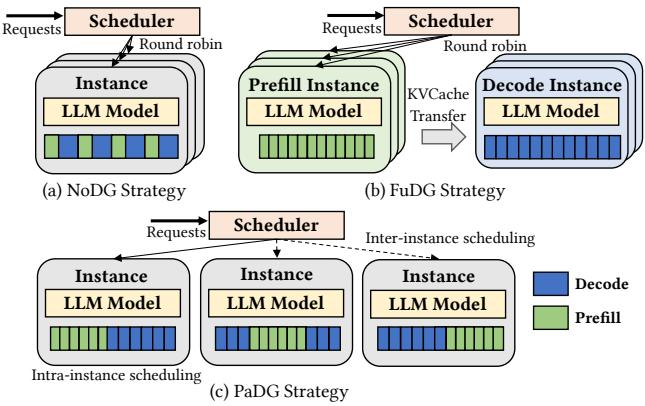  
Figure 1: The NoDG, FuDG, and PaDG strategies.

LLM inference consists of two distinct phases, the prefill phase and the decode phase, each associated with a different latency SLO, time to first token (TTFT) and time per output token (TPOT). These two latency goals, together with throughput, form an inherent performance trade-off triangle. Existing cluster-level LLM inference solutions [2, 4, 7, 35, 37, 52, 55] can be categorized based on whether prefill and decode phases are disaggregated: the non-disaggregated (NoDG) strategy and the fully disaggregated (FuDG) strategy. They both have severe limitations for commodity GPU clusters, either incurring severe interference between prefill and decode phases, or heavily depends on high-performance interconnects.

As shown in Figure 1(a), given that the prefill and decode phases share model weight and KV cache, the NoDG strategy [2,4,7,52], which colocates the two phases within a single instance and replicates multiple instances, appears to be a natural choice. Such colocation inevitably leads to significant inter-phase interference [35, 53, 55]. As two phases execute alternatively, prioritizing the scheduling of one phase risks violating the latency requirements of the other. This interference also harms throughput, as the decode phase cannot accumulate a sufficiently large batch size to saturate GPU resources.

As illustrated in Figure 1(b), FuDG [35, 37, 55] proposes to fully eliminate the prefill-decode interference by assigning the two phases to separate instances. However, since massive amounts of KV cache must be transferred between prefill and decode instances, it relies on hyper-clusters with powerful interconnects as the default hardware infrastructure, as exemplified by the FuDG approach in DistServe [55]. Unfortunately, high-performance interconnects like NVLINK and InfiniBand are not only costly and power-hungry, but also demand substantial technical expertise for construction and maintenance. Moreover, scaling FuDG involves adjusting both prefill and decode instances, which complicates load balancing [28].

EcoServe is designed to deliver cost-effective LLM serving on commodity clusters, without relying on high-performance interconnects. As shown in Figure 1(c), our key observation is that intra-instance scheduling, which determines when to execute prefills and decodes, should be coordinated with interinstance scheduling, which decides when and where requests should be routed, to raise the upper bound of the trade-off triangle and fully utilize available resources. Thus, EcoServe incorporates temporal disaggregation and rolling activation to proactively schedule at intra- and inter-instance levels, so called the partially disaggregated (PaDG) strategy.

Within a single instance, the prefill and decode phases are disaggregated along the time dimension, with each phase lasting longer. By reducing prefill-decode switching frequency, it mitigates interference and achieves higher throughput. Moreover, since both phases are still in a single instance, PaDG avoids massive KV cache transmission. Next, to meet latency SLOs, it proactively coordinates multiple instances in a cyclic pattern. At any given time, at least one instance is activated to process prefills, thereby ensuring acceptable TTFT latency. A group of such cooperating instances is referred to as a macro instance.

EcoServe further includes an adaptive scheduling algorithm and the mitosis scaling approach. The adaptive scheduling algorithm guides request scheduling within the macro instance.

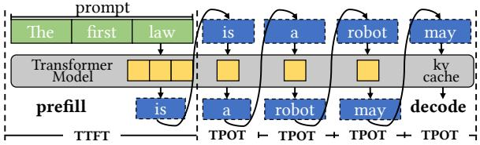  
Figure 2: LLM autoregressive decoding process.

While prioritizing the maintenance of satisfactory TPOT, it identifies the most suitable instance for admitting new requests and determines the optimal number of prefill tokens that can be inserted into that instance. The mitosis scaling approach enables fine-grained control over system capacity by continuously adjusting the number of instances within multiple macro instances. A serializable proxy object is introduced to support logical migration between macro instances without interrupting execution. Our contributions are summarized:

• We present EcoServe for cost-effective LLM serving on clusters with commodity interconnects. It is based on the PaDG strategy, along with the adaptive scheduling algorithm and the mitosis scaling approach.

• We implement EcoServe in a hierarchical architecture.

• We evaluate EcoServe and compare it against four representative LLM inference systems, i.e. vLLM [4], Sarathi [7], DistServe [55], and MoonCake [37] on clusters equipped with either commodity or high-performance networks, demonstrating its superior efficiency.

## 2 Preliminary and Motivation

## 2.1 LLM Inference Characteristics

As illustrated in Figure 2, the LLM predicts the next token with the accumulated context iteratively until it encounters the end-of-sequence (EoS). By saving the key and value embedding in the memory (i.e. KV cache), redundant computations are avoided in subsequent steps, thus the inference process is divided into prefill and decode phases. A request consists of a single prefill followed by tens or even hundreds of decode steps. Modern LLMs primarily adopt the Transformer architecture [48], which leverages the self-attention mechanism to model complex dependencies in sequences. Here we conclude its computation and memory characteristics.

Distinct arithmetic intensity. Transformer’s computation involves four main parts: QKV projection, QKV attention, output projection, and dim expansion and reduction. In these parts, matrix multiplications dominate computation time, while softmax and layer normalization contribute only marginally. Table 2 lists six major matrix multiplications, whose arithmetic intensities are computed separately for prefill and decode using the hyperparameters in Table 1. Negligible terms (e.g., 1/H) are omitted for approximation. Prefill intensity depends on both sequence length S and batch size B, while decode depends merely on B and requires additional KV cache loading. Thus, prefill is compute-bound, whereas decode is memory-bound.

Table 1: Notations.  
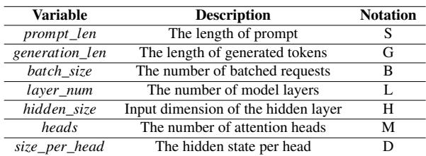

Table 2: Approximate arithmetic intensity (AI) of primary operations in LLMs. Negligible factors are omitted.  
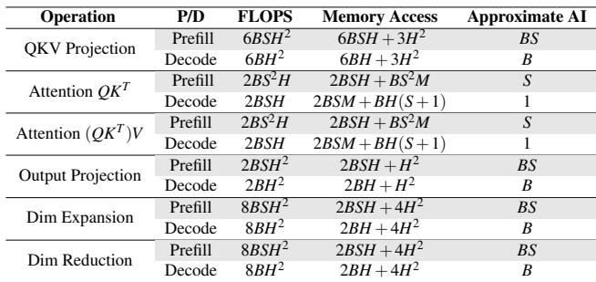

Memory-compute trade-off. During LLM inference, limited memory capacity constrains computational parallelism, making parallel inference a potential avenue of superlinear speedup. Beyond model weights, the KV cache is the primary contributor to memory usage. In the decode phase, processing hundreds of requests simultaneously leads to substantial memory consumption. For example, in Llama-30B, a single token requires 1.52 MB of KV cache, so 128 requests with an average output of 300 tokens consume about 58.4 GB, comparable to the model weights. Moreover, since input and output lengths are stochastic and outputs remain unknown until completion, memory must be over-provisioned to avoid OOM, further complicating resource allocation.

## 2.2 LLM Batching Techniques

To fully utilize modern GPUs, batching is commonly adopted in deep learning workloads, where multiple samples are processed simultaneously to expose high parallelism. Regarding whether to pack prefill and decode together, modern LLM serving systems adopt either separate batching [4] or hybrid batching [7]. Separate batching handles prefills and decodes independently. Since prefills are compute-bound, even a batch size of one can saturate the GPU, whereas decodes are memory-bound and require hundreds of requests to do so. By contrast, hybrid batching organizes requests of both prefill and decode phases in a hybrid batch.

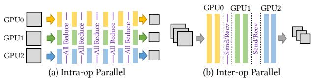  
Figure 3: Intra-op and inter-op parallelism.

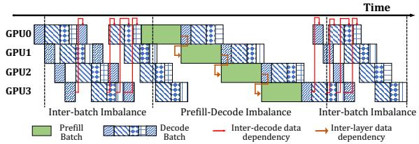  
Figure 4: The inter-op parallelism with separate batching suffers from severe pipeline bubbles.

## 2.3 Scale-up LLM Inference

To scale up both computational and memory capacity within a single inference instance, LLMs adopt several forms of parallelism, can be categorized to intra-op parallelism [12, 22, 30, 41, 43, 44] and inter-op parallelism [20, 27, 34, 53]. As shown in Figure 3, intra-op parallelism splits each layer across multiple GPUs, with model weights and KV cache evenly distributed among workers to accelerate single inference runs. It introduces frequent collective communication [13, 14].

Inter-op parallelism partitions a model layer-wise, with each device handling tens of consecutive layers. As a result, communication is limited to lightweight point-to-point transfers that occur only every few layers. The largely-reduced communication makes it a promising approach to support LLM serving, especially on commodity hardware that highperformance intra-node interconnects like NVLINK are unavailable. However, as illustrated in Figure 4, the varied input lengths and the inter-iteration dependencies in the decode lead to imbalanced and interdependent micro-batches [7, 53], causing severe pipeline bubbles.

## 2.4 Scale-out LLM Serving

The adoption of cluster-level infrastructure have become essential to meet the increasing demands of LLM workloads. There are NoDG and FuDG strategies.

Table 3: KV cache generation speed in the prefill instance. Here each node includes 8 GPUs and intra-op parallelism is used when a single GPU’s memory capacity is insufficient.  
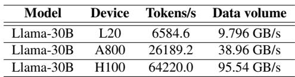

## 2.4.1 Non-Disaggregated Strategy

NoDG [3, 4, 7] colocates prefills and decodes in a single instance, which manages the entire life-cycle of a request. In Figure 1(a), when one instance cannot handle the incoming load, the system scales out by replicating additional independent instances. NoDG supports both separate batching and hybrid batching. However, since prefills typically take much longer than a decoding step, joint scheduling causes decodes to be delayed, significantly increasing TPOT; conversely, the inclusion of decodes leads to non-trivial increases in TTFT. Thus, NoDG often exhibits low throughput as the decode phase struggles to accumulate a sufficiently large batch size to saturate the GPU under SLO constraints. To mitigate this, chunked prefill [7] divides a prefill into smaller chunks and processes over multiple iterations, but it incurs repeated KV cache accesses and heavily depends on the inputto-output length ratio. Moreover, NoDG is poorly compatible with pipeline parallelism [7, 53] due to load imbalance and interdependence.

## 2.4.2 Fully-Disaggregated Strategy

In Figure 1(b), FuDG [35, 37, 55] disaggregates the prefill and decode phases into separate instances, with the KV cache transferred between them. Although it avoids prefill-decode interference, it incurs data transmission [55], load imbalance [28], and complex engineering.

For data transmission, Table 3 reports the KV cache generation rate on GPU nodes (all prefill instances), indicating the volume of data to be transferred. For LLaMA-30B on a node with 8 NVIDIA A800 GPUs, the required output bandwidth reaches 39 GB/s, necessitating at least a 400 Gbps network. These represent only theoretical lower bounds; in practice, the small granularity of KV cache blocks and the complexity of interconnect topology further increase bandwidth demand. More critically, many commodity clusters were never provisioned with high-performance inter-node communication networks, making FuDG less suitable in such environments.

FuDG can be further classified into intra-node FuDG (Dist-Serve [55]) and inter-node FuDG (MoonCake [37]), depending on whether prefill and decode instances are colocated within the same node or distributed across nodes. DistServe targets scenarios with insufficient inter-node interconnects by deploying prefills and decodes within a node and transferring KV cache via intra-node links. MoonCake designs a centralized KV cache pool and relies on InfiniBand to connect prefill and decode instances across nodes.

Besides large data transfer, FuDG suffers from load imbalance, limited parallelism compatibility, and high engineering complexity. 1) Load imbalance occurs in both computation and memory. On the computation side, continuously varying input and output lengths make it difficult to determine an appropriate number of prefill and decode instances. On the memory side, decode instances must retain large amounts of KV cache, whereas prefill instances require far less. 2) Limited compatibility with intra-op parallelism on nodes without GPU-direct links, as collective communication and KV-cache migration contend heavily for bandwidth. 3) Coordinating resources, communication, and memory across instances significantly increase engineering complexity, hindering adoption by small teams.

## 3 EcoServe Design

Figure 5 demonstrates EcoServe’s architecture. It follows the partially disaggregated (PaDG) strategy and proactively orchestrates both intra- and inter-instance execution. Specifically, the prefill and decode phases are disaggregated along the time dimension in each instance (temporal disaggregation) to mitigate interference, while coordination is conducted across different instances to ensure continuous availability (rolling activation).

The system adopts a hierarchical architecture with three levels of scheduling, i.e. the instance scheduler, the macroinstance scheduler, and the overall scheduler. The instance scheduler manages execution within a single instance, including prefill–decode coordination, device orchestration, and compliance with higher-level directives. The macro-instance scheduler coordinates multiple instances by aggregating their execution states and dispatching requests according to profiling results and SLOs. The macro instance is a unique abstraction in EcoServe and serves as the basic unit. Finally, the overall scheduler assigns requests to macro-instances based on their capabilities. In this work, we focus primarily on the internal architecture of a macro-instance.

Furthermore, EcoServe integrates an adaptive scheduling algorithm and a mitosis scaling approach to enable the practical adoption of PaDG. The adaptive scheduling algorithm coordinates instance- and macro-instance schedulers in a master–worker pattern. The mitosis scaling approach enables capacity adjustments at the instance level rather than the coarser macro-instance level, enabling fine-grained resource utilization. To support this, a serializable proxy object is designed to seamlessly add or remove instances.

## 3.1 Partially Disaggregated Strategy

PaDG enables a data-reduced collaboration across instances to alleviate prefill–decode interference. It achieves this

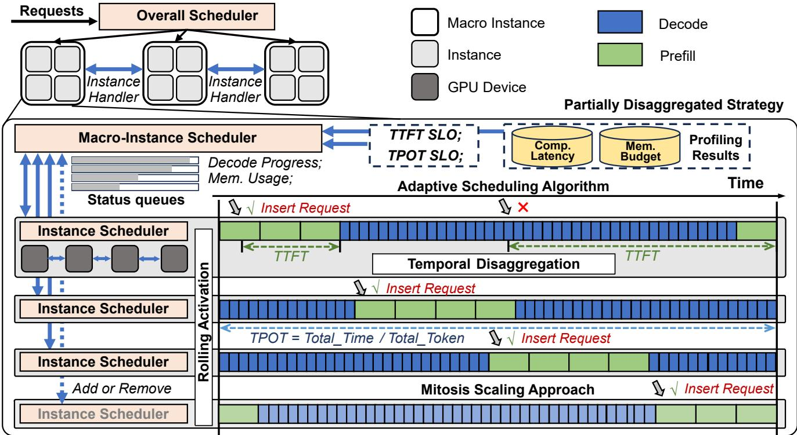  
Figure 5: EcoServe adopts a hierarchical architecture in which the system consists of multiple macro-instances, and each macro-instance comprises multiple instances. The macro instance is the basic unit, within which multiple instances collaborate.

through employing temporal disaggregation and rolling activation to proactively schedule requests at both intra- and inter-instance levels.

## 3.1.1 Temporal Disaggregation

PaDG takes the proactive intra-instance scheduling to disaggregate the prefill and decode phases along the temporal dimension within each instance to mitigate prefill-decode interference. Unlike the FuDG strategy, which assigns dedicated prefill and decode roles to different instances, PaDG maps these roles to different time slots on the same instance. This design keeps the KV cache local and eliminates the need for explicit KV cache transmission, thereby improving ondevice resource utilization and avoiding cross-instance data movement.

Since each phase occupies an instance for an extended period, intra-instance scheduling along risks degrading TTFT. As shown in Figure 5, when a new request arrives at an instance currently processing prefills, it can be immediately admitted, thereby meeting the TTFT SLO. However, if the instance is in the decode phase, the request must wait until the next prefill window, potentially resulting in unacceptable TTFT violations.

In contrast, modern LLM serving systems typically render outputs in a typewriter fashion, where the TPOT SLO can be satisfied once enough tokens are produced within a given time window. This allows decode execution, when faster than the TPOT constraint, to accumulate slack time (referred to as saved TPOT), which can then be leveraged to interrupt decodes for prefills without violating TPOT requirements.

## 3.1.2 Rolling Activation

Although a single instance can only remain in either the prefill or decode phase at any given time and therefore cannot immediately process newly arrived requests, rolling activation addresses this by proactively scheduling multiple instances and staggering their prefill phases over time, ensuring continuous prefill availability. As illustrated in Figure 5, instances enter the prefill phase in a cyclic pattern. From the perspective of individual requests, they are always routed to an instance currently processing prefills and can be admitted immediately. Thus, rolling activation reduces waiting time and preserves TTFT. Since output lengths are unknown, instances must continuously update their status, such as decode progress and memory usage, to the macro-instance scheduler for immediate coordination.

## 3.2 System Metrics for User Experience

Figure 6 illustrates the timing of both runtime and frontend. Once a token is generated, it is transmitted to the frontend, buffered, and then rendered. Classical metrics such as TTFT and TPOT characterize latency from the runtime perspective, capturing the prefill and decode phases. However, these metrics are insufficient to capture service quality, as modern LLM serving systems handle massive concurrent requests and introduce a prefill–decode switching stage for each.

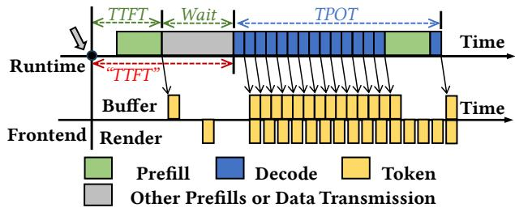  
Figure 6: Runtime and frontend Timing.

Before a request enters its decode phase, additional operations occur across all strategies, NoDG, PaDG, and FuDG. For the NoDG and PaDG strategies, prefills from other requests may occur before a given request can enter its decode phase. For the FuDG strategy, it incurs KV cache transmission overhead prior to the decode phase. Thus, the phase-switching waiting time should be recorded to provide a more comprehensive evaluation of LLM serving systems. This waiting overhead has implicitly appeared in previous work, and is frequently misrepresented.

To maintain consistency with prior work, we continue using TTFT to evaluate prefill latency. In our context, the reported TTFT consists of two components: the actual TTFT and the phase-switching waiting time. This definition represents a stricter SLO, as it incorporates additional overhead within the same latency bound. Accordingly, TPOT measurement begins only after the phase-switching.

## 3.3 Adaptive Scheduling Algorithm

The adaptive scheduling algorithm enables the macro-instance scheduler and the instance schedulers to operate in a master–worker manner, where the two levels of schedulers collaborate to coordinate scheduling decisions. From the instance scheduler’s perspective, although the outcome involves disaggregating the prefill and decode phases along the temporal dimension, its scheduling policy prioritizes prefills. It continues processing active decodes, periodically updating its progress to the macro-instance scheduler, and switches to prefills upon receiving new requests from the upper scheduler.

From the macro-instance scheduler’s perspective, it continuously collects status updates from all instances and dispatches requests accordingly. It traverses instances in a cyclic manner. For each incoming request, it first attempts to route it to the same instance that handled the previous request. If the instance satisfies the constraints verified by Algorithm 1, the request is forwarded. Otherwise, it checks the next available instance. To support this process, multiple public message queues are constructed on the same node as the macroinstance scheduler. Each instance periodically uploads its status to the corresponding queue, enabling the macro-instance scheduler to aggregate this information and make global scheduling decisions.

Algorithm 1: Constraint Checking Algorithm   
Data: Latency constraints: STTFT, STPOT   
Input: I: Statuses of all instances in a macro instance;   
r: A new request   
1: Function CheckConstraints(I, r):   
// 1. Check TTFT constraint   
2: tswitch ← last phase switching timestamp;   
3: pending\_prefills ← { r ∈ instance.reqs |   
r.arrival\_time ≥ tswitch } ∪ { req };   
4: ttotal ← ∑(pending\_prefills durations);   
5: if ttotal > ST T FT then   
6: return NotSatisfied;   
// 2. Check TPOT constraint   
7: existed\_decodes ← { r ∈ instance.reqs |   
r.arrival\_time < tswitch };   
8: saved\_t pots ← [ ];   
9: current\_time ← current timestamp;   
10: foreach r ∈ existed\_decodes do   
11: L ← r.out put\_length;   
12: saved\_t pot ← L × ST POT − (current\_time −   
r. f irst\_token\_time);   
13: append saved\_t pot to saved\_t pots;   
14: mean\_saved\_t pot ← mean(saved\_t pots);   
15: if mean\_saved\_t pot < ttotal then   
16: return NotSatisfied;   
// 3. Check memory capacity   
17: if req\_kvcache\_size > remain\_memsize then   
18: return NotSatisfied;   
19: return Satisfied;

As displayed in Algorithm 1, the constraint checking algorithm is responsible for verifying that assigning an incoming request to an instance will not violate the TTFT/TPOT SLOs or exceed the instance’s available memory capacity. First, the algorithm ensures that the total duration (denoted as ttotal) will not exceed the TTFT constraint (ST T FT ) after adding a new request to the pending prefills during the prefill phase. The prefill duration of a single request can be predicted in advance by profiling sequences of various lengths. Next, by utilizing updated information from the instance, the algorithm calculates the saved TPOT by subtracting the required time from the achieved time. PaDG does not assume uniformly borrowing slack over the entire decoding process. Instead, slack is estimated and utilized over short decoding intervals. During each prefill–decode switch, the saved TPOT of each instance is locally accumulated and then consumed by incoming prefills. This localized and short-term design removes reliance on long-term prediction and improves robustness. As discussed in 3.1.1, provided that ttotal does not exceed the saved TPOT, the TPOT constraint will be satisfied. Finally, the algorithm ensures that the total KV cache size does not exceed the remaining GPU memory capacity, preventing memory overflow.

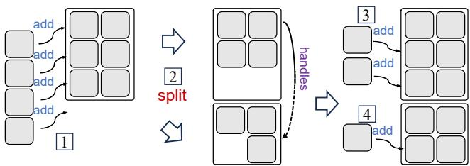  
（a）Expansion

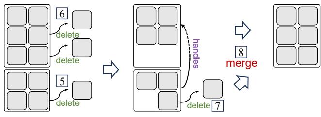  
（b）Contraction  
Figure 7: The illustration of the expansion and contraction processes. Here Nl = 3 and Nu = 6.

## 3.4 Mitosis Scaling Approach

With the introduction of macro-instance abstraction, scaling at this coarse granularity, or relying on a single macro instance to manage all instances, would be both inefficient and inflexible. For example, as the request rate continuously increases, the macro instance scheduler must manage an increasing number of instances to meet SLOs, eventually becoming a bottleneck. Inspired by biological cell mitosis, the mitosis scaling approach adjusts capacity at the instance level, allowing EcoServe to adapt more precisely to workload fluctuations.

## 3.4.1 Expansion and Contraction

The mitosis scaling approach expands or contracts capacity in two steps, first by adding or removing instances within a macro-instance, and then by splitting or merging entire macro-instances. We define two hyperparameters, Nl and Nu, as the lower and upper bounds on the number of instances in a macro-instance. A small Nl causes frequent phase switching, whereas a large N incurs management overhead and may create scheduling bottlenecks.

Figure 7 illustrates an example of how the expansion and contraction processes are performed. The scaling is triggered either when the system fails to meet the defined SLOs or when there is sustained resource underutilization. New instances are incrementally added (step 1 ) until the number of instances exceeds the upper limit Nu, at which point a new macro instance containing N instances is split off from the original macro instance (step 2 ). If more instances are required, they are first added to the original macro instance until it again reaches Nu (step 3 ), and subsequent instances are then added to the new macro instance (step 4 ).

On the contrary, when the capacity becomes excessive and the contraction process is triggered, instances are firstly removed from the smallest macro instance until the number of instances in the macro instance reaches Nl (step 5 ). Next, instances are removed from a full macro instance (step 6 ). When the total number of instances across these two macro instances reaches Nu (step 7 ), they will be merged into a single macro instance (step 8 ). These removed instances will complete allocated requests before being freed. Generally, an inference system maintains multiple full macro instances, along with one or two partially filled macro instances.

## 3.4.2 Scaling Threshold

EcoServe decides when to expand or contract capacity by monitoring runtime signals. For expansion, the TTFT SLO attainment is adopted. When the system becomes overloaded, the TTFT SLO attainment is the first to decline and is more sensitive than TPOT SLO attainment. This is because the macro-instance scheduler routes requests only if an instance satisfies all constraints; when the system is overloaded and no instance meets these constraints, the requests become pending. These pending requests will immediately cause the TTFT SLO attainment to drop sharply, preceding degradation in TPOT SLO attainment. As demonstrated in Equation 1, EcoServe continuously tracks the average TTFTs and starts to add a new instance once it exceeds that the TTFT SLO, thereby preserving both TTFT and TPOT guarantees.

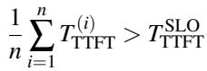

(1)

In contrast, saved TPOT is adopted as the signal for contraction. When the request arrival rate is low and system pressure decreases, the saved TPOT increases. For a macroinstance with n instances, we consider the reasonable range of saved TPOT to be [TTTFT,TTTFT · n+1 ], where the factor n (n + 1)/n reflects the reduction in per-instance decode load if the macro-instance were hypothetically expanded from n to n+1 instances. Once the saved TPOT exceeds the upper bound of this interval, as shown in Equation 2, the system is over-provisioned, and EcoServe begins contracting instances.

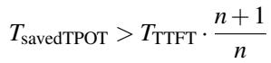

(2)

Table 4: Dataset Features and Corresponding SLOs.  
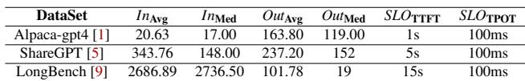

## 3.4.3 Flexible Instance Migration

To dynamically split or merge macro instances without reinitializing or interrupting individual instances, we design a serializable proxy object and transfer instance handles between different macro-instance schedulers. At the core of this design is the InstanceHandler metadata, which encapsulates essential information such as the instance entrypoint and its associated public message queues. When a handle is transferred between macro-instance schedulers (i.e., across processes), it is first serialized using the pickle library and then sent to the target macro-instance scheduler. The transmission process is coordinated by the overall scheduler. Upon deserialization, the target macro-instance connects with the entrypoint to obtain control of the instance, after which the instance is orchestrated into its rolling activation process. This design enables logical migration of instances across macro instances without interrupting their execution, thereby supporting more flexible and low-overhead scaling.

## 4 Evaluation

EcoServe adopts vLLM [4] as the single-device runtime, employs Ray to control multiple devices within each instance, and leverages ZeroMQ to synchronize instance status with the macro-instance scheduler. We evaluate EcoServe on LLMs of different scales across diverse datasets and clusters, showing its performance, scalability, and parallelism compatibility.

## 4.1 Experimental Setup

Cluster testbed. We conduct experiments on three clusters featuring commodity or high-performance interconnects. The primary cluster consists of 8 nodes with 64 NVIDIA L20- 48GB GPUs, where GPUs are PCIe-connected and nodes communicate via 10 Gbps Ethernet. The second cluster has 2 nodes with 16 NVIDIA A800-80GB GPUs, also PCIeconnected but using a higher-bandwidth 25 Gbps RoCE interconnect. The third cluster contains 2 nodes with 16 NVIDIA H100-80GB GPUs, featuring NVLink for intra-node GPU interconnects and eight 400 Gbps InfiniBand links (one per GPU) for inter-node communication.

Model, dataset and workloads. We evaluate three representative LLM models, i.e. Llama-30B [46], CodeLlama2- 34B [38], and Qwen2-72B [50]. LLaMA-30B adopts standard multi-head attention (MHA), whereas CodeLlama2-34B and Qwen2-72B adopt grouped-query attention (GQA) [8]. By sharing keys and values across query heads, GQA reduces

KV cache size and mitigate FuDG transmission overhead. All experiments are conducted with BF16 precision. For applications and datasets, as shown in Table 4, we follow prior studies [24,37,55] and select three representative applications with diverse input–output length distributions.

• Alpaca-gpt4: [1] Instruction-following dataset with short inputs and long outputs.

• ShareGPT: [5] Chatbot dataset featuring relatively balanced input and output lengths.

• LongBench: [9] Summarization dataset with long inputs (articles) and short outputs (summaries).

We set TTFT and TPOT SLOs based solely on applications, independent of model size, and in most cases stricter than those in prior work [37, 55]. Each model is paired with all datasets. To emulate realistic serving, requests arrive at a fixed rate with a Poisson distribution to introduce minor fluctuations.

Baseline. We compare EcoServe against four NoDG or FuDG systems. All baselines are built on or aligned to vLLM 0.7.3 [4] as the underlying runtime, ensuring fairness.

• vLLM [4]: A NoDG system with separate batching and prefill-priority scheduling, which is provided in the original vLLM implementation.

• Sarathi [7]: A NoDG system with hybrid batching, decode priority scheduling, and the chunked prefill technique.

• DistServe1 [55]: An intra-node FuDG system where prefill and decode instances are colocated within the same node. DistServe also provides a cross-node strategy that limits KV cache transmission within a node, but this is only applicable to pipeline parallelism and cannot satisfy SLOs in our setting.

• MoonCake2 [37]: An inter-node FuDG system where prefill and decode instances may reside on different nodes. MoonCake introduces a centralized KV cache pool for transmission; even when colocated on the same node, KV cache must pass through this pool. To mitigate load imbalance, we experiment with different prefill/decode ratios and adopt the optimal one.

Metrics. Following prior work, we use SLO attainments as the evaluation metrics. Specifically, we measure system throughput at different attainment levels. Throughput is obtained by incrementally increasing the request rate until the system fails to satisfy the target attainment. Following AlpaServe [26] and vLLM [4], Poisson and Gamma distributions are used to model request inter-arrival times. The Poisson process is adopted as the default setting unless otherwise specified. It produces relatively smooth arrival patterns with moderate variability. In contrast, the Gamma process enables controllable burstiness by adjusting the coefficient of variation and is used in bursty workload evaluations. Compared to Poisson arrivals, it generates more skewed inter-arrival times, leading to sharper fluctuations where many requests may arrive within short periods followed by idle intervals. Notably, we extend the request-sending program in the vLLM repository with multithreading support, allowing us to generate high-concurrency workloads at scale.

## 4.2 End-to-end Evaluation

We compare EcoServe with baselines across models, datasets, and clusters. On the L20 cluster, LLaMA-30B and CodeLlama2-34B use TP=4, and Qwen2-72B uses TP=8. To mitigate MoonCake’s bandwidth limits, we deploy one instance per node, yielding 8 instances in total. On A800 and H100 clusters, LLaMA-30B and CodeLlama2-34B use TP=2 (8 instances), and Qwen2-72B uses TP=4 (4 instances). We present all evaluations with three discrete SLO attainments in Figure 8, and demonstrate two evaluation cases on the L20 cluster with continuously varying SLO attainments in Figure 9. Notably, MoonCake and DistServe fail to meet SLO attainments in some cases. In addition, DistServe cannot support Qwen2-72B with TP=8 on a single node. These cases are omitted from the results.

## 4.2.1 Overall Comparison

EcoServe outperforms all baselines across all evaluation cases on the L20 and A800 clusters with commodity networks, which are our primary focus. For NoDG systems, EcoServe achieves an average P90 goodput improvement of 2.01× over vLLM and 1.87× over Sarathi. As shown in Figure 9, EcoServe is more resilient at high request rates, with SLO attainment degrading more slowly than NoDG systems. For FuDG systems, EcoServe improves P90 goodput by 3.43× over DistServe and 3.41× over MoonCake. Figure 9 also shows FuDG exhibits a sharp bottleneck on commodity networks, as its interconnect bandwidth and load imbalance quickly lead to SLO violations.

On the H100 cluster with high-performance interconnects, EcoServe also outperforms almost all baselines, though with smaller margins. For NoDG systems, it gains a modest P90 improvement of 1.34× over vLLM and 1.25× over Sarathi, since the strong compute capability of H100 substantially reduces prefill–decode interference. Compared with FuDG, EcoServe still improves P90 goodput by 1.75× over Dist-Serve and 1.24× over MoonCake, somewhat surprising, as high-bandwidth networks typically favor FuDG systems. This result is mainly due to load imbalance and engineering complexity in FuDG systems, as well as the relatively lenient latency SLOs on H100, which prevent PaDG and NoDG sys tems from exposing their usual bottlenecks.

DistServe colocates prefill and decode instances on the same node, causing severe imbalance, and its unmaintained prototype implementation further limits performance. MoonCake, still under active development, achieves performance comparable to EcoServe and even surpasses it on CodeLlama2-34B. Although the improved interconnect and reduced imbalance on the H100 cluster allow MoonCake to better realize its potential, we still observe intermittent pauses in prefill instances, indicating that load imbalance exists and transmission buffers quickly become insufficient.

## 4.2.2 Comparison across models

EcoServe demonstrates consistent benefits over NoDG systems across different model scales. In particular, it achieves average throughput improvements of 1.59×, 1.83×, and 1.76× when serving Llama-30B, CodeLlama2-34B, and Qwen2- 72B, respectively. In contrast, its improvements over FuDG systems vary substantially, reaching 4.82×, 2.15×, and 1.79× on the same three models.

These differences can be explained by KV cache characteristics and model scaling effects. Llama-30B suffers the largest degradation in FuDG because its relatively larger KV cache incurs substantial inter-instance transmission overhead. In comparison, CodeLlama2-34B and Qwen2-72B adopt GQA [8], which significantly reduces KV cache size and alleviates transmission bottlenecks. Moreover, because computation grows faster than KV cache footprint as model size increases (e.g., for 72B), larger models have relatively lower KV-to-compute ratios and typically tighter latency SLOs, enabling FuDG to perform relatively better.

It is also worth noting that when serving the LongBench dataset, Llama-30B consistently outperforms CodeLlama2- 34B because Llama-30B supports only a maximum sequence length of 2048, causing longer inputs to be truncated and resulting in lower actual workload.

## 4.2.3 Comparison across clusters

Comparing EcoServe with other systems, the gains over NoDG systems remain relatively consistent across clusters, whereas the improvements over FuDG systems vary substantially. Specifically, under P90 SLO attainment, EcoServe improves goodput over NoDG systems by an average of 1.97× on L20, 1.91× on A800, and 1.29× on H100. This mainly arises from the disparity in computational capability among the GPU devices. Since we apply unified latency SLOs determined only by the datasets, GPU devices with higher computational capability can satisfy these SLOs more easily and therefore experience less prefill–decode interference, making NoDG advantageous.

Against FuDG systems, the gains are 2.45× on L20, 4.21× on A800, and 1.50× on H100, illustrating how the relative ad vantages shift across clusters. This disparity can be attributed to the ratio between computational capability and network bandwidth. A higher compute-to-bandwidth ratio generally leads to larger improvements over FuDG systems since KV cache transmission becomes the bottleneck. The A800 cluster exhibits such a ratio, as its network bandwidth increases by only 2.5× compared with L20, whereas its processing capability improves by more than 4× (Table 3), making the inter-node network an even more critical bottleneck.

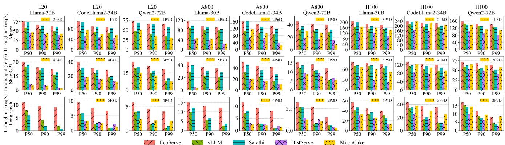  
Figure 8: Evaluations across models, datasets, and clusters. The y-axis shows throughput under different SLO attainment levels.

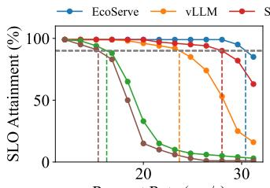  
Request Rate (req/s)  
(a) CodeLlama2-34B + ShareGPT

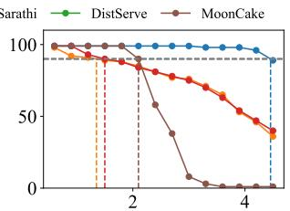  
Request Rate (req/s)  
(b) Qwen2-72B + Longbench  
Figure 9: Two evaluation cases on the L20 cluster with continuously varying request rates. The vertical lines indicate the maximum rate that satisfies P90 latency SLOs.

## 4.2.4 Comparison across datasets

When comparing EcoServe with other systems, the gains vary significantly across datasets due to differences in input–output length ratios. Under P90 SLO attainment, EcoServe achieves average throughput improvements of 1.19×, 1.26×, and 2.72× over NoDG on the Alpaca, ShareGPT, and LongBench datasets, and outperforms FuDG by 1.70×, 4.00×, and 2.53×, respectively.

These differences arise from how input and output lengths affect system behavior. For NoDG systems, shorter inputs reduce prefill–decode interference and repeated KV cache accesses during chunked prefill, enabling EcoServe to gain larger advantages. For FuDG systems, datasets with longer inputs and shorter outputs require more prefill instances to generate KV cache, which increases network transmission pressure and exacerbates FuDG’s bandwidth sensitivity, leading to greater improvements for EcoServe. It is also worth noting that the improvement over FuDG on LongBench would have been even higher had Llama-30B not been excluded due to execution failures.

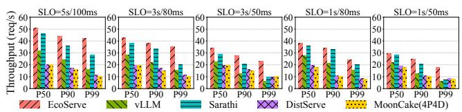  
Figure 10: Evaluations under different SLOs.

## 4.3 SLO Sensitivity Study

We further evaluate SLO sensitivity by tightening the SLO from (5s, 100ms) to four stricter settings: (3s, 80ms), (3s,50ms), (1s,80ms), and (1s,50ms), using CodeLlama2- 34B on A800 GPUs with ShareGPT.

As shown in Figure 10, as SLOs become stricter, all systems experience throughput degradation. Under the strictest (1s,50ms) SLO, EcoServe’s P99 throughput decreases from 42 rps to 18 rps, a 57.1% reduction. In comparison, vLLM drops from 16 rps to 6.4 rps (60.0%), while Sarathi drops from 28 rps to 7.6 rps (72.9%), indicating that NoDG systems are more sensitive to tighter SLOs. FuDG systems, i.e., DistServe and MoonCake, show smaller relative degradation, with P99 reductions of 26.9% and 23.9%, respectively. This is because their throughput is already constrained by KV cache transmission and load imbalance under loose SLOs. Next, they show apparent robustness under stricter SLOs.

## 4.4 Bursty Workload Evaluation

In bursty workload evaluations, we compare throughput under both Poisson and Gamma arrival processes. To model increasing levels of burstiness, we vary the coefficient of variation (CV) of the Gamma process as 1.2, 1.5 and 2.0, while keeping the average request rate constant. Experiments are conducted using the CodeLlama-34B model on NVIDIA A800 GPUs with the ShareGPT dataset.

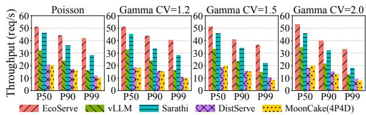  
Figure 11: Evaluations under different burstiness.

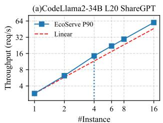

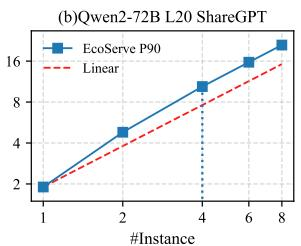  
Figure 12: Static coarse-grained scaling.

In Figure 11, as workload burstiness increases, throughput degrades more significantly at higher percentiles (e.g., P90 and P99) across all systems due to burst-induced resource contention and scheduling instability, while showing almost no impact at lower percentiles (e.g., P50). Comparing these systems under P99 SLO attainment, throughput degrades by 17.3% (EcoServe), 19.5% (vLLM), 35.7% (Sarathi), 12.6% (DistServe), and 17.1% (MoonCake), respectively, as the CV increases from 1.2 to 2.0. This is because NoDG systems exhibit the weakest robustness to contention and thus suffer the largest degradation, while PaDG shows stronger resilience under resource contention caused by bursty workloads.

## 4.5 Scaling Capability

We evaluate the scaling capability of EcoServe from two aspects. First, we measure throughput by varying the number of instances in a macro-instance to examine static coarse-grained scaling. Second, we incrementally increase the request rate and analyze the mitosis scaling approach as the dynamic finegrained scaling.

## 4.5.1 Static Coarse-grained Scaling

Static coarse-grained scaling uses CodeLlama2-34B (TP=4) and Qwen2-72B (TP=2) on the L20 cluster, with the ShareGPT dataset as the workload. Throughput under P90 SLO attainment is presented in Figure 12.

Both cases exhibit superlinear speedup initially, before reverting to linear and eventually sublinear scaling. When scaling from 1 instance (4 GPUs) to 4 instances (16 GPUs), CodeLlama2-34B achieves a 4.96× throughput increase, while Qwen2-72B reaches 5.47×. The superlinear speedup arises because EcoServe incurs minimal overhead when managing additional instances within a symmetric cluster topology. More importantly, adding instances provides greater capacity to mitigate inter-phase interference, increasing arithmetic intensity and improving GPU saturation. Assuming a macro instance contains only a single instance, the PaDG strategy actually degrades to NoDG, and two phases still switch frequently and interference severely in a single instance. This superlinear scaling effect will plateau once a sufficient number of instances is reached.

## 4.5.2 Dynamic Fine-grained Scaling

Fine-grained scaling uses CodeLlama2-34B (TP=4) on the L20 cluster, with the ShareGPT dataset as the workload. The request rate gradually increases from 20 to 50 requests per second in 2-minute intervals, with SLO attainments collected every 30 seconds. Based on the static scaling experiments, we set Nl = 6 and Nu = 11, since superlinear speedup disappears beyond this point and dividing a macro-instance no longer degrades performance. The system starts with 32 GPUs (8 instances) and finally uses up all 64 GPUs.

As shown in Figure 13, increasing the request rate initially results in a drop in SLO attainment, which is promptly restored once a new instance is added. This process continues until the 12th instance, where we can see that SLO attainment recovers slightly more slowly. Since the total number of instances exceeds the upper bound Nu, the system triggers a split into two macro-instances of 6 instances each. Thanks to the serializable proxy object, the split introduces only minor performance fluctuations and avoids model re-initialization. In contrast, interrupting and re-initializing an instance incurs much higher overhead. For a single instance, re-initializing CodeLlama2-34B from an L20 node’s local storage takes about three minutes, and is even longer when loading weights from remote storage. Consequently, the mitosis scaling approach enables flexible, fine-grained scaling that effectively adapts to dynamic workload demands.

## 4.6 Parallelism Compatibility

We further design experiments to validate that FuDG is more compatible with pipeline parallelism (PP) than NoDG. As discussed in Section 2.3, PP is appealing for high-throughput inference due to its low communication overhead, but it becomes vulnerable to pipeline bubbles when prefill–decode interference is present. To evaluate this effect, we fix the TTFT SLO at 5 seconds, progressively relax the TPOT constraint, and measure throughput under different degrees of pipeline parallelism. Specifically, We evaluate CodeLlama2-34B on the ShareGPT dataset using the L20 cluster, configuring the model with two settings: TP=2, PP=2 and TP=4, PP=1, which correspond to higher and lower PP degrees, respectively.

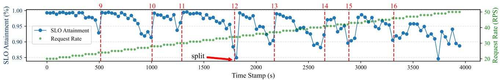  
Figure 13: Dynamic fine-grained scaling experiment of CodeLlama2-34B on the L20 cluster. Here Nl = 6 and Nu = 11.

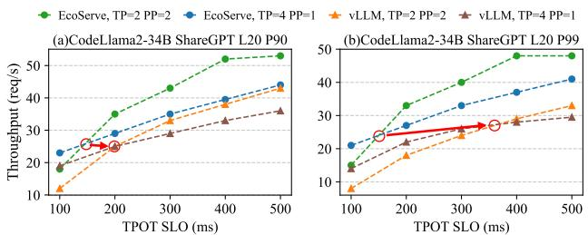  
Figure 14: Pipeline parallel compatibility.

Figure 14 shows throughput as the TPOT SLO increases from 100 ms to 500 ms. The results show that EcoServe with a higher PP degree outperforms its lower-PP counterpart under tighter TPOT SLOs, surpassing that of vLLM. In other words, the performance intersection of different PP degrees occurs at a tighter TPOT constraint, and the throughput plateau achieved with PP is significantly higher than that of vLLM. These findings indicate that PaDG is substantially more compatible with pipeline parallelism, enabling PP to better reach its performance potential.

## 4.7 Ablation Study

We conduct an ablation study to evaluate the effectiveness of rolling activation and adaptive scheduling in EcoServe by selectively disabling them and comparing the performance.

## 4.7.1 Rolling Activation.

To evaluate the importance of rolling activation, we consider a variant where the next instance is selected randomly rather than following the cyclic rolling activation strategy. Experiments are conducted using all three models on NVIDIA A800 GPUs with the ShareGPT dataset. As shown in Figure 15, cyclic activation achieves higher throughput across all cases, with more pronounced gains in higher SLO attainments. This is because higher SLO attainments impose tigher scheduling constraints, leaving less slack for prefills. As a result, suboptimal scheduling strategies fail to allocate sufficient resources to meet the SLO targets. These results demonstrate that rolling activation is an effective design.

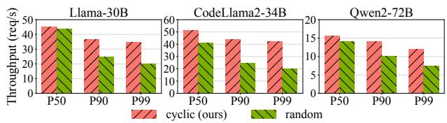  
Figure 15: Ablation study of rolling activation.

Table 5: Large-scale LLM Serving Strategy Comparison.  
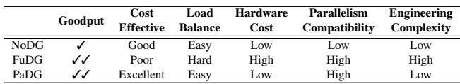

## 4.7.2 Adaptive Scheduling Algorithm.

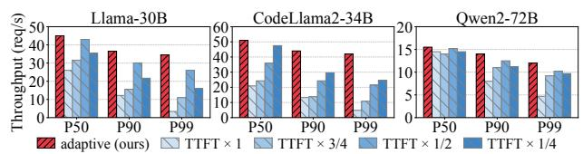  
Figure 16: Ablation study of adaptive scheduling algorithm.

To evaluate the effectiveness of adaptive scheduling algorithm, We compare it with a variant that requests are routed at fixed intervals without estimating available prefill slots. Experiments are conducted across all models on NVIDIA A800 GPUs with the ShareGPT dataset. The fixed intervals are set to 1/4, 1/2, 3/4, and 1/1 of the TTFT SLO. As shown in Figure 16, while different fixed intervals lead to varying throughput, our adaptive algorithm consistently achieves the best performance, demonstrating its effectiveness.

## 5 Discussion

Commercial success in LLM serving hinges on adopting costeffective strategies, which require a careful trade-off between throughput, SLO attainment, infrastructure cost, parallelism compatibility, and even engineering complexity. Table 5 presents a comparison between PaDG and the existing NoDG and FuDG. In terms of goodput, PaDG is comparable to FuDG, while largely outperforming NoDG. While FuDG is designed for tight SLOs and relies on highperformance interconnects, PaDG is for cost-effective deployments that SLOs are relaxed or interconnects are limited.

Beyond hardware, PaDG also reduces load imbalance and engineering complexity. Unlike FuDG, which scales across two instance types, NoDG and PaDG scale at the granularity of individual instances, leading to simpler scaling and more balanced workloads. In addition, the lack of cross-instance KV cache transmission in PaDG and NoDG significantly lowers system complexity. From a parallelism compatibility perspective, PaDG offers further advantages. Its lower frequency of prefill-decode switching improves pipeline parallelism efficiency, while minimal data movement and reduced PCIe contention make it more suitable for tensor parallelism in commodity nodes.

NoDG, PaDG, and FuDG each have their own advantageous scenarios, and LLM serving vividly demonstrates the art of trade-offs in system optimization. NoDG is wellsuited for small models, such as 7B and 13B. These models have lower computational demands, and their SLOs are easier to satisfy, making prefill-decode interference negligible. Larger models, such as 30B, 70B, and 130B, benefit more from PaDG. These models typically require parallel techniques to extend memory capacity and are still capable of meeting typical latency SLOs in a single instance. In extreme scenarios, such as ultra-large models or stringent SLOs, even minor interference can significantly degrade these metrics. In such cases, PaDG with commodity hardware becomes insufficient. To satisfy the TPOT SLO, it can be enhanced with lightweight add-on strategies (e.g., chunked prefill) or augmented with advanced hardware, while designs such as FuDG with specialized hardware may ultimately be required. More aggressive strategies are worth studying. For example, MegaScale-Infer [57] and Eaas [32] study ultra-large MoE model and disaggregates the attention and FFN modules into different instances. Moreover, these strategies incur incremental engineering costs, which also serve as a major factor.

## 6 Related Work

Scheduling in LLM serving. Based on whether prefill and decode phases are disaggregated, existing LLM serving approaches can be categorized into the NoDG strategy [3, 4, 7, 52] and the FuDG strategy [35, 37, 55], which are most relevant to EcoServe. Adrenaline [28] notices the load imbalance issue in FuDG and reschedules computation in prefill and decode instances.

Moreover, other studies address issues in specific inference scenarios. Flexgen [42], FastDecode [19] and Specinfer [33] enable LLM inference with limited memory capacity by employing offloading strategies. Loongserve [49] and Infinite-llm [29] targets long-context inference and optimize parallel strategy and memory utilization respectively. Moelightning [11], Pre-gated MoE [21] and Lina [25] focus on MoE models and optimize resource utilization by employing expert popularity. MegaScale-Infer [57] and Eaas [32] target ultra-large MoE model and accelerate the decode phase by disaggregating the attention and FFN modules. Liger [13] and NanoFlow [56] carefully schedules and overlaps GPU kernels from different requests to improve efficiency.

KV Cache Management. To reduce KV cache memory usage of standard MHA [48], MQA [40] and GQA [8] share key and value projections across query heads. PagedAttention [24] and vAttention [36] reduces memory fragmentation by organizing the KV cache into fixed-size blocks. To compress KV cache, H2O [54], Keyformer [6], and Liu et al. [31] find token similarity and removes redundant information. Next, Shadowkv [45], Prompt cache [17], and Ragcache [23] further explore KV cache compression and offloading strategies in long-context scenarios. AttentionStore [16] schedules KV cache across hierarchical storage tiers, while CacheBlend [51] introduces the pipelining loading with partial recomputation to use slower object stores.

## 7 Conclusion

EcoServe is built on the novel partially disaggregated (PaDG) strategy for cluster-level LLM serving. PaDG mitigates prefill–decode interference by enabling multiple instances to collaborate in a data-reduced manner, well suited for GPU clusters with the commodity network. EcoServe also excels in load balancing, hardware cost, parallelism compatibility, and engineering simplicity, making it a cost-effective choice.

## Acknowledgments

This research is supported by the National Key R&D Program of China under Grant No.2025YFB3003501, the National Natural Science Foundation of China under Grant No.62402534, the GuangDong Basic and Applied Basic Research Foundation under Grant No.2023A1515110117, the Yunnan Provincial Major Science and Technology Special Plan Projects under Grant No.202502AD080009. We also thank the WeChat Group at Tencent for valuable discussions and for providing access to a commodity GPU cluster that reflects practical production settings.

## References

[1] Alpaca-GPT4. https://github.com/tatsu-lab/ alpaca\_eval, 2023. Instruction-following dataset generated using GPT-4.

[2] Faster transformer. https://github.com/NVIDIA/ FasterTransformer, 2024.

[3] Sglang. https://github.com/sgl-project/ sglang, 2024.

[4] vllm: Easy, fast, and cheap llm serving for everyone. https://github.com/vllm-project/vllm, 2024.

[5] Hugginface sharegpt. https://huggingface.co/ datasets/anon8231489123/ShareGPT\_Vicuna\_ unfiltered, 2025.

[6] Muhammad Adnan, Akhil Arunkumar, Gaurav Jain, Prashant Nair, Ilya Soloveychik, and Purushotham Kamath. Keyformer: Kv cache reduction through key tokens selection for efficient generative inference. Proceedings of Machine Learning and Systems, 6:114– 127, 2024.

[7] Amey Agrawal, Nitin Kedia, Ashish Panwar, Jayashree Mohan, Nipun Kwatra, Bhargav Gulavani, Alexey Tumanov, and Ramachandran Ramjee. Taming {Throughput-Latency} tradeoff in {LLM} inference with {Sarathi-Serve}. In 18th USENIX Symposium on Operating Systems Design and Implementation (OSDI 24), pages 117–134, 2024.

[8] Joshua Ainslie, James Lee-Thorp, Michiel de Jong, Yury Zemlyanskiy, Federico Lebrón, and Sumit Sanghai. Gqa: Training generalized multi-query transformer models from multi-head checkpoints, 2023.

[9] Yushi Bai, Xin Lv, Jiajie Zhang, Hongchang Lyu, Jiankai Tang, Zhidian Huang, Zhengxiao Du, Xiao Liu, Aohan Zeng, Lei Hou, Yuxiao Dong, Jie Tang, and Juanzi Li. Longbench: A bilingual, multitask benchmark for long context understanding, 2023. arXiv preprint.

[10] Tom Brown, Benjamin Mann, Nick Ryder, Melanie Subbiah, Jared D Kaplan, Prafulla Dhariwal, Arvind Neelakantan, Pranav Shyam, Girish Sastry, Amanda Askell, et al. Language models are few-shot learners. Advances in neural information processing systems, 33:1877–1901, 2020.

[11] Shiyi Cao, Shu Liu, Tyler Griggs, Peter Schafhalter, Xiaoxuan Liu, Ying Sheng, Joseph E Gonzalez, Matei Za haria, and Ion Stoica. Moe-lightning: High-throughput moe inference on memory-constrained gpus. In Proceedings of the 30th ACM International Conference on Architectural Support for Programming Languages

and Operating Systems, Volume 1, pages 715–730, 2025.

[12] Shenggan Cheng, Ziming Liu, Jiangsu Du, and Yang You. Atp: Adaptive tensor parallelism for foundation models. arXiv preprint arXiv:2301.08658, 2023.

[13] Jiangsu Du, Jinhui Wei, Jiazhi Jiang, Shenggan Cheng, Dan Huang, Zhiguang Chen, and Yutong Lu. Liger: Interleaving intra-and inter-operator parallelism for distributed large model inference. In Proceedings of the 29th ACM SIGPLAN Annual Symposium on Principles and Practice of Parallel Programming, pages 42–54, 2024.

[14] Yangyang Feng, Minhui Xie, Zijie Tian, Shuo Wang, Youyou Lu, and Jiwu Shu. Mobius: Fine tuning large-scale models on commodity gpu servers. In Proceedings of the 28th ACM International Conference on Architectural Support for Programming Languages and Operating Systems, Volume 2, pages 489–501, 2023.

[15] Futuriom. What’s next for networking infrastructure for ai. Technical report, Futuriom Research, 2025. Industry analysis report.

[16] Bin Gao, Zhuomin He, Puru Sharma, Qingxuan Kang, Djordje Jevdjic, Junbo Deng, Xingkun Yang, Zhou Yu, and Pengfei Zuo. Attentionstore: Cost-effective attention reuse across multi-turn conversations in large language model serving. arXiv e-prints, pages arXiv–2403, 2024.

[17] In Gim, Guojun Chen, Seung-seob Lee, Nikhil Sarda, Anurag Khandelwal, and Lin Zhong. Prompt cache: Modular attention reuse for low-latency inference. Proceedings of Machine Learning and Systems, 6:325– 338, 2024.

[18] Aaron Grattafiori, Abhimanyu Dubey, Abhinav Jauhri, Abhinav Pandey, Abhishek Kadian, Ahmad Al-Dahle, Aiesha Letman, Akhil Mathur, Alan Schelten, Alex Vaughan, et al. The llama 3 herd of models. arXiv preprint arXiv:2407.21783, 2024.

[19] Jiaao He and Jidong Zhai. Fastdecode: High-throughput gpu-efficient llm serving using heterogeneous pipelines. arXiv preprint arXiv:2403.11421, 2024.

[20] Yanping Huang, Youlong Cheng, Ankur Bapna, et al. Gpipe: Efficient training of giant neural networks using pipeline parallelism. In Advances in Neural Information Processing Systems 32: Annual Conference on Neural Information Processing Systems 2019, NeurIPS 2019, December 8-14, 2019, Vancouver, BC, Canada, pages 103–112, 2019.

[21] Ranggi Hwang, Jianyu Wei, Shijie Cao, Changho Hwang, Xiaohu Tang, Ting Cao, and Mao Yang. Pregated moe: An algorithm-system co-design for fast and scalable mixture-of-expert inference. In 2024 ACM/IEEE 51st Annual International Symposium on Computer Architecture (ISCA), pages 1018–1031. IEEE, 2024.

[22] Sam Ade Jacobs, Masahiro Tanaka, Chengming Zhang, Minjia Zhang, Shuaiwen Leon Song, Samyam Rajbhandari, and Yuxiong He. Deepspeed ulysses: System optimizations for enabling training of extreme long sequence transformer models, 2023.

[23] Chao Jin, Zili Zhang, Xuanlin Jiang, Fangyue Liu, Xin Liu, Xuanzhe Liu, and Xin Jin. Ragcache: Efficient knowledge caching for retrieval-augmented generation. arXiv preprint arXiv:2404.12457, 2024.

[24] Woosuk Kwon, Zhuohan Li, Siyuan Zhuang, Ying Sheng, Lianmin Zheng, Cody Hao Yu, Joseph Gonzalez, Hao Zhang, and Ion Stoica. Efficient memory man agement for large language model serving with pagedattention. In Proceedings of the 29th Symposium on Operating Systems Principles, pages 611–626, 2023.

[25] Jiamin Li, Yimin Jiang, Yibo Zhu, Cong Wang, and Hong Xu. Accelerating distributed {MoE} training and inference with lina. In 2023 USENIX Annual Technical Conference (USENIX ATC 23), pages 945–959, 2023.

[26] Zhuohan Li, Lianmin Zheng, Yinmin Zhong, Vincent Liu, Ying Sheng, Xin Jin, Yanping Huang, Zhifeng Chen, Hao Zhang, Joseph E Gonzalez, et al. {AlpaServe}: Statistical multiplexing with model parallelism for deep learning serving. In 17th USENIX Symposium on Operating Systems Design and Implementation (OSDI 23), pages 663–679, 2023.

[27] Zhuohan Li, Siyuan Zhuang, Shiyuan Guo, Danyang Zhuo, Hao Zhang, Dawn Song, and Ion Stoica. Terapipe: Token-level pipeline parallelism for training largescale language models. In International Conference on Machine Learning, pages 6543–6552. PMLR, 2021.

[28] Yunkai Liang, Zhangyu Chen, Pengfei Zuo, Zhi Zhou, Xu Chen, and Zhou Yu. Injecting adrenaline into llm serving: Boosting resource utilization and through put via attention disaggregation. arXiv preprint arXiv:2503.20552, 2025.

[29] Bin Lin, Chen Zhang, Tao Peng, Hanyu Zhao, Wencong Xiao, Minmin Sun, Anmin Liu, Zhipeng Zhang, Lanbo Li, Xiafei Qiu, et al. Infinite-llm: Efficient llm service for long context with distattention and distributed kvcache. arXiv preprint arXiv:2401.02669, 2024.

[30] Hao Liu, Matei Zaharia, and Pieter Abbeel. Ring at tention with blockwise transformers for near-infinite context. arXiv preprint arXiv:2310.01889, 2023.

[31] Shu Liu, Asim Biswal, Audrey Cheng, Xiangxi Mo, Shiyi Cao, Joseph E Gonzalez, Ion Stoica, and Matei Zaharia. Optimizing llm queries in relational workloads. arXiv preprint arXiv:2403.05821, 2024.

[32] Ziming Liu, Boyu Tian, Guoteng Wang, Zhen Jiang, Peng Sun, Zhenhua Han, Tian Tang, Xiaohe Hu, Yanmin Jia, Yan Zhang, et al. Expert-as-a-service: Towards efficient, scalable, and robust large-scale moe serving. arXiv preprint arXiv:2509.17863, 2025.

[33] Xupeng Miao, Gabriele Oliaro, Zhihao Zhang, Xinhao Cheng, Zeyu Wang, Zhengxin Zhang, Rae Ying Yee Wong, Alan Zhu, Lijie Yang, Xiaoxiang Shi, et al. Specinfer: Accelerating generative large language model serving with tree-based speculative inference and verification. arXiv preprint arXiv:2305.09781, 2023.

[34] Deepak Narayanan, Aaron Harlap, Amar Phanishayee, Vivek Seshadri, Nikhil R Devanur, Gregory R Ganger, Phillip B Gibbons, and Matei Zaharia. Pipedream: Generalized pipeline parallelism for dnn training. In Proceedings of the 27th ACM Symposium on Operating Systems Principles, pages 1–15, 2019.

[35] Pratyush Patel, Esha Choukse, Chaojie Zhang, Aashaka Shah, Íñigo Goiri, Saeed Maleki, and Ricardo Bianchini. Splitwise: Efficient generative llm inference using phase splitting. In 2024 ACM/IEEE 51st Annual International Symposium on Computer Architecture (ISCA), pages 118–132. IEEE, 2024.

[36] Ramya Prabhu, Ajay Nayak, Jayashree Mohan, Ramachandran Ramjee, and Ashish Panwar. vattention: Dynamic memory management for serving llms without pagedattention. arXiv preprint arXiv:2405.04437, 2024.

[37] Ruoyu Qin, Zheming Li, Weiran He, Jialei Cui, Feng Ren, Mingxing Zhang, Yongwei Wu, and Weimin Zheng. Mooncake: Trading more storage for less computation — a KVCache-centric architecture for serving LLM chatbot. In 23rd USENIX Conference on File and Storage Technologies (FAST 25), pages 155–170, Santa Clara, CA, February 2025. USENIX Association.

[38] Baptiste Rozière, Jonas Gehring, Fabian Gloeckle, Sten Sootla, Itai Gat, Xiaoqing Ellen Tan, Yossi Adi, Jingyu Liu, Romain Sauvestre, Tal Remez, Jérémy Rapin, Artyom Kozhevnikov, Ivan Evtimov, Joanna Bitton, Manish Bhatt, Cristian Canton Ferrer, Aaron Grattafiori, Wenhan Xiong, Alexandre Défossez, Jade Copet, Faisal Azhar, Hugo Touvron, Louis Martin, Nicolas Usunier, Thomas Scialom, and Gabriel Synnaeve. Code llama: Open foundation models for code, 2024.

[39] ServerMall. Infrastructure for machine learning and generative ai: Evolution and future directions. Medium article, 2024. Industry infrastructure analysis.

[40] Noam Shazeer. Fast transformer decoding: One writehead is all you need, 2019. URL https://arxiv. org/abs, 1911.

[41] Noam Shazeer, Youlong Cheng, Niki Parmar, Dustin Tran, Ashish Vaswani, Penporn Koanantakool, Peter Hawkins, HyoukJoong Lee, Mingsheng Hong, Cliff Young, et al. Mesh-tensorflow: Deep learning for supercomputers. Advances in neural information processing systems, 31, 2018.

[42] Ying Sheng, Lianmin Zheng, Binhang Yuan, Zhuohan Li, Max Ryabinin, Beidi Chen, Percy Liang, Christopher Ré, Ion Stoica, and Ce Zhang. Flexgen: High-throughput generative inference of large language models with a single gpu. In International Conference on Machine Learning, pages 31094–31116. PMLR, 2023.

[43] Mohammad Shoeybi, Mostofa Patwary, Raul Puri, et al. Megatron-lm: Training multi-billion parameter language models using model parallelism. CoRR, abs/1909.08053, 2019.

[44] Siddharth Singh, Olatunji Ruwase, Ammar Ahmad Awan, Samyam Rajbhandari, Yuxiong He, and Abhinav Bhatele. A hybrid tensor-expert-data parallelism approach to optimize mixture-of-experts training. In Proceedings of the 37th International Conference on Supercomputing, pages 203–214, 2023.

[45] Hanshi Sun, Li-Wen Chang, Wenlei Bao, Size Zheng, Ningxin Zheng, Xin Liu, Harry Dong, Yuejie Chi, and Beidi Chen. Shadowkv: Kv cache in shadows for highthroughput long-context llm inference. arXiv preprint arXiv:2410.21465, 2024.

[46] Hugo Touvron, Thibaut Lavril, Gautier Izacard, Xavier Martinet, Marie-Anne Lachaux, Timothée Lacroix, Baptiste Rozière, Naman Goyal, Eric Hambro, Faisal Azhar, et al. Llama: Open and efficient foundation language models. arXiv preprint arXiv:2302.13971, 2023.

[47] TrendForce. Ai server gpu market analysis. Technical report, TrendForce, 2024. Market analysis report.

[48] Ashish Vaswani, Noam Shazeer, Niki Parmar, Jakob Uszkoreit, Llion Jones, Aidan N Gomez, Łukasz Kaiser, and Illia Polosukhin. Attention is all you need. Advances in neural information processing systems, 30, 2017.

[49] Bingyang Wu, Shengyu Liu, Yinmin Zhong, Peng Sun, Xuanzhe Liu, and Xin Jin. Loongserve: Efficiently serving long-context large language models with

elastic sequence parallelism. In Proceedings of the ACM SIGOPS 30th Symposium on Operating Systems Principles, pages 640–654, 2024.

[50] An Yang, Baosong Yang, Binyuan Hui, and et al. Qwen2 technical report, 2024.

[51] Jiayi Yao, Hanchen Li, Yuhan Liu, Siddhant Ray, Yihua Cheng, Qizheng Zhang, Kuntai Du, Shan Lu, and Junchen Jiang. Cacheblend: Fast large language model serving for rag with cached knowledge fusion. In Proceedings of the Twentieth European Conference on Computer Systems, pages 94–109, 2025.

[52] Gyeong-In Yu, Joo Seong Jeong, Geon-Woo Kim, Soojeong Kim, and Byung-Gon Chun. Orca: A distributed serving system for {Transformer-Based} generative models. In 16th USENIX Symposium on Operating Systems Design and Implementation (OSDI 22), pages 521–538, 2022.

[53] Hongbin Zhang, Taosheng Wei, Zhenyi Zheng, Jiangsu Du, Zhiguang Chen, and Yutong Lu. Td-pipe: Temporally-disaggregated pipeline parallelism architecture for high-throughput llm inference. arXiv preprint arXiv:2506.10470, 2025.

[54] Zhenyu Zhang, Ying Sheng, Tianyi Zhou, Tianlong Chen, Lianmin Zheng, Ruisi Cai, Zhao Song, Yuandong Tian, Christopher Ré, Clark Barrett, et al. H2o: Heavy-hitter oracle for efficient generative inference of large language models. Advances in Neural Information Processing Systems, 36:34661–34710, 2023.

[55] Yinmin Zhong, Shengyu Liu, Junda Chen, Jianbo Hu, Yibo Zhu, Xuanzhe Liu, Xin Jin, and Hao Zhang. {DistServe}: Disaggregating prefill and decoding for goodput-optimized large language model serving. In 18th USENIX Symposium on Operating Systems Design and Implementation (OSDI 24), pages 193–210, 2024.

[56] Kan Zhu, Yilong Zhao, Liangyu Zhao, Gefei Zuo, Yile Gu, Dedong Xie, Yufei Gao, Qinyu Xu, Tian Tang, Zihao Ye, et al. Nanoflow: Towards optimal large language model serving throughput. arXiv preprint arXiv:2408.12757, 2024.

[57] Ruidong Zhu, Ziheng Jiang, Chao Jin, Peng Wu, Cesar A. Stuardo, Dongyang Wang, Xinlei Zhang, Huaping Zhou, Haoran Wei, Yang Cheng, Jianzhe Xiao, Xinyi Zhang, Lingjun Liu, Haibin Lin, Li-Wen Chang, Jianxi Ye, Xiao Yu, Xuanzhe Liu, Xin Jin, and Xin Liu. Megascale-infer: Serving mixture-of-experts at scale with disaggregated expert parallelism, 2025.