USENIX

THE ADVANCED COMPUTING SYSTEMS ASSOCIATION

# Aletheia: Automated Detection of Data Integrity Violations in Microservices

Mafalda Sofia Ferreira, João Ferreira Loff, João Garcia, and Rodrigo Rodrigues, INESC-ID, Instituto Superior Técnico, Universidade de Lisboa

https://www.usenix.org/conference/osdi26/presentation/ferreira

# This paper is included in the Proceedings of the 20th USENIX Symposium on Operating Systems Design and Implementation.

July 13–15, 2026 • Seattle, WA, USA

ISBN 978-1-939133-55-7

Open access to the Proceedings of the 20th USENIX Symposium on Operating Systems Design and Implementation is sponsored by

# Aletheia: Automated Detection of Data Integrity Violations in Microservices

Mafalda Sofia Ferreira, João Ferreira Loff, João Garcia, Rodrigo Rodrigues INESC-ID, Instituto Superior Técnico, Universidade de Lisboa

## Abstract

The decomposition of applications into microservices results in data being stored across heterogeneous systems, with data schemas partitioned and managed by separate services. As the size and complexity of microservice deployments grow, the consistency of data associations at the application level can be overlooked, and it becomes challenging to manually identify data integrity violations.

In this paper, we present a systematic approach for identifying semantic violations in microservice ecosystems, namely operations and service interactions that break data integrity. We formalize these violations by leveraging the Entity-Relationship model and relational algebra to characterize problematic operation patterns across distributed services. We then introduce Aletheia, a static analysis tool that operationalizes this framework, using the static single assignment (SSA) representation to track data flow and a novel abstract call graph to detect integrity violations. We evaluate Aletheia on 7 open-source applications, detecting 46 previously unreported integrity violations, and use production-scale synthetic applications to demonstrate scalability to large call graphs with up to 500 microservices.

## 1 Introduction

The microservice architecture is a paradigm in which applications are decomposed into small components that can be independently developed, deployed, and scaled [1–4]. Contrary to a monolithic architecture where application logic is centralized into a single unit, the loose coupling of microservices enables the separation of responsibilities among different teams [5]. This design not only allows teams to work independently on smaller, self-contained codebases, but also to adopt the programming languages and storage systems that best align with their business requirements [5, 6].

Consequently, data management in microservice architectures is also decentralized, namely by allowing each service to choose its storage backend [2], which can range from scalable and weakly consistent NoSQL data stores [7–9] to relational databases with one-copy serializability semantics [10]. While this flexibility aligns with and preserves the benefits of microservices, it also introduces challenges in maintaining data consistency and integrity across the distributed system.

More concretely, when a large-scale service is decomposed into a set of microservices, the logical relationships within the data that form the state of the service should naturally persist even when the actual data is partitioned and therefore physically isolated across these services. As such, it becomes crucial to find systematic ways to model and reason about these logical connections. In this context, the Entity-Relationship (ER) model provides a time-tested, principled formalism for modeling these cross-service relationships, since the ER model already abstracts logical relationships from their physical implementation.

However, while the logical relationships remain conceptually identical to those captured by the ER model, the microservice decomposition renders database-level enforcement mechanisms (such as foreign key relationships) no longer applicable across service boundaries. Hence, these data dependencies and associations are typically handled by application code. Yet, due to the complexity of microservices, it can be almost impossible for developers to have a comprehensive understanding of the entire system [11, 12]. As a consequence, the preservation of data relationships can be overlooked or dismissed, compromising data integrity [13]. In practice, such inconsistencies have been reported even in large-scale production systems [14].

In this paper, we tackle this problem through a principled approach based on two pillars. First, we develop a formal framework for detecting data integrity violations in microservices by extending concepts from the ER model with relational algebra specifications tailored to cross-service data dependencies. Our framework characterizes how a microservice decomposition can violate three canonical types of data integrity constraints: referential integrity (ensuring that references between entities remain valid), entity integrity (ensuring that primary keys uniquely identify records across partitioned data), and uniqueness constraints (ensuring that unique values remain consistent despite concurrent operations). In particular, for each constraint type, we identify operation patterns — including cascading deletes and concurrent operations — that violate integrity when data relationships span service boundaries, and we formalize these patterns using relational algebra for their systematic detection.

Second, building on these formal specifications, we introduce Aletheia1, a system for automated detection of integrity violations in microservice codebases. Aletheia leverages static analysis to identify the operation patterns formalized in our ER-based framework, translating the corresponding relational algebra specifications into concrete detection rules without relying on user input. Aletheia’s detection relies on two key techniques. First, the system analyzes the code of each microservice in its static single assignment (SSA) intermediate representation (IR) [15]. In particular, by building upon taint propagation [16] over an SSA-based IR [17] and annotating variables with information about database operations, Aletheia can infer how values flow throughout any execution into various database operations. Second, we introduce a new abstract call graph that represents possible call graphs containing microservice invocations and database operations, along with filtered taint information from the SSA analysis. This graph enables the automatic extraction of the application data schema and integrity constraints, which are then validated against our formal specifications.

We implemented Aletheia as a framework in Go and used it to analyze several microservice benchmarks and applications [18–23] written in Blueprint [24]. These applications span diverse domains (including e-commerce, social networks, media processing, and reservation systems) and employ storage backends ranging from relational databases to document stores, key-value stores, and message brokers.

Our evaluation shows that Aletheia effectively identifies data integrity violations in real-world microservice applications. The system achieves a precision of 81% and a recall of 69% across applications of varying sizes and storage architectures. Notably, Aletheia detected 50 distinct integrity violations, of which 46 had not been previously reported in the literature, including issues in widely used benchmarks such as DeathStarBench and TrainTicket [18, 19]. These findings demonstrate that data integrity violations are pervasive even in well-studied codebases. Furthermore, Aletheia scales to large deployments, processing synthetic codebases containing up to 500 microservices and 2,887 distinct call graphs in under 20 minutes, making it practical for integration into development workflows. These codebases are designed to closely resemble real-world production systems [12, 25].

In summary, this paper makes the following contributions:

• We highlight the problem of data integrity violations in microservice architectures and propose a principled detection framework, built on a formal extension of relational algebra and the ER model.

• We introduce Aletheia, a system that automatically analyzes microservices and detects interactions that may result in such data integrity violations.

• We demonstrate that our system can effectively analyze applications at scale and identify previously unknown integrity anomalies in existing microservice codebases.

The remainder of this paper is organized as follows. §2 discusses data integrity challenges introduced by microservice architectures. §3 describes our principled approach for identifying violations of data integrity constraints in microservices. §4 presents the architecture and implementation of Aletheia. In §5, we present our experimental evaluation, which analyzes real-world microservice applications and assesses the scalability of the framework. Finally, we discuss the limitations of Aletheia in §6, survey the related work in §7, and conclude the paper in §8.

## 2 Data Integrity in Microservices

In this section, we motivate the main data integrity challenges introduced by microservices and overview our approach.

## 2.1 Challenges

Microservices introduce two key challenges to data integrity: heterogeneous storage and partitioned schemas.

Heterogeneous storage systems. Microservice applications typically employ heterogeneous storage systems, each with its own consistency model and transactional semantics. While some databases provide ACID transactions with strong consistency, others adopt BASE (Basically Available, Soft State, Eventually Consistent) principles [8], prioritizing availability through eventual consistency [7]. This diversity creates several problems. First, the guarantees provided by individual databases cannot be maintained when systems are combined. Even when each datastore individually offers some level of guarantees, applications cannot enforce a unified consistency model across all datastores. Providing stronger guarantees (e.g., causal consistency or read-your-writes) across heterogeneous systems requires instrumenting code with specialized libraries [20, 26, 27]. Second, transactional semantics do not extend beyond individual databases. Developers must either forego transactions entirely or adopt weaker patterns such as sagas [28], which implement sequences of local transactions at each service but provide no isolation guarantees across datastores. Third, using even a few weakly consistent datastores introduces complexity. For example, in multimaster databases with eventual consistency [29] (found in both NoSQL [30, 31] and SQL [32, 33] systems), concurrent writes may target different replicas and create divergent state. While conflict resolution mechanisms such as CRDTs [34] or last-writer-wins (LWW) policies [30, 35, 36] ensure convergence, they complicate application semantics, particularly when a single request triggers multiple conflicts resolved differently by each service.

Enforcing data integrity across partitioned schemas. As data is split across databases according to the logic of each service, schemas become fragmented and adapted to different database models [1], complicating in several ways the database-level enforcement of constraints that would exist in monolithic applications. First, certain constraints cannot be enforced across separate databases — for instance, foreign keys that establish referential integrity cannot be declared when schemas are distributed across multiple datastores [13]. Second, some databases lack support for certain constraint types entirely, as is common for numerical constraints in NoSQL storage [30,31]. Third, even for constraints that individual databases can enforce, a single request may span operations across partitioned data, requiring developers to understand how different enforcement mechanisms (e.g., distinct conflict resolution policies) interact and influence the overall side effects of an operation.

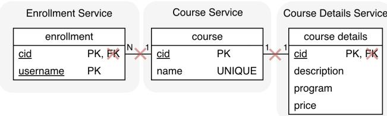  
Figure 1: ER diagram with a possible decomposition of a monolithic application into microservices. The cross symbol in red represents the effects of the decomposition on the integrity constraints.

In practice, these limitations have forced developers to take on the responsibility for maintaining data integrity at the application level [13], yet the inherent complexity of microservices [11, 12, 37] hinders ensuring correctness. To concretely illustrate these challenges, we introduce an example that demonstrates their effects on data integrity constraints.

## 2.2 Motivating example

Consider an application for online course enrollment with the relational schema depicted in Fig. 1. This shows a monolithic version containing the course, course details, and enrollment entities along with their integrity constraints, and overlays a possible microservice decomposition. This example contains all three canonical types of data integrity constraints.

Referential integrity. The referential integrity constraint ensures that records can only be referenced if they exist in the referred table [38, 39]. In relational databases, referential integrity is preserved by ensuring that, whenever a record delete (or update) operation is issued, the operation is either blocked, returning an error, or the effects of the operation are propagated to all the records referencing the deleted record, thereby also being deleted (or updated).

In the example monolithic system, the database enforces referential integrity through foreign keys (e.g., the cid col umn linking enrollment and course tables). However, after decomposition into microservices, these foreign keys can no longer be defined, and the cross-table relationships they enforced disappear (denoted with a red cross in Fig. 1).

In general terms, microservices cannot rely on referential integrity across databases, shifting this responsibility to the application layer — and ultimately to the developer [13]. Entity integrity. The entity integrity constraint ensures that records in a table are uniquely identified through primary keys, which must be unique and not null [38, 39].

In the exemplified monolith, entity integrity is enforced by the database through the cid primary key in both course and course details tables, and through the composite primary key cid and username in the enrollment table.

After decomposition, all entities share a copy of the same primary key across different databases. Then, while databases still enforce entity integrity, the services must collectively ensure system-wide integrity: if a primary key value can identify one record for a given entity (e.g., course) in one database, then the same primary key value must also identify all the remaining partitioned records (e.g., course details) for entities in other databases.

Uniqueness constraint. The uniqueness constraint (also enforced by primary keys) ensures that a specific value is never repeated [38, 39]. In our example from Fig. 1, the uniqueness constraint is enforced by the database for the name column in the course entity.

After decomposition, the course entity that contains both uniqueness constraints is bound to a single service (course service), whose database includes mechanisms to ensure that values never repeat. However, the course details database (whose data may depend on the course database) may not be aware of the implications of such mechanisms, and jeopardize the overall data integrity. For example, the course database may discard the insertion of a new record if another course with the same name already exists, while the respective details are successfully inserted in the course details database, leaving the system with a partially created course.

These examples show how distributing data across microservices increases the risk of violating the canonical constraints that are trivial to enforce in monolithic systems.

## 2.3 Automating Data Integrity Analysis

Ideally, developers would have access to automated tools that can easily identify situations that endanger integrity constraints, despite the inherent complexity of microservices. However, given the limited research and the low visibility of this problem, developers are either not aware of such risks or are forced to manually debug their systems, thereby increasing the chances of compromising data integrity.

To address this, we introduce Aletheia, whose goal is to identify the parts of the code that may invalidate foreign key, primary key, and uniqueness constraints. However, to determine the code patterns that flag these potential problems, we require a precise understanding of the semantics of microservices, how their state is accessed and shared across different services, and which integrity-related invariants must hold when data is accessed. To this end, we formally model these concepts and define the conditions that can lead to violating the above-mentioned integrity constraints, which enables us to precisely derive a set of problematic sequences of actions. Building on this foundation, Aletheia (detailed in §4) then conducts a static analysis of an entire set of microservices. This starts with an intra-procedural analysis to detect how values flow throughout the execution to infer which variables are used in datastore operations and included in remote service calls. Then, for scalability to larger codebases, we move into an inter-microservice data flow analysis based on a new abstract call graph, which is formed by retaining minimal information from the previous intra-procedural step according to our formal model. Ultimately, Aletheia operates exclusively on the abstract call graph, traversing it to infer cross-service foreign key relationships, and then searching for patterns in which database operations on data shared across services suggest that an integrity violation may occur.

## 3 A Model for Data Integrity in Microservices

In this section we lay out our approach to reasoning about how operations in microservices may break data integrity. We build on relational algebra to specify conditions to break the various integrity constraints, and then reason about the combinations of operations that may trigger those conditions.

## 3.1 System Model and Notation

We consider microservice applications where data is parti tioned across several databases, and operations are issued individually to each database by the corresponding service.

The state S of a database consists of a set of data objects in a domain D. The initial state of a database A is SA , and a subsequent state, SA , is obtained after applying a sequence of i operations. We restrict the set of database operations O to writes, reads, and deletes on tabular data, and denote them as w, r, d ∈ O. We define a request as a group of operations O that are collectively triggered by a client application call.

For any two databases, A and B, that are part of a microservice application with current states SA and SB , the global application state can be denoted as S{A ,B } = SAi ∪ SBi, which contains all data objects from both databases. We use T and T to denote relational tables from databases A and B.

When a database is replicated under weak consistency (which will be necessary to present data inconsistencies related to uniqueness constraints) its state may diverge when operations execute concurrently on different replicas. Here, we make the usual assumption that a convergent state is subsequently obtained by applying a merge procedure [40].

We consider data integrity to hold when a given integrity constraint, defined as a condition over the global application state, is satisfied by the current state. Table 1 presents the notation for defining the most commonly used integrity constraints in relational databases, namely foreign key, primary key, and uniqueness constraints. We do not include other constraint types such as check or not null, since they are either application-specific or enforced locally by a single database whose integrity does not depend on the state of other databases. Note that while we define constraints using relational database terms such as tables, columns, or records, this does not lose generality. In particular, these concepts can be adapted to other data models used in document-based (collections, fields, documents) or key-value stores (tables, attributes), as we will subsequently show by analyzing realistic microservice ecosystems with a diverse set of storage backends. Table 1 also shows the notation to represent operations.

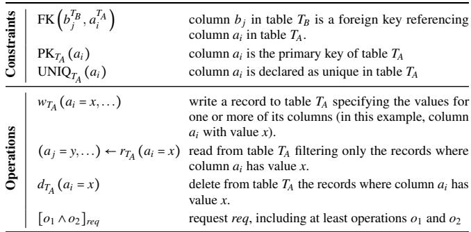  
Table 1: Notation to represent database constraints and operations.

## 3.2 Referential Integrity Violations

To understand the operation patterns that endanger referential integrity constraints, we first recall the respective definition: referential integrity states that an association can only be established between two records if the referenced record exists. In a microservice application, this link is established through implicit inter-microservice associations [13] between partitioned database records in different microservices, creating a foreign key relationship.

The definition of a foreign key is formalized as follows, where databases A and B hold tables TA and TB, respectively:

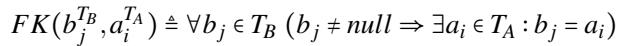

Furthermore, we want to formalize a way to derive the existence of foreign key relationships, even when a schema annotated with those relationships does not exist, which is the case in microservice code. To this end, we infer that a foreign key FK(bTB, aTA) is established between tables TA and TB whenever a value x that is written to or read from table A is subsequently written in a column of table B (even if column ai is not uniquely constrained in TA). The intuition is that the value x is first associated with a record in table A, and its subsequent use for creating a record in table B establishes a referential dependency from TB to T , since the newly written record in TB depends on the existence of the other record in TA. This corresponds to the following operation pattern:

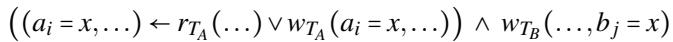

Following the notation in Table 1, the left conjunct represents one of two possible operations that must occur in table A: a read to table TA that returns a record where column ai has value x, or a write to table T to add a new record where column ai has value x. Then, the right conjunct states that the same value x is subsequently persisted in table TB of another table T is a foreign key referencing column a in table T .

As mentioned, this generalizes to other types of datastores such as document-based or key-value stores, namely by generalizing the previous reads and writes as any operations where the shared value x is assigned to an attribute or an underlying field of the object that is passed as an argument in writes, creating a referential dependency.

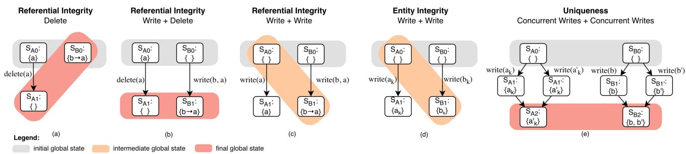  
Figure 2: Examples of operations on two databases that may break integrity constraints. Orange and red states are inconsistent intermediate and final states, respectively. In (e), both databases are weakly replicated, and a final state is obtained by merging divergent replicas [40].

Once we determined which foreign key relationships exist, we can identify, across all combinations of operation types, which are the ones that may violate the foreign key association to the state of a pair of microservices. In our particular case, since our generic model only includes three types of opera tions, we are able to exhaustively enumerate all possibilities, thus gaining confidence in the completeness of the set of prob lematic scenarios we identified, which are shown in Fig. 2 (a)–(c). Each depicted scenario comprises two databases, managed by different microservices, and the bottom part of the figure shows how two concurrent operations (or a single oper ation in scenario (a)) cause the system to transition to a final database state. For simplicity, we use b → a in the figure to represent a record a that has a non-null column referencing another column of record b, establishing a foreign key.

Absence of cascading deletes (RI-1). Fig. 2(a) illustrates how delete operations may break the validity of data associations. The initial global state corresponds to S{A ,B } = {a, b → a}, where a exists in database A, and b in database B contains a reference to a. The delete operation on database A to delete record a causes the database to transition from SA = {a} to SA = {}, where record a no longer exists. In contrast, no operations are issued to database B, thus its final state is the same as the initial state S{B } = {b → a}. At the end, the final global state S{A ,B } = {b → a} contains a record b with a reference to a, but record a does not exist in database A, breaking referential integrity.

In a monolithic database, this could be seamlessly ad dressed through schema annotations such as ON DELETE CAS-CADE2, which atomically propagates the effects of a delete operation to all records that reference the record being deleted. However, these mechanisms are not present in microservices due to their decomposition, and the absence of equivalent safeguards has been shown to be prevalent [13].

This leads us to an operation pattern describing this scenario that is formalized as follows.

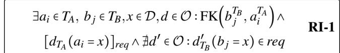

The first line sets the existence of a foreign key, establishing an association across tables TB and TA of different databases. Then, there must exist a request where a delete operation on table TA is not followed by any subsequent delete operation on the associated column b of table T , with value x.

Concurrent operations (RI-2). The second set of operations pertains to concurrent delete and write operations across different databases, as illustrated in Fig. 2(b). The initial global state of the application is S{A ,B } = {a}, and a pair of concurrent operations is applied to each database: the deletion of record a is applied to the initial state SA = {a} of database A, resulting in SA = { }, and the insertion of a reference from record b to a is applied to the initial state SB = { } of database B, resulting in SB = {b → a}. However, when we aggregate the final states of each database partition into a global state, we obtain S{A ,B } = {b → a}, where record b references a, but a does not exist. Therefore, the foreign key is not valid, and referential integrity does not hold. (The same issue appears in non-partitioned, weakly consistent replicated databases, a context for which Bailis et al. [40] showed that delete operations are not I-confluent under foreign key invariants, meaning that concurrent deletes and writes of references are unsafe, and thus require coordination to preserve the invariant.)

The code pattern that flags this potential problem corresponds to the existence of two requests that perform these conflicting operations, as expressed by the following:

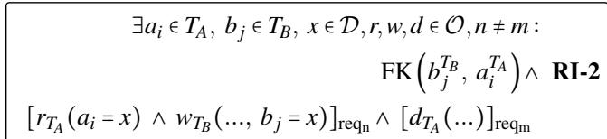

Here, request reqn performs a write operation on table TB to create a new association in column b j referencing an existing record with value x. This value is obtained from a preceding read operation on table TA, confirming that the precondition for referential integrity is satisfied. Then, a concurrent request, reqm, executes a delete operation on table TA, resulting in the removal of a record that violates the referential integrity constraint established by the first request.

Uncoordinated replication (RI-3). Concurrent write operations may also affect referential integrity, namely when this constraint is enforced among objects partitioned across different storage systems.

To illustrate this, consider the scenario in Fig. 2(c), with an initially empty global state S{A ,B } = {}. To establish an association between objects, a request must contain two writes: one that inserts record a in database A, and another that inserts a reference from record b to a in database B. Together, these lead to the final global state of S{A ,B } = {a, b → a}. However, before reaching that state, there may exist a visible intermediate global state S{A ,B } = {b → a} where b references a, but a does not yet exist, breaking referential integrity.

This violation stems from the lack of coordination among datastores when replication is asynchronous. In such cases, objects written in the same request may not become visible together. As a result, foreign key references can temporarily point to missing records, breaking referential integrity.

(RI-3) below formalizes the operations that can lead to this class of intermediate states with integrity violations.

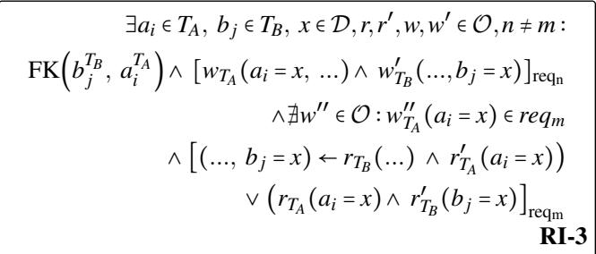

First, there must exist a foreign key in database B referencing an entity in database A. The pattern then starts with a set of two writes in the same request (line 2): wT that inserts the that creates an association with the former. The other request (lines 3-5) begins by excluding the write of the referenced object (line 3). Otherwise, under common read-your-writes semantics, the write would become visible to the subsequent reads, and the reference to the written record would remain valid, preserving integrity. Lines 4-5 describe the two alternative ways in which the same key x may read from table TB (where it is a foreign key) and from table T , potentially exposing a missing reference. The first pair of reads (line 4) retrieves record b with rT (...) using an arbitrary key to extract the foreign key value x in the record’s column bj, and then uses that foreign key to read record a with r′T (ai = x). The second pair (line 5) reads record a containing the field x (through rT (ai = x)), and then reads a record b holding the value x as a foreign key with r′ (b j = x).

## 3.3 Entity Integrity Violations

Entity integrity — which states that unique and non-null keys must identify records in a table — is enforced by databases through the use of primary keys. However, in microservices, entities may be partitioned among different services and share the same common primary key, allowing each database to uniquely identify its portion of the partitioned record. In this scenario, these various databases cannot guarantee consistency between themselves, and this lack of coordination can affect the overall application correctness.

Uncoordinated replication (EI-1). The effects of uncoordi nated replication are akin to those in the context of referential integrity where, because writes are not coordinated across datastores, the validity of primary keys may be compromised.

Fig. 2(d) illustrates this through a scenario where an entity is decomposed into smaller entities in databases A and B, each managed independently by different services.

Both databases A and B are replicated with eventual consistency with initially empty states SA = {}, SB = {}. Then, two writes are executed. write(ak) is applied to database A to insert record a with a primary key k, and write(bk) is applied to database B to write record b using the same primary key k. Before reaching the final global state, there may exist an intermediate global state S{A ,B } = {bk} where record b exists, but record a does not. At this moment, the primary key k can be used to identify record b but not record a, and the primary key becomes invalid across the application.

The following pattern captures the microservice operations that may expose this problematic intermediate state.

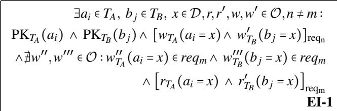

There are two primary key constraints: one on field ai in table TA of database A, and another on field bj in table TB of database B. The pattern then starts with a set of two writes within the same request (line 2): wTA(ai = x) and w′T (b j = x), splitting a single record across TA and TB using the same primary key (line 2).

Then, the problematic request (lines 3-4) begins by excluding a write of the two records in the same request as the reads (line 3); otherwise, similarly to pattern RI-3, these newly written values would be visible under read-your-writes. With this exclusion in place, two read operations rT (ai = x) and r′TB(b j = x) reading the same primary key value x may expose an inconsistent state of the application, containing only one of the two prior writes (line 4).

## 3.4 Uniqueness Violations

Similarly to primary keys in entity integrity constraints, databases can individually enforce uniqueness constraints, which can be defined at the column or table level.

However, when entities are decomposed across partitioned systems, the per-database mechanisms to enforce uniqueness may fail to preserve the overall data integrity of applications.

Conflicting writes (Un-1). This entails the occurrence of concurrent writes that conflict in a partitioned database. Consider Fig. 2(e) where databases A and B are both replicated with weak consistency, but only database A has a uniqueness constraint in column k. Then, two clients, c1 and c2, access the application from different regions and each issues a request to the application (write(a ) and write(b) from c , and write(a′ ) and write(b′) from c2). We use ak and a′ to denote write operations that insert records a and a′ using the same key in column k. In this specific execution, the request from client c1 leads to states SA = {ak} and SB = {b}, whereas the request from client c2 leads to states SA′ = {a′k} and SB′ = {b′}.

Since the same column k was written concurrently to different replicas, a weakly consistent database must be able to merge these writes through a mechanism such as LWW [35, 36] or CRDTs [34]. With the correct mechanisms, this convergence will be automatic and preserve uniqueness constraints, e.g., applying LWW in database A can discard the effects of write(ak) and preserve the uniqueness of the key in column k in a final state SA = {a′ }. However, despite data integrity being preserved in A, the application data is now inconsistent across databases A and B. This is because the final global state S{A , B ,} = {a′k, b, b′} includes the effects of both initial operations on B, but only one operation on A, meaning that the effects of one of the requests are only partially reflected.

To detect such inconsistencies, the following pattern captures requests that include two writes and at least one of them is on a constrained column.

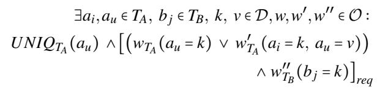

Un-1

Here, there is one write wT or w′T to a database A that has some uniqueness constraint (line 2, split into inserting value k either (1) in a uniquely constrained column au or (2) in any column ai and another value v in a uniquely constrained col-′′ to database B that uses one of the values written in the former operation (line 3), regardless of whether the value is part of the uniqueness constraint. The idea is that, whenever there is a data dependency between the two writes (in this case, through the shared value k) and one of the databases holds a uniqueness constraint, then the overall data integrity can break, as the effects of the constrained operation may be lost upon applying the convergence mechanism, contrary to the other operation.

## 4 Aletheia

The formal framework from the previous section characterizes code patterns that lead to data integrity violations in microservices. However, manually inspecting codebases to identify these patterns becomes increasingly difficult as applications grow in size and complexity. To address this challenge, we introduce Aletheia, a static analysis tool that operationalizes our formal framework to automatically detect integrity violations.

Aletheia has four high-level steps. It begins with an intraprocedural analysis based on SSA graphs (§4.1), followed by an inter-microservice analysis that constructs an abstract call graph (§4.2). This is then used to extract a schema for objects stored across the application’s databases (§4.3). Finally, Aletheia identifies the code sections that violate integrity constraints (§4.4). We now detail each of these steps.

## 4.1 Intra-Procedural Analysis

Statically identifying foreign keys through implicit microservice data associations as well as problematic code patterns requires reasoning about how values assigned to variables flow through the program, as we need to identify the provenance of the inputs to database operations. To this end, we first perform an intra-procedural analysis whose goal is to determine, within each method, how values assigned to variables flow into database operations and are used as input parameters in remote service invocations. The latter is necessary to subsequently broaden the scope of the analysis across services, ultimately reaching different databases.

In particular, we conduct a data flow analysis on graphs based on the SSA [15] intermediate representation of programs, where each variable has exactly one definition site, and new assignments result in new versions of these variables. This identifies the locations where variables are defined and subsequently used while also providing a standardized view of the program that abstracts away unnecessary details. In this step, we also extend the analysis across procedure invocations but within the same microservice, thus obtaining a per-service data flow representation.

Building SSA graphs. These graphs are constructed from the SSA intermediate representation of each method in the microservice code, with nodes corresponding to SSA instructions. We illustrate how the SSA graph allows for tracking data flow through an example of a product service (see Listing 1), which takes the id and name of a product as parameters to be written to its relational database, creates a new composite product variable from the parameter values, and returns the product. Fig. 3 depicts a simplified version of the corresponding SSA graph. In total, there are eight nodes that correspond to the instructions from the SSA representation. In this example, the id and name parameters are used as input to the database write operation, which is represented by a variable t . Variable t is associated with the newly created product object with its fields id and name, respectively t2 and t . The product constructor assigns to t and t the values of the parameters id and name, creating the nodes ∗t = id and ∗t = name, which are connected to t and t .

Tainting SSA graphs. After constructing the SSA graphs for each function, we have the information to determine which variables in the function flow into database operations and

1 func RegisterProduct (id, name) (Product, error) {   
2 product\_db.Exec("INSERT INTO products (id, name)   
VALUES(?, ?)", id, name)   
3 product := Product{id: id, name: name}   
4 return product, nil   
5 }

Listing 1: Snippet of Go code for register product method of product service for an e-commerce application.

microservice invocations, either directly as arguments or indirectly through other assignments and operations. This is accomplished by employing a taint-propagation approach, whose first step is to identify nodes corresponding to these operations, and then proceed to discover all variables whose values flow into these operations. For this, we annotate variables used both as input parameters and return values of those operations. These annotations identify the call, along with the interface parameter (in the case of microservice invocations) or schema field (in the case of database operations) to which variables flow. Then, we propagate these annotations to all reachable nodes in the graph. Hence, whenever a variable contains such annotations, we can determine that its value flows into the corresponding operations.

Fig. 3 illustrates how this technique determines which database operations each function variable flows into. Through graph traversal, the system identifies variable t0 as a database operation. Then, since id and name are passed as arguments, they are annotated, and taint information is propagated to the neighboring nodes, following the edge flow in the figure. Both taints on id and name eventually reach the local composite product defined by t1, indicating that its underlying fields id (denoted by \_ob j.id) and name (denoted by \_ob j.name) had been written in the product\_db database on the product table and id and name columns, respectively.

The previous process determines, for this particular function, which variables flow into the write operation (implemented as a SQL insert on product\_db) whenever the respective service is invoked. Furthermore, if the service makes multiple internal function calls, we extend this analysis by propagating taint information across the SSA graphs of the various methods. To this end, we determine the final taints (and thus their triggering operations) of objects that reach microservice boundaries (i.e., other service invocations). In our example, these are the id and name parameters, as well as the product t1 returned by the function, whose taints identify the write operation on product\_db to which they flow. This enables a subsequent inter-service analysis of taint propagation, specifically how the parameters id and name supplied by the invoking service are transformed by the remote service invocation, which returns a value t1 that incorporates taints generated during the current analysis.

Note that this approach not only supports raw SQL, which explicitly specifies record columns, but also NoSQL databases such as key-value or document stores, and queues: by propagating taint annotations through variables and their fields, we can identify, for a given object used as an argument in a call, the specific object fields that are referenced. The tainting also extends to data passed as binary objects (as employed by queues) as long as writers and readers use data types whose fields can be statically identified (e.g., maps with statically known keys) to construct and parse the binary objects.

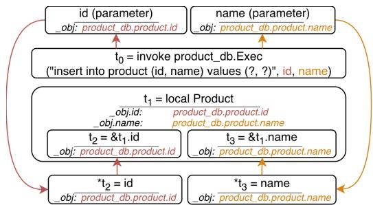  
Figure 3: Example of a simplified SSA graph for a product service. Arrows represent the flow of taints originating in the write operation on t . Nodes affected by the taint contain the corresponding annotation below their SSA instruction. The standard execution flow arrows from the SSA graph are omitted.

## 4.2 Inter-Service Propagation

The second step broadens the analysis so we can detect when the patterns from §3 occur across multiple microservices. The main challenge is that we cannot simply continue the SSA taint analysis beyond individual services: this does not scale to large codebases, since it would require iterating over the joint SSA graphs of potentially thousands of microservices. Instead, the second step operates at a higher level of abstraction by building an abstract call graph, which provides a scalable representation of applications while keeping minimal taint information from the previous SSA graphs. The idea is that the abstract call graph only retains, per service, the information about interaction points, namely microservice calls and database operations, and the variables involved in them, including incoming parameters and returned values of these calls. This is the necessary and sufficient information to do a similar analysis to the first phase, namely to detect the patterns formalized in §3, even if they occur across microservices.

Building abstract call graphs. This graph comprises nodes representing microservice endpoints or datastore instances, and edges that denote invocations from one node to another. Edges between services represent remote invocations from one service to another. Edges connecting services and datastores represent either a service performing a datastore operation or a datastore triggering the execution of a service through, for example, an asynchronous event.

Furthermore, to track the taint flow through invocation or return arguments, we represent parameters and return values of either microservice or database operations as abstract objects. These objects contain the taint information obtained in the previous SSA analysis, which indicates the service or datastore calls into which variables flow. These objects are attached to nodes or edges, depending on whether they are parameter/return variables associated with method declarations or used in call sites, respectively, as explained through the next example.

Fig. 4 illustrates a simplified abstract call graph for an ecommerce application containing three services: APIService, ProductService, and InventoryService. The logic of the Prod uctService and its RegisterProduct method closely follows the example introduced in §4.1 and the SSA graph in Fig. 3. The graph consists of five nodes, three for the interfaces exposed by each service (APIService, ProductService, and Invento ryService), and two for the database instances (product\_db and inventory\_db). There are four abstract objects, namely the parameters and returned values involved in the example, annotated with taint information from the preceding intraservice analysis. These objects mediate the propagation of database and service invocation taints across nodes, allowing us to identify how data flows through services and operations.

The flow of interactions (solid arrows in Fig. 4) starts when the client uses the APIService interface to register a product, passing its id, name, and the amount to add to the inventory. Within this method, the APIService calls the RegisterProduct method in ProductService, which subsequently writes to its database product\_db and returns a product object ao . Then, the APIService uses the id field in product ao as the id argument (ao3) to call the AddInventory method in InventoryService. The latter then uses the id parameter (ao4) and amount, which we omit, as a value in the write operation to its database inventory\_db.

Tainting abstract call graphs. The abstract call graph contains taint information extracted from SSA graphs, but this only captures the flow of objects within the boundaries of each microservice, which is insufficient for an analysis across microservices. Thus, after constructing the abstract call graph, the next step is to traverse the graph from each entry point in the application to propagate taints across the invocation chain. This will enable us to determine which objects, exchanged between services, hold taints from different databases, indicating a data dependency between services. This in turn will enable both detecting foreign keys and reasoning about common values used in different operations, as required by the formal model we previously defined.

To achieve this, for every node in the graph, we identify its outgoing edges and propagate the taints present in the objects associated with the call performed by the current node (either as parameters or return values) into the corresponding objects of the callee method declaration. Then, for each abstract object that acquires new taints, the algorithm propagates them to subsequent database and service calls the object flows into by merging annotations.

To illustrate this, we return to our example in Fig. 4. Here, we begin the tainting process by visiting the APIService on RegisterProduct, and then proceed to subsequent nodes according to the outgoing edges. The first database tainting propagation (red dashed arrows in Fig. 4) occurs when we finish visiting the ProductService and return the analysis to the APIService, propagating the taints from ao2 to ao1 through the object returned by the RegisterProduct method. This propagation results in a new annotation on ao1 indicating a write in products\_db, meaning that the value of ao1, provided by the APIService, flows into the database of ProductService.

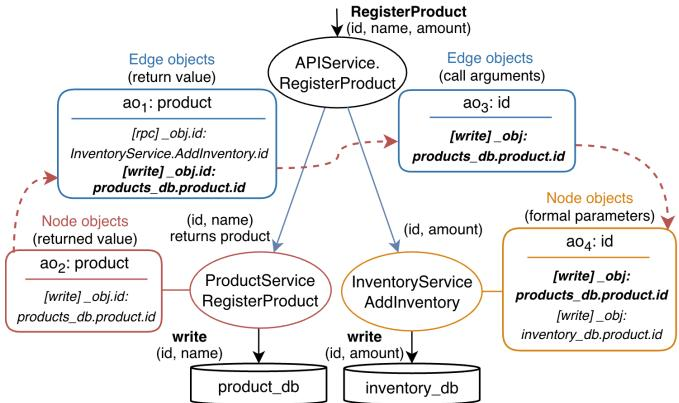  
Figure 4: Example of a simplified abstract call graph for an ecommerce application. Abstract objects are prefixed with ao. Taint annotations in bold correspond to new annotations computed during the iteration of the abstract call graph. Solid arrows describe execution flow. Dashed arrows describe taint propagation.

Then, the graph traversal returns to the APIService. Since ao1 contains an rpc annotation indicating that its id field is used as a parameter in the AddInventory call, then the new write taint on ao1 is propagated to the corresponding object in that call (ao3). Finally, when visiting the InventoryService, we see that object ao4 is used as an id parameter of the method invoked by the APIService. Therefore, following the same logic as in ProductService, we propagate the taints from ao3 to ao4 by matching caller-callee objects, thus completing the taint chain from product\_db to inventory\_db.

This step of connecting the two databases through two taint annotations on object ao4, is fundamental for our next analysis. For instance, in our example, we observe a group of operations matching pattern RI-3 (line 2) for referential integrity, where related records (product and inventory) are written in the same request, but may not be visible together during reads due to the lack of coordination. Then, when the detector module identifies another request executing reads on both the newly created records, completing the RI-3 pattern, it identifies a referential integrity violation.

## 4.3 Extracting the Application Data Schema

The two previous components allow Aletheia to determine how values are exchanged between services and included in different database accesses. This allows us to determine the schema information and search for the access patterns defined by our methodology.

Computing foreign keys. During the graph analysis, any taint propagation that causes an abstract object to contain multiple taints originating from different datastore operations results in a foreign key being added to the schema. However, we still need to determine the direction of the foreign key association, since taints capture the order and type of operations, but do not indicate which field references the other. To determine which table holds the foreign key and which table contains the referenced records, we account for (i) the types of operations, which tell us whether we are obtaining a possible foreign key (through reads or writes whose values are propagated to other operations) or merely storing it (through writes), as well as (ii) the objects used as keys in these operations, whose taints specify the database fields being accessed and for which the foreign key will be constructed.

To this end, we denote each pair of operations as an ordered tuple (op1, op2), where opi ∈ {read, write} and write denotes any mutating operations.

Since foreign keys establish a data dependency between two tables, there is always one object whose value is included in operations to both tables, whose taints indicate the fields accessed in each table. Therefore, we use f ield1 and f ield2 to denote the fields accessed by that same object in op1 and op2, respectively. After having determined the fields being accessed for each operation, we can construct foreign key relationships according to the rules below for the pair (op1, op2). This is based on the intuition that if one of the operations is a read and the other is a write, then the write inserted a reference to the field that is read, independently of whether it appears before or after the write (➀ and ➁). In case of two writes (➂), since they occur when both the referenced and referencing objects are written in the same request, we assume that the second write inserts a reference to the former, which has just been created.

➀ if (read, write), then f ield2 references f ield1

➁ if (write, read), then f ield1 references f ield2

➂ if (write, write), then f ield2 references f ield1

For (read, read) pairs, the direction depends on whether the propagated value is a key that was used as a parameter in a read operation (readkey) or a returned value (readval). A field returned as readval and subsequently used as readkey (➃) is considered the referencing field, as it provides the key that was retrieved and then subsequently used as a foreign key to look up a value. When both operations use readkey (➄), we cannot infer the direction exclusively from the operation that reads a foreign key. Therefore, based on the order of operations, we assume that the first read retrieves the referenced field directly using a foreign key, while the second read looks up the record holding that foreign key.

➃ if (readval, readkey) then f ield1 references f ield2

➄ if (readkey, readkey), then f ield2 references f ield1

## 4.4 Pattern Detection

The role of the detector module is to search for problematic code patterns that violate data integrity. This is enabled by the previous steps: constructing the data schema to extract data integrity constraints (see §4.3) and performing taint propagation in the abstract call graph to determine the flow of objects into service invocations and database operations (see §4.2).

With this information, the detector only needs to traverse the abstract call graph, locating the database operations, and checking for the presence of the problematic operation patterns defined in §3 (RI-1, RI-2, RI-3, EI-1, Un-1).

## 4.5 Implementation

Aletheia was implemented in Go using its Go SSA IR [41]. Thus, it can be extended to support other programming languages, since SSA representations can be obtained for multiple languages using analysis or compiler frameworks [42, 43].

Aletheia relies on three important mechanisms to analyze microservice codebases: identifying service methods that implement remote invocation endpoints, the locations where these invocations occur, and locating database accesses. However, microservices may employ a range of frameworks and communication protocols to interact with one another, and also use a variety of libraries and drivers tailored to each specific storage system. This diversity makes it difficult to encompass all frameworks and thus to locate these calls.

Given these difficulties, we analyze applications written with Blueprint [24], which identifies this information. In particular, Blueprint implements microservice invocations as regular function calls, and database operations through interfaces that abstract the underlying storage, thus allowing us to easily locate both of them. In the future, Aletheia could be extended to support other frameworks [44, 45] besides Blueprint, as long as they provide standardized abstractions for database and microservice calls that can be statically identified.

## 5 Evaluation

We evaluate our system to answer the following questions:

• Can Aletheia detect data integrity violations effectively?

• Which data integrity violations were found by Aletheia?

• How does application complexity impact analysis time?

## 5.1 Case Studies

We evaluated Aletheia using a dual approach that combines existing open-source microservice codebases (denoted as realistic applications), and production trace-based generated code (denoted as synthetic applications) to compensate for the lack of production-scale open-source microservice collections while evaluating the scalability of our approach.

Realistic applications. We conducted a broad search for open-source microservice applications across multiple programming languages. Aletheia was evaluated using the identified applications, namely seven microservice applications spanning four domains: e-commerce (Digota, SockShop, EShopMicroservices), social networks (PostNotification, Social-Network), media storage (MediaMicroservices), and booking systems (TrainTicket) [18–23]. The SocialNetwork and MediaMicroservices applications (both part of DeathStar-Bench [18]) and TrainTicket [19] correspond to benchmarks that approximate large microservice applications in real deployments. The overall set of applications (see overview in Table 2) involve typical microservice operations such as managing product catalogs and orders, creating posts and notifications, storing media content with reviews, and handling ticket reservations with associated services. Applications employ various storage systems, including document stores (MongoDB), message brokers (RabbitMQ), caches (Redis, Memcached), and relational databases (MySQL), with system sizes ranging from 3 to 31 microservices, 2 to 21 datastores, and up to 4462 lines of code. Communication spans 6 to 170 RPC calls in 3 to 58 call graphs.

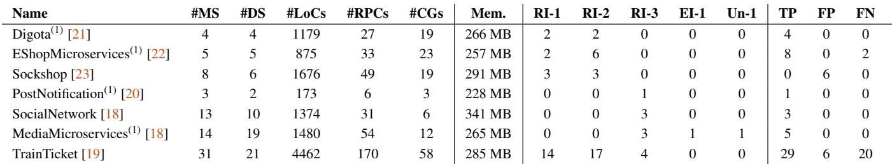  
Table 2: Static analysis results per application. For each application, we report: (1) characteristics such as microservices (#MS), datastores (#DS), lines of code (#LoC), RPC calls (#RPCs), and call graphs (#CG, equaling the number of frontend requests); (2) Aletheia’s peak memor usage (Mem.); and (3) detection errors broken down by integrity violation pattern, and its true positives (TP), false positives (FP), and false negatives (FN). Applications marked with (1) were ported to Blueprint.

In two cases, we extended applications with missing logic that seemed intuitively necessary, without which some problematic data partitioning could not be uncovered. In particular, we extended MediaMicroservices by adding endpoints (i) to insert complete movie records in a single request, instead of having the client separately calling four endpoints to write the associated data, and (ii) with a previously missing operation to read movie details, which is necessary to obtain an ID that was writable but not accessible to the client, and is required to read movie pages. In TrainTicket’s implementation, ticket reservations trigger the creation of insurance, consignment, food order, and delivery records, but the system was missing an operation to access this state as part of a reservation query. Hence, we added an endpoint to query all records for a given reservation through existing read endpoints.

Synthetic applications. To demonstrate that Aletheia scales to production-like scenarios and to assess how the call graph structure influences performance, we generated synthetic applications based on graph characteristics (call depth, fan-out, and request volume) derived from Alibaba’s production microservice traces [12] (see Table 3). Since there is no public access to the service logic, we generated microservice stubs with a configurable number of write and delete operations per method. Additionally, to assess the sensitivity of the results to varying graph parameters, we created five variants that modified one of the call graph characteristics at a time.

Experimental Setup. The experiments were conducted on 2x Intel Xeon Gold 5320 CPUs at 2.2GHz with 52 cores and 256GB of RAM, and all results represent an average of 5 runs.

## 5.2 How Effective is the Detection in Aletheia?

Table 2 presents the analysis results across all realistic applications. In our methodology, we computed an approximate false negative rate by manually and extensively searching for the patterns of operations defined in §3 to determine an approximation of the ground truth for the total number of problematic code patterns. In our analysis, we refer to the programming issues that may lead to data inconsistencies as bugs, while acknowledging that, in some cases, the application logic may tolerate the resulting semantic anomalies, or work around those issues through careful database configuration.

Aletheia achieved 81% precision and 69% recall, identifying 50 true positives, 12 false positives, and 22 false negatives. Notably, 46 of these true positives represent previously unreported bugs, with the exceptions being PostNotification and SocialNetwork, whose bugs were previously identified as cross-service inconsistencies through a runtime consistency enforcement shim [20].

We reported all bugs to the developers of the respective applications. All bugs were confirmed for TrainTicket, Digota, PostNotification, SocialNetwork, and MediaMicroservices by the respective authors. The developers of EShopMicroservices replied only to an initial report on RI-1, but confirmed the bugs and suggested solutions to address them. Furthermore, the authors of TrainTicket indicated these issues would be further investigated and addressed in future implementations due to their relevance in the application.

False positives. We examined the sources of false positives and how developers can interpret these warnings. The primary source of false positives is Aletheia’s conservative approach, which flags patterns as potential violations even when application-specific business logic ensures safety: SockShop produces 3 RI-1 false positives from cart deletions that intentionally do not cascade to orders, and 3 RI-2 false positives from concurrent cart deletions and order creation, where the application coordinates safely. TrainTicket exhibits similar patterns where deleting contacts or price configurations does not propagate to reservations, which is correct by design but conservatively flagged, resulting in 3 RI-1 false positives.

A second source of false positives arises from over-approximation in taint tracking. Aletheia propagates taints to all reachable variables, so when variables tainted by different database operations are combined in expressions (e.g., x←a+b), the result inherits all taints. This can lead to incorrectly inferred foreign key relationships. In TrainTicket, 3 of 35 warnings (1 for RI-1, 2 for RI-2) are such false positives.

To reduce the number of false positives, Aletheia allows developers to suppress cascade warnings for entities not intended for deletion and to be ignored by the detection module. False negatives. False negatives occur when query patterns prevent foreign key detection. Some applications retrieve related objects by using values as query filters rather than as direct foreign key lookups. For instance, TrainTicket retrieves price configurations by filtering on train type name instead of using a foreign key to access the related object. This prevented Aletheia from identifying 3 foreign key relationships, resulting in 8 undetected bugs (3 for RI-1, 5 for RI-2).

Another source of false negatives arises from cross-request implicit associations, where relationships between entities exist outside of the microservice code, and are established through user-provided values that bridge arguments of different RPC requests. For instance, TrainTicket allows users to query station information in one request, then use the returned station name as input for order creation in a subsequent request. Since the order service never queries the station database using the value from the user, but the order creation populates related records (DELIVERY, FOOD-ORDER, ROUTE, TRIP) with this station name, the connection between STATION and these records exists only across separate requests rather than within application code, leaving foreign keys undetected. This limitation caused 12 false negatives in TrainTicket (5 for RI-1, 7 for RI-2). Similarly, a missing foreign key between COUPONS and PRODUCTS caused 2 false negatives in EShopMicroservices (1 for RI-1, 1 for RI-2).

The results in Table 2 show that larger codebases (measured by number of microservices, datastores, and LoC), contain more potential integrity violations. For example, TrainTicket, with 170 service invocations, contains almost eight times more violations than Digota, with 27 invocations. This is because more service invocations and cross-datastore interactions create additional data associations across services, increasing violation likelihood. Importantly, this trend validates Aletheia’s relevance: as applications grow in complexity, the number of integrity violations rises substantially, making automated detection essential where manual debugging is challenging.

## 5.3 Which Data Integrity Violations were Found by Aletheia?

Next, we present a detailed description of the detected bugs. Digota. Four referential integrity bugs were detected (2 for RI-1 and 2 for RI-2). For RI-1, deletions of PRODUCTS are not propagated to their SKUs (Stock Keeping Units), and deletions of SKUs are not propagated to ORDERS. Although similar patterns involving orders are false positives in other applications, invalid references from ORDERS to non-existent SKUs cause order returns to FAIL whenever the order service cannot retrieve the related SKUs, preventing refunds from completing. For RI-2, we found that a PRODUCT can be concurrently deleted while an SKU is created, and an SKU can be concurrently deleted while ORDERS referencing it are created.

EShopMicroservices. Eight referential integrity bugs were detected (2 for RI-1, and 6 for RI-2), which affect the correct processing of baskets. For RI-1, the two bugs occur when the deletion of PRODUCTS or COUPONS is not propagated to the BASKET that contains references to them. For RI-2, the six bugs occur when PRODUCTS or DISCOUNTS are deleted while a BASKET is concurrently created or updated.

PostNotification. One referential integrity bug was detected for RI-3 concerning a foreign key from a NOTIFICATION to its POST. The bug occurs when the notify service receives a new NOTIFICATION via a message broker and uses the POST ID to fetch the corresponding post in storage service. If replication is stale, users may receive notifications for non-existent posts. SocialNetwork. Three referential integrity bugs were detected for RI-3 under asynchronous replication, and concern foreign key associations between timelines (USERTIMELINE and HOMETIMELINE) and POST. The bugs occur when POST IDS retrieved from timeline caches or the USERTIMELINE document store are later used to fetch POSTS from the poststorage database. Under stale replication, loading timelines may fail whenever one POST is unexpectedly missing from the post-storage database.

MediaMicroservices Five bugs were detected regarding referential integrity (3 for RI-3), entity integrity (1 for EI-1), and uniqueness (1 for Un-1) violations under asynchronous replication. For RI-3, reading a page may fail whenever foreign keys obtained from reading MOVIE-INFO and MOVIE-REVIEW are then subsequently used to retrieve the movie details (CAST, PLOT) and the review content (REVIEW-STORAGE), as any referenced record (all created together in the same request) may be missing. For EI-1, obtaining the movie ID and reading the page may fail as MOVIE-ID and MOVIE-INFO are not guaranteed to be visible simultaneously. For Un-1, concurrent movie registrations with the same title require conflict resolution in MOVIE-ID to preserve the uniqueness constraint, discarding one MOVIE-ID, thus leaving an orphaned record in MOVIE-INFO. Consequently, subsequent PAGE reads and REVIEW writes may observe partial results across MOVIE-ID and MOVIE-INFO.

TrainTicket. Twenty-nine referential integrity bugs were detected (10 for RI-1, 15 for RI-2, and 4 for RI-3). RI-1 bugs arise when deleting: (i) ORDERS without propagating effects to INSURANCE, CONSIGNMENT, DELIVERY, or FOOD-ORDER; (ii) STATIONS without propagating effects to OR-DERS or CONSIGNMENTS; (iii) ROUTES without propagating effects to PRICE CONFIGURATIONS; (iv) TRIPS or USERS without propagating effects to ORDERS or CONSIGNMENTS. RI-2 bugs involve the previous entity pairs (except those in (i), as all records are created in the same request) and new pairs (ORDERS referencing CONTACTS and PRICE CONFIGURA-

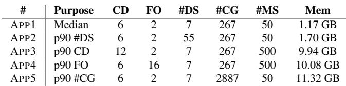  
Table 3: Synthetic applications with varying call depth (CD), fanout (FO), datastores (#DS, equaling the number of writes), and call graphs (#CG, equaling the number of frontend requests) according to Alibaba’s report [12], as well as stateless microservice count (#MS).

TIONS), and occur when a record may be deleted while a new reference to it is created. RI-3 bugs occur when the ORDER ID is used to read the ORDER and query related INSURANCE, CONSIGNMENT, DELIVERY, and FOOD-ORDER records.

## 5.4 How Do Application Size and Complexity Impact Analysis Time?

We evaluate how application size and complexity affect the scalability of our approach. Fig. 5 shows the analysis times for both sets of applications, decomposed into parsing, schema building, and detection phases. Parsing includes code retrieval, SSA graph construction and tainting, and abstract call graph generation. Schema building taints the abstract graph while reasoning about data associations. Detection searches for the problematic patterns.

We start by analyzing applications in the realistic set, which complete in under 4 seconds. The analysis time increases mainly with the remote call count, whereas microservice and datastore counts have a smaller impact. For example, more than doubling the number of microservices from 13 (Social-Network) to 31 (TrainTicket) results in a smaller than 2× increase in analysis time (2.07 to 3.52 s). Breaking down into phases, parsing dominates total time, while schema building and detection are barely visible.

We now examine synthetic applications (Table 3) to understand how specific parameters influence the analysis time. Compared to realistic applications, the schema building and detection phases consume larger proportions of both time and memory. This reflects the substantially higher complexity of synthetic applications: up to 2887 call graphs vs. 58 maximum, with greater per-graph complexity from increased microservice and datastore accesses. The shift occurs because more operations generate larger volumes of taint information, increasing propagation overhead through invocation chains, and extending schema building and detection times.

Our detailed analysis of the synthetic set begins with APP1, which represents the median Alibaba call graph parameters, and completes in 20 seconds. Comparing APP2 with APP1, increasing datastore operations from 7 to 55 per request results in a 3× increase in total time, demonstrating some sensitivity to database access frequency. Comparing the largest applications (APP3 and APP4) with APP1 reveals the primary scalability driver. Despite using the same number of datastores, their 10× increase in microservices (from 50 to 500) produces a corresponding 10× increase in total invocations (from approximately 13k to 130k). This leads to analysis times reaching 801 and 908 seconds, respectively, confirming that total invocation count strongly predicts analysis time. APP5 validates this finding by achieving high invocation counts through a different approach than APP3/APP4, namely maintaining a low microservice count (50) but increasing the number of call graphs (and thus frontend requests) from 267 to 2887, allowing it to reach similar total invocations as the larger applications. The resulting analysis time of 1152 seconds is comparable, confirming that invocation count drives analysis costs regardless of whether complexity arises from more services or more entry points.

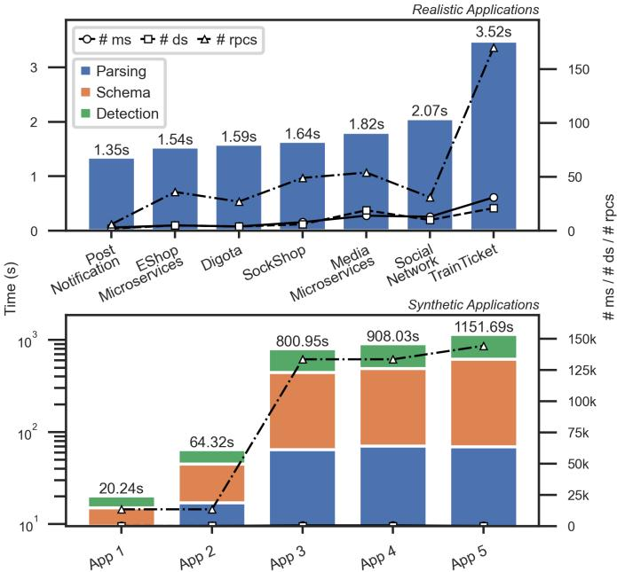  
Figure 5: Analysis time per application, sorted by complexity (sum of the number of microservices and datastores). The reported analysis times are given for Total, Parsing, Schema Building, and Detection, where Total is the sum of the other three components.

Finally, comparing APP3 and APP4 reveals that the structural properties of the call graph have minimal performance impact: despite differing significantly in call depth (12 vs. 6) and fan-out (2 vs. 16), they show nearly identical schema building and detection costs.

## 6 Limitations

Parameterized dynamic queries. As a static analysis tool, Aletheia supports only statically defined queries and filters and cannot infer data relationships from dynamically constructed query operations. For instance, when SockShop dynamically adds tag name filters based on user input (WHERE tag.name=?), these relationships are not captured by our analysis. However, we did not find instances where this limitation affected the evaluation results for any application.

Cross-request implicit associations. When relationships between entities are established through user input that bridges separate RPC requests, Aletheia cannot infer them.

This caused a few false negatives in two services, as discussed in §5.2. In the future, we could address this by allowing developers to explicitly annotate association variables with foreign key metadata, enabling Aletheia to recognize these relationships while preserving its automated analysis.

Lazy enforcement of data integrity. Certain applications may handle data integrity lazily. For instance, when a user is deleted, dependent data may be retained and deleted later. This can be captured by Aletheia if the delete is executed upon an asynchronous event published as part of the triggering deletion. However, if deletions are propagated outside the request path (e.g., through a background process that periodically cleans orphaned records), developers would have to specify which cascade warnings to ignore during the analysis.

## 7 Related Work

Analyzing Microservices. Laigner et al. [13] conducted a study of data management practices in microservices, identifying fundamental challenges in ensuring application safety across services due to decentralized storage and applicationlayer logic. Their work provides a valuable high-level characterization of microservice consistency challenges through practical examples where applications can observe inconsistent states due to the lack of database support for transactional guarantees and event coordination. However, it lacks both a formal problem specification to systematically reason about integrity constraints, and automated detection mechanisms.

Romão et al. [46] recently introduced MAD, an anomaly detection tool that takes a monolithic service written in Java and a proposed decomposition, and uses an SMT solver to flag anomalies from non-serializable executions. While this shares the setting of detecting semantic inconsistencies in microservices, it has a different focus on anomalies in the migration into microservices, receiving as input the monolithic implementation of Java applications and a proposed decomposition, instead of a microservice codebase. Furthermore, the correctness criteria of serializable executions may be too restrictive, whereas Aletheia allows broader semantics and pinpoints only the problematic data integrity violations.

Peng et al. [37] introduced an architectural measurement approach through trace analysis, which allows users to identify architectural issues due to poor service decomposition, such as redundant services with similar functionality and invocation chains in which a single service is invoked multiple times. In contrast, we operate at the source code level to identify sections that violate data integrity constraints, which would remain undetected even when addressing architectural issues.

Hutcheson et al. [47] propose a methodology for the highlevel understanding of microservice system architectures from service dependency graphs and context maps extracted through static analysis. This approach detects REST endpoints and calls without capturing how data values are exchanged, and, while it identifies overlapping service entities based on similarities, it does not capture the necessary data flow to infer foreign keys or data dependencies that affect integrity.

Addressing Inconstencies in Distributed Systems. Flight-Tracker [26] is a centralized solution that offers Read-Your-Writes (RYW) session guarantees with support for intrasession concurrency by storing the writes of users in the form of a ticket propagated throughout the request. Antipode [20] uses a distributed approach that enforces cross-service causal consistency (XCY) by tracking and propagating dependencies from writes in the form of lineages that capture the partial order of events. However, these are runtime consistency enforcement shims [48] for distributed systems. In contrast, our approach executes prior to runtime and identifies the specific causes of potential inconsistencies, enabling developers to decide whether the code should be modified to address them.

Modular Development Frameworks. Service Weaver [49] and Blueprint [24] are frameworks that allow users to write modular applications through regular function calls for inter-component communication, and later deploy them as microservices. Service Weaver [49] separates the logical boundaries (code) from the physical boundaries (deployment) by compiling and automatically deploying components. Blueprint [24] allows users to explore microservices across several dimensions, including application logic, middleware, and frameworks, enabling the reproduction of anomalies such as metastability failures [50], tail latency effects [51], and cross-system inconsistencies [14]. As such, both have a complementary goal of simplifying microservice development and can benefit from automatic detection of data inconsistencies.

## 8 Conclusion

Data decomposition in microservices creates challenges in maintaining integrity across physically separated but logically related data. This paper presents a formal framework to systematize integrity violations in microservices, identifying specific operation patterns that compromise constraints. We leveraged these foundations to build Aletheia, a static analysis tool for automated violation detection. We demonstrate that Aletheia detects previously unreported bugs in open-source microservice-based applications, while also showing good scalability in synthetic benchmarks. These results suggest that automated integrity verification can become a practical reality in microservice development toolchains.

## Acknowledgements

We thank Jonathan Mace, our shepherd Shuai Mu, and the reviewers for their feedback. Work supported by national funds through Fundação para a Ciência e a Tecnologia, I.P. (FCT) under projects: UID/50021/2025 (https://doi.org/ 10.54499/UID/50021/2025), UID/PRR/50021/2025 (https: //doi.org/10.54499/UID/PRR/50021/2025), SmartRetail (ref. C6632206063-00466847), GLOG (ref. LISBOA2030- FEDER-00771200, https://doi.org/10.54499/2023. 18452.ICDT), and CCloud (ref. 2023.16986.ICDT, https://doi.org/10.54499/2023.16986.ICDT).

## References

[1] Martin Fowler and James Lewis. Microservices, March 2014. Accessed June 2026. https://martinfowler. com/articles/microservices.html.

[2] Chris Richardson. Microservices Patterns: With examples in Java. Manning Publications, 2018. https: //microservices.io/book.

[3] Johannes Thönes. Microservices. IEEE Software, 32(1):116–116, 2015. https://doi.org/10.1109/ MS.2015.11.

[4] Jacopo Soldani, Damian Tamburri, and Willem-Jan Heuvel. The pains and gains of microservices: A systematic grey literature review. Journal of Systems and Software, 146, September 2018. https://doi.org/ 10.1016/j.jss.2018.09.082.

[5] Omar Al-Debagy and Peter Martinek. A comparative review of microservices and monolithic architectures. In Proceedings of the 2018 IEEE 18th International Symposium on Computational Intelligence and Informatics (CINTI), pages 149–154, 2018. https: //doi.org/10.1109/CINTI.2018.8928192.

[6] Antonio Bucchiarone, Nicola Dragoni, Schahram Dustdar, Patricia Lago, Manuel Mazzara, Victor Rivera, and Andrey Sadovykh. Microservices. Science and Engineering. Springer, 2020. https://doi.org/10.1007/ 978-3-030-31646-4.

[7] Miguel Diogo, Bruno Cabral, and Jorge Bernardino. Consistency Models of NoSQL Databases. Future Internet, 11(2), 2019. https://doi.org/10.3390/ fi11020043.

[8] Dan Pritchett. BASE: An ACID Alternative. Queue, 6(3):48–55, May 2008. https://doi.org/10.1145/ 1394127.1394128.

[9] Pwint Phyu Khine and Zhaoshun Wang. A review of polyglot persistence in the big data world. Information, 10(4), 2019. https://doi.org/10.3390/ info10040141.

[10] Philip A. Bernstein, Vassos Hadzilacos, and Nathan Goodman. Concurrency Control and Recovery in Database Systems. Addison-Wesley, 1987. https: //dl.acm.org/doi/book/10.5555/17299.

[11] Zhizhou Zhang, Murali Krishna Ramanathan, Prithvi Raj, Abhishek Parwal, Timothy Sherwood, and Milind Chabbi. CRISP: Critical path analysis of Large-Scale microservice architectures. In Proceedings of the 2022 USENIX Annual Technical Conference (USENIX ATC ’22), pages 655–672, 2022.

https://www.usenix.org/conference/atc22/ presentation/zhang-zhizhou.

[12] Shutian Luo, Xu Huanle, Chengzhi Lu, Kejiang Ye, Guoyao Xu, Liping Zhang, Yu Ding, Jian He, and Cheng-Zhong Xu. Characterizing microservice dependency and performance: Alibaba trace analysis. In Proceedings of the ACM Symposium on Cloud Computing (SoCC ’21), pages 412–426, 2021. https://doi.org/10.1145/ 3472883.3487003.

[13] Rodrigo Laigner, Yongluan Zhou, Marcos Antonio Vaz Salles, Yijian Liu, and Marcos Kalinowski. Data management in microservices: state of the practice, challenges, and research directions. In Proceedings of the VLDB Endowment, 14(13):3348–3361, September 2021. https://doi.org/10.14778/3484224.3484232.

[14] Phillipe Ajoux, Nathan Bronson, Sanjeev Kumar, Wyatt Lloyd, and Kaushik Veeraraghavan. Challenges to adopting stronger consistency at scale. In Proceedings of the 15th Workshop on Hot Topics in Operating Systems (HotOS XV), 2015. https://www.usenix.org/conference/hotos15/ workshop-program/presentation/ajoux.

[15] Ron Cytron, Jeanne Ferrante, Barry K Rosen, Mark N Wegman, and F Kenneth Zadeck. An efficient method of computing static single assignment form. In Proceedings of the 16th ACM SIGPLAN-SIGACT symposium on Principles of programming languages (POPL ’89), pages 25–35, 1989. https://doi.org/10.1145/ 75277.75280.

[16] Omer Tripp, Marco Pistoia, Stephen J. Fink, Manu Sridharan, and Omri Weisman. Taj: effective taint analysis of web applications. In Proceedings of the 30th ACM SIGPLAN Conference on Programming Language Design and Implementation (PLDI ’09), pages 87–97, 2009. https://doi.org/10.1145/1542476.1542486.

[17] Yulei Sui and Jingling Xue. SVF: interprocedural static value-flow analysis in LLVM. In Proceedings of the 25th International Conference on Compiler Construction (CC ’16), 2016. https://doi.org/10.1145/ 2892208.2892235.

[18] Yu Gan, Yanqi Zhang, Dailun Cheng, Ankitha Shetty, Priyal Rathi, Nayan Katarki, Ariana Bruno, Justin Hu, Brian Ritchken, Brendon Jackson, Kelvin Hu, Meghna Pancholi, Yuan He, Brett Clancy, Chris Colen, Fukang Wen, Catherine Leung, Siyuan Wang, Leon Zaruvinsky, Mateo Espinosa, Rick Lin, Zhongling Liu, Jake Padilla, and Christina Delimitrou. An open-source benchmark suite for microservices and their hardwaresoftware implications for cloud & edge systems. In Proceedings of the 24th International Conference on

Architectural Support for Programming Languages and Operating Systems (ASPLOS ’19), pages 3–18, 2019. https://doi.org/10.1145/3297858.3304013.

[19] Xiang Zhou, Xin Peng, Tao Xie, Jun Sun, Chenjie Xu, Chao Ji, and Wenyun Zhao. Benchmarking microservice systems for software engineering research. In Proceedings of the 40th International Conference on Software Engineering: Companion Proceedings (ICSE ’18), pages 323–324, 2018. https://doi.org/10.1145/ 3183440.3194991.

[20] João Ferreira Loff, Daniel Porto, João Garcia, Jonathan Mace, and Rodrigo Rodrigues. Antipode: Enforcing cross-service causal consistency in distributed appli cations. In Proceedings of the 29th Symposium on Operating Systems Principles (SOSP ’23), pages 298– 313, 2023. https://doi.org/10.1145/3600006. 3613176.

[21] Digota. Digota - ecommerce microservice, 2018. Accessed June 2026. https://github.com/digota/ digota.

[22] ASP.NET Run. EShopMicroservices, 2025. Accessed June 2026. https://github.com/aspnetrun/ run-aspnetcore-microservices.

[23] OCP Power Demos. Sock Shop: A microservice demo application, 2024. Accessed June 2026. https:// github.com/ocp-power-demos/sock-shop-demo.

[24] Vaastav Anand, Deepak Garg, Antoine Kaufmann, and Jonathan Mace. Blueprint: A toolchain for highlyreconfigurable microservice applications. In Proceedings of the 29th Symposium on Operating Systems Principles (SOSP ’23), pages 482–497, 2023. https: //doi.org/10.1145/3600006.3613138.

[25] Uber. Introducing domain-oriented microservice architecture, July 2020. Accessed June 2026. https://www. uber.com/blog/microservice-architecture/.

[26] Xiao Shi, Scott Pruett, Kevin Doherty, Jinyu Han, Dmitri Petrov, Jim Carrig, John Hugg, and Nathan Bronson. FlightTracker: Consistency across Read-Optimized online stores at facebook. In Proceedings of the 14th USENIX Symposium on Operating Systems Design and Implementation (OSDI ’20), pages 407– 423, 2020. https://www.usenix.org/conference/ osdi20/presentation/shi.

[27] Mafalda Sofia Ferreira, João Ferreira Loff, and João Garcia. Rendezvous: Where serverless functions find consistency. In Proceedings of the 4th Workshop on Resource Disaggregation and Serverless (WORDS ’23), pages 51–57, 2023. https://doi.org/10.1145/3605181. 3626290.

[28] Hector Garcia-Molina and Kenneth Salem. Sagas. In Proceedings of the 1987 ACM SIGMOD International Conference on Management of Data (SIGMOD ’87), pages 249–259, 1987. https://doi.org/10.1145/ 38713.38742.

[29] Emmanuel Cecchet, George Candea, and Anastasia Ailamaki. Middleware-based database replication: the gaps between theory and practice. In Proceedings of the 2008 ACM SIGMOD International Conference on Management of Data (SIGMOD ’08), pages 739–752, 2008. https://doi.org/10.1145/1376616.1376691.

[30] AWS. Amazon DynamoDB, 2026. Accessed June 2026. https://aws.amazon.com/dynamodb.

[31] Azure. Cosmos DB, 2026. Accessed June 2026. https://azure.microsoft.com/en-us/products/ cosmos-db.

[32] Oracle. Oracle database, 2026. Accessed June 2026. https://docs.oracle.com/en/database/oracle/ oracle-database/index.html.

[33] PostgreSQL. BDR Project, September 2020. Accessed June 2026. https://wiki.postgresql.org/ wiki/BDR\_Project.

[34] Marc Shapiro, Nuno Preguiça, Carlos Baquero, and Marek Zawirski. Conflict-free replicated data types. In Proceedings of the 13th International Conference on Stabilization, Safety, and Security of Distributed Systems (SSS ’11), pages 386–400, 2011. https://dl. acm.org/doi/10.5555/2050613.2050642.

[35] EDB Postgres Distributed (PGD). Conflicts, 2025. Accessed June 2026. https://www.enterprisedb.com/ docs/pgd/4/bdr/conflicts.

[36] Oracle. Oracle database advanced replication management API reference, 2025. Accessed June 2026. https://docs.oracle.com/cd/B12037\_01/ server.101/b10733/rarconfl.htm.

[37] Xin Peng, Chenxi Zhang, Zhongyuan Zhao, Akasaka Isami, Xiaofeng Guo, and Yunna Cui. Trace analysis based microservice architecture measurement. In Proceedings of the 30th ACM Joint European Software Engineering Conference and Symposium on the Foundations of Software Engineering (ESEC/FSE ’22), pages 1589– 1599, 2022. https://doi.org/10.1145/3540250. 3558951.

[38] Shamkant B Navathe. Evolution of data modeling for databases. Communications of the ACM, 35(9):112–123, 1992. https://doi.org/10.1145/130994.131001.

[39] Antoni Olivé. Conceptual modeling of information systems. Springer, 2007. https://doi.org/10.1007/ 978-3-540-39390-0.

[40] Peter Bailis, Alan Fekete, Michael J Franklin, Ali Ghodsi, Joseph M Hellerstein, and Ion Stoica. Coordination avoidance in database systems. Proceedings of the VLDB Endowment, 8(3):185–196, November 2014. https://doi.org/10.14778/2735508.2735509.

[41] Go. Go SSA Package, May 2026. Accessed June 2026. https://pkg.go.dev/golang.org/x/tools/ go/ssa.

[42] WALA. T. J. Watson Libraries for Analysis (WALA), 2026. Accessed June 2026. https://github.com/ wala/WALA/.

[43] C. Lattner and V. Adve. LLVM: a compilation framework for lifelong program analysis & transformation. In International Symposium on Code Generation and Optimization (CGO ’04), pages 75–86, 2004. https: //doi.org/10.1109/CGO.2004.1281665.

[44] Spring. Spring Boot, 2026. Accessed June 2026. https: //spring.io/projects/spring-boot.

[45] Microsoft. ASP.NET Core, 2026. Accessed June 2026. https://dotnet.microsoft.com/enus/apps/aspnet.

[46] Valentim Romão, Rafael Soares, Luís Rodrigues, and Vasco Manquinho. Don’t go MAD with anomalies! Design-time microservice anomaly detection in migration to microservices. In Proceedings of the 29th International Conference on Fundamental Approaches to Software Engineering (FASE ’26), pages 202–222, 2026. https://doi.org/10.1007/978-3- 032-22774-4\_11.

[47] Richard Hutcheson, Austin Blanchard, Noah Lambaria, Jack Hale, David Kozak, Amr S. Abdelfattah, and Tomas Cerny. Software architecture reconstruction for microservice systems using static analysis via GraalVM Native Image. In Proceedings of the 2024 IEEE International Conference on Software Analysis, Evolution and Reengineering (SANER ’24), pages 12–22, 2024. https: //doi.org/10.1109/SANER60148.2024.00008.

[48] Peter Bailis, Ali Ghodsi, Joseph M. Hellerstein, and Ion Stoica. Bolt-on causal consistency. In Proceedings of the 2013 ACM SIGMOD International Conference on Management of Data (SIGMOD ’13), pages 761–772, 2013. https://doi.org/10.1145/2463676.2465279.

[49] Sanjay Ghemawat, Robert Grandl, Srdjan Petrovic, Michael Whittaker, Parveen Patel, Ivan Posva, and Amin

Vahdat. Towards modern development of cloud applications. In Proceedings of the 19th Workshop on Hot Topics in Operating Systems (HOTOS ’23), pages 110–117, 2023. https://doi.org/10.1145/ 3593856.3595909.

[50] Lexiang Huang, Matthew Magnusson, Abishek Bangalore Muralikrishna, Salman Estyak, Rebecca Isaacs, Abutalib Aghayev, Timothy Zhu, and Aleksey Charapko. Metastable failures in the wild. In Proceedings of the 16th USENIX Symposium on Operating Systems Design and Implementation (OSDI ’22), pages 73– 90, 2022. https://www.usenix.org/conference/ osdi22/presentation/huang-lexiang.

[51] Jeffrey Dean and Luiz André Barroso. The tail at scale. Communications of the ACM, 56:74–80, February 2013. https://dl.acm.org/doi/10.1145/ 2408776.2408794.