USENIX

THE ADVANCED COMPUTING SYSTEMS ASSOCIATION

# The Abstention Protocol: RCA for Clos Fabrics (Operational Systems)

Madhava Gaikwad, Independent; and Deepak Pandey, Microsoft https://www.usenix.org/conference/osdi26/presentation/gaikwad

# This paper is included in the Proceedings of the 20th USENIX Symposium on Operating Systems Design and Implementation.

July 13–15, 2026 • Seattle, WA, USA

ISBN 978-1-939133-55-7

Open access to the Proceedings of the 20th USENIX Symposium on Operating Systems Design and Implementation is sponsored by

# The Abstention Protocol: RCA for Clos Fabrics (Operational Systems)

Madhava Gaikwad∗ Independent

Deepak Pandey Microsoft

## Abstract

Root cause analysis (RCA) in large datacenter networks is challenging because telemetry is noisy, partial, and asynchronous. Score-based approaches degrade under these conditions, often yielding unstable or incorrect attributions.

We present CORESEC, a production RCA system that replaces weighted fusion with a PAM-style abstention algebra. Telemetry agents are composed using control flags that yield deterministic decisions and explicit abstention when evidence is ambiguous. CoreSec combines this algebra with topologyaware configurations that capture failure surfaces across Clos fabrics and converge monotonically as evidence accumulates.

Deployed at hyperscale, CoreSec provides stable and explainable RCA behavior across diverse environments without retuning. Our experience shows that structured composition with abstention forms a practical foundation for automated RCA in real-world cloud networks.

## 1 Introduction

Large cloud networks operate with continuous background faults. In a cluster with thousands of switches, it is normal to see a server-to-TOR (top-of-rack switch) cable with CRC errors, a switch-to-switch link that flaps intermittently, or a TOR in the middle of an upgrade. (A link flaps when it rapidly transitions between up and down states.) Clos topologies are multi-stage switch fabrics that provide many equal-cost paths between any two endpoints (Figure 1). They absorb these faults through path diversity, so the fabric continues forwarding traffic. Prior studies of hyperscale networks report the same behavior [1]. But this background noise makes root cause analysis difficult: when a customer workload fails, many entities show faults. Only a subset are related to the incident. Most are routine background failures.

Accurate RCA matters for two reasons. Customers expect precise explanations for connectivity disruptions: what failed, whether it will recur, and what Azure is doing about it. Engineering teams use aggregated RCA data to identify systemic weaknesses in firmware, optics, and operational processes. Patterns across thousands of incidents reveal which hardware families fail most often and which operational changes introduce risk [2–4].

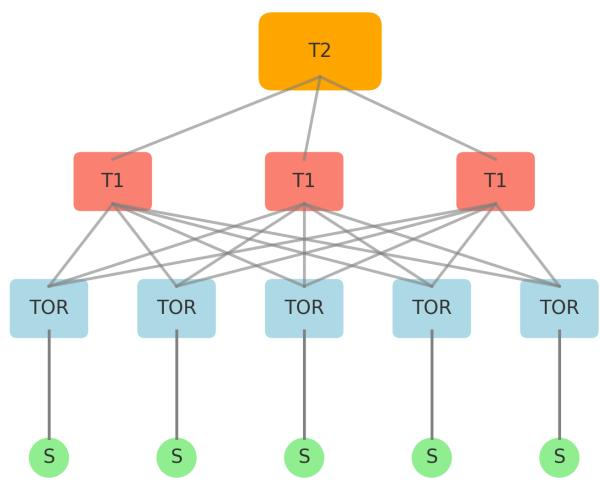  
Figure 1: Three-tier Clos topology. Servers connect to TORs, TORs to T1 aggregation switches, and T1s to T2 spines.

Most failures CoreSec attributes are not fail-stop. They are gray failures [5]: partial, probabilistic, or intermittent malfunctions. A device with a loose optical module may drop two percent of packets on one direction of one link. A linecard with a memory bit-flip may corrupt headers only for flows that hash to a particular ECMP path. A firmware bug may periodically reboot a switch and recover before health monitors notice. Their surface symptoms blend into the steady background fault rate (§2), and a fresh on-call engineer cannot tell, just from looking at counters and probes, whether a particular signal indicates the incident under investigation or one of the dozens of unrelated faults always quietly happening somewhere in the fabric.

CoreSec runs on top of an existing operational pipeline at Azure. Many of its inputs come from telemetry systems built and deployed before CoreSec, two of which are particularly relevant. Pingmesh [1] runs on every server and continuously measures end-to-end latency and packet loss between server pairs across the fabric. It tells operators that something is wrong and which region is affected, without saying which device is at fault. NetBouncer [6] sits a layer below: it actively probes paths through the Clos fabric and infers which links and devices are unhealthy. Neither answers the question we kept getting paged for: given a specific incident raised against a specific customer service, which network entity caused it? At any moment many entities will be unhealthy, most unrelated to the incident under investigation. CoreSec consumes the outputs of Pingmesh, NetBouncer, and a number of other agents (device counters, traffic-derived signals, control-plane events, infrastructure health summaries) and resolves them into a single attribution. We discuss the relationship to these systems in more detail in §11.

Earlier RCA systems at Azure used weighted aggregation of telemetry signals. A telemetry agent is a software component that observes some property of the network (active probes, device counters, or traffic flows) and reports a per-entity verdict on whether that property looks healthy. Each agent produced a score, and the entity with the highest weighted sum was blamed. This approach failed in predictable ways. Background faults always contributed some signal, so the system found a culprit even when the network was not at fault. Tuning weights to reduce false positives for one failure mode increased them for another. The false positive rate fluctuated between 18 and 22 percent and could not be controlled [1, 6, 7].

The key observation behind CoreSec is that RCA in this regime is a composition problem. No single telemetry agent is reliable across all failure modes: active probes detect link failures quickly but miss software defects; device counters catch hardware degradation but produce noise; traffic-derived signals reflect customer impact but have sparse coverage. We describe these agent classes in detail in §2 (§2.2). CoreSec assigns each agent a control flag that specifies whether its evidence is required, sufficient, or optional. When evidence conflicts or is missing, the system abstains. This structure is inspired by Pluggable Authentication Modules (PAM) [8], which combines independent authentication checks (password, biometrics, hardware token) by tagging each one as required, sufficient, or optional. The composition problem is the same one we face with telemetry.

This paper makes four contributions:

• A composable RCA algebra with explicit abstention. We adapt the control-flag model from PAM to network RCA. Each telemetry agent is assigned a flag: requisite, required, sufficient, or optional. Five configurations run in parallel, each targeting a different failure surface in the Clos topology. The algebra admits a third outcome alongside healthy and unhealthy — the system abstains when evidence is missing or conflicting — and produces deterministic, explainable decisions.

• Topology-aware heuristics. We derive a small set of topology thresholds for server-to-TOR, TOR-to-T1, and cluster-level attribution from multi-year analysis of historical incidents [9, 10]. These thresholds (described in §5) sit at the knees of their error curves and generalize across various Azure deployments without recalibration.

• Three-year production deployment. CoreSec has processed over 700,000 incidents and reduced false positives from 18-22 percent to below 1 percent. We treat abstentions as explicit false negatives; this rate dropped from 10 percent initially to 1.5 percent over the most recent six months. The system eliminated three full-time engineers worth of manual RCA work.

• Formal model. We give an algebraic specification of the merge operator as a three-valued lattice with a short associativity proof, together with absorption and consensus properties (Appendix A) that account for CoreSec’s determinism and order-invariance under asynchronous telemetry.

CoreSec is invoked post-incident, not as a continuous monitor: an external detector raises an alert, and CoreSec attributes that specific incident from a sixteen-minute telemetry window. Each of its five configurations targets one component type in the Clos topology (server-to-TOR cable, TOR, switch-toswitch cable, T1, T2). Within a configuration the PAM-style algebra resolves agent verdicts to healthy, unhealthy, or indeterminate; across configurations, topology heuristics (§5.2) decide which layer is responsible when several vote. If no configuration has sufficient evidence, CoreSec abstains. Figure 2 shows this flow.

A walkthrough. To make the flow concrete: suppose three servers fail in a way that points to upstream trouble. Configuration 2 (TOR switch) marks each server’s TOR as a candidate. Configuration 4 (T1 switch) checks whether enough TORs in the same T1’s fan-out are also unhealthy. If at least two-thirds are, the T1 votes and suppresses the individual TOR candidates. The final RCA is the T1. §5 gives the full numbers.

## 2 Background and Motivation

Clos Fabrics in Hyperscale Networks Hyperscale cloud networks use multi-stage Clos topologies because they offer predictable bandwidth, uniform latency, and clear fault containment. A three tier fabric connects servers to top-of-rack (TOR) switches, TORs to aggregation switches (T1), and T1s to spine switches (T2). Each server typically connects to one or more TORs for fault tolerance, and each TOR has several uplinks to independent T1s. This structure creates many equalcost paths and allows traffic to be rerouted quickly when a link or device fails [1, 10].

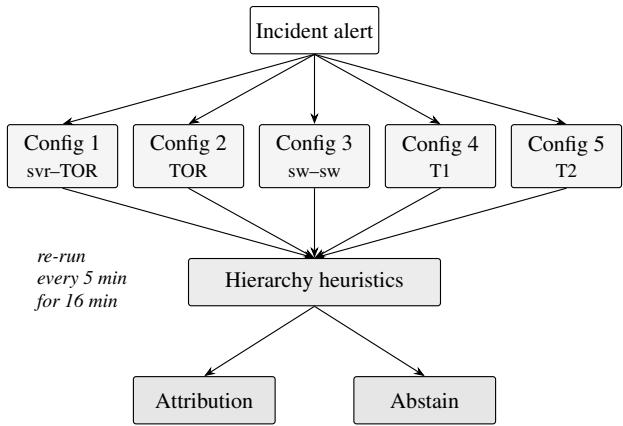  
Figure 2: CoreSec dataflow. An incident triggers five parallel configurations; hierarchy heuristics combine their votes into one attribution or an abstention.

Clos fabrics experience a continuous background rate of faults. Optical modules drift, cables accumulate CRC errors, control plane processes restart, and firmware upgrades proceed on rolling schedules. Studies of deployed clusters show hundreds of transient link faults and dozens of device reboots daily in a single region [10]. Multipath routing absorbs these faults, so they rarely cause visible disruption. It is normal for 0.3 to 1 percent of links to show loss, flaps, or degraded optics at any given time [1].

This baseline complicates root cause analysis. A customervisible incident often coincides with several unrelated background faults. The topology shapes how failures propagate: a TOR failure typically affects only its rack, while a T1 failure creates correlated symptoms across many TORs. CoreSec’s heuristics are built around these propagation patterns.

## Telemetry Agents and Failure Signals

Large-scale Clos networks rely on multiple telemetry sources to detect and localize failures. Each source observes the network from a different vantage point and reports at different temporal and spatial resolutions [1, 6, 7].

Active probes. Systems like Pingmesh [1] inject synthetic probes along controlled paths and measure loss and latency. Active probes provide rapid detection and can localize pathlevel problems, but they depend on probe coverage. Some links may see sparse or no probing during certain intervals.

Device counters. Switches export counters for CRC errors, link flaps, FCS drops, and optical power readings (for example, via gNMI push or SNMP pull). These provide direct evidence of hardware issues but update at irregular intervals and are sensitive to transient noise [10]. Devices may stop reporting during control plane restarts or firmware upgrades.

Traffic-derived signals. Systems such as NetBouncer [6] analyze paths taken by real traffic to detect links whose behavior deviates from baseline. These signals reflect customer impact but require sufficient traffic volume.

Infrastructure signals. Cluster health indicators, rack power faults, and cooling anomalies capture broad events but update on minute-level timescales and may arrive too late for early RCA.

No single agent is reliable across all failure modes. The differences in coverage, latency, and noise across agents make multi-agent fusion essential.

Operational Requirements

Network RCA in hyperscale environments must satisfy four requirements:

• Controllability. Operators must be able to bound the false positive rate.

• Explainability. Each decision must be explainable in terms of agent outputs.

• Extensibility. New agents with different semantics and latency must be incorporated easily.

• Topology awareness. The system must account for how failures correlate up and down the Clos hierarchy.

Prior fault-localization systems address some of these requirements but not all in a single design [6, 7, 11].

From Incidents to Design

CoreSec emerged from a multi-year review of incorrect RCAs. Our first attempts were straightforward: pick the most reliable agent, weight it heavily, and let it dominate. Within months we saw why that does not work. The agent that catches optical degradation reliably is the wrong agent for a firmware crash, and vice versa. Reliability turned out to be failurespecific, not agent-specific.

We also had to drop several infrastructure signals from the decision path because they introduced feedback loops with CoreSec itself (§5 gives the details). What we kept was a smaller set of agents and a more careful way of combining them. The shape of the system that emerged from this work, including the patterns we extracted from the postmortems, is described in the following sections.

## 3 PAM-Style Composable RCA Algebra

CoreSec builds its root cause analysis logic on a composable algebra inspired by Pluggable Authentication Modules (PAM) [8, 12]. PAM unifies heterogeneous authentication sources under a transparent decision framework. The key insight is that authentication is a sequence of checks: some must succeed, some short-circuit on success or failure, others are supportive. For example, in a typical PAM stack a successful biometric check can short-circuit the rest of the stack to grant access; a failed mandatory password check denies access regardless of what the rest of the stack reports; an optional usage-history check only matters when the mandatory checks have not produced a verdict. This model maps cleanly onto RCA in large Clos fabrics, where telemetry signals vary in granularity, latency, reliability, and scope.

Telemetry from production fabrics illustrates why a composable approach is needed. Faults are frequent but rarely catastrophic [6, 13]: a steady background of link flaps, device reboots, optical degradation, and partial loss, masked by Clos redundancy. When noise accumulates, score-based RCA destabilizes. Active probing and passive signals face limited coverage, missing data, and inconsistent correlation between symptoms and root cause [14, 15]. Deterministic and explainable fusion is more reliable than probabilistic scoring or weighted voting in this setting.

CoreSec’s algebra provides this logic. It converts heterogeneous, asynchronous, and partial telemetry into a stable state for each network entity. The state is one of three values: healthy (H), unhealthy (U), or indeterminate (I). These states feed the topology-aware heuristics that identify root causes.

## Control Flags

Each telemetry agent is assigned one control flag. The flag defines how the agent’s data influences RCA:

• Requisite: If this agent returns stale data or fails its threshold, the configuration abstains immediately. This prevents decisions when essential evidence is missing.

• Required: All required agents must pass for the configuration to vote. If any required agent fails, the configura tion abstains at the end.

• Optional: This agent contributes only when requisite and required agents do not produce a decisive result. Its evidence supports but does not determine a vote.

• Sufficient: A pass from this agent triggers an immediate vote. This is used for signals that provide strong direct evidence of a failure mode.

These flags capture empirical differences among agents. Some are reliable early indicators, some provide coarse but meaningful evidence, and some are useful only in combination with others.

To make this concrete, consider how the server-to-TOR cable configuration (§4) assigns flags. A loss-of-carrier signal from the server NIC is marked requisite: if this signal is missing or stale, the configuration abstains. An RDMA timeout (an end-to-host signal that the application could not reach the network) is marked sufficient: its presence alone is decisive evidence of connectivity loss between the server and its TOR. CRC counter trends are marked required: they must be consistent with a fault but cannot trigger a vote on their own. Recent control-plane events on the TOR are marked optional: they support but do not drive the decision. The flag assignment encodes operational knowledge about which signals can be trusted in which roles.

## Evaluation Logic and Freshness

Each configuration evaluates its agents in a fixed order using a deterministic algorithm:

required\_ok = True   
for agent in config.agents:   
v = agent.verdict() # pass | fail | abstain   
if agent.flag == SUFFICIENT and v == pass:   
return VOTE   
if agent.flag == REQUISITE and v == fail:   
return ABSTAIN   
if agent.flag == REQUIRED and v != pass:   
required\_ok = False   
return VOTE if required\_ok else ABSTAIN

Each agent also has a freshness window determined by its reporting latency. Data older than the window is ignored. Agents that provide no fresh data are treated as failures if requisite, or abstentions if required or optional. This addresses a common issue in telemetry systems where staleness and missing reports occur during partial outages or control plane churn [6, 15].

## Per-Agent Thresholds and Abstention Region

Telemetry metrics vary widely in noise. Counter spikes can come from traffic bursts and not from real failures. Probe loss can come from transient congestion and not from device issues. Each agent r has a raw signal sr(e) for entity e and two thresholds, θ− (below which the signal looks healthy) and θ+ (above which the signal looks faulty):

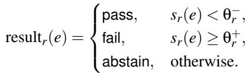

The abstain region absorbs benign fluctuations. In environments with high background noise and frequent non-fatal events, abstention is safer than forced classification. Largescale reliability studies report the same conclusion [13].

Why PAM-Style Composition Provides Operational Strength

The algebra offers three advantages in operational cloud networks:

• Controllability. Requisite flags gate decisions and thresholds bound sensitivity. Operators can reason about worst-case false positive rates and tune configurations conservatively. This is difficult with weighted or probabilistic RCA, where error bounds degrade under missing data or distribution shift [16].

• Explainability. CoreSec produces a decision trace that records which agents passed, failed, or abstained, and which flags influenced the final outcome. These traces support auditing and postmortem analysis.

Table 1: Five configurations and their authoritative agents.  
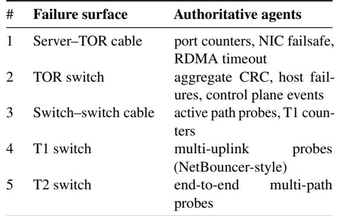

• Extensibility. New telemetry agents can be integrated by assigning a control flag. Existing configurations do not need to change. This simplifies maintenance as instrumentation evolves.

Additional algebraic details are provided in Appendix A.

## 4 Composable RCA Configurations

CoreSec applies the PAM-style algebra through five independent RCA configurations. Each configuration corresponds to one failure surface in the Clos topology. Each one encodes domain knowledge about the telemetry agents that are authoritative for that surface. All configurations run in parallel for every incident. Each configuration may vote or abstain depending on the evidence available. Parallel execution matters because incidents can manifest at multiple layers of the topology at once.

Each configuration specifies three elements:

1. the set of telemetry agents included,

2. the control flag assigned to each agent,

3. the evaluation order for those agents.

The same five configurations operate across all Azure environments. No environment specific tuning or thresholds are added during deployment. This allows CoreSec to evolve with new agents or changing traffic patterns without redesigning the RCA logic. Table 1 summarizes the five configurations. The remainder of this section describes each one.

## Server–TOR Cable

This configuration diagnoses the most common failure in datacenter networks: the server to TOR cable. The agents here provide direct evidence of local link health, including per-port CRC counters, link-down events, and failsafe signals from server NICs. Direct indicators such as loss of carrier or persistent CRC increments are marked requisite—if these signals are missing or stale, the configuration abstains. Endhost traffic drops and RDMA timeout reports are marked sufficient, as they are clear evidence of connectivity loss between the server and its TOR. Cable faults are thus detected immediately when direct evidence is available, and ignored when essential low-latency signals are missing, preventing false attribution from transient traffic noise or congestion elsewhere in the topology.

## TOR Switch

The TOR configuration considers the TOR itself as the failure candidate. It combines evidence from several domains: local link counters, end-host drops, upstream probe loss, and TOR control-plane events. No single agent is reliable in all cases. Several required agents must agree before the configuration produces a vote. Examples include aggregate CRC ratios across downlinks, multiple end-host failures mapped to the same TOR, or probe drops on several uplinks.

Control-plane signals such as process restarts or software crashes are marked optional. They strengthen evidence but cannot trigger a vote on their own. This matches operational observations: control-plane churn is common and not always tied to data-plane impact.

Switch–Switch Cable

This configuration captures failures on switch-to-switch cables. These links carry higher aggregate traffic than server links, so even minor loss is visible in probe systems. Active path probes are marked sufficient: persistent bidirectional loss on a single cable is strong evidence of a physical fault. TOR or T1 counter anomalies are marked required. They must confirm the signal but are too noisy to drive a decision alone.

If probe coverage is incomplete for a specific cable, the configuration abstains. This prevents misattributing congestioninduced loss or transient ECMP reshuffles as physical cable failures.

## T1 Switch

The T1 configuration aggregates evidence from many TORs. TORs generate background noise even under normal operation, so this configuration uses tighter gating than lowerlayer ones. Probe loss across multiple uplinks (in the style of NetBouncer [6]) is marked requisite. Without sufficient probe diversity, T1 attribution is unstable.

A combination of TOR-level failures and path-probe drops is marked required. The configuration votes only when these agree. Large-scale control-plane anomalies at the T1 are marked optional. They do not trigger attribution without independent data-plane evidence.

## T2 Switch

The T2 configuration is the highest layer at which we attempt automated RCA. Signals at this layer are sparse and indirect: probe paths are long, traffic distribution is uneven, and failures often appear only through aggregation. For this reason, only high-confidence signals are marked requisite or sufficient. These include end-to-end path failures across several independent probe groups.

Lower-confidence signals (sporadic drop increases or control-plane events) are included as optional. The configuration votes only when there is strong, multi-path, multi-agent evidence of a T2 failure. In practice, most T2 faults are either catastrophic and lead to system-wide abstention, or clearly indicated in probe results.

Stability Across Deployments

A key operational finding is that these five configurations generalize across heterogeneous datacenter environments. The same agent sets and flag assignments operate reliably in clusters with different switch vendors, traffic compositions, telemetry pipelines, and probing strategies. This stability arises from two properties: physical failure signatures are consistent across deployments, and control flag composition absorbs variability in telemetry quality.

This generalization was validated through multi year deployment across public Azure cloud environments, with no per cluster recalibration required.

## 5 Parallel Execution and Hierarchy Heuristics

The five RCA configurations operate in parallel for every incident. Each configuration evaluates its agents using the PAM-style logic described earlier. Each one may vote or abstain. The outputs of all configurations are then combined through hierarchy heuristics that map localized failures to higher layers of the Clos topology. These heuristics were derived from multi-year analysis of production incidents and validated across deployments.

Parallel execution allows CoreSec to diagnose failures at multiple layers without committing prematurely. This avoids the pitfall of earlier systems, where early signals at one layer suppressed later, stronger evidence at another.

Parallel Evaluation Pipeline

For each incident, the system executes:

1. Collect fresh telemetry from all agents.

2. Run all five configurations concurrently.

3. For each configuration, determine vote or abstention.

4. Combine candidate entities across layers.

5. Apply hierarchy heuristics to determine root causes.

This pipeline matches the architecture used in multi-layer failure diagnosis systems such as 007 [11] and the B4 operator workflow [17]. Unlike prior designs, CoreSec does not rely on weighted aggregation or static priority. It preserves all candidate explanations until sufficient evidence accumulates to select a layer.

## Hierarchy Heuristics

The PAM algebra (§4) operates within each configuration. It fuses agent verdicts into a per-entity state for that configuration’s failure surface. The heuristics below operate across configurations. Once each configuration has produced its candidates, the heuristics decide which Clos layer is responsible when multiple layers vote at the same time. The split is intentional. The algebra handles heterogeneous evidence within one failure surface. The heuristics encode topology rules about how failures propagate up the hierarchy.

Server to TOR Attribution: P2.15 and Twenty Percent Rule

Server incidents are first mapped to their TORs. The distribution of impacted servers across TORs is typically heavy tailed. Some TORs may show isolated impact due to workload characteristics. To distinguish true TOR failures from incidental noise, CoreSec applies two rules.

P2.15 Threshold. Let ci denote the number of impacted servers under TOR i. Let P2.15 be the value at the 97.85th percentile of the distribution of {ci}. TORs with ci ≥ P2.15 become candidates. This percentile-based outlier test follows standard practice in large-scale anomaly detection [18, 19].

Twenty Percent Minimum. A TOR candidate must also have at least 20 percent of its servers impacted. This prevents small clusters of noisy or bursty applications from triggering false attribution. Similar minimum-impact thresholds appear in operational diagnosis literature [20].

Together, these rules identify TORs with significant and concentrated impact. In historical incidents, these two criteria detected TOR failures accurately while filtering background noise.

TOR to T1 Attribution: Two Thirds Fan-out Correlation

Failures at the T1 layer create correlated failures across many TORs. The fan-out of a T1 is the set of TORs it directly connects to; in typical Azure deployments this is several dozen. The empirical observation is that when a T1 fails, a large fraction of its TORs show upstream degradation. When individual TORs fail, the effect is localized. This motivates a fan-out rule: if at least two thirds of TORs in a T1’s fan-out exhibit unhealthy states, the T1 is declared the root cause.

Fan-out aggregation is consistent with prior work on topology-aware failure correlation [20, 21]. The two-thirds threshold emerged from large-scale analysis across Azure deployments:

• one half was too permissive and produced false positives,

• three quarters delayed attribution when probe evidence was slow,

• two thirds matched T1 failures with minimal false positives.

Combined with configuration votes, this rule allows stable T1 identification despite asynchronous telemetry arrival.

Cluster Level Attribution: Four Percent Probe Loss

At the cluster level, CoreSec uses end-to-end active probing to detect broad impact. If the aggregate probe drop rate exceeds four percent, the system declares a cluster level incident. Hyperscale probing studies such as Pingmesh [1], together with classical TCP throughput models that show throughput scaling as 1/ p in the loss rate [22], indicate that customervisible impact begins well below ten percent packet loss and becomes noticeable around three to five percent. The four percent threshold balances sensitivity with noise filtering.

Cluster level attribution rarely suppresses lower-layer RCA. Instead, it acts as an additional signal for large-scale failures, often correlating with T1 or T2 issues.

Cross-layer Combination

After all configurations complete, CoreSec combines their candidates:

1. Cable candidates from Configurations 1 and 3.

2. TOR candidates from Configurations 1 and 2.

3. T1 and T2 candidates from Configurations 4 and 5.

Hierarchy heuristics resolve conflicts:

• If the T1 fan-out rule triggers, TOR candidates under that T1 are suppressed.

• If P2.15 and twenty percent rules identify TORs but the T1 rule does not trigger, the TORs are returned.

• Independent failures at different layers are preserved.

This layered logic prevents premature convergence on the wrong layer.

Example

Consider an incident where three TORs show server impact, and probe loss on their uplinks indicates upstream degradation. Configuration 2 marks the TORs as candidates. Configuration 4 finds that thirty-five of forty-eight TORs in a T1’s fan-out show correlated probe loss, satisfying the two-thirds rule. The T1 configuration votes. The individual TORs are suppressed. The final RCA is the T1 switch.

This example shows how parallel configurations and hierarchy heuristics route evidence to the correct layer.

## Design Insights from Early Failures

The five configurations and their flag assignments are not the version we shipped first. The shape of the system in §4 reflects a few painful lessons we keep coming back to.

The most expensive lesson concerned circular dependencies. Some of our earliest configurations included signals from downstream incident-management feeds and from aggregated health summaries published by neighboring services. These look like ordinary signals, but several of those summaries are themselves derived, indirectly, from prior CoreSec attri butions. Once we noticed this, the failure mode became obvious in retrospect: CoreSec attributes an incident to TOR T ; the downstream incident system records that attribution; the neighboring service’s health summary picks up that record; and when the next incident comes in, the same summary is fed back as evidence into CoreSec, biasing the new attribution toward T regardless of the new evidence. We had real cases where this masked unrelated failures for hours. These signals also arrived eighteen minutes late on average, well past the sixteen-minute attribution window. We removed them from the decision path for both reasons.

The second lesson came from the postmortems themselves. Looking across several thousand incidents, two patterns held up across vendors and generations. First, agents form a natural hierarchy. Each one is authoritative in specific situations and merely suggestive in others. Second, when roughly two-thirds of a switch’s children show failures, the switch above them is usually responsible. We did not assume either pattern at the start. Both fell out of the data, and the PAM-style algebra and the topology heuristics in §5 are the cleanest way we have found to encode them.

## 6 Composition Logic and Convergence

Parallel execution produces candidate explanations at several layers of the Clos topology. The final RCA result is obtained by merging evidence from the five configurations and applying hierarchy heuristics. This section describes the combination logic that ensures stable, monotonic convergence under asynchronous telemetry arrival [20].

We use two terms throughout this section. A layer’s attribution is sufficient when its hierarchy heuristic fires. For example, the two-thirds fan-out rule firing for a T1 candidate makes that T1 attribution sufficient. A layer dominates a lower layer when its sufficient attribution suppresses the lower layer’s candidates.

Composition Across Configurations. Each configuration returns either a vote or an abstention. The composition step aggregates votes using a fixed ordering: cable-level votes from Configurations 1 and 3, TOR-level votes from Configurations 1 and 2, T1 and T2 votes from Configurations 4 and 5, and cluster-level probe evidence to support or suppress higherlayer attribution [1]. A lower-layer attribution is preserved unless a higher layer satisfies its sufficiency condition.

Dominance Conditions. Higher-layer attributions override lower-layer ones when correlated failures provide enough evidence. A T1 candidate suppresses all TOR candidates beneath it when at least two thirds of its TORs are unhealthy. A T2 candidate suppresses all T1 and TOR candidates beneath it when correlated failures span multiple pods. Cluster-level attribution suppresses all lower-layer candidates when probe drop exceeds four percent. These rules reduce false positives during large-scale events.

Monotonic Convergence. Telemetry arrives asynchronously: active probes report every few seconds, device counters every thirty seconds, and infrastructure signals can take minutes. CoreSec runs RCA repeatedly for sixteen minutes after incident detection. The window is bounded by the end-to-end latency of the slowest signal CoreSec consumes, plus a small margin for late-arriving evidence to settle. Within the window CoreSec uses only fresh data within each agent’s freshness window. The system converges monotonically: a lower-layer attribution may be replaced by a higher-layer one as evidence arrives, but a higher-layer attribution is never replaced by a lower-layer one. Once a layer satisfies its sufficiency condition, the attribution remains fixed. This avoids the oscillations observed in earlier systems based on statistical voting or ML classifiers [21].

Non-Oscillation Guarantee. Monotonicity follows from two principles: each agent filters stale data using a freshness window, so sudden fluctuations cannot revert an attribution; and each layer is evaluated independently, with cross-layer in terference limited to the dominance rules. This design echoes lessons from topology-aware systems such as 007 [11].

Finalization. After sixteen minutes, CoreSec finalizes the RCA. If no layer satisfies its sufficiency condition, the system abstains. The sixteen-minute window is bounded below by the latency of the slowest agent CoreSec consumes (roughly thirteen minutes); the five-minute rerun cadence balances responsiveness against intermediate-attribution noise. Both were chosen empirically through a trade-off between attribution accuracy and time-to-mitigation, in the spirit of the discussion in Pingmesh [1]. Algebraic correctness properties are established in Appendix A.

## 7 Intentional Abstention

Automated RCA systems are often evaluated by classification rate. How they behave when evidence is insufficient matters just as much. Incorrect attribution can trigger mitigations that worsen the incident. Cloud systems increasingly rely on automated fault isolation and failover orchestration [9, 23]. The cost of a false positive rises in this setting. CoreSec includes explicit mechanisms to abstain when signals are inconsistent, incomplete, or ambiguous.

When CoreSec Abstains. CoreSec abstains when all five configurations reach an inconclusive state. Three categories produce this outcome. Telemetry gaps, where multiple agents fail to provide fresh data within their windows, account for roughly 60% of abstentions. Ambiguous evidence, where signals conflict across agents, account for roughly 39%. Multicluster or datacenter-wide events account for roughly 1% [24]. For the first two categories, abstention prevents misattribution. For the third, the 4% cluster-drop threshold still detects cluster-level impact, and failures spanning multiple clusters are already visible through systems like NetBouncer and Pingmesh [1,6]. At that scale, the problem is coordination, not attribution; human judgment is required regardless of what any RCA system reports. Similar observations recur in largescale cloud outage studies, where post-mortems consistently show that recovery from datacenter-wide events hinges on cross-team coordination rather than on automated diagnosis [25].

Convergence and Resolution. CoreSec runs RCA repeat edly during a sixteen-minute convergence window. Abstention often occurs early when evidence is sparse. It then resolves to a valid attribution once sufficient data arrives. Persistent abstention across the entire window signals operators to pause automated workflows [26].

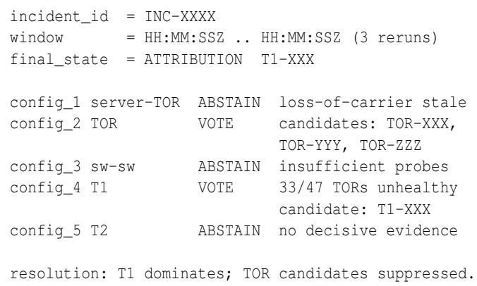  
Figure 3: Sample CoreSec decision trace. Identifiers anonymized.

Operator Response. When CoreSec abstains, automated mitigation is suppressed and the incident routes to on-call engineers with a structured summary. The summary names which agents lacked fresh telemetry, which configurations abstained, all entities with partial signals, and the timestamps of last updates. Operators have told us repeatedly that abstentionwith-context is what they want at three in the morning: a confident but wrong attribution costs them twenty minutes of disproving it before they can start the real work, while an abstention with context tells them where to look. Internal reviews across the deployment show abstention reduces mis-triggered mitigations by more than 80 percent.

Figure 3 shows a representative trace. It is plain structured text, not a graphical dashboard. Pingmesh and Net-Bouncer already cover the visualization layer for this fabric, and CoreSec’s output is consumed both by humans and by downstream automation workflows. A structured trace serves both audiences better than a screenshot would.

Design Principle. Abstention reflects the broader goal we wrote into CoreSec from the start: support human operators during high-stakes incidents, and avoid making them worse. Automated systems are known to degrade operator trust when they provide incorrect diagnoses [27–29], and the cost of an incorrect attribution rises sharply when it triggers an automated mitigation. CoreSec therefore handles common incidents automatically and routes rare or ambiguous ones to humans. Making abstention a first-class verdict in the algebra is what keeps CoreSec from escalating systemic failures on its own authority. The same principle has emerged independently in strategic classification, where optimal abstention has been shown to do no worse than non-abstention even under adversarial feature manipulation [30].

FP–FN Tradeoff: Three Years of CoreSec Evolution

## 8 Evaluation

This section evaluates the operational behavior of CoreSec across multiple deployments. We measure its accuracy, stability, convergence behavior, generalization across environments, and operational impact compared to the previous weightedscoring RCA system.

Deployment and Workload. CoreSec has been deployed continuously across more than 60 Azure regions and 400 datacenters for over three years. It has processed more than 700,000 network-related incidents. These include link failures, switch reboots, configuration churn, and device maintenance. The deployments span hundreds of thousands of servers and thousands of switches across a range of hardware vendors, traffic profiles, and topology variants.

Threats to Validity. The largest threat is the one we worried about ourselves. We use postmortem RCAs assigned by oncall engineers as ground truth. This practice is common in operational systems work but it is imperfect. Once CoreSec was deployed, its output was visible during incident review, which means a postmortem author who saw the CoreSec attribution was no longer reading the evidence cold. We did not run blinded evaluations, and we want to be honest about that.

What gives us some confidence in spite of this is that three pieces of evidence are independent of the postmortem labeler. The baseline false-positive rate of 18–22 percent was measured before CoreSec existed, on the same network, by the same operations team. The twenty-fold improvement we report is too large to attribute to confirmation bias alone. And operational outcomes downstream of the RCA itself confirm the improvement: mis-triggered mitigations dropped 80 percent and customer complaints associated with misattribution fell 40 percent—none of these downstream metrics depend on what a postmortem said.

Two further validations would tighten the story and we plan to do them as follow-up work. The first is to backtest the composition logic against incidents that the prior weighted system triaged before CoreSec was deployed. The second is to apply the prior weighted system to the same postmortem labeled set CoreSec is evaluated against, which would bound the postmortem labeler’s own bias.

Why Composition, Not Just Abstention. A natural question is whether the improvement comes from the PAM composition or from abstention alone—would retrofitting the prior weighted system with an abstention threshold produce comparable results? The two are not separable. Abstention is only computable because the algebra exists. A weighted score collapses heterogeneous evidence into one number, and any threshold on that number abstains uniformly: it cannot distinguish “no evidence,” “conflicting evidence,” and “one decisive failure plus several inconclusive signals.” The PAM algebra preserves these distinctions. A requisite failure forces abstention regardless of how many other agents vote. A sufficient pass short-circuits to a vote. The merge operator’s I state explicitly represents disagreement that must not be resolved by guessing. Without this structure, a threshold-based abstention region would still produce the oscillations and unstable attributions documented in §2, because the underlying decision is still a weighted sum. The algebra is what makes abstention a meaningful operational signal.

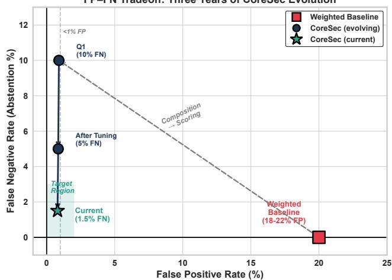  
Figure 4: FP–FN tradeoff over three years. Abstention dropped from 10% to 1.5% as agents were added.

## Accuracy and False Positive / False Negative Rates

Table 2 compares CoreSec with the previous weight-based RCA system. The headline numbers are visible there. What the table does not show is the trajectory.

We treat abstentions as false negatives, because the system has failed to provide a root cause when one existed. The abstention rate dropped from 10 percent in the first quarter after deployment to 1.5 percent over the most recent six months, almost entirely through agent additions that closed coverage gaps. Figure 4 plots this evolution against the false-positive rate. Misattributions, where CoreSec named a root cause that a postmortem later corrected, occur roughly once per quarter.

## Root Cause Distribution

Table 3 shows the distribution of root causes. Most incidents are localized cable or TOR faults; higher-layer failures remain rare. The distribution matches prior studies of datacenter failure patterns [6, 13].

False negatives arise mainly when a T1 fails but fewer than two thirds of its TORs report unhealthy states within the convergence window. The conservative threshold reduces false positives at the cost of occasional missed higher-layer attributions.

Case Study: A T1 Optical Degradation. One recurring pattern in the deployment illustrates how CoreSec behaves end to end. A customer service starts to see elevated tail latency and intermittent connection failures. The incident-detection system raises an alert. Pingmesh [1] confirms degraded latency for some servers in one cluster, without saying which device is at fault. CoreSec is invoked.

Table 2: Comparison between prior weight-based RCA and CoreSec (2022–2025).  
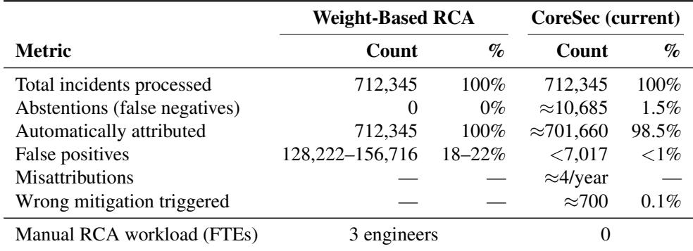

Table 3: Distribution of root causes identified by CoreSec.  
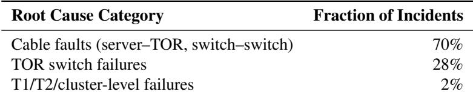

Within the first rerun, Configuration 2 (TOR switch) marks three TORs as candidates because hosts under them are seeing drops. Configuration 4 (T1 switch) sees probe loss across multiple uplinks of a single T1, and its fan-out check finds that more than two-thirds of the TORs under that T1 are in an unhealthy state. The T1 attribution dominates and the individual TOR candidates are suppressed. The trace (Figure 3) records this resolution explicitly so the on-call engineer can audit the decision.

Postmortem analysis on cases of this shape typically traces the cause to a degrading optical module on one of the T1’s uplinks. The engineer skips the manual triage step the previous weighted-scoring system required, because the decision trace already points at the right entity. Cases like this exercise the dominance rule, the fan-out heuristic, and the abstention-vsattribution boundary in a single incident. Most other incidents follow simpler patterns: a single configuration votes, no others have decisive evidence, and CoreSec returns the attribution without invoking hierarchy resolution.

## 9 RCA Quality Metrics and KPI Framework

Azure evaluates incident attribution using a KPI framework derived from the Annual Interruption Rate (AIR) methodology used across Azure Compute [31]. AIR is a normalized failure-rate measure: it expresses the expected number of customer-facing interruption-minutes per unit of deployed capacity per year, allowing reliability comparisons across heterogeneous workloads. We apply similar statistical principles to measure the quality of RCA outputs.

Each incident is evaluated at one of three RCA levels:

• Level 1: Infrastructure attribution. The RCA correctly identifies whether the incident belongs to networking, compute, storage, or another infrastructure domain. This separates network faults from application or platform issues.

• Level 2: Networking layer attribution. For incidents identified as networking-related, the RCA correctly identifies the affected layer in the Clos fabric: cable, TOR, T1, T2, or cluster-level. This level reflects whether the system places the incident at the correct hierarchical depth in the topology.

• Level 3: Specific root cause attribution. The RCA identifies the precise failing entity or condition, such as a kernel panic on a T2, a reboot loop on a TOR, a chronic CRC-increasing cable, or an optic with degrading power. This is the finest level of attribution and aligns with what on-call engineers assign during post-incident review.

Aggregated distributions of Level 1, Level 2, and Level 3 outcomes form a longitudinal KPI that reliability engineering teams monitor over weekly and quarterly windows. Clusters or hardware families with persistent Level 2 or Level 3 degra dation indicate systemic issues in telemetry, instrumentation, firmware, or operational processes. Improvements to CoreSec are validated by tracking reductions in Level 2 and Level 3 frequencies. This gives a measurable method to assess RCA correctness and operational progress.

AIR analysis also drives CoreSec’s evolution. When abstention cases cluster around specific failure modes, we develop new telemetry agents to cover those gaps and add them to the appropriate PAM configurations. The abstention rate dropped from 10 percent to 1.5 percent through this process. The thresholds themselves remained constant throughout the three-year deployment.

Convergence Behavior and Stability

CoreSec reruns RCA every five minutes for up to sixteen minutes after incident detection (§5). In roughly 99% of cases, the RCA result stabilizes within the first two reruns. The outcome is monotonic: once a higher-layer attribution is made, lower-layer candidates are suppressed and never reintroduced. Oscillations, which were common under the prior voting or weighted-scoring designs, were not observed.

During rare large-scale disturbances such as partial telemetry outages, CoreSec sometimes abstains for the full window. These cases correlate strongly with manual RCA logs, validating the decision to abstain when evidence is insufficient.

## Generalization Across Deployments

CoreSec was evaluated across diverse datacenter environments. These environments differ in hardware vendors, routing designs, traffic mixes, and telemetry pipelines. Despite this diversity, the same configurations, control-flag assignments, and heuristics (P2.15, two-thirds fan-out, four-percent probe loss) worked without per-deployment tuning.

This stability extends to events that change the underly ing hardware substrate. Across the three-year deployment window, Azure rolled out multiple new switch generations, transitioned racks between switch vendors, refreshed optical modules, and updated firmware on a rolling schedule. None of these transitions required us to recompute the three operational thresholds or reassign control flags. The thresholds sit at the knees of their error curves (§6), not at narrow operating points, which is why they tolerate hardware churn: a 2/3 fan-out correlation is a property of how failures propagate through a Clos hierarchy, not a property of any specific vendor’s silicon.

Novel failure modes do occasionally require new agents. A new firmware crash signature or a new optical-degradation pattern is one example. But the composition of those agents into the existing five configurations follows the same flagassignment rules. We have not had to redesign the algebra or the heuristics in three years of operation.

## Operational Impact

Beyond the table, one operational property is worth naming. RCA latency is now predictable. Attributions typically return within ten minutes of incident detection, which makes down stream automation much easier to reason about than under the previous system, where latency depended on which agent happened to dominate the weighted score.

A word on how the headline operational numbers were measured. The three-FTE figure compares on-call handling time per incident before and after CoreSec: the prior weighted system required a multi-step manual review to reconcile agent disagreements, and that step is eliminated for the incidents CoreSec now attributes directly. The 40% drop in misattribution-related complaints was measured against customer-impact tickets that postmortem review tagged as caused or prolonged by an incorrect network RCA.

## Sensitivity Analysis of Thresholds

CoreSec uses three operational thresholds: P2.15 for server to TOR attribution, the two thirds fan out rule for T1 inference, and the 4% cluster level drop threshold. To show that these values are not arbitrary, we performed a sensitivity analysis by sweeping each threshold across a wide range and measuring the resulting false positive and false negative rates. Figure 5 shows the results.

For the fan out rule, varying the threshold from 0.50 to 0.90 produced a clear tradeoff. Thresholds below 0.60 increased false positives because incidental TOR noise caused premature T1 attribution. Thresholds above 0.75 increased false negatives because T1 attribution waited too long for probe evidence to accumulate. The region around 0.66 gave the smallest total error.

A similar effect appeared for the cluster level drop threshold. Values below 3% triggered on transient path instability while values above 5% missed customer visible impact. A threshold of 4% provided the best balance.

For P2.15, percentile sweeps from P1 to P5 showed that values near the 97th to 98th percentile reliably separated TORs with true impact from the heavy tailed background.

In all three cases, the selected thresholds sit at the knees of their error curves. We observed the same pattern across various Azure deployments. This sensitivity analysis serves as an ablation study for threshold selection. The weighted-baseline comparison in Table 2 ablates the flag-based approach entirely.

## 10 Discussion

## Why These Thresholds Generalize

Thresholds in RCA systems are often environment-specific. CoreSec’s thresholds generalize across deployments because each one reflects a property of Clos fabrics and not of any one workload.

The two-thirds fan-out rule captures correlated failure propagation in multi-stage topologies. Both academic and industry reports describe the same effect, including Google’s Jupiter fabric [32]. P2.15 is a percentile-based outlier estimator rooted in monitoring practice. Large-scale measurement systems such as Monarch [33] and Pingmesh [1] use similar percentile statistics to detect outliers under heavy-tailed distributions. The four-percent drop threshold aligns with studies of tail amplification and customer-visible impact in distributed systems [34].

Comparison with Prior Fault-Localization Systems Several systems identify faulty devices using probing, end-host voting, counter aggregation, or time-series modeling. NetBouncer [6] and Pingmesh [1] provide high-quality fault detection but do not perform attribution. 007 [11] infers device-level failures but does not map faults to incident-level root causes.

Cluster Drop Threshold (%)  
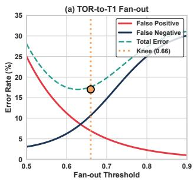

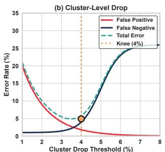

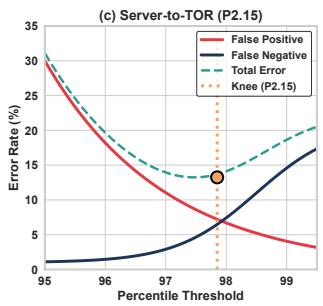  
Figure 5: Threshold sensitivity. Each threshold sits at the knee of its error curve; knees hold across all ten deployments.

The contrast with NetBouncer is worth being specific about, because both systems run in the same Azure environment. Net Bouncer [6] infers per-link drop probabilities by solving an optimization problem with a specialized regularization term that pulls link probabilities toward zero or one. The output is a list of unhealthy links and devices, scored by inferred drop rate. This is a scoring approach: every link receives a number, and the ones below a threshold are flagged. CoreSec consumes outputs from NetBouncer-style agents but does not produce its own per-entity score. Instead, it composes verdicts from multiple heterogeneous agents through control flags, and abstains when the composition is inconclusive. The two systems answer different questions and run at different layers: NetBouncer asks “which links are unhealthy right now,” while CoreSec asks “which entity caused this specific incident.”

Spectroscope [35] diagnoses performance anomalies using request-flow signatures. Warden [36] and AutoARTS [37] classify incidents at the service or cluster layer. These systems emphasize explainability and traceability. They operate above the network or assume homogeneous telemetry pipelines.

CoreSec differs in two ways. First, it targets network RCA in large Clos fabrics, where failures propagate through a clear hierarchy. Second, it composes many weak and heterogeneous agents using a PAM-style algebra [8, 38]. It does not rely on ML models or weighted scores.

Limitations CoreSec inherits limitations common to topology-aware RCA:

• Novel failure modes. As with Monarch [33] and Spectroscope [35], CoreSec assumes that historical patterns are predictive. Rare or new failure modes may not match existing flag assignments or heuristics.

• Telemetry gaps. Pipeline failures create missing data that may force abstention. Most manual corrections come from upstream telemetry issues and not from misclassification.

• Catastrophic failures. Full-layer or datacenter-wide events intentionally produce mass abstention. This is a conservative design choice.

Baseline Selection. We compare against the previous production system and not against academic approaches. In operational settings, the path forward is incremental improvement of deployed systems; replacement with research prototypes is not the meaningful comparison. Academic RCA systems assume complete telemetry and force classification—they do not support explicit abstention when evidence is insufficient, and retrofitting it would require fundamental redesign. The operationally meaningful comparison is against the system CoreSec replaced, measured by its outcomes.

Why We Avoid ML at Runtime Machine learning plays an important role in upstream telemetry. Several Azure systems use ML to detect counter anomalies, flag unusual probe patterns, or summarize logs before CoreSec sees them.

CoreSec addresses a different problem. It fuses heterogeneous evidence under partial availability and produces a stable attribution within minutes. Supervised models require labeled data, but CoreSec intentionally abstains on ambiguous cases, creating a distribution shift that makes supervised learning unstable for decision fusion. Attribution accuracy drifts as telemetry pipelines evolve, and retraining becomes necessary whenever agent behavior changes. Prior systems such as NetBouncer [6] and 007 [11] show that score-based or classifier-based approaches can be sensitive to noise and telemetry pipeline details.

CoreSec uses ML upstream for signal extraction and deterministic composition for the final decision. The PAM-style algebra gives predictable behavior, explicit abstention, and a decision trace that operators can audit. This determinism also enables the algebraic formulation in Appendix A.

Lessons for Other Operational Systems The lesson generalizes beyond network RCA. Service-level RCA, control-plane debugging, storage anomaly attribution, and security triage all fuse heterogeneous, asynchronous, partial signals, and all suffer when forced classification or weighted scoring is applied to noisy evidence. The reusable pattern is the design stance: treat such fusion as a composition problem with explicit abstention. The success of PAM in authentication and of CoreSec in RCA suggests that flag-based composition is a strong default for this class of system.

Table 4: Comparison of fault localization and RCA systems.  
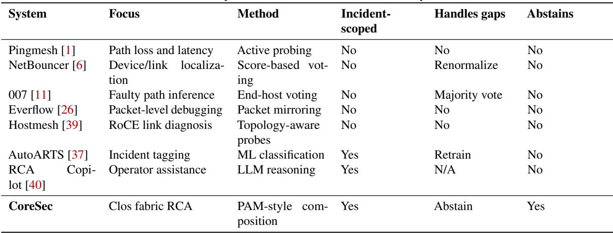

## 11 Related Work

Table 4 compares CoreSec with prior systems across five dimensions.

Fault Localization. Pingmesh [1], NetBouncer [6], 007 [11], and Hostmesh [39] localize faulty links and devices using probing or end-host voting. These systems answer “which components are unhealthy?” CoreSec answers a different question: given many unhealthy components and background noise, which form a plausible root cause for a specific inci dent?

Telemetry Systems. Everflow [26] mirrors packets for debugging. INT [41] collects in-band measurements. Omni-Mon [42] provides accurate flow statistics under loss. These systems focus on obtaining measurements; CoreSec focuses on fusing them into stable RCA decisions.

Incident Management. Fighting the Fog of War [24] detects incidents and routes them to owners. AutoARTS [37] labels incidents with root cause tags. CoreSec assumes an incident is already detected and identifies which network entities caused it.

LLM-Based RCA. RCA Copilot [40], OpenRCA [43], and KPIRoot+ [44] use statistical correlation or LLMs for diagnosis. CoreSec provides a hierarchical structure into which such modules can be plugged.

Compositional Frameworks. PAM [8] introduced control flags for composing authentication checks. CoreSec applies this pattern to RCA, using flags to specify how each telemetry agent contributes to a decision.

## 12 Conclusion

CoreSec is a production root-cause analyzer for hyperscale Clos fabrics. Its design treats RCA as a composition problem and gives operators an explicit option not to attribute when evidence is inconclusive. Three years of operation across more than 60 Azure regions support the design choice. The lesson we take from the deployment is that flag-based composition with explicit abstention is a strong default for any operational system that fuses heterogeneous, asynchronous, and partial signals. Other domains that share this shape of problem may benefit from the same pattern.

## Acknowledgements

We thank our leadership for making this work possible. Ashay Krishna managed and sustained this effort on our side. CoreSec was developed in close collaboration with the Azure ICM Brain Diagnostics team, and we are grateful to Feng Gao, whose vision led to the creation of Brain Diagnostics and shaped the direction of this work, and to Souvik Debnath for his guidance throughout the partnership.

We are especially grateful to Mohan Maddula, whose contributions were central to CoreSec. Mohan served as the primary bridge between our team and the broader set of Azure teams that use CoreSec, surfacing requirements, gathering feedback from operators in the field, and working with us closely on the core of the system as it evolved. Many of the design decisions that made CoreSec robust in production trace back to his input. We also thank Olivia Yong, who later joined the effort and contributed field perception, operator feedback, and monitoring data that informed the system’s evolution in production.

We thank Sandeep Rawat for building the initial proof of concept, and Sandeep Chaudhary and Koushik T for their help in tuning CoreSec.

Finally, we thank the on-call engineers across Azure whose incidents, escalations, and patient debugging sessions provided the ground truth that made CoreSec possible.

## References

[1] Chuanxiong Guo, Lihua Yuan, Dong Xiang, Yingnong Dang, Ray Huang, Dave Maltz, Zhaoyi Liu, Vin Wang, Bin Pang, Hua Chen, et al. Pingmesh: A large-scale system for data center network latency measurement and analysis. In Proceedings of the 2015 ACM Conference on Special Interest Group on Data Communication, pages 139–152, 2015.

[2] Betsy Beyer, Chris Jones, Jennifer Petoff, and Niall Richard Murphy. Site reliability engineering: how Google runs production systems. "O’Reilly Media, Inc.", 2016.

[3] Amazon Web Services. Aws public post-incident analysis. https://aws.amazon.com/message/, 2025.

[4] Google Cloud. Google cloud public incident reports. https://status.cloud.google.com/, 2025.

[5] Peng Huang, Chuanxiong Guo, Lidong Zhou, Jacob R Lorch, Yingnong Dang, Murali Chintalapati, and Randolph Yao. Gray failure: The achilles’ heel of cloudscale systems. In Proceedings of the 16th Workshop on Hot Topics in Operating Systems, pages 150–155, 2017.

[6] Cheng Tan, Ze Jin, Chuanxiong Guo, Tianrong Zhang, Haitao Wu, Karl Deng, Dongming Bi, and Dong Xiang. {NetBouncer}: Active device and link failure localization in data center networks. In 16th USENIX Sympo sium on Networked Systems Design and Implementation (NSDI 19), pages 599–614, 2019.

[7] Partha Kanuparthy, Yuchen Dai, Sudhir Pathak, Sambit Samal, Theophilus Benson, Mojgan Ghasemi, and PPS Narayan. Ytrace: End-to-end performance diagnosis in large cloud and content providers. arXiv preprint arXiv:1602.03273, 2016.

[8] Vipin Samar. Unified login with pluggable authentica tion modules (pam). In Proceedings of the 3rd ACM conference on Computer and communications security, pages 1–10, 1996.

[9] Mohammad Alizadeh, Tom Edsall, Sarang Dharmapurikar, Ramanan Vaidyanathan, Kevin Chu, Andy Fingerhut, Vinh The Lam, Francis Matus, Rong Pan, Navindra Yadav, et al. Conga: Distributed congestion-aware load balancing for datacenters. In Proceedings of the 2014 ACM conference on SIGCOMM, pages 503–514, 2014.

[10] Arjun Roy, Hongyi Zeng, Jasmeet Bagga, George Porter, and Alex C. Snoeren. Inside the social network’s (datacenter) network. In SIGCOMM, pages 123–137, 2015.

[11] Behnaz Arzani, Selim Ciraci, Luiz Chamon, Yibo Zhu, Hongqiang Harry Liu, Jitu Padhye, Boon Thau Loo, and Geoff Outhred. 007: Democratically finding the cause of packet drops. In 15th USENIX Symposium on Networked Systems Design and Implementation (NSDI 18), pages 419–435, 2018.

[12] Kenneth Geisshirt. Pluggable Authentication Modules: The Definitive Guide to PAM for Linux SysAdmins and C Developers. Packt Publishing, Birmingham, UK, 2007.

[13] Justin Meza, Tianyin Xu, Kaushik Veeraraghavan, and Onur Mutlu. A large scale study of data center network reliability. In Proceedings of the Internet Measurement Conference 2018, pages 393–407, 2018.

[14] Herodotos Herodotou, Bolin Ding, Shobana Balakrishnan, Geoff Outhred, and Percy Fitter. Scalable near real-time failure localization of data center networks. In Proceedings of the 20th ACM SIGKDD international conference on Knowledge discovery and data mining, pages 1689–1698, 2014.

[15] Yufeng Xin, Shih-Wen Fu, Anirban Mandal, Ryan Tanaka, Mats Rynge, Karan Vahi, and Ewa Deelman. Data integrity error localization in networked systems with missing data. In ICC 2022-IEEE International Conference on Communications, pages 341–346. IEEE, 2022.

[16] Vipul Harsh, Tong Meng, Kapil Agrawal, and Philip Brighten Godfrey. Flock: Accurate network fault localization at scale. Proceedings of the ACM on Networking, 1(CoNEXT1):1–22, 2023.

[17] Sushant Jain, Alok Kumar, Subhasree Mandal, Joon Ong, Leon Poutievski, Arjun Singh, Subbaiah Venkata, Jim Wanderer, Junlan Zhou, Min Zhu, et al. B4: Experience with a globally-deployed software defined wan. ACM SIGCOMM Computer Communication Review, 43(4):3–14, 2013.

[18] Alban Siffer, Pierre-Alain Fouque, Alexandre Termier, and Christine Largouet. Anomaly detection in streams with extreme value theory. In Proceedings of the 23rd ACM SIGKDD, pages 1067–1075, 2017.

[19] Charu C Aggarwal. Outlier analysis: advanced concepts. In Data Mining: The Textbook, pages 265–283. Springer, 2015.

[20] Yao Zhao, Yan Chen, and David Bindel. Towards unbiased end-to-end network diagnosis. ACM SIG-COMM Computer Communication Review, 36(4):219– 230, 2006.

[21] Xin Wu, Daniel Turner, Chao-Chih Chen, David A Maltz, Xiaowei Yang, Lihua Yuan, and Ming Zhang. Netpilot: Automating datacenter network failure mitigation. In Proceedings of the ACM SIGCOMM 2012 conference on Applications, technologies, architectures, and protocols for computer communication, pages 419– 430, 2012.

[22] Matthew Mathis, Jeffrey Semke, Jamshid Mahdavi, and Teunis Ott. The macroscopic behavior of the TCP congestion avoidance algorithm. ACM SIGCOMM Computer Communication Review, 27(3):67–82, 1997.

[23] Xieyang Xu, Weixin Deng, Ryan Beckett, Ratul Mahajan, and David Walker. Test coverage for network configurations. In 20th USENIX Symposium on Networked Systems Design and Implementation (NSDI 23), pages 1717–1732, 2023.

[24] Liqun Li, Xu Zhang, Xin Zhao, Hongyu Zhang, Yu Kang, Pu Zhao, Bo Qiao, Shilin He, Pochian Lee, Jeffrey Sun, et al. Fighting the fog of war: Automated incident detection for cloud systems. In 2021 USENIX Annual Technical Conference (USENIX ATC 21), pages 131–146, 2021.

[25] Haryadi S Gunawi, Mingzhe Hao, Riza O Suminto, Agung Laksono, Anang D Satria, Jeffry Adityatama, and Kurnia J Eliazar. Why does the cloud stop computing? Lessons from hundreds of service outages. In Proceedings of the Seventh ACM Symposium on Cloud Computing (SoCC), pages 1–16, 2016.

[26] Yibo Zhu, Nanxi Kang, Jiaxin Cao, Albert Greenberg, Guohan Lu, Ratul Mahajan, Dave Maltz, Lihua Yuan, Ming Zhang, Ben Y Zhao, et al. Packet-level telemetry in large datacenter networks. In Proceedings of the 2015 ACM Conference on Special Interest Group on Data Communication, pages 479–491, 2015.

[27] Raja Parasuraman and Victor Riley. Humans and automation: Use, misuse, disuse, abuse. Human Factors, 39(2):230–253, 1997.

[28] John D Lee and Katrina A See. Trust in automation: Designing for appropriate reliance. Human Factors, 46(1):50–80, 2004.

[29] Mary T Dzindolet, Scott A Peterson, Regina A Pomranky, Linda G Pierce, and Hall P Beck. The role of trust in automation reliance. International Journal of Human-Computer Studies, 58(6):697–718, 2003.

[30] Lina Alkarmi, Ziyuan Huang, and Mingyan Liu. When in doubt, abstain: The impact of abstention on strategic classification. In International Conference on Game Theory and AI for Security, pages 124–144. Springer, 2025.

[31] Rohit Pandey, Yingnong Dang, Ali Vira, Aerin Kim, Gil Lapid Shafriri, and Murali Chintalapati. Annual interruption rate as a kpi, its measurement and comparison. arXiv preprint arXiv:1910.12200, 2019.

[32] Arjun Singh, Joon Ong, Amit Agarwal, Glen Anderson, Ashby Armistead, Roy Bannon, Seb Boving, Gaurav Desai, Bob Felderman, Paulie Germano, et al. Jupiter rising: A decade of clos topologies and centralized control in google’s datacenter network. ACM SIGCOMM computer communication review, 45(4):183–197, 2015.

[33] Colin Adams, Luis Alonso, Benjamin Atkin, John Banning, Sumeer Bhola, Rick Buskens, Ming Chen, Xi Chen, Yoo Chung, Qin Jia, Nick Sakharov, George Talbot, Adam Tart, and Nick Taylor. Monarch: Google’s planet-scale in-memory time series database. Proceedings of the VLDB Endowment, 13(12):3181–3194, 2020.

[34] Jeffrey Dean and Luiz André Barroso. The tail at scale. Communications of the ACM, 56(2):74–80, 2013.

[35] Raja R. Sambasivan, Alice X. Zheng, Michael De Rosa, Elie Krevat, Spencer Whitman, Michael Stroucken, William Wang, Lianghong Xu, and Gregory R. Ganger. Diagnosing performance changes by comparing request flows. In 8th USENIX Symposium on Networked Systems Design and Implementation (NSDI 11), pages 43– 56, 2011.

[36] Jiarong Xing, Adam Morrison, and Ang Chen. {NetWarden}: Mitigating network covert channels without performance loss. In 11th USENIX Workshop on Hot Topics in Cloud Computing (HotCloud 19), 2019.

[37] Pradeep Dogga, Chetan Bansal, Richard Costleigh, Gopinath Jayagopal, Suman Nath, and Xuchao Zhang. {AutoARTS}: Taxonomy, insights and tools for root cause labelling of incidents in microsoft azure. In 2023 USENIX Annual Technical Conference (USENIX ATC 23), pages 359–372, 2023.

[38] Shih-Hsiung Lee and Jue-Zhi Liu. A pluggable module for enabling a trusted edge device management system based on microservice. Journal of Communications and Networks, 25(3):381–391, 2023.

[39] Kefei Liu, Jiao Zhang, Zhuo Jiang, Xuan Zhang, Shixian Guo, Yangyang Bai, Yongbin Dong, Zhang Zhang, Xiang Shi, Lei Wang, et al. Hostmesh: Monitor and diagnose networks in rail-optimized roce clusters. In Proceedings of the 8th Asia-Pacific Workshop on Networking, pages 122–128, 2024.

[40] Alexander Shan, Jasleen Kaur, Rahul Singh, Tarun Banka, Raj Yavatkar, and T Sridhar. Rca copilot: Transforming network data into actionable insights via large

language models. In ICC 2025-IEEE International Conference on Communications, pages 1566–1571. IEEE, 2025.

[41] David Hancock and Jacobus Van der Merwe. Hyper4: Using p4 to virtualize the programmable data plane. In Proceedings of the 12th International on Conference on emerging Networking EXperiments and Technologies, pages 35–49, 2016.

[42] Qun Huang, Haifeng Sun, Patrick PC Lee, Wei Bai, Feng Zhu, and Yungang Bao. Omnimon: Re-architecting network telemetry with resource efficiency and full accuracy. In Proceedings of the Annual conference of the ACM Special Interest Group on Data Communication on the applications, technologies, architectures, and protocols for computer communication, pages 404–421, 2020.

[43] Junjielong Xu, Qinan Zhang, Zhiqing Zhong, Shilin He, Chaoyun Zhang, Qingwei Lin, Dan Pei, Pinjia He, Dongmei Zhang, and Qi Zhang. Openrca: Can large language models locate the root cause of software failures? In The Thirteenth International Conference on Learning Representations, 2025.

[44] Wenwei Gu, Renyi Zhong, Guangba Yu, Xinying Sun, Jinyang Liu, Yintong Huo, Zhuangbin Chen, Jianping Zhang, Jiazhen Gu, Yongqiang Yang, et al. Kpiroot+: An efficient integrated framework for anomaly detection and root cause analysis in large-scale cloud systems. Empirical Software Engineering, 31(2):28, 2026.

## A Algebraic View of the CoreSec Merge Rule

This appendix gives a compact formalization of the multi agent merge rule used by CoreSec. The algebra is small. It provides determinism, associativity, and order-invariance. These properties are needed for correctness when telemetry arrives at different cadences. PAM’s flag semantics are specified procedurally in the original paper [8], the X/Open Single Sign-on specification, and the manuals of operating systems that implement PAM [12]. We are not aware of a prior algebraic treatment. The formalization here is scoped to CoreSec’s correctness arguments and does not attempt to characterize PAM in general.

Decision Alphabet

Each agent r produces for each entity e one of three symbols:

• Hr(e): fresh evidence indicates the entity is healthy,

• Ur(e): fresh evidence indicates the entity is unhealthy,

• A (e): the agent abstains due to insufficient information.

CoreSec reduces these to a three-state lattice:

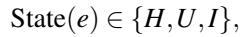

where I denotes an indeterminate (unresolved) state. In what follows we drop the agent index r and the entity argument e; the merge operator ⊕ defined below acts on the merged states {H,U,I} directly.

Merge Operator

For x,y ∈ {H,U,I}, define the merge operator ⊕ as:

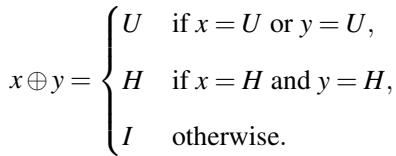

Interpretation:

• A single decisive failure forces U.

• A healthy state requires unanimous evidence.

• Any disagreement yields I.

This captures CoreSec’s principle. One piece of solid failure evidence matters. Healthy requires agreement. Conflict means wait.

Associativity

The operator ⊕ is associative:

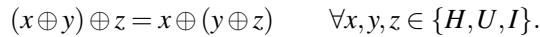

The proof is a simple case analysis:

• If any of x, y, z equals U, both sides reduce to U.

• If all three equal H, both sides reduce to H.

• Otherwise there is disagreement, and both sides reduce to I.

Associativity ensures that ordering of agents does not affect outcomes. It also allows correct streaming updates when some telemetry arrives earlier than others.

## Identities and Absorption

Two structural properties explain the stability of CoreSec’s merge rule.

Failure absorbs everything.

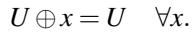

This guarantees that a single trustworthy failure signal suffices to classify an entity as unhealthy.

Healthy requires consensus.

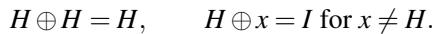

This prevents an entity from being declared healthy when evidence is partial or conflicting.

Abstain is neutral.

Abstentions are removed at the agent layer before merging and do not influence ⊕. They neither enforce H nor override U and do not suppress I when evidence conflicts. Silence does not distort RCA decisions.

## Relation to Short-Circuiting Evaluation

The operator ⊕ resembles classical short-circuit decision stacks. A decisive failure short-circuits to U. Clean consensus yields H. Mixed evidence produces I. CoreSec does not import the full control-flow semantics of systems like PAM, but the analogy helps explain the stability of the merge rule under partial and asynchronous information.

## Operational Consequences

This small algebra guarantees:

• Determinism: repeated evaluation produces identical results.

• Convergence: as telemetry becomes fresh, states move monotonically from I to H or U.

• Safety: a single false healthy report cannot mask a real failure.

• Order-invariance: proofs hold for streaming, parallel, or out-of-order agent evaluation.

• Implementation simplicity: merge is a two-line function in production code.

These algebraic properties are the foundation for CoreSec’s correctness. They explain why the system generalizes across heterogeneous telemetry pipelines and multiple cloud deployments.