USENIX

THE ADVANCED COMPUTING SYSTEMS ASSOCIATION

# RollAr t: Disaggregated Multi-Task Agentic RL Training at Scale

Wei Gao, Yuheng Zhao, and Tianyuan Wu, Hong Kong University of Science and Technology; Shaopan Xiong and Weixun Wang, Alibaba Group; Dakai An and Lunxi Cao, Hong Kong University of Science and Technology; Dilxat Muhtar,   
Zichen Liu, Haizhou Zhao, Ju Huang, and Siran Yang, Alibaba Group; Yongbin Li, Tongyi Lab, Alibaba; Wenbo Su, Jiamang Wang, Lin Qu, and Bo Zheng, Alibaba Group; Wei Wang, Hong Kong University of Science and Technology

https://www.usenix.org/conference/osdi26/presentation/gao

# This paper is included in the Proceedings of the 20th USENIX Symposium on Operating Systems Design and Implementation.

July 13–15, 2026 • Seattle, WA, USA

ISBN 978-1-939133-55-7

Open access to the Proceedings of the 20th USENIX Symposium on Operating Systems Design and Implementation is sponsored by

# ROLLART: Disaggregated Multi-Task Agentic RL Training at Scale

Wei Gao<sup>†∗</sup>, Yuheng Zhao<sup>†∗</sup>, Tianyuan Wu<sup>†∗</sup>, Shaopan Xiong<sup>‡∗</sup>, Weixun Wang<sup>‡∗</sup>, Dakai An<sup>†</sup>, Lunxi Cao<sup>†</sup>, Dilxat Muhtar<sup>‡</sup>, Zichen Liu<sup>‡</sup>, Haizhou Zhao<sup>‡</sup>, Ju Huang<sup>‡</sup>, Siran Yang<sup>‡</sup>, Yongbin Li<sup>¶</sup>, Wenbo Su<sup>‡</sup>, Jiamang Wang<sup>‡</sup>, Lin Qu<sup>‡</sup>, Bo Zheng<sup>‡</sup>, Wei Wang<sup>†</sup>

<sup>†</sup>HKUST <sup>‡</sup>Alibaba Group <sup>¶</sup>Tongyi Lab, Alibaba

## Abstract

Agentic Reinforcement Learning (RL) trains LLMs through multi-turn interactions with environments, producing workloads that mix compute-bound prefill, bandwidth-bound decoding, CPU-heavy environment execution, and bursty reward evaluation. Existing systems either colocate all stages on a single GPU cluster or decouple them only at a coarse granularity, overlooking hardware heterogeneity and incurring substantial synchronization overhead across stages.

We present ROLLART, a system for multi-task agentic RL on disaggregated infrastructure. ROLLART maps each pipeline stage to best-fit hardware, routing prefill-heavy tasks to compute-optimized GPUs, decode-heavy tasks to bandwidth-optimized GPUs, and environments to CPU clusters. It decouples rollout at the trajectory level, allowing generation, environment interaction, and reward scoring to proceed independently, so that slow or failed environments never block the others. ROLLART offloads stateless reward computation to serverless infrastructure and overlaps rollout with training via staleness-bounded asynchronous weight synchronization. Our results demonstrate that ROLLART effectively improves training throughput and achieves 1.31–2.05× training time reduction compared to various RL systems. We also evaluated ROLLART by training a hundreds-of-billions-parameter MoE model for Qoder product on an Alibaba cluster with above 3,000 GPUs, demonstrating its stability and scalability.

## 1 Introduction

Reinforcement Learning (RL) is advancing Large Language Models (LLMs) beyond single-turn reasoning toward autonomous, long-horizon decision-making [4, 7, 36]. In this paradigm, known as agentic RL, an LLM interacts with external environments for tool use [16, 58], web navigation [22, 24, 50], and computer control [28, 30, 33] over multiple turns, learning to solve tasks through trial and error.

The agentic RL training pipeline operates as an iterative cycle of three stages: rollout, reward, and training. Unlike standard RL post-training with single-turn responses, during rollout, the agent generates actions and receives environment observations over multiple turns until a termination condition is met, producing a long, multi-turn trajectory. Each trajectory is then evaluated in the reward stage, using rule-based scripts [13, 19], code sandboxes, or separate LLM judges [49, 68] to assign scalar reward signals. The training stage consumes scored trajectories to update the agent’s weights, which are synchronized back to the rollout workers for the next iteration.

As research labs scale agentic RL to larger models and harder tasks [8, 54], a fundamental resource-heterogeneity problem emerges across and within these stages. Within rollout alone, LLM generation alternates between computebound prefill and bandwidth-bound decoding whose ratio depends on the task: on cost-equivalent hardware, computeoptimized H800 GPUs cut prefill-heavy rollout time to 0.53× that of bandwidth-optimized H20 GPUs, while H20s cut decode-heavy rollout time to 0.49×–0.79× of H800s (§3). Concurrently, environments are stateful, CPU-bound processes whose latency is heavy-tailed due to host contention, large variance in interaction turns, and environment failures. Reward workers are stateless and exhibit persistently low utilization—dropping to as little as 7.4% on dedicated GPUs— yet require elastic scaling when trajectories complete. Finally, the training stage demands high-end GPUs with fast interconnects. No single hardware type satisfies all stages.

A natural solution is to disaggregate the pipeline and route each stage to best-fit hardware. Yet, existing systems fall short. Monolithic frameworks such as veRL [46,47], slime [70], and rLLM [53] co-locate all stages on a single GPU cluster and ignore heterogeneity entirely. Partially disaggregated systems such as AWorld [63] and DeepSWE [31] offload environments to Kubernetes [55] but still colocate the resource-heavy rollout and training stages. Even state-of-the-art asynchronous systems address only a subset of these heterogeneity dimensions: StreamRL [67], AsyncFlow [15], and SeamlessFlow [56] split training from rollout but treat rollout as a monolith, overlooking prefill/decode divergence within a task. AReaL [10] introduces unbounded-staleness asynchrony between training and generation, yet still batches environment interaction and couples reward to generation GPUs. Laminar [45] schedules trajectories individually but does not exploit within-rollout hardware affinity or offload stateless reward. As a result, no existing system jointly addresses prefill/decode heterogeneity within generation, long-tail environment stragglers, stateless reward underutilization, and cross-cluster bandwidth variability at production scale (§3).

To address these challenges, we present ROLLART, a distributed system that maximizes throughput for multi-task agentic RL on disaggregated infrastructure. The design of ROLLART is driven by four requirements derived from empirical workload characterization (§3):

R1 Hardware-affinity workload mapping: each pipeline stage, as well as sub-stages within rollout, should be bound to best-fit hardware so that compute-bound workloads land on compute-optimized GPUs and bandwidthbound workloads on bandwidth-optimized GPUs. Because prefill/decode, CPU-bound, and stateless characteristics are stable per task domain in production workloads (§3 and §8), this binding can be driven by lightweight, domain-level annotations.

R2 Trajectory-level asynchronous rollout: environment interaction, LLM generation, and reward computation should be decoupled at the granularity of trajectories, so that environment stragglers never stall the pipeline.

R3 Serverless offloading: Stateless components, notably reward computation, should be offloaded to serverless infrastructure, eliminating dedicated hot standby GPUs while gaining autoscaling and fault tolerance.

R4 Bounded-staleness asynchronous training: training and rollout should execute concurrently on separate GPUs, overlapping weight synchronization with rollout. An asynchronous bound eliminates resource bubbles while preserving performance.

To meet these requirements, our system combines a declarative programming model with a heterogeneity-aware distributed runtime. At job submission, users declare hardware preferences for each stage through Python decorators. The runtime binds each stage to its best-fit resource pool (R1): compute-optimized GPUs for training and prefill-heavy generation tasks, bandwidth-optimized GPUs for decode-heavy generation tasks, CPU clusters for environments, and serverless endpoints for reward. During rollout, the runtime drives each trajectory independently through generation and environment interaction. A slow or failed environment never blocks other trajectories, and reward scoring begins as soon as any trajectory completes (R2). Completed trajectories are scored by stateless reward functions on serverless infrastructure, granting elastic autoscaling without dedicated GPU reservations (R3). While rollout continues, a separate GPU cluster consumes scored trajectories for training. A boundedstaleness weight synchronization protocol propagates updated weights back to the rollout stage, overlapping training and cross-cluster transfer with ongoing generation to eliminate resource bubbles (R4). Finally, cross-cutting optimizations (§6.3) reduce cross-stage data-movement cost, add resilience to environment failures, and support optional prefill-decoding

Table 1: Taxonomy of Adopted Agentic Environments.  
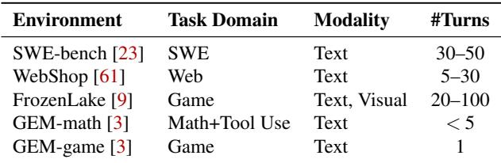  
disaggregation within rollout.

We have implemented ROLLART in approximately 60k lines of Python code and evaluated it by training Qwen3 models (8B–32B) [2] on a diverse mixture of agentic tasks across disaggregated H800 and H20 GPU clusters. ROLLART achieves 2.05×, 1.35×, and 1.31×, step-time reductions over a strengthened monolithic synchronous baseline, one-off baseline, and AReaL [10], respectively, and delivers 2.65–4.58× throughput over the synchronous baseline. Offloading reward to a serverless cloud raises reward-GPU utilization from 6% to 88% and halves per-step rollout time. We further quantify the overheads introduced by disaggregation, including crosscluster weight synchronization via Mooncake [38], serverless reward I/O, and trajectory transfer, and show that they are outweighed by the resulting throughput gains (§7). To validate scalability and stability in a production setting, we have deployed ROLLART to train a hundreds-of-billions-parameter Mixture-of-Experts (MoE) model for Qoder [39] product on a cluster of over 3,000 GPUs. This deployment runs continuously for one week, confirming ROLLART’s ability to sustain high throughput and robust fault tolerance at scale.

## 2 Background

## 2.1 Agentic RL Training

The Training Pipeline. Multi-task agentic RL training follows an iterative loop with three stages. The first stage, rollout, collects experience: an agent LLM (actor) interacts with parallel environments to generate training data. Unlike standard LLM inference, rollout is multi-turn and stateful [8, 54]. At each turn, the agent observes a state, emits an action token sequence, and submits it to the environment. The environment executes the action (e.g., running code or clicking a link) and returns feedback. The loop repeats until termination, producing a sequence of state-action pairs, i.e., a trajectory. After rollout, the reward stage evaluates trajectory quality via a reward worker, producing a scalar reward signal. Reward computation ranges from lightweight rule-based checks [19] to computationally expensive model-based judgments (e.g., LLM-as-a-Judge [49, 68]). Finally, the training stage consumes trajectories and rewards to update model weights with RL algorithms (e.g., PPO [40], GRPO [44]). To attain optimal training performance [10], production RL pipelines often adopt synchronous training, which enforces strict weight synchronization between rollout and training at every step.

Env.Reset Env.Step Reward LLM Gen. Training Step  
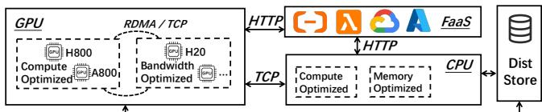  
Figure 1: Disaggregated infrastructure for agentic RL.

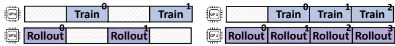  
Figure 2: Synchronous vs. asynchronous training.

Environment Heterogeneity. A key challenge in agentic RL is environment diversity, which determines the system compute profile. As summarized in Table 1, agentic tasks vary widely in modality and interaction frequency. Complex reasoning tasks such as SWE-bench [23] (software engineering), FrozenLake [9] (visual games), and WebShop [61] (eCommerce) require long interaction horizons (up to 30–100 turns). Frequent interactions force the agent to repeatedly process growing context histories, making these workloads prefillheavy and compute intensive. In contrast, tasks like GEM-Math and GEM-Game [3] may involve fewer turns (up to five) but require longer chains of thought per action. These workloads are decoding-heavy, shifting the bottleneck from compute to memory bandwidth. This variance requires infrastructure that adapts to each task’s rollout profile.

## 2.2 Disaggregated Cluster Infrastructure

The Case for Disaggregation. The extreme heterogeneity of agentic RL workloads, ranging from compute-intensive training to stateful environment simulation (§2.1), renders monolithic architectures inefficient. Consequently, agentic RL training must transition to a disaggregated infrastructure that decouples these demand-conflicting computation stages into specialized resource pools. As shown in Figure 1, in a typical disaggregated infrastructure, training clusters utilize high-end, compute-optimized GPUs (e.g., NVIDIA H800) to sustain high throughput; inference clusters leverage bandwidth-optimized hardware (e.g., H20) to serve memorybound decoding; CPU clusters provide elastic capacity for diverse, containerized runtime environments orchestrated by Kubernetes [55]; and serverless infrastructure handles bursty, stateless workloads like reward evaluation. These pools are interconnected through standard network fabrics, relying on distributed storage for persistent logging and fault tolerance.

Sync. vs. Async. Training. While disaggregation resolves resource mismatches, it introduces non-trivial orchestration challenges to the training paradigm that dictates the trade-off between system throughput and algorithmic consistency.

1) Synchronous Training: This paradigm enforces strict consistency by blocking rollout until it receives the latest model weights from the training cluster. In disaggregated settings, this causes substantial “dependency bubbles” (Figure 2-Left), where expensive GPUs sit idle during highlatency weight synchronization and straggler-bound environment steps (§3).

Table 2: NVIDIA GPU specifications.  
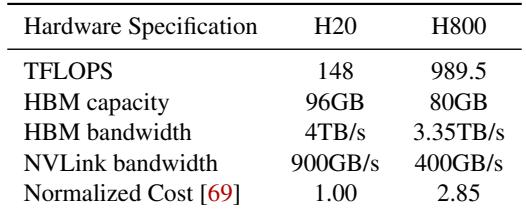

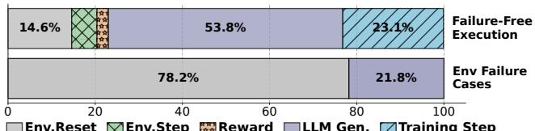  
Figure 3: Breakdown of a training step: successful runs (top, avg=365.7s) versus execution with environment failures (bottom, avg=513.3s).

2) Asynchronous Training: To mitigate these bubbles, systems can adopt asynchronous paradigms (e.g., one-off RL training [32] in Figure 2-Right). Rollout and training then run in parallel: training consumes trajectories from slightly older policies (e.g., one iteration stale in one-off training), while rollout continuously produces new data. This design masks synchronization latency and straggler effects inherent to disaggregation, trading some policy staleness for higher hardware utilization and throughput.

## 3 Characterization and Requirements

To motivate the design of ROLLART, we conduct a comprehensive workload characterization of multi-task agentic RL training. Based on these empirical observations, we derive four critical system requirements that ROLLART must satisfy: within-generation hardware affinity mapping (R1), trajectorylevel asynchrony (R2), serverless reward offloading (R3), and bounded-staleness asynchronous training (R4).

## 3.1 Stage Computation

Training Step Latency Breakdown. We first profile the endto-end latency of a standard training iteration to identify the dominant cost components. We train Qwen3-8B/32K on 32 H800 GPUs using the SWE-bench environment (batch size 128), where the agent LLM interacts with a containerized sandbox for software engineering tasks. The interaction involves two core operations: env.reset for environment initialization via Docker image pulling and container launching, and env.step for agent’s action execution.

Figure 3 breaks down the latency of five successful iterations against five iterations containing environment failures.

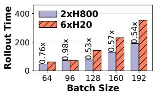  
(a) FrozenLake [Prefill-Heavy].

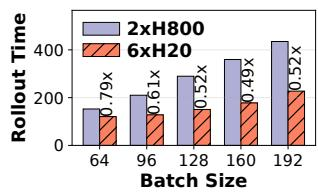  
(b) GEM-Math [Decode-Heavy].  
Figure 4: End-to-end rollout time (seconds) of different tasks on H20 and H800 GPUs across varying batch sizes.

Even on the success path, the average iteration time is 366 seconds, with LLM generation accounting for only 54%. The rest is split across training (23%), environment initialization (15%), and other overheads, a mixed profile that invalidates the common assumption of overwhelming generation dominance [12,18]. When environment timeouts occur, the average time spikes to 513 seconds and env.reset alone consumes 78% of rollout time, shifting the bottleneck entirely from GPU computation to environment overhead. Our production data indicates these failures are not rare corner cases, occurring approximately once every ten iterations (§8). Our empirical study therefore reveals that, in agentic RL, the system must handle four heterogeneous workloads, including generation, training, environment, and reward, rather than optimizing for the generation dominant regime reported by prior systems.

Divergent Hardware Affinities in Generation. Modern GPUs expose different trade-offs between compute capability, memory capacity, and cost (Table 2). While recent RL systems [15, 56, 67] advocate physically decoupling generation from training, assigning rollout to cost-effective, bandwidthoptimized GPUs and training to compute-optimized GPUs, our characterization reveals that this static assignment is insufficient for agentic workloads. LLM generation comprises two distinct phases with opposing resource demands: the computebound prefill phase and the memory-bandwidth-bound decoding phase. In environments with a few interaction turns but long chains of thought per action, most of the runtime is spent in decoding (decoding-heavy); conversely, in environments with many turns, the prefill phase dominates and demands high compute throughput (prefill-heavy). In our production clusters, agentic RL tasks exhibit a clear bimodal distribution, featuring either a small number of interaction turns (< 5) or a large number (> 10).

To quantify this divergence, we run a prefill-heavy task (FrozenLake) and a decoding-heavy task (GEM-Math) using Qwen3-8B/32K for ten iterations with prefix caching enabled. For a cost-equivalent comparison, we execute the workloads on two distinct hardware configurations: one with six H20 GPUs and the other with two H800 GPUs. As shown in Figure 4a, the compute-heavy H800 outperforms the H20 on FrozenLake, reducing end-to-end rollout time to as low as 0.53×. Conversely, for GEM-Math (Figure 4b), the H20’s higher memory bandwidth accelerates decoding, reducing rollout time to 0.49×–0.79× of the H800. These results invalidate the assumption that generation is uniformly bandwidthbound. Instead, maximizing throughput requires dynamically mapping tasks to their best-fit hardware.

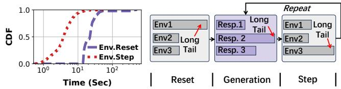  
(a) Env Time Distribution.  
(b) Batched Env Interaction.  
Figure 5: The analysis of environment interaction: (a) Cumulative distribution function of time (log-scaled) taken for environment initialization (env.reset) and environment step (env.step). (b) Illustration of how long-tail environments affect multi-turn rollouts under batched env interaction.

R1: Generation is not uniformly bandwidth-bound; the system must bind each task to a best-fit GPU class rather than committing rollout to a single GPU type.

Heavy-Tailed Environment Execution. Since each training step collects a batch of trajectories, it runs hundreds to thousands of environments simultaneously, at which scale strong resource isolation becomes essential: without it, concurrent disk I/O exhausts shared quotas and triggers cascading failures. We therefore employ Kubernetes clusters to manage and isolate each containerized environment.

A substantial body of prior work [12, 18, 67] has analyzed the long-tail behavior of LLM generation. In agentic RL, environment interactions introduce additional sources of long-tail execution patterns. Figure 5a illustrates the latency distributions of env.reset and env.step, both exhibiting pronounced long tails. The long-tail delay of env.reset can reach hundreds of seconds in production, mainly due to (1) network contention, where concurrent Docker image pulls saturate network links, and (2) compute and I/O contention on host nodes, where launching containers consumes substantial CPU and disk resources. The cumulative env.step time per trajectory also varies widely, driven by the large variance in interaction turns and per-step overhead.

These long-tail trajectories act as stragglers that delay endto-end rollout latency. Since LLM engines execute requests in batches, it is natural to batch environment interactions with the agent LLM as well. Figure 5b illustrates this pattern: fast environments must wait for the slowest one before the next generation step can proceed. Our profiling (Figure 3) indicates that batched environment interaction increases rollout time by up to 21.3% compared to ideal execution, an overhead that compounds as environment failure rates increase. Trace analysis on our production deployment (§8) confirms that such long-tail conditions are not rare throughout training, and would significantly penalize any batched execution scheme.

Table 3: Transmission overhead from the training cluster to the inference cluster over TCP and RDMA.  
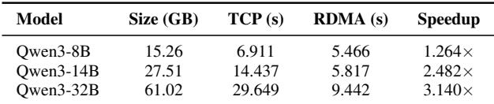

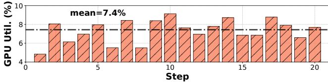  
Figure 6: Inefficient resource usage when dedicating local GPUs for reward computation.

R2: Environment execution, including env.reset and env.step, is prone to extreme long-tail latency. The system must manage environment execution at trajectory granularity rather than batch granularity, so that slow or failed environments do not stall the pipeline.

Stateless Reward Computation. The reward stage follows rollout, and most reward computations can be implemented as stateless functions. For lightweight rule- and code-based rewards, they have small, bursty resource demand, making them a natural fit for elastic serverless execution that can scale to zero between steps. The LLM-based reward computation, on the other hand, demands intensive GPUs: colocating them with rollout contends with generation for GPU memory, KVcache capacity, and scheduling slots, degrading both stages under concurrent demand. A common workaround is to reserve separate GPUs for the reward LLM: in our Qwen3-8B/32K SWE-bench run with batch size 128, we allocate four H800 GPUs to a dedicated 7B reward LLM and 28 H800 GPUs to rollouts, but the reward GPUs achieve only 7.4% average utilization across steps (Figure 6). Since the reward LLM’s parameters remain fixed during training, it can be treated as a stateless function, and serverless deployment [11, 64, 65] simultaneously avoids rollout contention and reclaims the idle GPU budget wasted by dedicated reservations.

R3: Reward workers are stateless, bursty, and persistently underutilized; colocating them with rollout contends for GPU memory under concurrent generation, making elastic serverless deployment the better fit.

## 3.2 Inter-Stage Communication

Beyond computation, inter-stage communication plays a critical role in agentic RL training, comprising two distinct types: stability-critical, small-packet trajectory transfer and bandwidth-intensive, large-volume weight update.

Stability-Critical Trajectory Transfer. Trajectory and observation payloads are orders of magnitude smaller than the multi-GB weight transfers: a single agent-environment exchange typically carries kilobytes to a few megabytes of tokenized state and action data, yet each rollout issues hundreds to thousands of such exchanges per trajectory. Consequently, cumulative latency, rather than bandwidth, determines end-to-end interaction cost. In practice, environment interaction should therefore prioritize network stability over network bandwidth, and asynchronous execution between environment interaction and LLM generation prevents network latency from becoming the rollout bottleneck.

Bandwidth-Intensive Weight Update. During training, the agent LLM periodically updates its weights, which must then be synchronized with the rollout stage. This weight synchronization is the dominant source of inter-stage communication overhead. We measure the end-to-end transmission cost of synchronizing model parameters between the training and inference clusters using Mooncake [38] over TCP (200 Gbps Ethernet) and RDMA (400 Gbps InfiniBand), and report the results in Table 3. RDMA provides higher bandwidth and lower communication overhead than TCP. In synchronous RL training, the rollout stage can only proceed after the latest agent LLM weights have been synchronized. As a result, the substantial cost of weight transmission over low-bandwidth links increases end-to-end training time and diminishes the speedup of disaggregated training (Figure 2-Left).

In asynchronous training (Figure 2-Right), the training and rollout stages execute in parallel on separate GPUs. Although this introduces data staleness, many prior works [18, 29] empirically observe that asynchronous training can preserve model quality under a staleness bound. Given the dominant rollout overhead, asynchronous training can effectively hide both training and weight synchronization costs with rollout, thereby reducing end-to-end training latency.

R4: Training and rollout must execute concurrently on separate GPU clusters with bounded staleness for system efficiency and training quality.

## 4 System Overview

We present ROLLART, a distributed system that orchestrates the rollout, reward, and training stages of agentic RL across disaggregated, heterogeneous resource pools. ROLLART is implemented in approximately 60k lines of Python code. We first present the system architecture and then walk through one training iteration to illustrate its workflow.

## 4.1 Architecture

To meet the requirements in §3, ROLLART is organized into three layered planes: resource, data, and control, as shown in Figure 7. The resource plane decides placement: it tracks heterogeneous hardware pools and binds each role, task, or generation sub-phase to a compatible resource class using hardware-affinity declarations (R1). The data plane realizes the pipeline through Worker and Cluster abstractions that encapsulate user-defined execution logic and offload stateless computation to serverless infrastructure (R3). The control plane coordinates progress: it schedules trajectories independently, dispatches reward computation as trajectories finish, buffers scored samples, and overlaps training with rollout under a bounded-staleness protocol (R2 & R4).

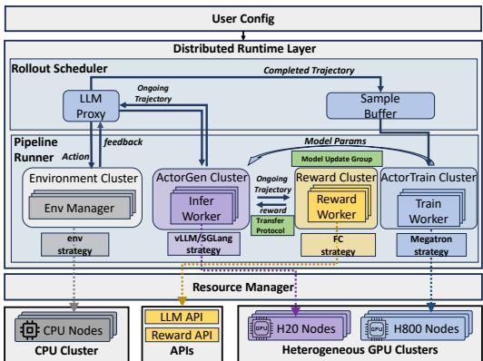  
Figure 7: System Architecture of ROLLART.

Resource Plane. The resource plane is implemented by the resource manager (Figure 7), which monitors the state of disaggregated hardware pools and binds resources to specific Workers based on their roles and corresponding hardware affinities (e.g., training to H800 GPUs, rollout to H20 GPUs, environment execution to CPU servers, and reward computation to serverless infrastructure).

Data Plane. The data plane executes the distributed RL job on resources provisioned by the resource plane. It is implemented by the pipeline runner, which constructs role-specific Clusters for training, generation, environment execution, and reward computation. Each Cluster then launches its associated Workers and orchestrates their execution over the appropriate backend runtime (e.g., Megatron [48] and vLLM [25]). In this way, the data plane translates user-defined Worker/Cluster logic into concrete distributed execution.

Control Plane. The control plane coordinates trajectory-level rollout and asynchronous training. It is centered on the roll out scheduler, which orchestrates the interaction among environment execution, generation workers, reward workers, and training workers. To decouple these stages, ROLLART introduces two auxiliary components: LLMProxy, which mediates generation requests between environment execution and generation Workers, and SampleBuffer, which buffers completed and scored trajectories for training. Together, these components allow rollout, reward evaluation, and model up dates to proceed concurrently, hiding trajectory-level synchronization and weight-update coordination from the user.

## 4.2 End-to-End Workflow

To illustrate how the three planes interact, we walk through the first asynchronous training iteration in ROLLART. At startup, the resource manager in the resource plane binds heterogeneous GPU, CPU, and serverless resources to the corresponding Clusters by allocating and placing their constituent Workers according to user-specified hardware affinities. The pipeline runner then materializes the data plane by instantiating the corresponding Clusters for training, generation, environment execution, and reward computation, each backed by its assigned Workers and execution engine.

Once the pipeline is instantiated, the rollout scheduler in the control plane launches multiple EnvManager instances to collect trajectories. Each EnvManager alternates between issuing generation requests through the shared LLMProxy and applying the returned actions to its environment. Completed trajectories are scored by a reward backend and deposited into the SampleBuffer, from which the training Cluster consumes batches and updates the model. Rollout, reward evaluation, and training proceed concurrently.

The following sections detail these planes. §5 describes the programming abstractions and mechanisms that configure the resource and data planes. §6 describes the system-managed control plane that drives runtime execution, followed by crosscutting optimizations that span multiple planes.

## 5 Programmable Resource and Data Planes

ROLLART provides a declarative programming model that separates user intent from system execution. Users specify execution logic and task-specific mappings for the data plane, as well as hardware preferences for the resource plane, through the Worker-level interface. The resource manager interprets the resource-plane declarations to construct concrete bindings over heterogeneous resources, while the pipeline runner materializes the data plane through Cluster abstractions.

## 5.1 Worker and Cluster Abstractions

The resource and data planes are built around two core abstractions: Worker and Cluster.

Worker Abstraction. A Worker is the basic execution unit that spans both the resource and data planes. It encapsulates user-defined computation logic together with method-level declarations, and executes on the hardware provisioned by the resource plane. A Worker can be specialized into the roles required across stages, including training, generation, reward, and environment, by subclassing and method annotations.

Cluster Abstraction. While Workers execute the actual computation logic, managing thousands of Workers individually is prohibitive for algorithm developers. To address this, ROLLART introduces the Cluster abstraction. A Cluster acts as a proxy and controller for a role-specific Worker group. A Cluster spawns Workers, binds their methods, and manages collective invocation on their behalf. In practice, ROLLART defines four Clusters: ActorTrain, ActorGen, Reward, and Environment, corresponding to the four RL stages shown in Figure 7. By composing these abstractions, ROLLART maps the agentic RL pipeline onto the disaggregated hardware fabric.

```python
1 import rollart . distributed as rdist
2 from rdist . worker import ActorTrainCls , ActorGenCls ,
RewardCls
3 from rdist import ResourceManager as RM
4
5 # 1. Single Controller Example
6 class MyActorTrain ( ActorTrainCls ):
7 @rdist . register ( mode ="execute_all ")
8 def compute_gradients ( self , input_tensor ):
9
10
11 # 2. Define actor_gen on heterogeneous GPUs
12 # 2.1 heterogeneous GPU allocation.
13 gen_rm = RM ( {"H800": list(range (0 , 8) )},
14 {"H20", list(range (8 , 32) ) })
15 # 2.2 hardware affinity mapping
16 class HeteroActorGen ( ActorGenCls ):
17 @rdist . hw_mapping (
18 hw_affinity ={"FrozenLake": "H800","default": "H20"}
19 )
20 def generate ( self , input_ids : List [int],
21 tag_name :str="default"):
22 return self . model . process ( prompt )
23
24 # 3. Define a serverless reward computation func
25 class ServerlessRewardWorker ( RewardCls ):
26 @rdist . register_serverless (
27 attribute =’reward_proxy ’,
28 serverless_url =’fc:// xxx.xxx ’)
29 def compute_rewards ( self , traj : list):
30 prompt = f"Evaluate the trajectory :{ traj}"
31 return ray . get ( self . reward_proxy ( prompt ))
```  
Listing 1: Worker-level programming interface of ROLLART.

## 5.2 Worker Declarations and Binding

ROLLART exposes three worker-level interfaces through Python decorators, allowing users to implement role-specific computation logic and specify task-specific mappings and hardware preferences under a unified single-controller model. The resource manager interprets the resource-related declara tions to bind Workers to heterogeneous resources.

Decorator-Based Interface. Listing 1 shows the three decorator-based interfaces for Worker declarations.

1) Single Controller. Like other industry RL frameworks [46, 70], ROLLART adopts the single controller programming model to streamline pipeline construction. When a Worker method is annotated with the register decorator and set to execute\_all mode (Lines 7–8 in Listing 1), the runtime broadcasts inputs and invokes the method across all Workers in the corresponding Cluster. The runtime also collects the returned results and automatically aggregates them. A typical use case is defining how gradients are computed on each training Worker (Line 8 in Listing 1).

2) Hardware-Affinity Mapping. To align workload characteristics with hardware capabilities (R1), ROLLART allows users to declare preferred hardware targets for rolespecific workers through the hw\_mapping decorator. By default, training workers (ActorTrainCls) are mapped to compute-optimized GPUs (e.g., H800), generation workers (ActorGenCls) to bandwidth-optimized GPUs (e.g., H20), environment workers (EnvironmentCls) to CPU servers, and reward workers (RewardCls) to local GPU servers. Users can override these defaults with finer-grained preferences.

As shown in the HeteroActorGen class, a dictionarybased resource specification provisions heterogeneous GPU groups (Lines 13–14), and the hw\_mapping decorator (Lines 17–19) declares sub-stage affinities. Prefill-heavy FrozenLake rollouts are routed to H800 GPUs, while all other tasks default to H20s. At runtime, the rollout scheduler passes the current task’s identity (e.g., FrozenLake) as the tag\_name argument (Line 21), allowing the system to route each generation request to the most appropriate hardware.

This declaration is coarse-grained by design: users specify affinity at the task-domain level rather than performing per-request load-balancing. In our production traces, different agentic task domains diverge in computation characteristics (e.g., turn counts and prefill/decode ratios), making domain labels a practical basis for hardware selection (§8). Our evaluation confirms this lightweight annotation captures enough heterogeneity to improve throughput (§7.3). This leaves affinity selection explicit, and §9 discusses how an online profiler could automate or refine these mappings at runtime.

3) Serverless Registration. Reward workers are stateless and exhibit low utilization on dedicated GPUs (R3). To address this, ROLLART provides the register\_serverless decorator (Lines 26–28) to offload reward computation to serverless platforms. With the specified serverless\_url, the runtime invokes compute\_rewards (Line 29) as a pure function through the same method-level interface while redirecting execution to an external serverless platform (e.g., Function Compute [1]). This grants the system zero-overhead autoscaling without provisioning costly, hot-standby GPUs.

Resource Binding. The resource manager uses a shared metadata store (e.g., Redis) to maintain a global, real-time view of resource pools, including compute-optimized GPUs (e.g., H800), bandwidth-optimized GPUs (e.g., H20), CPU clusters, and serverless endpoints. Worker-level annotations specify hardware affinities and execution targets for individual methods. Upon a Worker deployment request, the resource manager interprets these declarations to determine concrete placements and bindings. It first checks the availability of the preferred resource pool and binds the requested Worker accordingly. If the preferred hardware is temporarily unavailable, the manager opportunistically falls back to compatible default resources rather than stalling deployment. The resulting binding metadata is recorded for subsequent dispatch, failover, and reconfiguration.

```python
class Cluster :
2 def __init__ ( self , res_manager , worker_cls ):
3 self . _create_worker ( worker_cls , res_manager )
4 self . _bind_worker_method ()
5
6 def execute_all ( self , method_name , * args , ** kwargs ):
7 result = []
8 for worker in self . workers :
9 rcall = getattr( worker , method_name )
10 result . append ( rcall (* args , ** kwargs ))
11 return ray . get ( result )
12
13 def hw_mapping ( self , hw_affinity , tag_name , * args ):
14 hw_type = hw_affinity . get ( tag_name )
15 new_workers = []
16 for worker in self . workers :
17 if worker . resource_type == hw_type :
18 new_workers . append ( worker )
19 # route requests to new_workers next
20
21 def register_serverless ( self , attr , url , * args ):
22 # define a call_fc to call serverless url
23 for worker in self . workers :
24 setattr( worker , attr , call_fc )
25 # perform execute_all logic next
```  
Listing 2: Simplified implementation of Cluster.

## 5.3 Cluster-Level Realization

The resource manager realizes the resource plane, while the Cluster governs execution in the data plane. We next describe how the default Cluster implementation turns Worker-level decorators into concrete execution behavior.

Cluster Construction and Method Binding. At initialization, Cluster assembles a role-specific Worker group from the specified worker\_cls using resources provisioned by the resource manager, and initializes the correspond ing backend runtime (e.g., Megatron or vLLM) so that Worker methods execute on that backend (Line 3 in Listing 2). Each Worker is associated with resource metadata, such as its hardware type, enabling later affinityaware dispatch. The \_bind\_worker\_method function then binds each method of worker\_cls to the Cluster instance, allowing the Cluster to act as an invocation proxy (Line 4). For example, if worker\_cls defines compute\_gradients (Line 8 in Listing 1), users can directly invoke Cluster.compute\_gradients.

Realizing Worker Declarations. For methods annotated with the register decorator, Cluster enters the execute\_all path, which calls the target method on every constituent Worker and aggregates results via ray.get (Lines 6–11). For methods annotated with hw\_mapping, Cluster inspects the tag\_name argument, filters for Workers whose resource type matches the preferred hardware, and routes the request to those Workers (Lines 13–19). For methods annotated with register\_serverless, Cluster replaces the reward proxy attribute (attr) with a callable that invokes the registered serverless URL, so reward computation is performed by the serverless backend (Lines 21–25). In all affinity-based paths, if the preferred target is temporarily unavailable, Cluster redirects execution to a compatible fallback provided by the resource manager, ensuring forward progress under transient contention.

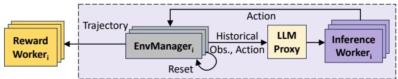  
Figure 8: Trajectory-Level Rollout and Reward Overview.

The abstractions and mechanisms above, including Worker logic, decorator annotations, resource bindings, and Clusterlevel realization, constitute what users configure at pipeline setup time. Once the pipeline is materialized, the control plane takes over: it drives trajectory-level rollout, reward evaluation, and asynchronous training without further user intervention, which we explain next.

## 6 System-Managed Control Plane

ROLLART’s control plane is entirely system-managed: users specify no coordination logic. In this section, we first describe how the control plane orchestrates trajectory-level rollout, reward, and asynchronous training (§6.1–§6.2), then present cross-cutting optimizations that span the data and control planes to improve end-to-end efficiency (§6.3).

## 6.1 Trajectory-Level Rollout and Reward

As identified in §3 (R2), batched environment interaction forces fast environments to wait for stragglers, inflating end-to-end rollout latency. To eliminate this synchronization barrier, ROLLART adopts a trajectory-level design in which each trajectory progresses through generation, environment interaction, and reward computation independently. Figure 8 gives an overview. Three components realize this: LLMProxy dispatches requests at per-trajectory granularity, EnvManager drives each environment’s lifecycle independently, and Reward Workers score asynchronously.

LLMProxy: Trajectory-Level LLM Generation. As shown in Figure 7, LLMProxy sits between EnvManagers and inference workers in the control plane. It acts as a gateway that decouples generation clients from the serving instances, dispatching per-trajectory requests across inference workers.

Each inference worker runs a command-driven event loop (Figure 8) that manages an inference engine (e.g., vLLM [25], SGLang [41]). This loop operates continuously in a nonblocking fashion with two components:

1) Step Wise Command Processing. The loop polls for commands dispatched by LLMProxy, ADD to enqueue requests and ABORT to cancel existing ones. When no commands are pending, it advances the engine by executing a decode or prefill step for a batch of requests, keeping GPU utilization high. Because commands are processed between engine steps, adding or aborting a trajectory does not stall ongoing generation.

2) Post-Processing. When the engine finishes a request, the loop immediately invokes a pre-registered callback that post-processes the output and returns the result to the requesting EnvManager. This allows each trajectory to proceed to environment interaction as soon as its generation completes, without waiting for stragglers.

EnvManager: Trajectory-level Environment Interaction. Each EnvManager is a lightweight controller that manages the lifecycle of a single environment to collect trajectories (also depicted in Figure 8). It begins with environment initialization via reset, after which it enters an independent event loop that orchestrates the interaction between an environment instance and the shared LLMProxy via step. During this loop, the EnvManager maintains a list of (observation, action) pairs to construct a trajectory. Specifically, it feeds LLMProxy with the historical (observation, action) sequence as input to obtain the next action, applies this action to the environment via step, and records the resulting observation. Unlike batched environment interaction (Figure 5b), where all environments must synchronize before the next generation step, each EnvManager operates on its own timeline, so a slow environment never blocks others.

Overlapping Rollout and Reward. Once a trajectory completes, the runtime dispatches it to a reward worker, which invokes a serverless reward function as a non-blocking task. Because each EnvManager yields trajectories independently, reward computation begins as soon as any single trajectory finishes, without waiting for an entire batch. ROLLART launches multiple inference workers, EnvManagers, and reward workers so that generation, environment interaction, and reward computation overlap in time, hiding reward latency behind ongoing rollouts and maximizing pipeline throughput. This design avoids colocating reward on the inference cluster, which would force batched computation. Recent RL post-training systems [10, 12, 57, 59, 67] also adopt asynchronous reward computation for this reason. ROLLART further eliminates the underutilization of dedicated reward GPUs (Figure 6) through serverless deployment.

## 6.2 Asynchronous Training Orchestration

In a disaggregated setup, synchronous training forces rollout workers to idle while model weights are transferred across clusters. This cost grows with model size (§3, R4). To hide this overhead, ROLLART overlaps rollout and training: two stages execute concurrently on separate GPU clusters, coordinated through a weight synchronization protocol (Figure 9).

Weight Synchronization Protocol. To propagate model weights to inference workers while preserving the overlap between rollout and training, ROLLART implements a six-step <sub>synchronization</sub> <sub>protocol</sub> <sub>in</sub> <sub>each</sub> <sub>iteration.</sub> ① get\_batch<sub>:</sub> The runtime invokes a blocking get\_batch call to retrieve trajectories from the SampleBuffer, which buffers scored trajectories for training (Figure 7). The pipeline waits until <sub>a</sub> <sub>predefined</sub> <sub>batch</sub> <sub>size</sub> <sub>is</sub> <sub>collected.</sub> ② suspend<sub>:</sub> <sub>Once</sub> <sub>the</sub> batch is ready, the runtime issues a suspend command to the LLMProxy, preventing new generation requests from being <sub>accepted</sub> <sub>while</sub> <sub>preserving</sub> <sub>in-flight</sub> <sub>trajectories.</sub> ③ update<sub>:</sub> After rollout is suspended, the pipeline fetches the latest LLM weights from the training workers and updates all inference <sub>workers.</sub> ④ resume<sub>:</sub> <sub>Upon</sub> <sub>completion,</sub> <sub>a</sub> resume <sub>command</sub> is issued to the LLMProxy, which then continues pending <sub>generation</sub> <sub>requests.</sub> ⑤ recomp <sub>&</sub> rollout<sub>:</sub> <sub>To</sub> <sub>reuse</sub> <sub>in</sub> flight trajectories generated under the previous model version, ROLLART performs KV cache recomputation, rebuilding each trajectory’s KV cache under the updated weights so that generation can continue without restarting from scratch. ⑥ train\_step<sub>:</sub> <sub>In</sub> <sub>parallel</sub> <sub>with</sub> <sub>the</sub> <sub>resumed</sub> <sub>rollout,</sub> <sub>the</sub> <sub>pipeline</sub> <sub>executes</sub> train\_step <sub>on</sub> <sub>the</sub> <sub>batch</sub> <sub>retrieved</sub> <sub>in</sub> ①<sub>,</sub> allowing training to overlap with ongoing rollout.

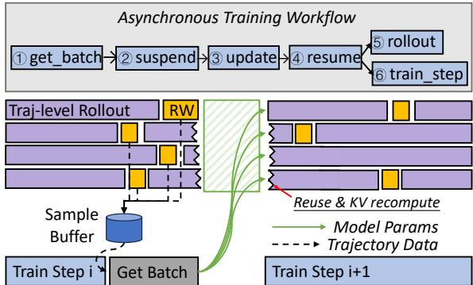  
Figure 9: Asynchronous Training Workflow.

Asynchronous Bound and Buffer Management. The protocol above lets rollout and training proceed concurrently, but trajectories in SampleBuffer may come from different model versions. Excessive staleness can increase variance and destabilize training, so ROLLART enforces a per-trajectory asynchronous bound α (R4). If the current agent LLM is at version n, any buffered trajectory must have been initiated by a version no older than (n − α); trajectories outside this window are aborted. This same version window bounds buffer growth: with E concurrent environments, SampleBuffer holds at most O(α · E) pending trajectories across versions. Before get\_batch forms a training batch, it eagerly evicts stale trajectories, so highly asynchronous or out-of-order completion cannot cause unbounded buffer growth. Our empirical study (§7.2) shows that α = 1 balances training speed and stability.

## 6.3 Cross-Cutting Optimizations

The execution workflow above relies on data movement, hardware-specialized serving, and scheduling mechanisms that span the data and control planes. We describe three optimizations that improve end-to-end efficiency.

Data Movement. ROLLART matches each data path to an appropriate transfer mechanism. The transfer protocol streams trajectories and supervision signals between stages as Ray’s object references [34]. The exchanged objects are sharded to match each worker’s parallelism layout. The model up date group synchronizes weights between stages. Intra-cluster weight synchronization uses NCCL [35] over NVLink or InfiniBand. The main bottleneck is cross-cluster weight updates, which bridge the training cluster and inference cluster over lower-bandwidth Ethernet. ROLLART addresses this with an asynchronous weight update engine built on Mooncake [38]: after each training step, updated weights are bucketized (e.g., 1GB) and published to a remote CPU-resident Mooncake store rather than synchronously pushed to remote inference workers. Inference workers then asynchronously fetch the latest weight buckets from the Mooncake store on demand, decoupling weight transfer from ongoing rollouts and avoiding GPU stalls caused by slow cross-cluster communication.

This makes the data movement explicit: training workers write weight buckets once over the lower-bandwidth crosscluster link, while inference workers pull them over highbandwidth intra-cluster links. The additional hop through the Mooncake store introduces only minimal overhead, as we quantify in §7.4. While Mooncake adds a pull step, it uses optimized data movement (e.g., zero-copy transfers) and is overlapped with ongoing rollout and weight push. For smaller models, the absolute transfer volume is also lower, limiting the exposed latency. We quantify both the accumulated pull cost and the non-overlapped exposed overhead in §7.4.

Redundant Environment Rollouts. Within the control plane, the trajectory-level design of LLMProxy and EnvManager enables an optimization we term redundant environment rollouts. This allows the system to launch more environments than required for trajectory collection. Once the target number of trajectories has been collected, in-flight trajectories can be terminated. Because rollouts are managed at trajectory granularity, slow or failed environments do not block faster ones, mitigating stragglers (§7.4) and environment failures (§8).

Prefill-Decoding (PD) Disaggregation. Within the data plane, PD disaggregation, which is widely adopted in LLM serving systems [37, 66], refines the LLMProxy routing described in §6.1. ROLLART supports PD disaggregation by deploying prefill and decoding workers on compute-optimized and bandwidth-optimized GPUs, respectively, and routing the two phases of each request to the corresponding workers. We evaluate the above optimizations in §7.4.

## 7 Evaluation

In this section, we present the end-to-end evaluation (§7.2), ablations of the four design requirements(§7.3), cross-cutting op-

timizations (§7.4), and the system’s disaggregation tax (§7.5).

## 7.1 Evaluation Setup

Models and Tasks. We train Qwen3 [60] models from 8B to 32B on a diverse mix of agentic tasks (Table 1), using a 32k-token maximum context length. Because SWE-bench is substantially harder than the other tasks, we train it only on Qwen3-32B. For mathematical tasks, we use Qwen2.5-7B as the reward LLM to validate the reasoning process.

Infrastructure. We deploy ROLLART on a 96-GPU H800 cluster and a 32-GPU H20 cluster. GPU nodes within each cluster are connected by 400 Gbps InfiniBand; cross-cluster communication uses 200 Gbps Ethernet. We use one dedicated CPU cluster for SWE-bench, another for the remaining environments, and our internal serverless platform for reward workers. Unless otherwise stated, all experiments use 128 GPUs. We use NCCL [35] v2.26.5 for intra-cluster weight updates and a Mooncake v0.3.7 [38] storage server for crosscluster communication.

Training Configuration. We train with GRPO [19], a batch size of 512, a group size of 8, and uniform task sampling. For asynchronous training, we reserve 32 H800 GPUs for training and use the remaining H20 and H800 GPUs for rollouts. Rollout tensor-parallelism degrees for Qwen3-8B/14B/32B are 1, 2, and 4, respectively; the corresponding training-side tensor and pipeline parallelism are tuned for throughput. Rollouts run on vLLM 0.8.4 with prefix caching and CUDA graphs enabled, while training runs on Megatron v0.12.2.

Baselines. We compare against four post-training baselines, grouped into sync and async designs. Since no existing open-source system supports our full spectrum of agentic tasks, we implement two sync baselines on top of ROLLART: Sync, a standard synchronous RL pipeline, and Sync+, which strengthens Sync with async reward computation, async environment interaction, and serverless offloading—techniques that are widely adopted in recent systems [10, 57, 67]. For async baselines, we compare with One-off [32] (see Figure 2- Right) and AReaL. One-off overlaps rollout and training by consuming trajectories from the previous step, but requires all trajectories in an iteration to finish with stale model weights. Differently, ROLLART with α = 1 preempts and resumes ongoing rollouts in the next iteration. We re-implemented AReaL in ROLLART’s codebase, adopting AReaL’s staleness bound of one, which constrains trajectory-level staleness only at the start rather than at every turn of every trajectory, to ensure fairness. Both One-off and AReaL implementations incorporate the Sync+ optimizations, so they differ from ROL-LART mainly in the coordination between training and rollout for staleness control, as well as the lack of hardware affinity routing. Laminar [45], another async baseline, repacks long-tail rollouts but does not account for hardware affinity, serverless reward computation, or long-tail environment execution, and we provide a quantitative feature-decomposition argument in §7.2 (Throughput Efficiency). We run baselines on 128 H800 GPUs, so ROLLART incurs roughly 83% of the baselines’ per-GPU-hour cost.

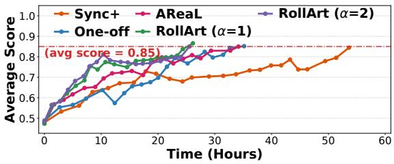  
(a) Time-to-Score (target 0.85) on Qwen3-32B.

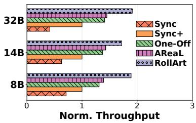  
(b) Norm. Throughput across LLMs.

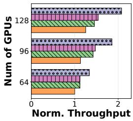  
(c) Scaling Efficiency.  
Figure 10: End-to-end results: (a) time-to-score on Qwen3-32B; (b) throughput across LLMs (normalized to Sync+); (c) throughput of Qwen3-14B across H800 GPU counts, normalized to Sync+ on 64 H800 GPUs.

Metrics. We measure end-to-end latency as the average step time over five iterations, and throughput as the number of prompt and response tokens in a global batch divided by step time [47]. We report the average validation score across tasks.

## 7.2 End-to-End Evaluation

Model Convergence. We measure validation score every ten iterations on Qwen3-32B, the most network-sensitive model in our setup, and report the time to reach a target score of 0.85 in Figure 10a. The asynchronous configuration with α = 1 reduces step time by 2.05×, 1.35×, and 1.31× over Sync+, One-off, and AReaL, respectively. One-off already improves over Sync+ by 1.52× by overlapping rollout and training. AReaL converges faster in the early stage but achieves similar time-to-score performance to the One-off approach because it bounds staleness only at the start of trajectories, collecting more stale long-tail trajectories. ROLLART enforces per-step staleness control within the bound α in §7.3 and promptly aborts stale trajectories. Increasing the bound to α = 2 for ROLLART improves initial convergence but slightly worsens later time-to-score relative to α = 1, consistent with the throughput–quality tradeoff in §7.3. The results in Figure 10b corroborate the advantages of ROLLART over these baselines across 8B, 14B, and 32B.

Throughput Efficiency. Figure 10b reports throughput efficiency normalized to Sync+; we set α = 1 for ROLLART. The results show how throughput improves as the baselines add more overlap and scheduling flexibility. Sync+ first improves throughput by 1.40–2.40× over Sync by adding async reward computation, async environment interaction, and serverless offloading. One-off adds 1.31–1.47× over Sync+ by overlapping rollout and training. AReaL con tributes another 1.03–1.06× over One-off. ROLLART then adds 1.22–1.36× over AReaL by layering hardware-affinity mapping on bounded-staleness async training. This ROL-LART/AReaL gap is consistent with the hardware-affinity contribution measured in isolation in §7.3 (R1, 1.12–1.37× over an H800-only rollout). Overall, ROLLART achieves 2.65–4.58× throughput over Sync.

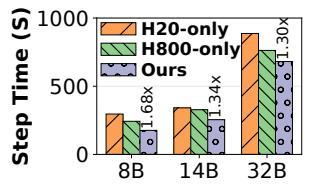

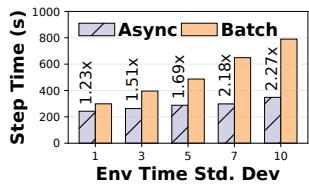  
(a) Rollout Efficiency.  
(b) Traj.-Level vs. Batch Rollout.  
Figure 11: The efficiency of (a) hardware affinity and (b) trajectory-level rollout, where env latency is sampled from a Gaussian distribution with mean µ = 10 s and standard deviation σ varying from 1 to 10 s (x-axis).

Laminar [45] is closed source, so we cannot evaluate it directly. Instead, the decomposition above isolates the capabilities that Laminar does not provide. The measured ROL-LART/AReaL gap captures the effect of hardware affinity (§7.3, R1). Laminar does not optimize for environment instability, which yields a 1.23–2.27× improvement under environment variability (§7.3, R2), and it lacks serverless reward computation, which can reduce rollout time by up to ∼ 2× (§7.3, R3). Composing these isolated gains lower bounds the gap between ROLLART and Laminar.

Scaling Efficiency. We train Qwen3-14B while sweeping the cluster size from 64 to 128 H800 GPUs. Thus, ROLLART does not support hardware-affinity mapping in this evaluation. We compare the scaling performance of ROLLART under α = 1. Figure 10c reports throughput normalized to Sync+ on 64 GPUs. As cluster size increases, Sync+ exhibits diminishing marginal gains, and One-off and AReaL show similar limited scaling performance from 96 to 128 GPUs, whereas ROL-LART delivers 1.33–2.08× higher throughput, demonstrating better scaling efficiency.

## 7.3 Ablations of Design Requirements

We next present ablations of the four design requirements.

R1: Hardware-Affinity Mapping. We evaluate hardwareaffinity mapping across LLM sizes on compute-optimized and bandwidth-optimized GPUs. To isolate routing, we fix training to 32 H800 GPUs and compare three rollout configurations that yield approximately an equal cost: 72 H800 GPUs, 208 H20 GPUs, and an affinity-aware mix of 64 H800 plus 24 H20 GPUs. The mixed configuration routes mathematical and game-oriented agentic tasks to H20 GPUs while keeping prefill-heavy work on H800 GPUs. As shown in Figure 11a, ROLLART reduces step time by 1.30–1.68× over H20-only and by 1.12–1.37× over H800-only. H20-only performs worst because many agentic tasks still incur frequent prefill operations, while the mixed configuration adds H20 capacity for decoding-heavy tasks without moving prefill-heavy work off compute-optimized GPUs. Beyond task-level mapping, PD disaggregation extends ROLLART’s affinity routing from task-level to phase-level placement; we evaluate it as a cross-cutting optimization in §7.4.

R2: Trajectory-Level Asynchrony. Trajectory-level rollout decouples environment interaction across trajectories, so slow turns do not stall an entire batch (§6.1). To isolate this effect, we run Qwen3-8B with a 32k context and inject per-turn environment latency sampled from Gaussian distributions with mean µ = 10 s and standard deviation σ ranging from 1 s to 10 s. This synthetic injection controls latency variance; production-side straggler stacking is reported in §8. Figure 11b compares trajectory-level and batch-level environment interaction using average step time over ten iterations. As σ increases, trajectory-level rollout improves over batchlevel interaction from 1.23× to 2.27×, showing that it better absorbs environment variance.

R3: Serverless Offloading. We evaluate serverless offloading against a local-GPU reward setup on a 16-H800 cluster. We run three concurrent mathematical agentic RL jobs with Qwen3-8B/16k as the actor agent and Qwen2.5-7B as the reward LLM. Both serverless and local setups reserve eight GPUs for training. The local setup assigns four remaining GPUs to rollout and the other four to reward, whereas the serverless setup assigns all eight remaining GPUs to rollout and offloads reward computation to an elastic serverless platform. Figure 12 reports GPU utilization and per-step rollout time for a batch size of 84, including asynchronous reward computation. Serverless offloading raises average GPU utilization from 6% to 88% and doubles the local rollout allocation, reducing average rollout time from 158 s to 77 s. Although remote serverless reward calls introduce network I/O, the disaggregation tax measured in §7.5 is small (max 2.1 s, mean 0.01 s per call). Thus, transfer cost does not negate the resource efficiency gains from serverless offloading.

R4: Asynchronous Bound. We quantify the throughput– convergence tradeoff induced by the per-trajectory asynchronous bound α. Figure 13 sweeps α from 1 to 6 and reports average step time across LLMs. Larger bounds reduce staleness-triggered trajectory aborts and lower step time, but the gain quickly plateaus: the best bound differs by LLM and improves step time by at most 1.22× over α = 1. These throughput gains do not necessarily improve time-to-score. Figure 10a shows that α = 2 already incurs a measurable latestage time-to-score regression , and we set α = 1 by default.

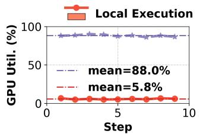

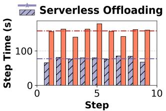

Figure 12: Comparison between dedicating local GPUs and using serverless offloading.  
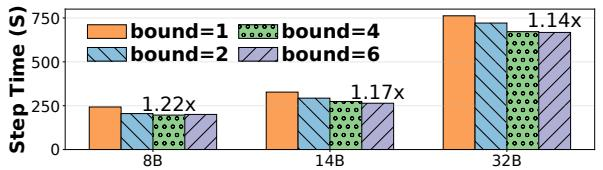  
Figure 13: Average step time across LLMs and bounds.

## 7.4 Cross-Cutting Optimizations

We evaluate the three cross-cutting optimizations in §6.3.

Asynchronous Weight Transfer. Cross-cluster weight transfer is costly when training and rollout clusters communicate over heterogeneous interconnects. To quantify the benefit of overlap, Figure 14a compares ROLLART’s asynchronous cross-cluster communication with veRL’s NCCLbased scheme, which assumes uniformly high-bandwidth links across servers. Asynchronous communication reduces end-to-end step time by 1.10–1.16× across LLMs. Table 4 decomposes this gain. Weight Push is the cost of streaming updated weights from the training cluster to the Mooncake store over the cross-cluster TCP/Ethernet link. Accumulated Weight Pull is the total cost of inference workers pulling new weight buckets from Mooncake, while Exposed Weight Pull is the residual pull cost not hidden by ongoing rollout. The Naive (Push + Acc. Pull) row reports the cost exposed by a synchronous design such as veRL. Asynchronous overlap hides 67–78% of the pull cost, reducing the exposed overhead to at most 9.6 s on 32B versus 38.6–157.0 s without overlap.

Redundant Environment Rollouts. Redundant rollouts exploit GRPO’s group structure to mask environment failures and stragglers. We run Qwen3-8B/32k on 32 H800 GPUs to vary the number of environment groups and the group size on the GEM-math task. Figure 14b reports rollout speedup ratios. Larger groups and more environment groups increase the chance that a fast subset finishes early, sustaining efficiency under straggler conditions. The maximum speedup reaches 1.62×, and increasing either parameter yields a speedup.

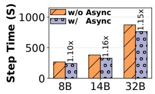

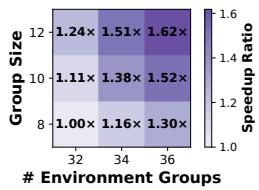  
(a) Cross-Cluster Comm.  
(b) Redundant Env Rollout.  
Figure 14: Cross-cutting optimizations: (a) async crosscluster weight transfer; (b) redundant environment rollouts.

Table 4: Breakdown of ROLLART’s asynchronous crosscluster weight transfer (seconds).  
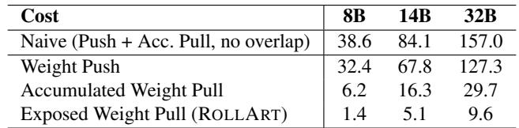

PD Disaggregation. PD disaggregation extends hardwareaffinity mapping from task-level to phase-level placement. We train Qwen3-32B and Qwen3-30B-A3B models on SWE tasks with batch size of 128 and 32k sequence length. We evaluate two configurations: 1P3D and 2P2D where each prefill node uses eight H800 GPUs and each decoding node uses eight H20 GPUs. For the dense model, PD disaggregation achieves relatively modest speedups of 1.03× and 1.05× compared with colocation. For the MoE model, 1P3D and 2P2D achieve 1.11× and 1.21× speedup over colocation, respectively. The performance and optimal configuration<sup>2</sup> of PD disaggregation are workload- and model-dependent. §9 further discusses how to automate these configurations to adapt to workload demands.

## 7.5 Disaggregation Tax

We next quantify the disaggregation tax along three data paths.

Cross-Cluster Weight Synchronization. Weight transfer is the largest overhead, but the asynchronous data-movement in §7.4 hides most of it. As Table 4 shows, ROLLART exposes 1.4–9.6 s of residual pull cost; without overlap, rollout would block on Push + Accumulated Pull for 38.6–157.0 s.

Env-Interaction I/O. Trajectory-level rollout moves data between the environment and inference clusters at each interaction. Across our evaluation, the maximum transferred volume is 2.7 MB, and the maximum and average per-call transfer overheads are 1.4 s and 0.02 s, respectively. These costs are negligible relative to per-step training time.

Serverless Reward I/O. Remote reward calls transfer trajectory payloads of up to 5.2 MB, with maximum and average per-call overheads of 2.1 s and 0.01 s. The residual disaggregation tax is therefore dominated by cross-cluster weight transfer, which ROLLART overlaps with rollout, so data movement does not erase the end-to-end gains reported in §7.2.

Table 5: Rollout time (seconds) comparison between colocation and disagg. under different models and configurations.  
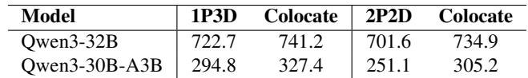

## 8 ROLLART in Production

Over the past nine months, thousands of agentic RL jobs have used ROLLART for post-training. We report one large production deployment on more than 3000 GPUs to show how the workload properties in §3 appear in practice and how operators tune ROLLART at scale.

Workload Characterization. We trained a hundreds-ofbillions-parameter MoE LLM with ROLLART on inhouse mathematical and software-engineering agentic tasks. Prompts and responses reach 12k and 46k tokens, respectively, and the average number of turns per task ranges from 1 to 48 (Figure 15a). This mix exposes both prefill-heavy and decode-heavy behavior. Stragglers persist throughout training: in each step, the maximum response length exceeds 5× the mean and peaks at 9×; the maximum number of environmentinteraction turns remains above 40× the mean. These tails explain why production runs need both fast prefill execution and trajectory-level rollout that can absorb slow environments.

The job uses asynchronous training with a 1:5 ratio of training to generation GPUs and an asynchronous bound of one to balance rollout throughput with gradient stability. Still, the longest iteration reaches 1.5 hours (Figure 15b). The bottleneck is the blocking get\_batch call: after computing log probabilities and gradients, the training stage waits for SampleBuffer to collect enough trajectories. This accounts for up to 62% of iteration time as GPU idleness; removing it would ideally reduce training time by 22% (Figure 15b).

Characterization-Driven Optimization. The production trace also shows why coarse-grained characterization is a practical starting point for hardware affinity: task domains are known before training, and their token and turn profiles differ substantially. Using this information, we adjust the training-to generation resource ratio and tune prefix caching for the MoE architecture. Figure 15c shows that these changes achieve a 1.66× end-to-end speedup over the first 25 steps. Beyond this resource tuning, we apply dedicated optimizations for environment stability and failure recovery.

Optimizing Environment Stability. Across 60 iterations, long environment initialization failures appear in seven iterations. At this scale, Docker-based environments on Kubernetes are sensitive to image-pull failures and network instability during env.reset. We therefore use a multi-tiered cache: an internal image registry mirrors external images, and a distributed load-balanced cache between compute nodes and the registry absorbs high-volume requests. During env.reset, clients fetch images from cache first. This optimization raises the env.reset success rate above 99.99%. It also avoids repeated image-pull retries, keeping over 99.99% of initialization under one minute. After the optimization, no more than ten heavy-tailed initialization events occur among hundreds of thousands of resets; trajectory-level rollout and redundant environments absorb the remaining tails.

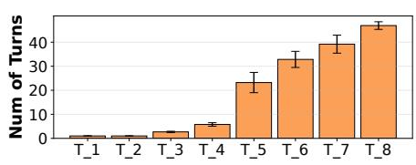  
(a) Average Number of Turns per Task.

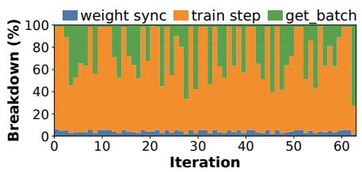  
(b) Step Time Distribution.

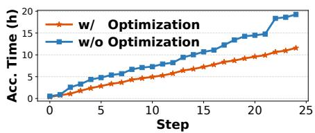  
(c) Accumulated Step Time.  
Figure 15: Production-grade agentic RL workload characterization and optimization.

System Resilience. ROLLART isolates failures across environment, reward, inference, and training workers. Persistent sessions and exponential backoff reduce environmentconnection timeouts; Kubernetes manages environment workers, and the serverless platform manages reward workers. If an inference worker fails, ROLLART first restarts it on the same GPU; after repeated failure, the worker is removed and its stored trajectories resume on healthy workers. Trainingworker failures restart from the latest checkpoint. In a weeklong training run, we observed only one failure.

## 9 Discussion and Related Work

Automating Hardware-Affinity Mapping. ROLLART currently requires static, per-task-domain affinity declarations, which is a real limitation when computation profiles shift mid-run. In our production deployment, however, per-domain profiles are stable: turn counts vary widely across families but stay bounded within each domain across iterations, so coarse hw\_mapping declarations needed no re-tuning across the week-long 3,000-GPU run. The natural extension is an online profiler integrated with the resource manager: per-domain prefill/decode latency would let ROLLART re-route requests when within-domain shifts occur (e.g., a domain alternating between long-observation and long-response prompts) and the same profiling can drive PD-disaggregation ratios (§6.3). Per-iteration optimality is not required: workload profile is dominated by task-domain identity rather than per-step policy variance, so profiling decisions stabilize over a few iterations.

Operational Regime. ROLLART targets multi-task agentic RL on heterogeneous, disaggregated infrastructure; it offers limited benefit on homogeneous clusters, where R1’s affinity routing collapses to a no-op; on strict on-policy or computelight RL, where R4’s bounded-staleness overlap yields little; and on deployments without elastic compute, where R3’s serverless offloading is unrealizable. Trajectory-level rollout (R2) and redundant environment rollouts (§7.4) still apply to any agentic RL workload exposed to long-tail environments.

RL Post-Training Systems. Many systems address the systems challenges of RL post-training. Early frameworks [17, 21, 46, 62] adopt appropriate stage and resource mapping to improve utilization. Subsequent systems [5, 6, 10, 15, 18, 27, 43,45,67,68] explore a range of accelerations, including speculative decoding, fusion of pipeline stages, asynchronous or decoupled training to hide latency, and various forms of resource disaggregation. ROLLART builds on the disaggregated paradigm and assigns workloads based on hardware affinity.

Resource Disaggregation. Resource disaggregation is adopted in many modern systems to improve utilization [14, 26, 42]. This pattern is prevalent in LLM serving, where systems separate the prefill and decoding phases [20, 37, 38, 51, 52, 66, 69]. Several RL systems apply a similar principle, separating the training and rollout stages across different GPU types [56, 67]. Compared to these approaches, ROLLART provides a more general and fine-grained disaggregation model, tailored for the entire lifecycle of multi-task agentic RL.

## 10 Conclusion

We presented ROLLART, a system for multi-task agentic RL training on disaggregated infrastructure. Its design rests on four requirements: hardware-affinity workload mapping (R1), trajectory-level asynchronous rollout (R2), serverless offloading for stateless reward (R3), and bounded-staleness asynchronous training (R4). On Qwen3 (8B–32B), ROL-LART reduces step time by 1.31–2.05× over strengthened synchronous, one-off, and AReaL baselines. A week-long, 3,000-GPU production run training a hundreds-of-billionsparameter MoE model confirms these gains at scale.

## Acknowledgment

We thank our shepherd, Shadi Noghabi, and the anonymous reviewers for their valuable comments that help improve the quality of this work. This work was supported in part by the HKUST-Alibaba Joint Laboratory on Big Data and AI, RGC CRF Grant (Ref. #C6015-23G), RGC GRF Grant (Ref. #16217124), and NSFC/RGC CRS Grant (Ref. #CRS\_HKUST601/24).

## References

[1] Alibaba Cloud. Alibaba Cloud function compute. http s://www.alibabacloud.com/en/product/functi on-compute, 2025.

[2] Alibaba Cloud. Qwen model repos. https://huggin gface.co/Qwen, 2025.

[3] Axon-RL. GEM: Generalist environment for multi-task learning. https://github.com/axon-rl/gem, 2025.

[4] Jiaze Chen, Tiantian Fan, Xin Liu, Lingjun Liu, Zhiqi Lin, Mingxuan Wang, Chengyi Wang, Xiangpeng Wei, Wenyuan Xu, Yufeng Yuan, Yu Yue, Lin Yan, Qiying Yu, Xiaochen Zuo, Chi Zhang, Ruofei Zhu, Zhecheng An, Zhihao Bai, Yu Bao, Xingyan Bin, Jiangjie Chen, Feng Chen, Hongmin Chen, Riwei Chen, Liangqiang Chen, Zixin Chen, Jinsong Chen, Siyan Chen, Kaiyuan Chen, Zhi Chen, Jin Chen, Jiecao Chen, Jinxin Chi, Weinan Dai, Ning Dai, Jiahui Dai, Shihan Dou, Yantao Du, Zhengyin Du, Jianhui Duan, Chen Dun, Ting-Han Fan, Jiazhan Feng, Junda Feng, Ziyuan Feng, Yuwei Fu, Wenqi Fu, Hanjie Fu, Hao Ge, Hongyi Guo, Mingji Han, Li Han, Wenhao Hao, Xintong Hao, Qianyu He, Jerry He, Feng He, Wen Heng, Zehua Hong, Qi Hou, Liang Hu, Shengding Hu, Nan Hu, Kai Hua, Qi Huang, Ziyue Huang, Hongzhi Huang, Zihao Huang, Ting Huang, Wenhao Huang, Wei Jia, Bin Jia, Xiaoying Jia, Yuhua Jiang, Haobin Jiang, Ziheng Jiang, Kaihua Jiang, Chengquan Jiang, Jianpeng Jiao, Xiaoran Jin, Xing Jin, Xunhao Lai, Zheng Li, Xiang Li, Liyi Li, Hongkai Li, Zheng Li, Shengxian Wan, Ya Wang, Yunshui Li, Chenggang Li, Niuniu Li, Siyu Li, Xi Li, Xiao Li, Aoyan Li, Yuntao Li, Nianning Liang, and Xinnian Liang. Seed1.5- Thinking: Advancing superb reasoning models with reinforcement learning. CoRR, 2025.

[5] Qiaoling Chen, Zijun Liu, Peng Sun, Shenggui Li, Guoteng Wang, Ziming Liu, Yonggang Wen, Siyuan Feng, and Tianwei Zhang. ReSpec: Towards optimizing speculative decoding in reinforcement learning systems. CoRR, 2025.

[6] Rongxin Cheng, Kai Zhou, Xingda Wei, Siyuan Liu, Mingcong Han, Mingjing Ai, Yeju Zhou, Baoquan Zhong, Wencong Xiao, Rong Chen, and Haibo Chen. Fast LLM post-training via decoupled and best-of-n speculation. CoRR, 2025.

[7] DeepSeek-AI. DeepSeek-R1: Incentivizing reasoning capability in LLMs via reinforcement learning. CoRR, 2025.

[8] DeepSeek-AI. DeepSeek-V3.2-Speciale. https://hu ggingface.co/deepseek-ai/DeepSeek-V3.2-Spe ciale, 2025.

[9] Farama Foundation. Gymnasium - FrozenLake environment. https://gymnasium.farama.org/environme nts/toy\_text/frozen\_lake/, 2024.

[10] Wei Fu, Jiaxuan Gao, Xujie Shen, Chen Zhu, Zhiyu Mei, Chuyi He, Shusheng Xu, Guo Wei, Jun Mei, Jiashu Wang, Tongkai Yang, Binhang Yuan, and Yi Wu. AReaL: A large-scale asynchronous reinforcement learning system for language reasoning. CoRR, 2025.

[11] Yao Fu, Leyang Xue, Yeqi Huang, Andrei-Octavian Brabete, Dmitrii Ustiugov, Yuvraj Patel, and Luo Mai. ServerlessLLM: Low-Latency serverless inference for large language models. In 18th USENIX Symposium on Operating Systems Design and Implementation, OSDI, 2024.

[12] Wei Gao, Yuheng Zhao, Dakai An, Tianyuan Wu, Lunxi Cao, Shaopan Xiong, Ju Huang, Weixun Wang, Siran Yang, Wenbo Su, Jiamang Wang, Lin Qu, Bo Zheng, and Wei Wang. RollPacker: Taming long-tail rollouts for RL post-training with tail batching. In 23rd USENIX Symposium on Networked Systems Design and Implementation, NSDI, 2026.

[13] Daya Guo, Qihao Zhu, Dejian Yang, Zhenda Xie, Kai Dong, Wentao Zhang, Guanting Chen, Xiao Bi, Y. Wu, Y. K. Li, Fuli Luo, Yingfei Xiong, and Wenfeng Liang. DeepSeek-Coder: When the large language model meets programming - the rise of code intelligence. CoRR, 2024.

[14] Zhiyuan Guo, Zijian He, and Yiying Zhang. Mira: A program-behavior-guided far memory system. In Proceedings of the 29th Symposium on Operating Systems Principles, SOSP, 2023.

[15] Zhenyu Han, Ansheng You, Haibo Wang, Kui Luo, Guang Yang, Wenqi Shi, Menglong Chen, Sicheng Zhang, Zeshun Lan, Chunshi Deng, Huazhong Ji, Wenjie Liu, Yu Huang, Yixiang Zhang, Chenyi Pan, Jing Wang, Xin Huang, Chunsheng Li, and Jianping Wu. AsyncFlow: An asynchronous streaming RL framework for efficient LLM post-training. CoRR, 2025.

[16] Bingguang Hao, Maolin Wang, Zengzhuang Xu, Yicheng Chen, Cunyin Peng, Jinjie GU, and Chenyi Zhuang. Exploring superior function calls via reinforcement learning. CoRR, 2025.

[17] Eric Harper, Somshubra Majumdar, Oleksii Kuchaiev, Jason Li, Yang Zhang, Evelina Bakhturina, Vahid Noroozi, Sandeep Subramanian, Nithin Koluguri, Jocelyn Huang, Fei Jia, Jagadeesh Balam, Xuesong Yang, Micha Livne, Yi Dong, Sean Naren, and Boris Ginsburg. NeMo: A toolkit for conversational AI and large language models. https://github.com/NVIDIA/NeMo, 2025.

[18] Jingkai He, Tianjian Li, Erhu Feng, Dong Du, Qian Liu, Tao Liu, Yubin Xia, and Haibo Chen. History doesn’t repeat itself but rollouts rhyme: Accelerating reinforcement learning with rhymerl. In Proceedings of the 31st ACM International Conference on Architectural Support for Programming Languages and Operating Systems, ASPLOS, 2026.

[19] Zhiwei He, Tian Liang, Jiahao Xu, Qiuzhi Liu, Xingyu Chen, Yue Wang, Linfeng Song, Dian Yu, Zhenwen Liang, Wenxuan Wang, Zhuosheng Zhang, Rui Wang, Zhaopeng Tu, Haitao Mi, and Dong Yu. DeepMath 103K: A large-scale, challenging, decontaminated, and verifiable mathematical dataset for advancing reasoning. CoRR, 2025.

[20] Cunchen Hu, Heyang Huang, Liangliang Xu, Xusheng Chen, Jiang Xu, Shuang Chen, Hao Feng, Chenxi Wang, Sa Wang, Yungang Bao, Ninghui Sun, and Yizhou Shan. Inference without interference: Disaggregate LLM inference for mixed downstream workloads. CoRR, 2024.

[21] Jian Hu, Xibin Wu, Weixun Wang, Xianyu, Dehao Zhang, and Yu Cao. OpenRLHF: An easy-to-use, scal able and high-performance RLHF framework. CoRR, 2024.

[22] Pengcheng Jiang, Jiacheng Lin, Lang Cao, Runchu Tian, SeongKu Kang, Zifeng Wang, Jimeng Sun, and Jiawei Han. DeepRetrieval: Hacking real search engines and retrievers with large language models via reinforcement learning. CoRR, 2025.

[23] Carlos E. Jimenez, John Yang, Alexander Wettig, Shunyu Yao, Kexin Pei, Ofir Press, and Karthik Narasimhan. SWE-bench: Can language models resolve real-world GitHub issues? CoRR, 2024.

[24] Bowen Jin, Hansi Zeng, Zhenrui Yue, Jinsung Yoon, Sercan Arik, Dong Wang, Hamed Zamani, and Jiawei Han. Search-R1: Training LLMs to reason and leverage search engines with reinforcement learning. CoRR, 2025.

[25] Woosuk Kwon, Zhuohan Li, Siyuan Zhuang, Ying Sheng, Lianmin Zheng, Cody Hao Yu, Joseph E. Gonza lez, Hao Zhang, and Ion Stoica. Efficient memory management for large language model serving with PagedAttention. In Proceedings of the 29th Symposium on Operating Systems Principles, SOSP, 2023.

[26] Kevin Lim, Jichuan Chang, Trevor Mudge, Parthasarathy Ranganathan, Steven K Reinhardt, and Thomas F Wenisch. Disaggregated memory for expansion and sharing in blade servers. In Proceedings of the International Symposium on Computer Architecture, ISCA, 2009.

[27] Bingshuai Liu, Ante Wang, Zijun Min, Liang Yao, Haibo Zhang, Yang Liu, Anxiang Zeng, and Jinsong Su. SPEC-RL: Accelerating on-policy reinforcement learning via speculative rollouts. CoRR, 2025.

[28] Yuhang Liu, Pengxiang Li, Congkai Xie, Xavier Hu, Xiaotian Han, Shengyu Zhang, Hongxia Yang, and Fei Wu. InfiGUI-R1: Advancing multimodal GUI agents from reactive actors to deliberative reasoners. CoRR, 2025.

[29] Han Lu, Zichen Liu, Shaopan Xiong, Yancheng He, Wei Gao, Yanan Wu, Weixun Wang, Jiashun Liu, Yang Li, Haizhou Zhao, Ju Huang, Siran Yang, Xiaoyang Li, Yijia Luo, Zihe Liu, Ling Pan, Junchi Yan, Wei Wang, Wenbo Su, Jiamang Wang, Lin Qu, and Bo Zheng. Part II: ROLL flash - accelerating RLVR and agentic training with asynchrony. CoRR, 2025.

[30] Zhengxi Lu, Yuxiang Chai, Yaxuan Guo, Xi Yin, Liang Liu, Hao Wang, Han Xiao, Shuai Ren, Guanjing Xiong, and Hongsheng Li. UI-R1: Enhancing efficient action prediction of GUI agents by reinforcement learning. CoRR, 2025.

[31] Michael Luo, Naman Jain, Jaskirat Singh, Sijun Tan, Ameen Patel, Qingyang Wu, Alpay Ariyak, Colin Cai, Tarun Venkat, Shang Zhu, Ben Athiwaratkun, Manan Roongta, Ce Zhang, Li Erran Li, Raluca Ada Popa, Koushik Sen, and Ion Stoica. DeepSWE: Training a state-of-the-art coding agent from scratch by scaling RL, 2025.

[32] Michael Luo, Sijun Tan, Justin Wong, Xiaoxiang Shi, William Y. Tang, Manan Roongta, Colin Cai, Jeffrey Luo, Li Erran Li, Raluca Ada Popa, and Ion Stoica. DeepScaleR: Surpassing O1-Preview with a 1.5b model by scaling RL. https://pretty-radio-b75.notio n.site/DeepScaleR-Surpassing-O1-Preview-w ith-a-1-5B-Model-by-Scaling-RL-19681902c14 68005bed8ca303013a4e2, 2025.

[33] Run Luo, Lu Wang, Wanwei He, and Xiaobo Xia. GUI-R1: A generalist R1-style vision-language action model for GUI agents. CoRR, 2025.

[34] Philipp Moritz, Robert Nishihara, Stephanie Wang, Alexey Tumanov, Richard Liaw, Eric Liang, Melih Elibol, Zongheng Yang, William Paul, Michael I. Jordan, and Ion Stoica. Ray: A distributed framework for emerging AI applications. In 13th USENIX Symposium on Operating Systems Design and Implementation, OSDI, 2018.

[35] NVIDIA Corporation. NVIDIA collective communication library (NCCL). https://github.com/NVIDIA/ nccl, 2025.

[36] OpenAI. Introducing OpenAI o3 and o4-mini. https: //openai.com/index/introducing-o3-and-o4-m ini/, 2024.

[37] Pratyush Patel, Esha Choukse, Chaojie Zhang, Aashaka Shah, Íñigo Goiri, Saeed Maleki, and Ricardo Bianchini. Splitwise: Efficient generative LLM inference using phase splitting. In 51st ACM/IEEE Annual International Symposium on Computer Architecture, ISCA, 2024.

[38] Ruoyu Qin, Zheming Li, Weiran He, Mingxing Zhang, Yongwei Wu, Weimin Zheng, and Xinran Xu. Moon cake: Kimi’s KVCache-centric architecture for LLM serving. CoRR, 2024.

[39] Alibaba Qoder. Qoder: Agentic coding platform for real software. https://qoder.com/en, 2025.

[40] John Schulman, Filip Wolski, Prafulla Dhariwal, Alec Radford, and Oleg Klimov. Proximal policy optimization algorithms. CoRR, 2017.

[41] SGLang Team. SGLang: Fast serving framework for large language models. https://github.com/sgl-p roject/sglang, 2025.

[42] Yizhou Shan, Yutong Huang, Yilun Chen, and Yiying Zhang. LegoOS: A disseminated, distributed OS for hardware resource disaggregation. In 13th USENIX Symposium on Operating Systems Design and Implementation, OSDI, 2018.

[43] Zelei Shao, Vikranth Srivatsa, Sanjana Srivastava, Qingyang Wu, Alpay Ariyak, Xiaoxia Wu, Ameen Patel, Jue Wang, Percy Liang, Tri Dao, Ce Zhang, Yiying Zhang, Ben Athiwaratkun, Chenfeng Xu, and Junxiong Wang. Beat the long tail: Distribution-aware speculative decoding for RL training. CoRR, 2025.

[44] Zhihong Shao, Peiyi Wang, Qihao Zhu, Runxin Xu, Junxiao Song, Mingchuan Zhang, Y. K. Li, Y. Wu, and Daya Guo. DeepSeekMath: Pushing the limits of mathematical reasoning in open language models. CoRR, 2024.

[45] Guangming Sheng, Yuxuan Tong, Borui Wan, Wang Zhang, Chaobo Jia, Xibin Wu, Yuqi Wu, Xiang Li, Chi Zhang, Yanghua Peng, Haibin Lin, Xin Liu, and Chuan Wu. Laminar: A scalable asynchronous RL post-training framework. In Proceedings of the 21st European Con ference on Computer Systems, EuroSys, 2026.

[46] Guangming Sheng, Chi Zhang, Zilingfeng Ye, Xibin Wu, Wang Zhang, Ru Zhang, Yanghua Peng, Haibin Lin, and Chuan Wu. verl: Volcano engine reinforcement learning for LLM. https://github.com/volcengine/verl, 2024.

[47] Guangming Sheng, Chi Zhang, Zilingfeng Ye, Xibin Wu, Wang Zhang, Ru Zhang, Yanghua Peng, Haibin Lin, and Chuan Wu. HybridFlow: A flexible and efficient RLHF framework. In Proceedings of the Twentieth European Conference on Computer Systems, EuroSys, 2025.

[48] Mohammad Shoeybi, Mostofa Patwary, Raul Puri, Patrick LeGresley, Jared Casper, and Bryan Catanzaro. Megatron-LM: Training multi-billion parameter language models using model parallelism. CoRR, 2019.

[49] Guijin Son, Hyunwoo Ko, Hoyoung Lee, Yewon Kim, and Seunghyeok Hong. LLM-as-a-Judge & reward model: What they can and cannot do. CoRR, 2024.

[50] Huatong Song, Jinhao Jiang, Yingqian Min, Jie Chen, Zhipeng Chen, Wayne Xin Zhao, Lei Fang, and Ji-Rong Wen. R1-Searcher: Incentivizing the search capability in LLMs via reinforcement learning. CoRR, 2025.

[51] StepFun. Step-3 is large yet affordable: Model-system co-design for cost-effective decoding. CoRR, 2025.

[52] Foteini Strati, Sara McAllister, Amar Phanishayee, Jakub Tarnawski, and Ana Klimovic. Déjàvu: KV-cache streaming for fast, fault-tolerant generative LLM serving. In Forty-first International Conference on Machine Learning, ICML, 2024.

[53] Sijun Tan, Michael Luo, Colin Cai, Tarun Venkat, Kyle Montgomery, Aaron Hao, Tianhao Wu, Arnav Balyan, Manan Roongta, Chenguang Wang, Li Erran Li, Raluca Ada Popa, and Ion Stoica. rLLM: A framework for post-training language agents, 2025.

[54] Kimi Team, Yifan Bai, Yiping Bao, Guanduo Chen, Jiahao Chen, Ningxin Chen, Ruijue Chen, Yanru Chen, Yuankun Chen, Yutian Chen, Zhuofu Chen, Jialei Cui, Hao Ding, Mengnan Dong, Angang Du, Chenzhuang Du, Dikang Du, Yulun Du, Yu Fan, Yichen Feng, Kelin Fu, Bofei Gao, Hongcheng Gao, Peizhong Gao, Tong Gao, Xinran Gu, Longyu Guan, Haiqing Guo, Jianhang Guo, Hao Hu, Xiaoru Hao, Tianhong He, Weiran He, Wenyang He, Chao Hong, Yangyang Hu, Zhenxing Hu, Weixiao Huang, Zhiqi Huang, Zihao Huang, Tao Jiang, Zhejun Jiang, Xinyi Jin, Yongsheng Kang, Guokun Lai, Cheng Li, Fang Li, Haoyang Li, Ming Li, Wentao Li, Yanhao Li, Yiwei Li, Zhaowei Li, Zheming Li, Hongzhan Lin, Xiaohan Lin, Zongyu Lin, Chengyin Liu, Chenyu Liu, Hongzhang Liu, Jingyuan Liu, Junqi Liu, Liang Liu, Shaowei Liu, T. Y. Liu, Tianwei Liu, Weizhou Liu, Yangyang Liu, Yibo Liu, Yiping Liu, Yue Liu, Zhengying Liu, Enzhe Lu, Lijun Lu, Shengling Ma, Xinyu Ma, Yingwei Ma, Shaoguang Mao, Jie Mei, Xin Men, Yibo Miao, Siyuan Pan, Yebo Peng, Ruoyu Qin, Bowen Qu, Zeyu Shang, Lidong Shi, Shengyuan Shi, Feifan Song, Jianlin Su, Zhengyuan Su,

Xinjie Sun, Flood Sung, Heyi Tang, Jiawen Tao, Qifeng Teng, Chensi Wang, Dinglu Wang, Feng Wang, Haiming Wang, Jianzhou Wang, Jiaxing Wang, Jinhong Wang, Shengjie Wang, Shuyi Wang, Yao Wang, Yejie Wang, Yiqin Wang, Yuxin Wang, Yuzhi Wang, Zhaoji Wang, Zhengtao Wang, Zhexu Wang, Chu Wei, Qianqian Wei, Wenhao Wu, Xingzhe Wu, Yuxin Wu, Chenjun Xiao, Xiaotong Xie, Weimin Xiong, Boyu Xu, Jing Xu, Jinjing Xu, L. H. Xu, Lin Xu, Suting Xu, Weixin Xu, Xinran Xu, Yangchuan Xu, Ziyao Xu, Junjie Yan, Yuzi Yan, Xiaofei Yang, Ying Yang, Zhen Yang, Zhilin Yang, Zonghan Yang, Haotian Yao, Xingcheng Yao, Wenjie Ye, Zhuorui Ye, Bohong Yin, Longhui Yu, Enming Yuan, Hongbang Yuan, Mengjie Yuan, Haobing Zhan, Dehao Zhang, Hao Zhang, Wanlu Zhang, Xiaobin Zhang, Yangkun Zhang, Yizhi Zhang, Yongting Zhang, Yu Zhang, Yutao Zhang, Yutong Zhang, Zheng Zhang, Haotian Zhao, Yikai Zhao, Huabin Zheng, Shaojie Zheng, Jianren Zhou, Xinyu Zhou, Zaida Zhou, Zhen Zhu, Weiyu Zhuang, and Xinxing Zu. Kimi K2: Open agentic intelligence. CoRR, 2025.

[55] The Kubernetes Authors. Kubernetes. https://kube rnetes.io, 2025.

[56] Jinghui Wang, Shaojie Wang, Yinghan Cui, Xuxing Chen, Chao Wang, Xiaojiang Zhang, Minglei Zhang, Jiarong Zhang, Wenhao Zhuang, Yuchen Cao, Wankang Bao, Haimo Li, Zheng Lin, Huiming Wang, Haoyang Huang, Zongxian Feng, Zizheng Zhan, Ken Deng, Wen Xiang, Huaixi Tang, Kun Wu, Mengtong Li, Mengfei Xie, Junyi Peng, Haotian Zhang, Bin Chen, and Bing Yu. SeamlessFlow: A trainer agent isolation RL framework achieving bubble-free pipelines via tag scheduling. CoRR, 2025.

[57] Weixun Wang, Shaopan Xiong, Gengru Chen, Wei Gao, Sheng Guo, Yancheng He, Ju Huang, Jiaheng Liu, Zhendong Li, Xiaoyang Li, Zichen Liu, Haizhou Zhao, Dakai An, Lunxi Cao, Qiyang Cao, Wanxi Deng, Feilei Du, Yiliang Gu, Jiahe Li, Xiang Li, Mingjie Liu, Yijia Luo, Zihe Liu, Yadao Wang, Pei Wang, Tianyuan Wu, Yanan Wu, Yuheng Zhao, Shuaibing Zhao, Jin Yang, Siran Yang, Yingshui Tan, Huimin Yi, Yuchi Xu, Yujin Yuan, Xingyao Zhang, Lin Qu, Wenbo Su, Wei Wang, Jiamang Wang, and Bo Zheng. Reinforcement learning optimization for large-scale learning: An efficient and user-friendly scaling library. CoRR, 2025.

[58] Junde Wu, Jiayuan Zhu, Yuyuan Liu, Min Xu, and Yueming Jin. Agentic reasoning: A streamlined framework for enhancing LLM reasoning with agentic tools. In Proceedings of the 63rd Annual Meeting of the Association for Computational Linguistics (Volume 1: Long Papers), ACL, 2025.

[59] Bingquan Xia, Bowen Shen, Cici, Dawei Zhu, Di Zhang, Gang Wang, Hailin Zhang, Huaqiu Liu, Jiebao Xiao, Jinhao Dong, Liang Zhao, Peidian Li, Peng Wang, Shihua Yu, Shimao Chen, Weikun Wang, Wenhan Ma, Xiangwei Deng, Yi Huang, Yifan Song, Zihan Jiang, Bowen Ye, Can Cai, Chenhong He, Dong Zhang, Duo Zhang, Guoan Wang, Hao Tian, Haochen Zhao, Heng Qu, Hongshen Xu, Jun Shi, Kainan Bao, Kai Fang, Kang Zhou, Kangyang Zhou, Lei Li, Menghang Zhu, Nuo Chen, Qiantong Wang, Shaohui Liu, Shicheng Li, Shuhao Gu, Shuhuai Ren, Shuo Liu, Sirui Deng, Weiji Zhuang, Weiwei Lv, Wenyu Yang, Xin Zhang, Xing Yong, Xing Zhang, Xingchen Song, Xinzhe Xu, Xu Wang, Yihan Yan, Yu Tu, Yuanyuan Tian, Yudong Wang, Yue Yu, Zhenru Lin, Zhichao Song, and Zihao Yue. MiMo: Unlocking the reasoning potential of language model - from pretraining to posttraining. CoRR, 2025.

[60] An Yang, Anfeng Li, Baosong Yang, Beichen Zhang, Binyuan Hui, Bo Zheng, Bowen Yu, Chang Gao, Chengen Huang, Chenxu Lv, Chujie Zheng, Dayiheng Liu, Fan Zhou, Fei Huang, Feng Hu, Hao Ge, Haoran Wei, Huan Lin, Jialong Tang, Jian Yang, Jianhong Tu, Jianwei Zhang, Jianxin Yang, Jiaxi Yang, Jing Zhou, Jingren Zhou, Junyang Lin, Kai Dang, Keqin Bao, Kexin Yang, Le Yu, Lianghao Deng, Mei Li, Mingfeng Xue, Mingze Li, Pei Zhang, Peng Wang, Qin Zhu, Rui Men, Ruize Gao, Shixuan Liu, Shuang Luo, Tianhao Li, Tianyi Tang, Wenbiao Yin, Xingzhang Ren, Xinyu Wang, Xinyu Zhang, Xuancheng Ren, Yang Fan, Yang Su, Yichang Zhang, Yinger Zhang, Yu Wan, Yuqiong Liu, Zekun Wang, Zeyu Cui, Zhenru Zhang, Zhipeng Zhou, and Zihan Qiu. Qwen3 technical report. CoRR, 2025.

[61] Shunyu Yao, Howard Chen, John Yang, and Karthik Narasimhan. WebShop: Towards scalable real-world web interaction with grounded language agents. CoRR, 2023.

[62] Zhewei Yao, Reza Yazdani Aminabadi, Olatunji Ruwase, Samyam Rajbhandari, Xiaoxia Wu, Ammar Ahmad Awan, Jeff Rasley, Minjia Zhang, Conglong Li, Connor Holmes, Zhongzhu Zhou, Michael Wyatt, Molly Smith, Lev Kurilenko, Heyang Qin, Masahiro Tanaka, Shuai Che, Shuaiwen Leon Song, and Yuxiong He. DeepSpeed-Chat: Easy, fast and affordable RLHF training of ChatGPT-like models at all scales. CoRR, 2023.

[63] Chengyue Yu, Siyuan Lu, Chenyi Zhuang, Dong Wang, Qintong Wu, Zongyue Li, Runsheng Gan, Chunfeng Wang, Siqi Hou, Gaochi Huang, Wenlong Yan, Lifeng Hong, Aohui Xue, Yanfeng Wang, Jinjie Gu, David Tsai, and Tao Lin. AWorld: Orchestrating the training recipe for agentic AI. CoRR, 2025.

[64] Minchen Yu, Ao Wang, Dong Chen, Haoxuan Yu, Xiaonan Luo, Zhuohao Li, Wei Wang, Ruichuan Chen, Dapeng Nie, Haoran Yang, and Yu Ding. Torpor: GPUenabled serverless computing for low-latency, resourceefficient inference. In 2025 USENIX Annual Technical Conference, USENIX ATC, 2025.

[65] Dingyan Zhang, Haotian Wang, Yang Liu, Xingda Wei, Yizhou Shan, Rong Chen, and Haibo Chen. Blitzscale: Fast and live large model autoscaling with O(1) host caching. In 19th USENIX Symposium on Operating Systems Design and Implementation, OSDI, 2025.

[66] Yinmin Zhong, Shengyu Liu, Junda Chen, Jianbo Hu, Yibo Zhu, Xuanzhe Liu, Xin Jin, and Hao Zhang. Dist-Serve: Disaggregating prefill and decoding for goodputoptimized large language model serving. In 18th USENIX Symposium on Operating Systems Design and Implementation, OSDI, 2024.

[67] Yinmin Zhong, Zili Zhang, Xiaoniu Song, Hanpeng Hu, Chao Jin, Bingyang Wu, Nuo Chen, Yukun Chen, Yu Zhou, Changyi Wan, Hongyu Zhou, Yimin Jiang, Yibo Zhu, and Daxin Jiang. StreamRL: Scalable, heterogeneous, and elastic RL for LLMs with disaggregated stream generation. CoRR, 2025.

[68] Yinmin Zhong, Zili Zhang, Bingyang Wu, Shengyu Liu, Yukun Chen, Changyi Wan, Hanpeng Hu, Lei Xia, Ranchen Ming, Yibo Zhu, and Xin Jin. Optimizing RLHF training for large language models with stage fusion. In 22nd USENIX Symposium on Networked Systems Design and Implementation, NSDI, 2025.

[69] Ruidong Zhu, Ziheng Jiang, Chao Jin, Peng Wu, Cesar A. Stuardo, Dongyang Wang, Xinlei Zhang, Huaping Zhou, Haoran Wei, Yang Cheng, Jianzhe Xiao, Xinyi Zhang, Lingjun Liu, Haibin Lin, Li-Wen Chang, Jianxi Ye, Xiao Yu, Xuanzhe Liu, Xin Jin, and Xin Liu. MegaScale Infer: Efficient mixture-of-experts model serving with disaggregated expert parallelism. In Proceedings of the ACM SIGCOMM 2025 Conference, SIGCOMM, 2025.

[70] Zilin Zhu, Chengxing Xie, Xin Lv, and slime Contributors. slime: An LLM post-training framework for RL scaling. https://github.com/THUDM/slime, 2025.