USENIX

THE ADVANCED COMPUTING SYSTEMS ASSOCIATION

# GraCE: Unlocking CUDA Graphs with Compiler Support for ML Workloads

Abhishek Ghosh and Ajay Nayak, Indian Institute of Science; Ashish Panwar, Microsoft Research; Arkaprava Basu, Indian Institute of Science

https://www.usenix.org/conference/osdi26/presentation/ghosh

# This paper is included in the Proceedings of the 20th USENIX Symposium on Operating Systems Design and Implementation.

July 13–15, 2026 • Seattle, WA, USA

ISBN 978-1-939133-55-7

Open access to the Proceedings of the 20th USENIX Symposium on Operating Systems Design and Implementation is sponsored by

# GraCE: Unlocking CUDA Graphs with Compiler Support for ML Workloads

Abhishek Ghosh<sup>†</sup>, Ajay Nayak<sup>†</sup>, Ashish Panwar<sup>‡</sup>, and Arkaprava Basu<sup>†</sup>

<sup>†</sup>Indian Institute of Science <sup>‡</sup>Microsoft Research India

## Abstract

Machine learning (ML) workloads launch hundreds of short-running GPU kernels per iteration. With GPU compute throughput growing rapidly, CPU-side launch latency of kernels is emerging as a bottleneck. CUDA Graphs promise to address this by replaying a set of kernels with a single dispatch of the graph, removing per-kernel launch costs. However, CUDA Graphs remain surprisingly difficult to deploy correctly and efficiently.

We present GraCE — a compiler framework to maximize the coverage and benefits of CUDA Graphs for ML workloads. It introduces three novel optimizations: it applies automatic code transformations to make ML applications amenable for CUDA Graphs; it eliminates the parameter copy overheads for kernels executing in CUDA Graphs, and it selectively deploys CUDA Graphs guided by a cost–benefit analysis. For 25 ML workloads from TorchBench, HuggingFace and TIMM, GraCE more than doubles the benefit from deploying CUDA Graph compared to the most popular and widely used ML compiler PyTorch2. GraCE is built atop PyTorch2’s compilation framework and requires no programmer intervention.

## 1 Introduction

The demand for GPU compute continues to skyrocket due to a surge in ML applications [2, 8, 9, 34, 37, 69–71, 95]. Catering to this growing demand through hardware enhance ment alone is challenging in the post-Moore era of slowing transistor technology [14]. Consequently, hardware vendors increasingly rely on hardware-software co-design to improve efficiency. For example, NVIDIA continues to introduce new performance features in GPUs that need software enablement. Recent examples include scoped synchronization [29, 30, 39] that allow programmers to selectively enable faster synchronization, tensor cores for fast matrix multiplica tion [27], lower- and mixed-precision computation [38], and CUDA Graphs [20, 90] for improving GPU utilization.

Surprisingly, GPUs are often underutilized despite high demand. Several hyperscalers, including Alibaba and Azure, report GPU utilization typically below 50% [18,26,79,80]. A major contributing factor is that CPUs cannot submit kernels fast enough to keep modern GPUs busy. An ML application typically invokes hundreds of GPU kernels per iteration, and each kernel launched from the CPU adds 5-10 microseconds of latency [13]. As a result, GPUs stall when they finish executing kernels faster than the CPU can dispatch subsequent ones. This problem is amplified by recent trends in distributed ML, particularly Tensor Parallelism (TP) [68]. TP shards model layers across GPUs, reducing the runtime of per-GPU compute kernels while introducing additional kernel launches for inter-GPU collective operations. Together, these effects push launch latency deeper into the critical path.

CUDA Graphs can mitigate the kernel launch bottleneck. It allows software to capture kernel launches in a directed acyclic graph – a CUDA Graph. The CPU then launches the graph instead of individual kernels. This can significantly speed up applications that repeatedly execute the same set of kernels (e.g., training and inference). While useful in theory, CUDA Graphs come with several constraints. For example, the parameters to a kernel are hardcoded during a graph’s capture. The same parameter values are passed to kernels during replays, posing a challenge to applications that compute over different data (tensors) across invocations. A CUDA Graph is also prohibited from using GPU-synchronizing operations.

Effectively harnessing capabilities of CUDA Graph is further made challenging by the fact that most ML applications are written in high-level frameworks such as PyTorch [54] and TensorFlow [1], and are semantically distant from their execution on the hardware. A key challenge, thus, is to effectively bridge the gap between the high-level program semantics and the low-level idiosyncrasies of hardware features.

Our goal is to enable high-level programs, e.g., in PyTorch, to effectively harness CUDA Graphs in modern GPUs without needing programmer intervention. Upon qualitatively and quantitatively analyzing many tens of PyTorch programs, we observed three key shortcomings that either prevent the deployment of CUDA Graphs or fail to harness its benefits.

1 CUDA Graph-oblivious programs: Many important

ML programs, e.g., in TorchBench [22], are not written with CUDA Graph in mind. For example, it is common for programs, such as the text-to-image generator model DALLE-2 [62], to allocate a tensor on the CPU’s DRAM (say, address x) and then copy its content to GPU memory during computation, e.g., in the forward pass. A CUDA Graph captured for such computation would hardcode the address of the DRAMresident tensor (x). Its content must then be copied to GPU memory during the graph’s replay. However, the host program may de-allocate the CPU tensor (x) after the graph’s capture, causing the application to crash intermittently during replays. Thus, CUDA Graph must be avoided in such programs. We notice similar pattern in other programs e.g., Vision Mask R-CNN [23], Torch Multi-modal Clip [31, 61].

Further, in many cases one or more kernel parameters are passed as scalar variables e.g., attention kernel in speech transformer [55]. A CUDA Graph captured with such kernels would record the value of the scalar as the kernel parameter. If the variable’s value should change across kernel invocations, it will receive stale values during graph replays. Thus, CUDA Graph must be avoided in such cases.

While a single or a few lines of code changes can unlock hundreds of kernels being captured in CUDA Graphs, the challenge is to automatically find such opportunities and update the code accordingly. It is unrealistic to expect developers to continue evolving their programs to make them friendlier to new hardware features. Thus, we posit that frameworks, such as PyTorch2, JAX [5], must step up to effectively harness advanced hardware features without burdening developers.

2 Parameter copy overheads in replaying CUDA Graphs: By design, CUDA Graphs capture GPU kernel parameters, including addresses of tensors by value. However, different invocations of the same kernel across a graph’s repeated replays often need to operate on different data. A simple strategy to enable this is to replace mutable parameters with placeholder parameters. Before each replay, actual parameter values for a given invocation are copied onto its placeholders.

While this strategy allows correct replay of graphs and is employed by widely used PyTorch2 ML compiler, it adds the overhead of copying the parameter (data) into the placeholder in the critical path of every graph replay. We empirically found overheads of copying parameters constitute up to 24% of a CUDA Graph’s execution time, particularly when operating on large tensors (§2). Thus, there is a need to correctly deploy CUDA Graph but without slowing down graph replays.

3 CUDA Graphs may hurt performance: While CUDA Graph is a performance feature, we discovered that the overhead of replaying them can sometimes outweigh the benefits. Besides the latency of copying kernel parameters (tensors), the overhead of reusing/garbage collecting CUDA Graph’s memory after replay and reset of the GPU’s random-number generator (RNG) state before each replay adds latency to the critical path. In our analysis, nearly a quarter of the total CUDA Graphs degrade performance (up to 397%). While a performance feature is not expected to speed up every application, it must not severely slow down many applications. GraCE: Driven by these observations, we created a CUDA Graph-aware compilation framework for PyTorch programs. GraCE embodies three key optimizations.

1 It employs CUDA Graph-aware code transformations such as hoisting memcopies, changing data placement for a wider deployment of CUDA Graphs. It analyzes the intermediate representation (IR) of programs to root cause the failures to capture kernel(s) in a graph (e.g., scalar variables). It then updates the IR to emulate changes in the source that would have enabled CUDA Graph. 2 It introduces an additional level of indirection in kernel parameters to convert tensor copies for parameters to pointer copies. While a tensor can be thousands of bytes, a pointer is only 8 bytes. For JIT-compiled kernels, GraCE uses Triton compiler [52] to automatically update kernels to de-reference their indirected parameters. For vendor-supplied immutable kernels (e.g., from cuBLAS), it introduces prelude kernels in the graph that perform de-reference of indirect-ed parameters on behalf of immutable kernels. 3 Finally, it adds automated profiling during graph capture (slow path) to analyze the cost-benefit of deploying CUDA Graphs. This guides GraCE to selectively deploy CUDA Graph during replay (fast path) only when beneficial. The judicious deployment of CUDA Graphs not only enables better end-to-end performance but, crucially, ensures that no application slows down. GraCE is integrated into PyTorch2 and requires no program modifications.

On a diverse set of 25 ML applications, GraCE provides geomean speedup of 29% over PyTorch2’s CUDA Graph feature (and up to 3.36×) on an H100 GPU. Further, we studied GraCE’s efficacy under distributed ML workloads by spreading a subset of applications over four GPUs using tensor parallelism. There, GraCE speeds up applications up to 3.56× over PyTorch2’s CUDA Graph and by 75% on average.

The key contributions of our work are as follows:

• We demonstrate subtle programming idiosyncrasies in popular PyTorch programs, coupled with the constraints of CUDA Graphs, limit wider deployment of CUDA Graphs.

• We show that overheads due to copying kernel parameters can be limited by introducing an additional layer of indirection in passing the parameters to kernels.

• We demonstrate the need to selectively deploy CUDA Graphs to achieve better end-to-end application performance. • We create GraCE atop PyTorch2’s compilation framework that achieves the above-mentioned optimizations without needing any manual modifications.

## 2 Background and Motivation

This section elaborates on how CUDA Graphs have become indispensable for modern GPU platforms, along with the challenges involved in maximizing their utilization. We use the terms CUDA Graph(s) and CG(s) interchangeably.

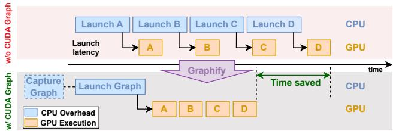  
Figure 1: CUDA Graph reducing CPU launch overheads.

## 2.1 The need for CUDA Graphs

GPUs have become the workhorse accelerators for ML applications since they deliver massive compute throughput. NVIDIA’s GPU compute scaling highlights this: peak FP16 tensor throughput jumped from 312 TFLOP/s on A100 [40] to ≈1 PFLOP/s on H100 [45], and ≈4 PFLOP/s on B200 [50]. In contrast, CPU frequency has stagnated, and the number of cores has only doubled during that period. At the same time, ML workloads have expanded dramatically, with each iteration often launching hundreds to thousands of kernels. Further, modern deployments increasingly shard a model across multiple GPUs. As GPU throughput improves and models scale out, kernels become smaller and faster.

A typical CUDA kernel launch takes ∼5-10 microseconds [13], while many kernels now run for only a few microseconds. This turns CPU launch overhead into a significant fraction of the total time. Reducing or amortizing this overhead is therefore critical to achieving high GPU utilization. For example, in DALLE2 [62] (inference, batch size 1), a segment of computation issues over 740 kernels whose combined GPU execution time is only 3.4 milliseconds on an H100 GPU, while the end-to-end time is 14 milliseconds—implying that 75% of the total latency is due to CPU launch delays.

A CG can address this bottleneck by obviating the need to individually launch each kernel from the CPU. The top part of Figure 1 shows traditional kernel launches, while the lower part shows steps involved in CG. Kernels are captured as part of a DAG (CG) once. The graph is launched from the CPU, and internally, the GPU hardware launches CG’s constituent kernels without CPU intervention. Applications that repeatedly launch the same set of kernels, e.g., inference tasks, can benefit substantially by capturing the graph once and replaying it many times.

## 2.2 Deploying CUDA Graph and its challenges

CUDA supports automatic capture of CGs through stream capture mechanism. The developer designates a capture region. The runtime automatically records all GPU operations (e.g., kernel launch, memcopy) issued within the region, producing a computation DAG. Once capture completes, the developer instantiates the graph and launches it, causing the GPU to replay the recorded GPU operations. Owing to its simplicity, stream capture is the dominant way developers use CGs. However, even this approach requires care: the runtime records kernel parameters by value. If the application replays the CG without updating parameters that change across iterations, execution proceeds with stale arguments—leading to silent data corruption, incorrect results, or crashes. Developers must therefore identify which values remain stable across replays and update any mutable parameters in the graph before launching it. Furthermore, CUDA does not permit capturing synchronous copies (cudaMemcpy), memory allocation (cudaMalloc) or any other API that implicitly synchronizes the device [48]. These constraints force developers to rethink data movement and memory management, making it difficult to incorporate CGs—especially in legacy codebases.

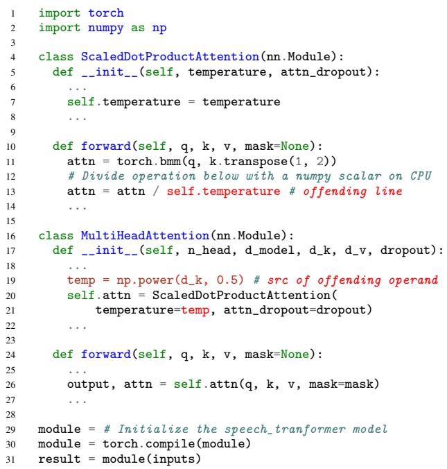  
Figure 2: Simplified code snippet from speech transformer model with CPU-resident scalar (marked red).

We posit that compilers and not the programmers should reason about program structure, automatically satisfy graph constraints and judiciously apply optimizations. This is the only way to harness advanced hardware features without burdening the developers. Unfortunately, existing compilers fall well short. To substantiate, we investigate PyTorch2 [3]—the most popular and widely used ML compiler.

## 2.3 CUDA Graphs are poorly harnessed

We analyze over 60 common ML and HPC workloads to iden tify key impediments to effective CG deployment. First, many programs fail to use CGs because their implementations are not aligned with CG requirements. Second, CG’s deployment strategy today adds significant but avoidable overheads. Further, even when CGs can be deployed, their deployment is not always beneficial — yet current frameworks deploy them blindly. We present a detailed analysis below.

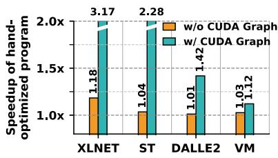  
Figure 3: Performance impact of moving tensors from CPU (unoptimized programs) to GPU (optimized programs).

## 2.3.1 Obstacles in harnessing CUDA Graphs

We observe that CUDA Graphs are often not compatible with the way many ML workloads are written. For example, when a kernel is captured into a CG, all its arguments are recorded by value and baked into the graph. If those values change across iterations, replaying the captured graph would produce incorrect results. Consequently, a compiler would forgo CG deployment in these cases for correctness.

We highlight one such example with a simplified PyTorch code snippet of the speech transformer model [55] (Figure 2). In the constructor of MultiheadAttention (line 19), the vari able temperature is assigned the value returned by a numpy method [74]. Note that temperature hosts a scalar value and is allocated on the CPU DRAM. This variable is passed to the constructor of ScaledDotProductAttention (line 21) and ultimately used to update attn in its forward method (line 13). This update of attn is performed by a GPU kernel whose parameters are attn and temperature. While the former is the address to a GPU tensor, the latter is a scalar variable. If this kernel is captured as part of a CUDA Graph, the scalar value of the parameter temperature will be hardcoded as a kernel parameter. Later, if the captured graph is replayed, the kernel would execute with a stale value of temperature.

We discovered other subtleties in PyTorch programs that limit CG deployment. A common case is when applications allocate a tensor on the DRAM (at address x) and copy its contents to GPU memory at the start of each iteration. A captured CG would hardcode the DRAM address x. However, CPU may de-allocate that tensor after capture, leaving the address invalid when the graph is replayed.

Quantifying the opportunity cost: The issues above stem from the fact that most ML programs are not written to meet CG constraints. Before the introduction of CG, the choice of where to allocate tensors had a limited impact. Tensors allocated on the CPU DRAM are copied to the GPU memory over PCIe for computation. If the tensor is large, the PCIe transfer time can dominate the kernel’s execution time. Thus, a tensor placed in CPU DRAM can at most delay the execution of the corresponding kernel.

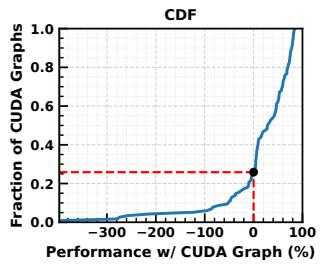

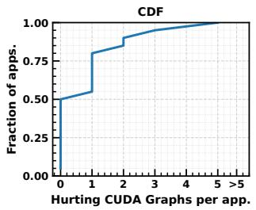  
(a) 25% of the total CUDA Graphs hurt (b) About 50% of the applications contain performance in TorchBench. CUDA Graph(s) that hurt performance.  
Figure 4: Cost-benefit analysis of CUDA Graphs.

The same is not true in the context of CG. The choice of tensor placement for one kernel determines whether other surrounding kernels can be captured as part of a CG or not. This is because a single offending allocation for a kernel in an otherwise CG-amenable long chain of kernels can disallow any of the kernels from being captured in a CG. In short, how a tensor is allocated for a kernel can affect many other kernels in the context of CG.

To demonstrate this quantitatively, we manually rewrote small portions of several PyTorch models—XLNetLMHeadModel (XLNET) [85], Speech-Transformer (ST) [55], DALLE2 [62], and Vision Mask R-CNN (VM) [23]—specifically targeting code regions whose structure prevented CUDA Graph deployment. The edits were minor (e.g., relocating a CPU-allocated tensor to the GPU) but made the code CG-compatible. Figure 3 reports the results (all results use inference batch size 1). In the absence of CGs, optimizing tensor placement had a modest impact on performance, averaging 6.29% and reaching up to 18% for XLNET. However, the same code changes lead to a dramatic speedup when using CGs. For example, XLNET and ST sped up by 3.17× and 2.28×!

Furthermore, scaling out ML models to multiple GPUs makes CGs more critical for performance. For instance, in the XLNET model (inference at batch size 128), tensorparallelism over four GPUs brings 48 additional collective kernels and reduces the runtime of more than 250 kernels by 50–75%. However, a few variable allocations in CPU DRAM render more than 450 kernels ineligible for capture in CGs, leaving significant performance on the table.

## 2.3.2 Cost-benefit analysis of CUDA Graphs

We also noticed that even when CGs can be deployed, they do not always improve performance. In fact, counterintuitively, we observed that CGs also hurt performance in many cases. This is unexpected; CGs are designed solely as a performance feature and should not slow down even a single application.

To understand this behavior, we quantitatively analyze 116 CGs drawn from 63 PyTorch applications in TorchBench [22].

We make two key observations. First, Figure 4a shows the CDF of performance changes when enabling CGs across all applications, capturing both cases where CGs help (right side of 0 on the x-axis) and where they hurt (left side of 0). Overall, 25% of the graphs (29 of 116) degrade performance. A deeper inspection reveals that the dominant source of this slowdown is the latency of copying kernel parameters (data) into the static placeholders (addresses) during a graph’s replay.

The reason this copying is required is fundamental to how CGs operate: every kernel parameter is captured by value in a CUDA Graph, whereas different invocations of a kernel typically operate on different data. A simple strategy to manage this scenario is to replace mutable parameters with place-holder arguments. Before each replay, the runtime must overwrite these placeholders with the current input values of all mutable arguments. This copy happens on the critical path of every replay and scales with the number of kernels and the size of their argument lists, making it a nontrivial overhead. For instance, in CUDA Graphs of DALLE2 and NVIDIA Deep Recommender, parameter copying accounts for 24% and 17% of their end-to-end execution time, respectively. These overheads substantially erode the benefits of CG deployment and can even lead to net slowdowns.

Beyond parameter copy, replay of a CG suffers from other fundamental overheads. CGs cannot encode lifetimes of CPUside objects. A language runtime that performs garbage collection, e.g., Python, must separate CG outputs from the host objects that originally produced them. The runtime snapshots only the GPU-side metadata of CG outputs (such as data pointers and layout) and discards the CPU-side tensor objects. This is necessary for the GPU memory to be safely reused across CG replays without memory bloat. However, on each replay, fresh CPU objects must be reconstructed from the saved metadata, adding further latency.

Our second insight is that many applications consist of both useful and harmful CGs. For example, Figure 4b shows the CDF of 20 applications that contain multiple CGs. Of these, nearly half of them exhibit a mix of performance-aiding and performance-hurting CGs. For a specific example, in DALLE2 (inference, batch size 1), one of the captured CG executes in 75 microseconds, while the kernel in it when run without CG takes 70 microseconds—implying an overhead of 7% in CG deployment. At the same time, a different CG in the same workload reduces the runtime of 743 kernels to 3.4 milliseconds, compared to 14 milliseconds without CGs, resulting in more than 75% performance gain. Unfortunately, CGs today are blindly deployed without a cost-benefit analysis.

In summary, these observations expose a deeper problem: today’s ML software stack lacks both the semantic understanding needed to effectively harness CUDA Graphs and a cost model to decide when they are worthwhile. Applications often miss crucial opportunities to use CGs, or deploy them where they hurt performance. It begs for a compiler-driven approach to automatically enforce graph compatibility, reason about costs, and maximize the effective use of CGs.

## 3 GraCE: Goals and Optimizations

Motivated by the analysis, we present the goals of GraCE, a framework that enables effective use of CUDA Graphs in ML applications. We then outline the optimizations that help GraCE achieve the goals.

Goals: 1 Expand the set of GPU kernels that can be captured in CGs. 2 Minimize runtime overheads introduced during CG replay, especially those stemming from parameter copy. 3 Selectively deploy CGs only when they improve end-to-end performance. 4 Achieve all of the above without requiring program modifications or developers’ intervention.

CUDA Graph-aware Code Transformation (CGCT): A large fraction of ML applications fail to utilize CUDA Graphs due to the presence of constructs—synchronous memory copies, CPU-resident scalars or tensors—that inhibit CG capture. These issues are often obscured by high-level frameworks and can easily escape a programmer’s attention.

GraCE addresses this by restructuring the program such that large sequences of kernels become eligible for graph cap ture, without altering application semantics. It first analyzes the compiler’s intermediate representation (IR) to identify code regions where CG capture fails and the root cause of the failure. It then performs targeted IR rewrites that make these regions compatible with CG capture. Conceptually, GraCE ensures that variables and operations in a candidate region satisfy the constraints imposed by CGs: computations and necessary inputs are placed on the GPU, and incompatible operations are hoisted prior to candidate graph regions. For example, if a scalar parameter prevents graph capture, GraCE alters the type of parameter as a GPU-resident tensor. During replays, the appropriate value of a parameter is copied into the tensor’s placeholder, enabling safe capture of the surrounding kernels. Likewise, if a DRAM-to-GPU memory copy prevents CG deployment, GraCE hoists the copy above the sequence of kernels targeted for CG capture. This ensures that the copy is not captured as part of the CG and, thus, need not be replayed. Parameter Indirection (PI): A dominant source of overhead in a CG replay is the copying of kernel parameters (data) into the placeholders that were recorded during graph capture. We eliminate this cost by removing data copies from the replay path entirely: instead of copying potentially large parameter data, we introduce a layer of indirection. Consequently, the replay updates only the corresponding pointers (eight bytes per parameter) rather than the data itself, which can be thousands of bytes. This optimization rests on a simple observation: with the input data changing on each replay, as long as a kernel can read from these new data tensors—different from those it was captured with—the CG execution remains valid, without needing a parameter copy.

(a) Baseline behavior in current ML frameworks.  
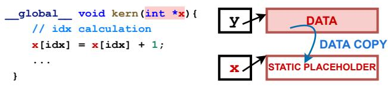

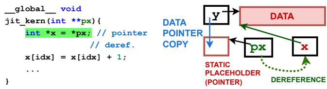  
(b) After indirection.  
Figure 5: Converting data (parameter value) copy to pointer copy through indirection in Parameter Indirection.

Figure 5 illustrates this mechanism with an example. Figure 5a shows the parameter (data) copy performed during the replay of a CG in the baseline. The kernel parameter recorded during graph capture (here, address x) is highlighted in red. During replay, the parameter for a given kernel invocation, residing at address y, must be copied into the memory location pointed to by x. Figure 5b shows how GraCE converts the kernel parameter to pointer-to-pointer via indirection. These pointer-to-pointers are then recorded during graph capture. Before each replay, the pointers to the parameter (y) for the given invocation of the kernel are copied onto the address (pointer-to-pointer, px) recorded during the graph capture. The modified kernel then de-references these pointerto-pointers before performing any computation (green).

Our approach relies on the ability to rewrite kernels, which is feasible for JIT-compiled kernels (e.g., Triton [52]) but not for vendor-supplied libraries (e.g., CUTLASS [42], cuBLAS [41]) or pre-compiled kernels. In §4, we describe an alternative mechanism that extends PI to these kernels based on recently introduced CG management APIs [47], while meeting GraCE’s goal of zero manual changes.

An additional benefit of our approach is that PI eliminates the need to keep static placeholders allocated for input tensors over a CG’s lifetime. Instead, it requires a pointer-to-pointer whose contents are updated before each replay. This avoids duplicate storage, reducing the peak memory footprint by up to 15% during replay.

Selective CUDA Graphs (SCG): Since CGs can also hurt performance (§2), they should not be used blindly. GraCE employs automated profiling as part of the compilation and graph capture phase (slow path). Specifically, GraCE measures the aggregate time to execute individual kernels encapsulated in a CG. It also profiles the execution time of the corresponding

CG with and without Parameter Indirection. The profiler then automatically chooses the best-performing configuration for the given set of kernels in an application. This decision is made independently for each of the CGs. Also, note that this profiling happens during compilation and CG capture phase (slow path) and not during the graph replay (fast path).

Taken together, these three optimizations push CUDA Graphs closer to their peak potential. CGCT broadens capture eligibility so that substantially more of the program can benefit from graph execution. PI removes a major replay bottleneck by eliminating parameter-copy overheads. SCG ensures that CGs are enabled only when they deliver end-to-end gains. The result is a system that captures larger kernel regions in graphs, executes them with lower overhead, and deploys CGs only where they improve performance.

## 4 Implementing GraCE

GraCE is built into PyTorch2’s compilation workflow (slow path) that is responsible for CUDA Graph capture, enabling its optimizations to benefit fast-path execution (replay).

We chose PyTorch as the platform to build GraCE in order to seamlessly bring the benefits of CUDA Graph to a wide range of ML workloads. Arguably, PyTorch is the most popular framework for creating ML applications [6, 17, 35].

We begin with a brief discussion of the compilation workflow of the PyTorch2 compiler and then discuss how GraCE leverages it to apply its three optimizations.

Compilation workflow in GraCE: GraCE follows a structure commonly found in modern ML compilers—such as Py-Torch2 [3], JAX/XLA [5]. The typical compilation pipeline consists of 1 Computation Graph Construction Layer (Frontend), where Python execution is symbolically traced, producing a computation graph in a high-level IR. 2 IR Lowering & Optimization Layer (Mid-Level Pass), where the graph is lowered into a more uniform IR, enriched with metadata such as tensor shapes, device placement, and debug mappings. 3 Kernel Generation Layer (Backend), where primitive operations are either dispatched to optimized GPU libraries (cuBLAS [41], cuDNN [43], CUTLASS [42]) or implemented through just-in-time (JIT) kernel generators such as Triton [52]. 4 Graph-Capture Layer, where the final compiled module is executed, and if eligible, captured as a CG. This layer maintains parameter placeholders and bookkeeping logic required to replay CGs.

GraCE adds targeted extensions to each of these layers in PyTorch2. Figure 6 provides an overview of GraCE’s implementation, depicting how it extends selected components of the PyTorch2’s compilation workflow. The orange and purple background regions delimit the key components of the PyTorch2 compiler—its frontend (Torch Dynamo [57]) and backend (Torch Inductor [25]). Modifications for CGCT are shown in blue, while those for PI and SCG appear in yellow and green, respectively. GraCE’s three optimizations —

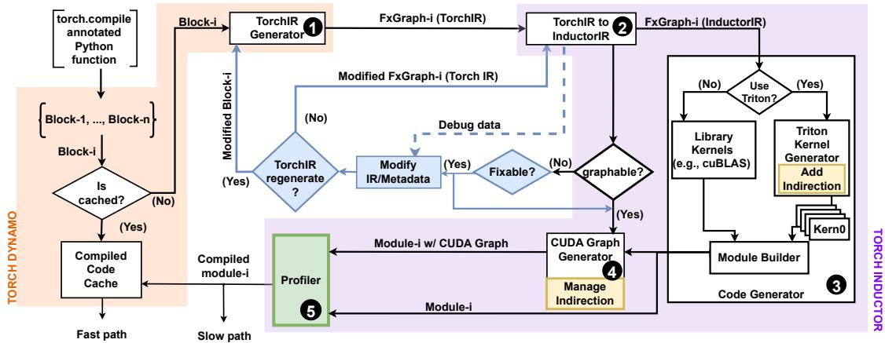  
Figure 6: Implementation of GraCE within PyTorch2’s compilation framework.

CGCT (blue), PI (yellow), and SCG (green) — extend different parts of the compilation workflow and are detailed in §4.1, §4.2, and §4.3, respectively.

## 4.1 CUDA Graph-aware Code Transformation

GraCE automatically finds and mitigates multiple factors that prevent deployment of CUDA Graphs. For ease of exposition, we describe the PyTorch2 components involved in deploying CGs first, and then GraCE’s extensions to them.

## 4.1.1 Computation Graph Construction Layer

Torch Dynamo (Figure 6, orange block on the left) intercepts Python execution and constructs computation graphs (Fx-Graphs [63]) consisting of TorchIR — a simplified IR that exposes Python and PyTorch operations for optimization. Dynamo symbolically traces operations until it encounters one that cannot be safely traced (e.g., input-dependent control flow). It terminates the current FxGraph, compiles it, and splices the compiled result back into the source program via bytecode rewriting. It resumes tracing after the offending operation, effectively partitioning the program into blocks, each of which is lowered independently to TorchIR ( 1 in Figure 6).

GraCE’s extensions: Dynamo is extended to regenerate TorchIR from a modified code block ( 1 in Figure 6), provided by the extensions to Torch Inductor described next.

## 4.1.2 IR-Lowering & Optimization Layer

Torch Inductor (Figure 6, purple region), lowers the TorchIR produced by Dynamo into a lower-level IR comprised of primitive Aten/Prim [56] operations. Inductor then augments this IR with operand metadata–including tensor shapes, device placement (CPU or GPU), and debug mappings from this lowered IR back to TorchIR–producing InductorIR ( 2 in Figure 6). InductorIR serves as input to subsequent phases (§4.2) that apply further optimizations and code transformations.

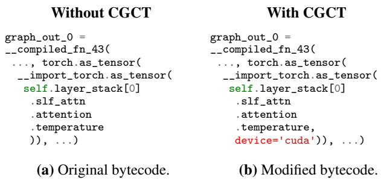  
Figure 7: IR modification as part of CGCT.

Inductor also decides whether a FxGraph represented by an InductorIR instance can be captured as a CUDA Graph. If the metadata shows that an FxGraph’s node has a CPU-resident scalar operand, performs a CPU–GPU memcopy, or involves an input mutation, Inductor avoids encapsulating it in a CG. GraCE’s extensions: To map more FxGraphs to CGs, GraCE enhances Inductor’s decision routine for CG eligibility. When this routine determines that an FxGraph cannot be mapped to a CG, GraCE inspects the cause of failure. If the failure is due to the presence of one or more scalar variables (e.g., a NumPy scalar as discussed in §2), it uses bytecode rewrites to cast the variables as GPU tensors, effectively removing the CPU operand/operation from the graph capture path. Dynamo then regenerates TorchIR for the modified block, which is re-lowered to InductorIR, enabling the FxGraph to be mapped to a CG.

Figure 7 illustrates this transformation for the temperature scalar from the speech transformer example in Figure 2. Specifically, it shows the Dynamo-generated bytecode without (Figure 7a) and with CGCT (Figure 7b). GraCE analyzes the Inductor IR to notice that the scalar input to a kernel is resident on the CPU DRAM. It then uses debug metadata to backtrace the offending Dynamo-generated bytecode that creates a PyTorch tensor. GraCE then rewrites this bytecode to construct the tensor on the GPU (here, add device=‘cuda’). The rewritten IR then makes the surrounding FxGraph eligible for CG capture.

A CPU-to-GPU memcopy can also prevent Inductor from deploying a CG. Using debug metadata, GraCE backtraces the InductorIR node to the Python object owning the offending CPU tensor and copies it to the GPU. This effectively changes the variable’s device placement, hoisting the memcopy into the object’s constructor so that it precedes any computation. As a result, memcopy gets removed from the graph-capture path, and the corresponding module can be mapped to a CG. Similarly, a CG may not get deployed if the output of an InductorIR node is a CPU tensor. In such a case, GraCE updates the metadata of the corresponding TorchIR node to mark the output as a GPU tensor (i.e., setting device=‘cuda’). The updated TorchIR is then re-lowered to InductorIR ( 2 in Figure 6), removing the CPU tensor from the graph-capture path and allowing the FxGraph to be mapped to a CG.

## 4.2 Parameter Indirection

We detail how GraCE achieves its goal of reducing parameter copy overheads through indirection. This needs modifying how kernels within CUDA Graphs obtain their parameters.

## 4.2.1 Kernel-Generation Layer

The code generator ( 3 in Figure 6) is responsible for generating an optimized executable (module) for an FxGraph. It uses different frameworks/libraries depending on the target hardware. Here, we focus on systems with NVIDIA GPUs.

The code generator either invokes kernels from vendor supplied external libraries (e.g., cuBLAS [41]) or generates kernels just-in-time (JIT) using frameworks such as OpenAI’s Triton [52]. It maintains a list of InductorIR ops (e.g., matmul, convolution) that use kernels from vendor-supplied libraries and emits direct calls to the relevant library routines. Remaining operations are implemented just-in-time using Triton. For such operations, the code generator constructs a Triton function in Triton’s Python-based DSL, decorates it with triton.jit for JIT compilation. It then invokes the Triton compiler to generate CUDA binaries. A module created for an FxGraph may contain both Triton and vendor-supplied kernels. After resolving all operations, the module builder assembles these components into a single, optimized module. GraCE’s extensions: Recall that the goal of GraCE is to enable repeated replay of a captured CG with different parameter values, but without adding the overhead of copying the parameter. It makes two changes to kernels to turn parameter (data) copies into pointer copies. First, it replaces each pointer argu ment with a pointer-to-pointer that holds the address of the data the kernel will access. Second, before the kernel starts executing, it dereferences these pointers-to-pointers, allowing the rest of the kernel to access the actual data correctly.

GraCE employs two distinct implementation approaches to achieve the above objective, depending on whether the given kernel is generated just-in-time or is a vendor-supplied one. While the former can be updated during compilation, the latter cannot – requiring two different approaches.

Enabling PI in JIT-ed kernels: To apply indirection to eligible Triton-generated JIT kernels without manual intervention, GraCE identifies the parameters that must undergo indirection during the code generation phase <sup>1</sup> and attaches this information to the torch.jit decorator (yellow element in 4 in Figure 6). GraCE’s custom LLVM [10] pass integrated into the Triton framework then retrieves this parameter list from the decorator and rewrites the PTX [46] code of the corresponding kernels. The pass updates the kernel signatures to use ‘pointer-to-pointer’ arguments for the designated parameters. Further, it inserts PTX instructions at the beginning of the kernel to de-reference these pointers before using them in computation. The rest of the kernel code remains unchanged. Enabling PI in vendor-supplied kernels: The approach of rewriting kernels is not feasible for those from vendorsupplied external libraries. These kernels are often supplied as compiled binaries. To work around this fundamental limitation, GraCE introduces an additional prelude kernel in the CUDA Graph at the start of the graph. The prelude kernel updates the parameters of the vendor-supplied kernel to point to actual data for a given invocation on the fly during replays.

The prelude kernel is provided with pointer-to-pointers to the parameters of the vendor-supplied kernel, whose values change across graph replays. It is tasked with performing the dereferencing of the pointer-to-pointer argument for the immutable vendor-supplied kernel. GraCE compiles the prelude kernel on the fly using NVRTC [51], and re-records the CUDA Graph with this kernel inserted before any other nodes. To achieve the effect of dereferencing, the prelude kernel must be able to update parameters to the vendor-supplied kernel on the fly during replay.

Fortunately, CUDA runtime version 12.4 introduced new device-side APIs to update parameters of a node in CUDA Graph from within another kernel (cudaGraphKernelNodeSetParam) [47]. The prelude kernel uses this API to update the parameters of the vendor-supplied kernel during replay.

The device-side APIs to update kernel parameters take three arguments: 1 the kernel-node handle, 2 a devicememory address (pointer) that holds the replacement pointer value, and 3 the offset within the kernel node’s parameter buffer. The API de-references the input pointer and writes the resulting value into the parameter buffer at the specified offset for the given kernel node. This operation performs a de-reference followed by a memory write.

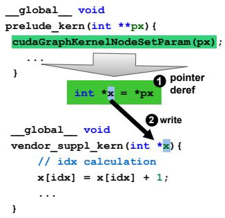  
Figure 8: Indirection in vendor-supplied kernels.

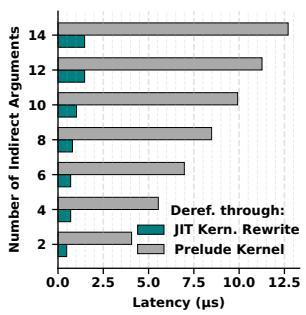  
Figure 9: Latency comparison of PI approaches.

The next challenge is to find the offset of the argument to be updated within the kernel’s parameter buffer. For this purpose, GraCE uses another CUDA API cuFuncGetParamInfo to obtain a handle to the kernel’s parameter buffer during compilation. Then, it performs a byte-pattern match with the known placeholder pointers (recorded during graph capture) within the buffer to identify the correct offsets. As with our earlier optimization, the transformation remains fully transparent to PyTorch programs and to the rest of the PyTorch2 compilation framework.

Figure 8 illustrates this technique. Recall GraCE’s aim to convert a kernel parameter (pointer x) into a pointer-topointer (px). During graph capture (§4.2.2), these pointerto-pointers are recorded as parameters of the prelude kernel. Before each replay of the captured CG, the invocation-specific pointers to parameters are written into the recorded pointerto-pointer locations (px). During replay, the prelude kernel de-references these pointer-to-pointers ( 1 in Figure 8) and writes the resulting values into the parameter fields of the vendor-supplied kernel node ( 2 ) using the aforementioned parameter update APIs.

A keen reader would note that this technique can also be used to achieve parameter indirection for JIT compiled kernels. While true, we empirically observed that it is noticeably slower than rewriting the kernel directly during compilation. Figure 9 compares the latency of de-reference through JIT kernel rewrite and through prelude kernel techniques as the number of indirected parameters increases. PI through the prelude kernel is substantially slower and scales poorly, exceeding 10 µs at higher parameter counts. Consequently, we employ JIT-based kernel update where possible, falling back to using prelude kernels only for vendor-supplied kernels.

## 4.2.2 Graph-Capture Layer

The CUDA Graph generator ( 4 in Figure 6) captures the compiled module as a CG whenever prior analysis on InductorIR determines that the entire FxGraph can be mapped to a CG. PyTorch2 captures CGs only at the granularity of a whole-FxGraph. Because a CG records kernel parameters (e.g., pointer addresses) by value, the generator creates static placeholders for these parameters and substitutes them for the original parameters before capture.

The graph generator must consider two types of kernel parameters: 1 those supplied externally (e.g., application inputs), and 2 those produced by preceding kernels within the CG. In the former, the placeholders do not initially contain the correct parameter value for each replay. It must be copied to the placeholders pointed to by the kernel parameters. In the second case, no copy is required, since the producer kernel writes directly into the placeholder. The CUDA Graph generator thus replaces the original parameters with static placeholders. It injects code that would perform the necessary parameter copies into the static placeholder before a kernel’s invocation during replay. Finally, it uses the stream capture method (§2) to create a CG for the module.

GraCE’s extensions: To take advantage of PI, GraCE enhances the CUDA Graph generator (yellow element in 4 in Figure 6). The enhanced generator receives the list of parameters that had undergone indirection by the code generator. For such parameters, GraCE: 1 allocates static placeholders for pointers instead of data regions, and 2 injects code to perform pointer copies for these parameters instead of parameter (data) copies. Note that these pointer copies are host-todevice (H2D) copies over the PCIe, as the list of pointers to parameters originally resides on the CPU. In contrast, original parameter copies are device-to-device within the GPU. The H2D pointer copy is issued on the same CUDA stream as the subsequent graph replay. Since operations queued in a stream are always executed sequentially, no additional host-device synchronization is needed for correctness. This extension also places the prelude kernel into the captured graph.

## 4.3 Selective CUDA Graphs

Recall that the overheads of a CUDA Graph can outweigh its benefits (§2). These overheads are due to parameter copies, as well as tasks such as garbage collection for graph replays (§2). While PI can reduce overheads due to parameter copies for kernels in a CG, the rest of the overheads remain.

GraCE introduces a profiler in the compilation phase (slow path) to judiciously decide whether to deploy a CG based on a cost-benefit analysis (colored green, 5 in Figure 6). The final outcome of the compilation is an optimized executable (module) corresponding to the given block of PyTorch code. It is then cached for use in the fast path.

PyTorch2 greedily deploys CGs wherever one can be created. In contrast, GraCE considers up to three possible choices: 1 A module without CG, 2 a module with CG but without PI, and 3 a module with CG and PI. The profiler runs each of the available modules as part of the compilation phase, measures their execution time, and caches the module with the best performance.

One may wonder why GraCE distinguishes between 2 and 3 . The subtlety is that PI replaces device-to-device parameter (data) copies with host-to-device pointer copies. When working with many small objects, it is possible that the overhead of copying pointers over the PCIe outweighs that of copying parameters (data) within the GPU’s memory. In addition, GPU memory bandwidth and PCIe transfer bandwidth vary across hardware. Consequently, the benefit from PI varies across hardware. This variability is captured by SCG through profiling conducted on the target hardware. GraCE selectively deploys CG only where it is beneficial.

Summary: GraCE extends Torch Dynamo and Torch Inductor to transparently update IRs for enabling more kernels to execute as part of CG (CGCT). It extends Triton’s kernel generator and PyTorch2’s CG generator to add indirections to convert data copies in CG to pointer copies (PI). Finally, it adds a profiler in the slow path that uses a cost-benefit analysis to decide when it is beneficial to deploy CG (SCG).

## 4.4 Applicability to other frameworks

GraCE addresses fundamental limitations arising from the CUDA Graph feature as defined by the hardware vendors. For example, the overhead of parameter copying exists because kernel parameters are recorded by value during graph capture – a constraint of NVIDIA’s CUDA Graph feature. Such limitations affect not only PyTorch2 but also other frameworks that attempt to deploy CG. The optimizations proposed in this work, e.g., CUDA Graph-aware IR rewrite, parameter indirection, are also applicable to other frameworks such as JAX/XLA [5]. Importantly, these frameworks, like PyTorch2, embody features such as graph capture, JIT kernel generation, and metadata-rich IR, which enable GraCE’s three optimizations to be implemented seamlessly.

Unlike PyTorch2 and JAX/XLA, which target general ML applications, specialized frameworks such as vLLM [33] and SGLang [11] are built atop PyTorch but are tailored for LLMs. For example, LLM’s KV cache management is a primary focus of vLLM. In contrast, our goal is to bring the benefits of CG to any ML applications that rely on popular frameworks such as PyTorch. Importantly, vLLM is only partially compatible with PyTorch2’s torch.compile(). Today, only parts of a model in vLLM can be compiled to benefit from PyTorch2. An ongoing community effort is actively working toward addressing this limitation [19]. In the meantime, vLLM employs a customized handwritten Torch’s Inductor backend to leverage CG, albeit only partially [76, 77]. GraCE strives to avoid these custom and temporary fixes to individual frameworks. Once the community enables vLLM to fully use torch.compile(), we expect GraCE to benefit frameworks like vLLM automatically.

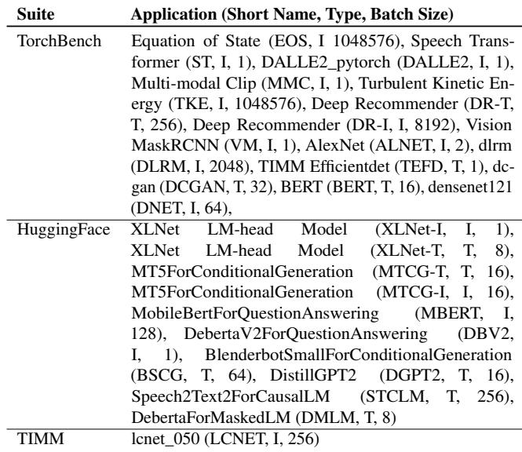  
Table 1: Details of the workloads (T: Training, I: Inference).

## 5 Evaluation

Our evaluation seeks to answer the following questions:

• How well does GraCE exploit CUDA Graphs relative to the widely used PyTorch2 compiler?

• How much does each optimization in GraCE contribute to end-to-end performance?

• How robustly does GraCE generalize to distributed models and diverse GPUs?

Workloads and metric: We evaluate a broad mix of training and inference workloads from TorchBench [22], Hugging-Face [24], and TIMM [81], spanning vision, NLP, and HPC. We focus on applications that are sensitive to CUDA Graph usage; Table 1 summarizes these workloads. Since ML workloads are inherently repetitive, we use per-iteration runtime as our primary performance metric for evaluation. An iteration consists of one forward pass for inference, while one forward and one backward pass for training. All reported numbers are averaged over 100 runs, each using a different input sample at the workload’s configured batch size (Table 1).

Environment: We conduct experiments on an NVIDIA H100 NVL GPU with 94GB HBM3, paired with a 64-core Intel Xeon 8462Y+ CPU and 512 GB of DDR5 memory. The software stack includes PyTorch 2.4 [58], CUDA 12.8 [49], cuDNN 8.9.2 [44], and NVIDIA driver 575.57.08. For multi GPU benchmarks, we use a system with four 80GB H100s connected via high-bandwidth NVLink, running CUDA 12.4. Baselines: We compare GraCE against two baselines: PyTorch2 without CUDA Graphs, denoted PyTorch2-No-CG, and PyTorch2 with CUDA Graphs enabled, denoted

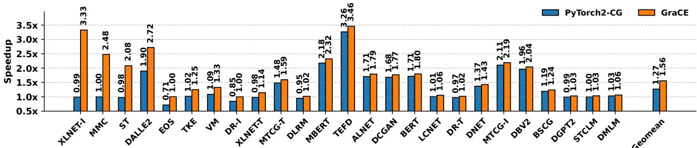  
Figure 10: Performance improvement of PyTorch2-CG and GraCE against PyTorch2-No-CG.

PyTorch2-CG. All compilers are based on PyTorch v2.4.

We chose PyTorch2 as the baseline for two reasons: 1 Our goal is to seamlessly bring the benefits of CG to a broad class of ML workloads. To the best of our knowledge, frameworks such as PyTorch2 and JAX/XLA are the only open-source ML programming frameworks that can automatically capture CG during compilation and deploy CG seamlessly in the fast path, and 2 While it is possible to extend JAX/XLA to implement GraCE, we chose PyTorch2 because it is the most popular GPU backend [6, 17, 35]. In fact, popular LLMspecific frameworks such as vLLM [33] and SGlang [11] build on PyTorch2.

## 5.1 End-to-end performance

Figure 10 compares GraCE’s performance against that of PyTorch2-No-CG and PyTorch2-CG. The figure displays two bars for each application, where the first bar indicates the speedup of PyTorch2-CG over PyTorch2-No-CG, and the second reports the speedup of GraCE over PyTorch2-No-CG.

First, we find that although CUDA Graph was introduced purely as a performance optimization, its current deployment in PyTorch2 can significantly hurt performance. PyTorch2- CG slows down 4 of the 25 applications by at least 3% compared to PyTorch2-No-CG (bars with height < 1), with worstcase regressions of 29% for EOS (HPC) and 15% for Deep Recommender (inference). These workloads consist of short kernels of tens of microseconds each for which the replay overhead (e.g., parameter copying and RNG management) dominates execution time (often around ∼ 50%). As a result, blindly deploying all CGs causes net slowdowns, and yet PyTorch2-CG deploys them anyway. In contrast, GraCE is at least as good as the best of PyTorch2-No-CG and PyTorch2- CG for every application. This is important as it absolves a user from having to decide whether to enable CG for each of their programs.

Second, even in cases where PyTorch2-CG improves performance over PyTorch2-No-CG, it still fails to effectively harness CUDA Graph as shown by the difference between bars for PyTorch2-CG and GraCE. GraCE improves performance over PyTorch2-CG by 29% on average and by up to

3.36× (XLNET-inference). While PyTorch2-CG fails to deploy any CUDA Graphs in XLNET-I, GraCE deployed 413 kernels through CGs, thanks to its CG-aware code transformation. In another example, PyTorch2-CG improves DALLE2 (inference) by 1.9× whereas GraCE improves it by 2.72×. In summary, GraCE effectively leverages CGs when there is an opportunity without hurting performance elsewhere.

## 5.2 Ablation of individual optimizations

Figure 11 quantifies individual contribution of each optimization in GraCE. Each application has three bars corresponding to three optimizations. The height of a bar is normalized to the performance of PyTorch2-No-CG. The total height of the first bar shows the speedup obtained by applying CUDA Graphaware Code Transformation (CGCT) alone. The bottom stack (dark blue) of the first bar shows the speedup of PyTorch2-CG over PyTorch2-No-CG. The top stack captures the improvement due to CGCT over PyTorch2-CG. The second bar shows performance of PI in tandem with CGCT (+Parameter Indirection). The third bar shows the cumulative effect of three optimizations (+Selective CUDA Graphs).

CUDA Graph-aware Code Transformation. CGCT enables more kernels to be captured within CGs, amortizing the overhead associated with individual kernel launches. As a result, applications such as XLNET-I, MMC, and ST achieve speedups of 3.14×, 2.31×, 2× over PyTorch2-CG, while DALLE2, XLNET-T, and VM improve performance by 43%, 16%, and 11% over PyTorch2-CG, respectively.

Table 2 lists six applications that witness a significant increase in the percentage of their kernels launched as part of CG(s). For example, PyTorch2-CG fails to deploy any CUDA Graph for MMC and XLNET-I. In case of XLNET-I, its Fx-Graph with 413 kernels was not deployed via CG due to the presence of a single CPU tensor in the FxGraph. Similarly, one of the FxGraphs of DALLE2 with 314 kernels was not deployed as a CG due to a single memcopy operation from a CPU tensor to a GPU tensor. CGCT removes these constraints, deploying more than 99% of the kernels via CG(s). Even for ST and VM, CGCT increased CG coverage from 5.14% and 58.84% to 74.22% and 71.01%.

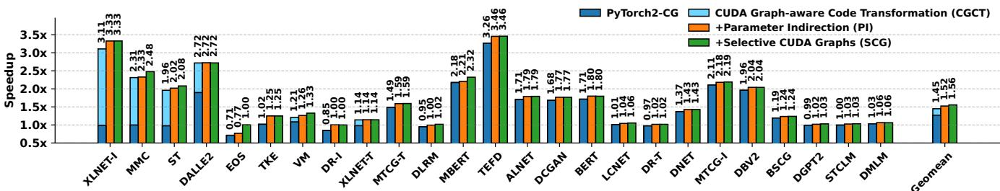  
Figure 11: Ablation study on different optimizations of GraCE (performance normalized against PyTorch2-No-CG).

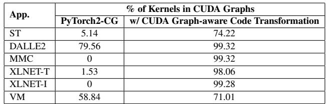  
Table 2: Enhanced coverage by CUDA Graphs due to CUDA Graph-aware Code Transformation.

Parameter Indirection. PI reduces overhead of copying kernel parameters while replaying CGs. This speeds up TKE by 23% and DR-I by 18%. Twelve others speed up by more than 4% (EOS, XLNET-I, MTCG-T, TEFD, DCGAN, DLRM, BERT, DR-T, ALNET, DNET, BSCG, VM).

Table 3 reports the reduction in bytes copied by PI. Most workloads see a drastic drop, with the maximum remaining copy size under GraCE at just 336 B. For example, it reduces the bytes copied in MTCG-T, DGPT2, STCLM, and DMLM from 1 GB, 953 MB, 850 MB, and 548 MB, respectively, to just 312 B, 136 B, 136 B, and 136 B, a reduction of over 99%. Table 3 also shows the number of CGs that GraCE optimizes via PI in parentheses.

Note that even after eliminating all data copy, PI may not always benefit the application. For example, for a small tensor, the PCIe transfer cost due to pointer copy may outweigh the benefit of avoiding a larger copy within GPU HBM. These are the cases where a CG does not benefit from PI. For instance, DALLE2 sees no benefit from PI. In contrast, the lone CG in TKE and DR-I gains significantly from reduced copy sizes, yielding speedups of 23% and 18%.

Selective CUDA Graphs. SCG judiciously deploys CGs driven by a cost-benefit analysis. It disables CGs where they could hurt performance, avoiding regression. This is particularly important for applications such as EOS, where blind deployment of CGs degrades performance by 29%.

In five applications, GraCE selectively disables CGs to achieve better overall performance. For instance, VM exposes 21 candidate CGs, but GraCE enables only four and disables the other 17 to improve end-to-end performance by 6%. Similarly, SCG disables the single CG in EOS to avoid performance loss. Overall, GraCE exercises selective deployment by enabling 97 of 123 possible CGs across the applications.

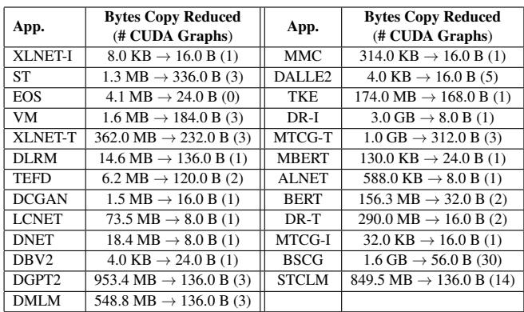  
Table 3: Reduction in data copy and number of CUDA Graphs optimized by GraCE’s parameter indirection.

Overall, these results demonstrate that each of GraCE’s optimizations makes a meaningful contribution across multiple applications, collectively enhancing overall performance.

## 5.3 Evaluating distributed ML models

We evaluated the efficacy of GraCE under tensor parallelism (TP) [68], a widely deployed strategy for distributing ML processing in a multi-GPU setting. We evaluated four workloads under TP on a server with 4×H100 GPUs connected over NVLink. Figure 12 summarizes the results: for each application, we report three groups of measurements corresponding to TP-1, TP-2, and TP-4. In each group, we compare the performance of PyTorch2-CG and GraCE against the PyTorch2- No-CG under the given TP setting. This allows us to observe the effectiveness of PyTorch2-CG and GraCE under TP.

Figure 12 demonstrates that GraCE significantly amplifies the benefits of CGs over PyTorch2-CG under TP. All results use an inference batch size of 1, except for XLNET and DALLE2, which use batch sizes of 128 and 2, respectively. As the degree of TP increases, GPU kernels finish faster, and CPU launch latency becomes a larger fraction of overall runtime. This, in turn, increases the importance of fully harnessing CUDA Graphs, which PyTorch2-CG fails to do. In contrast, GraCE yields substantially higher speedups for XLNET, DALLE2, and ST with progressively larger gains as parallelism increases, as it is able to deploy many kernels in CUDA Graphs. Its speedup reaches up to 3.48× over PyTorch2-No-CG at TP-4 for XLNET with 2.41× on average across different TP settings. This demonstrates that GraCE assumes further importance with increasingly wider deployment of distributed ML processing across multiple GPUs.

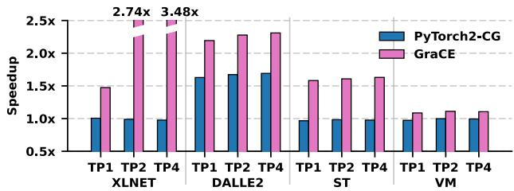  
Figure 12: Speedup of PyTorch2-CG and GraCE over PyTorch2-No-CG across tensor parallel settings (TP=1,2,4).

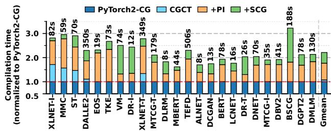  
Figure 13: Breakdown of compilation time overheads of GraCE, normalized to PyTorch2-CG. The stacked bars show the cumulative contribution of CGCT, PI, and SCG. Numbers above the bars show absolute compilation time in seconds.

Evaluation on A6000 GPU. We also evaluated GraCE on a workstation-class A6000 GPU having less compute power than H100s. As the GPU becomes slower, the headroom for improvement with CGs reduces. Even then, GraCE more prudently utilizes CUDA Graph compared to PyTorch2-CG. For example, PyTorch2-CG degrades performance compared to PyTorch2-No-CG by up to 32% for EOS. In contrast, GraCE never degrades performance and achieves a maximum improvement of 3.25× over PyTorch2-No-CG with an average speedup of 1.18× compared to PyTorch2-CG’s average speedup of 1.06 over PyTorch2-No-CG. This shows that GraCE’s efficacy is not tied to a specific GPU architecture.

Analyzing overheads of GraCE. GraCE increases compilation time (slow path) for faster execution during graph replay (fast path). Note that PyTorch2 captures the CUDA Graph during compilation. Thus, GraCE’s compilation overhead is incurred only once per application and hardware platform. This one-time cost is amortized over repeated execution of the application (fast path).

Figure 13 provides a breakdown of the compilation overhead of GraCE, normalized to PyTorch2-CG (y-axis; lower is better). Each application has a stacked bar. The number at the top of each bar reports the absolute compilation time. Each bar has four stacks. The bottom-most stack (PyTorch2-CG) represents the compilation time of PyTorch2-CG. The three stacks on top of it represent the overheads added by the three optimizations in GraCE, i.e., CGCT, PI, and SCG.

We observe that GraCE increases compilation time by 2.21× on average. In the worst case, the compilation time increased by 3.2× for the BSCG application. For BSCG, the increase comes from profiling a large number of candidate modules for CG deployment as part of SCG. On the other hand, applications such as TKE and MMC have many Tritongenerated kernels that take longer to regenerate due to PI. Finally, CGCT contributes significantly to the compilation time of XLNET-I. It undergoes many TorchIR metadata updates and re-lowering to InductorIR to remove CPU-tensor outputs from InductorIR, enabling CG deployment. The remaining applications incur increased compilation time due to similar reasons. Overall, the compilation takes up to 506 seconds (highest for TEFD). For TEFD, PyTorch2 took 220 seconds to compile. In general, the increased time is a reasonable one-time cost for compilation and graph capture.

GraCE increases peak memory footprint during compilation by 12% on average. Like compilation time, this is also a one-time cost, though. The overhead arises from profiling multiple CG deployment choices in SCG. This temporarily retains captured tensors and allocation metadata in memory. However, GraCE does not introduce any memory overhead during replays (fast path). On the contrary, it actually reduces peak memory footprint during replays by up to 15% compared to PyTorch2-CG.

## 6 Related Work

ML compilers: Early ML compilers such as TensorFlow [1], Caffe [28], Theano [75], and CNTK [64] improve performance via graph-level optimizations, while later systems develop richer tensor-program IRs [4, 7, 12, 16, 21, 36, 52, 65, 78, 84, 89, 91–94] and target efficient code generation across diverse hardware and irregular workloads [15, 66, 73, 86]. Recent advances introduce whole-graph and memory-centric optimizations [67,83], accelerate dynamic control flow [88], and perform multi-level super-optimization using unified IRs [82]. These efforts reduce kernel count and/or improve efficiency of kernels. GraCE complements them by mitigating CPU launch overhead and enhancing CUDA Graph’s deployability.

PyTorch2 [3] showed that dynamic Python execution can coexist with graph compilation by using Torch Dynamo [57] to rewrite Python bytecode into FxGraphs [63] and Torch Inductor [25] to lower them into optimized GPU kernels. Earlier capture mechanisms–JIT tracing, TorchScript [60], lazy tensors [59, 72], and symbolic tracing [63]–were limited by unsoundness, incomplete Python coverage, or high recompilation overheads. GraCE is not tied to PyTorch2’s pipeline; it only assumes a compiler that produces a stable kernel-launch DAG and augments the backend that prepares and executes kernels. GraCE’s approach can also be integrated with JAX [5] and XLA [53]. Source-level graph-repair techniques [32] are complementary to GraCE. They lengthen computation graphs, while GraCE ensures the resulting kernel DAGs are effectively captured as CUDA Graphs.

CUDA Graphs: Grape [90] is a close prior work, optimizing CUDA Graphs for DNNs through predication rewriting, metadata compression, and alias prediction, but these techniques require extensive manual kernel and CUDA-driver changes – e.g., over 400 lines of kernel edits for GPT beam search – and its alias predictor is incompatible with PyTorch2. In contrast, GraCE requires no manual modifications and works transparently for all PyTorch applications. The extensive manual changes required by Grape and its tight integration with Py Torch 1.12 make a quantitative comparison infeasible. Other systems use CUDA Graphs in specialized deployments, such as serverless LLM inference, by materializing and restoring pre-captured graphs [87]. These efforts focus on a graph’s persistence, whereas GraCE enables broader and more efficient deployment of CUDA Graph and thus, is complementary.

## 7 Conclusion

We present GraCE — a compiler framework designed to enhance the deployment and performance of CUDA Graphs. GraCE addresses several key limitations of the PyTorch2 compiler, leading to substantial performance improvement across various ML benchmarks without requiring manual modifications to applications.

## Acknowledgment

We thank anonymous reviewers and the shepherd for their constructive feedback. This work is partially supported by a research grant from Microsoft Research India. Ajay is supported by the Prime Minister’s Fellowship Scheme for Doctoral Research, co-sponsored by the Confederation of Indian Industry, the Government of India, and Microsoft Research India.

## References

[1] Martín Abadi, Paul Barham, Jianmin Chen, Zhifeng Chen, Andy Davis, Jeffrey Dean, Matthieu Devin, Sanjay Ghemawat, Geoffrey Irving, Michael Isard, Manjunath Kudlur, Josh Levenberg, Rajat Monga, Sherry Moore, Derek G. Murray, Benoit Steiner, Paul Tucker, Vijay Vasudevan, Pete Warden, Martin Wicke, Yuan Yu, and Xiaoqiang Zheng. Tensorflow: a system for largescale machine learning. In Proceedings of the 12th USENIX Conference on Operating Systems Design and

Implementation, OSDI’16, page 265–283, USA, 2016. USENIX Association.

[2] Amey Agrawal, Nitin Kedia, Ashish Panwar, Jayashree Mohan, Nipun Kwatra, Bhargav Gulavani, Alexey Tumanov, and Ramachandran Ramjee. Taming Throughput-Latency tradeoff in LLM inference with Sarathi-Serve. In 18th USENIX Symposium on Operating Systems Design and Implementation (OSDI 24), pages 117–134, Santa Clara, CA, July 2024. USENIX Association.

[3] Jason Ansel, Edward Yang, Horace He, Natalia Gimelshein, Animesh Jain, Michael Voznesensky, Bin Bao, Peter Bell, David Berard, Evgeni Burovski, Geeta Chauhan, Anjali Chourdia, Will Constable, Alban Desmaison, Zachary DeVito, Elias Ellison, Will Feng, Jiong Gong, Michael Gschwind, Brian Hirsh, Sherlock Huang, Kshiteej Kalambarkar, Laurent Kirsch, Michael Lazos, Mario Lezcano, Yanbo Liang, Jason Liang, Yinghai Lu, C. K. Luk, Bert Maher, Yunjie Pan, Christian Puhrsch, Matthias Reso, Mark Saroufim, Marcos Yukio Siraichi, Helen Suk, Shunting Zhang, Michael Suo, Phil Tillet, Xu Zhao, Eikan Wang, Keren Zhou, Richard Zou, Xiaodong Wang, Ajit Mathews, William Wen, Gregory Chanan, Peng Wu, and Soumith Chintala. Pytorch 2: Faster machine learning through dynamic python bytecode transformation and graph compilation. In Proceedings of the 29th ACM International Conference on Architectural Support for Programming Languages and Operating Systems, Volume 2, 2024.

[4] Riyadh Baghdadi, Jessica Ray, Malek Ben Romdhane, Emanuele Del Sozzo, Abdurrahman Akkas, Yunming Zhang, Patricia Suriana, Shoaib Kamil, and Saman Amarasinghe. Tiramisu: A polyhedral compiler for expressing fast and portable code. In 2019 IEEE/ACM International Symposium on Code Generation and Optimization (CGO), pages 193–205, 2019.

[5] James Bradbury, Roy Frostig, Peter Hawkins, Matthew James Johnson, Chris Leary, Dougal Maclaurin, George Necula, Adam Paszke, Jake VanderPlas, Skye Wanderman-Milne, and Qiao Zhang. JAX: composable transformations of Python+NumPy programs, 2018.

[6] Harald Carlens. State of machine learning competitions in 2024. ML Contests Research, 2025. https://mlcontests.com/state-of-machine-learningcompetitions-2024.

[7] Tianqi Chen, Thierry Moreau, Ziheng Jiang, Lianmin Zheng, Eddie Yan, Meghan Cowan, Haichen Shen, Leyuan Wang, Yuwei Hu, Luis Ceze, Carlos Guestrin,

and Arvind Krishnamurthy. Tvm: an automated endto-end optimizing compiler for deep learning. In Proceedings of the 13th USENIX Conference on Operating Systems Design and Implementation, OSDI’18, page 579–594, USA, 2018. USENIX Association.

[8] Seungbeom Choi, Sunho Lee, Yeonjae Kim, Jongse Park, Youngjin Kwon, and Jaehyuk Huh. Serving heterogeneous machine learning models on Multi-GPU servers with Spatio-Temporal sharing. In 2022 USENIX Annual Technical Conference (USENIX ATC 22), pages 199–216, Carlsbad, CA, July 2022. USENIX Association.

[9] Arnab Choudhury, Yang Wang, Tuomas Pelkonen, Kutta Srinivasan, Abha Jain, Shenghao Lin, Delia David, Siavash Soleimanifard, Michael Chen, Abhishek Yadav, Ritesh Tijoriwala, Denis Samoylov, and Chunqiang Tang. MAST: Global scheduling of ML training across Geo-Distributed datacenters at hyperscale. In 18th USENIX Symposium on Operating Systems Design and Implementation (OSDI 24), pages 563–580, Santa Clara, CA, July 2024. USENIX Association.

[10] LLVM developer group. The llvm compiler infrastructure. https://llvm.org/, 2024.

[11] SGLang developers. SGLang: high-performance serving framework for large language models and multi modal models. https://github.com/sgl-project/ sglang, 2026.

[12] Yaoyao Ding, Cody Hao Yu, Bojian Zheng, Yizhi Liu, Yida Wang, and Gennady Pekhimenko. Hidet: Taskmapping programming paradigm for deep learning tensor programs. In Proceedings of the 28th ACM International Conference on Architectural Support for Programming Languages and Operating Systems, Volume 2, ASPLOS 2023, page 370–384, New York, NY, USA, 2023. Association for Computing Machinery.

[13] dscerutti and NVIDIA. Any way to measure the latency of a kernel launch? https: //forums.developer.nvidia.com/t/any-wayto-measure-the-latency-of-a-kernel-launch/ 221413, 2022.

[14] Babak Falsafi. Post-moore server architecture. In Proceedings of the 34th ACM International Conference on Supercomputing, ICS ’20, New York, NY, USA, 2020. Association for Computing Machinery.

[15] Pratik Fegade, Tianqi Chen, Phillip B. Gibbons, and Todd C. Mowry. The cora tensor compiler: Compilation for ragged tensors with minimal padding, 2022.

[16] Siyuan Feng, Bohan Hou, Hongyi Jin, Wuwei Lin, Junru Shao, Ruihang Lai, Zihao Ye, Lianmin Zheng, Cody Hao Yu, Yong Yu, and Tianqi Chen. Tensorir: An abstraction for automatic tensorized program optimization. In Proceedings of the 28th ACM International Conference on Architectural Support for Programming Languages and Operating Systems, Volume 2, ASPLOS 2023, page 804–817, New York, NY, USA, 2023. Association for Computing Machinery.

[17] Linux Foundation. Shaping the future of generative ai. https://www.linuxfoundation.org/hubfs/LF% 20Research/lfr\_genai24\_111924.pdf?hsLang=en, 2024.

[18] Yanjie Gao, Yichen He, Xinze Li, Bo Zhao, Haoxiang Lin, Yoyo Liang, Jing Zhong, Hongyu Zhang, Jingzhou Wang, Yonghua Zeng, Keli Gui, Jie Tong, and Mao Yang. An empirical study on low gpu utilization of deep learning jobs. In ICSE 2024. IEEE/ACM, April 2024. The 46th International Conference on Software Engineering.

[19] Luka Govedic, Richard Zou, Addie Stevens, Kaichaoˇ You, Michael Goin, and Saša Zelenovic.´ Introduction to torch.compile and how it works with vllm. https://vllm-project.github.io/2025/08/ 20/torch-compile.html, 2025.

[20] Alan Gray. Getting started with cuda graphs. https:// developer.nvidia.com/blog/cuda-graphs/, 2019.

[21] Bastian Hagedorn, Bin Fan, Hanfeng Chen, Cris Cecka, Michael Garland, and Vinod Grover. Graphene: An ir for optimized tensor computations on gpus. In Proceedings of the 28th ACM International Conference on Architectural Support for Programming Languages and Operating Systems, Volume 3, ASPLOS 2023, page 302–313, New York, NY, USA, 2023. Association for Computing Machinery.

[22] Yueming Hao, Xu Zhao, Bin Bao, David Berard, Will Constable, Adnan Aziz, and Xu Liu. Torchbench: Benchmarking pytorch with high api surface coverage, 2023.

[23] Kaiming He, Georgia Gkioxari, Piotr Dollár, and Ross Girshick. Mask r-cnn, 2018.

[24] HuggingFace. Transformers. https://github.com/ huggingface/transformers.

[25] jansel. Torchinductor: a pytorch-native compiler with define-by-run ir and symbolic shapes. https: //dev-discuss.pytorch.org/t/torchinductor-apytorch-native-compiler-with-define-by-runir-and-symbolic-shapes/747, 2024.

[26] Myeongjae Jeon, Shivaram Venkataraman, Amar Phanishayee, Junjie Qian, Wencong Xiao, and Fan Yang. Analysis of Large-Scale Multi-Tenant GPU clusters for DNN training workloads. In 2019 USENIX Annual Technical Conference (USENIX ATC 19), pages 947– 960, Renton, WA, July 2019. USENIX Association.

[27] Appleyard Jeremy and Yokim Scott. Programming tensor cores in cuda 9. https://developer.nvidia.com/ blog/programming-tensor-cores-cuda-9/, 2017.

[28] Yangqing Jia, Evan Shelhamer, Jeff Donahue, Sergey Karayev, Jonathan Long, Ross Girshick, Sergio Guadar rama, and Trevor Darrell. Caffe: Convolutional architecture for fast feature embedding, 2014.

[29] Aditya K. Kamath and Arkaprava Basu. iguard: Ingpu advanced race detection. In Proceedings of the ACM SIGOPS 28th Symposium on Operating Systems Principles, SOSP ’21, page 49–65, New York, NY, USA, 2021. Association for Computing Machinery.

[30] Aditya K. Kamath, Alvin A. George, and Arkaprava Basu. Scord: A scoped race detector for gpus. In 2020 ACM/IEEE 47th Annual International Symposium on Computer Architecture (ISCA), pages 1036–1049, 2020.

[31] Khandelwal Kartikay and De Ankita. Introducing torchmultimodal – a library for accelerating exploration in multimodal ai. https://pytorch.org/blog/ introducing-torchmultimodal/, 2022.

[32] Savini Kashmira, Jayanaka Dantanarayana, Thamirawaran Sathiyalogeswaran, Yichao Yuan, Nishil Talati, Krisztian Flautner, Lingjia Tang, and Jason Mars. Graphmend: Code transformations for fixing graph breaks in pytorch 2, 2025.

[33] Woosuk Kwon, Zhuohan Li, Siyuan Zhuang, Ying Sheng, Lianmin Zheng, Cody Hao Yu, Joseph E. Gonzalez, Hao Zhang, and Ion Stoica. Efficient memory management for large language model serving with pagedattention. In Proceedings of the ACM SIGOPS 29th Symposium on Operating Systems Principles, 2023.

[34] Wonbeom Lee, Jungi Lee, Junghwan Seo, and Jaewoong Sim. InfiniGen: Efficient generative inference of large language models with dynamic KV cache management. In 18th USENIX Symposium on Operating Systems Design and Implementation (OSDI 24), pages 155–172, Santa Clara, CA, July 2024. USENIX Association.

[35] Matt Li. Pytorch vs tensorflow: Usage, popularity and performance in 2026. https: //www.secondtalent.com/resources/pytorchvs-tensorflow-usage-popularity-andperformance/, 2026.

[36] Tzu-Mao Li, Michaël Gharbi, Andrew Adams, Frédo Durand, and Jonathan Ragan-Kelley. Differentiable programming for image processing and deep learning in halide. ACM Trans. Graph., 37(4), July 2018.

[37] Chaofan Lin, Zhenhua Han, Chengruidong Zhang, Yuqing Yang, Fan Yang, Chen Chen, and Lili Qiu. Parrot: Efficient serving of LLM-based applications with semantic variable. In 18th USENIX Symposium on Operating Systems Design and Implementation (OSDI 24), pages 929–945, Santa Clara, CA, July 2024. USENIX Association.

[38] Paulius Micikevicius, Sharan Narang, Jonah Alben, Gregory Diamos, Erich Elsen, David Garcia, Boris Ginsburg, Michael Houston, Oleksii Kuchaiev, Ganesh Venkatesh, and Hao Wu. Mixed precision training. In International Conference on Learning Representations, 2018.

[39] Ajay Nayak and Arkaprava Basu. Over-synchronization in gpu programs. In 2024 57th IEEE/ACM International Symposium on Microarchitecture (MICRO), pages 795– 809, 2024.

[40] NVIDIA. Nvidia a100 tensor core gpu: Unprecedented acceleration at every scale. https://www.nvidia.com/ en-in/data-center/a100/, 2022.

[41] NVIDIA. Basic linear algebra on nvidia gpus. https: //developer.nvidia.com/cublas, 2024.

[42] NVIDIA. Cutlass: Cuda c++ template abstractions for implementing high-performance matrix-matrix multiplication (gemm). https://github.com/NVIDIA/ cutlass, 2024.

[43] NVIDIA. Nvidia cuda deep neural network library. https://developer.nvidia.com/cudnn, 2024.

[44] NVIDIA. Nvidia cudnn documentation. https://docs.nvidia.com/deeplearning/cudnn/ archives/cudnn-892/index.html, 2024.

[45] NVIDIA. Nvidia h100 gpu:extraordinary performance, scalability, and security for every data center. https:// www.nvidia.com/en-in/data-center/h100/, 2024.

[46] NVIDIA. Parallel thread execution isa. https://docs.nvidia.com/cuda/parallel-threadexecution/, 2024.

[47] NVIDIA. CUDA Graph Management APIs. https://docs.nvidia.com/cuda/cuda-runtimeapi/group\_\_CUDART\_\_GRAPH.html, 2025.

[48] NVIDIA. Cuda programming guide: Cuda graphs. https://docs.nvidia.com/cuda/cudaprogramming-guide/04-special-topics/cudagraphs.html, 2025.

[49] NVIDIA. Cuda toolkit. https:// developer.nvidia.com/cuda/toolkit, 2025.

[50] NVIDIA. Nvidia blackwell: The engine of the new industrial revolution. https://resources.nvidia.com/ en-us-blackwell-architecture/datasheet, 2025.

[51] NVIDIA. Nvrtc. https://docs.nvidia.com/cuda/ nvrtc/index.html, 2025.

[52] OpenAI. Triton: Open-source gpu programming for neural networks. https://openai.com/index/triton/, 2024.

[53] openxla. Xla (accelerated linear algebra). https:// github.com/openxla/xla.

[54] Adam Paszke, Sam Gross, Francisco Massa, Adam Lerer, James Bradbury, Gregory Chanan, Trevor Killeen, Zeming Lin, Natalia Gimelshein, Luca Antiga, Alban Desmaison, Andreas Köpf, Edward Yang, Zach DeVito, Martin Raison, Alykhan Tejani, Sasank Chilamkurthy, Benoit Steiner, Lu Fang, Junjie Bai, and Soumith Chintala. Pytorch: An imperative style, high-performance deep learning library, 2019.

[55] PyTorch. speech transformer model in torchbenchmark. https://github.com/pytorch/ benchmark/tree/main/torchbenchmark/models/ speech\_transformer.

[56] PyTorch. Core aten ir and prims ir. https://pytorch.org/docs/stable/ torch.compiler\_ir.html, 2024.

[57] PyTorch. Dynamo overview. https://pytorch.org/docs/stable/ torch.compiler\_dynamo\_overview.html, 2024.

[58] PyTorch. Pytorch 2024-04-23 nightly release. https://github.com/pytorch/pytorch/commit/ 6d1c678c58d4fb9468aca3daac67ae7bcec8495d, 2024.

[59] PyTorch. Pytorch/xla. https://github.com/ pytorch/xla, 2024.

[60] PyTorch. Torchscript. https://pytorch.org/docs/ main/jit.html, 2024.

[61] Alec Radford, Jong Wook Kim, Chris Hallacy, Aditya Ramesh, Gabriel Goh, Sandhini Agarwal, Girish Sastry, Amanda Askell, Pamela Mishkin, Jack Clark, Gretchen Krueger, and Ilya Sutskever. Learning transferable visual models from natural language supervision, 2021.

[62] Aditya Ramesh, Prafulla Dhariwal, Alex Nichol, Casey Chu, and Mark Chen. Hierarchical text-conditional image generation with clip latents, 2022.

[63] James K. Reed, Zachary DeVito, Horace He, Ansley Ussery, and Jason Ansel. Torch.fx: Practical program capture and transformation for deep learning in python, 2022.

[64] Frank Seide and Amit Agarwal. Cntk: Microsoft’s opensource deep-learning toolkit. In Proceedings of the 22nd ACM SIGKDD International Conference on Knowledge Discovery and Data Mining, KDD ’16, page 2135, New York, NY, USA, 2016. Association for Computing Machinery.

[65] Junru Shao, Xiyou Zhou, Siyuan Feng, Bohan Hou, Ruihang Lai, Hongyi Jin, Wuwei Lin, Masahiro Masuda, Cody Hao Yu, and Tianqi Chen. Tensor program optimization with probabilistic programs. In Alice H. Oh, Alekh Agarwal, Danielle Belgrave, and Kyunghyun Cho, editors, Advances in Neural Information Processing Systems, 2022.

[66] Haichen Shen, Jared Roesch, Zhi Chen, Wei Chen, Yong Wu, Mu Li, Vin Sharma, Zachary Tatlock, and Yida Wang. Nimble: Efficiently compiling dynamic neural networks for model inference. ArXiv, abs/2006.03031, 2020.

[67] Yining Shi, Zhi Yang, Jilong Xue, Lingxiao Ma, Yuqing Xia, Ziming Miao, Yuxiao Guo, Fan Yang, and Lidong Zhou. Welder: Scheduling deep learning memory access via tile-graph. In 17th USENIX Symposium on Operating Systems Design and Implementation (OSDI 23), pages 701–718, Boston, MA, July 2023. USENIX Association.

[68] Mohammad Shoeybi, Mostofa Patwary, Raul Puri, Patrick LeGresley, Jared Casper, and Bryan Catanzaro. Megatron-lm: Training multi-billion parameter language models using model parallelism, 2020.

[69] Sudipta Saha Shubha, Haiying Shen, and Anand Iyer. USHER: Holistic interference avoidance for resource optimized ML inference. In 18th USENIX Symposium on Operating Systems Design and Implementation (OSDI 24), pages 947–964, Santa Clara, CA, July 2024. USENIX Association.

[70] Foteini Strati, Paul Elvinger, Tolga Kerimoglu, and Ana Klimovic. Ml training with cloud gpu shortages: Is crossregion the answer? In Proceedings of the 4th Workshop on Machine Learning and Systems, EuroMLSys ’24, page 107–116, New York, NY, USA, 2024. Association for Computing Machinery.

[71] Foteini Strati, Xianzhe Ma, and Ana Klimovic. Orion: Interference-aware, fine-grained gpu sharing for ml applications. In Proceedings of the Nineteenth European Conference on Computer Systems, EuroSys ’24, page

1075–1092, New York, NY, USA, 2024. Association for Computing Machinery.

[72] Alex Suhan, Davide Libenzi, Ailing Zhang, Parker Schuh, Brennan Saeta, Jie Young Sohn, and Denys Shabalin. Lazytensor: combining eager execution with domain-specific compilers, 2021.

[73] Shizhi Tang, Jidong Zhai, Haojie Wang, Lin Jiang, Liyan Zheng, Zhenhao Yuan, and Chen Zhang. Freetensor: a free-form dsl with holistic optimizations for irregular tensor programs. In Proceedings of the 43rd ACM SIG-PLAN International Conference on Programming Language Design and Implementation, PLDI 2022, page 872–887, New York, NY, USA, 2022. Association for Computing Machinery.

[74] NumPy Team. Numpy: The fundamental package for scientific computing with python. https:// numpy.org/, 2025.

[75] The Theano Development Team, Rami Al-Rfou, Guillaume Alain, Amjad Almahairi, Christof Angermueller, Dzmitry Bahdanau, Nicolas Ballas, Frédéric Bastien, Justin Bayer, Anatoly Belikov, Alexander Belopolsky, Yoshua Bengio, Arnaud Bergeron, James Bergstra, Valentin Bisson, Josh Bleecher Snyder, Nicolas Bouchard, Nicolas Boulanger-Lewandowski, Xavier Bouthillier, Alexandre de Brébisson, Olivier Breuleux, Pierre-Luc Carrier, Kyunghyun Cho, Jan Chorowski, Paul Christiano, Tim Cooijmans, Marc-Alexandre Côté, Myriam Côté, Aaron Courville, Yann N. Dauphin, Olivier Delalleau, Julien Demouth, Guillaume Desjardins, Sander Dieleman, Laurent Dinh, Mélanie Ducoffe, Vincent Dumoulin, Samira Ebrahimi Kahou, Dumitru Erhan, Ziye Fan, Orhan Firat, Mathieu Germain, Xavier Glorot, Ian Goodfellow, Matt Graham, Caglar Gulcehre, Philippe Hamel, Iban Harlouchet, Jean-Philippe Heng, Balázs Hidasi, Sina Honari, Arjun Jain, Sébastien Jean, Kai Jia, Mikhail Korobov, Vivek Kulkarni, Alex Lamb, Pascal Lamblin, Eric Larsen, César Laurent, Sean Lee, Simon Lefrancois, Simon Lemieux, Nicholas Léonard, Zhouhan Lin, Jesse A. Livezey, Cory Lorenz, Jeremiah Lowin, Qianli Ma, Pierre-Antoine Manzagol, Olivier Mastropietro, Robert T. McGib bon, Roland Memisevic, Bart van Merriënboer, Vincent Michalski, Mehdi Mirza, Alberto Orlandi, Christopher Pal, Razvan Pascanu, Mohammad Pezeshki, Colin Raf fel, Daniel Renshaw, Matthew Rocklin, Adriana Romero, Markus Roth, Peter Sadowski, John Salvatier, François Savard, Jan Schlüter, John Schulman, Gabriel Schwartz, Iulian Vlad Serban, Dmitriy Serdyuk, Samira Shabanian, Étienne Simon, Sigurd Spieckermann, S. Ramana Subramanyam, Jakub Sygnowski, Jérémie Tanguay, Gijs van Tulder, Joseph Turian, Sebastian Urban, Pascal Vincent, Francesco Visin, Harm de Vries, David Warde-Farley,

Dustin J. Webb, Matthew Willson, Kelvin Xu, Lijun Xue, Li Yao, Saizheng Zhang, and Ying Zhang. Theano: A python framework for fast computation of mathematical expressions, 2016.

[76] vLLM developers. Cuda graphs compatibility of attention backends. https://docs.vllm.ai/ en/stable/design/cuda\_graphs/#cuda-graphscompatibility-of-attention-backends, 2025.

[77] vLLM developers. How to debug the vllmtorch.compile integration. https://docs.vllm.ai/en/ stable/design/debug\_vllm\_compile/, 2025.

[78] Jian Weng, Animesh Jain, Jie Wang, Leyuan Wang, Yida Wang, and Tony Nowatzki. Unit: Unifying tensorized instruction compilation. In 2021 IEEE/ACM International Symposium on Code Generation and Optimization (CGO), pages 77–89, 2021.

[79] Qizhen Weng, Wencong Xiao, Yinghao Yu, Wei Wang, Cheng Wang, Jian He, Yong Li, Liping Zhang, Wei Lin, and Yu Ding. MLaaS in the wild: Workload analysis and scheduling in Large-Scale heterogeneous GPU clusters. In 19th USENIX Symposium on Networked Systems Design and Implementation (NSDI 22), pages 945–960, Renton, WA, April 2022. USENIX Association.

[80] Qizhen Weng, Lingyun Yang, Yinghao Yu, Wei Wang, Xiaochuan Tang, Guodong Yang, and Liping Zhang. Beware of fragmentation: Scheduling GPU-Sharing workloads with fragmentation gradient descent. In 2023 USENIX Annual Technical Conference (USENIX ATC 23), pages 995–1008, Boston, MA, July 2023. USENIX Association.

[81] Ross Wightman. Pytorch image models. https: //github.com/rwightman/pytorch-image-models, 2019.

[82] Mengdi Wu, Xinhao Cheng, Shengyu Liu, Chunan Shi, Jianan Ji, Man Kit Ao, Praveen Velliengiri, Xupeng Miao, Oded Padon, and Zhihao Jia. Mirage: a multilevel superoptimizer for tensor programs. In Proceedings of the 19th USENIX Conference on Operating Systems Design and Implementation, OSDI ’25, USA, 2025. USENIX Association.

[83] Chunwei Xia, Jiacheng Zhao, Qianqi Sun, Zheng Wang, Yuan Wen, Teng Yu, Xiaobing Feng, and Huimin Cui. Optimizing deep learning inference via global analysis and tensor expressions. In Proceedings of the 29th ACM International Conference on Architectural Support for Programming Languages and Operating Systems, Volume 1, ASPLOS ’24, page 286–301, New York, NY, USA, 2024. Association for Computing Machinery.

[84] Jiarong Xing, Leyuan Wang, Shang Zhang, Jack Chen, Ang Chen, and Yibo Zhu. Bolt: Bridging the gap between auto-tuners and hardware-native performance. In D. Marculescu, Y. Chi, and C. Wu, editors, Proceedings of Machine Learning and Systems, volume 4, pages 204–216, 2022.

[85] Zhilin Yang, Zihang Dai, Yiming Yang, Jaime Carbonell, Ruslan Salakhutdinov, and Quoc V. Le. Xlnet: Generalized autoregressive pretraining for language understanding, 2020.

[86] Zihao Ye, Ruihang Lai, Junru Shao, Tianqi Chen, and Luis Ceze. Sparsetir: Composable abstractions for sparse compilation in deep learning. In Proceedings of the 28th ACM International Conference on Architectural Support for Programming Languages and Operating Systems, Volume 3, ASPLOS 2023, page 660–678, New York, NY, USA, 2023. Association for Computing Machinery.

[87] Shaoxun Zeng, Minhui Xie, Shiwei Gao, Youmin Chen, and Youyou Lu. Medusa: Accelerating serverless llm inference with materialization. In Proceedings of the 30th ACM International Conference on Architectural Support for Programming Languages and Operating Systems, Volume 1, ASPLOS ’25, page 653–668, New York, NY, USA, 2025. Association for Computing Machinery.

[88] Chen Zhang, Lingxiao Ma, Jilong Xue, Yining Shi, Ziming Miao, Fan Yang, Jidong Zhai, Zhi Yang, and Mao Yang. Cocktailer: Analyzing and optimizing dynamic control flow in deep learning. In 17th USENIX Symposium on Operating Systems Design and Implementation (OSDI 23), pages 681–699, Boston, MA, July 2023. USENIX Association.

[89] Jie Zhao, Bojie Li, Wang Nie, Zhen Geng, Renwei Zhang, Xiong Gao, Bin Cheng, Chen Wu, Yun Cheng, Zheng Li, Peng Di, Kun Zhang, and Xuefeng Jin. Akg: automatic kernel generation for neural processing units using polyhedral transformations. In Proceedings of the 42nd ACM SIGPLAN International Conference on Programming Language Design and Implementation, PLDI 2021, page 1233–1248, New York, NY, USA, 2021. Association for Computing Machinery.

[90] Bojian Zheng, Cody Hao Yu, Jie Wang, Yaoyao Ding, Yizhi Liu, Yida Wang, and Gennady Pekhimenko. Grape: Practical and efficient graphed execution for dynamic deep neural networks on gpus. In Proceedings of the 56th Annual IEEE/ACM International Symposium on Microarchitecture, MICRO ’23, page 1364–1380, New York, NY, USA, 2023. Association for Computing Machinery.

[91] Lianmin Zheng, Chengfan Jia, Minmin Sun, Zhao Wu, Cody Hao Yu, Ameer Haj-Ali, Yida Wang, Jun Yang, Danyang Zhuo, Koushik Sen, Joseph E. Gonzalez, and Ion Stoica. Ansor: generating high-performance tensor programs for deep learning. In Proceedings of the 14th USENIX Conference on Operating Systems Design and Implementation, OSDI’20, USA, 2020. USENIX Association.

[92] Size Zheng, Renze Chen, Anjiang Wei, Yicheng Jin, Qin Han, Liqiang Lu, Bingyang Wu, Xiuhong Li, Shengen Yan, and Yun Liang. Amos: enabling automatic mapping for tensor computations on spatial accelerators with hardware abstraction. In Proceedings of the 49th Annual International Symposium on Computer Architecture, ISCA ’22, page 874–887, New York, NY, USA, 2022. Association for Computing Machinery.

[93] Size Zheng, Yun Liang, Shuo Wang, Renze Chen, and Kaiwen Sheng. Flextensor: An automatic schedule exploration and optimization framework for tensor computation on heterogeneous system. In Proceedings of the Twenty-Fifth International Conference on Architectural Support for Programming Languages and Operating Systems, ASPLOS ’20, page 859–873, New York, NY, USA, 2020. Association for Computing Machinery.

[94] Hongyu Zhu, Ruofan Wu, Yijia Diao, Shanbin Ke, Haoyu Li, Chen Zhang, Jilong Xue, Lingxiao Ma, Yuqing Xia, Wei Cui, Fan Yang, Mao Yang, Lidong Zhou, Asaf Cidon, and Gennady Pekhimenko. ROLLER: Fast and efficient tensor compilation for deep learning. In 16th USENIX Symposium on Operating Systems Design and Implementation (OSDI 22), pages 233–248, Carlsbad, CA, July 2022. USENIX Association.

[95] Donglin Zhuang, Zhen Zheng, Haojun Xia, Xiafei Qiu, Junjie Bai, Wei Lin, and Shuaiwen Leon Song. MonoNN: Enabling a new monolithic optimization space for neural network inference tasks on modern GPU-Centric architectures. In 18th USENIX Symposium on Operating Systems Design and Implementation (OSDI 24), pages 989–1005, Santa Clara, CA, July 2024. USENIX Association.

## A Artifact Appendix

## Abstract

The artifact contains the GraCE implementation, Docker environment, benchmark drivers, workload configurations, and analysis scripts for reproducing the main results in the paper. The recommended path is to use the prebuilt Docker image, run the smoke test, and then run the provided scripts to regenerate the figures and tables.

## Scope

The artifact supports validation of the following claims:

• GraCE improves CUDA Graph coverage compared with the PyTorch2-CG baseline on selected deep learning workloads.

• GraCE reduces data-copy movement required by CUDA Graph execution.

• GraCE improves single-GPU performance on selected TorchBench, HuggingFace, and TIMM workloads.

• GraCE improves performance on selected tensor-parallel workloads.

• The reported figures and tables can be regenerated using the provided workload lists, scripts, Docker images, and analysis pipeline.

The artifact is intended for artifact evaluation and reproducibility. Exact performance values may vary across machines because CUDA Graph experiments are sensitive to CPU-side launch overheads, CPU frequency scaling, deep idle states, GPU clocks, NUMA placement, and background host activity. The artifact repository therefore includes optional host-tuning scripts for low-noise benchmarking.

## Contents

The artifact repository is organized as follows:  
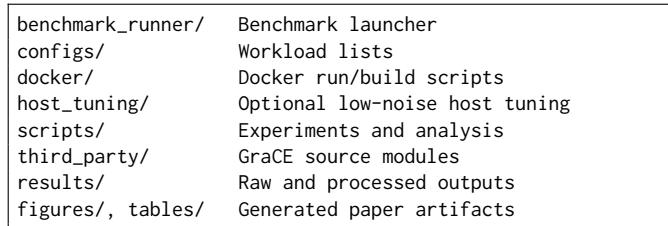

The main source submodules are:

• third\_party/pytorch: modified PyTorch implementation used by GraCE. This submodule contains separate osdi26/grace-\* branches corresponding to the incremental GraCE optimizations used in the artifact.

• third\_party/triton: Triton changes needed by GraCE, primarily on the osdi26/grace-indirection branch.

• third\_party/torchbenchmark: benchmark-suite used by the evaluation.

Generated results are written under results/, figures under figures/, and tables under tables/.

## Hosting

The artifact is hosted on GitHub: https://github.com/csliisc/GraCE-OSDI26-Artifact on the master branch. The prebuilt Docker image is hosted on Docker Hub: abhishekghosh1998/grace-osdi26:cuda128-prebuilt. Detailed setup, experiments and analysis instructions are provided in the artifact repository README.

## Requirements

The artifact is Docker-based. The host system must have:

• Docker Engine.

• NVIDIA GPU driver.

• NVIDIA Container Toolkit for Docker GPU passthrough.

• One CUDA-capable NVIDIA GPU for smoke tests and single-GPU experiments; four visible GPUs are needed to reproduce the tensor-parallel experiments.

A full CUDA Toolkit installation is not required on the host for the prebuilt Docker workflow. CUDA user-space libraries, Python packages, PyTorch, Triton, TorchBench dependencies, and analysis tools are included in the Docker image. The host only needs an NVIDIA driver compatible with the CUDA runtime used by the selected image.

The paper uses two hardware setups. Single-GPU experiments were collected on an NVIDIA H100 NVL GPU with 94GB HBM3 and CUDA 12.8, paired with a 64-core Intel Xeon Platinum 8462Y+ CPU, 128 logical CPUs with hyperthreading, and 512GB DDR5 memory. Tensor-parallel experiments were collected on a separate four-GPU H100 system with high-bandwidth NVLink and CUDA 12.4.

The artifact can run on other recent x86-64 Linux systems with NVIDIA GPUs, but performance is hardware- and system-dependent. H100-class GPUs and the optional hosttuning workflow are recommended for closest reproduction. Tensor-parallel runs require at least as many visible GPUs as the selected tensor-parallel degree.

The host system should have at least 150GB of free disk space for the prebuilt Docker image. Building the prebuilt image from source takes roughly 2–3 hours on an H100-class host; the full experiment workflow should be treated as a long-running job, with a safe end-to-end allocation of about 24 hours.

## Getting Started

The 30-minute validation path checks that the repository, Docker image, CUDA stack, conda environments, benchmark runner, and result-file writing path are functional.

To obtain the artifact:

```shell
git clone \
https://github.com/csl-iisc/GraCE-OSDI26-Artifact \
grace-osdi26-artifact
cd grace-osdi26-artifact
git submodule sync --recursive
git submodule update --init --recursive
```

To pull the default prebuilt Docker image:

```shell
docker pull \
abhishekghosh1998/grace-osdi26:cuda128-prebuilt
docker tag \
abhishekghosh1998/grace-osdi26:cuda128-prebuilt \
grace-osdi26:cuda128-prebuilt
```

From the host:

docker/run\_cuda128.sh

Inside the Docker container:

bash scripts/smoke\_test.sh

The expected final smoke-test output is:

[OK] Workload run completed.

## Experiment Workflow

All commands in this section are run inside the Docker container unless stated otherwise.

Activate a conda environment available in the container:

conda activate grace-full

For single-GPU experiments (Figures 10–11):

```shell
bash scripts/run_single_gpu_experiments.sh
bash scripts/generate_figure10.sh
bash scripts/generate_figure11.sh
```

Expected outputs:

```ignorefile
figures/figure10.pdf
figures/figure11.pdf
```

For tensor-parallel experiments (Figure 12):

```shell
bash scripts/run_tp_experiments.sh
bash scripts/generate_tp_figure.sh
```

Expected output:

```ignorefile
figures/figure12.pdf
```

For Table 2, CUDA Graph coverage:

```shell
bash scripts/run_table2_cgct_coverage_nsys.sh
bash scripts/generate_table2_cgct_coverage.sh
```

Expected output:

```ignorefile
tables/table2_cgct_coverage.csv
```

This step requires Nsight Systems inside the Docker image. For Table 3, data-copy movement:

```shell
bash scripts/run_table3_pi_copy_debug.sh
bash scripts/generate_table3_pi_copy_debug.sh
```

Expected output:

tables/table3\_pi\_copy\_debug.csv

## Host Tuning

Host tuning is optional for functional validation but recommended for paper-quality performance reproduction. GraCE evaluates CUDA Graph execution, where host-side CPU launch overhead and scheduling variability can affect measurements. The repository includes optional scripts for CPU/GPU frequency control, deep C-state control, hyperthreading control, and Docker-aware CPU-set isolation.

Before launching Docker, user may run:

```shell
sudo host_tuning/tune_host_intel_h100.sh
```

After tuning, launch Docker normally:

docker/run\_cuda128.sh

After all experiments finish, restore the host:

```shell
sudo host_tuning/restore_host_intel_h100.sh
```