USENIX

THE ADVANCED COMPUTING SYSTEMS ASSOCIATION

## Ambulance: saving BFT through racing

Neil Giridharan and Shubham Mishra, University of California, Berkeley; Lorenzo Alvisi, Cornell University; Natacha Crooks, University of California, Berkeley; Benjamin Marsh, Sei Labs; Hein Meling, University of Stavanger; Kartik Nayak, Duke University; Grzegorz Prusak, Sei Labs

https://www.usenix.org/conference/osdi26/presentation/giridharan

# This paper is included in the Proceedings of the 20th USENIX Symposium on Operating Systems Design and Implementation.

July 13–15, 2026 • Seattle, WA, USA

ISBN 978-1-939133-55-7

Open access to the Proceedings of the 20th USENIX Symposium on Operating Systems Design and Implementation is sponsored by

# Ambulance: saving BFT through racing

Neil Giridharan∗ Shubham Mishra∗

Benjamin Marsh‡ Hein Meling1

∗UC Berkeley †Cornell University ‡Sei Labs

Lorenzo Alvisi† Natacha Crooks∗ Kartik Nayak2 Grzegorz Prusak‡

## Abstract

Today’s practical Byzantine Fault Tolerant (BFT) state machine replication deployments are vulnerable to slowdowns [70, 71]. The main culprit is timeouts. Aggressive timeouts spuriously trigger expensive leader changes, while conservative timeouts leave the system idle and let slowdowns severely inflate latency. Two main alternatives exist: hedging [37, 80], which improves recovery from slow leaders but still incurs a time-based hedging delay, and cooperative asynchronous protocols [19, 66], which recover quickly from slowdowns but suffer from high common-case latency and low throughput. This paper presents Ambulance: a BFT state machine replication protocol that sidesteps this trade-off through protocol-rigged races, where replicas, rather than race against the clock, race against each other by executing protocol steps. This enables Ambulance to achieve high throughput and low latency comparable to state-of-the-art timeout-based BFT, while matching the robustness of cooperative approaches.

## 1 Introduction

This paper presents Ambulance, a Byzantine Fault Tolerant (BFT) state machine replication (SMR) protocol that achieves low latency, high throughput, and robustness to slowdowns (including failures and network blips).

Distributed trust systems allow multiple mutually distrustful parties to secure data even when a subset of them are compromised or misbehave. These systems have been used for secure key recovery [35], code transparency [4], securing land records [57], and stablecoins [8]. Signal [35], for instance, distributes its key recovery logic across three clouds for better security. At the core of these systems lies a BFT SMR protocol, which implements the abstraction of a totally ordered log. This log can then be materialized into application state that is consistent across all parties, even when a subset crashes or misbehaves. These protocols must (i) sustain high throughput, (ii) ensure low latency, and (iii) remain robust to actual failures and network events.

1University of Stavanger 2Duke University

Much of the focus on robustness has been on tolerating discrete events: a replica failure [34] or network events in which messages are dropped [45]. Much less attention has been given to slowdowns [71]. Slowdowns are events such as network misconfigurations, partial hardware failures, etc. [23, 53, 59] that cause a replica to respond more slowly than normal. While slowdowns of course encapsulate machine crashes or network failures (a crashed node is infinitely slow), they also include events that cause latency spikes over longer time periods, without necessarily triggering timeouts.

These events are of major concern to real distributed system deployments. Sei [65], a blockchain company running the Autobahn [45] protocol, as well as Etcd and Neo4j (both Raft-based production datastores) report slowdowns of over seven seconds as a result of data synchronization issues, I/O contention, and garbage collection [7, 65, 69].

Although there exist crash-fault-tolerant protocols robust to slowdowns [70], most existing state-of-the-art BFT protocols are vulnerable to this issue. Even systems like Autobahn [45], which explicitly target recovering from network events, are vulnerable. Because they rely on a leader to drive protocol execution, tail latency can spike when that leader is slow. Techniques such as monitoring leader performance [34] can detect some slowdowns, but are not comprehensive and offer only partial protection [70].

This paper argues that timeout-triggered fault-detection is fundamentally the wrong mechanism for detecting slowdowns in an SMR protocol, for two reasons. First, it is a destructive process. If timeouts are configured too aggressively, the system might unfairly accuse a leader of being down, unnecessarily triggering an expensive recovery process to elect a new leader. Moreover, trying to elect a new leader while the old leader is still alive can lead to concurrent proposals from both replicas. These proposals will interfere with each other, precluding either from making progress. Second, timeout-triggered fault detection is a blocking process. Setting the timeout too conservatively causes the system to wait idle for long periods of time prior to detecting a failure. This is especially problematic as production deployments today recommend setting timeouts to at least ten times the network round-trip time [9]. Timeouts are thus almost always configured to be on the order of seconds for geo-distributed deployments, with some production deployment choosing upwards of 30 seconds [13, 27]! As a result, slowdowns often remain undetected, while truly failed leaders cause the system to stall for seconds [45].

To gracefully handle slowdowns, we need a new faultdetection mechanism that is instead guaranteed to make forward progress. It should 1) be cooperative rather than destructive: it should not destructively interfere with ongoing proposal invocations from existing leaders; and 2) be productive: it should contribute useful work towards committing operations. Together, these properties minimize the system’s recovery time when there is a slow or failed leader.

Hedging [80] recognizes the issues of timeout-based approaches and offers a promising avenue for better handling of slowdown events. It replaces the traditional competitive leader-based proposal process with a novel cooperative multiproposer approach. Each replica proposes in a staggered fashion, according to a known delay schedule. Concurrent proposals contribute to faster termination when there are slowdowns or faults. Consequently, hedging delays can be set much smaller than timeouts. Hedging, unfortunately, still relies on time-based delays. If the first proposer (leader) is slow, then the next replica must stall for the full hedging delay before it can propose. As such, hedging remains a blocking process that is not productive: stalling does not contribute to the protocol’s forward progress.

Fundamentally, timeout-based approaches detect slowdowns by having the leader race against the clock. The leader is given a fixed deadline to finish its work. If it fails to finish before that deadline, it loses the race and is deemed faulty or slow. Hedging, on the other hand, replaces this fixed deadline with a rigged race. Instead of racing against the clock, the leader races against other replicas that are also proposing. Time is used only to give the leader a head start, ensuring that when the leader is not slow, it comfortably wins the race.

In this work, we argue that rigged racing is indeed the correct mechanism for handling slowdowns. But racing against the clock or using time to rig the race 1) causes replicas to wait idle 2) requires precise knowledge of what value to set the clock to. Replicas should instead race against each other, using protocol messages to rig the race. We purposely design the leader’s proposing protocol to take fewer steps than the other replicas’ proposing protocol, so that the leader finishes proposing first in the absence of slowdowns. Unlike time-based rigging, non-leader replicas stay productive as they do work that can be used to commit an operation if they happen to win the race.

To instantiate this idea, we propose Ambulance, a new consensus protocol that achieves low latency, high throughput, and better robustness to slowdowns through protocol rigged races. In the absence of a slowdown, the leader always wins the race, matching the latency of traditional leader-based BFT. In the presence of slowdowns, the leader will lose the race, but the other replicas will quickly recover using the work they did during the race.

Naturally, realizing this in practice requires addressing two key challenges: (i) replicas may disagree on whether the leader won the race, and (ii) replicas may commit at different stages, with some committing the leader’s value during the race and others committing only after the race’s dust settles.

Our results are promising. Ambulance matches the commoncase performance of Autobahn [45], a state-of-the-art timeout-based BFT protocol, while outperforming it under slowdowns, achieving 1.6–3.0x lower peak latency for 1–2 second slowdowns and up to 10.8x lower latency for more severe cases. Compared to ParBFT2 [37], a leading hedging-based BFT protocol, Ambulance delivers 1.3x higher throughput and 1.9x lower common-case latency, along with 1.7–3.1x lower peak latency during slowdowns.

This paper makes three core contributions:

• We identify the two necessary conditions for slowdowndetection mechanisms to be precise and efficient: being cooperative and productive.

• We introduce a new slowdown-detection mechanism, protocol-rigged racing, the first to satisfy both conditions.

• We implement and evaluate Ambulance, a novel BFT protocol that uses protocol-rigged racing to offer high throughput, low latency, and robustness to slowdowns. Ambulance is deployed in production at a leading distributed trust company.

## 2 Background

We first survey the slowdowns observed in real deployments, and then examine the mechanisms used to detect them.

## 2.1 Slowdowns in practice

In production, distributed systems often experience slowdowns: periods when a replica remains correct and available, yet its service rate falls below its usual baseline. Even brief slowdowns can cause end-to-end latency spikes and trigger timeouts.

Slowdowns arise from a mix of hardware, software, and network effects. Fail-slow behavior is prevalent across the hardware stack: disks may suffer throughput degradation from vibrations, memory cards from loose connections, CPUs from power loss. Even NICs can drop packets because of firmware or driver bugs [48, 63]. Software slowdowns arise because of I/O contention, slow data syncs, or garbage collection pauses. I/O contention in etcd, for instance, can induce long fsync latencies [7]; since proposals must be persisted to disk, these stalls directly translate into large latency spikes. Data synchronization likewise causes sufficiently long latency spikes in HBase that developers have added a dedicated feature to detect slow syncs [5]. Sui [15], a production blockchain system, similarly observes that slow data synchronization can trigger slowdowns lasting up to 5 seconds [13]. Elasticsearch and Neo4j both report that rapid heap allocation can trigger stop-the-world garbage collection pauses lasting seconds to minutes, inadvertently causing leader election timeouts [11, 69]. Finally, network pathologies, including misconfigurations and flaky links have been shown to cause partial network partitions in several production data stores [22].

## 2.2 Slowdown detection mechanisms

Slowdowns are managed in a variety of ways today.

Timeouts. The most common way to detect slowdowns is to use timeouts. Timeouts effectively make the leader race against the clock to finish committing its proposal. If the leader loses, the timeout fires, triggering a leader election process to replace it.

Tuning timeouts is notoriously difficult [80]. It requires significant administrative effort, and a poorly chosen value can degrade performance or compromise availability. Aggressive timeouts risk frequent leader elections, in which new leaders override the progress of old leaders, hurting liveness. Conservative timeouts give leaders plenty of time to win the race, but cause the system to stall in the process. This is especially problematic when the leader fails, as other replicas must wait out the full timeout to detect that failure. Moreover, timeouts are typically set statically, which makes them adapt poorly to changing conditions, such as network latency fluctuations or replicas that become gradually slower over time. Taken together, these limitations make clear that timeouts are an overly coarse heuristic for detecting slowdowns.

Production systems recommend setting timeouts to be at least ten times the network RTT, though in practice they are even more conservative. Default timeout values include 2 seconds for Sei [65], 5 s for Microsoft CCF [10], 7 s for Neo4j [69], and 30 s for Diem [13, 79].

Cooperative Proposing. Timeout-based protocols make progress only if the leader “beats the clock". When it cannot, the system stalls until the replicas elect a new leader. Effectively, these protocols are built around the assumption that, in the typical case, the leader usually wins this race [20, 34].

Asynchronous consensus protocols [19, 60, 66, 73] instead start from a different premise: all leaders may consistently lose the race against the clock. This can be a result of poorly configured timeouts or because the network is controlled by an adversary that selectively delays the leader’s messages. Thus, to avoid blocking on a single leader, asynchronous protocols let all replicas propose cooperatively. During slowdowns, this approach achieves low latency and remains robust up to f slow replicas, since n− f correct replicas are guaranteed to eventually respond. However, this approach is more expensive in the common case, since extra coordination is required to handle multiple proposers. Asynchronous protocols thus have significantly higher latency in the absence of slowdowns.

Hedging. The most recent slowdown detection mechanism, hedging [37, 80], takes a middle-ground between the timeout and cooperative proposing approaches. With hedging, all replicas cooperatively propose (like in asynchronous protocols), but they do so in a staggered fashion according to a known delay schedule. This creates a race between the leader (the first proposer) and the remaining replicas to finish proposing. If the leader wins the race, the latency matches that of traditional leader-based BFT. Otherwise, the other proposers cooperatively work together to terminate the protocol. Hedging preserves the efficiency of timeout-based protocols in the absence of slowdowns. Unfortunately, during a slowdown, recovery is unnecessarily delayed until after the leader’s head start. Furthermore, extra coordination is needed to reconcile the leader-based and cooperative mechanisms. During slowdowns, ParBFT2 [37], the state-of-the-art hedging BFT protocol, has a consensus latency of 22 message delays on top of the hedging delay, compared to only 10 message delays for SMVBA [49], the state-of-the-art cooperative BFT protocol.

Toward Rigged Racing. In short, current detection mechanisms are inadequate. Timeouts are too slow to react to slowdowns, as the system stalls until the timeout triggers. Cooperative approaches are not practical, as they unnecessarily pay the cost of higher latency always. Hedging, while an improvement, still stalls until the hedging delay is over.

A better slowdown detection mechanism should meet three requirements. First, it must be cooperative: concurrent proposals should not destructively interfere with each other. Second, it must be productive: the work done during detection should directly accelerate commitment once the slowdown is detected. Third, it must detect real slowdowns quickly without mislabeling a healthy replica as slow.

These requirements rule out timeouts and hedging, since both rely on time-based delays that fundamentally do not contribute to useful protocol progress. A more promising direction instead quantifies slowness by measuring how quickly replicas advance through protocol steps that replicas must anyway execute. Truly slow replicas will consistently lag behind. However, raw relative progress is noisy: routine jitter can briefly make a healthy replica look slow. To satisfy the third requirement, we need a mechanism that separates genuine delay from benign variation. Our solution, protocol-rigged racing, meets all three requirements by racing replicas while carefully adding sufficient bias to prevent false accusations.

## 3 System Model

Ambulance adopts the assumptions of prior BFT protocols. We assume n = 3 f +1 replicas, of which at most f are faulty, as well as a PKI for digital signatures, and a trusted setup for threshold signatures. We consider a replica correct if it adheres to the protocol specification; a replica that deviates is considered faulty (or Byzantine). We make no assumptions about the number of faulty clients. We assume the existence of a strong, yet static adversary, that can corrupt and coordinate all faulty participants’ actions but cannot break standard cryptographic primitives. Replicas communicate through reliable, authenticated, point-to-point channels; we write ⟨M⟩p for messages signed by replica p. We assume all signatures and quorums are validated and omit the check in protocol descriptions. Ambulance operates under the asynchronous network model: it makes no synchrony assumptions for safety or liveness.

## 4 Ambulance: Overview

Ambulance seeks to achieve two goals: (i) match the high performance of timeout-based BFT protocols in the absence of slowdowns, and (ii) provide stronger robustness to slowdowns than both hedging-based and timeout-based BFT protocols.

Timeout-based BFT protocols enjoy low latency by relying heavily on a designated leader: they assume the leader will beat the clock most of the time. When that happens, the leader becomes the sole replica authorized to propose new operations, and agreement can be reached quickly, with only three message delays [30]. Unfortunately, these protocols pay a steep price when the leader loses the race. Hedging-based protocols improve robustness by having all replicas propose concurrently when the leader falls behind, but they still pay both the hedging delay and additional coordination needed to reconcile all proposals. Ambulance overcomes these limitations and achieves both objectives through a new technique called protocol-rigged racing.

In Ambulance, a designated leader drives commitment of its proposal in its proposal lane. Additionally, each replica has a proposal lane of its own, where it proposes operations and votes in the lanes of others.

Ambulance consists of two components: a race, in which replicas try to beat the leader (but assume that they won’t), and a recovery path in which the replicas try to commit their own proposal if they believe that the leader lost. During the race, the leader runs a faster protocol that ensures that it will win if it is not slow. If the leader loses, replicas do not have to turn back and start over. Instead, the steps taken to beat the leader are directly useful towards committing.

Race. Replicas race with the leader by submitting their own proposals. Rather than having replicas perform meaningless busy work during the race, Ambulance’s key insight is to have them execute required protocol operations during this time, shortening the amount of work left post-race. All consensus protocols fundamentally consist of two phases: a non-equivocation phase and a persistence phase. Non-equivocation guarantees that malicious replicas cannot cause conflicting operations to commit; persistence ensures committed operations survive. Ambulance uses the non-equivocation phase as the race itself! Both leaders and replicas need it anyways to commit.

To ensure a non-slow leader will win the race, the race is rigged in the leader’s favor in two ways. First, the leader completes the two-step, quadratic message exchange of PBFT’s non-equivocation phase while the other replicas instead perform a slower three-way linear message exchange. Second, the leader does not have to finish first to win; it only has to beat the cutoff. This cutoff is chosen to maximize the leader’s chances of winning, while still allowing replicas to recover quickly if the leader is slow. When the cutoff is reached locally, the race outcome is determined. The key challenge is that replicas may disagree on the race outcome. One replica might observe the leader winning, while another sees the leader losing. Despite this divergence, Ambulance ensures agreement across all participants.

Recovery Path. If a replica failed to commit the leader’s proposal, it moves to the recovery path. Unfortunately, there is no longer a dedicated leader from which to choose a proposal. Instead, all replicas potentially have formed a distinct non-equivocation certificate for their lane. To make matters worse, the leader lane could have committed with only some replicas knowing. The recovery path addresses each issue in turn and proceeds in three steps. First, a replica chooses a value to recover for its lane. Second, it persists this value. And third, a lane is randomly selected to be committed.

Step 1. Replicas must recover any potential proposal that could have committed from the leader. If a leader proposal could have committed, replicas must select that value as input to the recovery path. If no leader proposal was committed, replicas recover their proposal from the race to ensure that the progress made during the race was productive.

Step 2. Replicas then persist the recovered value, so that it is safe to commit it. This step has two parts. The first is an optional race exclusion phase that addresses a subtle issue. If a leader non-equivocation certificate forms but the leader does not successfully commit, a malicious replica may successfully obtain both a non-equivocation certificate from the leader and for its own lane. It cannot equivocate on any proposal, but it still can equivocate between the leader’s proposal and its own lane proposal. Thankfully, we find that, in most cases, the leader is slow enough that replicas can directly generate a proof that the leader’s non-equivocation certificate cannot exist. Most of the time, replicas thus safely omit this phase. Only when they cannot generate this proof must they proceed to run this additional exclusion phase to guarantee uniqueness between the leader’s non-equivocation certificate and the replica’s. The second part is the persistence phase, which performs the same role as in traditional BFT. It guarantees that if the lane proposal is committed, then it survives despite failures.

Step 3. The third and final step is that a lane is randomly selected for commitment. Note that this election process is run after each replica has completed all the steps required to commit a proposal in its lane. This is by design: if the winner were chosen deterministically, a network adversary, could intentionally delay messages necessary for the anointed winner to commit the operation, defeating the point of not having a leader. If the randomly selected lane does not have a proposal ready for commit, the protocol simply retries the recovery path.

Performance Summary Using these techniques, Ambulance achieves a latency of three message delays under normal conditions, matching the performance of latency-optimal PBFT [30]. When the leader experiences a slowdown, the expected latency is comparable with state-of-the-art pessimistic (asynchronous) protocols [19, 49]: 9.5 message delays if the leader fails to propose during the race, and 10.5 message delays otherwise. These results meet our goal of delivering stateof-the-art latency in both normal and slowdown scenarios.

## 5 Ambulance: The Protocol

We now describe the protocol in more detail. We first focus on how the protocol works for a single slot, before expanding it to support efficient agreement across multiple slots. For ease of exposition, we omit the standard checks performed by all replicas—i.e., whether messages are well-formed and from the correct view, and signatures are valid. Replica state is summarized in Algorithm 1. We defer formal proofs of correctness to Appendix §B (Theorems 1 and 2).

Execution in Ambulance is organized into a sequence of views. Within a view, replicas try to commit a proposal. The protocol consists of two components: a race, in which replicas determine whether the leader is fast enough to commit, and a recovery path, in which they try to commit their own proposal if the leader is deemed slow. As previously stated, each replica in Ambulance has its own proposal lane. Replicas drive commitment for their own lane, but additionally vote in other replicas’ proposal lanes. Note that the leader runs both a leader lane and a replica lane.

Algorithm 1 Replica state cheat sheet for a given slot s.   
1: v ▷ replica’s current view   
2: sc-prep ▷ SC-PREPARE from the leader or ⟨⊥prep⟩   
3: sportscar-cert ▷ sports car certificate or ⟨⊥sc⟩   
4: truck-cert ▷ truck certificate   
5: race-cutoff cert ▷ race-cutoff certificate from race

## 5.1 The Race

The protocol begins with a race whose purpose is two-fold: (i) correctly and quickly identify whether the leader is slow and (ii) allow a non-slow leader to commit.

To achieve this, the leader and replicas simultaneously issue proposals in their own lanes and race to form nonequivocation certificates for their lane. Such certificates guarantee that, in any view, only a single value can be proposed in the corresponding lane. We call the leader’s non-equivocation certificate a sports car certificate, and a replica’s non-equivocation certificate a truck certificate1. Non-equivocation is a necessary step in essentially all BFT protocols, so replicas make progress toward commitment while participating in the race.

We ensure that leaders progressing normally are not accidentally identified as slow by rigging the race in the leader’s favor in two ways. First, the leader runs a faster non-equivocation procedure that produces a sports car certificate in only two message delays, whereas each replica lane requires three message delays to produce a truck certificate. This structural asymmetry naturally biases the race toward a non-slow leader. Second, the leader does not need to finish first overall to avoid being detected as slow. It only needs to finish prior to a cutoff, which occurs when a quorum of truck certificates has formed. If a sports car certificate forms prior to the cutoff, the leader wins the race and replicas continue toward committing the leader’s value. Otherwise, the leader loses the race and replicas proceed to the recovery path.

## 5.1.1 Leader Lane: Sports Car Certificate

Ambulance structures the leader lane to guarantee that a non-slow leader will beat the cutoff while still making useful progress toward commitment. The leader lane implements the standard non-equivocation step required for commitment with a two-step all-to-all communication pattern, enabling a non-slow leader to produce a sports car certificate in only two message delays (illustrated in Figure 1).

1: L → R: Leader L sends SC-PREPARE to all.

The leader broadcasts a SC-PREPARE := ⟨v,val⟩L message, where v is the view number and val is the value proposed by L.

2: R → R: Replica R processes SC-PREPARE and sends   
vote to all replicas.

On receiving a SC-PREPARE message prep from the leader,   
R checks that prep is valid and stores it in sc-prep = prep. It   
then broadcasts a SC-PREP-VOTE := ⟨v,dig = h(prep.val)⟩R   
message to all replicas, where h is a cryptographic hash   
function.

3: R: Replica R assembles a sports car certificate.   
R waits for at least n− f =2 f +1 matching SC-PREP-VOTE   
messages and aggregates them into a sports car certificate.   
It sets sportscar-cert := (v,dig,{SC-PREP-VOTE }).

This certificate has two purposes. First, it guarantees non-equivocation—the uniqueness of the leader’s proposal within a view—since correct replicas vote only once and any two quorums of size n − f intersect in at least one correct replica. Second, as we are about to see, it serves to determine whether the leader beat the cutoff. R stores this certificate in sportscar-cert for potential use during recovery.

## 5.1.2 Replica Lanes: Truck Certificate

Each replica lane similarly produces a non-equivocation certificate, called a truck certificate. Unlike the leader lane, a replica lane uses a three-step linear communication pattern, so truck certificates form more slowly than a sports car certificate by design (illustrated in Figure 2).

We describe the protocol from the perspective of a single proposer replica P, which drives one such lane to completion. In practice, all replicas concurrently act as proposers in their own lanes, and they all contribute to each other’s lanes.

1: P → R: Replica P sends TRUCK-PREPARE to all replicas.   
A proposer P broadcasts a message TRUCK-PREPARE   
:= ⟨v,val⟩P, where v is the view number and val is the value   
proposed by P.

2: R → P: Replica R processes TRUCK-PREPARE and sends   
vote to P.

Upon receiving a TRUCK-PREPARE message prep from P, R verifies its validity and, if valid, replies to P with a TRUCK-PREP-VOTE := ⟨v,dig = h(prep.val)⟩R message.

3a: P: Replica P assembles a truck certificate.   
P aggregates n − f distinct matching TRUCK-PREP-VOTE   
messages into a truck certificate, and sets truck-cert   
:= (v,dig,{TRUCK-PREP-VOTE }).

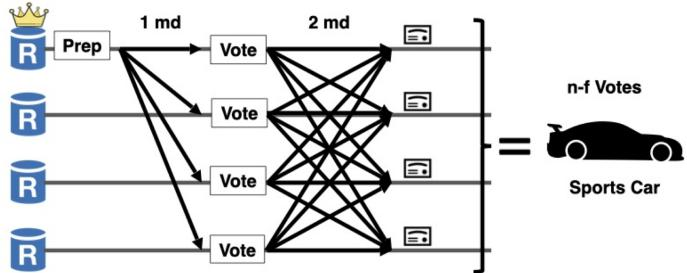  
Figure 1: Leader lane protocol pattern.

## 3b: P → R: Replica P broadcasts TRUCK-CONFIRM.

After forming a truck certificate for that lane, P sends a TRUCK-CONFIRM := ⟨v,truck-cert⟩P message to all replicas.

## 5.1.3 Race Cutoff

The race ends locally at a replica once it has received n− f truck certificates. This cutoff is chosen to give the leader as much room as possible to win the race. Since up to f replicas may be faulty, no correct replica can wait for more than n− f truck certificates. At the same time, setting the cutoff below n − f would shorten the race unnecessarily, increasing the chance that the leader is falsely detected as slow even when it is not. Once the cutoff is reached, the replica either continues toward committing the leader’s proposal, if it observed the leader win the race, or enters the recovery path, if it observed the leader lose.

## 1: R: Replica R assembles a race-cutoff certificate.

Upon receiving n − f matching valid TRUCK-CONFIRM messages from distinct replicas for this proposal lane, R assembles a race-cutoff cert := {TRUCK-CONFIRM } certificate. This certifies that the (n − f )th certificate has formed and hence cutoff is reached.

After the cutoff, each replica is in one of two cases: either (i) it received a sports car certificate prior to the cutoff (Figure 3) or (ii) the leader missed the cutoff (Figure 4). As replicas can receive certificates in a different order, their belief about who won the race may diverge. The sports car certificate forming prior to cutoff indicates that the leader is making progress at the expected speed. If instead a cutoff forms first, the leader is behaving unexpectedly slowly. We describe each case in turn.

Case 1: The leader beat the cutoff. Suppose replica R receives the sports car certificate before n − f truck certificates. Then R concludes locally that the leader is behaving as expected, and therefore its proposal should be committed. The protocol then moves toward committing the leader’s value.

## 1: R → R: Replica R broadcasts SC-COMMIT.

R broadcasts SC-COMMIT := ⟨v, dig⟩R. The SC-COMMIT message serves two purposes: (i) it tells other replicas that R locally observed the leader beating the cutoff and that the leader’s proposal should therefore be committed; and (ii) it ensures that R has persisted the leader’s proposal for use in recovery, in case recovery begins before R commits the leader proposal. This is equivalent to the commit phase of traditional BFT protocols.

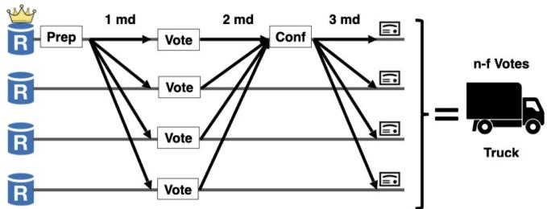  
Figure 2: Replica lane protocol pattern.

2: R → R: Replica R assembles and forwards a leader   
commit certificate.

Replica R aggregates n− f matching SC-COMMIT messages into a leader commit certificate. It then locally commits the leader’s value and forwards the commit certificate to all replicas so that they can commit as well. Because the leader lane has a single designated leader, a quorum of SC-COMMIT messages suffices to commit the leader’s proposal. Conflicting leader proposals cannot arise in the same view because the truck certificate guarantees non-equivocation. Note that even if R saw the leader missing the cutoff locally, it can still commit the leader’s proposal if it receives a quorum of SC-COMMIT messages from other replicas.

Case 2: The leader missed the cutoff. Suppose replica R observes n − f truck certificates before the sports car certificate, then it concludes the leader is slow. It therefore abandons participation in the leader lane and stops sending SC-PREP-VOTE or SC-COMMIT messages. However, it continues processing SC-COMMIT messages from other replicas, since those messages may still certify that the leader’s proposal has committed.

## 5.2 Recovery Path

Once a replica locally reaches the cutoff, it enters the recovery path. The goal of the recovery path is to guarantee commitment of some proposal across all replicas. This may be the leader’s proposal if some replica committed it during the race, or it may be some other replica’s proposal.

In traditional BFT protocols, recovery proceeds in three steps: (i) replicas elect a new leader, (ii) that leader chooses a value to recover, and (iii) the protocol then runs the usual nonequivocation and persistence phases for that value. However, this ordering of steps is problematic in our setting, where liveness does not rely on any synchrony assumptions. If the new leader is identified at the start of recovery, a network adversary can repeatedly target that replica and prevent progress. To avoid this vulnerability, we reverse the usual order of steps. Rather than electing a leader first, every replica initially acts as a potential leader by advancing its own recovery value through the consensus steps needed for commitment, namely non-equivocation and persistence. Leader election is deferred until a quorum has completed these steps, so the adversary learns whom to target only at the very end, when it is too late to interfere. This makes it likely that the election selects a replica from that quorum, at which point the protocol can terminate because that value has already been persisted.

1: R → R: Replica R broadcasts STATUS.

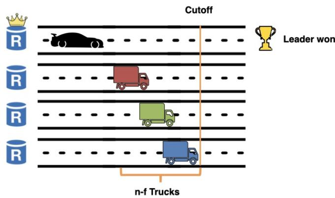  
Figure 3: Leader beating the cutoff.

Algorithm 2 Replica state cheat sheet for recovery path.   
1: cert-data ▷ elected recovery-non-equiv-cert or ⟨⊥elect⟩   
2: qcs ▷ map: replica ID → recovery path certificate   
3: finish ▷ set of FINISH messages received

## 5.2.1 Step 1: Choosing a value to recover per lane

In Step 1, each replica selects, for its lane, a value to recover based on the evidence gathered during the race. The key safety requirement is that if some value was already committed (via the sports car certificate), then replicas must recover that value.

Replicas first share with each other any messages they received from the leader during the race. This evidence will be used to determine what proposal should be recovered.

The replica broadcasts all state received from the leader during the race, including any proposal received from the leader (sc-prep). If a replica did not receive a sc-prep it sets sc-prep = ⟨⊥prep⟩R. Similarly, it sends any sports car certificate it received. If a replica did not receive a sports car certificate it sets sportscar-cert = ⟨⊥sc⟩R.

R broadcasts this information to all other replicas as part of a STATUS := ⟨sc-prep,sportscar-cert⟩R message.

## 2: P receives quorum of STATUS messages

A replica P selects a value to recover for its lane based on a quorum of n− f STATUS messages. P considers three cases: Case 1: P receives a sports car certificate.

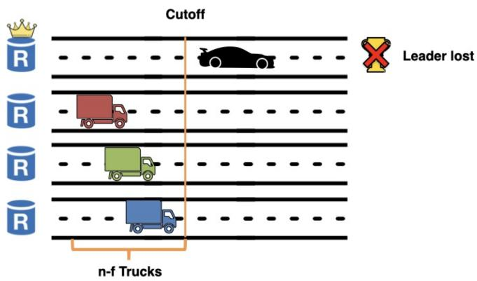  
Figure 4: Leader missing the cutoff.

If a sports car certificate exists as part of any received STATUS message, then some replica may have formed a leader commit certificate (follows from quorum intersection). To preserve safety, P therefore sets its recovery input to the leader’s value: r-input = sportscar-cert.

The next two cases handle the situation where P does not receive a sports car certificate. In both cases, P chooses the same recovery input; however, in the latter case P can safely skip the race exclusion phase.

Case 2a: P receives n− f ⟨⊥sc⟩ and a SC-PREPARE.

Receiving n− f ⟨⊥sc⟩ messages definitively indicates that no correct replica committed on the leader’s lane. This also follows from quorum intersection: if a leader commit certificate existed, P would be guaranteed to receive a sportscar-cert, which it did not. In principle, P could now safely recover any value, since no leader commit occurred. However, we require P to recover its own truck certificate from the race, thereby preserving the progress already achieved on its lane.

In this case, P sets its recovery input to r-input = truck-cert, aggregates the n − f signatures on ⟨⊥sc⟩ into a no-commit certificate nc-cert, which proves that a leader commit could not have occurred, and proceeds to the next step.

Case 2b: P receives n− f ⟨⊥sc⟩ and n− f ⟨⊥prep⟩.

Receiving n− f ⟨⊥prep⟩ messages definitively indicates that no sports car certificate exists. This follows from quorum intersection: if a sports car certificate existed, P would be guaranteed to receive a corresponding SC-PREPARE, which it did not. Since there is no possible sports car certificate to equivocate with, P can safely skip the race exclusion phase (see section 5.2.2): its own racing truck certificate (truck-cert) already ensures non-equivocation within its lane. P aggregates the n− f signatures on ⟨⊥prep⟩ into a no-lock certificate nl-cert, which proves that no sports car certificate exists, and sets its recovery input to r-input = (truck-cert,nl-cert).

## 5.2.2 Step 2: Persisting the recovered value per lane

In Step 2, each replica persists its recovered value so that its value can be safely committed in Step 3. This step has two parts: the aforementioned optional race exclusion phase followed by a persistence phase that mirrors the familiar two-phase structure of traditional BFT. The optional race exclusion phase is needed because, although the racing path already guarantees non-equivocation within each lane, a Byzantine replica could still try to equivocate between a possible sports car certificate and its own truck certificate. The race exclusion phase prevents this. The persistence phase then plays the usual role from traditional BFT: it records the recovered value so that subsequent protocol steps treat it as the lane’s durable candidate.

Race Exclusion Phase. The race exclusion phase prevents a Byzantine replica from equivocating across lanes between its own truck certificate and a possible sports car certificate. By the end of this phase, at most one of these values can advance in P’s lane: either P’s truck certificate or the sports car certificate, but not both.

P broadcasts REC-PREPARE := ⟨v,r-input,nc-cert⟩P where v is the view, r-input is the selected recovery input (from step 1), and nc-cert is the no-commit certificate formed from case 2a if it exists.

2: R → P: Replica R processes REC-PREPARE and votes.   
R checks whether the received REC-PREPARE is valid. If so,   
R replies by sending REC-PREP-VOTE := ⟨v,dig = h(r-input)⟩R   
back to the proposer.

3: P: Replica P assembles a quorum of REC-PREP-VOTE.

P waits for at least n − f matching REC-PREP-VOTE messages, and aggregates these votes into a recovery non-equivocation certificate, recovery-non-equiv-cert := (v, P, dig, {REC-PREP-VOTE }) No two recovery nonequivocation certificate can exist for the same lane because the necessary quorums intersect in at least one correct replica (which votes only once). For P’s lane, all replicas will either have a recovery non-equivocation certificate for the leader’s value or P’s value from the racing path but not both.

Persistence Phase.

If P could skip the race exclusion phase, P sets recovery-non-equiv-cert = r-input. This effectively upgrades its truck certificate into a recovery non-equivocation certificate. Otherwise, P uses the recovery non-equivocation certificate it formed in the race exclusion phase. P broadcasts a message REC-CONFIRM := ⟨v, recovery-non-equiv-cert⟩P where v is the view, and recovery-non-equiv-cert is the recovery non-equivocation certificate P is proposing.

2: R → P: R receives and acknowledges REC-CONFIRM.

R checks whether the received REC-CONFIRM is valid. If the validity checks pass, R stores a copy of the recovery nonequivocation certificate in qcs[P] =recovery-non-equiv-cert. Then, it replies by sending REC-CONFIRM-VOTE := ⟨v,dig = h(recovery-non-equiv-cert )⟩R back to the proposer.

P waits for at least n− f REC-CONFIRM messages with matching digests, and aggregates these votes into a recovery confirm certificate, rec-confirm-cert := (v,dig,{REC-CONFIRM-VOTE }). It then forwards the recovery confirm certificate it formed in a FINISH := ⟨v,rec-confirm-cert⟩P message.

4: R: Replica R receives quorum of FINISH messages.

For each FINISH message, R stores a copy of the recovery confirm certificate in qcs[Ri] = rec-confirm-cert, where Ri is the replica who proposed rec-confirm-cert. Once R receives n− f FINISH messages, it starts the lane election step.

## 5.2.3 Step 3: Selecting a lane to commit

Unlike traditional BFT, which has a single dedicated proposal lane from the leader, Ambulance has multiple lanes, so it is not immediately clear which lane to commit. To mirror traditional BFT’s single-lane behavior, once n− f lanes have completed the persistence phase, Ambulance randomly elects a single lane and checks whether to commit its proposal. If the elected lane has completed the persistence phase, the election succeeds and replicas commit the proposal in that lane. Otherwise, replicas move to the next view and rerun the recovery path. The lane election process must satisfy two properties: (i) all correct replicas must agree on who won the election—this is necessary for safety; and (ii) more surprisingly, the lucky winner cannot be predicted prior to running the protocol. The latter requirement originates from the potentially adversarial nature of slowdowns: if the "eventual" winner is known prior to its committing, a network adversary could systematically target it. Ambulance achieves both properties by leveraging threshold signatures to elect the winning lane.

Lane Election. Each replica R produces a thresholdsignature share on the view number, v, and broadcasts it. After collecting 2 f + 1 valid shares for view v, a replica combines them into a single unique threshold signature σ and computes the elected lane proposer as E :=h(σ) mod n, where h is a cryptographic hash function. Agreement follows because σ is unique, so all correct replicas compute the same E; unpredictability follows because E cannot be determined before the shares are revealed.

Commit rule. Replica R commits if it completed the persistence phase for the elected lane (qcs[E] contains a recovery confirm certificate). Otherwise, R stops participating in view v, advances to the next view, and forwards σ to help other replicas derive the same election outcome.

Table 1: RTTs between regions (ms)  
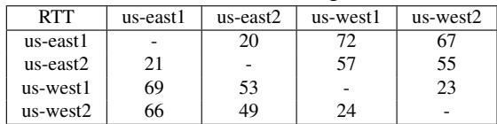

## 5.3 Retry Protocol

If a replica fails to commit in view 0, it advances to the next view. In all views > 0, replicas execute only the recovery path (there is no racing path). The recovery path is identical to the recovery path of view 0, with one small (but key) difference: the race-exclusion phase is always executed as there could be multiple valid lane inputs to recover. We defer the details of the retry protocol to Appendix A.

## 5.4 Multi-Shot Agreement

For multi-shot agreement, Ambulance constructs a totally ordered log of slots, where each slot runs an independent instance of the single-shot protocol. To avoid sequential delays, Ambulance pipelines these instances, so that a slot can begin without waiting on the previous slot to finish. We adopt the same pipelining strategy as Autobahn [45], where we start a new slot upon receiving a proposal from the previous slot, and cap the number of concurrent uncommitted slots to a pipelining parameter, k.

## 5.5 Motorization

Autobahn [45] introduced the concept of motorization, which allows any consensus protocol to achieve higher throughput by adopting Autobahn’s data layer. Ambulance can use Autobahn’s data layer to parallelize the data dissemination process and efficiently utilize all replicas bandwidth, leading to high throughput.

## 5.6 Implementation Notes

Leader message sharing. For liveness, the leader needs to run both a fast-track lane and a replica lane. Instead of sending separate messages for each lane, a single message can be used with a boolean flag indicating the lane it belongs to.

All-to-all communication. The recovery path utilizes linear style communication, where replicas forward their votes to the proposer instead of broadcasting them to all replicas. This reduces communication complexity at the trade-off of increasing latency. To reduce recovery path latency further, Ambulance supports an all-to-all voting strategy to shave off extra message delays.

Signature aggregation. Ambulance uses threshold signatures, but only for the lane election phase. We can also adopt threshold signatures for protocol votes to reduce the communication complexity of Ambulance by a factor of n. In practice, this is only necessary for large values of n.

## 6 Evaluation

Our evaluation seeks to answer three questions:

Table 2: Default timeout values used in production systems  
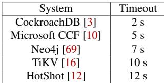

1. Performance: How well does Ambulance perform in the absence of slowdowns? (§6.1)

2. Slowdown Robustness: How well does Ambulance tolerate slowdowns? (§6.2)

3. Real-world Performance: How well does Ambulance perform in production under realistic conditions? (§6.3)

We implemented a prototype of Ambulance2 in Rust, using the same codebase as the open source implementation of Autobahn [45]. We implement all the notes in §5.6 except for signature aggregation. We use Tokio’s TCP [17] for networking, and RocksDB [14] for persistent storage of payload data to disk. Finally, we use ed25519-dalek [6] signatures for authentication.

Baseline systems. We compare Ambulance against several state-of-the-art BFT protocols: 1) Autobahn [45], a leading timeout-based BFT protocol, 2) ParBFT2 [37], a state-of-theart hedging-based protocol, as well as 3) SMVBA (Speeding Dumbo) [49], a state-of-the-art pessimistic (asynchronous) protocol. ParBFT2 uses HotStuff [83] as its optimistic path, and after a hedging delay, it launches its pessimistic path, which runs SMVBA combined with an asynchronous binary agreement protocol [18]. We use the available open-source codebase each time3. Ambulance and Autobahn share the same data layer design, where all replicas disseminate batches through structured data lanes, enabling parallelized data dissemination. In contrast, ParBFT2 and SMVBA adopt the Batched HotStuff data layer [38], where replicas optimistically stream batches and consensus leaders propose hashes of any batches they have received.

Ambulance and Autobahn use a PBFT-style multi-shot consensus with a totally ordered log, allowing multiple consensus instances to be pipelined in parallel. This eliminates sequential delays and reduces end-to-end latency. ParBFT2 and SMVBA instead follow the HotStuff [83] chaining approach, which introduces inherent sequential latency. In ParBFT2’s optimistic path, a new consensus instance begins only after the leader collects a quorum of votes for the previous one. In its pessimistic path-and in SMVBA—there is no pipelining at all; consensus instances run strictly sequentially. As a result, requests must wait for the next consensus instance to start, adding further end-to-end latency.

Evaluation Setup. We evaluate all systems on AWS EC2. For sections §6.1 and 6.2, we evenly distributed nodes in us-west1, us-west2, us-east1 and us-east2.

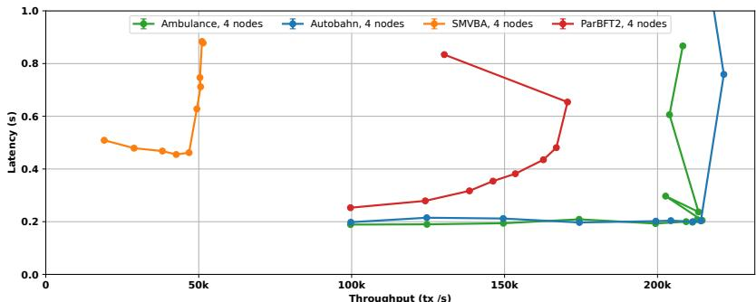  
Figure 5: Throughput and Latency under increasing load.

We summarize RTTs between regions in Table 1. We use machine type m6a.4xlarge [1] (16 vCPUs and 64GB RAM) with 30GB gp3 disk (SSD) and 12.5GB/s network bandwidth. Clients are co-located in the same region as the replica, and issue a constant stream of no-op transactions (tx), consisting of 512 random bytes [38, 75]; no-op transactions allow us to stress the consensus system, without risking being bottlenecked on execution. We set a batch size of 500KB (1000 transactions) for all baselines, but allow consensus proposals to include/reference more than one batch if available; this mini-batching design [40, 41] allows replicas to organically reach larger effective batch sizes with reduced latency trade-off. For the systems that use leaders, they are elected using a deterministic round-robin scheme.

## 6.1 Common Case Performance

Figure 5 presents performance in a fault-free, synchronous setting with n = 4 nodes. Each experiment runs for 60 seconds under increasing client load. Ambulance reaches a peak throughput of 214k tx/s, matching Autobahn’s peak throughput of 214k tx/s. This high throughput stems from motorization as Ambulance adopts Autobahn’s data layer. Ambulance makes efficient use of network bandwidth, which dominates overall cost, as consensus messages are small compared to large batched proposals. Although Ambulance introduces multiple consensus lanes, the metadata overhead is negligible in practice, and both Ambulance and Autobahn ultimately bottleneck on data layer work (serializing/deserializing).

Ambulance achieves a latency of 205 ms compared to Autobahn’s 203 ms. In the absence of failures and synchrony, both systems essentially run PBFT, leading to similar latency.

ParBFT2 reaches a peak throughput of 167k tx/s, substantially higher than SMVBA but 1.3x lower than Ambulance. This gap is primarily due to its weaker data layer, which incurs substantial data-synchronization overhead at high load [38, 45], limiting throughput even when consensus is not the bottleneck. In the good case, ParBFT2’s consensus latency is five message delays, compared to three for Ambulance, contributing to its 382 ms latency (1.9x higher than Ambulance).

SMVBA achieves only 50.6k tx/s peak throughput and exhibits the highest latency of 462 ms (2.3x higher than Ambulance). It shares the same data layer as ParBFT2, but its low throughput follows directly from its sequential consensus design: consensus instances run strictly one after another, so throughput is constrained by consensus latency. In the good case, SMVBA’s consensus latency is six message delays, more than ParBFT2 (five) and Ambulance (three). Together with the additional inclusion latency introduced by this sequential design, these extra message delays yield higher end-to-end latency than Ambulance.

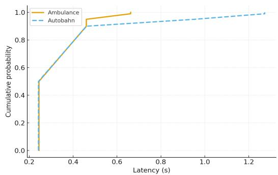  
Figure 6: Production Latency CDF

Overall, Ambulance matches the common-case throughput and latency of state-of-the-art timeout-based BFT (Autobahn) while outperforming pessimistic and hedging-based systems.

## 6.2 Slowdown Robustness

The previous section demonstrated that Ambulance performs well under ideal conditions. We now examine Ambulance’s tolerance to slowdowns of varying severity in an n = 4 deployment. At time t = 3 seconds, we inject a transient slowdown whose duration we vary across experiments. The slowdown is introduced by pausing all processing (i.e., sleeping) on a single replica. For ParBFT2, we run only the pessimistic path and do not inject slowdowns, due to bugs in the optimistic–pessimistic path switching logic.4 This configuration still captures slowdown latency but does not reflect ParBFT2’s common-case latency, which should closely match Figure 5 (382 ms).

We plot latency over time for slowdown durations of 1, 2, 5, 7, and 10 seconds, where each point is the median latency over a 500 ms window across 5 runs. For Autobahn, we use the timeout values from Table 2, which are taken from production deployments of major reliable datastores.

In the slowdown experiments, we run Autobahn with two different leader-election timeout values. One timeout value is set above the injected slowdown (timeouts of 2, 5, 7, 10, and 12 seconds for slowdowns of 1, 2, 5, 7, and 10 seconds, respectively) so that the plots capture the full effect of the slowdown. The other timeout value is set below the slowdown duration, so that the timeout detects the slowdown. Using a more aggressive timeout for a given slowdown duration caps the peak latency at the timeout value, making it closely match the peak latency of a smaller slowdown. For ParBFT2, we use an aggressive 75 ms hedging delay to minimize slowdown latency, consistent with the maximum RTT in Table 1 ([37] specifies a hedging delay of 2∆, equal to the maximum RTT).

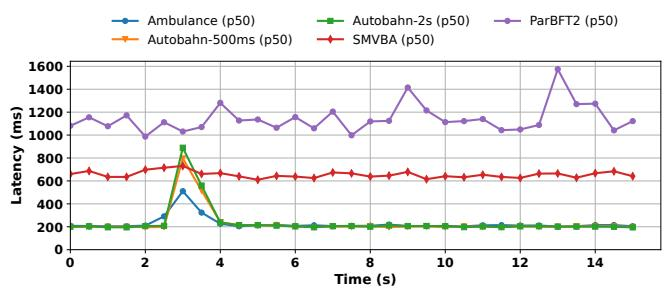

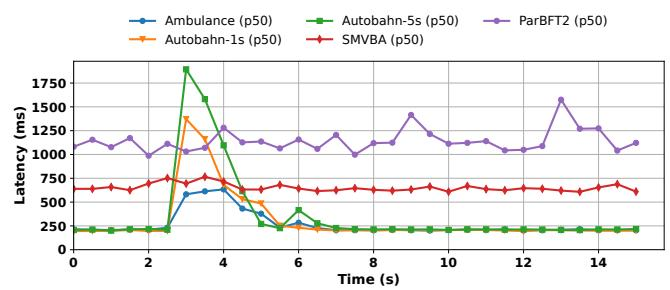

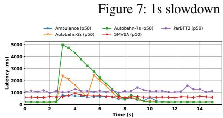  
Figure 9: 5s slowdown

Figure 8: 2s slowdown  
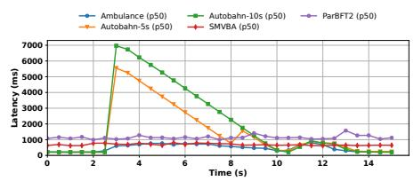  
Figure 10: 7s slowdown

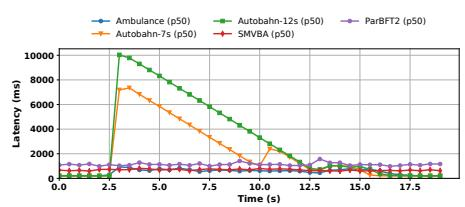  
Figure 11: 10s slowdown

1 second slowdown (Figure 7). All systems are evaluated under a conservative load ([70]) to minimize queuing effects (Ambulance and Autobahn at 100k, and ParBFT2 and SMVBA at 10k). Ambulance has the lowest peak latency at 510.4 ms. This is 1.6x better than Autobahn with a 500 ms timeout (796.1 ms), 1.7x better latency than Autobahn with a 2 s timeout (889.5 ms), 1.4x better than SMVBA (731 ms), and 3.1x better than ParBFT2 (1.58 s). Ambulance promptly detects the slowdown and switches to the recovery path, which takes 7 message delays for the first view. Autobahn, configured with a 2 s timeout (from Table 2), does not detect the slowdown, causing latency to rise proportionally to the slowdown duration as replicas block on the slow leader. Autobahn with a 500 ms timeout detects the slowdown; however, it must elect a new leader and pay the consensus latency cost, so the overall latency ends up being similar to Autobahn with a 2 s timeout. SMVBA’s consensus latency is similar to Ambulance’s, but its lack of pipelining increases end-to-end inclusion latency. ParBFT2 exhibits the highest latency due to the hedging delay and the requirement to run both SMVBA and an asynchronous binary agreement protocol for its pessimistic path.

2 second slowdown (Figure 8). With a 2 second slowdown, Ambulance’s peak latency increases mildly to 633.4 ms, but is still 2.2x better than Autobahn with a 1 s timeout (1.37 s), 3.0x better than Autobahn with a 5 s timeout (1.89 s), 1.2x better than SMVBA (766 ms), and 2.5x better than ParBFT2 (1.58s). Longer slowdowns increase the probability that multiple recovery views are needed, raising Ambulance and SMVBA’s latency. Autobahn with a 5 s timeout again fails to detect the slowdown, resulting in latency degradation proportional to the slowdown duration. Autobahn with a 1 s timeout detects the slowdown after 1 second, but must also pay the consensus latency afterwards, so the latency is still higher compared to Ambulance. ParBFT2 behaves similarly to the 1 s case. Figures 9–11.

5-10 second slowdowns (Figures 9-11) The same trend holds. Ambulance reaches peak latencies of 787.7 ms, 810 ms, and 932 ms for 5, 7, and 10 second slowdowns, respectively, increasing only modestly due to additional failed views. These are still 3.1-6.3x, 6.9-8.6x, and 7.9-10.8x better than Autobahn for 5, 7, and 10 second slowdowns, respectively. SMVBA closely tracks Ambulance at these longer slowdowns (with peak latencies of 812 ms and 945 ms), while ParBFT2 remains at 1.58 s (1.7x worse than Ambulance).

Across all slowdown durations, Ambulance consistently delivers lower peak latency than Autobahn—1.6x–3.0x better for short (1–2 second) slowdowns and up to 10.8x better for more severe (5–10 second) slowdowns. Ambulance also closely matches SMVBA, the state-of-the-art pessimistic protocol, while achieving 1.7x–3.1x lower latency than ParBFT2, the state-of-the-art hedging protocol.

## 6.3 Production Performance

We evaluate the performance of Ambulance as deployed in Sei [65], a production-grade distributed ledger system, and compare it to their current implementation of Autobahn. The deployment consists of n = 40 replicas distributed across 20 AWS EC2 regions in North America, South America, Asia, and Europe. Each replica runs on an m6i.12xlarge [2] instance (48 vCPUs, 192 GB RAM, 18.75 GB/s network bandwidth).

Figure 6 reports latency over a 24-hour production run. The system experiences slowdowns approximately once every thousand slots, consistent with rates observed in deployed distributed ledger systems [12, 13, 65]. Both Ambulance and the production Autobahn implementation operate at 180k load (with a peak throughput of 220k) on the same workload;

Autobahn uses 2-second timeouts. Ambulance matches the median latency of Autobahn (244ms vs 242ms), while significantly improving tail performance: its p99 latency of 662 ms represents a 1.92x reduction compared to Autobahn’s 1.27 s. Because the slowdown events dominate the p99, these results show that Ambulance maintains Autobahn’s common-case latency in production while substantially reducing latency during slowdowns.

## 7 Related Work

Ambulance is inspired by several prior works. Ambulance’s leader racing path draws from traditional BFT protocols, in particular, PBFT [30]. The recovery path draws from the VABA (MVBA) family of asynchronous protocols, in particular, 2PAC [73]. Ambulance directly adopts Autobahn’s [45] data layer and pipelining strategy to achieve high throughput and reduce end-to-end latency.

Slowdown tolerance and failure detectors The most common failure detectors [32, 33, 55] rely on heartbeats or timeouts. These mechanisms are slow to react to failures, and are fundamentally not cooperative nor productive. Other failure detection mechanisms [21, 52, 58, 61] are less generic and inspect the actual processes themselves. These mechanisms can detect more types of failures, including gray failures, but do not easily extend to Byzantine environments. PeerReview [51] does detect provably faulty behavior but can neither detect nor correct slow behavior. Copilot [70] is the first SMR protocol to introduce slowdown tolerance, limited to the CFT setting. It defines and satisfies the s-slowdowntolerance property, which guarantees performance similar to the no-slowdown case even with s slow replicas. We instead assess slowdown robustness by measuring each protocol’s latency under slowdown, since even Copilot can suffer performance degradation in certain slowdown scenarios [62].

Partially synchronous BFT These protocols [25, 26, 30, 31, 44, 46, 47, 50, 56, 68, 74, 76, 78, 83] are optimized for the failure-free case, minimizing latency when there are no slowdowns. Because they rely on timeouts to detect failures, a slow leader causes latency to spike by an amount proportional to the leader timeout or the duration of the slowdown.

Robust BFT Aardvark [34] monitors leader performance and invokes view changes if the leader does not meet performance thresholds. The system offers only partial protection against slowdowns [70] as it cannot easily detect transient slowdowns. Autobahn [45] is robust to blips, a subset of slowdowns that includes network events such as partial partitions or replica failures that trigger timeouts. It ensures that latency returns to baseline immediately after a blip but allows latency to spike during the blip.

Asynchronous BFT protocols [19, 38, 54, 66] are pessimistic: they assume the leader always loses the race against the clock. There are two main families of asynchronous BFT protocols: the HoneyBadger (BKR) family [24, 60, 66, 82] and the VABA family [19, 42, 49, 73, 77]. HoneyBadger-style protocols typically run n instances of reliable broadcast [29] and n instances of binary agreement to decide which broadcasts completed, while VABA-style protocols run n instances of a leader-based BFT protocol and use a common coin to randomly select one instance to commit. Asynchronous protocols have lower latency than traditional BFT during slowdowns, since they do not require a failure detection mechanism such as timeouts. However, they have much higher common-case latency than traditional BFT protocols, limiting their adoption in practice.

Hybrid BFT protocols [28, 36, 37, 43, 64, 72, 75] aim to combine the advantages of traditional and asynchronous BFT. Ditto [43] and BDT [64] run a traditional BFT protocol first and fall back to an asynchronous one when a timeout fires. Relying on timeouts causes them to suffer high latency during slowdowns, particularly when switching protocols. ParBFT [37], Abraxas [28], and Ipotane [36] instead run one or more asynchronous protocol instances to detect failures of the traditional BFT protocol. Unfortunately, commitment during a slowdown requires still requires completing multiple asynchronous instances. Hedging [37, 80] detects failures by having the leader race against other replicas, but giving the leader a time-based head start. This mechanism is cooperative, but not productive; it stalls recovery until the hedging delay is over.

Leaderless SMR protocols [39, 67, 81] distribute the ordering task across multiple replicas instead of relying on a single leader. Because no single leader orders all requests, replicas commit dependency graphs that induce an order among instances. This design avoids stalling on a single slow leader, but slowdowns still harm performance: replicas can depend on commands proposed by slow replicas and must wait for those commands to commit before executing. In the worst case, they must invoke an expensive recovery procedure for those commands.

## 8 Conclusion

This paper introduces Ambulance, a novel BFT protocol, that uses a novel protocol-rigged racing mechanism to detect slowdowns. This allows Ambulance to offer the best of both worlds: the good-interval performance of timeoutbased systems and slowdown performance comparable to asynchronous protocols.

## Acknowledgments

We thank our shepherd, and the anonymous reviewers for their thorough and insightful comments. This work was supported in part by the NSF grants CSR-CORE 2106842, NSF CAREER 2442542, a Sui Research Award as well as gifts from Accenture, AMD, Anyscale, Google, IBM, Intel, Mohamed Bin Zayed University of Artificial Intelligence, Samsung SDS, SAP, and VMware.

## References

[1] [n. d.]. Amazon EC2 M6a Instances. https: //aws.amazon.com/ec2/instance-types/m6a/ (last accessed on 12/09/25).

[2] [n. d.]. Amazon EC2 M6i Instances. https: //aws.amazon.com/ec2/instance-types/m6i/ (last accessed on 12/09/25).

[3] [n. d.]. CockroachDB Replication Layer. https://www.cockroachlabs.com/docs/stable/ architecture/replication-layer (last accessed on 12/09/25).

[4] [n. d.]. Confidential Consortium Framework, Microsoft. https://ccf.microsoft.com/ (last accessed on 09/23/24).

[5] [n. d.]. Consider rolling the WAL if the HDFS write pipeline is slow. https: //issues.apache.org/jira/browse/HBASE-22301 (last accessed on 12/09/25).

[6] [n. d.]. Dalek elliptic curve cryptography. https://github.com/dalek-cryptography/ ed25519-dalek (last accessed on 09/23/24).

[7] [n. d.]. Delayed heartbeat from etcd leader. https: //github.com/etcd-io/etcd/issues/7312 (last accessed on 12/09/25).

[8] [n. d.]. Digital Euro. https://www.ecb.europa. eu/euro/digital\_euro/html/index.en.html (last accessed on 09/23/24).

[9] [n. d.]. etcd Tuning. https://etcd.io/docs/v3.4/ tuning/ (last accessed on 12/09/25).

[10] [n. d.]. Microsoft CCF Configuration. https: //microsoft.github.io/CCF/main/operations/ configuration.html (last accessed on 12/09/25).

[11] [n. d.]. minimum master nodes does not prevent split-brain if splits are intersecting. https://github. com/elastic/elasticsearch/issues/2488 (last accessed on 12/09/25).

[12] [n. d.]. Private communications with engineers at the blockchain company, Espresso, running HotStuff in production. March 2025.

[13] [n. d.]. Private communications with researchers at Mysten Labs, a leading blockchain company), and formerly of Facebook Novi. March 2024.

[14] [n. d.]. RocksDB, version 0.16.0. https: //rocksdb.org/ (last accessed on 09/23/24).

[15] [n. d.]. Sui Blockchain. https://sui.io/ (last accessed on 09/23/24).

[16] [n. d.]. TiKV Config. https://tikv.org/docs/6. 1/deploy/configure/tikv-configuration-file/ (last accessed on 12/09/25).

[17] [n. d.]. Tokio, version 1.5.0. https://tokio.rs/ (last accessed on 09/23/24).

[18] Ittai Abraham, Naama Ben-David, and Sravya Yandamuri. 2022. Efficient and Adaptively Secure Asynchronous Binary Agreement via Binding Crusader Agreement. In Proceedings of the 2022 ACM Symposium on Principles of Distributed Computing. 381–391.

[19] Ittai Abraham, Dahlia Malkhi, and Alexander Spiegelman. 2019. Asymptotically Optimal Validated Asynchronous Byzantine Agreement. In Proceedings of the 2019 ACM Symposium on Principles of Distributed Computing (Toronto ON, Canada) (PODC ’19). Association for Computing Machinery, New York, NY, USA, 337–346. https://doi.org/10.1145/3293611.3331612

[20] Ittai Abraham, Kartik Nayak, Ling Ren, and Zhuolun Xiang. 2021. Good-Case Latency of Byzantine Broadcast: A Complete Categorization. In Proceedings of the 2021 ACM Symposium on Principles of Distributed Computing (Virtual Event, Italy) (PODC’21). Association for Computing Machinery, New York, NY, USA, 331–341. https://doi.org/10.1145/3465084.3467899

[21] Marcos K. Aguilera and Michael Walfish. 2009. No time for asynchrony. In Proceedings of the 12th Conference on Hot Topics in Operating Systems (Monte Verità, Switzerland) (HotOS’09). USENIX Association, USA, 3.

[22] Mohammed Alfatafta, Basil Alkhatib, Ahmed Alquraan, and Samer Al-Kiswany. 2020. Toward a Generic Fault Tolerance Technique for Partial Network Partitioning. In 14th USENIX Symposium on Operating Systems Design and Implementation (OSDI 20). USENIX Association, 351–368. https://www.usenix.org/ conference/osdi20/presentation/alfatafta

[23] Ahmed Alquraan, Hatem Takruri, Mohammed Alfatafta, and Samer Al-Kiswany. 2018. An Analysis of Network-Partitioning Failures in Cloud Systems. In 13th USENIX Symposium on Operating Systems Design and Implementation (OSDI 18). USENIX Association, Carlsbad, CA, 51–68. https://www.usenix.org/ conference/osdi18/presentation/alquraan

[24] Diogo S. Antunes, Afonso N. Oliveira, André Breda, Matheus Guilherme Franco, Henrique Moniz, and

Rodrigo Rodrigues. 2024. Alea-BFT: Practical Asynchronous Byzantine Fault Tolerance. In 21st USENIX Symposium on Networked Systems Design and Implementation (NSDI 24). USENIX Association, Santa Clara, CA, 313–328. https://www.usenix. org/conference/nsdi24/presentation/antunes

[25] Balaji Arun, Zekun Li, Florian Suri-Payer, Sourav Das, and Alexander Spiegelman. 2025. Shoal++: High Throughput DAG BFT Can Be Fast and Robust!. In 22nd USENIX Symposium on Networked Systems Design and Implementation (NSDI 25). USENIX Association, Philadelphia, PA, 813–826. https://www.usenix.org/conference/nsdi25/ presentation/arun

[26] Kushal Babel, Andrey Chursin, George Danezis, Lefteris Kokoris-Kogias, and Alberto Sonnino. 2023. Mysticeti: Low-Latency DAG Consensus with Fast Commit Path. arXiv preprint arXiv:2310.14821 (2023).

[27] Mathieu Baudet, Avery Ching, Andrey Chursin, George Danezis, François Garillot, Zekun Li, Dahlia Malkhi, Oded Naor, Dmitri Perelman, and Alberto Sonnino. 2019. State machine replication in the Libra Blockchain. The Libra Association Technical Report (2019).

[28] Erica Blum, Jonathan Katz, Julian Loss, Kartik Nayak, and Simon Ochsenreither. 2023. Abraxas: Throughput-Efficient Hybrid Asynchronous Consensus. In Proceedings of the 2023 ACM SIGSAC Conference on Computer and Communications Security (Copenhagen, Denmark) (CCS ’23). Association for Computing Machinery, New York, NY, USA, 519–533. https://doi.org/10.1145/3576915.3623191

[29] Gabriel Bracha and Sam Toueg. 1985. Asynchronous consensus and broadcast protocols. Journal of the ACM (JACM) 32, 4 (1985), 824–840.

[30] Miguel Castro and Barbara Liskov. 1999. Practical Byzantine Fault Tolerance. In Proceedings of the Third Symposium on Operating Systems Design and Implementation (New Orleans, Louisiana, USA) (OSDI ’99). USENIX Association, USA, 173–186.

[31] Benjamin Y. Chan and Rafael Pass. 2023. Simplex Consensus: A Simple and Fast Consensus Protocol. In Theory of Cryptography: 21st International Conference, TCC 2023, Taipei, Taiwan, November 29–December 2, 2023, Proceedings, Part IV (Taipei, Taiwan). Springer-Verlag, Berlin, Heidelberg, 452–479. https: //doi.org/10.1007/978-3-031-48624-1\_17

[32] Tushar Deepak Chandra, Vassos Hadzilacos, and Sam Toueg. 1996. The weakest failure detector for solving consensus. J. ACM 43, 4 (July 1996), 685–722. https://doi.org/10.1145/234533.234549

[33] Tushar Deepak Chandra and Sam Toueg. 1996. Unreliable failure detectors for reliable distributed systems. J. ACM 43, 2 (March 1996), 225–267. https://doi.org/10.1145/226643.226647

[34] Allen Clement, Edmund Wong, Lorenzo Alvisi, Mike Dahlin, and Mirco Marchetti. 2009. Making Byzantine Fault Tolerant Systems Tolerate Byzantine Faults. In Proceedings of the 6th USENIX Symposium on Networked Systems Design and Implementation (Boston, Massachusetts) (NSDI’09). USENIX Association, USA, 153–168.

[35] Graeme Connell, Vivian Fang, Rolfe Schmidt, Emma Dauterman, and Raluca Ada Popa. 2024. Secret Key Recovery in a Global-Scale End-to-End Encryption System. In 18th USENIX Symposium on Operating Systems Design and Implementation (OSDI 24). USENIX Association, Santa Clara, CA, 703–719. https://www.usenix.org/conference/osdi24/ presentation/connell

[36] Xiaohai Dai, Chaozheng Ding, Hai Jin, Julian Loss, and Ling Ren. 2024. Ipotane: Balancing the Good and Bad Cases of Asynchronous BFT. Cryptology ePrint Archive, Paper 2024/653. https://doi.org/10.14722/ndss.2026.230003

[37] Xiaohai Dai, Bolin Zhang, Hai Jin, and Ling Ren. 2023. ParBFT: Faster Asynchronous BFT Consensus with a Parallel Optimistic Path. In Proceedings of the 2023 ACM SIGSAC Conference on Computer and Communications Security (Copenhagen, Denmark) (CCS ’23). Association for Computing Machinery, New York, NY, USA, 504–518. https://doi.org/10.1145/3576915.3623101

[38] George Danezis, Lefteris Kokoris-Kogias, Alberto Sonnino, and Alexander Spiegelman. 2022. Narwhal and Tusk: a DAG-based mempool and efficient BFT consensus. In Proceedings of the Seventeenth European Conference on Computer Systems. 34–50.

[39] Vitor Enes, Carlos Baquero, Tuanir França Rezende, Alexey Gotsman, Matthieu Perrin, and Pierre Sutra. 2020. State-machine replication for planet-scale systems. In Proceedings of the Fifteenth European Conference on Computer Systems (Heraklion, Greece) (EuroSys ’20). Association for Computing Machinery, New York, NY, USA, Article 24, 15 pages. https://doi.org/10.1145/3342195.3387543

[40] Novi Facebook Research. [n.d.]. Hotstuff Implementation. https:// github.com/asonnino/hotstuff/commit/ d771d4868db301bcb5e3deaa915b5017220463f6 (last accessed on 09/10/24).

[41] Novi Facebook Research. [n.d.]. Narwahl and Bullshark implementation. https://github.com/asonnino/ narwhal (last accessed on 09/23/24).

[42] Yingzi Gao, Yuan Lu, Zhenliang Lu, Qiang Tang, Jing Xu, and Zhenfeng Zhang. 2022. Dumbo-ng: Fast asynchronous bft consensus with throughput-oblivious latency. In Proceedings of the 2022 ACM SIGSAC Conference on Computer and Communications Security. 1187–1201.

[43] Rati Gelashvili, Lefteris Kokoris-Kogias, Alberto Sonnino, Alexander Spiegelman, and Zhuolun Xiang. 2022. Jolteon and Ditto: Network-Adaptive Efficient Consensus with Asynchronous Fallback. In Financial Cryptography and Data Security: 26th International Conference, FC 2022, Grenada, May 2–6, 2022, Revised Selected Papers (Grenada, Grenada). Springer-Verlag, Berlin, Heidelberg, 296–315. https: //doi.org/10.1007/978-3-031-18283-9\_14

[44] Neil Giridharan, Heidi Howard, Ittai Abraham, Natacha Crooks, and Alin Tomescu. 2021. No-commit proofs: Defeating livelock in bft. Cryptology ePrint Archive (2021).

[45] Neil Giridharan, Florian Suri-Payer, Ittai Abraham, Lorenzo Alvisi, and Natacha Crooks. 2024. Autobahn: Seamless high speed BFT. In Proceedings of the ACM SIGOPS 30th Symposium on Operating Systems Principles (Austin, TX, USA) (SOSP ’24). Association for Computing Machinery, New York, NY, USA, 1–23. https://doi.org/10.1145/3694715.3695942

[46] Neil Giridharan, Florian Suri-Payer, Matthew Ding, Heidi Howard, Ittai Abraham, and Natacha Crooks. 2023. BeeGees: stayin’alive in chained BFT. In Proceedings of the 2023 ACM Symposium on Principles of Distributed Computing. 233–243.

[47] Guy Golan Gueta, Ittai Abraham, Shelly Grossman, Dahlia Malkhi, Benny Pinkas, Michael Reiter, Dragos-Adrian Seredinschi, Orr Tamir, and Alin Tomescu. 2019. SBFT: A Scalable and Decentralized Trust Infrastructure. In 2019 49th Annual IEEE/IFIP International Conference on Dependable Systems and Networks (DSN). IEEE, USA, 568–580. https://doi.org/10.1109/DSN.2019.00063

[48] Haryadi S. Gunawi, Riza O. Suminto, Russell Sears, Casey Golliher, Swaminathan Sundararaman, Xing Lin, Tim Emami, Weiguang Sheng, Nematollah Bidokhti, Caitie McCaffrey, Gary Grider, Parks M. Fields, Kevin Harms, Robert B. Ross, Andree Jacobson, Robert Ricci, Kirk Webb, Peter Alvaro, H. Birali Runesha, Mingzhe Hao, and Huaicheng Li. 2018. Fail-Slow at Scale: Evidence of Hardware Performance Faults in Large

Production Systems. In 16th USENIX Conference on File and Storage Technologies (FAST 18). USENIX Association, Oakland, CA, 1–14. https://www.usenix. org/conference/fast18/presentation/gunawi

[49] Bingyong Guo, Yuan Lu, Zhenliang Lu, Qiang Tang, Jing Xu, and Zhenfeng Zhang. 2022. Speeding Dumbo: Pushing Asynchronous BFT Closer to Practice. Cryptology ePrint Archive, Paper 2022/027. https://eprint.iacr.org/2022/027

[50] Suyash Gupta, Jelle Hellings, and Mohammad Sadoghi. 2021. RCC: resilient concurrent consensus for highthroughput secure transaction processing. In 2021 IEEE 37th International Conference on Data Engineering (ICDE). IEEE, 1392–1403.

[51] Andreas Haeberlen, Petr Kouznetsov, and Peter Druschel. 2007. PeerReview: practical accountability for distributed systems. SIGOPS Oper. Syst. Rev. 41, 6 (Oct. 2007), 175–188. https://doi.org/10.1145/1323293.1294279

[52] Peng Huang, Chuanxiong Guo, Jacob R. Lorch, Lidong Zhou, and Yingnong Dang. 2018. Capturing and Enhancing In Situ System Observability for Failure Detection. In 13th USENIX Symposium on Operating Systems Design and Implementation (OSDI 18). USENIX Association, Carlsbad, CA, 1–16. https://www.usenix. org/conference/osdi18/presentation/huang

[53] Peng Huang, Chuanxiong Guo, Lidong Zhou, Jacob R. Lorch, Yingnong Dang, Murali Chintalapati, and Randolph Yao. 2017. Gray Failure: The Achilles Heel of Cloud-Scale Systems. In Proceedings of the 16th Workshop on Hot Topics in Operating Systems (Whistler, BC, Canada) (HotOS ’17). Association for Computing Machinery, New York, NY, USA, 150–155. https://doi.org/10.1145/3102980.3103005

[54] Philipp Jovanovic, Lefteris Kokoris Kogias, Bryan Kumara, Alberto Sonnino, Pasindu Tennage, and Igor Zablotchi. 2024. Mahi-Mahi: Low-Latency Asynchronous BFT DAG-Based Consensus. arXiv:2410.08670 [cs.DC] https://arxiv.org/abs/2410.08670

[55] Idit Keidar and Alexander Shraer. 2006. Timeliness, failure-detectors, and consensus performance. In Proceedings of the Twenty-Fifth Annual ACM Symposium on Principles of Distributed Computing (Denver, Colorado, USA) (PODC ’06). Association for Computing Machinery, New York, NY, USA, 169–178. https://doi.org/10.1145/1146381.1146408

[56] Ramakrishna Kotla, Lorenzo Alvisi, Mike Dahlin, Allen Clement, and Edmund Wong. 2010.

Zyzzyva: Speculative Byzantine Fault Tolerance. ACM Transactions on Computer Systems (TOCS) 27, 4, Article 7 (Jan. 2010), 39 pages. https://doi.org/10.1145/1658357.1658358

[57] S Krishnapriya and Greeshma Sarath. 2020. Securing Land Registration using Blockchain. Procedia computer science 171 (2020), 1708–1715.

[58] Joshua B. Leners, Hao Wu, Wei-Lun Hung, Marcos K. Aguilera, and Michael Walfish. 2011. Detecting failures in distributed systems with the Falcon spy network. In Proceedings of the Twenty-Third ACM Symposium on Operating Systems Principles (Cascais, Portugal) (SOSP ’11). Association for Computing Machinery, New York, NY, USA, 279–294. https://doi.org/10.1145/2043556.2043583

[59] Tom Lianza and Chris Snook. [n. d.]. A Byzantine failure in the real world. https://blog.cloudflare. com/a-byzantine-failure-in-the-real-world/

[60] Shengyun Liu, Wenbo Xu, Chen Shan, Xiaofeng Yan, Tianjing Xu, Bo Wang, Lei Fan, Fuxi Deng, Ying Yan, and Hui Zhang. 2023. Flexible Advancement in Asynchronous BFT Consensus. In Proceedings of the 29th Symposium on Operating Systems Principles. 264–280.

[61] Chang Lou, Peng Huang, and Scott Smith. 2019. Comprehensive and Efficient Runtime Checking in System Software through Watchdogs. In Proceedings of the Workshop on Hot Topics in Operating Systems (Bertinoro, Italy) (HotOS ’19). Association for Computing Machinery, New York, NY, USA, 51–57. https://doi.org/10.1145/3317550.3321440

[62] Ruiming Lu, Yunchi Lu, Yuxuan Jiang, Guangtao Xue, and Peng Huang. 2025. One-size-fits-none: understanding and enhancing slow-fault tolerance in modern distributed systems. In Proceedings of the 22nd USENIX Symposium on Networked Systems Design and Implementation (Philadelphia, PA, USA) (NSDI ’25). USENIX Association, USA, Article 20, 20 pages.

[63] Ruiming Lu, Erci Xu, Yiming Zhang, Zhaosheng Zhu, Mengtian Wang, Zongpeng Zhu, Guangtao Xue, Minglu Li, and Jiesheng Wu. 2022. NVMe SSD Failures in the Field: the Fail-Stop and the Fail-Slow. In 2022 USENIX Annual Technical Conference (USENIX ATC 22). USENIX Association, Carlsbad, CA, 1005–1020. https://www.usenix.org/conference/atc22/ presentation/lu

[64] Yuan Lu, Zhenliang Lu, and Qiang Tang. 2022. Bolt-Dumbo Transformer: Asynchronous Consensus As Fast As the Pipelined BFT. In Proceedings

of the 2022 ACM SIGSAC Conference on Computer and Communications Security (Los Angeles, CA, USA) (CCS ’22). Association for Computing Machinery, New York, NY, USA, 2159–2173. https://doi.org/10.1145/3548606.3559346

[65] Benjamin Marsh, Steven Landers, and Jayendra Jog. 2025. Sei Giga. arXiv:2505.14914 [cs.DC] https://arxiv.org/abs/2505.14914

[66] Andrew Miller, Yu Xia, Kyle Croman, Elaine Shi, and Dawn Song. 2016. The Honey Badger of BFT Protocols. In Proceedings of the 2016 ACM SIGSAC Conference on Computer and Communications Security (Vienna, Austria) (CCS ’16). Association for Computing Machinery, New York, NY, USA, 31–42. https://doi.org/10.1145/2976749.2978399

[67] Iulian Moraru, David G. Andersen, and Michael Kaminsky. 2013. There is more consensus in Egalitarian parliaments. In Proceedings of the Twenty-Fourth ACM Symposium on Operating Systems Principles (Farminton, Pennsylvania) (SOSP ’13). Association for Computing Machinery, New York, NY, USA, 358–372. https://doi.org/10.1145/2517349.2517350

[68] Ray Neiheiser, Miguel Matos, and Luís Rodrigues. 2021. Kauri: Scalable BFT Consensus with Pipelined Tree-Based Dissemination and Aggregation. In Proceedings of the ACM SIGOPS 28th Symposium on Operating Systems Principles (Virtual Event, Germany) (SOSP ’21). Association for Computing Machinery, New York, NY, USA, 35–48. https://doi.org/10.1145/3477132.3483584

[69] Neo4j. [n. d.]. Mitigating Causal Cluster Re-elections. https://tinyurl.com/mtus387s Last accessed: 2025-12-09.

[70] Khiem Ngo, Siddhartha Sen, and Wyatt Lloyd. 2020. Tolerating Slowdowns in Replicated State Machines using Copilots. In 14th USENIX Symposium on Operating Systems Design and Implementation (OSDI 20). USENIX Association, 583–598. https://www.usenix.org/conference/osdi20/ presentation/ngo

[71] Daniel Porto, João Leitão, Cheng Li, Allen Clement, Aniket Kate, Flavio Junqueira, and Rodrigo Rodrigues. 2015. Visigoth fault tolerance. In Proceedings of the Tenth European Conference on Computer Systems (Bordeaux, France) (EuroSys ’15). Association for Computing Machinery, New York, NY, USA, Article 8, 14 pages. https://doi.org/10.1145/2741948.2741979

[72] HariGovind V. Ramasamy and Christian Cachin. 2006. Parsimonious Asynchronous Byzantine-Fault-Tolerant

Atomic Broadcast. In Principles of Distributed Systems, James H. Anderson, Giuseppe Prencipe, and Roger Wattenhofer (Eds.). Springer Berlin Heidelberg, Berlin, Heidelberg, 88–102.

[73] Matthieu Rambaud. 2024. Faster Asynchronous Blockchain Consensus and MVBA. Cryptology ePrint Archive, Paper 2024/1108. https://eprint.iacr.org/2024/1108

[74] Nibesh Shrestha, Rohan Shrothrium, Aniket Kate, and Kartik Nayak. 2025. Sailfish: Towards Improving the Latency of DAG-Based BFT . In 2025 IEEE Symposium on Security and Privacy (SP). IEEE Computer Society, Los Alamitos, CA, USA, 1928–1946. https://doi.org/10.1109/SP61157.2025.00021

[75] Alexander Spiegelman, Neil Giridharan, Alberto Sonnino, and Lefteris Kokoris-Kogias. 2022. Bullshark: DAG BFT Protocols Made Practical. In Proceedings of the 2022 ACM SIGSAC Conference on Computer and Communications Security (Los Angeles, CA, USA) (CCS ’22). Association for Computing Machinery, New York, NY, USA, 2705–2718. https://doi.org/10.1145/3548606.3559361

[76] Alexander Spiegelman, Neil Giridharan, Alberto Sonnino, and Lefteris Kokoris-Kogias. 2022. Bullshark: The Partially Synchronous Version. arXiv preprint arXiv:2209.05633 (2022).

[77] Alexander Spiegelman, Arik Rinberg, and Dahlia Malkhi. 2021. ACE: Abstract Consensus Encapsulation for Liveness Boosting of State Machine Replication. In 24th International Conference on Principles of Distributed Systems (OPODIS 2020). https://drops-dev.dagstuhl.de/entities/ document/10.4230/LIPIcs.OPODIS.2020.9

[78] Chrysoula Stathakopoulou, Tudor David, Matej Pavlovic, and Marko Vukolic. 2019. Mir-bft: High-´ throughput robust bft for decentralized networks. arXiv preprint arXiv:1906.05552 (2019).

[79] Diem Team. 2021. DiemBFT v4: State Machine Replication in the Diem Blockchain. Technical Report. Diem. https://tinyurl.com/pt2e4sfr/ 2021-08-17.pdf (last accessed on 09/23/2024).

[80] Pasindu Tennage, Cristina Basescu, Lefteris Kokoris-Kogias, Ewa Syta, Philipp Jovanovic, Vero Estrada-Galinanes, and Bryan Ford. 2023. QuePaxa: Escaping the tyranny of timeouts in consensus. In Proceedings of the 29th Symposium on Operating Systems Principles. 281–297.

[81] Michael Whittaker, Neil Giridharan, Adriana Szekeres, Joseph Hellerstein, and Ion Stoica. 2021. SoK: A Generalized Multi-Leader State Machine Replication Tutorial. In Journal of Systems Research - Mar 2021. https://openreview.net/forum?id=4Xo8nv5DNS

[82] Lei Yang, Seo Jin Park, Mohammad Alizadeh, Sreeram Kannan, and David Tse. 2022. DispersedLedger: High-Throughput Byzantine Consensus on Variable Bandwidth Networks. In 19th USENIX Symposium on Networked Systems Design and Implementation (NSDI 22). USENIX Association, Renton, WA, 493–512. https://www.usenix.org/conference/nsdi22/ presentation/yang

[83] Maofan Yin, Dahlia Malkhi, Michael K. Reiter, Guy Golan Gueta, and Ittai Abraham. 2019. HotStuff: BFT Consensus with Linearity and Responsiveness. In Proceedings of the 2019 ACM Symposium on Principles of Distributed Computing (Toronto ON, Canada) (PODC ’19). Association for Computing Machinery, New York, NY, USA, 347–356. https://doi.org/10.1145/3293611.3331591

## A Retry Protocol

Recovery Input Selection. To determine whether a value may have been committed in prior views, replicas broadcast their local state to others.

1: P → R: Replica P broadcasts START-VIEW.

When P enters view v, it broadcasts its local understanding of whether the previously elected lane committed (it sets cert-data = qcs[E] or ⟨⊥ ⟩ if it did not receive an elected recovery non-equivocation certificate): if cert-data = ⟨⊥elect⟩P, no operation committed in view v−1 according to P (note that, unlike traditional BFT protocols, this says nothing about whether a value committed in a prior view). Otherwise, it forwards cert-data = qcs[E] to all other replicas as part of a START-VIEW := ⟨v,cert-data⟩ message.

2: P: P receives a quorum of valid START-VIEW messages.

Replica P decides what input to recover based on the n− f valid START-VIEW messages it has received. From these, P distinguishes between two cases: 1) a value could have been committed in view v−1 2) a value definitely did not commit in view v−1, but may have committed in a prior view.

Case 1: P receives a recovery non-equivocation certificate   
in view v−1.

Upon receiving a recovery non-equivocation certificate (recovery-non-equiv-cert), P checks that is well-formed and from the elected lane in view v − 1. Receiving an recovery non-equivocation certificate signals that a correct replica may have committed on the recovery path for view v − 1. This follows from quorum intersection: if an elected recovery confirm certificate exists, P is guaranteed to receive at least one corresponding recovery non-equivocation certificate. To preserve safety, P must therefore set its recovery input to the elected recovery non-equivocation certificate: r-input = recovery-non-equiv-cert.

Case 2: P receives n− f ⟨⊥elect ⟩.

Receiving n− f ⟨⊥elect⟩ messages definitively indicates that no correct replica committed on the recovery path in view v−1. By quorum intersection, if an elected recovery confirm certificate had existed, P would necessarily have received an recovery non-equivocation certificate.

However, P still cannot safely recover an arbitrary value. Receiving n− f ⟨⊥elect⟩ says nothing about what was decided in prior views. If a value was previously committed, P must recover the value and set it as its recovery input. We distinguish between two cases. A correct replica may have committed a value 1) on the racing path 2) on the recovery path in any earlier view v′ < v−1.

If a value x committed on the racing path, all replicas would have received a sports car certificate in view 0, and thus set this as their recovery input. From then onwards, all recovery confirm certificate exchanged as part of higher views will always be for value x. All recovery confirm certificate received as part of view v − 1 will thus necessarily be for value x. P can select any as its recovery input.

If a value x instead committed in view v′ < v−1, all replicas would have received a REC-PREPARE for x in view v′ + 1, and would have thus set their recovery input to x. From then onwards, all recovery confirm certificate exchanged as part of higher views will always be for value x. In both cases, P can thus set its recovery input to any recovery confirm certificate from v−1: r-input = rec-confirm-cert, and aggregates the n− f signatures on ⟨⊥elect ⟩ into a no-elected commit certificate, nec-cert.

After selecting its recovery input, P enters the race exclusion phase, using the no-elected commit certificate in place of the no-commit certificate (if it exists). From this point forward, P executes the persistence and lane-election phases exactly as in view 0, with no further differences.

## B Proofs

## B.1 Safety

For safety, correct replicas enforce the following validity rules for messages for a given slot.

Protocol validity rules. All rules below are for a fixed consensus instance/slot. Correct replicas only sign or vote for messages that are valid according to the rules below.

1. Fast-prepare uniqueness. A correct replica sends at most one SC-PREP-VOTE message.

2. No-leader-proposal exclusion. A correct replica never both signs ⟨⊥prep⟩ and sends a SC-PREP-VOTE message.

3. Fast-commit validity. A correct replica sends SC-COMMIT for digest d only after verifying and storing a valid sports car certificate for the same digest d.

4. No-leader-lock exclusion. A correct replica never both sends SC-COMMIT and signs ⟨⊥sc⟩. This exclusion is permanent in both directions.

5. Slow-prepare uniqueness. For each proposer i in view 0, a correct replica sends at most one TRUCK-PREP-VOTE message.

6. Recovery-prepare vote uniqueness. For each proposer i and view v, a correct replica sends at most one REC-PREP-VOTE message.

7. Recovery-prepare vote validity. A correct replica sends a REC-PREP-VOTE for digest d only after verifying a valid REC-PREPARE message for the same proposer, view, and digest d.

8. View-0 recovery-prepare validity. In view 0, a REC-PREPARE message from proposer i for digest d is valid only if it contains one of the following:

(a) a valid sports car certificate for digest d; or (b) a valid truck certificate from proposer i for digest d together with a valid no-commit certificate.

In particular, the digest of the REC-PREPARE must match the digest of the supporting certificate.

9. Later-view recovery-prepare validity. For view v > 0, a REC-PREPARE message for digest d is valid only if it adopts one of the following certificates from view v−1:

(a) an elected recovery non-equivocation certificate from view v−1 with digest d; or

(b) a non-elected recovery confirm certificate from view v − 1 with digest d together with a valid no-elected commit certificate for view v.

Thus, the digest proposed in view v must equal the digest of the certificate adopted from view v−1.

10. Recovery-confirm validity. A correct replica sends a REC-CONFIRM-VOTE for digest d only after verifying a valid REC-CONFIRM message containing a valid recovery non-equivocation certificate for the same proposer, view, and digest d.

11. Recovery-confirm vote uniqueness. For each proposer i and view v, a correct replica sends at most one REC-CONFIRM-VOTE message.

12. Election uniqueness. In every view v, all correct replicas agree on at most one elected proposer. A certificate is elected in view v only if it originates from that proposer.

13. No-election exclusion. A correct replica never both sends a REC-CONFIRM-VOTE for an elected recovery non-equivocation certificate in view v and signs ⟨⊥elect ⟩ f or view v + 1. This exclusion is permanent in both directions.

14. Commit validity. A correct replica commits on the fast path only after receiving a valid leader commit certificate. A correct replica commits on the recovery path only after receiving a valid elected recovery confirm certificate.

15. Embedded validity. Whenever a correct replica verifies a message containing an embedded certificate, the embedded certificate must be valid and must match the same consensus instance, proposer where applicable, view, and digest claimed by the outer message.

Lemma 1. For any two sports car certificate, P and P′, P.dig=P′.dig

Proof. Suppose for the sake of contradiction, P.dig̸=P′.dig. P and P′ consist of n − f SC-PREP-VOTE messages. Two quorums of size n− f intersect in at least one correct replica, which means at least one correct replica sent conflicting SC-PREP-VOTE messages with different digests, a contradiction since correct replicas only send one SC-PREP-VOTE message. □

Lemma 2. For any two leader commit certificate, C and C′, C.dig=C′.dig

Proof. Suppose for the sake of contradiction, C.dig ̸=C′.dig. C and C′ consist of n− f SC-COMMIT messages. Two quorums of size n − f intersect in at least one correct replica, which means at least one correct replica sent conflicting SC-COMMIT messages for different digests. A correct replica only sends a SC-COMMIT message for digest, dig, if it receives a sports car certificate also for dig, meaning it received two conflicting sports car certificate, a contradiction to lemma 1. □

Lemma 3. For any sports car certificate, L, and any leader commit certificate, C, L.dig =C.dig.

Proof. Suppose for the sake of contradiction, L.dig̸=C.dig. By lemma 1 any two sports car certificate must have the same digest, L.dig. C consists of n− f SC-COMMIT messages, of which at least n − 2 f are from correct replicas. This means that n−2 f correct replicas sent a SC-COMMIT message for a digest that does not correspond to a valid sports car certificate, a contradiction. □

Lemma 4. For any two truck certificate, P and P′, from proposer i in view 0, P.dig = P′.dig

Proof. Suppose for the sake of contradiction, P.dig̸=P′.dig. P and P′ consist of n− f TRUCK-PREP-VOTE messages. Two quorums of size n− f intersect in at least one correct replica, which means at least one correct replica sent conflicting TRUCK-PREP-VOTE messages with different digests, a contradiction since correct replicas only send one TRUCK-PREP-VOTE message for a given proposer in view 0. □

Lemma 5. If a no-lock certificate forms, then no sports car certificate can exist.

Proof. Suppose for the sake of contradiction there exists both a no-lock certificateand a sports car certificate. This means a quorum Q1 of size at least n − f signed ⟨⊥prep⟩. And a quorum Q2 of size at least n− f sent a SC-PREP-VOTE message. Q1 and Q2 intersect in at least one correct replica, which signed ⟨⊥prep⟩and sent a SC-PREP-VOTE message. A correct replica will not do both, a contradiction. □

We say that a recovery non-equivocation certificate is either n − f REC-PREP-VOTE messages, or a tuple consisting of n− f TRUCK-PREP-VOTE messages and a no-lock certificate (upgraded).

Lemma 6. For any two recovery non-equivocation certificate, P and P′, in view 0 from proposer i, P.dig = P′.dig

Proof. Suppose for the sake of contradiction, P.dig̸=P′.dig. There are three cases: (i) P and P′ consist of n− f REC-PREP-VOTE messages (ii) P and P′ consist of n − f TRUCK-PREP-VOTE messages and a no-lock certificate or (iii) WLOG P consists of n− f REC-PREP-VOTE messages and P′ consists of n− f TRUCK-PREP-VOTE messages and a no-lock certificate.

Case (i). P and P′ consist of n − f REC-PREP-VOTE messages. Two quorums of size n − f intersect in at least one correct replica, which means at least one correct replica sent conflicting REC-PREP-VOTE messages with different digests, a contradiction since correct replicas only send one REC-PREP-VOTE message for a given proposer in view 0.

Case (ii). By lemma 4 any two truck certificate must be for the same digest, a contradiction.

Case (iii). By lemma 4, any truck certificate from proposer i must have digest = P′.dig, and by lemma 5, there does not exist a sports car certificate. This means that at least n−2 f correct replicas sent a REC-PREP-VOTE for a REC-PREPARE that did not contain a supporting truck certificate or a sports car certificate, a contradiction since a valid REC-PREPARE must contain either a truck certificate or a sports car certificate.

Lemma 7. For any two recovery confirm certificate, C and C′, in view 0 from proposer i, C.dig =C′.dig

Proof. Suppose for the sake of contradiction, C.dig ̸=C′.dig. C and C′ consist of n− f REC-CONFIRM-VOTE messages. Two quorums of size n− f intersect in at least one correct replica, which means at least one correct replica sent conflicting REC-CONFIRM-VOTE messages for different digests. A correct replica only sends a REC-CONFIRM-VOTE message for digest, dig, if it receives a recovery non-equivocation certificate also for dig (contained in a REC-CONFIRM message), meaning it received two conflicting recovery non-equivocation certificate, a contradiction to lemma 6. □

Lemma 8. For any recovery non-equivocation certificate, P, and recovery confirm certificate, C in view 0 from proposer i, P.dig =C.dig.

Proof. Suppose for the sake of contradiction, P.dig ̸=C.dig. By lemma 6 any recovery non-equivocation certificate must have digest equal to P.dig. This means that n − 2 f correct replicas sent a REC-CONFIRM-VOTE message for a digest not corresponding to a valid recovery non-equivocation certificate, a contradiction. □

Lemma 9. For any two recovery non-equivocation certificate P and P′, from proposer i in view v > 0, P.dig = P′.dig.

Proof. Suppose for the sake of contradiction, P.dig̸=P′.dig. P and P′ consist of n − f REC-PREP-VOTE messages. Two quorums of size n− f intersect in at least one correct replica, which means at least one correct replica sent conflicting REC-PREP-VOTE messages with different digests, a contradiction since correct replicas only send one REC-PREP-VOTE message per proposer per view. □

Lemma 10. For any recovery non-equivocation certificate, P, and recovery confirm certificate, C in view v > 0 from proposer i, P.dig =C.dig.

Proof. Suppose for the sake of contradiction, P.dig ̸=C.dig. By lemma 9 any recovery non-equivocation certificate from proposer i in view v must have digest equal to P.dig. This means that n−2 f correct replicas sent a REC-CONFIRM-VOTE message for a digest that does not correspond to a valid recovery non-equivocation certificate, a contradiction.

Lemma 11. If there exists a leader commit certificate, C, then a no-commit certificate cannot exist.

Proof. Suppose for the sake of contradiction, there exists both a leader commit certificate and a no-commit certificate. The existence of C implies that at least n−2 f correct replicas sent a SC-COMMIT message. These correct replicas must have stored a sports car certificate locally (in sportscar-cert) before sending a SC-COMMIT message. However, the existence of a no-commit certificate implies that at least n− f replicas signed the message ⟨⊥sc⟩. A quorum of n−2 f correct replicas intersects any quorum of n − f replicas, in at least one correct replica. This correct replica must have sent a SC-COMMIT message and signed the message ⟨⊥sc⟩, a contradiction since correct replicas never both send SC-COMMIT and sign the message ⟨⊥sc⟩. □

Lemma 12. If there exists a leader commit certificate, C, then any recovery non-equivocation certificate, P, from any proposer in view 0 must have P.dig =C.dig

Proof. Suppose for the sake of contradiction, P.dig ̸=C.dig. There are two cases: (i) P is a tuple consisting of a truck certificate and a no-lock certificate (upgraded) or (ii) P consists of n− f REC-PREP-VOTE messages.

Case (i). The existence of C implies that at least n − 2 f correct replicas sent a SC-COMMIT message. A correct replica only sends a SC-COMMIT message if it received a sports car certificate, thus a sports car certificate exists. By lemma 5, there cannot exist a sports car certificate since P contains a no-lock certificate, a contradiction.

Case (ii). By lemma 11 there cannot exist a no-commit certificate and by lemma 3, any sports car certificate must have the same digest as a leader commit certificate. However, the existence of P implies that at least n − 2 f correct replicas sent a REC-PREP-VOTE message for P.dig ̸= C.dig. A correct replica will only send a REC-PREP-VOTE message for P.dig ̸= C.dig if the REC-PREPARE message contains a no-commit certificate, a contradiction. □

We say an elected certificate in view v is a certificate originating from the randomly elected proposer in view v. We say a no-elected commit certificate is n− f ⟨⊥elect ⟩messages.

Lemma 13. If there exists an elected recovery confirm certificate in view v, then there cannot exist a no-elected commit certificate in view v+1.

Proof. Suppose for the sake of contradiction there exists both an elected recovery confirm certificate in view v and a no-elected commit certificate in view v + 1. The existence of an elected recovery confirm certificate, means that at least n − 2 f correct replicas sent a REC-CONFIRM-VOTE message for an elected recovery non-equivocation certificate. However, the existence of a no-elected commit certificate implies that at least n − f replicas signed ⟨⊥elect ⟩. n − 2 f correct replicas intersects a quorum of n − f replicas in at least one correct replica. This means that a correct replica sent both a REC-CONFIRM-VOTE message indicating it received an elected recovery non-equivocation certificate in view v, and also signed ⟨⊥elect ⟩, a contradiction, since correct replicas never do both. □

Lemma 14. If a correct replica commits dig in view v (recovery path), then any recovery non-equivocation certificate, P, in view v′ > v must have P.dig = dig

Proof. We prove the lemma by induction.

Base Case: v′ = v+1. Suppose for the sake of contradiction P.dig ̸= dig. The existence of a recovery non-equivocation certificate in view v+1 implies that at least n−2 f correct replicas sent a REC-PREP-VOTE message for a REC-PREPARE message containing either (i) an elected recovery non-equivocation certificate from view v or (ii) a non-elected recovery confirm certificate and a no-elected commit certificate for view v+1. For case (i), by lemmas 10 and 8 any elected recovery nonequivocation certificate in view v must have a digest of dig, a contradiction since the recovery non-equivocation certificate must also be for digest dig. For case (ii), by lemma 13, a no-elected commit certificate cannot exist, a contradiction.

Induction Step. Assume the lemma holds for all v′ − 1, now consider view v′. Suppose for the sake of contradiction P.dig ̸= dig. The existence of a recovery non-equivocation certificate in view v′ implies that at least n−2 f correct replicas sent a REC-PREP-VOTE message for a REC-PREPARE message containing either (i) an elected recovery non-equivocation certificate from view v′−1 or (ii) a non-elected recovery confirm certificate from view v′ −1 and a no-elected commit certificate for view v′. For case (i), by the induction assumption any recovery non-equivocation certificate in view v′−1 must have P.dig = dig, a contradiction. For case (ii), by the induction assumption and lemma 10 any recovery confirm certificate in view v′−1 must have digest = dig, a contradiction. □

Lemma 15. If there exists a leader commit certificate for digest dig, then any recovery non-equivocation certificate, P, in view v′ > 0 must have P.dig = dig.

Proof. We prove the lemma by induction.

Base Case: v′ = 1. Suppose for the sake of contradiction P.dig ̸= dig. The existence of a recovery non-equivocation certificate in view 1 implies that at least n−2 f correct replicas sent a REC-PREP-VOTE message for a REC-PREPARE message containing either (i) an elected recovery non-equivocation certificate from view 0 or (ii) a non-elected recovery confirm certificate from view 0 and a no-elected commit certificate. By lemma 12 any recovery non-equivocation certificate (including elected) in view 0 must have digest = dig. By lemma 8 any recovery confirm certificate must have digest = dig. Thus a correct replica sent a REC-PREP-VOTE for neither (i) or (ii), a contradiction.

Induction Step. Assume the lemma holds for all v′ − 1, now consider view v′. Suppose for the sake of contradiction P.dig ̸= dig. The existence of a recovery non-equivocation certificate in view v′ implies that at least n − 2 f correct replicas sent a REC-PREP-VOTE message for a REC-PREPARE message containing either (i) an elected recovery nonequivocation certificate from view v′−1 or (ii) a non-elected recovery confirm certificate from view v′−1 and a no-elected commit certificate for view v′. For case (i), by the induction assumption any recovery non-equivocation certificate in view v′ −1 must have P.dig = dig, a contradiction, since the REC-PREPARE must adopt the same digest dig. For case (ii), by the induction assumption and lemma 10 any recovery confirm certificate in view v′−1 must have digest = dig, a contradiction, since the REC-PREPARE must adopt the same digest dig.

Theorem 1 (Safety). No two correct replicas commit different values.

Proof. Suppose for the sake of contradiction there exists two correct replicas, R and R′, which commit dig and dig′, where dig ̸= dig′ respectively. There are three cases: (i) R and R′ both committed from receiving a leader commit certificate, (ii) R and R′ both committed from receiving an elected recovery confirm certificate, and (iii) WLOG R committed from receiving a leader commit certificate while R′ committed from receiving an elected recovery confirm certificate.

For case (i), by lemma 2 any leader commit certificate must be for the same value, a contradiction. For case (ii), let view v and view v′ be the views in which R and R′ committed respectively. If v=v′ and v=0, then by lemma 7, dig=dig′, a contradiction. If v = v′ but v ̸= 0 then by lemmas 9 and 10, dig = dig′. Otherwise, WLOG let v < v′. By lemma 14, any recovery non-equivocation certificate in view v′ must have digest = dig, and by lemma 10 any elected recovery confirm certificate must have digest = dig, a contradiction. For case (iii), let view v′ be the view in which R′ committed. If v′ > 0 by lemma 15, any recovery non-equivocation certificate certificate in view v′ must have digest = dig, and by lemma 10 any elected recovery confirm certificate in view v′ must also have digest = dig, a contradiction. Otherwise, if v′ = 0, the by lemmas 12 and 8 have digest = dig, a contradiction.

## B.2 Liveness

The elected lane in each view is produced by a common coin. For any set S of lanes fixed before the election output is known, Pr[elected(v) ∈ S] = |S|/n. In particular, if a replica has recovery confirm certificate certificates for n− f distinct lanes before the elected lane is known, then the elected lane is among those lanes with probability (n− f )/n > 2/3.

Termination certificates are globally verifiable. If a correct replica terminates after receiving either a leader commit certificate or an elected recovery confirm certificate, then before terminating it forwards that certificate to all replicas. Any correct replica that receives a valid termination certificate terminates, regardless of its current view. We also assume eventual delivery of messages between correct replicas.

Lemma 16. If no correct replica ever terminates and a correct replica, R is in view v, then all correct replicas will eventually advance to view v+1.

Proof. We prove the lemma by induction on v.

Base Case: v = 0. Suppose for the sake of contradiction some correct replica never enters view 1. All correct replicas must have entered view 0 and started the race. Since there are at least n − f correct replicas, and correct replicas only propose valid values, eventually all correct replicas will form a race-cutoff cert. This will trigger sending a STATUS message, so all correct replicas will eventually receive n− f STATUS messages. After receiving n − f STATUS messages, a correct replica either obtains a no-lock certificate and skips race exclusion, or enters race exclusion and eventually receives at least n − f REC-PREP-VOTE messages. It then proceeds to persistence phase. It will eventually receive n− f REC-CONFIRM-VOTE messages and complete the persistence phase. All correct replicas will eventually complete the persistence phase, so all correct replicas will eventually receive n − f recovery confirm certificate and send an ELECT-LANE message. Thus every correct replica eventually receives at least n − f ≥ 2 f + 1 ELECT-LANE messages. Since no correct replica ever terminates, every correct replica advances to view 1, a contradiction.

Induction Step. Assume the lemma holds for all views up to v−1, and consider view v. Since R is in view v, it previously entered view v − 1. By the induction hypothesis applied to view v − 1, all correct replicas eventually advance to view v. All correct replicas will send a START-VIEW message at the start of view v and eventually receive n− f START-VIEW messages. All correct replicas will then eventually complete the race exclusion and persistence phases in view v since there are at least n − f correct replicas. All correct replicas will thus receive n − f recovery confirm certificate and send an ELECT-LANE message. Thus every correct replica eventually receives at least n − f ≥ 2 f + 1 ELECT-LANE messages. Since no correct replica ever terminates, every correct replica advances to view v+1. □

Lemma 17. If no correct replica terminates before view v and some correct replica enters view v, then some correct replica terminates in view v with probability at least (n− f )/n > 2/3.

Proof. If some correct replica terminates in view v before the election step, then the claim already holds. Otherwise, no correct replica terminates before the election step of view v.

By the same progress argument as in Lemma 16, unless some correct replica terminates earlier in view v, correct replicas eventually complete the required phases of view v. Hence, some correct replica R eventually receives n − f recovery confirm certificate certificates for n− f distinct lanes before the elected lane is known. Let S be this set of lanes.

By the common-coin assumption, Pr[elected(v) ∈ S] = (n− f )/n > 2/3. If elected(v) ∈ S, then R has a valid recovery confirm certificate for the elected lane, so R terminates in view v. Therefore, some correct replica terminates in view v with probability at least (n− f )/n > 2/3. □

Lemma 18. If a correct replica, R, terminates in view v, then all correct replicas eventually terminate.

Proof. Suppose for contradiction, a correct replica R′ never terminates. If R received a leader commit certificate it forwards it to all correct replicas before terminating. R′ will thus receive it and also terminate, a contradiction. If R received an elected recovery confirm certificate in view v, it will also forward it to all correct replicas before terminating. R′ will thus receive it and also terminate, a contradiction.

Theorem 2 (Liveness). Ambulance terminates with probability 1.

Proof. By Lemma 16, if no correct replica terminates, then correct replicas keep entering higher views. Let p = (n − f )/n > 2/3. By Lemma 17, conditioned on no correct replica terminating before a view, if no correct replica has terminated before that view, some correct replica terminates in that view with probability at least p. Therefore, by a geometric tail bound, the probability that no correct replica terminates in the first k views is at most (1 − p)k, which converges to 0 as k → ∞. Hence some correct replica terminates with probability 1. By Lemma 18, once one correct replica terminates, all correct replicas eventually terminate. Therefore, Ambulance terminates with probability 1. □

## C Additional Technical Discussion

By default, the race gives the leader a one-message-delay advantage over the other replicas: the leader can commit in two message delays, whereas non-leader replicas require three. In some deployments, such as LAN environments, this advantage may be insufficient because communication delays between replicas are extremely small. As a result, a non-slow leader may be mistakenly classified as slow, causing replicas to trigger recovery more often than necessary.

To increase the leader’s advantage, Ambulance can insert a configurable number of dummy phases before non-leader replicas enter the race. In each dummy phase, replicas send a message containing the phase number and wait for n − f matching messages before advancing to the next phase. Alternatively, Ambulance can introduce a time-based delay, similar to a hedging delay, to further bias the race in favor of the leader. Although dummy phases or time-based delays may may seem at odds with our productivity requirement, replicas still use this time to generate non-equivocation certificates for recovery. By contrast, traditional timeouts and hedging delays do not perform useful protocol work while waiting.

Dummy phases are particularly useful when motorizing Ambulance. Since coverage (new data layer proposals) to start a slot may be achieved at different times across replicas, the leader may begin a slot later than other replicas, and therefore be detected as slow even when it is not. To mitigate this, replicas can forward their proposals to the leader, allowing the leader to satisfy coverage as well. Because this forwarding step takes one message delay, Ambulance can add one corresponding dummy phase to compensate for the added delay.