USENIX

THE ADVANCED COMPUTING SYSTEMS ASSOCIATION

# Ichnaea: A Framework for Precise Tracking of Memory Objects

Samad Haque and Sibin Mohan, The George Washington University; Aaron Paulos and Partha Pal, RTX BBN Technologies https://www.usenix.org/conference/osdi26/presentation/haque

# This paper is included in the Proceedings of the 20th USENIX Symposium on Operating Systems Design and Implementation.

July 13–15, 2026 • Seattle, WA, USA

ISBN 978-1-939133-55-7

Open access to the Proceedings of the 20th USENIX Symposium on Operating Systems Design and Implementation is sponsored by

# Ichnaea: A Framework for Precise Tracking of Memory Objects

Samad Haque<sup>†</sup>, Sibin Mohan<sup>†</sup>, Aaron Paulos<sup>‡</sup> and Partha Pal<sup>‡</sup>

<sup>†</sup>The George Washington University, <sup>‡</sup>RTX BBN Technologies {sam.ulhaque, sibin.mohan}@gwu.edu, {aaron.paulos, partha.pal}@rtx.com

## Abstract

Tracing memory objects (who accessed<sup>1</sup> what object and when) is often important for understanding the runtime behavior of modern software. This type of rich per-access metadata can aid in debugging, tracing, forensics and other tasks. Collecting this information is non-trivial since it will be either be incomplete or requires heavy instrumentation and/or hardware support and likely adds significant runtime overheads (e.g., Intel Pin or Valgrind slow programs down by 10 − 100x).

We present Ichnaea<sup>2</sup>, a purpose-built, precise and complete framework based on memory protection keys (MPK) that delivers context-rich object events at very low cost to the application. Ichnaea is dormant until one of the objects of interest (ObjOfInterest) is read or written to — at which point it logs any access attempts and changes to the ObjOfInterest along with rich context information (“who is attempting access?”, “what changes, if any, are being applied?”) before returning control to the application. In general Ichnaea reduces the tracing overheads by 10 − 60x when compared to the widely used framework Intel Pin , while still capturing precise, per-access information needed to diagnose memory vulnerabilities, performance hot-spots and subtle concurrency errors.

## 1 Introduction

“Every move you make, every bond you break, every step you take, I’ll be watching you.”

— Police, Every Breath You Take (1983).

Modern software written in low-level languages (e.g., C/C++) continues to grow in both size and complexity while relying on manual memory management, exposing raw pointers and permitting (unrestricted) indirect control flow. For instance, nginx [41], a widely deployed web server application written in C now exceeds 160 KLoC<sup>3</sup>. As codebases expand, maintenance becomes increasingly difficult, particularly when reasoning about subtle control-flow anomalies and memorysafety violations that stem from unintended or rogue object accesses [1]. Often control flow is not expressed explicitly but is data-driven — function pointers, callback tables and statecarrying objects determine which code runs next (e.g., nginx, postgresql [44], etc.). For example ngx\_http\_request\_t is a central, state-carrying object that guides request controlflow across nginx’s event-driven phase pipeline. Tracing accesses to such objects can be quite challenging as they are hard to find due to the large number of control and data-flow indirections. These issues are especially exacerbated in multi threaded codebases where in order to understand parallel object access patterns, one is either forced to serialize applications [28] or deal with incomplete information [15]. It is difficult to make headway in any of the above without tracing critical data or control flow objects with high degrees of indirection — all of which requires the ability to track pointers, including function pointers and who (function, thread\_id, user\_id ) is reading from/writing to them and when.

Hence, there is a need for more precise tracing of object accesses (e.g., reads/writes) in memory. Existing approaches for object tracing fall into two broad classes: (a) static and (b) dynamic analysis. Static techniques, e.g., symbolic execution [6, 23] or compile-time instrumentation [10] struggle in practice, especially for large codebases. Symbolic execution suffers from path explosion (e.g., [24, 25]), while precise compile-time instrumentation [38] struggles with undecidable problems like the difficulty in statically locating all access sites, especially under pointer aliasing and indirect control flow (see section 2.1.1). Figure 1 depicts a simple program where memory accesses can either be missed or over-approximated by a static analyzer — the object, GLOBAL, is accessed via complex control flows (function pointers based on user input) and data indirection (pointer to dynamically allocated object, passed as function argument). Such patterns are common in software, often leading to subtle memorysafety violations, e.g., CVE-2021-23017 [1], where a single out-of-bounds write in the request resolver (triggered through intricate pointer arithmetic) corrupted a heap object and en abled denial-of-service (DOS) and remote code-execution (RCE) attacks. Such off-by-one errors, especially when memory (e.g., object reference) is shared across multiple components in a multi-threaded program, remain pervasive and are notoriously difficult to detect using conventional debugging or static analysis techniques.

int GLOBAL ; % ObjectOfInterest   
void foo (struct ctrl prm ) {   
typedef void (\* func\_ptr )(struct ctrl ); printf ("%d\n" , \*( prm . reference ));   
func\_ptr funcArr [] = { &foo , &bar , ... };   
}   
int main (int argc , char \*\* argv ) {   
struct ctrl A { int \* reference , ... }; void bar (struct ctrl prm ) {   
A. reference = & GLOBAL ; \*( prm . reference ) = 10;   
int idx = atoi ( argv [1]);   
funcArr [ idx ]( A ); }   
}  
Figure 1: An example of object access through indirect control flow manipulation. Such access are hard to find statically e.g., knowing that the object GLOBAL is written to by the function bar()

Dynamic techniques can avoid many of these issues since the information about the actual object/function is available at access time. These methods often introduce high overheads as they usually involve tracking almost all loads/stores using (i) compile-time instrumentation [19] or (ii) runtime instrumentation (e.g., Pin [30], DynamoRIO [8]) — all of which slow down execution by 10–100×, making them unsuitable for long-running applications, test-suites, benchmarks or even for fuzzing-type methods [39]. Tracking accesses via the backing memory (e.g., hardware debug registers [18] or virtualmemory mechanisms [28]) reduces overheads but is fundamentally constrained as such techniques either support only a small number of objects or suffer from false sharing [45], causing missed accesses in multi-threaded environments (see section 2) thus making the approach lossy.

Hence, current dynamic approaches are either prohibitively slow or fundamentally lossy, making them unsuitable in practice. More importantly, none provide precise (tracing singular objects instead of blocks of memory or all loads/stores), complete<sup>4</sup> (tracing accesses from application, external libraries and the kernel) and lossless (logging all accesses without misses) tracing of memory objects in one package. We found no tool that meets all the above requirements in one package.

We present Ichnaea, a tracing framework that uses the virtual-memory mechanism along with Memory Protection Keys [43] (MPKs) for precise, lossless and complete mem ory object tracing of programs written in low-level, manually managed languages such as C/C++ using compile-time annotations. While using compile-time annotations might reduce the scope of use since most binaries don’t contain enough debug information to be used in order to generate high quality traces, we believe that such annotations are a reasonable requirement since most analyses that require precise tracing also require source code. Ichnaea works by first disabling access to the page that holds our ‘Object of Interest’ (ObjOfInterest) using virtual page protection. This means that any access to the object triggers a page fault. A pagefault handler routine is then used to (i) first allow the access (ii) log the "access context" and (iii) lock the object back again so that future accesses can still be caught — hence "tracing" the object. With traditional mprotect based page protection (e.g., used by Dthreads [28]), changing the page access permissions is too slow (2µs+) and global (for all threads) leading to significant slowdowns and false sharing problems. In Ichnaea we use MPKs, to change the access permission of pages, which is very fast (50ns) and local to the thread (see section 2.2). This enables us to precisely and efficiently track when an object is accessed (i.e., read from or written to) even in multi-threaded programs while completely alleviating the aforementioned sources of loss. Ichnaea significantly reduces tracing overheads — for instance, 10 − 60x reduction in overheads for SPECInt [40] workloads compared with SoTA tools like Intel Pin (see section 5.3). We can also attribute accesses to their origins and even provide accurate timestamp information — that can then be examined offline for further forensic analyses and debugging of complex (multi-threaded) programs .

## Hence, our main contributions are:

## 1. A precise and lossless object-tracing model [Section

2.1]. We identify fundamental sources of loss in practical dynamic analysis techniques — viz., coarse access-control granularity, global page permissions, syscall windows, atomic writes and false sharing. We then formalize requirements for complete object-level read/write tracing in both, single and multi-threaded C/C++ programs.

## 2. Ichnaea: A new MPK-based tracing framework

[Section 3]. To the best of our knowledge, Ichnaea is the first object-tracing system to use Memory Protection

Keys to provide efficient per-thread access control. This design eliminates all of the aforementioned dominant sources of trace losses, making it possible to analyze object accesses patterns in complex (multi-threaded) programs.

3. Low overhead pagefault handling [section 5.6.2]. We developed a low-overhead pagefault handling path (section 4.1) where we show that lightweight pkey\_set operations reduce pagefault handler overheads by as much as 25x compared to traditional mprotect-based methods (see section 2.1.3)! This allows for more efficient accesses and improved precision while logging traces.

Our practical and deployable object-tracing framework<sup>5</sup> (section 3.2) integrates seamlessly with C/C++ programs, with minimal and non-invasive annotations to the source and supports real-world, multi-threaded workloads.

Ichnaea enables analyses that were previously impractical such as debugging rogue object accesses [1] in large codebases, recovering precise object-access patterns in multithreaded systems [28], performing post-incident forensics and understanding accesses to security-critical objects to devise finer-grained access-control policies for compartmentalization [26]. Prior approaches either incur prohibitive slowdowns (slowing down test suites, benchmarks and fuzzers to a crawl) or produce incomplete traces, leading to inaccurate or misleading analyses. Ichnaea is a perfect tool for tracing a sizable number of objects with minimal slowdown, tracing all objects however comes with caveats (see section 6).

We next discuss some relevant background material.

## 2 Background

## 2.1 Tracing Memory Objects

There are two broad ways to trace objects in memory (hereby referred to as ObjOfInterest): static analysis [10] and dynamic analysis [7].

## 2.1.1 Static analysis

Static analysis does not produce complete or sound [29] traces as doing so would require precise symbolic executions [6, 23] which is impractical for most codebases since it suffers from problems like path explosion [24]. Compile-time nondeterminism further exacerbates this limitation since it is impossible to predict some aspects of the execution (e.g., user input) resulting in over-approximated results. Another idea is to statically find all sites where ObjOfInterests are modified and inject instrumentation that logs the accesses dynamically (a mix of static and dynamic analysis). However, for any given ObjOfInterest (heap-allocated or global) it is generally undecidable to identify all potential access sites, particularly in the presence of indirect memory references, pointer arith metic, aliasing and data-dependent control flow. An example of this is shown in Figure 1 where the object GLOBAL is modified by a chain of indirections. There are pruning based approaches [47] that can reduce the number of instrumented loads and stores by removing paths guaranteed to not touch an ObjOfInterest. However, for complex programs e.g., nginx this is impractical as the various control flow indirections lead to an over-approximation of accesses sites — resulting in no reduction in the amount of instrumentation anyway. Further, static analysis-based instrumentation necessitates compiling every library statically into the program which might be impractical when library source code is either hard to instrument (e.g., libc) or unavailable. As a result, there is a high likelihood that static analyses will miss many read/write operations.

## 2.1.2 Dynamic analysis

Dynamic analysis solves many of the above problems by instrumenting all load and store instructions in the program at runtime, so that no access goes untraced. Dynamic analysis requires significant instrumentation (usually a call to a trampoline function when ObjOfInterest is accessed) that can be either at compile-time [19,38], runtime (e.g., Dynamic Binary Instrumentation tools like Intel Pin [30], DynamoRIO [8] and others [34]) or by binary rewriting [11]. Accesses from kernel or dynamically loaded libraries are still not covered as that’d require kernel or dynamic library instrumentation which is often impractical due to the complexity of the kernel and dynamic loaders. However, dynamic analysis suffers from following problems:

Performance Impact: The issue with tracking loads and stores is that the instrumentation cannot be precisely injected at all object access sites since finding all such locations is know to be undecidable. Thus, instrumentation based dynamic techniques pay the penalty of instrumenting most loads and stores, slowing down the program by as much as 50-100x. Some tools claim to have better performance (e.g., 2x in case of ASAN [38]), but these claims are for simpler tasks (e.g., bounds checking) instead of precise and complete object tracing. This slowdown makes it impractical to exercise long running test-suites, benchmarks, fuzzing, etc. that are crucial for simulating runtime behavior of big complex programs.

Limited Coverage: Some of the dynamic analysis techniques (that use compile-time and binary-rewriting [33] methods) do not cover accesses in shared libraries unless they’re baked in with the original program. Sources for shared libraries are not always available or easily instrumentable, reducing trace quality. Furthermore, these tools do not trace kernel reads<sup>6</sup>/writes for an object.

General tools: most of the tools mentioned above are general-purpose tracing tools and do not specialize in precise tracing of memory objects, thus needing some further work to adapt them as such.

## 2.1.3 Tracing Backing Memory — Dynamic Analysis

A better way (again via dynamic analysis methods) is to trace writes to the backing memory, either by using hardware debug registers [17] or virtual memory [31] protection. Hardware debug registers are limited in number and size (usually 4 in x86 with a max capacity of few bytes) making them impractical for tracing big, or a multitude of objects. The idea behind using virtual memory protection-based tracing is that the access permissions of the memory page that is backing an ObjOfInterest can be modified to disallow reads/writes. Any thread attempting to access the object would run into a pagefault (segfault). The pagefault handler can be customized to let the access proceed — by temporarily unlocking the page using mprotect [31], i.e., making it read/write (R/W) — and logging the access. This means that once access to a object (the backing page) has been restricted (via the mprotect call), no active instrumentation is needed to trace the objects. Thus the program pays virtually no cost as long as the object isn’t accessed. This is a more efficient approach than watching every load and store since there’s virtually no overhead for user-space tracing until an ObjOfInterest is accessed. In contrast, monitoring every load/store adds constant overhead even when the loads and stores are not made to ObjOfInterests.

Tools like Dthreads [28] and others [3, 20–22] use this technique to trace memory accesses though none match our purpose exactly which is to precisely trace objects in memory with rich metadata. However, in the context of precise and complete tracing of memory objects, this technique suffers from various challenges:

1. Interrupt Handler Overhead: when a restricted access is attempted, the CPU calls the kernel pagefault handler that then calls a custom handler — a costly ordeal taking up to 2.2µs (see stage 1 in Table 5) for each attempted access. Next, the custom handler must (a) unlock, (b) emulate the faulting instruction, (c) log the access and (d) lock the page back. This unlock-relock cycle requires two mprotect calls (2µs each, 4µs total; see appendix A.2), making it the primary bottleneck. Further, tracing of reads becomes quite expensive as programs naturally tend to read more than write, adding significant performance impacts to objects that reside on the same page as an ObjOfInterest. Naively isolating all ObjOfInterests on their own dedicated pages can solve this issue but, it significantly increases memory usage.

2. Trace Losses: one of the biggest problems faced by pagefault based tracing is the issue of losses in multithreaded systems. The reasons being the coarse granularity of virtual memory protection (access control can only be applied on page sized blocks) and the fact that traditional page permissions apply across all threads and not just one. Trace losses can happen due to any of the following cases in multi-threaded systems:

Syscall Losses: to cover kernel writes to traced objects (not reads, see section 6), the least non-invasive idea (i.e., without modifying the kernel) is to wrap all libc covered syscalls (e.g., read(), readv()) with a wrapper using the LD\_PRELOAD mechanism [14]. The wrapper’s job is to unlock and lock all/one traced objects before and after a syscall, which is extremely expensive. More importantly, either one or all traced objects are unlocked during this time and any thread can simply write to any traced objects without causing a pagefault i.e., without being traced. This could potentially result in significant trace losses since syscalls can take an arbitrary amount of time (up to a few milliseconds) while memory accesses generally take less than 100 nanoseconds. This means that in a multi-threaded program with frequent trace object accesses, the possible lower bound for losses could be hundreds of missed traces per syscall.

False Sharing Loss: in cases where multiple objects share the same backing page e.g., a traced object sharing a page either with another traced or un-traced object. One thread could unlock the whole page (for a brief window) to access one object, while also leaving other objects on the same page unintentionally unlocked. Writes to these objects will be lost during this window.

Atomic objects: since atomic objects don’t need locks, two threads can try to access an object at the same time. This means that while one thread has temporarily enabled access to a traced atomic object (unlocked the object), another thread could access the same object without triggering the pagefault. This is because the time window for handing the pagefault in the first thread (the object is unlocked during a part of this window) can be very large (see R/W window in Table 5) in comparison to how long it takes to do complete atomic write.

3. False Sharing: since virtual memory protection works at page granularity, if any other objects (that aren’t being traced) share the same page with a traced object then they will also trigger a pagefault. These faults can be filtered out by the pagefault handler (by checking the exact faulting address). However, a pagefault and its handling is expensive (see stages 1,2 in Table 5) and must now include, the cost of two additional expensive, mprotect calls. Hence, incurring too many pagefaults will significantly reduce performance. This can be solved by allocating a dedicated page for every object. However, as mentioned earlier the memory overhead of doing this may become impractical.

## 2.2 Memory Protection Keys

Memory Protection Keys (MPKs) [36] extend the traditional virtual-memory model by decoupling access rights from page-table entries. One or more pages can be tagged with a key of which there are 16 in total. The reason for multiple keys is to have a larger number of distinct access control domains. A domain could be a secure crypto library which needs its own key to isolate it’s pages from other parts the code and similarly other libraries and modules can have their own keys to isolate their data and stack thus improving security by memory isolation. Page table entries only know which key is associated with each page. Each processor core maintains a local register that specifies the access permissions for pages tagged with any of the 16 keys. A thread can therefore revoke access (e.g., remove write access to all pages tagged with key k) without modifying page tables or triggering TLB flushes — overheads unavoidable with classic page-protection mechanisms. By default, all pages are associated with key 0 and all threads have access to pages tagged with key 0 but these can be changed during runtime to provide isolation. MPKs enable fast, user-level domain switching and fine-grained intra-process isolation. For our system, this prevents cross-thread interference since granting access in one thread does not affect others, thereby avoiding false-sharing-induced trace losses. MPKs are supported on both Intel [36] and ARM architectures [5] and are used for memory isolation, e.g., page table hardening [9].

## 3 Design

To solve the challenges mentioned in Section 2, we introduce Ichnaea, a tracing framework designed for precise, lossless and complete memory object tracing for programs written in low-level manually managed languages viz., C/C++. Ichnaea works by using Memory Protection Keys [43] (MPKs) that provide mprotect-like access control without requiring page table changes, needing only a CPU-local register rewrite to switch protection domains. This enables per-thread access control completely alleviating all losses (see section 2.1.3) while halving interrupt handling cost, leading to significant reduction in tracing overheads. Further, traced global objects can be put in a dedicated section by simply adding a macro (see appendix A.1) before its initialization. This ensures that other global ObjOfInterests do not trigger unnecessary segfaults. Heap objects can be isolated efficiently (section 4.5). Ichnaea is realized as a shared library, libichnaea.so, that is loaded into the target process (at load time) to trace ObjOfInterests. This design alleviates the need of linking the program with our library or adding special compiler passes, both of which require modifying complex build systems. Ichnaea exposes a simple API call and some helper macros (see appendix A.12) that can be added to the program just by adding a header file. This file contains a weak reference to our API call — thus, it does not require any build-system changes or additional linking steps.

## 3.1 Design Principles

We believe a tracing mechanism must follow these principles:

1. Low startup overhead: startup overhead is important as many benchmarks launch repeated short-lived instances and fuzzers could execute thousands of runs per second. Even a few extra milliseconds per launch can balloon into hours over the life of a campaign.

2. Minimal cost until ObjOfInterest is accessed: most executions may never access the objects we care about (ObjOfInterests). The tracer must remain effectively dormant until a monitored object is accessed.

3. Low implementation complexity: a smaller code base is easier to audit, maintain and port. Avoiding heavyweight features such as a JIT compiler or kernel modules not just reduces the chance of side effects but also startup overheads.

4. Ease of use: users should be able to trace objects with minimal API call. Simple usage patterns encourage adoption.

5. Rich contextual information: when an access to an ObjOfInterest occurs, the tracer must record more than just the address and value from each running thread — it should also capture the instruction pointer, thread ID, stack trace, data and an accurate timestamp. This context turns raw events into helpful debugging data.

## 3.2 System Overview

Figure 2 illustrates the overall workflow of Ichnaea. The framework is divided into three stages:

1. Compile-time: Ichnaea employs lightweight compiletime annotations to register ObjOfInterests. Developers explicitly identify objects by invoking our API call:

ichnaea\_register\_obj(addr,size,name,type);

This call records the address, size and type information of the object to be tracked during runtime. We also add special compiler directives (line #2, Listing A.12) so that stores to these objects are not optimized away by the compiler. Once annotated, the workload is compiled without any modification to its build system. Wrong annotations (e.g., object size) may result in incorrect traces but all the correctly annotated objects will be traced without any loss.

2. Runtime: The call to register an ObjOfInterest constructs metadata tables that create a map of registered ObjOfInterests, their address and backing pages. Next, it disables read/write (or both) access to the object’s backing page. Future calls to register other objects (at any point in time) do the exact same steps. Since access to the backing pages of ObjOfInterests is disabled, any future attempt by the program (or its child processes or external libraries) to access any of the pages belonging to ObjOfInterests triggers a segmentation fault (SIGSEGV) i.e., the segfault happens at the moment when the page access is initiated. A custom signal handler within libichnaea.so intercepts this fault and performs the following actions:

• checks if faulting address is a registered ObjOfInterest (sets flag isTraced),

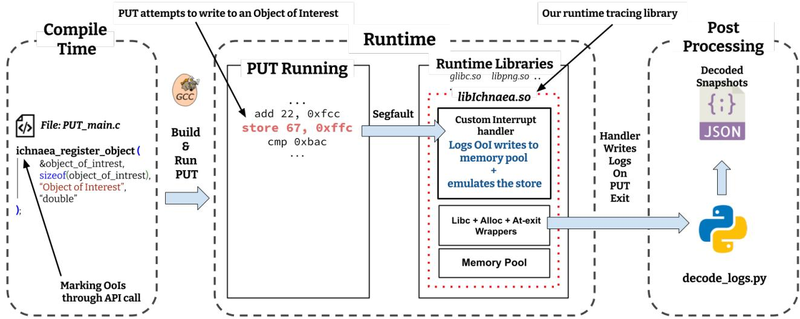  
Figure 2: System Overview of Ichnaea. The dashed lines represent the tracing phase. The red dotted line box contains all the components that form Ichnaea’s runtime library

• enables access to the underlying page

• emulates the instruction that tried to access the ObjOfInterest (so that the program runs correctly)

• iff (isTraced):

– it logs the attempted memory access with metadata (i.e., execution stack, thread id) to a dedicated trace buffer

• resets the pkey to disable access again

• returns so the program can proceed normally

This selective interception strategy ensures that only accesses to designated objects incur overheads, while all other program execution proceeds without interruption. Hence, Ichnaea remains toggled off until an ObjOfInterest is accessed. To trace accesses made by syscalls, we wrap all libc syscalls. These wrappers inspect the syscall arguments to find if an ObjOfInterest is being accessed. If so, they log the access after the syscall finishes. These wrappers remain inactive till the first call to register an object is made (see Section section 4.3 for more details.)

3. Post-processing: upon program termination, event logs stored in trace buffer are serialized into a standardized JSON format. This structured representation aids downstream analysis, enabling (i) investigation of fine-grained access patterns, (ii) correlation of memory activity with program phases and (iii) integrating traces into profiling or visualization pipelines with minimal effort. For each traced object, Ichnaea provides data e.g., the accessor’s call stack, process\_id, thread\_id, access type (R/W), timestamp and hash etc. See Appendix A.4 for more details.

## 4 Implementation

The Ichnaea prototype was implemented using less than two thousand lines of C code and required no kernel modifications. We have open-sourced our implementation online<sup>7</sup>.

## 4.1 Segfault driven tracing

Figure 3 shows sequence of operations in Ichnaea. The framework uses pagefaults (also known as segfaults) to trace object access. A segmentation fault is an interrupt raised by the memory management unit (MMU) when a program accesses a page without the right permissions that are set at runtime. At any point during runtime (ideally at the start of program, e.g., main()), one or more ObjOfInterests (heap or static allocations) are “registered” for tracing. The registration API then invokes pkey\_mprotect syscall to tag the backing virtual pages that hold those objects with a pkey. This pkey is assigned by the kernel and we use it to tag all pages that are to be traced. The current running thread then disables access to any pages that are tagged with our pkey. Hence, any subsequent access (the first box in Fig 3) to these pages triggers a segfault (SIGSEGV) — the second box in Fig 3. The resulting SIGSEGV is intercepted by our custom signal handler. The handler then (i) enables access to all pages for that thread only (ii) emulates the faulting instruction (iii) logs the access context and data and finally, (iv) returns to normal execution. Without emulation, we would have had to run the faulting instruction again after the handler unlocks all ObjOfInterests. This means that we would have to lock the ObjOfInterests right after running the faulting instruction in order to avoid trace losses. This necessitates adding a breakpoint (INT3 instruction) right after the faulting instruction. The new trap instruction will run the segfault handler again to lock the Ob jOfInterests back. Thus, causing one more round of segfault and handler execution. Furthermore, adding breakpoints in user code during runtime may cause other threads to hit the same breakpoint (e.g., while running a shared memcpy on a separate piece of data) causing additional complications.

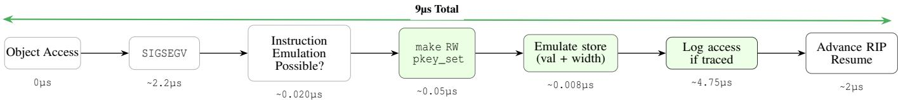  
Figure 3: Fault handling sequence in the interrupt handler. Boxes are numbered from right to left starting from 1. Box colors indicate page protection status (Green: Unlocked, Gray: Locked).

Also note that emulating all the instructions on x86 is huge engineering effort. Thus for the instructions we do not emulate yet e.g., floating point writes and other complex instructions, the handler takes the slow path. The slow path ensures that the non-emulated instruction is executed directly (on the CPU) instead, thus ensuring correct program behavior. However it’s slower in comparison to emulation (see appendix A.9 for details). Slow path is an engineering effort as emulating each instruction requires understanding and dissection — while a challenge, it is easy to overcome in production. We will explore this in future work.

Detailed Breakdown of the segfault Handler If the segfaulting instruction can be emulated (third box in Fig 3) and the faulting address corresponds to an ObjOfInterest or happens to fall on the page backing an ObjOfInterest, we implement the following steps in the interrupt handler,

1. Temporary unlock: (fourth box in Fig 3) access to all pages marked with the tracer’s pkey (Ichnaea uses only one out of 16 pkeys, to lock all objects) is enabled via pkey\_set() for that thread. Other threads will still fault if they try to access any ObjOfInterest, including the one unlocked for the current thread, hence alleviating the issue of trace losses.

2. Emulated store: (fifth box in Fig 3) the value and size of the access requested by the faulting instruction are extracted from instruction operands by inspecting CPU register states. Access is then emulated to restore original program behavior by reading/writing the appropriate number of bytes at the effective address.

3. Logging: (sixth box in Fig 3) if the access target was an ObjOfInterest, it is recorded (thread\_id, IP, call stack, data) in a dedicated trace memory pool.

4. Advance execution: (seventh box in Fig 3) after instruction emulation, the instruction pointer (RIP) is advanced to the next instruction in order to avoid another segfault. Returning from the handler auto-restores key permissions to the pre-interrupt (locked) state so there is no need to re-lock pages.

5. Exit: at ProgramUndrTest’s exit, Ichnaea writes all snapshot data from the memory pool to disk.

All the above mentioned steps are done in async-signal safe manner, for instance, by using dedicated local copies of every libc function used. Heap allocations (for Ichnaea’s own use) are carried out using custom allocators that invoke mmap [32]. For each ObjOfInterest access, we log:

(a) who accessed it, (thread and process id via the gettid()/getpid()),

(b) where it occurred, (instruction pointer RIP and call stack via libunwind())

(c) when it occurred (timestamp via clock\_gettime(), plus a global access counter) and finally

(d) what changed (before/after dumps for writes).

All the logs are written to a dedicated memory pool to avoid the overhead of file I/O during runtime. The data is written to disk at program exit.

## 4.2 Concurrent and Cross-library Accesses

Unlike traditional mprotect based techniques, Ichnaea only allows ObjOfInterest access within the current thread, so other threads will still segfault while accessing other ObjOfInterests that either happen to be on the same page or use atomic operations. This allows our framework to seamlessly support unmodified, highly concurrent applications such as PostgreSQL [44] and Nginx [41].

Since Ichnaea works by removing access permissions to the backing page of an ObjOfInterest, any access from a library (e.g., snprintf in libc, etc.) will result in a pagefault that in turn, will log the access. This alleviates the need to statically recompile all the dynamic runtime libraries which might be required for compiler based instrumentation techniques that instrument every load and store.

## 4.3 Kernel Accesses

A complication arises when the kernel accesses a userspace buffer via syscalls e.g., read(), recvmsg(), getcwd().

Because these accesses occur in kernel mode, the kernel never triggers a user-space segfault that Ichnaea relies on; instead, the kernel detects the invalid access internally, skips the syscall and returns an error such as EFAULT, indicating that an invalid buffer was encountered. A naïve remedy is to retry the syscall after unlocking the faulting page, but this fails because syscalls are stateful (many of them advance file offsets, consume descriptor buffers or deliver signals), so re-execution can alter program semantics.

We therefore wrap libc functions<sup>8</sup>. The wrapper first enables accesses to all ObjOfInterests (for the current thread), inspects syscall arguments to identify which pointers (or I/O vectors) intersect with traced objects to know what’s being accessed before forwarding the syscall to the kernel. After the call returns, the wrapper restores the original protection. We further use hashes of ObjOfInterest states to detect changes for syscalls that may be called but don’t end up writing to any ObjOfInterests e.g., a read() call on an empty file buffer. Details and an example of our wrapper can be found in appendix A.6.

Parsing Syscall arguments, though conceptually simple, is difficult in practice due to:

• variable-length aggregates: Interfaces, e.g., readv(), recvmsg() etc. pass an array of iovecs whose length is unknown until runtime, requiring a loop inside the wrapper. This is a huge engineering effort and results in some runtime overhead.

• inline syscalls and virtual dynamic shared object (VDSO) shortcuts: Some performance critical libraries issue syscalls directly via syscall or the VDSO page, bypassing libc hooks unless caught with seccomp [42] style tracing or binary rewriting [37].

These issues make a full in-kernel solution attractive, but kernel tracing requires elevated privileges and introduces maintenance cost across releases and patches. In contrast, our user-space wrapper keeps Ichnaea self-contained while still covering a significant number of syscalls that perform kernelto-user copies, viz., read(), write(), recv\*() and ioctl(), along with output pointers and miscellaneous queries such as getcwd() and getdents64(). Syscalls for which we cannot find the object addresses (e.g., ioctl, readv), we do the following: (a) for writes, we keep a hash of last states of traced objects and compare post-syscall state to determine if any change has been made (b) and for ObjOfInterest reads, if we can’t resolve the read targets by parsing the syscall arguments, we miss those traces. However, this is an engineering limitation, with enough effort a wrapper can potentially dissect all syscall targets. Empty writes (e.g., read() on an empty file) are also detected but empty reads (object passed to the syscall for reading but not read by the kernel) are not detected.

## 4.4 Invocation

First, users need to identify the ObjOfInterests (heap or global) that they wish to trace, e.g., structs such as ngx\_http\_core\_module in nginx that govern critical aspects of request handling. In a large codebase like nginx, determining which components read or modify such structures is difficult to do manually or via static analysis, especially when accesses occur through deep chains of indirection — a common pattern in nginx. Similar difficulties arise when tracking unintended accesses to a buffer or diagnosing asynchronous accesses that manifest within otherwise synchronous systems. Listing 4 in appendix A.10 shows the invocation sequence for Ichnaea. Integrating Ichnaea into an existing project requires two minor changes to program source:

1. Build-time change: Add the header tracer.h and insert our API call to ichnaea\_register\_object() for every object that should be traced. No additional buildsystem edits are necessary. An optional flag -rdynamic can be added while building to improve the quality of callstack symbols.

2. Run-time activation: Launch the program with the tracer library pre-loaded as follows: LD\_PRELOAD=libIchnaea.so ./myBinary The LD\_PRELOAD can be set for the whole environment as Ichnaea stays dormant until a program initializes it.

3. Post run data decoding: At program exit, Ichnaea dumps the binary object data snapshots and related con text information in a directory. We provide a Python script to convert binary snapshot data given the structure of objects. A sample of the JSON file with traced data from an nginx run can be found in Listing 1.

## 4.5 Tracing Dynamic Heap Allocations

Ichnaea traces dynamically allocated ObjOfInterests without requiring users to manually annotate every malloc site. It also isolates ObjOfInterests from unrelated objects to avoid unintended segfaults. To do so, Ichnaea wraps malloc/calloc/realloc to provide two additional capabilities:

(i) automatic detection of ObjOfInterest allocations

(ii) page-isolated slab allocation for each ObjOfInterest

Annotation and Automatic Detection: Pointer objects (global or heap handles) that hold references to heap buffers are registered via our API call (see section 4.4). In addition, the initialization sites of these pointers are marked with a lightweight compiler annotation (listing 2, Line 2 in appendix A.5). This annotation prevents compilers from optimizing away the store instructions needed to automatically detect the allocation.

At runtime, the interposed allocator (e.g., malloc) inspects its caller and identifies the instruction storing the return value;

the destination of this store is compared against registered ObjOfInterest handles to determine whether the allocation belongs to an ObjOfInterest. We validated this mechanism using both gcc and clang. This allows Ichnaea to trace dynamically allocated objects without requiring users to manually locate allocation sites in large codebases.

ObjOfInterest Isolation: If the allocation targets an ObjOfInterest, the wrapper allocates a page-aligned, page-sized slab using memalign() and returns that pointer; ordinary allocations are forwarded to the native allocator. Because each on-heap ObjOfInterest resides on a private page, unrelated accesses cannot spuriously trigger SIGSEGV. Even when tracing say a 1000 objects, the memory overhead would only be around 8 megabytes plus the cost of the mmap syscall made by allocators. All of these in our view are acceptable since this analysis is done offline. Appendix A.7 discusses possible refinements. Custom allocators can also be instrumented similarly using a macro (see appendix A.12).

## 5 Evaluation

We evaluate Ichnaea against two tools, (i) Intel Pin (SoTA) (ii) mprotect based tracer. The workloads we used are described in Table 1. Intel Pin was chosen since it provides complete traces (with the exception of syscalls) without any build system modification and is faster [30] than other complete tracing tools like DynamoRIO [8] or Valgrind [34]. The mprotect based tracer was chosen as it represents tools like Dthreads [28] that use mprotect to trace object accesses. For a fair comparison, we simply changed Ichnaea’s implementation to use mprotect instead of MPKs (details in appendix A.3). Thus the mprotect based tracer gets all benefits and optimizations of Ichnaea minus the MPKs. Compiler injected instrumentation based techniques were not selected as even they also instrument almost every load and store and require adding complicated compiler instrumentation passes.

The workloads are part of the SPECInt benchmark which represents real world programs (i.e., gcc, xz, perlbench) and have exhaustive benchmarks and test suites that ensure that the frequency of object accesses represent real world scenario.

As part of our evaluation, we intend to explore the following research questions:

• R1: Can the state of the art for object tracing be improved in terms of Performance? See sections 5.3.1 and 5.7

• R2: Can the quality of tracing be improved including completeness, precision and coverage? See section 3.

• R3: Can usability/adaptability of object tracing be improved? Section 3.

## 5.1 Evaluation Setup, Workloads and Metrics

The evaluation platform is running Ubuntu 24.04.2, kernel 6.14.0. Experiments were executed on Intel(R) Xeon(R) Silver 4316 CPU @ 2.30GHz with 64GiB of memory.

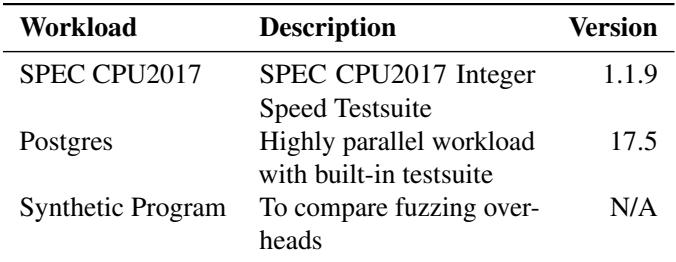  
Table 1: Description of different workloads and their attributes

Table 1 describes the workloads used in our evaluation with version numbers. We selected SPEC CPU 2017 [40] because it is the de-facto industry benchmark for CPU performance and micro architectural studies containing real work benchmarks. Its workloads are compute intensive rather than I/Obound, so they saturate the memory hierarchy with millions of loads and stores — exactly the traffic pattern we need to stress an object tracer. SPEC CPU is also what Intel Pin used in their evaluation. The exchange2 from SPEC wasn’t included as it’s written in Fortran. We ran 5 copies of each workload for this experiment. We also test a highly parallel workload, postgres [44] to highlight Ichnaea’s performance under highconcurrency scenarios. We ran postgres test suites 3 times for each tracing tool. As seen in Table 2, the main metric we capture is execution times for various test suites under diverse conditions e.g., high-frequency accesses, parallel accesses, low-frequency accesses and runtime with and without traced objects. While running fuzzing experiments, we capture the number of paths covered (i.e., exercised by the fuzzer), the number of paths successfully traced (accesses recorded by tracer) and the runtime overhead relative to native execution.

Table 2: Metrics captured across test suites and fuzzing experiments.  
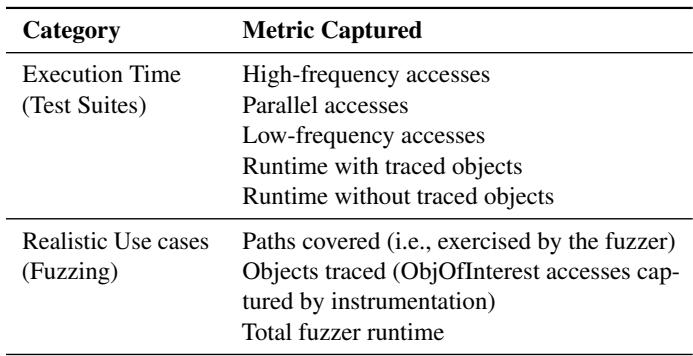

## 5.2 Object Selection Rationale

We selected global objects that were either (i) statically allocated at load time or (ii) acted as pointers to heap regions that would be allocated later. We don’t trace stack allocated objects. For external libraries, it was often hard to locate such objects directly in the source tree so we relied on the projects test-suites and benchmark drivers to discover global objects that are actually touched under realistic workloads.

We selected objects with varying access frequencies to highlight their effects on tracing overhead. For example, in SPECInt’s x265 (a HEVC/H.265 video encoder), we traced cli\_input\_t input—an infrequently accessed file pointer; while in gcc we traced input\_location, which experiences frequent runtime accesses. This range of frequencies ensures we capture diverse tracing behaviors across variables. More details are available on our website.<sup>9</sup>

## 5.3 Comparison with Intel Pin (SoTA)

We compared Ichnaea with Intel Pin (state of the art for dynamic tracing tools) using metrics such as performance, features and ease of use. To adapt Intel Pin to mimic Ichnaea’s behavior, we devised the following workflow:

1. Compile the ProgramUndrTest with static addresses so ObjOfInterest addresses don’t change at runtime

2. Dump all object addresses from the binary to a database

3. Filter out ObjOfInterest addresses from the database

4. Create a pintool [30] aware of ObjOfInterest addresses

5. At runtime, log every store instruction (address + value) whose target address is in ObjOfInterest database

6. For each ObjOfInterest access, fetch context info (pid, tid, callstack) through ptrace API

These steps create a pintool closely that mimics Ichnaea’s behavior. To trace dynamically allocated heap objects, we manually added hooks to all the allocation sites. These hooks inform the pintool of new allocations to ObjOfInterest.

## 5.3.1 Performance Comparison with Intel Pin

Figure 4 compares the runtime overhead (lower is better) incurred by Ichnaea, Intel Pin and a mprotect based tracer for SPECInt workloads. The x-axis lists all the application under the SPECWorkloads. The y-axis shows median runtime normalized to un-instrumented baseline (log scale), where a value of 136 means a 36% slowdown. For each benchmark, the green dotted line is the un-instrumented baseline, first bar (orange) is Ichnaea runtime, the second bar (yellow) is mprotect based tracer and third bar (blue) is Intel Pin runtime. For details on the kind of traced objects see Section 5.2.

Figure 4 shows that in most cases Ichnaea significantly outperforms Intel Pin — by anywhere from 12 to 60 times. This addresses research question R1 from Section 5 as we significantly improve performance when compared to SoTA. We also address R2 since these improvements to tracing techniques mean more efficient analysis pipelines meaning complex software is better understood and thus more resilient, correct and secure.

The relatively low overhead of Ichnaea stems from its lightweight design: a single LD\_PRELOAD-ed shared library imposing itself only on targeted events. By comparison, Intel Pin’s overhead originates from its dynamic binary instrumentation where all instructions are analyzed to filter out relevant events such as load and store. This evaluation of every instruction along with heavy components (e.g., code caches, JIT compiler) are responsible for IntelPins’ slowdown.

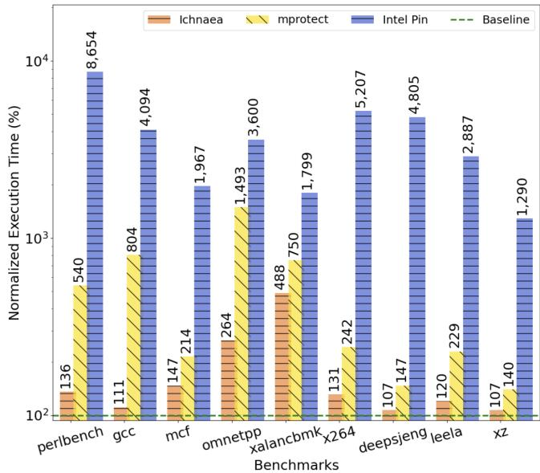  
Figure 4: Comparisons of runtimes: Ichnaea vs Intel-Pin vs mprotect Instrumented for SPECIntSpeed Benchmarks normalized to un-instrumented runtime (red line) [Log Scale]

As seen in Figure 4, while Ichnaea typically increases runtime by only 1-3× over native execution, its impact on xalan is significantly higher (4.8×). This is attributable to the work load’s extensive use of global variables that are frequently updated during runtime. Because Ichnaea traces several of these hot-path globals, many unrelated objects that reside on the same virtual memory pages and therefore incur the same page-protection and instrumentation overhead. This collateral impact amplifies the runtime cost, resulting in a relatively larger slowdown compared to typical workloads.There are ways to avoid part of these overheads which are described in section 3. However, we did not use any optimizations (e.g., placing globals objects in .rodata to cut collateral segfaults) to highlight the worst case performance for the tool. Such optimizations will only improve Ichnaea’s performance. Although the overheads are high, they’re much lesser than Intel Pin. Further, this kind of analysis is usually done offline hence making our overhead acceptable.

The general variance in Ichnaea’s performance (1 to 2×) across benchmarks is largely attributable to the characteristics of the traced objects. Some reside outside the “‘hot path”’ and incur minimal cost, while others lie directly in high-frequency execution paths, amplifying overheads.

The overhead introduced by Intel Pin during traced runs ranges from 12× to 86×. This variation depends on program characteristics such as size (larger programs require more instrumentation points) and complexity rather than solely on object access frequency or location. Additionally, applications that perform many syscalls show relatively lower overhead, because Pin does not trace syscalls, limiting visibility into such accesses.

## 5.3.2 Comparison with mprotect tracer

Ichnaea outperforms traditional mprotect based tracing anywhere from 1.3—7×. This is due to the lower interrupt handling cost as mprotect needs to modify the page table entries. In a multi threaded program, page table entry change is sent to all the cores causing TLB flushes thus significantly increasing the cost at runtime as the number of thread increases.

## 5.4 Performance comparison with Postgres

In table 3 we present the results comparing Ichnaea and Intel Pin using a highly parallel workload — Postgres [44] — using its built-in regression test suite. For these experiments, we traced five global structures responsible for maintaining internal state during runtime. The table shows Real, User and Sys times captured in seconds for an un instrumented binary, Ichnaea instrumented and Intel Pin instrumented runs of Postgres’s test suite.

The table shows that Ichnaea runs 26 times faster than Intel Pin. These results highlight Ichnaea’s ability to maintain significantly lower runtime overheads even in multithreaded, state-intensive workloads. The Sys time (time spent in kernel mode) consumed by Ichnaea is higher (11.2s) than Intel pin (10.4) as interrupts (triggered at object access) are first sent to the kernel, leading to longer kernel code execution. The User time (time spent in userspace) is higher for Intel Pin because of it’s high overheads. Details about the test environment and workload setup are provided in Table 1. This also addresses research question R1 as this demonstrates that we can make tracing highly-parallel workloads more efficient.

Table 3: Postgres performance (average of 3 runs) on experimental setup  
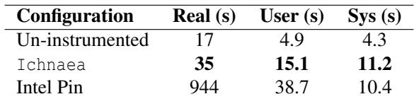

## 5.5 Object Scaling and Isolation Overheads

We analyze how Ichnaea’s overhead scales with the number of traced objects using a synthetic workload of 100, 8 byte objects (50 global, 50 heap-allocated). All objects are accessed 10000 times (split equally between reads/writes), regardless of whether they are traced, keeping the access pattern identical across configurations. Runtimes are normalized to the 2-object baseline as using configurations with no traced objects (i.e., vanilla untraced program) was skewing the results. This is because the untraced version runs 10 times faster as the workload here represents the absolute worst case for Ichnaea. A value of 1.35 indicates 35% overhead over the baseline.

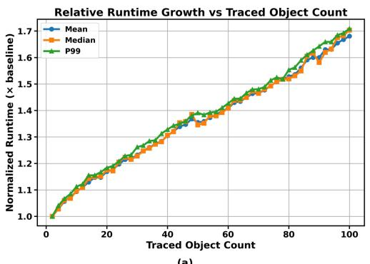  
(a)

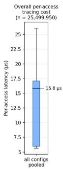  
(b)  
Figure 5: (a) Runtime of Ichnaea as traced object count grows from 2 to 100, normalized to the 2-object baseline (20 runs per configuration, 10K accesses per run, evenly split between reads and writes). Mean (blue circles), median (orange squares) and P99 (green triangles) are shown. (b) Box plot of pooled per-object access overhead in microseconds.

As Figure 5 (a) shows the overhead grows in a linear fashion — each additional 20 objects add approximately 8–10% runtime. Further, the proximity of the mean, median and tail shows the stability of Ichnaea’s overheads even under heavy load. At first glance, one might expect each new traced object to add a full ∼9µs overhead (∼9µs is around 8900% overhead in comparison to a un traced object access that takes 50ns), but this is not what we observe. Since all 50 globals easily fit on a single page (400 bytes vs 4096 bytes page size), locking any one of them faults all global accesses regardless — adding more traced globals therefore increases only logging and stack-unwind costs (less than 5µs each), not fault rate. This would be the case for most applications as a page-sized set of globals is sufficient for most use cases. Traced heap objects each occupy an isolated page and thus contribute genuine “new faults”, making them the significant driver of the overhead. The remaining overhead comes from per-access metadata writes, stack unwinds and logging.

Figure 5 (b) shows the pooled box plot of the per object access latency in microseconds. The plot is combined across all runs as the range and median of the box plots for any number of traced objects were almost exactly the same (all medians differed by less than 1% from each other) which means the object access overhead is consistent as the number of traced objects grow. In this the median is around 15 µs, since the current experiments rapidly swaps between objects which adds extra cache overheads.

This workload represents a worst case scenario: every object is on the hot path and every access is traced, unlike real programs where traced objects account for a small fraction of total execution. This is reflected in our SPECInt and PostgreSQL results (section 5.3), where overheads are substantially lower. Optimizations such as isolating hot-path globals on a dedicated page would further reduce the overheads seen here.

Table 4: Heap isolation overhead at N=10,000 ObjOfInterests (median of 100 iterations). RSS is resident set size which represents the actual physical memory used by the program.  
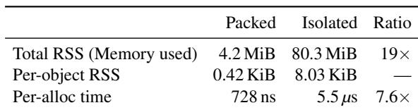

## Memory Overhead of Heap Isolation

We quantify the worst-case cost of Ichnaea’s heapisolation strategy (section 4.5) with many small ObjOfInterests exercised with a microbenchmark that performs 10,000 allocations under two configurations: packed (malloc) and isolated (posix\_memalign to a full page, exactly mirroring Ichnaea’s instrumented allocator). Sizes are drawn from a seeded distribution skewed toward small objects (∼55% in 8–64 B), matching the ObjOfInterest mix in nginx and Postgres. Every allocated object is accessed and kernel optimizations such as THP [27] are disabled to prevent 2 MiB rounding. We exclude the tracer library so the comparison isolates Ichnaea’s allocation strategy itself; Ichnaea’s allocator interposer adds a further ∼500–600 ns/alloc, independent of object size.

Table 4 shows the cost of using paged isolated slabs for ObjOfInterest allocation. RSS here stands for resident set size which is the true amount of physical ram in use by the program in contrast to virtual memory which could be higher. The heading row shows packed (normal allocation where objects are packed together) vs isolated (page aligned and page isolated allocations) and the last column shows the ratio between the two. The first row shows the total RSS for both packed and isolated configurations. For packed, since objects sized were random and small , the total size of 10,000 objects comes to 4.2MiB. For isolated section, however, since each of those 10,000 objects occupy almost two full pages, the cost is ∼80 MiBs (10,000 × 8 × 1024). The second row shows memory overhead per object which is ∼8 KiB/object, twice the 4 KiB lower bound due to kernel bookkeeping (fresh VMAs and page-table entries) when page-aligned requests bypass the glibc arena. The ratio here is skipped as sizes of packed allocations vary. The overhead is bounded and linear in N, independent of object size. The third row shows the per allocation time overhead for both configurations, a 7.6× increase is due to the fact that the glibc allocators usually have to make a special kernel request for each isolated object allocation. Page-per-object isolation is therefore the right default as the overhead and side effects (glibc allocates critical data structures on heap causing problems if those structs segfault) of not isolating could be much higher. Furthermore, such analyses are usually done offline where these overheads are acceptable. For campaigns tracking <sup>≳</sup>10<sup>3</sup>–10<sup>4</sup> small heap objects, the suballocator sketched in appendix A.7 that packs multiple ObjOfInterests into a shared isolated region that reduces both memory amplification and overhead per allocation. This could be an avenue for future improvements.

## 5.6 Detailed Analysis of Overheads

We identify 2 sources of overheads introduced by Ichnaea:

1. Runtime Library Overhead: even when no ObjOfInterests are accessed, Ichnaea incurs a one-time startup cost from loading the LD\_PRELOAD-ed runtime library, plus a continuous cost from its interceptors on allocators and libc functions, which add function-call and contextswitching overhead on every invocation.

2. Object Access Overhead: the additional latency incurred for each access operation on an ObjOfInterest.

## 5.6.1 Runtime Library Overhead

We measure the runtime of Ichnaea without tracing any objects to measure the overhead added by the alloc and libc wrappers alone. We do this by running the SPECInt benchmark suite with Ichnaea’s runtime library (libIchnaea) loaded but without tracing any objects. By design, the runtime library only interposes on allocators and syscalls after the first ObjOfInterest registration. For this experiment, however, we explicitly enabled all interceptions without requiring API calls to measure their overheads in the absence of tracing.

Figure 6 compares SPECint runtimes with and without traced objects under Ichnaea. The y-axis shows median runtime normalized to the un-instrumented baseline, where a value of 488 indicates a 388% slowdown. For each benchmark, the dotted green line is the baseline, the yellow bar is Ichnaea loaded but with no traced objects and the orange bar is Ichnaea with traced objects (for details on selected objects, see Section 5.2 for details).

The experiments show that our runtime library adds overheads even without any traced objects as all allocator functions and select syscalls are still intercepted. The percentage variability in the overheads of un-instrumented vs un-traced runs is due the frequency and the nature of syscalls used in the different workloads. Workloads that tend to use syscalls (e.g., read()/recvfrom etc.) or heap allocators (e.g., malloc) frequently incur higher overhead even when there are no traced objects. But the relative overhead is still low as syscalls are usually way more expensive than a wrapper indirection.

## 5.6.2 Object Access Overhead

To quantify the cost of writing to ObjOfInterests, we measured the CPU time for each of the event sequence from →attempted

Table 5: Breakdown of fault handling overheads in microseconds (2.4 million writes). Fast path only.  
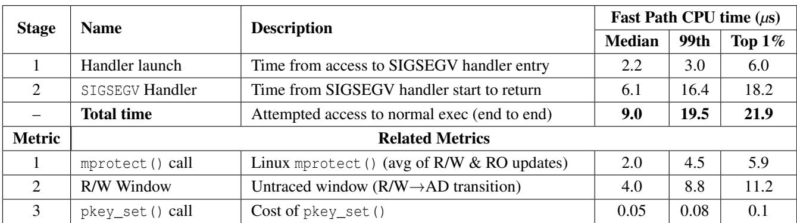

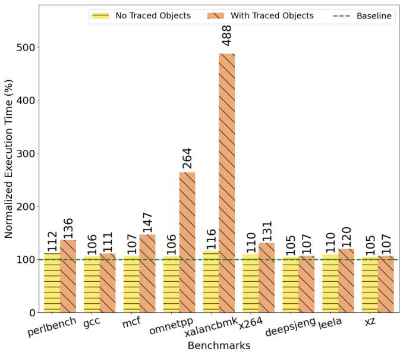  
Figure 6: workload runtime comparisons between a Ichnaea run with and without any traced objects with SPECInt suite. Green line is un-instrumented runtime.

ObjOfInterest access →SIGSEGV handling →resumption of normal execution. Table 5 reports the CPU times for each stage of the handler (see Section 4.1 and Figure 3). Each row table shows the median, 99th percentile and mean of the top 1% of samples, with times in microseconds. Results are based on 2.4 million writes generated by running a custom write-intensive workload 200 times (1200 writes per run), with writes evenly split between global and heap objects to capture diverse access patterns. We only trace writes as they are more expensive to trace than reads as the written data must be stored in the trace memory pool but reads do not.

## 5.7 Realistic Use Case

We now explore a realistic use case — fuzzing — used to improve coverage in dynamic analysis use-cases. Table 6 summarizes the performance of AFL++ [12] fuzzing our custom fuzzing workload<sup>10</sup> under three configurations: native execution (no instrumentation), with Ichnaea and with Intel Pin. X/Y means, X out of Y. Did not finish (DNF) means that even after 12 hours, the fuzzer didn’t converge to a single Object access, so we stopped the experiment. The synthetic fuzzing target was designed to be memory access intensive with multiple branches, 20% (17) of which led to an ObjOfIn terest access. All experiments were run with the same seed for fair comparison. Here, covered indicates that the path containing the ObjOfInterest was exercised by the fuzzer, while traced indicates that a ObjOfInterest access was successfully captured by the tracer. Time indicates the time it took for the fuzzer to exercise all the sites with ObjOfInterests.

Table 6: Fuzzing configurations: coverage, tracing, throughput and runtime.  
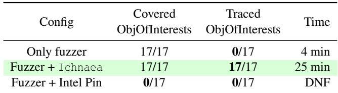

In the experiments, the native fuzzer exercised all paths containing ObjOfInterests within 5 minutes, without tracing any of them. With Ichnaea, the same coverage was achieved in 25 minutes and all 17 accesses to ObjOfInterests were captured. In contrast, Intel Pin failed to reach any ObjOfInterest paths even after 12 hours. These results show that while Ichnaea imposes overheads compared to the native configuration, it enables fuzzing assisted dynamic object tracing and makes it practical. Intel Pin, however, suffers from prohibitive slowdown and integration complexity, making it infeasible for the use case. Adapting Intel Pin was only possible through AFLpin [46], a third-party wrapper that forwards AFL’s fork-server and coverage feedback through Pin’s instrumentation. This addresses research question R2, showing Ichnaea provides a feasible path to fuzzing assisted dynamic object tracing.

## 6 Discussion

Stack Objects are difficult to trace since locking their backing page would trigger a flood of pagefaults, as most program activity happens on the stack. Padding with variable length arrays [16] (VLAs) to push the ObjOfInterest onto its own page is one workaround, but compiler-driven memory reordering can defeat the isolation.

Tracing Kernel Reads requires detailed parsing of all syscall interfaces to determine which memory regions are being accessed. This is a huge engineering effort. However this is not a fundamental challenge.

Exercising the Program for Dynamic Analysis completely and in a sound manner is an undecidable problem. However for our purpose test suites, benchmarks and fuzzing can generally yield acceptable results.

Engineering limitations, Ichnaea has known limitations e.g., bugs, un-optimized code, avoidable 6 µs interrupt handling time (see table 5, stage 2) due to expensive libunwind calls, incomplete instruction emulation (see appendix A.9) and libc syscall coverage limited to those exercised by our workloads. None are fundamental to our approach and can be addressed with additional engineering effort.

Tracing All objects Since Ichnaea is designed to trace a small, predefined subset of the total number of objects, the number of such targets Ichnaea can track, while maintaining the low overheads, is highly variable. If we trace all objects, Ichnaea may incur overheads higher than some of the existing tools as every access is now an interrupt each of which gets quite expensive. The exact point where instrumentationbased approaches overtake Ichnaea is dependent on multiple factors such the number of traced objects and their average access frequency.

## 7 Related Work

Compiler Based Instrumentation techniques e.g., ASAN [38], Gleipnir [19] rely on instrumenting every load and store which effectively has the same overhead since after every load and store, the program needs to check all memory operands of the instruction against all ObjOfInterests, if there is a match, a trampoline call to log accesses and collect metadata. One can also reduce the number of instructions that need instrumentation by pruning it out from routines that can be deterministically said to not modify any ObjOfInterest. However, these pruning techniques fail or suffer from path explosion in complex codebases like postgresSql and nginx that heavily rely on indirect control flow etc. Furthermore, the complexity of adding all these compiler passes to first instrument and then prune is non-trivial and significantly discourages usage. All dynamically loaded libraries need to be instrumented, pruned and compiled into the main binary. We did not find any compiler based tool that was complete and did this with justifiable amount of effort.

Dthreads [28] is tool that enforces deterministic multithreading for C/C++ program. It uses virtual memory protection technique to keep a check on shared data access. However, to fix the problem of false sharing, they have to split a multi-threaded program into a multiple programs sharing data which may not be idea or even feasible for many applications. Other solutions [3, 20–22] using similar techniques to tracing various things using virtual memory protections also suffer from loses described in section 2.1.3.

Hardware debug registers in X86 [17], ARM [4] also provide a fast and efficient way of tracing often used in debuggers like gdb watchpoints [13] and in [18] to isolate and monitor certain memory regions that contain secret keys. However, there’s only a few per-thread word-sized watch points that trap on every access, making them too scarce, fine-grained and context-local to trace multiple (more than 4) arbitrary-sized objects. In gdb, when the system runs out of the few hardware debug registers, it switches to single stepping mode (basically looking at every load and store). Further, combining tools like gdb with test-suites, benchmark and fuzzers may require significant amount of effort.

## Acknowledgments

We would like to thank our shepherd, Junfeng Yang (Columbia University), and the anonymous reviewers for helping us improve the paper. We wish to thank Prof. Gabriel Parmer and Gustavo Londono for discussions and feedback. This material is based upon work supported in part by the United States Air Force and DARPA under Contract No. FA8750-24-C-B031, the National Science Foundation (NSF) CPS CAREER Award 2246937, the Department of Energy (DoE) contract 49680-1-CCNS22589F and the George Wash ington University. Any findings, opinions, recommendations or conclusions expressed in the paper are those of the authors and do not necessarily reflect the views of sponsors.

## References

[1] Cve-2021-23017: Nginx resolver vulnerability. https: //nvd.nist.gov/vuln/detail/CVE-2021-23017, 2021. Accessed: 2025-11-20.

[2] AlDanial. cloc: Count lines of code. https://github. com/AlDanial/cloc, 2025. Accessed: 2025-02-12.

[3] A. W. Appel, J. R. Ellis, and K. Li. Real-time concurrent collection on stock multiprocessors. In Proceedings of the ACM SIGPLAN 1988 Conference on Programming Language Design and Implementation, PLDI ’88, page

11–20, New York, NY, USA, 1988. Association for Computing Machinery.

[4] Arm Ltd. Non-invasive debug — arm debug architecture. https://developer.arm.com/ documentation/ddi0406/b/Debug-Architecture/ Introduction-to-the-ARM-Debug-Architecture/ About-the-ARM-Debug-architecture/ Non-invasive-debug, 2008. ARM Architecture Reference Manual, DDI 0406B. Accessed: 2025-11-21.

[5] ARM Ltd. ARM Architecture Reference Manual, ARMv8, for the ARMv8-A Architecture Profile, 2022. Includes ARMv8.5-A Memory Protection Keys for EL0.

[6] Roberto Baldoni, Emilio Coppa, Daniele Cono D’elia, Camil Demetrescu, and Irene Finocchi. A survey of symbolic execution techniques. ACM Comput. Surv., 51(3), May 2018.

[7] Thoms Ball. The concept of dynamic analysis. ACM SIGSOFT Software Engineering Notes, 24(6):216–234, 1999.

[8] D. Bruening, T. Garnett, and S. Amarasinghe. An infrastructure for adaptive dynamic optimization. In International Symposium on Code Generation and Optimization, 2003. CGO 2003., pages 265–275, 2003.

[9] Jonathan Corbet. Page-table hardening with memory protection keys. Linux Weekly News (LWN.net), 2025. Accessed: 2025-11-23.

[10] Patrick Cousot and Radhia Cousot. Abstract interpretation: a unified lattice model for static analysis of programs by construction or approximation of fixpoints. In Proceedings of the 4th ACM SIGACT-SIGPLAN Symposium on Principles of Programming Languages, POPL ’77, page 238–252, New York, NY, USA, 1977. Association for Computing Machinery.

[11] Dyninst Project. Dyninst: Binary instrumentation and analysis framework. https://github.com/dyninst/ dyninst. Accessed: 2025-11-21.

[12] Andrea Fioraldi, Dominik Maier, Heiko Eißfeldt, and Marc Heuse. AFL++ : Combining incremental steps of fuzzing research. In 14th USENIX Workshop on Offensive Technologies (WOOT 20). USENIX Association, August 2020.

[13] Free Software Foundation. Debugging with GDB: The GNU Source-Level Debugger, Version 5.1.1. GNU Project, 2002. Section: Setting Watchpoints. Accessed: 2025-11-21.

[14] Free Software Foundation. The LD\_PRELOAD Environment Variable — The GNU C Library. GNU

Project, 2024. Section: Dynamic Loader Environment Variables. Accessed: 2025-11-21.

[15] Damian Giebas and Rafał Wojszczyk. Detection of concurrency errors in multithreaded applications based on static source code analysis. IEEE Access, 9:61298– 61323, 2021.

[16] GNU Project. Gcc online documentation: Variable length. https://gcc.gnu.org/onlinedocs/gcc/ Variable-Length.html. Accessed: 2025-02-12.

[17] Intel Corporation. Intel 64 and ia-32 architectures software developer’s manual, section 18.2: Debug registers. https://www.intel.com/content/ dam/support/us/en/documents/processors/ pentium4/sb/253669.pdf, 2023. Document Number 253669, Accessed: 2025-11-21.

[18] Jinsoo Jang and Brent Byunghoon Kang. In-process memory isolation using hardware watchpoint. In Proceedings of the 56th Annual Design Automation Conference 2019, DAC ’19, New York, NY, USA, 2019. Association for Computing Machinery.

[19] Tomislav Janjusic and Krishna Kavi. Gleipnir: A memory profiling and tracing tool. ACM SIGARCH Computer Architecture News, 41(4):8–12, 2013.

[20] Sheetal V. Kakkad and Paul R. Wilson. Address translation strategies in the texas persistent store. In Proceedings of the 5th Conference on USENIX Conference on Object-Oriented Technologies & Systems - Volume 5, COOTS’99, page 8, USA, 1999. USENIX Association.

[21] Roman Kashitsyn. Ic internals: Orthogonal persistence. 2022-04-28. Accessed 2025-07-22.

[22] Haim Kermany and Erez Petrank. The compressor: concurrent, incremental, and parallel compaction. SIGPLAN Not., 41(6):354–363, June 2006.

[23] James C. King. Symbolic execution and program testing. Commun. ACM, 19(7):385–394, July 1976.

[24] Saparya Krishnamoorthy, Michael S. Hsiao, and Loganathan Lingappan. Tackling the path explosion problem in symbolic execution-driven test generation for programs. In 2010 19th IEEE Asian Test Symposium, pages 59–64, 2010.

[25] Saparya Krishnamoorthy, Michael S. Hsiao, and Loganathan Lingappan. Tackling the path explosion problem in symbolic execution-driven test generation for programs. In 2010 19th IEEE Asian Test Symposium, pages 59–64, 2010.

[26] Hugo Lefeuvre, Nathan Dautenhahn, David Chisnall, and Pierre Olivier. Sok: Software compartmentalization. In 2025 IEEE Symposium on Security and Privacy (SP), pages 3107–3126, 2025.

[27] Linux Kernel Documentation. Transparent hugepage support. https://docs.kernel.org/admin-guide/ mm/transhuge.html, 2026. Accessed: 2026-05-21.

[28] Tongping Liu, Charlie Curtsinger, and Emery D Berger. Dthreads: efficient deterministic multithreading. In Proceedings of the Twenty-Third ACM Symposium on Operating Systems Principles, pages 327–336, 2011.

[29] Benjamin Livshits, Manu Sridharan, Yannis Smaragdakis, Ondˇrej Lhoták, J Nelson Amaral, Bor-Yuh Evan Chang, Samuel Z Guyer, Uday P Khedker, Anders Møller, and Dimitrios Vardoulakis. In defense of soundiness: A manifesto. Communications of the ACM, 58(2):44–46, 2015.

[30] Chi-Keung Luk, Robert Cohn, Robert Muth, Harish Patil, Artur Klauser, Geoff Lowney, Steven Wallace, Vijay Janapa Reddi, and Kim Hazelwood. Pin: building customized program analysis tools with dynamic instrumentation. Acm sigplan notices, 40(6):190–200, 2005.

[31] Michael Kerrisk. mprotect(2) — Set Protection on a Region of Memory. man7.org Linux Manual Pages, 2024. Accessed: 2025-11-21.

[32] Michael Kerrisk (Ed.). mmap(2) — memory mapping system call. https://man7.org/linux/man-pages/ man2/mmap.2.html, 2025. Accessed: 2025-12-10.

[33] Albert R Myers. A binary instrumentation tool suite for capturing and compressing traces for multithreaded software. 2014.

[34] Nicholas Nethercote and Julian Seward. Valgrind: a framework for heavyweight dynamic binary instrumentation. ACM Sigplan notices, 42(6):89–100, 2007.

[35] NGINX, Inc. Nginx: High-performance web server and reverse proxy. https://github.com/nginx/nginx, 2002–2025. Accessed: 2025-02-12.

[36] Oleksii Oleksenko, Dmitrii Kuvaiskii, Pramod Bhatotia, Pascal Felber, and Christof Fetzer. Intel MPX Explained: A Cross-layer Analysis of the Intel MPX System Stack. Proceedings of the ACM on Measurement and Analysis of Computing Systems, 2018.

[37] Eric Schulte, Michael D. Brown, and Vlad Folts. A broad comparative evaluation of x86-64 binary rewriters. In Proceedings of the 15th Workshop on Cyber Security Experimentation and Test, CSET 2022, page 129–144. ACM, August 2022.

[38] Konstantin Serebryany, Derek Bruening, Alexander Potapenko, and Dmitry Vyukov. Addresssanitizer: A fast address sanity checker. In USENIX ATC 2012, 2012.

[39] The SQLite project. How SQLite Is Tested, 1.0 edition, 2025-05-31. Accessed 2025-07-22.

[40] Standard Performance Evaluation Corporation (SPEC). Spec cpu textregistered 2017 benchmark. https://www.spec. org/cpu2017/, 2025. Accessed August 18, 2025.

[41] Igor Sysoev et al. Nginx: The high-performance web server and reverse proxy. Nginx official project.

[42] The Linux Kernel Documentation. Seccomp bpf (secure computing with filters), 2025. Accessed: 2025-08-17.

[43] The Linux Kernel Project. Linux Kernel Memory Protection Keys (pkeys), 2024. Accessed: 2025-11-21.

[44] The PostgreSQL Global Development Group. Postgresql: The world’s most advanced open source relational database, 1996-2025. Accessed: 2025-08-17; active open-source development and community.

[45] J. Torrellas, H.S. Lam, and J.L. Hennessy. False sharing and spatial locality in multiprocessor caches. IEEE Transactions on Computers, 43(6):651–663, 1994.

[46] vanhauser-thc. afl-pin: run afl with pintool. https: //github.com/vanhauser-thc/afl-pin.git, 2025. Accessed August 19, 2025; GitHub repository under AGPL-3.0 license, 66 stars, 11 forks.

[47] V. Vipindeep and Pankaj Jalote. Efficient static analysis with path pruning using coverage data. SIGSOFT Softw. Eng. Notes, 30(4):1–6, May 2005.

## A Appendix

## A.1 Access control granularity

Since modern MMUs enforce protection at page granularity, Ichnaea must change access rights for an entire 4 KiB page even when tracing single 4-byte object. For global ObjOfInterests, unrelated objects sharing the same page will also fault on accesses. Ichnaea handles such collateral SIGSEGVs like traced objects but skips logging, limiting overhead to a handler entry-exit cycle. Workarounds exist but trade usability for precision. Dedicated ELF sections aligned to page boundaries avoid interference but require linker scripts; we provide a lightweight macro (ICHNAEA\_ISOLATE\_GLOBAL) to isolate globals dedicated sections (see Line #1 in Listing 2). Alternatives include wrapping variables in a struct/union, which is portable but intrusive or object renaming, where a global ObjOfInterest is aliased within a page-aligned structure –— effective but Clang-specific. Given these trade-offs, the default strategy is to tolerate rare collateral faults and rely on the handler’s fast path to keep overhead low.

## A.2 Cost of a mprotect() call

Changing page permissions with mprotect [31] is inherently expensive due to several micro-architectural and OSlevel effects. First, each permission change requires a transition into the kernel, incurring a syscall and context-switch overhead. Second, updating page permissions forces the kernel to modify page-table entries, which triggers page-table walks and invalidates cached TLB translations. On multicore systems, the kernel must broadcast inter-processor interrupts (IPIs) to flush or synchronize TLB entries across all cores that may have accessed the page, introducing huge additional latency. Collectively, the syscall cost, page-table manipulation and cross-core TLB shootdowns make mprotect() orders of magnitude slow. A mprotect call on a single threaded application roughly costs 2.0µs (see Related Metrics in Table 5) which is a significant amount of time, this cost is further multiplied by the number of threads running in the program.

## A.3 mprotect based object tracing

Traditional way of access control for memory uses the mprotect. Although it is lossy and slow, this technique is still faster than Intel Pin. To realize this, we modified Ichnaea to use mprotect instead of pkey\_set() call to lock and unlock the ObjOfInterests. No further change was required.

## A.4 Output Format of Trace

Listing 1 shows a sample of decoded object trace generated by Ichnaea running an Nginx with 50 traced objects. This snapshot shows the runtime state of an ObjOfInterest named http\_core. It contains details such as the object’s type (ngx\_module\_t), size in memory and the number of snapshots taken so far. Each snapshot then captures the values of its fields (e.g., indices, version, signature, context pointers and names), including both raw values (like numeric IDs or memory addresses) and any resolved symbolic information (such as function names).

## Listing 1: Sample of a decoded run in json

" http\_core ": {   
" type ":" ngx\_module\_t " ,   
" size ": 200 ,   
" total\_snapshots ": 4,   
" snapshots ": {   
"0": {   
" is\_read " : false ,   
" call\_stack " : [...... , main +0 x55 ( nginx ) ],   
" pid " : 115200 ,   
" tid " : 177234 ,   
" data ": {   
" ngx\_uint\_t ctx\_index ": 18446744073709551615 ,   
" ngx\_uint\_t index ": 18446744073709551615 ,   
" char \* name ": 0,   
" ngx\_uint\_t spare0 ": [   
"0 x0 " ,   
{   
" resolved\_fn\_name :":" Null "   
}   
],   
" ngx\_uint\_t spare1 ": 0,   
" ngx\_uint\_t version ": 1024000 ,   
" const char \* signature ": 103329564877648 ,   
" void \* ctx ": [   
"0 x5dfa4a04e0e0 " ,   
{   
" resolved\_fn\_name :":" Unknown "   
}   
] ,.......

## A.5 Annotating Custom Allocators

Listing 2 shows how Nginx’s custom allocator can be instrumented with Ichnaea ’s macros. The ICHNAEA\_ISOLATE\_GLOBAL and ICHNAEA\_MARK\_PTR directives identify global pointers to be traced, while ICHNAEA\_MARK\_ALLOC\_CHK tags allocator calls so that newly created objects are automatically tracked at runtime. This lightweight annotation ensures that heap-allocated ObjOfInterests can be identified and traced by the tracer.

Listing 2: Sample of Nginx’s custom allocator instrumented with our macro

```c
void * heap_obj_ptr ICHNAEA_ISOLATE_GLOBAL ;
ICHNAEA_MARK_PTR ( heap_obj_ptr );
ngx_pool_t *
ngx_create_pool ( size_t size , ngx_log_t * log )
{
ICHNAEA_MARK_ALLOC_CHK ( size , ngx_pool_t * )
ngx_pool_t *p;
return p;
}
```

## A.6 Example of LibC Wrapper

Listing 3 illustrates how a standard libc read call is wrapped to trace kernel writes. Before invoking the real read, the wrapper temporarily unlocks only those pages that contain ObjOfInterests, ensuring that kernel writes to traced objects can proceed safely. Once the syscall completes, the same pages are re-locked to restore protection. This mechanism guarantees that updates originating from the kernel are observed without disrupting normal I/O behavior.

Listing 3: Sample read libc call wrapper for tracing kernel writes

```c
ssize_t read (int fd , void *buf , size_t nbytes ) {
void * pg_aligned_addr_of_buffer =
(void *)((( uintptr_t ) buf ) & ~( PAGE_SIZE - 1));
wrapper_objsnf_unlock_all_objs_or_one (
pg_aligned_addr_of_buffer
);
size_t rtn =
wrapper_objsnf_real_read (fd , buf , nbytes );
wrapper_objsnf_lock_all_objs_or_none (
pg_aligned_addr_of_buffer
);
return rtn ;
}
```

## A.7 Improving Isolated heap allocations

Isolating heap objects is done by allocating an individual page to each dynamically allocated ObjOfInterest even if they are as small as a few bytes. This however wastes memory capacity and in case of workloads that allocate heap ObjOfIn terests frequently, also requires the actual libc allocators to frequently request new pages from the kernel that in turn reduces performance by adding frequent syscall overheads. This can be solved by keeping track of what parts of isolated memory that was allocated for an ObjOfInterest is unused and use it for allocating future ObjOfInterests as well. This is possible with some engineering effort as doing this is equivalent to writing another malloc for ObjOfInterests. However we do not implement this in our prototype. Details on how we handle heap objects can be found in Section 4.5.

## A.8 Feature Comparison with intel Pin

While raw performance is one of the major advantages of our approach, Table 7 highlights how Ichnaea also differs in feature coverage and usability. Ichnaea uniquely supports tracing kernel writes, a capability Pin doesn’t support<sup>11</sup>. Both Pin and our framework can trace global and heap objects. Both Intel Pin and Ichnaea don’t support tracing of stack variables. However, with significant engineering effort and compiler tricks it is possible for both cases. Neither tool requires manual discovery of write sites. Both Intel Pin and Ichnaea can identify dynamic allocations of ObjOfInterests. However, Pin does not support dynamic allocation out of the box.

Finally, with respect to setup and startup, both frameworks are simple to initialize in principle, but Pin’s startup phase incurs high cost compared to the lightweight startup of Ichnaea. Together, these comparisons emphasize that our contributions go beyond speed alone — they also expand what can be traced and reduce the practical burden on users while providing rich context info. This further answers R1 since making tracing easily usable and efficient increases its adoption in software pipelines thus improving software reliability.

Table 7: Feature comparison between Intel Pin and Ichnaea.  
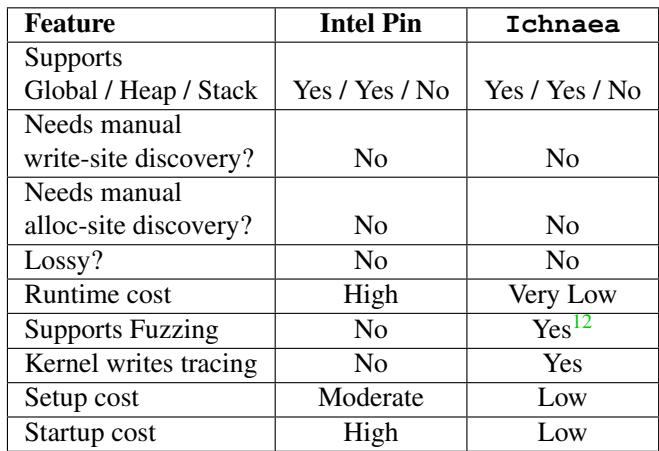

## A.9 Fallback strategy to instruction emulation

Due to complexity, emulating all x86 instruction is challenging and requires considerable engineering effort. When Ichnaea encounters such instructions, it employs a slower fallback path by planting a breakpoint at the instruction immediately following the faulting one and then allowing the original instruction to execute on the CPU after making the ObjOfInterest accessible. This approach introduces a subtle hazard in multi-threaded workloads: the injected breakpoint resides in the process’s shared .text section, making it visible to all threads. If another thread happens to be executing the same code path while operating on unrelated data it will still hit the breakpoint and be diverted into the handler, potentially corrupting execution despite object independence. Although this scenario requires both code-path overlap and precise timing between the writing thread and other concurrent threads and is therefore unlikely and hard to measure, it cannot be ruled out even when each thread operates on disjoint objects since the code segment itself is inherently

Listing 4: Invocation Example of Ichnaea

// -- Inclusion of our header file -   
// The header file defines weak refs to our main API   
// calls to signal runtime definition   
#include <.../ ichnaea .h >   
double object\_of\_intrest ;   
int main () {   
// ------ API Usage Example   
// Runtime check to verify availability of API   
if ( ichnaea\_register\_object ) {   
// Main API Interface   
ichnaea\_register\_object (   
& object\_of\_intrest ,   
sizeof( object\_of\_intrest ),   
" Object of Intrest " ,   
" double "   
}}   
// ------ Invocation example -   
Compile the program under test   
user@machine :\~ \$ make -j ‘ nproc ‘   
Run the program under test using :   
\~\$ LD\_PRELOAD = libIchnaea . so ./ my\_binary ..

shared. However, we can get rid of this problem given enough engineering effort.

## A.10 Invocation

A sample of Ichnaea’s invocation procedure is shown in listing 4

## A.11 Slow Path (Breakpoint-Based Handling).

If decoding or emulation fails (e.g., atomic instructions, SIMD stores), the handler falls back to a “slow” path. The slow path can be eliminated with engineering effort as it causes some unconventional problems. The slow path does the following:i.e.,

1. instruction analysis: the faulting instruction is disassembled to determine its length

2. breakpoint insertion: a software interrupt (also called breakpoint or INT3) is injected immediately after the instruction; the existing byte of memory that the interrupt replaced is saved in a per-thread interrupt context

3. temporary unlock: the page containing the object is marked RW

4. resume execution: the faulting instruction re-executes and completes the write natively. Execution then continues to the next instruction which is the software interrupt we inserted in step (2).

The subsequent interrupt SIGTRAP is again handled by our custom interrupt handler . The handler then does the following:

1. Relock: the object’s page is returned to RO.

2. Restore instruction: the original byte replaced by the breakpoint location is restored from interrupt context.

3. Logging: if the write target is a traced object, the store is logged into the memory pool.

4. Resume execution: the instruction pointer is set to the original restored instruction.

5. Exit: at ProgramUndrTest’s exit, Ichnaea gathers all snapshot data collected in the memory pool and writes it to disk.

## A.12 Handling Custom Allocators.

The mechanism assumes that the application invokes the glibc allocator directly (e.g., malloc calloc/realloc). However, if a workload introduces its own layer on top of libc allocs, (e.g., a custom\_malloc() that wraps malloc()), Ichnaea only sees the intermediate function and cannot match the request to a traced variable. In such cases, developers must annotate the helper itself using our macro. Listing 2 in appendix shows an example with nginx, where the macro ICHNAEA\_MARK\_ALLOC is applied to custom allocators. The macro takes the requested size and type cast as arguments and if the allocation is for a traced object, it overrides the custom allocator to return a private, isolated page. If the user needs to modify the allocated memory in their custom allocator, we also provide a macro that returns a boolean that can be used to write custom allocation logic for ObjOfInterest allocation. Our original mechanism is easily adaptable to custom allocators using simple macros (see Listing 2 for details).