USENIX

THE ADVANCED COMPUTING SYSTEMS ASSOCIATION

# Neuro-Symbolic Proof Generation for Scaling Systems Software Verification

Baoding He, Nanjing University; Zenan Li, ETH Zurich; Wei Sun and Yuan Yao, Nanjing University; Taolue Chen, Birkbeck, University of London; Xiaoxing Ma, Nanjing University; Zhendong Su, ETH Zurich

https://www.usenix.org/conference/osdi26/presentation/he-baoding

# This paper is included in the Proceedings of the 20th USENIX Symposium on Operating Systems Design and Implementation.

July 13–15, 2026 • Seattle, WA, USA

ISBN 978-1-939133-55-7

Open access to the Proceedings of the 20th USENIX Symposium on Operating Systems Design and Implementation is sponsored by

# Neuro-Symbolic Proof Generation for Scaling Systems Software Verification

Baoding He<sup>1,2,∗</sup> Zenan Li<sup>3,∗</sup> Wei Sun<sup>1,2</sup> Yuan Yao<sup>1,2,†</sup> Taolue Chen<sup>4</sup>

Xiaoxing Ma<sup>1,2,†</sup> Zhendong Su<sup>3</sup>

<sup>1</sup>State Key Laboratory of Novel Software Technology, Nanjing University, China

<sup>2</sup>School of Computer Science, Nanjing University, China

<sup>3</sup>Department of Computer Science, ETH Zurich, Switzerland

<sup>4</sup>School of Computing and Mathematical Sciences, Birkbeck, University of London, UK

## Abstract

Formal verification via interactive theorem proving is increasingly used to ensure the correctness of critical systems, yet constructing large proof scripts remains highly manual and limits scalability. Advances in large language models (LLMs), especially in mathematical reasoning, make their integration into software verification increasingly promising. This paper introduces a neuro-symbolic proof generation framework designed to automate proof search for system-level verification projects. The framework performs a best-first tree search over proof states, repeatedly querying an LLM for the next candidate proof step. On the neural side, we fine-tune LLMs using datasets of proof state–step pairs; on the symbolic side, we incorporate a range of ITP tools to repair rejected steps, filter and rank proof states, and automatically discharge subgoals when search progress stalls. This synergy enables data-efficient LLM adaptation and semanticsinformed pruning of the search space. We implement the framework on a new Isabelle REPL that exposes fine-grained proof states and automation tools, and evaluate it on the FVEL seL4 benchmark and additional Isabelle developments. On seL4, the system proves up to 77.6% of the theorems, substantially surpassing previous LLM-based approaches and standalone Sledgehammer, while solving significantly more multi-step proofs. Results across further Isabelle benchmarks demonstrate strong generalization, indicating a viable path toward scalable automated software verification.

## 1 Introduction

Formal verification plays a vital role in ensuring the correctness and reliability of software systems, especially in safetyand security-critical domains where failures can be catastrophic [1, 2, 3]. Interactive theorem proving (ITP) stands out for its expressiveness and ability to provide the strongest assurance. With ITPs, landmark projects such as CompCert (a formally verified optimizing C compiler whose correctness is mechanically proven in Rocq [4]) and seL4 (a formally verified OS microkernel whose functional correctness, security properties and reliability guarantees are proven in Isabelle/HOL [5]) have been successfully delivered, which demonstrate that formally verified systems can achieve both practical usability and rigorous correctness.

While ITP offers unparalleled assurance, it also incurs substantial costs, preventing its wide adoption, especially in large-scale, system-level software [6]. Specifically, a typical software verification workflow involves 1) writing precise formal specifications to be proved and 2) constructing rigorous proofs for these specifications, both of which demand immense human effort. For example, the seL4 verification project required approximately 20 person-years of work, and produced over 100K lines of proof scripts, compared to only about 10K lines of C implementation and merely 3K lines in its simplest abstract specification in Isabelle [5]. Moreover, developing such specifications and proofs necessitates specialized expertise in both theorem proving and the target domain, a combination that is challenging to acquire.

In this work, we focus on the proof generation step in system-level software verification projects. Recently, large language models (LLMs) have demonstrated encouraging mathematical reasoning capabilities, which inspire research into their application for software verification, particularly for proof generation [7, 8, 9, 10]. Unfortunately, both prior studies and our initial experiments show that, even when theorem statements are well formalized and relevant libraries are fully provided in advance, current LLMs still struggle to generate complete, correct proofs. We summarize two challenges as follows.

<sup>❶</sup> Lack of specialized expertise. The first challenge lies in that software verification often relies on numerous domainspecific lemmas and specialized proof tactics. Although mod ern LLMs perform well in general reasoning tasks, they are not well-versed in these specialized domains, leading to limited effectiveness when applied to proving corresponding theorems. For example, LLM4FSCQ [7] evaluated models such as GPT-4o and Gemini 1.5 Flash on FSCQ (a Rocq-based file system verification project [11]) and achieved only 38% proof coverage. Moreover, in the larger seL4 project, which involves extensive lemma libraries and customized tactics, Selene [9] found that GPT-4 succeeded on only 20% of a benchmark theorem set, despite the fact that nearly 40% of them require one-line proofs.

<sup>❷</sup> Paucity of usable data. The second challenge, which is closely related to the first, is the shortage of high-quality (training) data for software verification. For instance, the seL4 project contains only around 20K theorems and lemmas, and most proofs are written in a procedural style, where much of the reasoning is implicit and encoded in the interaction with the theorem prover. This substantially limits their usefulness in effective LLM training/fine-tuning. Among existing seL4 benchmarks, Selene [9] extracts a small subset of the project, targeting relatively easy theorems with proof lengths of one to five. FVEL [10] is more comprehensive and challenging, as it extracts all theorems to be proved from seL4. Yet even with systematic fine-tuning of Mistral-7B-Instruct [12] and Llama-3-8B-Instruct [13], FVEL reported a success rate below 10% (88 out of 1,077 theorems in the test set).

Approach. In this paper, we propose a proof generation framework that synergistically combines LLMs and ITPs, aiming for automated system-level software verification. Our approach adopts a proof step-based tree-search pipeline that iteratively queries a fine-tuned LLM to predict the next proof step until the target theorem is successfully proved.

To address the first challenge, our framework adopts a neuro-symbolic approach tailored to the nature of software verification. First, to address challenges posed by domainspecific lemmas and tactics, we incorporate a proof-step revision module that repairs or refines LLM-generated steps whenever they fail to compile or make no progress. Second, to efficiently prune unpromising branches, we utilize Nitpick [14] and QuickCheck [15] to “test” each candidate proof state and discard those that admit counterexamples; the remaining candidates are then ranked by the LLM according to their plausibility. Finally, if the tree search still fails to resolve the goal, Sledgehammer [16] acts as a backstop that scans the local library for potentially relevant lemmas and attempts to complete the current proof.

To address the second challenge, we construct our training data by extracting internal proof states from existing theorems. For example, a five-step proof yields five distinct training instances, which are subsequently used for fine-tuning. During inference, our tree-search pipeline leverages this state extraction to facilitate direct interaction between the LLM and the prover, informing step predictions. While we currently train on existing human-authored proofs, this pipeline also enables future “bootstrapping”, where new training data could be extracted on-the-fly from successful search paths [17, 18].

Experiments. We evaluate our framework on seL4 [5] proof construction. The results show that, with a fine-tuned language model, our approach achieves a total proof success rate of up to 77.6%, significantly surpassing prior automated proofgeneration approaches for seL4. Notably, it excels, compared to the two preceding systems, at successfully handling a larger number of multi-step proofs, a challenge that has not been addressed by prior work. Moreover, our framework substantially alleviates manual proof-engineering effort, reducing expert proof-writing effort by 79.8% on average in an AI–human collaboration setting. Finally, experimental results on bench marks from Archive of Formal Proofs projects (e.g., X86 Semantics , IEEE Floating Point, and SATSolverVerification), as well as the code verification benchmark Code2Inv (by translating its loop invariants into Isabelle theorems) confirm the strong generalizability of our approach.

Summary of main contributions. (1) We provide a neurosymbolic framework based on LLM-enabled tree search, tailored for real-world, system-level software verification projects. (2) We implement concrete integration of LLMs and a broad range of symbolic, logic-based tools, substantially enhancing the efficacy of proof-tree search; (3) We curate training datasets and benchmarks, and carry out thorough empirical evaluations. Our work advances a new frontier of AI4Verification, an emerging area focused on applying cutting-edge AI techniques to hardware/software verification, especially to support large-scale proof engineering for safetycritical systems and architectures.

## 2 Problem

To demonstrate why existing LLMs struggle to synthesize proofs in real-world software verification tasks, we present a representative theorem from seL4. We choose seL4 as it is one of the most widely recognized formally verified systems, with machine-checked proofs of both functional correctness and security properties in Isabelle/HOL.

An example from seL4’s verification is demonstrated in Figure 1, where the theorem cap\_swap\_valid\_objs is drawn from the invariant proofs of the abstract specification of the seL4 microkernel, and similar proof patterns recur throughout the project. To prove this theorem, human experts write down (in Isabelle) three proof steps, each comprising one tactic (e.g., simp and wp) and some used lemmas (e.g., cap\_swap\_def and set\_cap\_valid\_objs ; cf. the left panel in Figure 1).

Unlike formal mathematics, theorems in software verification are often formulated as Hoare triples {P} C {Q}, where P and Q are the pre- and post-conditions, and C denotes the program being executed. In seL4, the abstract behavior of kernel operations is modeled in a monadic style that yields imperative-like programs; the corresponding Hoare rules capture the semantics of these monadic computations.

Intuitively, the targeted theorem states that if the address space of the seL4 microkernel contains no dangling pointers (valid\_objs), then swapping the contents of two valid capability slots c and c’, which belong to two thread control blocks ( tcb\_cap\_valid c b and tcb\_cap\_valid c’ a), remains dangling pointers free. Namely, after the operation cap\_swap c a c’ b which exchanges the capabilities stored in these two slots, the resulting program state still satisfies valid\_objs expressed by the postcondition λrv. valid\_objs where rv denotes the return value of cap\_swap.

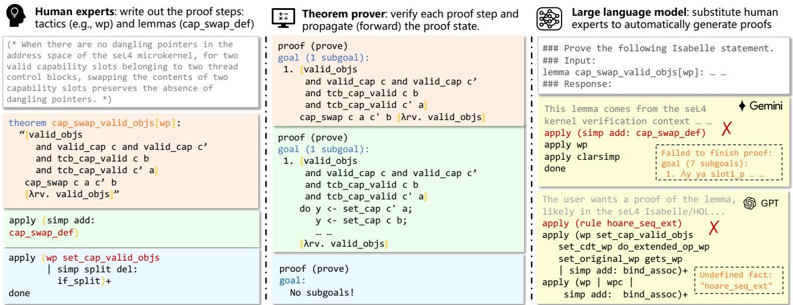  
Figure 1: An example theorem and its human-written proof from the seL4 project, shown alongside LLM-generated attempts. The human-written Isabelle proof illustrates the procedural, tactic-driven reasoning style that is common in software verification. We prompted two state-of-the-art LLMs, Gemini 3 Pro and GPT-5.1, to synthesize the same proof under controlled conditions, with web search disabled to avoid any leakage of the original script. Although both models correctly recognized the proof context and invoked some relevant tactics, neither succeeded in producing a valid proof even after roughly one minute of internal reasoning. Their attempts frequently misuse the domain-specific wp tactic, or hallucinate nonexistent lemmas.

To reduce the burden of manually constructing proofs, developers typically prepare a collection of broadly applicable tactics and lemmas, dedicated to software verification. For example, the wp tactic, short for weakest precondition, generates the verification conditions associated with a given Hoare triple. During this process, wp systematically applies a suite of previously proved lemmas, each of which encodes a weakest-precondition characterization for a specific construct or monadic computation. After a routine use of simp to unfold cap\_swap, human experts can then easily invoke the pre-defined tactic wp together with the lemma set\_cap\_valid\_objs .

In this example, the target theorem is discharged by combining the tactics wp and simp. The simplification step performs splitting, but the usual splitting rule for if is disabled to avoid unnecessary case distinction. In the proof script, the symbol | indicates that the tactic may apply either branch (or both), while the trailing + instructs it to repeat this process until no further progress is possible. This interleaving enables wp to generate obligations that simp can reduce, while simp reshapes the goals to facilitate subsequent wp reasoning. In this case, the combined step eliminates the goal entirely, and the proof concludes with done.

To assess LLMs in generating this proof automatically, we experiment with two state-of-the-art proprietary models, i.e., Gemini 3 Pro [19] and GPT-5.1 [20]; their results are shown on the right panel of the figure. While both deepthinking models successfully recognize the seL4 proof context, they are unable to apply the domain-specific tactic wp correctly. They also hallucinate lemmas that do not exist in the library (e.g., hoare\_seq\_ext ). We further attempted several rounds of iterative repair by feeding back the ITP’s error messages, but the regenerated proofs continued to fail verification. An analysis of the models’ reasoning traces shows that they frequently misinterpret the functionality and performance characteristics of the wp tactic and related lemmas (such as set\_cap\_valid\_objs ).

There are two potential approaches to addressing this issue. The first is to use retrieval-augmented generation [8, 21]. In this paradigm, given a target theorem, a retrieval module searches for relevant or structurally similar theorems and proofs, which are then supplied to the LLM as contextual guidance. However, this strategy depends on both a highquality proof corpus and an effective retrieval model: requirements that are difficult to satisfy in our setting. For example, in seL4, when developers introduce a new module (such as SysInit, as shown in our evaluation) together with its accompanying proofs, comparable proofs are often absent from existing libraries. Moreover, even when analogous theorems do exist, neither model-agnostic nor model-dependent retrieval techniques reliably identify them within a large verification codebase [21, 22]. In such cases, weak retrieval can degrade, rather than improve, the quality of generated proofs.

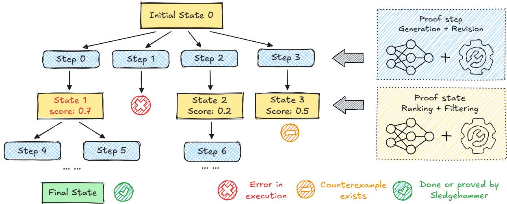  
Figure 2: Overview of our neuro-symbolic proof-search framework. Starting from the initial proof state, the system repeatedly generates candidate proof steps using a fine-tuned LLM, followed by rule-based symbolic revision to repair syntactic or semantic issues in the proposed steps. Each accepted step is executed by Isabelle/HOL to derive new proof states, which are then filtered by symbolic tools to prune states containing counterexamples or duplicates. The remaining states are ranked using cumulative LLM log-probabilities, and the highest-scoring ones are selected for further expansion in a best-first search. If the search cannot complete the proof, the framework finally invokes Sledgehammer to attempt to resolve the remaining goals.

Another approach is to fine-tune LLMs on collected proof data. This method is considerably easier to implement and has already demonstrated promising results in formal mathematical proving. However, fine-tuning a model to directly generate complete proofs for software verification remains highly challenging.

First, even in seL4, the available corpus consists of only about 20K theorems, which severely limits the effectiveness of fine-tuning. Second, unlike formal mathematics, most proofs in systems like seL4 are procedural: as our example illustrates, their true semantics reside implicitly in the theorem prover’s internal proof states rather than in the proof scripts themselves. As a result, LLMs struggle to acquire the necessary reasoning signal from surface-level proof text alone, making this approach impractical for now.

## 3 Methodology

We propose a neuro-symbolic approach for proof step search on system-level theorems. The overall procedure is illustrated in Figure 2. Starting from the root node, which represents the initial proof state, the search alternates between proposing new steps and deriving new proof states by executing those steps within the ITP.

To construct the next set of candidate proof steps for the current proof state, we first prompt a fine-tuned LLM to generate potential steps, and then apply a rule-based revision to refine or fix any imprecise suggestions. After executing these steps and obtaining a collection of new proof states, we introduce a hybrid mechanism to identify the most promising ones for further exploration. Specifically, we apply QuickCheck [15] and Nitpick [14], which serve as counterexample generators that help detect false conjectures or invalid intermediate proof states in Isabelle/HOL, to discard any proof state that contains a counterexample. We then use the LLM’s prediction score (cumulative perplexity) to rank the remaining states and select the most promising one. Finally, if the search for the proof fails, we invoke an automated tool, i.e., Sledgehammer, to attempt to complete the proof. Putting all the above together, we establish the framework in Algorithm 1.

## 3.1 Proof Step Generation & Revision

## 3.1.1 Proof Step Generation

Our approach begins by generating candidate proof steps through prompting a fine-tuned LLM. Given the current proof state, which encapsulates the available hypotheses and the target goal, we query the model to propose the next proof step using a simple instruction template:

```markdown
### Given the following Isabelle proof state,
suggest the next proof step.
### Input:
<current_proof_state>
### Response:
<next_proof_step>
```

The rationale for focusing on the current proof state is twofold. First, proof search can be modeled as a Markov decision process, in which the next step depends solely on the present state; this is also common practice in proof search and is critical for efficiency [23, 24, 25]. Second, the structure and vocabulary of the proof state provide strong cues regarding which tactics are applicable and which premises are likely to be relevant [26, 27]. Additionally, we predict a single step at a time, as one-step prediction empirically yields more reliable results than multi-step prediction.

Algorithm 1 Proof Search Framework   
Require: initial state s , neural generator G, symbolic   
checker C , max iterations I<sub>max</sub>   
1: initialize tree T with root containing s<sub>0</sub>   
2: for each iteration i ∈ [1, I<sub>max</sub>] do   
3: n ← highest\_score\_unexplored(T )   
4: succStates ← []; failStates ← []   
5: candidates ← G(n.state) ▷ step generation   
6: for each step δ ∈ candidates do   
7: s ← apply(δ, n.state) ▷ ITP execute   
8: if s is error state then   
9: failStates.add((s, δ, log p ))   
10: else   
11: succStates.add((s, δ, log p ))   
12: for each (s,δ, log p ) in REVISE(failStates) do   
13: s ← apply(δ, n.state)   
14: succStates.add((s, δ, log p ))   
15: for each (s,δ, log p ) in succStates do   
16: if s has no subgoals then   
17: return proof script ▷ proof completed   
18: if C (s) detects duplicate or counterexample then   
19: continue ▷ state filtering   
20: score ← combine(n.score, log p<sub>δ</sub>) ▷ scoring   
21: insert\_node(T , (s, score))   
22: return FAIL

To fine-tune the model to predict such next steps, we construct a dataset of state–step pairs extracted from existing theorems and their complete proofs. Each proof is decomposed into individual proof steps and replayed in the ITP, allowing us to record the intermediate proof state preceding every step. Using these aligned pairs, we fine-tune the LLM to generate outputs that are not only syntactically correct but also semantically sensible. Finally, since proof search demands efficient generation, we employ relatively small LLMs (e.g., 1.7B or 7B size), which are nevertheless sufficient for our specific tasks.

## 3.1.2 Proof Step Revision

Writing syntactically and semantically valid proof steps in an ITP (such as Isabelle) is challenging, particularly in system verification tasks that depend on numerous domain-specific lemmas and tactics. Consequently, even a well-trained LLM may generate steps that either refer to premises or tactics absent from the current proof context, or cannot be applied to the current goals due to syntactic errors or lack of progress. Such failures substantially degrade the effectiveness and efficiency of the proof search.

Algorithm 2 Proof-step revision and execution   
Require: Failed proof state set failStates   
1: revisedSteps ← []   
2: premiseSet ← established from trainingCorpora   
3: tacticSet ← established from trainingCorpora   
4: for each (s,δ,log p ) ∈ failStates do   
5: if s.error is w.r.t. tactic then ▷ tactic repair   
6: p ← extract referred premises in δ   
7: revisedSteps.add(combine(tacticSet, p))   
8: if s.error is w.r.t. premise then ▷ premise repair   
9: t/p ← extract referred tactic/premises in δ   
10: p<sup>′</sup> ← retrieve similar premises from premiseSet   
11: revisedSteps.add(combine(t, p<sup>′</sup>))   
12: return revisedSteps

Despite their incorrectness, these failed attempts often contain useful information. Continuing our running example, an LLM might identify relevant premises cap\_swap\_def but pair them with an inapplicable tactic by; or it may propose a promising tactic wp while selecting premises hoare\_seq\_ext that do not precisely fit the context.

To fully exploit these incorrect but reasonable responses from LLMs, we employ a best-effort repair procedure. Whenever the ITP rejects an LLM-generated step, we record it for post-processing and re-evaluate the revised version. After examining all proposed steps for a given proof state, we systematically transform the failed ones in two ways: (1) tactic repair: we extract the premises referenced by misused tactics and recombine them with a curated set of frequently used tactics; and (2) premise repair: we search the proof context for similar premises and substitute them where appropriate. By synthesizing additional candidate steps, these symbolic revisions help reveal prover-accepted steps, thereby strengthening the overall proof search.

For the tactic repair, we first extract all tactics from the training corpus. Given a proof step rejected by the ITP, we attempt to rewrite it by identifying the premises referenced in the failed step and recombining them with the pre-built tactic set. As to the premise repair, which explicitly targets proof steps that fail with an “undefined fact” error, we attempt to correct every LLM-generated undefined premise using an available version from the proof context. Concretely, we compare the undefined fact with all candidate premises using edit distance and select the closest matches (e.g., the top three). The failed step is then revised by substituting the matched premises for the undefined ones.

The procedure of proof-step revision is summarized in Algorithm 2. However, the revision can produce a large number of candidate steps. To alleviate this, we impose constraints to keep the search space manageable. For tactic repair, we limit the tactic set (e.g., to the 12 most frequently used tactics). For premise repair, we pre-select a compact subset of premises from the library. In particular, we use MePo (a heuristic module in Isabelle’s Sledgehammer that ranks and selects premises relevant to a given goal) as a lightweight relevance filter to retrieve the 128 facts most related to the current subgoal.

## 3.2 Proof State Filtering & Ranking

## 3.2.1 Proof State Filtering

To alleviate state explosion in tree-search approaches, we reorganize the accumulated proof states before further exploration. Particularly, after generating new proof states by executing the newly produced proof steps, we first invoke two complementary symbolic tools, QuickCheck [15] and Nitpick [14], to detect potential counterexamples in the candidate states. QuickCheck performs random property-based testing on executable parts of the proof state, whereas Nitpick translates higher-order formulas into finite relational models and searches for counterexamples using Kodkod, which is a SAT-based first-order relational model finder.

Additionally, we adapt the tool SolveDirect [28] to detect potentially duplicate proof states. Initially, SolveDirect determines whether a newly stated theorem can be solved directly using an existing one. In our setting, we formalize two proof states as theorems and apply SolveDirect in both directions to determine whether they are semantically equivalent.

We use a basic theorem in seL4 as an example to illustrate proof state filtering. Consider the “signed overflow” theorem, whose formal statement is as follows.

theorem sofl\_test:   
‹ sint x + sint y = sint (x + y) ⇐⇒   
drop\_bit (size x - 1)   
((x + y XOR x) AND (x + y XOR y)) = 0 ›   
for x y :: ‹ ’a::len word ›

The theorem claims that for two signed machine words, the value of their machine-level sum matches the sum of the mathematical values they represent. This property guarantees the correctness of the machine-word definitions on which the low-level kernel specifications depend. To prove this theorem, the LLM proposes a total of 8,445 candidate proof steps, rendering exhaustive exploration prohibitively time-consuming. Nevertheless, our filtering reveals that 44.2% of these steps lead to duplicate proof states, and 52.3% of the remaining states are unprovable due to existing counterexamples. Thus, the state-filtering process effectively eliminates unproductive effort and conserves the search budget, enabling the proof to be found much earlier.

## 3.2.2 Proof State Ranking

To guide the proof search efficiently, we rank all proof states and always expand the most promising ones first. To score a given proof state, we rely on the log probabilities predicted by the fine-tuned LLM. The LLM is trained to predict the next proof step; its log probability directly reflects the model’s confidence in applying that step to the current proof state.

Consider a candidate proof state s<sub>L</sub>, obtained by applying a sequence of proof steps (a<sub>1</sub>, . . . , a<sub>L−1</sub>). We define its cumulative log-probability score as

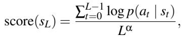

where s<sub>1</sub>, . . . , s<sub>L−1</sub> are the intermediate states produced by the corresponding steps. The normalization term L<sup>α</sup> mitigates the inherent bias against longer proof sequences, with the exponent α specifying the degree of mitigation [18], which we set to 1 by default. After computing the score for each proof state, we select the top-k states for further expansion where k is a hyperparameter.

## 3.3 Hammer Integration

Hammers are tools designed to discharge proof goals in ITPs automatically. In Isabelle, the primary hammer is Sledgehammer [16], which applies ATPs and SMT solvers (e.g., Z3, CVC5, E, SPASS, Vampire, etc) to the current goal and synthesizes corresponding Isabelle proofs. When invoked, it first retrieves a fixed number of potentially relevant premises that may aid in solving the goal. These premises, together with the goal, are translated into a form suitable for backend ATP and SMT solvers. If a backend solver succeeds, Sledgehammer attempts to reconstruct a corresponding Isabelle proof step, and, when this reconstruction succeeds, a complete proof for the current goal is returned to the prover.

Although Sledgehammer’s performance is far from satisfactory for our tasks, it plays a mutually beneficial role in the tree search process. In particular, while tree search may fail to solve the original problem within a limited search budget, it often reduces the problem to a simpler form that Sledgehammer can solve, even though it cannot solve the initial goal on its own. This makes it natural to integrate the hammer into our framework. Because invoking the hammer at every search step is prohibitively expensive, we only call it when tree search fails. Specifically, upon search failure, we rank all proof states in the currently expanded tree, select a small subset with the highest scores, and pass them to Sledgehammer for a final attempt at solving the goal.

## 4 Evaluation

This section presents our experimental results. We use seL4 as a system-level evaluation testbed to demonstrate both the effectiveness and efficiency of our proposed method. In addition, we introduce four additional repository-level benchmarks to further assess its generalizability. Specifically, our study aims to address the following research questions (RQs):

• RQ1 – Effectiveness: Does our proposed method outperform existing techniques in generating proofs for seL4?

• RQ2 – Efficiency: How much human effort in proving seL4 can be saved using our proposed method?

• RQ3 – Generalizability: Can our method perform well on the verification of other software projects?

• RQ4 – Ablation: What is the contribution of each component within our framework?

All evaluations were carried out within a dedicated Docker environment on a Linux server with an AMD EPYC 9654 96-core processor and six high-end GPUs.

## 4.1 Isabelle REPL

To enable efficient interaction with Isabelle from Python, we implement a new Isabelle REPL (Read-Eval-Print Loop), whose logic builds on scala-isabelle [29] and Py4J [30]. The REPL provides a Gateway Server that exposes Isabelle components to Python clients through a unified API. This design enables programmatic interaction with Isabelle, allowing users to parse Isabelle theories, extract run-time context information, and execute proof steps incrementally.

Compared to the previously developed Isabelle REPL, PISA [31], our REPL supports more recent Isabelle versions and provides extended ML-level capabilities. A wide range of Isabelle’s proof-automation tools, including Sledgehammer, Nitpick, QuickCheck, and other integrated methods, can be accessed directly through our interface. It also improves the extraction of information from proof contexts, such as variables and assumptions in proof goals, dependencies of proved theorems, and facts selected by Sledgehammer.

In addition, our REPL provides improved management of the Isabelle process, top-level state, and theories. It allows users to safely impose strict time limits on Isabelle processes, as well as to clone, restore, and switch between different proof states. Theory management is also strengthened: in large verification projects, complex theory dependencies can heavily degrade compilation efficiency. For example, in the CRefine theory of seL4, a single proof step takes more than one minute to process. To address this, we implement a caching mechanism that avoids redundant execution of unrelated theorems and proofs, significantly reducing unnecessary recomputation.

## 4.2 Experimental Setup

Dataset. We use the FVELER dataset [10], which comprises 29,125 theorems from seL4. The dataset is split into four subsets, i.e., training, validation, test, and test-hard, containing 26,081, 1,115, 1,077, and 852 theorems, respectively. Following the FVEL criteria, the training, validation, and test sets are randomly partitioned. In contrast, the test-hard set consists of theorems drawn from three specific and independent sessions, i.e., SysInit, SysInitExamples, and LibTest, that do not appear in any of the other splits. Note that sessions are the way Isabelle organizes theory files, which resemble the relationship between code files and libraries in other program ming languages. A theory can import other theories, and a session can depend on other sessions by declaring dependencies in the Isabelle ROOT file. These sessions are typically selected based on the depth of their session-level dependency graphs, and the theorems they contain exhibit more complex dependencies, making them considerably more challenging to prove.

In our experiments, we use the training set as the corpus for fine-tuning LLMs, and adopt validation, test, and test-hard sets to evaluate our proposed framework. From the training set, we further extract all proof state–step pairs, yielding a total of 181,887 pairs. On average, each theorem contributes to about seven pairs, substantially increasing the amount of supervised data available for model training.

Training. We fine-tuned two small models, Qwen3-1.7B [32] and Mistral-7B [12], to predict and score each proof step. We carried out the full-parameter supervised fine-tuning (SFT) using the Llama-Factory framework [33]. We use DeepSpeed ZeRO-2 optimization to enable memory-efficient distributed training. The training used an effective global batch size of 16 and ran 3 epochs using bfloat16 mixed precision. The learning rate was set to 1e-5 and followed a cosine decay schedule with a warmup ratio of 0.1.

Proving. For the LLM inference, we adopt a high temperature of 1.0 and a top-p value of 0.95 to explore the proof space sufficiently. The maximum generation length is fixed at 2,048 tokens. In each search iteration, at most five proof states are selected; for each proof state, the model is prompted to generate 128 candidate proof steps. In our framework, we disable LLMs’ internal thinking to improve inference efficiency.

When proof search fails, we select the 16 highest-scoring proof states and invoke Sledgehammer for assistance. We run Sledgehammer with its default premise-selection strategy: it first selects 2,048 most relevant premises for the current proof goal using MeSh, which combines MePo [34] and MaSh [35] to gauge relevance between the proof goal and available facts in the context. With these retrieved results, Sledgehammer then attempts to discharge the current subgoal using the builtin SMT/ATP solvers Z3, CVC5, E, SPASS, and Vampire, with a 60s time limit.

Baseline. We select four neural or symbolic proof-generation methods as baselines. Selene prompts GPT-4o with the target problem and several examples to generate a candidate proof. FVEL follows a similar paradigm but also fine-tunes a Mistral-7B-Instruct model on the training data to produce complete proofs, rather than using in-context learning. We also include two symbolic methods, Auto and Sledgehammer, which operate purely symbolically to prove the target theorem. Here, Auto is a collection of common symbolic automatic proving methods in Isabelle, such as by simp, by auto, and by fastforce. The time limit for all methods is set to 120 minutes, as we observed no noticeable improvement when increasing it further.

Table 1: Proof success rates (%) across validation (Val), test (Test), and test-hard (TsHd) splits. Compared to existing neural and symbolic provers, our framework delivers substantial improvements: Qwen3-1.7B achieves 70.4% overall success, and Mistral-7B reaches 77.6%, exceeding the strongest baseline by 30.0 and 37.3 percentage points, respectively.  
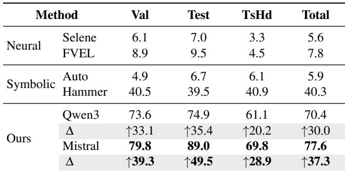

## 4.3 Experimental Results

## 4.3.1 RQ1: Effectiveness Comparison

Table 1 summarizes the performance of our approach compared to both neural and symbolic baselines. Among neural methods, Selene achieved 156 successful proofs, while FVEL improved this to 219. As for symbolic baselines, Auto proved 164 theorems, whereas Sledgehammer reached 1,124. In contrast, our framework substantially outperforms all these baselines across different splits. Using the fine-tuned Mistral-7B model, our approach produces a total of 2,167 successful proofs, of which 788 are on the validation set, 811 are on the test set, and 568 are on the test-hard set. This accounts for 77.6% of all still valid theorems across the three evaluated sets, 37.3 percentage points higher than the best baseline, Sledgehammer. It is also encouraging that, on a relatively small model, Qwen3-1.7B, our approach manages to complete the proof of 1,965 theorems, which amounts to 70.4% of the total theorems. This demonstrates that in a real environment where new proofs need to be crafted, a deployed small model can already help with the development of verification.

We further evaluate the performance of our automated proving approach in two aspects. First, prior work struggled to generate nontrivial proofs. Since the proofs in seL4 are largely procedural, we use the proof length as a proxy for proving difficulty. We compute the proof success rate across different proof lengths and present the results in Figure 3. The results show that our approach is more capable of proving longer theorems than previous baselines. Although the success rate naturally decreases as proof length increases, it remains around 20% even for the 393 theorems whose proofs exceed 10 lines. We leave it as future work to investigate more effective strategies for constructing longer proofs.

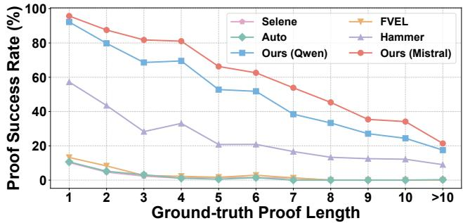  
Figure 3: Proof success rate across ground-truth proof lengths. Our approach consistently outperforms existing methods. In particular, the success rate decreases as proofs grow longer, but our approach still maintains non-negligible performance even on proofs exceeding 10 lines.

Second, we examine the performance across different proof sessions. We group the seL4 theorems into six major categories w.r.t. the functionality [5, 36, 37]: Base Libraries & Tools (Base), Specifications (Spec), Abstract-Level (A-Level) Properties, Refinement from Abstract-Level to Executable C (A→C), Security/Information Flow Control (IFC), and System Initialization Group (SysInitGroup). Figure 4 presents the results across these categories, demonstrating that our approach delivers superior performance compared with all baselines across all sessions. Notably, under the test-hard set division strategy, SysInitGroup is derived from a completely distinct session and is isolated from the training data, yet our approach still achieves a success rate of 67.6%.

## Response to RQ1

Our approach substantially outperforms baselines, achieving a success rate 37.3 percentage points higher than the (symbolic) ATP tool Sledgehammer and 69.8 percentage points higher than the state-of-the-art neural method. It remains reliably effective across different proof difficulty levels and session categories. Further, it demonstrates good generalizability, successfully discharging 67.6% of the theorems from unseen sessions during training.

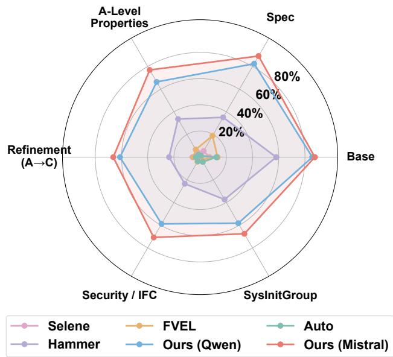

Figure 4: Proof success rates across the six seL4 session categories. Our approach yields stronger performance than all baselines in all sessions. Notably, it achieves high accuracy even on the challenging SysInitGroup category, which is entirely unseen during training.  
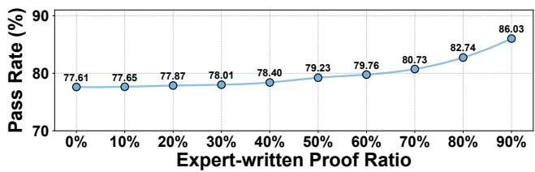  
Figure 5: Proof completion rate under varying proportions of provided proof lines. Our method is increasingly effective as more human-written lines are supplied. Overall, the method reduces human effort by 79.8% on average.

## 4.3.2 RQ2: Proving Efficiency in Saving Human Efforts

To evaluate how effectively our approach reduces manual effort in developing proof scripts, we adopt a standard metric: the coverage of the entire library that can be automatically generated [38]. As summarized in Table 2, our method successfully proves theorems whose corresponding proofs account for 6,235 lines in the seL4 proof corpus, achieving 36.2% coverage across all evaluated theorems. Under this metric, our approach yields more than a one-fold improvement over existing baseline methods.

The coverage metric above credits only fully automated proofs. To also capture partial assistance, we simulate an AI–human collaborative workflow, where our framework completes proofs after several proof lines have been written by human. This experiment depicts a scenario where human experts can initially provide some reliable proof directions, and then AI attempts to complete the subsequent proof tasks. In practice, for each theorem, we provide a prefix taken from the ground-truth proof (the first σ fraction of expert-written lines from the dataset) and ask our approach to complete the remaining steps, starting from the resulting proof state reached after executing the provided lines.

Table 2: Coverage results of automatically generated proof lines. Our method attains the highest coverage, proving theorems whose existing proofs amount to over one-third of all proof lines and substantially outperforming existing baselines in reducing manual proof-script development effort.  
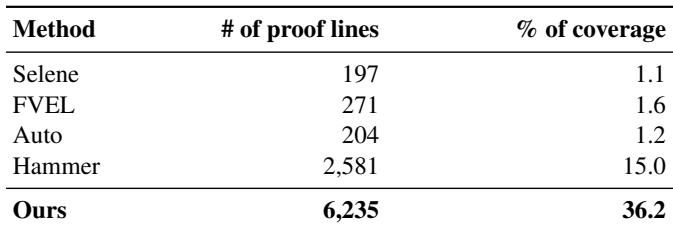

We then define an effort saving metric η for this experiment. Specifically, if our approach proves a theorem with at least the first σ fraction proofs provided, the effort saving is then 1 − σ. For instance, consider a theorem whose ground-truth proof consists of 10 lines: if our framework cannot complete the proof when the first two lines are provided, but succeeds when the first three lines are provided (σ = 0.3), the effort saving for this theorem is 0.7. We compute the average effort saving under this setting as:

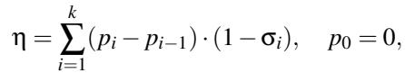

where (σ<sub>1</sub>, . . . , σ<sub>k</sub>) are the prefix fractions in ascending order, and p<sub>i</sub> is the fraction of theorems whose remaining proof can be completed automatically given a σ -prefix; theorems unsolved at every evaluated σ<sub>i</sub> contribute zero saving.

Figure 5 plots the proof completion rate over the prefix fraction σ. Consistent to the intuition, as the prefix size grows, more theorems become completable. This yields η = 79.8%, meaning our approach reduces human proof-writing effort by roughly 80% on average in this setting.

We also record the time consumption of our framework as a reference; the average time to generate a successful proof is 139.1 minutes. However, it is worth noting that this average is skewed upward by a small number of theorems that take extremely long to prove. In our experiment, we find that 58.4% of the theorems are proved within 10 minutes, 73.4% within 30 minutes, and 80.8% within 2 hours. Therefore, the majority of proofs are obtained within minutes to tens of minutes—substantially faster than manual proof development, which often requires hours to days per theorem for complex system properties.

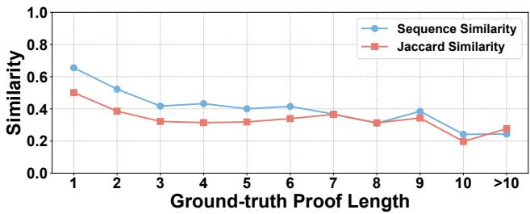  
Figure 6: Sequence and Jaccard similarity between generated and ground-truth proofs across proof lengths. Both metrics remain low and decrease as proofs grow longer, suggesting the model synthesizes novel strategies rather than recalling memorized proofs.

## Response to RQ2

Our approach alleviates much of the burden of interactive theorem proving, automatically completing proofs that correspond to 36.2% of the proof lines in the evaluated corpus and reducing expert effort by approximately 79.8% in an AI–human collaboration setting. Moreover, it is able to synthesize the majority of proofs within a practical time budget.

## 4.3.3 RQ3: Generalizability to Other Projects

A major concern with training-based methods is their generalizability, namely, whether the approach is only applicable to a specific domain due to potential data leakage or overfitting.

To investigate possible leakage, given that the seL4 proofs are publicly available and that the pre-trained model may have already incorporated some of the knowledge, we compute the similarity between the ground-truth proofs and the proofs generated by our approach using sequence similarity [39] and Jaccard similarity [40]. As shown in Figure 6, both metrics remain low and, crucially, decrease as proof length grows. If the model were memorizing ground-truth proofs, we would expect similarity to remain high regardless of length; the observed downward trend instead suggests the model is synthesizing novel proof strategies rather than recalling memorized ones. The only exceptions are one- or two-line proofs, where the solution space is inherently small—yet even among these, only 16.7% are identical to the ground truth.

We further explore the generalizability of our approach and the fine-tuned LLM. We select three projects from the Archive of Formal Proofs (AFP\*), i.e., X86 Semantics [41], IEEE Floating Point [42], and SATSolverVerification [43], to directly apply proof search on the theorems therein. In addition, we include the code verification benchmark Code2Inv and translate its loop invariants into Isabelle theorems.

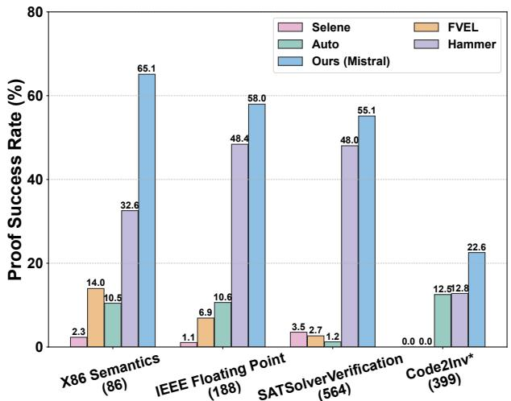  
Figure 7: Performance of our proof search framework on additional benchmarks. The x-axis lists the benchmarks, where entries in brackets denote the number of theorems included in each benchmark. Our approach consistently achieves higher proof success rates across all benchmarks, demonstrating strong generalizability and robustness.

The performance of our approach and baselines is shown in Figure 7. Because the X86 semantics benchmark is more relevant to the seL4 project, the fine-tuned LLM performs particularly well on it, yielding a 32.5% higher success rate than the baselines. The other three benchmarks are hammerfriendly because of their SMT-oriented nature. Even in this setting, our framework demonstrates superior effectiveness, achieving an average relative improvement of 36.9%.

## Response to RQ3

The knowledge acquired by the fine-tuned LLM, together with our proof search framework, generalizes well across domains. In particular, the approach can be effectively leveraged to assist proof construction in a wide range of formal verification tasks beyond the seL4 setting.

## 4.3.4 RQ4: Ablation study

Since our approach integrates several components, namely LLMs, hammer, as well as proof-step revision and proofstate filtering mechanisms, we conduct ablation studies to evaluate the contribution of each part of the framework. To assess the impact of our fine-tuned model, we replace it with off-the-shelf LLMs such as GPT-4o or DeepSeek. Due to budget constraints (running tree search costs approximately \$4.1 per theorem on average when using the DeepSeek or GPT-4o APIs), we randomly sample 200 theorems from the benchmark and use the DeepSeek API to propose proof steps.

In addition, inspired by Rango [8], we implement a retrieval-augmented generation (RAG) mechanism. The retrieval module fetches both similar proof steps and potentially relevant premises. Similar steps are retrieved from the training set based on the similarity between their associated proof states and the current proof state, where these states are tokenized into sequences of identifiers, and relevance is measured using BM25 [44]. For premises retrieval, we continue to rely on Sledgehammer’s MePo heuristic for efficiency. The final prompt for LLMs includes the retrieved steps and premises along with their statements, and we restrict the total lengths of steps and premises to 1024 and 512 tokens, respectively.

The results for all method variations are reported in Table 3. Overall, although adding tree search and RAG steadily improves DeepSeek’s performance, these variants still fall significantly short of our full framework. This confirms that the combination of the fine-tuned model, structured search, and hammer integration is essential for achieving high proof success rates, and highlights the importance of each major component in our design.

We also evaluate the impact of the fine-tuning process by adopting a hammer-free tree search setting to focus on the quality of proof steps generated by the model itself. As shown in Table 4, vanilla base models such as Mistral-7B and Qwen3- 1.7B struggle with formal proof tasks, yielding negligible success rates even when augmented with tree search. This underscores the necessity of our domain-specific fine-tuning.

To evaluate the impact of the step revision mechanism, we analyze the theorems that become difficult to prove when the revision is disabled. We observe that revision is most beneficial when the LLM fails to generate enough effective proof steps. In particular, for the most challenging 77 theorems where the model initially proposed no valid steps and therefore failed immediately, the revision procedure is highly effective, enabling 24.7% of these theorems to be proved. For a broader set of 220 theorems where the LLM proposed fewer than 5% valid steps, the revision mechanism still provides substantial gains, allowing 11.8% of them to succeed.

Regarding the necessity of proof state filtering, particularly the counterexample detection, our experiments show that incorporating this component allows the system to identify an average of 1.3 counterexamples per evaluated theorem. For the subset of search traces that contain counterexamples, the average number rises to 11.1. These results indicate that counterexample detection is valuable for identifying unprovable states early and preventing unproductive search efforts, although it does not directly increase the overall success rate.

Table 3: Proof success rate (%) on several variants of our framework. The proof success rate increases progressively as tree search, retrieval augmentation, and hammer are incorporated, indicating the necessity of each component. The comparison highlights that our full approach, which replaces the off-the-shelf model with a fine-tuned LLM, achieves substantially stronger performance.  
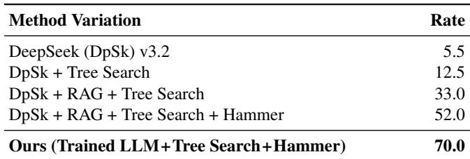

Table 4: Effect of supervised fine-tuning under the same treesearch configuration. Without fine-tuning, the base models solve almost no theorems; in contrast, after supervised finetuning, both models reach around 60% proof success.  
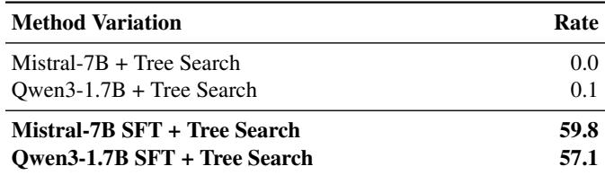

## Response to RQ4

Each of the symbolic and neural components in our framework plays an essential role, and their synergy substantially strengthens the overall theorem-proving capability for software verification.

## 5 Further Analysis

Beyond aggregate accuracy, we examine how our proposed framework actually constructs successful proofs and what causes the remaining failures.

## 5.1 Successful Case Studies

We discuss two successful proofs that exhibit complementary patterns: a short symmetry lemma closed by an LLMproposed case analysis combined with the symbolic tool Sledgehammer (C1), and a long Hoare-triple proof for an seL4 fault handler built entirely from LLM-generated steps (C2). For each, we show the theorem, the proof our framework discovered, and the search behavior behind it.

C1. A symmetry lemma in CSpace. The seL4 lemma same\_object\_as\_commute , from the CSpace invariant development, states that the capability-equivalence relation same\_object\_as is symmetric. The seL4 proof reduces the equality to a one-way implication via subgoal\_tac and closes both directions with a single auto call. Our framework takes a different route: it splits on c’ first and lets Sledgehammer discharge each constructor case independently.

lemma same\_object\_as\_commute:   
"same\_object\_as c’ c = same\_object\_as c c’"   
apply (case\_tac c’)   
apply (simp\_all add: same\_object\_as\_def split:   
cap.splits)   
apply blast   
apply meson   
apply blast   
using bits\_of\_def apply force   
apply blast   
apply blast   
using same\_aobject\_as\_commute by blast

What the framework did. At depth 0, the LLM proposed several decompositions. Tree search explored seven of them, including case\_tac c with various simp-set expansions, before settling on case\_tac c’ followed by simp\_all (split: cap.splits), which left a small frontier of constructor cases. Sledgehammer then closed the leaves with single-line blast, meson, and force calls, together with the previously proved same\_aobject\_as\_commute .

C2. Invariance under VM-fault handling. The lemma hv\_inv\_ex, from the ARM ArchSyscall\_AI session, is a toplevel Hoare triple for seL4’s VM-fault handler: it asserts that an arbitrary precondition P is preserved along the exceptional return path. The seL4 proof is a single composite tactic that relies on dedicated \*\_inv weakest-precondition lemmas:

```ocaml
lemma hv_inv_ex:
"{|P|} handle_vm_fault t vp {|λ_ _. True|}, {|λ_. P|}"
by (cases vp;
wpsimp wp: dmo_inv getDFSR_inv getFAR_inv
getIFSR_inv getRestartPC_inv)
```

Our framework arrives at a substantially different proof. It does not use any of the \*\_inv lemmas; instead, it rebuilds the argument as a 29-step script of wp/wpsimp calls, clarsimp unfoldings, and four explicit postcondition weakenings via hoare\_post\_imp . Sledgehammer is never invoked: every step is produced by the LLM and validated by the Isabelle kernel. The proof below is abridged.

What the framework did. After the initial cases vp split, the proof unfolds along three near-parallel branches, one per fault sub-handler (getDFSR, getFAR, getIFSR). Tree search repeatedly favored wp/wpsimp steps interleaved with clarsimp unfoldings as the symbolic state became exposed. At four points, the LLM proposed intermediate postconditions through rule\_tac P=... + hoare\_post\_imp , which were essential to keep the proof state tractable. None of the 29 steps required Sledgehammer.

lemma hv\_inv\_ex:   
"{|P|} handle\_vm\_fault t vp {|λ\_ \_. True|}, {|λ\_. P|}"   
apply (cases vp, simp\_all)   
apply wp   
apply (clarsimp simp: do\_machine\_op\_def getDFSR\_def)   
apply wp   
apply (case\_tac rv)   
apply clarsimp   
apply (rule\_tac P="P and (λx. snd (aa,ba) =   
machine\_state x)" in hoare\_post\_imp)   
(\* ... 20 proof lines omitted ... \*)   
apply clarsimp   
apply (drule in\_inv\_by\_hoareD [OF gets\_inv])   
by simp

Summary of successful cases. In both cases, the framework reaches the theorem through a proof structure that differs from the seL4 script: decomposing the equality on the opposite side in C1, and expanding a one-line composite tactic into a 29-step derivation in C2. These examples show that the system genuinely composes LLM generation, symbolic validation, and Sledgehammer integration on non-trivial seL4 goals, rather than replaying memorized scripts. Further examples are available in our GitHub repository.

## 5.2 Failure Analysis

We next turn to the failures. Across the three evaluation splits, 692 theorems remain unsolved (validation: 241, test: 199, test-hard: 252). We study them at two different granularities. At the step level, our tactic-error analysis draws on the 7.77M individual tactic attempts logged for the 241 failed theorems on the validation split, where each rejected step records the underlying Isabelle kernel error. At the run level, our searchoutcome analysis draws on the 451 failed runs from the test and test-hard splits, whose logs record the maximum search depth reached before the budget was exhausted.

Step-level error categories. Of the 7.77M tactic attempts on the validation failures, 30.1% advance or duplicate the proof state, while 69.8% raise a kernel error. Table 5 groups these errors into 12 categories, two of which dominate. The first is lemma hallucination, which combines the undefined-fact, undefined-method, and undefined-constant categories and accounts for 61.1% of all errors. The second is shape mismatch, captured by tactic- inapplicable, which contributes another 17.9%. Together, these two patterns explain 79% of rejected tactics: the model most often cites premises absent from the active context, and otherwise produces well-formed tactics that do not fit the current goal shape. The remaining categories, including schematic-variable mistakes, syntax errors, type errors, tactic timeouts, and unfinished by closures, each contribute under 3%.

Search-level outcomes. Table 6 shows how far search gets before exhausting its budget. Only 3.7% of failures stall by depth 10. Most failures therefore make real multi-step progress (≥ 11 depth in 96% of cases) but run out of the 128- attempt budget later in the search. On the validation split, where QuickCheck signals are logged, 23 of 241 failed theorems (9.5%) contain at least one search node with a genuine counterexample. These cases suggest that the extracted obli gation is unprovable in the active context, typically because an essential assumption is dropped when proof states are sliced from the original seL4 scripts to form the benchmark; we treat them as benchmark-side issues rather than framework failures. Sledgehammer was invoked on all 241 validation failures that still had a residual goal but closed none of them, indicating that the remaining goals lie outside the reach of off-the-shelf SMT/superposition.

Table 5: Step-level error breakdown over all tactic attempts on the validation failures (241 theorems, 7.77M attempts). Undefined-fact alone accounts for nearly two-thirds of all errors: the LLM repeatedly cites premises that do not exist in the active context.  
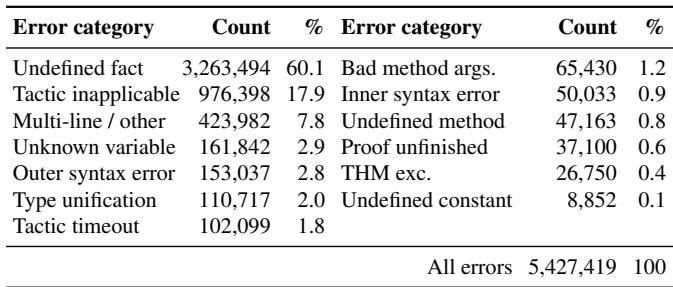

Table 6: Search-depth distribution for failures on the test and test-hard splits (the validation log format does not record depth markers). Only 3.7% of failures stall before depth 10; most failures make substantial multi-step progress and run out of budget later in the search.  
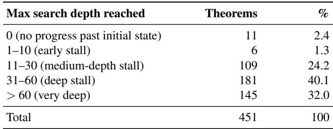

Summary of failure modes. The two analyses converge on the same bottlenecks. At the step level, wasted budget is dominated by missing premises (∼61% of errors) and goal-shape mismatches (∼18%). At the run level, most failed runs do not stall early; they reach substantial depth and then exhaust the budget on residual goals that Sledgehammer cannot close either. We therefore see two clear directions for future work: better premise grounding to reduce lemma hallucination, and longer-horizon planning to prevent late-search collapse on deep proofs.

## 6 Related Work

## 6.1 Software System Verification via ITP

Formal methods have successfully verified critical software systems including operating system kernels, hypervisors, file systems and compilers. Interactive theorem proving (ITP) provides strong formal assurance by allowing engineers to encode specifications and build proofs in ITP systems such as Rocq or Isabelle/HOL. Notable examples include CertiKOS [45], which employs a compositional refinement framework to verify a layered OS kernel; CompCert [4], an optimizing C compiler whose translation passes are all verified to preserve semantics; FSCQ [11], a crash-safe file system proven correct under all failure scenarios using Crash Hoare Logic; SeKVM hypervisor [46], a reduced KVM core with enforced confidentiality and integrity of guest memory; seL4 [5], an OS microkernel with machine-checked proofs of functional correctness and security properties. These efforts demonstrate that ITP enables high-assurance proofs for critical systems, albeit at a significant engineering cost.

Another line of work seeks to reduce this cost by automating more of the verification pipeline itself. AutoCorres [47] synthesizes high-level Isabelle specifications from C to ease low-level proof writing within the seL4 verification effort. More recently, Spoq [48] automates the derivation of layered specifications and refinement proofs from unmodified C code, reducing manual Coq effort by around 70% on the SeKVM hypervisor [46]. Spoq 2 [49] extends this direction to security properties, reducing them to inductive invariants over a transition system that Z3 can discharge automatically, and reports up to 80% reduction in manual effort across four real-world systems.

## 6.2 Automated Theorem Proving

Automated theorem proving (ATP) has long served as a benchmark for machine reasoning. Classical ATP systems rely on symbolic methods, such as resolution-based first-order provers (e.g., Vampire [50], E [51]) and SMT solvers (e.g., Z3 [52], CVC5 [53]) with built-in theories. These solvers are also integrated into interactive theorem provers via hammers (e.g., Sledgehammer [16] in Isabelle), enabling automated discharge of proof goals [54]. Related to ATP, several works (e.g., Ironclad Apps [55] and Verve [56]) leverage verificationaware languages (e.g., Dafny [57] and Boogie [58]) to prove memory and control-flow safety of system components, including kernels and device drivers.

In recent years, machine learning has been increasingly applied to ATP [59]. Early efforts focused on premise selection and tactic prediction using classical learning methods (e.g., Holophrasm [60], TacticToe [26], Proverbot9001 [61], Diva [62]), showing improved success rates in Metamath, HOL4, and Coq. More recently, large language models (LLMs) have been used to generate complete proofs or sketches [63, 64], achieving near-superhuman results on mathematical problems [65]. Notably, AlphaProof [66] combines Monte Carlo tree search with reinforcement learning to solve IMO-level competition problems in Lean, representing the state of the art in search-based mathematical theorem proving.

Closer to our setting, prior efforts have attempted to bring such techniques to software verification, including Baldur [67], PALM [68], Guided Proof Search [69], and Goedel-Code-Prover [70]. However, these approaches remain limited to textbook-scale problems and do not address the challenges of real-world system-level verification projects such as seL4.

Complementary to whole-proof generation, the proof-step prediction paradigm harnesses LLMs to propose the next tactic or lemma, guided by proof-state feedback. Systems such as GPT-f [71], LISA [31], HTPS [72] and LeanDojo [21] demonstrate the potential of this paradigm across Metamath, Isabelle and Lean, but again primarily on isolated mathematical problems. Our method fills this gap by integrating a fine-tuned LLM for proof search with symbolic techniques, namely proof-step revision and proof-state filtering, making large-scale verification both effective and efficient.

Hybrid approaches such as Thor [73], ProofAug [74], Strat2Rocq [75], and LIPS [76] couple LLM-generated reasoning with ATPs or hammers. However, hammer-only proofs grow brittle on long obligations and place additional trust in the external solver. In contrast, our framework invokes ATP only as a final-stage closer for residual subgoals, keeping the bulk of the proof inside the kernel-checked workflow.

## 7 Limitations and Future Work

Despite strong empirical performance, our framework has several limitations that suggest directions for future research. Computational cost. The tree-search procedure remains expensive, as each iteration invokes Isabelle for proof-step execution and state checking. Future work includes state caching, parallel expansion, and cost-aware search policies to improve throughput.

Performance degradation for longer proofs. While our method successfully constructs longer proofs than prior methods, its performance indeed degrades as proof length in creases. The current tree-search procedure adopts one-step prediction and bounded search, making it challenging to uncover deeper reasoning chains. Future improvements could involve hierarchical planning, subgoal decomposition, or reinforcement learning from bootstrapped trajectories.

Rigid rule-driven step revision. The step revision modules rely on heuristic tactic-premise recombination and lightweight premise retrieval, which are imperfect and may introduce mis leading candidates. Future improvements may learn premise relevance directly from the proof state or integrate stronger semantic filters.

Leveraging frontier models. As frontier LLMs advance in reasoning, an important direction is whether agentic workflows— where a large model autonomously invokes tools, inspects proof states, and iterates—can complement or replace parts of our pipeline. Our use of fine-tuned small models is motivated by lower cost and higher inference throughput, both critical for generating and scoring large candidate pools. A promising hybrid would delegate high-level planning and subgoal decomposition to a frontier model, directly addressing the degradation on longer proofs, while relying on lightweight models for intensive step generation and ranking.

## 8 Conclusion

In this paper, we present a neuro-symbolic proof-generation framework that automates proof search for large-scale software verification projects in interactive theorem provers. Instead of attempting whole-proof synthesis, our approach performs a best-first tree search over fine-grained proof states, repeatedly querying a lightweight, fine-tuned LLM for the next proof step. This paradigm not only substantially improves data efficiency, but also enables a seamless integration of sym bolic reasoning tools with LLM-based step generation and scoring, forming an effective and efficient pipeline for proofstep construction as well as proof-state filtering and ranking. The experiments on the seL4 verification corpus show that our approach significantly outperforms prior baselines. Notably, our method succeeds on a considerably higher proportion of multi-step, nontrivial theorems, addressing a long-standing limitation of LLM-based provers. Additional experiments on AFP projects and translated program-verification benchmarks further showcase strong cross-project generalizability.

Our work provides evidence that proof-step–centric neurosymbolic search is a practical path toward scalable, automated software verification at the systems level. While challenges remain, our results represent promising progress toward AIenabled, rigorous engineering methods for real-world computer systems.

Availability. The tool, experimental data, and source code are available at the seL4-proof-search GitHub repository. Additionally, a prebuilt Docker image containing the seL4 verification environment and all required dependencies is available at Docker Hub.

Acknowledgments. We thank the anonymous reviewers and our shepherd for their valuable and constructive feedback. This work is supported by the Fundamental and Interdisciplinary Disciplines Breakthrough Plan of the Ministry of Education of China (No. JYB2025XDXM118), the National Natural Science Foundation of China (Grant #62025202), and the Frontier Technologies R&D Program of Jiangsu (BF2024059). T. Chen is partially supported by overseas grants from the State Key Laboratory of Novel Software Technology, Nanjing University (KFKT2023A04, KFKT2025A05).

## References

[1] Edmund M. Clarke and Jeannette M. Wing. Formal methods: state of the art and future directions. ACM Computing Surveys, 28(4):626–643, 1996.

[2] Bruno Blanchet, Patrick Cousot, Radhia Cousot, Jérôme Feret, Laurent Mauborgne, Antoine Miné, David Monniaux, and Xavier Rival. A static analyzer for large safety-critical software. In Proceedings of the ACM SIGPLAN Conference on Programming Language Design and Implementation (PLDI), pages 196–207, 2003.

[3] James Woodcock, Peter Gorm Larsen, Juan Bicarregui, and John Fitzgerald. Formal methods: Practice and experience. ACM Computing Surveys, 41(4):1–36, 2009.

[4] Xavier Leroy, Sandrine Blazy, Daniel Kästner, Bernhard Schommer, Markus Pister, and Christian Ferdinand. Compcert-a formally verified optimizing compiler. In ERTS 2016: Embedded Real Time Software and Systems, 8th European Congress, 2016.

[5] Gerwin Klein, June Andronick, Kevin Elphinstone, Toby Murray, Thomas Sewell, Rafal Kolanski, and Gernot Heiser. Comprehensive formal verification of an os microkernel. ACM Transactions on Computer Systems (TOCS), 32(1):1–70, 2014.

[6] Talia Ringer, Karl Palmskog, Ilya Sergey, Milos Gligoric, Zachary Tatlock, et al. Qed at large: A survey of engineering of formally verified software. Foundations and Trends® in Programming Languages, 5(2-3):102– 281, 2019.

[7] Jianxing Qin, Alexander Du, Danfeng Zhang, Matthew Lentz, and Danyang Zhuo. Can large language models verify system software? a case study using fscq as a benchmark. In Proceedings of the 2025 Workshop on Hot Topics in Operating Systems, pages 34–41, 2025.

[8] Kyle Thompson, Nuno Saavedra, Pedro Carrott, Kevin Fisher, Alex Sanchez-Stern, Yuriy Brun, João F Ferreira, Sorin Lerner, and Emily First. Rango: Adaptive retrieval-augmented proving for automated software verification. In 2025 IEEE/ACM 47th International Conference on Software Engineering (ICSE), pages 347–359, 2025.

[9] Lichen Zhang, Shuai Lu, and Nan Duan. Selene: Pioneering automated proof in software verification. In Proceedings of the 62nd Annual Meeting of the Association for Computational Linguistics (ACL), pages 1776–1789, 2024.

[10] Xiaohan Lin, Qingxing Cao, Yinya Huang, Haiming Wang, Jianqiao Lu, Zhengying Liu, Linqi Song, and

Xiaodan Liang. Fvel: Interactive formal verification environment with large language models via theorem proving. Advances in Neural Information Processing Systems, 37:54932–54946, 2024.

[11] Haogang Chen, Daniel Ziegler, Tej Chajed, Adam Chlipala, M Frans Kaashoek, and Nickolai Zeldovich. Using crash hoare logic for certifying the fscq file system. In Proceedings of the 25th Symposium on Operating Systems Principles, pages 18–37, 2015.

[12] Albert Q. Jiang, Alexandre Sablayrolles, Arthur Mensch, Chris Bamford, Devendra Singh Chaplot, Diego de las Casas, Florian Bressand, Gianna Lengyel, Guillaume Lample, Lucile Saulnier, Lélio Renard Lavaud, Marie-Anne Lachaux, Pierre Stock, Teven Le Scao, Thibaut Lavril, Thomas Wang, Timothée Lacroix, and William El Sayed. Mistral 7b. arXiv preprint arXiv:2310.06825, 2023.

[13] Abhimanyu Dubey, Abhinav Jauhri, Abhinav Pandey, Abhishek Kadian, Ahmad Al-Dahle, Aiesha Letman, Akhil Mathur, Alan Schelten, Amy Yang, Angela Fan, et al. The llama 3 herd of models. arXiv e-prints, pages arXiv–2407, 2024.

[14] Jasmin Christian Blanchette and Tobias Nipkow. Nitpick: A counterexample generator for higher-order logic based on a relational model finder. In International conference on interactive theorem proving, pages 131–146. Springer, 2010.

[15] Koen Claessen and John Hughes. Quickcheck: a lightweight tool for random testing of haskell programs. In Proceedings of the fifth ACM SIGPLAN international conference on Functional programming, pages 268–279, 2000.

[16] Sascha Böhme and Tobias Nipkow. Sledgehammer: judgement day. In International Joint Conference on Automated Reasoning, pages 107–121. Springer, 2010.

[17] Zijian Wu, Suozhi Huang, Zhejian Zhou, Huaiyuan Ying, Zheng Yuan, Wenwei Zhang, Dahua Lin, and Kai Chen. Internlm2. 5-stepprover: Advancing automated theorem proving via critic-guided search. In 2nd AI for Math Workshop@ ICML 2025, 2025.

[18] Ran Xin, Chenguang Xi, Jie Yang, Feng Chen, Hang Wu, Xia Xiao, Yifan Sun, Shen Zheng, and Ming Ding. Bfs-prover: Scalable best-first tree search for llm-based automatic theorem proving. In Proceedings of the 63rd Annual Meeting of the Association for Computational Linguistics (Volume 1: Long Papers), pages 32588–32599, 2025.

[19] Google DeepMind. Gemini: A family of highly capable multimodal models. https://deepmind.google/ technologies/gemini/, 2024. Accessed model variant: Gemini 3 Pro.

[20] OpenAI. GPT-5.1: A smarter, more conversational ChatGPT, 2025. Accessed model variants: GPT-5.1 Instant and GPT-5.1 Thinking.

[21] Kaiyu Yang, Aidan Swope, Alex Gu, Rahul Chalamala, Peiyang Song, Shixing Yu, Saad Godil, Ryan J Prenger, and Animashree Anandkumar. Leandojo: Theorem proving with retrieval-augmented language mod els. Advances in Neural Information Processing Systems, 36:21573–21612, 2023.

[22] Jasmin Christian Blanchette, Cezary Kaliszyk, Lawrence C Paulson, and Josef Urban. Hammering towards qed. Journal of Formalized Reasoning, 9(1):101–148, 2016.

[23] Minchao Wu, Michael Norrish, Christian Walder, and Amir Dezfouli. Tacticzero: Learning to prove theorems from scratch with deep reinforcement learning. Advances in Neural Information Processing Systems, 34:9330–9342, 2021.

[24] Suozhi Huang, Peiyang Song, Robert Joseph George, and Anima Anandkumar. Leanprogress: Guiding search for neural theorem proving via proof progress prediction. In ICLR 2025 Workshop: VerifAI: AI Verification in the Wild, 2025.

[25] Yuhuai Wu, Albert Jiang, Roger Grosse, and Jimmy Ba. Neural theorem proving on inequality problems. Artifi cial Intelligence and Theorem Proving (AITP), 2020.

[26] Thibault Gauthier, Cezary Kaliszyk, Josef Urban, Ramana Kumar, and Michael Norrish. Tactictoe: learning to prove with tactics. Journal of Automated Reasoning, 65(2):257–286, 2021.

[27] Bartosz Piotrowski, Ramon Fernández Mir, and Edward Ayers. Machine-learned premise selection for lean. In International Conference on Automated Reasoning with Analytic Tableaux and Related Methods, pages 175–186. Springer, 2023.

[28] Timothy Bourke and Gerwin Klein. Solve\_direct: A tool for isabelle/hol to check whether a newly stated theorem can be solved directly by an existing theorem. https://isabelle.in.tum.de/library/HOL/ HOL/ISABELLE\_HOME/src/Tools/solve\_direct. ML.html, 2025. File: src/Tools/solve\_direct.ML in Isabelle/HOL library.

[29] Dominique Unruh. scala-isabelle: A scala library for interacting with isabelle. https://github.com

dominique-unruh/scala-isabelle, 2025. Accessed 2025-11-18.

[30] N. M. Nishant and G. S. Mamatha. Using py4j for java-python communication. International Journal of Advanced Research in Computer and Communication Engineering (IJARCCE), 2023.

[31] Albert Qiaochu Jiang, Wenda Li, Jesse Michael Han, and Yuhuai Wu. Lisa: Language models of isabelle proofs. In 6th Conference on Artificial Intelligence and Theorem Proving, pages 378–392, 2021.

[32] An Yang, Anfeng Li, Baosong Yang, Beichen Zhang, Binyuan Hui, Bo Zheng, Bowen Yu, Chang Gao, Chen gen Huang, Chenxu Lv, et al. Qwen3 technical report. arXiv preprint arXiv:2505.09388, 2025.

[33] Yaowei Zheng, Richong Zhang, Junhao Zhang, Yanhan Ye, Zheyan Luo, Zhangchi Feng, and Yongqiang Ma. Llamafactory: Unified efficient fine-tuning of 100+ language models. In Proceedings of the 62nd Annual Meeting of the Association for Computational Linguistics (Volume 3: System Demonstrations), Bangkok, Thailand, 2024. Association for Computational Linguistics.

[34] Jia Meng and Lawrence C Paulson. Lightweight relevance filtering for machine-generated resolution problems. Journal of Applied Logic, 7(1):41–57, 2009.

[35] Daniel Kühlwein, Jasmin Christian Blanchette, Cezary Kaliszyk, and Josef Urban. Mash: machine learning for sledgehammer. In International Conference on Interactive Theorem Proving, pages 35–50. Springer, 2013.

[36] Thomas Sewell, Simon Winwood, Peter Gammie, Toby Murray, June Andronick, and Gerwin Klein. seL4 enforces integrity. In Proceedings of the Second International Conference on Interactive Theorem Proving, ITP ’11, pages 325–340, Berlin, Heidelberg, August 2011. Springer-Verlag.

[37] Toby Murray, Daniel Matichuk, Matthew Brassil, Peter Gammie, Timothy Bourke, Sean Seefried, Corey Lewis, Xin Gao, and Gerwin Klein. seL4: From general purpose to a proof of information flow enforcement. In IEEE Symposium on Security and Privacy, pages 415– 429, San Francisco, CA, May 2013. IEEE.

[38] Daniel Matichuk, Toby Murray, June Andronick, Ross Jeffery, Gerwin Klein, and Mark Staples. Empirical study towards a leading indicator for cost of formal software verification. In Proceedings of the 37th International Conference on Software Engineering - Volume 1, ICSE ’15, page 722–732. IEEE Press, 2015.

[39] Vladimir I Levenshtein et al. Binary codes capable of correcting deletions, insertions, and reversals. In Soviet physics doklady, volume 10, pages 707–710. Soviet Union, 1966.

[40] Paul Jaccard. Étude comparative de la distribution florale dans une portion des alpes et des jura. Bull Soc Vaudoise Sci Nat, 37:547–579, 1901.

[41] Freek Verbeek, Abhijith Bharadwaj, Joshua Bockenek, Ian Roessle, Timmy Weerwag, and Binoy Ravindran. X86 instruction semantics and basic block symbolic execution. Archive of Formal Proofs, October 2021. https://isa-afp.org/entries/X86\_ Semantics.html, Formal proof development.

[42] Lei Yu. A formal model of ieee floating point arithmetic. Archive of Formal Proofs, July 2013. https://isa-afp.org/entries/IEEE\_ Floating\_Point.html, Formal proof development.

[43] Filip Maric.´ Formal verification of modern sat solvers. Archive of Formal Proofs, July 2008. https://isa-afp.org/entries/ SATSolverVerification.html, Formal proof development.

[44] Stephen Robertson, Hugo Zaragoza, et al. The probabilistic relevance framework: Bm25 and beyond. Foundations and Trends® in Information Retrieval, 3(4):333– 389, 2009.

[45] Ronghui Gu, Zhong Shao, Hao Chen, Xiongnan Newman Wu, Jieung Kim, Vilhelm Sjöberg, and David Costanzo. {CertiKOS}: An extensible architecture for building certified concurrent {OS} kernels. In 12th USENIX Symposium on Operating Systems Design and Implementation (OSDI 16), pages 653–669, 2016.

[46] Shih-Wei Li, Xupeng Li, Ronghui Gu, Jason Nieh, and John Zhuang Hui. Formally verified memory protection for a commodity multiprocessor hypervisor. In 30th USENIX Security Symposium (USENIX Security 21), pages 3953–3970. USENIX Association, August 2021.

[47] David Greenaway, Japheth Lim, June Andronick, and Gerwin Klein. Don’t sweat the small stuff: formal verification of c code without the pain. ACM SIGPLAN Notices, 49(6):429–439, 2014.

[48] Xupeng Li, Xuheng Li, Wei Qiang, Ronghui Gu, and Jason Nieh. Spoq: Scaling {Machine-Checkable} systems verification in coq. In 17th USENIX Symposium on Operating Systems Design and Implementation (OSDI 23), pages 851–869, 2023.

[49] Ganxiang Yang, Wei Qiang, Yi Rong, Xuheng Li, Fanqi Yu, Jason Nieh, and Ronghui Gu. Highly automated verification of security properties for unmodified system software. In Proceedings of the 31st ACM International Conference on Architectural Support for Programming Languages and Operating Systems, Volume 2, pages 912–928, 2026.

[50] Alexandre Riazanov and Andrei Voronkov. The design and implementation of vampire. AI communications, 15(2-3):91–110, 2002.

[51] Stephan Schulz, Simon Cruanes, and Petar Vukmirovic.´ Faster, higher, stronger: E 2.3. In International Conference on Automated Deduction, pages 495–507. Springer, 2019.

[52] Leonardo De Moura and Nikolaj Bjørner. Z3: An efficient smt solver. In International conference on Tools and Algorithms for the Construction and Analysis of Systems, pages 337–340. Springer, 2008.

[53] Haniel Barbosa, Clark Barrett, Martin Brain, Gereon Kremer, Hanna Lachnitt, Makai Mann, Abdalrhman Mohamed, Mudathir Mohamed, Aina Niemetz, Andres Nötzli, et al. cvc5: A versatile and industrial-strength smt solver. In International Conference on Tools and Algorithms for the Construction and Analysis of Systems, pages 415–442. Springer, 2022.

[54] Łukasz Czajka and Cezary Kaliszyk. Hammer for coq: Automation for dependent type theory. Journal of automated reasoning, 61(1):423–453, 2018.

[55] Chris Hawblitzel, Jon Howell, Jacob R Lorch, Arjun Narayan, Bryan Parno, Danfeng Zhang, and Brian Zill. Ironclad apps:{End-to-End} security via automated {Full-System} verification. In 11th USENIX symposium on operating systems design and implementation (OSDI 14), pages 165–181, 2014.

[56] Jean Yang and Chris Hawblitzel. Safe to the last instruction: automated verification of a type-safe operating system. Communications of the ACM, 54(12):123–131, 2011.

[57] K Rustan M Leino. Dafny: An automatic program verifier for functional correctness. In International conference on logic for programming artificial intelligence and reasoning, pages 348–370. Springer, 2010.

[58] Mike Barnett, Bor-Yuh Evan Chang, Robert DeLine, Bart Jacobs, and K Rustan M Leino. Boogie: A modular reusable verifier for object-oriented programs. In International Symposium on Formal Methods for Components and Objects, pages 364–387. Springer, 2005.

[59] Zhaoyu Li, Jialiang Sun, Logan Murphy, Qidong Su, Zenan Li, Xian Zhang, Kaiyu Yang, and Xujie Si. A survey on deep learning for theorem proving. In Proceedings of the First Conference on Language Modeling, 2024.

[60] Daniel Whalen. Holophrasm: a neural automated theorem prover for higher-order logic. arXiv preprint arXiv:1608.02644, 2016.

[61] Alex Sanchez-Stern, Yousef Alhessi, Lawrence Saul, and Sorin Lerner. Generating correctness proofs with neural networks. In Proceedings of the 4th ACM SIG PLAN International Workshop on Machine Learning and Programming Languages, pages 1–10, 2020.

[62] Emily First and Yuriy Brun. Diversity-driven automated formal verification. In Proceedings of the 44th International Conference on Software Engineering, pages 749–761, 2022.

[63] Albert Q Jiang, Sean Welleck, Jin Peng Zhou, Timothee Lacroix, Jiacheng Liu, Wenda Li, Mateja Jamnik, Guillaume Lample, and Yuhuai Wu. Draft, sketch, and prove: Guiding formal theorem provers with informal proofs. In The Eleventh International Conference on Learning Representations (ICLR), 2023.

[64] Chenrui Cao, Liangcheng Song, Zenan Li, Xinyi Le, Xian Zhang, HUI XUE, and Fan Yang. Reviving dsp for advanced theorem proving in the era of reasoning models. In The Thirty-ninth Annual Conference on Neural Information Processing Systems, 2025.

[65] Trieu H Trinh, Yuhuai Wu, Quoc V Le, He He, and Thang Luong. Solving olympiad geometry without human demonstrations. Nature, 625(7995):476–482, 2024.

[66] Thomas Hubert, Rishi Mehta, Laurent Sartran, Miklós Z Horváth, Goran Žužic, Eric Wieser, Aja Huang, Julian´ Schrittwieser, Yannick Schroecker, Hussain Masoom, et al. Olympiad-level formal mathematical reasoning with reinforcement learning. Nature, pages 1–3, 2025.

[67] Emily First, Markus N Rabe, Talia Ringer, and Yuriy Brun. Baldur: Whole-proof generation and repair with large language models. In Proceedings of the 31st ACM Joint European Software Engineering Conference and Symposium on the Foundations of Software Engineering, pages 1229–1241, 2023.

[68] Minghai Lu, Benjamin Delaware, and Tianyi Zhang. Proof automation with large language models. In Proceedings of the 39th IEEE/ACM International Conference on Automated Software Engineering, pages 1509– 1520, 2024.

[69] Tarun Prasad and Nada Amin. Guided proof search using large language models and lemma extraction in coq. In ICLR 2025 Workshop: VerifAI: AI Verification in the Wild, 2024.

[70] Zenan Li, Ziran Yang, Haoyu Zhao, Andrew Zhao, Shange Tang, Kaiyu Yang, Aarti Gupta, Zhendong Su, Chi Jin, et al. Goedel-code-prover: Hierarchical proof search for open state-of-the-art code verification. arXiv preprint arXiv:2603.19329, 2026.

[71] Stanislas Polu and Ilya Sutskever. Generative language modeling for automated theorem proving. arXiv preprint arXiv:2009.03393, 2020.

[72] Guillaume Lample, Timothee Lacroix, Marie-Anne Lachaux, Aurelien Rodriguez, Amaury Hayat, Thibaut Lavril, Gabriel Ebner, and Xavier Martinet. Hypertree proof search for neural theorem proving. Advances in neural information processing systems, 35:26337– 26349, 2022.

[73] Albert Qiaochu Jiang, Wenda Li, Szymon Tworkowski, Konrad Czechowski, Tomasz Odrzygó´zd´z, Piotr Miłos,´ Yuhuai Wu, and Mateja Jamnik. Thor: Wielding hammers to integrate language models and automated theorem provers. Advances in Neural Information Processing Systems, 35:8360–8373, 2022.

[74] Haoxiong Liu, Jiacheng Sun, Zhenguo Li, and Andrew C Yao. Proofaug: Efficient neural theorem proving via fine-grained proof structure analysis. In International Conference on Machine Learning, pages 39568– 39586. PMLR, 2025.

[75] Jian Fang, Yican Sun, and Yingfei Xiong. Proof strategy extraction from llms for enhancing symbolic provers. arXiv preprint arXiv:2510.10131, 2025.

[76] Zenan Li, Zhaoyu Li, Wen Tang, Xian Zhang, Yuan Yao, Xujie Si, Fan Yang, Kaiyu Yang, and Xiaoxing Ma. Proving olympiad inequalities by synergizing llms and symbolic reasoning. In The Thirteenth International Conference on Learning Representations, 2025.