USENIX

THE ADVANCED COMPUTING SYSTEMS ASSOCIATION

# Umap: Revisiting Memory-mapped I/O on Distributed File Systems for Efficient Matrix Access (Operational Systems)

Yongchao He, unaffiliated; Guangyan Zhang, Tsinghua University; Zane Cao, ScitiX AI; Wenfei Wu, Peking University

https://www.usenix.org/conference/osdi26/presentation/he-yongchao

# This paper is included in the Proceedings of the 20th USENIX Symposium on Operating Systems Design and Implementation.

July 13–15, 2026 • Seattle, WA, USA

ISBN 978-1-939133-55-7

Open access to the Proceedings of the 20th USENIX Symposium on Operating Systems Design and Implementation is sponsored by

# Umap: Revisiting Memory-mapped I/O on Distributed File Systems for Efficient Matrix Access (Operational Systems)

Yongchao He† Unaffiliated

Guangyan Zhang∗ Tsinghua University

Zane Cao Wenfei Wu∗ ScitiX AI Peking University

## Abstract

Our production experience in large-scale data-processing pipelines shows that, despite its attractive programming model, memory-mapped I/O (mmap-IO) on distributed file systems (DFS) exhibits severe operational pathologies— livelocks during write-heavy phases, chronically low multi threaded throughput, and high memory footprints that may trigger out-of-memory kills in containerized environments. Our measurements further show that mmap-IO on DFS is 3 –10 slower than on local file systems (LFS) for matrix random-access workloads, primarily because pagegranularity network I/O underutilizes high-speed networks and deferred write-back behavior incurs expensive distributed flushes and metadata operations. We present umap, a DFSagnostic runtime that delivers near-in-memory matrix-access performance on DFS via network-efficient communication, a concurrency-aware cache protocol with linear scalability, and lazy-expansion cache management. Deployed in production for over 18 months, umap has eliminated livelocks and out-of-memory-induced job failures while improving through put by up to 6.7 across diverse matrix-access workloads. Our experience shows that rethinking mmap-IO’s interaction with DFS is essential for robust, predictable performance in modern large-scale clusters.

## 1 Introduction

Matrix access underlies many modern data center workloads, including machine learning (ML) [27,66], quantitative finance pipelines such as large-scale backtesting [31, 47], LLM inference [40, 71], and scientific computing [15, 18]. For example, in quantitative finance, matrices encode per-asset state over long historical windows and are intensively accessed in offline backtesting and factor-research pipelines; In serverless LLM inference, matrices hold model parameters that must be repeatedly loaded into CPU memory (e.g., via mmap) and transferred to GPUs [29, 65]. As these workloads grow, matrix access increasingly dominates overall cost and can even exceed the FLOP cost itself [51, 72].

To balance performance and scalability, practitioners commonly adopt file-backed matrices (FBM), implemented via mmap-IO1. FBM offers a compelling abstraction: data appears memory-resident, while the kernel transparently fetches pages on demand. This abstraction is commonly used to enable out-of-core access without loading entire datasets into memory, which is essential when working with matrices that exceed physical memory capacity. This model is widely adopted in practice and is supported by widely used systems. For example, NumPy provides memmap for out-ofcore array access [13], PyTorch data pipelines commonly use disk-backed and memory-mapped loading mechanisms to stream large training datasets [17], and systems such as vLLM use mmap to load multi-GB model weights into CPU memory during initialization [20]. Across these systems, FBM is often the primary mechanism for accessing datasets and model parameters that exceed memory capacity, rather than an optional optimization.

Yet our large-scale deployment reveals that this longstanding abstraction breaks down under today’s disaggregated storage architectures. Modern clusters increasingly adopt high-performance DFS [9, 22, 38, 45] to separate compute from storage, enabling independent scaling and higher aggregate bandwidth. This shift fundamentally disrupts assumptions baked into the virtual memory (VM) subsystem.

Abstraction mismatch under disaggregated storage. mmap-IO was designed for local, low-latency storage and pagegranularity VM, whereas DFSes export block-oriented semantics with distributed metadata, locking, and cache coherence. This structural mismatch causes each page fault to incur fragmented remote I/O, heavy metadata traffic, and crossnode synchronization. In our production cluster that supports large-scale financial backtesting, scientific computing, and

AI workloads, we observed substantial FBM slowdown after migrating from direct-attached storage to a disaggregated architecture (i.e., replacing LFS with DFS). Despite the DFS providing over 25 GB/s of per-node remote bandwidth—an order of magnitude higher than a local SSD—FBM workloads still suffer 3 –10 lower throughput, poor bandwidth utilization, and extreme tail latency. Increasing page granularity via hugepages further exacerbates amplification for irregular access patterns [50]. These findings highlight a deeper issue: the traditional VM loading model no longer aligns with the disaggregated storage substrate.

Implicit VM “magic” undermines predictability and operations. A more serious operational issue arises from mmap-IO’s implicit I/O behavior. On LFS, deferred write-back and on-demand paging are fast and predictable. On DFS, these mechanisms become opaque and failure-prone: asynchronous write-back competes for distributed locks, triggering prolonged stalls; page faults inflate into multi-millisecond network operations; blocked threads accumulate in iowait, and under pressure they may be misclassified as deadlocked. In our production cluster, such misbehavior caused tasks to remain idle for tens of minutes, cascade into livelock, and even trigger system-level miskill events—directly affecting SLAs and service availability. The core problem is not merely low performance, but the absence of observability and control: performance anomalies disappear into the kernel’s page-fault machinery, hidden from operators, turning performance debugging into a black-box guessing game.

Greedy caching harms multi-tenant stability. Finally, the kernel’s default caching policy—designed for single-node, single-tenant environments—does not translate to multitenant clusters. Linux aggressively expands the page cache to retain remote data, with little regard for reuse or isolation. For FBM workloads on DFS, this leads to memory pressure, noisy-neighbor interference, and occasional out-of-memory (OOM) kills, even when applications exhibit modest working sets. In contrast, our measurements show that an applicationaware, lazy-expansion strategy can achieve higher throughput while using less than 10% of the memory consumed by vanilla mmap-IO. This highlights a growing need for user-level control over caching behavior in shared clusters.

Recent work aims to accelerate mmap-IO on fast local storage through prefetching [30, 41, 44, 52], per-core caches [54], and access pattern-specific optimizations [46, 56, 57]. In the era of disaggregated storage, where bandwidth is plentiful but metadata and consistency dominate, these assumptions collapse: their optimizations amplify page-granular I/O, stalls, and livelock. FBM workloads therefore need a new abstraction that preserves memory-style access while exposing coarse-grained, explicit control for predictable high performance on DFS.

This paper presents umap, a high-performance, drop-in compatible runtime for FBM on DFS. umap addresses the abstraction mismatch and operational challenges above without requiring changes to applications or DFSes. It introduces: (1) a network-friendly communication manager that merges pagelevel requests into DFS-native transfers; (2) a concurrencyaware, lock-minimizing cache protocol that adapts to parallel random access; and (3) a lazy-expansion cache manager that enforces predictable memory usage in multi-tenant settings.

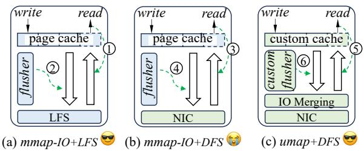  
Figure 1: Comparison of mmap and umap runtimes on LFS and DFS. Page-granularity network I/O and deferred writeback significantly degrade “mmap-IO+DFS” performance.

Deployed for 18 months in production, umap eliminates livelock and writeback-induced stalls observed with mmap-IO, stabilizes tail latency, and improves availability. Experiments show that umap achieves up to 2.8 faster reads and 8.3 faster writes than state-of-the-art (SOTA) NVMebacked mmap-IO, and accelerates real-world training, inference, scientific, and quantitative workloads by up to 6.7 .

## 2 Motivation, Challenges and Solutions

## 2.1 Background

mmap-IO enabled file-backed matrix (FBM). A FBM stores data on the file system while providing transparent in-memory access via mmap() [10]. The example below maps a file into the process’s address space, exposes it as a memory buffer, and accesses it as a ROW s COLs matrix.

1 float\* mat = mmap (... /\*fd=\*/open (" \~/ mat . dat " ));   
for ( size\_t i = 0; i < ROWs ; ++ i)   
for ( size\_t j = 0; j < COLs ; ++ j)   
mat [i \* COLS + j] = i + j;

Figure 1(a) illustrates how mmap-IO constructs the FBM mat on LFS. It maps the file from LFS into the process’s virtual memory, allowing applications to access file as if it were in RAM. Upon a page fault ( 1 ), the OS loads the data into the page cache [16] via IO bus, potentially evicting existing pages (dirty pages are flushed to the LFS by a deferred, asynchronous flusher thread ( 2 )) if memory is limited.

Unlike memory-backed matrices that consume physical RAM and risk OOM errors, FBMs utilize the file system and mmap-IO to access datasets beyond physical memory efficiently and scalably. Compared to direct I/O, which bypasses the page cache and requires manual management, mmap-IO benefits from OS-level caching and demand paging, reducing redundant I/O and improving performance.

FBM behavior changes in LFS-to-DFS transition. In traditional direct-attached storage architecture, storage is physically tied to compute nodes (e.g., LFS in Figure 1(a)), whereas disaggregated storage architectures consolidate storage into DFS, accessible via dedicated storage networks (Figure 1(b)). Unlike LFS, which relies on local storage devices (e.g., SSDs), DFS distributes data across multiple storage nodes to support concurrent access by many clients. Despite data distribution across nodes, DFS retains the same API as LFS, enabling compute nodes to access files as local. As a result, migrating from LFS to DFS does not change mmap-IO’s behavior; the primary difference is that mmap-IO now issues network I/O via NIC to access DFS (Figure 1(b)).

## 2.2 Performance Issues of mmap-IO on DFS

Key characteristics of FBM-based workloads. FBM-based workloads present unique challenges that influence both application performance and deployment stability:

C1: Random access patterns. Depending on the algorithm, threads may access matrix elements sequentially or randomly. Random access reduces spatial locality and can significantly increase I/O overhead, especially on DFS, directly impacting user-perceived performance.

C2: High concurrency. FBM applications often use multiple threads, each accessing different rows or columns. While enabling parallelism, such concurrency can strain file systems when threads generate overlapping I/O.

C3: Large scale. FBMs often exceed physical memory, making mmap-IO essential to scale workloads beyond RAM limits. However, this can lead to frequent page faults and high memory pressure, potentially threatening deployment stability—especially in containerized environments where excessive memory use may trigger out-of-memory kills.

These characteristics reveal that mmap-IO is not an ideal intermediary between applications and DFS, due to a fundamental mismatch in access patterns, which is further amplified by optimizations designed for LFS. We next validate these observations through experiments.

1) Storage underutilization in random small I/O. To better understand the limitations of mmap-IO as an intermediary for FBM workloads, we first measure single-threaded ran dom access performance of mmap-IO-based FBM on a LFS (ext4 [19] over an Optane NVMe SSD [7]) and on two DFSes (GPFS [5] and IBM NFSv4 [12]). Using fio [4], we benchmark FBM by varying request size to observe its effect, and also measure random direct I/O performance—where reads and writes bypass the page cache—for reference.

Figure 2 presents the results (lines without the "mmap-IO" prefix indicate direct I/O). On LFS, mmap-IO and direct I/O achieve similar throughput, while on DFS, mmap-IO performs significantly worse, with the gap widening as request size increases: for example, DFS throughput triples from 4KB to 64KB I/Os under direct I/O, whereas mmap-IO remains flat.

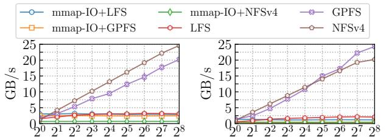  
(a) Read Request Size (KB)  
(b) Write Request Size (KB)

Figure 2: Single-threaded performance of direct I/O versus memory-mapped I/O (setup in §6.1).  
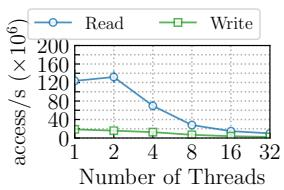

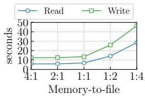  
Figure 3: Concurrent random access to a single FBM stored on a DFS (GPFS).  
Figure 4: Concurrent random access to multiple FBMs stored on an LFS.

The reasons for mmap-IO’s poor performance are twofold. On LFS (Figure 1(a)), reads and writes go directly over the I/O bus to the LFS, allowing efficient access with minimal overhead. On DFS (Figure 1(b)), each mmap-IO operation is fragmented into 4KB network I/Os and incurs additional latency from RPCs, metadata lookups, and locks—orders of magnitude higher than LFS access. Write throughput suffers even more, as the Linux flusher thread performs deferred, asynchronous write-backs ( 4 ), limiting effective throughput.

2) Non-scalable I/O throughput in multi-threaded scenarios. Figure 3 extends the workload from Figure 2 by scaling from single-threaded to multi-threaded execution. The results on GPFS and NFSv4 are similar; for simplicity, we only present those on GPFS. As shown, increasing thread count leads to worse performance. Kernel profiling attributes this to growing time in iowait—mainly queued for distributed locks—and in spin locks within the system call native\_queue\_spin\_lock\_slowpath in Linux. Moreover, as the thread count grows, time spent in both lock and iowait increases. At 32 threads, the task spends 88.9% of its time in iowait, and 76.1% of the remaining time waiting on locks.

The scalability of mmap-IO does not align with the I/O performance gains offered by DFS. Two primary factors limit mmap-IO’s scalability on DFS: (i) One is that the spin lock (e.g., tree\_lock in Linux) is used to enforce the atomic page replacement. Consequently, concurrent access to the memorymapped region incurs three primary overheads, ranked in descending order: file I/O (>4000 clock cycles in LFS [7]), lock overhead (750 2500 clock cycles [11]), and memory access (144 192 clock cycles [6, 8]). These overheads can overlap, so the actual performance is determined by the slowest among them. After migrating to DFS, using the RDMA-enabled net work reduces file I/O overhead to levels close to memory access. However, this improvement shifts the bottleneck to lock overhead, which becomes dominant in data access performance. (ii) Another is that an increase in concurrent threads leads mmap-IO to generate numerous parallel I/O requests to DFS, escalating contention for distributed locks and exacerbating performance degradation.

3) Performance impact of excessive caching in mmap-IO. mmap-IO employs a greedy-expansion strategy, aggressively caching file data into memory to minimize access latency. While effective for moderate workloads, this approach becomes counterproductive in data-intensive FBM workloads— particularly with many FBMs—where the total mapped size exceeds available memory. The resulting memory pressure leads to performance degradation.

To validate this, we run experiments on a node with memory restricted to 64GB using cgroup, with other configurations as described in §6.1. Each test consists of multiple concurrent tasks, where each task uses fio [4] to perform 4 million singlethreaded random accesses to a 16GB FBM (float32). We vary the number of concurrent tasks from 1 to 16, resulting in total mapped sizes from 16GB to 256GB—corresponding to memory-to-file size ratios of 4:1 to 1:4. As shown in Figure 4, where the y-axis denotes the completion time of each test, performance remains stable while the data fits in memory but degrades sharply once it exceeds capacity, highlighting the cost of excessive caching under memory pressure.

## 2.3 Challenges and Solutions

The slowdown arises not from flaws in mmap-IO or DFS individually, but from a fundamental semantic mismatch between them. mmap-IO assumes a local, page-granular backing store and issues demand-driven 4 KB page faults. DFS, however, provides remote, block-granular storage, where each access traverses network stacks and metadata services. Consequently, page faults fragment even large sequential accesses into thousands of tiny remote I/Os, amplifying metadata contention and serialization, which explains the severe bandwidth under utilization and long-tail stalls observed under concurrency.

To address these limitations, the core is to design DFSfriendly cache and write-back mechanisms. Figure 1(c) illustrates the key idea behind umap: reshaping implicit page-level access into explicit, network-efficient operations to restore system predictability and observability, while preserving the mmap-IO abstraction and high-performance. Achieving this requires overcoming the following challenges.

Challenge 1: Small-I/O amplification prevents DFS from reaching full bandwidth. mmap-IO generates bursty streams of 4 KB requests, which are inefficient for DFS. Larger I/Os (e.g., through hugepages) reduce metadata pressure but introduce I/O amplification [50], wasting network bandwidth. Solution 1: umap preserves the 4 KB page size but introduces network-friendly communication management that merges page requests using a rank-based, time-aware policy and fairly schedules them across I/O channels. This reduces request volume and mitigates network burstiness and overhead. (§4.1) Challenge 2: Lock contention limits scalability in multithreaded workloads. mmap-IO relies on locks to ensure atomic cache replacement [10, 54]. In data-intensive multicore workloads, frequent replacements trigger high lock costs—e.g., acquiring a lock costs 2500 cycles vs. 144–192 cycles to load a page [11]. While negligible on LFS due to slow disk access [7], these costs dominate with fast DFS networks (200 Gbps [38]), capping throughput.

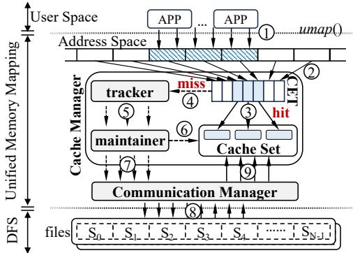  
Figure 5: umap architecture. Files are divided into cacheblock–sized segments and mapped on demand.

Solution 2: umap employs a concurrency-aware cache protocol that detects runtime access parallelism and uses a state-machine–based mechanism to perform lock-free cache lookups and replacements. This enables near-linear scalability and efficient random access. (§4.2)

Challenge 3: Unbounded cache growth inflates memory usage in multi-job environments. Existing memory-mapping systems [10,54] rely on greedy expansion, where page caches grow opportunistically until memory pressure forces eviction. This reduces memory available for applications and exacerbates interference across concurrent jobs. However, limiting cache size risks increased cache misses and costly DFS I/O. Solution 3: umap introduces lazy-expansion cache management, which dynamically adjusts cache size based on observed access patterns. It prioritizes replacement over expansion, estimates runtime memory demand for FBM workloads, and reclaims memory when pressure rises—achieving near-peak performance with substantially lower memory usage. (§4.3)

## 3 Overview of umap

umap is a memory mapping runtime that constructs a fullstack I/O path over DFS. By replacing implicit OS paging with user-space orchestration, it bridges application-level memory access and low-level data movement while ensuring predictable performance and fault observability. From the user’s perspective, umap provides a drop-in replacement interface, umap(), which is compatible with mmap() and returns a memory buffer that supports direct read/write operations. As a result, applications written using the mmap APIs can be easily migrated to the umap APIs with minimal modifications.

Architecture. As illustrated in Figure 5, umap comprises two main components: the Cache Manager (CaM) and the Communication Manager (CoM). The CaM manages two core data structures. The Cache Set is a global pool of fixed-size cache blocks (CB) that temporarily store file segments fetched from the DFS. The Cache Entry Table (CET) is a collection of index arrays, each corresponding to a mapped file. CaM also includes two submodules: the tracker, which makes decisions about cache allocation and replacement based on reuse policies, and the maintainer, a background thread that enacts the tracker’s decisions by allocating new CBs or selecting existing ones to load data. Mapping a new file with umap() just adds a new index array to the CET. This array holds α pointers, where α equals the file size divided by the CB size. Each entry represents a file segment and indicates whether it has been loaded. In our configuration (4 bytes per pointer and a 4 KB CB size), the memory overhead is approximately 1/1024 of the file size. The CoM merges I/O requests, manages concurrency, and performs asynchronous data transfers between the DFS and the local cache set.

Execution flow. Once initialized, umap intercepts memory accesses from applications ( 1 in Figure 5). Given a virtual address within a mapped file, it computes the corresponding segment index and accesses the associated entry in CET’s index array. If the entry points to a valid CB, it indicates a cache hit, and the data is returned directly from the cache set ( 2 , 3 ). Otherwise, a cache miss occurs ( 4 ): the tracker selects a CB ( 5 ) —potentially evicting an existing one—and the maintainer prepares it for reuse ( 6 7 ). The CoM then asynchronously fetches the required segment from the DFS ( 8 9 ). Once the data is loaded, the CET entry is updated to reference the new CB, allowing execution to resume.

umap prioritizes throughput over per-access latency. By batching and merging requests, it may increase individual access latency, but significantly improves overall system throughput under concurrent workloads. This tradeoff is aligned with the characteristics of the target workloads.

Consistency model. umap follows a mmap-style weak consistency model with explicit synchronization. Each node maintains a local cache and does not enforce implicit cross-node coherence. This design targets data-parallel workloads where cross-node concurrent writes are rare, and avoids the excessive coordination overhead that arises from enforcing strong consistency at page granularity in distributed file systems.

## 4 Design

## 4.1 Network-friendly I/O Management

The communication manager (CoM) transforms fine-grained page faults into coarse-grained I/O requests. It achieves this by merging adjacent requests and batching them through a queueing mechanism, thereby improving network efficiency and reducing I/O amplification.

I/O Merging and Prioritization. A natural way to improve network throughput is to merge consecutive requests that are contiguous on DFS. While random matrix accesses exhibit spatial locality, naïve merging only captures strictly adjacent requests, leaving much of the locality unused. Caching requests can create additional merging opportunities, but delays may underutilize the network.

To this end, we design a Push-In Admission-Out (PIAO) queue to facilitate I/O request merging. Elements in the PIAO queue are ordered by a unique rank. When an element with rank r is inserted, it is placed at position i such that r is greater than the rank of the (i 1)th element and less than that of the (i + 1)th element. Adjacent elements with consecutive ranks are then merged into a single, larger network I/O request.

Merging via PIAO may starve higher-rank, earlier-arriving requests. To prevent this, each request is also enqueued into a FIFO queue. When a merge occurs in PIAO, the corresponding request in FIFO is updated rather than enqueued again. Dequeueing always begins with the FIFO queue; the CoM retrieves the request from FIFO and removes the corresponding elements from PIAO.

umap associates a pair of PIAO and FIFO queues with each mapped file. At runtime, each request is tagged with a tuple (timestamp, rank) (index of the file segment is used as rank) and sent to the CoM. Figure 6 gives an example. The CoM receives two requests with ranks r8 and r4 at times t5 and t6, respectively. The request (t5, r8) is inserted at the tail of both the PIAO queue and the FIFO queue because r8 is greater than the ranks of all existing requests, and t5 is later than all existing timestamps. In contrast, the request (t6, r4) can be merged with (t1, r5) and (t4, r6), so it is inserted at the third position in the PIAO queue. Meanwhile, the CoM updates the merged I/O request in the FIFO queue. During dequeueing, the request (t1, r4 r6) will first be removed from the FIFO queue. Meanwhile, the corresponding requests (t6, r4), (t1, r5), and (t4,r6) will also be removed from the PIAO queue.

Communication Scheduling. Even with I/O merging, single-threaded communication may underutilize DFS bandwidth [34]. To address this, CoM leverages modern multiqueue NICs [35], which handle packets in parallel to sustain line-rate throughput. By establishing multiple I/O channels and distributing FIFO requests across them, CoM improves network utilization.

To ensure fair scheduling of each FIFO queue, the CoM utilizes a least-first mechanism to select a queue. At runtime, it maintains a min-heap to manage all FIFO queues, and employs Tr to track the transmitted data amount of the heap’s root node, while each FIFO queue uses Tq to record its own transmitted data amount. The heap starts empty with Tr = 0. When a queue is added to the heap, its Tq is initialized to Tr. All I/O channels proactively fetch requests from this heap. Upon fetching the root node, if the corresponding queue is not empty, the CoM dequeues a request from the queue, updates Tq (Tq ← Tq + request\_size) and Tr accordingly (Tr ← Tq). Otherwise, the queue will be removed from the heap.

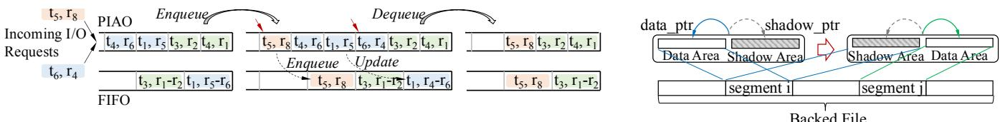  
Figure 6: Example of I/O merging and prioritization.  
Figure 7: The shadow-copy mechanism.

Data Synchronization. Accessing a DFS involves distributed locking and coordination across multiple computing nodes [24, 60, 67], introducing significantly higher overhead than LFS. To address this, CoM introduces a shadow-copy mechanism [34] that overlap communication with computation. Each CB in CoM maintains two equal-sized buffers (Figure 7): one serving as the data buffer for application access and the other as the shadow buffer for background synchronization. At runtime, CoM alternates the roles of the two buffers, enabling continuous access while synchronization proceeds in parallel.

(1) Data fetching: Whenever a CB is recycled for caching another segment, CoM fetches data from the corresponding file segment to the CB’s data area. Usually, only one data fetching operation occurs for each CB. Before a write-back, regardless of whether other threads are mapped to this CB, data fetching will not be triggered again.

(2) Write back: Figure 7 outlines umap’s write-back process. When a CB’s data area changes association with the underlying file segment, umap initiates several steps. First, it removes the mapping between the CB and index array entry. Then, it atomically swaps the pointers data\_ptr and shadow\_ptr, respectively pointing to the data area and shadow area. Subsequently, an I/O request is generated to flush the shadow area back to the file (ith segment). CoM uses atomic state transitions to ensure exclusive access during write-back, preventing Write-after-Read (WAR) hazards. Concurrently, it repopulates the CB’s data area from the jth segment.

## 4.2 Concurrency-Aware Cache Protocol

The concurrency-aware cache protocol determines the system’s concurrency in real-time and sets CBs to different states based on thread access behavior. By leveraging the system’s thread scheduling characteristics, it partitions the CBs into different sets, achieving lockless cache replacement and lockless data access, thus scaling the performance linearly.

## 4.2.1 Thread Tracking for Concurrency Awareness

Using locks to enforce data consistency when multiple threads access the same CB would hinder scalable throughput in memory-mapped I/O. Instead, CaM detects the concurrency degree at runtime and distinguishes threads accessing the same data, preventing one thread from preempting resources used by another. This ensures correctness and performance without locking, avoiding the following WAR hazards.

Consider a false eviction scenario with threads t1 and t2 accessing a mapped file concurrently. Thread t1 accesses a loaded CB at the 10th entry E[10], while t2 accesses an unloaded CB via E[100], initially pointing to a sentinel CB (a special marker with a NULL data area). Before t1 returns, a cache replacement updates E[100] to the CB previously at E[10] and sets E[10] to the sentinel CB. Consequently, t1 would encounter a segmentation fault when accessing a NULL data area.

A naive approach to prevent WAR hazard is to use a lock (e.g., tree\_lock in mmap-IO) to protect cache replacement process on each access. With this method, in the aforementioned example, t1 will update the status of CaM before the function returns, preventing thread t2 from mistakenly setting E[10] to the sentinel CB during cache eviction. However, this approach is inefficient: even a single Compare-and-Swap (CAS) costs 15–30 cycles without contention and up to 2500 cycles under contention. Accessing an element with locks can thus cost hundreds of cycles. In contrast, umap requires only 12 cycles per access (§6.3).

The challenge arises because CaM aims to enhance throughput with limited cache capacity (§4.3). Unlike mmap-IO, which aggressively allocates new pages on cache misses and may pause threads during page faults, CaM reuses existing CBs to avoid thread suspension and reduce overhead.

In the concurrency-aware method, CaM attaches a unique identifier (tid) to each running thread to identify the current concurrency degree. This is accomplished by allocating a thread-local storage variable using the C keyword \_\_thread. The tid is initialized when a thread triggers a cache replacement in umap for the first time, which is typically the first time it accesses data. Additionally, as shown in Figure 8(a), each CB has a reference map rmap to record which threads are referring to it. For a file, the rmap of CBs is non-overlapping. This means when a thread triggers a cache replacement, the tid should be removed from the rmap of the thread’s previous CB and added to the rmap of its newly assigned CB. A CB with a non-empty rmap will never be evicted, thus avoiding false eviction. The reference counting [36] is not applicable here because a CB’s lifetime may exceed that of a thread. A corner case is that when a thread terminates, it cannot modify the state of the last CB it accessed, which would result in some CBs never being released; umap solves this issue by checking the status of rmap’s associated threads to determine whether a CB can be released.

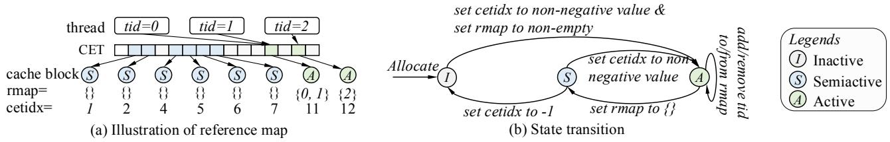  
Figure 8: Overview of the concurrency-aware mechanism and its state machine.

## 4.2.2 FSA-Based Cache Management Protocol

With only the concurrency-aware mechanism, multi-threaded random access causes cache thrashing [42,61,69,70], degrading performance. Assuming zero lock overhead, let ta be the cost to access a CB element and t the cost of a replacement (ta tr). For a task with x accesses and y replacements, the total overhead is xta + ytr, dominated by y since x is fixed. If a CB is replaced once every k accesses on average, y = x/k, so higher randomness (smaller k) makes ytr the dominant cost. Frequent loading and eviction of CBs also increase network overhead, reducing throughput and causing unpredictable performance.

The CaM maintainer employs a finite-state machine (FSA) to implement the concurrency-aware cache protocol to manage CBs. This protocol enables CBs of a file to transition between specific states without requiring data synchronization and triggering cache replacement, thereby eliminating the cache thrashing problem. Combined with rmap in the concurrency-aware mechanism, each normal CB has three states (Figure 8(b)):

(1) Active: referred to by threads and pointed to by a CET index array. CaM will return data directly upon accessing the corresponding entries. This allows CaM to bypass the cache replacement phase, enhancing performance by reducing unnecessary cache operations.

(2) Semiactive: not referred to by any thread but still pointed to by some index array entries. When accessing the correspond ing entries, CaM returns data directly. These CBs are ready to be evicted to the inactive list but can also be re-activated.

(3) Inactive: not referred to by any thread and not pointed to by any index array entry. When a cache miss occurs, CaM picks one from the inactive list, sets it to active, binds it to a entry, and returns it. Additionally, newly allocated CBs are also added to the inactive list. This approach ensures efficient reuse of CBs, reducing the overhead of frequent allocations and evictions while maintaining performance.

Figure 8(b) illustrates the workflow of the FSA-based protocol. We elaborate on the state transition as follows:

Case 1 ( I A ): An uninitialized CET index array entry is accessed, and then umap initializes an inactive CB, loads data and updates CB’s metadata.

Case 2 ( S  A ): An initialized but not referred CB is accessed, and then umap just updates metadata.

Case 3 ( A A ): If a referred CB is accessed by a new thread, or if a thread associated with the CB is detected to be dead or is accessing another entry, and then umap just updates the metadata.

Case 4 ( A  S ): All threads associated with this CB have either been detected dead or are accessing other CBs.

Case 5 ( S I ): When inactive CBs are insufficient, umap flushes data to the backed file, sets the associated CET entry uninitialized, and converts a semiactive CB into inactive.

In CaM, inactive CB is used for cache replacement, and other states are used for data access. Since no data synchronization is involved when the semiactive and active states transition and CB has been initialized, the entire process is lockless. And the number of cache replacements y can be significantly reduced. Moreover, since the CB that can be used for cache replacement has been placed in the inactive state, there is no need to worry that cache replacement will evict the CB being used. Thus, we can use lockless techniques (e.g., concurrency queue [49]) to retrieve a CB from the inactive CB list and associate it with the target index array entry in the cache replacement process.

Except for case 5 ( S I ), other state transition conditions are clear. CaM minimizes the number of inactive CBs to ensure that as many CBs as possible are used for caching data while ensuring that a CB being set to inactive is not accessed by other threads before the status modification is completed. Since the cost of state switching is less than that of associating a CB to an index array entry, and the number of threads scheduled for execution does not exceed the number of CPU logical cores (denoted as N ), the number of simultaneous accesses in the inactive list is less than Ncore. Therefore, CaM only needs to trigger S I once when the number of CBs in the inactive list is less than Ncore.

CaM’s cache protocol can use cache efficiently. For sequential access, semi-active CBs are reused along the path of S  I  A  S  without need to allocate new CBs. For workloads with repeated random access [53], semi-active CBs are reactivated to reduce data synchronization overhead.

Algorithm 1: Lazy-expansion cache management   
1 Interface: CB\* get\_CB(idx)   
2 Stateful Variables: counter, lru\_list, lru\_map,   
last\_appearance   
3 if last\_appearance == NULL then   
4 last\_appearance  (int\*) malloc(4 ⌈ Sf ⌉)   
5 Initialize all elements in last\_appearance to -1   
6 N′ 1   
7 if last\_appearance[idx] = -1 then   
8 N′ counter - last\_appearance[idx]   
9 if lru\_map.find(idx) = lru\_map.end() then   
10 CB\* cb get\_CB\_pointer(lru\_map.find(idx))   
11 lru\_list.erase(lru\_map.find(idx))   
12 lru\_list.push\_front((cb))   
13 else   
14 if N′ N then   
15 Allocate N CBs and add them to inactive\_list   
16 Nc Nc + Nnew   
17 if inactive\_list.size() > 0 then   
18 lru\_list.push\_front(get\_CB\_pointer(inactive\_list.front()))   
19 inactive\_list.pop\_front()   
20 else   
21 CB\* cb get\_CB\_pointer(lru\_list.back())   
22 lru\_list.pop\_back()   
23 lru\_list.push\_front(cb)   
24 last\_appearance[idx] counter++   
25 lru\_map[idx]  lru\_list.front()   
26 return get\_CB\_pointer(lru\_list.front())

## 4.3 Lazy-Expansion Cache Management

The Lazy-expansion Cache Management module (tracker in Figure 5) decides whether to allocate a new CB or reuse an existing one on a cache miss. Allocating more CBs can improve performance, but mapping too many files increases pressure on the kernel’s memory subsystem [53], potentially causing burst I/O [26] and degraded performance in multi-tenant environments (§2.2). To mitigate this, the tracker minimizes the number of CBs Nc of a mapped file while maximizing the cache hit ratio.

Obviously, Nc depends on the user’s access pattern and must be determined dynamically. Accesses may be sequential or random, but due to spatial locality, data accessed within a short period is usually nearby in storage. Given an access sequence X = ,xi, , we define the degree of randomness at the i-th element as Ri = n i, where n > i, and xi = xn and  j  (i, n), x j = xi. We then have the following result.

Theorem 1 Nc = max(Ri), i  N, is the optimal number of CBs for minimizing the cache capacity in an Least Recently Used (LRU) cache.

Proof. From the definition, Ri Nc for the i-th element e, meaning the distance to its next occurrence cannot exceed Nc. In an LRU cache with a capacity of Nc, when an element is added to the cache, it is placed at the head of the LRU list. In the worst case, subsequent evictions will push it one position back in the LRU list until it is removed. Thus, the element will remain in the cache for at least N 1 evictions. Given that Ri Nc, the element e will be accessed again and moved back to the head of the LRU cache before it is evicted, specifically during the Ri-th cache replacement. This process repeats indefinitely. Consequently, each data segment is loaded into the cache only once during its first access. Subsequent accesses to the same data will not result in a cache miss. □

Lazy-expansion: umap develops a variant of LRU cache to achieve the lazy-expansion of the capacity at runtime. Algorithm 1 shows the process to find optimal Nc. Based on Theorem 1, Nc should be set to be max(Ri), i  [1, I] when processing Ith element. When processing the next element, there are three cases

• cache hit: then update the state of LRU cache and return (line 9-12).

• cache miss: If the element has never appeared, perform a regular LRU replacement (line 21-23).

• (expansion) cache miss: Otherwise, let i denote the index of the last appearance, expand the LRU cache to N′ = I + 1 i, and allocate N′ Nc new CBs. Then update Nc and associate the element with a new CB (line 7-8 & line 14-19). Note that in line 15-16 of Algorithm 1, when new CBs need to be allocated, umap will allocate N CBs instead of N′ N . This ensures the robustness of the algorithm by preventing elements with low frequency but large Ri from causing excessive CB allocations. With this algorithm, for file scanning workloads [46] where each element is accessed only once, such as in training [59], only one CB is needed regardless of the dataset size. For random-access workloads [53] that may repeatedly access the same elements, the memory required for the cache is minimized to achieve optimal performance.

Dynamic Cache Reclamation: The cache tracker maintains a virtual capacity Nv for each file, allowing the cache to shrink dynamically. Whenever N is updated, N is set to N /2, and Algorithm 1 is executed to update Nv without triggering actual allocation or replacement. Under memory pressure signaled by the Linux kswapd thread, the tracker instructs the cache maintainer to free Nc Nv CBs. Dynamic cache reclamation is needed because Nc is optimal only for the previous access sequence and may be too large for future accesses. If a smaller capacity can be sustained without cache misses, memory can be safely released.

## 5 Implementation

Seamless Integration. umap is implemented as a dropin replacement for legacy mmap. We supply a lightweight shim library supporting two integration modes. (1) Sourcecompatible mode: Applications can redirect mmap to umap through a small wrapper or macro-level substitution, requiring minimal code changes (see Appendix B of the supplementary material). (2) Binary-compatible mode: For closed-source or large distributed frameworks, umap can be injected via standard LD\_PRELOAD–based interposition, intercepting libc mmap to transparently accelerate file-backed mappings on DFS paths. This design enables existing workloads to adopt disaggregated storage with low friction while preserving their original architecture.

Consistency model and operational semantics. Rather than enforcing cross-node coherence through distributed locking, umap adopts the conventional mmap-style consistency model where updates are cached locally and synchronized only when explicitly requested. We intentionally avoid implicit strong coherence across nodes for overlapping writes, which can cause false-sharing storms in distributed settings. This design follows common practice in distributed shared-memory systems and favors predictable performance for data-parallel workloads, where cross-writer conflicts are rare.

umap further improves robustness and performance through the following enhancements.

(1) DFS-agnostic implementation. umap abstracts away the differences between specific DFS implementations by focusing only on their common characteristics—such as relying on network I/O. As a result, it adopts a DFS-agnostic design that interacts with the file system through POSIX APIs, capturing the generic behavior of DFS. This approach ensures that umap remains compatible with any POSIX-compliant DFS without requiring system-specific adaptations.

(2) Optimize the branch hit rate for the fast path. There is a special Sentry CB, a globally unique single CB node whose status is always inactive. In practice, umap uses this node as the default pointer for the CET entry. Setting this node reduces the number of operations when the cache hits in the fast path. With this node, in the case of cache hits, umap needs only two steps: (i) check whether the CB’s state is non-inactive and (ii) return the result. Without this node, umap would need an additional step to verify whether the CET entry is NULL before performing the two steps.

## 6 Performance Evaluation

Our evaluation tries to answer the following questions: (1) How much speedup does umap achieve in real-world workloads (§6.2)? (2) How does umap perform under various settings (§6.3)? (3) In umap, how much benefit does each key technique bring (§6.4)? (4) What is the cost of umap ’s performance gains in terms of system overhead (§6.5)?

## 6.1 Methodology

Testbed. We evaluate umap on a cluster where each node has two 200 Gbps ConnectX-6 NICs (one for storage traffic and one for compute), 1.82 TB DRAM, dual Intel® Xeon® 8260 CPUs (128 logical cores), a 3.84 TB Optane NVMe SSD [7], and eight NVIDIA A100 GPUs. We compare two configurations that are identical except for the DFS backend: one uses GPFS [5] and the other uses NFSv4 [12]. Both DFS deployments run as shared services across the cluster.

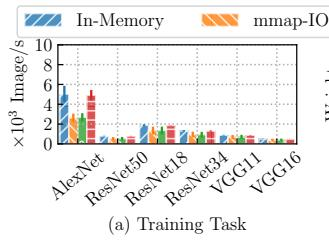

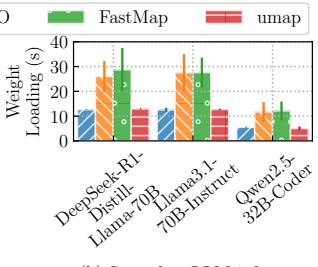  
(b) Serverless LLM inference  
Figure 9: Impact of the FBM backend on AI workload performance.

Baselines. We use mmap-IO and FastMap [2, 54] over the SSD-backed LFS as baselines. mmap-IO is the de facto memory-mapped I/O mechanism in production systems, and FastMap is the leading academic design. Both are evaluated using their default configurations. We omit mmap-IO/FastMap on DFS because their performance is orders of magnitude lower, making them impractical for comparison.

Workloads. We evaluate four classes of FBM-based workloads, each with distinct access patterns and runtime behaviors. Unless otherwise stated, all real workloads run on GPFS; both GPFS and NFSv4 are used to evaluate umap’s DFSagnostic design.

(i) AI workloads, where PyTorch and vLLM [40] use umap, mmap-IO, FastMap, or in-memory variants to load large FBMs—either as training datasets or LLM model weights. These workloads stress large-granularity, partially sequential accesses.

(ii) Cache-intensive scientific computing, represented by OpenBLAS [15], where we run all six FBM-backed matrix kernels using their default parallel configuration. These kernels repeatedly access small, high-locality regions of FBMs, placing pressure primarily on the cache manager rather than the DFS.

(iii) I/O-intensive financial analytics, represented by backtrader [1], where we run offline backtesting on 2020–2025 historical stock data across multiple markets. This workload scans multi-GB FBMs with low spatial locality, placing pressure primarily on sustained read/write throughput.

(iv) Microbenchmarks. We map 1–128 GB FBMs and use fio [4] with 1–32 threads to generate controlled random, sequential, and strided accesses.

Metrics. FBM workloads are mostly offline; we measure throughput and Job Completion Time (JCT) to capture largematrix processing efficiency rather than per-request latency.

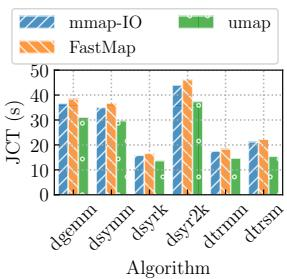  
Figure 10: JCT comparison across different memorymapped I/O runtimes.

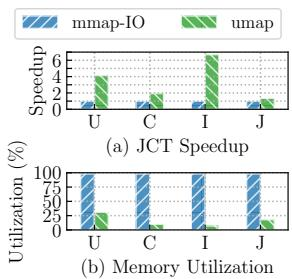  
Figure 11: Improved JCT and lower memory usage achieved by umap.

## 6.2 Performance on Real-world Workloads

Performance in AI workloads. We evaluate the impact of different PyTorch [23] Dataset loaders on training performance: an in-memory loader, mmap-IO/FastMap loaders on LFSbacked FBMs, and a umap loader on DFS. To isolate FBM access, we preprocess ImageNet into a matrix-based format, allowing samples to be fetched without decompression overhead. We train AlexNet [39], ResNet [33], and VGG [63] using up to eight GPUs on a single node (Figure 9(a)). Although computation dominates end-to-end time, umap still provides 1.2–1.9× speedups. FastMap performs similarly to mmap-IO because ImageNet samples are relatively large (200–300 KB) and accessed single-threadedly, limiting the benefit of its lock-free parallel I/O optimizations.

In serverless LLM inference, model initialization time directly impacts request latency. Figure 9(b) shows the weightloading time when vLLM [40] loads various LLMs via different backends, each implemented as a dedicated model loader. umap achieves near–in-memory performance and outperforms mmap-IO by 2.3 . LLM weight loading issues much larger I/O requests (often several megabytes per read) and uses only 1–8 threads, producing an access pattern that favors umap ’s DFS-aware caching while reducing the benefit of FastMap’s multi-threaded optimizations.

Performance in scientific computing. We further evaluate umap on cache-intensive workloads characterized by frequent reuse of cached FBM data. Specifically, we benchmark Open-BLAS [15] on six preset matrix routines using synthetic matrices of size 215 215 (float64), filled with random values. On LFS, FBMs are accessed via mmap-IO and FastMap; on DFS, they are served by umap.

Across all benchmarks, umap outperforms mmap-IO and FastMap by 13%–28% (Figure 10). This is expected for cache-intensive workloads: OpenBLAS matrix operations are O(n3) and dominated by computation with frequent cache reuse, leaving little room for I/O optimizations. Even though OpenBLAS fully utilizes all CPU cores (up to 128 threads), FastMap shows no advantage over mmap-IO, consistent with prior observations [46] that its lockless optimizations mainly benefit small-file workloads (e.g., < 1 GB).

Performance in financial workloads. Financial backtesting is I/O-intensive, involving frequent random reads and writes on large historical market data files that cannot fit in memory, making I/O efficiency and cache management critical. To eval uate such workloads in practice, we run backtrader [1] on five years of historical stock data from four countries (U/I/C/J), using FBMs for market data. FastMap is omitted in this experiment due to deployment restrictions on the production market data servers; however, comparison with mmap-IO alone is sufficient to highlight the benefits of umap.

Figure 11(a) shows normalized JCT, with mmap-IO normalized to 1 for cross-dataset comparability. umap delivers up to 6.7 speedup by mitigating DFS I/O bottlenecks and enabling high-throughput FBM access on high-bandwidth storage. Due to the large size of market data, full in-memory loading is infeasible and also imposes significant overhead on the Linux memory subsystem. Figure 11(b) shows that mmap-IO leads to nearly 100% memory utilization, whereas umap maintains higher performance while keeping memory usage between 8% and 31%, thanks to efficient cache management. Operational Resilience. In large-scale DFS environments, frequent livelocks arise from mmap-IO ’s deferred-write mechanism. While this mechanism is effective on LFS, it interacts poorly with DFS consistency, which is typically enforced at coarse block sizes (hundreds of KBs to several MBs, e.g., 256 KB–16 MB in GPFS and Lustre). As a result, even when data resides in the local page cache, reads may trigger forced writeback and remote coherence checks, causing compute nodes to queue for distributed locks. In PB-scale systems, flushing 1 TB could take up to 3 hours, and in our production cluster, financial jobs experienced 10 livelock incidents per day, during which threads spent up to 90% of execution time in iowait without progress. These stalls were often misclassified as deadlocks by the batch scheduler, leading to forced termination and 100 core-hours lost per incident. After deploying umap, which bypasses mmap-IO ’s asynchronous writeback via explicit POSIX writes and synchronous DFS metadata updates, livelocks were eliminated, with zero job terminations observed over 18 months of operation (§6.4).

## 6.3 Micro-benchmarks

In this section, we take a closer look at how umap’s performance varies across different configurations.

Throughput gains of umap. Figures 12(a) and 12(b) show the random parallel read and write performance of umap versus baselines on both LFS and DFS. The results are consistent across FBM sizes; here we focus on the 128GB FBM.

In single-threaded mode, umap on DFS shows a modest 20% drop in read performance compared to mmap-IO and FastMap on LFS (worst-case small random I/O; AI workloads use large I/O and thus see positive improvements). This is due to the lack of internal prefetching and lock-free optimizations for single-threaded access. Nevertheless, umap narrows the performance gap between DFS and LFS used with mmap-IO (see Figure 2).

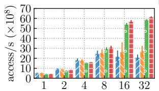  
(a) Thread Count [Read]

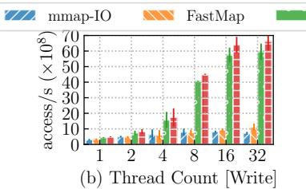

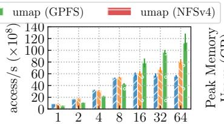  
(c) Thread Count

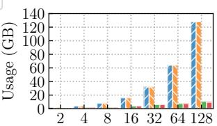  
(d) File Size

Figure 12: End-to-end performance comparison. In (c), only one bar is shown for umap, since it is not backed by a file system.  
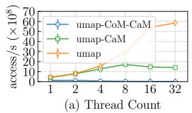

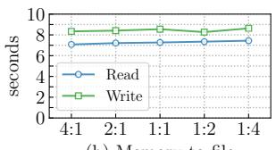  
(b) Memory-to-file

Figure 13: Ablation study results for umap.  
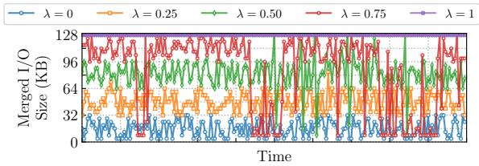  
Figure 14: Impact of spatial locality on merged I/O sizes. A larger λ indicates stronger spatial locality.

For single-threaded write operations, umap outperforms the baselines. Its network-friendly communication management and lazy-expansion cache strategy minimize overhead by reusing existing cache blocks and performing parallel write-back of the shadow copy. In contrast, baselines incur page faults and allocate new pages, incurring extra overhead. Throughput scalability with umap. Figures 12(a) and 12(b) show that umap scales consistently and outperforms baselines. At 32 threads, umap+GPFS achieves 2.8 higher read throughput and 8.3 higher write throughput than mmap-IO+LFS. In contrast, mmap-IO performance degrades beyond 8–16 threads due to contention on the global tree\_lock, which limits atomic page replacement during page faults. umap’s gains are more pronounced in write tasks because mmap-IO and FastMap benefit from prefetching on reads. Disk I/O is asymmetric; for example, the Optane SSD [7] has 5 µs read latency and 6 µs write latency. In contrast, umap ’s performance over DFS shows near-parity between read and write, as both are limited by NIC bandwidth.

Beyond 32 threads, umap+DFS throughput plateaus around 190 Gbps, approaching the 200 Gbps NIC ceiling. To explore further scalability, we simulate a bandwidth-unconstrained environment where umap bypasses data synchronization and mmap-IO uses anonymous mappings. Figure 12(c) shows that umap scales to 64 threads, while mmap-IO stalls at 16 threads, demonstrating the superior scalability of umap ’s concurrency-aware caching protocol.

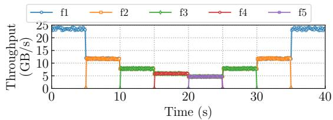  
Figure 15: Inter-process fairness under umap.

FastMap scales better than mmap-IO, but its overall performance gain is limited due to memory-stealing overhead: it divides system memory into 32 free-page lists, making it suitable only for small files. umap exhibits similar performance on GPFS and NFSv4; throughput is slightly higher on NFSv4, because NFSv4’s weaker consistency model reduces the complexity of coherence management.

Memory efficiency of umap with sustained performance. Figure 12(d) shows the peak memory consumption of the write benchmark under varying file sizes with 32 threads. We observe that mmap-IO and FastMap consumes nearly as much memory as the file size itself, whereas umap uses less than 10.4% of the memory required by mmap-IO under the same conditions. This indicates that umap achieves higher performance with significantly lower memory usage, validating the effectiveness of its cache management strategy.

## 6.4 Effects of Individual Techniques

Communication management and cache protocol. We demonstrate that umap’s performance improvement is attributed to network-friendly communication management within the CoM and the concurrency-aware cache protocol within the CaM. In Figure 13(a), we compare the read performance of umap with and without CoM and CaM. Disabling both CoM and CaM (line umap-CoM-CaM) shows that umap performs poorly without these components. With only CoM enabled (bar umap-CaM), umap’s performance improves by 3.5 in single-threaded mode but does not scale beyond 8 threads. The inclusion of CoM and CaM (line umap), however, scales the performance linearly.

To analyze the effectiveness of CoM, we evaluate its I/O merging mechanism PIAO under varying access locality.

Table 1: Breakdown of execution progress for mmap-IO and umap over GPFS.  
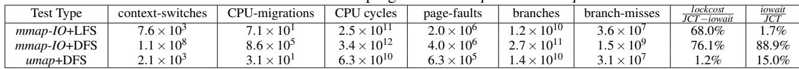

We use a synthetic model, inspired by stochastic locality studies [48] and fio [4], that interpolates between random and sequential access via a parameter λ  [0,1]. Each file has N blocks, and requests evolve as xt = (xt 1 + ∆t) mod N, ∆ Uniform(0,R(λ)), where R(λ) = iodepth λ + jitter bounds the run length and iodepth is the number of concurrent outstanding I/O requests. Thus, λ = 0 yields fully random access, λ = 1 fully sequential access, and intermediate values partial locality. As shown in Figure 14, the average merged size grows from 17.2 KB (λ = 0) to 127.9 KB (λ = 1.0), confirming that PIAO effectively exploits locality and achieves DFS-friendly communication.

Cache Management. Figure 13(b) replicates the experiment from Figure 4 to evaluate umap ’s lazy-expansion cache strategy under multi-task workloads. We run tests on one node, but restrict the available memory to 64 GB using cgroup limits, launching up to 16 concurrent tasks. Each task uses umapbacked fio [4] to issue 4 million single-threaded random accesses to a 16 GB FBM stored on DFS. This yields total mapped sizes from 16 GB to 256 GB, with memory-to-file ratios from 4:1 to 1:4. As shown, task performance remains stable across all ratios—even when the total mapped size far exceeds physical memory. By contrast, mmap-IO suffers severe slowdowns once memory falls short (Figure 4). These results highlight umap ’s ability to sustain performance under memory pressure via its efficient cache management.

Fairness. We evaluate the fairness of umap ’s CoM across concurrent processes, focusing on network bandwidth utilization. Fairness here refers specifically to network bandwidth sharing rather than memory usage, which we do not enforce, following the semantics of mmap-IOand FastMap; memory isolation can still be achieved via cgroup limits if needed. We launch multiple sequential read processes with staggered start/end times to ensure continuous bandwidth demand. As shown in Figure 15, a single process nearly saturates the available bandwidth (>95%), while N concurrent processes share it roughly equally. When a process finishes, its bandwidth is immediately redistributed to the remaining processes. These results demonstrate that umap ’s CoM layer enforces fair bandwidth sharing while maintaining high efficiency in multi-tenant DFS deployments.

Resolving Livelock. We further profile kernel-level behavior to explain the poor performance of mmap-IO+DFS. Table 1 shows the execution breakdown of each write task under 32 threads. Several insights emerge. First, mmap-IO+DFS suffers from severe iowait, where CPUs stall on flushing dirty pages to DFS, causing a form of livelock [21] in which threads remain active but make no progress. Second, umap significantly improves CPU efficiency, cutting CPU usage by 98.2% and CPU migrations by 56.3% by eliminating the lock contention and wasted cycles that dominate mmap-IO. Third, lock contention accounts for most non-iowait time in mmap-IO (68.0% on LFS, 76.1% on DFS), largely due to spin locks (native\_queued\_spin\_lock\_slowpath in Linux). umap reduces this overhead to 1.2%. Although it shows a higher proportion of iowait than mmap-IO+LFS, the absolute time is lower because of its shorter JCT.

## 6.5 Latency Trade-offs

One concern is that umap introduces higher per-access latency due to its request-merging and scheduling logic (Figure 16). Although mmap-IO shows lower latency for individual 4KB reads, this benefit is largely irrelevant for FBM workloads, whose performance is governed by aggregate throughput rather than single-access latency. Even for online serverless services such as vLLM, the key metric is model loading time (cold-start latency), not single-byte access time. As shown in Figure 9, umap speeds up bulk loading by 2.3 , directly improving service availability and elasticity. For latency-critical sub-4KB random I/Os, mmap-IO over local NVMe SSD remains ideal; however, in the throughput-bound regimes typical of disaggregated data processing, the added latency by umap is a necessary trade-off to fully utilize the network.

## 7 Related Work

Page cache management. Many studies have examined techniques for high-performance page cache management for emerging fast storage devices like NVMe [14] SSDs. These approaches include designing concurrency-friendly page cache indexes [53, 54, 58], isolating memory mapping performance across applications [55, 62], and reducing cache allocation overhead through batch allocation or dedicated cache management units [43, 54, 64, 68]. umap is the first memory mapping runtime specifically tailored for DFS, fully accounting for the network behavior inherent in DFS—a factor that has been overlooked in previous studies.

Prefetching. Beyond the Linux kernel’s built-in prefetching, many techniques have been proposed to enhance storage performance. OS-level approaches such as Lynx [41], ATS [37], HoPP [44], FastMap [54], and MMap [52] improve memory mapping via learning-based strategies or optimized disk layouts. Other studies [25, 32] target workload-specific prefetching at the application layer, while cross-layer designs [30] allow applications to influence system-level prefetching. These techniques are orthogonal to umap, which does not implement prefetching. Integrating them could further boost umap’s performance in read-heavy scenarios.

Workload-specific cache management. Some studies [46, 56, 57] optimize memory mapping for specific workloads such as key-value stores, databases, and distributed training by tailoring caching strategies. In contrast, umap targets random matrix access on network-attached DFS and remains agnostic to any particular workload. Prior work on user-space caching (e.g., Tricache [28]) focuses on improving local cache efficiency, while umap targets coordination and I/O amplifi cation issues specific to DFS. User-space file systems based on FUSE [3] have gained popularity in recent AI systems. However, since they rely on the OS page cache, they inherit the limitations of mmap-IO in distributed settings. In contrast, umap redesigns the mmap path to be aware of distributed file system characteristics.

## 8 Discussion

In our 18-month deployment, umap eliminated previously observed livelock scenarios and significantly reduced instability such as OOM-induced failures, leading to more stable largescale job execution. Our large-scale deployment of umap reveals broader implications for memory and storage system designs in disaggregated architectures. We summarize two conceptual observations and three practical lessons from our deployment.

Observation #1: Rethinking VM for Disaggregated Storage. Compute–storage decoupling exposes a structural mismatch between page-granularity VM and the block-oriented semantics of DFSes. Page-fault-driven I/O fragments remote accesses, amplifies metadata coordination, and prevents effective bandwidth utilization. As workloads increasingly operate over remote datasets (exceeding 95% in our cluster), future systems must move beyond traditional VM-based loading models toward coarser-grained, storage-aware abstractions.

Observation #2: Workload Semantics Favor Coarse-Grained Access. Across data analytics, model training, and financial computing, we observe that matrix- and tensor-dominated workloads rarely benefit from fine-grained paging or generic read-ahead heuristics. Their access patterns are coarse, structured, and explicitly known by the application. Exposing these semantics to the memory system enables much better performance than page-level mechanisms designed for generalpurpose locality.

These observations motivate deeper cross-layer co-design between runtimes and DFSes. DFSes increasingly require semantic hints to schedule I/O efficiently, while applications require predictable interaction with remote memory. umap’s chunk-oriented abstraction suggests a path toward unified compute–storage interfaces that preserve memory-like convenience while embracing DFS-native granularity.

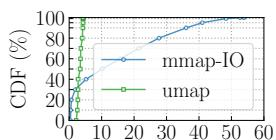  
(a) Time (×100ms)

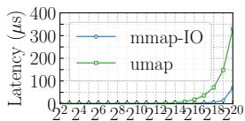  
(b) Message Size (Bytes)  
Figure 16: Message synchronization latency.

Lessons Learned. Operating umap in production reveals additional operational insights that go beyond the abstraction mismatch.

Lesson #1: Implicit page-based I/O undermines observability. On remote storage, mmap-IO turns network delays, DFS contention, and metadata bottlenecks into opaque page stalls, obscuring both performance anomalies and root causes. Coarsegrained, explicit I/O operations expose system behavior and produce far more predictable failure modes.

Lesson #2: Kernel-level greedy caching is harmful in multitenant clusters. Linux’s page cache aggressively retains remote data with limited reuse, amplifying noisy-neighbor effects and triggering avoidable OOM events. Effective caching must shift to the application or runtime layer, where reuse semantics are known and can be explicitly controlled.

Lesson #3: Predictability outweighs micro-optimizations at scale. Eliminating livelock paths, bounding long-tail behavior, and simplifying retry logic improved job completion rates far more than median-performance tuning. In large clusters, robustness and isolation—not marginal throughput gains— dominate overall efficiency.

Applicability. The issues addressed by umap arise primarily in network file systems that involve distributed metadata management and locking (e.g., NFSv4 and GPFS). In contrast, block storage systems (e.g., EBS) or locally mounted file systems do not exhibit the same mmap-IO pathologies, as page faults do not trigger distributed coordination. umap is therefore designed for the former setting.

## 9 Conclusion

The rise of resource-disaggregated architectures presents both challenges and opportunities for optimizing memory mapping on DFS in FBM workloads. We present umap, a memory mapping runtime tailored for random matrix access in FBM workloads on DFS. By integrating network-aware I/O scheduling with dynamic cache management, umap improves data access efficiency while reducing memory overhead. Evaluation across synthetic benchmarks and production environments demonstrates consistent advantages over existing approaches.

## Acknowledgments

We thank the shepherd and anonymous reviewers for their comments. This work was supported by the National Natural Science Foundation of China under Grant 62025203.

## References

[1] backtrader. https://github.com/kilasuelika/b acktradercpp.git.

[2] FastMap. https://github.com/CARV-ICS-FORTH/F astMap.git.

[3] Filesystem in Userspace. https://sourceforge.ne t/projects/fuse/.

[4] Flexible I/O tester. https://fio.readthedocs.io/e n/latest/fio\_doc.html.

[5] IBM General Parallel File System. https://www.ibm. com/docs/en/gpfs.

[6] Infographics: Operation Costs in CPU Clock Cycles. http://ithare.com/infographics-operation-c osts-in-cpu-clock-cycles/.

[7] Intel® Optane™ SSD DC D4800X Series. https: //www.intel.com/content/www/us/en/products /sku/129970/intel-optane-ssd-dc-d4800x-ser ies-1-5tb-2-5in-pcie-2x2-3d-xpoint/specif ications.html.

[8] Intel® Xeon® Platinum 8260 Processor. https://ww w.intel.com/content/www/us/en/products/sku /192474/intel-xeon-platinum-8260-processor -35-75m-cache-2-40-ghz/specifications.html.

[9] JuiceFS Adopters. https://juicefs.com/docs/com munity/adopters.

[10] Linux mmap API. https://linux.die.net/man/2/ mmap.

[11] Lockless Programming Considerations for Xbox 360 and Microsoft Windows. https://learn.microsoft. com/en-us/windows/win32/dxtecharts/lockles s-programming.

[12] Network File System. https://www.ibm.com/docs /en/i/7.4.0?topic=systems-network-file-sys tem-nfs.

[13] NumPy memmap API. https://numpy.org/doc/st able/reference/generated/numpy.memmap.html.

[14] NVM Express. https://nvmexpress.org/.

[15] OpenBLAS. https://github.com/OpenMathLib/O penBLAS.git.

[16] Page Cache. https://en.wikipedia.org/wiki/Pa ge\_cache.

[17] PyTorch MemoryMappedTensor. https://docs.pyt orch.org/tensordict/main/reference/generat ed/tensordict.MemoryMappedTensor.html.

[18] SuiteSparse: A Suite of Sparse matrix packages. https://github.com/DrTimothyAldenDavis/SuiteSparse.

[19] The fourth extended file systems. https://man7.org /linux/man-pages/man5/ext4.5.html.

[20] vLLM Model Loader. https://github.com/vllm-p roject/vllm/tree/main/vllm/model\_executor/ model\_loader.

[21] Franklin Abodo, Robert Rittmuller, Brian Sumner, and Andrew Berthaume. Detecting work zones in shrp 2 nds videos using deep learning based computer vision. In 2018 17th IEEE International Conference on Machine Learning and Applications (ICMLA), pages 679–686. IEEE, 2018.

[22] David Abramson, Chao Jin, Justin Luong, and Jake Carroll. A BeeGFS-based caching file system for dataintensive parallel computing. In Asian Conference on Supercomputing Frontiers, pages 3–22. Springer International Publishing Cham, 2020.

[23] Paszke Adam, Gross Sam, Chintala Soumith, Chanan Gregory, Yang Edward, DeVito Zachary, Lin Zeming, Desmaison Alban, Antiga Luca, and Lerer Adam. Automatic differentiation in PyTorch. In In NIPS 2017 Autodiff Workshop: The Future of Gradient-based Machine Learning Software and Techniques.

[24] Dhruba Borthakur. The Hadoop Distributed File System: Architecture and Design, 2008.

[25] Benjamin Cassell, Tyler Szepesi, Jim Summers, Tim Brecht, Derek Eager, and Bernard Wong. Disk prefetching mechanisms for increasing http streaming video server throughput. ACM Transactions on Modeling and Performance Evaluation of Computing Systems (TOM-PECS), 3(2):1–30, 2018.

[26] Jungsik Choi, Jiwon Kim, and Hwansoo Han. Efficient Memory Mapped File I/O for In-Memory File Systems. In 9th USENIX Workshop on Hot Topics in Storage and File Systems (HotStorage 17), 2017.

[27] Marco Dantas, Diogo Leitão, Peter Cui, Ricardo Macedo, Xinlian Liu, Weijia Xu, and João Paulo. Accelerating deep learning training through transparent storage tiering. In 2022 22nd IEEE International Symposium on Cluster, Cloud and Internet Computing (CC-Grid), pages 21–30. IEEE, 2022.

[28] Guanyu Feng, Huanqi Cao, Xiaowei Zhu, Bowen Yu, Yuanwei Wang, Zixuan Ma, Shengqi Chen, and Wenguang Chen. Tricache: A user-transparent block cache enabling high-performance out-of-core processing with in-memory programs. ACM Transactions on Storage, 19(2):1–30, 2023.

[29] Yao Fu, Leyang Xue, Yeqi Huang, Andrei-Octavian Brabete, Dmitrii Ustiugov, Yuvraj Patel, and Luo Mai. ServerlessLLM : Low-Latency serverless inference for large language models. In 18th USENIX Symposium on Operating Systems Design and Implementation (OSDI 24), pages 135–153, 2024.

[30] Shaleen Garg, Jian Zhang, Rekha Pitchumani, Manish Parashar, Bing Xie, and Sudarsun Kannan. Crossprefetch: Accelerating i/o prefetching for modern storage. In Proceedings of the 29th ACM International Conference on Architectural Support for Programming Languages and Operating Systems, Volume 1, pages 102–116, 2024.

[31] Campbell R Harvey and Yan Liu. Backtesting. Available at SSRN 2345489, 2015.

[32] Brandon Haynes, Maureen Daum, Dong He, Amrita Mazumdar, Magdalena Balazinska, Alvin Cheung, and Luis Ceze. Vss: A storage system for video analytics. In Proceedings of the 2021 International Conference on Management of Data, pages 685–696, 2021.

[33] K. He, X. Zhang, S. Ren, and J. Sun. Deep residual learning for image recognition. In 2016 IEEE Conference on Computer Vision and Pattern Recognition (CVPR), pages 770–778, 2016.

[34] Yongchao He, Wenfei Wu, Yanfang Le, Ming Liu, and ChonLam Lao. A Generic Service to Provide In-Network Aggregation for Key-Value Streams. In Proceedings of the 28th ACM International Conference on Architectural Support for Programming Languages and Operating Systems, Volume 2, pages 33–47, 2023.

[35] Mohammad Hedayati, Kai Shen, Michael L Scott, and Mike Marty. Multi-Queue fair queuing. In 2019 USENIX Annual Technical Conference (USENIX ATC 19), pages 301–314, 2019.

[36] Paul Hudak. A semantic model of reference counting and its abstraction (detailed summary). In Proceedings of the 1986 ACM Conference on LISP and Functional Programming, pages 351–363, 1986.

[37] Song Jiang, Xiaoning Ding, Yuehai Xu, and Kei Davis. A prefetching scheme exploiting both data layout and access history on disk. ACM Transactions on Storage (TOS), 9(3):1–23, 2013.

[38] Ziheng Jiang, Haibin Lin, Yinmin Zhong, Qi Huang, Yangrui Chen, Zhi Zhang, Yanghua Peng, Xiang Li, Cong Xie, Shibiao Nong, Yulu Jia, Sun He, Hongmin Chen, Zhihao Bai, Qi Hou, Shipeng Yan, Ding Zhou, Yiyao Sheng, Zhuo Jiang, Haohan Xu, Haoran Wei, Zhang Zhang, Pengfei Nie, Leqi Zou, Sida Zhao, Liang

Xiang, Zherui Liu, Zhe Li, Xiaoying Jia, Jianxi Ye, Xin Jin, and Xin Liu. MegaScale: Scaling large language model training to more than 10,000 GPUs. In 21st USENIX Symposium on Networked Systems Design and Implementation (NSDI 24), pages 745–760, Santa Clara, CA, April 2024. USENIX Association.

[39] Alex Krizhevsky, Ilya Sutskever, and Geoffrey E. Hinton. Imagenet classification with deep convolutional neural networks. Commun. ACM, 60(6):84–90, May 2017.

[40] Woosuk Kwon, Zhuohan Li, Siyuan Zhuang, Ying Sheng, Lianmin Zheng, Cody Hao Yu, Joseph Gonzalez, Hao Zhang, and Ion Stoica. Efficient memory management for large language model serving with pagedattention. In Proceedings of the 29th Symposium on Operating Systems Principles, pages 611–626, 2023.

[41] Arezki Laga, Jalil Boukhobza, Michel Koskas, and Frank Singhoff. Lynx: A learning linux prefetching mechanism for ssd performance model. In 2016 5th Non-Volatile Memory Systems and Applications Symposium (NVMSA), pages 1–6. IEEE, 2016.

[42] Chengtao Lai, Zhongchun Zhou, Akash Poptani, and Wei Zhang. Lcm: Llm-focused hybrid spm-cache architecture with cache management for multi-core ai accelerators. In Proceedings of the 38th ACM International Conference on Supercomputing, pages 62–73, 2024.

[43] Viktor Leis, Adnan Alhomssi, Tobias Ziegler, Yannick Loeck, and Christian Dietrich. Virtual-memory assisted buffer management. Proceedings of the ACM on Management of Data, 1(1):1–25, 2023.

[44] Haifeng Li, Ke Liu, Ting Liang, Zuojun Li, Tianyue Lu, Hui Yuan, Yinben Xia, Yungang Bao, Mingyu Chen, and Yizhou Shan. Hopp: Hardware-software co-designed page prefetching for disaggregated memory. In 2023 IEEE International Symposium on High-Performance Computer Architecture (HPCA), pages 1168–1181. IEEE, 2023.

[45] Qiang Li, Lulu Chen, Xiaoliang Wang, Shuo Huang, Qiao Xiang, Yuanyuan Dong, Wenhui Yao, Minfei Huang, Puyuan Yang, Shanyang Liu, Zhaosheng Zhu, Huayong Wang, Haonan Qiu, Derui Liu, Shaozong Liu, Yujie Zhou, Yaohui Wu, Zhiwu Wu, Shang Gao, Chao Han, Zicheng Luo, Yuchao Shao, Gexiao Tian, Zhongjie Wu, Zheng Cao, Jinbo Wu, Jiwu Shu, Jie Wu, and Jiesheng Wu. Fisc: A large-scale cloud-native-oriented file system. In 21st USENIX Conference on File and Storage Technologies (FAST 23), pages 231–246, Santa Clara, CA, February 2023. USENIX Association.

[46] Zhiyue Li and Guangyan Zhang. StreamCache: Revisiting Page Cache for File Scanning on Fast Storage

Devices. In 2024 USENIX Annual Technical Conference (USENIX ATC 24), pages 1119–1134, Santa Clara, CA, July 2024. USENIX Association.

[47] Tian Ma, Cunfei Liao, and Fuwei Jiang. Factor momentum in the chinese stock market. Journal of Empirical Finance, 75:101458, 2024.

[48] Richard L. Mattson, Jan Gecsei, Donald R. Slutz, and Irving L. Traiger. Evaluation techniques for storage hierarchies. IBM Systems journal, 9(2):78–117, 1970.

[49] Maged M Michael and Michael L Scott. Simple, fast, and practical non-blocking and blocking concurrent queue algorithms. In Proceedings of the fifteenth annual ACM symposium on Principles of distributed computing, pages 267–275, 1996.

[50] Jayashree Mohan, Rohan Kadekodi, and Vijay Chidambaram. Analyzing io amplification in linux file systems. arXiv preprint arXiv:1707.08514, 2017.

[51] Francisco Muñoz-Martínez, Raveesh Garg, Michael Pellauer, José L Abellán, Manuel E Acacio, and Tushar Krishna. Flexagon: A multi-dataflow sparse-sparse matrix multiplication accelerator for efficient dnn processing. In Proceedings of the 28th ACM International Conference on Architectural Support for Programming Languages and Operating Systems, Volume 3, pages 252– 265, 2023.

[52] Anastasios Papagiannis, Manolis Marazakis, and Angelos Bilas. Memory-mapped I/O on steroids. In Proceedings of the Sixteenth European Conference on Computer Systems, pages 277–293, 2021.

[53] Anastasios Papagiannis, Giorgos Saloustros, Pilar Gonzalez-Ferez, and Angelos Bilas. An efficient memory-mapped key-value store for flash storage. In Proceedings of the ACM Symposium on Cloud Computing, pages 490–502, 2018.

[54] Anastasios Papagiannis, Giorgos Xanthakis, Giorgos Saloustros, Manolis Marazakis, and Angelos Bilas. Optimizing memory-mapped I/O for fast storage devices. In 2020 USENIX Annual Technical Conference (USENIX ATC 20), pages 813–827. USENIX Association, July 2020.

[55] Jonggyu Park and Young Ik Eom. Weight-aware cache for application-level proportional i/o sharing. IEEE Transactions on Computers, 71(10):2395–2407, 2021.

[56] Ivy Peng, Marty McFadden, Eric Green, Keita Iwabuchi, Kai Wu, Dong Li, Roger Pearce, and Maya Gokhale. Umap: Enabling application-driven optimizations for page management. In 2019 IEEE/ACM Workshop on Memory Centric High Performance Computing (MCHPC), pages 71–78. IEEE, 2019.

[57] Ivy B Peng, Maya B Gokhale, Karim Youssef, Keita Iwabuchi, and Roger Pearce. Enabling scalable and extensible memory-mapped datastores in userspace. IEEE Transactions on Parallel and Distributed Systems, 33(4):866–877, 2021.

[58] Kiet Tuan Pham, Seokjoo Cho, Sangjin Lee, Lan Anh Nguyen, Hyeongi Yeo, Ipoom Jeong, Sungjin Lee, Nam Sung Kim, and Yongseok Son. Scalecache: A scalable page cache for multiple solid-state drives. In Proceedings of the Nineteenth European Conference on Computer Systems, pages 641–656, 2024.

[59] Amedeo Sapio, Marco Canini, Chen-Yu Ho, Jacob Nelson, Panos Kalnis, Changhoon Kim, Arvind Krishnamurthy, Masoud Moshref, Dan Ports, and Peter Richtárik. Scaling distributed machine learning with In-Network aggregation. In 18th USENIX Symposium on Networked Systems Design and Implementation (NSDI 21), pages 785–808, 2021.

[60] Frank Schmuck and Roger Haskin. GPFS: A Shared-Disk file system for large computing clusters. In Conference on file and storage technologies (FAST 02), 2002.

[61] Zhibing Sha, Jun Li, Fengxiang Zhang, Min Huang, Zhigang Cai, Francois Trahay, and Jianwei Liao. Visibility Graph-based Cache Management for DRAM Buffer Inside Solid-state Drives. ACM Trans. Storage, 19(3), jun 2023.

[62] Prateek Sharma, Purushottam Kulkarni, and Prashant Shenoy. Per-vm page cache partitioning for cloud computing platforms. In 2016 8th International Conference on Communication Systems and Networks (COM-SNETS), pages 1–8. IEEE, 2016.

[63] Karen Simonyan and Andrew Zisserman. Very deep convolutional networks for large-scale image recognition. arXiv preprint arXiv:1409.1556, 2014.

[64] Brian Van Essen, Henry Hsieh, Sasha Ames, Roger Pearce, and Maya Gokhale. Di-mmap—a scalable memory-map runtime for out-of-core data-intensive applications. Cluster Computing, 18:15–28, 2015.

[65] vLLM Team. vLLM Implementation, 2025. https: //github.com/vllm-project/vllm.git.

[66] Chen Wang, Kathryn Mohror, and Marc Snir. File system semantics requirements of hpc applications. In Proceedings of the 30th International Symposium on High-Performance Parallel and Distributed Computing, pages 19–30, 2021.

[67] Yiduo Wang, Yufei Wu, Cheng Li, Pengfei Zheng, Biao Cao, Yan Sun, Fei Zhou, Yinlong Xu, Yao Wang, and

Guangjun Xie. Cfs: Scaling metadata service for distributed file system via pruned scope of critical sections. In Proceedings of the Eighteenth European Conference on Computer Systems, pages 331–346, 2023.

[68] Lars Wrenger, Florian Rommel, Alexander Halbuer, Christian Dietrich, and Daniel Lohmann. LLFree: Scalable and Optionally-PersistentPage-Frame Allocation. In 2023 USENIX Annual Technical Conference (USENIX ATC 23), pages 897–914, 2023.

[69] Jun Xiao, Yaocheng Xiang, Xiaolin Wang, Yingwei Luo, Andy Pimentel, and Zhenlin Wang. Floria: A fast and featherlight approach for predicting cache performance. In Proceedings of the 37th International Conference on Supercomputing, pages 25–36, 2023.

[70] Juncheng Yang, Yazhuo Zhang, Ziyue Qiu, Yao Yue, and Rashmi Vinayak. Fifo queues are all you need for cache eviction. In Proceedings of the 29th Symposium on Operating Systems Principles, pages 130–149, 2023.

[71] Takeshi Yoshimura, Tatsuhiro Chiba, Manish Sethi, Daniel Waddington, and Swaminathan Sundararaman. Speeding up model loading with fastsafetensors. arXiv preprint arXiv:2505.23072, 2025.

[72] Guowei Zhang, Nithya Attaluri, Joel S Emer, and Daniel Sanchez. Gamma: Leveraging gustavson’s algorithm to accelerate sparse matrix multiplication. In Proceed ings of the 26th ACM International Conference on Architectural Support for Programming Languages and Operating Systems, pages 687–701, 2021.