USENIX

THE ADVANCED COMPUTING SYSTEMS ASSOCIATION

# RoCE BALBOA: Service-Enhanced RDMA OffloadEngine for Data Center SmartNICs

Maximilian Jakob Heer, Benjamin Ramhorst, Yu Zhu, Luhao Liu, Zhiyi Hu, Jonas Dann, and Gustavo Alonso, ETH Zurich

https://www.usenix.org/conference/osdi26/presentation/heer

# This paper is included in the Proceedings of the 20th USENIX Symposium on Operating Systems Design and Implementation.

July 13–15, 2026 • Seattle, WA, USA

ISBN 978-1-939133-55-7

Open access to the Proceedings of the 20th USENIX Symposium on Operating Systems Design and Implementation is sponsored by

# RoCE BALBOA: Service-Enhanced RDMA Offload Engine for Data CenterSmartNICs

Maximilian Jakob Heer, Benjamin Ramhorst, Yu Zhu, Luhao Liu, Zhiyi Hu, Jonas Dann, Gustavo Alonso {maximilian.heer, benjamin.ramhorst, yu.zhu}@inf.ethz.ch

{luhliu, zhiyihu}@student.ethz.ch

{jonas.dann, alonso}@inf.ethz.ch

Systems Group, Dept. of Computer Science, ETH Zurich, Switzerland

## Abstract

Remote Direct Memory Access (RDMA) has become the de facto standard for high-performance data center networking. However, current deployments rely heavily on fixed-function, commercial NICs. These "black box" commercial hardware implementations prevent researchers and system architects from modifying the transport layer for specialized tasks. In parallel, research on NICs often lacks offloaded networking stacks or uses simplified protocol implementations, limiting insight into novel networking solutions in realistic settings. In this paper, we bridge this gap by introducing BALBOA, an open-source, 100 Gbps RDMA offload engine designed for research on networking and fully compatible with commercial RNICs. Unlike prior stack implementations which lack scalability and bandwidth, or struggle with data center interoperability and miss strict protocol compliance, BAL-BOA supports hundreds of Queue Pairs in switched network environments and allows for line-rate offloads, making it a viable platform for realistic data center research. We describe the system architecture, detailing how BALBOA overcomes FPGA memory and timing bottlenecks through a decoupled state architecture and streaming control-data separation. We evaluate BALBOA on a hardware cluster with FPGAs, RNICs, and switches, showing that it matches the performance of commercial ASICs while offering full customization. Finally, we showcase BALBOA’s potential through novel case studies: protocol enhancements for infrastructure purposes (encryption, deep packet inspection) and an offloaded preprocessing pipeline for deep learning recommender systems, which applies streaming transformations to the incoming data before feeding it directly to a GPU for model serving.

## 1 Introduction

With the ever-increasing scale of modern applications, such as large language models (LLMs) and big data analytics, computer systems have become increasingly constrained by network performance. This network bottleneck [101] has driven the widespread adoption of Remote Direct Memory Access (RDMA), which accounts for up to 70% of cloud network traffic [17]. By offloading the network stack to the NIC and bypassing the host operating system (OS), RDMA achieves low latency, high throughput, and reduced CPU utilization. These properties facilitate the implementation of novel platforms for memory disaggregation [5–7], distributed key-value stores [52], and data analysis [47]. However, such deployments often rely on commercial, fixed-function NICs, limiting customization for researchers. For example, having been adopted from trusted HPC domains, RDMA lacks access control and cryptographic policies [78, 85]. Furthermore, research has proposed a wide range of customized congestion control schemes for RDMA [19, 57, 71, 108], but commercial NICs typically only include one or two standard solutions. More generally, modifying the transport protocol or the packet-processing pipeline to address these security and architectural limitations or adapt it to a given application is nearly impossible on commercial NICs, limiting the options for experimental evaluation and prototyping.

To further address the network bottleneck and improve NIC programmability, recent work has shifted focus to SmartNICs and data processing units (DPUs), moving computation closer to the network. Commercial platforms such as AWS Nitro [82], NVIDIA BlueField [22], and Meta FBNIC [16] achieve high performance and improve programmability by enabling application offloads using NIC-hosted CPUs and on-datapath accelerators. However, such offloads often fall short of peak performance and require careful tuning [24]. Additionally, like traditional NICs, SmartNICs and DPUs implement the packet processing pipeline in hardware, remaining "black boxes" at the transport layer, thus limiting possibilities for customization.

FPGA-based platforms, both academic [33, 37, 62, 63, 65] and commercial [23, 32, 70], improve programmability and customizability. However, they suffer from low performance, limited scalability, and a lack of data center interoperability. For example, FPGA-based SmartNICs often lack an offloaded network stack [33, 98], relying on the host OS for the packet processing pipeline, leading to increased latency and CPU utilization. Similarly, they also often fail to achieve high throughput (less than 100G) [68, 99] and compatibility with the specification [67, 84, 99], due to missing components that are complex to implement and affect performance such as the cyclic redundancy check (CRC) or retransmission logic.

In this paper, we bridge this gap with BALBOA, an opensource1, 100G, RoCEv2-compatible RDMA stack designed for research flexibility without compromising performance or interoperability. As such, BALBOA enables the exploration of novel RDMA extensions and in-network computation, while additionally being usable as a plug-and-play component for SmartNICs. The paper makes the following contributions:

1. High-performance architecture: We propose RoCE BALBOA, an open-source, 100G, switched networktested, and RoCE-v2 compatible RDMA stack for FP-GAs that offers direct memory access to server-grade CPUs and GPUs [92]. It matches commercial NICs in both throughput and latency while offering flexibility for extensions and modifications on the hardware level. This demonstrates that the properties prior work treats as fundamentally in tension — 100G line rate, strict protocol compliance, and datapath extensibility — can be reconciled at the architecture level through decoupled state management and deep pipelining.

2. Protocol evolution: We demonstrate BALBOA’s extensibility by implementing two line-rate protocol enhancements impossible on fixed-function NICs: inline Advanced Encryption Standard (AES) Counter Mode (CTR) encryption and ML-based deep packet inspection (DPI) for NIC-level access control. BALBOA thus enables the implementation of RDMA protocol modifications at line-rate, on a switch-compatible platform.

3. Application acceleration: We illustrate the performance benefits of on-datapath acceleration by deploying a commercial ML preprocessing pipeline for recommender models [109]. By utilizing BALBOA to preprocess and stream model data directly to the GPU, bypassing the host CPU, we achieve significant latency reductions and throughput improvements compared to the baseline.

## 2 Background and Motivation

This section reviews the RDMA protocol and motivates the need for an extensible stack with support for protocol enhancements and application acceleration at line rate.

## 2.1 The Rigidity of Commercial RDMA

RDMA achieves high throughput and low latency by offloading the transport layer to the NIC and utilizing OS-bypassing

DMA [53]. Flows between remote nodes are managed via Queue Pairs (QP) as a connection abstraction and used for remote read and write accesses through either one- (RDMA WRITE and RDMA READ) or two-sided (RDMA SEND and RDMA RECEIVE) transactions [15, 66]. The central problem of commercial RDMA NICs (RNICs) is that the key logic is hardwired. Modifying the protocol pipeline to, for example, add a flow-tracking state machine, collect telemetry, or encrypt data to address some of the well-known security flaws of RDMA [78, 85, 89], requires modifying the transport logic. Because commercial silicon cannot be modified, these modifications have to be implemented either in software, thus reducing the performance benefits of RDMA and increasing CPU utilization, or on slow, off-datapath coprocessors [24] that add considerable latency.

## 2.2 The Case for Application Logic Offload

With ever-increasing amounts of data and improved accelerator performance, the gap between compute performance and network bandwidth is becoming more acute. At the same time, network virtualization is becoming increasingly expensive, consuming significant CPU cycles [32]. These shifts have motivated the offload of both network functions and application-specific logic [80] onto specialized accelerators. Recent examples range from data analytics [73] to ML preprocessing tasks [55], which can be implemented on both FPGAbased platforms [50, 63] as well as commodity SmartNICs and DPUs. The combination of SmartNICs and GPUs for MLrelated use cases, such as offloaded object storage clients [51] or shared memory implementations [39], is currently of particular interest. However, as explained in Section 3, most of these examples suffer from critical shortcomings:

• SoC-based SmartNICs rely on embedded ARM cores for programmability in the off-datapath compute model. While flexible, they suffer from the "look-aside" bottleneck: processing a packet requires moving it to the core’s memory hierarchy, incurring significant latency penalties, making line-rate processing at 100Gbps infeasible for complex applications [24].

• Existing FPGA prototypes for stream-oriented innetwork compute either lack an offloaded network stack and rely on the host CPU, sacrificing performance and CPU utilization, or build on simplified network stacks that are not compatible with common data center NICs and accelerators.

In this paper, we demonstrate how BALBOA bridges this gap through an open and extensible architecture, allowing it to serve as a critical piece of research infrastructure and a building block for future SmartNICs and DPUs.

Table 1: Feature overview and comparison of various networking stacks and RDMA NICs with BALBOA as a reference.  
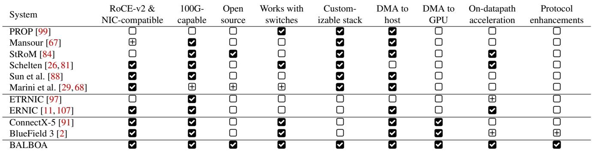  
 - satisfied, Þ - partially satisfied,  - not satisfied

## 3 Related Work

RDMA is extensively used in HPC and data centers to implement systems such as distributed key-value stores [52], disaggregated memory [110], data analytics platforms [47], among others. These platforms are orthogonal to our efforts and can benefit from the stack offloading we propose. The same is true for FPGA-based SmartNICs [61, 62] which focus on offload management rather than the stack itself. We thus focus only on RDMA implementations and efforts that overlap with the use cases we explore in the paper.

On the commercial side, several products support RDMA. The Mellanox ConnectX-5 [91] is a standard 100G-capable RDMA NIC. A SmartNIC version of the system is NVIDIA’s BlueField 3 [2], combining the network functionality with both flexible and hardened compute cores for on- and off datapath offloads. Such commercial systems are useful, but limiting: the programmable on-datapath offloads are limited by access to cache and memory [24], while the hardened decompression core fails to meet line-rate throughput while entirely lacking support for compression [60]. Being a closed system, there is no way to either extend the system or address its limitations. This makes it difficult to explore logic suitable for offload and how to best implement it since the bottlenecks are inherent to the platform and cannot be addressed.

Table 1 summarizes RDMA implementations on FPGAs from academia and industry, highlighting their network capabilities, open-source availability, support for on-datapath acceleration, and communication with GPUs. One of the earliest approaches of RDMA on FPGAs [99] adopts the general principles of RDMA data transport with NIC-offloaded networking and DMA, but neither follows the actual protocol nor achieves 100G throughput. There are also solutions developed for very concrete use cases (e.g., high-energy physics or telescope data readouts) that demonstrate throughput performances of 100G [67] and 10G [29, 68] respectively, but do not implement RDMA READ and focus on embedded devices rather than the cloud and data center. For that purpose, several other solutions have been developed [26, 81, 84]. StRoM [84] is open-source, supports 100G, and has been used extensively for RoCE-enabled FPGA projects [27, 35, 42, 56, 77, 87], but misses key features. Due to its lack of high-performance checksum logic, it does not provide interoperability with commercial RNICs. Since its implementation of retransmission and handling of packet loss lack robustness, StRoM also does not support communication via switches. These two shortcomings eliminate StRoM as a platform for realistic data center network prototyping. Similarly, the lack of support for GPU-direct RDMA diminishes its applicability for modern AI-driven networks. Furthermore, the stack presented in [26, 81] provides a protocol-adherent RDMA implementation only for RDMA WRITE between FPGAs. Being closedsource and thus not extensible, the system makes it impossible to add missing functionality for RDMA READ, access to host memory, and RoCEv2 compliance. As such, the platform can enable data exchange between FPGAs but has limited applicability for network research in realistic data centers. Both StRoM [84] and the stack presented in [26, 81] explore offloading of application logic to the FPGA as we do here, but are limited due to the missing GPU-DMA-compatibility and the lack of demonstrated enhancements in the packet processing pipeline itself. Commercially, AMD’s original implementation of RDMA [97] targeted mobile applications. The current version, ERNIC [11], is better suited for data center applications with 100G throughput. In [107], it was used to implement on-datapath offloads. However, the stack is oriented towards FPGA-to-FPGA communication and is closed-source, not allowing changes to the packet processing.

RoCE BALBOA aims to provide a comprehensive coverage of RDMA functionality and compatibility with commercial data center switches and NICs. Furthermore, it enables researchers to extend the protocol and add application offloads with direct access to GPU memory. Adding the missing functionality, while achieving high performance and enabling arbitrary offloads involves non-trivial design decisions that we discuss in this paper. A survey of existing network studies using FPGAs and custom SmartNICs reveals the gap that BALBOA tries to fill: many prominent FPGA-based NIC platforms, such as Corundum [33], PANIC [61] and OpenNIC [98] do not include an offloaded networking stack, thus relying on the host CPU, while others, such as DUA [83], SuperNIC [62] and ACCL+ [42], implement parts of the packet processing pipeline or simplified protocols while focusing on function offloads. BALBOA is orthogonal to these works, aiming to offer a plug-and-play data center-compatible RDMA stack that provides connectivity and interoperability to these existing frameworks. Similarly, BALBOA could be used for the exploration of alternative transport stack principles as frequently discussed in research [46, 76, 96] through the customizability of its packet processing logic. The same is true for recent work focused on adding programmability and configurability to transport stacks [14, 21] and specifically RDMA [102]. Finally, BALBOA could be integrated with higher-level network management tools [59] due to its interoperability with commercial NICs.

Table 2: Overview of the implemented features of BALBOA  
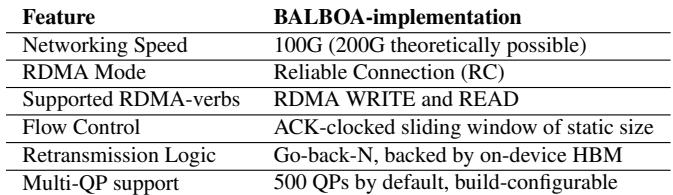

## 4 RoCE BALBOA Architecture

## 4.1 Design Requirements and Challenges

Given the task to develop a widely usable RDMA stack for network research in data centers, we identify four key requirements that guide our design:

(R1) 100G Throughput: The stack should be able to satisfy the 100G networking throughput on current FPGA boards and offer the potential to be upgraded to 200G for the next generation of boards.

(R2) Protocol Adherence: To support integration into data center networks with commodity NICs and switches, the stack must adhere to the RoCEv2 standard and be interoperable with other networking cards. This adds significant complexity to the design, requiring, e.g., robust and fast retransmission, and the computationally complex CRC, which are both often ignored in existing systems.

(R3) Resource Efficiency: To provide space for application offloads and protocol enhancements, the resource and power consumption of the stack itself should be minimal.

(R4) Openness and Extensibility: Integrating offloads and protocol enhancements into the packet-processing pipeline calls for a degree of openness that fundamentally complicates the NIC design. To support such offloads, the stack must adopt a modular structure and expose well-defined, standardized interfaces between its components.

The design of a research-grade RDMA stack faces a fundamental trade-off: it must provide the transparency and modularity required for experimentation (R4) while still achieving high performance (R1) and protocol compliance (R2) available in commercial NICs. Standard open-source stacks often sacrifice (R1) and (R2) for (R4). The core research contribution of BALBOA lies in demonstrating how openness and protocol-adherent performance can be satisfied at the same time through architectural design choices.

To achieve protocol compliance (R2) while maintaining a manageable development workload, we decided to limit BALBOA to a relevant subset of RoCEv2 features, deemed sufficient for data center deployment and research (Table 2). We implement the Reliable Connection (RC) mode with focus on one-sided RDMA verbs (RDMA WRITE and RDMA READ). As shown by prior works [8, 49, 93, 100, 111], the RC mode, together with one-sided verbs, is the most commonly used configuration in RDMA networks, enabling on-datapath offloads with minimal CPU involvement. Furthermore, RC mode demands the most complex hardware support among RoCEv2 transport types, encompassing retransmission, timeout handling, and in-order delivery guarantees. Supporting UC mode would follow as a straightforward extension, gating the reliability logic on QP type and extending the opcode decode tables to cover the UC opcode range — demonstrating that the design cleanly separates the reliability layer from the core datapath.

## 4.2 Architecture Overview

The core architecture of BALBOA (Figure 1) consists of several distinct building blocks for: 4 header (UDP, TCP, IB) processing, 3 checksum calculation, 2 retransmission buffering, 1 flow control, and 5 arbitration. These blocks communicate through well-defined, industry-standard AXI4- Stream interfaces for both data and control. From a development perspective, the modular design simplifies testing of the complex network stack by enabling stand-alone simulation and verification of individual components. At the same time, it improves accessibility, as components can be modified or extended independently, making the design suitable for future research (R4). And from a performance point of view, the modular design lends itself to deep pipelining between components, helping to achieve timing closure with limited routing complexity (R3).

Internally, BALBOA uses 512-bit–wide AXI data streams that operate at a system-wide clock frequency of 250 MHz. This configuration is sufficient to sustain an end-to-end throughput of 100 Gbps (250 MHz × 512 bit = 128 Gbps), satisfying the performance requirement (R1). The chosen bus width and clock frequency create a balance between routing complexity and resource overhead compared to designs that would rely on wider datapaths or higher frequencies, addressing (R3). The design also provides headroom for future networking standards. The complete stack successfully synthesizes and meets timing at clock frequencies of up to 400 MHz, enabling a clear upgrade path towards 200 Gbps as suitable FPGA platforms become available.

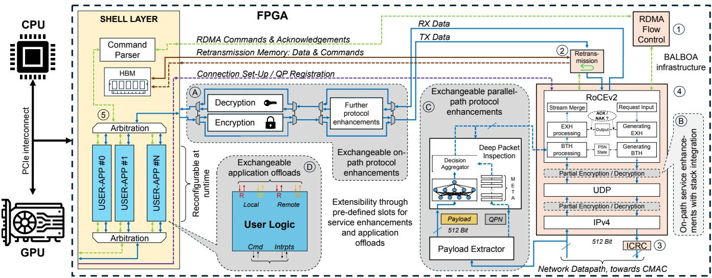  
Figure 1: Overview of RoCE BALBOA, consisting of the customizable 100G RoCE packet processing pipelines 4 with surrounding infrastructure 1 - 3 and stack-adjacent slots for exchangeable on-datapath (Example: A - AES CTR) and parallelpath service enhancements (Example: C - ML-DPI). The open BALBOA-architecture also enables on-path enhancements within the packet processing pipeline ( B ). Allows for DMA to both CPUs and GPUs with data routed through reconfigurable logic slots D in the FPGA shell.

By exposing industry-standard AXI4-Stream interfaces, RoCE BALBOA enables plug-and-play integration of custom offloads (R4) and allows it to be deployed in different FPGA platforms (shells). While this paper evaluates the stack in the open-source Coyote v2 shell [77] with the XDMAcore [12] for direct memory access to the host and the 100G CMAC-core [13] for network access, a port to the AMD RecoNIC/ONIC platform [107] has been realized in the past [69], demonstrating BALBOA’s portability across platforms.

## 4.3 Packet Processing Pipeline

The core packet processing pipeline is implemented in AMD Vitis HLS using a vertically (per protocol-header) and horizontally (for RX / TX) partitioned architecture (Figure 1 - 4 ). To achieve 100Gbps throughput (R1) while ensuring maintainability and extensibility (R4), we map the RoCEv2 header stack (IP, UDP, IB) to individual, pipelined HLS functions. This design pattern ensures sufficient readability and maintainability of the entire stack with the option of easily adding input parameters and processing logic in high-level description (as exemplified in subsubsection 5.2.2) to fulfill the goal of an open and extensible networking stack (R4). In comparison, an RTL-based (e.g., Verilog, VHDL) design would make the effort for development, testing, and subsequent offload integration too demanding, especially for non-hardware engineers. Lastly, this separated design pattern enforces an a-priori pipeline architecture and allows the use of HLS auto-pipelining, helping with both the timing constraints for a 100G throughput design (R1) and the optimization of resource consumption (R3).

A critical challenge in bidirectional 100G RDMA is maintaining QP-state consistency without stalling the pipeline. BALBOA solves this through a decoupled state architecture with physical state tables (Connection, PSN, MSN) implemented in dual-port BRAM and initialized during QP-setup. This design allows simultaneous access by both RX and TX pipelines (R1), enabling independent line rate processing of incoming and outgoing network packets. By default, these tables support up to 500 QPs, but can be scaled depending on resource restrictions and use case (Table 3). A shared transport timer also measures packet timeouts to trigger retransmissions and potentially generate round-trip-time (RTT) based congestion signals for future extensions of the flow control.

Throughout the packet processing pipeline, BALBOA implements a versatile, three-fold interface with data, control, and completion streams: built around the notion of function offloads (R4), split data and control streams allow placing processing pipelines directly on the datapath while manipulating and synchronizing the control commands in parallel, as opposed to a unified transmission where the commandmanipulation, i.e. for size-expanding data operations, would be much more complicated. Building on this set of interfaces, the RX- and TX-path process traffic independently as follows:

• RX Path: Incoming headers are stripped and processed by dedicated finite state machines (FSMs) which generate lightweight meta-commands for state retrieval and checks on parallel control buses. This isolates the main payload stream from the transport logic for improved timing and resource consumption (R1, R3). Crucially, BTH and RETH processing stages generate completion events on a dedicated bus, allowing the flow control logic to operate as a stand-alone, replaceable module (subsection 4.5).

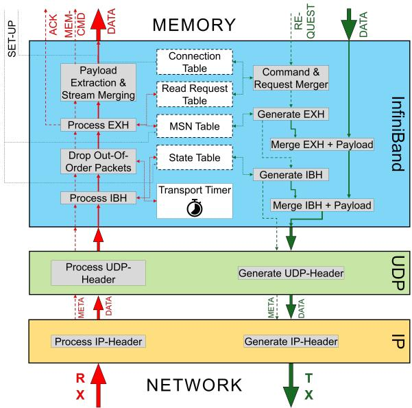  
Figure 2: Packet processing pipeline for the sequence of IP, UDP, and InfiniBand headers of RoCE-v2 packets.

• TX Path: The transmission pipeline accepts independent data and command streams from the host. This decoupling allows the architecture to absorb arbitration latency or retransmission fetches (Section 4.4) without stalling header generation. The command flow retrieves QPN/PSN state to generate headers (RETH/BTH), which are stepwise interleaved with the payload stream in the pipeline before the finished packet is forwarded to the checksum calculation (ICRC) and CMAC-unit for transmission.

## 4.4 Retransmission Buffers and Stream Multiplexer

The retransmission and stream multiplexer module (Figure 3 - 2 ) manages data delivery to the stack and buffers packets for potential retransmissions. A core challenge in RDMA stack implementations is the inherently opposing nature of local RDMA WRITE and remote RDMA READ operations. Delivering data for both over a single stream can cause stalls, prevent ing full throughput saturation. By separating data delivery for RDMA WRITEs and RDMA READs onto distinct AXI streams,

BALBOA manages to achieve bidirectional 100G throughput (R1) while also improving extensibility (R4). More specifically, different offloads for READ and WRITE can be deployed on separate streams, enabling advanced enhancements and experimentation with the stack design.

Within the retransmission module, the two incoming buses for READ RESPONSEs and WRITEs are demultiplexed into a single stream via arbitration, while all incoming payloads are buffered in a dedicated, directly exposed HBM channel. Payloads, whether incoming from host or reloaded from HBM, are picked up and released by incoming commands from the packet processing pipeline.

If retransmissions are required due to packet timeouts or PSN sequence errors, the required payload cannot be refetched from the host, since an additional PCIe transfer would lead to unacceptable latency overheads. At the same time, onchip SRAM is insufficient for buffering the bandwidth-delay product of a 100G link. Instead, all transmitted payloads need to be buffered in directly accessible fast card memory (HBM) until the remote side acknowledges receipt. This design principle is also backed up by the initial idea of adhering to the RoCE v2 standard (R2): BALBOA implements Go-Back-N retransmission as defined in the protocol for RC-mode, and is compatible with off-the-shelf NICs, which means that up to N outstanding packets at any point in time need to be buffered for potential retransmission.

To explore the efficiency of the design, we analyze the resource implications for the Alveo U55C platform used for the evaluation: To saturate the bandwidth-delay-product, the flow control allows up to N = 16 outstanding packets per flow, which amounts to a retransmission buffer footprint of 64kB given the standard 4k MTU of RoCE. The FPGA provides 32 GB of fast off-chip HBM, offering a theoretical capacity for up to 500,000 QPs and thus preventing buffer overflows even for very large-scale deployments. In fact, this buffer capacity provides an advantage for an FPGA-based evaluation platform compared to commercial RNICs, which are typically limited to a few MB of on-chip SRAM [96, 106]. The practicability of this HBM-based approach to retransmission is further demonstrated under packet loss: The design only requires 1.732 µs to fully retrieve a buffered MTU-sized payload from memory, with an overall latency of 1.86 µs from the first indication of required retransmission to transmitting the fully formed packet towards the Ethernet-block of the design. This timespan is only a fraction of the round-trip time for packets of this size.

## 4.5 Flow Control Logic

BALBOA uses an ACK-based flow control over a fixed-size sliding window of outstanding packets, which are identified by their PSNs. This design enables timeout- and PSN-triggered Go-back-N retransmission while remaining compatible with commodity NICs. The flow control logic resides in the control path (Figure 3 - 1 ), where incoming RDMA requests are either forwarded to the packet-processing pipeline or queued to limit the number of outstanding packets. The remaining packet budget per QP is stored in BRAM and updated; decreased when new requests are sent and increased upon receipt of RDMA ACKs.

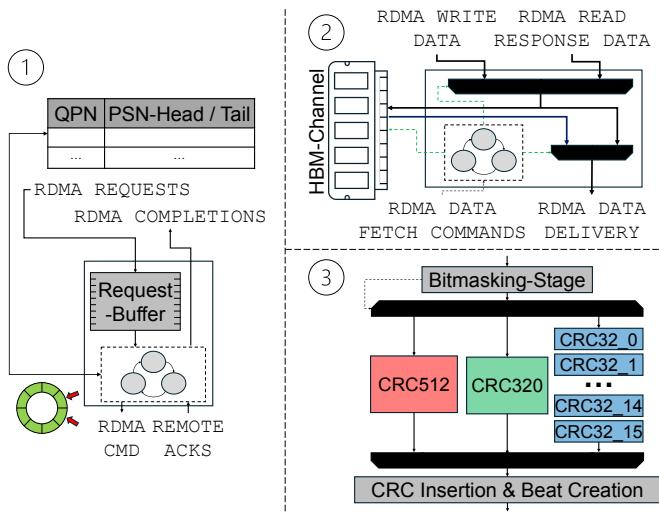  
Figure 3: Building blocks of BALBOA: ➀ - ACK-clocked flow control, ➁ - Retransmission logic, ➂ - ICRC pipeline

By implementing flow control as a standalone block separate from the packet-processing pipeline (Figure 1 - 4 ) with standardized interfaces, BALBOA makes it easy to integrate alternative congestion control algorithms (R4). Algorithms like DCQCN [108] or TIMELY [71] can simply replace the current implementation and throttle the command flow to the stack. Another reason for the modular design is to leverage partial reconfiguration on FPGAs, which, in the future, would enable programmable congestion control by dynamically exchanging the flow control module during runtime.

In addition to BALBOA’s flow control, the underlying CMAC core on the target platforms natively supports Priority Flow Control (PFC) as specified by the RoCE standard [13], providing compatibility with this aspect of the protocol definition (R2).

## 4.6 ICRC Pipeline

As described in [81], efficient calculation of the ICRC checksum is performance-critical for achieving high throughput (R1) and a well-known challenge for any RoCE implementation on FPGAs due to its combinatorial complexity. Since off-chip memory access to pre-calculated values would incur a significant latency penalty, impacting end-to-end throughput, RoCE BALBOA reimplements the concepts presented in [81]. More specifically, we calculate and concatenate the partial checksum of every incoming AXI beat within a packet. As a further trade-off between processing speed and resource consumption, we follow the referenced work in implementing separate, parallel pipelines for the full 512-bit and the partial 320-bit AXI beats, which are the most common filllevels in RoCE packets on a 512-bit bus. A third, multi-stage pipeline for chunks of 32 bits length allows one to calculate the required checksum for any possible AXI beat, given the guaranteed 4-byte alignment of all RoCE messages.

## 4.7 Traffic Sniffer as a Debugging Utility

Developing a full FPGA network stack is challenging, especially when debugging faults that appear only during longrunning jobs. To address this and maintain sustainable devel opment, we built a performance-preserving traffic sniffer for bidirectional 100G RX/TX paths. It captures all packets and outputs standard PCAP files suitable for analysis with tools such as Wireshark. A header-based filter at the CMAC-level allows users to capture only specific protocols (e.g., RoCEv2) or omit payloads to reduce memory usage, which is crucial for tracing lengthy flows. This tool proved invaluable during development and supports our goal of comparability with offthe-shelf NICs and deployment in realistic networks (R2), where traffic capture is essential for tuning and debugging.

## 5 Compute Offloads in BALBOA

The open design of BALBOA enables two types of offloads: protocol enhancements and application-specific offloads in configurable logic slots on the datapath.

## 5.1 Design Methodology for Offloads

For both types of offloads, developers can choose from a diverse toolbox of development strategies with specific tradeoffs. Thus, we now discuss the design methodologies available in the framework and their implications for design effort, latency, and resource footprint. BALBOA’s implementationagnostic stream interfaces open a wide design space around the tradeoffs between development effort versus control. At the lowest level, RTL (VHDL / (System)Verilog) as showcased in Section 5.2.1 gives maximum control over timing and resources but requires hardware expertise and typically weeks of development per module. HLS (e.g., Vitis HLS) allows the direct synthesis of C/C++ expressions, reducing the development effort to days and enabling non-hardware engineers to leverage BALBOA’s capabilities. The usefulness of this approach is demonstrated in Section 8. Finally, tools like hls4ml [30], showcased in Section 5.2.2, or P4- to-hardware compilers (e.g., Vitis Networking P4 [3]) take a cross-disciplinary approach and eliminate the manual creation of hardware by compiling pretrained ML-models or P4-scripts directly into FPGA-images, reducing the development time.

Regardless of the implementation methodology, coordination with the packet processing pipeline for on-datapath offloads reduces to a backpressure signal on the AXI4-stream signal as a consequence of the realized design goal (R4). As laid out in Section 5.3, RX-path offloads must be nonstalling, while TX-path offloads benefit from the decoupled command/data architecture. Parallel-path enhancements need to interact with the processing pipeline through HLS-hooks, requiring more attention to potential pipeline stalls.

## 5.2 Protocol Enhancements as a Service

The RDMA protocol enhancements are located close to the stack and interact directly with both data- and control flow. Compared to application-specific offloads, protocol enhancements implement network-specific tasks applicable to the entire BALBOA-stack. Function offloads as user-defined applications for selected QPs (e.g., data preprocessing) can select to utilize these protocol enhancements as a service of the network stack, just like the general RDMA transport mechanism. In our example, we focus on the aforementioned security flaws of RoCE and demonstrate the unique capability of BALBOA to deploy enhancements that close important security gaps of the protocol. In general, two forms of protocol enhancements are possible:

On-datapath protocol enhancements are located right before or after the packet processing pipeline and consume the incoming AXI data streams, without interfering with the actual protocol logic of the packet processing pipeline (Figure 1 - A ). While we only show host-facing offloads located after the BALBOA-stack, future work could also place additional logic on the network streams leading to the packet processing pipeline, such as a network impairment model for congestion control testing.

Contrary to this, parallel-path protocol enhancements (Figure 1 - C ) are placed in parallel to the core packet processing pipeline. These enhancements operate on a multiplexed copy of the incoming or outgoing packets and can directly interact with the packet processing logic via interfaces to the pipeline. The latency of these protocol enhancement services is hidden by the partial latency of the parallel packet processing pipeline. Parallel-path protocol enhancements are unique to an open stack design as demonstrated with BALBOA (R4), since they require direct integration into the protocol logic.

## 5.2.1 AES Encryption

To demonstrate secure, line-rate stream processing, we integrated an open-source AES-CTR engine2 (Figure 1 - A ). The module operates as a ’bump-in-the-wire’ on the AXI datapath, adding a deterministic latency of only 11 cycles (44ns) while sustaining full 100Gbps throughput.

BALBOA’s architecture provides a critical advantage for cryptographic correctness: unlike fixed-function NICs where internal state is hidden, our stack exposes the transport state machine to the encryption logic. This gives us the opportunity to construct a cryptographically unique counter (IV) for AES-CTR by combining the Queue Pair Number (QPN) with perpacket counters. This state-aware synchronization ensures semantic security without requiring software intervention or side-channel signaling.

Furthermore, BALBOA’s modular AXI-based design allows for flexible placement of encryption blocks. Beyond standard payload encryption, the engine can be repositioned within the packet processing pipeline (Figure 1 - B ) to obfuscate transport headers (e.g., BTH, UDP) for stealth communication within trusted subnets, or extended to protect specific metadata fields. Similar concepts have been discussed in research before [90] and are currently seeing deployment in production environments (e.g., NVIDIA / Google PSP [36, 75, 86]).

## 5.2.2 ML-based Deep Packet Inspection

As an example of parallel-path protocol enhancements (Figure 1 - C ), RoCE BALBOA deploys an open-source machine learning-based deep packet inspection module [44]. It leverages low latency inference of ML on FPGAs to offload packet checking to the NIC and identify, at line-rate, potentially malicious executables embedded in RDMA flows, countering the well-known shortcomings of the protocol in terms of access control. This maintains host bypassing while marking and rejecting potentially malicious packets before they ever reach host memory and possibly inflict damage. The ML model was trained to distinguish between common payloads, such as CSVs, PNGs, and TXTs, and compiled malware executables. The trained and quantized model was converted to a hardware module suitable for FPGA inference through the hls4ml compiler [30]. The end-to-end inference latency for DPI decisions is only 44ns per AXI beat. This is shorter than the latency of the packet processing pipeline and, therefore, DPI does not lead to performance degradation. Utilizing the open stack design, the aggregated DPI decision is communicated as an input value to the BTH-processing function of the packet processing pipeline and included as a flag in the resulting command to the host. This allows the stack to raise an interrupt, upon which the host OS could decide to run additional checks. In more conservative setups, packets can also be immediately dropped by the NIC, before reaching the host.

The integration of the DPI model into the packet processing logic is a prime example of a protocol enhancement only possible with a customizable and open-source design like BAL-BOA (R4). Following this design principle, other modules can be installed in a similar position for, e.g., data analytics on incoming packets to control the further processing in the stack.

## 5.3 On-datapath Application-specific Offload

Thanks to its generic AXI stream interfaces, RoCE BALBOA allows users to deploy arbitrary logic on the RX- and TXdatapath to manipulate payloads. Multiple design criteria must be met for such offloads:

• For both directions, special care is required for any data expansion operation on the payloads. Backpressure is exerted if an offload exceeds the available bandwidth.

• Similarly, all operations placed on the RX datapath for incoming packets must not stall at any point to avoid causing backpressure to the network stack as it would lead to packet drops. For offloads below line rate, this requires an end-to-end approach with adapted data sending rate from the remote node.

At the same time, the user finds powerful design tools for customized data processing in the application-specific on-datapath offloads:

• The user has access to both the data and control flow for incoming packets. This allows manipulating the local data forwarding, e.g., scatter-gather operations to multiple host memory locations for arriving data. On top of that, payloads can also be forwarded to local NICattached memory for buffering.

• Finally, also stateful offload operators can be configured by the user: By using memory-mapped control registers, the user is able to provide context or state for processing to such hardware modules.

To facilitate development against these design constraints, we provide a comprehensive logic simulation framework that tests any on-datapath user-application against the realistic network behavior of RoCE BALBOA and helps to easily spot throughput bottlenecks, data dependencies, and race conditions while hiding the actual complexity of the implementation. In fact, the workflow for deployment and simulations only differs by a single compile flag and does not require any framework or code adaptation. This makes it possible to design and test advanced on-datapath compute offloads. As a consequence, BALBOA has been proven useful and easy to handle for developers in many collaborative projects with both industry and academia in the past, where it was deployed in research and production systems.

## 6 Experimental Evaluation

We evaluate RoCE BALBOA along multiple dimensions in a public research cluster [72] that resembles a typical data center network. The 100G subnet connects servers with Mellanox ConnectX-5 (MCX515A-CCAT) and NVIDIA ConnectX-7 (integrated in a BlueField-3 B3220-DPU), as commodity

NICs, and BALBOA deployed on AMD Alveo U55C FPGA accelerators as PCIe cards over CISCO Nexus 9000 Series switches, tuned to 4K maximum transmission units (MTU). We evaluate the performance between RoCE BALBOA on the Alveo FPGAs and the commercial NICs through a single layer of switches, but also verify the same results in a 2-tier fat-tree network topology more common for HPC-oriented cloud setups. Additionally, we have successfully deployed and tested BALBOA on other AMD Alveo accelerators with CMAC blocks (U250, U280).

## 6.1 Basic Performance & Cross-compatibility

RoCE BALBOA is evaluated in the described setup for latency and throughput at various buffer sizes, both in FPGAto-FPGA flows as well as heterogeneous FPGA-to-Mellanox connections (Figure 4). Additionally, Mellanox-to-Mellanox results are plotted for comparison. Following the general practice of network performance testing, latency values are obtained through repeated single buffer transmissions and completion-polling, while throughput performance is measured with repeated batched transmissions.

When first comparing only the BALBOA-to-BALBOA performance with the NIC-to-NIC performance, it becomes evident that both BALBOA and the commodity NICs perform similarly, especially for RDMA WRITE operations. As shown in Figure 4a, all three devices reach the 100G saturation point for 32kB buffers at the latest, with a marginal advantage for the newer generation ConnectX-7. In terms of latency (Figure 4b), the higher internal clock frequency of the ASIC-based NIC results in a latency advantage, especially for small buffers, with diminishing differences for larger messages. All three devices have a steady latency performance with a negligible tail latency as shown by the 95th-percentile lines. The same general observations hold true for the RDMA READ behavior. A more pronounced throughput difference for medium-sized buffers becomes visible for RDMA READ (Figure 4c). Unlike RDMA WRITE operations which utilize posted PCIe transactions (fireand-forget), RDMA READ relies on non-posted memory read requests. This requires the NIC to manage the round-trip latency of fetching data from the host root complex. To saturate the link, the NIC must maintain a high volume of outstanding split-transactions (PCIe tags) to mask this latency. The commercial ASIC, utilizing a custom controller clocked at ≈1GHz, can issue and track these requests at a higher rate than the FPGA. In BALBOA, the lower logic frequency (250 MHz) and the interface overhead of the generic PCIe hardblock introduce slight serialization delays in the request-issue loop, preventing full saturation for medium-sized transfers where the per-transaction overhead is most pronounced. Heterogeneous connections between BALBOA and an ASICbased NIC exhibit characteristics of both devices as described before. The measurements demonstrate that RoCE BALBOA is capable of saturating a 100G link for both RDMA READ and

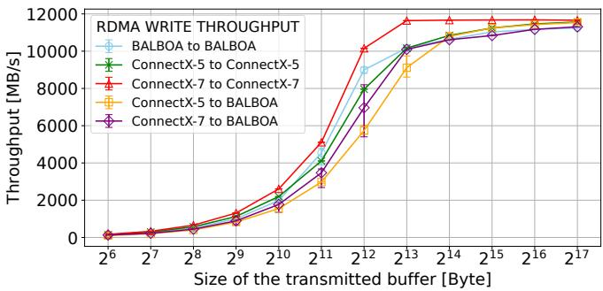

(a) Throughput evaluation for RDMA WRITE.  
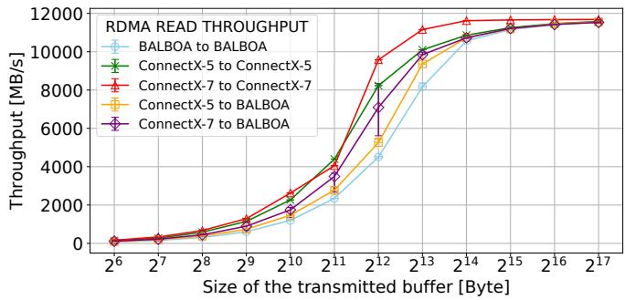  
(c) Throughput evaluation for RDMA READ.

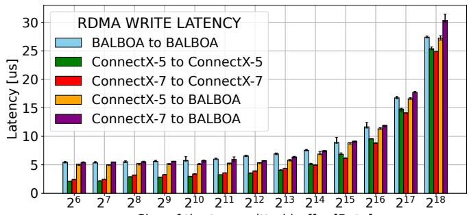  
Size of the transmitted buffer [Byte]

(b) Latency evaluation for RDMA WRITE.  
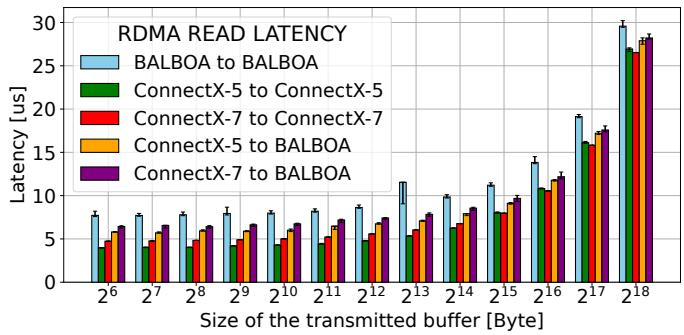  
(d) Latency evaluation for RDMA READ.  
Figure 4: Performance evaluation of RoCE BALBOA in a switched 100G data center network, 100 repetitions per measurement.

WRITE in connections to both another FPGA and a commodity NIC. The adaptability across different generations of ASICbased RNICs appears even more crucial, as such connections are known to be troublesome even in commercial deployments [59]. The experiment validates the design choices for achieving the network bandwidth (R1) and compatibility of the stack with commodity hardware (R2).

## 6.2 Multi-QP Performance Scaling

RoCE BALBOA can serve up to hundreds of independent QPs in parallel from independent threads. By intertwining batched transmissions of multiple QPs, we demonstrate that the arbiters used in RoCE BALBOA are capable of evenly distributing the available bandwidth between the competing flows (Figure 5), while maintaining full aggregated throughput saturation. Results obtained with a Mellanox card show similar behavior to BALBOA.

## 6.3 Protocol Enhancements: Encryption and DPI in BALBOA and Other Platforms

We showcase the performance of encryption and DPI and, if applicable, compare them to software-based implementations of the same functionalities on the host CPU (AMD EPYC 7302P, 16 cores, 64GB RAM) coupled to a Mellanox ConnectX-5. While the processing steps in RoCE BALBOA reside on the datapath and are therefore executed automatically, the execution on the CPU is triggered via a remotely written doorbell register with host-polling.

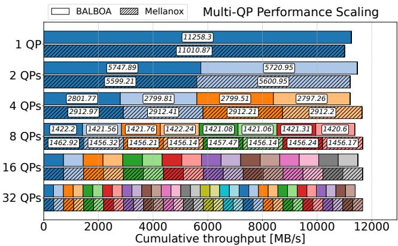  
Figure 5: Bandwidth distribution and aggregation across mul tiple QPs for interleaved RDMA READs of 32k size.

## 6.3.1 AES-CTR Encryption on RDMA Traffic

The direct comparison of latency and throughput for both the on-datapath BALBOA implementation and the realization of AES CTR on the host CPUs demonstrates a stark performance difference (Figure 6). Even with all 16 cores of the server-grade CPU (AMD EPYC 7302P) and with hardware support for AES via the standard OpenSSL library, the software-based implementation is only able to saturate a small fraction of the 100G network bandwidth (Figure 6b). Conversely, the hardware-based implementation in BALBOA achieves full throughput and only adds negligible additional latency - the AES pipeline has an end-to-end latency of 11 clock cycles/44 ns (Figure 6a). This performance difference is further backed up by existing research on accelerator-based encryption, where these solutions consistently outperform CPUs [25], while also reducing the "data center tax" of continuously thrashing CPU cores for repetitive tasks.

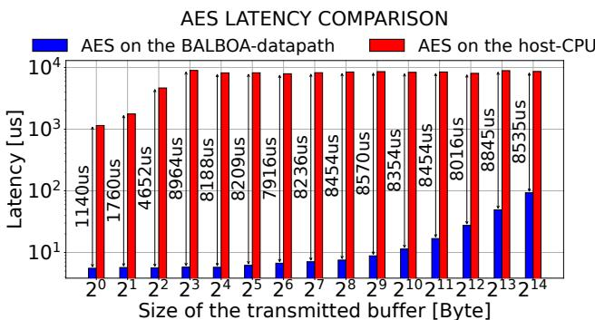  
(a) Latency comparison for AES-CTR on the BALBOA datapath vs. on the host CPU with a Mellanox NIC for RDMA WRITEs.

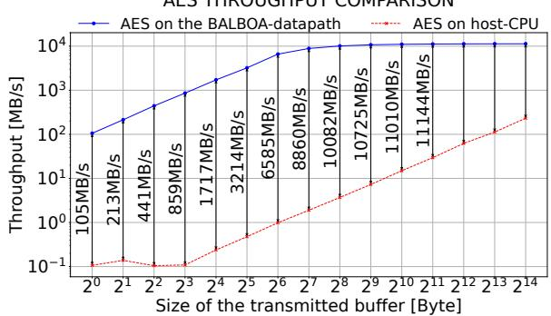  
(b) Throughput comparison for AES-CTR on the BALBOA datapath vs. on the host CPU with a Mellanox NIC for RDMA WRITEs.  
Figure 6: Comparison of AES implementations residing on either the BALBOA-datapath or the host CPU.

For completeness, we also tried to compare to the performance achievable with the hardware encryption accelerators in NVIDIA BlueField-3 DPUs, but ran into difficulties: The officially documented path for hardware-accelerated IPsec on BlueField-3 relies on a VXLAN+IPsec tunnel architecture via a patched strongSwan, which is not directly comparable to BALBOA’s per-flow RDMA payload encryption. We were unable to build the patched strongSwan instance due to its sparse documentation and dependency as well as timestamp issues. There is no evidence that another per-flow RDMA encryption is supported in any documented configuration. Requests for assistance on the NVIDIA developer forum went unanswered beyond a referral to enterprise support, and independent community reports confirm the same unresolved issues as recently as late 2025.

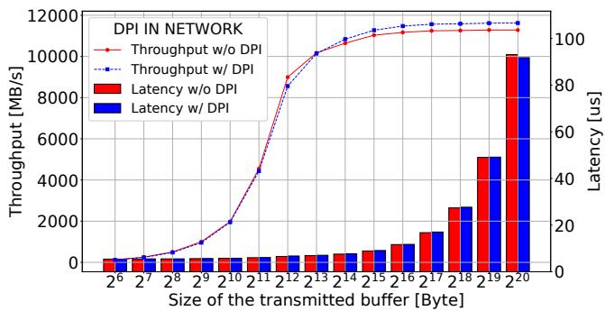  
Figure 7: Throughput and latency with and without deployed ML model for deep packet inspection.

## 6.3.2 Deep Packet Inspection

Analyzing the performance of the DPI enhancement, we first observe that the deployed fully-connected ternary neural network provides an excellent detection rate of executables with 97.83% for full payloads and 89.35% for partially embedded executables. Compared to the low false positive rate of flagging acceptable payloads of the model, a highly effective and fine-grained differentiation policy is possible based on the ML-decisions. More details on the accuracy and performance of this model can be found in [44].

At the same time, Figure 7 shows that the deployment of the ML model alongside the BALBOA stack does not have a negative impact on either end-to-end latency or throughput, since the inference latency of DPI is completely hidden by the parallel packet processing pipeline.

## 7 Hardware Resource Evaluation

We analyze the FPGA resource utilization and power consumption with post-routing hardware and power estimation results for an AMD Alveo U55C FPGA (Table 3). The design aims to minimize the "transport tax" - the resources consumed by the network stack - to maximize the area available for offloads and enhancements:

• Resource Efficiency (R3): The base BALBOA stack utilizes only 3.4% of the Look-Up-Tables (LUTs) and 5.1% of Block RAM (BRAM). Notably, the complex transport logic fits entirely within on-chip memory, ensuring deterministic access times without consuming external HBM bandwidth for state management. Even with the AES-Encryption and ML-DPI offloads enabled, the total LUT utilization remains below 12.15%. This confirms the successful combination of resource-efficient and still extensible stack architecture achieved with BALBOA.

Table 3: Resource and power estimation breakdown for RoCE BALBOA, and for the AES and DPI service offloads.  
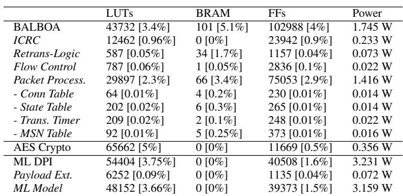

• Power Consumption: The estimated power draw for the full 100Gbps design is 1.745W , validating that FPGAbased transport is power-efficient enough for dense data center deployment.

• Scalability: Given the low LUT utilization, the design would theoretically allow for multiple parallel BALBOA instances of a single data center FPGA. This would enable multi-port 200G or 400G deployments in future work, limited only by the available PCIe-bandwidth for host communication.

To contextualize these numbers, a direct comparison with an established open-source TCP stack is instructive: Limago [41, 79] implements simplified 100G TCP and has been widely used in the community for network research [43] and distributed applications [9, 40, 48, 54, 94, 95]. Despite implementing full transport-layer reliability — including Go-Back-N retransmission and flow control as required by Ro-CEv2 — BALBOA consumes 18% fewer LUTs than the Limago 100G TCP stack under equivalent conditions (capacity for 500 flows, targeting AMD Alveo U55C), the primary scarce resource for co-located applications as evidenced by the AES and DPI offloads in Table 3. BALBOA uses more FFs (102,988 vs. 72,974) and BRAM (101 vs. ∼78 BRAM36- equivalent), though both remain comfortably within the available budget of the U55C and do not constrain placement of additional logic.

## 8 Use Case Example: ML Preprocessing Pipelines for RDMA-to-GPU

Deep learning recommendation models (DLRM) comprise a large fraction of all ML workloads in data centers [38]. To maintain accuracy of the recommendations during data drift and evolution, frequent online re-trainings are necessary [20, 31]. While the multi-modal input data consists of images, audio, or text, the training process itself operates on vector embeddings [105], so a preprocessing step for conversion is required. Traditionally, such training systems utilize a hybrid hardware configuration with CPUs and GPUs [104], as the GPU utilization should not be bloated with frequent kernel launches for preprocessing. When transferring data from disaggregated storage to the GPUs for DLRM-training, preprocessing becomes a critical bottleneck, as more and more CPU cores are required to saturate the increasing bandwidth of GPUs, leading to more than 60% share of total power consumption for just this initial data preparation step [18, 104]. This motivates an accelerated approach which combines network and compute using the capabilities of BALBOA. We demonstrate how to significantly increase the efficiency and the processing speed of DLRM preprocessing by offloading it onto the BALBOA datapath in deep pipelines operating at linerate and combining it with the direct-to-GPU capability. Thus, the CPU as a potential bottleneck is completely bypassed.

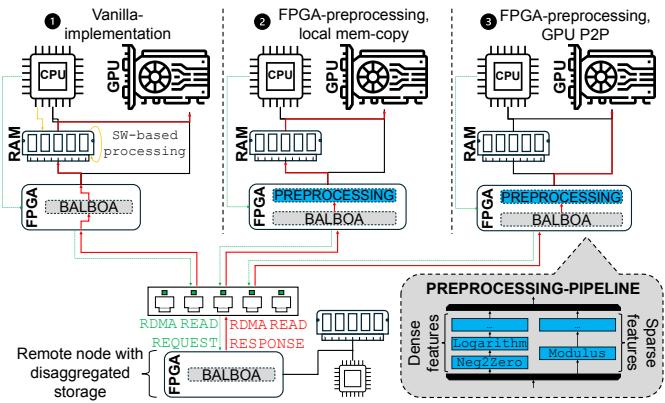  
Figure 8: Comparison of three setups: ➀ - CPU-based prepro cessing, ➁ - preprocessing on the FPGA, mem-copy to GPU, ➂ - preprocessing on the FPGA and DMA to the GPU

## 8.1 Functional and Design Overview

For a realistic evaluation, we deploy operators from Meta’s training toolkit [1, 74] implemented in deep pipelines for non-stalling line-rate execution in hardware [109]. We select the following three stateless operators and concatenate them to a preprocessing pipeline, as they are deemed relevant for optimization in hardware [58] and software [103]: Neg2Zero and Logarithm operate on dense input features by clipping negative values to zero and compressing very large values. Modulus restricts the range of sparse feature values. With an initiation interval of one clock cycle each, pipelines composed of these operators are able to maintain network speed and do not bottleneck the BALBOA datapath.

## 8.2 Performance Benchmarking

To explore the performance of the preprocessing offload and the direct memory access to the GPU, we conduct three experiments (Figure 8). In all three cases, the local node reads the input data from remote memory via RDMA READs. In the vanilla setup, without offloaded processing or the direct-to-GPU feature, the received data is written to local host memory, preprocessed in software on the CPU and then locally copied to GPU memory. In a more optimized setup, the preprocessing is implemented in BALBOA’s datapath, while still relying on intermediate buffer copies from host to GPU memory. The final setup utilizes both on-datapath preprocessing and direct memory access to the GPU. Again, all experiments are conducted in the same public research cluster with Alveo U55C FPGAs, AMD MI210 GPU accelerators and AMD EPYC 7V13 CPUs. However, a PCIe-switch on the GPU-FPGA path limits the maximum throughput between FPGA and GPU to 70 Gbps (8500 MB/s).

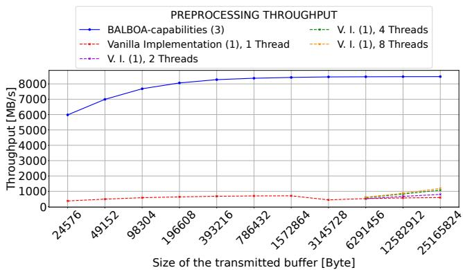  
Figure 9: Throughput of preprocessing in BALBOA with direct-to-GPU vs. CPU preprocessing and copy to GPU for different levels of multithreading.

Comparing the vanilla implementation to the BALBOAoptimized design reveals the throughput and utilization benefit of on-datapath pipelines. Even when using multithreading on the CPU and using up to 8 cores for preprocessing tasks, the achievable throughput is limited to 1190 MB/s compared to the FPGA throughput of 8500 MB/s (Figure 9). At the same time, the latency comparison between the GPU-direct utilization of BALBOA compared to the additional copy through host memory shows latency savings of around 20 − 135 µs (Figure 10). Additionally, the direct transfer to GPU remains compliant with RDMA principles of bypassing the CPU.

In summary, the combination of DMA-to-GPU mechanisms with on-datapath preprocessing in the NIC is a promising way to fully use the bandwidth of modern GPUs, avoiding running into CPU bottlenecks and blocking valuable cores.

## 9 Future Work

In future work, we plan to further leverage the openness and extensibility (R4) of BALBOA for research in network infrastructure and application acceleration, similar to the previously demonstrated ML-preprocessing in Section 8: On the application level, the on-datapath enhancements provide an exploration space for operator push-down in distributed database systems [28] to eliminate CPU-passes in query execution, content-aware packet steering as a natural extension of the demonstrated DPI-example or hardware-offloaded gradient compression at line rate [4].

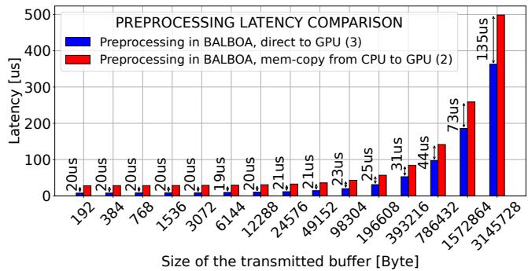  
Figure 10: Latency of ML preprocessing in BALBOA with direct-to-GPU vs. an additional step through CPU memory.

Another potential line of research focuses on networklevel transport characteristics: A major problem in RoCEdependent AI-networks is congestion control [34], which is hard to investigate with commercial NICs due to hardwired congestion controllers. BALBOA maintains an open interface for congestion algorithms deployed in hardware, thus forming an ideal platform to investigate and prototype programmable congestion control, ML-driven congestion control or test other algorithms in hardware instead of simulation. Similar to this, an extensible and open stack allows modifying key RoCE behavior and testing alternative approaches to retransmission [45], packet reordering for per-packet load balancing [64] or custom verbs for interaction with remote memory [10]. Finally, the open nature of BALBOA allows us to further improve its performance in the future, e.g., scaling the throughput to 200G on newer FPGA platforms.

## 10 Conclusions

In this paper, we present RoCE BALBOA, an open-source, RoCE v2 capable and data center network-ready RDMA stack for exploring and developing in-network accelerators and SmartNICs that allows for far-reaching customization with protocol-enhancing services and on-datapath acceleration of function offloads. We demonstrate the protocol enhancements with AES encryption and ML-based deep packet inspection while also showcasing a realistic use-case scenario of on-datapath function offloads for realistic ML-preprocessing pipelines for recommendation models.

## 11 Acknowledgements

The authors thank AMD for the donation of the Heterogeneous Accelerated Compute Cluster (HACC), which was used for the development and testing of this project, and Geert Roks for the support and help with the cluster set-up. Also, thanks to the AMD Research team in Dublin for useful feedback and discussions on the design of RoCE BALBOA. We thank Heejae Kim from Seoul National University for his support with Limago.

## References

[1] Deep learning recommendation model for personalization and recommendation systems:, 2024. GitHub, https://github.com/ facebookresearch/dlrm.

[2] Nvidia bluefield-3 dpu controller user manual, 2024. https://docs.nvidia.com/networking/display/ nvidia-bluefield-3-dpu-controller-user-manual.pdf.

[3] ADVANCED MICRO DEVICES, INC. Vitis Networking P4 User Guide (UG1308). Advanced Micro Devices, Inc., 2024. Accessed: April 23, 2026.

[4] AGARWAL, S., WANG, H., VENKATARAMAN, S., AND PAPAIL-IOPOULOS, D. On the utility of gradient compression in distributed training systems. In Proceedings of Machine Learning and Systems (2022), D. Marculescu, Y. Chi, and C. Wu, Eds., vol. 4, pp. 652–672.

[5] AGUILERA, M. K., AMARO, E., AMIT, N., HUNHOFF, E., YELAM, A., AND ZELLWEGER, G. Memory disaggregation: why now and what are the challenges. SIGOPS Oper. Syst. Rev. 57, 1 (June 2023), 38–46.

[6] AGUILERA, M. K., AMIT, N., CALCIU, I., DEGUILLARD, X., GANDHI, J., NOVAKOVIC´ , S., RAMANATHAN, A., SUBRAH-MANYAM, P., SURESH, L., TATI, K., VENKATASUBRAMANIAN, R., AND WEI, M. Remote regions: a simple abstraction for remote memory. In 2018 USENIX Annual Technical Conference (USENIX ATC 18) (Boston, MA, July 2018), USENIX Association, pp. 775–787.

[7] AGUILERA, M. K., AMIT, N., CALCIU, I., DEGUILLARD, X., GANDHI, J., SUBRAHMANYAM, P., SURESH, L., TATI, K., VENKATASUBRAMANIAN, R., AND WEI, M. Remote memory in the age of fast networks. In Proceedings of the 2017 Symposium on Cloud Computing (New York, NY, USA, 2017), SoCC ’17, Association for Computing Machinery, p. 121–127.

[8] AGUILERA, M. K., KEETON, K., NOVAKOVIC, S., AND SINGHAL, S. Designing far memory data structures: Think outside the box. In Proceedings of the Workshop on Hot Topics in Operating Systems (New York, NY, USA, 2019), HotOS ’19, Association for Computing Machinery, p. 120–126.

[9] ALONSO, T., PETRICA, L., RUIZ, M., PETRI-KOENIG, J., UMUROGLU, Y., STAMELOS, I., KOROMILAS, E., BLOTT, M., AND VISSERS, K. Elastic-df: Scaling performance of dnn inference in fpga clouds through automatic partitioning. ACM Trans. Reconfigurable Technol. Syst. 15, 2 (Dec. 2021).

[10] AMARO, E., LUO, Z., OUSTERHOUT, A., KRISHNAMURTHY, A., PANDA, A., RATNASAMY, S., AND SHENKER, S. Remote memory calls. In Proceedings of the 19th ACM Workshop on Hot Topics in Networks (New York, NY, USA, 2020), HotNets ’20, Association for Computing Machinery, p. 38–44.

[11] AMD. Amd embedded rdma enabled nic v4.2, 2024. https://docs.amd.com/viewer/book-attachment/pALa6\_ \_dFBrEQ5VQoJ9ygg/gP6nwK9Yi85wq3xZ4KyqZw-pALa6\_ \_dFBrEQ5VQoJ9ygg.

[12] AMD. Dma/bridge subsystem for pci express product guide (pg195), 2024. https://docs.amd.com/r/en-US/pg195-pcie-dma.

[13] AMD. Ultrascale+ devices integrated 100g ethernet subsystem logicore ip product guide (pg203), 2024. https://docs.amd.com/r/ en-US/pg203-cmac-usplus.

[14] ARASHLOO, M. T., LAVROV, A., GHOBADI, M., REXFORD, J., WALKER, D., AND WENTZLAFF, D. Enabling programmable transport protocols in high-speed nics. In Proceedings of the 17th Usenix Conference on Networked Systems Design and Implementation (USA, 2020), NSDI’20, USENIX Association, p. 93–110.

[15] ASSOCIATION, I. T. Roce v2 specification, 2014. https://www. infinibandta.org/ibta-specification/.

[16] BAGGA, J., FANG, T., KHARE, S., MOELLER, O., PROVINE, J., SUNKAD, R., WANG, X., WU, L., AND ZHOU, R. Ocp summit 2024: The open future of networking hardware for ai, 2024. Accessed on April 8, 2025.

[17] BAI, W., ABDEEN, S. S., AGRAWAL, A., ATTRE, K. K., BAHL, P., BHAGAT, A., BHASKARA, G., BROKHMAN, T., CAO, L., CHEEMA, A., CHOW, R., COHEN, J., ELHADDAD, M., ETTE, V., FIGLIN, I., FIRESTONE, D., GEORGE, M., GERMAN, I., GHAI, L., GREEN, E., GREENBERG, A. G., GUPTA, M., HAAGENS, R., HENDEL, M., HOWLADER, R., JOHN, N., JOHNSTONE, J., JOLLY, T., KRAMER, G., KRUSE, D., KUMAR, A., LAN, E., LEE, I., LEVY, A., LIP-SHTEYN, M., LIU, X., LIU, C., LU, G., LU, Y., LU, X., MAKHER-VAKS, V., MALASHANKA, U., MALTZ, D. A., MARINOS, I., MEHTA, R., MURTHI, S., NAMDHARI, A., OGUS, A., PADHYE, J., PANDYA, M., PHILLIPS, D., POWER, A., PURI, S., RAINDEL, S., RHEE, J., RUSSO, A., SAH, M., SHERIFF, A., SPARACINO, C., SRIVASTAVA, A., SUN, W., SWANSON, N., TIAN, F., TOMCZYK, L., VADLAMURI, V., WOLMAN, A., XIE, Y., YOM, J., YUAN, L., ZHANG, Y., AND ZILL, B. Empowering azure storage with RDMA. In 20th USENIX Symposium on Networked Systems Design and Implementation, NSDI 2023, Boston, MA, April 17-19, 2023 (2023), M. Balakrishnan and M. Ghobadi, Eds., USENIX Association, pp. 49– 67.

[18] BASANT, A. Scaling data ingestion for machine learning training at meta, Oct 2022. https:// engineering.fb.com/2022/09/19/ml-applications/ data-ingestion-machine-learning-training-meta/.

[19] BONATO, T., KABBANI, A., SENSI, D. D., PAN, R., LE, Y., RAICIU, C., HANDLEY, M., SCHNEIDER, T., BLACH, N., GHALAYINI, A., ALVES, D., PAPAMICHAEL, M., CAULFIELD, A., AND HOEFLER, T. Fastflow: Flexible adaptive congestion control for high-performance datacenters, 2024.

[20] BÖTHER, M., ROBROEK, T., GSTEIGER, V., HOLZINGER, R., MA, X., TÖZÜN, P., AND KLIMOVIC, A. Modyn: Data-centric machine learning pipeline orchestration. Proceedings of the ACM on Manage ment of Data 3, 1 (2025), 1–30.

[21] BRUNELLA, M. S., BELOCCHI, G., BONOLA, M., PONTARELLI, S., SIRACUSANO, G., BIANCHI, G., CAMMARANO, A., PALUMBO, A., PETRUCCI, L., AND BIFULCO, R. hxdp: efficient software packet processing on fpga nics. In Proceedings of the 14th USENIX Confer ence on Operating Systems Design and Implementation (USA, 2020), OSDI’20, USENIX Association.

[22] BURSTEIN, I. Nvidia data center processing unit (dpu) architecture. In 2021 IEEE Hot Chips 33 Symposium (HCS) (2021), pp. 1–20.

[23] CAULFIELD, A., CHUNG, E., PUTNAM, A., ANGEPAT, H., FOWERS, J., HASELMAN, M., HEIL, S., HUMPHREY, M., KAUR, P., KIM, J.- Y., LO, D., MASSENGILL, T., OVTCHAROV, K., PAPAMICHAEL, M., WOODS, L., LANKA, S., CHIOU, D., AND BURGER, D. A cloudscale acceleration architecture. In Proceedings of the 49th Annual IEEE/ACM International Symposium on Microarchitecture (October 2016), IEEE Computer Society.

[24] CHEN, X., ZHANG, J., FU, T., SHEN, Y., MA, S., QIAN, K., ZHU, L., SHI, C., ZHANG, Y., LIU, M., AND WANG, Z. Demystifying datapath accelerator enhanced off-path smartnic. In 2024 IEEE 32nd International Conference on Network Protocols (ICNP) (2024), pp. 1– 12.

[25] CHIOSA, M., MASCHI, F., MÜLLER, I., ALONSO, G., AND MAY, N. Hardware acceleration of compression and encryption in sap hana. Proc. VLDB Endow. 15, 12 (Aug. 2022), 3277–3291.

[26] CHRISTGAU, S., EVERINGHAM, D., MIKOLAJCZAK, F., SCHEL-TEN, N., SCHNOR, B., SCHROETTER, M., STABERNACK, B., AND STEINERT, F. Enabling communication with fpga-based network attached accelerators for hpc workloads. In Proceedings of the SC ’23 Workshops of the International Conference on High Performance Computing, Network, Storage, and Analysis (New York, NY, USA, 2023), SC-W ’23, Association for Computing Machinery, p. 530–538.

[27] COCK, D., RAMDAS, A., SCHWYN, D., GIARDINO, M., TUROWSKI, A., HE, Z., HOSSLE, N., KOROLIJA, D., LICCIARDELLO, M., MARTSENKO, K., ACHERMANN, R., ALONSO, G., AND ROSCOE, T. Enzian: an open, general, cpu/fpga platform for systems software research. In Proceedings of the 27th ACM International Conference on Architectural Support for Programming Languages and Operating Systems (New York, NY, USA, 2022), ASPLOS ’22, Association for Computing Machinery, p. 434–451.

[28] DANN, J., AND ALONSO, G. Should I hide my duck in the lake? CoRR abs/2602.18775 (2026).

[29] DATENLORD. blue-rdma: Rocev2 hardware implementation in bluespec systemverilog. https://github.com/datenlord/ blue-rdma, 2025.

[30] DUARTE, J., ET AL. Fast inference of deep neural networks in FPGAs for particle physics. JINST 13, 07 (2018), P07027.

[31] EGG, A. Online learning for recommendations at grubhub. In Proceedings of the 15th ACM Conference on Recommender Systems (New York, NY, USA, 2021), RecSys ’21, Association for Computing Machinery, p. 569–571.

[32] FIRESTONE, D., PUTNAM, A., MUNDKUR, S., CHIOU, D., DABAGH, A., ANDREWARTHA, M., ANGEPAT, H., BHANU, V., CAULFIELD, A. M., CHUNG, E. S., CHANDRAPPA, H. K., CHATURMOHTA, S., HUMPHREY, M., LAVIER, J., LAM, N., LIU, F., OVTCHAROV, K., PADHYE, J., POPURI, G., RAINDEL, S., SAPRE, T., SHAW, M., SILVA, G., SIVAKUMAR, M., SRIVASTAVA, N., VERMA, A., ZUHAIR, Q., BANSAL, D., BURGER, D., VAID, K., MALTZ, D. A., AND GREENBERG, A. G. Azure accelerated networking: Smartnics in the public cloud. In 15th USENIX Symposium on Networked Systems Design and Implementation, NSDI 2018, Renton, WA, USA, April 9-11, 2018 (2018), S. Banerjee and S. Seshan, Eds., USENIX Association, pp. 51–66.

[33] FORENCICH, A., SNOEREN, A. C., PORTER, G., AND PAPEN, G. Corundum: An open-source 100-gbps nic. In 2020 IEEE 28th Annual International Symposium on Field-Programmable Custom Computing Machines (FCCM) (2020), pp. 38–46.

[34] GANGIDI, A., MIAO, R., ZHENG, S., BONDU, S. J., GOES, G., MORSY, H., PURI, R., RIFTADI, M., SHETTY, A. J., YANG, J., ZHANG, S., FERNANDEZ, M. J., GANDHAM, S., AND ZENG, H. Rdma over ethernet for distributed training at meta scale. In Proceedings of the ACM SIGCOMM 2024 Conference (New York, NY, USA, 2024), ACM SIGCOMM ’24, Association for Computing Machinery, p. 57–70.

[35] GIANTSIDI, D., PRITZI, J., GUST, F., KATSARAKIS, A., KOSHIBA, A., AND BHATOTIA, P. Tnic: A trusted nic architecture: A hardwarenetwork substrate for building high-performance trustworthy distributed systems. In Proceedings of the 30th ACM International Conference on Architectural Support for Programming Languages and Operating Systems, Volume 2 (New York, NY, USA, 2025), ASP-LOS ’25, Association for Computing Machinery, p. 1282–1301.

[36] GOOGLE. PSP Security Protocol. https://github.com/google/ psp, 2022. Accessed: 2025-12-09.

[37] GUO, A., GENG, T., ZHANG, Y., HAGHI, P., WU, C., TAN, C., LIN, Y., LI, A., AND HERBORDT, M. Fcsn: A fpga-centric smartnic framework for neural networks. In 2022 IEEE 30th Annual International Symposium on Field-Programmable Custom Computing Machines (FCCM) (2022), pp. 1–2.

[38] GUPTA, U., WU, C.-J., WANG, X., NAUMOV, M., REAGEN, B., BROOKS, D., COTTEL, B., HAZELWOOD, K., HEMPSTEAD, M., JIA, B., LEE, H.-H. S., MALEVICH, A., MUDIGERE, D., SMELYANSKIY, M., XIONG, L., AND ZHANG, X. The architectural implications of facebook’s dnn-based personalized recommendation. In 2020 IEEE International Symposium on High Performance Computer Architecture (HPCA) (2020), pp. 488–501.

[39] HAMIDOUCHE, K., VENKATESH, A., AWAN, A. A., SUBRAMONI, H., CHU, C.-H., AND PANDA, D. K. Exploiting gpudirect rdma in designing high performance openshmem for nvidia gpu clusters. In 2015 IEEE International Conference on Cluster Computing (2015), pp. 78–87.

[40] HARTMANN, M., WEBER, L., WIRTH, J., SOMMER, L., AND KOCH, A. Optimizing a hardware network stack to realize an in-network ml inference application. In 2021 IEEE/ACM International Workshop on Heterogeneous High-performance Reconfigurable Computing (H2RC) (2021), pp. 21–32.

[41] HE, Z., KOROLIJA, D., AND ALONSO, G. Easynet: 100 gbps network for HLS. In 31st International Conference on Field-Programmable Logic and Applications, FPL 2021, Dresden, Germany, August 30 - Sept. 3, 2021 (2021), IEEE, pp. 197–203.

[42] HE, Z., KOROLIJA, D., ZHU, Y., RAMHORST, B., LAAN, T., PET-RICA, L., BLOTT, M., AND ALONSO, G. Accl+: an fpga-based collective engine for distributed applications. In Proceedings of the 18th USENIX Conference on Operating Systems Design and Implementation (USA, 2024), OSDI’24, USENIX Association.

[43] HE, Z., PARRAVICINI, D., PETRICA, L., O’BRIEN, K., ALONSO, G., AND BLOTT, M. Accl: Fpga-accelerated collectives over 100 gbps tcp-ip. In 2021 IEEE/ACM International Workshop on Heterogeneous High-performance Reconfigurable Computing (H2RC) (2021), pp. 33– 43.

[44] HEER, M. J., RAMHORST, B., AND ALONSO, G. Machine learningbased deep packet inspection at line rate for rdma on fpgas. In Proceedings of the 5th Workshop on Machine Learning and Systems (New York, NY, USA, 2025), EuroMLSys ’25, Association for Computing Machinery, p. 148–155.

[45] HUANG, P., CHEN, G., ZHANG, X., LIU, C., WANG, H., SHEN, H., BIAN, Y., LU, Y., RUAN, Z., LI, B., ZHANG, J., LIU, Y., AND CHEN, Z. Fast and scalable selective retransmission for rdma. In IEEE INFOCOM 2025 - IEEE Conference on Computer Communications (2025), pp. 1–10.

[46] IBANEZ, S., MALLERY, A., ARSLAN, S., JEPSEN, T., SHAHBAZ, M., KIM, C., AND MCKEOWN, N. The nanopu: A nanosecond network stack for datacenters. In 15th USENIX Symposium on Operating Systems Design and Implementation (OSDI 21) (July 2021), USENIX Association, pp. 239–256.

[47] ISLAM, N. S., SHANKAR, D., LU, X., WASI-UR-RAHMAN, M., AND PANDA, D. K. Accelerating i/o performance of big data analytics on hpc clusters through rdma-based key-value store. In 2015 44th International Conference on Parallel Processing (2015), pp. 280–289.

[48] ISTVÁN, Z. Let’s add transactions to fpga-based key-value stores! In Proceedings of the 16th International Workshop on Data Manage ment on New Hardware (New York, NY, USA, 2020), DaMoN ’20, Association for Computing Machinery.

[49] JASNY, M., ZIEGLER, T., NELSON-SLIVON, J., LEIS, V., AND BIN-NIG, C. Synchronizing disaggregated data structures with one-sided rdma: Pitfalls, experiments and design guidelines. ACM Trans. Database Syst. 50, 1 (Mar. 2025).

[50] JIA, C., LI, C., LI, Y., HU, X., AND LI, J. Facl: A flexible and high-performance acl engine on fpga-based smartnic. In 2022 IFIP Networking Conference (IFIP Networking) (2022), pp. 1–9.

[51] JIN, Z., CHEN, Y., LIANG, M., WANG, Y., FANG, G., ZHOU, A., ZHANG, K., XU, J., LIN, W., LIN, Y., ZHAO, S., SHI, W., HE, Z., CAI, S., AND CHEN, W. Os2g: A high-performance dpu offloading architecture for gpu-based deep learning with object storage. In Proceedings of the 30th ACM International Conference on Architectural Support for Programming Languages and Operating Systems, Volume 2 (New York, NY, USA, 2025), ASPLOS ’25, Association for Computing Machinery, p. 750–765.

[52] KALIA, A., KAMINSKY, M., AND ANDERSEN, D. G. Using rdma efficiently for key-value services. SIGCOMM Comput. Commun. Rev. 44, 4 (Aug. 2014), 295–306.

[53] KENNY, J. P., AND ULMER, C. D. Roce: Promising technology for ethernet as a high performance networking fabric. Tech. rep., Sandia National Lab. (SNL-CA), Livermore, CA (United States), 11 2019.

[54] KHAN, B., HEINZ, C., AND KOCH, A. The open-source deliba2 hardware/software framework for distributed storage accelerators. ACM Trans. Reconfigurable Technol. Syst. 17, 2 (Mar. 2024).

[55] KIANPISHEH, S., AND TALEB, T. A survey on in-network computing: Programmable data plane and technology specific applications. IEEE Communications Surveys & Tutorials 25, 1 (2023), 701–761.

[56] KOROLIJA, D., ROSCOE, T., AND ALONSO, G. Do OS abstractions make sense on FPGAs? In 14th USENIX Symposium on Operating Systems Design and Implementation (OSDI 20) (Nov. 2020), USENIX Association, pp. 991–1010.

[57] KUMAR, G., DUKKIPATI, N., JANG, K., WASSEL, H. M. G., WU, X., MONTAZERI, B., WANG, Y., SPRINGBORN, K., ALFELD, C., RYAN, M., WETHERALL, D., AND VAHDAT, A. Swift: Delay is simple and effective for congestion control in the datacenter. In Proceedings of the Annual Conference of the ACM Special Interest Group on Data Communication on the Applications, Technologies, Architectures, and Protocols for Computer Communication (New York, NY, USA, 2020), SIGCOMM ’20, Association for Computing Machinery, p. 514–528.

[58] LEE, Y., KIM, H., AND RHU, M. PreSto: An In-Storage Data Preprocessing System for Training Recommendation Models . In 2024 ACM/IEEE 51st Annual International Symposium on Computer Archi tecture (ISCA) (Los Alamitos, CA, USA, July 2024), IEEE Computer Society, pp. 340–353.

[59] LI, Q., GAO, Y., WANG, X., QIU, H., LE, Y., LIU, D., XIANG, Q., FENG, F., ZHANG, P., LI, B., DONG, J., TANG, L., LIU, H. H., LIU, S., LI, W., MIAO, R., WU, Y., WU, Z., HAN, C., YAN, L., CAO, Z., WU, Z., TIAN, C., CHEN, G., CAI, D., WU, J., ZHU, J., WU, J., AND SHU, J. Flor: An open high performance RDMA framework over heterogeneous RNICs. In 17th USENIX Symposium on Operating Systems Design and Implementation (OSDI 23) (Boston, MA, July 2023), USENIX Association, pp. 931–948.

[60] LI, Y., KASHYAP, A., GUO, Y., AND LU, X. Compression Analysis for BlueField-2/-3 Data Processing Units: Lossy and Lossless Perspectives . IEEE Micro 44, 02 (Mar. 2024), 8–19.

[61] LIN, J., PATEL, K., STEPHENS, B. E., SIVARAMAN, A., AND AKELLA, A. PANIC: A High-Performance programmable NIC for multi-tenant networks. In 14th USENIX Symposium on Operating Systems Design and Implementation (OSDI 20) (Nov. 2020), USENIX Association, pp. 243–259.

[62] LIN, W., SHAN, Y., KOSTA, R., KRISHNAMURTHY, A., AND ZHANG, Y. Supernic: An fpga-based, cloud-oriented smartnic. In Proceedings of the 2024 ACM/SIGDA International Symposium on Field Programmable Gate Arrays (New York, NY, USA, 2024), FPGA ’24, Association for Computing Machinery, p. 130–141.

[63] LIU, J., DRAGOJEVIC´ , A., FLEMING, S., KATSARAKIS, A., KO-ROLIJA, D., ZABLOTCHI, I., NG, H.-C., KALIA, A., AND CASTRO, M. Honeycomb: Ordered key-value store acceleration on an fpgabased smartnic. IEEE Transactions on Computers 73, 3 (2024), 857– 871.

[64] LIU, X., LI, W., AND CHEN, K. Enabling packet spraying over commodity rnics with in-network support. In Proceedings of the 9th Asia-Pacific Workshop on Networking (New York, NY, USA, 2025), APNET ’25, Association for Computing Machinery, p. 51–58.

[65] MA, R., GEORGANAS, E., HEINECKE, A., GRIBOK, S., BOUTROS, A., AND NURVITADHI, E. Fpga-based ai smart nics for scalable distributed ai training systems. IEEE Computer Architecture Letters 21, 2 (2022), 49–52.

[66] MACARTHUR, P., LIU, Q., RUSSELL, R. D., MIZERO, F., VEER-ARAGHAVAN, M., AND DENNIS, J. M. An integrated tutorial on infiniband, verbs, and mpi. IEEE Communications Surveys & Tutorials 19, 4 (2017), 2894–2926.

[67] MANSOUR, W., JANVIER, N., AND FAJARDO, P. Fpga implementation of rdma-based data acquisition system over 100-gb ethernet. IEEE Transactions on Nuclear Science 66, 7 (2019), 1138–1143.

[68] MARINI, F., BELLATO, M., BERGNOLI, A., CORTI, D., GRIGGIO, A., ISOCRATE, R., MODENESE, L., TOFFANO, M., ARCARO, C., PIERRO, F. D., MARIOTTI, M., MI, M., AND WANG, P. Fpga-based rocev2-rdma readout electronics for the ctao-lst advanced camera. IEEE Transactions on Nuclear Science (2025), 1–1.

[69] MARQUART, R. Porting the roce-balboa rdma-stack from coyote to amd reconic. Master’s thesis, ETH Zurich, 2024.

[70] MCINNES, M., HOLLINGSHED, M., NOTTINGHAM, C., MALIS, S., PLANK, A., AND LEE, D. Microsoft azure boost. https:// learn.microsoft.com/en-us/azure/azure-boost/overview, 2025. Accessed on April 8, 2025.

[71] MITTAL, R., LAM, V. T., DUKKIPATI, N., BLEM, E., WASSEL, H., GHOBADI, M., VAHDAT, A., WANG, Y., WETHERALL, D., AND ZATS, D. Timely: Rtt-based congestion control for the datacenter. In Proceedings of the 2015 ACM Conference on Special Interest Group on Data Communication (New York, NY, USA, 2015), SIGCOMM ’15, Association for Computing Machinery, p. 537–550.

[72] MOYA, J., GABATHULER, M., RUIZ, M., AND ALONSO, G. fpgasystems/hacc: Ethz-hacc. Zenodo, Sept. 2023. https://doi.org/10. 5281/zenodo.8340448.

[73] MUSTARD, C., RUFFY, F., GAKHOKIDZE, A., BESCHASTNIKH, I., AND FEDOROVA, A. Jumpgate: In-Network processing as a service for data analytics. In 11th USENIX Workshop on Hot Topics in Cloud Computing (HotCloud 19) (Renton, WA, July 2019), USENIX Association.

[74] NAUMOV, M., MUDIGERE, D., SHI, H. M., HUANG, J., SUNDARA-MAN, N., PARK, J., WANG, X., GUPTA, U., WU, C., AZZOLINI, A. G., DZHULGAKOV, D., MALLEVICH, A., CHERNIAVSKII, I., LU, Y., KRISHNAMOORTHI, R., YU, A., KONDRATENKO, V., PEREIRA, S., CHEN, X., CHEN, W., RAO, V., JIA, B., XIONG, L., AND SMELYANSKIY, M. Deep learning recommendation model for personalization and recommendation systems. CoRR abs/1906.00091 (2019).

[75] NVIDIA CORPORATION. Nvidia doca psp gateway application guide. https://docs.nvidia.com/doca/sdk/ doca-psp-gateway-application-guide/index.html. Accessed: 2025-12-09.

[76] PRASOPOULOS, K., KOSTA, R., BUGNION, E., AND KOGIAS, M. Sird: a sender-informed, receiver-driven datacenter transport protocol. In Proceedings of the 22nd USENIX Symposium on Networked Systems Design and Implementation (USA, 2025), NSDI ’25, USENIX Association.

[77] RAMHORST, B., KOROLIJA, D., HEER, M. J., DANN, J., LIU, L., AND ALONSO, G. Coyote v2: Raising the level of abstraction for data center fpgas. In Proceedings of the ACM SIGOPS 31st Symposium on Operating Systems Principles (New York, NY, USA, 2025), SOSP ’25, Association for Computing Machinery, p. 639–654.

[78] ROTHENBERGER, B., TARANOV, K., PERRIG, A., AND HOEFLER, T. ReDMArk: Bypassing RDMA security mechanisms. In 30th USENIX Security Symposium (USENIX Security 21) (Aug. 2021), USENIX Association, pp. 4277–4292.

[79] RUIZ, M., SIDLER, D., SUTTER, G., ALONSO, G., AND LÓPEZ BUEDO, S. Limago: An fpga-based open-source 100 gbe TCP/IP stack. In 29th International Conference on Field Programmable Logic and Applications, FPL 2019, Barcelona, Spain, September 8-12, 2019 (2019), I. Sourdis, C. Bouganis, C. Álvarez, L. A. T. Díaz, P. Valero Lara, and X. Martorell, Eds., IEEE, pp. 286–292.

[80] SAPIO, A., ABDELAZIZ, I., ALDILAIJAN, A., CANINI, M., AND KALNIS, P. In-network computation is a dumb idea whose time has come. In Proceedings of the 16th ACM Workshop on Hot Topics in Networks (New York, NY, USA, 2017), HotNets ’17, Association for Computing Machinery, p. 150–156.

[81] SCHELTEN, N., STEINERT, F., KNAPHEIDE, J., SCHULTE, A., AND STABERNACK, B. A high-throughput, resource-efficient implemen tation of the rocev2 remote dma protocol and its application. ACM Trans. Reconfigurable Technol. Syst. 16, 1 (Dec. 2022).

[82] SHALEV, L., AYOUB, H., BSHARA, N., AND SABBAG, E. A cloudoptimized transport protocol for elastic and scalable hpc. IEEE Micro 40, 6 (2020), 67–73.

[83] SHU, R., CHENG, P., CHEN, G., GUO, Z., QU, L., XIONG, Y., CHIOU, D., AND MOSCIBRODA, T. Direct universal access: Making data center resources available to FPGA. In 16th USENIX Sympo sium on Networked Systems Design and Implementation (NSDI 19) (Boston, MA, Feb. 2019), USENIX Association, pp. 127–140.

[84] SIDLER, D., WANG, Z., CHIOSA, M., KULKARNI, A., AND ALONSO, G. Strom: smart remote memory. In Proceedings of the Fifteenth European Conference on Computer Systems (New York, NY, USA, 2020), EuroSys ’20, Association for Computing Machinery.

[85] SIMPSON, A. K., SZEKERES, A., NELSON, J., AND ZHANG, I. Securing RDMA for High-Performance datacenter storage systems. In 12th USENIX Workshop on Hot Topics in Cloud Computing (HotCloud 20) (July 2020), USENIX Association.

[86] SINGHVI, A., DUKKIPATI, N., CHANDRA, P., WASSEL, H. M. G., SHARMA, N. K., REBELLO, A., SCHUH, H., KUMAR, P., MON-TAZERI, B., BANSOD, N., THOMAS, S., CHO, I., SEIBERT, H. L., WU, B., YANG, R., LI, Y., HUANG, K., YIN, Q., AGARWAL, A., VADUVATHA, S., WANG, W., MOSHREF, M., JI, T., WETHERALL, D., AND VAHDAT, A. Falcon: A reliable, low latency hardware transport. In Proceedings of the ACM SIGCOMM 2025 Conference (New York, NY, USA, 2025), SIGCOMM ’25, Association for Computing Machinery, p. 248–263.

[87] SU, W., AND SHRIVASTAV, V. Edm: An ultra-low latency ethernet fabric for memory disaggregation. In Proceedings of the 30th ACM International Conference on Architectural Support for Programming Languages and Operating Systems, Volume 1 (New York, NY, USA, 2025), ASPLOS ’25, Association for Computing Machinery, p. 377–394.

[88] SUN, Z., GUO, Z., MA, J., AND PAN, Y. A high-performance fpgabased roce v2 rdma packet parser and generator. Electronics 13, 20 (2024).

[89] TARANOV, K., ROTHENBERGER, B., DE SENSI, D., PERRIG, A., AND HOEFLER, T. Nevermore: Exploiting rdma mistakes in nvmeof storage applications. In Proceedings of the 2022 ACM SIGSAC Conference on Computer and Communications Security (New York, NY, USA, 2022), CCS ’22, Association for Computing Machinery, p. 2765–2778.

[90] TARANOV, K., ROTHENBERGER, B., PERRIG, A., AND HOEFLER, T. sRDMA – efficient NIC-based authentication and encryption for remote direct memory access. In 2020 USENIX Annual Technical Conference (USENIX ATC 20) (July 2020), USENIX Association, pp. 691–704.

[91] TECHNOLOGIES, M. Mellanox connectx®-5 ex ethernet single and dual qsfp28 port adapter cards user manual, 2018. https://gzhls.at/blob/ldb/9/a/3/2/ 073d2b59ddaec6a5a00744e21c93a3459529.pdf.

[92] VENERE, M., SORRENTINO, G., RAMHORST, B., HEER, M. J., PET RICA, L., KOROLIJA, D., SANTAMBROGIO, M. D., CONFICCONI, D., ALONSO, G., AND O’BRIEN, K. Ropeerto: A datacenter-scale architecture for peer-to-peer dma between gpus and fpgas. In Proceedings of the 21st European Conference on Computer Systems (New York, NY, USA, 2026), EUROSYS ’26, Association for Computing Machinery, p. 1829–1846.

[93] WANG, Q., LU, Y., AND SHU, J. Designing an efficient tree index on disaggregated memory. Commun. ACM (Apr. 2025). Online First.

[94] WANG, W., PENG, B., YAO, J., AND GUAN, H. Rehss: Optimizing latency for cloud hybrid storage systems using in-network placement. In 2025 IEEE/ACM 33rd International Symposium on Quality of Service (IWQoS) (2025), pp. 1–6.

[95] WANG, Z., HUANG, H., ZHANG, J., WU, F., AND ALONSO, G. FpgaNIC: An FPGA-based versatile 100gb SmartNIC for GPUs. In 2022 USENIX Annual Technical Conference (USENIX ATC 22) (Carlsbad, CA, July 2022), USENIX Association, pp. 967–986.

[96] WANG, Z., LUO, L., NING, Q., ZENG, C., LI, W., WAN, X., XIE, P., FENG, T., CHENG, K., GENG, X., WANG, T., LING, W., HUO, K., AN, P., JI, K., ZHANG, S., XU, B., FENG, R., DING, T., CHEN, K., AND GUO, C. SRNIC: A scalable architecture for RDMA NICs. In 20th USENIX Symposium on Networked Systems Design and Implementation (NSDI 23) (Boston, MA, Apr. 2023), USENIX Association, pp. 1–14.

[97] XILINX. Xilinx embedded target rdma enabled nic v1.1, 2018. https: //docs.amd.com/v/u/en-US/pg294-etrnic.

[98] XILINX. open-nic: Open-source Ethernet/Networking stack for Xilinx devices. https://github.com/Xilinx/open-nic, 2025. Accessed: 3 December 2025.

[99] ZANG, D., CAO, Z., LIU, X., WANG, L., WANG, Z., AND SUN, N. Prop: Using pcie-based rdma to accelerate rack-scale communications in data centers. In 2015 IEEE 21st International Conference on Parallel and Distributed Systems (ICPADS) (2015), pp. 465–472.

[100] ZHANG, M., HUA, Y., ZUO, P., AND LIU, L. FORD: Fast one-sided RDMA-based distributed transactions for disaggregated persistent memory. In 20th USENIX Conference on File and Storage Technologies (FAST 22) (Santa Clara, CA, Feb. 2022), USENIX Association, pp. 51–68.

[101] ZHANG, Z., CHANG, C., LIN, H., WANG, Y., ARORA, R., AND JIN, X. Is network the bottleneck of distributed training? In Proceedings of the 2020 Workshop on Network Meets AI & ML, NetAI@SIGCOMM, Virtual Event, USA, August 14, 2020 (2020), B. Arzani and X. Jin, Eds., ACM, pp. 8–13.

[102] ZHAO, C., MIN, J., LIU, M., AND KRISHNAMURTHY, A. Whiteboxing rdma with packet-granular software control. In Proceedings of the 22nd USENIX Symposium on Networked Systems Design and Implementation (USA, 2025), NSDI ’25, USENIX Association.

[103] ZHAO, H., YANG, Z., CHENG, Y., TIAN, C., REN, S., XIAO, W., YUAN, M., CHEN, L., LIU, K., ZHANG, Y., LI, Y., AND LIN, W. Goldminer: Elastic scaling of training data pre-processing pipelines for deep learning. Proc. ACM Manag. Data 1, 2 (June 2023).

[104] ZHAO, M., AGARWAL, N., BASANT, A., GEDIK, B., PAN, S.,OZDAL, M., KOMURAVELLI, R., PAN, J., BAO, T., LU, H.,NARAYANAN, S., LANGMAN, J., WILFONG, K., RASTOGI, H., WU,

C.-J., KOZYRAKIS, C., AND POL, P. Understanding data storage and ingestion for large-scale deep recommendation model training: industrial product. In Proceedings of the 49th Annual International Symposium on Computer Architecture (New York, NY, USA, 2022), ISCA ’22, Association for Computing Machinery, p. 1042–1057.

[105] ZHAO, X., WANG, M., ZHAO, X., LI, J., ZHOU, S., YIN, D., LI, Q., TANG, J., AND GUO, R. Embedding in recommender systems: A survey. arXiv preprint in arXiv:2310.18608 (2023).

[106] ZHAO, Y., SHU, R., AND XIONG, Y. Src: A scalable reliable connection for rdma with decoupled qps and connections. In Proceedings of the 9th Asia-Pacific Workshop on Networking (New York, NY, USA, 2025), APNET ’25, Association for Computing Machinery, p. 44–50.

[107] ZHONG, G., KOLEKAR, A., AMORNPAISANNON, B., CHOI, I., JAVAID, H., AND BALDI, M. A primer on reconic: Rdma-enabled compute offloading on smartnic. CoRR abs/2312.06207 (2023).

[108] ZHU, Y., ERAN, H., FIRESTONE, D., GUO, C., LIPSHTEYN, M., LIRON, Y., PADHYE, J., RAINDEL, S., YAHIA, M. H., AND ZHANG, M. Congestion control for large-scale rdma deployments. In Pro ceedings of the 2015 ACM Conference on Special Interest Group on Data Communication (New York, NY, USA, 2015), SIGCOMM ’15, Association for Computing Machinery, p. 523–536.

[109] ZHU, Y., JIANG, W., AND ALONSO, G. Efficient tabular data preprocessing of ml pipelines. arXiv preprint arXiv:2409.14912 (2024).

[110] ZUO, P., SUN, J., YANG, L., ZHANG, S., AND HUA, Y. One-sided RDMA-Conscious extendible hashing for disaggregated memory. In 2021 USENIX Annual Technical Conference (USENIX ATC 21) (July 2021), USENIX Association, pp. 15–29.

[111] ZUO, P., ZHOU, Q., SUN, J., YANG, L., ZHANG, S., HUA, Y., CHENG, J., HE, R., AND YAN, H. Race: One-sided rdma-conscious extendible hashing. ACM Trans. Storage 18, 2 (Apr. 2022).