USENIX

THE ADVANCED COMPUTING SYSTEMS ASSOCIATION

# Rethinking Process Snapshots for Near-Warm Serverless Cold Starts

Ben Holmes, Baltasar Dinis, Lana Honcharuk, and Adam Belay, MIT CSAIL; Joshua Fried, University of Pennsylvania

https://www.usenix.org/conference/osdi26/presentation/holmes

# This paper is included in the Proceedings of the 20th USENIX Symposium on Operating Systems Design and Implementation.

July 13–15, 2026 • Seattle, WA, USA

ISBN 978-1-939133-55-7

Open access to the Proceedings of the 20th USENIX Symposium on Operating Systems Design and Implementation is sponsored by

# Rethinking Process Snapshots for Near-Warm Serverless Cold Starts

Ben Holmes, Baltasar Dinis, Lana Honcharuk, Adam Belay, Joshua Fried<sup>†</sup> MIT CSAIL <sup>†</sup>University of Pennsylvania

## Abstract

Serverless computing promises effortless resource elasticity, yet this vision remains fundamentally limited by cold-start delays. Despite years of optimization, many function invocations still incur delays of tens to hundreds of milliseconds, often exceeding the function’s actual execution time. Existing systems attempt to avoid redundant initialization by snapshotting functions after startup and restoring them on demand, but they still struggle to deliver consistently low-latency startup from disk.

We show that these limitations stem from a lack of OS support for snapshot restoration. Current memory primitives, tailored for incremental process startup, force a trade-off between efficient on-disk layout and cheap virtual address space reconstruction. Furthermore, the kernel lacks a bulkrestore mechanism for process metadata, forcing expensive, fine-grained reconstruction from userspace.

To address this, we introduce the Snapshot Hybrid ELF (SHELF) format and a co-designed kernel primitive, the spliceVMA, which decouple a snapshot’s physical layout on storage from the process’s virtual-memory layout. This enables the efficient overlay of sparse and reordered pages, reliable prefetching, and the elimination of unnecessary I/O, copies, and faults. In parallel, we build an efficient processmetadata restore path that reconstructs process state in bulk rather than using a large number of system calls from userspace.

We implement these mechanisms in Spice, restoring and running functions from disk within 0.6–18ms of warminvocation latency (compared to 3.6–1197ms in existing systems). For representative Java, Python, and Node.js functions, Spice reduces end-to-end latency by 7.5× and 9.5× on average over state-of-the-art process- and VM-based systems, respectively.

## 1 Introduction

Serverless computing promises effortless elasticity: developers deploy lightweight functions, while the platform dynamically provisions resources in response to demand [17]. Freed from managing infrastructure, users benefit from fine-grained billing and scalability, while providers can, in theory, achieve high utilization by scheduling workloads just-in-time. In today’s commercial platforms (e.g., AWS Lambda [1], Azure

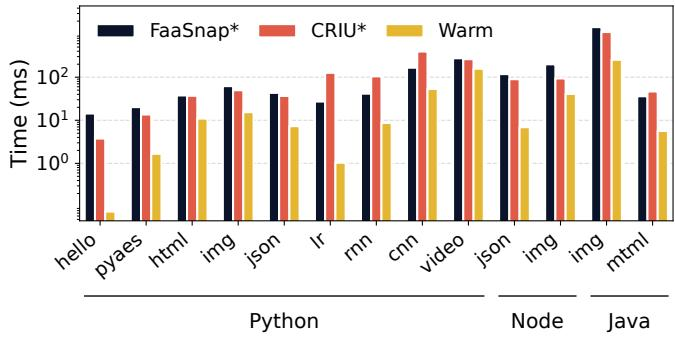  
Figure 1: State-of-the-art restore-from-disk systems are still orders of magnitude slower than warm starts for serverless functions. Note the logarithmic y-axis.

Functions [2]), these functions are typically packaged as containers that must be initialized before running user code. This initialization latency, known as a cold start, fundamentally limits the vision of effortless elasticity [7, 9, 13, 31, 34, 39, 43].

Cold start delays stem from multiple sources, including container setup, language runtime initialization, library loading, and function-specific startup logic such as JIT compilation [22, 35, 42]. These steps often add tens to hundreds of milliseconds — frequently longer than the function’s actual execution [10] — making them a major source of user-visible latency. Some mitigation strategies rely on warm-state approaches, such as keeping containers alive [4,16] or leveraging fork-based replication [6, 10, 19, 43] to clone instances from a resident parent. While effective for scaling active workloads, these techniques only work when there is warm state already available in the cluster. However, maintaining warm state for the long tail of serverless functions is economically infeasible. Microsoft reports that 81% of applications are invoked at most once per minute [33], while Ant Financial observes that over 60% of functions experience cold starts more frequently than hot starts due to strict memory constraints [10]. Because rarely invoked functions cannot rely on a resident parent process, cold starts remain a major barrier to responsiveness in serverless systems.

The most effective existing approach to mitigating cold starts is to restore snapshots captured after a function has fully initialized [7, 23, 36, 39]. Over the last decade, work on fast snapshot restoration has focused on techniques such as lazy initialization [13, 44] (which populates process state and memory on demand during execution) and working-set prefetching [7, 39] (which pre-loads only the pages that will be accessed into memory). However, even after applying these techniques, restore latencies are still significantly higher than warm starts. Figure 1 quantifies this gap and shows the endto-end cold-start invocation times of two state-of-the-art snapshot/restore systems. They are 1.6×–188× slower than a warm start baseline.

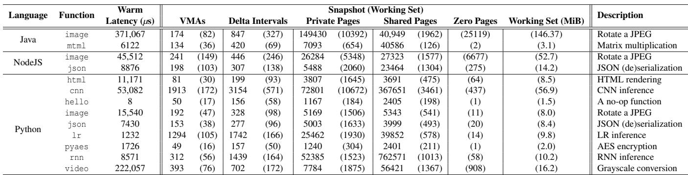  
Table 1: Characterization of memory usage for various serverless functions. Delta intervals counts the number of contiguous sets of pages with modified/private application data. Values in parentheses refer to the working set, as opposed to the whole of the snapshot. For zero pages, only those in the working set are reported.

In this paper, we show why this gap persists: current OS abstractions are a poor match for fast snapshot restoration in two ways: (1) the OS lacks an object format and interface for reloading memory efficiently, and (2) it provides no mechanism for reconstructing process metadata in bulk. We discuss each in more detail.

First, the OS provides poor support for reloading an application’s memory during snapshot restoration. The state that actually needs to be recovered is a sparse, page-granular overlay: a relatively small set of modified pages scattered across large shared and anonymous mappings. To obtain good I/O performance, prior systems [7, 23, 39] reorder these pages on disk in predicted access order rather than virtual address order, producing a snapshot file that is effectively a jumble of pages laid out by predicted access time. However, neither standard binary formats nor the OS’s mapping interface can efficiently express this sparse, reordered view of memory, forcing these systems to reconstruct the address space via thousands of tiny non-contiguous mappings or explicit page-wise copies, which scale poorly at restore time.

Second, the OS’s lack of an interface to restore nonmemory process state in bulk is responsible for large delays at restore time. To restore an application faithfully, a snapshot must recover not only its memory but also its file descriptors, signal handlers, timers, credentials, and other kernel-managed objects. However, today’s OS interfaces assume incremental process startup, forcing restorers to recreate kernel objects through many serialized, fine-grained system calls rather than reinstating them in bulk. As a result, process-level tools must replay thousands of operations to rebuild this state (a process we refer to as syscall replay), substantially inflating restore latency. VM-level snapshotting sidesteps this replay, but only by capturing and restoring a much larger image, which increases the working set and adds delays due to guest OS processing at resume time.

To address these limitations, we introduce Spice, a system that co-designs an object format and OS interfaces for fast, elastic process restoration. Spice provides the Snapshot Hybrid ELF (SHELF) format, an ELF-inspired format that plays for snapshots the role ELF plays for program startup: it defines a compact contract between bytes on disk and the kernel’s inmemory representation of a process. Whereas ELF assumes that a program can be described by a few large contiguous seg ments, SHELF generalizes this model with a page-granular indirection structure that can encode the sparse, reordered overlays produced by snapshotting. A single SHELF “segment” can thus contain arbitrary holes and page reorderings while still being presented to the kernel as a small number of contiguous virtual ranges.

On the kernel side, Spice introduces spliceVMAs, a new mapping mechanism that attaches SHELF’s indirection structures directly to contiguous regions of a process’s virtual address space and resolves page faults to disparate sources within a single VMA. spliceVMAs allow the kernel to retain a compact set of large mappings while loading pages from whatever on-disk layout SHELF chooses, rather than issuing thousands of tiny non-contiguous mmaps or performing pagewise copies. This decouples the snapshot’s I/O-optimized representation from the address-space representation used by the kernel. Together, SHELF and spliceVMAs resolve the core tension between on-disk and in-kernel views of a process’s memory: snapshots can freely reorder pages for highthroughput restore, while the kernel reconstructs the original address space without per-page mappings or metadata explosion.

For process metadata, Spice demonstrates that snapshots can remain at the process boundary without incurring the high costs of system-call replay. Using a library OS to prototype bulk restoration of execution state, Spice reconstructs file descriptors, signal dispositions, threads, and other process state from compact serialized descriptions, reducing metadata reconstruction costs by 63–99% compared to replay-based restoration.

Together, these mechanisms show that high performance and memory elasticity need not be at odds. By removing both dominant bottlenecks—metadata replay and inefficient memory reconstruction—Spice reduces cold-restore latency from disk to within 0.6–18ms of a warm invocation (compared to 3.6–1197ms in existing systems), achieving up to orders-of-magnitude improvement over state-of-the-art. These results blur the line between cold storage and warm memory, enabling providers to more aggressively offload idle functions to disk without sacrificing the responsiveness required by user-facing workloads.

This paper makes the following contributions:

• We show experimentally that mismatches in OS interfaces for metadata restoration and memory-layout reconstruction are a central barrier to fast cold starts from disk.

• We introduce Snapshot Hybrid ELF (SHELF) and spliceVMAs, a co-designed snapshot format and kernel mapping abstraction that efficiently reconstruct sparse, reordered process address spaces.

• We present a compact metadata-restoration mechanism that recreates process OS state in bulk without systemcall replay.

• We demonstrate that Spice significantly reduces coldstart latency from storage, outperforming state-of-the-art process-based systems by 7.5× and VM-based systems by 9.5× on average.

## 2 Background and Motivation

Snapshot-based cold-start mitigation requires choosing what state to capture and restore. Existing systems primarily choose one of two snapshot boundaries: the application process, represented by CRIU [3], or the entire virtual machine, represented by REAP [39] and FaaSnap [7]. This boundary determines both how much state must be restored and which operatingsystem mechanisms are available during restoration.

We first separate this snapshot-boundary choice from the deployment and isolation mechanisms used in serverless platforms. Serverless functions are commonly deployed either as code snippets assembled with a provider-managed runtime or as user-supplied container images. At invocation time, the provider materializes this package as an OS container containing the function process or processes, its language runtime, and its libraries. Depending on the platform’s isolation model, this container may run directly using host OS mechanisms such as namespaces and cgroups, or inside a lightweight VM.

Thus, using a VM as the sandbox does not require using the

VM as the snapshot boundary. A platform that relies on VMs for isolation can still snapshot the process or processes inside the container and later restore them inside a fresh VM; it need not snapshot the entire guest OS. We therefore treat processlevel and VM-level restore as choices of snapshot boundary, rather than as consequences of the platform’s sandboxing mechanism.

We evaluate these choices by measuring the end-to-end latency of cold serverless function invocations. To isolate the cost of restoring application state, we exclude non-functionspecific container setup such as cgroups and namespaces, which can be prepared ahead of time and for which acceleration techniques are well explored [10, 19, 24, 26, 38].

## 2.1 The Snapshot Boundary: Processes vs. VMs

One foundational challenge for fast restoration is that modern operating systems lack a native interface to restore a process’s kernel-managed state, or metadata. This state includes a wide array of resources: threads, file descriptors, timers, signal handlers, and more. Not only is there no single interface to reinstate this entire collection at once, but even restoring a single resource to its previous condition can require a complex sequence of operations.

Because there is no dedicated restore primitive, systems are forced into one of two suboptimal approaches: either (1) replaying the system calls that originally created the process, or (2) snapshotting and restoring the entire virtual machine it runs within. Both strategies push existing abstractions beyond their intended uses and are responsible for significant coldstart overheads.

Syscall replay. At one extreme, restore begins from an empty process and attempts to reconstruct every piece of kernel state — threads, file descriptors, memory mappings, and more — by reissuing the original system calls that created them. This strategy is expensive: there are often hundreds or thousands of such calls required, as most kernel objects lack dedicated import or restore interfaces to directly set them to their previous state. For example, restoring a single file descriptor may require a sequence of syscalls: open to create the file, lseek to set its offset, and dup to assign the correct descriptor number. Across complete function restores, this replay cost grows with function and runtime complexity. Figure 2 reports the initialization overhead of process-based restore for a range of serverless functions, along with the number of syscalls issued during restoration. Simple functions require hundreds of syscalls, while larger runtime environments require thousands, causing restore latency to rise accordingly. Because most of this state must be reconstructed before execution can resume, syscall replay directly inflates cold-start latency.

The userspace orchestration required for process restore adds further overhead. Rather than asking the kernel to instantiate a saved process directly, CRIU runs as an ordinary userspace process and morphs its own address space into the restored one. This requires it to avoid collisions between its temporary restore state and the target layout: CRIU stages snapshot data in temporary regions, installs a small restorer binary into otherwise unused virtual address space, transfers control to it, unmaps CRIU’s original code and data, and finally remaps the snapshot contents at their original virtual addresses. This elaborate dance avoids even more costly alternatives, such as reconstructing the target from a second process via ptrace.

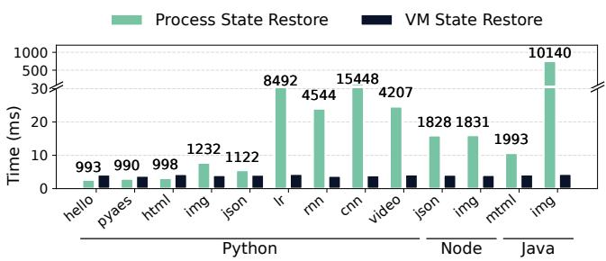  
Figure 2: Initialization overheads for VM- and process-based restore; total syscall counts for process restore are shown above the bars. Process restore costs grow with process complexity due to syscall replay. VM restore costs are flat but still non-trivial, reflecting fixed-cost hypervisor setup operations.

Full-VM snapshots. At the other extreme, systems restore entire virtual machines from snapshots. Because the snapshot includes the guest kernel and its data structures, process metadata is already present when the VM resumes rather than being reconstructed through syscall replay. As shown in Figure 2, restore is reduced to a small, fixed set of hypervisor actions, such as reinitializing vCPU state, reattaching devices, and restoring other host-managed state. These operations complete in just a few milliseconds regardless of the complexity of the application running inside the guest.

The downside is that VM snapshots capture more than the function needs. Capturing the whole VM substantially increases both the stored snapshot image and the memory that must be present at restore time. Figure 3 compares the working-set composition of VM- and process-level snapshots, showing that VM working sets include substantial state from the guest OS at restore time.

Snapshotting at the VM boundary imposes additional memory efficiency costs. In Table 2, we show that 19–50% of the working set consists of pages that are not function specific, but are potentially shared with other processes, such as libc, a runtime interpreter, or other common libraries. In a process snapshot, any such pages that are already resident on the machine can be remapped from the page cache without any I/O; in a VM snapshot, these page reuse opportunities are not visible to the hypervisor and therefore it cannot make use of them.

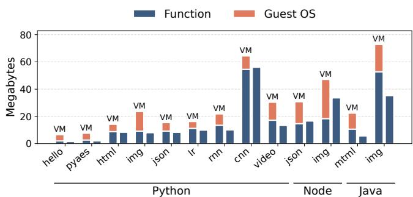  
Figure 3: Working set composition for VM vs. process snapshots; the VM snapshot boundary increases the resulting active memory at restore time by 1.2–3.4×.

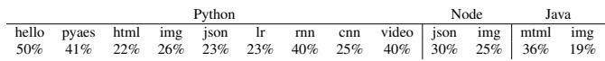  
Table 2: Fraction of unmodified file-backed pages that, in a process-level snapshot model, can be reused and shared rather than reloaded from disk; VM snapshots cannot leverage this opportunity.

Additionally, we found that after a prolonged pause, the guest kernel immediately experiences a "deferred housekeeping storm" due to the sudden clock jump. When the hypervisor restores the VM’s virtual CPU, the guest kernel registers a sudden, massive jump in its system clock representing the time elapsed while paused. This clock jump immediately triggers all pending, timer-based background services and guest kernel housekeeping routines simultaneously, including periodic systemd daemons, guest memory reclamation passes, and critical kernel threads like RCU callback processing. Because these essential tasks are scheduled as soon as the VM becomes active, we found that even boosting the function process to a high-priority real-time scheduling class (SCHED\_FIFO) offers only partial relief; critical guest kernel threads still preempt and delay the function’s execution by up to 10ms, consuming 22–79% of the end-to-end response time.

Ultimately, capturing snapshots at the VM boundary reduces OS metadata restore costs but inflates resource consumption in many dimensions — larger stored snapshot images, more I/O and memory bandwidth consumed, and more duplicated memory on the host. Finally, the execution delays at restore time due to guest kernel interference waste compute and produce user-visible delays.

## 2.2 Repopulating memory

Even if metadata could be restored instantly, cold-start latency remains dominated by the work required to repopulate a process’s address space. Existing snapshot/restore systems ultimately confront the same underlying limitation: the operating system provides only coarse-grained interfaces for constructing virtual address spaces. Interfaces such as mmap map contiguous file regions into contiguous virtual-memory regions, while restoring a snapshot demands fine-grained, page-level control. This mismatch forces restorers into an unavoidable trade-off between I/O efficiency and memorymanagement efficiency.

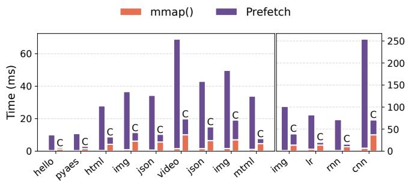  
Figure 4: Time spent restoring memory and prefetching the working set under two snapshot file layouts. Storing workingset pages contiguously in the snapshot file (bars marked “C”) greatly reduces prefetch time, but increases the cost of reconstructing virtual mappings. Leaving pages at their virtualaddress offsets has the opposite trade-off: mapping reconstruction is cheaper, but prefetching is more expensive.

When an application starts, its address space is typically described by a small number of large virtual memory areas (VMAs). Each VMA corresponds to a contiguous region of virtual addresses backed by either a file or anonymous memory. During execution, however, this organization rapidly breaks down. Within a single VMA, page-level states diverge: some pages remain clean and continue to map to the backing file, others become private copy-on-write (CoW) pages due to writes, and still others are never touched. The kernel tracks these differences at page granularity through the page tables. However, address-space management interfaces such as mmap() remain segment-oriented: they create and manipulate contiguous virtual-memory regions with uniform backing and protection attributes rather than arbitrary collections of individual pages.

This segment-oriented model is highly effective for process startup. ELF, the standard executable format on Unix-like systems, describes a program image as a small number of large loadable segments. The kernel constructs an address space by mapping these segments and relies on demand paging to populate them lazily as execution proceeds. Because application memory is initially dense and contiguous, this approach requires only a small number of mappings and allows the kernel to rely heavily on demand paging, making ELF loading a highly optimized path in Linux.

A snapshotting system, however, seeks to reconstruct the memory of a running process rather than a freshly initialized one. At this point, the address space is no longer naturally organized as a small number of dense segments. Instead, the pages whose contents must be preserved form a sparse, page-level overlay on top of shared code and data. Moreover, the order in which those pages are accessed after restore is determined by application behavior rather than their virtual addresses. Consequently, the layout that is most efficient for storing and retrieving snapshot data need not mirror the layout of the virtual address space. Instead, arranging pages on disk according to their expected post-restore access order enables efficient prefetching and bulk retrieval through a small number of large sequential operations. Ideally, a snapshot representation would therefore store only pages whose contents cannot be reconstructed from their backing files and arrange those pages according to expected access order rather than virtual address order.

Realizing this design, however, requires a way to map a sparse collection of reordered pages back into their original virtual addresses. The kernel’s mapping interface provides no way to directly map a sparse collection of pages, stored in arbitrary order within a file, onto the non-contiguous virtual addresses they originally occupied.

As a result, whenever pages that were adjacent in virtual memory are stored in different locations within the snapshot file, mmap requires a separate mapping operation to place each discontinuous region back into its original location. A snapshot for which pages have been clustered or reordered for sequential I/O can therefore expand into thousands of tiny VMAs, each mapping only a single page or a small range of pages. For the workloads in Table 1, we found that such reordering would increase the number of VMAs by up to 32×.

This proliferation of VMAs incurs two costs. First, each VMA creation requires kernel memory allocation and insertion into the process’s VMA tree, operations that dominate CPU time during restore and scale poorly with tree size. Second, VMAs consume non-trivial kernel memory (approximately 300 bytes per VMA in Linux), so restoring thousands of page-sized VMAs per function introduces measurable overhead in the kernel’s memory footprint.

Figure 4 illustrates this trade-off. Clustering working-set pages into a contiguous on-disk region allows snapshot data to be fetched with a small number of large sequential operations, minimizing both I/O overhead and CPU work in the loader and kernel. However, restoring those pages into their original scattered virtual addresses requires many independent mappings, resulting in a proliferation of VMAs. Conversely, preserving the original address-space layout keeps the number of mappings small, but forces the loader to retrieve snapshot data from many disjoint locations and can leave a long tail of page faults. Because current OS interfaces cannot decouple on-disk layout from virtual-memory layout, existing systems must choose between layout-efficient storage and mappingefficient restoration.

Existing systems resolve this trade-off in different ways. CRIU [3] preserves the original VMA layout and saves only dirty modified pages in its snapshot, recreating VMAs and copying dirty data back into place. This avoids VMA proliferation but requires scattered reads and explicit copying into the target address space. Replayable-Execution [42] reduces copying costs by mapping small modified segments directly from files and relying on demand paging, but doing so across many tiny regions amplifies VMA creation overhead.

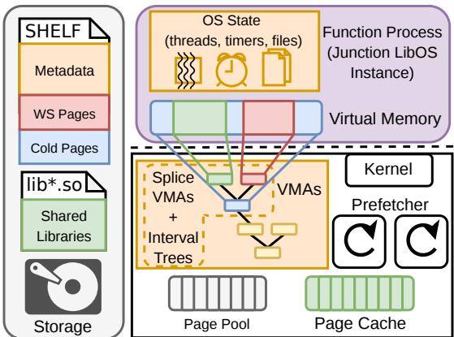  
Figure 5: Overview of Spice’s architecture.

REAP, Sabre, and FaaSnap [7, 23, 39] focus on prefetching optimizations and reorder working-set pages into contiguous regions for efficient prefetch. REAP and Sabre issue large sequential reads and then copy each page into its scattered virtual destination; execution cannot resume until this bulk copy completes. FaaSnap overlaps prefetch with execution by asynchronously mmaping reordered segments into the process and warming the page cache. However, because file-backed writable memory in Linux employs CoW semantics, every write in the restored function induces a minor fault and a page allocation; in virtualized environments such as Firecracker, each fault induces a VM exit, adding hundreds of cycles before fault handling even begins.

Across all of these designs, the root cause is the same: the operating system lacks a page-granular mapping abstraction that decouples the layout of data on disk from its placement in virtual memory. Existing memory-management interfaces therefore force restorers to choose between I/O-efficient layouts and mapping-efficient address-space construction. In the next section, we show how Spice breaks this trade-off by extending the segment-based loading model embodied by ELF with support for sparse, reordered page-level overlays. The result retains the efficiency of ELF-style segment loading while enabling page-level reordering and sparsity.

## 3 Spice Design

We design Spice to address the challenges outlined in Section 2. Spice is a serverless execution engine that minimizes cold-start latency by restoring snapshots from storage at the process-OS boundary, rather than restoring an entire VM. This boundary reduces the amount of captured state while avoiding the restore-time overheads of VM-based approaches. As shown in Figure 5, Spice consists of several key components.

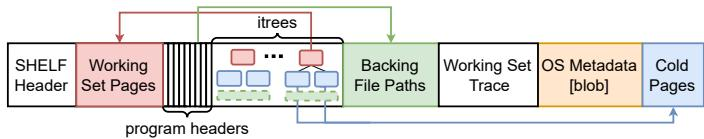  
Figure 6: The layout of a SHELF file.

First, we introduce a new snapshot object format, Snapshot Hybrid ELF (SHELF), co-designed with a novel kernel memory abstraction: the spliceVMA. Together, these mechanisms enable the kernel to efficiently restore scattered and reordered memory pages directly from a snapshot file. Second, Spice includes a high-performance kernel memory engine that loads SHELF snapshots and performs both snapshot prefetching and page-table-entry (PTE) prefaulting to accelerate restoration.

Finally, user code in Spice executes within the Junction library operating system (LibOS), which serves as our container runtime. We selected Junction because it manages the vast majority of process metadata in userspace, making it well suited for prototyping a metadata restoration interface. We discuss this design choice in greater detail in Section 3.4. The remainder of this section describes each component of Spice in detail.

## 3.1 The SHELF File Format

We design the Snapshot-Hybrid ELF (SHELF) format, an evolution of the ELF object format that supports efficient loading of an already-running process’s memory from disk. Figure 6 shows the layout of a SHELF file. SHELF is intentionally organized to promote access locality. Immediately following the initial header, SHELF stores the process’s working-set pages in time-of-access order in a contiguous array. This allows the system to immediately execute an initial high-throughput sequential disk read to prefetch these pages at load time, before performing any additional parsing.

Like ELF, SHELF stores an array of program headers, one describing each VMA that existed in the process’s address space at snapshot time. SHELF’s program header diverges from ELF’s in two key ways. First, each program header can describe backing memory that is primarily sourced from a different file, by referencing a pathname included in the subsequent file paths section. A program header that does not point to another file uses anonymous memory as its main backing source. Second, the program header describes noncontiguous memory regions within the SHELF file that are overlaid on the main backing source. Because these regions vary in size, each header points to a collection of memory intervals stored in a later section using a layout optimized for restoration by spliceVMAs (§3.2). Each interval describes a sub-range of the program header’s address space and specifies the offset in the SHELF file containing the corresponding data. The pages referenced by an interval reside either in the working-set section at the beginning of the file or in the cold data section at the end. Any address range not covered by an interval is sourced from the backing memory (e.g., existing file-backed pages or anonymous zero pages).

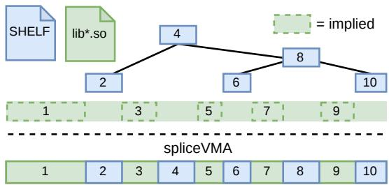  
Figure 7: A spliceVMA and its interval tree. The interval tree lets a spliceVMA overlay sparse SHELF-backed ranges onto an existing file-backed (or anonymous) mapping.

Next, the SHELF file includes a trace of page accesses to guide prefetching. Each trace entry records the virtual address accessed, a timestamp, and a small amount of metadata about the access, such as whether the trace predicts a write. Our implementation includes records for pages already present in the working-set section, as well as records for accesses to zero pages and pages from other shared files. We discuss this design choice further in §3.3.

Finally, there is a section reserved for serialized OS metadata that is not memory-related. This section’s structure is not specified by SHELF, and can be laid out as needed by the metadata restore implementation.

## 3.2 Splice VMAs & Interval Trees

SHELF’s format alone is not sufficient to avoid the restoretime costs identified in §2.2; the kernel must also be able to consume the format without devolving into per-page work or VMA explosion. To this end, we introduce the spliceVMA, a new kernel VMA type co-designed with SHELF. A spliceVMA represents a mixed-source mapping: a single contiguous virtual address range whose pages may come either from a snapshot file or an underlying file-backed or anonymous mapping.

The design goal for spliceVMAs is to minimize compute work on the restore path. In particular, we want to (1) avoid per-page operations when reconstructing the address space, (2) avoid doing any work at all for pages that are never touched after restore, and yet (3) guarantee that when execution di verges from the predicted working set, any access still sees the exact bytes that were present at snapshot time. The key structure that enables this is the interval tree specified in the SHELF file for each program header. Figure 7 shows the representation of a spliceVMA and its interval tree.

For each VMA described in SHELF, the snapshot generator produces an interval tree that compactly encodes the page granular overlay for that region. On disk, this tree is stored in a layout that can be used directly by the kernel without any deserialization. Concretely, each interval tree is a prebalanced, cache-friendly B<sup>+</sup> tree stored as a contiguous array of nodes. Each node describes a range of virtual addresses and the corresponding offset in the SHELF file where the data for that range resides. At restore time, the loader maps this array into memory and attaches a pointer to it in the spliceVMA; no rebalancing, allocation, or pointer-fixup is required. On a page fault, the spliceVMA consults its interval tree to determine whether the faulting address falls within a snapshot interval. If so, the fault handler reads the page from the snapshot image at the recorded offset; otherwise, it falls back to the original backing source (the file named in the program header or zero-fill for anonymous memory). This guarantees correctness even when the function’s execution path diverges from the original access trace.

Intuitively, the interval tree is a compacted, read-only representation of the application’s original page tables for a particular region that enables lazy but correct restoration of that information. The kernel’s VMA tree (implemented with maple trees [18]), must support frequent and likely concurrent insertions and deletions, so it is built from dynamically allocated, pointer-linked nodes. Conversely, the spliceVMA interval tree is static: it is constructed offline, never modified at runtime, and always perfectly balanced. This static, array-based layout makes lookups cheaper and more cache-efficient than traversals of the general-purpose VMA map, and it imposes no additional overhead on the restore path beyond wiring in the pointer from the spliceVMA to the already-constructed tree. Because interval trees are built offline and so cheap to query, SHELF can freely introduce arbitrary fractures and reordering of intervals to optimize the on-disk layout for I/O, without inflating the cost of address-space reconstruction. We evaluate the performance of querying an interval tree in §5.

Although the interval tree is immutable, spliceVMAbacked memory remains compatible with ordinary virtualmemory operations such as munmap, mremap, and mprotect. The interval tree describes the contents of the original snapshotted region; it is not the mutable representation of the process’s current VMA layout. When an operation splits or moves a spliceVMA, the resulting VMAs continue to reference the same interval tree and record their position relative to the original snapshotted range. Once pages have been restored, subsequent changes are reflected in the process’s page tables and VMA metadata, as in normal execution. Thus, runtime memory-management operations mutate the VMAs and PTEs around the interval tree, while the interval tree remains a read-only index for the snapshot contents.

## 3.3 SHELF Loading & Prefetching

The SHELF loader is a throughput- and latency-optimized kernel engine that ingests a SHELF file and recreates the snapshotted memory layout. It is exposed through a new system call, reexec(), which augments the caller’s address space with the contents of a SHELF snapshot. The loader is guided by SHELF’s access trace, which records the pages expected to be touched after restore, whether those pages are private snapshot pages from the SHELF file, shared pages from other backing files, or anonymous zero pages, and whether each page was written during profiling. Figure 8 shows the components of the SHELF loader in the kernel, and Figure 9 shows the timeline of restore operations.

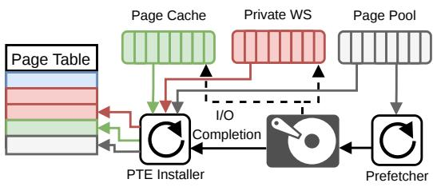  
Figure 8: Spice’s prefetching architecture.

Synchronous restore path. reexec() is designed to minimize the synchronous time spent inside the system call. Its blocking path performs three steps. First, it initiates reads for the private working set. This is cheap because private working-set pages are packed contiguously in the SHELF file, reducing both file-system block-lookup overhead and the number of I/O submissions needed to fetch them. Internally, these reads are still split into independent I/O submissions so that completions arrive incrementally and can drive pagetable installation before the entire private working set has been read.

Second, while the reads are in flight, reexec() constructs the process’s spliceVMAs in bulk and wires each spliceVMA to its corresponding interval tree. This reconstructs the virtual address layout without per-page mapping operations and without touching pages that may never be accessed. Third, once the virtual address space exists, reexec() consults the access trace and installs an initial batch of PTEs for traced pages whose contents are already available, including zero pages, page-cache hits, and private pages whose reads have already completed. It then returns control to the restored process.

Asynchronous prefetching and PTE installation. After reexec() returns, kernel prefetch threads continue processing the trace concurrently with function execution. They initi ate I/O for shared working-set pages, which come from the original backing files and are often scattered across many files in short intervals. They also install PTEs as page contents become available: for shared pages already resident in the page cache or fetched by the prefetcher, for zero pages that can be mapped immediately, and for private pages as the private-working-set reads complete.

A key design choice is that the loader aggressively installs page-table entries rather than relying on minor faults. In the serverless setting, accesses after restore are scattered across large regions, and minor faults can quickly dominate latency. The prefetcher therefore attempts to prefault traced accesses, including zero pages, so that the restored process rarely incurs even minor faults on its hot path.

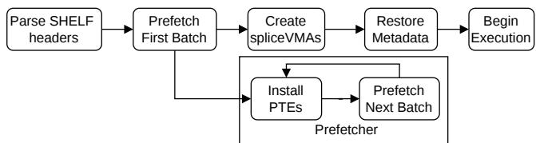  
Figure 9: reexec() workflow

Page-placement policy. The loader chooses where page contents should reside based on whether they are reusable and whether they are likely to be written. Shared pages from backing files are populated through the page cache, enabling reuse across functions. Private pages are loaded into newly allocated anonymous memory rather than inserted into the page cache, because they represent snapshot-specific anonymous state and would otherwise compete with broadly reusable file-backed pages for cache space.

This is a policy choice rather than a limitation of SHELF. For functions invoked frequently enough that repeated restores of the same snapshot are common, a future implementation could route read-mostly private pages through the page cache while directing pages likely to be dirtied into anonymous memory to avoid future CoW faults.

Zero pages and allocation policy. The write information in the trace is especially useful for zero pages. For zero pages that are unlikely to be written, Spice installs mappings to the shared CoW zero page. For zero pages predicted to be written, it instead installs private pre-zeroed pages so that the restored function can write without taking a fault.

Restoring a snapshot also puts substantial pressure on physical-page allocation. Both loading private working-set pages and installing writable zero pages require the loader to obtain large numbers of physical pages during a short restore window. Although Linux provides bulk page-allocation interfaces, we found that the per-page overhead still accumulates for snapshots containing tens of thousands of pages, making allocation a visible component of restore latency. To avoid placing this work on the invocation critical path, Spice maintains a reserved pool of preallocated pages that can absorb the allocation bursts caused by restore. The loader draws from this pool when populating private pages and writable zero pages, and falls back to ordinary allocation only when the pool is exhausted.

Together, the reexec() fast path, spliceVMA-based mappings, trace-guided prefetching, and proactive PTE installation allow Spice to reconstruct the snapshotted address space with minimal synchronous work, while overlapping I/O and page-table installation with resumed execution.

## 3.4 Metadata Restore

An effective snapshot/restore mechanism must choose a boundary that can be restored quickly without forcing the system to capture unnecessary state. The process boundary is attractive because it is much lighter weight than a full VM snapshot, while still containing the execution state relevant to the application. In principle, a production implementation could capture and restore this state directly in the Linux kernel by adding restore support for the relevant per-process kernel data structures. In this work, we instead use Junction’s LibOS [15] as a practical substrate for prototyping the same process-boundary abstraction.

Junction uses a single-address-space LibOS model: the application and LibOS execute in the same virtual address space, and the LibOS virtualizes the Linux process and system-call interface seen by the application. This means that much of the process metadata that would otherwise be maintained as Linux kernel state is represented by LibOS-managed userspace objects. As a result, our prototype can restore most process metadata by reconstructing these LibOS objects, rather than modifying Linux to serialize and rebuild each corresponding kernel data structure.

Virtual memory remains the important exception. Even with a LibOS, the host kernel ultimately controls the hardware address space, including VMAs, page tables, and page-fault resolution. Spice therefore provides explicit kernel support for virtual-memory restore: the SHELF loader reconstructs the restored address space and installs page-table mappings, while the LibOS reconstructs the remaining process metadata. Open file descriptors are handled lazily, with the LibOS recording enough information to reopen or reconstruct descriptors when they are first used.

This use of a LibOS is primarily methodological. It lets us evaluate what a dedicated process-restore interface can provide without first re-engineering all of Linux’s per-process metadata paths. A Linux-native implementation could provide analogous serialization and reconstruction logic inside the kernel. Our prototype instead demonstrates that, once the kernel exposes the right fast path for restoring virtual memory, the rest of process-boundary restore can be implemented efficiently enough to support very fast cold starts.

We considered two possible approaches to capturing the LibOS-managed metadata. One option was to ensure that all metadata objects were located in a dedicated, contiguous memory region that could be snapshotted and restored by bulk copying. The alternative was an object-wise serialization approach, where each process-related LibOS object implements a custom serializer and deserializer that is invoked per object at runtime. We chose the latter for several reasons. First, the LibOS uses C++ features such as dynamic heap allocation, slab allocators, RCU, and smart pointers, which make it impractical to constrain all metadata to a single layout-stable region. Second, not all in-memory state needs to be preserved:

custom serializers can omit transient or quiescent structures such as locks, wait queues, and other synchronization artifacts that are guaranteed to be inactive at snapshot time. Third, perobject serializers enable space-efficient encodings tailored to the object type. For example, LibOS pipes are implemented as ring buffers; by serializing only the live portion of each buffer, we avoid copying unused capacity.

This design also circumvents a central limitation faced by userspace restorers such as CRIU. Because CRIU must perform restoration from within an already-running userspace process, it has limited control over the address-space layout of the process being restored. CRIU’s restorer must map its own code and data while simultaneously injecting the restored process’s memory mappings, and conflicts may require relocating regions at runtime. These relocation steps add CPU overhead. By contrast, our restore path executes from the LibOS’s “kernel side,” where we control the address space during restoration. This lets us arrange the LibOS and application mappings so that LibOS-internal mappings do not conflict with the restored application layout, avoiding the relocation overhead that CRIU can incur.

Metadata serialization starts from the root task object and emits a sequential, address-independent archive of the reachable LibOS state that must survive restore. Each object’s serializer records the fields needed to reconstruct that object and invokes serialization for referenced objects that should also be preserved. Deserialization reverses this process, reading metadata from the SHELF file using a buffered reader to amortize I/O costs and reconstructing the LibOS object graph. In our measurements, metadata restore completes in as little as 0.9ms, compared to 2.6ms for CRIU, and no more than 7.5ms, compared to 749ms for CRIU. Despite the different techniques, we find that the metadata snapshots produced by Spice and CRIU are comparable in size across functions.

To ensure low invocation latency, we also avoid booting a LibOS instance on the restore critical path. Instead, we maintain a pool of freshly initialized LibOS instances that are ready to accept restored tasks. Each instance begins in a cleanly booted state, so restoring consists only of mapping the snapshot’s memory image and reconstructing the object graph before execution resumes.

## 4 Implementation

We implement Spice on Linux 6.5.0 with three main components. First, we modify Junction’s library OS [15] to support snapshotting and bulk metadata restore for unmodified Linux binaries running inside its seccomp+chroot sandbox. Second, we implement shelftools, a 7.4 KLoC Rust toolchain that constructs and rewrites SHELF files. Third, we add a 7.1KLoC kernel module that introduces the reexec() system call, spliceVMAs, and the SHELF loader and prefetcher. Our implementation is open source at https://github.com/ JunctionOS/spice-ae.

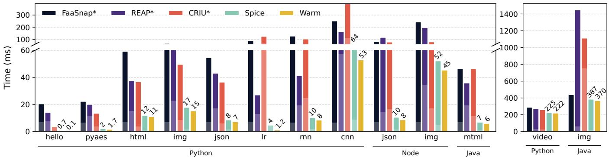  
Figure 10: Spice achieves end-to-end cold-start latencies significantly closer to warm invocations than existing systems. The faded lower portion of each bar shows restore latency prior to executing the function.

User-level snapshot pipeline. We add a per-language shim to perform function invocations and prepare for snapshots. A snapshot proceeds in three steps. First, the LibOS pauses all function threads at a safe point and walks its internal object graph starting from the task root, and serializes them using the cereal C++ library. Second, the LibOS dumps the con tents of each VMA in the process into temporary contiguous segments in a provisional SHELF file, without attempting to remove zero or shared pages. This keeps the in-process snapshot path simple and sequential. Third, shelftools runs offline to rewrite this file into the final SHELF layout: it removes unmodified file-backed pages and zero pages, deduplicates identical private ranges across snapshots, builds the balanced interval trees required by spliceVMAs, and emits the per-page access traces that guide prefetching.

Kernel loader and working-set profiling. We implement working-set estimation in the kernel, co-located with the loader, to avoid perturbing access patterns. In profiling runs, the module records the pages that fault after reexec(). The next run uses this trace to drive prefetching and prefaulting. We iterate profiling and replay until the trace stabilizes and then ship the resulting SHELF as the production snapshot for that function. SHELF files are agnostic to the working-set estimation mechanism; while we use a simple page-fault-based profiler, other working-set estimators could generate the same trace format.

Snapshot-size reductions. Our language shims cooperate with Spice by running garbage collection and dropping language-level caches when signaled before snapshotting. On the host side, we translate MADV\_FREE into MADV\_DONTNEED during snapshot preparation and trim each thread’s stack by discarding unused stack regions above the current stack pointer. We found that optimizations like these were able to reduce snapshot sizes by several MB in some cases.

## 5 Evaluation

We aim to evaluate Spice by answering the following questions:

1. How well does Spice reduce end-to-end cold-start latency in the context of existing snapshot/restore systems (§5.1)?

2. How does each element of Spice’s design contribute to its performance (§5.2)?

3. Does Spice’s centralized prefetching design scale (§5.3)?

4. How sensitive is Spice to the speed of the device used for snapshot storage (§5.4)?

Experimental Setup All experiments are conducted on a machine with an Intel(R) Xeon(R) Gold 5420+ with 28 cores running at 2.8GHz and 128 GB of RAM. Our storage device is a Crucial T705 NVMe drive with a max sequential read bandwidth of 13,600MB/s and 1400K IOPS over PCIe 5.0. Unless otherwise stated, we run all experiments from this drive and use it to store all SHELF files and shared libraries used during function invocations. We use the commonly evaluated FunctionBench [21] test suite, based directly on the artifact from [39]. We also ported two workloads to Node.js and Java, runtimes that are popular in serverless functions and exhibit more complex behaviors than Python. Table 1 summarizes the functions used to evaluate Spice. For a fair comparison, we do not benchmark function-agnostic container setup costs, such as configuring isolation mechanisms, because this work can be pre-initialized and shifted off the invocation critical path.

## 5.1 End-to-End Latency

To understand how Spice performs in the context of existing systems, we compare to existing snapshot/restore systems that restore snapshots entirely from storage without relying on any warm state. As discussed in §2, this includes CRIU [3] which snapshots at the process boundary, and both FaaSnap [7] and REAP [39] which operate at the VM boundary. Both FaaSnap and REAP employ working-set prefetching, while CRIU does not. We made every effort to tune existing systems to their peak performance, and our efforts yielded large performance gains for these systems relative to their out-of-the-box performance; therefore we refer to each of them with an asterisk in their name. In light of our observations regarding scheduler interference in VMs (§2.1), we modify the VM-based systems to use the SCHED\_FIFO scheduling class for the function’s process to minimize interference from other tasks running the guest. By default, CRIU copies every dirty page from the snapshot file back into memory. In-line with [42], we modified CRIU to use lazy mappings instead. While this results in slower execution time due to page faults, it provides a large win on end-to-end latency.

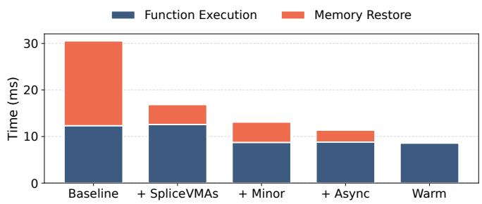  
Figure 11: Ablation study of Spice’s memory restore optimizations on the RNN serving Python function.

Figure 10 shows the end-to-end function invocation latency when restoring snapshots from storage with an entirely cold page cache. Spice is able to reduce latency significantly in all cases, by 17–96% compared to FaaSnap\*, by 18–95% com pared to REAP\* and 14–96% compared to CRIU\*. We show the latency of a warm invocation, which had been previously invoked several times but has cold micro-architectural state (e.g., CPU caches, TLB). This is a good approximation for an invocation on an otherwise busy system that is well utilized by many densely packed functions [4]. Spice is 1.01–6.34× slower than a warm invocation. We find the largest component of the remaining overhead comes from VMA creation, which cannot be parallelized with execution. Spice has the greatest impact on short-running functions, where restore latency can dominate execution time, but it also benefits longer-running functions by avoiding faults through prefetching and proactive PTE installation.

## 5.2 Microbenchmarks

Memory restore. We evaluate the impact of Spice’s memory loading improvements in Figure 11, where we incrementally enable features of the SHELF loader and prefetcher for the RNN workload. In the baseline, the working set is packed contiguously in the snapshot file and prefetched from userspace. This necessitates creating 3212 VMA mappings to place the working-set pages in the proper location in the virtual address space. Adding spliceVMAs and batch creation of VMAs in the kernel dramatically lowers the time spent restoring virtual memory. Installing PTEs to prevent minor faults removes a significant portion of latency by avoiding thousands of kernel crossings during execution. Finally, asynchronous prefetching allows us to begin function execution sooner without incurring faults. With all optimizations, end-to-end function execution is within 2ms (23%) of a warm invocation, compared to 21ms (2.5× warm) added in the baseline case.

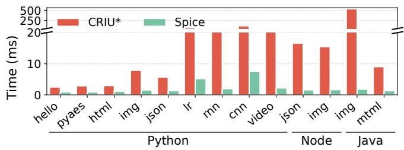  
Figure 12: OS metadata restore time comparing CRIU to Spice. Spice lowers latency through a dedicated interface for restoring OS state and compact serialization.

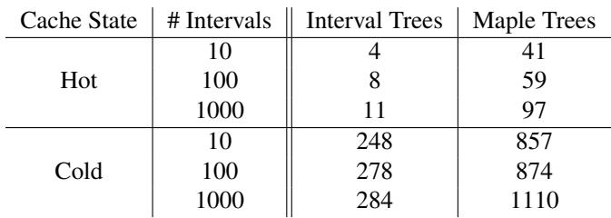  
Table 3: Average lookup latency (cycles) for spliceVMA interval trees vs. Linux maple trees.

Metadata restore. Spice adds an interface to Junction for bulk restoring OS metadata, including threads, file descriptor state, signal handlers, and timers. Figure 12 compares the time spent on metadata restore for each workload to CRIU\*, which reconstructs this state using thousands of syscalls. In all cases, Spice’s metadata restore latency is significantly lower than that of CRIU\*, demonstrating that snapshotting at the process boundary is a reasonable alternative to whole-VM snapshots.

Interval tree performance. Interval trees bridge Spice’s file format and kernel abstraction, and are accessed on critical prefetching and fault handling paths. We compare their performance with that of the optimized B-Tree implementation used in Linux for VMA lookup (a step that typically precedes an interval tree lookup) in Table 3. Interval trees vastly outperform Linux’s maple trees due to their contiguous, cache-friendly layout. In contrast, Linux’s maple trees must handle concurrent updates and dynamic resizing.

Prefetcher performance. Figure 13 shows the rate at which Spice’s prefetcher threads perform different restore operations. Prefetching shared pages is substantially more expensive than prefetching private pages because shared pages are often scattered across many files and short extents, requiring per-page work to locate the backing file and issue the corresponding I/O. In contrast, SHELF stores private workingset pages contiguously, allowing Spice to issue larger, more efficient reads and prefetch at a much higher rate. Although PTE installation proceeds in observed access order rather than virtual-address order, Spice still sustains a high installation rate, allowing PTE installation to keep pace with prefetching.

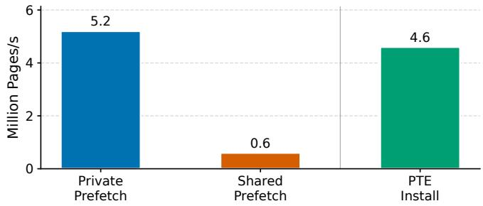  
Figure 13: Peak operation rates for Spice prefetcher threads. Contiguous private pages can be prefetched at a much higher rate than scattered shared pages, which require more per-page lookup and I/O work. PTE installation also sustains a high rate, allowing it to keep pace with prefetching.

Impact of sharing. Spice is designed to exploit the page cache to share pages from files (e.g., common libraries) when possible. Sharing in the page cache improves memory utilization, reduces storage bandwidth consumed, and can improve CPU cache efficiency [15]. We evaluate the benefit of this design by showing the storage bandwidth consumed and effective invocation throughput under a heavily concurrent function invocation workload (described in §5.3). We compare Spice with a version that doesn’t allow sharing in the page cache, and instead stores the entirety of the snapshot in the SHELF image. Figure 14 shows that page-cache sharing reduces consumed I/O bandwidth by 20% and increases achievable invocation throughput by 30%. Without sharing, the system moves closer to storage saturation, causing prefetching to fall behind execution and exposing the restored functions to more page faults.

Impact of LibOS. Spice uses the Junction LibOS to implement fast OS metadata restore. Although Junction can accelerate kernel-intensive workloads through faster userspace implementations of standard OS services, our workloads are not kernel-intensive and therefore derive little benefit from these optimizations. To isolate the effect of Junction from the improvements shown relative to other systems, we report the warm execution latency of each function running in Junction and in Linux in Table 4.

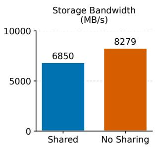

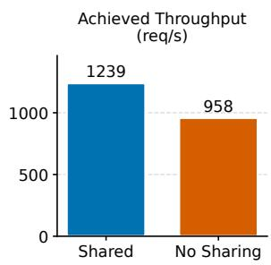  
Figure 14: Storage bandwidth consumption and achieved throughput at 25 concurrent restores with and without page cache sharing. Sharing consumes less bandwidth and allows the system to achieve higher throughput.

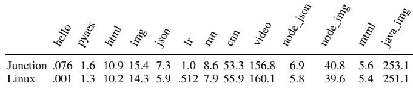  
Table 4: Warm execution latencies (ms) for each function using Junction and Linux. Performance is largely similar between the two regimes.

## 5.3 Scaling

Spice relies on dedicated kernel threads to handle the asynchronous portions of prefetching and PTE installation for all restores. We evaluate Spice ’s ability to scale in Figure 15, where we vary the number of concurrent restores and measure the achieved throughput. We construct this experiment using a mixed workload derived from the Azure public serverless traces [33]: we scale trace invocation durations to the execution time range of our workloads, map each invocation to the closest function in Table 1, and use the resulting distribution as the function mix. Our results show that Spice scales well, even under a mixed workload, achieving 76% of ideal throughput (extrapolated from the throughput at concurrency 1) at 25 concurrent restores.<sup>1</sup>

## 5.4 Sensitivity to Storage Device Performance

To understand how sensitive Spice is to storage performance, we evaluate it on a slower disk: a Micron 5400 PRO Series SSD rated for 540 MB/s and 95K IOPS. This experiment stresses the prefetcher by increasing I/O latency and reducing available bandwidth, allowing us to measure whether Spice can still hide restore work behind resumed execution when storage becomes a larger bottleneck.

Figure 16 compares performance on the fast and slow disks for three workloads with different execution latencies. We also compare this sensitivity against FaaSnap\*. A single read takes 58 µs on the fast disk and 163 µs on the slow disk. Despite the increase in latency, Spice hides most of the difference by overlapping prefetching with resumed execution. This is possible because the slower disk still provides enough bandwidth to satisfy the demand of a single function restore.

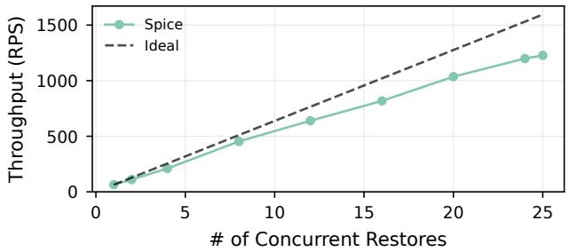  
Figure 15: Aggregate throughput of function invocations with Spice as the number of concurrent restores increases, with a mix of all functions shown in Table 1.

FaaSnap\*, by contrast, is much more sensitive to the slower disk. Because it already incurs many major faults during restore, increasing storage latency directly increases the cost of those faults and causes restore latency to grow by more than the proportional increase in single-read latency. We suspect this amplification is caused by the effects discussed in §2.1: delaying function completion gives other processes in the guest more opportunity to wake up, further polluting the working set and increasing interference.

## 6 Related Work

Working set estimation and prefetching. Working set estimation and prefetching have long been studied in serverless and other contexts [7, 39, 46]. Spice adds a dedicated kernel interface that accelerates prefetching and prefaulting; existing systems could benefit from this interface. Sabre [23] leverages a compression engine to improve effective I/O bandwidth from relatively slower SSDs; this is orthogonal to our approach. Faascale [47] and AFaas [10] both prefault EPT entries to reduce minor fault costs for VMs.

Fork scaling. Recent fork-like approaches [6,10,13,19,43] achieve low startup latency by cloning warm function instances. These systems are inspired by the kernel’s fork() mechanism for cloning a process, and extend this concept to cloning containers [10, 13] or leveraging remote memory across RDMA or CXL [6, 19, 43] to create new function instances with demand paging. These techniques are effective for rapid horizontal scaling of functions — as long as a warm parent exists. As discussed in Section 1, the invocation patterns for most functions make retaining warm state for them economically infeasible. Spice targets this set of functions to enable fast cold starts from disk.

State reuse. Some systems aim to reuse partial state within a machine by creating stacks of increasingly specialized snapshot images [9, 10]. Because these stacks enforce a strict lineage of changes, they are effectively limited to sharing a single common base rather than the diverse mixtures of libraries used across functions. Medes [32] deduplicates memory across keep-alive containers so that more functions can remain warm, but still relies on long-lived sandboxes and existing OS restore interfaces. In contrast, Spice preserves large shared file-backed regions through spliceVMAs and focuses on making cold restores fast enough that platforms can rely less on aggressive keep-alive policies. VAS-CRIU [40] enables fast CRIU restores by keeping all pages in memory.

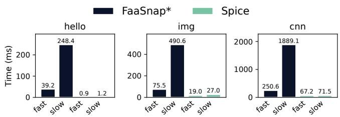  
Figure 16: Impact of SSD speed on restore latency. The faster SSD has 2.8× lower read latency and 25× higher throughput than the slower SSD. Spice hides much of the additional latency of slower storage by prefetching asynchronously with execution, so restore latency is minimally affected as long as disk throughput is not the bottleneck.

Sandboxing and the snapshot boundary. Existing systems use lightweight VMs [4, 7, 16, 23, 39], processes [22, 36, 40, 42], or containers [25, 32] as both their sandbox and snapshot boundary. As we discussed in Section 2, these approaches suffer from performance challenges. Some systems use alternative approaches for sandboxing. Faasm [34] relies on a Wasm runtime as the isolation mechanism, which offers low startup costs but higher end-to-end execution time compared to native Linux execution due to the cost of SFI [20]. SEUSS [9] implements a unikernel, tailoring its sandbox to executing a specific function. Unlike Spice, SEUSS requires backporting to support additional language runtimes, complicating deployment on existing FaaS platforms. AlloyStack [44] accelerates LibOS initialization via on-demand OS component loading. Spice could use similar techniques to avoid restoring some OS metadata, however, the time savings would be small.

Cold-start mitigation policies. Several systems try to reduce the impact of cold starts by increasing the fraction of requests that hit warm instances. They pre-warm sandboxes, tune keep-alive policies, or reuse containers to keep functions alive longer [5, 12, 16, 25, 27–30, 45]. Spice is complementary: instead of trying to avoid cold starts via longer warm lifetimes, it reduces the cost of the cold path itself, so platforms can rely less on aggressive keep-alive and prewarming. These approaches lower tail latency but consume memory and weaken elasticity, since resources must remain reserved for functions that may be invoked rarely. Other work optimizes when to snapshot, so that captured state corresponds to a highperformance steady state [9, 48]. Spice benefits from these techniques.

Control-path optimization. Spice focuses on the data path of instance creation: reconstructing memory and process metadata from a snapshot. End-to-end latency also depends on the control path, including request scheduling, placement, and network setup. Dirigent [11], AFaaS [10], SigmaOS [38], and others [26, 37, 41] optimize these orchestration delays with smarter schedulers and resource managers. These efforts are orthogonal to ours. Achieving the lowest possible endto-end latency requires a holistic approach, combining an efficient control path with the rapid restoration provided by Spice.

## 7 Discussion

Resource management and keep-alive policies. Spice’s restore times in our prototype blur the line between warm and cold starts, potentially altering the economics of serverless resource management. The primary motivation for expensive keep-alive pools (avoiding the high latency of a cold start) is significantly diminished. This enables a new operational model where platforms can practice aggressive reclamation of idle instances to boost utilization, relying on just-in-time instantiation from disk to meet traffic demands without a major latency penalty.

This model also unlocks new strategies for cluster-level optimization. Because Spice leverages the host page cache for sharing, operators can create specialized node pools dedicated to functions with similar software stacks (e.g., a “Python+AI” pool). Co-locating these functions maximizes the page cache hit rate for common runtimes and libraries, which both accelerates restores and increases overall memory density through natural deduplication.

Integration with fork-based approaches. The snapshot/restore model of Spice is complementary to the cloning model of fork-based scaling mechanisms [6, 13, 43], which provide excellent latencies when scaling concurrent execution up from a warm instance. This relationship suggests a new, hybrid architecture for function instantiation. The principles of Spice’s page-cache-aware design could be extended across the network to create a distributed page cache. Such a service would maintain a rack- or cluster-wide pool of frequentlyaccessed memory pages from common libraries and runtimes. During a restore, Spice could then source required pages from this low-latency remote memory fabric in addition to local storage, further reducing instantiation times and improving resource utilization across the cluster.

Limitations and future work. A key next step is extending our approach to virtualized environments. While our current techniques can already improve restore times inside a guest VM by reducing in-guest overheads, further potential can be unlocked with direct host-guest cooperation. This could be achieved with a custom hypercall interface that allows the guest to eagerly request EPT population for a dispersed working set. By enabling the guest to pass its predicted memory layout to the hypervisor in a single, batched operation, this approach would eliminate the thousands of costly VM exits typically caused by individual page faults during memory restoration.

Our prototype assumes that file-backed pages referenced by a SHELF snapshot can be resolved to the same file contents at restore time. We implement this by evaluating functions over a common static container image and recording static path names for file-backed mappings in the SHELF file. This simplifies the prototype, but a production implementation should use a more robust identity for file-backed pages, such as content hashes, image-layer identifiers, or another content-based naming scheme. Such an approach would avoid relying on path stability and would allow the loader to detect mismatches caused by image updates or configuration errors. More generally, SHELF only requires that shared file contents have stable identities across restores; this is compatible with existing approaches [8, 19] that use overlay file systems or image-layer deduplication to share common container contents across functions.

While Spice’s reexec() mechanism is directly implemented in Linux, we chose to prototype metadata restore in Junction due to the simplicity of capturing C++ data structures in userspace with existing performant serialization libraries. We believe that implementing low-latency metadata restore on top of Linux is feasible but still requires significantly higher engineering effort. We hope that our efforts support the adoption of such a primitive by the kernel community.

## 8 Conclusion

By demonstrating that cold starts from persistent storage can achieve near-warm latency, this work redefines the fundamental trade-offs in serverless computing. The long-accepted compromise between performance and memory elasticity is not an inherent limitation, but an artifact of operating systems designed for an era before serverless. Our findings suggest that the focus of optimization should shift from userspace heuristics and keep-alive policies to first-class OS support for state restoration.

Spice serves as a blueprint for this new direction. By codesigning the execution engine with the kernel, we unlock a new operational model where functions can be aggressively offloaded to disk to maximize density and efficiency, yet instantiated in milliseconds on demand. This approach opens avenues for future platform architectures built around just-intime, disk-based instantiation as the default, rather than the exception.

## Acknowledgements

We thank our shepherd and anonymous reviewers, and many members of the PDOS group at MIT for their valuable feedback. We also thank CloudLab [14] for providing the testbeds for development and artifact evaluation. This research was supported by CNS-2212099, and by ACE, one of seven centers in JUMP 2.0, a Semiconductor Research Corporation (SRC) program sponsored by DARPA.

## A Ablation Study

Table 5 shows the effect of Spice’s memory-loading optimizations on the full suite of functions shown in Table 1.

## B Artifact Appendix

## Abstract

This artifact contains the source code of the Spice prototype, the benchmark harness used in our evaluation, and the source code for systems we compare to in our evaluation.

## Scope

The artifact supports validation of the paper’s primary performance claims: that Spice substantially reduces serverless cold-start latency relative to CRIU, REAP, and FaaSnap, and approaches the latency of a warm invocation. In particular, the provided experiment scripts reproduce end-to-end latency figure shown in Figure 10.

## Contents

The artifact repository is organized as follows:

• criu/: a fork of CRIU with added benchmark timestamps and support for restoring an address space using mmap() only.

• faasnap/: a fork of the FaaSnap artifact, modified to support multiple functions and simplify the invocation path. This component is also used for the REAP experiments.

• faasnap-kernel/: the Linux 4.14 guest kernel used in the FaaSnap evaluation.

• firecracker/: FaaSnap’s modified Firecracker VMM with support for detailed tracing of the guest kernel.

• functions/: serverless function workloads and input data, including Java, Node.js, and Python functions.

• junction/: the LibOS-based container system used by Spice to generate snapshots and invoke functions from snapshot images.

• reexec/: a Linux 6.5.0 kernel module that implements Spice’s kernel-space SHELF snapshot loader.

• shelftools/: userspace tools for generating, editing, and reading snapshot images.

• node/: a modified Node.js runtime with support for freezing the garbage collector.

• scripts/: build, benchmark, utility, and plotting scripts used to run the artifact evaluation.

## Hosting

The artifact is hosted on GitHub at:

https://github.com/JunctionOS/spice-ae

The repository contains several submodules. Evaluators should clone it recursively:

```shell
git clone https://github.com/JunctionOS/spice-ae
cd spice-ae
git submodule update --init --recursive
```

## Requirements

The artifact has been developed and tested on a CloudLab [14] disk image running Ubuntu 24.04 with Linux 6.5.0. Building and running the artifact requires root privileges.

We have tested the artifact on a CloudLab c6620 node with a Micron 7450 MAX NVMe SSD. The SSD used in the paper is rated for higher throughput/lower latency than the SSD in this CloudLab configuration, so absolute latency numbers may vary. The CloudLab configuration is located at https://www.cloudlab.us/p/BlinkFaaS/Spice.

Software and system requirements include:

• Ubuntu 24.04.

• Linux 6.5.0 for the host kernel module used by Spice.

• Root privileges.

• Sufficient disk space for building dependencies and storing snapshot files.

• Approximately 20 GB of disk space for the build, excluding snapshot files.

• A snapshot directory on an SSD-backed mount point, for example /mnt/unused-nvme1n1/snapshots.

## B.1 Setup

The README.md in the GitHub repo contains detailed instructions on setting up and running the artifact.

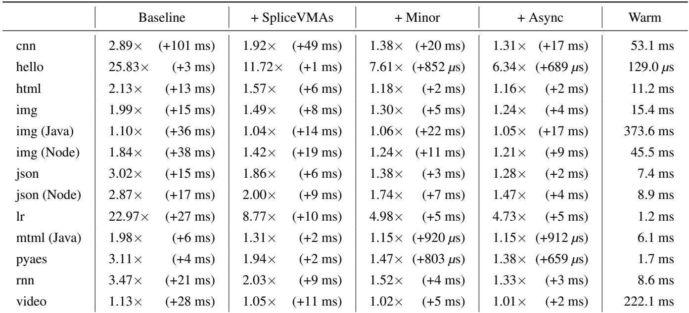  
Table 5: Results from ablation study in §5.2 for all functions, showing the importance of the loader’s design elements. Values in each column reflect slowdowns relative to warm.

## B.2 Expected Results

The main expected result is an end-to-end latency plot showing that Spice significantly reduces cold-start latency compared with FaaSnap, REAP, and CRIU, while approaching warm invocation performance. The exact numbers may vary with SSD performance.

## References

[1] Aws lambda. https://aws.amazon.com/pm/ lambda/. Accessed: 2025-08-20.

[2] Azure functions. https://azure.microsoft.com/ en-us/products/functions. Accessed: 2025-08-20.

[3] CRIU: Checkpoint/Restore In Userspace. https:// criu.org/Main\_Page.

[4] Alexandru Agache, Marc Brooker, Alexandra Iordache, Anthony Liguori, Rolf Neugebauer, Phil Piwonka, and Diana-Maria Popa. Firecracker: Lightweight virtualization for serverless applications. In 17th USENIX Symposium on Networked Systems Design and Implementation (NSDI 20), pages 419–434, Santa Clara, CA, February 2020. USENIX Association.

[5] Siddharth Agarwal, Maria A. Rodriguez, and Rajkumar Buyya. A reinforcement learning approach to reduce serverless function cold start frequency. In 2021 IEEE/ACM 21st International Symposium on Cluster,

Cloud and Internet Computing (CCGrid), pages 797– 803, 2021.

[6] Chloe Alverti, Stratos Psomadakis, Burak Ocalan, Shashwat Jaiswal, Tianyin Xu, and Josep Torrellas. Cxlfork: Fast remote fork over cxl fabrics. In Proceedings of the 30th ACM International Conference on Architectural Support for Programming Languages and Operating Systems, Volume 2, ASPLOS ’25, page 210–226, New York, NY, USA, 2025. Association for Computing Machinery.

[7] Lixiang Ao, George Porter, and Geoffrey M. Voelker. Faasnap: Faas made fast using snapshot-based vms. In Proceedings of the Seventeenth European Conference on Computer Systems, EuroSys ’22, page 730–746, New York, NY, USA, 2022. Association for Computing Machinery.

[8] Marc Brooker, Mike Danilov, Chris Greenwood, and Phil Piwonka. On-demand container loading in AWS lambda. In 2023 USENIX Annual Technical Conference (USENIX ATC 23), pages 315–328, Boston, MA, July 2023. USENIX Association.

[9] James Cadden, Thomas Unger, Yara Awad, Han Dong, Orran Krieger, and Jonathan Appavoo. SEUSS: skip redundant paths to make serverless fast. In Proceedings of the Fifteenth European Conference on Computer Systems, EuroSys ’20, New York, NY, USA, 2020. Association for Computing Machinery.

[10] Xiaohu Chai, Tianyu Zhou, Keyang Hu, Jianfeng Tan, Tiwei Bie, Anqi Shen, Dawei Shen, Qi Xing, Shun Song, Tongkai Yang, et al. Fork in the road: Reflections and optimizations for cold start latency in production serverless systems. In 19th USENIX Symposium on Operating Systems Design and Implementation (OSDI 25), pages 199–218, 2025.

[11] Lazar Cvetkovic, François Costa, Mihajlo Djokic,´ Michal Friedman, and Ana Klimovic. Dirigent: Lightweight serverless orchestration. In Proceedings of the ACM SIGOPS 30th Symposium on Operating Systems Principles, SOSP ’24, page 369–384, New York, NY, USA, 2024. Association for Computing Machinery.

[12] Nilanjan Daw, Umesh Bellur, and Purushottam Kulkarni. Xanadu: Mitigating cascading cold starts in serverless function chain deployments. In Proceedings of the 21st International Middleware Conference, Middleware ’20, page 356–370, New York, NY, USA, 2020. Association for Computing Machinery.

[13] Dong Du, Tianyi Yu, Yubin Xia, Binyu Zang, Guanglu Yan, Chenggang Qin, Qixuan Wu, and Haibo Chen. Catalyzer: Sub-millisecond startup for serverless computing with initialization-less booting. In Proceedings of the Twenty-Fifth International Conference on Architectural Support for Programming Languages and Operating Systems, ASPLOS ’20, page 467–481, New York, NY, USA, 2020. Association for Computing Machinery.

[14] Dmitry Duplyakin, Robert Ricci, Aleksander Maricq, Gary Wong, Jonathon Duerig, Eric Eide, Leigh Stoller, Mike Hibler, David Johnson, Kirk Webb, Aditya Akella, Kuangching Wang, Glenn Ricart, Larry Landweber, Chip Elliott, Michael Zink, Emmanuel Cecchet, Snigdhaswin Kar, and Prabodh Mishra. The design and operation of CloudLab. In Proceedings of the USENIX Annual Technical Conference (ATC), pages 1–14, July 2019.

[15] Joshua Fried, Gohar Irfan Chaudhry, Enrique Saurez, Esha Choukse, Inigo Goiri, Sameh Elnikety, Rodrigo Fonseca, and Adam Belay. Making Kernel Bypass Practical for the Cloud with Junction. In 21st USENIX Sym posium on Networked Systems Design and Implementation (NSDI 24), Santa Clara, CA, April 2024. USENIX Association.

[16] Alexander Fuerst and Prateek Sharma. Faascache: keeping serverless computing alive with greedy-dual caching. In Proceedings of the 26th ACM International Conference on Architectural Support for Programming Languages and Operating Systems, ASPLOS ’21, page 386–400, New York, NY, USA, 2021. Association for Computing Machinery.

[17] Joseph M. Hellerstein, Jose M. Faleiro, Joseph Gonzalez, Johann Schleier-Smith, Vikram Sreekanti, Alexey Tumanov, and Chenggang Wu. Serverless computing: One step forward, two steps back. In 9th Biennial Conference on Innovative Data Systems Research, CIDR 2019, Asilomar, CA, USA, January 13-16, 2019, Online Proceedings. www.cidrdb.org, 2019.

[18] Liam R. Howlett. Maple tree. https://docs.kernel. org/core-api/maple\_tree.html. Accessed: 2025- 12-11.

[19] Jialiang Huang, MingXing Zhang, Teng Ma, Zheng Liu, Sixing Lin, Kang Chen, Jinlei Jiang, Xia Liao, Yingdi Shan, Ning Zhang, Mengting Lu, Tao Ma, Haifeng Gong, and YongWei Wu. Trenv: Transparently share serverless execution environments across different functions and nodes. In Proceedings of the ACM SIGOPS 30th Symposium on Operating Systems Principles, SOSP ’24, page 421–437, New York, NY, USA, 2024. Association for Computing Machinery.

[20] Abhinav Jangda, Bobby Powers, Emery D. Berger, and Arjun Guha. Not so fast: Analyzing the performance of WebAssembly vs. native code. In 2019 USENIX Annual Technical Conference (USENIX ATC 19), pages 107–120, Renton, WA, July 2019. USENIX Association.

[21] Jeongchul Kim and Kyungyong Lee. Functionbench: A suite of workloads for serverless cloud function service. In 2019 IEEE 12th International Conference on Cloud Computing (CLOUD), pages 502–504, July 2019.

[22] Sumer Kohli, Shreyas Kharbanda, Rodrigo Bruno, Joao Carreira, and Pedro Fonseca. Pronghorn: Effective checkpoint orchestration for serverless hot-starts. In Proceedings of the Nineteenth European Conference on Computer Systems, EuroSys ’24, page 298–316, New York, NY, USA, 2024. Association for Computing Machinery.

[23] Nikita Lazarev, Varun Gohil, James Tsai, Andy Anderson, Bhushan Chitlur, Zhiru Zhang, and Christina Delimitrou. Sabre: Hardware-Accelerated snapshot compression for serverless MicroVMs. In 18th USENIX Symposium on Operating Systems Design and Implementation (OSDI 24), pages 1–18, Santa Clara, CA, July 2024. USENIX Association.

[24] Zijun Li, Jiagan Cheng, Quan Chen, Eryu Guan, Zizheng Bian, Yi Tao, Bin Zha, Qiang Wang, Weidong Han, and Minyi Guo. RunD: A lightweight secure container runtime for high-density deployment and high-concurrency startup in serverless computing. In 2022 USENIX Annual Technical Conference (USENIX ATC 22), pages 53–68, Carlsbad, CA, July 2022. USENIX Association.

[25] Zijun Li, Linsong Guo, Quan Chen, Jiagan Cheng, Chuhao Xu, Deze Zeng, Zhuo Song, Tao Ma, Yong Yang, Chao Li, and Minyi Guo. Help rather than recycle: Alleviating cold startup in serverless computing through Inter-Function container sharing. In 2022 USENIX Annual Technical Conference (USENIX ATC 22), pages 69–84, Carlsbad, CA, July 2022. USENIX Association.

[26] Zhen Lin, Kao-Feng Hsieh, Yu Sun, Seunghee Shin, and Hui Lu. Flashcube: Fast provisioning of serverless functions with streamlined container runtimes. In Proceedings of the 11th Workshop on Programming Languages and Operating Systems, PLOS ’21, page 38–45, New York, NY, USA, 2021. Association for Computing Machinery.

[27] David Lion, Adrian Chiu, Hailong Sun, Xin Zhuang, Nikola Grcevski, and Ding Yuan. Don’t get caught in the cold, warm-up your JVM: Understand and eliminate JVM warm-up overhead in Data-Parallel systems. In 12th USENIX Symposium on Operating Systems Design and Implementation (OSDI 16), pages 383–400, Savannah, GA, November 2016. USENIX Association.

[28] Wes Lloyd, Minh Vu, Baojia Zhang, Olaf David, and George Leavesley. Improving application migration to serverless computing platforms: Latency mitigation with keep-alive workloads. In 2018 IEEE/ACM International Conference on Utility and Cloud Computing Companion (UCC Companion), pages 195–200, 2018.

[29] Ashraf Mahgoub, Edgardo Barsallo Yi, Karthick Shankar, Sameh Elnikety, Somali Chaterji, and Saurabh Bagchi. ORION and the three rights: Sizing, bundling, and prewarming for serverless DAGs. In 16th USENIX Symposium on Operating Systems Design and Implementation (OSDI 22), pages 303–320, Carlsbad, CA, July 2022. USENIX Association.

[30] Rohan Basu Roy, Tirthak Patel, and Devesh Tiwari. Icebreaker: warming serverless functions better with heterogeneity. In Proceedings of the 27th ACM International Conference on Architectural Support for Programming Languages and Operating Systems, ASPLOS ’22, page 753–767, New York, NY, USA, 2022. Association for Computing Machinery.

[31] Alireza Sahraei, Soteris Demetriou, Amirali Sobhgol, Haoran Zhang, Abhigna Nagaraja, Neeraj Pathak, Girish Joshi, Carla Souza, Bo Huang, Wyatt Cook, Andrii Golovei, Pradeep Venkat, Andrew Mcfague, Dimitrios Skarlatos, Vipul Patel, Ravinder Thind, Ernesto Gonza lez, Yun Jin, and Chunqiang Tang. Xfaas: Hyperscale and low cost serverless functions at meta. In Proceedings of the 29th Symposium on Operating Systems Principles, SOSP ’23, page 231–246, New York, NY, USA, 2023. Association for Computing Machinery.

[32] Divyanshu Saxena, Tao Ji, Arjun Singhvi, Junaid Khalid, and Aditya Akella. Memory deduplication for serverless computing with medes. In Proceedings of the Seventeenth European Conference on Computer Systems, EuroSys ’22, page 714–729, New York, NY, USA, 2022. Association for Computing Machinery.

[33] Mohammad Shahrad, Rodrigo Fonseca, Inigo Goiri, Gohar Chaudhry, Paul Batum, Jason Cooke, Eduardo Laureano, Colby Tresness, Mark Russinovich, and Ricardo Bianchini. Serverless in the wild: Characterizing and optimizing the serverless workload at a large cloud provider. In 2020 USENIX Annual Technical Conference (USENIX ATC 20), pages 205–218. USENIX Association, July 2020.

[34] Simon Shillaker and Peter Pietzuch. Faasm: lightweight isolation for efficient stateful serverless computing. In Proceedings of the 2020 USENIX Conference on Usenix Annual Technical Conference, USENIX ATC’20, USA, 2020. USENIX Association.

[35] Wonseok Shin, Wook-Hee Kim, and Changwoo Min. Fireworks: a fast, efficient, and safe serverless framework using VM-level post-JIT snapshot. In Proceedings of the Seventeenth European Conference on Computer Systems, EuroSys ’22, page 663–677, New York, NY, USA, 2022. Association for Computing Machinery.

[36] Paulo Silva, Daniel Fireman, and Thiago Emmanuel Pereira. Prebaking functions to warm the serverless cold start. In Proceedings of the 21st International Middleware Conference, Middleware ’20, page 1–13, New York, NY, USA, 2020. Association for Computing Machinery.

[37] Arjun Singhvi, Arjun Balasubramanian, Kevin Houck, Mohammed Danish Shaikh, Shivaram Venkataraman, and Aditya Akella. Atoll: A scalable low-latency serverless platform. In Proceedings of the ACM Symposium on Cloud Computing, SoCC ’21, page 138–152, New York, NY, USA, 2021. Association for Computing Machinery.

[38] Ariel Szekely, Adam Belay, Robert Morris, and M. Frans Kaashoek. Unifying serverless and microservice workloads with sigmaos. In Proceedings of the ACM SIGOPS 30th Symposium on Operating Systems Principles, SOSP ’24, page 385–402, New York, NY, USA, 2024. Association for Computing Machinery.

[39] Dmitrii Ustiugov, Plamen Petrov, Marios Kogias, Edouard Bugnion, and Boris Grot. Benchmarking, analysis, and optimization of serverless function snapshots. In Proceedings of the 26th ACM International Conference on Architectural Support for Programming Languages and Operating Systems, ASPLOS ’21, page 559–572,

New York, NY, USA, 2021. Association for Computing Machinery.

[40] Ranjan Sarpangala Venkatesh, Till Smejkal, Dejan S. Milojicic, and Ada Gavrilovska. Fast in-memory criu for docker containers. In Proceedings of the International Symposium on Memory Systems, MEMSYS ’19, page 53–65, New York, NY, USA, 2019. Association for Computing Machinery.

[41] Ao Wang, Shuai Chang, Huangshi Tian, Hongqi Wang, Haoran Yang, Huiba Li, Rui Du, and Yue Cheng. FaaS-Net: Scalable and fast provisioning of custom serverless container runtimes at alibaba cloud function compute. In 2021 USENIX Annual Technical Conference (USENIX ATC 21), pages 443–457. USENIX Association, July 2021.

[42] Kai-Ting Amy Wang, Rayson Ho, and Peng Wu. Replayable execution optimized for page sharing for a managed runtime environment. In Proceedings of the Fourteenth EuroSys Conference 2019, EuroSys ’19, New York, NY, USA, 2019. Association for Computing Machinery.

[43] Xingda Wei, Fangming Lu, Tianxia Wang, Jinyu Gu, Yuhan Yang, Rong Chen, and Haibo Chen. No provisioned concurrency: Fast RDMA-codesigned remote fork for serverless computing. In 17th USENIX Symposium on Operating Systems Design and Implementation (OSDI 23), pages 497–517, Boston, MA, July 2023. USENIX Association.

[44] Jianing You, Kang Chen, Laiping Zhao, Yiming Li, Yichi Chen, Yuxuan Du, Yanjie Wang, Luhang Wen, Keyang Hu, and Keqiu Li. Alloystack: A library operating system for serverless workflow applications. In Proceedings of the Twentieth European Conference on Computer Systems, pages 921–937, 2025.

[45] Hanfei Yu, Rohan Basu Roy, Christian Fontenot, Devesh Tiwari, Jian Li, Hong Zhang, Hao Wang, and Seung-Jong Park. Rainbowcake: Mitigating cold-starts in serverless with layer-wise container caching and sharing. In Proceedings of the 29th ACM International Confer ence on Architectural Support for Programming Languages and Operating Systems, Volume 1, ASPLOS ’24, page 335–350, New York, NY, USA, 2024. Association for Computing Machinery.

[46] Irene Zhang, Alex Garthwaite, Yury Baskakov, and Kenneth C. Barr. Fast restore of checkpointed memory using working set estimation. In Proceedings of the 7th ACM SIGPLAN/SIGOPS International Conference on Virtual Execution Environments, VEE ’11, page 87–98, New York, NY, USA, 2011. Association for Computing Machinery.

[47] Xinmin Zhang, Qiang He, Hao Fan, and Song Wu. Faascale: Scaling microvm vertically for serverless computing with memory elasticity. In Proceedings of the 2024 ACM Symposium on Cloud Computing, SoCC ’24, page 196–212, New York, NY, USA, 2024. Association for Computing Machinery.

[48] Yifei Zhang, Tianxiao Gu, Xiaolin Zheng, Lei Yu, Wei Kuai, and Sanhong Li. Towards a serverless java runtime. In 2021 36th IEEE/ACM International Conference on Automated Software Engineering (ASE), pages 1156– 1160, 2021.