USENIX

THE ADVANCED COMPUTING SYSTEMS ASSOCIATION

# Bodega: Localized Linearizable Reads at Anywhere Anytime via Roster Leases

Guanzhou Hu, Amazon Web Services; Andrea C. Arpaci-Dusseau and Remzi H. Arpaci-Dusseau, University of Wisconsin–Madison https://www.usenix.org/conference/osdi26/presentation/hu-guanzhou

# This paper is included in the Proceedings of the 20th USENIX Symposium on Operating Systems Design and Implementation.

July 13–15, 2026 • Seattle, WA, USA

ISBN 978-1-939133-55-7

Open access to the Proceedings of the 20th USENIX Symposium on Operating Systems Design and Implementation is sponsored by

# Bodega: Localized Linearizable Reads at Anywhere Anytime via Roster Leases

Guanzhou Hu<sup>∗</sup>   
Amazon Web Services   
Seattle, WA, USA   
josehgz@amazon.com   
Andrea C. Arpaci-Dusseau   
University of Wisconsin–Madison Madison, WI, USA dusseau@cs.wisc.edu

Remzi H. Arpaci-Dusseau University of Wisconsin–Madison Madison, WI, USA remzi@cs.wisc.edu

## Abstract

We present Bodega, the first consensus protocol that serves linearizable reads locally from any desired node, regardless of interfering writes. Bodega attains this capability via a new notion of cluster metadata called the <sup>roster</sup>, which is a generalization of leadership; it tracks arbitrary subsets of replicas as <sup>responder</sup> nodes for local reads. A consistent agreement on the roster is established through <sup>roster</sup> <sup>leases</sup>, an all-to-all leasing mechanism that generalizes existing all-to-one leasing approaches (Leader Leases, Quorum Leases), unlocking a new point in the protocol design space. Bodega further <sub>employs</sub> optimistic holding <sub>and</sub> early accept notifications <sub>op</sub> timizations to minimize interruption from interfering writes, <sub>and</sub> smart roster coverage <sub>and</sub> lightweight heartbeats <sub>to</sub> <sub>max-</sub> imize practicality. Bodega is a non-intrusive extension to classic consensus; it imposes no special requirements on writes other than a responder-covering quorum.

We implement Bodega and related works in Summerset, a protocol-generic replicated key-value store written in async Rust. We compare it to previous protocols (Leader Leases, EPaxos, PQR, and Quorum Leases) and two production coordination services (etcd and ZooKeeper). Bodega speeds up average client read requests by 5.6x∼13.1x on real WAN clusters versus previous approaches under moderate write interference, and closely matches the performance of sequentially-consistent etcd and ZooKeeper deployments across YCSB workloads. Bodega supports fast proactive roster changes and delivers on-par write performance. Our Summerset codebase is open-sourced at https: //github.com/josehu07/summerset/tree/bodega-artifact.

## ACM Reference Format:

Guanzhou Hu, Andrea C. Arpaci-Dusseau, and Remzi H. Arpaci-Dusseau. 2026. Bodega: Localized Linearizable Reads at Anywhere <sub>Anytime</sub> <sub>via</sub> <sub>Roster</sub> <sub>Leases.</sub> <sub>In</sub> Proceedings of the 20th USENIX Symposium on Operating Systems Design and Implementation (OSDI ’26). ACM, Seattle, WA, USA, 39 pages. https://doi.org/xxxxxxx.xxxxxxx

## 1 Introduction

Paxos-based consensus [60, 61, 65] (and protocols alike [85, 87]) serves as a critical foundation for modern distributed systems infrastructure. Originally used in limited contexts, e.g., for bespoke configuration information as in Petal [67], for critical metadata stores such as etcd [35, 97] and Fire-Scroll [36, 95], and for lock services such as Chubby [21], consensus now forms the foundation of widely used cloudnative databases such as Spanner [30], CockroachDB [107], TiDB [50], ScyllaDB [100], and Physalia [19].

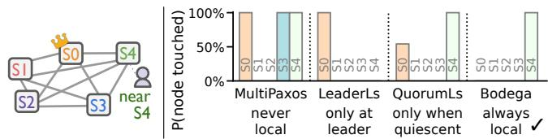  
Figure 1. Frequency of touching a node on the critical <sub>path</sub> <sub>of</sub> <sub>reads</sub> by a client near S4, in a cluster where S0 is the leader, with infrequent writes. Ideal outcome is 100% at S4.

In these systems, simple access semantics are critical, enabling scalable services to be readily built atop them [4, 15]. In particular, <sup>linearizability</sup> is a strong consistency level they strive to provide: for interrelated requests, clients observe a real-time serial ordering, as if talking to a single node [47, 49].

Local Linearizable Reads. Delivering high performance in linearizable systems remains a daunting challenge. In the cloud era, systems replicate critical data across multiple geographically-distinct availability zones [7, 28, 79], to guard against correlated failures caused by power outage, fire, natural disaster, or operator error [22, 24, 43, 108]. By spreading replicas globally, robustness is achieved, but at the cost of performance due to quorum round trips [66].

The physical distribution of replicas yields an opportunity to serve read requests locally from a client’s nearest replica. Reads comprise a majority of the workloads [8, 29, 88, 91]; achieving local reads can greatly reduce read latency and drastically increase overall throughput.

Existing Solutions Fall Short. Existing consensus protocols have demonstrated efective wide-area optimizations, but none, to our knowledge, supports coherently fast linearizable reads for workloads containing even small amounts of interfering writes. Leaderless protocols [27, 56, 62, 76, 80, 98] allow near quorums but not local reads. Others explore flexible quorums [42, 46, 48, 64, 106], utilize special hardware or client validation [5, 32, 40, 69, 93, 101, 112], or exploit API semantics favoring writes [37–39, 74, 86, 90, 96, 114]. Read leases (covered later) [10, 18, 25, 26, 41, 81, 82] are so far the most compelling, but are only efective at the leader or during quiescent periods without interfering writes.

Self-Containment Necessitates Leases. A primary challenge of designing consensus protocols is self-containment: they cannot assume an external oracle. To enable local linearizable reads, the protocol must judge whether replicalocal data is the most recent; contacting an external service to obtain this information would defeat the initial purpose. Moreover, having external dependencies would reduce the system’s fault tolerance guarantees to those of the external services [57, 95, 107].

Within the design space of self-contained protocols, <sup>leases</sup> are a vital and powerful primitive. They carry timed promises that naturally tolerate faults through expiration [41], while only requiring bounded clock drifts (typical in today’s cloud environments [40, 53, 68, 77]). This opens the gateway to local linearizable read protocols.

Leases Were Not Fully Exploited. Existing lease-infused protocols, however, do not employ the most suitable types of promises for local reads, and thus cannot fully realize their potential. As a motivating example, Figure 1 shows a 5-site cluster where S0 is the leader (and S4 is a local-read-enabled replica, if eligible), and reports the frequency of servers being touched by read requests from a client near S4. The workload contains 99% reads and only 1% writes, which favors exist ing approaches. Classic consensus (MultiPaxos) requires a majority accept quorum around S0. Leader Leases only protect stable leadership, so S0 can reply to reads directly, yet the delay between client and S0 persists. Quorum Leases allow granting leases to followers but use leases to guard against individual writes, rendering them vulnerable to even small amounts of concurrent writes to the key. As a result, a significant portion are redirected to the leader S0.

Our Approach: Roster Leases. We introduce the notion of a <sup>roster</sup>: a generalized form of cluster metadata that dictates not only leadership but also an assignment of localread-enabled replicas (called <sup>responders</sup>) for arbitrary keys. Accordingly, we introduce <sup>roster</sup> <sup>leases</sup>, a novel all-to-all generalization of leader leases, deployed of the critical path to protect the agreement on the roster with no observable overhead. Roster leases stay valid in the absence of failures or proactive changes.

We present Bodega, a consensus protocol that uses roster leases to empower local linearizable reads. Bodega assures that writes never commit before reaching all of the key’s active responders. A responder that holds a majority of leases can thus serve reads directly from its local state, if it knows the latest value will commit. When unsure, the responder <sup>optimistically</sup> <sup>holds</sup> the read locally until enough information is gathered, optionally utilizing <sup>early</sup> <sup>accept</sup> <sup>notifications</sup> to accelerate the hold. The roster may be changed manually by users, automatically according to runtime statistics, or in reaction to failures.

Our evaluation shows that Bodega speeds up client read requests by 5.6x∼13.1x versus previous approaches under slight write interference, delivers comparable write performance, supports proactive roster changes in two message rounds as well as self-contained fault tolerance via leases, and matches the performance of sequentially-consistent etcd [35] and ZooKeeper [52] deployments across all YCSB variants.

Summary of Contributions. 1 We introduce the notion of roster and propose Bodega, a consensus protocol equipped with a novel all-to-all roster leases algorithm, enabling local linearizable reads from any node at any time. 2 We provide a thorough qualitative comparison across wide-area linearizable read approaches. 3 We implement Bodega and related protocols in Summerset, a protocol-generic replicated keyvalue store, with 25.6k lines of async Rust. 4 We evaluate Bodega comprehensively against previous works and two production coordination services, etcd and ZooKeeper, on 5-site wide-area clusters, delivering aforementioned evaluation results. 5 We provide a formal TLA<sup>+</sup> specification of the full algorithm in the appendix.

The rest of the paper is organized as follows: §2 provides background and discusses existing solutions; §3 presents the Bodega design; §4 gives a formal comparison and proof; §5 covers the implementation of Bodega in Summerset; §6 presents our evaluation; §7-8 add discussions and related work; §9 concludes.

## 2 Background and Motivation

We provide background on consensus and linearizable reads, discuss existing solutions, and derive our goals for Bodega.

## 2.1 Consensus & Linearizable Reads

We consider the typical consensus problem of reaching agreement across message-passing server nodes, where nodes can be fail-slow/stop and the network is asynchronous [60].

Following well-established practice, nodes agree upon an ordered <sup>log</sup> of commands to behave as a replicated state machine (RSM) [61, 99]. For clarity, we use key-value Put/Get commands. In practice, Gets map to read-only requests that only query but do not update state (hereby referred to as <sup>reads</sup>), and Puts map to all other requests (<sup>writes</sup>). We restrict our discussion to non-transactional commands [17]; these are out of the scope of this paper.

Linearizable Reads. The consistency level dictates what results are allowed to be observed by clients [49]. <sup>Lineariz-</sup> <sup>ability</sup> is the strongest non-transactional consistency level, where clients expect a serial ordering of commands with the real-time property: a command on key <sup>??</sup> issued at physical time <sup>??</sup> must be ordered after all the interfering writes on <sup>??</sup> acknowledged before <sup>??</sup>, and observe its latest value [6, 47, 80]. This semantic is mandatory for critical use cases such as metadata storage and coordination [19, 21, 35, 36], and is generally desirable as clients would otherwise get stale reads from the past (<sup>sequential</sup> <sup>consistency</sup>) [6, 59] or weaker guarantees [102, 109], complicating development. Linearizable reads are the primary focus of this paper.

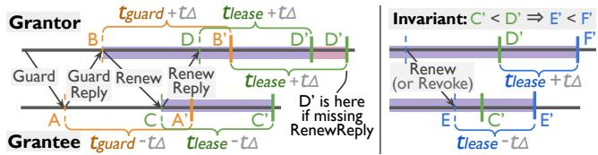  
Figure 2. Demonstration of standard leasing. <sup>Left:</sup> <sup>the</sup> guard phase helps establish the first iteration of promise coverage safely; grantee welcomes the first <sub>Renew</sub> only if it is received within the guarded period (C < A’). This allows the grantor to derive a safe expiration D’ <sub>=</sub> B’<sub>+</sub>??<sub>lease+</sub>??<sub>Δ</sub> even if the <sub>RenewReply</sub> is lost, such that C’ < D’. Right: grantor attempts to extend the promise with a <sub>Renew</sub> (or to actively revoke it with a <sub>Revoke</sub>), but has not received the grantee’s reply. The leasing logic assures that E’ < F’; therefore, if the grantee indeed failed, after F’ the grantor can safely assert lease expiration. The purple-colored ranges depict when the lease is considered granted/held by the corresponding party.

Availability Requirements. A practical protocol must also ofer <sup>availability</sup> for fault tolerance, allowing client requests to proceed under any minority number of node/network faults, and retaining consistency in all circumstances [49, 61].

## 2.2 Distributed Lease

<sup>Leases</sup> are a common distributed system technique [41]. They may be deployed as user-facing APIs through locks [21] and TTL-tagged objects [35], or as protocol-internal optimizations; we focus on the latter.

A lease is, conceptually, a directional limited-time <sup>promise</sup> that a <sup>grantor</sup> node makes to a <sup>grantee</sup>. It relies on bounded clock speed drift between the two ends, that is, over a given physical expiration time <sup>??</sup><sub>lease</sub> elapsed, the two nodes’ clocks do not deviate more than a small <sup>??</sup><sub>Δ</sub> (no clock drift). This is typically true in today’s distributed system environments [40, 53, 68, 77]; note that it does not assume synchronized clock timestamps [10, 30, 70] (no clock skew).

Standard One-to-One Leasing. The procedure of activating one lease between two nodes consists of an initial <sup>guard</sup> phase and repeated <sup>renew</sup> phases, depicted in Figure 2. The guard phase (left half) helps establish the first iteration in the presence of clock skew assuming bounded clock drift, and the renew phases (right half) keep it refreshed periodically [41, 81, 82]. Grantor starts to consider the lease granted when the first Renew is sent out (not when the Guard is sent), and grantee starts to consider the lease held when the first Renew is received (not when the Guard is received), using carefully designed timer durations as shown in Figure 2. The goal is to maintain this invariant: the grantor-side expira tion time is <sup>never</sup> <sup>earlier</sup> <sup>than</sup> the grantee-side. A lease is considered held by the grantee when its clock has not surpassed <sup>??</sup><sub>lease</sub>−<sup>??</sup><sub>Δ</sub> after the last renewal received. The grantor can proactively deactivate the lease with a Revoke or, in the case of unresponsiveness, wait for <sup>??</sup><sub>lease</sub>+<sup>??</sup><sub>Δ</sub> without granting to let it safely expire.

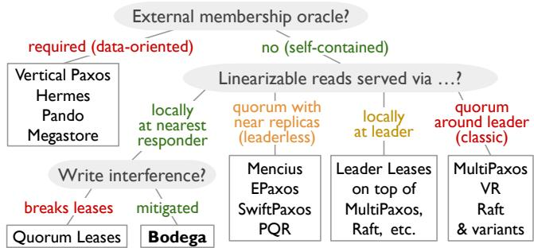  
Figure 3. Categorization chart of relevant protocols. Ideal properties for local reads are marked in green. See §2.3.

## 2.3 Previous Work on Read Optimizations

Figure 3 presents a coarse-grained categorization of previous approaches to linearizable reads. The following sections discuss them in the general order from right to left.

## 2.3.1 Classic Protocols & Leader Leases

Protocols such as MultiPaxos [61], VR [85], and Raft [87] are the de-facto standards implemented in the wild [30, 35, 50, 103, 107]. While stale read options exist [25, 86], normal reads are treated obliviously just like other commands.

With MultiPaxos terminology, a typical protocol is as follows. A node S first makes a “covering-all” Prepare phase to settle a unique, higher <sup>ballot</sup> number for all non-committed <sup>instances</sup> (i.e., <sup>slots</sup>) in the log, efectively stepping up as a leader. Without competing leaders, S takes a client command, assigns the next vacant log slot, broadcasts Accept messages, and waits for <sup>⩾</sup> <sup>??</sup> = ⌈<sup>??</sup> ⌉ AcceptReplys with matching ballot including self (where <sup>??</sup> is an odd cluster size), after which the slot is marked committed and Commit notifications are broadcast asynchronously as announcement. S executes the commands in contiguously-committed slots in order and replies to their clients.

Leader Leases [25] are a commonly deployed optimization to establish <sup>stable</sup> <sup>leadership</sup>. All nodes grant lease to the most recent leader they are aware of (including self) after invalidating any old lease given out. If a leader S is holding <sup>⩾</sup> <sup>??</sup> leases, it can safely assert that it is the only such leader in the cluster, i.e., the stable leader. Therefore, S (and only S) can reply to read requests locally using the latest committed value, knowing that no newer values could have committed.

## 2.3.2 Leaderless or Multi-Leader Approaches

Leaderless (or multi-leader) protocols distribute the responsibilities of a leader onto all nodes, improving scalability and latency under wide-area settings by allowing a fast-path quorum nearer to the clients. However, they are sensitive to command interference and often make local reads infeasible without degrading back to a leader-based protocol.

Mencius [76] assigns the leader role Round-Robin across nodes based on slot index. This mainly benefits scalability.

EPaxos [80, 104] absorbs the idea of inter-command dependencies from Generalized Paxos [62] and lets any node to act as the <sup>command</sup> <sup>leader</sup> for nearby clients. Nodes attach to each command its dependency set; without concurrent conflicting proposals, consensus can be reached on the fast path of PreAccepts by a (super-)majority quorum. Conflicts in dependencies require a second phase to resolve. Local reads are inherently hard to achieve in such a protocol without degrading to a leader-based protocol on keys of interest [104]. SwiftPaxos [98] improves EPaxos slow path to 1.5 RTTs (vs. 2) by re-introducing a leader in the slow phase.

PQR [27, 42] applies EPaxos-like leaderless optimization to only reads and not writes. Clients broadcast read requests directly to the nearest majority of servers. If all replies contain the same latest-seen value, all in committed status, then this value must be a valid linearizable read result. Otherwise, the client starts a <sup>rinse</sup> phase where it repeatedly polls arbitrary servers for commit confirmation of the value.

WPaxos [1] is a multi-leader design that partitions the key space and assigns a diferent leader per partition, improving locality of regional hot keys. However, it expects workload concentration and does not ofer local reads at multiple replicas. Its adaptive partitioning approach can be applied orthogonally to consensus protocols including Bodega.

## 2.3.3 Enhanced Read Leases

Several works explored enhancements to <sup>read</sup> <sup>leases</sup> beyond stable leadership, enabling broader local reads.

Megastore [10] grants read leases to all replicas by a standalone coordinator. These leases carry the promise of not permitting any writes to covered keys. When writes arrive, leases are actively revoked (requiring an extra round-trip to all replicas) and local reads at followers are disabled until leases are re-granted. Megastore leases cover either all replicas or none; they also require external coordination and experience long downtimes during concurrent writes.

Quorum Leases [81, 82] extend read leases to configurable subsets of replicas. Leases are granted by replicas themselves, removing the need for an external coordinator. Upon writes, revocations are merged with the natural Accept messages and their replies, avoiding extra round-trips for writes in failure-free cases. Quorum Leases improve the configurability and write performance aspects of Megastore, but three insuficiencies with reads remain. 1 Lease actions remain on the critical path, leading to frequent interruptions from writes. 2 When fast-path local reads fail during lease down times, they are redirected to the leader or retried indefinitely by clients, leading to suboptimal slow-path latency. 3 Assignment of grantees is configured with normal consensus commands, making failure cases hard to reason about and implement. Bodega eliminates all three insuficiencies via the powerful mechanism of background roster leases, as will become clear in §3.

## 2.3.4 With External Coordination

## Protocols below assume external coordination.

Hermes [56] is a primary-backup replication protocol inspired by cache coherence protocols. It allows reads to be completed by individual nodes assuming that writes reach all nodes and are resolved synchronously with respect to each other (similar to CPU shared cache invalidation). Hermes inherits its architectural assumption from Vertical Paxos [64], requiring an external membership manager for reconfigurations upon failures.

Pando [106] is a WAN-aware, erasure-coded protocol that emphasizes cost eficiency. It allows statically tunable readwrite quorums, which are settable ahead-of-time before deployment, and assumes a network topology with frontends and an external service for membership management.

## 2.4 Summary of Goals

After reviewing existing solutions, we summarize the desired properties of a linearizable read protocol as our design goals:

• <sup>Self-contained</sup>: no external metadata oracle dependencies.

• <sup>Local</sup> <sup>reads</sup> <sup>anywhere</sup>: enable local linearizable reads at arbitrary subsets of replicas as appropriate.

• <sup>Local</sup> <sup>reads</sup> <sup>at</sup> <sup>anytime</sup>: keep reads localized during concurrent interfering writes, minimizing degradation time and maintaining good slow-case latency.

• <sup>Configurable</sup>: tunable against arbitrary ranges of keys.

• <sup>Non-intrusive</sup>: designed atop classic consensus, introducing marginal performance impacts on writes and retaining availability under any minority number of failures.

Via these goals, Bodega delivers superior performance characteristics compared to aforementioned approaches. We will show them both theoretically (§4) and experimentally (§6).

## 3 Design

In this section, we present the core design of Bodega.

Design Outline. We derive the complete design in three steps: 1 define the roster, 2 design optimal normal case operations assuming replicas agree on the same stable roster, and 3 introduce all-to-all roster leases, the enabler behind the fault-resilient agreement on the roster.

For clarity, we adhere to Paxos-style terminology throughout this paper. All the optimizations are applicable to Raftstyle protocols due to their fundamental duality [110].

## 3.1 The Roster

We start by introducing the core concepts behind Bodega: responder status and the roster. A node is a <sup>responder</sup> for a key if it is expected to serve read requests on that key locally without actively contacting other nodes. A <sup>roster</sup> is the collection of each node’s desired capabilities at a certain time; specifically, it dictates:

• The node ID of the current leader node.

• For each (range of) key(s): the node IDs of its responders.

The roster is a generalization of leadership from classic protocols: besides the one special leader role, we now have special responder roles for selected keys. The leader can be implicitly treated as a responder for all keys, and diferent keys can additionally mark diferent nodes as responders.

The optimal choice of responders for each key depends on various factors: 1 client locations and proximity, 2 workload read-heaviness and skewness, and 3 cluster topology and status. This paper focuses on the mechanisms supporting the roster rather than the policies for tuning it; we recognize that the latter could be an intriguing study on its own.

The system starts from an empty roster with a null leader ID and an empty responder set for the entire keyspace. Every newly-proposed roster is associated with (and identified by) a unique ballot number, forming a ⟨<sup>bal</sup>, <sup>ros</sup>⟩ pair, where <sup>bal</sup> is the ballot number formed by concatenating a monotonically increasing integer <sup>??</sup> with the proposing node’s ID <sup>??</sup> to ensure uniqueness. Rosters of diferent ballots may contain the same content but are still considered diferent. Roster changes may happen due to explicit requests by users, automatic tuning from statistics, or mandatorily in reaction to failures.

## 3.2 Normal Case Operations

We first describe normal case operations, using Figure 4 as a demonstrative example. In a 5-node cluster, S0 is the leader (depicted by the crown) and S2,3,4 are additional responders (depicted by the red star symbols) for a specific key <sup>??</sup>. Assume, in this section, that this is the latest roster all nodes know and consider stable according to leases. Nodes use their known roster to assure that writes to <sup>??</sup> would never commit before reaching all of its active responders. A responder can therefore serve reads directly if it knows the latest value of <sup>??</sup> will commit; when unsure, optimizations exist.

## 3.2.1 Writes

Writes follow the same leader-based process as in MultiPaxos (Figure 4 blue arrows), except for an updated commit condition. Normally, a write to key <sup>??</sup> can be marked as committed and acknowledged once <sup>⩾ ??</sup> AcceptReplys are received. We impose an additional constraint that it must also have received replies from all the responders for <sup>??</sup>, according to the leader’s current roster.

Requiring a write quorum that covers all responders is an unavoidable penalty that any local linearizable read algorithm must pay. Luckily, without far-of responders, this penalty is marginal as the system usually picks a leader with relatively uniform distances to other replicas, and the write must anyway reach a majority. This aligns with previous observations [81] and our evaluation results (§6). Distant responders could still be appropriate for certain workloads.

## 3.2.2 Reads

Clients send read requests on key <sup>??</sup> to the closest responder server for <sup>??</sup> (Figure 4 green arrows). It is common for clients of wide-area systems to be co-located with some replica; for example, consensus is usually part of an outer system, e.g., a database, where requests come directly from participating sites, but this is not a requirement.

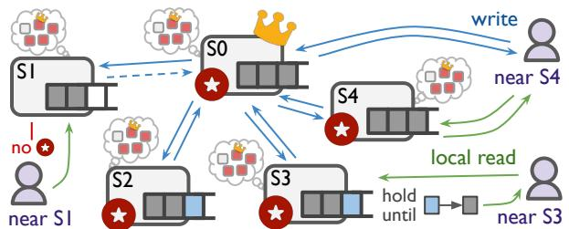  
Figure 4. Normal case operations of Bodega. <sup>Assume</sup> all nodes agree on the same example roster: S0 is the leader and S0,2-4 are responders for a key while S1 is not. See §3.2.

When a server S (with a stable roster) takes a read, there are three cases. 1 S is the leader, in which case S simply finds the highest committed slot in its log that contains a write to <sup>??</sup> and returns the value. The leader does not need to worry about in-progress writes [25]. 2 S is neither a leader nor a responder for <sup>??</sup> (e.g., S1 in Fig. 4), in which case S rejects the read and promptly redirects the client to another server, preferably a close-by responder or the leader. 3 S is a non-leader responder. In this case, S looks up the highest slot in its log that contains any write to <sup>??</sup>. If the slot is in committed status, S immediately replies with the value (e.g., the read at S4 in Fig. 4); otherwise, S cannot yet determine whether that value will surely commit or will be overwritten due to impending failures (e.g., the read at S3), in which case S optimistically <sup>holds</sup> the read.

Optimistic Holding. S expects its connection with the leader to be normally healthy, hence anticipates quick commitment for in-flight writes. It is usually faster and more eficient for S to withhold local reads that depend on an inflight write and to reply as soon as commitment is known, than rejecting the reads and letting clients redirect or retry. In failure-free cases, the commit notification for an interfering write arrives in at most one RTT (from when S receives the Accept from the leader and replies to it). Note that even with a constant stream of writes, held reads are not blocked indefinitely: they are released as soon as their associated slot turns committed.

A responder S optimistically holds a local read by adding it to a <sup>pending</sup> <sup>set</sup> attached to the corresponding slot. Upon receiving the commit notification for a slot, S releases the pending reads and replies with the committed value. To handle cases where the leader fails to notify S promptly, clients start an <sup>unhold</sup> timeout when sending local read requests; if the timeout is reached, clients proactively issue the same request to another responder or the leader (with the same req ID, which is safe since reads are idempotent) and use the earliest reply. A good timeout length is longer than the usual RTT between S and the current leader.

Early Accept Notifications. Bodega can optionally incorporate a further optimization that reduces average holding time when under low load: followers not only reply to Accepts on key <sup>??</sup> to the leader, but also broadcast notifications to <sup>??</sup>’s responders. Once a responder S has received <sup>??</sup> notifications (counting self), it can assert that a pending slot will surely commit even across minority failures. A similar optimization exists for BFT writes [23]. On average, this halves the expected holding time for interfered local reads. This optimization is optional and can be turned of when write trafic increases.

## 3.3 Roster Leases

So far, we have assumed a consistent roster across the cluster without showing how it is achieved. The idea is to exchange roster leases in an all-to-all manner, between at least a majority of nodes and all nodes that may be responders for some key. When holding a majority number of leases, responders know that the roster is stable, and the leader (as an implicit responder) also knows the identity of all responders and will not commit writes without notifying them.

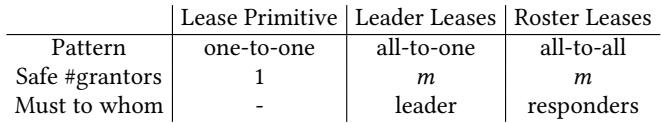

We present how Bodega deploys of-the-critical-path <sup>ros-</sup> <sup>ter</sup> <sup>leases</sup> to establish a stable roster elegantly and eficiently. We use Figure 5 as an illustration when needed.

Lease-related States. Besides the SMR log and the ⟨<sup>bal</sup>, <sup>ros</sup>⟩ pair, we let every node S act as both a lease grantor and a grantee (recall §2.2 for how a standard lease grant primitive works). This means S maintains the following additional data structures: 1 two lists of grantor-side timers <sup>??</sup><sub>guardTo,</sub> ?? and <sup>??</sup><sub>renewTo,</sub> ?? per peer node P; 2 two corresponding sets {}<sub>guardTo</sub> and {}<sub>renewTo</sub> for tracking which peers are S currently guarding/renewing to; 3 two lists of grantee-side timers <sup>??</sup><sub>guardBy,</sub> ?? and <sup>??</sup><sub>renewBy,</sub> ?? per peer P; 4 two sets {}<sub>guardBy</sub> and {}<sub>renewBy</sub> for tracking the guards/renewals S currently holds; 5 a list of safety slot numbers <sup>thresh</sup>?? , that specifies the highest slot S has accepted from each peer P.

## 3.3.1 Roster Leases Activation

We first describe how roster leases are activated. Consider node X wants to announce a new roster <sup>ros′</sup>; this could be due to, e.g., stepping up as new leader (by setting X as the leader in <sup>ros′</sup>) or other reasons covered in §3.3.2. X composes a unique, higher ballot <sup>bal′</sup> by concatenating (<sup>??</sup> + 1) with its node ID, where <sup>??</sup> is the higher part of the current <sup>bal</sup>. X then broadcasts the ⟨<sup>bal′</sup>, <sup>ros′</sup>⟩ pair to all nodes including self.

For any node S upon receiving a ballot <sup>bal′</sup> higher than ever seen, it first ensures all old leases are safely revoked or expired (discussed later in §3.3.2). Then, it moves on to ⟨<sup>bal′</sup>, <sup>ros′</sup>⟩ and starts a initiate\_leases(<sup>bal′</sup>) procedure, where it begins granting leases for the new roster to all peers asynchronously in parallel.

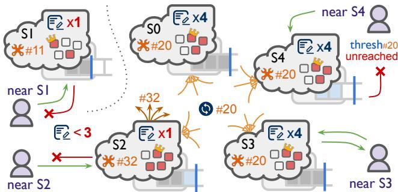  
Figure 5. All-to-all roster leases demonstrated. <sup>S0,3,4</sup> are each holding <sub>≥</sub> majority grants of roster #20; S4 has not seen all slots up to #20’s safety threshold. S1 is stuck with an older roster of #11. S2 is initiating a new roster of #32. See §3.3.

To each peer P, the procedure obeys standard lease granting: S and P first complete the guard phase, exchanging a sequence of Guard, GuardReply, Renew, and RenewReply, and utilizing proper timers along the way. If all goes well, S should have P in its {}<sub>renewTo</sub> and have <sup>??</sup><sub>renewTo</sub> properly extended; it repeats renewals periodically to keep the S-to-P lease refreshed. Similarly, P should have S in its {}<sub>renewBy</sub> and have <sup>??</sup><sub>renewBy</sub> kicked of properly. Whenever a <sup>??</sup><sub>intent,</sub> ?? times out for any intent among the four, the peer is removed from the corresponding set {}<sub>intent</sub>, leading to a retry of the guard phase or a proposal of a new roster.

After transitioning to <sup>ros′</sup>, if S sees itself being the leader of <sup>ros′</sup>, it does the usual step-up routine of redoing the Prepare phase for non-committed slots of its log.

Stable Condition & Safety Thresholds. As shown in §2.2 and above, a node P is considered granted a lease by S when S ∈ P’s {}<sub>renewBy</sub> set. Assume P itself is always in the set. The size of this set, |{}<sub>renewBy</sub>|, indicates the number of lease grants P currently holds. When |{}<sub>renewBy</sub>| <sup>⩾</sup> <sup>??</sup>, then P knows at least a majority number of nodes in the cluster has the same latest ⟨<sup>bal</sup>, <sup>ros</sup>⟩ as P and that at most one such roster exists; this is called the <sup>stable</sup> roster of the cluster and is a necessary precondition for all optimizations described in §3.2. For example, in Figure 5, the local reads at S1 and S2 are rejected due to an insuficient lease count.

This condition alone is not enough, though. When a node directly inspects its log and uses the highest slot index for local reads, it is assuming that its log is up to date and contains all the recently committed instances; this is usually true, but could be violated during the short period of time when a node that has fallen behind joins a new roster. To address this, a node should be informed of other peers’ acceptance progress when transitioning to a new roster.

We let Guard messages from S to P carry an extra number, which is the highest slot number that S has ever accepted. P stores the number in its <sup>thresh</sup> list. A node permits local reads only if it has committed all the slots up to the <sup>??</sup>-th smallest slot number in its <sup>thresh</sup> list; otherwise, it might not have observed the latest committed writes yet. S4 in Figure 5, for example, has not reached this condition and thus cannot start serving reads locally yet.

In summary, all the stable leader and local read operations of §3.2 are preceded by the following stable condition check:

(1)

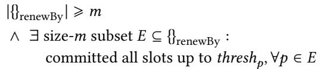

If the check fails, the operation falls back to classic consensus as if it is a write, which does not require this check.

## 3.3.2 Revocation & Expiration

Most roster lease activations happen when there are ongoing old leases in the system. Broadly speaking, a roster change may be triggered by one of the following reasons.

• Node initiates a new roster in reaction to suspected failures, removing failed nodes from special responder roles.

• Node autonomously proposes a new, more optimized roster according to collected workload statistics.

• Node receives an explicit roster change request from user. In either case, before initiate\_leases(), a node S always invokes the revoke\_leases(<sup>bal</sup>) procedure synchronously to ensure that all the leases it is granting or holding with the older ballot <sup>bal</sup> are safely revoked and removed. To do so, S clears its {}<sub>guardTo</sub> set and broadcasts Revoke messages carrying the old ballot. Whenever a node P receives a Revoke with matching ballot from S, it removes S from the {}<sub>guardBy</sub> and {}<sub>renewBy</sub> sets and replies with RevokeReply.

S either receives a RevokeReply from P promptly (common fast case) or has to wait for expiration timeout (failure case), after which it removes P from {}<sub>renewTo</sub>. Note that, unless failures occur and force a wait on expiration, a roster change completes swiftly within two message rounds: one for the revocation and the other for the initiation guards.

## 3.3.3 Piggybacking on Heartbeats

Distributed systems already deploy heartbeats for tasks such as health tracking [35, 52, 80, 94]. This opens the opportunity to enable roster leases without common-case overheads, by piggybacking lease messages onto existing periodic heartbeats. Bodega piggybacks all the Renew and RenewReply messages onto heartbeats, and uses a proper heartbeat interval <sup>??</sup><sub>hb\_send</sub> such that leases are refreshed in time. Heartbeat messages also carry the sender’s ⟨<sup>bal</sup>, <sup>ros</sup>⟩ pair to let receivers discover roster changes.

Each node has per-peer timers <sup>??</sup><sub>heartbeat,</sub> ?? which are used for promptly detecting failures from peers; a peer is considered down if no heartbeats were received from it for <sup>??</sup><sub>hb\_fail</sub>. A rule of thumb for choosing good timeout lengths for a cluster is:

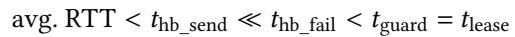

(2)

Bodega uses the following defaults for wide-area replication: <sup>??</sup><sub>hb\_send</sub> = 120ms, <sup>??</sup><sub>hb\_fail</sub> ≈ 1200ms, <sup>??</sup><sub>guard</sub> = <sup>??</sup><sub>lease</sub> = 2500ms.

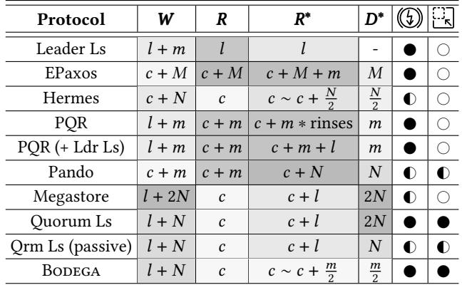  
Table 1. Qualitative comparison across protocols <sup>as-</sup> suming the most read-optimized config of each protocol. ?? : write latency; ??: read latency if quiescent; ??∗ : read latency if there is an interfering write; ??∗: read performance degradation period length. : fault tolerance (without external oracle). : allows tunable rosters. ??: client-leader RTT, ??: client-nearest server RTT, ??: time to establish simple majority, ??: time to establish super majority, ?? : time to form all-nodes quorum. Cell is shaded darker if value is higher.

## 4 Formal Presentation and Proof

We provide a qualitative comparison across notable protocols (Figure 6, Table 1), a formal presentation of the Bodega algorithm (Figure 7), and a concise proof of correctness.

## 4.1 Comparison Across Protocols

In Table 1, we model the normal-case write and read latency, degraded read latency under write interference, and degradation period length of related protocols. Cells are shaded according to example values from the Figure 8(b) GEO setting (lighter is better). We also indicate whether a protocol retains the fault tolerance of classic protocols and whether it allows tunable configs. If tunable, we use its most readoptimized config that tolerates <sup>??</sup> = ⌊ ⌋ faults. Assume only one interfering write.

The following symbols are used to model performance. <sup>??</sup>: RTT between client and the leader, <sup>??</sup>: RTT between client and its nearest server, <sup>??</sup>: time to establish a simple majority quorum (i.e., to reach majority nodes from some server and receive replies), <sup>??</sup>: time to establish a super majority quorum (as in EPaxos [80]), <sup>??</sup> : time to form a quorum composed of all nodes. For an average client in typical WAN-scale settings, one should expect <sup>??</sup> ≪ <sup>??</sup> ≈ <sup>?? < ?? < ??</sup> .

Most results are derived naturally from Figure 6, §2.3, and §3.1-3.3. We provide supplementary explanations. PQR (+ Ldr Ls) is a straightforward variant of PQR combined with Leader Leases; if a near quorum read attempt fails, the client contacts the stable leader directly, bounding slow-path latency by <sup>??</sup> + <sup>??</sup> + <sup>??</sup>. We assume Quorum Leases always incorporate Leader Leases. Qrm Ls (passive) is a variant of Quorum Leases where we deliberately let grantees keep the leases upon accept to show the upper bound of Quorum Leases performance, saving one re-granting RTT from the degradation time. Doing so risks blocking fault-induced roster change commands as described in §3.3. Hermes uses primary-backup broadcast and thus requires external coordination for fault tolerance; Megastore is similar. Pando uses a pre-deployment planner to dictate erasure coding and quorum composition. Bodega achieves the best across all metrics and retains fault tolerance and configurability.

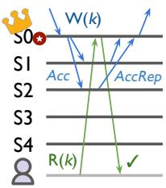  
(a) Leader Leases

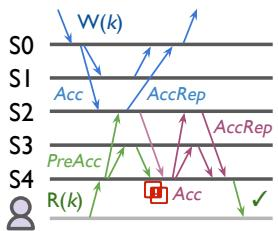  
(b) EPaxos

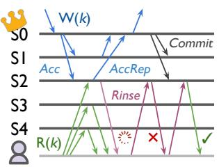  
(c) PQR

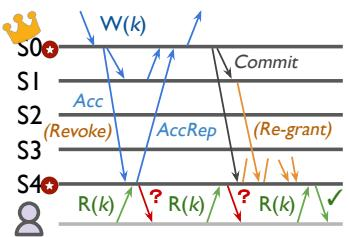  
(d) Quorum Leases

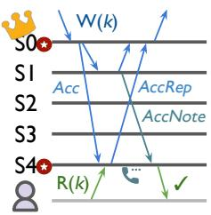  
(e) Bodega  
Figure 6. Timeline comparison across protocols of linearizable reads <sup>in</sup> <sup>the</sup> <sup>presence</sup> <sup>of</sup> <sup>an</sup> <sup>interfering</sup> <sup>write.</sup> W(k)<sup>:</sup> <sup>write</sup> key ??, <sub>R(k)</sub>: read key ??, <sub>Acc</sub>: Accept, <sub>AccRep</sub>: AcceptReply, <sub>PreAcc</sub>: EPaxos PreAccept, : EPaxos dependencies conflict, <sub>Rinse</sub> : PQR repeated poll. <sub>Commit</sub>: commit notification, <sub>AccNote</sub>: accept notification (optional), : Bodega optimistic holding.

## 4.2 Formal Presentation

Figure 7 presents a complete, code-oblivious summary of the Bodega algorithm, which can be used as a reference for implementors. We also provide a formal, model-checked TLA<sup>+</sup> specification in Appendix A.

## 4.3 Proof

We provide a proof of Bodega’s local read linearizability and write liveness, assuming well-established results of the safety and liveness of leases [41]. For linearizability, only locally-served reads need proof, as Bodega behaves the same as classic consensus otherwise.

Linearizability. A local read <sup>??</sup> served by server S observes any write <sup>??</sup> acknowledged cluster-wise before <sup>??</sup> was issued. <sup>Proof.</sup> <sup>??</sup> is served locally only if S is a responder that passes the stable roster check (1). Let the stable roster be ⟨<sup>bal</sup>, <sup>ros</sup>⟩. Case #1: <sup>??</sup> was committed on a ballot <sup>></sup> <sup>bal</sup>. It is impossible because the latest ballot on at least a majority is <sup>bal</sup>.

Case #2: <sup>??</sup> was committed on a ballot = <sup>bal</sup>. By the injective ballot-roster mapping and the commit condition of writes, S must be in <sup>??</sup> ’s write quorum and have <sup>??</sup> in its log.

Case #3: <sup>??</sup> was committed on a ballot <sup><</sup> <sup>bal</sup>. By majority intersection, for any size-<sup>??</sup> subset <sup>??</sup> ∈ S’s {}<sub>renewBy</sub>, at least one of the lease grantors P ∈ <sup>??</sup> accepted <sup>??</sup> at its committed slot <sup>??</sup> before granting to S. This implies <sup>thresh</sup>?? <sup>⩾</sup> <sup>??</sup>. □

Liveness of Writes. A write <sup>??</sup> can always eventually make progress if retried on a majority group <sup>??</sup> of healthy servers. <sup>Proof.</sup> By the property of leases, after old leases expire, a roster change can eventually be made on all servers ∈ <sup>??</sup> to restrict the leader and all the responders to be contained in <sup>??</sup>. Then, normal consensus applies. □

## 5 Implementation

The Summerset KV-store. We develop Summerset, a distributed, replicated, protocol-generic key-value store. Summerset is written in async Rust/tokio using a lock-less architecture and serves as a fair codebase for evaluating consensus and replication protocols.

The codebase has 13.6k lines of infrastructure code and covers five protocols of interest: MultiPaxos w/ Leader Leases (2.5k), EPaxos (3.1k), PQR & variant (2.8k), Quorum Leases & variant (3.2k), and Bodega (3.0k). All protocol implementations have passed extensive tests. The full Summerset codebase is open-sourced at https://github.com/josehu07/summ erset/tree/bodega-artifact.

## 5.1 Smart Roster Coverage

In cases where users desire local reads but cannot observe workload patterns externally, Bodega servers can collect statistics and automatically propose roster changes to mark servers as responders for proper keys. Our default implementation traces per-key read/write request counts grouped by clients’ preferred nearby server IDs. For a key, if <sup>></sup> 95% requests are reads at a periodic check, then servers near <sup>></sup> 20% of the reads are added as responders. More sophisticated strategies exist; for example, straggler detection can help remove fail-slow nodes from responders promptly [51, 54].

## 5.2 Lightweight Heartbeats

In §3.3, we described roster leases as if all heartbeats carry the complete roster data structure. In practice, rosters with fine-grained key ranges can get large (tens of KBs). Luckily, most heartbeats in Bodega are <sup>lightweight</sup> <sup>heartbeats</sup>: the sender puts in only the ballot number to indicate that the roster has not changed from previous heartbeats. Full-sized heartbeats are sent when changes occur.

Similarly, clients may request a server to send the roster along with a command reply, and then cache this roster as a heuristic for choosing the best responder for local reads.

## 5.3 Other Practical Details

Request Batching. As is common practice, Bodega deploys request batching at servers (at 1 ms intervals) for non-localread commands. Each log slot contains a batch of requests and the commit condition is checked for all writes contained. Snapshots. Bodega servers take periodic snapshots of the executed prefix of the log [87]. Local reads past the beginning of truncated log look up the latest snapshot directly.

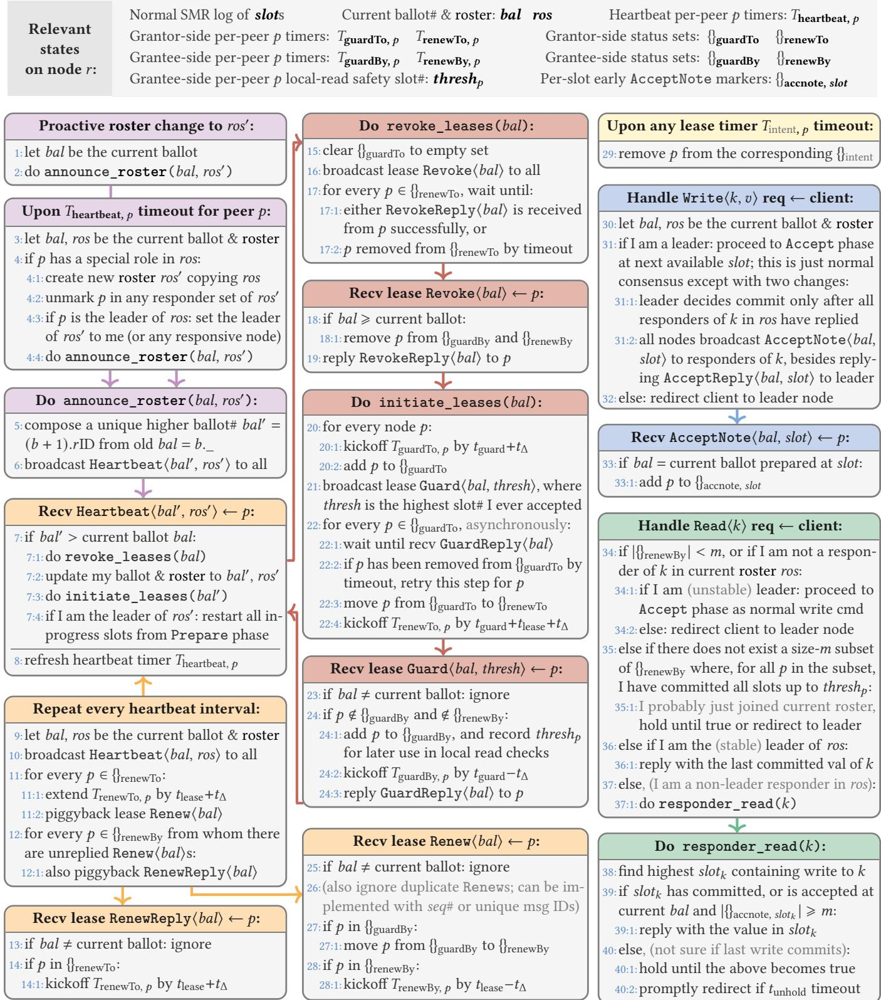  
<sub>Figure</sub> <sub>7.</sub> <sub>Complete</sub> <sub>Summary</sub> <sub>of</sub> <sub>the Bodega algorithm.</sub> Lists all actions a node ?? would take upon certain conditions, grouped by purposes for clarity: triggers for a new roster, granting procedure of new roster leases, heartbeats and lease renewals, handling client write requests, handling client read requests. The description is based on a regular key-value API. Nodes implicitly retransmit non-acked messages. Broadcast msg receivers include the sender itself. Clock drift between nodes is assumed to be bounded by ?? , as is required by any distributed lease algorithm; clock skews are irrelevant thanks to Guards. The arrows annotate a natural reading order that follows the usual flow of the protocol.

Membership Management. Membership changes are handled identically to <sup>reconfigurations</sup> in other protocols [25, 80, 85], just with an extra step of proposing and stabilizing an empty roster with no responders ahead of the change.

## 6 Evaluation

We do comprehensive evaluations to answer these questions:

• How does Bodega perform compared to other protocols under microbenchmarks of various write intensities? (§6.1)

• What do the request latency distributions look like? (§6.2)

• What are the impacts of write interference, and how does performance change with write ratios & value sizes? (§6.2)

• How do roster changes impact performance? (§6.3)

• How does Bodega behave with diferent choices of responders and diferent coverages of keys? (§6.3)

• How does Bodega compare with production coordination services, etcd & ZooKeeper, under YCSB workloads? (§6.4)

Experimental Setup. All experiments are run on two Cloud-Lab [33] clusters, hereafter called WAN and GEO, shown in Figure 8. WAN is a wide-area cluster spanning five Cloud-Lab sites with nodes of similar hardware types: WI-c220g5, UT-xl170, SC-c6320, MA-rs620, and APT-r320. §6.1 also includes a GEO cluster of five c220g5 nodes emulated with Google Cloud RTTs reported in previous work [104] using Linux kernel netem [71]. All nodes’ public NICs have 1Gbps bandwidth. The orange-colored site in Figure 8 denotes the leader and the red-colored sites denote responders.

Clients are launched on machines evenly distributed across all datacenters, each marking the nearby server as their preferred server for local reads when eligible. All machines run Linux kernel v6.1.64 and pin processes to disjoint cores. All protocols use 120 ms heartbeat interval, 1200±300 ms randomized heartbeat timeout, and 2500±100 ms lease expiration (if applicable). All protocols send immediate Commit notifications: whenever a commit decision is made, Commits are broadcast to other servers promptly.

## 6.1 Normal Case Performance

We run microbenchmarks on both cluster settings and compare: ordinary MultiPaxos, Leader Leases, EPaxos, PQR, PQR (+ Leader Leases) variant, Quorum Leases, Quorum Leases (passive) variant, and Bodega. We spawn 50 closed-loop clients with 10 near each server and let all clients run a microbenchmark with 1k 8B-size keys and 128B values; keys are chosen uniformly. We test three write percentages in the workload mix: 0%, 1%, and 10%. Figure 9 shows the normalized throughput (w.r.t. Leader Leases), avg. read latency, and avg. write latency perceived by clients at diferent locations. Leader and responders are set as depicted in Figure 8. The red dashed lines indicate baseline Leader Leases throughput, and the top Ts on latency bars indicate P99 latency.

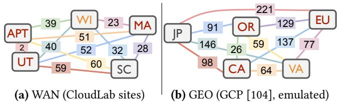  
Figure 8. Evaluation settings. <sup>Orange</sup> <sup>denotes</sup> <sup>designated</sup> leader node and Red denotes other responders, if relevant. The edges mark per-pair RTT values in milliseconds. See §6.

The results yield the following observations. First, except for a few datapoints (which we soon discuss), both GEO and WAN clusters exhibit similar performance patterns, just with diferent absolute values due to RTT diferences.

Second, for writes, all protocols except EPaxos exhibit similar performance. Quorum Leases and Bodega have higher write latency due to the requirement of writes reaching responders; this explains the small throughput gap between them and Leader Leases for near-leader clients with 10% writes. EPaxos delivers better average (but not P99) write latency due to its leaderless write protocol design.

Third, we observe coherent patterns for read performance. 1 Compared to ordinary MultiPaxos, Leader Leases cut read latency for near-leader clients to nearly zero, but other clients still pay an RTT to the leader for reads. 2 PQR (and its Leader Leases variant) show worse (or identical) performance compared to Leader Leases. The only exception is in the GEO, 0% writes setting for the JP clients; they are so far away from the leader that a nearer majority quorum actually helps, letting them outperform local read protocols (since JP is not marked as a responder). 3 EPaxos has similar read performance as PQR but with higher P99 latency when there are writes. 4 Both Quorum Leases variants and Bodega show the same performance as Leader Leases for clients near the leader or a non-responder. 5 Quorum Leases and Bodega both deliver extraordinary read performance for clients near responders when with 0% writes. 6 Bodega sustains this read performance advantage and keeps read latency close to zero for higher write intensities. In contrast, Quorum Leases performance quickly drops and almost degrades back to Leader Leases for 10% writes. This shows Bodega’s resilience to write interference, a crucial advantage.

Throughput to Read Latency Curves. We take the 10% writes WAN setting of Figure 9(d) and run open-loop clients with varying request concurrency up to 100 reqs/sec to profile the throughput-latency curves, which we plot in Figure 10. The x-axis is aggregated throughput and the y-axis is average latency of all requests. The never-local-read protocols (MultiPaxos, PQR, EPaxos) form a cluster at the upper left as expected, due to unavoidable network trafic per read. Leader Leases reveal a throughput upper bound at \~1.8k where the leader node starts to overload; this bound is slightly higher for PQR + Leader Leases at \~2.2k. Quorum Leases see similar latency under low load and a higher throughput bound at \~3.4k, matching Figure 9. Bodega sustains 1.5x better latency because of most reads being served locally without fallbacks; throughput limit is accordingly higher at \~6k.

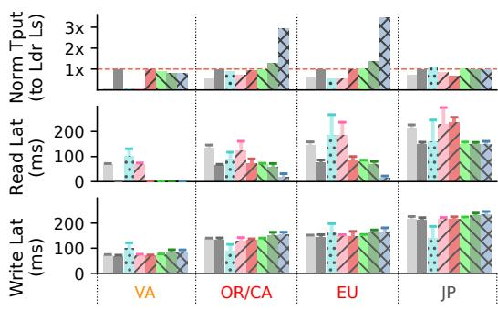  
(a) GEO, 10% writes

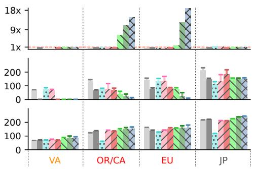

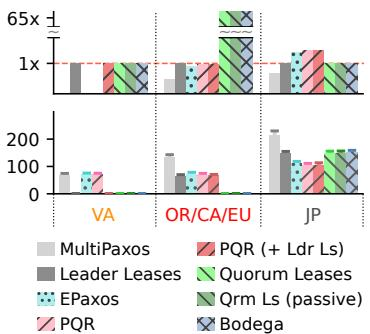  
(b) GEO, 1% writes  
(c) GEO, 0% writes

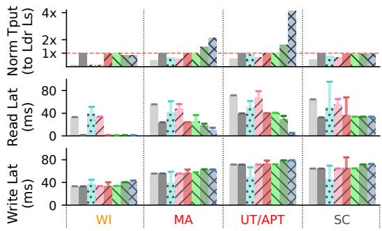  
(d) WAN, 10% writes

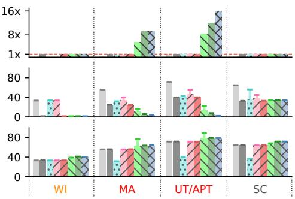  
(e) WAN, 1% writes

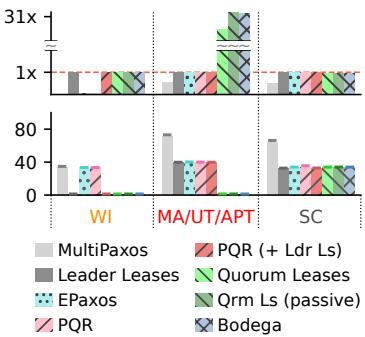  
(f) WAN, 0% writes

Figure 9. Normalized throughput and latency at diferent client locations <sup>across</sup> <sup>diferent</sup> <sup>write</sup> <sup>intensities.</sup> <sup>See</sup> <sup>§6.1.</sup>  
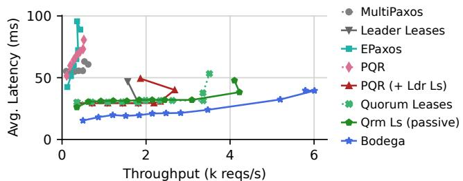  
Figure 10. Tput to avg. latency curves <sup>on</sup> <sup>WAN.</sup> <sup>See</sup> <sup>§6.1.</sup>

## 6.2 Detailed Performance Anatomy

We conduct a zoomed-in study across various workloads and metric dimensions.

Latency CDFs. We collect request latency CDFs across all 50 clients of the WAN setting (Fig.9(d)-9(f)) and plot them in Figure 11. Results are filtered to show a single key for a clean pattern. Each site contributes an equal 20% of datapoints.

We make four observations. 1 Write latencies across all workloads are similar and are presented as one Figure 11(d). Quorum Leases and Bodega show slightly higher write latencies in favor of responder local reads, while EPaxos delivers the same level of latencies as its reads due to its leaderless design. These results align with §6.1. 2 At 0% writes, all protocols deliver a read performance close to their theoretical best, though a few outlier datapoints remain. 3 At 1% writes, slight write interference occurs. Quorum Leases reads deviate from Bodega, with the passive variant delivering roughly half the latency of the original variant. 4 At 10% writes, diferences in read latency distributions are the most obvious. MultiPaxos clients’ read latency clearly correlates with their distance to the leader; Leader Leases are similar but with a majority-quorum latency subtracted. PQR and EPaxos exhibit suboptimal latency and have high tail latency of up to 100 ms for a read; this is due to the need for conflict resolution. Quorum Leases variants both degrade to Leader Leases. Bodega delivers outstanding local read performance as expected (except for the 20% non-local SC clients).

Visualizing Write Interference. We use a similar setting to the read-only workload in §6.1 on the WAN cluster, but this time with open-loop clients, each sending reads at a rate of 400 reqs/sec to a key. At \~15 secs, we let one client issue a write command to the key. We monitor the average read latency across the three non-leader responders for the local read protocol variants, and plot them over a time axis in Figure 12. We see that the write introduces an interruption to local reads for all three protocols. Both Quorum Leases variants degrade to 40 ms read latency, which is the average RTT to the stable leader; the passive variant shows a shorter degradation duration. Bodega 1 shortens the degradation time to \~25 ms; recall Table 1, this corresponds to \~<sup>??</sup><sub>2</sub> , and 2 allows all reads to be held locally and be released at the end of the degradation, leading to better latencies also for disrupted reads.

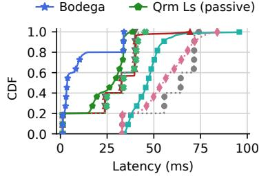  
(a) Reads w/ 10% writes

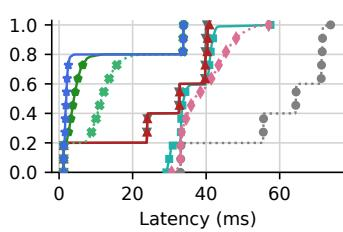  
(b) Reads w/ 1% writes

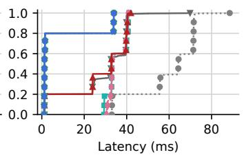  
(c) Reads w/ 0% writes

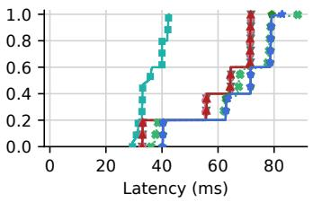  
(d) Writes

<sub>Figure</sub> <sub>11.</sub> <sub>Latency</sub> <sub>CDFs</sub> <sub>of</sub> <sub>requests</sub> in the WAN setting across diferent write intensities, focusing on one specific key. See §6.2.  
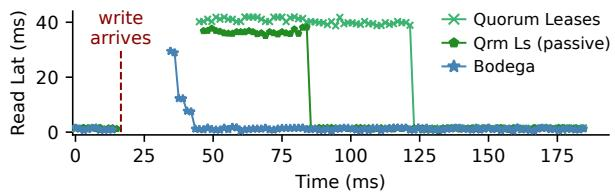  
Figure 12. Read latency after an interfering write. The x-axis is time at which the reads finish. See §6.2.

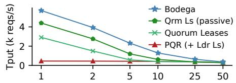

Varying Write Ratios. We take the same setup as §6.1 on the WAN cluster and vary the write ratios of the workload mix from 1% to 50% while fixing value size to 128B. We report the aggregate throughput in Figure 13. All protocols except the PQR (+ Ldr Ls) baseline show a trend of lower throughput with higher write interference as local reads become less profitable. The results match Figure 9(d)-9(e).

Varying Value Sizes. We repeat the same setup as above and vary the value size while fixing the write ratio at 5%. As expected, Figure 14 shows that smaller values have little impact on performance, but throughput drops with larger values due to slower writes and larger read results to transfer.

## 6.3 Roster Changes & Composition

We evaluate roster change performance and roster coverage. Impact of Frequent Failures (Simulation). We first justify roster leases’ stability under frequent failures through an exaggerated simulation. We run a 10ms-timeslice-based Monte Carlo simulation with 10% writes using performance numbers measured in Figure 9(d). We apply a failure probability of 0.5% every second–much larger than real-world servers [3]– and a recovery probability of 1% every second. After any failure, the cluster delivers 3 seconds of zero throughput to simulate lease expiration; after any recovery of a responder, the cluster delivers 100ms of zero throughput to simulate a proactive roster change. Figure 15 shows aggregated throughput of 1 million simulated seconds. We can see that, despite these exaggerated conditions, Bodega still delivers up to 2.2x throughput compared to traditional Leader Leases.

Roster Change Duration. On the WAN cluster, we zoom in and compare the duration of two types of roster changes: failure-induced (where waiting for lease expiration is necessary) vs. regular (where revocations complete quickly). Regular roster changes finish in just two message rounds,

Write ratio% (log scale)

Figure 13. Throughput vs. write ratio. The x-axis is log-scale (same for Fig. 14).  
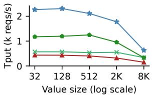  
Figure 14. Throughput vs. value size. <sup>See</sup> <sup>§6.2.</sup>

because they are no more than a lease revocation followed by an initiation. We create an open-loop client near WI and let it issue a 50%-read workload at a rate of 400 reqs/sec to 1k keys. We plot real-time latencies in Figure 16.

At \~800 ms, we crash the UT node, which is one of the responders for the full key range. Writes are immediately blocked since UT as a responder is unreachable. Reads are still served locally without interruption until \~1.1 secs later, when some healthy server in the cluster raises a heartbeat timeout and initiates a change to a new roster where UT is removed from all responder roles. After waiting 2.6 secs for expiration, normal operations continue.

At \~7.2 secs, we make an explicit roster change request to a server. In contrast to the failure case, this roster change completes in just \~75 ms, which is \~2x cluster-wise RTTs as expected. Impacts on client requests are minor.

Choice of Responders. We run a 10%-write workload on all clients in the WAN setting, while using an increasing set of responders for all keys; WI node is still the leader. We report the cluster-wide average read/write latency and their standard deviation in Figure 17. With more nodes added as responders, read latency tends to zero while write latency increases, revealing the expected tradeof. This demonstrates the importance of allowing adjustable rosters to help avoid unnecessary taxes on writes.

Coverage of Keys. We repeat the same experiment, but vary the percentage of local-read-enabled keys while fixing the choice of responders to Figure 8(a). The cluster-wide average latencies and their standard deviation across the coverage spectrum are plotted in Figure 18. Results show an expected decrease in read latency and a corresponding increase in write latency as local reads are enabled on more keys. This implies the general strategy of enabling local reads for readheavy keys while avoiding local reads for write-heavy keys.

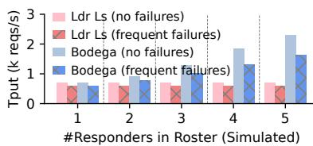  
Figure 15. Exaggerated impact <sub>of</sub> <sub>failures</sub> (simulation). See §6.3.

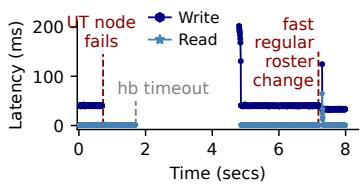  
Figure 16. On-failure vs. regular roster changes.

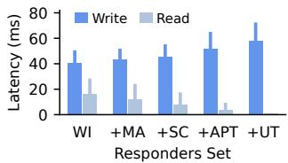  
Figure 17. Latency vs. coverage of responders.

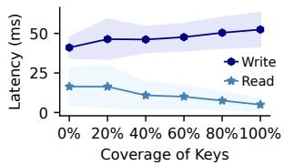  
Figure 18. Latency vs. keys covered by roster.

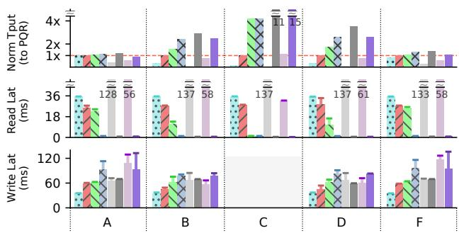  
(a) Uniform, full-coverage roster

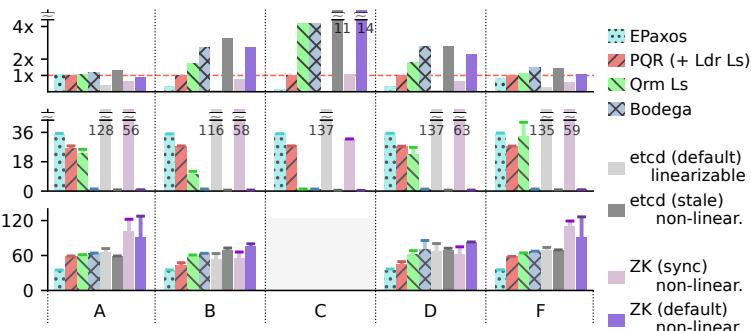  
(b) Zipfian, top-20%-coverage roster  
<sub>Figure</sub> <sub>19.</sub> <sub>YCSB</sub> <sub>workloads</sub> <sub>on</sub> <sub>Summerset,</sub> <sub>etcd,</sub> <sub>&</sub> <sub>ZooKeeper.</sub> etcd (stale) & ZK (both modes) are not linearizable. See §6.4.

## 6.4 Macrobenchmark vs. etcd & ZooKeeper

To evaluate the protocols in a more realistic setup, we compare Summerset protocols with two widely-used coordination services, etcd [35] and ZooKeeper [52], on the WAN cluster. We drive all systems with YCSB [29], the standard KV macrobenchmark. Workloads have the following approximate write ratios (we treat insertions as updates). A: 50% w, B: 5% w, C: 0% w, D: 5% w, F: 25% w.

YCSB Request Distributions. We use 10k keys and construct two scenarios corresponding to two request distribu tions. 1 For the Uniform distribution, clients at all locations choose keys uniformly randomly across the key space. Since there are no site-specific preferences for keys, all sites are added as responders for all keys to secure local reads. 2 For Zipfian, clients at each location choose keys according to a Zipfian-0.99 distribution, skewed towards diferent sets of keys at diferent sites; this creates per-site preferences for keys. We then add each site as a responder only for its top-20% accessed keys to derive an asymmetric roster that imposes unnoticeable impacts on write performance.

etcd Modes. We deploy etcd in two modes, both with 120 ms heartbeat intervals. The default mode showcases a standard implementation of vanilla Raft [87]. The <sup>stale</sup> mode turns on the serializable member-local read option for all read requests, delivering sequential consistency by always serving reads locally with past committed values at any server; this represents the ideal upper bound for Bodega.

ZooKeeper Modes. Similarly, we deploy ZooKeeper in two modes, though both are non-linearizable. The default mode is a standard implementation of the ZAB primary-backup protocol [52] that pushes writes to all servers and serves reads locally from anywhere. The <sup>sync</sup> mode is the closest mode to linearizable reads that ZooKeeper clients can get: every read request is preceded by a sync API call to force flush all the in-progress writes from the leader to its endpoint server, but all writes that may have completed after the start of the flush are not guaranteed to be seen by the read.

Results. We present the performance results in Figure 19, grouped by workload type and with PQR (+ Ldr Ls) as the normalized throughput baseline. We make the following observations. 1 Bodega matches (and sometimes surpasses) the performance of sequentially-consistent default ZooKeeper, and is able to keep up with stale etcd across all workloads. This illustrates Bodega’s powerful local linearizable read capabilities. The advantage over ZK is due to avoiding Java runtime overheads. 2 In workload C, both non-linearizable services deliver \~0.3 ms read latency and over 10x throughput gain, while Bodega and Quorum Leases deliver \~1.2 ms latency due to the 1 ms request batching applied. 3 EPaxos, PQR (+ Ldr Ls), Quorum Leases, and Bodega all show similar patterns coherent to §6.1. With no writes (C), both local read protocols deliver excellent performance. With higher write ratios, Bodega sustains this advantage better than Quorum Leases. 4 Default etcd and sync ZK have high read latencies of <sup>></sup>50 ms because they are classic consensus without leases. 5 Comparing the Uniform scenario with Zipfian, the only notable diference is that Bodega exhibits higher write latencies close to ZK in Uniform. This is expected because Bodega writes need to reach all nodes as they are all responders.

## 7 Discussion

We discuss topics that are out of the scope of this paper but are interesting directions for future work. We also clarify non-goals of Bodega.

Partial Network Partitioning. Using heartbeat timeoutbased failure detection for leader step-up is known to risk liveness under partial network partitioning [86], and the same holds true for roster lease activations. Common techniques such as pre-votes [86] and transparent re-routing [2] can be deployed to easily eliminate this issue.

Generalization of Roster Leases. We observe that the activation procedure of roster leases shares similarities with <sup>broadcast-based</sup> (randomized) consensus [16, 83, 89]. It is a practical application of all-to-all broadcast in a non-adversarial setting for one-of agreements on the roster ballot. Combined with leases, this technique can be used to establish fault-tolerant agreement on any general “roster metadata” that change infrequently, not limited to leadership and assignment of responders as in Bodega. Possible extensions may include cluster membership, asymmetric quorum sizes, and node-specific performance and reliability hints.

Bounded Staleness Support. With simple modifications, Bodega can extend beyond linearizability and support fast local reads that can tolerate (but require) bounded staleness measured in the maximum version diference with the latest committed write. When a non-leader responder receives a read that allows up to <sup>??</sup> versions stale, it can traverse the tail of its log in reverse and search for at most <sup>??</sup> occurrences of the key, returning the latest committed version if found.

Non-Goals of Bodega. Bodega is primarily designed for wide-area linearizable read workloads; its improvements become less pronounced in other consensus use cases outside of this regime. These include: 1 intra-datacenter replication where locality isn’t significant, 2 write-dominant workloads (see Figure 13 showing diminishing throughput improvement at 50% writes), and 3 weaker consistency models where arbitrarily stale reads or inconsistent reads are tolerable. They may still leverage Bodega’s roster leases as a mechanism to share cluster-wise information at negligible overhead (see the paragraph on generalization above), but would not observe the most immediate gains from localized linearizable reads.

## 8 Related Work

We list additional notable related work in this section.

Consensus & Read Optimizations. §2.3 and §4.1 have covered in detail the most essential related work, including classic consensus algorithms [60, 61, 65, 85–87], leaderless or multi-leader approaches [1, 27, 34, 56, 62, 63, 76, 80, 98, 104, 106], and read leases [10, 25, 41, 81, 82, 105].

Flexible quorum sizes have been discussed in classic literature [46] as well as in recent proposals such as Flexible Paxos [42, 48, 84, 111], where quorum shapes other than majority are explored to establish asymmetric performance between commands; Bodega is a modern manifestation of fault-tolerant, asymmetric read/write quorums leveraging leases. Optimistic holding shares similarity to wait-vs.-abort in database concurrency control [44, 58] and spin-then-park mutex locks [55]; we wait when waiting is expected to be faster.

Shared Logs & Lazy Ordering for Writes. Shared logs are a common abstraction found in cloud systems and are usually backed by primary-backup-style protocols [11–14, 20, 31, 73]. CAD [38], Skyros [39], and LazyLog [74] are a series of work on a <sup>lazy</sup> <sup>ordering</sup> optimization for writes and shared log appends. It hides a significant portion of write latency but could hurt read performance in contended cases.

Synchronized Clocks. Recent works demonstrate productionready implementations of synchronized clocks [30, 70] and designs that take advantage of them through timestamp heuristics [32, 40]. Chandra et al. presented a formal, optimal lease algorithm that assumes synchronized clocks [18, 26].

Weaker Consistency Models. While this paper focuses on linearizable solutions, services may choose to provide weaker consistency models, which are less intuitive to reason about and harder to program against, but usually ofer better performance. Common choices include sequential consistency that allows time-traveling reads [6, 45, 59], causal consistency that focuses on client session-local properties [9, 72, 78], and eventual consistency with bounded staleness [92, 109]. There are also studies that explore supporting a mixture of consistency models in one system [75, 113].

## 9 Conclusion

We present Bodega, a wide-area consensus protocol that enables localized linearizable reads at anywhere, anytime. Bodega achieves this via all-to-all roster leases of the critical path to establish responder assignment without compromising fault tolerance, delivering extreme read performance comparable to sequentially-consistent production systems. We believe Bodega is a valuable step towards performanceoptimal wide-area replication for critical workloads of the modern cloud.

## References

[1] Ailidani Ailijiang, Aleksey Charapko, Murat Demirbas, and Tevfik Kosar. 2020. WPaxos: Wide Area Network Flexible Consensus. <sup>IEEE</sup> <sup>Trans.</sup> <sup>Parallel</sup> <sup>Distrib.</sup> <sup>Syst.</sup> 31, 1 (Jan. 2020), 211–223. doi:10.1109/TP DS.2019.2929793

[2] Mohammed Alfatafta, Basil Alkhatib, Ahmed Alquraan, and Samer Al-Kiswany. 2020. Toward a Generic Fault Tolerance Technique for <sub>Partial</sub> <sub>Network</sub> <sub>Partitioning.</sub> <sub>In</sub> 14th USENIX Symposium on Operating Systems Design and Implementation (OSDI 20)<sub>.</sub> <sub>USENIX</sub> <sub>Association,</sub> 351–368. https://www.usenix.org/conference/osdi20/presentation/ alfatafta

[3] Amazon Web Services, Inc. 2021. <sup>Availability</sup> <sup>and</sup> <sup>Beyond:</sup> <sup>Un-</sup> derstanding and Improving the Resilience of Distributed Systems on <sup>AWS</sup>. Whitepaper AWS Whitepaper. Amazon Web Services, Inc. https://docs.aws.amazon.com/pdfs/whitepapers/latest/availabilityand- beyond-improving- resilience/availability-and- beyondimproving-resilience.pdf Accessed: 2025-12-10.

[4] Artem on StackOverflow. 2017. Is ZooKeeper always consistent in terms of CAP theorem? https://stackoverflow.com/questions/353877 74. Accessed: 2024-12-01.

[5] Balaji Arun, Sebastiano Peluso, Roberto Palmieri, Giuliano Losa, and Binoy Ravindran. 2017. Speeding up Consensus by Chasing Fast <sub>Decisions.</sub> <sub>In</sub> 47th IEEE/IFIP International Conference on Dependable <sup>Systems</sup> <sup>and</sup> <sup>Networks</sup> <sup>(DSN)</sup>. IEEE, 49–60. doi:10.1109/DSN.2017.35

[6] Hagit Attiya and Jennifer L. Welch. 1994. Sequential Consistency versus Linearizability. <sup>ACM</sup> <sup>Trans.</sup> <sup>Comput.</sup> <sup>Syst.</sup> 12, 2 (may 1994), 91–122. doi:10.1145/176575.176576

[7] AWS. 2024. AWS Global Infrastructure. https://aws.amazon.com/a bout-aws/global-infrastructure/, Last accessed on 2024-04-28.

[8] AWS. 2024. Workload Characteristics. https://docs.aws.amazon.com/ prescriptive-guidance/latest/oracle-exadata-blueprint/workloadcharacteristics.html. Accessed: 2024-12-01.

[9] Peter Bailis, Ali Ghodsi, Joseph M. Hellerstein, and Ion Stoica. 2013. <sub>Bolt-on</sub> <sub>causal</sub> <sub>consistency.</sub> <sub>In</sub> Proceedings of the 2013 ACM SIGMOD International Conference on Management of Data <sub>(New</sub> <sub>York,</sub> <sub>New</sub> York, USA) <sup>(SIGMOD</sup> <sup>’13)</sup>. Association for Computing Machinery, New York, NY, USA, 761–772. doi:10.1145/2463676.2465279

[10] Jason Baker, Chris Bond, James C. Corbett, JJ Furman, Andrey Khorlin, James Larson, Jean-Michel Leon, Yawei Li, Alexander Lloyd, and Vadim Yushprakh. 2011. Megastore: Providing Scalable, Highly Avail able Storage for Interactive Services. In <sup>Proceedings</sup> <sup>of</sup> <sup>the</sup> <sup>Confer-</sup> ence on Innovative Data system Research (CIDR)<sub>.</sub> <sub>223–234. http:</sub> //www.cidrdb.org/cidr2011/Papers/CIDR11\_Paper32.pdf

[11] Mahesh Balakrishnan, Jason Flinn, Chen Shen, Mihir Dharamshi, Ahmed Jafri, Xiao Shi, Santosh Ghosh, Hazem Hassan, Aaryaman Sagar, Rhed Shi, Jingming Liu, Filip Gruszczynski, Xianan Zhang, Huy Hoang, Ahmed Yossef, Francois Richard, and Yee Jiun Song. 2020. <sub>Virtual</sub> <sub>Consensus</sub> <sub>in</sub> <sub>Delos.</sub> <sub>In</sub> 14th USENIX Symposium on Operating Systems Design and Implementation (OSDI 20)<sub>.</sub> <sub>USENIX</sub> <sub>Association,</sub> 617–632. https://www.usenix.org/conference/osdi20/presentation/ balakrishnan

[12] Mahesh Balakrishnan, Dahlia Malkhi, John D. Davis, Vijayan Prabhakaran, Michael Wei, and Ted Wobber. 2013. CORFU: A distributed shared log. <sup>ACM</sup> <sup>Trans.</sup> <sup>Comput.</sup> <sup>Syst.</sup> 31, 4, Article 10 (Dec. 2013), 24 pages. doi:10.1145/2535930

[13] Mahesh Balakrishnan, Dahlia Malkhi, Ted Wobber, Ming Wu, Vijayan Prabhakaran, Michael Wei, John D. Davis, Sriram Rao, Tao Zou, and Aviad Zuck. 2013. Tango: Distributed Data Structures over a <sub>Shared</sub> <sub>Log.</sub> <sub>In</sub> Proceedings of the Twenty-Fourth ACM Symposium on Operating Systems Principles <sub>(Farminton,</sub> <sub>Pennsylvania)</sub> (SOSP ’13)<sub>.</sub> Association for Computing Machinery, New York, NY, USA, 325–340. doi:10.1145/2517349.2522732

[14] Mahesh Balakrishnan, Chen Shen, Ahmed Jafri, Suyog Mapara, David Geraghty, Jason Flinn, Vidhya Venkat, Ivailo Nedelchev, Santosh Ghosh, Mihir Dharamshi, Jingming Liu, Filip Gruszczynski, Jun Li, Rounak Tibrewal, Ali Zaveri, Rajeev Nagar, Ahmed Yossef, Francois Richard, and Yee Jiun Song. 2021. Log-structured Protocols in Delos. <sub>In</sub> Proceedings of the ACM 28th Symposium on Operating Systems Prin-<sup>ciples</sup> (Germany) <sup>(SOSP</sup> <sup>’21)</sup>. Association for Computing Machinery, New York, NY, USA, 538–552. doi:10.1145/3477132.3483544

[15] Jef Barr. 2023. Amazon S3 Update – Strong Read-After-Write Consistency. https://aws.amazon.com/blogs/aws/amazon-s3-updatestrong-read-after-write-consistency/, Last accessed on 2023-11-19.

[16] Michael Ben-Or. 1983. Another advantage of free choice (Extended Abstract): Completely asynchronous agreement protocols. In <sup>Pro-</sup> ceedings of the Second Annual ACM Symposium on Principles of Dis-<sup>tributed</sup> <sup>Computing</sup> (Montreal, Quebec, Canada) <sup>(PODC</sup> <sup>’83)</sup>. Association for Computing Machinery, New York, NY, USA, 27–30. doi:10.1145/800221.806707

[17] Hal Berenson, Phil Bernstein, Jim Gray, Jim Melton, Elizabeth O’Neil, and Patrick O’Neil. 1995. A critique of ANSI SQL isolation levels. <sub>In</sub> Proceedings of the 1995 ACM SIGMOD International Conference on Management of Data <sub>(San</sub> <sub>Jose,</sub> <sub>California,</sub> <sub>USA)</sub> (SIGMOD ’95)<sub>.</sub> Association for Computing Machinery, New York, NY, USA, 1–10.

doi:10.1145/223784.223785

[18] Changyu Bi, Vassos Hadzilacos, and Sam Toueg. 2022. Parameterized algorithm for replicated objects with local reads. arXiv:2204.01228 [cs.DC] https://arxiv.org/abs/2204.01228

[19] Marc Brooker, Tao Chen, and Fan Ping. 2020. Millions of tiny databases. In <sup>NSDI</sup> <sup>2020</sup>. https://www.amazon.science/publica tions/millions-of-tiny-databases

[20] Matthew Burke, Audrey Cheng, and Wyatt Lloyd. 2020. Gryf: Unifying Consensus and Shared Registers. In <sup>17th</sup> <sup>USENIX</sup> <sup>Symposium</sup> on Networked Systems Design and Implementation (NSDI 20)<sub>.</sub> <sub>USENIX</sub> Association, Santa Clara, CA, 591–617. https://www.usenix.org/con ference/nsdi20/presentation/burke

[21] Mike Burrows. 2006. The Chubby Lock Service for Loosely-Coupled <sub>Distributed</sub> <sub>Systems.</sub> <sub>In</sub> Proceedings of the 7th Symposium on Operating Systems Design and Implementation <sub>(Seattle,</sub> <sub>Washington)</sub> (OSDI ’06)<sub>.</sub> USENIX Association, USA, 335–350.

[22] Georgia Butler. 2024. Google Cloud accidentally deleted UniSuper’s Private Cloud Subscription. <sup>Data</sup> <sup>Center</sup> <sup>Dynamics</sup> (2024). https: //www.datacenterdynamics.com/en/news/google-cloud-accidental ly-deleted-unisupers-private-cloud-subscription/

[23] Miguel Castro and Barbara Liskov. 2002. Practical byzantine fault tolerance and proactive recovery. <sup>ACM</sup> <sup>Trans.</sup> <sup>Comput.</sup> <sup>Syst.</sup> 20, 4 (Nov. 2002), 398–461. doi:10.1145/571637.571640

[24] Data Centre. 2024. Alibaba Cloud hit by Digital Realty fire in Singapore. <sup>Frontier</sup> <sup>Enterprise</sup> (2024). https://www.frontier-enterprise.c om/alibaba-cloud-hit-by-digital-realty-fire-in-singapore/

[25] Tushar D. Chandra, Robert Griesemer, and Joshua Redstone. 2007. Paxos Made Live: An Engineering Perspective. In <sup>Proceedings</sup> <sup>of</sup> <sup>the</sup> 26th ACM Symposium on Principles of Distributed Computing <sub>(Port-</sub> land, OR, USA) <sup>(PODC</sup> <sup>’07)</sup>. Association for Computing Machinery, New York, NY, USA, 398–407. doi:10.1145/1281100.1281103

[26] Tushar D. Chandra, Vassos Hadzilacos, and Sam Toueg. 2016. An Algorithm for Replicated Objects with Eficient Reads. In <sup>Proceedings</sup> of the 2016 ACM Symposium on Principles of Distributed Computing (Chicago, Illinois, USA) <sup>(PODC</sup> <sup>’16)</sup>. Association for Computing Machinery, New York, NY, USA, 325–334. doi:10.1145/2933057.2933111

[27] Aleksey Charapko, Ailidani Ailijiang, and Murat Demirbas. 2019. Linearizable Quorum Reads in Paxos. In <sup>11th</sup> <sup>USENIX</sup> <sup>Workshop</sup> <sup>on</sup> <sup>Hot</sup> Topics in Storage and File Systems (HotStorage 19)<sub>.</sub> <sub>USENIX</sub> <sub>Association,</sub> Renton, WA. https://www.usenix.org/conference/hotstorage19/pre sentation/charapko

[28] Google Cloud. 2024. Google Cloud locations. https://cloud.google.c om/about/locations/, Last accessed on 2024-11-30.

[29] Brian F. Cooper, Adam Silberstein, Erwin Tam, Raghu Ramakrishnan, and Russell Sears. 2010. Benchmarking Cloud Serving Systems with <sub>YCSB.</sub> <sub>In</sub> Proceedings of the 1st ACM Symposium on Cloud Computing (Indianapolis, IN, USA) <sup>(SoCC</sup> <sup>’10)</sup>. Association for Computing Machinery, New York, NY, USA, 143–154. doi:10.1145/1807128.1807152

[30] James C. Corbett, Jefrey Dean, Michael Epstein, Andrew Fikes, Christopher Frost, J. J. Furman, Sanjay Ghemawat, Andrey Gubarev, Christopher Heiser, Peter Hochschild, Wilson Hsieh, Sebastian Kanthak, Eugene Kogan, Hongyi Li, Alexander Lloyd, Sergey Melnik, David Mwaura, David Nagle, Sean Quinlan, Rajesh Rao, Lindsay Rolig, Yasushi Saito, Michal Szymaniak, Christopher Taylor, Ruth Wang, and Dale Woodford. 2013. Spanner: Google’s Globally Distributed Database. <sup>ACM</sup> <sup>Trans.</sup> <sup>Comput.</sup> <sup>Syst.</sup> 31, 3, Article 8 (aug 2013), 22 pages. doi:10.1145/2491245

[31] Cong Ding, David Chu, Evan Zhao, Xiang Li, Lorenzo Alvisi, and Robbert Van Renesse. 2020. Scalog: Seamless Reconfiguration and Total Order in a Scalable Shared Log. In <sup>17th</sup> <sup>USENIX</sup> <sup>Symposium</sup> <sup>on</sup> Networked Systems Design and Implementation (NSDI 20)<sub>.</sub> <sub>USENIX</sub> Association, Santa Clara, CA, 325–338. https://www.usenix.org/con ference/nsdi20/presentation/ding

[32] Jiaqing Du, Daniele Sciascia, Sameh Elnikety, Willy Zwaenepoel, and Fernando Pedone. 2014. Clock-RSM: Low-Latency Inter-datacenter State Machine Replication Using Loosely Synchronized Physical <sub>Clocks.</sub> <sub>In</sub> 2014 44th Annual IEEE/IFIP International Conference on <sup>Dependable</sup> <sup>Systems</sup> <sup>and</sup> <sup>Networks</sup>. IEEE, 343–354. doi:10.1109/DSN. 2014.42

[33] Dmitry Duplyakin, Robert Ricci, Aleksander Maricq, Gary Wong, Jonathon Duerig, Eric Eide, Leigh Stoller, Mike Hibler, David John son, Kirk Webb, Aditya Akella, Kuangching Wang, Glenn Ricart, Larry Landweber, Chip Elliott, Michael Zink, Emmanuel Cecchet, Snigdhaswin Kar, and Prabodh Mishra. 2019. The Design and Op-<sub>eration</sub> <sub>of</sub> <sub>CloudLab.</sub> <sub>In</sub> Proceedings of the USENIX Annual Technical <sup>Conference</sup>. 1–14. https://www.flux.utah.edu/paper/duplyakin-atc19

[34] Vitor Enes, Carlos Baquero, Tuanir França Rezende, Alexey Gotsman, Matthieu Perrin, and Pierre Sutra. 2020. State-Machine Replication <sub>for</sub> <sub>Planet-Scale</sub> <sub>Systems.</sub> <sub>In</sub> Proceedings of the Fifteenth European Conference on Computer Systems <sub>(Heraklion,</sub> <sub>Greece)</sub> (EuroSys ’20)<sub>.</sub> Association for Computing Machinery, New York, NY, USA, Article 24, 15 pages. doi:10.1145/3342195.3387543

[35] etcd. 2023. etcd: A distributed, reliable key-value store for the most critical data. https://etcd.io/, Last accessed on 2023-11-13.

[36] FireScroll. 2023. FireScroll: The config database to deploy everywhere. https://github.com/FireScroll/FireScroll, Last accessed on 2024-09-05.

[37] Pedro Fouto, Nuno Preguiça, and Joao Leitão. 2022. High Through put Replication with Integrated Membership Management. In <sup>2022</sup> USENIX Annual Technical Conference (USENIX ATC 22)<sub>.</sub> <sub>USENIX</sub> <sub>As</sub> sociation, Carlsbad, CA, 575–592. https://www.usenix.org/confere nce/atc22/presentation/fouto

[38] Aishwarya Ganesan, Ramnatthan Alagappan, Andrea Arpaci-Dusseau, and Remzi Arpaci-Dusseau. 2020. Strong and Eficient Consistency with Consistency-Aware Durability. In <sup>18th</sup> <sup>USENIX</sup> Conference on File and Storage Technologies (FAST 20)<sub>.</sub> <sub>USENIX</sub> <sub>Asso</sub> ciation, Santa Clara, CA, 323–337. https://www.usenix.org/confere nce/fast20/presentation/ganesan

[39] Aishwarya Ganesan, Ramnatthan Alagappan, Andrea C. Arpaci Dusseau, and Remzi H. Arpaci-Dusseau. 2021. Exploiting Nil Externality for Fast Replicated Storage. In <sup>Proceedings</sup> <sup>of</sup> <sup>the</sup> <sup>ACM</sup> SIGOPS 28th Symposium on Operating Systems Principles <sub>(Virtual</sub> Event, Germany) <sup>(SOSP</sup> <sup>’21)</sup>. Association for Computing Machinery, New York, NY, USA, 440–456. doi:10.1145/3477132.3483543

[40] Jinkun Geng, Anirudh Sivaraman, Balaji Prabhakar, and Mendel Rosenblum. 2022. Nezha: Deployable and High-Performance Consensus Using Synchronized Clocks. <sup>Proc.</sup> <sup>VLDB</sup> <sup>Endow.</sup> 16, 4 (dec 2022), 629–642. doi:10.14778/3574245.3574250

[41] C. Gray and D. Cheriton. 1989. Leases: an eficient fault-tolerant mechanism for distributed file cache consistency. In <sup>Proceedings</sup> <sup>of</sup> the Twelfth ACM Symposium on Operating Systems Principles (SOSP <sup>’89)</sup>. Association for Computing Machinery, New York, NY, USA, 202–210. doi:10.1145/74850.74870

[42] Joshua Guarnieri and Aleksey Charapko. 2023. Linearizable Low-<sub>latency</sub> <sub>Reads</sub> <sub>at</sub> <sub>the</sub> <sub>Edge.</sub> <sub>In</sub> Proceedings of the 10th Workshop on Principles and Practice of Consistency for Distributed Data <sub>(Rome,</sub> <sub>Italy)</sub> <sup>(PaPoC</sup> <sup>’23)</sup>. Association for Computing Machinery, New York, NY, USA, 77–83. doi:10.1145/3578358.3591327

[43] Haryadi S. Gunawi, Mingzhe Hao, Tanakorn Leesatapornwongsa, Tiratat Patana-anake, Thanh Do, Jefry Adityatama, Kurnia J. Eliazar, Agung Laksono, Jefrey F. Lukman, Vincentius Martin, and Anang D. Satria. 2014. What Bugs Live in the Cloud? A Study of 3000+ Issues <sub>in</sub> <sub>Cloud</sub> <sub>Systems.</sub> <sub>In</sub> Proceedings of the ACM Symposium on Cloud <sup>Computing</sup> (Seattle, WA, USA) <sup>(SOCC</sup> <sup>’14)</sup>. Association for Computing Machinery, New York, NY, USA, 1–14. doi:10.1145/2670979.2670986

[44] Rachael Harding, Dana Van Aken, Andrew Pavlo, and Michael Stonebraker. 2017. An evaluation of distributed concurrency control. <sup>Proc.</sup> <sup>VLDB</sup> <sup>Endow.</sup> 10, 5 (Jan 2017), 553–564. doi:10.14778/3055540.3055548

[45] Jefrey Helt, Matthew Burke, Amit Levy, and Wyatt Lloyd. 2021. Regular Sequential Serializability and Regular Sequential Consis-<sub>tency.</sub> <sub>In</sub> Proceedings of the ACM SIGOPS 28th Symposium on Operating Systems Principles <sub>(Virtual</sub> <sub>Event,</sub> <sub>Germany)</sub> (SOSP ’21)<sub>.</sub> <sub>As-</sub> sociation for Computing Machinery, New York, NY, USA, 163–179. doi:10.1145/3477132.3483566

[46] Maurice Herlihy. 1987. Dynamic quorum adjustment for partitioned data. <sup>ACM</sup> <sup>Trans.</sup> <sup>Database</sup> <sup>Syst.</sup> 12, 2 (Jun 1987), 170–194. doi:10.114 5/22952.22953

[47] Maurice P. Herlihy and Jeannette M. Wing. 1990. Linearizability: A Correctness Condition for Concurrent Objects. <sup>ACM</sup> <sup>Trans.</sup> <sup>Program.</sup> <sup>Lang.</sup> <sup>Syst.</sup> 12, 3 (jul 1990), 463–492. doi:10.1145/78969.78972

[48] Heidi Howard, Dahlia Malkhi, and Alexander Spiegelman. 2016. Flexible Paxos: Quorum intersection revisited. arXiv:1608.06696 [cs.DC]

[49] Guanzhou Hu, Andrea Arpaci-Dusseau, and Remzi Arpaci-Dusseau. 2024. A Unified, Practical, and Understandable Summary of Non-transactional Consistency Levels in Distributed Replication. arXiv:2409.01576 [cs.DC] https://arxiv.org/abs/2409.01576

[50] Dongxu Huang, Qi Liu, Qiu Cui, Zhuhe Fang, Xiaoyu Ma, Fei Xu, Li Shen, Liu Tang, Yuxing Zhou, Menglong Huang, Wan Wei, Cong Liu, Jian Zhang, Jianjun Li, Xuelian Wu, Lingyu Song, Ruoxi Sun, Shuaipeng Yu, Lei Zhao, Nicholas Cameron, Liquan Pei, and Xin Tang. 2020. TiDB: A Raft-Based HTAP Database. <sup>Proc.</sup> <sup>VLDB</sup> <sup>Endow.</sup> 13, 12 (aug 2020), 3072–3084. doi:10.14778/3415478.3415535

[51] Peng Huang, Chuanxiong Guo, Lidong Zhou, Jacob R. Lorch, Yingnong Dang, Murali Chintalapati, and Randolph Yao. 2017. Gray Failure: The Achilles’ Heel of Cloud-Scale Systems. In <sup>Proceedings</sup> <sup>of</sup> the 16th Workshop on Hot Topics in Operating Systems <sub>(Whistler,</sub> <sub>BC,</sub> Canada) <sup>(HotOS</sup> <sup>’17)</sup>. Association for Computing Machinery, New York, NY, USA, 150–155. doi:10.1145/3102980.3103005

[52] Patrick Hunt, Mahadev Konar, Flavio P. Junqueira, and Benjamin Reed. 2010. ZooKeeper: Wait-Free Coordination for Internet-Scale <sub>Systems.</sub> <sub>In</sub> Proceedings of the 2010 USENIX Conference on USENIX Annual Technical Conference <sub>(Boston,</sub> <sub>MA)</sub> (USENIXATC’10)<sub>.</sub> <sub>USENIX</sub> Association, USA, 11.

[53] Randall Hunt. 2017. Keeping Time With Amazon Time Sync Service. https://aws.amazon.com/blogs/aws/keeping-time-with-amazontime-sync-service/. Accessed: 2017-11-29.

[54] Jonathan Kaldor, Jonathan Mace, Michał Bejda, Edison Gao, Wiktor Kuropatwa, Joe O’Neill, Kian Win Ong, Bill Schaller, Pingjia Shan, Brendan Viscomi, Vinod Venkataraman, Kaushik Veeraraghavan, and Yee Jiun Song. 2017. Canopy: An End-to-End Performance <sub>Tracing</sub> <sub>And</sub> <sub>Analysis</sub> <sub>System.</sub> <sub>In</sub> Proceedings of the 26th Symposium on Operating Systems Principles <sub>(Shanghai,</sub> <sub>China)</sub> (SOSP ’17)<sub>.</sub> <sub>As-</sub> sociation for Computing Machinery, New York, NY, USA, 34–50. doi:10.1145/3132747.3132749

[55] Anna R. Karlin, Kai Li, Mark S. Manasse, and Susan Owicki. 1991. Empirical studies of competitve spinning for a shared-memory mul-<sub>tiprocessor.</sub> <sub>In</sub> Proceedings of the Thirteenth ACM Symposium on Operating Systems Principles <sub>(Pacific</sub> <sub>Grove,</sub> <sub>California,</sub> <sub>USA)</sub> (SOSP ’91)<sub>.</sub> Association for Computing Machinery, New York, NY, USA, 41–55. doi:10.1145/121132.286599

[56] Antonios Katsarakis, Vasilis Gavrielatos, M.R. Siavash Katebzadeh, Arpit Joshi, Aleksandar Dragojevic, Boris Grot, and Vijay Nagarajan. 2020. Hermes: A Fast, Fault-Tolerant and Linearizable Replication Pro-<sub>tocol.</sub> <sub>In</sub> Proceedings of the Twenty-Fifth International Conference on Architectural Support for Programming Languages and Operating Systems (Lausanne, Switzerland) <sup>(ASPLOS</sup> <sup>’20)</sup>. Association for Computing Machinery, New York, NY, USA, 201–217. doi:10.1145/3373376.3378496

[57] KRaft. 2025. KRaft: Apache Kafka Without ZooKeeper. https: //developer.confluent.io/learn/kraft/, Last accessed on 2025-04-12.

[58] H. T. Kung and John T. Robinson. 1981. On optimistic methods for concurrency control. <sup>ACM</sup> <sup>Trans.</sup> <sup>Database</sup> <sup>Syst.</sup> 6, 2 (jun 1981), 213–226. doi:10.1145/319566.319567

[59] Leslie Lamport. 1979. How to Make a Multiprocessor Computer That Correctly Executes Multiprocess Programs. <sup>IEEE</sup> <sup>Transactions</sup> <sup>on</sup> <sup>Computers</sup> <sup>C-28</sup> 9, 9 (September 1979), 690–691. doi:10.1109/TC.1979. 1675439

[60] Leslie Lamport. 1998. The Part-Time Parliament. <sup>ACM</sup> <sup>Trans.</sup> <sup>Comput.</sup> <sup>Syst.</sup> 16, 2 (may 1998), 133–169. doi:10.1145/279227.279229

[61] Leslie Lamport. 2001. Paxos Made Simple. <sup>ACM</sup> <sup>SIGACT</sup> <sup>News</sup> <sup>(Dis-</sup> tributed Computing Column) 32, 4 (Whole Number 121, December <sup>2001)</sup> (December 2001), 51–58. https://www.microsoft.com/enus/research/publication/paxos-made-simple/

[62] Leslie Lamport. 2005. Generalized consensus and Paxos. <sup>Microsoft</sup> Research Technical Report <sub>(2005).</sub>

[63] Leslie Lamport. 2006. Fast Paxos. <sup>Distrib.</sup> <sup>Comput.</sup> 19, 2 (oct 2006), 79–103. doi:10.1007/s00446-006-0005-x

[64] Leslie Lamport, Dahlia Malkhi, and Lidong Zhou. 2009. Vertical paxos and primary-backup replication. In <sup>Proceedings</sup> <sup>of</sup> <sup>the</sup> <sup>28th</sup> ACM Symposium on Principles of Distributed Computing <sub>(Calgary,</sub> <sub>AB,</sub> Canada) <sup>(PODC</sup> <sup>’09)</sup>. Association for Computing Machinery, New York, NY, USA, 312–313. doi:10.1145/1582716.1582783

[65] Butler Lampson. 2001. The ABCD’s of Paxos. In <sup>Proceedings</sup> <sup>of</sup> <sup>the</sup> Twentieth Annual ACM Symposium on Principles of Distributed Com-<sup>puting</sup> (Newport, RI, USA) <sup>(PODC</sup> <sup>’01)</sup>. Association for Computing Machinery, New York, NY, USA, 13. doi:10.1145/383962.383969

[66] Collin Lee, Seo Jin Park, Ankita Kejriwal, Satoshi Matsushita, and John Ousterhout. 2015. Implementing Linearizability at Large Scale <sub>and</sub> <sub>Low</sub> <sub>Latency.</sub> <sub>In</sub> Proceedings of the 25th Symposium on Operating Systems Principles <sub>(CA)</sub> (SOSP ’15)<sub>.</sub> <sub>Association</sub> <sub>for</sub> <sub>Computing</sub> Machinery, New York, NY, USA, 71–86. doi:10.1145/2815400.2815416

[67] Edward K. F. Lee and Chandramohan A. Thekkath. 1996. Petal: distributed virtual disks. In <sup>ASPLOS</sup> <sup>VII</sup> <sup>(ASPLOS96)</sup>. ACM, 84–92. doi:10.1145/237090.237157

[68] Ki Suh Lee, Han Wang, Vishal Shrivastav, and Hakim Weatherspoon. 2016. Globally Synchronized Time via Datacenter Networks. In <sup>Pro-</sup> ceedings of the 2016 ACM SIGCOMM Conference <sub>(Florianopolis,</sub> <sub>Brazil)</sub> <sup>(SIGCOMM</sup> <sup>’16)</sup>. Association for Computing Machinery, New York, NY, USA, 454–467. doi:10.1145/2934872.2934885

[69] Jialin Li, Ellis Michael, Naveen Kr. Sharma, Adriana Szekeres, and Dan R. K. Ports. 2016. Just Say NO to Paxos Overhead: Replacing Consensus with Network Ordering. In <sup>12th</sup> <sup>USENIX</sup> <sup>Symposium</sup> <sup>on</sup> Operating Systems Design and Implementation (OSDI 16)<sub>.</sub> <sub>USENIX</sub> Association, Savannah, GA, 467–483. https://www.usenix.org/confe rence/osdi16/technical-sessions/presentation/li

[70] Yuliang Li, Gautam Kumar, Hema Hariharan, Hassan Wassel, Peter Hochschild, Dave Platt, Simon Sabato, Minlan Yu, Nandita Dukkipati, Prashant Chandra, and Amin Vahdat. 2020. Sundial: Fault-tolerant Clock Synchronization for Datacenters. In <sup>14th</sup> <sup>USENIX</sup> <sup>Symposium</sup> on Operating Systems Design and Implementation (OSDI 20)<sub>.</sub> <sub>USENIX</sub> Association, 1171–1186. https://www.usenix.org/conference/osdi20 /presentation/li-yuliang

[71] Linux man pages. 2011. tc-netem(8) — Linux manual page. https: //man7.org/linux/man-pages/man8/tc-netem.8.html. [Online; accessed 29-November-2023].

[72] Wyatt Lloyd, Michael J. Freedman, Michael Kaminsky, and David G. Andersen. 2011. Don’t settle for eventual: scalable causal consistency for wide-area storage with COPS. In <sup>Proceedings</sup> <sup>of</sup> <sup>the</sup> <sup>Twenty-Third</sup> ACM Symposium on Operating Systems Principles <sub>(Cascais,</sub> <sub>Portugal)</sub> <sup>(SOSP</sup> <sup>’11)</sup>. Association for Computing Machinery, New York, NY, USA, 401–416. doi:10.1145/2043556.2043593

[73] Joshua Lockerman, Jose M. Faleiro, Juno Kim, Soham Sankaran, Daniel J. Abadi, James Aspnes, Siddhartha Sen, and Mahesh Balakrishnan. 2018. The FuzzyLog: A Partially Ordered Shared Log. <sub>In</sub> 13th USENIX Symposium on Operating Systems Design and Imple-<sup>mentation</sup> <sup>(OSDI</sup> <sup>18)</sup>. USENIX Association, Carlsbad, CA, 357–372. https://www.usenix.org/conference/osdi18/presentation/lockerman

[74] Xuhao Luo, Shreesha G. Bhat, Jiyu Hu, Ramnatthan Alagappan, and Aishwarya Ganesan. 2024. LazyLog: A New Shared Log Abstraction for Low-Latency Applications. In <sup>Proceedings</sup> <sup>of</sup> <sup>the</sup> <sup>ACM</sup> <sup>SIGOPS</sup> 30th Symposium on Operating Systems Principles <sub>(Austin,</sub> <sub>TX,</sub> <sub>USA)</sub> <sup>(SOSP</sup> <sup>’24)</sup>. Association for Computing Machinery, New York, NY, USA, 296–312. doi:10.1145/3694715.3695983

[75] Kai Ma, Cheng Li, Enzuo Zhu, Ruichuan Chen, Feng Yan, and Kang Chen. 2024. Noctua: Towards Automated and Practical Fine-grained <sub>Consistency</sub> <sub>Analysis.</sub> <sub>In</sub> Proceedings of the Nineteenth European Conference on Computer Systems <sub>(Athens,</sub> <sub>Greece)</sub> (EuroSys ’24)<sub>.</sub> <sub>Asso-</sub> ciation for Computing Machinery, New York, NY, USA, 704–719. doi:10.1145/3627703.3629570

[76] Yanhua Mao, Flavio P. Junqueira, and Keith Marzullo. 2008. Mencius: Building Eficient Replicated State Machines for WANs. In <sup>Proceedings</sup> of the 8th USENIX Conference on Operating Systems Design and Im-<sup>plementation</sup> (San Diego, California) <sup>(OSDI’08)</sup>. USENIX Association, USA, 369–384.

[77] Jim Martin, Jack Burbank, William Kasch, and Professor David L. Mills. 2010. Network Time Protocol Version 4: Protocol and Algorithms Specification. RFC 5905. doi:10.17487/RFC5905

[78] Syed Akbar Mehdi, Cody Littley, Natacha Crooks, Lorenzo Alvisi, Nathan Bronson, and Wyatt Lloyd. 2017. I Can’t Believe It’s Not Causal! Scalable Causal Consistency with No Slowdown Cascades. <sub>In</sub> 14th USENIX Symposium on Networked Systems Design and Im-<sup>plementation</sup> <sup>(NSDI</sup> <sup>17)</sup>. USENIX Association, Boston, MA, 453– 468. https://www.usenix.org/conference/nsdi17/technicalsessions/presentation/mehdi

[79] Microsoft. 2024. Azure Global Infrastructure. https://datacenters.mi crosoft.com/globe/explore/, Last accessed on 2024-11-30.

[80] Iulian Moraru, David G. Andersen, and Michael Kaminsky. 2013. There is More Consensus in Egalitarian Parliaments. In <sup>Proceedings</sup> <sup>of</sup> the 24th ACM Symposium on Operating Systems Principles <sub>(Farminton,</sub> Pennsylvania) <sup>(SOSP</sup> <sup>’13)</sup>. Association for Computing Machinery, New York, NY, USA, 358–372. doi:10.1145/2517349.2517350

[81] Iulian Moraru, David G. Andersen, and Michael Kaminsky. 2014. Paxos Quorum Leases: Fast Reads Without Sacrificing Writes. In Proceedings of the ACM Symposium on Cloud Computing <sub>(Seattle,</sub> <sub>WA,</sub> USA) <sup>(SOCC</sup> <sup>’14)</sup>. Association for Computing Machinery, New York, NY, USA, 1–13. doi:10.1145/2670979.2671001

[82] Iulian Moraru, David G. Andersen, and Michael Kaminsky. 2014. Paxos Quorum Leases: Fast Reads Without Sacrificing Writes. Carnegie Mellon University PDL Technical Report <sub>(2014).</sub>

[83] Achour Mostefaoui, Matthieu Perrin, and Julien Weibel. 2024. Brief Announcement: Randomized Consensus: Common Coins Are not the <sub>Holy</sub> <sub>Grail!.</sub> <sub>In</sub> Proceedings of the 43rd ACM Symposium on Principles of Distributed Computing <sub>(Nantes,</sub> <sub>France)</sub> (PODC ’24)<sub>.</sub> <sub>Association</sub> for Computing Machinery, New York, NY, USA, 36–39. doi:10.1145/ 3662158.3662824

[84] Faisal Nawab, Divyakant Agrawal, and Amr El Abbadi. 2018. DPaxos: Managing Data Closer to Users for Low-Latency and Mobile Ap-<sub>plications.</sub> <sub>In</sub> Proceedings of the 2018 International Conference on Management of Data <sub>(Houston,</sub> <sub>TX,</sub> <sub>USA)</sub> (SIGMOD ’18)<sub>.</sub> <sub>Associ-</sub> ation for Computing Machinery, New York, NY, USA, 1221–1236. doi:10.1145/3183713.3196928

[85] Brian M. Oki and Barbara H. Liskov. 1988. Viewstamped Replication: A New Primary Copy Method to Support Highly-Available <sub>Distributed</sub> <sub>Systems.</sub> <sub>In</sub> Proceedings of the Seventh Annual ACM Symposium on Principles of Distributed Computing <sub>(Toronto,</sub> <sub>Ontario,</sub> Canada) <sup>(PODC</sup> <sup>’88)</sup>. Association for Computing Machinery, New York, NY, USA, 8–17. doi:10.1145/62546.62549

<sub>[86] Diego</sub> <sub>Ongaro.</sub> <sub>2014.</sub> Consensus: Bridging Theory and Practice<sub>.</sub> <sub>Ph.</sub> <sub>D.</sub> Dissertation. Stanford, CA, USA. Advisor(s) K., Ousterhout, John and David, Mazières, and Mendel, Rosenblum,. AAI28121474.

[87] Diego Ongaro and John Ousterhout. 2014. In Search of an Understandable Consensus Algorithm. In <sup>Proceedings</sup> <sup>of</sup> <sup>the</sup> <sup>2014</sup> <sup>USENIX</sup> Conference on USENIX Annual Technical Conference <sub>(Philadelphia,</sub> <sub>PA)</sub> <sup>(USENIX</sup> <sup>ATC’14)</sup>. USENIX Association, USA, 305–320.

[88] Team Live Optics. 2021. Live Optics Basics: Read / Write Ratio. https: //support.liveoptics.com/hc/en-us/articles/229590547-Live-Optics-Basics-Read-Write-Ratio. Accessed: 2024-12-01.

[89] Haochen Pan, Jesse Tuglu, Neo Zhou, Tianshu Wang, Yicheng Shen, Xiong Zheng, Joseph Tassarotti, Lewis Tseng, and Roberto Palmieri. 2021. Rabia: Simplifying State-Machine Replication Through Ran <sub>domization.</sub> <sub>In</sub> Proceedings of the ACM SIGOPS 28th Symposium on Operating Systems Principles <sub>(Virtual</sub> <sub>Event,</sub> <sub>Germany)</sub> (SOSP ’21)<sub>.</sub> Association for Computing Machinery, New York, NY, USA, 472–487. doi:10.1145/3477132.3483582

[90] Seo Jin Park and John Ousterhout. 2019. Exploiting Commutativity For Practical Fast Replication. In <sup>16th</sup> <sup>USENIX</sup> <sup>Symposium</sup> <sup>on</sup> Networked Systems Design and Implementation (NSDI 19)<sub>.</sub> <sub>USENIX</sub> Association, Boston, MA, 47–64. https://www.usenix.org/conferenc e/nsdi19/presentation/park

[91] Suraj Pasuparthy and Lokesh Agarwal. 2023. Benchmarking Spanner’s price-performance for key-value workloads. https://cloud.goog le.com/blog/products/databases/benchmarking-spanner-for-keyvalue-workloads/. Accessed: 2024-12-01.

[92] Karin Petersen, Mike J. Spreitzer, Douglas B. Terry, Marvin M. Theimer, and Alan J. Demers. 1997. Flexible update propagation for weakly consistent replication. In <sup>Proceedings</sup> <sup>of</sup> <sup>the</sup> <sup>Sixteenth</sup> <sup>ACM</sup> Symposium on Operating Systems Principles <sub>(Saint</sub> <sub>Malo,</sub> <sub>France)</sub> (SOSP <sup>’97)</sup>. Association for Computing Machinery, New York, NY, USA, 288–301. doi:10.1145/268998.266711

[93] Dan R. K. Ports, Jialin Li, Vincent Liu, Naveen Kr. Sharma, and Arvind Krishnamurthy. 2015. Designing Distributed Systems Using Approxi mate Synchrony in Data Center Networks. In <sup>12th</sup> <sup>USENIX</sup> <sup>Symposium</sup> on Networked Systems Design and Implementation (NSDI 15)<sub>.</sub> <sub>USENIX</sub> Association, Oakland, CA, 43–57. https://www.usenix.org/confere nce/nsdi15/technical-sessions/presentation/ports

[94] RabbitMQ. 2025. RabbitMQ: One broker to queue them all. https: //www.rabbitmq.com/, Last accessed on 2025-04-08.

[95] Redpanda. 2024. Redpanda: The Unified Streaming Data Platform. https://www.redpanda.com/, Last accessed on 2024-09-05.

[96] Robbert Van Renesse and Fred B. Schneider. 2004. Chain Replication for Supporting High Throughput and Availability. In <sup>6th</sup> <sup>Symposium</sup> on Operating Systems Design & Implementation (OSDI 04)<sub>.</sub> <sub>USENIX</sub> Association, CA. https://www.usenix.org/conference/osdi-04/chainreplication-supporting-high-throughput-and-availability

<sub>[97]</sub> <sub>David</sub> <sub>K.</sub> <sub>Rensin.</sub> <sub>2015.</sub> Kubernetes - Scheduling the Future at Cloud <sup>Scale</sup>. O’Reilly and Associates, 1005 Gravenstein Highway North Sebastopol, CA 95472. All pages. http://www.oreilly.com/webopsperf/free/kubernetes.csp

[98] Fedor Ryabinin, Alexey Gotsman, and Pierre Sutra. 2024. SwiftPaxos: Fast Geo-Replicated State Machines. In <sup>21st</sup> <sup>USENIX</sup> <sup>Symposium</sup> <sup>on</sup> Networked Systems Design and Implementation (NSDI 24)<sub>.</sub> <sub>USENIX</sub> Association, Santa Clara, CA, 345–369. https://www.usenix.org/con ference/nsdi24/presentation/ryabinin

[99] Fred B. Schneider. 1990. Implementing Fault-Tolerant Services Using the State Machine Approach: A Tutorial. <sup>ACM</sup> <sup>Comput.</sup> <sup>Surv.</sup> 22, 4 (dec 1990), 299–319. doi:10.1145/98163.98167

[100] ScyllaDB. 2023. Beyond Legacy NoSQL: 7 Design Principles Behind ScyllaDB. https://lp.scylladb.com/real-time-big-data-databaseprinciples-thanks.html, Last accessed on 2023-11-13.

[101] Hatem Takruri, Ibrahim Kettaneh, Ahmed Alquraan, and Samer Al-Kiswany. 2020. FLAIR: Accelerating Reads with Consistency-Aware <sub>Network</sub> <sub>Routing.</sub> <sub>In</sub> 17th USENIX Symposium on Networked Systems Design & Implementation (NSDI 20)<sub>.</sub> <sub>USENIX</sub> <sub>Association,</sub> <sub>CA,</sub> <sub>723–</sub> 737. https://usenix.org/conference/nsdi20/presentation/takruri

[102] Douglas B. Terry, Alan J. Demers, Karin Petersen, Mike J. Spreitzer, Marvin M. Theimer, and Brent B. Welch. 1994. Session Guarantees for Weakly Consistent Replicated Data. In <sup>Proceedings</sup> <sup>of</sup> <sup>the</sup> <sup>Third</sup> International Conference on on Parallel and Distributed Information <sup>Systems</sup> (Autin, Texas, USA) <sup>(PDIS</sup> <sup>’94)</sup>. IEEE Computer Society Press, Washington, DC, USA, 140–150. doi:10.1109/PDIS.1994.331722

[103] TigerBeetle. 2024. TigerBeetle: The Financial Transactions Database. https://tigerbeetle.com/, Last accessed on 2024-11-12.

[104] Sarah Tollman, Seo Jin Park, and John Ousterhout. 2021. EPaxos <sub>Revisited.</sub> <sub>In</sub> 18th USENIX Symposium on Networked Systems Design <sup>and</sup> <sup>Implementation</sup> <sup>(NSDI</sup> <sup>21)</sup>. USENIX Association, 613–632. https: //www.usenix.org/conference/nsdi21/presentation/tollman

[105] Bohdan Trach, Rasha Faqeh, Oleksii Oleksenko, Wojciech Ozga, Pramod Bhatotia, and Christof Fetzer. 2020. T-Lease: a trusted lease primitive for distributed systems. In <sup>Proceedings</sup> <sup>of</sup> <sup>the</sup> <sup>11th</sup> <sup>ACM</sup> Symposium on Cloud Computing <sub>(Virtual</sub> <sub>Event,</sub> <sub>USA)</sub> (SoCC ’20)<sub>.</sub> <sub>As-</sub> sociation for Computing Machinery, New York, NY, USA, 387–400. doi:10.1145/3419111.3421273

[106] Muhammed Uluyol, Anthony Huang, Ayush Goel, Mosharaf Chowdhury, and Harsha V. Madhyastha. 2020. Near-Optimal Latency Versus Cost Tradeofs in Geo-Distributed Storage. In <sup>17th</sup> <sup>USENIX</sup> <sup>Sympo-</sup> sium on Networked Systems Design and Implementation (NSDI 20)<sub>.</sub> USENIX Association, Santa Clara, CA, 157–180. https://www.usenix .org/conference/nsdi20/presentation/uluyo

[107] Nathan VanBenschoten, Arul Ajmani, Marcus Gartner, Andrei Matei, Aayush Shah, Irfan Sharif, Alexander Shraer, Adam Storm, Rebecca Taft, Oliver Tan, Andy Woods, and Peyton Walters. 2022. Enabling the Next Generation of Multi-Region Applications with Cock-<sub>roachDB.</sub> <sub>In</sub> Proceedings of the 2022 International Conference on Man-<sup>agement</sup> <sup>of</sup> <sup>Data</sup> (Philadelphia, PA, USA) <sup>(SIGMOD</sup> <sup>’22)</sup>. Association for Computing Machinery, New York, NY, USA, 2312–2325. doi:10.1145/3514221.3526053

[108] Kaushik Veeraraghavan, Justin Meza, Scott Michelson, Sankaralingam Panneerselvam, Alex Gyori, David Chou, Sonia Margulis, Daniel Obenshain, Shruti Padmanabha, Ashish Shah, Yee Jiun Song, and Tianyin Xu. 2018. Maelstrom: Mitigating Datacenter-level Disasters by Draining Interdependent Trafic Safely and Eficiently. In <sup>13th</sup> USENIX Symposium on Operating Systems Design and Implementation <sup>(OSDI</sup> <sup>18)</sup>. USENIX Association, Carlsbad, CA, 373–389. https://ww w.usenix.org/conference/osdi18/presentation/veeraraghavan

[109] Werner Vogels. 2008. Eventually Consistent: Building Reliable Distributed Systems at a Worldwide Scale Demands Trade-Ofs Between Consistency and Availability. <sup>Queue</sup> 6, 6 (oct 2008), 14–19. doi:10.1145/1466443.1466448

[110] Zhaoguo Wang, Changgeng Zhao, Shuai Mu, Haibo Chen, and Jinyang Li. 2019. On the Parallels between Paxos and Raft, and how <sub>to</sub> <sub>Port</sub> <sub>Optimizations.</sub> <sub>In</sub> Proceedings of the 2019 ACM Symposium on Principles of Distributed Computing <sub>(Toronto</sub> <sub>ON,</sub> <sub>Canada)</sub> (PODC ’19)<sub>.</sub> Association for Computing Machinery, New York, NY, USA, 445–454. doi:10.1145/3293611.3331595

[111] Michael Whittaker, Aleksey Charapko, Joseph M. Hellerstein, Heidi Howard, and Ion Stoica. 2021. Read-Write Quorum Systems Made <sub>Practical.</sub> <sub>In</sub> Proceedings of the 8th Workshop on Principles and Practice of Consistency for Distributed Data <sub>(Online,</sub> <sub>United</sub> <sub>Kingdom)</sub> (PaPoC <sup>’21)</sup>. Association for Computing Machinery, New York, NY, USA, Article 7, 8 pages. doi:10.1145/3447865.3457962

[112] Jian Yi, Qing Li, Bin Zhang, Yong Jiang, Dan Zhao, Yuan Yang, and Zhenhui Yuan. 2023. Gleaning the Consensus for Linearizable and Conflict-Free Per-Replica Local Reads. In <sup>Proceedings</sup> <sup>of</sup> <sup>the</sup> <sup>7th</sup> <sup>Asia-</sup> Pacific Workshop on Networking <sub>(Hong</sub> <sub>Kong,</sub> <sub>China)</sub> (APNet ’23)<sub>.</sub> Association for Computing Machinery, New York, NY, USA, 143–149. doi:10.1145/3600061.3603175

[113] Haifeng Yu and Amin Vahdat. 2000. Design and evaluation of a continuous consistency model for replicated services. In <sup>Proceedings</sup>

of the 4th Conference on Symposium on Operating System Design & Implementation - Volume 4 <sub>(San</sub> <sub>Diego,</sub> <sub>California)</sub> (OSDI’00)<sub>.</sub> <sub>USENIX</sub> Association, USA, Article 21.

[114] Hanyu Zhao, Quanlu Zhang, Zhi Yang, Ming Wu, and Yafei Dai. 2018. SDPaxos: Building Eficient Semi-Decentralized Geo-replicated State <sub>Machines.</sub> <sub>In</sub> Proceedings of the ACM Symposium on Cloud Computing (Carlsbad, CA, USA) <sup>(SoCC</sup> <sup>’18)</sup>. Association for Computing Machin ery, New York, NY, USA, 68–81. doi:10.1145/3267809.3267837

## A Formal TLA<sup>+</sup> Specification of Bodega

We also present a formal specification of Bodega written as a PlusCal algorithm that can be auto-translated into TLA<sup>+</sup>. The specification builds on top of MultiPaxos and introduces all-to-all roster lease actions to support local reads, faithful to the presentation in Figure 7. Please refer to the inlined comments for specification details.

The specification has been model-checked for both <sup>lin-</sup> <sup>earizability</sup> and <sup>fault-tolerance</sup> properties on symbolic inputs of 3 nodes (thus 1 allowed failure), 3 ballot numbers, 2 distinct write requests plus 2 distinct read requests, 3 lease time ticks, and all possible choices of responders. These inputs should be large enough to explore the distinct, interesting execution paths of the protocol. Model checking took 43 hours on a single machine with 96 cores and 768GiB memory, and generated 4,274,883,464 distinct states.

## B Artifact Evaluation Instructions

Bodega’s source code (as part of the Summerset key-value store) is publicly available on GitHub at https://github.com /josehu07/summerset/tree/bodega-artifact.

Artifact evaluation instructions can be found at https://gi thub.com/josehu07/summerset/blob/bodega-artifact/publi sh/bodega/ARTIFACT.md. The document contains detailed instructions on setting up a distributed consensus system environment and reproducing all the figures presented in this paper.

extends FiniteSets, Sequences, Integers, TLC

Model inputs &assumptions.   
constant Replicas, symmetric set of server nodes   
Writes, symmetric set of write commands(each w/unique value)   
Reads, symmetric set of read commands   
MaxBallot, maximum ballot pickable for leader preemption   
TGuard, lease guard phase window length(in abstract ticks)   
TLease, lease renewal extend window length(in abstract ticks)   
MaxTime, upper bound on abstract time for model checking   
NodeFailuresOn if true, turn on node failures injection   
ReplicasAssumption <sup>∆</sup>= IsFiniteSet(Replicas)   
Cardinality(Replicas) 1   
“none” / Replicas   
Population <sup>∆</sup>= Cardinality(Replicas)   
MajorityNum <sup>∆</sup>= (Population 2) + 1   
WritesAssumption <sup>∆</sup>= IsFiniteSet(Writes)   
Cardinality(Writes) 1   
“nil” / Writes   
ReadsAssumption <sup>∆</sup>= IsFiniteSet(Reads)   
Cardinality(Reads) 0   
“nil” / Writes   
MaxBallotAssumption <sup>∆</sup>= MaxBallot Nat   
MaxBallot 2   
TGuardAssumption <sup>∆</sup>= TGuard Nat   
TGuard 1   
TLeaseAssumption <sup>∆</sup>= TLease Nat   
TLease 1   
MaxTimeAssumption <sup>∆</sup>= MaxTime Nat   
MaxTime TGuard + TLease   
NodeFailuresOnAssumption <sup>∆</sup>= NodeFailuresOn boolean   
assume ReplicasAssumption   
WritesAssumption   
ReadsAssumption   
MaxBallotAssumption   
TGuardAssumption   
TLeaseAssumption   
MaxTimeAssumption   
NodeFailuresOnAssumption

Useful constants &typedefs.

Commands <sup>∆</sup>= Writes Reads

NumWrites <sup>∆</sup>= Cardinality(Writes)

NumReads <sup>∆</sup>= Cardinality(Reads)   
NumCommands <sup>∆</sup>= Cardinality(Commands)   
Range(seq) <sup>∆</sup>= seq[i] : i 1 .. Len(seq)   
Client observable events.   
ClientEvents <sup>∆</sup>= [type : “Req” , cmd : Commands]   
U [type : “Ack” , cmd : Commands,   
val : “nil” Writes,   
by : Replicas]   
ReqEvent(c) <sup>∆</sup>= [type 7<sub>→</sub> “Req”, cmd 7<sub>→</sub> c]   
AckEvent(c, v , n) <sup>∆</sup>= [type  “Ack”, cmd  c, val  v , by  n]   
val is the old value for a write command   
InitPending <sup>∆</sup>= (choose ws <sub>∈</sub> [1 . . Cardinality(Writes) <sub>→</sub> Writes]   
: Range(ws) = Writes)   
(choose rs [1 .. Cardinality(Reads) Reads]   
: Range(rs) = Reads)   
Server side consensus constants &states.   
Ballots <sup>∆</sup>= 1 .. MaxBallot   
Slots <sup>∆</sup>= 1 . . NumWrites   
InfinitySlot <sup>∆</sup>= NumWrites + 1   
sentinel “infinitely-high” slot, used as commitPrev s   
safe “haven’t learned yet” marker   
Rosters <sup>∆</sup>= ros  [bal : Ballots,   
leader : Replicas,   
responders : subset Replicas] :   
ros.leader / ros.responders   
for a smaller state space we exclude leader from the literal   
set of responders (but always treating it as a responder)   
Roster (b, l , resps) <sup>∆</sup>= [bal  b, leader  l , responders  resps]   
each new ballot number maps to a new roster; this   
includes the change of leader (as in classic   
MultiPaxos) and/or the change of who’re responders   
NullRoster <sup>∆</sup>= [bal  0, leader  “none”, responders ]   
Statuses <sup>∆</sup>= “Preparing”, “Accepting”, “Commited”   
InstStates <sup>∆</sup>= [status : “Empty” Statuses,   
write : “nil” Writes,   
voted : [bal : 0 Ballots,   
write : “nil” Writes]]   
NullInst <sup>∆</sup>= [status 7<sub>→</sub> “Empty”,   
write “nil”,   
voted [bal 0, write “nil”]]   
Lease-side constants & typedefs.   
Times <sup>∆</sup>= 1 .. MaxTime   
ExpireTimes <sup>∆</sup>= 0 .. (MaxTime + TGuard + TLease)

SeqNums <sup>∆</sup>= Nat   
per-pair monotone seq nums on lease messages for dedup   
GrantorStatuses <sup>∆</sup>= “None”, “Guarding”, “Renewing”, “Revoking”   
GranteeStatuses <sup>∆</sup>= “None”, “Guarded”, “Renewed”   
GrantorState <sup>∆</sup>= [status : GrantorStatuses,   
guardExpire : ExpireTimes,   
leaseExpire : ExpireTimes,   
ros : NullRoster Rosters,   
seq : SeqNums]   
GranteeState <sup>∆</sup>= [status : GranteeStatuses,   
guardExpire : ExpireTimes,   
leaseExpire : ExpireTimes,   
ros : NullRoster Rosters,   
seq : SeqNums]   
NullGrantorState <sup>∆</sup>= [status “None”,   
guardExpire  0,   
leaseExpire 0,   
ros NullRoster ,   
seq 7<sub>→</sub> 0]   
NullGranteeState <sup>∆</sup>= [status  “None”,   
guardExpire  0,   
leaseExpire 0,   
ros NullRoster ,   
seq 7<sub>→</sub> 0]   
Merged per-node state: consensus fields + lease fields.   
NodeStates <sup>∆</sup>= [leader : “none” Replicas,   
commitUpTo : 0 Slots,   
commitPrev : 0 Slots InfinitySlot ,   
balPrepared : 0 Ballots,   
balMaxKnown : 0 Ballots,   
rosMaxKnown : NullRoster Rosters,   
insts : [Slots InstStates],   
asGrantor : [Replicas GrantorState],   
asGrantee : [Replicas  GranteeState]]   
NullNode <sup>∆</sup>= [leader “none”,   
commitUpTo 0,   
commitPrev 0,   
balPrepared 0,   
balMaxKnown 0,   
rosMaxKnown NullRoster,   
insts [s Slots NullInst],   
asGrantor  [p  Replicas  NullGrantorState],   
asGrantee  [f  Replicas  NullGranteeState]]   
commitPrev is the last slot which might have been committed by   
an old leader; a newly joined node can safely serve reads locally only   
after its log has been committed up to this slot   
rosMaxKnown is the roster that came with balMaxKnown

```ini
asGrantor [p] is the grantor-side lease state & timers toward
grantee p; asGrantee[f ] is the grantee-side state for grantor f
FirstEmptySlot(insts) <sup>∆</sup>=
if s  Slots : insts[s].status = “Empty”
then InfinitySlot
else choose s Slots :
insts[s].status = “Empty”
t 1 . . (s 1) : insts[t].status = “Empty”
LastNonEmptySlot(insts) <sup>∆</sup>=
if s  Slots : insts[s].status = “Empty”
then 0
else choose s Slots :
insts[s].status = “Empty”
t (s + 1) . . NumWrites : insts[t].status = “Empty”
Service-internal consensus messages.
PrepareMsgs = [type : <sub>{</sub>“Prepare”<sub>}</sub>, src : Replicas,
bal : Ballots]
PrepareMsg(r , b) <sup>∆</sup>= [type “Prepare”, src r ,
bal b]
InstsVotes <sup>∆</sup>= [Slots  [bal : 0 Ballots,
write : “nil” Writes]]
VotesByNode(n) <sup>∆</sup>= [s Slots n.insts[s].voted ]
PrepareReplyMsgs = [type : “PrepareReply” , src : Replicas,
bal : Ballots,
votes : InstsVotes]
PrepareReplyMsg(r, b, iv) <sup>∆</sup>= [type “PrepareReply”, src r,
bal b,
votes  iv ]
PeakVotedWrite(prs, s) <sup>∆</sup>=
if pr prs : pr .votes[s].bal = 0
then “nil”
else let ppr <sup>∆</sup>=
choose ppr  prs :
pr prs : pr .votes[s].bal ppr .votes[s].bal
in ppr .votes[s].write
LastTouchedSlot(prs) <sup>∆</sup>=
if s Slots : PeakVotedWrite(prs, s) = “nil”
then 0
else choose s Slots :
PeakVotedWrite(prs, s) = “nil”
t (s + 1) . . NumWrites : PeakVotedWrite(prs, t) = “nil”
PrepareNoticeMsgs <sup>∆</sup>= [type : “PrepareNotice” , src : Replicas,
bal : Ballots,
commit prev : 0 Slots]
PrepareNoticeMsg(r, b, cp) = [type “PrepareNotice”, src r,
```

bal b,   
commit prev  cp]   
AcceptMsgs <sup>∆</sup>= [type : <sub>{</sub>“Accept”<sub>}</sub>, src : Replicas,   
bal : Ballots,   
slot : Slots,   
write : Writes]   
AcceptMsg(r , b, s, c) <sup>∆</sup>= [type  “Accept”, src  r ,   
bal b,   
slot  s ,   
write 7<sub>→</sub> c]   
AcceptReplyMsgs <sup>∆</sup>= [type : <sub>{</sub>“AcceptReply”<sub>}</sub>, src : Replicas,   
bal : Ballots,   
slot : Slots]   
AcceptReplyMsg(r , b, s) <sup>∆</sup>= [type 7<sub>→</sub> “AcceptReply”, src 7<sub>→</sub> r ,   
bal b,   
slot  s ]   
CommitNoticeMsgs <sup>∆</sup>= [type : <sub>{</sub>“CommitNotice”<sub>}</sub>, upto : Slots]   
CommitNoticeMsg(u) <sup>∆</sup>= [type 7<sub>→</sub> “CommitNotice”, upto 7<sub>→</sub> u]

Lease protocol messages. Guard/Renew carry the roster and a per-pair seq   
num; replies and Revoke(Reply) carry only the ballot + seq.   
GuardMsgs <sup>∆</sup>= [type : “Guard” , grantor : Replicas,   
grantee : Replicas,   
bal : Ballots,   
ros : Rosters,   
seq : SeqNums]   
GuardMsg(f , p, b, ro, s) <sup>∆</sup>= [type  “Guard”, grantor  f ,   
grantee 7<sub>→</sub> p,   
bal b,   
ros 7<sub>→</sub> ro,   
seq 7<sub>→</sub> s]   
GuardReplyMsgs <sup>∆</sup>= [type : “GuardReply” , grantee : Replicas,   
grantor : Replicas,   
bal : Ballots,   
seq : SeqNums]   
GuardReplyMsg(p, f , b, s) <sup>∆</sup>= [type “GuardReply”, grantee p,   
grantor 7<sub>→</sub> f ,   
bal b,   
seq 7<sub>→</sub> s]   
RenewMsgs <sup>∆</sup>= [type : “Renew” , grantor : Replicas,   
grantee : Replicas,   
bal : Ballots ,   
ros : Rosters,   
seq : SeqNums]   
RenewMsg(f , p, b, ro, s) <sup>∆</sup>= [type “Renew”, grantor f ,   
grantee  p,   
bal  b,

ros ro,   
seq 7<sub>→</sub> s]   
RenewReplyMsgs <sup>∆</sup>= [type : “RenewReply” , grantee : Replicas,   
grantor : Replicas,   
bal : Ballots ,   
seq : SeqNums]   
RenewReplyMsg(p, f , b, s) <sup>∆</sup>= [type 7<sub>→</sub> “RenewReply”, grantee 7<sub>→</sub> p,   
grantor f ,   
bal  b,   
seq 7<sub>→</sub> s]   
RevokeMsgs <sup>∆</sup>= [type : “Revoke” , grantor : Replicas,   
grantee : Replicas,   
bal : Ballots ,   
seq : SeqNums]   
RevokeMsg(f , p, b, s) <sup>∆</sup>= [type “Revoke”, grantor f ,   
grantee 7<sub>→</sub> p,   
bal b,   
seq 7<sub>→</sub> s]   
RevokeReplyMsgs <sup>∆</sup>= [type : “RevokeReply” , grantee : Replicas,   
grantor : Replicas,   
bal : Ballots,   
seq : SeqNums]   
RevokeReplyMsg(p, f , b, s) <sup>∆</sup>= [type  “RevokeReply”, grantee  p,   
grantor f ,   
bal  b,   
seq 7<sub>→</sub> s]   
Messages <sup>∆</sup>= PrepareMsgs   
U PrepareReplyMsgs   
PrepareNoticeMsgs   
U AcceptMsgs   
U AcceptReplyMsgs   
U CommitNoticeMsgs   
U GuardMsgs   
U GuardReplyMsgs   
U RenewMsgs   
U RenewReplyMsgs   
U RevokeMsgs   
U RevokeReplyMsgs

Main algorithm in PlusCal.   
algorithm Bodega   
variable msgs = , messages in the network   
node = [r  Replicas  NullNode], replica merged state   
pending = InitPending, sequence of pending reqs   
observed = , client observed events   
crashed = [r  Replicas  false], replica crashed flag   
time = [r  Replicas  1] ; per-node monotone clock

define   
A lease from grantee p’s perspective is “active” if p’s asGrantee[f ]   
is in Renewed status, un-expired, and recording roster ros.   
FGrantsPWithRos(f , p, ros) = node[p].asGrantee[f ].status = “Renewed”   
node[p].asGrantee[f ].leaseExpire > time[p]   
node[p].asGrantee[f ].ros = ros   
True if a node r thinks of itself as leader of the latest roster.   
ThinkAmLeader (r ) <sup>∆</sup>=   
let ros <sup>∆</sup>= node[r ].rosMaxKnown   
in node[r].leader = r   
<sub>∧</sub> node[r ].balPrepared = node[r ].balMaxKnown   
ros.bal = node[r].balMaxKnown   
ros.leader = r   
Cardinality( f Replicas :   
FGrantsPWithRos(f , r , ros) )   
MajorityNum   
True if a node r thinks of itself as a follower of the latest roster.   
ThinkAmFollower(r) <sup>∆</sup>=   
let ros <sup>∆</sup>= node[r ].rosMaxKnown   
in node[r].leader = r   
ros.bal = node[r].balMaxKnown   
ros.leader = r   
ros.leader = “none”   
Cardinality( f Replicas :   
FGrantsPWithRos(f , ros.leader , ros) )   
MajorityNum   
True if a node r thinks of itself as a responder of the latest roster.   
ThinkAmResponder(r) <sup>∆</sup>=   
ThinkAmFollower (r )   
r node[r].rosMaxKnown.responders   
The “safety threshold” condition: a node serves a read locally only if   
it has committed up to where previous leaders could have committed.   
BallotTransferred(r) = node[r].commitUpTo node[r].commitPrev   
Given caller node r (a leader or a responder) and a set of AcceptReplies,   
decide whether the write is committable: majority quorum AND the caller’s   
known roster’s responders all voted.   
WriteCommittable(r , ars) <sup>∆</sup>=   
let acceptors <sup>∆</sup>= ar .src : ar  ars   
in <sub>∧</sub> Cardinality(acceptors) <sub>≥</sub> MajorityNum   
node[r ].rosMaxKnown.responders  acceptors   
When node r’s ballot rises to nb, any live outgoing grant whose   
roster is at an older ballot must be revoked: Guarding grants reset   
locally, Renewing grants move to Revoking with seq bumped. Expired   
grants are untouched (cleared later by TimeTick).   
RevokeStaleAsGrantor(r, nb) <sup>∆</sup>=   
[p Replicas   
let g <sup>∆</sup>= node[r ].asGrantor [p]   
in if g.ros.bal < nb   
g.status = “Guarding”   
<sub>∧</sub> g.guardExpire > time[r ]

```vhdl
then [NullGrantorState except !.seq = g.seq]
else if g.ros.bal < nb
g.status = “Renewing”
g.leaseExpire > time[r]
then [g except !.status = “Revoking”, !.seq = g.seq + 1]
else g]
Revoke messages to emit alongside RevokeStaleAsGrantor(r, nb). Seq num
matches the bumped seq in the Revoking state above.
RevokeStaleSendMsgs(r, nb) <sup>∆</sup>=
RevokeMsg(r , p, nb, node[r ].asGrantor [p].seq + 1) :
p p Replicas :
node[r].asGrantor[p].ros.bal < nb
node[r].asGrantor[p].status = “Renewing”
node[r ].asGrantor [p].leaseExpire > time[r ]
Miscellaneous model checking helpers:
reqsMade <sup>∆</sup>= <sub>{</sub>e.cmd : e <sub>∈</sub> <sub>{</sub>e <sub>∈</sub> Range(observed) : e.type = “Req”<sub>}}</sub>
acksRecv <sup>∆</sup>= e.cmd : e e Range(observed) : e.type = “Ack”
AppendObserved(seq) <sup>∆</sup>=
let filter(e) <sup>∆</sup>= if e.type = “Req” then e.cmd / reqsMade
else e.cmd / acksRecv
in observed SelectSeq(seq, filter)
UnseenPending(r ) <sup>∆</sup>=
let filter (c) <sup>∆</sup>= s  Slots : node[r ].insts[s].write = c
in SelectSeq(pending, filter )
RemovePending(cmd) <sup>∆</sup>=
let filter(c) <sup>∆</sup>= c = cmd
in SelectSeq(pending, filter )
terminated <sup>∆</sup>= Len(pending) = 0
Cardinality(reqsMade) = NumCommands
Cardinality(acksRecv) = NumCommands
numCrashed <sup>∆</sup>= Cardinality( r Replicas : crashed[r] )
timeExhausted <sup>∆</sup>= r Replicas : time[r] = MaxTime
end define ;
Send a set of messages helper.
macro Send(set) begin
msgs := msgs set ;
end macro ;
Observe client events helper.
macro Observe(seq) begin
observed := AppendObserved(seq) ;
end macro ;
Resolve a pending command helper.
macro Resolve(c) begin
pending := RemovePending(c) ;
end macro ;
```

Someone steps up as leader: picks a greater ballot, picks a fresh   
responders set, and broadcasts Prepare. Also revokes any stale outgoing   
lease grants: Guarding ones are reset locally; Renewing ones transition   
to Revoking and send Revoke to the respective grantees.   
macro BecomeLeader(r) begin   
if I’m not a current leader   
await node[r].leader = r ;   
pick a greater ballot and an arbitrary responders set for new roster   
with b Ballots,   
resps subset f Replicas : f = r ,   
ros = Roster (b, r , resps)   
do   
await b > node[r].balMaxKnown   
m msgs : (m.type = “Prepare”) (m.bal = b) ;   
W .L.O.G., using this clause to model that ballot   
numbers from diferent proposers be unique   
update states and restart Prepare phase for in-progress instances;   
also revoke any stale outgoing lease grants   
node[r ].leader := r   
node[r].commitPrev := InfinitySlot   
node[r ].balPrepared := 0   
node[r].balMaxKnown := b   
node[r].rosMaxKnown := ros   
node[r ].insts :=   
[s  Slots   
[node[r ].insts[s]   
except !.status = if @ = “Accepting”   
then “Preparing”   
else @]]   
node[r].asGrantor := RevokeStaleAsGrantor(r, b) ;   
broadcast Prepare and reply to myself instantly; also send Revokes   
for the just-Revoking grants   
Send( PrepareMsg(r , b),   
PrepareReplyMsg(r , b, VotesByNode(node[r ]))   
RevokeStaleSendMsgs(r, b)) ;   
end with ;   
end macro ;   
Replica replies to a Prepare message. Also revokes any stale outgoing lease   
grants the same way as BecomeLeader.   
macro HandlePrepare(r ) begin   
if receiving a Prepare message with larger ballot than ever seen   
with m msgs do   
await m.type = “Prepare”   
m.bal > node[r].balMaxKnown   
Prepare arrives along with an active lease from its sender;   
here we assert there’s a Renewed grantee-side record for it.   
This stands in for “Prepare piggybacks the new roster”   
node[r ].asGrantee[m.src].status = “Renewed”   
node[r].asGrantee[m.src].leaseExpire > time[r]   
node[r ].asGrantee[m.src].ros.bal = m.bal ;   
with ros = node[r].asGrantee[m.src].ros do   
update states and reset statuses; also revoke stale outgoing   
lease grants

node[r ].leader := m.src   
node[r ].commitPrev := InfinitySlot   
node[r].balMaxKnown := m.bal   
node[r].rosMaxKnown := ros   
node[r ].insts :=   
[s  Slots   
[node[r ].insts[s]   
except !.status = if @ = “Accepting”   
then “Preparing”   
else @]]   
node[r].asGrantor := RevokeStaleAsGrantor(r, m.bal) ;   
send back PrepareReply with my voted list; also send Revokes   
for the just-Revoking grants   
Send( PrepareReplyMsg(r, m.bal, VotesByNode(node[r]))   
RevokeStaleSendMsgs(r, m.bal)) ;   
end with ;   
end with ;   
end macro ;   
Leader gathers PrepareReply messages until condition met, then marks   
the corresponding ballot as prepared and saves highest voted commands.   
macro HandlePrepareReplies(r) begin   
if I’m waiting for PrepareReplies   
await node[r].leader = r   
node[r].balPrepared = 0 ;   
when there are enough number of PrepareReplies of desired ballot   
with prs = m msgs : m.type = “PrepareReply”   
m.bal = node[r].balMaxKnown   
do   
await Cardinality( pr .src : pr prs ) MajorityNum ;   
with prsGot prsGot subset prs :   
Cardinality( pr .src : pr prsGot ) MajorityNum ,   
lts = LastTouchedSlot(prsGot)   
do   
marks this ballot as prepared and saves highest voted command   
in each slot if any   
node[r].balPrepared := node[r].balMaxKnown   
node[r ].insts :=   
[s Slots   
let pvw <sup>∆</sup>= PeakVotedWrite(prsGot, s)   
adopted <sup>∆</sup>= node[r ].insts[s].status = “Preparing”   
node[r ].insts[s].status = “Empty”   
pvw = “nil”   
in [node[r ].insts[s]   
except !.status = if adopted   
then “Accepting”   
else @,   
! .write = pvw ,   
!.voted = if adopted   
then [bal node[r].balMaxKnown,   
write  pvw ]   
else @]]   
node[r ].commitPrev := lts ;   
send Accept messages for in-progress instances and reply to myself

instantly; send PrepareNotices as well (mimicking threshold-carrying   
messages, in paper manuscript this is achieved via Guard messages)   
Send( union   
AcceptMsg(r , node[r ].balPrepared, s, node[r ].insts[s].write),   
AcceptReplyMsg(r, node[r].balPrepared, s) :   
s s  Slots : node[r ].insts[s].status = “Accepting”   
<sub>∪</sub> <sub>{</sub>PrepareNoticeMsg(r , node[r ].balPrepared, lts)<sub>}</sub>) ;   
end with ;   
end with ;   
end macro ;

Follower receives PrepareNotice from a prepared and recovered leader,   
updating its commitPrev accordingly.   
macro HandlePrepareNotice(r) begin   
if I’m a follower waiting on PrepareNotice   
await ThinkAmFollower (r )   
<sub>∧</sub> node[r ].commitPrev = InfinitySlot ;   
when there’s a PrepareNotice message in efect   
with m msgs do   
await  m.type = “PrepareNotice”   
m.bal = node[r ].balMaxKnown ;   
update my commitPrev   
node[r ].commitPrev := m.commit prev ;   
end with ;   
end macro ;

```prolog
A prepared leader takes a new write request into the next empty slot.
macro TakeNewWriteRequest(r) begin
if I’m a prepared leader and there’s pending write request
with unseen = UnseenPending(r) do
await ThinkAmLeader (r )
s  Slots : node[r ].insts[s].status = “Empty”
Len(unseen) > 0
Head(unseen) Writes ;
find the next empty slot and pick a pending request
with s = FirstEmptySlot(node[r ].insts),
c = Head(unseen)
do
update slot status and voted
node[r ].insts[s].status := “Accepting”
node[r ].insts[s].write := c
node[r ].insts[s].voted.bal := node[r ].balPrepared
node[r ].insts[s].voted .write := c ;
broadcast Accept and reply to myself instantly
Send( AcceptMsg(r , node[r ].balPrepared, s, c),
AcceptReplyMsg(r, node[r].balPrepared, s) ) ;
append to observed events sequence if haven’t yet
Observe(<sub>⟨</sub>ReqEvent(c)<sub>⟩</sub>) ;
end with ;
end with ;
end macro ;
Replica replies to an Accept message. If the Accept’s ballot is higher than
what we’ve known, also revokes any stale outgoing lease grants.
macro HandleAccept(r) begin
```

if I’m a follower   
await ThinkAmFollower(r) ;   
if receiving an unreplied Accept message with valid ballot, piggybacked   
with an active lease from the sender   
with m msgs do   
await m.type = “Accept”   
m.bal node[r].balMaxKnown   
m.bal node[r ].insts[m.slot].voted .bal   
node[r].asGrantee[m.src].status = “Renewed”   
node[r].asGrantee[m.src].leaseExpire > time[r]   
node[r ].asGrantee[m.src].ros.bal = m.bal ;   
update node states and corresponding instance’s states; also   
revoke any stale outgoing lease grants   
node[r].leader := m.src   
node[r ].balMaxKnown := m.bal   
node[r ].rosMaxKnown := node[r ].asGrantee[m.src].ros   
node[r ].insts[m.slot].status := “Accepting”   
node[r ].insts[m.slot ].write := m.write   
node[r ].insts[m.slot].voted .bal := m.bal   
node[r ].insts[m.slot].voted .write := m.write   
node[r].asGrantor := RevokeStaleAsGrantor(r, m.bal) ;   
send back AcceptReply; also send Revokes for the just-Revoking grants   
Send( AcceptReplyMsg(r, m.bal, m.slot)   
RevokeStaleSendMsgs(r, m.bal)) ;   
end with ;   
end macro ;   
Leader gathers AcceptReply messages for a slot until condition met,   
then marks the slot as committed and acknowledges the client.   
macro HandleAcceptReplies(r) begin   
if I’m a prepared leader   
await ThinkAmLeader(r)   
node[r].commitUpTo < NumWrites   
node[r ].insts[node[r ].commitUpTo + 1].status = “Accepting” ;   
W .L.O.G., only enabling the next slot after commitUpTo   
for this slot, when there is a good set of AcceptReplies that is at   
least a majority number and that covers all responders   
with s = node[r].commitUpTo + 1,   
c = node[r ].insts[s].write,   
ls = s 1,   
v = if ls = 0 then “nil” else node[r ].insts[ls].write,   
ars = m  msgs :  m.type = “AcceptReply”   
m.slot = s   
m.bal = node[r].balPrepared   
do   
await WriteCommittable(r , ars) ;   
with arsGot arsGot  subset ars :   
WriteCommittable(r , arsGot)   
do   
marks this slot as committed and apply command   
node[r ].insts[s].status := “Commited”   
node[r ].commitUpTo := s ;   
append to observed events sequence if haven’t yet, and remove   
the command from pending

Observe( AckEvent(c, v, r) ) ;   
Resolve(c) ;   
broadcast CommitNotice to followers   
Send( CommitNoticeMsg(s) ) ;   
end with ;   
end with ;   
end macro ;   
Replica receives new commit notification.   
macro HandleCommitNotice(r) begin   
if I’m a follower waiting on CommitNotice   
await ThinkAmFollower(r)   
node[r].commitUpTo < NumWrites   
node[r ].insts[node[r ].commitUpTo + 1].status = “Accepting” ;   
for this slot, when there’s a CommitNotice message   
with s = node[r ].commitUpTo + 1,   
c = node[r ].insts[s].write,   
m  msgs   
do   
await m.type = “CommitNotice”   
m.upto = s ;   
marks this slot as committed and apply command   
node[r ].insts[s].status := “Commited”   
node[r ].commitUpTo := s ;   
end with ;   
end macro ;   
A prepared leader or a responder follower takes a new read request and   
serves it locally.   
macro TakeNewReadRequest(r) begin   
if I’m a caught-up leader or responder follower   
with unseen = UnseenPending(r) do   
await ThinkAmLeader(r)   
ThinkAmResponder(r)   
BallotTransferred(r )   
Len(unseen) > 0   
Head(unseen) Reads ;   
pick a pending request; examine my log and find the last non-empty   
slot, check its status   
with s = LastNonEmptySlot(node[r].insts),   
v = if s = 0 then “nil” else node[r ].insts[s].write,   
c = Head(unseen)   
do   
if the latest value is in Committed status, can directly reply;   
otherwise, should hold until I’ve received enough broadcasted   
AcceptReplies indicating that the write is surely to be committed   
await s = 0   
s > 0 node[r ].insts[s].status = “Commited”   
let ars <sup>∆</sup>= m msgs : m.type = “AcceptReply”   
m.slot = s   
m.bal = node[r].balMaxKnown   
in WriteCommittable(r , ars) ;   
acknowledge client with the latest value, and remove the command   
from pending   
Observe( ReqEvent(c), AckEvent(c, v, r ) ) ;

```vhdl
Resolve(c) ;
end with ;
end with ;
end macro ;
```

Replica node crashes itself under promised conditions.   
macro ReplicaCrashes(r ) begin   
if less than (N MajorityNum) number of replicas have failed   
await MajorityNum + numCrashed < Cardinality(Replicas)   
crashed[r]   
node[r].balMaxKnown < MaxBallot ;   
mark myself as crashed   
crashed[r] := true ;   
end macro ;

Grantor f opens new leases to peers for its known current roster. Gated   
by the condition that f has a non-null rosMaxKnown and f is not actively   
granting to anyone.   
macro GrantorInitiateLeases(f ) begin   
await node[f ].rosMaxKnown = NullRoster   
p  Replicas : node[f ].asGrantor [p].status = “None” ;   
node[f ].asGrantor :=   
[p  Replicas   
[status  “Guarding”,   
guardExpire  time[f ] + TGuard,   
leaseExpire 0,   
ros  node[f ].rosMaxKnown,   
seq  node[f ].asGrantor [p].seq + 1]] ;   
Send( GuardMsg(f , p,   
node[f ].balMaxKnown,   
node[f ].rosMaxKnown,   
node[f ].asGrantor[p].seq + 1) :   
p <sub>∈</sub> Replicas<sub>}</sub>) ;   
end macro ;

Grantee p receives a Guard from grantor f . Accept if ballot is at least as high as   
p’s view and the message’s seq is strictly higher than any seq ever observed on   
this pair. If ballot rises, also revokes stale outgoing lease grants from p.   
macro HandleGuard(p) begin   
with m msgs do   
await  m.type = “Guard”   
m.grantee = p   
m.bal node[p].balMaxKnown   
m.seq > node[p].asGrantee[m.grantor ].seq   
node[p].asGrantee[m.grantor ].status = “None” ;   
update ballot in case higher, and start Guarded state; bump seq;   
also revoke any stale outgoing lease grants   
node[p].balMaxKnown := m.bal   
node[p].asGrantee[m.grantor] :=   
[status  “Guarded”,   
guardExpire  time[p] + TGuard,   
leaseExpire 0,   
ros  m.ros,   
seq m.seq + 1]   
node[p].asGrantor := RevokeStaleAsGrantor(p, m.bal) ;

```vhdl
reply GuardReply back to grantor, stamped with the new seq; also
send Revokes for the just-Revoking outgoing grants
Send( GuardReplyMsg(p, m.grantor , m.bal, m.seq + 1)
RevokeStaleSendMsgs(p, m.bal)) ;
end with ;
end macro ;
```

Grantor f receives a GuardReply: transition asGrantor[m.grantee] from   
Guarding to Renewing; send first Renew.   
macro HandleGuardReply(f ) begin   
with m msgs do   
await <sub>∧</sub> m.type = “GuardReply”   
m.grantor = f   
m.bal = node[f ].balMaxKnown   
m.seq > node[f ].asGrantor[m.grantee].seq   
node[f ].asGrantor [m.grantee].status = “Guarding” ;   
loose expiry for safety, tightened at first RenewReply   
node[f ].asGrantor[m.grantee] :=   
[node[f ].asGrantor [m.grantee] except   
! .status = “Renewing”,   
! .leaseExpire = time[f ] + TGuard + TLease,   
! .seq = m.seq + 1] ;   
Send( RenewMsg(f , m.grantee, m.bal,   
node[f ].rosMaxKnown, m.seq + 1) ) ;   
end with ;   
end macro ;

Grantor f spontaneously sends subsequent Renews to its current grantees.   
macro SpontaneousRenew(f ) begin   
await p Replicas :   
node[f ].asGrantor[p].ros.bal = node[f ].balMaxKnown   
node[f ].asGrantor[p].status = “Renewing”   
time[f ] < node[f ].asGrantor[p].leaseExpire   
<sub>∧</sub> time[f ] + TLease > node[f ].asGrantor [p].leaseExpire ;   
with ps = p Replicas :   
node[f ].asGrantor [p].ros.bal = node[f ].balMaxKnown   
node[f ].asGrantor[p].status = “Renewing”   
time[f ] < node[f ].asGrantor[p].leaseExpire   
time[f ] + TLease > node[f ].asGrantor[p].leaseExpire do   
node[f ].asGrantor :=   
[p <sub>∈</sub> Replicas 7<sub>→</sub>   
if p  ps   
then [node[f ].asGrantor [p] except   
!.leaseExpire = node[f ].asGrantor[p].leaseExpire + TLease,   
!.seq = node[f ].asGrantor [p].seq + 1]   
else node[f ].asGrantor [p]] ;   
Send( RenewMsg(f , p,   
node[f ].balMaxKnown,   
node[f ].rosMaxKnown,   
node[f ].asGrantor [p].seq + 1) :   
p <sub>∈</sub> ps<sub>}</sub>) ;   
end with ;   
end macro ;   
Grantee p receives a Renew.

macro HandleRenew(p) begin   
with m msgs do   
await m.type = “Renew”   
m.grantee = p   
m.bal = node[p].balMaxKnown   
m.seq > node[p].asGrantee[m.grantor ].seq   
node[p].asGrantee[m.grantor].status = “Guarded”   
time[p] < node[p].asGrantee[m.grantor].guardExpire   
node[p].asGrantee[m.grantor].status = “Renewed”   
time[p] < node[p].asGrantee[m.grantor].leaseExpire   
<sub>∧</sub> time[p] + TLease > node[p].asGrantee[m.grantor ].leaseExpire ;   
node[p].asGrantee[m.grantor] :=   
[node[p].asGrantee[m.grantor] except   
! .status = “Renewed”,   
! .leaseExpire = time[p] + TLease,   
! .ros = m.ros,   
! .seq = m.seq + 1] ;   
Send( RenewReplyMsg(p, m.grantor , m.bal, m.seq + 1) ) ;   
end with ;   
end macro ;

Grantor f receives a RenewReply; tightens down the loose expiry.   
macro HandleRenewReply(f ) begin   
with m msgs do   
await  m.type = “RenewReply”   
m.grantor = f   
m.bal = node[f ].balMaxKnown   
m.seq > node[f ].asGrantor[m.grantee].seq   
node[f ].asGrantor[m.grantee].status = “Renewing”   
time[f ] + TLease > node[f ].asGrantor[m.grantee].leaseExpire ;   
node[f ].asGrantor[m.grantee] :=   
[node[f ].asGrantor[m.grantee] except   
! .leaseExpire = time[f ] + TLease,   
! .seq = m .seq ] ;   
end with ;   
end macro ;

Grantee p processes a Revoke from grantor f . If ballot rises, also   
revokes stale outgoing lease grants from p.   
macro HandleRevoke(p) begin   
with m msgs do   
await m.type = “Revoke”   
m.grantee = p   
m.bal  node[p].balMaxKnown   
m.seq > node[p].asGrantee[m.grantor ].seq   
node[p].asGrantee[m.grantor ].status “Guarded”, “Renewed” ;   
update ballot in case higher, clear grantee state but preserve seq;   
also revoke any stale outgoing lease grants   
node[p].balMaxKnown := m.bal   
node[p].asGrantee[m.grantor ] :=   
[NullGranteeState except !.seq = m.seq + 1]   
node[p].asGrantor := RevokeStaleAsGrantor (p, m.bal) ;   
Send( RevokeReplyMsg(p, m.grantor , m.bal, m.seq + 1)   
RevokeStaleSendMsgs(p, m.bal)) ;   
end with ;

## end macro ;

Grantor f receives a RevokeReply; drops the lease promptly.   
macro HandleRevokeReply(f ) begin   
with m msgs do   
await  m.type = “RevokeReply”   
m.grantor = f   
m.bal = node[f ].balMaxKnown   
<sub>∧</sub> m.seq > node[f ].asGrantor [m.grantee].seq   
node[f ].asGrantor[m.grantee].status = “Revoking” ;   
node[f ].asGrantor [m.grantee] :=   
[NullGrantorState except !.seq = m.seq] ;   
end with ;   
end macro ;

Advances time by one tick globally, and garbage-collects expired lease   
state. Per-pair seq counters are preserved across GC .   
macro TimeTick() begin   
await r  Replicas : time[r ] < MaxTime ;   
time := [r  Replicas  time[r ] + 1] ;   
node := [r  Replicas   
[node[r ] except   
! .asGrantor =   
[p  Replicas   
if node[r ].asGrantor [p].status “Renewing”, “Revoking”   
node[r ].asGrantor [p].leaseExpire  time[r ]   
node[r ].asGrantor [p].status = “Guarding”   
node[r].asGrantor[p].guardExpire time[r]   
then [NullGrantorState except !.seq = node[r ].asGrantor [p].seq]   
else node[r ].asGrantor [p]],   
! .asGrantee =   
[f Replicas   
if node[r].asGrantee[f ].status = “Renewed”   
node[r ].asGrantee[f ].leaseExpire time[r ]   
node[r].asGrantee[f ].status = “Guarded”   
node[r ].asGrantee[f ].guardExpire  time[r ]   
then [NullGranteeState except !.seq = node[r].asGrantee[f ].seq]   
else node[r ].asGrantee[f ]]]] ;   
end macro ;

Replica server node main loop: consensus actions + lease protocol actions   
+ global time tick are all available via either/or.   
process Replica  Replicas   
begin   
rloop : while ( terminated) ( timeExhausted) ( crashed[self ]) do   
either   
BecomeLeader(self ) ;   
or   
HandlePrepare(self ) ;   
or   
HandlePrepareReplies(self ) ;   
or   
HandlePrepareNotice(self ) ;   
or   
TakeNewWriteRequest(self ) ;

```vhdl
or
HandleAccept(self ) ;
or
HandleAcceptReplies(self ) ;
or
HandleCommitNotice(self ) ;
or
TakeNewReadRequest(self ) ;
or
GrantorInitiateLeases(self ) ;
or
HandleGuard(self ) ;
or
HandleGuardReply(self ) ;
or
SpontaneousRenew(self ) ;
or
HandleRenew(self ) ;
or
HandleRenewReply(self ) ;
or
HandleRevoke(self ) ;
or
HandleRevokeReply(self ) ;
or
TimeTick() ;
or
if NodeFailuresOn then
ReplicaCrashes(self ) ;
end if ;
end either ;
end while ;
end process ;
end algorithm ;
```

```haskell
module Bodega MC
extends Bodega
TLC config-related defs.
ConditionalPerm(set) <sup>∆</sup>= if Cardinality(set) > 1
then Permutations(set)
else <sub>{}</sub>
SymmetricPerms ConditionalPerm(Replicas)
U ConditionalPerm(Writes)
U ConditionalPerm(Reads)
ConstMaxBallot <sup>∆</sup>= 2
ConstTGuard <sup>∆</sup>= 1
ConstTLease <sup>∆</sup>= 1
ConstMaxTime <sup>∆</sup>= 3
```

Type check invariant.   
TypeOK <sup>∆</sup>= m msgs : m Messages   
r  Replicas : node[r ]  NodeStates   
r  Replicas : time[r ]  Times   
Len(pending) NumCommands   
Cardinality(Range(pending)) = Len(pending)   
c Range(pending) : c Commands   
Len(observed) 2 NumCommands   
Cardinality(Range(observed)) = Len(observed)   
Cardinality(reqsMade) Cardinality(acksRecv)   
e Range(observed) : e ClientEvents   
r Replicas : crashed[r] boolean

theorem Spec ✷TypeOK

Lease expiration safety property.   
LeaseExpirationSafety <sup>∆</sup>=   
f , p Replicas :   
( node[p].asGrantee[f ].status = “Renewed”   
node[p].asGrantee[f ].leaseExpire > time[p])   
( node[f ].asGrantor [p].status “Renewing”, “Revoking”   
node[f ].asGrantor[p].leaseExpire   
node[p].asGrantee[f ].leaseExpire)   
theorem Spec  ✷LeaseExpirationSafety

Lease uniqueness guarantee assertions.   
AtMostGrantsOneRoster ∆   
f Replicas, b Ballots :   
Cardinality( ros Rosters :   
p  Replicas : FGrantsPWithRos(f , p, ros)   
ros.bal = b ) 1   
AtMostOneStableRoster <sup>∆</sup>=   
ros1, ros2 Rosters :   
( Cardinality( f Replicas :   
p  Replicas : FGrantsPWithRos(f , p, ros1) )   
MajorityNum   
Cardinality( f Replicas :   
p Replicas : FGrantsPWithRos(f , p, ros2) )   
MajorityNum)   
(ros1 = ros2)   
theorem Spec ✷AtMostGrantsOneRoster   
✷AtMostOneStableRoster

Linearizability constraint.   
ReqPosOfCmd(c) <sup>∆</sup>= choose i 1 .. Len(observed) :   
observed[i].type = “Req”   
observed[i].cmd = c

AckPosOfCmd(c) = choose i 1 .. Len(observed) :   
observed[i].type = “Ack”   
observed[i].cmd = c   
ResultOfCmd(c) <sup>∆</sup>= observed[AckPosOfCmd(c)].val   
OrderIdxOfCmd(order, c) <sup>∆</sup>= choose j 1 .. Len(order) : order[j ] = c   
LastWriteBefore(order , j ) <sup>∆</sup>=   
let k <sup>∆</sup>= choose k  0 . . (j 1) :   
(k = 0 order [k ] Writes)   
l (k + 1) . . (j 1) : order [l ] Reads   
in if k = 0 then “nil” else order[k]   
IsLinearOrder(order) <sup>∆</sup>=   
order[j ] : j 1 .. Len(order) = Commands   
j 1 . . Len(order ) :   
ResultOfCmd(order [j ]) = LastWriteBefore(order , j )   
ObeysRealTime(order) <sup>∆</sup>=   
c1, c2 Commands :   
(AckPosOfCmd(c1) < ReqPosOfCmd(c2))   
(OrderIdxOfCmd(order , c1) < OrderIdxOfCmd(order , c2))   
Linearizability <sup>∆</sup>=   
terminated   
order [1 .. NumCommands Commands] :   
IsLinearOrder(order)   
ObeysRealTime(order)   
theorem Spec Linearizability   
Bodega MC.cfg   
SPECIFICATION Spec   
CONSTANTS   
Replicas = {s1, s2, s3}   
Writes = {w1, w2}   
Reads = {r1, r2}   
MaxBallot <- ConstMaxBallot   
NodeFailuresOn <- TRUE   
TGuard <- ConstTGuard   
TLease <- ConstTLease   
MaxTime <- ConstMaxTime   
SYMMETRY SymmetricPerms   
INVARIANTS   
TypeOK   
LeaseExpirationSafety   
AtMostGrantsOneRoster   
AtMostOneStableRoster   
Linearizability   
CHECK\_DEADLOCK FALSE