USENIX

THE ADVANCED COMPUTING SYSTEMS ASSOCIATION

# Megalon: Efficient Data Sharing for Partly Coherent CXL Memory

Jiyu Hu, Seokjoo Cho, Landon Johnson, Kiran Hombal, and Shreesha Gopalakrishna Bhat, University of Illinois Urbana–Champaign; Marcos K. Aguilera, NVIDIA; Ramnatthan Alagappan and Aishwarya Ganesan, University of Illinois Urbana–Champaign

https://www.usenix.org/conference/osdi26/presentation/hu-jiyu

# This paper is included in the Proceedings of the 20th USENIX Symposium on Operating Systems Design and Implementation.

July 13–15, 2026 • Seattle, WA, USA

ISBN 978-1-939133-55-7

Open access to the Proceedings of the 20th USENIX Symposium on Operating Systems Design and Implementation is sponsored by

# MEGALON: Efficient Data Sharing for Partly Coherent CXL Memory

Jiyu Hu

Seokjoo Cho

Landon Johnson

University of Illinois Urbana-Champaign

University of Illinois Urbana-Champaign

University of Illinois Urbana-Champaign

Kiran Hombal

Shreesha G. Bhat

Marcos K. Aguilera

University of Illinois Urbana-Champaign

University of Illinois Urbana-Champaign

NVIDIA

Ramnatthan Alagappan

University of Illinois Urbana-Champaign

Aishwarya Ganesan

University of Illinois Urbana-Champaign

Abstract. CXL allows multiple hosts to share memory. However, the hardware is expected to provide cache coherence only for a small region of CXL memory and it is difficult for hosts to share data in the non-coherent region. Recent work proposes using the small coherent region (SCR) to track coherence metadata and enables coherent and correct sharing of data in the software. We find that this approach suffers from poor performance for large datasets as it cannot fit the metadata in SCR. We propose MEGALON, a new data-sharing approach for CXL that uses a novel split approach, where big but infrequently updated metadata is logically shared via replication, and only small and heavily updated metadata is shared via SCR. This enables MEGALON to support much larger datasets with high performance. MEGALON augments the split approach with novel techniques enabled by a CXL shared log that unlock high performance under many workloads.

## 1 Introduction

Recent interconnect technologies, like Compute Express Link (CXL) [27, 33, 59, 64], enable memory sharing across a group of hosts. This offers an opportunity to build more efficient databases, key-value stores, and object stores that span many hosts and efficiently share data by keeping it in CXL memory and accessing it via CPU loads and stores [10, 18, 19].

Unfortunately, today it is hard for hosts to coherently share data in CXL. This is because, even with the latest CXL versions [18, 19], hardware is expected to provide coherence only for a small part of the CXL memory. Vendors like AMD, Micron, and practitioners alike posit that hardware coherence will be limited to a few hundred MBs of CXL memory, while total CXL memory will span several TBs [10, 26–28, 47, 60]. We call this model the partly coherent CXL model, where the CXL memory has a small coherent region (SCR) and a large non-coherent region (LNR). This coherence model creates a problem for applications: because LNR is not kept cache coherent by the hardware, host processor caches may hold stale values when accessing data, leading to correctness problems.

A natural way to address this problem is to use SCR to provide coherence in software for data in LNR. The actual data objects can be kept in LNR, and their coherence can be ensured in software by tracking a per-object coherence record in SCR. Software coherence is feasible because coherence needs to be tracked only for coarse-granular application objects (e.g., database rows), not cachelines [27]. To enable hosts to locate data objects and coherence records, a sharing approach must also share an index that maps an object identifier to its location in LNR and its coherence record in SCR. This index can itself be shared via SCR. We refer to the coherence records and index together as metadata, and we call the scheme of relying on the hardware-coherent region to share this metadata across hosts to enable CXL data sharing hardware-coherent metadatabased sharing, or HCMeta for short.

HCMeta is the approach used by Tigon [26], a recent CXL database. Tigon is a partitioned database that uses CXL to share data accessed in cross-host transactions. By using CXL instead of message passing, Tigon makes cross-host transactions faster than RDMA-based databases [26]. Tigon keeps the shared database tuples in LNR and provides coherence via a per-tuple coherence record in SCR, with each record also pointing to the tuple’s location in LNR. Tigon stores an index in SCR that maps a row key to its coherence record.

A downside of the HCMeta approach is that, with a large number of objects, the metadata (which is essential for correctly sharing data) would not fit in SCR. For example, with a large dataset, the metadata would be two orders of magnitude bigger than the expected SCR capacity (§2.2).

Tigon handles this by limiting the number of CXL-resident objects so that their metadata fits in SCR. When this limit is hit, Tigon unshares objects, moving them from CXL to local DRAM partitions to which those objects belong, and reclaims their SCR metadata space for newly shared objects. When the shared working set is small, Tigon can fit the metadata in SCR, yielding good performance. However, with larger datasets, even low fractions of cross-host transactions increases the total amount of shared data over the course of the workload. This causes churn, where objects are repeatedly unshared and reshared, which degrades performance. For example, with 20% cross-host transactions, increasing the dataset from 2.4M to 24M objects reduces Tigon’s throughput by 10× due to churn and data movement between CXL and DRAM. We also implement HCMeta in a key-value store that keeps partitions in CXL (instead of host-local DRAM). Even when avoiding data movement, HCMeta suffers from poor performance due to churn (§2). Overall, enabling CXL data sharing by relying entirely on hardware coherence for metadata leads to repeated unsharing and resharing, and ultimately poor performance.

This paper thus asks a fundamental question: How can one share a large number of objects in CXL without unsharing some of them when even the metadata is too big to fit in the hardware-coherent memory? We answer this with MEGALON, a new data-sharing approach for partly coherent CXL.

MEGALON, like HCMeta, shares data objects via some shared metadata. The metadata in MEGALON consists of an index that maps an object identifier to its coherence record and its location within LNR. The coherence record consists of a lock bit and a counter. At a high level, writes to an object are serialized by the lock and writes increment the counter; reads check the counter to catch intervening writes and detect (and flush) stale processor caches at the host.

The key novelty in MEGALON is its ability to share a large number of objects in CXL without being constrained by SCR capacity. Unlike HCMeta, which relies entirely on SCR to share all metadata, MEGALON adopts a split approach. It observes that the index is large (as it contains object identifiers) but is updated infrequently; in contrast, coherence records are tiny (a lock bit and a counter) but are updated on every object write. Based on this asymmetry, MEGALON splits the metadata: it logically shares the index by replicating it in each host’s local DRAM, while relying on SCR only for keeping the small coherence records, maintaining pointers to them from the replicated index. Because each host has significant DRAM capacity, it can easily fit index replicas even for large datasets. Although replication increases local DRAM usage, each index entry is still small compared to a data object. Since the index changes infrequently, keeping the replicas consistent adds minimal overhead. Meanwhile, placing the frequently updated coherence records in SCR keeps sharing efficient. Overall, by storing only the small, frequently updated parts of metadata in SCR and replicating the rest, the split approach dramatically increases the number of objects that can be shared.

While the split approach enables sharing many objects, MEGALON still needs to solve two big challenges. First, how to maintain the consistency of index replicas? Second, because a coherence record is maintained for every object in SCR, there is still a limit on the number of shared objects. How can MEGALON tackle this limit? The answer to both these challenges is a shared log in CXL. The shared log is also central to other optimizations in MEGALON. The shared log is an ordered sequence of entries that hosts can append to and read from. To conserve SCR, MEGALON maintains the log entries in LNR and only the shared-log tail pointer in SCR.

The shared log keeps the index replicas across hosts consistent by ordering all operations to the index. To update the index, a host sequences the update by incrementing the tail and appending the update to the log. To read the index, a host synchronizes its replica with the shared log by checking if the tail has advanced and applying any new entries. It then performs the index read, ensuring consistency.

The shared log also enables MEGALON to increase the number of objects that can be shared by allowing it to dynamically allocate and deallocate coherence records. MEGALON first observes that coherence records are unnecessary for objects that are only read (read-shared), and so it dynamically allocates them only for objects that are both read and written (readwrite-shared). Readers perform coherence checks only if a coherence record exists. Thus, the number of read-shared objects is not bounded by SCR capacity. The number of readwrite-shared objects, however, remains limited by SCR. When this limit is hit, MEGALON converts some objects to read-shared by deallocating their coherence records and reallocating them to other objects. These dynamic allocations and deallocations are enabled by the shared log which helps update the pointers to the coherence records consistently in the index replicas.

With dynamic coherence records, coherence records can be allocated and deallocated at any time and MEGALON must still correctly ensure coherence. To solve this, MEGALON uses a novel dual-path coherence technique, where it uses the shared log to provide coherence when the coherence records themselves alone cannot. In the first path, when the coherence record’s allocation status of an object does not change, the coherence record itself ensures coherence. In the second path, when the allocation status changes, the shared log provides the required coherence. Specifically, hosts detect allocation status changes from the (de)allocation events in the shared log and take necessary actions to ensure coherence (e.g., by flushing CPU caches).

Like HCMeta, MEGALON does experience churn to deallocate and allocate coherence records. In fact, any sharing approach that maintains metadata in SCR that is linear in the number of the objects in CXL will incur churns. However, MEGALON pushes the point at which churn happens significantly further than HCMeta. It does so by keeping the index out of SCR and allocating coherence records only for read-write-shared objects. Further, a churn in MEGALON is far cheaper. In HCMeta, when SCR runs out, objects must be unshared. To reshare an unshared object, a host must contact and wait for the owner to share the object. In contrast, MEGALON need not unshare an object but only deallocate the coherence record. Further, the shared log enables efficiently resharing an object in read-write mode: any host can allocate a coherence record without synchronously waiting for other hosts.

The shared log also enables many optimizations. First, it allows shrinking coherence-record counters to just a few bits; when the counter wraps around, MEGALON records the event in the shared log so that hosts can use them to flush caches and avoid stale reads. Second, the shared log allows MEGALON to support local DRAM partitions, letting hosts store exclusively accessed data in local DRAM and keep only shared objects in CXL. Specifically, MEGALON uses the index to point to local-DRAM locations and moves objects between CXL and host-local DRAM by modifying the index via the shared log.

Results. We have built MEGALON in a CXL-based key-value store and file-system page cache. In read-only workloads, MEGALON improves throughput by 15× over HCMeta for large datasets. Under read-write workloads, MEGALON supports up to 12× larger datasets without churns, improving performance by 4×–10×. Even when MEGALON experiences churns, it improves performance by 2.5×–14.9× as it reduces the number of churns and each churn is 8× cheaper. HCMeta’s performance drastically drops with larger keys, whereas MEGALON is unaffected by key size. The shared log allows MEGALON to use smaller coherence records, improving performance by 6.3× over the default coherence-record size. It also enables MEGALON to use host-local DRAM, offering high performance in partitioned workloads. Under YCSB, MEGALON performs 3×–14× better than HCMeta. MEGALON can share a larger page cache, improving performance by 1.9×–5.7×.

Contributions. This paper makes four contributions.

• We propose MEGALON, the first sharing approach for partly coherent CXL that can share a large number of objects.

• MEGALON introduces a novel split approach for sharing the metadata, logically sharing the index and relying on hardware coherence only for coherence records.

• MEGALON uses many novel techniques centered around a shared log. The shared log keeps the index replicas consistent; it also allows MEGALON to dynamically allocate and deallocate coherence records and do so without synchronously waiting for other hosts; it also enables dual-path coherence, where coherence is ensured by the shared log when the coherence records themselves alone cannot.

• We experimentally show MEGALON’s benefits.

MEGALON is open-sourced at https://github.com/dassluiuc/MEGALON-artifact.

## 2 Background and Motivation

We describe the partly coherent CXL model and explain the drawbacks of the current approach to sharing in this model.

## 2.1 Partly Coherent CXL Memory

CXL is an emerging interconnect standard built atop PCIe, using which hosts can access a CXL memory device. With CXL 1.1, a single host can use CXL for memory expansion and access the memory in a cache-coherent manner. With recent CXL 3.0 and CXL 3.2 specifications, multiple hosts can share memory on an external CXL device, allowing processors in hosts to issue loads and stores directly on the shared memory.

Like any other memory, accesses to CXL memory are optimized through several levels of processor caches. In addition to the shared CXL memory, each host has a local memory not accessible by other hosts. Local memory has substantial capacity (a few 100GBs per host [27]), and it has lower latency and higher bandwidth than CXL memory [27, 33, 56, 64].

While CXL 3.0 and later specifications [18, 19] provide cache coherence in hardware, it is expected that this support will be limited to a small region, while the rest of CXL memory is non-coherent without support for speculative prefetching. Indeed, hardware vendors such as AMD, Micron, and Samsung indicate that hardware-based coherence is practical only for a few hundred MBs, while CXL memory can span several TBs [10, 25–28]. The reason for this limit is that the cache coherence mechanisms (snoop filters and back invalidation) do not scale with increasing memory sizes [10, 25, 26].

We call this model the partly coherent model, and refer to the small hardware cache-coherent region as SCR and the large non-coherent region as LNR. This model creates a problem for applications. If an application spanning across hosts shares data in the LNR, the processor caches may hold stale values, resulting in correctness problems. For example, in an object store, one host could update an object, but another host that had previously read that object may read an old value from its processor cache, resulting in a stale object being returned.

## 2.2 Sharing Approaches for the Partly Coherent Model

One way to completely sidestep the incoherence problem is to restrict sharing only to the SCR. However, this is impractical given SCR’s tiny capacity: applications cannot coherently share more than a few hundred MBs of data simultaneously, which severely limits the utility of shared CXL memory.

Another approach is to allow sharing data in LNR and realize correct and coherent sharing in software by tracking some metadata in the hardware-coherent region. We refer to this general scheme of sharing data in CXL as hardware-coherent metadata-based sharing (or HCMeta).

In fact, this is the approach used by Tigon [26]. Tigon is a partitioned database system, where each host has its own partition of the data in the host-local DRAM. A host cannot access the data present in another host’s local DRAM. If a transaction at a host accesses a tuple from other partitions (i.e., it is a cross-host transaction), Tigon moves those tuples to CXL memory for sharing across hosts. Thus, cross-host transactions can complete without any network coordination, but with just memory accesses. While Tigon is an ACID compliant database, we focus on its approach to share data in CXL because our goal is to build an efficient data-sharing approach for CXL, and not a specific application like a database.

Tigon realizes correct sharing by keeping the shared tuples in LNR and providing coherence for these tuples via per-tuple coherence information (called HWcc record in Tigon [26, §3.2]) that it stores in SCR. The HWcc record contains a lock and bitmap (one bit per host) that ensures coherence.

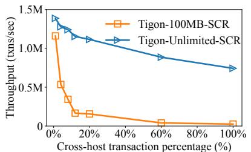  
(a) Tigon Artifact: Varying Cross-Partition Txns

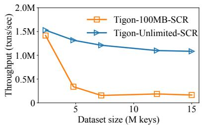  
(b) Tigon Artifact: Varying Dataset Size

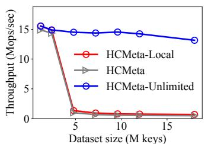  
(c) HCMeta in a KV Store  
Figure 1: Drawback of HCMeta (a) and (b) show Tigon artifact’s performance and (c) shows the performance of HCMeta in a key-value store.

Specifically, the lock serializes accesses to a tuple. Writers, when updating a tuple, reset the bitmap entries for other hosts. When reading, a reader checks if its bit is set. If so, it can rely on its processor caches to read that tuple; otherwise, its caches are out of date and thus the host flushes the corresponding cachelines and reads the data from CXL and sets its bit in the bitmap. The HWcc record also helps hosts locate the shared tuple in LNR. To allow hosts to locate the HWcc record for a tuple, Tigon maintains an index in SCR, which maps a row key to its HWcc record in SCR. Thus, Tigon, by maintaining metadata (i.e., per-object HWcc record and the index) in SCR, enables correct sharing of data tuples in LNR.

Since systems using the HCMeta approach maintain perobject metadata, with a large number of objects, the metadata would not fit in SCR. For example, in Tigon, with 24-byte keys and 8-byte HWcc records [26, §3.2], metadata would be at least 8GB for a 1TB dataset with 4KB objects, which is roughly two orders of magnitude more than the SCR, which is expected to be a few 100 MBs [10, 27, 28]. HCMeta thus has a limit on the number of objects that can be shared in CXL.

When the SCR limit is hit and no more metadata can be kept in there, HCMeta unshares some objects, so that the metadata space can be used for other objects. For example, Tigon moves some objects from CXL to their local partitions in the host-local DRAM. To share an unshared object, a host that wants to access that object contacts the host that owns the partition that the object belongs to. The owner moves the object to CXL and creates a HWcc record and index entry in SCR for it (unsharing other objects in its partition if it needs to make space). After this, other hosts can access the object.

## 2.3 Drawbacks of HCMeta

When many data objects are shared in a workload, HCMeta incurs a lot of churn to share and unshare objects. Note that the data that needs to be shared at a particular point may be small. For example, in Tigon, only those tuples that are currently being accessed by cross-host transactions need to be present in CXL, which is small [26]. Thus, the metadata to share data at a particular point would fit in SCR. However, over the course of the workload, different data objects need to be shared at different points and the metadata for all of them will not fit in SCR. Thus, some objects need to be unshared so that some other ones can be shared and this happens repeatedly. This churn resulting from unsharing and sharing can significantly

degrade performance.

We measure this impact in the publicly available Tigon artifact [58]. Figure 1(a) and (b) show the results. In 1(a), we fix the dataset size to 12M rows. We run the YCSB-based read-only transaction workload from the Tigon paper, where each transaction accesses 10 rows with a skewness factor of 0.7. A transaction can be local (all 10 rows from the local partition) or cross-host (5 from local partition and 5 from remote). We vary the percentage of cross-host transactions and plot Tigon’s throughput with an SCR size of 100MB (realistic) or an unlimited SCR (unrealistic). As shown, with few crosshost transactions, both the 100MB-SCR and unlimited-SCR versions perform well. This is because only a small amount of data is shared via CXL and thus there is little churn. However, with a higher percentage of cross-host transactions, there is more data shared over the course of the workload. Thus, the metadata does not fit in the 100MB-SCR, causing churn and reducing its performance compared to an unlimited SCR. Fig ure 1(b) shows a similar result when varying the dataset size with a fixed cross-host transaction percentage (20%). With small datasets, the metadata fits in SCR and thus Tigon performs well. However, as dataset size increases, the metadata does not fit, causing churns and a steep drop in performance.

Since Tigon is a transactional database, to measure the impact of HCMeta in isolation, we implement the HCMeta scheme in a non-transactional key-value store. We build three variants of this store: (i) where the partition resides on hostlocal DRAM similar to Tigon (called HCMeta-local), (ii) where partitions reside entirely on CXL, so that only metadata (not data) moves between local DRAM and CXL memory as part of the churn (HCMeta), (iii) a variant of HCMeta with unlimited SCR (HCMeta-Unlimited). Figure 1(c) shows the results for a read-only workload with varying dataset sizes.

First, if the SCR space is unlimited, all metadata fits and thus no churn happens. Thus, the HCMeta-Unlimited variant performs well even as the dataset keeps increasing. However, in HCMeta-local, the metadata does not fit, leading to churn and data movement, which degrades performance. Although HCMeta incurs only metadata movement and performs slightly better than HCMeta-local, as the dataset increases, its performance still drops significantly due to churn. Summary. Although metadata is critical to enable coherent and correct sharing of CXL data, relying entirely on SCR for sharing metadata leads to churn and poor performance.

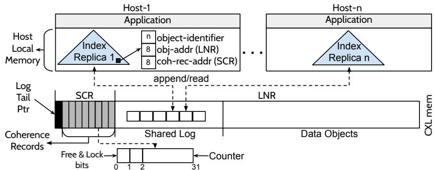  
Figure 2: Split Sharing. Each host has a replica of the index in local DRAM; each index entry maps an n-byte object identifier to the object in LNR and the object’s coherence record in SCR. The index replicas are kept consistent via a shared log in CXL (§3.3).

## 3 MEGALON Design

MEGALON is a new data-sharing approach for partly coherent CXL memory. It can share many objects without being limited by SCR. We first describe what metadata MEGALON maintains to let hosts coherently share objects and locate them (§3.1). We then explain its novel split approach, which shares only coherence records via SCR and the index via replication (§3.2). Next, we describe how a shared log enables consistency of index replicas (§3.3). We then explain how shared-log-enabled dynamic coherence records allow sharing more objects and how dual-path coherence ensures coherence via either coherence records or the shared log (§3.4). Finally, we discuss how the shared log enables optimizations like compressing coherence records and local-DRAM partitions (§3.5).

## 3.1 Shared Metadata

Like HCMeta, MEGALON also shares metadata across hosts to enable correct, coherent sharing of data objects. Like HCMeta, MEGALON tracks coherence for coarse-grained (1KB – 4KB) data objects like database rows, key-value pairs, object-store blobs, and file pages (and not cachelines). To ensure coherence of data objects in LNR, MEGALON maintains a coherence record per object, that consists of a lock bit, a free bit, and a counter. It also maintains an index that maps each object identifier to its location in LNR and its coherence record.

For coherence of data objects, one must ensure the single writer or multiple readers (SWMR) and data-value invariants [54, §2.4]. SWMR requires that for each data object, at any time, either a single writer may write it, or some number of readers may read it. The data-value invariant requires that the latest write to an object is visible to subsequent readers.

MEGALON ensures SWMR as follows. When a write to an object starts, the host performing the write sets the lock bit, increments the counter, and performs the write to LNR. It then increments the counter again and clears the lock bit. For a read, the host first notes the counter value as c1, reads the data from LNR, then notes the counter value again as c2. If c2 is odd or c1 and c2 are not equal, the reader detects an intervening write and retries the read (after flushing the CPU cache lines of the data object). Since writes are serialized by the lock bit and reads cannot succeed with intervening writes, the coherence record ensures SWMR. This mechanism is similar to how sequence locks work [52].

To maintain the data-value invariant, MEGALON keeps a host-side counter for each object a host has successfully read. To ensure that reads do not see stale data in CXL memory, upon every write, a host flushes its CPU caches; the host does so after the write to the object but before incrementing the counter the second time. Before reading from LNR, a reader checks whether its host-side counter matches c1 (from above). If they match, it proceeds with the read; otherwise, its CPU cache is stale, so it flushes the object’s cache lines and then reads. If both the SWMR and the data-value invariant checks pass, the read succeeds. The reader then updates its host-side counter of the object to the post-read counter value c2.

A host performing a read or a write first looks up the index to locate the object in LNR and access its coherence record. It then performs the read or write as described above.

## 3.2 Split Metadata Sharing Approach

The previous subsection explained how the shared metadata across hosts enables MEGALON to coherently share data objects and correctly locate them. We now discuss how MEGALON consistently shares the metadata itself across hosts. Relying purely on SCR limits the number of data objects that can shared in CXL, leading to churn and low performance (§2.3).

To enable sharing a large number of objects, MEGALON proposes a novel split metadata sharing approach that is not constrained by SCR. The key insight is to split the metadata into two parts: (1) a small but frequently updated part, which is shared using hardware coherence, and (2) a large but infrequently updated part, which is shared using other means. MEGALON physically shares only coherence records via SCR and logically shares the index by replicating it in each host’s local-DRAM. The index maps object identifiers to their data locations in LNR and their coherence-record locations in SCR. Figure 2 shows the split-sharing idea.

The rationale behind the split approach is as follows. First, since the coherence records are small (just lock and free bits and a counter per record), they can be maintained in SCR even for a large number of objects. Further, because they are frequently updated (on every object write), sharing them via the hardware-provided cache-coherent region is more efficient. Second, the index is large because it contains object identifiers as keys, which can be much larger compared to coherence records. For example, keys can be as large as 50 bytes [14], whereas coherence records are just 4 bytes. Thus, the index cannot be contained in SCR. While SCR is too small (a few 100 MBs) to fit the index, each host locally has considerable amounts of DRAM (a few 100 GBs), which is 1000× bigger than the SCR. This allows the index to fit within every host’s local-DRAM even with large datasets. While replication increases local-memory footprint, each index entry is still much smaller compared to the coarse-granular data object. For example, a 50-byte index entry is 80× smaller than 4KB objects. Further, compared to coherence records that are updated on every write, the index is modified less frequently (e.g., when a new object is inserted). Thus, maintaining the consistency of index replicas can be done with little overhead.

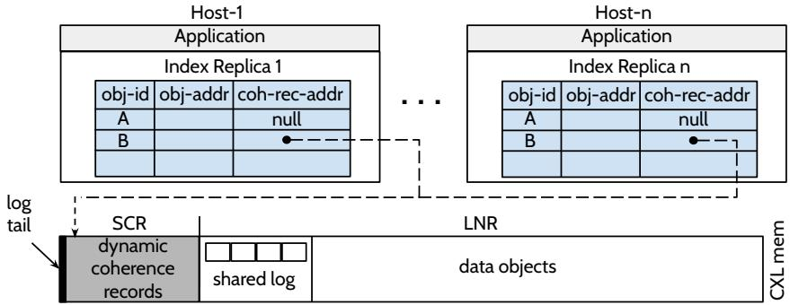  
Figure 3: Dynamic Coherence Records. B is read-write shared and thus has a coherence record allocated, while A does not.

Overall, by keeping only coherence records (not the index) in SCR, the split approach significantly increases the number of objects that be shared. Consider a 100MB SCR, 40-byte keys, and 4-byte coherence records. The split approach can share ∼25M objects. The HCMeta approach requires 52 bytes (as it also stores two 4-byte pointers, one to point to coherence record and the other to the object in LNR) in SCR per object. Thus, it can share only 1.9M objects, an order of magnitude less than the split approach. As a result, with large datasets, MEGALON offers much higher performance than HCMeta. Although MEGALON adds local-DRAM memory overhead for replicating the index, it is a small cost to pay for the outsized performance improvements it brings, as we show later (§6.6).

In addition to reducing SCR usage, the replicated index also offers two benefits over keeping the index in SCR. First, it improves latency because index accesses are in local memory. Second, it offers better scalability because each host has its own copy of the index and thus leads to less contention than synchronizing on a shared index in SCR.

Why not logically replicate all metadata? One might consider logically replicating all metadata, including coherence records, so as to not be limited by SCR capacity. Unfortunately, this approach requires synchronizing the replicas for coherence records across hosts, which is expensive because they are frequently updated. The split approach avoids this overhead by physically sharing coherence records via SCR and thus taking advantage of hardware cache coherence for them. We showcase the benefits of the split approach over pure logical replication in our evaluation (§6.10).

Challenges. Although the split approach pushes the limit on how many objects can be shared, MEGALON still faces two major challenges. First, MEGALON must keep the index replicas consistent across hosts. Second, because split sharing requires a coherence record for every object, the total number of shareable objects remains constrained by SCR capacity. The solution to both challenges is a shared log in CXL. This shared log also underpins several optimizations in MEGALON.

## 3.3 Index Consistency atop Shared Log

One way to realize consistency of index replicas across hosts is to use state-machine replication [50] via consensus [31, 37]. However, this incurs significant overhead as it requires software coordination via message passing. MEGALON, instead, takes inspiration from Node Replication [13] and shared logs [6, 7], which consistently replicate data structures using a log. MEGALON adapts this idea to ensure consistency of index replicas via a shared log in CXL that orders all operations on the index.

The log consists of an array of entries and a log tail. When a host intends to update the index (e.g., to insert an object), the host performs the update through the shared log. It first reserves a new entry in the log by advancing the log tail via a compare-and-swap operation; it then logs the operation in the new entry. The host then applies all entries up to the tail to its local index replica, after which the update completes. Local reads of index at replicas are guaranteed to be consistent because, before a local read, the host does a tail check: it checks if it has applied all entries up to the current tail; if not, it replays all entries up to the current tail to bring the local replica up-to-date. The shared log avoids message passing across hosts to agree on the index. The shared log also eschews synchronous cross-host software coordination, as hosts can independently append to and synchronize with the log.

To minimize SCR use, MEGALON stores log entries in LNR and keeps only the log tail in SCR (see Figure 2). MEGALON bypasses CPU caches when reading log entries, so coherence is not a concern. CPU caches anyway offer little benefit because log entries are read sequentially. When writing a log entry, hosts flush it to CXL. Hardware guarantees coherence for the log tail (as it is in SCR), ensuring hosts see the changed tail during tail checks. This prompts them to apply new log updates, keeping index replicas consistent across hosts.

## 3.4 Dynamic Coherence Records, Dual-Path Coherence

The split approach increases the number of objects that can be shared. However, because it maintains a coherence record for every object, the SCR space still limits the the number of shared objects. To address this problem, MEGALON uses the shared log to dynamically allocate and deallocate coherence records. It then uses a novel dual-path coherence mechanism, where MEGALON leverages the shared log to enforce coherence when coherence records cannot alone do so.

## 3.4.1 Dynamic Coherence Records

MEGALON first realizes that if a shared object is only read (readshared), it does not need a coherence record. Thus, MEGALON does not allocate a coherence record for such an object and the object’s index entry does not point to a coherence record. For such objects, a host performing a read skips coherence checks. For example, in Figure 3, when reading object A, hosts would skip the coherence checks. MEGALON only maintains coherence records for objects that are being both written and read (read-write-shared); a host performing a read for such objects (e.g., object B in Figure 3) will locate the coherence record from the replicated index, and perform coherence checks.

Since MEGALON does not spend any memory in SCR for readshared objects, the number of read-shared objects is not bound by the SCR. However, SCR space still limits how many objects MEGALON can share in the read-write-shared mode. When this limit is hit, because MEGALON does not require coherence records for read-shared objects, MEGALON dynamically converts some read-write-shared objects into read-shared objects. Whenever a write occurs to a read-shared object, MEGALON dynamically allocates the coherence record for it. Thus, by dynamically converting between read-write-shared and readshared modes, MEGALON can avoid unsharing the object when it hits the SCR space limit (unlike HCMeta).

## 3.4.2 (De)allocating Coherence Records via Shared Log

All hosts must correctly know whether or not an object has a coherence record. MEGALON ensures this by using the shared log to update the coherence-record pointer in the index.

When an object is created, MEGALON does not allocate a coherence record. A host performing a write first checks the index to see if the coherence record is allocated for the object. If not, the host allocates the coherence record in SCR; it uses the free bit (see Figure 2) to find an unoccupied coherence record and clears the free bit. It then updates the pointer in the index to point to the allocated record via the shared log.

If two hosts race to update the pointer in index, only the first one in log order will succeed. Although both hosts can allocate coherence records independently and both can append their request to the log, only the first request can be successfully applied to the replicated index. This is because, all hosts apply the two operations in the same order from the log. Thus, all hosts will know that the pointer is already set in the index by the first request and thus ignore the second request. When this happens at the host that created the second request, it frees the coherence record it allocated. Note that only the first write transitioning an object to read-write sharing needs to assign a new coherence record for the object, requiring log updates. Subsequent writes are efficient; they simply use the coherence record in SCR without log updates.

Deallocations also happen via the log. Such deallocations happen to make space for allocating coherence records for different objects. Any host can deallocate a coherence record by clearing the pointer in the index through the shared log and then deallocating the corresponding coherence record (setting the free bit) in SCR. This can happen either in the synchronous path when a host cannot find space for allocating a new coherence record or in the background as MEGALON proactively tries to keep some free coherence records.

## 3.4.3 Dual-Path Coherence

So far, we discussed how MEGALON ensures coherence via coherence records. If coherence records were never deallocated, this mechanism would suffice. However, because coherence records are dynamic, they can be deallocated anytime. To solve this problem, MEGALON uses a scheme for coherence with two paths: one provided by the coherence record (discussed so far) and another enabled by the shared log (discussed below). We first explain why coherence records alone are insufficient. We then explain how the shared log helps.

Why coherence records alone are insufficient? Dynamic coherence records do not pose a problem for writes because a coherence record cannot be deallocated when a write is in progress as the writer holds the lock. However, this is not true for reads. When a read starts, a coherence record may exist for the object but may be deallocated before the read finishes. Conversely, a coherence record may not exist at the beginning of the read but may be allocated before the read completes.

One might handle these cases by checking that the index entry is the same before and after the data read. However, this check is insufficient, because reading the index tells only the current allocation status of the coherence record and not the transitions. For example, suppose an object A is in readshared mode (i.e., coherence record does not exist). A host i first checks the index and skips the coherence check and performs the read. During the read from LNR by i, another host j switches A to read-write mode, writes to it, and then switches it back to read-shared mode. If host i again checks index after the read, it sees that the object does not have a coherence record and incorrectly skips the coherence check.

Such a transition could also happen after a host reads an object and before the host reads the object again. For example, suppose host i reads object A, then A is switched to read-write mode, written to, and then switched to read-shared mode. If host i reads A again and skips coherence checks because it does not find the coherence record in the index, it incorrectly reads the object from its (stale) CPU caches.

Thus, a host cannot rely only on the current coherencerecord state. It must know if there were any allocation status changes for the coherence record since the host began the current read or the host previously read an object.

Shared-log enabled coherence path. One option to realize this is to synchronously notify all hosts of such events. Specifically, a host that changes the coherence-record status of an object notifies and waits for all other hosts to acknowledge be fore it changes the status. The other hosts can take necessary actions like flushing their caches before they acknowledge. However, this would significantly increase the overhead to switch between read-shared and read-write-shared modes.

MEGALON’s shared log enables a better solution, where the host that switches the sharing mode simply records the event in the shared log. Each host independently detects these events when they replay the shared log. This reduces overhead to switch between modes. This mode switch in MEGALON is akin to the churn in HCMeta. However, the cost of the churn in MEGALON is much lower because the log decouples the hosts.

Thus, the shared-log coherence path works as follows. While replaying the log, if a host finds an allocation or deallocation event, it flushes the CPU caches for the affected objects. Reads after this point do not see stale caches. This mechanism also handles cases where the coherence-record allocation status for an object changes while a read is in progress; hosts simply check if there was a coherence-record status change for that object between the first and second coherence checks. If so, the host retries the read after flushing the cache.

## 3.4.4 Handling Object Deletions

When an object is deleted, its index entry is removed via the shared log and the LNR memory used by the object is reclaimed. Object deletions, however, introduce challenges to coherence that MEGALON must handle. One challenge is that hosts may be caching the old contents of the memory location of the deleted object. Suppose a reader reads object A at some location in LNR, storing its contents in its CPU cache. Then suppose A is deleted and another object B is allocated at the same location by another host. If the first host tries to read B, the host will see A’s contents (from its cache), which is incorrect. Similarly, consistency can be violated if such deletions happen while the read is in progress. When a write is in progress, MEGALON prevents changes to the index entry of an object because writers set the lock bit. However, because reads are optimistic, an object can be deleted while the read is in progress. So, MEGALON must detect any changes to the index entry of the object while the read was in progress.

MEGALON handles both these challenges via the shared-logenabled coherence path. Specifically, since object creations and deletions happen via the shared log, hosts can use those events and correctly flush the caches during replay.

## 3.4.5 Putting It Altogether: MEGALON Reads and Writes

We now describe how the different pieces of MEGALON work together in the read and write of an object.

Read. To read an object A, a host synchronizes the index with the shared log, and reads its local index to find A’s LNR location. At this point all new log entries have already been ap plied on the replica, thus flushing potentially stale cachelines of A. If A is read-write-shared, the host obtains the counter c from the coherence record and compares it with the host-side counter l. If they are not equal or c is odd, the host flushes the cachelines of A and retries the read. This is the pre-read check. Pre-read check is not needed if A is read-shared. The host then accesses the actual data from LNR. The host then performs post-read checks: it checks if there were any log updates concerning A or if A is read-write-shared and the current counter c’ is different from the previous value of c. If either is true, the host flushes cachelines of A and retries the read. After a successful read, the host updates l to c’.

Write. To write an object A, a host synchronizes the index and consults the index entry of A. If A is read-shared, the host allocates a coherence record for A by finding a free coherence record and updates the pointer in the index. If the index update fails, it retries the write. It then acquires the lock bit in the coherence record, and checks if there were any log updates since it initially got the index entry; this is because the index might have been updated after acquiring the entry and before acquiring the lock bit. The host then increments the counter in coherence record c. This is the pre-write step. The host then updates A in LNR. It then performs the post-write steps. It flushes the relevant cachelines, pushing the update to CXL memory. The host then increments the counter c again and sets host-side counter to l. It then finally resets the lock bit.

## 3.5 Shared-Log-Enabled Optimizations

The shared log also enables other optimizations in MEGALON.

## 3.5.1 Smaller Coherence Records

The counter in the coherence record is 30 bits. If fewer bits are used, then coherence records for more objects can fit in SCR, which increases the number of objects that can be shared in read-write mode. This improves performance by reducing churn. However, with fewer bits, counters may wrap around and threaten coherence: a host could think that its counter in the host-side metadata is the same as the one in the coherence record, but in reality, the counter has wrapped around; in such cases, the host may incorrectly read its stale CPU caches. The shared log provides a way to handle this issue. When the counter wraps around, MEGALON logs the wrap-around event in the shared log. When hosts replay the log, they see such events and flush their caches, avoiding stale reads.

## 3.5.2 Supporting Local Partitions

Another optimization that the shared log enables is local DRAM partitions. Partitioned applications store data in hostlocal DRAMs and move data to CXL only for sharing across hosts (e.g., Tigon). Such applications perform well under workloads where hosts mostly access data from their own partitions. MEGALON can also support local partitions; it uses the index to point to local-DRAM locations and moves objects between CXL and local DRAM of hosts by modifying the index appropriately via the shared log. Thus, MEGALON can also realize high performance for partitioned workloads. MEGALON decides to move an object to local when n consecutive ac cesses are from the same host (n is configurable). MEGALON performs the movement by making a copy of the object on local DRAM and updating the index to point to the local copy. The correctness of the movement is also guaranteed by the dual-path coherence mechanism. Consistency of local objects are managed by local reader-writer locks. When a host tries to access an object that is moved to a remote host, it sends a message to the remote host. The remote host brings the object back to CXL by performing the data copy and index update.

## 3.5.3 Supporting Local Data Copies

MEGALON can also consistently maintain local copies of data, where hosts store copies of an object in the host-local DRAM to avoid CXL accesses. MEGALON supports local data copies by having the index of an object in read-shared mode to point to multiple locations for the same object, one in LNR and others in local DRAM of hosts. MEGALON ensures coherence in the presence of data copies via the shared log. Specifically, when a host writes to an object that has multiple copies, it updates the index to point only to the CXL copy and changes the object to read-write-shared mode through the shared log. This logically invalidates the local copies because MEGALON synchronizes the index with the log tail on any host upon a subsequent read. This allows MEGALON to invalidate the local copies asynchronously without waiting for all hosts to acknowledge the invalidation. We call the variant of MEGALON that replicates objects locally MEGALON-DATA-COPY. MEGALON-DATA-COPY currently uses a simple policy to create local copies: it creates a local copy of an object at a host when the number of read accesses for that object from the host crosses a threshold. HCMeta cannot support local data copies because the index in SCR only tracks one location for each object.

## 4 Implementation

MEGALON is implemented as a C++ library in \~8K LOC. An application runs across hosts, and on each host, the application links against the MEGALON library. To ease application development, MEGALON library implements the pre-read and postread checks and pre-write and post-write steps in read\_start, read\_end, write\_start, and write\_end calls. Applications invoke them before and after the actual read or write operation. It also exposes calls to create and delete objects.

The replicated index on each host is a hashmap with objectid as the key that maps to locations of the object in LNR and coherence record in SCR. MEGALON manages the space where the objects are stored as fixed-size slots. The entry of an object in the index points to the slot where the object lives. MEGALON currently takes the slot size as a compile-time parameter. MEGALON can be easily extended to support variablesized objects at object creation time by keeping the object size as a field in the logically shared metadata. To support objects that can change size during their lifetime, MEGALON could treat them as delete-then-insert. A better approach to support dynamic object sizes with more efficient memory management is an avenue for future work.

To manage index replicas, MEGALON builds on the opensource Node Replication (NR) implementation [48]. NR can replicate any datastructure across NUMA nodes via a shared log, which occupies 32 MB by default; we treat the index hashmap as the NR datastructure. NR stores the shared log as a circular buffer. Updates to the replicated index are flatcombined [24] within a host and appended by a single thread per host to reduce contention on log tail. On each replica, NR protects the index with a reader-writer lock [13]. Before reading the index, a thread replays the log to bring its replica up to date, applying only fully-written entries and ignoring incomplete ones from concurrent writers. After all the replicas have replayed up to a certain log entry, the log head is safely incremented to recycle the log space. NR does not perform checkpointing since the log is used only for replication not recovery. This aligns well with MEGALON’s failure model.

We make several modifications to NR. First, we allocate the log on CXL, with only the log tail and head in SCR, and perform non-temporal accesses to log entries. Second, we modify it to support the shared-log enabled coherence path. Specifically, when a replica replays the log, it flushes the CXL memory addresses of the slot contained in the log entries. Further, we add notifications from the log about events that modify the object (i.e., create, delete, coherence-record (de)allocations). For example, when MEGALON starts a read, it subscribes to such changes to the object; upon read end, MEGALON checks if there was an event, if so, retries the read.

The space for coherence records is fixed at initialization. MEGALON runs a background thread periodically to deallocate coherence records to keep the used ratio below a watermark. We use random sampling and recycle coherence records with the lowest counter (indicating objects with least writes).

As described in §3.5.2, MEGALON’s policy to move an object to local DRAM is n consecutive accesses to an object. MEGALON does this by keeping the last access host to an object in LNR and keeps a per-object counter locally for tracking consecutive accesses. Keeping the last access host information in LNR is acceptable because the policy does not need to be precise. False positives can be limited by setting a reasonable n. Also, objects can be always brought back to CXL.

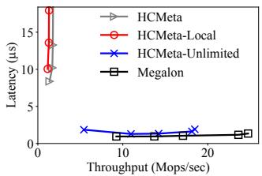  
Figure 4: Read-only Workload

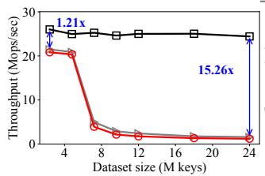  
(a) Throughput

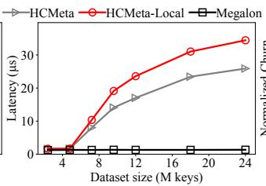  
(b) Latency

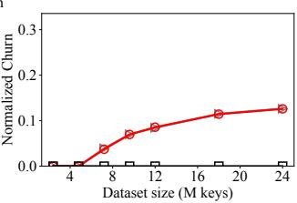  
(c) Churn  
Figure 5: Read-only performance: Growing Dataset Sizes

We adopt an open-source shared-memory RPC implementation [16] for general communications between hosts, such as requesting a partitioned object to be moved back to CXL. Underneath the RPC implementation, it uses a small pairwise multi-producer multi-consumer (MPMC) queue. Note that the communication method is orthogonal to the design of MEGALON, thus barely optimized. We can easily reduce the memory footprint of the MPMC queue by moving the queue entries to LNR and only keeping the head and tail in SCR. More extremely, we can even use the shared log for communication, which is already on CXL. We leave these optimizations for future work.

Currently, MEGALON is targeted to a system with 8–16 nodes as MEGALON’s local memory footprint grows linearly with the number of nodes. To scale to a larger number of nodes, one could explore techniques such as rendering a partial view of the shared metadata to each node, or sharding the shared metadata by adopting multiple shared logs.

## 5 Applications

KV Store. The KV store exposes a linearizable put-get interface. Each KV pair is a MEGALON object, with the key serving as the object identifier. Put creates or updates the object via create, or write\_start and write\_end. Get reads the object and returns the value when read\_end finishes without errors.

File-system Page Cache. This application treats each file page ([inode, block-number]) as a 4KB-sized MEGALON object. Here, not all data fits in CXL memory and so the application must evict pages to make space for new pages from disk. The application admits a page into the cache by reading it from disk and then calling MEGALON’s create. If two threads admit a page, the second create fails. To evict a page, the application calls delete. The application chooses a victim using a perobject count, which is incremented by application threads upon accesses. Access counts need not be accurate, so the application keeps them in LNR. It runs a clock-like algorithm over the pages. The application writes back dirty pages to disk. The application maintains a dirty bit for each object in SCR, which it sets before it calls write\_end. A background thread writes back dirty pages. It calls write\_start on the dirty page (preventing other writes), flushes the page, clears the dirty bit, and calls write\_end. Before a page is switched to read-shared mode, the application flushes the page to disk and clears the dirty bit, ensuring that the page is clean in read-shared mode. Failure Model. Like Tigon [26, §2], both KV store and page cache assume a fail-stop model. A failure of any host or CXL memory causes the entire system to fail. KV store is in-memory; our current implementation does not implement disk-based checkpointing. Our file-system page cache is diskbased and the file system can recover the state from the disk. Our page cache provides the same guarantees as existing file systems: all fsync-ed writes are guaranteed to be recovered.

## 6 Evaluation

We ask the following questions in our evaluation:

• How does MEGALON perform in read-only workload? (§6.1)

• How do dataset sizes impact read-only performance? (§6.2)

• How does MEGALON perform in read-write workload? (§6.3)

• How does MEGALON perform in cases where its coherence records do not fit in SCR? (§6.4)

• How does object identifier size affect performance? (§6.5)

• What does MEGALON pay for the higher performance? (§6.6)

• Do smaller coherence records improve performance? (§6.7)

• How do local-DRAM partitions enabled by the shared log help under partitioned workloads? (§6.8)

• How do local data copies enabled by the shared log improve performance? (§6.9)

• How does an approch that logically shares all metadata via replication perform compared to MEGALON’s split-sharing approach? (§6.10)

• How does MEGALON perform in YCSB workloads? (§6.11)

• Does MEGALON help the page-cache application? (§6.12)

Setup. CXL 3.0 hardware is not commercially available, so we emulate CXL and hosts on a 4-socket server with Intel Xeon Gold 6418H processors. We designate NUMA node 0 as CXL memory and nodes 1-3 as hosts. Each emulated host has 24 physical cores with hyperthreading disabled and 64GB local DRAM. To approximate CXL latencies, we throttle the uncore frequency of node 0, as in prior work [3]. We distribute threads equally across hosts. We compare against three baselines: HCMeta, HCMeta-local, and HCMeta-Unlimited (described in §2.3). All experiments by default runs on the KV Store application with 1KB objects. Unless stated otherwise, we use 200MB for the SCR (like in Tigon [26]).

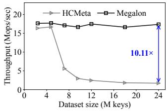  
(a) 5% write

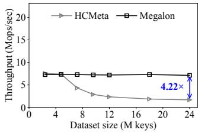  
(b) 50% write  
Figure 6: Read-write performance: MEGALON vs. HCMeta

## 6.1 Performance under Read-Only Workload

We first evaluate under a read-only workload with Zipfian access pattern (Zipf parameter 0.99), where most accesses are to some popular objects. We use a dataset of 18M objects. We vary the number of threads and plot throughput and average latency for MEGALON and baselines. Figure 4 shows the result.

As shown, HCMeta and HCMeta-Local do not scale because metadata doesn’t fit in SCR at this dataset size, causing excessive churns. HCMeta-Local performs worse than HCMeta due to additional data-copy overhead during churns, but both are ultimately bottlenecked by churn. The perfor mance of HCMeta-Unlimited, which has unlimited SCR, confirms that churn is the bottleneck; with unlimited SCR, it has no churns and achieves high throughput and low latency.

MEGALON’s split design keeps the index out of SCR; further, since this is a read-only workload, it does not allocate any coherence records. Thus, MEGALON avoids churn entirely, achieving high performance. MEGALON’s throughput exceeds that of HCMeta-Unlimited because accessing the physically shared metadata in HCMeta-Unlimited incurs higher overhead than accessing the local index replicas in MEGALON.

## 6.2 Read-only Performance with Growing Dataset Sizes

We next examine how dataset size affects performance under read-only workloads. We vary dataset size and measure throughput, latency, and normalized churn (the fraction of operations that incur churn). HCMeta variants churn when they share an unshared object; a churn in HCMeta-local additionally copies the data. In MEGALON, churn occurs when a read-shared object is converted to read-write-shared mode.

As shown in Figure 5, for small datasets, all three systems deliver high throughput and low latency, as seen in the two leftmost points of 5(a) and (b). This is because none of the systems incurs churn, as shown by the two leftmost points in 5(c). MEGALON has a small throughput advantage (about 1.2×) due to lower contention from its locally replicated indexes.

For large datasets, HCMeta and HCMeta-Local suffer from poor throughput and high latency because their churn rises with dataset size. HCMeta-Local has even higher latency due to data-copy overhead. MEGALON is unaffected by dataset size and offers 15× higher throughput because it does not allocate any coherence records in this workload, incurring no churn. Since HCMeta-Local is strictly worse than HCMeta, we omit it from future experiments (except §6.8).

## 6.3 Performance under Read-Write Workloads

We next compare performance under read-write Zipfian work loads with 5% and 50% writes. In these workloads, MEGALON must convert objects to read-write-shared mode by allocating coherence records. Figure 6 shows the result.

As shown in 6(a), with 5% writes, MEGALON sustains high throughput, while HCMeta’s throughput drops significantly due to churn as the dataset grows. MEGALON avoids this drop because its split design uses SCR only for small coherence records, not the index (unlike HCMeta). Thus, even with 24M objects, MEGALON still has ample space left in SCR and incurs no churn, achieving 10× higher throughput than HCMeta. In fact, with a 200MB SCR, MEGALON can hold coherence records for up to 50M objects, which is 12× more than what HCMeta can support without churn. We later examine the case where MEGALON’s coherence records no longer fit in SCR (§6.4).

With 50% writes (Figure 6(b)), both systems have lower absolute throughput because more writes cause additional lock contention and cache-line invalidations, reducing performance for both MEGALON and HCMeta. However, MEGALON still offers 4× higher throughput than HCMeta. Overall, even when MEGALON must allocate coherence records in read-write workloads, it still provides significant performance benefit.

## 6.4 Performance when Coherence Records Do Not Fit

We next examine the case where coherence records don’t fit in SCR for MEGALON, causing churn under read-write workloads. Note that read-only workloads incur no churn in MEGALON. Churn frequency is driven by three factors: (1) dataset-to-SCR ratio, (2) write percentage, and (3) access skewness. Thus, we vary the SCR size while fixing the dataset at 18M objects, as well as the workload’s write ratio and skewness. We examine two skewness levels (Zipf parameters): 0.99 (more skewed, YCSB default) and 0.7 (less skewed, used in Tigon [26]).

Figure 7(a)(i) shows throughput (left y-axis) and normalized churn (right y-axis) against SCR size for a 5%-write workload with high skew. For unrealistically large SCR sizes greater than 512MB [10, 27, 28] (the grey area), HCMeta performs well because, with such a large SCR, it incurs no churn (shown by the right y-axis). But as SCR becomes realistic (smaller than 512MB), HCMeta’s throughput drops sharply. In contrast, MEGALON sustains its throughput until SCR reaches 128MB, which is an 8× smaller footprint than what HCMeta needs for high performance. Below 128MB, coherence records no longer fit, so MEGALON also incurs churn. However, MEGALON incurs far fewer churns because of the low write ratio in this workload. As a result, MEGALON still outperforms HCMeta even when MEGALON experiences churns; for instance, at 64MB SCR, it delivers 11× higher throughput.

Megalon Throughput HCMeta Throughput Megalon Churn HCMeta Churn

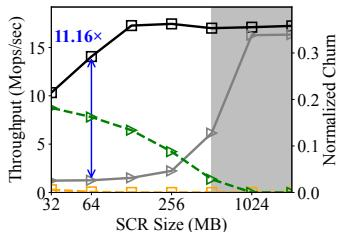  
(i) More skewed

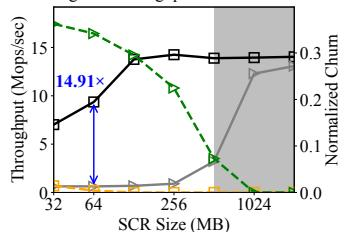  
(a) 5% write  
(ii) Less skewed

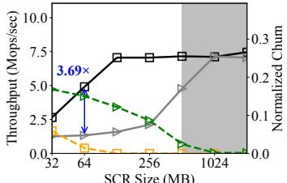  
(i) More skewed

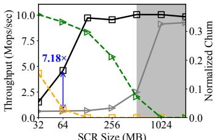  
(b) 50% write  
(ii) Less skewed  
Figure 7: Read-write performance of MEGALON vs. HCMeta with various SCR size

Figure 7(a)(ii) shows the 5%-write workload with low skew. Because accesses are more uniform in this workload, HCMeta is more likely to access unshared objects and thus exhibits higher normalized churn than in the more skewed case, causing a sharper throughput drop. MEGALON’s churn also rises compared to the more skewed workload, but remains far lower than HCMeta’s, preserving its performance advantage.

Figure 7(b) presents results for 50% writes. When SCR exceeds 128MB, MEGALON incurs little to no churn; below 128MB, it sees more churn than in the 5%-write case. Thus, MEGALON shows a more pronounced throughput drop, yet still outperforms HCMeta. With low skew, the 50-% write case (7(b)(ii)) is the worst-case workload for MEGALON. However, even in this case, MEGALON continues to deliver much higher performance due to substantially fewer churns.

Churn Overhead. While MEGALON’s lower churn frequency leads to higher performance than HCMeta, each churn in MEGALON is also cheaper, further boosting performance. Figure 8 shows MEGALON’s lower churn overhead. A churn in MEGALON requires only allocating a coherence record and updating the index. In contrast, a churn in HCMeta occurs when a host accesses an unshared object, which triggers a shared-memory RPC to the host that owns the object. This adds substantial communication and synchronization cost. We also measured the churn overhead of HCMeta in the Tigon artifact [58], and found it be even higher (∼55 µs).

In summary, MEGALON’s split design greatly reduces precious SCR usage, allowing much higher throughput with far smaller SCR than HCMeta. Even when coherence records no longer fit, avoiding allocations for read-shared objects lets MEGALON sustain better performance. MEGALON’s churns are also cheaper, further contributing to its performance gains.

## 6.5 Performance vs. Object Key Size

We next evaluate how object-identifier (i.e., key) size influences performance. Using a 4.8M-object dataset, we vary key size from 10 to 90 bytes under a read-only Zipfian workload. Figure 9 shows the throughput. Because HCMeta stores its index in SCR, its SCR footprint grows linearly with key size, leading to more churn and consequently lower throughput for larger keys. In contrast, MEGALON’s split design keeps the index out of SCR, so key size does not affect SCR usage. Thus,

MEGALON maintains high throughput across all key sizes.

## 6.6 Local-DRAM Usage and Performance

MEGALON’s performance benefits come at the cost of higher local-DRAM usage for replicated indexes. This is justified for two reasons. First, the extra memory for index replicas is modest compared to coarse-granular (e.g., 1KB) objects. Take the 24M dataset point in Figure 5(a); each object has a 24-byte key and 1KB data. MEGALON uses 27.71GB memory, including the replicated indexes, host-side counters, coherence records, the shared log, and the object data. Compared to the 25.76GB footprint of HCMeta, MEGALON requires only 7.6% more memory. Second, the small added memory yields outsized improvements. As shown in 5(a), MEGALON reaches 24.4 MOps/s, achieving 0.88 MOps/s per GB of memory used. HCMeta, however, reaches only 1.6 MOps/s (or 0.062 MOps/s per GB). Thus, for just 7.6% more memory, MEGALON improves absolute performance by 15.25×, achieving 14.19× more throughput per GB of memory spent. With eight hosts, MEGALON’s usage would be 33.51GB. Assuming similar performance, MEGALON would still have outsized benefits, offering 12.18× more throughput per GB than HCMeta.

## 6.7 Performance with Smaller Coherence Records

As shown in Figure 7(b)(ii), with very small SCR (32MB), high write ratios (50%), and less skew, MEGALON’s performance drops due to churns. We now examine how making coherence records smaller improves performance for this worst-case workload. MEGALON’s shared log enables this optimization: smaller records allow more coherence records to fit in SCR, delaying churn; the log safely handles counter wrap-arounds. We use a dataset of 18M objects and vary the size of coherence records by allocating them fewer bits. Figure 10 shows the result. As shown, throughput increases as we reduce the record size below the 32-bit default. With 8-bit records, throughput matches the maximum seen in Figure 7(b)(ii), as all records now fit in SCR. We observe that reducing below 8 bits hurts performance due to frequent wrap-around log events. Note that we use the default 32-bit records in all experiments; our current implementation does not dynamically pick the optimal size for a workload. However, the shared log provides the fundamental mechanism to explore this optimization.

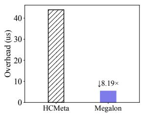  
Figure 8: Overhead of churns

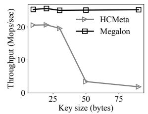  
Figure 9: Key size

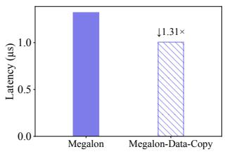  
Figure 12: Local replication

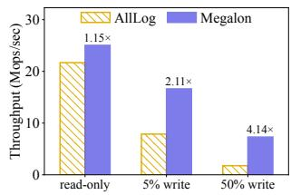  
Figure 13: AllLog variant

## 6.8 Performance for Partitioned Workloads

We now evaluate the benefit of the local DRAM partitions enabled by the shared log. We compare MEGALON to HCMeta-Local, which keeps data in host-local DRAM and moves only shared objects in CXL. When hosts mostly access data from their own partitions, HCMeta-Local performs well. Using a read-only Zipfian workload on 18M objects, we vary the shared ratio (i.e., fraction of shared objects). For example, with 20% shared ratio, 20% objects are shared and 80% requests access exclusive data in host-local partitions. As shown in Figure 11, HCMeta-Local performs well at low sharing (0–20%) as it benefits from local DRAM access and little churn due to only small amount of sharing. MEGALON, by enabling local partitions, moves exclusively accessed objects to host-local DRAM and matches HCMeta-Local’s performance at low sharing. As sharing increases, HCMeta-Local starts to churn and throughput drops, whereas MEGALON maintains significantly higher throughput by avoiding churns. Overall, by flexibly placing data between local DRAM and CXL, MEGALON matches HCMeta-Local under partitioned workloads and significantly outperforms it as sharing increases.

## 6.9 Benefit of Replicating Objects Locally

We now evaluate the benefit of replicating data objects locally. We skip comparison to HCMeta because it does not support local data copies as discussed in §3.5.3. We compare MEGALON-DATA-COPY to MEGALON under read-only Zipfian workload on 18M objects. As shown in Figure 12, MEGALON-DATA-COPY achieves 1.3× lower access latency than MEGALON because it avoids CXL accesses by replicating popular objects locally on hosts.

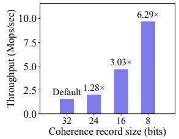  
Figure 10: Smaller coherence records

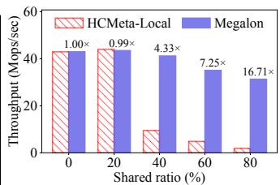  
Figure 11: Throughput vs. shared ratio

## 6.10 Performance of AllLog Variant

To showcase the benefit of the split metadata sharing approach, we implement a variant of MEGALON that does not split the metadata into physically shared coherence records and logically replicated indexes. Instead, it replicates all metadata through the shared log. We call this variant, AllLog. In this variant, lock acquisitions and counter increments create log events and are replayed on each metadata replica. We compare MEGALON against AllLog under a Zipfian workload with readonly, 5% writes, and 50% writes over 18M objects. As shown in Figure 13, AllLog performs similar to MEGALON under readonly workload because no locks are acquired or counters are incremented. However, as write ratio increases, AllLog incurs more log events, leading to higher logging overhead and lower throughput than MEGALON. With 50% writes, MEGALON achieves 4.14× higher throughput than AllLog. This demonstrates the benefit of the split approach: by keeping frequently updated metadata (the coherence records) in SCR, MEGALON optimizes performance by avoiding excessive log replays.

## 6.11 YCSB Macrobenchmark

We next analyze the performance under five YCSB [17] workloads: A (50% w, 50% r), B (5% w, 95% r), C (read-only), D (5% insert, 95% r; read latest), and F (50% read-modify-write, 50% r). The distribution is Zipfian and we use an 18M-object dataset. Figure 14 shows the result. Because HCMeta cannot fit the coherence records in SCR, it experiences churn across all workloads. In read-heavy B and C, MEGALON achieves the largest speedups (9.12×–14.18×). With A’s 50% writes, contention reduces throughput of both systems, yielding a smaller benefit for MEGALON (3.93×). F shows the smallest gain (3.18×) because the writes immediately following the reads do not incur churns. D is the only workload where MEGALON requires shared-log updates for insertion. HCMeta incurs higher synchronization overhead because a host must contact the owner if the inserted object does not belong to the requesting host. MEGALON’s shared-log-based insertion does not wait for other hosts and performs 4.55× better.

## 6.12 Page cache application

We finally evaluate the user-level shared page cache built with MEGALON. We run skewed workloads with different mix of reads and writes with a 48GB dataset of 4KB file pages.

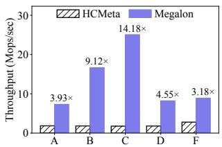  
Figure 14: YCSB workloads

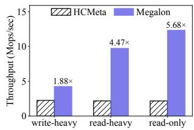  
Figure 15: Page cache

As shown in Figure 15, HCMeta cannot share all pages as metadata does not fit in SCR; it suffers from churns and low performance. MEGALON is able to share a large page cache without churn, achieving notably higher throughput across all workloads. The throughput is lower than in the KV store due to larger object size. The page-cache application demonstrates that MEGALON can be incorporated into different applications to share large amounts of data in CXL with high performance.

## 7 Related Work

Disaggregated memory is an old idea [36] that has regained attention with CXL. Prior work on CXL mainly focus on memory tiering and pooling. Tiering solutions [32, 42, 55, 61–63] seek to hide CXL’s higher latency by moving hot data to DIMM-attached memory. Pooling approaches [22, 33] improve memory utilization by apportioning CXL memory to hosts that need it. Other work [23, 33, 38, 56, 57] analyze CXL’s raw performance and implications to application performance. None of the above considers CXL memory sharing.

A few recent papers consider sharing CXL memory across hosts [10, 26–28]. They note that cache coherence for all CXL memory is infeasible, motivating an SCR model. Tigon [26] shows how to build a database in this model, by moving ob jects to be shared from local memory to CXL. To share objects in CXL, Tigon uses hardware-coherent metadata-based shar ing (HCMeta). The work in [28] outlines high-level sharing ideas for different CXL versions but provides few technical de tails. CXLfork [2] proposes remote forks via CXL, where the forked process shares read-only pages with its parent. Unlike our work that enables general data sharing across hosts, CXL fork uses sharing only for deduplicating memory between parent and child, and supports only read sharing.

Systems without any cache coherence have been considered before [5, 15, 30, 44]. However, such systems create significant complexity for applications, and so they have not been widely adopted. Cosh [8] enables transferring bulk data across CPUs, GPUs, and other accelerators that may share memory incoherently. That work has a different goal from ours, namely, bulk data transfers rather than data sharing.

RDMA also enables disaggregated memory, but unlike CXL, it requires processes to issue IO to access disaggregated memory, rather than loads and stores. RDMA-based disaggregated memory has been used to build object and KV stores [20, 21, 29, 35, 40, 45, 53]. However, these systems are unaffected by the lack of cache coherence in CPU caches, since RDMA operations are IO operations. As a consequence, RDMA systems require software-managed caches to avoid remote memory accesses, whereas CXL allows hosts to directly benefit from hardware caches.

Node replication (NR) [13] efficiently replicates data structures across NUMA domains using a log in shared memory, while subsequent work used NR to replicate page tables in the OS [11]. That work was not targeted at systems without full cache coherence. We borrow NR to replicate the index in MEGALON and apply it to our setting with an SCR, by observing that NR works correctly provided that the log tail pointer is in the SCR; even the log can be in incoherent memory provided threads flush or bypass the cache when accessing log entries.

The idea of replicating indexes has appeared in other contexts. DudeTM [39] mirrors durable memory pages in persistent memory to local DRAM, including the index, to speed up transaction execution by avoiding expensive persistentmemory accesses. HydraList [43], similar to NR, replicates the search index across NUMA nodes to avoid remotememory stalls and cache-coherence traffic. It updates the search index asynchronously by aggregating operations and broadcasting them to all replicas. However, both works use index replication to improve performance, whereas our work uses it to conserve scarce SCR space.

Software-based distributed shared memory (DSM) systems (e.g., [1, 4, 9, 12, 34, 41, 46, 49, 51]) emulate shared memory among hosts connected by a network without any physical shared memory. These systems do not have an SCR to leverage, so they provide coherence entirely in software via messagepassing protocols, which are known to be slow.

## 8 Conclusion

We propose MEGALON, a new data-sharing approach for partly coherent CXL. MEGALON shares the metadata essential for coherent data sharing using a novel split approach that is not limited by hardware-coherent memory capacity. MEGALON uses a CXL shared log to enable dynamic coherence records and provides coherence using the shared log when coherence records cannot. MEGALON improves performance compared to the current sharing approach under many workloads.

## Acknowledgments

We thank our shepherd and the OSDI ’26 reviewers for their insightful comments. We also thank the other DASSL members for their discussions and feedback. We thank Neil Kaushikkar for his contributions to the initial implementation. This material was supported by funding from NSF grants CNS-2340218 and CNS-2339784, an IIDAI grant, as well as gifts from NetApp and TigerBeetle.

## References

[1] Anant Agarwal, Ricardo Bianchini, David Chaiken, Kirk L Johnson, David Kranz, John Kubiatowicz, Beng-Hong Lim, Kenneth Mackenzie, and Donald Yeung. The MIT Alewife machine: Architecture and performance. ACM SIGARCH Computer Architecture News, 23(2):2– 13, 1995.

[2] Chloe Alverti, Stratos Psomadakis, Burak Ocalan, Shashwat Jaiswal, Tianyin Xu, and Josep Torrellas. CXLfork: Fast remote fork over CXL fabrics. In In ternational Conference on Architectural Support for Programming Languages and Operating Systems, pages 210–226, March 2025.

[3] Emmanuel Amaro, Stephanie Wang, Aurojit Panda, and Marcos K Aguilera. Logical memory pools: Flexible and local disaggregated memory. In Proceedings of the 22nd ACM Workshop on Hot Topics in Networks, pages 25–32, 2023.

[4] Cristiana Amza, Alan L. Cox, Shandya Dwarkadas, Pete Keleher, Honghui Lu, Ramakrishnan Rajamony, Weimin Yu, and Willy Zwaenepoel. TreadMarks: Shared mem ory computing on networks of workstations. IEEE Computer, 29(2):18–28, February 1996.

[5] ARM922T technical reference manual. https: //developer.arm.com/documentation/ddi0184/b/ caches--write-buffer--and-physical-addresstag--pa-tag--ram/cache-coherence.

[6] Mahesh Balakrishnan, Dahlia Malkhi, Vijayan Prabhakaran, Ted Wobber, Michael Wei, and John D. Davis. CORFU: A shared log design for flash clusters. In Proceedings of the 9th Symposium on Networked Systems Design and Implementation (NSDI ’12), San Jose, CA, April 2012.

[7] Mahesh Balakrishnan, Dahlia Malkhi, Ted Wobber, Ming Wu, Vijayan Prabhakaran, Michael Wei, John D Davis, Sriram Rao, Tao Zou, and Aviad Zuck. Tango: Distributed data structures over a shared log. In Proceedings of the 24th ACM Symposium on Operating Systems Principles (SOSP ’13), Farmington, Pennsylvania, October 2013.

[8] Andrew Baumann, Chris Hawblitzel, Kornilios Kourtis, Tim Harris, and Timothy Roscoe. Cosh: clear OS data sharing in an incoherent world. In Conference on Timely Results in Operating Systems (TRIOS 2014), October 2014.

[9] J. K. Bennett, J. B. Carter, and W. Zwaenepoel. Munin: Distributed shared memory based on type-specific memory coherence. In Symposium on Principles and Prac-

tice of Parallel Programming, pages 168–176, March 1990.

[10] Daniel S. Berger. Realistic Expectations for CXL Memory Pools. Talk presented at the DIMES 2024 workshop.

[11] Ankit Bhardwaj, Chinmay Kulkarni, Reto Achermann, Irina Calciu, Sanidhya Kashyap, Ryan Stutsman, Amy Tai, and Gerd Zellweger. NrOS: Effective replication and sharing in an operating system. In USENIX Symposium on Operating Systems Design and Implementation, pages 295–312, July 2021.

[12] Qingchao Cai, Wentian Guo, Hao Zhang, Divyakant Agrawal, Gang Chen, Beng Chin Ooi, Kian-Lee Tan, Yong Meng Teo, and Sheng Wang. Efficient distributed memory management with RDMA and caching. Proceedings of the VLDB Endowment, 11(11):1604–1617, 2018.

[13] Irina Calciu, Siddhartha Sen, Mahesh Balakrishnan, and Marcos K Aguilera. Black-box concurrent data structures for NUMA architectures. ACM SIGPLAN Notices, 52(4):207–221, 2017.

[14] Zhichao Cao, Siying Dong, Sagar Vemuri, and David H.C. Du. Characterizing, modeling, and benchmarking RocksDB key-value workloads at Facebook. In Proceedings of the 18th USENIX Conference on File and Storage Technologies (FAST ’20), Santa Clara, CA, February 2020.

[15] Nicholas P Carter, Aditya Agrawal, Shekhar Borkar, Romain Cledat, Howard David, Dave Dunning, Joshua Fryman, Ivan Ganev, Roger A Golliver, Rob Knauerhase, et al. Runnemede: An architecture for ubiquitous high-performance computing. In IEEE International Symposium on High Performance Computer Architecture (HPCA), pages 198–209, 2013.

[16] Jon Chesterfield. HostRPC. https://github.com/ JonChesterfield/hostrpc.

[17] Brian F. Cooper, Adam Silberstein, Erwin Tam, Raghu Ramakrishnan, and Russell Sears. Benchmarking cloud serving systems with YCSB. In Proceedings of the ACM Symposium on Cloud Computing (SOCC ’10), Indianapolis, IN, June 2010.

[18] Compute Express Link (CXL) Specification, Revision 3.0. https://computeexpresslink.org/wp-content/ uploads/2024/02/CXL-3.0-Specification.pdf.

[19] Compute Express Link (CXL) Specification, Revision 3.1. https://computeexpresslink.org/wp-content/ uploads/2024/02/CXL-3.1-Specification.pdf.

[20] Aleksandar Dragojevic, Dushyanth Narayanan, Miguel´ Castro, and Orion Hodson. FaRM: Fast remote memory. In USENIX Symposium on Networked Systems Design and Implementation, pages 401–414, April 2014.

[21] Aleksandar Dragojevic, Dushyanth Narayanan,´ Ed Nightingale, Matthew Renzelmann, Alex Shamis, Anirudh Badam, and Miguel Castro. No compromises: distributed transactions with consistency, availability, and performance. In Symposium on Operating Systems Principles, pages 54–70, October 2015.

[22] Donghyun Gouk, Miryeong Kwon, Hanyeoreum Bae, Sangwon Lee, and Myoungsoo Jung. Memory pooling with CXL. IEEE Micro, 43(2):48–57, March 2023.

[23] Donghyun Gouk, Sangwon Lee, Miryeong Kwon, and Myoungsoo Jung. Direct access, high-performance memory disaggregation with DirectCXL. In USENIX Annual Technical Conference, July 2022.

[24] Danny Hendler, Itai Incze, Nir Shavit, and Moran Tzafrir. Flat combining and the synchronization-parallelism tradeoff. In Proceedings of the Twenty-Second Annual ACM Symposium on Parallelism in Algorithms and Architectures, SPAA ’10, page 355–364, New York, NY, USA, 2010. Association for Computing Machinery.

[25] Jaewan Hong, Marcos K Aguilera, Emmanuel Amaro, Vincent Liu, Aurojit Panda, and Ion Stoica. The dawn of disaggregation and the coherence conundrum: A call for federated coherence. arXiv preprint arXiv:2504.16324, 2025.

[26] Yibo Huang, Haowei Chen, Newton Ni, Vijay Chidambaram, Dixin Tang, Emmett Witchel, Zhiting Zhu, and Zhipeng Jia. Tigon: A distributed database for a CXL pod. In Proceedings of the 19th USENIX Conference on Operating Systems Design and Implementation (OSDI ’25), Boston, MA, July 2025.

[27] Yibo Huang, Newton Ni, Vijay Chidambaram, Emmett Witchel, and Dixin Tang. Pasha: An efficient, scalable database architecture for CXL pods. In Annual Conference on Innovative Data Systems Research (CIDR 2025), January 2025.

[28] Sunita Jain, Nagaradhesh Yeleswarapu, Hasan Al Maruf, and Rita Gupta. Memory sharing with CXL: Hardware and software design approaches. arXiv preprint arXiv:2404.03245, 2024.

[29] Anuj Kalia, Michael Kaminsky, and David G. Andersen. Using RDMA efficiently for key-value services. In ACM Special Interest Group on Data Communications, August 2014.

[30] Wooil Kim, Sanket Tavarageri, P Sadayappan, and Josep Torrellas. Architecting and programming a hardwareincoherent multiprocessor cache hierarchy. In IEEE International Parallel and Distributed Processing Symposium (IPDPS), pages 555–565, 2016.

[31] Leslie Lamport. Paxos made simple. ACM Sigact News, 32(4):18–25, 2001.

[32] Taehyung Lee, Sumit Kumar Monga, Changwoo Min, and Young Ik Eom. MEMTIS: Efficient memory tiering with dynamic page classification and page size determi nation. In Symposium on Operating Systems Principles, pages 17–34, October 2023.

[33] Huaicheng Li, Daniel S Berger, Lisa Hsu, Daniel Ernst, Pantea Zardoshti, Stanko Novakovic, Monish Shah, Samir Rajadnya, Scott Lee, Ishwar Agarwal, et al. Pond: CXL-based memory pooling systems for cloud platforms. In Proceedings of the 28th ACM International Conference on Architectural Support for Programming Languages and Operating Systems, Volume 2, pages 574– 587, 2023.

[34] Kai Li and Paul Hudak. Memory coherence in shared virtual memory systems. ACM Transactions on Computer Systems (TOCS), 7(4):321–359, 1989.

[35] Pengfei Li, Yu Hua, Pengfei Zuo, Zhangyu Chen, and Jiajie Sheng. A high-performance RDMA-oriented learned key-value store for disaggregated memory systems. ACM Transactions on Storage, 19(4):1–30, October 2023.

[36] Kevin Lim, Jichuan Chang, Trevor Mudge, Parthasarathy Ranganathan, Steven K Reinhardt, and Thomas F Wenisch. Disaggregated memory for expansion and sharing in blade servers. In International Symposium on Computer Architecture, pages 267–278, June 2009.

[37] Barbara Liskov and James Cowling. Viewstamped replication revisited. Technical Report MIT-CSAIL-TR-2012-021, MIT, July 2012.

[38] Jinshu Liu, Hamid Hadian, Yuyue Wang, Daniel S. Berger, Marie Nguyen, Xun Jian, Sam H. Noh, and Huaicheng Li. Systematic CXL memory characterization and performance analysis at scale. In International Conference on Architectural Support for Programming Languages and Operating Systems, pages 1203–1217, March 2025.

[39] Mengxing Liu, Mingxing Zhang, Kang Chen, Xuehai Qian, Yongwei Wu, Weimin Zheng, and Jinglei Ren. DudeTM: Building durable transactions with decoupling for persistent memory. In Proceedings of the

Twenty-Second International Conference on Architectural Support for Programming Languages and Operating Systems, ASPLOS ’17, page 329–343, New York, NY, USA, 2017. Association for Computing Machinery.

[40] Yi Liu, Minghao Xie, Shouqian Shi, Yuanchao Xu, Heiner Litz, and Chen Qian. Outback: Fast and communication-efficient index for key-value store on disaggregated memory. Proceedings of the VLDB En dowment, 18(2):335–348, October 2024.

[41] Haoran Ma, Yifan Qiao, Shi Liu, Shan Yu, Yuanjiang Ni, Qingda Lu, Jiesheng Wu, Yiying Zhang, Miryung Kim, and Harry Xu. DRust: Language-guide distributed shared memory with fine granularity, full transparency, and ultra efficiency. In USENIX Symposium on Operating Systems Design and Implementation, July 2024.

[42] Hasan Al Maruf, Hao Wang, Abhishek Dhanotia, Johannes Weiner, Niket Agarwal, Pallab Bhattacharya, Chris Petersen, Mosharaf Chowdhury, Shobhit Kanaujia, and Prakash Chauhan. TPP: Transparent page placement for CXL-enabled tiered-memory. In International Conference on Architectural Support for Programming Languages and Operating Systems, page 742–755, 2023.

[43] Ajit Mathew and Changwoo Min. HydraList: a scalable in-memory index using asynchronous updates and partial replication. Proc. VLDB Endow., 13(9):1332–1345, May 2020.

[44] André Maximo, Guilherme Cox, Cristiana Bentes, and Ricardo Farias. Unleashing the power of the Playstation 3 to boost graphics programming. In Tutorials of the XXII Brazilian Symposium on Computer Graphics and Image Processing, pages 45–58, 2009.

[45] Christopher Mitchell, Yifeng Geng, and Jinyang Li. Using one-sided RDMA reads to build a fast, CPU-efficient key-value store. In USENIX Annual Technical Confer ence, June 2013.

[46] Jacob Nelson, Brandon Holt, Brandon Myers, Preston Briggs, Luis Ceze, Simon Kahan, and Mark Oskin. Latency-tolerant software distributed shared memory. In USENIX Annual Technical Conference, pages 291– 305, July 2015.

[47] Newton Ni, Yan Sun, Zhiting Zhu, and Emmett Witchel. Cxlalloc: Safe and efficient memory allocation for a CXL pod. In Proceedings of the 31st ACM International Conference on Architectural Support for Programming Languages and Operating Systems, Volume 2, ASPLOS ’26, page 528–545, New York, NY, USA, 2026. Association for Computing Machinery.

[48] Node Replication. https://github.com/vmware/nodereplication.

[49] Daniel J. Scales, Kourosh Gharachorloo, and Chandramohan A. Thekkath. Shasta: A low overhead, software-only approach for supporting fine-grain shared memory. In International Conference on Architectural Support for Programming Languages and Operating Systems, pages 174–185, October 1996.

[50] Fred B. Schneider. Implementing fault-tolerant services using the state machine approach: A tutorial. ACM Comput. Surv., 22(4):299–319, December 1990.

[51] Ioannis Schoinas, Babak Falsafi, Alvin R. Lebeck, Steven K. Reinhardt, James R. Larus, and David A. Wood. Fine-grain access control for distributed shared memory. In International Conference on Architectural Support for Programming Languages and Operating Systems, pages 297–306, October 1994.

[52] Sequence counters and sequential locks. https://docs. kernel.org/locking/seqlock.html.

[53] Jiacheng Shen, Pengfei Zuo, Xuchuan Luo, Tianyi Yang, Yuxin Su, Yangfan Zhou, and Michael R. Lyu. FUSEE: A fully memory-disaggregated key-value store. In Proceedings of the 21st USENIX Conference on File and Storage Technologies, FAST ’23, pages 81–98, Berkeley, CA, USA, 2023. USENIX Association.

[54] Daniel Sorin, Mark Hill, and David Wood. A Primer on Memory Consistency and Cache Coherence. Morgan & Claypool Publishers, 2011.

[55] Yan Sun, Jongyul Kim, Zeduo Yu, Jiyuan Zhang, Siyuan Chai, Michael Jaemin Kim, Hwayong Nam, Jaehyun Park, Eojin Na, Yifan Yuan, Ren Wang, Jung Ho Ahn, Tianyin Xu, and Nam Sung Kim. M5: Mastering page migration and memory management for CXL-based tiered memory systems. In International Conference on Architectural Support for Programming Languages and Operating Systems, pages 604–621, March 2025.

[56] Yan Sun, Yifan Yuan, Zeduo Yu, Reese Kuper, Chihun Song, Jinghan Huang, Houxiang Ji, Siddharth Agarwal, Jiaqi Lou, Ipoom Jeong, Ren Wang, Jung Ho Ahn, Tianyin Xu, and Nam Sung Kim. Demystifying CXL memory with genuine CXL-ready systems and devices. In IEEE/ACM International Symposium on Microarchitecture, pages 105–121, December 2023.

[57] Yupeng Tang, Ping Zhou, Wenhui Zhang, Henry Hu, Qirui Yang, Hao Xiang, Tongping Liu, Jiaxin Shan, Ruoyun Huang, Cheng Zhao, Cheng Chen, Hui Zhang, Fei Liu, Shuai Zhang, Xiaoning Ding, and Jianjun Chen. Exploring performance and cost optimization with ASIC-based CXL memory. In European Conference on Computer Systems, pages 818–833, April 2024.

[58] Tigon artifact. https://github.com/ut-datasys/ tigon, 2025.

[59] Emmett Witchel. Challenges and opportunities for systems using CXL. In Proceedings of the 29th ACM International Conference on Architectural Support for Programming Languages and Operating Systems, Volume 3, 2024.

[60] Fangnuo Wu, Mingkai Dong, Wenjun Cai, Jingsheng Yan, and Haibo Chen. Guidelines for building indexes on partially cache-coherent CXL shared memory, 2025.

[61] Lingfeng Xiang, Zhen Lin, Weishu Deng, Hui Lu, Jia Rao, Yifan Yuan, and Ren Wang. NOMAD: nonexclusive memory tiering via transactional page migration. In USENIX Symposium on Operating Systems Design and Implementation, pages 19–35, July 2024.

[62] Yuhong Zhong, Daniel S. Berger, Carl Waldspurger, Ryan Wee, Ishwar Agarwal, Rajat Agarwal, Frank Hady, Karthik Kumar, Mark D. Hill, Mosharaf Chowdhury, and Asaf Cidon. Managing memory tiers with CXL in virtualized environments. In USENIX Symposium on Operating Systems Design and Implementation, pages 37–56, July 2024.

[63] Zhe Zhou, Yiqi Chen, Tao Zhang, Yang Wang, Ran Shu, Shuotao Xu, Peng Cheng, Lei Qu, Yongqiang Xiong, Jie Zhang, and Guangyu Sun. NeoMem: Hardware/software co-design for CXL-native memory tiering. In IEEE/ACM International Symposium on Microarchitecture, pages 1518–1531, November 2024.

[64] Zhiting Zhu, Yibo Huang, Yan Sun, Zhipeng Jia, Nam Sung Kim, and Emmett Witchel. Lupin: Tolerating partial failures in a CXL pod. In Workshop on Disruptive Memory Systems, pages 41–50, November 2024.