USENIX

THE ADVANCED COMPUTING SYSTEMS ASSOCIATION

# SBB: Eliminating Centralized Bottlenecks in Userspace Network Runtime

Kang Hu, Peking University and Zhongguancun Laboratory; Shuqi Dong, Peking University; Chuandong Li, Peking University and Zhongguancun Laboratory;   
Ran Yi, Peking University; Zonghao Zhang, Peking University and Zhongguancun Laboratory; Yiming Yao, Peking University; Bo An, Zhongguancun Laboratory;   
Jie Zhang, Xiaolin Wang, and Yingwei Luo, Peking University and Zhongguancun Laboratory; Zhenlin Wang, Michigan Technological University; Diyu Zhou, Peking University

https://www.usenix.org/conference/osdi26/presentation/hu-kang

# This paper is included in the Proceedings of the 20th USENIX Symposium on Operating Systems Design and Implementation.

July 13–15, 2026 • Seattle, WA, USA

ISBN 978-1-939133-55-7

Open access to the Proceedings of the 20th USENIX Symposium on Operating Systems Design and Implementation is sponsored by

# SBB: Eliminating Centralized Bottlenecks in Userspace Network Runtime

Kang Hu†,‡ Shuqi Dong† Chuandong Li†,‡ Ran Yi† Zonghao Zhang†,‡ Yiming Yao† Bo An‡ Jie Zhang†,‡ Xiaolin Wang†,‡ Yingwei Luo†,‡ Zhenlin Wang∗ Diyu Zhou† † Peking University, ‡ Zhongguancun Laboratory, ∗ Michigan Technological University

## Abstract

To achieve high throughput, low latency, and high CPU eficiency, userspace network runtimes must perform threeLC task BE types of scheduling: 1) request preemption to minimize tail latency, 2) CPU allocation among services to avoid wastingMonitor core CPU cycles when the load is low, and 3) request load balancing across worker cores to achieve work conservation. However, prior designs rely on centralized components, which inevitably become scalability bottlenecks as the number of CPU workers increases, limiting system performance scaling.

This paper presents SBB, a purely decentralized userspace network runtime that simultaneously delivers high performance, high CPU eficiency, and high scalability by advancing in both system mechanism and scheduling policy. For system mechanism, SBB leverages the emerging User Interrupt mechanism in a novel way, delivering two types of device interrupts to the userspace runtime: 1) user-level timer interrupts for request preemption, and 2) user-level NIC interrupts for packet arrival to perform CPU allocation. For scheduling policy, SBB introduces a two-level algorithm, which marries flow migration (for persistent imbalance) with task stealing (for temporary imbalance), challenging the conventional wisdom that centralized load balancing outperforms decentralized approaches. Evaluation shows that SBB achieves 1.7× to 5.2× higher throughput when scaling to 48 cores, while meeting the same tail latency target.

## 1 Introduction

Modern high-speed NICs and links have enabled datacenters to enjoy high bandwidth, on the scale of hundreds of Gbps [1, 3, 8, 12]. On the other hand, CPU processing speeds in datacenters struggle to keep pace with the performance of NIC hardware [66, 82]. It is thus foreseeable that a single CPU core, or even a dozen cores, will be insuficient to handle the massive volume of requests in datacenters in a timely manner [52, 58, 69]. As a result, network runtimes must achieve great multicore scalability.

As tail latencies enter the microsecond realm, modern operating systems such as Linux fail to meet high-performance networking demands, which has motivated researchers to build userspace network runtimes that bypass the kernel and leverage fine-grained scheduling to achieve µs-scale request processing [16, 24, 52, 55, 59, 83, 87]. Besides high throughput and low latency, network runtimes also need to support high CPU eficiency, as even a small eficiency loss can significantly increase cost at scale [33, 67]. To meet these demands, network runtimes must perform three types of scheduling: 1) request preemption to prevent long requests from causing head-of-line blocking of short ones [43, 54], 2) CPU allocation among co-located applications to avoid wasting CPU cycles when the load is low [60, 74], and 3) request load balancing across worker cores to achieve work conservation [71, 76].

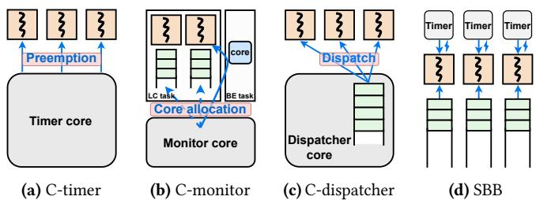  
Figure 1: Comparison of userspace network runtime architectures. The centralized timer, monitor and dispatcher will all become bottlenecks as the number of workers increases (§2.3.2). SBB removes all centralized components and achieves great scalability.

Unfortunately, to perform the scheduling, existing works rely on standalone centralized entities, leading to scalability bottlenecks. For request preemption, a common design [43, 51, 54, 63] is to use a centralized timer to periodically send some specific signals to all workers (Figure 1a). For CPU allocation, many works [38, 74] deploy a centralized monitor that polls each worker’s NIC queue, detecting packet backlog and making CPU core reallocation decisions (Figure 1b). For request load balancing, a common method [51, 53, 54, 74] is to rely on a centralized dispatcher to distribute requests to worker cores (Figure 1c). When scaling to more workers, these centralized entities will become the bottleneck (§2.3.2).

While this scalability limitation is widely recognized [43, 70], existing works fall short due to i) unvalidated assumptions and the lack of ii) scalable system mechanisms and iii) efective decentralized scheduling policies. To wit, conventional wisdom is that one can scale centralized entities with multiple cores [54, 85], each handling a subset of requests or worker cores. Our measurement (Figure 3) challenges it, showing that using more cores achieves worse load balancing, and does not help with request preemption and CPU allocation. In addition, existing system mechanisms lack a µs-scale, decentralized approach to notify worker cores of scheduling events, like time quanta expiration or new packet arrivals, making a centralized timer or monitor the only option. Finally, for scheduling policies, centralized load balancing is chosen as it better approximates a shared FCFS queue, the ideal policy proven by queuing theory [81], but it overlooks the constraint of scalability.

This paper presents SBB1, a highly scalable µs-scale network runtime that eliminates all centralized scheduling entities with even better scheduling quality than prior designs. SBB’s design advances in both system mechanism and scheduling policy.

For the system mechanism, we find that centralized request preemption and CPU allocation stem from a lack of diferent types of hardware support. The former lacks an efficient timer for detecting and preempting long requests. For the latter, interestingly, the root cause is the use of polling to handle incoming packets. Polling prevents a timely detection of packet arrivals when multiple applications are co-located. Thus, a centralized entity is a must to monitor incoming packets and decide if each network application is runnable to perform CPU allocation.

To provide system mechanisms for scalable scheduling, SBB leverages the emerging User Interrupt (UINTR) feature [10, 17]. With UINTR, SBB delivers two types of device interrupts to userspace, a capability not documented in Intel hardware manuals [9]. SBB delivers per-core timer interrupts to the network runtime, thereby avoiding core count as a scalability bottleneck for request preemption. In addition, SBB delivers NIC interrupts to userspace, eliminating a centralized entity to detect packet arrivals, thereby enabling scalable CPU allocation.

For the scheduling policy, our main observation is that existing decentralized load balancing policies fail to consider both causes of imbalance, explaining their poor performance. To wit, existing designs [38, 71, 76] use a combination of NIC steering hardware (e.g., RSS [15]) and task stealing. The former maps a network flow to a worker core, while the latter enables idle cores to steal requests from busy ones. However, the flow-to-core steering in NIC is susceptible to both temporary (e.g., a burst of requests in a single flow) and persistent load imbalance (e.g., some cores are assigned too many flows). Task stealing is only efective for temporary imbalance, causing excessive cache coherence trafic for persistent imbalance, and hence, poor performance.

Thus, SBB introduces a two-level policy that marries task stealing with flow migration into µs-scale network runtime. For temporary imbalance, SBB uses an enhanced task stealing technique to balance at packet-level, while to handle persistent imbalance, SBB leverages flow migration, which programs the NIC to migrate flows away from overloaded cores, thereby addressing imbalance at flow-level. We show, with both simulation (as a platform-independent setup) and real-world experiments, that the scheduling quality of this two-level policy closely matches that of a centralized one, proving that centralized schemes are not inherently better. With it, SBB achieves scalable request load balancing.

We integrate SBB with DPDK [7] to benefit from its wide deployment. We evaluate SBB with synthetic workloads and real-world applications, showing that SBB scales well and achieves an SLO-compliant throughput increase of 1.7× to 5.2× over prior work.

In summary, this paper makes the following contributions:

• Analysis. We analyze and reveal the root causes of scheduling scalability bottlenecks in existing µs-scale network runtimes.

• Mechanisms and Policies. For scalable scheduling, we propose 1) the use of UINTR to deliver userspace timer and NIC interrupts for request preemption and CPU allocation, and 2) a two-level request load balancing policy to mitigate comprehensive imbalance problems.

• SBB. We implement our mechanisms and policies in SBB2, a high-performance userspace network runtime that supports all three types of scheduling in a decentralized and scalable architecture.

## 2 Background and Motivation

This section identifies the three key scheduling types in userspace network runtimes (§2.1), presents an introduction to User Interrupt (§2.2), and introduces how prior work uses centralized entities to perform the scheduling (§2.3).

## 2.1 Scheduling in Network Runtimes

Modern network runtimes must meet three requirements: a) high throughput, b) low median and tail latency, and c) high CPU eficiency. High throughput and low median latency exploit the performance of modern NICs. Tail latency matters because network requests often fan out across multiple components, and thus the end-to-end latency is determined by the slowest response [33, 35]. For the last requirement, even marginal CPU eficiency gains can yield substantial cost savings in datacenters [67, 73, 74, 79].

To meet these requirements, userspace network runtimes perform three types of scheduling: 1) request preemption, 2) CPU allocation, and 3) request load balancing.

Request preemption happens during request processing to avoid head-of-line blocking, thereby reducing tail latency. Head-of-line blocking occurs because heavy-tailed network services involve skewed workloads, where a small portion of requests take much longer to process than others [13, 14, 78]. To minimize tail latency, a network runtime needs to preempt long requests to prioritize short ones [81]. Furthermore, since network requests need to be processed at microsecond scales, the overhead of preemption and task switching must be minimal, making µs-scale preemption an essential feature for userspace network runtimes [54].

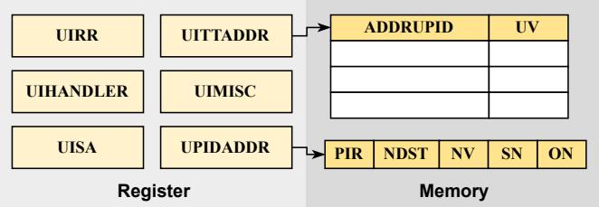  
Figure 2: Key hardware components of User Interrupt.

CPU allocation is necessary to maximize CPU eficiency, i.e., the fraction of CPU cycles spent performing useful work. It is common practice to co-locate multiple applications on a single server, including latency-critical (LC) and bestefort (BE) applications [21, 50, 84]. Thus, the runtime needs to allocate an appropriate share of CPU time to each application and dynamically adjust allocations as load changes: it must reallocate idle cores from LC applications to BE tasks, and be able to promptly reassign cores back to LC applications to handle load bursts [60].

Request load balancing is performed to assign each incoming request to a processing core. The goal is to ensure that no cores are idle while requests are pending. It tries to mitigate the imbalance issue between workers: some workers are too overloaded to handle assigned requests, while some idle workers have no assigned requests.

## 2.2 User Interrupt

User Interrupt (UINTR) [9, 10, 17] is a new hardware feature introduced with Intel Sapphire Rapids CPUs, which allows processes to send and receive interrupts directly in user space without trapping into the kernel. By bypassing the kernel, UINTR avoids overheads such as switching address spaces or privilege levels, thereby ofering high performance.

Main hardware resources. Figure 2 illustrates the key hardware resources for User Interrupt, which consist of registers and memory structures. Each core is equipped with six model-specific registers (MSRs): 1) UIRR: a bitmap in which each set bit indicates a pending interrupt, 2) UIHANDLER: stores the linear address of the user-interrupt handler, 3) UISA: controls stack pointer adjustment before delivering a user interrupt, 4) UITTADDR: holds the memory address of the User Interrupt Target Table (UITT), 5) UIMISC: contains UITTSZ (the highest index of a valid entry in the UITT) and UINV (the interrupt vector to be delivered to user space), and

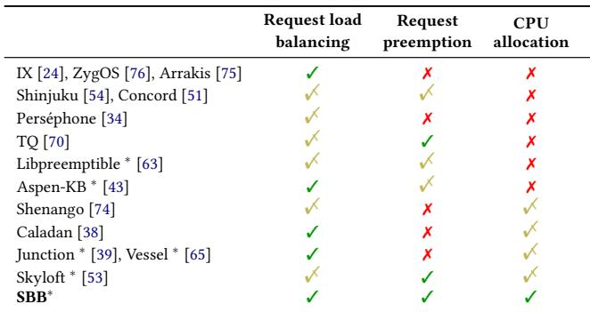  
Table 1: A comparison of various userspace network runtimes. SBB is the only one that supports all three types of scheduling without any centralized entities. ✗: Not supported. !: Supported with a centralized entity. ✓: Supported with decentralized design. ∗ means this system leverages User Interrupt.

6) UPIDADDR: stores the memory address of the User Posted Interrupt Descriptor (UPID).

In terms of memory resources, each thread has a UPID and a UITT. UITT is a table of entries, each storing UV (the user interrupt vector) and ADDRUPID (the address of the target UPID). UPID is a memory region storing the interrupt state (e.g., the pending flag (PIR) and vector (NV )), so that both hardware and the OS can manage user-level interrupts. User Interrupt sending. Intel provides a new instruction, SENDUIPI, to send UIPIs, which takes an index into the UITT as its parameter. Upon execution, the hardware first locates the entry in the UITT using the provided index. It then retrieves the ADDRUPID field to locate the target UPID, updates the PIR field according to the UV to post the interrupt, and finally delivers the interrupt to the target core.

User Interrupt handling. When a UINTR is signaled to a core, the receiving CPU proceeds through three sequential stages: 1) Identification: The CPU first checks whether the incoming interrupt vector matches UINV. If not, the interrupt is processed as a conventional kernel-managed interrupt; otherwise, it proceeds to the next stage. 2) Notification Processing: Once identified as a UINTR, the CPU copies the bitmap of pending interrupt requests from the PIR field of the associated UPID into UIRR, clears the PIR field, and proceeds to deliver each interrupt corresponding to a set bit in the UIRR. 3) Delivery: When the CPU subsequently enters user mode, and the UIRR indicates pending interrupts, the CPU transfers control to the user-level interrupt handler whose address is stored in the UIHANDLER register.

## 2.3 Related Work

The importance of µs-scale networking has motivated a rich body of prior work, summarized in Table 1. We draw two conclusions from the table: 1) Most prior work does not support all three types of scheduling, failing to be a fully functional network runtime; and 2) all prior work uses centralized entities for at least one scheduling type, hindering the whole

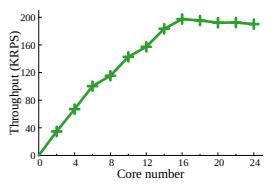  
(a)

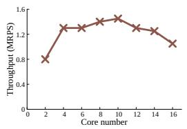  
(b)

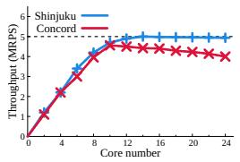  
(c)

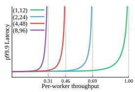  
(d)

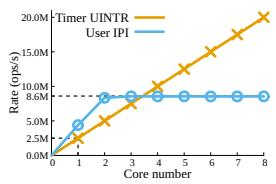  
(e)  
Figure 3: The centralized entities incur poor scalability. (a)–(c) show the scalability bottlenecks of centralized entities individually for request preemption, CPU allocation, and request load balancing. (d) shows that using multiple centralized entities for request load balancing causes imbalance again, in which (n, m) means n dispatchers and m workers. (e) shows the scalability problem of using user IPIs.

system’s scalability.

We next introduce how prior work performs the three types of scheduling (§2.3.1), and analyze the limits of centralized entities (§2.3.2) in detail.

## 2.3.1 How Prior Work Performs Scheduling

Request preemption is often performed by a centralized timer that sends preemption signals to workers when time quantum expires. Although the specific preemption mecha nisms difer, they all follow a similar architecture: a dedicated centralized component manages the preemption of a group of workers, which are responsible for actual request processing. Existing works use advanced preemption mechanisms to minimize the overhead. For example, Shinjuku [54] uses virtualization-hardware-assisted IPIs, Concord [51] employs compiler instrumentation, while Libpreemptible [63] and Aspen-KB [43] utilize Userspace IPIs. Despite this, all these advanced mechanisms still rely on a centralized entity.

CPU allocation uniformly uses a centralized entity when present. Some prior systems give up supporting multiapplication co-location (see Table 1)—an approach that is increasingly unacceptable given the growing demand for CPU eficiency in datacenters. Other systems, such as Shenango [74] and Caladan [38], introduce a centralized component to dynamically manage CPU core allocation. They employ a dedicated monitor that continuously monitors queue backlog on NICs and decides whether cores need to be reallocated to LC tasks to handle load bursts.

Request load balancing can be 1) centralized or 2) decentralized. The userspace network runtimes at an early stage usually adopt decentralized architecture, only relying on Receive Side Scaling (RSS) [15], a modern NIC hardware mechanism to steer incoming packets to cores. This is achieved by mapping each packet to a flow (based on, e.g., the source and destination IP addresses and ports, and the protocol number), and then assigning each flow to a core.

However, the flow steering hardware sufers from load imbalance, as diferent cores may be allocated skewed flows. Recent works [38, 43, 76] alleviate the hardware drawbacks with task stealing, but sufer from performance issues [54, 71]. By contrast, more recent systems [51, 53, 54, 70, 74] choose to use a dedicated dispatcher thread to poll the single NIC queue, handle network protocol processing, and send the packet to an idle worker.

## 2.3.2 The Scalability Bottlenecks

Although the three types of centralized components, i.e., timer, monitor, and dispatcher, could support each scheduling type to some extent, they unavoidably become the bottleneck of the whole system, as the number of workers increases. In order to analyze each type of centralized component in a targeted manner, we select representative systems and conduct focused tests in the corresponding scenarios, showing their impact on scalability.

Scalability bottleneck 1: centralized timer. We select Shinjuku [54] as a representative system that implements request preemption, which uses one centralized timer to record the processing time of each worker, and when the processing time exceeds the time quanta, sends an IPI to interrupt it, forcing it to switch to the next packet.

To investigate Shinjuku’s scalability problem, we conduct a heavy-tailed workload test with an increasing number of workers. As shown in Figure 3a, when the number of workers exceeds a threshold, the throughput of the system stops increasing and even decreases. Further analysis reveals that the timer becomes the bottleneck once the number of workers exceeds 16: when many workers need preemption simultaneously, the timer cannot send IPIs to all of them during the configured preemption interval (e.g., 5µs). Previous studies have also shown the centralized timer’s scalability limitation when using many workers [43, 70].

Scalability bottleneck 2: centralized monitor. Caladan [38] is state-of-the-art network runtime that supports multi-application co-location, and acts as a basis for subsequent works [39, 65, 71]. It introduces a component called iokernel, which acts as a centralized monitor, checking whether any LC task thread has accumulated packets in its NIC queue every scheduling interval (typically 10µs). If so, it preempts a core from a BE task and reassigns it to the LC task. If the backlog remains, iokernel repeats the process in the next interval, continuing until the load burst subsides.

To evaluate iokernel’s ability to reallocate cores, we modify Caladan’s load generator following on-of network patterns, which are common in the real world [25, 26, 41]. The generator alternates between two phases every 1 ms: Phase 1 produces a specified load, and Phase 2 stops sending packets. Other testbed configurations are the same as §6.3.

We set the SLO to a p99.9 latency below 50µs and measure the maximum load Caladan could sustain without SLO violations for diferent worker counts. As shown in Figure 3b, Caladan exhibits poor scalability. The reason lies in the iokernel: as the load and number of cores increase, it fails to reallocate enough cores to LC tasks in a timely manner when packets arrive in bursts, which easily causes SLO violations.

Scalability bottleneck 3: centralized dispatcher. To evaluate the centralized dispatcher’s ability to perform load balancing, we select Shinjuku and Concord [51] to exclusively run Fixed(1) workload (see Table 3), to exclude the need for request preemption and CPU allocation. Figure 3c shows that the overall throughput has an upper limit of 5MRPS. A straightforward calculation validates this issue: even though Shinjuku employs various optimizations (such as batching and simplifying protocol logic) to largely reduce the packet’s processing overhead for dispatcher (200ns measured on our machine on average), since all the packets are processed by dispatcher, the maximum packet processing rate of the system is capped at 1/200 ns = 5 MRPS. It is analogous to a river whose overall flow remains constrained by the narrowest upstream section, no matter how much the downstream channel is widened.

Multiple dispatchers do not help. The scalability bottleneck of centralized dispatchers is widely admitted [43, 54, 71], and a common assumption is that a viable solution is to deploy multiple dispatchers, each responsible for dispatching a subset of packets [54, 85].

The experiment results refute this belief. Figure 3d shows that multiple dispatchers sufer from load imbalance again. We constrain each dispatcher to manage only 12 workers in a group. As the number of groups increases, the throughput on average decreases notably.

User IPIs do not scale. Although UINTR is a relatively new technology, it has already been adopted in several systems, primarily for sending userspace inter-processor interrupts (UIPIs) [39, 43, 63, 65].

However, although UIPI provides higher performance, it has a limited sending rate regardless of the number of cores used, as shown in Figure 3e. Although we increase the number of senders that use dedicated cores sending user IPIs, the rate of interrupts still has an upper limit, which is attributed to one NUMA’s constraint. This result means the IPI operations still cannot scale with the workers, even when adding more cores to serve as the timer or monitor.

## 3 Enabling Decentralized Network Runtime

Based on the following analysis and experiments, this section concludes the design goals (§3.1) and presents the key design ideas behind SBB, enabling it to eliminate centralized entities for all three types of scheduling without sacrificing performance benefits (§3.2 and §3.3).

## 3.1 Design Goals

SBB aims to build a purely decentralized userspace network runtime, identifying the following as design goals:

High Scalability. Since multi-core collaboration is essential in datacenters to ensure that CPU processing keeps pace with the rapid evolution of NIC hardware, SBB’s foremost goal is to construct a network runtime with strong scalability.

High Performance. SBB’s scalability across multiple cores must not come at the cost of performance with fewer cores. Regardless of the number of workers, SBB should achieve better performance than existing systems, supporting higher throughput and lower tail latency across various workloads.

High Eficiency. To improve CPU utilization and save energy, SBB must support the co-location of LC applications with other applications on the same cores, saving idle CPU cycles without decreasing LC applications’ performance.

## 3.2 Decentralized Preemption and CPU Allocation

Through further analysis, we next discuss, for request preemption and CPU allocation, (1) why prior work adopts a centralized design and (2) why SBB can leverage User Interrupt to eliminate it.

Request Preemption. For request preemption, prior work forgoes a decentralized design due to a lack of hardware support. Conventional interrupts trap to the kernel, thus being unsuitable for kernel-bypass runtimes. While Dune [23] enables direct access to privileged hardware features, it does not include timer interrupts, which the OS uses to regain CPU control. Hence, the only viable solution is to use virtualization-assisted IPIs or user IPIs [43, 54, 63].

CPU Allocation. This demand is fundamentally caused by the inherent conflict between polling and multi-application co-location [47]. While polling ofers lower overhead, it carries an unavoidable drawback: without interrupts, an application can learn about packet arrivals only when it is actively running on a core and polling. Once descheduled, the application has no means of receiving notification of new packets until the scheduler assigns it a core again, which typically takes millisecond intervals, unacceptable for microsecondscale network requests [65]. Facing this challenge, prior work requires an entity to monitor and perform CPU allocation.

Our approach. Our observation is that UINTR can eliminate the centralized entity for both scheduling types. To enable request preemption, SBB delivers per-core timer interrupts to userspace (§4.3), without an upper limit on preemption rates (Figure 3e). For CPU allocation, SBB forgoes polling and delivers NIC UINTR, enabling the worker core to be aware of packet arrivals promptly without a centralized entity (§4.2).

Our use of UINTR departs from most prior work. As discussed in §2.3.2, prior work focuses on UIPI as a faster alternative to IPIs for centralized preemption. Rather, SBB delivers NIC and timer interrupts to userspace, enabling a decentral ized design. A traditional concern about our design is that interrupts may be too expensive for µs-scale networking [22]. However, the breakdown experiments show that both NIC and timer UINTR are high-performance mechanisms (§6.5).

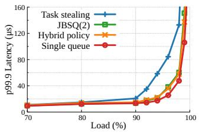

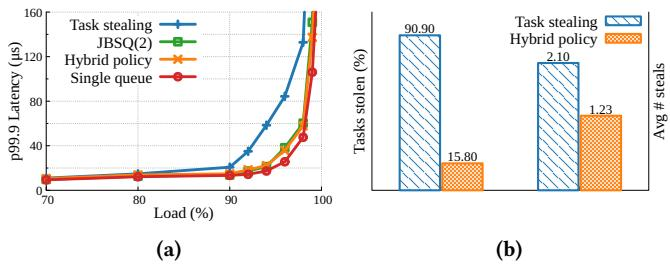  
Figure 4: Simulation results of diferent load balancing policies.

## 3.3 Scalable and Efective Request Load Balancing

Contrary to the conventional wisdom that centralized design performs better, we find that with proper scheduling policy, decentralized request load balancing achieves quality matching centralized schemes. We demonstrate this using a prior simulation system [71]. Keeping most setups unchanged, we add the simulation of NIC RSS mechanism and group the packets into flows.

We evaluate four designs. 1) Single queue represents the optimal case proven by queuing theory [81], where an idle worker always fetches requests from a shared queue, thus achieving perfect load balancing. However, this design is impractical on real systems, due to contention on the shared queue. 2) JBSQ(2) is the closest approximation [51] to Single queue, and thus the best centralized design. In this case, each worker owns a two-slot private queue, and a centralized entity dispatches requests from the shared queue to the shortest worker queue. 3) Task stealing is the prior best decentralized design, making idle workers steal requests from other workers. The stealing overhead is set to 200ns, following the prior work’s configuration. 4) Hybrid policy is the two-level load balancing policy used by SBB.

Figure 4a shows that task stealing is still far from JBSQ(2), and Figure 4b shows why. We record two metrics when the load is 95%: 1) Tasks stolen represents the percentage of completed tasks that are stolen at least once. 2) Average number of steals counts the average number of steal events among all the stolen tasks. It shows that task stealing performs badly due to too many stealing events, which cause cache misses. After collecting the information of those stolen packets, we are surprised to see that most packets belong to only a few flows, which means due to the randomness of RSS, some cores are assigned much fewer flows than other cores, making the former continue stealing packets in a flow from the latter.

Our approach. The analysis shows that the poor performance of a decentralized design is not inherent. Our main observation is that the flow-to-core mapping in NIC steering hardware causes both 1) temporary load imbalance, where a flow experiences a burst of requests, and 2) persistent load imbalance, where some cores are assigned too many flows. Task stealing enables a worker experiencing a sudden burst of incoming packets to ofload packets to others, which is only suitable for the former, not the latter, where it sufers from continuous and excessive cache coherence overhead and thus underperforms.

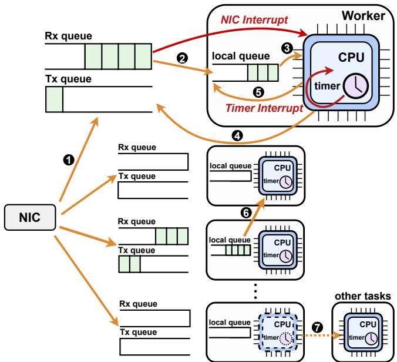  
Figure 5: Overall architecture of SBB.

Therefore, we propose a two-level decentralized load balancing design, marrying task stealing with flow migration to handle comprehensive load imbalance. The simulation shows that this hybrid policy largely reduces unnecessary stealing (Figure 4b) and achieves nearly the same performance as JBSQ(2) (Figure 4a).

## 4 Design

## 4.1 An Overview of SBB

Figure 5 illustrates the overall architecture of SBB. Instead of employing any centralized components, SBB builds a purely decentralized network runtime. Each worker thread is bound to a CPU core and maintains its own local queue and local timer. The NIC provides each worker thread with a dedicated set of Rx and Tx queues. As a result, from a global perspective, every component belongs exclusively to one worker thread— no shared components exist across multiple worker threads.

The workflow of SBB proceeds as follows: 1 When a packet arrives at the NIC, it is assigned to one Rx queue via RSS (Receive Side Scaling) [15]. 2 The Rx queue triggers a user-level NIC interrupt, which is handled by the worker thread in user space. 3 The worker thread moves packets from its Rx queue into its local queue and then processes them. 4 After processing a packet, the worker thread constructs a response and transmits it via its Tx queue. 5 A local timer tracks the processing time of each packet, and triggers a timer interrupt if a packet’s processing exceeds the predefined quanta. The worker’s CPU then saves the packet’s state, requeues it, and proceeds to the next packet. When a worker thread finds its Rx queue empty and has no packets to process, it 6 performs task stealing or flow migration to balance the load; if still failing to obtain new packets, it 7 yields the core to other co-located applications to increase CPU eficiency.

This purely decentralized architecture provides inherent advantages for scalability. All workers can directly send and receive packets through the NIC, enabling fully parallel dataplane processing without centralized dispatching. In the control plane, the removal of all centralized components eliminates the need for any central entity to issue control signals—including those for request preemption and CPU allocation. By eliminating centralized components (i.e., timer, monitor and dispatcher) used by prior work (§2.3.2), SBB allows the system’s overall throughput to scale nearly linearly with the number of workers.

However, this model also introduces key challenges: SBB still needs to perform three types of scheduling to provide high throughput, low latency, and high eficiency. The following sections describe how SBB provides each of these scheduling functions.

## 4.2 Timely CPU Allocation

Choosing interrupt over polling. As demonstrated in §2.3.2, polling has an inherent conflict with multi-application co-location, while Caladan’s centralized monitor cannot solve this with great scalability.

Our observation is that interrupt is more suitable than polling for multi-application co-location. We build a prototype for test, which leverages DPDK’s interrupt-driven packet reception [7]. The results indicate that while its tail latency is higher, the system shows promising scalability under the given conditions (Figure 3b). When a new packet arrives, the interrupt mechanism promptly wakes up the LC task even if it is not currently running on the core, enabling timely request processing without relying on external control components.

However, conventional interrupt mechanism involves kernel crossing, incurring higher overhead than polling [42, 62], which makes it unsuitable for userspace network runtimes. Therefore, we leverage a new hardware feature, User Interrupt (UINTR), to achieve timely CPU allocation. To the best of our knowledge, SBB is the first to adopt UINTR as a replacement for polling for NIC notification mechanisms.

Delivering device user interrupt. Although UINTR has been adopted in several recent works, most utilize it solely for UIPIs [19, 39, 43, 45, 63, 65]; no prior work has employed UINTR as a notification mechanism for NICs. This is because the current user-interrupt hardware is not designed to handle interrupts generated from devices, e.g., NICs. As described in §2.2, the CPU can only proceed to the interrupt handler in the third step if two earlier conditions are met: 1) The interrupt vector from the NIC must match UINV, and 2) the PIR field must be non-zero.

Meeting the first condition is relatively straightforward: during initialization, the interrupt vector of each NIC queue can be obtained, and UINV can be set accordingly. However, satisfying the second condition is challenging because even if a bit in PIR is set initially, it will be cleared during the first UINTR handling cycle. To continuously receive NICgenerated user interrupts, the PIR must be rewritten after each interrupt is processed. The UINTR hardware does not provide a low-overhead mechanism for userspace programs to achieve this: either issuing a SENDUIPI to oneself, which would generate an IPI, or trapping into the kernel to modify PIR, thus forfeiting the performance benefit of kernel bypass.

To overcome this limitation at low cost, some systems have introduced software workarounds [53, 61]. We use the approach proposed by Aeolia [61]: during initialization, a new system call maps UPID into the address space of the user program. This enables the application to rewrite PIR after handling each NIC-generated user interrupt, thereby re-arming the next UINTR.

Reallocating cores via interrupt. We replace polling with UINTR as the NIC notification method, achieving a lowoverhead mechanism that is suitable for CPU sharing. When a packet arrives at the NIC, the corresponding queue raises an interrupt to its assigned core. If the LC task is currently running on that core, the interrupt is delivered directly to the registered handler in user space, introducing minimal overhead compared to polling (see §6.5). If the LC task is not running, which is the case where polling cannot handle eficiently, the interrupt vector will not match UINV, causing the interrupt to be processed as a traditional kernel interrupt. During initialization, SBB registers a custom kernel handler for each NIC queue, which triggers when packets arrive while the associated LC task is inactive. This handler wakes up the LC task and invokes the scheduler, allowing the task to regain CPU resources and process the request promptly.

Compared to polling-based sharing approach, adopting UINTR fundamentally resolves the conflict between polling and CPU sharing. Furthermore, in contrast to Caladan’s cen tralized and passive CPU scheduling, SBB enables each core to actively and promptly switch among multiple applications without relying on external components, demonstrating both high performance and strong scalability under load bursts.

Avoiding interrupt storm. One natural concern about interrupts is the interrupt storm, i.e., packets arriving at high rates may trigger interrupts so frequently that interrupt handling consumes excessive CPU cycles and influences other packets’ processing [48, 56].

SBB avoids this classic problem by leveraging NIC’s automask capability (introduced in §4.4), which is similar to interrupt moderation [20]. As shown in Figure 6, SBB only unmasks NIC interrupt and receives packets at step 1; during other steps, SBB keeps NIC interrupt masked, to prevent it from influencing these packets’ handling. Evaluation demonstrates that this approach can efectively mitigate the interrupt storm issue at high loads (Figure 8a).

## 4.3 Decentralized Request Preemption

Delivering user interrupt for LAPIC timer. Since a centralized entity that performs request preemption unavoidably becomes the bottleneck (§2.3.2), a decentralized preemption mechanism is needed, leveraging per-CPU capabilities to self-preempt. We observe that modern CPUs are equipped with a single LAPIC timer, which can be configured in various timing modes to trigger interrupts on the local CPU at preset intervals. This approach 1) does not depend on external components, thus ofering good scalability [43, 54, 63], as well as 2) ofers high precision that compiler instrumentation techniques cannot achieve [43, 51, 70].

However, the LAPIC timer has a critical drawback: its traditional preemption approach (Linux’s setitimer) involves multiple switches between user and kernel space, resulting in an overall overhead of approximately 3µs, which is higher than several existing mechanisms (see Table 4). To integrate the timer interrupt mechanism into µs-scale network runtimes, it is essential to reduce the overhead.

Fortunately, we find that UINTR can be used to handle timer interrupts directly in user space, similar to NIC interrupts. During initialization, each worker thread configures its LAPIC timer to use the same interrupt vector as the NIC interrupt, which is also the same as UINV value. Therefore, when the timer interrupt is triggered, the CPU jumps directly to the user-level handler, completely bypassing the kernel.

Request preemption workflow. SBB performs request preemption as follows: before each LC task thread processes a request, the worker arms a one-shot timer interrupt that fires after a specified time quantum. If the current request finishes within the quantum, the LC task thread resets the timer for the next request. Otherwise, this means a long request is being processed, and a userspace timer interrupt is triggered. The worker preempts the current request, saves its execution context to the local request queue, and schedules the next request for processing.

Programming the timer interrupt costs only 50 cycles on our machine, incurring negligible overhead. This is because it only requires writing to two registers (APIC\_LVTT and APIC\_TMICT), both of which have been mapped into the userspace memory during initialization. As shown in §6.5, timer UINTR achieves both low latency and high scalability.

## 4.4 Combining Two User Interrupts

One challenge in SBB is to enable the coexistence of timer UINTR and NIC UINTR, which is not solved by prior work such as Skyloft [53] and Aeolia [61]. This challenge exists because when the CPU jumps to the user interrupt handler, there is a need to distinguish the interrupt source, as the CPU must handle timer and NIC UINTR diferently. However, Intel does not provide support for this need. For a given CPU, there is only one set of UINTR register resources (e.g., UIHANDLER, UINV). Regardless of the interrupt source, all UINTRs jump to the same handler address, making it impossible to distinguish their sources directly. Moreover, control functions such as stui and ctui can only enable or disable all UINTRs indiscriminately, which does not meet the need to disable one while keeping the other active. Therefore, enabling two device UINTRs to coexist—each performing its function without conflict—becomes a key problem that SBB must solve. To the best of our knowledge, SBB is the first work to attempt the coexistence of two UINTRs.

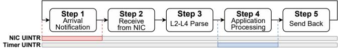  
Figure 6: SBB’s request processing flow.

SBB’s solution is based on two following observations. First, most modern NICs, e.g., Intel E810 [2] and Mellanox ConnectX-5 [6], automatically disable interrupts after triggering them until the user program explicitly re-arms it. Second, the two types of UINTRs can be active at non-overlapping periods: NIC UINTR is used to notify the user thread of packet arrival, while timer UINTR remains active during applicationlayer operations. Hence, by carefully partitioning the packet processing stages, SBB can distinguish the interrupt source.

Based on these observations, we refine the packet handling flow in each worker, as shown in Figure 6. Following the Linux interrupt handling model, we divide network request processing into top half and bottom half. When a packet arrives at the NIC queue and triggers a NIC UINTR, the interrupt handler simply sets a pending flag and returns immediately. The subsequent steps, including dequeuing the packet from the NIC, protocol-stack parsing, application-layer processing, and sending back the response, are carried out by the worker thread.

By partitioning the packet processing flow at fine granularity, SBB ensures that the two UINTRs are never enabled simultaneously. SBB re-enables NIC interrupts only after completing the last batch of requests, excluding long requests that were interrupted and re-queued. As for the period during which timer UINTR should be active, we note that the variation among requests lies mainly in the application-layer processing; the durations of other stages are relatively consistent. Therefore, timer UINTR needs to be active only during application-layer execution to address head-of-line blocking.

This design involves three important advantages: first, keeping NIC UINTR disabled at other stages eliminates the interrupt storm issue when facing high RPC rates (§4.2); second, programming the timer UINTR only during application-layer execution avoids unnecessary interrupts; finally, since each stage only has one possible interrupt source, this allows SBB to directly identify and control the corresponding UINTR, enabling two types of UINTR to coexist.

## 4.5 Two-Level Load Balancing Policy

## 4.5.1 Flow Migration

As shown in §3.3, task stealing is not suitable for handling persistent load imbalance. SBB leverages flow director functionality, which is commonly available in commodity NICs [2, 4, 6], to overcome this challenge. The NIC driver can install rules that steer packets matching specific flow characteristics (e.g., 5-tuples) directly to designated receive queues, while unmatched packets continue to be distributed via RSS. The cost of installing rules is approximately 10 µs, making it suitable for infrequent use in µs-scale network runtimes.

Using this mechanism, when a worker becomes persistently overloaded due to hosting too many or overly heavy flows, SBB can migrate an entire flow to an idle worker. This enables faster and more efective balancing than packet-level stealing. By combining task stealing and flow migration, SBB employs a two-level hybrid load balancing policy that eficiently handles both temporary and persistent imbalance.

In detail, workers have two roles: victims and stealers. When a worker finds its Rx queue empty, it will become a stealer and try to obtain load from other workers, namely victims. Their behavior is as follows.

From the victim’s perspective, each worker can be in one of three states: Light, Busy, or Overloaded. After each round of packet reception from the NIC, a worker updates its state based on whether the number of received packets exceeds or falls below predefined watermarks. To avoid transient fluctuations caused by bursty trafic, state transitions are only triggered after three consecutive rounds that satisfy the watermark condition.

Initially, all workers start in the Light state. When a worker receives packets above the LIGHT\_TO\_BUSY\_THRESHOLD for three consecutive rounds, it transitions to Busy state, indicating a temporary burst in load. If a Busy worker continues to exceed the BUSY\_TO\_OVERLOADED\_THRESHOLD for three consecutive rounds, this indicates persistent overload that cannot be alleviated by task stealing, and the worker transitions to the Overloaded state. Upon entering this state, the worker extracts and publishes the flow identifier of the next packet it processes, enabling other workers to migrate that flow. Conversely, if the load falls below low watermarks for three consecutive rounds, the worker transitions back to Busy or Light accordingly.

On the other hand, from the stealer’s perspective, when a worker finds its NIC receive queue empty, it scans other workers to steal tasks. For each candidate worker, the stealer first checks its state. If the worker is Light, it likely has suficient capacity to handle its own load, and stealing is unlikely to be beneficial, so it is skipped. If the worker is Busy, this indicates temporary overload, and packet-level task stealing is suficient. The stealer attempts to access the victim’s queue and steal half of the pending requests for processing. If the worker is Overloaded, this indicates sustained overload and flow migration is preferred. In this case, the stealer retrieves the published flow information and installs a NIC rule to redirect the corresponding flow to its own queue.

## 4.5.2 Enhanced Task Stealing

Although SBB introduces flow migration, we find that task stealing remains necessary. If only flow migration is used, even if we directly control flows to be perfectly the same across workers in terms of number and size—ensuring equal load over longer time scales—performance still degrades. This is because the bursty nature of network trafic leads to shortterm load imbalance that flow migration alone cannot address. In summary, task stealing and flow migration are complementary: the former is efective for handling temporary imbalance, while the latter addresses persistent imbalance. Only by combining both can SBB robustly handle diverse network load conditions.

Therefore, in addition to introducing flow migration, SBB also incorporates several optimizations to task stealing. We first describe the baseline task stealing workflow, and then present the optimizations applied in SBB.

Baseline task stealing workflow. Each worker receives incoming packets from the NIC and enqueues them into a request queue. Since DPDK achieves optimal performance when receiving packets in a batch of 64, SBB sets the request queue capacity to 64 accordingly. Workers process requests in FIFO order. A worker polls the NIC for the next batch of packets only after its local request queue becomes empty, except for long requests that may be preempted and re-enqueued. Each request queue is protected by a lock.

Optimizations to task stealing. Building on this baseline design, SBB introduces the following optimizations to improve performance:

O1: Owner-exclusive block. SBB reserves the first 16 entries of each request queue as an owner-exclusive block. Requests in this region are invisible to stealers and therefore do not require locking. When the number of incoming packets in a round is below 16, all requests reside within this owner-exclusive block and are processed entirely by the owner worker, avoiding unnecessary stealing at low load. When the number of incoming packets exceeds 16, only the excess requests are placed in the stealer-visible region and may be stolen. This design significantly reduces lock contention and cache coherence overhead under low load.

O2: Avoid multi-stealing per task. A common ineficiency in task stealing systems is multi-stealing, where a request stolen by one worker is subsequently stolen again by another, as shown in Figure 4b. To eliminate this overhead, SBB ensures that once a stealer acquires requests, it processes them directly instead of enqueuing them again into its own queue. This prevents repeated stealing of the same request and improves overall eficiency.

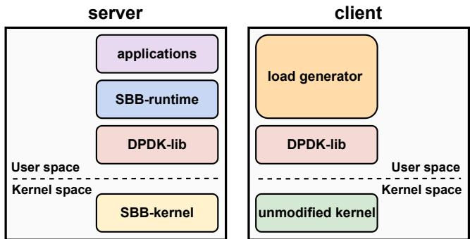  
Figure 7: Implementation of server and client.

O3: Batch dequeuing and stealing. Since each access to the request queue requires locking, SBB amortizes this cost via batching. The owner dequeues a batch of requests (e.g., 16) per lock acquisition and processes them sequentially. Similarly, a stealer acquires the lock once and steals half of the currently available requests in the queue. This reduces the frequency of lock operations and improves cache locality.

O4: Use of try-lock. When attempting to acquire a victim’s queue lock, the stealer uses a non-blocking try-lock. If the attempt fails, the stealer does not spin but immediately proceeds to the next candidate worker. This avoids unnecessary contention and wasted CPU cycles.

O5: Victim selection strategy. SBB adopts a locality-aware victim selection policy. A stealer begins scanning from the victim it successfully stole from in the previous round, as that worker is likely to remain in a Busy or Overloaded state. It then continues scanning other workers in a round-robin fashion. To further reduce contention among multiple stealers, SBB initializes each worker with a diferent starting point, thereby minimizing the likelihood that multiple stealers target the same victim queue simultaneously.

## 5 Implementation

SBB’s implementation mainly consists of two parts: a kernel patch and a network runtime (Figure 7). The kernel patch, based on Linux kernel 6.12.20, comprises 2,095 lines of code (LOC) and primarily adds support for both NIC and timer UINTR. The network runtime is built on DPDK v25.07.0 [7], to benefit from its wide deployment. It contains 4,343 LOC, implementing all the designs presented in this paper. In addition, it includes a lightweight TCP/UDP network stack used in much prior work [51, 54, 70]. Although the protocol stack lacks some key features (e.g., congestion control), we use it for a fair comparison.

Similar to most prior designs [38, 43, 51, 53, 74], SBB requires application rewrites to integrate with its runtime. SBB defines a runtime interface layer, as shown in Table 2. An application can be ported to the SBB runtime by implementing

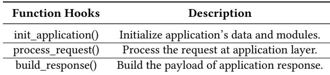  
Table 2: The hooks defined by the runtime interface.

these three hook functions.

For evaluation, we also implement a full-featured client packet generator. Built on unmodified kernel and DPDK, this client can produce workloads with configurable request duration distributions, packet arrival patterns, and transmission rates, consisting of 2,067 LOC.

## 6 Evaluation

We evaluate SBB to answer the following questions:

1. How does SBB perform with dedicated cores across various workloads? (§6.2)

2. How does SBB behave under multi-application colocation? (§6.3)

3. How well does SBB scale with an increasing number of worker cores? (§6.4)

4. What is the performance impact of each design component in SBB? (§6.5)

## 6.1 Methodology

Testbed. Our testbed follows the RFC 2544 [29] setup with two directly connected machines: a server running SBB or the baseline systems, and a client generating the load. The server is equipped with two NUMA nodes, each containing a 64-core Intel Xeon Platinum 8592 processor operating at 1.9 GHz. We configure the server following prior work [38]: TurboBoost, CPU idle states, CPU frequency scaling, and transparent hugepages are disabled. The client machine is equipped with a single-socket Intel Xeon 6780E processor, containing 144 physical cores running at 3.0 GHz.

For the NICs, both server and client are equipped with a 100 Gbps Intel E810 NIC [2]. We found that Caladan sufers from performance degradation when using the Intel NIC, so we run Caladan with ConnectX-5 [6] to achieve the best performance, following its guidance [5].

As for the kernel configuration, SBB runs on Ubuntu 24.04 with its custom kernel; while for baseline evaluations, we follow each specific demand: Shinjuku and Concord run on Ubuntu 18.04 with kernel 4.4.0; Caladan and TQ run on Ubuntu 22.04 with kernel 5.15.0; Skyloft runs on Ubuntu 24.04 with its custom kernel. As SBB and baselines are userspace network runtimes, we believe that this does not change the conclusions we reach.

Systems evaluated. Since SBB integrates three types of scheduling, we conduct experiments to evaluate each scheduling type individually. As most prior work does not perform all these scheduling (Table 1), we compare with each only for the problem it targets. Since request load balancing is the basis of network runtime, it is evaluated in all experiments. For request preemption, we select Shinjuku [54], Concord [51], and TQ [70] to evaluate SBB’s preemption mechanism. For CPU allocation, we compare with Skyloft [53], Caladan [38], and its optimized version, Caladan-DL, which trades of tail latency against CPU eficiency using a Delay Range policy [71].

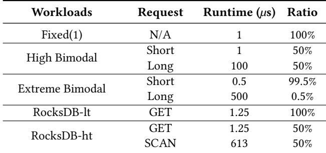  
Table 3: The list of some evaluated workloads.

Workload. To make a fair comparison with each baseline, we follow these prior works to select workloads. Overall, these workloads either run on dedicated cores (§6.2) or share cores with other tasks (§6.3), to evaluate SBB’s ability to perform request preemption and CPU allocation, respectively.

To evaluate request preemption, we follow prior work [43, 51, 70] to use one synthetic and one real-world application. The synthetic workload is a server application that spins for the duration specified by each request, which allows us to evaluate SBB under a range of service time distribu tions. Specifically, we run the Fixed(1), High-Bimodal, and Extreme-Bimodal workloads. Fixed(1) is a low-dispersion synthetic workload with a fixed 1 µs service time for all requests [51, 54]. High-Bimodal is modeled after YCSB’s Workload A, which has a balanced read/update mix [31]. Extreme-Bimodal is modeled after Facebook’s USR workload, which is dominated by short GET requests with a small fraction of much longer requests [18].

For real-world evaluation, we use RocksDB [14], a popular and widely deployed key-value store developed by Facebook [37]. We build a custom network server atop the RocksDB storage backend. We disable logging and keep all data fit in memory to better stress networking.

To evaluate CPU allocation, we follow Caladan’s configuration: Memcached [11] serves as the latency-critical (LC) task, and the swaptions benchmark from PARSEC [27] serves as the best-efort (BE) task. Memcached is an in-memory key-value store with light-tailed workload patterns, while swaptions application computes portfolio prices using Monte Carlo simulations.

## 6.2 Handling Various Kinds of Loads

Table 3 summarizes the distribution of request duration for various workloads. Unless otherwise specified, all systems use 16 threads, each on a dedicated core.

We first compare the systems under a low-dispersion workload: Fixed(1). In such a scenario, no head-of-line blocking occurs; hence, preemption provides no benefits. Figure 8a shows the results. SBB sustains 9.7MRPS under the 99.9th-percentile slowdown SLO of 50×, achieving over 90% higher throughput than TQ, Concord, and Shinjuku. This improvement mainly stems from SBB’s decentralized load balancing policy: when faced with high rates of requests, there is no centralized dispatcher becoming the bottleneck of the system.

We evaluate SBB’s ability to perform request preemption with two synthetic high-dispersion workloads, with Figure 8b and Figure 8c showing the results. For the High-Bimodal workload, SBB reaches 260KRPS, outperforming baselines by more than 30%. Under the Extreme-Bimodal workload, SBB achieves more than 40% increase in throughput. These gains are attributed to SBB’s decentralized, low-overhead preemption mechanism, demonstrating that even with a modest number of cores and without scalability in mind, SBB delivers superior performance.

To evaluate SBB’s performance on real-world workloads, we run RocksDB with both light-tailed (Figure 8d) and heavytailed patterns (Figure 8e). At the same SLO target, SBB supports 20% to 80% higher throughput over prior work. Notably, these comparisons use a small number of workers for all systems; thanks to its better scalability, SBB will exhibit even larger performance gains as the number of workers increases.

Summary. SBB provides high performance with dedicated cores across various workloads, due to its load balancing policy and request preemption mechanism.

## 6.3 Sharing CPU Resources

To demonstrate that SBB can improve CPU utilization by yielding CPU resources to BE tasks while LC tasks have low load, we compare it with Skyloft, Caladan and Caladan-DL. We use 16 CPU cores, where Memcached and swaptions are each launched with 16 threads and bound to dedicated cores. For Skyloft and Caladan, one more dedicated core is required for the iokernel. In contrast, SBB has no centralized component; each core runs both a Memcached thread and a swaptions thread. Clients send packets following a Poisson distribution [72]. When a packet arrives at the NIC, the Memcached thread is scheduled to run and yields the CPU core to the swaptions thread during idle periods.

Figure 9a shows the results of the LC task. Skyloft performs worst for the same reason as Shinjuku: the centralized dispatcher limits the overall throughput. Unlike Skyloft, by allowing each worker to receive packets directly from the NIC instead of relying on a centralized dispatcher, both SBB and Caladan surpass the 5MRPS limit. Under an SLO of p99.9 latency less than 100µs, SBB achieves throughput improvements of 28% and 15% over the two Caladan variants, respectively. We attribute this to its proactive scheduling mechanism: when a packet arrives while a BE task is running, SBB uses interrupt-based notification to immediately trigger a process switch. This approach yields lower tail latency and higher load tolerance compared to Caladan’s passive strategy, which reassigns cores only after detecting packet delays.

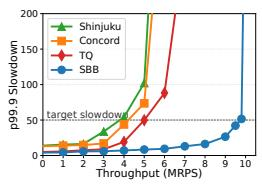  
(a) Fixed(1)

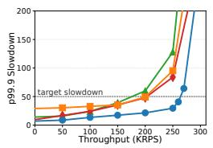  
(b) High Bimodal

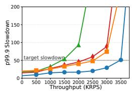  
(c) Extreme Bimodal

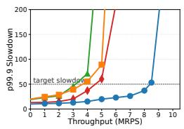  
(d) RocksDB-lt

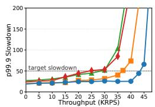  
(e) RocksDB-ht

Figure 8: Performance comparison between Shinjuku, Concord, TQ, and SBB under various workloads  
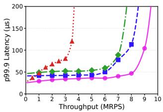  
(a) Tail latency for Memcached.

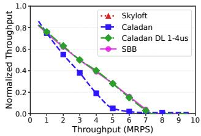  
(b) Throughput of swaptions.

Figure 9: Performance comparison for two applications.  
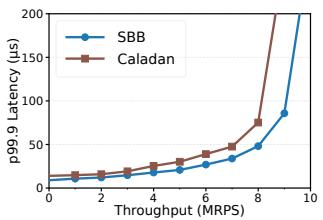  
(a) Tail latency for Fixed(1).

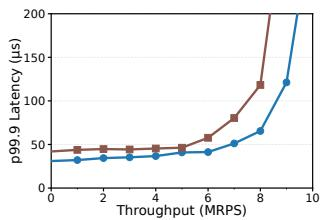  
(b) Tail latency for Memcached.  
Figure 10: Co-location of multiple LC tasks.

Figure 9b illustrates the throughput of the BE task, excluding Skyloft, which runs Memcached on dedicated cores. All three systems yield CPU resources to the BE task under low load, with BE utilization decreasing as load increases. Compared to the original Caladan, Caladan-DL increases tolerance to packet delays, thereby improving CPU eficiency at the cost of higher tail latency. SBB, on the other hand, achieves the lowest tail latency while delivering CPU eficiency comparable to that of Caladan-DL, demonstrating its strength in sharing CPU resources across applications.

SBB also supports other co-location patterns, e.g., multiple LC tasks co-location. We run a Memcached instance and a synthetic application on a set of cores, and use the client to generate a mix of Memcached and synthetic requests. Figure 10 shows SBB’s ability to perform CPU allocation when running multiple LC tasks.

Summary. Using NIC UINTR to perform CPU allocation, SBB achieves both lower latency and higher eficiency when co-locating multiple applications.

## 6.4 Scaling to More Workers

By leveraging User Interrupt and two-level load balancing policy, SBB efectively performs three types of scheduling, outperforming prior work. A further and more important question is: how does SBB scale? As NIC hardware advances, processing network requests at line rate requires an increasing number of worker cores, placing greater demands on the scalability of the network runtime.

We demonstrate SBB’s strong scalability through the following experiments that individually evaluate SBB’s scalability for three types of scheduling (Figure 11).

First, we evaluate Fixed(1) with varying numbers of workers, using the same configuration as in Figure 8a. Under the same SLO, the achievable throughput for 16, 32, and 48 workers is approximately 9.5, 19, and 26.5MRPS, respectively (Figure 11a). For reference, we also plot ideal linear scalability, corresponding to 2× and 3× the throughput of the 16-worker case. The results show that when scaling from 16 to 32 work ers, throughput nearly doubles, indicating great scalability. Scaling from 16 to 48 workers yields 2.8× higher throughput, although the growth rate slightly declines. We attribute this sublinear scaling mainly to overhead from load balancing when using too many cores, which we will discuss in §7. Despite this minor limitation, we expect SBB’s throughput to continue increasing up to at least 64 cores. In contrast, Shinjuku, Concord and TQ show almost no improvements when increasing from 16 to 32 workers, due to the bottleneck of the centralized dispatcher.

Second, we use the High Bimodal and Extreme Bimodal workload to measure the maximum SLO-satisfying throughput across diferent worker counts. As shown in Figure 11b and 11c, when increasing from 16 to 32 workers, the throughput scales from 260 to 520KRPS, and from 3.4 to 6.8MRPS, demonstrating the perfect scalability for performing request preemption. With 48 workers, we observe a pattern similar to that of Fixed(1): though the gain is slightly below ideal linear scaling, throughput still increases by more than 35% compared to the 32-worker case. This confirms that the timer UINTR mechanism introduces no scalability issues and effectively resolves head-of-line blocking.

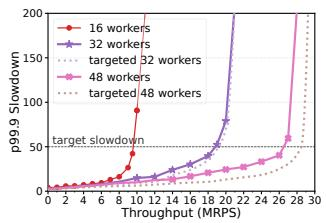  
(a)

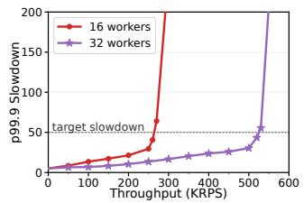  
(b)

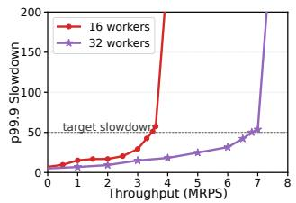  
(c)

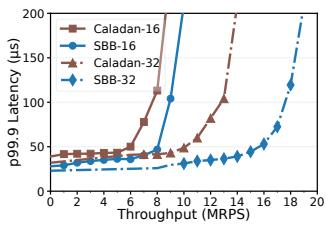  
(d)  
Figure 11: Scalability evaluation for various workloads. (a), (bc) and (d) are used to individually evaluate SBB’s scalability for performing request load balancing, request preemption and CPU allocation.

Finally, we run experiments with both Memcached and swaptions co-located on varying worker counts to evaluate how well SBB scales while improving CPU eficiency. The setup resembles that of Figure 9. For a fair comparison focused on low tail latency, we use the original Caladan rather than Caladan-DL. Results in Figure 11d show that, under a p99.9 latency SLO of 50µs, SBB’s throughput scales from 8 to 16MRPS, demonstrating excellent scalability. In contrast, Caladan scales only from 6 to 10.2MRPS. In fact, at 32 workers, Caladan nearly reaches its scaling limit: we find adding more workers slightly reduces its SLO-compliant throughput, consistent with prior observations [65]. This is because, beyond a certain number of workers, the centralized iokernel becomes a bottleneck when scanning NIC queues and assigning cores, ultimately limiting scalability.

Summary. SBB achieves good scalability for all three types of scheduling, across various workloads.

## 6.5 Breakdown of Each Design Component

We now evaluate the individual components of SBB using microbenchmarks.

NIC UINTR. For an actively running application thread, the fastest notification mechanism for packet arrival is continuous polling of the NIC queue, which introduces nearly negligible latency. In contrast, interrupt-based mechanisms, no matter whether they bypass the kernel or not, involve at least interrupt handler processing and thus incur additional latency. A natural concern is that interrupt latency may impose substantial overhead compared to polling.

To assess this, we design the following microbenchmark: we implement a network program that simulates processing a 1µs request while keeping all other logic identical, and vary the packet notification mechanism among polling, UINTR, and the conventional interrupt mechanism provided by DPDK. We timestamp each stage of the process and col lect the results on the client side. Figure 12 presents the breakdown of round-trip latency.

The results show that on two Intel E810 100 Gbps NICs, the end-to-end propagation delay over the data link is 9µs, packet parsing in the network stack takes about 0.3µs, and the application layer consumes the specified 1µs. Compared with polling, UINTR adds an extra 0.45µs in notification latency and increases network stack overhead by 0.04µs—which we attribute to cache efects caused by the interrupt. Thus, the total additional overhead of UINTR over polling is 0.49µs, accounting for 4.7% of the end-to-end latency. We also repeat the measurement on a ConnectX-5 NIC, where the baseline link propagation delay is 4.7µs; in this case, UINTR increases the end-to-end latency by 8.1%. Given that UINTR directly enables CPU sharing and its overhead remains modest, we consider it acceptable, especially for SLOs that typically allow a slowdown factor of up to 50×.

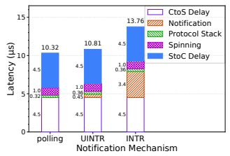

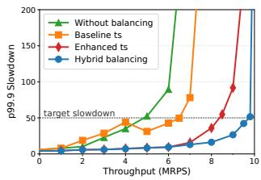  
Figure 12: Breakdown of roundtrip latency.  
Figure 13: Diferent load balancing configurations.

We also compare conventional interrupts with UINTR. The notification overhead of a conventional interrupt is 3.4µs, significantly higher than UINTR’s 0.45µs. This is because conventional interrupts traverse the kernel and incur scheduling overhead; the interrupt mechanism itself constitutes only a small fraction of the total cost. In conclusion, adopting NIC UINTR as the packet-notification mechanism fundamentally enables network runtimes to perform CPU allocation, while incurring low additional latency.

Timer UINTR. Table 4 compares the overhead of several common preemption mechanisms used in userspace network runtimes. Timer UINTR exhibits notably lower overhead than signals, IPI, and UIPI, allowing it to employ a smaller preemption quantum and further mitigate head-of-line blocking. Although the compiler instrumentation technique achieves lower overhead by polling, it sufers from the imprecise preemption problem [43]. More importantly, timer UINTR ofers a unique architectural advantage: it enables each worker to preempt itself, eliminating the centralized component that other methods rely on.

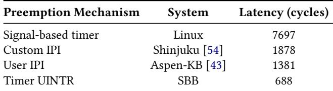  
Table 4: Latency comparison of preemption mechanisms.

Load balancing policy. To evaluate SBB’s two-level load balancing policy, we run the Fixed(1) test with various balancing strategies. Keeping all other configurations the same, we modify the balancing policy as follows: 1) Without balancing: each worker only processes requests in its own Rx queue assigned by RSS; 2) Baseline ts: a basic task stealing implementation similar to Shenango’s; 3) Enhanced ts: the improved task stealing scheme described in §4.5.2; 4) Hybrid balancing: the two-level load balancing policy used by SBB.

Without any balancing policy, SBB reaches its SLO limit much earlier because, under RSS’s random packet-to-queue assignment, system capacity is constrained by the most heavily loaded worker. With basic task stealing, SBB achieves higher throughput, but an interesting phenomenon is that it sufers from even higher tail latency at lower loads. Through further analysis, we find that this is due to too much unnecessary task stealing, which provides no benefit but instead introduces synchronization overhead. Based on the analysis, we enhance task stealing with several optimizations (§4.5.2), which mainly reduce unnecessary stealings and synchronization overhead, and increase the throughput by 30%. Nevertheless, when the load is too high, there are still too many stealings incurring overhead, most of which come from only a few flows. SBB’s two-level load balancing policy efectively mitigates this problem. By addressing temporal imbalance with task stealing and persistent imbalance with flow migration, SBB achieves notably higher throughput, which demonstrates the necessity of the combination of task stealing and flow migration.

Summary. NIC and timer User Interrupt can function with low overhead, and the hybrid policy can perform load balancing efectively.

## 7 Discussion

Hardware-ofloaded scheduling. To process RPCs at microsecond-scale latencies, besides those works running on commodity hardware (Table 1), there are also some recent works leveraging NIC-CPU co-design [32, 46, 49, 64, 77, 85]. They use the on-board FPGA or ARM of SmartNICs to offload the scheduling, such as implementing JBSQ policy for request load balancing [49, 57].

The hardware-ofloaded approach does have some exclusive advantages, as the programmable NIC has a global view and higher processing speed. However, they also have some challenges: some hardware is able to compare only a limited number of registers in one pass, which means the performance also degrades when scaling to more workers [57]. More importantly, these approaches rely on specialized hardware modification, which precludes wide adoption in the near future [51]. In comparison, SBB uses only a software implementation and relies on commodity hardware functions (i.e., User Interrupt, RSS, flow director), suitable for both datacenters and VMs in public clouds.

SBB’s scalability limitation. Although SBB eliminates all centralized components and exhibits much better scalability than prior work, it is not perfectly scalable beyond 48 cores (Figure 11a). This is attributed to the synchronization overhead of inter-core communication, i.e., task stealing and flow migration. Although SBB leverages user interrupt to enable each core to perform request preemption and CPU allocation independently, and introduces the two-level load balancing policy to largely reduce task stealing frequency, the overhead still exists, and will enlarge when scaling to more cores.

We identify three potential directions to achieve better scalability. First, we can ofload scheduling to SmartNICs, as discussed earlier. Second, we can continue to improve task stealing algorithm to satisfy the commutativity rule [30], which enables better scalability. Although there is already much work improving task stealing [28, 36, 40, 44, 80, 86], no algorithms follow the commutativity rule. Third, we may leverage some commodity hardware features, similar to using UINTR to perform request preemption and CPU allocation. We notice that Dynamic Load Balancer (DLB) is a new feature in Intel Xeon Scalable Processor, which is designed to mitigate the load imbalance problem [68]. Although it could not be used trivially in SBB’s purely decentralized architecture, we view leveraging this to perform load balancing with better scalability as promising future work.

## 8 Conclusion

This paper presents SBB, a purely decentralized userspace network runtime. Designed with scalability as its foremost objective, SBB performs request preemption, CPU allocation, and request load balancing to provide high performance and eficiency, without any centralized components as potential bottlenecks. Our evaluation demonstrates that SBB outperforms baseline systems by 1.7× to 5.2× across a variety of scenarios and workloads.

## 9 Acknowledgment

We thank the anonymous shepherd and reviewers for their insightful feedback. This work was supported by the National Cyber Security-National Science and Technology Major Project (under Grant No: 2025ZD1503200), the National Science Foundation of China (No.62372011, 92582118, 62032001), and Zhongguancun Laboratory. Diyu Zhou is the corresponding author.

## References

[1] Cornelis Unveils CN6000 800 Gbps Ethernet SuperNIC for AI and HPC at Scale. https://www.cornelis.com/stories/cornelisunveils-cn6000-800-gbps-ethernet-supernic-for-ai-and -hpc-at-scale.

[2] Intel® Ethernet Controller E810 Datasheet. https://www.intel. com/content/www/us/en/content-details/613875/intelethernet-controller-e810-datasheet.html.

[3] AMD Pensando™ Pollara 400 AI NIC: Transforming Scale-Out Networks for the Modern Data Center. https://www.amd.com/en/ products/network-interface-cards/pensando.html.

[4] Broadcom P2200G Dual-Port 200GbE PCIe Ethernet NIC. https: //www.broadcom.com/products/ethernet-connectivity/ network-adapters/p2200g.

[5] Caladan Source: runtime/net/core.c. https://github.com/sh enango/caladan/blob/73107415ed007fdcd8e54074c6d14cb58 370422a/runtime/net/core.c#L854.

[6] NVIDIA Mellanox ConnectX-5 Ethernet Adapter. https://www.nvi dia.com/en-us/networking/ethernet-adapters/connectx -5/.

[7] DPDK: Data Plane Development Kit. https://dpdk.org.

[8] Intel Ethernet: Driving Optimized, Secure, and Scalable Performance from Data Center to Edge, . https://www.intel.com/content/ www/us/en/products/details/ethernet.html.

[9] Intel® 64 and IA-32 Architectures Software Developer’s Manual, . https://www.intel.com/content/www/us/en/developer/ar ticles/technical/intel-sdm.html.

[10] UINTR Linux Kernel. https://github.com/intel/uintr-linuxkernel.

[11] Memcached - A Distributed Memory Object Caching System. https: //memcached.org.

[13] Redis. https://redis.io/.

[14] RocksDB. http://rocksdb.org/.

[12] NVIDIA Launches BlueField-4: The Processor Powering the Operating System of AI Factories. https://blogs.nvidia.com/blog/ bluefield-4-ai-factory/.

[15] Introduction to Receive Side Scaling. https://docs.microsoft. com/en-us/windows-hardware/drivers/network/introduct ion-to-receive-side-scaling.

[16] Seastar – High-Performance Service-Application Framework. https: //github.com/scylladb/seastar/.

[17] x86 User Interrupts Support. https://lwn.net/Articles/8691 40/.

[18] B. Atikoglu, Y. Xu, E. Frachtenberg, S. Jiang, and M. Paleczny. Workload Analysis of a Large-Scale Key-Value Store. In Proceedings of the 40th ACM International Conference on Measurement and Modeling of Computer Systems (SIGMETRICS), London, UK, June 2012.

[19] B. Aydogmus, L. Guo, D. Zuberi, T. Garginkel, D. Tullsen, A. Ousterhout, and K. Taram. Extended User Interrupts (xUI): Fast and Flexible Notification Without Polling. In Proceedings of the 30th ACM International Conference on Architectural Support for Programming Languages and Operating Systems (ASPLOS), New York, NY, Mar. 2025.

[20] L. A. Barroso, K. Gharachorloo, R. McNamara, A. Nowatzyk, S. Qadeer, B. Sano, S. Smith, R. Stets, and B. Verghese. Eliminating Receive Livelock in an Interrupt-Driven Kernel. In Proceedings of the ACM Transactions on Computer Systems, New York, NY, Aug. 1997.

[21] L. A. Barroso, J. Clidaras, and U. Hölzle. The Datacenter as a Computer: An Introduction to the Design of Warehouse-Scale Machines. Synthesis Lectures on Computer Architecture. Morgan & Claypool Publishers, 2013.

[22] L. A. Barroso, M. Marty, D. Patterson, and P. Ranganathan. Attack of

the Killer Microseconds. Communications of the ACM, 2017.

[23] A. Belay, A. Bittau, A. J. Mashtizadeh, D. Terei, D. Mazières, and C. Kozyrakis. Dune: Safe User-Level Access to Privileged CPU Features. In Proceedings of the 10th USENIX Symposium on Operating Systems Design and Implementation (OSDI), Hollywood, CA, Oct. 2012.

[24] A. Belay, G. Prekas, A. Klimovic, S. Grossman, C. Kozyrakis, and E. Bugnion. IX: A Protected Dataplane Operating System for High Throughput and Low Latency. In Proceedings of the 11th USENIX Symposium on Operating Systems Design and Implementation (OSDI), Broomfield, CO, Oct. 2014.

[25] T. Benson, A. Anand, A. Akella, and M. Zhang. Understanding Data Center Trafic Characteristics. In Proceedings of the 1st ACM Workshop on Research on Enterprise Networking (WREN), Barcelona, Spain, Aug. 2009.

[26] T. Benson, A. Akella, and D. A. Maltz. Network Trafic Characteristics of Data Centers in the Wild. In Proceedings of the 10th ACM Internet Measurement Conference (IMC), Melbourne, Australia, Nov. 2010.

[27] C. Bienia. Benchmarking Modern Multiprocessors. PhD thesis, Princeton University, 2011.

[28] R. D. Blumofe and C. E. Leiserson. Scheduling Multithreaded Computations by Work Stealing. In Proceedings of the 35th IEEE Symposium on Foundations of Computer Science (FOCS), Santa Fe, NM, Nov. 1994.

[29] S. Bradner and J. McQuaid. Benchmarking Methodology for Network Interconnect Devices. Technical Report RFC 2544. https: //www.rfc-editor.org/rfc/rfc2544.txt.

[30] A. T. Clements, M. F. Kaashoek, E. Kohler, R. T. Morris, and N. Zeldovich. The Scalable Commutativity Rule: Designing Scalable Software for Multicore Processors. In Proceedings of the 24th ACM Symposium on Operating Systems Principles (SOSP), Farmington, PA, Nov. 2013.

[31] B. F. Cooper, A. Silberstein, E. Tam, R. Ramakrishnan, and R. Sears. Benchmarking Cloud Serving Systems with YCSB. In Proceedings of the 1st ACM Symposium on Cloud Computing (SoCC), Indianapolis, IN, June 2010.

[32] A. Daglis, M. Sutherland, and B. Falsafi. RPCValet: NI-Driven Tail-Aware Balancing of µs-Scale RPCs. In Proceedings of the 24th ACM International Conference on Architectural Support for Programming Languages and Operating Systems (ASPLOS), Providence, RI, Apr. 2019.

[33] J. Dean and L. A. Barroso. The Tail at Scale. Communications of the ACM, 2013.

[34] H. M. Demoulin, J. Fried, I. Pedisich, M. Kogias, B. M. Loo, L. T. X. Phan, and I. Zhang. When Idling Is Ideal: Optimizing Tail-Latency for Heavy-Tailed Datacenter Workloads with Perséphone. In Proceedings of the 28th ACM Symposium on Operating Systems Principles (SOSP), Koblenz, Germany, Oct. 2021.

[35] D. Didona and W. Zwaenepoel. Size-Aware Sharding for Improving Tail Latencies in In-Memory Key-Value Stores. In Proceedings of the 16th USENIX Symposium on Networked Systems Design and Implementation (NSDI), Boston, MA, Feb. 2019.

[36] X. Ding, K. Wang, P. B. Gibbons, and X. Zhang. BWS: Balanced Work Stealing for Time-Sharing Multicores. In Proceedings of the 7th European Conference on Computer Systems (EuroSys), Bern, Switzerland, Apr. 2012.

[37] S. Dong, A. Kryczka, Y. Jin, and M. Stumm. RocksDB: Evolution of Development Priorities in a Key-value Store Serving Large-scale Ap plications. ACM Transactions on Storage, 2021.

[38] J. Fried, Z. Ruan, A. Ousterhout, and A. Belay. Caladan: Mitigating Interference at Microsecond Timescales. In Proceedings of the 14th USENIX Symposium on Operating Systems Design and Implementation (OSDI), Virtual, Oct. 2020.

[39] J. Fried, G. I. Chaudhry, E. Saurez, E. Choukse, Í. Goiri, S. Elnikety, R. Fonseca, and A. Belay. Making Kernel Bypass Practical for the Cloud with Junction. In Proceedings of the 21st USENIX Symposium

on Networked Systems Design and Implementation (NSDI), Santa Clara, CA, Apr. 2024.

[40] M. Frigo, C. E. Leiserson, and K. H. Randall. The Implementation of the Cilk-5 Multithreaded Language. In Proceedings of the 1998 ACM SIGPLAN Conference on Programming Language Design and Implementation (PLDI), Montreal, Canada, June 1998.

[41] S. Ghorbani, Z. Yang, P. B. Godfrey, Y. Ganjali, and A. Firoozshahian. DRILL: Micro Load Balancing for Low-Latency Data Center Networks. In Proceedings of the 2017 ACM Special Interest Group on Data Communication Conference (SIGCOMM), Los Angeles, CA, Aug. 2017.

[42] H. Golestani, A. Mirhosseini, and T. F. Wenisch. Software Data Planes: You Can’t Always Spin to Win. In Proceedings of the 10th ACM Symposium on Cloud Computing (SoCC), Santa Cruz, CA, Nov. 2019.

[43] L. Guo, D. Zuberi, T. Garfinkel, and A. Ousterhout. The Benefits and Limitations of User Interrupts for Preemptive Userspace Scheduling. In Proceedings of the 22nd USENIX Symposium on Networked Systems Design and Implementation (NSDI), Philadelphia, PA, Apr. 2025.

[44] A. Handleman, K. Singer, T. B. Schardl, and I.-T. A. Lee. Towards Zero Spawn Overhead: Work Stealing Without Deques. In Proceedings of the 30th ACM Symposium on Principles and Practice of Parallel Programming (PPOPP), Las Vegas, NV, Mar. 2025.

[45] K. Huang, J. Zhou, Z. Zhao, D. Xie, and T. Wang. Low-Latency Transaction Scheduling via Userspace Interrupts: Why Wait or Yield When You Can Preempt? Proceedings of the ACM on Management of Data, 2025.

[46] J. T. Humphries, K. Kafes, D. Mazières, and C. Kozyrakis. Mind the Gap: A Case for Informed Request Scheduling at the NIC. In Proceedings of the 18th ACM Workshop on Hot Topics in Networks (HotNets), Princeton, NJ, Nov. 2019.

[47] J. Hwang, M. Vuppalapati, S. Peter, and R. Agarwal. Rearchitecting Linux Storage Stack for µs Latency and High Throughput. In Proceedings of the 15th USENIX Symposium on Operating Systems Design and Implementation (OSDI), Virtual, Oct. 2021.

[48] M. G. Iatrou, A. G. Voyiatzis, and D. N. Serpanos. Network Stack Optimization for Improved IPsec Performance on Linux. In Proceedings of the International Conference on Security and Cryptography (SECRYPT), Milan, Italy, July 2009. SciTePress.

[49] S. Ibanez, A. Mallery, S. Arslan, T. Jepsen, M. Shahbaz, C. Kim, and N. McKeown. The nanoPU: A Nanosecond Network Stack for Datacenters. In Proceedings of the 15th USENIX Symposium on Operating Systems Design and Implementation (OSDI), Virtual, Oct. 2021.

[50] C. Iorgulescu, R. Azimi, Y. Kwon, S. Elnikety, M. Syamala, V. Narasayya, H. Herodotou, P. Tomita, A. Chen, J. Zhang, and J. Wang. PerfIso: Performance Isolation for Commercial Latency-Sensitive Services. In Proceedings of the 2018 USENIX Annual Technical Conference (ATC), Boston, MA, July 2018.

[51] R. Iyer, M. Unal, M. Kogias, and G. Candea. Achieving Microsecond-Scale Tail Latency Eficiently with Approximate Optimal Scheduling. In Proceedings of the 29th ACM Symposium on Operating Systems Principles (SOSP), Koblenz, Germany, Oct. 2023.

[52] E. Jeong, S. Woo, M. Jamshed, H. Jeong, S. Ihm, D. Han, and K. Park. mTCP: A Highly Scalable User-Level TCP Stack for Multicore Systems. In Proceedings of the 11th USENIX Symposium on Networked Systems Design and Implementation (NSDI), Seattle, WA, Mar. 2014.

[53] Y. Jia, K. Tian, Y. You, Y. Chen, and K. Chen. Skyloft: A General High Eficient Scheduling Framework in User Space. In Proceedings of the 30th ACM Symposium on Operating Systems Principles (SOSP), Austin, TX, Nov. 2024.

[54] K. Kafes, T. Chong, J. T. Humphries, A. Belay, D. Maziéres, and C. Kozyrakis. Shinjuku: Preemptive Scheduling for µsecond-scale Tail Latency. In Proceedings of the 16th USENIX Symposium on Networked Systems Design and Implementation (NSDI), Boston, MA, Feb. 2019.

[55] R. Kapoor, G. Porter, M. Tewari, G. M. Voelker, and A. Vahdat. Chronos: Predictable Low Latency for Data Center Applications. In Proceedings of the 3rd ACM Symposium on Cloud Computing (SoCC), San Jose, CA, Oct. 2012.

[56] H. Kim, S. Wang, and R. Rajkumar. Responsive and Enforced Interrupt Handling for Real-Time System Virtualization. In Proceedings of the 21st IEEE International Conference on Embedded and Real-Time Computing Systems and Applications (RTCSA), Hong Kong, China, Aug. 2015.

[57] M. Kogias, G. Prekas, A. Ghosn, J. Fietz, and E. Bugnion. R2P2: Making RPCs First-Class Datacenter Citizens. In Proceedings of the 2019 USENIX Annual Technical Conference (ATC), Renton, WA, July 2019.

[58] A. Kumar, R. Katkam, P. Chaudhary, P. Naik, and M. Vutukuru. App-Steer: Framework for Improving Multicore Scalability of Network Functions via Application-Aware Packet Steering. In Proceedings of the 24th IEEE International Symposium on Cluster, Cloud and Internet Computing (CCGrid), Philadelphia, PA, May 2024.

[59] J. Lei, K. Zhao, D. Hou, and F. Zhou. Space Network Emulation System Based on a User-Space Network Stack. ZTE Communications, 2025.

[60] J. Leverich and C. Kozyrakis. Reconciling High Server Utilization and Sub-Millisecond Quality-of-Service. In Proceedings of the 9th European Conference on Computer Systems (EuroSys), Amsterdam, Netherlands, Apr. 2014.

[61] C. Li, R. Yi, Z. Zhang, J. Liu, C. Min, J. Zhang, Y. Luo, X. Wang, Z. Wang, and D. Zhou. Aeolia: A Fast and Secure Userspace Interrupt-Based Storage Stack. In Proceedings of the 31st ACM Symposium on Operating Systems Principles (SOSP), New York, NY, Oct. 2025.

[62] J. Li, N. K. Sharma, D. R. K. Ports, and S. D. Gribble. Tales of the Tail: Hardware, OS, and Application-level Sources of Tail Latency. In Proceedings of the 5th ACM Symposium on Cloud Computing (SoCC), Seattle, WA, Nov. 2014.

[63] Y. Li, N. Lazarev, D. Koufaty, T. Yin, A. Anderson, Z. Zhang, G. E. Suh, K. Kafes, and C. Delimitrou. LibPreemptible: Enabling Fast, Adaptive, and Hardware-Assisted User-Space Scheduling. In Proceedings of the 30th IEEE Symposium on High Performance Computer Architecture (HPCA), Edinburgh, UK, Mar. 2024.

[64] J. Lin, A. Cardoza, T. Khan, Y. Ro, B. E. Stephens, H. Wassel, and A. Akella. RingLeader: Eficiently Ofloading Intra-Server Orchestration to NICs. In Proceedings of the 20th USENIX Symposium on Networked Systems Design and Implementation (NSDI), Boston, MA, Apr. 2023.

[65] J. Lin, Y. Chen, S. Gao, and Y. Lu. Fast Core Scheduling with Userspace Process Abstraction. In Proceedings of the 30th ACM Symposium on Operating Systems Principles (SOSP), Austin, TX, Nov. 2024.

[66] B. Liu, X. Huang, Q. Li, Z. Huang, Y. Sun, W. Li, J. Zhang, P. Yin, and K. Chen. CEIO: A Cache-Eficient Network I/O Architecture for NIC CPU Data Paths. In Proceedings of the 2025 ACM Special Interest Group on Data Communication Conference (SIGCOMM), Coimbra, Portugal, Sept. 2025.

[67] D. Lo, L. Cheng, R. Govindaraju, P. Ranganathan, and C. Kozyrakis. Heracles: Improving Resource Eficiency at Scale. In Proceedings of the 42nd ACM/IEEE International Symposium on Computer Architecture (ISCA), Portland, OR, June 2015.

[68] J. Lou, S. Vanavasam, Y. Yuan, R. Wang, and N. S. Kim. Dynamic Load Balancer in Intel Xeon Scalable Processor: Performance Analyses, Enhancements, and Guidelines. In Proceedings of the 52nd ACM/IEEE International Symposium on Computer Architecture (ISCA), Tokyo, Japan, June 2025.

[69] H. Luo, S. Hu, W. Wang, Y. Tang, and J. Zhou. Research on Multi-Core Processor Analysis for WCET Estimation. ZTE Communications, 2024.

[70] Z. Luo, S. Son, D. Bali, E. Amaro, A. Ousterhout, S. Ratnasamy, and S. Shenker. Eficient Microsecond-Scale Blind Scheduling with Tiny Quanta. In Proceedings of the 29th ACM International Conference on Ar-

chitectural Support for Programming Languages and Operating Systems (ASPLOS), La Jolla, CA, Apr. 2024.

[71] S. McClure, A. Ousterhout, S. Shenker, and S. Ratnasamy. Eficient Scheduling Policies for Microsecond-Scale Tasks. In Proceedings of the 19th USENIX Symposium on Networked Systems Design and Implementation (NSDI), Renton, WA, Apr. 2022.

[72] D. Meisner, C. M. Sadler, L. A. Barroso, W.-D. Weber, and T. F. Wenisch. Power Management of Online Data-Intensive Services. In Proceedings of the 38th ACM/IEEE International Symposium on Computer Architecture (ISCA), San Jose, CA, June 2011.

[73] A. Ousterhout, A. Belay, and I. Zhang. Just In Time Delivery: Leveraging Operating Systems Knowledge for Better Datacenter Congestion Control. In Proceedings of the 11th USENIX Workshop on Hot Topics in Cloud Computing (HotCloud), Renton, WA, July 2019.

[74] A. Ousterhout, J. Fried, J. Behrens, A. Belay, and H. Balakrishnan. Shenango: Achieving High CPU Eficiency for Latency-Sensitive Datacenter Workloads. In Proceedings of the 16th USENIX Symposium on Networked Systems Design and Implementation (NSDI), Boston, MA, Feb. 2019.

[75] S. Peter, J. Li, I. Zhang, D. R. K. Ports, D. Woos, A. Krishnamurthy, T. Anderson, and T. Roscoe. Arrakis: The Operating System Is the Control Plane. In Proceedings of the 11th USENIX Symposium on Operating Systems Design and Implementation (OSDI), Broomfield, CO, Oct. 2014.

[76] G. Prekas, M. Kogias, and E. Bugnion. ZygOS: Achieving Low Tail Latency for Microsecond-Scale Networked Tasks. In Proceedings of the 26th ACM Symposium on Operating Systems Principles (SOSP), Shang hai, China, Oct. 2017.

[77] M. Sutherland, S. Gupta, B. Falsafi, V. Marathe, D. Pnevmatikatos, and A. Daglis. The NEBULA RPC-Optimized Architecture. In Proceedings of the 47th ACM/IEEE International Symposium on Computer Architecture (ISCA), Virtual, May 2020.

[78] S. Tu, W. Zheng, E. Kohler, B. Liskov, and S. Madden. Speedy Transactions in Multicore In-Memory Databases. In Proceedings of the 24th ACM Symposium on Operating Systems Principles (SOSP), Farmington, PA, Nov. 2013.

[79] A. Verma, L. Pedrosa, M. Korupolu, D. Oppenheimer, E. Tune, and J. Wilkes. Large-Scale Cluster Management at Google with Borg.

In Proceedings of the 10th European Conference on Computer Systems (EuroSys), Bordeaux, France, Apr. 2015.

[80] J. Wang, B. Trach, M. Fu, D. Behrens, J. Schwender, Y. Liu, J. Lei, V. Vafeiadis, H. Härtig, and H. Chen. BWoS: Formally Verified Block Based Work Stealing for Parallel Processing. In Proceedings of the 17th USENIX Symposium on Operating Systems Design and Implementation (OSDI), Boston, MA, July 2023.

[81] A. Wierman and B. Zwart. Is Tail-Optimal Scheduling Possible? Operations Research, 2012.

[82] Q. Xu, S. Miano, X. Gao, T. Wang, A. Murugadass, S. Zhang, A. Sivaraman, G. Antichi, and S. Narayana. State-Compute Replication: Parallelizing High-Speed Stateful Packet Processing. In Proceedings of the 22nd USENIX Symposium on Networked Systems Design and Implementation (NSDI), Philadelphia, PA, Apr. 2025.

[83] I. Zhang, A. Raybuck, P. Patel, K. Olynyk, J. Nelson, O. S. Navarro Leija, A. Martinez, J. Liu, A. Kornfeld Simpson, S. Jayakar, P. H. Penna, M. Demoulin, P. Choudhury, and A. Badam. The Demikernel Datapath OS Architecture for Microsecond-Scale Datacenter Systems. In Proceedings of the 28th ACM Symposium on Operating Systems Principles (SOSP), Koblenz, Germany, Oct. 2021.

[84] X. Zhang, E. Tune, R. Hagmann, R. Jnagal, V. Gokhale, and J. Wilkes. CPI2: CPU Performance Isolation for Shared Compute Clusters. In Proceedings of the 8th European Conference on Computer Systems (EuroSys), Prague, Czech Republic, Apr. 2013.

[85] J. Zhao, I. Uwizeyimana, K. Ganesan, M. C. Jefrey, and N. E. Jerger. ALTOCUMULUS: Scalable Scheduling for Nanosecond-Scale Remote Procedure Calls. In Proceedings of the 55th Annual IEEE/ACM International Symposium on Microarchitecture (MICRO), Chicago, IL, Oct. 2022.

[86] S. Zhao, H. Gu, and A. J. Mashtizadeh. SKQ: Event Scheduling for Optimizing Tail Latency in a Traditional OS Kernel. In Proceedings of the 2021 USENIX Annual Technical Conference (ATC), Virtual, July 2021.

[87] L. Zhu, Y. Shen, E. Xu, B. Shi, T. Fu, S. Ma, S. Chen, Z. Wang, H. Wu, X. Liao, Z. Yang, Z. Chen, W. Lin, Y. Hou, R. Liu, C. Shi, J. Zhu, and J. Wu. Deploying User-Space TCP at Cloud Scale with Luna. In Proceedings of the 2023 USENIX Annual Technical Conference (ATC), Boston, MA, July 2023.