USENIX

THE ADVANCED COMPUTING SYSTEMS ASSOCIATION

# VTC: DNN Compilation with Virtual Tensors for Data Movement Elimination

Muyan Hu, Ahan Gupta, and Jiachen Yuan, University of Illinois Urbana– Champaign; Vima Gupta, Georgia Institute of Technology; Taeksang Kim and Xin Xu, University of Illinois Urbana–Champaign; Janardhan Kulkarni and Ofer Dekel, Microsoft; Vikram Adve and Charith Mendis, University of Illinois Urbana–Champaign

https://www.usenix.org/conference/osdi26/presentation/hu-muyan

# This paper is included in the Proceedings of the 20th USENIX Symposium on Operating Systems Design and Implementation.

July 13–15, 2026 • Seattle, WA, USA

ISBN 978-1-939133-55-7

Open access to the Proceedings of the 20th USENIX Symposium on Operating Systems Design and Implementation is sponsored by

# VTC: DNN Compilation with Virtual Tensors for Data Movement Elimination

Muyan Hu1∗ Ahan Gupta1 Jiachen Yuan1 Janardhan Kulkarni3 Ofer Dekel3

1University of Illinois Urbana-Champaign

Vima Gupta2 Taeksang Kim1 Xin Xu1 Vikram Adve1 Charith Mendis1

2Georgia Institute of Technology 3Microsoft

## Abstract

With the widening gap between compute and memory operation latencies, data movement optimizations have become increasingly important for DNN compilation. Current optimizations such as layout transformations and operator fusion only target a subset of tensor operators and consequently miss important opportunities for reducing data movement in contemporary DNN workloads, including large language models.

We introduce VTC, a novel tensor compilation framework that for the first time eliminates all unnecessary data movement by targeting the full spectrum of data movement operators. VTC proposes the concept of virtual tensors to track data movement between compute operators via index mappings rather than expensive physical data transfers to and from global memory, which can seamlessly interoperate with existing computation kernels and handle arbitrary tensor operator compositions. We also introduce a novel data movement elim ination algorithm to automatically identify a profitable virtual tensor creation strategy. Evaluation on a variety of DNNs shows that VTC can outperform existing ML compilers by up to 1.93× (1.28× on average) on NVIDIA GPUs with up to 60% (17.5% on average) inference memory savings.

## 1 Introduction

Deep neural network (DNN) workloads have gained popularity in recent years. Usually, DNN models are expressed as tensor (i.e. n−dimensional array) based computations. Consequently, DNN developers express these computations using tensor programming languages such as TensorFlow [3], JAX [7], and PyTorch [5], and then utilize tensor compilers like XLA [1], TorchInductor [5], and TVM [9] to generate highly performant executables targeting various hardware devices. These compilers use a multi-stage pipeline similar to general-purpose compilers [6]. During the compiler frontend, computations expressed in tensor programming languages are transformed into a compiler intermediate representation (IR), known as computation graph. Nodes of these graphs represent tensor operators (e.g. matrix multiplications, convolutions), and each edge represents a tensor flowing from the output of a producer node to the input of a consumer node. The compiler middle-end performs graph-level transformations (e.g. operator fusion, tiling) to optimize the computation graph. Finally, the compiler backend maps the computation graph onto a set of kernels, each of which is a program fragment written in single-program-multiple-data (SPMD) fashion on modern hardware accelerators.

To keep up with the computational demands of DNN models, specialized hardware accelerators, such as NVIDIA Tensor Cores, have been introduced. Each new generation of these accelerators has consistently improved the compute capacity to provide blazing speeds for compute instructions such as matrix multiplications (e.g., nearly 1 PFLOPS half precision on NVIDIA H100). Most tensor compilers already aim to maximize utilization on such hardware using dedicated compiler backends (e.g. Triton [30] for GPUs), achieving low latency and high throughput for compute operations.

However, memory technology in modern hardware has not kept pace with these advances in compute capabilities. Figure 1 illustrates the widening compute-to-memory ratio as newer accelerators are introduced, making memory instructions significantly more expensive than compute instructions. Moreover, an increasing number of DNN models are becoming memory bound, with performance dominated by memory access requests to and from the accelerator’s global memory, which exacerbates the impact of slower memory. For example, in large language models (LLMs), the incremental decoding stage is memory-bound and can be the bottleneck of end-toend inference [27]. Memory access requests are determined by the types and the composition of data movement operations in computation graphs. These operations only transfer data between global memory and the accelerator without performing any computation on tensor data with compute units. Critically, these inserted data movements between computational operators could introduce substantial extra latency. For example, Figure 2 demonstrates TensorRT’s latency breakdown on a

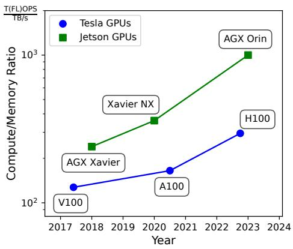  
Figure 1: Trend of compute/memory ratio for NVIDIA GPUs over time. The ratio is calculated by dividing the computation power (half-precision performance in TFLOPS for Tesla GPUs and INT8 performance in TOPS for Jetson Edge GPUs) by the peak GPU memory bandwidth (in TB/s).

Llama 3 8B [14] decoder layer. Between the computation of QKV projection and FlashDecoding [11], the data movement operators take even more time than other computational operators. These findings underscore the critical importance of optimizing data movement operations in DNN compilers.

Prior works that propose optimizations for data movement operations in tensor compilers broadly fall under two categories: layout optimizations and operator fusion, both of which happen in the compiler middle end. These techniques are usually incomplete, targeting only a subset of the data movement operators and missing profitable data movement elimination opportunities that could lead to significant speedups, as detailed below.

Layout optimizations. The layout of a tensor determines in which order its dimensions are linearized into memory. When a producer operator generates an output tensor with a layout that differs from the expected input layout of the consumer operator, data layout conversion operators need to be inserted, resulting in excessive and avoidable data move ment overhead. To find the optimal data layouts that minimize such overheads, previous work first identifies layout-sensitive tensor operators and optimally selects the adjacent layout operators (primarily Reshape and Transpose operators) to balance data movement overhead against computation efficiency [2, 16, 24]. However, the tensor operators considered in these works represent only a subset of data movement operations used in DNN models, overlooking optimization opportunities in other data movement operators (e.g., ScatterND) that are key for improved performance (see Section 3.1).

Operator fusion. During DNN execution, operators usually serve as boundaries of global memory data movement – all input and output tensors are stored in global memory. For each operator, its corresponding kernel first loads inputs from global memory into on-chip buffers, performs computations, and then writes results back from on-chip buffers to global memory. To reduce this costly data movement, existing deep learning frameworks [2,3,5,9] employ operator fusion, which enables intermediate results to be reused directly from fast on-chip buffers rather than being written to and read from slower global memory. However, these systems perform fusion using hand-crafted rules that target specific data access patterns (e.g., [23]), making this optimization only available for operators that can be fused. As a result, similar to layout optimizations, operator fusion reduces data movement for only a subset of data movement operators, missing important optimization opportunities.

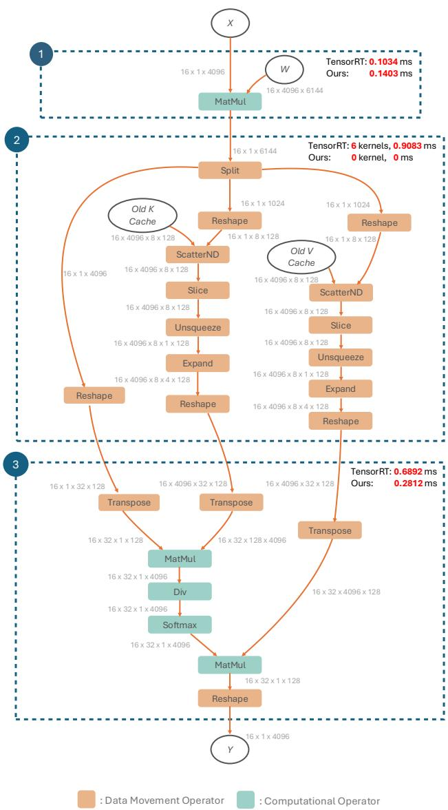  
Figure 2: Motivating example: computation graph and latency breakdown for part of a Llama-3 decoder layer. The model size of Llama-3 is 8B, with batch size 16, context length 4096, query length 1 (decoding stage), bfloat16 precision. Frame 3 denotes a single kernel fusing all the operators with FlashDecoding. VTC can eliminate all the data movement operators in frame 2 and achieve a 4× speed-up over TensorRT on this subgraph.

Our Solution. In contrast with these two popular techniques, in this paper, we introduce VTC, a compiler that eliminates unnecessary data movement across all data movement operators. For example, as shown in Figure 2, VTC can eliminate all the data movement operators between QKV projection and FlashDecoding. VTC is comprehensive and works for arbitrary composition of operators in computation graphs, making it generally applicable for all kinds of DNN models. Furthermore, it is complementary to both layout optimization and operator fusion.

The key idea of VTC is to eliminate data movement operators by using virtual tensors that store only a mapping function between physical tensors in global memory. This approach builds on the observation that modern hardware compute units require contiguity only in their local memory buffers, not in global memory. By relaxing the fully contiguous condition to partially contiguous without compromising memory coalescing, we can significantly eliminate data movement operators. Virtual tensors enable us to relax the contiguity condition by adding a level of indirection in the accesses to the tensors in global memory. However, realizing this virtual tensor representation requires addressing a few challenges to fully eliminate unnecessary data movement.

Challenge 1: Kernel creation that facilitates virtual tensors. With the introduction of virtual tensors, the current computational kernels cannot be used in their present form. First, these kernels assume contiguously laid out data in global memory, which is guaranteed by data movement operators. Second, virtual tensors can introduce extra overhead of mapping function and incontiguous memory access if used in current kernel implementations. We only modify the global memory I/O stages in existing computational kernels with block virtual tensor I/O (Section 4.2), resulting in minimal changes to the original kernel design and marginal runtime overhead.

Challenge 2: Determining a profitable virtual tensor construction strategy. Creating virtual tensors for all data movement operators is non-trivial. Different virtual tensor construction strategies lead to different profitabilities. We solve the problem of finding a profitable option in two parts. First, we introduce a virtual tensor opportunity graph to capture all virtual tensor creation options for a given computation graph (Section 5.1). Next, we design a global greedy algorithm that extracts a virtual tensor creation strategy with maximized latency savings (Section 5.2), which works empirically well in the evaluation.

In summary, we make the following contributions.

• We identify a new data movement optimization opportunity by allowing partially contiguous global memory storage in DNN compilation.

• We introduce the concept of virtual tensors for data movement elimination and efficiently support it in computational kernel generation.

• We propose virtual tensor opportunity graph and data elimination algorithm to automatically find an efficient strategy for creating virtual tensors.

• We implement these concepts in a compilation infrastructure, VTC. Our evaluations show up to 1.93× improvement (1.28× on average) over existing DNN compilers and up to 60% memory saving (17.5% on average) on NVIDIA GPUs.

## 2 Background

We first provide background about tensor stride, data movement operators at the graph-level, their necessity, and implementations of tensor operators at the kernel-level before explaining VTC.

## 2.1 Tensor Stride

To index an n-d tensor in the 1D memory, modern tensor compilers need to calculate an integer offset from the index vector ⃗I ∈ Nn. Tensor stride vector ⃗S ∈ Nn indicates the number of elements we need to skip in memory to move from one element to the next in each dimension. For example, for a 3D tensor of shape (a, b, c), its stride vector ⃗S = (bc, c, 1). And the indexing will be simply the inner product of the stride vector and the index vector. In the same example, the offset of ⃗I = (i, j, k) is ⃗I ·⃗S = i · bc + j · c + k.

## 2.2 Data Movement Operators

Data movement operators are a subset of tensor operators responsible for only moving data in global memory.1 Examples include operators such as Transpose, Split and ScatterND.2 As an example, the semantics of Transpose operator can be given as follows.

Definition 1 (Transpose Operator). Transpose operator takes a single input tensor and generates an output tensor by permuting the dimensions of the input with a given permutation perm: ∀i ∈ [0,n),output\_dimensions[perm[i]] = input\_dimensions[i].

Figure 5 also shows a visualized example of Split operator. It is clear that Transpose and Split do not change values of individual elements, but rather reorganize their positions in the tensor. This property holds for any data movement operator and we formalize it as follows.

Definition 2 (Data Movement Operator). An operator with input tensors I1, . . . , In and output tensors O1, . . . , Om is a data movement operator if and only if there exists a function F (i,⃗x) = ( j,⃗y) such that Oi[⃗x] = I j[⃗y], for all i ∈ [1, m], j ∈ [1, n], and ⃗x,⃗y are subscripts of Oi, Ij, respectively.

For the Transpose operator, F(1,⃗x) = (1,⃗y) where yi = perm[xi]. The mapping from outputs to inputs is one-to-one in data movement operators, ensuring that each output tensor element is derived from a unique input tensor element. Conversely, the mapping from inputs to outputs is one-tomany, indicating that an input tensor element may contribute to multiple output tensor elements.

## 2.3 Kernel Implementation of Operators

Graph-level tensor operators are typically implemented as hardware accelerator kernels with all the input and output data physically residing in global memory. The implementation can be divided into three distinct stages:

1. Transfer input data from global memory to on-chip buffers.

2. Perform computation with compute units, which read inputs from and write outputs to on-chip buffer (not present in data movement operators).

3. Transfer output from on-chip buffer to global memory.

For example, Listing 1 shows a matrix multiplication operator implemented in Triton [30] for GPU execution. In stage 1, two blocks of input matrices (2D-tensors) a and b are loaded as contiguous chunks from global memory into onchip buffers. Stage 2 does the actual compute, in this case, it is an inner product of the loaded matrices. Stage 3 writes back the resultant c matrix from on-chip buffer to global memory also as contiguous chunks.

## 2.4 Necessity of Data Movement Operators

As seen in Section 2.3, tensor operators typically assume that the data is contiguous in memory during stages 1 and 3 of a kernel implementation. This serves two purposes: (1) satisfying the requirement of modern compute units for contiguous memory layout of inputs and outputs,3 and (2) optimizing global memory access through memory coalescing and better locality. Due to the assumption of different kernel implementations, if a producer tensor operator uses a data layout or subsection that differs from its consumer tensor operator,

@triton . jit   
def matmul\_kernel (   
a\_ptr , b\_ptr , c\_ptr , # Pointers to matrices   
... # Elide some meta-parameters   
):   
... # Elide some pre-processing steps   
accumulator = tl . zeros ( BLOCK\_SIZE )   
for k in range(0 , tl . cdiv (K , BLOCK\_SIZE\_K )):   
# Stage 1: global -> on-chip   
a = tl . load ( a\_ptrs , ...)   
b = tl . load ( b\_ptrs , ...)   
# Stage 2: computation   
accumulator = tl . dot (a , b , accumulator )   
# Advance the ptrs to the next K block   
a\_ptrs += BLOCK\_SIZE\_K \* stride\_ak   
b\_ptrs += BLOCK\_SIZE\_K \* stride\_bk   
... # Elide some post-processing steps   
# Stage 3: on-chip -> global   
tl . store ( c\_ptrs , c , mask = c\_mask )

Listing 1: An example of the three stages: a GPU matrix multiplication kernel written in Triton.

data movement operators must be inserted to reconcile the difference. These data movement operators are necessary to maintain the correctness of the tensor computational graph, but they will introduce extra overhead.

## 3 Motivation and Overview

## 3.1 Motivating Example: LLM Decoding

To illustrate the potential for data movement optimization in DNN inference, we examine the decoding stage of Llama 3 8B [14] as a motivating example. We profiled a single decoder layer using TensorRT [2], a state-of-the-art DNN compiler on NVIDIA GPUs. 4 TensorRT incorporates numerous expertdesigned optimization rules and successfully identified the self-attention pattern in the decoder layer, triggering an ad hoc optimization for the entire layer. 5

Figure 2 shows the computation graph and TensorRT’s latency breakdown on an NVIDIA A100 GPU. TensorRT first applies graph-level transformations to merge the three query, key, and value (QKV) projections into a single matrix multiplication operation. It also employs the FlashDecoding algorithm [11] to fuse the computation of self-attention into one kernel. However, between these two computational kernels, there exists a large number of data movement operators, illustrated in frame 2 of Figure 2. The latency of these data movement operators in TensorRT even surpasses the combined latency of the two computational kernels.

We now focus on the purpose of data movement operators and their role in the computation graph. TensorRT first executes a Split operator to extract the Q, K, V tensors from the result of merged QKV projection. Next, TensorRT uses Reshape and ScatterND operators to update the KV cache [25] with the new K and V tensors. Subsequently, TensorRT applies the Slice operator to keys and values to obtain a slice containing tokens up to the current sequence length. As Llama 3 8B employs grouped-query attention [14], TensorRT then uses Unsqueeze and Expand operators to align the number of KV heads with the number of query heads. Finally, TensorRT runs Reshape and Transpose operators to prepare the layout of keys and values for FlashDecoding. Although operator fusion is available for these data movement operators, TensorRT still requires 6 kernels to complete all the data movements above.

However, according to the analysis of layout requirements in Section 2, relaxing the fully contiguous condition of global memory storage may unlock opportunities for data movement operator elimination. For example, in stage 3 of the MatMul operator used for the merged QKV projection in frame 1, the MatMul kernel can directly write back the results to Q tensor and appropriate locations in KV cache, eliminating the need for Split, Reshape and ScatterND operators, as shown in Figure 3. Since the dimension per attention head (128) is larger than the GPU warp size (32), memory coalescing is not compromised, allowing for both good memory bandwidth in stage 3 and efficient utilization of tensor cores in stage 2. Similarly, by permitting stage 1 of FlashDecoding to read from not fully contiguous memory, the remaining data movement operators can be eliminated.

Based on these observations, VTC can eliminate all the data movement operators between QKV projection and FlashDecoding. For QKV projection, VTC writes to non-fully contiguous memory, resulting in a slightly slower MatMul kernel compared to TensorRT. However, VTC does not require any GPU kernel to explicitly execute the data movement operators shown in frame 2 of Figure 2, significantly reducing data movement overhead. Furthermore, after VTC’s optimiza tion, the FlashDecoding kernel can directly read from the KV cache instead of the duplicated data generated by the Expand operator. This optimization reduces global memory read overhead by a factor of 4 (the ratio of the Expand operator) and leads to a 2.5× speed-up of the FlashDecoding kernel.

## 3.2 Overview

Figure 4 shows VTC’s overview. The input is a computation graph after operator fusion. To identify all the virtual tensor creation possibilities, VTC first runs an virtual tensor opportunity graph (VTOG) construction algorithm, based on VTC’s virtual tensor definition and data movement optimization rules. Next, VTC runs a points-to graph construction algorithm to find a profitable virtual tensor strategy, represented by the resulting points-to graph. Finally, VTC generates an optimized executable according to this selected strategy.

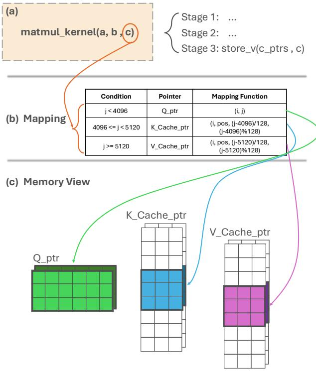  
Figure 3: An example of data movement operator elimination with virtual tensors in QKV projection (frame 1 in Figure 2). The decoding stage is generating the pos-th token. Matrix c[i, j] is a virtual tensor of shape (batch size, sum of QKV hidden dimensions), where Q has hidden dimension 4096, and K and V have hidden dimensions 1024 each. For the matrix multiplication kernel (Triton code is in Listing 1), we only need to modify stage 3, and the virtual tensor I/O function store\_v will automatically write the data to proper physical tensor location according to the mapping function.

## 4 Virtual Tensor

Definition 2 reveals that it is possible to eliminate the need for actual data movement by storing only the mapping function F, which describes the relationship between the input and output tensors. By leveraging this insight, we can avoid the overhead associated with explicit data transfers in data movement operators. In this section, we introduce VTC’s virtual tensor notation, which builds upon this observation to efficiently handle data movement operations. We will show how to handle virtual tensor I/O in Section 4.2 and analyze the profitability of the optimization in Section 4.3. Finally, we give several examples of how to use virtual tensors to eliminate data movement operators in Section 4.4.

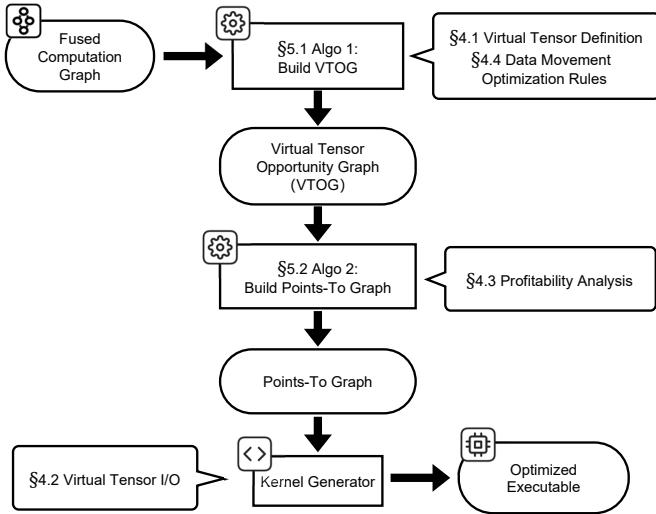  
Figure 4: The overview of VTC.

## 4.1 Virtual Tensor Definition

The key idea behind the virtual tensor technique is to avoid redundant instantiation of tensor data in global memory. If a tensor is obtained by performing data movement operators on other tensors, we can directly represent it using a mapping function and a set of physical tensor pointers, instead of allocating global memory to store the tensor data.

Definition 3 (Virtual Tensor). A virtual tensor V is a tuple (F, P1, P2, . . . , Pn), where F is a mapping function and P1, P2, . . . , Pn is a set of physical tensor pointers. The mapping function F :⃗x → ( j,⃗y) describes the relationship between each virtual tensor index ⃗x of V and the corresponding physical tensor index ⃗y of Pj, where j ∈ [1, n].

Figure 3 shows an example of virtual tensor in QKV projection. Virtual tensor c has 3 physical tensor pointers Q\_ptr, K\_Cache\_ptr, and V \_Cache\_ptr, with its mapping function illustrated in subfigure (b).

A virtual tensor provides a contiguous index space that references potentially non-contiguous locations within physical tensors. Mapping function F links each virtual tensor index to its corresponding physical tensor address. The virtual tensor technique eliminates data movement operators through two complementary approaches: (1) creating output virtual tensors for a producer data movement operation that map to input tensors of that operation, or (2) creating input virtual tensors for a consumer data movement operation that map to output tensors of that operation. While Definition 2 allows for one-to-many mappings, VTC restricts F to one-to-one mappings. This design choice simplifies implementation and avoids potentially expensive overhead of translating complex one-to-many mapping functions.

Mapping function composition. Virtual tensors can be nested: it is possible for a base tensor, which is used to create a virtual tensor, to be a virtual tensor itself. In such cases, the resulting virtual tensor’s mapping function effectively applies the base tensor’s mapping followed by the new mapping (e.g., Fnew = Fouter ◦ Fbase), representing a chain of transformations.

## 4.2 Virtual Tensor I/O

VTC’s virtual tensor interface seamlessly translates virtual tensor I/O operations into physical global memory I/O operations using the mapping function. In hardware kernels, global memory I/O is usually performed in a block-wise manner, where multiple threads simultaneously read a block of global memory data. For most real-world cases, the contiguity of mapping function conditions (e.g., 1024 in Figure 3) is larger than and a multiple of block size. Therefore, each block is likely to read from the same physical tensor, allowing us to directly apply a non-partitioned mapping function to a block of indices, which only introduces marginal overhead.

Virtual tensor provides a high-level abstraction that hides the underlying data movement complexities. Users can work with virtual tensors as if they were regular tensors, while VTC transparently manages the mapping and access to the physical tensor data behind the scenes. Since virtual tensors only impact the global memory I/O (stage 1 and 3 in Listing 1) of a hardware accelerator kernels, they leave the computation part (stage 2 in Listing 1) unchanged. This allows virtual tensors to be effortlessly integrated into existing optimized kernels with minimal modifications. For example, in Figure 3, we can directly pass a virtual tensor mapping to physical Q tensor and KV cache as the output parameter of the projection MatMul kernel. VTC then transforms the fully contiguous write to this virtual tensor into partially contiguous writes to the Q tensor and KV cache in MatMul kernel stage 3.

While virtual tensors have the potential to eliminate physical data transfers in data movement operators, the use of mapping functions and non-fully contiguous global memory access patterns still may introduce additional overhead. In the next subsection, we will delve into the profitability of this optimization technique, analyzing the trade-offs between the benefits of reduced data movement and potential extra costs.

## 4.3 Profitability Analysis

Since the indirect memory access patterns of virtual tensors are fully known at compile time, we can analyze the optimization profitability based on the characteristics of the mapping function. Similar to the classification of compiler optimizations into Type I (always profitable) and Type II (uncertain profitability) [22], we can categorize the profitability of virtual tensor optimizations by analyzing the mapping function. Without loss of generality, we assume each virtual tensor maps to a single base physical tensor here.

Remark 1. In most DNNs, the final mapping function between the virtual tensor and a physical tensor can be ex pressed as

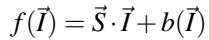

(1)

where ⃗I is the index vector, ⃗S is the stride vector (see Section 2.1) and b : Nn → Z is an index-dependent bias function.

Remark 2. In ONNX operator set, most data movement operators preserve affine transformations on indexing, which can be achieved by adjusting stride and a constant bias. One exception is Expand. For instance, expanding a tensor from shape (a,b,c) to (a,3b,c) and making the expanded tensor virtual yields the offset for index ⃗I = (i, j, k) as

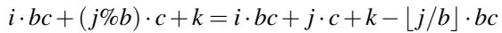

(2)

Here for the mapping function in Equation (1), ⃗S = (bc, c, 1), b(⃗I) = −⌊ j/b⌋ · bc.

Definition 4 (Contiguous dimension). For an n-d virtual tensor with shape ⃗D = (D1, . . . , Dn), dimension d is a contiguous dimension if its mapping function in Equation (1) satisfies

1. All strides from dimension d onward equal the suffix products of the shape vector: ∀i ∈ [d, n], Si = ∏nj=i+1 Di

2. Bias remains constant when the first d − 1 dimensions are fixed: ∀⃗I1 ∈ Nd−1, ∀⃗I2 ∈ Nn−d+1, b([⃗I1 | ⃗I2]) ≡ C.

Definition 5 (Partial contiguity and full contiguity). A virtual tensor with minimal contiguous dimension d and shape vector ⃗D retains partially contiguous memory access if ∏ni=d Di exceeds the minimal memory transfer unit size (e.g., memory coalescing size in GPUs). A virtual tensor maintains fully contiguous memory access if and only if its minimal contiguous dimension equals 1.

Theorem 1. Optimization is always profitable (Type I) for fully contiguous virtual tensors.

Theorem 1 establishes the conditions for guaranteed profitability. When the mapping function preserves the original data access pattern with only a constant bias allowed, the virtual tensor optimization can be considered as Type I. Also, virtual tensors with partial contiguity are likely profitable since they do not break minimal memory transfer granularity and maintain high memory bandwidth. Otherwise, the profitability is uncertain. VTC will perform profiling (described in Section 5.2) to decide whether to proceed with the opti mization according to actual latency impacts.

## 4.4 Virtual Tensor Optimization Rules for Data Movement Operators

The virtual tensor optimization is designed to eliminate data movement operators. In this subsection, we present several examples of data movement operators from ONNX, demonstrate how VTC eliminates them using virtual tensors, and discuss the profitability. All of the data movement operators presented in this subsection are outside the optimization space of previous layout optimizations.

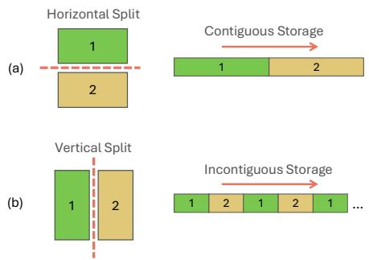  
Figure 5: Comparison between contiguous Split (performed on the first axis) and incontiguous Split (performed on other axes) on a 2D matrix stored in row major.

Split When optimizing Split using virtual tensors, making input a virtual tensor of outputs is Type II, since the output tensors are stored separately and incontiguously in global memory. On the other hand, making outputs virtual tensors of input can be either a Type I or Type II optimization, depending on the contiguity of the split. If the split is performed along the first axis (axis 0), resulting in contiguous output tensors, it is a Type I optimization. Figure 5 shows an example of contiguous Split and incontiguous Split. When the incontiguous split size is large enough, all the two directions of virtual tensor optimizations have partial contiguity.

Expand The Expand operator broadcasts a single input tensor to a specified shape, producing a single output tensor with the same data as the input but with expanded dimensions. When optimizing Expand using virtual tensors, both directions are Type II. But if the number of duplicated elements exceeds memory coalescing size, it is almost always profitable.

ScatterND The ScatterND operator takes 3 inputs: data, indices, and updates. It generates a single output tensor by first initializing it as a clone of the data tensor and then updating the values at the specified indices in indices with the corresponding values from the updates tensor. There are two ways of virtual tensor optimization:

1. Making the output a virtual tensor of data. Since the output tensor is initially a clone of data, it is a Type I optimization.

2. Making updates a virtual tensor of the output tensor. This optimization is Type II because the indices can be incontiguous. In the LLM motivation example, updates

(a)

denotes all the locations in KV cache to be updated and is partially contiguous.

We can conduct analysis and define optimization rules similarly for all other data movement operators. As virtual tensor optimization rules are highly dependent on the operator semantics and the number of data movement operators is limited (e.g., 18 in the ONNX), VTC requires developers to specify the mapping function and possible virtual tensor optimization rules between inputs and outputs for each data movement operator. Then VTC can automatically analyze profitability and perform virtual tensor optimizations, which will be introduced in the next section.

## 5 Automatic Virtual Tensor Construction

This section introduces VTC’s virtual tensor construction algorithm, which automatically makes intermediate tensors virtual to minimize unnecessary data transfers and improve overall performance. We first formalize the data movement elimination problem by building a virtual tensor opportunity graph (VTOG), and then introduce the global greedy algorithm to eliminate data movements.

## 5.1 Virtual Tensor Opportunity Graph

VTC’s data movement eliminator takes a computation graph after operator fusion as input. In prior work, all the intermediate tensors, represented by edges in the computation graph, are physically stored in global memory. The data movement elimination problem aims to find a strategy to make certain intermediate tensors virtual and maximize the end-to-end la tency savings.

VTC first builds a virtual tensor opportunity graph (VTOG) to analyze all the virtual tensor possibilities.

Definition 6 (Virtual Tensor Opportunity Graph). A virtual tensor opportunity graph (VTOG) is a directed graph G = (V,E). Each node v ∈ V represents a tensor in the computation graph. Each directed edge (u,v) ∈ E represents a direct virtual tensor possibility, where tensor u can be made a virtual tensor of v by eliminating only one data movement operator.

Figure 6 shows an example of a computation graph and its corresponding VTOG. Split determines the VTOG edges between a and b; Reshape determines the VTOG edges between b and c; and ScatterND determines the VTOG edges between c, d and K Cache.

For each node in the VTOG, some outgoing edges may conflict with each other, indicating mutually exclusive virtual tensor strategies. For example, in Figure 7, edges 1 and 3 conflict because designating c as a virtual tensor of both a and d simultaneously would map some indices of c to multiple physical memory locations, violating the one-to-one property of virtual tensor mapping functions. In contrast, edges 1 and 2 can coexist when preserving a one-to-one mapping. We capture all such conflicting edge pairs in a conflict set.

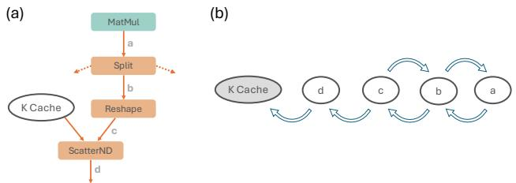  
Figure 6: (a) The computation graph. (b) The corresponding virtual tensor opportunity graph. Other outputs of Split operator are ignored.

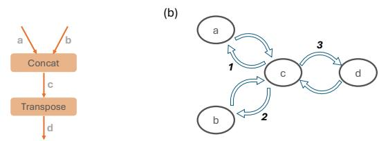  
Figure 7: An example of a computation graph and conflicting edges in its VTOG. In (b), edge 1 and edge 3 conflict with each other. Edge 2 and edge 3 also conflict. However, edge 1 and edge 2 can be selected together.

Algorithm 1 shows how to create a VTOG and the conflict sets from a computation graph. VTC constructs the VTOG by iterating through all data movement operators in the input computation graph, following the predefined virtual tensor rules for each operator (Section 4.4), and creating edges between operator inputs and outputs.

When all outgoing edges of each node in a VTOG are mutually compatible, the VTOG becomes a points-to graph, similar to that used in traditional compiler pointer analysis [4]. The points-to graph has one-to-one correspondence with a virtual tensor strategy for the entire computation graph. For example, Figure 8 shows several possible points-to graphs derived from the VTOG in Figure 6. Strategy 3 has no edges, indicating that all the tensors are physical. Strategy 2 has b and K cache as physical tensors, making a and c virtual tensors of b, and d a virtual tensor of K cache. Strategy 1 makes a, b, c, and d all virtual tensors of K cache. Note that K cache is an input tensor of the computation graph, so it must reside in physical memory.

Using an inductive argument, it is not hard to show the computational equivalence of the computation graph and the virtualization strategy corresponding to a points-to graph derived from the VTOG. As evident from the definition, a points-to graph can be derived from a VTOG by removing conflicting edges. However, different points-to graphs can lead to different end-to-end latency gains. The following subsection introduces VTC’s points-to graph construction algorithm, which aims to obtain a points-to graph representing an efficient virtual tensor strategy.

Algorithm 1 Build VTOG from a computation graph.   
Input: A computation graph G = (V, E)   
Output: The VTOG = (V ,E ) of G and a conflict set   
S(v) ∀v ∈ VVTOG   
1: I = {i | i is an input tensor of G}   
2: O = {o | o is an output tensor of G}   
3: VVTOG = I   
4: for v ∈ V do   
5: VVTOG = VVTOG ∪ {o | o is an output tensor of v}   
6: EVTOG = {}   
7: for v ∈ V do   
8: if v is a data movement operator then   
9: for (a,b) ∈VTRULES(v) do ▷ a,b are input or output   
tensors of operator v and a can be made a virtual tensor of b   
10: if a ∈/ I and a ∈/ O then ▷ inputs and outputs of G   
must be physical tensors   
11: EVTOG = EVTOG ∪ {(a,b)}   
12: for v ∈ VVTOG do   
13: Construct S(v) by enumerating outgoing edges of v   
return (VVTOG,EVTOG), S

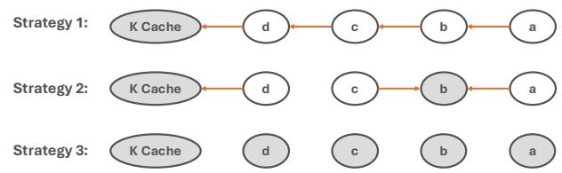  
Figure 8: Several valid points-to graph of Figure 6, repre senting different virtual tensor strategies. Physical tensors are marked gray in each strategy.

## 5.2 Global Greedy Algorithm

The objective of our data movement elimination algorithm is to maximize the latency saving for each virtual tensor strategy, which can be formalized as follows. Let (EVTOG, F, ℓ) denote the virtual tensor search space corresponding to a VTOG. Here each edge in EVTOG denotes a single virtualization opportunity, F denotes a set of all points-to graphs and ℓ : F → R is the latency saving function that maps every points-to graph C ∈ F to the latency saving corresponding to virtual tensor strategy realized by C. Our goal is to find the optimal points-to graph

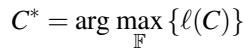

(3)

Equation (3) is NP-hard as ℓ is a complex set function without any structure, which can only be measured through profiling on real hardware. In some situations we can expect that ℓ is a submodular function; for example, when all our operations are Type I (see Section 4.3). Unfortunately, it is not true for more general VTOGs.

Despite this, we take inspiration from the submodular function maximization literature, and design a global greedy algorithm to approximately solve our problem. It is well-known that the global greedy algorithm, which at each iteration adds the element that maximizes the discrete derivative of a submodular function ℓ, achieves a constant approximation to the optimal solution for a broad range of settings; we refer readers to [19] for an introductory survey.

Algorithm 2 shows VTC’s points-to graph construction procedure. With all tensors stored in physical memory initially, it iteratively creates new virtual tensors. Specifically, the algorithm maintains an anchor node set A and a currently selected edge set C. In each iteration, it adds a new node vc into the anchor node set by adding some non-conflicting edges between vc and A into the currently selected edge set. For each edge e ∈ E , we define its discrete derivative with respect to ℓ as

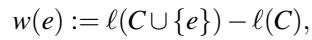

(4)

which denotes the latency saving of merely adding edge e to C. The greedy strategy picks the node vc that maximizes the sum of latency savings across its incident non-conflicting edges in the current iteration, then updates the sets A and C. Subsequently, since creating a new virtual tensor updates C, the algorithm recalculates w(e) for each edge e pointing to vc by profiling. If the maximum latency saving is negative or all the nodes are added to A, the algorithm terminates.

Complexity analysis. Algorithm 2 executes a maximum of O(|VVTOG|) iterations. In each iteration, it performs at most O(|EVTOG| + |VVTOG|) calculations. Based on the VTOG definition 6 and its construction algorithm 1, |EVTOG| is linear with |V | and |VVTOG| < |E|. In typical DNN computation graphs, O(|V |) = O(|E|), so O(|VVTOG|) = O(|EVTOG|) = O(|V |). Consequently, the complexity of VTC’s data movement elimination algorithm is the product of the maximum number of iterations and the cost per iteration, i.e. O |V |2.

## 6 Implementation

We implemented VTC on top of Triton [30] and TorchInductor [5]. We first added virtual tensor support in Triton by overloading Triton’s global memory I/O functions, tl.load and tl.store, enabling them to handle virtual tensor I/O operations. Mapping function is represented in the form of Equation (1). Our overloaded operators consume base physical tensor pointers along with mapping functions that determine how virtual tensors map to physical memory. Since all indirect memory access patterns through virtual tensors are fully known at compile time, we implemented overloaded tl.load and tl.store by generating Python code specialized for each virtual tensor I/O, avoiding most of the indirection overheads.

Algorithm 2 An iterative global greedy algorithm to build a   
points-to graph from a VTOG.   
Input: VTOG = (VVTOG,EVTOG) and conflict set S(v)   
Output: The points-to graph PTG = (VPTG,EPTG) of VTOG   
with maximized latency savings   
1: A = {}, C = {}   
2: for v ∈ VVTOG do   
3: if v does not have outgoing edges then   
4: A = A ∪ {v}   
5: for e ∈ EVTOG do   
6: Profile and get w(e)   
7: tot\_saving = 0   
8: while A ̸= VVTOG do   
9: max\_saving = −∞   
10: for v ∈ VVTOG \ A do   
11: P,s =MAXEDGES(v,C(v),A) ▷ P is a set of   
non-conflicting edges between v and A with maximum sum of   
marginal latency savings s   
12: if s > max\_saving then   
13: max\_saving = s, Pc = P, vc = v   
14: if max\_saving < 0 then   
15: break   
16: A = A∪ {vc}, C = C ∪Pc   
17: tot\_saving = tot\_saving + max\_saving   
18: for e = (t, vc) ∈ EVTOG do   
19: Profile and update w(e)   
return (VVTOG,C), tot\_saving

We integrated VTC’s data movement eliminator into TorchInductor through two passes: an analysis pass and a transformation pass. The analysis pass automatically generates a virtual tensor strategy with Algorithms 1 and 2. This entails identifying which physical tensors to promote to virtual tensors as well as computing mapping functions of promoted virtual tensors to their physical indices. The transformation pass then operates in two stages: (1) It mutates TorchInductor’s IR nodes with virtual tensor awareness and removes any unnecessary data-movement operators. We modified TorchInductor’s lowering strategy to correctly lower our overloaded ops.load and ops.store operators to Triton. (2) Once lowered to Triton, we generate the specialized Python code using the method mentioned earlier. The resulting Triton code is then compiled to produce an optimized hardware executable.

VTC’s automatic virtual tensor construction employs a polynomial-time greedy algorithm rather than exhaustively searching in an exponential solution space. During compilation, profiling (lines 6 and 19 in Algorithm 2) dominates the time cost. Since VTC only modifies data movements in stages 1 and 3, no autotuning is needed for each kernel. The profiling overhead is less than 10 seconds per configuration, and the end-to-end compilation requires only a polynomial number of profiling runs, resulting in total compilation time under 10 minutes for all the models we have tested, which is on par with the compilation time of ML compilers [28, 37, 39].

Table 1: Configurations of evaluated models.  
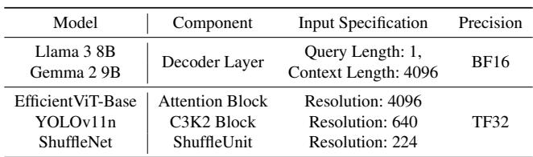

As VTC focuses solely on optimizing data movement and does not alter the computation logic, it maintains end-to-end numeric equivalence with the original compiler, ensuring zero precision loss.

## 7 Evaluation

## 7.1 Experimental Setup

Platform. We conduct our evaluation on an A100 server and an H100 server. The A100 server is equipped with an Intel Xeon Platinum 8358 CPU and an NVIDIA A100 80GB PCIe GPU. The H100 server is equipped with an AMD EPYC 9454 Processor and an NVIDIA H100 NVL GPU. Both servers run Ubuntu 22.04, NVIDIA driver version 535.183.06 and CUDA version 12.1.

Workloads. We use five real-world DNNs from various domains to evaluate VTC. Llama 3 [14] and Gemma 2 [29] are transformer-based LLMs with grouped-query attention and local-global attention, respectively. EfficientViT [8] is a vision transformer backbone for high-resolution dense prediction with linear attention. YOLOv11 [18] is a powerful and efficient convolutional neural network (CNN) designed for a broad range of vision applications. ShuffleNet [38] is a CNN optimized for mobile devices. Table 1 provides detailed configurations for each model. We use PyTorch implementation for all the models. Except ShuffleNet, all the implementations are from official repositories. Following the common practice in previous ML compiler research [31,40, 41], we evaluate all models with batch size 1 and 16.

## 7.2 End-to-end Performance

We first evaluate the end-to-end inference latency on a single A100 or H100 GPU and compare VTC with PyTorch 2.6.0 [5] (with torch.compile enabled), ONNX Runtime 1.21.1 [12], XLA6 [1] and TensorRT 10 [2]. Figure 9 presents the end-to-end inference latency results with different batch sizes on A100 and H100, respectively. VTC achieves up to

Table 2: Peak GPU memory consumption of PyTorch and VTC during end-to-end inference with batch size 1 and 16 on A100. All numbers are in Megabytes.  
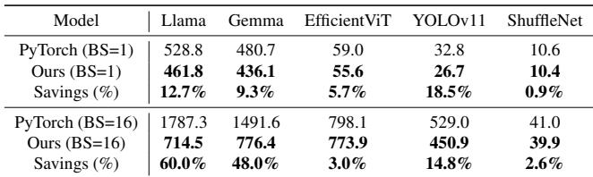

1.93× speed-up (1.28× on average) over the best of the four baselines (mostly TensorRT or PyTorch) in each benchmark.

During the evaluation, TensorRT successfully identifies the attention pattern for all Transformer-based models (Llama, Gemma and EfficientViT) and triggered highly optimized implementations for the entire model. 5 However, VTC still demonstrates an average speed-up of 1.36×. This is notably higher than the average speed-up of 1.15× observed for the CNN models (YOLOv11 and ShuffleNet), indicating that VTC effectively capitalizes on optimization opportunities inherent in newer model architectures like Transformers.

VTC achieves even greater speedup on H100 GPUs as compared to A100 GPUs for 7 cases out of the 10 benchmark cases (covering 5 models at 2 different batch sizes). This trend suggests that the optimization techniques employed by VTC are particularly effective on newer hardware accelerators, where the gap between compute power and memory bandwidth is getting larger (see Figure 1).

## 7.3 Memory Footprint

We also measure the inference GPU memory footprint after VTC’s optimization compared to the PyTorch baseline (as VTC is built upon TorchInductor) using the PyTorch’s built-in memory monitor. As shown in Table 2, even when optimizing for maximized latency reduction, VTC still achieves up to 60% peak memory saving (17.5% on average). This demonstrates that virtual tensor optimization inherently saves memory – it avoids storing full physical tensor data by representing virtual tensors with tensor pointers and mapping functions, and VTC handles virtual tensor I/O through code generation with no extra memory overhead. Analyzing the results in detail, we find that VTC successfully makes many large intermediate tensors virtual (e.g., the output of ScatterND in Figure 2), thereby reducing peak memory usage. Moreover, this highlights VTC’s potential for more aggressive memory saving with relaxed latency constraints by reconfiguring the function ℓ in Section 5.2 to measure memory reduction, offering greater benefits for model training and deployment on memory-constrained hardware.

## 7.4 Latency Breakdown Analysis

Since TensorRT is the fastest baseline in most cases, we compare the latency breakdown of data movement operators and computational operators for VTC and TensorRT on A100. The results in Figure 10 reveal a substantial reduction in the latency proportion from data movement after VTC’s optimization. In 7 out of 10 evaluated cases, VTC eliminates data movement operators entirely. Moreover, the analysis highlights that data movement operators account for a larger proportion of the overall latency in Transformer-based models compared to CNNs, enabling VTC to get better speed-ups.

However, in most of the benchmarks, VTC’s latency on computational operators is higher than TensorRT’s. There are two possible reasons: (1) VTC’s computational kernels may perform virtual tensor I/O in non-contiguous physical addresses, introducing extra overhead in computational kernels (e.g., the MatMul kernel in frame 1 of Figure 2). (2) VTC is built upon Triton and TorchInductor, while TensorRT has more highly optimized implementations of computational kernels. This indicates that the performance gains from eliminating data movement significantly outweigh the slowdown incurred in computational operators.

## 7.5 Comparison with vLLM

As Figure 2 shows, VTC eliminates all data movement operators between QKV projection and attention in LLM decoder layer. Compared with existing compilers such as TensorRT and TorchInductor, the subsequent computational kernel FlashDecoding can launch directly after the previous computational kernel MatMul, improving the utilization rate of compute units without stalling on data movement operators.

To demonstrate the effectiveness of this optimization over a stronger LLM inference baseline beyond compilers, we compare VTC with a state-of-the-art LLM serving framework vLLM V1 [20] on Llama 3 8B inference. Since vLLM is PyTorch-based, we can seamlessly integrate VTC into it. We use similar settings (input sequence length 4096 and BF16 precision)7 for evaluation on A100 and H100 GPUs.

Table 3 shows that vLLM has manually optimized many data movement operators from frame 2 of Figure 2 – the KV Cache Update row in Table 3 contributes to a small fraction of latency compared to compiler baselines. This poses a great challenge for VTC to compete, as vLLM is heavily optimized by domain experts on specific LLMs, while VTC is an automated compiler for general ML models. Nevertheless, VTC still identifies a redundant data movement involving the temporary tensor that stores QKV projection results, detailed in Table 4. This optimization yields a 1.043x speed-up on the

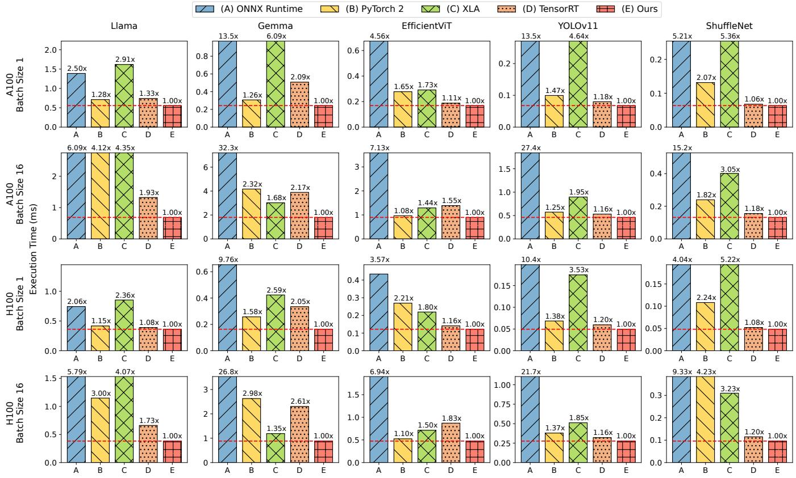  
Figure 9: End-to-end inference latency comparison on a single NVIDIA A100 GPU and H100 GPU with batch sizes 1 and 16. Bars over 4× of VTC’s latency are truncated.

Figure 2 computation graph and 1.011x end-to-end speedup over vLLM on A100. However, no speed-up is observed on H100 since vLLM’s cuBLAS MatMul kernel (QKV projection) significantly outperforms VTC’s Triton kernel, and VTC’s profile-guided virtual tensor construction automatically skips negative optimizations. Forcing the optimization from Table 4 on H100 causes an 8% performance degradation. We believe this gap could be bridged by integrating VTC into more optimized hardware-specific kernel libraries like CUTLASS in the future.

## 7.6 Case Studies

To gain a deeper understanding of how VTC eliminates data movement operators, we study some optimization cases found by VTC in detail.

EfficientViT. Figure 12 illustrates VTC’s generated kernels and the points-to graph for EfficientViT attention block with batch size 16. All 5 kernels are computational kernels, and VTC eliminates data movement operators between these kernels by employing a virtual tensor strategy shown in the points-to graph. Among the tensors, only a, e, f, and j are physically stored. k2 and k3 directly read their inputs from

Table 3: Comparison of Llama inference latency (ms) between VTC and vLLM. QKV Projection, KV Cache Update and Attention correspond to the 3 frames in Figure 2 in the same order. Total shows the latency on the Figure 2 subgraph. End-to-end shows latency for the entire decoder layer. Speedup uses vLLM as the baseline. On H100, VTC defaults to identical behavior as vLLM, while enforcing optimization in Table 4 degrades performance.

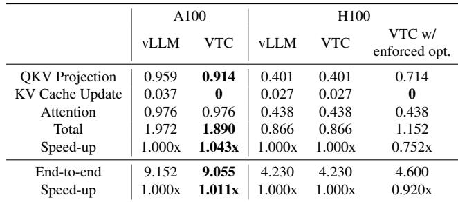

the output tensor a of k1. k4 reads its inputs from the output tensor f of k and writes to the input tensor j of k . VTC achieves only modest speed-up (∼ 1.1×) and memory saving (∼ 4.4%) on this model because most data movement elimination (e.g., optimizations related to f, g, h, i and j) can

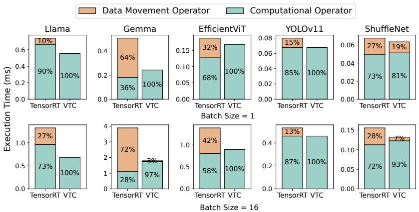  
Figure 10: Breakdown of latency proportions for data movement and computational operators in VTC compared with TensorRT.

Table 4: Data movement optimization in VTC compared to vLLM. As defined in Section 2.3, Stage 1 Input and Stage 3 Output represent tensors stored in global memory that kernels read from and write to, respectively. vLLM allocates a temporary tensor to hold merged QKV projection values and splits it to update KV cache in an additional data movement kernel. VTC eliminates this overhead by making the temporary tensor virtual, directly writing results to Q tensor and KV cache.  
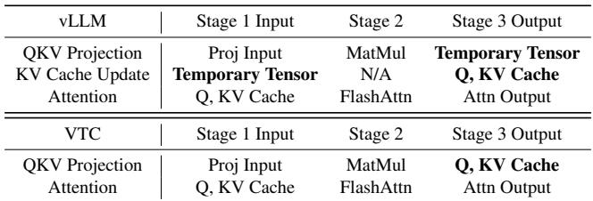  
already be achieved by operator fusion in the baselines.

YOLOv11. Figure 11 shows the computation graph of C3K2 Block, a recurring component in YOLOv11. This block contains two data movement operators, Split and Concat. Traditional frameworks like TensorRT and PyTorch execute Split in an individual kernel and Concat in another kernel fused with Swish and Add (taking b, c, d as inputs and Y as the output). In contrast, VTC eliminates both data movement operators by making a, b, c and e virtual tensors of Y. Although Split and Concat are not fully contiguous at batch size 16 (Figure 5), each contiguous chunk (16 × 160 × 160 elements) is large enough to read and write in a coalesced manner, preserving high memory I/O bandwidth. Moreover, these two data movement operators constitute the primary memory footprint bottlenecks, as they operate on large tensors (a, b, c, e and Y). After VTC’s optimization, all these tensors except Y become virtual, eliminating the need for physical memory allocation and reducing peak memory consumption.

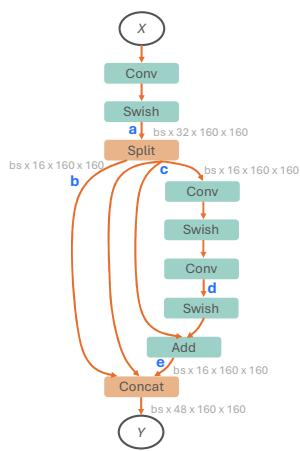  
Figure 11: Computation graph of YOLOv11 C3K2 Block. VTC eliminates both data movement operators Split and Concat by making a, b, c and e virtual tensors of Y.

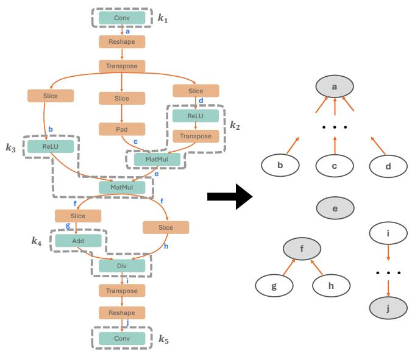  
Figure 12: VTC generates 5 kernels (k1–k5) for EfficientViT attention block with batch size 16. All the unframed data movement operators are eliminated with virtual tensor. The figure on the right shows the virtual tensor strategy represented by a points-to graph.

## 8 Related Work

Virtual tensors. VTensor [34] is a programming framework which decouples tensor layouts from the programming interface, enabling developers to write layout-agnostic operations which significantly reduces lines of code. Separately, vLLM [20] and vTensor [33] are virtual memory management systems specifically designed for LLM serving. Unlike these systems, VTC optimizes general DNNs including LLMs with a fundamentally different virtual tensor notation.

Layout optimizations. TensorRT [2] explores various layout options for 4D tensors and automatically applies the necessary layout transformations to determine the optimal layout. SmartMem [24] studies layout transformation elimination based on predefined rules and develops efficient memory layouts for 2.5D memory on mobile devices. In contrast to these layout optimizations, VTC proposes a more general optimization for data movements. Instead of focusing solely on layout operators (mostly Reshape and Transpose), VTC’s optimization can be applied to all data movement operators. Furthermore, VTC’s points-to graph construction algorithm automatically explores virtual tensor creation strategies, thereby expanding the optimization space beyond rule-based approaches.

Tensor graph optimizations. TensorFlow [3] and TensorRT [2] leverage manually designed rules to perform graphlevel transformations. Recently, automated graph optimizers [17, 31, 35, 41] have emerged to automatically generate subgraph substitutions. VTC’s optimization is orthogonal to these graph optimizations and can be used as an independent optimization pass after graph optimization in ML compilers.

Kernel orchestration is the process of mapping a computation graph to hardware-specific kernels [15]. This problem is commonly addressed by operator fusion [2, 3, 9, 23], which fuses multiple operators into a single kernel, thereby eliminating data movements of intermediate results. However, this type of work cannot optimize data movement operators that are hard to fuse with other operators. VTC takes a computation graph after operator fusion as input and further eliminates data movements between fused kernels.

Kernel generation. Numerous ML compilers [9, 40, 42] automatically generate hardware-specific kernels for DNN computation based on Halide’s algorithm-schedule separation [26]. Rammer [21] and Hidet [13] approach kernel generation by utilizing a task abstraction of workloads. Mirage [32] employs superoptimization techniques on a multi-level compute hierarchy to generate efficient GPU kernels. As VTC only modifies the global memory I/O (stages 1 and 3) of a hardware-specific kernel, it can be easily integrated with virtual tensor support in these kernel generation frameworks.

Hand-optimized kernels crafted by domain experts can achieve state-of-the-art performance on specific DNN workloads. For instance, FlashAttention [10, 11] and FlashInfer [36] design highly optimized GPU kernels for selfattention calculation. VTC can also incorporate these manually optimized kernels by adding virtual tensor support.

## 9 Future Work

While our current virtual tensor construction algorithm provides performance guarantees through iterative profiling, this approach can incur substantial compilation overhead for timesensitive applications. The VTOG formulation we present opens opportunities for developing more efficient algorithms that can compute high-quality virtual tensor strategies with reduced profiling requirements.

Our current implementation is based on Triton. However, Triton exhibits known performance limitations on newer GPU architectures, particularly NVIDIA Blackwell GPUs, where domain-specific languages such as CUTLASS demonstrate superior performance. Relatedly, the virtual tensor design does not explicitly consider emerging hardware-specific memory transfer mechanisms such as NVIDIA’s Tensor Memory Accelerator (TMA), a hardware unit for asynchronous multidimensional memory transfers. While Triton handles some TMA patterns implicitly, explicit TMA awareness in the virtual tensor design could open additional optimization opportunities. Extending virtual tensor support to alternative DSLs and compilation frameworks, together with native handling of such bulk transfer mechanisms, is a promising direction for further performance gains on newer hardware architectures.

## 10 Conclusion

Data movement optimizations have become extremely important in tensor compilers to achieve good performance. VTC is the first compilation framework to eliminate all unnecessary data movement that spans across all data movement operators in a given tensor computational graph. We introduce the concept of a virtual tensor that allows VTC to track data movement between different physical tensors without instantiating intermediate tensors. VTC’s data movement elimination algorithm allows us to achieve superior performance on a number of different DNN models including appreciable gains on large language model inference.

## Acknowledgments

We thank Zhihao Jia, Hao Guo, Yuhao Ge and Yueying Li for their feedback and help on this work. This work was supported by PRISM and ACE, two of the seven centers in JUMP 2.0, a Semiconductor Research Corporation (SRC) program sponsored by DARPA, by NSF under the grant CCF-2316233, and by generous gifts from Qualcomm.

## References

[1] Xla: Optimizing compiler for tensorflow. https://www. tensorflow.org/xla, 2017.

[2] NVIDIA TensorRT: An sdk with an optimizer for high-performance deep learning inference. https: //developer.nvidia.com/tensorrt, 2024.

[3] Martín Abadi, Paul Barham, Jianmin Chen, Zhifeng Chen, Andy Davis, Jeffrey Dean, Matthieu Devin, Sanjay Ghemawat, Geoffrey Irving, Michael Isard, et al. {TensorFlow}: a system for {Large-Scale} machine learning. In 12th USENIX symposium on operating systems design and implementation (OSDI 16), pages 265–283, 2016.

[4] Lars Ole Andersen. Program analysis and specializa tion for the C programming language. PhD thesis, University of Copenhagen, 1994.

[5] Jason Ansel, Edward Yang, Horace He, Natalia Gimelshein, Animesh Jain, Michael Voznesensky, Bin Bao, Peter Bell, David Berard, Evgeni Burovski, et al. Pytorch 2: Faster machine learning through dynamic python bytecode transformation and graph compilation. In Proceedings of the 29th ACM International Conference on Architectural Support for Programming Languages and Operating Systems, Volume 2, pages 929– 947, 2024.

[6] Marc Auslander and Martin Hopkins. An overview of the pl. 8 compiler. In Proceedings of the 1982 SIGPLAN Symposium on Compiler Construction, pages 22–31, 1982.

[7] James Bradbury, Roy Frostig, Peter Hawkins, Matthew James Johnson, Chris Leary, Dougal Maclaurin, George Necula, Adam Paszke, Jake VanderPlas, Skye Wanderman-Milne, and Qiao Zhang. JAX: composable transformations of Python+NumPy programs, 2018.

[8] Han Cai, Junyan Li, Muyan Hu, Chuang Gan, and Song Han. Efficientvit: Lightweight multi-scale attention for high-resolution dense prediction. In Proceedings of the IEEE/CVF International Conference on Computer Vision, pages 17302–17313, 2023.

[9] Tianqi Chen, Thierry Moreau, Ziheng Jiang, Lianmin Zheng, Eddie Yan, Haichen Shen, Meghan Cowan, Leyuan Wang, Yuwei Hu, Luis Ceze, et al. {TVM}: An automated {End-to-End} optimizing compiler for deep learning. In 13th USENIX Symposium on Operating Systems Design and Implementation (OSDI 18), pages 578–594, 2018.

[10] Tri Dao, Dan Fu, Stefano Ermon, Atri Rudra, and Christopher Ré. Flashattention: Fast and memoryefficient exact attention with io-awareness. Advances in Neural Information Processing Systems, 35:16344– 16359, 2022.

[11] Tri Dao, Daniel Haziza, Francisco Massa, and Grigory Sizov. Flash-decoding for long-context inference. https://crfm.stanford.edu/2023/10/12/ flashdecoding.html, 2023.

[12] ONNX Runtime developers. Onnx runtime. https: //onnxruntime.ai/, 2024. Version: 1.20.1.

[13] Yaoyao Ding, Cody Hao Yu, Bojian Zheng, Yizhi Liu, Yida Wang, and Gennady Pekhimenko. Hidet: Taskmapping programming paradigm for deep learning tensor programs. In Proceedings of the 28th ACM International Conference on Architectural Support for Programming Languages and Operating Systems, Volume 2, pages 370–384, 2023.

[14] Abhimanyu Dubey, Abhinav Jauhri, Abhinav Pandey, Abhishek Kadian, Ahmad Al-Dahle, Aiesha Letman, Akhil Mathur, Alan Schelten, Amy Yang, Angela Fan, et al. The llama 3 herd of models. arXiv preprint arXiv:2407.21783, 2024.

[15] Muyan Hu, Ashwin Venkatram, Shreyashri Biswas, Balamurugan Marimuthu, Bohan Hou, Gabriele Oliaro, Haojie Wang, Liyan Zheng, Xupeng Miao, Jidong Zhai, et al. Optimal kernel orchestration for tensor programs with korch. In Proceedings of the 29th ACM International Conference on Architectural Support for Programming Languages and Operating Systems, Volume 3, pages 755–769, 2024.

[16] Andrei Ivanov, Nikoli Dryden, Tal Ben-Nun, Shigang Li, and Torsten Hoefler. Data movement is all you need: A case study on optimizing transformers. Proceedings of Machine Learning and Systems, 3:711–732, 2021.

[17] Zhihao Jia, Oded Padon, James Thomas, Todd Warszawski, Matei Zaharia, and Alex Aiken. Taso: optimizing deep learning computation with automatic generation of graph substitutions. In Proceedings of the 27th ACM Symposium on Operating Systems Principles, pages 47– 62, 2019.

[18] Rahima Khanam and Muhammad Hussain. Yolov11: An overview of the key architectural enhancements. arXiv preprint arXiv:2410.17725, 2024.

[19] Andreas Krause and Daniel Golovin. Submodular function maximization. Tractability, 3(71-104):3, 2014.

[20] Woosuk Kwon, Zhuohan Li, Siyuan Zhuang, Ying Sheng, Lianmin Zheng, Cody Hao Yu, Joseph Gonzalez, Hao Zhang, and Ion Stoica. Efficient memory management for large language model serving with pagedattention. In Proceedings of the 29th Symposium on Operating Systems Principles, pages 611–626, 2023.

[21] Lingxiao Ma, Zhiqiang Xie, Zhi Yang, Jilong Xue, Youshan Miao, Wei Cui, Wenxiang Hu, Fan Yang, Lintao Zhang, and Lidong Zhou. Rammer: Enabling holistic deep learning compiler optimizations with {rTasks}. In 14th USENIX Symposium on Operating Systems Design and Implementation (OSDI 20), pages 881–897, 2020.

[22] Thirimadura Charith Yasendra Mendis. Towards au tomated construction of compiler optimizations. PhD thesis, Massachusetts Institute of Technology, 2020.

[23] Wei Niu, Jiexiong Guan, Yanzhi Wang, Gagan Agrawal, and Bin Ren. Dnnfusion: accelerating deep neural networks execution with advanced operator fusion. In Proceedings of the 42nd ACM SIGPLAN International Conference on Programming Language Design and Implementation, pages 883–898, 2021.

[24] Wei Niu, Md Musfiqur Rahman Sanim, Zhihao Shu, Jiexiong Guan, Xipeng Shen, Miao Yin, Gagan Agrawal, and Bin Ren. Smartmem: Layout transformation elim ination and adaptation for efficient dnn execution on mobile. In Proceedings of the 29th ACM International Conference on Architectural Support for Programming Languages and Operating Systems, Volume 3, pages 916– 931, 2024.

[25] Reiner Pope, Sholto Douglas, Aakanksha Chowdhery, Jacob Devlin, James Bradbury, Jonathan Heek, Kefan Xiao, Shivani Agrawal, and Jeff Dean. Efficiently scaling transformer inference. Proceedings of Machine Learning and Systems, 5:606–624, 2023.

[26] Jonathan Ragan-Kelley, Connelly Barnes, Andrew Adams, Sylvain Paris, Frédo Durand, and Saman Amarasinghe. Halide: a language and compiler for optimizing parallelism, locality, and recomputation in image processing pipelines. Acm Sigplan Notices, 48(6):519– 530, 2013.

[27] Rya Sanovar, Srikant Bharadwaj, Renee St Amant, Victor Rühle, and Saravan Rajmohan. Lean attention: Hardware-aware scalable attention mechanism for the decode-phase of transformers. arXiv preprint arXiv:2405.10480, 2024.

[28] Yining Shi, Zhi Yang, Jilong Xue, Lingxiao Ma, Yuqing Xia, Ziming Miao, Yuxiao Guo, Fan Yang, and Lidong Zhou. Welder: Scheduling deep learning memory access via tile-graph. In 17th USENIX Symposium on Operating Systems Design and Implementation (OSDI 23), pages 701–718, 2023.

[29] Gemma Team, Morgane Riviere, Shreya Pathak, Pier Giuseppe Sessa, Cassidy Hardin, Surya Bhupatiraju, Léonard Hussenot, Thomas Mesnard, Bobak Shahriari, Alexandre Ramé, et al. Gemma 2: Improving open

language models at a practical size. arXiv preprint arXiv:2408.00118, 2024.

[30] Philippe Tillet, Hsiang-Tsung Kung, and David Cox. Triton: an intermediate language and compiler for tiled neural network computations. In Proceedings of the 3rd ACM SIGPLAN International Workshop on Machine Learning and Programming Languages, pages 10–19, 2019.

[31] Haojie Wang, Jidong Zhai, Mingyu Gao, Zixuan Ma, Shizhi Tang, Liyan Zheng, Yuanzhi Li, Kaiyuan Rong, Yuanyong Chen, and Zhihao Jia. {PET}: Optimizing tensor programs with partially equivalent transformations and automated corrections. In 15th USENIX Symposium on Operating Systems Design and Implementation (OSDI 21), pages 37–54, 2021.

[32] Mengdi Wu, Xinhao Cheng, Shengyu Liu, Chunan Shi, Jianan Ji, Man Kit Ao, Praveen Velliengiri, Xupeng Miao, Oded Padon, and Zhihao Jia. Mirage: A {Multi-Level} superoptimizer for tensor programs. In 19th USENIX Symposium on Operating Systems Design and Implementation (OSDI 25), pages 21–38, 2025.

[33] Jiale Xu, Rui Zhang, Cong Guo, Weiming Hu, Zihan Liu, Feiyang Wu, Yu Feng, Shixuan Sun, Changxu Shao, Yuhong Guo, et al. vtensor: Flexible virtual tensor management for efficient llm serving. arXiv preprint arXiv:2407.15309, 2024.

[34] Jingling Xue. Vtensor: Using virtual tensors to build a layout-oblivious ai programming framework. JOUR-NAL OF COMPUTER SCIENCE AND TECHNOLOGY, 38(5):1074–1097, 2023.

[35] Yichen Yang, Phitchaya Phothilimthana, Yisu Wang, Max Willsey, Sudip Roy, and Jacques Pienaar. Equality saturation for tensor graph superoptimization. Proceedings of Machine Learning and Systems, 3:255–268, 2021.

[36] Zihao Ye, Lequn Chen, Ruihang Lai, Wuwei Lin, Yineng Zhang, Stephanie Wang, Tianqi Chen, Baris Kasikci, Vinod Grover, Arvind Krishnamurthy, et al. Flashinfer: Efficient and customizable attention engine for llm inference serving. arXiv preprint arXiv:2501.01005, 2025.

[37] Chen Zhang, Lingxiao Ma, Jilong Xue, Yining Shi, Ziming Miao, Fan Yang, Jidong Zhai, Zhi Yang, and Mao Yang. Cocktailer: Analyzing and optimizing dynamic control flow in deep learning. In 17th USENIX Symposium on Operating Systems Design and Implementation (OSDI 23), pages 681–699, 2023.

[38] Xiangyu Zhang, Xinyu Zhou, Mengxiao Lin, and Jian Sun. Shufflenet: An extremely efficient convolutional neural network for mobile devices. In Proceedings of the IEEE conference on computer vision and pattern recognition, pages 6848–6856, 2018.

[39] Yifan Zhao, Hashim Sharif, Vikram Adve, and Sasa Misailovic. Felix: Optimizing tensor programs with gradient descent. In Proceedings of the 29th ACM International Conference on Architectural Support for Programming Languages and Operating Systems, Volume 3, pages 367– 381, 2024.

[40] Lianmin Zheng, Chengfan Jia, Minmin Sun, Zhao Wu, Cody Hao Yu, Ameer Haj-Ali, Yida Wang, Jun Yang, Danyang Zhuo, Koushik Sen, et al. Ansor: Generating {High-Performance} tensor programs for deep learning. In 14th USENIX symposium on operating systems design and implementation (OSDI 20), pages 863–879, 2020.

[41] Liyan Zheng, Haojie Wang, Jidong Zhai, Muyan Hu, Zixuan Ma, Tuowei Wang, Shuhong Huang, Xupeng Miao, Shizhi Tang, Kezhao Huang, et al. {EINNET}: Optimizing tensor programs with {Derivation-Based} transformations. In 17th USENIX Symposium on Operating Systems Design and Implementation (OSDI 23), pages 739–755, 2023.

[42] Size Zheng, Yun Liang, Shuo Wang, Renze Chen, and Kaiwen Sheng. Flextensor: An automatic schedule ex ploration and optimization framework for tensor computation on heterogeneous system. In Proceedings of the Twenty-Fifth International Conference on Architectural Support for Programming Languages and Operating Systems, pages 859–873, 2020.