USENIX

THE ADVANCED COMPUTING SYSTEMS ASSOCIATION

# Tessera: A Holistic Pipeline Parallelism Framework for Trillion-Parameter Heterogeneous MoE Training (Operational Systems)

Weifang Hu, Huazhong University of Science and Technology; Langshi Chen,   
Man Yuan, Youyang Yao, Xiulong Yuan, Li Tian, Yong Li, and Wei Lin, Alibaba Cloud; Xuanhua Shi, Huazhong University of Science and Technology; Zhengping Qian and Jingren Zhou, Alibaba Cloud

https://www.usenix.org/conference/osdi26/presentation/hu-weifang

# This paper is included in the Proceedings of the 20th USENIX Symposium on Operating Systems Design and Implementation.

July 13–15, 2026 • Seattle, WA, USA

ISBN 978-1-939133-55-7

Open access to the Proceedings of the 20th USENIX Symposium on Operating Systems Design and Implementation is sponsored by

# Tessera: A Holistic Pipeline Parallelism Framework for Trillion-Parameter Heterogeneous MoE Training (Operational Systems)

Weifang Hu   
SCTS/BDTS, HUST   
Xiulong Yuan   
Alibaba Cloud

Langshi Chen<sup>\*</sup> Alibaba Cloud

Li Tian Alibaba Cloud

Xuanhua Shi<sup>†</sup> SCTS/BDTS, HUST

Zhengping Qian<sup>†</sup> Alibaba Cloud

## Abstract

Training trillion-parameter models relies on pipeline parallelism to scale across thousands of accelerators. However, architectures exemplified by the Qwen family are evolving from uniform Transformer blocks into heterogeneous compositions that combine sparse Mixture-of-Experts (MoE) with different attention variants. This heterogeneity breaks the uniformity assumption behind existing pipeline systems: partitions chosen from serial layer costs become imbalanced after communication is overlapped with computation, because different layer combinations hide different fractions of their communication. Furthermore, at the scale of 10K+ GPUs, MoE routing vari ation adds a runtime source of stalls, creating transient idle slots that static plans cannot anticipate.

We present Tessera, a framework that co-optimizes partitioning and overlap scheduling for heterogeneous pipeline training, and adapts to runtime dynamics. Tessera introduces: (1) an overlap scheduler that synthesizes fine-grained interleavings for each layer combination; (2) an overlap-aware partitioner that uses profiled post-overlap cost to select partitions balanced for parallel execution; and (3) a dynamic bubble optimizer that fills routing-induced idle slots with movable tasks at runtime. Deployed on production clusters for pre-training Qwen3 and Qwen3-Next, Tessera improves throughput by 20%–33% over our production baseline across five workloads at scales from 4,096 to 12,288 GPUs, reaching 39% MFU on a trillion-parameter model. In controlled experiments against Megatron-Core MoE with public recipes, Tessera achieves up to 1.24× higher MFU.

## 1 Introduction

Foundation models are evolving from uniform Transformer stacks into heterogeneous compositions that mix hybrid attention variants with sparse Mixture-of-Experts (MoE)

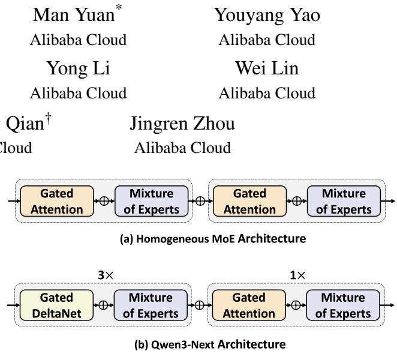  
Figure 1: Heterogeneity in Qwen3-Next Architecture. (a) standard Transformer layer; (b) Qwen3-Next interleaves Gated DeltaNet and standard attention layers.

blocks [3, 24, 37]. The uniform overlap and partitioning policies behind current pipeline systems no longer transfer cleanly. In training the Qwen3 and Qwen3-Next model families on production clusters exceeding 10,000 GPUs, we find that structural heterogeneity, most visible in Qwen3-Next, breaks the assumptions these systems rely on.

The cost this heterogeneity exposes lies in how communication is overlapped with computation. MoE layers require heavy All-to-All (A2A) communication for token dispatch and combination [8, 11, 26]. Pipeline schedules can hide this cost by overlapping A2A transfers with computation from other in-flight microbatches. For uniform architectures (Fig. 1(a)), every stage has a similar compute-tocommunication ratio, so a single overlap strategy applied uniformly suffices.

Qwen3-Next (Fig. 1(b)) breaks this assumption. It interleaves linear-attention layers (Gated DeltaNet) with standard softmax-attention layers, each followed by a sparse MoE block. These layer types have different compute profiles, especially at long sequence lengths. When such diverse layers are grouped into pipeline stages, different combinations present different compute-communication timelines. A fixed overlap strategy applies one interleaving to all; it fits some combinations but leaves more communication exposed in others. In our measurements, the resulting overlap gain differs by 3×.

This variation creates a cyclic dependency between partitioning and overlap scheduling. The partition determines which layer combinations co-execute and thus which overlaps are possible. Choosing a good partition, however, requires accurately estimating each combination’s post-overlap cost, which requires scheduling it and measuring the resulting execution on hardware. A partition balanced for serial execution cost can become the pipeline bottleneck after overlap, because stages that look equal in serial time hide vastly different fractions of their communication. Existing pipeline systems sidestep this coupling by assuming uniform overlap efficiency—an assumption that holds for homogeneous models but fails under heterogeneity. In our experience, domain experts then spend weeks hand-tuning this interplay for each new model architecture.

Even after static co-optimization addresses the predictable structural coupling, MoE routing stochasticity leaves residual runtime bubbles: the number of tokens dispatched to each expert fluctuates across iterations, creating ephemeral idle slots that a static schedule cannot reliably anticipate or exploit.

We present Tessera, a pipeline parallelism framework that co-optimizes overlap scheduling and partitioning, and adapts to runtime dynamics. Designed as a plug-in to the host training framework, it requires no invasive modifications to the existing training loop. Within a given pipeline schedule (e.g., interleaved 1F1B), Tessera synthesizes a specialized overlap schedule for each layer combination and uses its measured post-overlap cost to guide partition selection. At runtime, a Dynamic Bubble Optimizer monitors routing metadata to predict idle slots and fills them with deferred work. The design has three parts:

• Overlap Scheduling. Tessera observes that overlap efficiency depends on the specific layer combination, not just aggregate arithmetic cost. It replaces fixed strategies by synthesizing and profiling a specialized overlap schedule for each combination.

• Overlap-Aware Partitioning. Using profiled postoverlap costs, Tessera selects a partition that balances measured post-overlap cost rather than serial arithmetic, breaking the cyclic dependency via a profile-thenpartition sequence.

• Dynamic Bubble Optimization. At runtime, Tessera predicts routing-induced idle slots from tokendistribution metadata and fills them with deferred tasks, recovering throughput that static planning leaves unexploited.

We implemented Tessera atop Alibaba’s internal Megatron-LM and deployed it on production clusters with over 10,000 NVIDIA Hopper GPUs for pre-training the Qwen3 and Qwen3-Next families. Compared to our production-optimized internal baseline, Tessera improves throughput by 20%–33% across five workloads at scales from 4,096 to 12,288 GPUs, with peak MFU reaching 39% on a trillion-parameter run. In controlled experiments on a 256-GPU cluster against Megatron-Core MoE with publicly available per-model recipes, Tessera achieves up to 1.24× higher MFU. Tessera has been in continuous production use since April 2025.

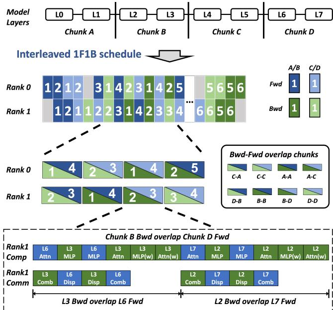  
Figure 2: Mechanism of Inter-Microbatch Overlap. The bottom panel illustrates how the backward pass of Chunk B is overlapped with the forward pass of Chunk D by interleaving decomposed operations.

## 2 Background and Motivation

## 2.1 Pipeline Execution and Overlap Pairs

This section defines the pipeline execution model that underlies the rest of the paper. Whereas Tensor Parallelism [22] splits operators within a layer and Context Parallelism [18] partitions the sequence dimension across devices, Pipeline Parallelism (PP) [7] partitions the model across layers into groups called chunks. Each chunk is assigned to a pipeline stage mapped to a specific device topology. To reduce the idle time (bubble) inherent in sequential stage execution, each training batch is further split into microbatches that can be pipelined through stages concurrently. A schedule governs how microbatches are dispatched. The widely adopted 1F1B schedule [22] alternates one forward and one backward microbatch per stage to bound memory while keeping the pipeline busy. Its interleaved variant further reduces bubble by assigning each physical rank multiple “virtual” stages, each corresponding to a distinct model chunk.

Inter-microbatch overlap. In an interleaved schedule, adjacent operations on a rank can come from different chunks and microbatches, allowing one chunk’s communication to overlap another’s computation. We refer to communicationcomputation overlap across different microbatches as intermicrobatch overlap. As shown in Fig. 2, chunks from different microbatches alternate on the same rank, and the A2A communication of one chunk’s backward pass (e.g., Chunk B) can execute concurrently with the computation of a subsequent chunk’s forward pass (e.g., Chunk D). We call two chunk operations that share such a concurrent execution window an overlap pair. An overlap pair includes the execution direction of each chunk, such as backward-on-B overlapped with forward-on-D in Fig. 2. Thus, pair types such as B-D and D-B are not merely unordered chunk sets; they can represent different directional overlap cases. For each overlap pair, the relevant performance metric is not the serial sum of its constituent operations, but the post-overlap cost: the resulting makespan of the co-scheduled overlap pair.

The uniformity assumption. Traditional PP overlap strategies rely on a strong implicit assumption: the model consists of uniform “Transformer bricks” with similar arithmetic intensity and communication patterns [33]. Under this assumption, all overlap pairs are structurally identical, so a hand-crafted fixed overlap template combined with layer-count balancing naturally yields both effective overlap and a load-balanced pipeline. Next-generation architectures break this uniformity.

## 2.2 Heterogeneous MoE Architectures

To scale Mixture-of-Experts (MoE) models, experts are partitioned and distributed across multiple devices [11]. This distribution necessitates All-to-All (A2A) communication for token dispatch and combination. At scales beyond several thousand GPUs, A2A latency constitutes a substantial fraction of iteration time, making it the primary target for overlap.

Prior works like Comet [39] employ intra-microbatch overlap, fusing communication with computation from the same microbatch. However, for heterogeneous models this approach forces kernel fragmentation by slicing the sequence dimension, reducing arithmetic intensity (detailed in §5). Intermicrobatch overlap avoids this fragmentation but shifts the hard problem: given a pipeline stage partition, which overlap pairs are induced, and how should their sub-operations interleave? Exploiting this form of overlap requires decomposing layers into fine-grained schedulable units so that communication and computation from different chunks can be inter leaved. We refer to each such unit as a task (e.g., Dispatch, MLP, Combine).

Qwen3-Next: a concrete case of pair diversity. Qwen3-Next adopts a hybrid attention design in which every four consecutive layers follow a 3:1 pattern: three Gated DeltaNet (GDN) linear-attention layers followed by one full softmax-attention layer. Each layer is followed by a sparse MoE feed-forward block. Under production sequence lengths, this operator mix produces up to 10× compute-time asymmetry between adjacent attention operations. As shown in Fig. 3, when these asymmetric chunks are assigned to virtual stages, they form overlap pairs with diverse compute-communication profiles. Each letter (A, B, C, D) denotes a chunk type defined by its attention/MoE composition. Even a simple 2-stage pipeline produces up to eight distinct pair types (e.g., B-D, D-B), each requiring a different fine-grained interleaving. A single overlap template cannot serve this diversity.

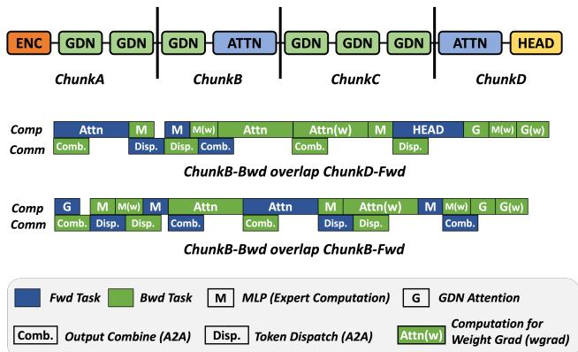  
Figure 3: Combinatorial Explosion of Overlap Patterns. The Qwen3-Next architecture produces asymmetric chunks, resulting in diverse overlap pairings that require structurally different fine-grained plans. For clarity, MoE blocks following the GDN and standard attention are not shown.

## 2.3 The Co-Optimization Problem

Existing systems optimize pipeline training as a waterfall: first partition by serial layer cost, then apply a fixed overlap template, then execute the resulting static plan. Heterogeneous MoE violates each step of this pipeline. We identify three compounding failures: the overlap scheduling space is combinatorial (§2.3.1), the partition objective is misleading (§2.3.2), and runtime variation leaves residual idle slots that static planning cannot predict (§2.3.3). The first two form a static planning cycle that requires joint optimization. The third motivates runtime adaptation.

## 2.3.1 Combinatorial Overlap Space

Template-based schedulers cannot handle the pair diversity created by heterogeneous chunk types. In a homogeneous model, every overlap pair is identical (e.g., A-A), and a single interleaving strategy works universally. In Qwen3-Next, even a single partition of the minimal 2-stage case produces up to eight distinct pair types, each requiring a unique fine-grained schedule: a computation-intensive chunk might successfully hide a communication-intensive chunk’s A2A, whereas two communication-heavy chunks may result in significant exposed latency. Existing systems rely on rigid templates (e.g., always aligning “forward combine” with “backward attention”). With asymmetric chunks, the optimal interleaving depends on the specific hardware resource usage of the constituent chunks. Manually engineering schedules for this combinatorial space is impractical.

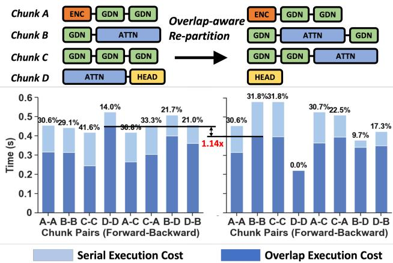  
Figure 4: Impact of Variable Overlap Efficiency. Variation in overlap gains under two partition plans. Data collected from training 8 layers of the Qwen3-Next-80B model with sequence length 256K on 128 GPUs. Left: A partition balanced for serial execution becomes imbalanced in post-overlap execution. Right: Tessera’s overlap-aware partitioner finds a plan that balances the post-overlap cost.

## 2.3.2 Variable Overlap Efficiency

Standard partitioners sum the sequential execution time of layers and balance this sum across stages. This strategy implicitly assumes that overlap efficiency, the fraction of communication hidden, is constant across the model.

In heterogeneous MoE models, overlap efficiency varies drastically. Fig. 4 (Left) presents profiling data from a balanced partition for the model architecture illustrated in Fig. 3. The chunk pair C-C achieves a 41.6% reduction in latency via overlap, while pair D-D achieves only 14.0% because both sides are computation-dominated with little A2A communication to hide. A partition balanced for serial execution can thus manifest severe imbalances during parallel execution.

An optimal partitioner must be overlap-aware: it should deliberately create serially “imbalanced” assignments if those pairings have complementary compute/communication profiles that maximize overlap. As shown in Fig. 4 (Right), the serial-cost-balanced partition has a 1.14× higher bottleneck post-overlap cost than the overlap-aware partition.

Moreover, the dependency is bidirectional. The overlap schedule determines how much communication each pair hides, which in turn determines which partition minimizes the bottleneck. A partition that appears serially imbalanced may yield the lowest post-overlap cost when its pairings have complementary profiles. Partition quality therefore cannot be evaluated without first scheduling and measuring each candidate pair. Partitioning and overlap scheduling are thus

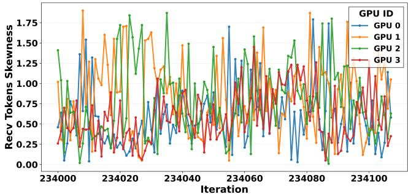  
Figure 5: Runtime Token Load Variation. The distribution of received tokens per device varies across iterations, creating dynamic imbalance that static planning cannot address.

cyclically dependent.

## 2.3.3 Runtime Stochasticity

Even an optimal static plan is vulnerable to runtime stochasticity. The number of tokens routed to specific experts fluctuates across iterations, causing the duration of MoE compute kernels to vary. In Qwen3-Next, this effect is amplified by finegrained sparse routing: each token activates only 10 of 512 experts, so each expert receives a smaller expected share of the token pool. This lower routing coverage increases the relative variation of per-expert and per-rank token counts across iterations, as reflected in the per-device load-skewness fluctuations shown in Fig. 5. These fluctuations create ephemeral idle slots that no static schedule can predict.

The key observation that makes runtime optimization feasible is that not all rank-local work lies on the microbatch critical path. We call the critical-path tasks that define stage latency the backbone tasks. The remaining timing-flexible tasks (e.g., weight-gradient computation, gradient reduction) that can fill transient gaps are called movable tasks. Deferring movable tasks and injecting them into routing-induced idle slots can recover throughput that static planning leaves unexploited.

Summary. Partitioning and overlap scheduling are cyclically dependent: partition boundaries determine which overlap pairs form, while overlap efficiency determines which partition is optimal. Runtime routing variation adds a dynamic dimension that no static solution can address. Together, these challenges render stratified optimization pipelines inadequate for heterogeneous MoE training.

## 3 Tessera Design

To resolve the partitioning–overlap cycle (§2.3.2), Tessera fixes the high-level pipeline schedule (e.g., interleaved 1F1B) and co-optimizes partitioning and overlap scheduling within it. A static planner produces an execution plan (§3.1), and a plan-agnostic execution engine (§4) interprets it at runtime, decoupling scheduling logic from the host framework. To handle stochasticity that the static plan cannot predict, a Dynamic Bubble Optimizer fills routing-induced idle slots with eligible movable tasks, without changing partition boundaries or the planned order of backbone tasks (§3.2).

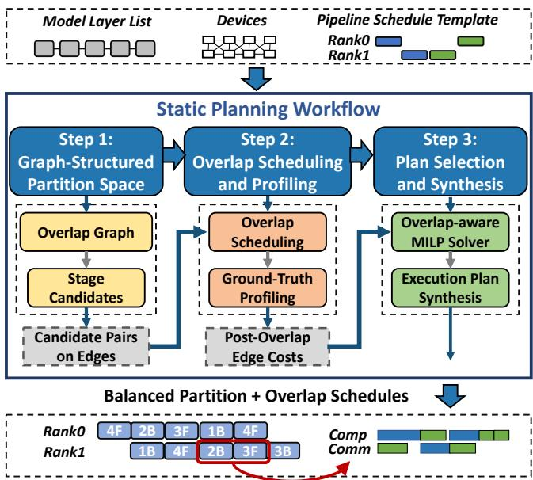  
Figure 6: Overlap-aware static planning workflow.

## 3.1 Static Planning

We refer to the fixed high-level pipeline schedule (e.g., interleaved 1F1B) as the pipeline schedule template. Given this template, Tessera resolves the static partitioning–overlap cycle through a candidate-generation-and-profiling workflow. Fig. 6 summarizes this workflow. Step 1 constructs an overlap graph from the template and attaches bounded stage candidates to each virtual stage (§3.1.1). Step 2 instantiates each candidate pair on an overlap edge as a concrete overlap pair, synthesizes its fine-grained overlap schedule, and profiles its post-overlap cost on a reference device group (§3.1.2). Step 3 selects one candidate per stage via MILP to minimize the bottleneck post-overlap cost, then materializes the selected partition and per-pair schedules into the final execution plan (§3.1.3).

## 3.1.1 Step 1: Overlap Graph and Candidate Space

The pipeline schedule template determines a set of virtual stages and which of them may execute microbatch operations concurrently on the same rank. These relationships define an overlap graph G=(S,E). Each node s ∈ S is a virtual pipeline stage under the template. Tessera adds an overlap edge e=(s,t) ∈ E for each overlap opportunity that the template creates on a pipeline rank, where endpoints s and t may be the same virtual stage. Each edge records the pass directions of the two endpoint operations, so the same endpoint pair may yield multiple edges, e.g., forward-on-s with backward-on-t and backward-on-s with forward-on-t. A self loop denotes an overlap opportunity between operations of the same virtual stage from different microbatches. With the graph topology fixed by the template, the layers each node carries remain to be selected.

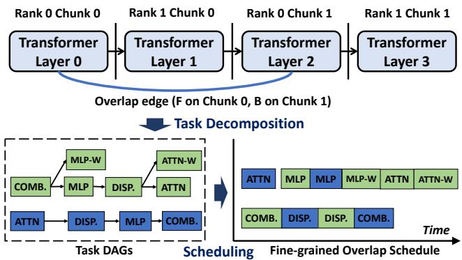  
Figure 7: Decomposing an overlap edge into task DAGs and synthesizing a fine-grained overlap schedule. The figure highlights one forward–backward overlap edge on Rank 0, omitting other pass-direction edges. Each stage contains a single layer for clarity.

Tessera starts from a serial-cost-balanced baseline partition as the initial assignment of layers to virtual stages. To explore alternative partitions, Tessera generates a candidate set C<sub>s</sub> for each stage s. A stage candidate c ∈ C<sub>s</sub> specifies one possible model chunk for virtual stage s: a contiguous layer range generated by perturbing boundaries around the baseline. For any candidate pair (c ∈ C<sub>s</sub>, d ∈ C<sub>t</sub>) on an overlap edge e=(s,t), the post-overlap cost lies between max(T<sub>c</sub>,T<sub>d</sub>) (perfect overlap) and T<sub>c</sub>+T<sub>d</sub> (zero overlap), where T<sub>c</sub> and T<sub>d</sub> denote the serial costs of candidates c and d respectively. Tessera restricts candidates to a bounded neighborhood around the baseline to keep overlap scheduling and profiling tractable.

Together, the overlap graph and stage candidates define the search space for joint optimization. Selecting one candidate per node determines a concrete pipeline partition. Each edge poses a scheduling subproblem: for a given pair of endpoint candidates, Tessera must synthesize a fine-grained overlap schedule and measure its post-overlap cost. The profiled edge costs then feed the partition solver that minimizes the bottleneck post-overlap cost across the graph.

## 3.1.2 Step 2: Overlap Scheduling and Profiling

Once candidates c and d are assigned to the endpoint stages of edge e, the layer ranges, pass directions, and device topology are fully determined, specifying a concrete overlap pair. For each such pair, Tessera synthesizes a fine-grained overlap schedule and measures the post-overlap cost T<sub>e,c,d</sub>.

Algorithm 1 Event-driven scheduling for overlap-pair task   
DAGs   
Input: task DAGs D<sub>1</sub>, D<sub>2</sub> (overlap pair)   
Output: Overlap schedule S for tasks in D<sub>1</sub> ∪ D<sub>2</sub>   
1: Ready ← initial tasks with no unsatisfied dependencies   
2: Running ← 0/; Pending ← 0/; Time ← 0   
3: while Ready ∪ Running ̸= 0/ do   
4: for resource r ∈ {Comp,Comm} where r is idle do   
5: τ ← SELECT(Ready[r]) ▷ backbone-first gap-fit   
selection   
6: if τ = ⊥ then continue   
7: if ISMOVABLE(τ) and Running ̸= 0/ and SHOULDDE-  
FER(τ,Time) then   
8: move τ from Ready[r] to Pending[r] ▷ defer to   
protect backbone completion   
9: else   
10: remove τ from Ready   
11: SCHEDULE(τ,Time)   
12: Time ← next task completion event   
13: Update Ready with newly unblocked tasks in D<sub>1</sub>,D<sub>2</sub>   
▷ Backfill deferred movable tasks   
14: for τ ∈ Pending in reverse readiness order do   
15: BACKFILL(τ, S) ▷ best-fit residual slot or tail

Tessera decomposes each overlap pair into two task DAGs, one per chunk, as illustrated in Fig. 7. Each task is an atomic scheduling unit with a duration, resource type, and dependency constraints. These attributes determine when a task becomes ready, which resource it can use, and whether it fits the current gap.

Given these DAGs, Tessera uses an event-driven list scheduler (Algorithm 1) to minimize the pair’s makespan on two resources (Comp, Comm). At each event, SELECT applies two heuristics. (i) Backbone-first alignment: backbone tasks take precedence, and a gap-fit rule picks the task whose duration is closest to the remaining window on the complementary resource. (ii) Conditional deferral: movable tasks are placed when they fit the current gap without extending the pair’s makespan. SHOULDDEFER defers a movable task that would extend the pair’s makespan. Once backbone placement is complete, deferred movable tasks are backfilled into residual slots within their lifetimes using a best-fit rule; tasks with no suitable slot are placed at the tail.

Tessera executes the synthesized schedule on a reference device group, a dedicated device set configured with the same TP/EP topology as the target rank, to measure ground-truth post-overlap cost. Physical profiling is necessary because real hardware interference causes the true overlapped cost to deviate from analytical estimates (§5). To bound overhead, Tessera profiles each distinct overlap pair only once: when multiple edge-candidate pairs yield identical chunk specifications, pass directions, and device topologies, their profiles are shared. Results are cached by device-mesh class and chunk specification for reuse across ranks and replicas with matching GPU type

and interconnect pattern.

## 3.1.3 Step 3: Overlap-Aware Partition Selection

With all post-overlap costs T<sub>e,c,d</sub> profiled, partition selection reduces to a graph labeling problem. Pipeline iteration time depends on the full critical path through the fixed schedule. Under the fixed template, Tessera targets the steady-state overlap opportunities that recur across microbatches: a selected edge with high profiled post-overlap cost would repeatedly ex pose a straggler. Tessera therefore uses the maximum selected post-overlap edge cost as a surrogate objective for partition selection. Formally, binary variable y<sub>s,c</sub> selects candidate c for node s; z<sub>e,c,d</sub> activates the candidate pair selected on edge e=(s,t). Each node selects exactly one candidate, and each edge variable is consistent with its endpoint selections:

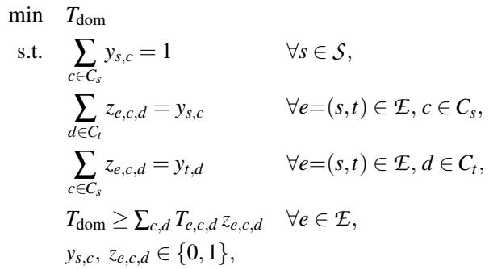

(1)

T<sub>e,c,d</sub> is the profiled post-overlap cost of candidate pair (c, d) on edge e. The bottleneck constraint charges each overlap edge by the cost of its selected pair. The full solver additionally enforces contiguous non-overlapping layer ranges, device-topology compatibility, and per-rank memory capacity constraints.

Complexity and Profile-Guided Pruning. By decoupling the search into stage-level variables and linking adjacent stages via consistency constraints, this MILP formulation reduces the binary variable count from O(N · K<sup>vp</sup>) in ranklevel enumeration to O(N · vp · K<sup>2</sup>), where N is the number of pipeline ranks, vp is the number of virtual stages per rank, and K is the candidate count per stage; bottleneck constraints scale as |E|, one per overlap edge. To further accelerate the solver, Tessera applies safe profile-guided pruning. The bottleneck post-overlap cost of the baseline partition, T<sub>base</sub>, serves as an upper bound on T<sub>dom</sub>: any candidate pair whose profiled cost exceeds T is discarded, since selecting it cannot improve upon the baseline. If a stage candidate c loses all valid pairs on its incident edges, it is removed from the search space. In practice, this significantly reduces the MILP size while preserving all solutions with T<sub>dom</sub> ≤ T<sub>base</sub>.

Plan Synthesis. The selected node labels on the same physical rank compose that rank’s assignment. The solver’s output is materialized into the final execution plan by instantiating the pipeline schedule template and substituting each edge with the fine-grained overlap schedule synthesized in Step 2.

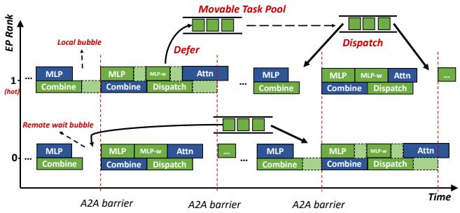  
Figure 8: Dynamic scheduling of movable tasks into bubbles.

## 3.2 Dynamic Bubble Optimization

Static planning assigns each movable task a default execution position within the overlap schedule. At runtime, MoE routing variation changes task durations, shifting the size and location of idle slots in ways that no static plan can predict. The Dynamic Bubble Optimizer may defer eligible movable tasks and dispatch them into predicted idle slots, recovering throughput that static planning leaves unexploited.

## 3.2.1 Bubble Prediction and Slot Sizing

Runtime variability is primarily driven by token routing decisions. To detect routing-induced bubbles before they occur, Tessera reuses routing metadata that becomes available before expert dispatch. Within each EP group, ranks exchange only per-expert token counts via a lightweight collective that piggybacks on the existing MoE dispatch path. Because the exchange is scoped to the EP group and carries scalar counts rather than tensor payloads, it introduces no cluster-wide syn chronization. An imbalance monitoring mechanism uses these counts to estimate the workload assigned to each rank. Deviations from the profiled static schedule predict where and how large idle slots will form.

Tessera pre-annotates target slot locations during static planning. Whether a slot materializes, and how large it is, is determined at runtime. As illustrated in Fig. 8, load imbalance typically prolongs specific operations (e.g., MLP on hot experts), inducing local idle time and cross-device wait states.

To capture these routing-induced gaps, Tessera locates structural boundaries directly after MoE computation tasks within the overlap schedule (§3.1.2). The two chunks in an overlap pair can originate from different microbatches with independent token distributions; their latencies can shift in opposite directions, so the idle window at these boundaries fluctuates widely across iterations. Pre-annotating these locations provides Tessera with effective insertion points for movable tasks.

Target Slot Sizing. To ensure that task injection does not stall the training pipeline, Tessera must estimate slot sizes asynchronously. Token distribution is resolved during the forward dispatch, so load information becomes available several steps before the target slot. The sizing calculation thus overlaps with useful computation. Using the observed token distribution and the offline-profiled static schedule, Tessera estimates the fillable idle window b at each pre-annotated target slot β. Non-positive windows are skipped.

Algorithm 2 Dynamic Bubble-Filling   
Input: Token distribution T, offline profile P , movable task pool Q   
▷ Retrieve pre-annotated target slots   
1: B ← GETTARGETSLOTS() ▷ From static plan   
▷ Fill predicted slots from movable task pool   
2: for each target slot β ∈ B do   
3: b ← ESTIMATEBUBBLESIZE(T,P ,β) ▷ Asynchronous   
4: if b > 0 then   
5: r ← β.rank, t<sub>start</sub> ← β.time   
6: C ← 0/   
7: for each task σ ∈ Q do   
8: if σ is ready on r and σ.duration ≤ b and t<sub>start</sub> +   
σ.duration ≤ σ.deadline then   
9: s ← COMPUTESCORE(σ,b )   
10: C ← C ∪ {(σ, s)}   
11: if C ̸= 0/ then   
12: σ<sup>∗</sup> ← argmax<sub>(σ,s)∈C</sub> s   
13: SCHEDULE(σ<sup>∗</sup>, on r, start at t<sub>start</sub>)   
14: Remove σ<sup>∗</sup> from Q

## 3.2.2 Movable Task Injection

Movable Task Pool. Tessera fills predicted slots from a pool of movable tasks whose deadline slack (the margin between readiness and deadline minus execution time) is positive. It organizes these tasks into priority queues ordered by deadline urgency. For example, Wgrad is enqueued as soon as its preceding backward computation completes, and is assigned a hard deadline corresponding to the iteration end. We observe that this pool is typically well-provisioned in production, as Wgrad tasks naturally accumulate off the critical path during load imbalance events. The pool is bounded by a configurable per-GPU capacity and the available memory headroom. Once either bound is reached, newly ready movable tasks are kept at their original positions rather than deferred.

Guaranteed Execution. If a movable task’s deadline slack approaches zero without a suitable target slot being found, the runtime preemptively injects it into the main stream, prioritizing correctness over optimization.

Bubble-Filling Policy. With the fillable window b resolved asynchronously, Tessera triggers the injection logic immediately prior to launching the overlapped tasks. The dynamic scheduler employs a greedy heuristic (Algorithm 2) to scan the pool and select the feasible task σ with the highest score S(σ, b ), which prioritizes tight duration fit and small deadline slack. If no suitable task is found, the slot remains empty. Because the pool search space is restricted and each b is computed asynchronously before its target slot, the combined overhead of slot sizing and task selection is negligible (< 10 µs). Furthermore, by triggering this logic asynchronously ahead of the sparsely pre-annotated target slots rather than after every task, this mechanism minimizes the interference of dynamic scheduling with the continuous pipeline execution.

## 4 Implementation

Tessera is implemented as a standalone library (11,000 lines of Python and 2,000 lines of C++) integrated with Megatron-LM [22] (as a host framework).

Plan-Agnostic Execution Engine. To execute the diverse overlap patterns required by asymmetric overlap pairs without invasive modifications to the host framework’s imperative loops, Tessera implements a Plan-Agnostic Execution Engine in C++. This engine decouples schedule definition from execution by interpreting the static plan as a specification rather than hard-coded control flow. It coordinates execution via a lock-free finite-state machine (FSM). The main Forward and Backward Torch threads drive their respective tasks, pausing at designated yield points to synchronize with the engine’s global state and achieve the planned inter-microbatch over lap. Concurrently, an additional background thread processes movable tasks registered with the engine, such as Wgrad, according to the execution plan. This architecture enables the runtime to execute diverse pipeline execution plans generated by the static planner without relying on hard-coded pipeline schedule control flow.

Customizing Task Boundaries and Overlap Schedules. Instead of requiring developers to refactor MoE model definitions into isolated task functions, Tessera exposes task boundaries through lightweight execution probes inserted in the existing forward and backward code. The advance(TaskName) API marks host-side probe points where the execution engine may block or release the current forward/backward execution thread, slicing the continuous execution into named tasks without moving tensor computation out of the host framework. For movable tasks that lie off the backbone, such as Wgrad, Tessera uses register\_task() to expose the callable after its dependencies become available. Listing 1 illustrates this pattern inside a schedulable MoE operator.

By default, the system automatically constructs overlap schedules from these tasks using its built-in scheduler (§3.1.2). Thanks to Tessera’s Plan-Agnostic Execution Engine, users can alternatively specify custom interleaving strategies via a YAML configuration file. As shown in the second half of Listing 1, this interface allows experts to define fine-grained, device-specific execution sequences for interleaved streams— enabling domain-specific overlap optimizations when default heuristics are insufficient.

User Interface. Tessera exposes a declarative API that separates schedule control from the tensor computation managed by the host framework. Users invoke build\_execution\_plan to trigger the Static Planner, which ingests the model structure, applies task decomposition rules, and synthesizes the execution plan. run then accepts this plan and hands control to the Pipeline Execution Engine. To ensure correctness within complex training loops, Tessera utilizes standardized hooks (e.g., pre\_fwd, post\_fwd, post\_iter) to inject framework-specific logic (e.g., loss aggregation, gradient reduction) into the execution flow, keeping such logic localized in hooks.

Listing 1: Customizing task boundaries and overlap schedules.  
```python
# Schematic: Tessera probe API usage (simplified)
2 class SchedulableMoEFunction(torch.autograd.Function):
3
4 @staticmethod
5 def forward(ctx, hidden_states, expert_weights):
6
7 tessera.scheduler.advance("F_DISP")
8 dispatched_tokens = dispatch(hidden_states)
9 tessera.scheduler.advance("F_MLP")
10 expert_outputs = compute_experts(dispatched_tokens, ...)
11
12 @staticmethod
13 def backward(ctx, grad_outputs):
14
15 tessera.scheduler.advance("B_COMBINE")
16 grad_combined = combine_logic_bwd(grad_outputs)
17 tessera.scheduler.advance("B_MLP")
18 grad_inputs = compute_activation_grad(grad_combined, ...)
19 tessera.scheduler.register_task(
20 task_name="B_WGRAD",
21 func=compute_weight_grad,
22 args=(grad_combined, hidden_states)
23 )
24
25 # User-specified overlap schedule (overlap.yaml)
26 overlap_plans:
27 - chunk_pair:
28 fwd_chunk: [Layer0, Layer1]
29 bwd_chunk: [Layer0, Layer1]
30 pattern:
31 - B_COMB:L1 # overlap: bwd L1 comm
32 - F_ATTN:L0 # with fwd L0 compute
33 - F_DISP:L0
34 - B_MLP:L1
35 - F_COMB:L0
36 - B_WGRAD:L1
37
```

## 5 Engineering Experience and Discussion

We deployed Tessera in the production pre-training of the Qwen3 and Qwen3-Next model families, scaling beyond 10,000 NVIDIA Hopper GPUs. Scaling to this magnitude exposes fracture points where theoretical scheduling abstractions break down under physical realities. In this section, we discuss the operational challenges encountered and the engineering solutions adopted to sustain high efficiency at scale. Intra-microbatch vs. Inter-microbatch Overlap. We evaluated intra-microbatch overlap (partitioning input tokens to hide MoE dispatch) against Tessera’s inter-microbatch approach. While intra-microbatch overlap offers theoretical latency hiding, we found it operationally fragile at scale. Partitioning along the sequence dimension fragments GEMM operations, reducing arithmetic intensity below the threshold where compute throughput dominates. Aggressive kernel fusion (e.g., Comet [39]) can recover efficiency, but in our production stack the resulting coupling between MoE kernels and specific communication backends complicates independent backend upgrades. In contrast, Tessera’s inter-microbatch approach maintains full GEMM computational intensity and backend modularity.

Theoretical Overlap vs. Silicon Reality. Static overlap schedulers estimate an overlap pair’s makespan from the task DAG, using task durations, resource types, and dependencies to determine the expected computation–communication overlap. This theoretical estimate is useful for synthesizing candidate schedules, but large-scale production deployments reveal a small, non-uniform gap between the idealized schedule and silicon execution [4, 10]. Across Qwen3-Next pre-training workloads, the theoretical cost underestimates measured overlapped execution in most cases, with an average deviation of around 5%. One major source is SM contention: EP commu nication kernels reserve ∼20 SMs for All-to-All dispatch and combine, causing a stable 10–20% slowdown when they overlap with Attention or MoE-MLP kernels. We also observe that each task is a coarse scheduling unit rather than a single kernel (e.g., a communication-dominant task may contain small compute kernels), which can leave residual interference, or even serialization, that prevents the idealized schedule from achieving perfect overlap.

Granularity of Cost Profiling. Chunk-pair profiling is affordable for our production workloads: even for trillion-scale models, profiling completes within one hour because repeated model structure bounds the number of distinct overlap pairs. We also explored a lower-cost alternative, primitive-level profiling, which profiles reusable overlap patterns between pairs of task primitives and composes the measured interactions to estimate a full chunk-pair timeline. Compared with the purely theoretical estimate above, primitive-level profiling reduces average error by capturing stable pairwise effects such as SM contention. However, its residual error remains uneven across overlap pairs, reaching up to 15% in tail cases. This tail behavior is problematic for partition selection because the MILP relies on relative cost comparisons among candidate stage assignments; a few misestimated overlap pairs can change the selected bottleneck edge or partition boundary. The residual gap arises from cross-primitive effects, including relay overlaps across consecutive kernels, cumulative execution state in caches and communication libraries, and host-side launch overhead. We therefore use chunk-pair profiling as the default, while keeping primitive-level profiling as a lower-cost fallback.

Infrastructure Jitter. Scaling beyond 10,000 GPUs reveals that infrastructure noise is a persistent source of throughput instability. Network congestion and switch contention cause stochastic variation in pipeline communication latency, both across iterations and across ranks. While the Static Planner addresses structural heterogeneity, these transient fluctuations require runtime adaptation. We have explored extending DBO to absorb infrastructure jitter by reusing its bubble-filling mechanism. Leveraging the observation that jitter often exhibits short-term temporal correlation, a history-based predictor (moving average of the last 10 iterations) estimates upcoming bubble sizes, and per-rank injection fills these transient gaps with locally pooled movable tasks. This approach is architecturally feasible since infrastructure-induced bubbles enter the same prediction path as routing-induced ones. Systematic validation of this extension under controlled jitter conditions remains future work.

Memory Pressure Trade-off. While the Dynamic Bubble Optimizer improves throughput by delaying movable tasks to fill idle pipeline slots, this strategy introduces a subtle memory trade-off: delaying a Wgrad task prolongs the liveness of its associated activation and gradient tensors, increasing peak memory consumption. In our production runs, aggressive bubble filling occasionally triggered out-of-memory (OOM) errors on memory-constrained workloads. In practice, we rely on the bounded movable-task pool described in §3.2.2, configuring its per-GPU cap from observed memory headroom. This cap limits how many deferred tasks can keep activations and gradients live at once. When memory headroom is tight, Tessera can also represent memory-management operations, including activation offloading and recomputation, as movable tasks and schedule them into suitable pipeline bubbles.

Decoupling System Constraints via Padding. A major friction point in large-scale training is the conflict between hyperparameter tuning and system constraints. The standard interleaved 1F1B schedule [22] theoretically mandates that the number of microbatches (M) per iteration must be perfectly divisible by the pipeline parallel size (K). In production, however, M is dictated by the global batch size required for model convergence, while K is constrained by device memory limits. Forcing M%K = 0 often requires suboptimal batch size adjustments that degrade model quality. Tessera resolves this by decoupling these constraints via microbatch padding. We inject shadow actions, null operations that skip computation but perform necessary pipeline communication (sending pseudo-tensors), to satisfy structural dependencies without altering the mathematical equivalence of the batch. Shadow actions are excluded from loss accumulation, gradient scaling, and optimizer accounting. Leveraging Tessera’s configuration interface, this padding is achieved by simply specifying a compliant plan file, avoiding invasive code changes. Empirically, this mechanism introduces negligible overhead (∼0.5%) while maximizing configuration flexibility.

Table 1: Specification of Qwen Models in Experimentation. Model Scale: Small <100B, Medium 100–500B, Large 500B– 1T, Trillion >1T.  
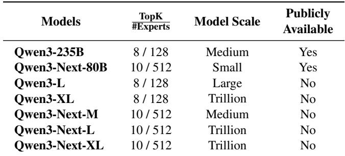

## 6 Evaluations

## 6.1 Experimental Setup

We conduct experiments on Alibaba’s production cluster, comprising NVIDIA Hopper GPU servers (each equipped with 8 GPUs) interconnected via a high-performance RoCE network. Our production evaluation focuses on pre-training the Qwen3 and Qwen3-Next model families. For the controlled opensource comparison (§6.3), we additionally evaluate DeepSeek-V3 and Nemotron-3 Super. All experiments use a mixture of proprietary internal datasets and open-source datasets. We measure system performance based on Model FLOPs Utilization (MFU), end-to-end throughput, and planning overhead. For the primary production results in Table 2, each workload is run with and without Tessera under the same cluster configuration and hyperparameters.

Baselines. We benchmark Tessera against two baselines that serve complementary evaluation purposes: (1) Internal Optimized Baseline (§6.2): For production-scale evaluation on clusters of up to 12,288 GPUs, we compare against Alibaba’s internal Megatron-LM fork, the production training stack used for the same Qwen3-family workloads before enabling Tessera. This baseline already includes interleaved 1F1B scheduling, native communication overlap, and production tuned FLOPs-balanced stage partitioning for the same cluster configuration. This setup isolates the incremental benefit of Tessera’s optimizations on top of an optimized production stack. (2) Megatron-Core MoE (v0.16.1) [36]: For con trolled, reproducible experiments on a 256-GPU cluster, we compare against Megatron-Core MoE using public per-model recipes from Megatron-MoE-ModelZoo (1ca7da9) [35] and Megatron-Bridge v0.4.1 [23]. These recipes enable Megatron Core’s built-in MoE optimizations, including EP communication overlap.

## 6.2 End-to-End Production Performance

We first present primary results on the massive-scale cluster. As standard open-source frameworks require significant customization at this scale, we benchmark against the Internal Optimized Baseline defined in §6.1—a productionhardened Megatron-LM tuned by domain experts. Note that, Tessera’s planning scope does not grow with the full cluster size: Tessera generates one execution plan for a modelparallel device mesh and replicates it across data-parallel ranks, so scaling increases the number of plan instances rather than the planning problem size. DBO likewise operates within each EP group with no cross-replica coordination.

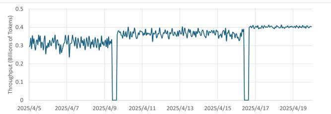  
Figure 9: Phased Impact of Tessera Deployment. A 2-week production trace (April 5 – April 19, 2025) from the 8,192- GPU Qwen3-XL training job. The first step-change (April 9) marks the deployment of Tessera’s Static Planner, which resolves structural bottlenecks. The second jump (April 16) marks the activation of the Dynamic Bubble Optimizer, which absorbs runtime stochasticity to stabilize throughput at peak levels.

Performance Consistency. Table 2 summarizes the gains. Tessera consistently improves MFU by 20%–33% across all workloads. The standard MoE (Qwen3 family) repeats the same Attention+MoE block across layers, achieving high baseline MFU (29.7%–32.0%) due to strong arithmetic intensity; the trillion-parameter Qwen3-XL further improves baseline MFU by amortizing communication overheads. For these models, the primary gains come from mechanisms that do not require layer-type diversity: finegrained inter-microbatch overlap hides A2A communication, while DBO fills routing- and pipeline-induced bubbles. The overlap-aware partitioner still contributes because production partitions include non-uniform boundary chunks (e.g., embedding/output-head chunks), and boundary shifts can change the post-overlap costs of the resulting stage pairs. The Qwen3-Next family interleaves GDN and full softmax-attention layers, producing structurally heterogeneous chunks. It employs an extremely sparse MoE architecture (TopK=10/512). As newly deployed models lacking mature full-stack optimizations, such as kernel fusion or communication coalescing, their baseline MFU is significantly lower (15.9%–19.6%), reflecting reduced compute intensity and higher system integration overhead under extreme sparsity. Despite this, Tessera delivers 20.0%–32.8% MFU gains, demonstrating robustness across model scales, cluster sizes, and deployment maturity levels.

A Phased Deployment. To disentangle the contributions of Tessera’s components, Fig. 9 illustrates a 2-week “hot upgrade” of the Qwen3-XL training. Phase 1 (Static Planner): On April 9, replacing the baseline with Tessera’s static plan yielded an immediate ∼13% throughput boost. Decomposition reveals this gain came from (1) Load Balancing (∼9%), where our overlap-aware partition balanced post-overlap stage costs, and (2) Latency Hiding, masking the All-to-All communication overhead. Phase 2 (Dynamic Optimizer): On April 16, enabling dynamic bubble filling elevated MFU to 39.0%. As evidenced by the flattened trace, dynamic task injection reduced production throughput variability after DBO activation.

Table 2: Production Performance Gains across Diverse Workloads. Tessera demonstrates consistent MFU improvements across controlled production-scale pre-training workloads, spanning model scales, MoE sparsities, and cluster sizes from 4,096 to 12,288 GPUs.  
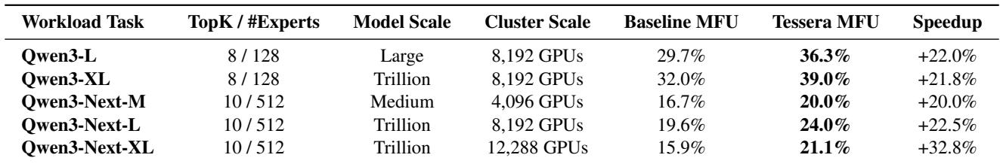

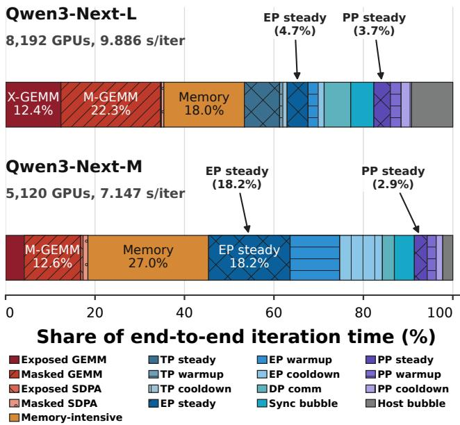  
Figure 10: Iteration-time breakdown for two production Qwen3-Next workloads. Steady, warmup, and cooldown refer to pipeline phases.

Production Case Study. To understand when Tessera’s overlap gains are most effective and where residual bottlenecks remain, we further decompose iteration time for two Qwen3- Next production workloads in Fig. 10. In both cases, Tessera’s overlap-aware partitioning compresses steady-phase PP bubbles to roughly 3% of iteration time, confirming effective load balancing across pipeline stages. Yet the two workloads exhibit sharply different overlap efficiency. On the trillion-scale

Qwen3-Next-L (8,192 GPUs), Tessera compresses exposed EP communication in the pipeline steady phase to 4.7% of iteration time. Including warmup and cooldown, 73% of EP communication is hidden behind computation, leaving exposed EP at only 8.3% of iteration time. On a separate 5,120-GPU Qwen3-Next-M run (distinct from the 4,096-GPU production result in Table 2), however, steady-phase exposed EP alone reaches 18.2% of iteration time. Including warmup and cooldown, only 26% of EP communication is hidden, with total exposed EP reaching 38.9% of iteration time. The root cause is compute intensity. Qwen3-Next-M has fewer parameters per expert, producing shorter GEMM durations relative to A2A transfer time and leaving each overlap pair with insufficient computation to hide the A2A latency. This contrast shows that Tessera’s overlap gains scale with the workload’s compute-to-communication ratio.

Gap to Ideal Execution. Even in the favorable regime (the top bar of Fig. 10), 27% of EP communication remains exposed (819 ms), over 40% of which originates from warmup and cooldown phases. Beyond exposed EP, PP bubbles contribute another 8.5% (835 ms), split between residual stage imbalance (366 ms) and structural warmup/cooldown cost (469 ms) inherent to interleaved 1F1B. Together, exposed EP communication and pipeline idle time account for 17% of iteration time, which we target in ongoing optimization.

Bitwise Equivalence. Tessera modifies only when and where tasks execute on the device timeline; the computation graph, operator semantics, and reduction order are unchanged. Gradient equivalence therefore holds by construction. We verify this empirically on a trillion-scale Qwen3-Next workload by comparing runs with and without Tessera’s optimizations under deterministic mode. The two runs produce bit-identical loss trajectories. This confirms that Tessera’s scheduling transformations introduce zero numerical divergence, and the system has since sustained months of production pre-training without observed quality regression.

## 6.3 Comparison with State-of-the-Art

To complement the production evaluation against our internal Megatron baseline (§6.2), we compare Tessera against Megatron-Core MoE [36] on a 256-GPU cluster. We evaluate three open-source MoE models: (i) Qwen3-235B [37], a standard Transformer MoE (128 experts, top-8, sequence length 4K); (ii) DeepSeek-V3 [3], which combines a dense prefix, compressed MLA attention, an MTP head, and a sparse MoE (256 experts, top-8, sequence length 4K); and (iii) Nemotron-3 Super [24], a hybrid Mamba/Attention model with latent MoE and MTP layers (512 experts, top 22, sequence length 8K). For Megatron-Core MoE, we follow the per-model recipes from the public Megatron-MoE-ModelZoo [35] and Megatron-Bridge [23].

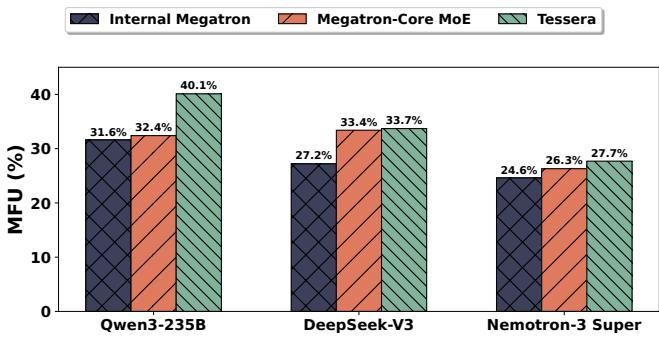  
Figure 11: MFU comparison among Internal Megatron, Megatron-Core MoE, and Tessera on a 256-GPU cluster. Tessera remains competitive with publicly available Megatron-Core MoE recipes on the non-Qwen workloads while consistently improving over the internal Megatron baseline across all three models.

As shown in Fig. 11, Tessera improves MFU over the internal Megatron baseline by 1.27×, 1.24×, and 1.13× on Qwen3-235B, DeepSeek-V3, and Nemotron-3 Super, respectively, showing that Tessera’s optimizations generalize beyond the Qwen3 family to architecturally diverse MoE workloads. Against the recipe-tuned Megatron-Core MoE baseline, Tessera improves MFU by 1.24× on Qwen3-235B and achieves comparable MFU on non-Qwen models.

We attribute Tessera’s gains to three mechanisms: (i) the overlap scheduler and DBO jointly mask exposed EP communication; (ii) the overlap-aware partitioner reduces stagelevel load imbalance; and (iii) DBO overlaps deferred Wgrad with PP send/receive, shrinking the pipeline bubble. On Qwen3-235B, Megatron-Core MoE’s A2A overlap removes most exposed EP communication but leaves PP wait intact. Relative to the internal Megatron baseline, Tessera cuts exposed EP communication by ∼75% and PP wait by ∼90%. On DeepSeek-V3, both Tessera and Megatron-Core MoE’s hand-tuned recipe mask over 70% of EP communication and yield balanced PP stages; Tessera’s DBO further overlaps deferred Wgrad with PP send/receive, reaching slightly higher end-to-end MFU. On Nemotron-3 Super, Megatron-Core MoE’s A2A-overlap implementation relies on a hand-crafted Transformer-layer decomposition and currently handles at most one MTP layer. EP communication outside this supported pattern therefore remains unoverlapped. Tessera reduces exposed EP communication by 40% and the pipeline bubble by 30%, yielding higher end-to-end MFU than Megatron-Core MoE.

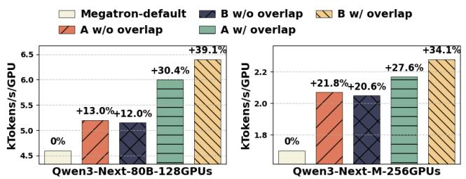  
Figure 12: Impact of co-optimizing partitioning and overlap scheduling.

## 6.4 Co-optimizing Partitioning and Overlap

We evaluate the impact of co-optimizing overlap scheduling and partitioning through two experiments: training Qwen3- Next-80B on 128 GPUs and Qwen3-Next-M on 256 GPUs. Both setups utilize an interleaved 1F1B schedule with a microbatch size of 1 per GPU, a pipeline-parallel size of 4 with an interleave size of 2, and an expert-parallel size of 32. To support a sequence length of 64K, we enable Context Parallelism. For a controlled comparison of static execution plans, we employ a mock router that uniformly distributes tokens and disable DBO, isolating static plan efficiency from dynamic runtime variance.

We establish Megatron-LM’s native uniform partition as the baseline. Against this, we compare two alternative strategies, each evaluated with and without Tessera’s fine-grained overlap scheduling: (1) Partition A: a latency-guided partition balanced by serial execution time; and (2) Partition B: Tessera’s overlap-aware partition. As shown in Fig. 12, the two partitions exhibit markedly different sensitivities to intermicrobatch overlap. When overlap scheduling is disabled, Partition A achieves slightly higher end-to-end throughput than Partition B, as indicated by the A w/o overlap and B w/o overlap bars. However, once overlap scheduling is enabled, the relative advantage shifts: Partition B attains significantly greater overlap gains and ultimately delivers the highest endto-end throughput (B w/ overlap vs. A w/ overlap). These results confirm that partitioning decisions must be co-optimized with overlap scheduling rather than optimized in isolation.

## 6.5 Overlap Scheduling

We evaluate overlap scheduling on the candidate overlap pairs enumerated by Static Planning, before partition selection. For Qwen3-Next-M at sequence length 4K, the EP32 and EP8 regimes produce 690 and 536 scheduling instances. We compare four strategies: FIFO schedules tasks in topological order without priority or alignment; +ALIGN adds backbonepriority and gap-fit alignment (§3.1.2); +DEFER adds conditional deferral of movable Wgrad tasks; and ILP solves the resource-constrained DAG with CBC [5] under a 300-s per-instance budget.

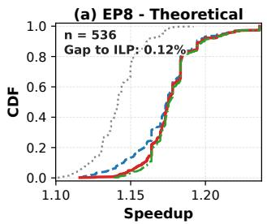

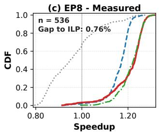

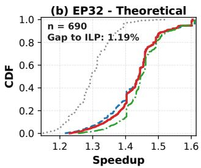

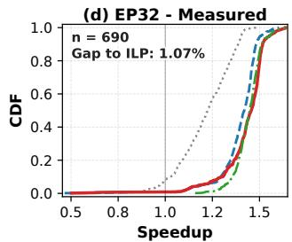  
Figure 13: CDF of per-instance speedup over serial execution for four overlap schedulers. Top row: analytical makespan; bottom row: measured post-overlap cost on hardware. +DE-FER (red) closely tracks the ILP reference (green) across the full distribution at both EP widths.

As shown in Fig. 13, EP32 exposes larger overlap gains than EP8 because EP communication accounts for a greater share of each pair’s serial cost. In both cases, the measured CDFs closely follow the analytical predictions, with the offset consistent with the theory-to-silicon gap discussed in §5. The curves also show that +ALIGN alone captures most of the gain over FIFO. +DEFER’s mean gain over +ALIGN is modest, but some instances gain over 10%. Taken together, the two heuristics close to within 1.19%/0.12% of ILP on EP32/EP8 in analytical makespan, and 1.07%/0.76% on measured postoverlap cost.

Quality vs. solving-time trade-off. Solving all instances with CBC takes hours to days. Per-instance solve time is longtailed: many hit the 300-s budget without a proven optimum. Tessera’s event-driven scheduler finishes in under a minute, staying within ∼ 1% of ILP on profiled post-overlap cost. We therefore adopt the heuristic as the production default.

## 6.6 Dynamic Bubble Optimization

We evaluate DBO’s speedup, overhead, and memory cost on Qwen3-Next-M (256 GPUs, 4K sequence length). To isolate DBO’s contribution from static planning decisions, we run DBO on top of two static plans. The Baseline Partition balances serial FLOPs across pipeline stages; the Overlap-Aware Partition is selected by Tessera’s partitioner using profiled post-overlap costs. Following the bounded-pool policy in §3.2.2, we cap the per-GPU movable-task pool at 8. For each plan we report three configurations: (i) static, DBO disabled; (ii) w/ DBO, full DBO active; and (iii) always-keep, which runs the full DBO monitoring, slot-sizing, and injectiondecision paths but keeps every movable task at its original position instead of deferring it. The always-keep row isolates the steady-state overhead of DBO without the benefit of task reordering.

Table 3: Performance and peak-memory cost of Tessera’s Dynamic Bubble Optimizer (DBO) on Qwen3-Next-M. Peak mem. denotes the maximum allocated memory normalized by the per-GPU memory budget.  
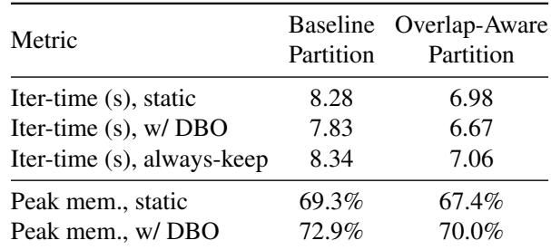

Table 3 summarizes the results. DBO cuts iteration time by 5.4% on Baseline and 4.4% on Overlap-Aware. The larger gain on Baseline is expected: serial-balanced partitions leave larger PP wait, which DBO overlaps with deferred Wgrad tasks; overlap-aware partitioning already shrinks this wait during static planning. Always-keep adds about 1% over the corresponding static run, so the monitor and injection paths are lightweight on their own. On the memory side, DBO increases peak memory by 2–4 percentage points of the per-GPU memory budget, since deferred movable tasks prolong the liveness of their input activations and gradients. This increase is consistent with the bounded per-GPU movable-task pool. The capacity can be raised for more bubble-filling, or lowered to reduce peak memory.

Production-Scale Validation. Two production deployments confirm DBO’s effectiveness beyond the 256-GPU ablation. On the 8,192-GPU Qwen3-XL job (§6.2, Fig. 9), end-to-end MFU reached 39.0% after DBO activation. On a 6,144-GPU Qwen3-L run (distinct from Table 2), DBO alone reduced PP bubble time by 641 ms, yielding a 3.4% throughput gain. For production-scale overhead, DBO runs independently within each EP group, so scaling to more GPUs increases the number of independent instances without adding cross-group coordination.

## 6.7 Planning Overhead Analysis

Tessera’s static planning is offline and consists of profiling distinct overlap pairs and solving the partitioning MILP. We evaluate on Qwen3-Next-M and Qwen3-Next-L under an 8,192-GPU target configuration with PP8-C2 and PP8-C4, denoting 2 or 4 chunks per pipeline rank under pipeline parallel size 8. Profiling runs on a 64-GPU reference device group. Across sequence lengths from 4K to 128K, repeated model structure bounds the distinct overlap-pair count to 237–327 under PP8-C4 and 575–637 under PP8-C2. Measured profiling time grows with sequence length and peaks at about 3,050 seconds at 128K for the trillion-scale PP8-C2 case, still below one hour.

Table 4: MILP problem scale and solve time. Pruning removes candidate pairs whose post-overlap cost exceeds T<sub>base</sub>.  
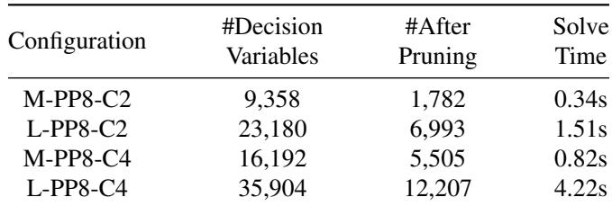

Table 4 reports the MILP scale and solve time. The edgebased formulation introduces stage-selection and edge-pair activation variables, scaling as O(S·K + E·K<sup>2</sup>) and avoiding K<sup>vp</sup> rank-level enumeration. Profile-guided pruning (§3.1.3) removes all candidate pairs whose post-overlap cost exceeds T<sub>base</sub>, reducing the effective problem size by roughly 3–5×. All tested configurations are solved within five seconds on a 64-core server.

## 7 Related Work

Pipeline Model Parallelism. Pipeline parallelism was established by GPipe [7], PipeDream [21], and Interleaved 1F1B [22]. It remains a core scaling primitive in recent large-scale MoE training systems and workloads [30, 32, 37]. Specialized variants target bidirectional execution (Chimera [13]), bubble minimization (Zero Bubble [25]), sequence-level partitioning (Seq1F1B [27]), activation checkpointing (Mario [20]), and memory efficiency (MEPipe [29]). These systems largely rely on static templates that lack the expressivity for the misaligned overlap patterns of heterogeneous MoE layers; Tessera instead decomposes operations into fine-grained task graphs for flexible interleavings.

Communication-Computation Overlap. Flux [1] and Comet [39] employ intra-microbatch overlap, fusing MoE communication with computation, but often require invasive kernel fusion that hinders modularity. For inter-microbatch overlap, DualPipe [3] orchestrates microbatch execution to hide communication, while WeiPipe [14] overlaps weight transfers. Inter-microbatch approaches still rely on manually designed or workload-specific schedules. Tessera automates inter-microbatch overlap discovery through global planning and task decomposition.

Automated Model Partitioning. Symbolic partitioners such as Alpa [40], Tessel [15], nnScaler [16], and Colossal-AI [12] use analytical cost models, while Aceso [17],

AdaPipe [28], Koala [31], and GraphPipe [9] use profiling. Mist [41] and PipeWeaver [34] begin to account for overlap effects. However, most frameworks still optimize partitioning separately from overlap scheduling, balancing serial costs rather than post-overlap execution. Tessera profiles postoverlap cost directly and partitions for parallel execution.

Dynamic MoE Load Balancing. Runtime imbalance in MoE has driven two directions: token/expert redistribution via replication or linear programming (FasterMoE [6], Janus [19], PopFetcher [38], LPLB [2]), and system-level adaptation via dynamic kernel tuning (Tutel [8], DeepSpeed-MoE [26]). Tessera is complementary: rather than trying to perfectly balance stochastic token loads, it accepts routing variation and absorbs the resulting pipeline bubbles by dynamically scheduling movable tasks, such as gradient reduction and offloading, into idle slots.

## 8 Conclusion

Training trillion-parameter heterogeneous MoE models exposes a cyclic dependency between pipeline partitioning and communication overlap that traditional stratified optimization cannot resolve. Tessera breaks this cycle by profiling post-overlap cost for each layer combination to co-optimize partitioning and overlap scheduling, while a Dynamic Bubble Optimizer fills routing-induced idle slots with movable tasks at runtime. Deployed on production clusters for pretraining Qwen families, Tessera improves throughput by 20%– 33% across five workloads at scales from 4,096 to 12,288 GPUs, reaching 39% MFU on a trillion-parameter model and up to 1.24× higher MFU than Megatron-Core MoE in controlled experiments. Tessera demonstrates that a unified, profile-driven co-optimization approach systematically outperforms manual heuristics, providing a practical foundation for training next-generation heterogeneous AI models.

## Acknowledgments

We thank our shepherd and the anonymous reviewers for their careful reading and constructive feedback. We would like to express our gratitude to the following individuals for their contributions to this work. For algorithmic insights, we are especially grateful to Bo Zheng, Rui Men, Yuqiong Liu, and Hao Ge, whose ideas and discussions have significantly shaped this work. For systems development and engineering, we thank Linlang Jiang, Zhixiang Ruan, Hongqing Chen, Yunfei Mao, Siyu Wang, Xing Wang, and Chang Si, who have continuously advanced the underlying system that made this work possible. Weifang Hu and Xuanhua Shi were supported in part by the National Key Research and Development Program of China (No. 2024YFB4505202), The Major Program (JD) of Hubei Province (No. 2023BAA024), and Hubei Provincial Natural Science Foundation of China (No. 2026AFA002).

## References

[1] Li-Wen Chang, Wenlei Bao, Qi Hou, Chengquan Jiang, Ningxin Zheng, Yinmin Zhong, Xuanrun Zhang, Zuquan Song, Ziheng Jiang, Haibin Lin, Xin Jin, and Xin Liu. FLUX: Fast Software-based Communication Overlap On GPUs Through Kernel Fusion, 2024.

[2] DeepSeek-AI. Linear-Programming-Based Load Balancer (LPLB). https://github.com/deepseek-ai/ LPLB, 2025.

[3] DeepSeek-AI, Aixin Liu, Bei Feng, Bing Xue, Bingx uan Wang, Bochao Wu, Chengda Lu, Chenggang Zhao, Chengqi Deng, Chenyu Zhang, Chong Ruan, Damai Dai, Daya Guo, Dejian Yang, Deli Chen, Dongjie Ji, Erhang Li, Fangyun Lin, Fucong Dai, Fuli Luo, Guangbo Hao, Guanting Chen, Guowei Li, H. Zhang, Han Bao, Han wei Xu, Haocheng Wang, Haowei Zhang, Honghui Ding, Huajian Xin, Huazuo Gao, Hui Li, Hui Qu, J. L. Cai, Jian Liang, Jianzhong Guo, Jiaqi Ni, Jiashi Li, Jiawei Wang, Jin Chen, Jingchang Chen, Jingyang Yuan, Junjie Qiu, Junlong Li, Junxiao Song, Kai Dong, Kai Hu, Kaige Gao, Kang Guan, Kexin Huang, Kuai Yu, Lean Wang, Lecong Zhang, Lei Xu, Leyi Xia, Liang Zhao, Litong Wang, Liyue Zhang, Meng Li, Miaojun Wang, Mingchuan Zhang, Minghua Zhang, Minghui Tang, Mingming Li, Ning Tian, Panpan Huang, Peiyi Wang, Peng Zhang, Qiancheng Wang, Qihao Zhu, Qinyu Chen, Qiushi Du, R. J. Chen, R. L. Jin, Ruiqi Ge, Ruisong Zhang, Ruizhe Pan, Runji Wang, Runxin Xu, Ruoyu Zhang, Ruyi Chen, S. S. Li, Shanghao Lu, Shangyan Zhou, Shanhuang Chen, Shaoqing Wu, Shengfeng Ye, Shengfeng Ye, Shi rong Ma, Shiyu Wang, Shuang Zhou, Shuiping Yu, Shun feng Zhou, Shuting Pan, T. Wang, Tao Yun, Tian Pei, Tianyu Sun, W. L. Xiao, Wangding Zeng, Wanjia Zhao, Wei An, Wen Liu, Wenfeng Liang, Wenjun Gao, Wenqin Yu, Wentao Zhang, X. Q. Li, Xiangyue Jin, Xianzu Wang, Xiao Bi, Xiaodong Liu, Xiaohan Wang, Xiao jin Shen, Xiaokang Chen, Xiaokang Zhang, Xiaosha Chen, Xiaotao Nie, Xiaowen Sun, Xiaoxiang Wang, Xin Cheng, Xin Liu, Xin Xie, Xingchao Liu, Xingkai Yu, Xinnan Song, Xinxia Shan, Xinyi Zhou, Xinyu Yang, Xinyuan Li, Xuecheng Su, Xuheng Lin, Y. K. Li, Y. Q. Wang, Y. X. Wei, Y. X. Zhu, Yang Zhang, Yanhong Xu, Yanhong Xu, Yanping Huang, Yao Li, Yao Zhao, Yaofeng Sun, Yaohui Li, Yaohui Wang, Yi Yu, Yi Zheng, Yichao Zhang, Yifan Shi, Yiliang Xiong, Ying He, Ying Tang, Yishi Piao, Yisong Wang, Yixuan Tan, Yiyang Ma, Yiyuan Liu, Yongqiang Guo, Yu Wu, Yuan Ou, Yuchen Zhu, Yuduan Wang, Yue Gong, Yuheng Zou, Yu jia He, Yukun Zha, Yunfan Xiong, Yunxian Ma, Yuting Yan, Yuxiang Luo, Yuxiang You, Yuxuan Liu, Yuyang Zhou, Z. F. Wu, Z. Z. Ren, Zehui Ren, Zhangli Sha, Zhe Fu, Zhean Xu, Zhen Huang, Zhen Zhang, Zhenda Xie,

Zhengyan Zhang, Zhewen Hao, Zhibin Gou, Zhicheng Ma, Zhigang Yan, Zhihong Shao, Zhipeng Xu, Zhiyu Wu, Zhongyu Zhang, Zhuoshu Li, Zihui Gu, Zijia Zhu, Zijun Liu, Zilin Li, Ziwei Xie, Ziyang Song, Ziyi Gao, and Zizheng Pan. DeepSeek-V3 Technical Report, 2025.

[4] Paul Elvinger, Foteini Strati, Natalie Enright Jerger, and Ana Klimovic. Understanding GPU Resource Interference One Level Deeper, 2025.

[5] John Forrest and Robin Lougee-Heimer. CBC User Guide. INFORMS, 2005.

[6] Jiaao He, Jidong Zhai, Tiago Antunes, Haojie Wang, Fuwen Luo, Shangfeng Shi, and Qin Li. FasterMoE: Modeling and Optimizing Training of Large-Scale Dynamic Pre-Trained Models. In Proceedings of the 27th ACM SIGPLAN Symposium on Principles and Practice of Parallel Programming (PPoPP ’22), pages 120–134, 2022.

[7] Yanping Huang, Youlong Cheng, Ankur Bapna, Orhan Firat, Mia Xu Chen, Dehao Chen, HyoukJoong Lee, Jiquan Ngiam, Quoc V. Le, Yonghui Wu, and Zhifeng Chen. GPipe: Efficient Training of Giant Neural Networks Using Pipeline Parallelism. In Proceedings of the 33rd International Conference on Neural Information Processing Systems (NeurIPS ’19), pages 103–112, 2019.

[8] Changho Hwang, Wei Cui, Yifan Xiong, Ziyue Yang, Ze Liu, Han Hu, Zilong Wang, Rafael Salas, Jithin Jose, Prabhat Ram, Joe Chau, Peng Cheng, Fan Yang, Mao Yang, and Yongqiang Xiong. Tutel: Adaptive Mixtureof-Experts at Scale. In Proceedings of the 6th Conference on Machine Learning and Systems (MLSys ’23), 2023.

[9] Byungsoo Jeon, Mengdi Wu, Shiyi Cao, Sunghyun Kim, Sunghyun Park, Neeraj Aggarwal, Colin Unger, Daiyaan Arfeen, Peiyuan Liao, Xupeng Miao, Mohammad Alizadeh, Gregory R. Ganger, Tianqi Chen, and Zhihao Jia. GraphPipe: Improving Performance and Scalability of DNN Training with Graph Pipeline Parallelism. In Proceedings of the 30th ACM International Conference on Architectural Support for Programming Languages and Operating Systems (ASPLOS ’25), pages 557–571, 2025.

[10] Seonho Lee, Jihwan Oh, Junkyum Kim, Seokjin Go, Jongse Park, and Divya Mahajan. Characterizing Compute-Communication Overlap in GPU-Accelerated Distributed Deep Learning: Performance and Power Implications, 2025.

[11] Dmitry Lepikhin, HyoukJoong Lee, Yuanzhong Xu, Dehao Chen, Orhan Firat, Yanping Huang, Maxim Krikun,

Noam Shazeer, and Zhifeng Chen. GShard: Scaling Giant Models with Conditional Computation and Automatic Sharding, 2020.

[12] Shenggui Li, Hongxin Liu, Zhengda Bian, Jiarui Fang, Haichen Huang, Yuliang Liu, Boxiang Wang, and Yang You. Colossal-AI: A Unified Deep Learning System For Large-Scale Parallel Training. In Proceedings of the 52nd International Conference on Parallel Processing (ICPP ’23), pages 766–775, 2023.

[13] Shigang Li and Torsten Hoefler. Chimera: Efficiently Training Large-Scale Neural Networks with Bidirectional Pipelines. In Proceedings of the International Conference for High Performance Computing, Networking, Storage and Analysis (SC ’21), 2021.

[14] Junfeng Lin, Ziming Liu, Yang You, Jun Wang, Weihao Zhang, and Rong Zhao. WeiPipe: Weight Pipeline Parallelism for Communication-Effective Long-Context Large Model Training. In Proceedings of the 30th ACM SIGPLAN Annual Symposium on Principles and Practice of Parallel Programming (PPoPP ’25), pages 225– 238, 2025.

[15] Zhiqi Lin, Youshan Miao, Guanbin Xu, Cheng Li, Olli Saarikivi, Saeed Maleki, and Fan Yang. Tessel: Boosting Distributed Execution of Large DNN Models via Flexible Schedule Search. In Proceedings of the IEEE International Symposium on High-Performance Computer Architecture (HPCA ’24), pages 803–816, 2024.

[16] Zhiqi Lin, Youshan Miao, Quanlu Zhang, Fan Yang, Yi Zhu, Cheng Li, Saeed Maleki, Xu Cao, Ning Shang, Yilei Yang, Weijiang Xu, Mao Yang, Lintao Zhang, and Lidong Zhou. nnScaler: Constraint-Guided Parallelization Plan Generation for Deep Learning Training. In Proceedings of the 18th USENIX Symposium on Operating Systems Design and Implementation (OSDI ’24), pages 347–363, 2024.

[17] Guodong Liu, Youshan Miao, Zhiqi Lin, Xiaoxiang Shi, Saeed Maleki, Fan Yang, Yungang Bao, and Sa Wang. Aceso: Efficient Parallel DNN Training through Iterative Bottleneck Alleviation. In Proceedings of the 19th European Conference on Computer Systems (EuroSys ’24), pages 163–181, 2024.

[18] Hao Liu, Matei Zaharia, and Pieter Abbeel. Ring Attention with Blockwise Transformers for Near-Infinite Context. In Proceedings of the 12th International Conference on Learning Representations (ICLR ’24), 2024.

[19] Juncai Liu, Jessie Hui Wang, and Yimin Jiang. Janus: A Unified Distributed Training Framework for Sparse Mixture-of-Experts Models. In Proceedings of the ACM SIGCOMM 2023 Conference (SIGCOMM ’23), pages 486–498, 2023.

[20] Weijian Liu, Mingzhen Li, Guangming Tan, and Weile Jia. Mario: Near Zero-cost Activation Checkpointing in Pipeline Parallelism. In Proceedings of the 30th ACM SIGPLAN Annual Symposium on Principles and Practice of Parallel Programming (PPoPP ’25), pages 197–211, 2025.

[21] Deepak Narayanan, Aaron Harlap, Amar Phanishayee, Vivek Seshadri, Nikhil R. Devanur, Gregory R. Ganger, Phillip B. Gibbons, and Matei Zaharia. PipeDream: Generalized Pipeline Parallelism for DNN Training. In Proceedings of the 27th ACM Symposium on Operating Systems Principles (SOSP ’19), pages 1–15, 2019.

[22] Deepak Narayanan, Mohammad Shoeybi, Jared Casper, Patrick LeGresley, Mostofa Patwary, Vijay Korthikanti, Dmitri Vainbrand, Prethvi Kashinkunti, Julie Bernauer, Bryan Catanzaro, Amar Phanishayee, and Matei Zaharia. Efficient Large-Scale Language Model Training on GPU Clusters Using Megatron-LM. In Proceedings of the International Conference for High Performance Computing, Networking, Storage and Analysis (SC ’21), pages 1–15, 2021.

[23] NVIDIA. Megatron-Bridge: Enabling model support for Megatron-Core. https://github.com/ NVIDIA-NeMo/Megatron-Bridge, 2025.

[24] NVIDIA. Nemotron 3 Super: Open, efficient mixture-ofexperts hybrid Mamba-Transformer model for agentic reasoning. https://research.nvidia.com/labs/ nemotron/Nemotron-3-Super/, 2026.

[25] Penghui Qi, Xinyi Wan, Guangxing Huang, and Min Lin. Zero Bubble (Almost) Pipeline Parallelism. In Proceedings of the 12th International Conference on Learning Representations (ICLR ’24), 2024.

[26] Samyam Rajbhandari, Conglong Li, Zhewei Yao, Minjia Zhang, Reza Yazdani Aminabadi, Ammar Ahmad Awan, Jeff Rasley, and Yuxiong He. DeepSpeed-MoE: Advancing Mixture-of-Experts Inference and Training to Power Next-Generation AI Scale. In Proceedings of the 39th International Conference on Machine Learning (ICML ’22), pages 18332–18346, 2022.

[27] Ao Sun, Weilin Zhao, Xu Han, Cheng Yang, Xinrong Zhang, Zhiyuan Liu, Chuan Shi, and Maosong Sun. Seq1F1B: Efficient Sequence-Level Pipeline Parallelism for Large Language Model Training, 2024.

[28] Zhenbo Sun, Huanqi Cao, Yuanwei Wang, Guanyu Feng, Shengqi Chen, Haojie Wang, and Wenguang Chen. AdaPipe: Optimizing Pipeline Parallelism with Adaptive Recomputation and Partitioning. In Proceedings of the 29th ACM International Conference on Architectural Support for Programming Languages and Operating Systems (ASPLOS ’24), pages 86–100, 2024.

[29] Zhenbo Sun, Shengqi Chen, Yuanwei Wang, Jian Sha, Guanyu Feng, and Wenguang Chen. MEPipe: Democratizing LLM Training with Memory-Efficient Slice-Level Pipeline Scheduling on Cost-Effective Accelerators. In Proceedings of the 20th European Conference on Computer Systems (EuroSys ’25), pages 1263–1278, 2025.

[30] Yehui Tang, Yichun Yin, Yaoyuan Wang, Hang Zhou, Yu Pan, Wei Guo, Ziyang Zhang, Miao Rang, Fangcheng Liu, Naifu Zhang, Binghan Li, Yonghan Dong, Xiaojun Meng, Yasheng Wang, Dong Li, Yin Li, Dandan Tu, Can Chen, Youliang Yan, Fisher Yu, Ruiming Tang, Yunhe Wang, Botian Huang, Bo Wang, Boxiao Liu, Changzheng Zhang, Da Kuang, Fei Liu, Gang Huang, Jiansheng Wei, Jiarui Qin, Jie Ran, Jinpeng Li, Jun Zhao, Liang Dai, Lin Li, Liqun Deng, Peifeng Qin, Pengyuan Zeng, Qiang Gu, Shaohua Tang, Shengjun Cheng, Tao Gao, Tao Yu, Tianshu Li, Tianyu Bi, Wei He, Weikai Mao, Wenyong Huang, Wulong Liu, Xiabing Li, Xianzhi Yu, Xueyu Wu, Xu He, Yangkai Du, Yan Xu, Ye Tian, Yimeng Wu, Yongbing Huang, Yong Tian, Yong Zhu, Yue Li, Yufei Wang, Yuhang Gai, Yujun Li, Yu Luo, Yunsheng Ni, Yusen Sun, Zelin Chen, Zhe Liu, Zhicheng Liu, Zhipeng Tu, Zilin Ding, and Zongyuan Zhan. Pangu Ultra MoE: How to Train Your Big MoE on Ascend NPUs, 2025.

[31] Yu Tang, Lujia Yin, Qiao Li, Hongyu Zhu, Hengjie Li, Xingcheng Zhang, Linbo Qiao, Dongsheng Li, and Jiaxin Li. Koala: Efficient Pipeline Training through Automated Schedule Searching on Domain-Specific Lan guage. ACM Trans. Archit. Code Optim., 22(2), 2025.

[32] Kimi Team, Yifan Bai, Yiping Bao, Guanduo Chen, Jiahao Chen, Ningxin Chen, Ruijue Chen, Yanru Chen, Yuankun Chen, Yutian Chen, Zhuofu Chen, Jialei Cui, Hao Ding, Mengnan Dong, Angang Du, Chenzhuang Du, Dikang Du, Yulun Du, Yu Fan, Yichen Feng, Ke lin Fu, Bofei Gao, Hongcheng Gao, Peizhong Gao, Tong Gao, Xinran Gu, Longyu Guan, Haiqing Guo, Jianhang Guo, Hao Hu, Xiaoru Hao, Tianhong He, Weiran He, Wenyang He, Chao Hong, Yangyang Hu, Zhenxing Hu, Weixiao Huang, Zhiqi Huang, Zihao Huang, Tao Jiang, Zhejun Jiang, Xinyi Jin, Yongsheng Kang, Guokun Lai, Cheng Li, Fang Li, Haoyang Li, Ming Li, Wentao Li, Yanhao Li, Yiwei Li, Zhaowei Li, Zheming Li, Hongzhan Lin, Xiaohan Lin, Zongyu Lin, Chengyin Liu, Chenyu Liu, Hongzhang Liu, Jingyuan Liu, Junqi Liu, Liang Liu, Shaowei Liu, T. Y. Liu, Tian wei Liu, Weizhou Liu, Yangyang Liu, Yibo Liu, Yiping Liu, Yue Liu, Zhengying Liu, Enzhe Lu, Lijun Lu, Shengling Ma, Xinyu Ma, Yingwei Ma, Shaoguang Mao, Jie Mei, Xin Men, Yibo Miao, Siyuan Pan, Yebo Peng, Ruoyu Qin, Bowen Qu, Zeyu Shang, Lidong Shi, Shengyuan Shi, Feifan Song, Jianlin Su, Zhengyuan Su,

Xinjie Sun, Flood Sung, Heyi Tang, Jiawen Tao, Qifeng Teng, Chensi Wang, Dinglu Wang, Feng Wang, Haiming Wang, Jianzhou Wang, Jiaxing Wang, Jinhong Wang, Shengjie Wang, Shuyi Wang, Yao Wang, Yejie Wang, Yiqin Wang, Yuxin Wang, Yuzhi Wang, Zhaoji Wang, Zhengtao Wang, Zhexu Wang, Chu Wei, Qianqian Wei, Wenhao Wu, Xingzhe Wu, Yuxin Wu, Chenjun Xiao, Xiaotong Xie, Weimin Xiong, Boyu Xu, Jing Xu, Jinjing Xu, L. H. Xu, Lin Xu, Suting Xu, Weixin Xu, Xinran Xu, Yangchuan Xu, Ziyao Xu, Junjie Yan, Yuzi Yan, Xiaofei Yang, Ying Yang, Zhen Yang, Zhilin Yang, Zonghan Yang, Haotian Yao, Xingcheng Yao, Wenjie Ye, Zhuorui Ye, Bohong Yin, Longhui Yu, Enming Yuan, Hongbang Yuan, Mengjie Yuan, Haobing Zhan, Dehao Zhang, Hao Zhang, Wanlu Zhang, Xiaobin Zhang, Yangkun Zhang, Yizhi Zhang, Yongting Zhang, Yu Zhang, Yutao Zhang, Yutong Zhang, Zheng Zhang, Haotian Zhao, Yikai Zhao, Huabin Zheng, Shaojie Zheng, Jianren Zhou, Xinyu Zhou, Zaida Zhou, Zhen Zhu, Weiyu Zhuang, and Xinxing Zu. Kimi K2: Open Agentic Intelligence, 2025.

[33] Ashish Vaswani, Noam Shazeer, Niki Parmar, Jakob Uszkoreit, Llion Jones, Aidan N Gomez, Łukasz Kaiser, and Illia Polosukhin. Attention is All You Need. In Proceedings of the 30th International Conference on Neural Information Processing Systems (NIPS ’17), pages 5998– 6008, 2017.

[34] Zhenliang Xue, Hanpeng Hu, Xing Chen, Yimin Jiang, Yixin Song, Zeyu Mi, Yibo Zhu, Daxin Jiang, Yubin Xia, and Haibo Chen. PipeWeaver: Addressing Data Dynamicity in Large Multimodal Model Training with Dynamic Interleaved Pipeline, 2025.

[35] Zijie Yan et al. Megatron-MoE-ModelZoo: Best practices for training MoE models with Megatron-Core. https://github.com/yanring/ Megatron-MoE-ModelZoo, 2025.

[36] Zijie Yan et al. Scalable training of mixture-of-experts models with Megatron Core, 2026.

[37] An Yang, Anfeng Li, Baosong Yang, Beichen Zhang, Binyuan Hui, Bo Zheng, Bowen Yu, Chang Gao, Chengen Huang, Chenxu Lv, Chujie Zheng, Dayiheng Liu, Fan Zhou, Fei Huang, Feng Hu, Hao Ge, Haoran Wei, Huan Lin, Jialong Tang, Jian Yang, Jianhong Tu, Jianwei Zhang, Jianxin Yang, Jiaxi Yang, Jing Zhou, Jingren Zhou, Junyang Lin, Kai Dang, Keqin Bao, Kexin Yang, Le Yu, Lianghao Deng, Mei Li, Mingfeng Xue, Mingze Li, Pei Zhang, Peng Wang, Qin Zhu, Rui Men, Ruize Gao, Shixuan Liu, Shuang Luo, Tianhao Li, Tianyi Tang, Wenbiao Yin, Xingzhang Ren, Xinyu Wang, Xinyu Zhang, Xuancheng Ren, Yang Fan, Yang Su, Yichang Zhang, Yinger Zhang, Yu Wan, Yuqiong Liu, Zekun

Wang, Zeyu Cui, Zhenru Zhang, Zhipeng Zhou, and Zihan Qiu. Qwen3 Technical Report, 2025.

[38] Junyi Zhang, Chuanhu Ma, Xiong Wang, Yuntao Nie, Yuqing Li, Yuedong Xu, Xiaofei Liao, Bo Li, and Hai Jin. PopFetcher: Towards Accelerated Mixture-of-Experts Training Via Popularity Based Expert-Wise Prefetch. In Proceedings of the 2025 USENIX Annual Technical Conference (ATC ’25), pages 1053–1069, 2025.

[39] Shulai Zhang, Ningxin Zheng, Haibin Lin, Ziheng Jiang, Wenlei Bao, Chengquan Jiang, Qi Hou, Weihao Cui, Size Zheng, Li-Wen Chang, Quan Chen, and Xin Liu. Comet: Fine-grained Computation-communication Overlapping for Mixture-of-Experts, 2025.

[40] Lianmin Zheng, Zhuohan Li, Hao Zhang, Yonghao Zhuang, Zhifeng Chen, Yanping Huang, Yida Wang, Yuanzhong Xu, Danyang Zhuo, Eric P. Xing, Joseph E. Gonzalez, and Ion Stoica. Alpa: Automating Inter- and Intra-Operator Parallelism for Distributed Deep Learn ing. In Proceedings of the 16th USENIX Symposium on Operating Systems Design and Implementation (OSDI ’22), pages 559–578, 2022.

[41] Zhanda Zhu, Christina Giannoula, Muralidhar Andoorveedu, Qidong Su, Karttikeya Mangalam, Bojian Zheng, and Gennady Pekhimenko. Mist: Efficient Distributed Training of Large Language Models via Memory-Parallelism Co-Optimization. In Proceedings of the 20th European Conference on Computer Systems (EuroSys ’25), pages 1298–1316, 2025.