USENIX

THE ADVANCED COMPUTING SYSTEMS ASSOCIATION

# Diagnosing Performance Issues in Application-Defined Resources

Yigong Hu and You-Liang Huang, Boston University; Haodong Zheng, University of Washington and EPFL; Yicheng Liu, University of Washington and University of California, Los Angeles; Dedong Xie and Baris Kasikci, University of Washington

https://www.usenix.org/conference/osdi26/presentation/hu-yigong

# This paper is included in the Proceedings of the 20th USENIX Symposium on Operating Systems Design and Implementation.

July 13–15, 2026 • Seattle, WA, USA

ISBN 978-1-939133-55-7

Open access to the Proceedings of the 20th USENIX Symposium on Operating Systems Design and Implementation is sponsored by

# Diagnosing Performance Issues in Application-Defined Resources

Yigong Hu Boston University

Yicheng Liu University of Washington & UCLA

You-Liang Huang Boston University

Dedong Xie University of Washington

Haodong Zheng University of Washington & EPFL

Baris Kasikci University of Washington

## Abstract

Many performance issues in large software systems are caused by application-defined resources, such as buffer pools, query caches, and temporary data structures. These resources are managed within the application logic and can strongly affect program execution. However, their resource-specific semantics are often not visible through system-level metrics. As a result, inefficient designs in the management of these resources can cause performance degradation that is difficult to observe and diagnose with existing profilers.

This paper presents gigiprofiler, a profiler that diagnoses performance problems caused by application-defined resources. gigiprofiler uses a hybrid method that combines LLM-based semantic inference with static analysis: LLM identifies candidate application-defined resources and their usage events from semantic cues, while static analysis validates these candidates against the code. gigiprofiler then tracks how each request interacts with inferred resources and records usage events at runtime. gigiprofiler detects bottlenecks from aggregate usage events and attributes each resource bottleneck to responsible requests and links the runtime evidence back to code paths to explain how the bottleneck occurs.

We evaluated gigiprofiler on 15 real-world performance issues in five widely deployed applications. gigiprofiler detects and diagnoses all 15 issues and further uncovers two previously unknown performance issues in MariaDB, both later confirmed by the developers.

## 1 Introduction

Diagnosing performance issues in large-scale software is notoriously time-consuming and difficult. A recent survey [4] reports that developers spend nearly 57% of their working hours addressing performance issues. The survey finds that limited visibility into application behavior is a key reason why performance issues are difficult to understand and fix.

Performance issues caused by application-defined resources are especially difficult to diagnose because they introduce a severe visibility gap. Application resources, such as query cache, task queue, or write-ahead logs, are logical abstractions that are defined and used by the application internally. These resources are embedded in application logic and can therefore directly affect program execution and performance. However, their resource semantics, such as how they are allocated, accessed, or scheduled, are often not visible through system-level metrics, such as CPU utilization or memory consumption. As a result, bugs in the application code that manages these resources can cause performance degradation that is difficult for developers to observe and diagnose.

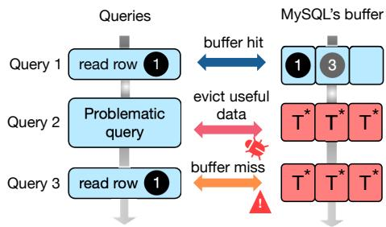  
(a) A problematic read query fills the MySQL buffer pool with temporary tables. T ∗: intrinsic temporary Innodb table.

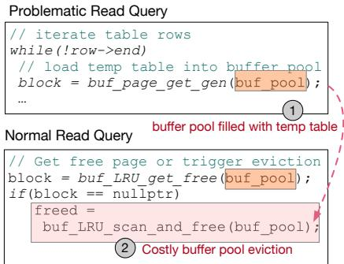  
(b) Simplified code snippet related to the buffer pool. The elements with orange-colored background represent the buffer pool variable and the pink ones represent slow eviction operations.  
Figure 1: (a) Example of performance issue in MySQL buffer pool. (b) The code of the root cause.

Figure 1 shows a real performance bug in MySQL [33, 38]. MySQL uses InnoDB as its default storage engine. InnoDB has a buffer pool to cache data pages accessed by a read query, even if the page contains temporary intermediate results that no other query will reuse. As a result, a query that generates many intermediate results can monopolize the buffer pool and evict useful cached data, forcing other queries to reload pages from disk and causing end-to-end performance degradation. For example, some scan queries produce large intrinsic temporary InnoDB tables to hold intermediate results. When such a query runs, the pages of this temporary table can fill the buffer pool and displace useful cached data.

This performance bug is very difficult to diagnose in practice. Figure 1b shows the bug’s code snippet: the buggy scan query repeatedly calls buf\_page\_get\_gen function to obtain a large number of buffer pages and writes temporary table data into them. Subsequent read queries thus cannot get a free page from the buffer pool and must invoke a costly buf\_LRU\_scan\_and\_free function to evict a buffer page and reload useful data. From the code alone, this appears to be a normal buffer write: there are no lock conflicts, long loops, and no explicit error signals that indicate a slowdown. The operating system also does not show memory pressure since the buffer pool is an application-defined resource. As a result, developers have little observable evidence to follow, making the root cause extremely difficult to diagnose.

This lack of observable signals exposes a fundamental limitation in existing profilers. System-level profilers [8,11,13,59] track CPU, memory and lock activity, while code-level profilers search for long loops [18, 43], blocking operations [1, 19, 49, 54], or causal relationships [5, 25, 41]. But performance issues in application resources propagate indirectly through application logic that manages the resource, logic that neither class of profiler observes. In effect, the usage of resource in one request can push later requests onto a much slower execution path, without triggering system events or producing identifiable code patterns such as long loops or hotspots. Consequently, existing profilers surface only weak indirect clues, forcing developers to rely heavily on domain expertise and manual investigation to pinpoint the true root cause.

The key gap is that application resources have semantics that traditional program analyzes alone (static or dynamic) cannot reliably infer. These tools cannot interpret how an application defines, allocates, or competes for its own application resources, making performance issues in application resources difficult to detect or explain.

To make such bugs observable, a tool must expose the interactions between requests and application-defined resources. This is difficult because application resource implementations vary widely across systems and their behavior depends on application-specific semantics not reflected directly in the control or data-flow structure. Our study of 45 real performance issues in application resources shows that, despite various application resource pathologies, four recurring application resource events can always distinguish abnormal usage from normal (Section 2.2 and Section 3.2). Concretely, each event corresponds to a distinct observable interaction with a resource: a task that waits, acquires, accesses, or releases it. We argue that diagnosing application resource performance issues must treat application resource events as first-class signals.

Automatically extracting these usage events requires interpreting both high-level semantics and concrete code behavior. Semantic cues appear in program metadata (names, comments, documentation) that static analysis cannot exploit, but LLMs can. Conversely, confirming that a candidate event truly corresponds to a resource access requires precise controland data-flow reasoning that LLMs do not provide. We therefore adopt a hybrid design: LLMs identify candidate resources and usage events from metadata, and static analysis validates them against the actual code. This combination increases the coverage and accuracy needed to reliably locate usage events across large codebases.

Building on this hybrid approach, we propose gigiprofiler, a diagnosis tool that exposes the internal usage of applicationdefined resources. gigiprofiler identifies application-defined resources, tracks how each request interacts with them, and records usage event sequences during execution. A straightforward way to use usage event sequences is to search for fixed patterns that indicate bottlenecks. However, the hybrid approach may identify incorrect usage events or miss some true events. To make diagnosis robust to incorrect , gigiprofiler instead statistically analyzes request-resource interactions, such as how often requests wait for each resource and how often each resource is acquired, to detect bottlenecks. gigiprofiler then attributes each bottleneck to responsible requests and performs code-level root-cause analysis to explain which part of the code causes the resource bottleneck.

We applied gigiprofiler to five popular large-scale applications. MySQL, MariaDB, PostgreSQL, Apache Web Server, and llama-cpp. To evaluate its effectiveness, we reproduced 15 application resource performance bugs reported in these systems. gigiprofiler detected and correctly identified the root cause of all of them. In addition, during the evaluation, gigiprofiler discovered two new application resource performance bugs in MariaDB, both of which were confirmed by the developers. gigiprofiler is open sourced at https://github.com/BlizzardLab/OmniProfiler.

In summary, this paper makes the following contributions.

• We propose a hybrid approach that combines large language models and static analysis to accurately identify application resources and their usage events.

• We design and implement gigiprofiler, a performance diagnosis tool that dynamically detects internal-resource performance issues by tracing and analyzing application resource usage.

• We evaluated gigiprofiler on five popular applications, demonstrating its effectiveness in detecting 15 realworld internal-resource performance issues and uncovering 2 new performance bugs.

## 2 Understanding Application Resource Issues

Performance issues caused by application resources are prevalent in large systems. Li et al. [20] found that 22% of 115 performance issues in 20 open-source applications were caused by contention within application resources, and pBox [15] showed that requests frequently interfere with each other through application resources. In this section, we start with a motivating example to show why these issues are difficult to diagnose, and then conduct an empirical study of 45 realworld application resource performance issues to gain insight into the problem’s root causes, impact, and guide our solution design.

## 2.1 Motivating Example

MySQL-75540 [32] is a long-standing performance issue related to the InnoDB UNDO log. Developers have reported that the purge operation can become extremely slow when the UNDO log increases, leading to significant performance degradation [30]. This issue has been discussed in multiple bug reports [29, 31] and community posts [35–37].

The issue comes from a large UNDO log that dominates the InnoDB buffer pool. MySQL uses the UNDO log to maintain older versions of modified rows for transaction isolation. A long-running transaction can therefore cause undo records to accumulate over time. After the transaction commits, these undo records become obsolete and the purge thread must load and clean them through the buffer pool. When the UNDO log is large, this cleanup process can consume many buffer-pool pages, remove useful cached pages, and cause a significant drop in throughput for other transactions. As shown in Figure 2, the MySQL’s end-to-end throughput decreases from about 700 QPS to nearly zero when the purge thread starts.

Debugging this issue is challenging because the purge thread does not block other transactions directly on the UNDO log, and the buffer-pool contention is hidden from systemlevel metrics. The InnoDB buffer pool is a pre-allocated memory region managed by MySQL. Therefore, even when many buffer pool pages are occupied by UNDO-log cleanup, the operating system only observes normal memory usage rather than contention inside the buffer pool. As a result, during the debugging process, multiple incorrect hypotheses were proposed. For example, some developers initially suspected heavy disk I/O under concurrent updates because the system appeared overwhelmed by disk activity [28]. The true root cause was identified only after years of investigation, through careful examination of the source-code and manual tracing of the UNDO-log usage.

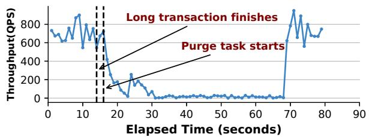  
Figure 2: A throughput drop when the purge thread cleans up the huge UNDO log.

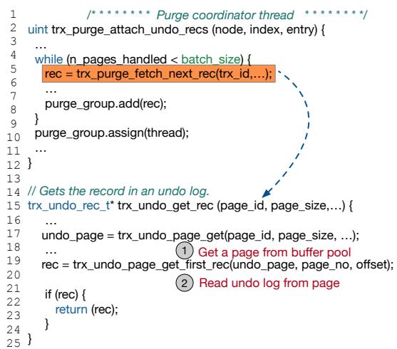  
Figure 3: Code snippets showing how the UNDO log fills up the buffer pool during the purge operation.

Figure 3 shows the code relevant to the root cause. When the purge thread processes undo records, it fetches batches of undo pages into the buffer pool. With a large UNDO log, this batching is repeated many times. As a result, the purge thread evicts useful cached pages needed by other queries (step 1 in Figure 3) and keeps many undo pages in the buffer pool (step 2 in Figure 3). This frequent buffer-pool turnover slows down the system.

Existing performance debugging techniques have difficulty in locating the root causes: an over-sized UNDO log causes the cleanup process to consume buffer-pool pages. Profilers [19, 57] that track OS-level activity can observe indirect symptoms, such as increased disk I/O or longer execution time, but they cannot directly link the slowdown to the UNDO log and the lack of timely UNDO log truncation. Static analysis tools [18, 43, 44] lack the application-specific semantic context needed to understand how UNDO log, purge thread, and buffer pool interact to degrade performance.

## 2.2 Empirical Study

Application-defined resources are logical abstractions created and managed by the application code. They may use underlying system resources, such as memory, threads, or synchronization primitives, but their semantics are defined by the application. Performance issues caused by applicationdefined resources are difficult to diagnose because we lack a systematic understanding of what kinds of application resource developers define, why they are mismanaged, and what recurring pathologies they exhibit. To fill this gap, we conducted an empirical study of 45 real-world performance issues caused by application-defined resources.

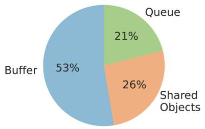

(a) Application resource Type.  
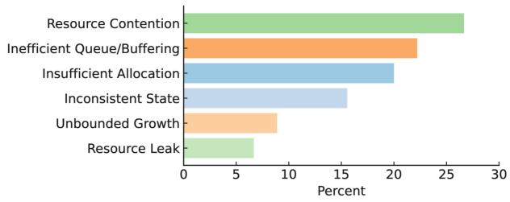  
(b) Root cause Type.  
Figure 4: Application resource type and root cause distribution.

Methodology: We collect performance issues from three widely used large software systems: MySQL, PostgreSQL, and Elasticsearch. These systems contain millions of lines of code and cover two major classes of data-intensive systems: databases and distributed search engines. For each software, we manually examined bug reports and forum posts whose titles or descriptions contain terms such as “slow” or “hung”, and select cases whose root causes are related to applicationdefined resources.

We exclude cases where the synchronization is the direct root cause, such as lock contention or deadlock. However, we keep the cases where contention comes from how an application-defined resource is managed, even if the resource is protected by locks. We keep these cases because diagnosing them requires understanding why the resource becomes monopolized, whether the monopolization is expected, and how the resource-management logic causes other requests to wait. Therefore, in those cases, identifying the contended lock alone does not explain the root cause.

Diverse Resource Types and Root Causes: Our study shows that performance issues are caused by a variety of application-defined resources. Across the 45 issues, we identified 38 distinct application-defined resources, including query caches, UNDO logs, write buffers, and write-ahead logs. A key finding is that the same application-defined resource can be implemented very differently across systems. For example, both MySQL and PostgreSQL implement a UNDO log abstraction. However, MySQL implements UNDO log as linked log records, whereas PostgreSQL stores old row versions directly in tables.

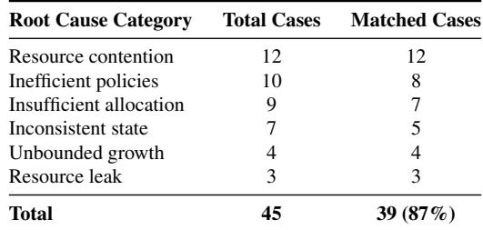  
Table 1: Mapping the 45 studied cases to the pathology patterns in our analytical model.

We categorize these resources into three broad types. Figure 4a shows their distribution. Memory-related resources are resources that provide application-level storage abstraction, such as query caches, read buffers, and shared memory. Shared state objects are shared application objects whose state affects the performance of many requests, such as tables, indexes, and logs. Internal queues are resources that order, schedule, or coordinate work inside the application, such as task queues and thread pools.

Figure 4b summarizes the root causes of the cases. Performance problems come from six categories: contention for application resources (26.7%), inefficient queuing or buffermanagement policies (22.2%), insufficient resource allocation (20%), inconsistent software state (15.6%), unbounded resource growth (8.9%), and resource leaks (6.7%). Despite the diverse root-cause types, these performance issues share a common characteristic: they happen when applicationspecific resource-management semantics are violated under certain workloads or execution paths. When an application implements a resource, the resource implicitly carries semantics about how it should be managed. For example, the MySQL’s buffer-pool implies that no single query should monopolize buffer-pool pages. Violating these semantics can cause the resource to be mismanaged and degrade performance.

Classification of Application-Resource Pathologies. We further analyze the studied cases to answer a central question: given that performance issues in application-defined resources come from application semantics, do these semantic violations share recurring failure patterns? Examining the source code of the 45 cases, we find that application-defined resources can be modeled by a simple but expressive acquireuse-release lifecycle, similar to the lifecycle of OS resources. A request obtains a resource, uses it to perform work, and eventually releases it. Deviations from this lifecycle give rise to common pathologies:

• Resource Contention: a request monopolizes an application resource, forcing other requests to acquire it through a slow or expensive path, or wait for a long time.

• Inefficient Policies: suboptimal eviction, batching, or scheduling policies cause a request to hold a resource that it rarely uses.

• Insufficient Allocation: a request receives too few resource units and repeatedly reuses a small share of the resource despite sufficient overall capacity.

• Unbounded Growth: an application-defined resource keeps growing unbound.

• Inconsistent State: incorrect creation or use of a resource leaves the system in a state that later prevents progress or causes performance degradation.

• Resource Leaks: an application resource leaks.

Table 1 shows that 87% of cases align with these pathology patterns. The remaining cases have policies that are too complex to fit into a category.

The general characteristic of these pathologies is that they violate application specific resource-management semantics. Moreover, their performance impact is context-dependent: a given resource usage pattern degrades performance only under particular workloads or execution paths.

## 2.3 Limitations of Existing Solutions

Traditional performance profilers and debugging tools diagnose bottlenecks by tracing system-level events and inferring relationships such as causal paths [5, 11, 19, 41, 59]. However, these approaches are insufficient to diagnose applicationresource performance issues. Application-defined resources do not provide a unified interface that existing analyzes can directly use to construct wait-for dependencies, causal paths, or other diagnostic relations. For example, relational debugging [41] models fine-grained runtime events as relations and uses statistical A/B testing to identify relations that are likely to explain performance differences. However, it requires the relevant events to be visible to the profiler. Without knowing the internal application-defined resources, relational debugging is unable to find the root causes

A straightforward way is to report every function that modify the application-resource at runtime, but this would generate unaccepted overhead. Moreover, application-defined resources have diverse semantics and characteristics, and the OS or runtime lacks the application-specific knowledge needed to interpret their usage patterns.

Another potential solution is to combine LLMs with static analysis to detect potential application-resource pathologies. The pathology patterns in Section 2.2 can guide this process: an LLM can map a pathology to concrete code constructs, and static analysis can validate whether the corresponding resource-usage pattern exists in the code. However, these patterns are context-dependent. Static evidence alone cannot tell whether a pattern actually hurts performance in a running workload. Thus, LLM-based semantic inference and static validation must be combined with dynamic profiling to diagnose application-resource performance issues.

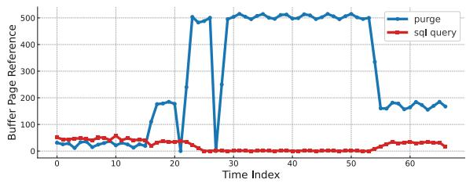  
Figure 5: MySQL’s buffer-pool page usage over time, split between the purge thread and all other queries.

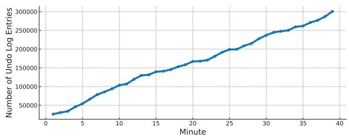  
Figure 6: Growth of undo-log entries over the past 40 minutes.

The pathology study guides gigiprofiler’s design. It shows that diagnosing application-resource pathologies does not require tracking every internal state change of an applicationdefined resource. Instead, observed pathologies can be captured using a compact application resource event interface: WAIT, ACQUIRE, USE, and RELEASE.

## 2.4 gigiprofiler on the Motivating Example

To show how these application resource events help diagnose real performance issues, we apply gigiprofiler to the motivating example of Section 2.1.

We first reproduce the issue by creating a table with 1,000 records and running a long transaction that is active for several hours. In parallel, we issue repeated small write transactions that update the same row, causing undo records to accumulate while the long transaction is active. When the long transaction finally commits, the purge thread begins cleaning the accumulated UNDO log, and triggers the performance degradation shown in Figure 2.

gigiprofiler identifies the InnoDB buffer pool as an application-defined resource. It then identifies trx\_undo\_page\_get as an ACQUIRE event for this resource and trx\_undo\_page\_get\_first\_rec as a USE event, corresponding to lines 17 and 19 in Figure 3. gigiprofiler instruments these events, along with the corresponding WAIT and RELEASE events, and records that request triggers each event during execution. gigiprofiler applies the same event-identification process to the UNDO log. After instrumenting the usage events of both the buffer pool and the UNDO log, gigiprofiler records the request triggers each event during execution.

Figure 5 compares the USE events of the buffer pool triggered by the purge thread and by normal queries, measured as the average number of USE events per second. The purge thread dominates the usage of the buffer pool, indicating con tention for the buffer pool pages. gigiprofiler further identifies that most of these pages are used to store undo records, linking the buffer pool contention to the UNDO log resource. Figure 6 shows the growth of the UNDO log over time. gigiprofiler tracks ACQUIRE and RELEASE events for the UNDO log and estimates the size of the UNDO log as the difference between the number of ACQUIRE and RELEASE. This unbounded growth explains why the purge thread later consumes many bufferpool pages and identifies the UNDO log as the root cause of the performance degradation.

## 2.5 Lesson from Our Initial Attempt

Although application resource usage events provide a useful abstraction for diagnosis, identifying them from code is challenging. Our initial attempts to use LLMs revealed significant limitations. We developed a prompt-based LLM pipeline that provides the model with the definition of application-defined resources, the roles of usage events, and concrete examples. Although this pipeline could identify many applicationdefined resources and usage events, its precision was low and is difficult to increase simply by improving the prompt.

We identified four key challenges. First, scaling LLM-only analysis to large systems is impractical: these systems contain millions of lines of code, exceed the model’s context window, and require many expensive model calls. In our experience, scanning MySQL with GPT-5.2 took 3 days and cost about \$1,000. Second, identifying application usage events often requires control and data-flow information, which is rarely available in comments or documentation. Third, comments and documentation can be ambiguous, misleading, or even absent. For example, is\_active is only a checking function, but its comment includes the phrase “get the status of bin\_log,” causing the LLM to mistakenly mark it as a USE event. Fourth, even when comments are clear, LLMs may still make incorrect inferences or hallucinate resources that do not exist.

These limitations show that resource identification should not be treated as a monolithic LLM task. LLMs provide broad semantic coverage, but their output is inaccuracy; static analysis provides precise code reasoning, but lacks the semantic context. gigiprofiler avoids this trade-off by integrating both. The LLM extracts semantic cues, and static analysis validates these candidates using control-flow and data-flow information. This hybrid, agentic design grounds LLM cues in actual program behavior, reducing false positives and enabling accurate identification of application resources and their events.

## 3 Design of gigiprofiler

In this section, we describe the design of gigiprofiler. Our empirical study showed that performance issues in application resources can be captured by specific patterns of pathological resource usage and that neither static analysis nor LLMs alone can reliably identify application resource usage. These insights guide the design of gigiprofiler ’s agentic static analyzer. We begin by introducing the four resource-usage events that gigiprofiler instruments, then describe how the agentic static analyzer identifies and validates application resources and their usage events, and finally explain how gigiprofiler profiles and analyzes the behavior of application resources at runtime.

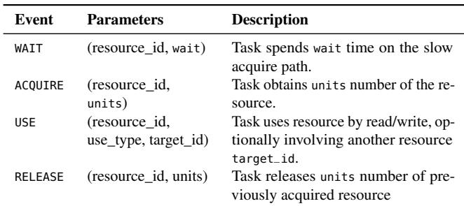  
Table 2: Event types and parameters used to instrument applicationdefined resources.

## 3.1 gigiprofiler Workflow

We developed gigiprofiler to identify application resources, trace their usage, and diagnose the root causes of performance issues in application resources. Figure 7 shows its workflow. gigiprofiler has two phases: an offline static-analysis phase and a dynamic profiling phase. In the static-analysis phase, an agentic static analyzer identifies application resources and their usage events. Software comments, naming conventions, and documentation are preprocessed into structured metadata and provided to an LLM agent, which proposes candidate resources and events. Static analysis then validates these candidates using control-flow and data-flow information, removing false positives and producing a precise list of resources and operator functions.

In the dynamic profiling phase, gigiprofiler instruments the application to trace application resource events during a buggy execution. gigiprofiler records usage events and value samples for each resource, and the collected traces are analyzed offline to detect contended resources and identify pathological usage patterns. This integrated profiling and analysis provides developers with an explainable code-level diagnosis of performance issues in application resources.

The deployment workflow. gigiprofiler is designed as an on-demand diagnostic tool. The static-analysis phase runs once for each application version and produces a reusable list of application resources and usage events. The dynamicprofiling phase is activated only when a performance issue is observed, which keeps runtime overhead negligible during normal operation.

## 3.2 Application Usage Events

gigiprofiler models application resources using four usage events: WAIT, ACQUIRE, USE, and RELEASE, which is derived from our empirical study. The API is listed in Table 2. These events provide a unified abstraction for how tasks interact with diverse application resources. WAIT records the time a task spends on a slow acquisition path; ACQUIRE denotes when a task obtains a unit of the resource; USE denotes operations performed using the resource, such as reading or writing; and RELEASE denotes when the resource is returned. Although simple, this model captures the pathological patterns observed in our study: contention appears as prolonged WAIT events, inefficient policies manifest as resources that are frequently ACQUIRE and held for long periods without corresponding USE events, insufficient allocation emerges as repeated ACQUIRE attempts, and unbounded growth or leaks surface as unmatched ACQUIRE/RELEASE pairs.

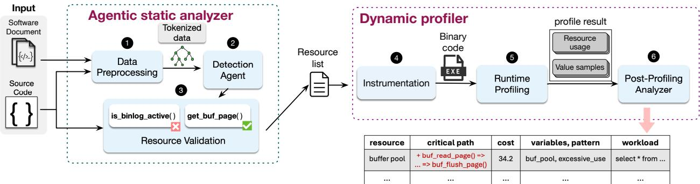  
Figure 7: An overview of gigiprofiler.

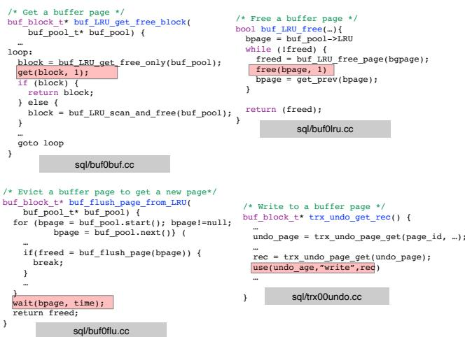  
Figure 8: Example of tracing buffer pool usage in MySQL.

Instrumentation is fully automated: once the agentic static analyzer identifies the code locations corresponding to WAIT, ACQUIRE, USE, and RELEASE events, gigiprofiler injects lightweight probes at those locations using an LLVM pass. No developer effort or manual annotation is required. Figure 8 shows the instrumentation points that gigiprofiler insert into the MySQL buffer pool. The ACQUIRE event is implemented as the get API, which gigiprofiler inserts in buf\_LRU\_get\_free\_block() after a buffer page has been obtained from buf\_LRU\_get\_free\_only(). If no free page is available, MySQL chooses an old page via buf\_flush\_page\_from\_LRU(), and gigiprofiler records a WAIT event to capture the time spent on this slow-acquiring path. When a page is returned to the buffer pool in buf\_LRU\_free(), gigiprofiler emits a RELEASE event via the free API. Finally, when trx\_undo\_get\_rec() writes the undo log to a buffer page, gigiprofiler logs a USE event to record that the page is being used to store undo records. Together, these events allow gigiprofiler to reconstruct how tasks acquire, wait for, use, and release buffer pool pages.

## 3.3 Finding Application Usage Events

## 3.3.1 Organizing Input Data

Identifying application-defined resources and usage events in a large scale system is challenging. Large-scale software design consists of dozens to hundreds of resources and spans millions of lines of code. Feeding the entire codebase to an LLM as plain text would cause the LLM to lose essential software context, such as control-flow and cross-file relationships that are needed to identify application resources accurately. A straightforward approach is to split the codebase into smaller chunks and run the LLM iteratively, but naïve chunking breaks the structural relationships between files, classes, variables, and functions. The semantic context needed to recognize how resources are defined and used. Thus, gigiprofiler requires a more systematic method for organizing and presenting the software context to the LLM.

To preserve context while searching large codebases, gigiprofiler organizes metadata into a hierarchy of file → class → variable → function → source code. The LLM agent traverses this hierarchy, pruning branches early when a higherlevel node is unlikely to represent a resource. This structure preserves cross-file context and enables efficient, targeted queries despite LLM context-length limits.

Figure 9 shows a snapshot of the hierarchy structure of gigiprofiler for MySQL. It is implemented as a restricted directed acyclic graph that enforces a fixed parent–child order from the file to the class/struct variable, to the member variable in the class or structure variable, to the function description and finally to the source code. Each node stores relevant metadata, such as names, types, and associated comments or docstrings, to preserve semantic context. A pre-processing module constructs this DAG by parsing the source code and documentation to extract metadata and connect nodes based on data dependencies.

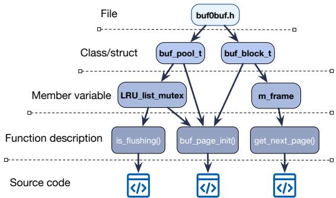  
Figure 9: Example of hierarchy structure for MySQL.

## 3.3.2 LLM agent

Once the codebase is organized into the hierarchy, the LLM agent must identify candidate application-defined resources and usage events efficiently and accurately. A straightforward approach is to traverse the hierarchy node by node, but this approach is inefficient. First, it may visit many nodes that are clearly unrelated to any resource. Second, the same node can be visited multiple times through different paths. For example, in Figure 9, both buf\_pool\_t and buf\_block\_t may lead the traversal to the function buf\_page\_init.

To avoid redundant and unnecessary queries, gigiprofiler uses a top-down traversal with a two-phase reasoning process. Our insight is that application-defined resources are usually represented as class or structure instances, or as variables, whereas usage events are implemented in functions. Therefore, the agent first queries the LLM on high-level class, structure, and variable nodes to identify candidate applicationdefined resources and then uses these candidates to filter out unrelated function nodes. Because function and source-code nodes contain far more tokens than higher-level metadata nodes, this approach significantly reduces offline analysis time and LLM cost without sacrificing coverage.

The first phase is performed on both the class and variable layers. Figure 10 shows a snapshot of the prompt used by our LLM module to identify the application resources. The prompt contains a short task summary and step-by-step checks that guide the detection agent in deciding whether the variable represents an application resource. We categorize resources into two types: exclusive resources, which are accessed by at most one thread (or owner) at a time (e.g., an UNDO log instance tied to a transaction) and shared resources, which are concurrently accessed by multiple threads (e.g., buffer pools and work queues).

After identifying candidate application-defined resources, the agent invokes a lightweight data-flow analysis to find functions that use these resources. If a function uses multiple resources, the agent groups it as a function-to-resource pair and analyzes them together, which avoids repeated LLM queries on the same function .

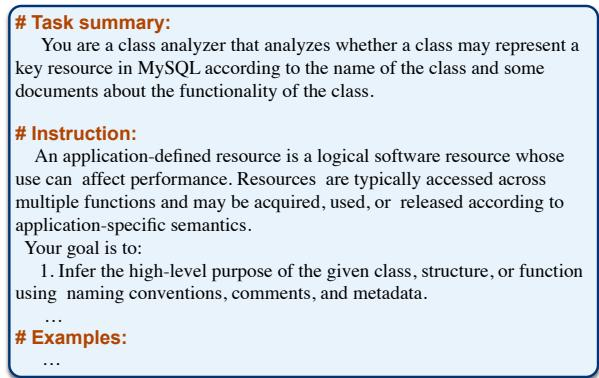  
Figure 10: Prompt snapshot for the first phase

For each selected function, the agent prompts the LLM to determine whether the function contains any of the four usage events. If the function signature and description provide sufficient evidence, the agent makes a candidate decision at the metadata level. Otherwise, the agent inspects the function’s source-code node for additional context. To help the LLM interpret the function in context, the agent also provides call-stack information and the source code of related functions when available. If the agent cannot confidently determine whether an operation is a valid usage event, it marks the operation as a candidate and defers validation to the static analyzer.

## 3.4 Validation of Resource Usage Events

After the LLM agent identifies candidate resources and usage events, the static-analysis module validates whether a candidate event actually waits for, acquires, uses, or releases the corresponding resource. This step is critical because the LLM agent has low precision: without validation, false usage events would be instrumented, and later mislead dynamic diagnosis.

A fundamental challenge is that checking a candidate event requires validating a semantic property that standard program analyzes cannot easily decide on. Existing LLM-assisted static-analysis pipelines often use control-flow or data-flow analysis to validate standard program. However, validating a resource-usage event requires more than such structural consistency. For example, validating that a function is an ACQUIRE event for the buffer pool requires checking whether the function actually obtains a buffer pool page and passes it to the caller that will use it to store some internal data. There is no data flow analysis can observe this pattern.

To tackle this challenge, gigiprofiler translates each semantic event into a set of necessary code behaviors that the event should exhibit.For example, an ACQUIRE event should satisfy three necessary code behaviors: (1) it obtains a resource unit from the resource, (2) it passes the unit to the caller or the task that will use it, and (3) it does not modify the variable of the application resource. These behaviors are necessary for an ACQUIRE event. gigiprofiler then converts these behaviors into static analysis checks, such as checking whether function F’s return value comes from resource variable R. Here, F, R, and the event type are provided by the LLM.

Algorithm 1: Validation for get and wait event   
Input :Resource candidates R, Usage events E, Target   
Function F   
Output :Validated resources and events   
1 foreach candidate (R,E,F) do   
2 if E.type == get then   
3 CheckAcquire((R,E,F))   
4 else if E.type == wait then   
5 CheckAcquire((R,E,F))   
6 Function checkAcquire(R, E, F):   
7 tainted ← GetAllTaintedVar(F,R);   
8 if IsResourceWritten(F,tainted) then   
9 mark E as invalid acquire;   
10 return;   
11 if ! IsResourceReturned(F,tainted) then   
12 mark E as invalid acquire;   
13 return;   
14 if ! HasLookupPattern(F,tainted) then   
15 mark E as invalid acquire;   
16 return;   
17 mark E as valid ACQUIRE;

For an ACQUIRE(get) event, gigiprofiler checks three properties. First, the function should not modify the resource variable during acquisition because the application resource must be read-only during acquisition. Second, the function’s return value must be derived from the resource variable; otherwise, it is not actually “getting” a resource unit. Third, the function should search for the resource through iteration, hashing, or indexed access. The Algorithm 1 shows the core logic. The analyzer taints the resource variable, propagates the taint through dependent values (line 7), and verifies that all tainted values are read-only(line 8). It then checks whether the return value is tainted (line 11) and whether the function performs a search over the resource (line 14).

A WAIT event represents the slow path to acquire an application resource. Statistically, its code structure is the same as the ACQUIRE event but includes an additional delay or retry loop. gigiprofiler performs structural validation using the same rules as ACQUIRE and relies on the dynamic profiling phase to determine whether the path is truly slow. If the dynamic profiler does not observe a slowdown, the WAIT event is ignored.

For a RELEASE event, the static analyzer verifies that the function exhibits a release-like effect. Concretely, the function should invoke a known release primitive (e.g., a freelist insertion, LRU return, or deallocation routine), after which the resource variable must not be used on any execution path. Thus, gigiprofiler enforces a no–use-after-release rule (Line 12 in Algorithm 2). Because static analysis may miss indirect or dynamic uses, the no–use-after-release rule is also enforced during the dynamic profiling phase, which confirms whether the released resource is ever touched again at runtime. The release operation must also transfer the resource back to the application rather than returning the released object to the caller (Line 15 in Algorithm 2).

Algorithm 2: Validation for release and use event   
Input :Resource candidates R, Usage events E, Target   
Function F   
Output :Validated resources and events   
1 foreach candidate (R, E, F) do   
2 if E.type == release then   
3 CheckRelease((R,E,F))   
4 else if E.type == use then   
5 CheckUse((R,E,F))   
6 Function CheckRelease(R,E,F):   
7 tainted ← GetAllTaintedVar(F,R);   
8 sites ← FindReleaseSites(F,tainted);   
9 if sites is empty then   
10 mark E as invalid release;   
11 return;   
12 if HasUseAfterRelease(F,tainted,sites) then   
13 mark E as invalid release;   
14 return;   
15 if ReturnsReleasedValue(F,tainted) then   
16 mark E as invalid release;   
17 return;   
18 mark E as valid RELEASE;   
19 Function CheckUse(R,E,F):   
20 tainted ← GetAllTaintedVar(F,R);   
21 if TouchesResource(F,tainted) then   
22 mark E as candidate USE for dynamic validation;   
23 else   
24 discard E as spurious;

For USE event, static analysis only marks the resource as potentially used. Dynamic profiling later verifies whether the resource was acquired by the same task before being used and the function is using the resource.

Scope of validation. The static validation module is not intended to be a complete or sound detector of usage events. Its role is to improve the precision of LLM-inferred candidates. The LLM first identify which program variable is the application resource and which event type the function may represent. Given these candidate functions and variable, static analysis checks whether the function exhibits code behaviors that are necessary for the claimed event type.

This LLM-provided candidate is what makes validation practical. Without this candidate, the static analyzer would need to apply all all checks to all variables, all functions, and all event types, which would be impractical for large-scale software and would produce many false positives.

## 3.5 Dynamic Profiling

After the software is instrumented with application-resource event hooks, gigiprofiler executes the software using a workload that reproduces the buggy execution. During runtime, gigiprofiler only records lightweight event information and defers expensive computation to the post-profiling analysis. Each event is logged with a timestamp, resource ID, thread ID, event type, and event-specific parameters, and is stored in a lightweight thread-local ring buffer to avoid costly interthread communication on the critical path. gigiprofiler periodically and asynchronously flushes the local buffers to the disk. In addition, gigiprofiler integrates with perf to periodi cally sample hardware counters, system-resource usage, and application call stacks.

## 3.5.1 Post-Profiling Validation

Some usage event’s rule cannot be validated statically. The post-profiling validation filters these events using the runtime event trace. The validation first checks whether events follow the expected lifecycle order. Within a request, an application-defined resource should follow the expected event order: ACQUIRE → USE → RELEASE. That is, a resource should be acquired before it is used, and released only after its last use. Across requests, a WAIT event should correspond to a conflicting holder of the same resource. The expected order is: ACQUIREr → WAITr → ACQUIREr , where request or task r1 acquires the resource first, and request or task r waits before later acquiring it. Events that violate these ordering rules are discarded as invalid usage events.

The post-profiling validation then checks the event-specific runtime behavior. For a WAIT event, gigiprofiler verifies that the event corresponds to a real delay in the slow acquire path. For a USE event, gigiprofiler check that the instrumented code actually reads or writes the associated resource unit at runtime. For a RELEASE event, gigiprofiler checks that the released unit is touched by the release function and is not used again by the same request after release. These runtime checks remove false events that pass static validation.

## 3.5.2 Diagnosing Performance Issues

Even after static and runtime validation, some false application resource events may remain, and some true events may be missed. This makes traditional wait-for analysis unreliable if it treats every event as exact. Directly applying traditional trace-based analysis to such traces can be unreliable. For ex ample, a false WAIT event may create a wrong wait relation, while a missing ACQUIRE event after a true WAIT may make the wait time to be longer than it actually is.

gigiprofiler therefore diagnoses performance issues using aggregate request-resource statistics rather than individual event matches. For each resource, gigiprofiler aggregates event signals across requests and functions and computes four per-task metrics. First, waiting time measures how long a task spends on the slow acquire path, using timestamps from WAIT and ACQUIRE event pairs. Second, utilization measures how frequently an acquired resource is actually used, computed as the ratio of USE to ACQUIRE events. Third, hold time measures how long a task holds a resource, computed as the time between ACQUIRE and RELEASE. Fourth, acquire frequency measures how often a task repeatedly acquires resource units, computed as the number of ACQUIRE events per second.

After computing these metrics, gigiprofiler detects pathological usage patterns as follows. If a resource has high aggregate waiting time across requests, gigiprofiler classifies it as resource contention. If a task holds a resource for a long time but rarely uses it, indicated by long hold time and low utilization, the pattern is classified as an inefficient policy. If a task repeatedly acquires small resource units despite high utilization, indicated by high acquire frequency, the pattern is classified as insufficient allocation. If ACQUIRE events are not matched by RELEASE events after a task finishes, gigiprofiler identifies a resource leak. If the aggregate gap between ACQUIRE and RELEASE events continues to increase with time, gigiprofiler identifies unbounded growth.

After identifying a bottleneck resource and the tasks responsible for this performance issue, gigiprofiler performs root cause analysis to explain why the performance issue occurs at the code level. This step is critical for developers as it pinpoints the specific code paths that trigger the pathological behavior of the resources. gigiprofiler performs a static backward analysis based on the usage events of the misbehaving task, tracing the control and data-flow dependencies to locate the operations that initiated resource acquisition, prolonged hold time, or prevented release. Because gigiprofiler also records value samples for variables associated with each event, the analysis can highlight values when pathological behavior occurs. To ensure actionable explanations, gigiprofiler focuses this backward analysis on code sites that determine how the resource is held, used, and reclaimed, which are precisely the decisions that lead to contention, insufficient allocation, inefficient policies, or leaks. These locations are flagged as the root cause and reported to developers.

## 3.6 Implementation

We implement gigiprofiler as a combination of Python-based analysis components, an LLVM-based static analyzer, and a C++ runtime profiling library. The data preprocessing module is implemented as a Python script that parses source code and documentation. The LLM agent is implemented as a Python orchestrator. It traverses the hierarchy, maintains traversal state, issues LLM queries for selected nodes, and invokes lightweight static-analysis routines to connect candidate resources to related functions. The underlying LLM is configurable and can be replaced without changing the rest of the gigiprofiler pipeline.

The gigiprofiler static analyzer is built on top of LLVM [21]. The gigiprofiler profiler is implemented as a C++ library that can be linked with the target software. It injects lightweight profiling hooks at validated event locations and records event traces during execution.

## 4 Evaluation

We evaluate gigiprofiler to answer the following questions: (1) How accurately does gigiprofiler identify application-defined resources and their usage events? (2) Can gigiprofiler detect and localize real-world performance issues in application resources? (3) Can gigiprofiler explain these issues by pinpointing their code-level root causes? (4) What is the runtime overhead of dynamic profiling?

We evaluated gigiprofiler on five popular, large-scale applications: MySQL, PostgreSQL, MariaDB, Apache Web Server, and llama.cpp. These systems have up to 2 million source lines of code. gigiprofiler scans each system and automatically instruments its APIs without requiring manual annotation. All experiments were conducted on servers equipped with 10-core Intel Xeon E5-2640 CPUs, 64 GB of DRAM, and a 480 GB SSD, with Ubuntu 20.04 as the operating system. The main evaluation uses GPT-4o as the underlying LLM model, which was the newest GPT model available when the experiments were conducted. Unless otherwise specified, all results in the evaluation use this GPT-4o.

## 4.1 Diagnosing Root Cause

To evaluate the effectiveness of gigiprofiler, we collected 15 real-world cases of performance issues in application resources. These issues were collected from the official bugtracking systems of each application, community forums such as StackOverflow and developer posts on social media. As summarized in Table 3, the selected performance issues span a diverse set of resources and performance issue patterns, providing a comprehensive benchmark for evaluation.

For each performance issue, we prepared a reproduction script to trigger the issue. We compare gigiprofiler against three baselines: perf, a widely used system-level profiler; PCatch [19], a performance-bug detection tool for identifying cascading performance issues; and Perspect [41], a a relational debugging tool that automatically pinpoints the root causes of performance problems by analyzing statistical changes in the relations between fine-grained runtime events. Both PCatch and Perspect require program-internal events as input, such as synchronization operations or selected program variables. To provide these inputs without manually specifying application-defined resources, we use SyncFinder [54] to identify application-specific synchronization primitives as input to both systems.

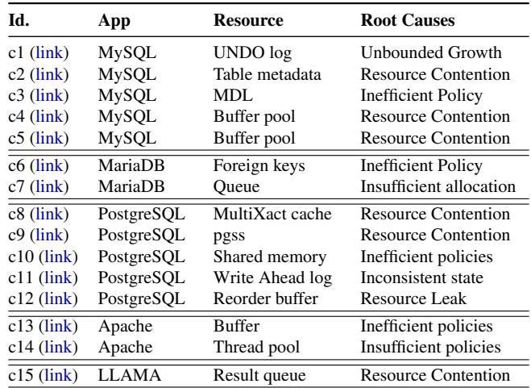  
Table 3: Description of 15 real-world application resource performance issues.

As shown in Table 4, gigiprofiler successfully find the true root cause(s) as the top candidate in all 15 cases. Three cases have multiple root causes, and gigiprofiler correctly ranked all of them ahead of unrelated candidates. The analysis process was also fast. On average, gigiprofiler takes 95.15 seconds to detect an issue and identify the root cause.

In comparison, perf failed to detect the issues in 10 out of the 15 cases. In the 5 cases where performance problems were reported, the true root cause function was ranked very low, making it difficult for developers to locate root causes. PCatch also failed to detect 10 of the 15 cases. it missed all shared resource performance issues as they do not block other requests through synchronization. The Perspect detected 4 of the 15 cases. Perspect detected 4 of the 15 cases. The reason is that Perspect need the normal and buggy executions to determine which relations are abnormal. But in our evaluation, we only provide the reproduced buggy execution because gigiprofiler does not require a normal run. As a result, the Perspect can not performance differential analysis correctly.

We provide a case study to show how gigiprofiler detects and diagnoses performance issues in application resources:

Case 10: Send Buffer Exhaustion. Apache has a bug where the server continues writing to the send buffer even after the client has stopped receiving data. This behavior gradually fills the buffer with unneeded data, exhausting the buffer pool and blocking new writes. Because the send buffer is managed as an application resource, both perf and PCatch fail to detect the issue. By contrast, gigiprofiler exposes the buffer resource and identifies prolonged waiting times when tasks attempt to acquire free buffer space. Moreover, gigiprofiler finds that the data written in the buffer was never used by any client. This direct linkage between prolonged waits and low resource utilization enabled gigiprofiler to locate the Apache overuse of the send buffer.

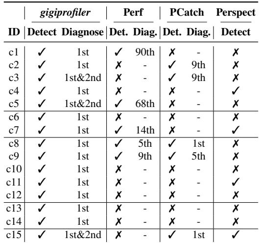  
Table 4: Detection and diagnosis results for the evaluated cases.

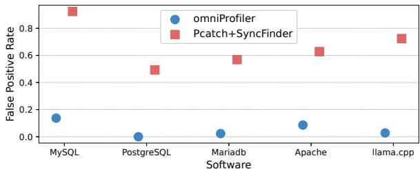  
Figure 11: False positive rates across five software.

## 4.2 Detecting New Performance Issues

To further demonstrate gigiprofiler ’s effectiveness, we monitored new bug reports from the five evaluated applications. We specifically focused on performance issues with unknown root causes and without clear system-level signals. For each report, we constructed a reproduction script and applied gigiprofiler to the corresponding application. During this exercise, gigiprofiler successfully diagnosed two new cases of performance issues in application resources. In both cases, the diagnoses were confirmed by developers:

MDEV-34989 [27]. After executing a SELECT statement, subsequent INSERT operations in the same table would hang for an extended period. gigiprofiler identified that the root cause is that if the table is empty, the SELECT query holds the table’s metadata for too long. This prevents the INSERT thread from acquiring the TABLE\_SHARE resource. The developers confirmed the diagnosis and released a fix.

MDEV-34836 [26]. In a Galera cluster, a read query would unnecessarily hold a parent table while operating on a child table. As a result, a DDL transaction on the parent table would mistakenly operate on the query. However, since the query actually accesses the child table, it would block the DDL transaction on the parent table. gigiprofiler identified the root cause by finding that the query that held the parent table never actually accessed it. The developers confirmed this diagnosis and addressed the bug.

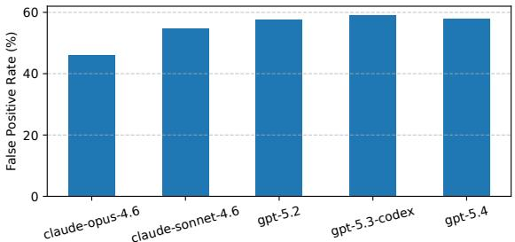  
Figure 12: False positive rates across five LLM model

## 4.3 Accuracy of Finding Software Resources

The precision of identifying application resources is critical for the effectiveness of gigiprofiler. To evaluate this, we run the gigiprofiler in the five software and manually inspected the accuracy of identifying all the application resource usage events. We compare gigiprofiler with SyncFinder+PCatch, the state-of-the-art static analysis tool to identify waiting events in the application code.

As shown in Figure 11, gigiprofiler consistently achieves low false-positive rates in the five applications. Even for MySQL, which has the largest codebase in our evaluation, gigiprofiler achieves a 13.6% false-positive rate in identifying application-resource usage events. In comparison, the static analysis approach has much higher false-positive rates.

## 4.4 Sensitivity to different LLM model

Because gigiprofiler can use different LLM as the underlying model for its LLM agent, we evaluate whether the coverage and precision of the identification are sensitive to the choice of LLM. We run the LLM agent on MySQL using five different models, including recent GPT and Claude models, e.g., GPT-5.4 and Claude-Opus-4.6, as well as code-agent models(gpt-5.3-codex). To isolate the sensitivity effect of the LLM, we only evaluated the LLM agent without static validation. We manually inspect the identified resources and usage events to determine which candidates are true positives and false positive. For each candidate event, we review the source code to confirm whether the function actually accesses the corresponding application-defined resource.

Figure 12 shows the false-positive rate of each model. All tested models have high false positive rates, ranging from 45% to 60%. The GPT models show similar false-positive rates. The result suggests that the precision problem is not specific to the GPT-4o model used in the main evaluation. Claude-Opus achieves the lowest false-positive rate, but it also identifies fewer candidates(as shown in Sec 4.6)

## 4.5 Ablation Study on gigiprofiler workflow

gigiprofiler uses three modules to improve the accuracy of identifying application-resource usage events: LLM agent, static validation, and post-profiling validation. We conduct an ablation study to quantify how each module reduces false positives in the identified events. For the LLM agent and static validation, we compute the false-positive rate over all identified events. For post-profiling validation, however, runtime evidence is available only when a workload triggers the corresponding events. We therefore run a set of standard sysbench workloads together with our reproduction scripts to cover as many resources as possible, and compute the false-positive rate only over the events observed during execution. We run this study on MySQL using five different LLMs.

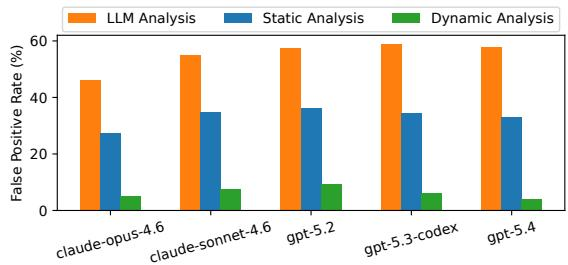  
Figure 13: False positive rates in different phases of gigiprofiler workflow.

As shown in Figure 13, the LLM agent alone produces high false-positive rates, ranging from 45% to 60%. Static valida tion reduces these rates by 22% on average. Post-profiling validation further reduces the false-positive rate by 24%.

## 4.6 Coverage of Application Resources

We evaluate whether gigiprofiler misses application-resource usage events. Obtaining ground truth on how many application resource events are in a large-scale system is difficult because application-defined resources are not explicitly enumerated in any documentation.We therefore conduct two complementary evaluations. First, we cross-check using the manually validated SyncFinder+PCatch results from Section 4.3. Second, we performed an exhaustive case study on the MySQL buffer-pool subsystem, where we manually enumerate resource-usage functions and events for a small set of well-defined resources.

Cross-check with PCatch. In MySQL, gigiprofiler identified 154 usage events but missed 23 valid events found by SyncFinder+PCatch, a false negative rate of 13.0%. These missed events come from two main sources. First, the LLM misses some usage points when comments are absent. Second, the static analyzer misses some resource-access patterns that do not match its validation rules. In comparison, SyncFinder+PCatch misses around 100 usage events found by gigiprofiler, a false negative rate of 66.7%.

Case Study: Buffer Pool in MySQL. To obtain a more detailed coverage estimate, we performed a case study on the MySQL buffer-pool subsystem. We focus on three core bufferpool resources, buf\_pool\_t, buf\_block\_t, and buf\_page\_t. We exhaustively enumerate functions that involve these resources and manually label their usage events. This scope is limited to the buffer-pool subsystem, but gives us a precise ground truth to analyze the events gigiprofiler tend to miss.

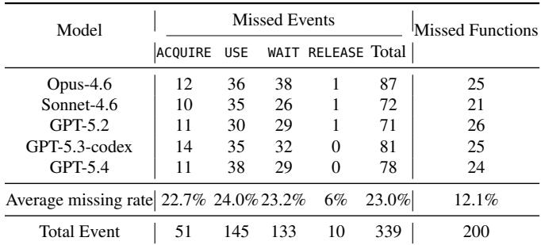  
Table 5: Coverage study for the MySQL buffer-pool subsystem. The ACQUIRE, USE, WAIT, and RELEASE columns break down the missing events by event type.

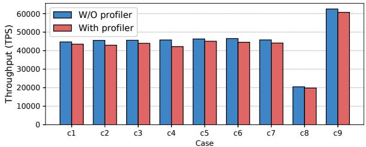  
Figure 14: Overhead under 6 cases.

As shown in Table 5, the buffer pool subsystem contains 339 events that span 200 different functions. On average, gigiprofiler misses about 23% of events and 12% of functions in the tested LLMs. Among the different models, Opus-4.6 misses the most events, missing 25% of events. We manually checked all missed events and found that most missed events are caused by misclassifications of the event type. For example, If the LLM mis-classifies an event that should be ACQUIRE as a USE event, the candidate will be checked using the wrong event rule and get rejected. As a result, the true ACQUIRE event is missing from the final set of events.

## 4.7 Runtime Overhead

Finally, we evaluated the runtime overhead of gigiprofiler. Because gigiprofiler activates its tracing only when a performance issue is triggered, measuring overhead on a generic workload, where tracing is inactive, can not provide a meaningful comparison. We therefore report overhead on 9 of the 15 reproduced issues. We exclude cases 10, 11, and 15 because they lead to CPU hangs making end-to-end performance comparison meaningless. Case 12 is a leak that does not produce measurable throughput degradation. Cases 13 and 14 occur in a web-server setting, where additional client-side instrumentation is needed to trace the overhead.

Figure 14 shows the throughput across the 9 measurable cases. gigiprofiler incurs consistently low overhead, averaging 3.7% and never exceeding 7.8%. The observed overhead primarily comes from tracing resource-usage events and writing them to a ring buffer. Because the current implementation records every event, sampling or batching could further reduce overhead with minimal impact on diagnostic accuracy.

## 5 Related work

Diagnosing performance bottlenecks in large-scale software systems has been a critical challenge. Existing performance analysis tools can be broadly categorized into general profilers, causality analysis tools, and application-specific methods.

Performance Issue Detection. Profilers [3, 5, 7–9, 11, 13, 14, 39, 57] are fundamental tools for detecting performance problems and identifying associated symptoms. These tools focus on revealing performance-intensive events (e.g., functions, loops, or resource usage) but leave developers to manually infer the underlying reasons for resource contention. Statistical debugging [41, 43, 48] analyzes application-level events to detect performance anomalies. These tools effectively correlate specific code behaviors with performance degradation, making them particularly suitable for identify ing issues related to custom synchronization logic or other application-specific patterns. However, interpreting the results of statistical debugging typically requires significant manual effort, as developers must deduce why certain predicates correlate with poor performance. In contrast, gigiprofiler identifies application resource usage patterns and directly links these patterns to performance anomalies at runtime, which allows gigiprofiler to clearly explain the root causes of performance problems involving resource misuse, thereby reducing the manual investigative effort required by developers.

There are also tools tailored for debugging specific types of performance problems using predefined patterns. For example, loop-oriented debugging tools [34,44] target performance degradation caused by inefficient or excessive loop iterations, while memory leak detectors [22, 47] focus on identifying and diagnosing memory issues. In contrast, gigiprofiler is de signed to serve as a general-purpose diagnosis tool, capable of addressing application resource misuse.

Causality Analysis. Numerous techniques have been developed for causality analysis in performance debugging [2, 17, 25, 40]. For example, Argus [50] introduces causality graphs annotated with strong and weak edges, enabling prioritization of relational analyses for complex systems. Similarly, Pensieve [58] demonstrates how runtime logs, combined with static analysis, can reconstruct causal paths and uncover performance bottlenecks. Value-assisted profiling [49] enhances performance diagnosis by capturing and analyzing variable value patterns during execution. While these methods are effective in analyzing runtime interactions and identifying causal dependencies, they rely heavily on existing logs and annotations, which are often unavailable or incomplete for application-defined resources.

LLMs for Software Analysis. Modern large language models have revolutionized code-related tasks, including code generation [10], program repair [12, 42, 51, 52, 55], automated testing [6, 16], and specification generation [23]. Despite their advancements, LLMs face challenges in interpreting application-defined semantics due to their inherent variability.

Recent works [24, 45, 46, 53, 56] combine LLMs with program-analysis techniques for tasks such as binary-code understanding, decompilation, specification generation, and static checker synthesis. These systems use a "propose and validate" approach: it first allows LLMs to propose candidate and then uses program analysis validates these candidates. gigiprofiler differs from these systems in two ways. First, gigiprofiler targets application-specific resource semantics that can not be validated by standard program analysis. For example, ReSym [53] uses pointer analysis to check the consistency among recovered variables and symbols of the data-structure. In contrast, gigiprofiler must decide whether a program variable is a resource defined by the application and whether a function is semantically an event for that resource. There is no standard static-analysis rule for making this semantic judgment. Second, gigiprofiler targets largescale server systems. Existing LLM-assisted approaches that analyze small code fragments do not scale well to large-scale system. They can miss cross-file context, require many expensive LLM calls, and produce low-precision results when the resource semantics depend on broader application logic.

## 6 Conclusion

Performance issues in application resources are a major source of hidden slowdowns in modern software, yet they remain difficult to detect and diagnose because their effects do not manifest through system-level signals. This paper introduced gigiprofiler, a diagnosis tool that exposes the behavior of internal resources in an application by identifying resources defined by the application, tracking how tasks wait for, acquire, use and release them, and describing slowdowns to the underlying code paths. gigiprofiler combines LLM-based semantic inference with static analysis to automatically recover resource-usage events across large and heterogeneous codebases, and instruments lightweight runtime tracing to detect pathological usage patterns. Our evaluation on five large applications shows that gigiprofiler accurately diagnoses the root cause for all 15 reproduced real-world performance issues in application resources and detected two previously unknown issues confirmed by developers.

## Acknowledgments

We thank the anonymous OSDI reviewers and our shepherd for their valuable and detailed feedback that improved our work. This work is supported in part by the NSF CAREER Award 2333885; PRISM, one of the seven centers in JUMP 2.0, a Semiconductor Research Corporation (SRC) program sponsored by DARPA; as well as generous donations from NVIDIA, AMD, Intel, and Arm.

## References

[1] Mona Attariyan, Michael Chow, and Jason Flinn. Xray: automating root-cause diagnosis of performance anomalies in production software. In Proceedings of the 10th USENIX Conference on Operating Systems Design and Implementation, OSDI’12, page 307–320, USA, 2012. USENIX Association.

[2] Mona Attariyan and Jason Flinn. Automating configuration troubleshooting with dynamic information flow analysis. In Proceedings of the 9th USENIX Conference on Operating Systems Design and Implementation, OSDI’10, page 237–250, USA, 2010. USENIX Association.

[3] Mike Chow, Yang Wang, William Wang, Ayichew Hailu, Rohan Bopardikar, Bin Zhang, Jialiang Qu, David Meisner, Santosh Sonawane, Yunqi Zhang, Rodrigo Paim, Mack Ward, Ivor Huang, Matt McNally, Daniel Hodges, Zoltan Farkas, Caner Gocmen, Elvis Huang, and Chunqiang Tang. ServiceLab: Preventing tiny performance regressions at hyperscale through Pre-Production testing. In 18th USENIX Symposium on Operating Systems Design and Implementation (OSDI 24), pages 545–562, Santa Clara, CA, July 2024. USENIX Association.

[4] CISCO. Developers spending more time firefighting issues than delivering innovation. Online report, 2024.

[5] Charlie Curtsinger and Emery D. Berger. Coz: finding code that counts with causal profiling. In Proceedings of the 25th Symposium on Operating Systems Principles, SOSP ’15, page 184–197, New York, NY, USA, 2015. Association for Computing Machinery.

[6] Yinlin Deng, Chunqiu Steven Xia, Chenyuan Yang, Shizhuo Dylan Zhang, Shujing Yang, and Lingming Zhang. Large language models are edge-case generators: Crafting unusual programs for fuzzing deep learning libraries. In Proceedings of the IEEE/ACM 46th Interna tional Conference on Software Engineering, ICSE ’24, New York, NY, USA, 2024. Association for Computing Machinery.

[7] OProfile Developers. Oprofile: A system profiler for linux. https://oprofile.sourceforge.io/about/, 2023.

[8] SystemTap Developers. Systemtap: Simplifying systemlevel observability. https://sourceware.org/systemtap/, 2023.

[9] Valgrind Developers. Valgrind: Instrumentation framework for building dynamic analysis tools. https://valgrind.org/, 2023.

[10] Xueying Du, Mingwei Liu, Kaixin Wang, Hanlin Wang, Junwei Liu, Yixuan Chen, Jiayi Feng, Chaofeng Sha, Xin Peng, and Yiling Lou. Evaluating large language models in class-level code generation. In Proceedings of the IEEE/ACM 46th International Conference on Software Engineering, ICSE ’24, New York, NY, USA, 2024. Association for Computing Machinery.

[11] Linux Foundation. Perf: Linux profiling with performance counters. https://perf.wiki.kernel.org/.

[12] Xiang Gao and Abhik Roychoudhury. Interactive patch generation and suggestion. In Proceedings of the IEEE/ACM 42nd International Conference on Software Engineering Workshops, ICSEW’20, page 17–18, New York, NY, USA, 2020. Association for Computing Machinery.

[13] gperftools Developers. gperftools: Google performance tools. https://github.com/gperftools/gperftools, 2023.

[14] Sudheendra Hangal and Monica S. Lam. Tracking down software bugs using automatic anomaly detection. In Proceedings of the 24th International Conference on Software Engineering, ICSE ’02, page 291–301, New York, NY, USA, 2002. Association for Computing Machinery.

[15] Yigong Hu, Gongqi Huang, and Peng Huang. Pushing performance isolation boundaries into application with pbox. In Proceedings of the 29th Symposium on Operating Systems Principles, SOSP ’23, pages 247–263, New York, NY, USA, 2023. Association for Computing Machinery.

[16] Sungmin Kang, Juyeon Yoon, and Shin Yoo. Large language models are few-shot testers: Exploring llmbased general bug reproduction. In Proceedings of the 45th International Conference on Software Engineering, ICSE ’23, page 2312–2323. IEEE Press, 2023.

[17] Baris Kasikci, Benjamin Schubert, Cristiano Pereira, Gilles Pokam, and George Candea. Failure sketching: a technique for automated root cause diagnosis of inproduction failures. In Proceedings of the 25th Symposium on Operating Systems Principles, SOSP ’15, page 344–360, New York, NY, USA, 2015. Association for Computing Machinery.

[18] Chi Li, Shu Wang, Henry Hoffmann, and Shan Lu. Statically inferring performance properties of software configurations. In Proceedings of the Fifteenth European Conference on Computer Systems, EuroSys ’20, New York, NY, USA, 2020. Association for Computing Machinery.

[19] Jiaxin Li, Yuxi Chen, Haopeng Liu, Shan Lu, Yiming Zhang, Haryadi S. Gunawi, Xiaohui Gu, Xicheng Lu, and Dongsheng Li. Pcatch: automatically detecting performance cascading bugs in cloud systems. In Proceedings of the Thirteenth EuroSys Conference, EuroSys ’18, New York, NY, USA, 2018. Association for Computing Machinery.

[20] Jiaxin Li, Yiming Zhang, Shan Lu, Haryadi S. Gunawi, Xiaohui Gu, Feng Huang, and Dongsheng Li. Performance bug analysis and detection for distributed storage and computing systems. ACM Trans. Storage, 19(3), June 2023.

[21] LLVM. Llvm: A compilation framework for lifelong program analysis and transformation.

[22] Chang Lou, Cong Chen, Peng Huang, Yingnong Dang, Si Qin, Xinsheng Yang, Xukun Li, Qingwei Lin, and Mu rali Chintalapati. RESIN: A holistic service for dealing with memory leaks in production cloud infrastructure. In 16th USENIX Symposium on Operating Systems Design and Implementation (OSDI 22), pages 109–125, Carlsbad, CA, July 2022. USENIX Association.

[23] Lezhi Ma, Shangqing Liu, Yi Li, Xiaofei Xie, and Lei Bu. Specgen: Automated generation of formal program specifications via large language models, 2024.

[24] Lezhi Ma, Shangqing Liu, Yi Li, Xiaofei Xie, and Lei Bu. Specgen: Automated generation of formal program specifications via large language models. In Proceed ings of the IEEE/ACM 47th International Conference on Software Engineering, ICSE ’25, page 16–28. IEEE Press, 2025.

[25] Jonathan Mace, Ryan Roelke, and Rodrigo Fonseca. Pivot tracing: Dynamic causal monitoring for distributed systems. In 2016 USENIX Annual Technical Conference (USENIX ATC 16), Denver, CO, June 2016. USENIX Association.

[26] MariaDB. Mdev-34836: Toi (alter) hangs on a parent table if sr transaction is in progress on a child table. https://jira.mariadb.org/browse/MDEV-34836, 2024.

[27] MariaDB. Mdev-34989: After selecting from empty table with vector key the next insert hangs. https:// jira.mariadb.org/browse/MDEV-34989, 2024.

[28] MySQL. Mysql bug #34414: Innodb purge thread causing high cpu usage. https://bugs.mysql.com/bug.php? id=34414, 2008.

[29] MySQL. Mysql bug #54455: Innodb purge thread causing high cpu usage. https://bugs.mysql.com/bug.php? id=54455, 2012.

[30] MySQL. Mysql at facebook. https://www.facebook. com/MySQLatFacebook/posts/10152610642241696, 2014.

[31] MySQL. Mysql bug #74919: Innodb purge thread causes high cpu usage and performance degradation. https://bugs.mysql.com/bug.php?id=74919, 2014.

[32] MySQL. Mysql bug #75540: Purge thread causes performance regression. https://bugs.mysql.com/bug.php? id=75540, 2015.

[33] MySQL. Mysql bug #96236: Performance regression due to excessive purge lag. https://bugs.mysql.com/ bug.php?id=96236, 2019.

[34] Adrian Nistor, Linhai Song, Darko Marinov, and Shan Lu. Toddler: detecting performance problems via similar memory-access patterns. In Proceedings of the 2013 International Conference on Software Engineering, ICSE ’13, page 562–571. IEEE Press, 2013.

[35] Percona. Innodb’s multi-versioning handling can be achilles’ heel Online article, 2014.

[36] Percona. Mysql performance implications of innodb isolation modes Online article, 2015.

[37] Percona. Chasing a hung transaction in mysql: Innodb history length strikes back Online article, 2017.

[38] Percona. Impact of swapping on mysql performance Online article, 2017.

[39] GNU Project. GNU gprof: a Call Graph Execution Profiler, 1998.

[40] Lenin Ravindranath, Jitendra Padhye, Sharad Agarwal, Ratul Mahajan, Ian Obermiller, and Shahin Shayandeh. AppInsight: Mobile app performance monitoring in the wild. In 10th USENIX Symposium on Operating Systems Design and Implementation (OSDI 12), pages 107–120, Hollywood, CA, October 2012. USENIX Association.

[41] Xiang (Jenny) Ren, Sitao Wang, Zhuqi Jin, David Lion, Adrian Chiu, Tianyin Xu, and Ding Yuan. Relational debugging — pinpointing root causes of performance problems. In 17th USENIX Symposium on Operating Systems Design and Implementation (OSDI 23), pages 65–80, Boston, MA, July 2023. USENIX Association.

[42] Dominik Sobania, Martin Briesch, Carol Hanna, and Justyna Petke. An analysis of the automatic bug fixing performance of chatgpt, 2023.

[43] Linhai Song and Shan Lu. Statistical debugging for real-world performance problems. In Proceedings of

the 2014 ACM International Conference on Object Oriented Programming Systems Languages &amp; Applications, OOPSLA ’14, page 561–578, New York, NY, USA, 2014. Association for Computing Machinery.

[44] Linhai Song and Shan Lu. Performance diagnosis for in efficient loops. In Proceedings of the 39th International Conference on Software Engineering, ICSE ’17, page 370–380. IEEE Press, 2017.

[45] Zian Su, Xiangzhe Xu, Ziyang Huang, Zhuo Zhang, Yapeng Ye, Jianjun Huang, and Xiangyu Zhang. Codeart: Better code models by attention regularization when symbols are lacking. Proc. ACM Softw. Eng., 1(FSE), July 2024.

[46] Hanzhuo Tan, Qi Luo, Jing Li, and Yuqun Zhang. Llm4decompile: Decompiling binary code with large language models, 2024.

[47] John Vilk and Emery D. Berger. Bleak: automatically debugging memory leaks in web applications. SIGPLAN Not., 53(4):15–29, June 2018.

[48] Shu Wang, Chi Li, Henry Hoffmann, Shan Lu, William Sentosa, and Achmad Imam Kistijantoro. Understanding and auto-adjusting performance-sensitive configurations. SIGPLAN Not., 53(2):154–168, March 2018.

[49] Lingmei Weng, Yigong Hu, Peng Huang, Jason Nieh, and Junfeng Yang. Effective performance issue diagnosis with value-assisted cost profiling. In Proceedings of the Eighteenth European Conference on Computer Systems, EuroSys ’23, page 1–17, New York, NY, USA, 2023. Association for Computing Machinery.

[50] Lingmei Weng, Peng Huang, Jason Nieh, and Junfeng Yang. Argus: Debugging performance issues in modern desktop applications with annotated causal tracing. In 2021 USENIX Annual Technical Conference (USENIX ATC 21), pages 193–207. USENIX Association, July 2021.

[51] Chunqiu Steven Xia, Yuxiang Wei, and Lingming Zhang. Automated program repair in the era of large pre-trained language models. In Proceedings of the 45th International Conference on Software Engineering, ICSE ’23, page 1482–1494. IEEE Press, 2023.

[52] Chunqiu Steven Xia and Lingming Zhang. Automated program repair via conversation: Fixing 162 out of 337 bugs for \$0.42 each using chatgpt. In Proceedings of the 33rd ACM SIGSOFT International Symposium on Software Testing and Analysis, ISSTA 2024, page 819–831, New York, NY, USA, 2024. Association for Computing Machinery.

[53] Danning Xie, Zhuo Zhang, Nan Jiang, Xiangzhe Xu, Lin Tan, and Xiangyu Zhang. Resym: Harnessing llms to recover variable and data structure symbols from stripped binaries. In Proceedings of the 2024 ACM SIGSAC Conference on Computer and Communications Security, 2024.

[54] Weiwei Xiong, Soyeon Park, Jiaqi Zhang, Yuanyuan Zhou, and Zhiqiang Ma. Ad hoc synchronization considered harmful. In Proceedings of the 9th USENIX Conference on Operating Systems Design and Implementation, OSDI’10, page 163–176, USA, 2010. USENIX Association.

[55] Boyang Yang, Haoye Tian, Weiguo Pian, Haoran Yu, Haitao Wang, Jacques Klein, Tegawendé F. Bissyandé, and Shunfu Jin. Cref: An llm-based conversational software repair framework for programming tutors. In Proceedings of the 33rd ACM SIGSOFT International Symposium on Software Testing and Analysis, ISSTA 2024, page 882–894, New York, NY, USA, 2024. Association for Computing Machinery.

[56] Chenyuan Yang, Zijie Zhao, Zichen Xie, Haoyu Li, and Lingming Zhang. Knighter: Transforming static analysis with llm-synthesized checkers. In Proceedings of the ACM SIGOPS 31st Symposium on Operating Systems Principles, SOSP ’25, page 655–669, New York, NY, USA, 2025. Association for Computing Machinery.

[57] Dong Young Yoon, Yang Wang, Miao Yu, Elvis Huang, Juan Ignacio Jones, Abhinay Kukkadapu, Osman Kocas, Jonathan Wiepert, Kapil Goenka, Sherry Chen, Yanjun Lin, Zhihui Huang, Jocelyn Kong, Michael Chow, and Chunqiang Tang. Fbdetect: Catching tiny performance regressions at hyperscale through in-production monitoring. In Proceedings of the ACM SIGOPS 30th Symposium on Operating Systems Principles, SOSP ’24, page 522–540, New York, NY, USA, 2024. Association for Computing Machinery.

[58] Yongle Zhang, Serguei Makarov, Xiang Ren, David Lion, and Ding Yuan. Pensieve: Non-intrusive failure reproduction for distributed systems using the event chaining approach. In Proceedings of the 26th Symposium on Operating Systems Principles, SOSP ’17, page 19–33, New York, NY, USA, 2017. Association for Computing Machinery.

[59] Fang Zhou, Yifan Gan, Sixiang Ma, and Yang Wang. wPerf: Generic Off-CPU analysis to identify bottleneck waiting events. In 13th USENIX Symposium on Operating Systems Design and Implementation (OSDI 18), pages 527–543, Carlsbad, CA, October 2018. USENIX Association.