USENIX

THE ADVANCED COMPUTING SYSTEMS ASSOCIATION

# FARLock: Asymmetric RDMA Locking Made Fair

Yuehao Hu, Jiatang Zhou, Tianzheng Wang, and Keval Vora, Simon Fraser University

https://www.usenix.org/conference/osdi26/presentation/hu-yuehao

# This paper is included in the Proceedings of the 20th USENIX Symposium on Operating Systems Design and Implementation.

July 13–15, 2026 • Seattle, WA, USA

ISBN 978-1-939133-55-7

Open access to the Proceedings of the 20th USENIX Symposium on Operating Systems Design and Implementation is sponsored by

# FARLock: Asymmetric RDMA Locking Made Fair

Yuehao Hu Jiatang Zhou

Tianzheng Wang Keval Vora

School of Computing Science Simon Fraser University British Columbia, Canada

## Abstract

Distributed locking is essential for coordinating access to shared resources in modern RDMA-based distributed systems. While state-of-the-art RDMA locks can deliver highperformance by introducing asymmetry (i.e., treating requests that are local and remote to the lock differently), they often trade off fairness as they fail to grant locks in the expected first-come first-serve manner. This can lead to long delays for critical tasks, missing service level objectives.

We present FARLock, a fast and fair RDMA lock to solve this problem. Drawing inspiration from ticket and MCS locks, FARLock employs tickets and MCS-style handover to ensure that locks are granted strictly by arrival order. Through careful coordination between request queues and the ticket, FARLock provides strong fairness semantics with high performance. Our evaluation on a range of workloads shows that FARLock guarantees fairness and achieves lower latencies compared to prior state-of-the-art. Incorporating FARLock in a recent RDMA-based distributed indexing solution improves its query tail latencies.

## 1 Introduction

Distributed locks are a fundamental building block of distributed systems to coordinate accesses to shared memory across server boundaries. Importantly, they must be carefully designed to deliver both strong performance (i.e., lowlatency lock acquire/release operations) and fairness among requesters (i.e., locks are granted in a first-come-first-serve manner [15]). While both are critical and desirable, offering strong fairness is particularly important for a broad range of systems—such as database systems [8, 11, 24, 33, 35, 38], keyvalue stores/indexes [3, 20, 22, 23, 32, 34, 42], and distributed file systems [6,25,36]—to reach their service level objectives. For example, it would be unacceptable if a mission-critical database query is delayed due to unfair granting of locks that govern shared buffer accesses in a multi-tenanted database system [27]. As emerging applications [5, 19, 21, 29, 31, 39] continue to pose stringent deadline and real-time requirements, the need for fair distributed locking has become crucial to prevent biases and delays.

RDMA for Efficiency. Modern distributed systems are increasingly built around remote direct memory access (RDMA) that enables ultra-low latency and high throughput. For example, RDMA over InfiniBand HDR can deliver 200Gb/s of bandwidth and µs-level latency [2]. With kernel bypassing and zero-copy data transfer, RDMA allows machines to communicate directly with each other’s memory without involving their CPUs. RDMA also provides one-sided atomics such as RDMA compare-and-swap (CAS) that offer similar interfaces to their CPU-based counterparts. These make RDMA atomics an attractive choice for designing distributed locks which can be hosted on a server and accessed via one-sided RDMA by a remote server without involving the host’s CPU.

Problem: Efficiency at the Cost of Fairness. RDMA atomics guarantee atomicity only when concurrent atomic operations execute on the same RDMA-enabled NIC (RNIC) [30] as they bypass the CPU. As a result, atomicity is not guaranteed when RDMA atomics contend with local CPU memory accesses. To preserve RDMA atomicity, even local accesses must be routed through the host’s RNIC [41], but this indirection is expensive than a direct local access. For RDMAbased locks, using loopback for local lock acquisitions introduces unnecessary latency and becomes a poor choice for performance-critical coordination.

Recent work [4] mitigates this issue by introducing asymmetric RDMA locking where lock requests targeting a lock that is local to the requesting thread are handled separately from those that target a lock stored on another server. This way, local requests can perform local CPU-based atomics without involving expensive RDMA operations, which are only required by remote requests. Given the large latency gap between local and RDMA memory accesses (∼100ns vs. µs-level), this can greatly improve overall lock operation performance. As we elaborate in Section 2.3, however, it sacrifices fairness as the lock requests get reordered, leading to biased access patterns that no longer reflect true arrival order.

Our Solution. In this paper, we present FARLock, an efficient and fair RDMA lock. FARLock is the first RDMA lock that ensures lock requests are granted in the expected firstcome first-served order while eliminating loopback for local requests. FARLock’s design is inspired by two classic designs and combines the advantages of both: (1) ticket-based acquisition found in classic ticket locks [15] and (2) the queue-based handover strategy of the MCS lock [26]. Similar to prior work [4], local and remote requests are handled differently in FARLock, allowing them to be separately optimized and using RDMA operations only for remote requests. However, each request additionally draws a ticket from a global counter, and locks are granted in ticket order. By globally ordering all requests (local and remote) based on their arrival time, FARLock ensures fairness.

However, designing FARLock correctly with queue-based handover between requesters and global ticket ordering is challenging. Naïvely merging the two strategies could lead to inconsistency issues where the ordering of requests in queues is different from their ticket ordering. This is problematic as granting locks in ticket order would require searching the right requester in queue and handling the resulting queue manipulation properly.

To overcome this challenge, we identify the ordering consistency property that dictates a correlation between the ticket ordering of requests and their respective queue ordering. The property provides flexibility between local and remote requests, allowing each type to be managed in a customized manner. FARLock ensures the property is maintained throughout execution. This is achieved by reversing the order of ticket acquisition and enqueuing, and coordinating ticket assignment based on each request’s position in the queues. The benefit of this approach is that it requires no additional atomicity or coordination to maintain ordering consistency.

The next challenge is coordinating local and remote requests as they safely acquire their tickets, which is non-trivial because they access the ticket differently (the local requester does not use RDMA). With ordering consistency, this challenge reduces to mutual exclusion between just two requesters, i.e., the head of the local and remote queues. This allows us to leverage the Peterson’s lock [28] which requires no atomics and can be implemented entirely with simple reads and writes, making it an ideal fit.

FARLock is scalable, offering low-latency in less contention scenarios thanks to RDMA, and maintaining lowlatency under high contention by avoiding ordering biases. In addition, we propose a fairness-preserving grouping mechanism to reduce the overhead of accessing the Peterson’s lock during high-contention workloads. Our mechanism groups same-type requests by sharing the Peterson’s lock, allowing multiple requests to acquire their tickets together. FARLock then ensures ordering consistency by granting locks in ticket order, similar to the usual case.

On top of the mutual exclusion support provided by FAR-Lock, we further present an optimistic reader lock extension that only requires minor changes.

We evaluated FARLock’s performance on a cluster of 10 RDMA-enabled machines using various microbenchmarks and RDMA locking strategies. Our results show that FAR-Lock achieves lower tail latencies than all other RDMA locks. This comes from its efficient handling of local requests compared to designs that rely on the expensive loopback mechanism, and from avoiding the reordering delays seen in unfair locks that eliminate loopback but sacrifice fairness.

To understand FARLock’s effectiveness in practice, we further incorporated FARLock in Sherman [32], a recent highperformance RDMA-based distributed B+-tree. Our deployment showed that Sherman benefits from FARLock’s unbiased lock granting especially during write-heavy scenarios as the tail latencies improve by up to 14×.

## 2 Background and Motivation

In this section, we give the necessary background and motivate our work. To set the stage, we first introduce sharedmemory locking and RDMA which today’s distributed locks are built upon. We then expand on the implications of RDMA on locking to motivate our work.

## 2.1 Shared-Memory Locking

Locking mechanisms for shared-memory multicore systems have motivated the design of scalable distributed locks. The simplest is the (test-and)test-and-set (TTS) [15] locks, which rely on hardware-supported primitives such as compare-andswap (CAS) [16] to provide mutual exclusion across multiple threads. However, TTS locks do not scale with core count as contending threads need to repeatedly poll the lock word at central memory location, generating heavy inter-thread com munication and interconnect traffic. TTS locks also do not provide any ordering guarantees and is known to be vulnerable to starvation. Ticket locks [15] provide strong fairness guarantees by introducing a global ticket counter. Each requester atomically obtains a unique ticket via a single fetchand-add (FAA) or CAS operation, and the lock is granted in ticket order. However, threads still have to spin on a central location (i.e., the ticket counter) while waiting for their turn, leading to performance bottlenecks. The MCS lock [26] addresses both issues (centralized contention and ordering) by organizing requesters in a FIFO queue and allowing each requester thread to spin locally in its queue node. The lock itself always points to the tail of the queue and is only modified by an atomic swap (exchange) operation. The lock is then handed over directly from each holder to its successor in the queue. This eliminates global contention and naturally preserves fairness, since the lock handover follows the order of the queue.

## 2.2 Remote Direct Memory Access

Remote Memory Direct Access (RDMA) allows one machine to directly access the main memory of another machine without involving the remote CPU. On top of a recent highbandwidth, low-latency interconnect, such as InfiniBand [1], RDMA can enable competitive latency profiles at the µs level, making it possible now to build distributed and disaggregated in-memory applications that span multiple nodes. Different from traditional TCP/IP, RDMA exhibits a verbs interface that operates around queue pairs. Applications can perform two-sided operations (send/receive) or one-sided operations (read/write) by posting an RDMA request to a queue pair. The main difference between one- and two-sided operations is that the former does not require the remote end to coordinate, thus freeing up CPU cycles. Distributed locks also mostly rely on one-sided RDMA operations. The RDMA protocol also supports atomics such as RDMA CAS and RDMA FAA, which are also one-sided and operate on single 8-byte memory words, like their x86 counterparts.

Notably, RDMA atomics provide atomicity when they are executed on the same RDMA-enabled network interface card (RNIC) [30]. At the hardware level, atomic operations and other memory accesses are performed by RNIC via the PCIe on the remote machine [41]. Since the RNIC operations are independent of those from the remote CPU, the atomicity of RDMA atomics is not guaranteed when they are performed concurrently with local memory accesses by the remote CPU. This leads to asymmetric performance between local and remote accesses [4] that ideally should be leveraged by RDMA locks, which is one of the motivations of our work as we elaborate next.

## 2.3 Fairness and Latency of RDMA Locks

Several RDMA-based lock designs achieve high efficiency by reducing network round trips through one-sided RDMA [12, 13, 37, 40, 41]. In these designs, the lock is exposed via the RNIC. This allows lock operations to bypass the CPU of the server hosting the lock and enables low-latency lock operations. Beyond adaptations of the aforementioned centralized TTS or ticket locks, the MCS lock has also been adapted to support distributed locking using RDMA. Distributed requesters directly manipulate the remote tail pointer to enqueue themselves using one-sided RDMA, and the lock is handed over along the queue whose nodes are also accessed using one-sided RDMA. This approach preserves MCS lock’s fairness properties by maintaining FIFO handover ordering based on the arrival order of distributed requesters.

Due to the aforementioned consistency issue in Section 2.2 between remote accesses from an RNIC and from the local

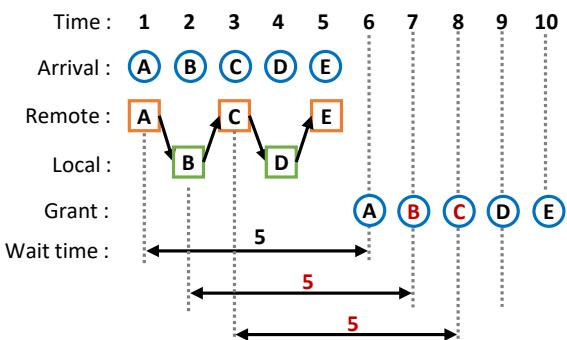  
(a) Remote and local requests in a single queue

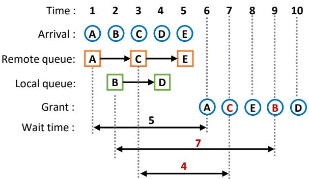  
(b) Separate local/remote queues

Figure 1: Performance vs. fairness guarantees in prior work. (a) Using a single queue (e.g., MCS) ensures fairness across all requests but sacrifices performance without considering asymmetry. (b) Existing asymmetry-aware locks can grant locks without considering arrival order, leading to long wait times for certain requests (e.g., B and D).

CPU, however, it is important that regardless of where the requesters are located relative to the lock (i.e., whether on the same or different servers), the requester always needs to use RDMA operations to operate on the lock. This leads to high latency especially for local requesters (i.e., threads on the server hosting the lock). Because RDMA does not guarantee atomicity between local and remote accesses, local requesters must interact with the lock through a loopback mechanism [4, 41], meaning their accesses are routed through the local RNIC which is unnecessarily expensive. A potential way to eliminate the expensive loopback is to treat local and remote requesters differently while enforcing correct coordination between them. However, doing so while preserving fair lock acquisition order is challenging. Maintaining fairness in terms of lock acquisition order is important because it directly impacts task latency, as discussed next.

Lock Acquisition Order. Lock acquisition order is the order in which waiting requesters acquire the lock. The common notion of fairness in lock acquisition requires that requesters obtain locks in the order of their arrival [15]. Such fairness is important because it prevents the additional delays that arise when requests are served out of order.

Figure 1 shows an example where 5 lock requests arrive one after the other from different tasks. For simplicity, we assume each task takes 1 unit of time to execute its critical section and release the lock. When the lock becomes available at time t = 6, the first scenario (a) maintains a single queue which preserves arrival order, so each request’s latency directly reflects its position in the queue. This is how an RDMA-adapted MCS lock would work. In the second scenario (b), however, local and remote requests are maintained in separate queues (e.g., in ALock [4]) and the lock is granted out of order as lock granting alternates between two queues. This reduces the wait times for some requests that arrive later (e.g., C) but increases wait times for the earlier ones (e.g., B). When considering end-to-end task latencies, such reordering can inadvertently increase latency for some requesters relative to others. Under highly contended workloads, these effects become especially pronounced, manifesting as high tail latencies.

We verified this by measuring tail latencies of RDMAbased lock implementations. We ran the RDMA implementation of the MCS lock, which guarantees fairness but incurs high overhead due to its loopback mechanism, and a recent RDMA-based lock, ALock [4], which removes this overhead by treating local and remote requesters differently but at the cost of not enforcing fairness between them. We used a cluster of 10 machines over an RDMA network (detailed setup in Section 5), with one of the machines hosting 10 locks and all machines running 12 threads that randomly (uniformly) access those locks. As shown in Figure 2, the MCS lock yields similar tail latencies for both local and remote requests. In contrast, ALock shows a gap between its local and remote latencies, which stems from its asymmetric treatment of local versus remote requests. ALock effectively prioritizes local requests and disregards arrival order across the two classes, which causes its remote tail latencies to become significantly higher than those of MCS lock.

To confirm this impact on ALock latencies, we conducted an experiment where we controlled the order of lock requests. In this experiment, we used two machines and a single lock on one of the machines. We orchestrated the lock acquisition requests such that 12 local threads issued requests before the 12 remote threads. With this setup, we captured the lock acquisition order as well as the waiting time for each request to acquire the lock. Since ALock reshuffles the requests to alternate between local and remote, as shown in Figure 3(a), the wait times to acquire the lock are not correlated to the arrival order. Moreover, the constant bouncing over the network increases the wait times even more; when considering tail latencies in this example, the last local request (arrival index 11) contributes to the highest tail latency.

The issue with shuffled processing becomes more pronounced at scale. We sampled lock requests for ALock over a longer run and captured the difference between the arrival order and the processing order. Figure 3(b) shows the standard deviation of this difference as number of threads increase.

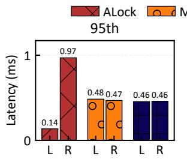

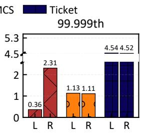  
Figure 2: Tail latencies for local (L) and remote (R) requests for ALock, MCS and ticket locks.

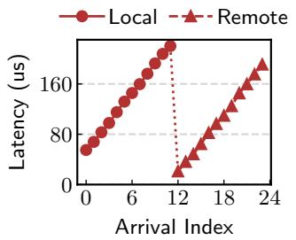  
(a)

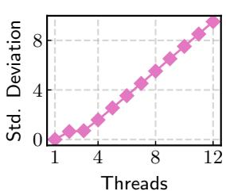  
(b)  
Figure 3: (a) Lock acquisition wait times versus arrival index under controlled arrival order for ALock. (b) Standard deviation of acquisition order relative to arrival order in ALock.

Effectively, with more threads, lock contention increases and more requests remain queued up waiting. This causes more requests to be shuffled which would result in longer delays and higher tail latencies.

Maintaining fairness is important to avoid arbitrary delays that increase tail latencies under high contention. Both the MCS and ticket locks provide fairness, with MCS outperform ing ticket locks as expected (shown in Figure 2) because of its handover mechanism. This raises a crucial question: how to design an RDMA lock that preserves fairness while also eliminating the costly loopback mechanism for local requesters?

## 3 FARLock: Fair Asymmetric RDMA Locks

We present FARLock, an efficient RDMA lock that guarantees fairness and considers asymmetry for high performance. FARLock maintains fair lock acquisition order and does not slow down the local requests for coordination. This not only reduces lock latencies but also eliminates reordering delays that impact tail latencies.

FARLock’s design is inspired from the queue-based handover strategy of the MCS lock [26] and strict lock grant ordering in ticket locks [15]. FARLock combines the benefits of both while also treating the local requests and remote requests differently. To avoid having local requests perform RDMA operations during lock acquisition, we place local and remote requests in separate queues, as shown in Figure 4.

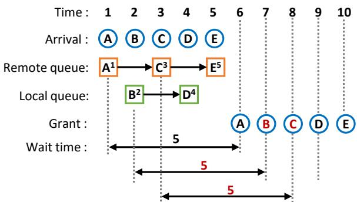  
Figure 4: FARLock employs separate remote and local queues to accommodate asymmetry, and assigns requests a ticket following their arrival order to guarantee fairness.

Local requests can then enqueue using purely local operations without contending with remote requests. As requests arrive, each request obtains a ticket from a global ticket counter, and when the lock is released, the request with the next ticket in sequence acquires it. This ensures all the waiting requests, regardless whether local or remote, are globally ordered based on their arrival time and thus treated fairly. Compared to existing designs in Figure 1(b), in Figure 4, FARLock attaches a ticket to each requester according to arrival order using the global ticket counter. The lock is acquired in order shown by the ticket numbers, giving a fair wait time (5) for all requests in this example.

While the idea is straightforward, achieving it is challenging given the lock needs to maintain several separate structures—two queues and a ticket counter—that cannot be atomically updated. (1) The ordering in each queue needs to be consistent with the ordering of ticket values. (2) Accessing the ticket counter itself must be atomic. Additionally, (3) the ticketing mechanism adds more roundtrips which FARLock should try to reduce. Our solutions as summarized below constitute the major building blocks of FARLock.

Consistent Ordering. Consistency between queue ordering and ticket values entails the following invariant to hold: any two local (remote) requests A and B with ticket of A smaller than ticket of B must be enqueued in the local (remote) queue such that A is enqueued before B. This invariant does not enforce any requirement on requests of different types as they end up in different queues. FARLock maintains this invariant by having the requests enqueued in the queue before acquiring the ticket. By doing so, requests acquire the ticket one after the other based on their order in the queue. This is achieved similarly to the handover mechanism in the MCS lock, except that consecutive requests hand over the chance to acquire the ticket value. This way, global contention on the ticket counter is eliminated as each requester waits for its turn based on its position in the queue.

Atomic Global Ordering. Consistent local ordering orchestrates requests of same type, reducing the atomicity problem down to a single local and global request (i.e., the heads of each queue). We then employ the Peterson’s lock [28] which ensures mutual exclusion between two processes, similar to prior work [4]. The Peterson’s lock uses only local or RDMAbased reads and writes without relying on any atomics. This allows local requesters to safely perform ticket-related lock operations locally on remotely-visible memory, while remote requesters use RDMA reads and writes. Moreover, local requests update the ticket counter directly while remote requesters use RDMA, allowing local requests to complete lock acquisition entirely without accessing RNIC.

Fairness-Preserving Grouping. Each request needs to acquire and release the Peterson’s lock to obtain a ticket, adding additional roundtrips. However, we observe that this is not always necessary, especially under high contention when many concurrent requests arrive at the same time on each queue. Requests always queue up first, allowing later concurrent requests in the queue to piggyback on their predecessors to obtain the ticket (i.e., passing the ticket along the queue). Since the queue already maintains ordering among same-type requests, concurrent requests could then share the same ticket. Subsequently, only the first requester in a group would need to access the Peterson’s lock to allocate a new ticket, greatly reducing the lock and unlock operations on the Peterson’s lock and speeding up the ticket acquisition process. Moreover, a useful side-effect of our grouping strategy is that it reduces the bouncing of lock over the RDMA network. Our grouping strategy preserves the fairness as requests of the same type are still granted the lock in the order of their queue position. We elaborate the detailed design of FARLock next.

## 4 FARLock Design

Now we describe FARLock’s design in detail, including its data structures, lock acquire/release protocols, optimizations and extensions for supporting readers.

## 4.1 FARLock Structures

Similar to prior work [4], FARLock employs two queues— one for local requests and another for remote requests—to optimize for asymmetric accesses. The lock itself, as Figure 5(a) shows, then includes two pointers to respectively the tail of the queues of local (local\_tail) and remote (remote\_tail) requesters. FARLock’s lock structure also carries the necessary fields for ticketing (next\_ticket and ticket\_owner) protected by a Peterson’s lock. As we elaborate later, this allows FARLock to enforce both consistent local ordering and atomic global ordering for fairness among lock requesters based on arrival time.

Each requester is represented by a queue node whose reference is passed in as a parameter of the lock acquire/release protocols (details later). As Figure 5(b) shows, a queue node includes fields that are similar to those typically found in an

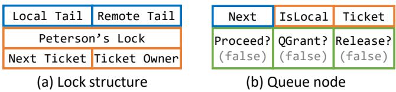  
Figure 5: FARLock structures. (a) The lock uses two queues whose tails are identified by two separate RDMA-aware pointers, a Peterson’s lock and ticket (orange) related fields for ordering guarantees. (b) Each lock requester is represented by a queue node which carries a ticket and boolean fields (green, with default values) for ticket and lock handover.

MCS lock’s queue node such as a next pointer to the immediate successor of the same type (either remote or local) and a qgrant field that indicates whether the requester has been “queue-granted.” That is, whether the requester can be granted the lock if the lock’s ticket\_owner matches the requester’s own ticket. Each queue node also carries additional fields that will be used to support the ticketing mechanism and lock handover between local and remote requesters in the locking protocols, which we describe next.

## 4.2 Basic FARLock

With the data structures described above, now we discuss how FARLock supports lock acquire and release operations. Here we start with the basic protocols for mutual exclusion; we discuss further optimizations including ways to reduce ordering overhead and supporting (optimistic) readers later.

Acquire. The lock acquisition protocol resembles that of the MCS lock [26], but with additional operations to accommodate for asymmetric accesses and ordering across remote and local requests. From a high level, a requester needs to (1) join the local or remote queue, (2) obtain a ticket and (3) wait for its turn to acquire the lock. Algorithm 1 shows the details. To acquire the lock, the requester first initializes its queue node with the next pointer set to null and ticket set to a sentinel Invalid value. Using an RDMA-aware exchange operation (XCHG),<sup>1</sup> the requester first lines up at the corresponding local/remote queue (line 3) identified by the get\_tail\_ptr function which based on the addresses of qnode and lock to return the pointer (address) of the target queue. The RDMAaware XCHG’s API follows its single-node counterpart [16] to return the previous value that was stored on the target memory word. If the return value is not null, i.e., a predecessor of the same type exists, the requester then links itself with the predecessor (lines 6–7) and then needs to ensure that it will not acquire a ticket that is smaller than the predecessor’s. This is done in a two-step, consume-release handshake protocol that is respectively executed by the requesting successor and releasing predecessor. The first step is for the requester to “consume” the ticket at line 8. Note that it is important to ensure that the successor (current requester) reads a stable copy of the predecessor’s ticket value (i.e., the queue node memory should not be recycled until the current requester has finished using it). We therefore introduce a release boolean to facilitate this: the predecessor can only finish its release protocol (line 14 of Algorithm 2, more details later) after its release is set to true. After consuming the predecessor’s ticket t, if t turns out to be invalid, the requester spin-waits for the predecessor to obtain a valid ticket (lines 10–11) before proceeding to obtain its own ticket.

Algorithm 1 FARLock’s lock acquire protocol.   
1 def acquire(lock, qnode):   
2 # Install queue node to the target queue   
3 pred = XCHG(get\_tail\_ptr(lock, qnode), qnode)   
4   
5 # Ensure predecessor has acquired a ticket   
6 if pred != null:   
7 pred.next = qnode   
8 t = pred.ticket   
9 pred.release = true   
10 if t == INVALID:   
11 spin\_until qnode.proceed == true   
12   
13 ... acquire Peterson’s lock ...   
14 my\_ticket = lock.ticket++ # Obtain ticket   
15 ... release Peterson’s lock ...   
16   
17 qnode.ticket = my\_ticket   
18   
19 # Unblock my potential successor   
20 if qnode.next != null:   
21 qnode.next.proceed = true   
22   
23 if pred != null:   
24 spin\_until qnode.qgrant == true   
25   
26 # Wait for my turn   
27 spin\_until my\_ticket == lock.ticket\_owner

After ensuring the predecessor-successor ticket ordering, now the requester moves on to acquire its own ticket at lines 13–15 which is protected by the Peterson’s lock. Note that it is important for the requester to avoid assigning the ticket to its ticket field until the Peterson’s lock is released at line 17: assigning it earlier (e.g., at line 14), however, would make it possible for a third requester to start competing for the Peterson’s lock which only supports two requesters (as a result of executing lines 8–10), leading to undefined behavior. The requester then waits for the predecessor (if any) to finish its release handshake protocol by toggling the qgrant field (lines 23–24) and waits for its turn (line 27) to eventually be granted the lock.

Release. The release protocol starts by atomically incrementing the lock’s ticket owner (line 3 of Algorithm 2) which would unblock the requester spinning on line 27 of Algorithm 1, passing the lock to the next requester (if any). Algorithm 2 then follows the same approach as MCS lock’s to make sure whether there is a successor using an RDMAaware CAS and return if the CAS succeeded (i.e., there is indeed no successor, lines 6–8). The remaining steps facilitate the aforementioned consume-release handshake by (1) waiting for the release field to be toggled to true (by another requester at line 9 of Algorithm 1), and (2) setting the successor’s qgrant field to true. The first step in essence waits for the acknowledgment of a successor’s consumption of the releasing requester’s ticket, while the second step allows the lock to be passed along the queue of the same type.

```python
Algorithm 2 FARLock’s lock release protocol.
1 def release(lock, qnode):
2 # Announce the next ticket (lock) owner
3 lock.ticket_owner = qnode.ticket + 1
4
5 # Make sure there is no successor
6 if qnode.next == null:
7 if CAS(get_tail_ptr(lock, qnode), qnode, null):
8 return
9
10 # Wait for the successor to gather my ticket
11 spin_until qnode.release == true
12
13 # Grant successor (pending ticket ordering)
14 qnode.next.qgrant = true
```

## 4.3 Fairness-Preserving Grouping

The use of tickets allowed the basic FARLock protocols to provide fairness, enabling requesters be granted the lock at arrival order. But this at the cost of additional roundtrips. We observe that FARLock’s queue-based design can help remove most of such additional roundtrips. (1) Concurrently arriving requests could be combined to share a single ticket. (2) The queue nodes provide additional storage space for passing along information on ordering. Importantly, as we will elaborate soon, neither breaks fairness guarantees.

Based on these observations, we introduce fairnesspreserving grouping to solve this problem. Akin to the classic lock cohorting idea [10], fairness-preserving grouping allows concurrently arriving requests to form a group (of a predefined maximum size) which will share the same ticket. Instead of for each requester to obtain a different ticket (hence contending on the ticket and subsequently spinning on it), only the head of a group will contend for the Peterson’s lock to obtain a ticket, which is then passed along the queue. Requesters that inherited a ticket from a predecessor will then only need to rely on the queue-local grant, without spinning on the central ticket\_owner field of the lock, effectively mitigating contention. Fairness is also preserved because grouping only reorders the concurrently-arriving requesters on the same queue. In other words, these requesters would have received consecutively increasing tickets without grouping anyway.

```prolog
Algorithm 3 Fairness-preserving grouping. Starting line num
ber aligned with Algorithm 1, with overlapping code shaded.
-1 def acquire_fpg(lock, qnode):
0 joined_group = false
1
2 # Install queue node to the target queue
3 pred = XCHG(get_tail_ptr(lock, qnode), qnode)
4
5 # Ensure predecessor has acquired a ticket
6 if pred != null:
7 pred.next = qnode
8 t = pred.ticket
9 pred.release = true
10 if t == INVALID:
11 spin_until qnode.budget != 0
12 if qnode.budget != get_group_size():
13 my_ticket = qnode.group_ticket
14 joined_group = true
15 goto skip
16
17 ... acquire Peterson’s lock ...
18 my_ticket = lock.ticket++ # Obtain ticket
19 qnode.budget = get_group_size()
20
21 skip:
22 succ = qnode.next
23 # Pass ticket to successor if budget allows
24 if succ && qnode.budget != 1:
25 succ.group_ticket = my_ticket
26 succ.budget = qnode.budget - 1
27 else: # End of this batch
28 ... release Peterson’s lock ...
29 qnode.ticket = my_ticket
30 succ = qnode.next # Refresh the successor
31 if succ: # Tell successor it is in a new batch
32 succ.budget = get_group_size()
33
34 if pred != null:
35 spin_until qnode.qgrant == true
36
37 if joined_group:
38 return # Joined group, rely on qgrant only
39 spin_until my_ticket == lock.ticket_owner
40
41 def release_fpg(lock, qnode):
42 if qnode.ticket != INVALID:
43 lock.ticket_owner = qnode.ticket + 1
44 . Same as lines 6–14 of Algorithm 2 ...
```

Realizing this idea requires slight changes to the queue node design shown in Figure 5(b) to include in each queue node two additional fields (batch\_ticket and budget) to allow passing along necessary ticket information on the queue. The lock is also augmented with two more parameters to respectively indicate the maximum group size of the remote and local queues; we experimentally evaluate their effect later in Section 5. With these changes on lock structure, Algorithm 3 describes the idea in detail.

Acquire. Compared to Algorithm 1, the requester attempts to join an existing group after lining up after a predecessor (lines 11–15 of Algorithm 3). The requester starts this process by waiting for its budget field to be filled out by its predecessor (more later). The get\_group\_size() function returns the predefined maximum group size, which is then stored in the queue node’s budget field. As more requesters join the group, the budget field of each requester tracks the remaining number of allowed members in the group. The group\_ticket field in each queue node then denotes the ticket of the current group, which will be passed along the queue until the running budget is depleted. Here, at line 12, if the requester’s budget is not the initial maximum (i.e., a predecessor has started a group), it will inherit the ticket from its predecessor and skip the process of acquiring the Peterson’s lock (lines 17–19). Otherwise, it proceeds to acquire the Peterson’s lock to obtain a ticket as the head of the group. The algorithm then contin ues to inspect its successor state to pass on the ticket (lines 21–32). Note that at line 21, the group head is still holding the Peterson’s lock, which will only be released by the last member of the group.

Figure 6 shows an example where a group is formed at the remote and local queue, respectively. On either side, the group head acquires the Peterson’s lock and the last member in the group releases it. The “last member” can be a successor (or the head itself if group size is one) when budget is depleted or when there is no successor (lines 28–29). In the latter case, it is necessary to re-read the next field of the queue node to ensure the (non)existence of a successor, in case a successor has finished executing line 10 before the predecessor finishes line 29. Finally, if a requester inherited a ticket as a group member (non-head), it only needs to rely on its queue-local grant signal at lines 34–35 and directly return at line 38 to finish acquiring the lock. Otherwise, the group head will still need to wait for its turn (line 39), same as in the basic protocol. Release. In the above lock acquire protocol, the inherited ticket is stored in group\_ticket and the ticket field in each queue node is only filled when the requester is the last to acquire the lock (i.e., it is the last member) at line 29 after releasing the Peterson’s lock. Therefore, the field will remain INVALID for all but the last member, which should increment ticket\_owner of the lock upon release (lines 42–43). Subsequent logic for the release protocol remains the same as the basic protocol’s.

## 4.4 Supporting (Optimistic) Readers

Beyond mutual exclusion which we have focused on so far, modern distributed applications (e.g., data analytics) also desire shared reader support to enable more concurrency by allowing multiple read-only requests to enter the critical section when no writer is present. This is often done in pessimistic approaches that explicitly enforce (shared) reader or (exclusive) writer accesses using additional fields in the lock word and/or queue nodes to track the active reader count to support this coordination [13, 37]. Such designs are generally more challenging to implement and introduce additional roundtrips through the RDMA NIC, ultimately increasing latency, especially for local requests.

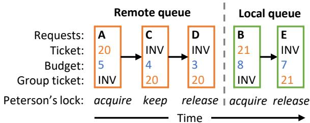  
Figure 6: Fairness-preserving grouping example with five requests forming two groups on the remote (A → C → D) and local (B → E) queues. The group heads (A and B) acquire the Peterson’s lock, which is kept by intermediate members (e.g., C) and released by the last members (D and E). Upon releasing the FARLock, the remote group’s last member D increments the ticket number from 20 to 21, which is picked up by the subsequent head request B and passed along to E.

FARLock instead advocates a simpler, optimistic approach that can be easily added on top of the protocol described in earlier sections. Classic optimistic locks [7, 14, 18] where (1) the lock carries a version number that records the number of times a writer has executed the critical section and (2) readers proceed to read without taking the lock but only need to verify that the lock is free and the version number remained the same before and after their accesses. FARLock’s optimistic readers follow similar ideas, but offloads all the conflict checking that was done jointly by checking the lock state and version number (step 2) to a dedicated 0-initialized version field in the lock. With the dedicated version field, writers proceed by incrementing it both upon acquiring the lock (i.e., immediately after line 27 of Algorithm 1 or line 37/39 of Algorithm 3), and releasing the lock (e.g., at line 2 of Algorithm 2). Correspondingly, readers start by taking a snapshot of the version number. It then checks whether version is odd, and if so, that means a writer is in progress and retries until version is even. The reader then can start its work and will verify upon release that the version number did not change.

Such optimistic designs are inherently unfair between readers and writers, by favoring writers. However, we believe this is a reasonable tradeoff given the benefits: throughout the entire read process, optimistic readers perform no (RDMA or local) writes. Using a dedicated version field (instead of co-locating it with the lock word itself as in prior work) also frees us from handling complex interactions between readers and writers, and leads to a composable design; if optimistic readers are not needed, their support can be easily turned off.

Table 1: Locks under comparison.  
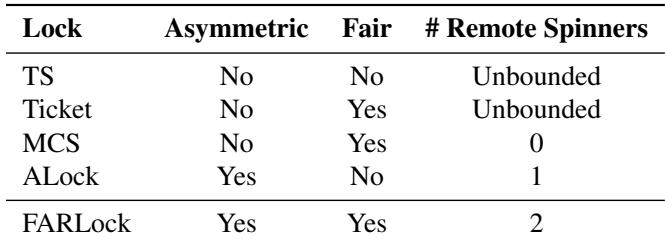

The write path incurs additional roundtrips, but can be merged with other steps (e.g., spinning or incrementing the ticket) to effectively hide the overhead, which we leave as future work.

## 5 Evaluation

We empirically evaluate FARLock through microbenchmarks to show the following:

• How much does tail latency improve with FARLock? (Section 5.2)

• Does FARLock deliver high throughput? (Section 5.3)

• How much does FARLock’s fairness-preserving grouping strategy benefit performance? (Section 5.4)

## 5.1 Experiment Setup

Testbed. We perform experiments on a 10-node cluster from CloudLab’s Apt Cluster.<sup>2</sup> Each node is equipped with two 2.6Ghz Xeon E5-2650v2 CPUs (16 cores in total), 64GB DRAM and a Mellanox FDR CX3 RNIC (similar as ALock [4]). The nodes are interconnected via a InfiniBand FDR switch, giving 56Gbps of bandwidth between nodes.

Compared Locks. Since FARLock mainly targets mutual exclusion, for fair comparuison we limit our comparison to classic and recent mutual exclusion locks. We evaluate FAR-Lock against baselines shown in Table 1. Among them, TS, MCS and Ticket are the corresponding shared-memory locks but adapted to use RDMA atomics to work in distributed scenarios. ALock [4] is the asymmetric lock that misses fairness, maintaining two queues to serve local and remote requests separately. ALock also supports batching to reduce frequently bouncing over the network. We evaluate against the default ALock and its batched version; for this, we tested various batching parameters and found that ALock performs best when using batch sizes 20 and 5 for its local and remote queues. We use ALock (20, 5) to indicate this configuration of ALock with batching. Finally, FARLock denotes FARLock without grouping, and FARLock-G represents FARLock with grouping. Unless otherwise noted, we set group size to 5 and explore the impact of different group sizes later.

Benchmark Settings. All locks are hosted on a single node, and the rest of the nodes act as remote requesters. Each node runs 12 threads to issue lock requests concurrently. This defines the 12 threads from the hosting node as local requesters, and the 12 threads from each remaining node as remote requesters. We vary the number of locks on the hosting node between 1 (high lock contention) and 240 (low lock contention) to test different contention levels. Inside the critical section, each thread performs a busy-wait loop for a specified number of cycles to simulate work. Accesses to the CPU’s last-level cache (LLC) typically complete within a few tens of nanoseconds [9], and RDMA routinely exhibits µs-level latency [11,17]. This presents a speed gap of 10–100× between CPU cache and RDMA accesses. We account for this gap by assigning different critical section sizes for local and remote requests to model realistic workloads where local operations are typically faster than remote operations. We set the remote critical section size to 15,000 cycles (∼5µs) and the local critical section size to 300 cycles (∼100ns).

Metrics. Each experiment runs for 20 seconds, and use the middle 10 seconds to collect results to rule out impacts of different thread progresses and stragglers. We measure the throughput and latency of jobs where each job includes a lock acquire operation, its critical section and the unlock operation. We present tail latencies to showcase delays experienced from (un)fairness by the slowest requests, measured as the 95th, 99th, 99.9th, and 99.999th percentile of a latency distribution. Each experiment is repeated for three times, and standard deviations across multiple experiments were 0.97-14.88% on average, with highest being 14.88% for 99.999th percentile latency measurements. We therefore report the averages of three runs for each experiment.

## 5.2 Latency

Figure 7 shows tail latencies when using 1 and 10 locks (representing high contention scenario) and Figure 8 shows tail latencies when using more than 10 locks. Across different percentiles, as we include more locks, contention becomes lower, leading to better performanc (lower latency) for all locks. FARLock exhibits the lowest local tail latencies compared to all other locks, and competitive remote latencies across all scenarios. By grouping (five) requests, FARLock-G gives very similar tail latencies as FARLock.

High Contention (1 – 10 locks / Figure 7). We observe up to 62× lower local tail latencies compared to other fair locks (MCS and Ticket), while 8× lower than ALock and 55-5898× lower than TS. In these scenarios, no delays are introduced for FARLock (benefit of fairness) and requests are processed in their arrival order. The other two fair locks, Ticket and MCS, exhibit much higher local tail latencies as their local requests are routed through RNIC (loopback) which is expensive. FARLock’s latencies are lower than those of ALock because ALock ends up reordering requests, resulting in more delays and network bounces as locks get handed over between different requests. ALock(20, 5) reduces the effect of such bouncing via batching (similar observation as the original paper [4]), but still suffers from reordering of requests which causes arbitrary delays and results in higher tail latencies com pared to FARLock. MCS consistently provides competitive remote latencies with under high contention (i.e., low number of locks). This is because the MCS lock requires fewer instructions than FARLock to process a lock request. FARLock provides competitive remote latencies, often lower than the unfair ALock. Finally, TS shows the highest tail latencies due to its well-known starvation issue (resulting from unfairness).

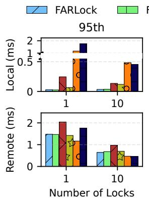

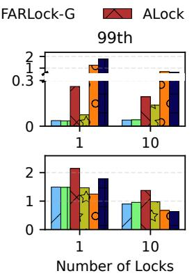

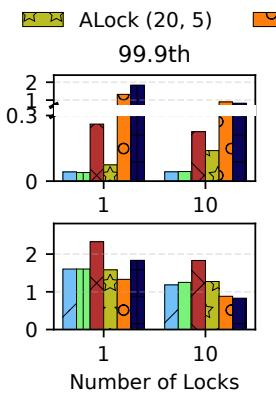

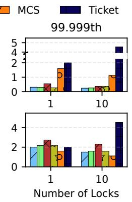  
Figure 7: Tail latency for local (top) and remote (bottom) requests under high contention with 1 and 10 locks. Latencies for TS are not shown here since they are very high (2-171× higher than the next highest data point).

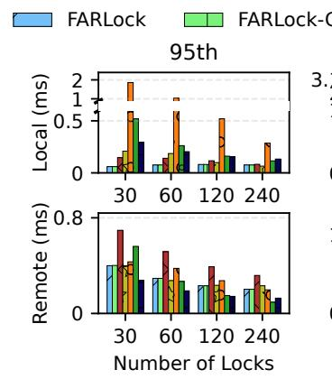

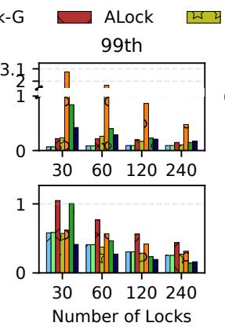

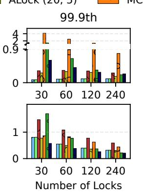

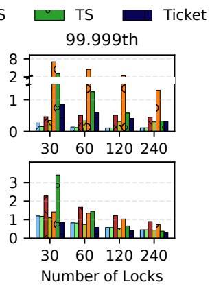  
Figure 8: Tail latency for local (top) and remote (bottom) requests under decreasing contention.

Decreasing Contention (beyond 10 locks / Figure 8). FARLock still has lower tail latencies because of its advan tages over MCS and Ticket (no loopback for local requests), and over TS and ALock (no reordering due to fairness). The impact of using more RDMA oprations in FARLock compared to Ticket is observed in their tail latencies as the number of locks increase beyond 30.

Comparing ALock with and without batching shows that its batching is effective in reducing remote tail latencies as batch ing processes more remote requests before bouncing over the network for handover. However, this benefit is marginal when compared to FARLock.

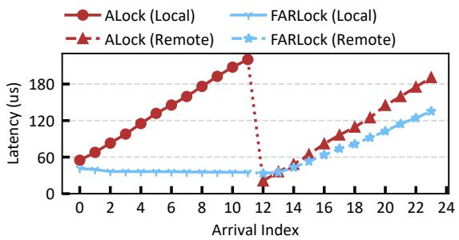  
Figure 9: Latency for controlled arrival order.

Fairness Study. We perform the same experiment from Figure 3(a) where we controlled request arrival order. Along with measuring the acquisition latencies for ALock, this time we also measure for FARLock. We use two machines, and 12 local requests are submitted followed by 12 remote requests. As shown in Figure 9, latencies for FARLock are lower than that for ALock because FARLock processes requests in order, and hence, all local requests get processed followed by all remote requests. This eliminates the continuous bouncing delays that ALock’s ordering introduces, and results in lower latencies overall; the highest latency for the last remote request is 135.30µs which is much lower than highest latency with ALock (incurred by the last local request).

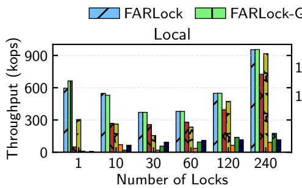

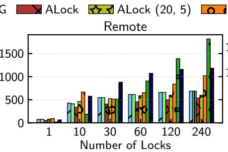

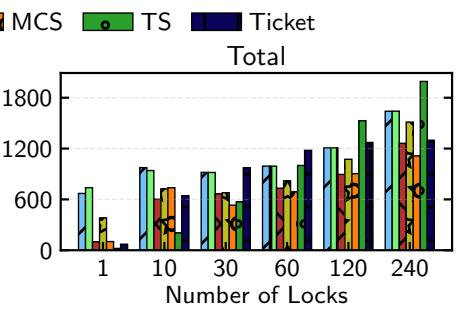  
Figure 10: Throughput under different contention.

## 5.3 Throughput

While fairness benefits tail latency, we also assess FARLock’s ability to deliver high throughput. Figure 10 compares the local, remote and total throughput of FARLock and other locks. FARLock’s benefits for local requests are visible as it delivers the highest local throughput across the board with up to 891× higher than MCS, TS, and Ticket. MCS and Ticket show similar remote throughputs as FARLock under 1 lock, with both providing higher remote throughput as the number of locks increases; this is due to fewer instructions involved in remote paths of those two locks. While TS also enjoys high remote throughput under low contention for similar reasons, the expensive remote retries during high contention (with 1 and 10 locks) significantly limit its throughput compared to FARLock.

Compared to ALock, FARLock achieves 11.9× and 2× higher local throughput with 1 and 10 locks respectively, and this gap closes gradually with more locks. This is because ALock’s reordering mechanism forces the lock to be handed over across nodes more often, which is less favorable when more requests line up on fewer locks. FARLock, on the other hand, is able to handle more lock requests on the same node depending on the arrival order which results in less bouncing. For instance, in the highest contention scenario (1 lock), we observed that FARLock frequently performs up to 12 consecutive local lock handovers before serving a remote request. In contrast, remote requests tend to hand over the lock on the same node far less often. Batching in ALock(20, 5) reduces its bouncing issue, with ALock(20, 5) providing much higher local throughput. However, it still consistently forces handover across nodes, albeit less often, which limits its throughput.

Finally, we observe a dip in FARLock’s local throughput going from 1 lock to 30 locks which gets balanced by a sharp increase in remote throughputs. This is likely due to a side effect of fairness combined with efficiency in local requests. For the single lock scenario, local requests queue up faster than remote requests as the latter must go through RDMA with higher latency. As the number of locks increase, remote requests have more chance to queue up across different locks since local requests get spread out, resulting in remote requests being served more often (fair ordering in FARLock) compared with just a single lock.

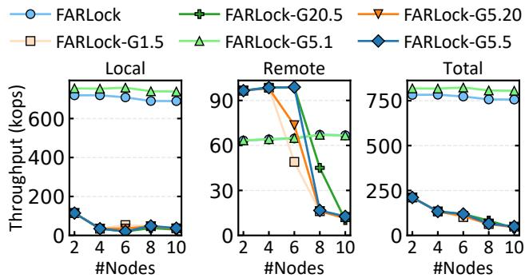  
Figure 11: Throughput for FARLock with grouping. FARLock-GX.Y means at most X local and Y remote consecutive requests are grouped together while preserving fairness.

## 5.4 Fairness-Preserving Grouping

Grouping in FARLock is achieved by sharing the Peterson’s lock across consecutive waiting requests. We evaluate its by measuring improvements in throughput. Since each group would contain requests of the same type, grouping in FAR-Lock can be configured differently for local and remote requests. Figure 11 compares the throughput achieved by grouping 5 and 20 requests of each type, with a single lock and vary ing number of nodes to capture increasing remote requests.

Since FARLock optimizes local requests, grouping them improves local throughput. However, we observe that grouping remote requests leads to decreasing throughput as contention increases with more nodes. We hypothesize this is due to the remote queue getting emptied more quickly, causing more frequent bounces, which additionally cancels out the benefits brought by local grouping. The total throughput without remote grouping remains high, and we observe grouping 5 local requests gives higher total throughput. As observed in previous experiments, this grouping gives very similar tail latencies to when grouping is disabled, while there is a visible increase in throughput for high contention single lock scenarios (Figure 10).

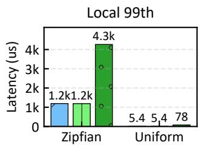

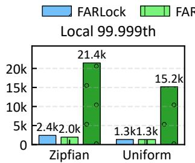

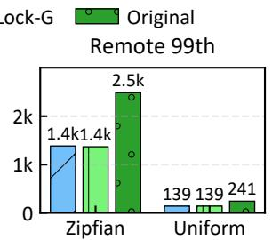

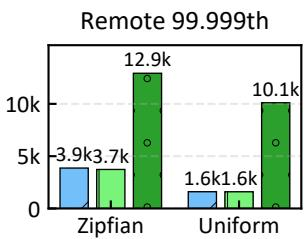  
Figure 12: Tail latency of Sherman queries when using FARLock instead of its original lock.

## 6 FARLock in Practice

We demonstrate how FARLock can improve practical systems using a database indexing scenario. Sherman [32] is a recent RDMA-based distributed B+-tree that uses locks to coordinate access to leaf nodes. Its original lock implementa tion is a local ticket lock with a global spin lock for hashed memory locations. Sherman uses RDMA atomic operations to acquire locks on remote memory locations (i.e., it does not use asymmetric RDMA locking), and passes the lock ownership locally with the local ticket lock in each node until a predetermined local budget. This is an unfair RDMA locking strategy as it reshuffles requests. We replaced this lock with FARLock while keeping Sherman’s use of RDMA operation combination to hide remote access latencies.

We deployed Sherman on the same 10-node cluster used in Section 5. One of the nodes emulates as a memory server (MS) as well as compute server (CS), while the remaining 9 nodes act as compute servers. The MS hosts 40GB shared memory, and each CS maintains 500MB cache. The system is warmed up with 800 million key-value pairs (8-byte keys and 8-byte values). To stress test locks, we focus on update operations over random keys, emphasizing tail latencies that can impact service-level objectives under high contention. We vary the key distribution between uniform and Zipfian (θ = 0.99, skewed) to test different contention levels. Figure 12 shows improvements in tail latency when using FARLock. We observe 11-14× and 3.6-11× lower local tail latencies with uniform and Zipfian distributions respectively, and 1.7-6× and 1.8-3.5× lower remote tail latencies respectively. This is due to FARLock’s efficient local request handling combined with its fair ordered processing which eliminates delays caused by reshuffling. We also observed similar throughput with and without FARLock, indicating that Sherman’s high throughput is retained.

## 7 Related Work

Our work is most related to recent work on RDMA based locks and lock managers. Ziegler et al. [41] gives guidelines for correct and scalable synchronization using one-side RDMA which we also follow in this work. ShiftLock [13] is a reader-writer lock that also adopts the MCS-style handover mechanism, where the lock holder explicitly transfers ownership to the next requester before exiting the critical section. Similar to MCS and FARLock, ShiftLock strictly enforces FIFO ordering for writes, ensuring fair serialization among exclusive lockers. However, ShiftLock does not leverage asymmetry, so both local and remote requesters must use RDMA operations. ShiftLock further implements mechanisms to handle node failures; considering node failures is interesting future work for FARLock.

DSLR [37] is a decentralized distributed lock manager for reader-writer locks using one-sided RDMA. It adapts the principles of ticket locks and assigns monotonically increasing tickets to requesters. Although DSLR has a short lock acquire path and ensures fairness, DSLR also does not distinguish between local requester and remote requester. Local requesters still need to use RDMA to acquire locks. Citron [12] proposes a distributed range lock manager with one-sided RDMA. It leverages a segment tree to map dynamic range requests to tree nodes, allowing clients to secure specific data ranges without global serialization. However, their underlying locking mechanism is orthogonal to Citron’s architecture. Beyond RDMA, FISSLOCK [40] reduces CPU overhead using programmable switches by implementing a high-performance, centralized in-network lock manager. By mediating all acquisition and release traffic, the switch maintains global visibility over the system’s lock states. Programmable switches have limited memory and compute power and it remains to be seen how this approach can be combined with RDMA-based locks such as FARLock to overcome these limitations.

## 8 Conclusion

We presented FARLock, an efficient and fair RDMA lock. FARLock ensures lock requests are granted in the expected first-come first-served order while eliminating expensive loopback for local requests. FARLock enables efficient lock handover across different queues while adhering to a global ticket ordering. We developed a fairness-preserving grouping mechanism in FARLock to reduce operation overheads, and proposed optimistic reader lock extensions. Our evaluation shows that FARLock achieves lower tail latencies than other RDMA locks as it enables efficient local requests while avoiding reordering delays (effect of fairness). We also evaluated FARLock’s practical effectiveness and observed that it significantly boosts query latencies in a state-of-the-art RDMA-based database indexing strategy.

## References

[1] Infiniband architecture specification, 2025.

[2] Infiniband roadmap, 2025.

[3] Ahmed Alquraan, Sreeharsha Udayashankar, Virendra Marathe, Bernard Wong, and Samer Al-Kiswany. LoLKV: The logless, linearizable, RDMA-based Key-Value storage system. In 21st USENIX Symposium on Networked Systems Design and Implementation (NSDI 24), pages 41–54, Santa Clara, CA, April 2024. USENIX Association.

[4] Amanda Baran, Jacob Nelson-Slivon, Lewis Tseng, and Roberto Palmieri. ALock: Asymmetric Lock Primitive for RDMA Systems. In Proceedings of the 36th ACM Symposium on Parallelism in Algorithms and Architectures, SPAA ’24, page 15–26. ACM, June 2024.

[5] Soroush Bateni and Cong Liu. NeuOS: A Latency-Predictable Multi-Dimensional Optimization Framework for DNN-driven Autonomous Systems. In 2020 USENIX Annual Technical Conference (USENIX ATC 20), pages 371–385, 2020.

[6] Wei Cao, Zhenjun Liu, Peng Wang, Sen Chen, Caifeng Zhu, Song Zheng, Yuhui Wang, and Guoqing Ma. PolarFS: an ultra-low latency and failure resilient distributed file system for shared storage cloud database. Proc. VLDB Endow., 11(12):1849–1862, August 2018.

[7] Sang K. Cha, Sangyong Hwang, Kihong Kim, and Ke unjoo Kwon. Cache-conscious concurrency control of main-memory indexes on shared-memory multiprocessor systems. In Proceedings of the 27th International Conference on Very Large Data Bases, VLDB ’01, page 181–190, 2001.

[8] Yanzhe Chen, Xingda Wei, Jiaxin Shi, Rong Chen, and Haibo Chen. Fast and general distributed transactions using RDMA and HTM. In Proceedings of the Eleventh European Conference on Computer Systems, EuroSys ’16, New York, NY, USA, 2016. Association for Computing Machinery.

[9] Intel Corporation. Memory performance in a nutshell. Technical Article, 2023. Available online.

[10] David Dice, Virendra J. Marathe, and Nir Shavit. Lock cohorting: a general technique for designing NUMA locks. In Proceedings of the 17th ACM SIGPLAN Symposium on Principles and Practice of Parallel Programming, PPoPP ’12, page 247–256, 2012.

[11] Aleksandar Dragojevic, Dushyanth Narayanan, Miguel´ Castro, and Orion Hodson. FaRM: Fast remote memory. In 11th USENIX Symposium on Networked Systems Design and Implementation (NSDI 14), pages 401–414, Seattle, WA, April 2014. USENIX Association.

[12] Jian Gao, Youyou Lu, Minhui Xie, Qing Wang, and Jiwu Shu. Citron: Distributed range lock management with one-sided RDMA. In 21st USENIX Conference on File and Storage Technologies (FAST 23), pages 297–314, Santa Clara, CA, February 2023. USENIX Association.

[13] Jian Gao, Qing Wang, and Jiwu Shu. ShiftLock: mitigate one-sided RDMA lock contention via handover. In Proceedings of the 23rd USENIX Conference on File and Storage Technologies, FAST ’25, USA, 2025. USENIX Association.

[14] Rachid Guerraoui and Vasileios Trigonakis. Optimistic Concurrency with OPTIK. In Proceedings of the 21st ACM SIGPLAN Symposium on Principles and Practice of Parallel Programming, PPoPP ’16, 2016.

[15] Maurice Herlihy and Nir Shavit. The Art of Multiprocessor Programming, Revised Reprint. Morgan Kaufmann Publishers Inc., San Francisco, CA, USA, 1st edition, 2012.

[16] Intel Corporation. Intel 64 and IA-32 architectures software developer manuals. October 2016.

[17] Anuj Kalia, Michael Kaminsky, and David G. Andersen. Using RDMA efficiently for key-value services. In Proc. ACM SIGCOMM, Chicago, IL, August 2014.

[18] Viktor Leis, Michael Haubenschild, and Thomas Neumann. Optimistic lock coupling: A scalable and efficient general-purpose synchronization method. IEEE Data Eng. Bull., 42:73–84, 2019.

[19] Peiliang Li, Xiaozhi Chen, and Shaojie Shen. Stereo R-CNN based 3D object detection for autonomous driving. In Proceedings of the IEEE/CVF conference on computer vision and pattern recognition, pages 7644–7652, 2019.

[20] Pengfei Li, Yu Hua, Pengfei Zuo, Zhangyu Chen, and Jiajie Sheng. ROLEX: A scalable RDMA-oriented learned Key-Value store for disaggregated memory systems. In 21st USENIX Conference on File and Storage Technologies (FAST 23), pages 99–114, Santa Clara, CA, February 2023. USENIX Association.

[21] Neiwen Ling. Time-sensitive AI System for Physical Agents. In Proceedings of the 23rd Annual International Conference on Mobile Systems, Applications and Services, pages 671–672, 2025.

[22] Yi Liu, Minghao Xie, Shouqian Shi, Yuanchao Xu, Heiner Litz, and Chen Qian. Outback: Fast and communication-efficient index for key-value store on disaggregated memory. Proc. VLDB Endow., 18(2):335–348, October 2024.

[23] Baotong Lu, Kaisong Huang, Chieh-Jan Mike Liang, Tianzheng Wang, and Eric Lo. DEX: Scalable Range In dexing on Disaggregated Memory. Proc. VLDB Endow., 17(10):2603–2616, June 2024.

[24] Haodi Lu, Haikun Liu, Yujian Zhang, Zhuohui Duan, Xiaofei Liao, Hai Jin, and Yu Zhang. Fast distributed transactions for RDMA-based disaggregated memory. In Proceedings of the 2025 USENIX Conference on Usenix Annual Technical Conference, USENIX ATC ’25, USA, 2025. USENIX Association.

[25] Youyou Lu, Jiwu Shu, Youmin Chen, and Tao Li. Octopus: an RDMA-enabled distributed persistent memory file system. In 2017 USENIX Annual Technical Conference (USENIX ATC 17), pages 773–785, Santa Clara, CA, July 2017. USENIX Association.

[26] John M. Mellor-Crummey and Michael L. Scott. Algorithms for scalable synchronization on shared-memory multiprocessors. ACM Trans. Comput. Syst., 9(1):21–65, feb 1991.

[27] Vivek Narasayya, Ishai Menache, Mohit Singh, Feng Li, Manoj Syamala, and Surajit Chaudhuri. Sharing buffer pool memory in multi-tenant relational database-as-aservice. Proc. VLDB Endow., 8(7):726–737, February 2015.

[28] Gary L. Peterson. Myths about the mutual exclusion problem. Inf. Process. Lett., 12:115–116, 1981.

[29] Harry A Pierson and Michael S Gashler. Deep learning in robotics: a review of recent research. Advanced Robotics, 31(16):821–835, 2017.

[30] Hemal Shah, Felix Marti, Wael Noureddine, Asgeir Eiriksson, and Robert Sharp. Remote Direct Memory Access (RDMA) Protocol Extensions. RFC 7306, June 2014.

[31] Chunlin Tian, Xinpeng Qin, Kahou Tam, Li Li, Zijian Wang, Yuanzhe Zhao, Minglei Zhang, and Chengzhong Xu. CLONE: Customizing LLMs for Efficient Latency-Aware Inference at the Edge. arXiv preprint arXiv:2506.02847, 2025.

[32] Qing Wang, Youyou Lu, and Jiwu Shu. Sherman: A Write-Optimized Distributed B+Tree Index on Disag gregated Memory. In Proceedings of the 2022 International Conference on Management of Data, SIGMOD

’22, page 1033–1048, New York, NY, USA, 2022. Association for Computing Machinery.

[33] Ruihong Wang, Jianguo Wang, Stratos Idreos, M. Tamer Özsu, and Walid G. Aref. The case for distributed sharedmemory databases with rdma-enabled memory disaggregation. Proc. VLDB Endow., 16(1):15–22, September 2022.

[34] Xingda Wei, Rong Chen, and Haibo Chen. Fast RDMAbased ordered Key-Value store using remote learned cache. In 14th USENIX Symposium on Operating Systems Design and Implementation (OSDI 20), pages 117– 135. USENIX Association, November 2020.

[35] Xingda Wei, Jiaxin Shi, Yanzhe Chen, Rong Chen, and Haibo Chen. Fast in-memory transaction processing using RDMA and HTM. In Proceedings of the 25th Symposium on Operating Systems Principles, SOSP ’15, page 87–104, New York, NY, USA, 2015. Association for Computing Machinery.

[36] Jian Yang, Joseph Izraelevitz, and Steven Swanson. Orion: A Distributed File System for Non-Volatile Main Memory and RDMA-Capable Networks. In 17th USENIX Conference on File and Storage Technologies (FAST 19), pages 221–234, Boston, MA, February 2019. USENIX Association.

[37] Dong Young Yoon, Mosharaf Chowdhury, and Barzan Mozafari. Distributed Lock Management with RDMA: Decentralization without Starvation. In Proceedings of the 2018 International Conference on Management of Data, SIGMOD ’18, page 1571–1586, New York, NY, USA, 2018. Association for Computing Machinery.

[38] Erfan Zamanian, Carsten Binnig, Tim Harris, and Tim Kraska. The end of a myth: distributed transactions can scale. Proc. VLDB Endow., 10(6):685–696, February 2017.

[39] Fotios Zantalis, Grigorios Koulouras, Sotiris Karabetsos, and Dionisis Kandris. A review of machine learning and IoT in smart transportation. Future Internet, 11(4):94, 2019.

[40] Hanze Zhang, Ke Cheng, Rong Chen, and Haibo Chen. Fast and scalable in-network lock management using lock fission. In 18th USENIX Symposium on Operating Systems Design and Implementation (OSDI 24), pages 251–268, Santa Clara, CA, July 2024. USENIX Association.

[41] Tobias Ziegler, Jacob Nelson-Slivon, Viktor Leis, and Carsten Binnig. Design guidelines for correct, efficient, and scalable synchronization using one-sided rdma. Proc. ACM Manag. Data, 1(2), June 2023.

[42] Pengfei Zuo, Jiazhao Sun, Liu Yang, Shuangwu Zhang, and Yu Hua. One-sided RDMA-Conscious Extendible Hashing for Disaggregated Memory. In 2021 USENIX

Annual Technical Conference (USENIX ATC 21), pages 15–29. USENIX Association, July 2021.