USENIX

THE ADVANCED COMPUTING SYSTEMS ASSOCIATION

# LifeLine: An Object-Page Lifetime Alignment GC Enabling Minimal Memory Copying for Mobile Devices

Jiacheng Huang and Yunmo Zhang, City University of Hong Kong; Qingan Li, Wuhan University; Junqiao Qiu, City University of Hong Kong; Chun Jason Xue, Mohamed bin Zayed University of Artificial Intelligence

https://www.usenix.org/conference/osdi26/presentation/huang-jiacheng

# This paper is included in the Proceedings of the 20th USENIX Symposium on Operating Systems Design and Implementation.

July 13–15, 2026 • Seattle, WA, USA

ISBN 978-1-939133-55-7

Open access to the Proceedings of the 20th USENIX Symposium on Operating Systems Design and Implementation is sponsored by

# LifeLine: An Object-Page Lifetime Alignment GC Enabling Minimal Memory Copying for Mobile Devices

Jiacheng Huang1, Yunmo Zhang1, Qingan Li2, Junqiao Qiu1, Chun Jason Xue3

1City University of Hong Kong

2Wuhan University

3Mohamed bin Zayed University of Artificial Intelligence

## Abstract

LifeLine is a garbage collection (GC) framework for Android that tackles the fundamental object–page lifetime mismatch. Existing copying collectors move objects, while the OS manages pages; mixed lifetimes within a page force excessive object copying instead of efficient page remapping. LifeLine explicitly aligns object lifetimes with physical pages via three components. First, lifetime-based graph partitioning monitors reference updates and partitions the object graph into subgraphs with strong lifetime affinity. Second, lifetime aligned GC packs these subgraphs into pages so that each page contains almost entirely live or dead objects, enabling effective page-level management. Third, near-zero-copy GC exploits this bimodal per-page liveness by remapping mostlylive pages and copying only the few surviving objects from mostly-dead pages in cooperation with the OS. Implemented in the Android Runtime and evaluated on real smartphones and popular mobile applications, LifeLine significantly cuts GC copy volume by 57.4%, reduces GC time by 22.7% on average, and improves user-visible responsiveness with modest CPU and memory overhead.

## 1 Introduction

Android is one of the most widely used mobile operating systems, serving billions of users worldwide [9]. It relies on the Android Runtime (ART) to execute applications and uses a copying garbage collection (GC) mechanism to manage dynamic memory [35, 39, 49]. As shown in Figure 1, copying GCs reclaim fragmented memory by physically relocating live objects to a contiguous region. However, such physical data movement is expensive, as it consumes memory band width and often requires suspending application threads to ensure consistency. For example, memory access latency can increase dramatically during GC execution, as shown in Figure 2. As a result, GC activity can hurt overall performance and cause frame drops and stuttering that visibly degrade the user experience [20, 49].

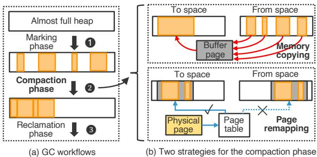  
Figure 1: Garbage collection mechanisms in ART. (a) The standard three-phase lifecycle shared by collectors. (b) Com paction strategies utilized by the Concurrent Mark-Compact (CMC) collector: object copying versus OS-assisted page remapping.

To mitigate GC-induced copying overhead, state-of-the-art collectors in ART employ a more efficient memory-movement operation, i.e., page remapping [2, 3]. Supported by the operating system (OS), this operation moves entire pages of memory via modifying page table entries rather than copying the underlying data [31, 52, 61]. However, as illustrated in Figure 1(b), existing collectors fail to fully exploit this opportunity due to a fundamental object–page lifetime mismatch problem. Specifically, while the OS manages memory at page granularity, objects targeted by GC are typically much smaller and irregularly sized. Moreover, objects within the same page often have highly diverse lifetimes. As a result, most pages contain a mixture of live and dead objects. Existing collectors are forced to fall back to expensive object-level copying to reclaim space, leaving the OS-assisted zero-copy operation largely underutilized. Generational GC [22, 47, 53] can partially mitigate this issue by separating young objects from mature ones, but it only provides coarse-grained lifetime distinctions. Even within the mature heap, objects on the same page may die at different phases, preventing generational GC from fully utilizing OS-assisted zero-copy mechanisms.

This paper aims to bridge this object-page mismatch by aligning objects with memory pages according to their lifetimes. When objects in the same page have similar lifetimes, each page is basically either entirely live or entirely dead. Such alignment unifies the basic unit of operation for both GC and the OS: the page. The garbage collector can then reclaim dead objects by freeing whole pages and move surviving ob jects by remapping the pages that contain them. However, achieving this goal presents three challenges: (1) Lifetime prediction. Object lifetimes in mobile applications are heavily influenced by user behavior and are inherently difficult to predict. (2) Object-page alignment. Packing variable-sized objects into fixed-size pages requires a precise relocation strategy. (3) Low overhead. Mobile devices have limited hardware resources, so the solution must respect tight CPU and memory budgets.

To address these challenges, this paper presents LifeLine, a GC framework that solves the object–page mismatch by leveraging the structural properties of the object reference graph. Our design is driven by empirical observations of the object reference graph in Android applications, which show that reference mutability presents lifetime correlation. Life-Line leverages graph-related insights to partition the object reference graph into multiple subgraphs based on the mutability of edges. Edges within the same subgraph have similar lifetimes. Specifically, LifeLine comprises three main components: (1) a lifetime-based graph partition method, which identifies subgraphs whose objects have similar lifetimes by relying on mutability information of references within the graph structure. It samples historical field-modification behavior and generates guidance on how to partition the graph. (2) a subgraph–page lifetime alignment GC, which facilitates object–page alignment by mapping entire subgraphs to pages. This GC performs a moving collection over the heap to align subgraphs with pages and explicitly considers subgraph lifetimes when placing objects during GC. (3) a near-zero-copy GC, which exploits page-level primitives after alignment to reclaim and move memory via page operations rather than object copies.

We implement LifeLine in the Android Open Source Project (AOSP) and evaluate it on a Pixel 7 Pro using popular commercial applications. Compared to Android’s state-of-theart production GC, LifeLine reduces total GC copy volume by 57.4% and total GC time by 22.7%, while improving frame rendering smoothness with low memory and CPU overhead. To the best of our knowledge, LifeLine is the first GC that explicitly coordinates the lifetimes of object subgraphs and memory pages. The main contributions are as follows:

• We identify the object–page lifetime mismatch as the primary bottleneck preventing the effective use of OS-assisted compaction in Android runtimes.

• We propose a subgraph-based approach that aligns objects with pages using reference-graph properties. The approach includes a lifetime prediction method based on reference mutability and a GC scheme that places subgraphs on pages according to predicted lifetimes.

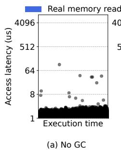

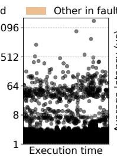  
(b) During GC

(c) Latency breakdown  
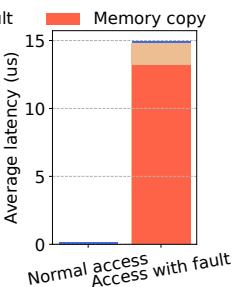  
Figure 2: Impact of GC copying on memory access latency. (c) Breakdown of the tail access latency caused by Android’s Concurrent Mark-Compact GC, showing that most of the time is spent copying memory to handle page faults.

• We design and implement LifeLine, a closed-loop system that enables GCs to better exploit OS page-level primitives for minimizing copying overheads and improving mobile application performance.

• We evaluate LifeLine on production Android workloads, and demonstrate a large ratio of GC performance gains.

## 2 Background

## 2.1 Garbage Collection in Android

Copying-based GC. Android executes all user applications on the ART [39, 49], which provides automatic memory management via a copying-based garbage collector. Copying GC is widely used in modern managed runtimes, including JVMs [7], .NET [43], and major JavaScript engines [29, 45]. Beyond automatic reclamation, it offers low fragmentation [11, 12], improved cache locality [34, 62], and fast bump-pointer allocation [66, 67]. Consequently, it serves as a fundamental building block in real-world systems.

GC Procedure. Figure 1(a) shows the overall GC process, which is triggered when memory runs low and consists of three phases. 1 Marking: Starting from root objects, the collector traverses references and marks all reachable objects as live. 2 Compaction: Live objects are relocated and packed contiguously. 3 Reclamation: The remaining memory region is reclaimed and returned to the system. Among these phases, compaction typically dominates the performance overhead. During compaction, GC threads and application threads may concurrently modify the same heap regions, so the collector must enforce correctness with additional synchronization. There are three main approaches: (1) Stop-the-world (STW) pauses suspend all application threads while objects are moved. While simple to implement, the resulting latency is often unacceptable for interactive devices; therefore, ART restricts STW primarily to root processing. (2) Baker-style read barriers [37] insert a small code snippet before each memory read, ensuring application threads only access objects already processed by the GC; Android’s Concurrent Copying (CC) [5] GC uses this technique. (3) Page-level memory protection [38] uses the OS to protect unprocessed pages and redirects accesses through a fault handler that performs the necessary GC work. This approach underlies Android’s Concurrent Mark-Compact (CMC) [1, 26] GC, the default and recommended collector in recent Android releases. However, regardless of the specific approach used, the physical movement of objects during the compaction phase remains a significant source of system overhead.

## 2.2 OS-assisted Memory Compaction

To move memory efficiently, ART’s CMC collector cooperates closely with the OS. With OS assistance, CMC improves memory utilization and mitigates jank during GC [1, 49].

Concurrent Compaction. Conceptually, the collector incorporates two memory spaces: a from-space and a to-space. At the beginning of the compaction phase, it remaps the memory of all live objects into from-space using an OS remapping system call. It then progressively moves all live objects from from-space to to-space. During this process, CMC relies on the OS to regulate accesses to to-space. When an application thread accesses an unprocessed page, the OS blocks the thread and delivers a SIGBUS signal. A registered fault handler then migrates all objects on the faulting page from from-space to to-space. Once the handler completes, the thread resumes and proceeds on the now-processed page.

Strategies for Memory Movement. The key operation in compaction is migrating heap content, for which there are two main strategies, as shown in Figure 1(b):

• Memory copying: The straightforward approach is to copy live regions using memory copy operations. However, copying is costly, putting pressure on memory bandwidth, caches, and TLBs [31]. In GC, this cost is amplified [2] because application threads often have to wait for copying to complete. • Page remapping: Recent Linux kernels introduce a zerocopy mechanism through the userfaultfd system call [30, 48, 64, 65]. Instead of copying data, the kernel updates Page Table Entries (PTEs) to remap the physical page backing a from-space address to the to-space address [2,4]. This mecha nism is significantly faster than physical copying, potentially reducing movement overhead by over 40% [4]. Within ART, GC threads can invoke ioctl with the UFFDIO\_MOVE command to perform page remapping.

## 3 Motivation

With OS support, GC has the potential to achieve higher performance than traditional runtime-only approaches [1, 26, 49].

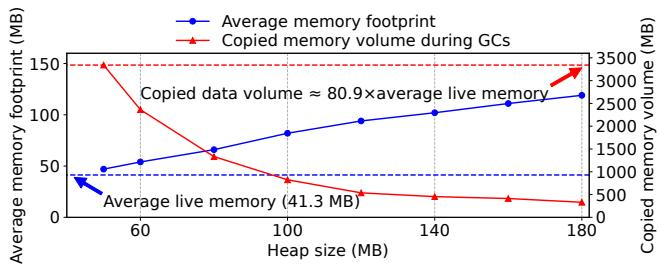  
Figure 3: Memory copying overhead (red) and memory usage (blue) under different heap size settings. Smaller heaps reduce memory usage but dramatically increase memory copying.

We now examine how such support impacts the latest Android GC in practice, starting from a classic time–space trade-off.

## 3.1 Cost-Space Dilemma

Mobile devices are running increasingly rich and memoryintensive applications [10], while hardware scaling has not kept pace. RAM capacity has grown slowly: 8 GB devices still dominate the market, and 16 GB models are limited to a small set of high-end phones [9]. Consequently, GC must navigate a strict time–space trade-off to balance performance and memory usage.

To understand this trade-off in practice, we use Twitter (X) as a case study. We configure the application with a series of fixed heap sizes, run it for one minute under each setting, and measure the additional memory copying induced by GC. For each configuration, we also record the application’s average memory footprint and the average live memory traced per collection. Figure 3 shows how average footprint and GC copy volume vary with heap size. With a small heap, the average footprint shrinks, improving memory efficiency, but the volume of copied memory grows rapidly. When the heap approaches its minimum, GC copies 3341 MB per minute, about 80.9× the application’s live memory. With larger heaps, the footprint increases roughly linearly, reducing memory efficiency; GC copy volume drops but remains substantial. For example, even with a 140 MB heap, GC still copies about 10× the live memory.

High Cost of Memory Copying. These GC-induced copies impose significant overhead on the entire system, heavily interfering with normal execution [31]. They can directly block memory accesses: as discussed in §2.1, when GC and user threads run concurrently, each user thread must execute an extra read barrier or trigger a page-fault handler to copy the object before accessing it, substantially increasing memory access latency during GC. In addition, the large copy volume lengthens the compaction phase, causing longer GC-induced interruptions of application threads.

To quantify this impact, we again use Twitter (X) and compare memory access latency with and without GC activity. We treat the execution time of the code path that reads fields from

Java objects as the memory access latency, which includes both the actual memory access and GC-related handling. Because the number of accesses is huge, we sample: after every hundred object reads, we record one latency sample and mark whether it occurs during the GC compaction phase. As shown in Figure 2, memory accesses become much slower during GC. The tail latency (10-th parts per million, PPM) increases by about 60×. A closer look at these long-latency cases (Figure 2(c)) shows that, under normal conditions, average access latency is typically below 1 µs, whereas accesses that trigger GC work average about 15 µs, with roughly 87% of the time spent on GC-related copying. Since memory access lies on the critical performance path, blocking it with GC copying directly degrades overall application performance.

Object–Page Lifetime Mismatch Problem. To reduce copying, GC can, in principle, leverage the OS’s page-remapping mechanism, as discussed in §2.2. However, current GCs still perform large amounts of copying and rarely benefit from page remapping. The core reason is the object–page lifetime mismatch. The OS manages memory at page granularity, whereas GC manages memory at object granularity. Page remapping is only useful when a page is almost entirely filled with live objects; if live and dead objects are heavily mixed, GC cannot reclaim memory simply by remapping that page.

To analyze this mismatch, we examine the liveness of each heap page in mobile applications. During GC tracing, we compute each page’s survival ratio as the fraction of liveobject size over page size, and then derive the distribution of per-page survival ratios across the heap, as shown in Figure 4 (bars above 100 denote pages whose survival ratio is 100%). A large fraction of pages exhibit medium survival ratios (e.g., 20–80%), where live and dead objects are interleaved, making page remapping ineffective. In contrast, remapping-friendly pages with very high survival ratios close to 100% account for only 16.1% and 13.5% of memory in these applications. Thus, for most of the heap, GC cannot exploit efficient page remapping and must fall back on expensive memory copying.

## 3.2 Key Idea and Challenges

Bridging Object–Page Lifetimes. To address the object–page lifetime mismatch, this paper aims to enable tighter cooperation between the runtime and the OS. Our key idea is: by reorganizing the heap layout, we align object lifetimes with page lifetimes. Concretely, we proactively place objects according to their lifetimes to turn the current roughly uni form, random survival-rate distribution into a bimodal one. We seek to reduce pages with medium survival ratios and increase those with very high or very low ratios, so that objects within a page tend to become live or dead together. Once object and page lifetimes are aligned, GC can apply fast page remapping to high-survival pages and perform only limited object copying on low-survival pages.

Challenges. However, realizing this idea in the context of

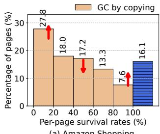  
(a) Amazon Shopping

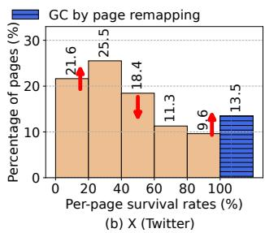  
Figure 4: Per-page survival-rate distribution. The rightmost bars correspond to pages with a survival rate of 100%. Our goal is to reduce the number of pages with medium survival rates while increasing those with high or low survival rates.

mobile applications raises three major challenges:

• Unpredictable object lifetimes: In highly interactive mobile applications, object lifetimes are largely driven by unpredictable user behavior and are difficult to predict precisely. The first challenge is to extract and exploit usable lifetimerelated information to approximate grouping of objects with similar lifetimes.

• Finding structure in a highly dynamic environment: Android objects are extremely dynamic: allocations and deallocations occur continuously, and object sizes and access patterns vary widely over time. The second challenge is to discover a simple, robust rule to physically organize objects onto pages efficiently and stably in this dynamic setting.

• Resource constraints on mobile devices: Our solution must be lightweight: mobile devices have limited CPU and memory, and object counts can reach tens or hundreds of millions. Even storing and updating detailed lifetime information for all objects can be prohibitively expensive. The third challenge is to ensure that, under these constraints, the overhead of our approach remains low enough for deployment on real devices.

## 4 Preliminary Study and Insights

To address these challenges, we first characterize lifetimerelated properties of Android heaps. In this section, we analyze the object reference graph observed during GC tracing and derive three key observations.

Structural Sparsity of Object Reference Graphs. The object reference graph encodes rich lifetime information, as GC determines liveness by tracing this graph. We start by examining the in-degree and out-degree of each object. Using several applications, we instrument ART to record all references traversed during GC tracing and then compute the degree distributions (Figure 5). We find that most objects have an in-degree of exactly one. For instance, in Instagram, about 69% of objects are referenced by a single other object. Thus, the object reference graph is structurally sparse: most objects are pointed to by a single source reference, which largely determines their lifetimes.

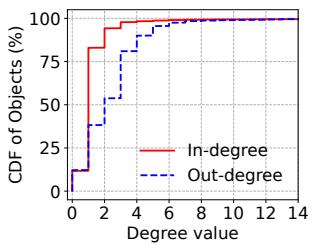  
(a) Amazon.

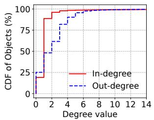  
(b) Instagram.

Figure 5: In-degree and out-degree distributions of objects.  
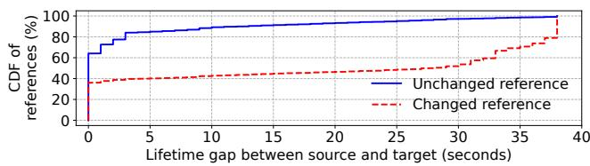  
Figure 6: Distribution of lifetime gaps between source and target objects. Unchanged and changed references exhibit different patterns: object pairs connected by unchanged references tend to have small lifetime gaps, whereas those connected by changed references tend to have large gaps.

Insight 1: Strong correlation between object lifetimes and incoming references. For objects with exactly one incoming reference, their lifetime is highly likely to match that of this reference. Hence, the sparsity of the object reference graph allows us to approximate lifetime prediction as edge-lifetime prediction rather than node-lifetime prediction in Android. Edge lifetimes are often easier to model because they are driven by local update operations, whereas object liveness requires global reachability reasoning over the entire graph.

Lifetime Gap between Source and Target Objects. We next study how the lifetime of a reference relates to the lifetimes of its source and target objects. For each reference, we measure the lifetime gap between the two endpoints. Concretely, we launch Amazon Shopping, warm it up for 30 seconds, and trigger a GC to capture a snapshot of the current object reference graph. Over the next 38 seconds, we estimate the lifetimes of all objects that die within this window using an approximate reference-counting scheme implemented in the write barrier. During the same interval, we record whether each reference is modified. For every reference, we then compute the lifetime gap between its source and target objects and categorize the reference as unchanged or changed. Figure 6 shows the resulting distributions. The two patterns differ sharply: for unchanged references, the vast majority of gaps are near zero, indicating that source and target objects tend to have very similar lifetimes. For changed references, many object pairs exhibit large gaps close to the experiment duration: one object dies during the window while the other survives until the end. We conclude that object pairs connected by immutable references tend to co-survive, whereas pairs connected by mutable references are much more likely to have diverging lifetimes.

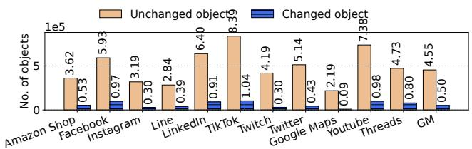  
Figure 7: Distribution of unchanged and changed references across applications. GM denotes the geometric mean.

Insight 2: Subgraph-based lifetime estimation. Combining the above observations, we propose a subgraph-based lifetime estimation method. We conceptually cut the object reference graph along mutable edges, yielding subgraphs whose internal edges are all immutable. Objects within such a subgraph tend to survive and die together. We first align each object’s lifetime with that of its enclosing subgraph, and then align each subgraph’s lifetime with that of a memory page. Rather than predicting exact per-object lifetimes, we focus on lifetime gaps between neighboring objects: if a reference remains unchanged, the connected objects typically live and die together across user sessions. This transforms the complex problem of reasoning about a highly dynamic heap into the simpler problem of identifying and exploiting internally stable subgraphs. Prevalence of Immutable References. To partition the object reference graph by reference mutability, we must understand how often references change. We record updates to objectreference fields in mobile applications and, over a 30-second window, count how many objects have their reference fields never modified versus modified at least once. As shown in Figure 7, across a set of popular Android applications, the number of objects whose reference fields remain unchanged far exceeds the number of objects whose fields are updated. In all applications, modified objects are much fewer than unmodified ones.

Insight 3: Mutable references are few and cheap to track. Because only a small fraction of references are actually mutated, we need to track only a small subset of fields to infer lifetimes for the entire object reference graph. This alleviates resource constraints on mobile devices: with relatively few cuts, we can partition the whole graph into subgraphs that cluster objects by lifetime.

## 5 Design and Implementation

## 5.1 Overview

Design Principles. LifeLine is a GC framework that reshapes the heap so that objects with similar lifetimes are packed onto the same pages, enabling page-granularity GC that fully exploits OS-level page operations. Guided by the empirical insights in §4, it addresses the three challenges in §3.2 as follows: First, instead of predicting exact object lifetimes, LifeLine estimates lifetime gaps from reference changes and uses graph partitioning to form subgraphs whose objects have similar lifetimes. Second, it treats each subgraph as a stable intermediary, first aligning objects with subgraphs and then aligning subgraphs with pages. Third, to satisfy mobile resource constraints, LifeLine uses lightweight sampling to approximate reference changes, thereby avoiding expensive fine-grained per-object tracking. Moreover, to address the possibility that predictions may become stale as application behavior changes, LifeLine is designed as a closed-loop optimization framework rather than a one-shot predictor. When an app’s workload shifts, the system conservatively falls back to the original object-copying mechanism and initiates a new round of lifetime alignment.

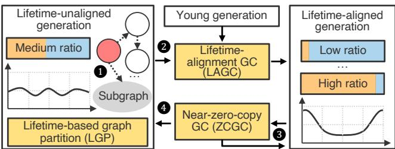  
Figure 8: Overview of LifeLine.

Heap Layout. As illustrated in Figure 8, LifeLine extends ART’s generational heap with three logical spaces: (1) Lifetime-aligned generation: This is the core new space. Objects that belong to identified lifetime-correlated subgraphs are promoted into this generation. LifeLine strives to make each page in this space either almost fully occupied by objects that share similar lifetimes, making it an ideal target for page remapping or wholesale reclamation. (2) Lifetime-unaligned generation: Objects that cannot be reliably placed into any lifetime-correlated subgraph are promoted into this generation. (3) Young generation: Newly allocated objects reside in the young generation. Survivors from the young generation are promoted either to the lifetime-aligned generation or to the lifetime-unaligned generation.

Components. LifeLine consists of three components:

• Lifetime-based graph partition (LGP): This component partitions the object reference graph into subgraphs with high lifetime affinity based on how references are updated. Life-Line instruments the interpreter and compiler-generated code to intercept operations that update object fields, and samples these updates to identify highly mutable object fields. Using this information, it partitions the graph so that references between objects within each subgraph are mostly stable.

• Object-page lifetime-alignment GC (LAGC): The goal of this component is to align subgraphs with memory pages. Concretely, it is a garbage collector that reorganizes objects according to their lifetimes. During tracing, it analyzes the subgraph information produced by LGP. Then, in the compaction phase, it aligns one or more subgraphs with memory pages based on subgraph sizes and their dependency relationships. Each time it runs, it promotes objects into the lifetimealigned generation.

• Near-zero-copy GC (ZCGC): This is a garbage collector that efficiently manages the memory of the lifetime-aligned generation. During the compaction phase, the collector estimates the live ratio of each page. For pages with a high survival ratio, it moves memory via page remapping, thereby avoiding physical data copying. Conversely, for pages with a low survival ratio, it reclaims them by copying objects. Pages with an intermediate survival ratio are rare and are treated similarly to sparse pages. All objects moved by copying are relocated into the lifetime-unaligned generation.

Runtime Workflow. As shown in Figure 8, LifeLine operates as follows: After an application starts, all objects are first allocated in the young generation and are then promoted to the lifetime-unaligned generation. During execution, LifeLine uses LGP to record mutability information for all objects 1 . Afterward, LifeLine uses LAGC to reorganize the heap by grouping objects with similar lifetimes onto the same pages and migrating them into the lifetime-aligned space 2 . In the lifetime-aligned space, LifeLine uses ZCGC to manage memory. For pages with a high survival ratio, ZCGC adopts an efficient page-remapping scheme 3 . For pages with a low or medium survival ratio, ZCGC uses an object-copying scheme to evacuate the page and relocate the surviving objects into the lifetime-unaligned generation 4 . As the application continues to run, new objects keep moving into the unaligned generation, and old objects keep dying in the aligned generation, so ZCGC also monitors these changes. If many objects accumulate in the unaligned generation, it triggers a new round of LAGC to reshape the page distribution and migrate objects into the aligned generation again.

## 5.2 Lifetime-based Graph Partition

LifeLine proposes a lifetime-based graph partition (LGP) to identify subgraphs of objects that tend to live and die together. As shown in Figure 9, the LGP procedure mainly consists of two steps. First, it modifies the execution engine of the runtime system to capture write operations to objects, and inserts small code snippets into the execution paths of these write operations so that the program executes a write-barrier function. Second, inside this write-barrier function, the captured object reference fields are recorded into a layered Bloom filter. This layered Bloom filter records all captured information about modified fields and uses it as the basis for partitioning the graph into subgraphs.

Write Interposition and Sampling. To record mutability of object fields, LGP inserts a small write barrier at object-field write sites in ART’s execution engine. Specifically, the interpreter extends the bytecode handlers for instructions that store references into object fields. The JIT/AOT compiler inlines a few instructions along the object write path. Whenever the application executes a write operation, the operation can be intercepted and the execution flow redirected to the write-barrier function.

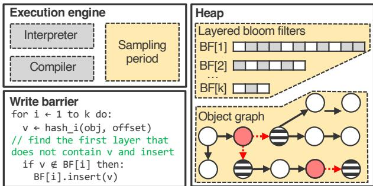  
Figure 9: Lifetime-based graph partition.

However, naively hooking write operations may introduce extra overhead because writes occur frequently, especially inside loops. To manage the overhead incurred by write interposition, LGP employs thread-based periodic sampling. It maintains a counter variable in thread-local storage for each thread and a sampling-period constant. Before calling the write-barrier function, it increments the thread-local counter and checks whether it has reached the period. If it has not reached the period, execution continues without calling the write barrier. Thus, it executes the write barrier for only a subset of write operations, while the remaining writes pay only the cost of a single inexpensive thread-local variable incre ment. Therefore, the overhead of write interposition remains low even for update-intensive applications.

Tracking Mutations with Layered Bloom Filters. At each sampling period, the program thread invokes a write barrier that records the modified object field and the number of times it has been updated. To maintain this information efficiently, LGP employs a layered Bloom filter [15, 19, 23, 24, 44]. Layered Bloom filters are commonly used for approximate counting in heavy-hitter detection [28, 51]. Here, we use them to maintain approximate write statistics for each object field.

Concretely, we allocate k Bloom filters, BF[1..k], all initially empty. During each sampling operation, the write barrier receives the modified object and the offset of the updated field. The pair (object,offset) uniquely identifies the modified object field. We use this pair as input to compute a hash value and insert the hash into the first Bloom filter that does not yet contain it. In this scheme, the number of layers containing a hash represents the number of sampled mutations. If an object field is present in the i-th Bloom filter, it has been modified at least i times. For example, a field whose hash appears only in BF[1] has been observed once; if it appears in both BF[1] and BF[2], it has been observed at least twice, and so on.

LGP derives a simple mutation summary for any given object field from the layered Bloom filters: fields whose hash either does not appear are treated as mostly immutable owners. Their outgoing references are treated as candidates for lifetime-correlated edges. In contrast, fields whose hashes reach deeper layers (e.g., BF[3] or beyond) are classified as mutable. Their outgoing references are likely to cross lifetime boundaries and thus become subgraph cut edges. This design keeps overhead low, requiring no explicit per-object counters, and amortizes mutation-tracking cost across inexpensive hash computations and bit operations on a small number of filters.

Graph Partition. Based on the field-level mutation information recorded in the Bloom filters, LGP partitions the whole graph into multiple subgraphs by cutting along mutable references. Using different layers of Bloom filters corresponds to applying different mutation thresholds, which in turn leads to different partitioning results. As shown in Figure 10, when a small partition threshold is used (e.g., information from the first Bloom filter), most of the resulting subgraphs are relatively small. In contrast, when a larger partition threshold is applied (i.e., information from higher-layer Bloom filters), the fraction of larger subgraphs increases. Nevertheless, for all thresholds, the distribution of subgraph sizes remains highly skewed: some subgraphs exceed the page size, while others are much smaller. In LifeLine, the partition threshold is set to 3, as this choice makes most subgraphs close to the page size while requiring only three Bloom filters, thus keeping the memory overhead relatively low.

Robustness of Mutability-based Prediction. Reference mutability provides strong robustness because it captures a relatively stable property of the program, rather than attempting to predict the exact moment at which an object becomes unreachable. For example, fields that are repeatedly overwritten often link a long-lived container to a succession of short-lived con tents. This pattern is common in mobile applications: fields that remain stable after initialization typically connect objects that are owned and reclaimed together, such as a view hierarchy, a decoded content object, or a per-session data structure. Therefore, LifeLine’s lifetime analysis focuses on distinguishing rarely modified stable edges from frequently modified boundary edges, instead of predicting the precise lifetime of each individual object; the latter is inherently difficult and highly dependent on user behavior. When runtime behavior changes, LifeLine’s mutability-based lifetime-boundary prediction remains robust because it relies on a relatively stable property of mobile programs.

Although LifeLine’s lifetime-prediction method is robust in most cases, significant changes in runtime behavior may still reduce the stability of lifetime alignment and decrease the number of pages that can be optimized through remapping. Such cases include abrupt changes in application behavior, such as navigating to an entirely different page, or substantial short-term fluctuations in user interaction patterns. In the worst case, LifeLine gradually falls back to the behavior of the underlying baseline copying collector, while incurring only bounded additional overhead from extra alignment operations and temporary metadata maintenance.

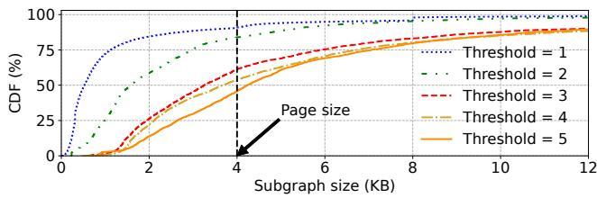  
Figure 10: Distribution of subgraph sizes. This distribution is directly influenced by the partition threshold. A smaller threshold yields more small subgraphs, while increasing the threshold raises the proportion of large subgraphs.

## 5.3 Object–Page Lifetime Alignment GC

After partitioning the object reference graph into multiple subgraphs, LifeLine’s goal is to reshape the heap so that each page is either almost entirely live or almost entirely dead. To achieve this, LifeLine employs an object–page lifetime alignment GC (LAGC), as shown in Figure 11, which performs a full moving collection over the heap. After this collection, the mature heap exhibits a bimodal distribution of per-page survival ratios. This layout allows subsequent GCs to replace most object copying with inexpensive page remapping.

Representing Subgraphs. To reorganize the heap, LAGC first traces the entire object reference graph, as in conventional GCs, to obtain both liveness information and subgraph metadata. This metadata summarizes the partitioning of the graph according to LGP’s records and the relationships among subgraphs. The metadata has three components: (1) It assigns each subgraph a 32-bit identifier, defined as the address of its root object. Using this identifier, LifeLine can locate all objects in the subgraph along the tracing order. (2) It main tains another 32-bit value per subgraph to represent ownership between subgraphs. For example, if a highly mutable edge connects subgraphs G0 and G3, LifeLine designates G0 as the logical owner of G3 and records the host object address of such mutable edges in this ownership field. Using this field, LifeLine can determine the owner of any subgraph, conservatively choosing the first candidate encountered during tracing when multiple owners exist. (3) It stores the total size of each subgraph in bytes, which the collector uses to align subgraphs with pages.

Constructing Metadata during Marking. During the marking phase, LAGC constructs subgraph metadata on the fly. As the GC thread traverses and marks the object reference graph, it checks for each field whether its referent is recorded in the k-th-layer Bloom filter. If so, LifeLine creates a new subgraph entry, uses this object as the subgraph identifier, writes it into the subgraph metadata as a new subgraph, initializes the subgraph size to 0, and pushes the referent onto the tracing stack.

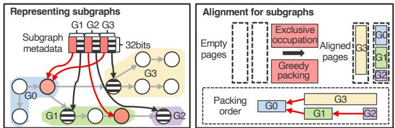  
Figure 11: Object–page lifetime alignment GC.

During subsequent traversal, when an object is popped from the stack, the GC thread inspects the current subgraph metadata. If the object represents a subgraph identifier stored in the metadata, it is recognized as a subgraph root, and LifeLine immediately begins counting the size of this subgraph. Due to the depth-first traversal of the GC, all objects scanned thereafter are treated as belonging to this subgraph until another subgraph root is encountered or the stack backtracks past the root’s position. For each such object, LifeLine increments the subgraph size and updates the current subgraph metadata.

Finally, LifeLine completes all subgraph metadata setup within this single, mostly concurrent marking pass, with minimal interference to the mutator. The resulting metadata induces an approximate but stable ownership relation over subgraphs. In practice, since ownership is predominantly singular (§4), this relation is sparse rather than dense, keeping the subsequent alignment phase simple and inexpensive.

Align Large Subgraphs: Exclusive Occupation. During compaction, LAGC uses the subgraph metadata to align subgraphs with pages. As shown in Figure 10, subgraph sizes are highly skewed: many are close to or larger than a page, while others are much smaller. LifeLine therefore classifies subgraphs using a size threshold (4 KB by default) and applies different strategies to large and small subgraphs.

For large subgraphs, LifeLine uses an exclusive-allocation policy: each large subgraph occupies one or more pages by itself. When computing target addresses, LAGC proceeds in two steps. (1) It first assigns a page-aligned starting address to the subgraph’s root. (2) It then assigns contiguous addresses within those pages to all objects in the subgraph, traversing them in the same DFS order used during tracing. Allocation in the to-space is monotonically increasing. During this traversal, LifeLine accumulates the total size of allocated objects and stops when this total reaches the subgraph size recorded in the metadata or when it encounters the root of another sub graph. This procedure packs all objects in a large subgraph into a contiguous set of pages, so those pages are dedicated to objects with similar lifetimes. It also sidesteps complex binning decisions for very large objects, keeping the alignment algorithm simple and predictable.

Align Small Subgraphs: Greedy Packing. Given the dependency subgraph metadata, LAGC treats each subgraph as an indivisible item and each lifetime-aligned page as a bin, greedily co-locating related subgraphs. The packing algorithm has two steps. First, ownership-based aggregation. For a small subgraph, LAGC follows ownership edges using the subgraph metadata: it finds the parents on which this subgraph depends, identifies the head of each parent’s subgraph, then continues to their owners, and so on. All subgraphs visited during this reverse traversal are tentatively grouped as candidates for the same page, while LAGC tracks their cumulative size. When this total reaches the page-size threshold, the aggregation stops. Second, relocation by guided traversal. Starting from the highest-level owner discovered above, LAGC follows its outgoing references to enumerate all grouped subgraphs. This owner is placed first on the lifetime-aligned page. LAGC then performs a traversal pass similar to that of a normal GC, but with the crucial advantage that it already knows exactly which subgraphs can be merged. As it starts from the toplevel owner, it lays out the subgraphs contiguously within the page, so siblings and nearby descendants naturally end up co-located.

This greedy, ownership-aware packing (1) increases the likelihood that objects on the same page have correlated lifetimes, (2) keeps pages tightly packed, since most clusters nearly fill a page, and (3) remains lightweight by maintaining lifetime relationships at subgraph granularity rather than object granularity.

Progressive Alignment across GCs. LifeLine does not require object–page alignment to be completed in a single GC cycle. Large heaps, in particular, may require multiple LAGC runs. As shown in Figure 8, LifeLine maintains two mature generations: one lifetime-aligned and one lifetime-unaligned. Each LAGC compacts only the unaligned generation, incrementally migrating objects into the aligned generation. This staged process helps stabilize the system during alignment.

## 5.4 Near-Zero-Copy GC

To exploit the bimodal per-page liveness created by LAGC, the near-zero-copy GC (ZCGC) minimizes data movement in the lifetime-aligned mature generation. It runs after the global marking phase of a major collection, when live objects in this generation are already known. As shown in Figure 12, a movement planner cooperates with the OS to decide, on a per-page basis, whether to migrate a page via zero-copy remapping or to compact it by copying surviving objects.

Per-Page Survival Ratio Estimation. Scanning all objects on a page would defeat the goal of fast compaction. Instead, the planner reuses statistics collected during the GC’s marking phase. During tracing, the GC accumulates the total size of live objects for each page. The planner then simply divides this live-byte count by the page size to compute the page’s survival ratio. Because this accounting piggybacks on the existing marking pass, it yields a robust estimate at essentially negligible additional cost.

Hybrid Page-Remap-or-Copy Strategy. Given the estimated live ratio, the planner chooses between two movement schemes using two configurable thresholds:

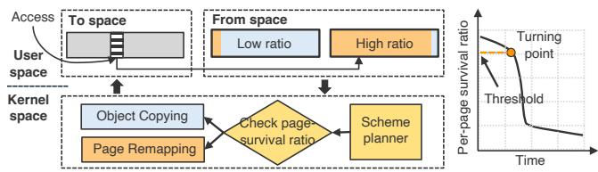  
Figure 12: Near-zero-copy GC. It features an efficient hybrid scheme that combines page remapping with object copying.

• Page remapping for dense pages. If a page is almost entirely live (e.g., a live ratio above a high threshold such as 90%), copying would waste CPU cycles while reclaiming little space. For such pages, the planner uses userfaultfd with UFFDIO\_MOVE to atomically remap the physical page from from-space to to-space. This operation updates only the page-table entries without modifying the underlying data, so the cost per page is effectively constant, while avoiding frequent copying of many small objects.

• Object copying for sparse and medium-density pages. If a page has a low live ratio, only a few objects survive. The planner then uses a copy-based scheme: the GC precomputes new locations for live objects on the page, and when an application thread later faults on the corresponding to-space page via userfaultfd, the handler copies only these survivors, leaving the rest of the page free for reclamation. Pages whose live ratio falls between the low and high thresholds are also handled by this copy path. Thanks to LAGC, such medium-density pages are rare and do not dominate the cost.

The thresholds correspond to the turning point in Figure 12, where the costs of remapping and copying intersect. Below this point, pages quickly become low-survival because colocated objects tend to die together, making copying cheaper. In our implementation, the thresholds are fixed per deployment but can be tuned using a simple cost model.

Adaptive Re-alignment Trigger. Over time, workload phases may change and the original alignment between subgraphs and pages can drift, causing objects to be repeatedly moved back into the lifetime-unaligned generation while new objects accumulate there. Consequently, the size of the aligned generation Salign shrinks and the unaligned generation Sunalign grows. ZCGC monitors these sizes and checks:

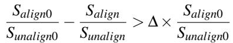

(1)

Here, Salign0 and Sunalign0 are the aligned and unaligned generation sizes at the first ZCGC after LAGC, and ∆ controls when LAGC is re-triggered. When the inequality holds, it indicates significant misalignment, and a new LAGC is invoked.

Fallback and Maintainability. LifeLine preserves the correctness of a conventional tracing collector: referencemutability information only guides placement, while liveness remains determined by normal marking. If phases shift, fields are misclassified, or pages contain mixed-lifetime objects, ZCGC falls back to treating pages as sparse or mediumdensity and relocates survivors through object copying. Thus, inaccurate prediction may reduce remapping opportunities, but cannot reclaim live objects or expose untraced objects to the mutator. LifeLine also remains maintainable: it adds metadata construction and page-aware placement to ART’s GC pipeline, while reusing existing tracing and fault-based relocation mechanisms. Its extra runtime state is temporary and localized to alignment phases, making the design easy to disable, tune, or bypass for workloads that do not benefit from lifetime alignment.

## 6 Evaluation

We evaluate LifeLine on real hardware and mainstream Android applications, aiming to answer: (1) What is its end-toend impact on GC work and user-visible performance? (§6.2) (2) What are the underlying causes of these effects? (§6.3) (3) What CPU and memory overheads does it introduce? (§6.4) (4) How sensitive is LifeLine to key parameters? (§6.5)

## 6.1 Experimental Setup

Comparisons. We compare LifeLine against all state-of-theart production collectors in the Android runtime: (1) Concurrent Mark-Compact (CMC) [1, 26]. This has been the default and recommended collector since Android 13. It relies on a userfaultfd-based fault-and-copy compaction mechanism and, in our configuration, already incorporates OS-level assistance. (2) Concurrent Copying (CC) [5]. This was the default collector in earlier Android versions and is still widely deployed. It uses a Baker-style read barrier and performs all compaction via object-level copying. (3) Semi-space (SS) [49]. This collector is used during application startup in all Android versions and is a classic stop-the-world copying collector. These three collectors cover the deployed design space of object-copying and OS-assisted GC mechanisms. For LifeLine, we evaluate two LAGC-related configurations: (1) LifeLine (large), which aligns only large subgraphs with memory pages while ignoring small subgraphs; (2) LifeLine (large+small), which aligns both large and small subgraphs. Unless otherwise specified, LifeLine refers to the configuration that aligns both large and small subgraphs. Table 1 lists the key parameters used in LifeLine.

Workloads. Our workload consists of several highly popular Google Play Store applications that represent typical mobile use cases, including Amazon Shopping, Facebook, Instagram, Spotify, LinkedIn, TikTok, Twitch, Twitter (X), Threads, Telegram, Line, YouTube, and Google Maps. For each application, during experiments, we log in to a pre-configured account, wait for the application to finish initialization (10 seconds after launch), connect to a stable Wi-Fi network, and then drive the UI using a repeatable interaction script whose main procedure is to swipe the screen once every 0.4 seconds, covering scrolling and content-loading scenarios. We choose this interaction because it is repeatable across all applications, captures common mobile workloads, and continuously stresses allocation and object reclamation. This methodology also has limitations: it does not cover all application behaviors, such as randomly changing user interactions or short sessions with frequent foreground/background transitions. Nevertheless, the scrolling workflow we use represents the dominant interactive workload in most mobile usage scenarios and therefore provides a practical basis for evaluating performance under common real-world interactions.

Table 1: Summary of parameters used by LifeLine.  
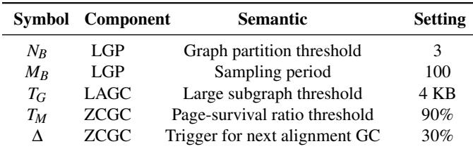

Testbed. Experiments run on a Google Pixel 7 Pro smartphone with a 120 Hz display, an octa-core CPU (two 2.85 GHz Cortex-X1, two 2.35 GHz Cortex-A78, and four 1.80 GHz Cortex-A55 cores), a 10-core Mali-G710 MP7 GPU, 12 GB of 3200 MHz LPDDR5, and 128 GB flash. The runtime is An droid Open Source Project (AOSP) android-15.0.0\_r3. The OS is a Generic Kernel Image (GKI) with the android-gspantah-5.10-android15-qpr1 kernel. This kernel does not support page remapping by default; we enable it by porting the corresponding patch [3].

Implementation. We implement LifeLine 1 on top of AOSP and its corresponding GKI kernel. Within AOSP, our modifications are mainly in the ART module, totaling approximately 2.3K lines of C++ code, organized as follows: First, for the GC mechanism, LifeLine introduces two new collector config urations, LAGC and ZCGC, by extending the existing CMC GC (about 1.5K lines). Second, for LGP, we implement the core layered Bloom filter and integrate it into the heap (about 200 lines). LGP also adds write-barrier sampling in both the interpreter and compiler, along with a sampling counter in thread-local storage (about 100 lines). Third, for the heap, we adjust the heap layout by introducing a lifetime-aligned generation while reusing the original bump-pointer space as the lifetime-unaligned generation (about 200 lines). The remaining modifications in ART consist mainly of glue code for configuration, statistics collection, and integration with the existing collector-management infrastructure. In the kernel, we add roughly 100 lines of C code, primarily modifying the userfaultfd and page-migration paths.

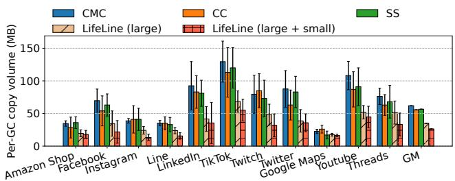  
Figure 13: Average per-GC copy volume across applications.

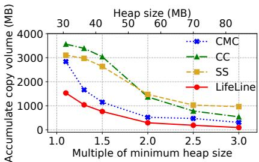  
(a) Copy volume across heap sizes.

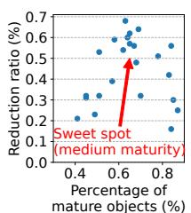  
(b) Mature ratio.  
Figure 14: Analysis of factors affecting GC copy volume.

## 6.2 Overall Performance

Copy Volume. To quantify how replacing object copying with page remapping reduces memory-movement overhead, we measure the GC copy volume per cycle for all collectors. Each application runs a 30 s warm-up phase, after which we record the bytes copied per GC. The warm-up excludes application launch, account restoration, and initial content fetching, and gives all collectors a comparably mature heap before mea surement. We fix the scrolling rate across experiments, collect 10 GCs per application, and report the mean and variance. Figure 13 shows the total data copied per GC. LifeLine substantially reduces physical copying: on average, copy volume drops by 57.4%, from 61.9 MB to 26.4 MB. LifeLine replaces many object copies with page remapping and shrinks both the number and size of the remaining copies. Compared to CMC, LifeLine exploits OS-level page remapping more aggressively, whereas CMC still performs object-level copying for most movements. Overall, LifeLine achieves effective compaction with far fewer memory-copy operations.

LifeLine’s reduction varies across and within applications, so we next examine what drives its effectiveness. We first study how heap size (normalized to the SS collector’s minimum heap size) affects copy volume (Figure 14a). Across heap sizes, LifeLine consistently copies less than the other collectors, and its advantage widens as the heap shrinks, indicating greater benefits under tighter memory constraints.

We then analyze the impact of the mature-object fraction using Amazon Shopping as a case study. Figure 14b correlates LifeLine’s reduction in copy volume relative to CMC with the fraction of objects in the mature generation. As the mature fraction increases, LifeLine’s benefit first grows, peaking at moderate maturity (e.g., at 65% mature objects, it cuts copy volume by about 60% on average), and then declines once mature objects dominate. Beyond roughly 80% mature objects, CMC can also leverage OS-level page remapping effectively, narrowing LifeLine’s relative advantage. Thus, LifeLine’s benefit is strongly tied to the proportion of mature objects and is maximized at intermediate mature fractions.

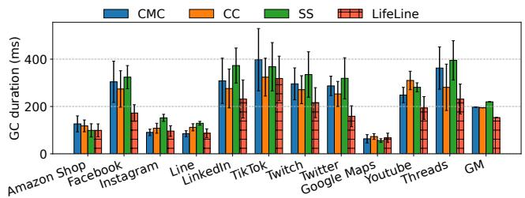  
Figure 15: GC duration across applications.

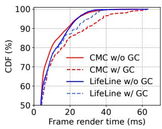  
(a) Twitter.

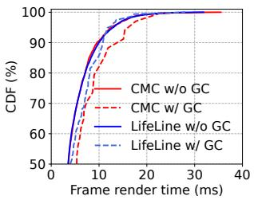  
(b) Instagram.  
Figure 16: Frame render time distributions.

GC Duration. GC duration is critical on mobile devices because longer GCs increase the risk of blocking user interactions. We reuse the methodology above but now measure GC execution time. Figure 15 reports the average duration and variance for each GC method. LifeLine consistently shortens GC duration in most applications. On average, it reduces GC time from 198 ms (CMC) to 153 ms, a 22.7% reduction. The improvement varies with each application’s workload. First, the reduction in duration closely tracks the reduction in copy volume: the more copies LifeLine avoids, the more GC time it saves. Second, applications with small heaps (e.g., Google Maps) already have short GCs, so even large percentage reductions translate into smaller absolute gains.

Frame Rendering Performance. For Android applications, frame-rendering smoothness is a primary user-visible metric. Interactive workloads dominated by touch and scrolling are especially sensitive to GC-induced stalls. We use Twitter and Instagram as case studies and measure frame-rendering-time distributions using the gfxinfo tool, capping heap size at 80 MB (roughly 2–3× their minimum heap). Figure 16 shows the cumulative distribution function (CDF) of frame latency for Twitter and Instagram, separating intervals with and without GC. Under CMC, GC causes a clear rightward shift in the tail; for example, the 90th-percentile latency is around 30 ms, leading to noticeable stutters. LifeLine significantly improves tail latency when GC occurs. For Instagram, it reduces the 90th-percentile latency by about 29% relative to CMC. Overall, by reducing memory copying, LifeLine alleviates GC-induced stalls, leading to smoother scrolling and a more responsive user interface.

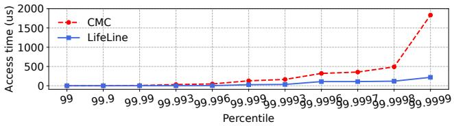  
Figure 17: Tail memory access latency during GC.

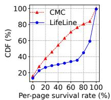  
(a) Amazon.

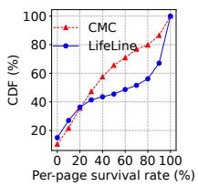  
(b) Twitter.

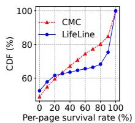  
(c) Instagram.  
Figure 18: Per-page survival-rate distribution.

## 6.3 Benefit Breakdown

We now decompose LifeLine’s overall gains into lower-level effects that explain how it reduces stalls and copying overhead.

Tail Memory Access Latency. As discussed in §3.1, memory copies on the GC critical path can inflate tail memoryaccess latency. To quantify LifeLine’s effect, we use Amazon Shopping as a case study and sample read accesses during compaction. We record every 100th access, treating the time required to read a field from an object as the memory-access latency. Figure 17 shows the tail distribution for LifeLine and CMC. LifeLine substantially shrinks the tail. At the 1-ppm tail, it reduces latency by 85% compared to CMC. This improvement arises because LifeLine avoids large object copies on page faults and instead relies on zero-copy page remapping, eliminating many stalls on the GC critical path.

Accuracy of Object–Page Lifetime Alignment. In §3.1, we identified object–page lifetime mismatch as the main reason existing Android collectors struggle to cooperate with the OS. To assess how well LifeLine addresses this issue, we examine the per-page survival ratios at the next GC after alignment. Figure 18 shows that LifeLine reshapes the per-page survival distribution compared to CMC. Under CMC, survival ratios are roughly uniform, with many pages in the 20–80% range. Under LifeLine, the CDF over 20–80% is relatively flat, with steep jumps around 10% and 90%, meaning that most pages are either almost empty or almost full. LifeLine thus converts a near-random distribution into a bimodal one, aligning object lifetimes with page lifetimes.

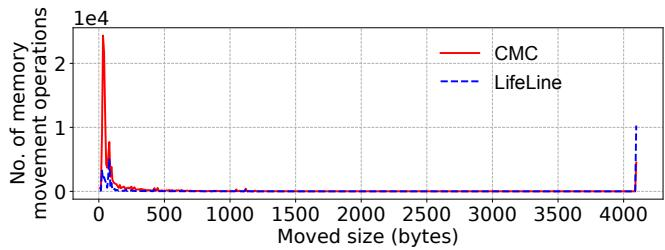  
Figure 19: Detailed profile of memory movement.

The accuracy of this alignment is also robust to imperfect lifetime prediction. LifeLine does not require exact object lifetimes: it only needs enough correlation to make most pages clearly sparse or dense. When LGP occasionally groups objects whose lifetimes later diverge, the consequence is a medium-survival page rather than an incorrect reclamation decision. ZCGC handles such pages conservatively through the copy path, so inaccurate alignment degrades the opportunity for zero-copy remapping but does not compromise correctness. As objects on poorly aligned pages are copied back to the unaligned generation and newly promoted objects accumulate there, the aligned-to-unaligned generation ratio drops and triggers a new LAGC. Thus, alignment accuracy is self-correcting across GC cycles: transient prediction errors mainly reduce the immediate remapping benefit, while sustained workload changes are absorbed by re-alignment.

Distribution of Memory-Movement Granularity. Given such alignment, LifeLine can perform GC largely at page granularity instead of object granularity. To study this, we measure the size of each memory-movement operation during a single GC for Amazon Shopping. Figure 19 shows that CMC performs many small object moves (e.g., 0–100 bytes), each requiring explicit copying. LifeLine greatly reduces such tiny moves and increases page-sized (4 KB) movements, which are handled efficiently via OS page remapping. Once object and page lifetimes are aligned, LifeLine enables page-granularity GC and tighter GC-OS cooperation.

## 6.4 Overhead Analysis

Memory Overhead. LifeLine’s memory overhead comes primarily from two sources: (1) LGP’s layered Bloom filters and (2) LAGC’s subgraph metadata. A three-level Bloom-filter design is sufficient in most cases (see §6.5). In our implementation, the first layer uses a 2 MB filter, while the second and third layers use 0.5 MB each, keeping the false-positive rate below 1%. Higher layers store less data and therefore require smaller filters. For each subgraph, LAGC stores two 4-byte pointers and one 4-byte size field, introducing only minor memory overhead. For example, storing metadata for 5000 subgraphs requires only 59 KB. Overall, LifeLine adds less than 4 MB of auxiliary memory. Moreover, these auxiliary structures are dynamically allocated and used only during lifetime alignment. After alignment, LifeLine switches to near-zero-copy GC and releases these structures. Therefore, its memory overhead is modest relative to the performance gains.

CPU Overhead. Different LifeLine components affect CPU usage in distinct ways. Using System Tracing [6] and Perfetto [8], we profile CPU time per component. ZCGC reduces GC duration, decreasing GC-thread CPU time by 32% compared to CMC. The additional CPU work comes from LGP and LAGC. LGP tracks field mutability by interposing on object-reference writes and consulting the per-thread sampling counter. Because this code executes in the mutator, its cost depends on write frequency; however, the sampling period limits how often the full barrier records a field update. In our measurements, this write-sampling path increases average CPU time by roughly 3.8%. During LAGC, the collector maintains subgraph metadata while marking, identifying subgraph roots and recording ownership and size information. LAGC performs page-aware placement during compaction, assigning large subgraphs to page-aligned regions and packing small, related subgraphs together so that subsequent ZCGC cycles can efficiently remap pages. Metadata maintenance and pageaware placement together add approximately 12.5% CPU time relative to CMC during alignment. Notably, these expensive operations occur only during alignment phases, while steadystate ZCGC leverages the resulting layout and avoids much of CMC’s copy work. For example, during a 3-minute Instagram run, LifeLine’s average CPU overhead during LAGC is about 2.7% over CMC, which we consider modest given the reductions in GC copying and the improvements in user-visible performance.

## 6.5 Sensitivity Analysis

Table 1 summarizes the parameters of LifeLine. In this section, we examine how these parameters affect the system. Among them, the number of Bloom-filter levels, N , is a critical parameter, as it determines the quality of subgraph generation. We vary NB from 1 to 5 (see Figure 10). A small NB (e.g., 1) produces overly fine-grained subgraphs, which in turn multiplies the overhead of LAGC and makes it inefficient. Conversely, a large NB (e.g., 5) mixes objects with different lifetimes and also introduces unnecessary Bloom-filter sampling and storage overhead, reducing the efficiency of ZCGC. We therefore set NB = 3, which yields subgraphs whose sizes and lifetimes align well with page granularity while incurring relatively low overhead.

We similarly sweep the remaining parameters. If MB is too small, CPU overhead rises sharply; if it is too large, objects with very different lifetimes are grouped together. For TG, values below 4 KB create placement gaps for large subgraphs and waste space; since page size is 4 KB, we cap TG at 4 KB. If TM is too small, many well-aligned pages are unnecessarily migrated back to the unaligned generation; if it is too large, garbage is reclaimed too late. A 90% threshold works well in practice. Finally, if ∆ is too small, LAGC runs too frequently; if it is too large, too many objects remain unaligned and LifeLine’s behavior converges toward CMC.

## 6.6 Discussion on Generalizability

We focus on ART because, to our knowledge, it is the only mainstream open-source runtime whose GC is explicitly co-designed with the OS. Other major runtimes, such as the server-side JVM [7], .NET [43], and JavaScript engines [29,45], currently lack CMC-like OS-cooperative collectors, likely due to cross-platform and engineering constraints. Consequently, we evaluate LifeLine only on Android. Life-Line can, in principle, be integrated into other runtimes to enable stronger GC-OS cooperation and unlock optimizations unavailable to a standalone runtime.

## 7 Related Work

Garbage Collection. Automatic memory management is a cornerstone of modern managed runtimes [16, 18, 36, 42, 54, 58]. Prior work optimizes GC along multiple dimensions, including pause time [21, 25, 32, 63], throughput [41, 59, 68], fragmentation [11, 13], and memory footprint [32]. LifeLine belongs to this space but focuses on reducing unnecessary GC work through fine-grained lifetime prediction.

Lifetime-based strategies are central to generational collectors [14, 17, 55], which assign objects to a small number of generations based on expected remaining lifetimes. From the OS perspective, however, these schemes are coarse-grained: each generation exposes only a few categories, and pages within a generation may still mix short- and long-lived objects. LifeLine adopts a finer-grained mature-space layout, where each generation corresponds to a single page, aligning object lifetimes with page boundaries. This page-aligned organization improves GC efficiency and, as we demonstrate, reduces jank in Android applications. In this sense, Life-Line can be viewed as a page-level refinement of generational collection for runtimes that already support OS-assisted movement, rather than a competing policy for young-object management. Beyond general-purpose collectors, specialized schemes address disaggregated memory [41, 56, 57], nonvolatile memory [40, 50, 60], and large-scale data-processing frameworks [27, 46]. Similarly, LifeLine is designed for mobile runtimes and specifically addresses GC-induced jank in Android deployments.

Cross-layer Memory Management. Recent GC–OS codesign efforts [2, 26] leverage kernel mechanisms [4] to reduce jank, lower energy consumption, and improve performance. However, these approaches are fundamentally lim ited by the mismatch between object lifetimes and page layouts, constraining the benefits of page remapping and reclamation. LifeLine directly addresses this mismatch by producing lifetime-homogeneous pages, enabling more effective GC–OS cooperation. Other systems, such as Marvin [39] and Fleet [33], coordinate GC with the virtual memory subsystem to improve memory efficiency and hot-launch behavior for background applications. This line of work is largely orthogonal to LifeLine. By organizing objects into page-aligned lifetime classes, LifeLine can complement these GC–OS policies, enhancing both foreground GC performance and backgroundoriented reclamation and compaction.

## 8 Conclusion

In this paper, we revisit the copying overhead caused by GC in mobile applications and reveal a fundamental lifetime mismatch between objects and memory pages. LifeLine employs a graph-based lifetime alignment mechanism to cluster cosurviving objects onto the same pages, enabling reduced GC overhead and improving overall performance. Although our current prototype targets ART on Android phones, the core idea of aligning object and page lifetimes naturally extends to other managed runtimes and hardware platforms, paving the way for more efficient OS-assisted GC.

## Acknowledgments

We thank the anonymous reviewers and our shepherd for their valuable and constructive feedback, which significantly improved this paper. This work was supported in part by the Research Grants Council of Hong Kong (No. 11216925), and by City University of Hong Kong internal and donation fundings (No. 9610598, No. 9220148, and No. 7005991). This work was also supported by OPPO Research Funding.

## References

[1] Android 13 is in aosp!, 2022. https: //android-developers.googleblog.com/2022/ 08/android-13-is-in-aosp.html [Accessed: 20-Nov-2025].

[2] Rfc for new feature to move pages from one vma to another without split, 2023. https: //lore.kernel.org/linux-mm/CA+EESO4uO84 SSnBhArH4HvLNhaUQ5nZKNKXqxRCyjniNVjp0Aw@ mail.gmail.com/ [Accessed: 20-Nov-2025].

[3] userfaultfd move option, 2023. https://lwn.net/ Articles/952319/ [Accessed: 20-Nov-2025].

[4] userfaultfd: Uffdio\_move uabi, 2023. https: //git.kernel.org/pub/scm/linux/kernel/git/ torvalds/linux.git/commit/?id=adef440691ba [Accessed: 20-Nov-2025].

[5] Android 8.0 art improvements, 2025. https://source. android.com/docs/core/runtime/improvements/ [Accessed: 20-Nov-2025].

[6] Capture a system trace on a device, 2025. https://developer.android.com/topic/ performance/tracing/on-device/ [Accessed: 20-Nov-2025].

[7] The hotspot group, 2025. https://openjdk.org/ groups/hotspot/ [Accessed: 20-Nov-2025].

[8] Perfetto - system profiling, app tracing and trace analysis, 2025. https://perfetto.dev/ [Accessed: 20- Nov-2025].

[9] Android phone statistics by best technology, 2026. https://scoop.market.us/android-phonesstatistics/ [Accessed: 14-May-2026].

[10] Google play store statistics 2026: Key data every app business should know, 2026. https://www.apptunix. com/blog/google-play-store-statistics/ [Accessed: 01-Jun-2026].

[11] David F. Bacon, Perry Cheng, and V. T. Rajan. Controlling fragmentation and space consumption in the metronome, a real-time garbage collector for java. In Frank Mueller and Ulrich Kremer, editors, Proceedings of the 2003 Conference on Languages, Compilers, and Tools for Embedded Systems (LCTES’03). San Diego, California, USA, June 11-13, 2003, pages 81–92. ACM, 2003.

[12] Stephen M. Blackburn, Perry Cheng, and Kathryn S. McKinley. Myths and realities: the performance impact of garbage collection. In Edward G. Coffman Jr., Zhen Liu, and Arif Merchant, editors, Proceedings of the International Conference on Measurements and Modeling of Computer Systems, SIGMETRICS 2004, June 10-14, 2004, New York, NY, USA, pages 25–36. ACM, 2004.

[13] Stephen M. Blackburn and Kathryn S. McKinley. Immix: a mark-region garbage collector with space efficiency, fast collection, and mutator performance. In Rajiv Gupta and Saman P. Amarasinghe, editors, Proceedings of the ACM SIGPLAN 2008 Conference on Programming Language Design and Implementation, Tucson, AZ, USA, June 7-13, 2008, pages 22–32. ACM, 2008.

[14] Stephen M. Blackburn, Sharad Singhai, Matthew Hertz, Kathryn S. McKinley, and J. Eliot B. Moss. Pretenuring for java. In Linda M. Northrop and John M. Vlissides, editors, Proceedings of the 2001 ACM SIGPLAN Conference on Object-Oriented Programming Systems, Languages and Applications, OOPSLA 2001, Tampa, Florida, USA, October 14-18, 2001, pages 342–352. ACM, 2001.

[15] Burton H. Bloom. Space/time trade-offs in hash coding with allowable errors. Commun. ACM, 13(7):422–426, 1970.

[16] Hans-Juergen Boehm and Mark D. Weiser. Garbage collection in an uncooperative environment. Softw. Pract. Exp., 18(9):807–820, 1988.

[17] Rodrigo Bruno, Luís Picciochi Oliveira, and Paulo Ferreira. NG2C: pretenuring n-generational GC for hotspot big data applications. CoRR, abs/1704.03764, 2017.

[18] Cliff Click, Gil Tene, and Michael Wolf. The pauseless GC algorithm. In Michael Hind and Jan Vitek, editors, Proceedings of the 1st International Conference on Virtual Execution Environments, VEE 2005, Chicago, IL, USA, June 11-12, 2005, pages 46–56. ACM, 2005.

[19] Saar Cohen and Yossi Matias. Spectral bloom filters. In Alon Y. Halevy, Zachary G. Ives, and AnHai Doan, editors, Proceedings of the 2003 ACM SIGMOD International Conference on Management of Data, San Diego, California, USA, June 9-12, 2003, pages 241–252. ACM, 2003.

[20] Ulan Degenbaev, Jochen Eisinger, Manfred Ernst, Ross McIlroy, and Hannes Payer. Idle time garbage collection scheduling. In Chandra Krintz and Emery D. Berger, editors, Proceedings of the 37th ACM SIGPLAN Conference on Programming Language Design and Implementation, PLDI 2016, Santa Barbara, CA, USA, June 13-17, 2016, pages 570–583. ACM, 2016.

[21] David Detlefs, Christine H. Flood, Steve Heller, and Tony Printezis. Garbage-first garbage collection. In David F. Bacon and Amer Diwan, editors, Proceedings of the 4th International Symposium on Memory Management, ISMM 2004, Vancouver, BC, Canada, October 24-25, 2004, pages 37–48. ACM, 2004.

[22] Tamar Domani, Elliot K. Kolodner, and Erez Petrank. A generational on-the-fly garbage collector for java. In Monica S. Lam, editor, Proceedings of the 2000 ACM SIGPLAN Conference on Programming Language Design and Implementation (PLDI), Vancouver, Britith Columbia, Canada, June 18-21, 2000, pages 274–284. ACM, 2000.

[23] Benjamin Van Durme and Ashwin Lall. Probabilistic counting with randomized storage. In Craig Boutilier, editor, IJCAI 2009, Proceedings of the 21st International Joint Conference on Artificial Intelligence, Pasadena, California, USA, July 11-17, 2009, pages 1574–1579, 2009.

[24] Domenico Ficara, Stefano Giordano, Gregorio Procissi, and Fabio Vitucci. Multilayer compressed counting bloom filters. In INFOCOM 2008. 27th IEEE International Conference on Computer Communications, Joint Conference of the IEEE Computer and Communications Societies, 13-18 April 2008, Phoenix, AZ, USA, pages 311–315. IEEE, 2008.

[25] Christine H Flood, Roman Kennke, Andrew Dinn, Andrew Haley, and Roland Westrelin. Shenandoah: An open-source concurrent compacting garbage collector for openjdk. In Proceedings of the 13th International Conference on Principles and Practices of Programming on the Java Platform: Virtual Machines, Languages, and Tools, pages 1–9, 2016.

[26] Lokesh Gidra, Hans-J Boehm, and Joel Fernandes. Utilizing the linux userfaultfd system call in a compaction phase of a garbage collection process. 2020.

[27] Lokesh Gidra, Gaël Thomas, Julien Sopena, Marc Shapiro, and Nhan Nguyen. Numagic: a garbage collector for big data on big NUMA machines. In Özcan Özturk, Kemal Ebcioglu, and Sandhya Dwarkadas, editors, Proceedings of the Twentieth International Conference on Architectural Support for Programming Languages and Operating Systems, ASPLOS 2015, Istanbul, Turkey, March 14-18, 2015, pages 661–673. ACM, 2015.

[28] Vaibhav Gogte, William Wang, Stephan Diestelhorst, Aasheesh Kolli, Peter M. Chen, Satish Narayanasamy, and Thomas F. Wenisch. Software wear management for persistent memories. In Arif Merchant and Hakim Weatherspoon, editors, 17th USENIX Conference on File and Storage Technologies, FAST 2019, Boston, MA, February 25-28, 2019, pages 45–63. USENIX Association, 2019.

[29] Google. V8 JavaScript Engine. https://v8.dev/. Accessed: 20-Nov-2025.

[30] Zhiyuan Guo, Zijian He, and Yiying Zhang. Mira: A program-behavior-guided far memory system. In Jason Flinn, Margo I. Seltzer, Peter Druschel, Antoine Kaufmann, and Jonathan Mace, editors, Proceedings of the 29th Symposium on Operating Systems Principles, SOSP 2023, Koblenz, Germany, October 23-26, 2023, pages 692–708. ACM, 2023.

[31] Jingkai He, Yunpeng Dong, Dong Du, Mo Zou, Zhitai Yu, Yuxin Ren, Ning Jia, Yubin Xia, and Haibo Chen. How to copy memory? coordinated asynchronous copy as a first-class OS service. In Youjip Won, Youngjin Kwon, Ding Yuan, and Rebecca Isaacs, editors, Proceedings of the ACM SIGOPS 31st Symposium on Operat ing Systems Principles, SOSP 2025, Lotte Hotel World, Seoul, Republic of Korea, October 13-16, 2025, pages 1062–1081. ACM, 2025.

[32] Matthew Hertz and Emery D. Berger. Quantifying the performance of garbage collection vs. explicit memory management. In Ralph E. Johnson and Richard P. Gabriel, editors, Proceedings of the 20th Annual ACM SIGPLAN Conference on Object-Oriented Programming, Systems, Languages, and Applications, OOPSLA 2005, October 16-20, 2005, San Diego, CA, USA, pages 313–326. ACM, 2005.

[33] Jiacheng Huang, Yunmo Zhang, Junqiao Qiu, Yu Liang, Rachata Ausavarungnirun, Qingan Li, and Chun Jason Xue. More apps, faster hot-launch on mobile devices via fore/background-aware gc-swap co-design. In Rajiv Gupta, Nael B. Abu-Ghazaleh, Madan Musuvathi, and Dan Tsafrir, editors, Proceedings of the 29th ACM International Conference on Architectural Support for Programming Languages and Operating Systems, Volume 3, ASPLOS 2024, La Jolla, CA, USA, 27 April 2024- 1 May 2024, pages 654–670. ACM, 2024.

[34] Xianglong Huang, Stephen M. Blackburn, Kathryn S. McKinley, J. Eliot B. Moss, Zhenlin Wang, and Perry Cheng. The garbage collection advantage: improving program locality. In John M. Vlissides and Douglas C. Schmidt, editors, Proceedings of the 19th Annual ACM SIGPLAN Conference on Object-Oriented Programming, Systems, Languages, and Applications, OOPSLA 2004, October 24-28, 2004, Vancouver, BC, Canada, pages 69–80. ACM, 2004.

[35] Ahmed Hussein, Mathias Payer, Antony L. Hosking, and Christopher A. Vick. One process to reap them all: Garbage collection as-a-service. In Proceedings of the 13th ACM SIGPLAN/SIGOPS International Conference on Virtual Execution Environments, VEE 2017, Xi’an, China, April 8-9, 2017, pages 171–186. ACM, 2017.

[36] Richard E. Jones, Antony L. Hosking, and J. Eliot B. Moss. The Garbage Collection Handbook: The art of automatic memory management. Chapman and Hall / CRC Applied Algorithms and Data Structures Series. CRC Press, 2011.

[37] Henry G. Baker Jr. List processing in real time on a serial computer. Commun. ACM, 21(4):280–294, 1978.

[38] Haim Kermany and Erez Petrank. The compressor: concurrent, incremental, and parallel compaction. In Michael I. Schwartzbach and Thomas Ball, editors, Proceedings of the ACM SIGPLAN 2006 Conference on Programming Language Design and Implementation, Ottawa, Ontario, Canada, June 11-14, 2006, pages 354– 363. ACM, 2006.

[39] Niel Lebeck, Arvind Krishnamurthy, Henry M. Levy, and Irene Zhang. End the senseless killing: Improving memory management for mobile operating systems. In Ada Gavrilovska and Erez Zadok, editors, Proceedings of the 2020 USENIX Annual Technical Conference, USENIX ATC 2020, July 15-17, 2020, pages 873–887. USENIX Association, 2020.

[40] Anatole Lefort, Yohan Pipereau, Kwabena Amponsem, Pierre Sutra, and Gaël Thomas. J-NVM: off-heap persistent objects in java. In Robbert van Renesse and Nickolai Zeldovich, editors, SOSP ’21: ACM SIGOPS 28th Symposium on Operating Systems Principles, Virtual Event / Koblenz, Germany, October 26-29, 2021, pages 408–423. ACM, 2021.

[41] Haoran Ma, Shi Liu, Chenxi Wang, Yifan Qiao, Michael D. Bond, Stephen M. Blackburn, Miryung Kim, and Guoqing Harry Xu. Mako: a lowpause, high-throughput evacuating collector for memorydisaggregated datacenters. In Ranjit Jhala and Isil Dillig, editors, PLDI ’22: 43rd ACM SIGPLAN International Conference on Programming Language Design and Implementation, San Diego, CA, USA, June 13 - 17, 2022, pages 92–107. ACM, 2022.

[42] Martin Maas, Krste Asanovic, and John Kubiatowicz. A hardware accelerator for tracing garbage collection. In Murali Annavaram, Timothy Mark Pinkston, and Babak Falsafi, editors, 45th ACM/IEEE Annual International Symposium on Computer Architecture, ISCA 2018, Los Angeles, CA, USA, June 1-6, 2018, pages 138–151. IEEE Computer Society, 2018.

[43] Microsoft. .NET. https://dotnet.microsoft.com/. Accessed: 20-Nov-2025.

[44] Michael Mitzenmacher. Compressed bloom filters. In Ajay D. Kshemkalyani and Nir Shavit, editors, Proceedings of the Twentieth Annual ACM Symposium on Principles of Distributed Computing, PODC 2001, Newport, Rhode Island, USA, August 26-29, 2001, pages 144–150. ACM, 2001.

[45] Mozilla. SpiderMonkey JavaScript Engine. https: //spidermonkey.dev/. Accessed: 20-Nov-2025.

[46] Khanh Nguyen, Lu Fang, Guoqing Xu, Brian Demsky, Shan Lu, Sanazsadat Alamian, and Onur Mutlu. Yak:

A high-performance big-data-friendly garbage collector. In Kimberly Keeton and Timothy Roscoe, editors, 12th USENIX Symposium on Operating Systems Design and Implementation, OSDI 2016, Savannah, GA, USA, November 2-4, 2016, pages 349–365. USENIX Association, 2016.

[47] Tony Printezis and David Detlefs. A generational mostly-concurrent garbage collector. In Craig Chambers and Antony L. Hosking, editors, ISMM 2000, In ternational Symposium on Memory Management, Minneapolis, Minnesota, USA, October 15-16, 2000 (in conjunction with OOPSLA 2000), Conference Proceedings, pages 143–154. ACM, 2000.

[48] Amanda Raybuck, Tim Stamler, Wei Zhang, Mattan Erez, and Simon Peter. Hemem: Scalable tiered memory management for big data applications and real NVM. In Robbert van Renesse and Nickolai Zeldovich, editors, SOSP ’21: ACM SIGOPS 28th Symposium on Operating Systems Principles, Virtual Event / Koblenz, Germany, October 26-29, 2021, pages 392–407. ACM, 2021.

[49] Kunal Sareen, Stephen M. Blackburn, Sara S. Hamouda, and Lokesh Gidra. Memory management on mobile devices. In Michael D. Bond, Jae W. Lee, and Hannes Payer, editors, Proceedings of the 2024 ACM SIGPLAN International Symposium on Memory Management, ISMM 2024, Copenhagen, Denmark, 25 June 2024, pages 15–29. ACM, 2024.

[50] Thomas Shull, Jian Huang, and Josep Torrellas. Autopersist: an easy-to-use java NVM framework based on reachability. In Kathryn S. McKinley and Kathleen Fisher, editors, Proceedings of the 40th ACM SIGPLAN Conference on Programming Language Design and Im plementation, PLDI 2019, Phoenix, AZ, USA, June 22- 26, 2019, pages 316–332. ACM, 2019.

[51] Haoyu Song, Sarang Dharmapurikar, Jonathan S. Turner, and John W. Lockwood. Fast hash table lookup using extended bloom filter: an aid to network processing. In Roch Guérin, Ramesh Govindan, and Greg Minshall, editors, Proceedings of the ACM SIGCOMM 2005 Conference on Applications, Technologies, Architectures, and Protocols for Computer Communications, Philadelphia, Pennsylvania, USA, August 22-26, 2005, pages 181–192. ACM, 2005.

[52] Timothy Stamler, Deukyeon Hwang, Amanda Raybuck, Wei Zhang, and Simon Peter. zio: Accelerating iointensive applications with transparent zero-copy IO. In Marcos K. Aguilera and Hakim Weatherspoon, editors, 16th USENIX Symposium on Operating Systems Design and Implementation, OSDI 2022, Carlsbad, CA, USA, July 11-13, 2022, pages 431–445. USENIX Association, 2022.

[53] Darko Stefanovic, Kathryn S. McKinley, and J. Eliot B. Moss. Age-based garbage collection. In Brent Hailpern, Linda M. Northrop, and A. Michael Berman, editors, Proceedings of the 1999 ACM SIGPLAN Conference on Object-Oriented Programming Systems, Languages & Applications, OOPSLA 1999, Denver, Colorado, USA, November 1-5, 1999, pages 370–381. ACM, 1999.

[54] Kun Suo, Jia Rao, Hong Jiang, and Witawas Srisa-an. Characterizing and optimizing hotspot parallel garbage collection on multicore systems. In Rui Oliveira, Pascal Felber, and Y. Charlie Hu, editors, Proceedings of the Thirteenth EuroSys Conference, EuroSys 2018, Porto, Portugal, April 23-26, 2018, pages 35:1–35:15. ACM, 2018.

[55] David M. Ungar. Generation scavenging: A nondisruptive high performance storage reclamation algorithm. In William E. Riddle and Peter B. Henderson, editors, Proceedings of the ACM SIGSOFT/SIGPLAN Software Engineering Symposium on Practical Software Development Environments, Pittsburgh, Pennsylvania, USA, April 23-25, 1984, pages 157–167. ACM, 1984.

[56] Chenxi Wang, Haoran Ma, Shi Liu, Yuanqi Li, Zhenyuan Ruan, Khanh Nguyen, Michael D. Bond, Ravi Netravali, Miryung Kim, and Guoqing Harry Xu. Semeru: A memory-disaggregated managed runtime. In 14th USENIX Symposium on Operating Systems Design and Implementation, OSDI 2020, Virtual Event, November 4-6, 2020, pages 261–280. USENIX Association, 2020.

[57] Chenxi Wang, Haoran Ma, Shi Liu, Yifan Qiao, Jonathan Eyolfson, Christian Navasca, Shan Lu, and Guoqing Harry Xu. Memliner: Lining up tracing and application for a far-memory-friendly runtime. In Marcos K. Aguilera and Hakim Weatherspoon, editors, 16th USENIX Symposium on Operating Systems Design and Implementation, OSDI 2022, Carlsbad, CA, USA, July 11-13, 2022, pages 35–53. USENIX Association, 2022.

[58] Kunshan Wang, Stephen M. Blackburn, Peter Zhu, and Matthew Valentine-House. Reworking memory management in cruby: A practitioner report. In Martin Maas, Tim Harris, and Onur Mutlu, editors, Proceedings of the 2025 ACM SIGPLAN International Symposium on Memory Management, ISMM 2025, Seoul, Republic of Korea, 17 June 2025, pages 109–121. ACM, 2025.

[59] Mingyu Wu, Liang Mao, Yude Lin, Yifeng Jin, Zhe Li, Hongtao Lyu, Jiawei Tang, Xiaowei Lu, Hao Tang, Denghui Dong, Haibo Chen, and Binyu Zang. Jade: A high-throughput concurrent copying garbage collector. In Proceedings of the Nineteenth European Conference on Computer Systems, EuroSys 2024, Athens, Greece, April 22-25, 2024, pages 1160–1174. ACM, 2024.

[60] Mingyu Wu, Ziming Zhao, Haoyu Li, Heting Li, Haibo Chen, Binyu Zang, and Haibing Guan. Espresso: Brewing java for more non-volatility with non-volatile memory. In Xipeng Shen, James Tuck, Ricardo Bianchini, and Vivek Sarkar, editors, Proceedings of the Twenty-Third International Conference on Architectural Support for Programming Languages and Operating Systems, ASPLOS 2018, Williamsburg, VA, USA, March 24-28, 2018, pages 70–83. ACM, 2018.

[61] Lingfeng Xiang, Zhen Lin, Weishu Deng, Hui Lu, Jia Rao, Yifan Yuan, and Ren Wang. Nomad: Non-exclusive memory tiering via transactional page migration. In Ada Gavrilovska and Douglas B. Terry, editors, 18th USENIX Symposium on Operating Systems Design and Implementation, OSDI 2024, Santa Clara, CA, USA, July 10-12, 2024, pages 19–35. USENIX Association, 2024.

[62] Albert Mingkun Yang, Erik Österlund, and Tobias Wrigstad. Improving program locality in the GC using hotness. In Alastair F. Donaldson and Emina Torlak, editors, Proceedings of the 41st ACM SIGPLAN International Conference on Programming Language Design and Implementation, PLDI 2020, London, UK, June 15- 20, 2020, pages 301–313. ACM, 2020.

[63] Albert Mingkun Yang and Tobias Wrigstad. Deep dive into zgc: A modern garbage collector in openjdk. ACM Transactions on Programming Languages and Systems (TOPLAS), 44(4):1–34, 2022.

[64] Anil Yelam, Stewart Grant, Saarth Deshpande, Nadav Amit, Radhika Niranjan Mysore, Amy Ousterhout, Marcos K. Aguilera, and Alex C. Snoeren. Eden: Developer-friendly application-integrated far memory. In Theophilus A. Benson and Radhika Niranjan Mysore,

editors, 22nd USENIX Symposium on Networked Systems Design and Implementation, NSDI 2025, Philadelphia, PA, USA, April 28-30, 2025, pages 1067–1083. USENIX Association, 2025.

[65] Anil Yelam, Kan Wu, Zhiyuan Guo, Suli Yang, Rajath Shashidhara, Wei Xu, Stanko Novakovic, Alex C. Snoeren, and Kimberly Keeton. Pageflex: Flexible and efficient user-space delegation of linux paging policies with ebpf. In Deniz Altinbüken and Ryan Stutsman, edi tors, Proceedings of the 2025 USENIX Annual Technical Conference, USENIX ATC 2025, Boston, MA, USA, July 7-9, 2025, pages 291–306. USENIX Association, 2025.

[66] Yang Yu, Tianyang Lei, Weihua Zhang, Haibo Chen, and Binyu Zang. Performance analysis and optimization of full garbage collection in memory-hungry environments. In Vishakha Gupta-Cledat, Donald E. Porter, and Vivek Sarkar, editors, Proceedings of the 12th ACM SIGPLAN/SIGOPS International Conference on Virtual Execution Environments, Atlanta, GA, USA, April 2-3, 2016, pages 123–130. ACM, 2016.

[67] Wenyu Zhao and Stephen M. Blackburn. Deconstructing the garbage-first collector. In Santosh Nagarakatte, Andrew Baumann, and Baris Kasikci, editors, VEE ’20: 16th ACM SIGPLAN/SIGOPS International Conference on Virtual Execution Environments, virtual event [Lausanne, Switzerland], March 17, 2020, pages 15–29. ACM, 2020.

[68] Wenyu Zhao, Stephen M. Blackburn, and Kathryn S. McKinley. Low-latency, high-throughput garbage collection. In Ranjit Jhala and Isil Dillig, editors, PLDI ’22: 43rd ACM SIGPLAN International Conference on Programming Language Design and Implementation, San Diego, CA, USA, June 13 - 17, 2022, pages 76–91. ACM, 2022.