USENIX

THE ADVANCED COMPUTING SYSTEMS ASSOCIATION

# Accelerating Confidential Databases with Crypto-free Mappings

Wenxuan Huang, Zhanbo Wang, and Mingyu Li, Key Laboratory of System Software, Chinese Academy of Sciences, and Institute of Software, Chinese Academy of Sciences, and University of Chinese Academy of Sciences

https://www.usenix.org/conference/osdi26/presentation/huang-wenxuan

# This paper is included in the Proceedings of the 20th USENIX Symposium on Operating Systems Design and Implementation.

July 13–15, 2026 • Seattle, WA, USA

ISBN 978-1-939133-55-7

Open access to the Proceedings of the 20th USENIX Symposium on Operating Systems Design and Implementation is sponsored by

# Accelerating Confidential Databases with Crypto-free Mappings

Wenxuan Huang Zhanbo Wang Mingyu Li

Key Laboratory of System Software (Chinese Academy of Sciences) Institute of Software, Chinese Academy of Sciences University of Chinese Academy of Sciences

## Abstract

Confidential databases (CDBs) enable secure queries over sensitive data in untrusted cloud environments using confidential computing hardware. While adoption is growing, widespread deployment is hindered by high overheads from frequent synchronous cryptographic operations, which cause significant computational and I/O bottlenecks.

ZENO is a novel CDB design that removes cryptographic operations from the critical path. It introduces crypto-free mappings that maintain data-independent identifiers within the database while securely mapping them to plaintext secrets in a trusted domain. This paradigm shift yields substantial performance gains across industry-standard benchmarks (TPC-C, TPC-H) and a real-world industrial workload. Specifically, ZENO speeds up TPC-H queries by up to 53.1× on ARM S-EL2 and 94.7× on x86 TDX compared to HEDB. ZENO’s optimization techniques have been integrated into GaussDB.

## 1 Introduction

Cloud databases have become the backbone of modern digital infrastructure, with organizations increasingly outsourcing their data management to Database-as-a-Service (DBaaS) providers [7, 10, 14]. However, this convenience comes with a critical security risk: cloud administrators have unrestricted access to all tenant data, leaving opportunities for both malicious and accidental exposure. Recent breaches, such as the Allianz Life exposure of 1.1 million personal records [20], underscore this threat. For sensitive databases regulated by laws such as HIPAA [5] and PCI-DSS [4], entrusting cloud infrastructure with plaintext data is untenable.

Confidential databases (CDBs) have emerged as a compelling solution. By leveraging trusted execution environments (TEEs), CDBs enable secure data upload and query execution while keeping data encrypted from the cloud provider. Over the past two decades, researchers have explored various CDB designs [25, 28, 42, 65, 73], and major cloud providers have deployed CDB systems [24, 45, 56, 74, 77].

Despite this industry momentum, CDB systems face a critical barrier to widespread adoption: severe performance degradation compared to plaintext databases, with analytical queries experiencing up to 79.5× higher latency [56]. This gap arises from a deliberate system design choice in industry deployments: rather than enclosing the entire DBMS within a TEE, which would prevent database administrators from performing essential maintenance tasks, modern CDBs execute only security-critical operators (e.g., numeric SUM operations) inside TEEs. The resulting split architecture necessitates synchronous software-based decryption and encryption for every remote procedure call (RPC) across domains, as illustrated in Figure 1. The computational burden scales linearly with data volume. For instance, a SUM aggregation over an N-row table requires 2N-2 decryptions and N-1 encryptions in total. Even worse, to support arbitrary computation across fields, modern CDBs employ field-level encryption, inflating each 4- byte integer to 32 bytes (8× expansion) due to cryptographic metadata (a 12-byte nonce and a 16-byte authentication tag required by schemes like AES-GCM). This dramatically amplifies cross-domain data movement, memory pressure, and I/O bandwidth demands. These limitations raise a fundamental question: Is cryptographic overhead inherent to CDB design, or can we achieve equivalent security guarantees with far cheaper alternatives?

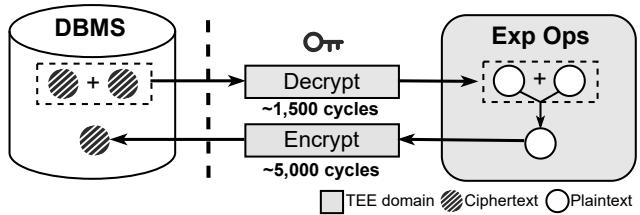  
Figure 1: In modern CDBs, a cross-domain invocation involves two decryptions and one encryption, incurring high computational overhead (CPU cycles evaluated on ARM).

Key insight. We argue that the performance crisis stems from an unexamined assumption that has persisted for decades: any data leaving TEEs must be encrypted. Modern CDBs store ciphertexts in the DBMS and decrypt them in TEEs for computation. We observe that this is fundamentally a mapping-based protection scheme: the DBMS uses ciphertexts as pointers to reference plaintext data in TEEs. Current practice conflates indirection with protection, encrypting both pointers and data. We decouple these concerns: pointers use lightweight indirection; only data at rest uses encryption. Based on this insight, we aim to replace the costly ciphertext-to-plaintext mappings with highly efficient index-to-plaintext mappings, while preserving both data confidentiality and database correctness.

Table 1: Comparison between modern CDBs and ZENO (CPU cycles evaluated on ARM).  
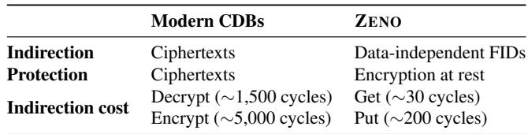

Our approach. We present ZENO, a CDB system that eliminates compute-intensive cryptography from the critical path without sacrificing security. ZENO introduces crypto-free mappings that bind data-independent field identifiers (FIDs) to their corresponding plaintext fields within TEEs. This allows the DBMS to manipulate data as before, while replacing slow per-field en/decryption with ultra-low-latency put/get operations, as shown in Table 1. In addition, to avoid encrypting every field synchronously, ZENO defers encryption: when data must be evicted from TEE memory to untrusted storage, ZENO performs asynchronous block-level encryption rather than fine-grained field-level encryption. In short, crypto-free mappings deliver two key benefits: they remove cryptographic operations from query execution hot paths and reduce metadata overhead via coarser-grained encryption.

Our design brings two main challenges. First, as datasets scale, the mapping lookup time could grow unbounded and ultimately exceed the cost of constant-time cryptographic operations. Second, maintaining transaction semantics and mapping consistency requires new mechanisms because both domains are now stateful, a situation not encountered in con ventional CDB systems.

To overcome the first challenge, ZENO introduces a scalable, low-latency data structure called the mapping store. This mapping store provides O(1) access complexity by treating FIDs as direct array indices, eliminating the need for tree traversals or hash-table probing. ZENO further preserves data locality across domains through storage-layout-aware mapping store organization. This layout awareness, combined with proactive prefetching, keeps the corresponding data resident in TEE memory when the DBMS accesses an FID block, thereby minimizing additional I/O overhead.

The second challenge requires a subtle observation: the state of the mapping store is internal to the system and invisible to the DBMS. The DBMS observes only the FIDs it maintains—the system’s external state. This asymmetry allows us to adopt external synchrony [61]: only FIDs maintained by the DBMS should be mapped to valid, up-to-date plaintexts; the reverse mapping (plaintexts to FIDs) need not even exist. As a result, ZENO only needs to maintain the invariant that every FID in the DBMS has a corresponding valid value in the mapping store. To uphold this invariant across transactions and crashes, ZENO introduces lightweight coordination protocols that ensure cross-domain updates remain consistent and crash-tolerant with minimal overhead.

We evaluate ZENO against HEDB [56], a state-of-the-art modern CDB that achieves the trifecta of functionality, maintainability, and security. Our results across both ARM S-EL2 and x86 TDX show that ZENO achieves substantial performance improvements while preserving all desired properties. On the transactional benchmark TPC-C, ZENO reduces HEDB’s throughput loss relative to plaintext PostgreSQL by up to 49.8% on ARM S-EL2 and 73.8% on x86 TDX. On the analytical benchmark TPC-H, ZENO speeds up query execution by up to 53.1× on ARM S-EL2 and 94.7× on x86 TDX over HEDB. On real-world industrial queries, ZENO outperforms HEDB with average speedups of 4.6× on ARM S-EL2 and 2.9× on x86 TDX. Additionally, ZENO reduces storage consumption by 38.9%, 52.8%, and 42.4% across the three workloads, respectively. The main performance techniques of ZENO have been integrated into GaussDB.

Contributions. We make the following contributions:

• We identify and analyze the performance bottlenecks of modern CDBs through comprehensive profiling and empirical analysis.

• We propose a novel CDB design with crypto-free mappings, which remove costly cryptographic operations from the critical path of existing modern CDBs.

• We build and deploy ZENO, which outperforms state-ofthe-art modern CDBs across transactional and analytical benchmarks, as well as a real-world industrial workload.

## 2 Background and Motivation

## 2.1 Confidential Computing

Confidential computing [9, 12, 16, 17, 22, 41, 47, 52, 55, 57] provides hardware-based trusted execution environments (TEEs) with three security guarantees. First, secure isolation through either enclaves [16, 41, 52] or confidential virtual machines (CVMs) [12, 17, 22] protects against inspection or tampering by untrusted privileged software. Second, hardware root-of-trust enables clients to verify code authenticity via remote attestation. Third, memory encryption and optional integrity checks resist physical attacks. Confidential computing is now widely available on commercial clouds [2, 6, 9, 13, 15].

## 2.2 Confidential Databases

Database-as-a-Service (DBaaS) [46] offers fully managed databases that handle updates, backups, and maintenance for users. However, since cloud environments are untrusted, sensitive data like healthcare and financial information requires secure storage and processing. Confidential databases (CDBs) [24, 25, 28, 42, 45, 56, 65, 67, 73, 74, 77] leverage confidential computing to enable SQL query processing over encrypted data without compromising confidentiality.

Existing CDB systems can be broadly categorized into two types. One type [28, 65, 67, 77] places the entire DBMS inside the trusted domain (TEE), where the DBMS processes data in plaintext and encrypts it when interacting with untrusted environments (e.g., network or storage). However, this type imposes an inherent limitation: the black-box TEE hinders DBMS maintainability for database administrators (DBAs) [24, 56]. In contrast, another type [24, 45, 56, 73, 74] adopts a split architecture: only essential expression operators (e.g., arithmetic, comparison<sup>1</sup>) execute inside TEEs, while most DBMS logic (e.g., SQL parsing, planning, buffer management) remains in the untrusted domain. This minimizes the TCB and preserves maintainability: DBAs can inspect query plans and debug DBMS issues. We refer to the latter as “modern CDBs” throughout the paper.

To enable flexible computation across arbitrary fields, modern CDBs apply field-level encryption. For example, since all fields from the column Salary are encrypted, "SELECT SUM(Salary) FROM Employee" requires the DBMS to iteratively call the addition operator inside the TEE, which decrypts operands, computes the sum, re-encrypts the result, and returns it to the DBMS. While secure, this design incurs substantial performance overhead, as we will analyze later.

HEDB [56]: a representative modern CDB. Modern CDBs could be vulnerable to smuggle attacks [56]: malicious DBAs exploit operator interfaces to construct known ciphertexts (via arithmetic operators, e.g., division yields encrypted “one,” addition builds sequences) and compare them against victim ciphertexts (via equality operators), thereby extracting secrets without authorization. HEDB addresses smuggle attacks through a dual-TEE architecture: an integrity zone that hosts the DBMS and a privacy zone that hosts operators, with a secure channel preventing direct interface access by DBAs. For maintainability, HEDB records cross-zone calls as ciphertext, enabling DBAs to replay and debug queries without plaintext access. Therefore, ZENO builds on HEDB’s security foundation. Notably, the performance limitations addressed by ZENO exist across many split-architecture CDBs [24, 45, 73, 74], and its crypto-free mappings generalize beyond HEDB.

## 2.3 What Makes Modern CDB Systems Slow?

Modern CDBs exemplified by HEDB have demonstrated significant performance overheads. Benchmarks on TPC-H show that HEDB can incur up to a 79.5× increase in latency compared to a plaintext database [56]. These overheads render modern CDBs impractical for latency-sensitive applications, hindering broader industry adoption. Our analysis attributes them to two main factors.

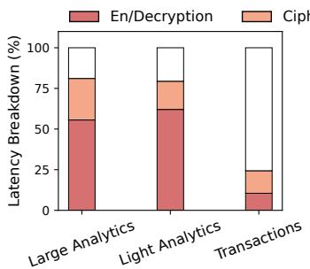

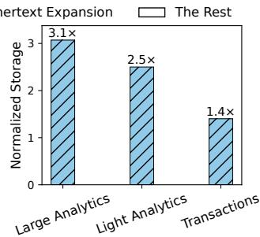  
Figure 2: Latency and storage overhead analysis across three typical workloads. Left (a): profiling end-to-end SQL execution time; the rest denotes normal DBMS execution and RPC invocations. Right (b): storage overhead normalized to plaintext databases.

Factor-#1: expensive encryption and decryption. In modern CDBs, each computation on sensitive data requires a cross-domain round-trip, which involves two decryptions and one encryption, each taking thousands of cycles, as shown in Table 1. For an operation like SUM on a table with N rows, the computation incurs N − 1 round-trips, resulting in 2N − 2 decryptions and N − 1 encryptions. Given that N is often tens of millions in real-world scenarios (reported by several CDB vendors we surveyed), this high frequency of expensive cryptographic operations inevitably introduces high overhead on the critical path. While batching multiple RPC invocations into a single round trip (e.g., for aggregation operators such as SUM, AVG, MAX, and MIN) can help amortize overhead, the core issue remains that cryptographic operations must still be performed on every single data item.

Factor-#2: ciphertext expansion. Modern CDBs employ field-level encryption with AES-GCM. To guarantee data confidentiality and integrity, each encrypted field requires a nonce (12 bytes) and message authentication code (MAC, 16 bytes), totaling 28 B of cryptographic metadata. This introduces significant ciphertext expansion: a 4-byte integer expands to 32 bytes, an 8× size increase. This expansion creates two performance bottlenecks. First, it enlarges the data transferred during frequent inter-domain RPCs, resulting in higher memory copy latency. Second, it increases the overall storage footprint of the database, leading to more I/O operations between the DBMS buffer pool and storage.

Empirical analysis. We profile HEDB [56] (commit f48742de) using three workloads: (i) TPC-H Q1 with a dataset larger than memory, representing large table computation; (ii) TPC-H Q1 with a dataset fitting in memory, capturing lightweight analytical settings; and (iii) a transactional benchmark with many write-heavy small queries. Despite the batching optimization, HEDB exhibits significantly higher overhead, with an overall latency slowdown of up to 5.3× relative to the plaintext baseline. As illustrated by the performance breakdown in Figure 2(a), en/decryption operations and ciphertext expansion account for a substantial fraction of the total execution time, contributing 10.5–62.6% and 13.9–25.5%, respectively, across workloads. Specifically, the contribution of I/O amplification is more pronounced in (i) than in (ii). This shift shows that the overhead distribution varies with the workload, particularly with respect to data scale and memory residency. Meanwhile, the storage overhead (Figure 2(b)) reveals that field-level encryption incurs a 1.4× to 3.1× storage expansion relative to the plaintext baseline.

Strawman: a ciphertext-to-plaintext cache. Since confidential VM-based TEEs (e.g., Intel TDX [17], AMD SEV-SNP [22]) provide sufficiently large secure memory, one may consider maintaining a ciphertext-to-plaintext cache within TEEs to remove cryptographic operations from the critical path. However, as the cache scales with the protected dataset, searching a large ciphertext-keyed structure can itself become a bottleneck. As our ablation study shows (§7.2), such a cache helps reduce cryptographic cost but remains limited by the overhead of ciphertext-based lookups.

## 3 ZENO Overview

Design goals. ZENO has two design goals:

• G1: Compatibility. ZENO aims to be compatible with modern CDB designs by preserving their functionality (standard SQL and ACID), while retaining HEDB-level DBA maintainability and security (data confidentiality and database integrity).

• G2: Efficiency. ZENO aims to reduce the performance gap between existing modern CDBs and plaintext databases by optimizing the two factors identified in § 2.3.

Threat model. We assume a powerful adversary who controls the entire cloud infrastructure except TEE hardware. This includes compromised server software, rogue cloud and database administrators, and external attackers. Adversaries can read and modify any data outside TEE domains—data at rest, in untrusted memory, and in transit—and observe all network traffic and I/O patterns visible outside TEE domains.

We assume TEEs provide two essential properties: memory isolation, preventing external access to TEE-internal state, and remote attestation, enabling users to verify code integrity before establishing trust. While TEE-agnostic, ZENO requires these guarantees to ensure sensitive plaintext data remains visible only within TEE domains. We do not consider TEE side-channel attacks (e.g., [36, 69, 72, 76]); these can be addressed by orthogonal hardening techniques [33, 59, 81]. Nor do we consider database vulnerabilities [11], TEE defects [50], physical attacks [51], or denial-of-service.

Functional leakage inherent to split-architecture CDBs is permitted. This reflects a fundamental trade-off between functionality and privacy: exposing certain metadata is sometimes necessary to support core database functionalities, such as order for index construction [56]. Because our design substitutes ciphertexts with FIDs, we additionally account for any metadata exposed through this indirection mechanism; its security implications are analyzed in § 8.

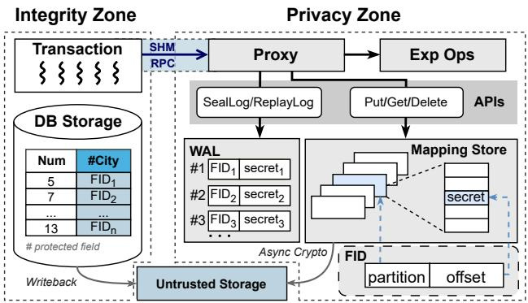  
Figure 3: High-level architecture of ZENO.

Insights. Current practice in modern CDBs employs a mapping-based protection scheme, using ciphertexts as pointers to plaintext data in TEEs. This design conflates two orthogonal concerns: indirection (cross-domain references) and protection (data confidentiality). Because ciphertexts serve both roles, this coupling necessitates expensive en/decryption on every RPC. ZENO decouples them: FIDs provide efficient indirection, while encryption protects data at rest.

In fact, separating indirection from protection is a longstanding systems principle. Capability systems [39, 53] used unforgeable tokens protected by OS confinement, rather than cryptography. Similarly, OSes have long used opaque handles, e.g., Unix file descriptors [21, 68], which are mapped internally by the kernel. In both cases, security comes from address-space isolation, keeping references simple and fast.

Architecture. ZENO’s high-level architecture is depicted in Figure 3. Following the security principles of HEDB’s dual-zone design, ZENO redesigns how protected values flow between zones. The integrity zone runs a commodity DBMS engine, and the privacy zone comprises four components: (1) a proxy that performs mapping operations and invokes the appropriate operators, (2) expression operators that perform computation over plaintexts, (3) the mapping store that manages the FID-to-secret mappings, and (4) a write-ahead log (WAL) for cross-domain consistency. The mapping store is divided into temporary and permanent partitions for finegrained management. The proxy interacts with the remaining components through a set of well-defined APIs.

APIs. ZENO provides five APIs to manage the mapping store:

• Put(partition\_num, secret) → FID: Stores the given secret in the specified partition of the mapping store.

Returns an FID with the partition number embedded, as a reference to the stored secret.

• Get(FID) → secret: Retrieves the secret associated with the specified FID, or returns a null value if the FID has no corresponding mapping.

• Delete(FID): Invalidates the specified FID-to-secret mapping in the mapping store, marking the entry as available for future allocation.

• SealLog(records) → encrypted\_records: Encrypts the given mapping-store WAL records and returns the encrypted records.

• ReplayLog(encrypted\_records): Replays the specified encrypted mapping-store WAL records to reconstruct FID-to-secret mappings.

At the operator interface, existing modern CDBs [24, 45, 56, 73, 74] can benefit from ZENO’s gains by replacing perfield en/decryption with Put()/Get() calls (see Listing 1).

```c
1 /* expression operators (unchanged) */
2 int int_add(int l, int r) { return l + r; }
3
4 /* proxy code snippet */
5 - EncInt enc_int(Ops ops, EncInt left, EncInt right)
6 + FID enc_int(Ops ops, FID left, FID right)
7 {
8 - int l = Decrypt(left), r = Decrypt(right);
9 + int l = Get(left), r = Get(right);
10 int result;
11 switch (ops) {
12 case ADD: result = int_add(l, r); break;
13 // other cases...
14 }
15 - return Encrypt(result);
16 + // use temporary partitions for intermediate results
17 + return Put(TMP_PARTITION_NUM, result);
18 }
```  
Listing 1: Example code for extending the original expression operator using ZENO’s APIs.

Workflow. ZENO’s query execution follows the workflow of modern CDB architectures. To perform computation, the proxy fetches secrets associated with each input FID from the mapping store via Get(), invokes the appropriate expression operator to compute over these retrieved secrets, and then stores the result back to the mapping store via Put(), which generates a new FID representing the output. The DBMS proceeds with query execution using this returned FID. Finally, the proxy resolves FIDs back into ciphertexts by calling Get() followed by encrypting the retrieved results within the privacy zone before returning them to users. Throughout this process, FIDs remain opaque to users. This design preserves compatibility (G1) with the client-side encryption model used by modern CDBs [24, 45, 56, 74].

Challenges. Since ZENO introduces state into the privacy zone, it brings two challenges. First, the lookup latency in the mapping store may grow with dataset size and eventually exceed constant-time cryptographic operations (§ 4). Second, maintaining state consistency between the integrity and privacy zones is necessary for database semantics (§ 5).

## 4 Achieving Efficiency via Mapping Store

This section details the mapping store, which plays a crucial role in achieving efficiency (G2).

## 4.1 Mapping Management

Data structure design. The mapping store is a linear array of tightly packed fields. Each sensitive field is assigned a unique integer FID that serves as a direct array index, hiding the size of individual fields from the adversary. This design choice offers two advantages. First, employing a compact integer FID effectively restricts the metadata overhead per field to a mere 8 B, representing a 71.4% reduction compared to the 28 B metadata required by modern CDBs. Second, the use of integer-based direct indexing enables O(1), cache-friendly array access to the mapping store, thereby eliminating the pointer-chasing and lookup overhead inherent in tree-based or hash-based key-value stores (e.g., [35, 40, 43]).

Mapping store operations. For fixed-length types (e.g., FLOAT8, TIMESTAMP), Delete() marks the corresponding mapping slots as reusable, and Put() either overwrites these invalidated slots or appends to the end. For variable-length types (e.g., VARCHAR, NUMERIC), the situation is subtle because values cannot be overwritten in place. We therefore maintain two arrays: an offset array and a data array. The offset array is indexed directly by FIDs and stores pointers into the data array. The data array is inspired by the slab allocator [31]: fields are grouped into size-class buckets, each maintained as a contiguous packed array to minimize fragmentation under frequent allocation and deallocation. Within each bucket, insertions and deletions follow the same overwrite/append logic as the fixed-length case.

Partition-based state management. The mapping store cannot directly infer the lifetime of each field. For instance, when an expression operator produces a result, it is unclear whether the value will be discarded after use or eventually persisted. Careless reclamation risks leaving live FIDs pointing to freed storage, causing data loss. To address this, we classify values into two categories: ephemeral values (e.g., query constants and intermediate results) and persistent values (e.g., data that outlives query completion). We separate their management by mapping them to distinct mapping store partitions: a temporary partition for ephemeral values and permanent partitions for persistent values.

For ephemeral values, reclamation occurs throughout their lifecycle. They are first placed in the temporary partition via Put() with the temporary partition identifier TMP\_- PARTITION\_NUM. If the DBMS later decides to persist such a value, ZENO intercepts the write path and performs another Put() with the permanent partition identifier. During this Put() call, ZENO allocates a new persistent FID, copies the value into the permanent partition, and returns the new FID to the DBMS. To avoid accumulating stale values in the temporary partition, ZENO reclaims ephemeral values in the privacy zone as soon as they are known to be dead, e.g., temporary operands consumed by aggregation or temporary FIDs that have already been migrated to the permanent partition. At the end of each query, any values still remaining in the temporary partition, i.e., ephemeral values whose lifetime extends to the query boundary, can be safely discarded.

For persistent values, reclamation is triggered when the DBMS instructs the proxy to invoke Delete() on mappings associated with specific FIDs, e.g., during maintenance operations such as PostgreSQL VACUUM, which removes dead tuples.

## 4.2 Exploiting Data Locality

Mismatches in data access patterns between the DBMS and mapping store can cause major page faults on the critical path. For example, when the DBMS accesses an FID whose corresponding secret is not in memory, ZENO must perform an extra I/O in the privacy zone, thereby increasing latency. To reduce such latency, we make the mapping store organization storage-layout-aware and proactively prefetch secrets likely to be accessed by the DBMS. This is achieved by exploiting both temporal and spatial locality.

Exploiting temporal locality. In ZENO, the DBMS first retrieves the FID from storage, and then resolves it through the mapping store to obtain the corresponding secret. This lookup dependency creates a natural temporal alignment in access patterns between the DBMS and the mapping store. For instance, when a query accesses fields associated with FID ,..., FID<sub>n</sub> in sequence, the mapping store performs the same sequence to retrieve secret<sub>1</sub>, . . . , secret<sub>n</sub>. This dependency also enables lock-efficient management for the mapping store. Accesses to the same allocated FID do not introduce conflicts, because they are already coordinated by the DBMS’s concurrency control. As a result, ZENO synchronizes only during FID allocation, while reads and slot reuse need no additional locking.

Exploiting spatial locality. To further improve performance, ZENO organizes the mapping store into separate partitions based on the storage layout of the underlying database. The partitioning policy is customizable depending on the specific DBMS or storage engine. For example, in PostgreSQL, each table is a separate heap file with unordered field placement and reclamation. ZENO assigns one mapping store partition per heap file to preserve field colocation. In InnoDB, data resides in globally ordered fixed-size pages (e.g., 16 KB) with unordered fields inside each page. ZENO assigns one partition per page to preserve page-level locality. We encode the partition number in the high bits of FID to segment the FID space.

Prefetching. A random lookup in ZENO may involve two serial I/O operations: one for the DBMS to fetch FIDs and another for the mapping store to retrieve secrets. ZENO reduces this overhead by maximizing I/O overlap. Specifically, when the DBMS issues a disk read, ZENO intercepts it and identifies the partition being accessed. Since ZENO uses storage-layoutaware mapping store partitioning, it proactively sends an RPC to the proxy specifying which partition will be accessed. The mapping store then prefetches the corresponding partition concurrently with the DBMS’s I/O operation.

## 5 Ensuring Cross-domain Consistency

Modern CDBs rely on the underlying DBMS to provide ACID properties. ZENO must preserve the same guarantees. However, doing so in ZENO is more subtle because transactionrelevant state now spans two isolated domains, requiring new mechanisms to keep these states consistent throughout the transaction lifecycle.

For cross-domain correctness, the key constraint is that the DBMS interacts with the privacy zone only through FIDs; it cannot directly inspect the mapping store state. Therefore, correctness reduces to a one-way invariant: every DBMSmaintained FID maps to a valid, up-to-date plaintext in the mapping store. In contrast, orphan plaintexts in the mapping store are permissible because they are unreachable from DBMS-visible state. This asymmetry naturally aligns with external synchrony [61], a consistency model that distinguishes between internal system state and externally visible state. In ZENO, the mapping store constitutes the internal state, while the FIDs maintained by the DBMS constitute the external state with respect to the privacy zone.

This observation pinpoints the moments that require crossdomain coordination: when the set of DBMS-visible FIDs changes, or when such visibility must be preserved across failures. These cases include aborts, where old FIDs become visible again after rollback; commits, where new FIDs become durable; and recovery, where state is restored after failures. Accordingly, ZENO introduces lightweight synchronization between the database and the mapping store at transaction boundaries and during recovery. We describe these mechanisms next.

Handling transaction aborts. When a transaction aborts, rollback may make old FIDs DBMS-visible again. To preserve the invariant, ZENO must keep the mappings for these old FIDs until the DBMS itself determines that they are no longer visible.

To this end, ZENO employs a multi-version concurrency control (MVCC)-like approach: stale values (e.g., logically deleted entries and pre-update versions) are retained at runtime and reclaimed only when the underlying DBMS runs garbage collection (e.g., PostgreSQL’s off-path VACUUM). For instance, as illustrated in Figure 4(a), when a transaction issues an update, ZENO retains the original mapping entry intact (<sup>①</sup>) and inserts the new value out-of-place (<sup>②</sup>). If the transac tion is aborted, the DBMS can access the original values as usual (<sup>③</sup>). The aborted value is eventually reclaimed by the DBMS’s off-path garbage collection process (<sup>④</sup>).

Handling transaction commits. Commits must preserve the external-synchrony invariant across crashes. A privacyzone crash may lose recently created secrets, while the DBMS can still recover the committed database state. After recovery, the DBMS may contain committed tuples with FIDs whose corresponding secrets are no longer recoverable in the mapping store. To prevent this case, the commit protocol extends external synchrony to crash-recoverable state: if an FID is recoverable after a crash, its corresponding secret must also be. Since both PostgreSQL and the mapping store recover committed state from their WALs, enforcing this invariant reduces to a commit-time WAL-ordering rule: for each transaction, mapping-store WAL updates must be durable before PostgreSQL persists its WAL. A straightforward design would maintain a separate mapping-store WAL and synchronously flush it before PostgreSQL persists its own WAL. Although correct, this design is costly: under synchronous commit, the mapping-store flush becomes an additional serialized I/O on the critical path. This also forces ZENO to track a separate global order for mapping-store WAL records, duplicating PostgreSQL’s WAL ordering and increasing commit contention.

To avoid these costs, ZENO co-designs mapping recovery with PostgreSQL’s WAL recovery by embedding mappingstore WAL records into the PostgreSQL WAL stream. At commit time, ZENO calls SealLog() to generate a blockgranular encrypted mapping-store WAL record containing the newly exposed mappings from the transaction. It then adds this record to PostgreSQL’s WAL stream before PostgreSQL emits the transaction commit record. Only after this insertion does PostgreSQL continue its normal commit path, placing the resulting WAL records in LSN order and flushing them using its native WAL machinery. To further reduce commit-time overhead, ZENO pipelines and parallelizes block-granular encryption: the privacy zone encrypts full blocks as they accumulate during transaction execution and handles multiple blocks in parallel. This protocol is therefore lightweight, adding only one RPC and residual block-granular encryption to the commit critical path.

Recovering from system crashes. After a system crash, ZENO must restore mappings for all FIDs recovered by PostgreSQL. Recovery is driven by PostgreSQL’s standard WAL replay. As PostgreSQL replays the WAL stream, ZENO identifies embedded mapping-store WAL records and then calls ReplayLog() to reconstruct the corresponding mappings.

Figure 4(b) illustrates three recovery outcomes. In case <sup>①</sup>, the crash occurs before PostgreSQL flushes the WAL stream; both the mapping-store WAL record and the transaction commit record are lost, so no new FIDs become visible after recovery. In case <sup>③</sup>, the transaction commit record is durable; by order, the preceding mapping-store WAL record is also durable, so ZENO can reconstruct mappings for all recovered DBMS-visible FIDs. Thus, both cases preserve the externalsynchrony invariant. Case <sup>②</sup> is the only intermediate case: the system crashes during WAL flushing, after the mapping-store WAL record is written back but before the transaction commit record is completely written to disk. WAL replay may reconstruct these mappings, but PostgreSQL will not expose their FIDs in the recovered database state. This is safe because the recovered mappings do not overwrite pre-existing visible data: as described in the abort protocol, ZENO only reuses FIDs after the DBMS has garbage-collected their previous references. Therefore, the reconstructed mappings are merely orphans and do not constitute an inconsistent state. They remain unreachable from DBMS-visible state, preserving consistency; ZENO can reclaim them later via a global scan.

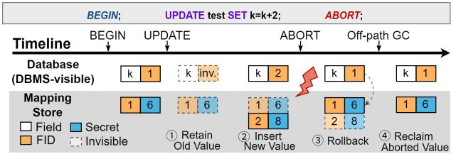  
(a) Transaction Abort

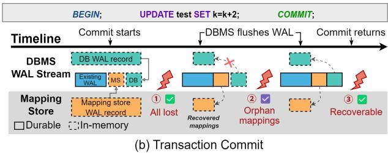  
Figure 4: Timeline of a transaction execution in ZENO, illustrating the handling of (a) abort and (b) commit paths.

## 6 Implementation

We implemented ZENO on top of PostgreSQL 15.5 in 6.1K lines of C/C++ code. Table 2 provides a detailed breakdown by component. ZENO runs atop CVMs (i.e., Intel TDX [17] and ARM Secure EL2 [8, 55]) and deploys its integrity and privacy zones in isolated VM domains. To reduce crossdomain RPC overhead, ZENO adopts a context-switchless implementation [24, 26, 75]: the integrity zone sends requests to secure shared memory, while the privacy zone polls the shared memory and dispatches requests for processing. The integrity zone uses dm-integrity [19] for corruption detection, while the privacy zone uses dm-crypt [18] with HMAC-SHA256 for transparent I/O encryption and authentication. The mapping store is backed by mmaped arrays for persistence. Temporal locality is exploited by an LRU cache combined with Linux sequential prefetching; spatial locality is improved by organizing permanent partitions at table granularity. Within each partition, ZENO assigns FIDs by reusing safely reclaimed slots or appending new ones via an atomic monotonic counter. Currently, each 64-bit FID encodes a configurable 16-bit partition prefix and a 48-bit offset. Users can also tune FID length and partition-prefix size according to expected data volume: shorter FIDs reduce storage overhead and improve lookup efficiency. An open-source version of ZENO is available at https://github.com/ISCAS-OSLab/ZENO.

Table 2: Lines of code for each component in ZENO.  
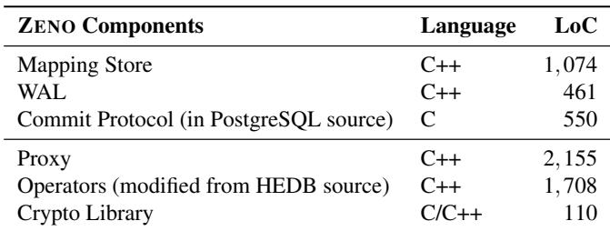

## 7 Performance Evaluation

We evaluate ZENO by answering the following questions:

• RQ1: Does ZENO deliver end-to-end performance im provements across platforms and workloads? (§ 7.1)

• RQ2: What are the sources of ZENO’s performance gains and consistency overheads? (§ 7.2)

• RQ3: How robust is ZENO under different workloads and resource configurations? (§ 7.3)

Experimental setup. We evaluate ZENO on two platforms. The ARM platform runs on a HiSilicon Kunpeng-920 @ 2.6 GHz server with S-EL2 support, equipped with a 1 TB SSD and Ubuntu 22.04 LTS, hosting two Secure-EL2 VMs running Linux 6.8.0. The x86 platform runs on an Intel Xeon Platinum 8581C @ 4.0 GHz server with TDX support, equipped with a 4 TB SSD and Ubuntu 24.04 LTS.

For both platforms, ZENO and HEDB deploy the integrity and privacy zones in two isolated VM domains with a total resource budget of 32 vCPUs and 64 GB of memory. Under this budget, we sweep several vCPU and memory splits between the two zones for each experiment and use the bestperforming split for each system. Both zones disable memory swapping. To ensure resource fairness, baseline plaintext PostgreSQL is deployed in a virtual machine with 32 vCPUs and 64 GB of memory. Across all systems, the benchmark client uses 16 vCPUs and 32 GB of memory. To reduce cross-NUMA RPC latency and hypervisor scheduling noise, we pin all VMs to the same NUMA node when possible, or otherwise to nearby NUMA nodes with low NUMA distance.

For ARM S-EL2, the shared memory for inter-CVM RPCs is protected by the TrustZone hypervisor. For x86 TDX, since no CVM vendors [17, 22] currently provide secure channels between CVMs (their shared memory remains plaintext), we exploit TD Partitioning [3], which allows multiple L2 VMs to run within one CVM. However, TD Partitioning is documented primarily for single-L2-VM deployments, offering little engineering guidance for multi-L2 setups. As such, we adopt a microkernel-inspired deployment: the privacy zone runs in the L1 VM and the integrity-zone DBMS (given its large TCB) runs in an L2 VM managed by the L1, with RPC shared memory controlled by the L1 to prevent malicious host introspection.

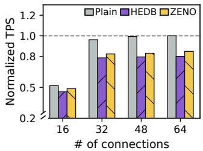  
(a) ARM S-EL2

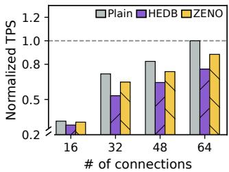  
(b) x86 TDX  
Figure 5: TPC-C throughput with varying numbers of connections at W = 100, normalized to the peak plaintext PostgreSQL TPS on each platform (higher is better). ZENO reduces HEDB’s throughput loss by up to 49.8% on ARM S-EL2 and 73.8% on x86 TDX.

## 7.1 End-to-End Performance (RQ1)

We use two standard benchmarks: TPC-C and TPC-H. Since these standard benchmarks are not privacy-oriented, we further use a real-world workload from the industry. For comparison, we include vanilla PostgreSQL as the plaintext baseline and the state-of-the-art HEDB.

TPC-C. We evaluate TPC-C throughput (transactions per second, or TPS) under varying connection counts using 100 warehouses, treating all non-ID columns as sensitive and placing the database on tmpfs. After a 60-second warm-up, we measure for 300 seconds and normalize TPS to the peak plaintext PostgreSQL throughput across all connection counts. As shown in Figure 5, ZENO narrows the throughput gap between HEDB and plaintext PostgreSQL on both platforms. We report this gap as throughput loss relative to plaintext PostgreSQL at the same connection count. On ARM S-EL2, ZENO reduces HEDB’s throughput loss by 18.1–49.8%; on x86 TDX, ZENO reduces HEDB’s throughput loss by 51.5– 73.8%. The two platforms exhibit different scaling trends due to platform-specific hardware and TEE-stack characteristics.

TPC-H. We use TPC-H (scale factor = 3), a standard OLAP benchmark with large joins, group-bys, aggregations, and arithmetic operations. We make all non-key columns sensitive, as TPC-H does not define security attributes. To evaluate performance under large-dataset execution, we use a 6 GB memory budget. PostgreSQL and HEDB each use the full 6 GB as DBMS-side memory, while ZENO splits the same total budget between the integrity and privacy zones, with 4.5 GB and 1.5 GB, respectively. Results are averaged over 5 runs per query after one warm-up run. Figure 6 shows the slowdown of HEDB and ZENO relative to plaintext PostgreSQL. HEDB incurs an average slowdown of 10.0× on ARM S-EL2 and 23.8× on x86 TDX, driven by excessive cryptographic operations and I/O amplification due to ciphertext expansion. In contrast, ZENO restricts the average slowdown to 2.3× on ARM S-EL2 and 4.5× on x86 TDX, outperforming HEDB by 4.4× and 5.3×, respectively. The performance discrepancy is primarily attributable to the Intel TDX implementation, which relies on bounce buffers (i.e., Linux SWIOTLB) for I/O [54]. Consequently, I/O-intensive queries experience higher overhead on x86 TDX compared to ARM S-EL2.

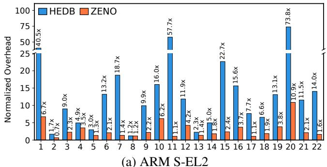

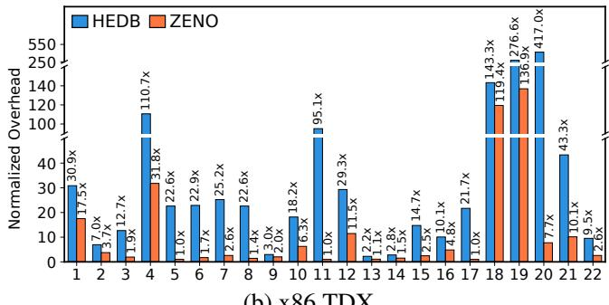  
(b) x86 TDX  
Figure 6: TPC-H execution time of HEDB and ZENO normalized to plaintext PostgreSQL. ZENO substantially reduces HEDB’s overhead, achieving speedups of up to 53.1× on ARM S-EL2 and up to 94.7× on x86 TDX.

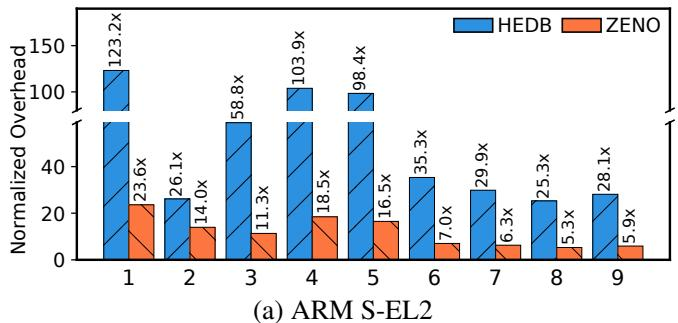

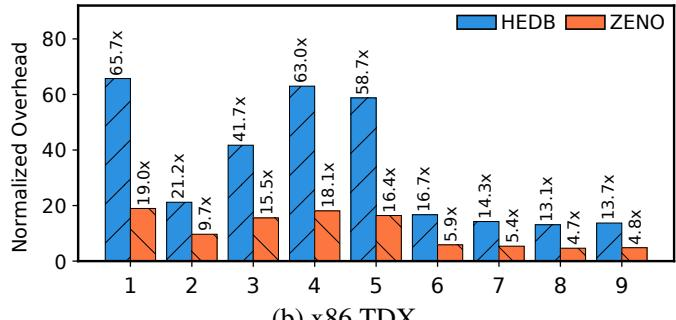  
(b) x86 TDX  
Figure 7: Execution time of 9 industrial queries on ARM S-EL2 and x86 TDX, normalized to that of plaintext PostgreSQL. ZENO consistently outperforms HEDB, achieving up to 6.0× and 3.6× speedups on ARM S-EL2 and x86 TDX, respectively.

Table 3: Overall storage usage (in GB) across three workloads. ZENO reduces storage cost by up to 52.8% compared to HEDB.  
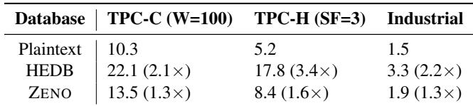

Industrial workload. We evaluate ZENO using 9 realworld complex queries under strict confidentiality constraints. Schemas are anonymized prior to evaluation. We generate synthetic data matching the anonymized schemas at 1 million rows per table, with all columns treated as sensitive. Figure 7 reports the end-to-end execution time normalized to plaintext PostgreSQL. ZENO outperforms HEDB on both ARM S-EL2 and x86 TDX. On ARM S-EL2, ZENO reduces HEDB’s 48.4× average slowdown to 10.5× (up to 6.0× speedup); on x86 TDX, it reduces 27.6× to 9.4× (up to 3.6× speedup). These results confirm ZENO’s performance gains on realworld industrial workloads.

Storage consumption. As shown in Table 3, ZENO reduces storage consumption by 38.9–52.8% compared to HEDB across all evaluated workloads. This is because ZENO adds an 8-byte FID per value, while existing modern CDBs attach 28 bytes of cryptographic metadata per field.

## 7.2 Breakdown and Overhead Analysis (RQ2)

To address RQ2, we use TPC-H and TPC-C to isolate different performance factors. TPC-H is ideal for decomposing ZENO’s gains; its heavy aggregations and large data volumes expose the specific overheads of cryptographic computation and ciphertext expansion. For aspects not covered by TPC-H, specifically the commit protocol and crash recovery, we use TPC-C to measure their overhead.

Unless otherwise stated, the following experiments use our ARM S-EL2 VM setup. These studies address platformindependent design questions. Fixing one primary platform avoids conflating ZENO’s design effects with platformspecific factors such as I/O-path behaviors (e.g., bounce buffers), TEE virtualization overheads, and scheduling.

Factor analysis. We perform a cumulative factor analysis on TPC-H to characterize the sources of ZENO’s performance gains. Starting from unoptimized HEDB, we incrementally enable HEDB’s optimization and then introduce ZENO’s opti mization techniques one by one. Figure 8 reports the geometric mean execution time normalized to plaintext PostgreSQL. Below, all reported reductions and speedups are relative to the preceding variant.

+Batching groups aggregation inputs for operators such as SUM and AVG. Instead of invoking the privacy zone for every intermediate accumulation step, the integrity zone sends a batch of fields per RPC (batch size = 256), reducing RPC frequency and intermediate cryptographic operations. Batching reduces the execution time by 5.8% and speeds up individual queries by up to 1.6×.

+Decryption cache represents an optimized version of the ciphertext-to-plaintext cache discussed in § 2. It caches decryption results in the privacy zone, using boost\_- unordered\_flat\_map [32] with XXH3\_64bits [37] and a 512 MB cache shared across SQL statements. The decryption cache further reduces the execution time by 21.8% and speeds up individual queries by up to 2.4×. To understand why the gains remain modest, we further instrument peroperation costs under the evaluated workload. A hash-table lookup and an insertion cost 334.9 and 2649.4 cycles on aver age, respectively, compared with 113.8 and 316.0 cycles for ZENO’s direct-indexing Get() and Put(). Although avoiding repeated decryptions is beneficial, the improvement is bounded by two factors: the relatively high cost of hash-table lookup/insertion operations over ciphertext keys, and the overhead of ciphertext expansion, which remains unchanged.

+O(1) FID lookup replaces each ciphertext with a 28-byte padded FID, which is resolved through direct indexing in the mapping store. Together, the padded FID and plaintext value match HEDB’s per-field ciphertext footprint, separating the benefit of direct indexing from that of reduced data expansion. O(1) FID lookup reduces execution time by 25.7% and speeds up individual queries by up to 24.7×, confirming that direct indexing substantially lowers privacy-zone processing overhead.

+Reduced expansion switches to compact 8-byte FIDs, removing field-level expansion and reducing the data footprint of TPC-H’s large, I/O-bound queries. By reducing I/O and memory movement, this step lowers execution time by 53.0% and speeds up individual queries by up to 11.5×.

Finally, +Partition enables ZENO’s partition-based mapping-store layout. By organizing partitions according to the DBMS storage layout, ZENO improves spatial locality between DBMS-visible FIDs and privacy-zone plaintext values. This optimization further reduces the execution time by 16.6% and speeds up individual queries by up to 6.4×.

Overall, the factor analysis confirms the combined benefits of direct FID lookup, compact field representation, and locality-aware partitioning.

Commit overhead. To capture the runtime overhead of ZENO’s commit protocol, we place the database on persistent storage and enable synchronous\_commit, forcing each transaction commit to wait for WAL durability. We use TPC-C with W = 100 and 16 connections for this experiment, and compare ZENO with and without embedded mapping-store WAL records. Enabling mapping-store WAL incurs a modest 2.6% reduction in TPS. To further understand this overhead, we instrument the commit path and directly measure the percommit cost introduced by ZENO’s commit protocol. An invocation producing a 997-byte encrypted payload adds only 18.3 µs to the overall commit latency.

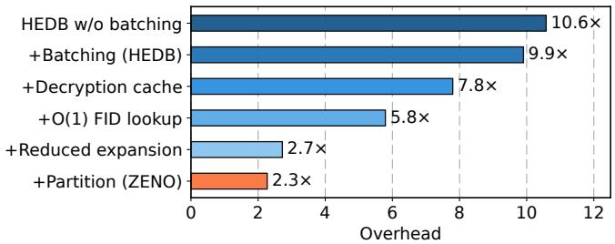  
Figure 8: Factor analysis of performance gains across different techniques using TPC-H. Overhead is the execution time normalized to the plaintext baseline.

Recovery overhead. During the initial data loading phase of TPC-C (configured with 8 warehouses and 8 threads), we abruptly terminate the process to simulate a crash, leaving 2.6 GB of WAL for recovery. After restart, PostgreSQL replays the WAL stream that contains both database records and embedded mapping-store records. The complete WAL replay takes 26.3 seconds, with mapping-store record replay accounting for 4.1 seconds (15.6%) of the total time.

## 7.3 Workload and Resource Sensitivity (RQ3)

The performance gain of ZENO depends on both workload characteristics and system configuration. To characterize the impact of these factors, we use Sysbench [62] to issue transactional microbenchmarks with configurable read/write ratios and access patterns. The benchmark runs on a synthetic dataset consisting of 32 tables with 1M rows each, occupying approximately 7 GB in plaintext PostgreSQL, 10 GB in ZENO, and 12 GB in HEDB. To control for other variables, we conduct all experiments entirely in memory, with the exception of the memory-sensitivity analysis. Each experiment includes a 120-second warm-up followed by a 600-second measurement, using 16 connections by default.

Transaction sensitivity. Figure 9(a) presents normalized throughput under Zipfian data distribution (factor = 0.8) across six operation modes: read-only, read-write, write-only, point-select, range-select and insert-only. Overall, ZENO achieves speedups of 1.1–5.8× over HEDB and delivers 46.6–95.0% of plaintext throughput. In write-only mode, ZENO is 4.6× faster than HEDB. This gap arises from frequent UPDATE queries such as “UPDATE test SET k=k+1;”, where ZENO eliminates the cryptographic overhead in HEDB’s decrypt-compute-re-encrypt cycle.

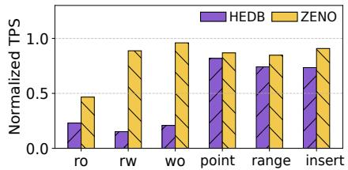  
(a) Transaction Modes (Zipfian, factor=0.8)

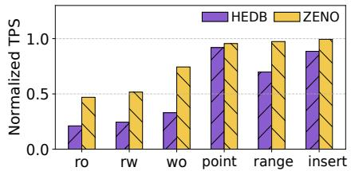  
(b) Transaction Modes (Uniform)

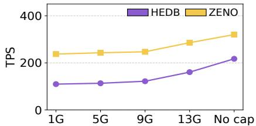  
(c) Total Memory Size  
Figure 9: Microbenchmark performance under different configurations. ZENO consistently outperforms HEDB across all settings.

Skew sensitivity. We also evaluate a random access pattern generated from a uniform distribution, which exhibits relatively poor locality. As illustrated in Figure 9(b), even under a non-skewed access pattern that yields frequent CPU cache and TLB misses, ZENO still outperforms HEDB by up to 2.3× across all six modes, thanks to its crypto-free mappings.

Memory sensitivity. Both HEDB and ZENO introduce additional metadata overhead (cryptographic metadata and FIDs, respectively) over PostgreSQL, making them more sensitive to available memory size. To quantify this sensitivity, we measure their performance under different total memory sizes. We use a read-write workload with 8 threads and a random access pattern. As illustrated in Figure 9(c), ZENO outperforms HEDB, with an average speedup of 1.9× and a 2.2× speedup even when the total available memory is limited to 1 GB (10% of the dataset for ZENO). This is because ZENO has a smaller storage footprint than HEDB and preserves locality between the mapping store and the database.

## 8 Security Analysis

This section analyzes ZENO’s security guarantees. Following prior modern CDBs [24, 45, 56, 73, 74], we consider two adversary classes: active adversaries can arbitrarily tamper with storage and modify untrusted memory, and passive adversaries (honest-but-curious) do not modify data but attempt to infer sensitive information through observation.

Defense against active attacks. ZENO ensures that sensitive data remains confidential and fresh. First, TEE hardware provides memory encryption and isolation, preventing adversaries from accessing plaintext data during computation. Second, since FIDs are completely opaque to users, a malicious user cannot access others’ private data by crafting an FID. Last, ZENO secures untrusted storage against tampering across both zones. In the privacy zone, ZENO uses dm-crypt [18] with HMAC-SHA256 to provide block-level authenticated encryption and detect storage corruption. In the integrity zone, ZENO enforces full-disk integrity [19] to guard against adversaries who may attempt to swap FIDs across records to gain unauthorized access to a victim’s secret. Both zones exploit a counter-based freshness mechanism [1] against rollback attacks [23, 34].

ZENO ensures faithful query execution through two mechanisms. First, remote attestation allows users to verify that legitimate ZENO code is running in the TEEs before uploading data. Second, in our implementation based on HEDB, ZENO places both the DBMS (in the integrity zone) and expression operators (in the privacy zone) within trusted domains, with secure channels between TEEs that prevent message injection, replay, man-in-the-middle, and smuggle attacks.

Defense against passive attacks. The primary concern is whether an adversary observing FIDs can learn anything about the corresponding plaintext secrets. We prove that ZENO achieves indistinguishability via a simple observation: FID allocation is stateful but plaintext-independent. The allocator maintains internal state that identifies the next available FID and assigns FIDs deterministically from this state, independent of the plaintext m. Consequently, after n prior Put() calls, either plaintext m<sub>0</sub> or m<sub>1</sub>, when submitted as the (n + 1)- th item, receives the exact same FID, so the adversary’s view of the FID sequence is indistinguishable between the two cases. As a result, ZENO’s crypto-free mappings provide confidentiality comparable to semantic security [44]: no information about plaintexts is revealed (beyond leakage from other channels, discussed later).

Additionally, because FIDs are assigned independently of plaintext values, the same plaintext may be represented by multiple distinct FIDs, mirroring the behavior of nondeterministic encryption schemes like AES-GCM.

Leakage analysis. While ZENO protects plaintext contents, practical query functionality requires revealing certain metadata to the untrusted infrastructure. We characterize ZENO’s leakage profile using the definition of L-security [63, 73], which models security as a leakage function L that precisely specifies what information an adversary learns. We define ZENO’s L = (L<sub>init</sub> , L<sub>query</sub>, L<sub>update</sub>) as follows:

• L<sub>init</sub> (D): During database initialization with dataset D, the adversary observes the database storage layout, including its total volume and the number and positions of protected fields. Since these fields are replaced by constant-size FIDs, individual field sizes remain hidden.

• L<sub>query</sub>(q, D): For query q over D, the adversary learns: 1. I/O access pattern ap(q): which storage blocks in the

DBMS and mapping store are accessed during query execution.

2. Search pattern sp(q): whether two queries access overlapping record sets, revealing query repetition.

3. Timing t(q): when and how long the query executes.

4. Result volume |R<sub>q</sub>|: the number of records returned or affected by the query.

5. Comparison results: the boolean outcomes (e.g., “>”) necessary for indexing and filtering, a common tradeoff for many enterprise modern CDBs [24, 45, 56, 74].

• L<sub>update</sub>(op, D): For an update operation op (i.e., INSERT, UPDATE, DELETE), the adversary learns which storage blocks are modified and the operation type, but not the plaintext values being written or deleted. Since FIDs are allocated monotonically by default, the adversary may also infer the order in which protected fields are assigned FIDs.

This leakage profile provides L-semantic security: an adver sary observing ZENO’s execution learns nothing beyond L about the underlying plaintext data.

FID metadata discussion. Like ciphertexts in HEDB, FIDs carry observable metadata about protected fields. First, FIDs expose positional information (via embedded partition numbers), analogous to how HEDB leaks ciphertext position through untrusted storage layout. Second, FIDs reveal allocation order, as they are allocated monotonically by default. This information is also observable in HEDB: newly generated ciphertexts are eventually persisted to untrusted storage, and their appearance in logs or batch flushes can reveal generation order, at least at batch granularity. To coarsen this metadata, ZENO could pre-allocate FIDs in batches and assign them via random permutation within each batch, which balances allocation-order confidentiality, allocation efficiency, and spatial locality.

Side-channel discussion. ZENO’s stateful privacy zone retains plaintext data in TEE memory for extended periods (until eviction to storage). This residency could increase the attack window for digital side-channels (e.g., cache timing or memory access patterns). However, modern CDBs already face this risk: encryption keys reside permanently in TEE memory; key compromise would breach all sensitive data. Mitigations such as strict resource isolation [33, 81] apply equally to both residual plaintext and long-lived keys.

## 9 Related Work

Confidential databases (CDBs). To address rising privacy concerns, CDBs on untrusted clouds have long been a goal [58]. TrustedDB [28], EnclaveDB [65], DBStore [67], and SecuDB [77] shield an entire DBMS in TEEs, providing strong security but limiting maintainability. Modern CDBs, such as AlwaysEncrypted [24], GaussDB [45], Operon [74], and HEDB [56], prioritize maintainability by keeping most DBMS logic outside TEEs, but incur severe overhead from per-field cryptography. Other CDB systems take orthogonal approaches: fully cryptography-based databases [29, 30, 63, 64, 66, 71, 78, 79] require no trusted hardware, and oblivious databases [38, 60, 82] hide access patterns.

Motivated by the growing industrial adoption of splitarchitecture CDBs, ZENO improves their efficiency through crypto-free mappings. Full resistance to active DBAs in this setting further requires defending against smuggle attacks, which HEDB addresses by isolating DBAs from operator interfaces. Systems such as AlwaysEncrypted, GaussDB, and Operon could adopt ZENO’s mapping abstraction as a drop-in performance optimization, yet would still need HEDB-style isolation to achieve equivalent security guarantees.

Indirection-protection separation. Separating indirection from protection is a classic systems principle. Capability systems [39, 53] pioneered the use of unforgeable tokens (capabilities) as references to resources protected by OS isolation. Similarly, OSes have long used opaque handles [21, 68]: file descriptors in Unix are integers mapped by the kernel to internal objects. ZENO shares this insight: data-independent FIDs serve as capabilities protected by TEE isolation, removing cryptographic overhead for every reference.

Applicability beyond CDBs. Compartmentalization-based confidential analytics systems [48, 80] encrypt data at TEE boundaries among operators, incurring significant cryptographic overhead. These systems may benefit from the abstraction of crypto-free mappings for better efficiency.

TEE optimizations. Several techniques have been proposed to optimize TEE-based applications, such as contextswitchless calls [24, 26, 75], userspace I/O [27, 70], and other optimizations [49, 56].

## 10 Conclusion

This paper challenges a core assumption in modern CDB design: mappings between untrusted and trusted domains must be cryptographic. Existing CDB systems using ciphertext-toplaintext mappings suffer from critical performance bottlenecks. ZENO introduces crypto-free mappings, which eliminate costly en/decryption from the critical path and avoid ciphertext expansion. The integration of ZENO’s key performance techniques into a production DBaaS system validates the practicality of this approach.

## Acknowledgments

We sincerely thank our shepherd and the anonymous reviewers of OSDI 2026 for their constructive comments. This work was supported in part by the National Natural Science Foundation of China (No. 62502510), and was sponsored by CCF-Huawei Populus Grove Fund. Mingyu Li (limingyu@ios.ac.cn) is the corresponding author.

## References

[1] Rollback protection in TF-M secure boot. https://tr ustedfirmware-m.readthedocs.io/en/latest/ design\_docs/booting/secure\_boot\_rollback \_protection.html, 2020.

[2] Build with SGX enclaves - Azure Virtual Machines. https://learn.microsoft.com/en-us/azure/ confidential-computing/confidential-compu ting-enclaves, 2022.

[3] Intel® TDX Module v1.5 TD Partitioning Architecture Specification. https://www.intel.com/content/ www/us/en/content-details/773039/intel-t dx-module-v1-5-td-partitioning-architect ure-specification.html, 2023.

[4] Payment Card Data Security Standard (PCI-DSS). ht tps://www.pcisecuritystandards.org/stand ards/, 2024.

[5] The HIPAA Privacy Rule. https://www.hhs.gov/hi paa/for-professionals/privacy/index.html, 2024.

[6] Alibaba Cloud - TEE-based confidential computing. ht tps://www.alibabacloud.com/help/en/ack/a ck-managed-and-ack-dedicated/user-guide/t ee-based-confidential-computing/, 2025.

[7] Amazon Aurora. https://aws.amazon.com/rds/a urora/, 2025.

[8] Arm architecture reference manual for a-profile architecture. https://developer.arm.com/document ation/ddi0487/latest/, 2025.

[9] AWS Nitro Enclaves. https://aws.amazon.com/e c2/nitro/nitro-enclaves/, 2025.

[10] Azure SQL Database. https://azure.microsof t.com/en-us/products/azure-sql/database/, 2025.

[11] Bugs found in Database Management Systems. https: //www.manuelrigger.at/dbms-bugs/, 2025.

[12] Confidential Compute Architecture. https://www.ar m.com/architecture/security-features/ar m-confidential-compute-architecture, 2025.

[13] Confidential VM overview - Google Cloud. https: //cloud.google.com/security/products/con fidential-computing?hl=en, 2025.

[14] Google Cloud SQL. https://cloud.google.com/s ql, 2025.

[15] IBM Cloud - Confidential computing solutions. https: //www.ibm.com/solutions/confidential-com puting, 2025.

[16] Intel Software Guard Extensions. https://www.in tel.com/content/www/us/en/developer/tool s/software-guard-extensions/overview.html, 2025.

[17] Intel Trust Domain Extensions. https://www.inte l.com/content/www/us/en/developer/articl es/technical/intel-trust-domain-extension s.html, 2025.

[18] Linux dm-crypt. https://www.kernel.org/doc/h tml/latest/admin-guide/device-mapper/dm-c rypt.html, 2025.

[19] Linux dm-integrity. https://www.kernel.org/doc /html/latest/admin-guide/device-mapper/dm -integrity.html, 2025.

[20] Recent data breaches 2025: latest cybersecurity incidents & lessons. https://preyproject.com/blog /worst-data-security-breaches, 2025.

[21] Michael J. Accetta, Robert V. Baron, William J. Bolosky, David B. Golub, Richard F. Rashid, Avadis Tevanian, and Michael Young. Mach: A new kernel foundation for UNIX development. In Proceedings of the USENIX Summer Conference, Atlanta, GA, USA, June 1986. USENIX Association, 1986.

[22] AMD. AMD Secure Encrypted Virtualization (SEV). https://developer.amd.com/sev/, 2025.

[23] Sebastian Angel, Aditya Basu, Weidong Cui, Trent Jaeger, Stella Lau, Srinath T. V. Setty, and Sudheesh Singanamalla. Nimble: Rollback protection for confidential cloud services. In Proceedings of the USENIX Symposium on Operating Systems Design and Implementation (OSDI), 2023.

[24] Panagiotis Antonopoulos, Arvind Arasu, Kunal D. Singh, Ken Eguro, Nitish Gupta, Rajat Jain, Raghav Kaushik, Hanuma Kodavalla, Donald Kossmann, Nikolas Ogg, Ravi Ramamurthy, Jakub Szymaszek, Jeffrey Trimmer, Kapil Vaswani, Ramarathnam Venkatesan, and Mike Zwilling. Azure SQL database always encrypted. In Proceedings of the ACM SIGMOD Conference, 2020.

[25] Arvind Arasu, Spyros Blanas, Ken Eguro, Raghav Kaushik, Donald Kossmann, Ravishankar Ramamurthy, and Ramarathnam Venkatesan. Orthogonal security with cipherbase. In Proceedings of the Conference on Innovative Data Systems Research (CIDR), 2013.

[26] Sergei Arnautov, Bohdan Trach, Franz Gregor, Thomas Knauth, André Martin, Christian Priebe, Joshua Lind, Divya Muthukumaran, Dan O’Keeffe, Mark Stillwell, David Goltzsche, David M. Eyers, Rüdiger Kapitza, Peter R. Pietzuch, and Christof Fetzer. SCONE: secure linux containers with intel SGX. In Proceedings of the USENIX Symposium on Operating Systems Design and Implementation (OSDI), pages 689–703. USENIX Association, 2016.

[27] Maurice Bailleu, Jörg Thalheim, Pramod Bhatotia, Christof Fetzer, Michio Honda, and Kapil Vaswani. SPE-ICHER: securing lsm-based key-value stores using shielded execution. In Proceedings of the USENIX Conference on File and Storage Technologies (FAST), 2019.

[28] Sumeet Bajaj and Radu Sion. Trusteddb: a trusted hardware based database with privacy and data confidentiality. In Proceedings of the ACM SIGMOD Conference, 2011.

[29] Song Bian, Haowen Pan, Jiaqi Hu, Zhou Zhang, Yun hao Fu, Jiafeng Hua, Yunyi Chen, Bo Zhang, Yier Jin, Jin Dong, and Zhenyu Guan. Engorgio: An arbitraryprecision unbounded-size hybrid encrypted database via quantized fully homomorphic encryption. In Proceed ings of the USENIX Security Symposium, 2025.

[30] Song Bian, Zhou Zhang, Haowen Pan, Ran Mao, Zian Zhao, Yier Jin, and Zhenyu Guan. HE3DB: an efficient and elastic encrypted database via arithmetic-and-logic fully homomorphic encryption. In Proceedings of the ACM Conference on Computer and Communications Security (CCS), 2023.

[31] Jeff Bonwick et al. The slab allocator: An objectcaching kernel memory allocator. In USENIX summer, volume 16. Boston, MA, USA, 1994.

[32] Boost C++ Libraries. Boost.Unordered: boost::unordered\_flat\_map. h t t p s : //www.boost.org/doc/libs/latest/libs /unordered/doc/html/unordered/reference/ unordered\_flat\_map.html, 2026. Last accessed on 2026-05-13.

[33] Charly Castes and Andrew Baumann. Sharing is leaking: blocking transient-execution attacks with core-gapped confidential vms. In Proceedings of the International Conference on Architectural Support for Programming Languages and Operating Systems (ASPLOS), 2024.

[34] David Chu, Aditya Balasubramanian, Dee Bao, Natacha Crooks, Heidi Howard, Lucky E Katahanas, and Sou janya Ponnapalli. Rollbaccine: Herd Immunity against Storage Rollback Attacks in TEEs. Proceedings of the ACM SIGMOD Conference, 2026.

[35] Howard Chu. Mdb: A memory-mapped database and backend for openldap. In Proceedings of the 3rd International Conference on LDAP, Heidelberg, Germany, volume 35, page 34, 2011.

[36] Jalen Chuang, Alex Seto, Nicolas Berrios, Stephan van Schaik, Christina Garman, and Daniel Genkin. Tee. fail: Breaking trusted execution environments via ddr5 memory bus interposition. In Proceedings of the IEEE Symposium on Security and Privacy (S&P). IEEE, 2026.

[37] Yann Collet. xxHash: Extremely fast non-cryptographic hash algorithm. https://xxhash.com/, 2026. Last accessed on 2026-05-13.

[38] Natacha Crooks, Matthew Burke, Ethan Cecchetti, Sitar Harel, Rachit Agarwal, and Lorenzo Alvisi. Obladi: Oblivious serializable transactions in the cloud. In Proceedings of the USENIX Symposium on Operating Systems Design and Implementation (OSDI), pages 727– 743, 2018.

[39] T. Don Dennis. A capability architecture. PhD thesis, Purdue University, USA, 1980.

[40] Facebook. Rocksdb. http://rocksdb.org, 2013.

[41] Erhu Feng, Xu Lu, Dong Du, Bicheng Yang, Xueqiang Jiang, Yubin Xia, Binyu Zang, and Haibo Chen. Scalable memory protection in the PENGLAI enclave. In Proceedings of the USENIX Symposium on Operating Systems Design and Implementation (OSDI), 2021.

[42] Benny Fuhry, Jayanth Jain H. A, and Florian Kerschbaum. Encdbdb: Searchable encrypted, fast, compressed, in-memory database using enclaves. In Annual IEEE/IFIP International Conference on Dependable Systems and Networks (DSN), 2021.

[43] Sanjay Ghemawat and Jeff Dean. Leveldb. http://co de.google.com/p/leveldb, 2011.

[44] Shafi Goldwasser and Silvio Micali. Probabilistic encryption & how to play mental poker keeping secret all partial information. In Proceedings of the Fourteenth Annual ACM Symposium on Theory of Computing, STOC ’82, page 365–377.

[45] Liang Guo, Jinwei Zhu, Jiayang Liu, and Kun Cheng. Full encryption: An end to end encryption mechanism in gaussdb. In Proceedings of the International Conference on Very Large Data Bases (VLDB), 2021.

[46] Hakan Hacigümüs, Sharad Mehrotra, and Balakrishna R. Iyer. Providing database as a service. IEEE Computer Society, 2002.

[47] Guerney D. H. Hunt, Ramachandra Pai, Michael V. Le, Hani Jamjoom, Sukadev Bhattiprolu, Rick Boivie, Laurent Dufour, Brad Frey, Mohit Kapur, Kenneth A. Goldman, Ryan Grimm, Janani Janakirman, John M. Ludden, Paul Mackerras, Cathy May, Elaine R. Palmer, Bharata Bhasker Rao, Lawrence Roy, William A. Starke, Jeff Stuecheli, Enriquillo Valdez, and Wendel Voigt. Confidential computing for openpower. In Proceed ings of the ACM European Conference on Computer Systems (EuroSys), 2021.

[48] Byeongwook Kim, Jaewon Hur, Adil Ahmad, and Byoungyoung Lee. Secure data analytics in apache spark with fine-grained policy enforcement and isolated execution. In Proceedings of the Network and Distributed System Security Symposium (NDSS). The Internet Society, 2025.

[49] Taehoon Kim, Joongun Park, Jaewook Woo, Seungheun Jeon, and Jaehyuk Huh. Shieldstore: Shielded inmemory key-value storage with sgx. In Proceedings of the ACM European Conference on Computer Systems (EuroSys), 2019.

[50] Paul Kocher, Jann Horn, Anders Fogh, Daniel Genkin, Daniel Gruss, Werner Haas, Mike Hamburg, Moritz Lipp, Stefan Mangard, Thomas Prescher, Michael Schwarz, and Yuval Yarom. Spectre attacks: Exploiting speculative execution. pages 1–19. IEEE.

[51] Dayeol Lee, Dongha Jung, Ian T. Fang, Chia-Che Tsai, and Raluca Ada Popa. An off-chip attack on hardware enclaves via the memory bus. In Proceedings of the USENIX Security Symposium, pages 487–504. USENIX Association, 2020.

[52] Dayeol Lee, David Kohlbrenner, Shweta Shinde, Krste Asanovic, and Dawn Song. Keystone: an open framework for architecting trusted execution environments. In Proceedings of the ACM European Conference on Computer Systems (EuroSys). ACM, 2020.

[53] Henry M Levy. Capability-based computer systems. Digital Press, 2014.

[54] Dingji Li, Zeyu Mi, Chenhui Ji, Yifan Tan, Binyu Zang, Haibing Guan, and Haibo Chen. Bifrost: Analysis and optimization of network I/O tax in confidential virtual machines. In 2023 USENIX Annual Technical Conference (USENIX ATC 23). USENIX Association, 2023.

[55] Dingji Li, Zeyu Mi, Yubin Xia, Binyu Zang, Haibo Chen, and Haibing Guan. Twinvisor: Hardware-isolated confidential virtual machines for ARM. In Proceedings of the ACM Symposium on Operating Systems Principles (SOSP), 2021.

[56] Mingyu Li, Xuyang Zhao, Le Chen, Cheng Tan, Huorong Li, Sheng Wang, Zeyu Mi, Yubin Xia, Feifei Li, and Haibo Chen. Encrypted databases made secure yet maintainable. In Proceedings of the USENIX Sympo sium on Operating Systems Design and Implementation (OSDI), 2023.

[57] Xupeng Li, Xuheng Li, Christoffer Dall, Ronghui Gu, Jason Nieh, Yousuf Sait, and Gareth Stockwell. Design and verification of the arm confidential compute architecture. In Proceedings of the USENIX Symposium on Operating Systems Design and Implementation (OSDI), 2022.

[58] Umesh Maheshwari, Radek Vingralek, and William Shapiro. How to build a trusted database system on untrusted storage. In Proceedings of the USENIX Symposium on Operating Systems Design and Implementation (OSDI), pages 135–150. USENIX Association, 2000.

[59] Apostolos Mavrogiannakis, Xian Wang, Ioannis Demertzis, Dimitrios Papadopoulos, and Minos N. Garofalakis. OBLIVIATOR: oblivious parallel joins and other operators in shared memory environments. In Proceedings of the USENIX Security Symposium, 2025.

[60] Pratyush Mishra, Rishabh Poddar, Jerry Chen, Alessandro Chiesa, and Raluca Ada Popa. Oblix: An efficient oblivious search index. In 2018 IEEE symposium on security and privacy (SP), pages 279–296. IEEE, 2018.

[61] Edmund B Nightingale, Kaushik Veeraraghavan, Peter M Chen, and Jason Flinn. Rethink the sync. ACM Transactions on Computer Systems (TOCS), 2008.

[62] Oracle. Sysbench benchmark tool, 2021.

[63] Rishabh Poddar, Tobias Boelter, and Raluca A. Popa. Arx: An encrypted database using semantically secure encryption. In Proceedings of the International Conference on Very Large Data Bases (VLDB), 2019.

[64] Raluca A. Popa, Catherine M. S. Redfield, Nickolai Zeldovich, and Hari Balakrishnan. Cryptdb: protecting confidentiality with encrypted query processing. In Proceedings of the ACM Symposium on Operating Systems Principles (SOSP), 2011.

[65] Christian Priebe, Kapil Vaswani, and Manuel Costa. En clavedb: A secure database using SGX. In Proceedings of the IEEE Symposium on Security and Privacy (S&P), 2018.

[66] Xuanle Ren, Le Su, Zhen Gu, Sheng Wang, Feifei Li, Yuan Xie, Song Bian, Chao Li, and Fan Zhang. HEDA:

multi-attribute unbounded aggregation over homomorphically encrypted database. In Proceedings of the International Conference on Very Large Data Bases (VLDB), 2022.

[67] Pedro S. Ribeiro, Nuno Santos, and Nuno O. Duarte. Dbstore: A trustzone-backed database management system for mobile applications. In International Conference on E-Business and Telecommunication Networks, 2018.

[68] Dennis M Ritchie and Ken Thompson. The unix time-sharing system. Communications of the ACM, 17(7):365–375, 1974.

[69] Benedict Schlüter, Supraja Sridhara, Mark Kuhne, Andrin Bertschi, and Shweta Shinde. {HECKLER}: Break ing confidential {VMs} with malicious interrupts. In 33rd USENIX Security Symposium (USENIX Security 24), pages 3459–3476, 2024.

[70] Jörg Thalheim, Harshavardhan Unnibhavi, Christian Priebe, Pramod Bhatotia, and Peter R. Pietzuch. rkt-io: a direct I/O stack for shielded execution. In Proceedings of the ACM European Conference on Computer Systems (EuroSys), 2021.

[71] Stephen Tu, M. Frans Kaashoek, Samuel Madden, and Nickolai Zeldovich. Processing analytical queries over encrypted data. In Proceedings of the International Conference on Very Large Data Bases (VLDB), 2013.

[72] Stephan van Schaik, Alexander Seto, Thomas Yurek, Adam Batori, Bader AlBassam, Daniel Genkin, Andrew Miller, Eyal Ronen, Yuval Yarom, and Christina Garman. Sok: Sgx.fail: How stuff gets exposed. In Proceedings of the IEEE Symposium on Security and Privacy (S&P). IEEE, 2024.

[73] Dhinakaran Vinayagamurthy, Alexey Gribov, and Sergey Gorbunov. Stealthdb: a scalable encrypted database with full SQL query support. Proceedings of the Privacy Enhancing Technologies Symposium (PETS), 2019.

[74] Sheng Wang, Yiran Li, Huorong Li, Feifei Li, Chengjin Tian, Le Su, Yanshan Zhang, Yubing Ma, Lie Yan, Yuanyuan Sun, Xuntao Cheng, Xiaolong Xie, and Yu Zou. Operon: An encrypted database for ownership preserving data management. In Proceedings of the International Conference on Very Large Data Bases (VLDB), 2022.

[75] Ofir Weisse, Valeria Bertacco, and Todd M. Austin. Regaining lost cycles with hotcalls: A fast interface for SGX secure enclaves. In Proceedings of the International Symposium on Computer Architecture (ISCA), 2017.

[76] Yuanzhong Xu, Weidong Cui, and Marcus Peinado. Controlled-channel attacks: Deterministic side channels for untrusted operating systems. pages 640–656. IEEE Computer Society, 2015.

[77] Xinying Yang, Cong Yue, Wenhui Zhang, Yang Liu, Beng Chin Ooi, and Jianjun Chen. Secudb: An inenclave privacy-preserving and tamper-resistant relational database. 2024.

[78] Zhou Zhang, Song Bian, Zian Zhao, Ran Mao, Haoyi Zhou, Jiafeng Hua, Yier Jin, and Zhenyu Guan. Arcedb: An arbitrary-precision encrypted database via (amortized) modular homomorphic encryption. In Proceedings of the ACM Conference on Computer and Communications Security (CCS), pages 4613–4627. ACM, 2024.

[79] Dongfang Zhao. Hermes: High-performance homomorphically encrypted vector databases. arXiv preprint arXiv:2506.03308, 2025.

[80] Wenting Zheng, Ankur Dave, Jethro G Beekman, Raluca Ada Popa, Joseph E Gonzalez, and Ion Stoica. Opaque: An oblivious and encrypted distributed analytics platform. In Proceedings of the USENIX Symposium on Networked Systems Design and Implementation (NSDI), 2017.

[81] Ziqiao Zhou, Yizhou Shan, Weidong Cui, Xinyang Ge, Marcus Peinado, and Andrew Baumann. Core slicing: closing the gap between leaky confidential vms and bare-metal cloud. In Proceedings of the USENIX Symposium on Operating Systems Design and Implementation (OSDI), pages 247–267. USENIX Association, 2023.

[82] Jinhao Zhu, Liana Patel, Matei Zaharia, and Raluca Ada Popa. Compass: encrypted semantic search with high accuracy. In Proceedings of the USENIX Symposium on Operating Systems Design and Implementation (OSDI), pages 915–938, 2025.

## A Artifact Appendix

## Abstract

The artifact for this paper contains the source code for ZENO. It also includes scripts for the TPC-C and TPC-H workloads used in the paper, documentation for the two platforms described in § 7, and instructions for building ZENO and running its smoke tests.

## Scope

The artifact is intended primarily to support availability and basic functionality checks. It enables users to inspect the ZENO implementation, build the prototype, run the provided single-machine smoke test, and examine the scripts and documentation for the two evaluated deployment configurations: ARM S-EL2 and x86 TDX. The artifact does not include the proprietary industrial workload used in the paper.

## Contents

The artifact has three main parts:

1. The ZENO implementation in src/, including the components listed in Table 2. The PostgreSQL integration patch is in src/integrity\_- zone/postgresql-patches/ and implements the WAL coordination path used by ZENO’s commit protocol. Parts of the protected-operator implementation are derived from HEDB’s operator framework.

2. Tests and benchmark scripts. test/ contains SQL smoke tests; benchmark/tpcc/ contains plaintext and ZENO TPC-C runners based on sysbench/TPC-C Lua scripts derived from Percona code; and benchmark/tpch/ contains TPC-H scripts derived from HEDB.

3. Documentation in README.md and doc/. These files describe the quick-start build, single-machine simulation mode, protected-storage setup, classic two-VM deployment notes, and TD-partitioning deployment notes for x86 TDX.

Third-party code and license notices are summarized in THIRD\_PARTY\_LICENSES.md.

## Hosting

The artifact is hosted publicly on GitHub at https://gi thub.com/ISCAS-OSLab/ZENO. The local artifact version used to prepare this appendix corresponds to commit 213036c.

## Requirements

The quick-start configuration requires no special confidentialcomputing hardware. In this mode, PostgreSQL and the privacy-zone proxy run as two local processes, which is sufficient for build and functional checks.