USENIX

THE ADVANCED COMPUTING SYSTEMS ASSOCIATION

# The Clustering Strikes Back: Building Cost-Effective and High-Performance ANNS at Scale with Helmsman (Operational Systems)

Yuchen Huang and Baiteng Ma, East China Normal University and Xiaohongshu Inc; Yiping Sun, Yang Shi, Xiao Chen, Xiaocheng Zhong, Zhiyong Wang, and Yao Hu, Xiaohongshu Inc; Erci Xu, Shanghai Jiaotong University; Chuliang Weng, East China Normal University

https://www.usenix.org/conference/osdi26/presentation/huang-yuchen

# This paper is included in the Proceedings of the 20th USENIX Symposium on Operating Systems Design and Implementation.

July 13–15, 2026 • Seattle, WA, USA

ISBN 978-1-939133-55-7

Open access to the Proceedings of the 20th USENIX Symposium on Operating Systems Design and Implementation is sponsored by

# The Clustering Strikes Back: Building Cost-Effective and High-Performance ANNS at Scale with Helmsman (Operational Systems)

Yuchen Huang1,3, Baiteng Ma1,3, Yiping Sun3, Yang Shi3, Xiao Chen3, Xiaocheng Zhong3, Zhiyong Wang3, Yao Hu3, Erci Xu2, Chuliang Weng1 1East China Normal University 2Shanghai Jiaotong University 3Xiaohongshu Inc

## Abstract

RedNote (a.k.a., Xiaohongshu, a global-scale social network platform) widely adopts approximate nearest neighbor search (ANNS) to power its search, recommendation, and advertising services. Due to the demanding Service Level Agreements (SLAs), we have to rely on in-memory graph-based ANNS (i.e., HNSW) to provide high throughput and low latency.

However, the ever-growing user base and content volume have led to an explosive increase in memory footprint and consequently huge CapEx and OpEx. After exploring various alternatives, we find that building a clustering-based ANNS on top of all-flash servers can be promising. Yet, we still experience severe overheads from the kernel I/O stack, a fixed pruning strategy, and slow index construction.

We present HELMSMAN, a high-performance and costeffective clustering-based ANNS system, which combines an ANNS-oriented userspace storage stack, a leveling-learned pruning module, and GPU-accelerated pipelines of construction. HELMSMAN saves over 90% of hardware costs and enables billion-scale index (re)builds within hours. In the current production deployment, operating stably for several months, 40 machines now host ANNS workloads that previously required about 35,000 cores and 0.35 PB DRAM.

## 1 Introduction

RedNote (a.k.a., Xiaohongshu) [8] is a global social media platform for users to share and interact with photos, videos, and text in the form of “notes”. By 2025, the platform hosts over 300 million monthly active users and more than 80 mil lion creators [5]. As the core infrastructure behind search, recommendation, and advertising [22, 41, 43], our approximate nearest neighbor search (ANNS) service manages hundreds of billions of embedding vectors and sustains millions of queries per second (QPS) with strict latency service-level agreements (SLAs) (e.g., 5-10 ms for real-time services).

To meet the quality of services (QoS), we previously relied on large in-DRAM graph indexes [20,40] for high throughput and low latency. However, the scaling of users and content drastically increases the memory footprint, pushing the ANNS infrastructure at RedNote to reach the petabyte level. This incurs prohibitively high CapEx and OpEx for the existing in-DRAM ANNS infrastructure [2, 9]. We are therefore motivated to explore more cost-efficient alternatives.

The recent advancement in NVMe SSDs has made them a promising candidate given their high bandwidth and low cost per GB [18, 25, 34]. For example, a 12-drive PCIe-Gen5 SSD array [12] can deliver roughly 30% of the bandwidth of a 12-channel DDR5 memory [10], yet SSD costs about 1/40 of DRAM (i.e., 0.2 \$/GB vs. 8 \$/GB). While we have successfully deployed graph-based hybrid (SSD+DRAM) ANNS systems like DiskANN [49] for the more relaxed offline workloads (e.g., content moderation), using them for online services (e.g., search) remains impracticable in terms of latency and throughput SLAs. The main reason is the greedy graph traversals maintain long candidate lists (e.g., lengths can be up to 1.5× top-k), which incur many serialized I/Os and thus fail to utilize high bandwidth of SSDs.

The above observation motivates us to rethink the possibility of using clustering-based ANNS. With dependencyfree I/Os issued in batches, clustering-based ANNS, such as SPANN [17], can be expected to achieve low latency that meets our SLA and also be scaled for throughput by adding more SSDs. Yet, to apply them in production remains challenging. First, under the traditional I/O stack, SPANN uses only about 20–60% of SSD bandwidth, resulting in a significant throughput gap to in-DRAM HNSW. Second, given the varying top-k of real workloads, the existing fixed pruning approach cannot sufficiently reduce redundant scans and leads to unstable per-query performance. Third, the existing singlenode and CPU-only construction can take tens of hours or even days, failing to support fast rebuilds needed by frequent updates of embedding models and vectors.

Hence, to overcome these limitations, we develop HELMS-MAN, a high-performance and cost-effective ANNS system using clustering-based indexes atop all-flash servers. There are three main techniques. First, we build an ANNS-oriented userspace storage backend that bypasses the kernel I/O stack, minimizing software overhead and directly orchestrating devices to match the ANNS-specific I/O patterns. Second, we develop a leveling-learned pruning module that adapts to both top-k and query distributions, while remaining compatible with SSD-friendly batched I/O. Third, we leverage GPU acceleration and dynamically allocate CPUs for index construction, enabling sub-hour builds for common-scale (e.g., 0.1B)

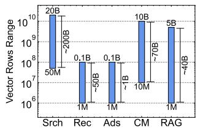  
(a) Total rows of vector datasets.

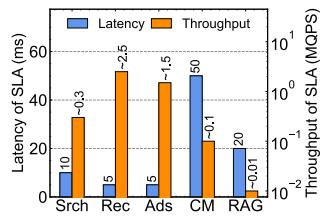  
(b) SLAs of performance.

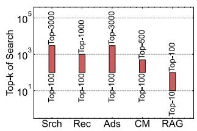  
(c) Top-k value of requests.

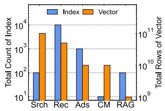  
(d) Frequency of construction.  
Figure 1: Characterizing ANNS of RedNote along 4 aspects: scale, SLA, top-k, and construction. Search is denoted as Srch, and others are recommendation (Rec), advertising (Ads), content moderation (CM), and retrieval-augmented generation (RAG).

and hour-level builds for ultra-large-scale (e.g., 10B) indexes.

Our evaluations show that HELMSMAN delivers 2–16× higher throughput than existing DRAM–SSD ANNS and up to 85% of the throughput of in-DRAM ANNS, while preserving latency SLAs. We are actively rolling out HELMS-MAN to our production environment. Currently, HELMSMAN can use only 40 machines with about 30-40 TB DRAM in total to sustain online traffic that previously consumed roughly 35,000 CPU cores and ∼0.35 PB of in-DRAM ANNS infrastructure, saving more than 90% device costs. The open-source proof-of-concept version of HELMSMAN and datasets fitted to real-world distributions are available at https://github.com/Red-EAD/helmsman.

## 2 Background

## 2.1 ANNS-based Services in RedNote

RedNote (a.k.a., Xiaohongshu) [8] is a global social platform with hundreds of millions of active users sharing and interacting with various types of content including pictures, comments and short videos on a daily basis. The proper functioning of RedNote relies heavily on the search engine, recommendation system, advertising platform, content moderation, and emerging AI services (e.g., retrieval-augmented generation for large language models). All of the above are supported by approximate nearest neighbor search (ANNS) over hundreds of billions of high-dimensional vectors with millions of queries per second. Despite all being ANNS-based, these services can have different characteristics as shown in Figure 1, such as scale of dataset (Figure 1a), the SLA of performance (Figure 1b), the top-k of requests (Figure 1c), and the index building (Figure 1d). We now further discuss them in detail. Search. First, our search targets the full corpus (i.e., all usergenerated content and web-wide data) and the index can reach up to tens of billions of vectors. In addition, the search services also follow a multi-path workflow where different recall paths cover various subsets of the corpus (e.g., texts, images, videos, and user behaviors) to ensure high accuracy. Therefore, search has the largest overall vector volume, totaling up to twenty billion vectors in practice. Second, search is directly exposed to end users, which requires an SLA of ∼10 millisecond average latency [16] under ∼300K QPS, our typical peak traffic. Third, ANNS is the first stage of the ranking pipeline in search. Thus, it requires a relatively large top-k (e.g., around 100 to 3,000) to provide sufficient candidates for downstream re-ranking models [21, 37]. Finally, because our embedding models are continuously trained with daily collected metrics (e.g., user behaviors and content popularity), we wish to rebuild (instead of in-place updating such as SPFresh [58], Quake [43] and OdinANN [23]) the entire indexes on a daily basis.

Recommendation. Unlike search, recommendation only focuses on the popular subsets of full corpus. As a result, the total vector volume is significantly smaller than that of search, ranging from 1 to 100 million vectors per index. Recommendation directly serves end users but involves more recall paths. Thus, the online request throughput can reach ∼2.5 million QPS while still requiring millisecond-level latency SLAs [33]. Moreover, post-filtering based on user-specific constraints is common in recommendation. To ensure sufficient results after filtering [63], the top-k from ANNS can be up to 1,000. Finally, embedding models are updated in batches (aggregated from minutes to hours [42, 47]) based on real-time feedback (e.g., click-through rates), leading to up to ten thousand index rebuilds per day and a cumulative rebuilt volume on the order of tens of billions of vectors.

Advertising. Embedded from products, advertising has fewer vectors, around one billion in total. Similar to search and recommendation, advertising also directly serves users and thus requires millisecond-level latency SLAs under millions of QPS [59]. In addition, advertising follows a post-filtering pipeline. ANNS retrieval is followed by scalar filtering on multiple attributes (e.g., exposure constraints and billing status), so the required top-k can be large as well (e.g., up to 3,000) [61]. Finally, for index construction, since the embedding models are modified incrementally by rates of clicks or purchases on the order of minutes, this requires that index rebuilds keep up with these real-time updates as well.

Content moderation. This maintains two types of indexes, the large allow-list corpus and the smaller block-list corpus. The allowlists consist of all content conforming to policies and values, so their indexes can reach up to 10B vectors. The block-list stores only restricted content and is typically much smaller (e.g., 10M vectors). Content moderation is mainly an offline workload, and new content is compared against both allow-list and block-list, then assessment models select high-risk candidates that are forwarded to manual checking. This pipeline results in more relaxed latency SLAs and lower overall throughput than the above-mentioned services [45]. Additionally, to capture restricted content with best effort, we also use relatively large top-k (up to ∼500). Since these collections change slowly, block-list indexes are rebuilt on a daily basis and the allow-list indexes are refreshed weekly.

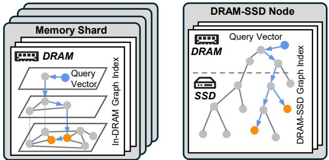  
(a) In-DRAM graph indexes on (b) DRAM-SSD graph indexes on distributed nodes for achieving a single node for saving memory low latency. footprint.  
Figure 2: Two solutions employed in services of RedNote.

Retrieval-augmented generation. Our ANNS also supports emerging AI applications like RAG. In RAG, ANNS is mainly used to index task-specific knowledge bases with sizes varying widely from about one million to several billion vectors depending on the applications. Since LLM inference dominates resource consumption and current models have limited context length, the SLA requirements for the ANNS stage are relatively relaxed (e.g., ∼20 ms) [29] and the required top-k is much smaller (e.g., 10-100) than other services’ [44, 62]. Moreover, the underlying knowledge bases evolve slowly and the embedding models change infrequently, so index rebuilds are needed far less often than in other online workloads.

## 2.2 Solutions for ANNS-based Services

Graph-based ANNS offers high throughput with low latency, and is therefore widely deployed in RedNote’s production services. To satisfy the strict performance SLAs of search, recommendation, and advertising, we run a large fleet of distributed memory shards that host in-DRAM graph indexes [20, 40]. The aggregated count of CPU cores already exceeds 105 among 4,000 nodes, spanning ∼50 clusters as of today. For scenarios with slightly more relaxed latency and throughput requirements (e.g., content moderation and RAG), we instead employ hybrid DRAM–SSD nodes with SSD-backed graph indexes [22, 49, 56] to trade some latency for a much smaller memory footprint.

In-DRAM Graph. In our production, HNSW [40], one of the state-of-the-art in-DRAM indexes, is commonly adopted.

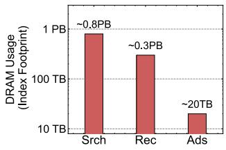  
(a) PB-level DRAM usage.

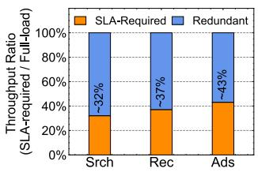  
(b) Throughput overkill.  
Figure 3: In our online services, latency SLAs force massive DRAM for pure in-DRAM indexes, while throughput SLAs are modest to the full-load maximum of the in-DRAM deployment.

And it is widely deployed for search, recommendation, and advertising. Figure 2a shows, for a given query, the HNSW search starts from an entry node on the top layer and performs greedy best-neighbor descent layer by layer, until it reaches the bottom, where a best-first search over a candidate pool produces the final top-k results. All graph data, including neighbor lists and raw vectors, are kept in DRAM so that the critical path consists only of in-memory accesses. When a single shard cannot hold the entire index, we partition the dataset across multiple memory shards and execute search independently on each HNSW shard. The frontend then merges the partial results from all shards to obtain the global top-k an swers. This design can deliver consistently low search latency and high QPS, guaranteeing QoS.

Hybrid DRAM-SSD Graph. For scenarios with more relaxed performance SLAs, such as content moderation and RAG, we employ hybrid DRAM–SSD graph indexes, as illustrated in Figure 2b. These indexes significantly reduce DRAM consumption, allowing a large-scale graph to be hosted on a single node. Representative designs include DiskANN [49] and its recent optimized variants such as Star ling [56] and PipeANN [22]. They retain PQ-compressed vectors and a small set of frequently accessed vectors cached in DRAM, while storing the full-precision vectors and graph edges on SSDs to cut memory footprint. During query processing, the graph is traversed with the best-first search strategy and a beam-search procedure. The search path always advances along the edges towards the neighbor that is closest to the query. The beam-search width is translated into an I/O width that controls how many candidates are fetched from SSDs in batches, thereby improving bandwidth utilization for higher performance.

## 3 Motivation

## 3.1 Can’t Afford In-memory ANNS to Scale

Over the past few years, the fast growth of RedNote’s user base has driven the data volume of our stored vector corpus to be doubled annually. The more than billions of new vectors persisted each year exacts a heavy toll on the CapEx of our in-memory ANNS deployment. Figure 3a illustrates that, as of 2025, the in-DRAM HNSW indexes for search, recommendation, and advertising have already consumed PB-level DRAM in practice. Even just the ANN indexes of a single service (e.g., search) can now consume hundreds of terabytes of DRAM.

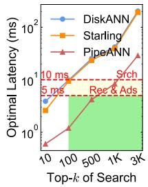  
(a) Average latency.

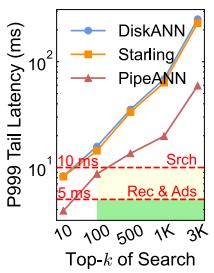  
(b) P999 latency.

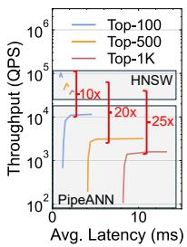  
(c) Throughput gap.

Figure 4: All graph-based systems fail in replacing in-DRAM solution. DiskANN and Starling can never meet the latency SLAs. PipeANN shows an insuperable gap in throughput. Srch refers to the search business, with latency SLAs of 10 ms. And Rec & Ads refers to the recommendation and advertising, with latency SLAs of 5 ms.  
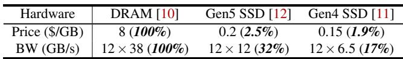  
Table 1: Price and bandwidth comparisons as of Dec. 2025.

However, the massive DRAM usage is mostly provisioned to maintain the QoS (e.g., 10 ms average latency SLA of search). Specifically, Figure 3b shows that, out of the 100% throughput provided by in-DRAM deployments, only ∼32–43% is actually needed to maintain the required latency SLAs. Nevertheless, we still need the rest 57–68% of DRAM, not for throughput, but for the capacity to host the entire set of indexes to avoid latency spikes under workload bursts [39].

## 3.2 Can’t Replace with Hybrid Graph

Recall that our CM and RAG services (see §2) have adopted a hybrid DRAM-SSD architecture for the graph-based DiskANN to reduce memory consumption. Given that SSDs are becoming increasingly affordable and high-performance as Table 1, it thus motivates us to consider integrating SSDs into other services (e.g., search) as well. Here, we explore the feasibility by conducting comprehensive evaluations of existing graph-based DRAM-SSD ANNS systems, including DiskANN, Starling, and PipeANN, on our standard 96-core server equipped with 12 PCIe-5.0 SSDs. Using the SIFT100M dataset [13], we target a 90% recall rate and evaluate top-k values from 10 to 3,000, which is consistent with both the BigAnnBenchmark [48] and our online services’ requirements (§2.1). Unfortunately, the results are disappointing in terms of both latency and throughput.

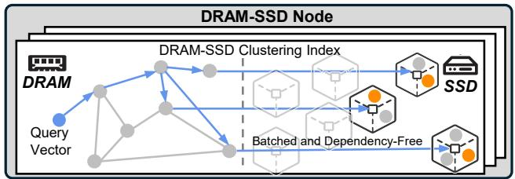  
Figure 5: DRAM-SSD clustering-based index follows the batched and dependency-free I/O pattern on the NVMe SSDs.

Latency. Figure 4a and Figure 4b report the mean and 99.9th percentile tail latency of the three candidates. We test them with a latency-friendly strategy by executing singlethreaded queries (i.e., lowest concurrency). We can observe both DiskANN and Starling consistently fail to meet both our average and tail latency SLAs in the field (the green shaded area). PipeANN, by leveraging intra-query parallelism (i.e., multi-threaded beam-search traversal) to better utilize SSD bandwidth, achieves the lowest latency among the three but still struggles to satisfy the online SLAs at high top-k values, especially for tail latency.

Throughput. To further explore whether PipeANN can serve as a (partial) replacement, we evaluate its throughput against in-DRAM HNSW under the latency SLAs. As shown in Figure 4c, even with 12 PCIe-Gen5 SSDs providing over 30% of DDR5 DRAM bandwidth (Table 1), PipeANN’s peak throughput remains 10–25× lower than that of HNSW. The root cause is that the graph-based DRAM-SSD ANNS inherently suffers from strongly serialized, dependency-chain I/Os during search (i.e., each expansion step depends on the results of previous reads). This serialized access pattern magnifies the raw latency gap between SSDs and DRAM (around 102-103). In our low-latency and high-throughput online services, this limited performance rules out the possibility of graph-based DRAM-SSD systems as a viable replacement for in-DRAM solutions at scale.

## 3.3 Clustering-Based ANNS Brings Hope

Failing to port in-memory ANNS with graph-based hybrid designs motivates us to reconsider another design, clusteringbased DRAM-SSD ANNS. At a high level, Figure 5 shows that SPANN [17], a representative clustering-based ANNS, uses a clustered layout. The clusters’ centroids are kept in DRAM, while vectors are stored on SSD as clustered posting lists. During search, it first searches the in-memory graph of centroids to identify the nprobe number of (e.g., 3 in Figure 5) closest partitions, then issues batched reads to fetch the corresponding posting lists, and finally computes the top-k neighbors from the loaded candidates of these lists.

Historically, this line of research was known to be latencyfriendly but largely dismissed in the field due to the limited throughput [22, 51, 56]. However, the recent advancement in high-bandwidth NVMe SSDs (e.g., 12 GB/s from Gen5 SSD) has changed this landscape. As shown in Figure 6, using SPANN and up to 12 PCIe-Gen5 SSDs on SIFT100M, our evaluations demonstrate that, with the batched and dependency-free I/O pattern, this clustering-based design can already approach latency SLAs of online services under processing single-threaded query and achieve scalable throughput by adding SSDs. In addition, Figure 6a shows that, even when we increase top-k up to 3 × 103, SPANN nearly keeps the average and tail latency within or close to the SLAs of search, recommendation, and advertising. Moreover, Figure 6b illustrates that the throughput scales almost linearly with the number of SSDs and reaches ∼ 12× speedup when using 12 SSDs, reinforcing our assumption that modern SSDs with clustering-based index can be a promising direction.

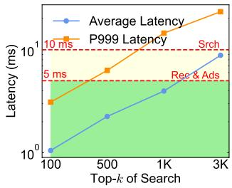  
(a) Near-SLAs latency.

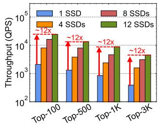  
(b) Scalable throughput.  
Figure 6: Based on high-bandwidth modern SSDs, the clustering-based SPANN shows nearly qualified search latency and scalable throughput under the large top-k values.

## 3.4 Challenges in Deploying SPANN at Scale

However, even when we pair SPANN with the array of NVMe SSDs, such a solution still cannot be directly deployed in the field. Challenges persist in both online search and offline construction. For online serving, the achieved search throughput is well below our production SLAs. Moreover, in the offline stage, the construction of indexes incurs prohibitive time overheads that must be substantially reduced.

First, SPANN cannot yet serve as a scalable replacement for the in-DRAM HNSW indexes deployed in our online stack. Under the latency SLAs of online services, even on a 96-core node with 12 PCIe 5.0 SSDs, the throughput remains insufficient. As shown in Figure 7a, there is still a throughput gap of about 86-88% between SPANN and the in-DRAM HNSW baseline.1 This gap is largely due to insufficient utilization of NVMe SSDs’ bandwidth. Figure 7b shows that SPANN uses only ∼26-59% of the available bandwidth on PCIe Gen5 and Gen4 arrays, highlighting a primary opportunity to scale throughput by driving SSD bandwidth actually utilized closer to the hardware limits.

Second, SPANN’s current strategy for determining the

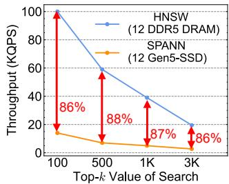

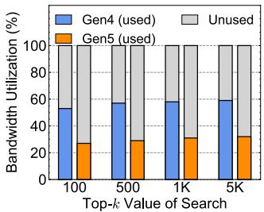  
(b) Low bandwidth utilization.

(a) Insufficient throughput.  
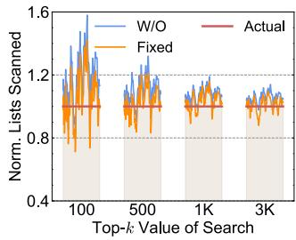

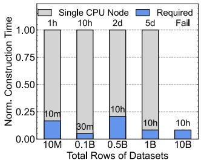  
(c) Un-adapted range of scans.  
(d) Long-time index building.

Figure 7: Clustering-based SPANN still has deficiencies. Its performance also fails to fully meet the throughput SLAs (∼12%-14% of in-DRAM HNSW), due to the low bandwidth utilization and un-adapted range of scans. Furthermore, its single-node CPU-only construction of indexes incurs a heavy expenditure of time, violating the freshness of services.

scan range (i.e., the number of loaded clusters nprobe) impacts both throughput and search quality. It relies on a fixed distance-based pruning rule shown in Equation 1. After locating the closest centroid ci1, SPANN includes clusters Xi j in the search if distances from q to their centroids ci j are within a (1 + ε) factor of the distance to ci1, where ε is chosen empirically and does not adapt to query difficulty or data distribution. Figure 7c presents statistics for ∼100 queries under varying top-k. The scanned range after pruning is only slightly smaller than the no-pruning (W/O) baseline, yet for each individual query, it often overshoots the range needed to reach the target recall (e.g., 90%), wasting I/O and reducing throughput; or undershoots it, causing large variance in recall and resulting in unstable search quality.

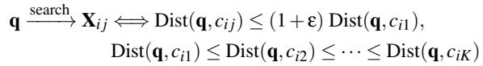

(1)

Finally, SPANN also faces significant challenges in offline index (re)building. As shown in Figure 7d, the existing implementation constructs the clustering structures on a standalone CPU node. When the dataset grows from ten million to tens of billions of vectors, the construction time escalates from several hours to multiple days. These construction windows are far longer than what is acceptable in our production scenarios, where embedding models and vector data are refreshed frequently. Consequently, index building also becomes a major bottleneck hindering the practical deployment of SPANN.

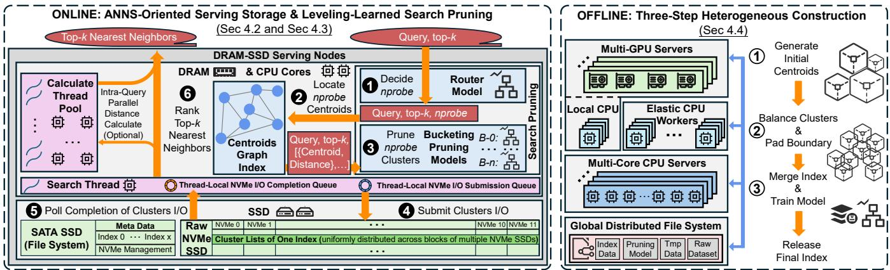  
Figure 8: Design overview of HELMSMAN with workflows of online search and offline index construction.

## 4 HELMSMAN Design

## 4.1 Overview

We present HELMSMAN, a high-performance and costeffective ANNS system using clustering-based indexes on all-flash servers. Figure 8 presents an overview of HELMS-MAN, including online serving (i.e., the left half of Figure 8) and offline index construction (i.e., the right half).

Online serving. We employ all-flash servers as ANNS serving nodes where each is equipped with 12×2 TB PCIe Gen5 NVMe SSDs, 12×96 GB DDR5 DRAM, and a 96-core CPU. Recall that existing solutions such as SPANN fall short in throughput due to bandwidth utilization and pruning efficiency. We therefore redesign the storage stack and the pruning module. The key idea is eliminating overhead from I/O software and introducing adaptive learning-based models. At a high level, for each index released to serving, we use DRAM to store the centroid graph for locating nearest clusters and weights of the search pruning module (router and pruning). Meanwhile, the cluster lists are striped across raw NVMe SSDs as the granularity of logical blocks, bypassing the traditional Linux software stack. Since a single node can usually host multiple vector indexes, we use an extra SSD to store the metadata of all indexes and management of raw SSDs.

For each query with target top-k, 1 the router model decides the nprobe value, 2 then HELMSMAN uses the centroids graph index to locate the nprobe closest centroids, and 3 the leveling pruning model routed at the first step further prunes the candidate clusters. 4 The search threads submit asynchronous NVMe I/O commands for the selected cluster lists, 5 poll completions of cluster reads on the hardware completion queue, and 6 calculate the loaded vectors in the local thread or dispatch them to the calculate thread pool to compute distances and finally rank the top-k nearest neighbors as the result of ANNS.

Offline index construction. To facilitate frequent index building, HELMSMAN employs multi-GPU servers to form a threestage pipeline. Note that a major drawback in previous builds by a single node’s CPUs is limited computing power and the inability to scale. Hence, we introduce GPUs to generate initial centroids and distributed nodes to accelerate balancing and padding. Backed by a global distributed file system holding the final index, pruning models, temporary data (e.g., checkpoints), and raw datasets, we orchestrate the entire construction pipeline end-to-end, achieving minute-level index building for datasets up to million-scale vectors and hour-level construction for billion-scale datasets.

In offline construction, 1 multi-GPU servers run k-means to generate initial centroids from the raw dataset and save these centroids to the distributed storage. 2 Then, owning initial centroids, local CPUs of multi-GPU servers or elastic CPU workers split and rebalance clusters from the initial centroids, pad cluster boundaries, and write intermediate index shards to the global distributed file system. 3 Multi-core CPU servers merge the shards, build the graph for all final centroids, train leveling pruning models, and finally materialize the index files for releasing them on serving nodes.

Design advantages. With these designs, HELMSMAN effectively solves the aforementioned challenges. First, as 4 and 5 of the online serving in the left of Figure 8, it bypasses the kernel on the throughput-critical I/O path (i.e., cluster-list reads) completely to exploit the high bandwidth of modern multi-SSD arrays, minimizing software overhead by directly steering NVMe SSDs to match ANNS access patterns (§4.2).

Second, as 1 , 2 , and 3 of the online serving, it adaptively chooses the search range (i.e., probed clusters) on a per-query basis, achieving target recall while avoiding unnecessary I/O and computation: a trained router model predicts the recall-sufficient nprobe, and leveling pruning models further eliminate unnecessary scans (§4.3).

Third, as 1 and 2 of the offline building, to support frequent index building for incremental embedding model training and continuously evolving vector data, we utilize heterogeneous acceleration and make support for elastic scaling. Multi-GPU servers accelerate centroid generation on largescale datasets and we can dynamically allocate CPUs to speed up the following fine-grained index construction flexibly according to requirements (§4.4).

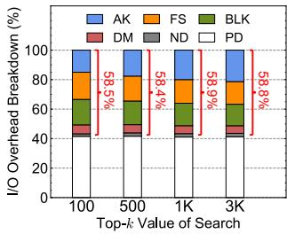  
(a) I/O breakdown of SPANN.

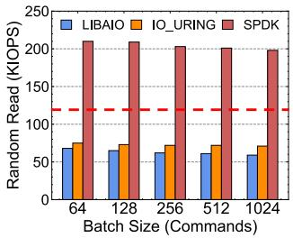  
(b) Ideal IOPS per core.  
Figure 9: SPANN’s I/O path relies on the traditional Linux I/O software stack, including AK (application-kernel switching), FS (file system), BLK (block layer), DM (device mapper for RAID), and ND (NVMe driver). By issuing fixed-size 12 KB reads in batches—a new batch only after the previous one completes—we show the I/O breakdown of SPANN, and compare the performance of libaio, io\_uring, and SPDK.

## 4.2 ANNS-oriented Storage Stack

To better serve the clustering-based ANNS indexes, we study the existing storage stack and propose an ANNS-oriented storage design. We start by analyzing the I/O behavior of clustering-based search and then discuss the corresponding design choices which take advantage of multiple NVMe SSDs with the help of the user-space SPDK driver [14].

Understanding I/O patterns. Clustering-based ANNS has two outstanding I/O patterns during online search. First, the search process tends to generate a large number of batched reads. For example, a single query can generate up to ∼ 103 cluster-list loading requests when searching the top-3,000 nearest neighbors, a typical case in online search and advertising. Such massive reads can lead to a demandingly high IOPS requirement. Taking SIFT100M as an example, under a 10 ms latency SLA, computation (e.g., finding the nearest centroids, distance calculations on vectors loaded, and ranking top-k results) can already cost ∼2-4 ms with only ∼6-8 ms left for I/Os, which in return translates to ∼120-170 KIOPS per search thread on a single core. However, the I/O stack used in SPANN can often only achieve ∼30-40 KIOPS.

Second, the clusters of an index have the same size which is also the size of the issued reads. This is because, to avoid long-tail latency and the boundary error during search [17], the clustering-based index usually balances clusters’ sizes below a threshold and pads clusters with boundary vectors to the same size (e.g., 12 KB per cluster for SIFT in SPANN). As a result, each cluster can have same count of pages, and each probe typically issues fixed-size reads (e.g., 12 KB from three 4KB pages) when loading the nearest clusters.

Exploring design choices. We next profile the I/O overhead of SPANN ( Figure 9a) and three popular I/O stacks including libaio, io\_uring, and SPDK ( Figure 9b) under workloads of batched and fixed-size read patterns (i.e., the same I/O behavior as the clustering-based search) as shown in Figure 9. Results indicate that the overhead of the traditional I/O stack with libaio dominates the end-to-end path (up to 58% of the total) across all top-k settings, even exceeding that of accessing the SSD (i.e., PD, physical devices). io\_uring shows moderate improvements over libaio since it does not have system calls [25]. SPDK achieves the highest IOPS by bypassing the traditional kernel stack completely. Note that these throughput numbers are all measured without considering the computation cost in Figure 9b. Given that io\_uring and libaio have already failed to meet the expected IOPS, we therefore choose to build our serving storage over SPDK.

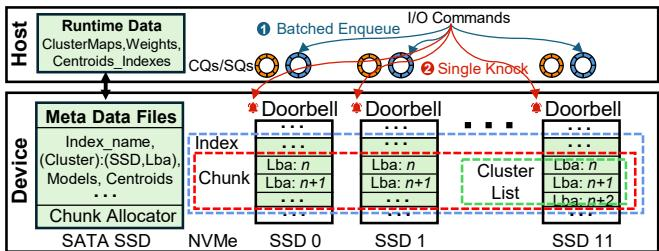  
Figure 10: Meta data as files, clusters’ lists as raw blocks.

Customizing the storage stack. Adopting SPDK means dropping the support from the kernel, and we hence need to manage the data layout of indexes, the I/O control of raw devices, and the multi-device space allocation. We demonstrate our serving storage stack, as shown in Figure 10.

• Data layout. The index data consists of metadata and cluster lists. Metadata includes the index name, mappings of each cluster and its physical location (SSD id and LBA), pruning models, and the centroid index. Since these structures are small and can reside in memory without external reads at runtime, we simply store them as regular files on a local SSD. In contrast, the efficiency-critical cluster lists are placed directly on the logical blocks of the NVMe SSD array. Each cluster list occupies a contiguous block range of a single SSD (e.g., a cluster list uses three consecutive LBAs of SSD 11 in Figure 10), so that reading one cluster only requires a single I/O command, avoiding multiple I/Os due to crossing devices or blocks.

• I/O control. For the only runtime external I/O–loading cluster lists–we bypass system calls and directly submit NVMe commands to hardware queues while polling for completions. With this direct control of devices, we optimize submission at hardware granularity. I/O commands are enqueued to host-side NVMe queues in batches, and each NVMe device is notified with a single PCIe doorbell knock per batch. This eliminates hundreds of per-command PCIe round-trips (at the microsecond scale) and significantly reduces CPU overhead on the critical read path.

• Space allocation. Since all clusters are padded to a fixed size, we can pre-allocate cluster-aligned regions on SSDs, avoiding fragmentation and complex file-system allocators. Hence, on raw NVMe devices, we exploit this property with a unified chunk-based free-list allocator (e.g., 64 MB per chunk) that manages SSD space for all indexes. It allocates and recycles fixed-size regions for deploying and deleting indexes at the chunk granularity. Each index then partitions its chunks into consecutive block ranges sized to a cluster list and assigns each range to a single cluster.

## 4.3 Leveling-learned Search Pruning

Problem and purpose. In clustering-based search, the number of probed clusters (i.e., nprobe) determines recall and performance. The trade-off is that an overly large nprobe significantly increases the I/O and computation cost due to redundant scans, while an overly small nprobe hurts recall.

Adapting nprobe by pruning. Many prior works such as Quake [43], Auncel [64], and LAET [36] propose early termination in pruning, which seems suitable for our adaptive adjustment of nprobe. However, they in fact cannot be applied to our scenario due to the lack of support for changing top-k of requests and the strong dependence on intermediate results. First, existing methods typically make early-termination rules for a fixed top-k while varying target recall. In contrast, in our services, the recall target can be predetermined from scenarios (e.g., 90% in online search) but top-k can vary across requests (e.g., 100-3,000 in online search).

Second, LAET also relies on intermediate features such as the distances to the current 1st and 10th neighbors after probing a subset of the nearest candidate clusters located. Similarly, Quake and Auncel need to check after each newly scanned cluster whether the recall target is met. Such iterative probe–compute–decide loops serialize cluster I/Os, and thus are unfriendly to the batched SSD reads for cluster lists, leading to reduced bandwidth utilization.

Leveling-learned search pruning. We propose the levelinglearned search pruning (LLSP) based on gradient boosting decision trees (GBDT) 2 [19,32]. First, to address varying topk values, LLSP has a router model for choosing the maximum range according to the different search difficulty (i.e., the distribution of query vector and the top-k value) of requests. Second, it has a group of multi-level learning-based models for pruning redundant scans. At this stage, to keep batched cluster reads, we avoid using intermediate search results as features, and instead use only pre-search information: the query vector, the top-k value, and statistics of its distances to all nearest candidate centroids 3.

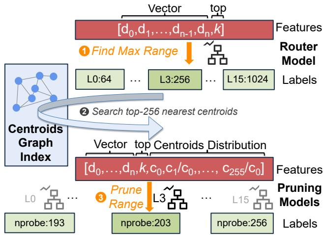  
Figure 11: Pruning workflow of search during online serving.

Online-offline workflow. In detail, we first present the pruning process of search in online serving and then describe how the models are trained in offline building.

• Online serving workflow. As shown in Figure 11, we first feed the query vector and its requested top-k into the router model, which predicts a coarse maximum search range’s level (e.g., level 3 with 256 as nprobe here, L3:256) as the upper bound of nprobe. Then the centroids graph index returns the top-nprobe nearest centroids. Finally, LLSP constructs pruning features from the query, top-k, and the centroid–distance distribution (the nearest centroid-query distance and relative ratios of the following 255 centroids’ to the 1st centroid’s), and applies the corresponding levelspecific (i.e., level 3 here) pruning model to refine nprobe for batched loading nonredundant clusters from SSDs.

• Offline training workflow. We first set a series of range levels with increasing upper bounds on nprobe (e.g., 64 to 1,024 with a step of 64). From a recent time window (e.g., the previous 1 day for search, 1 hour for recommendation and ads), we uniformly sample about 1% of logged items as the training supervision. This is because most production traces show up to 90% duplication in short windows [15, 53, 54]. To avoid the overhead of brute-force ground truth, we approximate labels by running non-pruning search with a large nprobe (e.g., 4,096). We then train the router model by the procedure that, for each query and business-required top-k, finding the smallest level whose range meets the target recall and using the pair (query, top-k) as features and the level as label. Afterward, within each level, we derive labels for training pruning models by gradually decreasing nprobe from the level’s maximum until recall drops to the threshold; the resulting nprobe is taken as the label. And the query, top-k, and centroid-distance distributions under the maximum nprobe form the feature vectors together. With the labels (i.e., actual nprobe minimized) and these features, we train the pruning model of each level.

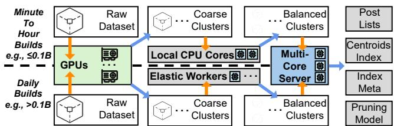  
Figure 12: Pipelines of the three-step index construction.

## 4.4 GPU-accelerated and Elastic Building

To reduce the index construction time for million- to billionscale datasets from days to tens of minutes, we leverage GPUbased acceleration and further design an elastic pipeline to scale the computation from a distributed CPU pool.

Procedure and issues of existing index construction. Again, we first examine the status quo (i.e., the index construction in SPANN). There are three steps. First, it applies hierarchical k-means to partition vectors into many size-bounded clusters, avoiding oversize and unbalanced partitions. Then, it performs closure multi-cluster assignment that duplicates boundary vectors, using RNG rules [52] to control redundant copies. Finally, it builds an in-DRAM graph on the centroids of all clusters for locating the nearest clusters to the query during online serving.

We can see that there are two main drawbacks in the first clustering step, which incurs the main overhead (up to ∼60-80%) of existing constructions. First, k-means on largescale datasets incurs repeated distance calculations on high dimensional vectors and thus places a heavy load which is beyond the capability of a CPU. Second, when vectors increase to billions from millions, it still requires multiple hours of building, requiring paralleling about 102-103× resources as data scaling. However, the current SPANN construction can only use one CPU in building and thus takes days to finish building a billion-scale index, which is unacceptable for production services.

GPU acceleration and elastic scaling. Hence, we exploit GPUs to accelerate centroid initialization and iterative balancing, and employ the elastic CPU pool to address the scaling of datasets. Figure 12 shows the workflow of our three-step index construction pipeline.

Generating coarse centroids with GPUs. First, for datasets of all scales, we use GPUs to perform coarse clustering. In this step, we do not directly split clusters down to their final size, because we found that GPU acceleration is not always effective4. As shown in Figure 13, GPUs provide up to ordersof-magnitude speedups on multi-million–scale and more vectors, while for small jobs (e.g., clustering on <105 128-dim vectors), extra host–device transfers can dominate, making GPUs slower than the CPUs.

Constructing balanced posting lists. After the early clustering phase on GPUs, most clusters are already smaller than the threshold (e.g., 105 by default). We then use CPUs to perform fine-grained splitting and redundant padding of boundary vectors. Depending on the application scenario and dataset scale, we adopt two execution schemes.

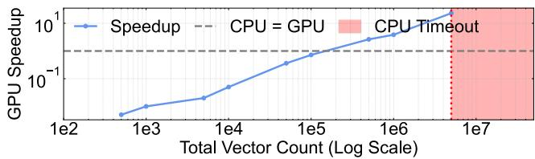  
Figure 13: The speedup ratio of GPU clustering across varying vector counts with an NVIDIA L20 vs. 48 CPU cores.

For minute-to-hour builds of common-scale datasets (e.g., < 0.1B vectors from recommendation and advertising), we employ local CPU cores to immediately finish the fine splitting and duplication with RNG checking, avoiding network transfers and extra scheduling overhead.

For search services that require daily rebuilds on larger corpora, elastic workers in online CPU clusters perform the fine-grained clustering and padding during off-peak hours, opportunistically harvesting idle resources from existing clusters under diurnal load patterns (i.e., lighter utilization at night and heavier loads during the day).

In addition, to avoid impacting real-time services, we enforce a QoS policy: whenever online and offline jobs contend for resources, online traffic always has priority and the indexbuilding task on that node is preempted and terminated, and would retry later. To control the resulting tail latency, we fur ther introduce task re-assignment and node eviction: once a task exceeds a retry threshold, it is reassigned to another node, and the original node is temporarily removed from the resource pool, preventing a few unstable nodes from dominating the overall construction time.

Building final index data. Finally, balanced and replicated clusters generated by both local CPUs of GPU servers and elastic CPU workers are uniformly prepared for releasing. They are consolidated on the multi-core servers to produce deployable index files, including posting lists, centroid index, metadata, and the pruning model.

## 5 Evaluation

In this section, we conduct extensive experiments to evaluate the practical impacts of HELMSMAN, summarized as follows:

• HELMSMAN achieves 2-16× throughput of baselines, and can meet latency SLAs to replace in-DRAM HNSW (§5.2).

• HELMSMAN achieves 1.6-7.5× SSD bandwidth utilization of other DRAM-SSD systems, yielding up to 87% improvement by simply upgrading SSDs (§5.3).

• Under the same average recall, HELMSMAN ensures that >80% of queries individually meet the target recall by near 30 percentage points over SPANN (§5.4).

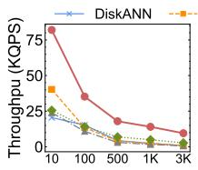

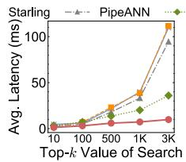

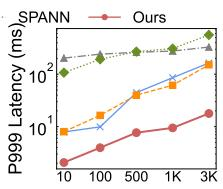

(a) Performance across various top-k of search, under recall = 90%.  
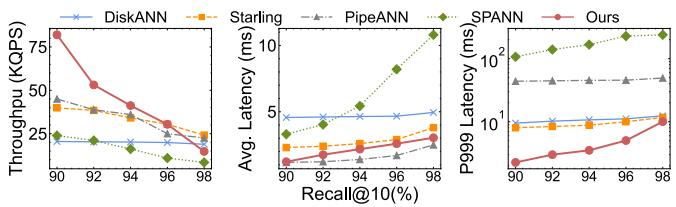  
(b) Performance as the top-10 search, under various recall rates.

Figure 14: Comparisons about throughput, average and tail latency under different top-k and recall, using SIFT100M.

• GPU acceleration enables constructing 0.1B-vector indexes within 1 hour. And by elastically scaling resources, 10B vectors can be built within 10 hours (§5.5).

• HELMSMAN can reduce DRAM usage by over 90% and improve throughput-per-dollar by 8.3× for the serving deployment (§5.6).

## 5.1 Setup

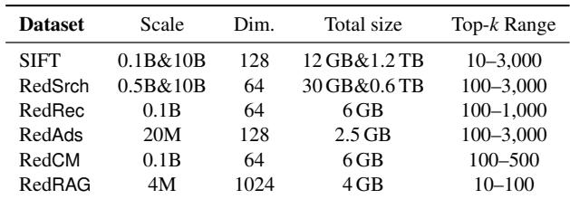  
Table 2: Statistics of the evaluated datasets.

Workloads. We evaluate on the public SIFT and five production datasets, as shown in Table 2. SIFT10B is created by 10× replicating SIFT1B. Real datasets span 4M–10B vectors from our main services mentioned. Similarity metric is the L2 distance. For SIFT, we uniformly generate query top-k values ranging from 10 to 3,000, while for other datasets, top-k values are sampled from our real production traces.

Baselines. We compare HELMSMAN with DiskANN, Starling, PipeANN, SPANN, and HNSW. For DRAM-SSD baselines, we use their released implementations. We tune beam widths of graph-based systems (16 for DiskANN and Starling, 32 for PipeANN, unless otherwise specified) to achieve their optimal performance, since multi-SSD setups offer sufficient bandwidth. We set DRAM budget as 25% of the size of raw datasets [22]. For HELMSMAN and SPANN, we reduce the replication factor to 4, with centroids accounting for 8% of the total scale, thereby setting the DRAM:SSD ratio to 1:20 to match the hardware capacity. We include in-DRAM HNSW that is widely used in production for low-latency services, which serves as a strong performance reference for purely memory-resident deployments but with higher DRAM cost. Specifications. All DRAM–SSD tests are conducted on our testbed equipped with the 96-core AMD EPYC 9654 CPU, 12×96 GB DDR5 DRAM, 12×1.92 TB PCIe-5.0 NVMe SSDs. In-DRAM distributed HNSW uses our standard configuration with 32-core CPUs and 256 GB DDR5 DRAM to hold shards, a configuration commonly adopted in production.

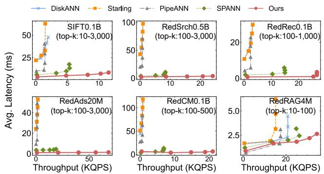  
Figure 15: Trends of throughput and average latency.

## 5.2 Search Performance

End-to-end performance. Overall, HELMSMAN achieves the best end-to-end efficiency across a wide range of top-k and recall targets, as shown in Figure 14.

Varying top-k (Figure 14a). With recall fixed at 90%, HELMSMAN sustains the highest throughput on SIFT0.1B across all top-k values. As top-k increases from 10 to 3,000, its throughput degrades more slowly than that of other DRAM-SSD systems, while average latency stays within 10 ms and P99.9 latency remains well below 20 ms. For graph-based baselines (DiskANN, Starling, PipeANN), larger top-k forces longer greedy walks due to larger candidate lists. Starling improves top-10 performance via optimized layout but is less effective for large top-k. The reason is that, as top-k increases, the search depth of graph-based search grows significantly. For example, for top-1000 on the SIFT0.1B, both the candidate queue length and the number of search hops increase substantially to around 1,500 or more. The number of accessed SSD pages also rises significantly, which leaves little room for gains from layout reordering of Starling. Meanwhile, SPANN is constrained by the traditional I/O software stack. Consequently, both throughput and latency for baselines deteriorate rapidly.

Varying recall (Figure 14b). Fixing top-k at 10, HELMS-MAN delivers competitive throughput at 90-96% recall and keeps clear advantages when recall enters the high-accuracy regime. Both average and tail latency grow smoothly with the recall, and HELMSMAN maintains sub-10 ms average latency and the lowest P99.9 latency across the entire recall range.

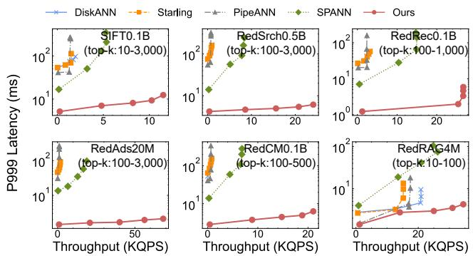  
Figure 16: Trends of throughput and P999 tail latency.

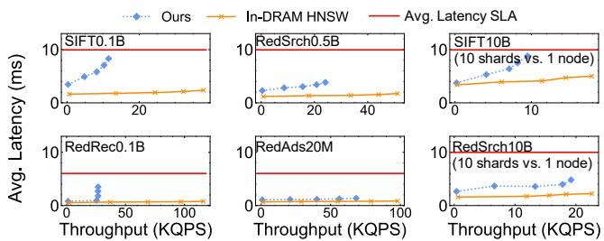  
Figure 17: Comparison with in-DRAM HNSW deployments.

Throughput vs. latency. We evaluate workloads from generated SIFT and productions with service-specific top-k and a 90% recall target, ramping threads until all systems saturate.

Throughput vs. average latency. As shown in Figure 15, graph-based systems can incur ∼120 ms average latency at only 0.5-3 KQPS because large top-k requires long greedy walks for longer length of candidate lists (e.g., 4,000 for top-3,000). SPANN benefits from high-bandwidth SSDs, and HELMSMAN further pushes the frontier, achieving up to 30× throughput while keeping average latency within 5-10 ms.

Throughput vs. tail latency. For P99.9 latency (Figure 16), graph-based systems and SPANN exhibit steep tail blowups once saturated. By clustering-based search and our customized I/O stack, HELMSMAN maintains up to an order-ofmagnitude lower P99.9 latency, keeping it around ∼10 ms.

Comparisons with in-DRAM deployments. Figure 17 shows results. When HNSW fits in the same 96-core node (20M–0.5B datasets), HELMSMAN achieves about 25–70% of the throughput of in-DRAM HNSW deployments at 90% recall, while always satisfying the average-latency SLAs. For the 10B-scale SIFT and RedSrch, the production HNSW uses 10 shards with a total of 2.5 TB DRAM and 320 CPU cores (standard 32-core, 256-GB nodes). In contrast, HELMSMAN reaches roughly 47-85% of their throughput under the same SLA using a single 96-core machine with only 160–330 GB of DRAM. HELMSMAN meets SLAs with modestly higher latency, but reduces CPU usage by about 3–4× and DRAM consumption by nearly an order of magnitude.

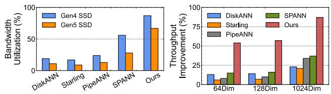  
(a) I/O Bandwidth utilization on (b) Improvements by upgrading PCIe-4.0 and PCIe-5.0 SSDs. SSDs from PCIe-4.0 to PCIe-5.0.

Figure 18: Impacts of different generations of NVMe SSDs.  
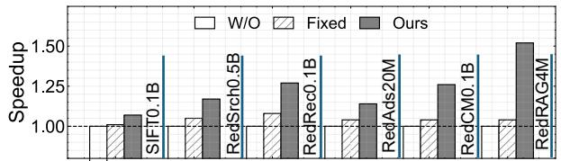  
Figure 19: Performance speedup by the pruning module.

## 5.3 Storage I/O Impact

Bandwidth utilization. As shown in Figure 18a, on Red-Srch0.5B, we measure the bandwidth utilization of a 12- SSD array with both PCIe-4.0 [11] and PCIe-5.0 drives [12]. Graph-based systems utilize less than 20% of SSD bandwidth, while clustering-based SPANN also merely reaches about 55% (Gen4). In contrast, HELMSMAN pushes utilization to ∼85% on Gen4 and ∼70% on Gen5, showing that its batched, device-direct I/O path is much closer to the device limits.

Gains from hardware upgrades. In Figure 18b, we then report throughput gains when upgrading SSDs from PCIe 4.0 to 5.0 on 64-dim RedSrch, 128-dim RedAds, and 1024-dim RedRAG workloads. Graph-based systems (DiskANN, Starling, and PipeANN) improve by only 10-30%, and SPANN by up to 40%, indicating they are largely I/O-latency- or softwarestack-bound. In contrast, HELMSMAN gains about 55% at 64- and 128-D and 87% at 1024-D, demonstrating that its performance scales more efficiently with available bandwidth.

## 5.4 Pruning Efficiency

For the public SIFT dataset, we randomly sample 1M vectors as the training set and use 10% of them as queries; for production datasets, we extract 110K consecutive queries from online logs, use the first 100K as the training set, and reserve the last 10K as queries, consistent with our production scenario. By default, we set the number of iterations to 500 and the learning rate to 0.2.

Performance gains. Our pruning module consistently accelerates search across all datasets, as shown in Figure 19. Compared with the non-pruning baseline, it yields 1.1–1.6× throughput, and still provides 5–25% higher throughput than the fixed pruning policy. The benefit is most pronounced on RedRAG4M because its workloads use small top-k values (i.e., 10–100), where the optimal search range (i.e., nprobe) tends to fluctuate more, leading to more redundant scans.

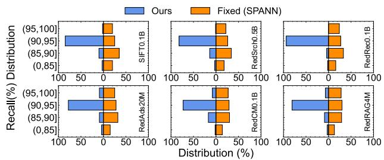  
Figure 20: Search quality improved by the pruning module.

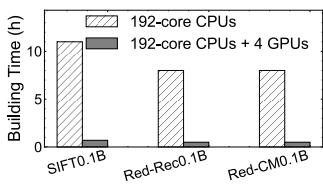

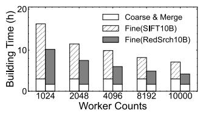  
(a) Comparison of single node. (b) Speedup from elastic scaling.  
Figure 21: Acceleration of GPUs and distribution.

Accuracy gains. As shown in Figure 20, LLSP also leads to a more stable search quality under the same average recall. In contrast to the fixed policy, which fails to meet the target recall for over 40% of queries, our method ensures that over 80% of queries meet the target recall (i.e., 90%), effectively reducing low-recall outliers across all six datasets.

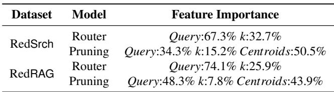  
Table 3: Feature importance of leveling-learned pruning.

Feature importance. We further show the importance of different features in the leveling-learned pruning model in Table 3. RedSrch0.5B and RedRAG4M are chosen as representatives of production datasets with different dimensions and top-k ranges. RedSrch has a larger top-k range (100–3,000) and smaller dimension (64), while RedRAG has a smaller top k range (10–100) and larger dimension (1024). Results show that the query features (e.g., query coordinates and distances to centroids used during pruning) are important for both router and pruning models, indicating that the local distribution of queries is a key factor for determining the search range and pruning ratio. Meanwhile, the importance of top-k is higher for the router model than the pruning model, which is reasonable since the router determines the search range (i.e., nprobe) based on the target top-k, while the pruning model further prunes clusters within the smaller selected search range.

## 5.5 Construction Evaluation

GPU acceleration. On a single 192-core node, CPU-only construction of 0.1B-scale indexes takes about 9–12 hours. Offloading the coarse clustering stage to 4 NVIDIA L20 GPUs reduces the total build time to within an hour, as shown in Figure 21a (up to ∼10× speedup), transforming hourslong offline jobs into minute-level builds for high-freshness services (e.g., recommendation and advertising).

Elastic scaling. For 10B-scale datasets, using GPUs for coarse clustering and single-node merging for final indexes (i.e., Coarse & Merge), we further parallelize the fine-grained balancing stage (i.e., Fine) across an elastic CPU cluster. Increasing the number of CPU workers from 1,024 to 104 cores reduces end-to-end building time from over 16 hours to about 4–7 hours, as shown in Figure 21b, enabling hours-level reconstruction of billion-scale indexes.

## 5.6 Cost Efficiency

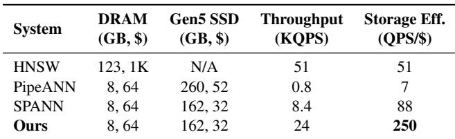

Table 4: Comparison of cost efficiency on RedSrch0.5B.  
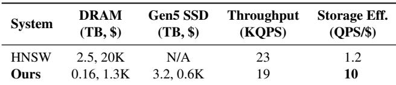  
Table 5: Comparison of cost efficiency on RedSrch10B.

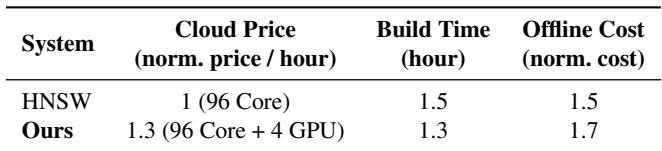  
Table 6: Comparison of construction cost on RedSrch0.5B.

Cost efficiency of online serving. We compare storage cost and throughput on search workloads to show online serving costs. On RedSrch0.5B (Table 4), under production topk workloads, PipeANN sustains only 0.8 KQPS, yielding 7 QPS/\$, even lower than in-DRAM HNSW (51 QPS/\$). SPANN reaches 88 QPS/\$, while HELMSMAN further improves to 250 QPS/\$ (5.4× over HNSW, 2.9× over SPANN). On RedSrch10B (Table 5), by replacing a 10-shard HNSW deployment using ∼2.5 TB DRAM with each single node using 32 cores and 256 GB DRAM, HELMSMAN boosts cost efficiency from 1.2 to 10 QPS/\$ (8.3×) by saving 90% of DRAM usage at an additional SSD cost of only \$0.6K.

Cost efficiency of offline building. In addition to comparing our offline building time with the CPU-only SPANN, we also estimate the single-node CPU-GPU construction cost of HELMSMAN and CPU-based HNSW we deployed previouly by comparing the normalized cloud price of CPU-only and CPU-GPU instances [4]. As shown in Table 6, our GPU accelerated construction achieves similar cost compared with CPU-only HNSW building, because of higher price of GPU instances but shorter build time. And as the GPU-based clustering implementation is developing [60], we expect the cost of clustering-based indexes’ construction to further reduce, making it more cost-effective.

## 6 Deployment

## 6.1 Deployment Status

At the time of publication, HELMSMAN has been rolling out as a unified ANN layer in RedNote’s production. We use HELMSMAN to support all services, and all-flash servers are gradually replacing previous in-DRAM deployments across search, recommendation, advertising, and other vector services in the coming months. Currently, with only ∼40 all flash servers-each with 0.7–1.1 TB DRAM and 12 NVMe SSDs-HELMSMAN already sustains online workloads that previously required about 35,000 CPU cores and ∼0.35 PB DRAM in in-DRAM deployments. In the offline construction phase, HELMSMAN can leverage up to 10,000 CPU cores from online clusters during low-traffic periods (e.g., late-night hours) to accelerate large-scale builds. Looking forward, Red-Note plans to migrate the majority of in-DRAM deployments onto HELMSMAN, with projected infrastructure cost savings on the order of tens of millions of dollars per year.

## 6.2 Operational Lessons and Future Work

Performance bottlenecks stem from local hotspots of queries and SSDs’ die-level conflicts. In most indexes, the overall deployment remains smooth and stable. When SSD bandwidth and CPU utilization remain unsaturated, latency stays within SLAs and throughput scales with additional search threads. However, in the early stage of trial operation, for a few recommendation indexes, adding CPU cores failed to increase throughput, even though SSD bandwidth remained below 20%. Log replay shows that transient query bursts can target the same nearest clusters and logical blocks, causing internal chip conflicts [31] and high-latency SSD accesses. To mitigate this, we place a few redundant copies of the cluster lists on NVMe SSDs, which reduces conflicts and raises the throughput ceiling by 1.5–2×, while incurring only a minor extra SSD space overhead.

Memory bandwidth becomes the bottleneck before external I/O bandwidth is fully utilized. In our all-flash deployment, 12 Gen5 SSDs provide roughly 140 GB/s aggregate external I/O bandwidth, but only about 70% can be utilized in practice. The bottleneck is the limited effective memory bandwidth of modern 12-channel DDR5 servers, typically around 300–350 GB/s, which must serve SSD-to-DRAM transfers, DRAM-to-CPU rereads, and nearest-centroid search. Consequently, adding more SSDs brings limited benefit once memory bandwidth is saturated, as observed in our early more SSDs equipments (e.g., 20 Gen5 SSDs experiments). This imbalance is likely to worsen as modern CPUs expose enough PCIe lanes (e.g., 128-160 lanes [1]) to attach over 32 Gen5 SSDs, providing external bandwidth beyond what current memory systems can sustain. For the commercially available devices, the direct I/O-to-cache techniques such as Intel DDIO [6] and AMD SDCI [3] may mitigate this issue, but currently these methods only work for network devices and their SSD ecosystem remains immature. We think that extending such support to SSD-based systems might be a promising future direction. At the same time, recent studies [27, 28, 57] have used GPUs to overcome the limitations of CPU compute power and host memory bandwidth, while also taking advantage of the increasingly abundant external I/O bandwidth provided by NVMe SSDs. We plan to explore their optimizations in our future deployments.

Large top-k can be more important than extremely high recall. In production search, recommendation, and advertising systems, first-stage ANNS is typically used as a candidate generator rather than the final decision maker. Since singlevector similarity only provides a compressed semantic signal, downstream stages usually apply post-filtering based on scalar attributes, or rescore the retrieved candidates using richer fea tures and the original content, such as text, images, and videos [21, 37, 63]. Therefore, in our workloads, retrieving a large candidate pool, e.g., top-k from 100 to 1000 at around 90% recall, is often more valuable than pursuing extremely high recall such as 98–99.9% for small top-k requests. The latter can substantially increase ANNS search cost but brings limited end-to-end business gain, because downstream stages mainly benefit from having enough valid and diverse candidates to filter and rescore, rather than from marginal improvements in the vector recall of a small candidate set. This suggests that future ANNS systems should be evaluated not only by recall@10 [48], but also by performance under large top-k, which better matches multi-stage pipelines.

In-place updates remain challenging. Dynamic updates are important for freshness in vector data management, especially to keep up with the near-real-time and streaming training of embedding models. In a typical 0.1B-scale recommendation workload with hourly rebuilding and ∼25–30 KQPS of search, fully replacing periodic rebuilds with inplace updates would require roughly 25–30 KOPS of updates (i.e., insertions and deletions) while concurrently serving online search. This is beyond the update and search throughputs of recent state-of-the-art large-scale dynamic ANNS systems [23, 58]. Therefore, supporting both high-rate updates and high-performance search remains a challenging direction. Our current deployment adopts a hybrid design [24,26,50,55]: the main SSD-resident index is periodically rebuilt, recent insertions are maintained in an auxiliary in-memory index e.g., (HNSW and IVF), and deletions are tracked by a tombstone bitmap. Queries search both indexes, merge candidates, and filter tombstoned vectors. This preserves freshness with modest complexity, but still incurs extra memory usage and unavoidable rebuild costs.

## 7 Related Work

DRAM-SSD ANNS. DRAM–SSD ANNS includes graphbased systems (e.g., DiskANN [49], Starling [56], PipeANN [22]) and clustering-based designs (e.g., SPANN [17, 58]). Though graph-based schemes are popular for issuing fewer I/Os than clustering-based search, our findings show that SSD latency and serial access can make them slower than clustering on modern SSDs with the near-DRAM bandwidth [25, 34, 35], particularly for top-k up to the thousands in production [21, 37, 63]. Hence, we integrate clustering methods with high-bandwidth NVMe SSD arrays.

Pruning for ANNS. Quake [43], LAET [36], Auncel [64], and ANSMET [38] study pruning and early stopping for in-DRAM ANNS, where the search can iteratively check intermediate results and terminate once convergence-like conditions are met. However, such fine-grained, stateful control conflicts with SSD-friendly batched I/Os, which prefer issuing large sequential reads without per-step feedback. Therefore, instead of these intermediate-result-based methods, we propose our pruning module trained on historical traces, which predicts search ranges without relying on intermediate states.

Acceleration of index building. CAGRA [46], RAFT [7], ParlayANN [41], and Faiss [30] accelerate ANNS index construction and clustering using highly parallel graph builders and heterogeneous acceleration. We adapt several of their techniques (e.g., GPU-based k-means and parallel graph construction) in our offline index-building pipelines.

## 8 Conclusion

Our experience at RedNote shows that, under industrial workloads with large top-k queries, graph-based ANNS on SSDs suffers from long, latency-bound search paths and loses competitiveness. In contrast, pairing high-bandwidth NVMe arrays with the clustering-based search allows DRAM–SSD designs to approach in-DRAM performance (both throughput and latency) while greatly reducing hardware cost. HELMS-MAN demonstrates this path in practice, combining a custom storage stack, adaptive pruning, and fast elastic construction to deliver cost-effective, high-performance ANNS at scale.

## Acknowledgment

We thank all anonymous reviewers and our shepherd, Asaf Cidon, for their valuable feedback and helping us improve our paper significantly. We also thank engineers at Xiaohongshu Inc. for their efforts in deploying HELMSMAN in production. This work was conducted by Yuchen Huang and Baiteng Ma during their internship at RedNote Engine Architecture Department. Erci Xu is the corresponding author. Yuchen Huang and Chuliang Weng are supported by the National Natural Science Foundation of China (Grant No.62272171).

## References

[1] 5th Generation AMD EPYC™ Server CPUs. https://www.amd.com/en/products/processors/ server/epyc/9005-series.html.

[2] Accelerating Vector Database Performance through Disk-Based Storage. https://americas.kioxia.com/en-us/ business/resources/performance-brief/ cm7-vector-db-r6615-performance-brief.html.

[3] AMD Smart Data Cache Injection. https: //docs.amd.com/api/khub/documents/ gLSrfVtcWNt\~1fzExUSiIg/content.

[4] AWS EC2 Pricing. https://aws-pricing.com/.

[5] Everything you need to know about xiaohongshu. Explainer piece; positions Xiaohongshu as a lifestyle social commerce platform with 300M+ monthly active users. https://restofworld.org/ 2025/rednote-xiaohongshu-what-to-know/.

[6] Intel Data Direct I/O Technology. https: //www.intel.com/content/www/us/en/io/ data-direct-i-o-technology.html.

[7] RAPIDS RAFT: Reusable Accelerated Functions and Tools for Vector Search and More. https://github. com/rapidsai/raft.

[8] RedNote (Xiaohongshu Inc). https://rednotes.co/.

[9] Reduce costs with disk-based vector search. https://opensearch.org/blog/ reduce-cost-with-disk-based-vector-search/.

[10] Samsung DDR5 Data-centric DRAM Memory. https: //semiconductor.samsung.com/dram/ddr/ddr5/.

[11] Samsung PCIe-Gen4.0 PM9A3 Data-centric NVMe SSD. https://semiconductor.samsung.com/ssd/ datacenter-ssd/pm9a3/.

[12] Samsung PCIe-Gen5.0 PM9D3A Data-centric NVMe SSD. https://semiconductor.samsung.com/ssd/ datacenter-ssd/pm9d3a/.

[13] SIFT dataset. http://corpus-texmex.irisa.fr/.

[14] Storage Performance Development Kit (SPDK). https: //github.com/spdk.

[15] Mozhdeh Ariannezhad, Sami Jullien, Ming Li, Min Fang, Sebastian Schelter, and Maarten de Rijke. Re-CANet: A Repeat Consumption-Aware Neural Network for Next Basket Recommendation in Grocery Shopping. In Proceedings of the 45th International ACM SIGIR Conference on Research and Development in Informa tion Retrieval, SIGIR, 2022.

[16] Grant Ayers, Jung Ho Ahn, Christos Kozyrakis, and Parthasarathy Ranganathan. Memory Hierarchy for Web Search. In 2018 IEEE International Symposium on High Performance Computer Architecture, HPCA, 2018.

[17] Qi Chen, Bing Zhao, Haidong Wang, Mingqin Li, Chuanjie Liu, Zengzhong Li, Mao Yang, and Jingdong Wang. SPANN: Highly-efficient Billion-scale Approximate Nearest Neighbor Search. In Advances in Neural Information Processing Systems 34, NeurIPS, 2021.

[18] Xiaopeng Fan, Song Yan, and Chuliang Weng. Structured storage for ubiquitous operating systems. SCIEN TIA SINICA Informationis, 54, 2024.

[19] Jerome H. Friedman. Greedy Function Approximation: A Gradient Boosting Machine. Annals of Statistics, 29(5), 2001.

[20] Cong Fu, Chao Xiang, Changxu Wang, and Deng Cai. Fast Approximate Nearest Neighbor Search With Navigating Spreading-out Graphs. Proceedings of the VLDB Endowment, 12, 2019.

[21] Luyu Gao, Zhuyun Dai, Tongfei Chen, Zhen Fan, Ben jamin Van Durme, and Jamie Callan. Complement Lexical Retrieval Model with Semantic Residual Embeddings. In Advances in Information Retrieval (Proceedings of ECIR 2021), ECIR, 2021.

[22] Hao Guo and Youyou Lu. Achieving Low-Latency Graph-Based Vector Search via Aligning Best-First Search Algorithm with SSD. In Proceedings of the 19th USENIX Symposium on Operating Systems Design and Implementation, OSDI, 2025.

[23] Hao Guo and Youyou Lu. OdinANN: Direct Insert for Consistently Stable Performance in Billion-Scale Graph Based Vector Search. In 24th USENIX Conference on File and Storage Technologies, FAST, 2026.

[24] Rentong Guo, Xiaofan Luan, Long Xiang, Xiao Yan, Xiaomeng Yi, Jigao Luo, Qianya Cheng, Weizhi Xu, Jiarui Luo, Frank Liu, Zhenshan Cao, Yanliang Qiao, Ting Wang, Bo Tang, and Charles Xie. Manu: a cloud native vector database management system. Proceedings of the VLDB Endowment, 15, 2022.

[25] Gabriel Haas and Viktor Leis. What Modern NVMe Storage Can Do, And How To Exploit It: High-Performance I/O for High-Performance Storage Engines. Proceedings of the VLDB Endowment, 2023.

[26] Yuchen Huang, Xiaopeng Fan, Song Yan, and Chuliang Weng. Neos: A NVMe-GPUs Direct Vector Service Buffer in User Space. In Proceedings of the 40th IEEE International Conference on Data Engineering, ICDE, 2024.

[27] Yuchen Huang, Baiteng Ma, Erci Xu, and Chuliang Weng. Don’t Surrender to Low QPS/\$: Fast and Cost-Efficient ANNS with TridentANN. In Proceedings of the 53rd Annual International Symposium on Computer Architecture, ISCA, 2026.

[28] Haodi Jiang, Hao Guo, Minhui Xie, Jiwu Shu, and Youyou Lu. High-Throughput, Cost-Effective Billion-Scale Vector Search with a Single GPU. In Proceedings of the 2026 ACM SIGMOD International Conference on Management of Data, SIGMOD, 2026.

[29] Wenqi Jiang, Suvinay Subramanian, Cat Graves, Gustavo Alonso, Amir Yazdanbakhsh, and Vidushi Dadu. RAGO: Systematic Performance Optimization for Retrieval-Augmented Generation Serving. In Proceedings of the 52nd Annual International Symposium on Computer Architecture, ISCA, 2025.

[30] Jeff Johnson, Matthijs Douze, and Hervé Jégou. Billion-Scale Similarity Search with GPUs. IEEE Transactions on Big Data, 7, 2021.

[31] Yuhun Jun, Shinhyun Park, Jeong-Uk Kang, Sang-Hoon Kim, and Euiseong Seo. We ain’t afraid of no file fragmentation: causes and prevention of its performance impact on modern flash SSDs. In Proceedings of the 22nd USENIX Conference on File and Storage Technologies, FAST, 2024.

[32] Guolin Ke, Qi Meng, Thomas Finley, Taifeng Wang, Wei Chen, Weidong Ma, Qiwei Ye, and Tie-Yan Liu. Light-GBM: A Highly Efficient Gradient Boosting Decision Tree. In Advances in Neural Information Processing Systems 30, NeurIPS, 2017.

[33] Barrie Kersbergen, Olivier Sprangers, and Sebastian Schelter. Serenade - Low-Latency Session-Based Recommendation in e-Commerce at Scale. In Proceedings

of the 2022 International Conference on Management of Data, SIGMOD, 2022.

[34] Maximilian Kuschewski, Jana Giceva, Thomas Neumann, and Viktor Leis. High-Performance Query Processing with NVMe Arrays: Spilling without Killing Performance. In Proceedings of the 2025 ACM SIG-MOD International Conference on Management of Data, SIGMOD, 2025.

[35] Baptiste Lepers, Oana Balmau, Karan Gupta, and Willy Zwaenepoel. KVell: The Design and Implementation of a Fast Persistent Key-Value Store. In Proceedings of the 27th ACM Symposium on Operating Systems Principles, SOSP, 2019.

[36] Conglong Li, Minjia Zhang, David G. Andersen, and Yuxiong He. Improving Approximate Nearest Neighbor Search through Learned Adaptive Early Termination. In Proceedings of the 2020 ACM SIGMOD International Conference on Management of Data, SIGMOD, 2020.

[37] Sen Li, Fuyu Lv, Taiwei Jin, Guli Lin, Keping Yang, Xi aoyi Zeng, Xiao-Ming Wu, and Qianli Ma. Embeddingbased Product Retrieval in Taobao Search. In Proceedings of the 27th ACM SIGKDD Conference on Knowledge Discovery and Data Mining, KDD, 2021.

[38] Yiwei Li, Yuxin Jin, Boyu Tian, Huanchen Zhang, and Mingyu Gao. ANSMET: Approximate Nearest Neighbor Search with Near-Memory Processing and Hybrid Early Termination. In Proceedings of the 52nd Annual International Symposium on Computer Architecture, ISCA, 2025.

[39] Kejing Lu, Mineichi Kudo, Chuan Xiao, and Yoshiharu Ishikawa. HVS: Hierarchical Graph Structure Based on Voronoi Diagrams for Solving Approximate Nearest Neighbor Search. Proceedings of the VLDB Endowment, 15, 2021.

[40] Yu A. Malkov and D. A. Yashunin. Efficient and Robust Approximate Nearest Neighbor Search Using Hierarchical Navigable Small World Graphs. IEEE Transactions on Pattern Analysis and Machine Intelligence, 42, 2020.

[41] Magdalen Dobson Manohar, Zheqi Shen, Guy E. Blelloch, Laxman Dhulipala, Yan Gu, Harsha Vardhan Simhadri, and Yihan Sun. ParlayANN: Scalable and Deterministic Parallel Graph-Based Approximate Nearest Neighbor Search Algorithms. In Proceedings of the 29th ACM SIGPLAN Annual Symposium on Principles and Practice of Parallel Programming, PPoPP, 2024.

[42] Kiran Kumar Matam, Hani Ramezani, Fan Wang, Zeliang Chen, Yue Dong, Maomao Ding, Zhiwei Zhao,

Zhengyu Zhang, Ellie Wen, and Assaf Eisenman. Quick-Update: a Real-Time Personalization System for Large-Scale Recommendation Models. In Proceedings of the 21st USENIX Symposium on Networked Systems Design and Implementation, NSDI, 2024.

[43] Jason Mohoney, Devesh Sarda, Mengze Tang, Shihabur Rahman Chowdhury, Anil Pacaci, Ihab F. Ilyas, Theodoros Rekatsinas, and Shivaram Venkataraman. Quake: Adaptive Indexing for Vector Search. In 19th USENIX Symposium on Operating Systems Design and Implementation, OSDI, 2025.

[44] Aashiq Muhamed, Mona T. Diab, and Virginia Smith. CoRAG: Collaborative Retrieval-Augmented Generation. In Proceedings of the 2025 Conference of the Nations of the Americas Chapter of the Association for Computational Linguistics: Human Language Technolo gies (Volume 2: Short Papers), NAACL, 2025.

[45] Yuto Oikawa, Yuki Nakayama, and Koji Murakami. A Stacking-based Efficient Method for Toxic Language Detection on Live Streaming Chat. In Proceedings of the 2022 Conference on Empirical Methods in Natural Language Processing, EMNLP, 2022.

[46] Hiroyuki Ootomo, Akira Naruse, Corey Nolet, Ray Wang, Tamas Feher, and Yong Wang. CAGRA: Highly Parallel Graph Construction and Approximate Nearest Neighbor Search for GPUs. In Proceedings of the 40th IEEE International Conference on Data Engineering, ICDE, 2024.

[47] Chijun Sima, Yao Fu, Man-Kit Sit, Liyi Guo, Xuri Gong, Feng Lin, Junyu Wu, Yongsheng Li, Haidong Rong, Pierre-Louis Aublin, and Luo Mai. Ekko: A Large-Scale Deep Learning Recommender System with Low-Latency Model Update. In Proceedings of the 16th USENIX Symposium on Operating Systems Design and Implementation, OSDI, 2022.

[48] Harsha Vardhan Simhadri, George Williams, Martin Aumüller, Matthijs Douze, Artem Babenko, Dmitry Baranchuk, Qi Chen, Lucas Hosseini, Ravishankar Krishnaswamy, Gopal Srinivasa, Suhas Jayaram Subramanya, and Jingdong Wang. Results of the NeurIPS’21 Challenge on Billion-Scale Approximate Nearest Neighbor Search. In Proceedings of the NeurIPS 2021 Competitions and Demonstrations Track, NeurIPS, 2022.

[49] Suhas Jayaram Subramanya, Devvrit, Harsha Vardhan Simhadri, Ravishankar Krishnawamy, and Rohan Kadekodi. DiskANN: Fast Accurate Billion-point Nearest Neighbor Search on a Single Node. In Advances in Neural Information Processing Systems 32, NeurIPS, 2019.

[50] Yiping Sun, Yang Shi, and Jiaolong Du. A Real-Time Adaptive Multi-Stream GPU System For Online Approximate Nearest Neighborhood Search. In Proceedings of the 33rd ACM International Conference on Information and Knowledge Management, CIKM, 2024.

[51] Bing Tian, Haikun Liu, Yuhang Tang, Shihai Xiao, Zhuohui Duan, Xiaofei Liao, Xuecang Zhang, Junhua Zhu, and Yu Zhang. FusionANNS: An Efficient CPU/GPU Cooperative Processing Architecture for Billion-scale Approximate Nearest Neighbor Search. In 23rd USENIX Conference on File and Storage Technologies, FAST, 2025.

[52] Godfried T. Toussaint. The Relative Neighborhood Graph of a Finite Planar Set. Pattern Recognition, 12, 1980.

[53] Kosetsu Tsukuda and Masataka Goto. Explainable Recommendation for Repeat Consumption. In Proceedings of the 14th ACM Conference on Recommender Systems, RecSys, 2020.

[54] Chenyang Wang, Min Zhang, Weizhi Ma, Yiqun Liu, and Shaoping Ma. Modeling Item-Specific Temporal Dynamics of Repeat Consumption for Recommender Systems. In Proceedings of the World Wide Web Conference, WWW, 2019.

[55] Jianguo Wang, Xiaomeng Yi, Rentong Guo, Hai Jin, Peng Xu, Shengjun Li, Xiangyu Wang, Xiangzhou Guo, Chengming Li, Xiaohai Xu, Kun Yu, Yuxing Yuan, Yinghao Zou, Jiquan Long, Yudong Cai, Zhenxiang Li, Zhifeng Zhang, Yihua Mo, Jun Gu, Ruiyi Jiang, Yi Wei, and Charles Xie. Milvus: A Purpose-Built Vector Data Management System. In Proceedings of the 2021 ACM SIGMOD International Conference on Management of Data, SIGMOD, 2021.

[56] Mengzhao Wang, Weizhi Xu, Xiaomeng Yi, Songlin Wu, Zhangyang Peng, Xiangyu Ke, Yunjun Gao, Xiaoliang Xu, Rentong Guo, and Charles Xie. Starling: An I/O-Efficient Disk-Resident Graph Index Framework for High-Dimensional Vector Similarity Search on Data Segment. In Proceedings of the 2024 ACM SIGMOD International Conference on Management of Data, SIG-MOD, 2024.

[57] Yang Xiao, Mo Sun, Ziyu Song, Bing Tian, Jie Sun, Jie Zhang, Zeke Wang, Zonghui Wang, Wenzhi Chen, and Fei Wu. FlashANNS: GPU-Driven Asynchronous I/O Pipelining for Eliminating Storage-Compute Bottlenecks in Billion-Scale Similarity Search. In Proceedings of the 2026 ACM SIGMOD International Conference on Management of Data, SIGMOD, 2026.

[58] Yuming Xu, Hengyu Liang, Jin Li, Shuotao Xu, Qi Chen, Qianxi Zhang, Cheng Li, Ziyue Yang, Fan Yang, Yuqing Yang, Peng Cheng, and Mao Yang. SPFresh: Incremen tal In-Place Update for Billion-Scale Vector Search. In Proceedings of the 29th Symposium on Operating Systems Principles, SOSP, 2023.

[59] Zhiqiang Xu, Dong Li, Weijie Zhao, Xing Shen, Tianbo Huang, Xiaoyun Li, and Ping Li. Agile and Accurate CTR Prediction Model Training for Massive-Scale Online Advertising Systems. In Proceedings of the 2021 International Conference on Management of Data, SIG-MOD, 2021.

[60] Shuo Yang, Haocheng Xi, Yilong Zhao, Muyang Li, Xiaoze Fan, Jintao Zhang, Han Cai, Yujun Lin, Xiuyu Li, Kurt Keutzer, Song Han, Chenfeng Xu, and Ion Stoica. Flash-KMeans: Fast and Memory-Efficient Exact K-Means. In arXiv, 2026.

[61] Xinyang Yi, Ji Yang, Lichan Hong, Derek Zhiyuan Cheng, Lukasz Heldt, Aditee Ajit Kumthekar, Zhe Zhao, Li Wei, and Ed H. Chi. Sampling-Bias-Corrected Neural Modeling for Large Corpus Item Recommendations. In Proceedings of the 13th ACM Conference on Recommender Systems, RecSys, 2019.

[62] Donghan Yu, Chenguang Zhu, Yuwei Fang, Wenhao Yu, Shuohang Wang, Yichong Xu, Xiang Ren, Yiming Yang, and Michael Zeng. KG-FiD: Infusing Knowledge Graph in Fusion-in-Decoder for Open-Domain Question Answering. In Proceedings of the 60th Annual Meeting of the Association for Computational Linguistics (Volume 1: Long Papers), ACL, 2022.

[63] Qianxi Zhang, Shuotao Xu, Qi Chen, Guoxin Sui, Jiadong Xie, Zhizhen Cai, Yaoqi Chen, Yinxuan He, Yuqing Yang, Fan Yang, Mao Yang, and Lidong Zhou. VBASE: Unifying Online Vector Similarity Search and Relational Queries via Relaxed Monotonicity. In Proceedings of the 17th USENIX Symposium on Operating Systems Design and Implementation, OSDI, 2023.

[64] Zili Zhang, Chao Jin, Linpeng Tang, Xuanzhe Liu, and Xin Jin. Fast, Approximate Vector Queries on Very Large Unstructured Datasets. In 20th USENIX Symposium on Networked Systems Design and Implementation, NSDI, 2023.