USENIX

THE ADVANCED COMPUTING SYSTEMS ASSOCIATION

# Revisiting Pipeline Parallelism for LLM Serving

Soonjae Hwang and Jeongseob Ahn, Korea University

https://www.usenix.org/conference/osdi26/presentation/hwang

# This paper is included in the Proceedings of the 20th USENIX Symposium on Operating Systems Design and Implementation.

July 13–15, 2026 • Seattle, WA, USA

ISBN 978-1-939133-55-7

Open access to the Proceedings of the 20th USENIX Symposium on Operating Systems Design and Implementation is sponsored by

# Revisiting Pipeline Parallelism for LLM Serving

Soonjae Hwang

Jeongseob Ahn

Korea University

## Abstract

As the memory capacity of a single GPU is insufficient to accommodate large language models (LLMs), model parallelism has become the standard approach for serving LLMs across multiple GPUs. In online serving environments, tensor parallelism has become the de facto way in single-node multi-GPU systems because it can reduce the computation latency through parallel execution. Although pipeline parallelism can offer higher throughput, it suffers from pipeline imbalance that is exacerbated under online workloads, leading to resource underutilization and performance degradation.

In this study, we revisit pipeline parallelism for serving LLMs. Our analysis shows that computational imbalance between pipeline stages becomes exacerbated in online serving. To address these pipeline inefficiencies, we propose three techniques: two mechanisms, greedy and predictive schemes, that dynamically adjust the chunk size to mitigate prefill-induced bubbles, and a delay scheduling technique that dynamically rebalances decode workloads across pipeline stages to further reduce pipeline bubbles. We implement our techniques on top of SGLang and demonstrate that, for Qwen2.5 32B and 14B on four NVIDIA A100 40GB GPUs, pipeline parallelism with our mechanisms outperforms tensor parallelism.

## 1 Introduction

As large language models (LLMs) with billions of parameters have become increasingly prevalent, their inference workloads demand far more computation and memory than a single accelerator (e.g., GPU or NPU) can provide. For instance, the Llama3.1-70B [4] BF16 model requires at least four NVIDIA A100 40GB GPUs to retain its parameters. This necessitates parallel execution across multiple accelerators. In single-node multi-GPU inference, tensor parallelism has become the de facto standard [30]. By partitioning large weight matrices and attention operations across GPUs, tensor parallelism achieves low per-token latency [16], particularly with high-bandwidth interconnects (e.g., NVLink) that hide frequent all-reduce communication overhead [27]. In addition, every GPU executes the same set of operations at each step, making load balancing trivial. However, many commodity GPUs and NPUs still rely on traditional PCIe interconnects, which do not provide high-bandwidth peer-to-peer communication. In such settings, the substantial communication volume in tensor parallelism can quickly become a performance bottleneck, making it less suitable for online LLM serving.

In contrast, pipeline parallelism partitions the model along its depth, passing microbatches through sequential pipeline stages. This dramatically reduces inter-device communication and can achieve higher throughput than tensor parallelism by overlapping stage execution [11, 17], making it attractive for bandwidth constrained deployments such as PCIe.

This paper revisits pipeline parallelism to achieve high performance by effectively utilizing multiple GPUs for LLM serving. We first conduct an in-depth analysis of pipeline parallelism in the context of online serving. Our analysis identifies that computational imbalance between pipeline stages becomes exacerbated in online serving, as variability in request arrival times and input lengths leads to microbatches with different computational demands, resulting in pipeline bubbles. For example, if one microbatch consists entirely of decode-phase requests while another includes prefill-phase requests, the per-stage workloads differ significantly. Even when all microbatches across stages consist of decode-phase requests (e.g., decode-heavy), pipeline imbalance still occurs when one microbatch handles many decode-phase requests while another handles only a few.

To this end, we propose three techniques for pipeline parallelism to achieve high throughput while satisfying the latency requirements (e.g., SLO: Service Level Objective) for both TTFT (Time To First Token) and TPOT (Time Per Output Token). Our strategy is to leverage chunked-prefill [2], which splits long input sequences into smaller, fixed-size chunks. Since prefill computation is proportional to its input length, limiting the input with a fixed chunk size helps reduce latency imbalance across pipeline workers. However, smaller chunks lower computational throughput due to fewer tokens being processed per iteration, leading to higher TTFT latency.

To balance this trade-off between minimizing pipeline bubbles and maximizing compute utilization, we propose two methods that dynamically adjust the chunk size. The first is a greedy approach, in which the LLM serving framework monitors the latency slack for both TTFT and TPOT at every iteration based on a given SLO, and incrementally increases or decreases the chunk size to balance the two phases. Specif ically, when the observed T POTslack is about to violate its SLO, we decrease the chunk size to reduce pipeline bubbles; when the T T FTslack is insufficient, we increase the chunk size to drain the waiting queue faster. This simple feedback-driven requires only minimal changes to existing serving systems.

However, the greedy approach is inherently reactive and thus limited in its ability to accurately determine the optimal chunk size under the system’s current context. To overcome this limitation, we propose a predictive dynamic chunked prefill method that proactively selects the chunk size using a lightweight latency prediction model. The model combines offline profiling with online adaptation to account for both static and dynamic components of LLM iteration latency. Given the current system state (e.g., waiting queue, running batch, and request arrival rate), the inference serving scheduler uses this model to select the chunk size that minimizes pipeline bubbles, thereby improving goodput.

The last piece of this study is to dynamically rebalance workloads across pipeline stages, called delay scheduling. We find that existing implementations of pipeline parallelism typically rely on static microbatch scheduling. Once a request is assigned to a microbatch, it remains fixed for its entire lifetime [14, 37]. In decode-heavy workloads where many of the batches consist of only decode phases, such static scheduling amplifies pipeline imbalances and repeatedly causes stalls across iterations. To alleviate this, our delay scheduling examines load imbalances (i.e., # requests) at each scheduling iteration and migrates requests from the heaviest to the lightest microbatch in proportion to their computational demand.

We implement our three techniques, as well as the baseline pipeline parallelism with chunked prefill, on top of SGLang [37]. We evaluate the effectiveness of our techniques using two representative LLM models, Qwen2.5 32B and 14B, on a server equipped with four NVIDIA A100 40GB GPUs. To emulate real-world LLM request patterns, we use the Conversation trace from Azure [22], the ShareGPT trace from HuggingFace [24], and the CNN trace [9]. Since these are prefill-heavy workloads, we also construct a decode-heavy workload by reversing the input and output distribution of the CNN trace. We demonstrate that pipeline parallelism with a carefully tuned static chunk size already outperforms tensor parallelism in terms of goodput, TTFT, and TPOT. Our dynamic chunked prefill and delay scheduling techniques improve further: on the Conversation workload, they reduce TPOT and end-to-end latency by 35% and 31%, respectively, over this tuned pipeline parallelism.

## 2 Background

## 2.1 LLM Inference and Serving

LLMs typically execute inference in two distinct phases: prefill and decode. In the prefill phase, the input prompt tokens are processed through all decoder layers to initialize the attention key-value (KV) cache and produce the first output token. After this step, the request enters the decode phase, where tokens are generated autoregressively, one token at a time [29]. Each decode step reuses the KV cache and computes attention only for the newly generated token, resulting in a near-constant and significantly lower per-token cost compared to prefill. The number of decode steps (i.e., output tokens) depends on its input prompt.

Meanwhile, modern LLM serving systems commonly employ iteration-level scheduling [28, 35], where multiple requests are grouped into the same batch and processed at the granularity of iteration. The iteration-level scheduling allows new requests to join ongoing batches when GPU resources are available, and completed requests to exit early without waiting for the entire batch to finish. In online serving environments, requests often enter and exit the prefill and decode phases at different times. Batching at the iteration-level enables efficient GPU utilization by allowing requests in different phases to be processed together.

However, while iteration-level scheduling enhances GPU utilization, it can increase the decoding latency when long prefill requests are included in the same iteration. To mitigate this, Sarathi-Serve introduces the chunked-prefill technique, which splits the prefill phase into fixed-size chunks [2]. This approach distributes the compute load of long prompts across multiple iterations, preventing them from dominating a single iteration. The chunked-prefill approach has been widely adopted in modern LLM serving frameworks such as vLLM [14], SGLang [37], and Dynamo [19].

In online LLM serving, TTFT (Time to First Token) and TPOT (Time Per Output Token) are commonly used latency metrics to evaluate performance during the prefill and decode phases, respectively. According to the MLPerf inference benchmark [1], typical SLO targets are 2,000ms for TTFT and 200ms for TPOT. From the perspective of operating LLMbased services, it is crucial to achieve high throughput while satisfying these latency targets, referred to as goodput.

## 2.2 Parallelism in LLM Serving

Although each new GPU generation increases memory capacity, it still falls short of accommodating the weights of large models. For instance, serving the Llama 3.1 70B FP16 model, which requires approximately 140GB of memory, necessitates at least two H100 GPUs. A common practice is to employ model parallelism, which partitions the model across multiple GPUs. There are two primary forms of model parallelism:

tensor parallelism and pipeline parallelism.

Tensor Parallelism (TP) shards intra-layer tensors across multiple GPUs [25, 27]. In a transformer block, large weight matrices, such as those in attention projections or feedforward layers, are split across devices. Each GPU performs partial matrix multiplications (e.g., GEMMs) and attention operations on its shard. The partial outputs are then aggregated via collective communication primitives like all-reduce, preserving the logical semantics of the full layer. Since every GPU holds all layers in a sharded form, each forward pass involves all participating devices.

Pipeline Parallelism (PP) partitions the model by layer depth, assigning contiguous sets of layers (called stages) to different GPUs [11, 17]. During inference, a microbatch, a smaller split of the full input batch, is passed sequentially through these pipeline stages. While stage 0 processes microbatch i+1, stage 1 can process microbatch i, enabling concurrent execution and hiding latency through pipelining. Unlike TP, each GPU is only responsible for a subset of layers, reducing communication overhead but introducing the potential for pipeline bubbles (later discussed in detail).

In single-node multi-GPU environments, tensor parallelism has become the de facto standard for latency-sensitive online LLM serving [30]. While tensor parallelism introduces substantial communication overhead, especially compared to pipeline parallelism, this cost is largely mitigated by highbandwidth interconnects such as NVLink [27]. However, NVLink is only available in a limited set of GPU platforms, such as NVIDIA DGX systems with A100 or H100 GPUs. Still, many GPU servers in public clouds rely on PCIe, which offers lower bandwidth. The same constraint applies to AMD GPUs and NPUs. In such environments, pipeline parallelism may offer better performance due to its lower communication requirements. Another reason tensor parallelism is often preferred is that it is generally simpler to implement and integrate, avoiding the scheduling complexity and microbatching challenges inherent in pipeline parallelism. As a result, mod ern LLM serving frameworks remain relatively immature in their support for efficient pipeline parallelism.

## 2.3 Tensor Parallelism vs. Pipeline Parallelism

To have a better understanding of the advantages and disadvantages of pipeline parallelism, we conduct a performance analysis comparing it with tensor parallelism on four NVIDIA A100 GPUs connected via PCIe 4.0 to the host. We evaluate TTFT and TPOT latency when serving Qwen2.5-32B with SGLang [37], using the Azure Conversation workload [22] under varying request rates. The detailed experimental setup is described in Section 5.1.

Figure 1 presents TTFT (top) and TPOT (bottom) performance for both pipeline parallelism and tensor parallelism. Pipeline parallelism achieves lower TTFT latency than tensor parallelism due to its pipelined execution across stages, which enables efficient overlap of computation during the prefill phase and accelerates the generation of the first token. However, pipeline parallelism exhibits relatively higher TPOT latency compared to tensor parallelism. This is primarily due to pipeline bubbles across different pipeline stages as depicted in Figure 2. We will discuss more details in the following section. As the request rate increases, these bubbles become more significant, causing pipeline parallelism to violate TPOT . The vertical dotted lines denote the maximum achievable goodput given latency budgets of 2,000 ms for TTFT and 200 ms for TPOT [1]. In terms of SLO attainment, tensor parallelism can sustain a 1.2× higher request rate than pipeline parallelism.

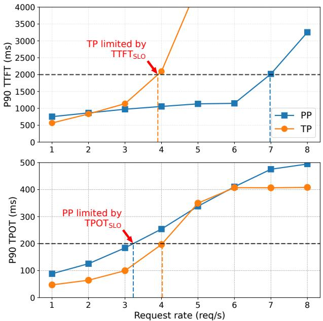  
Figure 1: Performance comparison for pipeline and tensor parallelism in serving Qwen2.5-32B with the Azure Conversation workload on 4 NVIDIA A100 GPUs

## 3 Challenges and Proposed Approaches

This section describes challenges in serving LLMs with pipeline parallelism. First, we analyze the root cause of pipeline bubbles that lead to computational inefficiencies. Second, we provide an overview of our design approaches to reduce the pipeline bubbles.

## 3.1 Pipeline Bubbles in LLM Serving

The root cause of pipeline bubbles lies in computational imbalances between pipeline stages (i.e., GPU workers). Unlike model training, where inputs are fixed and predictable, online serving introduces inherent variability in request arrival times and batch composition, making it difficult to maintain balanced compute across pipeline stages.

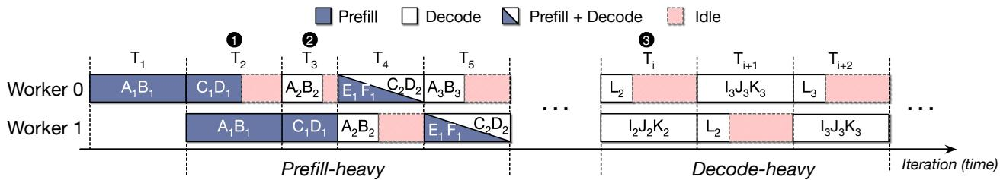  
Figure 2: Three types of pipeline bubbles (The subscript indicates the iteration number.)

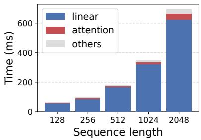  
(a) Prefill

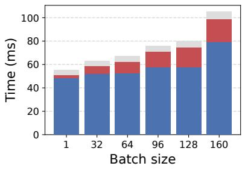  
(b) Decode

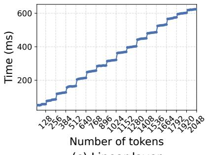  
(c) Linear layer  
Figure 3: Performance characteristics: (a) prefill time when varying the sequence length, (b) decode time when increasing the batch size, and (c) linear operations when increasing the number of tokens

## 3.1.1 Types of Pipeline Imbalance

Figure 2 illustrates three representative cases that lead to pipeline bubbles, assuming a two-stage pipeline and a maximum batch size of three. First, the iteration-level schedul ing composes batches of requests with varying input lengths, leading to imbalanced prefill latencies. For instance, 1 at T2, suppose a microbatch A1B1 with long prompt sequences and another microbatch C1D1 with shorter ones. Microbatches with longer prompts spend more computation cycles during the prefill phase. In this case, Worker 0 completes the microbatch C D earlier, while Worker 1 continues executing the prefill for A1B1. As a result, Worker 0 cannot start the next microbatch A2B2 until Worker 1 finishes its stage, leading to idle cycles. We call this Prefill-Prefill (P-P) imbalance.

Second, 2 at T3, when one microbatch (A2B2) consists solely of decode-phase requests while another microbatch (C1D1) consists solely of prefill-phase requests, the computational workload diverges sharply across stages. We call this Prefill-Decode (P-D) imbalance. Here, Worker 0 handling the decode-only microbatch finishes earlier and remains idle, while Worker 1 handling the prefill-only microbatch continues execution, further exacerbating pipeline imbalance, increasing TPOT for microbatch A B . Another P-D imbalance case is shown at T4, where microbatch C2D2E1F1, assigned to Worker 0, includes two prefill and two decode requests, while microbatch A B on Worker 1 consists only of decode requests. In this case, Worker 0 becomes the bottleneck, delaying the initiation of microbatch A3B3.

Third, 3 from Ti to Ti+2, when all microbatches across pipeline stages contain only decode phase requests, this leads to another form of pipeline imbalance where one microbatch handles many such requests while another handles only a few. We refer to this as Decode-Decode (D-D) imbalance.

## 3.1.2 Performance Implication of Pipeline Imbalance

To precisely quantify pipeline imbalance, we analyze the performance of prefill and decode phases by varying the sequence length and batch size, respectively. First, Figure 3a shows that the prefill latency depends largely on the input sequence length, indicating that balancing the compute density of prefill stages across workers is critical. For instance, when two prefills with sequence lengths of 2048 and 128 are issued sequentially, the resulting P-P imbalance generates a substantial pipeline bubble, around 627ms, which consequently stalls subsequent pipeline stages.

Second, during the decode phase, the batch size (i.e., number of requests) becomes the dominant factor determining execution time, given that only a single token is processed at a time. Figure 3b shows that the decode execution time increases as the batch size grows. Although the attention operation becomes more significant in the decode phase, linear operations remain the primary source of execution time, exhibiting a distinct step-function pattern as illustrated in Figure 3c. We observe that while the performance gap between batch sizes 96 and 128 is a relatively minor 5%, this gap significantly widens to 31% for batch sizes between 128 and 160. Due to the step-function nature of linear operations [20], a batch size increase from 128 to 129 can abruptly trigger this about 31% idle time, resulting in substantial D-D imbalance. To mitigate such inefficiencies, microbatches for decode-only phases should be configured in multiples of 128 to align with the preferred efficiency of the underlying compute kernels.

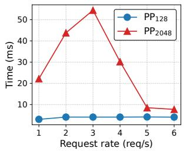  
(a) Pipeline bubble

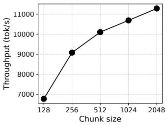  
(b) Prefill throughput  
Figure 4: Pipeline bubbles and prefill token throughput according to load and chunk size (when serving Qwen2.5-32B with the Azure Code workload on 4 NVIDIA A100 GPUs)

## 3.2 Our Approaches

## 3.2.1 Chunked Prefills in Pipeline Parallelism

To reduce the pipeline bubbles caused by long prefills, a simple and straightforward approach is to leverage chunkedprefill, which splits the long input sequences into small, fixedsize chunks [2]. Since prefill computation is proportional to the input prompt length, limiting the prompt with a fixed chunk size helps reduce the latency imbalance across pipeline workers. Figure 4a shows the pipeline bubble time by increasing the request rate for two different chunk sizes. The large chunk size of 2,048 is determined by the compute capability of the NVIDIA A100 GPU used in this analysis. At low request rates, the chunk size of 128 results in fewer bubbles than 2,048. With a chunk size of 2,048, under low to moderate load (1\~3 req/s), a few long prefill microbatches dominate the pipeline, increasing pipeline bubbles. Once the request rate reaches around 4 req/s, the pipeline is more consistently filled with incoming prefill requests, which reduces imbalance across stages. For request rates above 5 req/s, pipeline bubbles rarely occur for either chunk size because each pipeline stage remains fully utilized by the increased number of tokens.

While smaller chunk sizes help minimize pipeline stalls across the load, they sacrifice the computational throughput because the number of tokens to be processed per iteration is reduced. Figure 4b presents token throughput according to the chunk sizes. The chunk size of 128 shows significantly lower throughput than that of 2,048, leading to underutilization of GPU resources. This exacerbates TTFT performance, especially when the incoming request rate is high, as more requests are queued. Larger chunks are more effective for achieving high computational throughput.

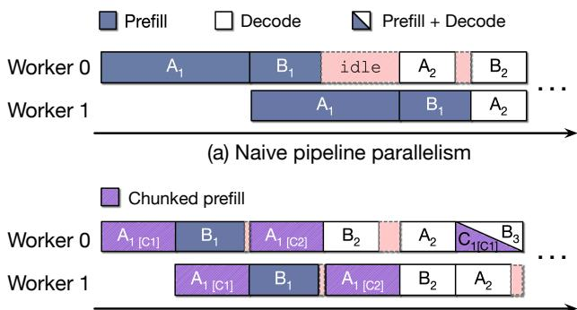  
(b) Pipeline parallelism with chunked-prefills  
Figure 5: Reducing pipeline stalls from chunked-prefill [2]

To balance the trade-off between minimizing pipeline bubbles and maximizing GPU utilization, the chunk size must be dynamically adjusted according to system load.

## 3.2.2 Balancing Microbatches

Although adjusting the chunk size in prefill phases can mitigate pipeline bubbles caused by long prefills, it cannot make pipeline stages balanced in decode-heavy phases where most batches consist of only decode phases, as shown in Figure 2 3 . In such decode-heavy phases, the computational load of each microbatch is primarily determined by the number of requests, since each request processes only a single input token. However, in existing LLM serving systems, once a request is assigned to a microbatch, it remains fixed for its lifetime [14, 37]. This static scheduling scheme magnifies imbalance and sustains pipeline stalls across multiple iterations. Note that tensor parallelism does not decompose input batches into microbatches; instead, it evenly partitions the computation of each batch across GPUs.

To address this issue, a straightforward approach is to dynamically rebalance the number of requests in microbatches across pipeline stages during iteration-level scheduling.

## 4 Retrofitting Pipeline Parallelism

## 4.1 Dynamic Chunked Prefill

Our design goal is to adaptively select a chunk size that minimizes pipeline bubbles while maintaining sufficient GPU utilization to process the current request load. Figure 5 shows that dividing the prompt (A1) into two smaller chunks (A1[C1] and A1[C2]) allows earlier stages in the pipeline to make progress, thus reducing idle time.

When determining the optimal chunk size, we treat the key performance metrics of online LLM serving, T T FTSLO and T POT , as constraints. These two SLOs jointly define the feasible range of chunk sizes. Based on these constraints, our primary objective is to minimize pipeline bubbles by selecting the smallest chunk size that can accommodate the current request load. As demand increases, the system adaptively enlarges the chunk size to improve utilization, but strictly limits this increase based on T POT . When a TPOT violation is anticipated, our scheduler promptly reduces the chunk size to preserve responsiveness.

Algorithm 1 Greedy chunk size adjustment   
1: D ← Pipeline depth   
2: C ← Set of possible chunk sizes (e.g., {128, 256,. .. })   
3: c ← Current chunk size   
4: δ ← Chunk adjustment step size (e.g., 128)   
5: KVf ree ← Available KV cache memory ratio (∈ [0, 1])   
6: θmem ← KV memory watermark (∈ [0, 1])   
7: α, β ← Safe and critical boundaries for T T FT (∈ [0, 1])   
8: γ ← Boundary for T POTslack (∈ [0, 1])   
9:   
10: for every Dp scheduling iterations do   
11: # 1 Retrieve system metrics from the previous iterations   
12: retrieve\_metrics (T T F Tslack, T POTslack, KVf ree)   
13: # 2 Check the available KV space   
14: if KVf ree < θmem then   
15: c ← min{x ∈ C | x > Nrun\_req}   
16: # 3 T POT is violated or there is sufficient T T FTslack   
17: else if T POTslack < 0 or T T FTslack > α · T T FTSLO then   
18: c ← c − δ   
19: # 4 T T F Tslack is tight and there is sufficient T POTslack   
20: else if T T FTslack < β·T T FTSLO and T POTslack > γ·T POTSLO then   
21: c ← c + δ

Meanwhile, T T FTSLO serves as an indicator of the current request load. When the waiting queue grows due to high request arrival rates, incoming requests are likely to violate T T FTSLO. To mitigate this, the system increases the chunk size to increase throughput and drain the queue more quickly. However, this adjustment is allowed only as long as it does not violate T POTSLO. When TTFT is low, it indicates light load. In this case, the system actively reduces the chunk size. This adjustment can effectively mitigate the pipeline bubbles. This sophisticated scheduling improves resource efficiency by minimizing the idle time caused by pipeline imbalances. Based on these common optimization principles, we explore two approaches in the following sections: a greedy approach and a predictive approach.

## 4.1.1 Greedy approach

We first present a simple yet effective greedy method (Algorithm 1) that operates as a feedback control loop to dynamically adjust the chunk size. We maintain a discrete set of candidate chunk sizes C and keep the current chunk size c ∈ C , initialized to the minimum chunk size (e.g., 128). We update c every Dp scheduling iterations, since a chunk size change takes effect only after a microbatch has traversed all Dp stages. We use three control parameters (α, β, and γ) that define tolerance boundaries for T T FTSLO and T POTSLO. An additional parameter, θmem, prevents out-of-memory (OOM) problems during inference.

For every Dp scheduling iterations, 1 we compute T T FTslack and T POTslack, the remaining latency budgets for their respective SLOs, based on measured TTFT and TPOT from the previous iterations. Also, we collect the available KV memory ratio KVf ree. Then, 2 we perform a memory sanity check. When KVf ree < θmem, keeping a large chunk size can cause some stages to fail KV allocations. In this case, we immediately reset c to the smallest candidate that is larger than the current number of running requests. This decision prioritizes quickly draining in-flight requests, freeing KV memory, and minimizing additional bubbles.

If memory is sufficient, we then adjust the chunk size based on latency slack. 3 When the observed T POTslack indicates that the T POTSLO is (or is about to be) violated, we decrease the chunk size. This reduces the pipeline bubbles caused by the prefill phase and helps ensure that the system continues to satisfy the target T POTSLO for in-flight requests. In addition, when T T FTslack is sufficiently large, implying that the request load is low relative to the current chunk size and the system is far from the T T FTSLO violation. In this case, we also decrease the chunk size. This decision mitigates the P-P and P-D imbalances and significantly improves TPOT. Under light load, this adjustment has little impact on throughput because the system is not compute-saturated.

4 When T T FTslack is insufficient while TPOT remains within a comfortable range, we increase the chunk size to improve throughput. This enlarges the amount of prefill computation per iteration, improving compute utilization and reducing TTFT, while preventing the violation of T POTSLO.

Limitation: Although our greedy approach performs reasonably well, it has structural limitations in finding the optimal chunk size. First, due to its step-wise adjustment mechanism based on reactive feedback, the greedy approach suffers from inherent latency in adaptation. It requires multiple iterations to converge on the optimal chunk size, so under rapidly changing workloads, the scheduler is constantly chasing a moving target. This inevitably leads to prolonged periods of operation in a suboptimal state.

Second, as the greedy approach relies only on latency statistics observed in previous iterations, T T FTslack and T POTslack, it leads to suboptimal chunk sizes under pipeline parallelism, where feedback is delayed by pipeline depth and skewed by larger chunks in other pipeline stages. These limitations motivate us to explore a predictive approach that estimates the iteration latency of LLM inference from the current system state, enabling accurate slack estimation.

## 4.1.2 Predictive approach

Overview: To overcome the limitations of the reactive greedy approach, we propose a predictive chunk size adjustment technique. This method leverages a lightweight latency prediction model to evaluate candidate chunk sizes and select one that minimizes pipeline bubbles, thereby improving goodput.

To make this decision, given the current system state (e.g., the waiting queue and in-flight batches), our scheduler uses the prediction model to estimate the iteration latency and throughput of each candidate chunk size. The iteration latency is then multiplied by the pipeline depth to estimate the end-to-end latency under pipeline parallelism. The scheduler then establishes an upper bound on the chunk candidates by comparing the predicted latency against T POTSLO. Next, it derives a lower bound by comparing the predicted throughput against the minimum throughput required to satisfy T T FTSLO. Finally, the scheduler selects the smallest feasible chunk size within these bounds to minimize pipeline bubbles.

Latency prediction model: Our latency prediction model consists of two components: offline profiling for linear layers and online adaptation for attention layers. As shown in Figure 3, iteration latency is dominated by linear layers, whose latency scales with the total number of batched tokens (i.e., chunk size), enabling accurate latency prediction through offline profiling. In chunked-prefill, the selected chunk size determines the number of tokens processed per iteration, making the input size to linear layers largely deterministic. On the other hand, attention layers account for a smaller and dynamic portion of the overall latency tied to the request composition. Since LLM inference is inherently auto-regressive, the composition of requests in the batch evolves gradually across iterations. This gradual evolution enables real-time calibration of dynamic attention latency, allowing the model to track system dynamics without introducing prediction instability.

We model the per-iteration latency, Titer, as the sum of an offline component, To f f line, and an online component, Tonline. Thus, Titer = To f f line + Tonline. The offline component models the latency of linear layers as a function of the total number of batched tokens, Ntokens, along with a constant runtime cost: To f f line = α0 · Ntokens + α1. In the offline phase, we measure iteration latency across discrete batched tokens (Ntokens) from 128 to 2048 to compute the latency for linear layers.

For the online component, Tonline, we model the latency of attention layers, which varies with the context lengths:

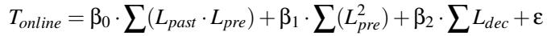

In chunked-prefill, the attention latency in each iteration depends on three quantities: the accumulated past context from prior chunks (denoted as Lpast), the current prefill chunk (Lpre), and the context lengths of decode requests (Ldec). These contribute through three terms, prefill attention over past context (Lpast · Lpre), self-attention within the current chunk (L2pre), and decode attention (Ldec), with coefficients, β0, β1, and β2, respectively. The residual ε accounts for unmodeled system noise.

To calibrate the parameters (β0, β1, and β2), we compute the difference between the predicted and the measured iteration latency at each inference step. Based on this prediction error, we adaptively update the model parameters using the Recursive Least Squares (RLS) algorithm [8]. RLS is wellsuited for our setting in two ways. First, unlike standard gradi ent descent, whose updates are sensitive to the scale of input features, RLS uses an internal covariance matrix to adapt to feature-wise scaling, mitigating the severe scale disparities between terms (e.g., L2pre vs. Ldec). Second, a forgetting factor prioritizes recent observations, allowing the model to quickly adapt to dynamic changes such as prefill-decode interference.

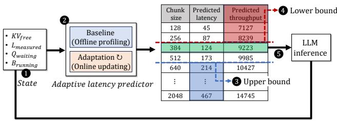  
Figure 6: Workflow of predictive dynamic chunked-prefill

Online inference: Figure 6 presents how our scheduler leverages the prediction model to find the optimal chunk size. For each scheduling iteration, 1 the scheduler first retrieves the current system state, specifically the available KV memory (KVf ree), the measured iteration latency from the previous iteration (Lmeasured ), the waiting queue (Qwaiting), and the running batch (Brunning). It then performs a memory safety check, which is identical to that in the greedy algorithm. 2 It updates the predictor using Lmeasured and attention features (e.g., prefix and context lengths) measured in the previous iteration. The updated predictor then estimates the iteration latency for each candidate chunk size using features derived from Qwaiting and Brunning. These estimates are used to derive the predicted end-to-end latency, by scaling the iteration latency with the pipeline depth, and the expected throughput. 3 Candidates whose predicted latency exceeds T POTSLO are discarded, leaving a feasible search pool.

To determine the lower bound on the chunk size, 4 the scheduler derives the minimum prefill throughput required to satisfy T T FTSLO. It uses the incoming request rate and token distribution over a sliding window to compute an arrivalmatching throughput, ensuring that newly arriving requests can be served in real time without growing the waiting queue. It further accounts for waiting requests exceeding a freshness threshold, calculated by dividing their total prompt length by their remaining time budget (i.e., T T FTSLO minus the average waiting time). The arrival-matching throughput and this additional component are summed to obtain the minimum required throughput. The lower bound is defined as the smallest chunk size whose predicted throughput meets this target.

Finally, 5 it determines the optimal chunk size. If candidates satisfying both SLOs exist, the smallest one is chosen to minimize pipeline bubbles while satisfying the GPU utilization required by the current request load. If no candidate meets the conditions, the system is considered overloaded. In this case, to prioritize draining the waiting queue, it selects the largest chunk that satisfies T POTSLO to maximize throughput.

## 4.2 Dynamic Rebalancing

Although our dynamic chunked-prefill effectively reduces pipeline bubbles caused by prefill requests, it is ineffective when the running batch contains no prefill requests (i.e., decode-only iterations). To further reduce pipeline bubbles, we introduce a runtime scheme, called delay scheduling, that dynamically rebalances workloads across pipeline stages. We observe that in decode-only iterations, the number of requests is the dominant factor in computational imbalance. This arises because each request consumes only one input token at a time, resulting in nearly uniform per-request computation in the linear layers. As shown in Figure 3b, the decoding latency highly depends on the number of requests, and the linear layer takes most of the time.

When balancing microbatch sizes across pipeline stages, our delay scheduling policy aligns batch sizes with hardwareefficient batch size boundaries (e.g., 128, 256, 384). As shown in Figure 3c, processing 129 tokens costs almost the same as processing 256 tokens, so batch sizes that are slightly misaligned with these boundaries achieve little additional throughput while exacerbating D–D imbalance. To mitigate this, we apply a simple threshold-based preemption policy. If the number of requests in a microbatch exceeds a boundary but the overflow is within a configured threshold, we temporarily preempt the excess requests, reducing the batch size to the nearest boundary. If the overflow is larger than the threshold, we instead rebalance by aligning the batch size to the average request count across all microbatches, resuming previously suspended requests as needed to fill the gap.

The selection of which requests to preempt adapts to the current system state. When T POTslack is insufficient, we preferentially preempt older requests, which can tolerate additional latency more readily. This preserves the TPOT of newer requests and reduces pipeline bubbles, lowering overall TPOT. When T POTslack is ample, however, the primary risk becomes KV-cache exhaustion and T T FTSLO violations. In this case, we preempt newer requests instead, trading off T POTslack to let older requests finish earlier and free KV memory, thereby improving goodput.

Figure 7 highlights the effectiveness of our delay scheduling approach. Although some decode-phase requests are deferred to subsequent iterations, this strategy reduces pipeline stalls, thereby improving overall completion time. At each scheduling iteration, we examine the load distribution across pipeline stages. In naive pipeline parallelism (Figure 7a), Worker 0 executes a microbatch containing C3D3E2F2 while Worker 1 processes a smaller microbatch A B at T + , leading to significant imbalance and idle periods. In contrast, with delay scheduling (Figure 7b), 1 request E and F are temporarily suspended to rebalance the pipeline. Although their decoding phases E2 and F2 are postponed, this reduces pipeline stalls across stages. 2 Once request A completes at Ti+2, 3 the suspended decode-phase E2 can be resumed, forming a microbatch B4E2. Similarly, 4 after request D finishes, 5 the suspended decode-phase F2 is resumed. As the pipeline stages become more balanced, the overall latency is significantly improved.

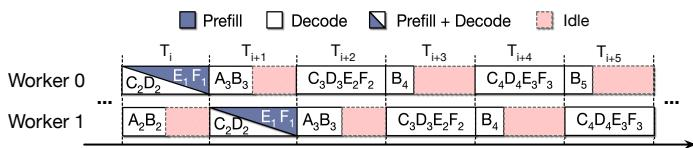  
(a) Imbalanced pipeline in decode-heavy phases

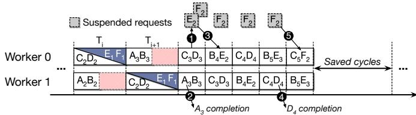  
(b) Balanced pipeline with delay scheduling  
Figure 7: Reducing pipeline stalls with delay scheduling

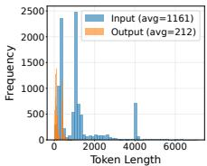  
(a) Azure Trace Conv

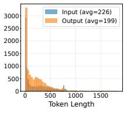  
(b) ShareGPT

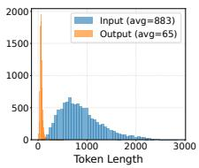  
Figure 8: Input and output length distributions  
(c) CNN-DailyMail

## 5 Evaluation

## 5.1 Experimental Setup

Environment: We run all experiments on a server with four NVIDIA A100 (40GB) GPUs, one 128-core AMD EPYC 9754 CPU (2.25 GHz), and 768 GB of RAM. Each GPU is connected to the host system via PCIe 4.0. We use PyTorch v2.5.1 [3], CUDA 12.4 [18], and FlashInfer [34]. We implement our proposed techniques as well as the baseline pipeline parallelism with chunked prefill on top of SGLang 0.4.1 [37].

Models and workloads: We select two popular LLM models, Qwen2.5 32B and 14B [32]. All the models are BF-16 formatted versions. To mimic real-world workloads, we use three real-world traces, including Azure Conversation [22], ShareGPT [24], and CNN [9], and a synthetic trace for evaluating decode-heavy workloads by reversing the input and output distribution of the CNN trace [9]. Figure 8 shows the input and output length distributions of the traces.

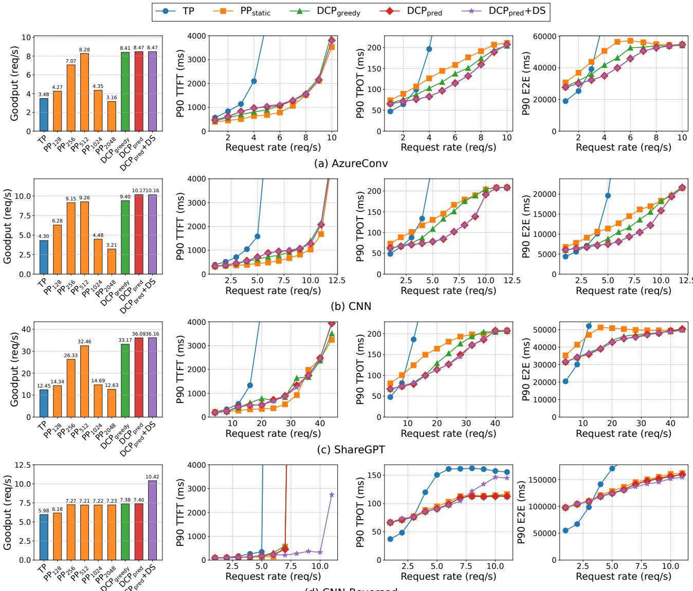  
(d) CNN-Reversed  
Figure 9: Goodput, TTFT, TPOT, and E2E latency for Qwen2.5-32B

Comparisons: Our baselines are tensor parallelism (TP) and pipeline parallelism (PP). We explore our three design options: dynamic chunked-prefill (DCP) with the greedy approach (DCPgreedy) and the predictive approach (DCPpred), and the integration of the predictive DCP and delay scheduling (DCPpred+DS).

Metrics: We use goodput as our primary evaluation metric, defined as the highest request rate at which both the 90thpercentile (P90) TTFT and TPOT satisfy their SLOs. In accordance with MLPerf guidelines [1], we set the latency budgets for TTFT and TPOT to 2,000ms and 200ms, respectively. Our primary objective is to maximize this goodput. Once we achieve comparable or sufficiently high goodput levels, we then shift our focus to latency minimization. We closely examine the P90 values for TTFT, TPOT, and end-to-end (E2E) latency to compare the latency behavior across designs.

## 5.2 Experimental Results

## 5.2.1 Goodput and latency

Figure 9 shows the goodput, TTFT, TPOT, and E2E latency as we increase the request rate for Qwen2.5-32B. To emulate realistic user traffic, we generate request arrivals according to a Poisson process, a standard model for interactive user-facing services. For tensor parallelism, we use the default chunk size of 2,048 [2, 31]. For the TTFT, TPOT, and E2E latency plots, we report only PPstatic, configured with the chunk size that achieves the highest goodput for each workload. The AzureConv, CNN, and ShareGPT workloads exhibit prefill-heavy behavior, leading to Prefill-Prefill and Prefill-Decode pipeline imbalances, whereas CNN-Reversed is decode-heavy and thus suffers from Decode–Decode pipeline imbalance. On AzureConv, CNN, and ShareGPT, a chunk size of 512 achieves the highest goodput, while CNN-Reversed reaches its peak goodput with a chunk size of 256, indicating that the optimal chunk size is workloaddependent. Also, this indicates that once we select the appropriate chunk size, pipeline parallelism delivers higher goodput than tensor parallelism because it substantially reduces pipeline imbalance.

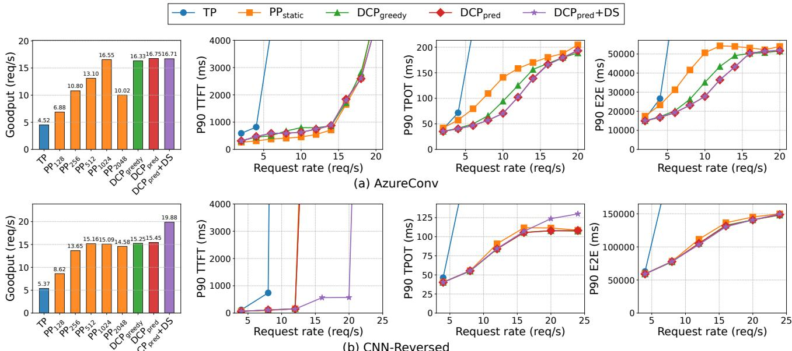  
Figure 10: Goodput, TTFT, TPOT, and E2E latency for Qwen2.5-14B

However, PPstatic cannot adjust the chunk size at runtime as the load (request rate) changes, and thus continues to suffer from pipeline bubbles. Our two dynamic chunked prefill (DCP) techniques address this limitation. Compared to PPstatic, both DCP variants slightly increase TTFT but have a negligible impact on goodput, while substantially improving TPOT and E2E latency by reducing pipeline bubbles.

For AzureConv, DCPgreedy reduces TPOT and E2E latency by up to 19% and 18%, respectively, whereas DCPpred achieves 35% and 31% reductions. The reactive nature of DCPgreedy fundamentally limits how aggressively it can exploit favorable operating points. Consequently, it nearly matches DCPpred in goodput, but it shows a smaller latency reduction. We observe similar trends in the other prefill heavy workloads. Compared to PPstatic, on CNN, DCPgreedy reduces TPOT and E2E latency by 27% and 28%, respectively, whereas DCPpred achieves larger reductions of 42% and 36%. On ShareGPT, DCPpred achieves reductions of 36% and 24%. These results indicate that predictive chunk size selection provides more consistent reductions across workloads than the greedy one.

We also evaluate our delay scheduling (DS), which rebal ances work across microbatches (DCPpred+DS). For prefillheavy workloads, D–D pipeline imbalance rarely occurs, so delay scheduling is rarely triggered. On the other hand, for decode-heavy workloads where input sequences are short but outputs are long, delay scheduling is frequently activated and further reduces E2E latency on top of DCPpred. For CNN-Reversed, our delay scheduling can drastically reduce the TTFT latency, leading to higher goodput compared to our dynamic chunked prefill and the two baselines. Once requests are processed quickly, we can promptly reclaim their KV memory, which in turn reduces TTFT.

We also evaluate our techniques on Qwen2.5-14B. Due to space constraints, Figure 10 reports results for two representative workloads, AzureConv (prefill-heavy) and CNN-Reversed (decode-heavy). Overall, we observe similar performance trends to those of Qwen2.5-32B. For AzureConv, a chunk size of 1,024 achieves the highest goodput. Compared to Qwen2.5-32B, the desired chunk size is changed. Our dynamic chunked prefill techniques achieve the highest goodput and lower TPOT and E2E latency. Compared to PPstatic, our greedy and predictive approaches reduce the TPOT latency by up to 40% and 50%. Although our delay scheduling (DCPpred+DS) has little effect on the prefill-heavy workload, it reduces TTFT and median E2E latency for the decode-heavy workload. While the 32B model shows a P90 E2E latency reduction at high request rates, the 14B model shows no visible reduction. Nonetheless, the improved median latency shows the effectiveness of our delay scheduling.

## 5.2.2 Performance analysis

We analyze how effectively our techniques reduce pipeline stalls and imbalance across stages. Figure 11 shows the cumulative distributions of per-iteration latency for (a) AzureConv, (b) CNN, and (c) CNN-Reversed. For each workload, we derive the distributions from the runs in Figure 9 at average loads of roughly 4, 5, and 8 requests per second, respectively.

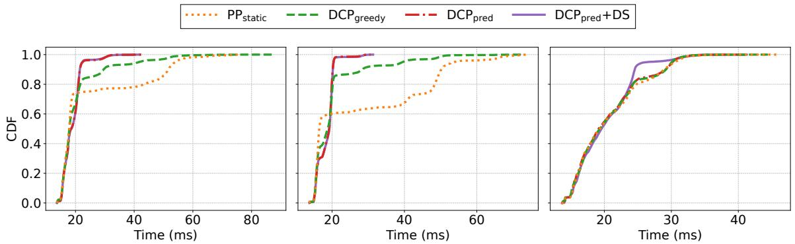  
(a) AzureConv (req rate 4)  
(b) CNN (req rate 5)  
(c) CNN-Reversed (req rate 8)  
Figure 11: CDF of iteration latency for (a) AzureConv, (b) CNN, and (c) CNN-Reversed

For the AzureConv workload, the 90th-percentile iteration latency drops from 51.68ms with PPstatic to 29.56ms with DCPgreedy and further to 21.53ms with DCPpred. At the 99th percentile, DCPpred achieves 30.94ms compared to 65.34ms with PPstatic, yielding a 2.11× improvement that significantly reduces tail latency. This suggests that DCPpred more efficiently concentrates iterations within this lower bound and thereby minimizes pipeline bubbles. For AzureConv, decode-decode pipeline imbalance is negligible. Therefore, DCPpred+DS is rarely triggered and results in behavior similar to DCPpred.

The CNN workload exhibits a similar performance behavior to AzureConv. DCPpred substantially shortens per-iteration latency, yielding a noticeable performance improvement over PPstatic. Although DCPpred shows slightly higher latency than PPstatic below the 50th percentile, starting around the 60th percentile DCPpred becomes faster and its advantage grows increasingly large toward the tail.

For the CNN-Reversed workload, the short input sequences and long outputs leave much less room for control via our DCP schemes. As a result, PPstatic, DCPgreedy, and DCPpred exhibit only marginal differences. On the other hand, with delay scheduling the 90th-percentile iteration latency drops to 24.53ms, whereas PPstatic shows 28.94ms. This behavior confirms that decode-heavy workloads structurally suffer less from pipeline bubbles than prefill-heavy ones, but also that our DCP techniques alone cannot fully eliminate imbalance.

## 5.2.3 Goodput under varying SLOs

We evaluate how our proposed techniques perform under increasingly tight SLO budgets. Figure 12 shows goodput for Qwen2.5-32B and Qwen2.5-14B under AzureConv and CNN-Reversed workloads with varying SLO scales. On the xaxis, SLO Scale of 1.0 corresponds to 2,000 ms for TTFT and 200 ms for TPOT. The y-axis represents goodput, the maximum stable request rate satisfying these SLOs. Both TP and PP baselines use a default chunk size of 2048. PP generally outperforms TP, except for the 32B model under AzureConv, where the high compute costs dominate, diminishing PP’s advantage in reducing communication overhead. We therefore focus on comparing our proposed approaches against the PP baseline. Since our two dynamic chunked prefill variants, DCPgreedy and DCPpred, achieve similar goodput across SLO scales, we refer to them collectively as DCP unless otherwise specified. At the strictest SLO scale of 0.2 for the 32B model, even the smallest possible chunk violates the TPOT constraint, reducing the goodput of all PP-based systems to zero.

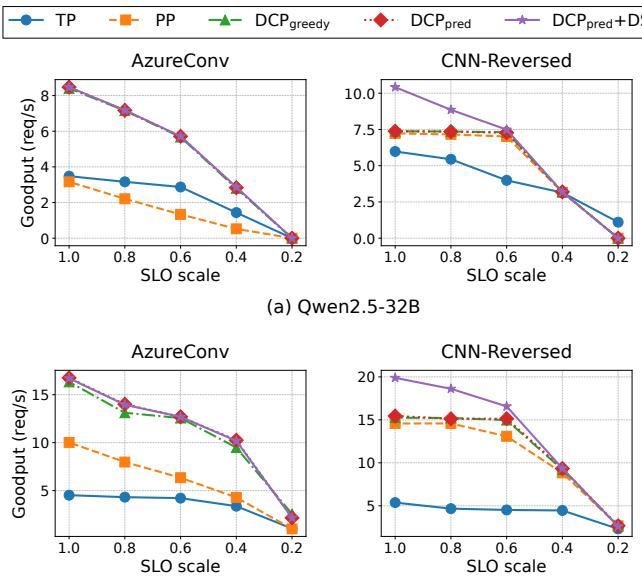  
(b) Qwen2.5-14B  
Figure 12: Goodput comparison of Qwen2.5 32B and 14B under various SLO constraints.

DCP effectively mitigates the P-P and P-D pipeline imbalances inherent in the prefill-heavy AzureConv workload, significantly outperforming the PP baseline. Notably, the relative improvement of DCP over PP grows as SLO constraints tighten. As the SLO scale decreases from 1.0 to 0.4, the improvement increases from 2.7× to 5.4× for the 32B model, and from 1.7× to 2.4× for the 14B model. This highlights DCP’s robustness under increasingly tight latency constraints. Meanwhile, delay scheduling (DS) provides no additional benefit for this prefill-heavy workload.

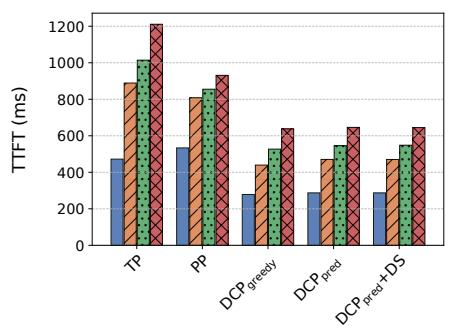

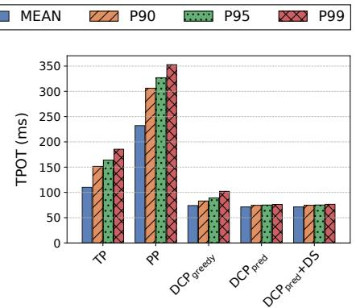  
(a) Prefill-heavy

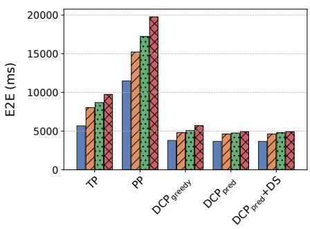

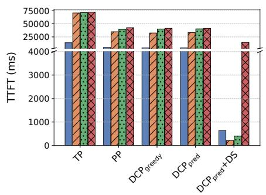

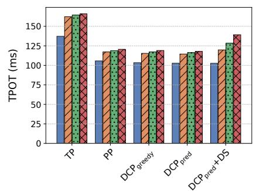  
(b) Decode-heavy

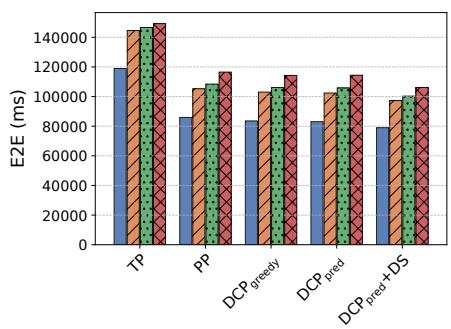  
Figure 13: TTFT, TPOT, and E2E latency for (a) prefill-heavy and (b) decode-heavy synthetic workloads. Input and output lengths are uniformly sampled from [512, 1024] and [32, 64] tokens for (a), and from [32, 64] and [512, 1024] tokens for (b).

By contrast, in the decode-heavy CNN-Reversed workload, the goodput of the PP baseline remains nearly constant as the SLO scale decreases from 1.0 to 0.6. With minimal prefill tokens, violations are primarily driven by KV cache exhaustion that triggers abrupt TTFT spikes, making goodput insensitive to moderate SLO tightening. While DCP provides limited benefits due to the small prefill fraction, DS plays a crucial role by resolving the D-D pipeline imbalance inherent to decoding operations, yielding up to a 1.4× goodput improvement for both the 14B and 32B models over the PP baseline. However, as the SLO tightens below 0.6, DS effectiveness drops sharply since the system hits the TPOT limit before accumulating enough requests to meet its activation threshold.

## 5.2.4 Synthetic prefill-heavy and decode-heavy cases

To further analyze the performance benefits and limitations of each scheme, we construct synthetic workloads by uniformly sampling sequence lengths. For a prefill-heavy workload, input and output lengths are sampled from 512 to 1024 and 32 to 64 tokens, respectively; the ranges are swapped for a decode-heavy workload. Figure 13 presents TTFT, TPOT, and end-to-end latency when serving Qwen2.5-32B under prefillheavy and decode-heavy workloads at 5 and 14 requests per second, respectively. These rates represent the point at which the PP baseline begins to violate the SLO constraints.

In the prefill-heavy workload, both TP and PP baselines achieve similar TTFT, but PP suffers much higher TPOT and end-to-end latency than TP due to severe pipeline imbalances. Meanwhile, our two DCP methods show lower latency than TP and PP across all metrics by reducing these imbalances. This indicates that mitigating P-P imbalance is more critical than using larger chunks to improve GPU utilization, even if smaller chunks reduce batching efficiency. The two DCP variants achieve nearly identical mean latency, while DCPpred further reduces P99 TPOT and end-to-end latency by 25% and 13% over DCPgreedy, respectively, showing its advantage in reducing tail latency. Delay scheduling has little effect in this prefill-heavy case because the dominant bottleneck comes from the prefill-induced pipeline bubbles.

In the decode-heavy workload, PP achieves lower latency than TP across all metrics, reducing mean TTFT, TPOT, and end-to-end latency by 2.82×, 1.30×, and 1.38×, respectively. Both DCP variants perform similarly to PP, since P–P and P–D imbalances rarely occur in decode-heavy workloads.

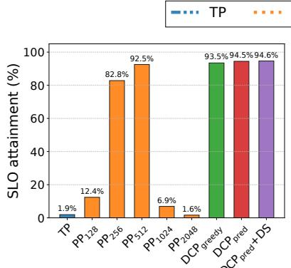  
(a)

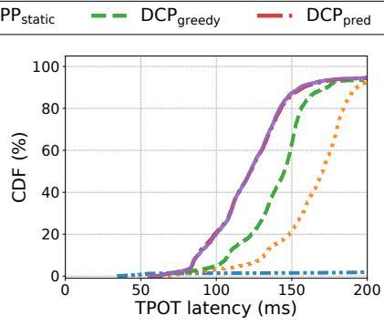  
(b)

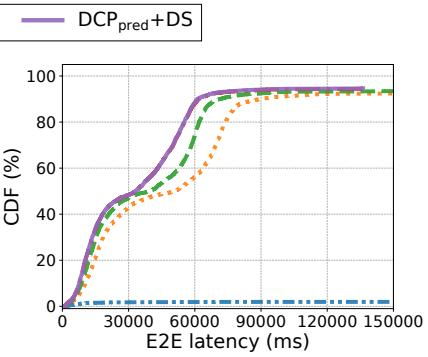  
(c)  
Figure 14: Performance of real-trace using Azure Conversation [22]: (a) SLO attainment, (b) TPOT latency CDF (conditional on T T FT ), and (c) E2E latency CDF (conditional on all SLOs) for Qwen2.5-32B

Meanwhile, delay scheduling (DS) effectively reduces D-D imbalance, lowering TTFT and end-to-end latency. Specifically, DS significantly reduces the TTFT latency compared to DCP and PP, resulting in lower end-to-end latency. Once D-D imbalance becomes severe, DS preempts short-context requests in the batch to expedite the completion of longcontext requests, reclaiming their KV memory earlier and allowing more pending requests to be served. As a result, DS reduces end-to-end latency by 4,062ms on average and 8,088ms at P99 compared to DCPpred. However, these preempted requests incur higher TPOT, making P99 TPOT 15% worse than DCPpred.

## 5.2.5 Performance of real-world trace

We evaluate our techniques using a real-world workload trace from AzureConv. Specifically, we replay the first 15 minutes of the trace. As the original load is already high, we scale the request arrival rate down to 0.9× its original value, so that the SLO attainment of PPstatic is approximately 90%.

Figure 14 presents (a) SLO attainment, (b) TPOT CDF for satisfying TTFTSLO, and (c) E2E latency CDF for requests satisfying both TTFTSLO and TPOTSLO. TP achieves only 1.9% SLO attainment due to its substantial communication overhead. With the default chunk size of 2,048 tokens, pipeline parallelism (PP2048) performs even worse, with SLO attainment of just 1.6%. On the other hand, PPstatic, whose chunk size is selected via an offline search, achieves 92.5% SLO attainment. The workload is prefill-heavy, so our delay scheduling scheme is not activated.

While the overall SLO attainment of PPstatic and DCP is similar, DCP more effectively eliminates pipeline bubbles and shifts a larger fraction of requests into lower-latency regions. Among the two designs, DCPgreedy yields slightly worse performance than DCPpred due to the inherent limitations of its heuristic. In real-world traces, high load appears in short bursts rather than being sustained. Thus, choosing a fixed chunk size based on peak load (as in PPstatic) is inefficient. When the load drops, the large chunk size underutilizes pipeline stages and reintroduces pipeline bubbles during normal low-load periods. If the TPOTSLO is set to 150 ms, DCPgreedy and DCPpred achieve 3.06× and 4.14× higher attainment than PPstatic, respectively. In terms of E2E latency, DCPgreedy and DCPpred complete 1.3× and 1.6× as many requests within 60,000ms as PPstatic.

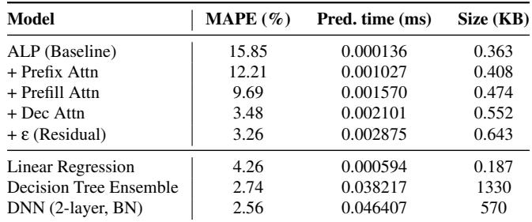  
Table 1: Comparison of latency prediction models

## 5.2.6 Analysis of latency prediction models

To understand the effectiveness of the proposed adaptive latency prediction (ALP) model, we perform an in-depth analysis of its prediction accuracy and computational cost. As described in Section 4.1.2, ALP accounts for latency variations in attention layers, which are inherently dynamic and cannot be predicted by offline profiling alone. We first evaluate how each component of ALP contributes to prediction accuracy, starting from an offline profiling method that models only the latency spent in linear layers and progressively adding the prefix, prefill, and decode attention terms, as well as residual terms. We measure Mean Absolute Percentage Error (MAPE) on a real-world AzureConv workload.

Table 1 presents the effectiveness of each ALP component. Since the offline profiling method does not account for the latency spent in attention layers or runtime noise, it shows a relatively large prediction error. As we add each attention component, the model better predicts the latency contributed by attention layers, and MAPE gradually decreases. Finally, adding the residual ε term compensates for runtime noise that the attention terms cannot explain, achieving the lowest prediction error among the variants. Although prediction time and model size grow as the model becomes more sophisticated, both remain negligible.

We also evaluate three ML-based techniques for iteration latency prediction: linear regression using NumPy’s linalg.lstsq [7], a decision tree ensemble using Light-GBM [13], and a simple DNN with two linear layers and batch normalization. We train linear regression with the same features used in ALP’s online adaptation phase, and additionally provide request-level statistics, such as the number of requests per microbatch and the average and maximum number of tokens per request, to the decision tree and DNN models. Although the decision tree ensemble and DNN achieve slightly lower MAPE than ALP, the improvement is marginal: ALP’s MAPE is only 0.70 percentage points higher than that of the DNN model. This small accuracy gap does not lead to meaningful end-to-end performance improvements in TTFT or TPOT. In addition, these ML-based techniques require an offline training phase, whereas ALP performs lightweight online adaptation without pre-training. Therefore, ALP provides a more practical choice for LLM serving systems.

## 6 Related Work

There have been significant efforts to develop efficient LLM serving frameworks on modern GPUs. ORCA was an early and influential system that introduced iteration-level scheduling and selective batching techniques to effectively utilize GPU cores, achieving substantial performance gains [35]. More recently, chunked-prefill [2, 10] was proposed to enhance iteration-level scheduling under prefill-heavy workloads by splitting long prompts into smaller chunks, thereby alleviating TPOT latency. These techniques have been widely adopted in production frameworks such as vLLM [14], SGLang [37], TensorRT-LLM [28], and Dynamo [19]. In addition to the scheduling enhancement, managing KV-cache on GPU, CPU, and storage has also been widely studied to avoid the recomputation cost of attention [5, 12, 33, 36].

For multi-GPU environments, prior research has examined a range of parallelism strategies, including tensor parallelism [25, 27], pipeline parallelism [11, 17], and expert parallelism [15, 26] in MoE models to maximize hardware efficiency. In practice, tensor parallelism has become the de facto choice for single-node, multi-GPU LLM serving due to its predictable load balancing and low per-token latency, especially when supported by high-bandwidth interconnects. AlpaServe [16] extended this by combining statistical multiplexing with model parallelism to dynamically allocate GPU resources according to workload characteristics, improving throughput in multi-tenant settings. ExeGPT [21] further refined resource allocation with constraint-aware scheduling, jointly optimizing for latency, throughput, and GPU utilization in LLM inference.

However, despite these efforts, the interference between the prefill and decode phases causes significant bubbles in pipeline parallelism. To mitigate this, phase-disaggregated serving [22, 23, 38] isolated these phases on separate GPUs. While this design reduces interference, it introduces nontrivial overheads, including model weight duplication and high-bandwidth requirements for KV cache transfer. To avoid such overheads, unified serving with chunked-prefill [2] remains a practical choice, yet static chunking yields nonnegligible pipeline bubbles. While recent dynamic chunking approaches [6] prioritized SLO compliance, they overlooked the structural constraints of pipeline parallelism, leaving pipeline bubbles unresolved. This highlights the need for a pipeline-specific dynamic chunking strategy that effectively eliminates bubbles under varying workloads.

## 7 Conclusions

This paper investigated the inefficiencies of pipeline parallelism in LLM serving and proposed scheduling techniques to mitigate pipeline imbalances. Our greedy and predictive chunk size adjustment schemes effectively improved pipeline performance in prefill-heavy workloads, while a dynamic rebalancing scheme further alleviated imbalance in decodeheavy workloads. We evaluated both individual techniques and integrated designs on the Qwen2.5 32B and 14B models using several real-world workloads. Experimental results demonstrated that pipeline parallelism with the proposed techniques outperforms tensor parallelism in terms of goodput for single-node, multi-GPU environments.

## Acknowledgments

We thank the anonymous reviewers for providing helpful feedback and suggestions to improve our work. This work was supported by the Institute of Information & communications Technology Planning & Evaluation (IITP) grant (RS-2024- 00396013) and the Electronics and Telecommunications Research Institute (ETRI) grant [26ZS1100, Development of Large-Scale Parallel Computing Technology for Generative AI]. Both grants were funded by the Korean government (MSIT). This work was supported in part by SK hynix Inc. through the provision of GPU cloud resources for evaluating the performance of existing parallelism methods. Jeongseob Ahn is the corresponding author.

## References

[1] Mlperf inference: Datacenter benchmark suite results, 2024. https://mlcommons.org/benchmarks/infer ence-datacenter/.

[2] Amey Agrawal, Nitin Kedia, Ashish Panwar, Jayashree Mohan, Nipun Kwatra, Bhargav Gulavani, Alexey Tumanov, and Ramachandran Ramjee. Taming Throughput-Latency tradeoff in LLM inference with Sarathi-Serve. In 18th USENIX Symposium on Operating Systems Design and Implementation (OSDI), 2024.

[3] Jason Ansel, Edward Yang, Horace He, Natalia Gimelshein, Animesh Jain, Michael Voznesensky, Bin Bao, Peter Bell, David Berard, Evgeni Burovski, Geeta Chauhan, Anjali Chourdia, Will Constable, Alban Desmaison, Zachary DeVito, Elias Ellison, Will Feng, Jiong Gong, Michael Gschwind, Brian Hirsh, Sherlock Huang, Kshiteej Kalambarkar, Laurent Kirsch, Michael La zos, Mario Lezcano, Yanbo Liang, Jason Liang, Yinghai Lu, CK Luk, Bert Maher, Yunjie Pan, Christian Puhrsch, Matthias Reso, Mark Saroufim, Marcos Yukio Siraichi, Helen Suk, Michael Suo, Phil Tillet, Eikan Wang, Xiaodong Wang, William Wen, Shunting Zhang, Xu Zhao, Keren Zhou, Richard Zou, Ajit Mathews, Gregory Chanan, Peng Wu, and Soumith Chintala. PyTorch 2: Faster Machine Learning Through Dynamic Python Bytecode Transformation and Graph Compilation. In 29th ACM International Conference on Architectural Support for Programming Languages and Operating Systems (ASPLOS), 2024.

[4] Abhimanyu Dubey, Abhinav Jauhri, Abhinav Pandey, Abhishek Kadian, Ahmad Al-Dahle, Aiesha Letman, Akhil Mathur, Alan Schelten, Amy Yang, Angela Fan, et al. The llama 3 herd of models. arXiv e-prints, pages arXiv–2407, 2024.

[5] Bin Gao, Zhuomin He, Puru Sharma, Qingxuan Kang, Djordje Jevdjic, Junbo Deng, Xingkun Yang, Zhou Yu, and Pengfei Zuo. Cost-Efficient large language model serving for multi-turn conversations with CachedAttention. In 2024 USENIX Annual Technical Conference (ATC), 2024.

[6] Kanishk Goel, Jayashree Mohan, Nipun Kwatra, Ravi Shreyas Anupindi, and Ramachandran Ramjee. Niyama: Breaking the silos of llm inference serving. arXiv preprint arXiv:2503.22562, 2025.

[7] Charles R Harris, K Jarrod Millman, Stéfan J van der Walt, Ralf Gommers, Pauli Virtanen, David Cournapeau, Eric Wieser, Julian Taylor, Sebastian Berg, Nathaniel J Smith, Robert Kern, Matti Picus, Stephan

Hoyer, Marten H van Kerkwijk, Matthew Brett, Allan Haldane, Jaime Fernández del Río, Mark Wiebe, Pearu Peterson, Pierre Gérard-Marchant, Kevin Sheppard, Tyler Reddy, Warren Weckesser, Hameer Abbasi, Christoph Gohlke, and Travis E Oliphant. Array programming with NumPy. Nature, 585(7825):357–362, 2020.

[8] S.S. Haykin. Adaptive Filter Theory. Pearson, 2014.

[9] Karl Moritz Hermann, Tomas Kocisky, Edward Grefenstette, Lasse Espeholt, Will Kay, Mustafa Suleyman, and Phil Blunsom. Teaching machines to read and comprehend. In Advances in Neural Information Processing Systems (NeurIPS), 2015.

[10] Connor Holmes, Masahiro Tanaka, Michael Wyatt, Ammar Ahmad Awan, Jeff Rasley, Samyam Rajbhandari, Reza Yazdani Aminabadi, Heyang Qin, Arash Bakhtiari, Lev Kurilenko, et al. Deepspeed-fastgen: High-throughput text generation for llms via mii and deepspeed-inference. arXiv preprint arXiv:2401.08671, 2024.

[11] Yanping Huang, Youlong Cheng, Ankur Bapna, Orhan Firat, Mia Xu Chen, Dehao Chen, HyoukJoong Lee, Jiquan Ngiam, Quoc V. Le, Yonghui Wu, and Zhifeng Chen. Gpipe: efficient training of giant neural networks using pipeline parallelism. In Advances in Neural Infor mation Processing Systems (NeurIPS), 2019.

[12] Jinwoo Jeong and Jeongseob Ahn. Accelerating llm serving for multi-turn dialogues with efficient resource management. In Proceedings of the 30th ACM International Conference on Architectural Support for Programming Languages and Operating Systems (ASPLOS), 2025.

[13] Guolin Ke, Qi Meng, Thomas Finley, Taifeng Wang, Wei Chen, Weidong Ma, Qiwei Ye, and Tie-Yan Liu. Lightgbm: A highly efficient gradient boosting decision tree. In Advances in Neural Information Processing Systems (NeurIPS), 2017.

[14] Woosuk Kwon, Zhuohan Li, Siyuan Zhuang, Ying Sheng, Lianmin Zheng, Cody Hao Yu, Joseph Gonzalez, Hao Zhang, and Ion Stoica. Efficient memory management for large language model serving with pagedattention. In Proceedings of the 29th Symposium on Operating Systems Principles (SOSP), 2023.

[15] Dmitry Lepikhin, HyoukJoong Lee, Yuanzhong Xu, Dehao Chen, Orhan Firat, Yanping Huang, Maxim Krikun, Noam Shazeer, and Zhifeng Chen. Gshard: Scaling giant models with conditional computation and automatic sharding. arXiv preprint arXiv:2006.16668, 2020.

[16] Zhuohan Li, Lianmin Zheng, Yinmin Zhong, Vincent Liu, Ying Sheng, Xin Jin, Yanping Huang, Zhifeng Chen, Hao Zhang, Joseph E. Gonzalez, and Ion Stoica. AlpaServe: Statistical multiplexing with model parallelism for deep learning serving. In 17th USENIX Sympo sium on Operating Systems Design and Implementation (OSDI), 2023.

[17] Deepak Narayanan, Aaron Harlap, Amar Phanishayee, Vivek Seshadri, Nikhil R. Devanur, Gregory R. Ganger, Phillip B. Gibbons, and Matei Zaharia. Pipedream: generalized pipeline parallelism for dnn training. In Proceedings of the 27th ACM Symposium on Operating Systems Principles (SOSP), 2019.

[18] NVIDIA. CUDA, release: 12.4, 2024. https://deve loper.nvidia.com/cuda-toolkit.

[19] NVIDIA AI Dynamo Team. Nvidia dynamo: A datacenter scale distributed inference serving framework. https://github.com/ai-dynamo/dynamo, 2024. GitHub repository.

[20] NVIDIA Corporation. Deep learning performance documentation: Matrix multiplication background. https: //docs.nvidia.com/deeplearning/performance /dl-performance-matrix-multiplication/inde x.html#tile-quant, 2024. Accessed: 2025-12-12.

[21] Hyungjun Oh, Kihong Kim, Jaemin Kim, Sungkyun Kim, Junyeol Lee, Du-seong Chang, and Jiwon Seo. Exegpt: Constraint-aware resource scheduling for llm inference. In Proceedings of the 29th ACM International Conference on Architectural Support for Programming Languages and Operating Systems (ASPLOS), 2024.

[22] P. Patel, E. Choukse, C. Zhang, A. Shah, I. Goiri, S. Maleki, and R. Bianchini. Splitwise: Efficient generative llm inference using phase splitting. In Proceedings of the 51st Annual International Symposium on Computer Architecture (ISCA), 2024.

[23] Ruoyu Qin, Zheming Li, Weiran He, Jialei Cui, Heyi Tang, Feng Ren, Teng Ma, Shangming Cai, Yineng Zhang, Mingxing Zhang, Yongwei Wu, Weimin Zheng, and Xinran Xu. Mooncake: A kvcache-centric disaggregated architecture for llm serving. ACM Transactions on Storage, 2024.

[24] ShareGPT, 2023. https://huggingface.co/datas ets/anon8231489123/ShareGPT\_Vicuna\_unfilte red/tree/main.

[25] Noam Shazeer, Youlong Cheng, Niki Parmar, Dustin Tran, Ashish Vaswani, Penporn Koanantakool, Peter Hawkins, HyoukJoong Lee, Mingsheng Hong, Cliff

Young, Ryan Sepassi, and Blake Hechtman. Meshtensorflow: Deep learning for supercomputers. In Advances in Neural Information Processing Systems (NeurIPS), 2018.

[26] Noam Shazeer, Azalia Mirhoseini, Krzysztof Maziarz, Andy Davis, Quoc Le, Geoffrey Hinton, and Jeff Dean. Outrageously large neural networks: The sparsely-gated mixture-of-experts layer. arXiv preprint arXiv:1701.06538, 2017.

[27] Mohammad Shoeybi, Mostofa Patwary, Raul Puri, Patrick LeGresley, Jared Casper, and Bryan Catanzaro. Megatron-lm: Training multi-billion parameter language models using model parallelism, 2020.

[28] Neal Vaidya, Nick Comly, Joe DeLaere, Ankit Patel, and Fred Oh. NVIDIA TensorRT-LLM Supercharges Large Language Model Inference on NVIDIA H100 GPUs, September 2023. https://developer.nvidia.com /blog/nvidia-tensorrt-llm-supercharges-lar ge-language-model-inference-on-nvidia-h10 0-gpus.

[29] Ashish Vaswani, Noam Shazeer, Niki Parmar, Jakob Uszkoreit, Llion Jones, Aidan N Gomez, Ł ukasz Kaiser, and Illia Polosukhin. Attention is all you need. In Advances in Neural Information Processing Systems (NeurIPS), 2017.

[30] vLLM Docs. Distributed inference and serving, 2025. https://docs.vllm.ai/en/stable/serving/dis tributed\_serving.html.

[31] vLLM Team. vLLM engine argument utilities (version v0.12.0). https://github.com/vllm- project /vllm/blob/v0.12.0/vllm/engine/arg\_utils .py, 2025. Describes the max\_num\_batched\_tokens parameter, which dictates the default chunk size.

[32] An Yang, Baosong Yang, Beichen Zhang, Binyuan Hui, Bo Zheng, Bowen Yu, et al. Qwen2.5 technical report. arXiv preprint arXiv:2412.15115, 2024.

[33] Jiayi Yao, Hanchen Li, Yuhan Liu, Siddhant Ray, Yihua Cheng, Qizheng Zhang, Kuntai Du, Shan Lu, and Junchen Jiang. Cacheblend: Fast large language model serving for rag with cached knowledge fusion. In Proceedings of the Twentieth European Conference on Computer Systems (EuroSys), 2025.

[34] Zihao Ye, Lequn Chen, Ruihang Lai, Yilong Zhao, Size Zheng, Junru Shao, Bohan Hou, Hongyi Jin, Yi fei Zuo, Liangsheng Yin, Tianqi Chen, and Luis Ceze. Accelerating self-attentions for llm serving with flashinfer, February 2024.

[35] Gyeong-In Yu, Joo Seong Jeong, Geon-Woo Kim, Soojeong Kim, and Byung-Gon Chun. Orca: A distributed serving system for Transformer-Based generative models. In 16th USENIX Symposium on Operating Systems Design and Implementation (OSDI), 2022.

[36] Lingfan Yu, Jinkun Lin, and Jinyang Li. Stateful large language model serving with pensieve. In Proceedings of the Twentieth European Conference on Computer Systems (EuroSys), 2025.

[37] Lianmin Zheng, Liangsheng Yin, Zhiqiang Xie, Chuyue Sun, Jeff Huang, Cody Hao Yu, Shiyi Cao, Chris tos

Kozyrakis, Ion Stoica, Joseph E. Gonzalez, Clark Barrett, and Ying Sheng. Sglang: Efficient execution of structured language model programs. In Advances in Neural Information Processing Systems (NeurIPS), 2024.

[38] Yinmin Zhong, Shengyu Liu, Junda Chen, Jianbo Hu, Yibo Zhu, Xuanzhe Liu, Xin Jin, and Hao Zhang. Dist-Serve: Disaggregating prefill and decoding for goodputoptimized large language model serving. In 18th USENIX Symposium on Operating Systems Design and Implementation (OSDI), 2024.