USENIX

THE ADVANCED COMPUTING SYSTEMS ASSOCIATION

# High Fidelity Models for Large Scale Stateful Services (Operational Systems)

Nouraldin Jaber, Dongyun Jin, Bernhard Kragl, Enrico Magnago, Gustavo Petri, Thorsten Tarrach, and Serdar Tasiran, Amazon Web Services

https://www.usenix.org/conference/osdi26/presentation/jaber

# This paper is included in the Proceedings of the 20th USENIX Symposium on Operating Systems Design and Implementation.

July 13–15, 2026 • Seattle, WA, USA

ISBN 978-1-939133-55-7

Open access to the Proceedings of the 20th USENIX Symposium on Operating Systems Design and Implementation is sponsored by

# High Fidelity Models for Large Scale Stateful Services (Operational Systems)

Nouraldin Jaber Dongyun Jin Bernhard Kragl Enrico Magnago

Gustavo Petri Thorsten Tarrach Serdar Tasiran

{noujab, dongyuj, kraglb, emagnago, gfpetri, tarracht, tasirans}@amazon.com

Amazon Web Services

## Abstract

The Amazon Simple Storage Service (S3) is 20 years old, hosts more than 500 trillion objects, and averages over 200 million requests per second. Its API must continuously evolve and adapt to new workloads and use cases, sometimes resulting in full re-implementations like the S3 Express One Zone storage class. This highlights two conflicting requirements: ensuring that every change preserves backward compatibility and maintaining a high-paced development environment. We report on our experience combining the use of reference models, in a model-based testing (MBT) style, with abstraction to systematically explore all behaviors of the S3 API. Our approach is grounded in the abstraction of API requests and state elements, enabling systematic validation of all ab stract inputs and system states. Through rigorous validation, we produce models that are sufficiently accurate to be used as de facto specifications of S3. Our tool continuously runs in the S3 development and deployment (CI/CD) cycle, validating changes, preventing regressions, and supporting the development of new features.

## 1 Introduction

Over the past couple of decades, cloud services have evolved from simple web-based APIs to elaborate services with dozens of features, configurations, and input and output parameters. In this work we focus on the Amazon Simple Storage Service (S3), which supports a wide variety of customer use cases and workloads that have co-evolved with S3 over its 20 years of existence. This evolution requires new code to be added and existing code to be refactored by hundreds of developers continuously. To provide for different performance, price, and availability trade-offs, the S3 API has been re-implemented multiple times, sometimes using entirely different code bases, programming languages, and hardware. Yet, to the customers, the API behavior must remain the same. We refer to the challenge of preserving the API behavior under continuous change as the API sameness or conformance checking problem. This challenge is the main focus of our work. We aim at validating the functional input-output behavior of the S3 API under normal sequential behavior. We focus on the sequential behavior thanks to the consistency guarantees of S3<sup>1</sup>, which are validated through dedicated mechanisms (e.g. [BJA<sup>+</sup>21]) and are beyond the scope of this paper. In this work we execute each operation “in isolation” and focus exclusively on validating the correctness of the sequential behavior of the API.

There are two key aspects to API sameness: (i) defining what constitutes correct API behavior, and (ii) ensuring that the service implements the correct behavior. We address the first challenge by building an executable reference model for each API. Then, we propose a systematic model-based testing (MBT) approach to address the second challenge. In order to get sufficient confidence in the correctness of the service, we require the tests to achieve sufficient and measurable coverage of the behaviors of the system. For this reason we design a systematic test generation strategy to provide the inputs on which we check conformance between the model and the API implementation. While the techniques we present are widely applicable to other stateful services, for the rest of the paper we will focus on S3. Our model and input generation techniques are now used in the continuous integration and deployment (CI/CD) pipelines of S3, preventing unexpected behaviors from reaching production. We run this validation after the execution of traditional unit and integration tests, and it has so far prevented more than 300 potential regressions from being deployed.

Amazon S3. Amazon S3 is a highly available and durable cloud storage service that provides a REST (Representational State Transfer) API. It supports 96 API operations [S3D24c]. Beyond the PutObject and GetObject operations, over its evolution S3 has added support for conditional read and write operations, multiple checksum algorithms, object versioning, tagging, replication configurations, several server-side encryption configurations, and many more features. To illustrate the complexity of S3 APIs and the types of edge-cases involved, consider GetObject [S3D24b]. GetObject appears to be simple: it takes a bucket name and a key name, and returns the object stored in the bucket for that key name. Consider the following GetObject request:

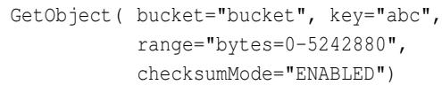

range is a standard HTTP header described in RFC-9110 [RFC22], while bucket, key and checksumMode are specific to the S3 API. The RFC states that an HTTP server may support a sequence of ranges on GET requests. S3 supports a single byte range and implements the behavior described in the RFC. Depending on the state, S3 returns 206 for successful cases, 404 status code if the object does not exist, or 416 if the object is empty. Successful responses will contain the requested range of bytes of the object. In S3, the headers in the success response depend on the target object. In our example: a) if the object has 5242881 bytes or less, the response will contain the full object and its checksum, b) if the object has more than 5242881 bytes, only the first 5242881 bytes will be returned with no checksum, except, c) if the object was created with a multi-part upload API, and the first part is exactly 5242881 bytes, the response will include the checksum of the part.

We now consider a different GetObject request to highlight how client code often depends on specific S3 error responses, not just success responses.

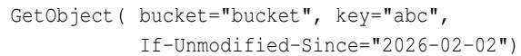

The If-Unmodified-Since header is another standard HTTP header. In GetObject, clients use this header to retrieve the object only if it has not been modified since the specified date. S3 will reply with 200 OK and the object data if the content has not been modified since 2026-02-02, and with 412 Precondition Failed otherwise. A client will likely handle these two responses differently. Client code typically uses this header as a safety mechanism to detect changes in the object content. In this case, the error response clearly signals that the assumption has been violated. Preserving the exact behavior of both success and error responses is critical to the correctness of S3’s client code. More generally, clients often rely on all observable behaviors of the API; from the service provider’s viewpoint, this means every behavior must be preserved across changes to the service.

These two examples use only five distinct parameters and already highlight the many details that affect the full behavior of each API and their importance to customers. And yet, GetObject has 21 input parameters and GetObject responses have 36 output parameters plus the content payload. In addition, there are many configurations [S3D24a] of the underlying target bucket which affect the behavior of each request, such as bucket encryption, versioning, and access policies. As we shall see in Sec. 6, there are at least 10<sup>25</sup> qualitatively distinct combinations of input parameters and states for GetObject. Covering all these combinations is not possible without novel reductions and automation.

Our approach to conformance. This paper addresses the conformance checking problem by combining model-based testing (MBT) [UPL12, BJA<sup>+</sup>21] with predicate abstraction [GS97]. We incrementally build an executable reference model to be the de-facto specification of the underlying API. This is motivated by the need to: a) make the model accessible to developers and tools with minimal effort, b) run conformance tests between the model and API implementation in CI/CD pipelines, and c) have reproducible diagnostics for issues identified in development.

Building a reference model takes effort and one might consider using an alternative/previous version of the service as the reference model. However, this is impractical and error prone. In response to a request, an API can allow multiple valid responses (e.g. different pagination of results, errors being reported in different order). An implementation may pick one of these possibilities, and another implementation might pick a different one. As a result, two versions of the service driven by the same test inputs can diverge while both being correct. A reference model that encapsulates all allowed behaviors of the service allows us to keep independence between the implementation under test and the reference model. In fact, for S3 Express One Zone, having access to the model was instrumental in the design and development of the implementation. The majority of S3 Express One Zone APIs match the behavior of regional S3, but getting a comprehensive specification of the APIs’ behavior was not easy using only the existing regional S3 implementation. S3 Express One Zone developers used our model and test generation to validate conformance with regional S3. In specific cases where S3 Express One Zone intentionally deviates from regional S3 we extended our model with the new behavior.

Ensuring conformance is practically challenging due to the complexity of the S3 APIs with their large number of parameters and dependencies on the service state. In order to ensure API conformance for all behaviors, we need comprehensive coverage of these combinations of parameters and states. We use predicate abstraction to lift the universe of concrete requests and states to abstract requests and states, and to explore this much-reduced abstract space in a systematic way. Developers use this approach to comprehensively validate code changes over a well-defined (sub-)space of requests and states at development and pre-deployment time. The approach identifies regressions even in subtle edge cases, within a reasonable time budget. As a result, the approach improves development velocity and gives developers confidence that all behaviors will be tested before deployment.

To summarize, we use our validation approach for:

Preventing Regressions. A difficult challenge in maintaining a large decoupled code base is ensuring that changes to one component (e.g. a bug fix) do not introduce unintended changes to the behavior of the API. We use our executable specification as an oracle to drive input generation strategies aimed at maximally covering the set of behaviors that may be affected by changes. We then employ differential testing [McK98] between model and implementation to detect unintended changes.

Conformance Checking. A given API might have multiple implementations, such as the S3 Express One Zone storage class launched in 2023. With S3 Express One Zone, data is stored in a different bucket type called directory buckets. Directory buckets support the core APIs of regular S3 buckets, but with some intentional differences (e.g., entries in ListObjectsV2 responses are not sorted). We used our model to guide and inform the development of S3 Express One Zone for the APIs that match regular S3. Similarly, we use it in other implementations and refactors, reducing the synchronization overhead across teams.

Model-based validation. Another challenging aspect in a large stateful application is generating tests that drive server-side behaviors to deep and non-obvious paths. We build a custom input generation strategy, which intentionally drives the model into the necessary pre-states (and since the model is accurate, also the system state). We use knowledge about the model state to generate inputs exercising a combination of service paths that target specific behaviors.

Validation Coverage. In order to achieve these goals, we need a cost-effective way of exploring the possible inputs of the system. Generating new inputs is only helpful if they drive the service to unexplored behaviors. In the GetObject example, the number of combinations of 21 input parameters and numerous state configurations makes exhaustive exploration intractable. Therefore, it is critical to carefully identify the key features and scenarios that need to be validated. We address this challenge using abstraction at the level of individual request and state features.<sup>2</sup> An important consequence of this approach is that we can quantify the portion of the request space that a particular input generation campaign covers.

## 2 Overview

Unit and integration testing are widespread mechanisms used to validate software [LW90, AO17]. Unfortunately, unit tests are only as good as the quality of the scenarios and assertions that developers consider [ZHM97]. In a highly decentralized development environment, it becomes hard to establish quality metrics from individual tests in each of the components. For web services, the overall end-to-end behavior of the service API represents yet another top-level testing target, commonly known as integration-testing [MLSRC21]. In general, assessing the quality of an integration test suite is hard, and it is seldom a subject of precise and actionable metrics.

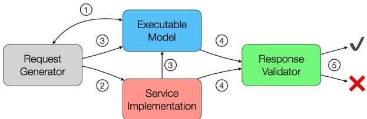  
Figure 1: Model-based testing flow.

In our approach, we argue that the starting point of any effective validation technique (formal or semi-formal) is a specification of the system. Alas, when working with legacy systems, the correct level of abstraction or language for a specification is not always clear. Therefore, we make the pragmatic choice of defining a reference model as a specification, which we then use to validate the evolution or even different implementations of the system. Following the model-based testing (MBT) [UPL12] literature, we refer to the system implementation under consideration as the System Under Test (SUT), and use the model as an oracle in the SUT validation campaigns. Each validation campaign compares the SUT’s behavior against the model on a set of inputs and highlights any discrepancies. To assess the quality of our model, and to later validate the SUT against it, we need automatic input generators that cover measurable portions of the API’s input and state space. We develop a systematic input generation approach based on the model (Sec. 5). This helps us bootstrap the model when starting with a legacy system and, once the model is deemed accurate, validate evolutions of the system.

The systematic input generation is designed around three key properties:

No assertion left behind. Unlike unit testing, we do not need to write assertions. We compare every element of the responses generated by the SUT and the model. This is the strongest possible assertion on the input-output relation: equality between service and model responses.

No scenario left behind. We pair the model with automated test generation to solve the problem of test coverage and quality of integration testing. We employ input-output conformance [Tre08] validation to compare the SUT and the model (see Sec. 3).

No redundant scenario. Given the massive space of possible input requests to the API, we need to avoid redundancy. Since execution time is of the essence, our methodology avoids redundant inputs.

while not metric . is\_covered () :   
test = metric . next\_test ( model ) 1   
s\_resp = service . run ( test ) 2   
m\_resp = model . run ( test , s\_resp ) 3   
valid = validator ( test , s\_resp , m\_resp ) 4   
report ( valid ) 5   
metric . update ( model , test , m\_resp )   
Listing 1: Coverage-driven testing (pseudo).

Fig. 1 depicts the MBT strategy. There are three main components to our validation besides the implementation of the service itself. Firstly, the executable model (Sec. 3) is a simple implementation of the API. It preserves all the functional aspects of the service and ignores all the non-functional ones. This is shown in the blue box in Fig. 1. Secondly, the green box represents the response validator. This component implements the logic to assert whether the response of the SUT is consistent with the response generated by the model. It also allows us to select between the multiple behaviors allowed by the reference model and keep its state in sync with the SUT. Finally, the gray box corresponds to the request generator. The generator implements the algorithms that aim at maximizing our coverage metric (Sec. 5). This component ensures that all scenarios are exercised, and it is the cornerstone of our coverage-driven validation architecture.

To understand the execution flow of our tool, consider the pseudo-code in Listing 1. In the first step, the request generator queries the current state of the model and the desired coverage metric to generate the next request to execute. This is marked with bullet 1 in the picture and the pseudo code. Next, in step 2 , the request is sent for execution to the SUT and its response is recorded in s\_resp. Because of the possible non-determinism in the server, the server response is sent to the model alongside with the request in step 3 . To understand this, consider a simple PutObject interaction in the request/response excerpts shown in Listing 2. At the top we have the request issued, in this case a PUT request. While all fields of the requests are calculable at request generation time, that is not true for all the response fields at model execution time. In fact, the model state doesn’t have the necessary information to compute the values marked in red: x-amz-id-2, x-amz-request-id, Date and ETag. The model considers these values to be non-deterministic and treats them as opaque values. While some of these values are not important to the model (for example x-amz-id-2 and x-amz-request-id are used only for logging on the server side), some of them are critical for the functionality of the service, and need to be captured into the model. An example is the Etag value returned for stored objects. The object Etag is created when the object is uploaded, and can later be used in conditional operations via headers like If-Match and If-None-Match. In other cases, like the response Date, the model cannot compute the exact value (e.g. predict the exact time at which the server will process the request), but expects the value to conform to a specific format. To simplify the response comparison, we propagate these opaque values into the model, and we take them as input for model evaluation. This is shown at step 3 where the observed response is sent as an input to the model evaluation. Care must be taken when identifying which of these values should be used in the model. For that reason, we distinguish them as prophecies, and prophecy values are treated specially in our model. Moving on with our execution flow, in step 4 both the model and service response are sent to the validator for checking. Finally, in step 5 , the result of the validation is reported to the user of our tool before restarting with the next request if any. There are two possible outcomes: either the responses agree and we continue, or they don’t agree, and we report them as a deviation to the user. The rest of the paper uses the term deviation to refer to discrepancies between model and SUT. A deviation represents an error in the model, in the SUT or in both.

PUT / main . pdf HTTP /1.1   
Host : bucket -for - paper . s3 .us - east -1. amazonaws . com   
Accept - Encoding : identity   
User - Agent : aws-cli/2.17.34 ...   
Content - MD5 : / JcyfUI6ZR8eKZuf6t5M8w ==   
X -Amz - Date : 20250108 T111733Z   
X -Amz - Security - Token : (redacted)   
X -Amz - Content - SHA256 : UNSIGNED - PAYLOAD   
Authorization : (redacted)   
Content - Length : 621629   
...payload...   
%% EOF   
HTTP /1.1 200 OK   
x -amz -id -2: 7Ze3etUJjG02zh3Moft+Iv5MgyDSrFQjzhEyorQ...=   
x -amz - request - id : XN5HVNKEYT6W7EZB   
Date : Wed, 08 Jan 2025 11:17:35 GMT   
x -amz - server - side - encryption : AES256   
ETag : "fc97327d423a651f1e299b9feade4cf3"   
Content - Length : 0   
Server : AmazonS3  
Listing 2: Request/Response example. Prophecy values are in red, blue values are edited for readability.

## 2.1 Technical Choices and Assumptions

Black-box Modeling. We take a black-box approach to modeling and validation. We cannot afford to make assumptions about the implementation which may change in the future, or may be invalid w.r.t. other implementations of the same API. Thus, our model is agnostic to the internal implementation choices of a specific SUT, and all of our modeling is based on input/output behaviors of the service. One caveat of this approach is that the model is not able to differentiate between different internal service states leading to identical input/output behavior, for example those resulting from components such as caches.

Stateful REST API. We consider services that provide a REST API where the result of an operation can be influenced by preceding operations. For instance, the result of a GetObject is affected by a successful prior PutObject on the same key. Therefore, the model of the service must also be stateful and retain sufficient information about the previous operations to be able to correctly compute the response for the next request. However, in the interest of simplicity, our model is: 1. in-memory, meaning that the state is not durable across instantiations, 2. single-threaded, meaning that API calls are executed one at a time in the order that they are received by the model, and 3. performance agnostic, meaning it does not reflect performance requirements of the implementation, such as latency or throughput.

Non-determinism. Our target systems are mostly deterministic: given the same state, if we issue the same API call, we observe the same behavior, and the same resulting updated state. Some exceptions to this rule are: service-generated identifiers, which depend on internal state we cannot observe; timestamps, which depend on when the request is received and how long processing takes; and transient errors, such as 500 InternalServerError responses triggered by hardware failures. A second form of non-determinism arises across implementations. Each implementation is free to choose the order in which to process independent request attributes, and this order affects which error is returned. The model must accommodate this variation: for each request, it returns the set of valid error responses, and a correct implementation must return one of them. We additionally require each SUT to consistently return the same error. Therefore, we learn the choices made by each SUT and then the validation steps for the SUT fail if a different choice is observed. Sec. 3 exemplifies this.

## 2.2 End to End Simplified Example

We illustrate our approach end-to-end through a simplified version of the S3 GetObject API with only three request fields: bucket, key, and checksumMode. We use the simplest form of bucket: a key-value store mapping keys to object blobs. Each object has an associated checksum, which can be retrieved via GetObject by setting checksumMode to ENABLED.

To validate that an implementation of GetObject behaves correctly for every distinguishable combination of request and state, we decompose the validation task into four subgoals:

(a) enumerate the set of scenarios (abstract state-request pairs) necessary to cover all API behaviors,

and for each of these scenarios:

(b) bring both SUT and model into the state required by the scenario,

(c) issue a concrete request representing the scenario against SUT and model, and

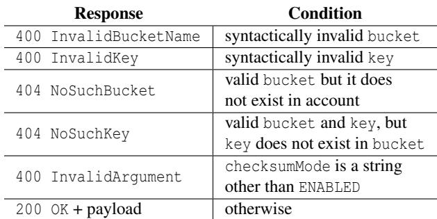  
Table 1: Simplified GetObject behaviors

(d) compare the response received from the SUT with the responses admitted by the model.

We describe subgoal (d) first, since it defines what correct means, and then revisit (a)–(c) in turn.

Expected outcome and comparison (d). For our simplified GetObject, the model’s behaviors are described in Tab. 1. To illustrate the non-determinism of error responses, notice that the conditions can overlap on some requests. For example, a request with an invalid bucket and an invalid key admits both 400 InvalidBucketName and 400 InvalidKey as valid model responses. The validator declares success whenever the SUT response is among those allowed by the model, and reports a deviation otherwise.

Input scenarios enumeration (a). Enumerating all concrete request/state pairs is intractable: bucket and key names alone range over all possible strings. The main insight of our input generation strategy is that we only need to consider inputs that lead to distinct behaviors. For instance, S3 rejects all bucket names longer than 63 characters and a few such names suffice to validate the SUT on this behavior. To formalize this, we partition the values of each API request and state feature into equivalence classes, which we call categories. Each category is defined via predicates over the request fields and S3 state (see Sec. 4).

To make the explanation concrete, let us denote by V the model state, and let b, k and c represent the values for the bucket, key, and checksumMode fields respectively. In this example, we define the abstraction function via six Boolean predicates: (i) valid\_bucket\_name(b) holds iff b is a syntacti cally valid bucket name; (ii) bucket\_exists(V , b) holds iff V contains a bucket named b; (iii) valid\_key\_name(k) holds iff k is a syntactically valid key name; (iv) key\_exists(V<sub>Ω</sub>, b, k) holds iff V contains an object with key k in bucket b; (v) checksum\_mode\_present(c) holds iff the request contains the checksumMode field (i.e. c ̸= None); and (vi) valid\_checksum\_mode(c) holds iff c is a valid value for the checksumMode (i.e. c ∈ {None,ENABLED}).

The predicates (i), (iii), (v) and (vi) are request predicates and do not depend on the state; the remaining state-dependent predicates relate the request with the model state. An input scenario is a truth assignment over the six predicates, and there are 2<sup>6</sup> = 64 such assignments. However, most of these are spurious: existing objects cannot have an invalid bucket name or an invalid key name, a key cannot exist in an unknown bucket, and if the checksumMode is not present, it must be valid. We capture these constraints as a conjunction of four implications, which we call the model invariant inv (Sec. 5.1):

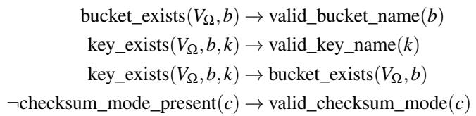

We enumerate non-spurious scenarios by computing all satisfying assignments of inv . For our example, this reduces the 64 scenarios to 21: 2 success scenarios with an existing bucket, key, and checksum mode either None or ENABLED; 1 error scenario with an existing bucket, key, and invalid check sum mode; 3 error scenarios with an existing bucket and valid but non-existent key; 3 error scenarios with an existing bucket and invalid key; 6 error scenarios with a valid but non-existent bucket; 6 error scenarios with an invalid bucket.

Most input scenarios lead to error responses, and many will produce the same error on the SUT. In practice, deterministic implementations check arguments in some order and shortcircuit on the first error. Suppose our SUT first performs the syntactic checks on bucket, key, and checksumMode in this order, and then looks for the object with the given bucket and key names in the state. Under this evaluation order, several of the 21 scenarios map to the same SUT behavior. For example, the 6 input scenarios with an invalid bucket name all produce the same response (400 InvalidBucketName) regardless of the state or the other field values. We call this the first-error hypothesis and use it to reduce the number of scenarios further (Sec. 5.2).

State setup (b). Given a non-spurious scenario, we have to bring both the SUT and model into a state that satisfies all state-dependent predicates of the scenario. For instance, every scenario where bucket\_exists holds requires the state to contain at least one bucket. We address this problem with a component called API-planner (Sec. 5.3). Given the statedependent predicates of a scenario, the API-planner returns a sequence of requests that lead from the current state to a state that satisfies the input predicates.<sup>3</sup> Consider a success scenario with both predicates bucket\_exists and key\_exists set to true. The scenario requires V to contain a bucket with a valid name, and in it an object with a valid key. Assuming the current state (V ) is empty, the API-planner produces two preparatory requests: 1. CreateBucket(b) with a freshly synthesized valid bucket name b, and 2. PutObject(b, k, payload) to write an object with freshly synthesized valid key k and some content payload into bucket b. Each preparatory request is itself a test and it is processed end-to-end through our validation pipeline as described in Fig. 1. Once the planner reports that the target state is reached, we proceed to test the GetObject input scenario request of interest.

Request concretization (c). With the state in place, the last step is to pick concrete values for the request features that are consistent with the input scenario. For request predicates we sample from the category dictated by the scenario: e.g. if valid\_bucket\_name must be false, we sample from a pool of syntactically invalid names (too short, too long, illegal characters, . . . ). Instead, for state-dependent predicates we query the model state for values that satisfy them. For example, if both bucket\_exists and key\_exists must hold, we ask the model for an existing (bucket, key) pair, and reuse the names synthesized during state setup. Finally, the checksumMode is: 1. omitted from the request if checksum\_mode\_present is false, 2. set to ENABLED if both checksum\_mode\_present and valid\_checksum\_mode hold, and 3. sampled from a pool of invalid values (e.g. empty string, DISABLED, or some other invalid string) if valid\_checksum\_mode is false. The resulting GetObject request is then executed according to our description of step (d) above.

## 3 The Model

Our model is intended to serve as the de facto specification of the S3 API. As a result, service owners need to be familiar with the model code base and extend it in anticipation of changes in the service. Practically, the choice of programming language and development methodology for the model follows the same standards as the majority of our service code bases. Consequently, we implement our model in Java, and we use the standard builder tools available to engineers.

Our model implements a key-value store with additional metadata to represent details about the stored objects. For simplicity, we only store information in the model if it can be observed by subsequent API calls. For example, the model records the object’s ETag. The ETag is computed when the object is created, and later GetObject operations for the object will return the same ETag. However, the model does not store the operation’s request identifier (x-amz-request-id) since there is no way of retrieving it via API calls. Some examples of common metadata that we store in the model alongside the object key and payload are: object creation time, object tags, server-side encryption mode, encryption key for the object (if any). Each of these can affect the behavior of subsequent operations, and hence the model must have access to this information. As a concrete example, the encryption key in a GetObject request needs to match the one used at creation time for the request to succeed; otherwise a 403 Access Denied error code is returned.

We strive to reuse model code and functionality when implementing similar features for different APIs. As an example, consider the conditional operation features present in the GetObject, PutObject, CopyObject and DeleteObject APIs. These features validate the same syntactic and semantic conditions on the arguments and state of the system. Therefore, our model encapsulates the behavior of each feature in a single trait. This reduces the size and complexity of our model, and it makes reasoning about each individual feature uniform across all APIs that use them. As we shall see in Sec. 5, this also enables us to abstract the input generation strategy for each individual feature, which then generalizes for all the APIs that use the feature.

Non-determinism and Prophecy Variables. The model exhibits non-determinism in two ways: incorporating prophecy values from the SUT response and allowing different input validation orders. For example, consider the following GetObject request:

GetObject(bucket="non-existing", PartNumber="abc")

This request leads to an error response since: 1. the bucket name, while syntactically valid, does not correspond to an existing bucket and 2. the part number is not a positive integer. Different implementations can perform these checks in different orders. For instance, Amazon S3 performs the syntactic checks on the part number before checking whether the bucket exists, and replies with the error 400 InvalidPartNumber. However, a different implementation of GetObject could choose to report 404 NoSuchBucket instead. Our model generates all the acceptable error responses and the SUT response is correct if it is among the ones generated by the model. This raises the question of checking a mostly-deterministic service with a non-deterministic model. A specific SUT must be consistent in its responses and always pick the same answer among the ones allowed by the model. This property is important for customers who may have error handling routines for errors they observed during testing. If the SUT suddenly reports a different error for the same request, customers’ code may break in production. We validate that each SUT keeps returning the same error by learning a partial order for each SUT. The partial order describes which error the SUT returns among the ones allowed by the model. We then use the prece dence order to specialize the model for the specific SUT. This enables our tool to validate that the SUT retains the same ordering without having to build a separate model.

## 4 Request and State Abstraction

The effectiveness of our model-based validation rests on its ability to exercise tests that show whether the model and implementation coincide (step 1 in Fig. 1). Our goal is to explore all SUT behaviors that are distinguishable from a black-box viewpoint. As anticipated in Sec. 2.2, we use predicate abstraction [GS97] to focus our validation efforts on meaningful input scenarios and, consequently, on tests that exercise distinct behaviors.

Terminology and definitions. Tab. 2 reports some terms that we use throughout the section. We use feature generically to refer to either an input parameter (request feature), or a configuration of a logical component of the state of the system (state feature). For example, in GetObject the bucket name of the request is a request feature. In contrast, state features correspond to elements of the state that influence the behavior of the API in an observable way. For example, whether a bucket name is in-use (i.e. a bucket that has been successfully created and has not been deleted yet) is a state feature.

We group together values of a feature that result in similar behavior when considering specifically that feature.<sup>4</sup> We define categories (equivalence classes) of values for a feature, with the expectation that values in the same category behave similarly. Considering bucket name as an example, a bucket name can fall into one of three equivalence classes: 1. syntactically invalid names, 2. syntactically valid names for non-existent buckets, or 3. valid names for existing buckets. Each class triggers distinct service behaviors and outputs. The equivalence classes partition the possible values of a feature. Therefore, we can exercise the relevant behaviors by selecting one value from each category instead of trying all possible values. An input scenario maps each feature to a corresponding category. Each input scenario is a truth assignment for a set of predicates over the request and state features of the API. Input scenarios reduce the set of all possible requests that need to be exercised to a much smaller finite set that still exercises all meaningful behaviors. This transforms an intractable exploration problem (exploring all possible values) into one amenable to algorithmic automation. We apply the abstraction across all API features and dramatically reduce the universe of scenarios to exercise while preserving comprehensive behavioral coverage. Consider the categories for bucket names as shown in Fig. 2. The left diagram in the figure shows how the space of all possible bucket names is partitioned according to the three categories. Whether a bucket name is well-formed is strictly a property of the bucket name string. Therefore, it is a request feature and no information about the state is needed to decide it. On the other hand, the existence of a bucket depends on the state and it is a state feature. We assume that for each feature, we can categorize its values such that if two values are in the same category, they drive the same SUT behavior.

For each category we introduce a corresponding predicate that holds iff the value is in the particular category. We use predicates on inputs, outputs, and state elements to characterize the space of behaviors of the system. A predicate may depend on more than one request feature. S3 buckets contain objects identified by a key. Therefore, the predicate key\_exists, holding only when an object with the given key exists, depends on the state of the system, as well as the request’s bucket and key names.

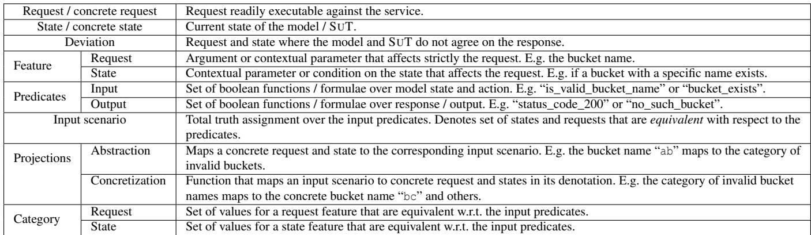  
Table 2: Terminology

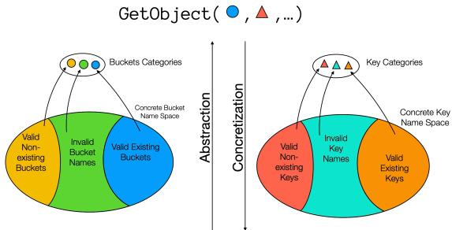  
Figure 2: Request abstraction

The abstraction function evaluates the predicates on a particular request and state pair. The concretization function does the inverse: given an input scenario, it generates concrete request and state pairs, producing an executable test case. Fig. 2 depicts the process of mapping a concrete request to an input scenario and vice versa. Notice that sampling concrete requests from input scenarios is a critical building block to obtain a concrete test suite that achieves our coverage goals. We generate a set of input scenarios that achieves our coverage goal; concretization then turns each scenario into a concrete request executable on both SUT and model, thereby producing a test suite that realizes the coverage goal.

More formally, let <sup>P</sup><sub>I</sub> be the set of input and state predicates and <sup>P</sup><sub>O</sub> be the set of predicates on the output / responses. Then, 2<sup>P</sup>I is the set of all the possible assignments to the input predicates, hence the set of all input scenarios. We say the abstraction is adequate iff every concretization of a given input scenario leads to outputs that correspond to the same assignment to the predicates in <sup>P</sup><sub>O</sub>. In this case we say that the set of predicates <sup>P</sup><sub>I</sub> ∪ <sup>P</sup><sub>O</sub> is fine. Therefore, the input predicates are sufficiently precise to distinguish request-state pairs leading to distinct replies (w.r.t. <sup>P</sup><sub>O</sub>). The abstraction is adequate if two request-state pairs that lead to responses that correspond to different evaluations of the output predicates <sup>P</sup><sub>O</sub> are mapped into distinct assignments to the input predicates <sup>P</sup> .

To add structure to our abstract scenario space we take into account the kind of response (success or error) that the scenario will lead to on the SUT. This is simplified because web services reply to every request with either a success response or an error response.<sup>5</sup> For instance, ¬bucket\_exists establishes a priori that the GetObject request cannot succeed, and moreover, if no other error-inducing predicates are true of the input scenario, it defines the exact error case that we will observe (in this case 404 NoSuchBucket). This addition allows us to 1. use the model to predict whether the requests should succeed or not, and therefore focus our input generation for requests that should succeed first, and 2. define metrics on error-inducing requests, based on their proximity to a successful request. We define the distance between an error-inducing request and a success request as the number of parameters whose evaluation leads to error. We refer to this distance function as num\_errors. For instance, GetObject(bucket="1b", key="", PartNumber="abc") induces at least three errors: the bucket name is too short, the key name is empty, and the PartNumber is not a number. num\_errors counts the total number of error preconditions of an input scenario. We include it in our abstraction to distinguish between requests that are expected to succeed (num\_errors = 0), requests that hit exactly one error condition (num\_errors = 1), requests that can trigger two distinct error preconditions (num\_errors = 2), and so on. Sec. 5.2 describes how this enables us to reduce the number of inputs that need to be validated to achieve coverage of the input scenarios via the first-error hypothesis.

## 4.1 Predicate Definition

Consider the example in Fig. 3. The picture shows three HTTP requests for key “key” in bucket “bucket”. The requests specify different If-Unmodified-Since dates and x-amz-expected-bucket-owner values. The response received for each request is shown below the request in green. The semantics of If-Unmodified-Since is such that: 1. if the date is in the future the header is ignored; 2. if the date is before the creation date of the object we will receive a 412 Precondition Failed; 3. otherwise the request can succeed with a 200 OK response if no error happens elsewhere. The x-amz-expected-bucket-owner header is used to ensure we only operate against a bucket owned by the specified account. If the account does not own the bucket a 403 Access Denied error is returned. This example illustrates the importance of the abstraction: the exact choice of future date or exactly which “wrong” owner we specify does not matter. We only need to test one future date for this scenario, not all possible ones. Similarly, for the x-amz-expected-bucket-owner field we only need to test the actual owner, any other account as owner, and at least one other value for each of the remaining categories shown at the bottom of the figure. Importantly, the choice of category for a feature can drive different outcomes for the request, while different concrete values in the same category will produce the same responses.

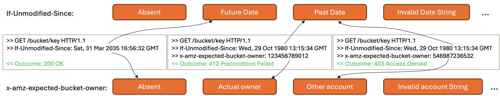  
Figure 3: Abstraction example.

Identifying Meaningful Categories. A natural question is how to determine the appropriate set of categories of each feature. For instance, should we refine the “invalid bucket names” category further? The choice of categories is driven by the following observations. 1. Whether all the values in the category result in the same behavior for the feature in question. 2. Whether a category represents values that are potentially difficult to handle, even if it may not change the observable behavior. Typical examples are control characters in strings, empty or null values, boundary conditions, etc. 3. Whether the category contains values that are relevant for the specific optimizations and design choices of the SUT. While in this case, the category may not change the observable behavior, developers with information about the SUT can provide knowledge about inputs that trigger a different SUT path.

While some of these categories are immediately derivable from observations of the system and documentation, others need expert knowledge of the system. Over time, engineers add more information to our abstraction that relates to server paths that are not distinguishable by the model, but nonetheless deserve to be validated separately. For example, the object size of a request may affect the path, while the observable behavior is unaffected. Crucially, this has no effect on the model, but in the validation strategy we may be explicitly interested in covering such cases.

## 5 Automated Input Scenario Generation

Our test generation strategy uses the request and state abstraction introduced in Sec. 4 to exercise a configurable set of input scenarios. A test configuration defines the predicates that we are interested in and bounds the minimum and maximum num\_errors of the input scenarios. The configuration is a boolean formula over <sup>P</sup><sub>I</sub> and num\_errors. The test generation procedure explores all input scenarios in the configuration by enumerating the truth assignments that satisfy the formula. When the configuration includes all the features of the API type (the formula is valid), the test generation strategy will cover all the input scenarios for that API. Since input scenarios are equivalence classes of the observable behavior of the system, executing one request for each input scenario gives us the best black-box approximation of the service execution paths according to our abstraction predicates <sup>P</sup> and <sup>P</sup> .

While this goal is intuitively simple, in many cases covering the entire space of input scenarios makes the procedure exercise scenarios that are redundant or spurious as discussed in Sec. 2.2. An input scenario is redundant if it covers behaviors of the SUT that have been already exercised by other scenarios. An input scenario is spurious if there are no concrete tests that can satisfy the category combination required by the input scenario. For example, the set of input scenarios 2<sup>P</sup>I contains inputs that combine invalid buckets with values in all categories for key names: including the category of existing keys! In S3, there cannot exist keys in a bucket with an invalid bucket name, hence the input scenario cannot be concretized. There exists no state and request pair that meets the requirements of the scenario.

Recall the goals introduced in Sec. 2.2. We want to exercise all non-spurious input scenarios in a configurable portion of the space. To that end, we first need to enumerate the relevant (non-spurious) input scenarios. Then, for each scenario, we must reach a state and generate a request that exercises it on the SUT. Therefore, for every input scenario we execute a sequence of requests. The prefix of the sequence contains the requests necessary to reach the necessary state. The last request of the sequence is the one that actually exercises the input scenario we are interested in. We send every request to the SUT first and then we check whether the responses are admissible by sending the same requests to the model (Fig. 1). We call the process of computing the sequence of requests to exercise an input scenario concretization.

## 5.1 Removing Spurious Input Scenarios

As exemplified in Sec. 2.2, we introduce a propositional formula inv (for state invariant) to distinguish spurious and non-spurious input scenarios. We first show what inv looks like in the case of Amazon S3 and then give a more general description of its shape and how it is employed in the scenario enumeration procedure.

For this example, consider the bucket, key and version id features of the GetObject API. In this setting we define inv as the conjunction of seven implications. Implications 1 and 2 express the fact that in S3 keys exist only inside buckets, and a key can have multiple versions. Implication 3 states that every key has the null version. Then, implications 4, 5 and 6 state that only buckets, keys and version ids that are syntactically correct can exist in the state. Finally, implication 7 encodes the fact that a version id cannot be both named and null at the same time. More formally, let V be the model state and let b, k, v represent the values of bucket, key, and version id respectively. Consider the predicates valid\_bucket\_name, valid\_key\_name, valid\_named\_version, null\_version, bucket\_exists, key\_exists, version\_exists ∈ <sup>P</sup><sub>I</sub>. Then, inv is the conjunction of the following formulae:

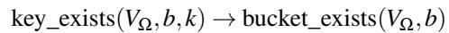

(1)

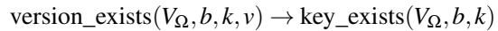

(2)

key\_exists(V , b, k) ∧ null\_version(v) →

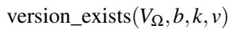

(3)

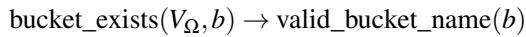

(4)

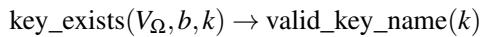

(5)

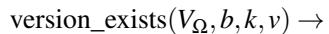

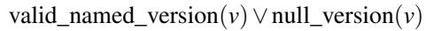

(6)

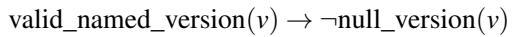

(7)

More generally, we require the atoms of inv to be the abstraction predicates <sup>P</sup><sub>I</sub> and we require inv to denote the set of non-spurious input scenarios. An input scenario is a truth assignment over the atoms of inv , hence it makes the formula either true or false. In other words, inv is satisfied by an input scenario iff the scenario is non-spurious. Therefore, we can generate the non-spurious input scenarios by enumerating the satisfying assignments of inv . In fact, the core of the input scenario generation procedure is an all-sat engine that enumerates the truth assignments to the predicates <sup>P</sup><sub>I</sub>. The all sat procedure can be implemented using any off-the-shelf SAT solver [CKHM25]. The input scenario generation procedure takes as input the invariant inv and the test configuration. It explores all non-spurious scenarios in the given configuration by enumerating all satisfying assignments (all-sat) of the formula obtained by the conjunction of inv and the test configuration. The conjunction of the test configuration with inv<sub>Ω</sub> prevents the procedure from generating scenarios that are spurious and cannot be concretized.

## 5.2 Removing Input Scenario Redundancy

APIs often involve many, sometimes optional, input parameters. Unfortunately, the number of input scenarios is exponential in the number of features of an API. This implies that in several cases it may be neither practical nor cost-effective to explore all input scenarios. Instead, we are interested in exploring specific aspects or features of the API. Generally, the time available for validation is bounded (e.g. in a CI/CD approval step). Therefore, we need to limit our search to fit the time budget of the development cycles. We must focus our validation on features and scenarios that are more likely to exhibit new behaviors, potentially deviating from the model. For example, consider the GetObject API with its 21 input parameters. For simplicity, assume we define only 2 independent predicates for each feature (i.e. 4 categories), then we have 4<sup>21</sup> input scenarios for GetObject. Since our tool executes around 1.5 × 10<sup>5</sup> requests per hour, it would take about 2.9 × 10<sup>7</sup>h to execute all GetObject scenarios. This simple computation shows that the predicates <sup>P</sup><sub>I</sub> alone do not sufficiently focus our exploration for all APIs. For this reason, we exploit num\_errors to reduce, in a safe manner, the cases that need to be covered to identify deviations.

As exemplified in Sec. 2.2, covering all input scenarios would exercise the same behavior multiple times. This is especially true in the case of requests leading to error responses. Consider again the GetObject request from Sec. 3:

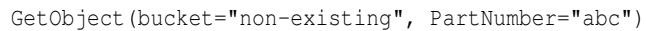

In Amazon S3, this request will result in a 400 InvalidPartNumber error, indicating that the part number check took precedence over the bucket existence check. The SUT stops processing the request and immediately returns once the first error is found. The values of all other fields are ignored and don’t affect the SUT behavior. We assume that error responses short-circuit the service execution, and dub this property the SUT first-error hypothesis. We use the hypothesis to focus our exploration policy further.

num\_errors, defined in Sec. 4, helps us exploit the shortcircuiting mechanism. We use it to reduce the number of requests we generate, while still exploring all SUT behaviors under the first-error hypothesis. For instance, input scenarios where more than one input would lead to error induce redundancy: one of the two inputs will get evaluated first and the other will be ignored. However, our goal is to ensure conformance between model and SUT. Therefore, we cannot just stop after exercising all requests with up to 1 error. We need to exercise requests with 2 errors to ensure the ordering in which the features are evaluated by the SUT is compatible with the model expectation. For example, all authentication and authorization checks must occur before all state-dependent checks (e.g. existence of the key). We use this strategy to organize our space exploration as illustrated in Fig. 4, where each set contains all the scenarios with up to n errors.

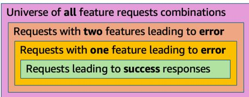  
Figure 4: Space of requests by errors.

0-errors campaigns. These include all input scenarios leading to success responses.

1-error campaigns. These are all input scenarios that contain exactly one feature leading to error. These campaigns validate that our error reporting is accurate, and in combination with the 0-errors campaigns above, if the firsterror hypothesis holds, evaluate all SUT paths for the API.

2-errors campaigns. These cover all input scenarios with exactly 2 features that should lead to an error. They validate that our model predicts the parameter evaluation precedence when more than one parameter leads to error.

Under the first-error hypothesis, any campaign with at least 3 errors exercises the exact same behaviors observed in the 1-error campaigns, and contributes nothing to the validation of the error ordering already achieved by the 2-errors campaigns.

In some instances, accurately calculating the exact num\_errors for an input scenario is quite expensive. Intuitively, this requires identifying the closest input scenario leading to success, which implies considering all alterations for all predicates. While we generally keep the num\_errors definition precise, for larger numbers n of num\_errors we accept some requests with m < n errors, if that speeds up the search. Notice that this is a safe overapproximation of the space of requests with n errors, since it only adds cases which may have less than n errors. The set will contain all scenarios with n errors.

## 5.3 Input Scenario Concretization

The previous sections described how we enumerate the input scenarios that achieve the desired behavior coverage. Unfortunately, we cannot directly execute an input scenario on the SUT. We must first set up the state required by the scenario and then create a corresponding request. For example, consider a GetObject input scenario where both bucket\_exists and key\_exists hold. To exercise the scenario, we first need a state with an existing bucket b and an object in b with some key k. Then, we can exercise the scenario by executing the request GetObject(bucket="b", key="k", ...).

Listing 3 details the process of exercising an input scenario on the SUT and performs four main steps. First, we analyze the input scenario and extract the description of the required target state (make\_target\_state). Second, we execute the (possibly empty) sequence of operations necessary to reach the target from the current state (the while loop in execute). Third, we inspect the state and generate the request we need to execute (concretize\_request). Finally, we execute this request on both model and SUT, exercising the input scenario (the last call to test in execute).

We now describe how the steps are implemented. The state required by an input scenario depends on the assignment prescribed by the scenario to the input predicates that depend on the model state. Therefore, given an input scenario we analyze its truth assignment to all predicates in <sup>P</sup> that depend on the model state and compile it into a structure we call target state. The target state is an abstract description of the state necessary to execute the input scenario. In the case of S3, the target state defines the number of buckets needed and, for each bucket it specifies the required configuration, keys and objects it must contain.

Given the target state, we must compute the sequence of operations necessary to set it up. As we mentioned in Sec. 2.2, that is the task of the API-planner component. Given the target state, the API-planner produces the sequence of actions necessary to reach the target from the current state. APIplanner is a function that, given the current state of the model and the target state, generates the next action we need to perform or None if the current state meets the target. Recall the example from Sec. 2.2. Starting from an empty state, we want to exercise a GetObject input scenario where both bucket\_exists and key\_exists hold. The API-planner will first synthesize a valid bucket name and create a bucket with such name via the CreateBucket API. After successful execution of the CreateBucket request, the API-planner synthesizes a key name and object payload. These values are used to generate a PutObject request to write an object in the bucket we just created. Upon successful execution of the PutObject, the state has both a bucket and a key. We’ve now reached our desired state and the API-planner returns None. In order to exercise the scenario, we need to synthesize the corresponding request. In our example, we need to generate a GetObject request that uses the bucket and key names that we just created. We achieve this by querying the current model state for an existing bucket and key.

Importantly, the API-planner assumes the SUT and the model agree on the behavior of all write APIs (CreateBucket and PutObject in our example). We validate this by comparing the model and SUT responses for all requests generated by the API-planner and by running test campaigns specific for PutObject and the other APIs. In general, if the SUT and model do not agree, our validation campaigns will highlight defects either during the state-setup sequence, if SUT and model reply differently to a request generated by the APIplanner, or when validating the response to the final request that exercises the desired scenario.

```python
def test ( request : Request , model : Model ) -> bool:
sut_response = execute_sut ( request )
prophecies = make_prophecies ( sut_response )
model_response = model . execute ( request , prophecies )
return sut_response == model_response
def execute ( model : Model , scenario : Scenario ) -> bool:
target : TargetState = make_target_state ( scenario )
request : Request = api_planner ( model , target )
while request is not None :
if not test ( request ):
raise StateSetupFailure ()
request = api_planner ( model , target )
request = concretize_request ( model , scenario )
return test ( request )
```  
Listing 3: Scenario concretization and execution (pseudo).

Listing 3 decomposes the scenario concretization process in two methods: test and execute. The test method simply executes the given request on both the model and SUT, and it returns true iff they generate the same response. As described in Sec. 3, the prophecies structure is used to enable the model to replicate the decisions made by the implementation (e.g. set the Date in the response correctly). The execute method sets up the state required to exercise the input sce nario, generates the request corresponding to the scenario, and executes the request. The method returns true iff both SUT and model agree on the response to such request. The execute method first extracts the state requirements from the scenario into the corresponding target state. Then, it keeps calling api\_planner to retrieve the next request to be executed in order to set up the state. It relies on the test method to execute the request on both model and SUT. If model and SUT reply differently, it notifies the caller that there has been a failure during the state setup. Once the desired state has been reached, concretize\_request generates a request that exercises the given scenario in the current model state. Finally, it calls test one last time to run the request on both model and SUT and returns false iff a deviation was found.

## 5.4 Configuring Validation Campaigns

The input scenario generator takes as input a configuration that defines the testing campaign. The configuration defines the input scenarios of interest, explicitly defining the features and predicates that must be completely explored. We strategically define test campaigns and the corresponding configurations with the help of engineers. We define configurations that exploit knowledge about un/correlated features in the SUT. The configurations limit the combinatorial com plexity of the validation campaigns and make them fit in the computational budget. For example, conditional features (If-Modified-Since, If-Unmodified-Since, If-Match,

If-None-Match) are related to each other, and are also related to the freshness of the object. However, conditionals are mostly independent from other features, such as bucket configurations, and fields like x-amz-expected-bucket-owner. For this reason, for time budgeted campaigns, we restrict the features to be tested according to their correlation.

## 6 Results

Our model-based validation infrastructure is currently employed in CI/CD pipelines of S3. Tab. 3 reports the number of findings of our tool on three major initiatives within S3. Each of these findings resulted in proactive fixes and prevented the deployment of model-breaking code changes. Each finding has been manually analyzed and assigned a severity score. For each initiative the table reports the total number of findings and the number of findings with high severity.

The S3 Express One Zone storage class launched in 2023. Prior to launch, we applied our approach to all the S3 APIs that require strict compatibility with the original regional S3 implementation. For the APIs with intentional changes, we adapted our model to reflect the expected behavior on directory buckets. Using our methodology we prevented 171 deviations. Of these, 12 were of high severity. All these defects were fixed before the service launch in 2023.

Our tool is used in an ongoing multi-year rewrite of S3’s frontend API service. As part of this effort, developers run it locally in their development environments, and it is also integrated into the CI/CD pipeline. Local runs typically exercise a small, specifically defined, subset of the overall tests that are run in the CI/CD steps. Over the course of the rewrite, the CI/CD steps identified 92 issues that were missed by other unit and integration tests. This enabled developers to address all of them before deploying to production.

Finally, as part of the CI/CD process in S3 we continuously check for errors and prevent them from releasing into production. To date, we identified 109 deviations, of which 24 have high severity. In the past two years, our tool helped in validating several major new feature launches such as: enabling server-side encryption by default, support for full object checksums, and conditional write operations (e.g. the If-Match field for PutObject requests).

## 6.1 Validation Reductions

Tab. 5 reports an overapproximation of the number of input scenarios for the GetObject API obtained from the number of features and categories in Tab. 4. The number of scenarios is still too large to be executed in the CI/CD pipeline. Each approval step in the CI/CD pipeline must provide feedback within a reasonable amount of time. As a starting point, we allocate a budget of three hours per validation campaign and run multiple campaigns in parallel. For this reason, in our testing setup each campaign can execute up to approximately

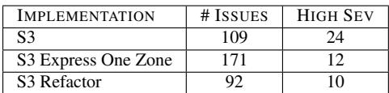

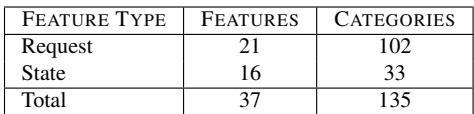

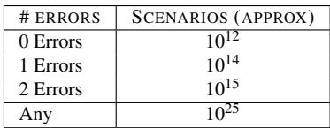  
Table 5: Approximate number of input scenarios for GetObject by number of errors.

Table 3: Issues prevented to date.  
Table 4: Number of features and categories for the S3 GetObject API.  
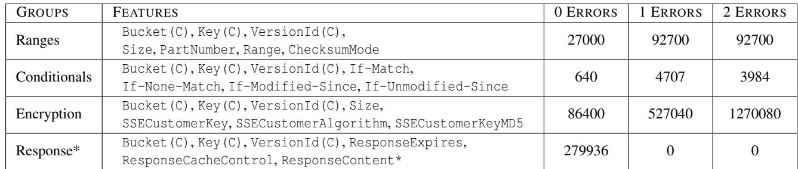  
Table 6: Sample grouping of correlated features for validation and approximation of number of input scenarios.

432000 requests. For the features of the GetObject API, we defined an average of 2.4 equivalence classes that can be used in successful requests. Therefore, in an approval step we can cover the success-case combinations of about 15 features (≈ log <sub>.</sub> (432000)). Developers define the combination of features to consider based on their knowledge of the SUT and the changes they are interested in validating. We then rely on asynchronous long-running validation tasks to explore a rotating subset of the features with the goal of highlighting defects resulting from unexpected interactions between features.

We also have predefined validation campaigns, built alongside senior developers, that couple together highly correlated features. Tab. 6 reports a sample of common groupings of interest. For each group it reports the number of input scenarios containing 0, 1, and 2 errors that cover the feature combinations. Consider the first group (Ranges) in Tab. 6. We have, as in most validation configurations: Bucket(C), Key(C), VersionId(C), where the (C) stands for correct categories for the group since we are interested in the object structure in this case, not bucket and key names, which are validated elsewhere. We also have features related to the size and structure of the stored object: Size, PartNumber, Range, and ChecksumMode. This results in 212400 requests, which we can execute in about 1.5 hours.

While we still don’t cover all the input scenarios on every change, we highlight that the number of cases being covered is well beyond what can be achieved with manually defined tests. In addition, our approach is flexible and the scenarios being exercised can be changed via simple configuration updates.

## 6.2 Comparison to Property Based Testing

We compared our test generation approach to property-based testing (PBT). In the PBT setup the input generator samples each parameter from a weighted distribution and runs GetObject requests against randomly generated objects in an S3 bucket. We then apply our abstraction function to each request’s input and output parameters and count the unique input scenarios covered. In a run of 28457 GetObject requests, the PBT tests exercise only 9040 unique scenarios, meaning that 19417 requests were scenarios already covered.

We obtain a similar result when targeting a specific scenario of interest. In this case we selected 3 features of GetObject: bucket, key, and range, and we allowed 2 categories for each, totaling 8 non-spurious input scenarios. The PBT generator eventually covers all 8 scenarios. However, across 10 different runs it required 3200 requests on average to do so. Instead, our scenario generation procedure directly enumerates the distinct input scenarios and deterministically generates the 8 required requests.

These simple experiments highlight the additional cost incurred to achieve the same coverage goals without a systematic way of exploring the input space.

## 7 Related Work

The literature more closely related to our work is on the topic of automated test generation and model-based testing. Tab. 7 organizes tools in this large research field along 4 orthogonal dimensions. 1. The testing approach is white-box if the tool leverages the source code of the system, and black-box otherwise. 2. The test-generation policy is the algorithm used to select the next test scenario. 3. The input generation represents the logic used to select the input value for each scenario. 4. An approach is stateful if the test generation considers the current state of the SUT, stateless otherwise. 5. The oracle is the component that performs the assertions to validate the correctness of the observed behavior.

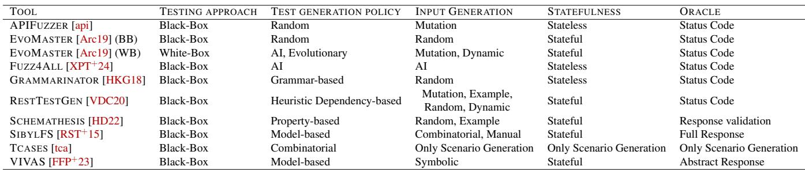  
Table 7: Classification of API testing tools

Grammar-based approaches, such as GRAMMARINA-TOR [BCD23, HKG18], exploit an explicit grammar to define the set of inputs. The space of all possible scenarios is defined by the possible combinations of derivation rules in the grammar, and the tools use randomization to explore the productions of the grammar. Unfortunately, grammar-based input generation is not well suited for stateful systems.

There is extensive literature on automated test generation for REST APIs [GZA24, KXSO22, CZPC21, MASR21, HD22]. Tools such as APIFUZZER [api], EVO-MASTER [Arc19], RESTTESTGEN [VDC20, CZPC22], SCHEMATHESIS [HD22], and FUZZ4ALL [XPT<sup>+</sup>24] aim at testing an arbitrary REST API. Therefore, they often use comparatively weak oracles that don’t enforce any specific behavior and perform only shallow checks on the response. Moreover, most of them rely on randomization or best-effort GenAI approaches for test generation, and do not provide conclusive coverage metrics on the covered space of requests.

The VIVAS framework [GGT25, FFP<sup>+</sup>23] relies on the definition of an abstraction of the system and the coverage goal is defined via (temporal) properties in the abstract space. The oracle is defined by runtime monitors [CTT19] synthesized from a set of desirable properties of the system on the abstract space. VIVAS focuses on ensuring that all traces of the system satisfy a set of properties. Instead, we focus on a simpler setting and consider the validation of a single action at a time executed in different SUT states. Our oracle is the full system model, defined directly on the concrete space, while in VIVAS the oracle is given by abstract properties.

Combinatorial Interaction Testing (CIT) [CDS08, NMT12, HWKK20, DMDS24] and tools like TCASES [tca] also organize the input space in features and categories. The tool TCASES simply generates the input scenarios. How to incorporate the scenarios into a practical testing campaign for a SUT is left to the user. TCASES employs a generate-and-filter logic to enumerate the non-spurious input scenarios. This approach does not scale to the number of features and conditions of the APIs we are interested in. Works on CIT focus on how to select a “minimal”, fixed set of input scenarios to cover as many feature interactions as possible. Some of these works (e.g. [CDS08]) also account for constraints between features to eliminate spurious scenarios. Their goal is to maximize the likelihood of exercising interesting behaviors of an arbitrary system, while minimizing the size of the test suite. Instead, we target a specific system and API and ask the developers to select which feature combinations need to be validated. The combinations to cover are chosen dynamically based on the portion of the system that is under active development.

Ridge et al. propose SIBYLFS [RST<sup>+</sup>15] for the verification of file systems. File system operations have only a few input arguments, while we deal with tens of input request parameters. In fact, 21k tests are sufficient for SIBYLFS, while the simplest of our individual APIs requires upwards of 100k tests to explore its behaviors. They also identify equivalence classes to obtain a finite set of scenarios to be tested. The test generator explores the combinations of all commands where the combinatorial testing is feasible and covers all “static real-world behaviors”. The generated test scripts are then supplemented by manually defined ones to cover remaining cases. Instead, we are interested in conclusive configurable testing campaigns that can quantify which portion of the space of input scenarios has been covered.

## 8 Conclusions and Future Work

We described the approach we adopted to define a highfidelity model for the S3 API. The same approach is used to increase the confidence in the correctness of both the model and the implementation itself. The tool is under active development to support new features and implementations. It has been instrumental in preventing deployment of over 300 regressions. The tool validates code deployments in the CI/CD pipelines of S3, S3 Express One Zone, and internal rewrites.

Our approach relies on manually defined predicates that abstract the set of requests and states into abstract scenarios. We are currently working on learning/mining these predicates from service interactions and from the source code to reduce the effort required to build and maintain the model.

## Acknowledgments

We thank James Bornholt and Rajeev Joshi for valuable discussions and feedback on this work.

## References

[AO17] Paul Ammann and Jeff Offutt. Introduction to software testing. Cambridge University Press, 2017.

[api] APIFuzzer — HTTP API testing framework. https://github.com/KissPeter/ APIFuzzer. Accessed: 2025-11-16.

[Arc19] Andrea Arcuri. Evomaster: Evolutionary multi-context automated system test generation. CoRR, abs/1901.04472, 2019.

[BCD23] Bachir Bendrissou, Cristian Cadar, and Alastair F. Donaldson. Grammar mutation for testing input parsers (registered report). In Proceedings of the 2nd International Fuzzing Workshop, FUZZING 2023, Seattle, WA, USA, 17 July 2023, pages 3–11. ACM, 2023.

[BJA<sup>+</sup>21] James Bornholt, Rajeev Joshi, Vytautas Astrauskas, Brendan Cully, Bernhard Kragl, Seth Markle, Kyle Sauri, Drew Schleit, Grant Slatton, Serdar Tasiran, Jacob Van Geffen, and Andrew Warfield. Using lightweight formal methods to validate a key-value storage node in amazon S3. In SOSP ’21: ACM SIGOPS 28th Sym posium on Operating Systems Principles, Virtual Event / Koblenz, Germany, October 26-29, 2021, pages 836–850. ACM, 2021.

[CDS08] Myra B Cohen, Matthew B Dwyer, and Jiangfan Shi. Constructing interaction test suites for highly-configurable systems in the presence of constraints: A greedy approach. IEEE Transactions on Software Engineering, 34(5):633–650, 2008.

[CKHM25] Codel Cayden, Fazekas Katalin, Heule Marijn J. H., and Iser Markus. Proceedings of SAT competition 2025 : Solver and benchmark descriptions. 2025.

[CTT19] Alessandro Cimatti, Chun Tian, and Stefano Tonetta. NuRV: a nuXmv extension for runtime verification. In Runtime Verification - 19th In ternational Conference, RV 2019, Porto, Portu gal, October 8-11, 2019, Proceedings, volume 11757 of Lecture Notes in Computer Science, pages 382–392. Springer, 2019.

[CZPC21] Davide Corradini, Amedeo Zampieri, Michele Pasqua, and Mariano Ceccato. Empirical comparison of black-box test case generation tools for RESTful APIs. In 21st IEEE International Working Conference on Source Code Analysis

and Manipulation, SCAM 2021, Luxembourg, Sept. 27-28, 2021, pages 226–236. IEEE, 2021.

[CZPC22] Davide Corradini, Amedeo Zampieri, Michele Pasqua, and Mariano Ceccato. RestTestGen: An extensible framework for automated blackbox testing of RESTful APIs. In IEEE International Conference on Software Maintenance and Evolution, ICSME 2022, Limassol, Cyprus, October 3-7, 2022, pages 504–508. IEEE, 2022.

[DMDS24] Swaroopa Dola, Rory McDaniel, Matthew B Dwyer, and Mary Lou Soffa. Cit4dnn: Generating diverse and rare inputs for neural networks using latent space combinatorial testing. In Proceedings of the IEEE/ACM 46th International Conference on Software Engineering, pages 1– 13, 2024.

[FFP<sup>+</sup>23] Simone Fratini, Patrick Fleith, Nicola Policella, Alberto Griggio, Stefano Tonetta, Srajan Goyal, Thi Thieu Hoa Le, Jacob Kimblad, Chun Tian, Konstantinos Kapellos, et al. Verification and validation of autonomous systems with embedded AI: The VIVAS approach. ASTRA, ESA, 2023.

[GGT25] Srajan Goyal, Alberto Griggio, and Stefano Tonetta. System-level simulation-based verification of autonomous driving systems with the VIVAS framework and CARLA simulator. Sci. Comput. Program., 242:103253, 2025.

[GS97] Susanne Graf and Hassen Saïdi. Construction of abstract state graphs with PVS. In Computer Aided Verification, 9th International Conference, CAV ’97, Haifa, Israel, June 22-25, 1997, Proceedings, volume 1254 of Lecture Notes in Computer Science, pages 72–83. Springer, 1997.

[GZA24] Amid Golmohammadi, Man Zhang, and Andrea Arcuri. Testing RESTful APIs: A survey. ACM Trans. Softw. Eng. Methodol., 33(1):27:1– 27:41, 2024.

[HD22] Zac Hatfield-Dodds and Dmitry Dygalo. Deriving semantics-aware fuzzers from web API schemas. In 44th IEEE/ACM International Conference on Software Engineering: Companion Proceedings, ICSE Companion 2022, Pittsburgh, PA, USA, May 22-24, 2022, pages 345– 346. ACM/IEEE, 2022.

[HKG18] Renáta Hodován, Ákos Kiss, and Tibor Gyimóthy. Grammarinator: a grammar-based open source fuzzer. In Proceedings of the

9th ACM SIGSOFT International Workshop on Automating TEST Case Design, Selection, and Evaluation, A-TEST@SIGSOFT FSE 2018, Lake Buena Vista, FL, USA, November 05, 2018, pages 45–48. ACM, 2018.

[HWKK20] Linghuan Hu, W Eric Wong, D Richard Kuhn, and Raghu N Kacker. How does combinatorial testing perform in the real world: an em pirical study. Empirical Software Engineering, 25(4):2661–2693, 2020.

[KXSO22] Myeongsoo Kim, Qi Xin, Saurabh Sinha, and Alessandro Orso. Automated test generation for REST APIs: no time to rest yet. In ISSTA ’22: 31st ACM SIGSOFT International Symposium on Software Testing and Analysis, Virtual Event, South Korea, July 18 - 22, 2022, pages 289–301. ACM, 2022.

[LW90] H.K.N. Leung and L. White. A study of integration testing and software regression at the integration level. In Proceedings. Conference on Software Maintenance 1990, pages 290–301, 1990.

[MASR21] Alberto Martin-Lopez, Andrea Arcuri, Sergio Segura, and Antonio Ruiz-Cortés. Black-box and white-box test case generation for RESTful APIs: Enemies or allies? In 32nd IEEE International Symposium on Software Reliability Engineering, ISSRE 2021, Wuhan, China, October 25-28, 2021, pages 231–241. IEEE, 2021.

[McK98] William M. McKeeman. Differential testing for software. Digit. Tech. J., 10(1):100–107, 1998.

[MLSRC21] Alberto Martin-Lopez, Sergio Segura, and An tonio Ruiz-Cortés. Restest: automated black box testing of restful web apis. In Proceedings of the 30th ACM SIGSOFT International Symposium on Software Testing and Analysis, pages 682–685, 2021.

[NMT12] Cu D Nguyen, Alessandro Marchetto, and Paolo Tonella. Combining model-based and combinatorial testing for effective test case generation. In Proceedings of the 2012 International Symposium on Software Testing and Analysis, pages 100–110, 2012.

[RFC22] HTTP RFC 9110. https://datatracker. ietf.org/doc/html/rfc9110, 2022. Accessed: 2026-06-10.

[RST<sup>+</sup>15] Tom Ridge, David Sheets, Thomas Tuerk, Andrea Giugliano, Anil Madhavapeddy, and Peter Sewell. Sibylfs: formal specification and

oracle-based testing for POSIX and real-world file systems. In Proceedings of the 25th Symposium on Operating Systems Principles, SOSP 2015, Monterey, CA, USA, October 4-7, 2015, pages 38–53. ACM, 2015.

[S3D24a] Amazon S3: Creating buckets. https:// docs.aws.amazon.com/AmazonS3/latest/ userguide/creating-buckets-s3.html, 2024. Accessed: 2026-06-10.

[S3D24b] Amazon S3: GetObject. https: //docs.aws.amazon.com/AmazonS3/ latest/API/API\_GetObject.html, 2024. Accessed: 2026-06-10.

[S3D24c] Amazon S3: REST API operations. https://docs.aws.amazon.com/ AmazonS3/latest/API/API\_Operations\_ Amazon\_Simple\_Storage\_Service.html, 2024. Accessed: 2026-06-10.

[tca] Tcases: A model-based test case generator. https://github.com/Cornutum/ tcases. Accessed: 2025-11-16.

[Tre08] Jan Tretmans. Model based testing with labelled transition systems. In Formal Methods and Testing, An Outcome of the FORTEST Network, Revised Selected Papers, volume 4949 of Lecture Notes in Computer Science, pages 1–38. Springer, 2008.

[UPL12] Mark Utting, Alexander Pretschner, and Bruno Legeard. A taxonomy of model-based testing approaches. Softw. Test. Verification Reliab., 22(5):297–312, 2012.

[VDC20] Emanuele Viglianisi, Michael Dallago, and Mariano Ceccato. RestTestGen: Automated black-box testing of RESTful APIs. In 13th IEEE International Conference on Software Testing, Validation and Verification, ICST 2020, Porto, Portugal, October 24-28, 2020, pages 142–152. IEEE, 2020.

[XPT<sup>+</sup>24] Chunqiu Steven Xia, Matteo Paltenghi, Jia Le Tian, Michael Pradel, and Lingming Zhang. Fuzz4all: Universal fuzzing with large language models. In Proceedings of the 46th IEEE/ACM International Conference on Software Engineering, ICSE 2024, Lisbon, Portugal, April 14- 20, 2024, pages 126:1–126:13. ACM, 2024.

[ZHM97] Hong Zhu, Patrick A. V. Hall, and John H. R. May. Software unit test coverage and adequacy. ACM Comput. Surv., 29(4):366–427, December 1997.