USENIX

THE ADVANCED COMPUTING SYSTEMS ASSOCIATION

# Kairox: Adaptive GPU-CPU Hybrid LLM Inference via Online Neuron Balancing

Yapeng Jiang, Sun Yat-sen University, Peng Cheng Laboratory, and Zhuhai Key Laboratory of Trusted Large Language Models; Minghao Gan, Sun Yat-sen   
University; Zicong Hong, École Polytechnique Fédérale de Lausanne; Wuhui Chen, Sun Yat-sen University and Peng Cheng Laboratory; Junyuan Liang, Sun   
Yat-sen University; Yue Yu, Peng Cheng Laboratory; Meng Guo, Qilu University of Technology; Zibin Zheng, Sun Yat-sen University

https://www.usenix.org/conference/osdi26/presentation/jiang-yapeng

# This paper is included in the Proceedings of the 20th USENIX Symposium on Operating Systems Design and Implementation.

July 13–15, 2026 • Seattle, WA, USA

ISBN 978-1-939133-55-7

Open access to the Proceedings of the 20th USENIX Symposium on Operating Systems Design and Implementation is sponsored by

# KAIROX: Adaptive GPU–CPU Hybrid LLM Inference via Online Neuron Balancing

Yapeng Jiang1,3,5, Minghao Gan1, Zicong Hong2∗, Wuhui Chen1,3, Junyuan Liang1, Yue Yu3†, Meng Guo4, Zibin Zheng1

1Sun Yat-sen University, 2École Polytechnique Fédérale de Lausanne, 3Peng Cheng Laboratory, 4Qilu University of Technology, 5Zhuhai Key Laboratory of Trusted Large Language Models

## Abstract

Hybrid LLM inference systems exploit both GPU and CPU for computation and memory but are bottlenecked by the CPU’s lower computational capabilities. Recent approaches leverage activation sparsity by offline partitioning FFN neurons into “hot” (frequently activated) and “cold” (rarely activated) sets. This approach retains critical computations on the GPU, yet static partitioning struggles to adapt to runtime activation changes, leading to suboptimal throughput.

We present KAIROX, an adaptive GPU–CPU hybrid inference system that addresses these limitations through online neuron balancing, a mechanism that dynamically redistributes neurons between the GPU and CPU based on activation patterns. To realize this, KAIROX introduces a Live Pipeline designed to prefetch neurons by predicting next-layer activation patterns. Furthermore, leveraging activation locality, we develop a Temporal Activation Momentum cache policy to prioritize neurons with sustained utility while minimizing transient, wasteful transfers. Finally, an Adaptive Neuron Balancer modulates the balancing intensity according to runtime resource conditions, maintaining an optimal equilibrium between competing system bottlenecks. For standard completion on consumer-grade PCs, KAIROX improves end-to-end throughput by up to 7.57×, 3.70×, 6.35×, and 3.76× over llama.cpp, PowerInfer, Neuralink, and Q-Infer, respectively. Across all evaluated settings, it achieves geomean speedups of 3.15× and 3.93× over llama.cpp on two representative PCs and around 2.1× over the three sparse baselines.

## 1 Introduction

Large Language Models (LLMs) have achieved remarkable success across diverse domains [10, 48, 59]; however, their substantial memory and computational requirements limit deployment primarily to cloud infrastructures [30]. While cloud-based inference remains dominant, deploying LLMs on edge devices such as personal computers is becoming increasingly important [6,34,57]. Local deployment offers significant advantages, including stronger data privacy protections [55] and reduced operational costs in practice [45].

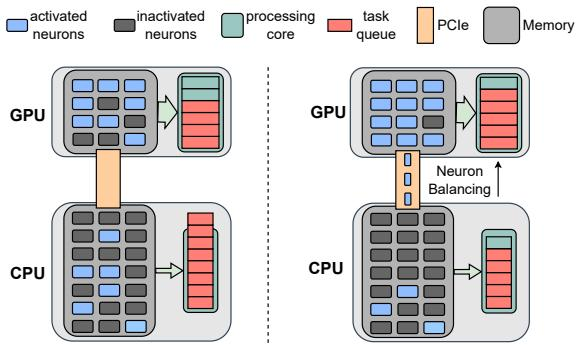  
Figure 1: Two strategies for leveraging activation sparsity to compute only activated neurons (i.e., subsets of FFN weights stored in GPU or CPU memory). Left: static placement without runtime adjustment. Right: online neuron balancing with dynamic neuron transfers between the CPU and GPU.

However, the scale of modern LLMs continues to exceed the memory budgets of typical consumer hardware, making efficient on-device inference a fundamental challenge. For example, running a 13-billion-parameter model in standard FP16 precision requires more than 26 GB of VRAM—surpassing the 24 GB available even on high-end consumer GPUs such as the NVIDIA RTX 4090 [32].

To address this memory bottleneck, parameter offloading has become a widely adopted solution, wherein a portion of model weights is stored in host memory [2, 38]. In such architectures, the CPU typically performs computations on the offloaded weights, and the results are then merged with GPU-produced outputs. Frameworks such as llama.cpp [14] generally implement this using layer-wise offloading. However, because CPU computational capability is substantially weaker than that of the GPU, the CPU frequently becomes the system bottleneck, leading to increased inference latency.

Recent research provides a promising direction for alleviating this bottleneck through activation sparsity [28, 39, 43, 60]. For a given input, only a small subset of neurons— corresponding to specific rows or columns of the weight matrix—contributes to the output. These sparse activation patterns can be reliably predicted using lightweight predictors analogous to Mixture-of-Experts (MoE) gating [61]. By computing only the activated neurons, systems can substantially reduce both computation workload and memory footprint, thereby expanding the design space for hybrid inference. State-of-the-art activation-sparse inference frameworks, such as PowerInfer [41], leverage this property by statically placing frequently activated neurons on the GPU and rarely activated ones on the CPU based on offline profiling. As shown in Figure 1(left), the system computes only the neurons predicted to be active at runtime during inference.

However, static placement derived from offline profiling becomes inadequate when activation patterns shift or expand— such as during semantic drift or batch inference. These shifts cause many “cold” neurons (those residing on the CPU) to become active, turning the CPU into the dominant bottleneck. In practice, this limitation leads to early throughput saturation (e.g., at batch sizes of 4 or 8) and high variance in TPOT (ranging from 50 to 200 ms even at batch size 1), underscoring the inefficiencies of static placement in practice.

A natural solution is to shift from static placement to online neuron balancing, where neuron workloads are continuously redistributed across the GPU and CPU according to the activation patterns (see Figure 1(right)). While this approach can alleviate the CPU bottleneck, it introduces three tightly coupled system challenges: how to achieve efficient balancing with computation overlap, given that redistributing neurons across devices incurs substantial transfer latency and layerwise dependencies provide limited opportunities to hide these transfers behind computation; how to prioritize sustained neurons and avoid transient, wasteful balancing, since activation patterns may fluctuate rapidly and simply redistributing each newly activated neuron risks repeatedly moving shortlived neurons, wasting scarce bandwidth and evicting more valuable ones; and how to adaptively control balancing intensity under runtime resource constraints, as aggressive balancing reduces CPU pressure but risks saturating the I/O path, whereas conservative balancing preserves bandwidth but leaves the CPU overloaded. These challenges make effective online neuron balancing fundamentally difficult.

To address these challenges, we propose KAIROX, an adaptive GPU–CPU hybrid LLM inference system for consumergrade hardware. KAIROX enables efficient and adaptive online neuron balancing through three key designs:

Live Pipeline. The primary obstacle for dynamic redistribution is I/O latency: moving activated neurons from host memory to the GPU introduces delays, and strict layer-wise dependencies constrain opportunities for overlapping these transfers with computation. KAIROX mitigates this by predicting the activation pattern of layer i+1 immediately after the Attention block of layer i, allowing balancing actions to begin earlier and overlap data movement with ongoing computation. Neurons are further grouped and reordered based on co-activation patterns to improve PCIe utilization.

Locality-Aware Neuron Balancing. Even with prefetching, balancing bandwidth must be used judiciously. Activation patterns often contain short-lived spikes that trigger wasteful transfers and evict useful GPU-resident neurons. To avoid such thrashing, KAIROX leverages activation locality and introduces Temporal Activation Momentum (TAM), a lightweight policy that captures the temporal persistence of activations. TAM enables KAIROX to identify neurons with sustained utility, prioritizing their movement toward the GPU while suppressing transient ones that provide little benefit.

Adaptive Neuron Balancer. Effective online neuron balancing must reconcile CPU workload with balancing-induced I/O overhead—two competing bottlenecks during inference. KAIROX addresses this challenge through a runtime feedback mechanism that adjusts balancing intensity based on real-time resource availability. When the system becomes CPU-bound, unused I/O capacity emerges, creating an opportunity for KAIROX to migrate more computation to the GPU. Conversely, when the system becomes I/O-bound, excessive balancing saturates the transfer path; KAIROX then reduces balancing intensity to alleviate I/O pressure. This adaptive control strategy enables the system to sustain an efficient operating point under diverse runtime conditions.

Our contributions are summarized as follows:

• We design a hybrid inference pipeline that uses an adjacent predictor to relax sequential dependencies and overlap computation with data transfer, reducing exposed I/O latency during online neuron balancing.

• We propose Locality-Aware Neuron Balancing based on Temporal Activation Momentum, prioritizing sustained neurons while avoiding I/O waste on transient ones.

• We introduce an Adaptive Neuron Balancer that adjusts balancing intensity to real-time CPU and I/O availability, effectively managing the competing bottlenecks.

• We implement KAIROX on top of llama.cpp [14]. On diverse consumer-grade PCs, KAIROX improves standardcompletion throughput by up to 7.57×, 3.70×, 6.35×, and 3.76× over llama.cpp [14], PowerInfer [41], Neuralink [50], and Q-Infer [29], respectively.

## 2 Background

## 2.1 LLM Inference & Activation Sparsity

The inference of LLMs consists of two stages: prefill and decoding. In prefill, the model processes the input sequence in parallel to generate the first output token. In decoding, the model operates auto-regressively, generating one token at a time until a termination token is produced or a maximum length is reached. LLMs adopt a stack of Transformer layers [48], each composed of an attention block and a Feed-Forward Network (FFN) [3]. While attention captures contextual dependencies, the FFN—implemented via an upprojection, an optional gated projection [36], a non-linear activation, and a down-projection—performs non-linear feature transformations. FFN blocks account for approximately 70% of parameters (e.g., 66.6% in OPT-6.7B [59] and 72.4% in LLaMA-3 8B [17], excluding embeddings), and contribute roughly 60% of prefill computation and 80% of decoding computation. Consequently, FFNs constitute the primary computational and memory bottleneck in LLM inference.

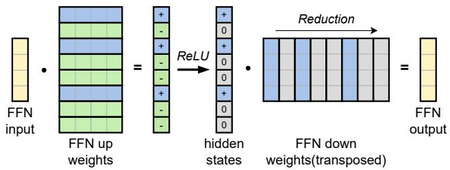  
Figure 2: Illustration of activation sparsity in the up- and downprojection layers of a ReLU FFN. Activated neurons are shown in blue for visual clarity in the example below.

Activation Sparsity. Extensive prior work [26, 39, 40, 51] shows that LLMs exhibit substantial activation sparsity, most prominently in FFN blocks and primarily induced by the nonlinear activation function (e.g., ReLU [1] or SiLU [11]). A large portion of neurons—corresponding to rows or columns of the weight matrices—produce negative or near-zero val ues after the first projection and are subsequently suppressed by the activation function. Figure 2 illustrates this sparsity pattern within an FFN block; for clarity, a standard projection (up- and down-projection) is shown, though the same behavior extends to gated variants. Recent studies reveal three key properties of activation sparsity: context specificity [28], where the set of activated neurons varies with the input and cannot be determined before inference; power-law distribution [41], where only a small subset of neurons is strongly activated while the majority remain inactive; and neuron coactivation [2], where neurons exhibit highly correlated activation patterns across architectures and datasets. Moreover, these works [2, 28, 41] show that FFN sparsity can be accurately predicted using lightweight predictors—analogous to MoE gating—enabling substantial reductions in computation and memory costs during LLM inference.

## 2.2 Resource-Constrained Inference

Deploying LLMs on edge devices (such as personal computers) has attracted increasing attention [6, 34, 57]. Compared with cloud-based solutions, local deployment offers advantages in data privacy [55], inference cost [45], and latency [20]. However, the large memory footprint of modern LLMs remains a fundamental bottleneck. For instance, a 13B model in FP16 requires at least 26 GB of memory for weights alone, exceeding the capacity of high-end consumer GPUs such as the NVIDIA RTX 4090 (24 GB) [32]. To address this constraint, recent work has explored model compression, especially quantization [22, 27], as well as system-level techniques such as offloading [18]. We categorize existing edge-inference systems by their execution strategies.

GPU-Only Inference. GPU-only frameworks primarily rely on the GPU for computation while alleviating memory pressure by offloading a portion of model weights to CPU memory or secondary storage and transferring them to the GPU on demand. Early systems such as FlexGen [38] adopt coarse-grained offloading strategies, using linear programming to schedule block-level weight swaps. While effective for high-throughput batch processing, these methods incur substantial latency for single-batch inference. In contrast, recent approaches including Deja Vu [28] and Neuralink [50] exploit activation sparsity and neuron co-activation to enable fine-grained parameter loading. By transferring only contextually relevant parameters, they significantly reduce I/O overhead and accelerate inference on memory-constrained GPUs.

Hybrid Inference. Heterogeneous frameworks leverage both GPUs and CPUs for inference. Modern CPUs support high-performance instruction sets (e.g., AVX-512, ARM NEON) that accelerate matrix operations, providing a computational resource for LLM workloads. Widely used systems such as llama.cpp [14] adopt coarse-grained layer partitioning, statically assigning selected layers to the CPU for storage and computation. This layer-wise split placement introduces synchronization barriers and often leads to GPU “bubbles”— idle periods caused by the slower execution of the CPU and the strict sequential dependencies inherent in LLMs. Empirical results from llama.cpp show that CPU computation can still account for more than 90% of total inference latency. In contrast, emerging frameworks such as PowerInfer [41] adopt fine-grained, sparsity-aware offloading based on the power-law distribution of activations. By assigning frequently activated neurons to the GPU while placing infrequently activated neurons on the CPU, these systems align computational tasks with device strengths and achieve substantial improvements in inference efficiency.

## 3 Motivation

While state-of-the-art activation-sparse inference methods [41] have significantly improved efficiency over traditional coarse-grained approaches, they remain constrained by inherent hardware bottlenecks. This motivates the need for a more adaptive execution model under resource constraints.

## 3.1 Bottlenecks in Resource-Constrained Inference

We analyze representative fine-grained approaches and identify two dominant bottlenecks: I/O latency in GPU-only systems and excessive CPU overhead in heterogeneous systems.

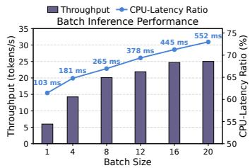

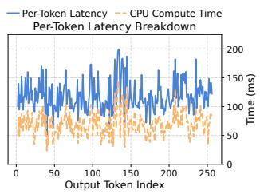

Figure 3: Illustration of the CPU bottleneck under static placement in heterogeneous systems. Left: throughput and CPU computation time under increasing batch size. Right: TPOT and CPU computation time across a 256-token decoding sequence at batch size 1. Both experiments were conducted on an NVIDIA RTX 3080 Ti.  
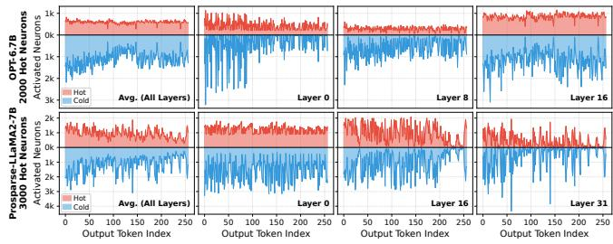  
Figure 4: Examples of hot- and cold-neuron activation counts across output tokens under semantic drift, shown for OPT-6.7B and Prosparse-LLaMA2-7B at multiple layers.

Massive I/O Latency in GPU-Only Systems. In GPUonly systems with on-demand weight fetching (e.g., offloading FFN blocks to system memory), I/O latency becomes the primary bottleneck. Because computation must wait for weight transfers to complete, substantial computational bubbles form. Prior work shows that I/O can account for over 75% of generation time in sparsity-based systems such as LLM-Flash [2]. Although Neuralink improves access locality, the latency remains fundamentally constrained by physical bandwidth. As a result, prolonged I/O stalls severely underutilize the GPU, while modern CPUs remain largely idle, making this approach inefficient under resource constraints.

CPU Bottleneck of Static Weight Partitioning Systems. To improve hardware utilization, modern heterogeneous systems (e.g., PowerInfer [41]) statically assign neurons to either the CPU or GPU. The GPU executes frequently activated hot neurons, while the CPU handles rarely activated cold neurons. Although this eliminates runtime weight loading and reduces I/O overhead, it assumes that the hot–cold neuron split remains stable during inference. In practice, activation patterns drift, causing the workload to shift toward the slower CPU and resulting in significant performance degradation.

1) Workload Expansion in Batch Inference: In batch scenarios, concurrent prompts scale the workload linearly, overwhelming the CPU’s limited parallelism. Crucially, while the CPU saturates, the GPU retains ample parallel headroom that could absorb this excess load, yet static placement fails to utilize it. When batch size grows from 1 to 20, throughput rises only modestly, while CPU latency increases sharply from 102.8 ms to 551.7 ms. This static allocation turns the CPU into a dominant bottleneck, diminishing sparsity benefits and severely impacting tasks like speculative decoding that demand fast batch verification.

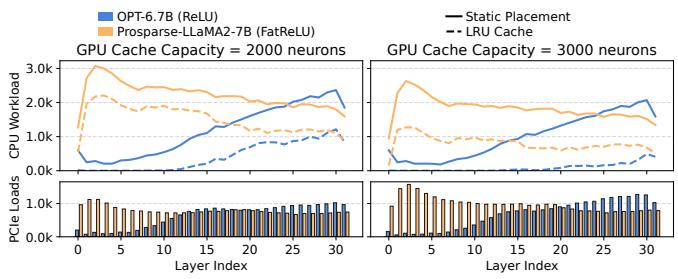  
Figure 5: CPU workload and PCIe loads under static placement and an LRU neuron-balancing policy, shown for two sparse models under GPU cache capacities of 2,000 and 3,000 neurons. Solid lines denote static placement, and dashed lines denote the LRU policy.

2) Activation Fluctuation in Generation: Activation sparsity also fluctuates substantially during token-by-token generation. Small shifts in semantic context can increase activations among cold neurons on the CPU, forcing the CPU to handle a larger portion of the computation. We quantify the semantic drift of two representative single-prompt decoding runs from two models in Figure 4. Under static placement, cold neuron activations fluctuate substantially per token (e.g., cold activations shift between adjacent tokens from nearly zero to over 3,000 in Layer 0 of OPT-6.7B). Across these representative runs, cold-neuron activations repeatedly form bursty intervals rather than isolated spikes, confirming that semantic drift is a persistent runtime phenomenon even at batch size 1. Although fluctuations also occur on the GPU side, its superior parallelism absorbs them with negligible overhead. In contrast, the same fluctuations saturate CPU workload due to its limited parallel compute capacity. As shown in Figure 3(right), TPOT varies from roughly 50 ms to nearly 200 ms within a single 256-token sequence, and CPU compute time ranges from around 30 ms to nearly 150 ms. These fluctuations persist throughout the sequence, revealing static placement’s inability to follow dynamic activation patterns and resulting in unstable latency and degraded user experience.

## 3.2 A Strawman for Online Neuron Balancing

Both failures stem from the same root cause: static neuron placement. Once runtime activation patterns diverge from the offline profile, many computations are incorrectly routed to the CPU in most cases, creating unnecessary workload imbalance. A natural remedy is to migrate these computations back to the GPU. Our preliminary results (shown in Figure 5) show that even a simple LRU-style reload policy—loading activated neurons from the CPU to the GPU and evicting the least recently used ones—substantially reduces CPU workload with only modest PCIe overhead. For example, provisioning a small GPU cache of just 2,000–3,000 neurons yields a notable decrease in CPU computation while keeping data transfers manageable. These observations demonstrate that limited, targeted neuron reloading can effectively trade I/O for reduced CPU computation, motivating a dynamic hybrid inference that we term online neuron balancing.

To make this idea concrete, we present a strawman system— a minimal yet illustrative design that operationalizes online neuron balancing. The strawman integrates frequencyaware static placement with simple runtime I/O control. During initialization, offline profiling identifies frequently acti vated neurons to pre-place on the GPU. During inference, an on-demand balancing policy detects activated cold neurons and migrates as many as the GPU cache can store, using a lightweight eviction policy (e.g., LRU). As shown in Figure 5, dynamically balancing even fewer than 1,000 neurons— despite each layer containing 11,008 neurons in Prosparse-LLaMA2-7B or 16,384 in OPT-6.7B—can substantially reduce CPU workload and stabilize execution efficiency. This strawman serves as a conceptual baseline that illustrates both the feasibility and the benefits of dynamic neuron placement.

Although this strawman theoretically overcomes the limitations of static placement by adapting to activation changes, it also reveals how the three high-level challenges of online neuron balancing manifest concretely in practice:

Challenge 1: How to achieve efficient balancing with computation overlap. Simply redistributing neurons at runtime introduces substantial transfer latency, but the strict sequential dependencies in LLM inference leave limited opportunity to hide this latency. In particular, the sparsity predictor depends on the output of the attention block to determine the activation pattern for the subsequent FFN block. As a result, the system must wait for transfers to complete after prediction, placing non-overlapped I/O directly on the pipeline. Meanwhile, integrating this dynamic balancing into a heterogeneous system—where CPU and GPU already execute concurrently—further increases pipeline complexity.

Challenge 2: How to prioritize sustained neurons and avoid transient, wasteful balancing. As shown in our analysis of activation fluctuation, activation patterns can shift rapidly within short context windows. A simple balancing policy risks repeatedly transferring cold neurons that are ac tivated only momentarily (“one-hit wonders”), resulting in wasted I/O: scarce bandwidth is spent on neurons with minimal long-term utility, potentially evicting more valuable neurons already resident in the GPU cache.

Challenge 3: How to adaptively control balancing intensity under runtime resource constraints. I/O latency and CPU computation present fundamentally opposing bottlenecks: reducing CPU workload by balancing more neurons to the GPU increases I/O cost, while minimizing I/O leaves more computation to the slower CPU. Further, due to continuous fluctuations in resource availability and the dynamic I/O demand induced by the balancing policy, the optimal operating point shifts under different runtime conditions.

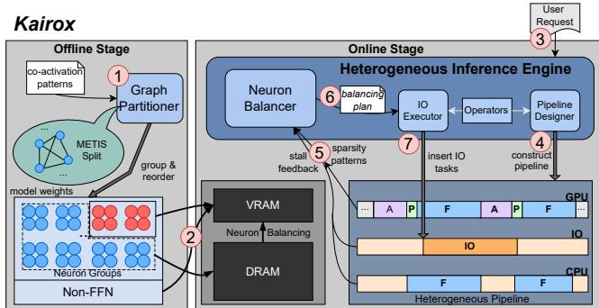  
Figure 6: System overview of KAIROX.

Table 1: Summary of key notations and hyperparameters.  
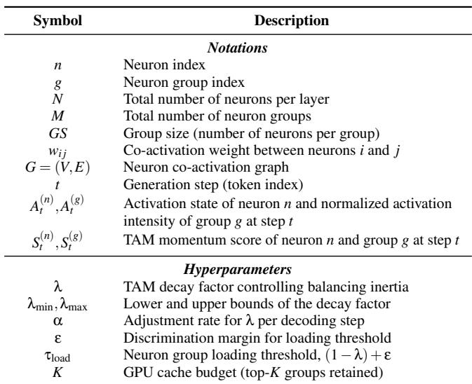

## 4 System Overview

To address the aforementioned challenges, we propose KAIROX, an adaptive GPU–CPU hybrid inference system. As illustrated in Figure 6, the system workflow operates in two stages. In the Offline Stage, the Graph Partitioner profiles co-activation patterns to group and reorder neurons into optimized clusters (⃝1 ); we detail this process in subsection 5.2. These neuron groups are then initially distributed between VRAM and DRAM (⃝2 ) to establish an efficient memory layout for runtime access.

The Online Stage is triggered by a user request (⃝3 ). Upon initialization, the Pipeline Designer constructs a heterogeneous pipeline (⃝4 ), as described in section 5. As inference proceeds, the engine executes an iterative optimization cycle: the Neuron Balancer continuously analyzes sparsity patterns and pipeline stall feedback (⃝5 ) to synthesize real-time balancing plans (⃝6 ) using the policies in section 6 and section 7. Acting on these directives, the IO Executor inserts asynchronous I/O tasks (⃝7 ), driving a continuous loop that adapts resource allocation and overlaps data transfer with computation for each subsequent token. Table 1 lists the notation and hyperparameters.

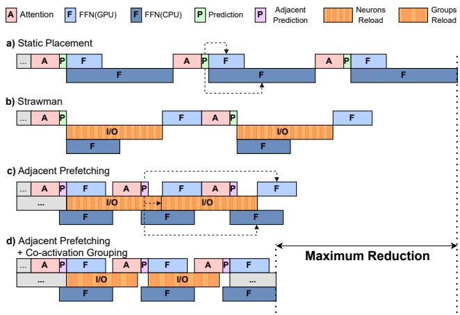  
Figure 7: Comparison of heterogeneous pipelines for leveraging activation sparsity: (a) static placement; (b) the strawman design; (c) adjacent prediction; and (d) co-activation grouping & reordering.

## 5 Live Pipeline

We begin by constructing a basic heterogeneous pipeline similar to static neuron placement, where the CPU and GPU perform sparse computation concurrently. During online inference, the hybrid inference engine interprets computation tasks as a dependency graph and partitions them into backendspecific subgraphs. These dependencies, registered by the pipeline designer, form a Directed Acyclic Graph (DAG) that enables potential overlap across backends. A representative example is split-FFN execution: once the sparsity pattern is determined, the engine launches sparse kernels on both CPU and GPU to process their respective activated neurons, after which CPU outputs are merged back into the GPU, as illustrated in Figure 7(a).

In the strawman system, balancing-related I/O occurs strictly between sparsity prediction and FFN computation, as shown in Figure 7(b). This sequential dependency creates a substantial pipeline bubble, stalling computation on both CPU and GPU. To reduce this exposed I/O latency, we optimize balancing along two complementary dimensions: (1) hiding transfer latency via adjacent prediction and prefetching, and (2) improving bandwidth utilization through neuron co-activation grouping and reordering for transfer efficiency.

## 5.1 Adjacent Prediction

To hide I/O latency, KAIROX introduces adjacent prediction. This design is motivated by the empirical observation that intermediate hidden states in consecutive layers exhibit high cosine similarity, a stability that arises from the residual con nections in Transformer blocks. Experiments show that the cosine similarity between adjacent layers reaches approximately 98%, indicating that the previous layer’s hidden state can reliably predict the next layer’s activation pattern with minimal accuracy loss. As illustrated in Figure 7(c), the predictor for layer i+1 uses the output of the attention block at layer i to forecast the activation sparsity pattern of the FFN block at layer i+1. This adjacent prediction creates a time window—spanning FFN layer i and the attention block of layer i+1—during which the I/O transfer for layer i+1 can be initiated without introducing stalls. We adopt a one-layer lookahead rather than a multi-layer lookahead because the computation and transfer durations for an individual layer are comparable. A multi-layer lookahead would yield redundant overlapping windows and significant accuracy degradation as similarity drops over larger layer gaps (e.g., 85% across two layers and 65% across four), while also introducing unnecessary complexity in boundary case management, as mentioned in the next paragraph. Therefore, single-layer adjacent prediction optimally balances overlapping efficiency with predictor accuracy, significantly reducing exposed I/O latency.

Table 2: PCIe bandwidth (GB/s) under different hidden dimensions and neuron group sizes. The PCIe 3.0 and PCIe 4.0 results correspond to models with hidden sizes of 4096 (typical for 7B model) and 5120 (typical for 13B model), respectively.  
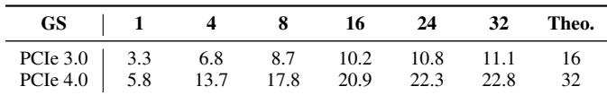

A special case arises at the first layer (Layer 0), which lacks a preceding layer for adjacent prediction. To avoid a pipeline stall at the beginning of each decoding step, we preload the required neurons during the CPU-side token sampling phase. This design leverages Activation Locality (section 6), which indicates that activation patterns remain stable across adjacent tokens. While processing the final layer for token t, we use the predicted activation pattern of Layer 0 for token t to identify and prefetch the neurons needed for Layer 0 of token t+1. By overlapping this prefetching with the final FFN computation and sampling of the current token, we eliminate the otherwise unavoidable stall at the start of the next decoding step.

A further advantage of adjacent prediction is its ability to overlap the prediction stage with CPU computation. In Figure 7(a), sparsity prediction is strictly serialized before sparse FFN execution and accounts for roughly 10% of total GPU computation time. In Figure 7(c), however, this overhead is hidden behind concurrent CPU workloads, rendering its contribution to end-to-end latency negligible.

## 5.2 Co-activation Grouping & Reordering

In LLM architectures, a single neuron occupies only a small memory footprint (e.g., ≈ 8 KB for a hidden size of 4096). Prior studies show that transferring weights at such fine granularity leads to severe underutilization of PCIe bandwidth due to small, fragmented reads and a large number of I/O operations. As shown in Table 2, single-neuron transfers achieve only 21% and 18% of theoretical peak bandwidth on PCIe 3.0 and PCIe 4.0, respectively. To overcome this limitation, we adopt a graph-partitioning strategy that clusters neurons with

high co-activation probability.

Problem Formulation. We formally model the neurongrouping task as a weighted graph partitioning problem with a capacity constraint. Let G = (V,E) be a dense undirected graph where V denotes a set of N neurons. Each edge (i, j) is associated with a weight wi j ≥ 0, representing the coactivation frequency (or correlation strength) between neurons i and j. Given a fixed group size GS (with GS dividing N), the objective is to partition the neurons into M = N/GS disjoint groups of size GS. The goal is to maximize the total intragroup edge weight, ensuring that neurons frequently activated together are collocated and thus transferred as a unit. For descriptive purposes, we express this objective as the following binary linear programming for the grouping problem:

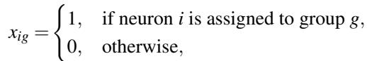

(1)

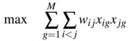

(2)

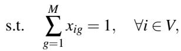

(3)

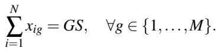

(4)

This formulation corresponds to a variant of the graph partitioning problem, which is known to be NP-hard. Consequently, in the offline phase, we collect activation statistics to construct the weight matrix W and employ the METIS graphpartitioning tool [16] to efficiently approximate the optimal grouping strategy. In practice, this end-to-end grouping and reordering requires less than 10 minutes for a single layer.

Granularity Trade-offs. The group size GS serves as a critical hyperparameter. Larger groups improve bandwidth saturation by enabling more sequential PCIe transfers, but they introduce over-fetching because an entire group must be loaded even when only a subset of its neurons is activated. Conversely, smaller groups provide higher data efficiency but reduce PCIe utilization. We analyze the choice of GS in section 8. Furthermore, the mismatch between neuron-level sparsity prediction and coarse-grained group-level transfers necessitates a group-granularity scoring policy (section 6) to determine which groups to load. This optimized grouping strategy effectively reduces I/O latency (see Figure 7(d)) and mitigates pipeline stalls.

## 6 Locality-Aware Neuron Balancing

The efficacy of dynamic neuron balancing depends on a policy that minimizes thrashing while navigating the trade-off between I/O latency and CPU computation.

To design an effective balancing policy, we first conduct an empirical analysis of neuron activation traces. Although our system ultimately operates at the group level (as described in subsection 5.2), we present the analysis at the neuron granularity for clarity. We collected more than 400,000 activation sequences from multiple models across diverse datasets, with each sequence comprising 256 generation steps.

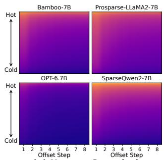

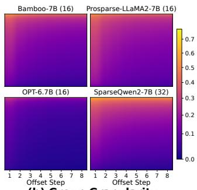  
(a) Neuron Granularity  
(b) Group Granularity  
Figure 8: Heatmap of conditional reactivation probability for neuron and group granularity: (a) neuron granularity and (b) group granularity. The x-axis denotes the decoding-step offset δ (1 to 8 steps). The y-axis shows neuron or group indices sorted by activation frequency (hot to cold). The color intensity visualizes the conditional reactivation probability.

We formally define the event A (n) as the activation of neuron n at generation step t. To characterize the temporal recurrence of activations, we compute the conditional probability PA(n) t+δ n is reactivated at a temporal offset of δ steps after activation at step t. Figure 8 presents a heatmap visualizing this probability distribution of four representative sparse models. The horizontal axis denotes the time lag δ from 1 to 8, while the vertical axis lists neuron indices sorted by their global activation frequency in descending order.

Our analysis reveals an empirical observation of activation dynamics: a currently active neuron exhibits a high probability of being reactivated within the next few steps. This indicates that activations form continuous temporal clusters rather than isolated random events. These findings demonstrate the principle of Activation Locality: once a neuron is activated, it is highly likely to remain active for a subsequent sequence of tokens before becoming inactive again. We refer to this duration as the Activation Window. The window length varies substantially; although reactivation probability generally decreases with increasing δ, the decay rate is inversely correlated with global activation frequency. In particular, “cold” neurons (the bottom 70%) exhibit rapid decay, with their reactivation probability falling below 0.2 when δ > 2.

Standard cache-inspired policies fail to adapt to these Activation Locality patterns. Least Recently Used (LRU) is overly sensitive to transient noise. As shown in our analysis, “cold” neurons often manifest as “one-hit wonders” with extremely short activation windows. Under LRU, a single incidental activation can promote a cold neuron to the most recently used position, potentially evicting a hot neuron that is only briefly silent, leading to pollution and thrashing. Conversely, Least Frequently Used (LFU) suffers from history lag: it aggregates counts across the entire generation history, making it slow to respond to semantic transitions. When the context shifts, LFU tends to retain neurons associated with the previous context, failing to track the emergence of newly important neurons.

To reconcile long-term activation frequency with shortterm recency effects, we introduce Temporal Activation Momentum (TAM), a lightweight metric that quantifies the instantaneous “temperature” of a neuron. Inspired by the Hawkes process [23] in temporal point process modeling, TAM treats neuron importance not as a static count but as a time-decaying of neuron n at step t is updated recursively as follows:

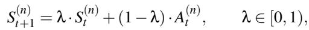

(5)

TAM captures the Activation Window pattern observed in our analysis: when a neuron activates persistently, S(n) increases rapidly, raising its balancing priority and promoting its retention on the GPU. When the semantic context shifts and the neuron becomes inactive, S(n) decays exponentially, allowing the system to phase out outdated neurons smoothly.

However, directly relying on TAM may inadvertently promote “one-hit wonders”—cold neurons that activate once in isolation without forming a sustained Activation Window. To avoid unnecessary I/O, we impose a threshold constraint and, at the neuron level, treat only those neurons whose momentum scores exceed τ = (1−λ)+ε as balancing candidates. The term 1 − λ corresponds to the theoretical momentum acquired ≈ 0) after a single isolated activation; thus, scores near this value typically indicate one-hit wonders. The hyperparameter ε provides an additional discrimination margin. By setting τ slightly above this baseline, isolated spikes are prevented from triggering balancing actions. The same thresholding principle is later applied to group-level scores in lines 10–15 of Algorithm 1.

Figure 8(b) shows that the principle of Activation Locality extends naturally to the co-activation level. To align with our grouping strategy (subsection 5.2), we generalize TAM from individual neurons to neuron groups by replacing the binary activation state A(n)t w ith a normalized intra-group activation provides a unified scoring function for memory management. In practice, the system retains the top-K scoring groups in the GPU, where K is determined by the available GPU memory budget.

## 7 Adaptive Neuron Balancer

To address Challenge 3—the coupled bottleneck arising from the inverse relationship between I/O latency and CPU workload—we observe that static balancing policies are fundamentally insufficient. An aggressive policy reduces CPU workload but risks saturating PCIe bandwidth (I/O-bound),

Algorithm 1 Adaptive online neuron balancing.   
Require: Group scores {S(g)t }, neuron activations {A(n)t }, current   
decay λ, adjustment rate α, margin ε, budget K, cache Ct   
Phase 1: Adaptive Balancing-Intensity Control   
1: Feedback ← GETSYSTEMBOTTLENECK()   
2: if Feedback is IO\_BOUND then   
3: λ ← min(λ · (1 + α), λmax) ▷ Increase inertia   
4: else if Feedback is CPU\_BOUND then   
5: λ ← max(λ · (1 − α), λmin) ▷ Decrease inertia   
6: end if   
Phase 2: Momentum Update & Group Filtering   
7: A(g) ← ACTIVATIONGROUPING({A(n)}) ▷ Map & Normalize   
8: τ ← (1 − λ) + ε   
9: Ccand ← 0/   
10: for each neuron group g do   
11: ← λ · S(g) + (1 − λ) · A(g) ▷ TAM update   
12: St+1 > τload then   
13: Ccand ← Ccand ∪ {g} ▷ Filter “One-Hit Wonders”   
14: end if   
15: end for   
(g)   
16: Ct+1 ← TOPK(Ccand,K) based on scores St+   
17: Gload ← Ct+1 \ Ct ▷ Groups selected for loading   
18: Gevict ← Ct \ Ct+1 ▷ Groups selected for eviction   
19: ISSUEASYNCIO(Gevict, Gload)   
20: return Ct+1,{S(g)t+1},λ   
while a conservative policy alleviates I/O pressure but leaves   
substantial computation to the CPU (CPU-bound). Because   
the optimal balance varies with hardware characteristics and

To overcome this limitation, we extend TAM into a feedback-driven balancing policy by incorporating a runtime control loop. In this design, the decay factor λ introduced in section 6 is no longer a fixed hyperparameter, but a dynamic control variable that modulates the system’s balancing intensity according to real-time resource conditions.

In our momentum formulation, λ governs the inertia of the score updates and, consequently, the turnover rate of the GPU-resident neuron set. A high λ introduces strong inertia by emphasizing historical activations, making it difficult for cold neurons to accumulate sufficient momentum to exceed the loading threshold. This yields a conservative balancing policy that suppresses reload intensity. In contrast, a low λ reduces inertia, allowing momentum scores to respond quickly to recent activations. This heightened sensitivity increases the mismatch between currently high-scoring groups and the GPU-resident set, triggering more aggressive balancing actions that reduce CPU workload at the cost of increased I/O overhead. During inference, the hybrid inference engine monitors pipeline stalls to identify the dominant bottleneck. We incorporate a negative feedback loop (formalized in Phase 1 of Algorithm 1) to dynamically adjust the value of λ:

• I/O-Bound: If stalls are primarily caused by I/O delays, the system detects excessive data-transfer pressure. In response, it increases λ by a factor of (1 + α), strengthen ing momentum inertia and enforcing a more conservative balancing policy to reduce overall I/O load.

• CPU-Bound: if stalls originate from CPU computation, the system infers that the CPU is overloaded. It then decreases λ by a factor of (1 − α), assigning greater weight to recent activations relative to historical momentum. This increases balancing intensity, reducing CPU workload by exploiting available I/O overlap.

We initialize λ to a moderate value (e.g., 0.5). Within the first few generation steps, the feedback-driven mechanism quickly converges λ toward—or maintains it near—an equilibrium that balances the two coupled bottlenecks. Because a static optimal configuration rarely exists under varying input contexts, this dynamic tuning enables KAIROX to adapt continuously to runtime fluctuations, including semantic shifts and changes in available hardware resources.

The complete balancing policy is formalized in Algorithm 1. It integrates Feedback-Driven Tuning and Temporal Activation Momentum within each layer’s decode step once activation sparsity is predicted, automatically reconciling hardware constraints with Activation Locality.

The resulting balancing decisions are efficient (O(1)) and integrate seamlessly into the runtime system. We implement the updates with customized CUDA kernels (section 8), keeping end-to-end overhead negligible.

## 8 Implementation

We implemented KAIROX on top of llama.cpp, adding approximately 5,700 lines of C++ and CUDA code. In the offline stage, we collected over 400,000 activation patterns from the C4 dataset [35]. These patterns were used to train the adjacent predictors and to construct an undirected weighted graph for neuron grouping and reordering, which was subsequently partitioned using the METIS [16] graph-partitioning tool.

Priority-Aware Stream Management. To coordinate the heterogeneous pipeline, KAIROX employs three primary CUDA streams: a computation stream within the inference engine for kernel executions, and two I/O streams managed by an internal I/O Executor—one critical I/O stream for essential transfers (e.g., merging FFN results) and one reload stream for neuron-loading tasks. An asynchronous thread in the I/O Executor maintains a task queue for reload operations. When a critical I/O task arrives, the executor preempts queued reload tasks, allowing essential transfers to bypass the queue and execute immediately, thereby preventing pipeline stalls and ensuring stable end-to-end latency.

Customized Kernels. We developed optimized sparse CUDA and AVX kernels for activation-sparse inference. The feedback-driven TAM policy uses custom CUDA kernels that fuse XOR and AND operations for efficient group-level activation updates and set-difference computations. We also integrate a CUDA argsort kernel to rank neuron groups by momentum score. Because high-performance argsort is most efficient on inputs below 1024 elements, we constrain the neuron group count M to this threshold, keeping balancing latency negligible while integrating seamlessly with the online neuron balancing pipeline.

## 9 Evaluation

## 9.1 Experiment Setup

Hardware. We conduct all experiments on two representative consumer-grade PC configurations.

• PC-Low: NVIDIA RTX 3080 Ti (12 GB, 136 TFLOPs), Intel Xeon® E5-2680 v4 with execution capped at 12 threads, 64 GB host memory, and PCIe 3.0 (16 GB/s).

• PC-High: NVIDIA RTX 4090 (24 GB, 330 TFLOPs), AMD EPYC 7542 with execution capped at 16 threads, 128 GB host memory, and PCIe 4.0 (32 GB/s).

Models and Workloads. We evaluate a range of sparse LLMs, including OPT-6.7B/13B, OPT-30B-Q8/Q4, and OPT-66B-Q4 (ReLU); Prosparse-LLaMA2-7B/13B (derived from LLaMA-2; FatReLU); Bamboo-7B (derived from Mistral; dReLU); SparseQwen2-7B (derived from Qwen2; dReLU); and ReLUFalcon-40B-Q8 (derived from Falcon; ReLU) [39, 42, 43, 47, 59]. The suffixes “Q8” and “Q4” denote INT8 and INT4 quantization, respectively. All models are tested using a fixed subset of real-world user prompts randomly sampled from ShareGPT [46], ensuring consistent, diverse, and reproducible workloads. Additionally, we reuse the dense GEMM kernels from llama.cpp for the prefill stage, as the dense kernels are better optimized for large-batch computation.

Baselines. We compare KAIROX with four representative systems: llama.cpp [14], PowerInfer [41], Neuralink [50], and Q-Infer [29]. Llama.cpp serves as a widely used local inference baseline. PowerInfer is a state-of-the-art sparsity-aware framework; because it relies on an older version of llama.cpp, we port it to the same updated backend used by KAIROX for a fair comparison. Neuralink is an on-device activationsparse system that eagerly loads all activated neurons onto the accelerators for computation. Because it is designed for smartphones and is not open source, we reimplement its core mechanism on top of KAIROX for evaluation. Q-Infer is a GPU–CPU hybrid inference system designed for high-end GPUs and large-batch LLM serving. Since it also uses runtime reloading, we evaluate it under the same setting as KAIROX for a direct comparison under identical constraints.

## 9.2 End-to-End Performance

We first evaluate throughput using a generation batch size of 1, reflecting a typical usage scenario for local LLM deployments. For consistency, we cap the maximum output length at 512 tokens and the maximum context size at 1024 tokens.

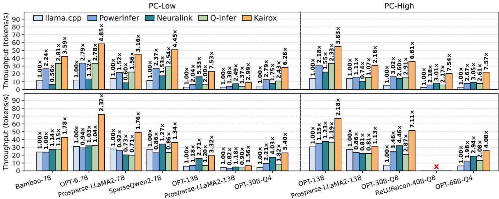  
Figure 9: End-to-end performance of decoding. Top: standard decoding. Bottom: speculative decoding.

As shown in Figure 9, KAIROX consistently outperforms all baselines across models and hardware configurations. For standard completion, the speedup over llama.cpp reaches up to 7.53× on PC-Low and 7.57× on PC-High, with geomean gains of 4.45× and 5.00× across models, respectively. Relative to the sparse baselines, the geomean gains range from 2.08× to 3.06× on PC-Low and from 2.36× to 2.58× on PC-High, while the corresponding best-case gains reach 3.70×, 6.35×, and 3.76× on PC-Low and 3.46×, 2.91×, and 3.48× on PC-High over PowerInfer, Neuralink, and Q-Infer, respectively. The gains are largest on OPT models, whose stronger sparsity and shorter cold-neuron activation windows—reflected in the darker regions of Figure 8—allow TAM to filter transient one-hit-wonder activations more effectively. As a result, the GPU cache is reserved for neurons with genuinely long activation windows. Neuralink’s relative performance ranges from near parity to multiple-fold gains because it is sensitive to cache hit rate, per-step activation volume, and GPU cache size. When the cache is large, it reloads a larger portion of activated neurons to make full use of the cache, introducing substantial I/O stalls (e.g., Bamboo-7B on PC-Low and Prosparse-LLaMA2-13B on PC-High). Q-Infer, despite using rebalancing, does not outperform PowerInfer in our setting. Because it is designed for large-batch serving, it focuses on current-round activations and may load shortlived cold neurons while missing persistently activated ones, leaving the system CPU-bound with extra scheduling overhead. By contrast, KAIROX leverages the activation locality property described in section 6 to ensure that high-value neuron groups consistently dominate the GPU cache, effectively reducing CPU workload and wasteful transfers.

To evaluate throughput scalability at higher batch sizes, we test Speculative Decoding—a widely used edge-acceleration technique in which a draft model proposes candidate tokens that are verified in parallel. All evaluations use 5 draft tokens, and ReLUFalcon-40B-Q8 is excluded because no compatible draft model is available. While we faithfully report cases where low acceptance rates reduce absolute gains, our analysis focuses on relative batch-processing efficiency against baseline systems. Under this setting, KAIROX continues to outperform all baselines, achieving geomean speedups of 2.23× and 2.91× over llama.cpp on PC-Low and PC-High, respectively. Relative to the sparse baselines, the geomean gains range from 1.53× to 2.11× on PC-Low and from 1.53× to 1.88× on PC-High. In this setting, llama.cpp occasionally outperforms PowerInfer and Neuralink because dense batched GEMMs can surpass sparse kernels when irregular memory access and index overhead outweigh sparsity benefits. Larger batch sizes also increase CPU workload, exposing bottlenecks in static systems. Neuralink can outperform other reloading-based baselines in some cases because its aggressive reloading absorbs part of this additional CPU workload. By contrast, Q-Infer still underperforms PowerInfer in most cases, as speculative-decoding batch sizes remain too small for its policy to reliably identify and retain high-value neurons. Nevertheless, KAIROX remains consistently superior; for example, on PC-Low with OPT-30B-Q4, it achieves speedups of 5.40×, 2.44×, 1.34×, and 2.97× over llama.cpp, PowerInfer, Neuralink, and Q-Infer, respectively.

## 9.3 Performance Analysis

We further examine the factors contributing to KAIROX’s performance advantages over baseline systems.

Effectiveness of Adaptive Neuron Balancer. First, we compare CPU computation burden (measured by CPU latency), I/O pressure (measured by reload latency), and overall throughput under three balancing policies: a simple Top-K strategy that reloads the most activated neuron groups, a TAM scoring policy with a fixed λ, and TAM-T, i.e., TAM with feedback-driven tuning, as shown in Figure 10.

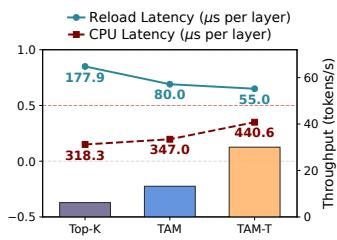

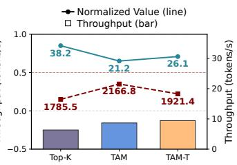

Figure 10: Comparison of CPU latency, I/O latency, and throughput under three reload policies. Left: Bamboo-7B on PC-Low. Right: Prosparse-LLaMA2-13B on PC-Low. CPU latency and reload overhead are normalized.  
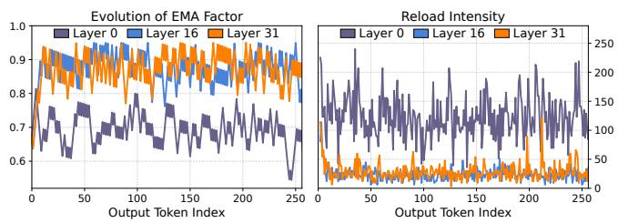  
Figure 11: Evolution of the decay factor λ and the corresponding reload intensity, sampled from Bamboo-7B on PC-Low. Left: decay factor λ. Right: number of reload I/O tasks per step.

Under the Top-K policy, large numbers of cold neuron groups—isolated “one-hit wonders”—are indiscriminately transferred to the GPU. Although this approach nominally reduces CPU computation, the excessive reload latency induces severe stalls that negate any potential gains. Introducing a static TAM policy significantly filters out such one-hit wonders, reducing reload latency—the primary bottleneck— by approximately 1.8× to 2.2× and substantially improving throughput. Finally, the TAM-T policy dynamically navigates the inverse trade-off between I/O latency and CPU computation. In I/O-bound scenarios (e.g., Bamboo-7B on the PC-Low), the policy detects I/O-induced stalls and enforces a more conservative reloading intensity. Conversely, in CPU-bound scenarios (e.g., Prosparse-LLaMA2-13B on the PC-Low), it increases reloading intensity to alleviate CPU workload, thereby optimizing overall throughput.

Second, Figure 11 shows how the evolution of the decay factor λ regulates reloading intensity via the decoding process. Immediately after initialization, the balancer identifies the dominant bottleneck and converges toward a stable equilibrium. For example, during steps 1–7 at layer 31, λ increases monotonically, indicating an I/O-bound state that necessitates a conservative balancing. This adjustment rapidly reduces I/O volume and restores system harmony. Throughout generation, λ continues to adapt dynamically to real-time workload fluctuations. Distinct micro-oscillations emerge around specific thresholds—most notably during steps 65–85 at layer 0 and steps 130–150 at layer 16 & 31—signaling that the system has located a temporary optimal point where neuron transfers and CPU computation are effectively balanced. At layers 16 & 31, λ stabilizes around 0.85, reflecting a conservative balancing strategy. As shown in Figure 11(right), this corresponds to consistently low I/O intensity, remaining below 75 reloads per step. In contrast, the lower λ value observed at layer 0 triggers a more aggressive reloading policy, resulting in substantially higher I/O volume per decoding step.

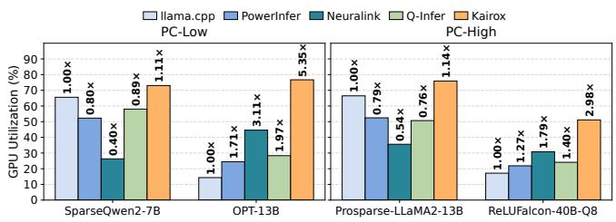

Figure 12: GPU utilization across baselines and KAIROX for representative models on PC-Low and PC-High.  
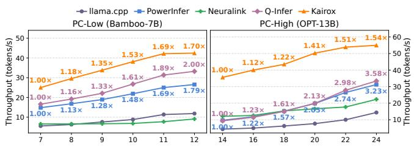  
Figure 13: Throughput under varying GPU memory budgets. Left: PC-Low with Bamboo-7B. Right: PC-High with OPT-13B.

GPU Utilization. We use NVIDIA Nsight Systems [31] to measure GPU utilization, a key indicator of pipeline efficiency and hardware stalls. As shown in Figure 12, KAIROX consistently outperforms all baselines, achieving up to 5.35× and 2.98× higher utilization on PC-Low and PC-High, respectively. This improvement reflects a more efficient execution pipeline in which the GPU remains active rather than idling. In contrast, llama.cpp exhibits pronounced utilization fluctuations determined by the degree of layer offloading. When most layers are offloaded to the GPU (e.g., Prosparse-LLaMA2- 13B on PC-High), consistent kernel execution raises utilization to 68%; when memory constraints limit offloading (e.g., OPT-13B on PC-Low), utilization falls below 20%. Although activation-sparse inference frameworks generally outperform dense baselines in such settings, KAIROX still surpasses PowerInfer. This advantage stems from adaptive neuron balancing and a highly optimized pipeline that dynamically rebalances computation while overlapping CPU execution and I/O with GPU kernels to reduce stalls. GPU utilization is ultimately limited by residual non-overlappable I/O, cross-device synchronization, and system-level overheads such as CPU scheduling and token processing. In resource-constrained edge environments, these factors cap practical utilization at around 70% in our settings, which is already near saturation.

Performance under Various GPU Memory Budgets. Figure 13 shows that KAIROX consistently outperforms all baselines across configurations, demonstrating strong resilience under constrained GPU memory budgets. As available GPU memory shrinks, static strategies leave more workload to the CPU, creating severe performance bottlenecks. Under these tighter budgets, KAIROX maintains a throughput of around 25 tokens/s on PC-Low with only 7 GB of VRAM when running Bamboo-7B (total memory footprint of approximately 14 GB). On PC-High, KAIROX under a 14 GB budget even surpasses all baselines operating at their full 24 GB budget, highlighting the effectiveness of its adaptive balancing under tight memory constraints. Q-Infer outperforms PowerInfer on Bamboo-7B but yields only marginal gains on OPT-13B, as its reloading policy struggles to identify high-value neurons in models such as OPT that exhibit a higher proportion of one-hit-wonder activations, as shown in Figure 8.

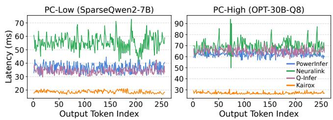  
Figure 14: Per-token TPOT latency across models and systems. Left: SparseQwen2-7B on PC-Low. Right: OPT-30B-Q8 on PC-High.

TPOT Latency Variability. We further evaluate per-token latency variability on a representative decoding sequence, as shown in Figure 14. Neuralink exhibits the most severe fluctu ations: its TPOT trace closely follows the cold activation drift in Figure 4 because its aggressive reloading policy transfers all activated neurons without filtering, causing I/O latency to rise directly with cold activation volume. PowerInfer, as a static placement system, avoids these I/O-induced spikes but still suffers from CPU-side latency fluctuations as coldneuron workload shifts across tokens. Q-Infer halts reloading once computation is required, avoiding the I/O-induced spikes seen in Neuralink. However, because it does not prioritize persistently activated neurons, high-value neurons may not be loaded before the I/O window closes, leaving the system CPU-bound with TPOT variability comparable to PowerInfer. KAIROX achieves the lowest and most stable TPOT across the sequence, demonstrating its robustness under dynamic activation patterns and different hardware configurations.

## 9.4 Ablation Study

We conduct an ablation study to quantify the contribution of each optimization component. Using llama.cpp as the primary baseline, we first observe that PowerInfer—which incorporates activation-sparse inference—achieves speedups of 1.43× and 1.61× under our evaluation settings. Building on this baseline, we incrementally integrate our dynamic optimizations in three stages and measure the resulting throughput improvements, as illustrated in Figure 15.

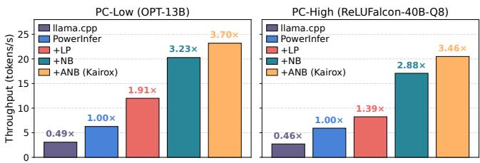  
Figure 15: Contribution of each component in KAIROX, shown as throughput across incremental system variants.

Table 3: End-to-end generation throughput (tokens/s) on non-ReLU architectures, comparing PowerInfer, Neuralink, Q-Infer and KAIROX. The suffixes “-Low” and “-High” indicate the hardware configurations used in each evaluation.  
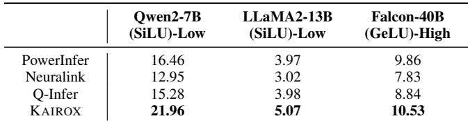

First, we apply the Live Pipeline (+LP) to maximize the overlap between I/O operations and heterogeneous execution. Second, we introduce online Neuron Balancing (+NB), initially employing a fixed decay factor (λ = 0.5). Finally, we implement feedback-driven Adaptive Neuron Balancing (+ANB) to dynamically adjust λ in response to system constraints. The inclusion of LP yields throughput gains of 1.91× and 1.39× by effectively overlapping computation and communication. Notably, +NB contributes the largest performance gain, boosting throughput to 3.32× and 2.88×; this substantial leap underscores the critical importance of runtime dynamic neuron balancing in alleviating CPU bottlenecks. Ultimately, the constraint-aware tuning provided by ANB achieves peak speedups of 3.70× and 3.46×. These results demonstrate that while pipeline overlapping provides a solid foundation, dynamic neuron reloading acts as the primary driver of performance improvement, effectively unlocking the potential of hybrid inference.

## 9.5 Non-ReLU Models Performance

While activation-sparse inference methods typically achieve substantial acceleration on models with high activation sparsity, they often struggle with non-ReLU architectures (e.g., GeLU-based models). In non-ReLU models, a larger fraction of neurons are activated at each step due to reduced sparsity. Under static split strategies such as PowerInfer, this significantly increases the CPU workload. For Neuralink, the higher activation density triggers excessive indiscriminate reloads, rendering the system I/O-bound. Unlike competing systems, KAIROX retains its performance advantage even under high activation density. As shown in Table 3, KAIROX consistently outperforms all baseline systems across mainstream non-ReLU architectures. These results demonstrate the ro-

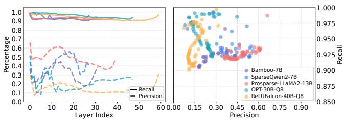  
Figure 16: Predictor recall and precision across representative sparse models. Left: recall and precision across layers. Right: the corre sponding precision–recall scatter plot for each predictor.

Table 4: Comparison of popular downstream task accuracy between the original models and their variants augmented with adjacent predictors (denoted as “model-P”).  
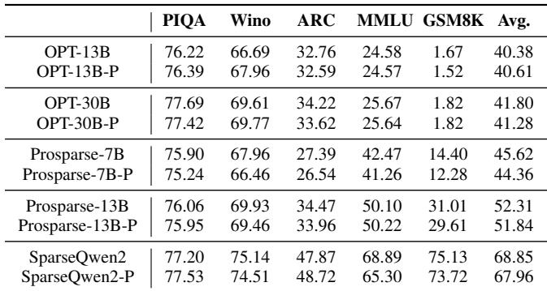  
bustness of KAIROX and highlight potential opportunities for future research into inference optimization for less sparse or non-sparse model architectures on edge devices.

## 9.6 Sparse Inference Analysis

KAIROX employs lightweight predictors to skip computation for inactive neurons. Since only predicted neurons are computed, predictor accuracy directly affects downstream performance. In this section, we analyze predictor accuracy, its impact on the sparse inference system, and the underlying mechanisms behind this behavior.

Predictor Accuracy. Figure 16 illustrates predictor metrics across different layers. The recall ratio, defined as the fraction of ground-truth activated neurons that are correctly predicted, remains consistently high at 90%–99%. The precision ratio, defined as the fraction of predicted neurons that are confirmed as active in dense computation, is relatively lower. Specifically, the predictors are recall-prioritized: we deliberately sacrifice precision to maximize recall, reducing false negatives at the cost of additional false positives. This ensures that the vast majority of truly activated neurons are captured, preserving model performance.

Predictor Overhead. In our experiments, predictor execution accounts for approximately 5–10% of per-layer inference time when measured in isolation with NVIDIA Nsight Systems. However, the effective overhead introduced by the predictors is only 1–2% of end-to-end system latency, thanks to the dedicated Live Pipeline design described in section 5. Since the predictors execute on the GPU, the execution time of the predictor for layer i+1 is completely hidden behind the concurrent CPU-side MLP computation of layer i. The only unavoidable overhead occurs at the first layer, where the predictor and MLP computations must be serialized. As a result, predictor latency scales sub-linearly with the number of model layers, and its relative contribution diminishes in larger models. This overlap opportunity also allows us to use larger predictors for better accuracy than would be practical in systems where predictor latency is a critical bottleneck.

Model Downstream Performance. To evaluate the feasibility of KAIROX’s sparse inference, we compare it against standard dense inference across several mainstream benchmarks, as shown in Table 4. The results indicate that KAIROX preserves model accuracy, with an average degradation of less than 0.5% across downstream tasks. This deviation falls within the expected statistical variance of the underlying models. Notably, our analysis shows that false negatives—neurons incorrectly classified as inactive—typically produce output magnitudes near zero. Consequently, omitting them has negligible impact on the layer’s feature representation, maintaining the correctness of sparse inference.

## 10 Related Work

GPU–CPU Hybrid Inference. GPU–CPU hybrid inference has become a common strategy for running LLMs whose weights exceed GPU memory budgets. Representative systems such as llama.cpp [14] and PowerInfer [41] rely on static partitioning across the GPU and CPU, whereas more recent work explores runtime-adaptive reloading. Q-Infer [29], for example, is positioned toward server or high-end-GPU settings, where the goal is to maximize throughput under richer resources and larger-batch workloads. Accordingly, it focuses on current-round activations when deciding which CPU-resident weights to reload. This short-horizon policy can migrate transient “one-hit-wonder” cold neurons and incur extra transfers, but such overhead can often be amortized by the substantial computation available in large-batch serving. In contrast, KAIROX targets resource-constrained consumer PCs, where exposed transfer latency and CPU bottlenecks dominate once runtime activation drift invalidates static hot/cold placement. KAIROX therefore emphasizes not only which activated CPU-resident neurons should migrate back to the GPU, but also when such migration is worthwhile and how aggressively rebalancing should proceed under shifting CPUbound and I/O-bound conditions.

Quantization. Quantization [8, 15] mitigates memory constraints by reducing model-weight precision to INT8 [9, 52], INT4 [13, 56], or even lower bit-widths [5, 49, 54] while maintaining acceptable accuracy. This technique is orthogonal to KAIROX, as we integrate INT8 and INT4 quantization support into KAIROX (section 9), enabling larger models to run on limited hardware. Although quantization substantially reduces I/O volume by decreasing data-transfer size, it leaves the computational workload largely unchanged. Consequently, quantization often shifts the dominant system bottleneck from being I/O-bound to being computation-bound.

Mixture of Experts (MoE). MoE models introduce sparsity at the expert-selection level by routing each token to a small subset of FFN experts [4,61]. This differs from KAIROX, which targets fine-grained neuron-level sparsity inside FFN computation under GPU–CPU memory constraints. KAIROX does not directly replace MoE serving systems, and our implementation does not optimize expert routing or expert-level placement. However, the two forms of sparsity are complementary: once an expert is selected, its internal FFN computation can still exhibit activation sparsity, and KAIROX’s neuron-level balancing could be applied within selected experts to reduce CPU-side work under limited GPU memory, presenting further opportunities for acceleration on edge devices [62]. Supporting full MoE inference would require integrating expert routing, expert-level placement, and neuronlevel balancing, which we leave to future work.

Mobile Inference Systems. Deploying LLMs on mobile devices, such as smartphones, represents another important direction in edge computing. Unlike the consumer PC architecture targeted by KAIROX, mobile devices typically employ Systems-on-Chip (SoC) with Unified Memory (UM). UM enables the CPU and accelerators (e.g., NPUs, TPUs) to access a shared physical memory space, effectively eliminating explicit data-transfer overhead. Recent works such as llm.npu [53] and Smallthinker [44] exploit this property to optimize on-device inference.

LLM Serving Systems. LLM serving systems are typically deployed in cloud data centers and are designed to maximize throughput under high concurrency using abundant computational resources [30]. Research in this domain primarily focuses on efficient Key–Value (KV) cache management (e.g., vLLM [21], Mooncake [33], LMCache [7]) and distributed parallelism strategies [12, 19, 58]. LoRA-based serving systems such as CaraServe [24], S-LoRA [37], and TOPPINGS [25] represent another direction, focusing on efficient multi-adapter serving. However, these systems assume the base model fits entirely within GPU memory, with CPU involvement limited to lightweight adapter management. This makes them not directly applicable to the setting targeted by KAIROX, where the base model itself must be partitioned across the GPU and CPU under constrained GPU memory.

## 11 Conclusion

We presented KAIROX, an adaptive hybrid LLM inference system for consumer-grade PCs. KAIROX builds on activation sparsity to enable efficient online neuron balancing through a live pipeline, locality-aware neuron balancing, and feedbackdriven tuning. Together, these designs navigate CPU and I/O bottlenecks, providing a foundation for low-latency hybrid LLM inference on resource-constrained hardware.

## Acknowledgements

We thank our shepherd and the anonymous reviewers for their insightful comments and suggestions. This work was supported in part by the Major Key Project of Peng Cheng Laboratory under Grant No. PCL2025A11, the National Nat ural Science Foundation of China under Grant No. 62472459, and the Guangdong S&T Program (2025B0101080001).

## References

[1] Abien Fred Agarap. Deep learning using rectified linear units (relu). arXiv preprint arXiv:1803.08375, 2018.

[2] Keivan Alizadeh, Seyed Iman Mirzadeh, Dmitry Belenko, S Khatamifard, Minsik Cho, Carlo C Del Mundo, Mohammad Rastegari, and Mehrdad Farajtabar. Llm in a flash: Efficient large language model inference with limited memory. In Proceedings of the 62nd Annual Meeting of the Association for Computational Linguistics (Volume 1: Long Papers), pages 12562–12584, 2024.

[3] George Bebis and Michael Georgiopoulos. Feedforward neural networks. Ieee Potentials, 13(4):27–31, 2002.

[4] Weilin Cai, Juyong Jiang, Fan Wang, Jing Tang, Sunghun Kim, and Jiayi Huang. A survey on mixture of experts in large language models. IEEE Transactions on Knowledge and Data Engineering, 2025.

[5] Jerry Chee, Yaohui Cai, Volodymyr Kuleshov, and Christopher M De Sa. Quip: 2-bit quantization of large language models with guarantees. Advances in Neural Information Processing Systems, 36, 2024.

[6] Hao Chen, Cong Tian, Zixuan He, Bin Yu, Yepang Liu, and Jialun Cao. Inference performance evaluation for llms on edge devices with a novel benchmarking framework and metric. arXiv preprint arXiv:2508.11269, 2025.

[7] Yihua Cheng, Yuhan Liu, Jiayi Yao, Yuwei An, Xiaokun Chen, Shaoting Feng, Yuyang Huang, Samuel Shen, Kuntai Du, and Junchen Jiang. Lmcache: An efficient kv cache layer for enterprise-scale llm inference. arXiv preprint arXiv:2510.09665, 2025.

[8] Yu Cheng, Duo Wang, Pan Zhou, and Tao Zhang. A survey of model compression and acceleration for deep neural networks. arXiv preprint arXiv:1710.09282, 2017.

[9] Tim Dettmers, Mike Lewis, Younes Belkada, and Luke Zettlemoyer. Gpt3. int8 (): 8-bit matrix multiplication for transformers at scale. Advances in Neural Informa tion Processing Systems, 35:30318–30332, 2022.

[10] Jacob Devlin, Ming-Wei Chang, Kenton Lee, and Kristina Toutanova. Bert: Pre-training of deep bidirectional transformers for language understanding. In Proceedings of the 2019 conference of the North American chapter of the association for computational linguistics: human language technologies, volume 1 (long and short papers), pages 4171–4186, 2019.

[11] Stefan Elfwing, Eiji Uchibe, and Kenji Doya. Sigmoidweighted linear units for neural network function approximation in reinforcement learning. Neural networks, 107:3–11, 2018.

[12] Zhiyuan Fang, Yuegui Huang, Zicong Hong, Yufeng Lyu, Wuhui Chen, Yue Yu, Fan Yu, and Zibin Zheng. Klotski: Efficient mixture-of-expert inference via expertaware multi-batch pipeline. In Proceedings of the 30th ACM International Conference on Architectural Support for Programming Languages and Operating Systems, Volume 2, pages 574–588, 2025.

[13] Elias Frantar, Saleh Ashkboos, Torsten Hoefler, and Dan Alistarh. Gptq: Accurate post-training quantization for generative pre-trained transformers. arXiv preprint arXiv:2210.17323, 2022.

[14] Georgi Gerganov. ggerganov/llama.cpp: Port of facebook’s llama model in c/c++. https://github.com/ ggerganov/llama.cpp, 2023.

[15] Amir Gholami, Sehoon Kim, Zhen Dong, Zhewei Yao, Michael W Mahoney, and Kurt Keutzer. A survey of quantization methods for efficient neural network inference. In Low-Power Computer Vision, pages 291–326. Chapman and Hall/CRC, 2022.

[16] Lars Gottesbüren, Tobias Heuer, Peter Sanders, Christian Schulz, and Daniel Seemaier. Deep multilevel graph partitioning. In 29th Annual European Symposium on Algorithms, ESA 2021, volume 204 of LIPIcs, pages 48:1–48:17. Schloss Dagstuhl - Leibniz-Zentrum für Informatik, 2021.

[17] Aaron Grattafiori, Abhimanyu Dubey, Abhinav Jauhri, Abhinav Pandey, Abhishek Kadian, Ahmad Al-Dahle, Aiesha Letman, Akhil Mathur, Alan Schelten, Alex Vaughan, et al. The llama 3 herd of models. arXiv preprint arXiv:2407.21783, 2024.

[18] Ying He, Jingcheng Fang, F Richard Yu, and Victor C Leung. Large language models (llms) inference offloading and resource allocation in cloud-edge computing:

An active inference approach. IEEE Transactions on Mobile Computing, 2024.

[19] Han-Byul Kim, Duc Hoang, Arnav Kundu, Mohammad Samragh, and Minsik Cho. Spd: Sync-point drop for efficient tensor parallelism of large language models. arXiv preprint arXiv:2502.20727, 2025.

[20] Minsu Kim, Pinyarash Pinyoanuntapong, Bongho Kim, Walid Saad, and Doru Calin. Edge vs cloud: How do we balance cost, latency, and quality for large language models over 5g networks? In 2025 IEEE Wireless Communications and Networking Conference (WCNC), pages 1–6. IEEE, 2025.

[21] Woosuk Kwon, Zhuohan Li, Siyuan Zhuang, Ying Sheng, Lianmin Zheng, Cody Hao Yu, Joseph Gonzalez, Hao Zhang, and Ion Stoica. Efficient memory management for large language model serving with pagedattention. In Proceedings of the 29th symposium on operating systems principles, pages 611–626, 2023.

[22] Jiedong Lang, Zhehao Guo, and Shuyu Huang. A comprehensive study on quantization techniques for large language models. In 2024 4th International Conference on Artificial Intelligence, Robotics, and Communication (ICAIRC), pages 224–231. IEEE, 2024.

[23] Patrick J Laub, Thomas Taimre, and Philip K Pollett. Hawkes processes. arXiv preprint arXiv:1507.02822, 2015.

[24] Suyi Li, Hanfeng Lu, Tianyuan Wu, Minchen Yu, Qizhen Weng, Xusheng Chen, Yizhou Shan, Binhang Yuan, and Wei Wang. Caraserve: Cpu-assisted and rank aware lora serving for generative llm inference. arXiv preprint arXiv:2401.11240, 2024.

[25] Suyi Li, Hanfeng Lu, Tianyuan Wu, Minchen Yu, Qizhen Weng, Xusheng Chen, Yizhou Shan, Binhang Yuan, and Wei Wang. Toppings:{CPU-Assisted},{Rank-Aware} adapter serving for {LLM} inference. In 2025 USENIX Annual Technical Conference (USENIX ATC 25), pages 613–629, 2025.

[26] Zonglin Li, Chong You, Srinadh Bhojanapalli, Daliang Li, Ankit Singh Rawat, Sashank J Reddi, Ke Ye, Felix Chern, Felix Yu, Ruiqi Guo, et al. The lazy neuron phenomenon: On emergence of activation sparsity in transformers. arXiv preprint arXiv:2210.06313, 2022.

[27] Peiyu Liu, Zikang Liu, Ze-Feng Gao, Dawei Gao, Wayne Xin Zhao, Yaliang Li, Bolin Ding, and Ji-Rong Wen. Do emergent abilities exist in quantized large language models: An empirical study, 2023.

[28] Zichang Liu, Jue Wang, Tri Dao, Tianyi Zhou, Binhang Yuan, Zhao Song, Anshumali Shrivastava, Ce Zhang, Yuandong Tian, Christopher Re, et al. Deja vu: Contextual sparsity for efficient llms at inference time. In International Conference on Machine Learning, pages 22137–22176. PMLR, 2023.

[29] Kai Lu, Qiang Wei, Yier Lin, PengYu Liu, Haipeng Wang, Jiguang Wan, Ting Yao, Huatao Wu, and Daohui Wang. Q-infer: Towards efficient gpu-cpu collaborative llm inference via sparsity-aware dynamic scheduling. ACM Transactions on Architecture and Code Optimization, 2025.

[30] Xupeng Miao, Gabriele Oliaro, Zhihao Zhang, Xinhao Cheng, Hongyi Jin, Tianqi Chen, and Zhihao Jia. Towards efficient generative large language model serving: A survey from algorithms to systems. ACM Computing Surveys, 58(1):1–37, 2025.

[31] NVIDIA. https://developer.nvidia.com/ nsight-systems, 2018.

[32] NVIDIA. https://www.nvidia.com/en-us/ geforce/graphics-cards/40-series/rtx-4090/, 2024.

[33] Ruoyu Qin, Zheming Li, Weiran He, Jialei Cui, Heyi Tang, Feng Ren, Teng Ma, Shangming Cai, Yineng Zhang, Mingxing Zhang, et al. Mooncake: A kvcachecentric disaggregated architecture for llm serving. ACM Transactions on Storage, 2024.

[34] Guanqiao Qu, Qiyuan Chen, Wei Wei, Zheng Lin, Xianhao Chen, and Kaibin Huang. Mobile edge intelligence for large language models: A contemporary survey. IEEE Communications Surveys & Tutorials, 2025.

[35] Colin Raffel, Noam Shazeer, Adam Roberts, Katherine Lee, Sharan Narang, Michael Matena, Yanqi Zhou, Wei Li, and Peter J Liu. Exploring the limits of transfer learning with a unified text-to-text transformer. Journal of machine learning research, 21(140):1–67, 2020.

[36] Noam Shazeer. Glu variants improve transformer. arXiv preprint arXiv:2002.05202, 2020.

[37] Ying Sheng, Shiyi Cao, Dacheng Li, Coleman Hooper, Nicholas Lee, Shuo Yang, Christopher Chou, Banghua Zhu, Lianmin Zheng, Kurt Keutzer, et al. Slora: Scalable serving of thousands of lora adapters. Proceedings of Machine Learning and Systems, 6:296–311, 2024.

[38] Ying Sheng, Lianmin Zheng, Binhang Yuan, Zhuohan Li, Max Ryabinin, Beidi Chen, Percy Liang, Christopher Ré, Ion Stoica, and Ce Zhang. Flexgen: High-throughput generative inference of large language models with a single gpu. In International Conference on Machine Learning, pages 31094–31116. PMLR, 2023.

[39] Chenyang Song, Xu Han, Zhengyan Zhang, Shengding Hu, Xiyu Shi, Kuai Li, Chen Chen, Zhiyuan Liu, Guan gli Li, Tao Yang, et al. Prosparse: Introducing and enhancing intrinsic activation sparsity within large language models. In Proceedings of the 31st International Conference on Computational Linguistics, pages 2626– 2644, 2025.

[40] Jifeng Song, Kai Huang, Xiangyu Yin, Boyuan Yang, and Wei Gao. Achieving sparse activation in small language models. arXiv preprint arXiv:2406.06562, 2024.

[41] Yixin Song, Zeyu Mi, Haotong Xie, and Haibo Chen. Powerinfer: Fast large language model serving with a consumer-grade gpu. In Proceedings of the ACM SIGOPS 30th Symposium on Operating Systems Principles, pages 590–606, 2024.

[42] Yixin Song, Haotong Xie, Zeyu Mi, Li Ma, and Haibo Chen. Bamboo: Harmonizing sparsity and performance in large language models, 2024.

[43] Yixin Song, Haotong Xie, Zhengyan Zhang, Bo Wen, Li Ma, Zeyu Mi, and Haibo Chen. Turbo sparse: Achieving llm sota performance with minimal activated parameters. arXiv preprint arXiv:2406.05955, 2024.

[44] Yixin Song, Zhenliang Xue, Dongliang Wei, Feiyang Chen, Jianxiang Gao, Junchen Liu, Hangyu Liang, Guangshuo Qin, Chengrong Tian, Bo Wen, et al. Smallthinker: A family of efficient large language models natively trained for local deployment. arXiv preprint arXiv:2507.20984, 2025.

[45] Jovan Stojkovic, Esha Choukse, Chaojie Zhang, Inigo Goiri, and Josep Torrellas. Towards greener llms: Bringing energy-efficiency to the forefront of llm inference. arXiv preprint arXiv:2403.20306, 2024.

[46] ShareGPT Team. https://sharegpt.com/.

[47] SpaseLLM Team. Sparse large language models with relu activation, 2023.

[48] Ashish Vaswani, Noam Shazeer, Niki Parmar, Jakob Uszkoreit, Llion Jones, Aidan N Gomez, Łukasz Kaiser, and Illia Polosukhin. Attention is all you need. Advances in neural information processing systems, 30, 2017.

[49] Hongyu Wang, Shuming Ma, Li Dong, Shaohan Huang, Huaijie Wang, Lingxiao Ma, Fan Yang, Ruiping Wang, Yi Wu, and Furu Wei. Bitnet: Scaling 1-bit transformers for large language models. arXiv preprint arXiv:2310.11453, 2023.

[50] Tuowei Wang, Ruwen Fan, Minxing Huang, Zixu Hao, Kun Li, Ting Cao, Youyou Lu, Yaoxue Zhang, and

Ju Ren. Neuralink: Fast on-device llm inference with neuron co-activation linking. In Proceedings of the 30th ACM International Conference on Architectural Support for Programming Languages and Operating Systems, Volume 3, pages 147–162, 2025.

[51] Tuowei Wang, Kun Li, Zixu Hao, Donglin Bai, Ju Ren, Yaoxue Zhang, Ting Cao, and Mao Yang. Long exposure: Accelerating parameter-efficient fine-tuning for llms under shadowy sparsity. In SC24: International Conference for High Performance Computing, Network ing, Storage and Analysis, pages 1–18. IEEE, 2024.

[52] Guangxuan Xiao, Ji Lin, Mickael Seznec, Hao Wu, Julien Demouth, and Song Han. Smoothquant: Accurate and efficient post-training quantization for large language models. In International Conference on Machine Learning, pages 38087–38099. PMLR, 2023.

[53] Daliang Xu, Hao Zhang, Liming Yang, Ruiqi Liu, Gang Huang, Mengwei Xu, and Xuanzhe Liu. Fast on-device llm inference with npus. In Proceedings of the 30th ACM International Conference on Architectural Support for Programming Languages and Operating Systems, Volume 1, pages 445–462, 2025.

[54] Yuzhuang Xu, Xu Han, Zonghan Yang, Shuo Wang, Qingfu Zhu, Zhiyuan Liu, Weidong Liu, and Wanxiang Che. Onebit: Towards extremely low-bit large language models. arXiv preprint arXiv:2402.11295, 2024.

[55] Biwei Yan, Kun Li, Minghui Xu, Yueyan Dong, Yue Zhang, Zhaochun Ren, and Xiuzhen Cheng. On protect ing the data privacy of large language models (llms): A survey. arXiv preprint arXiv:2403.05156, 2024.

[56] Zhewei Yao, Reza Yazdani Aminabadi, Minjia Zhang, Xiaoxia Wu, Conglong Li, and Yuxiong He. Zeroquant: Efficient and affordable post-training quantization for large-scale transformers. Advances in Neural Informa tion Processing Systems, 35:27168–27183, 2022.

[57] Gyeong-In Yu, Joo Seong Jeong, Geon-Woo Kim, Soojeong Kim, and Byung-Gon Chun. Orca: A distributed serving system for Transformer-Based generative models. In 16th USENIX Symposium on Operating Systems Design and Implementation (OSDI 22), pages 521–538, Carlsbad, CA, July 2022. USENIX Association.

[58] Hongbin Zhang, Taosheng Wei, Zhenyi Zheng, Jiangsu Du, Zhiguang Chen, and Yutong Lu. Td-pipe: Temporally-disaggregated pipeline parallelism architecture for high-throughput llm inference. arXiv preprint arXiv:2506.10470, 2025.

[59] Susan Zhang, Stephen Roller, Naman Goyal, Mikel Artetxe, Moya Chen, Shuohui Chen, Christopher Dewan, Mona Diab, Xian Li, Xi Victoria Lin, et al. Opt:

Open pre-trained transformer language models. arXiv preprint arXiv:2205.01068, 2022.

[60] Yuxin Zhang, Lirui Zhao, Mingbao Lin, Yunyun Sun, Yiwu Yao, Xingjia Han, Jared Tanner, Shiwei Liu, and Rongrong Ji. Dynamic sparse no training: Trainingfree fine-tuning for sparse llms. arXiv preprint arXiv:2310.08915, 2023.

[61] Zhengyan Zhang, Yankai Lin, Zhiyuan Liu, Peng Li, Maosong Sun, and Jie Zhou. Moefication: Transformer feed-forward layers are mixtures of experts. In Findings of the Association for Computational Linguistics: ACL 2022, pages 877–890, 2022.

[62] Yuxin Zhou, Zheng Li, Jun Zhang, Jue Wang, Yiping Wang, Zhongle Xie, Ke Chen, and Lidan Shou. Floe: On-the-fly moe inference on memory-constrained gpu. arXiv preprint arXiv:2505.05950, 2025.

## A Artifact Appendix

Abstract. The artifact for KAIROX includes the modified llama.cpp source tree, the KAIROX implementation, comparison-system runners, and scripts for building, benchmarking, and summarizing results. It is designed to let artifact evaluators validate the released implementation and check selected end-to-end throughput trends from the paper under representative consumer-PC configurations.

Scope. The required artifact-evaluation path focuses on availability and selected performance validation. Specifically, the artifact checks that KAIROX builds and executes correctly; that the short simple\_validation path runs llama\_cpp, kairox, and neuralink on one validation model for the se lected hardware profile; and that the full e2e\_performance path reproduces selected Figure 9 trends by comparing KAIROX against the included baselines under matching models, hardware profiles, and generation modes. The paper also compares against PowerInfer and Q-Infer, but those external repositories are outside the required artifact-evaluation path.

Contents. The artifact repository contains the modified llama.cpp tree with KAIROX, the top-level driver bench\_models.sh, the per-backend runner test\_kairox.sh, the build helper compile\_kairox.sh, the fixed prompt set prompts.txt, the log parser parse\_bench\_logs.py, and the detailed guide ARTIFACTS\_EVALUATION.md. Model weights are not stored in the repository; evaluators download the required GGUF model files separately from the SPIF model release.

Hosting. The artifact repository is hosted publicly at https://github.com/Anhelor/kairox.cpp. The repository is intended to remain readable throughout artifact evaluation and contains the software path needed for the required runs, except for external model weights and standard container or dependency downloads described in the guide.

Requirements. The paper evaluates two consumer-grade profiles: PC-Low, using an RTX 3080 Ti with 12 GB VRAM, 12 benchmark CPU threads, and PCIe 3.0 x16; and PC-High, using an RTX 4090 with 24 GB VRAM, 16 benchmark CPU threads, and PCIe 4.0 x16. The closest reproduction uses matching GPUs, Docker, NVIDIA Container Toolkit, an NVIDIA driver compatible with CUDA 12.8, and sufficient disk space for source, build outputs, logs, summaries, and selected GGUF model files. Different CPUs, memory bandwidth, PCIe generations, drivers, or model subsets may change absolute throughput, so the artifact emphasizes matching comparisons within the same profile.

## A.1 Installation

Evaluators clone the artifact repository, prepare a model directory, and enter a CUDA 12.8 development container with GPU access. Inside the container, they install the standard build dependencies, verify that the GPU is visible, and download either the full SPIF GGUF model set or a smaller validation-only subset for the selected profile. The exact host and container commands, including optional smaller downloads for PC-Low and PC-High validation, are provided in ARTIFACTS\_EVALUATION.md. No separate upstream llama.cpp checkout is required because the artifact repository already contains the modified tree.

## A.2 Experiment Workflow

The artifact provides two workflows. The short simple\_validation workflow is a smoke test that builds the release binaries and runs completion and speculative decoding for llama\_cpp, kairox, and neuralink on the profile’s validation model: Prosparse-LLaMA2-7B for PC-Low and Prosparse-LLaMA2-13B for PC-High. It is invoked as bash bench\_models.sh low simple or bash bench\_models.sh high simple.

The full e2e\_performance workflow runs the validation path followed by the selected throughput experiments. It uses a maximum context size of 1024 tokens and a maximum output length of 512 tokens, matching the paper’s Figure 9 setup. It is invoked as bash bench\_models.sh low full or bash bench\_models.sh high full. Logs are written to low\_logs/ or high\_logs/; evaluators can inspect each log’s final benchmark summary block or run parse\_bench\_logs.py to generate Markdown and CSV summaries.

## A.3 Expected Results

The simple\_validation run passes if the build succeeds, all backends finish without runtime errors, logs are written, and each log ends with a benchmark summary block. The full e2e\_performance run passes if the parser can summarize the logs and KAIROX reports a higher decode mean than the included comparison systems for matching profile, model, and generation mode. Because speculative decoding is sensitive to acceptance rate and hardware differences, exact throughput can vary; the expected result is the same relative trend under matched conditions rather than bit-for-bit reproduction of every number in the paper.