USENIX

THE ADVANCED COMPUTING SYSTEMS ASSOCIATION

# USEC: A User-Requirement-Driven Mandatory Access Control Framework for Operating Systems (Operational Systems)

Yu Jiang, Tsinghua University; Wenhuan Liu, Tsinghua University and UnionTech Software Technology Co., Ltd; Fuchen Ma, Yuheng Shen, and Yuanliang Chen, Tsinghua University; Lei Zhang and He Li, UnionTech Software Technology Co., Ltd.; Quan Zhang and Chijin Zhou, East China Normal University

https://www.usenix.org/conference/osdi26/presentation/jiang-yu

# This paper is included in the Proceedings of the 20th USENIX Symposium on Operating Systems Design and Implementation.

July 13–15, 2026 • Seattle, WA, USA

ISBN 978-1-939133-55-7

Open access to the Proceedings of the 20th USENIX Symposium on Operating Systems Design and Implementation is sponsored by

# USEC: A User-Requirement-Driven Mandatory Access Control Framework for Operating Systems (Operational Systems)

Yu Jiang1, Wenhuan Liu1,2, Fuchen Ma1\*, Yuheng Shen1, Yuanliang Chen1\* Lei Zhang2, He Li2, Quan Zhang3, Chijin Zhou3

1School of Software, Tsinghua University, KLISS, BNRist, Beijing, China 2UnionTech Software Technology Co., Ltd, Beijing, China 3East China Normal University, Shanghai, China

## Abstract

Fine-grained access control over kernel resources is essential for containing compromised applications and protecting modern operating systems. However, mainstream mandatory access control (MAC) mechanisms such as SELinux are noto riously hard to configure, incur non-trivial performance overhead, and often break compatibility. In practice, many enterprise Linux deployments disable SELinux by default due to its complexity, configuration burden, and compatibility issues.

In this paper, we present USEC, a new kernel access-control framework co-designed with security vendors to make strong MAC practical at scale. USEC introduces: (1) simpler configuration via resource-centric policy templates and semantic resource classes; (2) a demand-driven enforcement path with decision caching that reduces kernel overhead; and (3) binary-compatible LSM interfaces for process lifecycle, file I/O, and socket events that coexist with existing modules for compatibility. We implement USEC as a Linux security ex tension and evaluate it in terms of configuration simplicity, runtime overhead, and compatibility. Under the same security requirements,USEC policies contain up to 10× fewer lines of policy code than SELinux, while reducing runtime overhead by 3.4%–17.1% relative to SELinux across representative server and desktop workloads. USEC has been adopted by over 210 security vendors, including QiAnXin, 360, and NSFO-CUS. As of early 2025, it has been deployed on more than 8,000,000 enterprise endpoints in production. These results demonstrate that USEC can provide strong, configurable kernel protection that is both efficient and widely deployable.

## 1 Introduction

Operating systems rely on the kernel to mediate all accesses from user processes to kernel-managed resources such as files, devices, IPC endpoints, and network sockets. Fine-grained control of these kernel resources is crucial for containing compromised applications and enforcing least privilege in practice.

Modern Linux therefore uses kernel security frameworks [22] and mandatory access control (MAC) policies to decide, on each system call, whether an operation should be allowed, denied, or audited.

However, mainstream kernel MAC frameworks such as SELinux [12] are notoriously hard to deploy in practice. For example, several Oracle enterprise products either explicitly do not support SELinux or fail when it is enabled [8, 9]: the Oracle HSM client and Oracle Database documentation note that ‘Security-Enhanced Linux (SELinux) is not supported on Oracle Automatic Storage Management Cluster File System (Oracle ACFS) file systems’ [7].

Generally, existing MAC frameworks are hard to use due to three major limitations: First, policy configuration is complex: administrators must write and maintain thousands of low-level rules tied to kernel resources and operations, making policies difficult to understand, audit, and evolve as software stacks change. Second, the overhead is relatively high: finegrained checks on frequent file, IPC, and socket operations introduce non-trivial runtime cost, so operators often disable strict policies on latency-sensitive or high-throughput workloads. Third, compatibility is fragile: strict MAC policies frequently break legacy or proprietary applications, and diagnosing such failures is painful, which discourages enabling these mechanisms by default in production systems. However, addressing these three limitations remains difficult for the following reasons.

The first challenge lies in designing a practical configuration mechanism for MAC policies, as resource types and application behaviors are complex and continuously evolving. Existing frameworks such as SELinux expose a very low-level policy interface: administrators must assign security labels to subjects and objects and then express access control in terms of type pairs and operations. In realistic deployments, this quickly leads to thousands of types and rules spread across multiple policy modules, making it hard to understand the global effect of a change, to review policies, or to evolve them as the software stack changes.

The second challenge is to reduce MAC enforcement overhead without weakening control over the resources that actually need protection. Current frameworks such as SELinux install a large number of hooks along system-call and kernelsubsystem paths (files, processes, IPC, networking) and invoke the MAC engine on almost every access. For example, prior work [26] reports about an 87% slowdown on Linux v5.3 under a much more MAC-intensive setting. However, because policies are written under the assumption that all these hooks are present, selectively removing or coalescing checks without creating security blind spots is extremely difficult, forcing operators to choose between strong but expensive enforcement and weaker ad-hoc configurations.

The third challenge is how to enforce vendor-specific MAC policies without breaking the installation and execution of current applications. Current MAC frameworks, such as SELinux, typically control access at the file path and label type levels. Distributions and products therefore ship default policies that restrict writes to many system directories; however, real-world applications often need to create or modify files in various locations during installation and updates. In practice, it is very hard to decide in advance which resources must be strictly protected and which can remain flexible across vendors, so minor errors in MAC policy design can easily lead to compatibility issues for end users.

In this paper, we present USEC, a new MAC framework for Linux that addresses these three challenges. (1) To simplify configuration, USEC designs a resource-centric policy abstraction. Instead of requiring administrators to enumerate domain–type pairs and maintain thousands of allow rules, USEC anchors every policy rule directly at the resource being protected, and expresses which principals may read, write, or execute it. For example, on UOS V25, the deployed USEC policy uses only 11 policy modules and a 949 KB policy file, whereas the corresponding SELinux policy contains 320 modules and a 2.1 MB policy file. USEC also reduces the number of file\_contexts rules from 5,428 to 1,577 and the number of homedirs rules from 408 to 65. (2) To reduce enforcement overhead, USEC adopts demand-driven security enforcement: vendors declare only the few security-critical capabilities they need, and USEC enables hooks only along those paths, letting other operations bypass the MAC engine. (3) To improve compatibility, USEC adds a small set of binary-compatible LSM hooks for process lifetime, file I/O auditing, and socket events, providing the necessary observability while coexisting with existing kernel security modules.

To evaluate whether USEC can achieve these goals, we implement it as a Linux security extension and compare it against SELinux and other MAC frameworks under multiple server and desktop operating-system workloads. Under equiv alent security requirements, USEC policies contain up to 10× fewer rules than other frameworks, while consistently incur ring lower runtime overhead than SELinux across all three evaluated benchmarks. To further evaluate its real-world effectiveness, we build a UAPP ecosystem [20] to collaborate with more than 210 security vendors such as QiAnXin and 360, and promote USEC among them. By early 2025, it has been deployed on more than 8,000,000 enterprise endpoints [19], including financial institutions and critical-infrastructure clients in the energy and transportation sectors.

Overall, this paper makes the following contributions:

• We design the USEC MAC framework with a resourcecentric policy model, demand-driven security enforcement, and compatibility security interface.These techniques ensure secure access to explicitly protected kernel resources while supporting highly available, online policy updates.

• We implement USEC as a Linux security extension, and more than 210 security vendors adopt it. By early 2025, we have deployed over 8,000,000 endpoints with USEC.

• We evaluate USEC against SELinux and other frameworks. Under equivalent security requirements, USEC policies contain 10× fewer lines of policy code than SELinux and consistently incur lower (3.4%–17.1%) runtime overhead.

## 2 Background

## 2.1 Mandatory Access Control

Mandatory Access Control (MAC) is a security mechanism that operates within the operating system and enforces access to system resources [2, 10, 23]. In MAC, both subjects (e.g., processes or threads) and objects (e.g., files, ports, memory segments) are assigned security attributes or labels, and access requests are evaluated by comparing these labels against a centrally defined policy. The principal workflow typically involves: (1) labeling of subjects and objects, (2) a policy that defines permitted interactions based on labels, (3) runtime enforcement where each access request is checked against the policy, and (4) auditing or logging of access decisions for verification and compliance. Because the control is not at the user side, MAC systems offer isolation and can reduce the risk of misuse by users or compromised processes.

On Linux, MAC is typically implemented through the Linux Security Modules (LSM) framework [22]. The kernel exposes security hooks for system calls, file operations, and inter-process communication. And MAC modules such as SELinux [12] and AppArmor [1] register callbacks on these hooks to consult their policies before an operation proceeds.

## 2.2 How MAC Works in Practice

In a general MAC implementation, as shown in Figure 1, a user-space program issues a system call such as open() or connect() to access some resource. The call enters the kernel, which first resolves the concrete object being accessed (e.g., kernel file). Before the kernel actually accesses the target object, the MAC logic runs. In detail, the kernel exposes security hooks at critical points, and MAC modules register callbacks on them. When a hook is invoked, the MAC subsystem looks up the security labels of the calling process and the target object. These labels describe which application or domain a process belongs to, or how sensitive or trusted a file is. The MAC policy engine then determines whether the requested operation is permitted for this label and action combination. Because these checks run inside the kernel’s trusted MAC layer, user-space code cannot bypass them. If the policy allows, the system call proceeds to the resources; if it denies, the kernel aborts the call and returns an error.

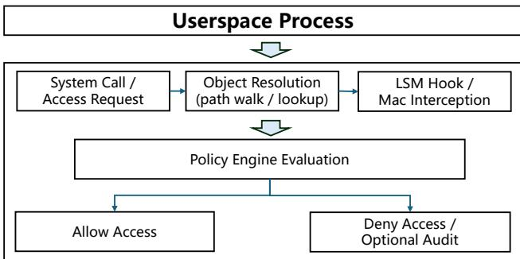  
Figure 1: Basic runtime workflow of MAC enforcement

## 3 Motivating Examples

## 3.1 MAC Configuration in Practice

Consider a security vendor that wants to ship an endpoint protection agent for Linux servers. The vendor’s policy goal is like: (1) only the agent process may read and write files under /opt/agent/data/, (2) system administrators may install or upgrade the agent binary, but cannot tamper with its runtime data, and (3) a separate audit operator may only read logs under /var/log/agent/. In addition, the customer requires a three-way separation of duties among the system administrator, security administrator, and audit administrator.

Expressing this policy in SELinux quickly becomes nontrivial. The vendor must first introduce several new types (e.g., agent\_t, agent\_exec\_t, agent\_data\_t, agent\_log\_t) and attributes, add corresponding file\_context rules so that different installation paths on different distributions are labeled correctly, and then write allow rules that tie these types to existing domain types such as sshd\_t, init\_t, and distribution-specific admin domains. To enforce separation of duties, the policy must also define SELinux users and roles (sysadmin\_u, secadmin\_u, audit\_u), map Unix accounts to these users, and encode role-specific constraints over the \_u field using low-level constraint statements that govern who is allowed to change which labels on which objects.

In a realistic deployment, this configuration is hard to get right and even harder to maintain. Small changes to the underlying Linux distribution (e.g., moving the agent’s data directory, renaming an admin domain, or adding a new log location)

may require coordinated edits across multiple SELinux modules and constraint blocks. A missing or overly restrictive rule leads to silent denials that are difficult for non-experts to diagnose; an overly permissive rule weakens the intended separation of duties and may only be discovered during an audit. As a result, vendors either ship large, complex policy modules that few customers are willing to enable, or avoid using SELinux’s full model and fall back to ad-hoc scripts and DAC-based conventions.

Requirements: To be usable in real deployments, a MAC mechanism should expose a configuration model that matches how administrators and vendors reason about security, rather than forcing them to work directly with low-level kernel types and constraints. Concretely, policies should be expressed in terms of applications, roles, and a small number of explicitly protected resource groups (e.g., “agent data,” “logs,” “keys”), rather than thousands of distribution-specific label types. The mechanism should provide built-in templates for common patterns (such as three-way separation of duties between system, security, and audit administrators), allow policies to be updated incrementally without editing multiple interdependent modules, and offer automated checks or tooling to catch conflicts and missing rules before deployment. Such a configuration model would let vendors and operators describe high-level intent concisely, while the MAC framework is responsible for translating that intent into concrete enforcement on the target kernel.

## 3.2 Overhead under MAC Enforcement

The overhead of MAC enforcement is a significant concern, particularly in high-performance computing environments. A primary example of this is the performance degradation caused by SELinux. While offering robust security, SELinux achieves this by instrumenting the kernel with a large number of hooks at various points in the system call path.

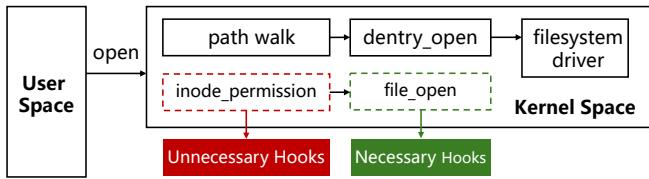  
Figure 2: Illustration of how SELinux hooks along a simple file-open path.

For instance, as shown in Figure 2, even a simple file-open request must pass through several MAC check points after the open() syscall enters the kernel and before the filesystem is actually accessed. In a simple “allow-all” or coarse-grained policy, only the final decision point (green box) is effectively needed, while the earlier checks (red boxes) never change the outcome but are still executed on every call. Zhang et al. [26] show that on Linux 5.3, merely enabling such hooks can increase the latency of open() by up to 87% compared to a DAC-only kernel, meaning that much of the overhead comes from traversing generic MAC hooks without any corresponding security benefit.

Requirements: This highlights a critical requirement for a practical MAC framework: the ability to enforce security policies with minimal overhead. A suitable design should derive, from the declared protection scope, the precise kernel paths on which hooks are actually required. By retaining mediation only on those capability-relevant paths, it becomes possible to significantly reduce performance overhead without weakening protection for the resources explicitly placed under MAC control. Such an approach avoids burdening the system with unnecessary security checks, thereby improving performance while preserving strong protection where it is needed.

## 3.3 MAC-Induced Compatibility Failures

Beyond configuration complexity and runtime overhead, a third motivation comes from frequent compatibility failures when MAC is enabled in real systems. In practice, many enterprise applications assume DAC-style permissions and break once SELinux starts enforcing path- and type-based policies: installers fail to create or modify files under protected directories, backup or security suites lose access to devices, and camera or container services refuse to start until SELinux is disabled or put into permissive mode [3, 4, 25].

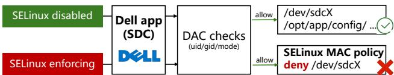  
Figure 3: Illustration of a Dell application SDC failed to load correctly with SELinux enabled.

A concrete example comes from Dell’s Storage Data Collector (SDC) software [4]. As shown in Figure 3, when SELinux is configured in enforcing mode, SDC fails to start and certain management operations cannot be performed, even though all traditional UNIX permissions are correctly set. The root cause is that SELinux’s type-based policies block SDC from accessing specific device files and system directories that the application assumes are usable during startup and runtime. From the administrator’s perspective, the system passes DAC checks but the MAC layer silently denies these accesses, causing the service to fail until SELinux is switched to permissive mode or disabled entirely. This illus trates how, once MAC enforcement is tied to fine-grained path and type rules, it becomes easy for a seemingly reasonable policy to break legitimate software. It’s hard to predict which applications will stop working when SELinux is turned on.

Requirements: To avoid breaking legitimate software, a practical MAC mechanism should provide strong protection only where it is explicitly needed, while remaining nonintrusive elsewhere. Concretely, enforcement on a given resource should be opt-in: critical files, devices, and sockets that require protection are explicitly bound to MAC policies, while other resources fall back to DAC or audit-only behavior rather than being silently blocked. The MAC layer should also support a learning or shadow-enforcement mode that observes real deployments, reports would-be denials, and lets vendors refine their policies before switching to strict enforcement. This is particularly important in practical deployments, where vendors often need to harden only a small set of highvalue resources, yet cannot afford widespread disruption to installation, update, or normal execution paths elsewhere in the system. Such a compatibility-aware design allows operators to protect the resources they explicitly care about, while keeping the rest of the software stack largely unaffected.

## 4 USEC Design

## 4.1 Threat Model and Protection Scope

USEC follows an explicit protection model: rather than mediating all kernel objects, it enforces strong protection only for resources covered by the declared capability set.

Formally, let O denote the set of kernel objects visible to the system, such as files, devices, IPC endpoints, and sockets, and let C denote the set of capabilities declared by the deployment. Each capability c ∈ C corresponds to a protected resource set Oc ⊆ O and a set of security-sensitive operations Ac that may affect those resources. USEC guarantees that accesses to Sc∈C Oc through operations in Sc∈C Ac are mediated by the retained hook set derived from C .

We consider an attacker who can execute unprivileged or application-level code and invoke normal kernel interfaces, including file operations, IPC, device access, and networking paths, in an attempt to access, modify, disable, or indirectly reach protected resources. We assume kernel integrity, correct operation of the LSM framework, and trustworthiness of the small management TCB, including usecd, dbus-daemon, udevd, and the audit infrastructure. Accordingly, USEC is designed to stop unauthorized accesses to declared critical resources, but it does not attempt to automatically infer missing security-critical resources; ensuring that all relevant resources are included in C remains a deployment responsibility.

This scope is important for interpreting USEC’s guarantees. The goal is not complete mediation over all kernel objects, but a closed protection boundary for explicitly declared highvalue resources. For protected file objects, USEC enforces protection on kernel object state rather than user-visible names whenever possible. As a result, alias-based or indirect accesses, such as hard links, symbolic links, rename, or filedescriptor passing, are mediated through capability-relevant hooks rather than trusted merely because they use different names. More broadly, the resource-centric design reduces the attack surface of policy configuration and common proxy paths by directly protecting the resources and management interfaces that matter, while leaving undeclared resources outside the strong-protection scope.

## 4.2 Resource-Centric Policy Model

Traditional kernel MAC frameworks such as SELinux [12] and AppArmor [1] are fundamentally process/domain-centric: administrators typically start from process domains (subject types) and enumerate which object types they may access. This model works well for system-wide hardening, but it is a poor fit for security vendors who typically care about protecting a small set of high-value resources against ‘everyone else’. Expressing such intent with process-centric rules often means touching many domains and types, and it is difficult to ensure that all untrusted processes are covered.

To address these issues, USEC adopts a resource-centric configuration model. Instead of starting from processes and asking “what may this process access?”, we start from resources and ask “who may touch this particular resource, and how?”. For example, to secure files, each rule is anchored at a file path and lists which users or applications may read, write, or execute that file. USEC extends this idea from files to other kernel resources: a policy rule is always attached to a resource descriptor (e.g., a file path prefix, a device node, a mount point, or a socket endpoint), and specifies the set of principals and operations that are allowed on that resource. Principals are represented by USEC’s identity bitmap, so that a rule can simply say “allow processes with bits AGENT or SECADMIN to write this resource”, while all other processes are implicitly denied.

Concretely, the overall design of the resource-centric policy model in USEC is shown in Figure 4. Each JSON entry is anchored at a specific resource and records its metadata, resource-specific attributes (attrs), and the set of operations that a policy may grant on this resource. These JSON policies are then compiled into an identity-bitmap layout and a compact rule table, which the kernel enforces through LSM hooks. For each access, USEC builds a resource descriptor and looks it up in the rule table. Only if a matching rule exists does USEC perform the bitmap and operation checks.

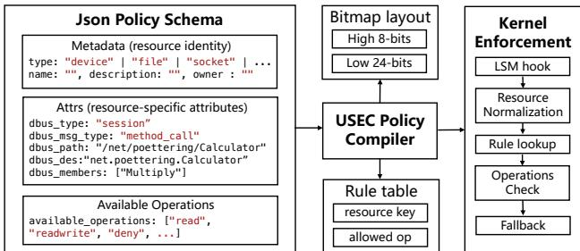  
Figure 4: Overall design of resource-centric config policy. A key property of this design is that USEC performs match-

ing only on resources that have been explicitly declared as protected. At enforcement time, LSM hooks extract a canonical descriptor for the accessed resource (e.g., the absolute file path, device identifier, or socket tuple) and look it up in the USEC rule tables. If there is at least one matching rule, USEC applies the corresponding bitmap and operation checks to decide allow or deny. If there is no matching rule, the resource is treated as unprotected by USEC and the access decision falls back to the underlying DAC (and optional audit), with no additional policy lookup. In other words, resources that vendors never mention in JSON incur effectively zero USEC overhead and are not accidentally constrained by USEC policies.

This resource-centric, demand-driven design has two practical benefits. First, it aligns configuration with how vendors and administrators naturally think: they only need to write rules for the relatively small set of sensitive resources they care about, rather than modifying many process domains or global type lattices. Second, it ensures that enabling USEC does not impose a blanket policy cost on the entire system: only accesses that touch protected resources pay the price of policy matching, while all other accesses remain as cheap and compatible as in a DAC-only system. The next subsection describes how these declared resource-oriented rules are translated into the capability set that drives retained-hook resolution and selective enforcement in the kernel. At compile time, the declared resource-oriented rules are translated into the capability set that drives retained-hook resolution and selective enforcement.

## 4.3 Demand-Driven MAC Enforcement

A central design goal in USEC is to decouple mandatory access control (MAC) enforcement from the conventional assumption that all kernel objects and all control paths must always be mediated. Traditional MAC systems such as SELinux rely on broad, always-on mediation: they install a dense set of hooks across file-system, process, IPC, and networking paths, and route relevant accesses into a common policy engine. While this design provides broad coverage, it also incurs unnecessary cost in the deployments we target, where many accesses unrelated to the declared protection goal still pay MAC dispatch, cache lookup, and synchronization overhead.

Formally, given a declared capability set C , USEC does not attempt to mediate all kernel objects in O. Instead, it enforces protection only for the protected resource sets {Oc}c∈ and operation sets {Ac}c∈C induced by the active capabilities. Intuitively, Oc captures what must be protected, while Ac captures how those resources may be accessed or modified. USEC then derives a retained hook set that mediates accesses to Sc∈ Oc through Sc∈ Ac, while bypassing hooks that are irrelevant to the declared capability set. Figure 5 shows the basic enforcement pipeline.

Capability-to-Hook Resolution: Given the active capability set C , USEC resolves each capability c ∈ C through a compiler-driven translation pipeline rather than by manually selecting hooks. Concretely, policies are written in a compact JSON format and compiled into (i) TE permissions for the policy engine and (ii) a hook set for selective enforcement. For each declared capability, the policy compiler queries a capability dictionary that maps the ca pability to its corresponding TE permissions and dependent mediation hooks. For example, FILE\_READ expands to permissions such as read, open, and getattr, and to hooks such as file\_open, inode\_permission, mmap\_file, file\_read, and file\_close; similarly, SOCK\_CONNECT maps to socket\_connect, and PROC\_FORK maps to task\_create. Thus, USEC resolves a high-level capability into both the policy semantics and the concrete kernel mediation points required to enforce it.

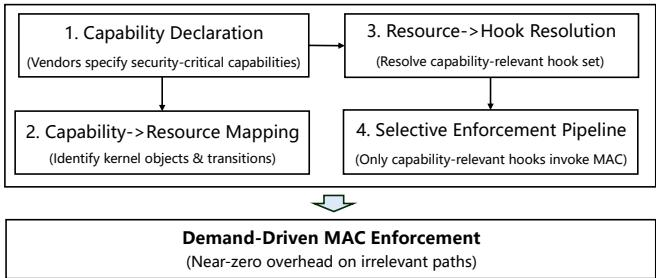  
Figure 5: The Basic Pipeline of USEC’s MAC Enforcement.

After expanding all capabilities, USEC computes the retained-hook set by taking the union of the hook sets associated with all declared capabilities. This union is materialized as a compact global bitmap, where each bit corresponds to one hook in the target kernel’s hook inventory. At runtime, only hooks whose bits are set are allowed to enter the policy path; all other hooks return immediately. This bitmap-based formulation makes the enforcement boundary explicit: hook pruning is not an ad hoc optimization, but the direct result of capability expansion and hook aggregation. A hook can be elided only if it does not belong to the hook set required by any declared capability.

The mapping is kernel-aware rather than universal. The same high-level capability may be realized through different mediation points depending on the kernel version and enabled subsystems. USEC therefore maintains a per-kernel hook inventory and checks version compatibility between the compiler and the kernel before materializing the bitmap. If the exported kernel hook version does not match the compiler’s expected version, policy compilation is rejected rather than silently using a stale mapping. In this way, correctness comes from capability-dictionary expansion, kernel-specific hook binding, and version matching, while representative workloads are used only to validate deployment coverage and identify redundant hot-path hooks after the required enforcement surface has already been established.

Selective Enforcement Pipeline: At runtime, USEC replaces the monolithic always-on MAC path with a selective enforcement pipeline. Each installed hook first performs a constant-time membership test against the retained-hook bitmap. If the hook is not enabled for the active capability set, it returns immediately without entering the MAC engine. Otherwise, USEC invokes check\_usec\_perm(), which consults the permission cache and policy database to complete normal policy evaluation. Thus, USEC preserves the familiar hookbased mediation structure, but avoids dispatching irrelevant accesses into the policy engine.

Table 1: An example of capability-to-hook resolution in USEC.  
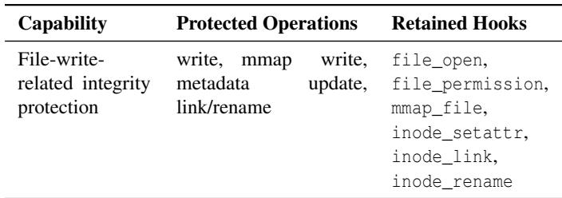

This design differs from SELinux’s uniform enforcement model, where a broad hook set remains active regardless of whether a deployment actually protects the corresponding resources. In USEC, enforcement cost scales with the declared protection scope. A deployment that only protects sensitive files and process attributes need not pay for mediation on unrelated network or device paths, while a deployment that enables socket or device control retains precisely those hooks.

Table 1 illustrates a concrete capability-to-hook resolution example. Consider a deployment that protects the integrity of sensitive files through file-write-related capabilities. During compilation, USEC expands the declared file capabilities into the operations that may modify file contents or metadata, or otherwise change the authority over the same object, including direct writes, memory-mapped writes, metadata updates, and link/rename operations. It then resolves these operations to the concrete hooks that mediate them on the target kernel. For example, file\_open and file\_permission cover ordinary write paths, mmap\_file covers memory-mapped access, inode\_setattr covers metadata changes, and inode\_link and inode\_rename cover aliasing-related updates. Hooks outside these paths, such as task\_kill or socket\_sendmsg, are not retained because they do not affect the declared fileintegrity capability. This example illustrates that the retainedhook set is derived from capability expansion rather than manually selected, and that enforcement remains closed over the relevant access paths without paying the system-wide cost of full mediation.

Operational Benefits: Demand-driven enforcement provides three practical benefits. First, the enforcement surface grows with the declared security intent rather than with the full kernel mediation surface. Second, it gives operators a principled way to avoid the system-wide cost of full mediation without manually disabling checks in an ad hoc manner. Third, it supports heterogeneous deployments: when the protected capability set changes, when USEC is ported to a new kernel family, or when new capabilities are introduced, USEC simply re-instantiates the capability-to-hook mapping and recomputes the retained-hook bitmap for the target environment. This makes USEC particularly suitable for production deployments where usability and performance matter as much as access-control strength.

## 4.4 Compatibility-Oriented Security Interface

Beyond configuration complexity and runtime overhead, a key goal of USEC is to avoid the compatibility problems that often appear when SELinux is enabled in real deployments. Therefore, USEC needs to meet two compatibility requirements. First, enforcement is resource centric and opt in, with a permissive mode that lets operators validate policies without triggering SELinux style breakage. Second, the implementation is fully stackable with SELinux and other LSMs, keeping policy and state separate so that enabling USEC does not interfere with existing MAC modules.

Preventing Hook-Level Incompatibility with SELinux. In conventional deployments, SELinux and other in-kernel security modules are wired directly into LSM hook sites. Once these hooks are compiled in, third-party security logic can only be added by patching and rebuilding the kernel, and any mismatch in hook prototypes or call order may cause subtle breakage. In practice, enabling SELinux often changes which hooks run and in what order, so applications that relied on a particular hook behavior or on a vendor kernel patch may start to fail as soon as SELinux is turned on.

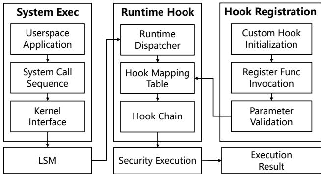  
Figure 6: Workflow of USEC’s Security Interface.

As shown in Figure 6, USEC inserts a security interface between normal system execution and vendor code. Once a userspace application issues a system call, which traverses the kernel interface and reaches the LSM hook. Instead of invoking third-party modules directly, the LSM hands control to USEC’s runtime dispatcher, which consults a hook mapping table and, if a matching entry exists, runs the corresponding hook chain to produce a security decision. When no mapping exists, the dispatcher returns immediately and the LSM continues with its default behavior, so enabling USEC does not alter how SELinux or other in-kernel modules see the call. Also, to maintain the mapping table, vendors initialize their custom hooks and call a registration function in USEC, which validates the argument list, return type, and function pointer against the original LSM prototype before inserting any entry into the mapping table. Hooks that fail validation are rejected and never affect runtime execution.

Compatibility with SELinux and other MACs. Beyond improving compatibility for individual applications, USEC is designed to run alongside existing MAC modules, such as SELinux. At the LSM level, USEC follows the upstream stacking model and uses the standard blob-based security domains for tasks, inodes, and files. It tracks its own state in struct usec\_state, which points to an independent usec\_policy, upolicydb, usec\_uavc, and usidtab. This mirrors SELinux’s separation of selinux\_state, policydb, selinux\_avc, and sidtab, but all data structures and permission-checking routines (e.g., check\_usec\_perm()) operate on USEC’s own state. Loading or updating USEC policies therefore does not affect SELinux’s policy database or AVC cache, and the reverse is also true.

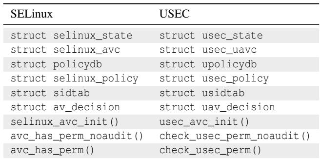  
Table 2: USEC’s policy/AVC layer mirrors SELinux with a separate set of data structures and interfaces.

Table 2 summarizes this mapping relations between SELinux and USEC at the policy and AVC layer. Each SELinux structure or interface that manages policy state, SIDs, and cached decisions has a corresponding USEC structure that serves the same role but is kept separate in memory, which makes coexistence possible without entangling internal state.

For hooks that are already fully stackable under the blobs mechanism, USEC simply registers as another LSM, where other MACs, including SELinux in enforcing mode, run as usual. For legacy mount-related hooks that still share fields such as fs\_context.security, USEC avoids conflicts by not storing its options in that field; instead, it records its mount security options in a private in-kernel list keyed by the caller’s task, and applies them when the mount completes. This allows USEC to coexist with SELinux even on mount paths.

Finally, USEC reuses the SELinux policy model and on-disk format while keeping its runtime policy state separate. Its policy layer ports the relevant SELinux code into renamed structures (for example upolicydb and usidtab) and trims features that fall outside USEC’s narrower scope. Labels follow

SELinux conventions as well, which means systems that already deploy SELinux can introduce USEC without changing the on-disk labeling scheme, and the same extended attributes remain meaningful to both modules. Taken together, these choices let operators incrementally deploy USEC on top of existing SELinux configurations, using USEC’s opt-in rules and permissive mode to harden selected resources while preserving compatibility with existing SELinux policies.

## 5 Implementation

USEC is implemented as a Linux security extension that integrates with the LSM framework and provides a lightweight, capability-driven access control path. It consists of five core components. (1) User space provides policy management via usecd and libusec, which generate and load capability policies. (2) usecfs is a kernel interface that transfers policies and configuration data into the kernel at runtime. (3) LSM hooks serve as mediation points for kernel operations such asattrib2 file access, process control, and socket communication. (4)3 UAVC (USEC-specific AVC Access Vector Cache) caches re-allow 5 cent authorization decisions to avoid repeated policy lookups7 on hot paths. (5) the policy engine evaluates access requests against capability policies stored in the kernel.

Enforcement Path. At runtime, each LSM hook first checks whether it belongs to the retained hook set derived from the active capabilities. If not, it returns immediately through the bypass path. Otherwise, the request is forwarded to the UAVC cache; on a cache miss, the policy engine evaluates the request and updates the cache. This design preserves the standard hook-based mediation model while avoiding unnecessary policy invocations on irrelevant paths.

Integration with Linux. USEC is implemented as a loadable LSM module and is compatible with LSM stacking. It reuses existing kernel security infrastructure, including security blobs for labeling and hook dispatch mechanisms, and does not require intrusive changes to core kernel subsystems. Policies are loaded dynamically from user space via usecfs, allowing deployment without modifying application binaries.

Automation vs. Manual Effort. Most of USEC’s operation is automated. Policy loading, hook dispatch, cache lookup, and enforcement are handled entirely within the system. The only manual component is the maintenance of capability-tohook bindings for different kernel versions and configurations. This process is lightweight and localized, as it updates only the mappings required for affected capabilities rather than the entire enforcement pipeline.

Implementation Size. USEC adds 19,223 lines of kernel code, including 18,765 lines of new implementation and 458 lines of conditionally compiled code under #ifdef CONFIG\_SECURITY\_USEC. The user-space components add 63,189 lines of code in total, including 37,787 lines in permission-manager, 5,333 lines in usecpolicy, 17,524 lines in libusec, and 2,545 lines in libsemanage. Overall,

USEC consists of 82,412 lines of new code across kernel and user space.

## 6 Evaluation

## 6.1 Policy Complexity Reduction

In this section, we present a comparative case study demonstrating how USEC reduces the complexity of expressing access control policies compared to existing Linux MAC systems. We use two representative scenarios: 1) camera device permission control and 2) ATSPI/DBus interface management, to evaluate expressiveness, extensibility, and maintainability.

## 6.1.1 Camera Access Control

To experimentally evaluate policy complexity, we compare how SELinux, AppArmor, and USEC implement the same task:epin\_app\_domain; restricting third-party applications from accessing the systems\_camera\_resource\_type; camera device. Although the enforcement goal is identical, the mechanisms differ fundamentally, resulting in differentontrolled\_resource\_type }: policy sizes and maintenance costs.

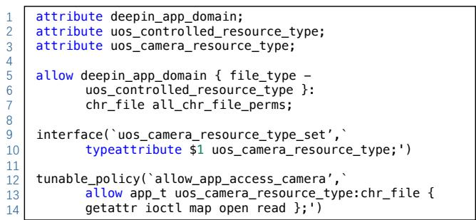  
Figure 7: SELinux attribute and allow-rule construction

In SELinux, the camera device ultimately corresponds to the kernel label v4l\_device\_t. However, SELinux cannot directly express the concept of a ‘camera resource’. Instead, the policy writer must distribute this concept across multiple policy subsystems. In our reproduced configuration, three new attributes (deepin\_app\_domain, uos\_controlled\_resource\_type, and uos\_camera\_resource\_type) must be created before any access control rule can be written. Additional attributes such as deepin\_app\_private\_file\_type are required because SELinux decomposes resources into file-system classes and type categories rather than treating them as logical entities. Once these attributes exist, access control is implemented procedurally. A representative fragment from our SELinux experiment is shown in Figure 7.

To complete the policy, the camera device label v4l\_device\_t must be registered inside the kernel module, and this interface must be exposed to third-party modules through a dedicated .if file. These fragments occupy multiple files (uos\_perm\_control.te, uos\_perm\_control.if, devices.te). Even the minimal working configuration exceeds 300 lines of SELinux policy code. AppArmor is simpler than SELinux in this case because it can constrain access using pathname-oriented rules rather than type attributes and inter-module bindings. However, it still does not directly capture the higher-level notion of a protected “camera resource” and remains tied to concrete device nodes and profile rules.

In USEC, we repeat the same experiment using the resourcecentric model. Instead of decomposing the concept of a camera across multiple subsystems, USEC treats the camera as a first-class resource described declaratively in a single JSON object as shown in Figure 8.

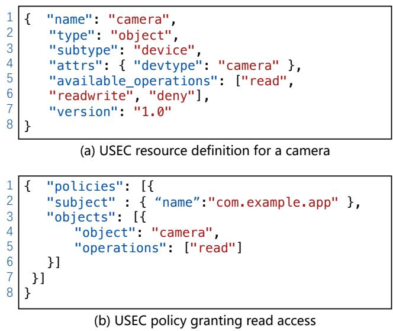  
Figure 8: USEC’s configuration for camera resource control.

These two JSON documents, together fewer than 20 lines, capture the entire access control logic. No attribute propagation, no macro definition, no kernel-module modification, and no policy recompilation are required. The fundamental reason for this reduction is that USEC is resource-centric. A resource is expressed directly at the level developers reason about (e.g., ‘camera device’), while SELinux requires mapping this concept into filesystem classes, device types, type attributes, Boolean tunables, and module interfaces, and AppArmor still relies on concrete pathname-based profile rules. As a result, although all three systems can enforce the same high-level restriction, the SELinux implementation spans hun dreds of lines across several policy modules, AppArmor remains bound to low-level device naming, whereas the USEC configuration is fully contained in a small declarative specification. This experiment demonstrates that USEC achieves the same enforcement outcomes at a fraction of the configuration complexity, providing better maintainability and extensibility.

## 6.1.2 ATSPI/DBus Interface Control

To further evaluate expressiveness and policy complexity, we study a second scenario involving the AT-SPI accessibility framework. AT-SPI exposes dozens of DBus interfaces such as EditableText, Action, Component, and DeviceEventController, each containing numerous methods including both read-oriented queries (e.g., GetExtents, CopyText) and security-sensitive write operations (e.g., InsertText, GenerateKeyboardEvent).

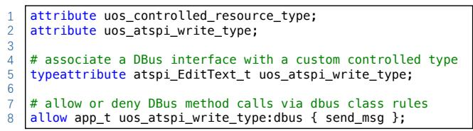  
Figure 9: SELinux-style DBus mediation for AT-SPI methods

In SELinux, implementing such control is challenging because SELinux has no direct notion of ‘DBus interface’ or ‘DBus method’. Instead, DBus mediation must be reconstructed indirectly through a combination of types, attributes, and allow rules governing the dbus class. Each method to be restricted must ultimately be represented through the DBus message type, the object path, the interface string, and possibly custom DBus type attributes. This causes the semantics of a single AT-SPI interface to be fragmented across multiple policy constructs that must be coordinated manually. The figure 9 below shows a representative SELinux fragment.

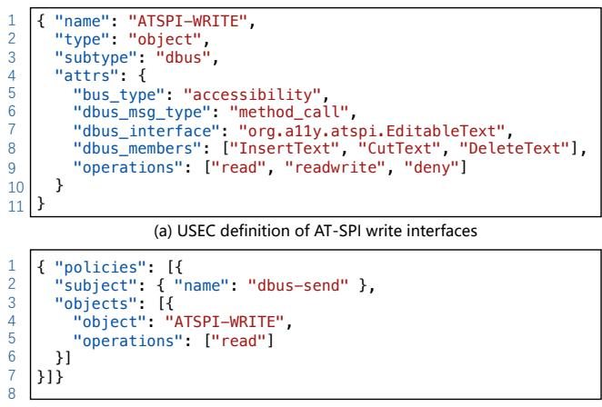  
(b) USEC granting read-only AT-SPI access  
Figure 10: USEC’s configuration for AT-SPI interface control.

Extending this pattern to dozens of AT-SPI methods requires repeating the same steps: creating new types or attributes, binding them to the correct interface strings, and ensuring that the correct DBus object paths are labeled. The resulting policy spans multiple files and hundreds of lines. Again, this complexity arises not from the difficulty of the security requirement, but from SELinux’s type-centric architecture: DBus interfaces must be decomposed and re-assembled manually using low-level primitives. AppArmor is also limited here: although it is lighter-weight than SELinux, it does not naturally express method-level DBus semantics as firstclass policy objects, and fine-grained interface control still requires indirect, string-oriented rule construction.

In contrast, USEC models DBus interfaces directly as firstclass resources. A single JSON object describes the bus type, message type, interface name, member list, and allowed operations. The semantics remain intact without any intermediate type constructions. The JSON fragment in Figure 10 defines all write-oriented AT-SPI methods as a controlled object.

The experiment demonstrates that USEC enforces finegrained method-level control over DBus interfaces without requiring SELinux-style decomposition into types, attributes, macros, or inter-module bindings, and without AppArmorstyle indirect string-oriented policy construction. In scenarios like AT-SPI, where interfaces evolve frequently and clients dynamically issue method calls, USEC’s configuration provides better simplicity and maintainability.

## 6.2 Evaluation on Overhead

To evaluate the runtime overhead introduced by USEC’s MAC enforcement, we use UnixBench 5.1.3 [18] as a generalpurpose system benchmark, and further supplement it with two workloads that exercise security-relevant kernel paths more directly: Filebench, a filesystem-intensive benchmark suite, and Nginx, a network-facing web-server workload. Compared with UnixBench, these two workloads stress the VFS, inode, file-permission, socket, and IPC paths that are central to MAC enforcement, and therefore provide a more meaningful view of MAC overhead in practice. The experiment environment is a HONOR NBLK-WAX9X notebook with an AMD Ryzen 7 3700U processor (4 cores / 8 logical processors). The operating system is UOS Desktop 20 Professional, running Linux kernel version 4.19.0-amd64-desktop, and the main memory is 16GB DDR4. The storage device is a 512 GB Toshiba KXG60ZNV512G SSD. All experiments are repeated 10 times, and the tables report the average, standard deviation, and volatility.

We evaluate four different tools: (1) SELinux, representing a traditional full-coverage MAC framework where all LSM hooks remain active; (2) USEC, our lightweight capabilitydriven MAC module; (3) AppArmor, another widely deployed MAC system with pathname-based mediation; and (4) LSM Disabled, where all security modules are removed, serving as the zero-overhead baseline. To ensure a fair comparison, we configure USEC, SELinux, and AppArmor to enforce same protection goals for each evaluated workload. In particular, for a given benchmark, all MAC systems are configured to protect the same class of resources and to mediate the same high-level operations required by the workload; the only difference is how each system realizes that protection internally. USEC uses its capability-driven policy model and retainedhook bitmap, whereas SELinux and AppArmor use their native policy mechanisms. The LSM-disabled baseline removes MAC enforcement entirely and therefore differs only in that no access-control checks are performed.

UnixBench as a general-purpose baseline. We retain UnixBench as a broad system benchmark, but use it only as a general-purpose reference rather than the main evidence for MAC overhead. As shown in Table 3, based on 10 runs, SELinux lowers the average System Benchmarks Index Score from 3,993.15 in the LSM-disabled baseline to 3,681.53, corresponding to a 7.80% slowdown, while USEC and AppArmor incur 2.96% and 3.21% overhead, respectively. This result is expected because several UnixBench components are CPU-bound and exercise few MAC-relevant kernel paths, making them relatively insensitive to mediation overhead.

UnixBench reveals that CPU-bound components such as Dhrystone and Whetstone show only minor variation across configurations, indicating that these workloads spend most of their time in user mode and trigger relatively few MACrelevant kernel checks. By contrast, filesystem- and IPCrelated components show a clearer separation, where SELinux imposes higher overhead than the lighter-weight configurations. This suggests that broad system benchmarks are useful for establishing a baseline, but they can understate the cost of always-on MAC mediation because not all subtests heavily exercise security-sensitive kernel paths.

Filebench: filesystem-intensive overhead. We next evaluate filesystem-intensive workloads using Filebench. These workloads repeatedly exercise file creation, open, read/write, metadata update, namespace traversal, and fsync operations, all of which frequently traverse the hooks targeted by MAC enforcement. Table 4 reports the results on five representative Filebench workloads.

Overall, USEC remains closer to the LSM-disabled baseline than SELinux across the evaluated Filebench workloads. On webserver, USEC achieves 88,908.51 ops/s, compared with 91,029.30 ops/s in the baseline, while SELinux achieves 84,359.23 ops/s. On fileserver, USEC reaches 56,510.22 ops/s, again closer to the baseline (58,267.98 ops/s) than SELinux (53,391.44 ops/s). On the fsync-intensive varmail workload, USEC achieves 27,000.82 ops/s, which is also closer to the baseline (27,643.02 ops/s) than either SELinux (24,334.93 ops/s) or AppArmor (25,715.50 ops/s). These results indicate that USEC generally reduces the performance cost of MAC mediation on common filesystem-intensive paths, even though these operations frequently traverse security-relevant hooks in the VFS and inode layers. At the same time, the Filebench results also show that filesystem-intensive workloads can be affected by factors beyond the MAC mechanism itself. For example, on random write and single stream read, the relative ordering of USEC and AppArmor is less uniform than on the other workloads, and the LSM-disabled baseline is not always far above the MAC configurations. This suggests that filesystem-internal behavior, caching, synchronization, and I/O scheduling effects can have a substantial influence on throughput in these workloads. When aggregating the five Filebench workloads, SELinux incurs a 10.86% performance degradation relative to the LSM-disabled baseline, whereas USEC incurs 6.87%, and AppArmor incurs 9.51%. Overall, these results show that USEC substantially narrows the performance gap compared with a traditional full-coverage MAC design on filesystem-intensive workloads.

Table 3: Selected UnixBench results comparing SELinux, USEC, AppArmor, and the LSM-disabled baseline. Each configuration was run for 10 trials. For each metric, we report the average, standard deviation, and volatility (volatility = standard deviation / average). Higher throughput or composite index values indicate better performance. The bottom row shows the relative performance degradation compared to the LSM-disabled configuration.  
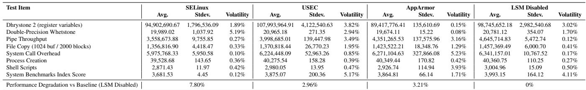

Nginx: network-facing overhead. We further evaluate a web-server workload using Nginx. This benchmark stresses socket creation, connection handling, request processing, and message transmission, which together exercise the socket-, file-, and IPC-related paths often involved in MAC checks for server applications. As shown in Table 5, USEC achieves 92,185.08 req/s on average, corresponding to 95.68% of the LSM-disabled baseline and incurring only 4.32% throughput overhead. In contrast, SELinux achieves 84,748.05 req/s, corresponding to 87.96% of the baseline, while AppArmor achieves 81,774.77 req/s, corresponding to 84.87% of the baseline and incurring 15.13% throughput overhead.

The larger gap observed here, compared with UnixBench, suggests that realistic server workloads are much more effective at exposing the runtime cost of MAC enforcement because they repeatedly trigger socket-, file-, and IPC-related checks along the request-processing path. The latency results show a similar trend. USEC remains relatively close to the baseline in both median and tail latency, with a P50 latency of 3.569 ms and a P99 latency of 12.140 ms, whereas SELinux increases P50 latency to 3.710 ms and P99 latency to 12.990 ms. AppArmor shows the largest throughput loss and also exhibits higher latency than USEC across the key percentiles, with a P75 latency of 8.333 ms, a P90 latency of 9.526 ms, and a P99 latency of 12.120 ms. This means that the benefit of lightweight mediation is not limited to average throughput, but also extends to request latency behavior, which is particularly important for interactive services. In other words, USEC not only preserves near-baseline throughput, but also avoids the more visible latency inflation observed under heavier mediation mechanisms.he pronounced long-tail latency inflation observed under heavier mediation mechanisms.

Overall, the evaluation shows that traditional full-coverage MAC enforcement incurs limited slowdown on broad CPUoriented benchmarks, but can introduce more visible overhead once workloads repeatedly traverse filesystem and network paths that are central to MAC enforcement. In contrast, USEC remains consistently closer to the LSM-disabled baseline across both Filebench and Nginx, while substantially outperforming SELinux and showing more stable behavior than AppArmor under high-concurrency web serving.

This also clarifies the apparent gap between the 87% slowdown cited in our motivation and the smaller overheads observed in our own evaluation. The 87% number comes from prior work [26], which evaluates SELinux under a much more MAC-intensive setting on Linux v5.3, and should therefore be interpreted as a workload-specific stress-case result rather than a general statement about SELinux overhead in most environment scenarios. Our experiment results show the same qualitative trend across workloads: SELinux incurs only a 7.8% slowdown on the broad, CPU-heavy UnixBench suite, but this grows to 12.04% on the more security-sensitive Nginx workload reported above, where MAC-relevant kernel paths are exercised much more frequently. At the same time, even Nginx remains a realistic service workload rather than an extreme stress case, since substantial execution time is still spent in ordinary request processing and protocol handling outside MAC-dominated paths. In this sense, the 87% result reflects a specific upper-end MAC-intensive scenario, whereas our Filebench and Nginx results capture more representative practical deployments.

## 6.3 Evaluation on Compatibility

To evaluate compatibility, we focus on two scenarios. First, we consider applications that fail to deploy under SELinux, and show that USEC can protect selected resources without breaking them. Second, we start from an existing SELinux policy known to work in production and demonstrate that USEC can remain compatible with such policy. We also discuss AppArmor where relevant: although it is often less intrusive than SELinux, it does not provide the same migration path from existing SELinux policies nor the same resource-centric abstraction used by USEC.

Table 4: Filebench results comparing SELinux, USEC, AppArmor, and the LSM-disabled baseline. Each configuration was run for 10 trials. For each metric, we report the average, standard deviation, and volatility (volatility = standard deviation / average). Higher throughput values indicate better performance. The bottom row shows the relative performance degradation compared to the LSM-disabled baseline.  
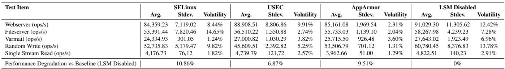

Table 5: Nginx results comparing SELinux, USEC, AppArmor, and the LSM-disabled baseline. Each configuration was run for 10 trials. For each metric, we report the average, standard deviation, and volatility (volatility = standard deviation / average). Higher throughput and lower latency indicate better performance.  
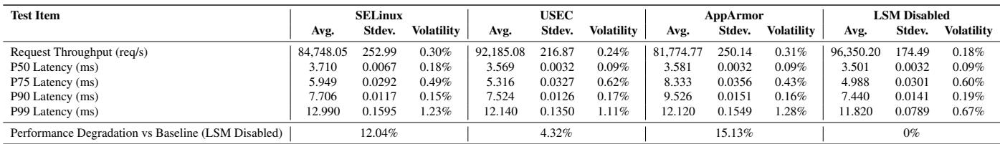

Case 1: Mitigating SELinux-induced failure. Many applications are built assuming pure DAC semantics [11, 14]. When SELinux’s path- and type-based rules are enabled without a well-tuned policy, installers may fail to update their own files, and services may lose access to devices or D-Bus endpoints. AppArmor is often more permissive in practice because it relies on pathname-oriented profiles and may therefore avoid some SELinux-specific deployment failures. However, this does not eliminate the underlying policy-engineering burden when administrators still need to align application identifiers, resources, and interface permissions. In this case, USEC uses templates and D-Bus-based configuration to derive SELinux-compatible rules from a compact app identifier, protecting private files and D-Bus interfaces while avoiding failures common with hand-written SELinux policies.

1 policy\_template\_t g\_policy\_template[MAX\_ID\_TYPE] = {   
23 [APPID\_TYPE] = {   
.policy\_template = "type deepin\_app\_@n\_t;\n"   
4
5
6 "deepin app domain\_set(deepin\_app\_@n\_t)\n"   
"domain unkillable(deepin\_app\_@n\_t)\n"   
"type deepin\_app\_@n\_file\_t;\n"   
78 "deepin\_app\_private\_file\_type\_set(deepin\_app\_@n\_file\_t)\n"   
"allow deepin\_app\_@n\_t deepin\_app\_@n\_file\_t:dir   
9 \_file\_class\_set \~{ relabelfrom relabelto };\n"   
10 "deepin\_access\_all\_sensitive\_resource(deepin\_app\_@n)\n\n",   
11 .template\_escape\_cnt = 0   
12 },   
13 }  
Figure 11: A template that turns an app identifier into a SELinux-compatible policy fragment.

As shown in Figure 11, we first declare the global template table and select the APPID\_TYPE entry(lines 1–2), and encode the SELinux rules with the placeholder @n (lines 3–10). Instead of manually writing all rules for every program, the administrator only supplies an app identifier (e.g., the D-Bus name) over USEC’s management D-Bus; the policy generator substitutes @n with that identifier, emits SELinux-compatible rules, and loads them into upolicydb and usidtab. For the net.poettering.Calculator test service, we bind its identifier to the APPID\_TYPE template and describe the calculator object and subjects (d-feet, busctl, dbus-send) in JSON, choosing operations such as readwrite or deny. This keeps the enforcement semantics aligned with SELinux while removing most manual policy editing that previously caused SELinux-induced application failures. Compared with AppArmor, the benefit is different: rather than relying on simpler pathname matching alone, USEC allows the administrator to start from a compact resource-oriented description while still preserving SELinux-compatible policy semantics.

Case 2: Matching SELinux protection and compatibility. To evaluate whether USEC can reuse existing SELinux policies without losing protection or compatibility, we install the upstream SELinux default policy and load a subset of its rules into USEC. This case is primarily a comparison against SELinux, since AppArmor does not share SELinux’s policy representation, label model, or binary policy format, and therefore does not offer an analogous policy-migration path.

In detail, we migrate a SELinux policy into USEC’s policy engine, as shown in Figure 12. First, we place USEC in permissive mode via the system security manager (DisableSecurity), so that policy changes do not disrupt running applications (lines 1-6). Next, we copy the compiled SELinux policy usec\_test.pp from /etc/selinux/targeted/policy/ into USEC’s policy directory under /etc/usec/policy/, and load it with usec-policy-load (lines 8-13). At load time, USEC parses the SELinux binary policy and populates its own upolicydb, usidtab, and usec\_uavc, which mirror SELinux’s policydb, sidtab, and AVC but live in a separate usec\_state. Finally, we re-enable enforcement with the EnableSecurity call, so subsequent accesses are checked by USEC (lines 15-20).

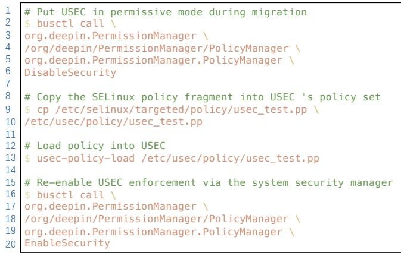  
Figure 12: Migrating a SELinux policy fragment into USEC.

USEC reuses the SELinux policy format and label syntax, so policy fills upolicydb and usidtab with the same rules and security identifiers that SELinux has, while on-disk labels stay unchanged. At the same time, this state lives in usec\_state and is wired to LSM hooks through the blobs mechanism, so USEC runs alongside SELinux without sharing internal data. For objects covered by the imported policy, both modules see the same subject–object pairs and reach the same allow or deny result; for other objects, USEC returns early, and the request is handled by DAC and any SELinux rules. In practice, loading a SELinux policy into USEC preserves SELinux-level protection on protected resources and does not introduce extra denials when the two MACs are stacked. This compatibility is complementary to AppArmor: AppArmor provides lightweight confinement, but does not support direct reuse of existing SELinux policies as USEC does.

## 7 Lessons Learned

Lesson 1: Hook retention must be instantiated for the target kernel and software stack. Although USEC’s policy model is conceptually portable, practical hook pruning is not a one-time universal mapping. Our initial prototype assumed that a single generic capability-to-hook mapping would be sufficient across deployments. In practice, this assumption proved too coarse. The same high-level capability may be realized through different mediation points depending on the kernel version, enabled subsystems, and userspace software stack. As a result, a retained hook set that is correct and efficient on one product may be suboptimal, or even require additional bindings, on another.

This led us to treat capability-to-hook resolution as a compiler-driven, kernel-aware construction step. In USEC, a declared policy is first translated into capabilities, each capability is then expanded through a capability dictionary into TE permissions and dependent hooks, and the final retainedhook set is materialized as a compact bitmap for the target kernel. This means that hook retention is derived systematically from the declared security intent rather than from ad hoc profiling or manual pruning. To keep this process sound across environments, the compiler and the kernel must also agree on the hook inventory; when the exported hook version changes, the mapping must be re-instantiated rather than silently reused. Representative workloads still matter, but for narrower purposes than we initially expected. First, they validate that the retained set covers the control paths exercised in the intended deployment. Second, they help identify redundant mediation points on hot paths once the required capability coverage has already been established. In other words, profiling improves performance, but it does not determine which security-relevant transitions may remain unchecked.

This distinction proved important in deployment. On some desktop builds, the dominant retained hooks were concentrated in file-system paths such as file\_open and inode\_permission. On appliance-style systems with heavier network or device activity, a larger fraction of the retained cost came from socket- and device-related hooks. The lesson is not that USEC should keep only “hot” hooks; rather, it must first retain all hooks required by the declared capabilities on the target kernel, and only then optimize away redundant mediation points that unnecessarily burden hot paths.

Lesson 2: Deployability depends on how small the enforcement surface can be made in practice. Although USEC is motivated by strong access-control semantics, our industrial deployments repeatedly showed that deployability depends at least as much on efficiency as on policy expressiveness. System integrators rarely reject a security mechanism because they disagree with its protection goal; they reject it because the runtime cost is visible on latency-critical paths or because the operational workflow becomes too complex.

This was especially evident during early rollouts. Even after replacing SELinux-style broad mediation with capabilitydriven selective enforcement, the initial retained-hook set was not always performance-optimal for deployed products. Real workloads exposed concentration points that were only weakly reflected in synthetic testing. On desktop systems, reducing redundant checks on frequent file-system paths improved responsiveness. On appliance-style systems, the main costs often shifted to networking and device paths, where a retained set that worked well elsewhere could still introduce noticeable latency under sustained packet or I/O activity. These experiences reinforced a practical rule: correctness must be established first through capability expansion and kernel-aware binding, but deployability depends on how aggressively the implementation removes unnecessary enforcement from the paths that dominate real workloads. More broadly, this experience shaped USEC’s overall design philos ophy. A deployable MAC mechanism should not optimize for theoretical generality alone. Instead, it should expose a narrow and understandable security intent, compile that intent into a compact retained-hook set for the target kernel and software stack, and then tune the resulting enforcement surface against representative workloads for the product line. For us, the combination of explicit capability scope, kernelaware capability-to-hook resolution, bitmap-based selective enforcement, and workload-guided refinement was essential to making USEC acceptable in production.

## 8 Related Work

## 8.1 MAC on Operating Systems

Mandatory Access Control has been widely adopted in operating systems, especially via the Linux Security Modules (LSM) framework. Among popular implementations, SELinux [12] offers a rich MAC model with type enforcement, role-based access control, and optionally multilevel security. It labels both subjects and objects and enforces kernel-level decisions, providing strong isolation and expressive policies, but it is also burdened by substantial runtime overhead and policy-management complexity. In contrast, AppArmor [1] uses pathname-based profiles rather than full label+type en forcement, making configuration and deployment simpler, but its expressiveness and isolation guarantees are weaker. Smack [17] is tailored for simplicity and embedded/IoT use cases: trading off many of SELinux’s advanced features in favor of reduced complexity and overhead, yet empirical studies indicate that in default settings Smack (and similar lightweight systems) may not prevent attacks as effectively as SELinux. Finally, TOMOYO [16] uses an invocation-history domain model and pathname-based policies, while Yama [5] adds supplementary MAC-like restrictions, both reduce overhead and administrative burden but at the cost of weaker isolation.

USEC fits into a familiar trade-off between expressiveness, overhead, and usability. SELinux offers rich policies at higher complexity and runtime cost, while AppArmor, Smack, and TOMOYO favor simpler, lower-overhead configurations with weaker guarantees. Prior work shows SELinux can block all tested attack stages in embedded firmware, where these lighter systems fail under default settings. USEC builds on this lineage, targeting the low-overhead corner while preserving mandatory enforcement.

## 8.2 MAC in Cloud/Virtualised Systems

Early work on MAC in virtualised environments focuses on enforcing isolation at the hypervisor or VM level. sHype [13] extends the Xen hypervisor (and later the IBM POWER hypervisor) with a MAC architecture that controls VM–VM and VM–resource interactions using configurable policies such as simple type enforcement and Chinese Wall, with an emphasis on low overhead and strong VM isolation. Xen Security Modules (XSM) [24] provide a general MAC framework inside Xen; its FLASK module [15] brings SELinux-style finegrained MAC to domains, event channels, and I/O resources, implementing flexible policies over hypercalls and hypervisor objects. Building on these foundations, Win et al. [21] combine hypervisor-level MAC with virtual machine introspection, enforcing STE/CWE-style policies on resource accesses in cloud environments. Shamon [6] generalises sHype into a shared reference monitor that uses TPM-based attestation and security VMs to enforce distributed MAC policies across coalitions of VMs and hosts.

USEC targets a different point in the stack by running inside the guest kernel and protecting in-guest files, devices, and sockets. Like sHype and XSM/FLASK, it is label-based, but enforcement is resource-centric and opt-in, so only named resources trigger MAC checks, and others follow DAC and any in-guest MAC, such as SELinux. Unlike Shamon and VMI-based schemes that use separate security VMs, USEC keeps enforcement local and offers a permissive shadow mode to refine policies before enabling strict enforcement.

## 9 Conclusion

In this work, we presented USEC, a practical mandatory access control framework co-designed with security vendors to make strong kernel protection both usable and deployable at scale. By introducing a resource-centric policy abstraction, USEC lets administrators express high-level intent directly over the small set of security-critical resources they care about. USEC further reduces runtime costs through demand-driven enforcement, and improves compatibility by preserving DAC semantics for all resources not explicitly opted into protection. USEC can provide SELinux-level protection with significantly fewer rules, substantially lower overhead, and far fewer compatibility issues across real server and desktop workloads. USEC has already been adopted by over 210 commercial security vendors and deployed on over 8,000,000 endpoints, showing that strong, configurable kernel MAC enforcement can be both efficient and practical in modern Linux systems.

## Acknowledgements

We would like to express our appreciation to the anonymous reviewers for their valuable and constructive feedback, as well as to the shepherd for the guidance in improving the paper. This research is sponsored in part by the NSFC Program (No. U2441238, 62525207).

## References

[1] AppArmor. Apparmor: Linux kernel security module. https://apparmor.net/, 2025. Accessed at December 09, 2025.

[2] Sven Bugiel, Stephan Heuser, and Ahmad-Reza Sadeghi. Flexible and fine-grained mandatory access control on android for diverse security and privacy policies. In Proceedings of the 22nd USENIX Conference on Security, SEC’13, page 131–146, USA, 2013. USENIX Association.

[3] danwalsh. Selinux should and does block access to docker socket. https://danwalsh.livejournal. com/78373.html, 2025. Accessed at December 09, 2025.

[4] DELL. Linux sdcs with selinux set to enforcing. https://www.dell. com/support/kbdoc/en-us/000199106/ linux-sdcs-with-selinux-set-to-enforcing? lwp=rt, 2024. Accessed at November 18, 2025.

[5] The kernel development community. Yama. https://www.kernel.org/doc/html/latest/ admin-guide/LSM/Yama.html, 2025. Accessed at November 18, 2025.

[6] Jonathan M. McCune, Stefan Berger, Ramón Cáceres, Trent Jaeger, and Reiner Sailer. Shamon: A system for distributed mandatory access control. In Proceedings of the Annual Computer Security Applications Conference (ACSAC), pages 23–32, 2006.

[7] Oracle. Oracle advanced cluster file system administrator’s guide. https://docs.oracle.com/en/ database/oracle/oracle-database/26/acfsg/ overview-acfs-advm.html, 2025. Accessed at December 09, 2025.

[8] Oracle. Oracle database ] installation guide, security enhanced linux (selinux) is not supported on oracle acfs file systems. https://docs.oracle.com/cd/ E11882\_01/install.112/e47689.pdf/, 2025. Accessed at December 09, 2025.

[9] Oracle. Release notes for oracle linux 7.2. https://docs.oracle.com/en/ operating-systems/oracle-linux/7/ relnotes7.2/relnotes-KnownIssues.html# ol7-fixed-known-issues, 2025. Accessed at December 09, 2025.

[10] Sylvia Osborn. Mandatory access control and role-based access control revisited. In Proceedings of the Second ACM Workshop on Role-Based Access Control, RBAC

’97, page 31–40, New York, NY, USA, 1997. Association for Computing Machinery.

[11] Sylvia Osborn, Ravi Sandhu, and Qamar Munawer. Configuring role-based access control to enforce mandatory and discretionary access control policies. ACM Trans. Inf. Syst. Secur., 3(2):85–106, May 2000.

[12] N Peter Loscocco. Integrating flexible support for security policies into the linux operating system [c]. In Proceedings of the FREENIX Track: USENIX Annual Technical Conference, 2001.

[13] Reiner Sailer, Trent Jaeger, Enriquillo Valdez, Ramón Cáceres, Ronald Perez, Stefan Berger, John Linwood Griffin, and Leendert van Doorn. Building a MAC-based security architecture for the Xen open-source hypervisor. In Proceedings of the 21st Annual Computer Security Applications Conference (ACSAC), pages 276–285. IEEE Computer Society, 2005.

[14] Ravi Sandhu and Qamar Munawer. How to do discretionary access control using roles. In Proceedings of the Third ACM Workshop on Role-Based Access Control, RBAC ’98, page 47–54, New York, NY, USA, 1998. Association for Computing Machinery.

[15] Ray Spencer, Stephen Smalley, Peter Loscocco, Mike Hibler, Dave Andersen, and Jay Lepreau. The flask security architecture: System support for diverse security policies. In 8th USENIX Security Symposium (USENIX Security 99), Washington, D.C., August 1999. USENIX Association.

[16] The Linux Kernel Documentation Project. TOMOYO — The Linux Kernel Documentation. The Linux Kernel Organization, 2019. Linux kernel.

[17] The Linux Kernel Documentation Project. Smack — The Simplified Mandatory Access Control Kernel. The Linux Kernel Organization, 2022. Linux kernel.

[18] UnixBench. Unixbench system microbenchmarks. https://www.usenix.org/legacy/publications/ library/proceedings/usenix01/freenix01/ full\_papers/loscocco/loscocco\_html/node15. html, 2025. Accessed at December 09, 2025.

[19] UOS. 8 million installed capacity achieved, tongxin software launches five-year plan for ’billion level scale’. https://www.uniontech.com/news-info/ 2367.html, 2024. Accessed at December 09, 2025.

[20] UOS. Uapp introduction. https://ecology. chinauos.com/adaptidentification/uapp/ index.html, 2025. Accessed at December 09, 2025.

[21] Thu Yein Win, Huaglory Tianfield, and Quentin Mair. Virtualization security combining mandatory access control and virtual machine introspection. In Proceedings of the 2014 IEEE/ACM 7th International Conference on Utility and Cloud Computing (UCC), pages 1004–1009. IEEE, 2014.

[22] Chris Wright, Crispin Cowan, Stephen Smalley, James Morris, and Greg Kroah-Hartman. Linux security modules: General security support for the linux kernel. In 11th USENIX Security Symposium (USENIX Security 02), San Francisco, CA, August 2002. USENIX Association.

[23] Glenn Wurster. Security mechanisms and policy for mandatory access control in computer systems. 2010.

[24] Xen Project. Xen security modules: XSM-FLASK. https://wiki.xenproject.org/wiki/ Xen\_Security\_Modules\_%3A\_XSM-FLASK, 2014. Accessed: 2025-12-09.

[25] Xie XiuQi. The impact of selinx and audit security mechanisms on os performance. https://gitee.com/ openeuler/release-management/issues/I7FCHU, 2023. Accessed at December 09, 2025.

[26] Wenhui Zhang, Peng Liu, and Trent Jaeger. Analyzing the overhead of file protection by linux security modules. In Proceedings of the 2021 ACM Asia Conference on Computer and Communications Security, ASIA CCS ’21, page 393–406, New York, NY, USA, 2021. Association for Computing Machinery.