USENIX

THE ADVANCED COMPUTING SYSTEMS ASSOCIATION

# Mim esys: Generating Realistic Executable Testing Environments from Resource Usage Traces

Donghyun Kim, Zichao Hu, Joydeep Biswas, Aditya Akella, and Daehyeok Kim, The University of Texas at Austin

https://www.usenix.org/conference/osdi26/presentation/kim-donghyun

# This paper is included in the Proceedings of the 20th USENIX Symposium on Operating Systems Design and Implementation.

July 13–15, 2026 • Seattle, WA, USA

ISBN 978-1-939133-55-7

Open access to the Proceedings of the 20th USENIX Symposium on Operating Systems Design and Implementation is sponsored by

# MIMESYS: Generating Realistic Executable Testing Environments from Resource Usage Traces

Donghyun Kim Zichao Hu Joydeep Biswas Aditya Akella Daehyeok Kim The University of Texas at Austin

## Abstract

Testing applications under realistic resource contention is challenging because production workloads are often inaccessible due to privacy and proprietary concerns. Existing approaches either use simplistic resource stressors that fail to capture temporal dynamics and multi-resource interactions, rely on limited benchmark suites, or require exhaustive perapplication profiling. This paper explores an alternative direction: Synthesizing executable workloads from resource usage traces to reproduce realistic colocation scenarios.

We present MIMESYS, a system that transforms time-series resource usage traces into executable workloads that emulate resource contention patterns. MIMESYS represents emulated workloads as compositions of resource stressors and employs a diffusion-based generative model to learn the inverse mapping from traces to stressor compositions. We introduce two key ideas: state-aware conditioning that conditions generation on both target traces and prior system state to capture temporal dependencies, and execution-driven alignment that adapts the model to real application patterns using direct execution feedback without requiring ground-truth labels. Our evaluation shows that MIMESYS achieves up to 5.5× higher trace similarity and reproduces application performance under contention 2.6× more accurately than baselines.

## 1 Introduction

Access to real-world production applications is essential for many research and engineering tasks. Researchers need realistic workloads to evaluate system designs, architectures, and optimizations. Developers require representative applications to test their software under production-like conditions. Cluster operators need diverse workloads to benchmark hardware configurations and inform capacity planning decisions.

Unfortunately, obtaining access to production applications is often impractical. Privacy regulations prevent organizations from sharing applications that process sensitive user data, while proprietary concerns make companies reluctant to disclose intellectual property. Even when sharing is permitted, applications often have complex dependencies on internal infrastructure that make them difficult to package and distribute.

As a result, the community today relies on imperfect alternatives. Public resource usage traces from production systems [29,54] capture metrics such as CPU utilization, memory bandwidth, cache usage, and I/O throughput, but they provide only aggregate system behavior without executable workloads.

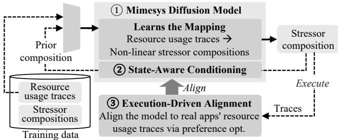  
Figure 1: Overview of MIMESYS with its key ideas.

Benchmark suites [8, 47, 48] offer reproducibility but are difficult to generalize beyond their limited coverage and lack diversity. Testing directly in production is resource-intensive, difficult to scale, and fails to provide reproducible conditions as workload contention evolves over time. Synthetic workload generation offers a more promising path [44], but existing approaches fall short: resource stressors [3,26] are typically used in simplistic ways that poorly capture temporal variations and multi-resource interactions, while application cloning techniques [27, 28] require exhaustive per-application profiling and primarily reproduce coarse-grained statistical patterns rather than fine-grained temporal dynamics.

This paper asks: Can we reverse-engineer executable work loads from resource usage traces? Cluster operators routinely collect such traces from production environments, capturing resource usage patterns over time. If we could synthesize executable workloads that reproduce these patterns, we could enable realistic testing and experimentation without requiring access to actual production applications. This would provide controlled, reproducible environments while preserving privacy and protecting proprietary information.

We explore this question in a concrete context: reproducing realistic environments for testing applications under resource contention from co-resident workloads. In production deployments, colocated workloads compete for shared resources such as CPU, memory bandwidth, cache, and I/O, creating contention that can degrade application performance. This contention remains hidden when testing in isolation, leading developers to deploy applications that perform poorly or violate service-level objectives under real deployment conditions. An ideal solution would synthesize workloads at the application-logic level, reproducing not only system-level resource usage but also fine-grained characteristics such as memory access patterns and microarchitectural behaviors.

We present MIMESYS, a system that takes a practical first step toward this vision by transforming resource usage traces into executable workloads that emulate realistic colocation scenarios (Figure 1). While synthesizing application logic from traces remains infeasible, we observe that for reproducing resource contention, emulating resource usage patterns suffices without recovering the underlying application logic. MIMESYS represents emulated workloads as compositions of parameterized resource stressors and learns the complex, nonlinear mapping from resource usage traces to stressor compositions. By using stressors as expressive building blocks rather than simple, pre-configured tools, MIMESYS can approximate diverse, realistic resource usage patterns in a practical and scalable manner. We employ a diffusion model to learn this mapping because it can capture complex, multimodal distributions over stressor compositions ( 1 in Figure 1).

Realizing this approach entails two challenges. First, stressor compositions exhibit complex temporal and crossresource dependencies, where a stressor’s impact depends on concurrent execution and prior system state. Second, real applications exhibit structured behaviors driven by their computational logic that differ from arbitrary stressor combinations, requiring explicit alignment beyond synthetic training data.

We address these challenges with two key ideas. First, we introduce state-aware conditioning ( 2 ) that conditions generation not just on target traces but also on prior system state. Unlike conventional diffusion models, our approach incorporates previously generated stressor compositions and their resulting resource usage into the conditioning mechanism, enabling the model to capture temporal dependencies. Second, we devise execution-driven alignment ( 3 ), a training approach that adapts the model to real application behaviors without requiring ground-truth stressor labels. Inspired by preference optimization [11, 24, 37] in generative models, this approach learns from unlabeled real application traces through direct execution feedback, bridging the gap between synthetic training data and real application traces.

We implement MIMESYS in Python for model training and inference and C++ for the executable generator. The diffusion model uses a U-Net architecture [42] with 8.9M parameters and trains in ≈4 hours on one NVIDIA A100 GPU. The exe cutable generator extends Fleetbench [8] with stress-ng [26] stressors, supporting diverse resource usage patterns across CPU, memory, cache, and I/O. We open-source MIMESYS at https://github.com/ldos-project/mimesys.

Our evaluation shows that MIMESYS generates emulated workloads that closely reproduce multi-resource usage patterns of diverse workload mixes. Using the Dynamic Time Warping distance metric [10], MIMESYS achieves up to 5.5× higher similarity compared to stressor-based baselines. We further demonstrate that MIMESYS accurately emulates application performance under contention across multiple benchmarks. For example, MIMESYS reproduces throughput degradation in database workloads with an average error of 8.3% points, outperforming baselines by 2.6×.

## 2 Background and Motivation

## 2.1 Need for Realistic Testing Environments

To evaluate whether an application will perform well in practice, application developers need to test it in realistic environments. An environment can be defined by two components: (1) the hardware configuration (e.g., CPU, memory, storage, network bandwidth) and (2) the collocated workloads that run alongside the target application. For a given hardware config uration, realistic colocated workloads are essential because they share computing resources with the target application, creating resource contention that can affect performance in ways that remain hidden when testing in isolation. This resource contention, arising from competition for CPU, memory bandwidth, cache, and I/O devices, is a defining characteristic of production deployments where applications are colocated with other workloads on shared infrastructure.

The need for such realistic testing environments is particularly pronounced in cloud settings, where providers colocate multiple tenant applications on shared physical hosts to improve resource utilization. This colocation creates resource contention that makes performance unpredictable [39, 52, 57], where colocated workloads unintentionally interfere with one another as noisy neighbors. Application developers need to test their applications against these realistic contention patterns before deployment to ensure their applications will perform acceptably under production conditions. For example, TUNA [19] demonstrates the value of testing under realistic noise by modeling resource contention from noisy neighbors during database configuration tuning, enabling it to identify configurations that remain robust when deployed.

Beyond simply exposing applications to realistic contention, developers also need these testing environments to be reproducible. Reproducibility enables developers to systematically evaluate different application configurations, conduct fair performance comparisons, and validate optimizations under consistent conditions. However, prior studies [18, 21, 51] highlight the difficulty of achieving such reproducibility in shared environments where resource contention varies unpredictably. Without reproducible testing conditions, developers struggle to isolate the effects of their changes from environmental noise, making it difficult to draw reliable conclusions from their experiments.

Difficulties in obtaining realistic colocated workloads. Unfortunately, obtaining realistic colocated workloads is challenging. One straightforward approach would be to use actual workloads from production deployments. However, actual tenant workloads cannot be shared due to privacy and proprietary concerns. Even when developers have access to production environments for testing, they face two critical limitations.

First, it is resource-intensive and difficult to scale. Developers must deploy their applications into production-like infrastructure to experience realistic contention. For instance, TUNA requires actual deployment to measure performance impact from noisy neighbors, demanding substantial infrastructure (10 nodes over 8 hours per run) that becomes impractical when many developers need to test diverse applications.

Second, production environments evolve continuously as workloads change, making it difficult to achieve reproducible testing conditions. The contention patterns observed in production represent specific deployment states that may change over time, preventing developers from conducting consistent experiments across different configurations or optimizations.

## 2.2 Limitations of Existing Approaches

Given the difficulties in obtaining realistic workloads from production environments, synthetic approaches offer an attractive alternative. Rather than using actual production workloads, these approaches generate controlled workloads or inject artificial interference to mimic resource contention effects. Developers can use synthetic workloads to reproduce stress conditions in a controlled manner while avoiding the infrastructure costs and privacy concerns of real-world testing.

However, existing approaches exhibit limitations in accurately reproducing realistic deployment conditions.

Resource stressors. Resource stressors such as stress-ng [26] and Intel MLC [3] are commonly used to inject resource contention. These tools intentionally stress specific resources (e.g., CPU or memory) for a given duration, enabling researchers to study how systems behave under abnormal conditions [35, 46, 57]. However, stressors are typically used in simple ways: practitioners manually select a few stressors to run continuously at maximum intensity for fixed duration. As shown in §7, this naïve usage poorly captures the realistic conditions operators observe, where applications exhibit temporal variations in resource usage (e.g., periodic bursts, gradual ramps) and complex multi-resource interactions (e.g., memory access patterns that depend on CPU load).

Application benchmarks. Standard benchmarks such as SPEC [47], DCPerf [48], and Fleetbench [8] are carefully designed by domain experts to represent realistic workloads. While benchmarks offer better realism than stressors, they cover only a limited subset of real-world application behaviors. Furthermore, diversifying benchmarks to cover new workload types is challenging: each new benchmark requires manual effort to implement applications that reflect evolving workload characteristics, making it difficult to keep pace with the diversity of modern applications.

Application cloning. Application cloning techniques [27,28] generate synthetic programs that replicate the performance and resource usage profiles of complex or proprietary applications without exposing their internal logic. They profile target applications across the system stack (e.g., I/O operations, kernel activities) to capture their statistical resource usage properties, then construct synthetic programs that exhibit similar characteristics. However, achieving such fidelity requires exhaustive profiling for each application, making it costly to extend cloning to a diverse set of applications. Furthermore, cloning methods primarily reproduce coarse-grained statistical patterns (e.g., mean or median resource utilization) rather than fine-grained temporal dynamics. This focus on statistical characteristics means cloned applications cannot effectively capture the dynamic, time-varying resource usage that characterizes real workloads.

## 3 Design Overview

To address the limitations of existing synthetic approaches while avoiding the costs of real-world deployments, we propose MIMESYS, a system that transforms resource usage traces into executable workloads that run alongside a developer’s target application to emulate realistic collocated workloads. Resource usage traces capture system resource consumption over time, recording metrics such as CPU utilization, memory bandwidth, cache usage, and I/O throughput. Our key insight is that while recovering individual application logic from traces is infeasible, we can synthesize executables that reproduce similar time-series resource usage patterns when executed on the same or similar hardware. Unlike application cloning, which targets individual applications and requires exhaustive per-application profiling, MIMESYS synthesizes environment-level workloads from aggregate resource usage traces. This enables realistic synthetic test environments without requiring access to actual production workloads.

## 3.1 Our Approach

MIMESYS is built on two key ideas.

Stressor composition. We represent emulated workloads as compositions of parameterized resource stressors. As discussed in §2, resource stressors generate workloads designed to exercise specific system resources (e.g., CPU, memory, cache, I/O). We choose stressors as building blocks because they are already in an executable form and can be mixed and combined to create diverse stress conditions, making them practical for generating many different emulated workloads.

Learning trace-to-stressor composition mapping. However, mapping resource usage traces to stressor compositions is challenging because the relationship between stressor parameters and observed system behavior is complex and nonlinear. Simple approaches, such as linearly scaling stressor intensities and concurrency to match target utilization, fail for most resources. For example, our measurements show that interleaving a memory stressor with sleep periods to reduce its average intensity does not produce proportional memory bandwidth reductions; the actual bandwidth usage differs from the target by more than 3× due to caching effects and memory controller policies. Concurrency further complicates this relationship: running a memory stressor with an 8 MiB working set across eight threads increases memory bandwidth usage by 1800× compared to a single thread. These emergent behaviors make it difficult to analytically derive stressor parameters from target resource usage patterns.

Trace-driven emulated workload generation  
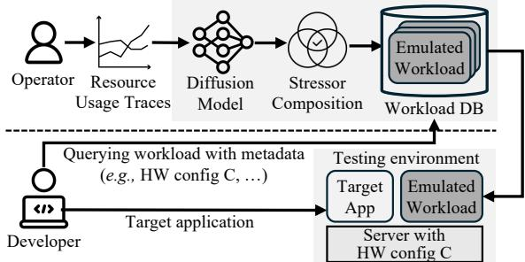  
Using emulated workload in testing environments  
Figure 2: MIMESYS workflow. Operators use MIMESYS to generate emulated workloads from resource usage traces collected in production environments. Developers retrieve emulated workloads matching their target hardware configuration and execute them alongside their applications to test under realistic colocated workloads.

To address this complexity, MIMESYS employs a diffusionbased generative model [22] that learns the mapping from traces to stressor compositions. Diffusion models can capture complex, multimodal distributions over each stressor’s parameters and support conditioning on high-dimensional, long-horizon time-series resource usage traces, enabling tracedriven synthesis of emulated workloads. Our model divides resource usage traces into fixed-duration time windows and generates a stressor composition for each window.

Workflow. Figure 2 illustrates how MIMESYS can be used. Cloud operators (e.g., Azure, AWS, or CloudLab) capture resource usage traces from their production environments and feed them into MIMESYS, which generates a set of emulated workloads as executables. Each workload is labeled with metadata such as hardware configuration and the time period when the traces were collected. The operator can then release these emulated workloads publicly. Application developers retrieve emulated workloads that match the desired deployment characteristics they want to test against. They run these workloads on a hardware environment that is the same or similar to the one described in the metadata, alongside their target application in the testing environment.

This model is analogous to how operators release various forms of traces today (e.g., packet traces [1], flow-level traces [43], microservice call graph traces [29]). By sharing emulated workloads instead of raw traces, operators provide developers with directly executable artifacts that reproduce realistic resource contention while preserving the privacy and proprietary nature of the actual production workloads. Specifically, MIMESYS preserves tenant-sensitive information such as application logic, proprietary algorithms, and business data.

## 3.2 Challenges

While the diffusion-based stressor composition approach is promising, realizing it entails two main challenges:

C1: Capturing temporal and cross-resource usage dependencies. As mentioned in §3.1, the relationship between stressor compositions and resulting resource usage is inherently nonlinear and context-dependent. A stressor’s impact on resources depends not only on its own composition but also on what other stressors are running concurrently and what execution has occurred previously. For example, prior memory accesses can warm the cache hierarchy, drastically reducing subsequent memory bandwidth utilization for the same stressor composition. Similarly, CPU contention from co-running stressors alters thread scheduling patterns, which in turn affects cache miss rates and memory access patterns. To synthesize realistic workloads, the model must learn these system-level dependencies and generate stressor compositions that produce target resource patterns while accounting for temporal execution context.

C2: Aligning with real applications. MIMESYS collects synthetic training data by executing diverse stressor combinations. However, the space of possible stressor combinations is enormous, making it challenging to ensure that the training data covers resource usage patterns exhibited by real applica tions. Real applications exhibit structured behaviors driven by their computational logic (e.g., periodic memory access in databases, bursty compute phases in scientific workloads) that differ from arbitrary stressor mixes. Although stressor compositions capable of reproducing these patterns may exist, synthetic training data alone provides insufficient supervision for the model to discover them. Without explicit alignment with real application traces, the model will learn only the resource usage distribution of synthetic stressor combinations rather than the patterns exhibited by real applications.

## 3.3 Key Ideas

To address these challenges, MIMESYS incorporates two key ideas for training the diffusion model.

I1: State-aware conditioning (§4.2). To capture temporal and cross-resource dependencies, we propose a novel adaptation of diffusion models that conditions generation not just on target traces but also on prior system state. Unlike typical dif fusion models that condition on static inputs (e.g., static text inputs in image generation), our approach makes the model state-aware by incorporating prior system state directly into the conditioning mechanism. Rather than generating stressor compositions for all time windows independently, the model generates them sequentially, conditioning each window on: (1) target resource usage traces across multiple metrics, capturing cross-resource dependencies, and (2) a previously generated stressor composition, reflecting execution temporal dependencies. This enables the model to account for statedependent system effects such as cache warming and resource contention, generating stressor compositions that adapt to how the system state evolves over time.

I2: Execution-driven alignment (§4.3). Inspired by preference optimization in generative models [11,24,37], we devise execution-driven alignment, a training approach that adapts diffusion models to match real application behaviors without requiring ground-truth stressor labels. This approach bridges the distribution gap between synthetic training data and real deployment patterns through direct execution feedback. We treat the diffusion model as a policy and apply reinforcement learning to optimize it based on actual system execution. The model iteratively generates stressor compositions from unla beled real application traces, executes them on hardware, and receives rewards based on how closely the resulting traces match target patterns. Policy gradient methods then update the model to prefer compositions that better reproduce real application behaviors.

## 3.4 Training and Inference Pipeline

Model training. For training, operators specify the target resource metrics (e.g., CPU utilization, memory bandwidth, lastlevel cache (LLC) traffic) and candidate stressors. MIMESYS collects training data by executing diverse stressor combinations using novelty-guided data collection (§4.2.3) and profiling their resource usage traces. The diffusion model learns the mapping from resource usage traces to stressor compositions. To capture temporal and cross-resource dependencies, the model conditions generation on both the target trace and prior stressor compositions (§4.2). MIMESYS then adapts the model to real application traces through execution-driven alignment (§4.3), which optimizes the model based on how closely the generated workloads reproduce target resource patterns when executed.

Emulated workload generation. During inference, operators provide target resource usage traces as input. For each time window, the diffusion model generates a stressor composition conditioned on the target resource usage for that window and the previously generated composition. The workload generator then translates the composition sequence into an executable program that orchestrates the stressors across threads and time windows (§5).

## 4 Training MIMESYS Model

This section formalizes the emulated workload generation problem (§4.1), presents our diffusion model with state-aware conditioning and training data collection (§4.2), and explains how we adapt the model to real application traces using preference optimization (§4.3).

## 4.1 Problem Formulation

Consider a workload mix P executed on a system that produces multivariate time-series resource usage traces o1:T = {o1, . . . , oT }, where each ot ∈ RN represents N resource metrics (e.g., CPU utilization, memory bandwidth, LLC traffic) measured over a fixed time window of size W seconds. In our setting, we do not have access to the original workload P itself. Our goal is to generate an emulated workload P′ = {a1, . . . , aT } that, when executed on the same hardware, produces resource usage traces similar to those of P.

Stressor composition representation. We represent each emulated workload as a sequence of stressor compositions, where at ∈ RM×K denotes the composition of M stressors across K CPU threads for the tth time window. Each entry at [m, k] specifies the fraction of W during which stressor m executes on thread k, with values ranging from 0 to 1. For example, a [m,k] = 0.4 means stressor m runs for 0.4 · W seconds on thread k within the tth window. The duration allocated to all stressors on a single thread sum to at most W . The aggregate intensity of a stressor type across the system is determined by how many threads execute it concurrently.

Objective. We say that an emulated workload P′ is δ-traceequivalent to P under a distance metric ⊖ (e.g., mean-squared error, Dynamic Time Warping [10]) if the trace produced by executing P′, denoted o′ , satisfies ∥o1:T ⊖ o′ ∥ ≤ δ. The emulated workload generation problem is to learn a function fθ : o1:T 7→ P′ = {a1, . . . , aT } such that samples P′ ∼ fθ(o1:T ) produce traces that are δ-trace-equivalent to the observed traces o1:T with high probability. The objective of MIMESYS training is to learn such a mapping that yields δ- trace-equivalent emulated workloads across diverse resource usage patterns.

## 4.2 MIMESYS Diffusion Model

Straightforward approaches such as regressing stressor compositions directly from traces or linearly interpolating stressor intensities treat each time step in isolation and assume a deterministic, one-to-one mapping. As discussed in §3.2, these fail due to temporal dependencies, cross-resource interactions, and nonlinear resource behavior.

Our approach. We extend diffusion models [11, 24] to be state-aware by conditioning generation not just on target traces but also on prior system state. We call this technique state-aware conditioning. Unlike conventional diffusion models that generate outputs based solely on input conditions, our approach incorporates a prior stressor composition directly into the conditioning mechanism. Concretely, instead of learning a direct mapping o 7→ a, we model the conditional distribution p(at | ot , at−1), where ot represents the target trace for the tth time window and at−1 is a stressor composition generated at the (t − 1)th window. This enables sequential generation across time windows, where each window’s stressor composition is conditioned on both the target resource usage and the system state affected by the prior composition.

## 4.2.1 Why Use a Diffusion Model?

Several properties of the workload generation problem guide our choice to use diffusion models. The mapping from traces to stressor compositions is one-to-many: many distinct stressor compositions can produce similar resource usage patterns. Diffusion models are well suited to handle such one-to-many mappings through their iterative denoising process [23]. Starting from noise, the model progressively refines samples while exploring multiple feasible stressor compositions before converging to a final output. This iterative refinement naturally captures the complex multimodal conditional distributions that arise from the one-to-many mapping. Furthermore, while traditional search and optimization methods struggle to generalize as the metric space grows (e.g., across dozens of resource metrics), diffusion models efficiently learn the underlying mapping to safely interpolate across workload traces not seen during training.

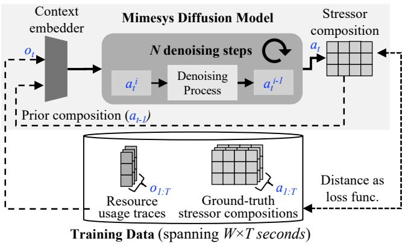  
Figure 3: MIMESYS diffusion modeling. The model is conditioned on input traces and prior stressor compositions to capture temporal and cross-resource dependencies. Each trace and stressor composition corresponds to a time window.

Importantly, diffusion models support flexible conditioning mechanisms through learned context embeddings [32, 36]. This allows us to realize our state-aware conditioning by incorporating a prior stressor composition directly into the generation process, as we discuss next.

## 4.2.2 Model Architecture and Training

We now formalize how to extend a diffusion model with state-aware conditioning. The key is to define a conditioning context that captures both the target trace and system state af fected by the prior stressor composition, then use this context to guide the iterative denoising process. Figure 3 illustrates our model architecture and training process.

Model interface. To make the diffusion model state-aware, we construct a conditioning context that captures both the target trace and system state. MIMESYS employs a learnable embedder g(·) that encodes the target trace ot and a prior stressor composition at−1 into a compact context representation: c = g(ot,at−1). This context embedding summarizes two key components: (1) the target resource usage patterns across multiple metrics, capturing cross-resource dependencies, and (2) how the prior stressor composition has shaped the current system state.

With this conditioning, the model approximates the distribution πθ(at | c), where at is the stressor composition for the tth time window. Because c incorporates both target traces and the prior stressor composition, the diffusion model generates at that accounts for state-dependent effects such as cache warming and resource contention. This formulation enables iterative generation across time windows: after generating at, this composition becomes part of the conditioning context c for generating the next window’s composition at+1.

Training objective. The training objective is to align the model’s predictions with the ground-truth stressor compositions observed in the training data. At a high level, this corresponds to minimizing the expected discrepancy between predicted and ground-truth stressor compositions:

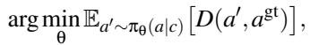

where agt denotes the ground-truth stressor composition and D(·, ·) is a distance metric (e.g., mean-squared error).

In diffusion modeling, we realize this objective by instantiating the general diffusion loss, where the model predicts noise for each denoising step [22]. The clean sample a0 is obtained by denoising N steps from a random noise aN, where a0 corresponds to the ground-truth stressor composition at . The training objective aims to minimize the mean-squared error (i.e., distance) between the true noise ε and the predicted noise εθ. The resulting training loss for the composition generation is:

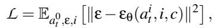

where ε (ai,i,c) is the model’s noise prediction conditioned on the context embedding c at ith denoising step. By minimizing this loss, the model learns to reverse the noising process: each denoising step refines a stressor composition toward the ground-truth stressor composition paired with the context embedding c. The context embedder g(·) is jointly trained with the diffusion model, so its representations are optimized end-to-end for guiding the denoising process.

During generation, the trained model synthesizes stressor compositions by starting from Gaussian noise and iteratively applying the learned reverse transitions, conditioned on the context embedding (see §5 for details).

## 4.2.3 Novelty-Guided Training Data Collection

Training our model requires a diverse dataset of traces that spans a wide range of resource-usage patterns across CPU utilization, memory bandwidth, LLC traffic, and disk I/O. Without sufficient coverage of the resource space, the model cannot learn to generate stressor compositions that reproduce diverse or extreme resource behaviors observed in real applications.

Challenge. A straightforward approach is to randomly sample stressor compositions, execute them to collect traces, and construct a dataset of (composition, trace) pairs. However, random sampling produces highly skewed data. As shown in the left plot of Figure 4, random combinations cluster in narrow regions of the resource space, with many compositions producing similar resource-usage behaviors. This occurs because random composition draws rarely trigger extreme or asymmetric resource patterns (e.g., CPU-intensive but memory-light), causing most samples to collapse into moderate, balanced behaviors. The resulting dataset leaves large portions of the resource space underrepresented, limiting the model’s ability to learn mappings for diverse or high-intensity patterns. Because profiling stressor compositions is time-consuming, simply collecting more random samples is impractical.

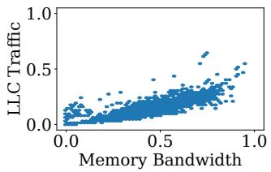  
(a) Random sampling

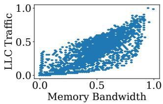  
(b) Novelty-guided collection  
Figure 4: Joint distribution of memory bandwidth and LLC traffic for 5K training samples. (a) Random sampling produces clustered, skewed coverage. (b) Novelty-guided collection achieves more balanced resource-space coverage.

Our approach. We address this challenge through novelty guided training data collection, which prioritizes profiling stressor compositions likely to produce underexplored resource-usage patterns. The approach collects training data iteratively. At each round, MIMESYS trains a lightweight prediction model (e.g., Random Forest [13] in our implementation) on the current dataset, which consists of all traces collected from previously profiled compositions. This predictor estimates the resource usage that candidate stressor compositions would produce. MIMESYS then assigns each candidate a novelty score based on two complementary factors: (1) how rare its predicted trace is under the current data distribution, measuring underrepresentation, and (2) how uncertain the predictor is about that composition, measured via prediction variance, indicating low-confidence regions where the model needs more data. Compositions with high novelty scores either produce underrepresented behaviors or expose gaps in the predictor’s knowledge. MIMESYS selectively profiles the highest-scoring compositions and adds their traces to the training set, iteratively expanding coverage toward underexplored regions.

As shown in the right plot of Figure 4, this approach produces a dataset with substantially better coverage of the joint distribution of memory bandwidth and LLC traffic. The im proved diversity enables our model to learn mappings across a more representative range of system behaviors.

## 4.3 Execution-Driven Alignment

Our diffusion model trained on synthetic stressor combinations learns to map resource-usage traces to stressor compositions across a diverse range of patterns. However, as discussed in §3.2, real applications produce resource-usage patterns shaped by their algorithmic structure that often diverge from those induced by arbitrary synthetic stressor combinations. While the training data may span a broad range of resourceusage values, the temporal structure and cross-resource correlations characteristic of real applications are difficult to capture through synthetic combinations alone. As a result, the pre-trained model may fail to generate stressor sequences that faithfully reproduce real-world application traces, even if it performs well on synthetic test data, as shown in §7.3.

Our approach. To address this gap, we employ executiondriven alignment, an approach inspired by preference optimization in large language models [11,24]. The key challenge is that real traces do not come with ground-truth stressor compositions, making standard supervised learning infeasible. Instead of learning from labeled pairs, execution-driven alignment learns from unlabeled real application traces through direct interaction with the system. We treat the diffusion model as a policy π and optimize it to prefer stressor compositions that, when executed, produce traces similar to real applications. The model iteratively generates stressor compositions conditioned on real application traces, executes them on actual hardware to observe their resource usage, and receives rewards based on trace similarity. Policy-gradient methods [30] then update the model weights to maximize these rewards, shifting the distribution toward compositions that better reproduce real application behaviors. This approach bridges the distribution gap between synthetic training data and real deployment patterns without requiring ground-truth labels.

Optimization objective. The goal is to optimize the policy πθ such that generated stressor compositions, when executed, produce resource-usage traces that closely match those observed in real applications. For each real trace o ∈ Treal, the policy generates a stressor composition a′ ∼ πθ(a | o, aprev) conditioned on the target trace o and prior composition aprev, and obtain the corresponding trace o′ by profiling. We define a reward function R(a′) = −D(o′, o) based on the distance between the executed trace o′ and the target trace o. For the distance metric D, we use weighted L1 distance, where weights reflect the relative importance of each metric to operators. The optimization objective maximizes the expected reward over the policy distribution:

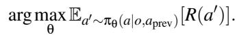

This objective guides policy updates toward stressor compositions that, under actual execution, produce traces that more closely align with real application behaviors.

Optimization procedure. We realize execution-driven alignment through a reinforcement learning algorithm that updates the policy based on execution-derived rewards. MIMESYS adopts the denoising diffusion policy optimization (DDPO) framework [11, 24], which treats each denoising step in the diffusion model as an action and optimizes the policy via policy-gradient methods [45] to maximize expected rewards.

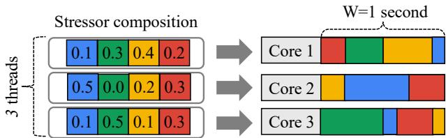  
Figure 5: Converting a stressor composition into an executable workload for a system with three CPU cores. Different colors represent different stressor types. Values specify the fraction of W , allocated to each stressor.

The adaptation process begins with the pre-trained policy π and a set of real-world traces Treal provided by the operator. In each iteration, the policy generates a stressor composition a′ ∼ πθ(a | o, aprev) for a trace o sampled from Treal. The stressor compositions [aprev, a′] are then executed on a system (i.e., server) to collect the resulting trace o′ produced by a′. The reward R(a′) is computed by measuring the distance (D) between the executed trace o′ and the target trace o. The policy gradient method [40, 45] then updates the model parameters to increase the expected reward. This process iterates until convergence or for a fixed number of iterations, producing an adapted model π that better aligns with real application patterns.

## 5 Executable Workload Generation

Once the MIMESYS model is trained, operators can use it to generate emulated workloads that reproduce target resourceusage patterns. The generation process operates on time-series resource traces divided into fixed-duration windows, where the window size W is a training hyperparameter determined during model training. For example, given Ltrace = 30 seconds of resource traces and W = 1 second, the model produces T = Ltrace = 30 time windows. As described in §4.2.2, the W model generates a stressor composition at for each window t through an iterative diffusion process conditioned on the target trace segment ot and a prior composition at−1. This produces a sequence of stressor compositions a1:T that must be translated into an executable workload.

From compositions to executables. Figure 5 illustrates how MIMESYS converts stressor compositions into executables. The left side shows a generated composition at represented as a matrix with three rows (one per CPU thread) and four columns (one per stressor type, shown as different colors). Each matrix entry specifies the fraction of the time window allocated to that stressor on that thread. For example, the first row shows [0.1, 0.3, 0.4, 0.2], indicating that thread 1 should execute stressor types 1 through 4 for 10%, 30%, 40%, and 20% of the window duration, respectively.

The executable generator maps each matrix row to a physical CPU core, as shown on the right side of the figure. Within each window (1 second in this example), each core executes its assigned stressors for the specified duration. The colored segments on the right visualize these execution schedules: Core 1 runs the red stressor for 0.2 seconds, the green stressor for 0.3 seconds, and so on. To avoid introducing systematic temporal bias, MIMESYS randomizes the execution order of stressors within each window while preserving their allocated duration. For instance, Core 2 might execute the orange stressor first, then blue, then red, rather than in a fixed order.

MIMESYS generates the final executable as a standalone C++ program that orchestrates stressor execution according to these schedules, as we describe next.

## 6 Implementation

We implement MIMESYS in approximately 1.8K lines of Python for model training and inference, and 800 lines of C++ for the emulated workload generator. We release MIMESYS at https://github.com/ldos-project/mimesys.

Training data collection. For novelty-guided data collection (§4.2), we implement a Random Forest predictor [13] with 100 trees that estimates resource usage from stressor compositions. The novelty score combines prediction uncertainty (measured via variance across trees) and rarity (measured via distance to the nearest training sample in the predicted metric space). We collect training data iteratively, profiling 128 high-novelty compositions per round for 100 rounds, yielding 12K diverse training samples. We profile each data sample multiple times for accurate measurements. Collecting the full training dataset takes 8 hours on 8 machines, though this time varies with the number of samples, window size, and the number of machines used. The profiling infrastructure collects CPU utilization, memory bandwidth, LLC traffic (via hardware performance counters), and disk I/O throughput (via /proc/diskstats) at 1000ms granularity using TACC cluster’s HPC monitoring tools [49]. The stressor library is fixed during data collection and training; consequently, adding or replacing stressors requires re-profiling and retraining MIMESYS.

Diffusion model. The diffusion model uses a U-Net architecture [42] with 8.9M parameters, where the encoder downsamples the input and the decoder upsamples it to capture how perthread stressors jointly shape resource usage. For state-aware conditioning (§4.2.2), we employ two MLP-based encoders: a trace encoder that transforms target resource usage vectors into a 256-dimensional embedding via 4 fully-connected layers, and a state encoder that similarly processes prior stressor compositions. These embeddings are concatenated and injected into each U-Net layer to guide the denoising process.

We train the model in PyTorch [31] using the standard noise prediction objective from DDPM [22]. Pretraining runs on one NVIDIA A100 GPU with a learning rate of 1 × 10−4 for 2000 epochs using 25 denoising steps, taking approximately 2 hours. For execution-driven alignment, we apply DDPO [11] with a learning rate of 3 × 10−6 and the advantage clipping threshold of 3, requiring an additional 2 hours with 8 machines for profiling. We assign equal weights to each resource type in the reward function and use a 1-second time window (W ) for both training and inference (see Appendix B for detailed setup). The 1-second window length was selected as a trade-off between data reliability and temporal resolution. Smaller windows resulted in higher variance in collected measurements, whereas larger windows masked fine-grained resource dynamics and increased training data collection time.

From the trained model, generating stressor compositions simply incurs the diffusion model’s inference cost. In our setup, it processes roughly 190 time windows per second with a batch size of 128 on an A100 GPU.

Executable generator. We build the executable generator by extending Fleetbench [8] with additional stressors from stress-ng [26], supporting stressor types spanning CPU (integer arithmetic, floating-point operations), memory (sequential/random access with varying working set sizes), cache (LLC-focused access patterns), disk I/O (sequential/random reads and writes), and a sleep stressor for idle periods. Each stressor is implemented as a parameterized C++ function. To translate model-generated compositions into executable workloads, we implement a code generation module that produces standalone C++ programs. For each time window, the generator maps stressor parameters to thread-level execution schedules and randomizes stressor execution order within each window to avoid temporal bias.

## 7 Evaluation

We evaluate MIMESYS to answer four key questions:

• Can MIMESYS reproduce performance degradation caused by noisy neighbor effects (§7.1)?

• How closely do MIMESYS-generated workloads’ resource usage patterns match those of real applications (§7.2)?

• How effective are MIMESYS’s techniques (§7.3)?

• How sensitive is MIMESYS to input trace variations (§7.4)?

Experimental setup. We evaluate MIMESYS on Cloud-Lab [17] c220g2 machines (Intel Haswell, 20 cores) running Ubuntu 22.04 with Linux kernel 5.15. Input traces consist of per-core CPU utilization, memory bandwidth, LLC traffic, and disk I/O (23 dimensions). We use 14 stressors spanning CPU, memory, cache, and disk I/O resources chosen based on their distinct resource-usage patterns to ensure diversity (see Appendix A for the complete list). To construct this stressor set, we first profiled approximately 600 candidate stressors from Fleetbench and stress-ng, then selected representative stressors based on their resource-usage characteristics to maximize coverage of the resource-usage space while avoiding redundant behaviors.

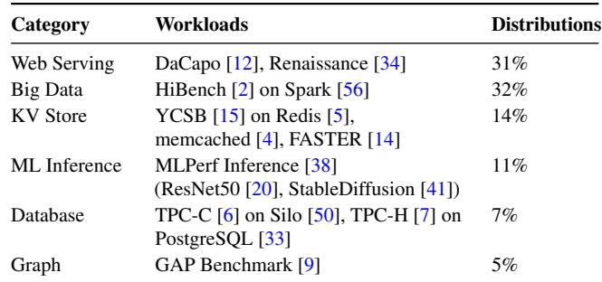  
Table 1: Workloads used in the evaluation.

Workloads. We construct realistic contention scenarios by colocating multiple workloads, each running in a separate VM on Linux/KVM on shared physical machines. We create workload mixes by colocating up to 6 workloads sampled from popular benchmarks (Table 1) according to Azure’s workload distribution [16, 53] for realism. To ensure broad coverage of contention scenarios, we balance the mixes by selecting an equal number for each colocation level, controlling the average total load. For each mix, we run workloads for 5 minutes and collect traces across CPU utilization, memory bandwidth, LLC traffic, and disk I/O, totaling 10 hours of diverse workload patterns.

Baselines. We compare MIMESYS against three baselines: Search-based: For each time window, it selects the stressor composition from the training data with minimum Euclidean distance to the target trace in resource usage space.

Linear interpolation: For each time window, it identifies the 100 nearest training samples in resource usage space and linearly interpolates their stressor compositions to approximate the target trace.

Single stressor: Uses a single resource-targeting stressor with calibrated sleep intervals to match per-core CPU utilization. We use Fleetbench (swissmap) for cache and memory bandwidth, and stress-ng (readahead) for disk I/O.

Metrics. We evaluate fidelity using two metrics. First, trace similarity measures how closely synthetic traces match real ones using the Dynamic Time Warping (DTW) distance metric [10], which captures temporal alignment and shape similarity. DTW distances are normalized to [0,1], where 0 indicates identical traces (a value of 0.1 indicates roughly 10% difference). Second, application performance degradation compares the impact on colocated applications (throughput drop or latency increase) when running alongside synthetic vs. real workloads. We report the %-point difference in degradation.

## 7.1 Reproducing Noisy Neighbor Effects

To serve as useful test environments, MIMESYS-generated workloads must induce similar performance impacts on colocated applications as real workloads. We measure application performance (throughput or latency) when colocated with MIMESYS-generated workloads vs. real workloads. To clearly expose contention effects, we configure colocated workloads to use more than 50% of available CPU cores, ensuring measurable performance degradation on the target application.

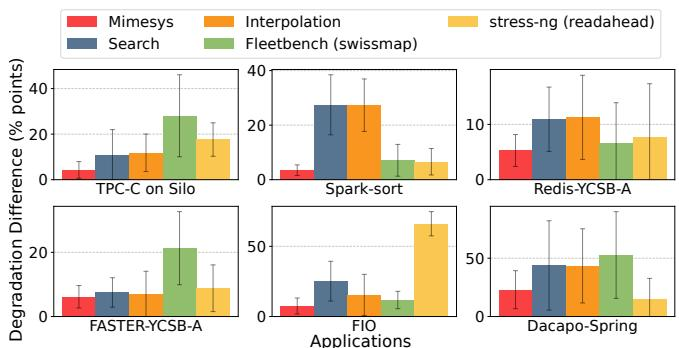  
Figure 6: Differences in application performance degradation when colocated with synthetic workloads generated by MIMESYS or baselines.

Overall results. We evaluate 6 target applications spanning databases (TPC-C on Silo), key-value stores (YCSB on FASTER and Redis), file I/O (FIO), big data (Spark Sort), and web serving (DaCapo). Figure 6 shows the difference in performance degradation when colocating these applications with MIMESYS-generated vs. real workloads.

MIMESYS achieves an average degradation difference of 8.3% points across all applications, compared to 19.4% points for the next best baseline (Interpolation). This shows that MIMESYS captures the resource contention dynamics more accurately than baselines. The baselines perform inconsistently across applications. For example, the Fleetbench baseline, one of single stressor baselines, achieves 11.8% points for FIO but 28.1% points for TPC-C, as it focuses on cache and memory bandwidth stress without capturing cross-resource interactions. For certain applications like Da-Capo, MIMESYS exhibits higher degradation differences (15% points), where we use p90 latency as the performance metric. Capturing tail latency effects is more challenging due to their sensitivity to request-level dynamics and data access patterns. For example, for Redis, the throughput degradation predicted by MIMESYS differs by only 5.3% points, whereas the corresponding p99 latency degradation can vary by as much as 9×. This effect arises because, for some cases, small differences in request-level behavior can amplify into large tail-latency changes, making tail latency hard to reproduce with aggregate stressors.

Figure 7 shows a detailed view for TPC-C and FIO. We plot normalized throughput compared to isolated runs, varying the colocated workloads from real workload mixes (blue) and synthetic workloads generated by MIMESYS (red) or the baselines. Different workload mixes (labeled on the xaxis) induce varying contention levels, causing throughput drops from 3% to 23% (blue horizontal lines). MIMESYSgenerated workloads closely track the degradation caused by real workloads across all mixes, while baselines show larger deviations. In TPC-C (Figure 7a), Mix A (two web servers and one ResNet50 inference) causes a minimal throughput drop of 3%, which most synthetic workloads capture well. However, for mixes B to F with KV and Spark workloads that induce higher contention, MIMESYS maintains close alignment with real workload degradation, while baselines do not consistently track the patterns. For FIO (Figure 7b), running sequential read/write operations alongside colocated workloads causes throughput drops from 5% to 25%. MIMESYS reproduces these drops across all workload mixes, while baselines show deviations in several mixes (e.g., Mix A and D).

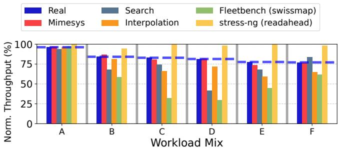

(a) TPC-C on Silo  
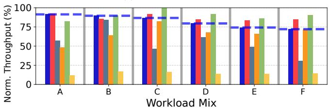  
(b) FIO benchmark  
Figure 7: Application performance degradation while varying colocated workload mixes for (a) TPC-C on Silo and (b) FIO.

Case study: TPC-C on Silo. The ability to reproduce timevarying performance impacts is crucial for evaluating applications under realistic contention. We examine a case where TPC-C on Silo is colocated with two applications (Spark running SVD and a Renaissance web server), each running in separate VMs. Figure 8 shows TPC-C throughput and resource usage over time when colocated with real workloads (blue) vs. MIMESYS-generated workloads (red). For the application throughput, we report the difference from the isolated run (no colocation) in percentage to highlight performance degradation due to contention.

As shown in the first plot, when colocated with a real workload mix, TPC-C throughput drops up to 37% after 30 seconds. The resource usage plots below reveal the contention sources: spikes in memory bandwidth, LLC traffic, and CPU utilization (we show per-core utilization for CPU 0 of the web server and CPU 8 of Spark for brevity). Y-axis ranges are normalized by the maximum values from training data.

MIMESYS-generated workloads reproduce this behavior with 4% average throughput deviation and 8% DTW distance in resource usage patterns. Both the timing and magnitude of performance degradation closely match the real workload scenario. The alignment between memory band width spikes and throughput drops suggests that memory contention from Spark is the primary cause of TPC-C degradation, which MIMESYS successfully captures. While other baselines closely match CPU utilization, they fail to match other resource usage patterns, leading to larger throughput deviations (9% for interpolation and 30% for stressor baselines).

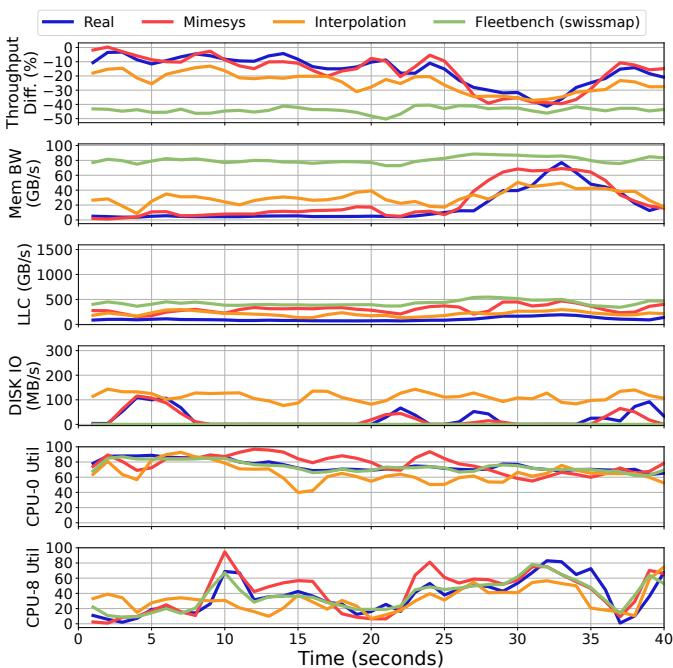  
Figure 8: TPC-C throughput and resource-usage over time when colocated with real (Spark & Renaissance web server workload mix) vs. MIMESYS-generated workloads.

## 7.2 Trace Similarities

We evaluate how closely MIMESYS-generated workloads resource usage traces match those of real workloads. We report similarity using DTW distance, which accounts for temporal misalignment and variations in time-series traces. We classify workloads into three load levels based on CPU core allocation: low (0-30%), mid (30-60%), and high (60% and above).

Figure 9 illustrates the overall similarity between the generated and real traces for different metrics (CPU Utilization per core, memory bandwidth, LLC traffic, and disk I/O) and workload mixes (low, mid, and high load). For simplicity, we report the average CPU utilization across all cores instead of reporting per-core utilization separately. The results show that MIMESYS achieves low DTW distances across all metrics, indicating that the generated traces closely match the real ones. In terms of overall performance, MIMESYS outperforms all baseline methods, achieving an average DTW distance improvement up to 5.5× compared to our baselines.

The gaps grow with load level, demonstrating MIMESYS’s ability to emulate complex resource patterns. Heuristic baselines (search-based and linear interpolation) fail to capture multi-resource interactions under contention, resulting in high usage deviations. While the memory stressor baseline (Fleetbench) matches CPU utilization via sleep intervals, it fails to capture other resources, yielding higher DTW distances in memory bandwidth and LLC traffic. The IO stressor baseline (stress-ng) performs poorly across all metrics due to its sole focus on disk I/O.

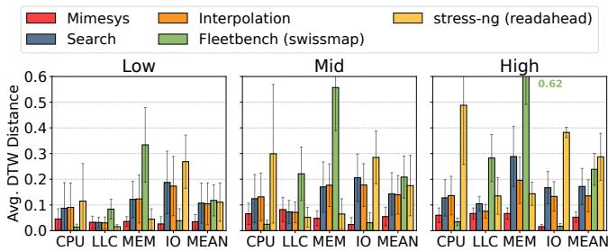  
Figure 9: DTW distances between real and synthetic traces for different metrics and workload mixes. “MEAN” reports the average DTW error over all metrics.

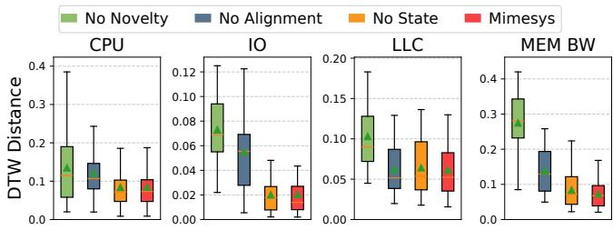  
Figure 10: Effectiveness of the proposed techniques.

## 7.3 Effectiveness of MIMESYS Techniques

In this section, we study how MIMESYS’s key techniques contribute to its effectiveness. We ablate novelty-guided data collection, state-aware conditioning, and execution-driven alignment to measure their individual impacts on trace similarity between MIMESYS-generated workloads and real ones.

Novelty-guided training data collection. We evaluate the impact of novelty-guided data collection by comparing MIMESYS trained with and without this technique. Without novelty guidance, MIMESYS collects the training data through random sampling of stressor compositions. As shown by the green bars in Figure 10 ("No Novelty"), random sampling yields substantially higher DTW distances. Novelty-guided data collection expands coverage of the resource-usage space (Figure 4), reducing average DTW error by 2.5×.

State-aware conditioning. We evaluate state-aware conditioning by comparing MIMESYS with a variant that does not condition on prior stressor compositions. The yellow bars in Figure 10 ("No State") show DTW distances without stateaware conditioning. While the average difference is small (7% higher), certain cases show larger deviations. Relative to the same stressor composition profiled after an idle window, the 90th-percentile change in LLC and memory bandwidth is 135.7% and 95.0%, respectively. State-aware conditioning is beneficial in tail cases where the preceding stressor shifts the observed metric by more than 2×.

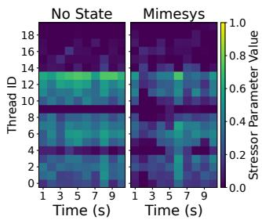  
(a) Memory stressor intensity

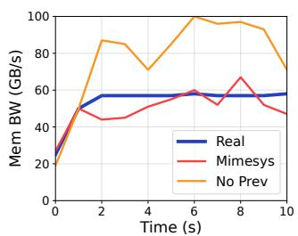  
(b) Memory bandwidth usage  
Figure 11: Effectiveness of state-aware conditioning.

In particular, Figure 11 presents a case study where stateaware conditioning substantially improves fidelity. Figure 11a shows how the memory bandwidth stressor is activated across threads over time, where each heatmap cell represents the fraction of time window allocated to this stressor on a particular thread. Without state-aware conditioning (left), the model generates uniformly high activations across most threads with little temporal variation, as shown by the bright green regions. This uniform high intensity creates excessive memory contention that drives bandwidth usage above target levels in subsequent windows. In contrast, with state-aware conditioning (right), the model generates more varied activation patterns, reducing memory-stressor intensity when prior execution has already created high memory load. As shown in Figure 11b, this adaptive behavior produces memory bandwidth traces that align more closely with the target.

Execution-driven alignment. We evaluate the impact of execution-driven alignment by comparing trace similarity before and after this training stage. The blue bars in Figure 10 ("No Alignment") show DTW distances for the model without alignment. Without alignment, DTW errors are 59% higher on average, demonstrating that execution-driven alignment substantially improves fidelity to real application behaviors. The improvement is particularly pronounced for memory bandwidth and I/O metrics. However, for some metrics such as LLC, improvements are less apparent. This likely occurs because the reward function may not fully capture all dimensions of trace similarity, causing the alignment process to prioritize certain metrics over others. While adjusting metricspecific weights can help, exploring more expressive reward formulations remains important future work.

## 7.4 Sensitivity to Input Traces

We study MIMESYS’s sensitivity to variations in input traces through two experiments.

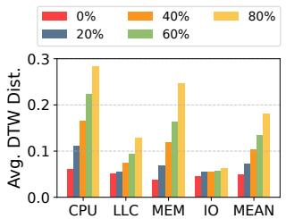  
(a) Varying trace dropping rate

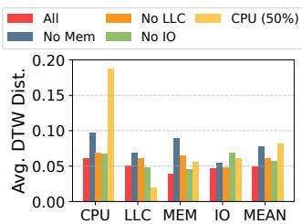  
Figure 12: Sensitivity to input trace variations.  
(b) Varying dropped metric

Random trace dropping. We randomly drop portions of input traces during inference to evaluate robustness to incomplete data. Figure 12a shows DTW distances when varying the dropping rate from 0% to 80%. As the dropping rate increases, similarity degrades gradually: 1.4× higher DTW distance at 20% and up to 3.7× at 80%. Missing trace segments challenge the model’s ability to infer accurate stressor compositions. Despite expected degradation, MIMESYS maintains reasonable fidelity, demonstrating robustness to incomplete traces.

Metric-specific dropping. We evaluate the impact of dropping specific metric types during inference. Among the 23 input dimensions, we drop one metric type at a time and measure the resulting DTW distances. For CPU utilization, we drop 50% of per-core measurements; for other metrics (memory bandwidth, LLC traffic, disk I/O), we drop the entire metric during inference. Figure 12b shows the results. As expected, dropping specific metrics increases DTW distances for the corresponding metrics. MIMESYS maintains reasonable fidelity across other metrics (less than 1.7× degradation), showing it can infer stressor compositions that approximate overall resource patterns despite missing metrics.

## 8 Other Related Work

Synthetic trace generation. Prior works have explored synthetic trace generation for system evaluation. NetShare [55], and NetDiffusion [25] generate synthetic network traffic that mimics real-world patterns using machine learning models such as GANs and diffusion models. These approaches produce network packet traces (e.g., packet sequences, flow statistics) as data artifacts for purposes such as privacy-preserving data sharing or network simulation. In contrast, MIMESYS generates executable programs that produce resource usage traces across multiple dimensions (e.g., CPU, memory bandwidth, cache), enabling active experimentation under realistic contention conditions.

Synthetic workload generation. Other works have explored generating synthetic workloads to replicate the behavior of real applications without exposing proprietary code or data. Datamime [27] and Pbench [58] generate synthetic workloads for specific domains by using Bayesian optimization to match application performance characteristics or by combining database queries based on workload statistics. These approaches focus on reproducing coarse-grained performance metrics for specific application types. MIMESYS differs by generating general-purpose workloads from system-level traces that reproduce fine-grained, multi-resource usage patterns over time across diverse application types.

## 9 Discussion

Portability across hardware platforms. MIMESYS currently targets a specific hardware platform, as the stressor library and generative model are trained for a known environment. Synthetic workloads generated for one platform may not reproduce the same resource usage patterns on systems with different hardware characteristics. For example, when synthetic workloads generated on a Haswell system are executed on a Skylake platform, we observe 190% higher prediction errors than using synthetic workloads generated by a model trained and deployed on Skylake.

The degradation is primarily caused by architectural differences that change how stressors consume system resources. While the stressors are designed for specific working-set sizes, variations in their per-iteration execution characteristics across architectures result in different LLC utilization and memory bandwidth behaviors. As future work, the generative model could be conditioned on hardware descriptors (e.g., CPU architecture, cache hierarchy, memory topology) to automatically adapt stressor compositions and improve cross-platform generalization.

Other use cases. MIMESYS could be extended to enable operators to evaluate resource management policies under realistic conditions. For example, operators could assess policy changes (e.g., new scheduling algorithms and NUMA balancing strategies). This would require extending MIMESYS to emulate fine-grained resource usage patterns, such as memory access patterns and cache behaviors, that influence how resource policies interact with workloads.

More broadly, realizing these use cases will require richer telemetry than the CPU, LLC, memory bandwidth, and I/O metrics considered in this work. Access to additional signals, such as memory-access locality, NUMA traffic, network activity, and accelerator utilization, together with a richer li brary of stressors and microbenchmarks that exercise these resources, could enable more faithful workload emulation. Such telemetry and workload primitives would allow MIMESYS to capture resource behaviors beyond those exposed in this work, supporting a broader range of tasks including resource management, and performance debugging.

## 10 Conclusions

We presented MIMESYS, a system that generates executable workloads from resource usage traces to enable realistic testing environments. MIMESYS represents workloads as stressor compositions and employs a diffusion model to learn the complex mapping from traces to stressor compositions. Two innovations enable this: state-aware conditioning, which captures temporal dependencies by conditioning on a prior stressor composition that affects system state; and execution-driven alignment, which adapts the model to real application behaviors using direct execution feedback. Our evaluation shows that MIMESYS achieves up to 5.5× higher trace similarity than baselines and reproduces application performance under contention 2.6× more accurately. By enabling reproducible testing without proprietary access, MIMESYS opens new possibilities for systems research and practical development.

## 11 Acknowledgment

We thank our shepherd for their guidance throughout the revision process and the anonymous reviewers for their constructive feedback and insightful suggestions. Their comments helped improve the clarity, quality, and presentation of this work. This material is based upon work supported by the U.S. National Science Foundation (NSF) under Grant Number 2326576.

## References

[1] CAIDA. https://catalog.caida.org. Accessed: 2025-12- 08.

[2] HiBench Suite. https://github.com/Intel-bigdata/ HiBench. Accessed: 2025-12-08.

[3] Intel® Memory Latency Checker (intel® MLC). https:// www.intel.com/content/www/us/en/download/736633/ intel-memory-latency-checker-intel-mlc.html. Accessed: 2025-12-08.

[4] Memcached, a distributed memory object caching system. http://memcached.org. Accessed: 2025-12-08.

[5] Redis, an in-memory data structure store. http://redis.io. Accessed: 2025-12-08.

[6] TPC benchmark C (TPC-C). http://www.tpc.org/tpcc. Accessed: 2025-12-08.

[7] TPC benchmark H (TPC-H). http://www.tpc.org/tpch. Accessed: 2025-12-08.

[8] Andreas Abel, Yuying Li, Richard O’Grady, Chris Kennelly, and Darryl Gove. A profiling-based benchmark suite for warehouse-scale computers. In 2024 IEEE International Symposium on Performance Analysis of Systems and Software (ISPASS), pages 325–327, 2024.

[9] Scott Beamer, Krste Asanovic, and David Patterson. The gap ´ benchmark suite. arXiv preprint arXiv:1508.03619, 2015.

[10] Donald J. Berndt and James Clifford. Using dynamic time warping to find patterns in time series. In Proceedings of the 3rd International Conference on Knowledge Discovery and Data Mining, AAAIWS’94, page 359–370. AAAI Press, 1994.

[11] Kevin Black, Michael Janner, Yilun Du, Ilya Kostrikov, and Sergey Levine. Training diffusion models with reinforcement learning. arXiv preprint arXiv:2305.13301, 2023.

[12] Stephen M Blackburn, Zixian Cai, Rui Chen, Xi Yang, John Zhang, and John Zigman. Rethinking Java performance analysis. In Proceedings of the 30th ACM International Conference on Architectural Support for Programming Languages and Operating Systems, Volume 1, ASPLOS 2025, Rotterdam, Netherlands, 30 March 2025 - 3 April 2025. ACM, 2025.

[13] Leo Breiman. Random forests. Mach. Learn., 45(1):5–32, October 2001.

[14] Badrish Chandramouli, Guna Prasaad, Donald Kossmann, Justin Levandoski, James Hunter, and Mike Barnett. Faster: A concurrent key-value store with in-place updates. In Proceedings of the 2018 International Conference on Management of Data, SIGMOD ’18, page 275–290, New York, NY, USA, 2018. Association for Computing Machinery.

[15] Brian F. Cooper, Adam Silberstein, Erwin Tam, Raghu Ramakrishnan, and Russell Sears. Benchmarking cloud serving systems with ycsb. In Proceedings of the 1st ACM Symposium on Cloud Computing, SoCC ’10, page 143–154, New York, NY, USA, 2010. Association for Computing Machinery.

[16] Eli Cortez, Anand Bonde, Alexandre Muzio, Mark Russinovich, Marcus Fontoura, and Ricardo Bianchini. Resource central: Understanding and predicting workloads for improved resource management in large cloud platforms. In Proceedings of the 26th Symposium on Operating Systems Principles, SOSP ’17, page 153–167, New York, NY, USA, 2017. Association for Computing Machinery.

[17] Dmitry Duplyakin, Robert Ricci, Aleksander Maricq, Gary Wong, Jonathon Duerig, Eric Eide, Leigh Stoller, Mike Hibler, David Johnson, Kirk Webb, Aditya Akella, Kuangching Wang, Glenn Ricart, Larry Landweber, Chip Elliott, Michael Zink, Emmanuel Cecchet, Snigdhaswin Kar, and Prabodh Mishra. The design and operation of CloudLab. In Proceedings of the USENIX Annual Technical Conference (ATC), pages 1–14, July 2019.

[18] Dmitry Duplyakin, Alexandru Uta, Aleksander Maricq, and Robert Ricci. In datacenter performance, the only constant is change. In 2020 20th IEEE/ACM International Symposium on Cluster, Cloud and Internet Computing (CCGRID), pages 370–379. IEEE, 2020.

[19] Johannes Freischuetz, Konstantinos Kanellis, Brian Kroth, and Shivaram Venkataraman. Tuna: Tuning unstable and noisy cloud applications. In Proceedings of the Twentieth European Conference on Computer Systems, EuroSys ’25, page 954–973, New York, NY, USA, 2025. Association for Computing Machinery.

[20] Kaiming He, Xiangyu Zhang, Shaoqing Ren, and Jian Sun. Deep residual learning for image recognition. In Proceedings of the IEEE conference on computer vision and pattern recognition, pages 770–778, 2016.

[21] Sören Henning, Adriano Vogel, Esteban Perez-Wohlfeil, Otmar Ertl, and Rick Rabiser. When should i run my application benchmark? studying cloud performance variability for the case of stream processing applications. In Proceedings of the 33rd ACM International Conference on the Foundations of Software Engineering, FSE Companion ’25, page 400–410, New York, NY, USA, 2025. Association for Computing Machinery.

[22] Jonathan Ho, Ajay Jain, and Pieter Abbeel. Denoising diffusion probabilistic models. Advances in neural information processing systems, 33:6840–6851, 2020.

[23] Jonathan Ho and Tim Salimans. Classifier-free diffusion guidance. arXiv preprint arXiv:2207.12598, 2022.

[24] Zichao Hu, Chen Tang, Michael Joseph Munje, Yifeng Zhu, Alex Liu, Shuijing Liu, Garrett Warnell, Peter Stone, and Joy

deep Biswas. Composablenav: Instruction-following navigation in dynamic environments via composable diffusion. In 9th Annual Conference on Robot Learning, 2025.

[25] Xi Jiang, Shinan Liu, Aaron Gember-Jacobson, Arjun Nitin Bhagoji, Paul Schmitt, Francesco Bronzino, and Nick Feamster. Netdiffusion: Network data augmentation through protocolconstrained traffic generation. Proc. ACM Meas. Anal. Comput. Syst., 8(1), February 2024.

[26] Colin Ian King. stress-ng. https://github.com/ ColinIanKing/stress-ng. Accessed: 2025-12-08.

[27] Hyun Ryong Lee and Daniel Sanchez. Datamime: Generating representative benchmarks by automatically synthesizing datasets. In Proceedings of the 55th Annual IEEE/ACM International Symposium on Microarchitecture, MICRO ’22, page 1144–1159. IEEE Press, 2023.

[28] Mingyu Liang, Yu Gan, Yueying Li, Carlos Torres, Abhishek Dhanotia, Mahesh Ketkar, and Christina Delimitrou. Ditto: End-to-end application cloning for networked cloud services. In Proceedings of the 28th ACM International Conference on Architectural Support for Programming Languages and Operating Systems, Volume 2, ASPLOS 2023, page 222–236, New York, NY, USA, 2023. Association for Computing Machinery.

[29] Shutian Luo, Huanle Xu, Chengzhi Lu, Kejiang Ye, Guoyao Xu, Liping Zhang, Yu Ding, Jian He, and Chengzhong Xu. Characterizing microservice dependency and performance: Alibaba trace analysis. In Proceedings of the ACM Symposium on Cloud Computing, pages 412–426, 2021.

[30] Volodymyr Mnih, Adria Puigdomenech Badia, Mehdi Mirza, Alex Graves, Timothy Lillicrap, Tim Harley, David Silver, and Koray Kavukcuoglu. Asynchronous methods for deep reinforcement learning. In Maria Florina Balcan and Kilian Q. Weinberger, editors, Proceedings of The 33rd International Conference on Machine Learning, volume 48 of Proceedings of Machine Learning Research, pages 1928–1937, New York, New York, USA, 20–22 Jun 2016. PMLR.

[31] Adam Paszke, Sam Gross, Francisco Massa, Adam Lerer, James Bradbury, Gregory Chanan, Trevor Killeen, Zeming Lin, Natalia Gimelshein, Luca Antiga, Alban Desmaison, Andreas Köpf, Edward Yang, Zach DeVito, Martin Raison, Alykhan Tejani, Sasank Chilamkurthy, Benoit Steiner, Lu Fang, Junjie Bai, and Soumith Chintala. PyTorch: an imperative style, highperformance deep learning library. Curran Associates Inc., Red Hook, NY, USA, 2019.

[32] Ethan Perez, Florian Strub, Harm de Vries, Vincent Dumoulin, and Aaron Courville. Film: visual reasoning with a general conditioning layer. In Proceedings of the Thirty-Second AAAI Conference on Artificial Intelligence and Thirtieth Innovative Applications of Artificial Intelligence Conference and Eighth AAAI Symposium on Educational Advances in Artificial Intelli gence, AAAI’18/IAAI’18/EAAI’18. AAAI Press, 2018.

[33] PostgreSQL Database Management System. https:// www.postgresql.org/. Accessed: 2025-12-08.

[34] Aleksandar Prokopec, Andrea Rosà, David Leopoldseder, Gilles Duboscq, Petr T˚uma, Martin Studener, Lubomír Bulej, Yudi Zheng, Alex Villazón, Doug Simon, Thomas Würthinger, and Walter Binder. Renaissance: benchmarking suite for parallel applications on the jvm. In Proceedings of the 40th ACM

SIGPLAN Conference on Programming Language Design and Implementation, PLDI 2019, page 31–47, New York, NY, USA, 2019. Association for Computing Machinery.

[35] Haoran Qiu, Subho S. Banerjee, Saurabh Jha, Zbigniew T. Kalbarczyk, and Ravishankar K. Iyer. FIRM: An intelligent fine-grained resource management framework for SLO-Oriented microservices. In 14th USENIX Symposium on Operating Systems Design and Implementation (OSDI 20), pages 805–825. USENIX Association, November 2020.

[36] Alec Radford, Jong Wook Kim, Chris Hallacy, Aditya Ramesh, Gabriel Goh, Sandhini Agarwal, Girish Sastry, Amanda Askell, Pamela Mishkin, Jack Clark, et al. Learning transferable visual models from natural language supervision. In International conference on machine learning, pages 8748–8763. PmLR, 2021.

[37] Rafael Rafailov, Archit Sharma, Eric Mitchell, Christopher D Manning, Stefano Ermon, and Chelsea Finn. Direct preference optimization: Your language model is secretly a reward model. Advances in neural information processing systems, 36:53728– 53741, 2023.

[38] Vijay Janapa Reddi, Christine Cheng, David Kanter, Peter Mattson, Guenther Schmuelling, Carole-Jean Wu, Brian Anderson, Maximilien Breughe, Mark Charlebois, William Chou, Ramesh Chukka, Cody Coleman, Sam Davis, Pan Deng, Greg Diamos, Jared Duke, Dave Fick, J. Scott Gardner, Itay Hubara, Sachin Idgunji, Thomas B. Jablin, Jeff Jiao, Tom St. John, Pankaj Kanwar, David Lee, Jeffery Liao, Anton Lokhmotov, Francisco Massa, Peng Meng, Paulius Micikevicius, Colin Osborne, Gennady Pekhimenko, Arun Tejusve Raghunath Rajan, Dilip Sequeira, Ashish Sirasao, Fei Sun, Hanlin Tang, Michael Thomson, Frank Wei, Ephrem Wu, Lingjie Xu, Koichi Yamada, Bing Yu, George Yuan, Aaron Zhong, Peizhao Zhang, and Yuchen Zhou. Mlperf inference benchmark. In Proceedings of the ACM/IEEE 47th Annual International Symposium on Computer Architecture, ISCA ’20, page 446–459. IEEE Press, 2020.

[39] Benjamin Reidys, Pantea Zardoshti, Íñigo Goiri, Celine Irvene, Daniel S. Berger, Haoran Ma, Kapil Arya, Eli Cortez, Taylor Stark, Eugene Bak, Mehmet Iyigun, Stanko Novakovic, Lisa Hsu, Karel Trueba, Abhisek Pan, Chetan Bansal, Saravan Rajmohan, Jian Huang, and Ricardo Bianchini. Coach: Exploiting temporal patterns for all-resource oversubscription in cloud platforms. In Proceedings of the 30th ACM Interna tional Conference on Architectural Support for Programming Languages and Operating Systems, Volume 1, ASPLOS ’25, page 164–181, New York, NY, USA, 2025. Association for Computing Machinery.

[40] Allen Ren, Justin Lidard, Lars Ankile, Anthony Simeonov, Pulkit Agrawal, Anirudha Majumdar, Benjamin Burchfiel, Hongkai Dai, and Max Simchowitz. Diffusion policy policy optimization. In International Conference on Learning Representations, volume 2025, pages 77288–77329, 2025.

[41] Robin Rombach, Andreas Blattmann, Dominik Lorenz, Patrick Esser, and Björn Ommer. High-resolution image synthesis with latent diffusion models. In Proceedings of the IEEE/CVF conference on computer vision and pattern recognition, pages 10684–10695, 2022.

[42] Olaf Ronneberger, Philipp Fischer, and Thomas Brox. U-net: Convolutional networks for biomedical image segmentation. In International Conference on Medical image computing and computer-assisted intervention, pages 234–241. Springer, 2015.

[43] Arjun Roy, Hongyi Zeng, Jasmeet Bagga, George Porter, and Alex C. Snoeren. Inside the social network’s (datacenter) network. In Proceedings of the 2015 ACM Conference on Special Interest Group on Data Communication, SIGCOMM ’15, page 123–137, New York, NY, USA, 2015. Association for Computing Machinery.

[44] Divyanshu Saxena, Nihal Sharma, Donghyun Kim, Rohit Dwivedula, Jiayi Chen, Chenxi Yang, Sriram Ravula, Zichao Hu, Aditya Akella, Sebastian Angel, Joydeep Biswas, Swarat Chaudhuri, Isil Dillig, Alex Dimakis, P. Brighten Godfrey, Daehyeok Kim, Chris Rossbach, and Gang Wang. On a foundation model for operating systems, 2023.

[45] John Schulman, Filip Wolski, Prafulla Dhariwal, Alec Radford, and Oleg Klimov. Proximal policy optimization algorithms. arXiv preprint arXiv:1707.06347, 2017.

[46] Gagan Somashekar, Anurag Dutt, Mainak Adak, Tania Lorido Botran, and Anshul Gandhi. Gamma: Graph neural network-based multi-bottleneck localization for microservices applications. In Proceedings of the ACM Web Conference 2024, WWW ’24, page 3085–3095, New York, NY, USA, 2024. Association for Computing Machinery.

[47] Standard Performance Evaluation Corporation (SPEC). SPEC CPU®2017 Benchmark, 2017. Accessed: 2025-12-08.

[48] Wei Su, Abhishek Dhanotia, Carlos Torres, Jayneel Gandhi, Neha Gholkar, Shobhit Kanaujia, Maxim Naumov, Kalyan Subramanian, Valentin Andrei, Yifan Yuan, and Chunqiang Tang. Dcperf: An open-source, battle-tested performance benchmark suite for datacenter workloads. In Proceedings of the 52nd Annual International Symposium on Computer Architecture, ISCA ’25, page 1717–1730, New York, NY, USA, 2025. Association for Computing Machinery.

[49] Texas Advanced Computing Center. Texas advanced computing center (tacc). http://www.tacc.utexas.edu, 2025. Accessed: 2025-12-08.

[50] Stephen Tu, Wenting Zheng, Eddie Kohler, Barbara Liskov, and Samuel Madden. Speedy transactions in multicore inmemory databases. In Proceedings of the Twenty-Fourth ACM Symposium on Operating Systems Principles, SOSP ’13, page 18–32, New York, NY, USA, 2013. Association for Computing Machinery.

[51] Alexandru Uta, Alexandru Custura, Dmitry Duplyakin, Ivo Jimenez, Jan Rellermeyer, Carlos Maltzahn, Robert Ricci, and Alexandru Iosup. Is big data performance reproducible in modern cloud networks? In 17th USENIX Symposium on Networked Systems Design and Implementation (NSDI 20), pages 513–527, Santa Clara, CA, February 2020. USENIX Association.

[52] Dana Van Aken, Dongsheng Yang, Sebastien Brillard, Ari Fiorino, Bohan Zhang, Christian Bilien, and Andrew Pavlo. An inquiry into machine learning-based automatic configuration tuning services on real-world database management systems. Proc. VLDB Endow., 14(7):1241–1253, March 2021.

[53] Jaylen Wang, Daniel S. Berger, Fiodar Kazhamiaka, Celine Irvene, Chaojie Zhang, Esha Choukse, Kali Frost, Rodrigo Fonseca, Brijesh Warrier, Chetan Bansal, Jonathan Stern, Ricardo Bianchini, and Akshitha Sriraman. Designing cloud servers for lower carbon. In 2024 ACM/IEEE 51st Annual International Symposium on Computer Architecture (ISCA), pages 452–470, 2024.

[54] John Wilkes. Yet more Google compute cluster trace data. Google research blog, April 2020. Posted at https://ai.googleblog.com/2020/04/yet-moregoogle-compute-cluster-trace.html.

[55] Yucheng Yin, Zinan Lin, Minhao Jin, Giulia Fanti, and Vyas Sekar. Practical gan-based synthetic ip header trace generation using netshare. In Proceedings of the ACM SIGCOMM 2022 Conference, SIGCOMM ’22, page 458–472, New York, NY, USA, 2022. Association for Computing Machinery.

[56] Matei Zaharia, Mosharaf Chowdhury, Tathagata Das, Ankur Dave, Justin Ma, Murphy McCauley, Michael J. Franklin, Scott Shenker, and Ion Stoica. Resilient distributed datasets: a faulttolerant abstraction for in-memory cluster computing. In Proceedings of the 9th USENIX Conference on Networked Systems Design and Implementation, NSDI’12, page 2, USA, 2012. USENIX Association.

[57] Yuhong Zhong, Daniel S. Berger, Carl Waldspurger, Ryan Wee, Ishwar Agarwal, Rajat Agarwal, Frank Hady, Karthik Kumar, Mark D. Hill, Mosharaf Chowdhury, and Asaf Cidon. Managing memory tiers with CXL in virtualized environments. In 18th USENIX Symposium on Operating Systems Design and Implementation (OSDI 24), pages 37–56, Santa Clara, CA, July 2024. USENIX Association.

[58] Yan Zhou, Chunwei Liu, Bhuvan Urgaonkar, Zhengle Wang, Magnus Mueller, Chao Zhang, Songyue Zhang, Pascal Pfeil, Dominik Horn, Zhengchun Liu, Davide Pagano, Tim Kraska, Samuel Madden, and Ju Fan. Pbench: Workload synthesizer with real statistics for cloud analytics benchmarking. Proc. VLDB Endow., 18(11):3883–3895, July 2025.

## A List of Stressors Used in MIMESYS

MIMESYS uses 14 stressors spanning CPU, memory, cache, and disk I/O resources, selected to ensure diverse resource usage patterns. We select these stressors by profiling approximately 600 candidates from stress-ng [26] and Fleetbench [8], choosing those with distinct resource usage characteristics. Table 2 lists the selected stressors along with their resource types: Computation (Comp), Memory (Mem), Cache, I/O (IO), and No-op (Sleep). The library column indicates the source of each stressor (either stress-ng or a specific Fleetbench benchmark), while the stressor name specifies the particular function used. For brevity, we omit detailed configuration parameters such as boolean flags or other default settings.

## B Hyperparameters Used for Execution-Driven Alignment

We use denoising diffusion policy optimization (DDPO) [11] to fine-tune the diffusion model during execution-driven alignment (§4.3). DDPO is a reinforcement learning algorithm that adapts the pretrained diffusion model to maximize reward signals based on actual execution feedback. The training process involves several key hyperparameters that affect both training stability and the quality of the aligned model.

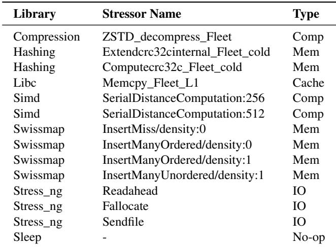  
Table 2: Stressors used in MIMESYS with their library sources and resource types.

We set the learning rate to 3 × 10−6, which is lower than the pretraining learning rate to ensure stable fine-tuning without destroying the knowledge acquired during pretraining. To normalize rewards and reduce variance during training, we estimate advantages using a running mean baseline. The running mean is computed over a buffer of 512 samples, providing a stable estimate of expected rewards. For training stability, we clip the advantage ratio to 3, which limits the magnitude of policy updates and prevents large, destabilizing changes to the model during alignment.

## C Artifact Appendix

## C.1 Abstract

This artifact provides the implementation of MIMESYS, including the pipeline for training data collection, diffusionmodel training, and execution-driven alignment. It also includes the scripts used to run and profile the workload mixes in the evaluation. The artifact enables users to generate synthetic workloads from resource usage traces and evaluate their fidelity using the profiling methodology described in the paper.

## C.2 Scope

The artifact is intended to support the reproducibility of the key results in the paper. Specifically, it allows users to:

• Collect training data from stressor executions.

• Train the diffusion model used by MIMESYS.

• Perform execution-driven alignment.

• Run the evaluation pipeline in the paper.

## C.3 Contents

The artifact includes the source code for all major components of MIMESYS, including training data collection, diffusionmodel training, and execution-driven alignment. In addition, it provides the scripts, configurations, and profiling infrastructure used to generate, execute, and evaluate the workload mixes presented in the paper.

## C.4 Hosting

The artifact is available at https://github.com/ldosproject/mimesys. The artifact-eval branch contains the version prepared for artifact evaluation.

## C.5 Requirements

The artifact is designed to run on Linux systems capable of executing stressors (e.g., Fleetbench and stress-ng) and collecting resource-utilization profiles using TACC’s HPC monitoring infrastructure. Training requires NVIDIA GPUs with CUDA 12.x support. Detailed hardware and software dependencies, installation instructions, and environment specifications are provided in the artifact repository.