の

USENIX

THE ADVANCED COMPUTING SYSTEMS ASSOCIATION

# Oxbow: A Coordinated Architecture for Multi-component File Systems

Jongyul Kim, University of Illinois Urbana–Champaign; Jaehwan Lee and Inhoe Koo, KAIST; Peizhe Liu and Jiyuan Zhang, University of Illinois Urbana– Champaign; Junho Ahn, KAIST; Tianyin Xu, University of Illinois Urbana–Champaign; Youngjin Kwon, KAIST

https://www.usenix.org/conference/osdi26/presentation/kim-jongyul

# This paper is included in the Proceedings of the 20th USENIX Symposium on Operating Systems Design and Implementation.

July 13–15, 2026 • Seattle, WA, USA

ISBN 978-1-939133-55-7

Open access to the Proceedings of the 20th USENIX Symposium on Operating Systems Design and Implementation is sponsored by

# Oxbow: A Coordinated Architecture for Multi-component File Systems

Jongyul Kim+ Jaehwan Lee\* Inhoe Koo\* Peizhe Liu+ Jiyuan Zhang+ Junho Ahn\* Tianyin Xu+ Youngjin Kwon\*

+University of Illinois Urbana-Champaign \*KAIST

## Abstract

Fast storage hardware and computational SSDs have outpaced the traditional kernel-centric or kernel-bypass file system designs, fragmenting modern storage stacks across library file systems, kernel subsystems, and in-device file systems. Each architecture offers only a subset of desired properties: userlevel designs deliver low latency but lose kernel services and isolation, kernel file systems retain rich functionality but be come CPU-bound and slow, and device-resident logic reduces host load but suffers from PCIe latency and wimpy processors.

This paper presents Oxbow, a coordinated storage architecture that composes kernel, user-space, and device components to achieve all four goals simultaneously: high performance, strong kernel interoperability, low CPU consumption, and fast development velocity. Oxbow combines a kernel-based read path with a kernel-bypassing write path, shared-ownership metadata, and Split Journaling, a host–device journaling mech anism that decouples fsync from background commits using staging areas and DMA-based snapshots. We demonstrate that Oxbow delivers kernel-level protection and sharing semantics while matching or exceeding the performance of state-of-theart user-level file systems and substantially reducing host CPU use through offload to computational SSDs.

## 1 Introduction

The storage landscape is undergoing a fundamental transformation. Storage devices have raced past 14 GB/s [23], turning the traditional kernel-centric architecture—once the bedrock of stability—into a performance bottleneck. To bypass this bottleneck, the industry has diverged into two competing directions. On one side, user-level file systems [36, 39] implement lightweight I/O data paths and eliminate system-call overhead to maximize host throughput. On the other, computational storage devices (CSDs) [15, 22] embed ARM cores to offload tasks entirely from the host, saving host CPU cycles [35, 42]. Yet, despite these advances, modern systems face an uncomfortable truth: no single architecture delivers high performance, efficient resource utilization, and robust kernel integration simultaneously.

The root cause is fragmentation. Storage functionality is now fractured across application libraries, user-space servers, kernel components, and in-device logic. This fragmentation forces systems into rigid trade-offs: User-level file systems achieve low latency but lose the kernel’s rich functionality—page cache, readahead, access control, and zero-copy primitives such as sendfile(). Device-resident file systems [33, 56, 57] reduce host CPU load but are constrained by PCIe latency and weak device-side processors, making them unsuitable for latency-sensitive or metadata-heavy operations. Each architecture adopts a different subset of functionality, but none can satisfy all system goals at once. The prevailing wisdom dictates a choice: user space for performance, the kernel for integration, or the device for resource efficiency. However, this either-or framing ignores a deeper opportunity.

We present Oxbow, a file system embodying a coordinated architecture that harmonizes these fragmented pieces. Oxbow distributes operations across four components: a user-level library (oxLib) that exposes fast, application-aware interfaces, a trusted user-level file server (H-Server) that executes core filesystem logic, a thin kernel shim (illuFS) that integrates with VFS, page cache, and kernel-managed file abstractions, and a device-side server (D-Server) that offloads crash-consistency work such as background journaling and checkpointing. The central idea behind Oxbow is to partition responsibilities strategically and minimize shared mutable state, allowing each component to excel at the tasks it is naturally suited for. This coordination enables Oxbow to combine high user-level performance, rich kernel interoperability, and efficient device offloading—without introducing excessive synchronization or communication overhead.

Realizing this architecture raises three coordination problems. First, the kernel must be engaged selectively: bypassing it forfeits the page cache, readahead, and zero-copy paths such as sendfile(), while routing all I/O through it reintroduces system-call and data-movement overhead. Oxbow applies semi-kernel-bypassing I/O, exploiting the kernel’s asymmetric value for reads versus writes—reads traverse the kernel page-fault path to reuse the page cache and readahead, whereas writes bypass the kernel and stream from the application through H-Server to the device at user-level speed. Second, components must share metadata without the componentcrossing synchronization that becomes a bottleneck under contention. Oxbow uses shared-ownership metadata, partitioning inode attributes by the component that updates them so that each attribute has a single writer (e.g., oxLib owns size and mtime, the kernel owns uid and gid), removing synchronization from the common path. Third, crash-consistency work—

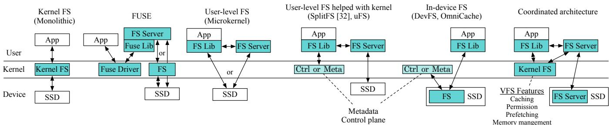  
Figure 1: Comparison of file system architectures. Shaded boxes denote file-system components.

CPU-intensive I/O that runs in the background, making it a strong offloading candidate—should move to the device without stalling foreground fsync on slow device-side commits. Oxbow introduces split journaling, which stages fsync data on a fast host path while the CSD journals on a separate background path, letting fsync complete at host speed while reducing host CPU consumption.

We implement Oxbow with four components totaling 53K lines of code, emulating a CSD using a BlueField-2 DPU [22] and an SR-IOV-capable SSD [13] to enable concurrent host device access. We evaluate Oxbow against Ext4, µFS [39], and OmniCache [57] using microbenchmarks and real-world workloads. Across microbenchmarks, Oxbow delivers up to 4.8× the write throughput of Ext4 and up to 86% higher throughput than µFS, while reducing host CPU consumption by up to 55% relative to µFS and improving throughput-per-CPU efficiency by up to 3.9× over µFS (4.7× over Ext4). In a LevelDB YCSB benchmark, Oxbow achieves the best throughput across read- and range-heavy workloads, improving throughput by up to 89% over µFS and 41% over Ext4. By retaining the kernel’s VFS layer, Oxbow can transparently leverage sendfile, achieving 3.3× higher Nginx throughput than the same configuration without it.

We have made Oxbow publicly available at https://gi thub.com/xlab-uiuc/oxbow.

## 2 Trends in Modern Storage Systems

## 2.1 The Fragmented Landscape

Modern file systems span a widening spectrum of architectures, each making fundamentally different design tradeoffs as illustrated in Figure 1. Monolithic kernel file systems [1, 25, 43] integrate tightly with VFS, page cache, and memory management, offering robust protection and strong sharing semantics. However, their reliance on the complex kernel I/O stack incurs kernel-crossing costs and software overheads. FUSE-based systems preserve kernel services while enabling user-space development, but frequent boundary crossings and data copies constrain them to non–performancecritical workloads. User-level file systems bypass the kernel entirely—either as application-linked libraries (e.g., Exokernel [29]) or user-space servers in microkernel designs [38], achieving impressive throughput by eschewing kernel mediation. Yet this performance comes at the cost of protection, global coordination, and transparent sharing. Even modern hybrids such as µFS [39] must combine user-level and kernel mechanisms in ad hoc ways that complicate correctness and maintenance. Finally, in-device file systems [33, 47, 56, 57] execute directly on CSDs, reducing host CPU usage and benefiting from near-data processing. Their shortcomings lie elsewhere: limited device compute, PCIe round trips, and difficulty integrating with host-side abstractions.

The result is a fragmented landscape: each architecture excels along one axis but none strikes a balanced design.

## 2.2 The Promise and Cost of User-level I/O

Fast storage hardware [2,10,11] has amplified the relative cost of kernel I/O paths and mode switches. To remove these bottlenecks, many modern systems adopt user-level drivers such as DPDK [3] and SPDK [7], which bypass kernel mediation entirely [36, 39, 42, 46, 52].

## 2.2.1 Promise

User-level I/O offers three advantages: (1) a fast, predictable data path, (2) scalable resource allocation by simply adjusting user-level thread counts [39], and (3) rapid development with rich user-space tooling. These benefits allow developers to quickly adapt file systems to emerging hardware such as CSDs, Compute Express Link (CXL) SSDs [49], Zoned Namespace (ZNS) SSDs [14], and Flexible Data Placement (FDP) SSDs [16].

## 2.2.2 Cost of Abandoning the Kernel

Bypassing the kernel, however, forfeits its mature, wellengineered services and system-wide management, forcing user-level designs to re-engineer kernel functionality in user space or forgo it entirely.

Isolation. Without kernel scheduling or memory reclamation, user-level file systems often require dedicated resources or entire machines to avoid interference. Many file systems partially delegate resource control back to the kernel [4, 33, 39, 47], complicating the architecture.

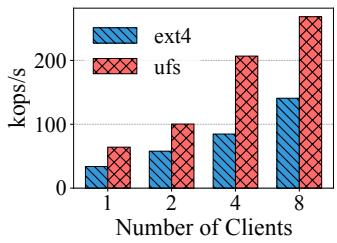

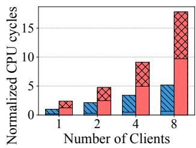  
Figure 2: Filebench (Varmail) throughput and CPU cycles. CPU cycles are normalized to Ext4 with one client; solid portions denote cycles in the file system layer. Both systems perform metadata journaling on the testbed (§6.1).

Performance. The kernel page cache, inode and dentry caches, prefetching, and memory management integration accelerate the I/O path. User-level systems that bypass the VFS cannot exploit these services and must build their own in user space—duplicating decades of kernel engineering effort and adding significant development overhead. Some user-level systems even lack essential features such as prefetching [39].

File Sharing. User-level implementations cannot leverage kernel page tables or VFS permission checks, so they must reimplement sharing and serialization in user space to enforce correctness. To emulate kernel-level sharing, systems such as Strata [36], µFS [39], and OmniCache [57] rely on leases [31]. However, lease revocation and renewal incur significant overhead under concurrent access [39, 41], and maintaining consistency in user space raises development costs.

Kernel Interoperability. Kernel interoperability enables file systems to support kernel-managed services transparently. For example, zero-copy system calls such as splice and sendfile move data directly between kernel buffers and are critical for high-performance web servers and file servers. If a file descriptor belongs to a user-level file system that does not interoperate with the kernel, data must traverse user space, incurring extra copies and mode switches.

## 2.3 The CPU Bottleneck and Device Offload

As storage speeds increase (e.g., 63 GB/s with PCIe 5.0 [12]), the bottleneck shifts from I/O to host CPU. Two trends exacerbate this: (1) Polling-based I/O—SPDK busy-waits for low latency, consuming 100% of a CPU core. (2) Massive parallelism—systems like µFS [39] and optimized Ext4 [26, 34] scale throughput but linearly increase CPU usage. Figure 2, with a mail server workload, shows the tradeoff: µFS achieves 2.4× Ext4 throughput but consumes 3.4× CPU cycles, with over 50% spent in the file system layer. CPU-heavy operations such as journaling, checksums, and encryption steal cycles from applications.

Device Offloading. CSDs [15, 19, 22] now include ARM cores, DRAM, and accelerators. While prior work uses CSDs for I/O scheduling [33,47] or near-data processing [54,56,57], we argue that they suit background tasks more than latencycritical data paths. CSD processors are weaker than host CPUs (e.g., 2.0 GHz ARM vs. 4.0 GHz x86), and PCIe crossings add latency; on the other hand, they excel at asynchronous, parallel processing. Offloading journaling, garbage collection, or compression to the device reduces host CPU load without penalizing foreground operations.

## 2.4 Requirements vs. Current Designs

These observations expose major tensions in modern file systems in the following dimensions:

• High performance: scalable, low-overhead I/O paths.

• Kernel interoperability: leveraging mature VFS services and interfaces.

• Low CPU consumption: minimizing interference with co-located workloads by device offloading.

• Fast development velocity: enabling rapid evolution in user space.

Existing architectures typically center on one primary placement: user-level designs place functionality in user space for performance and agility, kernel file systems keep it in the kernel for integration, and device-resident designs move it to the device to reduce host CPU load. Each choice satisfies a different subset of requirements, leaving open how to compose their strengths without inheriting their coordination costs.

## 3 Coordinated Architecture

Our key insight is that user-space, kernel, and device components are not adversaries to be chosen between, but complementary resources that can be orchestrated. We therefore propose a coordinated architecture that deliberately distributes file system responsibilities across components, assigning each task to the component best suited to perform it.

At a high level, the kernel remains responsible for caching, protection, and sharing; user space hosts flexible file-system logic and fast I/O; and the device handles CPU-intensive background tasks that would otherwise interfere with application performance. Crucially, unlike prior device-centric systems (e.g., DevFS [33], CrossFS [47], and OmniCache [57]) that migrate substantial foreground logic into the device, the coordinated architecture retains foreground file-system operations on the host to avoid PCIe round trips and preserve low latency.

Placement across User Space and Kernel. A key principle of the coordinated architecture is to place dynamic, fastevolving features in user space, while reusing stable, heavily optimized functionality in the kernel. Kernel services such as the page cache, readahead, write-back, protection, and permission checking have decades of engineering investment and evolve slowly relative to hardware trends. Reusing these services avoids reimplementation, reduces complexity, and ensures transparent interoperability with other applications.

User space, in contrast, offers rapid iteration and flexible mapping to fast I/O paths, enabling adaptation to emerging device interfaces and application demands.

Composing multiple components into a coherent file system introduces several fundamental challenges beyond the limitations of any single component:

• Balancing kernel involvement. Fully bypassing the kernel forfeits its services, while routing all I/O through it reintroduces kernel-crossing overheads. The architecture must decide which operations genuinely benefit from kernel involvement.

• Metadata synchronization. If multiple components update file system metadata, every access risks cross-component synchronization. For example, both the kernel (through the VFS and memory subsystem) and the user-level file server may need to access or mutate inode state. Naively granting either component full ownership forces costly synchronization—e.g., fetching the latest version from the other component, invalidating cached state, or acquiring shared locks or leases that quickly become contended and add complexity.

• Cross-component data movement. Distributing functionality across user space, the kernel, and the device can amplify communication overheads. Data or metadata may traverse multiple boundaries: IPC between the application and user server, kernel crossings, PCIe round trips to a device, and memory copies within the host. Without careful structuring, these costs can overshadow the benefits of specialized components.

• Crash-consistency dependencies. Offloading journaling to a CSD is appealing because background journaling consumes substantial host CPU cycles in user-level I/O stacks, but traditional journaling schemes couple foreground fsync operations with background commit work. In-place data updates and POSIX ordering constraints can force the fast host CPU to wait for slower device-side commits, while the system still must preserve ordering and recovery semantics across host and device state.

To address these challenges, the coordinated architecture adopts three techniques that selectively place operations on the kernel path, minimize synchronization, reduce data movement, and restrict device offload to background work:

• Semi-kernel-bypassing I/O. The coordinated architecture exploits the asymmetric benefits of kernel involvement. Operations that depend on kernel services or state (e.g., page faults, eviction decisions, access-control checks) traverse the kernel, while others bypass the kernel to achieve userlevel latency and throughput. In particular, reads benefit from kernel caching and readahead, whereas writes benefit from bypassing the kernel on the persistence path.

• Shared-ownership metadata. Instead of assigning an inode or metadata structure exclusively to a single component, the coordinated architecture partitions metadata fields and assigns each partition to the component best suited to maintain it. This single-writer structure avoids coarse-grained invalidation or locking while still allowing multiple components to read shared metadata.

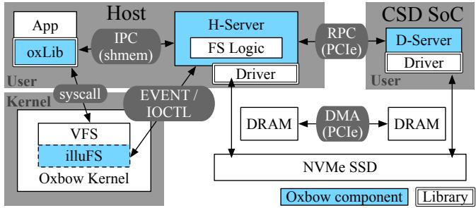  
Figure 3: Oxbow components and their communication.

• File-semantics-agnostic device offloading. The coordinated architecture decouples crash consistency from POSIX file semantics, allowing journaling and other maintenance tasks to run entirely on the device without host–device coordination on the foreground path. Because device CPUs are slower and PCIe adds latency, offloaded work is restricted to background operations (e.g., journaling, garbage collection, and compression) that tolerate latency but benefit from parallel, near-data execution.

## 4 Oxbow File System

Oxbow instantiates the coordinated architecture of §3 with four components (Figure 3): a per-application user-level library (oxLib) and a trusted user-level file server (H-Server) on the fast user-space I/O path, a thin in-kernel shim (illuFS) that reuses kernel VFS services, and a device-resident file server (D-Server) that runs background work on a CSD.

The three techniques of §3 map onto these components as follows. Semi-kernel-bypassing I/O is realized by the oxLib/illuFS/H-Server split and its read/write paths (§4.1, §4.3, and §4.6); shared-ownership metadata partitions inode fields across oxLib, Oxbow Kernel, and H-Server (§4.2); and file-semantics-agnostic device offloading is embodied by Split Journaling, which keeps fsync on the host while D-Server performs background journaling (§4.4 and §4.5).

## 4.1 Components and Overall Architecture

Figure 3 shows the four Oxbow components and communication channels that realize semi-kernel-bypassing I/O and device-side journaling.

oxLib. oxLib is a user-space library linked into each application. It exposes the POSIX API, intercepts file system calls, and replaces read and write system calls with mmapbased loads and stores. For operations that require durable persistence or coordination, such as fsync and namespace operations (e.g., file and directory creation), oxLib forwards requests to H-Server. oxLib also maintains per-file dirty-page and page-lock bitmaps in shared memory (§4.2), which allow H-Server to identify dirty pages and enforce page-granularity atomicity without involving the kernel in block management.

Oxbow Kernel and illuFS. To leverage the kernel’s VFS services, Oxbow adds a lightweight in-kernel file system, illuFS. From the VFS’s perspective, illuFS behaves like a normal kernel file system: it participates in mount/unmount, cooperates with the page cache, and integrates with readahead and eviction. Instead of implementing its own file system layer, however, illuFS forwards I/O and metadata requests to H-Server via an event-driven interface. Oxbow therefore reuses the kernel’s page cache, permission checks, and sharing semantics without modifying kernel subsystems or routing data through the kernel block layer.

H-Server. H-Server is a trusted user-level file server that owns the storage device. It implements the core file system logic, including on-disk layout, block and inode allocation, indexing, and cooperation with journaling. Conceptually, H-Server plays the role of a generic “VFS for user-space file systems”: it offers a pluggable interface for file-system-specific logic (such as Ext4-style layouts) while providing generic mechanisms for staging, journaling, and communication with oxLib and illuFS. All device I/O from the host passes through H-Server and is issued via a user-level driver, providing a fast data path and enabling kernel bypass for writes. H-Server also prepares transactions for Split Journaling, stages fsync data, and coordinates background journaling with D-Server (§4.4).

D-Server. D-Server runs on the CSD and executes background journaling and checkpointing. It receives prepared transactions from H-Server, pulls their contents into device DRAM via DMA, and persists them to an on-disk journal area. By running on the CSD, D-Server offloads the CPU and I/O work of background journaling from the host while exploiting device-level parallelism. D-Server implements data journaling and checkpointing, but it does not understand file semantics; instead, it operates purely on block addresses and extents provided by H-Server (§4.4).

Communication Paths. Oxbow adds explicit communication channels between components beyond system calls. The kernel communicates with H-Server using an eventdriven mechanism based on epoll: illuFS enqueues I/O and metadata requests for H-Server, and H-Server responds via ioctl once operations complete. oxLib and H-Server share metadata and control information through shared memory and lightweight IPC, avoiding copies and unnecessary mode switches. H-Server and D-Server communicate over PCIe using an RPC mechanism for control (e.g., “transaction ready”) and DMA for bulk data transfer. When H-Server prepares a transaction, it copies metadata and dirty pages into a contiguous DMA buffer and notifies D-Server. D-Server then pulls this DMA buffer into device memory using DMA, which does not consume host CPU cycles. These channels make coordination explicit while keeping latency-sensitive communication on the host and restricting PCIe traffic to background paths.

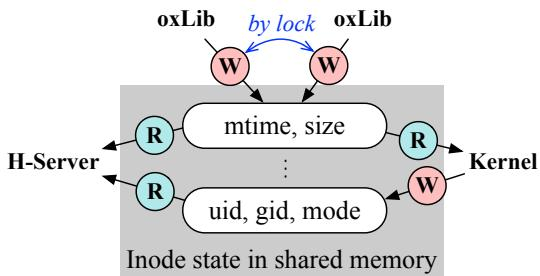  
Figure 4: Shared-ownership of states. R: read, W: update.

## 4.2 State Ownership and Sharing

Oxbow adopts a shared-nothing design for most metadata, and shared-ownership only where components must cooperate. On disk, H-Server hosts arbitrary file system logic, using the underlying layout (e.g., Ext4 superblock, inode table, and allocation bitmaps); Oxbow adds its own structures for a dedicated journal area and a staging area (§4.3), each with a superblock. This design decouples crash consistency from base file system semantics and allows Split Journaling to operate independently.

In memory, each metadata object has a primary owner: H-Server manages global file system state such as free block and inode bitmaps and the inode cache as part of its core logic, while D-Server exclusively owns crash-consistency metadata.

Shared-ownership of Metadata. For metadata accessed by multiple host components, Oxbow uses shared-ownership. Inode state is split into small attribute groups with a single writer per group (Figure 4): permission fields such as uid/gid are updated only by the kernel, while file size and timestamps are updated exclusively by oxLib. H-Server reads these fields when updating on-disk metadata but does not modify them after initial load. All shared attributes are stored in shared memory so the kernel, oxLib, and H-Server can access them without copying. This single-writer, multi-reader pattern avoids global locks for synchronization in the I/O path, with locks needed only when multiple oxLib instances concurrently update the same inode.

Ownership is enforced rather than advisory: Oxbow treats the kernel and H-Server as trusted and oxLib as untrusted, and H-Server exposes each attribute group as a separate POSIX shared-memory region whose permissions derive from the file and are enforced by the kernel. Attributes that oxLib does not own (e.g., uid/gid) are mapped read-only, so a compromised oxLib can modify only the fields it owns (e.g., size and mtime), and only for files it may already write; it cannot read or corrupt metadata of files it is not authorized to access. H-Server also re-validates owned fields on use, so fabricated values stay contained—an inflated size, for instance, fails at block resolution instead of exposing unallocated blocks.

Dirty and Page-lock Bitmaps. File data is shared by all host components. Applications write to mmap-ed pages via oxLib, the kernel manages those pages in the page cache, and H-Server writes them back to disk. Oxbow avoids data copies by sharing page-cache memory across components. Per-file dirty-page and page-lock bitmaps, maintained by oxLib in shared memory, let H-Server identify dirty data precisely with out exposing page-to-block mappings to the kernel. These bitmaps are accessed only by oxLib and H-Server, not by the kernel: Oxbow delegates dirty-page tracking and page locking—tasks traditionally handled by the kernel as part of page-cache management—to user-level components, avoiding the mode switches and communication overhead that kernel managed bookkeeping would otherwise incur.

When an application modifies a page, oxLib sets the corresponding dirty bit. H-Server consumes these bits when preparing fsync staging or background journaling, and clears each bit only after the page’s contents have been copied into the DMA buffer. Page-lock bits provide page-granularity synchronization by guaranteeing exclusive access to a page-cache page, so different pages of the same file can be updated con currently. A lock is held in two cases: when oxLib writes to a page-cache page, and when H-Server copies a page from the page cache into the DMA buffer. Because both writers acquire the same lock, an application write and H-Server’s copy never race on the same page, preserving the kernel’s page-lock semantics in user space.

In-memory Caches. H-Server maintains the authoritative in-memory inode cache and on-disk allocation structures, in a form compatible with struct inode. Selected attributes are shared with the kernel and oxLib via the shared-ownership mechanism, while the kernel’s VFS layer continues to serve reads via the page cache. H-Server caches directory entries so namespace operations can avoid kernel involvement. Oxbow does not rely on the kernel’s native VFS inode cache for on-disk updates. On the device, D-Server keeps journal metadata, including its superblock and commit/checkpointing state. Journal transactions store only block addresses, extents, and staging descriptors, keeping D-Server file-system-agnostic and reinforcing the separation between crash consistency and file system logic.

## 4.3 End-to-End Operation Flow

Open Path. On open, oxLib calls into the kernel to ob tain a file descriptor. illuFS forwards the lookup to H-Server, which performs path resolution, allocates an inode number, and initializes per-file structures in both H-Server and shared memory. The kernel returns to oxLib once the inode number is known, while H-Server continues initialization in parallel. oxLib then maps the file for direct load/store access via mmap and the shared-memory region.

Read Path—Through the Kernel Page Cache. As shown in Figure 5, oxLib translates a read into loads from the mmap-ed region. A first access causes a page fault; the kernel allocates a page and invokes illuFS, which issues a user-level read request to H-Server. H-Server computes block numbers using its filesystem logic, submits I/O through its user-level driver, and fills the page cache upon completion. The kernel then resolves the page fault and resumes the application. Subsequent reads hit in the page cache. Because Oxbow uses the VFS layer, it also benefits from kernel readahead: asynchronous read-ahead requests are issued by the kernel and served by H-Server the same way, reducing read latency for sequential workloads.

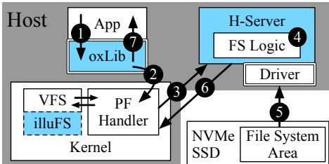  
Figure 5: The read path. Numbers denote the order of steps.

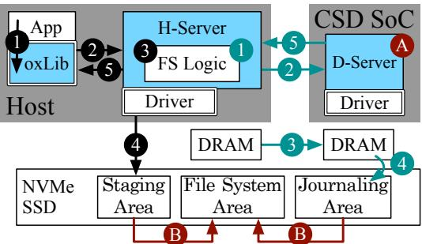  
Figure 6: The writeback path. ( X : fsync, X : background commit, X : checkpointing)

Write Path and fsync—Bypassing the Kernel. Applications write by storing into mmap-ed pages (Figure 6, 1 ). If the page is present, the store updates it directly; otherwise, a page fault loads it as in the read path. oxLib marks the page dirty and sets its page-lock bit while the page is being modified.

On fsync, oxLib forwards the request to H-Server ( 2 ), which persists the file durably on the host using Split Journaling (§4.4). H-Server snapshots the file’s metadata, resolves its dirty pages to block addresses (allocating blocks if needed) ( 3 ), and writes the file’s data and inode into a dedicated staging area, a persistent on-disk region ( 4 ). fsync returns as soon as this staging write is durable ( 5 ); it does not wait for the device-side background journaling. Background journaling then proceeds asynchronously on D-Server, batching many files into the journal area without blocking the application. §4.4 details how Split Journaling decouples these two paths so that fsync need not wait.

## 4.4 Split Journaling: Host–Device Journaling

Conventional journaling, as in Ext4 and other journaling file systems, persists updates in two phases: applications’ data and metadata modifications are grouped into transactions and written to a journal area, where a commit record marks each transaction durable; a later checkpointing phase applies those changes to the main file system area and frees journal space. Metadata journaling writes only metadata to the journal and updates data in place, reducing write amplification but weakening data consistency, while data journaling logs both data and metadata, providing strong crash consistency at the cost of more I/O. By utilizing a CSD, Oxbow offloads data journaling costs to D-Server.

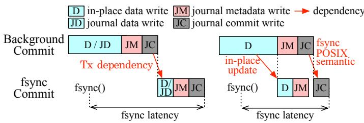  
(a) Metadata/data journaling

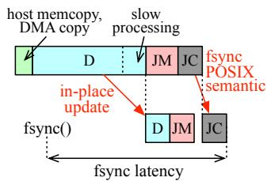  
(c) Metadata journaling with logical journaling and device offloading

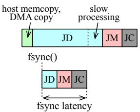  
(d) Data journaling with logical journaling and device offloading  
Figure 7: Dependencies in different journaling schemes. Host memcopy indicates copying dirty pages to a DMA buffer within the host. DMA copy represents data copy from the host DMA buffer to a device memory. The only dependency in (d) is host memcopy—fsync must wait for memcopy from the page cache to the DMA buffer.

Split Journaling keeps fsync latency on the host while offloading background commits to the device. Achieving this requires removing the dependencies that tie foreground fsync to background journaling in traditional designs. In conventional metadata journaling, foreground fsync and background commits share a single journal and are committed in order, so fsync is serialized behind outstanding background commits (Figure 7a). Logical journaling techniques [45, 48] break this coupling by separating fsync-induced transactions from background commits. Doing so, however, leaves two finer dependencies behind, each of which still introduces a delay (Figure 7b). First, fsync’s in-place write must wait for the completion of any in-progress background in-place update to the same file (in-place update dependency). Second, fsync must wait for all prior transactions modifying the file to be committed (POSIX ordering dependency).

Device offload exacerbates these residual dependencies: checking them requires frequent host–device coordination, and any slowdown in background commits directly impacts fsync (Figure 7c). Split Journaling eliminates both dependencies by using data journaling for its two paths and introducing a staging area that decouples fsync from background commits (Figure 7d).

Decoupling Staging from Background Commits. Split Journaling provides two data-journaling paths that target two on-disk areas: a fast staging path driven by the host for fsync, and a slower background path driven by D-Server. The background path runs as periodic background commits—triggered automatically by the file system—that batch updates for many files into a single journal transaction. On fsync, H-Server writes the file’s data and inode metadata directly into the staging area through the DMA buffer of its user-level driver, forming a staging transaction that is independent of background commit progress. For background commits, H-Server instead fills a separate host-memory DMA buffer (Figure 6, 1 ) and signals D-Server ( 2 ), which pulls the data into device memory ( 3 ) and writes it out to the journal area ( 4 ). Because staged data is logged rather than updated in place, the in-place update dependency disappears.

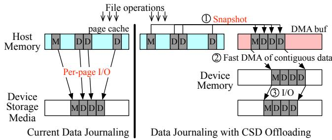  
Figure 8: DMA buffer for shadow copy. A write to a page is blocked while it is being persisted (left) vs. only while it is copied into the DMA buffer (right). D: data, M: metadata.

To eliminate POSIX ordering dependencies, staging transactions are self-contained. If a file is part of any in-flight journal transaction, H-Server re-logs the data and metadata relevant to that file into the staging area along with new fsync data. Each staging transaction also records the ID of the latest committed journal transaction for recovery (§4.5). As a result, fsync no longer waits for background commits, and host and device can operate in parallel (Figure 7d).

DMA Snapshots as Shadow Copies. Offloading to CSD requires transferring data over PCIe, and issuing per-page DMA operations is too costly. Split Journaling copies all pages of a transaction into a contiguous DMA buffer and performs a single DMA transfer. This extra copy is repurposed into a snapshot: the DMA buffer becomes a shadow copy of the page cache (Figure 8).

The snapshot copying brings two benefits. First, it removes interference between page updates and background commits. H-Server briefly locks pages, copies them into the DMA buffer, and immediately unlocks them, allowing subsequent writes to proceed while the device processes the snapshot. Existing journaling (e.g., JBD2 of Ext4) also relies on shadow copies (frozen buffers) for this, but creates them only lazily: once a page’s journal I/O is in flight, a conflicting write must block until that I/O completes [50]. Second, it raises the granularity at which the global lock is acquired from pages to files when adding metadata to a transaction. In traditional journaling, each page inserted into the running transaction— whether data or metadata—must acquire a single global lock. Since data journaling journals data as well, it performs far more insertions and contends for this lock heavily [50]. In Oxbow, snapshots reduce the blocking time to the duration of the memory copy, making metadata insertion with filegranularity locks practical at lower contention. Note that data pages remain synchronized using per-page locks (§4.2).

Parallel and Aggressive Journaling. Background commits exploit both pipeline and thread-level parallelism. The commit pipeline consists of: (1) copying metadata and dirty data into the DMA buffer in H-Server, (2) DMA transfer to D-Server, and (3) device-side journal writes. Once the DMA buffer is handed off, H-Server begins preparing the next transaction.

Oxbow also triggers background commits more aggressively than kernel journaling. Shorter intervals reduce the amount of data written during fsync, lowering foreground latency. Because background commits run on CSD CPUs and rely on DMA for transfer, this aggressiveness reduces host CPU consumption and improves perceived fsync cost. D-Server further parallelizes journal I/O across its cores, maximizing device bandwidth.

Checkpointing. D-Server reclaims journal and staging space by checkpointing committed transactions (Figure 6, A ) into the main file-system area when either the journal or the staging area runs low on free space ( B ). Because a journal transaction commits after the staging transactions it records, D-Server checkpoints those staging transactions first and the journal transaction last, preserving commit order.

## 4.5 Crash Consistency

Oxbow’s crash consistency reduces to a single invariant: every fsync-ed file is recoverable from its self-contained staging transaction together with the journal prefix whose ID the transaction records. The transaction contents below maintain this invariant, which recovery relies on directly.

Background Journaling. Journal transactions contain snapshots of file-system state (superblock fields, allocation bitmaps), per-file metadata, and data. They are indexed purely by block addresses and extents so that D-Server can process commits without interpreting file semantics. Each journal transaction also records, for every staging transaction committed since the previous journal commit, the address of its staging descriptor (the staging transaction’s on-disk header). This enables D-Server to reconcile staging and journal state during checkpointing and recovery.

Staging for fsync. A staging transaction contains only the inode and data for the fsync-ed file, plus the ID of the most recently committed journal transaction. To guarantee recoverability, Oxbow re-logs all uncommitted data for that file into the staging transaction, even if a background commit is in progress. As a result, each staging transaction is selfcontained: after a crash, the file can be reconstructed solely from its staging transaction and the journal prefix up to the recorded ID.

Recovery. On initialization, D-Server checks whether the journal is clean. If not, it replays all committed but uncheckpointed journal transactions in order, applying any staging transactions referenced by them. It then scans for “dangling” staging transactions whose associated journal commit was lost or never issued. Because a staging transaction captures all modifications since the last committed journal transaction, D-Server can safely apply these remaining staging transactions on top of the replayed journal state, ensuring durability for all fsync-ed files. Since H-Server allocates blocks and inodes after snapshotting the free bitmaps, snapshots lag behind actual allocations. During recovery, D-Server scans all transactions and reconstructs free block and inode bitmaps and superblock counters based on the extents stored in transactions, avoiding reliance on stale bitmap images.

Partial Failures. Oxbow assumes fail-stop components. Durability is established at fsync via a self-contained staging transaction persisted to the on-disk staging area, so a hostside failure (oxLib, illuFS, or H-Server) loses only data not yet fsync-ed, exactly as under POSIX, while fsync-ed files remain durable in the staging area. Such failures need no recovery: since H-Server is a client of D-Server and the device retains this durable state, H-Server can simply be relaunched and reconnect without restarting D-Server. A D-Server failure, by contrast, invalidates H-Server’s session, so both are relaunched and D-Server runs the recovery procedure on restart. If the CSD’s compute capability is lost (e.g., due to a hardware failure) while its storage remains reachable as a block device, D-Server can run on the host without losing availability.

## 4.6 File Sharing and Protection

Oxbow preserves the kernel’s protection and sharing model by relying on the page cache and permission checks in the VFS layer. When a file is opened, the kernel enforces discretionary access control (DAC) and refuses to open or mmap the file for unauthorized processes. Once a page is in the page cache, the kernel maps it into the address spaces of all processes that have opened the file, enabling efficient sharing without additional mechanisms in user space. This avoids the leasebased file sharing and custom coherence protocols that userlevel file systems must implement [24, 36, 39, 57].

The only additional mechanism Oxbow requires for safe sharing is the arbitration of concurrent writes. The page-lock bitmap maintained by oxLib substitutes for the kernel’s internal page locks: oxLib and H-Server consult the bitmap to avoid concurrent updates to the same page. Because the bitmap lives in shared memory, all oxLib instances share a consistent view of page ownership.

Device access is restricted to H-Server and D-Server. No other process can issue I/O to the storage device directly, which prevents malicious applications from bypassing Oxbow ’s protection mechanisms. Shared-memory regions such as dirty and page-lock bitmaps inherit the file’s permissions, so an application that modifies oxLib code can corrupt only files that it already has permission to write.

## 5 Implementation

We use lwext4 [5] as H-Server’s file system logic with minor modifications for integration. lwext4 originally targets embedded systems, providing the essential Ext4 logic and on-disk structures such as extents and block groups. We add multithreading support and disable its built-in journaling because Oxbow provides crash consistency through Split Journaling. Oxbow is implemented in C/C++ totaling 53K lines of code excluding lwext4.

We emulate a CSD using a SmartNIC and an SSD supporting SR-IOV and NVMe Namespace Sharing [18]. Emulation requires (1) an in-device SoC and (2) the ability for the device and host to access the same storage media concurrently. For (1), we use an NVIDIA BlueField-2 DPU [17] which provides 8 ARM cores and 16 GB DRAM within the PCIe power budget, making it a realistic proxy for a CSD processor. For (2), the SmartNIC must access the host SSD. Because BlueField-2 communicates with the host only via RDMA, we expose the SSD to the SmartNIC using NVMe-oF. RDMA transfers place data directly into host DRAM and flush it to the SSD without host CPU involvement, closely matching the host-CPU savings of true CSD offload.

SR-IOV and Namespace Sharing allow both host and SmartNIC to operate on the same SSD namespace. The SSD exposes multiple NVMe controllers—e.g., a Physical Function (PF) for the SmartNIC (D-Server) and a Virtual Function (VF) for the host (H-Server)—each appearing as an independent PCIe device. Oxbow’s coordination prevents H-Server and D-Server from accessing the same block concurrently.

## 6 Evaluation

We evaluate Oxbow in terms of performance, host CPU consumption, and interoperability with the kernel’s subsystems. We compare Oxbow with µFS [39], OmniCache [57], and Ext4 [43]. µFS is the state-of-the-art user-level file system designed for high scalability on SSDs. We evaluate the coordinated architecture by comparing Oxbow with OmniCache. Unlike Oxbow, OmniCache operates a whole file system on CSD and selectively caches data between host and device memory (Figure 1). Ext4 is the most widely used journaling file system in the Linux kernel.

Our evaluation proceeds as follows. We first use latency and throughput microbenchmarks to characterize basic file system operations under append, sequential, and random patterns, sweeping the I/O size (§6.2.1) and the number of concurrent clients (§6.2.2). We then run an ablation study to isolate each design choice (§6.3), followed by real-world workloads—LevelDB under YCSB, RAG retrieval, LLM checkpointing, and Nginx with sendfile—to assess endto-end benefits (§6.4). We additionally evaluate Oxbow with metadata-intensive workloads in the appendix (Appendix B).

## 6.1 Experimental Setup

Testbed. We run all the experiments on a dual-socket server equipped with two Intel(R) Xeon(R) Gold 5218 CPUs @ 2.30GHz, 128GB of DRAM, and a 3.2 TB Samsung PM1735 NVMe SSD [6] that supports SR-IOV and NVMe Namespace Sharing. We emulate a CSD with this device as described in §5. For the emulation, we use an NVIDIA BlueField-2 DPU [17] which is equipped with eight 2.0 GHz ARMv8 A72 cores and 16 GB of DRAM, and 64 GB eMMC for the storage. It supports 100 Gbps Ethernet; hence, PCIe bandwidth is not a bottleneck.

System Configuration. As we implement illuFS in the kernel version 6.2, we use the Ext4 data journaling mode in the same kernel. We disable the lazy initializations of Ext4 to get consistent and stable performance after mounting. We configure a sufficiently large journal (39 GB) and adjust the checkpointing threshold to avoid Ext4 performance degradation caused by journal space exhaustion.

µFS performs user-level I/O using SPDK and guarantees crash consistency with its own metadata journaling. µFS has two modes: a POSIX mode that is transparent to applications and a mode with a custom memory allocator that avoids memory copies between applications and the user-level file server. We use the latter mode to represent the best performance of µFS. We set the number of µFS server threads equal to the number of clients, since we observed having fewer server threads degrades performance [39]. We scale the number of clients up to 10, which is the maximum number µFS supports.

The OmniCache artifact runs only with persistent memory instead of SSDs and emulates CSD using a kernel module. We extend it to operate with a real CSD. The custom NVMe commands are replaced with RPC calls as in Oxbow. We run Ext4 on CSD as OmniCache’s NearStorageFS as described in its paper [57]. Here, Ext4 runs in metadata journaling mode to enable direct I/O because OmniCache bypasses the kernel page cache and manages its own user-level cache.

In H-Server, we pin each I/O worker thread to an SSD I/O queue. Unless otherwise stated, H-Server is configured with eight I/O worker threads. Similar to Ext4, we provision Oxbow with sufficient journal space to avoid journal-space exhaustion during the experiments.

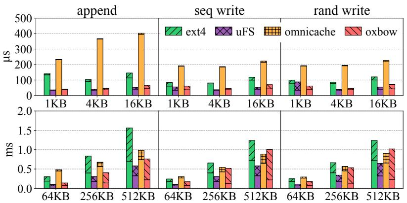

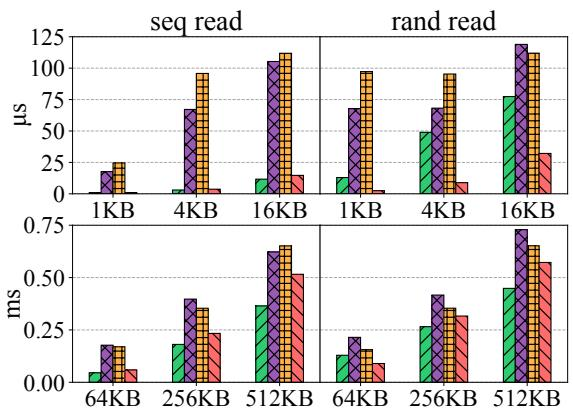  
Figure 9: Latency microbenchmark. Average per-operation latency of five workload patterns across I/O sizes. The top row shows small I/Os and the bottom row shows large I/Os. The solid portion of each bar denotes the fsync latency. Lower is better.

## 6.2 Microbenchmarks

To evaluate basic file system operations of Oxbow we use the microbenchmark from the µFS paper [39].

## 6.2.1 Latency

We evaluate the performance of foreground I/O operations using the latency benchmark. A total of 1 GB of data is written to or read from a file with different I/O sizes, and the latency of individual file operations is measured. In particular, in write benchmarks, each write call is followed by a fsync, and the total latency is measured. The bars in Figure 9 represent the average total latency, and the solid portion of each bar represents the average fsync latency.

Write Latency. The two user-level file systems, µFS and Oxbow, achieve lower latency than Ext4 because they have fast foreground paths. Ext4’s latency suffers due to its heavier kernel software stack and transaction commit mechanism. Compared with Ext4, Oxbow achieves 2.1–3.5×, 1.2–1.8×, and 1.2–1.9× lower latency for append, sequential, and random writes, respectively. However, µFS achieves up to 43% lower latency than Oxbow because Oxbow performs two additional memory copies: from the application buffer to the kernel page cache during a write, and from the page cache to an SPDK buffer during fsync. In contrast, µFS exposes SPDK buffers to applications to achieve zero-copy I/O, sacrificing application transparency. This overhead is the cost of leveraging the kernel’s VFS.

OmniCache suffers from PCIe-crossing overhead inherent to its architecture. On fsync, data always traverses the device-side file system logic over PCIe, requiring copies from the user buffer to a DMA buffer and then to device memory. In contrast, we place the file system logic in H-Server, which enables host-side I/O without interacting with the device. Additionally, running a complex file system on the CSD’s slow cores increases the latency further.

Read Latency. The sequential read latency of Oxbow is 18.2× lower than µFS for the 4KB I/O size, which is attributed to the kernel’s readahead mechanism. While Ext4 achieves the lowest latency based on the kernel’s readahead, it is 3– 29% lower than Oxbow because of Oxbow’s longer read path that involves two context switches between the kernel and H-Server and one additional memory copy (i.e., SPDK buffer to page cache). For 4KB random read, Oxbow delivers 5.5× and 7.7× lower latency than Ext4 and µFS, respectively. This is due to a faster I/O than Ext4 through a user-level driver and a prefetching effect within the 1 GB file relative to µFS. As the I/O size increases, this benchmark increasingly represents sequential reads, where Oxbow achieves lower throughput than Ext4 (§6.2.2). Compared to µFS, Oxbow’s additional memory copies worsen the latency with larger I/O sizes. OmniCache shows high latency for the same reasons as in the write latency cases.

## 6.2.2 Throughput and Scalability

In the throughput microbenchmark (Figure 10), each thread writes 2 GB of data to its private file with 4KB I/O size and calls fsync after every 512 MB is written, i.e., many writes to a file followed by a single fsync. We increase the number of application processes from 1 to 32 (64 for reads) to measure the scalability of file systems. For this benchmark, we configure H-Server with 16 I/O worker threads. Because each client keeps at most one fsync (writes) or readahead (reads) request outstanding, the number of active I/O worker threads is bounded by the number of clients.

Write Throughput. For write workloads, Oxbow outperforms µFS by up to 86%. Fundamentally, Oxbow bypasses the kernel as µFS does, which enables faster I/O than Ext4. In addition, the background commit by D-Server reduces the amount of data written during fsync. This offsets the overheads from two more memory copies than µFS, resulting in higher throughput. OmniCache also achieves comparable throughput to Oxbow and µFS for the append and sequential write workloads. Different from the latency benchmark, the data is batched in 512 MB chunks and sent to the device. It enables OmniCache to fully utilize PCIe lanes and available I/O bandwidth, hiding its high latency. On the other hand, random writes issue a large number of I/O requests for fragmented block chunks, creating a bottleneck in CSD’s CPU resources. It prevents OmniCache from scaling beyond four processes. Ext4 suffers from contention in the block-based transaction composition of JBD2, resulting in inefficient use of I/O bandwidth and low throughput. In contrast, Oxbow composes a transaction at file granularity, which significantly reduces contention. As a result, Oxbow achieves 2.7–4.6×, 1.4–4.5×, and 1.3–4.8× the throughput of Ext4 for the append, sequential write, and random write workloads, respectively.

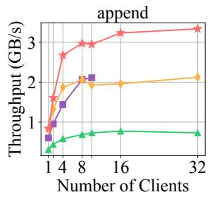

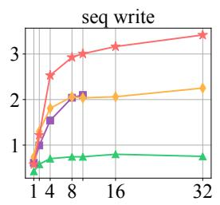

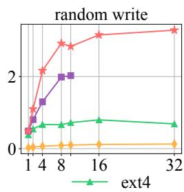

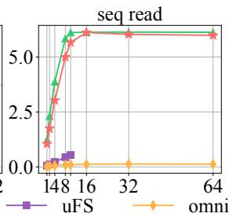

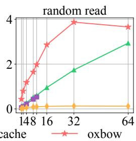  
Figure 10: Throughput microbenchmark. The maximum SSD read and write bandwidths are 6.1 and 3.6 GB/s, respectively.

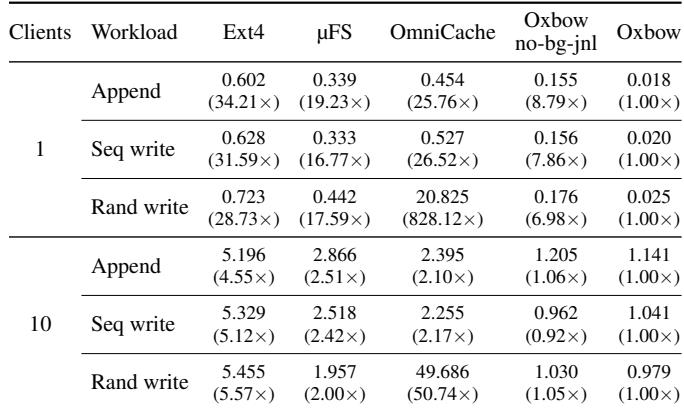  
Table 1: Throughput microbenchmark fsync time (sec). Numbers in parentheses are relative to Oxbow.

Fsync Time Reduction. We evaluate how effectively Oxbow reduces the foreground fsync time. Oxbow’s fsync times are the lowest among all the other file systems (Table 1). With a single client, its fsync times are 16.8–19.2× lower than the second-best system, since D-Server commits most data in the background and leaves little to persist on fsync. With 10 clients, the gap narrows to 2.0–2.2× as I/O bandwidth saturation leaves less headroom for background commits to run ahead of fsync. This demonstrates Oxbow effectively reduces the foreground fsync latency by aggressively committing data with D-Server.

Read Throughput. For sequential read, Oxbow’s throughput is 10.5–18.5× that of µFS thanks to the kernel’s readahead prefetching, but 0.2–24% lower than Ext4 due to its longer read path. The kernel triggers the next readahead batch (e.g., 32 pages) when the application reaches a marked page in the current window; in Oxbow this cycle is longer because of kernel–H-Server context switches and an extra memory copy, which lowers the block-layer request rate and bandwidth utilization. Enlarging the readahead window compensates—e.g., raising it from 32 to 128 pages via a mount option lets Oxbow outperform Ext4 in all cases. Like µFS, OmniCache lacks a prefetching mechanism and achieves low sequential-read throughput; implementing custom prefetching would raise their performance but also their development cost. Omni-Cache further suffers from CSD CPU bottlenecks when 4 KB requests are issued one by one, as in random writes.

For random read, Oxbow achieves the highest throughput. Oxbow and Ext4 issue identical kernel readahead requests, so the difference comes from the lower layers: Oxbow uses a faster user-level driver and a lighter block layer (avoiding the kernel’s I/O scheduler and interrupt-based stack), batches requests to reduce block-layer crossings, and pipelines across I/O worker threads. Even for random reads, kernel readahead prefetches some pages, disadvantaging µFS; still, its fast userlevel I/O keeps it on par with Ext4, while OmniCache again suffers from CSD resource deficiency.

CPU Utilization. To demonstrate how effectively Oxbow reduces the host CPU resource consumption of user-level file systems by offloading journaling to CSD, we measure the CPU utilization of a whole system while running the throughput microbenchmark. For a fair comparison, we exclude the CPU cycles that µFS spends busy-waiting for client-server communication—but not those for I/O completion polling— when reporting its CPU usage; this is generous to µFS, since it would lose performance if such busy-waiting were removed. We introduce a metric, efficiency, to represent how much throughput a file system achieves given a certain amount of CPU resource, i.e., the number of bytes processed per CPU cycle. Figure 11a compares efficiency of Oxbow, µFS, and Ext4. For write operations, Oxbow achieves 1.8–3.9× the efficiency of µFS. This gain comes from D-Server’s background commits, which reduce the amount of data written by the host and, in turn, lower the host CPU time spent polling for I/O completion. The efficiency of Oxbow decreases as the number of clients increases, because bursts of fsync calls reduce the opportunity for I/O offloading. Ext4 consumes less host CPU resources than Oxbow, due to its interrupt-driven I/O. However, its performance is much lower than Oxbow, resulting in Oxbow achieving 1.3–4.7× the efficiency of Ext4.

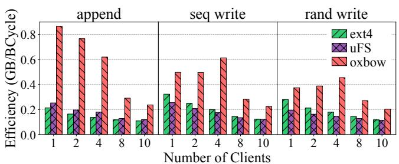  
(a) Efficiency (throughput / host CPU usage). Higher is better.

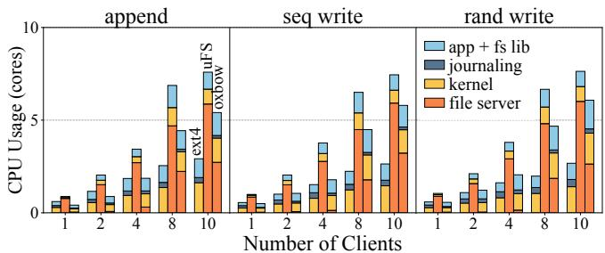  
(b) Absolute host CPU usage and its breakdown. Lower is better. Bars are ordered as ext4, µFS, and oxbow.  
Figure 11: Throughput microbenchmark host CPU usage.

Figure 11b breaks the absolute host CPU usage—reported in cores, i.e., consumed cycles/s normalized to one 2.3 GHz core—down into the benchmark application, the kernel, journaling, and the user-level file server. µFS demands the most CPU (e.g., 7.6 cores at 10 clients): it runs one busy-waiting file server thread per client to poll for I/O completion, so its file server dominates (around 80%) and grows with the client count, while its small kernel time mainly reflects memorymanagement overhead from its user-space processes. Ext4 instead spends most of its cycles in the kernel—where its entire storage stack, including JBD2 journaling, resides—but its interrupt-driven I/O yields the lowest overall consumption of the three (e.g., 2.9 cores at 10 clients). For Oxbow, the file server (H-Server) dominates as clients increase, since more worker threads busy-wait for user-level I/O completion once I/O becomes the bottleneck (e.g., H-Server uses 2.7 of 5.4 cores at 10 clients for append). In contrast, the background journaling thread uses only 0.1 core because it offloads journaling I/O to the CSD, and the kernel portion here covers both illuFS and the VFS.

## 6.3 Ablation Study

We perform ablation studies to evaluate the contribution of each major design choice of Oxbow. We compare the default Oxbow against three variants: host journaling (host-jnl), no staging (no-stg), and no background journaling (no-bg-jnl). Figure 12 reports the throughput and host CPU usage of the throughput microbenchmark (§6.2.2), and Figure 13 reports the results of the latency microbenchmark with 4 KB I/O size (§6.2.1).

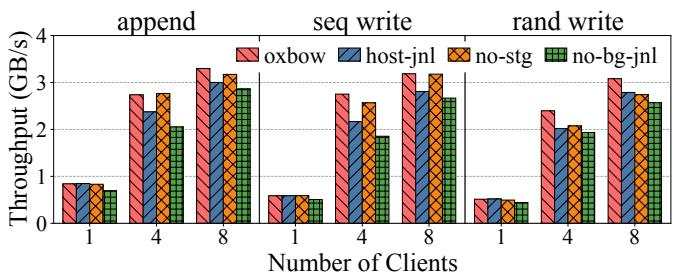  
(a) Throughput. Higher is better.

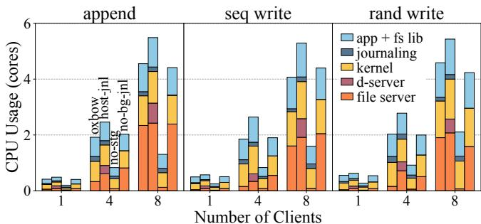  
(b) Absolute host CPU usage and its breakdown. Lower is better. Bars are ordered as oxbow, host-jnl, no-stg, and no-bg-jnl.

Figure 12: Throughput microbenchmark ablation studies.  
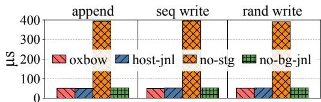  
Figure 13: Latency microbenchmark ablation study with 4 KB I/O size. Lower is better.

Host Journaling. In this configuration, D-Server runs on the host, so Oxbow has no device component. Instead of using DMA, D-Server communicates with H-Server through shared memory, which eliminates one data copy compared to the default Oxbow. Under less contention, i.e., with fewer clients, the throughput degradation of host journaling is marginal. As the number of clients increases, host-journaling throughput becomes up to 21% lower than that of Oxbow due to host resource contention. For example, the host memory bandwidth is shared between H-Server and D-Server, and D-Server runs on the remote NUMA node because the local NUMA node lacks sufficient cores. Figure 12b shows that host journaling consumes up to 44% more host CPU resources than the default Oxbow even though it achieves lower throughput. The performance gap decreases as the number of clients grows, because of I/O bandwidth saturation.

No Staging. Staging is disabled, so fsync persistence requests are handled by the background-journaling path. With this configuration, all I/O operations are performed by the device, resulting in a drastic reduction of host CPU consumption (Figure 12b). However, its latency is about 7.8× that of the default Oxbow (Figure 13), because this path incurs two overheads for every fsync: waiting for the ongoing background commit to complete and crossing PCIe. The other configurations show similar latency to the default Oxbow.

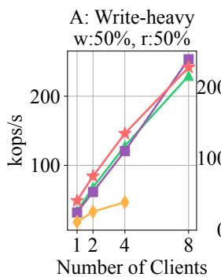

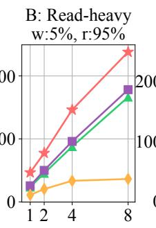

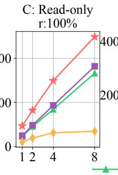

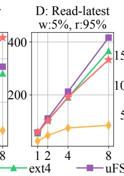

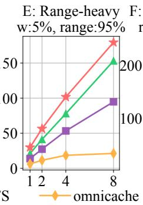

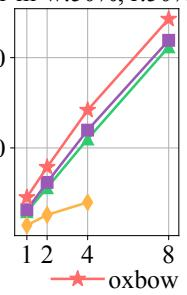  
Figure 14: LevelDB throughput with YCSB workloads A–F. Subplot titles show the operation mix of each workload (w: write, r: read, range: short-range scan, r-m-w: read-modify-write). Higher is better.

No Background Journaling. Background journaling is disabled, so there is no periodic journaling and data is persisted only by fsync. In the throughput microbenchmark, this con figuration shows up to 33% lower throughput because it does not utilize CSD resources, whereas the other configurations benefit from them. In particular, its fsync time is up to 8.8× that of the default Oxbow (Table 1), because it does not persist data ahead of fsync calls. Note that, even without device offloading, this configuration still outperforms Ext4, demonstrating that Oxbow’s kernel-bypass write path is effective.

## 6.4 Real-World Benchmarks

LevelDB. We run LevelDB [28] with the YCSB [9] workloads to evaluate the end-to-end performance of Oxbow. We configure it to have 10M entries of 16B keys and 80B values for each client and run 100K operations [39]. Each run starts cold, so the reported run-phase throughput reflects ondevice I/O rather than pure in-memory cache hits. Because the working set is spread across the 10M-key space and exceeds LevelDB’s in-memory block cache, the read-dominated workloads, except for workload D, issue many reads that reach the device. Oxbow’s high random-read performance makes it the best for the random-read-dominated workloads, B and C (Figure 14). It outperforms µFS, the second best, by 83% and 89% with 1 process and 34% and 37% with 8 processes for workloads B and C, respectively. Oxbow achieves the best throughput for workload E as well. In workload E, both sequential and random reads matter, as each short-range scan performs a random seek across LSM levels followed by a short sequential read. Oxbow and Ext4 outperform µFS with the kernel’s readahead, while Oxbow’s higher random-read performance keeps it ahead of Ext4. Oxbow has 41% and 17% higher throughput than the second best, Ext4, with 1 and 8 processes, respectively. For workload D with eight processes, where most reads are cache hits, Oxbow performs 20% worse than µFS. The gap is attributed to µFS’s zero-copy between the user and file-system buffers. Workloads A and F mix reads with updates that rarely trigger fsync under LevelDB’s default settings, so Oxbow’s read-path advantage and µFS’s zero-copy writes partly offset each other, narrowing Oxbow’s lead as concurrency grows. Meanwhile, OmniCache’s high latency limits its performance on the latency-sensitive LevelDB.

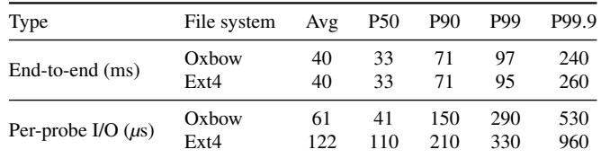  
Table 2: RAG retrieval latency. A probe is a single vector read from the on-disk store during a retrieval request.

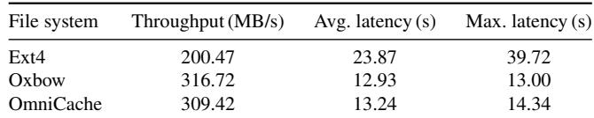  
Table 3: LLM checkpointing throughput and latency.

RAG Retrieval. We evaluate how Oxbow performs in the trendy AI domain. We develop a RAG (Retrieval-Augmented Generation) Retrieval benchmark. It models an SSD-backed vector search service that generates many small random reads to file systems. We construct a 20GB on-disk vector store from synthetic embeddings with a vector size of 768 (3072B) and a 1024B payload. We generate 400-client loads using a Locust [21]-based HTTP client. Table 2 shows the endto-end and I/O latencies of Oxbow and Ext4. Although the end-to-end latency is not dominated by I/O, Oxbow has 50% lower I/O latency than Ext4 thanks to its high random read performance. Similarly, it reduces tail I/O latency by up to 45% relative to Ext4.

LLM Checkpointing. Next, we benchmark the disk I/O patterns during the checkpointing phase of large LLM (Large Language Model) training. We assume a single process that checkpoints a large tensor iteratively. In each iteration, the process writes a whole tensor to SSD and calls fsync at the end. We configure the tensor size to 4 GB, run 5 iterations of checkpointing, and measure the average throughput and latency (Table 3). Oxbow achieves 58% higher throughput and 46% lower latency than Ext4. It is mainly due to the higher sequential write performance of Oxbow over Ext4. Ext4’s high maximum latency is attributed to its heavier transaction composition, compared to Oxbow’s Split Journaling and OmniCache’s device-side metadata journaling. OmniCache achieves throughput comparable to Oxbow. This single-threaded workload writes a large tensor sequentially, so each checkpoint is transferred with only a few large DMA operations, incurring little PCIe-crossing overhead and no CSD CPU contention. Oxbow retains only a slight edge over OmniCache, as its background journaling persists a small amount of data ahead of fsync.

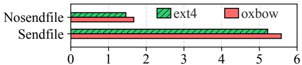  
Figure 15: Nginx web server throughput (GB/s) with the sendfile enabled vs. disabled. Higher is better.

## 6.5 Kernel Interoperability

We run Nginx web server version 1.26.2 on Ext4 and Oxbow to demonstrate the benefit of leveraging the kernel’s VFS layer. sendfile is a system call that accelerates data transfer from one file descriptor to another. It eliminates data copying between user and kernel buffers by directly copying the data between two kernel buffers within the kernel context. As Oxbow interoperates with the kernel’s VFS layer, it can leverage the sendfile feature at no development cost.

We configure the server to run with 8 threads and compare the throughput with the sendfile option enabled and disabled. On clients’ request, the server reads the file and sends it to them. When sendfile is enabled, the server copies data directly from the file descriptor to the network socket descriptor. When disabled, it reads the file into user space and writes back to the socket, incurring additional copy and context switch overheads. We use wrk [8] version 4.2.0 as a client load generator. It launches 10 clients, each of which sends requests to fetch a file from the server for a fixed duration.

Figure 15 shows that Oxbow exploits the kernel’s sendfile interface as effectively as Ext4. With sendfile enabled, Oxbow’s throughput is 3.3× higher than with it disabled, similar to Ext4’s 3.6×. Note that after reading the file once, the data is copied from the page cache, which decreases the throughput difference between Oxbow and Ext4.

## 7 Related Work

User-level File Systems. FUSE [4, 27] forwards requests to user-space daemons via kernel modules, but this design incurs multiple user-kernel switches per operation [51]. Several studies [32, 36, 37, 39, 53] intercept system calls to avoid these overheads and achieve high performance with user-level file systems. Prior work [32, 39] considers a hybrid architecture by delegating privileged operations to the kernel. Tri-Cache [30] moves caching out of the kernel to maximize out-of-core data-path performance, but trades away features such as cross-process data sharing, global memory management, and in-kernel optimizations. No prior work considers a cooperative user-kernel design that jointly optimizes both data and metadata paths.

File System Operation Offloading to SoC-based CSD. Various offloading techniques in the file system context have been explored [33,47,54,56,57]. Prior work [33,47] proposes a firmware-level file system running on the CSD. Another work [57] proposes a selective data-caching scheme in addition to offloading compound operations. Other studies [54,56] offload small tasks to the CSD and implement near-data processing. These studies focus on enabling near-data processing by using CSD resources, whereas we instead focus on orchestrating CSD offloading with other file system components.

Logical Journaling. Recent work [39, 45, 48] proposes logical journaling techniques to improve fsync latency in metadata journaling. We are inspired by these ideas and retrofit them to data journaling to enable offloading journaling operations to the CSD. Furthermore, we propose a new scheme that eliminates the remaining dependencies between transactions.

Development Cost Reduction. Existing work [20, 40, 42, 44, 55] highlights the importance of development cost for in-kernel file systems and proposes techniques such as microkernel architectures, layered abstractions, and safety guarantees to reduce development complexity. We also reduce file-system development cost through an architectural design that is distinct from prior work.

## 8 Conclusion

Fast storage and computational SSDs have fragmented the storage stack, forcing file systems to trade performance, kernel interoperability, and CPU efficiency against one another. We argue that this tension is an artifact of granularity: committing an entire file system to user space, the kernel, or the device inherits that tier’s weaknesses along with its strengths. Oxbow instead places each operation where its properties are best served, with reads in the kernel page cache, writes on a user-level bypass path, and background crash-consistency work on the device. The challenge then becomes coordination cost, which Oxbow keeps low through single-writer state and by severing foreground operations from background ones. Oxbow suggests that the path beyond today’s fragmented storage stack lies not in choosing one architecture, but in coordinating user space, the kernel, and the device.

## Acknowledgments

We thank our shepherd and the anonymous reviewers for their insightful comments. This work was supported in part by NSF CNS-2145295 and CNS-1956007. This work was also supported by the Institute of Information & Communications Technology Planning & Evaluation (IITP) grant funded by the Korea government (MSIT) under the project (No. RS-2023-00221040 and No. RS-2025-02263378). This work was further supported by Samsung Electronics (HiPER SCOUT).

## A Artifact Appendix

## A.1 Abstract

Oxbow is a coordinated file system that distributes filesystem operations across a user-level library (oxLib), a trusted user-level server (H-Server), a thin kernel shim (illuFS), and a device-side server (D-Server) on a computational SSD. This artifact provides the complete source code of Oxbow— including the custom kernel—together with build and run scripts, the benchmarks used in the paper, and documentation.

## A.2 Scope

The artifact lets reviewers validate the experiments in the main paper by reproducing the reported results and analyzing the system’s performance. Beyond reproduction, it can serve as a foundation for file-system researchers and developers who wish to build their own user-level file-system logic on top of the services Oxbow provides—namely the kernel’s VFS functionality and file-system-agnostic journaling.

## A.3 Content

The artifact contains the following:

• Source code of Oxbow, including oxLib, H-Server, and D-Server, along with the custom kernel that hosts illuFS.

• Scripts to build and run the system.

• Benchmarks for reproducing the performance results reported in the paper.

• Documentation listing the hardware and software requirements and a step-by-step guide to building and running the system.

• License files for the source code.

## A.4 Hosting

We host the artifact on GitHub at https://github.com /xlab-uiuc/oxbow, on the osdi26-ae branch and tagged artifact.

## A.5 Requirements

The detailed software and hardware requirements are listed in the top-level README.md of the artifact repository. The development and test platform matches the testbed described in the main paper; in particular, reproducing the device-offload results requires a BlueField-2 DPU and an SR-IOV-capable NVMe SSD.

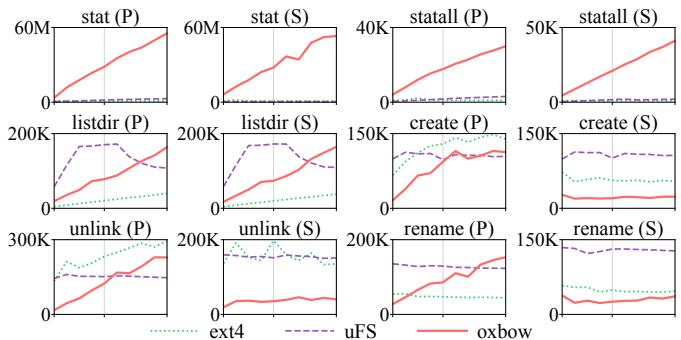  
Figure 16: Metadata microbenchmark throughput in ops/s across 1–10 clients. P and S denote private and shared metadata operations, respectively; all operations run in memory.

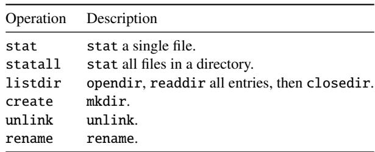  
Table 4: Metadata microbenchmark operations.

## B Metadata Benchmarks

We run the metadata operations from µFS’s microbenchmark suite [39], comparing Oxbow against µFS and Ext4 (Figure 16). It exercises six operations (Table 4), each in a private variant (every client uses a separate file or directory) and a shared variant (all clients contend on a common one). All operations run in memory, so the measured differences stem from the file systems’ software architectures.

Oxbow scales linearly on stat and statall because oxLib reads inode state directly from shared memory (§4.2) under a read lock (no contention), without kernel or H-Server crossing, whereas µFS and Ext4 pay a context switch per operation. At 10 clients, Oxbow reaches up to 19× and 10× the throughput of µFS and 57× and 30× that of Ext4. listdir scales likewise because oxLib reads the directory-entry cache directly from shared memory. µFS leads at low client counts by prefetching entries on opendir—an optimization that Oxbow could also adopt—but flattens because a single file server thread serves all directory operations by design. Consequently, Oxbow overtakes µFS at higher client counts, ending at 1.5× µFS and 4.1× Ext4. Because these lookups are readonly, Oxbow scales in the shared case as well.

The create and unlink operations go through both H-Server and the kernel; hence, Oxbow’s single-client throughput is the lowest of the three systems despite an asynchronous design. User-level parallelism nonetheless lets it scale with clients, surpassing µFS by 10 clients (up to 1.6× on unlink) but still trailing Ext4. rename also enters the kernel, but Oxbow bypasses the kernel’s coarse-grained VFS rename mutex, which is typically a scalability bottleneck as clients increase, and instead handles synchronization with fine-grained locks in H-Server. As a result, despite the component-crossing overhead, Oxbow scales 5.5× from 1 to 10 clients and leads in the private case. This is an example of the performance optimizations made possible by Oxbow’s flexible multi-component design. In shared configurations, parentdirectory lock contention prevents all three file systems from scaling across create, unlink, and rename.

## References

[1] BTRFS. https://btrfs.readthedocs.io.

[2] Compute Express Link. https://computeexpress link.org.

[3] Data Plane Development Kit. https://www.dpdk.o rg.

[4] libfuse. https://github.com/libfuse/libfuse.

[5] LWEXT4. https://github.com/gkostka/lwext4.

[6] Samsung PM1733/PM1735 NVMe SSD. https://se miconductor.samsung.com/ssd/enterprise-s sd/pm1733-pm1735.

[7] Storage Performance Development Kit. http://www. spdk.io.

[8] wrk - a http benchmarking tool. https://github.c om/wg/wrk/tree/master.

[9] Yahoo! Cloud Serving Benchmark (YCSB). https: //github.com/brianfrankcooper/YCSB.

[10] Samsung Z-SSD SZ985. https://semiconductor. samsung.com/news-events/tech-blog/samsun g-z-ssd-sz985, Aug. 2018.

[11] Intel Optane DC Persistent Memory Product Brief, 2019. https://www.intel.com/content/dam/www/pu blic/us/en/documents/product-briefs/opta ne-dc-persistent-memory-brief.pdf.

[12] PCI Express Base Specification Revision 5.0, Version 1.0. https://pcisig.com/specifications, May 2019.

[13] Samsung Brings Revolutionary Software Innovation to PCIe Gen4 SSDs for Maximized Storage Performance. https://news.samsung.com/global/samsung-b rings-revolutionary-software-innovation-t o-pcie-gen4-ssds-for-maximized-storage-p erformance, Sept. 2019.

[14] NVM Express Zoned Namespace Command Set Specification, revision 1.1b. https://nvmexpress.org/s pecifications, Jan. 2022.

[15] Samsung SmartSSD 2nd Generation. https://news .samsung.com/global/samsung-electronics-d evelops-second-generation-smartssd-compu tational-storage-drive-with-upgraded-pro cessing-functionality, July 2022.

[16] TP4146 Flexible Data Placement. https://nvmexpre ss.org/specifications, Nov. 2022.

[17] NVIDIA BlueField-2 DPU. https://www.nvidia.c om/content/dam/en-zz/Solutions/Data-Cente r/documents/datasheet-nvidia-bluefield-2 -dpu.pdf, 2024.

[18] NVM Express Base Specification Revision 2.0d. https: //nvmexpress.org/wp-content/uploads/NVM-E xpress-Base-Specification-2.0d-2024.01.1 1-Ratified.pdf, Jan. 2024.

[19] ScaleFlux SFX 3000 Storage Processor. https://sc aleflux.com/library/sfx-3000-storage-pro cessor, 2024.

[20] eBPF. https://ebpf.io/, 2025.

[21] Locust. https://locust.io, 2025.

[22] NVIDIA BlueField Data Processing Unit. https://ww w.nvidia.com/en-us/networking/products/da ta-processing-unit, Dec. 2025.

[23] Samsung 9100 PRO PCIe 5.0 NVMe SSD Datasheet. https://download.semiconductor.samsung.c om/resources/data-sheet/Samsung\_NVMe\_SSD\_ 9100\_PRO\_Datasheet\_Rev.1.0.pdf, Jan. 2025.

[24] ANDERSON, T. E., CANINI, M., KIM, J., KOSTIC´ , D., KWON, Y., PETER, S., REDA, W., SCHUH, H. N., AND WITCHEL, E. Assise: Performance and Availability via Client-local NVM in a Distributed File System. In Proceedings of 14th USENIX Symposium on Operating Systems Design and Implementation (OSDI’20) (Nov. 2020).

[25] ANDERSON, T. E., DAHLIN, M. D., NEEFE, J. M., PATTERSON, D. A., ROSELLI, D. S., AND WANG, R. Y. Serverless Network File Systems. In Proceedings of the

15th ACM Symposium on Operating Systems Principles (SOSP’95) (Dec. 1995).

[26] BHAT, S. S., EQBAL, R., CLEMENTS, A. T., KAASHOEK, M. F., AND ZELDOVICH, N. Scaling a file system to many cores using an operation log. In Proceedings of the 26th Symposium on Operating Systems Principles (SOSP’17) (Oct. 2017).

[27] CHO, K.-J., CHOI, J., KWON, H., AND KIM, J.-S. RFUSE: Modernizing Userspace Filesystem Framework through Scalable Kernel-Userspace Communication. In Proceedings of the 22nd USENIX Conference on File and Storage Technologies (FAST’24) (Feb. 2024).

[28] DEAN, J., AND GHEMAWAT, S. LevelDB: A Fast Persistent Key-Value Store. https://opensource.goo gleblog.com/2011/07/leveldb-fast-persist ent-key-value-store.html, July 2011.

[29] ENGLER, D. R., KAASHOEK, M. F., AND O’TOOLE, J. Exokernel: An Operating System Architecture for Application-level Resource Management. In Proceedings of the Fifteenth ACM Symposium on Operating Systems Principles (SOSP’95) (Dec. 1995).

[30] FENG, G., CAO, H., ZHU, X., YU, B., WANG, Y., MA, Z., CHEN, S., AND CHEN, W. TriCache: A User-Transparent Block Cache Enabling High-Performance Out-of-Core Processing with In-Memory Programs. In Proceedings of the 16th USENIX Symposium on Operating Systems Design and Implementation (OSDI’22) (July 2022).

[31] GRAY, C., AND CHERITON, D. Leases: An Efficient Fault-tolerant Mechanism for Distributed File Cache Consistency. In Proceedings of the 12th ACM Symposium on Operating Systems Principles (SOSP’89) (Dec. 1989).

[32] KADEKODI, R., LEE, S. K., KASHYAP, S., KIM, T., KOLLI, A., AND CHIDAMBARAM, V. SplitFS: Reducing Software Overhead in File Systems for Persistent Memory. In Proceedings of the 27th ACM Symposium on Operating Systems Principles (SOSP’19) (Oct. 2019).

[33] KANNAN, S., ARPACI-DUSSEAU, A. C., ARPACI-DUSSEAU, R. H., WANG, Y., XU, J., AND PALANI, G. Designing a True Direct-Access File System with DevFS. In Proceedings of the 16th USENIX Conference on File and Storage Technologies (FAST’18) (Feb. 2018).

[34] KIM, J., CAMPES, C., HWANG, J.-Y., JEONG, J., AND SEO, E. Z-Journal: Scalable Per-Core Journaling. In Proceedings of the 2021 USENIX Annual Technical Conference (USENIX ATC’21) (July 2021).

[35] KIM, J., JANG, I., REDA, W., IM, J., CANINI, M., KOSTIC´ , D., KWON, Y., PETER, S., AND WITCHEL, E. LineFS: Efficient SmartNIC Offload of a Distributed File System with Pipeline Parallelism. In Proceedings of the ACM SIGOPS 28th Symposium on Operating Systems Principles (SOSP’21) (Oct. 2021).

[36] KWON, Y., FINGLER, H., HUNT, T., PETER, S., WITCHEL, E., AND ANDERSON, T. Strata: A Cross Media File System. In Proceedings of the 26th Symposium on Operating Systems Principles (SOSP’17) (Oct. 2017).

[37] LI, C., YI, R., ZHANG, Z., LIU, J., MIN, C., ZHANG, J., LUO, Y., WANG, X., WANG, Z., AND ZHOU, D. Aeolia: A Fast and Secure Userspace Interrupt-Based Storage Stack. In Proceedings of the ACM SIGOPS 31st Symposium on Operating Systems Principles (SOSP’25) (Oct. 2025).

[38] LIEDTKE, J. On Micro-Kernel Construction. In Proceedings of the 15th ACM Symposium on Operating Systems Principles (SOSP’95) (Dec. 1995).

[39] LIU, J., REBELLO, A., DAI, Y., YE, C., KANNAN, S., ARPACI-DUSSEAU, A. C., AND ARPACI-DUSSEAU, R. H. Scale and Performance in a Filesystem Semi-Microkernel. In Proceedings of the ACM SIGOPS 28th Symposium on Operating Systems Principles (SOSP’21) (Oct. 2021).

[40] LOGAN, L., GARCIA, J. C., LOFSTEAD, J., SUN, X.- H., AND KOUGKAS, A. Labstor: A modular and extensible platform for developing high-performance, customized i/o stacks in userspace. In Proceedings of the International Conference on High Performance Computing, Networking, Storage and Analysis (SC’22) (Nov. 2022).

[41] LV, W., LU, Y., ZHANG, Y., DUAN, P., AND SHU, J. InfiniFS: An Efficient Metadata Service for Large-Scale Distributed Filesystems. In Proceedings of the 20th USENIX Conference on File and Storage Technologies (FAST’22) (Feb. 2022).

[42] MARTY, M., DE KRUIJF, M., ADRIAENS, J., ALFELD, C., BAUER, S., CONTAVALLI, C., DALTON, M., DUKKIPATI, N., EVANS, W. C., GRIBBLE, S., KIDD, N., KONONOV, R., KUMAR, G., MAUER, C., MUSICK, E., OLSON, L., RUBOW, E., RYAN, M., SPRINGBORN, K., TURNER, P., VALANCIUS, V., WANG, X., AND VAHDAT, A. Snap: a Microkernel Approach to Host Networking. In Proceedings of the 27th ACM Symposium on Operating Systems Principles (SOSP’19) (Oct. 2019).

[43] MATHUR, A., CAO, M., BHATTACHARYA, S., DILGER, A., TOMAS, A., AND VIVIER, L. The new ext4 filesystem: current status and future plans. In Proceedings of the Linux Symposium (June 2007).

[44] MILLER, S., ZHANG, K., CHEN, M., JENNINGS, R., CHEN, A., ZHUO, D., AND ANDERSON, T. High Velocity Kernel File Systems with Bento. In Proceedings of the 19th USENIX Conference on File and Storage Technologies (FAST’21) (Feb. 2021).

[45] PARK, D., AND SHIN, D. iJournaling: Fine-Grained Journaling for Improving the Latency of Fsync System Call. In Proceedings of the 2017 USENIX Conference on USENIX Annual Technical Conference (USENIX ATC’17) (July 2017).

[46] PETER, S., LI, J., ZHANG, I., PORTS, D. R. K., WOOS, D., KRISHNAMURTHY, A., ANDERSON, T., AND ROSCOE, T. Arrakis: The Operating System is the Control Plane. In Proceedings of the 11th USENIX Conference on Operating Systems Design and Imple mentation (OSDI’14) (Oct. 2014).

[47] REN, Y., MIN, C., AND KANNAN, S. CrossFS: A Crosslayered Direct-Access File System. In Proceedings of the 14th USENIX Conference on Operating Systems Design and Implementation (OSDI’20) (Dec. 2020).

[48] SHIRWADKAR, H., KADEKODI, S., AND TSO, T. FastCommit: resource-efficient, performant and costeffective file system journaling. In Proceedings of the 2024 USENIX Annual Technical Conference (USENIX ATC’24) (July 2024).

[49] SOLTANIYEH, M., SUN, G., YAO, X., BEYGI, A., KACHARE, R., ZHAO, D., HUEN, H., CHANG, A., MU-RUGESAPANDIAN, S., AND KAHN, C. Revisiting Memory Hierarchies with CMM-H: Use Device-side Caching to Integrate DRAM and SSD for a Hybrid CXL Memory. In Proceedings of the 17th ACM Workshop on Hot Topics in Storage and File Systems (HotStorage’25) (July 2025).

[50] SON, Y., KIM, S., YEOM, H. Y., AND HAN, H. Highperformance transaction processing in journaling file systems. In Proceedings of the 16th USENIX Conference on File and Storage Technologies (FAST’18) (Feb. 2018).

[51] VANGOOR, B. K. R., TARASOV, V., AND ZADOK, E. To FUSE or not to FUSE: performance of user-space file systems. In Proceedings of the 15th Usenix Conference on File and Storage Technologies (FAST’17) (Feb. 2017).

[52] VOLOS, H., NALLI, S., PANNEERSELVAM, S., VARADARAJAN, V., SAXENA, P., AND SWIFT, M. M. Aerie: Flexible File-system Interfaces to Storageclass Memory. In Proceedings of the 9th European Conference on Computer Systems (EuroSys’14) (Apr. 2014).

[53] YADALAM, S., ALVERTI, C., KARAKOSTAS, V., GANDHI, J., AND SWIFT, M. BypassD: Enabling fast userspace access to shared SSDs. In Proceedings of the 29th ACM International Conference on Architectural Support for Programming Languages and Operating Systems (ASPLOS’24) (Apr. 2024).

[54] YANG, Z., LU, Y., LIAO, X., CHEN, Y., LI, J., HE, S., AND SHU, J. λ-IO: A Unified IO Stack for Computational Storage. In Proceedings of the 21st USENIX Conference on File and Storage Technologies (FAST’23) (Feb. 2023).

[55] ZHANG, J., KIM, J., ALVERTI, C., LIU, P., JIA, W., AND XU, T. Rethinking Tiered Storage: Talk to File Systems, Not Device Drivers. In Proceedings of the 20th Workshop on Hot Topics in Operating Systems (HotOS-XX) (May 2025).

[56] ZHANG, J., REN, Y., AND KANNAN, S. FusionFS: Fusing I/O Operations using CISCOps in Firmware File Systems. In Proceedings of the 20th USENIX Conference on File and Storage Technologies (FAST’22) (Feb. 2022).

[57] ZHANG, J., REN, Y., NGUYEN, M., MIN, C., AND KANNAN, S. OmniCache: Collaborative Caching for Near-storage Accelerators. In Proceedings of the 22nd USENIX Conference on File and Storage Technologies (FAST’24) (Feb. 2024).