USENIX

THE ADVANCED COMPUTING SYSTEMS ASSOCIATION

# Janus: Cross-World, Cooperative Nested Virtualization for Secure Containers

Jiangshan Lai, Ant Group; Hang Huang, Alibaba Cloud and Huazhong University   
of Science and Technology; Quan Xu and Zhen Ren, Alibaba Cloud; Wenlong Hou,   
Ant Group; Wei Guo, Alibaba Cloud; Jia Rao and Hui Lu, The University of Texas at Arlington; Weidong Han, Jiesheng Wu, Jiang Liu, Naixuan Guan, and Yibin Shen, Alibaba Cloud; Feng Yu and Xu Wang, Ant Group; Shiqiang Zhang,   
Alibaba Cloud; Zhiheng Tao, Ant Group; Yisheng Xie, Alibaba Cloud; Song Wu and Hai Jin, Huazhong University of Science and Technology https://www.usenix.org/conference/osdi26/presentation/lai

# This paper is included in the Proceedings of the 20th USENIX Symposium on Operating Systems Design and Implementation.

July 13–15, 2026 • Seattle, WA, USA

ISBN 978-1-939133-55-7

Open access to the Proceedings of the 20th USENIX Symposium on Operating Systems Design and Implementation is sponsored by

# JANUS: Cross-World, Cooperative Nested Virtualization for Secure Containers

Jiangshan Lai∗,†, Hang Huang∗,‡,§, Quan Xu‡, Zhen Ren‡, Wenlong Hou†, Wei Guo‡, Jia Rao¶, Hui Lu¶, Weidong Han‡, Jiesheng Wu‡, Jiang Liu‡, Naixuan Guan‡, Yibin Shen‡, Feng Yu†, Xu Wang†, Shiqiang Zhang‡, Zhiheng Tao†, Yisheng Xie‡, Song Wu§, and Hai Jin§ †Ant Group ‡Alibaba Cloud

§National Engineering Research Center for Big Data Technology and System, Services   
Computing Technology and System Lab, Cluster and Grid Computing Lab, School of Computer   
Science and Technology, Huazhong University of Science and Technology, Wuhan, 430074, China ¶The University of Texas at Arlington, USA

## Abstract

Secure containers such as Kata Containers strengthen isolation by running each container inside a lightweight VM. On today’s virtualized clouds, this creates an unavoidable form of nested virtualization with dominant cost in memory virtualization. Existing approaches entangle CPU virtualization and three-level page-table management across hypervisors, forcing frequent cross-world synchronization and producing severe overheads for mixed memory-access workloads.

We present JANUS, a cross-world, cooperative nested virtualization architecture that cleanly separates CPU and memory virtualization responsibilities. JANUS performs all guest world switches entirely within the guest hypervisor through a lightweight switcher mechanism, while delegating all memory translation to the host hypervisor. This separation removes the host from the critical path of CPU events and eliminates the intermediate shadow or nested page tables that burden existing designs. JANUS introduces several key techniques, including VMFUNC-based EPTP switching for trap-free transitions between guest and nested-guest address spaces; a shadow-root mechanism that protects world-switch integration while allowing direct updates to the nested guest’s page tables; and in-guest virtualization exception handling that enables the guest hypervisor to resolve second-level faults with only a single lightweight host interaction. Evaluations demonstrate that JANUS delivers an average performance improvement of 144% over PVM and 28.6% over KVM-based nested virtualization for real-world applications, and imposes less than 5% overhead compared to native containers in production deployment. JANUS demonstrates that rethinking nested virtualization around cross-world cooperation yields strong isolation with near-native container performance.

## 1 Introduction

Containers, such as RunC [43] and LXC [15], underpin today’s cloud-native software stack by offering portable and efficient isolation to cloud workloads [10]. But their reliance on a shared host kernel [13, 17, 44] exposes applications to kernel-level vulnerabilities and cross-tenant attacks. A single exploited container (e.g. CVE-2025-9074) can compromise the host kernel and cascade across tenants [24]. To mitigate this risk, cloud platforms (e.g., Alibaba MaxCompute [1]) increasingly deploy secure containers, such as Kata Containers [25], which place each container inside a lightweight virtual machine (microVM). This design restores hardwareenforced isolation for executing untrusted code (e.g., userdefined functions (UDFs) [16]), while preserving the agility of container-based workflows and maintaining high performance under bare-metal deployment [2, 54].

However, provisioning bare-metal instances (for deploying secure containers) remains inefficient and inflexible due to long startup times [28], hindering elastic scale-out under bursty workloads. As a result, platforms must maintain a statically overprovisioned pool of instances to absorb peak demand, leading to substantial resource underutilization during typical steady-state workloads. This has driven platforms to increasingly favor cloud VM instances, which offer greater elasticity by enabling on-demand instance allocation to handle dynamic workload fluctuations [21]. Yet, deploying secure containers on cloud VMs faces a fundamental challenge: secure containers must run within an already virtualized environment, leading to nested virtualization, where each container’s microVM executes inside a cloud VM. The additional layer of CPU and, especially, memory virtualization introduces substantial overheads that make secure containers slower than their traditional counterparts.

Empirical studies reveal that while CPU-bound workloads exhibit negligible slowdown, memory-intensive workloads can degrade by up to two orders of magnitude under nested virtualization [21]. The primary source of this overhead is the need to reconcile three levels of page tables – i.e., the host page table (HPT) in host (L0), the guest page table (GPTL ) in cloud VM (L1 guest), and the nested guest page table (GPTL ) in secure container (L2 nested guest) – within the two-level hardware translation model commonly supported by modern processors. As illustrated in Figure 1, the hardware MMU traverses two translation structures: the first-level page table (pointed to by CR3) and the second-level extended page table (pointed to by EPTP). With the two-level hardware translation model, nested memory virtualization must compose these three page tables into two to translate a nested guest virtual address (GVAL ) to the host physical address (HPA).

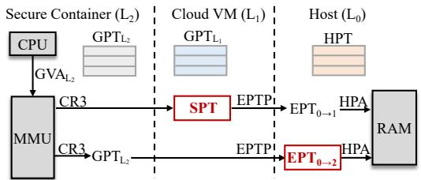  
Figure 1: Two approaches for nested memory translation

More specifically, a classic L1-dominated approach introduces a shadow page table (SPT ) that merges GPTL and GPTL , enabling the MMU to perform a two-step translation – from GVAL to GPAL via SPT , and from GPAL to HPA via EPT0→11 [21]. Although straightforward, this approach forces L1 to constantly synchronize SPT with read-only GPTL , resulting in high VM exit rates. An alternative L0-dominated design constructs an EPT0→2 within L0, directly maintaining the mapping from GPAL to HPA to complement GPTL in supporting two-stage translation [12]. While this design enables L2 to manage its own page tables, it shifts the synchronization burden to the L0, which must maintain consistency between the EPT1→2 in the L1 and EPT0→2.

More recent effort has attempted to circumvent this synchronization bottleneck. CKI [38] constructs GPTL to map GVAL directly to GPAL and leverages Supervisor Protection Keys (PKS) [30] to restrict L2’s memory access, thereby eliminating the need to maintain SPT . HyperTurtle [56] takes a different approach by allowing L1-registered eBPF programs to apply updates directly to EPT1→2 inside L0, removing the synchronization cost. However, both techniques rely on rigid memory-allocation assumptions, such as preallocation and contiguous allocation, that are difficult to satisfy in dynamic, cloud-native environments.

In this paper, we present JANUS, a cross-world, cooperative nested virtualization architecture that restructures how CPU and memory virtualization are divided across hypervisor layers. As shown in Figure 2, JANUS differs from existing L - or L -dominated approaches by cleanly separating (nested) vir tualization responsibilities: L performs all L world switches (e.g., due to system calls, interrupts, and exceptions) through a lightweight, switcher-based software mechanism, while L exclusively manages nested memory translation via a hostcontrolled EPT0→2. This division removes L0 from the critical path of CPU events and hence eliminates the costly crossworld synchronization.

Realizing this architecture requires overcoming several challenges in enabling fast and safe cross-world execution. First, JANUS builds upon a software-based CPU virtualization layer, i.e., the switcher, that intercepts all L2 virtualization events within L , allowing fast L –L world switches without trapping to L0. Second, seamless transitions between the two worlds require switching not only CPU state but also memory views; JANUS addresses this by using VMFUNC-based EPTP switching, allowing the processor to transition between the L1 view (EPT0→1) and the L2 view (EPT0→2) entirely within non-root mode (no L0 participation). Finally, to ensure these transitions remain isolated and tamper-proof, JANUS introduces a shadow-root mechanism that embeds control metadata within the nested guest’s page table, preventing a compromised L2 from subverting world-switch integrity.

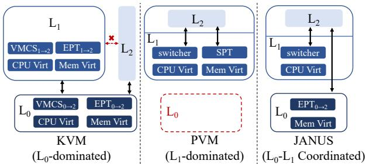  
Figure 2: Comparison of nested virtualization approaches among KVM, PVM, and JANUS

Building on this switcher-based CPU virtualization, JANUS realizes nested memory virtualization by using GPTL directly as the first-level translation and delegating all second-level mapping to a host-managed EPT , thereby removing the intermediate shadow or nested page tables traditionally maintained in L . Making this design both safe and efficient requires addressing two additional challenges. First, writable GPTL must not allow a compromised L2 to remap privileged regions (e.g., the switcher and shadow-root); JANUS enforces this through a GPA disaggregation mechanism, which isolates switcher and shadow-root pages from the GPA range exposed to L . Second, constructing missing EPT → entries must avoid the cascade of exits that plagues prior designs; JANUS achieves this using in-guest #VE handling, allowing L1 to resolve EPT faults locally and issue a single lightweight hypercall to L0. Together, these mechanisms eliminate costly cross-world synchronization across L , L , and L and provide fast, secure nested memory management. Beyond basic execution, JANUS extends its design to support key cloudmanagement operations. For memory reclamation, it provides a lightweight hypercall interface that lets L delegate invalidations to L , ensuring coherence across nested translations. For live migration, JANUS ’s GPA-disaggregated layout enables hardware Page Modification Logging (PML) to track nested-guest dirty pages directly in EPT0→2, eliminating the high overhead of write-protection–based dirty-page tracking.

JANUS delivers system-wide improvements across all layers of the virtualization stack. At the L layer, it enables direct manipulation of nested guest page tables, allowing fast, trap-free resolution of GPTL faults without involving lower layers. The L hypervisor is freed from the burden of maintaining intermediate page tables, effectively eliminating lock contention and frequent VM exits induced by cross-world synchronization. At the L0 layer, JANUS requires only minimal extensions to deploy EPT0→2, thereby avoiding the complexity and maintenance overhead typically associated with managing EPT1→2. Our evaluation using both microbenchmarks and representative cloud workloads demonstrates that JANUS substantially enhances the efficiency of secure containers on virtualized cloud instances. By eliminating costly cross-world synchronization, JANUS delivers performance gains of up to 3x and 6x over state-of-the-art KVM- and PVM-based nested virtualization approaches.

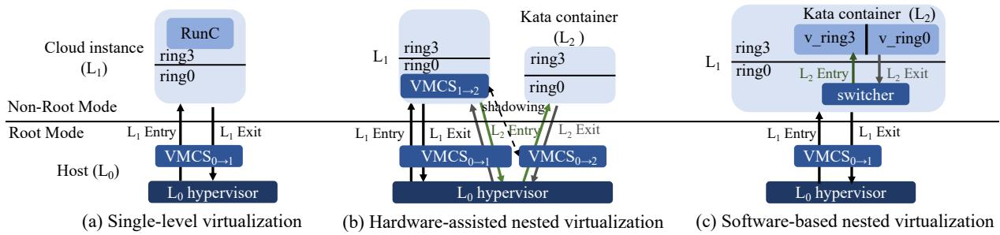  
Figure 3: CPU virtualization in single-level virtualization and nested virtualization

## 2 Background

In this section, we provide the necessary background on single and nested virtualization, with a focus on CPU and memory virtualization mechanisms.

As shown in Figure 3, cloud providers deliver virtualized compute instances atop host hypervisors such as KVM [18]. This single-level virtualization model is commonly supported by hardware extensions (e.g., Intel VT-x and AMD-V), which enforce a clear division between root and non-root execution modes to isolate host and guest environments. In contrast, containers like RunC [43] rely exclusively on OS-level virtualization techniques, e.g., namespaces [13], control groups (cgroups) [17], and Linux security modules (LSM) [44], and thus can operate seamlessly within such virtualized environments with negligible additional complexity.

Recently, the rising demand for stronger isolation guaran tees in multi-tenant cloud platforms has driven the adoption of secure containers, like Kata Containers [24]. These systems encapsulate conventional containers within lightweight microVMs, retaining container agility while delivering VM-level isolation. At the same time, modern cloud services are commonly provisioned and managed as VM instances, which provide elastic resource allocation, standardized isolation boundaries, and compatibility with existing cloud control planes. To preserve these operational advantages, secure containers are often deployed on top of cloud VMs rather than as a separate bare-metal substrate. In this deployment model, each secure container introduces its own microVM inside an already virtualized cloud instance, resulting in a second layer of virtualization, namely nested virtualization, that current hardware does not natively accelerate. This gap exposes severe inefficiencies, particularly in memory management (i.e., the dominant source of overhead in nested virtualization).

## 2.1 Nested CPU Virtualization

A key challenge in nested virtualization lies in maintaining distinct privilege levels among the host (L0), guest (L1), and nested guest (L2), despite the fact that modern hardware virtualization extensions (e.g., Intel VT-x, AMD-V) expose only a single hardware separation between root and nonroot modes. In single-level virtualization, transitions between the L0 hypervisor and the guest (L1) are efficiently managed by hardware through the Virtual Machine Control Structure (VMCS), which saves and restores processor states across mode switches. However, enabling a second level of virtualization requires these transitions to be emulated entirely in non-root mode, since current hardware lacks native support for an additional privilege boundary [12].

This emulation can be realized in two ways: (1) through hardware-assisted support from L or via (2) software-based mechanisms implemented within L . In the hardware-assisted design, as shown in Figure 3(b), L0 maintains a physical control structure V MCS for L , synchronizing it with the virtual V MCS managed by L . Whenever L executes VMCS operations such as VMLAUNCH or VMRESUME (running L2), the instruction traps to L , which must translate virtual V MCS into physical V MCS and then perform an actual VM entry (on behalf of L ). Similarly, each VM exit from L first transitions to L0, which must then reinject the exit event into L1 to maintain the correct execution semantics. These multi-level transitions introduce high overhead, as every L2 world switch requires multiple VM exits and reentries involving L0.

Inspired by paravirtualization techniques such as Xen [11] and Lguest [6], the recent PVM approach [21] introduces a small paravirtualized component called the switcher. The switcher implements the minimal subset of VMX state transitions in non-root mode (L1), allowing efficient world switches between L1 and L2 without trapping into L0.

Specifically, the L hypervisor maps the switcher into both the L1 and L2 at identical virtual addresses, allowing control to transfer seamlessly across world switches. For example, the switcher transitions between worlds by switching the page table and can continue executing the remaining instructions needed to complete the privilege-level transition even after the address space changes. The switcher maintains VMCSlike state structures in per-CPU entry areas and uses them to save and restore processor state during transitions. To enter L2, the switcher loads the L2 state (e.g., syscall entry points, IDT, TSS, trampoline stacks, and LDT), switches into the L address space, and issues an IRET to drop into the L2 kernel or user context in non-root ring 3. L2 kernel and user code remain isolated through separate page tables and a virtual ring hierarchy enforced by L . The syscall and IDT handlers installed for L2 intercept privileged events (syscalls, hypercalls, interrupts, exceptions) and return control to L1 by restoring its saved state and executing a RET. In essence, the switcher implements lightweight VM-entry/VM-exit logic in software, allowing L to reuse the existing V MCS of L while providing strong privilege separation via ring 0 and ring 3 state. By localizing VM entry and exit emulation within L , such switcher-based CPU virtualization eliminates expensive L0 traps while preserving correct nested execution semantics.

## 2.2 Nested Memory Virtualization

Modern processors natively support single-level memory virtualization by performing a two-dimensional page-table walk that translates guest virtual addresses (GVAs) to host physical addresses (HPAs): first from GVAs to guest physical addresses (GPAs) using the guest page table, and then from GPAs to HPAs using a hardware-assisted second-level page table such as Intel’s Extended Page Tables (EPT) or AMD’s Nested Page Tables (NPT). Throughout this paper, we refer to EPT as the second-level page table without loss of generality.

In a nested virtualization setting, however, L0 observes only the mappings from GPAL to HPAs. It has no visibility into how L1 manages the nested guest’s memory – specifically, how GPAL is mapped to GPAL . This lack of cross-world visibility between L0 and L2 complicates the construction of a direct translation path from GPAL to HPA. To bridge this gap, two techniques have emerged in practice: SPT-on-EPT and EPT-on-EPT [12]. The former introduces a softwaremaintained SPT to translate GVAL to GPAL , while the latter constructs a nested EPT hierarchy that composes mappings from both L1 and L0 to translate GPAL directly to HPA.

PVM-on-EPT. We first describe the advanced SPT-on-EPT model used by PVM-on-EPT [21], which complements PVM’s lightweight, switcher-based CPU virtualization (§2.1).

As shown in Figure 4(a), while L2 maintains its own guest page tables, the effective first-level address translation is carried out by SPT maintained by L1 2. During L2 execution, L1 hypervisor loads the SPT into CR3, and protects the memory pages containing the L2 page table entries as read-only. It ensures that any modifications to GPTL are intercepted and mediated exclusively by L1.

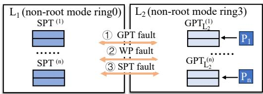  
(a) PVM-on-EPT

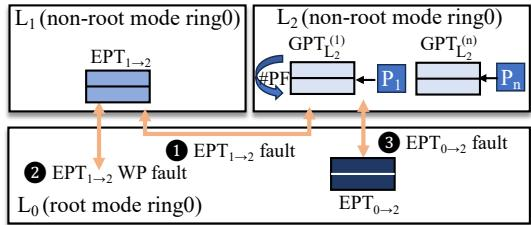  
(b) EPT-on-EPT  
Figure 4: Two approaches for nested memory virtualization

Therefore, when L2 accesses a GVAL without a valid mapping in SPT , a page fault is raised and delivered to L1. L1 inspects GPTL to identify the cause of the fault. If the corresponding entry is missing in GPTL , indicating a GPT fault (➀), L1 injects the fault back into L2, allowing L2 to update its own page table using the faulting address recorded in CR2. This process triggers another page fault because updating the read-only guest page table entries causes a write-protect (WP) fault (➁). The system must then exit to L to emulate the write to the corresponding L2 page table page. Once L2 page table is updated, a subsequent access to the same address triggers another SPT fault (➂), which L1 can now resolve by walking both GPTL and GPTL to construct the translation entry in SPT . L1 then marks the relevant GPTL entries as read-only to capture future updates. This process involves three world switches between L and L and may repeat until the full translation hierarchy is established.

As SPT operates at process granularity and each L2 process has its own GPTL , L1 must allocate and manage a distinct SPT for each L2 process (e.g., SPT (n) corresponds to the GPT (n)L of process n). When L2 runs multi-process workloads, constructing multiple SPT significantly increases the frequency of shadow page faults. Moreover, any modification to GPTL by L2 applications triggers a VM exit to L1, which must update the corresponding entries in SPT . Although it can be handled through lightweight world switches between L1 and L2 (i.e., via the switcher), their cumulative frequency amplifies lock contention within L1’s memory management subsystem, leading to degraded scalability under multi-process workloads.

EPT-on-EPT. Existing KVM hypervisors employ an EPT-on-EPT approach in conjunction with the hardware-assisted CPU virtualization (§2.1), which introduces significant cross-world synchronization overhead.

As shown in Figure 4(b), GPTL directly serves as the firstlevel page table, enabling L2 to handle its own page faults locally without trapping into lower layers. However, when L2 accesses a GPAL whose translation is missing in EPT0→2, an EPT fault is raised. Because L cannot interpret the intermediate mapping between GPAL and GPAL (maintained by L1), this EPT fault must first be injected into L1 (➊). L1 then constructs the missing translation in EPT1→2, which requires modifying one level of the table entry and triggers a VM exit (due to WP fault) to L for write emulation (➋). After L emulating the page modification, control returns to L1, which resumes L2 execution. The resumed L2 then traps to L0 once more for the actual VM resume operation. Since EPT0→2 remains incomplete, a final EPT fault occurs (➌). In response, L0 repairs EPT0→2 by synchronizing it with EPT1→2 and marking the corresponding entries in EPT as read-only to capture furture updates. Once this fixup completes, L0 resumes L2, allowing subsequent accesses to the same GPAL to proceed without trapping. Each missing GPAL translation therefore requires three costly world switches across L0, L1, and L2, and this procedure may repeat multiple times until all levels of GPT are resolved.

## 3 Motivation and Opportunities

Nested virtualization is a key enabler for cloud platforms to run secure containers inside VM instances while preserving the elasticity and cost efficiency of modern cloud infrastructure. However, the performance costs of existing approaches, especially in nested memory virtualization, remain a critical bottleneck. These overheads continue to hinder the efficient deployment of secure containers, and the impact becomes especially visible for memory-intensive workloads.

## 3.1 Limitation: Missing L0-L1 Coordination

To demonstrate this, we evaluated the performance of accessing 32 GB of physical memory under the EPT-on-EPT and PVM-on-EPT by repeatedly invoking mmap, performing memory accesses, and then calling munmap. As shown in Figure 5, our experiments include tests on inactive physical memory that has never been touched and active physical memory whose low-level mappings have already been established.

When accessing inactive physical memory, EPT-on-EPT requires nearly twice the execution time of PVM-on-EPT (Figure 5 (a)) because it must construct the lower-level EPT0→2 entries, triggering a larger number of expensive exits to L with most exits caused by EPT violations and a significant portion caused by VMRESUME emulation (Figure 5 (b)).

When accessing active physical memory, EPT-on-EPT becomes more efficient than PVM-on-EPT because the necessary EPT0→2 mappings are already present and only a small number of exits to L occur. In contrast, PVM-on-EPT contin ues to incur a similar number of exits in each iteration because the mmap and munmap operations modify the L2 page table, which repeatedly induces GPTL and SPT synchronization.

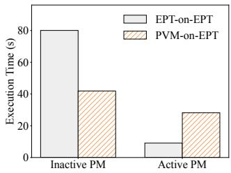

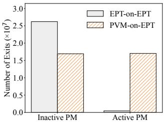  
(a) Time  
(b) Exits  
Figure 5: Performance of physical memory (PM) access

When applications run inside secure containers within VMs, their memory access behavior combines both active and inactive physical memory. However, existing nested virtualization approaches perform well in isolated cases – either active or inactive memory accesses – but fail to handle the mixed access patterns that real applications typically exhibit.

These inefficiencies are rooted in the lack of cross-world coordination between L0 and L1 in existing nested designs. Hardware-assisted approaches (e.g., EPT-on-EPT) delegate most memory virtualization tasks to the L0 hypervisor and depend on hardware CPU virtualization to perform costly world switches. In contrast, software-based approaches (e.g., PVM) enable efficient world switches between L1 and L2, but at the expense of frequent transitions between these two, imposing significant overhead on L1 to manage multiple, softwarebased shadow page tables across multi-process workloads.

## 3.2 Opportunities: Advanced HW Features

These observations underscore the opportunity for a crossworld, coordinated nested memory virtualization architecture that unifies the advantages of efficient software-based world switching with the simplicity of hardware-assisted memory virtualization. Recent hardware advances make such coordination not only feasible but also efficient.

Multi-level Page Tables. Software-based world switching requires that the switching code and its data be mapped at identical virtual addresses (within a PUD range) in both GPTL and GPT . Making GPT read-only would degenerate into full shadow paging and undermine JANUS’s goal of allowing L2 to manage its own address space. Instead, JANUS can exploit hierarchical page tables to enforce fine-grained, root-level mediation. It interposes only on top-level (PGD) updates, maintaining a protected shadow PGD as the authoritative root. While L2 can modify its in-memory PGD, only updates issued via a hypercall to L1 are validated and applied to the shadow PGD, which is the root page loaded into CR3 during L2 execution. L1 allows updates to non-critical regions, but strictly blocks any attempt by L2 to modify the PGD entry referencing the PUD covering the switching range. This yields a partially shadowed page-table abstraction: the PGD entry for the switching-critical PUD is pinned and immutable, while other entries–and their lower-level page tables (PUD/PMD/PTE)–remain fully writable. Thus, JANUS preserves L ’s flexibility while ensuring the invariant required for correct and secure world switching.

VMFUNC and EPTP Switching. JANUS enforces L2 to execute with a dedicated EPT, which is maintained by the L0 and isolated from L ’s EPT, to enable second-level address translation. Switching between L and L therefore requires changing the active EPT, which would incur significant overhead if handled via host intervention. Modern Intel CPUs provide VMFUNC (function 0), enabling EPTP switching entirely in non-root mode and atomic transitions without VM exits. However, because VMFUNC is unprivileged, L2 might switch to any EPTP in the pre-configured EPTP list by the host, potentially including those not intended for its execution. To prevent such malicious switches from taking effect, JANUS binds each L2 execution context to its designated EPT by restricting the visibility of its shadow root to that EPT only. Consequently, if L2 switches to a different EPT via VMFUNC, the shadow root required for first-level address translation becomes inaccessible, triggering a fault that traps into L1, which can immediately detect the violation and terminate L . This design preserves the performance benefits of VMFUNC while enforcing strict EPT isolation without restricting its usage.

Virtualization Exception. The host maintains EPT mappings for L2, while relying on L1 to provide the mapping from GPAL to GPAL . Traditionally, an EPT violation triggers a VM exit to the L0, which injects an exception into the L1; the L1 then forwards the required mapping information back to the host. This back-and-forth interaction significantly increases VM exit frequency and limits the efficiency of EPT0→2 construction. Modern Intel CPUs introduce the Virtualization Exception (#VE) mechanism, which delivers EPT violations for designated address ranges directly to a guest-level handler. By resolving violations within the L1, #VE eliminates L0 involvement in exception injection and substantially improves cross-layer coordination efficiency.

## 3.3 Threat Model

Cross-world cooperative nested virtualization preserves the isolation guarantees of conventional single-level virtualization. We assume trusted hardware CPU protection mechanisms, including VMX-based root and non-root modes, as well as ring-based privilege separation between kernel and user execution. We further rely on hardware-enforced memory protection: first-level page tables constrain accesses to guest physical memory, while second-level EPTs restrict accesses to host physical memory within designated regions. Together, these mechanisms enforce strong isolation between the host and its guests, and extend naturally to nested guests.

Our focus is on software-level vulnerabilities in paravirtualized nested guest kernels, guest hypervisors, and the host hypervisor, which might be exposed through virtualization interfaces. We consider the following threat scenarios: (1) a malicious secure container may attempt to compromise nested CPU and memory virtualization by exploiting shared-memory regions or unauthorized address-space switching via the nonprivileged VMFUNC instruction, potentially targeting the guest or co-located nested guests; and (2) a malicious guest may attempt to violate single-level virtualization boundaries by exploiting the memory virtualization coordination interface or vulnerabilities in the host hypervisor, thereby targeting the host or other guests.

These threats directly guide the design principles of JANUS. First, the system must protect the shared-memory region used for world switching from modification by the nested guest, even when it is mapped into the nested guest page table, in order to preserve the integrity of the switching mechanism and ensure correct guest-level execution. To this end, we design a shadow root mechanism (§4.2) that exposes a controlled view of the root page table (PGD) to the nested guest while maintaining consistency with the actual page-table state. Second, the system must intercept VMFUNC invocations that attempt to switch to unauthorized EPTs, thereby preventing illicit cross-domain memory access at the guest level. Accordingly, we develop an enhanced EPT mapping design that leverages GPA disaggregation to detect and block unauthorized EPTP switching via first-level page-table enforcement (§4.3). Finally, when extending memory-related hypercall interfaces to the host hypervisor, the system must enforce strict validation of memory mappings to ensure consistency with kernel memory management (§4.4).

## 4 JANUS: Design and Implementation

We present JANUS, a high-performance, nested virtualization framework that enables close cooperation between the L0 and L1 hypervisors to achieve efficient CPU and memory virtualization. Unlike prior nested virtualization approaches that consolidate CPU virtualization (world switching) and memory virtualization (three-level address translation) within a single hypervisor (PVM-on-EPT) or across both hypervisors (EPT-on-EPT), JANUS separates these mechanisms by assigning the responsibilities of world switching and pagetable management to distinct hypervisors. Specifically, JANUS employs a switcher-like, software-based approach in L1 to handle world switches due to L2’s system calls, page faults, interrupts, and exceptions, while delegating all memory virtualization to the L hypervisor. The separation of CPU and memory virtualization provides two key benefits: (1) world switches become cheaper because all L2 CPU state transitions can be handled locally within the L1 hypervisor, closer to the L guest and without involving L ; and (2) the consolidation of nested three-dimensional page tables onto the two-dimensional paging hardware is delegated entirely to the most privileged hypervisor, L , thereby avoiding repetitive and costly world switches across L , L , and L .

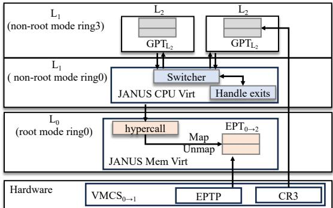  
Figure 6: The JANUS architecture

## 4.1 Architecture Overview

Figure 6 illustrates the overall architecture of JANUS. JANUS leverages the two dimensional page tables in hardware to facilitate the three-level memory address translation in nested virtualization. It directly loads the L2 guest’s page table onto CR3 for the first level address translation. Accordingly, JANUS loads EPT0→2 onto EPTP to directly translate GPAL to HPA, and manages EPT0→2 exclusively in the L0 hypervisor. While this design is architecturally similar to EPT-on-EPT, JANUS’s key contribution is its ability to guarantee that (1) all L2 visible events, such as page faults, system calls, and interrupts, are either handled natively by L2 or efficiently processed within L1, and (2) the management of EPT0→2 at L0 bypasses any intermediate L page tables and requires only a single world switch to L0 per EPT0→2 update.

As shown in Figure 6, JANUS’s key mechanisms include a software-based switcher that performs world switches for handling L2 events, and a hypercall interface that enables cooperation between L1 and L0 for managing EPT0→2.

## 4.2 World Switch

Inspired by CPU para-virtualization techniques used in traditional hypervisors such as Xen [11], Lguest [6], and particularly PVM [21], the switcher in JANUS is implemented as a code and data segment within the per-CPU entry area, enabling efficient CPU state transitions in response to L2 events. In general, switcher is a software-based mechanism that emulates VMCS functionality within non-root mode (i.e., the L hypervisor) to save and restore CPU states across mode switches. Similar to the switcher design in PVM, JANUS places both the L2 user and kernel spaces in hardware ring 3 of non-root mode, while the switcher itself resides in ring 0 of non-root mode. Thus, all L2 privileged instructions, system calls, and interrupts trap into the switcher for world switching. To execute correctly across domains during switchover (which involves switching page tables and address spaces), the switcher must reside at the same virtual address in the L2 user space, L2 kernel space, and the L1 hypervisor.

The delegation of memory virtualization, i.e., the management of EPT → , entirely to the L hypervisor introduces unique challenges in JANUS’s switcher design. Since L directly loads its page table onto CR3 for the first level address translation and there is no intermediate page table in L1, the switcher must be indexed by both GPTL and GPTL to enable L -L world switches. Consequently, the world switches involve the switching of GPTL and GPTL on CR3, and the switching of EPT0→2 and EPT0→1 on EPTP. Building on this design, JANUS’s switcher offers two key advantages over prior approaches. (1) It resides on the L1-maintained shadow root page table during L2 execution, requiring only synchronization with the actual L2 root page table, analogous to how the switcher resides within GPTL . (2) It performs all required EPT switching without trapping to L0, and efficiently handles switcher-induced EPT faults at runtime.

Table 1: World switches within non-root mode.  
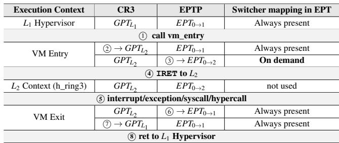

Algorithm 1 VM Entry–Exit Cycle: L1 → L2 → L1   
Require: Initial state: CR3 = GPTL , EPT P = EPT0→1.   
Ensure: After cycle: L executed and L state restored.   
1: VM Entry (L1 → L2):   
2: Construct L2 context onto L2 entry stack   
3: Save L context on L kernel stack   
4: Switch to L1 entry stack   
5: Switch CR3 to GPTL (switch to L2 entry stack)   
6: Invoke VMFUNC(0, index) to switch to EPT0→2   
7: Execute IRET (switch ring, pop stack and restore L2)   
8: L Execution:   
9: State: CR3 = GPTL , EPT P = EPT0→2   
10: Execute L2 user process or kernel   
11: VM Exit (L2 → L1):   
12: Save L context on L entry stack   
13: Invoke VMFUNC(0, 0) to switch back to EPT0→1   
14: Restore CR3 to GPTL (switch to L1 entry stack)   
15: Restore L1 context.

Table 1 summarizes page table switches for various mode transitions and execution contexts, and Algorithm 1 illustrates the execution flow of the complete VM entry–exit cycle. We begin with the L1 execution context before an L2 guest is launched. Upon the creation of an L2 guest and before entering this guest, L1 hypervisor installs a corresponding switcher in both GPTL and EPT0→1. To facilitate L2 mode switching, the L1 hypervisor pins the switcher address mapping in L1. To switch from the L1 to L2 context (➀), i.e., performing a VM entry, the switcher first loads L2’s page table GPTL onto

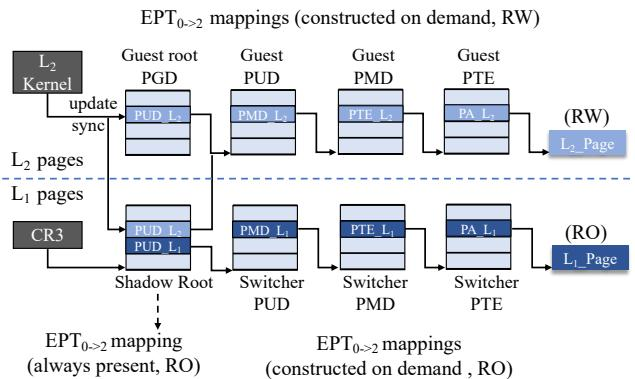  
Figure 7: The relationship between shadow root and GPTL

CR3 by simply using instruction mov cr3, phys\_addr (➁, Algorithm 1, line 5). However, the switching from EPT to EPT0→2 (➂) is challenging. To ensure all page table switching does not trap into L , JANUS uses VMFUNC-based EPTP switching to change EPT entirely within the non-root mode, eliminating costly VM exits to L0. With VMFUNC function 0, the hardware can switch among a set of preconfigured EPT roots supplied by L . L uses EPT index 0 for EPT and maintains a mapping from each L2 context to its corresponding EPT0→2 entry. During an L1 → L2 transition, the switcher executes VMFUNC with the target EPT index (Algorithm 1, line 6), enabling a fast, trap-free EPTP switch.

Maintaining per L switchers and directly placing the switcher inside GPT is unsafe because a compromised or malicious L2 kernel could modify its page tables to remap or overwrite the switcher, potentially subverting the worldswitching mechanism. To ensure integrity, JANUS introduces a shadow-root mechanism that constructs a shadow page global directory (PGD) mirroring the real GPTL . As shown in Figure 7, the corresponding shadow PGD entries are premapped as read-only in EPT0→2 to prevent unauthorized modification. The L1 hypervisor installs the switcher by configuring the relevant PGD entries to reference the switcher’s PUD and its subordinate tables (PUD, PMD, PTE). When an L2 attempts to modify PGD entries, it also issues a hypercall to L1 which validates the update and synchronizes it with the shadow root before applying the change. Otherwise, updates to PGD entries in GPTL do not take effect, as only modifications propagated to the L1-authorized shadow root are visible to the hardware MMU. Importantly, such PGD-level updates are infrequent in L2, while lower-level page table modifications (PUD, PMD, PTE) proceed by L kernel without L involvement, incurring no overhead in the common case. The shadow root mechanism also enforces the security of EPTP switching, as the lower-level EPT mappings associated with each shadow root exist only within the EPT corresponding to its own L . Any unauthorized VMFUNC attempt by a malicious L2 triggers an EPT violation that is trapped by L1, due to the absence of the required first-level page table mappings, thereby preventing cross-L memory access.

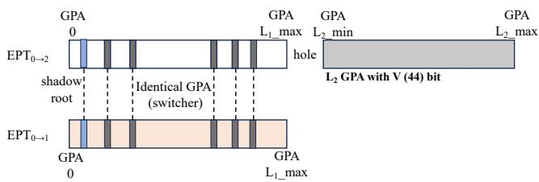  
Figure 8: The layout of EPT0→1 and EPT0→2

Note that EPT0→2 initially contains only the shadow-root mappings, and the switcher mappings are created on demand. When an access to the switcher triggers an EPT fault, L0 intercepts, switches to EPT0→1, and completes the exit to L1, which already has the correct switcher mappings. L0 then installs the required switcher entries into EPT0→2 with proper permissions. This incurs only a one-time overhead because the switcher region is small and must be initialized only once per EPT0→2.

To finally enter L2, the switcher performs an IRET (Algorithm 1, line 7) using a pre-built cross-page IRET frame: the ss field is mapped read-only to protect the user-mode rip, while the rest of the frame sits on a writable adjacent page. Execution then proceeds in hardware ring 3 under non-root mode, and although EPT → includes the switcher, L cannot access it. System calls and interrupts in L2 trap to hardware ring 0 (non-root mode), where the switcher performs a VMFUNCbased switch to EPT0→1, loads GPTL , and returns to the L1 hypervisor via ret (➄-➇, Algorithm 1, line 12-15). This design enables secure, low-latency transitions while preserving strong isolation between L1 and L2.

## 4.3 Memory Virtualization

JANUS achieves nested memory virtualization using the L2 guest’s own page table as the first-level translation, paired with a second-level translation layer managed by the host (L0) hypervisor. Thus, a GVAL is first translated to GPAL via GPTL , and then to a host physical address (HPA) through EPT0→2. Unlike PVM-on-EPT, which marks GPTL readonly to intercept and emulate every page-table update, JANUS keeps GPTL writable so that L2 can update its page tables without trapping into L1. Unlike KVM’s EPT-on-EPT design, JANUS removes the intermediate EPT → maintained by L , avoiding both the synchronization between EPT → and EPT0→2 and the additional exits required for write emulation. These two choices – writable GPTL and a single hostmanaged EPT0→2 – reduce cross-layer switches and shrink the amount of page-table state maintained by L1.

We now describe how JANUS safely supports writable guest page tables and efficient fault resolution without compromising isolation or incurring cross-layer overhead.

GPA disaggregation and mapping validation. Because GPTL is writable, JANUS must ensure that updates made by L2 cannot map over the switcher. To enforce this separation, JANUS arranges the L2 GPA layout exposed through EPT0→2 into two regions: (1) the read-only shadow-root and switcher pages, and (2) the regular writable GPA range assigned to L2.

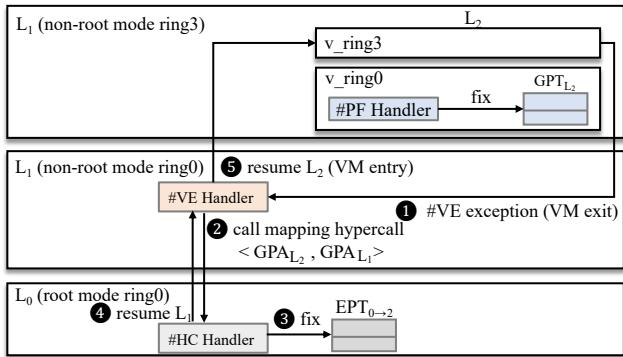  
Figure 9: The memory virtualization of JANUS

As shown in Figure 8, EPT → maps the shadow-root and switcher pages at the same GPA positions as in EPT0→1. These entries are marked read-only to protect the switcher, except for the writable portion of the IRET frame required for world switches. The GPA region assigned to L2 remains unmapped initially; entries are installed on demand by L0 as translation faults occur. To ensure that L1 interprets only legitimate GPTL updates, each GPTL entry mapping an L2- assigned page carries a software-defined V-bit – set by the paravirtualized L2 kernel. The V-bit marks the entry as created by L2, allowing L1 to distinguish such updates from other arbitrary memory contents (e.g., the shadow-root and switcher pages). When validating a mapping request during a translation fault, L1 checks the V-bit and rejects any request that lacks it.3 These checks prevent a compromised L from mapping over privileged memory while allowing ordinary page-table updates to proceed. In this way, JANUS maintains isolation without marking GPTL read-only or intercepting its internal updates.

GPT fault handling. With GPTL kept writable, JANUS allows L2 to handle its own first-level translation faults without involving L1.

Specifically, when a page fault is triggered due to a missing GPTL entry, the switcher’s #PF handler intercepts the exception and performs direct page-fault injection into the L2 kernel without exiting to the L1 hypervisor – i.e., the switcher (1) saves the current execution context, including the faulting address stored in CR2, into its state-save area; (2) switches to the L2 kernel context by updating execution stack and adress space (via SWAPGS and MOV CR3); and (3) returns control to the L guest kernel using IRET. Subsequently, the paravirtualized L2 kernel retrieves the CR2 value and fault vector to handle the exception natively. Once L2 resolves the fault and updates its GPTL , execution resumes directly in L2 user mode at ring 3 without any L1 hypervisor intervention. The only exception arises when the fault modifies the root page directory (PGD). In such cases, a hypercall is issued to synchronize the shadow root maintained by L1 (§4.2).

EPT fault handling. Faults in EPT → are handled by the L hypervisor via the Virtualization Exception (#VE), an Intel VT-x feature that enables selective in-guest handling of virtualization events without exiting to the host L0 hypervisor.

When #VE is enabled for a vCPU (via the VE enable bit in the VMCS control field), EPT violations that would normally trigger a VM exit can instead raise a #VE (vector 20) within the guest. The #VE Information Area, defined by the VMCS, records details such as the faulting GPA, access type (read-/write/execute), violation cause (e.g., missing translation or permission fault), and the faulting instruction pointer, allowing L1 to diagnose and handle the fault with L0 assistance 4.

More specifically, when a GPAL lacks a valid mapping in EPT0→2 (Figure 9), a #VE is raised and delivered to L1 (➊). The L1 handler (1) inspects the faulting GPAL ; (2) performs a GPTL walk to resolve the corresponding GPAL ; and (3) issues a KVM\_HC\_JANUS\_OPS hypercall with JANUS\_MAP operation (as listed in Table 2) to L0 containing the mapping information including GPAL and GPAL (➋). The L0 hypervisor then locates the host physical address (HPA) associated with the GPAL and updates EPT0→2 based on GPAL accordingly (➌). By eliminating intermediate shadow page tables in L1, this process requires only a single lightweight exit to L1 followed by one exit to L , substantially reducing cross-world synchronization overhead compared to conventional nested memory virtualization mechanisms.

Table 2: JANUS hypercall operations and their usage  
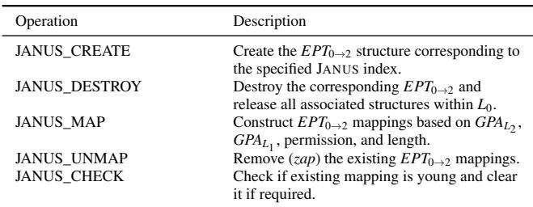

JANUS introduces only a single hypercall for managing EPT0→2 operations (Table 2), whose semantics are simple and well-defined compared with the complex nested virtualization logic in conventional KVM. Frequent invocation of the new hypercall behaves similarly to standard KVM hypercalls, causing additional vCPU exits without compromising host stability. However, the JANUS\_CREATE operation requires special handling because it triggers structural initialization in L0 and must be restricted to control the number of EPT0→2 instances allocated. For data protection, L0 performs strict validation to ensure that no mapping references HPAs beyond the range owned by its corresponding L . These checks include boundary and length verification, and the removal of stale mappings after reconfiguration.

## 4.4 JANUS-Assisted Memory Management

Having offloaded nested memory virtualization to the host (L0) and eliminated the intermediate guest page tables maintained by L1, JANUS must ensure that this two-level translation model continues to interoperate correctly with existing memory management in both the host hypervisor (L0) and the guest hypervisor (L1). This section examines two important memory management scenarios that arise frequently in production clouds – i.e., memory reclamation and secure container live migration – and describes how JANUS enables these operations to proceed efficiently under its design.

## 4.4.1 Memory Reclamation

Both the L0 host and the L1 guest maintain their own memory management subsystems. Under memory pressure, each may reclaim memory previously allocated to guests or nested guests. In current Linux systems, the host kernel at L0 or L1 uses the mmu\_notifier interface (e.g., invalidate\_range, change\_pte, and clear\_young) to inform the L0 or L1 hypervisor of modifications to the host page tables that back guest or nested guest physical memory. These notifications ensure that the hypervisor’s memory-virtualization structures (e.g., EPT mappings) remain coherent with the kernel’s memory view. With the introduction of EPT0→2 for L2, JANUS extends this mechanism to ensure that host kernel side invalidations propagate correctly across all layers.

At L0, any unmap or reclamation operation may affect the memory view of both L and L . Because the host kernel at L0 performs reclamation using the GPAL ranges that back the guest memory, the L0 hypervisor must be able to locate all second-level mappings derived from a given GPAL . To support this, each entry in EPT0→2 is associated with a reversemapping (rmap) structure keyed by GPAL , allowing L0 to identify and invalidate all relevant EPT0→2 entries when the host kernel reclaims memory. This ensures that memory invalidations initiated by L0 propagate consistently across the multi-level translation hierarchy.

At L , in conventional nested virtualization (SPT-on-EPT), L1 updates the shadow table to reflect changes to the page tables backing L2 and all metadata associated with its shadow PTEs (e.g., access permissions and dirty bits). Under JANUS, however, all second-level translations are maintained by L in EPT , so memory invalidations initiated at L1 must now be delegated directly to L0. Specifically, when invalidate\_range is invoked at L1, the L1 hypervisor issues a JANUS\_UNMAP hypercall to L0, which removes the corresponding entries from EPT0→2 for the affected GPAL range. Although L no longer updates a shadow page table for L , it still manages its own GPAs and thus must update its internal per-page attributes to keep its local memory state consistent with the mappings removed by L0. More concretely, pages that become read-only are reflected via set\_pfn\_access, while writable pages record dirtiness using set\_pfn\_dirty.

This way, JANUS enables coherent memory reclamation across layers by allowing L0 to invalidate nested mappings directly and by having L1 forward its invalidations while still maintaining its own page metadata.

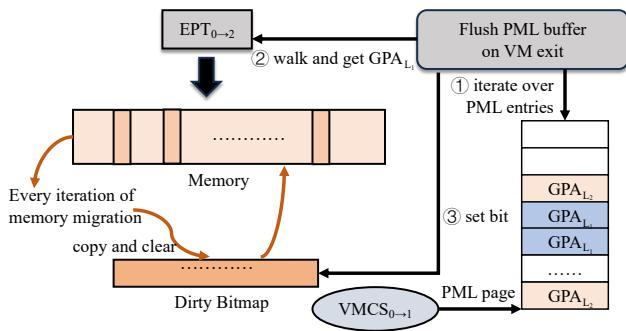  
Figure 10: The live migration progress of L1 with JANUS.

## 4.4.2 Live Migration

Live migration is a critical capability in cloud environments, enabling VMs to be relocated transparently without disrupting ongoing services. In nested virtualization settings, it is the L VM that is migrated by the cloud provider; all state belonging to an L2 guest is encapsulated within L1’s memory and is therefore transferred as part of the L1 migration. Among the stages of live migration, memory migration is particularly important, as it moves the full in-memory state of L1 (and transitively L2) to the destination host to ensure seamless resumption of execution. A key requirement for this process is accurate dirty-page tracking, which identifies pages modified during migration so that only changed memory must be resent.

Under conventional hardware-assisted nested virtualization (EPT-on-EPT), VMX’s Page Modification Logging (PML)5 cannot be used to track modifications made by L . PML logs only the guest physical addresses of trapped writes, but provides no indication of which EPT translation context generated them; writes serviced through EPT0→1 (from L1) and those serviced through EPT0→2 (from L2) are indistinguishable in the PML buffer. Consequently, even with PML enabled for L1 during migration, the host hypervisor must resort to software-based dirty-page tracking for EPT0→2, typically by clearing the write bit of those entries and trapping subsequent updates. This write-protection approach severely degrades L2 performance during migration because every modified page incurs a fault and exits to L0.

JANUS overcomes this by leveraging its GPA disaggregation (§4.3), where L2’s GPAs are assigned to a dedicated, non-overlapping region. Since PML logs the guest physical address of each trapped write, this separation allows L0 to identify PML entries originating from L2 simply by checking whether the logged GPA falls within the GPAL range. As shown in Figure 10, (1) during iterative pre-copy migration, when a PML entry corresponds to an L2 GPA (➀), the migration procedure walks EPT0→2 (its rmap, §4.4.1) to translate the GPAL to its backing GPAL (➁). (2) The resulting GPAL is then marked dirty in L1’s dirty bitmap (➂), ensuring that all L2 memory modifications are correctly reflected in the set of pages to be transferred. (3) After each iteration, the dirty bits are cleared on the source host, and (4) once no additional dirty pages remain, the L1 VM is suspended and resumed on the destination host, completing the migration.

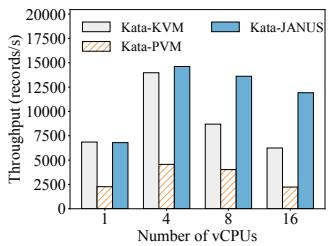  
(a) Ebizzy

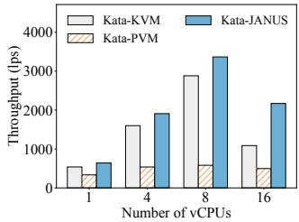  
(b) Unixbench Execl

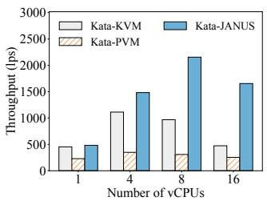

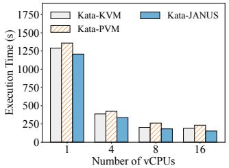  
(c) Unixbench Shell  
(d) Kbuild

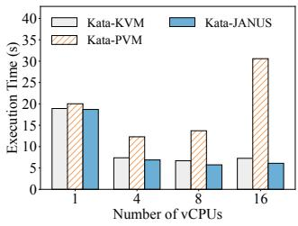  
(e) Dedup

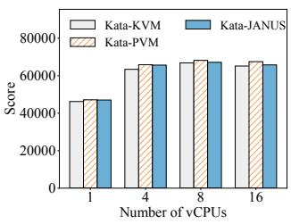  
(f) Specjbb

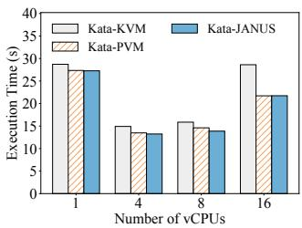  
(g) In-memory Analysis

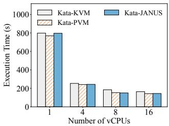  
(h) Graph Analysis  
Figure 11: The performance of eight memory-intensive applications

## 5 Evaluation

Real-world adoption. We implement JANUS with 1662 lines of modifications in the host KVM hypervisor, 3702 lines in the PVM guest hypervisor, and 264 lines in the PVM nested guest kernel. JANUS has been deployed in production on a leading cloud provider’s PaaS platform to support the Flink distributed stream and batch processing system, enabling secure container execution without compromising elasticity. PVM [21] – a state-of-the-art software-based nested virtualization system – increases total query time across 17 Flink queries by roughly 30% for C++ and 20% for Java engines compared to traditional RunC containers [43]. In contrast, JANUS-based secure containers add less than 5% overhead relative to RunC. These results demonstrate that JANUS achieves hardware-grade isolation with near-native performance, making it well suited for latency-sensitive, multi-tenant cloud environments.

Testbed and configurations. To further assess JANUS under controlled conditions, we conducted experiments within L VMs running atop the L host. The host machine was equipped with an Intel(R) Xeon(R) Platinum 8475B processor (3200 MHz) featuring 192 physical CPUs and 384 GB RAM, running the Linux 5.10.134 kernel, the dominant version in our production environment, consistently across all layers (L0, L1, and L2). Both L0 and L1 KVM hypervisors are configured with tpd\_mmu=y, a Google-proposed enhancement that improves parallelism in memory virtualization by mitigating contention on the global MMU lock. The L hypervisor enabled VMCS Shadowing, allowing the L1 KVM hypervisor to directly manage its own VMCS structures for L2 guests without causing additional exits. To align with common cloud configurations, Transparent Huge Pages (THP) were enabled in L1 (transparent\_hugepage=always, and shmem\_enabled=advise) to accelerate memory efficiency.

Baselines for comparison. We evaluated three nested container configurations for comparison: (1) Kata-KVM: Kata Containers using hardware-assisted nested virtualization via the L1 KVM hypervisor (standard nested KVM); (2) Kata-PVM: Kata Containers using software-based nested virtualization via the L1 PVM hypervisor (the PVM [21] approach); and (3) Kata-JANUS: our JANUS-based nested virtualization.

## 5.1 Memory-Intensive Applications

In this section, we first evaluated eight representative memoryintensive applications under multiple resource configurations. The benchmarks consisted of four multi-process applications, including ebizzy [4], UnixBench execl and shell [8], and Kbuild [5]; and four multi-threaded applications, including SPECjbb [39] and Dedup from the PARSEC3.0 [52] and In-Memory Analytics and Graph Analytics from the Cloud-Suite [3]. We then used the stress-ng [7] memory test to capture memory accesses to both inactive guest physical memory that was never touched and to active guest physical memory whose mappings were already established. Together, these applications exhibit a wide range of memory behaviors, including random memory initialization, frequent modification, and high-intensity data access.

The performance results for memory-intensive applications are shown in Figure 11. Across both multi-process and multithreaded workloads, Kata-JANUS achieves the best overall performance and superior scalability by eliminating intermediate page-table management within the guest hypervisor. Specifically, for multi-process applications, Kata-PVM consistently delivers the lowest performance because it must maintain a distinct shadow page table for each process, which incurs substantial overhead from intensive SPT management and synchronization. In contrast, Kata-JANUS improves multiprocess performance by 339.7% on average over Kata-PVM and further outperforms Kata-KVM by 51.8% when using 8 vCPUs. For multi-threaded applications, Kata-PVM out performs Kata-KVM because it avoids the expensive EPT reconstructions that dominate Kata-KVM’s execution time. Dedup is the only exception, as its frequent GPTL updates trigger numerous exits for synchronizing with SPT1→2. Kata-JANUS still achieves an average performance improvement of 37% over Kata-PVM and 13.3% over Kata-KVM when using 8 vCPUs, due to its faster mapping-construction path.

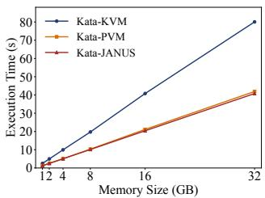  
(a) Inactive physical memory

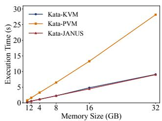  
(b) Active physical memory  
Figure 12: Performance of physical memory (PM) access.

The results in Figure 12 show that Kata-JANUS consistently achieves the best performance for both inactive and active memory access patterns. Specifically, when the system accesses inactive guest physical memory, Kata-KVM experiences a substantial performance drop because the construction of the low-level EPT mapping requires multiple expensive exits to L0. When the system accesses active guest physical memory, Kata-PVM becomes the slowest design because it repeatedly synchronizes the L2 guest page table with the corresponding shadow page table in L1. In contrast, Kata-JANUS performs slightly better than Kata-PVM during the initial construction of memory mappings, and this behavior confirms the benefit of its direct page-fault injection for repairing the L guest page table together with its lightweight procedure for constructing the low-level EPT mapping.

## 5.2 In-memory Key-Value Stores

We also evaluated the performance of two widely deployed in-memory key-value stores, Redis and Memcached, to assess system efficiency under realistic and latency-sensitive work loads. These systems are representative of memory-centric cloud services that issue frequent fine-grained read and write operations and are therefore highly sensitive to the overhead introduced by nested memory virtualization. In our tests, the Redis and Memcached servers executed inside the L , while clients ran in L1 and continuously generated requests.

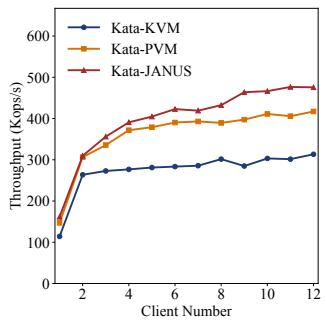  
(a) Redis

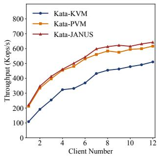  
(b) Memcached  
Figure 13: Throughput of in-memory key-value stores

The performance results are shown in Figure 13. Across all workloads, Kata-JANUS provides the highest throughput and best scalability. For example, Kata-JANUS increases Redis throughput by an average of 9.7% and 45.1% relative to Kata-PVM and Kata-KVM, respectively, and boosts Memcached throughput by an average of 4.4% and 48.2%. Again, JANUS’s performance advantage arises from its lightweight, host-managed memory virtualization design, which minimizes cross-world exits and eliminates the costly synchronization overhead.

We also evaluated these applications in both host and guest, while scaling the number of co-located malicious guests from 0 to 8 to stress the JANUS-introduced hypercalls. The results show that the performance impact is negligible.

## 5.3 Micro-benchmarks

We finally used various microbenchmarks to quantify the fundamental costs introduced by nested virtualization, focusing on world-switch latency, two-level address mapping, and memory modification tracking.

Table 3: Comparison of world-switch costs  
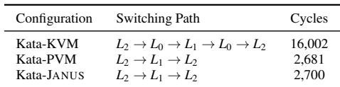

Cost of world switch. A world switch occurs when the processor exits to the hypervisor to handle events of the guest and then re-enters the guest after completion. These events include the execution of sensitive instructions such as CPUID or HLT, accesses to privileged registers, external interrupts, page faults, I/O operations, and guest-issued hypercalls that require hypervisor intervention to preserve virtualization integrity.

During Kata container execution, the world switch occurs between L2 and L1, as L2 runs on top of L1. With hardwareassisted nested virtualization (i.e., Kata-KVM), the switching process involves two exits to L , while switcher-based nested virtualization (i.e., Kata-PVM) completes the switch with a single exit to L . JANUS inherits this switcher-based world switch design and introduces an additional VMFUNC-based mechanism to switch EPT mappings between L and L .

We conducted a microbenchmark that invoked one million hypercalls, each triggering a pure world switch. We measured the average cost of a complete switch cycle. The results are summarized in Table 3. The world switch of Kata-KVM takes approximately 16,002 cycles, as the L0 KVM must perform costly synchronization between V MCS0→2 and V MCS1→2 during nested virtualization transitions. PVM achieves 2,681 cycles per switch owing to its lightweight switcher-based CPU virtualization. JANUS achieves a similar latency of 2,700 cycles, demonstrating that the additional VMFUNC operation introduces negligible overhead.

Cost of mapping construction. Constructing a two-level hardware memory mapping involves handling both GPT faults and SPT/EPT faults. For Kata-KVM and Kata-JANUS, GPTL faults can be resolved locally without VM exits, whereas Kata-PVM must exit to the L1 hypervisor to reinject the #PF fault into L2. After the GPTL is repaired, Kata-PVM performs the SPT1→2 fixup within L1, while Kata-KVM and Kata-JANUS require L0 assistance to update EPT0→2. As discussed earlier, Kata-JANUS incurs only one additional exit to L0, whereas Kata-KVM requires multiple exits.

Table 4: Mapping construction overheads (cycles)  
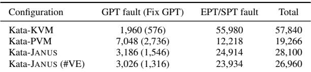

We implemented a microbenchmark that repeatedly triggered the mapping construction path. As shown in Table 4, Kata-PVM incurs higher overhead for handling GPT faults, while Kata-KVM suffers from substantial costs associated with EPT fault handling. In contrast, Kata-JANUS benefits from direct #PF injection, enabling more efficient GPT fault processing, and outperforms Kata-KVM in EPT fault handling by issuing fewer exits to L0 and using lightweight hypercall-based EPT updates. Notably, when constructing an initial mapping, Kata-JANUS is slightly slower than Kata-PVM due to its use of EPT0→2, which requires one additional expensive exit to L0. However, once the low-level EPT0→2 mapping is established, the overhead of both Kata-KVM and Kata-JANUS becomes dominated solely by GPT faults, whereas Kata-PVM must continue synchronizing SPT updates with the GPT mapping, resulting in additional overhead. Performance impact of dirty-page tracking. Maintaining stable performance during L1 migration is essential for cloud providers. We evaluated memory modification overheads before and after enabling dirty-page tracking.

As summarized in Table 5, since the low-level EPT0→2 mappings are already established, memory writes do not trigger additional mapping construction, and both Kata-KVM and Kata-JANUS initially exhibit performance comparable to native L1 execution. However, once dirty-page tracking is enabled, Kata-KVM experiences substantial degradation because all EPT → entries must be write-protected to track dirty pages, causing every memory write to trigger an exit to L . As a result, Kata-KVM incurs a 175.5% increase in memory modification overhead on average. In contrast, JANUS leverages hardware PML directly on EPT0→2 without requiring write protection, thereby avoiding excessive VM exits and maintaining near-identical performance.

Table 5: Memory performance before and after enabling dirtypage tracking  
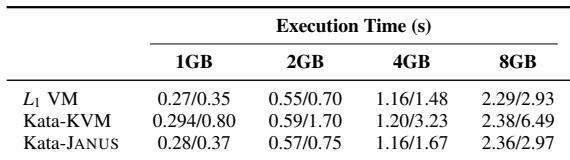

## 6 Discussion and Future Work

JANUS currently relies on CR3-based page table switching to isolate the kernel and user spaces of L2, requiring transitions through the switcher to update CR3 during context switches. In future work, we plan to leverage EPT-based isolation between the L2 kernel and user spaces, enabling direct and lightweight context switches entirely within L2 without involving the switcher. In addition, we are exploring the use of Hypervisor-managed Linear Address Translation (HLAT) [48] to protect the switcher while eliminating the need to maintain a shadow root for the GPTL .

## 7 Related Work

Securing containers. The security of containerized workloads has drawn extensive attention due to the shared-kernel architecture of conventional containers, which allows a single compromised container to potentially escalate privileges and compromise the host system [19, 20, 24, 31]. Existing work on shared-kernel security enhancement emphasizes strengthening memory isolation [45] and privilege protection [22, 46], reducing the exposed attack surface by intercepting or restricting system calls [34,47], and enforcing runtime security monitoring [41] to detect or mitigate malicious behavior within containers. Hardware-assisted designs such as RContainer [55], BlackBox [41], and LightZone [51] leverage trusted execution environments to ensure strong isolation of container workloads. Microkernel-based systems including MettEagle [33], LITESHIELD [32], and split containers [37] limit the impact of compromised containers on critical system components, while recent WebAssembly-based containers [23, 29, 50] enhance security by exploiting the inherent isolation provided by the Wasm runtime. In contrast to kernel-sharing approaches, some systems duplicate kernel functionality for each container, with gVisor [49] implementing a user-space kernel that intercepts and validates system calls to decouple containerized applications from the host kernel, and X-Container [36] and µKontainer [40] relying on separate Library OS instances to provide stronger isolation. Secure container frameworks such as Kata Containers [25] and Firecracker [9] further enhance isolation by running each container inside a lightweight virtual machine, combining container agility with hardwareenforced security guarantees, and secure containers have now emerged as a practical foundation for cloud-native security with production deployment in modern hyperscale platforms such as Alibaba Cloud [25].

Enabling nested virtualization. Virtualization has long been a cornerstone of cloud computing, evolving from early full virtualization to paravirtualization [11], then hardware-assisted virtualization [18], and more recently to delegated user-level virtualization [14]. Nested virtualization remains a challenging problem, as it must support running guest hypervisors within virtualized guests, which is essential for deploying secure containers in cloud-native infrastructures. Early systems such as Turtles [12] and NEVE [26] demonstrated the feasibility of nested execution by emulating hardware virtualization features at the host level. Later processor extensions, including VMCS shadowing, reduced the number of VM exits by allowing guest hypervisors to directly access certain control structures. More recent work adopts architectural co-design strategies to minimize cross-world semantic gaps. For example, SVT [42] leverages simultaneous multithreading (SMT) to maintain guest hypervisor and nested guest on separate logical threads, while DVH [27] enables direct virtual hardware provisioning to streamline interrupt delivery and device emulation. Despite these advances, memory virtualization remains the primary bottleneck, as cross-world synchronization continues to dominate overhead in nested environments.

Optimizing nested memory virtualization. Nested memory virtualization requires composing three translation page tables into two hardware-supported stages, which often incurs substantial overhead due to multi-level synchronization. Prior efforts have sought to mitigate costly world switches through optimized page-fault handling. PVM [21] enables lightweight world switches and handles L2 page faults entirely within L1, avoiding L0 involvement, but frequent updates to GPTL increase the overall number of page faults. CKI [38] embeds GVAL -GPAL mappings directly within GPTL using contiguous segment allocation, trading flexibility for improved page-fault handling efficiency. Other designs [35, 53] reduce translation overhead through direct address exposure or hugepage coalescing, while Hyperturtle [56] leverages eBPF-based hyper-upcalls to synchronize EPT hierarchies across layers, lowering update latency yet retaining cross-world dependencies. In contrast, JANUS redefines nested memory virtualization by decoupling CPU and memory control across layers and exposing nested guest page tables directly to the hostmanaged EPT hierarchy, achieving near-native performance with minimal modifications to the host.

## 8 Conclusion

This paper presents JANUS, a high-performance nested virtualization architecture that reimagines memory virtualization for secure containers. JANUS decouples CPU and memory virtualization across layers, eliminates intermediate shadow mappings, and exposes the nested guest page table directly to the host-managed EPT hierarchy. Leveraging optimized fault handling mechanisms, it provides efficient, trap-free memory virtualization with minimal host intervention. As a selfcontained and host-transparent design, JANUS simplifies the nested virtualization stack while achieving better performance for secure containers, bridging the longstanding gap between strong workload isolation and cloud-native efficiency. JANUS has been adopted by multiple Alibaba Cloud PaaS platforms to host secure containers, providing a more performant and cost-effective solution for cloud deployments.

## 9 Acknowledgment

We thank the anonymous reviewers and our shepherd for their constructive feedback and suggestions. This work is supported by the Fundamental and Interdisciplinary Disciplines Breakthrough Plan of the Ministry of Education of China under grant JYB2025XDXM103, Hubei Provincial Natural Science Foundation of China under grant 2026AFA002, Science and Technology Plan Project of Hubei Province under grant 2025CSA056, and the Hubei Provincial Natural Science Foundation of China under grant 2026AFB102. The corresponding author is Hang Huang.

## References

[1] Alibaba MaxCompute. https://www.alibabaclo ud.com/help/en/maxcompute/security-and-com pliance/maxcompute-security-white-paper/, 2026.

[2] Bare-metal instance. https://www.alibabacloud.c om/en/product/ebm, 2026.

[3] CloudSuite. https://github.com/parsa-epfl/cl oudsuite, 2026.

[4] Ebizzy. https://sourceforge.net/projects/ebi zzy/, 2026.

[5] Kcbench. https://gitlab.com/knurd42/kcbench, 2026.

[6] Lguest. http://lguest.ozlabs.org/, 2026.

[7] Stress-ng. https://github.com/ColinIanKing/st ress-ng, 2026.

[8] UnixBench. https://github.com/kdlucas/byte-u nixbench, 2026.

[9] Alexandru Agache, Marc Brooker, Alexandra Iordache, Anthony Liguori, Rolf Neugebauer, Phil Piwonka, and

Diana-Maria Popa. Firecracker: Lightweight virtualization for serverless applications. In Proceedings of the USENIX Symposium on Networked Systems Design and Implementation (NSDI), pages 419–434, 2020.

[10] Armin Balalaie, Abbas Heydarnoori, and Pooyan Jamshidi. Microservices architecture enables devops: Migration to a cloud-native architecture. IEEE Software, 33(3):42–52, 2016.

[11] Paul Barham, Boris Dragovic, Keir Fraser, Steven Hand, Tim Harris, Alex Ho, Rolf Neugebauer, Ian Pratt, and Andrew Warfield. Xen and the art of virtualization. ACM SIGOPS Operating Systems Review, 37(5):164– 177, 2003.

[12] Muli Ben-Yehuda, Michael D. Day, Zvi Dubitzky, Michael Factor, Nadav Har’El, Abel Gordon, Anthony Liguori, Orit Wasserman, and Ben-Ami Yassour. The turtles project: Design and implementation of nested virtualization. In Proceedings of the USENIX Symposium on Operating Systems Design and Implementation (OSDI), pages 423–436, 2010.

[13] Eric W. Biederman and Linux Networx. Multiple instances of the global linux namespaces. In Proceed ings of the Linux Symposium, volume 1, pages 101–112, 2006.

[14] Jiahao Chen, Dingji Li, Zeyu Mi, Yuxuan Liu, Binyu Zang, Haibing Guan, and Haibo Chen. Security and performance in the delegated user-level virtualization. In Proceedings of the USENIX Symposium on Operating Systems Design and Implementation (OSDI), pages 209– 226, 2023.

[15] Wes Felter, Alexandre Ferreira, Ram Rajamony, and Juan Rubio. An updated performance comparison of virtual machines and linux containers. In Proceedings of the IEEE International Symposium on Performance Analysis of Systems and Software (ISPASS), pages 171– 172, 2015.

[16] Yannis Foufoulas and Alkis Simitsis. User-defined functions in modern data engines. In Proceedings of the IEEE International Conference on Data Engineering (ICDE), pages 3593–3598, 2023.

[17] Xing Gao, Zhongshu Gu, Zhengfa Li, Hani Jamjoom, and Cong Wang. Houdini’s escape: Breaking the resource rein of linux control groups. In Proceedings of the ACM SIGSAC Conference on Computer and Communications Security (CCS), pages 1073–1086, 2019.

[18] Irfan Habib. Virtualization with kvm. Linux Journal, 2008(166):8, 2008.

[19] Md Sadun Haq, Thien Duc Nguyen, Ali ¸Saman Tosun, Franziska Vollmer, Turgay Korkmaz, and Ahmad-Reza Sadeghi. Sok: A comprehensive analysis and evaluation of docker container attack and defense mechanisms. In Proceedings of the IEEE Symposium on Security and Privacy (S&P), pages 4573–4590. IEEE, 2024.

[20] Yi He, Roland Guo, Yunlong Xing, Xijia Che, Kun Sun, Zhuotao Liu, Ke Xu, and Qi Li. Cross container attacks: The bewildered ebpf on clouds. In Proceedings of the USENIX Security Symposium (Security), pages 5971– 5988, 2023.

[21] Hang Huang, Jiangshan Lai, Jia Rao, Hui Lu, Wenlong Hou, Hang Su, Quan Xu, Jiang Zhong, Jiahao Zeng, Xu Wang, Zhengyu He, Weidong Han, Jiang Liu, Tao Ma, and Song Wu. Pvm: Efficient shadow paging for deploying secure containers in cloud-native environment. In Proceedings of the Symposium on Operating Systems Principles (SOSP), pages 515–530, 2023.

[22] Hang Huang, Honglei Wang, Jia Rao, Song Wu, Hao Fan, Chen Yu, Hai Jin, Kun Suo, and Lisong Pan. vkernel: Enhancing container isolation via private code and data. IEEE Transactions on Computers, 73(7):1711– 1723, 2024.

[23] Zhuo Huang, Hao Fan, Junhui Peng, Qi Wu, Song Wu, Chen Yu, Hai Jin, Qiming Liu, Wei Yang, and Shuo Yu. Waf: An efficient webassembly-based execution environment for user-defined functions. In Proceedings of the IEEE International Conference on Data Engineering (ICDE), pages 1966–1980, 2025.

[24] Omar Jarkas, Ryan Ko, Naipeng Dong, and Redowan Mahmud. A container security survey: Exploits, attacks, and defenses. ACM Computing Surveys, 57(7):1–36, 2025.

[25] Zijun Li, Jiagan Cheng, Quan Chen, Eryu Guan, Zizheng Bian, Yi Tao, Bin Zha, Qiang Wang, Weidong Han, and Minyi Guo. Rund: A lightweight secure container runtime for high-density deployment and high-concurrency startup in serverless computing. In Proceedings of the USENIX Annual Technical Conference (ATC), pages 53– 68, 2022.

[26] Jin Tack Lim, Christoffer Dall, Shih-Wei Li, Jason Nieh, and Marc Zyngier. Neve: Nested virtualization extensions for arm. In Proceedings of the Symposium on Operating Systems Principles (SOSP), pages 201–217, 2017.

[27] Jin Tack Lim and Jason Nieh. Optimizing nested virtualization performance using direct virtual hardware. In Proceedings of the International Conference on Architectural Support for Programming Languages and Operating Systems (ASPLOS), pages 557–574, 2020.

[28] Likai Liu, Fu Xiao, Lei Han, Weibei Fan, Xin He, and Zheng Wu. Nbbm: An efficient smartnic-based architecture for bare-metal management in cloud platforms. IEEE Transactions on Computers, 2025.

[29] Mugeng Liu, Haiyang Shen, Yixuan Zhang, Hong Mei, and Yun Ma. Webassembly for container runtime: Are we there yet? ACM Transactions on Software Engineering and Methodology, 34(6):1–22, 2025.

[30] Lukas Maar, Martin Schwarzl, Fabian Rauscher, Daniel Gruss, and Stefan Mangard. Dope: Domain protection enforcement with pks. In Proceedings of the Annual Computer Security Applications Conference (ACSAC), pages 662–676, 2023.

[31] Ruchika Malhotra, Anjali Bansal, and Marouane Kessentini. A systematic literature review on maintenance of software containers. ACM Computing Surveys, 56(8):1– 38, 2024.

[32] Kaesi Manakkal, Nathan Daughety, Marcus Pendleton, and Hui Lu. Liteshield: Secure containers via lightweight, composable userspace µkernel services. In Proceedings of the USENIX Annual Technical Conference (ATC), pages 973–985, 2025.

[33] Till Miemietz, Viktor Reusch, Matthias Hille, Lars Wrenger, Jana Eisoldt, Jan Klötzke, Max Kurze, Adam Lackorzynski, Michael Roitzsch, and Hermann Härtig. Metteagle: Costs and benefits of implementing containers on microkernels. In Proceedings of the USENIX Symposium on Operating Systems Design and Implementation (OSDI), pages 979–996, 2025.

[34] Maryam Rostamipoor, Seyedhamed Ghavamnia, and Michalis Polychronakis. Confine: Fine-grained system call filtering for container attack surface reduction. Computers & Security, 132:103325, 2023.

[35] Xiaowei Shang, Weiwei Jia, Jianchen Shan, Xiaoning Ding, and Cristian Borcea. Reestablishing page placement mechanisms for nested virtualization. IEEE Transactions on Cloud Computing, 11(3):3239–3250, 2023.

[36] Zhiming Shen, Zhen Sun, Gur-Eyal Sela, Eugene Bagdasaryan, Christina Delimitrou, Robbert Van Renesse, and Hakim Weatherspoon. X-containers: Breaking down barriers to improve performance and isolation of cloud-native containers. In Proceedings of the International Conference on Architectural Support for Programming Languages and Operating Systems (ASP-LOS), pages 121–135, 2019.

[37] Jiacheng Shi, Jinyu Gu, Yubin Xia, and Haibo Chen. Serverless functions made confidential and efficient with split containers. In Proceedings of the USENIX Security Symposium (Security), pages 1091–1110, 2025.

[38] Jiacheng Shi, Yang Yu, Jinyu Gu, and Yubin Xia. A hardware-software co-design for efficient secure containers. In Proceedings of the European Conference on Computer Systems (EuroSys), pages 1229–1245, 2025.

[39] SPEC SPECjbb2005. Release 1.07. Standard Performance Evaluation Corporation, 2006.

[40] Hajime Tazaki, Akira Moroo, Yohei Kuga, and Ryo Nakamura. How to design a library os for practical containers? In Proceedings of the ACM SIGPLAN/SIGOPS International Conference on Virtual Execution Environments (VEE), pages 15–28, 2021.

[41] Alexander Van’t Hof and Jason Nieh. Blackbox: a container security monitor for protecting containers on untrusted operating systems. In Proceedings of the USENIX Symposium on Operating Systems Design and Implementation (OSDI), pages 683–700, 2022.

[42] Lluís Vilanova, Nadav Amit, and Yoav Etsion. Using smt to accelerate nested virtualization. In Proceedings of the International Symposium on Computer Architecture (ISCA), pages 750–761, 2019.

[43] Xingyu Wang, Junzhao Du, and Hui Liu. Performance and isolation analysis of runc, gvisor and kata containers runtimes. Cluster Computing, 25(2):1497–1513, 2022.

[44] Chris Wright, Crispin Cowan, Stephen Smalley, James Morris, and Greg Kroah-Hartman. Linux security modules: General security support for the linux kernel. In Proceedings of the USENIX Security Symposium (Security), 2002.

[45] Shaowen Xu, Qihang Zhou, Zhicong Zhang, Xiaoqi Jia, Donglin Liu, Heqing Huang, Haichao Du, and Zhenyu Song. Conmonitor: Lightweight container protection with virtualization and vm functions. In Proceedings of the ACM Symposium on Cloud Computing (SoCC), pages 755–773, 2024.

[46] Shouyin Xu, Yuewu Wang, Lingguang Lei, Kun Sun, Jiwu Jing, Siyuan Ma, Jie Wang, and Heqing Huang. Condo: enhancing container isolation through kernel permission data protection. IEEE Transactions on Information Forensics and Security, 19:6168–6183, 2024.

[47] Seungyong Yang, Brent Byunghoon Kang, and Jaehyun Nam. Optimus: association-based dynamic system call filtering for container attack surface reduction. Journal of Cloud Computing, 13(1):71, 2024.

[48] Kenichi Yasukata, Hajime Tazaki, and Pierre-Louis Aublin. Exit-less, isolated, and shared access for virtual machines. In Proceedings of the ACM International Conference on Architectural Support for Programming Languages and Operating Systems (ASPLOS), pages 224–237, 2023.

[49] Ethan G. Young, Pengfei Zhu, Tyler Caraza-Harter, Andrea C. Arpaci-Dusseau, and Remzi H. Arpaci-Dusseau. The true cost of containing: A gvisor case study. In Proceedings of the USENIX Workshop on Hot Topics in Cloud Computing (HotCloud), 2019.

[50] Zhaofeng Yu, Dongyang Zhan, Lin Ye, Haining Yu, Hongli Zhang, and Zhihong Tian. Exploring and exploiting the resource isolation attack surface of webassembly containers. In Proceedings of the USENIX Security Symposium (Security), pages 1111–1128, 2025.

[51] Ziqi Yuan, Siyu Hong, Ruorong Guo, Rui Chang, Mingyu Gao, Wenbo Shen, and Yajin Zhou. Lightzone: Lightweight hardware-assisted in-process isolation for arm64. In Proceedings of the International Middleware Conference (Middleware), pages 467–480, 2024.

[52] Xusheng Zhan, Yungang Bao, Christian Bienia, and Kai Li. Parsec 3. 0: A multicore benchmark suite with network stacks and splash-2x. ACM SIGARCH Computer Architecture News, 44(5):1–16, 2017.

[53] Jiyuan Zhang, Weiwei Jia, Siyuan Chai, Peizhe Liu, Jongyul Kim, and Tianyin Xu. Direct memory translation for virtualized clouds. In Proceedings of the ACM International Conference on Architectural Support for Programming Languages and Operating Systems (ASP-LOS), pages 287–304, 2024.

[54] Xiantao Zhang, Xiao Zheng, Zhi Wang, Hang Yang, Yibin Shen, and Xin Long. High-density multi-tenant bare-metal cloud. In Proceedings of the International Conference on Architectural Support for Programming Languages and Operating Systems (ASPLOS), pages 483–495, 2020.

[55] Qihang Zhou, Wenzhuo Cao, Xiaoqi Jia, Peng Liu, Shengzhi Zhang, Jiayun Chen, Shaowen Xu, and Zhenyu Song. Rcontainer: A secure container architecture through extending arm cca hardware primitives. In Proceedings of the Network and Distributed System Security Symposium (NDSS), 2025.

[56] Ori Ben Zur, Jakob Krebs, Shai Aviram Bergman, and Mark Silberstein. Accelerating nested virtualization with hyperturtle. In Proceedings of the USENIX Annual Technical Conference (ATC), pages 987–1002, 2025.