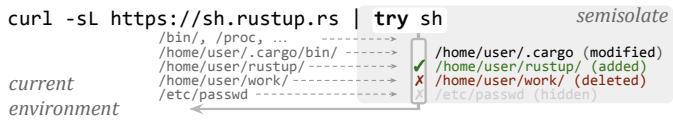
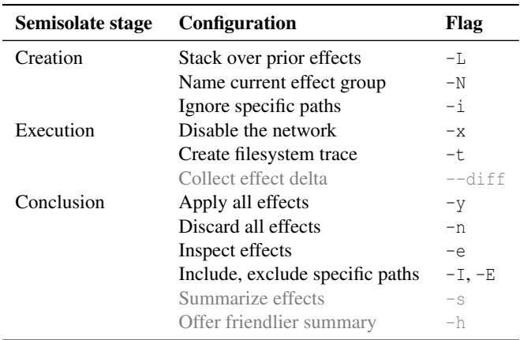
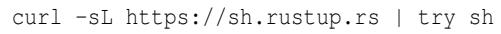
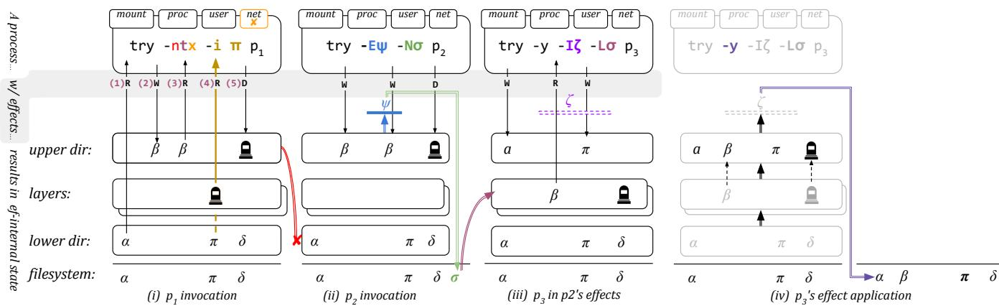
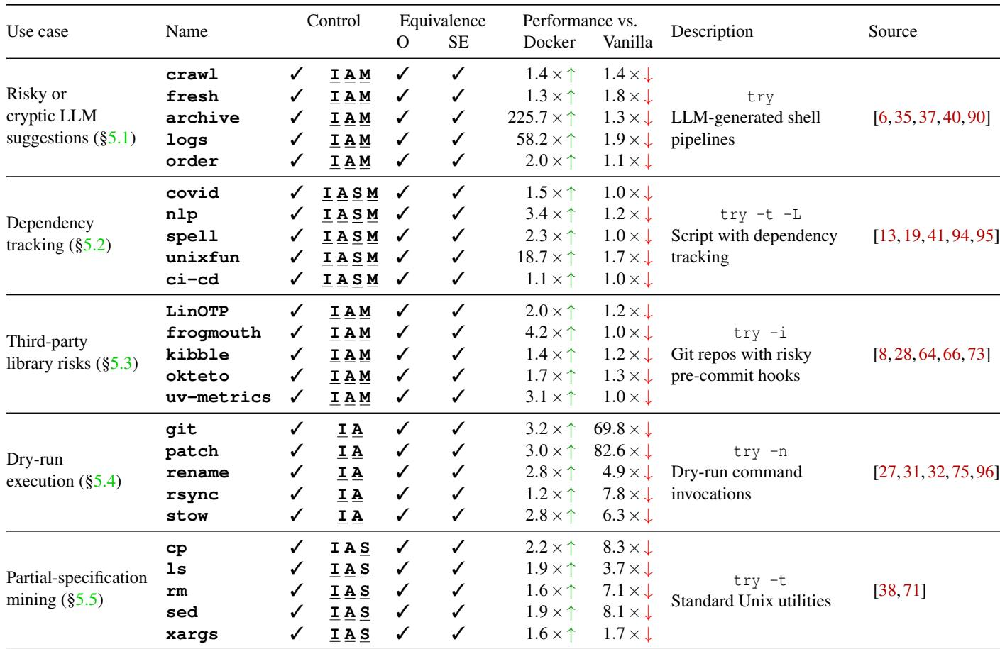
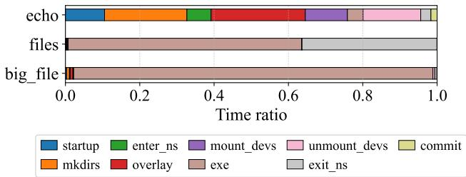

USENIX

THE ADVANCED COMPUTING SYSTEMS ASSOCIATION

# Controlling Opaque-Component Effects with Semisolates and Try

Evangelos Lamprou, Brown University; Tianyu (Ezri) Zhu, Stevens Institute of   
Technology; Di Jin and Grigoris Ntousakis, Brown University; Georgios Liargkovas,   
Columbia University; Calvin Eng, Brown University; Konstantinos Kallas, University of California, Los Angeles; Michael Greenberg, Stevens Institute of Technology; Nikos Vasilakis, Brown University

https://www.usenix.org/conference/osdi26/presentation/lamprou

# This paper is included in the Proceedings of the 20th USENIX Symposium on Operating Systems Design and Implementation.

July 13–15, 2026 • Seattle, WA, USA

ISBN 978-1-939133-55-7

Open access to the Proceedings of the 20th USENIX Symposium on Operating Systems Design and Implementation is sponsored by

# Controlling Opaque-Component Effects with Semisolates and Try https://binpa.sh/try

Evangelos Lamprou<sup>\*</sup> Brown University

Tianyu (Ezri) Zhu Stevens Institute of Technology

Grigoris Ntousakis Brown University

Georgios Liargkovas Columbia University

Di Jin Brown University

Calvin Eng Brown University

Michael Greenberg Stevens Institute of Technology

## Abstract

Konstantinos Kallas UCLA

Modern software systems contain many intercommunicating components, including various subsystems, programs, commands, and packages [11, 44, 45, 93]. These components are often available in diverse programming languages, interact opaquely with the broader environment, and are developed by developers of varying skill and care. Even quick-and-dirty data-processing scripts pull together many polyglot components [44, 71] and simple update scripts or AI agents invoke other commands to complete their jobs [45, 93].

Many developers and systems today rely on opaque software components. When executing, these components affect each other and the broader environment in which they execute. Some of these effects are expected and desired; others not so. This paper introduces semisolates, an abstraction and corresponding subsystem for controlling and manipulating the effects of opaque components. Available as an unprivileged, higher-order, language-agnostic command, try interposes on a component’s execution to automatically capture and control its effects. Effect control includes introspection, optional application, effect stacking, and further manipulation—all driven by several real-world case studies. Today try is used in research and production applications across several organizations, mediating potentially undesired effects, maintaining full compatibility with real-world components, and incurring a modest performance overhead well within each case’s acceptable levels.

## 1 Introduction

Unfortunately, the execution of these components—during e.g., exploration or development—results in unpredictable and often-irreversible effects. These effects are a direct and necessary byproduct of the computation encoded by a component: executing npm install downloads and installs new software packages, directly altering several files and directories [1]. At times, effects are unintentional: naively running a

Nikos Vasilakis Brown University

  
Figure 1: Applying try. Execute a command in its own try semisolate to control its effects: inspect, selectively apply, revert, partially hide (all shown) or otherwise manipulate them—all within the current environment rather than a new isolated container.

find -exec as suggested by an LLM may result in deleting critical user files [52]. These and other cases (§2) hint at the necessity to control these effects during component execution.

This paper presents a new abstraction, the semisolate (§3), and corresponding implementation, try (§4), for controlling the effects of such opaque components. Semisolates offer the ability to execute a component in the current environment via an unprivileged, language-agnostic, higher-order command that allows its users to inspect and manipulate a completely unmodified component’s externally observable behavior. But rather than focusing on the behavior encoded in standard streams, easily controllable by the usual pipe-and filter patterns, try focuses on side effects such as filesystem modifications. And contrary to various forms of containment and virtualization [10, 54, 68], which create a new environment that fully isolates all effects, try allows the executing components to access the current environment in which they execute and enables effect manipulation directly in that environment; the term semisolate (from semi-, meaning “partially,” and isolate) reflects this partial rather than complete isolation.

More specifically, try allows introspecting, selectively applying, stacking, and further manipulating a component’s effects to the filesystem and the broader environment. To automatically capture these effects, try limits the component’s view of the filesystem: it first sets up a semisolate to create a view of the filesystem and environment that retains partial isolation; it then executes the component inside the semisolate, collecting effects into a writable temporary directory; finally, either during its (streaming) execution or upon completion, the semisolate allows manipulating the collected effects by staging them, reverting them or applying them to the underlying filesystem—either wholly or partially (Fig. 1).

This opaque effect control is applicable broadly (§2): it can be used to inspect the effects of risky or cryptic LLM suggestions before applying them [26]; track the dependency graph for systems composed of opaque components, useful for parallelization or reordering [65]; provide a --dry-run capability, found today in some commands, that is general and command-agnostic [89]; and support specification inference for opaque components [45]. These and other examples drive try’s design requirements: effect control that allows hiding state, stacking effects, and partially or fully applying or rolling them back. No current abstraction and corresponding subsystem offers granular effect control with try’s wealth of features.

Applying try to real-world cases (§5) indicates that try controls all relevant component effects, maintains behavior equivalence with non-semisolated execution, and incurs a modest performance overhead relative to the needs of each use case. Semisolates and try offer a distinct set of features from, and better performance than, container systems such as Docker, OrbStack, and Podman [54], built using similar components arranged quite differently.

In summary, this paper makes several contributions: it

• identifies the shared needs of several case studies for which today’s effect control is insufficient (§2);

• presents a novel effect-control abstraction, a semisolate, that meets the needs of these case studies (§3);

• describes the implementation of try, a new effectcontrol subsystem built for Linux environments (§4);

• characterizes try by applying it to several real-world components drawn from the earlier case studies (§5).

It also discusses try’s limitations and the experiences of organizations using try (§6), as well as prior related work (§7). Appendix A contains all LLM prompts used in the evaluation, Appendix B collects several testimonials on try’s potential impact, and Appendix C describes the artifact accompanying this paper. The try subsystem is open-source, MIT-licensed software, publicly available on GitHub [92].

## 2 Examples and Goals

To understand the need for controlling component effects, this section describes several real-world case studies (§2.1). Combined, these case studies highlight several shared requirements for the design of a flexible effect-control abstraction and corresponding subsystem (§2.2).

## 2.1 Motivating Examples

Risky or cryptic LLM suggestions: Recent agentic systems have incorporated large language models (LLMs), allowing them to act on behalf of the developer by executing arbitrary commands inside the host system [2, 3, 7]. Consider using an LLM to generate a script that “cleans up its containing directory”; it generates delete.sh containing the following:

```shell
rm -fr "$(cd "${0%/*}" && echo $PWD)"/*
```

Unfortunately, when called from some paths, the runtime expansion \${0%/\*} will expand to the script’s path, cd will fail, and rm will delete everything user-writable. Prefixing this line with try indicates the deletion of all user-writable directories and offers the option to discard these changes.

<sub>1</sub> try sh delete.sh   
/home (deleted)   
3 /etc (deleted)   
4   
5 Apply these changes? [y/i/N]

A developer or system calling try can decide whether to inspect these changes and choose to discard them, or inspect them individually and choose which ones to apply.

Dependency tracking: Speculative execution reordering offers significant speedups [65], but ensuring it respects readafter-write dependencies across opaque components is particularly challenging. Consider the following program that compiles three and links two C files:

<sub>1</sub> gcc -c a.c -o a.o; gcc b.c -o a   
<sub>2</sub> gcc -c c.c -o c.o; gcc a.o c.o -o b

The second call to gcc does not depend on the first, thus it can be executed in parallel. Unfortunately, detecting this opportunity automatically at runtime requires detecting effects and postponing their application to the broader environment until they are confirmed to not violate read-after-write dependencies—at times discarding these effects to effectively roll back command misspeculation. Crucially, subsequent invocations must start their execution with the illusion that prior effects have been applied—necessitating chaining reversible effect application across component invocations.

Prefixing gcc with try while explicitly asking it to stack sets of effects solves both problems:

```batch
<sub>1</sub> try -t trace1.log -N env1 gcc -c c.c -o c.o
<sub>2</sub> try -t trace2.log -N env2 -L env1 gcc a.o c.o -o b
```

The -N option instructs try to store, instead of directly applying, gcc’s effects for later use with a configurable name. The -t flag enables system-call tracing to capture ordered filesystem effects. Next, -L injects gcc’s uncommitted effects from env1 into its own view, making c.o visible to try’s second invocation.

Third-party library risks: Public third-party libraries amplify developer capabilities, but risk introducing undesired effects [15,56,63]. Consider the popular node-ipc library [72], invoked as part of a larger codebase:

```batch
npm test node-ipc
```

Earlier versions of node-ipc included undesired effects modifying critical system files [18, 86]. Prefixing npm test with try highlights files about to be modified without making any modifications prior to approval:

<sub>1</sub> try npm test node-ipc   
2 /etc/passwd (modified)   
3 /bin/bash (modified)   
4 /sbin/init (modified)   
5 ...   
6 Commit these changes? [y/i/N]

The output of try shows all such effects, allowing a developer to review any unexpected effects and, if necessary, selectively apply only the relevant ones. It is also possible to filter or aggregate over the set of effects to make review easier (§6).

Dry-run execution: Some commands offer specially configured dry-run modes (e.g., --dry-run, --fake, --no-commit, --print, --just-print, --simulate, -n, -s) that show the effects of simulating a command’s execution [67]. Consider an invocation about to clean temporary files in the current directory using find:

find . -name '\*tmp\*' -delete

Unfortunately, find does not offer a built-in dry-run function ality. Prefixing the command with try -n instead executes the command in a semisolate, collecting and presenting its actual effects to the user while discarding them.

try -n find . -name '\*tmp\*' -delete   
./tmp\_build/ (deleted)   
./tmp.log (deleted)

Using try, a user sees the concrete effects that the command’s execution would have produced, even if it does not implement built-in dry-run functionality.

Partial-specification mining: Automated acceleration of programs that use opaque components [38, 71] depends on partial component specifications—e.g., the order in which a component reads its input streams [34]. Generating such specifications automatically requires exploring a command’s invocation space while carefully collecting the effects of different invocations. Consider the following invocation of grep:

```batch
grep -oE [a-zA-Z]+ one.txt two.txt
```

Unfortunately, understanding that grep first reads one.txt and then reads two.txt requires a more detailed view of its effects. Prefixing grep with try -t offers a detailed, ordered log of grep’s read and write effects:

```batch
try -t trace.log grep -oE [a-zA-Z]+ one.txt two.txt
```

The resulting trace.log file contains information that can then be compiled into a partial specification for grep.

<sub>1</sub> r /usr/bin/grep   
<sub>2</sub> r /usr/lib/libc.so.6   
<sub>3</sub> r one.txt   
<sub>4</sub> r two.txt   
<sub>5</sub> w stdout

This order of effects extracted by try -t reveals invariants (e.g., one.txt preceding two.txt) that need to be maintained when optimizing programs that invoke grep.

## 2.2 Desiderata for the Missing Abstraction

The aforementioned case studies illustrate an underlying common need to abstract away effect control. A suitable effectcontrol abstraction has several core requirements: (1, I) effect introspection, i.e., the ability to detect, collect, present, and inspect a component’s side effects in the same environment directly executing the component; (2, A) selective application, i.e., the ability to decide whether to apply effects to the broader environment or roll them back; (3, S) effect stacking, allowing commands to execute in the context of earlier effects that have not been applied yet, potentially rolling back multiple stacks of effects; (4, M) further effect manipulation beyond direct application or discard, including partial application of only some effects, effect recording and delayed propagation, and selective hiding of the underlying environment. These requirements typically need to be met in the context of the current executing environment—not a virtualized or contained environment fully isolated from the current environment.

Apart from these core requirements, the abstraction’s applicability and reach would further benefit from an implementation that combines streaming support, allowing its users to manipulate the effects of long-running components as they are generated; configurable effect handlers for tuning the granularity of effects; and runtime performance overheads that do not affect interactive use. These features are not essential to the core abstraction—i.e., a batch-only, non-configurable, slow implementation would still fit all of §2.1’s case studies— but they broaden its applicability and reach.

Other characteristics such as complete mediation against arbitrary adversarial behavior are out of scope: the abstraction aims at the inconvenient or undesired effects of everyday mistakes or accidents—not actively malicious, try-aware components trying to bypass its underlying mechanisms [49].

## 3 Abstracting Away Effect Control

To meet the aforementioned desiderata (§2.2) and abstract away effect control, try offers a language-agnostic and configurable abstraction that launches one or more components in a semisolate. A semisolate offers a constrained and config urable (Tab. 1) private view of the real host environment—i.e., not a fresh environment in a container or virtual machine. In the example below, sh runs in the exact same environment as curl, but within a private view that controls, manipulates, and potentially discards the application of effects to the broader environment:

Table 1: Control configuration and try flags. Controlling effects with try supports significant configurability during semisolate creation, execution, and conclusion—including core options (in black, Cf.§3) and peripheral features and subsystems (faded, Cf.§6).  




This private view can be configured to, for example, completely mirror the global filesystem, partially mirror it while hiding subtrees, or correspond to one or more layers of as-yetunapplied effects from previous try executions.

Semisolates: The abstraction of a semisolate provides the illusion of direct access to its outer environment and supports flexible effect manipulation. Semisolates collect the effects of opaque components in this private view and expose them to their callers for further manipulation. Using semisolates, try allows its callers to (1) selectively apply or discard these effects, with options to view partial earlier state; (2) collect the effects for possible application later; and (3) stack and expose as-yet-unapplied effects across invocations. This design allows the effect-mediated component to execute in partial isolation, without affecting the global filesystem until the caller explicitly consents.

To achieve effect control, a semisolate operates in three configurable stages: (1) creation: the semisolate sets up the appropriate view for the executing component to ensure appropriate effect mediation; (2) execution: the semisolate launches the target component within a private view, collecting relevant effects; and (3) conclusion: the semisolate optionally and selectively applies recorded effects into the main environment.

All three stages typically operate on the current directory and are highly configurable to support the nuances of various real-world uses (§2). The next few paragraphs detail such tuning, both at the level of individual stages and the current try flags summarized in Tab. 1, after first establishing which effects are controllable and their level of control.

Which effects are controllable: Unix and its descendants offer many well-studied, fine-grained tools for the pipeand-filter abstractions—for program output. There are only coarser, less well-studied tools to help manage program effects. Analogizing the Unix environment to a single executable, existing abstractions focus on function inputs and outputs (Unix: standard streams, exit status), but not the heap (Unix: the filesystem). Semisolates offer a new, fine-grained tool for effect management. They add abstractions for manipulating effects around a child command—for example, the initial filesystem view, the final filesystem view, and the filesystem access trace. They can optionally be configured to support additional system, network, and stream effects as part of a unified abstraction.

Effects are made available to the semisolate caller as a combination of (1) filesystem paths or stream identifiers, and (2) optional metadata such as effect type and success. Each path can be a valid path pointing to an existing file or directory; it can also be a non-existent path that might lead to access failure—still useful when a command relies on a file’s absence to exhibit the intended behavior. The effect type includes information such as read-only, write-only, and read-write: a read-write effect is, for example, opening a file with any flag other than O\_RDONLY; a read-only effect includes operations that only interrogate a file’s metadata through, for example, stating a file; a write effect includes modifying filesystem metadata through, for example, chmoding or unlinking a file. Each recorded effect instance is accompanied by metadata that indicates whether an effect succeeded; or—if it failed— the reason for its failure.

By default, try manipulates effects across entire process subtrees. For example, if a try-controlled process launches a subprocess that writes to the filesystem, then try will include those write effects in the group of effects directly available for manipulation. A parent process can also use try to wrap and programmatically control child effects.

Semisolate creation: Upon creation, a semisolate configures the private view of the executing component—to allow both stacking the effects of different semisolates and prevent unintended effects (including reads), useful for hiding sensitive information from the executing component. Configuring this initial view translates to setting up a virtual-filesystem environment before any modifications to the filesystem.

Upon creation, semisolates may configure effect stacking and hiding. Stacking configures the component’s initial view to import the effects produced from a previous semisolate. Selective hiding masks certain parts of the underlying filesystem from the executing component, given a specification that describes a filesystem subtree. These are implemented by try’s interface as -L, which accepts the name of a previous semisolate, itself produced by a previous call to try with the -N flag; and -i, which takes as input a regular expression that matches filesystem paths to be hidden from the component’s view. The latter is semantically equivalent to stacking the effects of try -n N rm dir1 dir2... over try -L N—but -i is more efficient as it directly sets up exclusions without first running an additional (potentially expensive) command.

Semisolate execution: During execution, semisolates additionally configure the classes of effects to interpose on and the corresponding interposition granularity—for example, whether to include system-call tracing. The current classes of effects include filesystem effects, network effects, signals, and interprocess streams.

The current interface of try supports: -t, which makes try produce a filesystem access trace, containing an ordered list of effects; and -x, which prevents the component from accessing the network. Apart from the effect path, this detailed view consists of the mode and the return code, which can be inspected to infer negative effects like failed accesses.

Semisolate conclusion: Upon conclusion, semisolates offer the ability to decide which effects to apply and which to discard, eventually generating the final filesystem view. They allow selective effect application at multiple granularities, from binary all-or-nothing to per-effect application, while also supporting path-oriented filtering. They can also hold individual effects and allow inspecting them directly using conventional Unix abstractions.

These options can be configured when a semisolate concludes. The current interface supports inspecting individual effects (-e) and, based on predefined caller policies, programmatically filtering these changes (-E and -I). It also supports applying, discarding, or mixing them (-y, -n, and -e). And -N stores effects in a named effect directory, potentially used earlier during creation with -L.

## 4 The Try Subsystem

This section describes how try implements the aforementioned abstraction (§3) for programs executing in Linux userspace. It first outlines try’s use of union filesystems, namespaces, and system-call tracing before diving into the details of semisolate creation (§4.1), execution (§4.2), and conclusion (§4.3), closing with a detailed walkthrough of multiple try invocations put together (§4.4).

Union filesystems: To achieve effect control, try needs to interpose on the component’s view of the filesystem. This interposition is responsible for manipulating the underlying filesystem view, creating a partially private view that allows accessing the underlying contents while capturing and containing effects. This private view is implemented as a union filesystem, configured appropriately to either mirror the underlying filesystem, partially mirror it with sensitive paths hidden, or correspond to the as-yet-uncommitted state of a previously executed run of try. To contain effects, try uses the configured union filesystem to record filesystem changes into a temporary directory—without affecting the host environment until effects are applied.

To instantiate the concept of effect layers, try leverages OverlayFS—a specific implementation of a union filesystem part of the Linux kernel [24]. Union filesystems are a class of filesystems that allow multiple directories to be presented as a single unified directory without modifying the underlying kernel structures [70]. A union filesystem layers an upper directory (upperdir) and one or more lower directories (lowerdirs) into a single merged view—without merging their underlying data.

In the merged view, the content at a specific path p is determined by searching for p in the upperdir, followed by all lowerdirs in order until p is found. The first match is presented in the merged view; if p exists in multiple layers, content from the higher layer takes precedence.

Changes to the merged view are forwarded to the upperdir and persist inside it, even after unmounting the union filesystem directory. Changing a file at p in the merged view places the new version of the file at p in the upperdir. Removing p places a whiteout file at the corresponding upperdir location.

Namespaces: To execute privileged actions—while executing in an unprivileged manner—and interpose on the execution context of the component, try leverages Linux process namespaces. Namespaces isolate resources such as the network, pseudo-filesystems like procfs, permissions, and signals from the rest of the system, offering (groups of) processes the illusion of exclusive ownership of those resources— enabling the creation of a private (and controllable) view of the underlying system state. For example, the PID namespace assigns new PIDs to processes inside the namespace: processes in the namespace can only see and interact with each other using the PIDs assigned in the namespace.

Process-related interactions such as signaling between processes and adjustment of scheduling priorities are contained to the namespace. Components in try are only partly able to interact with ambient resources and objects such as processes, users, or network devices—with try interposing on all accesses to the broader system.

System-call tracing: To observe the order of a component’s effects, and go beyond effects that modify the filesystem, try leverages system-call tracing—interposing between the operating system kernel and user-space components to moni tor and record their interactions. Tracing commands such as strace on Linux offer visibility into exact calls performed by a process, their order, and their arguments, as well as the signals received by the process. Combined, they offer a wealth of information about the process—including filesystem operations, process management, inter-process communication, and network access. By selectively enabling tracing when necessary, try extracts ordered, finer-grained information about component effects beyond filesystem modifications.

Algorithm 1 Semisolate creation. Key steps in setting up a   
new semisolate, before running a component;   
Require: path   
1: if path is not provided then   
2: path ← mktemp -d   
3: end if ▷ Set up directories   
4: if path’s filesystem is overlayfs then   
5: mount -t tmpfs tmpfs path   
6: end if   
7: for all dir in topLevelDirs do   
8: mkdir -p path/{upperdir,workdir,tmp}/dir   
9: end for   
10: unshare ... ▷ Prepare namespaces   
11: for all dir in topLevelDirs do   
12: mount -t overlayfs ...path/tmp/dir   
13: if overlay failed then   
14: mergerfs path/tmp/dir...   
15: mount -t overlayfs...path/tmp/dir   
16: end if   
17: end for   
18: mount path/tmp/dev/... ▷ Mount devices   
19: unshare ... ▷ Enter environment

## 4.1 Semisolate creation

Each semisolate uses its own special writable directory to record effects—the upperdir—and a second temporary directory—the workdir—used by the union filesystem for internal bookkeeping (Alg. 1, lines 1–5). Each of these directories can be (1) a new, appropriately prefixed temporary directory created with mktemp; (2) a new directory whose name is provided by the try caller; or (3) an existing directory, potentially used in previous try invocations.

OverlayFS does not support certain filesystems to host the upperdir or the workdir. One such filesystem is OverlayFS itself, a common scenario when using try within Docker. In this case, try mounts an additional tmpfs over the semisolate directory (Alg. 1, line 5). This ensures that all of try’s side effects prior to the conclusion stage are confined within the semisolate directory.

Setting up mounting options: To bypass OverlayFS’s restriction of overlapping the lower and upper directory, try creates an individual union filesystem mount for each top-level directory—e.g., /bin, /usr, and /home—instead of using the root directory / as the union filesystem’s lower directory.

Specifically, try first creates directories upperdir, workdir, and tmproot (Alg. 1, lines 5–12). In these top-level directories, it then creates a child directory for each top-level directory in the filesystem, such as /etc, /usr, and /home. Additional lower directories already containing effects are added to the mount options during this step—layered on top of the corresponding union filesystem merged views. The tmproot directory will become the final merged view presented to the executing component (§4.2).

Once inside the new namespace, try iterates over the mount options constructed in the previous step and mounts the union filesystem (Alg. 1, lines 12–14). It mounts the /proc, /dev, and /devpts pseudo-filesystems within the tmproot directory and symlinks all special files through which the component interacts with its standard input and output streams—i.e., /proc/self/fd/{0,1,2} and /dev/{stdin,stdout,stderr,fd,pts}. Using bindmounts [23], it duplicates device files such as zero, null, and random, into the tmproot’s /dev directory.

To implement file hiding, try creates an additional directory called excldir. This excldir directory is mounted as an intermediate layer right above the lower directory and contains whiteout files corresponding to files that will be hidden from the merged view.

Submount permissions: Unfortunately, filesystem submounts within any OverlayFS layer cannot be unmounted by the current user: mount points inside layers are ignored because these layers correspond to overlapping filesystem fragments. Consider an initial filesystem A that contains paths /x, /x/y, and /x/y/z, and a new filesystem B mounted at /x/y, effectively hiding /x/y/z as contents at that mount point by B. If /x is specified as an OverlayFS lower directory, it will include only the contents of A and ignore the submount to B—thus including /x/y/z in the merged view.

As try aims to limit access to information otherwise inaccessible without its use, it prevents unprivileged access to directories with submounts as lower or upper layers. Although the fresh mount namespace grants try the capability to create new overlay mounts, among other root-like capabilities, it is forbidden to unmount existing submounts.

To address this problem, try uses an additional union filesystem to “flatten” all content within the directory into a single filesystem (Alg. 1, line 14) when submounts are present. The union filesystem used by try for this purpose is mergerfs [62], which combines the entire directory, including its submounts, into a single, unified filesystem view. This contrasts with OverlayFS, which does not support submounts. By creating this flattened view of the directory, submounts are effectively eliminated, allowing OverlayFS to use the directory as a lowerdir without issues.

## 4.2 Semisolate execution

After preparing a semisolate, try launches the effectcontrolled component in its own dedicated namespace and optionally traces its execution.

Execution namespacing: The semisolate executes components within a new user, PID, mount, and network namespace (Alg. 1, line 10). There are two distinct reasons for which try uses namespaces: (1) namespaces offer controlled isolation from the broader environment, restricting the process’s view so that all effects—together with the filesystem view shaped by the semisolate (§4.1)—are contained, (2) namespaces create the illusion of administrative privileges, allowing a semisolate to mount /proc and the union filesystem itself, which would otherwise require elevated privileges. The capability for user namespaces requires setting the unprivileged\_userns\_clone kernel flag, enabled by default in most modern Linux distributions and depended on by container runtimes like Podman [30]. This avoids the need to implement try as a setuid binary requiring elevated privileges to execute.

Finally, try enters a second new namespace (Alg. 1, line 19) to isolate the component’s process tree from try’s own process, setting the component’s root directory to tmproot using unshare, and finally executes the component under optional system-call tracing.

Execution tracing: To extract additional information about filesystem effects, try can interpose on relevant system-call invocations using strace. Rather than tracing all filesystemrelated system calls when they occur, try focuses on collecting relevant information upon open—as this is typically a necessary step before subsequent operations on the file descriptor such as reads, writes, random accesses, or direct memory mapping. This approach lowers try’s performance overhead, as it avoids tracing reads, writes, and other latencycritical data manipulation operations, omitting further tracing during subsequent use of the file descriptor.

To improve its reach while still avoiding finer-grained tracing, try additionally traces other system calls that take paths as arguments—e.g., open, mkdir, and unlink. To trap only this preconfigured set of system calls, try uses Seccomp-BPF [42] with a predefined filter—but allows users to pass additional filters if they need to track additional effects, including operations on already-opened file descriptors.

Non-existent paths: Non-existent or missing paths pose a challenge, as ignoring their accesses risks introducing effect holes: accessing non-existent paths generates an observable effect—e.g., negative return value from open. Therefore, try records such accesses as negative dependencies. Such nega tive dependencies are useful for recording effects of searching dynamic library paths and configuration files.

## 4.3 Semisolate conclusion

Semisolates conclude their execution by going through all the effects in the upperdir and either applying predefined policies or logging effects to one of the standard streams. As all changes are captured in the effect directory, applying these effects amounts to carefully comparing the captured effects to the underlying filesystem and environment.

To apply filesystem-related effects, try recursively processes the upper directory in a preorder fashion, moving files out of the semisolate and into the real filesystem by han dling directories before their contents. For regular files in the upper directory, try replaces the original file with the new file. For directories, it either (1) replaces the original file with the new directory, if a regular file exists at the directory’s original path; (2) replaces the original file or directory with the new file, if the directory has the extended attribute user.overlay.opaque, indicating that directories in lower layers have been shadowed by new definitions in the merged view; or (3) replaces the original directory with the new directory. For symlinks, it removes any existing file at the original path and recreates the symlink with the same target as the one in the upper directory. If try encounters a whiteout file—a character device with 0 major and minor numbers—in the upperdir, it deletes the original file or directory at that path.

If the semisolate directory resides on the same filesystem as the target location, rename is used to avoid unnecessary disk copying. Otherwise, try falls back to the host’s mv utility.

## 4.4 Putting it all together

Fig. 2 illustrates the internals of four try invocations.

The first invocation wraps p<sub>1</sub>, eliding all network access inside the semisolate. It prepares an overlay layer with a whiteout mask at path π, and mounts it on top of the host filesystem’s lowerdir, ignoring the underlying π in the filesystem. It then enters the new namespace, and launches p inside it. While p<sub>1</sub> is running, try captures five effects in the upperdir, which it later processes to summarize the order of effects (-t): (1) reading α hits the lowerdir, which forwards the call to the underlying filesystem, (2) writing to β hits the upperdir, copying β there, (3) reading β hits the upperdir, which sees the latest write, (4) reading path π, masked in the overlay layer, thus failing and resulting in try recording a negative dependency; and deleting path δ, which places a mask file at δ in the upperdir, effectively hiding it from the merged view. The sequence of collected effects (α<sub>R</sub>, β<sub>W</sub>, β<sub>R</sub>, π<sub>R</sub>, δ<sub>D</sub>) is fed to stdout but the effects themselves are discarded alongside the semisolate (-n).

Next, try wraps p<sub>2</sub>, creating a new namespace and mounting the host filesystem inside a fresh overlay filesystem lowerdir, now without any path masking or network isolation. The three component effects it captures are: (1) writing β, with identical effects as before, (2) writing ψ, and (3) deleting δ—both operations captured in the upperdir. This time, try stores the semisolate (and by extension, its effects) inside a named directory on the host filesystem (-N σ), after filtering out excluded effects (-E ψ) by iterating over the upperdir and deleting them.

Next try wraps p while stacking the effects of the latest try invocation (-L σ). It captures: (1) writing α, which brings it to the upperdir, (2) reading β, which hits the stacked lowerdir from semisolate σ, and (3) writing π—recorded in the upperdir. The effects stored in the semisolate are the two writes to α and π, and the delete of δ inherited from σ.

Finally, try commits the effects (-y). It iterates from bottom to top, first applying the effects from the stacked semisolate σ, followed by the current semisolate’s effects, applying each one based on its type. It focuses on paths in ζ (-I ζ), i.e., the writes to β and π, which are applied to the host system.

  
Figure 2: Detailed walkthrough of the internals of multiple try invocations. A detailed walkthrough of these invocations is presented in §4.4. From top to bottom: try’s invocation, component effects, try internal state, and host filesystem state. From left to right: different try invocations on different components on the same host filesystem. Single arrows indicate effects; double arrows indicate effect discard, storage, stacking, and application; and certain colors correspond to certain try invocation options.

This approach implements the semisolate abstraction, al lowing for effect control on arbitrary components without requiring any invasive instrumentation or modification.

## 5 Evaluation

This section reports on the results of applying try in several instances of each case-study application presented earlier (§2). Key dimensions of each study’s characterization (§5.1–5.5) include (1) try’s ability to control all relevant effects; (2) try’s behavioral equivalence to semisolate-free execution when effects are finally applied to the host environment; and (3) try’s runtime performance relative to semisolate-free execution and full isolation (§2.2). A series of microbenchmarks zoom into try’s sources of overhead (§5.6).

Control focuses on confirming that try correctly identifies I, applies or discards A, selects S, or manipulates M all relevant effects during a component’s execution in a semisolate.

Behavioral equivalence focuses on confirming two aspects of try: (1) the in-semisolate behavior during execution, meaning that the computation in the semisolate executes as expected and produces results identical to the non-semisolated execution; and (2) the eventual state of the filesystem, meaning that the filesystem state is indistinguishable from try-free execution. The former confirms that try does not affect the internal computation, including its direct effects; and the latter confirms that it correctly applies the manipulated effects.

Performance characterization compares runtime without isolation, with try, and with Docker v28.4.0 configured with full isolation; performing container (not image) creation, input copy-in, execution, container teardown, and copy-out. Experiments use an environment with 64 GB of RAM and an 8-core

3.70 GHz Intel Xeon W-2145. Software used is the Linux kernel v6.1 on Debian GNU/Linux 13 (trixie), GNU coreutils v9.7, Node.js v18.19.0, and Python v3.13.5.

Benchmark results are summarized in Table 2. In terms of effect control, try mediates desired effects, propagates them appropriately, and hides sensitive environment state. In terms of behavioral equivalence, try behaves equivalently to try-free execution, confirmed both via manual inspection and automated checksum comparison between the entire filesystem tree after executing each benchmark with and without try. In terms of performance, try incurs a 1.0×–8.3× performance overhead over vanilla, try-free execution and enjoys a 1.1×–225.7× performance improvement over containment in Docker. We do not provide a geomean or other statistical summary for overhead over vanilla execution or speedup over Docker, as each case study requires different semisolate configurations and corresponding try flags to control effects—and thus incur different overheads.

We discuss the benchmarks grouped by use case below.

## 5.1 Risky or cryptic LLM suggestions

These benchmarks consist of five scripts generated by Chat-GPT for tasks distilled from a survey of LLM-mediated workflows, spanning conventional chat interfaces and autonomous agents such as Codex and OpenClaw [82] (prompts included in Appendix §A): (1) crawl, updates the timestamps of 10,000 files in a directory, using find, exec, and touch [90]; (2) fresh, compressing 10,000 10KB files that exceed a certain size, using find, exec, and gzip [35]; (3) archive, searching for files with a .txt extension in 100 directories of 10,000 files each, using find [37]; (4) logs, checking for errors in a 10-million-line file using grep [40]; (5) order, sorting a 10-million-line file using sort [6]. Benchmarks were executed with try -y and try -n.

Table 2: Benchmark summary. The benchmark applications for the five use cases evaluated. The Control column indicates try’s effect control between effect introspection (I), application and discard (A), stacking (S), and manipulation (M). The Equivalence columns indicate whether the output (O) and side effects (SE) match those of vanilla execution. The Performance columns show the execution time ratio relative to the baseline (Docker or Vanilla), and whether try comparatively has a speedup (↑) or slowdown (↓). The Description column describes each benchmark’s purpose and try’s invocation. The Source column provides references to the original benchmark sources.  


Control: All computations executing in semisolates configured with try -n mediated all effects that were applied to the filesystem by try-free executions.

Equivalence: All computations executing in semisolates configured with try -y produce correct results; and their effects on the filesystem are identical to try-free executions.

Performance: When compared to vanilla execution, try introduces runtime overheads 1.1×–1.9×. Variations come from the complexity of effects interposed during execution. For example, in order, try achieves the lowest overhead (1.1×) as it interposes on a single write effect, writing the sorted file to disk. The crawl, fresh, and archive tasks exhibit higher overheads (up to 1.9×) because they operate on many files from the host system (use of find), which results in more upperdir copy-ups. Relative to Docker-contained execution, try demonstrates substantial performance improvements across all five benchmarks, achieving performance improvements of 1.3×–225.7×. Two benchmarks incur outlier speedups: the archive benchmark only interacts with its standard output stream (find’s output) which is effectively a symlink to the same file descriptor in the host environment, meaning that try boils down to vanilla execution, paying only the flat cost of semisolate creation, while Docker still pays the full container setup and teardown costs. Similarly, the logs benchmark reads from and writes to a single large file, meaning that again try pays only a single creation and copy-up cost, while Docker with full isolation needs to pay the copy-in and copy-out costs as well.

## 5.2 Dependency tracking

These benchmarks consist of several real-world shell programs from the Koala suite [44] with many and complex runtime dependencies between their components. (1) the covid benchmark, which processes bus schedule data collected dur ing COVID-19 to generate summary statistics [94]; (2) the nlp benchmark, which performs natural language processing tasks on a text corpus [41]; (3) the spell benchmark, which checks spelling in a large text file [13]; (4) the unixfun benchmark, which solves challenges from Unix 50th anniversary game [95]; and (5) the ci-cd benchmark, which compiles several C source files [19]. These programs contain a diverse set of commands that include GNU Coreutils, POSIX, and third-party commands. To stack effects across all component invocations without applying them on the host environment (§2.1), try was configured with -L and with -t to extract dependencies.

Control: All computations executed with try -t -n -L mediated all effects that were applied to the filesystem by tryfree executions. Manual inspection and multiple re-executions confirm that executing these benchmarks with try -t -L identifies all true dependencies between components.

Equivalence: Tracking the dependencies discovered by try -t and later applying them with try -y -L produces correct results. Their effects on the filesystem are identical to the ones produced by try-free executions.

Performance: When compared to vanilla execution, try introduces absolute overheads 1.0×–1.7×, which is the flat cost of setting up the semisolate environment for each tracked command. However, while the semisolate setup cost is flat, tracing overheads scale with the number of effects a component produces. This is less evident in statically compiled components, such as commands from GNU coreutils, which are tightly packed binaries with very minimal dependencies (often just libc), but evident with components relying on interpreted runtimes (e.g., a custom lowercase.py utility in nlp), which need to resolve their entire dependency tree during execution. The performance of try significantly outperforms fully-isolated execution across all five dependency tracking benchmarks, demonstrating speedups 1.1×–18.7×.

## 5.3 Third-party library risks

These benchmarks consist of git repositories with pre-commit hooks that introduce undesirable effects: (1) LinOTP [64] multi-factor authenticator; (2) the frogmouth [28] markdown reader; (3) Apache kibble [8] aggregating and visualizing software data; (4) the okteto [66] container orchestrator; and (5) uv-metrics [73], a machine-learning metrics reporter. The pre-commit hooks perform several operations on the filesystem, communicate with the network, and include a code-injection attack that leads to data exfiltration. They were prefixed with try -i, excluding the /etc/passwd file from the semisolate.

Control: All computations executed with try -i mediated across all effects present in the try-free executions, except /etc/passwd. This effect originated from the pre commit hook at .git/hooks, which attempted to append /etc/passwd to README.md.

Equivalence: All computations executed with try -i produce correct results, correctly committing the intended changes, and the resulting filesystem state remains identical to that of try-free execution. Across both the vanilla pre-commit hook workloads and the five code-injection vulnerabilities evaluated, try preserves correctness.

Performance: When compared to vanilla execution, try has a performance impact of up to a 1.3×. The performance of try is comparable to vanilla execution for the frogmouth and uv-metrics, while maintaining low overheads for LinOTP (1.2×), okteto (1.3×), and kibble (1.2×), whose pre-commit hooks perform short-running computations, comparable with try’s semisolate setup overhead. It outperforms Docker-contained execution across all five benchmarks, achieving speedups 1.4×–4.2×. With blocking enabled, try reduces the effect surface and thus computation performed by the injected pre-commit hooks. This leads to try improving the runtime of the frogmouth and kibble workloads by 0.8× and 0.9× respectively.

## 5.4 Dry-run execution

These benchmarks consist of commands with built-in dryrun functionality: (1) git [31], using git clean; (2) patch [32]; (3) rename [96]; (4) rsync [75]; and (5) stow [27]. Each workload was executed twice: once with dry-run enabled, without try; once with try -n, without dry-run.

Control: All computations executed with try -n except two mediated on and reported the exact same effects as the corresponding --dry-run executions. One of the two exceptions was rename: instead of reporting a -> b, try reports equivalent a (deleted) b (created) pairs.

The second exception is more interesting: when combined with the --log-file flag, rsync’s dry-run mode omits effects in the produced log file [74], whereas try captures and reports all produced effects.

Equivalence: All computations executed with try -n correctly suppress all effects to the host environment and present the same output and side effects as the dry-run executions (excluding rename’s representation difference). Invocations executed with try -y correctly apply all effects to the host environment, equivalent to try-free execution.

Performance: When compared to dry-run execution try demonstrates overheads of 4.9×–82.6×. These overheads are expected since each command’s native dry-run mode avoids performing any filesystem action and is implemented as a separate path that does not perform any effectful computation (average time 0.03s), whereas try executes the real computation and then discards its effects (average time 0.26s). Compared to full isolation in Docker, try improves performance across all five benchmarks between 1.2×–3.2×.

## 5.5 Partial-specification mining

These benchmarks evaluate try’s capability to support automatic specification mining for shell commands, focusing on determining the order of their read and write effects to their standard streams or the filesystem. These properties correspond to the ones required by PaSh [38] and POSH [71] to parallelize or distribute shell scripts. The commands evaluated in this section are: (1) ls, a command that lists directory contents; (2) cp, a command that copies files and directories; (3) rm, a command that removes filesystem entries; (4) sed, a stream editor that filters and transforms text; and (5) xargs, a higher-order command that executes command lines from standard input. The specification miner explores 11, 100, 40, 1408, and 3 configurations for these commands respectively. For xargs, it uses the rm, ls, and cat commands as arguments. All workloads were executed using try -t.

Control: All computations executed with try -t mediate all observed effects, capturing every read and write operation performed by the evaluated commands.

Equivalence: All computations executed with try -t produce correct results, and the resulting filesystem state remains identical to that of try-free execution. Across all commands evaluated, the inferred specifications match or extend PaSh’s handwritten specifications. In three cases, try enables the miner to detect effects omitted from the original PaSh specifications. For example, although cp is marked as side-effectful in the original specifications, its behavior in these evaluation scenarios is effectively pure, as it modifies only files explicitly listed in its arguments.

Performance: Since the configuration miner needs to explore a large number of command invocations to infer their specifications, try’s overheads compound significantly. Compared to vanilla execution, try increases execution time 1.7×– 8.3×, caused by try’s flat cost of setting up the semisolate environment and its tracing overhead. Vanilla execution is not meaningful in this use case, as the specification miner needs to observe effects to infer specifications. The performance of try improves relative to Docker-contained execution across all five mining benchmarks, achieving speedups 1.6×–2.2×. Benefits from try’s lighter semisolate setup and teardown times compound over the many invocations required by the specification miner (here, 1562 in total).

## 5.6 Microbenchmarks

The goal of the set of microbenchmarks is to analyze try’s sources of overhead. These benchmarks consist of three workloads: (1) echo, a Rust function that creates zero files, invoked 100 times; (2) files, a Rust function that creates 10, 000 small files of size 16 bytes each; and (3) big\_file, a Rust function that creates five large files of size 1GB each. All workloads were executed using try -y and try -n, yielding complete control and equivalence, thus we focus on performance breakdown (Fig. 3).

  
Figure 3: The performance breakdown of try. The performance of try in three microbenchmarks and its overhead breakdown across different execution stages.

The performance analysis breaks down the try runtime into nine stages: (i) startup parses command-line arguments and enumerates top-level directories; (ii) mkdirs provisions the upper, work, and temporary directories; (iii) enter\_ns creates a fresh namespace; (iv) overlay establishes the OverlayFS mount points; (v) mount\_devs bind-mounts selected device files; (vi) exe executes the target process; (vii) unmount\_devs unmounts the device files; (viii) exit\_ns exits the namespace, triggering the automatic unmount of remaining OverlayFS layers; and (ix) commit moves output files from the upper directory to the host filesystem. For the baseline echo command, which completes in 165ms, the overhead is caused by filesystem and namespace operations. Creating the OverlayFS (overlay) accounts for 25% (42ms), followed by directory creation (mkdirs) at 22% (37ms). Device management also creates measurable overhead, with unmount\_devs taking 16% (26ms) and mount\_devs taking 11% (19ms). In longer-running benchmarks, such as big\_file (9.2s) and files (11s), these setup and teardown costs remain roughly constant, making the relative overhead comparable to the actual exe time. However, files presents an outlier in the teardown phase as exit\_ns takes 6.3s. This latency is caused at semisolate conclusion because try needs to iterate over the many files created in the OverlayFS upperdir.

## 6 Discussion, Limitations & Experiences

Limitations: Current try limitations primarily impact compatibility in specific scenarios: restrictions and altered application behavior due to its use of user namespaces, challenges in handling pseudo-filesystems and physical devices, and inability to fully disable certain isolation mechanisms.

Due to its use of user namespaces, try-semisolated processes cannot interact with other users. Even when a process appears to be root in the namespace, it cannot switch UID or operate on files owned by other users. Components that rely on creating or switching users may behave unexpectedly.

Processes inside semisolates bypass writable permissions without needing to change the file permissions (a special feature of UID 0 in Linux). This may affect components that rely on write permissions or ones running without elevated privileges, such as npm, when the user ID is 0.

As try requires user and PID namespaces for unprivileged OverlayFS mounting, it creates a non-configurable isolation barrier for IPC mechanisms such as signals, complicating interprocess coordination when such isolation is not desired.

External modules: Two additional modules augment try. For namespace-local root-like capabilities without host root privileges, try maps the current effective UID and GID to the superuser inside the new user namespace. Because unshare cannot map multiple UID or GID ranges, traversing directories owned by another accessible GID can trigger EOVERFLOW; try-gidmapper addresses this case, with security implications that go beyond try’s current scope.

As the number of effects can overwhelm a user, an external try module summarizes effects in a human-friendlier form. This module, called try-summarize, queries an opaque language model with the output from try and additional instructions requesting (1) a non-expert summary of the effects, starting from the most important ones; (2) information about whether these effects touch sensitive directories. Both prompts offer functionality try’s users could directly implement, but proved useful during recent user interactions with try.

Experiences: Colleagues and students using try have shared several notable experiences (see Appendix B for testimonials unrelated to the try authors). The try subsystem is also used in several research projects. An out-of-order execution engine called hS [48] and a bolt-on incrementalization system called Incr [99] use try to build a dependency graph between opaque components during execution and revoke their effects when appropriate. They achieve speedups of up to 9.3× and 373.3× over vanilla execution, respectively.

Users often discard effects when the wrapped component wrote outside the expected filesystem subtree, e.g., creating auxiliary files in the home directory, or when its set of effects was larger than expected, e.g., chmod +x \* affecting all files in the current directory. In several cases, they discarded the effects of mistyped pip and cpanm invocations. A colleague, after running a training job under try, inspected the produced checkpoint files and selectively committed only the highest-performing one. A teaching assistant used try to shield against unintended effects from student submissions. Several students have used try to interpose on agentic workflows, wrapping their session with try and inspecting all produced effects before committing them. Even when the agent performed non-filesystem accesses (e.g., access to webpages, interactions with email and messaging APIs), which often were read-only network effects, try remained useful. It allowed students to mediate all resulting local filesystem effects, critical when the agent performed an incorrect action based on misleading information it fetched from the web.

It is possible for users to arrive at an inconsistent set of updates when selectively applying or reordering effects. For example, the effect of creating file f in directory d depends on the effect of creating directory d. When try applies an inconsistent update, it issues a warning similar to standard filesystem manipulation commands (e.g., mv). Since the semisolate is stored on disk, users are able to re-apply a different subset of effects or reorder semisolates differently—a capability that hS depends on [48].

## 7 Related Work

Containment and virtualization: There has been a significant amount of work on full isolation, including in containers [9, 54, 84, 87] and virtual machines [10, 12, 16, 53, 68]. These primitives create an isolated environment that is different from the host environment they execute in, completely avoiding sharing of any sort. Semisolates instead run a program in a simulacrum of the current environment—as if on the same environment, but with significantly lower risk—and allow for further and selective manipulation of its effects.

Software isolation and confinement: Earlier work on isolation and confinement [4,36,39,69,76,78], focused on controlling and, if necessary, protecting against harmful component effects. These approaches offer structures at the operating system level, often not supporting unmodified Linux environments. In contrast, try leverages subsystems available in modern operating systems—requiring no modifications.

Tools such as bubblewrap [17] similarly rely on Linux kernel mechanisms to create isolated execution environments for unmodified programs. However, bubblewrap requires configuring the environment view available to the wrapped process ahead-of-execution, does not support layering, and either blocks effects during execution—potentially leaving the component at an inconsistent state—or reflects effects immediately to the host environment. In contrast, try requires no configuration (aside from optional path ignoring), supports layering unapplied effects across executions, and allows users to inspect and selectively apply effects after execution.

Other systems achieve confinement via system call interposition [14, 43]. For example, MBOX traces and interposes on system calls to inform the user of unintended or undesired effects. Such interposition meets only some of try’s requirements; it does not, for example, support stacking or further manipulation. Semisolates and try take a different approach, offering several more features—and compatibility across several modern environments.

Language-based wrapping and proxying: Semisolates bear resemblance to earlier research that attempts to control effects and capabilities using dynamic effect wrapping [5, 21, 51, 55, 57, 58]. In contrast to try, these approaches are not languageagnostic, as they are tightly integrated into a language and its runtime environment [5, 20, 21, 56], and often require developer effort through code modifications, or isolation policies [50, 57, 58, 61, 91]. Semisolates offer language-agnostic effect control on unmodified programs.

Capabilities and sandboxing: Semisolates inherit ideas from early capability and sandboxing work [46,47,59,60,83]. Software fault isolation [97] rewrites object code to prevent execution reaching addresses outside a domain. Rather than completely restricting naming, try dynamically shadows names defined outside the compartment’s context—a technique isomorphic to a combination of capability revocation followed by attenuation; but contrary to earlier efforts, try’s shadowing works with completely unmodified binaries.

Filtering and access prevention: Another class of sandboxing tools is based on software fault isolation [97], including NaCl [81], WASM [33], and RLBox [63]. These systems focus on intraprocess memory-level isolation. Instead, try supports effect control (not isolation) outside the process— including effects such as file modifications.

Other systems control effects by preventing file accesses [77, 98, 100], terminating processes that access files outside an allowed set, or filtering dangerous or unnecessary system calls [22, 29, 42, 85]. These approaches prevent effects completely—possibly breaking the application if it needs to perform the effects to complete its execution.

Transactional filesystems: Earlier research on transactional filesystems [25, 79, 80, 88] has developed support for atomically committing or reverting changes to multiple files in a filesystem. In contrast to try, which allows calling programs to inspect and apply some of the effects—or further manipulate them at will.

## 8 Conclusion

Software systems consist of many components, written in many languages, and interacting with each other and the environment. This paper showcases the need for and feasibility of building a new abstraction, the semisolate, for controlling potentially undesired effects, maintaining full compatibility with real-world components, and incurring a performance overhead that is aligned with several practical applications.

## Acknowledgements

We thank the anonymous OSDI’26 reviewers and our shepherd for their feedback; the OSDI’26 Artifact Evaluation reviewers for their time; and the Brown CS2952R (Fall’24) participants for their input on several iterations of this paper. This material is based upon research supported by NSF awards CCF-2525351, CCF-2525352, CCF-2525353, CNS-2247687, CNS-2312346, and CNS-2312347, DARPA contract no. HR001124C0486, an Amazon Research Award (Fall 2024), a Google ML-and-Systems Junior Faculty Award, a seed grant from Brown University’s Data Science Institute, and a BrownCS Faculty Innovation Award.

## References

[1] eslint-scope vulnerability. https://security.sny k.io/vuln/SNYK-JS-ESLINTSCOPE-11120, 2024. Accessed: 2024-09-29.

[2] Claude code. https://claude.com/product/cla ude-code, 2025. Accessed: 2025-12-10.

[3] Codex: Lightweight coding agent that runs in your terminal. https://github.com/openai/codex, 2025. Accessed: 2025-08-29.

[4] Mike Accetta, Robert Baron, William Bolosky, David Golub, Richard Rashid, Avadis Tevanian, and Michael Young. Mach: A New Kernel Foundation for UNIX Development. In USENIX Technical Conference, 1986.

[5] Pieter Agten, Steven Van Acker, Yoran Brondsema, Phu H Phung, Lieven Desmet, and Frank Piessens. JSand: Complete Client-Side Sandboxing of Third-Party JavaScript without Browser Modifications. In Annual Computer Security Applications Conference (ACSAC), pages 1–10, 2012.

[6] Ali Sajid. How to sort a file in-place? https://stac koverflow.com/questions/29244351/how-to-s ort-a-file-in-place, 2015. Accessed: 2025-12- 04.

[7] Cursor / Anysphere. Cursor: The best way to code with ai. https://cursor.com/, 2025. Accessed: 2025-09-25.

[8] Apache Kibble Developers. Apache kibble. https: //github.com/apache/kibble.

[9] Sergei Arnautov, Bohdan Trach, Franz Gregor, Thomas Knauth, Andre Martin, Christian Priebe, Joshua Lind, Divya Muthukumaran, Dan O’Keeffe, Mark L. Stillwell, David Goltzsche, Dave Eyers, Rüdiger Kapitza, Peter Pietzuch, and Christof Fetzer. SCONE: Secure Linux containers with Intel SGX. In USENIX Symposium on Operating Systems Design and Implementation (OSDI), pages 689–703, Savannah, GA, November 2016. USENIX Association.

[10] Paul Barham, Boris Dragovic, Keir Fraser, Steven Hand, Tim Harris, Alex Ho, Rolf Neugebauer, Ian Pratt, and Andrew Warfield. Xen and the art of virtualization. ACM SIGOPS Operating Systems Review, 37(5):164– 177, 2003.

[11] Len Bass, Paul Clements, and Rick Kazman. Software architecture in practice. Addison-Wesley Professional, 2021.

[12] Muli Ben-Yehuda, Michael D. Day, Zvi Dubitzky, Michael Factor, Nadav Har’El, Abel Gordon, Anthony Liguori, Orit Wasserman, and Ben-Ami Yassour. The turtles project: Design and implementation of nested virtualization. In USENIX Symposium on Operating Systems Design and Implementation (OSDI), Vancou ver, BC, October 2010. USENIX Association.

[13] Bentley, Jon and Knuth, Don and McIlroy, Doug. Programming pearls: a literate program. CACM, 29(6):471–483, June 1986.

[14] Antonio Bianchi, Yanick Fratantonio, Christopher Kruegel, and Giovanni Vigna. Njas: Sandboxing unmodified applications in non-rooted devices running stock android. In Proceedings of the 5th Annual ACM CCS Workshop on Security and Privacy in Smartphones and Mobile Devices, pages 27–38, 2015.

[15] Andrea Bittau, Petr Marchenko, Mark Handley, and Brad Karp. Wedge: Splitting applications into reducedprivilege compartments. In Proceedings of the 5th USENIX Symposium on Networked Systems Design and Implementation, NSDI’08, pages 309–322, Berkeley, CA, USA, 2008. USENIX Association.

[16] Xiaoxin Chen, Tal Garfinkel, E. Christopher Lewis, Pratap Subrahmanyam, Carl A. Waldspurger, Dan Boneh, Jeffrey Dwoskin, and Dan R.K. Ports. Overshadow: a virtualization-based approach to retrofitting protection in commodity operating systems. In Proceedings of the 13th International Conference on Architectural Support for Programming Languages and Operating Systems, ASPLOS XIII, page 2–13, New York, NY, USA, 2008. Association for Computing Machinery.

[17] Bubblewrap Contributors. Bubblewrap. https:// github.com/containers/bubblewrap. Accessed: 2025-09-25.

[18] MITRE Corporation. Cve-2022-23812: Vulnerability details. https://www.cve.org/CVERecord?id=C VE-2022-23812, 2025. Accessed: 2025-01-02.

[19] Charlie Curtsinger and Daniel W. Barowy. Riker: Always-Correct and fast incremental builds from simple specifications. In USENIX Annual Technical Conference (ATC), pages 885–898, Carlsbad, CA, July 2022. USENIX Association.

[20] Tom Van Cutsem. Membranes in JavaScript. http s://tvcutsem.github.io/js-membranes, 2012. Accessed: 2020-03-16.

[21] Willem De Groef, Fabio Massacci, and Frank Piessens. NodeSentry: Least-privilege Library Integration for

Server-Side JavaScript. In Annual Computer Security Applications Conference (ACSAC), pages 446–455, 2014.

[22] Nicholas DeMarinis, Kent Williams-King, Di Jin, Rodrigo Fonseca, and Vasileios P Kemerlis. Sysfilter: Automated system call filtering for commodity software. In International Symposium on Research in Attacks, Intrusions and Defenses (RAID), pages 459–474, 2020.

[23] Linux Kernel Documentation. mount(2) — Linux manual page, 2024. Available at https://man7.org/lin ux/man-pages/man2/mount.2.html.

[24] Linux Kernel Documentation. Overlayfs - Linux kernel documentation, 2024. Available at https://www.ke rnel.org/doc/html/latest/filesystems/overl ayfs.html.

[25] Robert Escriva and Emin Gun Sirer. The design and implementation of the warp transactional filesystem. In USENIX Symposium on Networked Systems Design and Implementation (NSDI), pages 469–483, Santa Clara, CA, March 2016. USENIX Association.

[26] fegome90-cmd. Cursor ai executes destructive command during development session. https://forum. cursor.com/t/cursor-ai-executes-destructi ve-command-rm-rf-during-development-sessi on/129401, 2025. Accessed: 2025-09-24.

[27] Free Software Foundation. GNU Stow Manual. ht tps://www.gnu.org/software/stow/manual/. Accessed: 2026-06-06.

[28] Frogmouth Developers. Frogmouth. https://gith ub.com/Textualize/frogmouth.

[29] Alexander J Gaidis, Vaggelis Atlidakis, and Vasileios P Kemerlis. SysXCHG: Refining privilege with adaptive system call filters. In Proceedings of the 2023 ACM SIGSAC Conference on Computer and Communications Security, pages 1964–1978, 2023.

[30] Holger Gantikow, Steffen Walter, and Christoph Reich. Rootless containers with podman for hpc. In High Performance Computing: ISC High Performance 2020 International Workshops, Frankfurt, Germany, June 21–25, 2020, Revised Selected Papers, page 343–354, Berlin, Heidelberg, 2020. Springer-Verlag.

[31] Git Project. Git - git-clean Documentation. https: //git-scm.com/docs/git-clean. Accessed: 2026- 06-06.

[32] GNU patch contributors. patch(1) — Linux Manual Page. https://man7.org/linux/man-pages/man 1/patch.1.html. Accessed: 2026-06-06.

[33] Andreas Haas, Andreas Rossberg, Derek L Schuff, Ben L Titzer, Michael Holman, Dan Gohman, Luke Wagner, Alon Zakai, and JF Bastien. Bringing the web up to speed with WebAssembly. In Proceedings of the 38th ACM SIGPLAN Conference on Programming Language Design and Implementation, pages 185–200, 2017.

[34] Shivam Handa, Konstantinos Kallas, Nikos Vasilakis, and Martin C. Rinard. An order-aware dataflow model for parallel Unix pipelines. Proc. ACM Program. Lang., 5(ICFP), August 2021.

[35] IAspireToBeGladOS. How to compress files larger than a certain size in a directory? https://stackove rflow.com/questions/42097461/how-to-compr ess-files-larger-than-a-certain-size-in-a -directory, 2017. Accessed: 2025-12-04.

[36] Sotiris Ioannidis, Steven M. Bellovin, and Jonathan M. Smith. Sub-operating systems: A new approach to application security. In Proceedings of the 10th Workshop on ACM SIGOPS European Workshop, EW 10, pages 108–115, New York, NY, USA, 2002. ACM.

[37] john. How can I recursively find all files in current and subfolders based on wildcard matching? https: //stackoverflow.com/questions/5905054/ho w-can-i-recursively-find-all-files-in-c urrent-and-subfolders-based-on-wildcard, 2011. Accessed: 2025-12-04.

[38] Konstantinos Kallas, Tammam Mustafa, Jan Bielak, Dimitris Karnikis, Thurston H.Y. Dang, Michael Greenberg, and Nikos Vasilakis. Practically correct, Just-in-Time shell script parallelization. In USENIX Symposium on Operating Systems Design and Implementation (OSDI), pages 769–785, Carlsbad, CA, July 2022. USENIX Association.

[39] Poul-Henning Kamp and Robert NM Watson. Jails: Confining the omnipotent root. In Proceedings of the 2nd International SANE Conference, volume 43, page 116, 2000.

[40] KCD. Regex with grep. https://stackoverflo w.com/questions/66579161/regex-with-grep, 2021. Accessed: 2025-12-04.

[41] Kenneth Ward Church. Unix for Poets. https://web. stanford.edu/class/cs124/kwc-unix-for-poe ts.pdf, 1994.

[42] The Linux Kernel. Seccomp bpf (secure computing with filters). https://www.kernel.org/doc/html/ latest/userspace-api/seccomp\_filter.html, 2023.

[43] Taesoo Kim and Nickolai Zeldovich. Practical and effective sandboxing for non-root users. In USENIX Annual Technical Conference (ATC), pages 139–144, 2013.

[44] Evangelos Lamprou, Ethan Williams, Georgios Kaoukis, Zhuoxuan Zhang, Michael Greenberg, Konstantinos Kallas, Lukas Lazarek, and Nikos Vasilakis. The Koala benchmarks for the shell: Characterization and implications. In USENIX Annual Technical Conference (ATC), pages 449–64, Boston, MA, July 2025. USENIX Association.

[45] Lukas Lazarek, Seong-Heon Jung, Evangelos Lamprou, Zekai Li, Anirudh Narsipur, Eric Zhao, Michael Greenberg, Konstantinos Kallas, Konstantinos Mamouras, and Nikos Vasilakis. From ahead-of- to just-in-time and back again: Static analysis for unix shell programs. In 2025 Workshop on Hot Topics in Operating Systems, HotOS ’25, page 88–95, New York, NY, USA, 2025. Association for Computing Machinery.

[46] R. Levin, E. Cohen, W. Corwin, F. Pollack, and W. Wulf. Policy/mechanism separation in hydra. In Proceedings of the Fifth ACM Symposium on Operating Systems Principles, SOSP ’75, pages 132–140, New York, NY, USA, 1975. ACM.

[47] H. M. Levy. Capability Based Computer Systems. Digital Press, 1984.

[48] Georgios Liargkovas, Di Jin, Tianyu (Ezri) Zhu, Dan Liu, A. Bolun Thompson, Anirudh Narsipur, Seong-Heon Jung, Siddhartha Prasad, Diomidis Spinellis, Michael Greenberg, Konstantinos Kallas, and Nikos Vasilakis. hS: Speculative script reordering at subprocess granularity. In USENIX Symposium on Operating Systems Design and Implementation (OSDI). USENIX Association, 2026.

[49] Xin Lin, Lingguang Lei, Yuewu Wang, Jiwu Jing, Kun Sun, and Quan Zhou. A measurement study on Linux container security: Attacks and countermeasures. In Proceedings of the 34th Annual Computer Security Applications Conference, ACSAC ’18, page 418–429, New York, NY, USA, 2018. Association for Computing Machinery.

[50] Sergio Maffeis, John C Mitchell, and Ankur Taly. Object capabilities and isolation of untrusted web applications. In 2010 IEEE Symposium on Security and Privacy, pages 125–140. IEEE, 2010.

[51] Jonas Magazinius, Daniel Hedin, and Andrei Sabelfeld. Architectures for Inlining Security Monitors in Web applications. In International Symposium on Engineering

Secure Software and Systems (ESSoS), pages 141–160, 2014.

[52] Vahid Majdinasab, Michael Joshua Bishop, Shawn Rasheed, Arghavan Moradidakhel, Amjed Tahir, and Foutse Khomh. Assessing the security of github copilot’s generated code - a targeted replication study. In IEEE International Conference on Software Analysis, Evolution and Reengineering (SANER), pages 435– 444, 2024.

[53] Jeanna Neefe Matthews, Wenjin Hu, Madhujith Ha puarachchi, Todd Deshane, Demetrios Dimatos, Gary Hamilton, Michael McCabe, and James Owens. Quantifying the performance isolation properties of virtualization systems. In Proceedings of the 2007 Workshop on Experimental Computer Science, ExpCS ’07, page 6–es, New York, NY, USA, 2007. Association for Computing Machinery.

[54] Dirk Merkel. Docker: lightweight linux containers for consistent development and deployment. Linux Journal, 2014(239):2, 2014.

[55] Leo A Meyerovich and Benjamin Livshits. Conscript: Specifying and enforcing fine-grained security policies for JavaScript in the browser. In 2010 IEEE Symposium on Security and Privacy, pages 481–496. IEEE, 2010.

[56] James Mickens. Pivot: Fast, synchronous mashup isola tion using generator chains. In 2014 IEEE Symposium on Security and Privacy, pages 261–275. IEEE, 2014.

[57] Mark S Miller, Mike Samuel, Ben Laurie, Ihab Awad, and Mike Stay. Caja: Safe active content in sanitized JavaScript. Google white paper, 2009.

[58] Mark S Miller, Tom Van Cutsem, and Bill Tulloh. Distributed electronic rights in javascript. In European Symposium on Programming, pages 1–20. Springer, 2013.

[59] Mark S Miller, Ka-Ping Yee, Jonathan Shapiro, et al. Capability myths demolished. Technical report, Technical Report SRL2003-02, Johns Hopkins University Systems Research Laboratory, 2003. http://www. erights. org/elib/capability/duals, 2003.

[60] Mark Samuel Miller. Robust Composition: Towards a Unified Approach to Access Control and Concurrency Control. PhD thesis, Baltimore, MD, USA, 2006. AAI3245526.

[61] Scott Moore, Christos Dimoulas, Dan King, and Stephen Chong. Shill: a secure shell scripting language. In Proceedings of the 11th USENIX Conference on Operating Systems Design and Implementation, OSDI’14, page 183–199, USA, 2014. USENIX Association.

[62] Antonio SJ Musumeci. mergerfs: a featureful union filesystem. https://github.com/trapexit/merg erfs, 2012–2025. Accessed: 2025-01-14.

[63] Shravan Narayan, Craig Disselkoen, Tal Garfinkel, Nathan Froyd, Eric Rahm, Sorin Lerner, Hovav Shacham, and Deian Stefan. Retrofitting fine grain isolation in the Firefox renderer. In 29th USENIX Security Symposium (USENIX Security 20), pages 699–716, 2020.

[64] netgo software GmbH. LinOTP. https://github.c om/LinOTP/LinOTP.

[65] Edmund B. Nightingale, Peter M. Chen, and Jason Flinn. Speculative execution in a distributed file system. ACM SIGOPS Operating Systems Review, 39(5):191– 205, 2005.

[66] Okteto. Okteto - Develop your applications directly in your Kubernetes Cluster. https://github.com/okt eto/okteto, 2025. Accessed: 2025-12-04.

[67] Senthilkumar Palani. How to use -dry-run flag in linux commands: Avoid mistakes before they happen. https://ostechnix.com/linux-dry-run-fla g-guide-beginners/, February 2026. Accessed: 2026-06-09.

[68] Simon Peter, Jialin Li, Irene Zhang, Dan R. K. Ports, Doug Woos, Arvind Krishnamurthy, Thomas Anderson, and Timothy Roscoe. Arrakis: The operating system is the control plane. ACM Trans. Comput. Syst., 33(4):11:1–11:30, November 2015.

[69] NSA Peter Loscocco. Integrating flexible support for security policies into the Linux operating system. In Proceedings of the FREENIX Track:... USENIX Annual Technical Conference, page 29. The Association, 2001.

[70] David Quigley, Josef Sipek, Charles P Wright, and Erez Zadok. Unionfs: User-and community-oriented development of a unification filesystem. In Proceedings of the 2006 Linux Symposium, volume 2, pages 349–362, 2006.

[71] Raghavan, Deepti and Fouladi, Sadjad and Levis, Philip and Zaharia, Matei. POSH: a data-aware shell. In Proceedings of the 2020 USENIX Conference on Usenix Annual Technical Conference, USENIX ATC’20, USA, 2020. USENIX Association.

[72] RIAEvangelist. node-ipc: Inter-process communication for node.js. https://github.com/RIAEvange list/node-ipc, 2025. Accessed: 2025-01-02.

[73] Sam Ritchie. UV Metrics: Metric reporting and experiment management for ml workflows., 2020.

[74] RsyncProject. Issue #582: Rsync GitHub Issue. https: //github.com/RsyncProject/rsync/issues/5 82. Accessed: 2026-05-27.

[75] RsyncProject. rsync(1) Manpage. https://rsync. samba.org/ftp/rsync/rsync.1.html. Accessed: 2026-06-06.

[76] J. M. Rushby. Design and verification of secure systems. In Proceedings of the Eighth ACM Symposium on Operating Systems Principles, SOSP ’81, pages 12–21, New York, NY, USA, 1981. ACM.

[77] Mickaël Salaün. Landlock lsm: toward unprivileged sandboxing. Linux Security Summit, 2017.

[78] Jerome H Saltzer. Protection and the control of information sharing in multics. Communications of the ACM, 17(7):388–402, 1974.

[79] Frank Schmuck and Jim Wylie. Experience with transactions in quicksilver. In Proceedings of the thirteenth ACM symposium on Operating systems principles, pages 239–253, 1991.

[80] Russell Sears and Eric Brewer. Stasis: Flexible transactional storage. In Proceedings of the 7th symposium on Operating systems design and implementation, pages 29–44, 2006.

[81] David Sehr, Robert Muth, Cliff Biffle, Victor Khimenko, Egor Pasko, Karl Schimpf, Bennet Yee, and Brad Chen. Adapting software fault isolation to contemporary CPU architectures. In 19th USENIX Security Symposium (USENIX Security 10), 2010.

[82] Natalie Shapira, Chris Wendler, Avery Yen, Gabriele Sarti, Koyena Pal, Olivia Floody, Adam Belfki, Alex Loftus, Aditya Ratan Jannali, Nikhil Prakash, Jasmine Cui, Giordano Rogers, Jannik Brinkmann, Can Rager, Amir Zur, Michael Ripa, Aruna Sankaranarayanan, David Atkinson, Rohit Gandikota, Jaden Fiotto-Kaufman, EunJeong Hwang, Hadas Orgad, P Sam Sahil, Negev Taglicht, Tomer Shabtay, Atai Ambus, Nitay Alon, Shiri Oron, Ayelet Gordon-Tapiero, Yotam Kaplan, Vered Shwartz, Tamar Rott Shaham, Christoph Riedl, Reuth Mirsky, Maarten Sap, David Manheim, Tomer Ullman, and David Bau. Agents of chaos. https://arxiv.org/abs/2602.20021, 2026.

[83] Jonathan S Shapiro, Jonathan M Smith, and David J Farber. EROS: a fast capability system, volume 33. ACM, 1999.

[84] Zhiming Shen, Zhen Sun, Gur-Eyal Sela, Eugene Bagdasaryan, Christina Delimitrou, Robbert Van Renesse, and Hakim Weatherspoon. X-containers: Breaking

down barriers to improve performance and isolation of cloud-native containers. In Proceedings of the Twenty-Fourth International Conference on Architectural Sup port for Programming Languages and Operating Systems, ASPLOS ’19, page 121–135, New York, NY, USA, 2019. Association for Computing Machinery.

[85] Dimitrios Skarlatos, Qingrong Chen, Jianyan Chen, Tianyin Xu, and Josep Torrellas. Draco: Architectural and operating system support for system call security. In 2020 53rd Annual IEEE/ACM International Symposium on Microarchitecture (MICRO), pages 42–57. IEEE, 2020.

[86] Snyk. Snyk vulnerability: Snyk-js-nodeipc-2426370. https://security.snyk.io/vuln/SNYK-JS-NOD EIPC-2426370, 2025. Accessed: 2025-01-02.

[87] Stephen Soltesz, Herbert Potzl, Marc E. Fiuczynski, Andy Bavier, and Larry Peterson. Containerbased operating system virtualization: a scalable, highperformance alternative to hypervisors. In European Conference on Computer Systems (EuroSys), EuroSys ’07, page 275–287, New York, NY, USA, 2007. Association for Computing Machinery.

[88] Richard P Spillane, Sachin Gaikwad, Manjunath Chinni, Erez Zadok, and Charles P Wright. Enabling transactional file access via lightweight kernel extensions. In FAST, volume 9, pages 29–42, 2009.

[89] Patrick Stevens. In praise of -dry-run. https://www. gresearch.com/news/in-praise-of-dry-run/, May 2021. Accessed: 2026-06-09.

[90] Teekin. Unix shell script: Update timestamp on all subdirectories and sub-files, including those with spaces. https://stackoverflow.com/questions/371864 5/unix-shell-script-update-timestamp-on-a ll-sub-directories-and-sub-files-includ, 2010. Accessed: 2025-12-04.

[91] Jeff Terrace, Stephen R Beard, and Naga Praveen Kumar Katta. JavaScript in JavaScript (js. js): sandboxing third-party scripts. In Presented as part of the 3rd USENIX Conference on Web Application Development (WebApps 12), pages 95–100, 2012.

[92] The try authors and contributors. Try: Controlling side effects with semisolates. https://github.com/bin pash/try, 2025. Accessed: 2025-09-25.

[93] Lillian Tsai and Eugene Bagdasarian. Contextual agent security: A policy for every purpose. In Proceedings of the 2025 Workshop on Hot Topics in Operating Systems, HotOS ’25, page 8–17, New York, NY, USA, 2025. Association for Computing Machinery.

[94] Tsaliki, Eleftheria and Spinellis, Diomedes. The Real Numbers for Athens Buses. https://insidestory. gr/article/noymera-leoforeia-athinas, 2020.

[95] Unix Game. The Unix Game - 50 Challenges to Master the Command Line. https://unixgame.io/unix50, 2024. Accessed: 2025-10-19.

[96] util-linux contributors. rename(1) — Linux Manual Page. https://man7.org/linux/man-pages/man 1/rename.1.html. Accessed: 2026-06-06.

[97] Robert Wahbe, Steven Lucco, Thomas E Anderson, and Susan L Graham. Efficient software-based fault isolation. In Proceedings of the fourteenth ACM symposium on Operating systems principles, pages 203–216, 1993.

[98] Chris Wright, Crispin Cowan, James Morris, Stephen Smalley, and Greg Kroah-Hartman. Linux security module framework. In Ottawa Linux Symposium, volume 8032, pages 6–16, 2002.

[99] Yizheng Xie, Evangelos Lamprou, Jerry Xia, and Nikos Vasilakis. Incr: Faster re-execution via bolt-on incrementalization. In USENIX Symposium on Operating Systems Design and Implementation (OSDI). USENIX Association, 2026.

[100] Wenhui Zhang, Peng Liu, and Trent Jaeger. Analyzing the overhead of file protection by Linux security modules. In Proceedings of the 2021 ACM Asia Conference on Computer and Communications Security, pages 393–406, 2021.

## A LLM-Generated Scripts

This appendix lists the exact prompts used to generate the LLM-based benchmarks in §5.1, along with the scripts returned by ChatGPT.

crawl: Find & Touch

## PROMPT

Write a simple Bash script that searches a directory (for example ./data) and runs a command on every file it finds. Use find with -exec and include comments explaining what the script does. The command should just touch each file.

GENERATED SCRIPT

<sub>1</sub> directory="./data" <sub>2</sub> find "\$directory" -type f -exec touch "{}" \;

## fresh: Compress Files Larger Than 1 KB

## PROMPT

Write a Bash script that finds all files larger than 1 KB in a directory (e.g., ./data) and compresses them using gzip. Use find with the -size filter and an -exec command. Include comments.

GENERATED SCRIPT

<sub>1</sub> directory="./data" <sub>2</sub> find "\$directory" -type f -size +1k \ 3 -exec sh -c 'gzip "{}"' \;

## archive: Find All .txt Files

## PROMPT

Give me a command to find all .txt files in the current directory and its subdirectories.

GENERATED SCRIPT

<sub>1</sub> find . -name "\*.txt"

logs: Extract Error Lines From Log

## PROMPT

Give me a command to extract only ERROR, WARNING, or CRITICAL lines from a log file and save them to a new file. Make sure the command doesn’t fail even if nothing is matched.

GENERATED SCRIPT

<sub>1</sub> grep -E "ERROR|WARNING|CRITICAL" file.log \ > filtered\_errors.log || true

## order: Sort a File

## PROMPT

Give me a command to sort the contents of book.txt and save the result to another file.

GENERATED SCRIPT

<sub>1</sub> sort book.txt > sortedBook.txt

## B Testimonials

This appendix includes testimonials from users who have tried try and shared their feedback on social media platforms. They offer a snapshot of real-world experiences and community reception of the tool. The feedback was primarily gathered from platforms such as personal blogs and Hacker News.

Looks nifty—basically it’s the “let me try that in a container first” except on your live system with no setup to get it going.

— @mikepurvis, Hacker News

This is a much needed software.

— @johnsbullings, Hacker News

Very interesting! This feels like something that should have always existed.

— @Benjamin Oakes, benjaminoakes.com

This is cool I probably will use this.

— @jagtstronaut, Hacker News

I love that their demo is to finally give me a dry run command for pip.

— @gdevenyi, Hacker News

The script is mounting an overlay filesystem for each root directory on the current system, then looking at what has been added as a new layer. . . Pure genius.

— @MichaelMoser123, Hacker News

I can see this being incredibly useful.

— river, lobste.rs

try is clever.

— Jim Fowler, x.com

I look forward to it helping me prevent programs polluting my laptop.

— bfiedlera, lobste.rs

This tool can bring a level of control that is typically only available in databases and VCSs, and make it a commodity.

— @klabb3, Hacker News

## C Software Artifact

## Abstract

The software artifact accompanying this paper consists of the try subsystem, its documentation, a test suite, and the scripts used to reproduce the evaluation in §5. It supports three goals: inspecting the implementation and its accompanying materials, exercising the system through its test suite, and reproducing the paper’s main evaluation results, including the summary across the five use cases and the microbenchmark breakdown.

## Scope

The artifact covers the claims made by the paper’s implementation and evaluation sections. In particular, it includes: (1) the try subsystem and the semisolate abstraction described in §3 and §4; (2) the five use cases and supporting benchmarks from §2 and §5; and (3) the automation used to reproduce all key results in §5.

## Contents

The artifact contains the following components:

• the try subsystem itself;

• documentation, including a top-level README, a manual page, and a short tutorial;

• a regression test suite covering try’s core functionality;

• the five evaluation workloads and their supporting utilities; and

• scripts for running the evaluation and generating all key result artifacts.

## Hosting

The artifact is publicly available both as a GitHub repository and as a Zenodo archival snapshot. The GitHub version is hosted at https://github.com/binpash/try/tree/ osdi26-ae, and the archival version is hosted at https: //zenodo.org/records/19444649.