USENIX

THE ADVANCED COMPUTING SYSTEMS ASSOCIATION

# TrainMover: An Interruption-Resilient Runtime for ML Training

ChonLam Lao, Harvard University and Alibaba Group; Jiaqi Gao, Jiamin Cao, Zhipeng Zhang, Pengcheng Zhang, Jiangfei Duan, Zhilong Zheng, Yu Guan, Yichi Xu, Yong Li, and Zhengping Qian, Alibaba Group; Aditya Akella, The University of Texas at Austin; Minlan Yu, Harvard University; Ennan Zhai, Dennis Cai, and Jingren Zhou, Alibaba Group

https://www.usenix.org/conference/osdi26/presentation/lao

# This paper is included in the Proceedings of the 20th USENIX Symposium on Operating Systems Design and Implementation.

July 13–15, 2026 • Seattle, WA, USA

ISBN 978-1-939133-55-7

Open access to the Proceedings of the 20th USENIX Symposium on Operating Systems Design and Implementation is sponsored by

# TrainMover: An Interruption-Resilient Runtime for ML Training

ChonLam Lao1,2, Jiaqi Gao2,→, Jiamin Cao2, Zhipeng Zhang2, Pengcheng Zhang2, Jiangfei Duan2, Zhilong Zheng2, Yu Guan2, Yichi Xu2, Yong Li2,Zhengping Qian2, Aditya Akella3, Minlan Yu1, Ennan Zhai2, Dennis Cai2, Jingren Zhou2

1Harvard University, 2Alibaba Group, 3UT Austin

## Abstract

Large-scale ML training jobs are frequently interrupted by hardware and software anomalies, failures, and management events. Existing solutions like checkpoint-restart or runtime reconfiguration suffer from long downtimes and degraded performance. We present TrainMover, a resilient LLM training runtime that leverages elastic and standby machines to handle interruptions with minimal downtime and zero memory overhead. To achieve these goals, TrainMover introduces three key techniques: two-phase, delta-based communication group setup; communication-free sandboxed warmup; and general standby design that enables failure recovery from any role. Our evaluation shows that TrainMover consistently achieves around 20 seconds of downtime when handling various interruptions at the 1024-GPU scale. TrainMover is projected to reduce wasted GPU hours by 55% compared to the best alternative, saving 1.4 million GPU-hours per week at the 64K-GPU scale.

## 1 Introduction

Large Language Models (LLMs) have gained significant attention in recent years [6, 8, 31, 35, 36, 45, 46]. Scaling laws continue to guide the design and training of increasingly large models. LLM training jobs are typically deployed on parallel training frameworks (e.g., Megatron-LM [40] and NeMo [22]), require tight coordination across thousands of GPUs, and run for weeks to months. For example, training GPT-3 with 175 billion parameters on 1,024 GPUs required approximately 34 days [30], while Llama 3 with 405 billion parameters was trained over 54 days using up to 16,000 H100 GPUs [17]. Meta and xAI are further pushing the training scale to 100K+ GPUs [41, 54].

This large-scale, long-running, and tightly coupled distributed training frequently encounters interruptions, including hardware anomalies, software contentions, network fail ures, and various management events. First, failures and anomalies become common as scale increases, and even a single component fault can slow down or halt the entire job. Alibaba reports that 60% of large-scale training jobs experience slowness from such issues, causing a 35% increase in average JCT [51], and the Llama 3 training job observed a mean-time-to-failure (MTTF) of only 2.7 hours [17]. Second, because training runs for weeks to months, maintenance tasks (repairs, security upgrades, patches, etc.) cannot be deferred; they often require rebooting servers or switches and thus interrupt training [2, 21]. Third, in shared clusters, operators need to frequently reschedule jobs or rebalance resources when high-priority jobs arrive [12, 53] or when fragmented resources become consolidated [47].

To preserve high ETTR (Effective Training Time Ratio), operators always keep a small pool of backup or elastic GPU machines (e.g., 6% in Alibaba [34], Bytedance [49], Google [42], Meta [17]) to replace affected machines while preserving the original training layout. Large-scale training jobs are highly tailored for peak performance and GPU memory utilization. For example, Meta [17] and Deepseek [9] tailor their model layouts to balance memory, computation, and communication for peak throughput (see §2.2). Therefore, even small layout changes can degrade performance, trigger out-of-memory errors, or leave GPUs idle [14].

Existing solutions for replacing affected machines fall into two broad categories. The first, and the current industry best practice, is the stop–reschedule–reinitialize approach [13, 18, 20, 48]: the job is stopped, faulty nodes are replaced with healthy ones from a backup pool, and the training framework re-initializes from the latest checkpoint. For a 16,000-GPU LLM job, interruptions accumulate to over an hour of downtime each day, translating to \$86K in wasted costs [4]. The second category is reconfiguration systems, such as ReCycle [14], Oobleck [19], and Parcae [12], which can be retargeted to replace a machine by tolerating interruption drop (–1) and adding back healthy machine (+1) elastically without halting the job. However, a fundamental limitation persists across both categories: bringing back a new machine (joiner) online after each interruption requires reinitialization, which remains slow and forces the entire job to stall until the joiner resumes, leaving the critical path unchanged (see §2.3).

In this paper, we introduce TrainMover, an interruptionresilient LLM training runtime that allows a new joiner to prepare initialization in advance and overlap it with ongoing training, minimizing the interruption impact to the rest. Train-Mover is carefully designed to avoid interfering with ongoing training and to incur zero additional GPU memory overhead during handling.

Achieving this is nontrivial. Modern LLM training stacks tightly couple initialization with globally synchronized communication setup, making it impossible to prepare joiners in advance without dedicated handling. Decoupling joiner initialization from this global path is essential. TrainMover leverages the two-phase communication-group setup (§5) and sandboxed shadow iterations (§4) to prepare communication and computation state in the background. The general standby design (§6) further enables role-agnostic preparation, allowing recovery regardless of which machine fails.

Executing shadow iteration on sandbox (§4): TrainMover introduces a communication-free sandbox that allows joiners to trigger framework initialization independently by running shadow training iterations in isolation before entering the main training loop, replacing actual communication with pre-recorded tensors. This decouples joiners from existing machines and significantly reduces transitional downtime.

Two-phase delta-based communication group setup (§5): TrainMover extends a two-phase delta-based communication group setup to allow all non–critical-path steps to be performed upfront (the first phase) and overlapped with ongoing training. In the second phase, TrainMover applies the mem bership changes in a delta manner, minimizing disruption to users and reducing transition downtime.

General standby to handle unexpected failures (§6): Train-Mover leverages a general standby that can be immediately promoted to a joiner when a failure occurs, exploiting the high symmetry of distributed training. This symmetry removes the need for any prior role knowledge, allowing a single prewarmed standby to recover any failed machine. The resulting performance is nearly identical to handling interruptions at a known, specific role.

For expected interruptions, TrainMover prepares the joiners in a sandbox (§4) and two-phase communication setup (§5), allowing the ongoing training job to continue uninterrupted and preserving performance during migration. Once the joiners are ready, TrainMover replaces the affected communication group members and synchronizes the latest model state from the leavers to the joiners before resuming training. For unexpected interruptions, TrainMover uses the general standby design (§6) to pre-warm the standby machine with the same techniques in the background, enabling rapid replacement of the affected machine when a failure occurs.

Our experiments show that TrainMover achieves a consistent downtime of around 20 seconds at the 1,024-GPU scale and is projected to reduce wasted GPU hours by 55% compared to other systems at the 64K-GPU scale. It also enables other use cases, such as resource load balancing at 10-minute intervals, with less than 3% training throughput loss.

## 2 Background and Motivation

## 2.1 Interruptions Prevail in LLM Training

LLM training jobs commonly span tens to hundreds of thousands of GPUs and run for weeks to months. Such clusters are expected to operate at peak efficiency to amortize their substantial infrastructure cost. However, sustaining this performance at scale is difficult, as numerous infrastructure and operational events can hinder or slow progress. We refer to these events collectively as interruptions, which include:

Hardware anomalies such as GPU failures or downvoltage from overheating or power limits [17]. Aegis [10] reports that GPU servers exhibit failure rates orders of magnitude higher than general cloud nodes, and even within accelerator families, the H100’s MTTF is twice that of the A100.

Software contentions such as co-located programs running on the same CPU [51], OS noise, or garbage collection in the Python training framework [27]. Falcon [51] shows that such contentions from background tasks and network anomalies can slow LLM training by 34.59% on average.

Network failures including optical module or switch failures and network congestion. Although network architects provision sufficient redundancy to maintain connectivity [34], Falcon [51] reports that 40–50% of large-scale LLM training jobs still experience network-induced failslows, with average slowdowns of 15–35% due to congestion or switch failures.

Management events including driver updates [17], GPU resource balancing, and power or thermal planning [28]. First, bespoke training hardware adopts the latest techniques and therefore requires frequent maintenance, including bug fixes, urgent security patches, and firmware or driver updates [2]; the Llama-3 training team reported at least one such interruption per day [17]. Second, in shared clusters, operators often reassign GPU servers to improve locality and avoid network congestion [17, 34]. Third, to reduce power and thermal fluctuations and better balance resources, operators regularly redistribute workloads across the cluster [1, 17, 28].

Depending on their impact on the training job, these interruptions can be classified into two types: (1) expected/planned interruptions, such as scheduled maintenance for which operators are notified in advance, and software contentions or network failures in which the training job is still alive but not performant and waits for the operator to intervene; and (2) unexpected interruptions, such as GPU and CPU failures that crash the training framework instantly without notice1.

## 2.2 The Goal: Sustaining High ETTR

These interruptions severely impact existing LLM training frameworks (e.g., Megatron-LM [40] and DeepSpeed [39]) that rely on tight synchronization across all GPUs. Since each GPU must exchange intermediate results before every iteration2, any slowdown propagates to the entire cluster, and a single failure terminates the job [51]. Alibaba [51] reports that slowness can increase large-scale LLM training completion time by up to 90%. ByteDance reports that 42.5% of training jobs are at least 10% slower due to stragglers [27]. Meta reports that the ETTR drops to 0.6 when a job spans 8192 GPUs [21]. This wasted time stems from re-training lost progress since the last checkpoint, restart overhead, and checkpoint-saving overhead. Such longer training times translate directly into higher infrastructure costs. For example, based on AWS’s public pricing, training with 16K GPUs costs \$1.44M per day [4]. An ETTR of 0.6 translates to roughly \$0.58M of wasted cost per day. Therefore, when an interruption happens, the highest priority is to restore the training job to its peak performance.

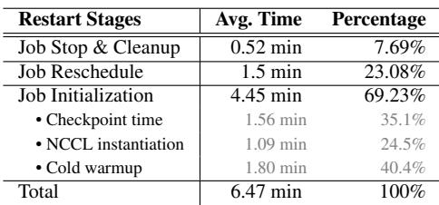  
Table 1: Average restart time breakdown for 8192-GPU training jobs.

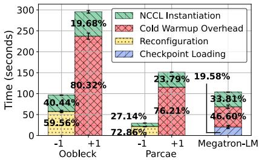  
Figure 1: Reconfiguring and booting from scratch are both costly.

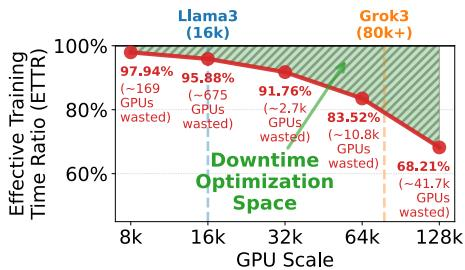  
Figure 2: Impact of downtime on ETTR at different scales.

In practice, this goal translates to quickly replacing interrupted GPUs with healthy ones while maintaining the training layout (i.e., the parallelism configuration and model partitioning tuned for the job). The training layout is specially optimized from the ground up to achieve peak performance on the specific scale. For example, before training starts, Meta [17] manually fine-tunes the model partitions on each GPU to balance memory and computation load across different pipeline parallelism stages to achieve the highest throughput. Similarly, DeepSeek [9] carefully tunes the GPU SMs dedicated to computation and communication to achieve the optimal balance and trains DeepSeek-V3 at peak performance. Re-distributing the workload to the remaining machines can easily lead to inferior performance, job failures due to unexpected code behavior or out-of-memory errors, or idle GPUs in scenarios where an entire DP group is removed when the distributed optimizer is disabled.

Under such constraints, naively setting up the training cluster to match the job size is undesirable, as a single broken machine can undermine the entire training run. Instead, operators reserve a pool of healthy standby servers in the cluster for on-the-fly replacement to reduce downtime. For example, ByteDance [49] allocates warm-standby pools based on the 99th percentile of historical GPU failure rates. Alibaba’s HPN [34] reserves 6% of its GPUs as backup in each segment. Google [42] maintains standby TPU cubes within each SuperPod to support rolling maintenance and recovery. Llama-3 [17] was trained on 16K GPUs within a 24K-GPU cluster. More discussion on the economic cost of standby machines can be found in §9.

## 2.3 Limitation on Existing Solutions

The industry has deployed automatic systems [10, 49] to reduce interruption downtime. Yet, as training scales grow, recovery in the training stack quickly becomes the bottleneck. We evaluate two representative interruption-handling solutions. Note that, across all experiments, we assume instant fault localization and isolation.

Solution 1: Restart. Restart refers to the standard stop–reschedule–reinitialize mechanism used in production to handle interruptions [10, 17, 21, 51]. When an interruption occurs, the system first stops the job by terminating the training framework and cleaning up active processes and connections. It then reschedules the cluster by offlining faulty nodes, selecting healthy replacements, and preparing their runtime environments. Finally, the training framework re-initializes from the most recent checkpoint before training can resume.

This process introduces substantial overhead. We consulted one of the largest cloud providers, and even with an automated recovery stack similar to that of Llama-3 [17], an 8,192-GPU production job still incurs 6.47 minutes of delay per interruption (Table 1). Excluding infrastructure overhead, framework initialization alone accounts for 4.45 minutes: (1) Checkpoint loading (35.1%), where model and optimizer states are restored from remote storage. This cost grows rapidly with model size [48, 50, 51]. (2) NCCL instantiation (24.5%), where each parallelism dimension (DP, PP, TP) must form its own NCCL group, requiring synchronized metadata exchange and connection setup. (3) Cold warm-up (40.4%), including CUDA context creation, GPU memory allocation, JIT compilation, and data-loader initialization. Since largescale training is fully synchronized, an interruption affecting only a few nodes [10, 21] still forces all machines to restart, significantly amplifying downtime.

Solution 2: Runtime Reconfiguration. Recent works such as Oobleck [19], Parcae [12], and ReCycle [14] aim to avoid global restarts during interruptions by elastically scaling the training cluster up or down without halting the job. These systems adjust training configurations—such as batch sizes or parallelism schemes—to sustain reduced training throughput during failures. When an interruption happens, the system can remove the affected machine (-1) and continue training at reduced throughput, then later add a replacement machine once available (+1).

However, despite avoiding infrastructure overhead, the core restart critical path remains. Figure 1 shows the latency for Oobleck and Parcae when handling interruptions in a 6.7B GPT training job on 32 GPUs. Removing a machine (-1)

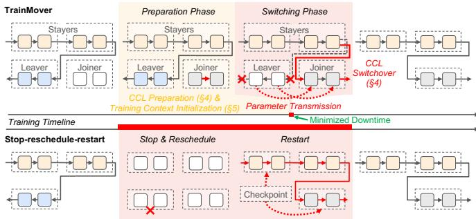  
Figure 3: TrainMover Overview

requires all nodes to redistribute parameters, re-instantiate model components, and reallocate GPU memory to support the new configuration—taking 57 seconds in Oobleck and 21 seconds in Parcae. Adding a machine (+1) is even more expensive: the joiner must initialize NCCL groups and reinitialize software and hardware components, taking over 100 seconds in Oobleck and more than 200 seconds in Parcae. The asymmetry arises because existing machines are already warm—their CUDA kernels are compiled and GPU memory is allocated—while a newly added joiner must complete a full cold warm-up from scratch. Oobleck is built atop ColossalAI [24], while Parcae is built atop DeepSpeed [39], leading to different framework warm-up times. Remarkably, this entire cost exceeds even the job initialization overhead in Megatron-LM at the same scale (rightmost bar, around 100 seconds).

In short, although infrastructure overhead can be reduced, the heavy initialization required to bring a joiner online remains unavoidable. While this downtime is tolerable at small scales, growing cluster sizes dramatically amplify its impact: higher interruption frequencies and larger numbers of affected GPUs cause downtime to quickly become the dominant bottleneck, substantially degrading ETTR.

This scaling effect is already evident in practical measurements. Although a 4.45-minute restart time appears modest, Figure 2 shows the resulting ETTR when this measurement is combined with the MTTFs reported by Meta [21] across increasing cluster sizes. As the figure illustrates, effective training throughput collapses at production-scale deployments (64K/128K GPUs) [41, 49, 54], resulting in 16.47% and 31.79% throughput losses, translating to \$0.95M and \$3.63M of daily monetary losses, respectively.

## 3 TrainMover Overview

To break through this scalability barrier, we design Train-Mover, a resilient LLM training runtime for production-scale clusters that sustains high ETTR under frequent interruptions.

TrainMover migrates workloads only from interruptionaffected leavers to healthy backup joiners, leaving the remaining stayers unchanged. By strategically leveraging readily available machines and overlapping all preparable work ahead of time, TrainMover moves most job-setup procedures off the critical path before the joiner participates in training.

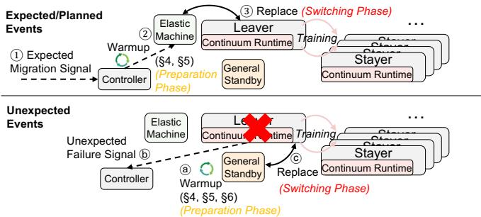  
Figure 4: TrainMover Workflow

This design enables a carefully orchestrated migration procedure that achieves 10! lower downtime for both expected and unexpected interruptions, without any additional GPU memory overhead, thereby avoiding the risk of out-ofmemory crashes during migration.

As shown in Figure 3, instead of long restarting (bottom), TrainMover (top) splits the migration into two phases: in the preparation phase, TrainMover prepares the joiners’ training stack in the background without affecting the foreground training job; once the joiners are ready and the foreground job finishes the current iteration, the system enters the switching phase and synchronizes each joiner to the latest training state before taking over the leaver. Each joiner takes over the leaver’s role, keeping the training layout unchanged. Figure 4 illustrates TrainMover’s workflow of handling both expected and unexpected interruptions as described below.

Expected Interruptions. Expected interruptions—such as scheduled maintenance—provide advance notice. When such an event is planned, the controller issues an expectedmigration signal 1 . TrainMover then selects elastic machines as joiners and immediately places them into a background preparation phase 2 , while stayers and leavers continue training normally. Once preparation completes, TrainMover triggers a brief switching phase 3 , during which the joiner receives the latest training state one-to-one from its paired leaver and takes over the leaver’s role. This switching phase contributes to the total training pause downtime.

Unexpected Interruptions. Unexpected failures occur without prior notice, so a warmed standby machine must remain in the background preparation phase a . When an unexpected failure is detected b , the controller initiates recovery: Train-Mover immediately promotes the standby machine to a joiner and transitions directly into the switching phase c , where the joiner retrieves the up-to-date state from a checkpoint, and the other machines roll back to the same checkpoint [13, 49, 50]3. Once the switching phase completes, the leavers exit and the joiners replace their roles, resuming training seamlessly. Checkpoint loading only occurs as a fallback when no inmemory copy is available, in the switching phase.

TrainMover shifts as much work as possible off the critical path into the preparation phase while keeping the switching phase as lightweight as possible. However, several inherent properties of large-scale training fundamentally limit how much work can be shifted, creating key challenges for minimizing downtime.

(§4) Initialization is implicit and tightly coupled. A joiner must complete many initialization steps before starting training, yet modern frameworks trigger these steps implicitly across different levels (e.g., PyTorch, NCCL, and CUDA) and often require global coordination. These heavy behaviors prevent initialization from being invoked independently; performing them in advance requires untangling the tightly coupled procedures and understanding the implicit steps. TrainMover addresses this with a communication-free sandbox (§4): rather than untangling each implicit initialization path, the joiner simply runs a full shadow training iteration in isolation, so all computational initialization is triggered naturally—without blocking ongoing training or requiring assistance from active machines.

(§5) Communication groups assume static membership. Collective communication libraries are designed around fixed group membership. Replacing even a single machine typically requires globally tearing down and rebuilding all communication groups—a slow, synchronized procedure that dominates the interruption-handling critical path. TrainMover addresses this with a two-phase delta-based CCL setup (§5) that decouples CCL setup and performs all required setup during the preparation phase, applying only fast, delta connection-level changes when the membership switch actually occurs—with no additional GPU memory overhead.

(§6) Standby resources must cover unexpected failures. Unexpected failures can occur on any machine and in any training role, making advance preparation impossible. Warming up standbys for each role is wasteful at scale, while relying solely on elastic machines acquired after a failure introduces large critical path delays. Standby resources must therefore be role-agnostic and able to recover swiftly when failures occur. TrainMover solves this with a general standby design (§6) that exploits the structural symmetry of LLM training ranks: a single standby sequentially warms up for each pipeline role type, making it a universal recovery target without dedicating a separate standby per role.

These three techniques compose directly with the twophase workflow above. At the start of training, hot standby machines are pre-deployed (§6) a to guard against unexpected interruptions; each runs the communication-free sandbox (§4) and Phase 1 CCL setup (§5) upfront, so upon a failure it enters the switching phase directly. For expected interruptions, upon receiving the migration signal 1 , a new machine (no pre-deployed hot standby necessary) can serve as the joiner and undergo the same preparation (§4, §5), overlapping with ongoing training. In both cases, the switching phase 3 / c enters CCL Phase 2 to switch only the delta inter-machine connections (§5) and transfer the state from the leavers to the joiners, keeping downtime to seconds.

## 4 Sandboxed Initialization

The joiner should initialize independently and in advance during the preparation phase to avoid global blocking; other wise, all machines must pause until the joiner completes its setup. Yet, training initialization spans both cross-machine and intra-machine dependencies, making it difficult to identify and trigger initialization gracefully and independently (§4.1).

To address this, we propose a communication-free sandbox (§4.2 and §4.3) that allows joiners to execute shadow iterations in isolation to trigger initialization ahead of time. Afterward, the joiner enters the main loop and seamlessly continues training.

## 4.1 Prolonged and Complex Training Initialization

Training initialization, once overlooked as a one-time cost, has become a significant source of inefficiency as training scales grow and interruptions become more frequent. Each interruption must redo warm-up, wasting GPU time. In the GPT-10B experiment shown in Table 2, excluding NCCL instantiation, a single interruption triggers about 150 seconds of warm-up before reaching stable performance. The first iteration is also much slower—about 6 longer (around 44 seconds in our GPT-10B experiment)—due to just-in-time (JIT) compilation and cascading initialization dependencies—in pipeline-parallel training, for example, each stage depends on the completion of the P2P communication of the previous stage, so initialization proceeds sequentially across stages, further amplifying the startup overhead.

Initialization is complex and spans multiple layers of the training stack. While frameworks like JAX provide an eager mode to explicitly trigger initialization, mainstream training frameworks such as Megatron-LM, DeepSpeed, and NeMo rely on hardware-aware optimizations (e.g., memory-layout specialization and fused kernels) that are only activated when real data arrives (e.g., the first iteration). Furthermore, initialization is intertwined with communication, as exemplified by the pipeline-parallelism case discussed above. Addressing these behaviors would require uncovering and manually invoking many hidden initialization paths or thoroughly examining user training code. We need a mechanism that automatically triggers these complex initialization behaviors without requiring user intervention.

## 4.2 Shadow Iteration in Communication-free Sandbox

To pre-trigger initialization without any other machines’ assistance, we create a communication-free sandbox that allows joiners to run a shadow iteration independently before joining the main training loop. This sandbox eliminates the need for case-by-case initialization handling: joiners can execute all implicit and framework-specific initialization routines in one shot, without relying on distributed communication or requiring any assumptions about user code or framework behavior.

This design introduces two key requirements: first, the shadow iteration must execute with valid state values and communication results to ensure the program does not crash and that initialization is correctly triggered—using dummy or zero values can easily cause NaNs or assertion errors. Second, communication operations must be handled locally without depending on communication responses from other machines. We address both requirements through valid tensor record–replay, as illustrated in Figure 5.

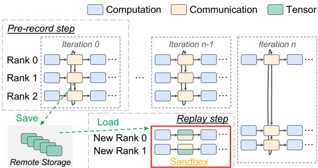  
Figure 5: Sandbox initialization workflow

The sandbox warm-up has two steps: pre-record and replay. In the pre-record step, the designated recording machines capture one or more valid iterations and store the resulting communication outputs in advance. When a migration signal is received or a standby becomes available, the joiners enter the sandbox, where each joiner runs the replay step—reusing the recorded communication results to trigger its initialization. Shield the Warmup — Pre-record step. We build a record hooking layer that sits between PyTorch and the CCL to intercept communication calls issued by the training framework. At the start of a new job as shown in Figure 5, designated machines—including Rank 0, Rank 1, and Rank 2—enter the pre-record step to prepare for potential migration. Our hook monitors and records the output tensors of all collective calls (e.g., all-reduce) to persistent storage once the collective completes. They are later replayed in the sandbox to ensure valid training states on the joiner.

This one-time pre-record step runs only during the first training iteration (or a few iterations) at the very beginning. After that, the interception hook is removed, and training proceeds as normal, introducing no additional overhead for the remainder of the training process regardless of the number of interruptions experienced or number of job restarts.

Run the Warmup — Replay step. When a migration signal is received or a standby is available (the preparation phase), all joiners (new Rank 0 and new Rank 1) enter the replay step and are placed into a sandbox, isolating them from the ongoing training in preparation for triggering initialization before joining the main training process. First, each sandboxed joiner pulls the initial state from the checkpoint. After loading the state, the joiner proceeds to a shadow iteration to trigger initialization. Our sandbox is designed to be communicationfree, specifically to avoid any interaction with existing training machines. We deliberately prevent any assistance from active participants—such as responding to collective operations or sending state information—to ensure that the joiner triggers initialization entirely on its own.

We attach another hook to the PyTorch communication layer to intercept communication calls made during the replay step. Any communication call that attempts to reach outside the sandbox is intercepted and instead served with previously recorded tensors as responses. Certain operations—such as barrier and send—are safely bypassed, as invoking these operations does not affect the caller’s state.

After the shadow iteration is complete, the joiners (e.g., New Rank 0 and New Rank 1) can replace the leavers (e.g., Rank 0 and Rank 1) at the end of iteration n 1 once they have received the up-to-date states in the switching phase, enabling a machine transition with no initialization downtime after migration.

Robustness and Correctness. The sandbox warm-up relies on a degree of determinism in the ML framework that modern LLM training frameworks satisfy. By design—fixed kernel schedules, static memory layouts, and deterministic collective ordering are maintained for reproducibility and peak performance. As a result, almost all initialization—including data-loader setup, CUDA context creation, and memory allocation—is correctly triggered during sandbox warm-up. Only in rare cases does a component depend on runtime data or require CUDA graph capture whose trigger may be missing. MoE routing is one such case: token routing is inputdependent and varies across iterations. However, in practice this has minimal impact—MoE frameworks (e.g., Megatron-LM) support preallocating fixed-size expert buffers regardless of the actual routing decision, so the underlying memory layout and communication structure remain static. Any initialization not triggered during sandbox warm-up simply completes during the switching phase, introducing only negligible overhead (ms-level).

Also, correctness is always guaranteed because the leaver’s latest model and optimizer states will eventually overwrite all local states after sandbox warm-up in the switching phase.

## 4.3 Low Overhead Record and Replay

Recording and replaying tensors incur a one-time overhead in both storage and tensor loading time. However, not all communication needs to be recorded or replayed— each recording is essentially a preparation for communication edges that might be temporarily missing during sandbox warmup. We can reduce the recording scope by focusing only on what might be needed. For example, since migrations happen only at the machine level, intra-machine communication (where intensive TP traffic is always involved) can run natively inside the sandbox without record. We further eliminate redundant recordings for duplicated training roles, as discussed in §6. The storage overhead can be eventually reduced to under 300 GB in a GPT 5.12T MoE model setting.

During replay, as illustrated in the lower part of Figure 5, only the communication that touches the sandbox boundaries in the training graph relevant to the new joiner needs to be loaded and replayed. When multiple machines are migrated together as a batch (e.g., an entire PP group), the joiners’ internal communication can remain real, while only cross-boundary communication is loaded from storage. This boundary-aware record-and-replay design contributes to low I/O overhead.

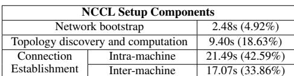

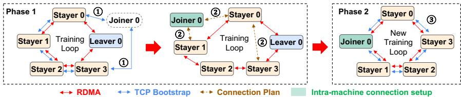  
Table 2: Time breakdown aggregated over all NCCL groups.  
Figure 6: Two-phase CCL Migration workflow

## 5 Dynamic and Lightweight Communication group setup

Migrating one machine to another requires updating the membership of the existing CCL groups. However, CCL groups lack flexibility and are costly—they take time to create, and once created, their membership cannot be modified (§5.1). Existing approaches [12, 19] rely on globally destroying and recreating groups, which introduces unacceptable delays. An alternative strategy is to concurrently pre-allocate new groups in the background to avoid blocking, but this incurs additional GPU memory overhead. To solve this downtime–memory dilemma, we introduce a two-phase asynchronous CCL setup (§5.2) that enables dynamic group membership updates with minimal downtime and zero additional GPU memory overhead.

## 5.1 Today’s Slow and Static CCL Setup

Communication setup is slow. The slowness stems from three main procedures: (1) Network bootstrap — participants form a TCP network through multi-round handshakes and consistency checks, which is expensive at scale due to the need for global coordination [41]; (2) Topology discovery — each node gathers local device metadata (e.g., NIC bandwidth) and exchanges it via ring all-gather to compute global topology and determine communication neighbors, incurring high synchronization overhead; and (3) Connection establishment — nodes allocate GPU buffers and set up inter- and intramachine connections (e.g., GPU Direct RDMA, NVLink) based on the computed topology. These setup procedures can still be slow despite high parallelism, due to their inherent synchronization behaviors.

Table 2 shows the CCL setup overhead on an 8-machine cluster with 64 40GB A100 GPUs, training a GPT-10B model with TP=4, PP=2, and DP=8. The setup takes around 50 seconds due to the overhead of establishing and managing communication groups—a challenge that grows with scale. For example, training across 1,000 machines results in a connection count that scales with 1,000 ! (# of CCL groups) ! (# of channels inside each group). The number of CCL groups depends on the communication dimensions (e.g., DP, PP, TP); even in this modest 3D setup, each host participates in 7 groups. High-bandwidth links (e.g., 400 Gbps) further in crease the number of required channels. Although many setup operations can run in parallel, the scalability of these massive numbers of connections is ultimately limited by global synchronization barriers, straggler effects from heterogeneous network latencies, and driver-level contention under high concurrency (e.g., CUDA and IB verbs serialization), causing setup time to grow with cluster size.

Communication setup is static. CCL connections are tightly coupled to hardware (e.g., NVLink, GPU Direct RDMA), requiring memory mappings (via CUDA IPC) and optimized connectivity topology computation—all constructed at initialization. These components are specific to the participating ranks and GPUs, so any group member change requires structural updates and may yield suboptimal performance if not carefully handled.

## 5.2 Two-phase Delta-based CCL Setup

We design a dynamic and lightweight CCL setup that minimizes transition overhead when a joiner migrates into an ongoing training job. Our two-phase design shifts most of the setup to Phase 1, where it is performed in advance and overlapped with training, deferring only minimal connection establishment to Phase 2 to reduce downtime. Additionally, we enable calculating and reestablishing only the delta connections between the old and new topology, avoiding the need to globally reconnect all links.

We demonstrate the migration workflow with four stayers (0–3), one joiner, and one leaver in Figure 6. Migration begins with a signal and role assignment from the controller. In Phase 1, Stayers 0–3 invoke CCL\_prepare\_stayers(new \_topology) to incrementally modify their existing CCL group in preparation for the new setup with the joiner. This function also enables topology-aware configurations provided by users as input. Meanwhile, the joiner concurrently calls CCL\_prepare\_joiners(). During this process, the original group’s communication remains functional 1 . Stayers reuse existing TCP bootstrap connections and initiate the bootstrap process with Joiner 0. Since the additional TCP connections and topology state reside in CPU memory, this setup overlaps with training and incurs no GPU memory overhead. Once connected, the joiner and stayers exchange the necessary topology and state information.

After exchanging topology information, a recalculation of connectivity is required, as the original topology may no longer be optimal after migration 2 (e.g., Joiner 0). Once the resilience runtime receives the new topology information, all participants locally compute a delta topology, identify the minimal set of channels required for the updated configuration, and generate a delta reconfiguration plan that determines how to modify the necessary channels. Since all changes occur at the channel level, the design remains compatible with diverse topologies and communication techniques, such as hierarchical connectivity and SHARP [16].

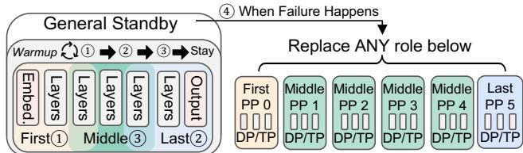  
Figure 7: General Standby

The reconfiguration plan specifies which channels need to be updated. For channels that do not require replacement, they can be directly inherited and reused. Intra-machine channels (e.g., NVLink) are typically fully inherited, as they provide the fastest and highest-bandwidth paths and usually remain unchanged during migration, which operates at the granularity of entire machines. Meanwhile, the joiner (Joiner 0) begins setting up channels that can be initialized locally (e.g., intra machine connections). If there are multiple joiners that need to connect with each other, their inter-connections are also established accordingly.

Delta channel connections in the reconfiguration plan—typically inter-connections—are intentionally deferred to the second phase. At this point, intra-machine communication is already available through inheritance, while intermachine connections have not yet been established on the stayer machines—ensuring no additional GPU memory is consumed. Afterward, both the stayer and joiner CCL groups enter the ready-to-switchout state. Notably, the stayer and the leaver continue training without interruption during this phase.

Once both the joiners (e.g., Joiner 0) and impacted stayers (e.g., Stayer 0 and Stayer 3) complete Phase 1 and enter the ready-to-switchout state, they invoke the second API, CCL\_switchover(), to switch delta inter-machine connections from stayer–leaver to stayer–joiner. For instance, the connection between Stayer 0 and Leaver 0 is replaced by one between Stayer 0 and Joiner 0; likewise, Stayer 3–Leaver 0 is switched to Stayer 3–Joiner 0. The replacement happens at the RDMA queue pair (QP) level, where it re-establishes the inter-machine peers, transitions the CCL group from ready to-switchout to the normal state, and reclaims the resources tied to the old topology 3 . This delta operation is the sole contributor to network downtime. The entire procedure incurs zero memory overhead; a detailed workflow can be found in §8.5.

## 6 General Standby

Failures can occur unexpectedly at any time. A key challenge in handling such events is that the standby machine does not know in advance which machine it should prepare for, as each machine holds different parallelism roles (e.g., TP and DP IDs). We design a general standby mechanism that prepares the standby for any rank by leveraging the symmetry of training ranks and the fact that warm-up requires only valid states, independent of role. This design enables both sandboxed initialization (§4) and two-phase CCL warm-up (§5) in unexpected failure cases and significantly reduces the number of standby machines needed.

## 6.1 Symmetry on Training Ranks

LLM architectures exhibit strong symmetry, as maintaining identical model partitions across all machines helps achieve peak synchronous training performance. Parallel methods such as tensor parallelism (TP), data parallelism (DP), expert parallelism (EP), and other structurally symmetric forms of parallelism maintain these identical partitions, which share the same parameter shapes and optimizer-state layouts; for example, running a DP+TP training job in Megatron-LM produces identical memory utilization across all ranks. Each rank executes the same set of computational operators and CUDA kernels4, and participates in the same collective communication patterns. This strong, correctness-driven symmetry allows the standby to serve as a universal recovery target.

Pipeline parallelism (PP) is an exception to the model’s inherent symmetry: each PP stage contains a subset of layers, while the first and last stages include additional layers such as the word\_embedding\_layer in the first stage and the output\_layer in the last stage. Despite these variations, the first and last stages remain similar in structure: the word\_embedding\_layer and output\_layer share the same shape (e.g., weight tying). The middle stages consist of repeated transformer blocks and are kept symmetric for optimal performance . In total, PP introduces at most three distinct role types—the first stage, the middle stages, and the last stage—yet the overall partitioning remains highly symmetric.

## 6.2 General Warm-Up Procedure

The symmetric design allows the standby machine to warm up and recover any role in the system. Figure 7 illustrates the warm-up procedure. To prepare it, the standby runs warmup iterations for initialization (§4). Without pipeline parallelism (PP), a single iteration is sufficient because all machines share identical roles. When PP is enabled, the standby sequentially and independently runs up to three warm-up itera tions 1 2 3 , each corresponding to a different role—the first stage, last stage, and middle stage. Running each role during warm-up concretely initializes all role-specific components, such as JIT-compiled fused kernels.

At this stage, the general standby remains in Phase 1 of the CCL setup, where inter-machine connections are not yet established. Its overall GPU memory footprint stays hundreds of megabytes below peak usage (detailed measurements in §8.5). This available headroom easily accommodates the GPU-resident artifacts produced during warm-up across all role types—including JIT-compiled kernels and other compiled GPU artifacts specific to each role’s layers—which add at most a few hundred kilobytes per role, never exceeding the original memory budget.

After warm-up, we retain the middle-stage role because it represents the majority of pipeline instances. If a failure occurs on a middle stage, the standby can replace it directly. For failures in the first or last stage, TrainMover updates only the small delta of layers unique to those stages. This delta is negligible because only the memory for the optimizer states and parameters of the additional layers (e.g., embedding or output layers) needs to be allocated. Other artifacts, such as all precompiled kernels, are already initialized. Even at large scale, the standby needs to run only these three role types.

Two-phase CCL preparation (§5) is also enabled by symmetry, because each machine exposes an identical intra-node and inter-node topology. For example, if a CCL group contains two separate TP groups within a machine, the same configuration must exist on all other machines. This eliminates the need for dynamic topology specialization during recovery. The only exception arises with pipeline parallelism (PP): when PP spans multiple machines, the standby must additionally establish a few connections with its neighboring stages after recovery, according to its assigned role.

Leveraging this symmetry, we can prepare a general standby for unexpected failures at the beginning of the training job in parallel, with a deployment time no greater than that of a normal initialization. The general standby achieves downtime nearly identical to that of the switching phase in an expected event, as evaluated in §8.3. A discussion of the cost-effectiveness of the general standby can be found in §9.

The number of standbys needed is small in practice (§8.2): the probability of two machines failing simultaneously is the product of their individual failure rates ( 1/MTTF), making concurrent failures extremely unlikely [18, 49, 55]. Train-Mover also supports the no-standby case and still recovers via its overlapped recovery path (§7). In practice, 1–2 standbys cover all distinct stage types (first, middle, last) for PP configurations; operators who wish to overprovision can assign dedicated standbys per stage proportion, e.g., with PP degree 8 and a 1:6:1 stage ratio, allocating more standbys to the dominant middle stages.

## 7 Implementation

TrainMover is implemented in Python and C/C++, comprising two main components: the training-node resilience runtime and the controller. TrainMover comprises about 12K lines of new code: 1.9K LoC of Python for the controller, 7.8K LoC of Python for the Megatron-LM runtime extensions, 1.1K LoC of C++/Python for the PyTorch c10d extensions, and 1.5K LoC of C/C++ for the NCCL extensions. The prototype is open-sourced on GitHub [43].

Training Node Resilience Runtime and Controller. The TrainMover runtime builds on Megatron-LM with focused modifications to Megatron-LM, PyTorch, and the CCL layer to support resilient training. In Megatron-LM, it manages interruption signals and preserves CCL ordering during over lapping training and migration. In PyTorch’s c10d, we enable multiple global CCL groups, support the CCL layer’s twophase initialization API, and add an interception layer that records, replays, or bypasses tensors to facilitate sandbox warm-up. In the CCL layer, we implement the new APIs and demonstrate them in NCCL. The controller coordinates the system by assigning roles, initiating migrations, detecting failures, and distributing topology metadata; each node’s runtime maintains a control channel with the controller to keep metadata synchronized and ensure joiners, leavers, and stayers correctly configure their CCL connections.

State Synchronization. Concurrently with CCL switchover, the joiner receives the up-to-date training state before resuming. For expected events, the leavers transmit the latest training states—such as model parameters and optimizer states—to their corresponding joiners, overwriting the sandbox-warmed state and bringing the joiner fully up to date with the current training progress. For unexpected failures, the joiners retrieve the required states based on the redundancy configuration. If a copy is available on other stayers—through DP group redundancy or remote CPU memory checkpointing [50]—TrainMover directly queries the states from a stayer machine that maintains a copy. Otherwise, in the absence of redundancy—such as with the distributed optimizer [3] or ZeRO optimizer [37, 38]—the joiners fetch the data from remote storage checkpoints [12, 48]. The leaver–joiner mappings are one-to-one, meaning that state transmission and connection establishment for different joiners occur independently and in parallel—the overhead does not grow with cluster size. The transfer is feasible within the 20-second recovery window because modern GPU memory is bounded (e.g., 80 GB per A100), and the state is transmitted via high-bandwidth RDMA directly from a neighboring stayer’s GPU or CPU memory, achieving transfer rates of hundreds of GB/s, well within the recovery budget.

## 8 Evaluation

Our experiments show that TrainMover scales effectively, with about 20 seconds of downtime at 1024 GPUs and over 55% less wasted GPU time at 64K GPUs compared to the best baseline (§8.2). We further analyze event downtime (§8.3) and additional use cases (§8.4), where TrainMover sustains 97% training efficiency during periodic 10-minute load rebalancing at the 1024-GPU scale. A detailed breakdown of the designs and the zero memory overhead are shown in §8.5.

## 8.1 Experiment Setup

Testbed and Model Settings. We conduct our experiments on a 1024-GPU testbed and evaluate a range of models—including GPT-5.12T MoE, GPT-175B, GPT-39.1B [25],

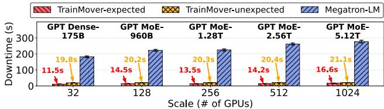  
Figure 8: Downtime comparison across different GPU scales.

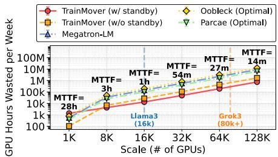  
Figure 9: Projected GPU hour wasted in large scale deployment

GPT-20B [50], GPT-Medium [7], GPT-2.7B [7] and others—to cover diverse model sizes at different scales. Largescale model configurations are summarized in Table 3. Detailed downtime analysis is additionally conducted at the 32- GPU scale to enable fair comparison with Oobleck and Parcae, which cannot scale beyond 32 GPUs (e.g., Oobleck’s template construction time becomes prohibitively long at larger scales). For these experiments, models are tested with various TP, DP, and PP configurations including (TP1, PP8, DP3), (TP4, PP8, DP3), and (TP8, PP8, DP3). Default profiles are: GPT-Medium and GPT-2.7B use TP1, PP8, DP3 with a global batch size of 96 and microbatch size of 2; GPT-20B uses TP1, PP8, DP3 with the distributed optimizer, global batch size of 36, and microbatch size of 1; GPT-39.1B uses TP4, PP2, DP3 with the distributed optimizer, global batch size of 36, and microbatch size of 1. The Wikitext dataset [29] is used, following prior work [12, 19].

Baseline. Our primary baselines fall into two categories: the stop-and-restart approach, represented by Megatron-LM, and reconfiguration-based approaches, represented by Oobleck and Parcae. For expected events, since Oobleck and Parcae do not natively support live migration, we perform it by removing a node (-1) and adding a new one (+1). Parcae does not support tensor parallelism, and neither Oobleck nor Parcae supports distributed optimizers [37], as both rely on redundancy within data parallelism. We include various 32-GPU experiments because Oobleck cannot scale due to its prolonged template-generation overhead.

Metrics. We primarily use three metrics in our evaluation. The first is downtime, which measures the duration of inter ruption handling for both expected events and unexpected failures, reflecting the additional system time required to complete training per interruption. The second is GPU hours wasted per week, an end-to-end metric that quantifies the total GPU time lost during event handling—essentially overhead expressed as an absolute resource cost, which can be directly translated into training capital cost. The third one is ETTR.

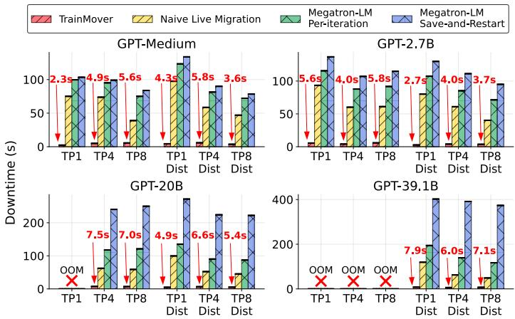  
Figure 10: Migration downtime with different models and parallel settings

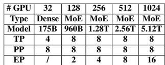  
Table 3: Large-scale GPT model configurations used in experiments.

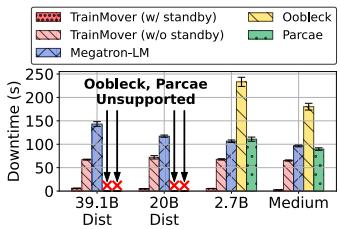  
Figure 11: Unexpected failure downtime

## 8.2 End-to-end Experiments

TrainMover Performance at Scale. We evaluate downtime for both expected and unexpected interruptions on a largescale testbed with up to 1024 GPUs, demonstrating Train-Mover’s scalability and low downtime in Figure 8. In Train-Mover, migration downtime during expected events consistently remains below 20 seconds, while downtime for unexpected failures is also below 30 seconds even at the 1024-GPU scale. The downtime increases by no more than 10 seconds when scaling from 32 to 1024 GPUs, as TrainMover’s design is fundamentally insensitive to job size.

The scalability benefit comes from our delta-based design. For expected events, during the switching phase, TrainMover only updates the connections between the leaver and joiner, while model states are transferred in parallel between corresponding leaver–joiner pairs. All other machines and connections remain unaffected. The small increase in downtime primarily results from the larger number of RDMA connection re-establishments required at higher scales. For unexpected failures, only TrainMover’s general standby machine needs to retrieve its up-to-date state from a neighbor [49, 50]. If such a system is not present, the failed machine must recover its state from the remote checkpoint storage. Other procedures remain nearly identical to those for handling expected events, as the general standby machine performs CCL initialization and sandbox initialization in advance.

In contrast, Megatron-LM restarts the entire job during migration, requiring CCL group re-instantiation and other initialization steps across all machines, taking up to nearly 300 seconds at the 1024-GPU scale. We exclude the job rescheduling and cleanup overhead in Megatron-LM, as these depend heavily on the underlying cluster management system, and this procedure typically incurs minutes-level latency (Table 1). This is consistent with the restart cost breakdown in §2, where framework initialization dominates and scales proportionally with job size.

Projected GPU-Hour Savings at Production Scale. In practice, large-scale training jobs often run on tens of thousands of GPUs. We project GPU-hour waste per week by extrapolating from our 1K-GPU measurements to production scales of up to 128K GPUs [49, 54] (Figure 9), using MTTF values from Meta [21] and a 1:8.9 expected-to-unexpected failure ratio [17]. Each system’s downtime is held constant at its measured value: TrainMover uses 1024-GPU measurements, while Oobleck and Parcae use 32-GPU measurements (§8.3) since they cannot scale beyond 32 GPUs. Using 32-GPU mea surements gives Oobleck and Parcae an optimistic advantage, as downtime typically grows with scale; for TrainMover, holding the 1024-GPU downtime constant is justified by its deltabased design, which only updates leaver–joiner connections and is scale-insensitive. We also add a 2-minute infrastructure rescheduling cost to all systems from the 8192-GPU measurements (Table 1), which is conservative as this overhead also increases with scale.

Two versions of TrainMover are included for comparison. The first, TrainMover (w/ standby), pre-allocates a standby machine, which is counted as a reserved resource and considered wasted if unused. We use one standby machine as a backup because simultaneous multi-machine failures are rare [18, 49, 55]. The second, TrainMover (w/o standby), uses all GPUs without a dedicated standby. Without a standby machine, the handling downtime for unexpected failures increases, while expected events remain unaffected because their handling does not require standby resources. This configuration represents the case where all GPUs are dedicated to training with no reserved standby, and only TrainMover’s recovery path optimizations are applied upon failure. It also characterizes the performance when the pool of reserved standby machines is exhausted.

At the 1K scale in Figure 9, where failures are infrequent, the wasted GPU hours across all systems are similar. In fact, TrainMover (w/ standby) incurs slightly higher waste than Oobleck and Parcae, as the standby GPU remains idle during training. However, as scale increases to production levels—for example, at 8K GPUs where interruptions become more frequent (MTTF = 3h)—TrainMover (w/ standby) achieves the lowest GPU-hour waste, reducing waste by 35.91% over TrainMover (w/o standby) and by 82.77% over Parcae. Beyond 8K GPUs, TrainMover (w/ standby) continues to deliver the highest overall efficiency, as the marginal benefit of adding more training GPUs diminishes while failures become more frequent and restarts take longer. At the 128K scale, Train-

Mover (w/ standby) further reduces weekly GPU-hour waste by 55% compared to TrainMover w/o standby and by 88% compared to Parcae.

## 8.3 Downtime Analysis

Fast Recovery from Unexpected Failures. We evaluate TrainMover’s downtime under unexpected failures in two settings: with a general standby machine and without one, as shown in Figure 11. Since Oobleck cannot scale to 1024 GPUs because of its prolonged template-generation time, we run other systems at the same 32-GPU scale for a fair comparison using the 32-GPU model settings (§8.1). For the GPT-Medium and GPT-2.7B models without the distributed optimizer enabled, TrainMover —despite having no standby—still outperforms all baselines. This is because TrainMover accelerates the initialization procedure by overlapping CCL instantiation, warm-up, framework initialization, and state transmission even when a general standby is not present. In contrast, Megatron-LM executes all components sequentially after rebooting, resulting in up to 3.48! longer downtime than TrainMover. Parcae and Oobleck, although enabling direct state transfer to reduce checkpoint loading time, still incur high restart overheads from initializing framework components, reinstantiating CCL groups, and performing warm-up. These steps lead to higher downtime than checkpoint-based approaches do.

For the GPT-39.1B and GPT-20B models, where the distributed optimizer (DO) must be enabled to fit the models into GPU memory, Oobleck and Parcae cannot be used because their redundancy assumption is eliminated. TrainMover (no standby) achieves 2.1! and 1.6! shorter downtime than Megatron-LM for the GPT-39.1B and GPT-20B models, respectively. This overlapping advantage becomes more significant as model sizes grow. In the case where a standby machine is available, TrainMover achieves performance nearly identi cal to live migration, with less than 10 seconds of downtime across all models.

Fast Migration on Expected Events. Migration occurs when an expected event takes place. We present the migration downtime comparison in Figure 10. In addition to the Megatron-LM per-iteration checkpoint baseline, which assumes that checkpoint saving is cost-free and can always be overlapped, we include two additional baselines for a comprehensive comparison of expected-event migrations. Megatron-LM Saveand-Restart is a more practical baseline. Before shutdown, training stops and waits for the checkpoint to be saved. Naive live migration directly transfers states from the leaver to the joiner without using the initialization warm-up design (§4) or the two-phase CCL setup (§5), and without requiring all machines to pull states from remote storage.

Megatron-LM Save-and-Restart performs the worst among all baselines due to significant checkpoint-saving overhead, which increases with model size, reaching approximately 400 seconds for the GPT-39.1B model. Naive live migration outperforms Megatron-LM Per-iteration by enabling direct transfer of model states from migration leaver machines to migration joiner machines. This optimization achieves up to a 1.74! speedup on the GPT-39.1B model with TP4 and DO (distributed optimizer) enabled.

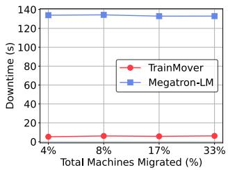  
(a) GPT-20B

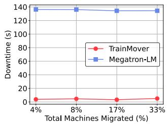  
(b) GPT-39.1B  
Figure 12: Downtime varying migration scale

TrainMover delivers the best performance by overlapping CCL setup and warm-up processes with the non-critical path. This design consistently achieves second-level downtime and provides at least a 15! speedup compared to the Megatron-LM Save-and-Restart baseline across all models. Both Train-Mover and the naive system maintain zero additional memory overhead during migration.

Migrating Multiple Machines at Once. Migrating multiple machines is essential for rapid large-scale operations like rebalancing and maintenance [2]. Figures 12a and 12b show the performance of GPT-20B and GPT-39.1B during migrations of 4% to 33% of the total GPUs.

Both models maintain stable downtime overhead of up to 6.15 seconds across both GPT-20B and GPT-39.1B. This consistency stems from TrainMover’s design, where each migration leaver and joiner operates in parallel, performing one-to-one data transfers. This approach ensures constant overhead, preserving efficiency regardless of migration scale.

In contrast, checkpointing systems like Megatron-LM are highly inefficient. Even migrating just 4% of machines forces all machines to reboot and retrieve checkpoints from remote storage, causing 138 seconds of overhead.

## 8.4 Use Cases

We also present other use cases of TrainMover. Note that none of these use cases require hot standby machines.

Handling Stragglers. We evaluate the use case of handling stragglers, as shown in Figure 13. In this experiment, we inject a straggler by slowing down one GPU by 20% [51] at the 75th iteration of a 100-iteration, 1024-GPU job. Figure 13 reports the training efficiency and visualizes the training process. While this setup represents a specific case where the straggler appears at iteration 75, Figure 14 extends the analysis to all possible iterations (1st–100th), showing the full spectrum of when stragglers occur.

Alongside the previously evaluated Per-iteration and Saveand-Restart approaches, we include two additional strategies for broader comparison: deferred checkpointing and restart with progress loss. Save-and-Restart saves a checkpoint immediately and restarts training when a straggler occurs. Defer-50/100 continues training and defers restarting until the next scheduled checkpoint (e.g., every 50 or 100 iterations). Restart-50/100 restarts training immediately, losing progress based on the most recent checkpoint at iteration 50 or 100.

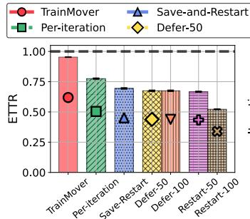

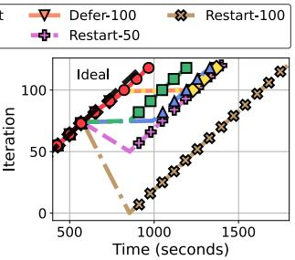

Figure 13: GPT 5.12T MoE model with 20% slowdown starting at the 75th iteration  
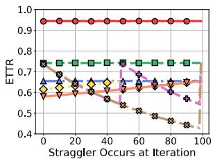  
Figure 14: Straggler occurring at different iterations

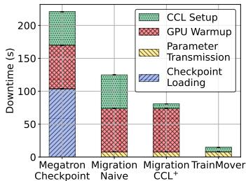  
Figure 15: Design Breakdown

As shown in Figure 13, TrainMover loses only 4.7% of training efficiency—the lowest among all approaches. During the slowdown period, TrainMover continues training while performing migration in parallel, minimizing downtime when switching from the straggler machine to a healthy one.

Defer-type baselines suffer reduced performance until the next checkpoint, restarting only afterward and thus causing delays. Restart-type baselines avoid checkpoint-saving overhead but lose progress proportional to the checkpoint interval, leading to up to 43% lower efficiency than TrainMover.

Figure 14 further illustrates the full performance spectrum across all possible straggler injection points. TrainMover consistently outperforms all baselines, maintaining high efficiency without relying on specific checkpointing frequencies. Remarkably, it even surpasses the ideal per-iteration checkpointing system, improving training efficiency by 22.8% in all cases. Restart-type methods peak immediately after a checkpoint when progress loss is minimal, but their performance deteriorates as the distance from the last checkpoint increases.

Rebalancing / Maintenance. TrainMover handles machine changes swiftly, making it suitable for rebalancing or maintenance that requires frequent GPU or network updates. The upper part of Table 16 compares the training efficiency of TrainMover and Megatron-LM per-iteration checkpointing across scales from 128 to 1024 GPUs. TrainMover consistently maintains an ETTR of above 0.97 across all scales, showing that rebalancing remains effective even as cluster size grows. In contrast, Megatron-LM’s ETTR stays low under high rebalancing frequency, dropping to 0.42 at 1024

Scaling up to 1024 GPUs.  
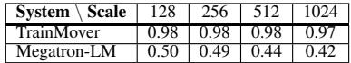

Breakdown at 32 GPUs.  
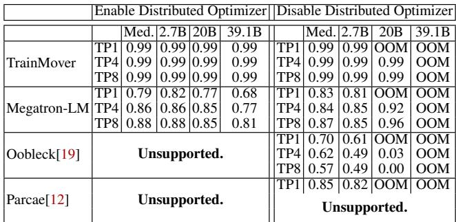  
Figure 16: ETTR across large cluster scales (128–1024 GPUs, top) and detailed performance breakdown at scale 32 (bottom).

GPUs due to the increasing cost of repeated full-job restarts.

We also include comparisons with Parcae and Oobleck at the 32-GPU scale covering various model sizes and training parameters in the lower part of the table. During machine changes, online reconfiguration systems like Oobleck sometimes perform worse than the checkpointing-based Megatron-LM. This is because reconfiguration involves starting new machines, tearing down and reestablishing CCL groups, and performing warm-up procedures; collectively, these steps save little time compared to checkpoint-based systems and perform even worse when the system is not well-engineered. For instance, with the Oobleck 20B TP8 model, reconfiguration delays result in negligible training progress when rebalancing every 10 minutes. Additionally, Oobleck and Parcae lack support for distributed optimizers, and Parcae also does not support tensor parallelism, limiting their scalability for larger models.

TrainMover delivers the best performance among all approaches, maintaining a training efficiency of 0.99 across all models with and without the distributed optimizer. In comparison, the efficiency drops to 0.68 when using Megatron-LM per-iteration checkpointing. This table highlights that even in high-frequency (10-minute) rebalancing scenarios, Train-Mover loses no more than 0.1% of performance, making it a robust and efficient solution.

## 8.5 TrainMover Key Designs

Design Breakdown. We break down our designs and evaluate their incremental impact on system performance in Figure 15 with the GPT-5.12T MoE model. In this setup, Megatron-LM’s total downtime is approximately 221 seconds, with checkpoint loading, GPU warmup, and CCL setup times accounting for 47%, 30%, and 23% of the total, respectively.

Migration Naive represents a naive migration system that excludes the two-layer CCL designs and lazy initialization designs. Unlike Megatron-LM, which loads checkpoints from remote storage, it retrieves parameters directly from the leaver to the joiner. This approach eliminates checkpoint loading time, reducing the total downtime by a factor of 1.8!. The

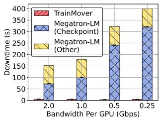  
Figure 17: Downtime with different bandwidth (GPT-20B)

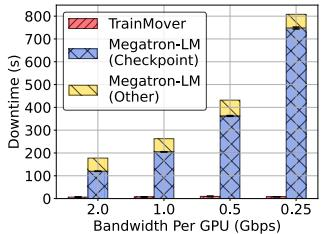  
Figure 18: Downtime with different bandwidth per GPU (GPT-39.1B)  
benefit becomes more pronounced as model sizes increase.

Migration CCL+ builds on the naive migration baseline by introducing the CCL two-layer designs. This design shortens the critical path, leaving only the second stage of CCL initialization on it. CCL time decreases from 51 seconds to 7 seconds. This means Phase 1 absorbs 44 seconds off the critical path, leaving only Phase 2’s 7 seconds as downtime—an 86% reduction in CCL-related recovery time.

The full system, TrainMover, further integrates the selfdetached warmup design, effectively eliminating GPU warmup time. This enables training to resume immediately after migration, reducing downtime to 16 seconds.

TrainMover eliminates Network Bottleneck. TrainMover significantly alleviates network bandwidth bottlenecks during machine changes. The Llama-3 paper [17] reports a storage system bandwidth ranging from 2 TB/s to 7 TB/s while serving approximately 7,500 machines, translating to an effective bandwidth of 0.267 GB/s to 0.933 GB/s per machine. In this experiment, we evaluate checkpointing overhead under bandwidth ranging from 0.25 GB/s to 2 GB/s per GPU, encompassing the bandwidth range reported by Llama-3.

In both GPT-20B (Figure 17) and GPT-39.1B (Figure 18) setups, TrainMover maintains stable overhead of 6–9 seconds, due to parallel one-to-one state transfers between migration leaver and joiner. By contrast, Megatron-LM, which requires all GPUs to pull checkpoints from remote storage, incurs increasing overhead as bandwidth decreases and model size grows. Specifically, checkpoint loading overhead reaches 320 seconds for GPT-20B and 750 seconds for GPT-39.1B at 0.25 GB/s per GPU.

Zero Memory Overhead Workflow. Figure 19 illustrates the network (top) and memory (bottom) usage during a migration in TrainMover. A key step in the process is state transfer. As shown in the network breakdown, the leaver sends traffic to the joiner around the 530th second, resulting in high Rx bandwidth utilization on the joiner. However, model transfer is not without cost. Each leaver–joiner pair requires a new CCL group for state delivery, which consumes GPU memory. To achieve zero memory overhead, TrainMover implements specific optimizations during state transmission:

The migration leaver does not need to continue training after the migration is complete; around the 530th second, it can free up and repurpose the pre-allocated GPU gradient buffer for use as the CCL transmission channel. On the migration joiner, during the first stage of CCL initialization, inter-machine connections are not fully established, creating temporary memory headroom around the 530th second. This allows the state transfer channel to operate without exceeding memory limits. Once the transfer is complete, the channel is immediately destroyed, freeing memory before the second stage of CCL initialization. This process ensures zero memory overhead during migration.

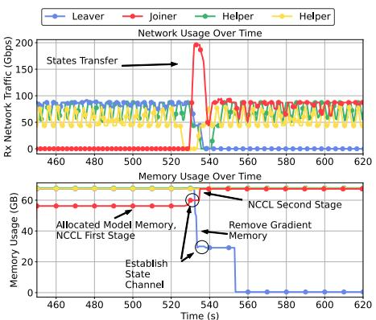  
Figure 19: Network traffic and memory usage timeline during Migration

A detailed analysis of CCL design choices is provided in Appendix A.

## 9 Related Work and Discussion

Economics of Standby. At massive scales, simply adding more GPUs yields marginal returns, whereas leveraging a standby machine can dramatically reduce downtime and provide far more cost-effective gains. For instance, at the 32K-GPU scale in Figure 2, using a single standby machine to shorten recovery from 4.45 minutes to 20 seconds delivers a benefit equivalent to adding roughly 2,400 GPUs (300 machines!) under ideal linear scaling. In other words, the acceleration provided by one or a few standby machines’ fast recovery is comparable to provisioning thousands of additional GPUs—making standby resources vastly more economical.

CCL Reconfiguration and Generality. MCCS [52] enables runtime changes to CCL topologies but lacks dynamic membership. HotSpa [15] hides reconfiguration overhead by reusing CCL groups, at the cost of added GPU-memory overhead. NCCLX [41] speeds up CCL initialization by reducing bootstrap costs and adaptively configuring channels. In contrast, TrainMover supports dynamic CCL membership without GPU memory overhead and moves all non-critical initialization off the critical setup path. This two-stage setup is general and applies to systems that frequently reconfigure communication patterns, including reconfiguration frameworks and inference autoschedulers [12, 14, 15, 19, 23, 26, 41, 44, 52, 56].

Scalability. TrainMover scales to very large clusters. Transitional downtime comes from only two steps: inter-connection establishment and state transfer. State transfer is one-toone—either from the leaver to the joiner during expected failures or from the joiner pulling from a checkpoint during unexpected failures—so its cost is effectively constant and the transfer size is bounded by the GPU size. Inter-connection establishment affects only the leaver’s neighbors, which update their channels to the joiner. Neither step requires global coordination, enabling TrainMover to scale efficiently even in large production clusters.

GPU-granularity Migration. TrainMover’s implementation supports GPU-granularity migration. The training framework can still benefit from minimal downtime and zero memory overhead. However, it forgoes the intra-machine optimizations introduced in §4.3 and pays extra storage overhead.

Heterogeneity and Warm-up Coverage. Heterogeneous or multimodal models may break symmetry assumptions or introduce non-static training paths. In practice, even if certain layer-specific or data-dependent execution paths are not fully covered, their impact is limited because the vast majority of initialization steps (e.g., data-loader setup, CUDA context creation, memory allocation, and runtime setup) remain shared across execution paths and are already covered by the warm-up procedure. These shared components dominate initialization time and are largely independent of specific layer behaviors. Extending TrainMover to fully support such dynamism remains future work.

Snapshot-based Warm Start. Recent advances such as CUDA checkpoint/restore (e.g., cuda-checkpoint [32] combined with CRIU [33]) provide an emerging mechanism for capturing and restoring GPU runtime state, offering a potential solution for warm-starting initialization—analogous to cold-start mitigation in serverless computing [5, 11]. These techniques enable preserving device memory and CUDA contexts, and are effective when the target role is known. Train-Mover targets a different goal: supporting a general standby that can recover any role without prior knowledge. In largescale training, different ranks (e.g., pipeline stages) may follow different execution paths. Supporting this with snapshots would require maintaining multiple role-specific snapshots or adapting them at runtime, increasing system complexity. In contrast, TrainMover uses record–replay to enable roleagnostic preparation without pre-defined artifacts.

## 10 Conclusion

We presented TrainMover, a resilient runtime that handles both expected and unexpected interruptions with minimal downtime and zero memory overhead. TrainMover leverages two-phase communication setup, communication-free sandboxed warmup, and general standby to enable rapid machine replacement. Our evaluation shows that TrainMover achieves a 20-second downtime at the 1K-GPU scale and wastes 55% fewer GPU-hours at 64K GPUs, enabling interruption-tolerant large-scale training.

## Acknowledgment

We would like to thank Ion Stoica for insightful discussions on the general standby design.

## References

[1] Balance of power: A full-stack approach to power and thermal fluctuations in ML infrastructure. https://cloud.google.com/blog/topics/ systems/mitigating-power-and-thermalfluctuations-in-ml-infrastructure, 2024.

[2] Maintaining large-scale AI capacity at Meta. https: //engineering.fb.com/2024/06/12/productionengineering/maintaining-large-scale-aicapacity-meta/, 2024.

[3] Megatron-LM Github Repository. https://github. com/NVIDIA/Megatron-LM, 2024.

[4] Amazon EC2 Capacity Blocks for ML pricing. https://aws.amazon.com/ec2/capacityblocks/ pricing/, 2025.

[5] Lixiang Ao, George Porter, and Geoffrey M. Voelker. Faasnap: Faas made fast using snapshot-based vms. In Proceedings of the Seventeenth European Conference on Computer Systems, EuroSys ’22, page 730–746, New York, NY, USA, 2022. Association for Computing Machinery.

[6] Tom B. Brown, Benjamin Mann, Nick Ryder, Melanie Subbiah, Jared Kaplan, Prafulla Dhariwal, Arvind Neelakantan, Pranav Shyam, Girish Sastry, Amanda Askell, Sandhini Agarwal, Ariel Herbert-Voss, Gretchen Krueger, Tom Henighan, Rewon Child, et al. Language models are few-shot learners. In Proceedings of the 34th International Conference on Neural Information Pro cessing Systems, NIPS’20, Red Hook, NY, USA, 2020. Curran Associates Inc.

[7] Tom B. Brown, Benjamin Mann, Nick Ryder, Melanie Subbiah, Jared Kaplan, Prafulla Dhariwal, Arvind Neelakantan, Pranav Shyam, Girish Sastry, Amanda Askell, Sandhini Agarwal, Ariel Herbert-Voss, Gretchen Krueger, Tom Henighan, Rewon Child, et al. Language models are few-shot learners, 2020.

[8] Aakanksha Chowdhery, Sharan Narang, Jacob Devlin, Maarten Bosma, Gaurav Mishra, Adam Roberts, Paul Barham, Hyung Won Chung, Charles Sutton, Se bastian Gehrmann, Parker Schuh, Kensen Shi, Sasha Tsvyashchenko, Joshua Maynez, Abhishek Rao, et al. Palm: Scaling language modeling with pathways, 2022.

[9] DeepSeek-AI, Aixin Liu, Bei Feng, Bing Xue, Bingx uan Wang, Bochao Wu, Chengda Lu, Chenggang Zhao, Chengqi Deng, Chenyu Zhang, Chong Ruan, Damai Dai, Daya Guo, Dejian Yang, Deli Chen, et al. Deepseek-v3 technical report, 2025.

[10] Jianbo Dong, Kun Qian, Pengcheng Zhang, Zhilong Zheng, Liang Chen, Fei Feng, Yikai Zhu, Gang Lu, Zhi hui Ren, Xue Li, et al. Evolution of aegis: Fault diagnosis for ai model training cloud service in production (experience track).

[11] Dong Du, Tianyi Yu, Yubin Xia, Binyu Zang, Guanglu Yan, Chenggang Qin, Qixuan Wu, and Haibo Chen. Catalyzer: Sub-millisecond startup for serverless computing with initialization-less booting. In Proceedings of the Twenty-Fifth International Conference on Architectural Support for Programming Languages and Operating Systems, ASPLOS ’20, page 467–481, New York, NY, USA, 2020. Association for Computing Machinery.

[12] Jiangfei Duan, Ziang Song, Xupeng Miao, Xiaoli Xi, Dahua Lin, Harry Xu, Minjia Zhang, and Zhihao Jia. Parcae: Proactive, Liveput-Optimized DNN training on preemptible instances. In 21st USENIX Symposium on Networked Systems Design and Implementation (NSDI 24), pages 1121–1139, Santa Clara, CA, April 2024. USENIX Association.

[13] Assaf Eisenman, Kiran Kumar Matam, Steven Ingram, Dheevatsa Mudigere, Raghuraman Krishnamoorthi, Krishnakumar Nair, Misha Smelyanskiy, and Murali Annavaram. Check-N-Run: a checkpointing system for training deep learning recommendation models. In 19th USENIX Symposium on Networked Systems Design and Implementation (NSDI 22), pages 929–943, Renton, WA, April 2022. USENIX Association.

[14] Swapnil Gandhi, Mark Zhao, Athinagoras Skiadopoulos, and Christos Kozyrakis. Recycle: Resilient training of large dnns using pipeline adaptation. In Proceedings of the ACM SIGOPS 30th Symposium on Operating Systems Principles, SOSP ’24, page 211–228, New York, NY, USA, 2024. Association for Computing Machinery.

[15] Hao Ge, Fangcheng Fu, Haoyang Li, Xuanyu Wang, Sheng Lin, Yujie Wang, Xiaonan Nie, Hailin Zhang, Xupeng Miao, and Bin Cui. Enabling parallelism hot switching for efficient training of large language models. In Proceedings of the ACM SIGOPS 30th Symposium on Operating Systems Principles, SOSP ’24, page 178–194, New York, NY, USA, 2024. Association for Computing Machinery.

[16] Richard L. Graham, Lion Levi, Devendar Burredy, Gil Bloch, Gilad Shainer, David Cho, George Elias, Daniel Klein, Joshua Ladd, Ophir Maor, Ami Marelli, Valentin Petrov, Evyatar Romlet, Yong Qin, and Ido Zemah. Scalable hierarchical aggregation and reduction protocol (sharp)tm streaming-aggregation hardware design and evaluation. In High Performance Computing: 35th International Conference, ISC High Performance 2020,

Frankfurt/Main, Germany, June 22–25, 2020, Proceedings, page 41–59, Berlin, Heidelberg, 2020. Springer-Verlag.

[17] Aaron Grattafiori, Abhimanyu Dubey, Abhinav Jauhri, Abhinav Pandey, Abhishek Kadian, Ahmad Al-Dahle, Aiesha Letman, Akhil Mathur, Alan Schelten, Alex Vaughan, Amy Yang, Angela Fan, Anirudh Goyal, Anthony Hartshorn, Aobo Yang, et al. The llama 3 herd of models, 2024.

[18] Tanmaey Gupta, Sanjeev Krishnan, Rituraj Kumar, Abhishek Vijeev, Bhargav Gulavani, Nipun Kwatra, Ramachandran Ramjee, and Muthian Sivathanu. Just-in time checkpointing: Low cost error recovery from deep learning training failures. In Proceedings of the Nineteenth European Conference on Computer Systems, EuroSys ’24, page 1110–1125, New York, NY, USA, 2024. Association for Computing Machinery.

[19] Insu Jang, Zhenning Yang, Zhen Zhang, Xin Jin, and Mosharaf Chowdhury. Oobleck: Resilient distributed training of large models using pipeline templates. In Proceedings of the 29th Symposium on Operating Systems Principles, SOSP ’23, page 382–395, New York, NY, USA, 2023. Association for Computing Machinery.

[20] Ziheng Jiang, Haibin Lin, Yinmin Zhong, Qi Huang, Yangrui Chen, Zhi Zhang, Yanghua Peng, Xiang Li, Cong Xie, Shibiao Nong, Yulu Jia, Sun He, Hongmin Chen, Zhihao Bai, Qi Hou, et al. MegaScale: Scaling large language model training to more than 10,000 GPUs. In 21st USENIX Symposium on Networked Systems Design and Implementation (NSDI 24), pages 745– 760, Santa Clara, CA, April 2024. USENIX Association.

[21] Apostolos Kokolis, Michael Kuchnik, John Hoffman, Adithya Kumar, Parth Malani, Faye Ma, Zachary DeVito, Shubho Sengupta, Kalyan Saladi, and Carole-Jean Wu. Revisiting Reliability in Large-Scale Machine Learning Research Clusters . In 2025 IEEE International Symposium on High Performance Computer Architecture (HPCA), pages 1259–1274, Los Alamitos, CA, USA, March 2025. IEEE Computer Society.

[22] Oleksii Kuchaiev, Jason Li, Huyen Nguyen, Oleksii Hrinchuk, Ryan Leary, Boris Ginsburg, Samuel Kriman, Stanislav Beliaev, Vitaly Lavrukhin, Jack Cook, Patrice Castonguay, Mariya Popova, Jocelyn Huang, and Jonathan M. Cohen. Nemo: a toolkit for building ai applications using neural modules, 2019.

[23] Abhishek Vijaya Kumar, Arjun Devraj, Darius Bunandar, and Rachee Singh. A case for server-scale photonic connectivity. In Proceedings of the 23rd ACM Workshop on Hot Topics in Networks, HotNets ’24, page 290–299,

New York, NY, USA, 2024. Association for Computing Machinery.

[24] Shenggui Li, Hongxin Liu, Zhengda Bian, Jiarui Fang, Haichen Huang, Yuliang Liu, Boxiang Wang, and Yang You. Colossal-ai: A unified deep learning system for large-scale parallel training. In Proceedings of the 52nd International Conference on Parallel Processing, ICPP ’23, page 766–775, New York, NY, USA, 2023. Associ ation for Computing Machinery.

[25] Shengwei Li, Zhiquan Lai, Yanqi Hao, Weijie Liu, Keshi Ge, Xiaoge Deng, Dongsheng Li, and Kai Lu. Automated tensor model parallelism with overlapped communication for efficient foundation model training, 2023.

[26] Zhuohan Li, Lianmin Zheng, Yinmin Zhong, Vincent Liu, Ying Sheng, Xin Jin, Yanping Huang, Zhifeng Chen, Hao Zhang, Joseph E. Gonzalez, and Ion Stoica. AlpaServe: Statistical multiplexing with model parallelism for deep learning serving. In 17th USENIX Symposium on Operating Systems Design and Implementation (OSDI 23), pages 663–679, Boston, MA, July 2023. USENIX Association.

[27] Jinkun Lin, Ziheng Jiang, Zuquan Song, Sida Zhao, Menghan Yu, Zhanghan Wang, Chenyuan Wang, Zuocheng Shi, Xiang Shi, Wei Jia, Zherui Liu, Shuguang Wang, Haibin Lin, Xin Liu, Aurojit Panda, et al. Under standing stragglers in large model training using what-if analysis. In Proceedings of the 19th USENIX Conference on Operating Systems Design and Implementation, OSDI ’25, USA, 2025. USENIX Association.

[28] Qingkai Meng, Hao Zheng, Zhenhui Zhang, ChonLam Lao, Chengyuan Huang, Baojia Li, Ziyuan Zhu, Hao Lu, Weizhen Dang, Zitong Lin, Weifeng Zhang, Lingfeng Liu, Yuanyuan Gong, Chunzhi He, Xiaoyuan Hu, et al. Astral: A datacenter infrastructure for large language model training at scale. In Proceedings of the ACM SIGCOMM 2025 Conference, SIGCOMM ’25, page 609–625, New York, NY, USA, 2025. Association for Computing Machinery.

[29] Stephen Merity, Caiming Xiong, James Bradbury, and Richard Socher. Pointer sentinel mixture models, 2016.

[30] Deepak Narayanan, Mohammad Shoeybi, Jared Casper, Patrick LeGresley, Mostofa Patwary, Vijay Korthikanti, Dmitri Vainbrand, Prethvi Kashinkunti, Julie Bernauer, Bryan Catanzaro, Amar Phanishayee, and Matei Zaharia. Efficient large-scale language model training on gpu clusters using megatron-lm. In Proceedings of the International Conference for High Performance Computing, Networking, Storage and Analysis, SC ’21, New York, NY, USA, 2021. Association for Computing Machinery.

[31] Maxim Naumov, Dheevatsa Mudigere, Hao-Jun Michael Shi, Jianyu Huang, Narayanan Sundaraman, Jongsoo Park, Xiaodong Wang, Udit Gupta, Carole-Jean Wu, Alisson G Azzolini, et al. Deep learning recommendation model for personalization and recommendation systems. arXiv preprint arXiv:1906.00091, 2019.

[32] NVIDIA Corporation. Cuda checkpoint and restore utility. https://github.com/NVIDIA/cudacheckpoint, 2025. Accessed: 2026-05.

[33] OpenVZ Project. Criu: Checkpoint/restore in userspace. https://criu.org/, 2012. Accessed: 2026-05.

[34] Kun Qian, Yongqing Xi, Jiamin Cao, Jiaqi Gao, Yichi Xu, Yu Guan, Binzhang Fu, Xuemei Shi, Fangbo Zhu, Rui Miao, Chao Wang, Peng Wang, Pengcheng Zhang, Xianlong Zeng, Eddie Ruan, et al. Alibaba hpn: A data center network for large language model training. In Proceedings of the ACM SIGCOMM 2024 Conference, ACM SIGCOMM ’24, page 691–706, New York, NY, USA, 2024. Association for Computing Machinery.

[35] Alec Radford, Karthik Narasimhan, Tim Salimans, Ilya Sutskever, et al. Improving language understanding by generative pre-training. 2018.

[36] Alec Radford, Jeff Wu, Rewon Child, David Luan, Dario Amodei, and Ilya Sutskever. Language models are unsupervised multitask learners. 2019.

[37] Samyam Rajbhandari, Jeff Rasley, Olatunji Ruwase, and Yuxiong He. Zero: memory optimizations toward training trillion parameter models. In Proceedings of the International Conference for High Performance Computing, Networking, Storage and Analysis, SC ’20. IEEE Press, 2020.

[38] Samyam Rajbhandari, Olatunji Ruwase, Jeff Rasley, Shaden Smith, and Yuxiong He. Zero-infinity: breaking the gpu memory wall for extreme scale deep learning. In Proceedings of the International Conference for High Performance Computing, Networking, Storage and Analysis, SC ’21, New York, NY, USA, 2021. Association for Computing Machinery.

[39] Jeff Rasley, Samyam Rajbhandari, Olatunji Ruwase, and Yuxiong He. Deepspeed: System optimizations enable training deep learning models with over 100 billion parameters. In Proceedings of the 26th ACM SIGKDD International Conference on Knowledge Discovery & Data Mining, KDD ’20, page 3505–3506, New York, NY, USA, 2020. Association for Computing Machinery.

[40] Mohammad Shoeybi, Mostofa Patwary, Raul Puri, Patrick LeGresley, Jared Casper, and Bryan Catanzaro.

Megatron-lm: Training multi-billion parameter language models using model parallelism. arXiv preprint arXiv:1909.08053, 2019.

[41] Min Si, Pavan Balaji, Yongzhou Chen, Ching-Hsiang Chu, Adi Gangidi, Saif Hasan, Subodh Iyengar, Dan Johnson, Bingzhe Liu, Regina Ren, Ashmitha Jeevaraj Shetty, Greg Steinbrecher, Yulun Wang, Bruce Wu, Xinfeng Xie, et al. Collective communication for 100k+ gpus, 2025.

[42] Gemini Team, Rohan Anil, Sebastian Borgeaud, Jean-Baptiste Alayrac, Jiahui Yu, Radu Soricut, Johan Schalkwyk, Andrew M. Dai, Anja Hauth, Katie Millican, David Silver, Melvin Johnson, Ioannis Antonoglou, Julian Schrittwieser, Amelia Glaese, et al. Gemini: A family of highly capable multimodal models, 2025.

[43] The Authors. TrainMover prototype source code. https://github.com/alibaba/TrainMover, 2026.

[44] John Thorpe, Pengzhan Zhao, Jonathan Eyolfson, Yifan Qiao, Zhihao Jia, Minjia Zhang, Ravi Netravali, and Guoqing Harry Xu. Bamboo: Making preemptible instances resilient for affordable training of large DNNs. In 20th USENIX Symposium on Networked Systems Design and Implementation (NSDI 23), pages 497–513, Boston, MA, April 2023. USENIX Association.

[45] Hugo Touvron, Thibaut Lavril, Gautier Izacard, Xavier Martinet, Marie-Anne Lachaux, Timothée Lacroix, Baptiste Rozière, Naman Goyal, Eric Hambro, Faisal Azhar, et al. Llama: Open and efficient foundation language models. arXiv preprint arXiv:2302.13971, 2023.

[46] Hugo Touvron, Louis Martin, Kevin Stone, Peter Albert, Amjad Almahairi, Yasmine Babaei, Nikolay Bashlykov, Soumya Batra, Prajjwal Bhargava, Shruti Bhosale, et al. Llama 2: Open foundation and fine-tuned chat models. arXiv preprint arXiv:2307.09288, 2023.

[47] Abhishek Verma, Luis Pedrosa, Madhukar Korupolu, David Oppenheimer, Eric Tune, and John Wilkes. Largescale cluster management at google with borg. In Proceedings of the Tenth European Conference on Computer Systems, EuroSys ’15, New York, NY, USA, 2015. Association for Computing Machinery.

[48] Borui Wan, Mingji Han, Yiyao Sheng, Yanghua Peng, Haibin Lin, Mofan Zhang, Zhichao Lai, Menghan Yu, Junda Zhang, Zuquan Song, Xin Liu, and Chuan Wu. Bytecheckpoint: a unified checkpointing system for large foundation model development. In Proceedings of the 22nd USENIX Symposium on Networked Systems Design and Implementation, NSDI ’25, USA, 2025. USENIX Association.

[49] Borui Wan, Gaohong Liu, Zuquan Song, Jun Wang, Yun Zhang, Guangming Sheng, Shuguang Wang, Houmin Wei, Chenyuan Wang, Weiqiang Lou, Xi Yang, Mofan Zhang, Kaihua Jiang, Cheng Ren, Xiaoyun Zhi, et al. Robust llm training infrastructure at bytedance. In Proceedings of the ACM SIGOPS 31st Symposium on Operating Systems Principles, SOSP ’25, page 186–203, New York, NY, USA, 2025. Association for Computing Machinery.

[50] Zhuang Wang, Zhen Jia, Shuai Zheng, Zhen Zhang, Xinwei Fu, T. S. Eugene Ng, and Yida Wang. Gemini: Fast failure recovery in distributed training with in-memory checkpoints. In Proceedings of the 29th Symposium on Operating Systems Principles, SOSP ’23, page 364–381, New York, NY, USA, 2023. Association for Computing Machinery.

[51] Tianyuan Wu, Wei Wang, Yinghao Yu, Siran Yang, Wenchao Wu, Qinkai Duan, Guodong Yang, Jiamang Wang, Lin Qu, and Liping Zhang. Falcon: Pinpointing and mitigating stragglers for large-scale hybrid-parallel training, 2024.

[52] Yongji Wu, Yechen Xu, Jingrong Chen, Zhaodong Wang, Ying Zhang, Matthew Lentz, and Danyang Zhuo. Mccs: A service-based approach to collective communication for multi-tenant cloud. In Proceedings of the ACM SIGCOMM 2024 Conference, ACM SIGCOMM ’24, page 679–690, New York, NY, USA, 2024. Association for Computing Machinery.

[53] Zhanghao Wu, Wei-Lin Chiang, Ziming Mao, Zongheng Yang, Eric Friedman, Scott Shenker, and Ion Stoica. Can’t be late: Optimizing spot instance savings under deadlines. In 21st USENIX Symposium on Networked Systems Design and Implementation (NSDI 24), pages 185–203, Santa Clara, CA, April 2024. USENIX Association.

[54] xAI. xai’s colossus supercomputer cluster. https://x. ai/colossus/, 2024. Accessed 2024.

[55] Susan Zhang, Stephen Roller, Naman Goyal, Mikel Artetxe, Moya Chen, Shuohui Chen, Christopher Dewan, Mona Diab, Xian Li, Xi Victoria Lin, Todor Mihaylov, Myle Ott, Sam Shleifer, Kurt Shuster, Daniel Simig, et al. Opt: Open pre-trained transformer language models, 2022.

[56] Xiaoyang Zhao, Zhe Zhang, and Chuan Wu. Adapcc: Making collective communication in distributed machine learning adaptive. In 2024 IEEE 44th International Conference on Distributed Computing Systems (ICDCS), pages 25–35, 2024.