USENIX

THE ADVANCED COMPUTING SYSTEMS ASSOCIATION

# SPADE: Signal-Aware DAG Scheduling and Dynamic Provisioning for Data Processing Clusters

Adam Lechowicz, University of Massachusetts Amherst; Rohan Shenoy, University of California, Berkeley; Noman Bashir, Massachusetts Institute of Technology;   
Mohammad Hajiesmaili, University of Massachusetts Amherst; Adam Wierman, California Institute of Technology; Christina Delimitrou, Massachusetts Institute of Technology

https://www.usenix.org/conference/osdi26/presentation/lechowicz

# This paper is included in the Proceedings of the 20th USENIX Symposium on Operating Systems Design and Implementation.

July 13–15, 2026 • Seattle, WA, USA

ISBN 978-1-939133-55-7

Open access to the Proceedings of the 20th USENIX Symposium on Operating Systems Design and Implementation is sponsored by

# SPADE: Signal-Aware DAG Scheduling and Dynamic Provisioning for Data Processing Clusters

Adam Lechowicz University of Massachusetts Amherst

Noman Bashir Massachusetts Institute of Technology

Adam Wierman California Institute of Technology

Rohan Shenoy University of California Berkeley

Mohammad Hajiesmaili University of Massachusetts Amherst

## Abstract

As AI-driven demand reshapes the data center landscape, external signals—such as energy cost, carbon intensity, power availability, and water usage—are increasingly dictating how much compute is available at any moment. These signals tend to vary over time, challenging traditional cluster schedulers, which implicitly assume stable resource supply, and calls for systems that continuously adapt to time-varying conditions. We focus on batch data-processing workloads, which are delay-tolerant but constitute a healthy fraction of total compute, making them a natural target for such flexibility. The directed acyclic graph (DAG) structure of these dataprocessing jobs makes decisions uniquely challenging, since delaying certain tasks in the DAG (e.g., bottleneck tasks) can stall entire pipelines. We introduce SPADE, a signal-aware scheduling and provisioning system that jointly considers workload DAG structure and external time-varying signals when deciding how (provisioning) and when (scheduling) to allocate resources. To underscore the importance of coupling these decisions, we evaluate SAP, an ablated system that preserves SPADE’s signal-aware provisioning but delegates scheduling to arbitrary signal-agnostic policies. Using a Spark prototype deployed on a 100-node Kubernetes cluster, we show that SPADE reduces a secondary objective (e.g., the cost associated with carbon intensity or energy price) by 32.9% while maintaining overall cluster throughput.

## 1 Introduction

Christina Delimitrou Massachusetts Institute of Technology

Data centers are expanding at an unprecedented pace. Global demand for computing infrastructure is projected to more than double this decade [63], with energy consumption expected to rise by over 165% [61]. Yet this growth is increasingly colliding with physical and environmental limits. Several recent high profile disputes, from reports of reduced water pressure and degraded water quality [67] to concerns about increased air pollution associated with a data center [14], highlight that cluster performance can now be constrained as much by external conditions as by internal hardware capacity. As these external signals begin to dictate how much compute capacity a data center can responsibly or affordably use at any moment, cluster management can no longer optimize solely for classic, internally visible objectives such as makespan or latency. Instead, schedulers must continuously adapt execution to conditions that originate outside the cluster itself.

Supporting adaptiveness to these external conditions represents a substantial departure from the status quo. Rather than treating the cluster as an isolated system with fixed resources, a signal-aware system must decide how to provision resources, not just when (via scheduling) to allocate them. This shift requires mechanisms that react to external signals and incorporate them directly into job scheduling decisions, allowing clusters to adjust resource usage in response to evolving environmental and operational constraints.

A key challenge is that these external signals are inherently time-varying. Carbon intensity evolves with the generation mix on the grid; water demand and cooling efficiency change with ambient temperature [44]; and grid health, often inferred from indicators such as locational marginal prices, varies as a function of power generation and demand [5]. To make response to these dynamics actionable, recent work such as Middlebox [48] proposes receiving (and acting on) a timevarying signal broadcast by entities like grid operators [16,18] that indicates when conditions are favorable or unfavorable. The high-level goal is to scale down resource usage during high-cost or high-impact periods and scale up when conditions improve.

Not all workloads are equally suited to respond to such signals. Interactive services are typically not temporally flexible enough to meaningfully shift their demand in response to an external signal. In contrast, non-interactive workloads centrally coordinated by the data center are natural candidates. Prior work has shown that regularly scheduled, highly parallelizable ML training jobs with predictable SLOs can be resized over time to track signals such as carbon intensity without significant performance loss [33]. This suggests a broader opportunity: can we systematically expand these signal-aware concepts to batch data-processing workloads?

We focus on batch data-processing jobs (e.g., Apache Spark), which constitute a substantial fraction of data center compute and are often delay-tolerant [1]. These workloads are expressed as directed acyclic graphs (DAGs) of precedenceconstrained tasks: the outputs of one stage become the inputs of another [75]. Stages exhibit heterogeneity, with some benefiting from parallelism while others do not [53]. Many production systems already expose these dependencies explicitly in DAG form [11, 36, 59]. To execute these jobs, DAG schedulers (and cluster schedulers broadly) look “internally” to understand dependencies and user requirements when deciding how to schedule and assign resources to the job. However, these schedulers are largely signal-agnostic: they optimize for makespan or throughput under an implicitly stable resource supply and do not respond to external signals.

In parallel, several lines of work have proposed signalaware provisioning schemes [33, 72] that scale resources up and down to leverage temporal signal variations. However, these do not consider “internal” characteristics such as DAG dependencies. In the setting of shared data-processing clusters, this separation is problematic: scaling resources down at the wrong time can stall critical paths and propagate delays, while scaling up prematurely can leave resources idle. As a result, a mechanism that only adapts resources in response to the signal while ignoring DAG structure and job interactions can degrade both performance and the secondary objective imposed by the external signal.

DAG structure introduces a three-dimensional trade-off between (i) classic performance metrics such as makespan, (ii) a secondary objective defined by the external signal (e.g., carbon emissions, energy cost, or power overloading), and (iii) how granularly the system engages with the DAG structure of jobs, ranging from black-box treatments that defer or scale jobs as a whole to granular task-level scheduling that exploits internal dependencies—see Fig. 1 for an illustration of these dynamics for an example job. This third axis is not a free parameter: a black-box treatment of signal-awareness is straightforward to bolt onto an existing scheduler but sacrifices performance on (i) and/or (ii), while granular, task-aware scheduling requires deeper integration and yields a more favorable trade-off on the first two axes.

This motivates a notion of signal-aware DAG execution: jointly coordinating task scheduling and resource provisioning as a function of both DAG structure and external timevarying signals. While prior signal-aware systems have identified a trade-off between performance and secondary objectives, they typically operate at coarse granularity (e.g., joblevel scaling with deadlines) and do not consider DAG structure. Conversely, systems that incorporate DAG structure (e.g., RL-based schedulers for Spark) do not consider external signals. Existing work that considers both DAGs and signals, such as Caribou [32], targets serverless workflows and ex ploits spatial variations across regions rather than temporal variation within a single data center. One might hope to merge these two threads simply by composing them, e.g., by layering a signal-aware provisioning policy on top of an off-the-shelf DAG scheduler, or vice versa. This decomposition is insufficient because the two decisions are tightly coupled: whether deferring a given task is beneficial depends jointly on the task’s position in the DAG and the current signal value, since deferring a bottleneck task stalls every downstream stage even when the signal momentarily favors doing so. We confirm this empirically in § 5 via our SAP ablation, which retains SPADE’s signal-aware provisioning but delegates scheduling to signalagnostic policies and consistently realizes a strictly worse trade-off between throughput and the secondary objective.

This paper: SPADE. In this work, we ask: How should a cluster scheduler execute delay-tolerant DAG-structured batch jobs in response to a time-varying external signal? We introduce SPADE (Scheduling and Provisioning for Adaptive DAG Execution), a signal-aware system that unifies scheduling and provisioning for DAG jobs. SPADE introduces the notion of relative importance, which allows the system to account for both DAG structure and the dynamics of a timevarying signal. This enables SPADE to make fine-grained tradeoffs—for example, continuing to prioritize certain tasks during periods when the signal suggests reducing resource consumption—so that clusters can respect secondary objectives without unnecessarily stalling critical paths. SPADE exposes a single signal-awareness parameter to control how much it is willing to sacrifice in throughput to align with a time-varying signal—rather than specifying a deadline for each job, an operator can specify how SPADE prioritizes objectives.

To underscore the importance of coupling these decisions, we also study an ablation, SAP (Signal-Aware Provisioning), which varies the available resources while delegating scheduling to a signal-agnostic policy. SAP captures the intuition of scaling down during high-signal periods and vice-versa, but because it ignores inter-task dependencies, its performance is strictly worse: the trade-off it achieves between makespan and the secondary objective is dominated by SPADE.

We implement SPADE and SAP as modules for Spark on Kubernetes and as extensions to a high-fidelity Spark simulator [53]. Our experiments consider real and synthetic workloads from Alibaba traces and TPC-H [2, 69]. We replay several signals, including carbon intensity traces from six regions [23] and available power traces from Google [60]. In our prototype, we implement SPADE and SAP on a 100-node Spark cluster. We report the impact of different signals on the makespan and cost of tested schemes, showing that SPADE’s configurable design and joint scheduling and provisioning enables a superior trade-off between the secondary objective and makespan. Our key contributions are as follows:

1. SPADE, a signal-aware DAG execution system that defines a notion of relative importance for tasks, allowing for finegrained decisions. SPADE jointly considers this importance with an external signal for each decision, achieving a superior trade-off between cost and performance.

2. We implement SPADE and SAP in a Spark-on-Kubernetes prototype and a realistic Spark simulator (see § 4).

3. A comprehensive evaluation against baselines and a stateof-the-art ML-based scheduler. We show that SPADE achieves significant improvements in secondary objectives (e.g., 32.9% lower carbon emissions and 51% better alignment with an available power signal) while maintaining competitive makespan.

## 2 Problem and Motivation

This section formalizes the signal-aware DAG scheduling problem and presents insights to contextualize our desiderata.

## 2.1 Signal-aware DAG scheduling problem

Each job (i.e., a data processing workflow) is represented as a directed acyclic graph (DAG) J = V ,E , where each node in V is one of n tasks, and each edge in E encodes precedence constraints between tasks, e.g., for tasks j, j→ V , an edge j j→ indicates that j→ cannot start until after j has completed. A cluster includes K 1 executors (or machines). More than one job can simultaneously run on a cluster—e.g., given a set of current jobs J , the scheduler assigns tasks to executors over time while respecting precedence and capacity constraints. We index continuous time by t 0.

The traditional goal is to minimize the makespan of a sched ule, which is the total time to complete all jobs. In this work, we additionally consider the goal of signal-awareness: given a time-varying signal described by s(t) : t 0, a signal-aware system’s objective is to minimize a combination of typical metrics (i.e., makespan, average job completion time) and the total cost (due to the signal) incurred during execution.

We generally assume that future values of the time-varying signal s(t) are unknown to the system, giving the problem an online nature. We follow prior work [7, 51] and place one minimal assumption on the signal, namely that the signal values are bounded by constants smin ↗ s(t) ↗ smax that are known in advance. In practice, these can be defined based on historical data or short-term forecasts of the signal of interest over a given time horizon. We assume without loss of generality that the system attempts to minimize the signal cost, i.e., so s is a “good” signal, and vice versa.

We note a subtle distinction between signal-awareness (treating the signal as a secondary objective, as in SPADE) and signal-adherence (treating the signal as a hard constraint, e.g., instantaneous power available to the cluster). The two are complementary: when power availability is genuinely constrained due to curtailment or contention, a separate enforcement layer is typically responsible for arbitrating capacity across workloads (e.g., [16]). SPADE’s role is to schedule within whatever capacity is currently available, and its ideas apply whether the cluster voluntarily uses fewer resources during high-signal periods or is involuntarily curtailed by such an enforcement layer; in both cases, SPADE optimizes makespan with the knowledge that resources may vary over time.

## 2.2 Guiding intuition and preliminaries

Modern data-processing frameworks (e.g., Spark) express jobs as DAGs of precedence-constrained stages and, by default, schedule them using straightforward strategies such as first-in, first-out (FIFO) or fair-share [25]. To exploit DAG structure, recent heuristic and reinforcement learning (RL)- based schedulers [30, 31, 37, 43, 53, 74, 77] rank ready tasks by a score or probability distribution—a representation that SPADE leverages directly.

Compared to a classic (i.e., signal-agnostic) scheduler, we have two primary metrics of interest: stretch factor, which describes the increase in makespan due to signal-aware actions, and cost savings, which describes the improvement on the secondary objective due to changes in the schedule. We give formal definitions of both quantities in Appendix B. Between these two metrics, there is an inherent trade-off between e.g., executing a task during the current signal and waiting for potential better signals at the expense of increasing makespan.

This trade-off inherits challenges that are familiar in the online decision-making literature, specifically problems known as online search—in these problems, the player must purchase an asset at a price that varies with time [22, 51]. These problems have natural applications in, e.g., financial markets, but they have also been used to model systems problems such as energy cost minimization for data centers [41]. A key challenge in these problems is the inherent uncertainty of future signal values (i.e., prices). The common method to handle this uncertainty is a technique known as threshold-based design [6,40,72], which defines a threshold function that is used to guide decision-making at each time step.

In the context of our two key metrics, we translate the tradeoff between executing and waiting into three basic conditions that a signal-aware system should satisfy, outlined below. In Fig. 1, we give an illustration of this “desired behavior” for SPADE, FIFO, and optimal schedules.

i) If the fluctuation of the time-varying signal is low (e.g., smin and smax are close), makespan should be similar to a signal-agnostic schedule (i.e., stretch factor close to 1).

ii) If the fluctuation is high (e.g., smin and smax are not close), the stretch factor should be finite, i.e., the scheduler does not wait indefinitely to complete the job.

In existing work on online search and signal-aware schedulers, schemes often satisfy condition ii) by imposing a dead line on each job, forcing it to execute when the deadline is near [7, 28, 33]. When applicable, per-job deadlines can be a more user-friendly interface than tuning a trade-off parameter, but prior signal-aware deadline-based schemes generally consider only one job at a time. Extending this interface to a multi-tenant batch cluster is non-trivial: when multiple jobs with similar deadlines arrive simultaneously and resources are limited, all schedules (signal-aware or otherwise) may be unable to honor every deadline. To address this challenge, our schemes (see § 3) are designed to guarantee a minimum amount of progress on jobs as long as the queue is not empty.

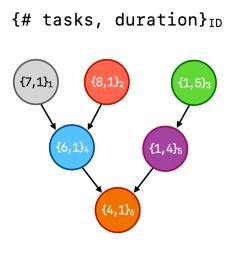

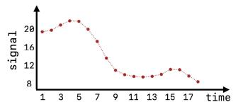

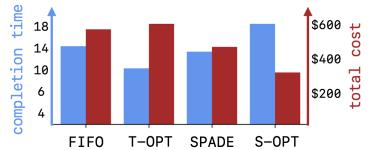

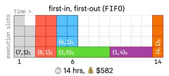

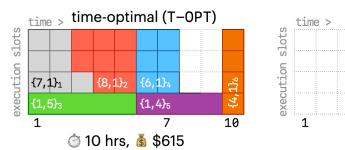

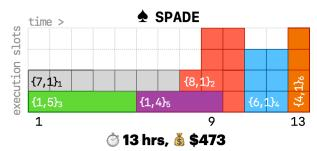

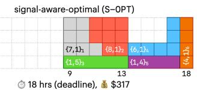  
Figure 1: Four schedules for a motivating DAG and 18-hour signal trace (left hand side). When the signal is high, computations are more costly. Compared to an agnostic FIFO scheduler, the time-optimal scheme (T-OPT) prioritizes the green and purple stages of the DAG to reduce overall makespan. A signal-aware-optimal scheme (S-OPT) with a deadline to finish the DAG within 18 hours reduces cost by 51.2%, at the expense of increasing time by 28.5% compared to FIFO. By prioritizing green and purple stages when signal is high, SPADE reduces cost by 23.1% and still completes 7% faster than FIFO in this scenario.

The unique precedence-constrained nature of the DAG scheduling problem introduces one additional challenge to consider in our design. In particular, a signal-aware scheduler that does not consider the structure of task graphs may make actions that block important bottleneck tasks from processing, resulting in an outsized negative impact on makespan. This gives a natural third condition:

iii) When the fluctuation is high (i.e., smin and smax are not close) and the system is in a high-signal period, a sched uler should carefully consider the structure of a job’s DAG, prioritizing bottleneck tasks to use the limited resources.

This condition captures the idea that signal-aware DAG execution must consider the trade-off between executing a task now (unlocking tasks that depend on it sooner), and waiting to execute the task until the signal (may) improve. To approach this trade-off, we combine the notion of threshold-based design, which allows for a rigorous characterization of the tradeoff between e.g., executing a given task and waiting for better signals, with the notion of score- or probability-based task prioritization seen in state-of-the-art DAG schedulers. In the following section, we present SPADE, our main system that satisfies conditions i - iii) and captures the desired behavior of signal-aware execution for DAG workloads.

## 3 Design

In this section, we present SPADE (Scheduling and Provisioning for Adaptive DAG Execution), our main system. We also define an ablation study, SAP (Signal-Aware Provisioning) to demonstrate the benefits of the joint scheduling and provisioning decisions made by SPADE.

## 3.1 SPADE

From the discussion in § 2.2, we seek an interpretable and configurable system that satisfies conditions i - iii). To this end, we introduce SPADE (Scheduling and Provisioning for Adaptive DAG Execution). SPADE’s key idea is a metric of relative importance (Def. 3.2) implicitly embedded in a score distribution or probability distribution over tasks SPADE uses this metric, combined with a configurable signal-aware threshold function, to make fine-grained, per-task scheduling decisions, as illustrated in Fig. 2.

SPADE design. We first define a notion of score or probability distributions over tasks that SPADE uses to interpret DAG structure.

Definition 3.1 (Score or Probability Distribution). At each scheduling event,1 a score or probability distribution is described by D(t) := pv,t : v At , where At denotes the set of tasks that are ready to be executed at time t.

Several state-of-the-art DAG schedulers use a variety of heuristic or learning-based techniques to compute score or probability distributions that satisfy Def. 3.1, including Graphene [30], Decima [53], and others [31, 43, 74, 77]. Two notes on this abstraction. (i) These score distributions are typically computed over all ready-to-execute tasks across all active jobs (not per-job) so D(t) already encodes cross-job prioritization. (ii) How the scores are computed varies (Decima learns them via reinforcement learning; Graphene combines critical-path length, packing efficiency, and priority), but SPADE treats the scorer as a black box with one working assumption: high-scoring tasks correspond to bottleneck tasks in the makespan sense. This assumption is inherited: if the scorer fails to identify bottlenecks, it would already perform poorly on makespan, even without any signal-awareness layered on top. Recall from § 2.2 (condition iii)) that bottleneck tasks (those with a large score or probability in the above distribution) should be scheduled even during high-signal periods to preserve makespan. To this end, we formally define a notion of relative importance that compares the score/probability assigned to a single task v against other tasks in A .

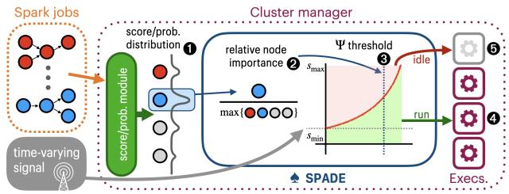  
Figure 2: SPADE takes a probability (or score) distribution over tasks as input. Given such a distribution ✁, SPADE computes a relative importance score ✂ that is used to determine which tasks should run based on the current signal ✃—e.g., bottleneck tasks run regardless of the signal ✄, while less important ones are deferred to later (low-signal) periods ☎.

Definition 3.2 (Relative Importance). Given a time t  0 and task v ↑ At , the relative importance rv,t is defined as:

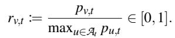

If a task’s relative importance is closer to 1, the task is relatively more important, and a value closer to 0 implies the opposite. Note that if At = 1 (i.e., only one task can be scheduled), the importance of that task is always 1.

Recall that the goal is to optimize a combination of performance objectives (e.g., makespan, JCT) and a secondary objective that is defined by a time-varying signal. Using the metric of relative importance, we define a scheduling filter using a threshold function !∀ that considers the current signal and the importance of a task. ∀ [0,1] is a user-specified signalawareness parameter that controls how “strictly” this function follows the time-varying signal: ∀ = 0 recovers signalagnostic scheduling, while ∀ = 1 is maximally signal-aware.

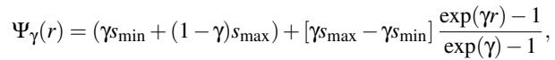

!∀ is an exponential function of the relative importance of a task r—this draws on literature from online search [22,78] and captures a trade-off between executing a given task now at the current signal, and the risk that better signals exist in the future. The choice of an exponential inherits a risk-aversion intuition from online search problems such as one-way trading [22]: in these problems, a player who must purchase N units before a deadline at time-varying prices optimally accepts the first unit at a relatively loose threshold (the risk of paying a worstcase price later for the bulk of remaining units dominates) and tightens the threshold exponentially as more units are bought. The optimal reservation-price curve in this class of problems is provably exponential. In our setting, the analogy is as follows: a task with low relative importance (a “first unit”) should be deferred only when the signal is unusually bad, since deferring it risks stalling downstream tasks; a task with high relative importance (a “last unit”) is admitted at almost any signal because the cost of stalling its dependents outweighs paying a high signal cost. 2 We formalize the usage of this function in Algorithm 1. Note that if the input D is a score distribution, we first use a softmax operation to sample from the corresponding probability distribution over tasks (line 5).

Algorithm 1 SPADE (Scheduling and Provisioning for Adap  
tive DAG Execution)   
1: input: user-specified parameter ∀, threshold function !∀,   
score/probability distribution D(t)   
2: define: invocation occurs when the signal s(t) changes or when   
a scheduling event happens   
3: while cluster active at time t 0 do   
4: if invocation at time t then   
5: Sample v A from score/prob. distribution D(t)   
6: Compute relative importance rv,t = maxu At pu,t pv,t   
7: if !∀(rv,t ) s(t) or no executors currently busy then   
8: Send task v to an available machine at time t   
9: else   
10: Idle until next invocation

SPADE’s signal-awareness filter accomplishes all three of the motivation points defined in § 2.2. It schedules (or defers) tasks based on the current signal s(t), with the effect of reducing execution during high-signal periods. Furthermore, the likelihood of a task being scheduled irrespective of the current signal is proportional to its importance in its DAG. Note that !∀(1) = smax, which means tasks with high relative importance are always scheduled. The choice to sample from D(t) (line 5) rather than taking the argmax is essential: the argmax always has relative importance 1, and !∀(1) = smax, so such a policy would never defer tasks. Sampling lets the algorithm consider lower-scoring tasks proportionally to their probabil ity—when the signal is high, the threshold filter defers these candidates; when the signal is low, they are admitted, opportunistically using available capacity. The bottleneck task is never starved (if sampled, its relative importance of 1 guarantees admission), while low-importance tasks are selectively held back during costly periods. While deferring a task has a negative impact on an individual job’s completion time, prioritizing bottleneck tasks across all active jobs allows SPADE to manage the system’s overall makespan. To ensure progress on jobs, note that tasks are also scheduled if the entire cluster would otherwise become idle (line 6).

Inherited properties from the underlying scorer. SPADE does not directly enforce fairness, priority classes, or similar cross-job properties; instead, it inherits these from whichever technique produced the input score/probability distribution D(t). The relative-importance transform in Def. 3.2 is a perevent normalization by maxu A pu,t, so it preserves the ordering induced by the scorer: two tasks assigned identical scores are treated identically by SPADE. If the scorer is fairness-aware (e.g., Graphene assigns scores across all active jobs to prevent starvation), SPADE preserves that property: rather than greedily picking the top-scoring task, line 5 of Algorithm 1 samples from D(t), which introduces additional randomness across jobs and intuitively maintains or improves the underlying fairness profile. The same observation extends to weighted fairness or priority classes encoded in D(t).

In Fig. 3, we illustrate the intuitions behind SPADE’s signal-awareness filter using two sample job DAGs. In Appendix B.1, we prove that for any signal s and given K executors, the stretch factor of SPADE is upper bounded by 1+ exp.defs.(∀,s)·K , where exp.defs.(∀, s) [0, 1] is the ex-2 1/K pected fraction of tasks deferred under signal s with parameter ∀. Two endpoints anchor the intuition: exp.defs.(0,s) = 0 for any s, so ∀ = 0 recovers the underlying scheduler’s makespan, and exp.defs.(∀,s)  1 always, so the bound remains finite even at ∀ = 1. A closed form for general ∀, s is not available, but exp.defs. grows monotonically with ∀—matching the experimental trends in § 5.

Complementary operator-facing knobs. Beyond ∀, SPADE exposes two more design features that allow an operator to control the trade-off between makespan and signal-awareness. i) Minimum throughput. Line 7 of Algorithm 1 already requires at least one executor to remain active regardless of s(t), guaranteeing continuous progress on the queue. This constraint generalizes naturally: an operator can mandate that some fraction # (0,1] of the cluster always runs, regardless of the signal value. A larger # keeps more of the cluster productive during high-signal periods (favoring makespan at the cost of signal-responsiveness), while a smaller # lets SPADE defer more aggressively. ii) Target deadlines. SPADE can also accommodate a relaxed deadline interface: each job is submitted with a target deadline, and if it has not completed by that time, it enters a priority phase during which its tasks are scheduled regardless of the current signal—combining the interpretability of a deadline with SPADE’s signal-aware execution on the path to that deadline. We focus on ∀ in our experiments, but these knobs are complementary and can be composed with it.

## 3.2 Ablation design

While SPADE captures all three intuition points from § 2.2 by jointly provisioning the cluster and scheduling tasks in jobs, it is classically more natural to consider the scheduling and provisioning tasks as separate ones. For this reason, we also consider an ablation study of SPADE that isolates these tasks and quantifies the benefits of considering them jointly.

First, note that a “scheduling-only” ablation of SPADE removes its ability to idle executors—instead, tasks are scheduled in descending order of relative importance. This is similar to running the schedulers that computed the original score or probability distribution (i.e., Graphene [30], Decima [53]), and these are baselines in our experiments (see § 5).

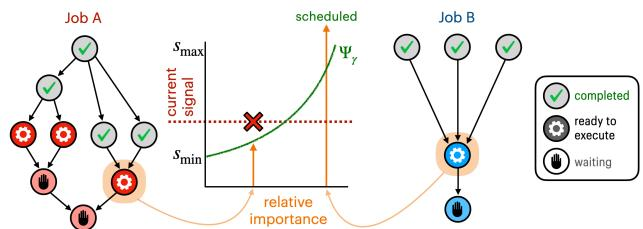  
Figure 3: Illustrating the signal-aware filter of SPADE. Jobs A and B are actual DAGs drawn from the TPC-H and Alibaba workloads used in our experiments [2, 69]. Highlighted tasks illustrate two possible outcomes. In A, the sampled task has low relative importance, so it is deferred. In contrast, B’s sampled task is a bottleneck with high relative importance: even during high signal, it is scheduled to avoid increasing makespan.

It is also intuitive to consider a “provisioning-only” ablation that extracts the key resource provisioning ideas implicitly performed by SPADE, while delegating scheduling to another policy. To capture this, we study SAP (Signal-Aware Provisioning), which applies a time-varying resource quota to the cluster and coexists with any scheduler (see § 5 for implementations with existing baselines). We detail it below. SAP design. Given a cluster with K executors, the possible resource quotas are given by 0,1,. ..,K . SAP defines a discrete threshold set analogous to !∀ in SPADE —in this case, the set is defined such that the value of the time-varying signal directly maps to a certain amount of resources that can be used at that time step. Analogous to the signal-awareness parameter ∀ in SPADE, we define a user-specified minimum quota B 1, . . . , K that always allows the cluster to use up to B executors, ensuring continuous progress on jobs.

Given possible quotas R = B, . . . K , the thresholds are a set of values ∃i i R , and a quota is set based on how many values are above the current signal—see Appendix B.2 for a formal definition of these.3 Given signal s(t), the resource quota is r(t)  arg maxi R ∃i : ∃i s(t). For ease of implementation, this quota is enforced without preemption; when executors become available, new task assignments are only allowed if r(t) is greater than the number of busy executors. In Fig. 4, we illustrate the operation of SAP as an adaptive provisioning module. In Appendix B.2, we give worst-case analytical bounds on the stretch factor for SAP. The B parameter (minimum resource quota) ensures that the stretch factor is finite and decreasing in B, while greater potential cost savings are unlocked as the worst-case stretch factor increases.

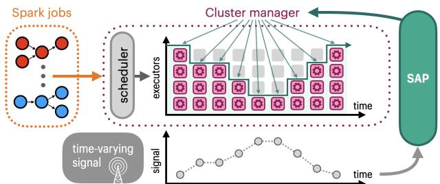  
Figure 4: SAP (Signal-Aware Provisioning) only specifies the resource amount (e.g., no. of executors) that can be used based on the external signal, interfacing with a cluster manager. SAP can be implemented without changing an existing scheduler.

## 4 Implementation

We have implemented proof-of-concepts of SPADE and SAP for Apache Spark on Kubernetes—see § 4.1 for details. We also conduct large-scale experiments in a realistic Spark simulator—see § 4.2 for how we extend a simulation environment [53] to evaluate our signal-aware systems.

## 4.1 Spark and Kubernetes integration

Resource provisioning & stage scheduling. In Spark deployed on a Kubernetes cluster, each application is submitted to the API server [8] that creates a “driver” running in a pod. We use Spark’s dynamic allocation feature, which enables the driver to create executor pods dynamically as needed by the application—these executors connect with the driver and execute application code. Kubernetes handles the scheduling of (driver and executor) pods for each application, while the Spark driver selects stages to execute within an application.

We implemented SPADE as a pluggable scheduling service that coordinates between Spark and Kubernetes. The service includes inference code for a state-of-the-art DAG sched uler Decima [53] that provides probability distributions for SPADE’s relative importance calculation. The time-varying signal is obtained from an external API, and context about the cluster and job states is collected from Kubernetes and Spark. To facilitate this, we made the following modifications: First, we implemented a Kubernetes scheduler plugin [17] that communicates with SPADE to determine which application should receive available resources. This uses APIs exposed by the default kube-scheduler and requires building/configuring a custom scheduler pod. We restrict the scope of our plugin to a dedicated namespace for Spark apps. Next, we made changes to Spark [76] so that each application communicates with SPADE when choosing the next stage to execute—Spark provides scripts to build pod Docker images [55] from source.

To implement the SAP ablation study, we wrote a Python daemon to retrieve the current signal from an API and adjust the resources available to Spark by setting a resource quota [3] within a dedicated namespace—our implementation adjusts

CPU and memory quotas to correspond with a maximum number of executors. When the quota is lowered, existing pods are not preempted, but new pods are not scheduled until usage falls below the quota.

Setting level of parallelism. In a Spark DAG, each stage (i.e., task) includes multiple operations that may be parallelizable over multiple executors. Setting a parallelism limit (number of executors working on a stage) is a key component of Spark resource management (e.g., see [53, Section 5.2]). More executors are not necessarily better: assigning many executors to a stage that does not benefit from it will block other jobs in the queue. For signal-awareness, we enable SPADE and SAP to set new parallelism limits for the current job each time a stage is scheduled, and particularly to set lower limits when signal is high (e.g., see i) and ii), § 2.2).

In our implementation of SPADE, if a stage is deferred, it idles (see Alg. 1) the newly freed executors that prompted a scheduling event. Otherwise, the stage’s parallelism limit is set to P→ := P min exp(∀(smin s(t))), (1 ∀) , where P is the limit chosen by the scheduler that generated the input score or probability distribution for SPADE (in our experiments, either Decima or Graphene). This mirrors the exponential trade-off in SPADE’s design—e.g., when the current signal s(t) is close to smin, the limit is set to (1 ∀)P , and as s(t) grows, the limit decreases exponentially to 1.

For the SAP ablation, if the signal-agnostic scheduler specifies a parallelism limit P, SAP first attempts to schedule a stage with P→ = P r(t)/K , where r(t)/K is the ratio of the resource quota vs. the total number of executors. If the number of available executors is less than P→, the current stage takes all of the remaining available executors.

## 4.2 Spark simulator environment

Mao et al. [53] developed a faithful simulator of Spark’s standalone mode (i.e., where Spark is the cluster manager), achieving an error (in run times) of within 5% [53, Fig. 18]. This simulator captures all first-order effects of Spark execution (e.g., delays in executor movement, parallelism overheads)—it has since seen wide use in Spark contexts [4, 27, 35, 46, 54, 64]. We implement SPADE, the SAP ablation study, and additional baselines through the following modifications:

↭ Accounting: Each job’s cost due to the time-varying signal is measured ex post facto to avoid impacting simulator fidelity. After an experiment completes, existing metrics (e.g., executor lifetimes) and a signal trace are used to tally the cost.

↭ SPADE: We implement SPADE, which uses score or probability distributions over tasks computed by either Graphene or Decima.

↭ SAP: We implement SAP as a wrapper over each signalagnostic scheduler in the simulator—see § 5.1.

↭ Baselines: We implement GreenHadoop [28] and Graphene [30] as additional baselines for our experiments. See Appendix A.1 for implementation details.

With these modifications, the simulator allows us to quickly test many scenarios with a high degree of accuracy.

## 5 Evaluation

We evaluate our proposed system in a prototype cluster and a realistic Spark simulator, using workloads from TPC-H benchmarks [69] and Alibaba production DAG traces [2]. We conduct our main experiments using carbon intensity as the time-varying signal, as it is readily available for several regions with different characteristics and exhibits the intra-day variability that motivates systems adapting to time-varying conditions [23]. We also conduct simulator experiments using an available power signal obtained from Google cluster traces [73]. In doing so, we answer the following questions:

1. How do SPADE and SAP navigate the trade-off between signal-awareness and makespan?

2. How do SPADE and SAP adapt to changes in signal characteristics (e.g., variation) and workload characteristics?

Table 1: Statistics for carbon signal traces, including the duration, granularity, min., max., mean, and coefficient of variation (higher value implies more variation).  
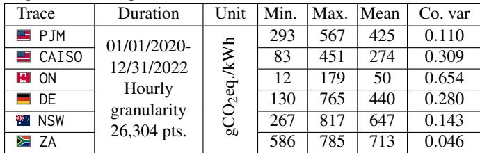

## 5.1 Experimental setup

Signal traces. For carbon intensity, we use historical traces from six regions—each trace provides hourly carbon intensity data in grams of CO2 equivalent per kilowatt-hour (gCO2eq./kWh) [23]. For these traces, the secondary objective is to reduce the carbon footprint of running jobs. We define the carbon footprint as follows: If the per-time-step energy usage of the Spark cluster at full utilization is given by a constant E, the footprint at time t is given by s(t) E u(t), where u(t) is the cluster’s current executor utilization.

In Table 1 and Fig. 15, we give snapshots of each region, showing how grid characteristics impact the signal. Larger coefficients of variation (ratio of the standard deviation to the mean) correspond to greater renewable penetration—for instance, a large fraction of CAISO’s capacity is solar PV, while the capacity in ZA is predominantly coal. To better observe the behavior of our signal-aware systems, we follow prior work [28] and scale time and workloads in experiments that use carbon traces such that 1 minute of real time corresponds to 1 hour of simulated time—since the carbon signal is reported hourly, this approximates a scenario where jobs work with large amounts of data and run for several hours, as is becoming common in e.g., data curation for LLMs [9, 10, 12, 50, 70]. We provide an experiment to characterize the effect of this scaling in Appendix A.1.4.

For the available power signal, we use Google cluster traces [73]—these traces provide power utilization as a percentage at 5-minute intervals in 8 production clusters for May 2019—see Table 5 for statistics of each trace. We use the average power utilization across a single cluster (i.e., “cell”) as the time-varying signal, and the secondary objective is to minimize the power overloading due to running jobs. We define power overloading as follows: Each cluster has a minimum and a maximum avg. power utilization, denoted by smin and smax. Then the overloading is given by s(t) + (smax ↘ smin) ⇑ u(t) ↘ smax. Note that the overloading is 0 when our Spark cluster is at full utilization but the broader cluster utilization is minimal (i.e., s(t) = smin).

Workload traces. For workloads, we use TPC-H benchmarks [69] and real DAGs from production Alibaba traces [2]. We construct workloads such that the inter-arrival times follow a Poisson distribution while specific jobs are randomly picked from the respective traces. In the main body, we consider an average inter-arrival time of 30 real-time seconds (30 minutes in the carbon traces), with additional experiments measuring the impact of arrival rate in Appendix A.2.

The TPC-H queries we experiment with operate on synthetic data with scales of 2 GB, 10 GB, and 50 GB—these correspond to average real durations of 180 seconds, 386 sec onds, and 1,261 seconds when given a single executor. In our prototype experiments, we also construct workloads based on DAG information from the Alibaba trace [2]. These DAGs exhibit a realistic power law distribution (many DAGs of short duration, few DAGs of long duration), they have 66 nodes on average, and an average total duration (on one executor) of 7,989 seconds. We uniformly scale these Alibaba DAG durations by 1/60 to match our carbon scale—this yields jobs that take 2.2 real-time minutes to complete on average.

In the simulator, each experiment is run over a full trace; each carbon trace is three years of hourly data, while each power trace is one month of 5-minute data. In the prototype, each experiment is run for several trials, where each starts at a uniformly randomly chosen time in a particular carbon trace. Across all experiments, the upper and lower bounds of smax and smin are set to the maximum and minimum signal values over a lookahead forecast window of 48 time slots.

Baselines. We compare against the following baselines:

↭ Default Spark/Kubernetes behavior (default): The default behavior of Spark on Kubernetes—Spark uses first in, first out (FIFO) to choose stages within a job, while the Kubernetes scheduler mediates between pods of each job during execution [26]. In the simulator’s Spark standalone mode, this baseline implements only the FIFO scheduling.

↭ Decima: An RL scheduler for Spark that is optimized for job completion time [53]. We use the simulator’s training environment to train Decima for 20,000 epochs. When SPADE uses node probability distributions from Decima’s policy network to interpret DAG structure, we denote it as SPADE-Decima.

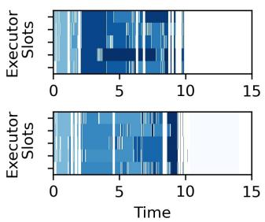  
(a) Decima

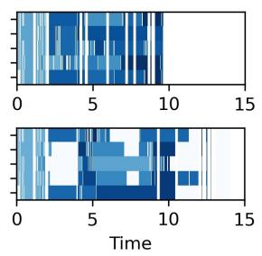  
(b) SPADE-Decima

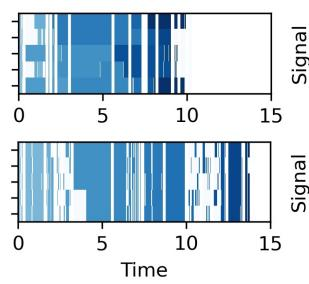  
(c) SAP-FIFO

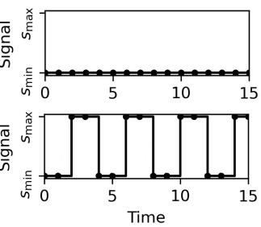  
(d) Time-varying signal  
Figure 5: Visualizing executor usage over time for three schedules, (a) Decima, (b) SPADE-Decima, and (c) SAP-FIFO in a small simulator with 5 executors and 20 TPC-H jobs arriving over time. The top plot illustrates results when the signal is flat during the given time horizon (see (d)), while the bottom plot illustrates results for a signal with high fluctuations. In executor plots (a-c), jobs are unique shades of blue, while “idle” periods are indicated by the white background.

↭ Weighted Fair: A heuristic that assigns executors proportionally to each job’s workload, with tuned weights to improve performance on the simulated workloads [53].

↭ Graphene: A DAG scheduler optimized for throughput and heterogeneous resource demands [30]. When SPADE uses node score distributions from Graphene’s scoring module to interpret DAG structure, we denote it as SPADE-Graphene.

↭ GreenHadoop: A MapReduce framework proposed to leverage green energy by matching workloads with the availability of solar [28]. We evaluate this baseline as the closest related work in the carbon experiments. This framework predates Spark, so we adapt its key ideas for DAG scheduling in the simulator—see Appendix A.1 for adaptation details.

Metrics. We use four metrics to evaluate our approaches.

↭ Carbon Reduction: When carbon intensity is used as a signal, we report the carbon footprint for each scheduling policy as a percentage decrease relative to the default baseline unless stated otherwise. The values are in the range of [-100%, %), with negative values indicating a reduction and positive values indicating an increase relative to the baseline.

↭ Power Overload (POL) Reduction: When available power is used as a signal, we report the power overloading for each scheduling policy as a percentage decrease relative to the default baseline unless stated otherwise. Its values lie in the same range as carbon reduction.

↭ Job Completion Time (JCT): We report statistics of job completion time across all the jobs in each experimental run. We report JCT as a fraction of the average JCT for the carbonagnostic default baseline unless stated otherwise. The values can be in the (0, %) range, with below 1 indicating a reduction in JCT and above 1 indicating an increase in JCT.

↭ Makespan: We report the total time to complete all the jobs in a given experiment as a fraction of the makespan for the default. Its values lie in the same range as JCT. While JCT focuses on individual jobs, makespan represents the system’s overall throughput and efficiency.

## 5.2 Signal-aware systems in action

Before moving to our main results, we demonstrate signalaware behavior in Fig. 5, which visualizes the schedules generated by Decima, SPADE-Decima, and SAP-FIFO for two toy example signal traces. In the first (top) case of Fig. 5, the signal is consistently low (i.e., smin), so Decima, SPADE-Decima, and SAP-FIFO all focus on minimizing makespan. Note that FIFO executes jobs in arrival order (light to dark shading) while both Decima and SPADE-Decima pack individual tasks to optimize throughput. The synchronized idle periods visible across all three schedules correspond to intervals when no jobs are in the queue, since jobs arrive over time (with a 15- second inter-arrival in real-time) rather than all at t = 0. In the second (bottom) case of Fig. 5, the signal fluctuates between smax and s every two time steps. SPADE-Decima makes fine-grained scheduling decisions to maximize throughput during low-signal periods while idling executors during highsignal periods. This is in contrast to SAP-FIFO, which applies a uniform resource quota across the cluster without consideration of bottlenecks or the remaining processing time of active tasks. As a result, it does not reduce utilization as much during high-signal periods, and still increases overall makespan more than SPADE-Decima.

## 5.3 Prototype experiments

Our prototype is deployed on an OpenStack cluster running Kubernetes v1.31 and Spark v3.5.3 (both modified per § 4) in Chameleon Cloud [38]. Our testbed consists of 51 m1.xlarge virtual machines, each with 8 VCPUs and 16GB of RAM. One VM is designated as the control plane node, while the remaining 50 are workers, each hosting two executor pods. Our Spark configuration allocates 4 VCPUs and 7GB of RAM to each of the 100 executors.4 To avoid a known issue with Spark’s dynamic allocation feature that can cause it to hang on Kubernetes [26], we configure an upper limit of 25 executors that can be allocated to any single job. In the prototype, we implement a small API that replays given signal traces to test our signal-aware systems, and we implement default and Decima as the baselines. Unless stated otherwise, the results are averaged over batch sizes of 25, 50, and 100 jobs. Furthermore, the results for each experimental configuration are averaged over 10 trials.

Table 2: Summary of prototype results averaged over all six carbon traces. Each metric is normalized with respect to the Spark / Kubernetes default. SPADE-Decima and SAP-Default are configured to be moderately signal-aware.  
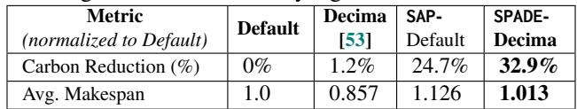

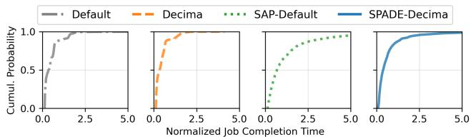  
Figure 6: Prototype JCT results aggregated over all six carbon traces, normalized by the average JCT for Default.

Results. Table 2 presents the top-line results for our prototype experiments. SPADE-Decima and SAP-Default configured to be moderately signal-aware (∀ is set to 0.5 for SPADE and B is set to 20 for SAP) achieve average carbon reductions of 32.9% and 24.7% compared to the default baseline, respectively. Compared to Decima, SPADE-Decima reduces carbon by 32.1%. Fig. 6 plots cumulative distribution functions (CDFs) of the JCT for all four techniques, normalized by the average JCT of default. We find that signal-awareness increases JCT mainly in the tail—for instance, SPADE’s median JCT is 7.8% and 11.8% worse with respect to default and Decima, respectively, whereas 95th percentile JCT is 45.4% and 59.6% worse than default and Decima. SAP sees even larger increases, increasing 95th percentile JCT by 223% and 254.4% compared to default and Decima, respectively. For signal-awareness, this behavior is expected—for instance, a job that arrives while the signal is high may wait a long time before receiving service. Thus, at a global level, we also consider makespan as a proxy for the cluster’s overall efficiency and throughput. SPADE increases average makespan by only 12.4% compared to Decima and 1.3% compared to the default.

Trade-offs between carbon and makespan. We test several parameter settings for SPADE and SAP to configure their signalawareness in the DE grid region with batches of 50 TPC-H or Alibaba jobs. Fig. 7 plots the carbon-makespan trade-off for five settings of SPADE relative to the Spark/Kubernetes default. Increasing the signal-awareness of SPADE improves savings on the secondary objective at the expense of longer makespan, with a pronounced effect for values of ∀ approaching 1. Conversely, Fig. 8 plots the same carbon-makespan trade-off for five settings of SAP; SAP sacrifices more in makespan (relative to SPADE) for the same amount of carbon savings (i.e., for the same amount of signal-awareness).

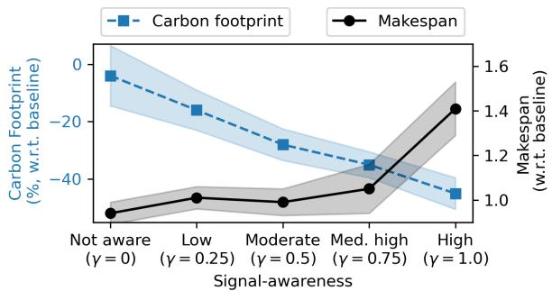

Figure 7: Relative carbon reduction and makespans (w.r.t. the Spark/Kubernetes default) for SPADE-Decima in the prototype, given different degrees of signal-awareness (∀). Shading denotes standard deviation across 10 random trials.  
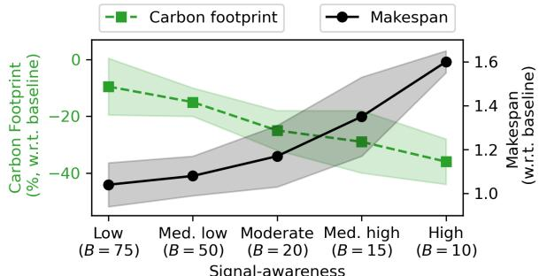  
Figure 8: Relative carbon reduction and makespans (w.r.t. the Spark/Kubernetes default) for SAP-Default in the prototype, given different degrees of signal-awareness (B). Shading denotes standard deviation across 10 random trials.

Effects of carbon trace characteristics. Next, we analyze the effect of grid characteristics on our signal-aware systems using subsets of each signal trace (via 30 trials with 25, 50, and 100 jobs). Fig. 9 plots the average carbon reduction and makespan of SPADE, SAP, and Decima. Decima is signal-agnostic and shows a minimal carbon reduction that stays relatively constant across all traces. SPADE and SAP incorporate the external signal into decisions, and we observe a positive relationship between the variability of a trace and the resulting carbon reduction. For example, in ZA where the sig-

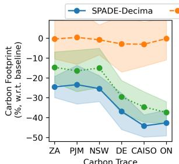

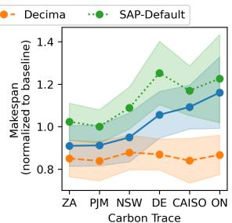  
Figure 9: Carbon reduction (left) and makespan (right) for SPADE, SAP, and Decima in six carbon traces. Shading denotes standard deviation across 30 trials.

Table 3: Summary of results for simulator experiments averaged over all tested carbon & power traces. Each metric is normalized with respect to the default Spark FIFO behavior. SPADE and SAP are configured to be moderately carbon-aware, and makespan measures the total flow time for batches of jobs arriving continuously.  
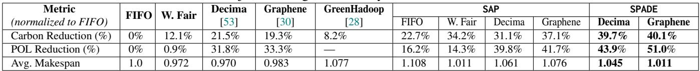

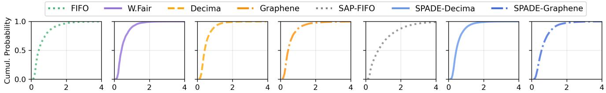  
Normalized Job Completion Time

Figure 10: JCT results aggregated over all tested traces, normalized by the average JCT of FIFO.

nal is relatively constant, high-carbon periods do not prompt SPADE to defer tasks since the potential future reductions are insignificant. In contrast, high-signal periods in the CAISO grid correspond to nighttime scenarios on the grid, where daytime solar bolsters future reductions. These interactions are also illustrated through makespan—carbon traces with more variable energy mixes drive increases in makespan in exchange for more carbon reduction, since SPADE and SAP wait for future low-signal periods.

## 5.4 Simulator experiments

To conduct large-scale experiments over full traces, we evaluate SPADE in the Spark simulator using TPC-H workloads, comparing it against Weighted Fair, GreenHadoop, and Graphene baselines, in addition to the Decima and default baselines from prototype experiments and SAP ablation study. We refer to the default baseline as FIFO in simulation-based experiments for accurate representation.

Simulator behavior. To quantify differences between our prototype and the simulator (meant to model Spark’s standalone mode of operation), we illustrate behavior for an identical batch of 50 TPC-H jobs in Appendix A.1.3. A notable difference between the prototype and the simulator is the relative performance of the built-in baseline (FIFO in the simulator, Spark/Kubernetes default in the prototype). In short, the simulator’s FIFO scheduler over-assigns executors to individual jobs, blocking others from entering service (thus increasing JCT)—this also increases its relative cost on the secondary objective compared to the default behavior in our prototype.

Table 3 presents the top-line results for simulator experiments using carbon intensity and power traces.

Carbon trace results. We observe that SPADE achieves significant reductions in carbon emissions compared to the baselines—configured to be moderately carbon-aware, SPADE-Decima achieves an average reduction of 23.1% compared to Decima, and a reduction of 39.7% compared to FIFO.

SPADE-Graphene achieves reductions of 25.7% compared to Graphene, and a reduction of 40.1% compared to FIFO. Finally, our ablation study SAP achieves an average carbon reduction of 22.7% when implemented on top of FIFO, 25.1% with Weighted Fair, 14.5% with Decima, and 22.1% with Graphene, falling behind SPADE in the latter two cases.

Power trace results. Across experiments that use the available power signal, SPADE significantly reduces the power overloading metric, which corresponds to a better alignment with the signal—configured to be moderately signal-aware, SPADE-Decima achieves an average improvement of 17.7% compared to Decima, and 43.9% compared to FIFO. SPADE-Graphene achieves reductions of 26.5% compared to Graphene, and a reduction of 51% compared to FIFO. Finally, our ablation study SAP improves overloading by 16.2% when implemented on top of (and compared to) FIFO, 13.5% with Weighted Fair, 11.7% with Decima, and 12.6% with Graphene.

Makespan & performance. For 25, 50, and 100 jobs, SPADE increases average makespan by 7.7% (Decima) and 2.9% (Graphene), which are only 4.5% and 1.1% degradations compared to FIFO, respectively. For the SAP ablation study, makespan increases by 10.8% when implemented on top of (and compared to) FIFO, 4.0% on top of Weighted Fair, 9.3% on top of Decima, and 9.5% on top of Graphene.

Fig. 10 plots cumulative distribution functions (CDFs) of the JCT for all tested techniques, normalized by the average JCT of FIFO. Similar to the prototype, we find that signal-awareness increases tail JCT: SPADE’s median JCT degrades by 6.7% (Decima) and 2.3% (Graphene), while 95th percentile JCT degrades by 42.7% (Decima) and 35.8% (Graphene). For visual clarity, CDFs for the remaining tested policies (GreenHadoop, SAP-Partition, SAP-Decima, and SAP-Graphene) are deferred to Appendix A.2.4; their qualitative behavior matches the trade-offs summarized in Table 3.

Trade-offs between signal-awareness and makespan. In the results summary, we observe improvements in the secondary objective(s) in exchange for degradation in performance. Since SPADE and SAP can be configured to be more or less signal-aware, we explore this trade-off in the DE carbon trace with batches of 50 jobs. We vary hyperparameters ∀ (SPADE) and B (SAP) to measure the impact on both objectives. Fig. 11 and Fig. 12 plot the carbon-makespan trade-off for SPADE-Decima and SAP-FIFO, respectively, compared against FIFO. The qualitative trends match the prototype (Fig. 7, Fig. 8), with SAP again sacrificing more makespan than SPADE for the same level of signal-awareness.

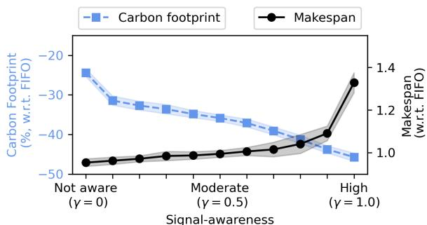

Figure 11: Relative carbon reduction and makespans (with respect to FIFO) for SPADE-Decima in the simulator, given different degrees of signal-awareness (∀). Shading denotes standard deviation across DE carbon trace.  
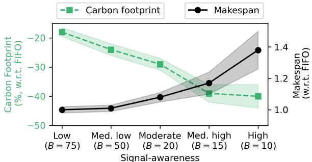  
Figure 12: Relative carbon reduction and makespans (with respect to FIFO) for SAP-FIFO in the simulator, given different degrees of signal-awareness (B). Shading denotes standard deviation across DE carbon trace.

A natural follow-up question is whether sweeping ∀ alone traces the full Pareto frontier of the multi-objective problem. The NP-hardness of DAG scheduling prevents a clean analytical answer, but the experiments give an empirical one: across our parameter sweep, SPADE’s carbon-makespan outcomes lie on a frontier that Pareto-dominates the baselines and the SAP ablation (e.g., see Fig. 13), and the ∀ 0 endpoint recovers the underlying signal-agnostic scheduler. Sweeping ∀ from 0 to 1 thus smoothly interpolates between the makespanoptimal and signal-aware regimes along the dominant frontier we observe, though it does not necessarily coincide with the (unknown) true Pareto frontier of the problem.

Advantages of joint scheduling & provisioning. By comparing SPADE against the SAP ablation, we can quantify the advantages of the key DAG scheduling ideas of SPADE, namely relative importance (see § 3.1). We examine this in detail using the DE grid region with batches of 50 jobs. We configure

SPADE and SAP with ten parameter settings for varying degrees of signal-awareness. Fig. 13 plots the result of this experiment, where each dot denotes the outcome of one trial—results for Decima are in the left-hand plot, while results for Graphene are in the right-hand plot. We fit a cubic polynomial to the outcomes of all four methods to illustrate the key trend: SPADE exhibits a strictly better trade-off between carbon and makespan. For trials where carbon savings lie between 35% and 45%, SPADE increases makespan by an average of 7.9% (Decima) and 1.2% (Graphene), while SAP increases it by an average of 42.7% (Decima) and 17.7% (Graphene). Conversely, for trials where makespan is increased by between 0% and 10%, SPADE achieves average carbon savings of 35.6% (Decima) and 52.4% (Graphene), while SAP achieves an average savings of only 20.1% (Decima) and 24.8% (Graphene).

Carbon intensity trace characteristics. The top-line results in Table 3 average over all carbon traces—as in the prototype, Fig. 14 plots the carbon reduction and makespan for each of SAP-FIFO, SPADE-Decima, and Decima across each of the six carbon traces. Decima’s carbon reduction relative to the baseline is higher relative to that observed in the prototype—this is due to differences between Spark’s standalone FIFO scheduler and the Spark/Kubernetes behavior of our prototype (see Appendix A.1.3). Similarly, SPADE’s reductions increase alongside Decima’s, and SAP-FIFO in the simulator does slightly worse on the secondary objective compared to SAP in the prototype.

When does SPADE help most? SPADE’s advantage over structure-agnostic alternatives (e.g., the SAP ablation wrapping FIFO or Weighted Fair) is largest when the workload contains DAGs with non-trivial structure—jobs whose critical path runs through a subset of highly-connected tasks, or jobs with long chains of dependent stages. Both TPC-H and the Alibaba trace contribute such DAGs (Jobs A and B in Fig. 3 are representative), and SPADE’s relative-importance metric is what lets it preserve makespan by protecting bottleneck tasks during high-signal periods. Conversely, when the workload is dominated by “flat” DAGs whose ready tasks are essentially all available at once (or by effectively single-stage jobs), the notion of a bottleneck task is less informative and SPADE’s advantage over a SAP-style wrapper narrows: structure-agnostic provisioning suffices because there is little structure to exploit.

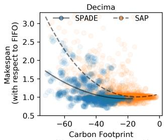  
(%, with respect to FIFO)

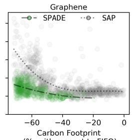  
(%, with respect to FIFO)  
Figure 13: Relative carbon reduction vs. makespan for SPADE and SAP in simulator experiments, given varying parameters ∀ ↑ [0.1, 1.0] and B ↑ {1, 5, 10, . . . , 85} that correspond to degrees of signal-awareness. Each dot represents an individual trial, and lines represent a cubic polynomial of best fit.

Table 4: Summary and comparison with related work.  
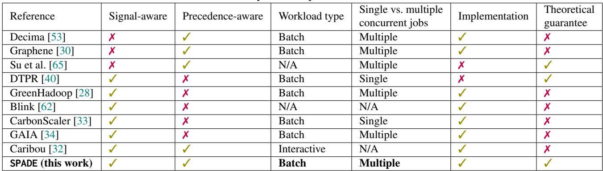

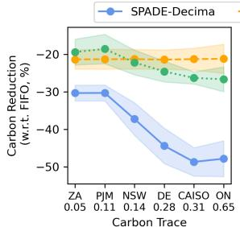

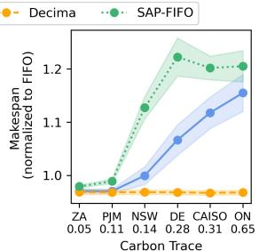  
Figure 14: Carbon reduction (left) and makespan increase (right) for SAP, SPADE, and Decima (relative to FIFO) in six carbon traces. Shading denotes standard deviation across full experiment.

## 5.5 Takeaways

Through evaluation in a prototype cluster and realistic simulator, we show that SPADE is effective, reducing carbon by 32.9% and reducing power overloading by up to 51% in exchange for modest increases (< 5%) in makespan. SAP, our ablation study, shows that the joint scheduling and provi sioning decisions of SPADE are necessary to obtain a favorable trade-off between signal-awareness and performance (see Fig. 13). Intuitively, the behavior of all our signal-aware techniques depends on the characteristics of a particular signal trace—our experiments demonstrate that SPADE works for a variety of signals and exhibits high configurability to meet any desired priority between signal-awareness and perfor mance. An orthogonal route to reducing a secondary objective while maintaining the same performance is to expand cluster capacity (e.g., add additional executors) and ramp up more during low-signal periods—prior work has shown that this can hold performance roughly constant while still reducing a secondary objective (such as carbon footprint), at the cost of extra hardware capex (and, in the carbon case, extra embodied emissions) [1, 33, 34, 48]. SPADE accommodates this regime naturally: when additional executors are available during lowsignal periods, its filter !∀ admits more tasks as s(t) falls, so the system opportunistically uses this extra capacity without any changes to the system.

## 6 Related Work

To contextualize the related work, Table 4 summarizes guiding questions that we ask: 1) does the work consider scheduling and/or provisioning in response to an external time-varying signal, 2) does it consider DAG structure (stages and precedence constraints), 3) are batch or interactive workloads considered (if applicable), 4) does the proposed scheme process a single job in isolation or multiple workloads concurrently, 5) has the scheme been implemented in a prototype, and 6) does the work provide any theoretical guarantees about, e.g., the approximation quality of the proposed scheme? SPADE is unique in answering all of the above yes/no questions in the positive for the setting of multiple batch DAG workloads.

For the performance objective of makespan minimization, the scheduling of precedence-constrained tasks (i.e., tasks with DAG structure) has been extensively studied—classic results show that solving the problem optimally is NP-hard even in simple forms [42], so most studies have focused on heuristics and approximations [13, 15, 19–21, 29, 39, 45, 52, 58, 66]. As DAG-structured workloads have gained salience in applications, systems such as Graphene [30], Decima [53], and others [31, 43, 47, 74, 77] have been proposed to optimize the throughput of DAG workflows and/or Spark jobs.

A few works have considered DAG scheduling with other objectives beyond makespan [49, 56, 57, 65, 68]. These balance reducing makespan alongside one other metric, such as energy usage. For example, Su et al. [65] theoretically studied energy-aware list scheduling for precedence constrained tasks, giving bounds for a combined objective of energy consumption and performance. However, these works typically focus on a secondary objective such as energy or cost, which do not capture the time-varying dynamics of a signal-aware objective such as carbon emissions or grid integration.

In recent years, several studies have proposed new theoretical techniques and schemes for signal-awareness and/or carbon-awareness in different workloads. For example, CarbonScaler [33] is a provisioning scheme for batch workloads that exploits temporal differences in carbon intensity signals, using more parallelism when the signal is low. In the context of this work, CarbonScaler can be interpreted as similar to our ablation study SAP, although the original paper considered a single job at a time and assigns deadlines to each job, rather than offering a tunable trade-off between objectives.

CarbonScaler is one of several studies that explicitly consider external signals such as carbon [34, 40] or power [62], but do not consider the internal DAG structure of workloads. Closer to this work’s focus on data processing workloads, GreenHadoop [28] is a MapReduce framework that considers an external signal (available renewable energy) when scheduling, although it does not consider DAG structure because it predates Spark. As outlined in § 2, considering these constraints is important for signal-aware execution of DAG workloads—ignoring this structure yields suboptimal performance on the secondary objective, performance objectives, or both.

One recent system, Caribou [32], considers both carbon signals and the DAG structure of serverless workflows. Caribou optimizes the geospatial carbon efficiency of serverless workflows by deploying them across data centers to exploit spatial variations in carbon (e.g., when one region’s signal is high, another’s may be low). However, since it focuses on interactive workloads, it does not exploit temporal signal variations—in other words, deploying it in one data center would not reduce carbon. Furthermore, applying Caribou to Spark would require “moving” a Spark cluster (including data being processed) across data centers. These differences in the “meaning” of job DAGs change the problem significantly: with SPADE, we do not attempt to exploit spatial differences in the time-varying signal—rather, SPADE attempts to anticipate and respond to uncertain signal values in one location.

## 7 Conclusion

We introduce SPADE, a signal-aware execution system for data processing workloads designed to address emerging scenarios in data center operations that balance between performance and a secondary objective defined by an external signal, such as power availability, carbon emissions, or water use. Through experiments in a prototype and simulator, we show that SPADE’s joint consideration of scheduling tasks and provisioning resources is necessary to achieve a favorable trade-off between these objectives—as a result, our experiments demonstrate that SPADE can improve performance on a secondary objective of interest by 32.9% without prohibitive performance degradation.

## Acknowledgments

This material is based upon work supported by the U.S. Department of Energy, Office of Science, Office of Advanced Scientific Computing Research, Department of Energy Computational Science Graduate Fellowship under Award Number DE-SC0024386, and National Science Foundation grants CAREER-2045641, CNS-2325956, and CNS-2533814.

## Disclaimers

This report was prepared as an account of work sponsored by an agency of the U.S. Government. Neither the U.S. Government nor any agency thereof, nor any of their employees, makes any warranty, express or implied, or assumes any legal liability or responsibility for the accuracy, completeness, or usefulness of any information, apparatus, product, or process disclosed, or represents that its use would not infringe privately owned rights. References to any specific commercial product, process, or service by trade name, trademark, manufacturer, or otherwise do not constitute or imply endorsement, recommendation, or favoring by the U.S. Government or any agency thereof. The views and opinions of authors expressed herein do not state or reflect those of the U.S. Government or any agency thereof.

## References

[1] Bilge Acun, Benjamin Lee, Fiodar Kazhamiaka, Kiwan Maeng, Udit Gupta, Manoj Chakkaravarthy, David Brooks, and Carole-Jean Wu. Carbon Explorer: A Holistic Framework for Designing Carbon Aware Datacenters. In Proc. of the 28th ACM International Conference on Architectural Support for Programming Languages and Operating Systems, Volume 2, ASPLOS 2023, page 118–132, 2023.

[2] Alibaba. Cluster data collected from production clusters in Alibaba for cluster management research, 2018.

[3] The Kubernetes Authors. Resource Quotas – Kubernetes Documentation . https://kubernetes.io/ docs/concepts/policy/resource-quotas/, 2025.

[4] Vivek Bengre, M Reza HoseinyFarahabady, Mohammad Pivezhandi, Albert Y Zomaya, and Ali Jannesari. A learning-based scheduler for high volume processing in data warehouse using graph neural networks. In International Conference on Parallel and Distributed Computing: Applications and Technologies, pages 175– 186. Springer, 2021.

[5] Siddharth Bhela, Vassilis Kekatos, and Sriharsha Veeramachaneni. Enhancing Observability in Distribution Grids using Smart Meter Data, 2016. arXiv:1612.06669.

[6] Roozbeh Bostandoost, Walid A. Hanafy, Adam Lechowicz, Noman Bashir, Prashant Shenoy, and Mohammad Hajiesmaili. Data-driven Algorithm Selection for Carbon-Aware Scheduling. In Proceedings of the 3rd Workshop on Sustainable Computer Systems, HotCarbon ’24, July 2024.

[7] Roozbeh Bostandoost, Adam Lechowicz, Walid A. Hanafy, Noman Bashir, Prashant Shenoy, and Mohammad Hajiesmaili. LACS: Learning-Augmented Algorithms for Carbon-Aware Resource Scaling with Uncertain Demand. In Proceedings of the 15th ACM International Conference on Future and Sustainable Energy Systems, e-Energy ’24, page 27–45, New York, NY, USA, 2024. Association for Computing Machinery.

[8] Eric Brewer. Kubernetes and the Path to Cloud Native. Santa Clara, CA, July 2015. USENIX Association.

[9] Tom B. Brown, Benjamin Mann, Nick Ryder, Melanie Subbiah, Jared Kaplan, Prafulla Dhariwal, Arvind Neelakantan, Pranav Shyam, Girish Sastry, Amanda Askell, Sandhini Agarwal, Ariel Herbert-Voss, Gretchen Krueger, Tom Henighan, Rewon Child, Aditya Ramesh, Daniel M. Ziegler, Jeffrey Wu, Clemens Winter, Christopher Hesse, Mark Chen, Eric Sigler, Mateusz Litwin, Scott Gray, Benjamin Chess, Jack Clark, Christopher

Berner, Sam McCandlish, Alec Radford, Ilya Sutskever, and Dario Amodei. Language Models are Few-Shot Learners, 2020.

[10] Maximilian Böther, Dan Graur, Xiaozhe Yao, and Ana Klimovic. Decluttering the data mess in LLM training. Austin, 2024. HotInfra 2024.

[11] Craig Chambers, Ashish Raniwala, Frances Perry, Stephen Adams, Robert R. Henry, Robert Bradshaw, and Nathan Weizenbaum. FlumeJava: Easy, Efficient Data-Parallel Pipelines. In Proceedings of the 2010 ACM SIGPLAN Conference on Programming Language Design and Implementation (PLDI ’10), PLDI ’10, pages 363–375, New York, NY, USA, 2010. ACM.

[12] Daoyuan Chen, Yilun Huang, Zhijian Ma, Hesen Chen, Xuchen Pan, Ce Ge, Dawei Gao, Yuexiang Xie, Zhaoyang Liu, Jinyang Gao, Yaliang Li, Bolin Ding, and Jingren Zhou. Data-Juicer: A One-Stop Data Processing System for Large Language Models. In Companion of the 2024 International Conference on Management of Data, SIGMOD/PODS ’24, page 120–134, 2024.

[13] Runwei Cheng, Mitsuo Gen, and Yasuhiro Tsujimura. A tutorial survey of job-shop scheduling problems using genetic algorithms—I. Representation. Computers & Industrial Engineering, 30(4), 1996.

[14] Andrew Chow R. ‘We Are the Last of the Forgotten: Inside the Memphis Community Battling Elon Musk’s xAI. TIME, August 2025. Accessed: 2025-12-10.

[15] Fabián A Chudak and David B Shmoys. Approximation Algorithms for Precedence-Constrained Scheduling Problems on Parallel Machines that Run at Different Speeds. Journal of Algorithms, 30(2):323–343, Feb 1999.

[16] Philip Colangelo, Ayse K Coskun, Jack Megrue, Ciaran Roberts, Shayan Sengupta, Varun Sivaram, Ethan Tiao, Aroon Vijaykar, Chris Williams, Daniel C Wilson, Brandon Records, Zack MacFarland, Daniel Dreiling, Nathan Morey, Anuja Ratnayake, and Baskar Vairamohan. AI data centres as grid-interactive assets. Nature Energy, December 2025.

[17] Kubernetes Community. Scheduler Plugins, 2021.

[18] Data Center Dynamics. Grid demand will require active participation from data centers, June 2024.

[19] Sami Davies, Janardhan Kulkarni, Thomas Rothvoss, Jakub Tarnawski, and Yihao Zhang. Scheduling with Communication Delays via LP Hierarchies and Clustering, 2020. arXiv:2004.09682.

[20] Sami Davies, Janardhan Kulkarni, Thomas Rothvoss, Jakub Tarnawski, and Yihao Zhang. Scheduling with Communication Delays via LP Hierarchies and Clustering II: Weighted Completion Times on Related Machines, page 2958–2977. Society for Industrial and Applied Mathematics, January 2021.

[21] Lawrence Davis. Job shop scheduling with genetic algorithms. In Proceedings of the first International Conference on Genetic Algorithms and their Applications, pages 136–140, 2014.

[22] Ran El-Yaniv, Amos Fiat, Richard M. Karp, and G. Turpin. Optimal Search and One-Way Trading Online Algorithms. Algorithmica, 30(1):101–139, May 2001.

[23] Electricity Maps. Electricity Map. https://www. electricitymap.org/map, 2025.

[24] The Apache Software Foundation. Configuration – Spark Documentation. https://spark.apache.org/ docs/3.5.3/configuration.html, 2024.

[25] The Apache Software Foundation. Job Scheduling – Spark Documentation. https://spark.apache.org/ docs/3.5.3/job-scheduling.html, 2024.

[26] The Apache Software Foundation. Running Spark on Kubernetes – Spark Documentation. https://spark.apache.org/docs/3.5.3/ running-on-kubernetes.html, 2024.

[27] Arkadiy Gertsman. A faster reinforcement learning approach to efficient job scheduling in Apache Spark. Master’s thesis, University of Illinois at Urbana-Champaign, 2023.

[28] Íñigo Goiri, Kien Le, Thu D. Nguyen, Jordi Guitart, Jordi Torres, and Ricardo Bianchini. GreenHadoop: Leveraging Green Energy in Data-Processing Frameworks. In Proceedings of the 7th ACM European Conference on Computer Systems, EuroSys ’12, page 57–70, 2012.

[29] R. L. Graham. Bounds for certain multiprocessing anomalies. The Bell System Technical Journal, 45(9):1563–1581, 1966.

[30] Robert Grandl, Srikanth Kandula, Sriram Rao, Aditya Akella, and Janardhan Kulkarni. Graphene: packing and dependency-aware scheduling for data-parallel clusters. In Proceedings of the 12th USENIX Conference on Operating Systems Design and Implementation, OSDI’16, pages 81–97, USA, 2016. USENIX Association.

[31] Nathan Grinsztajn, Olivier Beaumont, Emmanuel Jeannot, and Philippe Preux. Geometric deep reinforcement learning for dynamic DAG scheduling. In 2020 IEEE Symposium Series on Computational Intelligence (SSCI), page 258–265. IEEE, December 2020.

[32] Viktor Urban Gsteiger, Pin Hong (Daniel) Long, Yiran (Jerry) Sun, Parshan Javanrood, and Mohammad Shahrad. Caribou: Fine-Grained Geospatial Shifting of Serverless Applications for Sustainability. In Proceedings of the ACM SIGOPS 30th Symposium on Operating Systems Principles, SOSP ’24, page 403–420, 2024.

[33] Walid A. Hanafy, Qianlin Liang, Noman Bashir, David Irwin, and Prashant Shenoy. Carbonscaler: Leveraging cloud workload elasticity for optimizing carbonefficiency. Proc. of the ACM on Measurement and Analysis of Computing Systems, 7(3), December 2023.

[34] Walid A. Hanafy, Qianlin Liang, Noman Bashir, Abel Souza, David Irwin, and Prashant Shenoy. Going Green for Less Green: Optimizing the Cost of Reducing Cloud Carbon Emissions. In Proceedings of the 29th ACM International Conference on Architectural Support for Programming Languages and Operating Systems, Volume 3, ASPLOS ’24, page 479–496, 2024.

[35] Zhibo Hu, Chen Wang, Helen Paik, Yanfeng Shu, and Liming Zhu. Learning Interpretable Scheduling Algorithms for Data Processing Clusters, 2024. arXiv:2405.19131.

[36] Michael Isard, Mihai Budiu, Yuan Yu, Andrew Birrell, and Dennis Fetterly. Dryad: Distributed Data-Parallel Programs from Sequential Building Blocks. In Proceedings of the 2nd ACM SIGOPS/EuroSys European Conference on Computer Systems (EuroSys ’07), pages 59–72, New York, NY, USA, 2007. ACM.

[37] Muhammed Tawfiqul Islam, Shanika Karunasekera, and Rajkumar Buyya. Performance and cost-efficient spark job scheduling based on deep reinforcement learning in cloud computing environments. IEEE Transactions on Parallel and Distributed Systems, 33(7):1695–1710, 2021.

[38] Kate Keahey, Jason Anderson, Zhuo Zhen, Pierre Riteau, Paul Ruth, Dan Stanzione, Mert Cevik, Jacob Colleran, Haryadi S. Gunawi, Cody Hammock, Joe Mambretti, Alexander Barnes, François Halbach, Alex Rocha, and Joe Stubbs. Lessons Learned from the Chameleon Testbed. In Proceedings of the 2020 USENIX Annual Technical Conference (USENIX ATC ’20). USENIX Association, July 2020.

[39] Alexandra Anna Lassota, Alexander Lindermayr, Nicole Megow, and Jens Schlöter. Minimalistic Predictions to

Schedule Jobs with Online Precedence Constraints. In Andreas Krause, Emma Brunskill, Kyunghyun Cho, Barbara Engelhardt, Sivan Sabato, and Jonathan Scarlett, editors, Proceedings of the 40th International Conference on Machine Learning, volume 202 of Proceedings of Machine Learning Research, pages 18563–18583. PMLR, 23–29 Jul 2023.

[40] Adam Lechowicz, Nicolas Christianson, Jinhang Zuo, Noman Bashir, Mohammad Hajiesmaili, Adam Wierman, and Prashant Shenoy. The Online Pause and Resume Problem: Optimal Algorithms and An Application to Carbon-Aware Load Shifting. Proc. of the ACM on Measurement and Analysis of Computing Systems, 7(3), Dec 2023.

[41] Russell Lee, Jessica Maghakian, Mohammad Hajiesmaili, Jian Li, Ramesh Sitaraman, and Zhenhua Liu. Online peak-aware energy scheduling with untrusted advice. SIGENERGY Energy Inform. Rev., 1(1):59–77, January 2022.

[42] J. K. Lenstra and A. H. G. Rinnooy Kan. Complexity of Scheduling under Precedence Constraints. Operations Research, 26(1):22–35, 1978.

[43] Hongjian Li, Liang Lu, Wenhu Shi, Gangfan Tan, and Hao Luo. Energy-aware scheduling for spark job based on deep reinforcement learning in cloud. Computing, 105(8):1717–1743, March 2023.

[44] Pengfei Li, Jianyi Yang, Mohammad A. Islam, and Shaolei Ren. Making AI Less "Thirsty": Uncovering and Addressing the Secret Water Footprint of AI Models. Communications of the ACM, 2025.

[45] Shi Li. Scheduling to Minimize Total Weighted Completion Time via Time-Indexed Linear Programming Relaxations. In 2017 IEEE 58th Annual Symposium on Foundations of Computer Science (FOCS), page 283–294. IEEE, October 2017.

[46] Xinran Li and Zhaohao Ding. Cost Efficient Job Scheduling Scheme for Large Scale Data Center. In 2023 IEEE/IAS Industrial and Commercial Power System Asia (I&CPS Asia), pages 2267–2272, 2023.

[47] Erica Lin, Luna Xu, Suraj Bramhavar, Marco Montes de Oca, Sean Gorsky, Lingyun Yi, Arianna Groetsema, and Jeffrey Chou. Global Optimization of Data Pipelines in Heterogeneous Cloud Environments, 2022. arXiv:2202.05711.

[48] Liuzixuan Lin and Andrew A. Chien. Middlebox: Unlocking datacenter growth and grid decarbonization. In Proceedings of the 2025 ACM Symposium on Cloud Computing, SoCC ’25, 2025.

[49] Wenyu Liu, Yuejun Yan, Yimeng Sun, Hongju Mao, Ming Cheng, Peng Wang, and Zhaohao Ding. Online job scheduling scheme for low-carbon data center operation: An information and energy nexus perspective. Applied Energy, 338:120918, 2023.

[50] Yiheng Liu, Hao He, Tianle Han, Xu Zhang, Mengyuan Liu, Jiaming Tian, Yutong Zhang, Jiaqi Wang, Xiaohui Gao, Tianyang Zhong, Yi Pan, Shaochen Xu, Zihao Wu, Zhengliang Liu, Xin Zhang, Shu Zhang, Xintao Hu, Tuo Zhang, Ning Qiang, Tianming Liu, and Bao Ge. Understanding LLMs: A Comprehensive Overview from Training to Inference, 2024. arXiv:2401.02038.

[51] Julian Lorenz, Konstantinos Panagiotou, and Angelika Steger. Optimal Algorithms for k-Search with Application in Option Pricing. Algorithmica, 55(2):311–328, August 2008.

[52] Biswaroop Maiti, Rajmohan Rajaraman, David Stalfa, Zoya Svitkina, and Aravindan Vijayaraghavan. Scheduling Precedence-Constrained Jobs on Related Machines with Communication Delay, 2020. arXiv:2004.10776.

[53] Hongzi Mao, Malte Schwarzkopf, Shaileshh Bojja Venkatakrishnan, Zili Meng, and Mohammad Alizadeh. Learning Scheduling Algorithms for Data Processing Clusters. In Proceedings of the ACM Special Interest Group on Data Communication, SIGCOMM ’19, page 270–288, 2019.

[54] Yamini Mathur. Torgraphina: A scheduler for data processing during high-frequency job arrival using Upside Down Reinforcement Learning. Master’s thesis, Iowa State University, 2023.

[55] Dirk Merkel. Docker: lightweight linux containers for consistent development and deployment. Linux Journal, 2014(239):2, 2014.

[56] Jesus Para, Javier Del Ser, and Antonio J. Nebro. Energy-Aware Multi-Objective Job Shop Scheduling Optimization with Metaheuristics in Manufacturing Industries: A Critical Survey, Results, and Perspectives. Applied Sciences, 12(3):1491, January 2022.

[57] Myoung-Ju Park and Andy Ham. Energy-aware flexible job shop scheduling under time-of-use pricing. International Journal of Production Economics, 248:108507, June 2022.

[58] Ferdinando Pezzella, Gianluca Morganti, and Giampiero Ciaschetti. A genetic algorithm for the flexible job-shop scheduling problem. Computers & Operations Research, 35(10):3202–3212, 2008.

[59] Bikas Saha, Hitesh Shah, Siddharth Seth, Gopal Vijayaraghavan, Arun Murthy, and Carlo Curino. Apache Tez: A Unifying Framework for Modeling and Building Data Processing Applications. In Proceedings of the 2015 ACM SIGMOD International Conference on Management of Data (SIGMOD ’15), pages 1357–1369, Melbourne, Australia, 2015. ACM.

[60] Varun Sakalkar, Vasileios Kontorinis, David Landhuis, Shaohong Li, Darren De Ronde, Thomas Blooming, Anand Ramesh, James Kennedy, Christopher Malone, Jimmy Clidaras, and Parthasarathy Ranganathan. Data Center Power Oversubscription with a Medium Voltage Power Plane and Priority-Aware Capping. In Proceedings of the Twenty-Fifth International Conference on Architectural Support for Programming Languages and Operating Systems, ASPLOS ’20, page 497–511, 2020.

[61] James Schneider. AI to drive 165% increase in data center power demand by 2030, Jun 2024. Goldman Sachs Research.

[62] Navin Sharma, Sean Barker, David Irwin, and Prashant Shenoy. Blink: managing server clusters on intermittent power. SIGARCH Comput. Archit. News, 39(1):185–198, March 2011.

[63] Arman Shehabi, Alex Newkirk, Sarah J. Smith, Alex Hubbard, Nuoa Lei, Md Abu Bakar Siddik, Billie Holecek, Jonathan G. Koomey, Eric R. Masanet, and Dale A. Sartor. 2024 United States Data Center Energy Usage Report. Berkeley, CA, USA, 2024. Lawrence Berkeley National Laboratory.

[64] Jungeun Shin, Diana Arroyo, Asser Tantawi, Chen Wang, Alaa Youssef, and Rakesh Nagi. Cloud-native Workflow Scheduling using a Hybrid Priority Rule, Dynamic Resource Allocation, and Dynamic Task Partition. In Proceedings of the 2024 ACM Symposium on Cloud Computing, SoCC ’24, page 830–846, 2024.

[65] Yu Su, Vivek Anand, Jannie Yu, Jian Tan, and Adam Wierman. Learning-Augmented Energy-Aware List Scheduling for Precedence-Constrained Tasks. ACM Trans. Model. Perform. Eval. Comput. Syst., 2024.

[66] Yu Su, Shai Vardi, Xiaoqi Ren, and Adam Wierman. Communication-aware scheduling of precedenceconstrained tasks on related machines. Operations Research Letters, 51(6):709–716, 2023.

[67] Eli Tan. Their water taps ran dry when meta built next door. The New York Times, July 2025. Accessed: 2025- 12-10.

[68] Hajo Terbrack and Thorsten Claus. The generalized energy-aware flexible job shop scheduling model: A

constraint programming approach. Computers & Industrial Engineering, 204:111065, June 2025.

[69] TPC-H. The TPC-H Benchmarks, 2018.

[70] Pablo Villalobos, Anson Ho, Jaime Sevilla, Tamay Besiroglu, Lennart Heim, and Marius Hobbhahn. Will we run out of data? Limits of LLM scaling based on human-generated data, 2024. arXiv:2211.04325.

[71] WattTime. WattTime. https://www.watttime.org, 2024.

[72] Philipp Wiesner, Ilja Behnke, Dominik Scheinert, Kordian Gontarska, and Lauritz Thamsen. Let’s Wait Awhile: How Temporal Workload Shifting Can Reduce Carbon Emissions in the Cloud. In Proceedings of the 22nd International Middleware Conference, Middleware ’21, page 260–272, 2021.

[73] John Wilkes. Google cluster-usage traces v3. Technical report, Google Inc., Mountain View, CA, USA, Apr 2020. Posted at https://github.com/google/ cluster-data/blob/master/ClusterData2019.md.

[74] Qing Wu, Zhiwei Wu, Yuehui Zhuang, and Yuxia Cheng. Adaptive DAG Tasks Scheduling with Deep Reinforcement Learning, page 477–490. Springer International Publishing, 2018.

[75] Matei Zaharia, Mosharaf Chowdhury, Tathagata Das, Ankur Dave, Justin Ma, Murphy McCauley, Michael J. Franklin, Scott Shenker, and Ion Stoica. Resilient distributed datasets: a fault-tolerant abstraction for inmemory cluster computing. In Proceedings of the 9th USENIX Conference on Networked Systems Design and Implementation, NSDI’12, page 2, USA, 2012. USENIX Association.

[76] Matei Zaharia, Reynold S. Xin, Patrick Wendell, Tathagata Das, Michael Armbrust, Ankur Dave, Xiangrui Meng, Josh Rosen, Shivaram Venkataraman, Michael J. Franklin, Ali Ghodsi, Joseph Gonzalez, Scott Shenker, and Ion Stoica. Apache Spark: a unified engine for big data processing. Communications of the ACM, 59(11):56–65, Oct 2016.

[77] Yunfan Zhou, Xijun Li, Jinhong Luo, Mingxuan Yuan, Jia Zeng, and Jianguo Yao. Learning to Optimize DAG Scheduling in Heterogeneous Environment. In 2022 23rd IEEE International Conference on Mobile Data Management (MDM), pages 137–146, 2022.

[78] Yunhong Zhou, Deeparnab Chakrabarty, and Rajan Lukose. Budget Constrained Bidding in Keyword Auctions and Online Knapsack Problems. In Lecture Notes in Computer Science, pages 566–576. Springer Berlin Heidelberg, 2008.